<div align="center">


</div>

# PMax24h Station (Rain): 23190700

Maximum Precipitation in 24 hours (PMax24h) is the greatest amount of rainfall for a specific duration that is meteorologically possible for a given location, acting as a "worst-case" scenario for extreme storms, crucial for designing safety-critical infrastructure like bridges, river deviations, dams, spillways, and nuclear plants to prevent catastrophic failure. The PMax24h is related with the Probable Maximum Precipitation (PMP) and it is calculated by hydrologists using meteorological data to determine the upper limit of extreme rainfall, often leading to the Probable Maximum Flood (PMF) for flood control design, and is increasingly being studied for climate change impacts. Probable Maximum Precipitation (PMP) is the theoretical upper limit of rainfall, a deterministic estimate for extreme events, while probability distributions (like GEV, Gumbel) describe the likelihood and frequency of various precipitation amounts, including rare ones, showing how often events occur, with PMP representing the extreme end of these distributions, used for critical infrastructure design to ensure safety against the worst conceivable weather, unlike standard statistical forecasts which cover typical probabilities.

The most common probability distributions in hydrology, used for analyzing floods, rainfall, and streamflow, include the Normal, Log-Normal, Gumbel, Gamma (including Log-Pearson Type III), and Generalized Extreme Value (GEV) distributions, often chosen based on the data´s skewness and whether modeling extremes or general conditions, with Gumbel and GEV popular for extreme events like floods, while the Normal distribution serves as a baseline, though often requiring transformations for skewed hydrological data. These distributions help in designing water infrastructure, managing water resources, and forecasting hydrologic events.

> Hydrological data often isn´t perfectly normal (it´s skewed), so different distributions are needed for different applications, such as: **Flood Frequency Analysis**: Using Gumbel, GEV, or Log-Pearson Type III for predicting extreme flood magnitudes and their return periods, **Rainfall Analysis**: Normal for annual totals, but Log-Normal, Weibull, or GEV for intensity or extreme daily rainfall, **Streamflow Modeling**: Gamma and Log-Normal for maximum flows, GEV for minimum flows, and Kappa for daily flows.

<div align="center">

</img>

</div>


## A. General information


### 1. General running parameters

• app_version: _v20260312_. • runtime: _2026-03-12 07:15:23.203550_. • Python version: _3.14.0_. • SciPy version: _1.16.3_. • Pandas version: _2.3.3_. • NumPy version: _2.3.5_. • Stations dataset (station_dataset_file): _dataset/pmax24h_in/automatic_colombia_2003_2025.csv_. • Stations catalog (station_catalog_file): _dataset/CNE.xls_. • Minimum year to eval til year_max (date_min): _1900_. • Maximum year to eval since year_min (date_max): _2025_. • Creates, save and include plots into reports (create_plot): _True_. • Plot only fit distributions with Δo > Δ (plot_only_fit): _True_. • Plot only simple graphs avoiding multiple CDFs and multiple Extreme values plots (plot_only_simple): _True_. • Eval low extreme values, if False, evaluates high extreme values (low_extreme): _False_. • Eval every SciPy distribution as logarithmic (pdist_logarithmic_on): _True_. • Standard deviation normalized (ddof): _1.0_. • Return periods to eval in years (Tr): _[2, 2.33, 5, 10, 15, 20, 25, 50, 75, 100, 200, 250, 500, 750, 1000]_. • Minimum data sample per station, 0 means any (minimum_sample): _5_. • Z-Score maximum threshold to adjust a value, 0 means disable (zscore_max): _3.5_. • Z-Score minimum threshold to adjust a value, 0 means disable (zscore_min): _-2.5_. • Avoid zeros, e.g. rain = 0 (avoid_zeros): _True_. • Avoid null values (avoid_nans): _True_. 

:file_folder:Table: [dataset.csv](../../dataset/pmax24h_in/automatic_colombia_2003_2025.csv)

> Delta Degrees of Freedom (DDOF): is a parameter used in the formulas for calculating variance and standard deviation. When ddof=0, the divisor is $N$ (the total number of observations) and this is used when your data set is the entire population. When ddof=1, the divisor is $N-1$ and this is used when your data set is a sample drawn from a larger population. Using $N-1$ provides an unbiased estimate of the population variance (known as Bessel´s correction).


### 2. Station info and location

|   id |   CODIGO | NOMBRE                        | CATEGORIA     | TECNOLOGIA                              | ESTADO   | FECHA_INSTALACION   |   FECHA_SUSPENSION |   ALTITUD |   LATITUD |   LONGITUD | DEPARTAMENTO   | MUNICIPIO   | AREA_OPERATIVA                         | ENTIDAD                                                     | AREA_HIDROGRAFICA   | ZONA_HIDROGRAFICA   | SUBZONA_HIDROGRAFICA                      |   CORRIENTE | Catalogo   |   Version |
|-----:|---------:|:------------------------------|:--------------|:----------------------------------------|:---------|:--------------------|-------------------:|----------:|----------:|-----------:|:---------------|:------------|:---------------------------------------|:------------------------------------------------------------|:--------------------|:--------------------|:------------------------------------------|------------:|:-----------|----------:|
|    0 | 23190700 | PIEDECUESTA GRANJA [23190700] | Pluviográfica | Automática con Telemetría, Convencional | Activa   | 15/07/1970          |                nan |       951 |   6.99333 |   -73.0678 | Santander      | Piedecuesta | Area Operativa 08 - Santanderes-Arauca | INSTITUTO DE HIDROLOGIA METEOROLOGIA Y ESTUDIOS AMBIENTALES | Magdalena Cauca     | Medio Magdalena     | Río Lebrija y otros directos al Magdalena |         nan | CNE_IDEAM  |  20251226 |

<div align="center">

Dynamic map: [:earth_americas:Google](http://maps.google.com/maps?q=6.99333,-73.06778) [:earth_americas:OSM](https://www.openstreetmap.org/#map=18/6.99333/-73.06778&layers=P) [:earth_americas:Bing](https://www.bing.com/maps?cp=6.99333~-73.06778&lvl=18) [:earth_americas:Apple](https://maps.apple.com/frame?center=6.99333%2C-73.06778&span=0.003%2C0.006)

</div>


<div align="center">

```geojson
{
  "type": "Feature",
  "geometry": {
    "type": "Point", 
    "coordinates": [-73.06778, 6.99333]
  }, 
  "properties": {
    "Name": "23190700"
  }
}
```

</div>


### 3. Discrete values table and plot

<div align="center">

|               |         0 |           1 |          2 |            3 |           4 |          5 |           6 |           7 |           8 |
|:--------------|----------:|------------:|-----------:|-------------:|------------:|-----------:|------------:|------------:|------------:|
| Date          | 2017      | 2018        | 2019       | 2020         | 2021        | 2022       | 2023        | 2024        | 2025        |
| Value         |   15.8    |   63.4      |   88.2     |   56.6       |   37.8      |   79.6     |   51.8      |   49.6      |   60        |
| Value_initial |   15.8    |   63.4      |   88.2     |   56.6       |   37.8      |   79.6     |   51.8      |   49.6      |   60        |
| count         |    9      |    9        |    9       |    9         |    9        |    9       |    9        |    9        |    9        |
| mean          |   55.8667 |   55.8667   |   55.8667  |   55.8667    |   55.8667   |   55.8667  |   55.8667   |   55.8667   |   55.8667   |
| std           |   21.4203 |   21.4203   |   21.4203  |   21.4203    |   21.4203   |   21.4203  |   21.4203   |   21.4203   |   21.4203   |
| zscore        |   -1.8705 |    0.351691 |    1.50947 |    0.0342354 |   -0.843436 |    1.10798 |   -0.189851 |   -0.292557 |    0.192963 |


</div>


<div align="center">

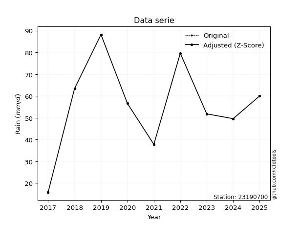</img>

</div>


> The initial value (value_initial) correspond to the initial obtained or null completed value, and value (value) is adjusted only when the initial value is outside the valid range (outlier) definite through the Z-Score value. If Z-Score is active, values out of range or outliers are replaced with the station mean value. A Z-Score (or standard score) measures how many standard deviations a data point is from the mean of a dataset, indicating its relative position; positive scores mean above the mean, negative mean below, and a score of zero is exactly at the mean, allowing for comparison of values from different distributions. It´s calculated using the formula $z=(x–μ)/σ$, where $x$ is the data point, $μ$ is the mean, and $σ$ is the standard deviation, helping identify outliers and understand probability.
>
> <sub>**Note**: In this study, "completing" (filling gaps in) and "extending" (forecasting or lengthening the historical record) rainfall data series are avoided for certain critical analyses because they introduce artificial bias and uncertainty, which can distort the statistics of rare events (extremes), alter day-to-day variability, and compromise the integrity and homogeneity of the original data. Some reasons against Completing/Extending rainfall data are: **Distortion of Extremes and Variability**: The primary issue is that most gap-filling or extension methods rely on averaging or regression with nearby stations, which inherently smooths the data. Rainfall is highly variable in space and time, with a large percentage of zero values and occasional large storms. Infilling methods often underestimate the highest values and overestimate the lowest (zero) values, which severely distorts analyses focused on flood frequency, drought severity, and intensity-duration-frequency (IDF) curves, **Loss of Data Homogeneity**: Infilled or extended data are synthetic estimates, not actual measurements. Combining these estimates with observed data can violate the assumption of data homogeneity, which requires that the data properties do not change over time. Inhomogeneity can lead to incorrect conclusions about long-term trends or changes in climate patterns, **Propagation of Errors**: Errors and biases from the original data (e.g., wind-induced undercatch, instrument errors, site changes) or the data used for imputation can propagate through the analysis, leading to unreliable hydrological models and inaccurate predictions, **Compromised Statistical Integrity**: For statistical analyses, especially those involving the frequency of events, using artificial data can introduce time bias or autocorrelation that doesn´t exist in reality, making it difficult to assess the true probability of events, **Difficulty in Validation**: It is difficult to accurately validate the quality of filled or extended data, especially for past periods where ground-truth measurements are unavailable. The reliability of imputation techniques heavily depends on the density of the surrounding station network and the complexity of the local topography.</sub>


### 4. Active continuous probability distributions from SciPy (80 of 104 available)

A Probability Density Function (PDF) describes the relative likelihood of a continuous random variable falling within a specific range, where the total area under its curve equals 1, and the area over any interval gives the actual probability for that range. Unlike discrete probabilities (like rolling a die), a PDF shows density, not direct probability for a single point (which is zero), with higher points indicating higher likelihood, often visualized as a bell curve for normal distributions.

A log of a probability density function (log-PDF) is simply the logarithm of the PDF´s value, denoted as $log(f(x))$, useful for converting multiplication of probabilities into addition, improving numerical stability with tiny numbers, and connecting to information theory concepts like entropy. Instead of dealing with very small probabilities (e.g., 0.000001), log-PDFs use negative numbers (e.g., $log(0.00001) ≈ -11.51$ that are easier for computers to handle, preventing underflow errors and simplifying complex calculations. In this study, each active probability distribution from SciPy is also evaluated in the $log$ form.

[scipy.stats](https://docs.scipy.org/doc/scipy/reference/stats.html) is a Python´s powerful submodule within the SciPy library for comprehensive statistical analysis, offering over 130 probability distributions (like Normal, Poisson, etc.), functions for descriptive stats (mean, variance), hypothesis testing (t-tests, chi-square), random variable generation, and statistical tests, making it essential for data science, modeling, and research. It provides tools to explore, model, and draw conclusions from data efficiently, working seamlessly with [NumPy](https://numpy.org/).

<div align="center">

|   id | p_dist           |   n_parameter | fit_method   | label                                                                       | active   | ref                                                                                                      |
|-----:|:-----------------|--------------:|:-------------|:----------------------------------------------------------------------------|:---------|:---------------------------------------------------------------------------------------------------------|
|    0 | alpha            |             3 | MLE          | Alpha                                                                       | True     | [:mortar_board:](https://docs.scipy.org/doc/scipy/reference/generated/scipy.stats.alpha.html)            |
|    1 | anglit           |             2 | MM           | Anglit                                                                      | True     | [:mortar_board:](https://docs.scipy.org/doc/scipy/reference/generated/scipy.stats.anglit.html)           |
|    2 | arcsine          |             2 | MM           | Arcsine                                                                     | True     | [:mortar_board:](https://docs.scipy.org/doc/scipy/reference/generated/scipy.stats.arcsine.html)          |
|    3 | argus            |             3 | MLE          | Argus                                                                       | True     | [:mortar_board:](https://docs.scipy.org/doc/scipy/reference/generated/scipy.stats.argus.html)            |
|    4 | beta             |             4 | MLE          | Beta                                                                        | True     | [:mortar_board:](https://docs.scipy.org/doc/scipy/reference/generated/scipy.stats.beta.html)             |
|    5 | betaprime        |             4 | MLE          | Beta prime                                                                  | True     | [:mortar_board:](https://docs.scipy.org/doc/scipy/reference/generated/scipy.stats.betaprime.html)        |
|    6 | bradford         |             3 | MLE          | Bradford                                                                    | True     | [:mortar_board:](https://docs.scipy.org/doc/scipy/reference/generated/scipy.stats.bradford.html)         |
|    7 | burr             |             4 | MLE          | Burr (Type III)                                                             | True     | [:mortar_board:](https://docs.scipy.org/doc/scipy/reference/generated/scipy.stats.burr.html)             |
|    8 | burr12           |             4 | MLE          | Burr (Type III) 12                                                          | True     | [:mortar_board:](https://docs.scipy.org/doc/scipy/reference/generated/scipy.stats.burr12.html)           |
|    9 | cosine           |             2 | MLE          | Cosine                                                                      | True     | [:mortar_board:](https://docs.scipy.org/doc/scipy/reference/generated/scipy.stats.cosine.html)           |
|   10 | crystalball      |             4 | MLE          | Crystalball                                                                 | True     | [:mortar_board:](https://docs.scipy.org/doc/scipy/reference/generated/scipy.stats.crystalball.html)      |
|   11 | dgamma           |             3 | MLE          | Double gamma                                                                | True     | [:mortar_board:](https://docs.scipy.org/doc/scipy/reference/generated/scipy.stats.dgamma.html)           |
|   12 | dweibull         |             3 | MLE          | Double Weibull                                                              | True     | [:mortar_board:](https://docs.scipy.org/doc/scipy/reference/generated/scipy.stats.dweibull.html)         |
|   13 | erlang           |             3 | MLE          | Erlang                                                                      | True     | [:mortar_board:](https://docs.scipy.org/doc/scipy/reference/generated/scipy.stats.erlang.html)           |
|   14 | exponnorm        |             3 | MLE          | Exponentially modified Normal                                               | True     | [:mortar_board:](https://docs.scipy.org/doc/scipy/reference/generated/scipy.stats.exponnorm.html)        |
|   15 | exponpow         |             3 | MLE          | Exponential power                                                           | True     | [:mortar_board:](https://docs.scipy.org/doc/scipy/reference/generated/scipy.stats.exponpow.html)         |
|   16 | exponweib        |             4 | MLE          | Exponentiated Weibull                                                       | True     | [:mortar_board:](https://docs.scipy.org/doc/scipy/reference/generated/scipy.stats.exponweib.html)        |
|   17 | f                |             4 | MLE          | F                                                                           | True     | [:mortar_board:](https://docs.scipy.org/doc/scipy/reference/generated/scipy.stats.f.html)                |
|   18 | fatiguelife      |             3 | MLE          | Fatigue-life (Birnbaum-Saunders)                                            | True     | [:mortar_board:](https://docs.scipy.org/doc/scipy/reference/generated/scipy.stats.fatiguelife.html)      |
|   19 | foldnorm         |             3 | MM           | Fold Normal                                                                 | True     | [:mortar_board:](https://docs.scipy.org/doc/scipy/reference/generated/scipy.stats.foldnorm.html)         |
|   20 | gamma            |             3 | MLE          | Gamma                                                                       | True     | [:mortar_board:](https://docs.scipy.org/doc/scipy/reference/generated/scipy.stats.gamma.html)            |
|   21 | gausshyper       |             6 | MLE          | Gauss hypergeometric                                                        | True     | [:mortar_board:](https://docs.scipy.org/doc/scipy/reference/generated/scipy.stats.gausshyper.html)       |
|   22 | genexpon         |             5 | MLE          | Generalized exponential                                                     | True     | [:mortar_board:](https://docs.scipy.org/doc/scipy/reference/generated/scipy.stats.genexpon.html)         |
|   23 | genextreme       |             3 | MLE          | Generalized exponential                                                     | True     | [:mortar_board:](https://docs.scipy.org/doc/scipy/reference/generated/scipy.stats.genextreme.html)       |
|   24 | gengamma         |             4 | MLE          | Generalized gamma                                                           | True     | [:mortar_board:](https://docs.scipy.org/doc/scipy/reference/generated/scipy.stats.gengamma.html)         |
|   25 | genhalflogistic  |             3 | MLE          | Generalized half-logistic                                                   | True     | [:mortar_board:](https://docs.scipy.org/doc/scipy/reference/generated/scipy.stats.genhalflogistic.html)  |
|   26 | genlogistic      |             3 | MLE          | Generalized logistic                                                        | True     | [:mortar_board:](https://docs.scipy.org/doc/scipy/reference/generated/scipy.stats.genlogistic.html)      |
|   27 | gennorm          |             3 | MLE          | Generalized Normal                                                          | True     | [:mortar_board:](https://docs.scipy.org/doc/scipy/reference/generated/scipy.stats.gennorm.html)          |
|   28 | genpareto        |             3 | MLE          | Generalized Pareto                                                          | True     | [:mortar_board:](https://docs.scipy.org/doc/scipy/reference/generated/scipy.stats.genpareto.html)        |
|   29 | gompertz         |             3 | MLE          | Gompertz (or truncated Gumbel)                                              | True     | [:mortar_board:](https://docs.scipy.org/doc/scipy/reference/generated/scipy.stats.gompertz.html)         |
|   30 | gumbel_l         |             2 | MM           | Gumbel Left Skew                                                            | True     | [:mortar_board:](https://docs.scipy.org/doc/scipy/reference/generated/scipy.stats.gumbel_l.html)         |
|   31 | gumbel_r         |             2 | MM           | Gumbel Right Skew                                                           | True     | [:mortar_board:](https://docs.scipy.org/doc/scipy/reference/generated/scipy.stats.gumbel_r.html)         |
|   32 | halfgennorm      |             3 | MLE          | Upper half of a generalized normal                                          | True     | [:mortar_board:](https://docs.scipy.org/doc/scipy/reference/generated/scipy.stats.halfgennorm.html)      |
|   33 | halflogistic     |             2 | MM           | Half-logistic                                                               | True     | [:mortar_board:](https://docs.scipy.org/doc/scipy/reference/generated/scipy.stats.halflogistic.html)     |
|   34 | halfnorm         |             2 | MM           | Half Normal                                                                 | True     | [:mortar_board:](https://docs.scipy.org/doc/scipy/reference/generated/scipy.stats.halfnorm.html)         |
|   35 | hypsecant        |             2 | MM           | hyperbolic secant                                                           | True     | [:mortar_board:](https://docs.scipy.org/doc/scipy/reference/generated/scipy.stats.hypsecant.html)        |
|   36 | invgamma         |             3 | MLE          | Inverted gamma                                                              | True     | [:mortar_board:](https://docs.scipy.org/doc/scipy/reference/generated/scipy.stats.invgamma.html)         |
|   37 | invgauss         |             3 | MLE          | Inverse Gaussian                                                            | True     | [:mortar_board:](https://docs.scipy.org/doc/scipy/reference/generated/scipy.stats.invgauss.html)         |
|   38 | invweibull       |             3 | MLE          | Inverted Weibull                                                            | True     | [:mortar_board:](https://docs.scipy.org/doc/scipy/reference/generated/scipy.stats.invweibull.html)       |
|   39 | johnsonsb        |             4 | MLE          | Johnson SB                                                                  | True     | [:mortar_board:](https://docs.scipy.org/doc/scipy/reference/generated/scipy.stats.johnsonsb.html)        |
|   40 | johnsonsu        |             4 | MLE          | Johnson Su                                                                  | True     | [:mortar_board:](https://docs.scipy.org/doc/scipy/reference/generated/scipy.stats.johnsonsu.html)        |
|   41 | kappa3           |             3 | MLE          | Kappa 3                                                                     | True     | [:mortar_board:](https://docs.scipy.org/doc/scipy/reference/generated/scipy.stats.kappa3.html)           |
|   42 | kappa4           |             4 | MLE          | Kappa 4                                                                     | True     | [:mortar_board:](https://docs.scipy.org/doc/scipy/reference/generated/scipy.stats.kappa4.html)           |
|   43 | ksone            |             3 | MLE          | Kolmogorov-Smirnov one-sided test statistic distribution                    | True     | [:mortar_board:](https://docs.scipy.org/doc/scipy/reference/generated/scipy.stats.ksone.html)            |
|   44 | kstwobign        |             2 | MLE          | Limiting distribution of scaled Kolmogorov-Smirnov two-sided test statistic | True     | [:mortar_board:](https://docs.scipy.org/doc/scipy/reference/generated/scipy.stats.kstwobign.html)        |
|   45 | laplace          |             2 | MM           | Laplace                                                                     | True     | [:mortar_board:](https://docs.scipy.org/doc/scipy/reference/generated/scipy.stats.laplace.html)          |
|   46 | levy_l           |             2 | MLE          | Left-skewed Levy                                                            | True     | [:mortar_board:](https://docs.scipy.org/doc/scipy/reference/generated/scipy.stats.levy_l.html)           |
|   47 | loggamma         |             3 | MLE          | Log gamma                                                                   | True     | [:mortar_board:](https://docs.scipy.org/doc/scipy/reference/generated/scipy.stats.loggamma.html)         |
|   48 | logistic         |             2 | MM           | Logistic (or Sech-squared)                                                  | True     | [:mortar_board:](https://docs.scipy.org/doc/scipy/reference/generated/scipy.stats.logistic.html)         |
|   49 | loglaplace       |             3 | MLE          | Log-Laplace                                                                 | True     | [:mortar_board:](https://docs.scipy.org/doc/scipy/reference/generated/scipy.stats.loglaplace.html)       |
|   50 | lomax            |             3 | MLE          | Lomax (Pareto of the second kind)                                           | True     | [:mortar_board:](https://docs.scipy.org/doc/scipy/reference/generated/scipy.stats.lomax.html)            |
|   51 | maxwell          |             2 | MM           | Maxwell                                                                     | True     | [:mortar_board:](https://docs.scipy.org/doc/scipy/reference/generated/scipy.stats.maxwell.html)          |
|   52 | mielke           |             4 | MLE          | Mielke Beta-Kappa / Dagum                                                   | True     | [:mortar_board:](https://docs.scipy.org/doc/scipy/reference/generated/scipy.stats.mielke.html)           |
|   53 | moyal            |             2 | MM           | Moyal                                                                       | True     | [:mortar_board:](https://docs.scipy.org/doc/scipy/reference/generated/scipy.stats.moyal.html)            |
|   54 | nakagami         |             3 | MLE          | Nakagami                                                                    | True     | [:mortar_board:](https://docs.scipy.org/doc/scipy/reference/generated/scipy.stats.nakagami.html)         |
|   55 | ncf              |             5 | MLE          | Non-central F distribution                                                  | True     | [:mortar_board:](https://docs.scipy.org/doc/scipy/reference/generated/scipy.stats.ncf.html)              |
|   56 | nct              |             4 | MLE          | Non-central Student’s t                                                     | True     | [:mortar_board:](https://docs.scipy.org/doc/scipy/reference/generated/scipy.stats.nct.html)              |
|   57 | norm             |             2 | MM           | Normal                                                                      | True     | [:mortar_board:](https://docs.scipy.org/doc/scipy/reference/generated/scipy.stats.norm.html)             |
|   58 | pearson3         |             3 | MM           | Pearson type III                                                            | True     | [:mortar_board:](https://docs.scipy.org/doc/scipy/reference/generated/scipy.stats.pearson3.html)         |
|   59 | powerlaw         |             3 | MLE          | Power-function                                                              | True     | [:mortar_board:](https://docs.scipy.org/doc/scipy/reference/generated/scipy.stats.powerlaw.html)         |
|   60 | rayleigh         |             2 | MM           | Rayleigh                                                                    | True     | [:mortar_board:](https://docs.scipy.org/doc/scipy/reference/generated/scipy.stats.rayleigh.html)         |
|   61 | rdist            |             3 | MLE          | R-distributed (symmetric beta)                                              | True     | [:mortar_board:](https://docs.scipy.org/doc/scipy/reference/generated/scipy.stats.rdist.html)            |
|   62 | rice             |             3 | MLE          | Rice                                                                        | True     | [:mortar_board:](https://docs.scipy.org/doc/scipy/reference/generated/scipy.stats.rice.html)             |
|   63 | semicircular     |             2 | MM           | Semicircular                                                                | True     | [:mortar_board:](https://docs.scipy.org/doc/scipy/reference/generated/scipy.stats.semicircular.html)     |
|   64 | skewnorm         |             3 | MLE          | Skew normal                                                                 | True     | [:mortar_board:](https://docs.scipy.org/doc/scipy/reference/generated/scipy.stats.skewnorm.html)         |
|   65 | t                |             3 | MLE          | Student’s t                                                                 | True     | [:mortar_board:](https://docs.scipy.org/doc/scipy/reference/generated/scipy.stats.t.html)                |
|   66 | trapezoid        |             4 | MLE          | Trapezoid                                                                   | True     | [:mortar_board:](https://docs.scipy.org/doc/scipy/reference/generated/scipy.stats.trapezoid.html)        |
|   67 | triang           |             3 | MLE          | Triangular                                                                  | True     | [:mortar_board:](https://docs.scipy.org/doc/scipy/reference/generated/scipy.stats.triang.html)           |
|   68 | truncexpon       |             3 | MLE          | Truncated exponential                                                       | True     | [:mortar_board:](https://docs.scipy.org/doc/scipy/reference/generated/scipy.stats.truncexpon.html)       |
|   69 | truncnorm        |             4 | MLE          | Truncated normal                                                            | True     | [:mortar_board:](https://docs.scipy.org/doc/scipy/reference/generated/scipy.stats.truncnorm.html)        |
|   70 | truncpareto      |             4 | MLE          | Upper truncated Pareto                                                      | True     | [:mortar_board:](https://docs.scipy.org/doc/scipy/reference/generated/scipy.stats.truncpareto.html)      |
|   71 | truncweibull_min |             5 | MLE          | Doubly truncated Weibull minimum                                            | True     | [:mortar_board:](https://docs.scipy.org/doc/scipy/reference/generated/scipy.stats.truncweibull_min.html) |
|   72 | tukeylambda      |             3 | MLE          | Tukey-Lamdba                                                                | True     | [:mortar_board:](https://docs.scipy.org/doc/scipy/reference/generated/scipy.stats.tukeylambda.html)      |
|   73 | uniform          |             2 | MLE          | Uniform                                                                     | True     | [:mortar_board:](https://docs.scipy.org/doc/scipy/reference/generated/scipy.stats.uniform.html)          |
|   74 | vonmises         |             3 | MLE          | Von Mises                                                                   | True     | [:mortar_board:](https://docs.scipy.org/doc/scipy/reference/generated/scipy.stats.vonmises.html)         |
|   75 | vonmises_line    |             3 | MLE          | Von Mises line                                                              | True     | [:mortar_board:](https://docs.scipy.org/doc/scipy/reference/generated/scipy.stats.vonmises_line.html)    |
|   76 | wald             |             2 | MM           | Wald                                                                        | True     | [:mortar_board:](https://docs.scipy.org/doc/scipy/reference/generated/scipy.stats.wald.html)             |
|   77 | weibull_max      |             3 | MLE          | Weibull maximum                                                             | True     | [:mortar_board:](https://docs.scipy.org/doc/scipy/reference/generated/scipy.stats.weibull_max.html)      |
|   78 | weibull_min      |             3 | MLE          | Weibull minimum                                                             | True     | [:mortar_board:](https://docs.scipy.org/doc/scipy/reference/generated/scipy.stats.weibull_min.html)      |
|   79 | wrapcauchy       |             3 | MLE          | Wrapped  Cauchy                                                             | True     | [:mortar_board:](https://docs.scipy.org/doc/scipy/reference/generated/scipy.stats.wrapcauchy.html)       |

</div>

> **n_parameter:** # arguments & localization & scale.
>
> **Fit methods:** (MLE) maximum likelihood, (MM) L-moments.
>
>**Inactive** (With the only purpose of prevent loops, zero divisions, infinite values, over high estimated values or horizontal trending for recurrence intervals estimations, the follow distributions were disabled.)**:** lognorm, norminvgauss, powernorm, powerlognorm, cauchy, halfcauchy, foldcauchy, skewcauchy, chi2, expon, fisk, genhyperbolic, geninvgauss, gibrat, kstwo, laplace_asymmetric, levy, levy_stable, ncx2, pareto, rel_breitwigner, recipinvgauss, studentized_range, loguniform, 


## B. Probability (PDF) vs. Empirical (EDF) distributions functions

A continuous probability distribution (CPD) describes probabilities for variables that can take any value within a range (like rain any time), unlike discrete variables with specific outcomes (like temperature). It uses a Probability Density Function (PDF), a curve where the total area under it equals 1, and the probability of the variable falling within an interval (a to b) is found by calculating the area under the curve between those points. A key feature is that the probability of hitting any single exact value is zero, so probabilities are always expressed for ranges, e.g., $P(a ≤ X ≤ b)$.

<div align="center">

Distributions parameters from station values
|     |   station | p_dist              |   n |             loc |            scale | shape                  | shape1                 | shape2                | shape3             |
|----:|----------:|:--------------------|----:|----------------:|-----------------:|:-----------------------|:-----------------------|:----------------------|:-------------------|
|   0 |  23190700 | alpha               |   9 |  -289.72        |   5705.33        | 16.59690552872684      |                        |                       |                    |
|   1 |  23190700 | anglit              |   9 |    55.8667      |     59.0792      |                        |                        |                       |                    |
|   2 |  23190700 | arcsine             |   9 |    27.3062      |     57.1209      |                        |                        |                       |                    |
|   3 |  23190700 | argus               |   9 |     4.69527     |     86.8689      | 0.17445049665208961    |                        |                       |                    |
|   4 |  23190700 | beta                |   9 |    15.8         |     72.5704      | 0.7421957944753339     | 0.7314246298588314     |                       |                    |
|   5 |  23190700 | betaprime           |   9 |   -79.8758      | 114740           | 40.42911964276489      | 34261.39717593253      |                       |                    |
|   6 |  23190700 | bradford            |   9 |    15.7871      |     73.4603      | 3.5507972653845213e-06 |                        |                       |                    |
|   7 |  23190700 | burr                |   9 |    -0.168334    |     75.963       | 9.383062039443928      | 0.24753180227916374    |                       |                    |
|   8 |  23190700 | burr12              |   9 |    -2.23027     |     17.8688      | 437.72626058269594     | 0.0020830736421990886  |                       |                    |
|   9 |  23190700 | cosine              |   9 |    54.6512      |     17.6038      |                        |                        |                       |                    |
|  10 |  23190700 | crystalball         |   9 |    55.8667      |     20.1953      | 8711.479060374382      | 15110.762780510608     |                       |                    |
|  11 |  23190700 | dgamma              |   9 |    56.6         |     15.6119      | 0.9627628924688109     |                        |                       |                    |
|  12 |  23190700 | dweibull            |   9 |    56.6         |     14.8858      | 0.9503280768583033     |                        |                       |                    |
|  13 |  23190700 | erlang              |   9 |  -312.589       |      1.13058     | 325.81641466327176     |                        |                       |                    |
|  14 |  23190700 | exponnorm           |   9 |    55.8514      |     20.1953      | 0.0007486019307720829  |                        |                       |                    |
|  15 |  23190700 | exponpow            |   9 |    15.8         |      2.29688     | 0.10978090824254425    |                        |                       |                    |
|  16 |  23190700 | exponweib           |   9 |  -737.457       |    600.374       | 385.1802439531766      | 6.674620607175189      |                       |                    |
|  17 |  23190700 | f                   |   9 | -6041.3         |   6097.14        | 224391.03452929633     | 960690.7487467956      |                       |                    |
|  18 |  23190700 | fatiguelife         |   9 |    15.8         |      0.00128258  | 148.4562688688863      |                        |                       |                    |
|  19 |  23190700 | foldnorm            |   9 |     9.60312     |     19.7239      | 2.3482327784394146     |                        |                       |                    |
|  20 |  23190700 | gamma               |   9 |  -293.345       |      1.20078     | 290.75222749119337     |                        |                       |                    |
|  21 |  23190700 | gausshyper          |   9 |     9.91833     |     78.2817      | 1.252387330375167      | 0.8631178515742894     | 0.9399680176271257    | 0.8079379960544171 |
|  22 |  23190700 | genexpon            |   9 |    15.8         |      2.29941     | 0.05741281632876051    | 1.2681558010617746e-06 | 0.6548199775078549    |                    |
|  23 |  23190700 | genextreme          |   9 |    50.6024      |     21.7111      | 0.46679475999033604    |                        |                       |                    |
|  24 |  23190700 | gengamma            |   9 |    15.8         |      0.280119    | 1.6048522287551066     | 0.18845503775270328    |                       |                    |
|  25 |  23190700 | genhalflogistic     |   9 |     8.62931     |     83.3885      | 1.0479801070523682     |                        |                       |                    |
|  26 |  23190700 | genlogistic         |   9 |    60.7848      |     10.2379      | 0.7628938063381895     |                        |                       |                    |
|  27 |  23190700 | gennorm             |   9 |    56.6         |     17.3765      | 1.1109665881567743     |                        |                       |                    |
|  28 |  23190700 | genpareto           |   9 |    -0.084008    |    163.267       | -1.849339124888762     |                        |                       |                    |
|  29 |  23190700 | gompertz            |   9 |   -34.0626      |     18.2104      | 0.0042105976383024196  |                        |                       |                    |
|  30 |  23190700 | gumbel_l            |   9 |    64.9556      |     15.7462      |                        |                        |                       |                    |
|  31 |  23190700 | gumbel_r            |   9 |    46.7777      |     15.7462      |                        |                        |                       |                    |
|  32 |  23190700 | halfgennorm         |   9 |    15.8         |      1.10507     | 0.33512790580554697    |                        |                       |                    |
|  33 |  23190700 | halflogistic        |   9 |    31.9306      |     17.2662      |                        |                        |                       |                    |
|  34 |  23190700 | halfnorm            |   9 |    29.136       |     33.5019      |                        |                        |                       |                    |
|  35 |  23190700 | hypsecant           |   9 |    55.8667      |     12.8567      |                        |                        |                       |                    |
|  36 |  23190700 | invgamma            |   9 |  -254.551       |  69507.9         | 225.10586869163552     |                        |                       |                    |
|  37 |  23190700 | invgauss            |   9 |   -69.9475      |   3959.83        | 0.031711164617902944   |                        |                       |                    |
|  38 |  23190700 | invweibull          |   9 |    15.8         |      1.87455     | 0.05295845067186211    |                        |                       |                    |
|  39 |  23190700 | johnsonsb           |   9 |    15.417       |     72.783       | -0.27311836851844296   | 0.14776622611408774    |                       |                    |
|  40 |  23190700 | johnsonsu           |   9 |   194.132       |     41.4997      | 13.68654676904686      | 7.169577513646983      |                       |                    |
|  41 |  23190700 | kappa3              |   9 |    15.7998      |     72.3732      | 4352.9689024980835     |                        |                       |                    |
|  42 |  23190700 | kappa4              |   9 |     8.69595     |     81.3491      | 1.0957633377385534     | 1.0168587453615527     |                       |                    |
|  43 |  23190700 | ksone               |   9 |     8.56        |     86.88        | 1.0                    |                        |                       |                    |
|  44 |  23190700 | kstwobign           |   9 |   -29.5431      |     97.9147      |                        |                        |                       |                    |
|  45 |  23190700 | laplace             |   9 |    55.8667      |     14.2802      |                        |                        |                       |                    |
|  46 |  23190700 | levy_l              |   9 |    91.3822      |     15.6097      |                        |                        |                       |                    |
|  47 |  23190700 | loggamma            |   9 |   -40.1381      |     51.4749      | 6.950016288321688      |                        |                       |                    |
|  48 |  23190700 | logistic            |   9 |    55.8667      |     11.1342      |                        |                        |                       |                    |
|  49 |  23190700 | loglaplace          |   9 |    -0.172649    |     56.7726      | 3.284206088701829      |                        |                       |                    |
|  50 |  23190700 | lomax               |   9 |    15.7833      |  21292.8         | 529.466119216901       |                        |                       |                    |
|  51 |  23190700 | maxwell             |   9 |     8.01236     |     29.9882      |                        |                        |                       |                    |
|  52 |  23190700 | mielke              |   9 |    -0.324069    |     76.0468      | 2.334545358396868      | 9.381239612049267      |                       |                    |
|  53 |  23190700 | moyal               |   9 |    44.3177      |      9.09107     |                        |                        |                       |                    |
|  54 |  23190700 | nakagami            |   9 |    37.8         |     19.8866      | 0.14902709893250182    |                        |                       |                    |
|  55 |  23190700 | ncf                 |   9 |    -0.0223474   |      1.62976e-05 | 1.9713087281034274e-06 | 13.896668874609084     | 5.7931293401970665    |                    |
|  56 |  23190700 | nct                 |   9 |  -848.332       |     20.1689      | 311529.5812879228      | 44.83126415192001      |                       |                    |
|  57 |  23190700 | norm                |   9 |    55.8667      |     20.1953      |                        |                        |                       |                    |
|  58 |  23190700 | pearson3            |   9 |    55.8667      |     20.1953      | -0.30838880369600424   |                        |                       |                    |
|  59 |  23190700 | powerlaw            |   9 |    15.8         |     72.4         | 0.21171067121090614    |                        |                       |                    |
|  60 |  23190700 | rayleigh            |   9 |    17.2319      |     30.8261      |                        |                        |                       |                    |
|  61 |  23190700 | rdist               |   9 |     9.51452     |     42.2855      | 1.0515490735430029     |                        |                       |                    |
|  62 |  23190700 | rice                |   9 |     3.4403      |     21.7429      | 2.1625374528805583     |                        |                       |                    |
|  63 |  23190700 | semicircular        |   9 |    55.8667      |     40.3905      |                        |                        |                       |                    |
|  64 |  23190700 | skewnorm            |   9 |    74.6293      |     27.566       | -1.632571578950142     |                        |                       |                    |
|  65 |  23190700 | t                   |   9 |    55.8671      |     20.1942      | 17308.522792763728     |                        |                       |                    |
|  66 |  23190700 | trapezoid           |   9 |     8.56        |     86.88        | 1.0                    | 1.0                    |                       |                    |
|  67 |  23190700 | triang              |   9 |     0.500236    |     87.7002      | 0.9999999999959606     |                        |                       |                    |
|  68 |  23190700 | truncexpon          |   9 |    15.8         |    120.513       | 0.6007647057198596     |                        |                       |                    |
|  69 |  23190700 | truncnorm           |   9 |    55.8667      |     20.1953      | -294.18937514443553    | 1281.7108000057735     |                       |                    |
|  70 |  23190700 | truncpareto         |   9 |    15.7947      |      0.00530041  | 0.1251494045741289     | 13660.309067073555     |                       |                    |
|  71 |  23190700 | truncweibull_min    |   9 |    10.7208      |    136.114       | 1.5224428872555635     | 0.00037601822594496065 | 0.5692239605048148    |                    |
|  72 |  23190700 | tukeylambda         |   9 |    51.9993      |     42.9085      | 1.1852962561742997     |                        |                       |                    |
|  73 |  23190700 | uniform             |   9 |    15.8         |     72.4         |                        |                        |                       |                    |
|  74 |  23190700 | vonmises            |   9 |     0.0164346   |      1           | 0.5030984793343767     |                        |                       |                    |
|  75 |  23190700 | vonmises_line       |   9 |    52           |     11.5229      | 0.9534871602925785     |                        |                       |                    |
|  76 |  23190700 | wald                |   9 |    35.6715      |     20.1952      |                        |                        |                       |                    |
|  77 |  23190700 | weibull_max         |   9 |    88.2         |      1.50572     | 0.2966489803877508     |                        |                       |                    |
|  78 |  23190700 | weibull_min         |   9 |   -32.3649      |     96.0898      | 5.071157622705805      |                        |                       |                    |
|  79 |  23190700 | wrapcauchy          |   9 |    15.6411      |     11.5481      | 2.2709849051155265e-06 |                        |                       |                    |
|  80 |  23190700 | logalpha            |   9 |   -11.05        |    448.53        | 30.01073484927319      |                        |                       |                    |
|  81 |  23190700 | loganglit           |   9 |     3.93113     |      1.39504     |                        |                        |                       |                    |
|  82 |  23190700 | logarcsine          |   9 |     3.25673     |      1.3488      |                        |                        |                       |                    |
|  83 |  23190700 | logargus            |   9 |     2.20338     |      2.31142     | 2.3963362322036845     |                        |                       |                    |
|  84 |  23190700 | logbeta             |   9 |     2.42107     |      2.05854     | 2.185802232225405      | 0.5023423078268026     |                       |                    |
|  85 |  23190700 | logbetaprime        |   9 |   -23.3719      |     18.6067      | 7887.370219957775      | 5376.40855001948       |                       |                    |
|  86 |  23190700 | logbradford         |   9 |     2.75971     |      1.75533     | 1.634586787643155e-05  |                        |                       |                    |
|  87 |  23190700 | logburr             |   9 |    -3.1839      |      7.67216     | 2780.9405622325776     | 0.004621855107363732   |                       |                    |
|  88 |  23190700 | logburr12           |   9 |  -259.702       |    267.356       | 871.066888909475       | 100558.02336709428     |                       |                    |
|  89 |  23190700 | logcosine           |   9 |     3.82627     |      0.445779    |                        |                        |                       |                    |
|  90 |  23190700 | logcrystalball      |   9 |     3.93113     |      0.476884    | 6.92116773387979       | 10.300576288827848     |                       |                    |
|  91 |  23190700 | logdgamma           |   9 |     4.03601     |      0.34086     | 0.847000461170506      |                        |                       |                    |
|  92 |  23190700 | logdweibull         |   9 |     4.03601     |      0.383149    | 0.6632331457368373     |                        |                       |                    |
|  93 |  23190700 | logerlang           |   9 |    -4.86099     |      0.029673    | 296.4977363458488      |                        |                       |                    |
|  94 |  23190700 | logexponnorm        |   9 |     3.9308      |      0.476886    | 0.0006724786380286213  |                        |                       |                    |
|  95 |  23190700 | logexponpow         |   9 |     2.76001     |      1.46296     | 0.8003760354654361     |                        |                       |                    |
|  96 |  23190700 | logexponweib        |   9 |    -3.02108     |      7.42392     | 0.23013480879989495    | 61.827011590659        |                       |                    |
|  97 |  23190700 | logf                |   9 |  -880.236       |    884.168       | 21797117.04414682      | 9947822.340653393      |                       |                    |
|  98 |  23190700 | logfatiguelife      |   9 |  -393.031       |    396.962       | 0.001197259328186844   |                        |                       |                    |
|  99 |  23190700 | logfoldnorm         |   9 |     3.22001     |      0.523063    | 1.2654978662240581     |                        |                       |                    |
| 100 |  23190700 | loggamma            |   9 |    -4.81685     |      0.0294308   | 297.32815150034696     |                        |                       |                    |
| 101 |  23190700 | loggausshyper       |   9 |     2.10188     |      2.37772     | 1.5483107807529302     | 0.7583842490455164     | -1.7922124511877664   | 2.0509392464466973 |
| 102 |  23190700 | loggenexpon         |   9 |     2.75997     |      0.00558873  | 0.0011375742042408275  | 3.148484839754124      | 9.415794418994967e-06 |                    |
| 103 |  23190700 | loggenextreme       |   9 |     3.90437     |      0.620587    | 1.0788439581603249     |                        |                       |                    |
| 104 |  23190700 | loggengamma         |   9 |     2.76001     |      2.42867     | 0.17500806816769557    | 2.9792980797030655     |                       |                    |
| 105 |  23190700 | loggenhalflogistic  |   9 |     2.71036     |      1.87225     | 1.058219509077242      |                        |                       |                    |
| 106 |  23190700 | loggenlogistic      |   9 |     4.32903     |      0.106566    | 0.24614516048809457    |                        |                       |                    |
| 107 |  23190700 | loggennorm          |   9 |     4.03601     |      2.583e-08   | 0.13354270845522342    |                        |                       |                    |
| 108 |  23190700 | loggenpareto        |   9 |    -0.00673879  |     13.4026      | -2.9874289410603594    |                        |                       |                    |
| 109 |  23190700 | loggompertz         |   9 |     2.76        |      0.341869    | 0.01857192290194705    |                        |                       |                    |
| 110 |  23190700 | loggumbel_l         |   9 |     4.14575     |      0.371825    |                        |                        |                       |                    |
| 111 |  23190700 | loggumbel_r         |   9 |     3.7165      |      0.371825    |                        |                        |                       |                    |
| 112 |  23190700 | loghalfgennorm      |   9 |     2.7599      |      1.72004     | 45190.00843519933      |                        |                       |                    |
| 113 |  23190700 | loghalflogistic     |   9 |     3.36585     |      0.407762    |                        |                        |                       |                    |
| 114 |  23190700 | loghalfnorm         |   9 |     3.29989     |      0.79113     |                        |                        |                       |                    |
| 115 |  23190700 | loghypsecant        |   9 |     3.93113     |      0.303594    |                        |                        |                       |                    |
| 116 |  23190700 | loginvgamma         |   9 |    -7.15073     |   5297.13        | 479.2552440918141      |                        |                       |                    |
| 117 |  23190700 | loginvgauss         |   9 |    -1.6046      |    600.912       | 0.009195025647185877   |                        |                       |                    |
| 118 |  23190700 | loginvweibull       |   9 |    -3.26782e+07 |      3.26782e+07 | 55623704.6883868       |                        |                       |                    |
| 119 |  23190700 | logjohnsonsb        |   9 |     2.75946     |      1.72015     | -0.3637880425041393    | 0.15875989355703196    |                       |                    |
| 120 |  23190700 | logjohnsonsu        |   9 |     4.68781     |      0.0196562   | 6.837387701806573      | 1.6426180711651375     |                       |                    |
| 121 |  23190700 | logkappa3           |   9 |     2.76001     |      1.68419     | 99.65430998124751      |                        |                       |                    |
| 122 |  23190700 | logkappa4           |   9 |     2.67506     |      1.95074     | 1.0455993080149248     | 1.0653527958575717     |                       |                    |
| 123 |  23190700 | logksone            |   9 |     2.58805     |      2.06352     | 1.0                    |                        |                       |                    |
| 124 |  23190700 | logkstwobign        |   9 |     1.50985     |      2.77745     |                        |                        |                       |                    |
| 125 |  23190700 | loglaplace          |   9 |     3.93113     |      0.337208    |                        |                        |                       |                    |
| 126 |  23190700 | loglevy_l           |   9 |     4.5248      |      0.219724    |                        |                        |                       |                    |
| 127 |  23190700 | logloggamma         |   9 |     4.3997      |      0.153398    | 0.34116364815647965    |                        |                       |                    |
| 128 |  23190700 | loglogistic         |   9 |     3.93113     |      0.26292     |                        |                        |                       |                    |
| 129 |  23190700 | logloglaplace       |   9 |    -0.122588    |      4.1586      | 12.126069818388025     |                        |                       |                    |
| 130 |  23190700 | loglomax            |   9 |     2.76001     |     21.1821      | 18.1114848631492       |                        |                       |                    |
| 131 |  23190700 | logmaxwell          |   9 |     2.80112     |      0.708125    |                        |                        |                       |                    |
| 132 |  23190700 | logmielke           |   9 |    -1.79781e+07 |      1.79781e+07 | 31935668.400242366     | 2643136913.9617624     |                       |                    |
| 133 |  23190700 | logmoyal            |   9 |     3.65841     |      0.214673    |                        |                        |                       |                    |
| 134 |  23190700 | lognakagami         |   9 |     3.58021     |      0.53768     | 0.8527218249668487     |                        |                       |                    |
| 135 |  23190700 | logncf              |   9 |    -4.38726     |      8.30989     | 682.2178745240501      | 1738.3518930377913     | 0.2098600271129734    |                    |
| 136 |  23190700 | lognct              |   9 |   -23.581       |      0.389623    | 4406.39157463968       | 70.59962252939201      |                       |                    |
| 137 |  23190700 | lognorm             |   9 |     3.93113     |      0.476884    |                        |                        |                       |                    |
| 138 |  23190700 | logpearson3         |   9 |     3.93113     |      0.476884    | -1.3967100081132475    |                        |                       |                    |
| 139 |  23190700 | logpowerlaw         |   9 |     2.76001     |      1.7196      | 0.23575059783706107    |                        |                       |                    |
| 140 |  23190700 | lograyleigh         |   9 |     3.01881     |      0.727925    |                        |                        |                       |                    |
| 141 |  23190700 | logrdist            |   9 |     3.74828     |      0.98827     | 1.0465875046835316     |                        |                       |                    |
| 142 |  23190700 | logrice             |   9 | -1017.38        |      0.477108    | 2140.6327992800034     |                        |                       |                    |
| 143 |  23190700 | logsemicircular     |   9 |     3.93113     |      0.95379     |                        |                        |                       |                    |
| 144 |  23190700 | logskewnorm         |   9 |     4.47961     |      0.726864    | -23033507.053978622    |                        |                       |                    |
| 145 |  23190700 | logt                |   9 |     4.04746     |      0.221008    | 1.7038594853126885     |                        |                       |                    |
| 146 |  23190700 | logtrapezoid        |   9 |     2.58229     |      2.02325     | 1.0                    | 1.0                    |                       |                    |
| 147 |  23190700 | logtriang           |   9 |     2.50301     |      1.97661     | 0.9999999946286924     |                        |                       |                    |
| 148 |  23190700 | logtruncexpon       |   9 |     2.75741     |      2.391       | 0.720282523562308      |                        |                       |                    |
| 149 |  23190700 | logtruncnorm        |   9 |    -0.162839    |      1.37126     | 2.767645090236229      | 3.3855447285195375     |                       |                    |
| 150 |  23190700 | logtruncpareto      |   9 |     2.75985     |      0.000161194 | 0.12514315864179987    | 10668.90246313471      |                       |                    |
| 151 |  23190700 | logtruncweibull_min |   9 |     0.760049    |      5.92105     | 5.870422607341444      | 0.02196622617647927    | 0.6281925577245531    |                    |
| 152 |  23190700 | logtukeylambda      |   9 |     3.61981     |      0.961735    | 1.1185577812848044     |                        |                       |                    |
| 153 |  23190700 | loguniform          |   9 |     2.76001     |      1.7196      |                        |                        |                       |                    |
| 154 |  23190700 | logvonmises         |   9 |    -2.326       |      1           | 5.095994533496106      |                        |                       |                    |
| 155 |  23190700 | logvonmises_line    |   9 |     4.01901     |      0.400751    | 1.5515465261503065     |                        |                       |                    |
| 156 |  23190700 | logwald             |   9 |     3.45426     |      0.476868    |                        |                        |                       |                    |
| 157 |  23190700 | logweibull_max      |   9 |     4.47961     |      0.457631    | 0.6213741745851378     |                        |                       |                    |
| 158 |  23190700 | logweibull_min      |   9 |    -2.25242e+07 |      2.25242e+07 | 69581401.49616033      |                        |                       |                    |
| 159 |  23190700 | logwrapcauchy       |   9 |     2.76001     |      0.273682    | 0.5                    |                        |                       |                    |

</div>

> **loc** (Location parameter): This shifts the distribution along the x-axis. For many common distributions, like the normal (Gaussian) distribution, loc represents the mean $μ$. For others, like the uniform distribution, it might represent the minimum value, or for the beta distribution, the left end of the support interval.
>
> **scale** (Scale parameter): This determines the width or spread of the distribution. For the normal distribution, scale represents the standard deviation $σ$. For a uniform distribution, it defines the length of the interval (from $loc$ to $loc + scale$).
>
> **shape** (Shape parameters): Refers to parameters that define the specific form of a probability distribution, distinct from its location (loc) and scale (scale). These parameters are required arguments for most distribution functions. For example, a normal (Gaussian) distribution is fully defined by its location (mean) and scale (standard deviation), so it has no specific shape parameters beyond loc and scale. However, other distributions have intrinsic properties that need specification, as Gamma distribution that takes a shape parameter, often named $a$ or $alpha$.


### 0. Cumulative distribution values - CDF (160 evaluated)

Cumulative Distribution Function (CDF), denoted as $F$<sub>$X$</sub>$(x)$, is a function that gives the probability that a random variable $X$ will take a value less than or equal to a specific value, $x$ (i.e., $(P(X≥x)$. It essentially "accumulates" probabilities from a given point up to the far right (positive infinity), providing a complete picture of the distribution´s probabilities for both discrete (like rain) and continuous (like temperature) variables, helping to find probabilities over ranges or above certain values. Each station is evaluated separately ordering the $x$ values ascending, calculating the CDF and PDF values for the activated distributions and their logarithmic forms.

<div align="center">

CDF ordered by x ascending and calculating $log(f(x))$ separately
|   id |   Station |   date |    x |   count |    mean |     std |     zscore |   Value_initial |   station |   m |     alpha |   alpha_pdf |    anglit |   anglit_pdf |   arcsine |   arcsine_pdf |     argus |   argus_pdf |        beta |    beta_pdf |   betaprime |   betaprime_pdf |    bradford |   bradford_pdf |      burr |   burr_pdf |     burr12 |   burr12_pdf |    cosine |   cosine_pdf |   crystalball |   crystalball_pdf |    dgamma |   dgamma_pdf |   dweibull |   dweibull_pdf |    erlang |   erlang_pdf |   exponnorm |   exponnorm_pdf |   exponpow |   exponpow_pdf |   exponweib |   exponweib_pdf |         f |      f_pdf |   fatiguelife |   fatiguelife_pdf |   foldnorm |   foldnorm_pdf |     gamma |   gamma_pdf |   gausshyper |   gausshyper_pdf |    genexpon |   genexpon_pdf |   genextreme |   genextreme_pdf |    gengamma |   gengamma_pdf |   genhalflogistic |   genhalflogistic_pdf |   genlogistic |   genlogistic_pdf |   gennorm |   gennorm_pdf |   genpareto |   genpareto_pdf |   gompertz |   gompertz_pdf |   gumbel_l |   gumbel_l_pdf |    gumbel_r |   gumbel_r_pdf |   halfgennorm |   halfgennorm_pdf |   halflogistic |   halflogistic_pdf |   halfnorm |   halfnorm_pdf |   hypsecant |   hypsecant_pdf |   invgamma |   invgamma_pdf |   invgauss |   invgauss_pdf |   invweibull |   invweibull_pdf |   johnsonsb |   johnsonsb_pdf |   johnsonsu |   johnsonsu_pdf |      kappa3 |   kappa3_pdf |      kappa4 |   kappa4_pdf |     ksone |   ksone_pdf |   kstwobign |   kstwobign_pdf |   laplace |   laplace_pdf |   levy_l |   levy_l_pdf |   loggamma |   loggamma_pdf |   logistic |   logistic_pdf |   loglaplace |   loglaplace_pdf |       lomax |   lomax_pdf |    maxwell |   maxwell_pdf |    mielke |   mielke_pdf |       moyal |   moyal_pdf |    nakagami |   nakagami_pdf |      ncf |    ncf_pdf |       nct |    nct_pdf |     norm |   norm_pdf |   pearson3 |   pearson3_pdf |    powerlaw |   powerlaw_pdf |   rayleigh |   rayleigh_pdf |    rdist |       rdist_pdf |      rice |   rice_pdf |   semicircular |   semicircular_pdf |   skewnorm |   skewnorm_pdf |         t |      t_pdf |   trapezoid |   trapezoid_pdf |    triang |   triang_pdf |   truncexpon |   truncexpon_pdf |   truncnorm |   truncnorm_pdf |   truncpareto |   truncpareto_pdf |   truncweibull_min |   truncweibull_min_pdf |   tukeylambda |   tukeylambda_pdf |   uniform |   uniform_pdf |   vonmises |   vonmises_pdf |   vonmises_line |   vonmises_line_pdf |     wald |   wald_pdf |   weibull_max |   weibull_max_pdf |   weibull_min |   weibull_min_pdf |   wrapcauchy |   wrapcauchy_pdf |   logalpha |   logalpha_pdf |   loganglit |   loganglit_pdf |   logarcsine |   logarcsine_pdf |   logargus |   logargus_pdf |    logbeta |   logbeta_pdf |   logbetaprime |   logbetaprime_pdf |   logbradford |   logbradford_pdf |   logburr |   logburr_pdf |   logburr12 |   logburr12_pdf |   logcosine |   logcosine_pdf |   logcrystalball |   logcrystalball_pdf |   logdgamma |   logdgamma_pdf |   logdweibull |   logdweibull_pdf |   logerlang |   logerlang_pdf |   logexponnorm |   logexponnorm_pdf |   logexponpow |   logexponpow_pdf |   logexponweib |   logexponweib_pdf |       logf |   logf_pdf |   logfatiguelife |   logfatiguelife_pdf |   logfoldnorm |   logfoldnorm_pdf |   loggausshyper |   loggausshyper_pdf |   loggenexpon |   loggenexpon_pdf |   loggenextreme |   loggenextreme_pdf |   loggengamma |   loggengamma_pdf |   loggenhalflogistic |   loggenhalflogistic_pdf |   loggenlogistic |   loggenlogistic_pdf |   loggennorm |   loggennorm_pdf |   loggenpareto |   loggenpareto_pdf |   loggompertz |   loggompertz_pdf |   loggumbel_l |   loggumbel_l_pdf |   loggumbel_r |   loggumbel_r_pdf |   loghalfgennorm |   loghalfgennorm_pdf |   loghalflogistic |   loghalflogistic_pdf |   loghalfnorm |   loghalfnorm_pdf |   loghypsecant |   loghypsecant_pdf |   loginvgamma |   loginvgamma_pdf |   loginvgauss |   loginvgauss_pdf |   loginvweibull |   loginvweibull_pdf |   logjohnsonsb |   logjohnsonsb_pdf |   logjohnsonsu |   logjohnsonsu_pdf |   logkappa3 |   logkappa3_pdf |   logkappa4 |   logkappa4_pdf |   logksone |   logksone_pdf |   logkstwobign |   logkstwobign_pdf |   loglevy_l |   loglevy_l_pdf |   logloggamma |   logloggamma_pdf |   loglogistic |   loglogistic_pdf |   logloglaplace |   logloglaplace_pdf |    loglomax |   loglomax_pdf |   logmaxwell |   logmaxwell_pdf |   logmielke |   logmielke_pdf |    logmoyal |   logmoyal_pdf |   lognakagami |   lognakagami_pdf |     logncf |   logncf_pdf |     lognct |   lognct_pdf |    lognorm |   lognorm_pdf |   logpearson3 |   logpearson3_pdf |   logpowerlaw |   logpowerlaw_pdf |   lograyleigh |   lograyleigh_pdf |    logrdist |   logrdist_pdf |    logrice |   logrice_pdf |   logsemicircular |   logsemicircular_pdf |   logskewnorm |   logskewnorm_pdf |     logt |   logt_pdf |   logtrapezoid |   logtrapezoid_pdf |   logtriang |   logtriang_pdf |   logtruncexpon |   logtruncexpon_pdf |   logtruncnorm |   logtruncnorm_pdf |   logtruncpareto |   logtruncpareto_pdf |   logtruncweibull_min |   logtruncweibull_min_pdf |   logtukeylambda |   logtukeylambda_pdf |   loguniform |   loguniform_pdf |   logvonmises |   logvonmises_pdf |   logvonmises_line |   logvonmises_line_pdf |   logwald |   logwald_pdf |   logweibull_max |   logweibull_max_pdf |   logweibull_min |   logweibull_min_pdf |   logwrapcauchy |   logwrapcauchy_pdf |
|-----:|----------:|-------:|-----:|--------:|--------:|--------:|-----------:|----------------:|----------:|----:|----------:|------------:|----------:|-------------:|----------:|--------------:|----------:|------------:|------------:|------------:|------------:|----------------:|------------:|---------------:|----------:|-----------:|-----------:|-------------:|----------:|-------------:|--------------:|------------------:|----------:|-------------:|-----------:|---------------:|----------:|-------------:|------------:|----------------:|-----------:|---------------:|------------:|----------------:|----------:|-----------:|--------------:|------------------:|-----------:|---------------:|----------:|------------:|-------------:|-----------------:|------------:|---------------:|-------------:|-----------------:|------------:|---------------:|------------------:|----------------------:|--------------:|------------------:|----------:|--------------:|------------:|----------------:|-----------:|---------------:|-----------:|---------------:|------------:|---------------:|--------------:|------------------:|---------------:|-------------------:|-----------:|---------------:|------------:|----------------:|-----------:|---------------:|-----------:|---------------:|-------------:|-----------------:|------------:|----------------:|------------:|----------------:|------------:|-------------:|------------:|-------------:|----------:|------------:|------------:|----------------:|----------:|--------------:|---------:|-------------:|-----------:|---------------:|-----------:|---------------:|-------------:|-----------------:|------------:|------------:|-----------:|--------------:|----------:|-------------:|------------:|------------:|------------:|---------------:|---------:|-----------:|----------:|-----------:|---------:|-----------:|-----------:|---------------:|------------:|---------------:|-----------:|---------------:|---------:|----------------:|----------:|-----------:|---------------:|-------------------:|-----------:|---------------:|----------:|-----------:|------------:|----------------:|----------:|-------------:|-------------:|-----------------:|------------:|----------------:|--------------:|------------------:|-------------------:|-----------------------:|--------------:|------------------:|----------:|--------------:|-----------:|---------------:|----------------:|--------------------:|---------:|-----------:|--------------:|------------------:|--------------:|------------------:|-------------:|-----------------:|-----------:|---------------:|------------:|----------------:|-------------:|-----------------:|-----------:|---------------:|-----------:|--------------:|---------------:|-------------------:|--------------:|------------------:|----------:|--------------:|------------:|----------------:|------------:|----------------:|-----------------:|---------------------:|------------:|----------------:|--------------:|------------------:|------------:|----------------:|---------------:|-------------------:|--------------:|------------------:|---------------:|-------------------:|-----------:|-----------:|-----------------:|---------------------:|--------------:|------------------:|----------------:|--------------------:|--------------:|------------------:|----------------:|--------------------:|--------------:|------------------:|---------------------:|-------------------------:|-----------------:|---------------------:|-------------:|-----------------:|---------------:|-------------------:|--------------:|------------------:|--------------:|------------------:|--------------:|------------------:|-----------------:|---------------------:|------------------:|----------------------:|--------------:|------------------:|---------------:|-------------------:|--------------:|------------------:|--------------:|------------------:|----------------:|--------------------:|---------------:|-------------------:|---------------:|-------------------:|------------:|----------------:|------------:|----------------:|-----------:|---------------:|---------------:|-------------------:|------------:|----------------:|--------------:|------------------:|--------------:|------------------:|----------------:|--------------------:|------------:|---------------:|-------------:|-----------------:|------------:|----------------:|------------:|---------------:|--------------:|------------------:|-----------:|-------------:|-----------:|-------------:|-----------:|--------------:|--------------:|------------------:|--------------:|------------------:|--------------:|------------------:|------------:|---------------:|-----------:|--------------:|------------------:|----------------------:|--------------:|------------------:|---------:|-----------:|---------------:|-------------------:|------------:|----------------:|----------------:|--------------------:|---------------:|-------------------:|-----------------:|---------------------:|----------------------:|--------------------------:|-----------------:|---------------------:|-------------:|-----------------:|--------------:|------------------:|-------------------:|-----------------------:|----------:|--------------:|-----------------:|---------------------:|-----------------:|---------------------:|----------------:|--------------------:|
|    0 |  23190700 |   2017 | 15.8 |       9 | 55.8667 | 21.4203 | -1.8705    |            15.8 |  23190700 |   1 | 0.0188897 |  0.00281926 | 0.0114506 |   0.00360171 |  0        |     0         | 0.0242663 |  0.00435296 | 3.62019e-13 | 151.259     |   0.0210575 |      0.00300096 | 0.000175079 |      0.0136128 | 0.0267178 | 0.00388612 | 0.00820788 |   0.0491969  | 0.0207288 |   0.00366944 |      0.02363  |        0.00276023 | 0.0341894 |   0.0022139  |  0.0368785 |     0.00223936 | 0.0219088 |   0.00276762 |   0.0236303 |      0.00276026 |   0.021928 |    1.35496e+12 |   0.0164043 |      0.00273032 | 0.0235857 | 0.0027673  |     0.0247005 |       3.77245e+06 |  0.0170941 |     0.00313999 | 0.0220522 |  0.00278636 |     0.045448 |        0.0094897 | 5.01456e-07 |     0.0249685  |     0.036544 |       0.00318608 | 3.53677e-05 |    6.01682e+09 |         0.0450274 |            0.00657653 |     0.0346839 |        0.00255299 | 0.0312826 |    0.00226406 |    0.101704 |      0.0067091  |   0.059062 |     0.00336316 |  0.0431227 |     0.0026787  | 0.000783723 |    0.000355944 |   3.38391e-13 |        0.15387    |       0        |         0          |   0        |     0          |   0.0281942 |      0.00219009 |   0.019645 |     0.00276739 |  0.0189702 |     0.0030999  |   0.00193785 |      3.6086e+11  |    0.147387 |     0.0893803   |   0.0335401 |      0.00292156 | 2.71063e-06 |    0.0137907 | 2.75263e-15 |    0.30525   | 0.0833333 |   0.0115101 |   0.0171788 |      0.00398023 | 0.0302308 |    0.00211697 | 0.350496 |   0.00216337 | 0.00807147 |      0.0479422 |  0.0266356 |     0.0023285  |    0.0155122 |        0.0460019 | 0.000416236 |  0.0248556  | 0.00456472 |    0.00173482 | 0.0267568 |   0.00387402 | 1.59308e-06 | 2.09931e-06 | 0           |    0           | 0.230836 | 0.0117265  | 0.0236482 | 0.00276193 | 0.02363  | 0.00276023 |  0.0313196 |     0.00292616 | 0.000304398 |    3.62789e+10 |   0        |     0          | 0.549157 |      0.00787627 | 0.0172114 | 0.0030371  |    0.000430447 |         0.001992   |  0.0328304 |     0.00296801 | 0.0236308 | 0.00275994 |  0.00694444 |      0.00191835 | 0.0304346 |   0.00397845 |  9.59195e-08 |        0.018374  |    0.02363  |      0.00276023 |      0        |       33.9098     |          0.0192905 |             0.00576814 |   2.77655e-05 |         0.0203876 |  0        |     0.0138122 |    3.00684 |      0.090551  |     3.09789e-07 |          0.004291   | 0        | 0          |     0.0426499 |       0.000551296 |     0.0296755 |        0.00307764 |   0.00218931 |        0.0137819 |  0.0067976 |      0.0446573 |    0        |        0        |     0        |         0        |  0.0220783 |      0.0848586 | 0.00747373 |   0.0496271   |      0.0067564 |          0.0409736 |   0.000168457 |          0.569697 |  0.037609 |    nan        |   0.0102416 |       0.0338154 |   0.0108663 |       0.0957159 |       0.00702918 |            0.0410134 |  0.00838984 |       0.0254392 |      0.054256 |         0.0626313 |  0.00829912 |       0.0487818 |      0.0070295 |          0.0410148 |   3.80151e-13 |        685.141    |      0.0284737 |          0.0700801 | 0.00710458 |  0.0413287 |       0.00676868 |            0.0399211 |      0        |          0        |       0.0353812 |            0.111796 |   7.49697e-06 |          0.203581 |       0.0633252 |           0.0941927 |   6.72988e-09 |       7.90149e+06 |             0.013448 |                 0.274719 |        0.0266726 |            0.0616082 |    0.0632612 |        0.0334242 |       0.274573 |        0.141211    |   6.83037e-07 |         0.0543267 |     0.0237809 |         0.0631908 |   2.05013e-06 |       7.22162e-05 |         0        |             0.581388 |          0        |              0        |      0        |          0        |      0.0134437 |          0.0442688 |    0.00720205 |          0.045786 |    0.00775809 |         0.0513947 |      0.00943916 |           0.0749187 |      0.0504596 |       29.8053      |      0.0333378 |          0.0632545 | 5.71444e-12 |        0.566962 | 1.06931e-15 |        2.47587  |  0.0833333 |        0.48461 |      0.0126233 |           0.112877 |    0.2758   |       0.0749503 |     0.0292303 |         0.0650081 |     0.0114951 |         0.0432184 |      0.00587423 |           0.0247108 | 1.34031e-11 |       0.855036 |     0        |         0        |   0.0459491 |       0.0816225 | 5.27096e-16 |    8.18414e-14 |     0         |          0        | 0.00997259 |    0.0568904 | 0.00754126 |    0.0439218 | 0.00702919 |     0.0410134 |     0.0270104 |         0.0681444 |   0.000211412 |       1.12231e+11 |      0        |          0        | 2.01983e-09 |    9.63326e+06 | 0.00705191 |     0.0411111 |          0        |              0        |     0.0179923 |         0.0668553 | 0.020145 |  0.0257258 |     0.00771525 |          0.0868273 |    0.016906 |        0.131562 |      0.00211843 |            0.813774 |     0          |           0        |         0        |         1130.5       |             0.0270286 |                 0.0792684 |      7.10543e-15 |             1.01838  |     0        |         0.581532 |       1.00701 |         0.0344436 |        1.29928e-10 |              0.0495462 |  0        |      0        |         0.102661 |            0.0844432 |        0.0142729 |            0.0437754 |        0        |            1.74459  |
|    1 |  23190700 |   2021 | 37.8 |       9 | 55.8667 | 21.4203 | -0.843436  |            37.8 |  23190700 |   2 | 0.20529   |  0.0151245  | 0.212908  |   0.0138581  |  0.281997 |     0.0143901 | 0.208684  |  0.0121205  | 0.330951    |   0.0118313 |   0.206658  |      0.0147119  | 0.299657    |      0.0136128 | 0.199671  | 0.0121961  | 0.520711   |   0.0109173  | 0.217522  |   0.0142464  |      0.185501 |        0.0132396  | 0.142792  |   0.00932585 |  0.143483  |     0.00905456 | 0.190262  |   0.0137597  |   0.185502  |      0.0132397  |   0.925884 |    0.00170727  |   0.209318  |      0.0155567  | 0.186076  | 0.0132819  |     0.811153  |       0.00542088  |  0.179059  |     0.0132796  | 0.190973  |  0.013772   |     0.294621 |        0.0123075 | 0.422657    |     0.0144157  |     0.18572  |       0.0112927  | 0.766733    |    0.00368291  |         0.214491  |            0.00903092 |     0.167034  |        0.0112547  | 0.147356  |    0.0100444  |    0.261488 |      0.00792338 |   0.192369 |     0.00966212 |  0.163265  |     0.00947187 | 0.170583    |    0.019159    |   0.516383    |        0.0100884  |       0.16835  |         0.0281375  |   0.204065 |     0.0230329  |   0.153145  |      0.0114574  |   0.197696 |     0.0145295  |  0.219037  |     0.0155011  |   0.415727   |      0.000878375 |    0.347138 |     0.00352061  |   0.18007   |      0.011634   | 0.303398    |    0.0137907 | 0.33088     |    0.013769  | 0.336556  |   0.0115101 |   0.268518  |      0.0168111  | 0.141098  |    0.00988066 | 0.410626 |   0.00347389 | 0.280427   |      0.679467  |  0.164843  |     0.0123646  |    0.20612   |        0.611254  | 0.421424    |  0.014372   | 0.195522   |    0.016029   | 0.19941   |   0.0121922  | 0.152391    | 0.0225541   | 2.00775e-05 |    8.42198e+08 | 0.472283 | 0.00975702 | 0.185558  | 0.0132398  | 0.185501 | 0.0132396  |  0.182111  |     0.0120057  | 0.777103    |    0.00747823  |   0.199563 |     0.0173254  | 0.740297 |      0.0103251  | 0.192539  | 0.0138514  |    0.225044    |         0.0140969  |  0.180742  |     0.0116836  | 0.185488  | 0.0132391  |  0.11327    |      0.00774761 | 0.180888  |   0.00969917 |  0.369478    |        0.0153081 |    0.185501 |      0.0132396  |      0.929893 |        0.00287932 |          0.237295  |             0.0127794  |   0.311159    |         0.0134036 |  0.303867 |     0.0138122 |    6.52087 |      0.246875  |     0.166019    |          0.0152808  | 0.005375 | 0.0129589  |     0.0588168 |       0.000980868 |     0.183722  |        0.0119763  |   0.305391   |        0.0137819 |  0.295223  |      0.718148  |    0.292291 |        0.652047 |     0.353883 |         0.526494 |  0.21685   |      0.447492  | 0.14989    |   0.319573    |      0.270839  |          0.693854  |   0.497112    |          0.569692 |  0.218612 |      0.412229 |   0.16912   |       0.509199  |   0.363663  |       0.680786  |       0.265459   |            0.687444  |  0.123431   |       0.392085  |      0.177567 |         0.302009  |  0.279651   |       0.674043  |      0.265462  |          0.687445  |   0.608163    |          0.460369 |      0.210281  |          0.449438  | 0.265332   |  0.685311  |       0.264179   |            0.688611  |      0.296586 |          0.773173 |       0.248899  |            0.425378 |   0.416389    |          0.601652 |       0.238865  |           0.37416   |   0.62931     |       0.361286    |             0.33449  |                 0.495254 |        0.199959  |            0.461197  |    0.123711  |        0.152437  |       0.427601 |        0.226134    |   0.197209    |         0.559429  |     0.222258  |         0.525768  |   0.285326    |       0.962372    |         0        |             0.581388 |          0.315588 |              1.10408  |      0.325644 |          0.923326 |      0.227682  |          0.687622  |    0.288263   |          0.698695 |    0.304294   |         0.697873  |      0.347716   |           0.625234  |      0.359771  |        0.138116    |      0.199195  |          0.43456   | 0.49456     |        0.566962 | 0.493493    |        0.553982 |  0.506058  |        0.48461 |      0.396632  |           0.602724 |    0.38023  |       0.196102  |     0.203065  |         0.449367  |     0.242957  |         0.699563  |      0.144942   |           0.468075  | 0.518524    |       0.395397 |     0.289246 |         0.77952  |   0.216385  |       0.38438   | 0.287924    |    1.12283     |     0.0171591 |          0.559283 | 0.290982   |    0.66545   | 0.271346   |    0.684837  | 0.265459   |     0.687445  |     0.217421  |         0.479614  |   0.852138    |       0.230302    |      0.298941 |          0.811702 | 0.46137     |    0.334576    | 0.265558   |     0.687251  |          0.303863 |              0.63386  |     0.24374   |         0.556442  | 0.111308 |  0.344205  |     0.269335   |          0.513012  |    0.326423 |        0.578096 |      0.596895   |            0.565018 |     2.6805e-07 |           2.55939  |         0.959568 |            0.0712297 |             0.224872  |                 0.456319  |      0.507056    |             0.564428 |     0.50727  |         0.581532 |       1.23889 |         0.670993  |        0.15432     |              0.565673  |  0.243461 |      2.16736  |         0.230772 |            0.248159  |        0.191662  |            0.531322  |        0.502424 |            0.193934 |
|    2 |  23190700 |   2024 | 49.6 |       9 | 55.8667 | 21.4203 | -0.292557  |            49.6 |  23190700 |   3 | 0.414068  |  0.019308   | 0.394722  |   0.016547   |  0.429584 |     0.0114235 | 0.371181  |  0.0152508  | 0.467096    |   0.0113749 |   0.409262  |      0.018778   | 0.460288    |      0.0136128 | 0.37277   | 0.0170736  | 0.621299   |   0.00666224 | 0.409288  |   0.0177122  |      0.378165 |        0.0188257  | 0.310163  |   0.0206025  |  0.306864  |     0.0203387  | 0.387546  |   0.0189781  |   0.378167  |      0.0188258  |   0.941104 |    0.000984734 |   0.418526  |      0.0188576  | 0.379093  | 0.0188348  |     0.862903  |       0.0035495   |  0.374327  |     0.0192157  | 0.388086  |  0.0189352  |     0.443013 |        0.012818  | 0.569993    |     0.0107369  |     0.351082 |       0.0165693  | 0.800513    |    0.00225315  |         0.332056  |            0.0109975  |     0.348507  |        0.0194473  | 0.322761  |    0.0207854  |    0.360682 |      0.00895599 |   0.337854 |     0.0151436  |  0.314165  |     0.0164256  | 0.43348     |    0.0230119   |   0.612541    |        0.00661692 |       0.471249 |         0.0225273  |   0.458688 |     0.0197629  |   0.35065   |      0.0220827  |   0.401562 |     0.0191713  |  0.425168  |     0.0184879  |   0.424013   |      0.000570008 |    0.385497 |     0.00311688  |   0.354675  |      0.0177447  | 0.466128    |    0.0137907 | 0.490449    |    0.0133178 | 0.472376  |   0.0115101 |   0.469278  |      0.0164643  | 0.322393  |    0.0225762  | 0.45895  |   0.00484167 | 0.484295   |      0.787226  |  0.362893  |     0.0207649  |    0.461341  |        1.36812   | 0.568384    |  0.0107155  | 0.411503   |    0.0195612  | 0.372604  |   0.0170939  | 0.454536    | 0.0248125   | 0.685894    |    0.0165503   | 0.577804 | 0.00812404 | 0.378197  | 0.0188213  | 0.378165 | 0.0188257  |  0.360653  |     0.0179571  | 0.851063    |    0.00533074  |   0.423785 |     0.0196275  | 0.904226 |      0.0230774  | 0.388689  | 0.0187437  |    0.401625    |         0.0155707  |  0.356093  |     0.0178417  | 0.378152  | 0.0188262  |  0.223139   |      0.0108742  | 0.313442  |   0.0127676  |  0.541553    |        0.0138803 |    0.378165 |      0.0188257  |      0.956378 |        0.00177622 |          0.399088  |             0.0144972  |   0.468206    |         0.0132538 |  0.466851 |     0.0138122 |    8.33756 |      0.221     |     0.431137    |          0.0283007  | 0.5091   | 0.0321632  |     0.0729651 |       0.00146792  |     0.360148  |        0.0176766  |   0.468017   |        0.0137818 |  0.506709  |      0.800062  |    0.480553 |        0.716283 |     0.487188 |         0.472373 |  0.373341  |      0.724678  | 0.25827    |   0.492432    |      0.482428  |          0.82623   |   0.651887    |          0.569691 |  0.36128  |      0.655141 |   0.365475  |       0.953762  |   0.555353  |       0.708641  |       0.477311   |            0.835206  |  0.30027    |       1.03229   |      0.305308 |         0.756607  |  0.481951   |       0.781881  |      0.477313  |          0.835203  |   0.720146    |          0.365602 |      0.3711    |          0.75732   | 0.475539   |  0.832426  |       0.47662    |            0.838024  |      0.511767 |          0.789864 |       0.387615  |            0.606948 |   0.574109    |          0.548692 |       0.367653  |           0.592398  |   0.718735    |       0.29919     |             0.485798 |                 0.627126 |        0.372963  |            0.8458    |    0.199057  |        0.540975  |       0.497083 |        0.292459    |   0.398796    |         0.927463  |     0.406634  |         0.832929  |   0.546639    |       0.887923    |         0        |             0.581388 |          0.578281 |              0.81615  |      0.554886 |          0.753496 |      0.471587  |          1.0443    |    0.495404   |          0.789891 |    0.506397   |         0.756024  |      0.514151   |           0.582197  |      0.399489  |        0.160093    |      0.361002  |          0.784529  | 0.648594    |        0.566962 | 0.644658    |        0.559918 |  0.637718  |        0.48461 |      0.55271   |           0.535778 |    0.448104 |       0.320299  |     0.368515  |         0.795756  |     0.474221  |         0.948332  |      0.338124   |           1.01826   | 0.614281    |       0.312905 |     0.51112  |         0.812709 |   0.350607  |       0.622808  | 0.572477    |    0.89444     |     0.338245  |          1.50154  | 0.487773   |    0.752284  | 0.480337   |    0.817751  | 0.477312   |     0.835207  |     0.385792  |         0.77156   |   0.908386    |       0.187199    |      0.522586 |          0.797544 | 0.55196     |    0.336378    | 0.477324   |     0.834816  |          0.48189  |              0.667193 |     0.428409  |         0.802244  | 0.296338 |  1.16362   |     0.426742   |          0.645749  |    0.502373 |        0.717171 |      0.742      |            0.50433  |     0.53223    |           1.45034  |         0.976133 |            0.0525041 |             0.380351  |                 0.701595  |      0.660696    |             0.567639 |     0.665261 |         0.581532 |       1.45352 |         0.869674  |        0.375752    |              1.03539   |  0.644398 |      0.911865 |         0.315629 |            0.392914  |        0.388908  |            0.929746  |        0.559918 |            0.248146 |
|    3 |  23190700 |   2023 | 51.8 |       9 | 55.8667 | 21.4203 | -0.189851  |            51.8 |  23190700 |   4 | 0.456688  |  0.0193994  | 0.431383  |   0.0167663  |  0.454522 |     0.0112599 | 0.405245  |  0.0157089  | 0.492109    |   0.0113685 |   0.450766  |      0.0189172  | 0.490236    |      0.0136128 | 0.411224  | 0.0178715  | 0.635385   |   0.00615325 | 0.448557  |   0.0179636  |      0.420206 |        0.0193578  | 0.359168  |   0.0240559  |  0.355493  |     0.0240076  | 0.429784  |   0.0193833  |   0.420208  |      0.0193578  |   0.943182 |    0.000906545 |   0.459956  |      0.0187712  | 0.421142  | 0.0193562  |     0.870442  |       0.00330805  |  0.417275  |     0.0197908  | 0.430219  |  0.0193311  |     0.471307 |        0.0129033 | 0.592977    |     0.010163   |     0.388428 |       0.0173655  | 0.805291    |    0.00209351  |         0.356731  |            0.0114394  |     0.39268   |        0.0206679  | 0.371483  |    0.0235458  |    0.38065  |      0.00920064 |   0.372335 |     0.0161983  |  0.351872  |     0.0178501  | 0.4834      |    0.0223158   |   0.626616    |        0.00618685 |       0.519302 |         0.021149   |   0.501276 |     0.0189449  |   0.400954  |      0.0235694  |   0.444026 |     0.0193941  |  0.465788  |     0.0184082  |   0.425227   |      0.000534917 |    0.392355 |     0.00312111  |   0.394699  |      0.0186163  | 0.496468    |    0.0137907 | 0.51968     |    0.0132569 | 0.497698  |   0.0115101 |   0.504991  |      0.0159871  | 0.376091  |    0.0263365  | 0.469984 |   0.00519664 | 0.518419   |      0.784396  |  0.409692  |     0.0217208  |    0.523543  |        1.41295   | 0.591325    |  0.0101449  | 0.454548   |    0.0195352  | 0.411106  |   0.0178953  | 0.507559    | 0.0233468   | 0.7198      |    0.0143682   | 0.595345 | 0.00782365 | 0.420227  | 0.0193526  | 0.420206 | 0.0193578  |  0.401055  |     0.0187454  | 0.8625      |    0.00507224  |   0.466747 |     0.0193987  | 1        | 107034          | 0.430388  | 0.0191315  |    0.436011    |         0.0156815  |  0.39635   |     0.0187302  | 0.420194  | 0.0193584  |  0.247703   |      0.0114571  | 0.34216   |   0.0133396  |  0.571812    |        0.0136292 |    0.420206 |      0.0193578  |      0.960149 |        0.00165458 |          0.43124   |             0.0147278  |   0.497359    |         0.0132497 |  0.497238 |     0.0138122 |    8.81938 |      0.153559  |     0.494221    |          0.0288858  | 0.573979 | 0.0269846  |     0.076337  |       0.00160047  |     0.39993   |        0.0184651  |   0.498337   |        0.0137818 |  0.541262  |      0.791292  |    0.511656 |        0.716631 |     0.507676 |         0.472127 |  0.405989  |      0.780392  | 0.280439   |   0.52984     |      0.518278  |          0.824769  |   0.676611    |          0.569691 |  0.390768 |      0.704301 |   0.408454  |       1.02609   |   0.585953  |       0.700957  |       0.513602   |            0.836073  |  0.349467   |       1.24619   |      0.342377 |         0.970363  |  0.515852   |       0.779493  |      0.513604  |          0.83607   |   0.735703    |          0.351344 |      0.405301  |          0.819333  | 0.513228   |  0.833412  |       0.513035   |            0.838926  |      0.54583  |          0.779166 |       0.414735  |            0.643232 |   0.597628    |          0.534934 |       0.394361  |           0.639084  |   0.731525    |       0.290268    |             0.513583 |                 0.653613 |        0.411366  |            0.924435  |    0.227709  |        0.813413  |       0.510108 |        0.308116    |   0.440218    |         0.980452  |     0.443764  |         0.877476  |   0.584248    |       0.844463    |         0        |             0.581388 |          0.612613 |              0.766017 |      0.586896 |          0.721499 |      0.517044  |          1.04697   |    0.52957    |          0.783668 |    0.539022   |         0.746618  |      0.539094   |           0.566971  |      0.406594  |        0.167575    |      0.396565  |          0.854837  | 0.673199    |        0.566962 | 0.668993    |        0.561544 |  0.658749  |        0.48461 |      0.575632  |           0.520392 |    0.462682 |       0.352362  |     0.404546  |         0.865146  |     0.51546   |         0.949951  |      0.385065   |           1.14726   | 0.627612    |       0.301504 |     0.546058 |         0.796508 |   0.378706  |       0.672721  | 0.60995     |    0.832364    |     0.403541  |          1.50197  | 0.520354   |    0.748312  | 0.515839   |    0.817224  | 0.513603   |     0.836074  |     0.420385  |         0.822604  |   0.916395    |       0.181947    |      0.556762 |          0.776754 | 0.566613    |    0.339002    | 0.513599   |     0.835681  |          0.510855 |              0.667366 |     0.46404   |         0.839591  | 0.350853 |  1.34543   |     0.455227   |          0.666953  |    0.53398  |        0.739388 |      0.76369    |            0.495258 |     0.5923     |           1.31974  |         0.978364 |            0.0503502 |             0.41181   |                 0.748514  |      0.685356    |             0.568785 |     0.690499 |         0.581532 |       1.49142 |         0.875751  |        0.421637    |              1.07631   |  0.681368 |      0.795095 |         0.333417 |            0.427561  |        0.430598  |            0.990608  |        0.571142 |            0.270027 |
|    4 |  23190700 |   2020 | 56.6 |       9 | 55.8667 | 21.4203 |  0.0342354 |            56.6 |  23190700 |   5 | 0.548851  |  0.0188349  | 0.512411  |   0.0169212  |  0.508174 |     0.0111488 | 0.482732  |  0.0165353  | 0.546786    |   0.0114314 |   0.540976  |      0.0185138  | 0.555578    |      0.0136128 | 0.500527  | 0.0192281  | 0.662611   |   0.00522922 | 0.535201  |   0.0180265  |      0.514483 |        0.0197412  | 0.5       |   0.111994   |  0.5       |     0.184121   | 0.523499  |   0.0194841  |   0.514486  |      0.0197412  |   0.947186 |    0.000768056 |   0.548341  |      0.0179156  | 0.515355  | 0.0197163  |     0.885195  |       0.00285442  |  0.51376   |     0.0202145  | 0.523646  |  0.019418   |     0.533698 |        0.0130954 | 0.638949    |     0.0090151  |     0.475224 |       0.0186952  | 0.814623    |    0.00180748  |         0.414145  |            0.0125088  |     0.496317  |        0.0222195  | 0.5       |    0.0299172  |    0.426244 |      0.00981802 |   0.45528  |     0.0182974  |  0.444689  |     0.0207446  | 0.585136    |    0.0199147   |   0.654333    |        0.00539113 |       0.613418 |         0.0180618  |   0.587655 |     0.0170193  |   0.518146  |      0.0247181  |   0.536837 |     0.0191036  |  0.552566  |     0.017618   |   0.427636   |      0.000471524 |    0.4075   |     0.00320791  |   0.487519  |      0.0199005  | 0.562663    |    0.0137907 | 0.583028    |    0.013142  | 0.552947  |   0.0115101 |   0.57875   |      0.0146993  | 0.525028  |    0.0332608  | 0.497087 |   0.00613931 | 0.587076   |      0.761333  |  0.51646   |     0.0224289  |    0.633655  |        1.08641   | 0.637227    |  0.00900346 | 0.546898   |    0.0187975  | 0.500535  |   0.0192556  | 0.610826    | 0.0196195   | 0.780129    |    0.0110094   | 0.631357 | 0.00718558 | 0.514478  | 0.0197351  | 0.514483 | 0.0197412  |  0.493988  |     0.0198131  | 0.885661    |    0.00459568  |   0.557581 |     0.0183291  | 1        |      0          | 0.522911  | 0.0192514  |    0.511558    |         0.015759   |  0.489777  |     0.0200333  | 0.514475  | 0.019742   |  0.30575    |      0.012729   | 0.409186  |   0.0145878  |  0.635947    |        0.013097  |    0.514483 |      0.0197412  |      0.967546 |        0.00143726 |          0.502987  |             0.0151485  |   0.56098     |         0.0132647 |  0.563536 |     0.0138122 |    9.50863 |      0.247242  |     0.629628    |          0.0268032  | 0.682202 | 0.0187133  |     0.0848467 |       0.00196491  |     0.491653  |        0.0196054  |   0.56449    |        0.0137818 |  0.60999   |      0.756157  |    0.574899 |        0.708737 |     0.549705 |         0.477804 |  0.480496  |      0.902886  | 0.33124    |   0.620259    |      0.590534  |          0.801519  |   0.727097    |          0.56969  |  0.457992 |      0.815331 |   0.505183  |       1.14982   |   0.647029  |       0.675261  |       0.587037   |            0.81657   |  0.5        |     224.047     |      0.5      |     73418.7       |  0.584125   |       0.757629  |      0.587039  |          0.816566  |   0.765575    |          0.322996 |      0.483828  |          0.954394  | 0.58586    |  0.814353  |       0.586719   |            0.819281  |      0.613465 |          0.744413 |       0.475328  |            0.726559 |   0.643675    |          0.503626 |       0.455688  |           0.748363  |   0.75646     |       0.272595    |             0.574116 |                 0.714057 |        0.500534  |            1.08664   |    0.5       |      824.373     |       0.539083 |        0.347805    |   0.531114    |         1.06427   |     0.524994  |         0.951006  |   0.654776    |       0.745708    |         0        |             0.581388 |          0.676026 |              0.665816 |      0.647867 |          0.654178 |      0.607842  |          0.988873  |    0.597866   |          0.754027 |    0.603842   |         0.713297  |      0.587809   |           0.531645  |      0.422313  |        0.188733    |      0.478893  |          1.00352   | 0.723443    |        0.566962 | 0.71893     |        0.565664 |  0.701695  |        0.48461 |      0.620281  |           0.486885 |    0.497439 |       0.437068  |     0.487686  |         1.01131   |     0.598427  |         0.914013  |      0.5        |           1.45795   | 0.653346    |       0.279561 |     0.614671 |         0.749019 |   0.44327   |       0.787411  | 0.678138    |    0.707597    |     0.533419  |          1.41083  | 0.585792   |    0.725304  | 0.587528   |    0.796359  | 0.587038   |     0.816571  |     0.497827  |         0.924013  |   0.932078    |       0.172209    |      0.62332  |          0.723112 | 0.596972    |    0.346706    | 0.587      |     0.816204  |          0.569864 |              0.663415 |     0.541669  |         0.911191  | 0.48204  |  1.5655    |     0.51625    |          0.71025   |    0.601514 |        0.784752 |      0.806776   |            0.477238 |     0.698553   |           1.08506  |         0.982648 |            0.0464337 |             0.482635  |                 0.851543  |      0.735889    |             0.571854 |     0.742034 |         0.581532 |       1.56869 |         0.862213  |        0.518749    |              1.10169   |  0.743116 |      0.608684 |         0.374999 |            0.515215  |        0.52313   |            1.09088   |        0.59773  |            0.335491 |
|    5 |  23190700 |   2025 | 60   |       9 | 55.8667 | 21.4203 |  0.192963  |            60   |  23190700 |   6 | 0.611382  |  0.01788    | 0.569734  |   0.016761   |  0.546229 |     0.0112637 | 0.53971   |  0.0169562  | 0.585827    |   0.0115436 |   0.602651  |      0.0176998  | 0.601861    |      0.0136128 | 0.566811  | 0.0196721  | 0.679461   |   0.00469664 | 0.595975  |   0.0176678  |      0.581084 |        0.0193448  | 0.60538   |   0.0266529  |  0.608956  |     0.0268647  | 0.588922  |   0.0189152  |   0.581087  |      0.0193448  |   0.949661 |    0.000690019 |   0.607554  |      0.0168643  | 0.581847  | 0.0193056  |     0.894428  |       0.00258237  |  0.581947  |     0.0197982  | 0.588837  |  0.018846   |     0.578471 |        0.0132445 | 0.668336    |     0.00828135 |     0.539777 |       0.0192115  | 0.820483    |    0.00164417  |         0.458109  |            0.0133681  |     0.57201   |        0.0221286  | 0.594256  |    0.0254106  |    0.460496 |      0.010345   |   0.519558 |     0.019451   |  0.518088  |     0.0223415  | 0.649317    |    0.0178073   |   0.671846    |        0.00492161 |       0.671155 |         0.0159141  |   0.643086 |     0.0155802  |   0.600616  |      0.0235317  |   0.600559 |     0.0183056  |  0.610882  |     0.0166363  |   0.429176   |      0.000434972 |    0.418615 |     0.00334143  |   0.555807  |      0.0201717  | 0.609551    |    0.0137907 | 0.627592    |    0.0130739 | 0.592081  |   0.0115101 |   0.626977  |      0.0136574  | 0.62566   |    0.0262139  | 0.519358 |   0.00699152 | 0.630748   |      0.734494  |  0.591756  |     0.0216971  |    0.691852  |        0.913822  | 0.66658     |  0.00827363 | 0.609202   |    0.0177942  | 0.566909  |   0.0196969  | 0.672951    | 0.0169443   | 0.814535    |    0.00929554  | 0.655045 | 0.00675162 | 0.581058  | 0.0193386  | 0.581084 | 0.0193448  |  0.561707  |     0.0199267  | 0.900797    |    0.00431467  |   0.61804  |     0.017191   | 1        |      0          | 0.587625  | 0.0187348  |    0.565034    |         0.0156789  |  0.558495  |     0.0202866  | 0.581079  | 0.0193456  |  0.35056    |      0.0136299  | 0.460287  |   0.0154719  |  0.679855    |        0.0127327 |    0.581084 |      0.0193448  |      0.972216 |        0.0013135  |          0.554905  |             0.0153834  |   0.606128    |         0.0132958 |  0.610497 |     0.0138122 |   10.0267  |      0.0923848 |     0.714931    |          0.0231682  | 0.738634 | 0.0146828  |     0.0920894 |       0.00231042  |     0.558831  |        0.0198213  |   0.611348   |        0.0137818 |  0.653142  |      0.721972  |    0.615933 |        0.69729  |     0.577809 |         0.486452 |  0.535639  |      0.988011  | 0.369506   |   0.693938    |      0.636492  |          0.772409  |   0.76033     |          0.56969  |  0.5079   |      0.896932 |   0.573884  |       1.20027   |   0.685751  |       0.651421  |       0.633921   |            0.78897   |  0.609849   |       1.45195   |      0.624736 |         1.22439   |  0.627608   |       0.731742  |      0.633923  |          0.788965  |   0.783887    |          0.304914 |      0.542163  |          1.04532   | 0.632625   |  0.787172  |       0.633755   |            0.791451  |      0.655995 |          0.71256  |       0.519526  |            0.790102 |   0.672404    |          0.48112  |       0.501747  |           0.832538  |   0.772031    |       0.261297    |             0.61707  |                 0.759427 |        0.566721  |            1.1787    |    0.742289  |        1.21974   |       0.560331 |        0.382007    |   0.594151    |         1.09259   |     0.581417  |         0.980396  |   0.6963      |       0.677854    |         0        |             0.581388 |          0.713015 |              0.602815 |      0.684716 |          0.609142 |      0.663436  |          0.913278  |    0.640999   |          0.723427 |    0.644582   |         0.682398  |      0.618087   |           0.506187  |      0.433882  |        0.208928    |      0.540226  |          1.09799   | 0.756517    |        0.566962 | 0.752025    |        0.569111 |  0.729965  |        0.48461 |      0.648014  |           0.463817 |    0.525053 |       0.512995  |     0.549393  |         1.10272   |     0.650398  |         0.864828  |      0.577711   |           1.21432   | 0.669256    |       0.266039 |     0.65723  |         0.70912  |   0.491668  |       0.873385  | 0.717142    |    0.630489    |     0.612639  |          1.29985  | 0.627406   |    0.700195  | 0.633236   |    0.769024  | 0.633922   |     0.78897   |     0.55353   |         0.984496  |   0.941953    |       0.166425    |      0.664307 |          0.681387 | 0.617394    |    0.353758    | 0.633864   |     0.788641  |          0.608408 |              0.657617 |     0.596088  |         0.953856  | 0.572687 |  1.51452   |     0.558514   |          0.738751  |    0.648164 |        0.814614 |      0.834279   |            0.465735 |     0.757884   |           0.95167  |         0.985289 |            0.0441562 |             0.534427  |                 0.924853  |      0.769324    |             0.57454  |     0.775958 |         0.581532 |       1.61826 |         0.835028  |        0.582363    |              1.07348   |  0.775797 |      0.514989 |         0.407156 |            0.590071  |        0.588003  |            1.12858   |        0.619102 |            0.40101  |
|    6 |  23190700 |   2018 | 63.4 |       9 | 55.8667 | 21.4203 |  0.351691  |            63.4 |  23190700 |   7 | 0.670032  |  0.0165694  | 0.626135  |   0.016379   |  0.584965 |     0.0115543 | 0.597853  |  0.0172172  | 0.625355    |   0.0117201 |   0.660933  |      0.0165324  | 0.648145    |      0.0136128 | 0.633582  | 0.0194862  | 0.694637   |   0.00424248 | 0.654978  |   0.0169882  |      0.645435 |        0.0184266  | 0.685688  |   0.0208907  |  0.689039  |     0.02064    | 0.651585  |   0.0178729  |   0.645437  |      0.0184265  |   0.951892 |    0.000624349 |   0.662727  |      0.0155563  | 0.646045  | 0.0183773  |     0.902792  |       0.00234318  |  0.647752  |     0.0188228  | 0.651269  |  0.0178068  |     0.623783 |        0.0134134 | 0.69533     |     0.00760732 |     0.605385 |       0.0193069  | 0.825831    |    0.00150537  |         0.505163  |            0.0143288  |     0.645606  |        0.0209986  | 0.673058  |    0.0210267  |    0.496705 |      0.0109737  |   0.587034 |     0.0201513  |  0.595834  |     0.023253   | 0.70612     |    0.0156043   |   0.68787     |        0.00451347 |       0.721755 |         0.013873   |   0.693573 |     0.0141167  |   0.676673  |      0.0210416  |   0.660857 |     0.0171041  |  0.665405  |     0.0154006  |   0.4306     |      0.000403656 |    0.430307 |     0.00355043  |   0.623999  |      0.0198376  | 0.65644     |    0.0137907 | 0.671941    |    0.0130159 | 0.631215  |   0.0115101 |   0.671562  |      0.0125638  | 0.704972  |    0.0206599  | 0.54487  |   0.00805657 | 0.670361   |      0.701766  |  0.662978  |     0.0200677  |    0.73832   |        0.77602   | 0.693555    |  0.00760307 | 0.667554   |    0.0164874  | 0.633753  |   0.0195036  | 0.726256    | 0.0144505   | 0.843709    |    0.00791109  | 0.677287 | 0.00633494 | 0.645388  | 0.0184208  | 0.645435 | 0.0184266  |  0.628827  |     0.0194581  | 0.915042    |    0.00406983  |   0.674224 |     0.0158279  | 1        |      0          | 0.649792  | 0.0177636  |    0.618045    |         0.015485   |  0.626998  |     0.0198997  | 0.645432  | 0.0184272  |  0.398433   |      0.0145307  | 0.514395  |   0.016356   |  0.722541    |        0.0123785 |    0.645435 |      0.0184266  |      0.976499 |        0.00120843 |          0.60754   |             0.0155706  |   0.651413    |         0.0133459 |  0.657459 |     0.0138122 |   10.6331  |      0.229529  |     0.786342    |          0.0187972  | 0.783196 | 0.0116718  |     0.10068   |       0.00276484  |     0.625802  |        0.0194779  |   0.658206   |        0.0137818 |  0.691892  |      0.68311   |    0.653966 |        0.681994 |     0.604943 |         0.498857 |  0.592332  |      1.06885   | 0.410011   |   0.778721    |      0.678103  |          0.736132  |   0.791731    |          0.569689 |  0.559619 |      0.980838 |   0.640597  |       1.21417   |   0.720928  |       0.624261  |       0.676466   |            0.75332   |  0.67981    |       1.11564   |      0.679947 |         0.834675  |  0.667096   |       0.699983  |      0.676467  |          0.753315  |   0.800233    |          0.288268 |      0.602052  |          1.12622   | 0.675083   |  0.751987  |       0.676428   |            0.755505  |      0.694305 |          0.676655 |       0.564924  |            0.85877  |   0.698312    |          0.458817 |       0.550077  |           0.923089  |   0.786144    |       0.250827    |             0.660224 |                 0.80733  |        0.633411  |            1.23419   |    0.790084  |        0.633332  |       0.582477 |        0.423331    |   0.65451     |         1.09282   |     0.635795  |         0.989339  |   0.731906    |       0.614349    |         0        |             0.581388 |          0.744668 |              0.546237 |      0.717118 |          0.566604 |      0.711409  |          0.825604  |    0.679917   |          0.687753 |    0.681266   |         0.647914  |      0.645301   |           0.481146  |      0.446083  |        0.235238    |      0.602963  |          1.17572   | 0.787767    |        0.566962 | 0.7835      |        0.573077 |  0.756676  |        0.48461 |      0.672969  |           0.441631 |    0.555798 |       0.606872  |     0.612257  |         1.17504   |     0.696446  |         0.804081  |      0.639239   |           1.02401   | 0.683583    |       0.253894 |     0.695165 |         0.666686 |   0.542244  |       0.963226  | 0.750005    |    0.562829    |     0.68082   |          1.17111  | 0.665199   |    0.670206  | 0.674708   |    0.734452  | 0.676467   |     0.753319  |     0.609172  |         1.03262   |   0.950985    |       0.161355    |      0.700699 |          0.638653 | 0.637116    |    0.362163    | 0.676391   |     0.753037  |          0.644449 |              0.649739 |     0.649683  |         0.990124  | 0.651728 |  1.33789   |     0.599976   |          0.765681  |    0.693842 |        0.84283  |      0.859657   |            0.455122 |     0.807185   |           0.839342 |         0.987668 |            0.0421905 |             0.587408  |                 0.998265  |      0.801076    |             0.577722 |     0.808011 |         0.581532 |       1.6633  |         0.797444  |        0.640095    |              1.0169    |  0.802117 |      0.442296 |         0.442039 |            0.679191  |        0.650532  |            1.135     |        0.643471 |            0.488123 |
|    7 |  23190700 |   2022 | 79.6 |       9 | 55.8667 | 21.4203 |  1.10798   |            79.6 |  23190700 |   8 | 0.874663  |  0.0086268  | 0.859875  |   0.0117509  |  0.812223 |     0.0200347 | 0.869222  |  0.01516    | 0.830731    |   0.0143939 |   0.868839  |      0.00895625 | 0.868672    |      0.0136128 | 0.8858    | 0.00998932 | 0.750279   |   0.00278259 | 0.882842  |   0.0104238  |      0.880041 |        0.00990292 | 0.891423  |   0.00707279 |  0.889773  |     0.0068866  | 0.877311  |   0.00954906 |   0.880042  |      0.00990285 |   0.960143 |    0.000417122 |   0.856784  |      0.00846291 | 0.87987   | 0.00987165 |     0.933492  |       0.00151967  |  0.885046  |     0.00983816 | 0.876386  |  0.00954667 |     0.8514   |        0.0150568 | 0.79669     |     0.00507645 |     0.88392  |       0.0133412  | 0.846209    |    0.00105689  |         0.786241  |            0.0211828  |     0.893435  |        0.00914168 | 0.889563  |    0.00763678 |    0.716136 |      0.0178483  |   0.884535 |     0.0137148  |  0.920705  |     0.0127637  | 0.883049    |    0.00697494  |   0.748797    |        0.00313631 |       0.881046 |         0.00647964 |   0.86801  |     0.00765906 |   0.90032   |      0.00762705 |   0.874322 |     0.00903728 |  0.858753  |     0.00847127 |   0.436221   |      0.000300395 |    0.509529 |     0.00777093  |   0.887652  |      0.0112354  | 0.879849    |    0.0137907 | 0.881424    |    0.0128988 | 0.81768   |   0.0115101 |   0.833446  |      0.00757115 | 0.905118  |    0.0066443  | 0.750277 |   0.0200946  | 0.81013    |      0.51717   |  0.893933  |     0.00851576 |    0.866738  |        0.395192  | 0.794948    |  0.00508358 | 0.872773   |    0.00877629 | 0.885897  |   0.00997399 | 0.88579     | 0.00623836  | 0.933855    |    0.00371599  | 0.76537  | 0.00461358 | 0.879949  | 0.00990357 | 0.880041 | 0.00990292 |  0.885421  |     0.0109581  | 0.973584    |    0.00323069  |   0.870842 |     0.00847709 | 1        |      0          | 0.876218  | 0.00968306 |    0.851268    |         0.0127536  |  0.888291  |     0.010942   | 0.880041  | 0.00990271 |  0.6686     |      0.0188232  | 0.813484  |   0.0205686  |  0.910178    |        0.0108215 |    0.880041 |      0.00990292 |      0.993043 |        0.00086916 |          0.863636  |             0.0159052  |   0.871868    |         0.014054  |  0.881215 |     0.0138122 |   13.1032  |      0.116108  |     0.959661    |          0.00552889 | 0.902963 | 0.00448273 |     0.186965  |       0.0108142   |     0.885987  |        0.0112132  |   0.881473   |        0.0137819 |  0.825489  |      0.484948  |    0.798295 |        0.575286 |     0.729936 |         0.629115 |  0.8647    |      1.24536   | 0.656853   |   1.61317     |      0.823194  |          0.528119  |   0.921364    |          0.569688 |  0.828833 |      1.40897  |   0.885627  |       0.818003  |   0.846918  |       0.474521  |       0.825106   |            0.540333  |  0.849229   |       0.483587  |      0.801858 |         0.356711  |  0.806911   |       0.519195  |      0.825106  |          0.54033   |   0.858406    |          0.224365 |      0.87271   |          1.09184   | 0.823661   |  0.541091  |       0.825394   |            0.540998  |      0.827793 |          0.489146 |       0.80707   |            1.36448  |   0.791734    |          0.361604 |       0.816852  |           1.493     |   0.838451    |       0.209342    |             0.872973 |                 1.09574  |        0.885693  |            0.796413  |    0.865716  |        0.186856  |       0.717659 |        0.92121     |   0.875743    |         0.764718  |     0.844731  |         0.777795  |   0.844301    |       0.384306    |         0        |             0.581388 |          0.845427 |              0.349779 |      0.826643 |          0.399184 |      0.855944  |          0.458469  |    0.815744   |          0.498601 |    0.809579   |         0.474652  |      0.742769   |           0.375971  |      0.529517  |        0.654711    |      0.87745   |          1.07087   | 0.916778    |        0.566862 | 0.916865    |        0.605578 |  0.866949  |        0.48461 |      0.763025  |           0.350536 |    0.77728  |       1.56512   |     0.879786  |         1.00054   |     0.844999  |         0.498157  |      0.807723   |           0.518172  | 0.736148    |       0.209603 |     0.824698 |         0.469053 |   0.812349  |       1.44303   | 0.851229    |    0.342462    |     0.880492  |          0.59352  | 0.79974    |    0.504042  | 0.820119   |    0.532034  | 0.825106   |     0.540332  |     0.850731  |         1.00839   |   0.985602    |       0.143696    |      0.824605 |          0.449582 | 0.725624    |    0.425622    | 0.824994   |     0.540297  |          0.786387 |              0.590036 |     0.887756  |         1.08683   | 0.852759 |  0.507327  |     0.786856   |          0.876857  |    0.898881 |        0.959314 |      0.958444   |            0.413805 |     0.955395   |           0.49127  |         0.996475 |            0.0355724 |             0.85274   |                 1.34604   |      0.935056    |             0.606219 |     0.940339 |         0.581532 |       1.81974 |         0.562718  |        0.8287      |              0.618305  |  0.878071 |      0.247951 |         0.673752 |            1.61145   |        0.880375  |            0.784689  |        0.835341 |            1.36535  |
|    8 |  23190700 |   2019 | 88.2 |       9 | 55.8667 | 21.4203 |  1.50947   |            88.2 |  23190700 |   9 | 0.933226  |  0.00517182 | 0.944367  |   0.00775948 |  1        |     0         | 0.97889   |  0.00922226 | 0.990648    |   0.0401496 |   0.930103  |      0.00545186 | 0.985742    |      0.0136128 | 0.947792  | 0.00485176 | 0.772027   |   0.00229867 | 0.953621  |   0.0060688  |      0.945315 |        0.00548333 | 0.937926  |   0.00402919 |  0.935305  |     0.00397864 | 0.940965  |   0.00544892 |   0.945316  |      0.00548327 |   0.963423 |    0.000348996 |   0.915996  |      0.00545003 | 0.944997  | 0.00547949 |     0.945242  |       0.00122525  |  0.949144  |     0.00530013 | 0.94015   |  0.00547353 |     1        |        1.51824   | 0.835979    |     0.00409546 |     0.971385 |       0.00677818 | 0.854615    |    0.00090487  |         1         |            0.128938   |     0.950565  |        0.00455424 | 0.93953   |    0.00428493 |    1        | 130169          |   0.968708 |     0.0059603  |  0.987428  |     0.00349419 | 0.9305      |    0.00425673  |   0.77359     |        0.00264989 |       0.925985 |         0.00412804 |   0.9221   |     0.00503428 |   0.948628  |      0.00397843 |   0.935353 |     0.00533883 |  0.917961  |     0.00543522 |   0.438643   |      0.000264406 |    1        |     1.04189e+07 |   0.958877  |      0.00555387 | 0.998449    |    0.0137747 | 0.993248    |    0.0133821 | 0.916667  |   0.0115101 |   0.889094  |      0.00544545 | 0.948044  |    0.00363834 | 0.973226 |   0.0238968  | 0.858423   |      0.424467  |  0.948042  |     0.00442407 |    0.901695  |        0.291526  | 0.834314    |  0.00410599 | 0.932736   |    0.00532936 | 0.947791  |   0.00484506 | 0.928682    | 0.00391195  | 0.959895    |    0.00241698  | 0.801796 | 0.00387724 | 0.94524   | 0.00548632 | 0.945315 | 0.00548333 |  0.955735  |     0.00560427 | 1           |    0.00292418  |   0.929355 |     0.00527606 | 1        |      0          | 0.940938  | 0.00554899 |    0.948154    |         0.00944608 |  0.957441  |     0.0054047  | 0.945313  | 0.0054831  |  0.840278   |      0.0211019  | 0.99999   |   0.0228048  |  1           |        0.0100762 |    0.945315 |      0.00548333 |      1        |        0.0007539  |          1         |             0.0157772  |   1           |         0.0232498 |  1        |     0.0138122 |   14.5539  |      0.244364  |     0.999999    |          0.004291   | 0.934012 | 0.00287702 |     0.999931  |       1.4423e+09  |     0.957588  |        0.0056378  |   0.999997   |        0.0137819 |  0.870458  |      0.392473  |    0.853882 |        0.506401 |     0.802323 |         0.811168 |  0.979144  |      0.851914  | 1          |   2.37657e+07 |      0.872027  |          0.424259  |   0.97981     |          0.569688 |  0.985404 |      1.58406  |   0.952225  |       0.479064  |   0.891532  |       0.394516  |       0.874955   |            0.431772  |  0.891226   |       0.343782  |      0.833903 |         0.273674  |  0.855477   |       0.427688  |      0.874955  |          0.43177   |   0.880071    |          0.198266 |      0.962969  |          0.614808  | 0.873627   |  0.433254  |       0.87528    |            0.431857  |      0.873281 |          0.397956 |       1         |         4175.53     |   0.826582    |          0.317939 |       1         |          23.615     |   0.859006    |       0.191457    |             1        |                 7.58895  |        0.947787  |            0.428564  |    0.882028  |        0.135783  |       0.999995 |        3.06778e+09 |   0.940499    |         0.494347  |     0.914087  |         0.567114  |   0.879469    |       0.303788    |         0.999815 |             0.581311 |          0.877708 |              0.281571 |      0.864084 |          0.331775 |      0.896387  |          0.335293  |    0.862199   |          0.407496 |    0.854072   |         0.393236  |      0.779017   |           0.331136  |      0.99999   |        1.93614e+07 |      0.965499  |          0.599819  | 0.974195    |        0.52467  | 0.981207    |        0.665255 |  0.916667  |        0.48461 |      0.796976  |           0.311647 |    0.972541 |       1.71201   |     0.960795  |         0.553052  |     0.889546  |         0.373703  |      0.853714   |           0.385441  | 0.756754    |       0.192367 |     0.868275 |         0.381435 |   0.973404  |       1.54338   | 0.88259     |    0.27148     |     0.930331  |          0.386925 | 0.847161   |    0.420482  | 0.869421   |    0.429329  | 0.874956   |     0.431771  |     0.943173  |         0.756199  |   1           |       0.137096    |      0.866495 |          0.368055 | 0.77206     |    0.485113    | 0.874845   |     0.431833  |          0.844771 |              0.546062 |     1         |         1.09771   | 0.894327 |  0.319633  |     0.879386   |          0.926981  |    0.999994 |        1.01183  |      1          |            0.396425 |     1          |           0.382412 |         1        |            0.0331938 |             1         |                 1.52731   |      1           |             0.887072 |     1        |         0.581532 |       1.87134 |         0.443893  |        0.882769    |              0.441056  |  0.900667 |      0.195075 |         1        |       504878         |        0.945807  |            0.488039  |        1        |            1.74459  |


</div>

An Empirical Distribution Function (EDF) is a step-function estimate of a true cumulative distribution function (CDF) based on observed sample data, representing the proportion of data points less than or equal to a given value. It is calculated by ordering your data and jumping up by $1/n$ (where $n$ is sample size) at each unique data point, allowing analysis without assuming an underlying population distribution, and it gets closer to the true CDF as the sample size grows. For the empirical probability calculations, the parameter $m$ correspond to the order number which means the position of the $x$ values in an ascending order list.

The Kolmogorov-Smirnov (K-S) test is a non-parametric statistical test used to determine if a sample data set comes from a specific theoretical distribution (one-sample) or if two different samples come from the same underlying distribution (two-sample), by comparing their cumulative distribution functions (CDFs). It calculates the maximum vertical difference (D statistic) between these functions, with a small p-value indicating a significant difference and rejection of the null hypothesis (that the data/samples match).


### 1. EDF California (1923)

California´s estimates the true probability distribution of water-related data (like rainfall, streamflow) using observed samples, crucial for risk assessment.

<div align="center">


$P=m/n$


</div>


**1.1. Empirical values**

<div align="center">

|                | 0                  | 1                  | 2                  | 3                  | 4                  | 5                  | 6                  | 7                  | 8              |
|:---------------|:-------------------|:-------------------|:-------------------|:-------------------|:-------------------|:-------------------|:-------------------|:-------------------|:---------------|
| date           | 2017               | 2021               | 2024               | 2023               | 2020               | 2025               | 2018               | 2022               | 2019           |
| x              | 15.8               | 37.8               | 49.6               | 51.8               | 56.6               | 60.0               | 63.4               | 79.6               | 88.2           |
| m              | 1                  | 2                  | 3                  | 4                  | 5                  | 6                  | 7                  | 8                  | 9              |
| empirical_dist | edf_california     | edf_california     | edf_california     | edf_california     | edf_california     | edf_california     | edf_california     | edf_california     | edf_california |
| empirical      | 0.1111111111111111 | 0.2222222222222222 | 0.3333333333333333 | 0.4444444444444444 | 0.5555555555555556 | 0.6666666666666666 | 0.7777777777777778 | 0.8888888888888888 | 1.0            |
| empirical_tr   | 1.125              | 1.2857142857142856 | 1.4999999999999998 | 1.7999999999999998 | 2.25               | 2.9999999999999996 | 4.5                | 8.999999999999996  | inf            |

</div>


**1.2. Kolmogorov-Smirnov fit test (sorted by Δ)**


<div align="center">

|                | 0                   | 1                   | 2                   | 3                   | 4                   | 5                   | 6                   | 7                   | 8                   | 9                   | 10                  | 11                  | 12                  | 13                  | 14                  | 15                  | 16                  | 17                  | 18                  | 19                  | 20                  | 21                  | 22                  | 23                  | 24                  | 25                  | 26                  | 27                  | 28                  | 29                  | 30                  | 31                  | 32                  | 33                  | 34                  | 35                  | 36                  | 37                  | 38                  | 39                  | 40                  | 41                  | 42                  | 43                  | 44                  | 45                  | 46                  | 47                  | 48                  | 49                  | 50                  | 51                  | 52                  | 53                  | 54                  | 55                  | 56                  | 57                  | 58                  | 59                  | 60                  | 61                  | 62                  | 63                  | 64                  | 65                  | 66                  | 67                  | 68                  | 69                  | 70                  | 71                  | 72                  | 73                  | 74                  | 75                  | 76                  | 77                  | 78                  | 79                  | 80                  | 81                  | 82                  | 83                  | 84                  | 85                  | 86                  | 87                  | 88                  | 89                  | 90                  | 91                  | 92                  | 93                  | 94                  | 95                  | 96                  | 97                  | 98                  | 99                  | 100                 | 101                 | 102                 | 103                 | 104                 | 105                 | 106                 | 107                 | 108                 | 109                 | 110                 | 111                 | 112                 | 113                 | 114                 | 115                 | 116                 | 117                 | 118                 | 119                 | 120                 | 121                 | 122                 | 123                 | 124                 | 125                 | 126                 | 127                 | 128                 | 129                 | 130                 | 131                 | 132                 | 133                 | 134                 | 135                 | 136                 | 137                 | 138                 | 139                 | 140                 | 141                 | 142                 | 143                 | 144                 | 145                 | 146                 | 147                 | 148                 | 149                 | 150                 | 151                 | 152                 | 153                 | 154                 | 155                 | 156                 | 157                 | 158                 | 159                 |
|:---------------|:--------------------|:--------------------|:--------------------|:--------------------|:--------------------|:--------------------|:--------------------|:--------------------|:--------------------|:--------------------|:--------------------|:--------------------|:--------------------|:--------------------|:--------------------|:--------------------|:--------------------|:--------------------|:--------------------|:--------------------|:--------------------|:--------------------|:--------------------|:--------------------|:--------------------|:--------------------|:--------------------|:--------------------|:--------------------|:--------------------|:--------------------|:--------------------|:--------------------|:--------------------|:--------------------|:--------------------|:--------------------|:--------------------|:--------------------|:--------------------|:--------------------|:--------------------|:--------------------|:--------------------|:--------------------|:--------------------|:--------------------|:--------------------|:--------------------|:--------------------|:--------------------|:--------------------|:--------------------|:--------------------|:--------------------|:--------------------|:--------------------|:--------------------|:--------------------|:--------------------|:--------------------|:--------------------|:--------------------|:--------------------|:--------------------|:--------------------|:--------------------|:--------------------|:--------------------|:--------------------|:--------------------|:--------------------|:--------------------|:--------------------|:--------------------|:--------------------|:--------------------|:--------------------|:--------------------|:--------------------|:--------------------|:--------------------|:--------------------|:--------------------|:--------------------|:--------------------|:--------------------|:--------------------|:--------------------|:--------------------|:--------------------|:--------------------|:--------------------|:--------------------|:--------------------|:--------------------|:--------------------|:--------------------|:--------------------|:--------------------|:--------------------|:--------------------|:--------------------|:--------------------|:--------------------|:--------------------|:--------------------|:--------------------|:--------------------|:--------------------|:--------------------|:--------------------|:--------------------|:--------------------|:--------------------|:--------------------|:--------------------|:--------------------|:--------------------|:--------------------|:--------------------|:--------------------|:--------------------|:--------------------|:--------------------|:--------------------|:--------------------|:--------------------|:--------------------|:--------------------|:--------------------|:--------------------|:--------------------|:--------------------|:--------------------|:--------------------|:--------------------|:--------------------|:--------------------|:--------------------|:--------------------|:--------------------|:--------------------|:--------------------|:--------------------|:--------------------|:--------------------|:--------------------|:--------------------|:--------------------|:--------------------|:--------------------|:--------------------|:--------------------|:--------------------|:--------------------|:--------------------|:--------------------|:--------------------|:--------------------|
| station        | 23190700            | 23190700            | 23190700            | 23190700            | 23190700            | 23190700            | 23190700            | 23190700            | 23190700            | 23190700            | 23190700            | 23190700            | 23190700            | 23190700            | 23190700            | 23190700            | 23190700            | 23190700            | 23190700            | 23190700            | 23190700            | 23190700            | 23190700            | 23190700            | 23190700            | 23190700            | 23190700            | 23190700            | 23190700            | 23190700            | 23190700            | 23190700            | 23190700            | 23190700            | 23190700            | 23190700            | 23190700            | 23190700            | 23190700            | 23190700            | 23190700            | 23190700            | 23190700            | 23190700            | 23190700            | 23190700            | 23190700            | 23190700            | 23190700            | 23190700            | 23190700            | 23190700            | 23190700            | 23190700            | 23190700            | 23190700            | 23190700            | 23190700            | 23190700            | 23190700            | 23190700            | 23190700            | 23190700            | 23190700            | 23190700            | 23190700            | 23190700            | 23190700            | 23190700            | 23190700            | 23190700            | 23190700            | 23190700            | 23190700            | 23190700            | 23190700            | 23190700            | 23190700            | 23190700            | 23190700            | 23190700            | 23190700            | 23190700            | 23190700            | 23190700            | 23190700            | 23190700            | 23190700            | 23190700            | 23190700            | 23190700            | 23190700            | 23190700            | 23190700            | 23190700            | 23190700            | 23190700            | 23190700            | 23190700            | 23190700            | 23190700            | 23190700            | 23190700            | 23190700            | 23190700            | 23190700            | 23190700            | 23190700            | 23190700            | 23190700            | 23190700            | 23190700            | 23190700            | 23190700            | 23190700            | 23190700            | 23190700            | 23190700            | 23190700            | 23190700            | 23190700            | 23190700            | 23190700            | 23190700            | 23190700            | 23190700            | 23190700            | 23190700            | 23190700            | 23190700            | 23190700            | 23190700            | 23190700            | 23190700            | 23190700            | 23190700            | 23190700            | 23190700            | 23190700            | 23190700            | 23190700            | 23190700            | 23190700            | 23190700            | 23190700            | 23190700            | 23190700            | 23190700            | 23190700            | 23190700            | 23190700            | 23190700            | 23190700            | 23190700            | 23190700            | 23190700            | 23190700            | 23190700            | 23190700            | 23190700            |
| empirical_dist | edf_california      | edf_california      | edf_california      | edf_california      | edf_california      | edf_california      | edf_california      | edf_california      | edf_california      | edf_california      | edf_california      | edf_california      | edf_california      | edf_california      | edf_california      | edf_california      | edf_california      | edf_california      | edf_california      | edf_california      | edf_california      | edf_california      | edf_california      | edf_california      | edf_california      | edf_california      | edf_california      | edf_california      | edf_california      | edf_california      | edf_california      | edf_california      | edf_california      | edf_california      | edf_california      | edf_california      | edf_california      | edf_california      | edf_california      | edf_california      | edf_california      | edf_california      | edf_california      | edf_california      | edf_california      | edf_california      | edf_california      | edf_california      | edf_california      | edf_california      | edf_california      | edf_california      | edf_california      | edf_california      | edf_california      | edf_california      | edf_california      | edf_california      | edf_california      | edf_california      | edf_california      | edf_california      | edf_california      | edf_california      | edf_california      | edf_california      | edf_california      | edf_california      | edf_california      | edf_california      | edf_california      | edf_california      | edf_california      | edf_california      | edf_california      | edf_california      | edf_california      | edf_california      | edf_california      | edf_california      | edf_california      | edf_california      | edf_california      | edf_california      | edf_california      | edf_california      | edf_california      | edf_california      | edf_california      | edf_california      | edf_california      | edf_california      | edf_california      | edf_california      | edf_california      | edf_california      | edf_california      | edf_california      | edf_california      | edf_california      | edf_california      | edf_california      | edf_california      | edf_california      | edf_california      | edf_california      | edf_california      | edf_california      | edf_california      | edf_california      | edf_california      | edf_california      | edf_california      | edf_california      | edf_california      | edf_california      | edf_california      | edf_california      | edf_california      | edf_california      | edf_california      | edf_california      | edf_california      | edf_california      | edf_california      | edf_california      | edf_california      | edf_california      | edf_california      | edf_california      | edf_california      | edf_california      | edf_california      | edf_california      | edf_california      | edf_california      | edf_california      | edf_california      | edf_california      | edf_california      | edf_california      | edf_california      | edf_california      | edf_california      | edf_california      | edf_california      | edf_california      | edf_california      | edf_california      | edf_california      | edf_california      | edf_california      | edf_california      | edf_california      | edf_california      | edf_california      | edf_california      | edf_california      | edf_california      | edf_california      |
| p_dist         | laplace             | dweibull            | dgamma              | hypsecant           | gennorm             | alpha               | logdgamma           | maxwell             | gumbel_r            | vonmises_line       | rayleigh            | invgauss            | logistic            | exponweib           | betaprime           | invgamma            | moyal               | cosine              | loggompertz         | halfnorm            | logt                | erlang              | gamma               | logweibull_min      | rice                | loglaplace          | loglaplace          | logskewnorm         | bradford            | foldnorm            | f                   | genlogistic         | exponnorm           | truncnorm           | norm                | crystalball         | t                   | nct                 | kappa3              | uniform             | wrapcauchy          | tukeylambda         | kstwobign           | logburr12           | logvonmises_line    | halflogistic        | loghypsecant        | loglogistic         | loggumbel_l         | logf                | logfatiguelife      | logcrystalball      | lognorm             | logexponnorm        | logrice             | mielke              | burr                | loggenlogistic      | logloglaplace       | ksone               | lognct              | loganglit           | logerlang           | pearson3            | logbetaprime        | skewnorm            | loggamma            | loggamma            | anglit              | weibull_min         | beta                | loggenhalflogistic  | johnsonsu           | gausshyper          | logncf              | logsemicircular     | kappa4              | semicircular        | loginvgamma         | logloggamma         | logdweibull         | logpearson3         | logtriang           | truncweibull_min    | genextreme          | loginvgauss         | logalpha            | logjohnsonsu        | logexponweib        | logmaxwell          | logtrapezoid        | logfoldnorm         | argus               | gumbel_l            | logargus            | lograyleigh         | logtruncweibull_min | gompertz            | arcsine             | logarcsine          | lognakagami         | loggenpareto        | truncexpon          | loggausshyper       | loggumbel_r         | loggennorm          | wald                | logburr             | logkstwobign        | loginvweibull       | loghalfnorm         | loglevy_l           | logcosine           | logtruncnorm        | loggenextreme       | lomax               | logmielke           | genexpon            | logmoyal            | logrdist            | levy_l              | loggenexpon         | loghalflogistic     | ncf                 | triang              | genhalflogistic     | logwrapcauchy       | genpareto           | halfgennorm         | loglomax            | burr12              | logksone            | logwald             | logkappa4           | logkappa3           | logbradford         | logtukeylambda      | loguniform          | logweibull_max      | nakagami            | logjohnsonsb        | logbeta             | trapezoid           | johnsonsb           | logexponpow         | loggengamma         | logtruncexpon       | gengamma            | powerlaw            | invweibull          | rdist               | fatiguelife         | logpowerlaw         | weibull_max         | exponpow            | truncpareto         | logtruncpareto      | loghalfgennorm      | logvonmises         | vonmises            |
| delta          | 0.08112430284127684 | 0.08895133156702811 | 0.09209021384831306 | 0.10110448134663963 | 0.10471980773245115 | 0.10774608812271325 | 0.10877440163071517 | 0.11022344873534273 | 0.11032738776819705 | 0.11111080132258438 | 0.1111111111111111  | 0.11237297400558555 | 0.11480015911056651 | 0.11505044730653036 | 0.11684456502924834 | 0.11692113622652289 | 0.12120278566151904 | 0.1227998659626911  | 0.12326773156810211 | 0.1253548130451071  | 0.12604927782063113 | 0.12619310519215898 | 0.1265092444893965  | 0.12724596175806635 | 0.12798624999933672 | 0.12800721131221843 | 0.12800721131221843 | 0.12809468559914017 | 0.12963310438651043 | 0.1300259523821442  | 0.13173245604977402 | 0.13217225293662493 | 0.1323405266069917  | 0.13234281239470447 | 0.13234282315569368 | 0.13234282482600257 | 0.13234603995054572 | 0.1323901417149057  | 0.13279474603431984 | 0.13351749539594837 | 0.13468358690904098 | 0.13487298006779963 | 0.13594495043772697 | 0.13718094322506824 | 0.1376823832703975  | 0.13791609888616957 | 0.13825346000288502 | 0.14088733070538112 | 0.1419824916244078  | 0.14220557014951468 | 0.1432870004619164  | 0.14397732885662173 | 0.14397828611895352 | 0.1439798529302979  | 0.14399108509725633 | 0.14402476604279446 | 0.14419610980363184 | 0.14436684040127923 | 0.14628589751333398 | 0.1465623081645182  | 0.14700400987376033 | 0.1472192455255727  | 0.14861716788557894 | 0.14895044396091117 | 0.14909431841178095 | 0.15077987316599517 | 0.1509613826641118  | 0.1509613826641118  | 0.15164307668075117 | 0.15197529507082297 | 0.15242238136191266 | 0.15246488419052234 | 0.1537789281190176  | 0.15399500534859611 | 0.15444006594319976 | 0.15522911108489956 | 0.15711517496194632 | 0.1597323953113866  | 0.1620706636286955  | 0.16552075219967477 | 0.1660968896577496  | 0.16860566251142173 | 0.16903975177962322 | 0.17023769633307073 | 0.17239305499777358 | 0.17306390642604347 | 0.17337517529874763 | 0.174814459357716   | 0.17572627022299359 | 0.17778716075793982 | 0.17780207260869496 | 0.17843409268156235 | 0.17992436377509546 | 0.1819435085580846  | 0.18544582837964685 | 0.1892525846709166  | 0.19036938713568274 | 0.19074427186970844 | 0.19281240983568704 | 0.19767674919108236 | 0.20506312365694107 | 0.205378430272247   | 0.20821946398959496 | 0.21285426269372254 | 0.21330556561120112 | 0.21673575209966478 | 0.21684722374509113 | 0.2181585213541969  | 0.2193769077927175  | 0.22098294558460774 | 0.22155303129764753 | 0.22197963589187408 | 0.2220196740580616  | 0.2222219541720242  | 0.2277008264414595  | 0.2350510470449833  | 0.2355334651737     | 0.23665947341800547 | 0.23914365221846962 | 0.23914740355560515 | 0.2393848300731259  | 0.24077584749398623 | 0.24494797027489573 | 0.25006077538531885 | 0.2633828172920203  | 0.27261489103852765 | 0.28020132684356513 | 0.28107324281257123 | 0.29416029179257175 | 0.29630193164682816 | 0.29848871694841084 | 0.30438419506158493 | 0.3110646447733751  | 0.3113248428368712  | 0.3152602292631768  | 0.3185539134369156  | 0.3273630530638367  | 0.3319277007405684  | 0.33573916918762037 | 0.35256024307085204 | 0.35937158494894683 | 0.3677669857898323  | 0.37934480869869    | 0.3793597914182796  | 0.3868129050283235  | 0.4070877251089968  | 0.4086669414926906  | 0.5445102938405583  | 0.5548809945129949  | 0.5613566542846542  | 0.5708930303997779  | 0.5889311202353149  | 0.6299156433617832  | 0.70192432289812    | 0.703661441955387   | 0.7076705658519804  | 0.7373458734995004  | 0.8888888888888888  | 1.1201836128186462  | 13.553938972896287  |
| deltao         | 0.41761268023100007 | 0.41761268023100007 | 0.41761268023100007 | 0.41761268023100007 | 0.41761268023100007 | 0.41761268023100007 | 0.41761268023100007 | 0.41761268023100007 | 0.41761268023100007 | 0.41761268023100007 | 0.41761268023100007 | 0.41761268023100007 | 0.41761268023100007 | 0.41761268023100007 | 0.41761268023100007 | 0.41761268023100007 | 0.41761268023100007 | 0.41761268023100007 | 0.41761268023100007 | 0.41761268023100007 | 0.41761268023100007 | 0.41761268023100007 | 0.41761268023100007 | 0.41761268023100007 | 0.41761268023100007 | 0.41761268023100007 | 0.41761268023100007 | 0.41761268023100007 | 0.41761268023100007 | 0.41761268023100007 | 0.41761268023100007 | 0.41761268023100007 | 0.41761268023100007 | 0.41761268023100007 | 0.41761268023100007 | 0.41761268023100007 | 0.41761268023100007 | 0.41761268023100007 | 0.41761268023100007 | 0.41761268023100007 | 0.41761268023100007 | 0.41761268023100007 | 0.41761268023100007 | 0.41761268023100007 | 0.41761268023100007 | 0.41761268023100007 | 0.41761268023100007 | 0.41761268023100007 | 0.41761268023100007 | 0.41761268023100007 | 0.41761268023100007 | 0.41761268023100007 | 0.41761268023100007 | 0.41761268023100007 | 0.41761268023100007 | 0.41761268023100007 | 0.41761268023100007 | 0.41761268023100007 | 0.41761268023100007 | 0.41761268023100007 | 0.41761268023100007 | 0.41761268023100007 | 0.41761268023100007 | 0.41761268023100007 | 0.41761268023100007 | 0.41761268023100007 | 0.41761268023100007 | 0.41761268023100007 | 0.41761268023100007 | 0.41761268023100007 | 0.41761268023100007 | 0.41761268023100007 | 0.41761268023100007 | 0.41761268023100007 | 0.41761268023100007 | 0.41761268023100007 | 0.41761268023100007 | 0.41761268023100007 | 0.41761268023100007 | 0.41761268023100007 | 0.41761268023100007 | 0.41761268023100007 | 0.41761268023100007 | 0.41761268023100007 | 0.41761268023100007 | 0.41761268023100007 | 0.41761268023100007 | 0.41761268023100007 | 0.41761268023100007 | 0.41761268023100007 | 0.41761268023100007 | 0.41761268023100007 | 0.41761268023100007 | 0.41761268023100007 | 0.41761268023100007 | 0.41761268023100007 | 0.41761268023100007 | 0.41761268023100007 | 0.41761268023100007 | 0.41761268023100007 | 0.41761268023100007 | 0.41761268023100007 | 0.41761268023100007 | 0.41761268023100007 | 0.41761268023100007 | 0.41761268023100007 | 0.41761268023100007 | 0.41761268023100007 | 0.41761268023100007 | 0.41761268023100007 | 0.41761268023100007 | 0.41761268023100007 | 0.41761268023100007 | 0.41761268023100007 | 0.41761268023100007 | 0.41761268023100007 | 0.41761268023100007 | 0.41761268023100007 | 0.41761268023100007 | 0.41761268023100007 | 0.41761268023100007 | 0.41761268023100007 | 0.41761268023100007 | 0.41761268023100007 | 0.41761268023100007 | 0.41761268023100007 | 0.41761268023100007 | 0.41761268023100007 | 0.41761268023100007 | 0.41761268023100007 | 0.41761268023100007 | 0.41761268023100007 | 0.41761268023100007 | 0.41761268023100007 | 0.41761268023100007 | 0.41761268023100007 | 0.41761268023100007 | 0.41761268023100007 | 0.41761268023100007 | 0.41761268023100007 | 0.41761268023100007 | 0.41761268023100007 | 0.41761268023100007 | 0.41761268023100007 | 0.41761268023100007 | 0.41761268023100007 | 0.41761268023100007 | 0.41761268023100007 | 0.41761268023100007 | 0.41761268023100007 | 0.41761268023100007 | 0.41761268023100007 | 0.41761268023100007 | 0.41761268023100007 | 0.41761268023100007 | 0.41761268023100007 | 0.41761268023100007 | 0.41761268023100007 | 0.41761268023100007 | 0.41761268023100007 |
| eval           | Δo > Δ              | Δo > Δ              | Δo > Δ              | Δo > Δ              | Δo > Δ              | Δo > Δ              | Δo > Δ              | Δo > Δ              | Δo > Δ              | Δo > Δ              | Δo > Δ              | Δo > Δ              | Δo > Δ              | Δo > Δ              | Δo > Δ              | Δo > Δ              | Δo > Δ              | Δo > Δ              | Δo > Δ              | Δo > Δ              | Δo > Δ              | Δo > Δ              | Δo > Δ              | Δo > Δ              | Δo > Δ              | Δo > Δ              | Δo > Δ              | Δo > Δ              | Δo > Δ              | Δo > Δ              | Δo > Δ              | Δo > Δ              | Δo > Δ              | Δo > Δ              | Δo > Δ              | Δo > Δ              | Δo > Δ              | Δo > Δ              | Δo > Δ              | Δo > Δ              | Δo > Δ              | Δo > Δ              | Δo > Δ              | Δo > Δ              | Δo > Δ              | Δo > Δ              | Δo > Δ              | Δo > Δ              | Δo > Δ              | Δo > Δ              | Δo > Δ              | Δo > Δ              | Δo > Δ              | Δo > Δ              | Δo > Δ              | Δo > Δ              | Δo > Δ              | Δo > Δ              | Δo > Δ              | Δo > Δ              | Δo > Δ              | Δo > Δ              | Δo > Δ              | Δo > Δ              | Δo > Δ              | Δo > Δ              | Δo > Δ              | Δo > Δ              | Δo > Δ              | Δo > Δ              | Δo > Δ              | Δo > Δ              | Δo > Δ              | Δo > Δ              | Δo > Δ              | Δo > Δ              | Δo > Δ              | Δo > Δ              | Δo > Δ              | Δo > Δ              | Δo > Δ              | Δo > Δ              | Δo > Δ              | Δo > Δ              | Δo > Δ              | Δo > Δ              | Δo > Δ              | Δo > Δ              | Δo > Δ              | Δo > Δ              | Δo > Δ              | Δo > Δ              | Δo > Δ              | Δo > Δ              | Δo > Δ              | Δo > Δ              | Δo > Δ              | Δo > Δ              | Δo > Δ              | Δo > Δ              | Δo > Δ              | Δo > Δ              | Δo > Δ              | Δo > Δ              | Δo > Δ              | Δo > Δ              | Δo > Δ              | Δo > Δ              | Δo > Δ              | Δo > Δ              | Δo > Δ              | Δo > Δ              | Δo > Δ              | Δo > Δ              | Δo > Δ              | Δo > Δ              | Δo > Δ              | Δo > Δ              | Δo > Δ              | Δo > Δ              | Δo > Δ              | Δo > Δ              | Δo > Δ              | Δo > Δ              | Δo > Δ              | Δo > Δ              | Δo > Δ              | Δo > Δ              | Δo > Δ              | Δo > Δ              | Δo > Δ              | Δo > Δ              | Δo > Δ              | Δo > Δ              | Δo > Δ              | Δo > Δ              | Δo > Δ              | Δo > Δ              | Δo > Δ              | Δo > Δ              | Δo > Δ              | Δo > Δ              | Δo > Δ              | Δo > Δ              | Δo > Δ              | Δo > Δ              | Δo > Δ              | Δo <= Δ             | Δo <= Δ             | Δo <= Δ             | Δo <= Δ             | Δo <= Δ             | Δo <= Δ             | Δo <= Δ             | Δo <= Δ             | Δo <= Δ             | Δo <= Δ             | Δo <= Δ             | Δo <= Δ             | Δo <= Δ             |
| fit            | 1                   | 1                   | 1                   | 1                   | 1                   | 1                   | 1                   | 1                   | 1                   | 1                   | 1                   | 1                   | 1                   | 1                   | 1                   | 1                   | 1                   | 1                   | 1                   | 1                   | 1                   | 1                   | 1                   | 1                   | 1                   | 1                   | 1                   | 1                   | 1                   | 1                   | 1                   | 1                   | 1                   | 1                   | 1                   | 1                   | 1                   | 1                   | 1                   | 1                   | 1                   | 1                   | 1                   | 1                   | 1                   | 1                   | 1                   | 1                   | 1                   | 1                   | 1                   | 1                   | 1                   | 1                   | 1                   | 1                   | 1                   | 1                   | 1                   | 1                   | 1                   | 1                   | 1                   | 1                   | 1                   | 1                   | 1                   | 1                   | 1                   | 1                   | 1                   | 1                   | 1                   | 1                   | 1                   | 1                   | 1                   | 1                   | 1                   | 1                   | 1                   | 1                   | 1                   | 1                   | 1                   | 1                   | 1                   | 1                   | 1                   | 1                   | 1                   | 1                   | 1                   | 1                   | 1                   | 1                   | 1                   | 1                   | 1                   | 1                   | 1                   | 1                   | 1                   | 1                   | 1                   | 1                   | 1                   | 1                   | 1                   | 1                   | 1                   | 1                   | 1                   | 1                   | 1                   | 1                   | 1                   | 1                   | 1                   | 1                   | 1                   | 1                   | 1                   | 1                   | 1                   | 1                   | 1                   | 1                   | 1                   | 1                   | 1                   | 1                   | 1                   | 1                   | 1                   | 1                   | 1                   | 1                   | 1                   | 1                   | 1                   | 1                   | 1                   | 1                   | 1                   | 1                   | 1                   | 0                   | 0                   | 0                   | 0                   | 0                   | 0                   | 0                   | 0                   | 0                   | 0                   | 0                   | 0                   | 0                   |
| n              | 9                   | 9                   | 9                   | 9                   | 9                   | 9                   | 9                   | 9                   | 9                   | 9                   | 9                   | 9                   | 9                   | 9                   | 9                   | 9                   | 9                   | 9                   | 9                   | 9                   | 9                   | 9                   | 9                   | 9                   | 9                   | 9                   | 9                   | 9                   | 9                   | 9                   | 9                   | 9                   | 9                   | 9                   | 9                   | 9                   | 9                   | 9                   | 9                   | 9                   | 9                   | 9                   | 9                   | 9                   | 9                   | 9                   | 9                   | 9                   | 9                   | 9                   | 9                   | 9                   | 9                   | 9                   | 9                   | 9                   | 9                   | 9                   | 9                   | 9                   | 9                   | 9                   | 9                   | 9                   | 9                   | 9                   | 9                   | 9                   | 9                   | 9                   | 9                   | 9                   | 9                   | 9                   | 9                   | 9                   | 9                   | 9                   | 9                   | 9                   | 9                   | 9                   | 9                   | 9                   | 9                   | 9                   | 9                   | 9                   | 9                   | 9                   | 9                   | 9                   | 9                   | 9                   | 9                   | 9                   | 9                   | 9                   | 9                   | 9                   | 9                   | 9                   | 9                   | 9                   | 9                   | 9                   | 9                   | 9                   | 9                   | 9                   | 9                   | 9                   | 9                   | 9                   | 9                   | 9                   | 9                   | 9                   | 9                   | 9                   | 9                   | 9                   | 9                   | 9                   | 9                   | 9                   | 9                   | 9                   | 9                   | 9                   | 9                   | 9                   | 9                   | 9                   | 9                   | 9                   | 9                   | 9                   | 9                   | 9                   | 9                   | 9                   | 9                   | 9                   | 9                   | 9                   | 9                   | 9                   | 9                   | 9                   | 9                   | 9                   | 9                   | 9                   | 9                   | 9                   | 9                   | 9                   | 9                   | 9                   |
| best_fit       | 1                   | 0                   | 0                   | 0                   | 0                   | 0                   | 0                   | 0                   | 0                   | 0                   | 0                   | 0                   | 0                   | 0                   | 0                   | 0                   | 0                   | 0                   | 0                   | 0                   | 0                   | 0                   | 0                   | 0                   | 0                   | 0                   | 0                   | 0                   | 0                   | 0                   | 0                   | 0                   | 0                   | 0                   | 0                   | 0                   | 0                   | 0                   | 0                   | 0                   | 0                   | 0                   | 0                   | 0                   | 0                   | 0                   | 0                   | 0                   | 0                   | 0                   | 0                   | 0                   | 0                   | 0                   | 0                   | 0                   | 0                   | 0                   | 0                   | 0                   | 0                   | 0                   | 0                   | 0                   | 0                   | 0                   | 0                   | 0                   | 0                   | 0                   | 0                   | 0                   | 0                   | 0                   | 0                   | 0                   | 0                   | 0                   | 0                   | 0                   | 0                   | 0                   | 0                   | 0                   | 0                   | 0                   | 0                   | 0                   | 0                   | 0                   | 0                   | 0                   | 0                   | 0                   | 0                   | 0                   | 0                   | 0                   | 0                   | 0                   | 0                   | 0                   | 0                   | 0                   | 0                   | 0                   | 0                   | 0                   | 0                   | 0                   | 0                   | 0                   | 0                   | 0                   | 0                   | 0                   | 0                   | 0                   | 0                   | 0                   | 0                   | 0                   | 0                   | 0                   | 0                   | 0                   | 0                   | 0                   | 0                   | 0                   | 0                   | 0                   | 0                   | 0                   | 0                   | 0                   | 0                   | 0                   | 0                   | 0                   | 0                   | 0                   | 0                   | 0                   | 0                   | 0                   | 0                   | 0                   | 0                   | 0                   | 0                   | 0                   | 0                   | 0                   | 0                   | 0                   | 0                   | 0                   | 0                   | 0                   |
| best_fit_sort  | 1                   | 2                   | 3                   | 4                   | 5                   | 6                   | 7                   | 8                   | 9                   | 10                  | 11                  | 12                  | 13                  | 14                  | 15                  | 16                  | 17                  | 18                  | 19                  | 20                  | 21                  | 22                  | 23                  | 24                  | 25                  | 26                  | 27                  | 28                  | 29                  | 30                  | 31                  | 32                  | 33                  | 34                  | 35                  | 36                  | 37                  | 38                  | 39                  | 40                  | 41                  | 42                  | 43                  | 44                  | 45                  | 46                  | 47                  | 48                  | 49                  | 50                  | 51                  | 52                  | 53                  | 54                  | 55                  | 56                  | 57                  | 58                  | 59                  | 60                  | 61                  | 62                  | 63                  | 64                  | 65                  | 66                  | 67                  | 68                  | 69                  | 70                  | 71                  | 72                  | 73                  | 74                  | 75                  | 76                  | 77                  | 78                  | 79                  | 80                  | 81                  | 82                  | 83                  | 84                  | 85                  | 86                  | 87                  | 88                  | 89                  | 90                  | 91                  | 92                  | 93                  | 94                  | 95                  | 96                  | 97                  | 98                  | 99                  | 100                 | 101                 | 102                 | 103                 | 104                 | 105                 | 106                 | 107                 | 108                 | 109                 | 110                 | 111                 | 112                 | 113                 | 114                 | 115                 | 116                 | 117                 | 118                 | 119                 | 120                 | 121                 | 122                 | 123                 | 124                 | 125                 | 126                 | 127                 | 128                 | 129                 | 130                 | 131                 | 132                 | 133                 | 134                 | 135                 | 136                 | 137                 | 138                 | 139                 | 140                 | 141                 | 142                 | 143                 | 144                 | 145                 | 146                 | 147                 | 148                 | 149                 | 150                 | 151                 | 152                 | 153                 | 154                 | 155                 | 156                 | 157                 | 158                 | 159                 | 160                 |

</div>


**1.3. Best fit**

<div align="center">

|   id |   station | empirical_dist   | p_dist   |     delta |   deltao | eval   |   fit |   n |   best_fit |   best_fit_sort |
|-----:|----------:|:-----------------|:---------|----------:|---------:|:-------|------:|----:|-----------:|----------------:|
|    0 |  23190700 | edf_california   | laplace  | 0.0811243 | 0.417613 | Δo > Δ |     1 |   9 |          1 |               1 |

</div>


<div align="center">

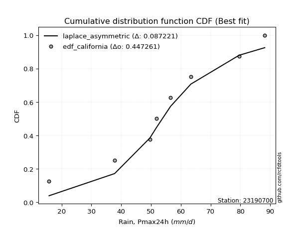</img>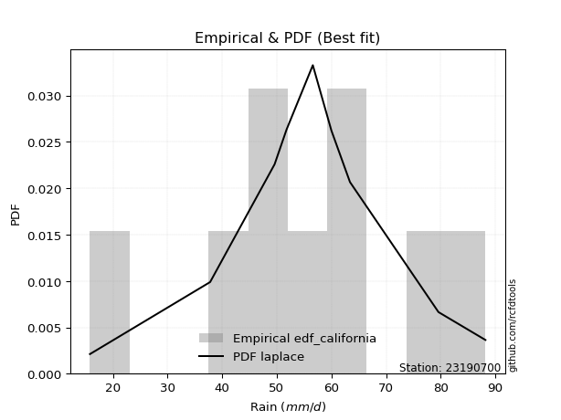</img>

</div>


### 2. EDF Hazen (1930)

Hazen method for plotting positions is a formula used to estimate the empirical cumulative probability distribution of flood events or other hydrological data. This formula often results in biased estimations, particularly when extrapolating to extreme events (high return periods).

<div align="center">


$P=(m-0.5)/n$


</div>


**2.1. Empirical values**

<div align="center">

|                | 0                   | 1                   | 2                  | 3                  | 4         | 5                  | 6                  | 7                  | 8                  |
|:---------------|:--------------------|:--------------------|:-------------------|:-------------------|:----------|:-------------------|:-------------------|:-------------------|:-------------------|
| date           | 2017                | 2021                | 2024               | 2023               | 2020      | 2025               | 2018               | 2022               | 2019               |
| x              | 15.8                | 37.8                | 49.6               | 51.8               | 56.6      | 60.0               | 63.4               | 79.6               | 88.2               |
| m              | 1                   | 2                   | 3                  | 4                  | 5         | 6                  | 7                  | 8                  | 9                  |
| empirical_dist | edf_hazen           | edf_hazen           | edf_hazen          | edf_hazen          | edf_hazen | edf_hazen          | edf_hazen          | edf_hazen          | edf_hazen          |
| empirical      | 0.05555555555555555 | 0.16666666666666666 | 0.2777777777777778 | 0.3888888888888889 | 0.5       | 0.6111111111111112 | 0.7222222222222222 | 0.8333333333333334 | 0.9444444444444444 |
| empirical_tr   | 1.0588235294117647  | 1.2                 | 1.3846153846153846 | 1.6363636363636362 | 2.0       | 2.5714285714285716 | 3.5999999999999996 | 6.000000000000002  | 17.999999999999993 |

</div>


**2.2. Kolmogorov-Smirnov fit test (sorted by Δ)**


<div align="center">

|                | 0                   | 1                    | 2                   | 3                   | 4                   | 5                   | 6                   | 7                   | 8                   | 9                   | 10                  | 11                  | 12                  | 13                  | 14                  | 15                  | 16                  | 17                  | 18                  | 19                  | 20                  | 21                  | 22                  | 23                  | 24                  | 25                  | 26                  | 27                  | 28                  | 29                  | 30                  | 31                  | 32                  | 33                  | 34                  | 35                  | 36                  | 37                  | 38                  | 39                  | 40                  | 41                  | 42                  | 43                  | 44                  | 45                  | 46                  | 47                  | 48                  | 49                  | 50                  | 51                  | 52                  | 53                  | 54                  | 55                  | 56                  | 57                  | 58                  | 59                  | 60                  | 61                  | 62                  | 63                  | 64                  | 65                  | 66                  | 67                  | 68                  | 69                  | 70                  | 71                  | 72                  | 73                  | 74                  | 75                  | 76                  | 77                  | 78                  | 79                  | 80                  | 81                  | 82                  | 83                  | 84                  | 85                  | 86                  | 87                  | 88                  | 89                  | 90                  | 91                  | 92                  | 93                  | 94                  | 95                  | 96                  | 97                  | 98                  | 99                  | 100                 | 101                 | 102                 | 103                 | 104                 | 105                 | 106                 | 107                 | 108                 | 109                 | 110                 | 111                 | 112                 | 113                 | 114                 | 115                 | 116                 | 117                 | 118                 | 119                 | 120                 | 121                 | 122                 | 123                 | 124                 | 125                 | 126                 | 127                 | 128                 | 129                 | 130                 | 131                 | 132                 | 133                 | 134                 | 135                 | 136                 | 137                 | 138                 | 139                 | 140                 | 141                 | 142                 | 143                 | 144                 | 145                 | 146                 | 147                 | 148                 | 149                 | 150                 | 151                 | 152                 | 153                 | 154                 | 155                 | 156                 | 157                 | 158                 | 159                 |
|:---------------|:--------------------|:---------------------|:--------------------|:--------------------|:--------------------|:--------------------|:--------------------|:--------------------|:--------------------|:--------------------|:--------------------|:--------------------|:--------------------|:--------------------|:--------------------|:--------------------|:--------------------|:--------------------|:--------------------|:--------------------|:--------------------|:--------------------|:--------------------|:--------------------|:--------------------|:--------------------|:--------------------|:--------------------|:--------------------|:--------------------|:--------------------|:--------------------|:--------------------|:--------------------|:--------------------|:--------------------|:--------------------|:--------------------|:--------------------|:--------------------|:--------------------|:--------------------|:--------------------|:--------------------|:--------------------|:--------------------|:--------------------|:--------------------|:--------------------|:--------------------|:--------------------|:--------------------|:--------------------|:--------------------|:--------------------|:--------------------|:--------------------|:--------------------|:--------------------|:--------------------|:--------------------|:--------------------|:--------------------|:--------------------|:--------------------|:--------------------|:--------------------|:--------------------|:--------------------|:--------------------|:--------------------|:--------------------|:--------------------|:--------------------|:--------------------|:--------------------|:--------------------|:--------------------|:--------------------|:--------------------|:--------------------|:--------------------|:--------------------|:--------------------|:--------------------|:--------------------|:--------------------|:--------------------|:--------------------|:--------------------|:--------------------|:--------------------|:--------------------|:--------------------|:--------------------|:--------------------|:--------------------|:--------------------|:--------------------|:--------------------|:--------------------|:--------------------|:--------------------|:--------------------|:--------------------|:--------------------|:--------------------|:--------------------|:--------------------|:--------------------|:--------------------|:--------------------|:--------------------|:--------------------|:--------------------|:--------------------|:--------------------|:--------------------|:--------------------|:--------------------|:--------------------|:--------------------|:--------------------|:--------------------|:--------------------|:--------------------|:--------------------|:--------------------|:--------------------|:--------------------|:--------------------|:--------------------|:--------------------|:--------------------|:--------------------|:--------------------|:--------------------|:--------------------|:--------------------|:--------------------|:--------------------|:--------------------|:--------------------|:--------------------|:--------------------|:--------------------|:--------------------|:--------------------|:--------------------|:--------------------|:--------------------|:--------------------|:--------------------|:--------------------|:--------------------|:--------------------|:--------------------|:--------------------|:--------------------|:--------------------|
| station        | 23190700            | 23190700             | 23190700            | 23190700            | 23190700            | 23190700            | 23190700            | 23190700            | 23190700            | 23190700            | 23190700            | 23190700            | 23190700            | 23190700            | 23190700            | 23190700            | 23190700            | 23190700            | 23190700            | 23190700            | 23190700            | 23190700            | 23190700            | 23190700            | 23190700            | 23190700            | 23190700            | 23190700            | 23190700            | 23190700            | 23190700            | 23190700            | 23190700            | 23190700            | 23190700            | 23190700            | 23190700            | 23190700            | 23190700            | 23190700            | 23190700            | 23190700            | 23190700            | 23190700            | 23190700            | 23190700            | 23190700            | 23190700            | 23190700            | 23190700            | 23190700            | 23190700            | 23190700            | 23190700            | 23190700            | 23190700            | 23190700            | 23190700            | 23190700            | 23190700            | 23190700            | 23190700            | 23190700            | 23190700            | 23190700            | 23190700            | 23190700            | 23190700            | 23190700            | 23190700            | 23190700            | 23190700            | 23190700            | 23190700            | 23190700            | 23190700            | 23190700            | 23190700            | 23190700            | 23190700            | 23190700            | 23190700            | 23190700            | 23190700            | 23190700            | 23190700            | 23190700            | 23190700            | 23190700            | 23190700            | 23190700            | 23190700            | 23190700            | 23190700            | 23190700            | 23190700            | 23190700            | 23190700            | 23190700            | 23190700            | 23190700            | 23190700            | 23190700            | 23190700            | 23190700            | 23190700            | 23190700            | 23190700            | 23190700            | 23190700            | 23190700            | 23190700            | 23190700            | 23190700            | 23190700            | 23190700            | 23190700            | 23190700            | 23190700            | 23190700            | 23190700            | 23190700            | 23190700            | 23190700            | 23190700            | 23190700            | 23190700            | 23190700            | 23190700            | 23190700            | 23190700            | 23190700            | 23190700            | 23190700            | 23190700            | 23190700            | 23190700            | 23190700            | 23190700            | 23190700            | 23190700            | 23190700            | 23190700            | 23190700            | 23190700            | 23190700            | 23190700            | 23190700            | 23190700            | 23190700            | 23190700            | 23190700            | 23190700            | 23190700            | 23190700            | 23190700            | 23190700            | 23190700            | 23190700            | 23190700            |
| empirical_dist | edf_hazen           | edf_hazen            | edf_hazen           | edf_hazen           | edf_hazen           | edf_hazen           | edf_hazen           | edf_hazen           | edf_hazen           | edf_hazen           | edf_hazen           | edf_hazen           | edf_hazen           | edf_hazen           | edf_hazen           | edf_hazen           | edf_hazen           | edf_hazen           | edf_hazen           | edf_hazen           | edf_hazen           | edf_hazen           | edf_hazen           | edf_hazen           | edf_hazen           | edf_hazen           | edf_hazen           | edf_hazen           | edf_hazen           | edf_hazen           | edf_hazen           | edf_hazen           | edf_hazen           | edf_hazen           | edf_hazen           | edf_hazen           | edf_hazen           | edf_hazen           | edf_hazen           | edf_hazen           | edf_hazen           | edf_hazen           | edf_hazen           | edf_hazen           | edf_hazen           | edf_hazen           | edf_hazen           | edf_hazen           | edf_hazen           | edf_hazen           | edf_hazen           | edf_hazen           | edf_hazen           | edf_hazen           | edf_hazen           | edf_hazen           | edf_hazen           | edf_hazen           | edf_hazen           | edf_hazen           | edf_hazen           | edf_hazen           | edf_hazen           | edf_hazen           | edf_hazen           | edf_hazen           | edf_hazen           | edf_hazen           | edf_hazen           | edf_hazen           | edf_hazen           | edf_hazen           | edf_hazen           | edf_hazen           | edf_hazen           | edf_hazen           | edf_hazen           | edf_hazen           | edf_hazen           | edf_hazen           | edf_hazen           | edf_hazen           | edf_hazen           | edf_hazen           | edf_hazen           | edf_hazen           | edf_hazen           | edf_hazen           | edf_hazen           | edf_hazen           | edf_hazen           | edf_hazen           | edf_hazen           | edf_hazen           | edf_hazen           | edf_hazen           | edf_hazen           | edf_hazen           | edf_hazen           | edf_hazen           | edf_hazen           | edf_hazen           | edf_hazen           | edf_hazen           | edf_hazen           | edf_hazen           | edf_hazen           | edf_hazen           | edf_hazen           | edf_hazen           | edf_hazen           | edf_hazen           | edf_hazen           | edf_hazen           | edf_hazen           | edf_hazen           | edf_hazen           | edf_hazen           | edf_hazen           | edf_hazen           | edf_hazen           | edf_hazen           | edf_hazen           | edf_hazen           | edf_hazen           | edf_hazen           | edf_hazen           | edf_hazen           | edf_hazen           | edf_hazen           | edf_hazen           | edf_hazen           | edf_hazen           | edf_hazen           | edf_hazen           | edf_hazen           | edf_hazen           | edf_hazen           | edf_hazen           | edf_hazen           | edf_hazen           | edf_hazen           | edf_hazen           | edf_hazen           | edf_hazen           | edf_hazen           | edf_hazen           | edf_hazen           | edf_hazen           | edf_hazen           | edf_hazen           | edf_hazen           | edf_hazen           | edf_hazen           | edf_hazen           | edf_hazen           | edf_hazen           | edf_hazen           | edf_hazen           | edf_hazen           |
| p_dist         | logdgamma           | gennorm              | dweibull            | dgamma              | logt                | laplace             | hypsecant           | genlogistic         | logistic            | logburr12           | logloglaplace       | pearson3            | mielke              | burr                | loggenlogistic      | skewnorm            | weibull_min         | foldnorm            | logvonmises_line    | johnsonsu           | t                   | norm                | crystalball         | truncnorm           | exponnorm           | nct                 | f                   | erlang              | logloggamma         | gamma               | logdweibull         | rice                | logweibull_min      | logpearson3         | genextreme          | anglit              | logjohnsonsu        | logexponweib        | loggompertz         | truncweibull_min    | invgamma            | semicircular        | argus               | gumbel_l            | loggumbel_l         | logargus            | betaprime           | cosine              | maxwell             | logtruncweibull_min | gompertz            | alpha               | exponweib           | rayleigh            | invgauss            | logtrapezoid        | lognakagami         | logskewnorm         | arcsine             | vonmises_line       | gumbel_r            | loggausshyper       | loggennorm          | logburr             | gausshyper          | loggenextreme       | moyal               | logmielke           | halfnorm            | bradford            | loglaplace          | loglaplace          | kappa3              | uniform             | beta                | wrapcauchy          | tukeylambda         | kstwobign           | halflogistic        | loghypsecant        | ksone               | loglogistic         | logf                | logfatiguelife      | logcrystalball      | lognorm             | logexponnorm        | logrice             | lognct              | loganglit           | logsemicircular     | logerlang           | logbetaprime        | loggamma            | loggamma            | triang              | loggenhalflogistic  | logarcsine          | logncf              | kappa4              | genhalflogistic     | loginvgamma         | loglevy_l           | logtriang           | genpareto           | loginvgauss         | logalpha            | wald                | logmaxwell          | logfoldnorm         | loginvweibull       | lograyleigh         | logtruncnorm        | loggenpareto        | truncexpon          | loggumbel_r         | logkstwobign        | loghalfnorm         | logcosine           | logweibull_max      | lomax               | genexpon            | logmoyal            | logrdist            | levy_l              | loggenexpon         | loghalflogistic     | logjohnsonsb        | ncf                 | logbeta             | trapezoid           | johnsonsb           | logwrapcauchy       | halfgennorm         | loglomax            | burr12              | logksone            | logwald             | logkappa4           | logkappa3           | logbradford         | logtukeylambda      | loguniform          | nakagami            | logexponpow         | loggengamma         | logtruncexpon       | invweibull          | gengamma            | powerlaw            | rdist               | fatiguelife         | weibull_max         | logpowerlaw         | exponpow            | truncpareto         | logtruncpareto      | loghalfgennorm      | logvonmises         | vonmises            |
| delta          | 0.05321884607515959 | 0.056229703379389595 | 0.05643938177204533 | 0.0580901345433914  | 0.07049372226507555 | 0.07178461134566672 | 0.07287245612130977 | 0.07661669738106935 | 0.08511543937245031 | 0.08769692693008974 | 0.0907303419577784  | 0.09339488840535559 | 0.09482585137957206 | 0.09499261323904501 | 0.09518558233157826 | 0.09522431761043959 | 0.09641973951526739 | 0.09654919820590557 | 0.09797392777434161 | 0.09822337256346203 | 0.10037444669896423 | 0.10038723143494133 | 0.1003872340693952  | 0.10038724438547275 | 0.10038955559230378 | 0.1004193846719405  | 0.10131531894767098 | 0.10976791410013398 | 0.10996519664411919 | 0.11030856593312582 | 0.11054133410219402 | 0.11091077033875801 | 0.11113049974406353 | 0.11305010695586615 | 0.116837499442218   | 0.11694380930013132 | 0.11925890380216042 | 0.120170714667438   | 0.12101803730985561 | 0.12131054763987137 | 0.12378426607582904 | 0.12384720821235518 | 0.12436880821953988 | 0.12638795300252903 | 0.12885618353271222 | 0.12989027282409127 | 0.1314846946494373  | 0.1315102096476996  | 0.13372543217631322 | 0.13481383158012716 | 0.13518871631415286 | 0.13629015899742275 | 0.1407480256333422  | 0.1460070911510346  | 0.14738977379114893 | 0.14896396458154398 | 0.14950756810138552 | 0.15063078407140168 | 0.15180644045599434 | 0.15335941039844914 | 0.15570255791879606 | 0.15729870713816696 | 0.16118019654410926 | 0.1626029657986413  | 0.1652353866438253  | 0.17214527088590392 | 0.17675834121707457 | 0.17997790961814442 | 0.18091036860066262 | 0.18251031788902816 | 0.18356276686777395 | 0.18356276686777395 | 0.18835030158987537 | 0.1890730509515039  | 0.1893180466116644  | 0.1902391424645965  | 0.19042853562335516 | 0.1915005059932825  | 0.1934716544417251  | 0.19380901555844054 | 0.19459791282995703 | 0.19644288626093664 | 0.1977611257050702  | 0.19884255601747192 | 0.19953288441217726 | 0.19953384167450905 | 0.19953540848585344 | 0.19954664065281186 | 0.20255956542931586 | 0.20277480108112822 | 0.20411260090477246 | 0.20417272344113446 | 0.20464987396733647 | 0.20651693821966732 | 0.20651693821966732 | 0.2078272617364647  | 0.20802043974607787 | 0.2094104095145401  | 0.20999562149875528 | 0.21267073051750185 | 0.21705933548297207 | 0.217626219184251   | 0.220244824741523   | 0.22459530733517874 | 0.22551768725701565 | 0.228619461981599   | 0.22893073085430315 | 0.23132271202347843 | 0.23334271631349535 | 0.23398964823711788 | 0.23637359523208223 | 0.24480814022647213 | 0.2544519986099959  | 0.2609339858278026  | 0.2637750195451505  | 0.26886112116675664 | 0.27493246334827304 | 0.27710858685320305 | 0.27757522961361714 | 0.2801836136320648  | 0.29060660260053883 | 0.292215028973561   | 0.29469920777402514 | 0.29470295911116073 | 0.2949403856286814  | 0.29633140304954175 | 0.30050352583045126 | 0.30381602939339136 | 0.30561633094087437 | 0.3122114302342767  | 0.3237892531431344  | 0.3238042358627241  | 0.3357568823991207  | 0.34971584734812733 | 0.35185748720238375 | 0.3540442725039664  | 0.35993975061714045 | 0.3666202003289306  | 0.3668803983924267  | 0.37081578481873234 | 0.3741094689924711  | 0.3829186086193922  | 0.3874832562961239  | 0.40811579862640757 | 0.442368460583879   | 0.4626432806645524  | 0.46422249704824614 | 0.5058010987290986  | 0.6000658493961138  | 0.6104365500685505  | 0.6264485859553335  | 0.6444866757908705  | 0.6463687673425645  | 0.6854711989173388  | 0.7592169975109426  | 0.763226121407536   | 0.792901429055056   | 0.8333333333333334  | 1.1757391683742018  | 13.609494528451842  |
| deltao         | 0.41761268023100007 | 0.41761268023100007  | 0.41761268023100007 | 0.41761268023100007 | 0.41761268023100007 | 0.41761268023100007 | 0.41761268023100007 | 0.41761268023100007 | 0.41761268023100007 | 0.41761268023100007 | 0.41761268023100007 | 0.41761268023100007 | 0.41761268023100007 | 0.41761268023100007 | 0.41761268023100007 | 0.41761268023100007 | 0.41761268023100007 | 0.41761268023100007 | 0.41761268023100007 | 0.41761268023100007 | 0.41761268023100007 | 0.41761268023100007 | 0.41761268023100007 | 0.41761268023100007 | 0.41761268023100007 | 0.41761268023100007 | 0.41761268023100007 | 0.41761268023100007 | 0.41761268023100007 | 0.41761268023100007 | 0.41761268023100007 | 0.41761268023100007 | 0.41761268023100007 | 0.41761268023100007 | 0.41761268023100007 | 0.41761268023100007 | 0.41761268023100007 | 0.41761268023100007 | 0.41761268023100007 | 0.41761268023100007 | 0.41761268023100007 | 0.41761268023100007 | 0.41761268023100007 | 0.41761268023100007 | 0.41761268023100007 | 0.41761268023100007 | 0.41761268023100007 | 0.41761268023100007 | 0.41761268023100007 | 0.41761268023100007 | 0.41761268023100007 | 0.41761268023100007 | 0.41761268023100007 | 0.41761268023100007 | 0.41761268023100007 | 0.41761268023100007 | 0.41761268023100007 | 0.41761268023100007 | 0.41761268023100007 | 0.41761268023100007 | 0.41761268023100007 | 0.41761268023100007 | 0.41761268023100007 | 0.41761268023100007 | 0.41761268023100007 | 0.41761268023100007 | 0.41761268023100007 | 0.41761268023100007 | 0.41761268023100007 | 0.41761268023100007 | 0.41761268023100007 | 0.41761268023100007 | 0.41761268023100007 | 0.41761268023100007 | 0.41761268023100007 | 0.41761268023100007 | 0.41761268023100007 | 0.41761268023100007 | 0.41761268023100007 | 0.41761268023100007 | 0.41761268023100007 | 0.41761268023100007 | 0.41761268023100007 | 0.41761268023100007 | 0.41761268023100007 | 0.41761268023100007 | 0.41761268023100007 | 0.41761268023100007 | 0.41761268023100007 | 0.41761268023100007 | 0.41761268023100007 | 0.41761268023100007 | 0.41761268023100007 | 0.41761268023100007 | 0.41761268023100007 | 0.41761268023100007 | 0.41761268023100007 | 0.41761268023100007 | 0.41761268023100007 | 0.41761268023100007 | 0.41761268023100007 | 0.41761268023100007 | 0.41761268023100007 | 0.41761268023100007 | 0.41761268023100007 | 0.41761268023100007 | 0.41761268023100007 | 0.41761268023100007 | 0.41761268023100007 | 0.41761268023100007 | 0.41761268023100007 | 0.41761268023100007 | 0.41761268023100007 | 0.41761268023100007 | 0.41761268023100007 | 0.41761268023100007 | 0.41761268023100007 | 0.41761268023100007 | 0.41761268023100007 | 0.41761268023100007 | 0.41761268023100007 | 0.41761268023100007 | 0.41761268023100007 | 0.41761268023100007 | 0.41761268023100007 | 0.41761268023100007 | 0.41761268023100007 | 0.41761268023100007 | 0.41761268023100007 | 0.41761268023100007 | 0.41761268023100007 | 0.41761268023100007 | 0.41761268023100007 | 0.41761268023100007 | 0.41761268023100007 | 0.41761268023100007 | 0.41761268023100007 | 0.41761268023100007 | 0.41761268023100007 | 0.41761268023100007 | 0.41761268023100007 | 0.41761268023100007 | 0.41761268023100007 | 0.41761268023100007 | 0.41761268023100007 | 0.41761268023100007 | 0.41761268023100007 | 0.41761268023100007 | 0.41761268023100007 | 0.41761268023100007 | 0.41761268023100007 | 0.41761268023100007 | 0.41761268023100007 | 0.41761268023100007 | 0.41761268023100007 | 0.41761268023100007 | 0.41761268023100007 | 0.41761268023100007 | 0.41761268023100007 | 0.41761268023100007 |
| eval           | Δo > Δ              | Δo > Δ               | Δo > Δ              | Δo > Δ              | Δo > Δ              | Δo > Δ              | Δo > Δ              | Δo > Δ              | Δo > Δ              | Δo > Δ              | Δo > Δ              | Δo > Δ              | Δo > Δ              | Δo > Δ              | Δo > Δ              | Δo > Δ              | Δo > Δ              | Δo > Δ              | Δo > Δ              | Δo > Δ              | Δo > Δ              | Δo > Δ              | Δo > Δ              | Δo > Δ              | Δo > Δ              | Δo > Δ              | Δo > Δ              | Δo > Δ              | Δo > Δ              | Δo > Δ              | Δo > Δ              | Δo > Δ              | Δo > Δ              | Δo > Δ              | Δo > Δ              | Δo > Δ              | Δo > Δ              | Δo > Δ              | Δo > Δ              | Δo > Δ              | Δo > Δ              | Δo > Δ              | Δo > Δ              | Δo > Δ              | Δo > Δ              | Δo > Δ              | Δo > Δ              | Δo > Δ              | Δo > Δ              | Δo > Δ              | Δo > Δ              | Δo > Δ              | Δo > Δ              | Δo > Δ              | Δo > Δ              | Δo > Δ              | Δo > Δ              | Δo > Δ              | Δo > Δ              | Δo > Δ              | Δo > Δ              | Δo > Δ              | Δo > Δ              | Δo > Δ              | Δo > Δ              | Δo > Δ              | Δo > Δ              | Δo > Δ              | Δo > Δ              | Δo > Δ              | Δo > Δ              | Δo > Δ              | Δo > Δ              | Δo > Δ              | Δo > Δ              | Δo > Δ              | Δo > Δ              | Δo > Δ              | Δo > Δ              | Δo > Δ              | Δo > Δ              | Δo > Δ              | Δo > Δ              | Δo > Δ              | Δo > Δ              | Δo > Δ              | Δo > Δ              | Δo > Δ              | Δo > Δ              | Δo > Δ              | Δo > Δ              | Δo > Δ              | Δo > Δ              | Δo > Δ              | Δo > Δ              | Δo > Δ              | Δo > Δ              | Δo > Δ              | Δo > Δ              | Δo > Δ              | Δo > Δ              | Δo > Δ              | Δo > Δ              | Δo > Δ              | Δo > Δ              | Δo > Δ              | Δo > Δ              | Δo > Δ              | Δo > Δ              | Δo > Δ              | Δo > Δ              | Δo > Δ              | Δo > Δ              | Δo > Δ              | Δo > Δ              | Δo > Δ              | Δo > Δ              | Δo > Δ              | Δo > Δ              | Δo > Δ              | Δo > Δ              | Δo > Δ              | Δo > Δ              | Δo > Δ              | Δo > Δ              | Δo > Δ              | Δo > Δ              | Δo > Δ              | Δo > Δ              | Δo > Δ              | Δo > Δ              | Δo > Δ              | Δo > Δ              | Δo > Δ              | Δo > Δ              | Δo > Δ              | Δo > Δ              | Δo > Δ              | Δo > Δ              | Δo > Δ              | Δo > Δ              | Δo > Δ              | Δo > Δ              | Δo > Δ              | Δo <= Δ             | Δo <= Δ             | Δo <= Δ             | Δo <= Δ             | Δo <= Δ             | Δo <= Δ             | Δo <= Δ             | Δo <= Δ             | Δo <= Δ             | Δo <= Δ             | Δo <= Δ             | Δo <= Δ             | Δo <= Δ             | Δo <= Δ             | Δo <= Δ             | Δo <= Δ             |
| fit            | 1                   | 1                    | 1                   | 1                   | 1                   | 1                   | 1                   | 1                   | 1                   | 1                   | 1                   | 1                   | 1                   | 1                   | 1                   | 1                   | 1                   | 1                   | 1                   | 1                   | 1                   | 1                   | 1                   | 1                   | 1                   | 1                   | 1                   | 1                   | 1                   | 1                   | 1                   | 1                   | 1                   | 1                   | 1                   | 1                   | 1                   | 1                   | 1                   | 1                   | 1                   | 1                   | 1                   | 1                   | 1                   | 1                   | 1                   | 1                   | 1                   | 1                   | 1                   | 1                   | 1                   | 1                   | 1                   | 1                   | 1                   | 1                   | 1                   | 1                   | 1                   | 1                   | 1                   | 1                   | 1                   | 1                   | 1                   | 1                   | 1                   | 1                   | 1                   | 1                   | 1                   | 1                   | 1                   | 1                   | 1                   | 1                   | 1                   | 1                   | 1                   | 1                   | 1                   | 1                   | 1                   | 1                   | 1                   | 1                   | 1                   | 1                   | 1                   | 1                   | 1                   | 1                   | 1                   | 1                   | 1                   | 1                   | 1                   | 1                   | 1                   | 1                   | 1                   | 1                   | 1                   | 1                   | 1                   | 1                   | 1                   | 1                   | 1                   | 1                   | 1                   | 1                   | 1                   | 1                   | 1                   | 1                   | 1                   | 1                   | 1                   | 1                   | 1                   | 1                   | 1                   | 1                   | 1                   | 1                   | 1                   | 1                   | 1                   | 1                   | 1                   | 1                   | 1                   | 1                   | 1                   | 1                   | 1                   | 1                   | 1                   | 1                   | 1                   | 1                   | 0                   | 0                   | 0                   | 0                   | 0                   | 0                   | 0                   | 0                   | 0                   | 0                   | 0                   | 0                   | 0                   | 0                   | 0                   | 0                   |
| n              | 9                   | 9                    | 9                   | 9                   | 9                   | 9                   | 9                   | 9                   | 9                   | 9                   | 9                   | 9                   | 9                   | 9                   | 9                   | 9                   | 9                   | 9                   | 9                   | 9                   | 9                   | 9                   | 9                   | 9                   | 9                   | 9                   | 9                   | 9                   | 9                   | 9                   | 9                   | 9                   | 9                   | 9                   | 9                   | 9                   | 9                   | 9                   | 9                   | 9                   | 9                   | 9                   | 9                   | 9                   | 9                   | 9                   | 9                   | 9                   | 9                   | 9                   | 9                   | 9                   | 9                   | 9                   | 9                   | 9                   | 9                   | 9                   | 9                   | 9                   | 9                   | 9                   | 9                   | 9                   | 9                   | 9                   | 9                   | 9                   | 9                   | 9                   | 9                   | 9                   | 9                   | 9                   | 9                   | 9                   | 9                   | 9                   | 9                   | 9                   | 9                   | 9                   | 9                   | 9                   | 9                   | 9                   | 9                   | 9                   | 9                   | 9                   | 9                   | 9                   | 9                   | 9                   | 9                   | 9                   | 9                   | 9                   | 9                   | 9                   | 9                   | 9                   | 9                   | 9                   | 9                   | 9                   | 9                   | 9                   | 9                   | 9                   | 9                   | 9                   | 9                   | 9                   | 9                   | 9                   | 9                   | 9                   | 9                   | 9                   | 9                   | 9                   | 9                   | 9                   | 9                   | 9                   | 9                   | 9                   | 9                   | 9                   | 9                   | 9                   | 9                   | 9                   | 9                   | 9                   | 9                   | 9                   | 9                   | 9                   | 9                   | 9                   | 9                   | 9                   | 9                   | 9                   | 9                   | 9                   | 9                   | 9                   | 9                   | 9                   | 9                   | 9                   | 9                   | 9                   | 9                   | 9                   | 9                   | 9                   |
| best_fit       | 1                   | 0                    | 0                   | 0                   | 0                   | 0                   | 0                   | 0                   | 0                   | 0                   | 0                   | 0                   | 0                   | 0                   | 0                   | 0                   | 0                   | 0                   | 0                   | 0                   | 0                   | 0                   | 0                   | 0                   | 0                   | 0                   | 0                   | 0                   | 0                   | 0                   | 0                   | 0                   | 0                   | 0                   | 0                   | 0                   | 0                   | 0                   | 0                   | 0                   | 0                   | 0                   | 0                   | 0                   | 0                   | 0                   | 0                   | 0                   | 0                   | 0                   | 0                   | 0                   | 0                   | 0                   | 0                   | 0                   | 0                   | 0                   | 0                   | 0                   | 0                   | 0                   | 0                   | 0                   | 0                   | 0                   | 0                   | 0                   | 0                   | 0                   | 0                   | 0                   | 0                   | 0                   | 0                   | 0                   | 0                   | 0                   | 0                   | 0                   | 0                   | 0                   | 0                   | 0                   | 0                   | 0                   | 0                   | 0                   | 0                   | 0                   | 0                   | 0                   | 0                   | 0                   | 0                   | 0                   | 0                   | 0                   | 0                   | 0                   | 0                   | 0                   | 0                   | 0                   | 0                   | 0                   | 0                   | 0                   | 0                   | 0                   | 0                   | 0                   | 0                   | 0                   | 0                   | 0                   | 0                   | 0                   | 0                   | 0                   | 0                   | 0                   | 0                   | 0                   | 0                   | 0                   | 0                   | 0                   | 0                   | 0                   | 0                   | 0                   | 0                   | 0                   | 0                   | 0                   | 0                   | 0                   | 0                   | 0                   | 0                   | 0                   | 0                   | 0                   | 0                   | 0                   | 0                   | 0                   | 0                   | 0                   | 0                   | 0                   | 0                   | 0                   | 0                   | 0                   | 0                   | 0                   | 0                   | 0                   |
| best_fit_sort  | 1                   | 2                    | 3                   | 4                   | 5                   | 6                   | 7                   | 8                   | 9                   | 10                  | 11                  | 12                  | 13                  | 14                  | 15                  | 16                  | 17                  | 18                  | 19                  | 20                  | 21                  | 22                  | 23                  | 24                  | 25                  | 26                  | 27                  | 28                  | 29                  | 30                  | 31                  | 32                  | 33                  | 34                  | 35                  | 36                  | 37                  | 38                  | 39                  | 40                  | 41                  | 42                  | 43                  | 44                  | 45                  | 46                  | 47                  | 48                  | 49                  | 50                  | 51                  | 52                  | 53                  | 54                  | 55                  | 56                  | 57                  | 58                  | 59                  | 60                  | 61                  | 62                  | 63                  | 64                  | 65                  | 66                  | 67                  | 68                  | 69                  | 70                  | 71                  | 72                  | 73                  | 74                  | 75                  | 76                  | 77                  | 78                  | 79                  | 80                  | 81                  | 82                  | 83                  | 84                  | 85                  | 86                  | 87                  | 88                  | 89                  | 90                  | 91                  | 92                  | 93                  | 94                  | 95                  | 96                  | 97                  | 98                  | 99                  | 100                 | 101                 | 102                 | 103                 | 104                 | 105                 | 106                 | 107                 | 108                 | 109                 | 110                 | 111                 | 112                 | 113                 | 114                 | 115                 | 116                 | 117                 | 118                 | 119                 | 120                 | 121                 | 122                 | 123                 | 124                 | 125                 | 126                 | 127                 | 128                 | 129                 | 130                 | 131                 | 132                 | 133                 | 134                 | 135                 | 136                 | 137                 | 138                 | 139                 | 140                 | 141                 | 142                 | 143                 | 144                 | 145                 | 146                 | 147                 | 148                 | 149                 | 150                 | 151                 | 152                 | 153                 | 154                 | 155                 | 156                 | 157                 | 158                 | 159                 | 160                 |

</div>


**2.3. Best fit**

<div align="center">

|   id |   station | empirical_dist   | p_dist    |     delta |   deltao | eval   |   fit |   n |   best_fit |   best_fit_sort |
|-----:|----------:|:-----------------|:----------|----------:|---------:|:-------|------:|----:|-----------:|----------------:|
|    0 |  23190700 | edf_hazen        | logdgamma | 0.0532188 | 0.417613 | Δo > Δ |     1 |   9 |          1 |               1 |

</div>


<div align="center">

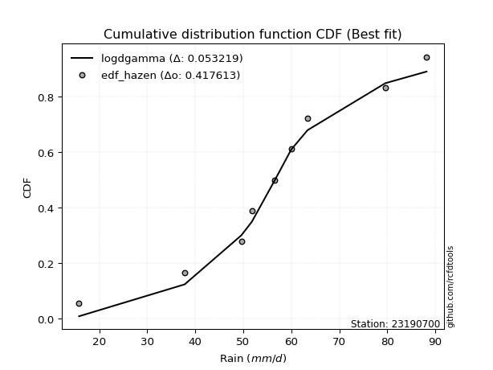</img></img>

</div>


### 3. EDF Weibull (1939)

Weibull plotting position formula is an empirical method used to estimate the non-exceedance probability or plotting position for a set of observed data, is often recommended or widely used in practice, particularly in flood frequency analysis.

<div align="center">


$P=m/(n+1)$


</div>


**3.1. Empirical values**

<div align="center">

|                | 0                  | 1           | 2                  | 3                  | 4           | 5           | 6                 | 7                 | 8                  |
|:---------------|:-------------------|:------------|:-------------------|:-------------------|:------------|:------------|:------------------|:------------------|:-------------------|
| date           | 2017               | 2021        | 2024               | 2023               | 2020        | 2025        | 2018              | 2022              | 2019               |
| x              | 15.8               | 37.8        | 49.6               | 51.8               | 56.6        | 60.0        | 63.4              | 79.6              | 88.2               |
| m              | 1                  | 2           | 3                  | 4                  | 5           | 6           | 7                 | 8                 | 9                  |
| empirical_dist | edf_weibull        | edf_weibull | edf_weibull        | edf_weibull        | edf_weibull | edf_weibull | edf_weibull       | edf_weibull       | edf_weibull        |
| empirical      | 0.1                | 0.2         | 0.3                | 0.4                | 0.5         | 0.6         | 0.7               | 0.8               | 0.9                |
| empirical_tr   | 1.1111111111111112 | 1.25        | 1.4285714285714286 | 1.6666666666666667 | 2.0         | 2.5         | 3.333333333333333 | 5.000000000000001 | 10.000000000000002 |

</div>


**3.2. Kolmogorov-Smirnov fit test (sorted by Δ)**


<div align="center">

|                | 0                   | 1                   | 2                   | 3                   | 4                   | 5                   | 6                   | 7                   | 8                   | 9                   | 10                  | 11                  | 12                  | 13                  | 14                  | 15                  | 16                  | 17                  | 18                  | 19                  | 20                  | 21                  | 22                  | 23                  | 24                  | 25                  | 26                  | 27                  | 28                  | 29                  | 30                  | 31                  | 32                  | 33                  | 34                  | 35                  | 36                  | 37                  | 38                  | 39                  | 40                  | 41                  | 42                  | 43                  | 44                  | 45                  | 46                  | 47                  | 48                  | 49                  | 50                  | 51                  | 52                  | 53                  | 54                  | 55                  | 56                  | 57                  | 58                  | 59                  | 60                  | 61                  | 62                  | 63                  | 64                  | 65                  | 66                  | 67                  | 68                  | 69                  | 70                  | 71                  | 72                  | 73                  | 74                  | 75                  | 76                  | 77                  | 78                  | 79                  | 80                  | 81                  | 82                  | 83                  | 84                  | 85                  | 86                  | 87                  | 88                  | 89                  | 90                  | 91                  | 92                  | 93                  | 94                  | 95                  | 96                  | 97                  | 98                  | 99                  | 100                 | 101                 | 102                 | 103                 | 104                 | 105                 | 106                 | 107                 | 108                 | 109                 | 110                 | 111                 | 112                 | 113                 | 114                 | 115                 | 116                 | 117                 | 118                 | 119                 | 120                 | 121                 | 122                 | 123                 | 124                 | 125                 | 126                 | 127                 | 128                 | 129                 | 130                 | 131                 | 132                 | 133                 | 134                 | 135                 | 136                 | 137                 | 138                 | 139                 | 140                 | 141                 | 142                 | 143                 | 144                 | 145                 | 146                 | 147                 | 148                 | 149                 | 150                 | 151                 | 152                 | 153                 | 154                 | 155                 | 156                 | 157                 | 158                 | 159                 |
|:---------------|:--------------------|:--------------------|:--------------------|:--------------------|:--------------------|:--------------------|:--------------------|:--------------------|:--------------------|:--------------------|:--------------------|:--------------------|:--------------------|:--------------------|:--------------------|:--------------------|:--------------------|:--------------------|:--------------------|:--------------------|:--------------------|:--------------------|:--------------------|:--------------------|:--------------------|:--------------------|:--------------------|:--------------------|:--------------------|:--------------------|:--------------------|:--------------------|:--------------------|:--------------------|:--------------------|:--------------------|:--------------------|:--------------------|:--------------------|:--------------------|:--------------------|:--------------------|:--------------------|:--------------------|:--------------------|:--------------------|:--------------------|:--------------------|:--------------------|:--------------------|:--------------------|:--------------------|:--------------------|:--------------------|:--------------------|:--------------------|:--------------------|:--------------------|:--------------------|:--------------------|:--------------------|:--------------------|:--------------------|:--------------------|:--------------------|:--------------------|:--------------------|:--------------------|:--------------------|:--------------------|:--------------------|:--------------------|:--------------------|:--------------------|:--------------------|:--------------------|:--------------------|:--------------------|:--------------------|:--------------------|:--------------------|:--------------------|:--------------------|:--------------------|:--------------------|:--------------------|:--------------------|:--------------------|:--------------------|:--------------------|:--------------------|:--------------------|:--------------------|:--------------------|:--------------------|:--------------------|:--------------------|:--------------------|:--------------------|:--------------------|:--------------------|:--------------------|:--------------------|:--------------------|:--------------------|:--------------------|:--------------------|:--------------------|:--------------------|:--------------------|:--------------------|:--------------------|:--------------------|:--------------------|:--------------------|:--------------------|:--------------------|:--------------------|:--------------------|:--------------------|:--------------------|:--------------------|:--------------------|:--------------------|:--------------------|:--------------------|:--------------------|:--------------------|:--------------------|:--------------------|:--------------------|:--------------------|:--------------------|:--------------------|:--------------------|:--------------------|:--------------------|:--------------------|:--------------------|:--------------------|:--------------------|:--------------------|:--------------------|:--------------------|:--------------------|:--------------------|:--------------------|:--------------------|:--------------------|:--------------------|:--------------------|:--------------------|:--------------------|:--------------------|:--------------------|:--------------------|:--------------------|:--------------------|:--------------------|:--------------------|
| station        | 23190700            | 23190700            | 23190700            | 23190700            | 23190700            | 23190700            | 23190700            | 23190700            | 23190700            | 23190700            | 23190700            | 23190700            | 23190700            | 23190700            | 23190700            | 23190700            | 23190700            | 23190700            | 23190700            | 23190700            | 23190700            | 23190700            | 23190700            | 23190700            | 23190700            | 23190700            | 23190700            | 23190700            | 23190700            | 23190700            | 23190700            | 23190700            | 23190700            | 23190700            | 23190700            | 23190700            | 23190700            | 23190700            | 23190700            | 23190700            | 23190700            | 23190700            | 23190700            | 23190700            | 23190700            | 23190700            | 23190700            | 23190700            | 23190700            | 23190700            | 23190700            | 23190700            | 23190700            | 23190700            | 23190700            | 23190700            | 23190700            | 23190700            | 23190700            | 23190700            | 23190700            | 23190700            | 23190700            | 23190700            | 23190700            | 23190700            | 23190700            | 23190700            | 23190700            | 23190700            | 23190700            | 23190700            | 23190700            | 23190700            | 23190700            | 23190700            | 23190700            | 23190700            | 23190700            | 23190700            | 23190700            | 23190700            | 23190700            | 23190700            | 23190700            | 23190700            | 23190700            | 23190700            | 23190700            | 23190700            | 23190700            | 23190700            | 23190700            | 23190700            | 23190700            | 23190700            | 23190700            | 23190700            | 23190700            | 23190700            | 23190700            | 23190700            | 23190700            | 23190700            | 23190700            | 23190700            | 23190700            | 23190700            | 23190700            | 23190700            | 23190700            | 23190700            | 23190700            | 23190700            | 23190700            | 23190700            | 23190700            | 23190700            | 23190700            | 23190700            | 23190700            | 23190700            | 23190700            | 23190700            | 23190700            | 23190700            | 23190700            | 23190700            | 23190700            | 23190700            | 23190700            | 23190700            | 23190700            | 23190700            | 23190700            | 23190700            | 23190700            | 23190700            | 23190700            | 23190700            | 23190700            | 23190700            | 23190700            | 23190700            | 23190700            | 23190700            | 23190700            | 23190700            | 23190700            | 23190700            | 23190700            | 23190700            | 23190700            | 23190700            | 23190700            | 23190700            | 23190700            | 23190700            | 23190700            | 23190700            |
| empirical_dist | edf_weibull         | edf_weibull         | edf_weibull         | edf_weibull         | edf_weibull         | edf_weibull         | edf_weibull         | edf_weibull         | edf_weibull         | edf_weibull         | edf_weibull         | edf_weibull         | edf_weibull         | edf_weibull         | edf_weibull         | edf_weibull         | edf_weibull         | edf_weibull         | edf_weibull         | edf_weibull         | edf_weibull         | edf_weibull         | edf_weibull         | edf_weibull         | edf_weibull         | edf_weibull         | edf_weibull         | edf_weibull         | edf_weibull         | edf_weibull         | edf_weibull         | edf_weibull         | edf_weibull         | edf_weibull         | edf_weibull         | edf_weibull         | edf_weibull         | edf_weibull         | edf_weibull         | edf_weibull         | edf_weibull         | edf_weibull         | edf_weibull         | edf_weibull         | edf_weibull         | edf_weibull         | edf_weibull         | edf_weibull         | edf_weibull         | edf_weibull         | edf_weibull         | edf_weibull         | edf_weibull         | edf_weibull         | edf_weibull         | edf_weibull         | edf_weibull         | edf_weibull         | edf_weibull         | edf_weibull         | edf_weibull         | edf_weibull         | edf_weibull         | edf_weibull         | edf_weibull         | edf_weibull         | edf_weibull         | edf_weibull         | edf_weibull         | edf_weibull         | edf_weibull         | edf_weibull         | edf_weibull         | edf_weibull         | edf_weibull         | edf_weibull         | edf_weibull         | edf_weibull         | edf_weibull         | edf_weibull         | edf_weibull         | edf_weibull         | edf_weibull         | edf_weibull         | edf_weibull         | edf_weibull         | edf_weibull         | edf_weibull         | edf_weibull         | edf_weibull         | edf_weibull         | edf_weibull         | edf_weibull         | edf_weibull         | edf_weibull         | edf_weibull         | edf_weibull         | edf_weibull         | edf_weibull         | edf_weibull         | edf_weibull         | edf_weibull         | edf_weibull         | edf_weibull         | edf_weibull         | edf_weibull         | edf_weibull         | edf_weibull         | edf_weibull         | edf_weibull         | edf_weibull         | edf_weibull         | edf_weibull         | edf_weibull         | edf_weibull         | edf_weibull         | edf_weibull         | edf_weibull         | edf_weibull         | edf_weibull         | edf_weibull         | edf_weibull         | edf_weibull         | edf_weibull         | edf_weibull         | edf_weibull         | edf_weibull         | edf_weibull         | edf_weibull         | edf_weibull         | edf_weibull         | edf_weibull         | edf_weibull         | edf_weibull         | edf_weibull         | edf_weibull         | edf_weibull         | edf_weibull         | edf_weibull         | edf_weibull         | edf_weibull         | edf_weibull         | edf_weibull         | edf_weibull         | edf_weibull         | edf_weibull         | edf_weibull         | edf_weibull         | edf_weibull         | edf_weibull         | edf_weibull         | edf_weibull         | edf_weibull         | edf_weibull         | edf_weibull         | edf_weibull         | edf_weibull         | edf_weibull         | edf_weibull         | edf_weibull         |
| p_dist         | logdweibull         | f                   | nct                 | t                   | crystalball         | norm                | truncnorm           | exponnorm           | foldnorm            | pearson3            | loggenlogistic      | burr                | mielke              | weibull_min         | erlang              | johnsonsu           | logloggamma         | gamma               | skewnorm            | rice                | logt                | logweibull_min      | gennorm             | logburr12           | dweibull            | logpearson3         | dgamma              | logdgamma           | genlogistic         | logistic            | logloglaplace       | genextreme          | anglit              | logjohnsonsu        | logexponweib        | loggompertz         | logvonmises_line    | truncweibull_min    | hypsecant           | invgamma            | semicircular        | argus               | laplace             | loggumbel_l         | logargus            | betaprime           | cosine              | maxwell             | logtruncweibull_min | gompertz            | alpha               | exponweib           | gumbel_l            | rayleigh            | invgauss            | logtrapezoid        | logskewnorm         | arcsine             | gumbel_r            | loggausshyper       | logburr             | gausshyper          | loggenextreme       | moyal               | logmielke           | halfnorm            | vonmises_line       | bradford            | loglaplace          | loglaplace          | kappa3              | uniform             | beta                | wrapcauchy          | tukeylambda         | kstwobign           | halflogistic        | loghypsecant        | loggennorm          | ksone               | loglogistic         | logf                | logfatiguelife      | logcrystalball      | lognorm             | logexponnorm        | logrice             | loglevy_l           | lognct              | loganglit           | logsemicircular     | logerlang           | logbetaprime        | lognakagami         | loggamma            | loggamma            | triang              | loggenhalflogistic  | logarcsine          | logncf              | kappa4              | genhalflogistic     | loginvgamma         | logtriang           | genpareto           | loginvgauss         | logalpha            | wald                | logmaxwell          | logfoldnorm         | loginvweibull       | lograyleigh         | loggenpareto        | logtruncnorm        | truncexpon          | loggumbel_r         | levy_l              | logkstwobign        | loghalfnorm         | logcosine           | logweibull_max      | logrdist            | lomax               | genexpon            | logjohnsonsb        | logmoyal            | loggenexpon         | ncf                 | loghalflogistic     | logbeta             | johnsonsb           | trapezoid           | logwrapcauchy       | halfgennorm         | loglomax            | burr12              | logksone            | logwald             | logkappa4           | logkappa3           | logbradford         | logtukeylambda      | loguniform          | nakagami            | logexponpow         | loggengamma         | logtruncexpon       | invweibull          | gengamma            | powerlaw            | rdist               | fatiguelife         | weibull_max         | logpowerlaw         | exponpow            | truncpareto         | logtruncpareto      | loghalfgennorm      | logvonmises         | vonmises            |
| delta          | 0.06609688965774962 | 0.07986966981312005 | 0.0799486960561474  | 0.08004106682569567 | 0.08004118791571024 | 0.0800411914939736  | 0.08004119606906523 | 0.08004243935368438 | 0.0850458632211839  | 0.08542099208224252 | 0.08569273664095622 | 0.08580048602928081 | 0.0858965780454869  | 0.08598702649776657 | 0.08754569187791178 | 0.08765150183425152 | 0.08774297442189694 | 0.08808634371090363 | 0.08829143530607331 | 0.08868854811653581 | 0.08869239808941544 | 0.08890827752184133 | 0.08956303671272292 | 0.08975842626521569 | 0.08977271510537865 | 0.0908278847336439  | 0.09142346787672473 | 0.09161015829708444 | 0.09343517014849811 | 0.09393337672234114 | 0.09412576891626609 | 0.09461527721999574 | 0.09472158707790912 | 0.09703668157993817 | 0.09794849244521575 | 0.09999931696331893 | 0.0999999998700716  | 0.09999999999713749 | 0.10032000971505006 | 0.10156204385360684 | 0.10162498599013298 | 0.10214658599731763 | 0.10511794467900004 | 0.10663396131049002 | 0.10766805060186901 | 0.1092624724272151  | 0.1092879874254774  | 0.11150320995409102 | 0.11259160935790491 | 0.1129664940919306  | 0.11406793677520055 | 0.11852580341112001 | 0.12070490987642979 | 0.12378486892881241 | 0.12516755156892673 | 0.12674174235932179 | 0.12840856184917948 | 0.12958421823377214 | 0.13348033569657386 | 0.1350764849159447  | 0.14038074357641905 | 0.1430131644216031  | 0.14992304866368167 | 0.15453611899485237 | 0.15775568739592216 | 0.15868814637844042 | 0.15966073743499087 | 0.16028809566680596 | 0.16134054464555175 | 0.16134054464555175 | 0.16612807936765317 | 0.1668508287292817  | 0.1670958243894422  | 0.1680169202423743  | 0.16820631340113296 | 0.1692782837710603  | 0.1712494322195029  | 0.17158679333621835 | 0.17229130765522038 | 0.17237569060773483 | 0.17422066403871445 | 0.175538903482848   | 0.17662033379524972 | 0.17731066218995506 | 0.17731161945228685 | 0.17731318626363124 | 0.17732441843058966 | 0.1802304925794735  | 0.18033734320709366 | 0.18055257885890602 | 0.18189037868255026 | 0.18195050121891226 | 0.18242765174511427 | 0.18284090143471887 | 0.18429471599744512 | 0.18429471599744512 | 0.18560503951424245 | 0.18579821752385567 | 0.1871881872923179  | 0.18777339927653308 | 0.19044850829527965 | 0.19483711326074982 | 0.19540399696202881 | 0.20237308511295654 | 0.2032954650347934  | 0.2063972397593768  | 0.20670850863208096 | 0.20910048980125623 | 0.21112049409127315 | 0.21176742601489568 | 0.21415137300986004 | 0.22258591800424993 | 0.2276006524944692  | 0.2322297763877737  | 0.24155279732292828 | 0.24663889894453445 | 0.250495941184237   | 0.25271024112605084 | 0.25488636463098086 | 0.25535300739139494 | 0.25796139140984253 | 0.26136962577782735 | 0.26838438037831663 | 0.2699928067513388  | 0.27048269606005804 | 0.27247698555180294 | 0.27410918082731955 | 0.27780362384804896 | 0.27828130360822906 | 0.28998920801205447 | 0.2904709025293908  | 0.30156703092091214 | 0.30242354906578733 | 0.31638251401479395 | 0.31852415386905036 | 0.3212990857887877  | 0.33771752839491825 | 0.3443979781067084  | 0.3446581761702045  | 0.34859356259651014 | 0.3518872467702489  | 0.36069638639717    | 0.3652610340739017  | 0.38589357640418537 | 0.4201462383616568  | 0.429309947331219   | 0.44200027482602394 | 0.4613566542846542  | 0.5667325160627805  | 0.577103216735217   | 0.6042263637331113  | 0.611153342457537   | 0.6130354340092312  | 0.6521378655840053  | 0.7258836641776092  | 0.7298927880742025  | 0.7595680957217226  | 0.8                 | 1.1535169461519794  | 13.653938972896286  |
| deltao         | 0.41761268023100007 | 0.41761268023100007 | 0.41761268023100007 | 0.41761268023100007 | 0.41761268023100007 | 0.41761268023100007 | 0.41761268023100007 | 0.41761268023100007 | 0.41761268023100007 | 0.41761268023100007 | 0.41761268023100007 | 0.41761268023100007 | 0.41761268023100007 | 0.41761268023100007 | 0.41761268023100007 | 0.41761268023100007 | 0.41761268023100007 | 0.41761268023100007 | 0.41761268023100007 | 0.41761268023100007 | 0.41761268023100007 | 0.41761268023100007 | 0.41761268023100007 | 0.41761268023100007 | 0.41761268023100007 | 0.41761268023100007 | 0.41761268023100007 | 0.41761268023100007 | 0.41761268023100007 | 0.41761268023100007 | 0.41761268023100007 | 0.41761268023100007 | 0.41761268023100007 | 0.41761268023100007 | 0.41761268023100007 | 0.41761268023100007 | 0.41761268023100007 | 0.41761268023100007 | 0.41761268023100007 | 0.41761268023100007 | 0.41761268023100007 | 0.41761268023100007 | 0.41761268023100007 | 0.41761268023100007 | 0.41761268023100007 | 0.41761268023100007 | 0.41761268023100007 | 0.41761268023100007 | 0.41761268023100007 | 0.41761268023100007 | 0.41761268023100007 | 0.41761268023100007 | 0.41761268023100007 | 0.41761268023100007 | 0.41761268023100007 | 0.41761268023100007 | 0.41761268023100007 | 0.41761268023100007 | 0.41761268023100007 | 0.41761268023100007 | 0.41761268023100007 | 0.41761268023100007 | 0.41761268023100007 | 0.41761268023100007 | 0.41761268023100007 | 0.41761268023100007 | 0.41761268023100007 | 0.41761268023100007 | 0.41761268023100007 | 0.41761268023100007 | 0.41761268023100007 | 0.41761268023100007 | 0.41761268023100007 | 0.41761268023100007 | 0.41761268023100007 | 0.41761268023100007 | 0.41761268023100007 | 0.41761268023100007 | 0.41761268023100007 | 0.41761268023100007 | 0.41761268023100007 | 0.41761268023100007 | 0.41761268023100007 | 0.41761268023100007 | 0.41761268023100007 | 0.41761268023100007 | 0.41761268023100007 | 0.41761268023100007 | 0.41761268023100007 | 0.41761268023100007 | 0.41761268023100007 | 0.41761268023100007 | 0.41761268023100007 | 0.41761268023100007 | 0.41761268023100007 | 0.41761268023100007 | 0.41761268023100007 | 0.41761268023100007 | 0.41761268023100007 | 0.41761268023100007 | 0.41761268023100007 | 0.41761268023100007 | 0.41761268023100007 | 0.41761268023100007 | 0.41761268023100007 | 0.41761268023100007 | 0.41761268023100007 | 0.41761268023100007 | 0.41761268023100007 | 0.41761268023100007 | 0.41761268023100007 | 0.41761268023100007 | 0.41761268023100007 | 0.41761268023100007 | 0.41761268023100007 | 0.41761268023100007 | 0.41761268023100007 | 0.41761268023100007 | 0.41761268023100007 | 0.41761268023100007 | 0.41761268023100007 | 0.41761268023100007 | 0.41761268023100007 | 0.41761268023100007 | 0.41761268023100007 | 0.41761268023100007 | 0.41761268023100007 | 0.41761268023100007 | 0.41761268023100007 | 0.41761268023100007 | 0.41761268023100007 | 0.41761268023100007 | 0.41761268023100007 | 0.41761268023100007 | 0.41761268023100007 | 0.41761268023100007 | 0.41761268023100007 | 0.41761268023100007 | 0.41761268023100007 | 0.41761268023100007 | 0.41761268023100007 | 0.41761268023100007 | 0.41761268023100007 | 0.41761268023100007 | 0.41761268023100007 | 0.41761268023100007 | 0.41761268023100007 | 0.41761268023100007 | 0.41761268023100007 | 0.41761268023100007 | 0.41761268023100007 | 0.41761268023100007 | 0.41761268023100007 | 0.41761268023100007 | 0.41761268023100007 | 0.41761268023100007 | 0.41761268023100007 | 0.41761268023100007 | 0.41761268023100007 | 0.41761268023100007 |
| eval           | Δo > Δ              | Δo > Δ              | Δo > Δ              | Δo > Δ              | Δo > Δ              | Δo > Δ              | Δo > Δ              | Δo > Δ              | Δo > Δ              | Δo > Δ              | Δo > Δ              | Δo > Δ              | Δo > Δ              | Δo > Δ              | Δo > Δ              | Δo > Δ              | Δo > Δ              | Δo > Δ              | Δo > Δ              | Δo > Δ              | Δo > Δ              | Δo > Δ              | Δo > Δ              | Δo > Δ              | Δo > Δ              | Δo > Δ              | Δo > Δ              | Δo > Δ              | Δo > Δ              | Δo > Δ              | Δo > Δ              | Δo > Δ              | Δo > Δ              | Δo > Δ              | Δo > Δ              | Δo > Δ              | Δo > Δ              | Δo > Δ              | Δo > Δ              | Δo > Δ              | Δo > Δ              | Δo > Δ              | Δo > Δ              | Δo > Δ              | Δo > Δ              | Δo > Δ              | Δo > Δ              | Δo > Δ              | Δo > Δ              | Δo > Δ              | Δo > Δ              | Δo > Δ              | Δo > Δ              | Δo > Δ              | Δo > Δ              | Δo > Δ              | Δo > Δ              | Δo > Δ              | Δo > Δ              | Δo > Δ              | Δo > Δ              | Δo > Δ              | Δo > Δ              | Δo > Δ              | Δo > Δ              | Δo > Δ              | Δo > Δ              | Δo > Δ              | Δo > Δ              | Δo > Δ              | Δo > Δ              | Δo > Δ              | Δo > Δ              | Δo > Δ              | Δo > Δ              | Δo > Δ              | Δo > Δ              | Δo > Δ              | Δo > Δ              | Δo > Δ              | Δo > Δ              | Δo > Δ              | Δo > Δ              | Δo > Δ              | Δo > Δ              | Δo > Δ              | Δo > Δ              | Δo > Δ              | Δo > Δ              | Δo > Δ              | Δo > Δ              | Δo > Δ              | Δo > Δ              | Δo > Δ              | Δo > Δ              | Δo > Δ              | Δo > Δ              | Δo > Δ              | Δo > Δ              | Δo > Δ              | Δo > Δ              | Δo > Δ              | Δo > Δ              | Δo > Δ              | Δo > Δ              | Δo > Δ              | Δo > Δ              | Δo > Δ              | Δo > Δ              | Δo > Δ              | Δo > Δ              | Δo > Δ              | Δo > Δ              | Δo > Δ              | Δo > Δ              | Δo > Δ              | Δo > Δ              | Δo > Δ              | Δo > Δ              | Δo > Δ              | Δo > Δ              | Δo > Δ              | Δo > Δ              | Δo > Δ              | Δo > Δ              | Δo > Δ              | Δo > Δ              | Δo > Δ              | Δo > Δ              | Δo > Δ              | Δo > Δ              | Δo > Δ              | Δo > Δ              | Δo > Δ              | Δo > Δ              | Δo > Δ              | Δo > Δ              | Δo > Δ              | Δo > Δ              | Δo > Δ              | Δo > Δ              | Δo > Δ              | Δo > Δ              | Δo > Δ              | Δo <= Δ             | Δo <= Δ             | Δo <= Δ             | Δo <= Δ             | Δo <= Δ             | Δo <= Δ             | Δo <= Δ             | Δo <= Δ             | Δo <= Δ             | Δo <= Δ             | Δo <= Δ             | Δo <= Δ             | Δo <= Δ             | Δo <= Δ             | Δo <= Δ             | Δo <= Δ             |
| fit            | 1                   | 1                   | 1                   | 1                   | 1                   | 1                   | 1                   | 1                   | 1                   | 1                   | 1                   | 1                   | 1                   | 1                   | 1                   | 1                   | 1                   | 1                   | 1                   | 1                   | 1                   | 1                   | 1                   | 1                   | 1                   | 1                   | 1                   | 1                   | 1                   | 1                   | 1                   | 1                   | 1                   | 1                   | 1                   | 1                   | 1                   | 1                   | 1                   | 1                   | 1                   | 1                   | 1                   | 1                   | 1                   | 1                   | 1                   | 1                   | 1                   | 1                   | 1                   | 1                   | 1                   | 1                   | 1                   | 1                   | 1                   | 1                   | 1                   | 1                   | 1                   | 1                   | 1                   | 1                   | 1                   | 1                   | 1                   | 1                   | 1                   | 1                   | 1                   | 1                   | 1                   | 1                   | 1                   | 1                   | 1                   | 1                   | 1                   | 1                   | 1                   | 1                   | 1                   | 1                   | 1                   | 1                   | 1                   | 1                   | 1                   | 1                   | 1                   | 1                   | 1                   | 1                   | 1                   | 1                   | 1                   | 1                   | 1                   | 1                   | 1                   | 1                   | 1                   | 1                   | 1                   | 1                   | 1                   | 1                   | 1                   | 1                   | 1                   | 1                   | 1                   | 1                   | 1                   | 1                   | 1                   | 1                   | 1                   | 1                   | 1                   | 1                   | 1                   | 1                   | 1                   | 1                   | 1                   | 1                   | 1                   | 1                   | 1                   | 1                   | 1                   | 1                   | 1                   | 1                   | 1                   | 1                   | 1                   | 1                   | 1                   | 1                   | 1                   | 1                   | 0                   | 0                   | 0                   | 0                   | 0                   | 0                   | 0                   | 0                   | 0                   | 0                   | 0                   | 0                   | 0                   | 0                   | 0                   | 0                   |
| n              | 9                   | 9                   | 9                   | 9                   | 9                   | 9                   | 9                   | 9                   | 9                   | 9                   | 9                   | 9                   | 9                   | 9                   | 9                   | 9                   | 9                   | 9                   | 9                   | 9                   | 9                   | 9                   | 9                   | 9                   | 9                   | 9                   | 9                   | 9                   | 9                   | 9                   | 9                   | 9                   | 9                   | 9                   | 9                   | 9                   | 9                   | 9                   | 9                   | 9                   | 9                   | 9                   | 9                   | 9                   | 9                   | 9                   | 9                   | 9                   | 9                   | 9                   | 9                   | 9                   | 9                   | 9                   | 9                   | 9                   | 9                   | 9                   | 9                   | 9                   | 9                   | 9                   | 9                   | 9                   | 9                   | 9                   | 9                   | 9                   | 9                   | 9                   | 9                   | 9                   | 9                   | 9                   | 9                   | 9                   | 9                   | 9                   | 9                   | 9                   | 9                   | 9                   | 9                   | 9                   | 9                   | 9                   | 9                   | 9                   | 9                   | 9                   | 9                   | 9                   | 9                   | 9                   | 9                   | 9                   | 9                   | 9                   | 9                   | 9                   | 9                   | 9                   | 9                   | 9                   | 9                   | 9                   | 9                   | 9                   | 9                   | 9                   | 9                   | 9                   | 9                   | 9                   | 9                   | 9                   | 9                   | 9                   | 9                   | 9                   | 9                   | 9                   | 9                   | 9                   | 9                   | 9                   | 9                   | 9                   | 9                   | 9                   | 9                   | 9                   | 9                   | 9                   | 9                   | 9                   | 9                   | 9                   | 9                   | 9                   | 9                   | 9                   | 9                   | 9                   | 9                   | 9                   | 9                   | 9                   | 9                   | 9                   | 9                   | 9                   | 9                   | 9                   | 9                   | 9                   | 9                   | 9                   | 9                   | 9                   |
| best_fit       | 1                   | 0                   | 0                   | 0                   | 0                   | 0                   | 0                   | 0                   | 0                   | 0                   | 0                   | 0                   | 0                   | 0                   | 0                   | 0                   | 0                   | 0                   | 0                   | 0                   | 0                   | 0                   | 0                   | 0                   | 0                   | 0                   | 0                   | 0                   | 0                   | 0                   | 0                   | 0                   | 0                   | 0                   | 0                   | 0                   | 0                   | 0                   | 0                   | 0                   | 0                   | 0                   | 0                   | 0                   | 0                   | 0                   | 0                   | 0                   | 0                   | 0                   | 0                   | 0                   | 0                   | 0                   | 0                   | 0                   | 0                   | 0                   | 0                   | 0                   | 0                   | 0                   | 0                   | 0                   | 0                   | 0                   | 0                   | 0                   | 0                   | 0                   | 0                   | 0                   | 0                   | 0                   | 0                   | 0                   | 0                   | 0                   | 0                   | 0                   | 0                   | 0                   | 0                   | 0                   | 0                   | 0                   | 0                   | 0                   | 0                   | 0                   | 0                   | 0                   | 0                   | 0                   | 0                   | 0                   | 0                   | 0                   | 0                   | 0                   | 0                   | 0                   | 0                   | 0                   | 0                   | 0                   | 0                   | 0                   | 0                   | 0                   | 0                   | 0                   | 0                   | 0                   | 0                   | 0                   | 0                   | 0                   | 0                   | 0                   | 0                   | 0                   | 0                   | 0                   | 0                   | 0                   | 0                   | 0                   | 0                   | 0                   | 0                   | 0                   | 0                   | 0                   | 0                   | 0                   | 0                   | 0                   | 0                   | 0                   | 0                   | 0                   | 0                   | 0                   | 0                   | 0                   | 0                   | 0                   | 0                   | 0                   | 0                   | 0                   | 0                   | 0                   | 0                   | 0                   | 0                   | 0                   | 0                   | 0                   |
| best_fit_sort  | 1                   | 2                   | 3                   | 4                   | 5                   | 6                   | 7                   | 8                   | 9                   | 10                  | 11                  | 12                  | 13                  | 14                  | 15                  | 16                  | 17                  | 18                  | 19                  | 20                  | 21                  | 22                  | 23                  | 24                  | 25                  | 26                  | 27                  | 28                  | 29                  | 30                  | 31                  | 32                  | 33                  | 34                  | 35                  | 36                  | 37                  | 38                  | 39                  | 40                  | 41                  | 42                  | 43                  | 44                  | 45                  | 46                  | 47                  | 48                  | 49                  | 50                  | 51                  | 52                  | 53                  | 54                  | 55                  | 56                  | 57                  | 58                  | 59                  | 60                  | 61                  | 62                  | 63                  | 64                  | 65                  | 66                  | 67                  | 68                  | 69                  | 70                  | 71                  | 72                  | 73                  | 74                  | 75                  | 76                  | 77                  | 78                  | 79                  | 80                  | 81                  | 82                  | 83                  | 84                  | 85                  | 86                  | 87                  | 88                  | 89                  | 90                  | 91                  | 92                  | 93                  | 94                  | 95                  | 96                  | 97                  | 98                  | 99                  | 100                 | 101                 | 102                 | 103                 | 104                 | 105                 | 106                 | 107                 | 108                 | 109                 | 110                 | 111                 | 112                 | 113                 | 114                 | 115                 | 116                 | 117                 | 118                 | 119                 | 120                 | 121                 | 122                 | 123                 | 124                 | 125                 | 126                 | 127                 | 128                 | 129                 | 130                 | 131                 | 132                 | 133                 | 134                 | 135                 | 136                 | 137                 | 138                 | 139                 | 140                 | 141                 | 142                 | 143                 | 144                 | 145                 | 146                 | 147                 | 148                 | 149                 | 150                 | 151                 | 152                 | 153                 | 154                 | 155                 | 156                 | 157                 | 158                 | 159                 | 160                 |

</div>


**3.3. Best fit**

<div align="center">

|   id |   station | empirical_dist   | p_dist      |     delta |   deltao | eval   |   fit |   n |   best_fit |   best_fit_sort |
|-----:|----------:|:-----------------|:------------|----------:|---------:|:-------|------:|----:|-----------:|----------------:|
|    0 |  23190700 | edf_weibull      | logdweibull | 0.0660969 | 0.417613 | Δo > Δ |     1 |   9 |          1 |               1 |

</div>


<div align="center">

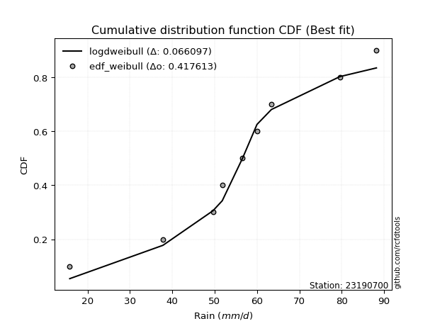</img>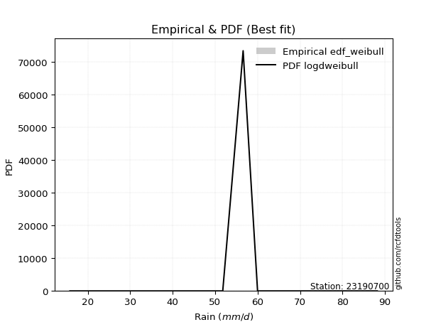</img>

</div>


### 4. EDF Beard (1943)

The Beard formula (or Beard´s plotting position formula) in hydrology is used to estimate the empirical non-exceedance probability _(P)_ of a flood event (or other extreme hydrological data point) within a given dataset.

<div align="center">


$P=(m-0.31)/(n+0.38)$


</div>


**4.1. Empirical values**

<div align="center">

|                | 0                   | 1                   | 2                  | 3                   | 4         | 5                  | 6                  | 7                  | 8                  |
|:---------------|:--------------------|:--------------------|:-------------------|:--------------------|:----------|:-------------------|:-------------------|:-------------------|:-------------------|
| date           | 2017                | 2021                | 2024               | 2023                | 2020      | 2025               | 2018               | 2022               | 2019               |
| x              | 15.8                | 37.8                | 49.6               | 51.8                | 56.6      | 60.0               | 63.4               | 79.6               | 88.2               |
| m              | 1                   | 2                   | 3                  | 4                   | 5         | 6                  | 7                  | 8                  | 9                  |
| empirical_dist | edf_beard           | edf_beard           | edf_beard          | edf_beard           | edf_beard | edf_beard          | edf_beard          | edf_beard          | edf_beard          |
| empirical      | 0.07356076759061833 | 0.18017057569296374 | 0.2867803837953091 | 0.39339019189765456 | 0.5       | 0.6066098081023454 | 0.7132196162046908 | 0.8198294243070362 | 0.9264392324093815 |
| empirical_tr   | 1.0794016110471807  | 1.2197659297789336  | 1.4020926756352765 | 1.6485061511423549  | 2.0       | 2.542005420054201  | 3.486988847583642  | 5.550295857988164  | 13.5942028985507   |

</div>


**4.2. Kolmogorov-Smirnov fit test (sorted by Δ)**


<div align="center">

|                | 0                   | 1                   | 2                   | 3                   | 4                   | 5                   | 6                   | 7                   | 8                   | 9                   | 10                  | 11                  | 12                  | 13                  | 14                  | 15                  | 16                  | 17                  | 18                  | 19                  | 20                  | 21                  | 22                  | 23                  | 24                  | 25                  | 26                  | 27                  | 28                  | 29                  | 30                  | 31                  | 32                  | 33                  | 34                  | 35                  | 36                  | 37                  | 38                  | 39                  | 40                  | 41                  | 42                  | 43                  | 44                  | 45                  | 46                  | 47                  | 48                  | 49                  | 50                  | 51                  | 52                  | 53                  | 54                  | 55                  | 56                  | 57                  | 58                  | 59                  | 60                  | 61                  | 62                  | 63                  | 64                  | 65                  | 66                  | 67                  | 68                  | 69                  | 70                  | 71                  | 72                  | 73                  | 74                  | 75                  | 76                  | 77                  | 78                  | 79                  | 80                  | 81                  | 82                  | 83                  | 84                  | 85                  | 86                  | 87                  | 88                  | 89                  | 90                  | 91                  | 92                  | 93                  | 94                  | 95                  | 96                  | 97                  | 98                  | 99                  | 100                 | 101                 | 102                 | 103                 | 104                 | 105                 | 106                 | 107                 | 108                 | 109                 | 110                 | 111                 | 112                 | 113                 | 114                 | 115                 | 116                 | 117                 | 118                 | 119                 | 120                 | 121                 | 122                 | 123                 | 124                 | 125                 | 126                 | 127                 | 128                 | 129                 | 130                 | 131                 | 132                 | 133                 | 134                 | 135                 | 136                 | 137                 | 138                 | 139                 | 140                 | 141                 | 142                 | 143                 | 144                 | 145                 | 146                 | 147                 | 148                 | 149                 | 150                 | 151                 | 152                 | 153                 | 154                 | 155                 | 156                 | 157                 | 158                 | 159                 |
|:---------------|:--------------------|:--------------------|:--------------------|:--------------------|:--------------------|:--------------------|:--------------------|:--------------------|:--------------------|:--------------------|:--------------------|:--------------------|:--------------------|:--------------------|:--------------------|:--------------------|:--------------------|:--------------------|:--------------------|:--------------------|:--------------------|:--------------------|:--------------------|:--------------------|:--------------------|:--------------------|:--------------------|:--------------------|:--------------------|:--------------------|:--------------------|:--------------------|:--------------------|:--------------------|:--------------------|:--------------------|:--------------------|:--------------------|:--------------------|:--------------------|:--------------------|:--------------------|:--------------------|:--------------------|:--------------------|:--------------------|:--------------------|:--------------------|:--------------------|:--------------------|:--------------------|:--------------------|:--------------------|:--------------------|:--------------------|:--------------------|:--------------------|:--------------------|:--------------------|:--------------------|:--------------------|:--------------------|:--------------------|:--------------------|:--------------------|:--------------------|:--------------------|:--------------------|:--------------------|:--------------------|:--------------------|:--------------------|:--------------------|:--------------------|:--------------------|:--------------------|:--------------------|:--------------------|:--------------------|:--------------------|:--------------------|:--------------------|:--------------------|:--------------------|:--------------------|:--------------------|:--------------------|:--------------------|:--------------------|:--------------------|:--------------------|:--------------------|:--------------------|:--------------------|:--------------------|:--------------------|:--------------------|:--------------------|:--------------------|:--------------------|:--------------------|:--------------------|:--------------------|:--------------------|:--------------------|:--------------------|:--------------------|:--------------------|:--------------------|:--------------------|:--------------------|:--------------------|:--------------------|:--------------------|:--------------------|:--------------------|:--------------------|:--------------------|:--------------------|:--------------------|:--------------------|:--------------------|:--------------------|:--------------------|:--------------------|:--------------------|:--------------------|:--------------------|:--------------------|:--------------------|:--------------------|:--------------------|:--------------------|:--------------------|:--------------------|:--------------------|:--------------------|:--------------------|:--------------------|:--------------------|:--------------------|:--------------------|:--------------------|:--------------------|:--------------------|:--------------------|:--------------------|:--------------------|:--------------------|:--------------------|:--------------------|:--------------------|:--------------------|:--------------------|:--------------------|:--------------------|:--------------------|:--------------------|:--------------------|:--------------------|
| station        | 23190700            | 23190700            | 23190700            | 23190700            | 23190700            | 23190700            | 23190700            | 23190700            | 23190700            | 23190700            | 23190700            | 23190700            | 23190700            | 23190700            | 23190700            | 23190700            | 23190700            | 23190700            | 23190700            | 23190700            | 23190700            | 23190700            | 23190700            | 23190700            | 23190700            | 23190700            | 23190700            | 23190700            | 23190700            | 23190700            | 23190700            | 23190700            | 23190700            | 23190700            | 23190700            | 23190700            | 23190700            | 23190700            | 23190700            | 23190700            | 23190700            | 23190700            | 23190700            | 23190700            | 23190700            | 23190700            | 23190700            | 23190700            | 23190700            | 23190700            | 23190700            | 23190700            | 23190700            | 23190700            | 23190700            | 23190700            | 23190700            | 23190700            | 23190700            | 23190700            | 23190700            | 23190700            | 23190700            | 23190700            | 23190700            | 23190700            | 23190700            | 23190700            | 23190700            | 23190700            | 23190700            | 23190700            | 23190700            | 23190700            | 23190700            | 23190700            | 23190700            | 23190700            | 23190700            | 23190700            | 23190700            | 23190700            | 23190700            | 23190700            | 23190700            | 23190700            | 23190700            | 23190700            | 23190700            | 23190700            | 23190700            | 23190700            | 23190700            | 23190700            | 23190700            | 23190700            | 23190700            | 23190700            | 23190700            | 23190700            | 23190700            | 23190700            | 23190700            | 23190700            | 23190700            | 23190700            | 23190700            | 23190700            | 23190700            | 23190700            | 23190700            | 23190700            | 23190700            | 23190700            | 23190700            | 23190700            | 23190700            | 23190700            | 23190700            | 23190700            | 23190700            | 23190700            | 23190700            | 23190700            | 23190700            | 23190700            | 23190700            | 23190700            | 23190700            | 23190700            | 23190700            | 23190700            | 23190700            | 23190700            | 23190700            | 23190700            | 23190700            | 23190700            | 23190700            | 23190700            | 23190700            | 23190700            | 23190700            | 23190700            | 23190700            | 23190700            | 23190700            | 23190700            | 23190700            | 23190700            | 23190700            | 23190700            | 23190700            | 23190700            | 23190700            | 23190700            | 23190700            | 23190700            | 23190700            | 23190700            |
| empirical_dist | edf_beard           | edf_beard           | edf_beard           | edf_beard           | edf_beard           | edf_beard           | edf_beard           | edf_beard           | edf_beard           | edf_beard           | edf_beard           | edf_beard           | edf_beard           | edf_beard           | edf_beard           | edf_beard           | edf_beard           | edf_beard           | edf_beard           | edf_beard           | edf_beard           | edf_beard           | edf_beard           | edf_beard           | edf_beard           | edf_beard           | edf_beard           | edf_beard           | edf_beard           | edf_beard           | edf_beard           | edf_beard           | edf_beard           | edf_beard           | edf_beard           | edf_beard           | edf_beard           | edf_beard           | edf_beard           | edf_beard           | edf_beard           | edf_beard           | edf_beard           | edf_beard           | edf_beard           | edf_beard           | edf_beard           | edf_beard           | edf_beard           | edf_beard           | edf_beard           | edf_beard           | edf_beard           | edf_beard           | edf_beard           | edf_beard           | edf_beard           | edf_beard           | edf_beard           | edf_beard           | edf_beard           | edf_beard           | edf_beard           | edf_beard           | edf_beard           | edf_beard           | edf_beard           | edf_beard           | edf_beard           | edf_beard           | edf_beard           | edf_beard           | edf_beard           | edf_beard           | edf_beard           | edf_beard           | edf_beard           | edf_beard           | edf_beard           | edf_beard           | edf_beard           | edf_beard           | edf_beard           | edf_beard           | edf_beard           | edf_beard           | edf_beard           | edf_beard           | edf_beard           | edf_beard           | edf_beard           | edf_beard           | edf_beard           | edf_beard           | edf_beard           | edf_beard           | edf_beard           | edf_beard           | edf_beard           | edf_beard           | edf_beard           | edf_beard           | edf_beard           | edf_beard           | edf_beard           | edf_beard           | edf_beard           | edf_beard           | edf_beard           | edf_beard           | edf_beard           | edf_beard           | edf_beard           | edf_beard           | edf_beard           | edf_beard           | edf_beard           | edf_beard           | edf_beard           | edf_beard           | edf_beard           | edf_beard           | edf_beard           | edf_beard           | edf_beard           | edf_beard           | edf_beard           | edf_beard           | edf_beard           | edf_beard           | edf_beard           | edf_beard           | edf_beard           | edf_beard           | edf_beard           | edf_beard           | edf_beard           | edf_beard           | edf_beard           | edf_beard           | edf_beard           | edf_beard           | edf_beard           | edf_beard           | edf_beard           | edf_beard           | edf_beard           | edf_beard           | edf_beard           | edf_beard           | edf_beard           | edf_beard           | edf_beard           | edf_beard           | edf_beard           | edf_beard           | edf_beard           | edf_beard           | edf_beard           | edf_beard           |
| p_dist         | logdgamma           | logt                | gennorm             | dweibull            | dgamma              | genlogistic         | logloglaplace       | logistic            | logburr12           | hypsecant           | pearson3            | laplace             | mielke              | burr                | loggenlogistic      | skewnorm            | weibull_min         | foldnorm            | logvonmises_line    | johnsonsu           | t                   | norm                | crystalball         | truncnorm           | exponnorm           | nct                 | f                   | logdweibull         | erlang              | logloggamma         | gamma               | rice                | logweibull_min      | logpearson3         | genextreme          | anglit              | logjohnsonsu        | logexponweib        | loggompertz         | truncweibull_min    | invgamma            | semicircular        | argus               | gumbel_l            | loggumbel_l         | logargus            | betaprime           | cosine              | maxwell             | logtruncweibull_min | gompertz            | alpha               | exponweib           | rayleigh            | invgauss            | logtrapezoid        | logskewnorm         | arcsine             | vonmises_line       | gumbel_r            | loggausshyper       | logburr             | gausshyper          | lognakagami         | loggenextreme       | loggennorm          | moyal               | logmielke           | halfnorm            | bradford            | loglaplace          | loglaplace          | kappa3              | uniform             | beta                | wrapcauchy          | tukeylambda         | kstwobign           | halflogistic        | loghypsecant        | ksone               | loglogistic         | logf                | logfatiguelife      | logcrystalball      | lognorm             | logexponnorm        | logrice             | lognct              | loganglit           | logsemicircular     | logerlang           | logbetaprime        | loggamma            | loggamma            | triang              | loggenhalflogistic  | logarcsine          | logncf              | loglevy_l           | kappa4              | genhalflogistic     | loginvgamma         | logtriang           | genpareto           | loginvgauss         | logalpha            | wald                | logmaxwell          | logfoldnorm         | loginvweibull       | lograyleigh         | logtruncnorm        | loggenpareto        | truncexpon          | loggumbel_r         | logkstwobign        | loghalfnorm         | logcosine           | logweibull_max      | levy_l              | logrdist            | lomax               | genexpon            | logmoyal            | loggenexpon         | logjohnsonsb        | loghalflogistic     | ncf                 | logbeta             | johnsonsb           | trapezoid           | logwrapcauchy       | halfgennorm         | loglomax            | burr12              | logksone            | logwald             | logkappa4           | logkappa3           | logbradford         | logtukeylambda      | loguniform          | nakagami            | logexponpow         | loggengamma         | logtruncexpon       | invweibull          | gengamma            | powerlaw            | rdist               | fatiguelife         | weibull_max         | logpowerlaw         | exponpow            | truncpareto         | logtruncpareto      | loghalfgennorm      | logvonmises         | vonmises            |
| delta          | 0.06517092588770276 | 0.06886297378237917 | 0.06973361240568676 | 0.0699432907983425  | 0.07159404356968857 | 0.07360574584146196 | 0.07398104500370428 | 0.07611283335491897 | 0.0786943209125584  | 0.0804905854080139  | 0.08439228238782415 | 0.08528852037196388 | 0.08582324536204072 | 0.08599000722151368 | 0.08618297631404692 | 0.08622171159290815 | 0.08741713349773594 | 0.08754659218837424 | 0.08897132175681027 | 0.08922076654593059 | 0.09137184068143289 | 0.09138462541740999 | 0.09138462805186387 | 0.09138463836794142 | 0.09138694957477245 | 0.09141677865440917 | 0.09231271293013965 | 0.09253612206713113 | 0.10076530808260264 | 0.10096259062658774 | 0.10130595991559449 | 0.10190816432122668 | 0.10212789372653219 | 0.1040475009383347  | 0.10783489342468655 | 0.10794120328259998 | 0.11025629778462898 | 0.11116810864990656 | 0.11201543129232427 | 0.11230794162234004 | 0.11478166005829771 | 0.11484460219482384 | 0.11536620220200844 | 0.11738534698499759 | 0.11985357751518089 | 0.12088766680655982 | 0.12248208863190596 | 0.12250760363016827 | 0.12472282615878189 | 0.12581122556259572 | 0.1261861102966214  | 0.12728755297989142 | 0.13174541961581088 | 0.13700448513350327 | 0.1383871677736176  | 0.13996135856401265 | 0.14162817805387035 | 0.142803834438463   | 0.1443568043809178  | 0.14669995190126472 | 0.14829610112063552 | 0.15360035978110986 | 0.15623278062629398 | 0.1630114771276826  | 0.16314266486837248 | 0.16568149955287492 | 0.16775573519954323 | 0.17097530360061297 | 0.17190776258313128 | 0.17350771187149683 | 0.17456016085024262 | 0.17456016085024262 | 0.17934769557234403 | 0.18007044493397256 | 0.18031544059413307 | 0.18123653644706517 | 0.18142592960582382 | 0.18249789997575117 | 0.18446904842419376 | 0.1848064095409092  | 0.1855953068124257  | 0.1874402802434053  | 0.18875851968753887 | 0.18983994999994058 | 0.19053027839464592 | 0.19053123565697772 | 0.1905328024683221  | 0.19054403463528052 | 0.19355695941178452 | 0.19377219506359689 | 0.19510999488724112 | 0.19517011742360313 | 0.19564726794980514 | 0.197514332202136   | 0.197514332202136   | 0.19882465571893326 | 0.19901783372854653 | 0.20040780349700876 | 0.20099301548122395 | 0.2022396127064602  | 0.20366812449997052 | 0.20805672946544063 | 0.20862361316671968 | 0.2155927013176474  | 0.2165150812394842  | 0.21961685596406766 | 0.21992812483677182 | 0.2223201060059471  | 0.224340110295964   | 0.22498704221958654 | 0.2273709892145509  | 0.2358055342089408  | 0.24544939259246457 | 0.24743007680150547 | 0.25477241352761915 | 0.2598585151492253  | 0.2659298573307417  | 0.2681059808356717  | 0.2685726235960858  | 0.27118100761453334 | 0.27693517359361863 | 0.2811990500848636  | 0.2816039965830075  | 0.28321242295602966 | 0.2856966017564938  | 0.2873287970320104  | 0.2903121203670942  | 0.2915009198129199  | 0.2921124219145773  | 0.3032088242167453  | 0.31030032683642694 | 0.31478664712560295 | 0.3222529733728236  | 0.3362119383218302  | 0.33835357817608663 | 0.3405403634776693  | 0.3509371445996091  | 0.3576175943113993  | 0.35787779237489536 | 0.361813178801201   | 0.36510686297493977 | 0.37391600260186086 | 0.37848065027859257 | 0.39911319260887623 | 0.4333658545663477  | 0.4491393716382553  | 0.4552198910307148  | 0.48779588669403573 | 0.5865619403698168  | 0.5969326410422533  | 0.6174459799378021  | 0.6309827667645733  | 0.6328648583162674  | 0.6719672898910416  | 0.7457130884846455  | 0.7497222123812388  | 0.7793975200287588  | 0.8198294243070362  | 1.1667365623566703  | 13.627499740486906  |
| deltao         | 0.41761268023100007 | 0.41761268023100007 | 0.41761268023100007 | 0.41761268023100007 | 0.41761268023100007 | 0.41761268023100007 | 0.41761268023100007 | 0.41761268023100007 | 0.41761268023100007 | 0.41761268023100007 | 0.41761268023100007 | 0.41761268023100007 | 0.41761268023100007 | 0.41761268023100007 | 0.41761268023100007 | 0.41761268023100007 | 0.41761268023100007 | 0.41761268023100007 | 0.41761268023100007 | 0.41761268023100007 | 0.41761268023100007 | 0.41761268023100007 | 0.41761268023100007 | 0.41761268023100007 | 0.41761268023100007 | 0.41761268023100007 | 0.41761268023100007 | 0.41761268023100007 | 0.41761268023100007 | 0.41761268023100007 | 0.41761268023100007 | 0.41761268023100007 | 0.41761268023100007 | 0.41761268023100007 | 0.41761268023100007 | 0.41761268023100007 | 0.41761268023100007 | 0.41761268023100007 | 0.41761268023100007 | 0.41761268023100007 | 0.41761268023100007 | 0.41761268023100007 | 0.41761268023100007 | 0.41761268023100007 | 0.41761268023100007 | 0.41761268023100007 | 0.41761268023100007 | 0.41761268023100007 | 0.41761268023100007 | 0.41761268023100007 | 0.41761268023100007 | 0.41761268023100007 | 0.41761268023100007 | 0.41761268023100007 | 0.41761268023100007 | 0.41761268023100007 | 0.41761268023100007 | 0.41761268023100007 | 0.41761268023100007 | 0.41761268023100007 | 0.41761268023100007 | 0.41761268023100007 | 0.41761268023100007 | 0.41761268023100007 | 0.41761268023100007 | 0.41761268023100007 | 0.41761268023100007 | 0.41761268023100007 | 0.41761268023100007 | 0.41761268023100007 | 0.41761268023100007 | 0.41761268023100007 | 0.41761268023100007 | 0.41761268023100007 | 0.41761268023100007 | 0.41761268023100007 | 0.41761268023100007 | 0.41761268023100007 | 0.41761268023100007 | 0.41761268023100007 | 0.41761268023100007 | 0.41761268023100007 | 0.41761268023100007 | 0.41761268023100007 | 0.41761268023100007 | 0.41761268023100007 | 0.41761268023100007 | 0.41761268023100007 | 0.41761268023100007 | 0.41761268023100007 | 0.41761268023100007 | 0.41761268023100007 | 0.41761268023100007 | 0.41761268023100007 | 0.41761268023100007 | 0.41761268023100007 | 0.41761268023100007 | 0.41761268023100007 | 0.41761268023100007 | 0.41761268023100007 | 0.41761268023100007 | 0.41761268023100007 | 0.41761268023100007 | 0.41761268023100007 | 0.41761268023100007 | 0.41761268023100007 | 0.41761268023100007 | 0.41761268023100007 | 0.41761268023100007 | 0.41761268023100007 | 0.41761268023100007 | 0.41761268023100007 | 0.41761268023100007 | 0.41761268023100007 | 0.41761268023100007 | 0.41761268023100007 | 0.41761268023100007 | 0.41761268023100007 | 0.41761268023100007 | 0.41761268023100007 | 0.41761268023100007 | 0.41761268023100007 | 0.41761268023100007 | 0.41761268023100007 | 0.41761268023100007 | 0.41761268023100007 | 0.41761268023100007 | 0.41761268023100007 | 0.41761268023100007 | 0.41761268023100007 | 0.41761268023100007 | 0.41761268023100007 | 0.41761268023100007 | 0.41761268023100007 | 0.41761268023100007 | 0.41761268023100007 | 0.41761268023100007 | 0.41761268023100007 | 0.41761268023100007 | 0.41761268023100007 | 0.41761268023100007 | 0.41761268023100007 | 0.41761268023100007 | 0.41761268023100007 | 0.41761268023100007 | 0.41761268023100007 | 0.41761268023100007 | 0.41761268023100007 | 0.41761268023100007 | 0.41761268023100007 | 0.41761268023100007 | 0.41761268023100007 | 0.41761268023100007 | 0.41761268023100007 | 0.41761268023100007 | 0.41761268023100007 | 0.41761268023100007 | 0.41761268023100007 | 0.41761268023100007 | 0.41761268023100007 |
| eval           | Δo > Δ              | Δo > Δ              | Δo > Δ              | Δo > Δ              | Δo > Δ              | Δo > Δ              | Δo > Δ              | Δo > Δ              | Δo > Δ              | Δo > Δ              | Δo > Δ              | Δo > Δ              | Δo > Δ              | Δo > Δ              | Δo > Δ              | Δo > Δ              | Δo > Δ              | Δo > Δ              | Δo > Δ              | Δo > Δ              | Δo > Δ              | Δo > Δ              | Δo > Δ              | Δo > Δ              | Δo > Δ              | Δo > Δ              | Δo > Δ              | Δo > Δ              | Δo > Δ              | Δo > Δ              | Δo > Δ              | Δo > Δ              | Δo > Δ              | Δo > Δ              | Δo > Δ              | Δo > Δ              | Δo > Δ              | Δo > Δ              | Δo > Δ              | Δo > Δ              | Δo > Δ              | Δo > Δ              | Δo > Δ              | Δo > Δ              | Δo > Δ              | Δo > Δ              | Δo > Δ              | Δo > Δ              | Δo > Δ              | Δo > Δ              | Δo > Δ              | Δo > Δ              | Δo > Δ              | Δo > Δ              | Δo > Δ              | Δo > Δ              | Δo > Δ              | Δo > Δ              | Δo > Δ              | Δo > Δ              | Δo > Δ              | Δo > Δ              | Δo > Δ              | Δo > Δ              | Δo > Δ              | Δo > Δ              | Δo > Δ              | Δo > Δ              | Δo > Δ              | Δo > Δ              | Δo > Δ              | Δo > Δ              | Δo > Δ              | Δo > Δ              | Δo > Δ              | Δo > Δ              | Δo > Δ              | Δo > Δ              | Δo > Δ              | Δo > Δ              | Δo > Δ              | Δo > Δ              | Δo > Δ              | Δo > Δ              | Δo > Δ              | Δo > Δ              | Δo > Δ              | Δo > Δ              | Δo > Δ              | Δo > Δ              | Δo > Δ              | Δo > Δ              | Δo > Δ              | Δo > Δ              | Δo > Δ              | Δo > Δ              | Δo > Δ              | Δo > Δ              | Δo > Δ              | Δo > Δ              | Δo > Δ              | Δo > Δ              | Δo > Δ              | Δo > Δ              | Δo > Δ              | Δo > Δ              | Δo > Δ              | Δo > Δ              | Δo > Δ              | Δo > Δ              | Δo > Δ              | Δo > Δ              | Δo > Δ              | Δo > Δ              | Δo > Δ              | Δo > Δ              | Δo > Δ              | Δo > Δ              | Δo > Δ              | Δo > Δ              | Δo > Δ              | Δo > Δ              | Δo > Δ              | Δo > Δ              | Δo > Δ              | Δo > Δ              | Δo > Δ              | Δo > Δ              | Δo > Δ              | Δo > Δ              | Δo > Δ              | Δo > Δ              | Δo > Δ              | Δo > Δ              | Δo > Δ              | Δo > Δ              | Δo > Δ              | Δo > Δ              | Δo > Δ              | Δo > Δ              | Δo > Δ              | Δo > Δ              | Δo > Δ              | Δo > Δ              | Δo <= Δ             | Δo <= Δ             | Δo <= Δ             | Δo <= Δ             | Δo <= Δ             | Δo <= Δ             | Δo <= Δ             | Δo <= Δ             | Δo <= Δ             | Δo <= Δ             | Δo <= Δ             | Δo <= Δ             | Δo <= Δ             | Δo <= Δ             | Δo <= Δ             | Δo <= Δ             |
| fit            | 1                   | 1                   | 1                   | 1                   | 1                   | 1                   | 1                   | 1                   | 1                   | 1                   | 1                   | 1                   | 1                   | 1                   | 1                   | 1                   | 1                   | 1                   | 1                   | 1                   | 1                   | 1                   | 1                   | 1                   | 1                   | 1                   | 1                   | 1                   | 1                   | 1                   | 1                   | 1                   | 1                   | 1                   | 1                   | 1                   | 1                   | 1                   | 1                   | 1                   | 1                   | 1                   | 1                   | 1                   | 1                   | 1                   | 1                   | 1                   | 1                   | 1                   | 1                   | 1                   | 1                   | 1                   | 1                   | 1                   | 1                   | 1                   | 1                   | 1                   | 1                   | 1                   | 1                   | 1                   | 1                   | 1                   | 1                   | 1                   | 1                   | 1                   | 1                   | 1                   | 1                   | 1                   | 1                   | 1                   | 1                   | 1                   | 1                   | 1                   | 1                   | 1                   | 1                   | 1                   | 1                   | 1                   | 1                   | 1                   | 1                   | 1                   | 1                   | 1                   | 1                   | 1                   | 1                   | 1                   | 1                   | 1                   | 1                   | 1                   | 1                   | 1                   | 1                   | 1                   | 1                   | 1                   | 1                   | 1                   | 1                   | 1                   | 1                   | 1                   | 1                   | 1                   | 1                   | 1                   | 1                   | 1                   | 1                   | 1                   | 1                   | 1                   | 1                   | 1                   | 1                   | 1                   | 1                   | 1                   | 1                   | 1                   | 1                   | 1                   | 1                   | 1                   | 1                   | 1                   | 1                   | 1                   | 1                   | 1                   | 1                   | 1                   | 1                   | 1                   | 0                   | 0                   | 0                   | 0                   | 0                   | 0                   | 0                   | 0                   | 0                   | 0                   | 0                   | 0                   | 0                   | 0                   | 0                   | 0                   |
| n              | 9                   | 9                   | 9                   | 9                   | 9                   | 9                   | 9                   | 9                   | 9                   | 9                   | 9                   | 9                   | 9                   | 9                   | 9                   | 9                   | 9                   | 9                   | 9                   | 9                   | 9                   | 9                   | 9                   | 9                   | 9                   | 9                   | 9                   | 9                   | 9                   | 9                   | 9                   | 9                   | 9                   | 9                   | 9                   | 9                   | 9                   | 9                   | 9                   | 9                   | 9                   | 9                   | 9                   | 9                   | 9                   | 9                   | 9                   | 9                   | 9                   | 9                   | 9                   | 9                   | 9                   | 9                   | 9                   | 9                   | 9                   | 9                   | 9                   | 9                   | 9                   | 9                   | 9                   | 9                   | 9                   | 9                   | 9                   | 9                   | 9                   | 9                   | 9                   | 9                   | 9                   | 9                   | 9                   | 9                   | 9                   | 9                   | 9                   | 9                   | 9                   | 9                   | 9                   | 9                   | 9                   | 9                   | 9                   | 9                   | 9                   | 9                   | 9                   | 9                   | 9                   | 9                   | 9                   | 9                   | 9                   | 9                   | 9                   | 9                   | 9                   | 9                   | 9                   | 9                   | 9                   | 9                   | 9                   | 9                   | 9                   | 9                   | 9                   | 9                   | 9                   | 9                   | 9                   | 9                   | 9                   | 9                   | 9                   | 9                   | 9                   | 9                   | 9                   | 9                   | 9                   | 9                   | 9                   | 9                   | 9                   | 9                   | 9                   | 9                   | 9                   | 9                   | 9                   | 9                   | 9                   | 9                   | 9                   | 9                   | 9                   | 9                   | 9                   | 9                   | 9                   | 9                   | 9                   | 9                   | 9                   | 9                   | 9                   | 9                   | 9                   | 9                   | 9                   | 9                   | 9                   | 9                   | 9                   | 9                   |
| best_fit       | 1                   | 0                   | 0                   | 0                   | 0                   | 0                   | 0                   | 0                   | 0                   | 0                   | 0                   | 0                   | 0                   | 0                   | 0                   | 0                   | 0                   | 0                   | 0                   | 0                   | 0                   | 0                   | 0                   | 0                   | 0                   | 0                   | 0                   | 0                   | 0                   | 0                   | 0                   | 0                   | 0                   | 0                   | 0                   | 0                   | 0                   | 0                   | 0                   | 0                   | 0                   | 0                   | 0                   | 0                   | 0                   | 0                   | 0                   | 0                   | 0                   | 0                   | 0                   | 0                   | 0                   | 0                   | 0                   | 0                   | 0                   | 0                   | 0                   | 0                   | 0                   | 0                   | 0                   | 0                   | 0                   | 0                   | 0                   | 0                   | 0                   | 0                   | 0                   | 0                   | 0                   | 0                   | 0                   | 0                   | 0                   | 0                   | 0                   | 0                   | 0                   | 0                   | 0                   | 0                   | 0                   | 0                   | 0                   | 0                   | 0                   | 0                   | 0                   | 0                   | 0                   | 0                   | 0                   | 0                   | 0                   | 0                   | 0                   | 0                   | 0                   | 0                   | 0                   | 0                   | 0                   | 0                   | 0                   | 0                   | 0                   | 0                   | 0                   | 0                   | 0                   | 0                   | 0                   | 0                   | 0                   | 0                   | 0                   | 0                   | 0                   | 0                   | 0                   | 0                   | 0                   | 0                   | 0                   | 0                   | 0                   | 0                   | 0                   | 0                   | 0                   | 0                   | 0                   | 0                   | 0                   | 0                   | 0                   | 0                   | 0                   | 0                   | 0                   | 0                   | 0                   | 0                   | 0                   | 0                   | 0                   | 0                   | 0                   | 0                   | 0                   | 0                   | 0                   | 0                   | 0                   | 0                   | 0                   | 0                   |
| best_fit_sort  | 1                   | 2                   | 3                   | 4                   | 5                   | 6                   | 7                   | 8                   | 9                   | 10                  | 11                  | 12                  | 13                  | 14                  | 15                  | 16                  | 17                  | 18                  | 19                  | 20                  | 21                  | 22                  | 23                  | 24                  | 25                  | 26                  | 27                  | 28                  | 29                  | 30                  | 31                  | 32                  | 33                  | 34                  | 35                  | 36                  | 37                  | 38                  | 39                  | 40                  | 41                  | 42                  | 43                  | 44                  | 45                  | 46                  | 47                  | 48                  | 49                  | 50                  | 51                  | 52                  | 53                  | 54                  | 55                  | 56                  | 57                  | 58                  | 59                  | 60                  | 61                  | 62                  | 63                  | 64                  | 65                  | 66                  | 67                  | 68                  | 69                  | 70                  | 71                  | 72                  | 73                  | 74                  | 75                  | 76                  | 77                  | 78                  | 79                  | 80                  | 81                  | 82                  | 83                  | 84                  | 85                  | 86                  | 87                  | 88                  | 89                  | 90                  | 91                  | 92                  | 93                  | 94                  | 95                  | 96                  | 97                  | 98                  | 99                  | 100                 | 101                 | 102                 | 103                 | 104                 | 105                 | 106                 | 107                 | 108                 | 109                 | 110                 | 111                 | 112                 | 113                 | 114                 | 115                 | 116                 | 117                 | 118                 | 119                 | 120                 | 121                 | 122                 | 123                 | 124                 | 125                 | 126                 | 127                 | 128                 | 129                 | 130                 | 131                 | 132                 | 133                 | 134                 | 135                 | 136                 | 137                 | 138                 | 139                 | 140                 | 141                 | 142                 | 143                 | 144                 | 145                 | 146                 | 147                 | 148                 | 149                 | 150                 | 151                 | 152                 | 153                 | 154                 | 155                 | 156                 | 157                 | 158                 | 159                 | 160                 |

</div>


**4.3. Best fit**

<div align="center">

|   id |   station | empirical_dist   | p_dist    |     delta |   deltao | eval   |   fit |   n |   best_fit |   best_fit_sort |
|-----:|----------:|:-----------------|:----------|----------:|---------:|:-------|------:|----:|-----------:|----------------:|
|    0 |  23190700 | edf_beard        | logdgamma | 0.0651709 | 0.417613 | Δo > Δ |     1 |   9 |          1 |               1 |

</div>


<div align="center">

</img></img>

</div>


### 5. EDF Chegodayev (1955)

The Chegodayev formula is an empirical plotting position formula used in hydrological frequency analysis to estimate the exceedance probability or return period of a specific event from a set of observed data. It is primarily used for plotting observed data points on probability paper to fit a theoretical distribution, particularly for analyzing extreme events like maximum flood flows or rainfall intensities. The constant _b_ value in the generalized plotting position formula is 0.3.

<div align="center">


$P=(m-b)/(n+1-2b)$


</div>


**5.1. Empirical values**

<div align="center">

|                | 0                   | 1                   | 2                  | 3                   | 4              | 5                  | 6                  | 7                  | 8                  |
|:---------------|:--------------------|:--------------------|:-------------------|:--------------------|:---------------|:-------------------|:-------------------|:-------------------|:-------------------|
| date           | 2017                | 2021                | 2024               | 2023                | 2020           | 2025               | 2018               | 2022               | 2019               |
| x              | 15.8                | 37.8                | 49.6               | 51.8                | 56.6           | 60.0               | 63.4               | 79.6               | 88.2               |
| m              | 1                   | 2                   | 3                  | 4                   | 5              | 6                  | 7                  | 8                  | 9                  |
| empirical_dist | edf_chegodayev      | edf_chegodayev      | edf_chegodayev     | edf_chegodayev      | edf_chegodayev | edf_chegodayev     | edf_chegodayev     | edf_chegodayev     | edf_chegodayev     |
| empirical      | 0.07446808510638298 | 0.18085106382978722 | 0.2872340425531915 | 0.39361702127659576 | 0.5            | 0.6063829787234043 | 0.7127659574468085 | 0.8191489361702128 | 0.9255319148936169 |
| empirical_tr   | 1.0804597701149425  | 1.2207792207792207  | 1.4029850746268657 | 1.6491228070175437  | 2.0            | 2.540540540540541  | 3.481481481481481  | 5.529411764705883  | 13.428571428571399 |

</div>


**5.2. Kolmogorov-Smirnov fit test (sorted by Δ)**


<div align="center">

|                | 0                   | 1                   | 2                   | 3                   | 4                   | 5                   | 6                   | 7                   | 8                   | 9                   | 10                  | 11                  | 12                  | 13                  | 14                  | 15                  | 16                  | 17                  | 18                  | 19                  | 20                  | 21                  | 22                  | 23                  | 24                  | 25                  | 26                  | 27                  | 28                  | 29                  | 30                  | 31                  | 32                  | 33                  | 34                  | 35                  | 36                  | 37                  | 38                  | 39                  | 40                  | 41                  | 42                  | 43                  | 44                  | 45                  | 46                  | 47                  | 48                  | 49                  | 50                  | 51                  | 52                  | 53                  | 54                  | 55                  | 56                  | 57                  | 58                  | 59                  | 60                  | 61                  | 62                  | 63                  | 64                  | 65                  | 66                  | 67                  | 68                  | 69                  | 70                  | 71                  | 72                  | 73                  | 74                  | 75                  | 76                  | 77                  | 78                  | 79                  | 80                  | 81                  | 82                  | 83                  | 84                  | 85                  | 86                  | 87                  | 88                  | 89                  | 90                  | 91                  | 92                  | 93                  | 94                  | 95                  | 96                  | 97                  | 98                  | 99                  | 100                 | 101                 | 102                 | 103                 | 104                 | 105                 | 106                 | 107                 | 108                 | 109                 | 110                 | 111                 | 112                 | 113                 | 114                 | 115                 | 116                 | 117                 | 118                 | 119                 | 120                 | 121                 | 122                 | 123                 | 124                 | 125                 | 126                 | 127                 | 128                 | 129                 | 130                 | 131                 | 132                 | 133                 | 134                 | 135                 | 136                 | 137                 | 138                 | 139                 | 140                 | 141                 | 142                 | 143                 | 144                 | 145                 | 146                 | 147                 | 148                 | 149                 | 150                 | 151                 | 152                 | 153                 | 154                 | 155                 | 156                 | 157                 | 158                 | 159                 |
|:---------------|:--------------------|:--------------------|:--------------------|:--------------------|:--------------------|:--------------------|:--------------------|:--------------------|:--------------------|:--------------------|:--------------------|:--------------------|:--------------------|:--------------------|:--------------------|:--------------------|:--------------------|:--------------------|:--------------------|:--------------------|:--------------------|:--------------------|:--------------------|:--------------------|:--------------------|:--------------------|:--------------------|:--------------------|:--------------------|:--------------------|:--------------------|:--------------------|:--------------------|:--------------------|:--------------------|:--------------------|:--------------------|:--------------------|:--------------------|:--------------------|:--------------------|:--------------------|:--------------------|:--------------------|:--------------------|:--------------------|:--------------------|:--------------------|:--------------------|:--------------------|:--------------------|:--------------------|:--------------------|:--------------------|:--------------------|:--------------------|:--------------------|:--------------------|:--------------------|:--------------------|:--------------------|:--------------------|:--------------------|:--------------------|:--------------------|:--------------------|:--------------------|:--------------------|:--------------------|:--------------------|:--------------------|:--------------------|:--------------------|:--------------------|:--------------------|:--------------------|:--------------------|:--------------------|:--------------------|:--------------------|:--------------------|:--------------------|:--------------------|:--------------------|:--------------------|:--------------------|:--------------------|:--------------------|:--------------------|:--------------------|:--------------------|:--------------------|:--------------------|:--------------------|:--------------------|:--------------------|:--------------------|:--------------------|:--------------------|:--------------------|:--------------------|:--------------------|:--------------------|:--------------------|:--------------------|:--------------------|:--------------------|:--------------------|:--------------------|:--------------------|:--------------------|:--------------------|:--------------------|:--------------------|:--------------------|:--------------------|:--------------------|:--------------------|:--------------------|:--------------------|:--------------------|:--------------------|:--------------------|:--------------------|:--------------------|:--------------------|:--------------------|:--------------------|:--------------------|:--------------------|:--------------------|:--------------------|:--------------------|:--------------------|:--------------------|:--------------------|:--------------------|:--------------------|:--------------------|:--------------------|:--------------------|:--------------------|:--------------------|:--------------------|:--------------------|:--------------------|:--------------------|:--------------------|:--------------------|:--------------------|:--------------------|:--------------------|:--------------------|:--------------------|:--------------------|:--------------------|:--------------------|:--------------------|:--------------------|:--------------------|
| station        | 23190700            | 23190700            | 23190700            | 23190700            | 23190700            | 23190700            | 23190700            | 23190700            | 23190700            | 23190700            | 23190700            | 23190700            | 23190700            | 23190700            | 23190700            | 23190700            | 23190700            | 23190700            | 23190700            | 23190700            | 23190700            | 23190700            | 23190700            | 23190700            | 23190700            | 23190700            | 23190700            | 23190700            | 23190700            | 23190700            | 23190700            | 23190700            | 23190700            | 23190700            | 23190700            | 23190700            | 23190700            | 23190700            | 23190700            | 23190700            | 23190700            | 23190700            | 23190700            | 23190700            | 23190700            | 23190700            | 23190700            | 23190700            | 23190700            | 23190700            | 23190700            | 23190700            | 23190700            | 23190700            | 23190700            | 23190700            | 23190700            | 23190700            | 23190700            | 23190700            | 23190700            | 23190700            | 23190700            | 23190700            | 23190700            | 23190700            | 23190700            | 23190700            | 23190700            | 23190700            | 23190700            | 23190700            | 23190700            | 23190700            | 23190700            | 23190700            | 23190700            | 23190700            | 23190700            | 23190700            | 23190700            | 23190700            | 23190700            | 23190700            | 23190700            | 23190700            | 23190700            | 23190700            | 23190700            | 23190700            | 23190700            | 23190700            | 23190700            | 23190700            | 23190700            | 23190700            | 23190700            | 23190700            | 23190700            | 23190700            | 23190700            | 23190700            | 23190700            | 23190700            | 23190700            | 23190700            | 23190700            | 23190700            | 23190700            | 23190700            | 23190700            | 23190700            | 23190700            | 23190700            | 23190700            | 23190700            | 23190700            | 23190700            | 23190700            | 23190700            | 23190700            | 23190700            | 23190700            | 23190700            | 23190700            | 23190700            | 23190700            | 23190700            | 23190700            | 23190700            | 23190700            | 23190700            | 23190700            | 23190700            | 23190700            | 23190700            | 23190700            | 23190700            | 23190700            | 23190700            | 23190700            | 23190700            | 23190700            | 23190700            | 23190700            | 23190700            | 23190700            | 23190700            | 23190700            | 23190700            | 23190700            | 23190700            | 23190700            | 23190700            | 23190700            | 23190700            | 23190700            | 23190700            | 23190700            | 23190700            |
| empirical_dist | edf_chegodayev      | edf_chegodayev      | edf_chegodayev      | edf_chegodayev      | edf_chegodayev      | edf_chegodayev      | edf_chegodayev      | edf_chegodayev      | edf_chegodayev      | edf_chegodayev      | edf_chegodayev      | edf_chegodayev      | edf_chegodayev      | edf_chegodayev      | edf_chegodayev      | edf_chegodayev      | edf_chegodayev      | edf_chegodayev      | edf_chegodayev      | edf_chegodayev      | edf_chegodayev      | edf_chegodayev      | edf_chegodayev      | edf_chegodayev      | edf_chegodayev      | edf_chegodayev      | edf_chegodayev      | edf_chegodayev      | edf_chegodayev      | edf_chegodayev      | edf_chegodayev      | edf_chegodayev      | edf_chegodayev      | edf_chegodayev      | edf_chegodayev      | edf_chegodayev      | edf_chegodayev      | edf_chegodayev      | edf_chegodayev      | edf_chegodayev      | edf_chegodayev      | edf_chegodayev      | edf_chegodayev      | edf_chegodayev      | edf_chegodayev      | edf_chegodayev      | edf_chegodayev      | edf_chegodayev      | edf_chegodayev      | edf_chegodayev      | edf_chegodayev      | edf_chegodayev      | edf_chegodayev      | edf_chegodayev      | edf_chegodayev      | edf_chegodayev      | edf_chegodayev      | edf_chegodayev      | edf_chegodayev      | edf_chegodayev      | edf_chegodayev      | edf_chegodayev      | edf_chegodayev      | edf_chegodayev      | edf_chegodayev      | edf_chegodayev      | edf_chegodayev      | edf_chegodayev      | edf_chegodayev      | edf_chegodayev      | edf_chegodayev      | edf_chegodayev      | edf_chegodayev      | edf_chegodayev      | edf_chegodayev      | edf_chegodayev      | edf_chegodayev      | edf_chegodayev      | edf_chegodayev      | edf_chegodayev      | edf_chegodayev      | edf_chegodayev      | edf_chegodayev      | edf_chegodayev      | edf_chegodayev      | edf_chegodayev      | edf_chegodayev      | edf_chegodayev      | edf_chegodayev      | edf_chegodayev      | edf_chegodayev      | edf_chegodayev      | edf_chegodayev      | edf_chegodayev      | edf_chegodayev      | edf_chegodayev      | edf_chegodayev      | edf_chegodayev      | edf_chegodayev      | edf_chegodayev      | edf_chegodayev      | edf_chegodayev      | edf_chegodayev      | edf_chegodayev      | edf_chegodayev      | edf_chegodayev      | edf_chegodayev      | edf_chegodayev      | edf_chegodayev      | edf_chegodayev      | edf_chegodayev      | edf_chegodayev      | edf_chegodayev      | edf_chegodayev      | edf_chegodayev      | edf_chegodayev      | edf_chegodayev      | edf_chegodayev      | edf_chegodayev      | edf_chegodayev      | edf_chegodayev      | edf_chegodayev      | edf_chegodayev      | edf_chegodayev      | edf_chegodayev      | edf_chegodayev      | edf_chegodayev      | edf_chegodayev      | edf_chegodayev      | edf_chegodayev      | edf_chegodayev      | edf_chegodayev      | edf_chegodayev      | edf_chegodayev      | edf_chegodayev      | edf_chegodayev      | edf_chegodayev      | edf_chegodayev      | edf_chegodayev      | edf_chegodayev      | edf_chegodayev      | edf_chegodayev      | edf_chegodayev      | edf_chegodayev      | edf_chegodayev      | edf_chegodayev      | edf_chegodayev      | edf_chegodayev      | edf_chegodayev      | edf_chegodayev      | edf_chegodayev      | edf_chegodayev      | edf_chegodayev      | edf_chegodayev      | edf_chegodayev      | edf_chegodayev      | edf_chegodayev      | edf_chegodayev      | edf_chegodayev      | edf_chegodayev      |
| p_dist         | logdgamma           | logt                | gennorm             | dweibull            | dgamma              | logloglaplace       | genlogistic         | logistic            | logburr12           | hypsecant           | pearson3            | mielke              | burr                | loggenlogistic      | skewnorm            | laplace             | weibull_min         | foldnorm            | logvonmises_line    | johnsonsu           | t                   | norm                | crystalball         | truncnorm           | exponnorm           | nct                 | logdweibull         | f                   | erlang              | logloggamma         | gamma               | rice                | logweibull_min      | logpearson3         | genextreme          | anglit              | logjohnsonsu        | logexponweib        | loggompertz         | truncweibull_min    | invgamma            | semicircular        | argus               | gumbel_l            | loggumbel_l         | logargus            | betaprime           | cosine              | maxwell             | logtruncweibull_min | gompertz            | alpha               | exponweib           | rayleigh            | invgauss            | logtrapezoid        | logskewnorm         | arcsine             | vonmises_line       | gumbel_r            | loggausshyper       | logburr             | gausshyper          | loggenextreme       | lognakagami         | loggennorm          | moyal               | logmielke           | halfnorm            | bradford            | loglaplace          | loglaplace          | kappa3              | uniform             | beta                | wrapcauchy          | tukeylambda         | kstwobign           | halflogistic        | loghypsecant        | ksone               | loglogistic         | logf                | logfatiguelife      | logcrystalball      | lognorm             | logexponnorm        | logrice             | lognct              | loganglit           | logsemicircular     | logerlang           | logbetaprime        | loggamma            | loggamma            | triang              | loggenhalflogistic  | logarcsine          | logncf              | loglevy_l           | kappa4              | genhalflogistic     | loginvgamma         | logtriang           | genpareto           | loginvgauss         | logalpha            | wald                | logmaxwell          | logfoldnorm         | loginvweibull       | lograyleigh         | logtruncnorm        | loggenpareto        | truncexpon          | loggumbel_r         | logkstwobign        | loghalfnorm         | logcosine           | logweibull_max      | levy_l              | logrdist            | lomax               | genexpon            | logmoyal            | loggenexpon         | logjohnsonsb        | loghalflogistic     | ncf                 | logbeta             | johnsonsb           | trapezoid           | logwrapcauchy       | halfgennorm         | loglomax            | burr12              | logksone            | logwald             | logkappa4           | logkappa3           | logbradford         | logtukeylambda      | loguniform          | nakagami            | logexponpow         | loggengamma         | logtruncexpon       | invweibull          | gengamma            | powerlaw            | rdist               | fatiguelife         | weibull_max         | logpowerlaw         | exponpow            | truncpareto         | logtruncpareto      | loghalfgennorm      | logvonmises         | vonmises            |
| delta          | 0.06607824340346741 | 0.06954346191920265 | 0.07041410054251018 | 0.07062377893516592 | 0.07227453170651199 | 0.073527386245822   | 0.07428623397828538 | 0.07565917459703658 | 0.07824066215467601 | 0.08117107354483732 | 0.08393862362994187 | 0.08536958660415833 | 0.08553634846363128 | 0.08572931755616453 | 0.08576805283502587 | 0.0859690085087873  | 0.08696347473985366 | 0.08709293343049185 | 0.08851766299892788 | 0.0887671077880483  | 0.0909181819235505  | 0.0909309666595276  | 0.09093096929398148 | 0.09093097961005903 | 0.09093329081689006 | 0.09096311989652678 | 0.09162880455136646 | 0.09185905417225726 | 0.10031164932472025 | 0.10050893186870546 | 0.1008523011577121  | 0.10145450556334429 | 0.1016742349686498  | 0.10359384218045242 | 0.10738123466680427 | 0.1074875445247176  | 0.1098026390267467  | 0.11071444989202428 | 0.11156177253444188 | 0.11185428286445764 | 0.11432800130041532 | 0.11439094343694145 | 0.11491254344412616 | 0.1169316882271153  | 0.1193999187572985  | 0.12043400804867754 | 0.12202842987402357 | 0.12205394487228588 | 0.1242691674008995  | 0.12535756680471344 | 0.12573245153873913 | 0.12683389422200902 | 0.13129176085792849 | 0.13655082637562088 | 0.1379335090157352  | 0.13950769980613026 | 0.14117451929598795 | 0.14235017568058062 | 0.1439031456230354  | 0.14624629314338233 | 0.14784244236275323 | 0.15314670102322758 | 0.15577912186841159 | 0.1626890061104902  | 0.16369196526450608 | 0.16590832893181612 | 0.16730207644166084 | 0.1705216448427307  | 0.1714541038252489  | 0.17305405311361444 | 0.17410650209236023 | 0.17410650209236023 | 0.17889403681446164 | 0.17961678617609017 | 0.17986178183625068 | 0.18078287768918277 | 0.18097227084794143 | 0.18204424121786877 | 0.18401538966631137 | 0.18435275078302682 | 0.1851416480545433  | 0.18698662148552292 | 0.18830486092965648 | 0.1893862912420582  | 0.19007661963676353 | 0.19007757689909532 | 0.1900791437104397  | 0.19009037587739813 | 0.19310330065390213 | 0.1933185363057145  | 0.19465633612935873 | 0.19471645866572074 | 0.19519360919192275 | 0.1970606734442536  | 0.1970606734442536  | 0.19837099696105098 | 0.19856417497066414 | 0.19995414473912637 | 0.20053935672334156 | 0.20133229519069556 | 0.20321446574208812 | 0.20760307070755835 | 0.2081699544088373  | 0.21513904255976501 | 0.21606142248160193 | 0.21916319720618527 | 0.21947446607888943 | 0.2218664472480647  | 0.22388645153808162 | 0.22453338346170415 | 0.2269173304566685  | 0.2353518754510584  | 0.24499573383458217 | 0.246749588664682   | 0.25431875476973675 | 0.2594048563913429  | 0.2654761985728593  | 0.26765232207778933 | 0.2681189648382034  | 0.27072734885665106 | 0.276027856077854   | 0.28051856194804015 | 0.2811503378251251  | 0.28275876419814727 | 0.2852429429986114  | 0.286875138274128   | 0.2896316322302708  | 0.29104726105503753 | 0.29143193377775384 | 0.302755165458863   | 0.3096198386996035  | 0.31433298836772067 | 0.3215724852360001  | 0.33553145018500674 | 0.33767309003926316 | 0.33985987534084583 | 0.3504834858417267  | 0.3571639355535169  | 0.357424133617013   | 0.3613595200433186  | 0.3646532042170574  | 0.3734623438439785  | 0.3780269915207102  | 0.39865953385099384 | 0.4329121958084653  | 0.4484588835014318  | 0.4547662322728324  | 0.48688856917827106 | 0.5858814522329933  | 0.5962521529054299  | 0.6169923211799198  | 0.6303022786277499  | 0.632184370179444   | 0.6712868017542182  | 0.745032600347822   | 0.7490417242444154  | 0.7787170318919354  | 0.8191489361702128  | 1.166282903598788   | 13.62840705800267   |
| deltao         | 0.41761268023100007 | 0.41761268023100007 | 0.41761268023100007 | 0.41761268023100007 | 0.41761268023100007 | 0.41761268023100007 | 0.41761268023100007 | 0.41761268023100007 | 0.41761268023100007 | 0.41761268023100007 | 0.41761268023100007 | 0.41761268023100007 | 0.41761268023100007 | 0.41761268023100007 | 0.41761268023100007 | 0.41761268023100007 | 0.41761268023100007 | 0.41761268023100007 | 0.41761268023100007 | 0.41761268023100007 | 0.41761268023100007 | 0.41761268023100007 | 0.41761268023100007 | 0.41761268023100007 | 0.41761268023100007 | 0.41761268023100007 | 0.41761268023100007 | 0.41761268023100007 | 0.41761268023100007 | 0.41761268023100007 | 0.41761268023100007 | 0.41761268023100007 | 0.41761268023100007 | 0.41761268023100007 | 0.41761268023100007 | 0.41761268023100007 | 0.41761268023100007 | 0.41761268023100007 | 0.41761268023100007 | 0.41761268023100007 | 0.41761268023100007 | 0.41761268023100007 | 0.41761268023100007 | 0.41761268023100007 | 0.41761268023100007 | 0.41761268023100007 | 0.41761268023100007 | 0.41761268023100007 | 0.41761268023100007 | 0.41761268023100007 | 0.41761268023100007 | 0.41761268023100007 | 0.41761268023100007 | 0.41761268023100007 | 0.41761268023100007 | 0.41761268023100007 | 0.41761268023100007 | 0.41761268023100007 | 0.41761268023100007 | 0.41761268023100007 | 0.41761268023100007 | 0.41761268023100007 | 0.41761268023100007 | 0.41761268023100007 | 0.41761268023100007 | 0.41761268023100007 | 0.41761268023100007 | 0.41761268023100007 | 0.41761268023100007 | 0.41761268023100007 | 0.41761268023100007 | 0.41761268023100007 | 0.41761268023100007 | 0.41761268023100007 | 0.41761268023100007 | 0.41761268023100007 | 0.41761268023100007 | 0.41761268023100007 | 0.41761268023100007 | 0.41761268023100007 | 0.41761268023100007 | 0.41761268023100007 | 0.41761268023100007 | 0.41761268023100007 | 0.41761268023100007 | 0.41761268023100007 | 0.41761268023100007 | 0.41761268023100007 | 0.41761268023100007 | 0.41761268023100007 | 0.41761268023100007 | 0.41761268023100007 | 0.41761268023100007 | 0.41761268023100007 | 0.41761268023100007 | 0.41761268023100007 | 0.41761268023100007 | 0.41761268023100007 | 0.41761268023100007 | 0.41761268023100007 | 0.41761268023100007 | 0.41761268023100007 | 0.41761268023100007 | 0.41761268023100007 | 0.41761268023100007 | 0.41761268023100007 | 0.41761268023100007 | 0.41761268023100007 | 0.41761268023100007 | 0.41761268023100007 | 0.41761268023100007 | 0.41761268023100007 | 0.41761268023100007 | 0.41761268023100007 | 0.41761268023100007 | 0.41761268023100007 | 0.41761268023100007 | 0.41761268023100007 | 0.41761268023100007 | 0.41761268023100007 | 0.41761268023100007 | 0.41761268023100007 | 0.41761268023100007 | 0.41761268023100007 | 0.41761268023100007 | 0.41761268023100007 | 0.41761268023100007 | 0.41761268023100007 | 0.41761268023100007 | 0.41761268023100007 | 0.41761268023100007 | 0.41761268023100007 | 0.41761268023100007 | 0.41761268023100007 | 0.41761268023100007 | 0.41761268023100007 | 0.41761268023100007 | 0.41761268023100007 | 0.41761268023100007 | 0.41761268023100007 | 0.41761268023100007 | 0.41761268023100007 | 0.41761268023100007 | 0.41761268023100007 | 0.41761268023100007 | 0.41761268023100007 | 0.41761268023100007 | 0.41761268023100007 | 0.41761268023100007 | 0.41761268023100007 | 0.41761268023100007 | 0.41761268023100007 | 0.41761268023100007 | 0.41761268023100007 | 0.41761268023100007 | 0.41761268023100007 | 0.41761268023100007 | 0.41761268023100007 | 0.41761268023100007 | 0.41761268023100007 |
| eval           | Δo > Δ              | Δo > Δ              | Δo > Δ              | Δo > Δ              | Δo > Δ              | Δo > Δ              | Δo > Δ              | Δo > Δ              | Δo > Δ              | Δo > Δ              | Δo > Δ              | Δo > Δ              | Δo > Δ              | Δo > Δ              | Δo > Δ              | Δo > Δ              | Δo > Δ              | Δo > Δ              | Δo > Δ              | Δo > Δ              | Δo > Δ              | Δo > Δ              | Δo > Δ              | Δo > Δ              | Δo > Δ              | Δo > Δ              | Δo > Δ              | Δo > Δ              | Δo > Δ              | Δo > Δ              | Δo > Δ              | Δo > Δ              | Δo > Δ              | Δo > Δ              | Δo > Δ              | Δo > Δ              | Δo > Δ              | Δo > Δ              | Δo > Δ              | Δo > Δ              | Δo > Δ              | Δo > Δ              | Δo > Δ              | Δo > Δ              | Δo > Δ              | Δo > Δ              | Δo > Δ              | Δo > Δ              | Δo > Δ              | Δo > Δ              | Δo > Δ              | Δo > Δ              | Δo > Δ              | Δo > Δ              | Δo > Δ              | Δo > Δ              | Δo > Δ              | Δo > Δ              | Δo > Δ              | Δo > Δ              | Δo > Δ              | Δo > Δ              | Δo > Δ              | Δo > Δ              | Δo > Δ              | Δo > Δ              | Δo > Δ              | Δo > Δ              | Δo > Δ              | Δo > Δ              | Δo > Δ              | Δo > Δ              | Δo > Δ              | Δo > Δ              | Δo > Δ              | Δo > Δ              | Δo > Δ              | Δo > Δ              | Δo > Δ              | Δo > Δ              | Δo > Δ              | Δo > Δ              | Δo > Δ              | Δo > Δ              | Δo > Δ              | Δo > Δ              | Δo > Δ              | Δo > Δ              | Δo > Δ              | Δo > Δ              | Δo > Δ              | Δo > Δ              | Δo > Δ              | Δo > Δ              | Δo > Δ              | Δo > Δ              | Δo > Δ              | Δo > Δ              | Δo > Δ              | Δo > Δ              | Δo > Δ              | Δo > Δ              | Δo > Δ              | Δo > Δ              | Δo > Δ              | Δo > Δ              | Δo > Δ              | Δo > Δ              | Δo > Δ              | Δo > Δ              | Δo > Δ              | Δo > Δ              | Δo > Δ              | Δo > Δ              | Δo > Δ              | Δo > Δ              | Δo > Δ              | Δo > Δ              | Δo > Δ              | Δo > Δ              | Δo > Δ              | Δo > Δ              | Δo > Δ              | Δo > Δ              | Δo > Δ              | Δo > Δ              | Δo > Δ              | Δo > Δ              | Δo > Δ              | Δo > Δ              | Δo > Δ              | Δo > Δ              | Δo > Δ              | Δo > Δ              | Δo > Δ              | Δo > Δ              | Δo > Δ              | Δo > Δ              | Δo > Δ              | Δo > Δ              | Δo > Δ              | Δo > Δ              | Δo > Δ              | Δo > Δ              | Δo <= Δ             | Δo <= Δ             | Δo <= Δ             | Δo <= Δ             | Δo <= Δ             | Δo <= Δ             | Δo <= Δ             | Δo <= Δ             | Δo <= Δ             | Δo <= Δ             | Δo <= Δ             | Δo <= Δ             | Δo <= Δ             | Δo <= Δ             | Δo <= Δ             | Δo <= Δ             |
| fit            | 1                   | 1                   | 1                   | 1                   | 1                   | 1                   | 1                   | 1                   | 1                   | 1                   | 1                   | 1                   | 1                   | 1                   | 1                   | 1                   | 1                   | 1                   | 1                   | 1                   | 1                   | 1                   | 1                   | 1                   | 1                   | 1                   | 1                   | 1                   | 1                   | 1                   | 1                   | 1                   | 1                   | 1                   | 1                   | 1                   | 1                   | 1                   | 1                   | 1                   | 1                   | 1                   | 1                   | 1                   | 1                   | 1                   | 1                   | 1                   | 1                   | 1                   | 1                   | 1                   | 1                   | 1                   | 1                   | 1                   | 1                   | 1                   | 1                   | 1                   | 1                   | 1                   | 1                   | 1                   | 1                   | 1                   | 1                   | 1                   | 1                   | 1                   | 1                   | 1                   | 1                   | 1                   | 1                   | 1                   | 1                   | 1                   | 1                   | 1                   | 1                   | 1                   | 1                   | 1                   | 1                   | 1                   | 1                   | 1                   | 1                   | 1                   | 1                   | 1                   | 1                   | 1                   | 1                   | 1                   | 1                   | 1                   | 1                   | 1                   | 1                   | 1                   | 1                   | 1                   | 1                   | 1                   | 1                   | 1                   | 1                   | 1                   | 1                   | 1                   | 1                   | 1                   | 1                   | 1                   | 1                   | 1                   | 1                   | 1                   | 1                   | 1                   | 1                   | 1                   | 1                   | 1                   | 1                   | 1                   | 1                   | 1                   | 1                   | 1                   | 1                   | 1                   | 1                   | 1                   | 1                   | 1                   | 1                   | 1                   | 1                   | 1                   | 1                   | 1                   | 0                   | 0                   | 0                   | 0                   | 0                   | 0                   | 0                   | 0                   | 0                   | 0                   | 0                   | 0                   | 0                   | 0                   | 0                   | 0                   |
| n              | 9                   | 9                   | 9                   | 9                   | 9                   | 9                   | 9                   | 9                   | 9                   | 9                   | 9                   | 9                   | 9                   | 9                   | 9                   | 9                   | 9                   | 9                   | 9                   | 9                   | 9                   | 9                   | 9                   | 9                   | 9                   | 9                   | 9                   | 9                   | 9                   | 9                   | 9                   | 9                   | 9                   | 9                   | 9                   | 9                   | 9                   | 9                   | 9                   | 9                   | 9                   | 9                   | 9                   | 9                   | 9                   | 9                   | 9                   | 9                   | 9                   | 9                   | 9                   | 9                   | 9                   | 9                   | 9                   | 9                   | 9                   | 9                   | 9                   | 9                   | 9                   | 9                   | 9                   | 9                   | 9                   | 9                   | 9                   | 9                   | 9                   | 9                   | 9                   | 9                   | 9                   | 9                   | 9                   | 9                   | 9                   | 9                   | 9                   | 9                   | 9                   | 9                   | 9                   | 9                   | 9                   | 9                   | 9                   | 9                   | 9                   | 9                   | 9                   | 9                   | 9                   | 9                   | 9                   | 9                   | 9                   | 9                   | 9                   | 9                   | 9                   | 9                   | 9                   | 9                   | 9                   | 9                   | 9                   | 9                   | 9                   | 9                   | 9                   | 9                   | 9                   | 9                   | 9                   | 9                   | 9                   | 9                   | 9                   | 9                   | 9                   | 9                   | 9                   | 9                   | 9                   | 9                   | 9                   | 9                   | 9                   | 9                   | 9                   | 9                   | 9                   | 9                   | 9                   | 9                   | 9                   | 9                   | 9                   | 9                   | 9                   | 9                   | 9                   | 9                   | 9                   | 9                   | 9                   | 9                   | 9                   | 9                   | 9                   | 9                   | 9                   | 9                   | 9                   | 9                   | 9                   | 9                   | 9                   | 9                   |
| best_fit       | 1                   | 0                   | 0                   | 0                   | 0                   | 0                   | 0                   | 0                   | 0                   | 0                   | 0                   | 0                   | 0                   | 0                   | 0                   | 0                   | 0                   | 0                   | 0                   | 0                   | 0                   | 0                   | 0                   | 0                   | 0                   | 0                   | 0                   | 0                   | 0                   | 0                   | 0                   | 0                   | 0                   | 0                   | 0                   | 0                   | 0                   | 0                   | 0                   | 0                   | 0                   | 0                   | 0                   | 0                   | 0                   | 0                   | 0                   | 0                   | 0                   | 0                   | 0                   | 0                   | 0                   | 0                   | 0                   | 0                   | 0                   | 0                   | 0                   | 0                   | 0                   | 0                   | 0                   | 0                   | 0                   | 0                   | 0                   | 0                   | 0                   | 0                   | 0                   | 0                   | 0                   | 0                   | 0                   | 0                   | 0                   | 0                   | 0                   | 0                   | 0                   | 0                   | 0                   | 0                   | 0                   | 0                   | 0                   | 0                   | 0                   | 0                   | 0                   | 0                   | 0                   | 0                   | 0                   | 0                   | 0                   | 0                   | 0                   | 0                   | 0                   | 0                   | 0                   | 0                   | 0                   | 0                   | 0                   | 0                   | 0                   | 0                   | 0                   | 0                   | 0                   | 0                   | 0                   | 0                   | 0                   | 0                   | 0                   | 0                   | 0                   | 0                   | 0                   | 0                   | 0                   | 0                   | 0                   | 0                   | 0                   | 0                   | 0                   | 0                   | 0                   | 0                   | 0                   | 0                   | 0                   | 0                   | 0                   | 0                   | 0                   | 0                   | 0                   | 0                   | 0                   | 0                   | 0                   | 0                   | 0                   | 0                   | 0                   | 0                   | 0                   | 0                   | 0                   | 0                   | 0                   | 0                   | 0                   | 0                   |
| best_fit_sort  | 1                   | 2                   | 3                   | 4                   | 5                   | 6                   | 7                   | 8                   | 9                   | 10                  | 11                  | 12                  | 13                  | 14                  | 15                  | 16                  | 17                  | 18                  | 19                  | 20                  | 21                  | 22                  | 23                  | 24                  | 25                  | 26                  | 27                  | 28                  | 29                  | 30                  | 31                  | 32                  | 33                  | 34                  | 35                  | 36                  | 37                  | 38                  | 39                  | 40                  | 41                  | 42                  | 43                  | 44                  | 45                  | 46                  | 47                  | 48                  | 49                  | 50                  | 51                  | 52                  | 53                  | 54                  | 55                  | 56                  | 57                  | 58                  | 59                  | 60                  | 61                  | 62                  | 63                  | 64                  | 65                  | 66                  | 67                  | 68                  | 69                  | 70                  | 71                  | 72                  | 73                  | 74                  | 75                  | 76                  | 77                  | 78                  | 79                  | 80                  | 81                  | 82                  | 83                  | 84                  | 85                  | 86                  | 87                  | 88                  | 89                  | 90                  | 91                  | 92                  | 93                  | 94                  | 95                  | 96                  | 97                  | 98                  | 99                  | 100                 | 101                 | 102                 | 103                 | 104                 | 105                 | 106                 | 107                 | 108                 | 109                 | 110                 | 111                 | 112                 | 113                 | 114                 | 115                 | 116                 | 117                 | 118                 | 119                 | 120                 | 121                 | 122                 | 123                 | 124                 | 125                 | 126                 | 127                 | 128                 | 129                 | 130                 | 131                 | 132                 | 133                 | 134                 | 135                 | 136                 | 137                 | 138                 | 139                 | 140                 | 141                 | 142                 | 143                 | 144                 | 145                 | 146                 | 147                 | 148                 | 149                 | 150                 | 151                 | 152                 | 153                 | 154                 | 155                 | 156                 | 157                 | 158                 | 159                 | 160                 |

</div>


**5.3. Best fit**

<div align="center">

|   id |   station | empirical_dist   | p_dist    |     delta |   deltao | eval   |   fit |   n |   best_fit |   best_fit_sort |
|-----:|----------:|:-----------------|:----------|----------:|---------:|:-------|------:|----:|-----------:|----------------:|
|    0 |  23190700 | edf_chegodayev   | logdgamma | 0.0660782 | 0.417613 | Δo > Δ |     1 |   9 |          1 |               1 |

</div>


<div align="center">

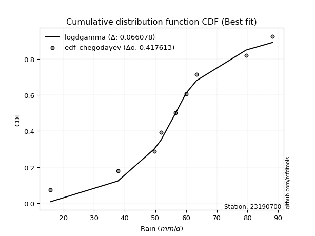</img>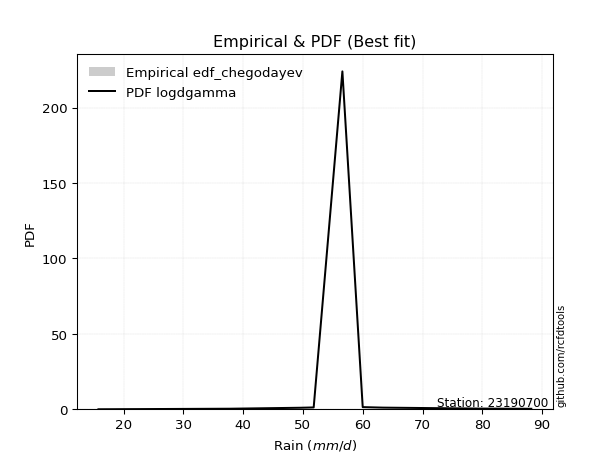</img>

</div>


### 6. EDF Blom (1958)

The Blom formula is a specific "plotting position" formula used in hydrology and statistical analysis to estimate the empirical cumulative probability (or non-exceedance probability) of a data series. It is particularly recommended for data that are approximately normally distributed. The constant _a_ is set to 0.375 (or 3/8).

<div align="center">


$P=(m-a)/(n+1-2a)$


</div>


**6.1. Empirical values**

<div align="center">

|                | 0                   | 1                   | 2                   | 3                  | 4        | 5                  | 6                  | 7                  | 8                  |
|:---------------|:--------------------|:--------------------|:--------------------|:-------------------|:---------|:-------------------|:-------------------|:-------------------|:-------------------|
| date           | 2017                | 2021                | 2024                | 2023               | 2020     | 2025               | 2018               | 2022               | 2019               |
| x              | 15.8                | 37.8                | 49.6                | 51.8               | 56.6     | 60.0               | 63.4               | 79.6               | 88.2               |
| m              | 1                   | 2                   | 3                   | 4                  | 5        | 6                  | 7                  | 8                  | 9                  |
| empirical_dist | edf_blom            | edf_blom            | edf_blom            | edf_blom           | edf_blom | edf_blom           | edf_blom           | edf_blom           | edf_blom           |
| empirical      | 0.06756756756756757 | 0.17567567567567569 | 0.28378378378378377 | 0.3918918918918919 | 0.5      | 0.6081081081081081 | 0.7162162162162162 | 0.8243243243243243 | 0.9324324324324325 |
| empirical_tr   | 1.072463768115942   | 1.2131147540983607  | 1.3962264150943395  | 1.6444444444444444 | 2.0      | 2.5517241379310347 | 3.523809523809524  | 5.6923076923076925 | 14.800000000000006 |

</div>


**6.2. Kolmogorov-Smirnov fit test (sorted by Δ)**


<div align="center">

|                | 0                   | 1                   | 2                   | 3                   | 4                   | 5                   | 6                   | 7                   | 8                   | 9                   | 10                  | 11                  | 12                  | 13                  | 14                  | 15                  | 16                  | 17                  | 18                  | 19                  | 20                  | 21                  | 22                  | 23                  | 24                  | 25                  | 26                  | 27                  | 28                  | 29                  | 30                  | 31                  | 32                  | 33                  | 34                  | 35                  | 36                  | 37                  | 38                  | 39                  | 40                  | 41                  | 42                  | 43                  | 44                  | 45                  | 46                  | 47                  | 48                  | 49                  | 50                  | 51                  | 52                  | 53                  | 54                  | 55                  | 56                  | 57                  | 58                  | 59                  | 60                  | 61                  | 62                  | 63                  | 64                  | 65                  | 66                  | 67                  | 68                  | 69                  | 70                  | 71                  | 72                  | 73                  | 74                  | 75                  | 76                  | 77                  | 78                  | 79                  | 80                  | 81                  | 82                  | 83                  | 84                  | 85                  | 86                  | 87                  | 88                  | 89                  | 90                  | 91                  | 92                  | 93                  | 94                  | 95                  | 96                  | 97                  | 98                  | 99                  | 100                 | 101                 | 102                 | 103                 | 104                 | 105                 | 106                 | 107                 | 108                 | 109                 | 110                 | 111                 | 112                 | 113                 | 114                 | 115                 | 116                 | 117                 | 118                 | 119                 | 120                 | 121                 | 122                 | 123                 | 124                 | 125                 | 126                 | 127                 | 128                 | 129                 | 130                 | 131                 | 132                 | 133                 | 134                 | 135                 | 136                 | 137                 | 138                 | 139                 | 140                 | 141                 | 142                 | 143                 | 144                 | 145                 | 146                 | 147                 | 148                 | 149                 | 150                 | 151                 | 152                 | 153                 | 154                 | 155                 | 156                 | 157                 | 158                 | 159                 |
|:---------------|:--------------------|:--------------------|:--------------------|:--------------------|:--------------------|:--------------------|:--------------------|:--------------------|:--------------------|:--------------------|:--------------------|:--------------------|:--------------------|:--------------------|:--------------------|:--------------------|:--------------------|:--------------------|:--------------------|:--------------------|:--------------------|:--------------------|:--------------------|:--------------------|:--------------------|:--------------------|:--------------------|:--------------------|:--------------------|:--------------------|:--------------------|:--------------------|:--------------------|:--------------------|:--------------------|:--------------------|:--------------------|:--------------------|:--------------------|:--------------------|:--------------------|:--------------------|:--------------------|:--------------------|:--------------------|:--------------------|:--------------------|:--------------------|:--------------------|:--------------------|:--------------------|:--------------------|:--------------------|:--------------------|:--------------------|:--------------------|:--------------------|:--------------------|:--------------------|:--------------------|:--------------------|:--------------------|:--------------------|:--------------------|:--------------------|:--------------------|:--------------------|:--------------------|:--------------------|:--------------------|:--------------------|:--------------------|:--------------------|:--------------------|:--------------------|:--------------------|:--------------------|:--------------------|:--------------------|:--------------------|:--------------------|:--------------------|:--------------------|:--------------------|:--------------------|:--------------------|:--------------------|:--------------------|:--------------------|:--------------------|:--------------------|:--------------------|:--------------------|:--------------------|:--------------------|:--------------------|:--------------------|:--------------------|:--------------------|:--------------------|:--------------------|:--------------------|:--------------------|:--------------------|:--------------------|:--------------------|:--------------------|:--------------------|:--------------------|:--------------------|:--------------------|:--------------------|:--------------------|:--------------------|:--------------------|:--------------------|:--------------------|:--------------------|:--------------------|:--------------------|:--------------------|:--------------------|:--------------------|:--------------------|:--------------------|:--------------------|:--------------------|:--------------------|:--------------------|:--------------------|:--------------------|:--------------------|:--------------------|:--------------------|:--------------------|:--------------------|:--------------------|:--------------------|:--------------------|:--------------------|:--------------------|:--------------------|:--------------------|:--------------------|:--------------------|:--------------------|:--------------------|:--------------------|:--------------------|:--------------------|:--------------------|:--------------------|:--------------------|:--------------------|:--------------------|:--------------------|:--------------------|:--------------------|:--------------------|:--------------------|
| station        | 23190700            | 23190700            | 23190700            | 23190700            | 23190700            | 23190700            | 23190700            | 23190700            | 23190700            | 23190700            | 23190700            | 23190700            | 23190700            | 23190700            | 23190700            | 23190700            | 23190700            | 23190700            | 23190700            | 23190700            | 23190700            | 23190700            | 23190700            | 23190700            | 23190700            | 23190700            | 23190700            | 23190700            | 23190700            | 23190700            | 23190700            | 23190700            | 23190700            | 23190700            | 23190700            | 23190700            | 23190700            | 23190700            | 23190700            | 23190700            | 23190700            | 23190700            | 23190700            | 23190700            | 23190700            | 23190700            | 23190700            | 23190700            | 23190700            | 23190700            | 23190700            | 23190700            | 23190700            | 23190700            | 23190700            | 23190700            | 23190700            | 23190700            | 23190700            | 23190700            | 23190700            | 23190700            | 23190700            | 23190700            | 23190700            | 23190700            | 23190700            | 23190700            | 23190700            | 23190700            | 23190700            | 23190700            | 23190700            | 23190700            | 23190700            | 23190700            | 23190700            | 23190700            | 23190700            | 23190700            | 23190700            | 23190700            | 23190700            | 23190700            | 23190700            | 23190700            | 23190700            | 23190700            | 23190700            | 23190700            | 23190700            | 23190700            | 23190700            | 23190700            | 23190700            | 23190700            | 23190700            | 23190700            | 23190700            | 23190700            | 23190700            | 23190700            | 23190700            | 23190700            | 23190700            | 23190700            | 23190700            | 23190700            | 23190700            | 23190700            | 23190700            | 23190700            | 23190700            | 23190700            | 23190700            | 23190700            | 23190700            | 23190700            | 23190700            | 23190700            | 23190700            | 23190700            | 23190700            | 23190700            | 23190700            | 23190700            | 23190700            | 23190700            | 23190700            | 23190700            | 23190700            | 23190700            | 23190700            | 23190700            | 23190700            | 23190700            | 23190700            | 23190700            | 23190700            | 23190700            | 23190700            | 23190700            | 23190700            | 23190700            | 23190700            | 23190700            | 23190700            | 23190700            | 23190700            | 23190700            | 23190700            | 23190700            | 23190700            | 23190700            | 23190700            | 23190700            | 23190700            | 23190700            | 23190700            | 23190700            |
| empirical_dist | edf_blom            | edf_blom            | edf_blom            | edf_blom            | edf_blom            | edf_blom            | edf_blom            | edf_blom            | edf_blom            | edf_blom            | edf_blom            | edf_blom            | edf_blom            | edf_blom            | edf_blom            | edf_blom            | edf_blom            | edf_blom            | edf_blom            | edf_blom            | edf_blom            | edf_blom            | edf_blom            | edf_blom            | edf_blom            | edf_blom            | edf_blom            | edf_blom            | edf_blom            | edf_blom            | edf_blom            | edf_blom            | edf_blom            | edf_blom            | edf_blom            | edf_blom            | edf_blom            | edf_blom            | edf_blom            | edf_blom            | edf_blom            | edf_blom            | edf_blom            | edf_blom            | edf_blom            | edf_blom            | edf_blom            | edf_blom            | edf_blom            | edf_blom            | edf_blom            | edf_blom            | edf_blom            | edf_blom            | edf_blom            | edf_blom            | edf_blom            | edf_blom            | edf_blom            | edf_blom            | edf_blom            | edf_blom            | edf_blom            | edf_blom            | edf_blom            | edf_blom            | edf_blom            | edf_blom            | edf_blom            | edf_blom            | edf_blom            | edf_blom            | edf_blom            | edf_blom            | edf_blom            | edf_blom            | edf_blom            | edf_blom            | edf_blom            | edf_blom            | edf_blom            | edf_blom            | edf_blom            | edf_blom            | edf_blom            | edf_blom            | edf_blom            | edf_blom            | edf_blom            | edf_blom            | edf_blom            | edf_blom            | edf_blom            | edf_blom            | edf_blom            | edf_blom            | edf_blom            | edf_blom            | edf_blom            | edf_blom            | edf_blom            | edf_blom            | edf_blom            | edf_blom            | edf_blom            | edf_blom            | edf_blom            | edf_blom            | edf_blom            | edf_blom            | edf_blom            | edf_blom            | edf_blom            | edf_blom            | edf_blom            | edf_blom            | edf_blom            | edf_blom            | edf_blom            | edf_blom            | edf_blom            | edf_blom            | edf_blom            | edf_blom            | edf_blom            | edf_blom            | edf_blom            | edf_blom            | edf_blom            | edf_blom            | edf_blom            | edf_blom            | edf_blom            | edf_blom            | edf_blom            | edf_blom            | edf_blom            | edf_blom            | edf_blom            | edf_blom            | edf_blom            | edf_blom            | edf_blom            | edf_blom            | edf_blom            | edf_blom            | edf_blom            | edf_blom            | edf_blom            | edf_blom            | edf_blom            | edf_blom            | edf_blom            | edf_blom            | edf_blom            | edf_blom            | edf_blom            | edf_blom            | edf_blom            | edf_blom            |
| p_dist         | logdgamma           | logt                | gennorm             | dweibull            | dgamma              | genlogistic         | hypsecant           | logloglaplace       | logistic            | laplace             | logburr12           | pearson3            | mielke              | burr                | loggenlogistic      | skewnorm            | weibull_min         | foldnorm            | logvonmises_line    | johnsonsu           | t                   | norm                | crystalball         | truncnorm           | exponnorm           | nct                 | f                   | logdweibull         | erlang              | logloggamma         | gamma               | rice                | logweibull_min      | logpearson3         | genextreme          | anglit              | logjohnsonsu        | logexponweib        | loggompertz         | truncweibull_min    | invgamma            | semicircular        | argus               | gumbel_l            | loggumbel_l         | logargus            | betaprime           | cosine              | maxwell             | logtruncweibull_min | gompertz            | alpha               | exponweib           | rayleigh            | invgauss            | logtrapezoid        | logskewnorm         | arcsine             | vonmises_line       | gumbel_r            | loggausshyper       | logburr             | lognakagami         | gausshyper          | loggennorm          | loggenextreme       | moyal               | logmielke           | halfnorm            | bradford            | loglaplace          | loglaplace          | kappa3              | uniform             | beta                | wrapcauchy          | tukeylambda         | kstwobign           | halflogistic        | loghypsecant        | ksone               | loglogistic         | logf                | logfatiguelife      | logcrystalball      | lognorm             | logexponnorm        | logrice             | lognct              | loganglit           | logsemicircular     | logerlang           | logbetaprime        | loggamma            | loggamma            | triang              | loggenhalflogistic  | logarcsine          | logncf              | kappa4              | loglevy_l           | genhalflogistic     | loginvgamma         | logtriang           | genpareto           | loginvgauss         | logalpha            | wald                | logmaxwell          | logfoldnorm         | loginvweibull       | lograyleigh         | logtruncnorm        | loggenpareto        | truncexpon          | loggumbel_r         | logkstwobign        | loghalfnorm         | logcosine           | logweibull_max      | levy_l              | lomax               | logrdist            | genexpon            | logmoyal            | loggenexpon         | loghalflogistic     | logjohnsonsb        | ncf                 | logbeta             | johnsonsb           | trapezoid           | logwrapcauchy       | halfgennorm         | loglomax            | burr12              | logksone            | logwald             | logkappa4           | logkappa3           | logbradford         | logtukeylambda      | loguniform          | nakagami            | logexponpow         | loggengamma         | logtruncexpon       | invweibull          | gengamma            | powerlaw            | rdist               | fatiguelife         | weibull_max         | logpowerlaw         | exponpow            | truncpareto         | logtruncpareto      | loghalfgennorm      | logvonmises         | vonmises            |
| delta          | 0.059177725864652   | 0.06448771625906957 | 0.06523871238839862 | 0.06544839078105436 | 0.06709914355240043 | 0.07061069137506337 | 0.07599568539072576 | 0.07871832994576644 | 0.07910943336644433 | 0.08079362035467574 | 0.08169092092408375 | 0.08738888239934961 | 0.08881984537356608 | 0.08898660723303903 | 0.08917957632557227 | 0.08921831160443361 | 0.09041373350926141 | 0.09054319219989959 | 0.09196792176833563 | 0.09221736655745605 | 0.09436844069295824 | 0.09438122542893534 | 0.09438122806338922 | 0.09438123837946677 | 0.0943835495862978  | 0.09441337866593452 | 0.095309312941665   | 0.09852932209018206 | 0.103761908094128   | 0.10395919063811321 | 0.10430255992711984 | 0.10490476433275203 | 0.10512449373805755 | 0.10704410094986017 | 0.11083149343621201 | 0.11093780329412534 | 0.11325289779615444 | 0.11416470866143202 | 0.11501203130384963 | 0.11530454163386539 | 0.11777826006982306 | 0.1178412022063492  | 0.1183628022135339  | 0.12038194699652305 | 0.12285017752670624 | 0.12388426681808529 | 0.1254786886434313  | 0.12550420364169362 | 0.12771942617030724 | 0.12880782557412118 | 0.12918271030814688 | 0.13028415299141677 | 0.13474201962733623 | 0.14000108514502863 | 0.14138376778514294 | 0.142957958575538   | 0.1446247780653957  | 0.14580043444998836 | 0.14735340439244315 | 0.14969655191279008 | 0.15129270113216098 | 0.15659695979263533 | 0.15851657711039455 | 0.15922938063781933 | 0.16418319954711225 | 0.16613926487989794 | 0.17075233521106858 | 0.17397190361213843 | 0.17490436259465664 | 0.17650431188302218 | 0.17755676086176797 | 0.17755676086176797 | 0.1823442955838694  | 0.18306704494549791 | 0.18331204060565842 | 0.18423313645859052 | 0.18442252961734917 | 0.18549449998727652 | 0.1874656484357191  | 0.18780300955243456 | 0.18859190682395105 | 0.19043688025493066 | 0.19175511969906422 | 0.19283655001146593 | 0.19352687840617128 | 0.19352783566850307 | 0.19352940247984746 | 0.19354063464680588 | 0.19655355942330988 | 0.19676879507512224 | 0.19810659489876647 | 0.19816671743512848 | 0.1986438679613305  | 0.20051093221366134 | 0.20051093221366134 | 0.20182125573045873 | 0.20201443374007189 | 0.20340440350853412 | 0.2039896154927493  | 0.20666472451149587 | 0.20823281272951097 | 0.2110533294769661  | 0.21162021317824503 | 0.21858930132917276 | 0.21951168125100967 | 0.222613455975593   | 0.22292472484829717 | 0.22531670601747245 | 0.22733671030748936 | 0.2279836422311119  | 0.23036758922607625 | 0.23880213422046614 | 0.24844599260398992 | 0.25192497681879356 | 0.2577690135391445  | 0.26285511516075066 | 0.26892645734226706 | 0.27110258084719707 | 0.27156922360761115 | 0.2741776076260588  | 0.28292837361666945 | 0.28460059659453285 | 0.2856939501021517  | 0.286209022967555   | 0.28869320176801916 | 0.29032539704353577 | 0.2944975198244453  | 0.29480702038438233 | 0.29660732193186534 | 0.30620542422827074 | 0.3147952268537151  | 0.3177832471371284  | 0.3267478733901117  | 0.3407068383391183  | 0.3428484781933747  | 0.3450352634949574  | 0.35393374461113447 | 0.36061419432292463 | 0.3608743923864207  | 0.36480977881272636 | 0.3681034629864651  | 0.3769126026133862  | 0.3814772502901179  | 0.4021097926204016  | 0.43636245457787304 | 0.4536342716555434  | 0.45821649104224016 | 0.49378908671708666 | 0.5910568403871048  | 0.6014275410595414  | 0.6204425799493275  | 0.6354776667818615  | 0.6373597583335555  | 0.6764621899083297  | 0.7502079885019336  | 0.754217112398527   | 0.783892420046047   | 0.8243243243243243  | 1.1697331623681957  | 13.621506540463855  |
| deltao         | 0.41761268023100007 | 0.41761268023100007 | 0.41761268023100007 | 0.41761268023100007 | 0.41761268023100007 | 0.41761268023100007 | 0.41761268023100007 | 0.41761268023100007 | 0.41761268023100007 | 0.41761268023100007 | 0.41761268023100007 | 0.41761268023100007 | 0.41761268023100007 | 0.41761268023100007 | 0.41761268023100007 | 0.41761268023100007 | 0.41761268023100007 | 0.41761268023100007 | 0.41761268023100007 | 0.41761268023100007 | 0.41761268023100007 | 0.41761268023100007 | 0.41761268023100007 | 0.41761268023100007 | 0.41761268023100007 | 0.41761268023100007 | 0.41761268023100007 | 0.41761268023100007 | 0.41761268023100007 | 0.41761268023100007 | 0.41761268023100007 | 0.41761268023100007 | 0.41761268023100007 | 0.41761268023100007 | 0.41761268023100007 | 0.41761268023100007 | 0.41761268023100007 | 0.41761268023100007 | 0.41761268023100007 | 0.41761268023100007 | 0.41761268023100007 | 0.41761268023100007 | 0.41761268023100007 | 0.41761268023100007 | 0.41761268023100007 | 0.41761268023100007 | 0.41761268023100007 | 0.41761268023100007 | 0.41761268023100007 | 0.41761268023100007 | 0.41761268023100007 | 0.41761268023100007 | 0.41761268023100007 | 0.41761268023100007 | 0.41761268023100007 | 0.41761268023100007 | 0.41761268023100007 | 0.41761268023100007 | 0.41761268023100007 | 0.41761268023100007 | 0.41761268023100007 | 0.41761268023100007 | 0.41761268023100007 | 0.41761268023100007 | 0.41761268023100007 | 0.41761268023100007 | 0.41761268023100007 | 0.41761268023100007 | 0.41761268023100007 | 0.41761268023100007 | 0.41761268023100007 | 0.41761268023100007 | 0.41761268023100007 | 0.41761268023100007 | 0.41761268023100007 | 0.41761268023100007 | 0.41761268023100007 | 0.41761268023100007 | 0.41761268023100007 | 0.41761268023100007 | 0.41761268023100007 | 0.41761268023100007 | 0.41761268023100007 | 0.41761268023100007 | 0.41761268023100007 | 0.41761268023100007 | 0.41761268023100007 | 0.41761268023100007 | 0.41761268023100007 | 0.41761268023100007 | 0.41761268023100007 | 0.41761268023100007 | 0.41761268023100007 | 0.41761268023100007 | 0.41761268023100007 | 0.41761268023100007 | 0.41761268023100007 | 0.41761268023100007 | 0.41761268023100007 | 0.41761268023100007 | 0.41761268023100007 | 0.41761268023100007 | 0.41761268023100007 | 0.41761268023100007 | 0.41761268023100007 | 0.41761268023100007 | 0.41761268023100007 | 0.41761268023100007 | 0.41761268023100007 | 0.41761268023100007 | 0.41761268023100007 | 0.41761268023100007 | 0.41761268023100007 | 0.41761268023100007 | 0.41761268023100007 | 0.41761268023100007 | 0.41761268023100007 | 0.41761268023100007 | 0.41761268023100007 | 0.41761268023100007 | 0.41761268023100007 | 0.41761268023100007 | 0.41761268023100007 | 0.41761268023100007 | 0.41761268023100007 | 0.41761268023100007 | 0.41761268023100007 | 0.41761268023100007 | 0.41761268023100007 | 0.41761268023100007 | 0.41761268023100007 | 0.41761268023100007 | 0.41761268023100007 | 0.41761268023100007 | 0.41761268023100007 | 0.41761268023100007 | 0.41761268023100007 | 0.41761268023100007 | 0.41761268023100007 | 0.41761268023100007 | 0.41761268023100007 | 0.41761268023100007 | 0.41761268023100007 | 0.41761268023100007 | 0.41761268023100007 | 0.41761268023100007 | 0.41761268023100007 | 0.41761268023100007 | 0.41761268023100007 | 0.41761268023100007 | 0.41761268023100007 | 0.41761268023100007 | 0.41761268023100007 | 0.41761268023100007 | 0.41761268023100007 | 0.41761268023100007 | 0.41761268023100007 | 0.41761268023100007 | 0.41761268023100007 | 0.41761268023100007 |
| eval           | Δo > Δ              | Δo > Δ              | Δo > Δ              | Δo > Δ              | Δo > Δ              | Δo > Δ              | Δo > Δ              | Δo > Δ              | Δo > Δ              | Δo > Δ              | Δo > Δ              | Δo > Δ              | Δo > Δ              | Δo > Δ              | Δo > Δ              | Δo > Δ              | Δo > Δ              | Δo > Δ              | Δo > Δ              | Δo > Δ              | Δo > Δ              | Δo > Δ              | Δo > Δ              | Δo > Δ              | Δo > Δ              | Δo > Δ              | Δo > Δ              | Δo > Δ              | Δo > Δ              | Δo > Δ              | Δo > Δ              | Δo > Δ              | Δo > Δ              | Δo > Δ              | Δo > Δ              | Δo > Δ              | Δo > Δ              | Δo > Δ              | Δo > Δ              | Δo > Δ              | Δo > Δ              | Δo > Δ              | Δo > Δ              | Δo > Δ              | Δo > Δ              | Δo > Δ              | Δo > Δ              | Δo > Δ              | Δo > Δ              | Δo > Δ              | Δo > Δ              | Δo > Δ              | Δo > Δ              | Δo > Δ              | Δo > Δ              | Δo > Δ              | Δo > Δ              | Δo > Δ              | Δo > Δ              | Δo > Δ              | Δo > Δ              | Δo > Δ              | Δo > Δ              | Δo > Δ              | Δo > Δ              | Δo > Δ              | Δo > Δ              | Δo > Δ              | Δo > Δ              | Δo > Δ              | Δo > Δ              | Δo > Δ              | Δo > Δ              | Δo > Δ              | Δo > Δ              | Δo > Δ              | Δo > Δ              | Δo > Δ              | Δo > Δ              | Δo > Δ              | Δo > Δ              | Δo > Δ              | Δo > Δ              | Δo > Δ              | Δo > Δ              | Δo > Δ              | Δo > Δ              | Δo > Δ              | Δo > Δ              | Δo > Δ              | Δo > Δ              | Δo > Δ              | Δo > Δ              | Δo > Δ              | Δo > Δ              | Δo > Δ              | Δo > Δ              | Δo > Δ              | Δo > Δ              | Δo > Δ              | Δo > Δ              | Δo > Δ              | Δo > Δ              | Δo > Δ              | Δo > Δ              | Δo > Δ              | Δo > Δ              | Δo > Δ              | Δo > Δ              | Δo > Δ              | Δo > Δ              | Δo > Δ              | Δo > Δ              | Δo > Δ              | Δo > Δ              | Δo > Δ              | Δo > Δ              | Δo > Δ              | Δo > Δ              | Δo > Δ              | Δo > Δ              | Δo > Δ              | Δo > Δ              | Δo > Δ              | Δo > Δ              | Δo > Δ              | Δo > Δ              | Δo > Δ              | Δo > Δ              | Δo > Δ              | Δo > Δ              | Δo > Δ              | Δo > Δ              | Δo > Δ              | Δo > Δ              | Δo > Δ              | Δo > Δ              | Δo > Δ              | Δo > Δ              | Δo > Δ              | Δo > Δ              | Δo > Δ              | Δo > Δ              | Δo > Δ              | Δo <= Δ             | Δo <= Δ             | Δo <= Δ             | Δo <= Δ             | Δo <= Δ             | Δo <= Δ             | Δo <= Δ             | Δo <= Δ             | Δo <= Δ             | Δo <= Δ             | Δo <= Δ             | Δo <= Δ             | Δo <= Δ             | Δo <= Δ             | Δo <= Δ             | Δo <= Δ             |
| fit            | 1                   | 1                   | 1                   | 1                   | 1                   | 1                   | 1                   | 1                   | 1                   | 1                   | 1                   | 1                   | 1                   | 1                   | 1                   | 1                   | 1                   | 1                   | 1                   | 1                   | 1                   | 1                   | 1                   | 1                   | 1                   | 1                   | 1                   | 1                   | 1                   | 1                   | 1                   | 1                   | 1                   | 1                   | 1                   | 1                   | 1                   | 1                   | 1                   | 1                   | 1                   | 1                   | 1                   | 1                   | 1                   | 1                   | 1                   | 1                   | 1                   | 1                   | 1                   | 1                   | 1                   | 1                   | 1                   | 1                   | 1                   | 1                   | 1                   | 1                   | 1                   | 1                   | 1                   | 1                   | 1                   | 1                   | 1                   | 1                   | 1                   | 1                   | 1                   | 1                   | 1                   | 1                   | 1                   | 1                   | 1                   | 1                   | 1                   | 1                   | 1                   | 1                   | 1                   | 1                   | 1                   | 1                   | 1                   | 1                   | 1                   | 1                   | 1                   | 1                   | 1                   | 1                   | 1                   | 1                   | 1                   | 1                   | 1                   | 1                   | 1                   | 1                   | 1                   | 1                   | 1                   | 1                   | 1                   | 1                   | 1                   | 1                   | 1                   | 1                   | 1                   | 1                   | 1                   | 1                   | 1                   | 1                   | 1                   | 1                   | 1                   | 1                   | 1                   | 1                   | 1                   | 1                   | 1                   | 1                   | 1                   | 1                   | 1                   | 1                   | 1                   | 1                   | 1                   | 1                   | 1                   | 1                   | 1                   | 1                   | 1                   | 1                   | 1                   | 1                   | 0                   | 0                   | 0                   | 0                   | 0                   | 0                   | 0                   | 0                   | 0                   | 0                   | 0                   | 0                   | 0                   | 0                   | 0                   | 0                   |
| n              | 9                   | 9                   | 9                   | 9                   | 9                   | 9                   | 9                   | 9                   | 9                   | 9                   | 9                   | 9                   | 9                   | 9                   | 9                   | 9                   | 9                   | 9                   | 9                   | 9                   | 9                   | 9                   | 9                   | 9                   | 9                   | 9                   | 9                   | 9                   | 9                   | 9                   | 9                   | 9                   | 9                   | 9                   | 9                   | 9                   | 9                   | 9                   | 9                   | 9                   | 9                   | 9                   | 9                   | 9                   | 9                   | 9                   | 9                   | 9                   | 9                   | 9                   | 9                   | 9                   | 9                   | 9                   | 9                   | 9                   | 9                   | 9                   | 9                   | 9                   | 9                   | 9                   | 9                   | 9                   | 9                   | 9                   | 9                   | 9                   | 9                   | 9                   | 9                   | 9                   | 9                   | 9                   | 9                   | 9                   | 9                   | 9                   | 9                   | 9                   | 9                   | 9                   | 9                   | 9                   | 9                   | 9                   | 9                   | 9                   | 9                   | 9                   | 9                   | 9                   | 9                   | 9                   | 9                   | 9                   | 9                   | 9                   | 9                   | 9                   | 9                   | 9                   | 9                   | 9                   | 9                   | 9                   | 9                   | 9                   | 9                   | 9                   | 9                   | 9                   | 9                   | 9                   | 9                   | 9                   | 9                   | 9                   | 9                   | 9                   | 9                   | 9                   | 9                   | 9                   | 9                   | 9                   | 9                   | 9                   | 9                   | 9                   | 9                   | 9                   | 9                   | 9                   | 9                   | 9                   | 9                   | 9                   | 9                   | 9                   | 9                   | 9                   | 9                   | 9                   | 9                   | 9                   | 9                   | 9                   | 9                   | 9                   | 9                   | 9                   | 9                   | 9                   | 9                   | 9                   | 9                   | 9                   | 9                   | 9                   |
| best_fit       | 1                   | 0                   | 0                   | 0                   | 0                   | 0                   | 0                   | 0                   | 0                   | 0                   | 0                   | 0                   | 0                   | 0                   | 0                   | 0                   | 0                   | 0                   | 0                   | 0                   | 0                   | 0                   | 0                   | 0                   | 0                   | 0                   | 0                   | 0                   | 0                   | 0                   | 0                   | 0                   | 0                   | 0                   | 0                   | 0                   | 0                   | 0                   | 0                   | 0                   | 0                   | 0                   | 0                   | 0                   | 0                   | 0                   | 0                   | 0                   | 0                   | 0                   | 0                   | 0                   | 0                   | 0                   | 0                   | 0                   | 0                   | 0                   | 0                   | 0                   | 0                   | 0                   | 0                   | 0                   | 0                   | 0                   | 0                   | 0                   | 0                   | 0                   | 0                   | 0                   | 0                   | 0                   | 0                   | 0                   | 0                   | 0                   | 0                   | 0                   | 0                   | 0                   | 0                   | 0                   | 0                   | 0                   | 0                   | 0                   | 0                   | 0                   | 0                   | 0                   | 0                   | 0                   | 0                   | 0                   | 0                   | 0                   | 0                   | 0                   | 0                   | 0                   | 0                   | 0                   | 0                   | 0                   | 0                   | 0                   | 0                   | 0                   | 0                   | 0                   | 0                   | 0                   | 0                   | 0                   | 0                   | 0                   | 0                   | 0                   | 0                   | 0                   | 0                   | 0                   | 0                   | 0                   | 0                   | 0                   | 0                   | 0                   | 0                   | 0                   | 0                   | 0                   | 0                   | 0                   | 0                   | 0                   | 0                   | 0                   | 0                   | 0                   | 0                   | 0                   | 0                   | 0                   | 0                   | 0                   | 0                   | 0                   | 0                   | 0                   | 0                   | 0                   | 0                   | 0                   | 0                   | 0                   | 0                   | 0                   |
| best_fit_sort  | 1                   | 2                   | 3                   | 4                   | 5                   | 6                   | 7                   | 8                   | 9                   | 10                  | 11                  | 12                  | 13                  | 14                  | 15                  | 16                  | 17                  | 18                  | 19                  | 20                  | 21                  | 22                  | 23                  | 24                  | 25                  | 26                  | 27                  | 28                  | 29                  | 30                  | 31                  | 32                  | 33                  | 34                  | 35                  | 36                  | 37                  | 38                  | 39                  | 40                  | 41                  | 42                  | 43                  | 44                  | 45                  | 46                  | 47                  | 48                  | 49                  | 50                  | 51                  | 52                  | 53                  | 54                  | 55                  | 56                  | 57                  | 58                  | 59                  | 60                  | 61                  | 62                  | 63                  | 64                  | 65                  | 66                  | 67                  | 68                  | 69                  | 70                  | 71                  | 72                  | 73                  | 74                  | 75                  | 76                  | 77                  | 78                  | 79                  | 80                  | 81                  | 82                  | 83                  | 84                  | 85                  | 86                  | 87                  | 88                  | 89                  | 90                  | 91                  | 92                  | 93                  | 94                  | 95                  | 96                  | 97                  | 98                  | 99                  | 100                 | 101                 | 102                 | 103                 | 104                 | 105                 | 106                 | 107                 | 108                 | 109                 | 110                 | 111                 | 112                 | 113                 | 114                 | 115                 | 116                 | 117                 | 118                 | 119                 | 120                 | 121                 | 122                 | 123                 | 124                 | 125                 | 126                 | 127                 | 128                 | 129                 | 130                 | 131                 | 132                 | 133                 | 134                 | 135                 | 136                 | 137                 | 138                 | 139                 | 140                 | 141                 | 142                 | 143                 | 144                 | 145                 | 146                 | 147                 | 148                 | 149                 | 150                 | 151                 | 152                 | 153                 | 154                 | 155                 | 156                 | 157                 | 158                 | 159                 | 160                 |

</div>


**6.3. Best fit**

<div align="center">

|   id |   station | empirical_dist   | p_dist    |     delta |   deltao | eval   |   fit |   n |   best_fit |   best_fit_sort |
|-----:|----------:|:-----------------|:----------|----------:|---------:|:-------|------:|----:|-----------:|----------------:|
|    0 |  23190700 | edf_blom         | logdgamma | 0.0591777 | 0.417613 | Δo > Δ |     1 |   9 |          1 |               1 |

</div>


<div align="center">

</img></img>

</div>


### 7. EDF Tukey (1962)

In hydrology, the Tukey formula is used as a plotting position formula to estimate the empirical probability or frequency of a flood event (or other hydrological data). The formula parameter is given as _c=0.333_ (or 1/3).

<div align="center">


$P=(m-c)/(n+1-2c)$


</div>


**7.1. Empirical values**

<div align="center">

|                | 0                   | 1                   | 2                  | 3                   | 4         | 5                  | 6                  | 7                  | 8                  |
|:---------------|:--------------------|:--------------------|:-------------------|:--------------------|:----------|:-------------------|:-------------------|:-------------------|:-------------------|
| date           | 2017                | 2021                | 2024               | 2023                | 2020      | 2025               | 2018               | 2022               | 2019               |
| x              | 15.8                | 37.8                | 49.6               | 51.8                | 56.6      | 60.0               | 63.4               | 79.6               | 88.2               |
| m              | 1                   | 2                   | 3                  | 4                   | 5         | 6                  | 7                  | 8                  | 9                  |
| empirical_dist | edf_tukey           | edf_tukey           | edf_tukey          | edf_tukey           | edf_tukey | edf_tukey          | edf_tukey          | edf_tukey          | edf_tukey          |
| empirical      | 0.07142857142857142 | 0.17857142857142858 | 0.2857142857142857 | 0.39285714285714285 | 0.5       | 0.6071428571428571 | 0.7142857142857143 | 0.8214285714285714 | 0.9285714285714286 |
| empirical_tr   | 1.0769230769230769  | 1.2173913043478262  | 1.4                | 1.6470588235294117  | 2.0       | 2.545454545454545  | 3.5                | 5.599999999999999  | 14.000000000000007 |

</div>


**7.2. Kolmogorov-Smirnov fit test (sorted by Δ)**


<div align="center">

|                | 0                   | 1                   | 2                   | 3                   | 4                   | 5                   | 6                   | 7                   | 8                   | 9                   | 10                  | 11                  | 12                  | 13                  | 14                  | 15                  | 16                  | 17                  | 18                  | 19                  | 20                  | 21                  | 22                  | 23                  | 24                  | 25                  | 26                  | 27                  | 28                  | 29                  | 30                  | 31                  | 32                  | 33                  | 34                  | 35                  | 36                  | 37                  | 38                  | 39                  | 40                  | 41                  | 42                  | 43                  | 44                  | 45                  | 46                  | 47                  | 48                  | 49                  | 50                  | 51                  | 52                  | 53                  | 54                  | 55                  | 56                  | 57                  | 58                  | 59                  | 60                  | 61                  | 62                  | 63                  | 64                  | 65                  | 66                  | 67                  | 68                  | 69                  | 70                  | 71                  | 72                  | 73                  | 74                  | 75                  | 76                  | 77                  | 78                  | 79                  | 80                  | 81                  | 82                  | 83                  | 84                  | 85                  | 86                  | 87                  | 88                  | 89                  | 90                  | 91                  | 92                  | 93                  | 94                  | 95                  | 96                  | 97                  | 98                  | 99                  | 100                 | 101                 | 102                 | 103                 | 104                 | 105                 | 106                 | 107                 | 108                 | 109                 | 110                 | 111                 | 112                 | 113                 | 114                 | 115                 | 116                 | 117                 | 118                 | 119                 | 120                 | 121                 | 122                 | 123                 | 124                 | 125                 | 126                 | 127                 | 128                 | 129                 | 130                 | 131                 | 132                 | 133                 | 134                 | 135                 | 136                 | 137                 | 138                 | 139                 | 140                 | 141                 | 142                 | 143                 | 144                 | 145                 | 146                 | 147                 | 148                 | 149                 | 150                 | 151                 | 152                 | 153                 | 154                 | 155                 | 156                 | 157                 | 158                 | 159                 |
|:---------------|:--------------------|:--------------------|:--------------------|:--------------------|:--------------------|:--------------------|:--------------------|:--------------------|:--------------------|:--------------------|:--------------------|:--------------------|:--------------------|:--------------------|:--------------------|:--------------------|:--------------------|:--------------------|:--------------------|:--------------------|:--------------------|:--------------------|:--------------------|:--------------------|:--------------------|:--------------------|:--------------------|:--------------------|:--------------------|:--------------------|:--------------------|:--------------------|:--------------------|:--------------------|:--------------------|:--------------------|:--------------------|:--------------------|:--------------------|:--------------------|:--------------------|:--------------------|:--------------------|:--------------------|:--------------------|:--------------------|:--------------------|:--------------------|:--------------------|:--------------------|:--------------------|:--------------------|:--------------------|:--------------------|:--------------------|:--------------------|:--------------------|:--------------------|:--------------------|:--------------------|:--------------------|:--------------------|:--------------------|:--------------------|:--------------------|:--------------------|:--------------------|:--------------------|:--------------------|:--------------------|:--------------------|:--------------------|:--------------------|:--------------------|:--------------------|:--------------------|:--------------------|:--------------------|:--------------------|:--------------------|:--------------------|:--------------------|:--------------------|:--------------------|:--------------------|:--------------------|:--------------------|:--------------------|:--------------------|:--------------------|:--------------------|:--------------------|:--------------------|:--------------------|:--------------------|:--------------------|:--------------------|:--------------------|:--------------------|:--------------------|:--------------------|:--------------------|:--------------------|:--------------------|:--------------------|:--------------------|:--------------------|:--------------------|:--------------------|:--------------------|:--------------------|:--------------------|:--------------------|:--------------------|:--------------------|:--------------------|:--------------------|:--------------------|:--------------------|:--------------------|:--------------------|:--------------------|:--------------------|:--------------------|:--------------------|:--------------------|:--------------------|:--------------------|:--------------------|:--------------------|:--------------------|:--------------------|:--------------------|:--------------------|:--------------------|:--------------------|:--------------------|:--------------------|:--------------------|:--------------------|:--------------------|:--------------------|:--------------------|:--------------------|:--------------------|:--------------------|:--------------------|:--------------------|:--------------------|:--------------------|:--------------------|:--------------------|:--------------------|:--------------------|:--------------------|:--------------------|:--------------------|:--------------------|:--------------------|:--------------------|
| station        | 23190700            | 23190700            | 23190700            | 23190700            | 23190700            | 23190700            | 23190700            | 23190700            | 23190700            | 23190700            | 23190700            | 23190700            | 23190700            | 23190700            | 23190700            | 23190700            | 23190700            | 23190700            | 23190700            | 23190700            | 23190700            | 23190700            | 23190700            | 23190700            | 23190700            | 23190700            | 23190700            | 23190700            | 23190700            | 23190700            | 23190700            | 23190700            | 23190700            | 23190700            | 23190700            | 23190700            | 23190700            | 23190700            | 23190700            | 23190700            | 23190700            | 23190700            | 23190700            | 23190700            | 23190700            | 23190700            | 23190700            | 23190700            | 23190700            | 23190700            | 23190700            | 23190700            | 23190700            | 23190700            | 23190700            | 23190700            | 23190700            | 23190700            | 23190700            | 23190700            | 23190700            | 23190700            | 23190700            | 23190700            | 23190700            | 23190700            | 23190700            | 23190700            | 23190700            | 23190700            | 23190700            | 23190700            | 23190700            | 23190700            | 23190700            | 23190700            | 23190700            | 23190700            | 23190700            | 23190700            | 23190700            | 23190700            | 23190700            | 23190700            | 23190700            | 23190700            | 23190700            | 23190700            | 23190700            | 23190700            | 23190700            | 23190700            | 23190700            | 23190700            | 23190700            | 23190700            | 23190700            | 23190700            | 23190700            | 23190700            | 23190700            | 23190700            | 23190700            | 23190700            | 23190700            | 23190700            | 23190700            | 23190700            | 23190700            | 23190700            | 23190700            | 23190700            | 23190700            | 23190700            | 23190700            | 23190700            | 23190700            | 23190700            | 23190700            | 23190700            | 23190700            | 23190700            | 23190700            | 23190700            | 23190700            | 23190700            | 23190700            | 23190700            | 23190700            | 23190700            | 23190700            | 23190700            | 23190700            | 23190700            | 23190700            | 23190700            | 23190700            | 23190700            | 23190700            | 23190700            | 23190700            | 23190700            | 23190700            | 23190700            | 23190700            | 23190700            | 23190700            | 23190700            | 23190700            | 23190700            | 23190700            | 23190700            | 23190700            | 23190700            | 23190700            | 23190700            | 23190700            | 23190700            | 23190700            | 23190700            |
| empirical_dist | edf_tukey           | edf_tukey           | edf_tukey           | edf_tukey           | edf_tukey           | edf_tukey           | edf_tukey           | edf_tukey           | edf_tukey           | edf_tukey           | edf_tukey           | edf_tukey           | edf_tukey           | edf_tukey           | edf_tukey           | edf_tukey           | edf_tukey           | edf_tukey           | edf_tukey           | edf_tukey           | edf_tukey           | edf_tukey           | edf_tukey           | edf_tukey           | edf_tukey           | edf_tukey           | edf_tukey           | edf_tukey           | edf_tukey           | edf_tukey           | edf_tukey           | edf_tukey           | edf_tukey           | edf_tukey           | edf_tukey           | edf_tukey           | edf_tukey           | edf_tukey           | edf_tukey           | edf_tukey           | edf_tukey           | edf_tukey           | edf_tukey           | edf_tukey           | edf_tukey           | edf_tukey           | edf_tukey           | edf_tukey           | edf_tukey           | edf_tukey           | edf_tukey           | edf_tukey           | edf_tukey           | edf_tukey           | edf_tukey           | edf_tukey           | edf_tukey           | edf_tukey           | edf_tukey           | edf_tukey           | edf_tukey           | edf_tukey           | edf_tukey           | edf_tukey           | edf_tukey           | edf_tukey           | edf_tukey           | edf_tukey           | edf_tukey           | edf_tukey           | edf_tukey           | edf_tukey           | edf_tukey           | edf_tukey           | edf_tukey           | edf_tukey           | edf_tukey           | edf_tukey           | edf_tukey           | edf_tukey           | edf_tukey           | edf_tukey           | edf_tukey           | edf_tukey           | edf_tukey           | edf_tukey           | edf_tukey           | edf_tukey           | edf_tukey           | edf_tukey           | edf_tukey           | edf_tukey           | edf_tukey           | edf_tukey           | edf_tukey           | edf_tukey           | edf_tukey           | edf_tukey           | edf_tukey           | edf_tukey           | edf_tukey           | edf_tukey           | edf_tukey           | edf_tukey           | edf_tukey           | edf_tukey           | edf_tukey           | edf_tukey           | edf_tukey           | edf_tukey           | edf_tukey           | edf_tukey           | edf_tukey           | edf_tukey           | edf_tukey           | edf_tukey           | edf_tukey           | edf_tukey           | edf_tukey           | edf_tukey           | edf_tukey           | edf_tukey           | edf_tukey           | edf_tukey           | edf_tukey           | edf_tukey           | edf_tukey           | edf_tukey           | edf_tukey           | edf_tukey           | edf_tukey           | edf_tukey           | edf_tukey           | edf_tukey           | edf_tukey           | edf_tukey           | edf_tukey           | edf_tukey           | edf_tukey           | edf_tukey           | edf_tukey           | edf_tukey           | edf_tukey           | edf_tukey           | edf_tukey           | edf_tukey           | edf_tukey           | edf_tukey           | edf_tukey           | edf_tukey           | edf_tukey           | edf_tukey           | edf_tukey           | edf_tukey           | edf_tukey           | edf_tukey           | edf_tukey           | edf_tukey           | edf_tukey           | edf_tukey           |
| p_dist         | logdgamma           | logt                | gennorm             | dweibull            | dgamma              | genlogistic         | logloglaplace       | logistic            | hypsecant           | logburr12           | laplace             | pearson3            | mielke              | burr                | loggenlogistic      | skewnorm            | weibull_min         | foldnorm            | logvonmises_line    | johnsonsu           | t                   | norm                | crystalball         | truncnorm           | exponnorm           | nct                 | f                   | logdweibull         | erlang              | logloggamma         | gamma               | rice                | logweibull_min      | logpearson3         | genextreme          | anglit              | logjohnsonsu        | logexponweib        | loggompertz         | truncweibull_min    | invgamma            | semicircular        | argus               | gumbel_l            | loggumbel_l         | logargus            | betaprime           | cosine              | maxwell             | logtruncweibull_min | gompertz            | alpha               | exponweib           | rayleigh            | invgauss            | logtrapezoid        | logskewnorm         | arcsine             | vonmises_line       | gumbel_r            | loggausshyper       | logburr             | gausshyper          | lognakagami         | loggenextreme       | loggennorm          | moyal               | logmielke           | halfnorm            | bradford            | loglaplace          | loglaplace          | kappa3              | uniform             | beta                | wrapcauchy          | tukeylambda         | kstwobign           | halflogistic        | loghypsecant        | ksone               | loglogistic         | logf                | logfatiguelife      | logcrystalball      | lognorm             | logexponnorm        | logrice             | lognct              | loganglit           | logsemicircular     | logerlang           | logbetaprime        | loggamma            | loggamma            | triang              | loggenhalflogistic  | logarcsine          | logncf              | loglevy_l           | kappa4              | genhalflogistic     | loginvgamma         | logtriang           | genpareto           | loginvgauss         | logalpha            | wald                | logmaxwell          | logfoldnorm         | loginvweibull       | lograyleigh         | logtruncnorm        | loggenpareto        | truncexpon          | loggumbel_r         | logkstwobign        | loghalfnorm         | logcosine           | logweibull_max      | levy_l              | lomax               | logrdist            | genexpon            | logmoyal            | loggenexpon         | logjohnsonsb        | loghalflogistic     | ncf                 | logbeta             | johnsonsb           | trapezoid           | logwrapcauchy       | halfgennorm         | loglomax            | burr12              | logksone            | logwald             | logkappa4           | logkappa3           | logbradford         | logtukeylambda      | loguniform          | nakagami            | logexponpow         | loggengamma         | logtruncexpon       | invweibull          | gengamma            | powerlaw            | rdist               | fatiguelife         | weibull_max         | logpowerlaw         | exponpow            | truncpareto         | logtruncpareto      | loghalfgennorm      | logvonmises         | vonmises            |
| delta          | 0.06303872972565586 | 0.067263826660844   | 0.06813446528415157 | 0.0683441436768073  | 0.06999489644815338 | 0.07200659871992676 | 0.07504714308472782 | 0.0771789314359424  | 0.07889143828647871 | 0.07976041899358183 | 0.08368937325042869 | 0.08545838046884768 | 0.08688934344306415 | 0.0870561053025371  | 0.08724907439507035 | 0.08728780967393168 | 0.08848323157875948 | 0.08861269026939766 | 0.0900374198378337  | 0.09028686462695412 | 0.09243793876245632 | 0.09245072349843342 | 0.0924507261328873  | 0.09245073644896484 | 0.09245304765579587 | 0.0924828767354326  | 0.09337881101116308 | 0.0946683182291782  | 0.10183140616362607 | 0.10202868870761128 | 0.10237205799661792 | 0.1029742624022501  | 0.10319399180755562 | 0.10511359901935824 | 0.10890099150571009 | 0.10900730136362341 | 0.11132239586565251 | 0.1122342067309301  | 0.1130815293733477  | 0.11337403970336346 | 0.11584775813932113 | 0.11591070027584727 | 0.11643230028303198 | 0.11845144506602112 | 0.12091967559620431 | 0.12195376488758336 | 0.12354818671292939 | 0.1235737017111917  | 0.1257889242398053  | 0.12687732364361926 | 0.12725220837764495 | 0.12835365106091484 | 0.1328115176968343  | 0.1380705832145267  | 0.13945326585464102 | 0.14102745664503608 | 0.14269427613489377 | 0.14386993251948643 | 0.14542290246194123 | 0.14776604998228815 | 0.14936219920165905 | 0.1546664578621334  | 0.1572988787073174  | 0.16141233000614744 | 0.16420876294939601 | 0.1651484505123632  | 0.16882183328056666 | 0.1720414016816365  | 0.1729738606641547  | 0.17457380995252025 | 0.17562625893126604 | 0.17562625893126604 | 0.18041379365336746 | 0.181136543014996   | 0.1813815386751565  | 0.1823026345280886  | 0.18249202768684725 | 0.1835639980567746  | 0.18553514650521719 | 0.18587250762193264 | 0.18666140489344912 | 0.18850637832442874 | 0.1898246177685623  | 0.190906048080964   | 0.19159637647566935 | 0.19159733373800114 | 0.19159890054934553 | 0.19161013271630395 | 0.19462305749280795 | 0.1948382931446203  | 0.19617609296826455 | 0.19623621550462655 | 0.19671336603082856 | 0.19858043028315941 | 0.19858043028315941 | 0.1998907537999568  | 0.20008393180956996 | 0.2014739015780322  | 0.20205911356224737 | 0.20437180886850712 | 0.20473422258099394 | 0.20912282754646416 | 0.2096897112477431  | 0.21665879939867083 | 0.21758117932050774 | 0.22068295404509108 | 0.22099422291779525 | 0.22338620408697052 | 0.22540620837698744 | 0.22605314030060997 | 0.22843708729557433 | 0.23687163228996422 | 0.246515490673488   | 0.24902922392304064 | 0.25583851160864257 | 0.26092461323024874 | 0.26699595541176513 | 0.26917207891669515 | 0.2696387216771092  | 0.2722471056955569  | 0.2790673697556656  | 0.2826700946640309  | 0.28279819720639876 | 0.2842785210370531  | 0.28676269983751723 | 0.28839489511303384 | 0.2919112674886294  | 0.29256701789394335 | 0.2937115690361125  | 0.3042749222977688  | 0.31189947395796214 | 0.3158527452066265  | 0.32385212049435874 | 0.33781108544336536 | 0.33995272529762177 | 0.34213951059920444 | 0.35200324268063254 | 0.3586836923924227  | 0.3589438904559188  | 0.36287927688222443 | 0.3661729610559632  | 0.3749821006828843  | 0.379546748359616   | 0.40017929068989966 | 0.4344319526473711  | 0.45073851875979043 | 0.45628598911173823 | 0.4899280828560828  | 0.5881610874913519  | 0.5985317881637885  | 0.6185120780188256  | 0.6325819138861085  | 0.6344640054378026  | 0.6735664370125768  | 0.7473122356061807  | 0.751321359502774   | 0.780996667150294   | 0.8214285714285714  | 1.1678026604376939  | 13.625367544324858  |
| deltao         | 0.41761268023100007 | 0.41761268023100007 | 0.41761268023100007 | 0.41761268023100007 | 0.41761268023100007 | 0.41761268023100007 | 0.41761268023100007 | 0.41761268023100007 | 0.41761268023100007 | 0.41761268023100007 | 0.41761268023100007 | 0.41761268023100007 | 0.41761268023100007 | 0.41761268023100007 | 0.41761268023100007 | 0.41761268023100007 | 0.41761268023100007 | 0.41761268023100007 | 0.41761268023100007 | 0.41761268023100007 | 0.41761268023100007 | 0.41761268023100007 | 0.41761268023100007 | 0.41761268023100007 | 0.41761268023100007 | 0.41761268023100007 | 0.41761268023100007 | 0.41761268023100007 | 0.41761268023100007 | 0.41761268023100007 | 0.41761268023100007 | 0.41761268023100007 | 0.41761268023100007 | 0.41761268023100007 | 0.41761268023100007 | 0.41761268023100007 | 0.41761268023100007 | 0.41761268023100007 | 0.41761268023100007 | 0.41761268023100007 | 0.41761268023100007 | 0.41761268023100007 | 0.41761268023100007 | 0.41761268023100007 | 0.41761268023100007 | 0.41761268023100007 | 0.41761268023100007 | 0.41761268023100007 | 0.41761268023100007 | 0.41761268023100007 | 0.41761268023100007 | 0.41761268023100007 | 0.41761268023100007 | 0.41761268023100007 | 0.41761268023100007 | 0.41761268023100007 | 0.41761268023100007 | 0.41761268023100007 | 0.41761268023100007 | 0.41761268023100007 | 0.41761268023100007 | 0.41761268023100007 | 0.41761268023100007 | 0.41761268023100007 | 0.41761268023100007 | 0.41761268023100007 | 0.41761268023100007 | 0.41761268023100007 | 0.41761268023100007 | 0.41761268023100007 | 0.41761268023100007 | 0.41761268023100007 | 0.41761268023100007 | 0.41761268023100007 | 0.41761268023100007 | 0.41761268023100007 | 0.41761268023100007 | 0.41761268023100007 | 0.41761268023100007 | 0.41761268023100007 | 0.41761268023100007 | 0.41761268023100007 | 0.41761268023100007 | 0.41761268023100007 | 0.41761268023100007 | 0.41761268023100007 | 0.41761268023100007 | 0.41761268023100007 | 0.41761268023100007 | 0.41761268023100007 | 0.41761268023100007 | 0.41761268023100007 | 0.41761268023100007 | 0.41761268023100007 | 0.41761268023100007 | 0.41761268023100007 | 0.41761268023100007 | 0.41761268023100007 | 0.41761268023100007 | 0.41761268023100007 | 0.41761268023100007 | 0.41761268023100007 | 0.41761268023100007 | 0.41761268023100007 | 0.41761268023100007 | 0.41761268023100007 | 0.41761268023100007 | 0.41761268023100007 | 0.41761268023100007 | 0.41761268023100007 | 0.41761268023100007 | 0.41761268023100007 | 0.41761268023100007 | 0.41761268023100007 | 0.41761268023100007 | 0.41761268023100007 | 0.41761268023100007 | 0.41761268023100007 | 0.41761268023100007 | 0.41761268023100007 | 0.41761268023100007 | 0.41761268023100007 | 0.41761268023100007 | 0.41761268023100007 | 0.41761268023100007 | 0.41761268023100007 | 0.41761268023100007 | 0.41761268023100007 | 0.41761268023100007 | 0.41761268023100007 | 0.41761268023100007 | 0.41761268023100007 | 0.41761268023100007 | 0.41761268023100007 | 0.41761268023100007 | 0.41761268023100007 | 0.41761268023100007 | 0.41761268023100007 | 0.41761268023100007 | 0.41761268023100007 | 0.41761268023100007 | 0.41761268023100007 | 0.41761268023100007 | 0.41761268023100007 | 0.41761268023100007 | 0.41761268023100007 | 0.41761268023100007 | 0.41761268023100007 | 0.41761268023100007 | 0.41761268023100007 | 0.41761268023100007 | 0.41761268023100007 | 0.41761268023100007 | 0.41761268023100007 | 0.41761268023100007 | 0.41761268023100007 | 0.41761268023100007 | 0.41761268023100007 | 0.41761268023100007 | 0.41761268023100007 |
| eval           | Δo > Δ              | Δo > Δ              | Δo > Δ              | Δo > Δ              | Δo > Δ              | Δo > Δ              | Δo > Δ              | Δo > Δ              | Δo > Δ              | Δo > Δ              | Δo > Δ              | Δo > Δ              | Δo > Δ              | Δo > Δ              | Δo > Δ              | Δo > Δ              | Δo > Δ              | Δo > Δ              | Δo > Δ              | Δo > Δ              | Δo > Δ              | Δo > Δ              | Δo > Δ              | Δo > Δ              | Δo > Δ              | Δo > Δ              | Δo > Δ              | Δo > Δ              | Δo > Δ              | Δo > Δ              | Δo > Δ              | Δo > Δ              | Δo > Δ              | Δo > Δ              | Δo > Δ              | Δo > Δ              | Δo > Δ              | Δo > Δ              | Δo > Δ              | Δo > Δ              | Δo > Δ              | Δo > Δ              | Δo > Δ              | Δo > Δ              | Δo > Δ              | Δo > Δ              | Δo > Δ              | Δo > Δ              | Δo > Δ              | Δo > Δ              | Δo > Δ              | Δo > Δ              | Δo > Δ              | Δo > Δ              | Δo > Δ              | Δo > Δ              | Δo > Δ              | Δo > Δ              | Δo > Δ              | Δo > Δ              | Δo > Δ              | Δo > Δ              | Δo > Δ              | Δo > Δ              | Δo > Δ              | Δo > Δ              | Δo > Δ              | Δo > Δ              | Δo > Δ              | Δo > Δ              | Δo > Δ              | Δo > Δ              | Δo > Δ              | Δo > Δ              | Δo > Δ              | Δo > Δ              | Δo > Δ              | Δo > Δ              | Δo > Δ              | Δo > Δ              | Δo > Δ              | Δo > Δ              | Δo > Δ              | Δo > Δ              | Δo > Δ              | Δo > Δ              | Δo > Δ              | Δo > Δ              | Δo > Δ              | Δo > Δ              | Δo > Δ              | Δo > Δ              | Δo > Δ              | Δo > Δ              | Δo > Δ              | Δo > Δ              | Δo > Δ              | Δo > Δ              | Δo > Δ              | Δo > Δ              | Δo > Δ              | Δo > Δ              | Δo > Δ              | Δo > Δ              | Δo > Δ              | Δo > Δ              | Δo > Δ              | Δo > Δ              | Δo > Δ              | Δo > Δ              | Δo > Δ              | Δo > Δ              | Δo > Δ              | Δo > Δ              | Δo > Δ              | Δo > Δ              | Δo > Δ              | Δo > Δ              | Δo > Δ              | Δo > Δ              | Δo > Δ              | Δo > Δ              | Δo > Δ              | Δo > Δ              | Δo > Δ              | Δo > Δ              | Δo > Δ              | Δo > Δ              | Δo > Δ              | Δo > Δ              | Δo > Δ              | Δo > Δ              | Δo > Δ              | Δo > Δ              | Δo > Δ              | Δo > Δ              | Δo > Δ              | Δo > Δ              | Δo > Δ              | Δo > Δ              | Δo > Δ              | Δo > Δ              | Δo > Δ              | Δo > Δ              | Δo <= Δ             | Δo <= Δ             | Δo <= Δ             | Δo <= Δ             | Δo <= Δ             | Δo <= Δ             | Δo <= Δ             | Δo <= Δ             | Δo <= Δ             | Δo <= Δ             | Δo <= Δ             | Δo <= Δ             | Δo <= Δ             | Δo <= Δ             | Δo <= Δ             | Δo <= Δ             |
| fit            | 1                   | 1                   | 1                   | 1                   | 1                   | 1                   | 1                   | 1                   | 1                   | 1                   | 1                   | 1                   | 1                   | 1                   | 1                   | 1                   | 1                   | 1                   | 1                   | 1                   | 1                   | 1                   | 1                   | 1                   | 1                   | 1                   | 1                   | 1                   | 1                   | 1                   | 1                   | 1                   | 1                   | 1                   | 1                   | 1                   | 1                   | 1                   | 1                   | 1                   | 1                   | 1                   | 1                   | 1                   | 1                   | 1                   | 1                   | 1                   | 1                   | 1                   | 1                   | 1                   | 1                   | 1                   | 1                   | 1                   | 1                   | 1                   | 1                   | 1                   | 1                   | 1                   | 1                   | 1                   | 1                   | 1                   | 1                   | 1                   | 1                   | 1                   | 1                   | 1                   | 1                   | 1                   | 1                   | 1                   | 1                   | 1                   | 1                   | 1                   | 1                   | 1                   | 1                   | 1                   | 1                   | 1                   | 1                   | 1                   | 1                   | 1                   | 1                   | 1                   | 1                   | 1                   | 1                   | 1                   | 1                   | 1                   | 1                   | 1                   | 1                   | 1                   | 1                   | 1                   | 1                   | 1                   | 1                   | 1                   | 1                   | 1                   | 1                   | 1                   | 1                   | 1                   | 1                   | 1                   | 1                   | 1                   | 1                   | 1                   | 1                   | 1                   | 1                   | 1                   | 1                   | 1                   | 1                   | 1                   | 1                   | 1                   | 1                   | 1                   | 1                   | 1                   | 1                   | 1                   | 1                   | 1                   | 1                   | 1                   | 1                   | 1                   | 1                   | 1                   | 0                   | 0                   | 0                   | 0                   | 0                   | 0                   | 0                   | 0                   | 0                   | 0                   | 0                   | 0                   | 0                   | 0                   | 0                   | 0                   |
| n              | 9                   | 9                   | 9                   | 9                   | 9                   | 9                   | 9                   | 9                   | 9                   | 9                   | 9                   | 9                   | 9                   | 9                   | 9                   | 9                   | 9                   | 9                   | 9                   | 9                   | 9                   | 9                   | 9                   | 9                   | 9                   | 9                   | 9                   | 9                   | 9                   | 9                   | 9                   | 9                   | 9                   | 9                   | 9                   | 9                   | 9                   | 9                   | 9                   | 9                   | 9                   | 9                   | 9                   | 9                   | 9                   | 9                   | 9                   | 9                   | 9                   | 9                   | 9                   | 9                   | 9                   | 9                   | 9                   | 9                   | 9                   | 9                   | 9                   | 9                   | 9                   | 9                   | 9                   | 9                   | 9                   | 9                   | 9                   | 9                   | 9                   | 9                   | 9                   | 9                   | 9                   | 9                   | 9                   | 9                   | 9                   | 9                   | 9                   | 9                   | 9                   | 9                   | 9                   | 9                   | 9                   | 9                   | 9                   | 9                   | 9                   | 9                   | 9                   | 9                   | 9                   | 9                   | 9                   | 9                   | 9                   | 9                   | 9                   | 9                   | 9                   | 9                   | 9                   | 9                   | 9                   | 9                   | 9                   | 9                   | 9                   | 9                   | 9                   | 9                   | 9                   | 9                   | 9                   | 9                   | 9                   | 9                   | 9                   | 9                   | 9                   | 9                   | 9                   | 9                   | 9                   | 9                   | 9                   | 9                   | 9                   | 9                   | 9                   | 9                   | 9                   | 9                   | 9                   | 9                   | 9                   | 9                   | 9                   | 9                   | 9                   | 9                   | 9                   | 9                   | 9                   | 9                   | 9                   | 9                   | 9                   | 9                   | 9                   | 9                   | 9                   | 9                   | 9                   | 9                   | 9                   | 9                   | 9                   | 9                   |
| best_fit       | 1                   | 0                   | 0                   | 0                   | 0                   | 0                   | 0                   | 0                   | 0                   | 0                   | 0                   | 0                   | 0                   | 0                   | 0                   | 0                   | 0                   | 0                   | 0                   | 0                   | 0                   | 0                   | 0                   | 0                   | 0                   | 0                   | 0                   | 0                   | 0                   | 0                   | 0                   | 0                   | 0                   | 0                   | 0                   | 0                   | 0                   | 0                   | 0                   | 0                   | 0                   | 0                   | 0                   | 0                   | 0                   | 0                   | 0                   | 0                   | 0                   | 0                   | 0                   | 0                   | 0                   | 0                   | 0                   | 0                   | 0                   | 0                   | 0                   | 0                   | 0                   | 0                   | 0                   | 0                   | 0                   | 0                   | 0                   | 0                   | 0                   | 0                   | 0                   | 0                   | 0                   | 0                   | 0                   | 0                   | 0                   | 0                   | 0                   | 0                   | 0                   | 0                   | 0                   | 0                   | 0                   | 0                   | 0                   | 0                   | 0                   | 0                   | 0                   | 0                   | 0                   | 0                   | 0                   | 0                   | 0                   | 0                   | 0                   | 0                   | 0                   | 0                   | 0                   | 0                   | 0                   | 0                   | 0                   | 0                   | 0                   | 0                   | 0                   | 0                   | 0                   | 0                   | 0                   | 0                   | 0                   | 0                   | 0                   | 0                   | 0                   | 0                   | 0                   | 0                   | 0                   | 0                   | 0                   | 0                   | 0                   | 0                   | 0                   | 0                   | 0                   | 0                   | 0                   | 0                   | 0                   | 0                   | 0                   | 0                   | 0                   | 0                   | 0                   | 0                   | 0                   | 0                   | 0                   | 0                   | 0                   | 0                   | 0                   | 0                   | 0                   | 0                   | 0                   | 0                   | 0                   | 0                   | 0                   | 0                   |
| best_fit_sort  | 1                   | 2                   | 3                   | 4                   | 5                   | 6                   | 7                   | 8                   | 9                   | 10                  | 11                  | 12                  | 13                  | 14                  | 15                  | 16                  | 17                  | 18                  | 19                  | 20                  | 21                  | 22                  | 23                  | 24                  | 25                  | 26                  | 27                  | 28                  | 29                  | 30                  | 31                  | 32                  | 33                  | 34                  | 35                  | 36                  | 37                  | 38                  | 39                  | 40                  | 41                  | 42                  | 43                  | 44                  | 45                  | 46                  | 47                  | 48                  | 49                  | 50                  | 51                  | 52                  | 53                  | 54                  | 55                  | 56                  | 57                  | 58                  | 59                  | 60                  | 61                  | 62                  | 63                  | 64                  | 65                  | 66                  | 67                  | 68                  | 69                  | 70                  | 71                  | 72                  | 73                  | 74                  | 75                  | 76                  | 77                  | 78                  | 79                  | 80                  | 81                  | 82                  | 83                  | 84                  | 85                  | 86                  | 87                  | 88                  | 89                  | 90                  | 91                  | 92                  | 93                  | 94                  | 95                  | 96                  | 97                  | 98                  | 99                  | 100                 | 101                 | 102                 | 103                 | 104                 | 105                 | 106                 | 107                 | 108                 | 109                 | 110                 | 111                 | 112                 | 113                 | 114                 | 115                 | 116                 | 117                 | 118                 | 119                 | 120                 | 121                 | 122                 | 123                 | 124                 | 125                 | 126                 | 127                 | 128                 | 129                 | 130                 | 131                 | 132                 | 133                 | 134                 | 135                 | 136                 | 137                 | 138                 | 139                 | 140                 | 141                 | 142                 | 143                 | 144                 | 145                 | 146                 | 147                 | 148                 | 149                 | 150                 | 151                 | 152                 | 153                 | 154                 | 155                 | 156                 | 157                 | 158                 | 159                 | 160                 |

</div>


**7.3. Best fit**

<div align="center">

|   id |   station | empirical_dist   | p_dist    |     delta |   deltao | eval   |   fit |   n |   best_fit |   best_fit_sort |
|-----:|----------:|:-----------------|:----------|----------:|---------:|:-------|------:|----:|-----------:|----------------:|
|    0 |  23190700 | edf_tukey        | logdgamma | 0.0630387 | 0.417613 | Δo > Δ |     1 |   9 |          1 |               1 |

</div>


<div align="center">

</img>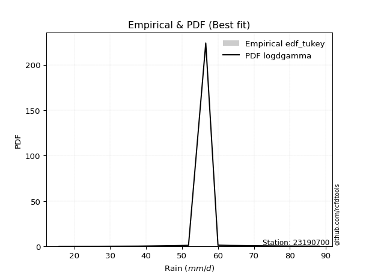</img>

</div>


### 8. EDF Gringorten (1963)

Gringorten plotting position formula is essential for estimating the probability and return periods of extreme events like floods and heavy rainfall. The constant _a=0.44_.

<div align="center">


$P=(m-a)/(n+1-2a)$


</div>


**8.1. Empirical values**

<div align="center">

|                | 0                    | 1                  | 2                   | 3                  | 4              | 5                  | 6                  | 7                  | 8                  |
|:---------------|:---------------------|:-------------------|:--------------------|:-------------------|:---------------|:-------------------|:-------------------|:-------------------|:-------------------|
| date           | 2017                 | 2021               | 2024                | 2023               | 2020           | 2025               | 2018               | 2022               | 2019               |
| x              | 15.8                 | 37.8               | 49.6                | 51.8               | 56.6           | 60.0               | 63.4               | 79.6               | 88.2               |
| m              | 1                    | 2                  | 3                   | 4                  | 5              | 6                  | 7                  | 8                  | 9                  |
| empirical_dist | edf_gringorten       | edf_gringorten     | edf_gringorten      | edf_gringorten     | edf_gringorten | edf_gringorten     | edf_gringorten     | edf_gringorten     | edf_gringorten     |
| empirical      | 0.061403508771929835 | 0.1710526315789474 | 0.28070175438596495 | 0.3903508771929825 | 0.5            | 0.6096491228070176 | 0.7192982456140351 | 0.8289473684210527 | 0.9385964912280703 |
| empirical_tr   | 1.0654205607476634   | 1.2063492063492063 | 1.3902439024390243  | 1.6402877697841727 | 2.0            | 2.561797752808989  | 3.5625             | 5.846153846153847  | 16.285714285714324 |

</div>


**8.2. Kolmogorov-Smirnov fit test (sorted by Δ)**


<div align="center">

|                | 0                   | 1                   | 2                   | 3                   | 4                   | 5                   | 6                   | 7                   | 8                   | 9                   | 10                  | 11                  | 12                  | 13                  | 14                  | 15                  | 16                  | 17                  | 18                  | 19                  | 20                  | 21                  | 22                  | 23                  | 24                  | 25                  | 26                  | 27                  | 28                  | 29                  | 30                  | 31                  | 32                  | 33                  | 34                  | 35                  | 36                  | 37                  | 38                  | 39                  | 40                  | 41                  | 42                  | 43                  | 44                  | 45                  | 46                  | 47                  | 48                  | 49                  | 50                  | 51                  | 52                  | 53                  | 54                  | 55                  | 56                  | 57                  | 58                  | 59                  | 60                  | 61                  | 62                  | 63                  | 64                  | 65                  | 66                  | 67                  | 68                  | 69                  | 70                  | 71                  | 72                  | 73                  | 74                  | 75                  | 76                  | 77                  | 78                  | 79                  | 80                  | 81                  | 82                  | 83                  | 84                  | 85                  | 86                  | 87                  | 88                  | 89                  | 90                  | 91                  | 92                  | 93                  | 94                  | 95                  | 96                  | 97                  | 98                  | 99                  | 100                 | 101                 | 102                 | 103                 | 104                 | 105                 | 106                 | 107                 | 108                 | 109                 | 110                 | 111                 | 112                 | 113                 | 114                 | 115                 | 116                 | 117                 | 118                 | 119                 | 120                 | 121                 | 122                 | 123                 | 124                 | 125                 | 126                 | 127                 | 128                 | 129                 | 130                 | 131                 | 132                 | 133                 | 134                 | 135                 | 136                 | 137                 | 138                 | 139                 | 140                 | 141                 | 142                 | 143                 | 144                 | 145                 | 146                 | 147                 | 148                 | 149                 | 150                 | 151                 | 152                 | 153                 | 154                 | 155                 | 156                 | 157                 | 158                 | 159                 |
|:---------------|:--------------------|:--------------------|:--------------------|:--------------------|:--------------------|:--------------------|:--------------------|:--------------------|:--------------------|:--------------------|:--------------------|:--------------------|:--------------------|:--------------------|:--------------------|:--------------------|:--------------------|:--------------------|:--------------------|:--------------------|:--------------------|:--------------------|:--------------------|:--------------------|:--------------------|:--------------------|:--------------------|:--------------------|:--------------------|:--------------------|:--------------------|:--------------------|:--------------------|:--------------------|:--------------------|:--------------------|:--------------------|:--------------------|:--------------------|:--------------------|:--------------------|:--------------------|:--------------------|:--------------------|:--------------------|:--------------------|:--------------------|:--------------------|:--------------------|:--------------------|:--------------------|:--------------------|:--------------------|:--------------------|:--------------------|:--------------------|:--------------------|:--------------------|:--------------------|:--------------------|:--------------------|:--------------------|:--------------------|:--------------------|:--------------------|:--------------------|:--------------------|:--------------------|:--------------------|:--------------------|:--------------------|:--------------------|:--------------------|:--------------------|:--------------------|:--------------------|:--------------------|:--------------------|:--------------------|:--------------------|:--------------------|:--------------------|:--------------------|:--------------------|:--------------------|:--------------------|:--------------------|:--------------------|:--------------------|:--------------------|:--------------------|:--------------------|:--------------------|:--------------------|:--------------------|:--------------------|:--------------------|:--------------------|:--------------------|:--------------------|:--------------------|:--------------------|:--------------------|:--------------------|:--------------------|:--------------------|:--------------------|:--------------------|:--------------------|:--------------------|:--------------------|:--------------------|:--------------------|:--------------------|:--------------------|:--------------------|:--------------------|:--------------------|:--------------------|:--------------------|:--------------------|:--------------------|:--------------------|:--------------------|:--------------------|:--------------------|:--------------------|:--------------------|:--------------------|:--------------------|:--------------------|:--------------------|:--------------------|:--------------------|:--------------------|:--------------------|:--------------------|:--------------------|:--------------------|:--------------------|:--------------------|:--------------------|:--------------------|:--------------------|:--------------------|:--------------------|:--------------------|:--------------------|:--------------------|:--------------------|:--------------------|:--------------------|:--------------------|:--------------------|:--------------------|:--------------------|:--------------------|:--------------------|:--------------------|:--------------------|
| station        | 23190700            | 23190700            | 23190700            | 23190700            | 23190700            | 23190700            | 23190700            | 23190700            | 23190700            | 23190700            | 23190700            | 23190700            | 23190700            | 23190700            | 23190700            | 23190700            | 23190700            | 23190700            | 23190700            | 23190700            | 23190700            | 23190700            | 23190700            | 23190700            | 23190700            | 23190700            | 23190700            | 23190700            | 23190700            | 23190700            | 23190700            | 23190700            | 23190700            | 23190700            | 23190700            | 23190700            | 23190700            | 23190700            | 23190700            | 23190700            | 23190700            | 23190700            | 23190700            | 23190700            | 23190700            | 23190700            | 23190700            | 23190700            | 23190700            | 23190700            | 23190700            | 23190700            | 23190700            | 23190700            | 23190700            | 23190700            | 23190700            | 23190700            | 23190700            | 23190700            | 23190700            | 23190700            | 23190700            | 23190700            | 23190700            | 23190700            | 23190700            | 23190700            | 23190700            | 23190700            | 23190700            | 23190700            | 23190700            | 23190700            | 23190700            | 23190700            | 23190700            | 23190700            | 23190700            | 23190700            | 23190700            | 23190700            | 23190700            | 23190700            | 23190700            | 23190700            | 23190700            | 23190700            | 23190700            | 23190700            | 23190700            | 23190700            | 23190700            | 23190700            | 23190700            | 23190700            | 23190700            | 23190700            | 23190700            | 23190700            | 23190700            | 23190700            | 23190700            | 23190700            | 23190700            | 23190700            | 23190700            | 23190700            | 23190700            | 23190700            | 23190700            | 23190700            | 23190700            | 23190700            | 23190700            | 23190700            | 23190700            | 23190700            | 23190700            | 23190700            | 23190700            | 23190700            | 23190700            | 23190700            | 23190700            | 23190700            | 23190700            | 23190700            | 23190700            | 23190700            | 23190700            | 23190700            | 23190700            | 23190700            | 23190700            | 23190700            | 23190700            | 23190700            | 23190700            | 23190700            | 23190700            | 23190700            | 23190700            | 23190700            | 23190700            | 23190700            | 23190700            | 23190700            | 23190700            | 23190700            | 23190700            | 23190700            | 23190700            | 23190700            | 23190700            | 23190700            | 23190700            | 23190700            | 23190700            | 23190700            |
| empirical_dist | edf_gringorten      | edf_gringorten      | edf_gringorten      | edf_gringorten      | edf_gringorten      | edf_gringorten      | edf_gringorten      | edf_gringorten      | edf_gringorten      | edf_gringorten      | edf_gringorten      | edf_gringorten      | edf_gringorten      | edf_gringorten      | edf_gringorten      | edf_gringorten      | edf_gringorten      | edf_gringorten      | edf_gringorten      | edf_gringorten      | edf_gringorten      | edf_gringorten      | edf_gringorten      | edf_gringorten      | edf_gringorten      | edf_gringorten      | edf_gringorten      | edf_gringorten      | edf_gringorten      | edf_gringorten      | edf_gringorten      | edf_gringorten      | edf_gringorten      | edf_gringorten      | edf_gringorten      | edf_gringorten      | edf_gringorten      | edf_gringorten      | edf_gringorten      | edf_gringorten      | edf_gringorten      | edf_gringorten      | edf_gringorten      | edf_gringorten      | edf_gringorten      | edf_gringorten      | edf_gringorten      | edf_gringorten      | edf_gringorten      | edf_gringorten      | edf_gringorten      | edf_gringorten      | edf_gringorten      | edf_gringorten      | edf_gringorten      | edf_gringorten      | edf_gringorten      | edf_gringorten      | edf_gringorten      | edf_gringorten      | edf_gringorten      | edf_gringorten      | edf_gringorten      | edf_gringorten      | edf_gringorten      | edf_gringorten      | edf_gringorten      | edf_gringorten      | edf_gringorten      | edf_gringorten      | edf_gringorten      | edf_gringorten      | edf_gringorten      | edf_gringorten      | edf_gringorten      | edf_gringorten      | edf_gringorten      | edf_gringorten      | edf_gringorten      | edf_gringorten      | edf_gringorten      | edf_gringorten      | edf_gringorten      | edf_gringorten      | edf_gringorten      | edf_gringorten      | edf_gringorten      | edf_gringorten      | edf_gringorten      | edf_gringorten      | edf_gringorten      | edf_gringorten      | edf_gringorten      | edf_gringorten      | edf_gringorten      | edf_gringorten      | edf_gringorten      | edf_gringorten      | edf_gringorten      | edf_gringorten      | edf_gringorten      | edf_gringorten      | edf_gringorten      | edf_gringorten      | edf_gringorten      | edf_gringorten      | edf_gringorten      | edf_gringorten      | edf_gringorten      | edf_gringorten      | edf_gringorten      | edf_gringorten      | edf_gringorten      | edf_gringorten      | edf_gringorten      | edf_gringorten      | edf_gringorten      | edf_gringorten      | edf_gringorten      | edf_gringorten      | edf_gringorten      | edf_gringorten      | edf_gringorten      | edf_gringorten      | edf_gringorten      | edf_gringorten      | edf_gringorten      | edf_gringorten      | edf_gringorten      | edf_gringorten      | edf_gringorten      | edf_gringorten      | edf_gringorten      | edf_gringorten      | edf_gringorten      | edf_gringorten      | edf_gringorten      | edf_gringorten      | edf_gringorten      | edf_gringorten      | edf_gringorten      | edf_gringorten      | edf_gringorten      | edf_gringorten      | edf_gringorten      | edf_gringorten      | edf_gringorten      | edf_gringorten      | edf_gringorten      | edf_gringorten      | edf_gringorten      | edf_gringorten      | edf_gringorten      | edf_gringorten      | edf_gringorten      | edf_gringorten      | edf_gringorten      | edf_gringorten      | edf_gringorten      | edf_gringorten      |
| p_dist         | logdgamma           | gennorm             | dweibull            | dgamma              | logt                | hypsecant           | genlogistic         | laplace             | logistic            | logburr12           | logloglaplace       | pearson3            | mielke              | burr                | loggenlogistic      | skewnorm            | weibull_min         | foldnorm            | logvonmises_line    | johnsonsu           | t                   | norm                | crystalball         | truncnorm           | exponnorm           | nct                 | f                   | logdweibull         | erlang              | logloggamma         | gamma               | rice                | logweibull_min      | logpearson3         | genextreme          | anglit              | logjohnsonsu        | logexponweib        | loggompertz         | truncweibull_min    | invgamma            | semicircular        | argus               | gumbel_l            | loggumbel_l         | logargus            | betaprime           | cosine              | maxwell             | logtruncweibull_min | gompertz            | alpha               | exponweib           | rayleigh            | invgauss            | logtrapezoid        | logskewnorm         | arcsine             | vonmises_line       | gumbel_r            | lognakagami         | loggausshyper       | logburr             | gausshyper          | loggennorm          | loggenextreme       | moyal               | logmielke           | halfnorm            | bradford            | loglaplace          | loglaplace          | kappa3              | uniform             | beta                | wrapcauchy          | tukeylambda         | kstwobign           | halflogistic        | loghypsecant        | ksone               | loglogistic         | logf                | logfatiguelife      | logcrystalball      | lognorm             | logexponnorm        | logrice             | lognct              | loganglit           | logsemicircular     | logerlang           | logbetaprime        | loggamma            | loggamma            | triang              | loggenhalflogistic  | logarcsine          | logncf              | kappa4              | genhalflogistic     | loglevy_l           | loginvgamma         | logtriang           | genpareto           | loginvgauss         | logalpha            | wald                | logmaxwell          | logfoldnorm         | loginvweibull       | lograyleigh         | logtruncnorm        | loggenpareto        | truncexpon          | loggumbel_r         | logkstwobign        | loghalfnorm         | logcosine           | logweibull_max      | lomax               | levy_l              | genexpon            | logrdist            | logmoyal            | loggenexpon         | loghalflogistic     | logjohnsonsb        | ncf                 | logbeta             | johnsonsb           | trapezoid           | logwrapcauchy       | halfgennorm         | loglomax            | burr12              | logksone            | logwald             | logkappa4           | logkappa3           | logbradford         | logtukeylambda      | loguniform          | nakagami            | logexponpow         | loggengamma         | logtruncexpon       | invweibull          | gengamma            | powerlaw            | rdist               | fatiguelife         | weibull_max         | logpowerlaw         | exponpow            | truncpareto         | logtruncpareto      | loghalfgennorm      | logvonmises         | vonmises            |
| delta          | 0.05301366706901427 | 0.06061566829167031 | 0.06082534668432604 | 0.06247609945567212 | 0.06756974565688845 | 0.07137264129399745 | 0.07369272077288225 | 0.07617057625794743 | 0.08219146276426315 | 0.08477295032190257 | 0.0848823887414043  | 0.09047091179716849 | 0.0919018747713849  | 0.09206863663085785 | 0.0922616057233911  | 0.09230034100225248 | 0.09349576290708028 | 0.09362522159771841 | 0.09504995116615444 | 0.09529939595527492 | 0.09745047009077706 | 0.09746325482675416 | 0.09746325746120804 | 0.09746326777728559 | 0.09746557898411662 | 0.09749540806375334 | 0.09839134233948382 | 0.10469338088581992 | 0.10684393749194682 | 0.10704122003593208 | 0.10738458932493866 | 0.10798679373057085 | 0.10820652313587636 | 0.11012613034767904 | 0.11391352283403089 | 0.11401983269194416 | 0.11633492719397331 | 0.1172467380592509  | 0.11809406070166845 | 0.1183865710316842  | 0.12086028946764188 | 0.12092323160416801 | 0.12144483161135278 | 0.12346397639434192 | 0.12593220692452506 | 0.12696629621590416 | 0.12856071804125013 | 0.12858623303951244 | 0.13080145556812606 | 0.13188985497194006 | 0.13226473970596575 | 0.1333661823892356  | 0.13782404902515505 | 0.14308311454284744 | 0.14446579718296176 | 0.14603998797335682 | 0.14770680746321452 | 0.14888246384780718 | 0.15043543379026197 | 0.1527785813106089  | 0.15389353301366626 | 0.15437473052997985 | 0.1596789891904542  | 0.16231141003563815 | 0.16264218484820286 | 0.16922129427771682 | 0.1738343646088874  | 0.1770539330099573  | 0.17798639199247546 | 0.179586341280841   | 0.1806387902595868  | 0.1806387902595868  | 0.1854263249816882  | 0.18614907434331673 | 0.18639407000347724 | 0.18731516585640934 | 0.187504559015168   | 0.18857652938509534 | 0.19054767783353793 | 0.19088503895025338 | 0.19167393622176987 | 0.19351890965274948 | 0.19483714909688304 | 0.19591857940928475 | 0.1966089078039901  | 0.1966098650663219  | 0.19661143187766628 | 0.1966226640446247  | 0.1996355888211287  | 0.19985082447294106 | 0.2011886242965853  | 0.2012487468329473  | 0.2017258973591493  | 0.20359296161148016 | 0.20359296161148016 | 0.2049032851282776  | 0.2050964631378907  | 0.20648643290635293 | 0.20707164489056812 | 0.2097467539093147  | 0.21413535887478496 | 0.2143968715251487  | 0.21470224257606385 | 0.22167133072699158 | 0.22259371064882855 | 0.22569548537341183 | 0.226006754246116   | 0.22839873541529127 | 0.23041873970530818 | 0.2310656716289307  | 0.23344961862389507 | 0.24188416361828496 | 0.25152802200180874 | 0.2565480209155218  | 0.2608510429369633  | 0.2659371445585695  | 0.2720084867400859  | 0.2741846102450159  | 0.27465125300543    | 0.2772596370238777  | 0.28768262599235167 | 0.28909243241230714 | 0.28929105236537384 | 0.29031699419887996 | 0.291775231165838   | 0.2934074264413546  | 0.2975795492222641  | 0.29943006448111065 | 0.30123036602859365 | 0.3092874536260896  | 0.3194182709504434  | 0.3208652765349473  | 0.33137091748683994 | 0.34532988243584656 | 0.347471522290103   | 0.34965830759168565 | 0.3570157740089533  | 0.36369622372074345 | 0.36395642178423954 | 0.3678918082105452  | 0.37118549238428394 | 0.37999463201120504 | 0.38455927968793674 | 0.4051918220182204  | 0.43944448397569186 | 0.45825731575227163 | 0.461298520440059   | 0.4999531455127245  | 0.5956798844838331  | 0.6060505851562696  | 0.6235246093471463  | 0.6401007108785897  | 0.6419828024302838  | 0.6810852340050579  | 0.7548310325986618  | 0.7588401564952552  | 0.7885154641427752  | 0.8289473684210527  | 1.1728151917660146  | 13.615342481668216  |
| deltao         | 0.41761268023100007 | 0.41761268023100007 | 0.41761268023100007 | 0.41761268023100007 | 0.41761268023100007 | 0.41761268023100007 | 0.41761268023100007 | 0.41761268023100007 | 0.41761268023100007 | 0.41761268023100007 | 0.41761268023100007 | 0.41761268023100007 | 0.41761268023100007 | 0.41761268023100007 | 0.41761268023100007 | 0.41761268023100007 | 0.41761268023100007 | 0.41761268023100007 | 0.41761268023100007 | 0.41761268023100007 | 0.41761268023100007 | 0.41761268023100007 | 0.41761268023100007 | 0.41761268023100007 | 0.41761268023100007 | 0.41761268023100007 | 0.41761268023100007 | 0.41761268023100007 | 0.41761268023100007 | 0.41761268023100007 | 0.41761268023100007 | 0.41761268023100007 | 0.41761268023100007 | 0.41761268023100007 | 0.41761268023100007 | 0.41761268023100007 | 0.41761268023100007 | 0.41761268023100007 | 0.41761268023100007 | 0.41761268023100007 | 0.41761268023100007 | 0.41761268023100007 | 0.41761268023100007 | 0.41761268023100007 | 0.41761268023100007 | 0.41761268023100007 | 0.41761268023100007 | 0.41761268023100007 | 0.41761268023100007 | 0.41761268023100007 | 0.41761268023100007 | 0.41761268023100007 | 0.41761268023100007 | 0.41761268023100007 | 0.41761268023100007 | 0.41761268023100007 | 0.41761268023100007 | 0.41761268023100007 | 0.41761268023100007 | 0.41761268023100007 | 0.41761268023100007 | 0.41761268023100007 | 0.41761268023100007 | 0.41761268023100007 | 0.41761268023100007 | 0.41761268023100007 | 0.41761268023100007 | 0.41761268023100007 | 0.41761268023100007 | 0.41761268023100007 | 0.41761268023100007 | 0.41761268023100007 | 0.41761268023100007 | 0.41761268023100007 | 0.41761268023100007 | 0.41761268023100007 | 0.41761268023100007 | 0.41761268023100007 | 0.41761268023100007 | 0.41761268023100007 | 0.41761268023100007 | 0.41761268023100007 | 0.41761268023100007 | 0.41761268023100007 | 0.41761268023100007 | 0.41761268023100007 | 0.41761268023100007 | 0.41761268023100007 | 0.41761268023100007 | 0.41761268023100007 | 0.41761268023100007 | 0.41761268023100007 | 0.41761268023100007 | 0.41761268023100007 | 0.41761268023100007 | 0.41761268023100007 | 0.41761268023100007 | 0.41761268023100007 | 0.41761268023100007 | 0.41761268023100007 | 0.41761268023100007 | 0.41761268023100007 | 0.41761268023100007 | 0.41761268023100007 | 0.41761268023100007 | 0.41761268023100007 | 0.41761268023100007 | 0.41761268023100007 | 0.41761268023100007 | 0.41761268023100007 | 0.41761268023100007 | 0.41761268023100007 | 0.41761268023100007 | 0.41761268023100007 | 0.41761268023100007 | 0.41761268023100007 | 0.41761268023100007 | 0.41761268023100007 | 0.41761268023100007 | 0.41761268023100007 | 0.41761268023100007 | 0.41761268023100007 | 0.41761268023100007 | 0.41761268023100007 | 0.41761268023100007 | 0.41761268023100007 | 0.41761268023100007 | 0.41761268023100007 | 0.41761268023100007 | 0.41761268023100007 | 0.41761268023100007 | 0.41761268023100007 | 0.41761268023100007 | 0.41761268023100007 | 0.41761268023100007 | 0.41761268023100007 | 0.41761268023100007 | 0.41761268023100007 | 0.41761268023100007 | 0.41761268023100007 | 0.41761268023100007 | 0.41761268023100007 | 0.41761268023100007 | 0.41761268023100007 | 0.41761268023100007 | 0.41761268023100007 | 0.41761268023100007 | 0.41761268023100007 | 0.41761268023100007 | 0.41761268023100007 | 0.41761268023100007 | 0.41761268023100007 | 0.41761268023100007 | 0.41761268023100007 | 0.41761268023100007 | 0.41761268023100007 | 0.41761268023100007 | 0.41761268023100007 | 0.41761268023100007 | 0.41761268023100007 |
| eval           | Δo > Δ              | Δo > Δ              | Δo > Δ              | Δo > Δ              | Δo > Δ              | Δo > Δ              | Δo > Δ              | Δo > Δ              | Δo > Δ              | Δo > Δ              | Δo > Δ              | Δo > Δ              | Δo > Δ              | Δo > Δ              | Δo > Δ              | Δo > Δ              | Δo > Δ              | Δo > Δ              | Δo > Δ              | Δo > Δ              | Δo > Δ              | Δo > Δ              | Δo > Δ              | Δo > Δ              | Δo > Δ              | Δo > Δ              | Δo > Δ              | Δo > Δ              | Δo > Δ              | Δo > Δ              | Δo > Δ              | Δo > Δ              | Δo > Δ              | Δo > Δ              | Δo > Δ              | Δo > Δ              | Δo > Δ              | Δo > Δ              | Δo > Δ              | Δo > Δ              | Δo > Δ              | Δo > Δ              | Δo > Δ              | Δo > Δ              | Δo > Δ              | Δo > Δ              | Δo > Δ              | Δo > Δ              | Δo > Δ              | Δo > Δ              | Δo > Δ              | Δo > Δ              | Δo > Δ              | Δo > Δ              | Δo > Δ              | Δo > Δ              | Δo > Δ              | Δo > Δ              | Δo > Δ              | Δo > Δ              | Δo > Δ              | Δo > Δ              | Δo > Δ              | Δo > Δ              | Δo > Δ              | Δo > Δ              | Δo > Δ              | Δo > Δ              | Δo > Δ              | Δo > Δ              | Δo > Δ              | Δo > Δ              | Δo > Δ              | Δo > Δ              | Δo > Δ              | Δo > Δ              | Δo > Δ              | Δo > Δ              | Δo > Δ              | Δo > Δ              | Δo > Δ              | Δo > Δ              | Δo > Δ              | Δo > Δ              | Δo > Δ              | Δo > Δ              | Δo > Δ              | Δo > Δ              | Δo > Δ              | Δo > Δ              | Δo > Δ              | Δo > Δ              | Δo > Δ              | Δo > Δ              | Δo > Δ              | Δo > Δ              | Δo > Δ              | Δo > Δ              | Δo > Δ              | Δo > Δ              | Δo > Δ              | Δo > Δ              | Δo > Δ              | Δo > Δ              | Δo > Δ              | Δo > Δ              | Δo > Δ              | Δo > Δ              | Δo > Δ              | Δo > Δ              | Δo > Δ              | Δo > Δ              | Δo > Δ              | Δo > Δ              | Δo > Δ              | Δo > Δ              | Δo > Δ              | Δo > Δ              | Δo > Δ              | Δo > Δ              | Δo > Δ              | Δo > Δ              | Δo > Δ              | Δo > Δ              | Δo > Δ              | Δo > Δ              | Δo > Δ              | Δo > Δ              | Δo > Δ              | Δo > Δ              | Δo > Δ              | Δo > Δ              | Δo > Δ              | Δo > Δ              | Δo > Δ              | Δo > Δ              | Δo > Δ              | Δo > Δ              | Δo > Δ              | Δo > Δ              | Δo > Δ              | Δo > Δ              | Δo > Δ              | Δo > Δ              | Δo <= Δ             | Δo <= Δ             | Δo <= Δ             | Δo <= Δ             | Δo <= Δ             | Δo <= Δ             | Δo <= Δ             | Δo <= Δ             | Δo <= Δ             | Δo <= Δ             | Δo <= Δ             | Δo <= Δ             | Δo <= Δ             | Δo <= Δ             | Δo <= Δ             | Δo <= Δ             |
| fit            | 1                   | 1                   | 1                   | 1                   | 1                   | 1                   | 1                   | 1                   | 1                   | 1                   | 1                   | 1                   | 1                   | 1                   | 1                   | 1                   | 1                   | 1                   | 1                   | 1                   | 1                   | 1                   | 1                   | 1                   | 1                   | 1                   | 1                   | 1                   | 1                   | 1                   | 1                   | 1                   | 1                   | 1                   | 1                   | 1                   | 1                   | 1                   | 1                   | 1                   | 1                   | 1                   | 1                   | 1                   | 1                   | 1                   | 1                   | 1                   | 1                   | 1                   | 1                   | 1                   | 1                   | 1                   | 1                   | 1                   | 1                   | 1                   | 1                   | 1                   | 1                   | 1                   | 1                   | 1                   | 1                   | 1                   | 1                   | 1                   | 1                   | 1                   | 1                   | 1                   | 1                   | 1                   | 1                   | 1                   | 1                   | 1                   | 1                   | 1                   | 1                   | 1                   | 1                   | 1                   | 1                   | 1                   | 1                   | 1                   | 1                   | 1                   | 1                   | 1                   | 1                   | 1                   | 1                   | 1                   | 1                   | 1                   | 1                   | 1                   | 1                   | 1                   | 1                   | 1                   | 1                   | 1                   | 1                   | 1                   | 1                   | 1                   | 1                   | 1                   | 1                   | 1                   | 1                   | 1                   | 1                   | 1                   | 1                   | 1                   | 1                   | 1                   | 1                   | 1                   | 1                   | 1                   | 1                   | 1                   | 1                   | 1                   | 1                   | 1                   | 1                   | 1                   | 1                   | 1                   | 1                   | 1                   | 1                   | 1                   | 1                   | 1                   | 1                   | 1                   | 0                   | 0                   | 0                   | 0                   | 0                   | 0                   | 0                   | 0                   | 0                   | 0                   | 0                   | 0                   | 0                   | 0                   | 0                   | 0                   |
| n              | 9                   | 9                   | 9                   | 9                   | 9                   | 9                   | 9                   | 9                   | 9                   | 9                   | 9                   | 9                   | 9                   | 9                   | 9                   | 9                   | 9                   | 9                   | 9                   | 9                   | 9                   | 9                   | 9                   | 9                   | 9                   | 9                   | 9                   | 9                   | 9                   | 9                   | 9                   | 9                   | 9                   | 9                   | 9                   | 9                   | 9                   | 9                   | 9                   | 9                   | 9                   | 9                   | 9                   | 9                   | 9                   | 9                   | 9                   | 9                   | 9                   | 9                   | 9                   | 9                   | 9                   | 9                   | 9                   | 9                   | 9                   | 9                   | 9                   | 9                   | 9                   | 9                   | 9                   | 9                   | 9                   | 9                   | 9                   | 9                   | 9                   | 9                   | 9                   | 9                   | 9                   | 9                   | 9                   | 9                   | 9                   | 9                   | 9                   | 9                   | 9                   | 9                   | 9                   | 9                   | 9                   | 9                   | 9                   | 9                   | 9                   | 9                   | 9                   | 9                   | 9                   | 9                   | 9                   | 9                   | 9                   | 9                   | 9                   | 9                   | 9                   | 9                   | 9                   | 9                   | 9                   | 9                   | 9                   | 9                   | 9                   | 9                   | 9                   | 9                   | 9                   | 9                   | 9                   | 9                   | 9                   | 9                   | 9                   | 9                   | 9                   | 9                   | 9                   | 9                   | 9                   | 9                   | 9                   | 9                   | 9                   | 9                   | 9                   | 9                   | 9                   | 9                   | 9                   | 9                   | 9                   | 9                   | 9                   | 9                   | 9                   | 9                   | 9                   | 9                   | 9                   | 9                   | 9                   | 9                   | 9                   | 9                   | 9                   | 9                   | 9                   | 9                   | 9                   | 9                   | 9                   | 9                   | 9                   | 9                   |
| best_fit       | 1                   | 0                   | 0                   | 0                   | 0                   | 0                   | 0                   | 0                   | 0                   | 0                   | 0                   | 0                   | 0                   | 0                   | 0                   | 0                   | 0                   | 0                   | 0                   | 0                   | 0                   | 0                   | 0                   | 0                   | 0                   | 0                   | 0                   | 0                   | 0                   | 0                   | 0                   | 0                   | 0                   | 0                   | 0                   | 0                   | 0                   | 0                   | 0                   | 0                   | 0                   | 0                   | 0                   | 0                   | 0                   | 0                   | 0                   | 0                   | 0                   | 0                   | 0                   | 0                   | 0                   | 0                   | 0                   | 0                   | 0                   | 0                   | 0                   | 0                   | 0                   | 0                   | 0                   | 0                   | 0                   | 0                   | 0                   | 0                   | 0                   | 0                   | 0                   | 0                   | 0                   | 0                   | 0                   | 0                   | 0                   | 0                   | 0                   | 0                   | 0                   | 0                   | 0                   | 0                   | 0                   | 0                   | 0                   | 0                   | 0                   | 0                   | 0                   | 0                   | 0                   | 0                   | 0                   | 0                   | 0                   | 0                   | 0                   | 0                   | 0                   | 0                   | 0                   | 0                   | 0                   | 0                   | 0                   | 0                   | 0                   | 0                   | 0                   | 0                   | 0                   | 0                   | 0                   | 0                   | 0                   | 0                   | 0                   | 0                   | 0                   | 0                   | 0                   | 0                   | 0                   | 0                   | 0                   | 0                   | 0                   | 0                   | 0                   | 0                   | 0                   | 0                   | 0                   | 0                   | 0                   | 0                   | 0                   | 0                   | 0                   | 0                   | 0                   | 0                   | 0                   | 0                   | 0                   | 0                   | 0                   | 0                   | 0                   | 0                   | 0                   | 0                   | 0                   | 0                   | 0                   | 0                   | 0                   | 0                   |
| best_fit_sort  | 1                   | 2                   | 3                   | 4                   | 5                   | 6                   | 7                   | 8                   | 9                   | 10                  | 11                  | 12                  | 13                  | 14                  | 15                  | 16                  | 17                  | 18                  | 19                  | 20                  | 21                  | 22                  | 23                  | 24                  | 25                  | 26                  | 27                  | 28                  | 29                  | 30                  | 31                  | 32                  | 33                  | 34                  | 35                  | 36                  | 37                  | 38                  | 39                  | 40                  | 41                  | 42                  | 43                  | 44                  | 45                  | 46                  | 47                  | 48                  | 49                  | 50                  | 51                  | 52                  | 53                  | 54                  | 55                  | 56                  | 57                  | 58                  | 59                  | 60                  | 61                  | 62                  | 63                  | 64                  | 65                  | 66                  | 67                  | 68                  | 69                  | 70                  | 71                  | 72                  | 73                  | 74                  | 75                  | 76                  | 77                  | 78                  | 79                  | 80                  | 81                  | 82                  | 83                  | 84                  | 85                  | 86                  | 87                  | 88                  | 89                  | 90                  | 91                  | 92                  | 93                  | 94                  | 95                  | 96                  | 97                  | 98                  | 99                  | 100                 | 101                 | 102                 | 103                 | 104                 | 105                 | 106                 | 107                 | 108                 | 109                 | 110                 | 111                 | 112                 | 113                 | 114                 | 115                 | 116                 | 117                 | 118                 | 119                 | 120                 | 121                 | 122                 | 123                 | 124                 | 125                 | 126                 | 127                 | 128                 | 129                 | 130                 | 131                 | 132                 | 133                 | 134                 | 135                 | 136                 | 137                 | 138                 | 139                 | 140                 | 141                 | 142                 | 143                 | 144                 | 145                 | 146                 | 147                 | 148                 | 149                 | 150                 | 151                 | 152                 | 153                 | 154                 | 155                 | 156                 | 157                 | 158                 | 159                 | 160                 |

</div>


**8.3. Best fit**

<div align="center">

|   id |   station | empirical_dist   | p_dist    |     delta |   deltao | eval   |   fit |   n |   best_fit |   best_fit_sort |
|-----:|----------:|:-----------------|:----------|----------:|---------:|:-------|------:|----:|-----------:|----------------:|
|    0 |  23190700 | edf_gringorten   | logdgamma | 0.0530137 | 0.417613 | Δo > Δ |     1 |   9 |          1 |               1 |

</div>


<div align="center">

</img>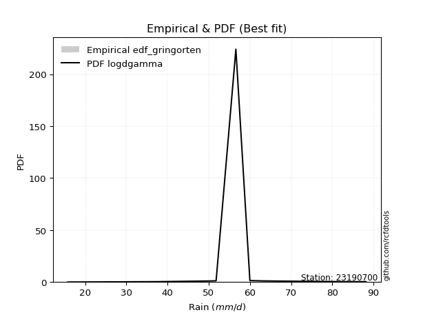</img>

</div>


### 9. EDF Filliben (1975)

The specific values of the constants (0.3175) (often denoted as $alpha$) and (0.365) are derived from a method proposed by James J. Filliben in a 1975 paper. This particular formula is the mean value of the $i$-th order statistic of the normal distribution and is considered a robust and effective plotting position formula for the normal probability plot correlation coefficient test for normality.

<div align="center">


$P=(m-0.3175)/(n+0.365)$


</div>


**9.1. Empirical values**

<div align="center">

|                | 0                   | 1                  | 2                   | 3                   | 4            | 5                  | 6                  | 7                  | 8                  |
|:---------------|:--------------------|:-------------------|:--------------------|:--------------------|:-------------|:-------------------|:-------------------|:-------------------|:-------------------|
| date           | 2017                | 2021               | 2024                | 2023                | 2020         | 2025               | 2018               | 2022               | 2019               |
| x              | 15.8                | 37.8               | 49.6                | 51.8                | 56.6         | 60.0               | 63.4               | 79.6               | 88.2               |
| m              | 1                   | 2                  | 3                   | 4                   | 5            | 6                  | 7                  | 8                  | 9                  |
| empirical_dist | edf_filliben        | edf_filliben       | edf_filliben        | edf_filliben        | edf_filliben | edf_filliben       | edf_filliben       | edf_filliben       | edf_filliben       |
| empirical      | 0.07287773625200214 | 0.1796583021890016 | 0.28643886812600106 | 0.39321943406300053 | 0.5          | 0.6067805659369995 | 0.7135611318739989 | 0.8203416978109984 | 0.9271222637479978 |
| empirical_tr   | 1.0786063921681543  | 1.219004230393752  | 1.401421623643846   | 1.6480422349318082  | 2.0          | 2.5431093007467753 | 3.491146318732526  | 5.566121842496286  | 13.721611721611705 |

</div>


**9.2. Kolmogorov-Smirnov fit test (sorted by Δ)**


<div align="center">

|                | 0                   | 1                   | 2                   | 3                   | 4                   | 5                   | 6                   | 7                   | 8                   | 9                   | 10                  | 11                  | 12                  | 13                  | 14                  | 15                  | 16                  | 17                  | 18                  | 19                  | 20                  | 21                  | 22                  | 23                  | 24                  | 25                  | 26                  | 27                  | 28                  | 29                  | 30                  | 31                  | 32                  | 33                  | 34                  | 35                  | 36                  | 37                  | 38                  | 39                  | 40                  | 41                  | 42                  | 43                  | 44                  | 45                  | 46                  | 47                  | 48                  | 49                  | 50                  | 51                  | 52                  | 53                  | 54                  | 55                  | 56                  | 57                  | 58                  | 59                  | 60                  | 61                  | 62                  | 63                  | 64                  | 65                  | 66                  | 67                  | 68                  | 69                  | 70                  | 71                  | 72                  | 73                  | 74                  | 75                  | 76                  | 77                  | 78                  | 79                  | 80                  | 81                  | 82                  | 83                  | 84                  | 85                  | 86                  | 87                  | 88                  | 89                  | 90                  | 91                  | 92                  | 93                  | 94                  | 95                  | 96                  | 97                  | 98                  | 99                  | 100                 | 101                 | 102                 | 103                 | 104                 | 105                 | 106                 | 107                 | 108                 | 109                 | 110                 | 111                 | 112                 | 113                 | 114                 | 115                 | 116                 | 117                 | 118                 | 119                 | 120                 | 121                 | 122                 | 123                 | 124                 | 125                 | 126                 | 127                 | 128                 | 129                 | 130                 | 131                 | 132                 | 133                 | 134                 | 135                 | 136                 | 137                 | 138                 | 139                 | 140                 | 141                 | 142                 | 143                 | 144                 | 145                 | 146                 | 147                 | 148                 | 149                 | 150                 | 151                 | 152                 | 153                 | 154                 | 155                 | 156                 | 157                 | 158                 | 159                 |
|:---------------|:--------------------|:--------------------|:--------------------|:--------------------|:--------------------|:--------------------|:--------------------|:--------------------|:--------------------|:--------------------|:--------------------|:--------------------|:--------------------|:--------------------|:--------------------|:--------------------|:--------------------|:--------------------|:--------------------|:--------------------|:--------------------|:--------------------|:--------------------|:--------------------|:--------------------|:--------------------|:--------------------|:--------------------|:--------------------|:--------------------|:--------------------|:--------------------|:--------------------|:--------------------|:--------------------|:--------------------|:--------------------|:--------------------|:--------------------|:--------------------|:--------------------|:--------------------|:--------------------|:--------------------|:--------------------|:--------------------|:--------------------|:--------------------|:--------------------|:--------------------|:--------------------|:--------------------|:--------------------|:--------------------|:--------------------|:--------------------|:--------------------|:--------------------|:--------------------|:--------------------|:--------------------|:--------------------|:--------------------|:--------------------|:--------------------|:--------------------|:--------------------|:--------------------|:--------------------|:--------------------|:--------------------|:--------------------|:--------------------|:--------------------|:--------------------|:--------------------|:--------------------|:--------------------|:--------------------|:--------------------|:--------------------|:--------------------|:--------------------|:--------------------|:--------------------|:--------------------|:--------------------|:--------------------|:--------------------|:--------------------|:--------------------|:--------------------|:--------------------|:--------------------|:--------------------|:--------------------|:--------------------|:--------------------|:--------------------|:--------------------|:--------------------|:--------------------|:--------------------|:--------------------|:--------------------|:--------------------|:--------------------|:--------------------|:--------------------|:--------------------|:--------------------|:--------------------|:--------------------|:--------------------|:--------------------|:--------------------|:--------------------|:--------------------|:--------------------|:--------------------|:--------------------|:--------------------|:--------------------|:--------------------|:--------------------|:--------------------|:--------------------|:--------------------|:--------------------|:--------------------|:--------------------|:--------------------|:--------------------|:--------------------|:--------------------|:--------------------|:--------------------|:--------------------|:--------------------|:--------------------|:--------------------|:--------------------|:--------------------|:--------------------|:--------------------|:--------------------|:--------------------|:--------------------|:--------------------|:--------------------|:--------------------|:--------------------|:--------------------|:--------------------|:--------------------|:--------------------|:--------------------|:--------------------|:--------------------|:--------------------|
| station        | 23190700            | 23190700            | 23190700            | 23190700            | 23190700            | 23190700            | 23190700            | 23190700            | 23190700            | 23190700            | 23190700            | 23190700            | 23190700            | 23190700            | 23190700            | 23190700            | 23190700            | 23190700            | 23190700            | 23190700            | 23190700            | 23190700            | 23190700            | 23190700            | 23190700            | 23190700            | 23190700            | 23190700            | 23190700            | 23190700            | 23190700            | 23190700            | 23190700            | 23190700            | 23190700            | 23190700            | 23190700            | 23190700            | 23190700            | 23190700            | 23190700            | 23190700            | 23190700            | 23190700            | 23190700            | 23190700            | 23190700            | 23190700            | 23190700            | 23190700            | 23190700            | 23190700            | 23190700            | 23190700            | 23190700            | 23190700            | 23190700            | 23190700            | 23190700            | 23190700            | 23190700            | 23190700            | 23190700            | 23190700            | 23190700            | 23190700            | 23190700            | 23190700            | 23190700            | 23190700            | 23190700            | 23190700            | 23190700            | 23190700            | 23190700            | 23190700            | 23190700            | 23190700            | 23190700            | 23190700            | 23190700            | 23190700            | 23190700            | 23190700            | 23190700            | 23190700            | 23190700            | 23190700            | 23190700            | 23190700            | 23190700            | 23190700            | 23190700            | 23190700            | 23190700            | 23190700            | 23190700            | 23190700            | 23190700            | 23190700            | 23190700            | 23190700            | 23190700            | 23190700            | 23190700            | 23190700            | 23190700            | 23190700            | 23190700            | 23190700            | 23190700            | 23190700            | 23190700            | 23190700            | 23190700            | 23190700            | 23190700            | 23190700            | 23190700            | 23190700            | 23190700            | 23190700            | 23190700            | 23190700            | 23190700            | 23190700            | 23190700            | 23190700            | 23190700            | 23190700            | 23190700            | 23190700            | 23190700            | 23190700            | 23190700            | 23190700            | 23190700            | 23190700            | 23190700            | 23190700            | 23190700            | 23190700            | 23190700            | 23190700            | 23190700            | 23190700            | 23190700            | 23190700            | 23190700            | 23190700            | 23190700            | 23190700            | 23190700            | 23190700            | 23190700            | 23190700            | 23190700            | 23190700            | 23190700            | 23190700            |
| empirical_dist | edf_filliben        | edf_filliben        | edf_filliben        | edf_filliben        | edf_filliben        | edf_filliben        | edf_filliben        | edf_filliben        | edf_filliben        | edf_filliben        | edf_filliben        | edf_filliben        | edf_filliben        | edf_filliben        | edf_filliben        | edf_filliben        | edf_filliben        | edf_filliben        | edf_filliben        | edf_filliben        | edf_filliben        | edf_filliben        | edf_filliben        | edf_filliben        | edf_filliben        | edf_filliben        | edf_filliben        | edf_filliben        | edf_filliben        | edf_filliben        | edf_filliben        | edf_filliben        | edf_filliben        | edf_filliben        | edf_filliben        | edf_filliben        | edf_filliben        | edf_filliben        | edf_filliben        | edf_filliben        | edf_filliben        | edf_filliben        | edf_filliben        | edf_filliben        | edf_filliben        | edf_filliben        | edf_filliben        | edf_filliben        | edf_filliben        | edf_filliben        | edf_filliben        | edf_filliben        | edf_filliben        | edf_filliben        | edf_filliben        | edf_filliben        | edf_filliben        | edf_filliben        | edf_filliben        | edf_filliben        | edf_filliben        | edf_filliben        | edf_filliben        | edf_filliben        | edf_filliben        | edf_filliben        | edf_filliben        | edf_filliben        | edf_filliben        | edf_filliben        | edf_filliben        | edf_filliben        | edf_filliben        | edf_filliben        | edf_filliben        | edf_filliben        | edf_filliben        | edf_filliben        | edf_filliben        | edf_filliben        | edf_filliben        | edf_filliben        | edf_filliben        | edf_filliben        | edf_filliben        | edf_filliben        | edf_filliben        | edf_filliben        | edf_filliben        | edf_filliben        | edf_filliben        | edf_filliben        | edf_filliben        | edf_filliben        | edf_filliben        | edf_filliben        | edf_filliben        | edf_filliben        | edf_filliben        | edf_filliben        | edf_filliben        | edf_filliben        | edf_filliben        | edf_filliben        | edf_filliben        | edf_filliben        | edf_filliben        | edf_filliben        | edf_filliben        | edf_filliben        | edf_filliben        | edf_filliben        | edf_filliben        | edf_filliben        | edf_filliben        | edf_filliben        | edf_filliben        | edf_filliben        | edf_filliben        | edf_filliben        | edf_filliben        | edf_filliben        | edf_filliben        | edf_filliben        | edf_filliben        | edf_filliben        | edf_filliben        | edf_filliben        | edf_filliben        | edf_filliben        | edf_filliben        | edf_filliben        | edf_filliben        | edf_filliben        | edf_filliben        | edf_filliben        | edf_filliben        | edf_filliben        | edf_filliben        | edf_filliben        | edf_filliben        | edf_filliben        | edf_filliben        | edf_filliben        | edf_filliben        | edf_filliben        | edf_filliben        | edf_filliben        | edf_filliben        | edf_filliben        | edf_filliben        | edf_filliben        | edf_filliben        | edf_filliben        | edf_filliben        | edf_filliben        | edf_filliben        | edf_filliben        | edf_filliben        | edf_filliben        |
| p_dist         | logdgamma           | logt                | gennorm             | dweibull            | dgamma              | genlogistic         | logloglaplace       | logistic            | logburr12           | hypsecant           | pearson3            | laplace             | mielke              | burr                | loggenlogistic      | skewnorm            | weibull_min         | foldnorm            | logvonmises_line    | johnsonsu           | t                   | norm                | crystalball         | truncnorm           | exponnorm           | nct                 | f                   | logdweibull         | erlang              | logloggamma         | gamma               | rice                | logweibull_min      | logpearson3         | genextreme          | anglit              | logjohnsonsu        | logexponweib        | loggompertz         | truncweibull_min    | invgamma            | semicircular        | argus               | gumbel_l            | loggumbel_l         | logargus            | betaprime           | cosine              | maxwell             | logtruncweibull_min | gompertz            | alpha               | exponweib           | rayleigh            | invgauss            | logtrapezoid        | logskewnorm         | arcsine             | vonmises_line       | gumbel_r            | loggausshyper       | logburr             | gausshyper          | lognakagami         | loggenextreme       | loggennorm          | moyal               | logmielke           | halfnorm            | bradford            | loglaplace          | loglaplace          | kappa3              | uniform             | beta                | wrapcauchy          | tukeylambda         | kstwobign           | halflogistic        | loghypsecant        | ksone               | loglogistic         | logf                | logfatiguelife      | logcrystalball      | lognorm             | logexponnorm        | logrice             | lognct              | loganglit           | logsemicircular     | logerlang           | logbetaprime        | loggamma            | loggamma            | triang              | loggenhalflogistic  | logarcsine          | logncf              | loglevy_l           | kappa4              | genhalflogistic     | loginvgamma         | logtriang           | genpareto           | loginvgauss         | logalpha            | wald                | logmaxwell          | logfoldnorm         | loginvweibull       | lograyleigh         | logtruncnorm        | loggenpareto        | truncexpon          | loggumbel_r         | logkstwobign        | loghalfnorm         | logcosine           | logweibull_max      | levy_l              | logrdist            | lomax               | genexpon            | logmoyal            | loggenexpon         | logjohnsonsb        | loghalflogistic     | ncf                 | logbeta             | johnsonsb           | trapezoid           | logwrapcauchy       | halfgennorm         | loglomax            | burr12              | logksone            | logwald             | logkappa4           | logkappa3           | logbradford         | logtukeylambda      | loguniform          | nakagami            | logexponpow         | loggengamma         | logtruncexpon       | invweibull          | gengamma            | powerlaw            | rdist               | fatiguelife         | weibull_max         | logpowerlaw         | exponpow            | truncpareto         | logtruncpareto      | loghalfgennorm      | logvonmises         | vonmises            |
| delta          | 0.06448789454908657 | 0.06835070027841704 | 0.06922133890172455 | 0.06943101729438028 | 0.07108177006572636 | 0.07309347233749974 | 0.07432256067301246 | 0.07645434902422704 | 0.07903583658186647 | 0.07997831190405169 | 0.08473379805713233 | 0.08477624686800167 | 0.08616476103134879 | 0.08633152289082174 | 0.08652449198335499 | 0.08656322726221632 | 0.08775864916704412 | 0.08788810785768231 | 0.08931283742611834 | 0.08956228221523876 | 0.09171335635074096 | 0.09172614108671806 | 0.09172614372117194 | 0.09172615403724949 | 0.09172846524408051 | 0.09175829432371724 | 0.09265422859944772 | 0.09321915340574738 | 0.10110682375191071 | 0.10130410629589592 | 0.10164747558490256 | 0.10224967999053475 | 0.10246940939584026 | 0.10438901660764288 | 0.10817640909399473 | 0.10828271895190805 | 0.11059781345393715 | 0.11150962431921474 | 0.11235694696163234 | 0.1126494572916481  | 0.11512317572760578 | 0.11518611786413191 | 0.11570771787131662 | 0.11772686265430576 | 0.12019509318448895 | 0.121229182475868   | 0.12282360430121403 | 0.12284911929947634 | 0.12506434182808995 | 0.1261527412319039  | 0.1265276259659296  | 0.12762906864919948 | 0.13208693528511894 | 0.13734600080281134 | 0.13872868344292566 | 0.14030287423332072 | 0.14196969372317841 | 0.14314535010777107 | 0.14469832005022587 | 0.1470414675705728  | 0.1486376167899437  | 0.15394187545041804 | 0.15657429629560204 | 0.16249920362372047 | 0.16348418053768066 | 0.1655107417182209  | 0.1680972508688513  | 0.17131681926992115 | 0.17224927825243935 | 0.1738492275408049  | 0.1749016765195507  | 0.1749016765195507  | 0.1796892112416521  | 0.18041196060328063 | 0.18065695626344114 | 0.18157805211637323 | 0.1817674452751319  | 0.18283941564505923 | 0.18481056409350183 | 0.18514792521021728 | 0.18593682248173377 | 0.18778179591271338 | 0.18910003535684694 | 0.19018146566924865 | 0.190871794063954   | 0.19087275132628578 | 0.19087431813763017 | 0.1908855503045886  | 0.1938984750810926  | 0.19411371073290495 | 0.1954515105565492  | 0.1955116330929112  | 0.1959887836191132  | 0.19785584787144406 | 0.19785584787144406 | 0.19916617138824144 | 0.1993593493978546  | 0.20074931916631683 | 0.20133453115053201 | 0.2029226440450764  | 0.20400964016927858 | 0.2083982451347488  | 0.20896512883602775 | 0.21593421698695547 | 0.2168565969087924  | 0.21995837163337573 | 0.2202696405060799  | 0.22266162167525516 | 0.22468162596527208 | 0.2253285578888946  | 0.22771250488385897 | 0.23614704987824886 | 0.24579090826177263 | 0.2479423503054676  | 0.2551139291969272  | 0.2602000308185334  | 0.26627137300004977 | 0.2684474965049798  | 0.26891413926539387 | 0.2715225232838415  | 0.2776182049322349  | 0.2817113235888258  | 0.28194551225231557 | 0.28355393862533773 | 0.2860381174258019  | 0.2876703127013185  | 0.2908243938710564  | 0.291842435482228   | 0.2926246954185394  | 0.30355033988605346 | 0.31081260034038916 | 0.3151281627949111  | 0.32276524687678576 | 0.3367242118257924  | 0.3388658516800488  | 0.34105263698163146 | 0.3512786602689172  | 0.35795910998070735 | 0.35821930804420343 | 0.3621546944705091  | 0.36544837864424784 | 0.37425751827116893 | 0.37882216594790064 | 0.3994547082781843  | 0.43370737023565575 | 0.44965164514221745 | 0.4555614067000229  | 0.488478918032652   | 0.5870742138737789  | 0.5974449145462155  | 0.6177874956071102  | 0.6314950402685355  | 0.6333771318202296  | 0.6724795633950038  | 0.7462253619886077  | 0.750234485885201   | 0.779909793532721   | 0.8203416978109984  | 1.1670780780259784  | 13.626816709148288  |
| deltao         | 0.41761268023100007 | 0.41761268023100007 | 0.41761268023100007 | 0.41761268023100007 | 0.41761268023100007 | 0.41761268023100007 | 0.41761268023100007 | 0.41761268023100007 | 0.41761268023100007 | 0.41761268023100007 | 0.41761268023100007 | 0.41761268023100007 | 0.41761268023100007 | 0.41761268023100007 | 0.41761268023100007 | 0.41761268023100007 | 0.41761268023100007 | 0.41761268023100007 | 0.41761268023100007 | 0.41761268023100007 | 0.41761268023100007 | 0.41761268023100007 | 0.41761268023100007 | 0.41761268023100007 | 0.41761268023100007 | 0.41761268023100007 | 0.41761268023100007 | 0.41761268023100007 | 0.41761268023100007 | 0.41761268023100007 | 0.41761268023100007 | 0.41761268023100007 | 0.41761268023100007 | 0.41761268023100007 | 0.41761268023100007 | 0.41761268023100007 | 0.41761268023100007 | 0.41761268023100007 | 0.41761268023100007 | 0.41761268023100007 | 0.41761268023100007 | 0.41761268023100007 | 0.41761268023100007 | 0.41761268023100007 | 0.41761268023100007 | 0.41761268023100007 | 0.41761268023100007 | 0.41761268023100007 | 0.41761268023100007 | 0.41761268023100007 | 0.41761268023100007 | 0.41761268023100007 | 0.41761268023100007 | 0.41761268023100007 | 0.41761268023100007 | 0.41761268023100007 | 0.41761268023100007 | 0.41761268023100007 | 0.41761268023100007 | 0.41761268023100007 | 0.41761268023100007 | 0.41761268023100007 | 0.41761268023100007 | 0.41761268023100007 | 0.41761268023100007 | 0.41761268023100007 | 0.41761268023100007 | 0.41761268023100007 | 0.41761268023100007 | 0.41761268023100007 | 0.41761268023100007 | 0.41761268023100007 | 0.41761268023100007 | 0.41761268023100007 | 0.41761268023100007 | 0.41761268023100007 | 0.41761268023100007 | 0.41761268023100007 | 0.41761268023100007 | 0.41761268023100007 | 0.41761268023100007 | 0.41761268023100007 | 0.41761268023100007 | 0.41761268023100007 | 0.41761268023100007 | 0.41761268023100007 | 0.41761268023100007 | 0.41761268023100007 | 0.41761268023100007 | 0.41761268023100007 | 0.41761268023100007 | 0.41761268023100007 | 0.41761268023100007 | 0.41761268023100007 | 0.41761268023100007 | 0.41761268023100007 | 0.41761268023100007 | 0.41761268023100007 | 0.41761268023100007 | 0.41761268023100007 | 0.41761268023100007 | 0.41761268023100007 | 0.41761268023100007 | 0.41761268023100007 | 0.41761268023100007 | 0.41761268023100007 | 0.41761268023100007 | 0.41761268023100007 | 0.41761268023100007 | 0.41761268023100007 | 0.41761268023100007 | 0.41761268023100007 | 0.41761268023100007 | 0.41761268023100007 | 0.41761268023100007 | 0.41761268023100007 | 0.41761268023100007 | 0.41761268023100007 | 0.41761268023100007 | 0.41761268023100007 | 0.41761268023100007 | 0.41761268023100007 | 0.41761268023100007 | 0.41761268023100007 | 0.41761268023100007 | 0.41761268023100007 | 0.41761268023100007 | 0.41761268023100007 | 0.41761268023100007 | 0.41761268023100007 | 0.41761268023100007 | 0.41761268023100007 | 0.41761268023100007 | 0.41761268023100007 | 0.41761268023100007 | 0.41761268023100007 | 0.41761268023100007 | 0.41761268023100007 | 0.41761268023100007 | 0.41761268023100007 | 0.41761268023100007 | 0.41761268023100007 | 0.41761268023100007 | 0.41761268023100007 | 0.41761268023100007 | 0.41761268023100007 | 0.41761268023100007 | 0.41761268023100007 | 0.41761268023100007 | 0.41761268023100007 | 0.41761268023100007 | 0.41761268023100007 | 0.41761268023100007 | 0.41761268023100007 | 0.41761268023100007 | 0.41761268023100007 | 0.41761268023100007 | 0.41761268023100007 | 0.41761268023100007 | 0.41761268023100007 |
| eval           | Δo > Δ              | Δo > Δ              | Δo > Δ              | Δo > Δ              | Δo > Δ              | Δo > Δ              | Δo > Δ              | Δo > Δ              | Δo > Δ              | Δo > Δ              | Δo > Δ              | Δo > Δ              | Δo > Δ              | Δo > Δ              | Δo > Δ              | Δo > Δ              | Δo > Δ              | Δo > Δ              | Δo > Δ              | Δo > Δ              | Δo > Δ              | Δo > Δ              | Δo > Δ              | Δo > Δ              | Δo > Δ              | Δo > Δ              | Δo > Δ              | Δo > Δ              | Δo > Δ              | Δo > Δ              | Δo > Δ              | Δo > Δ              | Δo > Δ              | Δo > Δ              | Δo > Δ              | Δo > Δ              | Δo > Δ              | Δo > Δ              | Δo > Δ              | Δo > Δ              | Δo > Δ              | Δo > Δ              | Δo > Δ              | Δo > Δ              | Δo > Δ              | Δo > Δ              | Δo > Δ              | Δo > Δ              | Δo > Δ              | Δo > Δ              | Δo > Δ              | Δo > Δ              | Δo > Δ              | Δo > Δ              | Δo > Δ              | Δo > Δ              | Δo > Δ              | Δo > Δ              | Δo > Δ              | Δo > Δ              | Δo > Δ              | Δo > Δ              | Δo > Δ              | Δo > Δ              | Δo > Δ              | Δo > Δ              | Δo > Δ              | Δo > Δ              | Δo > Δ              | Δo > Δ              | Δo > Δ              | Δo > Δ              | Δo > Δ              | Δo > Δ              | Δo > Δ              | Δo > Δ              | Δo > Δ              | Δo > Δ              | Δo > Δ              | Δo > Δ              | Δo > Δ              | Δo > Δ              | Δo > Δ              | Δo > Δ              | Δo > Δ              | Δo > Δ              | Δo > Δ              | Δo > Δ              | Δo > Δ              | Δo > Δ              | Δo > Δ              | Δo > Δ              | Δo > Δ              | Δo > Δ              | Δo > Δ              | Δo > Δ              | Δo > Δ              | Δo > Δ              | Δo > Δ              | Δo > Δ              | Δo > Δ              | Δo > Δ              | Δo > Δ              | Δo > Δ              | Δo > Δ              | Δo > Δ              | Δo > Δ              | Δo > Δ              | Δo > Δ              | Δo > Δ              | Δo > Δ              | Δo > Δ              | Δo > Δ              | Δo > Δ              | Δo > Δ              | Δo > Δ              | Δo > Δ              | Δo > Δ              | Δo > Δ              | Δo > Δ              | Δo > Δ              | Δo > Δ              | Δo > Δ              | Δo > Δ              | Δo > Δ              | Δo > Δ              | Δo > Δ              | Δo > Δ              | Δo > Δ              | Δo > Δ              | Δo > Δ              | Δo > Δ              | Δo > Δ              | Δo > Δ              | Δo > Δ              | Δo > Δ              | Δo > Δ              | Δo > Δ              | Δo > Δ              | Δo > Δ              | Δo > Δ              | Δo > Δ              | Δo > Δ              | Δo > Δ              | Δo <= Δ             | Δo <= Δ             | Δo <= Δ             | Δo <= Δ             | Δo <= Δ             | Δo <= Δ             | Δo <= Δ             | Δo <= Δ             | Δo <= Δ             | Δo <= Δ             | Δo <= Δ             | Δo <= Δ             | Δo <= Δ             | Δo <= Δ             | Δo <= Δ             | Δo <= Δ             |
| fit            | 1                   | 1                   | 1                   | 1                   | 1                   | 1                   | 1                   | 1                   | 1                   | 1                   | 1                   | 1                   | 1                   | 1                   | 1                   | 1                   | 1                   | 1                   | 1                   | 1                   | 1                   | 1                   | 1                   | 1                   | 1                   | 1                   | 1                   | 1                   | 1                   | 1                   | 1                   | 1                   | 1                   | 1                   | 1                   | 1                   | 1                   | 1                   | 1                   | 1                   | 1                   | 1                   | 1                   | 1                   | 1                   | 1                   | 1                   | 1                   | 1                   | 1                   | 1                   | 1                   | 1                   | 1                   | 1                   | 1                   | 1                   | 1                   | 1                   | 1                   | 1                   | 1                   | 1                   | 1                   | 1                   | 1                   | 1                   | 1                   | 1                   | 1                   | 1                   | 1                   | 1                   | 1                   | 1                   | 1                   | 1                   | 1                   | 1                   | 1                   | 1                   | 1                   | 1                   | 1                   | 1                   | 1                   | 1                   | 1                   | 1                   | 1                   | 1                   | 1                   | 1                   | 1                   | 1                   | 1                   | 1                   | 1                   | 1                   | 1                   | 1                   | 1                   | 1                   | 1                   | 1                   | 1                   | 1                   | 1                   | 1                   | 1                   | 1                   | 1                   | 1                   | 1                   | 1                   | 1                   | 1                   | 1                   | 1                   | 1                   | 1                   | 1                   | 1                   | 1                   | 1                   | 1                   | 1                   | 1                   | 1                   | 1                   | 1                   | 1                   | 1                   | 1                   | 1                   | 1                   | 1                   | 1                   | 1                   | 1                   | 1                   | 1                   | 1                   | 1                   | 0                   | 0                   | 0                   | 0                   | 0                   | 0                   | 0                   | 0                   | 0                   | 0                   | 0                   | 0                   | 0                   | 0                   | 0                   | 0                   |
| n              | 9                   | 9                   | 9                   | 9                   | 9                   | 9                   | 9                   | 9                   | 9                   | 9                   | 9                   | 9                   | 9                   | 9                   | 9                   | 9                   | 9                   | 9                   | 9                   | 9                   | 9                   | 9                   | 9                   | 9                   | 9                   | 9                   | 9                   | 9                   | 9                   | 9                   | 9                   | 9                   | 9                   | 9                   | 9                   | 9                   | 9                   | 9                   | 9                   | 9                   | 9                   | 9                   | 9                   | 9                   | 9                   | 9                   | 9                   | 9                   | 9                   | 9                   | 9                   | 9                   | 9                   | 9                   | 9                   | 9                   | 9                   | 9                   | 9                   | 9                   | 9                   | 9                   | 9                   | 9                   | 9                   | 9                   | 9                   | 9                   | 9                   | 9                   | 9                   | 9                   | 9                   | 9                   | 9                   | 9                   | 9                   | 9                   | 9                   | 9                   | 9                   | 9                   | 9                   | 9                   | 9                   | 9                   | 9                   | 9                   | 9                   | 9                   | 9                   | 9                   | 9                   | 9                   | 9                   | 9                   | 9                   | 9                   | 9                   | 9                   | 9                   | 9                   | 9                   | 9                   | 9                   | 9                   | 9                   | 9                   | 9                   | 9                   | 9                   | 9                   | 9                   | 9                   | 9                   | 9                   | 9                   | 9                   | 9                   | 9                   | 9                   | 9                   | 9                   | 9                   | 9                   | 9                   | 9                   | 9                   | 9                   | 9                   | 9                   | 9                   | 9                   | 9                   | 9                   | 9                   | 9                   | 9                   | 9                   | 9                   | 9                   | 9                   | 9                   | 9                   | 9                   | 9                   | 9                   | 9                   | 9                   | 9                   | 9                   | 9                   | 9                   | 9                   | 9                   | 9                   | 9                   | 9                   | 9                   | 9                   |
| best_fit       | 1                   | 0                   | 0                   | 0                   | 0                   | 0                   | 0                   | 0                   | 0                   | 0                   | 0                   | 0                   | 0                   | 0                   | 0                   | 0                   | 0                   | 0                   | 0                   | 0                   | 0                   | 0                   | 0                   | 0                   | 0                   | 0                   | 0                   | 0                   | 0                   | 0                   | 0                   | 0                   | 0                   | 0                   | 0                   | 0                   | 0                   | 0                   | 0                   | 0                   | 0                   | 0                   | 0                   | 0                   | 0                   | 0                   | 0                   | 0                   | 0                   | 0                   | 0                   | 0                   | 0                   | 0                   | 0                   | 0                   | 0                   | 0                   | 0                   | 0                   | 0                   | 0                   | 0                   | 0                   | 0                   | 0                   | 0                   | 0                   | 0                   | 0                   | 0                   | 0                   | 0                   | 0                   | 0                   | 0                   | 0                   | 0                   | 0                   | 0                   | 0                   | 0                   | 0                   | 0                   | 0                   | 0                   | 0                   | 0                   | 0                   | 0                   | 0                   | 0                   | 0                   | 0                   | 0                   | 0                   | 0                   | 0                   | 0                   | 0                   | 0                   | 0                   | 0                   | 0                   | 0                   | 0                   | 0                   | 0                   | 0                   | 0                   | 0                   | 0                   | 0                   | 0                   | 0                   | 0                   | 0                   | 0                   | 0                   | 0                   | 0                   | 0                   | 0                   | 0                   | 0                   | 0                   | 0                   | 0                   | 0                   | 0                   | 0                   | 0                   | 0                   | 0                   | 0                   | 0                   | 0                   | 0                   | 0                   | 0                   | 0                   | 0                   | 0                   | 0                   | 0                   | 0                   | 0                   | 0                   | 0                   | 0                   | 0                   | 0                   | 0                   | 0                   | 0                   | 0                   | 0                   | 0                   | 0                   | 0                   |
| best_fit_sort  | 1                   | 2                   | 3                   | 4                   | 5                   | 6                   | 7                   | 8                   | 9                   | 10                  | 11                  | 12                  | 13                  | 14                  | 15                  | 16                  | 17                  | 18                  | 19                  | 20                  | 21                  | 22                  | 23                  | 24                  | 25                  | 26                  | 27                  | 28                  | 29                  | 30                  | 31                  | 32                  | 33                  | 34                  | 35                  | 36                  | 37                  | 38                  | 39                  | 40                  | 41                  | 42                  | 43                  | 44                  | 45                  | 46                  | 47                  | 48                  | 49                  | 50                  | 51                  | 52                  | 53                  | 54                  | 55                  | 56                  | 57                  | 58                  | 59                  | 60                  | 61                  | 62                  | 63                  | 64                  | 65                  | 66                  | 67                  | 68                  | 69                  | 70                  | 71                  | 72                  | 73                  | 74                  | 75                  | 76                  | 77                  | 78                  | 79                  | 80                  | 81                  | 82                  | 83                  | 84                  | 85                  | 86                  | 87                  | 88                  | 89                  | 90                  | 91                  | 92                  | 93                  | 94                  | 95                  | 96                  | 97                  | 98                  | 99                  | 100                 | 101                 | 102                 | 103                 | 104                 | 105                 | 106                 | 107                 | 108                 | 109                 | 110                 | 111                 | 112                 | 113                 | 114                 | 115                 | 116                 | 117                 | 118                 | 119                 | 120                 | 121                 | 122                 | 123                 | 124                 | 125                 | 126                 | 127                 | 128                 | 129                 | 130                 | 131                 | 132                 | 133                 | 134                 | 135                 | 136                 | 137                 | 138                 | 139                 | 140                 | 141                 | 142                 | 143                 | 144                 | 145                 | 146                 | 147                 | 148                 | 149                 | 150                 | 151                 | 152                 | 153                 | 154                 | 155                 | 156                 | 157                 | 158                 | 159                 | 160                 |

</div>


**9.3. Best fit**

<div align="center">

|   id |   station | empirical_dist   | p_dist    |     delta |   deltao | eval   |   fit |   n |   best_fit |   best_fit_sort |
|-----:|----------:|:-----------------|:----------|----------:|---------:|:-------|------:|----:|-----------:|----------------:|
|    0 |  23190700 | edf_filliben     | logdgamma | 0.0644879 | 0.417613 | Δo > Δ |     1 |   9 |          1 |               1 |

</div>


<div align="center">

</img></img>

</div>


### 10. EDF Jenkinson (1977)

The Jenkinson formula in hydrology is an empirical plotting position formula used to estimate the non-exceedance probability _(P)_ or return period _(T)_ of a given ordered observation within a sample. It is a widely used method in the frequency analysis of extreme events such as floods and rainfall, as it provides a distribution-free way to plot data. _a≈0.31_ and _b≈0.38_ are constants derived to approximate the median of the probability distribution for the given rank.

<div align="center">


$P=(m-a)/(n+b)$


</div>


**10.1. Empirical values**

<div align="center">

|                | 0                   | 1                   | 2                  | 3                   | 4             | 5                  | 6                  | 7                  | 8                  |
|:---------------|:--------------------|:--------------------|:-------------------|:--------------------|:--------------|:-------------------|:-------------------|:-------------------|:-------------------|
| date           | 2017                | 2021                | 2024               | 2023                | 2020          | 2025               | 2018               | 2022               | 2019               |
| x              | 15.8                | 37.8                | 49.6               | 51.8                | 56.6          | 60.0               | 63.4               | 79.6               | 88.2               |
| m              | 1                   | 2                   | 3                  | 4                   | 5             | 6                  | 7                  | 8                  | 9                  |
| empirical_dist | edf_jenkinson       | edf_jenkinson       | edf_jenkinson      | edf_jenkinson       | edf_jenkinson | edf_jenkinson      | edf_jenkinson      | edf_jenkinson      | edf_jenkinson      |
| empirical      | 0.07356076759061833 | 0.18017057569296374 | 0.2867803837953091 | 0.39339019189765456 | 0.5           | 0.6066098081023454 | 0.7132196162046908 | 0.8198294243070362 | 0.9264392324093815 |
| empirical_tr   | 1.0794016110471807  | 1.2197659297789336  | 1.4020926756352765 | 1.6485061511423549  | 2.0           | 2.542005420054201  | 3.486988847583642  | 5.550295857988164  | 13.5942028985507   |

</div>


**10.2. Kolmogorov-Smirnov fit test (sorted by Δ)**


<div align="center">

|                | 0                   | 1                   | 2                   | 3                   | 4                   | 5                   | 6                   | 7                   | 8                   | 9                   | 10                  | 11                  | 12                  | 13                  | 14                  | 15                  | 16                  | 17                  | 18                  | 19                  | 20                  | 21                  | 22                  | 23                  | 24                  | 25                  | 26                  | 27                  | 28                  | 29                  | 30                  | 31                  | 32                  | 33                  | 34                  | 35                  | 36                  | 37                  | 38                  | 39                  | 40                  | 41                  | 42                  | 43                  | 44                  | 45                  | 46                  | 47                  | 48                  | 49                  | 50                  | 51                  | 52                  | 53                  | 54                  | 55                  | 56                  | 57                  | 58                  | 59                  | 60                  | 61                  | 62                  | 63                  | 64                  | 65                  | 66                  | 67                  | 68                  | 69                  | 70                  | 71                  | 72                  | 73                  | 74                  | 75                  | 76                  | 77                  | 78                  | 79                  | 80                  | 81                  | 82                  | 83                  | 84                  | 85                  | 86                  | 87                  | 88                  | 89                  | 90                  | 91                  | 92                  | 93                  | 94                  | 95                  | 96                  | 97                  | 98                  | 99                  | 100                 | 101                 | 102                 | 103                 | 104                 | 105                 | 106                 | 107                 | 108                 | 109                 | 110                 | 111                 | 112                 | 113                 | 114                 | 115                 | 116                 | 117                 | 118                 | 119                 | 120                 | 121                 | 122                 | 123                 | 124                 | 125                 | 126                 | 127                 | 128                 | 129                 | 130                 | 131                 | 132                 | 133                 | 134                 | 135                 | 136                 | 137                 | 138                 | 139                 | 140                 | 141                 | 142                 | 143                 | 144                 | 145                 | 146                 | 147                 | 148                 | 149                 | 150                 | 151                 | 152                 | 153                 | 154                 | 155                 | 156                 | 157                 | 158                 | 159                 |
|:---------------|:--------------------|:--------------------|:--------------------|:--------------------|:--------------------|:--------------------|:--------------------|:--------------------|:--------------------|:--------------------|:--------------------|:--------------------|:--------------------|:--------------------|:--------------------|:--------------------|:--------------------|:--------------------|:--------------------|:--------------------|:--------------------|:--------------------|:--------------------|:--------------------|:--------------------|:--------------------|:--------------------|:--------------------|:--------------------|:--------------------|:--------------------|:--------------------|:--------------------|:--------------------|:--------------------|:--------------------|:--------------------|:--------------------|:--------------------|:--------------------|:--------------------|:--------------------|:--------------------|:--------------------|:--------------------|:--------------------|:--------------------|:--------------------|:--------------------|:--------------------|:--------------------|:--------------------|:--------------------|:--------------------|:--------------------|:--------------------|:--------------------|:--------------------|:--------------------|:--------------------|:--------------------|:--------------------|:--------------------|:--------------------|:--------------------|:--------------------|:--------------------|:--------------------|:--------------------|:--------------------|:--------------------|:--------------------|:--------------------|:--------------------|:--------------------|:--------------------|:--------------------|:--------------------|:--------------------|:--------------------|:--------------------|:--------------------|:--------------------|:--------------------|:--------------------|:--------------------|:--------------------|:--------------------|:--------------------|:--------------------|:--------------------|:--------------------|:--------------------|:--------------------|:--------------------|:--------------------|:--------------------|:--------------------|:--------------------|:--------------------|:--------------------|:--------------------|:--------------------|:--------------------|:--------------------|:--------------------|:--------------------|:--------------------|:--------------------|:--------------------|:--------------------|:--------------------|:--------------------|:--------------------|:--------------------|:--------------------|:--------------------|:--------------------|:--------------------|:--------------------|:--------------------|:--------------------|:--------------------|:--------------------|:--------------------|:--------------------|:--------------------|:--------------------|:--------------------|:--------------------|:--------------------|:--------------------|:--------------------|:--------------------|:--------------------|:--------------------|:--------------------|:--------------------|:--------------------|:--------------------|:--------------------|:--------------------|:--------------------|:--------------------|:--------------------|:--------------------|:--------------------|:--------------------|:--------------------|:--------------------|:--------------------|:--------------------|:--------------------|:--------------------|:--------------------|:--------------------|:--------------------|:--------------------|:--------------------|:--------------------|
| station        | 23190700            | 23190700            | 23190700            | 23190700            | 23190700            | 23190700            | 23190700            | 23190700            | 23190700            | 23190700            | 23190700            | 23190700            | 23190700            | 23190700            | 23190700            | 23190700            | 23190700            | 23190700            | 23190700            | 23190700            | 23190700            | 23190700            | 23190700            | 23190700            | 23190700            | 23190700            | 23190700            | 23190700            | 23190700            | 23190700            | 23190700            | 23190700            | 23190700            | 23190700            | 23190700            | 23190700            | 23190700            | 23190700            | 23190700            | 23190700            | 23190700            | 23190700            | 23190700            | 23190700            | 23190700            | 23190700            | 23190700            | 23190700            | 23190700            | 23190700            | 23190700            | 23190700            | 23190700            | 23190700            | 23190700            | 23190700            | 23190700            | 23190700            | 23190700            | 23190700            | 23190700            | 23190700            | 23190700            | 23190700            | 23190700            | 23190700            | 23190700            | 23190700            | 23190700            | 23190700            | 23190700            | 23190700            | 23190700            | 23190700            | 23190700            | 23190700            | 23190700            | 23190700            | 23190700            | 23190700            | 23190700            | 23190700            | 23190700            | 23190700            | 23190700            | 23190700            | 23190700            | 23190700            | 23190700            | 23190700            | 23190700            | 23190700            | 23190700            | 23190700            | 23190700            | 23190700            | 23190700            | 23190700            | 23190700            | 23190700            | 23190700            | 23190700            | 23190700            | 23190700            | 23190700            | 23190700            | 23190700            | 23190700            | 23190700            | 23190700            | 23190700            | 23190700            | 23190700            | 23190700            | 23190700            | 23190700            | 23190700            | 23190700            | 23190700            | 23190700            | 23190700            | 23190700            | 23190700            | 23190700            | 23190700            | 23190700            | 23190700            | 23190700            | 23190700            | 23190700            | 23190700            | 23190700            | 23190700            | 23190700            | 23190700            | 23190700            | 23190700            | 23190700            | 23190700            | 23190700            | 23190700            | 23190700            | 23190700            | 23190700            | 23190700            | 23190700            | 23190700            | 23190700            | 23190700            | 23190700            | 23190700            | 23190700            | 23190700            | 23190700            | 23190700            | 23190700            | 23190700            | 23190700            | 23190700            | 23190700            |
| empirical_dist | edf_jenkinson       | edf_jenkinson       | edf_jenkinson       | edf_jenkinson       | edf_jenkinson       | edf_jenkinson       | edf_jenkinson       | edf_jenkinson       | edf_jenkinson       | edf_jenkinson       | edf_jenkinson       | edf_jenkinson       | edf_jenkinson       | edf_jenkinson       | edf_jenkinson       | edf_jenkinson       | edf_jenkinson       | edf_jenkinson       | edf_jenkinson       | edf_jenkinson       | edf_jenkinson       | edf_jenkinson       | edf_jenkinson       | edf_jenkinson       | edf_jenkinson       | edf_jenkinson       | edf_jenkinson       | edf_jenkinson       | edf_jenkinson       | edf_jenkinson       | edf_jenkinson       | edf_jenkinson       | edf_jenkinson       | edf_jenkinson       | edf_jenkinson       | edf_jenkinson       | edf_jenkinson       | edf_jenkinson       | edf_jenkinson       | edf_jenkinson       | edf_jenkinson       | edf_jenkinson       | edf_jenkinson       | edf_jenkinson       | edf_jenkinson       | edf_jenkinson       | edf_jenkinson       | edf_jenkinson       | edf_jenkinson       | edf_jenkinson       | edf_jenkinson       | edf_jenkinson       | edf_jenkinson       | edf_jenkinson       | edf_jenkinson       | edf_jenkinson       | edf_jenkinson       | edf_jenkinson       | edf_jenkinson       | edf_jenkinson       | edf_jenkinson       | edf_jenkinson       | edf_jenkinson       | edf_jenkinson       | edf_jenkinson       | edf_jenkinson       | edf_jenkinson       | edf_jenkinson       | edf_jenkinson       | edf_jenkinson       | edf_jenkinson       | edf_jenkinson       | edf_jenkinson       | edf_jenkinson       | edf_jenkinson       | edf_jenkinson       | edf_jenkinson       | edf_jenkinson       | edf_jenkinson       | edf_jenkinson       | edf_jenkinson       | edf_jenkinson       | edf_jenkinson       | edf_jenkinson       | edf_jenkinson       | edf_jenkinson       | edf_jenkinson       | edf_jenkinson       | edf_jenkinson       | edf_jenkinson       | edf_jenkinson       | edf_jenkinson       | edf_jenkinson       | edf_jenkinson       | edf_jenkinson       | edf_jenkinson       | edf_jenkinson       | edf_jenkinson       | edf_jenkinson       | edf_jenkinson       | edf_jenkinson       | edf_jenkinson       | edf_jenkinson       | edf_jenkinson       | edf_jenkinson       | edf_jenkinson       | edf_jenkinson       | edf_jenkinson       | edf_jenkinson       | edf_jenkinson       | edf_jenkinson       | edf_jenkinson       | edf_jenkinson       | edf_jenkinson       | edf_jenkinson       | edf_jenkinson       | edf_jenkinson       | edf_jenkinson       | edf_jenkinson       | edf_jenkinson       | edf_jenkinson       | edf_jenkinson       | edf_jenkinson       | edf_jenkinson       | edf_jenkinson       | edf_jenkinson       | edf_jenkinson       | edf_jenkinson       | edf_jenkinson       | edf_jenkinson       | edf_jenkinson       | edf_jenkinson       | edf_jenkinson       | edf_jenkinson       | edf_jenkinson       | edf_jenkinson       | edf_jenkinson       | edf_jenkinson       | edf_jenkinson       | edf_jenkinson       | edf_jenkinson       | edf_jenkinson       | edf_jenkinson       | edf_jenkinson       | edf_jenkinson       | edf_jenkinson       | edf_jenkinson       | edf_jenkinson       | edf_jenkinson       | edf_jenkinson       | edf_jenkinson       | edf_jenkinson       | edf_jenkinson       | edf_jenkinson       | edf_jenkinson       | edf_jenkinson       | edf_jenkinson       | edf_jenkinson       | edf_jenkinson       | edf_jenkinson       |
| p_dist         | logdgamma           | logt                | gennorm             | dweibull            | dgamma              | genlogistic         | logloglaplace       | logistic            | logburr12           | hypsecant           | pearson3            | laplace             | mielke              | burr                | loggenlogistic      | skewnorm            | weibull_min         | foldnorm            | logvonmises_line    | johnsonsu           | t                   | norm                | crystalball         | truncnorm           | exponnorm           | nct                 | f                   | logdweibull         | erlang              | logloggamma         | gamma               | rice                | logweibull_min      | logpearson3         | genextreme          | anglit              | logjohnsonsu        | logexponweib        | loggompertz         | truncweibull_min    | invgamma            | semicircular        | argus               | gumbel_l            | loggumbel_l         | logargus            | betaprime           | cosine              | maxwell             | logtruncweibull_min | gompertz            | alpha               | exponweib           | rayleigh            | invgauss            | logtrapezoid        | logskewnorm         | arcsine             | vonmises_line       | gumbel_r            | loggausshyper       | logburr             | gausshyper          | lognakagami         | loggenextreme       | loggennorm          | moyal               | logmielke           | halfnorm            | bradford            | loglaplace          | loglaplace          | kappa3              | uniform             | beta                | wrapcauchy          | tukeylambda         | kstwobign           | halflogistic        | loghypsecant        | ksone               | loglogistic         | logf                | logfatiguelife      | logcrystalball      | lognorm             | logexponnorm        | logrice             | lognct              | loganglit           | logsemicircular     | logerlang           | logbetaprime        | loggamma            | loggamma            | triang              | loggenhalflogistic  | logarcsine          | logncf              | loglevy_l           | kappa4              | genhalflogistic     | loginvgamma         | logtriang           | genpareto           | loginvgauss         | logalpha            | wald                | logmaxwell          | logfoldnorm         | loginvweibull       | lograyleigh         | logtruncnorm        | loggenpareto        | truncexpon          | loggumbel_r         | logkstwobign        | loghalfnorm         | logcosine           | logweibull_max      | levy_l              | logrdist            | lomax               | genexpon            | logmoyal            | loggenexpon         | logjohnsonsb        | loghalflogistic     | ncf                 | logbeta             | johnsonsb           | trapezoid           | logwrapcauchy       | halfgennorm         | loglomax            | burr12              | logksone            | logwald             | logkappa4           | logkappa3           | logbradford         | logtukeylambda      | loguniform          | nakagami            | logexponpow         | loggengamma         | logtruncexpon       | invweibull          | gengamma            | powerlaw            | rdist               | fatiguelife         | weibull_max         | logpowerlaw         | exponpow            | truncpareto         | logtruncpareto      | loghalfgennorm      | logvonmises         | vonmises            |
| delta          | 0.06517092588770276 | 0.06886297378237917 | 0.06973361240568676 | 0.0699432907983425  | 0.07159404356968857 | 0.07360574584146196 | 0.07398104500370428 | 0.07611283335491897 | 0.0786943209125584  | 0.0804905854080139  | 0.08439228238782415 | 0.08528852037196388 | 0.08582324536204072 | 0.08599000722151368 | 0.08618297631404692 | 0.08622171159290815 | 0.08741713349773594 | 0.08754659218837424 | 0.08897132175681027 | 0.08922076654593059 | 0.09137184068143289 | 0.09138462541740999 | 0.09138462805186387 | 0.09138463836794142 | 0.09138694957477245 | 0.09141677865440917 | 0.09231271293013965 | 0.09253612206713113 | 0.10076530808260264 | 0.10096259062658774 | 0.10130595991559449 | 0.10190816432122668 | 0.10212789372653219 | 0.1040475009383347  | 0.10783489342468655 | 0.10794120328259998 | 0.11025629778462898 | 0.11116810864990656 | 0.11201543129232427 | 0.11230794162234004 | 0.11478166005829771 | 0.11484460219482384 | 0.11536620220200844 | 0.11738534698499759 | 0.11985357751518089 | 0.12088766680655982 | 0.12248208863190596 | 0.12250760363016827 | 0.12472282615878189 | 0.12581122556259572 | 0.1261861102966214  | 0.12728755297989142 | 0.13174541961581088 | 0.13700448513350327 | 0.1383871677736176  | 0.13996135856401265 | 0.14162817805387035 | 0.142803834438463   | 0.1443568043809178  | 0.14669995190126472 | 0.14829610112063552 | 0.15360035978110986 | 0.15623278062629398 | 0.1630114771276826  | 0.16314266486837248 | 0.16568149955287492 | 0.16775573519954323 | 0.17097530360061297 | 0.17190776258313128 | 0.17350771187149683 | 0.17456016085024262 | 0.17456016085024262 | 0.17934769557234403 | 0.18007044493397256 | 0.18031544059413307 | 0.18123653644706517 | 0.18142592960582382 | 0.18249789997575117 | 0.18446904842419376 | 0.1848064095409092  | 0.1855953068124257  | 0.1874402802434053  | 0.18875851968753887 | 0.18983994999994058 | 0.19053027839464592 | 0.19053123565697772 | 0.1905328024683221  | 0.19054403463528052 | 0.19355695941178452 | 0.19377219506359689 | 0.19510999488724112 | 0.19517011742360313 | 0.19564726794980514 | 0.197514332202136   | 0.197514332202136   | 0.19882465571893326 | 0.19901783372854653 | 0.20040780349700876 | 0.20099301548122395 | 0.2022396127064602  | 0.20366812449997052 | 0.20805672946544063 | 0.20862361316671968 | 0.2155927013176474  | 0.2165150812394842  | 0.21961685596406766 | 0.21992812483677182 | 0.2223201060059471  | 0.224340110295964   | 0.22498704221958654 | 0.2273709892145509  | 0.2358055342089408  | 0.24544939259246457 | 0.24743007680150547 | 0.25477241352761915 | 0.2598585151492253  | 0.2659298573307417  | 0.2681059808356717  | 0.2685726235960858  | 0.27118100761453334 | 0.27693517359361863 | 0.2811990500848636  | 0.2816039965830075  | 0.28321242295602966 | 0.2856966017564938  | 0.2873287970320104  | 0.2903121203670942  | 0.2915009198129199  | 0.2921124219145773  | 0.3032088242167453  | 0.31030032683642694 | 0.31478664712560295 | 0.3222529733728236  | 0.3362119383218302  | 0.33835357817608663 | 0.3405403634776693  | 0.3509371445996091  | 0.3576175943113993  | 0.35787779237489536 | 0.361813178801201   | 0.36510686297493977 | 0.37391600260186086 | 0.37848065027859257 | 0.39911319260887623 | 0.4333658545663477  | 0.4491393716382553  | 0.4552198910307148  | 0.48779588669403573 | 0.5865619403698168  | 0.5969326410422533  | 0.6174459799378021  | 0.6309827667645733  | 0.6328648583162674  | 0.6719672898910416  | 0.7457130884846455  | 0.7497222123812388  | 0.7793975200287588  | 0.8198294243070362  | 1.1667365623566703  | 13.627499740486906  |
| deltao         | 0.41761268023100007 | 0.41761268023100007 | 0.41761268023100007 | 0.41761268023100007 | 0.41761268023100007 | 0.41761268023100007 | 0.41761268023100007 | 0.41761268023100007 | 0.41761268023100007 | 0.41761268023100007 | 0.41761268023100007 | 0.41761268023100007 | 0.41761268023100007 | 0.41761268023100007 | 0.41761268023100007 | 0.41761268023100007 | 0.41761268023100007 | 0.41761268023100007 | 0.41761268023100007 | 0.41761268023100007 | 0.41761268023100007 | 0.41761268023100007 | 0.41761268023100007 | 0.41761268023100007 | 0.41761268023100007 | 0.41761268023100007 | 0.41761268023100007 | 0.41761268023100007 | 0.41761268023100007 | 0.41761268023100007 | 0.41761268023100007 | 0.41761268023100007 | 0.41761268023100007 | 0.41761268023100007 | 0.41761268023100007 | 0.41761268023100007 | 0.41761268023100007 | 0.41761268023100007 | 0.41761268023100007 | 0.41761268023100007 | 0.41761268023100007 | 0.41761268023100007 | 0.41761268023100007 | 0.41761268023100007 | 0.41761268023100007 | 0.41761268023100007 | 0.41761268023100007 | 0.41761268023100007 | 0.41761268023100007 | 0.41761268023100007 | 0.41761268023100007 | 0.41761268023100007 | 0.41761268023100007 | 0.41761268023100007 | 0.41761268023100007 | 0.41761268023100007 | 0.41761268023100007 | 0.41761268023100007 | 0.41761268023100007 | 0.41761268023100007 | 0.41761268023100007 | 0.41761268023100007 | 0.41761268023100007 | 0.41761268023100007 | 0.41761268023100007 | 0.41761268023100007 | 0.41761268023100007 | 0.41761268023100007 | 0.41761268023100007 | 0.41761268023100007 | 0.41761268023100007 | 0.41761268023100007 | 0.41761268023100007 | 0.41761268023100007 | 0.41761268023100007 | 0.41761268023100007 | 0.41761268023100007 | 0.41761268023100007 | 0.41761268023100007 | 0.41761268023100007 | 0.41761268023100007 | 0.41761268023100007 | 0.41761268023100007 | 0.41761268023100007 | 0.41761268023100007 | 0.41761268023100007 | 0.41761268023100007 | 0.41761268023100007 | 0.41761268023100007 | 0.41761268023100007 | 0.41761268023100007 | 0.41761268023100007 | 0.41761268023100007 | 0.41761268023100007 | 0.41761268023100007 | 0.41761268023100007 | 0.41761268023100007 | 0.41761268023100007 | 0.41761268023100007 | 0.41761268023100007 | 0.41761268023100007 | 0.41761268023100007 | 0.41761268023100007 | 0.41761268023100007 | 0.41761268023100007 | 0.41761268023100007 | 0.41761268023100007 | 0.41761268023100007 | 0.41761268023100007 | 0.41761268023100007 | 0.41761268023100007 | 0.41761268023100007 | 0.41761268023100007 | 0.41761268023100007 | 0.41761268023100007 | 0.41761268023100007 | 0.41761268023100007 | 0.41761268023100007 | 0.41761268023100007 | 0.41761268023100007 | 0.41761268023100007 | 0.41761268023100007 | 0.41761268023100007 | 0.41761268023100007 | 0.41761268023100007 | 0.41761268023100007 | 0.41761268023100007 | 0.41761268023100007 | 0.41761268023100007 | 0.41761268023100007 | 0.41761268023100007 | 0.41761268023100007 | 0.41761268023100007 | 0.41761268023100007 | 0.41761268023100007 | 0.41761268023100007 | 0.41761268023100007 | 0.41761268023100007 | 0.41761268023100007 | 0.41761268023100007 | 0.41761268023100007 | 0.41761268023100007 | 0.41761268023100007 | 0.41761268023100007 | 0.41761268023100007 | 0.41761268023100007 | 0.41761268023100007 | 0.41761268023100007 | 0.41761268023100007 | 0.41761268023100007 | 0.41761268023100007 | 0.41761268023100007 | 0.41761268023100007 | 0.41761268023100007 | 0.41761268023100007 | 0.41761268023100007 | 0.41761268023100007 | 0.41761268023100007 | 0.41761268023100007 | 0.41761268023100007 |
| eval           | Δo > Δ              | Δo > Δ              | Δo > Δ              | Δo > Δ              | Δo > Δ              | Δo > Δ              | Δo > Δ              | Δo > Δ              | Δo > Δ              | Δo > Δ              | Δo > Δ              | Δo > Δ              | Δo > Δ              | Δo > Δ              | Δo > Δ              | Δo > Δ              | Δo > Δ              | Δo > Δ              | Δo > Δ              | Δo > Δ              | Δo > Δ              | Δo > Δ              | Δo > Δ              | Δo > Δ              | Δo > Δ              | Δo > Δ              | Δo > Δ              | Δo > Δ              | Δo > Δ              | Δo > Δ              | Δo > Δ              | Δo > Δ              | Δo > Δ              | Δo > Δ              | Δo > Δ              | Δo > Δ              | Δo > Δ              | Δo > Δ              | Δo > Δ              | Δo > Δ              | Δo > Δ              | Δo > Δ              | Δo > Δ              | Δo > Δ              | Δo > Δ              | Δo > Δ              | Δo > Δ              | Δo > Δ              | Δo > Δ              | Δo > Δ              | Δo > Δ              | Δo > Δ              | Δo > Δ              | Δo > Δ              | Δo > Δ              | Δo > Δ              | Δo > Δ              | Δo > Δ              | Δo > Δ              | Δo > Δ              | Δo > Δ              | Δo > Δ              | Δo > Δ              | Δo > Δ              | Δo > Δ              | Δo > Δ              | Δo > Δ              | Δo > Δ              | Δo > Δ              | Δo > Δ              | Δo > Δ              | Δo > Δ              | Δo > Δ              | Δo > Δ              | Δo > Δ              | Δo > Δ              | Δo > Δ              | Δo > Δ              | Δo > Δ              | Δo > Δ              | Δo > Δ              | Δo > Δ              | Δo > Δ              | Δo > Δ              | Δo > Δ              | Δo > Δ              | Δo > Δ              | Δo > Δ              | Δo > Δ              | Δo > Δ              | Δo > Δ              | Δo > Δ              | Δo > Δ              | Δo > Δ              | Δo > Δ              | Δo > Δ              | Δo > Δ              | Δo > Δ              | Δo > Δ              | Δo > Δ              | Δo > Δ              | Δo > Δ              | Δo > Δ              | Δo > Δ              | Δo > Δ              | Δo > Δ              | Δo > Δ              | Δo > Δ              | Δo > Δ              | Δo > Δ              | Δo > Δ              | Δo > Δ              | Δo > Δ              | Δo > Δ              | Δo > Δ              | Δo > Δ              | Δo > Δ              | Δo > Δ              | Δo > Δ              | Δo > Δ              | Δo > Δ              | Δo > Δ              | Δo > Δ              | Δo > Δ              | Δo > Δ              | Δo > Δ              | Δo > Δ              | Δo > Δ              | Δo > Δ              | Δo > Δ              | Δo > Δ              | Δo > Δ              | Δo > Δ              | Δo > Δ              | Δo > Δ              | Δo > Δ              | Δo > Δ              | Δo > Δ              | Δo > Δ              | Δo > Δ              | Δo > Δ              | Δo > Δ              | Δo > Δ              | Δo > Δ              | Δo <= Δ             | Δo <= Δ             | Δo <= Δ             | Δo <= Δ             | Δo <= Δ             | Δo <= Δ             | Δo <= Δ             | Δo <= Δ             | Δo <= Δ             | Δo <= Δ             | Δo <= Δ             | Δo <= Δ             | Δo <= Δ             | Δo <= Δ             | Δo <= Δ             | Δo <= Δ             |
| fit            | 1                   | 1                   | 1                   | 1                   | 1                   | 1                   | 1                   | 1                   | 1                   | 1                   | 1                   | 1                   | 1                   | 1                   | 1                   | 1                   | 1                   | 1                   | 1                   | 1                   | 1                   | 1                   | 1                   | 1                   | 1                   | 1                   | 1                   | 1                   | 1                   | 1                   | 1                   | 1                   | 1                   | 1                   | 1                   | 1                   | 1                   | 1                   | 1                   | 1                   | 1                   | 1                   | 1                   | 1                   | 1                   | 1                   | 1                   | 1                   | 1                   | 1                   | 1                   | 1                   | 1                   | 1                   | 1                   | 1                   | 1                   | 1                   | 1                   | 1                   | 1                   | 1                   | 1                   | 1                   | 1                   | 1                   | 1                   | 1                   | 1                   | 1                   | 1                   | 1                   | 1                   | 1                   | 1                   | 1                   | 1                   | 1                   | 1                   | 1                   | 1                   | 1                   | 1                   | 1                   | 1                   | 1                   | 1                   | 1                   | 1                   | 1                   | 1                   | 1                   | 1                   | 1                   | 1                   | 1                   | 1                   | 1                   | 1                   | 1                   | 1                   | 1                   | 1                   | 1                   | 1                   | 1                   | 1                   | 1                   | 1                   | 1                   | 1                   | 1                   | 1                   | 1                   | 1                   | 1                   | 1                   | 1                   | 1                   | 1                   | 1                   | 1                   | 1                   | 1                   | 1                   | 1                   | 1                   | 1                   | 1                   | 1                   | 1                   | 1                   | 1                   | 1                   | 1                   | 1                   | 1                   | 1                   | 1                   | 1                   | 1                   | 1                   | 1                   | 1                   | 0                   | 0                   | 0                   | 0                   | 0                   | 0                   | 0                   | 0                   | 0                   | 0                   | 0                   | 0                   | 0                   | 0                   | 0                   | 0                   |
| n              | 9                   | 9                   | 9                   | 9                   | 9                   | 9                   | 9                   | 9                   | 9                   | 9                   | 9                   | 9                   | 9                   | 9                   | 9                   | 9                   | 9                   | 9                   | 9                   | 9                   | 9                   | 9                   | 9                   | 9                   | 9                   | 9                   | 9                   | 9                   | 9                   | 9                   | 9                   | 9                   | 9                   | 9                   | 9                   | 9                   | 9                   | 9                   | 9                   | 9                   | 9                   | 9                   | 9                   | 9                   | 9                   | 9                   | 9                   | 9                   | 9                   | 9                   | 9                   | 9                   | 9                   | 9                   | 9                   | 9                   | 9                   | 9                   | 9                   | 9                   | 9                   | 9                   | 9                   | 9                   | 9                   | 9                   | 9                   | 9                   | 9                   | 9                   | 9                   | 9                   | 9                   | 9                   | 9                   | 9                   | 9                   | 9                   | 9                   | 9                   | 9                   | 9                   | 9                   | 9                   | 9                   | 9                   | 9                   | 9                   | 9                   | 9                   | 9                   | 9                   | 9                   | 9                   | 9                   | 9                   | 9                   | 9                   | 9                   | 9                   | 9                   | 9                   | 9                   | 9                   | 9                   | 9                   | 9                   | 9                   | 9                   | 9                   | 9                   | 9                   | 9                   | 9                   | 9                   | 9                   | 9                   | 9                   | 9                   | 9                   | 9                   | 9                   | 9                   | 9                   | 9                   | 9                   | 9                   | 9                   | 9                   | 9                   | 9                   | 9                   | 9                   | 9                   | 9                   | 9                   | 9                   | 9                   | 9                   | 9                   | 9                   | 9                   | 9                   | 9                   | 9                   | 9                   | 9                   | 9                   | 9                   | 9                   | 9                   | 9                   | 9                   | 9                   | 9                   | 9                   | 9                   | 9                   | 9                   | 9                   |
| best_fit       | 1                   | 0                   | 0                   | 0                   | 0                   | 0                   | 0                   | 0                   | 0                   | 0                   | 0                   | 0                   | 0                   | 0                   | 0                   | 0                   | 0                   | 0                   | 0                   | 0                   | 0                   | 0                   | 0                   | 0                   | 0                   | 0                   | 0                   | 0                   | 0                   | 0                   | 0                   | 0                   | 0                   | 0                   | 0                   | 0                   | 0                   | 0                   | 0                   | 0                   | 0                   | 0                   | 0                   | 0                   | 0                   | 0                   | 0                   | 0                   | 0                   | 0                   | 0                   | 0                   | 0                   | 0                   | 0                   | 0                   | 0                   | 0                   | 0                   | 0                   | 0                   | 0                   | 0                   | 0                   | 0                   | 0                   | 0                   | 0                   | 0                   | 0                   | 0                   | 0                   | 0                   | 0                   | 0                   | 0                   | 0                   | 0                   | 0                   | 0                   | 0                   | 0                   | 0                   | 0                   | 0                   | 0                   | 0                   | 0                   | 0                   | 0                   | 0                   | 0                   | 0                   | 0                   | 0                   | 0                   | 0                   | 0                   | 0                   | 0                   | 0                   | 0                   | 0                   | 0                   | 0                   | 0                   | 0                   | 0                   | 0                   | 0                   | 0                   | 0                   | 0                   | 0                   | 0                   | 0                   | 0                   | 0                   | 0                   | 0                   | 0                   | 0                   | 0                   | 0                   | 0                   | 0                   | 0                   | 0                   | 0                   | 0                   | 0                   | 0                   | 0                   | 0                   | 0                   | 0                   | 0                   | 0                   | 0                   | 0                   | 0                   | 0                   | 0                   | 0                   | 0                   | 0                   | 0                   | 0                   | 0                   | 0                   | 0                   | 0                   | 0                   | 0                   | 0                   | 0                   | 0                   | 0                   | 0                   | 0                   |
| best_fit_sort  | 1                   | 2                   | 3                   | 4                   | 5                   | 6                   | 7                   | 8                   | 9                   | 10                  | 11                  | 12                  | 13                  | 14                  | 15                  | 16                  | 17                  | 18                  | 19                  | 20                  | 21                  | 22                  | 23                  | 24                  | 25                  | 26                  | 27                  | 28                  | 29                  | 30                  | 31                  | 32                  | 33                  | 34                  | 35                  | 36                  | 37                  | 38                  | 39                  | 40                  | 41                  | 42                  | 43                  | 44                  | 45                  | 46                  | 47                  | 48                  | 49                  | 50                  | 51                  | 52                  | 53                  | 54                  | 55                  | 56                  | 57                  | 58                  | 59                  | 60                  | 61                  | 62                  | 63                  | 64                  | 65                  | 66                  | 67                  | 68                  | 69                  | 70                  | 71                  | 72                  | 73                  | 74                  | 75                  | 76                  | 77                  | 78                  | 79                  | 80                  | 81                  | 82                  | 83                  | 84                  | 85                  | 86                  | 87                  | 88                  | 89                  | 90                  | 91                  | 92                  | 93                  | 94                  | 95                  | 96                  | 97                  | 98                  | 99                  | 100                 | 101                 | 102                 | 103                 | 104                 | 105                 | 106                 | 107                 | 108                 | 109                 | 110                 | 111                 | 112                 | 113                 | 114                 | 115                 | 116                 | 117                 | 118                 | 119                 | 120                 | 121                 | 122                 | 123                 | 124                 | 125                 | 126                 | 127                 | 128                 | 129                 | 130                 | 131                 | 132                 | 133                 | 134                 | 135                 | 136                 | 137                 | 138                 | 139                 | 140                 | 141                 | 142                 | 143                 | 144                 | 145                 | 146                 | 147                 | 148                 | 149                 | 150                 | 151                 | 152                 | 153                 | 154                 | 155                 | 156                 | 157                 | 158                 | 159                 | 160                 |

</div>


**10.3. Best fit**

<div align="center">

|   id |   station | empirical_dist   | p_dist    |     delta |   deltao | eval   |   fit |   n |   best_fit |   best_fit_sort |
|-----:|----------:|:-----------------|:----------|----------:|---------:|:-------|------:|----:|-----------:|----------------:|
|    0 |  23190700 | edf_jenkinson    | logdgamma | 0.0651709 | 0.417613 | Δo > Δ |     1 |   9 |          1 |               1 |

</div>


<div align="center">

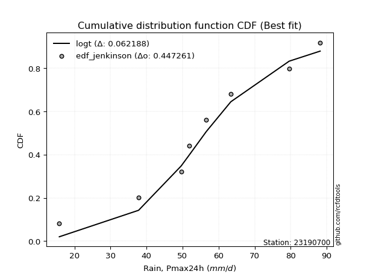</img>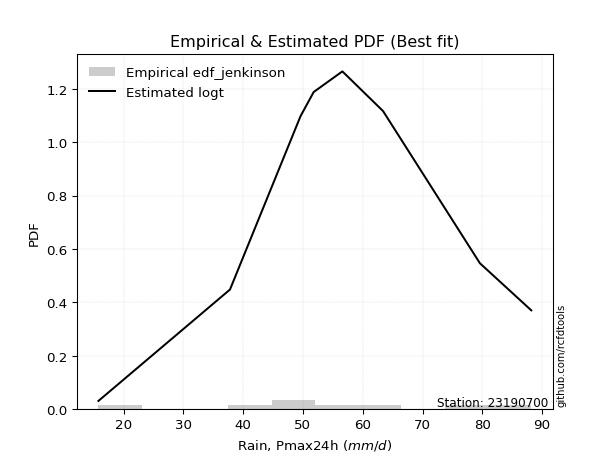</img>

</div>


### 11. EDF Cunnane (1978)

Cunnane´s work in statistical hydrology has focused on the performance and evaluation of different probability distributions (such as GEV, Gumbel, Lognormal) for flood frequency estimation. _b_ is a constant, typically set to 0.4.

<div align="center">


$P=(m-b)/(n+1-2b)$


</div>


**11.1. Empirical values**

<div align="center">

|                | 0                   | 1                  | 2                   | 3                  | 4           | 5                  | 6                 | 7                  | 8                  |
|:---------------|:--------------------|:-------------------|:--------------------|:-------------------|:------------|:-------------------|:------------------|:-------------------|:-------------------|
| date           | 2017                | 2021               | 2024                | 2023               | 2020        | 2025               | 2018              | 2022               | 2019               |
| x              | 15.8                | 37.8               | 49.6                | 51.8               | 56.6        | 60.0               | 63.4              | 79.6               | 88.2               |
| m              | 1                   | 2                  | 3                   | 4                  | 5           | 6                  | 7                 | 8                  | 9                  |
| empirical_dist | edf_cunnane         | edf_cunnane        | edf_cunnane         | edf_cunnane        | edf_cunnane | edf_cunnane        | edf_cunnane       | edf_cunnane        | edf_cunnane        |
| empirical      | 0.06521739130434782 | 0.1739130434782609 | 0.28260869565217395 | 0.391304347826087  | 0.5         | 0.6086956521739131 | 0.717391304347826 | 0.8260869565217391 | 0.9347826086956522 |
| empirical_tr   | 1.069767441860465   | 1.2105263157894737 | 1.393939393939394   | 1.6428571428571428 | 2.0         | 2.555555555555556  | 3.538461538461538 | 5.75               | 15.333333333333343 |

</div>


**11.2. Kolmogorov-Smirnov fit test (sorted by Δ)**


<div align="center">

|                | 0                    | 1                   | 2                   | 3                   | 4                   | 5                   | 6                   | 7                   | 8                   | 9                   | 10                  | 11                  | 12                  | 13                  | 14                  | 15                  | 16                  | 17                  | 18                  | 19                  | 20                  | 21                  | 22                  | 23                  | 24                  | 25                  | 26                  | 27                  | 28                  | 29                  | 30                  | 31                  | 32                  | 33                  | 34                  | 35                  | 36                  | 37                  | 38                  | 39                  | 40                  | 41                  | 42                  | 43                  | 44                  | 45                  | 46                  | 47                  | 48                  | 49                  | 50                  | 51                  | 52                  | 53                  | 54                  | 55                  | 56                  | 57                  | 58                  | 59                  | 60                  | 61                  | 62                  | 63                  | 64                  | 65                  | 66                  | 67                  | 68                  | 69                  | 70                  | 71                  | 72                  | 73                  | 74                  | 75                  | 76                  | 77                  | 78                  | 79                  | 80                  | 81                  | 82                  | 83                  | 84                  | 85                  | 86                  | 87                  | 88                  | 89                  | 90                  | 91                  | 92                  | 93                  | 94                  | 95                  | 96                  | 97                  | 98                  | 99                  | 100                 | 101                 | 102                 | 103                 | 104                 | 105                 | 106                 | 107                 | 108                 | 109                 | 110                 | 111                 | 112                 | 113                 | 114                 | 115                 | 116                 | 117                 | 118                 | 119                 | 120                 | 121                 | 122                 | 123                 | 124                 | 125                 | 126                 | 127                 | 128                 | 129                 | 130                 | 131                 | 132                 | 133                 | 134                 | 135                 | 136                 | 137                 | 138                 | 139                 | 140                 | 141                 | 142                 | 143                 | 144                 | 145                 | 146                 | 147                 | 148                 | 149                 | 150                 | 151                 | 152                 | 153                 | 154                 | 155                 | 156                 | 157                 | 158                 | 159                 |
|:---------------|:---------------------|:--------------------|:--------------------|:--------------------|:--------------------|:--------------------|:--------------------|:--------------------|:--------------------|:--------------------|:--------------------|:--------------------|:--------------------|:--------------------|:--------------------|:--------------------|:--------------------|:--------------------|:--------------------|:--------------------|:--------------------|:--------------------|:--------------------|:--------------------|:--------------------|:--------------------|:--------------------|:--------------------|:--------------------|:--------------------|:--------------------|:--------------------|:--------------------|:--------------------|:--------------------|:--------------------|:--------------------|:--------------------|:--------------------|:--------------------|:--------------------|:--------------------|:--------------------|:--------------------|:--------------------|:--------------------|:--------------------|:--------------------|:--------------------|:--------------------|:--------------------|:--------------------|:--------------------|:--------------------|:--------------------|:--------------------|:--------------------|:--------------------|:--------------------|:--------------------|:--------------------|:--------------------|:--------------------|:--------------------|:--------------------|:--------------------|:--------------------|:--------------------|:--------------------|:--------------------|:--------------------|:--------------------|:--------------------|:--------------------|:--------------------|:--------------------|:--------------------|:--------------------|:--------------------|:--------------------|:--------------------|:--------------------|:--------------------|:--------------------|:--------------------|:--------------------|:--------------------|:--------------------|:--------------------|:--------------------|:--------------------|:--------------------|:--------------------|:--------------------|:--------------------|:--------------------|:--------------------|:--------------------|:--------------------|:--------------------|:--------------------|:--------------------|:--------------------|:--------------------|:--------------------|:--------------------|:--------------------|:--------------------|:--------------------|:--------------------|:--------------------|:--------------------|:--------------------|:--------------------|:--------------------|:--------------------|:--------------------|:--------------------|:--------------------|:--------------------|:--------------------|:--------------------|:--------------------|:--------------------|:--------------------|:--------------------|:--------------------|:--------------------|:--------------------|:--------------------|:--------------------|:--------------------|:--------------------|:--------------------|:--------------------|:--------------------|:--------------------|:--------------------|:--------------------|:--------------------|:--------------------|:--------------------|:--------------------|:--------------------|:--------------------|:--------------------|:--------------------|:--------------------|:--------------------|:--------------------|:--------------------|:--------------------|:--------------------|:--------------------|:--------------------|:--------------------|:--------------------|:--------------------|:--------------------|:--------------------|
| station        | 23190700             | 23190700            | 23190700            | 23190700            | 23190700            | 23190700            | 23190700            | 23190700            | 23190700            | 23190700            | 23190700            | 23190700            | 23190700            | 23190700            | 23190700            | 23190700            | 23190700            | 23190700            | 23190700            | 23190700            | 23190700            | 23190700            | 23190700            | 23190700            | 23190700            | 23190700            | 23190700            | 23190700            | 23190700            | 23190700            | 23190700            | 23190700            | 23190700            | 23190700            | 23190700            | 23190700            | 23190700            | 23190700            | 23190700            | 23190700            | 23190700            | 23190700            | 23190700            | 23190700            | 23190700            | 23190700            | 23190700            | 23190700            | 23190700            | 23190700            | 23190700            | 23190700            | 23190700            | 23190700            | 23190700            | 23190700            | 23190700            | 23190700            | 23190700            | 23190700            | 23190700            | 23190700            | 23190700            | 23190700            | 23190700            | 23190700            | 23190700            | 23190700            | 23190700            | 23190700            | 23190700            | 23190700            | 23190700            | 23190700            | 23190700            | 23190700            | 23190700            | 23190700            | 23190700            | 23190700            | 23190700            | 23190700            | 23190700            | 23190700            | 23190700            | 23190700            | 23190700            | 23190700            | 23190700            | 23190700            | 23190700            | 23190700            | 23190700            | 23190700            | 23190700            | 23190700            | 23190700            | 23190700            | 23190700            | 23190700            | 23190700            | 23190700            | 23190700            | 23190700            | 23190700            | 23190700            | 23190700            | 23190700            | 23190700            | 23190700            | 23190700            | 23190700            | 23190700            | 23190700            | 23190700            | 23190700            | 23190700            | 23190700            | 23190700            | 23190700            | 23190700            | 23190700            | 23190700            | 23190700            | 23190700            | 23190700            | 23190700            | 23190700            | 23190700            | 23190700            | 23190700            | 23190700            | 23190700            | 23190700            | 23190700            | 23190700            | 23190700            | 23190700            | 23190700            | 23190700            | 23190700            | 23190700            | 23190700            | 23190700            | 23190700            | 23190700            | 23190700            | 23190700            | 23190700            | 23190700            | 23190700            | 23190700            | 23190700            | 23190700            | 23190700            | 23190700            | 23190700            | 23190700            | 23190700            | 23190700            |
| empirical_dist | edf_cunnane          | edf_cunnane         | edf_cunnane         | edf_cunnane         | edf_cunnane         | edf_cunnane         | edf_cunnane         | edf_cunnane         | edf_cunnane         | edf_cunnane         | edf_cunnane         | edf_cunnane         | edf_cunnane         | edf_cunnane         | edf_cunnane         | edf_cunnane         | edf_cunnane         | edf_cunnane         | edf_cunnane         | edf_cunnane         | edf_cunnane         | edf_cunnane         | edf_cunnane         | edf_cunnane         | edf_cunnane         | edf_cunnane         | edf_cunnane         | edf_cunnane         | edf_cunnane         | edf_cunnane         | edf_cunnane         | edf_cunnane         | edf_cunnane         | edf_cunnane         | edf_cunnane         | edf_cunnane         | edf_cunnane         | edf_cunnane         | edf_cunnane         | edf_cunnane         | edf_cunnane         | edf_cunnane         | edf_cunnane         | edf_cunnane         | edf_cunnane         | edf_cunnane         | edf_cunnane         | edf_cunnane         | edf_cunnane         | edf_cunnane         | edf_cunnane         | edf_cunnane         | edf_cunnane         | edf_cunnane         | edf_cunnane         | edf_cunnane         | edf_cunnane         | edf_cunnane         | edf_cunnane         | edf_cunnane         | edf_cunnane         | edf_cunnane         | edf_cunnane         | edf_cunnane         | edf_cunnane         | edf_cunnane         | edf_cunnane         | edf_cunnane         | edf_cunnane         | edf_cunnane         | edf_cunnane         | edf_cunnane         | edf_cunnane         | edf_cunnane         | edf_cunnane         | edf_cunnane         | edf_cunnane         | edf_cunnane         | edf_cunnane         | edf_cunnane         | edf_cunnane         | edf_cunnane         | edf_cunnane         | edf_cunnane         | edf_cunnane         | edf_cunnane         | edf_cunnane         | edf_cunnane         | edf_cunnane         | edf_cunnane         | edf_cunnane         | edf_cunnane         | edf_cunnane         | edf_cunnane         | edf_cunnane         | edf_cunnane         | edf_cunnane         | edf_cunnane         | edf_cunnane         | edf_cunnane         | edf_cunnane         | edf_cunnane         | edf_cunnane         | edf_cunnane         | edf_cunnane         | edf_cunnane         | edf_cunnane         | edf_cunnane         | edf_cunnane         | edf_cunnane         | edf_cunnane         | edf_cunnane         | edf_cunnane         | edf_cunnane         | edf_cunnane         | edf_cunnane         | edf_cunnane         | edf_cunnane         | edf_cunnane         | edf_cunnane         | edf_cunnane         | edf_cunnane         | edf_cunnane         | edf_cunnane         | edf_cunnane         | edf_cunnane         | edf_cunnane         | edf_cunnane         | edf_cunnane         | edf_cunnane         | edf_cunnane         | edf_cunnane         | edf_cunnane         | edf_cunnane         | edf_cunnane         | edf_cunnane         | edf_cunnane         | edf_cunnane         | edf_cunnane         | edf_cunnane         | edf_cunnane         | edf_cunnane         | edf_cunnane         | edf_cunnane         | edf_cunnane         | edf_cunnane         | edf_cunnane         | edf_cunnane         | edf_cunnane         | edf_cunnane         | edf_cunnane         | edf_cunnane         | edf_cunnane         | edf_cunnane         | edf_cunnane         | edf_cunnane         | edf_cunnane         | edf_cunnane         | edf_cunnane         | edf_cunnane         |
| p_dist         | logdgamma            | gennorm             | dweibull            | dgamma              | logt                | genlogistic         | hypsecant           | laplace             | logistic            | logloglaplace       | logburr12           | pearson3            | mielke              | burr                | loggenlogistic      | skewnorm            | weibull_min         | foldnorm            | logvonmises_line    | johnsonsu           | t                   | norm                | crystalball         | truncnorm           | exponnorm           | nct                 | f                   | logdweibull         | erlang              | logloggamma         | gamma               | rice                | logweibull_min      | logpearson3         | genextreme          | anglit              | logjohnsonsu        | logexponweib        | loggompertz         | truncweibull_min    | invgamma            | semicircular        | argus               | gumbel_l            | loggumbel_l         | logargus            | betaprime           | cosine              | maxwell             | logtruncweibull_min | gompertz            | alpha               | exponweib           | rayleigh            | invgauss            | logtrapezoid        | logskewnorm         | arcsine             | vonmises_line       | gumbel_r            | loggausshyper       | lognakagami         | logburr             | gausshyper          | loggennorm          | loggenextreme       | moyal               | logmielke           | halfnorm            | bradford            | loglaplace          | loglaplace          | kappa3              | uniform             | beta                | wrapcauchy          | tukeylambda         | kstwobign           | halflogistic        | loghypsecant        | ksone               | loglogistic         | logf                | logfatiguelife      | logcrystalball      | lognorm             | logexponnorm        | logrice             | lognct              | loganglit           | logsemicircular     | logerlang           | logbetaprime        | loggamma            | loggamma            | triang              | loggenhalflogistic  | logarcsine          | logncf              | kappa4              | loglevy_l           | genhalflogistic     | loginvgamma         | logtriang           | genpareto           | loginvgauss         | logalpha            | wald                | logmaxwell          | logfoldnorm         | loginvweibull       | lograyleigh         | logtruncnorm        | loggenpareto        | truncexpon          | loggumbel_r         | logkstwobign        | loghalfnorm         | logcosine           | logweibull_max      | levy_l              | lomax               | genexpon            | logrdist            | logmoyal            | loggenexpon         | loghalflogistic     | logjohnsonsb        | ncf                 | logbeta             | johnsonsb           | trapezoid           | logwrapcauchy       | halfgennorm         | loglomax            | burr12              | logksone            | logwald             | logkappa4           | logkappa3           | logbradford         | logtukeylambda      | loguniform          | nakagami            | logexponpow         | loggengamma         | logtruncexpon       | invweibull          | gengamma            | powerlaw            | rdist               | fatiguelife         | weibull_max         | logpowerlaw         | exponpow            | truncpareto         | logtruncpareto      | loghalfgennorm      | logvonmises         | vonmises            |
| delta          | 0.056827549601432256 | 0.06347608019098383 | 0.06368575858363956 | 0.06533651135498564 | 0.0656628043906794  | 0.0717857795066732  | 0.07423305319331097 | 0.07903098815726095 | 0.08028452149805415 | 0.0810685062089862  | 0.08286600905569358 | 0.08856397053095943 | 0.0899949335051759  | 0.09016169536464885 | 0.0903546644571821  | 0.09039339973604343 | 0.09158882164087123 | 0.09171828033150942 | 0.09314300989994545 | 0.09339245468906587 | 0.09554352882456807 | 0.09555631356054517 | 0.09555631619499905 | 0.0955563265110766  | 0.09555863771790762 | 0.09558846679754435 | 0.09648440107327483 | 0.10087949835340182 | 0.10493699622573782 | 0.10513427876972303 | 0.10547764805872967 | 0.10607985246436186 | 0.10629958186966737 | 0.10821918908146999 | 0.11200658156782184 | 0.11211289142573516 | 0.11442798592776426 | 0.11533979679304185 | 0.11618711943545945 | 0.11647962976547521 | 0.11895334820143288 | 0.11901629033795902 | 0.11953789034514373 | 0.12155703512813287 | 0.12402526565831606 | 0.1250593549496951  | 0.12665377677504114 | 0.12667929177330345 | 0.12889451430191706 | 0.129982913705731   | 0.1303577984397567  | 0.1314592411230266  | 0.13591710775894605 | 0.14117617327663845 | 0.14255885591675277 | 0.14413304670714783 | 0.14579986619700552 | 0.14697552258159818 | 0.14852849252405298 | 0.1508716400443999  | 0.1524677892637708  | 0.15675394491297975 | 0.15777204792424515 | 0.16040446876942915 | 0.16359565548130733 | 0.16731435301150777 | 0.1719274233426784  | 0.17514699174374826 | 0.17607945072626646 | 0.177679400014632   | 0.1787318489933778  | 0.1787318489933778  | 0.1835193837154792  | 0.18424213307710774 | 0.18448712873726825 | 0.18540822459020034 | 0.185597617748959   | 0.18666958811888634 | 0.18864073656732894 | 0.1889780976840444  | 0.18976699495556087 | 0.1916119683865405  | 0.19293020783067405 | 0.19401163814307576 | 0.1947019665377811  | 0.1947029238001129  | 0.19470449061145728 | 0.1947157227784157  | 0.1977286475549197  | 0.19794388320673206 | 0.1992816830303763  | 0.1993418055667383  | 0.19981895609294031 | 0.20168602034527117 | 0.20168602034527117 | 0.20299634386206855 | 0.2031895218716817  | 0.20457949164014394 | 0.20516470362435912 | 0.2078398126431057  | 0.2105829889927307  | 0.21222841760857591 | 0.21279530130985486 | 0.21976438946078258 | 0.2206867693826195  | 0.22378854410720284 | 0.224099812979907   | 0.22649179414908227 | 0.2285117984390992  | 0.22915873036272172 | 0.23154267735768608 | 0.23997722235207597 | 0.24962108073559974 | 0.25368760901620835 | 0.2589441016707543  | 0.2640302032923605  | 0.2701015454738769  | 0.2722776689788069  | 0.272744311739221   | 0.27535269575766863 | 0.28527854987988915 | 0.2857756847261427  | 0.28738411109916484 | 0.2874565822995665  | 0.289868289899629   | 0.2915004851751456  | 0.2956726079560551  | 0.2965696525817971  | 0.29836995412928013 | 0.30738051235988056 | 0.3165578590511299  | 0.31895833526873824 | 0.3285105055875265  | 0.3424694705365331  | 0.3446111103907895  | 0.3467978956923722  | 0.3551088327427443  | 0.36178928245453446 | 0.36204948051803054 | 0.3659848669443362  | 0.36927855111807495 | 0.37808769074499604 | 0.38265233842172774 | 0.4032848807520114  | 0.43753754270948286 | 0.45539690385295817 | 0.45939157917385    | 0.4961392629803064  | 0.5928194725845196  | 0.6031901732569562  | 0.6216176680809373  | 0.6372402989792763  | 0.6391223905309703  | 0.6782248221057445  | 0.7519706206993484  | 0.7559797445959417  | 0.7856550522434618  | 0.8260869565217391  | 1.1709082504998056  | 13.619156364200634  |
| deltao         | 0.41761268023100007  | 0.41761268023100007 | 0.41761268023100007 | 0.41761268023100007 | 0.41761268023100007 | 0.41761268023100007 | 0.41761268023100007 | 0.41761268023100007 | 0.41761268023100007 | 0.41761268023100007 | 0.41761268023100007 | 0.41761268023100007 | 0.41761268023100007 | 0.41761268023100007 | 0.41761268023100007 | 0.41761268023100007 | 0.41761268023100007 | 0.41761268023100007 | 0.41761268023100007 | 0.41761268023100007 | 0.41761268023100007 | 0.41761268023100007 | 0.41761268023100007 | 0.41761268023100007 | 0.41761268023100007 | 0.41761268023100007 | 0.41761268023100007 | 0.41761268023100007 | 0.41761268023100007 | 0.41761268023100007 | 0.41761268023100007 | 0.41761268023100007 | 0.41761268023100007 | 0.41761268023100007 | 0.41761268023100007 | 0.41761268023100007 | 0.41761268023100007 | 0.41761268023100007 | 0.41761268023100007 | 0.41761268023100007 | 0.41761268023100007 | 0.41761268023100007 | 0.41761268023100007 | 0.41761268023100007 | 0.41761268023100007 | 0.41761268023100007 | 0.41761268023100007 | 0.41761268023100007 | 0.41761268023100007 | 0.41761268023100007 | 0.41761268023100007 | 0.41761268023100007 | 0.41761268023100007 | 0.41761268023100007 | 0.41761268023100007 | 0.41761268023100007 | 0.41761268023100007 | 0.41761268023100007 | 0.41761268023100007 | 0.41761268023100007 | 0.41761268023100007 | 0.41761268023100007 | 0.41761268023100007 | 0.41761268023100007 | 0.41761268023100007 | 0.41761268023100007 | 0.41761268023100007 | 0.41761268023100007 | 0.41761268023100007 | 0.41761268023100007 | 0.41761268023100007 | 0.41761268023100007 | 0.41761268023100007 | 0.41761268023100007 | 0.41761268023100007 | 0.41761268023100007 | 0.41761268023100007 | 0.41761268023100007 | 0.41761268023100007 | 0.41761268023100007 | 0.41761268023100007 | 0.41761268023100007 | 0.41761268023100007 | 0.41761268023100007 | 0.41761268023100007 | 0.41761268023100007 | 0.41761268023100007 | 0.41761268023100007 | 0.41761268023100007 | 0.41761268023100007 | 0.41761268023100007 | 0.41761268023100007 | 0.41761268023100007 | 0.41761268023100007 | 0.41761268023100007 | 0.41761268023100007 | 0.41761268023100007 | 0.41761268023100007 | 0.41761268023100007 | 0.41761268023100007 | 0.41761268023100007 | 0.41761268023100007 | 0.41761268023100007 | 0.41761268023100007 | 0.41761268023100007 | 0.41761268023100007 | 0.41761268023100007 | 0.41761268023100007 | 0.41761268023100007 | 0.41761268023100007 | 0.41761268023100007 | 0.41761268023100007 | 0.41761268023100007 | 0.41761268023100007 | 0.41761268023100007 | 0.41761268023100007 | 0.41761268023100007 | 0.41761268023100007 | 0.41761268023100007 | 0.41761268023100007 | 0.41761268023100007 | 0.41761268023100007 | 0.41761268023100007 | 0.41761268023100007 | 0.41761268023100007 | 0.41761268023100007 | 0.41761268023100007 | 0.41761268023100007 | 0.41761268023100007 | 0.41761268023100007 | 0.41761268023100007 | 0.41761268023100007 | 0.41761268023100007 | 0.41761268023100007 | 0.41761268023100007 | 0.41761268023100007 | 0.41761268023100007 | 0.41761268023100007 | 0.41761268023100007 | 0.41761268023100007 | 0.41761268023100007 | 0.41761268023100007 | 0.41761268023100007 | 0.41761268023100007 | 0.41761268023100007 | 0.41761268023100007 | 0.41761268023100007 | 0.41761268023100007 | 0.41761268023100007 | 0.41761268023100007 | 0.41761268023100007 | 0.41761268023100007 | 0.41761268023100007 | 0.41761268023100007 | 0.41761268023100007 | 0.41761268023100007 | 0.41761268023100007 | 0.41761268023100007 | 0.41761268023100007 | 0.41761268023100007 |
| eval           | Δo > Δ               | Δo > Δ              | Δo > Δ              | Δo > Δ              | Δo > Δ              | Δo > Δ              | Δo > Δ              | Δo > Δ              | Δo > Δ              | Δo > Δ              | Δo > Δ              | Δo > Δ              | Δo > Δ              | Δo > Δ              | Δo > Δ              | Δo > Δ              | Δo > Δ              | Δo > Δ              | Δo > Δ              | Δo > Δ              | Δo > Δ              | Δo > Δ              | Δo > Δ              | Δo > Δ              | Δo > Δ              | Δo > Δ              | Δo > Δ              | Δo > Δ              | Δo > Δ              | Δo > Δ              | Δo > Δ              | Δo > Δ              | Δo > Δ              | Δo > Δ              | Δo > Δ              | Δo > Δ              | Δo > Δ              | Δo > Δ              | Δo > Δ              | Δo > Δ              | Δo > Δ              | Δo > Δ              | Δo > Δ              | Δo > Δ              | Δo > Δ              | Δo > Δ              | Δo > Δ              | Δo > Δ              | Δo > Δ              | Δo > Δ              | Δo > Δ              | Δo > Δ              | Δo > Δ              | Δo > Δ              | Δo > Δ              | Δo > Δ              | Δo > Δ              | Δo > Δ              | Δo > Δ              | Δo > Δ              | Δo > Δ              | Δo > Δ              | Δo > Δ              | Δo > Δ              | Δo > Δ              | Δo > Δ              | Δo > Δ              | Δo > Δ              | Δo > Δ              | Δo > Δ              | Δo > Δ              | Δo > Δ              | Δo > Δ              | Δo > Δ              | Δo > Δ              | Δo > Δ              | Δo > Δ              | Δo > Δ              | Δo > Δ              | Δo > Δ              | Δo > Δ              | Δo > Δ              | Δo > Δ              | Δo > Δ              | Δo > Δ              | Δo > Δ              | Δo > Δ              | Δo > Δ              | Δo > Δ              | Δo > Δ              | Δo > Δ              | Δo > Δ              | Δo > Δ              | Δo > Δ              | Δo > Δ              | Δo > Δ              | Δo > Δ              | Δo > Δ              | Δo > Δ              | Δo > Δ              | Δo > Δ              | Δo > Δ              | Δo > Δ              | Δo > Δ              | Δo > Δ              | Δo > Δ              | Δo > Δ              | Δo > Δ              | Δo > Δ              | Δo > Δ              | Δo > Δ              | Δo > Δ              | Δo > Δ              | Δo > Δ              | Δo > Δ              | Δo > Δ              | Δo > Δ              | Δo > Δ              | Δo > Δ              | Δo > Δ              | Δo > Δ              | Δo > Δ              | Δo > Δ              | Δo > Δ              | Δo > Δ              | Δo > Δ              | Δo > Δ              | Δo > Δ              | Δo > Δ              | Δo > Δ              | Δo > Δ              | Δo > Δ              | Δo > Δ              | Δo > Δ              | Δo > Δ              | Δo > Δ              | Δo > Δ              | Δo > Δ              | Δo > Δ              | Δo > Δ              | Δo > Δ              | Δo > Δ              | Δo > Δ              | Δo > Δ              | Δo <= Δ             | Δo <= Δ             | Δo <= Δ             | Δo <= Δ             | Δo <= Δ             | Δo <= Δ             | Δo <= Δ             | Δo <= Δ             | Δo <= Δ             | Δo <= Δ             | Δo <= Δ             | Δo <= Δ             | Δo <= Δ             | Δo <= Δ             | Δo <= Δ             | Δo <= Δ             |
| fit            | 1                    | 1                   | 1                   | 1                   | 1                   | 1                   | 1                   | 1                   | 1                   | 1                   | 1                   | 1                   | 1                   | 1                   | 1                   | 1                   | 1                   | 1                   | 1                   | 1                   | 1                   | 1                   | 1                   | 1                   | 1                   | 1                   | 1                   | 1                   | 1                   | 1                   | 1                   | 1                   | 1                   | 1                   | 1                   | 1                   | 1                   | 1                   | 1                   | 1                   | 1                   | 1                   | 1                   | 1                   | 1                   | 1                   | 1                   | 1                   | 1                   | 1                   | 1                   | 1                   | 1                   | 1                   | 1                   | 1                   | 1                   | 1                   | 1                   | 1                   | 1                   | 1                   | 1                   | 1                   | 1                   | 1                   | 1                   | 1                   | 1                   | 1                   | 1                   | 1                   | 1                   | 1                   | 1                   | 1                   | 1                   | 1                   | 1                   | 1                   | 1                   | 1                   | 1                   | 1                   | 1                   | 1                   | 1                   | 1                   | 1                   | 1                   | 1                   | 1                   | 1                   | 1                   | 1                   | 1                   | 1                   | 1                   | 1                   | 1                   | 1                   | 1                   | 1                   | 1                   | 1                   | 1                   | 1                   | 1                   | 1                   | 1                   | 1                   | 1                   | 1                   | 1                   | 1                   | 1                   | 1                   | 1                   | 1                   | 1                   | 1                   | 1                   | 1                   | 1                   | 1                   | 1                   | 1                   | 1                   | 1                   | 1                   | 1                   | 1                   | 1                   | 1                   | 1                   | 1                   | 1                   | 1                   | 1                   | 1                   | 1                   | 1                   | 1                   | 1                   | 0                   | 0                   | 0                   | 0                   | 0                   | 0                   | 0                   | 0                   | 0                   | 0                   | 0                   | 0                   | 0                   | 0                   | 0                   | 0                   |
| n              | 9                    | 9                   | 9                   | 9                   | 9                   | 9                   | 9                   | 9                   | 9                   | 9                   | 9                   | 9                   | 9                   | 9                   | 9                   | 9                   | 9                   | 9                   | 9                   | 9                   | 9                   | 9                   | 9                   | 9                   | 9                   | 9                   | 9                   | 9                   | 9                   | 9                   | 9                   | 9                   | 9                   | 9                   | 9                   | 9                   | 9                   | 9                   | 9                   | 9                   | 9                   | 9                   | 9                   | 9                   | 9                   | 9                   | 9                   | 9                   | 9                   | 9                   | 9                   | 9                   | 9                   | 9                   | 9                   | 9                   | 9                   | 9                   | 9                   | 9                   | 9                   | 9                   | 9                   | 9                   | 9                   | 9                   | 9                   | 9                   | 9                   | 9                   | 9                   | 9                   | 9                   | 9                   | 9                   | 9                   | 9                   | 9                   | 9                   | 9                   | 9                   | 9                   | 9                   | 9                   | 9                   | 9                   | 9                   | 9                   | 9                   | 9                   | 9                   | 9                   | 9                   | 9                   | 9                   | 9                   | 9                   | 9                   | 9                   | 9                   | 9                   | 9                   | 9                   | 9                   | 9                   | 9                   | 9                   | 9                   | 9                   | 9                   | 9                   | 9                   | 9                   | 9                   | 9                   | 9                   | 9                   | 9                   | 9                   | 9                   | 9                   | 9                   | 9                   | 9                   | 9                   | 9                   | 9                   | 9                   | 9                   | 9                   | 9                   | 9                   | 9                   | 9                   | 9                   | 9                   | 9                   | 9                   | 9                   | 9                   | 9                   | 9                   | 9                   | 9                   | 9                   | 9                   | 9                   | 9                   | 9                   | 9                   | 9                   | 9                   | 9                   | 9                   | 9                   | 9                   | 9                   | 9                   | 9                   | 9                   |
| best_fit       | 1                    | 0                   | 0                   | 0                   | 0                   | 0                   | 0                   | 0                   | 0                   | 0                   | 0                   | 0                   | 0                   | 0                   | 0                   | 0                   | 0                   | 0                   | 0                   | 0                   | 0                   | 0                   | 0                   | 0                   | 0                   | 0                   | 0                   | 0                   | 0                   | 0                   | 0                   | 0                   | 0                   | 0                   | 0                   | 0                   | 0                   | 0                   | 0                   | 0                   | 0                   | 0                   | 0                   | 0                   | 0                   | 0                   | 0                   | 0                   | 0                   | 0                   | 0                   | 0                   | 0                   | 0                   | 0                   | 0                   | 0                   | 0                   | 0                   | 0                   | 0                   | 0                   | 0                   | 0                   | 0                   | 0                   | 0                   | 0                   | 0                   | 0                   | 0                   | 0                   | 0                   | 0                   | 0                   | 0                   | 0                   | 0                   | 0                   | 0                   | 0                   | 0                   | 0                   | 0                   | 0                   | 0                   | 0                   | 0                   | 0                   | 0                   | 0                   | 0                   | 0                   | 0                   | 0                   | 0                   | 0                   | 0                   | 0                   | 0                   | 0                   | 0                   | 0                   | 0                   | 0                   | 0                   | 0                   | 0                   | 0                   | 0                   | 0                   | 0                   | 0                   | 0                   | 0                   | 0                   | 0                   | 0                   | 0                   | 0                   | 0                   | 0                   | 0                   | 0                   | 0                   | 0                   | 0                   | 0                   | 0                   | 0                   | 0                   | 0                   | 0                   | 0                   | 0                   | 0                   | 0                   | 0                   | 0                   | 0                   | 0                   | 0                   | 0                   | 0                   | 0                   | 0                   | 0                   | 0                   | 0                   | 0                   | 0                   | 0                   | 0                   | 0                   | 0                   | 0                   | 0                   | 0                   | 0                   | 0                   |
| best_fit_sort  | 1                    | 2                   | 3                   | 4                   | 5                   | 6                   | 7                   | 8                   | 9                   | 10                  | 11                  | 12                  | 13                  | 14                  | 15                  | 16                  | 17                  | 18                  | 19                  | 20                  | 21                  | 22                  | 23                  | 24                  | 25                  | 26                  | 27                  | 28                  | 29                  | 30                  | 31                  | 32                  | 33                  | 34                  | 35                  | 36                  | 37                  | 38                  | 39                  | 40                  | 41                  | 42                  | 43                  | 44                  | 45                  | 46                  | 47                  | 48                  | 49                  | 50                  | 51                  | 52                  | 53                  | 54                  | 55                  | 56                  | 57                  | 58                  | 59                  | 60                  | 61                  | 62                  | 63                  | 64                  | 65                  | 66                  | 67                  | 68                  | 69                  | 70                  | 71                  | 72                  | 73                  | 74                  | 75                  | 76                  | 77                  | 78                  | 79                  | 80                  | 81                  | 82                  | 83                  | 84                  | 85                  | 86                  | 87                  | 88                  | 89                  | 90                  | 91                  | 92                  | 93                  | 94                  | 95                  | 96                  | 97                  | 98                  | 99                  | 100                 | 101                 | 102                 | 103                 | 104                 | 105                 | 106                 | 107                 | 108                 | 109                 | 110                 | 111                 | 112                 | 113                 | 114                 | 115                 | 116                 | 117                 | 118                 | 119                 | 120                 | 121                 | 122                 | 123                 | 124                 | 125                 | 126                 | 127                 | 128                 | 129                 | 130                 | 131                 | 132                 | 133                 | 134                 | 135                 | 136                 | 137                 | 138                 | 139                 | 140                 | 141                 | 142                 | 143                 | 144                 | 145                 | 146                 | 147                 | 148                 | 149                 | 150                 | 151                 | 152                 | 153                 | 154                 | 155                 | 156                 | 157                 | 158                 | 159                 | 160                 |

</div>


**11.3. Best fit**

<div align="center">

|   id |   station | empirical_dist   | p_dist    |     delta |   deltao | eval   |   fit |   n |   best_fit |   best_fit_sort |
|-----:|----------:|:-----------------|:----------|----------:|---------:|:-------|------:|----:|-----------:|----------------:|
|    0 |  23190700 | edf_cunnane      | logdgamma | 0.0568275 | 0.417613 | Δo > Δ |     1 |   9 |          1 |               1 |

</div>


<div align="center">

</img>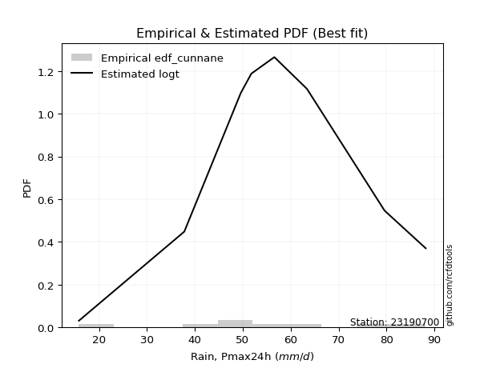</img>

</div>


### 12. EDF Adamowski (1981)

The Adamowski formula in hydrology refers to a specific plotting position formula used for estimating the non-parametric empirical distribution of hydrological events (like flood peaks) to calculate their return periods. This formula provides an alternative to traditional parametric methods (like the Gumbel or Log Pearson Type III distributions). 

<div align="center">


$P=(m-0.25)/(n+0.5)$


</div>


**12.1. Empirical values**

<div align="center">

|                | 0                   | 1                   | 2                  | 3                   | 4             | 5                  | 6                  | 7                  | 8                  |
|:---------------|:--------------------|:--------------------|:-------------------|:--------------------|:--------------|:-------------------|:-------------------|:-------------------|:-------------------|
| date           | 2017                | 2021                | 2024               | 2023                | 2020          | 2025               | 2018               | 2022               | 2019               |
| x              | 15.8                | 37.8                | 49.6               | 51.8                | 56.6          | 60.0               | 63.4               | 79.6               | 88.2               |
| m              | 1                   | 2                   | 3                  | 4                   | 5             | 6                  | 7                  | 8                  | 9                  |
| empirical_dist | edf_adamowski       | edf_adamowski       | edf_adamowski      | edf_adamowski       | edf_adamowski | edf_adamowski      | edf_adamowski      | edf_adamowski      | edf_adamowski      |
| empirical      | 0.07894736842105263 | 0.18421052631578946 | 0.2894736842105263 | 0.39473684210526316 | 0.5           | 0.6052631578947368 | 0.7105263157894737 | 0.8157894736842105 | 0.9210526315789473 |
| empirical_tr   | 1.0857142857142856  | 1.2258064516129032  | 1.4074074074074074 | 1.6521739130434783  | 2.0           | 2.533333333333333  | 3.4545454545454546 | 5.428571428571428  | 12.666666666666663 |

</div>


**12.2. Kolmogorov-Smirnov fit test (sorted by Δ)**


<div align="center">

|                | 0                   | 1                   | 2                   | 3                   | 4                   | 5                   | 6                   | 7                   | 8                   | 9                   | 10                  | 11                  | 12                  | 13                  | 14                  | 15                  | 16                  | 17                  | 18                  | 19                  | 20                  | 21                  | 22                  | 23                  | 24                  | 25                  | 26                  | 27                  | 28                  | 29                  | 30                  | 31                  | 32                  | 33                  | 34                  | 35                  | 36                  | 37                  | 38                  | 39                  | 40                  | 41                  | 42                  | 43                  | 44                  | 45                  | 46                  | 47                  | 48                  | 49                  | 50                  | 51                  | 52                  | 53                  | 54                  | 55                  | 56                  | 57                  | 58                  | 59                  | 60                  | 61                  | 62                  | 63                  | 64                  | 65                  | 66                  | 67                  | 68                  | 69                  | 70                  | 71                  | 72                  | 73                  | 74                  | 75                  | 76                  | 77                  | 78                  | 79                  | 80                  | 81                  | 82                  | 83                  | 84                  | 85                  | 86                  | 87                  | 88                  | 89                  | 90                  | 91                  | 92                  | 93                  | 94                  | 95                  | 96                  | 97                  | 98                  | 99                  | 100                 | 101                 | 102                 | 103                 | 104                 | 105                 | 106                 | 107                 | 108                 | 109                 | 110                 | 111                 | 112                 | 113                 | 114                 | 115                 | 116                 | 117                 | 118                 | 119                 | 120                 | 121                 | 122                 | 123                 | 124                 | 125                 | 126                 | 127                 | 128                 | 129                 | 130                 | 131                 | 132                 | 133                 | 134                 | 135                 | 136                 | 137                 | 138                 | 139                 | 140                 | 141                 | 142                 | 143                 | 144                 | 145                 | 146                 | 147                 | 148                 | 149                 | 150                 | 151                 | 152                 | 153                 | 154                 | 155                 | 156                 | 157                 | 158                 | 159                 |
|:---------------|:--------------------|:--------------------|:--------------------|:--------------------|:--------------------|:--------------------|:--------------------|:--------------------|:--------------------|:--------------------|:--------------------|:--------------------|:--------------------|:--------------------|:--------------------|:--------------------|:--------------------|:--------------------|:--------------------|:--------------------|:--------------------|:--------------------|:--------------------|:--------------------|:--------------------|:--------------------|:--------------------|:--------------------|:--------------------|:--------------------|:--------------------|:--------------------|:--------------------|:--------------------|:--------------------|:--------------------|:--------------------|:--------------------|:--------------------|:--------------------|:--------------------|:--------------------|:--------------------|:--------------------|:--------------------|:--------------------|:--------------------|:--------------------|:--------------------|:--------------------|:--------------------|:--------------------|:--------------------|:--------------------|:--------------------|:--------------------|:--------------------|:--------------------|:--------------------|:--------------------|:--------------------|:--------------------|:--------------------|:--------------------|:--------------------|:--------------------|:--------------------|:--------------------|:--------------------|:--------------------|:--------------------|:--------------------|:--------------------|:--------------------|:--------------------|:--------------------|:--------------------|:--------------------|:--------------------|:--------------------|:--------------------|:--------------------|:--------------------|:--------------------|:--------------------|:--------------------|:--------------------|:--------------------|:--------------------|:--------------------|:--------------------|:--------------------|:--------------------|:--------------------|:--------------------|:--------------------|:--------------------|:--------------------|:--------------------|:--------------------|:--------------------|:--------------------|:--------------------|:--------------------|:--------------------|:--------------------|:--------------------|:--------------------|:--------------------|:--------------------|:--------------------|:--------------------|:--------------------|:--------------------|:--------------------|:--------------------|:--------------------|:--------------------|:--------------------|:--------------------|:--------------------|:--------------------|:--------------------|:--------------------|:--------------------|:--------------------|:--------------------|:--------------------|:--------------------|:--------------------|:--------------------|:--------------------|:--------------------|:--------------------|:--------------------|:--------------------|:--------------------|:--------------------|:--------------------|:--------------------|:--------------------|:--------------------|:--------------------|:--------------------|:--------------------|:--------------------|:--------------------|:--------------------|:--------------------|:--------------------|:--------------------|:--------------------|:--------------------|:--------------------|:--------------------|:--------------------|:--------------------|:--------------------|:--------------------|:--------------------|
| station        | 23190700            | 23190700            | 23190700            | 23190700            | 23190700            | 23190700            | 23190700            | 23190700            | 23190700            | 23190700            | 23190700            | 23190700            | 23190700            | 23190700            | 23190700            | 23190700            | 23190700            | 23190700            | 23190700            | 23190700            | 23190700            | 23190700            | 23190700            | 23190700            | 23190700            | 23190700            | 23190700            | 23190700            | 23190700            | 23190700            | 23190700            | 23190700            | 23190700            | 23190700            | 23190700            | 23190700            | 23190700            | 23190700            | 23190700            | 23190700            | 23190700            | 23190700            | 23190700            | 23190700            | 23190700            | 23190700            | 23190700            | 23190700            | 23190700            | 23190700            | 23190700            | 23190700            | 23190700            | 23190700            | 23190700            | 23190700            | 23190700            | 23190700            | 23190700            | 23190700            | 23190700            | 23190700            | 23190700            | 23190700            | 23190700            | 23190700            | 23190700            | 23190700            | 23190700            | 23190700            | 23190700            | 23190700            | 23190700            | 23190700            | 23190700            | 23190700            | 23190700            | 23190700            | 23190700            | 23190700            | 23190700            | 23190700            | 23190700            | 23190700            | 23190700            | 23190700            | 23190700            | 23190700            | 23190700            | 23190700            | 23190700            | 23190700            | 23190700            | 23190700            | 23190700            | 23190700            | 23190700            | 23190700            | 23190700            | 23190700            | 23190700            | 23190700            | 23190700            | 23190700            | 23190700            | 23190700            | 23190700            | 23190700            | 23190700            | 23190700            | 23190700            | 23190700            | 23190700            | 23190700            | 23190700            | 23190700            | 23190700            | 23190700            | 23190700            | 23190700            | 23190700            | 23190700            | 23190700            | 23190700            | 23190700            | 23190700            | 23190700            | 23190700            | 23190700            | 23190700            | 23190700            | 23190700            | 23190700            | 23190700            | 23190700            | 23190700            | 23190700            | 23190700            | 23190700            | 23190700            | 23190700            | 23190700            | 23190700            | 23190700            | 23190700            | 23190700            | 23190700            | 23190700            | 23190700            | 23190700            | 23190700            | 23190700            | 23190700            | 23190700            | 23190700            | 23190700            | 23190700            | 23190700            | 23190700            | 23190700            |
| empirical_dist | edf_adamowski       | edf_adamowski       | edf_adamowski       | edf_adamowski       | edf_adamowski       | edf_adamowski       | edf_adamowski       | edf_adamowski       | edf_adamowski       | edf_adamowski       | edf_adamowski       | edf_adamowski       | edf_adamowski       | edf_adamowski       | edf_adamowski       | edf_adamowski       | edf_adamowski       | edf_adamowski       | edf_adamowski       | edf_adamowski       | edf_adamowski       | edf_adamowski       | edf_adamowski       | edf_adamowski       | edf_adamowski       | edf_adamowski       | edf_adamowski       | edf_adamowski       | edf_adamowski       | edf_adamowski       | edf_adamowski       | edf_adamowski       | edf_adamowski       | edf_adamowski       | edf_adamowski       | edf_adamowski       | edf_adamowski       | edf_adamowski       | edf_adamowski       | edf_adamowski       | edf_adamowski       | edf_adamowski       | edf_adamowski       | edf_adamowski       | edf_adamowski       | edf_adamowski       | edf_adamowski       | edf_adamowski       | edf_adamowski       | edf_adamowski       | edf_adamowski       | edf_adamowski       | edf_adamowski       | edf_adamowski       | edf_adamowski       | edf_adamowski       | edf_adamowski       | edf_adamowski       | edf_adamowski       | edf_adamowski       | edf_adamowski       | edf_adamowski       | edf_adamowski       | edf_adamowski       | edf_adamowski       | edf_adamowski       | edf_adamowski       | edf_adamowski       | edf_adamowski       | edf_adamowski       | edf_adamowski       | edf_adamowski       | edf_adamowski       | edf_adamowski       | edf_adamowski       | edf_adamowski       | edf_adamowski       | edf_adamowski       | edf_adamowski       | edf_adamowski       | edf_adamowski       | edf_adamowski       | edf_adamowski       | edf_adamowski       | edf_adamowski       | edf_adamowski       | edf_adamowski       | edf_adamowski       | edf_adamowski       | edf_adamowski       | edf_adamowski       | edf_adamowski       | edf_adamowski       | edf_adamowski       | edf_adamowski       | edf_adamowski       | edf_adamowski       | edf_adamowski       | edf_adamowski       | edf_adamowski       | edf_adamowski       | edf_adamowski       | edf_adamowski       | edf_adamowski       | edf_adamowski       | edf_adamowski       | edf_adamowski       | edf_adamowski       | edf_adamowski       | edf_adamowski       | edf_adamowski       | edf_adamowski       | edf_adamowski       | edf_adamowski       | edf_adamowski       | edf_adamowski       | edf_adamowski       | edf_adamowski       | edf_adamowski       | edf_adamowski       | edf_adamowski       | edf_adamowski       | edf_adamowski       | edf_adamowski       | edf_adamowski       | edf_adamowski       | edf_adamowski       | edf_adamowski       | edf_adamowski       | edf_adamowski       | edf_adamowski       | edf_adamowski       | edf_adamowski       | edf_adamowski       | edf_adamowski       | edf_adamowski       | edf_adamowski       | edf_adamowski       | edf_adamowski       | edf_adamowski       | edf_adamowski       | edf_adamowski       | edf_adamowski       | edf_adamowski       | edf_adamowski       | edf_adamowski       | edf_adamowski       | edf_adamowski       | edf_adamowski       | edf_adamowski       | edf_adamowski       | edf_adamowski       | edf_adamowski       | edf_adamowski       | edf_adamowski       | edf_adamowski       | edf_adamowski       | edf_adamowski       | edf_adamowski       | edf_adamowski       |
| p_dist         | logdgamma           | logt                | logloglaplace       | gennorm             | dweibull            | dgamma              | logburr12           | genlogistic         | logistic            | pearson3            | mielke              | burr                | loggenlogistic      | skewnorm            | hypsecant           | weibull_min         | foldnorm            | logvonmises_line    | johnsonsu           | logdweibull         | t                   | norm                | crystalball         | truncnorm           | exponnorm           | nct                 | laplace             | f                   | erlang              | logloggamma         | gamma               | rice                | logweibull_min      | logpearson3         | genextreme          | anglit              | logjohnsonsu        | logexponweib        | loggompertz         | truncweibull_min    | invgamma            | semicircular        | argus               | gumbel_l            | loggumbel_l         | logargus            | betaprime           | cosine              | maxwell             | logtruncweibull_min | gompertz            | alpha               | exponweib           | rayleigh            | invgauss            | logtrapezoid        | logskewnorm         | arcsine             | vonmises_line       | gumbel_r            | loggausshyper       | logburr             | gausshyper          | loggenextreme       | moyal               | loggennorm          | lognakagami         | logmielke           | halfnorm            | bradford            | loglaplace          | loglaplace          | kappa3              | uniform             | beta                | wrapcauchy          | tukeylambda         | kstwobign           | halflogistic        | loghypsecant        | ksone               | loglogistic         | logf                | logfatiguelife      | logcrystalball      | lognorm             | logexponnorm        | logrice             | lognct              | loganglit           | logsemicircular     | logerlang           | logbetaprime        | loggamma            | loggamma            | triang              | loggenhalflogistic  | loglevy_l           | logarcsine          | logncf              | kappa4              | genhalflogistic     | loginvgamma         | logtriang           | genpareto           | loginvgauss         | logalpha            | wald                | logmaxwell          | logfoldnorm         | loginvweibull       | lograyleigh         | logtruncnorm        | loggenpareto        | truncexpon          | loggumbel_r         | logkstwobign        | loghalfnorm         | logcosine           | logweibull_max      | levy_l              | logrdist            | lomax               | genexpon            | logmoyal            | loggenexpon         | logjohnsonsb        | ncf                 | loghalflogistic     | logbeta             | johnsonsb           | trapezoid           | logwrapcauchy       | halfgennorm         | loglomax            | burr12              | logksone            | logwald             | logkappa4           | logkappa3           | logbradford         | logtukeylambda      | loguniform          | nakagami            | logexponpow         | loggengamma         | logtruncexpon       | invweibull          | gengamma            | powerlaw            | rdist               | fatiguelife         | weibull_max         | logpowerlaw         | exponpow            | truncpareto         | logtruncpareto      | loghalfgennorm      | logvonmises         | vonmises            |
| delta          | 0.07055752671813706 | 0.07290292440520489 | 0.07307313733731871 | 0.07377356302851246 | 0.07398324142116819 | 0.07563399419251426 | 0.0760010204973412  | 0.07764569646428765 | 0.07814390303813068 | 0.08169898197260705 | 0.08312994494682352 | 0.08329670680629647 | 0.08348967589882972 | 0.08352841117769105 | 0.0845305360308396  | 0.08472383308251885 | 0.08485329177315704 | 0.08627802134159307 | 0.08652746613071349 | 0.08714952123669695 | 0.08867854026621569 | 0.08869132500219279 | 0.08869132763664667 | 0.08869133795272421 | 0.08869364915955524 | 0.08872347823919197 | 0.08932847099478958 | 0.08961941251492245 | 0.09807200766738544 | 0.09826929021137065 | 0.09861265950037729 | 0.09921486390600948 | 0.09943459331131499 | 0.10135420052311761 | 0.10514159300946946 | 0.10524790286738278 | 0.10756299736941188 | 0.10847480823468947 | 0.10932213087710707 | 0.10961464120712283 | 0.1120883596430805  | 0.11215130177960664 | 0.11267290178679135 | 0.11469204656978049 | 0.11716027709996368 | 0.11819436639134273 | 0.11978878821668876 | 0.11981430321495107 | 0.12202952574356468 | 0.12311792514737863 | 0.12349280988140432 | 0.12459425256467421 | 0.12905211920059367 | 0.13431118471828607 | 0.1356938673584004  | 0.13726805814879545 | 0.13893487763865314 | 0.1401105340232458  | 0.1438712637507804  | 0.14400665148604752 | 0.14560280070541842 | 0.15090705936589277 | 0.15353948021107677 | 0.16044936445315539 | 0.16506243478432603 | 0.16702814976048352 | 0.16705142775050832 | 0.16828200318539588 | 0.16921446216791408 | 0.17081441145627962 | 0.17186686043502541 | 0.17186686043502541 | 0.17665439515712683 | 0.17737714451875536 | 0.17762214017891587 | 0.17854323603184796 | 0.17873262919060662 | 0.17980459956053396 | 0.18177574800897656 | 0.182113109125692   | 0.1829020063972085  | 0.1847469798281881  | 0.18606521927232167 | 0.18714664958472338 | 0.18783697797942872 | 0.1878379352417605  | 0.1878395020531049  | 0.18785073422006332 | 0.19086365899656732 | 0.19107889464837968 | 0.19241669447202392 | 0.19247681700838593 | 0.19295396753458793 | 0.19482103178691879 | 0.19482103178691879 | 0.19613135530371617 | 0.19632453331332933 | 0.1968530118760259  | 0.19771450308179156 | 0.19829971506600674 | 0.2009748240847533  | 0.20536342905022353 | 0.20593031275150248 | 0.2128994009024302  | 0.21382178082426712 | 0.21692355554885046 | 0.21723482442155462 | 0.2196268055907299  | 0.2216468098807468  | 0.22229374180436934 | 0.2246776887993337  | 0.2331122337937236  | 0.24275609217724736 | 0.24339012617867975 | 0.25207911311240194 | 0.2571652147340081  | 0.2632365569155245  | 0.2654126804204545  | 0.2658793231808686  | 0.26848770719931625 | 0.27154857276318434 | 0.2771590994620379  | 0.2789106961677903  | 0.28051912254081246 | 0.2830033013412766  | 0.2846354966167932  | 0.2862721697442685  | 0.2883299396375226  | 0.2888076193977027  | 0.3005155238015282  | 0.30626037621360125 | 0.31209334671038585 | 0.31821302274999785 | 0.33217198769900447 | 0.3343136275532609  | 0.33650041285484356 | 0.3482438441843919  | 0.3549242938961821  | 0.35518449195967816 | 0.3591198783859838  | 0.36241356255972257 | 0.37122270218664366 | 0.37578734986337536 | 0.39641989219365903 | 0.4306725541511305  | 0.44509942101542954 | 0.4525265906154976  | 0.48240928586360154 | 0.582521989746991   | 0.5928926904194276  | 0.6147526795225849  | 0.6269428161417476  | 0.6288249076934417  | 0.6679273392682159  | 0.7416731378618198  | 0.7456822617584131  | 0.7753575694059331  | 0.8157894736842105  | 1.1640432619414531  | 13.63288634131734   |
| deltao         | 0.41761268023100007 | 0.41761268023100007 | 0.41761268023100007 | 0.41761268023100007 | 0.41761268023100007 | 0.41761268023100007 | 0.41761268023100007 | 0.41761268023100007 | 0.41761268023100007 | 0.41761268023100007 | 0.41761268023100007 | 0.41761268023100007 | 0.41761268023100007 | 0.41761268023100007 | 0.41761268023100007 | 0.41761268023100007 | 0.41761268023100007 | 0.41761268023100007 | 0.41761268023100007 | 0.41761268023100007 | 0.41761268023100007 | 0.41761268023100007 | 0.41761268023100007 | 0.41761268023100007 | 0.41761268023100007 | 0.41761268023100007 | 0.41761268023100007 | 0.41761268023100007 | 0.41761268023100007 | 0.41761268023100007 | 0.41761268023100007 | 0.41761268023100007 | 0.41761268023100007 | 0.41761268023100007 | 0.41761268023100007 | 0.41761268023100007 | 0.41761268023100007 | 0.41761268023100007 | 0.41761268023100007 | 0.41761268023100007 | 0.41761268023100007 | 0.41761268023100007 | 0.41761268023100007 | 0.41761268023100007 | 0.41761268023100007 | 0.41761268023100007 | 0.41761268023100007 | 0.41761268023100007 | 0.41761268023100007 | 0.41761268023100007 | 0.41761268023100007 | 0.41761268023100007 | 0.41761268023100007 | 0.41761268023100007 | 0.41761268023100007 | 0.41761268023100007 | 0.41761268023100007 | 0.41761268023100007 | 0.41761268023100007 | 0.41761268023100007 | 0.41761268023100007 | 0.41761268023100007 | 0.41761268023100007 | 0.41761268023100007 | 0.41761268023100007 | 0.41761268023100007 | 0.41761268023100007 | 0.41761268023100007 | 0.41761268023100007 | 0.41761268023100007 | 0.41761268023100007 | 0.41761268023100007 | 0.41761268023100007 | 0.41761268023100007 | 0.41761268023100007 | 0.41761268023100007 | 0.41761268023100007 | 0.41761268023100007 | 0.41761268023100007 | 0.41761268023100007 | 0.41761268023100007 | 0.41761268023100007 | 0.41761268023100007 | 0.41761268023100007 | 0.41761268023100007 | 0.41761268023100007 | 0.41761268023100007 | 0.41761268023100007 | 0.41761268023100007 | 0.41761268023100007 | 0.41761268023100007 | 0.41761268023100007 | 0.41761268023100007 | 0.41761268023100007 | 0.41761268023100007 | 0.41761268023100007 | 0.41761268023100007 | 0.41761268023100007 | 0.41761268023100007 | 0.41761268023100007 | 0.41761268023100007 | 0.41761268023100007 | 0.41761268023100007 | 0.41761268023100007 | 0.41761268023100007 | 0.41761268023100007 | 0.41761268023100007 | 0.41761268023100007 | 0.41761268023100007 | 0.41761268023100007 | 0.41761268023100007 | 0.41761268023100007 | 0.41761268023100007 | 0.41761268023100007 | 0.41761268023100007 | 0.41761268023100007 | 0.41761268023100007 | 0.41761268023100007 | 0.41761268023100007 | 0.41761268023100007 | 0.41761268023100007 | 0.41761268023100007 | 0.41761268023100007 | 0.41761268023100007 | 0.41761268023100007 | 0.41761268023100007 | 0.41761268023100007 | 0.41761268023100007 | 0.41761268023100007 | 0.41761268023100007 | 0.41761268023100007 | 0.41761268023100007 | 0.41761268023100007 | 0.41761268023100007 | 0.41761268023100007 | 0.41761268023100007 | 0.41761268023100007 | 0.41761268023100007 | 0.41761268023100007 | 0.41761268023100007 | 0.41761268023100007 | 0.41761268023100007 | 0.41761268023100007 | 0.41761268023100007 | 0.41761268023100007 | 0.41761268023100007 | 0.41761268023100007 | 0.41761268023100007 | 0.41761268023100007 | 0.41761268023100007 | 0.41761268023100007 | 0.41761268023100007 | 0.41761268023100007 | 0.41761268023100007 | 0.41761268023100007 | 0.41761268023100007 | 0.41761268023100007 | 0.41761268023100007 | 0.41761268023100007 | 0.41761268023100007 |
| eval           | Δo > Δ              | Δo > Δ              | Δo > Δ              | Δo > Δ              | Δo > Δ              | Δo > Δ              | Δo > Δ              | Δo > Δ              | Δo > Δ              | Δo > Δ              | Δo > Δ              | Δo > Δ              | Δo > Δ              | Δo > Δ              | Δo > Δ              | Δo > Δ              | Δo > Δ              | Δo > Δ              | Δo > Δ              | Δo > Δ              | Δo > Δ              | Δo > Δ              | Δo > Δ              | Δo > Δ              | Δo > Δ              | Δo > Δ              | Δo > Δ              | Δo > Δ              | Δo > Δ              | Δo > Δ              | Δo > Δ              | Δo > Δ              | Δo > Δ              | Δo > Δ              | Δo > Δ              | Δo > Δ              | Δo > Δ              | Δo > Δ              | Δo > Δ              | Δo > Δ              | Δo > Δ              | Δo > Δ              | Δo > Δ              | Δo > Δ              | Δo > Δ              | Δo > Δ              | Δo > Δ              | Δo > Δ              | Δo > Δ              | Δo > Δ              | Δo > Δ              | Δo > Δ              | Δo > Δ              | Δo > Δ              | Δo > Δ              | Δo > Δ              | Δo > Δ              | Δo > Δ              | Δo > Δ              | Δo > Δ              | Δo > Δ              | Δo > Δ              | Δo > Δ              | Δo > Δ              | Δo > Δ              | Δo > Δ              | Δo > Δ              | Δo > Δ              | Δo > Δ              | Δo > Δ              | Δo > Δ              | Δo > Δ              | Δo > Δ              | Δo > Δ              | Δo > Δ              | Δo > Δ              | Δo > Δ              | Δo > Δ              | Δo > Δ              | Δo > Δ              | Δo > Δ              | Δo > Δ              | Δo > Δ              | Δo > Δ              | Δo > Δ              | Δo > Δ              | Δo > Δ              | Δo > Δ              | Δo > Δ              | Δo > Δ              | Δo > Δ              | Δo > Δ              | Δo > Δ              | Δo > Δ              | Δo > Δ              | Δo > Δ              | Δo > Δ              | Δo > Δ              | Δo > Δ              | Δo > Δ              | Δo > Δ              | Δo > Δ              | Δo > Δ              | Δo > Δ              | Δo > Δ              | Δo > Δ              | Δo > Δ              | Δo > Δ              | Δo > Δ              | Δo > Δ              | Δo > Δ              | Δo > Δ              | Δo > Δ              | Δo > Δ              | Δo > Δ              | Δo > Δ              | Δo > Δ              | Δo > Δ              | Δo > Δ              | Δo > Δ              | Δo > Δ              | Δo > Δ              | Δo > Δ              | Δo > Δ              | Δo > Δ              | Δo > Δ              | Δo > Δ              | Δo > Δ              | Δo > Δ              | Δo > Δ              | Δo > Δ              | Δo > Δ              | Δo > Δ              | Δo > Δ              | Δo > Δ              | Δo > Δ              | Δo > Δ              | Δo > Δ              | Δo > Δ              | Δo > Δ              | Δo > Δ              | Δo > Δ              | Δo > Δ              | Δo > Δ              | Δo <= Δ             | Δo <= Δ             | Δo <= Δ             | Δo <= Δ             | Δo <= Δ             | Δo <= Δ             | Δo <= Δ             | Δo <= Δ             | Δo <= Δ             | Δo <= Δ             | Δo <= Δ             | Δo <= Δ             | Δo <= Δ             | Δo <= Δ             | Δo <= Δ             | Δo <= Δ             |
| fit            | 1                   | 1                   | 1                   | 1                   | 1                   | 1                   | 1                   | 1                   | 1                   | 1                   | 1                   | 1                   | 1                   | 1                   | 1                   | 1                   | 1                   | 1                   | 1                   | 1                   | 1                   | 1                   | 1                   | 1                   | 1                   | 1                   | 1                   | 1                   | 1                   | 1                   | 1                   | 1                   | 1                   | 1                   | 1                   | 1                   | 1                   | 1                   | 1                   | 1                   | 1                   | 1                   | 1                   | 1                   | 1                   | 1                   | 1                   | 1                   | 1                   | 1                   | 1                   | 1                   | 1                   | 1                   | 1                   | 1                   | 1                   | 1                   | 1                   | 1                   | 1                   | 1                   | 1                   | 1                   | 1                   | 1                   | 1                   | 1                   | 1                   | 1                   | 1                   | 1                   | 1                   | 1                   | 1                   | 1                   | 1                   | 1                   | 1                   | 1                   | 1                   | 1                   | 1                   | 1                   | 1                   | 1                   | 1                   | 1                   | 1                   | 1                   | 1                   | 1                   | 1                   | 1                   | 1                   | 1                   | 1                   | 1                   | 1                   | 1                   | 1                   | 1                   | 1                   | 1                   | 1                   | 1                   | 1                   | 1                   | 1                   | 1                   | 1                   | 1                   | 1                   | 1                   | 1                   | 1                   | 1                   | 1                   | 1                   | 1                   | 1                   | 1                   | 1                   | 1                   | 1                   | 1                   | 1                   | 1                   | 1                   | 1                   | 1                   | 1                   | 1                   | 1                   | 1                   | 1                   | 1                   | 1                   | 1                   | 1                   | 1                   | 1                   | 1                   | 1                   | 0                   | 0                   | 0                   | 0                   | 0                   | 0                   | 0                   | 0                   | 0                   | 0                   | 0                   | 0                   | 0                   | 0                   | 0                   | 0                   |
| n              | 9                   | 9                   | 9                   | 9                   | 9                   | 9                   | 9                   | 9                   | 9                   | 9                   | 9                   | 9                   | 9                   | 9                   | 9                   | 9                   | 9                   | 9                   | 9                   | 9                   | 9                   | 9                   | 9                   | 9                   | 9                   | 9                   | 9                   | 9                   | 9                   | 9                   | 9                   | 9                   | 9                   | 9                   | 9                   | 9                   | 9                   | 9                   | 9                   | 9                   | 9                   | 9                   | 9                   | 9                   | 9                   | 9                   | 9                   | 9                   | 9                   | 9                   | 9                   | 9                   | 9                   | 9                   | 9                   | 9                   | 9                   | 9                   | 9                   | 9                   | 9                   | 9                   | 9                   | 9                   | 9                   | 9                   | 9                   | 9                   | 9                   | 9                   | 9                   | 9                   | 9                   | 9                   | 9                   | 9                   | 9                   | 9                   | 9                   | 9                   | 9                   | 9                   | 9                   | 9                   | 9                   | 9                   | 9                   | 9                   | 9                   | 9                   | 9                   | 9                   | 9                   | 9                   | 9                   | 9                   | 9                   | 9                   | 9                   | 9                   | 9                   | 9                   | 9                   | 9                   | 9                   | 9                   | 9                   | 9                   | 9                   | 9                   | 9                   | 9                   | 9                   | 9                   | 9                   | 9                   | 9                   | 9                   | 9                   | 9                   | 9                   | 9                   | 9                   | 9                   | 9                   | 9                   | 9                   | 9                   | 9                   | 9                   | 9                   | 9                   | 9                   | 9                   | 9                   | 9                   | 9                   | 9                   | 9                   | 9                   | 9                   | 9                   | 9                   | 9                   | 9                   | 9                   | 9                   | 9                   | 9                   | 9                   | 9                   | 9                   | 9                   | 9                   | 9                   | 9                   | 9                   | 9                   | 9                   | 9                   |
| best_fit       | 1                   | 0                   | 0                   | 0                   | 0                   | 0                   | 0                   | 0                   | 0                   | 0                   | 0                   | 0                   | 0                   | 0                   | 0                   | 0                   | 0                   | 0                   | 0                   | 0                   | 0                   | 0                   | 0                   | 0                   | 0                   | 0                   | 0                   | 0                   | 0                   | 0                   | 0                   | 0                   | 0                   | 0                   | 0                   | 0                   | 0                   | 0                   | 0                   | 0                   | 0                   | 0                   | 0                   | 0                   | 0                   | 0                   | 0                   | 0                   | 0                   | 0                   | 0                   | 0                   | 0                   | 0                   | 0                   | 0                   | 0                   | 0                   | 0                   | 0                   | 0                   | 0                   | 0                   | 0                   | 0                   | 0                   | 0                   | 0                   | 0                   | 0                   | 0                   | 0                   | 0                   | 0                   | 0                   | 0                   | 0                   | 0                   | 0                   | 0                   | 0                   | 0                   | 0                   | 0                   | 0                   | 0                   | 0                   | 0                   | 0                   | 0                   | 0                   | 0                   | 0                   | 0                   | 0                   | 0                   | 0                   | 0                   | 0                   | 0                   | 0                   | 0                   | 0                   | 0                   | 0                   | 0                   | 0                   | 0                   | 0                   | 0                   | 0                   | 0                   | 0                   | 0                   | 0                   | 0                   | 0                   | 0                   | 0                   | 0                   | 0                   | 0                   | 0                   | 0                   | 0                   | 0                   | 0                   | 0                   | 0                   | 0                   | 0                   | 0                   | 0                   | 0                   | 0                   | 0                   | 0                   | 0                   | 0                   | 0                   | 0                   | 0                   | 0                   | 0                   | 0                   | 0                   | 0                   | 0                   | 0                   | 0                   | 0                   | 0                   | 0                   | 0                   | 0                   | 0                   | 0                   | 0                   | 0                   | 0                   |
| best_fit_sort  | 1                   | 2                   | 3                   | 4                   | 5                   | 6                   | 7                   | 8                   | 9                   | 10                  | 11                  | 12                  | 13                  | 14                  | 15                  | 16                  | 17                  | 18                  | 19                  | 20                  | 21                  | 22                  | 23                  | 24                  | 25                  | 26                  | 27                  | 28                  | 29                  | 30                  | 31                  | 32                  | 33                  | 34                  | 35                  | 36                  | 37                  | 38                  | 39                  | 40                  | 41                  | 42                  | 43                  | 44                  | 45                  | 46                  | 47                  | 48                  | 49                  | 50                  | 51                  | 52                  | 53                  | 54                  | 55                  | 56                  | 57                  | 58                  | 59                  | 60                  | 61                  | 62                  | 63                  | 64                  | 65                  | 66                  | 67                  | 68                  | 69                  | 70                  | 71                  | 72                  | 73                  | 74                  | 75                  | 76                  | 77                  | 78                  | 79                  | 80                  | 81                  | 82                  | 83                  | 84                  | 85                  | 86                  | 87                  | 88                  | 89                  | 90                  | 91                  | 92                  | 93                  | 94                  | 95                  | 96                  | 97                  | 98                  | 99                  | 100                 | 101                 | 102                 | 103                 | 104                 | 105                 | 106                 | 107                 | 108                 | 109                 | 110                 | 111                 | 112                 | 113                 | 114                 | 115                 | 116                 | 117                 | 118                 | 119                 | 120                 | 121                 | 122                 | 123                 | 124                 | 125                 | 126                 | 127                 | 128                 | 129                 | 130                 | 131                 | 132                 | 133                 | 134                 | 135                 | 136                 | 137                 | 138                 | 139                 | 140                 | 141                 | 142                 | 143                 | 144                 | 145                 | 146                 | 147                 | 148                 | 149                 | 150                 | 151                 | 152                 | 153                 | 154                 | 155                 | 156                 | 157                 | 158                 | 159                 | 160                 |

</div>


**12.3. Best fit**

<div align="center">

|   id |   station | empirical_dist   | p_dist    |     delta |   deltao | eval   |   fit |   n |   best_fit |   best_fit_sort |
|-----:|----------:|:-----------------|:----------|----------:|---------:|:-------|------:|----:|-----------:|----------------:|
|    0 |  23190700 | edf_adamowski    | logdgamma | 0.0705575 | 0.417613 | Δo > Δ |     1 |   9 |          1 |               1 |

</div>


<div align="center">

</img></img>

</div>


## C. Best fit & Estimate extreme values for specific return periods - Tr

Best fit in probability distribution analysis means finding the theoretical distribution (like Normal, Poisson, Exponential, etc.) that most accurately mirrors your real-world data´s patterns (shape, center, spread) for better predictions, using methods like visual checks (Q-Q plots), goodness-of-fit tests (Kolmogorov-Smirnov, Chi-Squared), and information criteria (AIC) to score and select the simplest, most representative model.


### 1. Best fit (ordered by delta Δ)

:file_folder:Table: [bestfit_23190700.csv](table/bestfit_23190700.csv)

<div align="center">

|   id |   station | empirical_dist   | p_dist      |     delta |   deltao | eval   |   fit |   n |   best_fit |   best_fit_sort |
|-----:|----------:|:-----------------|:------------|----------:|---------:|:-------|------:|----:|-----------:|----------------:|
|    0 |  23190700 | edf_gringorten   | logdgamma   | 0.0530137 | 0.417613 | Δo > Δ |     1 |   9 |          1 |               1 |
|    1 |  23190700 | edf_hazen        | logdgamma   | 0.0532188 | 0.417613 | Δo > Δ |     1 |   9 |          1 |               2 |
|    2 |  23190700 | edf_cunnane      | logdgamma   | 0.0568275 | 0.417613 | Δo > Δ |     1 |   9 |          1 |               3 |
|    3 |  23190700 | edf_blom         | logdgamma   | 0.0591777 | 0.417613 | Δo > Δ |     1 |   9 |          1 |               4 |
|    4 |  23190700 | edf_tukey        | logdgamma   | 0.0630387 | 0.417613 | Δo > Δ |     1 |   9 |          1 |               5 |
|    5 |  23190700 | edf_filliben     | logdgamma   | 0.0644879 | 0.417613 | Δo > Δ |     1 |   9 |          1 |               6 |
|    6 |  23190700 | edf_beard        | logdgamma   | 0.0651709 | 0.417613 | Δo > Δ |     1 |   9 |          1 |               7 |
|    7 |  23190700 | edf_jenkinson    | logdgamma   | 0.0651709 | 0.417613 | Δo > Δ |     1 |   9 |          1 |               8 |
|    8 |  23190700 | edf_chegodayev   | logdgamma   | 0.0660782 | 0.417613 | Δo > Δ |     1 |   9 |          1 |               9 |
|    9 |  23190700 | edf_weibull      | logdweibull | 0.0660969 | 0.417613 | Δo > Δ |     1 |   9 |          1 |              10 |
|   10 |  23190700 | edf_adamowski    | logdgamma   | 0.0705575 | 0.417613 | Δo > Δ |     1 |   9 |          1 |              11 |
|   11 |  23190700 | edf_california   | laplace     | 0.0811243 | 0.417613 | Δo > Δ |     1 |   9 |          1 |              12 |

</div>


### 2. Extreme values and % difference analysis

In hydrology, a return period (or recurrence interval $Tr$) is the statistical average time between extreme events like floods or droughts of a specific magnitude, indicating how rare an event is, with a 100-year flood, for example, having a 1% chance of occurring in any given year, not that it happens exactly every century. It is a key tool for infrastructure design (like bridges or dams) and risk assessment, calculated from historical data to determine the probability of future events, although it is important to remember it is statistical average, and events can cluster or be missed.

The extreme value porcentage difference is evaluated as $pdiff = 1 - (ETrBf / ETr) * 100$, where _ETrBf_ correspond to the bestfit extreme value for a specific recurrence interval and _ETr_ correspond to the extreme value for one of the most used PDFsused in hydrology.

> risk_rate: assuming the return period as the project useful life.

:file_folder:Table: [extreme_23190700.csv](table/extreme_23190700.csv), all PDFs.  
:file_folder:Table: [extremepdiff_23190700.csv](table/extremepdiff_23190700.csv), % difference between bestfit and most used PDFs in Hydrology.

<div align="center">

Extreme values table for only best fit PDFs
|   id |      tr |   prob_l |     prob_g |    alpha |   anglit |   arcsine |   argus |    beta |   betaprime |   bradford |     burr |   burr12 |   cosine |   crystalball |   dgamma |   dweibull |   erlang |   exponnorm |   exponpow |   exponweib |        f |   fatiguelife |   foldnorm |    gamma |   gausshyper |   genexpon |   genextreme |   gengamma |   genhalflogistic |   genlogistic |   gennorm |   genpareto |   gompertz |   gumbel_l |   gumbel_r |   halfgennorm |   halflogistic |   halfnorm |   hypsecant |   invgamma |   invgauss |       invweibull |   johnsonsb |   johnsonsu |   kappa3 |   kappa4 |   ksone |   kstwobign |   laplace |   levy_l |   loggamma |   logistic |   loglaplace |    lomax |   maxwell |   mielke |    moyal |   nakagami |      ncf |      nct |     norm |   pearson3 |   powerlaw |   rayleigh |    rdist |     rice |   semicircular |   skewnorm |        t |   trapezoid |   triang |   truncexpon |   truncnorm |   truncpareto |   truncweibull_min |   tukeylambda |   uniform |   vonmises |   vonmises_line |     wald |   weibull_max |   weibull_min |   wrapcauchy |   logalpha |   loganglit |   logarcsine |   logargus |   logbeta |   logbetaprime |   logbradford |   logburr |   logburr12 |   logcosine |   logcrystalball |   logdgamma |   logdweibull |   logerlang |   logexponnorm |   logexponpow |   logexponweib |     logf |   logfatiguelife |   logfoldnorm |   loggausshyper |   loggenexpon |   loggenextreme |   loggengamma |   loggenhalflogistic |   loggenlogistic |       loggennorm |   loggenpareto |   loggompertz |   loggumbel_l |   loggumbel_r |   loghalfgennorm |   loghalflogistic |   loghalfnorm |   loghypsecant |   loginvgamma |   loginvgauss |   loginvweibull |   logjohnsonsb |   logjohnsonsu |   logkappa3 |   logkappa4 |   logksone |   logkstwobign |   loglevy_l |   logloggamma |   loglogistic |   logloglaplace |    loglomax |   logmaxwell |   logmielke |   logmoyal |   lognakagami |   logncf |   lognct |   lognorm |   logpearson3 |   logpowerlaw |   lograyleigh |   logrdist |   logrice |   logsemicircular |   logskewnorm |        logt |   logtrapezoid |   logtriang |   logtruncexpon |   logtruncnorm |   logtruncpareto |   logtruncweibull_min |   logtukeylambda |   loguniform |   logvonmises |   logvonmises_line |   logwald |   logweibull_max |   logweibull_min |   logwrapcauchy |   station |   n |   risk_rate |
|-----:|--------:|---------:|-----------:|---------:|---------:|----------:|--------:|--------:|------------:|-----------:|---------:|---------:|---------:|--------------:|---------:|-----------:|---------:|------------:|-----------:|------------:|---------:|--------------:|-----------:|---------:|-------------:|-----------:|-------------:|-----------:|------------------:|--------------:|----------:|------------:|-----------:|-----------:|-----------:|--------------:|---------------:|-----------:|------------:|-----------:|-----------:|-----------------:|------------:|------------:|---------:|---------:|--------:|------------:|----------:|---------:|-----------:|-----------:|-------------:|---------:|----------:|---------:|---------:|-----------:|---------:|---------:|---------:|-----------:|-----------:|-----------:|---------:|---------:|---------------:|-----------:|---------:|------------:|---------:|-------------:|------------:|--------------:|-------------------:|--------------:|----------:|-----------:|----------------:|---------:|--------------:|--------------:|-------------:|-----------:|------------:|-------------:|-----------:|----------:|---------------:|--------------:|----------:|------------:|------------:|-----------------:|------------:|--------------:|------------:|---------------:|--------------:|---------------:|---------:|-----------------:|--------------:|----------------:|--------------:|----------------:|--------------:|---------------------:|-----------------:|-----------------:|---------------:|--------------:|--------------:|--------------:|-----------------:|------------------:|--------------:|---------------:|--------------:|--------------:|----------------:|---------------:|---------------:|------------:|------------:|-----------:|---------------:|------------:|--------------:|--------------:|----------------:|------------:|-------------:|------------:|-----------:|--------------:|---------:|---------:|----------:|--------------:|--------------:|--------------:|-----------:|----------:|------------------:|--------------:|------------:|---------------:|------------:|----------------:|---------------:|-----------------:|----------------------:|-----------------:|-------------:|--------------:|-------------------:|----------:|-----------------:|-----------------:|----------------:|----------:|----:|------------:|
|    0 |    2    | 0.5      | 0.5        |  54.0384 |  55.8667 |   55.8667 | 57.6397 | 52.494  |     54.4064 |    52.5172 |  56.5726 |  35.9852 |  54.6512 |       55.8667 |  56.6    |    56.6    |  55.3966 |     55.8665 |    15.8067 |     53.9474 |  55.8216 |       15.8013 |    55.9196 |  55.3851 |      54.0163 |    43.5603 |      57.9163 |    16.8668 |           63.0383 |       56.7657 |   56.6    |     63.6995 |    58.9868 |    59.1844 |    52.5489 |       36.2293 |        50.8995 |    51.7327 |     55.8667 |    54.6851 |    53.6682 |   1914.9         |     78.2963 |     57.2257 |  15.7998 |  50.3178 | 52      |     51.4885 |   55.8667 |  57.0704 |    50.5997 |    55.8667 |      50.9644 |  43.6768 |   54.1394 |  56.5722 |  51.4778 |    41.805  |  40.6995 |  55.8667 |  55.8667 |    56.9032 |    18.5406 |    53.5268 |  9.51452 |  55.4122 |        55.8667 |    57.1093 |  55.8671 |     69.9934 |  62.5137 |      46.6429 |     55.8667 |       15.9566 |            56.4027 |       51.9993 |   52      |  0.0164346 |         52      |  49.3202 |       87.7623 |       57.0251 |      51.9207 |    49.1861 |     50.9644 |      50.9644 |    57.8151 |   70.2179 |        50.6659 |       37.9921 |   59.47   |     56.3449 |     45.8913 |          50.9644 |     56.6    |       56.6    |     50.7585 |        50.9643 |       30.4629 |        57.554  |  51.0197 |          51.0017 |       48.8678 |         58.5087 |       43.5182 |         59.874  |       27.5401 |              50.7239 |          56.5722 |     56.6         |        50.0942 |       54.9521 |       55.1177 |       47.124  |          15.7983 |           45.3231 |       46.2242 |        50.9644 |       49.8895 |       49.1824 |         48.4168 |        75.3118 |        57.7826 |     38.1644 |     38.2466 |    37.3304 |        45.0784 |     56.9301 |       57.2867 |       50.9644 |         56.6    |     36.1034 |      48.9276 |     60.5703 |    45.9471 |       55.2913 |  50.4131 |  50.8064 |   50.9644 |       56.7331 |       17.3034 |       48.2248 |    42.448  |   50.9642 |           50.9644 |       54.0195 |     57.2521 |        55.3096 |     49.436  |         32.0305 |        48.535  |          15.871  |               57.7493 |          37.3304 |      37.3304 |     0.0976855 |            55.6458 |   43.6649 |          68.4353 |          55.4018 |         37.3304 |  23190700 |   9 |    0.75     |
|    1 |    2.33 | 0.570815 | 0.429185   |  57.7747 |  60.0645 |   62.1683 | 61.8253 | 58.6967 |     58.226  |    57.7194 |  60.2035 |  42.9532 |  58.5839 |       59.4705 |  58.7636 |    58.6607 |  59.0482 |     59.4704 |    15.8266 |     57.8667 |  59.4302 |       16.7027 |    59.4393 |  59.0492 |      59.4214 |    49.6767 |      61.6107 |    18.1659 |           67.7715 |       59.946  |   59.0993 |     69.7279 |    62.593  |    62.3198 |    55.8883 |       43.8634 |        54.3329 |    55.6222 |     58.7508 |    58.3948 |    57.6437 | 104177           |     84.9276 |     60.7443 |  15.7998 |  55.6715 | 58.1524 |     56.0631 |   58.0476 |  66.4079 |    55.41   |    59.0419 |      53.6577 |  49.8275 |   57.8836 |  60.1983 |  54.639  |    44.0698 |  48.746  |  59.4717 |  59.4705 |    60.4574 |    20.9235 |    57.3264 | 18.535   |  59.1072 |        60.3689 |    60.6076 |  59.4708 |     74.1999 |  66.7598 |      51.7269 |     59.4705 |       16.0983 |            61.0321 |       57.3413 |   57.127  |  0.304758  |         54.4691 |  51.6833 |       87.9859 |       60.6049 |      57.059  |    53.786  |     56.275  |      59.1413 |    62.1189 |   74.8557 |        55.2325 |       43.0207 |   64.1212 |     59.8467 |     50.6968 |          55.4914 |     58.5239 |       57.89   |     55.6184 |        55.4913 |       34.9415 |        61.635  |  55.5678 |          55.5164 |       53.4994 |         63.8341 |       49.3036 |         64.8102 |       32.4355 |              56.3384 |          60.2084 |     56.7498      |        61.6298 |       58.7282 |       59.3534 |       50.9904 |          15.7983 |           49.1512 |       50.6709 |        54.5562 |       54.6249 |       54.074  |         54.841  |        83.5027 |        61.6635 |     43.2418 |     43.4512 |    43.2042 |        51.3243 |     64.9267 |       61.1623 |       54.9325 |         59.6632 |     43.4996 |      53.4504 |     65.2594 |    49.5081 |       58.1459 |  55.449  |  55.43   |   55.4913 |       61.0538 |       18.5307 |       52.7517 |    52.4453 |   55.4934 |           56.6813 |       58.4156 |     59.926  |        61.0019 |     54.4008 |         36.1108 |        50.978  |          15.9338 |               62.3429 |          42.3187 |      42.1647 |     0.105959  |            59.3604 |   46.1706 |          73.6448 |          59.0905 |         51.7372 |  23190700 |   9 |    0.729209 |
|    2 |    5    | 0.8      | 0.2        |  72.4015 |  74.8754 |   78.9725 | 75.2343 | 77.4077 |     73.053  |    74.5553 |  72.7747 | inf      |  72.7559 |       72.8634 |  70.2523 |    70.1775 |  72.8297 |     72.8633 |    17.3707 |     73.7364 |  72.8556 |       35.825  |    72.5196 |  72.8905 |      76.1136 |    80.2573 |      74.0204 |    49.373  |           80.2434 |       71.8366 |   70.8792 |     83.6996 |    74.2644 |    72.449  |    70.3961 |       99.1982 |        69.8684 |    72.0704 |     70.3199 |    72.7121 |    73.5587 |      3.74457e+12 |     88.1615 |     73.1132 |  15.7998 |  73.2863 | 78.064  |     75.4948 |   68.9515 |  81.8779 |    78.0812 |    71.302  |      69.4153 |  80.6062 |   72.6203 |  72.7617 |  69.2817 |    58.4931 |  87.739  |  72.8697 |  72.8634 |    73.0946 |    41.0343 |    72.5377 | 43.0956  |  72.9695 |        75.7332 |    72.9621 |  72.8634 |     86.2678 |  78.9417 |      69.8259 |     72.8634 |       19.3428 |            75.5992 |       74.4137 |   73.72   |  1.41212   |         64.1458 |  64.9119 |       88.1904 |       73.1787 |      73.6884 |    75.7047 |     79.8366 |      87.9465 |    75.6057 |   85.2422 |        76.31   |       64.327  |   77.9614 |     72.7238 |     72.5835 |          76.1331 |     72.9439 |       79.1893 |     78.5591 |        76.133  |       63.3488 |        74.7713 |  76.3244 |          76.1005 |       75.4042 |         79.1853 |       81.4665 |         78.6938 |       67.0804 |              74.19   |          72.7885 |     64.4762      |        85.0282 |       72.9179 |       75.3916 |       71.824  |          15.7983 |           70.9369 |       74.7216 |        71.6949 |       77.1912 |       78.0358 |         94.2282 |        88.1236 |        74.4317 |     64.7828 |     65.248  |    69.329  |        89.065  |     80.7225 |       74.0355 |       73.377  |         78.4472 |    113.123  |      75.6971 |     78.9165 |    69.9586 |       71.256  |  79.6411 |  76.7421 |   76.133  |       75.8008 |       30.7954 |       75.55   |    93.1778 |   76.1472 |           81.472  |       73.3658 |     73.1311 |        80.7972 |     71.5887 |         55.8044 |        62.8648 |          17.3569 |               76.4648 |          63.282  |      62.5326 |     0.143694  |            76.2098 |   63.0993 |          84.6618 |          72.7701 |         77.4436 |  23190700 |   9 |    0.67232  |
|    3 |   10    | 0.9      | 0.1        |  82.8033 |  83.2586 |   83.0293 | 81.6899 | 84.0577 |     83.4477 |    81.9014 |  81.1029 | inf      |  81.3182 |       81.7479 |  80.8636 |    81.1611 |  82.1568 |     81.7478 |    27.4121 |     85.4763 |  81.7746 |       62.2279 |    81.1968 |  82.2688 |      82.7458 |   108.018  |      80.8448 |   171.235  |           84.5638 |       80.338  |   81.0324 |     86.9511 |    80.7721 |    78.0884 |    82.2124 |      175.97   |        82.7699 |    84.2417 |     79.5581 |    82.6939 |    85.1634 |      5.33833e+18 |     88.198  |     80.7405 |  81.0612 |  81.0396 | 86.752  |     90.2896 |   78.8498 |  85.6127 |    98.5036 |    80.3311 |      87.693  | 108.585  |   82.9913 |  81.0946 |  82.0304 |    72.0293 | 123.889  |  81.7583 |  81.7479 |    80.9899 |    59.8156 |    83.3836 | 49.4134  |  82.2467 |        83.6169 |    80.7102 |  81.748  |     90.9816 |  83.7    |      78.6631 |     81.7479 |       29.7087 |            81.8873 |       81.5873 |   80.96   |  2.14202   |         71.5139 |  78.9505 |       88.1992 |       80.9022 |      80.9443 |    95.8042 |     97.3132 |      96.7877 |    81.9219 |   87.4536 |        94.7728 |       76.6702 |   83.5653 |     81.0636 |     90.1575 |          93.9046 |     90.5823 |      124.116  |     99.2649 |        93.9046 |       98.21   |        81.6971 |  94.2176 |          93.8225 |       94.8679 |         84.5685 |      116.706  |         83.8352 |      112.032  |              81.5453 |          81.1124 |    103.642       |        87.7936 |       82.3187 |       86.1305 |       94.9401 |          15.7983 |           96.2045 |       99.6026 |        89.1721 |       97.8651 |      100.831  |        146.436  |        88.1952 |        81.3545 |     77.2787 |     77.4013 |    85.2182 |       135.509  |     85.0797 |       81.2884 |       90.8146 |        102.132  |    279.123  |      96.7019 |     84.3266 |    94.533  |       82.4495 | 102.007  |  95.3661 |   93.9045 |       83.7751 |       47.4588 |       97.6033 |   107.931  |   93.9312 |           98.1432 |       80.5009 |     89.8435 |        90.1717 |     79.6928 |         69.3934 |        72.0386 |          22.4817 |               82.3827 |          75.0821 |      74.2656 |     0.17679   |            91.9915 |   87.9002 |          87.1273 |          81.7153 |         83.1423 |  23190700 |   9 |    0.651322 |
|    4 |   15    | 0.933333 | 0.0666667  |  88.2208 |  86.8384 |   83.803  | 84.1421 | 85.8834 |     88.8042 |    84.3501 |  85.5616 | inf      |  85.2184 |       86.1815 |  87.1004 |    87.7121 |  86.8666 |     86.1814 |    42.771  |     91.703  |  86.2292 |       79.4959 |    85.5269 |  87.0078 |      84.7824 |   124.256  |      83.7623 |   331.19   |           85.8655 |       84.9213 |   86.8208 |     87.6099 |    83.7208 |    80.6424 |    88.8791 |      233.585  |        90.0711 |    90.5756 |     84.8303 |    87.8265 |    91.2834 |      1.58286e+22 |     88.1996 |     84.3852 |  83.4783 |  83.6179 | 89.648  |     98.1438 |   84.6399 |  86.7409 |   110.773  |    85.2506 |     100.541  | 124.968  |   88.3125 |  85.5583 |  89.4293 |    79.4601 | 145.995  |  86.1941 |  86.1815 |    84.787  |    68.0648 |    88.9719 | 50.691   |  86.8939 |        86.6913 |    84.4743 |  86.1818 |     92.4941 |  85.2267 |      81.759  |     86.1815 |       39.0323 |            83.9868 |       83.8963 |   83.3733 |  2.45075   |         75.4355 |  87.9655 |       88.1998 |       84.5835 |      83.3629 |   108.043  |    105.897  |      98.5723 |    84.2906 |   87.8668 |       105.666  |       81.2902 |   85.3866 |     85.15   |     99.5164 |         104.269  |    103.103  |      170.346  |    111.719  |       104.269  |      122.853  |        84.6934 | 104.661  |         104.159  |      106.402  |         86.0695 |      140.489  |         85.41   |      144.055  |              83.8861 |          85.5662 |    184.126       |        88.0788 |       86.9765 |       91.4848 |      111.127  |          15.7983 |          114.309  |      115.672  |       100.994  |      110.437  |      115.043  |        187.789  |        88.1988 |        84.3572 |     81.9597 |     81.78   |    91.2861 |       169.327  |     86.4417 |       84.5743 |      102.001  |        120.03   |    481.17   |     109.649  |     86.0727 |   112.58   |       88.8994 | 115.676  | 106.334  |  104.269  |       87.0922 |       57.015  |      111.372  |   111.17   |  104.303  |          105.533  |       82.9969 |    104.494  |        93.4043 |     82.4828 |         74.97   |        76.277  |          28.1644 |               84.3318 |          79.3741 |      78.6468 |     0.196572  |           102.364  |  108.752  |          87.6556 |          86.1203 |         84.8504 |  23190700 |   9 |    0.644736 |
|    5 |   20    | 0.95     | 0.05       |  91.8548 |  88.9442 |   84.0755 | 85.4876 | 86.6893 |     92.3736 |    85.5744 |  88.6648 | inf      |  87.6169 |       89.0849 |  91.534  |    92.403  |  89.9711 |     89.0848 |    60.4952 |     95.91   |  89.1478 |       92.2807 |    88.3625 |  90.1325 |      85.7485 |   135.778  |      85.4876 |   507.828  |           86.4886 |       88.0766 |   90.8741 |     87.8534 |    85.5566 |    82.2322 |    93.547  |      280.495  |        95.1865 |    94.7985 |     88.5496 |    91.2441 |    95.4136 |      4.27044e+24 |     88.1998 |     86.7161 |  84.6869 |  84.9027 | 91.096  |    103.435  |   88.7481 |  87.3187 |   119.687  |    88.6507 |     110.783  | 136.6    |   91.844  |  88.6657 |  94.6692 |    84.4842 | 162.231  |  89.0991 |  89.0849 |    87.2228 |    72.6221 |    92.6863 | 51.1572  |  89.9427 |        88.3965 |    86.908  |  89.0854 |     93.2401 |  85.9798 |      83.3372 |     89.0849 |       46.2148 |            85.0381 |       85.0257 |   84.58   |  2.61833   |         77.937  |  94.6835 |       88.1999 |       86.9351 |      84.5723 |   117.011  |    111.296  |      99.2085 |    85.5832 |   88.012  |       113.498  |       83.7035 |   86.2893 |     87.7974 |    105.748  |         111.668  |    113.113  |      217.768  |    120.774  |       111.668  |      142.326  |        86.5119 | 112.121  |         111.539  |      114.708  |         86.7412 |      158.934  |         86.1648 |      169.341  |              85.0259 |          88.6653 |    336.65        |        88.1487 |       90.0108 |       94.9843 |      124.076  |          15.7983 |          128.986  |      127.802  |       110.265  |      119.641  |      125.602  |        223.514  |        88.1995 |        86.1687 |     84.412  |     84.0114 |    94.4803 |       196.746  |     87.1476 |       86.6191 |      110.529  |        135.047  |    713.412  |     119.185  |     86.9411 |   127.408  |       93.4662 | 125.708  | 114.21   |  111.668  |       89.0186 |       63.0148 |      121.581  |   112.372  |  111.709  |          109.87   |       84.2702 |    118.652  |        95.0414 |     83.8948 |         77.9988 |        78.7418 |          33.4118 |               85.3024 |          81.5753 |      80.9334 |     0.210975  |           110.467  |  127.447  |          87.8618 |          88.9814 |         85.69   |  23190700 |   9 |    0.641514 |
|    6 |   25    | 0.96     | 0.04       |  94.5749 |  90.3713 |   84.2019 | 86.3551 | 87.1302 |     95.0326 |    86.309  |  91.0649 | inf      |  89.2989 |       91.2222 |  94.9766 |    96.0631 |  92.2666 |     91.2221 |    79.258  |     99.0703 |  91.297  |      102.439  |    90.45   |  92.4436 |      86.3057 |   144.715  |      86.663  |   692.351  |           86.8527 |       90.4853 |   93.9912 |     87.9706 |    86.8631 |    83.3634 |    97.1424 |      320.457  |        99.1276 |    97.9405 |     91.428  |    93.7888 |    98.5169 |      3.18423e+26 |     88.1999 |     88.4042 |  85.412  |  85.6713 | 91.9648 |    107.398  |   91.9346 |  87.6814 |   126.738  |    91.2519 |     119.441  | 145.626  |   94.4658 |  91.0694 |  98.7307 |    88.2436 | 175.179  |  91.2376 |  91.2222 |    88.9903 |    75.5033 |    95.4461 | 51.3792  |  92.1894 |        89.5028 |    88.685  |  91.2229 |     93.6847 |  86.4285 |      84.2942 |     91.2222 |       51.7104 |            85.6694 |       85.6926 |   85.304  |  2.72261   |         79.6615 | 100.064  |       88.2    |       88.6373 |      85.2978 |   124.149  |    115.11   |      99.5051 |    86.414  |   88.0794 |       119.646  |       85.1858 |   86.8284 |     89.7315 |    110.35   |         117.449  |    121.585  |      266.423  |    127.94   |       117.449  |      158.599  |        87.7845 | 117.95   |         117.305  |      121.234  |         87.1126 |      174.195  |         86.6051 |      190.434  |              85.6972 |          91.0618 |    618.989       |        88.1736 |       92.2354 |       97.5558 |      135.071  |          15.7983 |          141.568  |      137.645  |       118.021  |      126.961  |      134.09   |        255.602  |        88.1998 |        87.4272 |     85.9305 |     85.3572 |    96.4501 |       220.154  |     87.5936 |       88.0741 |      117.531  |        148.267  |    972.511  |     126.797  |     87.4672 |   140.233  |       97.0116 | 133.7    | 120.388  |  117.449  |       90.3136 |       67.1011 |      129.769  |   112.948  |  117.494  |          112.778  |       85.0426 |    132.794  |        96.0304 |     84.7476 |         79.9    |        80.3583 |          38.0308 |               85.8836 |          82.9095 |      82.3372 |     0.222411  |           117.221  |  144.714  |          87.9656 |          91.075  |         86.1915 |  23190700 |   9 |    0.639603 |
|    7 |   50    | 0.98     | 0.02       | 102.583  |  93.8842 |   84.3707 | 88.3213 | 87.8889 |    102.795  |    87.7782 |  98.6136 | inf      |  93.7034 |       97.3427 | 105.687  |   107.535  |  98.8877 |     97.3426 |   174.241  |    108.402  |  97.4548 |      135.03   |    96.4276 |  99.1125 |      87.3505 |   172.475  |      89.5879 |  1635.29   |           87.5553 |       97.8259 |  103.543  |     88.1363 |    90.4103 |    86.4343 |   108.218  |      465.476  |       111.271  |   107.073  |    100.352  |   101.215  |   107.705  |      1.86805e+32 |     88.2    |     93.1123 |  86.8622 |  87.1999 | 93.7024 |    119.035  |  101.833  |  88.4979 |   149.498  |    99.1991 |     150.891  | 173.69   |  102.069  |  98.6304 | 111.339  |    99.2187 | 217.604  |  97.3617 |  97.3427 |    93.9329 |    81.6106 |   103.457  | 51.6873  |  98.6336 |        92.03   |    93.7133 |  97.3441 |     94.5668 |  87.319  |      86.2313 |     97.3427 |       66.3991 |            86.9336 |       86.9927 |   86.752  |  2.93774   |         83.6534 | 117.633  |       88.2    |       93.3813 |      86.749  |   147.457  |    125.065  |      99.9027 |    88.2892 |   88.1697 |       139.239  |       88.2295 |   87.9042 |     95.2001 |    123.37   |         135.711  |    152.401  |      527.894  |    151.088  |       135.711  |      215.893  |        91.1522 | 136.378  |         135.523  |      142.055  |         87.7638 |      227.346  |         87.4497 |      264.354  |              87.002  |          98.5982 |  11665.6         |        88.1967 |       98.5603 |      104.893  |      175.448  |          15.7983 |          188.587  |      170.774  |       145.707  |      150.825  |      162.276  |        386.395  |        88.2    |        90.6976 |     89.2115 |     88.0397 |   100.514  |       306.261  |     88.6061 |       92.0239 |      141.792  |        200.397  |   2609.69   |     151.735  |     88.5928 |   188.866  |      108.087  | 159.827  | 140.044  |  135.711  |       93.4667 |       76.5836 |      156.793  |   113.748  |  135.773  |          119.713  |       86.6074 |    208.636  |        98.0235 |     86.4656 |         83.9046 |        83.9657 |          53.5379 |               87.0434 |          85.5911 |      85.2182 |     0.259779  |           140.197  |  219.118  |          88.1244 |          97.01   |         87.1935 |  23190700 |   9 |    0.63583  |
|    8 |   75    | 0.986667 | 0.0133333  | 107.019  |  95.4302 |   84.4021 | 89.1009 | 88.0937 |    107.051  |    88.2679 | 103.165  | inf      |  95.8068 |      100.627  | 111.961  |   114.307  | 102.47   |    100.627  |   262.543  |    113.568  | 100.761  |      154.659  |    99.6349 | 102.722  |      87.6687 |   188.713  |      90.8954 |  2545.54   |           87.78   |      102.057  |  109.05   |     88.1699 |    92.2044 |    87.9871 |   114.656  |      565.68   |       118.33   |   112.044  |    105.568  |   105.286  |   112.822  |      4.20912e+35 |     88.2    |     95.5636 |  87.3456 |  87.7052 | 94.2816 |    125.438  |  107.623  |  88.8334 |   163.476  |   103.789  |     172.998  | 190.123  |  106.203  | 103.19   | 118.713  |   105.199  | 244.141  | 100.648  | 100.627  |    96.5131 |    83.7521 |   107.815  | 51.7479  | 102.097  |        93.0395 |    96.3782 | 100.629  |     94.8589 |  87.6138 |      86.884  |    100.627  |       72.7164 |            87.3555 |       87.4117 |   87.2347 |  3.01084   |         85.1278 | 128.444  |       88.2    |       95.8507 |      87.2327 |   161.968  |    129.716  |      99.9765 |    89.0298 |   88.1865 |       151.097  |       89.268  |   88.2708 |     98.0916 |    130.119  |         146.654  |    174.077  |      817.517  |    165.317  |       146.654  |      254.316  |        92.81   | 147.427  |         146.441  |      154.665  |         87.9444 |      262.808  |         87.7165 |      313.634  |              87.4208 |         103.142  | 171655           |        88.199  |      101.924  |      108.811  |      204.253  |          86.2277 |          222.798  |      192.046  |       164.802  |      165.653  |      180.162  |        491.299  |        88.2    |        92.2617 |     90.523  |     88.9192 |   101.906  |       367.258  |     89.0256 |       94.0224 |      158.025  |        240.975  |   4732.28   |     167.294  |     89.0474 |   224.786  |      114.637  | 176.105  | 151.918  |  146.654  |       94.8398 |       80.1927 |      173.789  |   113.906  |  146.726  |          122.601  |       87.1351 |    298.623  |        98.6925 |     87.042  |         85.3028 |        85.2985 |          61.9269 |               87.4293 |          86.4809 |      86.2008 |     0.283222  |           153.537  |  282.843  |          88.1608 |         100.157  |         87.5281 |  23190700 |   9 |    0.634587 |
|    9 |  100    | 0.99     | 0.01       | 110.077  |  96.3496 |   84.413  | 89.5361 | 88.1837 |    109.965  |    88.5128 | 106.48   | inf      |  97.1251 |      102.848  | 116.415  |   119.137  | 104.904  |    102.848  |   343.183  |    117.12   | 102.998  |      168.782  |   101.804  | 105.176  |      87.8192 |   200.235  |      91.681  |  3408.08   |           87.8898 |      105.042  |  112.926  |     88.1823 |    93.3779 |    89.0029 |   119.213  |      643.999  |       123.326  |   115.431  |    109.267  |   108.075  |   116.359  |      9.93523e+37 |     88.2    |     97.1927 |  87.5874 |  87.9565 | 94.5712 |    129.825  |  111.731  |  89.0295 |   173.717  |   107.03   |     190.622  | 201.791  |  109.019  | 106.511  | 123.944  |   109.269  | 263.817  | 102.87   | 102.848  |    98.23   |    84.8433 |   110.785  | 51.7698  | 104.442  |        93.6049 |    98.1689 | 102.85   |     95.0045 |  87.7608 |      87.2116 |    102.848  |       76.2045 |            87.5665 |       87.6171 |   87.476  |  3.04755   |         85.8846 | 136.326  |       88.2    |       97.492  |      87.4746 |   172.692  |    132.562  |     100.002  |    89.4425 |   88.1924 |       159.708  |       89.7919 |   88.4642 |    100.03   |    134.536  |         154.551  |    191.358  |     1132.52   |    175.747  |       154.552  |      283.856  |        93.8795 | 155.403  |         154.321  |      163.823  |         88.0251 |      290.094  |         87.8459 |      351.382  |              87.6257 |         106.45   |      2.03967e+06 |        88.1996 |      104.188  |      111.452  |      227.455  |          86.7235 |          250.7    |      208.036  |       179.847  |      176.596  |      193.535  |        582.338  |        88.2    |        93.2493 |     91.3044 |     89.3522 |   102.61   |       415.925  |     89.2717 |       95.3304 |      170.592  |        275.7    |   7277.92   |     178.795  |     89.3211 |   254.34   |      119.324  | 188.137  | 160.53   |  154.551  |       95.6526 |       82.0919 |      186.411  |   113.962  |  154.631  |          124.249  |       87.4002 |    407.153  |        99.0278 |     87.3309 |         86.0143 |        85.9929 |          67.0871 |               87.6221 |          86.9223 |      86.6963 |     0.30071   |           162.022  |  340.704  |          88.1754 |         102.27   |         87.6957 |  23190700 |   9 |    0.633968 |
|   10 |  200    | 0.995    | 0.005      | 117.191  |  98.0864 |   84.4236 | 90.2923 | 88.298  |    116.686  |    88.8801 | 114.812  | inf      |  99.8056 |      107.886  | 127.157  |   130.848  | 110.461  |    107.886  |   610.073  |    125.332  | 108.074  |      203.353  |   106.725  | 110.778  |      88.0294 |   227.995  |      93.1873 |  6463.25   |           88.0504 |      112.198  |  122.169  |     88.1951 |    95.929  |    91.2106 |   130.167  |      858.477  |       135.337  |   123.177  |    118.179  |   114.507  |   124.612  |      5.03589e+43 |     88.2    |    100.804  |  87.9499 |  88.3306 | 95.0056 |    139.929  |  121.629  |  89.4011 |   199.568  |   114.804  |     240.814  | 229.928  |  115.461  | 114.859  | 136.547  |   118.554  | 314.377  | 107.912  | 107.886  |   102.041  |    86.506  |   117.578  | 51.7919  | 109.766  |        94.5905 |   102.199  | 107.89   |     95.2225 |  87.9809 |      87.7048 |    107.886  |       81.8969 |            87.8832 |       87.9177 |   87.838  |  3.10274   |         87.0368 | 155.96   |       88.2    |      101.132  |      87.8374 |   200.105  |    138.112  |     100.027  |    90.1584 |   88.1981 |       181.181  |       90.5834 |   88.8019 |    104.378  |    143.986  |         174.077  |    240.567  |     2611.46   |    202.095  |       174.078  |      363.073  |        96.1677 | 175.136  |         173.809  |      186.658  |         88.1299 |      363.688  |         88.0327 |      452.131  |              87.9245 |         114.768  |      9.54456e+09 |        88.1999 |      109.284  |      117.416  |      294.6    |          87.4725 |          332.925  |      249.791  |       221.974  |      204.51   |      228.266  |        876.331  |        88.2    |        95.2935 |     92.8973 |     89.9865 |   103.674  |       553.977  |     89.7399 |       98.177  |      204.966  |        386.485  |  21125.3    |     208.172  |     89.8852 |   342.503  |      130.784  | 218.888  | 181.968  |  174.077  |       97.182  |       85.0663 |      218.85   |   114.019  |  174.177  |          127.174  |       87.7992 |   1104.22   |        99.5319 |     87.7652 |         87.0974 |        87.0723 |          76.4117 |               87.9112 |          87.5759 |      87.4449 |     0.346339  |           177.449  |  541.654  |          88.192  |         107.019  |         87.9476 |  23190700 |   9 |    0.633042 |
|   11 |  250    | 0.996    | 0.004      | 119.415  |  98.5284 |   84.4248 | 90.4692 | 88.3171 |    118.77   |    88.9536 | 117.611  | inf      | 100.54   |      109.426  | 130.617  |   134.638  | 112.169  |    109.426  |   720.703  |    127.881  | 109.626  |      214.619  |   108.229  | 112.501  |      88.0683 |   236.932  |      93.5765 |  7813.16   |           88.0816 |      114.495  |  125.118  |     88.1968 |    96.6797 |    91.8602 |   133.688  |      935.574  |       139.199  |   125.56   |    121.048  |   116.503  |   127.198  |      3.43651e+45 |     88.2    |    101.885  |  88.0224 |  88.4049 | 95.0925 |    143.056  |  124.816  |  89.4978 |   208.263  |   117.299  |     259.634  | 238.994  |  117.444  | 117.663  | 140.604  |   121.402  | 331.671  | 109.453  | 109.426  |   103.182  |    86.8422 |   119.67   | 51.7947  | 111.394  |        94.8217 |   103.422  | 109.43   |     95.2661 |  88.0249 |      87.8037 |    109.426  |       83.1065 |            87.9465 |       87.9764 |   87.9104 |  3.1138    |         87.2689 | 162.456  |       88.2    |      102.223  |      87.91   |   209.432  |    139.561  |     100.03   |    90.3257 |   88.1988 |       188.324  |       90.7426 |   88.8876 |    105.693  |    146.69   |         180.523  |    259.014  |     3466.91   |    210.963  |       180.523  |      391.064  |        96.8325 | 181.653  |         180.242  |      194.251  |         88.1477 |      389.908  |         88.0685 |      487.598  |              87.9825 |         117.561  |      3.62172e+11 |        88.2    |      110.83   |      119.231  |      320.145  |          87.6231 |          364.713  |      264.25   |       237.533  |      213.989  |      240.253  |        999.377  |        88.2    |        95.8672 |     93.3572 |     90.1098 |   103.888  |       605.361  |     89.8622 |       99.0157 |      217.408  |        432.683  |  30033      |     218.152  |     90.0491 |   376.941  |      134.528  | 229.346  | 189.089  |  180.523  |       97.5703 |       85.68   |      229.929  |   114.027  |  180.63   |          127.871  |       87.8792 |   1675.21   |        99.6328 |     87.8522 |         87.3164 |        87.2938 |          78.5486 |               87.9689 |          87.7046 |      87.5954 |     0.362256  |           180.928  |  631.44   |          88.1944 |         108.458  |         87.998  |  23190700 |   9 |    0.632858 |
|   12 |  500    | 0.998    | 0.002      | 126.158  |  99.6244 |   84.4265 | 90.876  | 88.3497 |    125.034  |    89.1005 | 126.71   | inf      | 102.496  |      113.992  | 141.371  |   146.469  | 117.26   |    113.992  |  1152.63   |    135.53   | 114.23   |      249.963  |   112.688  | 117.637  |      88.141  |   264.692  |      94.5554 | 13501.3    |           88.1428 |      121.615  |  134.206  |     88.1991 |    98.8317 |    93.7224 |   144.618  |     1201.3    |       151.184  |   132.665  |    129.96   |   122.506  |   135.05   |      1.6928e+51  |     88.2    |    105.029  |  88.1675 |  88.5523 | 95.2662 |    152.428  |  134.714  |  89.7476 |   236.505  |   125.039  |     327.998  | 267.18   |  123.362  | 126.779  | 153.207  |   129.87   | 388.848  | 114.022  | 113.992  |   106.505  |    87.5186 |   125.91   | 51.7986  | 116.227  |        95.3541 |   107.03   | 113.997  |     95.3531 |  88.1127 |      88.0017 |    113.992  |       85.601  |            88.0732 |       88.0913 |   88.0552 |  3.13591   |         87.7342 | 183.109  |       88.2    |      105.398  |      88.0551 |   240.09   |    143.22   |     100.034  |    90.71   |   88.1997 |       211.276  |       91.0617 |   89.1171 |    109.556  |    154.137  |         201.075  |    326.002  |     8720.77   |    239.783  |       201.076  |      486.032  |        98.7197 | 202.441  |         200.761  |      218.637  |         88.179  |      479.944  |         88.1378 |      607.569  |              88.0956 |         126.642  |      1.13662e+18 |        88.2    |      115.388  |      124.591  |      414.419  |          87.925  |          484.036  |      312.521  |       293.167  |      245.079  |      280.207  |       1502.58   |        88.2    |        97.4393 |     94.702  |     90.3503 |   104.318  |       789.694  |     90.1786 |      101.424  |      261.006  |        622.845  |  92131.9    |     250.867  |     90.5285 |   507.598  |      146.347  | 263.694  | 211.933  |  201.075  |       98.5325 |       86.9268 |      266.431  |   114.037  |  201.204  |          129.488  |       88.0395 |   9192.41   |        99.8349 |     88.0263 |         87.7566 |        87.7429 |          83.1399 |               88.0845 |          87.9581 |      87.8972 |     0.416438  |           188.245  | 1028.33   |          88.1982 |         112.69   |         88.0989 |  23190700 |   9 |    0.632489 |
|   13 |  750    | 0.998667 | 0.00133333 | 130.001  | 100.11   |   84.4269 | 91.0395 | 88.3585 |    128.568  |    89.1495 | 132.337  | inf      | 103.444  |      116.528  | 147.665  |   153.427  | 120.105  |    116.528  |  1473.5    |    139.831  | 116.789  |      270.845  |   115.165  | 120.509  |      88.1631 |   280.931  |      94.9968 | 18119.7    |           88.1626 |      125.774  |  139.475  |     88.1996 |    99.9819 |    94.7176 |   151.008  |     1375.85   |       158.191  |   136.634  |    135.173  |   125.896  |   139.53   |      3.60103e+54 |     88.2    |    106.738  |  88.2159 |  88.601  | 95.3242 |    157.692  |  140.504  |  89.8661 |   253.931  |   129.561  |     376.054  | 283.685  |  126.672  | 132.417  | 160.579  |   134.583  | 424.899  | 116.56   | 116.528  |   108.311  |    87.7452 |   129.399  | 51.7993  | 118.914  |        95.5684 |   109.022  | 116.534  |     95.3821 |  88.142  |      88.0678 |    116.528  |       86.4555 |            88.1155 |       88.1286 |   88.1035 |  3.14328   |         87.8894 | 195.492  |       88.2    |      107.126  |      88.1035 |   259.275  |    144.87   |     100.035  |    90.8643 |   88.1999 |       225.263  |       91.1683 |   89.2358 |    111.678  |    157.88   |         213.486  |    373.074  |    15390.3    |    257.578  |       213.487  |      547.372  |        99.7188 | 215.002  |         213.154  |      233.482  |         88.1877 |      539.087  |         88.1598 |      684.849  |              88.132  |         132.258  |      1.637e+23   |        88.2    |      117.901  |      127.554  |      481.913  |          88.0259 |          571.137  |      343.23   |       331.571  |      264.485  |      305.616  |       1907.1    |        88.2    |        98.2345 |     95.4554 |     90.4277 |   104.461  |       916.88   |     90.3292 |      102.714  |      290.419  |        778.408  | 181106      |     271.26   |     90.7961 |   604.122  |      153.403  | 285.162  | 225.827  |  213.486  |       98.9589 |       87.3482 |      289.313  |   114.039  |  213.629  |          130.145  |       88.0929 |  36079.8    |        99.9023 |     88.0843 |         87.9041 |        87.8943 |          84.7717 |               88.123  |          88.041  |      87.998  |     0.452156  |           190.781  | 1377.59   |          88.199  |         115.02   |         88.1326 |  23190700 |   9 |    0.632366 |
|   14 | 1000    | 0.999    | 0.001      | 132.688  | 100.399  |   84.427  | 91.1313 | 88.3624 |    131.024  |    89.174  | 136.474  | inf      | 104.041  |      118.275  | 152.132  |   158.378  | 122.072  |    118.275  |  1734.53   |    142.812  | 118.552  |      285.741  |   116.871  | 122.494  |      88.1736 |   292.452  |      95.2629 | 22103.3    |           88.1724 |      128.723  |  143.193  |     88.1998 |   100.756  |    95.3874 |   155.541  |     1508.58   |       163.161  |   139.375  |    138.872  |   128.254  |   142.664  |      8.25998e+56 |     88.2    |    107.898  |  88.2402 |  88.6252 | 95.3531 |    161.339  |  144.613  |  89.9405 |   266.719  |   132.768  |     414.363  | 295.403  |  128.959  | 136.563  | 165.81   |   137.831  | 451.73   | 118.308  | 118.275  |   109.538  |    87.8587 |   131.81   | 51.7996  | 120.765  |        95.6888 |   110.389  | 118.281  |     95.3965 |  88.1566 |      88.1008 |    118.275  |       86.8871 |            88.1366 |       88.147  |   88.1276 |  3.14697   |         87.9671 | 204.4    |       88.2    |      108.301  |      88.1276 |   273.483  |    145.863  |     100.035  |    90.9509 |   88.1999 |       235.447  |       91.2217 |   89.316  |    113.13   |    160.289  |         222.474  |    410.589  |    23312.5    |    270.643  |       222.475  |      593.56   |       100.388  | 224.101  |         222.13   |      244.285  |         88.1916 |      584.171  |         88.1706 |      742.971  |              88.1499 |         136.388  |      4.08131e+27 |        88.2    |      119.624  |      129.587  |      536.353  |          88.0764 |          642.266  |      366.182  |       361.832  |      278.83   |      324.62   |       2258.47   |        88.2    |        98.7517 |     95.9827 |     90.4655 |   104.533  |      1016.82   |     90.4239 |      103.583  |      313.265  |        916.003  | 295266      |     286.315  |     90.9828 |   683.544  |      158.475  | 301.045  | 235.932  |  222.474  |       99.2132 |       87.56   |      306.265  |   114.039  |  222.627  |          130.516  |       88.1197 | 118269      |        99.936  |     88.1134 |         87.9779 |        87.9704 |          85.6077 |               88.1422 |          88.0819 |      88.0485 |     0.47972   |           192.065  | 1700.08   |          88.1994 |         116.614  |         88.1495 |  23190700 |   9 |    0.632305 |


</div>


<div align="center">

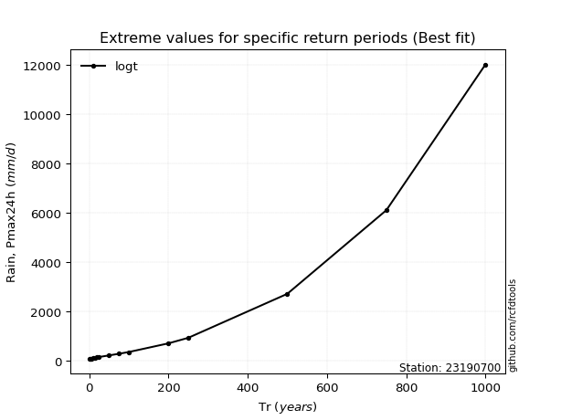</img>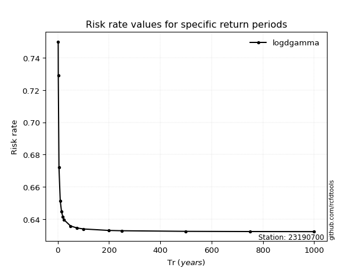</img>

</div>


<sub>**APP DISCLAIMER**: NO WARRANTY - This software is provided by [github.com/rcfdtools](https://github.com/rcfdtools) "as is", without any express or implied warranty, including warranties of merchantability, fitness for a particular purpose, or non-infringement. There is no guarantee that the software will be error-free or operate without interruption. LIMITATION OF LIABILITY - Neither the authors nor copyright holders will be liable for claims or damages arising from the software or its use. You are responsible for determining if the software is appropriate for your use and assume all associated risks, including errors, legal compliance, and data loss. NO PROFESSIONAL ADVICE - The software provides general information and does not offer professional advice. It should not replace consultation with professional advisors.</sub>