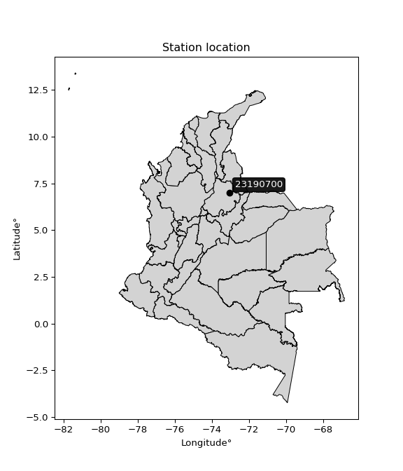

<div align="center">


</div>

# PMP Station (Rain, Pmax24h): 23190700

Probable Maximum Precipitation (PMP) is the greatest amount of rainfall for a specific duration that is meteorologically possible for a given location, acting as a "worst-case" scenario for extreme storms, crucial for designing safety-critical infrastructure like bridges, river deviations, dams, spillways, and nuclear plants to prevent catastrophic failure. PMP is calculated by hydrologists using meteorological data to determine the upper limit of extreme rainfall, often leading to the Probable Maximum Flood (PMF) for flood control design, and is increasingly being studied for climate change impacts. Probable Maximum Precipitation (PMP) is the theoretical upper limit of rainfall, a deterministic estimate for extreme events, while probability distributions (like GEV, Gumbel) describe the likelihood and frequency of various precipitation amounts, including rare ones, showing how often events occur, with PMP representing the extreme end of these distributions, used for critical infrastructure design to ensure safety against the worst conceivable weather, unlike standard statistical forecasts which cover typical probabilities.

The most common probability distributions in hydrology, used for analyzing floods, rainfall, and streamflow, include the Normal, Log-Normal, Gumbel, Gamma (including Log-Pearson Type III), and Generalized Extreme Value (GEV) distributions, often chosen based on the data´s skewness and whether modeling extremes or general conditions, with Gumbel and GEV popular for extreme events like floods, while the Normal distribution serves as a baseline, though often requiring transformations for skewed hydrological data. These distributions help in designing water infrastructure, managing water resources, and forecasting hydrologic events.

> Hydrological data often isn´t perfectly normal (it´s skewed), so different distributions are needed for different applications, such as: **Flood Frequency Analysis**: Using Gumbel, GEV, or Log-Pearson Type III for predicting extreme flood magnitudes and their return periods, **Rainfall Analysis**: Normal for annual totals, but Log-Normal, Weibull, or GEV for intensity or extreme daily rainfall, **Streamflow Modeling**: Gamma and Log-Normal for maximum flows, GEV for minimum flows, and Kappa for daily flows.

<div align="center">

</img>

</div>


## A. General information


### 1. General running parameters

• app_version: _v20260108_. • runtime: _2026-01-08 13:24:42.400241_. • Python version: _3.14.0_. • SciPy version: _1.16.3_. • Pandas version: _2.3.3_. • NumPy version: _2.3.5_. • Stations dataset (station_dataset_file): _dataset/pmax24h_in/automatic_colombia_2003_2024.csv_. • Stations catalog (station_catalog_file): _dataset/CNE.xls_. • Minimum year to eval til year_max (date_min): _1900_. • Maximum year to eval since year_min (date_max): _2024_. • Creates, save and include plots into reports (create_plot): _False_. • Plot only fit distributions with Δo > Δ (plot_only_fit): _True_. • Plot only simple graphs avoiding multiple CDFs and multiple Extreme values plots (plot_only_simple): _True_. • Eval low extreme values, if False, evaluates high extreme values (low_extreme): _False_. • Eval every SciPy distribution as logarithmic (pdist_logarithmic_on): _True_. • Standard deviation normalized (ddof): _1.0_. • Return periods to eval in years (Tr): _[2, 2.33, 5, 10, 15, 20, 25, 50, 75, 100, 200, 250, 500, 750, 1000]_. • Minimum data sample per station, 0 means any (minimum_sample): _5_. • Z-Score maximum threshold to adjust a value, 0 means disable (zscore_max): _3.5_. • Z-Score minimum threshold to adjust a value, 0 means disable (zscore_min): _-2.5_. • Avoid zeros, e.g. rain = 0 (avoid_zeros): _True_. • Avoid null values (avoid_nans): _True_. 

:file_folder:Table: [dataset.csv](../../dataset/pmax24h_in/automatic_colombia_2003_2024.csv)

> Delta Degrees of Freedom (DDOF): is a parameter used in the formulas for calculating variance and standard deviation. When ddof=0, the divisor is $N$ (the total number of observations) and this is used when your data set is the entire population. When ddof=1, the divisor is $N-1$ and this is used when your data set is a sample drawn from a larger population. Using $N-1$ provides an unbiased estimate of the population variance (known as Bessel´s correction).


### 2. Station info and location

|   id |   CODIGO | NOMBRE                        | CATEGORIA     | TECNOLOGIA                              | ESTADO   | FECHA_INSTALACION   |   FECHA_SUSPENSION |   ALTITUD |   LATITUD |   LONGITUD | DEPARTAMENTO   | MUNICIPIO   | AREA_OPERATIVA                         | ENTIDAD                                                     | AREA_HIDROGRAFICA   | ZONA_HIDROGRAFICA   | SUBZONA_HIDROGRAFICA                      |   CORRIENTE | Catalogo   |   Version |
|-----:|---------:|:------------------------------|:--------------|:----------------------------------------|:---------|:--------------------|-------------------:|----------:|----------:|-----------:|:---------------|:------------|:---------------------------------------|:------------------------------------------------------------|:--------------------|:--------------------|:------------------------------------------|------------:|:-----------|----------:|
|    0 | 23190700 | PIEDECUESTA GRANJA [23190700] | Pluviográfica | Automática con Telemetría, Convencional | Activa   | 15/07/1970          |                nan |       951 |   6.99333 |   -73.0678 | Santander      | Piedecuesta | Area Operativa 08 - Santanderes-Arauca | INSTITUTO DE HIDROLOGIA METEOROLOGIA Y ESTUDIOS AMBIENTALES | Magdalena Cauca     | Medio Magdalena     | Río Lebrija y otros directos al Magdalena |         nan | CNE_IDEAM  |  20251226 |

<div align="center">

Dynamic map: [:earth_americas:Google](http://maps.google.com/maps?q=6.99333,-73.06778) [:earth_americas:OSM](https://www.openstreetmap.org/#map=18/6.99333/-73.06778&layers=P) [:earth_americas:Bing](https://www.bing.com/maps?cp=6.99333~-73.06778&lvl=18) [:earth_americas:Apple](https://maps.apple.com/frame?center=6.99333%2C-73.06778&span=0.003%2C0.006)

</div>


<div align="center">

```geojson
{
  "type": "Feature",
  "geometry": {
    "type": "Point", 
    "coordinates": [-73.06778, 6.99333]
  }, 
  "properties": {
    "Name": "23190700"
  }
}
```

</div>


### 3. Discrete values table and plot

<div align="center">

|               |          0 |           1 |          2 |            3 |           4 |          5 |           6 |          7 |
|:--------------|-----------:|------------:|-----------:|-------------:|------------:|-----------:|------------:|-----------:|
| Date          | 2017       | 2018        | 2019       | 2020         | 2021        | 2022       | 2023        | 2024       |
| Value         |   15.8     |   63.4      |   88.2     |   56.6       |   37.8      |   79.6     |   51.8      |   49.6     |
| Value_initial |   15.8     |   63.4      |   88.2     |   56.6       |   37.8      |   79.6     |   51.8      |   49.6     |
| count         |    8       |    8        |    8       |    8         |    8        |    8       |    8        |    8       |
| mean          |   55.35    |   55.35     |   55.35    |   55.35      |   55.35     |   55.35    |   55.35     |   55.35    |
| std           |   22.8393  |   22.8393   |   22.8393  |   22.8393    |   22.8393   |   22.8393  |   22.8393   |   22.8393  |
| zscore        |   -1.73167 |    0.352463 |    1.43831 |    0.0547303 |   -0.768414 |    1.06177 |   -0.155434 |   -0.25176 |


</div>


> The initial value (value_initial) correspond to the initial obtained or null completed value, and value (value) is adjusted only when the initial value is outside the valid range (outlier) definite through the Z-Score value. If Z-Score is active, values out of range or outliers are replaced with the station mean value. A Z-Score (or standard score) measures how many standard deviations a data point is from the mean of a dataset, indicating its relative position; positive scores mean above the mean, negative mean below, and a score of zero is exactly at the mean, allowing for comparison of values from different distributions. It´s calculated using the formula $z=(x–μ)/σ$, where $x$ is the data point, $μ$ is the mean, and $σ$ is the standard deviation, helping identify outliers and understand probability.
>
> <sub>**Note**: In this study, "completing" (filling gaps in) and "extending" (forecasting or lengthening the historical record) rainfall data series are avoided for certain critical analyses because they introduce artificial bias and uncertainty, which can distort the statistics of rare events (extremes), alter day-to-day variability, and compromise the integrity and homogeneity of the original data. Some reasons against Completing/Extending rainfall data are: **Distortion of Extremes and Variability**: The primary issue is that most gap-filling or extension methods rely on averaging or regression with nearby stations, which inherently smooths the data. Rainfall is highly variable in space and time, with a large percentage of zero values and occasional large storms. Infilling methods often underestimate the highest values and overestimate the lowest (zero) values, which severely distorts analyses focused on flood frequency, drought severity, and intensity-duration-frequency (IDF) curves, **Loss of Data Homogeneity**: Infilled or extended data are synthetic estimates, not actual measurements. Combining these estimates with observed data can violate the assumption of data homogeneity, which requires that the data properties do not change over time. Inhomogeneity can lead to incorrect conclusions about long-term trends or changes in climate patterns, **Propagation of Errors**: Errors and biases from the original data (e.g., wind-induced undercatch, instrument errors, site changes) or the data used for imputation can propagate through the analysis, leading to unreliable hydrological models and inaccurate predictions, **Compromised Statistical Integrity**: For statistical analyses, especially those involving the frequency of events, using artificial data can introduce time bias or autocorrelation that doesn´t exist in reality, making it difficult to assess the true probability of events, **Difficulty in Validation**: It is difficult to accurately validate the quality of filled or extended data, especially for past periods where ground-truth measurements are unavailable. The reliability of imputation techniques heavily depends on the density of the surrounding station network and the complexity of the local topography.</sub>


### 4. Active continuous probability distributions from SciPy (43 of 104 available)

A Probability Density Function (PDF) describes the relative likelihood of a continuous random variable falling within a specific range, where the total area under its curve equals 1, and the area over any interval gives the actual probability for that range. Unlike discrete probabilities (like rolling a die), a PDF shows density, not direct probability for a single point (which is zero), with higher points indicating higher likelihood, often visualized as a bell curve for normal distributions.

A log of a probability density function (log-PDF) is simply the logarithm of the PDF´s value, denoted as $log(f(x))$, useful for converting multiplication of probabilities into addition, improving numerical stability with tiny numbers, and connecting to information theory concepts like entropy. Instead of dealing with very small probabilities (e.g., 0.000001), log-PDFs use negative numbers (e.g., $log(0.00001) ≈ -11.51$ that are easier for computers to handle, preventing underflow errors and simplifying complex calculations. In this study, each active probability distribution from SciPy is also evaluated in the $log$ form.

[scipy.stats](https://docs.scipy.org/doc/scipy/reference/stats.html) is a Python´s powerful submodule within the SciPy library for comprehensive statistical analysis, offering over 130 probability distributions (like Normal, Poisson), functions for descriptive stats (mean, variance), hypothesis testing (t-tests, chi-square), random variable generation, and statistical tests, making it essential for data science, modeling, and research. It provides tools to explore, model, and draw conclusions from data efficiently, working seamlessly with NumPy.

<div align="center">

|   id | p_dist             |   n_parameter | fit_method   | label                                                                       | active   | ref                                                                                                        |
|-----:|:-------------------|--------------:|:-------------|:----------------------------------------------------------------------------|:---------|:-----------------------------------------------------------------------------------------------------------|
|    0 | alpha              |             3 | MLE          | Alpha                                                                       | True     | [:mortar_board:](https://docs.scipy.org/doc/scipy/reference/generated/scipy.stats.alpha.html)              |
|    1 | betaprime          |             4 | MLE          | Beta prime                                                                  | True     | [:mortar_board:](https://docs.scipy.org/doc/scipy/reference/generated/scipy.stats.betaprime.html)          |
|    2 | chi2               |             3 | MLE          | Chi²                                                                        | True     | [:mortar_board:](https://docs.scipy.org/doc/scipy/reference/generated/scipy.stats.chi2.html)               |
|    3 | crystalball        |             4 | MLE          | Crystalball                                                                 | True     | [:mortar_board:](https://docs.scipy.org/doc/scipy/reference/generated/scipy.stats.crystalball.html)        |
|    4 | erlang             |             3 | MLE          | Erlang                                                                      | True     | [:mortar_board:](https://docs.scipy.org/doc/scipy/reference/generated/scipy.stats.erlang.html)             |
|    5 | expon              |             2 | MLE          | Exponential                                                                 | True     | [:mortar_board:](https://docs.scipy.org/doc/scipy/reference/generated/scipy.stats.expon.html)              |
|    6 | exponnorm          |             3 | MLE          | Exponentially modified Normal                                               | True     | [:mortar_board:](https://docs.scipy.org/doc/scipy/reference/generated/scipy.stats.exponnorm.html)          |
|    7 | f                  |             4 | MLE          | F                                                                           | True     | [:mortar_board:](https://docs.scipy.org/doc/scipy/reference/generated/scipy.stats.f.html)                  |
|    8 | fatiguelife        |             3 | MLE          | Fatigue-life (Birnbaum-Saunders)                                            | True     | [:mortar_board:](https://docs.scipy.org/doc/scipy/reference/generated/scipy.stats.fatiguelife.html)        |
|    9 | fisk               |             3 | MLE          | Fisk                                                                        | True     | [:mortar_board:](https://docs.scipy.org/doc/scipy/reference/generated/scipy.stats.fisk.html)               |
|   10 | gamma              |             3 | MLE          | Gamma                                                                       | True     | [:mortar_board:](https://docs.scipy.org/doc/scipy/reference/generated/scipy.stats.gamma.html)              |
|   11 | genexpon           |             5 | MLE          | Generalized exponential                                                     | True     | [:mortar_board:](https://docs.scipy.org/doc/scipy/reference/generated/scipy.stats.genexpon.html)           |
|   12 | genlogistic        |             3 | MLE          | Generalized logistic                                                        | True     | [:mortar_board:](https://docs.scipy.org/doc/scipy/reference/generated/scipy.stats.genlogistic.html)        |
|   13 | gibrat             |             2 | MM           | Gibrat                                                                      | True     | [:mortar_board:](https://docs.scipy.org/doc/scipy/reference/generated/scipy.stats.gibrat.html)             |
|   14 | gompertz           |             3 | MLE          | Gompertz (or truncated Gumbel)                                              | True     | [:mortar_board:](https://docs.scipy.org/doc/scipy/reference/generated/scipy.stats.gompertz.html)           |
|   15 | gumbel_l           |             2 | MM           | Gumbel Left Skew                                                            | True     | [:mortar_board:](https://docs.scipy.org/doc/scipy/reference/generated/scipy.stats.gumbel_l.html)           |
|   16 | gumbel_r           |             2 | MM           | Gumbel Right Skew                                                           | True     | [:mortar_board:](https://docs.scipy.org/doc/scipy/reference/generated/scipy.stats.gumbel_r.html)           |
|   17 | halflogistic       |             2 | MM           | Half-logistic                                                               | True     | [:mortar_board:](https://docs.scipy.org/doc/scipy/reference/generated/scipy.stats.halflogistic.html)       |
|   18 | halfnorm           |             2 | MM           | Half Normal                                                                 | True     | [:mortar_board:](https://docs.scipy.org/doc/scipy/reference/generated/scipy.stats.halfnorm.html)           |
|   19 | hypsecant          |             2 | MM           | hyperbolic secant                                                           | True     | [:mortar_board:](https://docs.scipy.org/doc/scipy/reference/generated/scipy.stats.hypsecant.html)          |
|   20 | invgamma           |             3 | MLE          | Inverted gamma                                                              | True     | [:mortar_board:](https://docs.scipy.org/doc/scipy/reference/generated/scipy.stats.invgamma.html)           |
|   21 | invgauss           |             3 | MLE          | Inverse Gaussian                                                            | True     | [:mortar_board:](https://docs.scipy.org/doc/scipy/reference/generated/scipy.stats.invgauss.html)           |
|   22 | invweibull         |             3 | MLE          | Inverted Weibull                                                            | True     | [:mortar_board:](https://docs.scipy.org/doc/scipy/reference/generated/scipy.stats.invweibull.html)         |
|   23 | kstwobign          |             2 | MLE          | Limiting distribution of scaled Kolmogorov-Smirnov two-sided test statistic | True     | [:mortar_board:](https://docs.scipy.org/doc/scipy/reference/generated/scipy.stats.kstwobign.html)          |
|   24 | laplace            |             2 | MM           | Laplace                                                                     | True     | [:mortar_board:](https://docs.scipy.org/doc/scipy/reference/generated/scipy.stats.laplace.html)            |
|   25 | laplace_asymmetric |             3 | MLE          | Asymmetric Laplace                                                          | True     | [:mortar_board:](https://docs.scipy.org/doc/scipy/reference/generated/scipy.stats.laplace_asymmetric.html) |
|   26 | loggamma           |             3 | MLE          | Log gamma                                                                   | True     | [:mortar_board:](https://docs.scipy.org/doc/scipy/reference/generated/scipy.stats.loggamma.html)           |
|   27 | logistic           |             2 | MM           | Logistic (or Sech-squared)                                                  | True     | [:mortar_board:](https://docs.scipy.org/doc/scipy/reference/generated/scipy.stats.logistic.html)           |
|   28 | lognorm            |             3 | MLE          | Log Normal                                                                  | True     | [:mortar_board:](https://docs.scipy.org/doc/scipy/reference/generated/scipy.stats.lognorm.html)            |
|   29 | maxwell            |             2 | MM           | Maxwell                                                                     | True     | [:mortar_board:](https://docs.scipy.org/doc/scipy/reference/generated/scipy.stats.maxwell.html)            |
|   30 | mielke             |             4 | MLE          | Mielke Beta-Kappa / Dagum                                                   | True     | [:mortar_board:](https://docs.scipy.org/doc/scipy/reference/generated/scipy.stats.mielke.html)             |
|   31 | moyal              |             2 | MM           | Moyal                                                                       | True     | [:mortar_board:](https://docs.scipy.org/doc/scipy/reference/generated/scipy.stats.moyal.html)              |
|   32 | nakagami           |             3 | MLE          | Nakagami                                                                    | True     | [:mortar_board:](https://docs.scipy.org/doc/scipy/reference/generated/scipy.stats.nakagami.html)           |
|   33 | ncf                |             5 | MLE          | Non-central F distribution                                                  | True     | [:mortar_board:](https://docs.scipy.org/doc/scipy/reference/generated/scipy.stats.ncf.html)                |
|   34 | nct                |             4 | MLE          | Non-central Student’s t                                                     | True     | [:mortar_board:](https://docs.scipy.org/doc/scipy/reference/generated/scipy.stats.nct.html)                |
|   35 | norm               |             2 | MM           | Normal                                                                      | True     | [:mortar_board:](https://docs.scipy.org/doc/scipy/reference/generated/scipy.stats.norm.html)               |
|   36 | pearson3           |             3 | MM           | Pearson type III                                                            | True     | [:mortar_board:](https://docs.scipy.org/doc/scipy/reference/generated/scipy.stats.pearson3.html)           |
|   37 | rayleigh           |             2 | MM           | Rayleigh                                                                    | True     | [:mortar_board:](https://docs.scipy.org/doc/scipy/reference/generated/scipy.stats.rayleigh.html)           |
|   38 | rice               |             3 | MLE          | Rice                                                                        | True     | [:mortar_board:](https://docs.scipy.org/doc/scipy/reference/generated/scipy.stats.rice.html)               |
|   39 | t                  |             3 | MLE          | Student’s t                                                                 | True     | [:mortar_board:](https://docs.scipy.org/doc/scipy/reference/generated/scipy.stats.t.html)                  |
|   40 | truncnorm          |             4 | MLE          | Truncated normal                                                            | True     | [:mortar_board:](https://docs.scipy.org/doc/scipy/reference/generated/scipy.stats.truncnorm.html)          |
|   41 | wald               |             2 | MM           | Wald                                                                        | True     | [:mortar_board:](https://docs.scipy.org/doc/scipy/reference/generated/scipy.stats.wald.html)               |
|   42 | weibull_min        |             3 | MLE          | Weibull minimum                                                             | True     | [:mortar_board:](https://docs.scipy.org/doc/scipy/reference/generated/scipy.stats.weibull_min.html)        |

</div>

> **n_parameter:** # arguments & localization & scale.
>
> **Fit methods:** (MLE) maximum likelihood, (MM) L-moments.
>
>**Inactive** (With the only purpose of prevent loops, zero divisions, infinite values, over high estimated values or horizontal trending for recurrence intervals estimations, the follow distributions were disabled.)**:** foldnorm, gennorm, norminvgauss, powernorm, powerlognorm, skewnorm, genextreme, anglit, arcsine, argus, beta, bradford, burr, burr12, cauchy, cosine, halfcauchy, foldcauchy, skewcauchy, wrapcauchy, dgamma, gengamma, exponweib, exponpow, truncexpon, gausshyper, genhalflogistic, genhyperbolic, geninvgauss, halfgennorm, johnsonsb, johnsonsu, kappa4, kappa3, ksone, kstwo, loglaplace, levy, levy_l, levy_stable, ncx2, pareto, genpareto, truncpareto, lomax, powerlaw, rdist, rel_breitwigner, recipinvgauss, semicircular, studentized_range, trapezoid, triang, truncweibull_min, tukeylambda, uniform, loguniform, vonmises, vonmises_line, weibull_max, dweibull, 


## B. Probability (PDF) vs. Empirical (EDF) distributions functions

A continuous probability distribution (CPD) describes probabilities for variables that can take any value within a range (like rain any time), unlike discrete variables with specific outcomes (like temperature). It uses a Probability Density Function (PDF), a curve where the total area under it equals 1, and the probability of the variable falling within an interval (a to b) is found by calculating the area under the curve between those points. A key feature is that the probability of hitting any single exact value is zero, so probabilities are always expressed for ranges, e.g., $P(a ≤ X ≤ b)$.

<div align="center">

Distributions parameters from station values
|    |   station | p_dist                |   n |               loc |            scale | shape                  | shape1                | shape2                 | shape3   |
|---:|----------:|:----------------------|----:|------------------:|-----------------:|:-----------------------|:----------------------|:-----------------------|:---------|
|  0 |  23190700 | alpha                 |   8 |    -374.088       |   8408.76        | 19.641150091347953     |                       |                        |          |
|  1 |  23190700 | betaprime             |   8 |    -214.348       |  61080.3         | 150.5325549671823      | 34103.17579777051     |                        |          |
|  2 |  23190700 | chi2                  |   8 |    -185.517       |      0.996435    | 241.62440941885097     |                       |                        |          |
|  3 |  23190700 | crystalball           |   8 |      55.35        |     21.3642      | 7009.422818854468      | 2665.7572602422833    |                        |          |
|  4 |  23190700 | erlang                |   8 |    -349.987       |      1.15732     | 350.13680867171115     |                       |                        |          |
|  5 |  23190700 | expon                 |   8 |      15.8         |     39.55        |                        |                       |                        |          |
|  6 |  23190700 | exponnorm             |   8 |      55.3289      |     21.3643      | 0.0009812456833888288  |                       |                        |          |
|  7 |  23190700 | f                     |   8 |   -4206.97        |   4262.29        | 84646.20592394966      | 1182983.080058292     |                        |          |
|  8 |  23190700 | fatiguelife           |   8 |      15.8         |      0.000171754 | 433.91037535217583     |                       |                        |          |
|  9 |  23190700 | fisk                  |   8 |      -2.38146e+08 |      2.38146e+08 | 19334351.5415597       |                       |                        |          |
| 10 |  23190700 | gamma                 |   8 |    -326.817       |      1.21101     | 315.5138824978825      |                       |                        |          |
| 11 |  23190700 | genexpon              |   8 |      15.7999      |      2.12248     | 0.05372153124250748    | 1.615420017173279e-07 | 0.82815495127192       |          |
| 12 |  23190700 | genlogistic           |   8 |      58.3166      |     11.6934      | 0.8683040008326759     |                       |                        |          |
| 13 |  23190700 | gibrat                |   8 |      39.0519      |      9.88533     |                        |                       |                        |          |
| 14 |  23190700 | gompertz              |   8 |     -37.2526      |     19.2477      | 0.004766848428165065   |                       |                        |          |
| 15 |  23190700 | gumbel_l              |   8 |      64.965       |     16.6576      |                        |                       |                        |          |
| 16 |  23190700 | gumbel_r              |   8 |      45.735       |     16.6576      |                        |                       |                        |          |
| 17 |  23190700 | halflogistic          |   8 |      30.0285      |     18.2656      |                        |                       |                        |          |
| 18 |  23190700 | halfnorm              |   8 |      27.0723      |     35.4409      |                        |                       |                        |          |
| 19 |  23190700 | hypsecant             |   8 |      55.35        |     13.6008      |                        |                       |                        |          |
| 20 |  23190700 | invgamma              |   8 |    -194.484       |  32554           | 131.2774418249321      |                       |                        |          |
| 21 |  23190700 | invgauss              |   8 |     -76.5252      |   4316.99        | 0.030525028241944405   |                       |                        |          |
| 22 |  23190700 | invweibull            |   8 |      15.8         |      2.04645     | 0.06084028710766515    |                       |                        |          |
| 23 |  23190700 | kstwobign             |   8 |     -31.6222      |     99.6047      |                        |                       |                        |          |
| 24 |  23190700 | laplace               |   8 |      55.35        |     15.1067      |                        |                       |                        |          |
| 25 |  23190700 | laplace_asymmetric    |   8 |      51.8         |     16.2903      | 0.8958443924111723     |                       |                        |          |
| 26 |  23190700 | loggamma              |   8 |     -84.6413      |     63.9955      | 9.408386630823177      |                       |                        |          |
| 27 |  23190700 | logistic              |   8 |      55.35        |     11.7787      |                        |                       |                        |          |
| 28 |  23190700 | lognorm               |   8 |      15.8         |      0.379097    | 12.475547129633973     |                       |                        |          |
| 29 |  23190700 | maxwell               |   8 |       4.7259      |     31.7239      |                        |                       |                        |          |
| 30 |  23190700 | mielke                |   8 |      -4.88516     |     93.5829      | 1.9141285782262667     | 719.0716506207118     |                        |          |
| 31 |  23190700 | moyal                 |   8 |      43.1326      |      9.61725     |                        |                       |                        |          |
| 32 |  23190700 | nakagami              |   8 |      37.8         |     26.094       | 0.34946082893023045    |                       |                        |          |
| 33 |  23190700 | ncf                   |   8 |       0.0124854   |      6.07574e-09 | 6.373129668857108e-10  | 1.9684329890178045    | 4.465375010922866      |          |
| 34 |  23190700 | nct                   |   8 |   -1135.5         |     21.2944      | 230544.0280679193      | 55.923290616611894    |                        |          |
| 35 |  23190700 | norm                  |   8 |      55.35        |     21.3642      |                        |                       |                        |          |
| 36 |  23190700 | pearson3              |   8 |      55.35        |     21.3641      | -0.2213801448251399    |                       |                        |          |
| 37 |  23190700 | rayleigh              |   8 |      14.4791      |     32.6103      |                        |                       |                        |          |
| 38 |  23190700 | rice                  |   8 |       3.51823     |     23.3853      | 1.9357551244130646     |                       |                        |          |
| 39 |  23190700 | t                     |   8 |      55.3487      |     21.3656      | 5415803.196231017      |                       |                        |          |
| 40 |  23190700 | truncnorm             |   8 |      55.35        |     21.3642      | -282.5530000862685     | 1157.1428335301239    |                        |          |
| 41 |  23190700 | wald                  |   8 |      33.9858      |     21.3642      |                        |                       |                        |          |
| 42 |  23190700 | weibull_min           |   8 |     -25.9292      |     89.3307      | 4.389855929862836      |                       |                        |          |
| 43 |  23190700 | logalpha              |   8 |      -9.86436     |    355.714       | 25.884603138378225     |                       |                        |          |
| 44 |  23190700 | logbetaprime          |   8 |     -18.8504      |     18.5974      | 4388.5339519163535     | 3587.7604205751923    |                        |          |
| 45 |  23190700 | logchi2               |   8 |       2.76001     |      0.944305    | 1.0477875552781        |                       |                        |          |
| 46 |  23190700 | logcrystalball        |   8 |       3.91072     |      0.502095    | 927.2614302073106      | 14.597774442320329    |                        |          |
| 47 |  23190700 | logerlang             |   8 |      -5.08156     |      0.0305058   | 294.58922061565613     |                       |                        |          |
| 48 |  23190700 | logexpon              |   8 |       2.76001     |      1.15071     |                        |                       |                        |          |
| 49 |  23190700 | logexponnorm          |   8 |       3.91044     |      0.502095    | 0.0005667441708265819  |                       |                        |          |
| 50 |  23190700 | logf                  |   8 |    -722.387       |    726.298       | 13741514.458748542     | 5936947.375091638     |                        |          |
| 51 |  23190700 | logfatiguelife        |   8 |    -271.057       |    274.968       | 0.0018202178663254054  |                       |                        |          |
| 52 |  23190700 | logfisk               |   8 | -171599           | 171603           | 655668.7064922755      |                       |                        |          |
| 53 |  23190700 | loggamma              |   8 |      -5.30476     |      0.0292351   | 315.48067809873373     |                       |                        |          |
| 54 |  23190700 | loggenexpon           |   8 |       2.71637     |      0.008102    | 0.0014510461588030784  | 3.1622642490631305    | 1.9406994079581452e-05 |          |
| 55 |  23190700 | loggenlogistic        |   8 |       4.47963     |      1.85216e-06 | 3.2579533225510744e-06 |                       |                        |          |
| 56 |  23190700 | loggibrat             |   8 |       3.52766     |      0.232337    |                        |                       |                        |          |
| 57 |  23190700 | loggompertz           |   8 |       2.75995     |      0.377279    | 0.028131479851059633   |                       |                        |          |
| 58 |  23190700 | loggumbel_l           |   8 |       4.13669     |      0.391482    |                        |                       |                        |          |
| 59 |  23190700 | loggumbel_r           |   8 |       3.68475     |      0.391482    |                        |                       |                        |          |
| 60 |  23190700 | loghalflogistic       |   8 |       3.31561     |      0.429284    |                        |                       |                        |          |
| 61 |  23190700 | loghalfnorm           |   8 |       3.24612     |      0.832957    |                        |                       |                        |          |
| 62 |  23190700 | loghypsecant          |   8 |       3.91072     |      0.319644    |                        |                       |                        |          |
| 63 |  23190700 | loginvgamma           |   8 |     -10.1453      |  10217.9         | 728.5958061467081      |                       |                        |          |
| 64 |  23190700 | loginvgauss           |   8 |      -2.06672     |    680.175       | 0.008771000679611077   |                       |                        |          |
| 65 |  23190700 | loginvweibull         |   8 |      -5.22277e+07 |      5.22277e+07 | 87341873.8283126       |                       |                        |          |
| 66 |  23190700 | logkstwobign          |   8 |       1.46408     |      2.80264     |                        |                       |                        |          |
| 67 |  23190700 | loglaplace            |   8 |       3.91072     |      0.355035    |                        |                       |                        |          |
| 68 |  23190700 | loglaplace_asymmetric |   8 |       4.03601     |      0.332347    | 1.2061424924601258     |                       |                        |          |
| 69 |  23190700 | logloggamma           |   8 |       4.47968     |      1.60467e-06 | 2.8323333358148824e-06 |                       |                        |          |
| 70 |  23190700 | loglogistic           |   8 |       3.91072     |      0.276819    |                        |                       |                        |          |
| 71 |  23190700 | loglognorm            |   8 |       2.76001     |      0.0150227   | 11.776131666884561     |                       |                        |          |
| 72 |  23190700 | logmaxwell            |   8 |       2.72097     |      0.745568    |                        |                       |                        |          |
| 73 |  23190700 | logmielke             |   8 |       0.967471    |      3.51225     | 5.139815403975939      | 257818.02609283722    |                        |          |
| 74 |  23190700 | logmoyal              |   8 |       3.62359     |      0.226022    |                        |                       |                        |          |
| 75 |  23190700 | lognakagami           |   8 |       3.63231     |      0.48885     | 0.3775149744975445     |                       |                        |          |
| 76 |  23190700 | logncf                |   8 |     -19.056       |     22.9636      | 4805.007761163428      | 23554.145993880993    | 0.22938574373057627    |          |
| 77 |  23190700 | lognct                |   8 |     -26.3952      |      0.442434    | 7443.28236376807       | 68.49048766360968     |                        |          |
| 78 |  23190700 | lognorm               |   8 |       3.91072     |      0.502095    |                        |                       |                        |          |
| 79 |  23190700 | logpearson3           |   8 |       3.91072     |      0.502096    | -1.2286895418805568    |                       |                        |          |
| 80 |  23190700 | lograyleigh           |   8 |       2.95019     |      0.766397    |                        |                       |                        |          |
| 81 |  23190700 | logrice               |   8 |    -330.99        |      0.502131    | 666.9568274145224      |                       |                        |          |
| 82 |  23190700 | logt                  |   8 |       4.03087     |      0.281552    | 2.1391804880150413     |                       |                        |          |
| 83 |  23190700 | logtruncnorm          |   8 |      -0.166334    |      1.5222      | 2.495495909294643      | 3.087218587596169     |                        |          |
| 84 |  23190700 | logwald               |   8 |       3.40866     |      0.502071    |                        |                       |                        |          |
| 85 |  23190700 | logweibull_min        |   8 |      -3.31286e+07 |      3.31286e+07 | 94446063.82734713      |                       |                        |          |

</div>

> **loc** (Location parameter): This shifts the distribution along the x-axis. For many common distributions, like the normal (Gaussian) distribution, loc represents the mean $μ$. For others, like the uniform distribution, it might represent the minimum value, or for the beta distribution, the left end of the support interval.
>
> **scale** (Scale parameter): This determines the width or spread of the distribution. For the normal distribution, scale represents the standard deviation $σ$. For a uniform distribution, it defines the length of the interval (from $loc$ to $loc + scale$).
>
> **shape** (Shape parameters): Refers to parameters that define the specific form of a probability distribution, distinct from its location (loc) and scale (scale). These parameters are required arguments for most distribution functions. For example, a normal (Gaussian) distribution is fully defined by its location (mean) and scale (standard deviation), so it has no specific shape parameters beyond loc and scale. However, other distributions have intrinsic properties that need specification, as Gamma distribution that takes a shape parameter, often named $a$ or $alpha$.


### 0. Cumulative distribution values - CDF (86 evaluated)

Cumulative Distribution Function (CDF), denoted as $F$<sub>$X$</sub>$(x)$, is a function that gives the probability that a random variable $X$ will take a value less than or equal to a specific value, $x$ (i.e., $(P(X≥x)$. It essentially "accumulates" probabilities from a given point up to the far right (positive infinity), providing a complete picture of the distribution´s probabilities for both discrete (like rain) and continuous (like temperature) variables, helping to find probabilities over ranges or above certain values. Each station is evaluated separately ordering the $x$ values ascending, calculating the CDF and PDF values for the activated distributions and their logarithmic forms.

<div align="center">

CDF ordered by x ascending and calculating $log(f(x))$ separately
|   id |   Station |   date |    x |   count |   mean |     std |     zscore |   Value_initial |   station |   m |     alpha |   alpha_pdf |   betaprime |   betaprime_pdf |      chi2 |   chi2_pdf |   crystalball |   crystalball_pdf |    erlang |   erlang_pdf |    expon |   expon_pdf |   exponnorm |   exponnorm_pdf |         f |      f_pdf |   fatiguelife |   fatiguelife_pdf |      fisk |   fisk_pdf |     gamma |   gamma_pdf |    genexpon |   genexpon_pdf |   genlogistic |   genlogistic_pdf |   gibrat |   gibrat_pdf |   gompertz |   gompertz_pdf |   gumbel_l |   gumbel_l_pdf |   gumbel_r |   gumbel_r_pdf |   halflogistic |   halflogistic_pdf |   halfnorm |   halfnorm_pdf |   hypsecant |   hypsecant_pdf |   invgamma |   invgamma_pdf |   invgauss |   invgauss_pdf |   invweibull |   invweibull_pdf |   kstwobign |   kstwobign_pdf |   laplace |   laplace_pdf |   laplace_asymmetric |   laplace_asymmetric_pdf |   loggamma |   loggamma_pdf |   logistic |   logistic_pdf |   lognorm |   lognorm_pdf |   maxwell |   maxwell_pdf |    mielke |   mielke_pdf |       moyal |   moyal_pdf |    nakagami |   nakagami_pdf |      ncf |    ncf_pdf |       nct |    nct_pdf |      norm |   norm_pdf |   pearson3 |   pearson3_pdf |    rayleigh |   rayleigh_pdf |      rice |   rice_pdf |         t |      t_pdf |   truncnorm |   truncnorm_pdf |      wald |   wald_pdf |   weibull_min |   weibull_min_pdf |   logalpha |   logalpha_pdf |   logbetaprime |   logbetaprime_pdf |     logchi2 |   logchi2_pdf |   logcrystalball |   logcrystalball_pdf |   logerlang |   logerlang_pdf |   logexpon |   logexpon_pdf |   logexponnorm |   logexponnorm_pdf |      logf |   logf_pdf |   logfatiguelife |   logfatiguelife_pdf |    logfisk |   logfisk_pdf |   loggenexpon |   loggenexpon_pdf |   loggenlogistic |   loggenlogistic_pdf |   loggibrat |   loggibrat_pdf |   loggompertz |   loggompertz_pdf |   loggumbel_l |   loggumbel_l_pdf |   loggumbel_r |   loggumbel_r_pdf |   loghalflogistic |   loghalflogistic_pdf |   loghalfnorm |   loghalfnorm_pdf |   loghypsecant |   loghypsecant_pdf |   loginvgamma |   loginvgamma_pdf |   loginvgauss |   loginvgauss_pdf |   loginvweibull |   loginvweibull_pdf |   logkstwobign |   logkstwobign_pdf |   loglaplace |   loglaplace_pdf |   loglaplace_asymmetric |   loglaplace_asymmetric_pdf |   logloggamma |   logloggamma_pdf |   loglogistic |   loglogistic_pdf |   loglognorm |   loglognorm_pdf |   logmaxwell |   logmaxwell_pdf |   logmielke |   logmielke_pdf |    logmoyal |   logmoyal_pdf |   lognakagami |   lognakagami_pdf |    logncf |   logncf_pdf |   lognct |   lognct_pdf |   logpearson3 |   logpearson3_pdf |   lograyleigh |   lograyleigh_pdf |   logrice |   logrice_pdf |      logt |   logt_pdf |   logtruncnorm |   logtruncnorm_pdf |   logwald |   logwald_pdf |   logweibull_min |   logweibull_min_pdf |
|-----:|----------:|-------:|-----:|--------:|-------:|--------:|-----------:|----------------:|----------:|----:|----------:|------------:|------------:|----------------:|----------:|-----------:|--------------:|------------------:|----------:|-------------:|---------:|------------:|------------:|----------------:|----------:|-----------:|--------------:|------------------:|----------:|-----------:|----------:|------------:|------------:|---------------:|--------------:|------------------:|---------:|-------------:|-----------:|---------------:|-----------:|---------------:|-----------:|---------------:|---------------:|-------------------:|-----------:|---------------:|------------:|----------------:|-----------:|---------------:|-----------:|---------------:|-------------:|-----------------:|------------:|----------------:|----------:|--------------:|---------------------:|-------------------------:|-----------:|---------------:|-----------:|---------------:|----------:|--------------:|----------:|--------------:|----------:|-------------:|------------:|------------:|------------:|---------------:|---------:|-----------:|----------:|-----------:|----------:|-----------:|-----------:|---------------:|------------:|---------------:|----------:|-----------:|----------:|-----------:|------------:|----------------:|----------:|-----------:|--------------:|------------------:|-----------:|---------------:|---------------:|-------------------:|------------:|--------------:|-----------------:|---------------------:|------------:|----------------:|-----------:|---------------:|---------------:|-------------------:|----------:|-----------:|-----------------:|---------------------:|-----------:|--------------:|--------------:|------------------:|-----------------:|---------------------:|------------:|----------------:|--------------:|------------------:|--------------:|------------------:|--------------:|------------------:|------------------:|----------------------:|--------------:|------------------:|---------------:|-------------------:|--------------:|------------------:|--------------:|------------------:|----------------:|--------------------:|---------------:|-------------------:|-------------:|-----------------:|------------------------:|----------------------------:|--------------:|------------------:|--------------:|------------------:|-------------:|-----------------:|-------------:|-----------------:|------------:|----------------:|------------:|---------------:|--------------:|------------------:|----------:|-------------:|---------:|-------------:|--------------:|------------------:|--------------:|------------------:|----------:|--------------:|----------:|-----------:|---------------:|-------------------:|----------:|--------------:|-----------------:|---------------------:|
|    0 |  23190700 |   2017 | 15.8 |       8 |  55.35 | 22.8393 | -1.73167   |            15.8 |  23190700 |   1 | 0.0270563 |  0.00345393 |   0.0313934 |      0.00356823 | 0.0301203 | 0.00351382 |     0.0320682 |        0.00336549 | 0.0310459 |   0.00346152 | 0        |  0.0252845  |   0.0320691 |      0.00336556 | 0.0323454 | 0.00339888 |     0.0739635 |       2.32536e+08 | 0.0375814 | 0.00293645 | 0.0298246 |  0.00338599 | 1.57434e-06 |     0.0253107  |      0.041598 |        0.00300957 | 0        |   0          |   0.067859 |     0.003634   |  0.0509185 |     0.0029776  | 0.00240067 |    0.000869325 |       0        |         0          |   0        |     0          |   0.0347185 |      0.00254762 |  0.0243491 |     0.0032925  |  0.0245112 |     0.00363488 |  0.000261804 |      7.39573e+10 |   0.0227876 |      0.00475009 |  0.036473 |    0.00241435 |            0.0377787 |               0.00258872 |  0.0103722 |      0.0579724 |  0.0336419 |     0.00276008 | 0.0109578 |     0.0574865 | 0.0109084 |    0.0028836  | 0.0556182 |    0.0051467 | 3.45285e-05 | 3.24172e-05 | 0           |     0          | 0.294607 | 0.0103012  | 0.0320573 | 0.00336565 | 0.0320682 | 0.00336549 |  0.0380023 |     0.00341879 | 0.000820009 |     0.00124109 | 0.0223901 | 0.00383266 | 0.0320815 | 0.00336641 |   0.0320682 |      0.00336549 | 0         | 0          |     0.0347716 |        0.00359358 |  0.0109478 |      0.0643705 |      0.0112292 |          0.0607103 | 1.05173e-08 |   6.20366e+06 |        0.0109578 |            0.0574864 |   0.0116686 |       0.0637868 |   0        |       0.869025 |      0.0109578 |          0.0574861 | 0.0111971 |   0.058407 |        0.0105997 |            0.0562608 | 0.00923929 |     0.0349761 |    0.00866733 |          0.217985 |         0        |            0.0854284 |    0        |        0        |   4.81893e-06 |         0.0745766 |     0.0292636 |         0.0736463 |   2.45718e-05 |       0.000666195 |          0        |              0        |      0        |          0        |      0.0173906 |          0.0543793 |     0.0110755 |          0.062656 |     0.0131287 |          0.075193 |       0.0134624 |           0.0969849 |      0.0169107 |           0.13754  |    0.0195598 |        0.0550926 |                0.024567 |                   0.0612861 |     0.0480602 |         0.0848288 |     0.0154145 |         0.0548259 |   0.00407999 |      2.30588e+12 |  3.81529e-05 |       0.00293023 |    0.031519 |       0.0903757 | 1.42076e-11 |    1.46465e-09 |   0           |          0        | 0.0114749 |    0.0608215 | 0.011212 |    0.0590387 |     0.0311597 |         0.0786946 |      0        |          0        | 0.0109629 |     0.0575055 | 0.0201512 |   0.031456 |    0           |           0        |  0        |      0        |        0.0200875 |            0.0566882 |
|    1 |  23190700 |   2021 | 37.8 |       8 |  55.35 | 22.8393 | -0.768414  |            37.8 |  23190700 |   2 | 0.219471  |  0.0146555  |   0.216618  |      0.0139353  | 0.215921  | 0.0140591  |     0.20569   |        0.0133257  | 0.212144  |   0.0137857  | 0.426649 |  0.0144969  |   0.205692  |      0.0133258  | 0.207055  | 0.0133657  |     0.795261  |       0.00532219  | 0.188953  | 0.0124419  | 0.210077  |  0.0138253  | 0.426983    |     0.0145035  |      0.189755 |        0.0120125  | 0        |   0          |   0.205914 |     0.00970884 |  0.177803  |     0.0096632  | 0.199847   |    0.0193182   |       0.209583 |         0.0261715  |   0.237877 |     0.021505   |   0.170949  |      0.0119734  |  0.215845  |     0.0147623  |  0.232667  |     0.0153988  |  0.420857    |      0.00100728  |   0.283739  |      0.0166726  |  0.156472 |    0.0103577  |            0.170589  |               0.0116893  |  0.295355  |      0.678903  |  0.183925  |     0.0127431  | 0.289616  |     0.681328  | 0.21977   |    0.0158756  | 0.222554  |    0.00998   | 0.187007    | 0.0229193   | 1.02749e-11 |  1010.68       | 0.47197  | 0.00619548 | 0.205708  | 0.0133276  | 0.20569   | 0.0133257  |  0.202013  |     0.0124385  | 0.225635    |     0.0169817  | 0.214956  | 0.0140827  | 0.205722  | 0.0133261  |   0.20569   |      0.0133257  | 0.0454567 | 0.0374007  |     0.203141  |        0.0124643  |  0.318788  |      0.697216  |      0.300589  |          0.687951  | 0.647544    |   0.284574    |        0.289616  |            0.681328  |   0.306103  |       0.683934  |   0.531421 |       0.407207 |      0.289615  |          0.681326  | 0.2903    |   0.679179 |        0.288758  |            0.683237  | 0.207171   |     0.627582  |    0.426457   |          0.593319 |         0        |            0.396254  |    0.212554 |        2.77359  |   0.225793    |         0.582889  |     0.240968  |         0.534569  |   0.318748    |       0.930929    |          0.353002 |              1.01959  |      0.357092 |          0.86028  |      0.252339  |          0.709313  |     0.311267  |          0.696487 |     0.329122  |          0.678722 |       0.367265  |           0.615214  |      0.412435  |           0.593962 |    0.228244  |        0.642879  |                0.216477 |                   0.540034  |     0.224104  |         0.395555  |     0.26781   |         0.708359  |   0.634915   |      0.0365941   |  0.316372    |       0.75752    |    0.241914 |       0.466592  | 0.326639    |    1.07017     |   3.42438e-12 |       5822.06     | 0.296251  |    0.67882   | 0.292734 |    0.680424  |     0.24105   |         0.50647   |      0.327047 |          0.781515 | 0.289634  |     0.681299  | 0.142473  |   0.448263 |    7.68761e-07 |           2.20604  |  0.315092 |      1.89247  |        0.216491  |            0.544963  |
|    2 |  23190700 |   2024 | 49.6 |       8 |  55.35 | 22.8393 | -0.25176   |            49.6 |  23190700 |   3 | 0.418627  |  0.0182973  |   0.408298  |      0.0178833  | 0.409272  | 0.0180187  |     0.39391   |        0.0180092  | 0.403797  |   0.0180501  | 0.574553 |  0.0107572  |   0.393912  |      0.0180091  | 0.395346  | 0.0179749  |     0.846694  |       0.00357771  | 0.377817  | 0.0190847  | 0.40275   |  0.0181712  | 0.574933    |     0.0107588  |      0.373642 |        0.0188163  | 0.525872 |   0.0377415  |   0.349276 |     0.0146874  |  0.328044  |     0.0160374  | 0.452519   |    0.0215406   |       0.489762 |         0.0208078  |   0.47499  |     0.018395   |   0.369267  |      0.0214574  |  0.41648   |     0.0184081  |  0.434463  |     0.017932   |  0.430355    |      0.000653136 |   0.480771  |      0.0160449  |  0.341717 |    0.0226202  |            0.382922  |               0.0262391  |  0.496463  |      0.76898   |  0.380325  |     0.0200088  | 0.49465   |     0.794484  | 0.427772  |    0.018505   | 0.355088  |    0.0124747 | 0.474948    | 0.022961    | 0.438148    |     0.0246081  | 0.536568 | 0.00483101 | 0.393939  | 0.0180088  | 0.39391   | 0.0180092  |  0.380818  |     0.0174827  | 0.440075    |     0.0184921  | 0.407229  | 0.0178915  | 0.39394   | 0.0180084  |   0.39391   |      0.0180092  | 0.534965  | 0.0284415  |     0.380397  |        0.0172382  |  0.519528  |      0.747698  |      0.504407  |          0.778884  | 0.715008    |   0.2166      |        0.49465   |            0.794484  |   0.506891  |       0.761816  |   0.629962 |       0.321573 |      0.494648  |          0.794483  | 0.49332   |   0.790764 |        0.494448  |            0.797028  | 0.424579   |     0.93348   |    0.581631   |          0.538792 |         0        |            0.639025  |    0.685195 |        0.943705 |   0.426208    |         0.887611  |     0.424137  |         0.811814  |   0.564847    |       0.824152    |          0.594957 |              0.752446 |      0.570357 |          0.701235 |      0.493295  |          0.995607  |     0.514442  |          0.765485 |     0.522135  |          0.713123 |       0.529444  |           0.563053  |      0.565389  |           0.522685 |    0.490607  |        1.38186   |                0.426339 |                   1.06356   |     0.361999  |         0.638947  |     0.493919  |         0.902982  |   0.643535   |      0.0276754   |  0.527906    |       0.765145   |    0.398442 |       0.697397  | 0.590722    |    0.821428    |   0.484471    |          1.23642  | 0.498317  |    0.776112  | 0.496476 |    0.786272  |     0.413117  |         0.763703  |      0.53903  |          0.748554 | 0.494655  |     0.794427  | 0.346915  |   1.09724  |    0.481385    |           1.3908   |  0.662695 |      0.810784 |        0.410995  |            0.888831  |
|    3 |  23190700 |   2023 | 51.8 |       8 |  55.35 | 22.8393 | -0.155434  |            51.8 |  23190700 |   4 | 0.459027  |  0.0183972  |   0.447928  |      0.018113   | 0.449186  | 0.0182352  |     0.434013  |        0.0184174  | 0.443862  |   0.0183417  | 0.597572 |  0.0101752  |   0.434015  |      0.0184173  | 0.435357  | 0.0183676  |     0.854312  |       0.00335073  | 0.420624  | 0.0197852  | 0.443087  |  0.0184676  | 0.597955    |     0.0101761  |      0.415991 |        0.0196405  | 0.600381 |   0.0302982  |   0.382623 |     0.0156221  |  0.364723  |     0.0173027  | 0.499163   |    0.0208211   |       0.534176 |         0.0195629  |   0.514646 |     0.0176492  |   0.417845  |      0.0226285  |  0.457104  |     0.0184905  |  0.473827  |     0.0178247  |  0.431747    |      0.000612849 |   0.515548  |      0.0155584  |  0.395288 |    0.0261663  |            0.445226  |               0.0305084  |  0.529758  |      0.76447   |  0.425217  |     0.02075    | 0.529107  |     0.79244   | 0.468418  |    0.0184168  | 0.383039  |    0.0129343 | 0.523972    | 0.0215765   | 0.490145    |     0.0227025  | 0.546966 | 0.0046238  | 0.434041  | 0.0184164  | 0.434013  | 0.0184174  |  0.419954  |     0.0180694  | 0.480499    |     0.0182318  | 0.446888  | 0.0181329  | 0.434041  | 0.0184164  |   0.434013  |      0.0184174  | 0.592636  | 0.0241221  |     0.418984  |        0.017817   |  0.551776  |      0.737624  |      0.538121  |          0.773847  | 0.724219    |   0.20796     |        0.529107  |            0.79244   |   0.539839  |       0.755696  |   0.643658 |       0.30967  |      0.529105  |          0.792439  | 0.528801  |   0.788727 |        0.529014  |            0.794871  | 0.46551    |     0.950669  |    0.60472    |          0.525049 |         0        |            0.689719  |    0.72288  |        0.797974 |   0.465615    |         0.927429  |     0.460216  |         0.850163  |   0.599739    |       0.783237    |          0.626633 |              0.707377 |      0.600159 |          0.672051 |      0.536433  |          0.989312  |     0.547507  |          0.757428 |     0.552875  |          0.702836 |       0.553547  |           0.547474  |      0.587739  |           0.507162 |    0.54906   |        1.27013   |                0.475088 |                   1.18518   |     0.390818  |         0.689815  |     0.533065  |         0.899166  |   0.644713   |      0.0266327   |  0.560766    |       0.748494   |    0.429649 |       0.741066  | 0.625153    |    0.765325    |   0.536131    |          1.14532  | 0.531941  |    0.772492  | 0.530559 |    0.783478  |     0.447143  |         0.804021  |      0.571086 |          0.72819  | 0.52911   |     0.792382  | 0.396588  |   1.1876   |    0.539494    |           1.28818  |  0.695707 |      0.713102 |        0.450659  |            0.938158  |
|    4 |  23190700 |   2020 | 56.6 |       8 |  55.35 | 22.8393 |  0.0547303 |            56.6 |  23190700 |   5 | 0.546633  |  0.0179612  |   0.5349    |      0.0179823  | 0.536653  | 0.018064   |     0.523328  |        0.0186415  | 0.532211  |   0.0183193  | 0.643566 |  0.00901224 |   0.52333   |      0.0186414  | 0.52436   | 0.0185629  |     0.869334  |       0.00292232  | 0.517364  | 0.0202722  | 0.53204   |  0.018442   | 0.64395     |     0.00901193 |      0.512767 |        0.0204329  | 0.716981 |   0.0192823  |   0.462174 |     0.0174636  |  0.454042  |     0.0198361  | 0.594004   |    0.018574    |       0.62145  |         0.0168021  |   0.595242 |     0.0159112  |   0.529213  |      0.0233052  |  0.545054  |     0.0180099  |  0.557776  |     0.0170362  |  0.434507    |      0.000540077 |   0.587258  |      0.0142801  |  0.539707 |    0.0304694  |            0.573933  |               0.0234305  |  0.596543  |      0.739335  |  0.526506  |     0.0211651  | 0.598522  |     0.770201  | 0.5553    |    0.0176634  | 0.447521  |    0.013932  | 0.619541    | 0.0182075   | 0.590358    |     0.0191617  | 0.568154 | 0.00421336 | 0.523348  | 0.0186392  | 0.523328  | 0.0186415  |  0.508659  |     0.0187438  | 0.565767    |     0.0171993  | 0.534075  | 0.0180571  | 0.52335   | 0.0186402  |   0.523328  |      0.0186415  | 0.690455  | 0.0171191  |     0.506558  |        0.0185395  |  0.615752  |      0.703307  |      0.605667  |          0.746965  | 0.741916    |   0.191742    |        0.598522  |            0.770201  |   0.605723  |       0.727907  |   0.67007  |       0.286717 |      0.59852   |          0.770201  | 0.597874  |   0.766761 |        0.598629  |            0.772249  | 0.549938   |     0.945686  |    0.649899   |          0.493956 |         0        |            0.806065  |    0.783179 |        0.5776   |   0.550672    |         0.986283  |     0.538476  |         0.911563  |   0.665184    |       0.692727    |          0.685316 |              0.617705 |      0.657021 |          0.611005 |      0.621685  |          0.923944  |     0.61337   |          0.725741 |     0.613821  |          0.670173 |       0.600527  |           0.512129  |      0.631215  |           0.473698 |    0.648669  |        0.989567  |                0.592631 |                   1.47841   |     0.456989  |         0.80661   |     0.611254  |         0.858403  |   0.646986   |      0.0247265   |  0.625177    |       0.702759   |    0.499492 |       0.836652  | 0.687989    |    0.65391     |   0.62994     |          0.974674 | 0.599496  |    0.748501  | 0.599135 |    0.760372  |     0.521792  |         0.878438  |      0.633456 |          0.677603 | 0.59852   |     0.770147  | 0.506498  |   1.26479  |    0.645066    |           1.09878  |  0.75153  |      0.554887 |        0.537548  |            1.01677   |
|    5 |  23190700 |   2018 | 63.4 |       8 |  55.35 | 22.8393 |  0.352463  |            63.4 |  23190700 |   6 | 0.662986  |  0.0160431  |   0.652742  |      0.0164369  | 0.65482   | 0.0164508  |     0.646839  |        0.0173938  | 0.652609  |   0.0168306  | 0.69987  |  0.00758862 |   0.64684   |      0.0173937  | 0.647254  | 0.0172962  |     0.887482  |       0.00243552  | 0.650572  | 0.0184561  | 0.653179  |  0.0169212  | 0.700247    |     0.00758699 |      0.64825  |        0.0189176  | 0.816313 |   0.0109145  |   0.587308 |     0.0190788  |  0.597607  |     0.0219905  | 0.707308   |    0.014704    |       0.722811 |         0.0130722  |   0.694648 |     0.0133133  |   0.678275  |      0.0198281  |  0.661539  |     0.0160375  |  0.666979  |     0.0149292  |  0.437901    |      0.000462185 |   0.677392  |      0.0122012  |  0.706542 |    0.0194256  |            0.706861  |               0.0161204  |  0.677304  |      0.679735  |  0.664506  |     0.0189272  | 0.68278   |     0.709627  | 0.66881   |    0.015555   | 0.547032  |    0.0153341 | 0.727356    | 0.0136097   | 0.705942    |     0.0149544  | 0.595063 | 0.00371592 | 0.646838  | 0.0173903  | 0.646839  | 0.0173938  |  0.635002  |     0.0180954  | 0.67543     |     0.0149312  | 0.652765  | 0.0166094  | 0.646851  | 0.0173924  |   0.646839  |      0.0173938  | 0.784083  | 0.0109781  |     0.632094  |        0.0180785  |  0.691997  |      0.637207  |      0.687111  |          0.683968  | 0.762605    |   0.173386    |        0.68278   |            0.709627  |   0.68506   |       0.666336  |   0.701048 |       0.259797 |      0.682778  |          0.709627  | 0.681782  |   0.706975 |        0.683081  |            0.710983  | 0.653376   |     0.86533   |    0.703469   |          0.449724 |         0        |            0.984104  |    0.837549 |        0.395202 |   0.663963    |         0.99638   |     0.644119  |         0.939205  |   0.737035    |       0.574443    |          0.749238 |              0.510901 |      0.721858 |          0.532011 |      0.718297  |          0.770684  |     0.692206  |          0.659856 |     0.686592  |          0.609658 |       0.655853  |           0.462651  |      0.682432  |           0.428979 |    0.744769  |        0.718889  |                0.730121 |                   0.979433  |     0.55831   |         0.985446  |     0.70317   |         0.754001  |   0.64967    |      0.022645    |  0.700746    |       0.626746   |    0.601966 |       0.972344  | 0.754699    |    0.525217    |   0.729141    |          0.777737 | 0.681307  |    0.688781  | 0.68228  |    0.700103  |     0.625609  |         0.944418  |      0.706046 |          0.600193 | 0.682772  |     0.709583  | 0.643909  |   1.11638  |    0.75764     |           0.891957 |  0.805796 |      0.410638 |        0.655523  |            1.04662   |
|    6 |  23190700 |   2022 | 79.6 |       8 |  55.35 | 22.8393 |  1.06177   |            79.6 |  23190700 |   7 | 0.86584   |  0.00883186 |   0.86436   |      0.00933464 | 0.86574   | 0.00926057 |     0.871829  |        0.00980508 | 0.868877  |   0.00945178 | 0.800741 |  0.00503816 |   0.871829  |      0.00980504 | 0.871024  | 0.00977031 |     0.919931  |       0.00163757  | 0.873998  | 0.00894073 | 0.870015  |  0.00943733 | 0.801076    |     0.00503493 |      0.877767 |        0.00908727 | 0.920942 |   0.00363369 |   0.872522 |     0.0136738  |  0.909958  |     0.0130136  | 0.87727    |    0.00689599  |       0.875687 |         0.00638283 |   0.861692 |     0.00750639 |   0.893953  |      0.00765367 |  0.864044  |     0.00882159 |  0.855881  |     0.00838091 |  0.444335    |      0.000343713 |   0.834894  |      0.00739127 |  0.89958  |    0.00664739 |            0.879726  |               0.00661415 |  0.812671  |      0.501547  |  0.886834  |     0.00852042 | 0.823475  |     0.51623   | 0.865514  |    0.00864645 | 0.822209  |    0.0186283 | 0.880624    | 0.0061598   | 0.882398    |     0.00736684 | 0.64758  | 0.00282671 | 0.871782  | 0.00980379 | 0.871829  | 0.00980508 |  0.874749  |     0.0105543  | 0.863836    |     0.00833824 | 0.86764   | 0.00948781 | 0.871825  | 0.00980462 |   0.871829  |      0.00980508 | 0.899251  | 0.00442657 |     0.874854  |        0.0108193  |  0.817821  |      0.463697  |      0.822473  |          0.497192  | 0.798458    |   0.142998    |        0.823475  |            0.51623   |   0.817348  |       0.48879   |   0.754686 |       0.213184 |      0.823473  |          0.516232  | 0.822131  |   0.515901 |        0.823917  |            0.516178  | 0.818073   |     0.568654  |    0.795017   |          0.354328 |         0        |            1.46849   |    0.902561 |        0.202739 |   0.866894    |         0.721395  |     0.842381  |         0.743873  |   0.84314     |       0.367471    |          0.844383 |              0.334299 |      0.825437 |          0.381107 |      0.854558  |          0.439346  |     0.822407  |          0.478006 |     0.808036  |          0.453331 |       0.749529  |           0.361384  |      0.769821  |           0.339875 |    0.865543  |        0.378715  |                0.881826 |                   0.428871  |     0.834266  |         1.47252   |     0.843494  |         0.476889  |   0.65443    |      0.0193606   |  0.82328     |       0.448014   |    0.858521 |       1.2942    | 0.850195    |    0.327474    |   0.867197    |          0.451901 | 0.81825   |    0.505483  | 0.821247 |    0.511223  |     0.838636  |         0.866017  |      0.82325  |          0.429361 | 0.823461  |     0.516219  | 0.831527  |   0.546755 |    0.922527    |           0.577328 |  0.877322 |      0.237208 |        0.86982   |            0.756673  |
|    7 |  23190700 |   2019 | 88.2 |       8 |  55.35 | 22.8393 |  1.43831   |            88.2 |  23190700 |   8 | 0.926712  |  0.00547232 |   0.928558  |      0.00573387 | 0.929327  | 0.00567011 |     0.937929  |        0.00572568 | 0.933265  |   0.00567266 | 0.839682 |  0.00405356 |   0.937929  |      0.00572568 | 0.937033  | 0.0057363  |     0.932711  |       0.00134584  | 0.93308   | 0.00506946 | 0.934157  |  0.00563497 | 0.839988    |     0.00405004 |      0.937131 |        0.00501396 | 0.945619 |   0.00224322 |   0.960157 |     0.0066811  |  0.982304  |     0.00428594 | 0.924838   |    0.00433821  |       0.920513 |         0.00417877 |   0.915433 |     0.00508688 |   0.943274  |      0.00414872 |  0.924973  |     0.00549534 |  0.914884  |     0.00546482 |  0.447106    |      0.000302439 |   0.889344  |      0.00534307 |  0.943169 |    0.00376196 |            0.925049  |               0.00412174 |  0.85957   |      0.412946  |  0.942075  |     0.00463292 | 0.871397  |     0.418182  | 0.925625  |    0.00546326 | 0.989788  |    0.0199227 | 0.923493    | 0.00396536  | 0.93338     |     0.00463531 | 0.670336 | 0.00247658 | 0.93788   | 0.00572642 | 0.937929  | 0.00572568 |  0.944894  |     0.00590934 | 0.922331    |     0.00538427 | 0.932572  | 0.00574847 | 0.937924  | 0.0057257  |   0.937929  |      0.00572568 | 0.930207  | 0.00289914 |     0.946674  |        0.00601256 |  0.861203  |      0.382554  |      0.868744  |          0.405181  | 0.81253     |   0.131528    |        0.871397  |            0.418182  |   0.863021  |       0.40188   |   0.775611 |       0.195    |      0.871395  |          0.418185  | 0.870071  |   0.41882  |        0.87181   |            0.417713  | 0.869363   |     0.433937  |    0.829166   |          0.311616 |         0.999952 |            1.75892   |    0.920777 |        0.155022 |   0.929742    |         0.499769  |     0.909384  |         0.555787  |   0.876966    |       0.294099    |          0.875402 |              0.272164 |      0.861355 |          0.319984 |      0.893615  |          0.326661  |     0.866969  |          0.391195 |     0.850755  |          0.379834 |       0.784385  |           0.318565  |      0.802733  |           0.302056 |    0.899287  |        0.283672  |                0.918563 |                   0.295548  |     0.999878  |         1.76484   |     0.886459  |         0.363593  |   0.656354   |      0.0181675   |  0.865133    |       0.36868    |    0.999831 |       1.46289   | 0.880353    |    0.262687    |   0.907547    |          0.338266 | 0.865381  |    0.413506  | 0.868797 |    0.415939  |     0.919018  |         0.682806  |      0.863468 |          0.355511 | 0.871382  |     0.418185  | 0.877999  |   0.370307 |    0.976141    |           0.471055 |  0.89906  |      0.188774 |        0.93488   |            0.507107  |


</div>

An Empirical Distribution Function (EDF) is a step-function estimate of a true cumulative distribution function (CDF) based on observed sample data, representing the proportion of data points less than or equal to a given value. It is calculated by ordering your data and jumping up by $1/n$ (where $n$ is sample size) at each unique data point, allowing analysis without assuming an underlying population distribution, and it gets closer to the true CDF as the sample size grows. For the empirical probability calculations, the parameter $m$ correspond to the order number which means the position of the $x$ values in an ascending order list.

The Kolmogorov-Smirnov (K-S) test is a non-parametric statistical test used to determine if a sample data set comes from a specific theoretical distribution (one-sample) or if two different samples come from the same underlying distribution (two-sample), by comparing their cumulative distribution functions (CDFs). It calculates the maximum vertical difference (D statistic) between these functions, with a small p-value indicating a significant difference and rejection of the null hypothesis (that the data/samples match).


### 1. EDF California (1923)

California´s estimates the true probability distribution of water-related data (like rainfall, streamflow) using observed samples, crucial for risk assessment.

<div align="center">


$P=m/n$


</div>


**1.1. Empirical values**

<div align="center">

|                | 0                  | 1                  | 2              | 3              | 4                  | 5              | 6              | 7              |
|:---------------|:-------------------|:-------------------|:---------------|:---------------|:-------------------|:---------------|:---------------|:---------------|
| date           | 2017               | 2021               | 2024           | 2023           | 2020               | 2018           | 2022           | 2019           |
| x              | 15.8               | 37.8               | 49.6           | 51.8           | 56.6               | 63.4           | 79.6           | 88.2           |
| m              | 1                  | 2                  | 3              | 4              | 5                  | 6              | 7              | 8              |
| empirical_dist | edf_california     | edf_california     | edf_california | edf_california | edf_california     | edf_california | edf_california | edf_california |
| empirical      | 0.125              | 0.25               | 0.375          | 0.5            | 0.625              | 0.75           | 0.875          | 1.0            |
| empirical_tr   | 1.1428571428571428 | 1.3333333333333333 | 1.6            | 2.0            | 2.6666666666666665 | 4.0            | 8.0            | inf            |

</div>


**1.2. Kolmogorov-Smirnov fit test (sorted by Δ)**


<div align="center">

|                | 0                   | 1                   | 2                  | 3                   | 4                   | 5                   | 6                  | 7                   | 8                     | 9                   | 10                  | 11                  | 12                  | 13                  | 14                 | 15                  | 16                  | 17                  | 18                  | 19                  | 20                  | 21                  | 22                  | 23                  | 24                  | 25                 | 26                  | 27                  | 28                  | 29                  | 30                  | 31                  | 32                  | 33                  | 34                  | 35                  | 36                  | 37                 | 38                 | 39                  | 40                  | 41                  | 42                  | 43                 | 44                  | 45                  | 46                  | 47                 | 48                 | 49                 | 50                 | 51                  | 52                 | 53                 | 54                  | 55                  | 56                  | 57                 | 58                 | 59                 | 60                  | 61                  | 62                 | 63                  | 64                  | 65                 | 66                  | 67                  | 68                  | 69                 | 70                  | 71                  | 72                 | 73                  | 74                  | 75                  | 76                 | 77                 | 78                  | 79                 | 80                  | 81                  | 82                  | 83                 | 84                 | 85                 |
|:---------------|:--------------------|:--------------------|:-------------------|:--------------------|:--------------------|:--------------------|:-------------------|:--------------------|:----------------------|:--------------------|:--------------------|:--------------------|:--------------------|:--------------------|:-------------------|:--------------------|:--------------------|:--------------------|:--------------------|:--------------------|:--------------------|:--------------------|:--------------------|:--------------------|:--------------------|:-------------------|:--------------------|:--------------------|:--------------------|:--------------------|:--------------------|:--------------------|:--------------------|:--------------------|:--------------------|:--------------------|:--------------------|:-------------------|:-------------------|:--------------------|:--------------------|:--------------------|:--------------------|:-------------------|:--------------------|:--------------------|:--------------------|:-------------------|:-------------------|:-------------------|:-------------------|:--------------------|:-------------------|:-------------------|:--------------------|:--------------------|:--------------------|:-------------------|:-------------------|:-------------------|:--------------------|:--------------------|:-------------------|:--------------------|:--------------------|:-------------------|:--------------------|:--------------------|:--------------------|:-------------------|:--------------------|:--------------------|:-------------------|:--------------------|:--------------------|:--------------------|:-------------------|:-------------------|:--------------------|:-------------------|:--------------------|:--------------------|:--------------------|:-------------------|:-------------------|:-------------------|
| station        | 23190700            | 23190700            | 23190700           | 23190700            | 23190700            | 23190700            | 23190700           | 23190700            | 23190700              | 23190700            | 23190700            | 23190700            | 23190700            | 23190700            | 23190700           | 23190700            | 23190700            | 23190700            | 23190700            | 23190700            | 23190700            | 23190700            | 23190700            | 23190700            | 23190700            | 23190700           | 23190700            | 23190700            | 23190700            | 23190700            | 23190700            | 23190700            | 23190700            | 23190700            | 23190700            | 23190700            | 23190700            | 23190700           | 23190700           | 23190700            | 23190700            | 23190700            | 23190700            | 23190700           | 23190700            | 23190700            | 23190700            | 23190700           | 23190700           | 23190700           | 23190700           | 23190700            | 23190700           | 23190700           | 23190700            | 23190700            | 23190700            | 23190700           | 23190700           | 23190700           | 23190700            | 23190700            | 23190700           | 23190700            | 23190700            | 23190700           | 23190700            | 23190700            | 23190700            | 23190700           | 23190700            | 23190700            | 23190700           | 23190700            | 23190700            | 23190700            | 23190700           | 23190700           | 23190700            | 23190700           | 23190700            | 23190700            | 23190700            | 23190700           | 23190700           | 23190700           |
| empirical_dist | edf_california      | edf_california      | edf_california     | edf_california      | edf_california      | edf_california      | edf_california     | edf_california      | edf_california        | edf_california      | edf_california      | edf_california      | edf_california      | edf_california      | edf_california     | edf_california      | edf_california      | edf_california      | edf_california      | edf_california      | edf_california      | edf_california      | edf_california      | edf_california      | edf_california      | edf_california     | edf_california      | edf_california      | edf_california      | edf_california      | edf_california      | edf_california      | edf_california      | edf_california      | edf_california      | edf_california      | edf_california      | edf_california     | edf_california     | edf_california      | edf_california      | edf_california      | edf_california      | edf_california     | edf_california      | edf_california      | edf_california      | edf_california     | edf_california     | edf_california     | edf_california     | edf_california      | edf_california     | edf_california     | edf_california      | edf_california      | edf_california      | edf_california     | edf_california     | edf_california     | edf_california      | edf_california      | edf_california     | edf_california      | edf_california      | edf_california     | edf_california      | edf_california      | edf_california      | edf_california     | edf_california      | edf_california      | edf_california     | edf_california      | edf_california      | edf_california      | edf_california     | edf_california     | edf_california      | edf_california     | edf_california      | edf_california      | edf_california      | edf_california     | edf_california     | edf_california     |
| p_dist         | laplace_asymmetric  | chi2                | hypsecant          | gamma               | betaprime           | erlang              | alpha              | logistic            | loglaplace_asymmetric | invgauss            | invgamma            | rice                | f                   | t                   | exponnorm          | crystalball         | norm                | truncnorm           | nct                 | laplace             | logweibull_min      | loggumbel_l         | fisk                | kstwobign           | genlogistic         | maxwell            | loglaplace          | pearson3            | loghypsecant        | weibull_min         | loglogistic         | logt                | gumbel_r            | rayleigh            | logpearson3         | moyal               | loggompertz         | halflogistic       | halfnorm           | logfatiguelife      | lognorm             | lognorm             | logcrystalball      | logexponnorm       | logrice             | logf                | logfisk             | lognct             | logbetaprime       | logncf             | logerlang          | loginvgamma         | loggamma           | loggamma           | logalpha            | logmielke           | loginvgauss         | logmaxwell         | gompertz           | lograyleigh        | gumbel_l            | loggumbel_r         | logloggamma        | loghalfnorm         | logkstwobign        | expon              | genexpon            | mielke              | wald                | loggenexpon        | loginvweibull       | logmoyal            | loghalflogistic    | logtruncnorm        | nakagami            | lognakagami         | gibrat             | logexpon           | logwald             | loggibrat          | ncf                 | loglognorm          | logchi2             | fatiguelife        | invweibull         | loggenlogistic     |
| delta          | 0.08722125192265959 | 0.09518018778886272 | 0.0957865007324854 | 0.09682126974490024 | 0.09725769234591697 | 0.09739071885202444 | 0.097943701492418  | 0.09849388748248022 | 0.10043297282328623   | 0.10048879148185307 | 0.10065094050040382 | 0.10260988159386325 | 0.10274623959565399 | 0.10314916969392729 | 0.1031603252053016 | 0.10316140674777086 | 0.10316141545712598 | 0.10316141663470924 | 0.10316248819079088 | 0.10471234797341217 | 0.10491251448489625 | 0.10588132436728703 | 0.10763578587443512 | 0.11065574899538666 | 0.11223297936677379 | 0.1140915932294396 | 0.11560661262398181 | 0.11634058867518848 | 0.11829518325654687 | 0.11844194408090991 | 0.11891925394437847 | 0.12200133956650538 | 0.12259933474373642 | 0.12417999090403409 | 0.12439090310098522 | 0.12496547154035854 | 0.12499518107042472 | 0.125              | 0.125              | 0.12818974191024446 | 0.12860330642577456 | 0.12860330642577456 | 0.12860332985409162 | 0.128604552376253  | 0.12861789968398785 | 0.12992913704572606 | 0.13063677046381938 | 0.1312026995223976 | 0.1312557716026448 | 0.1346186334199928 | 0.1369788716510013 | 0.13944194693432332 | 0.1404296431321279 | 0.1404296431321279 | 0.14452832401197968 | 0.14803427315101314 | 0.14924544813912188 | 0.1529058784836247 | 0.16282572518381   | 0.164029617412502  | 0.17095808947618973 | 0.18984721579134056 | 0.1916902735050443 | 0.19535705818264248 | 0.19726733449705214 | 0.1995527932615182 | 0.19993254554319473 | 0.20296756604064659 | 0.20454328283826706 | 0.2066308224540554 | 0.21561517807616926 | 0.21572160345912028 | 0.2199572260273961 | 0.24999923123861395 | 0.24999999998972514 | 0.24999999999657563 | 0.25               | 0.2814208097655595 | 0.28769504217532793 | 0.3101947944953207 | 0.32966446497063473 | 0.38491472559589246 | 0.39754420390611356 | 0.5452607315521001 | 0.5528942390332245 | 0.875              |
| deltao         | 0.4472608134160001  | 0.4472608134160001  | 0.4472608134160001 | 0.4472608134160001  | 0.4472608134160001  | 0.4472608134160001  | 0.4472608134160001 | 0.4472608134160001  | 0.4472608134160001    | 0.4472608134160001  | 0.4472608134160001  | 0.4472608134160001  | 0.4472608134160001  | 0.4472608134160001  | 0.4472608134160001 | 0.4472608134160001  | 0.4472608134160001  | 0.4472608134160001  | 0.4472608134160001  | 0.4472608134160001  | 0.4472608134160001  | 0.4472608134160001  | 0.4472608134160001  | 0.4472608134160001  | 0.4472608134160001  | 0.4472608134160001 | 0.4472608134160001  | 0.4472608134160001  | 0.4472608134160001  | 0.4472608134160001  | 0.4472608134160001  | 0.4472608134160001  | 0.4472608134160001  | 0.4472608134160001  | 0.4472608134160001  | 0.4472608134160001  | 0.4472608134160001  | 0.4472608134160001 | 0.4472608134160001 | 0.4472608134160001  | 0.4472608134160001  | 0.4472608134160001  | 0.4472608134160001  | 0.4472608134160001 | 0.4472608134160001  | 0.4472608134160001  | 0.4472608134160001  | 0.4472608134160001 | 0.4472608134160001 | 0.4472608134160001 | 0.4472608134160001 | 0.4472608134160001  | 0.4472608134160001 | 0.4472608134160001 | 0.4472608134160001  | 0.4472608134160001  | 0.4472608134160001  | 0.4472608134160001 | 0.4472608134160001 | 0.4472608134160001 | 0.4472608134160001  | 0.4472608134160001  | 0.4472608134160001 | 0.4472608134160001  | 0.4472608134160001  | 0.4472608134160001 | 0.4472608134160001  | 0.4472608134160001  | 0.4472608134160001  | 0.4472608134160001 | 0.4472608134160001  | 0.4472608134160001  | 0.4472608134160001 | 0.4472608134160001  | 0.4472608134160001  | 0.4472608134160001  | 0.4472608134160001 | 0.4472608134160001 | 0.4472608134160001  | 0.4472608134160001 | 0.4472608134160001  | 0.4472608134160001  | 0.4472608134160001  | 0.4472608134160001 | 0.4472608134160001 | 0.4472608134160001 |
| eval           | Δo > Δ              | Δo > Δ              | Δo > Δ             | Δo > Δ              | Δo > Δ              | Δo > Δ              | Δo > Δ             | Δo > Δ              | Δo > Δ                | Δo > Δ              | Δo > Δ              | Δo > Δ              | Δo > Δ              | Δo > Δ              | Δo > Δ             | Δo > Δ              | Δo > Δ              | Δo > Δ              | Δo > Δ              | Δo > Δ              | Δo > Δ              | Δo > Δ              | Δo > Δ              | Δo > Δ              | Δo > Δ              | Δo > Δ             | Δo > Δ              | Δo > Δ              | Δo > Δ              | Δo > Δ              | Δo > Δ              | Δo > Δ              | Δo > Δ              | Δo > Δ              | Δo > Δ              | Δo > Δ              | Δo > Δ              | Δo > Δ             | Δo > Δ             | Δo > Δ              | Δo > Δ              | Δo > Δ              | Δo > Δ              | Δo > Δ             | Δo > Δ              | Δo > Δ              | Δo > Δ              | Δo > Δ             | Δo > Δ             | Δo > Δ             | Δo > Δ             | Δo > Δ              | Δo > Δ             | Δo > Δ             | Δo > Δ              | Δo > Δ              | Δo > Δ              | Δo > Δ             | Δo > Δ             | Δo > Δ             | Δo > Δ              | Δo > Δ              | Δo > Δ             | Δo > Δ              | Δo > Δ              | Δo > Δ             | Δo > Δ              | Δo > Δ              | Δo > Δ              | Δo > Δ             | Δo > Δ              | Δo > Δ              | Δo > Δ             | Δo > Δ              | Δo > Δ              | Δo > Δ              | Δo > Δ             | Δo > Δ             | Δo > Δ              | Δo > Δ             | Δo > Δ              | Δo > Δ              | Δo > Δ              | Δo <= Δ            | Δo <= Δ            | Δo <= Δ            |
| fit            | 1                   | 1                   | 1                  | 1                   | 1                   | 1                   | 1                  | 1                   | 1                     | 1                   | 1                   | 1                   | 1                   | 1                   | 1                  | 1                   | 1                   | 1                   | 1                   | 1                   | 1                   | 1                   | 1                   | 1                   | 1                   | 1                  | 1                   | 1                   | 1                   | 1                   | 1                   | 1                   | 1                   | 1                   | 1                   | 1                   | 1                   | 1                  | 1                  | 1                   | 1                   | 1                   | 1                   | 1                  | 1                   | 1                   | 1                   | 1                  | 1                  | 1                  | 1                  | 1                   | 1                  | 1                  | 1                   | 1                   | 1                   | 1                  | 1                  | 1                  | 1                   | 1                   | 1                  | 1                   | 1                   | 1                  | 1                   | 1                   | 1                   | 1                  | 1                   | 1                   | 1                  | 1                   | 1                   | 1                   | 1                  | 1                  | 1                   | 1                  | 1                   | 1                   | 1                   | 0                  | 0                  | 0                  |
| n              | 8                   | 8                   | 8                  | 8                   | 8                   | 8                   | 8                  | 8                   | 8                     | 8                   | 8                   | 8                   | 8                   | 8                   | 8                  | 8                   | 8                   | 8                   | 8                   | 8                   | 8                   | 8                   | 8                   | 8                   | 8                   | 8                  | 8                   | 8                   | 8                   | 8                   | 8                   | 8                   | 8                   | 8                   | 8                   | 8                   | 8                   | 8                  | 8                  | 8                   | 8                   | 8                   | 8                   | 8                  | 8                   | 8                   | 8                   | 8                  | 8                  | 8                  | 8                  | 8                   | 8                  | 8                  | 8                   | 8                   | 8                   | 8                  | 8                  | 8                  | 8                   | 8                   | 8                  | 8                   | 8                   | 8                  | 8                   | 8                   | 8                   | 8                  | 8                   | 8                   | 8                  | 8                   | 8                   | 8                   | 8                  | 8                  | 8                   | 8                  | 8                   | 8                   | 8                   | 8                  | 8                  | 8                  |
| best_fit       | 1                   | 0                   | 0                  | 0                   | 0                   | 0                   | 0                  | 0                   | 0                     | 0                   | 0                   | 0                   | 0                   | 0                   | 0                  | 0                   | 0                   | 0                   | 0                   | 0                   | 0                   | 0                   | 0                   | 0                   | 0                   | 0                  | 0                   | 0                   | 0                   | 0                   | 0                   | 0                   | 0                   | 0                   | 0                   | 0                   | 0                   | 0                  | 0                  | 0                   | 0                   | 0                   | 0                   | 0                  | 0                   | 0                   | 0                   | 0                  | 0                  | 0                  | 0                  | 0                   | 0                  | 0                  | 0                   | 0                   | 0                   | 0                  | 0                  | 0                  | 0                   | 0                   | 0                  | 0                   | 0                   | 0                  | 0                   | 0                   | 0                   | 0                  | 0                   | 0                   | 0                  | 0                   | 0                   | 0                   | 0                  | 0                  | 0                   | 0                  | 0                   | 0                   | 0                   | 0                  | 0                  | 0                  |
| best_fit_sort  | 1                   | 2                   | 3                  | 4                   | 5                   | 6                   | 7                  | 8                   | 9                     | 10                  | 11                  | 12                  | 13                  | 14                  | 15                 | 16                  | 17                  | 18                  | 19                  | 20                  | 21                  | 22                  | 23                  | 24                  | 25                  | 26                 | 27                  | 28                  | 29                  | 30                  | 31                  | 32                  | 33                  | 34                  | 35                  | 36                  | 37                  | 38                 | 39                 | 40                  | 41                  | 42                  | 43                  | 44                 | 45                  | 46                  | 47                  | 48                 | 49                 | 50                 | 51                 | 52                  | 53                 | 54                 | 55                  | 56                  | 57                  | 58                 | 59                 | 60                 | 61                  | 62                  | 63                 | 64                  | 65                  | 66                 | 67                  | 68                  | 69                  | 70                 | 71                  | 72                  | 73                 | 74                  | 75                  | 76                  | 77                 | 78                 | 79                  | 80                 | 81                  | 82                  | 83                  | 84                 | 85                 | 86                 |

</div>


<div align="center">

</img>

</div>


**1.3. Best fit**

<div align="center">

|   id |   station | empirical_dist   | p_dist             |     delta |   deltao | eval   |   fit |   n |   best_fit |   best_fit_sort |
|-----:|----------:|:-----------------|:-------------------|----------:|---------:|:-------|------:|----:|-----------:|----------------:|
|    0 |  23190700 | edf_california   | laplace_asymmetric | 0.0872213 | 0.447261 | Δo > Δ |     1 |   8 |          1 |               1 |

</div>


### 2. EDF Hazen (1930)

Hazen method for plotting positions is a formula used to estimate the empirical cumulative probability distribution of flood events or other hydrological data. This formula often results in biased estimations, particularly when extrapolating to extreme events (high return periods).

<div align="center">


$P=(m-0.5)/n$


</div>


**2.1. Empirical values**

<div align="center">

|                | 0                  | 1                  | 2                  | 3                  | 4                  | 5         | 6                 | 7         |
|:---------------|:-------------------|:-------------------|:-------------------|:-------------------|:-------------------|:----------|:------------------|:----------|
| date           | 2017               | 2021               | 2024               | 2023               | 2020               | 2018      | 2022              | 2019      |
| x              | 15.8               | 37.8               | 49.6               | 51.8               | 56.6               | 63.4      | 79.6              | 88.2      |
| m              | 1                  | 2                  | 3                  | 4                  | 5                  | 6         | 7                 | 8         |
| empirical_dist | edf_hazen          | edf_hazen          | edf_hazen          | edf_hazen          | edf_hazen          | edf_hazen | edf_hazen         | edf_hazen |
| empirical      | 0.0625             | 0.1875             | 0.3125             | 0.4375             | 0.5625             | 0.6875    | 0.8125            | 0.9375    |
| empirical_tr   | 1.0666666666666667 | 1.2307692307692308 | 1.4545454545454546 | 1.7777777777777777 | 2.2857142857142856 | 3.2       | 5.333333333333333 | 16.0      |

</div>


**2.2. Kolmogorov-Smirnov fit test (sorted by Δ)**


<div align="center">

|                | 0                    | 1                   | 2                   | 3                   | 4                   | 5                   | 6                   | 7                  | 8                   | 9                   | 10                  | 11                 | 12                 | 13                  | 14                  | 15                  | 16                  | 17                  | 18                  | 19                 | 20                  | 21                  | 22                  | 23                 | 24                  | 25                  | 26                  | 27                  | 28                  | 29                  | 30                  | 31                    | 32                  | 33                  | 34                  | 35                 | 36                 | 37                  | 38                  | 39                  | 40                  | 41                 | 42                 | 43                  | 44                  | 45                  | 46                  | 47                  | 48                 | 49                  | 50                  | 51                 | 52                  | 53                  | 54                 | 55                 | 56                  | 57                  | 58                  | 59                  | 60                  | 61                  | 62                  | 63                  | 64                  | 65                 | 66                 | 67                 | 68                 | 69                  | 70                 | 71                 | 72                 | 73                  | 74                 | 75                 | 76                 | 77                 | 78                 | 79                  | 80                 | 81                  | 82                  | 83                 | 84                 | 85                 |
|:---------------|:---------------------|:--------------------|:--------------------|:--------------------|:--------------------|:--------------------|:--------------------|:-------------------|:--------------------|:--------------------|:--------------------|:-------------------|:-------------------|:--------------------|:--------------------|:--------------------|:--------------------|:--------------------|:--------------------|:-------------------|:--------------------|:--------------------|:--------------------|:-------------------|:--------------------|:--------------------|:--------------------|:--------------------|:--------------------|:--------------------|:--------------------|:----------------------|:--------------------|:--------------------|:--------------------|:-------------------|:-------------------|:--------------------|:--------------------|:--------------------|:--------------------|:-------------------|:-------------------|:--------------------|:--------------------|:--------------------|:--------------------|:--------------------|:-------------------|:--------------------|:--------------------|:-------------------|:--------------------|:--------------------|:-------------------|:-------------------|:--------------------|:--------------------|:--------------------|:--------------------|:--------------------|:--------------------|:--------------------|:--------------------|:--------------------|:-------------------|:-------------------|:-------------------|:-------------------|:--------------------|:-------------------|:-------------------|:-------------------|:--------------------|:-------------------|:-------------------|:-------------------|:-------------------|:-------------------|:--------------------|:-------------------|:--------------------|:--------------------|:-------------------|:-------------------|:-------------------|
| station        | 23190700             | 23190700            | 23190700            | 23190700            | 23190700            | 23190700            | 23190700            | 23190700           | 23190700            | 23190700            | 23190700            | 23190700           | 23190700           | 23190700            | 23190700            | 23190700            | 23190700            | 23190700            | 23190700            | 23190700           | 23190700            | 23190700            | 23190700            | 23190700           | 23190700            | 23190700            | 23190700            | 23190700            | 23190700            | 23190700            | 23190700            | 23190700              | 23190700            | 23190700            | 23190700            | 23190700           | 23190700           | 23190700            | 23190700            | 23190700            | 23190700            | 23190700           | 23190700           | 23190700            | 23190700            | 23190700            | 23190700            | 23190700            | 23190700           | 23190700            | 23190700            | 23190700           | 23190700            | 23190700            | 23190700           | 23190700           | 23190700            | 23190700            | 23190700            | 23190700            | 23190700            | 23190700            | 23190700            | 23190700            | 23190700            | 23190700           | 23190700           | 23190700           | 23190700           | 23190700            | 23190700           | 23190700           | 23190700           | 23190700            | 23190700           | 23190700           | 23190700           | 23190700           | 23190700           | 23190700            | 23190700           | 23190700            | 23190700            | 23190700           | 23190700           | 23190700           |
| empirical_dist | edf_hazen            | edf_hazen           | edf_hazen           | edf_hazen           | edf_hazen           | edf_hazen           | edf_hazen           | edf_hazen          | edf_hazen           | edf_hazen           | edf_hazen           | edf_hazen          | edf_hazen          | edf_hazen           | edf_hazen           | edf_hazen           | edf_hazen           | edf_hazen           | edf_hazen           | edf_hazen          | edf_hazen           | edf_hazen           | edf_hazen           | edf_hazen          | edf_hazen           | edf_hazen           | edf_hazen           | edf_hazen           | edf_hazen           | edf_hazen           | edf_hazen           | edf_hazen             | edf_hazen           | edf_hazen           | edf_hazen           | edf_hazen          | edf_hazen          | edf_hazen           | edf_hazen           | edf_hazen           | edf_hazen           | edf_hazen          | edf_hazen          | edf_hazen           | edf_hazen           | edf_hazen           | edf_hazen           | edf_hazen           | edf_hazen          | edf_hazen           | edf_hazen           | edf_hazen          | edf_hazen           | edf_hazen           | edf_hazen          | edf_hazen          | edf_hazen           | edf_hazen           | edf_hazen           | edf_hazen           | edf_hazen           | edf_hazen           | edf_hazen           | edf_hazen           | edf_hazen           | edf_hazen          | edf_hazen          | edf_hazen          | edf_hazen          | edf_hazen           | edf_hazen          | edf_hazen          | edf_hazen          | edf_hazen           | edf_hazen          | edf_hazen          | edf_hazen          | edf_hazen          | edf_hazen          | edf_hazen           | edf_hazen          | edf_hazen           | edf_hazen           | edf_hazen          | edf_hazen          | edf_hazen          |
| p_dist         | logt                 | genlogistic         | fisk                | weibull_min         | pearson3            | laplace_asymmetric  | logistic            | norm               | truncnorm           | crystalball         | exponnorm           | nct                | t                  | hypsecant           | f                   | logmielke           | laplace             | gamma               | erlang              | rice               | betaprime           | chi2                | logweibull_min      | gompertz           | logpearson3         | invgamma            | alpha               | gumbel_l            | loggumbel_l         | logfisk             | loggompertz         | loglaplace_asymmetric | maxwell             | invgauss            | rayleigh            | logloggamma        | gumbel_r           | mielke              | moyal               | halfnorm            | kstwobign           | halflogistic       | loglaplace         | loghypsecant        | logf                | loglogistic         | logfatiguelife      | logexponnorm        | logcrystalball     | lognorm             | lognorm             | logrice            | loggamma            | loggamma            | lognct             | logncf             | logtruncnorm        | nakagami            | lognakagami         | logbetaprime        | logerlang           | loginvgamma         | logalpha            | loginvgauss         | gibrat              | logmaxwell         | loginvweibull      | wald               | lograyleigh        | loggumbel_r         | logkstwobign       | loghalfnorm        | expon              | genexpon            | loggenexpon        | logmoyal           | loghalflogistic    | ncf                | logexpon           | logwald             | loggibrat          | loglognorm          | logchi2             | invweibull         | fatiguelife        | loggenlogistic     |
| delta          | 0.059501339566505385 | 0.06526714335151163 | 0.06531716495812545 | 0.06789729814011303 | 0.06831772964210708 | 0.07042219424458035 | 0.07433423540277961 | 0.0814100940029292 | 0.08141009607192395 | 0.08141010024374096 | 0.08141241081396128 | 0.0814392186857677 | 0.0814397008610302 | 0.08145263778743805 | 0.08284633160007548 | 0.08594247818303358 | 0.08707964789168676 | 0.09024963538867331 | 0.09129711982019834 | 0.0947293742088483 | 0.09579845966327577 | 0.09677213411989821 | 0.09849518859566997 | 0.10032572518381   | 0.10061732600747209 | 0.10397954549112387 | 0.10612705572894643 | 0.10845808947618973 | 0.11163675624450808 | 0.11207901119942837 | 0.11370848644439291 | 0.11383863984327208   | 0.11527204071880104 | 0.12196265822329916 | 0.12757526350061155 | 0.1291902735050443 | 0.1400194639045157 | 0.14046756604064659 | 0.16244774356504765 | 0.16249049846487224 | 0.16827055941266522 | 0.1772620493522445 | 0.1781066126239818 | 0.18079518325654687 | 0.18082042996789316 | 0.18141925394437847 | 0.18194846404793436 | 0.18214825854005678 | 0.1821499938237257 | 0.18215009495917656 | 0.18215009495917656 | 0.1821551507979451 | 0.18396308887640156 | 0.18396308887640156 | 0.18397561419134   | 0.1858174565660824 | 0.18749923123861395 | 0.18749999998972514 | 0.18749999999657563 | 0.19190746984062335 | 0.19439138590689542 | 0.20194194693432332 | 0.20702832401197968 | 0.20963456410805503 | 0.21337249915191525 | 0.2154058784836247 | 0.216943943769338  | 0.2224646323706504 | 0.226529617412502  | 0.25234721579134056 | 0.2528890800355772 | 0.2578570581826425 | 0.2620527932615182 | 0.26243254554319473 | 0.2691308224540554 | 0.2782216034591203 | 0.2824572260273961 | 0.2844696473497401 | 0.3439208097655595 | 0.35019504217532793 | 0.3726947944953207 | 0.44741472559589246 | 0.46004420390611356 | 0.4903942390332245 | 0.6077607315521001 | 0.8125             |
| deltao         | 0.4472608134160001   | 0.4472608134160001  | 0.4472608134160001  | 0.4472608134160001  | 0.4472608134160001  | 0.4472608134160001  | 0.4472608134160001  | 0.4472608134160001 | 0.4472608134160001  | 0.4472608134160001  | 0.4472608134160001  | 0.4472608134160001 | 0.4472608134160001 | 0.4472608134160001  | 0.4472608134160001  | 0.4472608134160001  | 0.4472608134160001  | 0.4472608134160001  | 0.4472608134160001  | 0.4472608134160001 | 0.4472608134160001  | 0.4472608134160001  | 0.4472608134160001  | 0.4472608134160001 | 0.4472608134160001  | 0.4472608134160001  | 0.4472608134160001  | 0.4472608134160001  | 0.4472608134160001  | 0.4472608134160001  | 0.4472608134160001  | 0.4472608134160001    | 0.4472608134160001  | 0.4472608134160001  | 0.4472608134160001  | 0.4472608134160001 | 0.4472608134160001 | 0.4472608134160001  | 0.4472608134160001  | 0.4472608134160001  | 0.4472608134160001  | 0.4472608134160001 | 0.4472608134160001 | 0.4472608134160001  | 0.4472608134160001  | 0.4472608134160001  | 0.4472608134160001  | 0.4472608134160001  | 0.4472608134160001 | 0.4472608134160001  | 0.4472608134160001  | 0.4472608134160001 | 0.4472608134160001  | 0.4472608134160001  | 0.4472608134160001 | 0.4472608134160001 | 0.4472608134160001  | 0.4472608134160001  | 0.4472608134160001  | 0.4472608134160001  | 0.4472608134160001  | 0.4472608134160001  | 0.4472608134160001  | 0.4472608134160001  | 0.4472608134160001  | 0.4472608134160001 | 0.4472608134160001 | 0.4472608134160001 | 0.4472608134160001 | 0.4472608134160001  | 0.4472608134160001 | 0.4472608134160001 | 0.4472608134160001 | 0.4472608134160001  | 0.4472608134160001 | 0.4472608134160001 | 0.4472608134160001 | 0.4472608134160001 | 0.4472608134160001 | 0.4472608134160001  | 0.4472608134160001 | 0.4472608134160001  | 0.4472608134160001  | 0.4472608134160001 | 0.4472608134160001 | 0.4472608134160001 |
| eval           | Δo > Δ               | Δo > Δ              | Δo > Δ              | Δo > Δ              | Δo > Δ              | Δo > Δ              | Δo > Δ              | Δo > Δ             | Δo > Δ              | Δo > Δ              | Δo > Δ              | Δo > Δ             | Δo > Δ             | Δo > Δ              | Δo > Δ              | Δo > Δ              | Δo > Δ              | Δo > Δ              | Δo > Δ              | Δo > Δ             | Δo > Δ              | Δo > Δ              | Δo > Δ              | Δo > Δ             | Δo > Δ              | Δo > Δ              | Δo > Δ              | Δo > Δ              | Δo > Δ              | Δo > Δ              | Δo > Δ              | Δo > Δ                | Δo > Δ              | Δo > Δ              | Δo > Δ              | Δo > Δ             | Δo > Δ             | Δo > Δ              | Δo > Δ              | Δo > Δ              | Δo > Δ              | Δo > Δ             | Δo > Δ             | Δo > Δ              | Δo > Δ              | Δo > Δ              | Δo > Δ              | Δo > Δ              | Δo > Δ             | Δo > Δ              | Δo > Δ              | Δo > Δ             | Δo > Δ              | Δo > Δ              | Δo > Δ             | Δo > Δ             | Δo > Δ              | Δo > Δ              | Δo > Δ              | Δo > Δ              | Δo > Δ              | Δo > Δ              | Δo > Δ              | Δo > Δ              | Δo > Δ              | Δo > Δ             | Δo > Δ             | Δo > Δ             | Δo > Δ             | Δo > Δ              | Δo > Δ             | Δo > Δ             | Δo > Δ             | Δo > Δ              | Δo > Δ             | Δo > Δ             | Δo > Δ             | Δo > Δ             | Δo > Δ             | Δo > Δ              | Δo > Δ             | Δo <= Δ             | Δo <= Δ             | Δo <= Δ            | Δo <= Δ            | Δo <= Δ            |
| fit            | 1                    | 1                   | 1                   | 1                   | 1                   | 1                   | 1                   | 1                  | 1                   | 1                   | 1                   | 1                  | 1                  | 1                   | 1                   | 1                   | 1                   | 1                   | 1                   | 1                  | 1                   | 1                   | 1                   | 1                  | 1                   | 1                   | 1                   | 1                   | 1                   | 1                   | 1                   | 1                     | 1                   | 1                   | 1                   | 1                  | 1                  | 1                   | 1                   | 1                   | 1                   | 1                  | 1                  | 1                   | 1                   | 1                   | 1                   | 1                   | 1                  | 1                   | 1                   | 1                  | 1                   | 1                   | 1                  | 1                  | 1                   | 1                   | 1                   | 1                   | 1                   | 1                   | 1                   | 1                   | 1                   | 1                  | 1                  | 1                  | 1                  | 1                   | 1                  | 1                  | 1                  | 1                   | 1                  | 1                  | 1                  | 1                  | 1                  | 1                   | 1                  | 0                   | 0                   | 0                  | 0                  | 0                  |
| n              | 8                    | 8                   | 8                   | 8                   | 8                   | 8                   | 8                   | 8                  | 8                   | 8                   | 8                   | 8                  | 8                  | 8                   | 8                   | 8                   | 8                   | 8                   | 8                   | 8                  | 8                   | 8                   | 8                   | 8                  | 8                   | 8                   | 8                   | 8                   | 8                   | 8                   | 8                   | 8                     | 8                   | 8                   | 8                   | 8                  | 8                  | 8                   | 8                   | 8                   | 8                   | 8                  | 8                  | 8                   | 8                   | 8                   | 8                   | 8                   | 8                  | 8                   | 8                   | 8                  | 8                   | 8                   | 8                  | 8                  | 8                   | 8                   | 8                   | 8                   | 8                   | 8                   | 8                   | 8                   | 8                   | 8                  | 8                  | 8                  | 8                  | 8                   | 8                  | 8                  | 8                  | 8                   | 8                  | 8                  | 8                  | 8                  | 8                  | 8                   | 8                  | 8                   | 8                   | 8                  | 8                  | 8                  |
| best_fit       | 1                    | 0                   | 0                   | 0                   | 0                   | 0                   | 0                   | 0                  | 0                   | 0                   | 0                   | 0                  | 0                  | 0                   | 0                   | 0                   | 0                   | 0                   | 0                   | 0                  | 0                   | 0                   | 0                   | 0                  | 0                   | 0                   | 0                   | 0                   | 0                   | 0                   | 0                   | 0                     | 0                   | 0                   | 0                   | 0                  | 0                  | 0                   | 0                   | 0                   | 0                   | 0                  | 0                  | 0                   | 0                   | 0                   | 0                   | 0                   | 0                  | 0                   | 0                   | 0                  | 0                   | 0                   | 0                  | 0                  | 0                   | 0                   | 0                   | 0                   | 0                   | 0                   | 0                   | 0                   | 0                   | 0                  | 0                  | 0                  | 0                  | 0                   | 0                  | 0                  | 0                  | 0                   | 0                  | 0                  | 0                  | 0                  | 0                  | 0                   | 0                  | 0                   | 0                   | 0                  | 0                  | 0                  |
| best_fit_sort  | 1                    | 2                   | 3                   | 4                   | 5                   | 6                   | 7                   | 8                  | 9                   | 10                  | 11                  | 12                 | 13                 | 14                  | 15                  | 16                  | 17                  | 18                  | 19                  | 20                 | 21                  | 22                  | 23                  | 24                 | 25                  | 26                  | 27                  | 28                  | 29                  | 30                  | 31                  | 32                    | 33                  | 34                  | 35                  | 36                 | 37                 | 38                  | 39                  | 40                  | 41                  | 42                 | 43                 | 44                  | 45                  | 46                  | 47                  | 48                  | 49                 | 50                  | 51                  | 52                 | 53                  | 54                  | 55                 | 56                 | 57                  | 58                  | 59                  | 60                  | 61                  | 62                  | 63                  | 64                  | 65                  | 66                 | 67                 | 68                 | 69                 | 70                  | 71                 | 72                 | 73                 | 74                  | 75                 | 76                 | 77                 | 78                 | 79                 | 80                  | 81                 | 82                  | 83                  | 84                 | 85                 | 86                 |

</div>


<div align="center">

</img>

</div>


**2.3. Best fit**

<div align="center">

|   id |   station | empirical_dist   | p_dist   |     delta |   deltao | eval   |   fit |   n |   best_fit |   best_fit_sort |
|-----:|----------:|:-----------------|:---------|----------:|---------:|:-------|------:|----:|-----------:|----------------:|
|    0 |  23190700 | edf_hazen        | logt     | 0.0595013 | 0.447261 | Δo > Δ |     1 |   8 |          1 |               1 |

</div>


### 3. EDF Weibull (1939)

Weibull plotting position formula is an empirical method used to estimate the non-exceedance probability or plotting position for a set of observed data, is often recommended or widely used in practice, particularly in flood frequency analysis.

<div align="center">


$P=m/(n+1)$


</div>


**3.1. Empirical values**

<div align="center">

|                | 0                  | 1                  | 2                  | 3                  | 4                  | 5                  | 6                  | 7                  |
|:---------------|:-------------------|:-------------------|:-------------------|:-------------------|:-------------------|:-------------------|:-------------------|:-------------------|
| date           | 2017               | 2021               | 2024               | 2023               | 2020               | 2018               | 2022               | 2019               |
| x              | 15.8               | 37.8               | 49.6               | 51.8               | 56.6               | 63.4               | 79.6               | 88.2               |
| m              | 1                  | 2                  | 3                  | 4                  | 5                  | 6                  | 7                  | 8                  |
| empirical_dist | edf_weibull        | edf_weibull        | edf_weibull        | edf_weibull        | edf_weibull        | edf_weibull        | edf_weibull        | edf_weibull        |
| empirical      | 0.1111111111111111 | 0.2222222222222222 | 0.3333333333333333 | 0.4444444444444444 | 0.5555555555555556 | 0.6666666666666666 | 0.7777777777777778 | 0.8888888888888888 |
| empirical_tr   | 1.125              | 1.2857142857142856 | 1.4999999999999998 | 1.7999999999999998 | 2.25               | 2.9999999999999996 | 4.5                | 8.999999999999996  |

</div>


**3.2. Kolmogorov-Smirnov fit test (sorted by Δ)**


<div align="center">

|                | 0                   | 1                   | 2                   | 3                   | 4                   | 5                   | 6                   | 7                   | 8                   | 9                  | 10                  | 11                  | 12                  | 13                  | 14                  | 15                  | 16                  | 17                  | 18                  | 19                  | 20                  | 21                  | 22                  | 23                 | 24                  | 25                  | 26                 | 27                    | 28                  | 29                  | 30                  | 31                  | 32                  | 33                  | 34                  | 35                  | 36                  | 37                  | 38                  | 39                  | 40                 | 41                  | 42                 | 43                  | 44                  | 45                  | 46                  | 47                  | 48                 | 49                  | 50                  | 51                  | 52                  | 53                  | 54                 | 55                  | 56                  | 57                 | 58                 | 59                  | 60                  | 61                  | 62                 | 63                  | 64                  | 65                  | 66                  | 67                  | 68                 | 69                  | 70                  | 71                  | 72                 | 73                 | 74                  | 75                 | 76                  | 77                 | 78                 | 79                 | 80                 | 81                  | 82                  | 83                  | 84                 | 85                 |
|:---------------|:--------------------|:--------------------|:--------------------|:--------------------|:--------------------|:--------------------|:--------------------|:--------------------|:--------------------|:-------------------|:--------------------|:--------------------|:--------------------|:--------------------|:--------------------|:--------------------|:--------------------|:--------------------|:--------------------|:--------------------|:--------------------|:--------------------|:--------------------|:-------------------|:--------------------|:--------------------|:-------------------|:----------------------|:--------------------|:--------------------|:--------------------|:--------------------|:--------------------|:--------------------|:--------------------|:--------------------|:--------------------|:--------------------|:--------------------|:--------------------|:-------------------|:--------------------|:-------------------|:--------------------|:--------------------|:--------------------|:--------------------|:--------------------|:-------------------|:--------------------|:--------------------|:--------------------|:--------------------|:--------------------|:-------------------|:--------------------|:--------------------|:-------------------|:-------------------|:--------------------|:--------------------|:--------------------|:-------------------|:--------------------|:--------------------|:--------------------|:--------------------|:--------------------|:-------------------|:--------------------|:--------------------|:--------------------|:-------------------|:-------------------|:--------------------|:-------------------|:--------------------|:-------------------|:-------------------|:-------------------|:-------------------|:--------------------|:--------------------|:--------------------|:-------------------|:-------------------|
| station        | 23190700            | 23190700            | 23190700            | 23190700            | 23190700            | 23190700            | 23190700            | 23190700            | 23190700            | 23190700           | 23190700            | 23190700            | 23190700            | 23190700            | 23190700            | 23190700            | 23190700            | 23190700            | 23190700            | 23190700            | 23190700            | 23190700            | 23190700            | 23190700           | 23190700            | 23190700            | 23190700           | 23190700              | 23190700            | 23190700            | 23190700            | 23190700            | 23190700            | 23190700            | 23190700            | 23190700            | 23190700            | 23190700            | 23190700            | 23190700            | 23190700           | 23190700            | 23190700           | 23190700            | 23190700            | 23190700            | 23190700            | 23190700            | 23190700           | 23190700            | 23190700            | 23190700            | 23190700            | 23190700            | 23190700           | 23190700            | 23190700            | 23190700           | 23190700           | 23190700            | 23190700            | 23190700            | 23190700           | 23190700            | 23190700            | 23190700            | 23190700            | 23190700            | 23190700           | 23190700            | 23190700            | 23190700            | 23190700           | 23190700           | 23190700            | 23190700           | 23190700            | 23190700           | 23190700           | 23190700           | 23190700           | 23190700            | 23190700            | 23190700            | 23190700           | 23190700           |
| empirical_dist | edf_weibull         | edf_weibull         | edf_weibull         | edf_weibull         | edf_weibull         | edf_weibull         | edf_weibull         | edf_weibull         | edf_weibull         | edf_weibull        | edf_weibull         | edf_weibull         | edf_weibull         | edf_weibull         | edf_weibull         | edf_weibull         | edf_weibull         | edf_weibull         | edf_weibull         | edf_weibull         | edf_weibull         | edf_weibull         | edf_weibull         | edf_weibull        | edf_weibull         | edf_weibull         | edf_weibull        | edf_weibull           | edf_weibull         | edf_weibull         | edf_weibull         | edf_weibull         | edf_weibull         | edf_weibull         | edf_weibull         | edf_weibull         | edf_weibull         | edf_weibull         | edf_weibull         | edf_weibull         | edf_weibull        | edf_weibull         | edf_weibull        | edf_weibull         | edf_weibull         | edf_weibull         | edf_weibull         | edf_weibull         | edf_weibull        | edf_weibull         | edf_weibull         | edf_weibull         | edf_weibull         | edf_weibull         | edf_weibull        | edf_weibull         | edf_weibull         | edf_weibull        | edf_weibull        | edf_weibull         | edf_weibull         | edf_weibull         | edf_weibull        | edf_weibull         | edf_weibull         | edf_weibull         | edf_weibull         | edf_weibull         | edf_weibull        | edf_weibull         | edf_weibull         | edf_weibull         | edf_weibull        | edf_weibull        | edf_weibull         | edf_weibull        | edf_weibull         | edf_weibull        | edf_weibull        | edf_weibull        | edf_weibull        | edf_weibull         | edf_weibull         | edf_weibull         | edf_weibull        | edf_weibull        |
| p_dist         | logpearson3         | betaprime           | invgamma            | chi2                | alpha               | rice                | loggumbel_l         | logt                | erlang              | logweibull_min     | gamma               | f                   | nct                 | t                   | exponnorm           | truncnorm           | norm                | crystalball         | gompertz            | fisk                | pearson3            | weibull_min         | genlogistic         | maxwell            | invgauss            | logfisk             | laplace_asymmetric | loglaplace_asymmetric | logistic            | rayleigh            | logmielke           | logloggamma         | loggompertz         | hypsecant           | gumbel_r            | mielke              | laplace             | gumbel_l            | moyal               | halfnorm            | kstwobign          | halflogistic        | loglaplace         | loghypsecant        | logf                | loglogistic         | logfatiguelife      | logexponnorm        | logcrystalball     | lognorm             | lognorm             | logrice             | loggamma            | loggamma            | lognct             | logncf              | logbetaprime        | logerlang          | loginvgamma        | logalpha            | loginvgauss         | logmaxwell          | loginvweibull      | wald                | lograyleigh         | logtruncnorm        | nakagami            | lognakagami         | gibrat             | loggumbel_r         | logkstwobign        | loghalfnorm         | expon              | genexpon           | loggenexpon         | ncf                | logmoyal            | loghalflogistic    | logexpon           | logwald            | loggibrat          | loglognorm          | logchi2             | invweibull          | fatiguelife        | loggenlogistic     |
| delta          | 0.07995144283187237 | 0.08658193351746479 | 0.08676205161151493 | 0.08796200827261291 | 0.08806229809031418 | 0.08986197409241281 | 0.09080342291117477 | 0.09095992768029769 | 0.09109889528220427 | 0.0920420814826165 | 0.09223703548616047 | 0.09324602094289691 | 0.09400382434945043 | 0.09404704835372091 | 0.09405083221810995 | 0.09405097421565456 | 0.09405097698110187 | 0.09405098366534748 | 0.09474420491858249 | 0.09622060072990757 | 0.09697108860777104 | 0.09707627859265167 | 0.09998936557373383 | 0.1002027043405507 | 0.10112932488996584 | 0.10187181684981593 | 0.1019484795605522 | 0.10404853084679477   | 0.10905645762500182 | 0.11029110201514519 | 0.11094192813278425 | 0.11098948184504986 | 0.11110629218153582 | 0.11617486000966026 | 0.11918613057118238 | 0.11963423270731322 | 0.12180187011390897 | 0.13217994501103492 | 0.14161441023171434 | 0.14165716513153892 | 0.1474372260793319 | 0.15642871601891117 | 0.1572732792906485 | 0.15996184992321355 | 0.15998709663455984 | 0.16058592061104515 | 0.16111513071460104 | 0.16131492520672347 | 0.1613166604903924 | 0.16131676162584324 | 0.16131676162584324 | 0.16132181746461177 | 0.16312975554306824 | 0.16312975554306824 | 0.1631422808580067 | 0.16498412323274908 | 0.17107413650729003 | 0.1735580525735621 | 0.18110861360099   | 0.18619499067864637 | 0.18880123077472172 | 0.19457254515029138 | 0.1961106104360047 | 0.20163129903731708 | 0.20569628407916868 | 0.22222145346083616 | 0.22222222221194735 | 0.22222222221879784 | 0.2222222222222222 | 0.23151388245800725 | 0.23205574670224388 | 0.23702372484930917 | 0.2412194599281849 | 0.2415992122098614 | 0.24829748912072208 | 0.2497474251275179 | 0.25738827012578697 | 0.2616238926940628 | 0.3091985875433373 | 0.3293617088419946 | 0.3518614611619874 | 0.41269250337367025 | 0.42532198168389135 | 0.44178312792211333 | 0.5730385093298779 | 0.7777777777777778 |
| deltao         | 0.4472608134160001  | 0.4472608134160001  | 0.4472608134160001  | 0.4472608134160001  | 0.4472608134160001  | 0.4472608134160001  | 0.4472608134160001  | 0.4472608134160001  | 0.4472608134160001  | 0.4472608134160001 | 0.4472608134160001  | 0.4472608134160001  | 0.4472608134160001  | 0.4472608134160001  | 0.4472608134160001  | 0.4472608134160001  | 0.4472608134160001  | 0.4472608134160001  | 0.4472608134160001  | 0.4472608134160001  | 0.4472608134160001  | 0.4472608134160001  | 0.4472608134160001  | 0.4472608134160001 | 0.4472608134160001  | 0.4472608134160001  | 0.4472608134160001 | 0.4472608134160001    | 0.4472608134160001  | 0.4472608134160001  | 0.4472608134160001  | 0.4472608134160001  | 0.4472608134160001  | 0.4472608134160001  | 0.4472608134160001  | 0.4472608134160001  | 0.4472608134160001  | 0.4472608134160001  | 0.4472608134160001  | 0.4472608134160001  | 0.4472608134160001 | 0.4472608134160001  | 0.4472608134160001 | 0.4472608134160001  | 0.4472608134160001  | 0.4472608134160001  | 0.4472608134160001  | 0.4472608134160001  | 0.4472608134160001 | 0.4472608134160001  | 0.4472608134160001  | 0.4472608134160001  | 0.4472608134160001  | 0.4472608134160001  | 0.4472608134160001 | 0.4472608134160001  | 0.4472608134160001  | 0.4472608134160001 | 0.4472608134160001 | 0.4472608134160001  | 0.4472608134160001  | 0.4472608134160001  | 0.4472608134160001 | 0.4472608134160001  | 0.4472608134160001  | 0.4472608134160001  | 0.4472608134160001  | 0.4472608134160001  | 0.4472608134160001 | 0.4472608134160001  | 0.4472608134160001  | 0.4472608134160001  | 0.4472608134160001 | 0.4472608134160001 | 0.4472608134160001  | 0.4472608134160001 | 0.4472608134160001  | 0.4472608134160001 | 0.4472608134160001 | 0.4472608134160001 | 0.4472608134160001 | 0.4472608134160001  | 0.4472608134160001  | 0.4472608134160001  | 0.4472608134160001 | 0.4472608134160001 |
| eval           | Δo > Δ              | Δo > Δ              | Δo > Δ              | Δo > Δ              | Δo > Δ              | Δo > Δ              | Δo > Δ              | Δo > Δ              | Δo > Δ              | Δo > Δ             | Δo > Δ              | Δo > Δ              | Δo > Δ              | Δo > Δ              | Δo > Δ              | Δo > Δ              | Δo > Δ              | Δo > Δ              | Δo > Δ              | Δo > Δ              | Δo > Δ              | Δo > Δ              | Δo > Δ              | Δo > Δ             | Δo > Δ              | Δo > Δ              | Δo > Δ             | Δo > Δ                | Δo > Δ              | Δo > Δ              | Δo > Δ              | Δo > Δ              | Δo > Δ              | Δo > Δ              | Δo > Δ              | Δo > Δ              | Δo > Δ              | Δo > Δ              | Δo > Δ              | Δo > Δ              | Δo > Δ             | Δo > Δ              | Δo > Δ             | Δo > Δ              | Δo > Δ              | Δo > Δ              | Δo > Δ              | Δo > Δ              | Δo > Δ             | Δo > Δ              | Δo > Δ              | Δo > Δ              | Δo > Δ              | Δo > Δ              | Δo > Δ             | Δo > Δ              | Δo > Δ              | Δo > Δ             | Δo > Δ             | Δo > Δ              | Δo > Δ              | Δo > Δ              | Δo > Δ             | Δo > Δ              | Δo > Δ              | Δo > Δ              | Δo > Δ              | Δo > Δ              | Δo > Δ             | Δo > Δ              | Δo > Δ              | Δo > Δ              | Δo > Δ             | Δo > Δ             | Δo > Δ              | Δo > Δ             | Δo > Δ              | Δo > Δ             | Δo > Δ             | Δo > Δ             | Δo > Δ             | Δo > Δ              | Δo > Δ              | Δo > Δ              | Δo <= Δ            | Δo <= Δ            |
| fit            | 1                   | 1                   | 1                   | 1                   | 1                   | 1                   | 1                   | 1                   | 1                   | 1                  | 1                   | 1                   | 1                   | 1                   | 1                   | 1                   | 1                   | 1                   | 1                   | 1                   | 1                   | 1                   | 1                   | 1                  | 1                   | 1                   | 1                  | 1                     | 1                   | 1                   | 1                   | 1                   | 1                   | 1                   | 1                   | 1                   | 1                   | 1                   | 1                   | 1                   | 1                  | 1                   | 1                  | 1                   | 1                   | 1                   | 1                   | 1                   | 1                  | 1                   | 1                   | 1                   | 1                   | 1                   | 1                  | 1                   | 1                   | 1                  | 1                  | 1                   | 1                   | 1                   | 1                  | 1                   | 1                   | 1                   | 1                   | 1                   | 1                  | 1                   | 1                   | 1                   | 1                  | 1                  | 1                   | 1                  | 1                   | 1                  | 1                  | 1                  | 1                  | 1                   | 1                   | 1                   | 0                  | 0                  |
| n              | 8                   | 8                   | 8                   | 8                   | 8                   | 8                   | 8                   | 8                   | 8                   | 8                  | 8                   | 8                   | 8                   | 8                   | 8                   | 8                   | 8                   | 8                   | 8                   | 8                   | 8                   | 8                   | 8                   | 8                  | 8                   | 8                   | 8                  | 8                     | 8                   | 8                   | 8                   | 8                   | 8                   | 8                   | 8                   | 8                   | 8                   | 8                   | 8                   | 8                   | 8                  | 8                   | 8                  | 8                   | 8                   | 8                   | 8                   | 8                   | 8                  | 8                   | 8                   | 8                   | 8                   | 8                   | 8                  | 8                   | 8                   | 8                  | 8                  | 8                   | 8                   | 8                   | 8                  | 8                   | 8                   | 8                   | 8                   | 8                   | 8                  | 8                   | 8                   | 8                   | 8                  | 8                  | 8                   | 8                  | 8                   | 8                  | 8                  | 8                  | 8                  | 8                   | 8                   | 8                   | 8                  | 8                  |
| best_fit       | 1                   | 0                   | 0                   | 0                   | 0                   | 0                   | 0                   | 0                   | 0                   | 0                  | 0                   | 0                   | 0                   | 0                   | 0                   | 0                   | 0                   | 0                   | 0                   | 0                   | 0                   | 0                   | 0                   | 0                  | 0                   | 0                   | 0                  | 0                     | 0                   | 0                   | 0                   | 0                   | 0                   | 0                   | 0                   | 0                   | 0                   | 0                   | 0                   | 0                   | 0                  | 0                   | 0                  | 0                   | 0                   | 0                   | 0                   | 0                   | 0                  | 0                   | 0                   | 0                   | 0                   | 0                   | 0                  | 0                   | 0                   | 0                  | 0                  | 0                   | 0                   | 0                   | 0                  | 0                   | 0                   | 0                   | 0                   | 0                   | 0                  | 0                   | 0                   | 0                   | 0                  | 0                  | 0                   | 0                  | 0                   | 0                  | 0                  | 0                  | 0                  | 0                   | 0                   | 0                   | 0                  | 0                  |
| best_fit_sort  | 1                   | 2                   | 3                   | 4                   | 5                   | 6                   | 7                   | 8                   | 9                   | 10                 | 11                  | 12                  | 13                  | 14                  | 15                  | 16                  | 17                  | 18                  | 19                  | 20                  | 21                  | 22                  | 23                  | 24                 | 25                  | 26                  | 27                 | 28                    | 29                  | 30                  | 31                  | 32                  | 33                  | 34                  | 35                  | 36                  | 37                  | 38                  | 39                  | 40                  | 41                 | 42                  | 43                 | 44                  | 45                  | 46                  | 47                  | 48                  | 49                 | 50                  | 51                  | 52                  | 53                  | 54                  | 55                 | 56                  | 57                  | 58                 | 59                 | 60                  | 61                  | 62                  | 63                 | 64                  | 65                  | 66                  | 67                  | 68                  | 69                 | 70                  | 71                  | 72                  | 73                 | 74                 | 75                  | 76                 | 77                  | 78                 | 79                 | 80                 | 81                 | 82                  | 83                  | 84                  | 85                 | 86                 |

</div>


<div align="center">

</img>

</div>


**3.3. Best fit**

<div align="center">

|   id |   station | empirical_dist   | p_dist      |     delta |   deltao | eval   |   fit |   n |   best_fit |   best_fit_sort |
|-----:|----------:|:-----------------|:------------|----------:|---------:|:-------|------:|----:|-----------:|----------------:|
|    0 |  23190700 | edf_weibull      | logpearson3 | 0.0799514 | 0.447261 | Δo > Δ |     1 |   8 |          1 |               1 |

</div>


### 4. EDF Beard (1943)

The Beard formula (or Beard´s plotting position formula) in hydrology is used to estimate the empirical non-exceedance probability _(P)_ of a flood event (or other extreme hydrological data point) within a given dataset.

<div align="center">


$P=(m-0.31)/(n+0.38)$


</div>


**4.1. Empirical values**

<div align="center">

|                | 0                   | 1                   | 2                  | 3                   | 4                  | 5                  | 6                  | 7                  |
|:---------------|:--------------------|:--------------------|:-------------------|:--------------------|:-------------------|:-------------------|:-------------------|:-------------------|
| date           | 2017                | 2021                | 2024               | 2023                | 2020               | 2018               | 2022               | 2019               |
| x              | 15.8                | 37.8                | 49.6               | 51.8                | 56.6               | 63.4               | 79.6               | 88.2               |
| m              | 1                   | 2                   | 3                  | 4                   | 5                  | 6                  | 7                  | 8                  |
| empirical_dist | edf_beard           | edf_beard           | edf_beard          | edf_beard           | edf_beard          | edf_beard          | edf_beard          | edf_beard          |
| empirical      | 0.08233890214797135 | 0.20167064439140808 | 0.3210023866348448 | 0.44033412887828155 | 0.5596658711217184 | 0.6789976133651551 | 0.7983293556085919 | 0.9176610978520287 |
| empirical_tr   | 1.0897269180754225  | 1.2526158445440956  | 1.4727592267135323 | 1.7867803837953091  | 2.2710027100271004 | 3.115241635687732  | 4.958579881656804  | 12.144927536231886 |

</div>


**4.2. Kolmogorov-Smirnov fit test (sorted by Δ)**


<div align="center">

|                | 0                   | 1                   | 2                   | 3                   | 4                   | 5                  | 6                  | 7                   | 8                  | 9                   | 10                 | 11                  | 12                  | 13                 | 14                  | 15                  | 16                  | 17                  | 18                 | 19                  | 20                  | 21                  | 22                  | 23                  | 24                 | 25                  | 26                 | 27                  | 28                  | 29                  | 30                    | 31                  | 32                  | 33                  | 34                  | 35                  | 36                  | 37                  | 38                  | 39                  | 40                 | 41                  | 42                 | 43                  | 44                  | 45                  | 46                  | 47                  | 48                 | 49                  | 50                  | 51                  | 52                  | 53                  | 54                 | 55                  | 56                  | 57                 | 58                 | 59                  | 60                  | 61                  | 62                  | 63                 | 64                  | 65                  | 66                 | 67                  | 68                  | 69                  | 70                  | 71                  | 72                 | 73                 | 74                 | 75                  | 76                  | 77                 | 78                 | 79                 | 80                 | 81                 | 82                 | 83                  | 84                 | 85                 |
|:---------------|:--------------------|:--------------------|:--------------------|:--------------------|:--------------------|:-------------------|:-------------------|:--------------------|:-------------------|:--------------------|:-------------------|:--------------------|:--------------------|:-------------------|:--------------------|:--------------------|:--------------------|:--------------------|:-------------------|:--------------------|:--------------------|:--------------------|:--------------------|:--------------------|:-------------------|:--------------------|:-------------------|:--------------------|:--------------------|:--------------------|:----------------------|:--------------------|:--------------------|:--------------------|:--------------------|:--------------------|:--------------------|:--------------------|:--------------------|:--------------------|:-------------------|:--------------------|:-------------------|:--------------------|:--------------------|:--------------------|:--------------------|:--------------------|:-------------------|:--------------------|:--------------------|:--------------------|:--------------------|:--------------------|:-------------------|:--------------------|:--------------------|:-------------------|:-------------------|:--------------------|:--------------------|:--------------------|:--------------------|:-------------------|:--------------------|:--------------------|:-------------------|:--------------------|:--------------------|:--------------------|:--------------------|:--------------------|:-------------------|:-------------------|:-------------------|:--------------------|:--------------------|:-------------------|:-------------------|:-------------------|:-------------------|:-------------------|:-------------------|:--------------------|:-------------------|:-------------------|
| station        | 23190700            | 23190700            | 23190700            | 23190700            | 23190700            | 23190700           | 23190700           | 23190700            | 23190700           | 23190700            | 23190700           | 23190700            | 23190700            | 23190700           | 23190700            | 23190700            | 23190700            | 23190700            | 23190700           | 23190700            | 23190700            | 23190700            | 23190700            | 23190700            | 23190700           | 23190700            | 23190700           | 23190700            | 23190700            | 23190700            | 23190700              | 23190700            | 23190700            | 23190700            | 23190700            | 23190700            | 23190700            | 23190700            | 23190700            | 23190700            | 23190700           | 23190700            | 23190700           | 23190700            | 23190700            | 23190700            | 23190700            | 23190700            | 23190700           | 23190700            | 23190700            | 23190700            | 23190700            | 23190700            | 23190700           | 23190700            | 23190700            | 23190700           | 23190700           | 23190700            | 23190700            | 23190700            | 23190700            | 23190700           | 23190700            | 23190700            | 23190700           | 23190700            | 23190700            | 23190700            | 23190700            | 23190700            | 23190700           | 23190700           | 23190700           | 23190700            | 23190700            | 23190700           | 23190700           | 23190700           | 23190700           | 23190700           | 23190700           | 23190700            | 23190700           | 23190700           |
| empirical_dist | edf_beard           | edf_beard           | edf_beard           | edf_beard           | edf_beard           | edf_beard          | edf_beard          | edf_beard           | edf_beard          | edf_beard           | edf_beard          | edf_beard           | edf_beard           | edf_beard          | edf_beard           | edf_beard           | edf_beard           | edf_beard           | edf_beard          | edf_beard           | edf_beard           | edf_beard           | edf_beard           | edf_beard           | edf_beard          | edf_beard           | edf_beard          | edf_beard           | edf_beard           | edf_beard           | edf_beard             | edf_beard           | edf_beard           | edf_beard           | edf_beard           | edf_beard           | edf_beard           | edf_beard           | edf_beard           | edf_beard           | edf_beard          | edf_beard           | edf_beard          | edf_beard           | edf_beard           | edf_beard           | edf_beard           | edf_beard           | edf_beard          | edf_beard           | edf_beard           | edf_beard           | edf_beard           | edf_beard           | edf_beard          | edf_beard           | edf_beard           | edf_beard          | edf_beard          | edf_beard           | edf_beard           | edf_beard           | edf_beard           | edf_beard          | edf_beard           | edf_beard           | edf_beard          | edf_beard           | edf_beard           | edf_beard           | edf_beard           | edf_beard           | edf_beard          | edf_beard          | edf_beard          | edf_beard           | edf_beard           | edf_beard          | edf_beard          | edf_beard          | edf_beard          | edf_beard          | edf_beard          | edf_beard           | edf_beard          | edf_beard          |
| p_dist         | logt                | nct                 | t                   | exponnorm           | truncnorm           | norm               | crystalball        | f                   | fisk               | pearson3            | weibull_min        | genlogistic         | laplace_asymmetric  | gamma              | logmielke           | erlang              | rice                | betaprime           | chi2               | logistic            | logweibull_min      | logpearson3         | invgamma            | hypsecant           | gompertz           | alpha               | laplace            | loggumbel_l         | logfisk             | loggompertz         | loglaplace_asymmetric | maxwell             | gumbel_l            | invgauss            | rayleigh            | logloggamma         | gumbel_r            | mielke              | moyal               | halfnorm            | kstwobign          | halflogistic        | loglaplace         | loghypsecant        | logf                | loglogistic         | logfatiguelife      | logexponnorm        | logcrystalball     | lognorm             | lognorm             | logrice             | loggamma            | loggamma            | lognct             | logncf              | logbetaprime        | logerlang          | loginvgamma        | logalpha            | loginvgauss         | logtruncnorm        | nakagami            | lognakagami        | gibrat              | logmaxwell          | loginvweibull      | wald                | lograyleigh         | loggumbel_r         | logkstwobign        | loghalfnorm         | expon              | genexpon           | loggenexpon        | logmoyal            | ncf                 | loghalflogistic    | logexpon           | logwald            | loggibrat          | loglognorm         | logchi2            | invweibull          | fatiguelife        | loggenlogistic     |
| delta          | 0.06218771871715793 | 0.07345224651863635 | 0.07349547052290684 | 0.07349925438729588 | 0.07349939638484049 | 0.0734993991502878 | 0.0734994058345334 | 0.07434394496523067 | 0.0756690228990935 | 0.07641951077695697 | 0.0765247007618376 | 0.07943778774291976 | 0.08139690172973812 | 0.0817472487538285 | 0.08216971916964444 | 0.08279473318535352 | 0.08622698757400349 | 0.08729607302843095 | 0.0882697474850534 | 0.08850487979418775 | 0.08999280196082515 | 0.09211493937262727 | 0.09547715885627905 | 0.09562328217884619 | 0.0974915963055284 | 0.09762466909410161 | 0.1012502922830949 | 0.10313436960966327 | 0.10357662456458355 | 0.10520609980954809 | 0.10533625320842727   | 0.10676965408395622 | 0.11162836718022084 | 0.11346027158845434 | 0.11907287686576673 | 0.12068788687019938 | 0.13151707726967088 | 0.13196517940580166 | 0.15394535693020284 | 0.15398811183002742 | 0.1597681727778204 | 0.16875966271739967 | 0.169604225989137  | 0.17229279662170205 | 0.17231804333304834 | 0.17291686730953365 | 0.17344607741308954 | 0.17364587190521197 | 0.1736476071888809 | 0.17364770832433174 | 0.17364770832433174 | 0.17365276416310027 | 0.17546070224155674 | 0.17546070224155674 | 0.1754732275564952 | 0.17731506993123758 | 0.18340508320577853 | 0.1858889992720506 | 0.1934395602994785 | 0.19852593737713486 | 0.20113217747321022 | 0.20166987563002203 | 0.20167064438113322 | 0.2016706443879837 | 0.20487011251707044 | 0.20690349184877987 | 0.2084415571344932 | 0.21396224573580558 | 0.21802723077765718 | 0.24384482915649575 | 0.24438669340073238 | 0.24935467154779767 | 0.2535504066266734 | 0.2539301589083499 | 0.2606284358192106 | 0.26971921682427547 | 0.27029900295833204 | 0.2739548393925513 | 0.3297501653741514 | 0.3416926555404831 | 0.3641924078604759 | 0.4332440812044844 | 0.4458735595147055 | 0.47055533688525314 | 0.5935900871606921 | 0.7983293556085919 |
| deltao         | 0.4472608134160001  | 0.4472608134160001  | 0.4472608134160001  | 0.4472608134160001  | 0.4472608134160001  | 0.4472608134160001 | 0.4472608134160001 | 0.4472608134160001  | 0.4472608134160001 | 0.4472608134160001  | 0.4472608134160001 | 0.4472608134160001  | 0.4472608134160001  | 0.4472608134160001 | 0.4472608134160001  | 0.4472608134160001  | 0.4472608134160001  | 0.4472608134160001  | 0.4472608134160001 | 0.4472608134160001  | 0.4472608134160001  | 0.4472608134160001  | 0.4472608134160001  | 0.4472608134160001  | 0.4472608134160001 | 0.4472608134160001  | 0.4472608134160001 | 0.4472608134160001  | 0.4472608134160001  | 0.4472608134160001  | 0.4472608134160001    | 0.4472608134160001  | 0.4472608134160001  | 0.4472608134160001  | 0.4472608134160001  | 0.4472608134160001  | 0.4472608134160001  | 0.4472608134160001  | 0.4472608134160001  | 0.4472608134160001  | 0.4472608134160001 | 0.4472608134160001  | 0.4472608134160001 | 0.4472608134160001  | 0.4472608134160001  | 0.4472608134160001  | 0.4472608134160001  | 0.4472608134160001  | 0.4472608134160001 | 0.4472608134160001  | 0.4472608134160001  | 0.4472608134160001  | 0.4472608134160001  | 0.4472608134160001  | 0.4472608134160001 | 0.4472608134160001  | 0.4472608134160001  | 0.4472608134160001 | 0.4472608134160001 | 0.4472608134160001  | 0.4472608134160001  | 0.4472608134160001  | 0.4472608134160001  | 0.4472608134160001 | 0.4472608134160001  | 0.4472608134160001  | 0.4472608134160001 | 0.4472608134160001  | 0.4472608134160001  | 0.4472608134160001  | 0.4472608134160001  | 0.4472608134160001  | 0.4472608134160001 | 0.4472608134160001 | 0.4472608134160001 | 0.4472608134160001  | 0.4472608134160001  | 0.4472608134160001 | 0.4472608134160001 | 0.4472608134160001 | 0.4472608134160001 | 0.4472608134160001 | 0.4472608134160001 | 0.4472608134160001  | 0.4472608134160001 | 0.4472608134160001 |
| eval           | Δo > Δ              | Δo > Δ              | Δo > Δ              | Δo > Δ              | Δo > Δ              | Δo > Δ             | Δo > Δ             | Δo > Δ              | Δo > Δ             | Δo > Δ              | Δo > Δ             | Δo > Δ              | Δo > Δ              | Δo > Δ             | Δo > Δ              | Δo > Δ              | Δo > Δ              | Δo > Δ              | Δo > Δ             | Δo > Δ              | Δo > Δ              | Δo > Δ              | Δo > Δ              | Δo > Δ              | Δo > Δ             | Δo > Δ              | Δo > Δ             | Δo > Δ              | Δo > Δ              | Δo > Δ              | Δo > Δ                | Δo > Δ              | Δo > Δ              | Δo > Δ              | Δo > Δ              | Δo > Δ              | Δo > Δ              | Δo > Δ              | Δo > Δ              | Δo > Δ              | Δo > Δ             | Δo > Δ              | Δo > Δ             | Δo > Δ              | Δo > Δ              | Δo > Δ              | Δo > Δ              | Δo > Δ              | Δo > Δ             | Δo > Δ              | Δo > Δ              | Δo > Δ              | Δo > Δ              | Δo > Δ              | Δo > Δ             | Δo > Δ              | Δo > Δ              | Δo > Δ             | Δo > Δ             | Δo > Δ              | Δo > Δ              | Δo > Δ              | Δo > Δ              | Δo > Δ             | Δo > Δ              | Δo > Δ              | Δo > Δ             | Δo > Δ              | Δo > Δ              | Δo > Δ              | Δo > Δ              | Δo > Δ              | Δo > Δ             | Δo > Δ             | Δo > Δ             | Δo > Δ              | Δo > Δ              | Δo > Δ             | Δo > Δ             | Δo > Δ             | Δo > Δ             | Δo > Δ             | Δo > Δ             | Δo <= Δ             | Δo <= Δ            | Δo <= Δ            |
| fit            | 1                   | 1                   | 1                   | 1                   | 1                   | 1                  | 1                  | 1                   | 1                  | 1                   | 1                  | 1                   | 1                   | 1                  | 1                   | 1                   | 1                   | 1                   | 1                  | 1                   | 1                   | 1                   | 1                   | 1                   | 1                  | 1                   | 1                  | 1                   | 1                   | 1                   | 1                     | 1                   | 1                   | 1                   | 1                   | 1                   | 1                   | 1                   | 1                   | 1                   | 1                  | 1                   | 1                  | 1                   | 1                   | 1                   | 1                   | 1                   | 1                  | 1                   | 1                   | 1                   | 1                   | 1                   | 1                  | 1                   | 1                   | 1                  | 1                  | 1                   | 1                   | 1                   | 1                   | 1                  | 1                   | 1                   | 1                  | 1                   | 1                   | 1                   | 1                   | 1                   | 1                  | 1                  | 1                  | 1                   | 1                   | 1                  | 1                  | 1                  | 1                  | 1                  | 1                  | 0                   | 0                  | 0                  |
| n              | 8                   | 8                   | 8                   | 8                   | 8                   | 8                  | 8                  | 8                   | 8                  | 8                   | 8                  | 8                   | 8                   | 8                  | 8                   | 8                   | 8                   | 8                   | 8                  | 8                   | 8                   | 8                   | 8                   | 8                   | 8                  | 8                   | 8                  | 8                   | 8                   | 8                   | 8                     | 8                   | 8                   | 8                   | 8                   | 8                   | 8                   | 8                   | 8                   | 8                   | 8                  | 8                   | 8                  | 8                   | 8                   | 8                   | 8                   | 8                   | 8                  | 8                   | 8                   | 8                   | 8                   | 8                   | 8                  | 8                   | 8                   | 8                  | 8                  | 8                   | 8                   | 8                   | 8                   | 8                  | 8                   | 8                   | 8                  | 8                   | 8                   | 8                   | 8                   | 8                   | 8                  | 8                  | 8                  | 8                   | 8                   | 8                  | 8                  | 8                  | 8                  | 8                  | 8                  | 8                   | 8                  | 8                  |
| best_fit       | 1                   | 0                   | 0                   | 0                   | 0                   | 0                  | 0                  | 0                   | 0                  | 0                   | 0                  | 0                   | 0                   | 0                  | 0                   | 0                   | 0                   | 0                   | 0                  | 0                   | 0                   | 0                   | 0                   | 0                   | 0                  | 0                   | 0                  | 0                   | 0                   | 0                   | 0                     | 0                   | 0                   | 0                   | 0                   | 0                   | 0                   | 0                   | 0                   | 0                   | 0                  | 0                   | 0                  | 0                   | 0                   | 0                   | 0                   | 0                   | 0                  | 0                   | 0                   | 0                   | 0                   | 0                   | 0                  | 0                   | 0                   | 0                  | 0                  | 0                   | 0                   | 0                   | 0                   | 0                  | 0                   | 0                   | 0                  | 0                   | 0                   | 0                   | 0                   | 0                   | 0                  | 0                  | 0                  | 0                   | 0                   | 0                  | 0                  | 0                  | 0                  | 0                  | 0                  | 0                   | 0                  | 0                  |
| best_fit_sort  | 1                   | 2                   | 3                   | 4                   | 5                   | 6                  | 7                  | 8                   | 9                  | 10                  | 11                 | 12                  | 13                  | 14                 | 15                  | 16                  | 17                  | 18                  | 19                 | 20                  | 21                  | 22                  | 23                  | 24                  | 25                 | 26                  | 27                 | 28                  | 29                  | 30                  | 31                    | 32                  | 33                  | 34                  | 35                  | 36                  | 37                  | 38                  | 39                  | 40                  | 41                 | 42                  | 43                 | 44                  | 45                  | 46                  | 47                  | 48                  | 49                 | 50                  | 51                  | 52                  | 53                  | 54                  | 55                 | 56                  | 57                  | 58                 | 59                 | 60                  | 61                  | 62                  | 63                  | 64                 | 65                  | 66                  | 67                 | 68                  | 69                  | 70                  | 71                  | 72                  | 73                 | 74                 | 75                 | 76                  | 77                  | 78                 | 79                 | 80                 | 81                 | 82                 | 83                 | 84                  | 85                 | 86                 |

</div>


<div align="center">

</img>

</div>


**4.3. Best fit**

<div align="center">

|   id |   station | empirical_dist   | p_dist   |     delta |   deltao | eval   |   fit |   n |   best_fit |   best_fit_sort |
|-----:|----------:|:-----------------|:---------|----------:|---------:|:-------|------:|----:|-----------:|----------------:|
|    0 |  23190700 | edf_beard        | logt     | 0.0621877 | 0.447261 | Δo > Δ |     1 |   8 |          1 |               1 |

</div>


### 5. EDF Chegodayev (1955)

The Chegodayev formula is an empirical plotting position formula used in hydrological frequency analysis to estimate the exceedance probability or return period of a specific event from a set of observed data. It is primarily used for plotting observed data points on probability paper to fit a theoretical distribution, particularly for analyzing extreme events like maximum flood flows or rainfall intensities. The constant _b_ value in the generalized plotting position formula is 0.3.

<div align="center">


$P=(m-b)/(n+1-2b)$


</div>


**5.1. Empirical values**

<div align="center">

|                | 0                   | 1                   | 2                   | 3                   | 4                  | 5                  | 6                  | 7                  |
|:---------------|:--------------------|:--------------------|:--------------------|:--------------------|:-------------------|:-------------------|:-------------------|:-------------------|
| date           | 2017                | 2021                | 2024                | 2023                | 2020               | 2018               | 2022               | 2019               |
| x              | 15.8                | 37.8                | 49.6                | 51.8                | 56.6               | 63.4               | 79.6               | 88.2               |
| m              | 1                   | 2                   | 3                   | 4                   | 5                  | 6                  | 7                  | 8                  |
| empirical_dist | edf_chegodayev      | edf_chegodayev      | edf_chegodayev      | edf_chegodayev      | edf_chegodayev     | edf_chegodayev     | edf_chegodayev     | edf_chegodayev     |
| empirical      | 0.08333333333333333 | 0.20238095238095236 | 0.32142857142857145 | 0.44047619047619047 | 0.5595238095238095 | 0.6785714285714286 | 0.7976190476190476 | 0.9166666666666666 |
| empirical_tr   | 1.090909090909091   | 1.253731343283582   | 1.4736842105263157  | 1.7872340425531914  | 2.27027027027027   | 3.1111111111111116 | 4.941176470588234  | 11.999999999999995 |

</div>


**5.2. Kolmogorov-Smirnov fit test (sorted by Δ)**


<div align="center">

|                | 0                   | 1                   | 2                   | 3                   | 4                   | 5                   | 6                  | 7                  | 8                  | 9                   | 10                 | 11                  | 12                  | 13                  | 14                  | 15                  | 16                  | 17                  | 18                  | 19                  | 20                  | 21                  | 22                  | 23                  | 24                  | 25                  | 26                 | 27                  | 28                  | 29                  | 30                    | 31                  | 32                  | 33                 | 34                 | 35                  | 36                  | 37                 | 38                 | 39                  | 40                  | 41                  | 42                  | 43                 | 44                 | 45                  | 46                 | 47                  | 48                  | 49                 | 50                 | 51                  | 52                 | 53                 | 54                  | 55                  | 56                 | 57                  | 58                  | 59                  | 60                  | 61                 | 62                 | 63                  | 64                 | 65                  | 66                  | 67                  | 68                  | 69                 | 70                  | 71                  | 72                  | 73                 | 74                  | 75                  | 76                 | 77                  | 78                  | 79                 | 80                 | 81                  | 82                  | 83                 | 84                 | 85                 |
|:---------------|:--------------------|:--------------------|:--------------------|:--------------------|:--------------------|:--------------------|:-------------------|:-------------------|:-------------------|:--------------------|:-------------------|:--------------------|:--------------------|:--------------------|:--------------------|:--------------------|:--------------------|:--------------------|:--------------------|:--------------------|:--------------------|:--------------------|:--------------------|:--------------------|:--------------------|:--------------------|:-------------------|:--------------------|:--------------------|:--------------------|:----------------------|:--------------------|:--------------------|:-------------------|:-------------------|:--------------------|:--------------------|:-------------------|:-------------------|:--------------------|:--------------------|:--------------------|:--------------------|:-------------------|:-------------------|:--------------------|:-------------------|:--------------------|:--------------------|:-------------------|:-------------------|:--------------------|:-------------------|:-------------------|:--------------------|:--------------------|:-------------------|:--------------------|:--------------------|:--------------------|:--------------------|:-------------------|:-------------------|:--------------------|:-------------------|:--------------------|:--------------------|:--------------------|:--------------------|:-------------------|:--------------------|:--------------------|:--------------------|:-------------------|:--------------------|:--------------------|:-------------------|:--------------------|:--------------------|:-------------------|:-------------------|:--------------------|:--------------------|:-------------------|:-------------------|:-------------------|
| station        | 23190700            | 23190700            | 23190700            | 23190700            | 23190700            | 23190700            | 23190700           | 23190700           | 23190700           | 23190700            | 23190700           | 23190700            | 23190700            | 23190700            | 23190700            | 23190700            | 23190700            | 23190700            | 23190700            | 23190700            | 23190700            | 23190700            | 23190700            | 23190700            | 23190700            | 23190700            | 23190700           | 23190700            | 23190700            | 23190700            | 23190700              | 23190700            | 23190700            | 23190700           | 23190700           | 23190700            | 23190700            | 23190700           | 23190700           | 23190700            | 23190700            | 23190700            | 23190700            | 23190700           | 23190700           | 23190700            | 23190700           | 23190700            | 23190700            | 23190700           | 23190700           | 23190700            | 23190700           | 23190700           | 23190700            | 23190700            | 23190700           | 23190700            | 23190700            | 23190700            | 23190700            | 23190700           | 23190700           | 23190700            | 23190700           | 23190700            | 23190700            | 23190700            | 23190700            | 23190700           | 23190700            | 23190700            | 23190700            | 23190700           | 23190700            | 23190700            | 23190700           | 23190700            | 23190700            | 23190700           | 23190700           | 23190700            | 23190700            | 23190700           | 23190700           | 23190700           |
| empirical_dist | edf_chegodayev      | edf_chegodayev      | edf_chegodayev      | edf_chegodayev      | edf_chegodayev      | edf_chegodayev      | edf_chegodayev     | edf_chegodayev     | edf_chegodayev     | edf_chegodayev      | edf_chegodayev     | edf_chegodayev      | edf_chegodayev      | edf_chegodayev      | edf_chegodayev      | edf_chegodayev      | edf_chegodayev      | edf_chegodayev      | edf_chegodayev      | edf_chegodayev      | edf_chegodayev      | edf_chegodayev      | edf_chegodayev      | edf_chegodayev      | edf_chegodayev      | edf_chegodayev      | edf_chegodayev     | edf_chegodayev      | edf_chegodayev      | edf_chegodayev      | edf_chegodayev        | edf_chegodayev      | edf_chegodayev      | edf_chegodayev     | edf_chegodayev     | edf_chegodayev      | edf_chegodayev      | edf_chegodayev     | edf_chegodayev     | edf_chegodayev      | edf_chegodayev      | edf_chegodayev      | edf_chegodayev      | edf_chegodayev     | edf_chegodayev     | edf_chegodayev      | edf_chegodayev     | edf_chegodayev      | edf_chegodayev      | edf_chegodayev     | edf_chegodayev     | edf_chegodayev      | edf_chegodayev     | edf_chegodayev     | edf_chegodayev      | edf_chegodayev      | edf_chegodayev     | edf_chegodayev      | edf_chegodayev      | edf_chegodayev      | edf_chegodayev      | edf_chegodayev     | edf_chegodayev     | edf_chegodayev      | edf_chegodayev     | edf_chegodayev      | edf_chegodayev      | edf_chegodayev      | edf_chegodayev      | edf_chegodayev     | edf_chegodayev      | edf_chegodayev      | edf_chegodayev      | edf_chegodayev     | edf_chegodayev      | edf_chegodayev      | edf_chegodayev     | edf_chegodayev      | edf_chegodayev      | edf_chegodayev     | edf_chegodayev     | edf_chegodayev      | edf_chegodayev      | edf_chegodayev     | edf_chegodayev     | edf_chegodayev     |
| p_dist         | logt                | f                   | nct                 | t                   | exponnorm           | truncnorm           | norm               | crystalball        | fisk               | pearson3            | weibull_min        | genlogistic         | gamma               | laplace_asymmetric  | erlang              | logmielke           | rice                | betaprime           | chi2                | logistic            | logweibull_min      | logpearson3         | invgamma            | hypsecant           | alpha               | gompertz            | laplace            | loggumbel_l         | logfisk             | loggompertz         | loglaplace_asymmetric | maxwell             | gumbel_l            | invgauss           | rayleigh           | logloggamma         | gumbel_r            | mielke             | moyal              | halfnorm            | kstwobign           | halflogistic        | loglaplace          | loghypsecant       | logf               | loglogistic         | logfatiguelife     | logexponnorm        | logcrystalball      | lognorm            | lognorm            | logrice             | loggamma           | loggamma           | lognct              | logncf              | logbetaprime       | logerlang           | loginvgamma         | logalpha            | loginvgauss         | logtruncnorm       | nakagami           | lognakagami         | gibrat             | logmaxwell          | loginvweibull       | wald                | lograyleigh         | loggumbel_r        | logkstwobign        | loghalfnorm         | expon               | genexpon           | loggenexpon         | logmoyal            | ncf                | loghalflogistic     | logexpon            | logwald            | loggibrat          | loglognorm          | logchi2             | invweibull         | fatiguelife        | loggenlogistic     |
| delta          | 0.06318214990251991 | 0.07391776017150403 | 0.07416255450818066 | 0.07420577851245114 | 0.07420956237684018 | 0.07420970437438479 | 0.0742097071398321 | 0.0742097138240777 | 0.0763793308886378 | 0.07712981876650127 | 0.0772350087513819 | 0.08014809573246406 | 0.08132106396010186 | 0.08210720971928243 | 0.08236854839162688 | 0.08316415035500646 | 0.08580080278027685 | 0.08686988823470432 | 0.08784356269132676 | 0.08921518778373205 | 0.08956661716709852 | 0.09168875457890063 | 0.09505097406255242 | 0.09633359016839049 | 0.09719848430037498 | 0.09734953470761953 | 0.1019606002726392 | 0.10270818481593663 | 0.10315043977085692 | 0.10477991501582146 | 0.10491006841470063   | 0.10634346929022959 | 0.11233867516976515 | 0.1130340867947277 | 0.1186466920720401 | 0.12026170207647291 | 0.13109089247594424 | 0.1315389946120752 | 0.1535191721364762 | 0.15356192703630078 | 0.15934198798409377 | 0.16833347792367304 | 0.16917804119541036 | 0.1718666118279754 | 0.1718918585393217 | 0.17249068251580701 | 0.1730198926193629 | 0.17321968711148533 | 0.17322142239515426 | 0.1732215235306051 | 0.1732215235306051 | 0.17322657936937363 | 0.1750345174478301 | 0.1750345174478301 | 0.17504704276276856 | 0.17688888513751094 | 0.1829788984120519 | 0.18546281447832397 | 0.19301337550575187 | 0.19809975258340823 | 0.20070599267948358 | 0.2023801836195663 | 0.2023809523706775 | 0.20238095237752798 | 0.2044439277233438 | 0.20647730705505324 | 0.20801537234076656 | 0.21353606094207894 | 0.21760104598393054 | 0.2434186443627691 | 0.24396050860700574 | 0.24892848675407103 | 0.25312422183294675 | 0.2535039741146233 | 0.26020225102548394 | 0.26929303203054883 | 0.2695886949687878 | 0.27352865459882464 | 0.32903985738460717 | 0.3412664707467565 | 0.3637662230667493 | 0.43253377321494013 | 0.44516325152516123 | 0.4695609056998911 | 0.5928797791711478 | 0.7976190476190476 |
| deltao         | 0.4472608134160001  | 0.4472608134160001  | 0.4472608134160001  | 0.4472608134160001  | 0.4472608134160001  | 0.4472608134160001  | 0.4472608134160001 | 0.4472608134160001 | 0.4472608134160001 | 0.4472608134160001  | 0.4472608134160001 | 0.4472608134160001  | 0.4472608134160001  | 0.4472608134160001  | 0.4472608134160001  | 0.4472608134160001  | 0.4472608134160001  | 0.4472608134160001  | 0.4472608134160001  | 0.4472608134160001  | 0.4472608134160001  | 0.4472608134160001  | 0.4472608134160001  | 0.4472608134160001  | 0.4472608134160001  | 0.4472608134160001  | 0.4472608134160001 | 0.4472608134160001  | 0.4472608134160001  | 0.4472608134160001  | 0.4472608134160001    | 0.4472608134160001  | 0.4472608134160001  | 0.4472608134160001 | 0.4472608134160001 | 0.4472608134160001  | 0.4472608134160001  | 0.4472608134160001 | 0.4472608134160001 | 0.4472608134160001  | 0.4472608134160001  | 0.4472608134160001  | 0.4472608134160001  | 0.4472608134160001 | 0.4472608134160001 | 0.4472608134160001  | 0.4472608134160001 | 0.4472608134160001  | 0.4472608134160001  | 0.4472608134160001 | 0.4472608134160001 | 0.4472608134160001  | 0.4472608134160001 | 0.4472608134160001 | 0.4472608134160001  | 0.4472608134160001  | 0.4472608134160001 | 0.4472608134160001  | 0.4472608134160001  | 0.4472608134160001  | 0.4472608134160001  | 0.4472608134160001 | 0.4472608134160001 | 0.4472608134160001  | 0.4472608134160001 | 0.4472608134160001  | 0.4472608134160001  | 0.4472608134160001  | 0.4472608134160001  | 0.4472608134160001 | 0.4472608134160001  | 0.4472608134160001  | 0.4472608134160001  | 0.4472608134160001 | 0.4472608134160001  | 0.4472608134160001  | 0.4472608134160001 | 0.4472608134160001  | 0.4472608134160001  | 0.4472608134160001 | 0.4472608134160001 | 0.4472608134160001  | 0.4472608134160001  | 0.4472608134160001 | 0.4472608134160001 | 0.4472608134160001 |
| eval           | Δo > Δ              | Δo > Δ              | Δo > Δ              | Δo > Δ              | Δo > Δ              | Δo > Δ              | Δo > Δ             | Δo > Δ             | Δo > Δ             | Δo > Δ              | Δo > Δ             | Δo > Δ              | Δo > Δ              | Δo > Δ              | Δo > Δ              | Δo > Δ              | Δo > Δ              | Δo > Δ              | Δo > Δ              | Δo > Δ              | Δo > Δ              | Δo > Δ              | Δo > Δ              | Δo > Δ              | Δo > Δ              | Δo > Δ              | Δo > Δ             | Δo > Δ              | Δo > Δ              | Δo > Δ              | Δo > Δ                | Δo > Δ              | Δo > Δ              | Δo > Δ             | Δo > Δ             | Δo > Δ              | Δo > Δ              | Δo > Δ             | Δo > Δ             | Δo > Δ              | Δo > Δ              | Δo > Δ              | Δo > Δ              | Δo > Δ             | Δo > Δ             | Δo > Δ              | Δo > Δ             | Δo > Δ              | Δo > Δ              | Δo > Δ             | Δo > Δ             | Δo > Δ              | Δo > Δ             | Δo > Δ             | Δo > Δ              | Δo > Δ              | Δo > Δ             | Δo > Δ              | Δo > Δ              | Δo > Δ              | Δo > Δ              | Δo > Δ             | Δo > Δ             | Δo > Δ              | Δo > Δ             | Δo > Δ              | Δo > Δ              | Δo > Δ              | Δo > Δ              | Δo > Δ             | Δo > Δ              | Δo > Δ              | Δo > Δ              | Δo > Δ             | Δo > Δ              | Δo > Δ              | Δo > Δ             | Δo > Δ              | Δo > Δ              | Δo > Δ             | Δo > Δ             | Δo > Δ              | Δo > Δ              | Δo <= Δ            | Δo <= Δ            | Δo <= Δ            |
| fit            | 1                   | 1                   | 1                   | 1                   | 1                   | 1                   | 1                  | 1                  | 1                  | 1                   | 1                  | 1                   | 1                   | 1                   | 1                   | 1                   | 1                   | 1                   | 1                   | 1                   | 1                   | 1                   | 1                   | 1                   | 1                   | 1                   | 1                  | 1                   | 1                   | 1                   | 1                     | 1                   | 1                   | 1                  | 1                  | 1                   | 1                   | 1                  | 1                  | 1                   | 1                   | 1                   | 1                   | 1                  | 1                  | 1                   | 1                  | 1                   | 1                   | 1                  | 1                  | 1                   | 1                  | 1                  | 1                   | 1                   | 1                  | 1                   | 1                   | 1                   | 1                   | 1                  | 1                  | 1                   | 1                  | 1                   | 1                   | 1                   | 1                   | 1                  | 1                   | 1                   | 1                   | 1                  | 1                   | 1                   | 1                  | 1                   | 1                   | 1                  | 1                  | 1                   | 1                   | 0                  | 0                  | 0                  |
| n              | 8                   | 8                   | 8                   | 8                   | 8                   | 8                   | 8                  | 8                  | 8                  | 8                   | 8                  | 8                   | 8                   | 8                   | 8                   | 8                   | 8                   | 8                   | 8                   | 8                   | 8                   | 8                   | 8                   | 8                   | 8                   | 8                   | 8                  | 8                   | 8                   | 8                   | 8                     | 8                   | 8                   | 8                  | 8                  | 8                   | 8                   | 8                  | 8                  | 8                   | 8                   | 8                   | 8                   | 8                  | 8                  | 8                   | 8                  | 8                   | 8                   | 8                  | 8                  | 8                   | 8                  | 8                  | 8                   | 8                   | 8                  | 8                   | 8                   | 8                   | 8                   | 8                  | 8                  | 8                   | 8                  | 8                   | 8                   | 8                   | 8                   | 8                  | 8                   | 8                   | 8                   | 8                  | 8                   | 8                   | 8                  | 8                   | 8                   | 8                  | 8                  | 8                   | 8                   | 8                  | 8                  | 8                  |
| best_fit       | 1                   | 0                   | 0                   | 0                   | 0                   | 0                   | 0                  | 0                  | 0                  | 0                   | 0                  | 0                   | 0                   | 0                   | 0                   | 0                   | 0                   | 0                   | 0                   | 0                   | 0                   | 0                   | 0                   | 0                   | 0                   | 0                   | 0                  | 0                   | 0                   | 0                   | 0                     | 0                   | 0                   | 0                  | 0                  | 0                   | 0                   | 0                  | 0                  | 0                   | 0                   | 0                   | 0                   | 0                  | 0                  | 0                   | 0                  | 0                   | 0                   | 0                  | 0                  | 0                   | 0                  | 0                  | 0                   | 0                   | 0                  | 0                   | 0                   | 0                   | 0                   | 0                  | 0                  | 0                   | 0                  | 0                   | 0                   | 0                   | 0                   | 0                  | 0                   | 0                   | 0                   | 0                  | 0                   | 0                   | 0                  | 0                   | 0                   | 0                  | 0                  | 0                   | 0                   | 0                  | 0                  | 0                  |
| best_fit_sort  | 1                   | 2                   | 3                   | 4                   | 5                   | 6                   | 7                  | 8                  | 9                  | 10                  | 11                 | 12                  | 13                  | 14                  | 15                  | 16                  | 17                  | 18                  | 19                  | 20                  | 21                  | 22                  | 23                  | 24                  | 25                  | 26                  | 27                 | 28                  | 29                  | 30                  | 31                    | 32                  | 33                  | 34                 | 35                 | 36                  | 37                  | 38                 | 39                 | 40                  | 41                  | 42                  | 43                  | 44                 | 45                 | 46                  | 47                 | 48                  | 49                  | 50                 | 51                 | 52                  | 53                 | 54                 | 55                  | 56                  | 57                 | 58                  | 59                  | 60                  | 61                  | 62                 | 63                 | 64                  | 65                 | 66                  | 67                  | 68                  | 69                  | 70                 | 71                  | 72                  | 73                  | 74                 | 75                  | 76                  | 77                 | 78                  | 79                  | 80                 | 81                 | 82                  | 83                  | 84                 | 85                 | 86                 |

</div>


<div align="center">

</img>

</div>


**5.3. Best fit**

<div align="center">

|   id |   station | empirical_dist   | p_dist   |     delta |   deltao | eval   |   fit |   n |   best_fit |   best_fit_sort |
|-----:|----------:|:-----------------|:---------|----------:|---------:|:-------|------:|----:|-----------:|----------------:|
|    0 |  23190700 | edf_chegodayev   | logt     | 0.0631821 | 0.447261 | Δo > Δ |     1 |   8 |          1 |               1 |

</div>


### 6. EDF Blom (1958)

The Blom formula is a specific "plotting position" formula used in hydrology and statistical analysis to estimate the empirical cumulative probability (or non-exceedance probability) of a data series. It is particularly recommended for data that are approximately normally distributed. The constant _a_ is set to 0.375 (or 3/8).

<div align="center">


$P=(m-a)/(n+1-2a)$


</div>


**6.1. Empirical values**

<div align="center">

|                | 0                   | 1                   | 2                  | 3                  | 4                  | 5                  | 6                 | 7                  |
|:---------------|:--------------------|:--------------------|:-------------------|:-------------------|:-------------------|:-------------------|:------------------|:-------------------|
| date           | 2017                | 2021                | 2024               | 2023               | 2020               | 2018               | 2022              | 2019               |
| x              | 15.8                | 37.8                | 49.6               | 51.8               | 56.6               | 63.4               | 79.6              | 88.2               |
| m              | 1                   | 2                   | 3                  | 4                  | 5                  | 6                  | 7                 | 8                  |
| empirical_dist | edf_blom            | edf_blom            | edf_blom           | edf_blom           | edf_blom           | edf_blom           | edf_blom          | edf_blom           |
| empirical      | 0.07575757575757576 | 0.19696969696969696 | 0.3181818181818182 | 0.4393939393939394 | 0.5606060606060606 | 0.6818181818181818 | 0.803030303030303 | 0.9242424242424242 |
| empirical_tr   | 1.0819672131147542  | 1.2452830188679247  | 1.4666666666666666 | 1.783783783783784  | 2.275862068965517  | 3.1428571428571423 | 5.076923076923076 | 13.199999999999992 |

</div>


**6.2. Kolmogorov-Smirnov fit test (sorted by Δ)**


<div align="center">

|                | 0                    | 1                   | 2                   | 3                   | 4                   | 5                   | 6                   | 7                   | 8                  | 9                   | 10                  | 11                 | 12                  | 13                 | 14                  | 15                  | 16                  | 17                  | 18                 | 19                  | 20                  | 21                  | 22                  | 23                  | 24                 | 25                  | 26                  | 27                  | 28                  | 29                  | 30                  | 31                    | 32                  | 33                  | 34                  | 35                  | 36                  | 37                  | 38                  | 39                  | 40                  | 41                 | 42                  | 43                 | 44                  | 45                 | 46                  | 47                 | 48                  | 49                  | 50                  | 51                 | 52                  | 53                  | 54                  | 55                  | 56                  | 57                  | 58                  | 59                 | 60                 | 61                 | 62                 | 63                  | 64                  | 65                  | 66                  | 67                  | 68                  | 69                  | 70                  | 71                 | 72                 | 73                  | 74                 | 75                 | 76                  | 77                 | 78                  | 79                  | 80                  | 81                 | 82                 | 83                 | 84                 | 85                 |
|:---------------|:---------------------|:--------------------|:--------------------|:--------------------|:--------------------|:--------------------|:--------------------|:--------------------|:-------------------|:--------------------|:--------------------|:-------------------|:--------------------|:-------------------|:--------------------|:--------------------|:--------------------|:--------------------|:-------------------|:--------------------|:--------------------|:--------------------|:--------------------|:--------------------|:-------------------|:--------------------|:--------------------|:--------------------|:--------------------|:--------------------|:--------------------|:----------------------|:--------------------|:--------------------|:--------------------|:--------------------|:--------------------|:--------------------|:--------------------|:--------------------|:--------------------|:-------------------|:--------------------|:-------------------|:--------------------|:-------------------|:--------------------|:-------------------|:--------------------|:--------------------|:--------------------|:-------------------|:--------------------|:--------------------|:--------------------|:--------------------|:--------------------|:--------------------|:--------------------|:-------------------|:-------------------|:-------------------|:-------------------|:--------------------|:--------------------|:--------------------|:--------------------|:--------------------|:--------------------|:--------------------|:--------------------|:-------------------|:-------------------|:--------------------|:-------------------|:-------------------|:--------------------|:-------------------|:--------------------|:--------------------|:--------------------|:-------------------|:-------------------|:-------------------|:-------------------|:-------------------|
| station        | 23190700             | 23190700            | 23190700            | 23190700            | 23190700            | 23190700            | 23190700            | 23190700            | 23190700           | 23190700            | 23190700            | 23190700           | 23190700            | 23190700           | 23190700            | 23190700            | 23190700            | 23190700            | 23190700           | 23190700            | 23190700            | 23190700            | 23190700            | 23190700            | 23190700           | 23190700            | 23190700            | 23190700            | 23190700            | 23190700            | 23190700            | 23190700              | 23190700            | 23190700            | 23190700            | 23190700            | 23190700            | 23190700            | 23190700            | 23190700            | 23190700            | 23190700           | 23190700            | 23190700           | 23190700            | 23190700           | 23190700            | 23190700           | 23190700            | 23190700            | 23190700            | 23190700           | 23190700            | 23190700            | 23190700            | 23190700            | 23190700            | 23190700            | 23190700            | 23190700           | 23190700           | 23190700           | 23190700           | 23190700            | 23190700            | 23190700            | 23190700            | 23190700            | 23190700            | 23190700            | 23190700            | 23190700           | 23190700           | 23190700            | 23190700           | 23190700           | 23190700            | 23190700           | 23190700            | 23190700            | 23190700            | 23190700           | 23190700           | 23190700           | 23190700           | 23190700           |
| empirical_dist | edf_blom             | edf_blom            | edf_blom            | edf_blom            | edf_blom            | edf_blom            | edf_blom            | edf_blom            | edf_blom           | edf_blom            | edf_blom            | edf_blom           | edf_blom            | edf_blom           | edf_blom            | edf_blom            | edf_blom            | edf_blom            | edf_blom           | edf_blom            | edf_blom            | edf_blom            | edf_blom            | edf_blom            | edf_blom           | edf_blom            | edf_blom            | edf_blom            | edf_blom            | edf_blom            | edf_blom            | edf_blom              | edf_blom            | edf_blom            | edf_blom            | edf_blom            | edf_blom            | edf_blom            | edf_blom            | edf_blom            | edf_blom            | edf_blom           | edf_blom            | edf_blom           | edf_blom            | edf_blom           | edf_blom            | edf_blom           | edf_blom            | edf_blom            | edf_blom            | edf_blom           | edf_blom            | edf_blom            | edf_blom            | edf_blom            | edf_blom            | edf_blom            | edf_blom            | edf_blom           | edf_blom           | edf_blom           | edf_blom           | edf_blom            | edf_blom            | edf_blom            | edf_blom            | edf_blom            | edf_blom            | edf_blom            | edf_blom            | edf_blom           | edf_blom           | edf_blom            | edf_blom           | edf_blom           | edf_blom            | edf_blom           | edf_blom            | edf_blom            | edf_blom            | edf_blom           | edf_blom           | edf_blom           | edf_blom           | edf_blom           |
| p_dist         | logt                 | fisk                | pearson3            | weibull_min         | genlogistic         | norm                | truncnorm           | crystalball         | exponnorm          | nct                 | t                   | laplace_asymmetric | f                   | logmielke          | logistic            | gamma               | erlang              | rice                | betaprime          | hypsecant           | chi2                | logweibull_min      | logpearson3         | laplace             | invgamma           | gompertz            | alpha               | loggumbel_l         | logfisk             | gumbel_l            | loggompertz         | loglaplace_asymmetric | maxwell             | invgauss            | rayleigh            | logloggamma         | gumbel_r            | mielke              | moyal               | halfnorm            | kstwobign           | halflogistic       | loglaplace          | loghypsecant       | logf                | loglogistic        | logfatiguelife      | logexponnorm       | logcrystalball      | lognorm             | lognorm             | logrice            | loggamma            | loggamma            | lognct              | logncf              | logbetaprime        | logerlang           | loginvgamma         | logtruncnorm       | nakagami           | lognakagami        | logalpha           | loginvgauss         | gibrat              | logmaxwell          | loginvweibull       | wald                | lograyleigh         | loggumbel_r         | logkstwobign        | loghalfnorm        | expon              | genexpon            | loggenexpon        | logmoyal           | ncf                 | loghalflogistic    | logexpon            | logwald             | loggibrat           | loglognorm         | logchi2            | invweibull         | fatiguelife        | loggenlogistic     |
| delta          | 0.055606392326762344 | 0.07096807547738238 | 0.07171856335524585 | 0.07182375334012647 | 0.07473684032120864 | 0.07572827582111102 | 0.07572827789010578 | 0.07572828206192278 | 0.0757305926321431 | 0.07575740050394952 | 0.07575788267921202 | 0.076695954308027  | 0.07716451341825731 | 0.0802606600012154 | 0.08380393237247663 | 0.08456781720685513 | 0.08561530163838016 | 0.08904755602703013 | 0.0901166414814576 | 0.09092233475713507 | 0.09109031593808004 | 0.09281337041385179 | 0.09493550782565391 | 0.09654934486138378 | 0.0982977273093057 | 0.09843178578987055 | 0.10044523754712825 | 0.10595493806268991 | 0.10639719301761019 | 0.10692741975850972 | 0.10802666826257473 | 0.1081568216614539    | 0.10959022253698286 | 0.11628084004148098 | 0.12189344531879337 | 0.12350845532322607 | 0.13433764572269752 | 0.13478574785882835 | 0.15676592538322948 | 0.15680868028305406 | 0.16258874123084704 | 0.1715802311704263 | 0.17242479444216363 | 0.1751133650747287 | 0.17513861178607498 | 0.1757374357625603 | 0.17626664586611618 | 0.1764664403582386 | 0.17646817564190753 | 0.17646827677735838 | 0.17646827677735838 | 0.1764733326161269 | 0.17828127069458338 | 0.17828127069458338 | 0.17829379600952183 | 0.18013563838426422 | 0.18622565165880517 | 0.18870956772507724 | 0.19626012875250515 | 0.1969689282083109 | 0.1969696969594221 | 0.1969696969662726 | 0.2013465058301615 | 0.20395274592623686 | 0.20769068097009707 | 0.20972406030180651 | 0.21126212558751983 | 0.21678281418883222 | 0.22084779923068382 | 0.24666539760952239 | 0.24720726185375902 | 0.2521752400008243 | 0.2563709750797    | 0.25675072736137655 | 0.2634490042722372 | 0.2725397852773021 | 0.27499995038004316 | 0.2767754078455779 | 0.33445111279586254 | 0.34451322399350975 | 0.36701297631350255 | 0.4379450286261955 | 0.4505745069364166 | 0.4771366632756487 | 0.5982910345824031 | 0.803030303030303  |
| deltao         | 0.4472608134160001   | 0.4472608134160001  | 0.4472608134160001  | 0.4472608134160001  | 0.4472608134160001  | 0.4472608134160001  | 0.4472608134160001  | 0.4472608134160001  | 0.4472608134160001 | 0.4472608134160001  | 0.4472608134160001  | 0.4472608134160001 | 0.4472608134160001  | 0.4472608134160001 | 0.4472608134160001  | 0.4472608134160001  | 0.4472608134160001  | 0.4472608134160001  | 0.4472608134160001 | 0.4472608134160001  | 0.4472608134160001  | 0.4472608134160001  | 0.4472608134160001  | 0.4472608134160001  | 0.4472608134160001 | 0.4472608134160001  | 0.4472608134160001  | 0.4472608134160001  | 0.4472608134160001  | 0.4472608134160001  | 0.4472608134160001  | 0.4472608134160001    | 0.4472608134160001  | 0.4472608134160001  | 0.4472608134160001  | 0.4472608134160001  | 0.4472608134160001  | 0.4472608134160001  | 0.4472608134160001  | 0.4472608134160001  | 0.4472608134160001  | 0.4472608134160001 | 0.4472608134160001  | 0.4472608134160001 | 0.4472608134160001  | 0.4472608134160001 | 0.4472608134160001  | 0.4472608134160001 | 0.4472608134160001  | 0.4472608134160001  | 0.4472608134160001  | 0.4472608134160001 | 0.4472608134160001  | 0.4472608134160001  | 0.4472608134160001  | 0.4472608134160001  | 0.4472608134160001  | 0.4472608134160001  | 0.4472608134160001  | 0.4472608134160001 | 0.4472608134160001 | 0.4472608134160001 | 0.4472608134160001 | 0.4472608134160001  | 0.4472608134160001  | 0.4472608134160001  | 0.4472608134160001  | 0.4472608134160001  | 0.4472608134160001  | 0.4472608134160001  | 0.4472608134160001  | 0.4472608134160001 | 0.4472608134160001 | 0.4472608134160001  | 0.4472608134160001 | 0.4472608134160001 | 0.4472608134160001  | 0.4472608134160001 | 0.4472608134160001  | 0.4472608134160001  | 0.4472608134160001  | 0.4472608134160001 | 0.4472608134160001 | 0.4472608134160001 | 0.4472608134160001 | 0.4472608134160001 |
| eval           | Δo > Δ               | Δo > Δ              | Δo > Δ              | Δo > Δ              | Δo > Δ              | Δo > Δ              | Δo > Δ              | Δo > Δ              | Δo > Δ             | Δo > Δ              | Δo > Δ              | Δo > Δ             | Δo > Δ              | Δo > Δ             | Δo > Δ              | Δo > Δ              | Δo > Δ              | Δo > Δ              | Δo > Δ             | Δo > Δ              | Δo > Δ              | Δo > Δ              | Δo > Δ              | Δo > Δ              | Δo > Δ             | Δo > Δ              | Δo > Δ              | Δo > Δ              | Δo > Δ              | Δo > Δ              | Δo > Δ              | Δo > Δ                | Δo > Δ              | Δo > Δ              | Δo > Δ              | Δo > Δ              | Δo > Δ              | Δo > Δ              | Δo > Δ              | Δo > Δ              | Δo > Δ              | Δo > Δ             | Δo > Δ              | Δo > Δ             | Δo > Δ              | Δo > Δ             | Δo > Δ              | Δo > Δ             | Δo > Δ              | Δo > Δ              | Δo > Δ              | Δo > Δ             | Δo > Δ              | Δo > Δ              | Δo > Δ              | Δo > Δ              | Δo > Δ              | Δo > Δ              | Δo > Δ              | Δo > Δ             | Δo > Δ             | Δo > Δ             | Δo > Δ             | Δo > Δ              | Δo > Δ              | Δo > Δ              | Δo > Δ              | Δo > Δ              | Δo > Δ              | Δo > Δ              | Δo > Δ              | Δo > Δ             | Δo > Δ             | Δo > Δ              | Δo > Δ             | Δo > Δ             | Δo > Δ              | Δo > Δ             | Δo > Δ              | Δo > Δ              | Δo > Δ              | Δo > Δ             | Δo <= Δ            | Δo <= Δ            | Δo <= Δ            | Δo <= Δ            |
| fit            | 1                    | 1                   | 1                   | 1                   | 1                   | 1                   | 1                   | 1                   | 1                  | 1                   | 1                   | 1                  | 1                   | 1                  | 1                   | 1                   | 1                   | 1                   | 1                  | 1                   | 1                   | 1                   | 1                   | 1                   | 1                  | 1                   | 1                   | 1                   | 1                   | 1                   | 1                   | 1                     | 1                   | 1                   | 1                   | 1                   | 1                   | 1                   | 1                   | 1                   | 1                   | 1                  | 1                   | 1                  | 1                   | 1                  | 1                   | 1                  | 1                   | 1                   | 1                   | 1                  | 1                   | 1                   | 1                   | 1                   | 1                   | 1                   | 1                   | 1                  | 1                  | 1                  | 1                  | 1                   | 1                   | 1                   | 1                   | 1                   | 1                   | 1                   | 1                   | 1                  | 1                  | 1                   | 1                  | 1                  | 1                   | 1                  | 1                   | 1                   | 1                   | 1                  | 0                  | 0                  | 0                  | 0                  |
| n              | 8                    | 8                   | 8                   | 8                   | 8                   | 8                   | 8                   | 8                   | 8                  | 8                   | 8                   | 8                  | 8                   | 8                  | 8                   | 8                   | 8                   | 8                   | 8                  | 8                   | 8                   | 8                   | 8                   | 8                   | 8                  | 8                   | 8                   | 8                   | 8                   | 8                   | 8                   | 8                     | 8                   | 8                   | 8                   | 8                   | 8                   | 8                   | 8                   | 8                   | 8                   | 8                  | 8                   | 8                  | 8                   | 8                  | 8                   | 8                  | 8                   | 8                   | 8                   | 8                  | 8                   | 8                   | 8                   | 8                   | 8                   | 8                   | 8                   | 8                  | 8                  | 8                  | 8                  | 8                   | 8                   | 8                   | 8                   | 8                   | 8                   | 8                   | 8                   | 8                  | 8                  | 8                   | 8                  | 8                  | 8                   | 8                  | 8                   | 8                   | 8                   | 8                  | 8                  | 8                  | 8                  | 8                  |
| best_fit       | 1                    | 0                   | 0                   | 0                   | 0                   | 0                   | 0                   | 0                   | 0                  | 0                   | 0                   | 0                  | 0                   | 0                  | 0                   | 0                   | 0                   | 0                   | 0                  | 0                   | 0                   | 0                   | 0                   | 0                   | 0                  | 0                   | 0                   | 0                   | 0                   | 0                   | 0                   | 0                     | 0                   | 0                   | 0                   | 0                   | 0                   | 0                   | 0                   | 0                   | 0                   | 0                  | 0                   | 0                  | 0                   | 0                  | 0                   | 0                  | 0                   | 0                   | 0                   | 0                  | 0                   | 0                   | 0                   | 0                   | 0                   | 0                   | 0                   | 0                  | 0                  | 0                  | 0                  | 0                   | 0                   | 0                   | 0                   | 0                   | 0                   | 0                   | 0                   | 0                  | 0                  | 0                   | 0                  | 0                  | 0                   | 0                  | 0                   | 0                   | 0                   | 0                  | 0                  | 0                  | 0                  | 0                  |
| best_fit_sort  | 1                    | 2                   | 3                   | 4                   | 5                   | 6                   | 7                   | 8                   | 9                  | 10                  | 11                  | 12                 | 13                  | 14                 | 15                  | 16                  | 17                  | 18                  | 19                 | 20                  | 21                  | 22                  | 23                  | 24                  | 25                 | 26                  | 27                  | 28                  | 29                  | 30                  | 31                  | 32                    | 33                  | 34                  | 35                  | 36                  | 37                  | 38                  | 39                  | 40                  | 41                  | 42                 | 43                  | 44                 | 45                  | 46                 | 47                  | 48                 | 49                  | 50                  | 51                  | 52                 | 53                  | 54                  | 55                  | 56                  | 57                  | 58                  | 59                  | 60                 | 61                 | 62                 | 63                 | 64                  | 65                  | 66                  | 67                  | 68                  | 69                  | 70                  | 71                  | 72                 | 73                 | 74                  | 75                 | 76                 | 77                  | 78                 | 79                  | 80                  | 81                  | 82                 | 83                 | 84                 | 85                 | 86                 |

</div>


<div align="center">

</img>

</div>


**6.3. Best fit**

<div align="center">

|   id |   station | empirical_dist   | p_dist   |     delta |   deltao | eval   |   fit |   n |   best_fit |   best_fit_sort |
|-----:|----------:|:-----------------|:---------|----------:|---------:|:-------|------:|----:|-----------:|----------------:|
|    0 |  23190700 | edf_blom         | logt     | 0.0556064 | 0.447261 | Δo > Δ |     1 |   8 |          1 |               1 |

</div>


### 7. EDF Tukey (1962)

In hydrology, the Tukey formula is used as a plotting position formula to estimate the empirical probability or frequency of a flood event (or other hydrological data). The formula parameter is given as _c=0.333_ (or 1/3).

<div align="center">


$P=(m-c)/(n+1-2c)$


</div>


**7.1. Empirical values**

<div align="center">

|                | 0                  | 1         | 2                  | 3                  | 4                 | 5                  | 6                 | 7                  |
|:---------------|:-------------------|:----------|:-------------------|:-------------------|:------------------|:-------------------|:------------------|:-------------------|
| date           | 2017               | 2021      | 2024               | 2023               | 2020              | 2018               | 2022              | 2019               |
| x              | 15.8               | 37.8      | 49.6               | 51.8               | 56.6              | 63.4               | 79.6              | 88.2               |
| m              | 1                  | 2         | 3                  | 4                  | 5                 | 6                  | 7                 | 8                  |
| empirical_dist | edf_tukey          | edf_tukey | edf_tukey          | edf_tukey          | edf_tukey         | edf_tukey          | edf_tukey         | edf_tukey          |
| empirical      | 0.08               | 0.2       | 0.32               | 0.44               | 0.56              | 0.68               | 0.8               | 0.92               |
| empirical_tr   | 1.0869565217391304 | 1.25      | 1.4705882352941178 | 1.7857142857142856 | 2.272727272727273 | 3.1250000000000004 | 5.000000000000001 | 12.500000000000007 |

</div>


**7.2. Kolmogorov-Smirnov fit test (sorted by Δ)**


<div align="center">

|                | 0                    | 1                  | 2                   | 3                   | 4                   | 5                  | 6                   | 7                   | 8                   | 9                   | 10                  | 11                  | 12                  | 13                  | 14                 | 15                  | 16                  | 17                 | 18                  | 19                 | 20                  | 21                  | 22                  | 23                  | 24                  | 25                  | 26                  | 27                  | 28                  | 29                 | 30                    | 31                  | 32                  | 33                  | 34                  | 35                  | 36                 | 37                  | 38                  | 39                  | 40                  | 41                  | 42                 | 43                  | 44                  | 45                  | 46                  | 47                  | 48                 | 49                  | 50                  | 51                  | 52                  | 53                  | 54                 | 55                 | 56                  | 57                 | 58                  | 59                  | 60                  | 61                  | 62                  | 63                  | 64                  | 65                  | 66                 | 67                 | 68                 | 69                  | 70                 | 71                 | 72                 | 73                 | 74                 | 75                 | 76                 | 77                 | 78                 | 79                 | 80                 | 81                  | 82                  | 83                  | 84                 | 85                 |
|:---------------|:---------------------|:-------------------|:--------------------|:--------------------|:--------------------|:-------------------|:--------------------|:--------------------|:--------------------|:--------------------|:--------------------|:--------------------|:--------------------|:--------------------|:-------------------|:--------------------|:--------------------|:-------------------|:--------------------|:-------------------|:--------------------|:--------------------|:--------------------|:--------------------|:--------------------|:--------------------|:--------------------|:--------------------|:--------------------|:-------------------|:----------------------|:--------------------|:--------------------|:--------------------|:--------------------|:--------------------|:-------------------|:--------------------|:--------------------|:--------------------|:--------------------|:--------------------|:-------------------|:--------------------|:--------------------|:--------------------|:--------------------|:--------------------|:-------------------|:--------------------|:--------------------|:--------------------|:--------------------|:--------------------|:-------------------|:-------------------|:--------------------|:-------------------|:--------------------|:--------------------|:--------------------|:--------------------|:--------------------|:--------------------|:--------------------|:--------------------|:-------------------|:-------------------|:-------------------|:--------------------|:-------------------|:-------------------|:-------------------|:-------------------|:-------------------|:-------------------|:-------------------|:-------------------|:-------------------|:-------------------|:-------------------|:--------------------|:--------------------|:--------------------|:-------------------|:-------------------|
| station        | 23190700             | 23190700           | 23190700            | 23190700            | 23190700            | 23190700           | 23190700            | 23190700            | 23190700            | 23190700            | 23190700            | 23190700            | 23190700            | 23190700            | 23190700           | 23190700            | 23190700            | 23190700           | 23190700            | 23190700           | 23190700            | 23190700            | 23190700            | 23190700            | 23190700            | 23190700            | 23190700            | 23190700            | 23190700            | 23190700           | 23190700              | 23190700            | 23190700            | 23190700            | 23190700            | 23190700            | 23190700           | 23190700            | 23190700            | 23190700            | 23190700            | 23190700            | 23190700           | 23190700            | 23190700            | 23190700            | 23190700            | 23190700            | 23190700           | 23190700            | 23190700            | 23190700            | 23190700            | 23190700            | 23190700           | 23190700           | 23190700            | 23190700           | 23190700            | 23190700            | 23190700            | 23190700            | 23190700            | 23190700            | 23190700            | 23190700            | 23190700           | 23190700           | 23190700           | 23190700            | 23190700           | 23190700           | 23190700           | 23190700           | 23190700           | 23190700           | 23190700           | 23190700           | 23190700           | 23190700           | 23190700           | 23190700            | 23190700            | 23190700            | 23190700           | 23190700           |
| empirical_dist | edf_tukey            | edf_tukey          | edf_tukey           | edf_tukey           | edf_tukey           | edf_tukey          | edf_tukey           | edf_tukey           | edf_tukey           | edf_tukey           | edf_tukey           | edf_tukey           | edf_tukey           | edf_tukey           | edf_tukey          | edf_tukey           | edf_tukey           | edf_tukey          | edf_tukey           | edf_tukey          | edf_tukey           | edf_tukey           | edf_tukey           | edf_tukey           | edf_tukey           | edf_tukey           | edf_tukey           | edf_tukey           | edf_tukey           | edf_tukey          | edf_tukey             | edf_tukey           | edf_tukey           | edf_tukey           | edf_tukey           | edf_tukey           | edf_tukey          | edf_tukey           | edf_tukey           | edf_tukey           | edf_tukey           | edf_tukey           | edf_tukey          | edf_tukey           | edf_tukey           | edf_tukey           | edf_tukey           | edf_tukey           | edf_tukey          | edf_tukey           | edf_tukey           | edf_tukey           | edf_tukey           | edf_tukey           | edf_tukey          | edf_tukey          | edf_tukey           | edf_tukey          | edf_tukey           | edf_tukey           | edf_tukey           | edf_tukey           | edf_tukey           | edf_tukey           | edf_tukey           | edf_tukey           | edf_tukey          | edf_tukey          | edf_tukey          | edf_tukey           | edf_tukey          | edf_tukey          | edf_tukey          | edf_tukey          | edf_tukey          | edf_tukey          | edf_tukey          | edf_tukey          | edf_tukey          | edf_tukey          | edf_tukey          | edf_tukey           | edf_tukey           | edf_tukey           | edf_tukey          | edf_tukey          |
| p_dist         | logt                 | norm               | truncnorm           | crystalball         | exponnorm           | nct                | t                   | fisk                | pearson3            | weibull_min         | f                   | genlogistic         | laplace_asymmetric  | logmielke           | gamma              | erlang              | logistic            | rice               | betaprime           | chi2               | logweibull_min      | logpearson3         | hypsecant           | invgamma            | gompertz            | alpha               | laplace             | loggumbel_l         | logfisk             | loggompertz        | loglaplace_asymmetric | maxwell             | gumbel_l            | invgauss            | rayleigh            | logloggamma         | gumbel_r           | mielke              | moyal               | halfnorm            | kstwobign           | halflogistic        | loglaplace         | loghypsecant        | logf                | loglogistic         | logfatiguelife      | logexponnorm        | logcrystalball     | lognorm             | lognorm             | logrice             | loggamma            | loggamma            | lognct             | logncf             | logbetaprime        | logerlang          | loginvgamma         | logalpha            | logtruncnorm        | nakagami            | lognakagami         | loginvgauss         | gibrat              | logmaxwell          | loginvweibull      | wald               | lograyleigh        | loggumbel_r         | logkstwobign       | loghalfnorm        | expon              | genexpon           | loggenexpon        | logmoyal           | ncf                | loghalflogistic    | logexpon           | logwald            | loggibrat          | loglognorm          | logchi2             | invweibull          | fatiguelife        | loggenlogistic     |
| delta          | 0.059848816569186586 | 0.0739100940029292 | 0.07391009607192395 | 0.07391010024374095 | 0.07391241081396127 | 0.0739392186857677 | 0.07393970086103019 | 0.07399837850768531 | 0.07474886638554878 | 0.07485405637042941 | 0.07534633160007548 | 0.07776714335151158 | 0.07972625733832994 | 0.07983081702167305 | 0.0827496353886733 | 0.08379711982019833 | 0.08683423540277957 | 0.0872293742088483 | 0.08829845966327576 | 0.0892721341198982 | 0.09099518859566996 | 0.09311732600747208 | 0.09395263778743801 | 0.09647954549112386 | 0.09782572518381005 | 0.09862705572894642 | 0.09957964789168672 | 0.10413675624450808 | 0.10457901119942836 | 0.1062084864443929 | 0.10633863984327208   | 0.10777204071880103 | 0.10995772278881266 | 0.11446265822329915 | 0.12007526350061154 | 0.12169027350504436 | 0.1325194639045157 | 0.13296756604064663 | 0.15494774356504765 | 0.15499049846487223 | 0.16077055941266521 | 0.16976204935224448 | 0.1706066126239818 | 0.17329518325654686 | 0.17332042996789315 | 0.17391925394437846 | 0.17444846404793435 | 0.17464825854005678 | 0.1746499938237257 | 0.17465009495917655 | 0.17465009495917655 | 0.17465515079794508 | 0.17646308887640155 | 0.17646308887640155 | 0.17647561419134   | 0.1783174565660824 | 0.18440746984062334 | 0.1868913859068954 | 0.19444194693432332 | 0.19952832401197967 | 0.19999923123861396 | 0.19999999998972515 | 0.19999999999657564 | 0.20213456410805503 | 0.20587249915191524 | 0.20790587848362468 | 0.209443943769338  | 0.2149646323706504 | 0.219029617412502  | 0.24484721579134056 | 0.2453890800355772 | 0.2503570581826425 | 0.2545527932615182 | 0.2549325455431947 | 0.2616308224540554 | 0.2707216034591203 | 0.2719696473497401 | 0.2749572260273961 | 0.3314208097655595 | 0.3426950421753279 | 0.3651947944953207 | 0.43491472559589245 | 0.44754420390611355 | 0.47289423903322453 | 0.5952607315521001 | 0.8                |
| deltao         | 0.4472608134160001   | 0.4472608134160001 | 0.4472608134160001  | 0.4472608134160001  | 0.4472608134160001  | 0.4472608134160001 | 0.4472608134160001  | 0.4472608134160001  | 0.4472608134160001  | 0.4472608134160001  | 0.4472608134160001  | 0.4472608134160001  | 0.4472608134160001  | 0.4472608134160001  | 0.4472608134160001 | 0.4472608134160001  | 0.4472608134160001  | 0.4472608134160001 | 0.4472608134160001  | 0.4472608134160001 | 0.4472608134160001  | 0.4472608134160001  | 0.4472608134160001  | 0.4472608134160001  | 0.4472608134160001  | 0.4472608134160001  | 0.4472608134160001  | 0.4472608134160001  | 0.4472608134160001  | 0.4472608134160001 | 0.4472608134160001    | 0.4472608134160001  | 0.4472608134160001  | 0.4472608134160001  | 0.4472608134160001  | 0.4472608134160001  | 0.4472608134160001 | 0.4472608134160001  | 0.4472608134160001  | 0.4472608134160001  | 0.4472608134160001  | 0.4472608134160001  | 0.4472608134160001 | 0.4472608134160001  | 0.4472608134160001  | 0.4472608134160001  | 0.4472608134160001  | 0.4472608134160001  | 0.4472608134160001 | 0.4472608134160001  | 0.4472608134160001  | 0.4472608134160001  | 0.4472608134160001  | 0.4472608134160001  | 0.4472608134160001 | 0.4472608134160001 | 0.4472608134160001  | 0.4472608134160001 | 0.4472608134160001  | 0.4472608134160001  | 0.4472608134160001  | 0.4472608134160001  | 0.4472608134160001  | 0.4472608134160001  | 0.4472608134160001  | 0.4472608134160001  | 0.4472608134160001 | 0.4472608134160001 | 0.4472608134160001 | 0.4472608134160001  | 0.4472608134160001 | 0.4472608134160001 | 0.4472608134160001 | 0.4472608134160001 | 0.4472608134160001 | 0.4472608134160001 | 0.4472608134160001 | 0.4472608134160001 | 0.4472608134160001 | 0.4472608134160001 | 0.4472608134160001 | 0.4472608134160001  | 0.4472608134160001  | 0.4472608134160001  | 0.4472608134160001 | 0.4472608134160001 |
| eval           | Δo > Δ               | Δo > Δ             | Δo > Δ              | Δo > Δ              | Δo > Δ              | Δo > Δ             | Δo > Δ              | Δo > Δ              | Δo > Δ              | Δo > Δ              | Δo > Δ              | Δo > Δ              | Δo > Δ              | Δo > Δ              | Δo > Δ             | Δo > Δ              | Δo > Δ              | Δo > Δ             | Δo > Δ              | Δo > Δ             | Δo > Δ              | Δo > Δ              | Δo > Δ              | Δo > Δ              | Δo > Δ              | Δo > Δ              | Δo > Δ              | Δo > Δ              | Δo > Δ              | Δo > Δ             | Δo > Δ                | Δo > Δ              | Δo > Δ              | Δo > Δ              | Δo > Δ              | Δo > Δ              | Δo > Δ             | Δo > Δ              | Δo > Δ              | Δo > Δ              | Δo > Δ              | Δo > Δ              | Δo > Δ             | Δo > Δ              | Δo > Δ              | Δo > Δ              | Δo > Δ              | Δo > Δ              | Δo > Δ             | Δo > Δ              | Δo > Δ              | Δo > Δ              | Δo > Δ              | Δo > Δ              | Δo > Δ             | Δo > Δ             | Δo > Δ              | Δo > Δ             | Δo > Δ              | Δo > Δ              | Δo > Δ              | Δo > Δ              | Δo > Δ              | Δo > Δ              | Δo > Δ              | Δo > Δ              | Δo > Δ             | Δo > Δ             | Δo > Δ             | Δo > Δ              | Δo > Δ             | Δo > Δ             | Δo > Δ             | Δo > Δ             | Δo > Δ             | Δo > Δ             | Δo > Δ             | Δo > Δ             | Δo > Δ             | Δo > Δ             | Δo > Δ             | Δo > Δ              | Δo <= Δ             | Δo <= Δ             | Δo <= Δ            | Δo <= Δ            |
| fit            | 1                    | 1                  | 1                   | 1                   | 1                   | 1                  | 1                   | 1                   | 1                   | 1                   | 1                   | 1                   | 1                   | 1                   | 1                  | 1                   | 1                   | 1                  | 1                   | 1                  | 1                   | 1                   | 1                   | 1                   | 1                   | 1                   | 1                   | 1                   | 1                   | 1                  | 1                     | 1                   | 1                   | 1                   | 1                   | 1                   | 1                  | 1                   | 1                   | 1                   | 1                   | 1                   | 1                  | 1                   | 1                   | 1                   | 1                   | 1                   | 1                  | 1                   | 1                   | 1                   | 1                   | 1                   | 1                  | 1                  | 1                   | 1                  | 1                   | 1                   | 1                   | 1                   | 1                   | 1                   | 1                   | 1                   | 1                  | 1                  | 1                  | 1                   | 1                  | 1                  | 1                  | 1                  | 1                  | 1                  | 1                  | 1                  | 1                  | 1                  | 1                  | 1                   | 0                   | 0                   | 0                  | 0                  |
| n              | 8                    | 8                  | 8                   | 8                   | 8                   | 8                  | 8                   | 8                   | 8                   | 8                   | 8                   | 8                   | 8                   | 8                   | 8                  | 8                   | 8                   | 8                  | 8                   | 8                  | 8                   | 8                   | 8                   | 8                   | 8                   | 8                   | 8                   | 8                   | 8                   | 8                  | 8                     | 8                   | 8                   | 8                   | 8                   | 8                   | 8                  | 8                   | 8                   | 8                   | 8                   | 8                   | 8                  | 8                   | 8                   | 8                   | 8                   | 8                   | 8                  | 8                   | 8                   | 8                   | 8                   | 8                   | 8                  | 8                  | 8                   | 8                  | 8                   | 8                   | 8                   | 8                   | 8                   | 8                   | 8                   | 8                   | 8                  | 8                  | 8                  | 8                   | 8                  | 8                  | 8                  | 8                  | 8                  | 8                  | 8                  | 8                  | 8                  | 8                  | 8                  | 8                   | 8                   | 8                   | 8                  | 8                  |
| best_fit       | 1                    | 0                  | 0                   | 0                   | 0                   | 0                  | 0                   | 0                   | 0                   | 0                   | 0                   | 0                   | 0                   | 0                   | 0                  | 0                   | 0                   | 0                  | 0                   | 0                  | 0                   | 0                   | 0                   | 0                   | 0                   | 0                   | 0                   | 0                   | 0                   | 0                  | 0                     | 0                   | 0                   | 0                   | 0                   | 0                   | 0                  | 0                   | 0                   | 0                   | 0                   | 0                   | 0                  | 0                   | 0                   | 0                   | 0                   | 0                   | 0                  | 0                   | 0                   | 0                   | 0                   | 0                   | 0                  | 0                  | 0                   | 0                  | 0                   | 0                   | 0                   | 0                   | 0                   | 0                   | 0                   | 0                   | 0                  | 0                  | 0                  | 0                   | 0                  | 0                  | 0                  | 0                  | 0                  | 0                  | 0                  | 0                  | 0                  | 0                  | 0                  | 0                   | 0                   | 0                   | 0                  | 0                  |
| best_fit_sort  | 1                    | 2                  | 3                   | 4                   | 5                   | 6                  | 7                   | 8                   | 9                   | 10                  | 11                  | 12                  | 13                  | 14                  | 15                 | 16                  | 17                  | 18                 | 19                  | 20                 | 21                  | 22                  | 23                  | 24                  | 25                  | 26                  | 27                  | 28                  | 29                  | 30                 | 31                    | 32                  | 33                  | 34                  | 35                  | 36                  | 37                 | 38                  | 39                  | 40                  | 41                  | 42                  | 43                 | 44                  | 45                  | 46                  | 47                  | 48                  | 49                 | 50                  | 51                  | 52                  | 53                  | 54                  | 55                 | 56                 | 57                  | 58                 | 59                  | 60                  | 61                  | 62                  | 63                  | 64                  | 65                  | 66                  | 67                 | 68                 | 69                 | 70                  | 71                 | 72                 | 73                 | 74                 | 75                 | 76                 | 77                 | 78                 | 79                 | 80                 | 81                 | 82                  | 83                  | 84                  | 85                 | 86                 |

</div>


<div align="center">

</img>

</div>


**7.3. Best fit**

<div align="center">

|   id |   station | empirical_dist   | p_dist   |     delta |   deltao | eval   |   fit |   n |   best_fit |   best_fit_sort |
|-----:|----------:|:-----------------|:---------|----------:|---------:|:-------|------:|----:|-----------:|----------------:|
|    0 |  23190700 | edf_tukey        | logt     | 0.0598488 | 0.447261 | Δo > Δ |     1 |   8 |          1 |               1 |

</div>


### 8. EDF Gringorten (1963)

Gringorten plotting position formula is essential for estimating the probability and return periods of extreme events like floods and heavy rainfall. The constant _a=0.44_.

<div align="center">


$P=(m-a)/(n+1-2a)$


</div>


**8.1. Empirical values**

<div align="center">

|                | 0                   | 1                   | 2                  | 3                  | 4                  | 5                  | 6                  | 7                  |
|:---------------|:--------------------|:--------------------|:-------------------|:-------------------|:-------------------|:-------------------|:-------------------|:-------------------|
| date           | 2017                | 2021                | 2024               | 2023               | 2020               | 2018               | 2022               | 2019               |
| x              | 15.8                | 37.8                | 49.6               | 51.8               | 56.6               | 63.4               | 79.6               | 88.2               |
| m              | 1                   | 2                   | 3                  | 4                  | 5                  | 6                  | 7                  | 8                  |
| empirical_dist | edf_gringorten      | edf_gringorten      | edf_gringorten     | edf_gringorten     | edf_gringorten     | edf_gringorten     | edf_gringorten     | edf_gringorten     |
| empirical      | 0.06896551724137932 | 0.19211822660098524 | 0.3152709359605912 | 0.4384236453201971 | 0.5615763546798029 | 0.6847290640394089 | 0.8078817733990148 | 0.9310344827586208 |
| empirical_tr   | 1.0740740740740742  | 1.2378048780487805  | 1.460431654676259  | 1.780701754385965  | 2.2808988764044944 | 3.1718750000000004 | 5.205128205128205  | 14.500000000000018 |

</div>


**8.2. Kolmogorov-Smirnov fit test (sorted by Δ)**


<div align="center">

|                | 0                   | 1                   | 2                   | 3                   | 4                   | 5                  | 6                   | 7                   | 8                   | 9                   | 10                  | 11                 | 12                  | 13                  | 14                  | 15                  | 16                  | 17                  | 18                  | 19                  | 20                  | 21                  | 22                  | 23                 | 24                  | 25                  | 26                  | 27                  | 28                  | 29                  | 30                  | 31                    | 32                  | 33                  | 34                  | 35                  | 36                 | 37                 | 38                  | 39                  | 40                  | 41                 | 42                  | 43                  | 44                  | 45                  | 46                  | 47                 | 48                  | 49                  | 50                  | 51                 | 52                  | 53                  | 54                  | 55                 | 56                  | 57                  | 58                 | 59                  | 60                  | 61                  | 62                 | 63                  | 64                  | 65                 | 66                  | 67                 | 68                 | 69                  | 70                 | 71                 | 72                 | 73                  | 74                 | 75                 | 76                 | 77                 | 78                 | 79                  | 80                  | 81                  | 82                  | 83                  | 84                 | 85                 |
|:---------------|:--------------------|:--------------------|:--------------------|:--------------------|:--------------------|:-------------------|:--------------------|:--------------------|:--------------------|:--------------------|:--------------------|:-------------------|:--------------------|:--------------------|:--------------------|:--------------------|:--------------------|:--------------------|:--------------------|:--------------------|:--------------------|:--------------------|:--------------------|:-------------------|:--------------------|:--------------------|:--------------------|:--------------------|:--------------------|:--------------------|:--------------------|:----------------------|:--------------------|:--------------------|:--------------------|:--------------------|:-------------------|:-------------------|:--------------------|:--------------------|:--------------------|:-------------------|:--------------------|:--------------------|:--------------------|:--------------------|:--------------------|:-------------------|:--------------------|:--------------------|:--------------------|:-------------------|:--------------------|:--------------------|:--------------------|:-------------------|:--------------------|:--------------------|:-------------------|:--------------------|:--------------------|:--------------------|:-------------------|:--------------------|:--------------------|:-------------------|:--------------------|:-------------------|:-------------------|:--------------------|:-------------------|:-------------------|:-------------------|:--------------------|:-------------------|:-------------------|:-------------------|:-------------------|:-------------------|:--------------------|:--------------------|:--------------------|:--------------------|:--------------------|:-------------------|:-------------------|
| station        | 23190700            | 23190700            | 23190700            | 23190700            | 23190700            | 23190700           | 23190700            | 23190700            | 23190700            | 23190700            | 23190700            | 23190700           | 23190700            | 23190700            | 23190700            | 23190700            | 23190700            | 23190700            | 23190700            | 23190700            | 23190700            | 23190700            | 23190700            | 23190700           | 23190700            | 23190700            | 23190700            | 23190700            | 23190700            | 23190700            | 23190700            | 23190700              | 23190700            | 23190700            | 23190700            | 23190700            | 23190700           | 23190700           | 23190700            | 23190700            | 23190700            | 23190700           | 23190700            | 23190700            | 23190700            | 23190700            | 23190700            | 23190700           | 23190700            | 23190700            | 23190700            | 23190700           | 23190700            | 23190700            | 23190700            | 23190700           | 23190700            | 23190700            | 23190700           | 23190700            | 23190700            | 23190700            | 23190700           | 23190700            | 23190700            | 23190700           | 23190700            | 23190700           | 23190700           | 23190700            | 23190700           | 23190700           | 23190700           | 23190700            | 23190700           | 23190700           | 23190700           | 23190700           | 23190700           | 23190700            | 23190700            | 23190700            | 23190700            | 23190700            | 23190700           | 23190700           |
| empirical_dist | edf_gringorten      | edf_gringorten      | edf_gringorten      | edf_gringorten      | edf_gringorten      | edf_gringorten     | edf_gringorten      | edf_gringorten      | edf_gringorten      | edf_gringorten      | edf_gringorten      | edf_gringorten     | edf_gringorten      | edf_gringorten      | edf_gringorten      | edf_gringorten      | edf_gringorten      | edf_gringorten      | edf_gringorten      | edf_gringorten      | edf_gringorten      | edf_gringorten      | edf_gringorten      | edf_gringorten     | edf_gringorten      | edf_gringorten      | edf_gringorten      | edf_gringorten      | edf_gringorten      | edf_gringorten      | edf_gringorten      | edf_gringorten        | edf_gringorten      | edf_gringorten      | edf_gringorten      | edf_gringorten      | edf_gringorten     | edf_gringorten     | edf_gringorten      | edf_gringorten      | edf_gringorten      | edf_gringorten     | edf_gringorten      | edf_gringorten      | edf_gringorten      | edf_gringorten      | edf_gringorten      | edf_gringorten     | edf_gringorten      | edf_gringorten      | edf_gringorten      | edf_gringorten     | edf_gringorten      | edf_gringorten      | edf_gringorten      | edf_gringorten     | edf_gringorten      | edf_gringorten      | edf_gringorten     | edf_gringorten      | edf_gringorten      | edf_gringorten      | edf_gringorten     | edf_gringorten      | edf_gringorten      | edf_gringorten     | edf_gringorten      | edf_gringorten     | edf_gringorten     | edf_gringorten      | edf_gringorten     | edf_gringorten     | edf_gringorten     | edf_gringorten      | edf_gringorten     | edf_gringorten     | edf_gringorten     | edf_gringorten     | edf_gringorten     | edf_gringorten      | edf_gringorten      | edf_gringorten      | edf_gringorten      | edf_gringorten      | edf_gringorten     | edf_gringorten     |
| p_dist         | logt                | fisk                | pearson3            | weibull_min         | genlogistic         | laplace_asymmetric | norm                | truncnorm           | crystalball         | exponnorm           | nct                 | t                  | logistic            | f                   | logmielke           | hypsecant           | gamma               | erlang              | laplace             | rice                | betaprime           | chi2                | logweibull_min      | logpearson3        | gompertz            | invgamma            | alpha               | gumbel_l            | loggumbel_l         | logfisk             | loggompertz         | loglaplace_asymmetric | maxwell             | invgauss            | rayleigh            | logloggamma         | gumbel_r           | mielke             | moyal               | halfnorm            | kstwobign           | halflogistic       | loglaplace          | loghypsecant        | logf                | loglogistic         | logfatiguelife      | logexponnorm       | logcrystalball      | lognorm             | lognorm             | logrice            | loggamma            | loggamma            | lognct              | logncf             | logbetaprime        | logerlang           | logtruncnorm       | nakagami            | lognakagami         | loginvgamma         | logalpha           | loginvgauss         | gibrat              | logmaxwell         | loginvweibull       | wald               | lograyleigh        | loggumbel_r         | logkstwobign       | loghalfnorm        | expon              | genexpon            | loggenexpon        | logmoyal           | loghalflogistic    | ncf                | logexpon           | logwald             | loggibrat           | loglognorm          | logchi2             | invweibull          | fatiguelife        | loggenlogistic     |
| delta          | 0.05507821184143169 | 0.06611660510867057 | 0.06686709298653404 | 0.06697228297141467 | 0.06988536995249683 | 0.0718444839393152 | 0.07863915804233801 | 0.07863916011133276 | 0.07863916428314977 | 0.07864147485337009 | 0.07866828272517651 | 0.078668764900439  | 0.07895246200376482 | 0.08007539563948429 | 0.08317154222244239 | 0.08607086438842326 | 0.08747869942808212 | 0.08852618385960714 | 0.09169787449267197 | 0.09195843824825711 | 0.09302752370268458 | 0.09400119815930702 | 0.09572425263507878 | 0.0978463900468809 | 0.09940207986361294 | 0.10120860953053268 | 0.10335611976835524 | 0.10753444415599267 | 0.10886582028391689 | 0.10930807523883718 | 0.11093755048380172 | 0.11106770388268089   | 0.11250110475820985 | 0.11919172226270797 | 0.12480432754002035 | 0.12641933754445323 | 0.1372485279439245 | 0.1376966300800555 | 0.15967680760445646 | 0.15971956250428104 | 0.16549962345207403 | 0.1744911133916533 | 0.17533567666339062 | 0.17802424729595567 | 0.17804949400730197 | 0.17864831798378727 | 0.17917752808734316 | 0.1793773225794656 | 0.17937905786313452 | 0.17937915899858536 | 0.17937915899858536 | 0.1793842148373539 | 0.18119215291581037 | 0.18119215291581037 | 0.18120467823074882 | 0.1830465206054912 | 0.18913653388003215 | 0.19162044994630423 | 0.1921174578395992 | 0.19211822659071037 | 0.19211822659756086 | 0.19917101097373213 | 0.2042573880513885 | 0.20686362814746384 | 0.21060156319132406 | 0.2126349425230335 | 0.21417300780874682 | 0.2196936964100592 | 0.2237586814519108 | 0.24957627983074937 | 0.250118144074986  | 0.2550861222220513 | 0.259281857300927  | 0.25966160958260354 | 0.2663598864934642 | 0.2754506674985291 | 0.2796862900668049 | 0.2798514207487549 | 0.3393025831645743 | 0.34742410621473674 | 0.36992385853472953 | 0.44279649899490725 | 0.45542597730512835 | 0.48392872179184526 | 0.6031425049511149 | 0.8078817733990148 |
| deltao         | 0.4472608134160001  | 0.4472608134160001  | 0.4472608134160001  | 0.4472608134160001  | 0.4472608134160001  | 0.4472608134160001 | 0.4472608134160001  | 0.4472608134160001  | 0.4472608134160001  | 0.4472608134160001  | 0.4472608134160001  | 0.4472608134160001 | 0.4472608134160001  | 0.4472608134160001  | 0.4472608134160001  | 0.4472608134160001  | 0.4472608134160001  | 0.4472608134160001  | 0.4472608134160001  | 0.4472608134160001  | 0.4472608134160001  | 0.4472608134160001  | 0.4472608134160001  | 0.4472608134160001 | 0.4472608134160001  | 0.4472608134160001  | 0.4472608134160001  | 0.4472608134160001  | 0.4472608134160001  | 0.4472608134160001  | 0.4472608134160001  | 0.4472608134160001    | 0.4472608134160001  | 0.4472608134160001  | 0.4472608134160001  | 0.4472608134160001  | 0.4472608134160001 | 0.4472608134160001 | 0.4472608134160001  | 0.4472608134160001  | 0.4472608134160001  | 0.4472608134160001 | 0.4472608134160001  | 0.4472608134160001  | 0.4472608134160001  | 0.4472608134160001  | 0.4472608134160001  | 0.4472608134160001 | 0.4472608134160001  | 0.4472608134160001  | 0.4472608134160001  | 0.4472608134160001 | 0.4472608134160001  | 0.4472608134160001  | 0.4472608134160001  | 0.4472608134160001 | 0.4472608134160001  | 0.4472608134160001  | 0.4472608134160001 | 0.4472608134160001  | 0.4472608134160001  | 0.4472608134160001  | 0.4472608134160001 | 0.4472608134160001  | 0.4472608134160001  | 0.4472608134160001 | 0.4472608134160001  | 0.4472608134160001 | 0.4472608134160001 | 0.4472608134160001  | 0.4472608134160001 | 0.4472608134160001 | 0.4472608134160001 | 0.4472608134160001  | 0.4472608134160001 | 0.4472608134160001 | 0.4472608134160001 | 0.4472608134160001 | 0.4472608134160001 | 0.4472608134160001  | 0.4472608134160001  | 0.4472608134160001  | 0.4472608134160001  | 0.4472608134160001  | 0.4472608134160001 | 0.4472608134160001 |
| eval           | Δo > Δ              | Δo > Δ              | Δo > Δ              | Δo > Δ              | Δo > Δ              | Δo > Δ             | Δo > Δ              | Δo > Δ              | Δo > Δ              | Δo > Δ              | Δo > Δ              | Δo > Δ             | Δo > Δ              | Δo > Δ              | Δo > Δ              | Δo > Δ              | Δo > Δ              | Δo > Δ              | Δo > Δ              | Δo > Δ              | Δo > Δ              | Δo > Δ              | Δo > Δ              | Δo > Δ             | Δo > Δ              | Δo > Δ              | Δo > Δ              | Δo > Δ              | Δo > Δ              | Δo > Δ              | Δo > Δ              | Δo > Δ                | Δo > Δ              | Δo > Δ              | Δo > Δ              | Δo > Δ              | Δo > Δ             | Δo > Δ             | Δo > Δ              | Δo > Δ              | Δo > Δ              | Δo > Δ             | Δo > Δ              | Δo > Δ              | Δo > Δ              | Δo > Δ              | Δo > Δ              | Δo > Δ             | Δo > Δ              | Δo > Δ              | Δo > Δ              | Δo > Δ             | Δo > Δ              | Δo > Δ              | Δo > Δ              | Δo > Δ             | Δo > Δ              | Δo > Δ              | Δo > Δ             | Δo > Δ              | Δo > Δ              | Δo > Δ              | Δo > Δ             | Δo > Δ              | Δo > Δ              | Δo > Δ             | Δo > Δ              | Δo > Δ             | Δo > Δ             | Δo > Δ              | Δo > Δ             | Δo > Δ             | Δo > Δ             | Δo > Δ              | Δo > Δ             | Δo > Δ             | Δo > Δ             | Δo > Δ             | Δo > Δ             | Δo > Δ              | Δo > Δ              | Δo > Δ              | Δo <= Δ             | Δo <= Δ             | Δo <= Δ            | Δo <= Δ            |
| fit            | 1                   | 1                   | 1                   | 1                   | 1                   | 1                  | 1                   | 1                   | 1                   | 1                   | 1                   | 1                  | 1                   | 1                   | 1                   | 1                   | 1                   | 1                   | 1                   | 1                   | 1                   | 1                   | 1                   | 1                  | 1                   | 1                   | 1                   | 1                   | 1                   | 1                   | 1                   | 1                     | 1                   | 1                   | 1                   | 1                   | 1                  | 1                  | 1                   | 1                   | 1                   | 1                  | 1                   | 1                   | 1                   | 1                   | 1                   | 1                  | 1                   | 1                   | 1                   | 1                  | 1                   | 1                   | 1                   | 1                  | 1                   | 1                   | 1                  | 1                   | 1                   | 1                   | 1                  | 1                   | 1                   | 1                  | 1                   | 1                  | 1                  | 1                   | 1                  | 1                  | 1                  | 1                   | 1                  | 1                  | 1                  | 1                  | 1                  | 1                   | 1                   | 1                   | 0                   | 0                   | 0                  | 0                  |
| n              | 8                   | 8                   | 8                   | 8                   | 8                   | 8                  | 8                   | 8                   | 8                   | 8                   | 8                   | 8                  | 8                   | 8                   | 8                   | 8                   | 8                   | 8                   | 8                   | 8                   | 8                   | 8                   | 8                   | 8                  | 8                   | 8                   | 8                   | 8                   | 8                   | 8                   | 8                   | 8                     | 8                   | 8                   | 8                   | 8                   | 8                  | 8                  | 8                   | 8                   | 8                   | 8                  | 8                   | 8                   | 8                   | 8                   | 8                   | 8                  | 8                   | 8                   | 8                   | 8                  | 8                   | 8                   | 8                   | 8                  | 8                   | 8                   | 8                  | 8                   | 8                   | 8                   | 8                  | 8                   | 8                   | 8                  | 8                   | 8                  | 8                  | 8                   | 8                  | 8                  | 8                  | 8                   | 8                  | 8                  | 8                  | 8                  | 8                  | 8                   | 8                   | 8                   | 8                   | 8                   | 8                  | 8                  |
| best_fit       | 1                   | 0                   | 0                   | 0                   | 0                   | 0                  | 0                   | 0                   | 0                   | 0                   | 0                   | 0                  | 0                   | 0                   | 0                   | 0                   | 0                   | 0                   | 0                   | 0                   | 0                   | 0                   | 0                   | 0                  | 0                   | 0                   | 0                   | 0                   | 0                   | 0                   | 0                   | 0                     | 0                   | 0                   | 0                   | 0                   | 0                  | 0                  | 0                   | 0                   | 0                   | 0                  | 0                   | 0                   | 0                   | 0                   | 0                   | 0                  | 0                   | 0                   | 0                   | 0                  | 0                   | 0                   | 0                   | 0                  | 0                   | 0                   | 0                  | 0                   | 0                   | 0                   | 0                  | 0                   | 0                   | 0                  | 0                   | 0                  | 0                  | 0                   | 0                  | 0                  | 0                  | 0                   | 0                  | 0                  | 0                  | 0                  | 0                  | 0                   | 0                   | 0                   | 0                   | 0                   | 0                  | 0                  |
| best_fit_sort  | 1                   | 2                   | 3                   | 4                   | 5                   | 6                  | 7                   | 8                   | 9                   | 10                  | 11                  | 12                 | 13                  | 14                  | 15                  | 16                  | 17                  | 18                  | 19                  | 20                  | 21                  | 22                  | 23                  | 24                 | 25                  | 26                  | 27                  | 28                  | 29                  | 30                  | 31                  | 32                    | 33                  | 34                  | 35                  | 36                  | 37                 | 38                 | 39                  | 40                  | 41                  | 42                 | 43                  | 44                  | 45                  | 46                  | 47                  | 48                 | 49                  | 50                  | 51                  | 52                 | 53                  | 54                  | 55                  | 56                 | 57                  | 58                  | 59                 | 60                  | 61                  | 62                  | 63                 | 64                  | 65                  | 66                 | 67                  | 68                 | 69                 | 70                  | 71                 | 72                 | 73                 | 74                  | 75                 | 76                 | 77                 | 78                 | 79                 | 80                  | 81                  | 82                  | 83                  | 84                  | 85                 | 86                 |

</div>


<div align="center">

</img>

</div>


**8.3. Best fit**

<div align="center">

|   id |   station | empirical_dist   | p_dist   |     delta |   deltao | eval   |   fit |   n |   best_fit |   best_fit_sort |
|-----:|----------:|:-----------------|:---------|----------:|---------:|:-------|------:|----:|-----------:|----------------:|
|    0 |  23190700 | edf_gringorten   | logt     | 0.0550782 | 0.447261 | Δo > Δ |     1 |   8 |          1 |               1 |

</div>


### 9. EDF Filliben (1975)

The specific values of the constants (0.3175) (often denoted as $alpha$) and (0.365) are derived from a method proposed by James J. Filliben in a 1975 paper. This particular formula is the mean value of the $i$-th order statistic of the normal distribution and is considered a robust and effective plotting position formula for the normal probability plot correlation coefficient test for normality.

<div align="center">


$P=(m-0.3175)/(n+0.365)$


</div>


**9.1. Empirical values**

<div align="center">

|                | 0                  | 1                   | 2                  | 3                   | 4                  | 5                  | 6                  | 7                  |
|:---------------|:-------------------|:--------------------|:-------------------|:--------------------|:-------------------|:-------------------|:-------------------|:-------------------|
| date           | 2017               | 2021                | 2024               | 2023                | 2020               | 2018               | 2022               | 2019               |
| x              | 15.8               | 37.8                | 49.6               | 51.8                | 56.6               | 63.4               | 79.6               | 88.2               |
| m              | 1                  | 2                   | 3                  | 4                   | 5                  | 6                  | 7                  | 8                  |
| empirical_dist | edf_filliben       | edf_filliben        | edf_filliben       | edf_filliben        | edf_filliben       | edf_filliben       | edf_filliben       | edf_filliben       |
| empirical      | 0.0815899581589958 | 0.20113568439928273 | 0.3206814106395696 | 0.44022713687985654 | 0.5597728631201434 | 0.6793185893604303 | 0.7988643156007172 | 0.9184100418410042 |
| empirical_tr   | 1.0888382687927107 | 1.2517770295548074  | 1.4720633523977125 | 1.7864388681260008  | 2.271554650373387  | 3.118359739049394  | 4.971768202080237  | 12.256410256410254 |

</div>


**9.2. Kolmogorov-Smirnov fit test (sorted by Δ)**


<div align="center">

|                | 0                   | 1                   | 2                   | 3                   | 4                   | 5                   | 6                   | 7                   | 8                   | 9                   | 10                  | 11                  | 12                  | 13                  | 14                  | 15                  | 16                  | 17                  | 18                  | 19                  | 20                  | 21                  | 22                  | 23                  | 24                 | 25                  | 26                  | 27                  | 28                  | 29                  | 30                    | 31                  | 32                  | 33                  | 34                  | 35                  | 36                  | 37                 | 38                  | 39                  | 40                 | 41                  | 42                 | 43                  | 44                  | 45                  | 46                  | 47                  | 48                 | 49                  | 50                  | 51                  | 52                  | 53                  | 54                 | 55                  | 56                  | 57                 | 58                 | 59                  | 60                  | 61                  | 62                  | 63                 | 64                  | 65                  | 66                 | 67                  | 68                  | 69                  | 70                  | 71                  | 72                 | 73                 | 74                 | 75                  | 76                  | 77                  | 78                  | 79                 | 80                 | 81                 | 82                 | 83                  | 84                 | 85                 |
|:---------------|:--------------------|:--------------------|:--------------------|:--------------------|:--------------------|:--------------------|:--------------------|:--------------------|:--------------------|:--------------------|:--------------------|:--------------------|:--------------------|:--------------------|:--------------------|:--------------------|:--------------------|:--------------------|:--------------------|:--------------------|:--------------------|:--------------------|:--------------------|:--------------------|:-------------------|:--------------------|:--------------------|:--------------------|:--------------------|:--------------------|:----------------------|:--------------------|:--------------------|:--------------------|:--------------------|:--------------------|:--------------------|:-------------------|:--------------------|:--------------------|:-------------------|:--------------------|:-------------------|:--------------------|:--------------------|:--------------------|:--------------------|:--------------------|:-------------------|:--------------------|:--------------------|:--------------------|:--------------------|:--------------------|:-------------------|:--------------------|:--------------------|:-------------------|:-------------------|:--------------------|:--------------------|:--------------------|:--------------------|:-------------------|:--------------------|:--------------------|:-------------------|:--------------------|:--------------------|:--------------------|:--------------------|:--------------------|:-------------------|:-------------------|:-------------------|:--------------------|:--------------------|:--------------------|:--------------------|:-------------------|:-------------------|:-------------------|:-------------------|:--------------------|:-------------------|:-------------------|
| station        | 23190700            | 23190700            | 23190700            | 23190700            | 23190700            | 23190700            | 23190700            | 23190700            | 23190700            | 23190700            | 23190700            | 23190700            | 23190700            | 23190700            | 23190700            | 23190700            | 23190700            | 23190700            | 23190700            | 23190700            | 23190700            | 23190700            | 23190700            | 23190700            | 23190700           | 23190700            | 23190700            | 23190700            | 23190700            | 23190700            | 23190700              | 23190700            | 23190700            | 23190700            | 23190700            | 23190700            | 23190700            | 23190700           | 23190700            | 23190700            | 23190700           | 23190700            | 23190700           | 23190700            | 23190700            | 23190700            | 23190700            | 23190700            | 23190700           | 23190700            | 23190700            | 23190700            | 23190700            | 23190700            | 23190700           | 23190700            | 23190700            | 23190700           | 23190700           | 23190700            | 23190700            | 23190700            | 23190700            | 23190700           | 23190700            | 23190700            | 23190700           | 23190700            | 23190700            | 23190700            | 23190700            | 23190700            | 23190700           | 23190700           | 23190700           | 23190700            | 23190700            | 23190700            | 23190700            | 23190700           | 23190700           | 23190700           | 23190700           | 23190700            | 23190700           | 23190700           |
| empirical_dist | edf_filliben        | edf_filliben        | edf_filliben        | edf_filliben        | edf_filliben        | edf_filliben        | edf_filliben        | edf_filliben        | edf_filliben        | edf_filliben        | edf_filliben        | edf_filliben        | edf_filliben        | edf_filliben        | edf_filliben        | edf_filliben        | edf_filliben        | edf_filliben        | edf_filliben        | edf_filliben        | edf_filliben        | edf_filliben        | edf_filliben        | edf_filliben        | edf_filliben       | edf_filliben        | edf_filliben        | edf_filliben        | edf_filliben        | edf_filliben        | edf_filliben          | edf_filliben        | edf_filliben        | edf_filliben        | edf_filliben        | edf_filliben        | edf_filliben        | edf_filliben       | edf_filliben        | edf_filliben        | edf_filliben       | edf_filliben        | edf_filliben       | edf_filliben        | edf_filliben        | edf_filliben        | edf_filliben        | edf_filliben        | edf_filliben       | edf_filliben        | edf_filliben        | edf_filliben        | edf_filliben        | edf_filliben        | edf_filliben       | edf_filliben        | edf_filliben        | edf_filliben       | edf_filliben       | edf_filliben        | edf_filliben        | edf_filliben        | edf_filliben        | edf_filliben       | edf_filliben        | edf_filliben        | edf_filliben       | edf_filliben        | edf_filliben        | edf_filliben        | edf_filliben        | edf_filliben        | edf_filliben       | edf_filliben       | edf_filliben       | edf_filliben        | edf_filliben        | edf_filliben        | edf_filliben        | edf_filliben       | edf_filliben       | edf_filliben       | edf_filliben       | edf_filliben        | edf_filliben       | edf_filliben       |
| p_dist         | logt                | norm                | truncnorm           | crystalball         | exponnorm           | nct                 | t                   | f                   | fisk                | pearson3            | weibull_min         | genlogistic         | laplace_asymmetric  | logmielke           | gamma               | erlang              | rice                | betaprime           | logistic            | chi2                | logweibull_min      | logpearson3         | hypsecant           | invgamma            | gompertz           | alpha               | laplace             | loggumbel_l         | logfisk             | loggompertz         | loglaplace_asymmetric | maxwell             | gumbel_l            | invgauss            | rayleigh            | logloggamma         | gumbel_r            | mielke             | moyal               | halfnorm            | kstwobign          | halflogistic        | loglaplace         | loghypsecant        | logf                | loglogistic         | logfatiguelife      | logexponnorm        | logcrystalball     | lognorm             | lognorm             | logrice             | loggamma            | loggamma            | lognct             | logncf              | logbetaprime        | logerlang          | loginvgamma        | logalpha            | logtruncnorm        | nakagami            | lognakagami         | loginvgauss        | gibrat              | logmaxwell          | loginvweibull      | wald                | lograyleigh         | loggumbel_r         | logkstwobign        | loghalfnorm         | expon              | genexpon           | loggenexpon        | logmoyal            | ncf                 | loghalflogistic     | logexpon            | logwald            | loggibrat          | loglognorm         | logchi2            | invweibull          | fatiguelife        | loggenlogistic     |
| delta          | 0.06143877472818239 | 0.07322868336335958 | 0.07322868543235433 | 0.07322868960417134 | 0.07323100017439166 | 0.07325780804619808 | 0.07325829022146058 | 0.07466492096050587 | 0.07513406290696811 | 0.07588455078483158 | 0.07598974076971221 | 0.07890282775079438 | 0.08086194173761274 | 0.08142077518066893 | 0.08206822474910369 | 0.08311570918062872 | 0.08654796356927869 | 0.08761704902370615 | 0.08796991980206237 | 0.08859072348032859 | 0.09031377795610035 | 0.09243591536790247 | 0.09508832218672081 | 0.09579813485155425 | 0.0975985883039534 | 0.09794564508937681 | 0.10071533229096952 | 0.10345534560493846 | 0.10389760055985875 | 0.10552707580482329 | 0.10565722920370246   | 0.10709063007923142 | 0.11109340718809546 | 0.11378124758372954 | 0.11939385286104193 | 0.12100886286547463 | 0.13183805326494608 | 0.1322861554010769 | 0.15426633292547803 | 0.15430908782530262 | 0.1600891487730956 | 0.16908063871267487 | 0.1699252019844122 | 0.17261377261697725 | 0.17263901932832354 | 0.17323784330480885 | 0.17376705340836474 | 0.17396684790048716 | 0.1739685831841561 | 0.17396868431960694 | 0.17396868431960694 | 0.17397374015837547 | 0.17578167823683194 | 0.17578167823683194 | 0.1757942035517704 | 0.17763604592651278 | 0.18372605920105373 | 0.1862099752673258 | 0.1937605362947537 | 0.19884691337241006 | 0.20113491563789668 | 0.20113568438900786 | 0.20113568439585836 | 0.2014531534684854 | 0.20519108851234563 | 0.20722446784405507 | 0.2087625331297684 | 0.21428322173108078 | 0.21834820677293237 | 0.24416580515177094 | 0.24470766939600758 | 0.24967564754307287 | 0.2538713826219486 | 0.2542511349036251 | 0.2609494118144858 | 0.27004019281955066 | 0.27083396295045736 | 0.27427581538782647 | 0.33028512536627674 | 0.3420136315357583 | 0.3645133838557511 | 0.4337790411966097 | 0.4464085195068308 | 0.47130428087422865 | 0.5941250471528173 | 0.7988643156007172 |
| deltao         | 0.4472608134160001  | 0.4472608134160001  | 0.4472608134160001  | 0.4472608134160001  | 0.4472608134160001  | 0.4472608134160001  | 0.4472608134160001  | 0.4472608134160001  | 0.4472608134160001  | 0.4472608134160001  | 0.4472608134160001  | 0.4472608134160001  | 0.4472608134160001  | 0.4472608134160001  | 0.4472608134160001  | 0.4472608134160001  | 0.4472608134160001  | 0.4472608134160001  | 0.4472608134160001  | 0.4472608134160001  | 0.4472608134160001  | 0.4472608134160001  | 0.4472608134160001  | 0.4472608134160001  | 0.4472608134160001 | 0.4472608134160001  | 0.4472608134160001  | 0.4472608134160001  | 0.4472608134160001  | 0.4472608134160001  | 0.4472608134160001    | 0.4472608134160001  | 0.4472608134160001  | 0.4472608134160001  | 0.4472608134160001  | 0.4472608134160001  | 0.4472608134160001  | 0.4472608134160001 | 0.4472608134160001  | 0.4472608134160001  | 0.4472608134160001 | 0.4472608134160001  | 0.4472608134160001 | 0.4472608134160001  | 0.4472608134160001  | 0.4472608134160001  | 0.4472608134160001  | 0.4472608134160001  | 0.4472608134160001 | 0.4472608134160001  | 0.4472608134160001  | 0.4472608134160001  | 0.4472608134160001  | 0.4472608134160001  | 0.4472608134160001 | 0.4472608134160001  | 0.4472608134160001  | 0.4472608134160001 | 0.4472608134160001 | 0.4472608134160001  | 0.4472608134160001  | 0.4472608134160001  | 0.4472608134160001  | 0.4472608134160001 | 0.4472608134160001  | 0.4472608134160001  | 0.4472608134160001 | 0.4472608134160001  | 0.4472608134160001  | 0.4472608134160001  | 0.4472608134160001  | 0.4472608134160001  | 0.4472608134160001 | 0.4472608134160001 | 0.4472608134160001 | 0.4472608134160001  | 0.4472608134160001  | 0.4472608134160001  | 0.4472608134160001  | 0.4472608134160001 | 0.4472608134160001 | 0.4472608134160001 | 0.4472608134160001 | 0.4472608134160001  | 0.4472608134160001 | 0.4472608134160001 |
| eval           | Δo > Δ              | Δo > Δ              | Δo > Δ              | Δo > Δ              | Δo > Δ              | Δo > Δ              | Δo > Δ              | Δo > Δ              | Δo > Δ              | Δo > Δ              | Δo > Δ              | Δo > Δ              | Δo > Δ              | Δo > Δ              | Δo > Δ              | Δo > Δ              | Δo > Δ              | Δo > Δ              | Δo > Δ              | Δo > Δ              | Δo > Δ              | Δo > Δ              | Δo > Δ              | Δo > Δ              | Δo > Δ             | Δo > Δ              | Δo > Δ              | Δo > Δ              | Δo > Δ              | Δo > Δ              | Δo > Δ                | Δo > Δ              | Δo > Δ              | Δo > Δ              | Δo > Δ              | Δo > Δ              | Δo > Δ              | Δo > Δ             | Δo > Δ              | Δo > Δ              | Δo > Δ             | Δo > Δ              | Δo > Δ             | Δo > Δ              | Δo > Δ              | Δo > Δ              | Δo > Δ              | Δo > Δ              | Δo > Δ             | Δo > Δ              | Δo > Δ              | Δo > Δ              | Δo > Δ              | Δo > Δ              | Δo > Δ             | Δo > Δ              | Δo > Δ              | Δo > Δ             | Δo > Δ             | Δo > Δ              | Δo > Δ              | Δo > Δ              | Δo > Δ              | Δo > Δ             | Δo > Δ              | Δo > Δ              | Δo > Δ             | Δo > Δ              | Δo > Δ              | Δo > Δ              | Δo > Δ              | Δo > Δ              | Δo > Δ             | Δo > Δ             | Δo > Δ             | Δo > Δ              | Δo > Δ              | Δo > Δ              | Δo > Δ              | Δo > Δ             | Δo > Δ             | Δo > Δ             | Δo > Δ             | Δo <= Δ             | Δo <= Δ            | Δo <= Δ            |
| fit            | 1                   | 1                   | 1                   | 1                   | 1                   | 1                   | 1                   | 1                   | 1                   | 1                   | 1                   | 1                   | 1                   | 1                   | 1                   | 1                   | 1                   | 1                   | 1                   | 1                   | 1                   | 1                   | 1                   | 1                   | 1                  | 1                   | 1                   | 1                   | 1                   | 1                   | 1                     | 1                   | 1                   | 1                   | 1                   | 1                   | 1                   | 1                  | 1                   | 1                   | 1                  | 1                   | 1                  | 1                   | 1                   | 1                   | 1                   | 1                   | 1                  | 1                   | 1                   | 1                   | 1                   | 1                   | 1                  | 1                   | 1                   | 1                  | 1                  | 1                   | 1                   | 1                   | 1                   | 1                  | 1                   | 1                   | 1                  | 1                   | 1                   | 1                   | 1                   | 1                   | 1                  | 1                  | 1                  | 1                   | 1                   | 1                   | 1                   | 1                  | 1                  | 1                  | 1                  | 0                   | 0                  | 0                  |
| n              | 8                   | 8                   | 8                   | 8                   | 8                   | 8                   | 8                   | 8                   | 8                   | 8                   | 8                   | 8                   | 8                   | 8                   | 8                   | 8                   | 8                   | 8                   | 8                   | 8                   | 8                   | 8                   | 8                   | 8                   | 8                  | 8                   | 8                   | 8                   | 8                   | 8                   | 8                     | 8                   | 8                   | 8                   | 8                   | 8                   | 8                   | 8                  | 8                   | 8                   | 8                  | 8                   | 8                  | 8                   | 8                   | 8                   | 8                   | 8                   | 8                  | 8                   | 8                   | 8                   | 8                   | 8                   | 8                  | 8                   | 8                   | 8                  | 8                  | 8                   | 8                   | 8                   | 8                   | 8                  | 8                   | 8                   | 8                  | 8                   | 8                   | 8                   | 8                   | 8                   | 8                  | 8                  | 8                  | 8                   | 8                   | 8                   | 8                   | 8                  | 8                  | 8                  | 8                  | 8                   | 8                  | 8                  |
| best_fit       | 1                   | 0                   | 0                   | 0                   | 0                   | 0                   | 0                   | 0                   | 0                   | 0                   | 0                   | 0                   | 0                   | 0                   | 0                   | 0                   | 0                   | 0                   | 0                   | 0                   | 0                   | 0                   | 0                   | 0                   | 0                  | 0                   | 0                   | 0                   | 0                   | 0                   | 0                     | 0                   | 0                   | 0                   | 0                   | 0                   | 0                   | 0                  | 0                   | 0                   | 0                  | 0                   | 0                  | 0                   | 0                   | 0                   | 0                   | 0                   | 0                  | 0                   | 0                   | 0                   | 0                   | 0                   | 0                  | 0                   | 0                   | 0                  | 0                  | 0                   | 0                   | 0                   | 0                   | 0                  | 0                   | 0                   | 0                  | 0                   | 0                   | 0                   | 0                   | 0                   | 0                  | 0                  | 0                  | 0                   | 0                   | 0                   | 0                   | 0                  | 0                  | 0                  | 0                  | 0                   | 0                  | 0                  |
| best_fit_sort  | 1                   | 2                   | 3                   | 4                   | 5                   | 6                   | 7                   | 8                   | 9                   | 10                  | 11                  | 12                  | 13                  | 14                  | 15                  | 16                  | 17                  | 18                  | 19                  | 20                  | 21                  | 22                  | 23                  | 24                  | 25                 | 26                  | 27                  | 28                  | 29                  | 30                  | 31                    | 32                  | 33                  | 34                  | 35                  | 36                  | 37                  | 38                 | 39                  | 40                  | 41                 | 42                  | 43                 | 44                  | 45                  | 46                  | 47                  | 48                  | 49                 | 50                  | 51                  | 52                  | 53                  | 54                  | 55                 | 56                  | 57                  | 58                 | 59                 | 60                  | 61                  | 62                  | 63                  | 64                 | 65                  | 66                  | 67                 | 68                  | 69                  | 70                  | 71                  | 72                  | 73                 | 74                 | 75                 | 76                  | 77                  | 78                  | 79                  | 80                 | 81                 | 82                 | 83                 | 84                  | 85                 | 86                 |

</div>


<div align="center">

</img>

</div>


**9.3. Best fit**

<div align="center">

|   id |   station | empirical_dist   | p_dist   |     delta |   deltao | eval   |   fit |   n |   best_fit |   best_fit_sort |
|-----:|----------:|:-----------------|:---------|----------:|---------:|:-------|------:|----:|-----------:|----------------:|
|    0 |  23190700 | edf_filliben     | logt     | 0.0614388 | 0.447261 | Δo > Δ |     1 |   8 |          1 |               1 |

</div>


### 10. EDF Jenkinson (1977)

The Jenkinson formula in hydrology is an empirical plotting position formula used to estimate the non-exceedance probability _(P)_ or return period _(T)_ of a given ordered observation within a sample. It is a widely used method in the frequency analysis of extreme events such as floods and rainfall, as it provides a distribution-free way to plot data. _a≈0.31_ and _b≈0.38_ are constants derived to approximate the median of the probability distribution for the given rank.

<div align="center">


$P=(m-a)/(n+b)$


</div>


**10.1. Empirical values**

<div align="center">

|                | 0                   | 1                   | 2                  | 3                   | 4                  | 5                  | 6                  | 7                  |
|:---------------|:--------------------|:--------------------|:-------------------|:--------------------|:-------------------|:-------------------|:-------------------|:-------------------|
| date           | 2017                | 2021                | 2024               | 2023                | 2020               | 2018               | 2022               | 2019               |
| x              | 15.8                | 37.8                | 49.6               | 51.8                | 56.6               | 63.4               | 79.6               | 88.2               |
| m              | 1                   | 2                   | 3                  | 4                   | 5                  | 6                  | 7                  | 8                  |
| empirical_dist | edf_jenkinson       | edf_jenkinson       | edf_jenkinson      | edf_jenkinson       | edf_jenkinson      | edf_jenkinson      | edf_jenkinson      | edf_jenkinson      |
| empirical      | 0.08233890214797135 | 0.20167064439140808 | 0.3210023866348448 | 0.44033412887828155 | 0.5596658711217184 | 0.6789976133651551 | 0.7983293556085919 | 0.9176610978520287 |
| empirical_tr   | 1.0897269180754225  | 1.2526158445440956  | 1.4727592267135323 | 1.7867803837953091  | 2.2710027100271004 | 3.115241635687732  | 4.958579881656804  | 12.144927536231886 |

</div>


**10.2. Kolmogorov-Smirnov fit test (sorted by Δ)**


<div align="center">

|                | 0                   | 1                   | 2                   | 3                   | 4                   | 5                  | 6                  | 7                   | 8                  | 9                   | 10                 | 11                  | 12                  | 13                 | 14                  | 15                  | 16                  | 17                  | 18                 | 19                  | 20                  | 21                  | 22                  | 23                  | 24                 | 25                  | 26                 | 27                  | 28                  | 29                  | 30                    | 31                  | 32                  | 33                  | 34                  | 35                  | 36                  | 37                  | 38                  | 39                  | 40                 | 41                  | 42                 | 43                  | 44                  | 45                  | 46                  | 47                  | 48                 | 49                  | 50                  | 51                  | 52                  | 53                  | 54                 | 55                  | 56                  | 57                 | 58                 | 59                  | 60                  | 61                  | 62                  | 63                 | 64                  | 65                  | 66                 | 67                  | 68                  | 69                  | 70                  | 71                  | 72                 | 73                 | 74                 | 75                  | 76                  | 77                 | 78                 | 79                 | 80                 | 81                 | 82                 | 83                  | 84                 | 85                 |
|:---------------|:--------------------|:--------------------|:--------------------|:--------------------|:--------------------|:-------------------|:-------------------|:--------------------|:-------------------|:--------------------|:-------------------|:--------------------|:--------------------|:-------------------|:--------------------|:--------------------|:--------------------|:--------------------|:-------------------|:--------------------|:--------------------|:--------------------|:--------------------|:--------------------|:-------------------|:--------------------|:-------------------|:--------------------|:--------------------|:--------------------|:----------------------|:--------------------|:--------------------|:--------------------|:--------------------|:--------------------|:--------------------|:--------------------|:--------------------|:--------------------|:-------------------|:--------------------|:-------------------|:--------------------|:--------------------|:--------------------|:--------------------|:--------------------|:-------------------|:--------------------|:--------------------|:--------------------|:--------------------|:--------------------|:-------------------|:--------------------|:--------------------|:-------------------|:-------------------|:--------------------|:--------------------|:--------------------|:--------------------|:-------------------|:--------------------|:--------------------|:-------------------|:--------------------|:--------------------|:--------------------|:--------------------|:--------------------|:-------------------|:-------------------|:-------------------|:--------------------|:--------------------|:-------------------|:-------------------|:-------------------|:-------------------|:-------------------|:-------------------|:--------------------|:-------------------|:-------------------|
| station        | 23190700            | 23190700            | 23190700            | 23190700            | 23190700            | 23190700           | 23190700           | 23190700            | 23190700           | 23190700            | 23190700           | 23190700            | 23190700            | 23190700           | 23190700            | 23190700            | 23190700            | 23190700            | 23190700           | 23190700            | 23190700            | 23190700            | 23190700            | 23190700            | 23190700           | 23190700            | 23190700           | 23190700            | 23190700            | 23190700            | 23190700              | 23190700            | 23190700            | 23190700            | 23190700            | 23190700            | 23190700            | 23190700            | 23190700            | 23190700            | 23190700           | 23190700            | 23190700           | 23190700            | 23190700            | 23190700            | 23190700            | 23190700            | 23190700           | 23190700            | 23190700            | 23190700            | 23190700            | 23190700            | 23190700           | 23190700            | 23190700            | 23190700           | 23190700           | 23190700            | 23190700            | 23190700            | 23190700            | 23190700           | 23190700            | 23190700            | 23190700           | 23190700            | 23190700            | 23190700            | 23190700            | 23190700            | 23190700           | 23190700           | 23190700           | 23190700            | 23190700            | 23190700           | 23190700           | 23190700           | 23190700           | 23190700           | 23190700           | 23190700            | 23190700           | 23190700           |
| empirical_dist | edf_jenkinson       | edf_jenkinson       | edf_jenkinson       | edf_jenkinson       | edf_jenkinson       | edf_jenkinson      | edf_jenkinson      | edf_jenkinson       | edf_jenkinson      | edf_jenkinson       | edf_jenkinson      | edf_jenkinson       | edf_jenkinson       | edf_jenkinson      | edf_jenkinson       | edf_jenkinson       | edf_jenkinson       | edf_jenkinson       | edf_jenkinson      | edf_jenkinson       | edf_jenkinson       | edf_jenkinson       | edf_jenkinson       | edf_jenkinson       | edf_jenkinson      | edf_jenkinson       | edf_jenkinson      | edf_jenkinson       | edf_jenkinson       | edf_jenkinson       | edf_jenkinson         | edf_jenkinson       | edf_jenkinson       | edf_jenkinson       | edf_jenkinson       | edf_jenkinson       | edf_jenkinson       | edf_jenkinson       | edf_jenkinson       | edf_jenkinson       | edf_jenkinson      | edf_jenkinson       | edf_jenkinson      | edf_jenkinson       | edf_jenkinson       | edf_jenkinson       | edf_jenkinson       | edf_jenkinson       | edf_jenkinson      | edf_jenkinson       | edf_jenkinson       | edf_jenkinson       | edf_jenkinson       | edf_jenkinson       | edf_jenkinson      | edf_jenkinson       | edf_jenkinson       | edf_jenkinson      | edf_jenkinson      | edf_jenkinson       | edf_jenkinson       | edf_jenkinson       | edf_jenkinson       | edf_jenkinson      | edf_jenkinson       | edf_jenkinson       | edf_jenkinson      | edf_jenkinson       | edf_jenkinson       | edf_jenkinson       | edf_jenkinson       | edf_jenkinson       | edf_jenkinson      | edf_jenkinson      | edf_jenkinson      | edf_jenkinson       | edf_jenkinson       | edf_jenkinson      | edf_jenkinson      | edf_jenkinson      | edf_jenkinson      | edf_jenkinson      | edf_jenkinson      | edf_jenkinson       | edf_jenkinson      | edf_jenkinson      |
| p_dist         | logt                | nct                 | t                   | exponnorm           | truncnorm           | norm               | crystalball        | f                   | fisk               | pearson3            | weibull_min        | genlogistic         | laplace_asymmetric  | gamma              | logmielke           | erlang              | rice                | betaprime           | chi2               | logistic            | logweibull_min      | logpearson3         | invgamma            | hypsecant           | gompertz           | alpha               | laplace            | loggumbel_l         | logfisk             | loggompertz         | loglaplace_asymmetric | maxwell             | gumbel_l            | invgauss            | rayleigh            | logloggamma         | gumbel_r            | mielke              | moyal               | halfnorm            | kstwobign          | halflogistic        | loglaplace         | loghypsecant        | logf                | loglogistic         | logfatiguelife      | logexponnorm        | logcrystalball     | lognorm             | lognorm             | logrice             | loggamma            | loggamma            | lognct             | logncf              | logbetaprime        | logerlang          | loginvgamma        | logalpha            | loginvgauss         | logtruncnorm        | nakagami            | lognakagami        | gibrat              | logmaxwell          | loginvweibull      | wald                | lograyleigh         | loggumbel_r         | logkstwobign        | loghalfnorm         | expon              | genexpon           | loggenexpon        | logmoyal            | ncf                 | loghalflogistic    | logexpon           | logwald            | loggibrat          | loglognorm         | logchi2            | invweibull          | fatiguelife        | loggenlogistic     |
| delta          | 0.06218771871715793 | 0.07345224651863635 | 0.07349547052290684 | 0.07349925438729588 | 0.07349939638484049 | 0.0734993991502878 | 0.0734994058345334 | 0.07434394496523067 | 0.0756690228990935 | 0.07641951077695697 | 0.0765247007618376 | 0.07943778774291976 | 0.08139690172973812 | 0.0817472487538285 | 0.08216971916964444 | 0.08279473318535352 | 0.08622698757400349 | 0.08729607302843095 | 0.0882697474850534 | 0.08850487979418775 | 0.08999280196082515 | 0.09211493937262727 | 0.09547715885627905 | 0.09562328217884619 | 0.0974915963055284 | 0.09762466909410161 | 0.1012502922830949 | 0.10313436960966327 | 0.10357662456458355 | 0.10520609980954809 | 0.10533625320842727   | 0.10676965408395622 | 0.11162836718022084 | 0.11346027158845434 | 0.11907287686576673 | 0.12068788687019938 | 0.13151707726967088 | 0.13196517940580166 | 0.15394535693020284 | 0.15398811183002742 | 0.1597681727778204 | 0.16875966271739967 | 0.169604225989137  | 0.17229279662170205 | 0.17231804333304834 | 0.17291686730953365 | 0.17344607741308954 | 0.17364587190521197 | 0.1736476071888809 | 0.17364770832433174 | 0.17364770832433174 | 0.17365276416310027 | 0.17546070224155674 | 0.17546070224155674 | 0.1754732275564952 | 0.17731506993123758 | 0.18340508320577853 | 0.1858889992720506 | 0.1934395602994785 | 0.19852593737713486 | 0.20113217747321022 | 0.20166987563002203 | 0.20167064438113322 | 0.2016706443879837 | 0.20487011251707044 | 0.20690349184877987 | 0.2084415571344932 | 0.21396224573580558 | 0.21802723077765718 | 0.24384482915649575 | 0.24438669340073238 | 0.24935467154779767 | 0.2535504066266734 | 0.2539301589083499 | 0.2606284358192106 | 0.26971921682427547 | 0.27029900295833204 | 0.2739548393925513 | 0.3297501653741514 | 0.3416926555404831 | 0.3641924078604759 | 0.4332440812044844 | 0.4458735595147055 | 0.47055533688525314 | 0.5935900871606921 | 0.7983293556085919 |
| deltao         | 0.4472608134160001  | 0.4472608134160001  | 0.4472608134160001  | 0.4472608134160001  | 0.4472608134160001  | 0.4472608134160001 | 0.4472608134160001 | 0.4472608134160001  | 0.4472608134160001 | 0.4472608134160001  | 0.4472608134160001 | 0.4472608134160001  | 0.4472608134160001  | 0.4472608134160001 | 0.4472608134160001  | 0.4472608134160001  | 0.4472608134160001  | 0.4472608134160001  | 0.4472608134160001 | 0.4472608134160001  | 0.4472608134160001  | 0.4472608134160001  | 0.4472608134160001  | 0.4472608134160001  | 0.4472608134160001 | 0.4472608134160001  | 0.4472608134160001 | 0.4472608134160001  | 0.4472608134160001  | 0.4472608134160001  | 0.4472608134160001    | 0.4472608134160001  | 0.4472608134160001  | 0.4472608134160001  | 0.4472608134160001  | 0.4472608134160001  | 0.4472608134160001  | 0.4472608134160001  | 0.4472608134160001  | 0.4472608134160001  | 0.4472608134160001 | 0.4472608134160001  | 0.4472608134160001 | 0.4472608134160001  | 0.4472608134160001  | 0.4472608134160001  | 0.4472608134160001  | 0.4472608134160001  | 0.4472608134160001 | 0.4472608134160001  | 0.4472608134160001  | 0.4472608134160001  | 0.4472608134160001  | 0.4472608134160001  | 0.4472608134160001 | 0.4472608134160001  | 0.4472608134160001  | 0.4472608134160001 | 0.4472608134160001 | 0.4472608134160001  | 0.4472608134160001  | 0.4472608134160001  | 0.4472608134160001  | 0.4472608134160001 | 0.4472608134160001  | 0.4472608134160001  | 0.4472608134160001 | 0.4472608134160001  | 0.4472608134160001  | 0.4472608134160001  | 0.4472608134160001  | 0.4472608134160001  | 0.4472608134160001 | 0.4472608134160001 | 0.4472608134160001 | 0.4472608134160001  | 0.4472608134160001  | 0.4472608134160001 | 0.4472608134160001 | 0.4472608134160001 | 0.4472608134160001 | 0.4472608134160001 | 0.4472608134160001 | 0.4472608134160001  | 0.4472608134160001 | 0.4472608134160001 |
| eval           | Δo > Δ              | Δo > Δ              | Δo > Δ              | Δo > Δ              | Δo > Δ              | Δo > Δ             | Δo > Δ             | Δo > Δ              | Δo > Δ             | Δo > Δ              | Δo > Δ             | Δo > Δ              | Δo > Δ              | Δo > Δ             | Δo > Δ              | Δo > Δ              | Δo > Δ              | Δo > Δ              | Δo > Δ             | Δo > Δ              | Δo > Δ              | Δo > Δ              | Δo > Δ              | Δo > Δ              | Δo > Δ             | Δo > Δ              | Δo > Δ             | Δo > Δ              | Δo > Δ              | Δo > Δ              | Δo > Δ                | Δo > Δ              | Δo > Δ              | Δo > Δ              | Δo > Δ              | Δo > Δ              | Δo > Δ              | Δo > Δ              | Δo > Δ              | Δo > Δ              | Δo > Δ             | Δo > Δ              | Δo > Δ             | Δo > Δ              | Δo > Δ              | Δo > Δ              | Δo > Δ              | Δo > Δ              | Δo > Δ             | Δo > Δ              | Δo > Δ              | Δo > Δ              | Δo > Δ              | Δo > Δ              | Δo > Δ             | Δo > Δ              | Δo > Δ              | Δo > Δ             | Δo > Δ             | Δo > Δ              | Δo > Δ              | Δo > Δ              | Δo > Δ              | Δo > Δ             | Δo > Δ              | Δo > Δ              | Δo > Δ             | Δo > Δ              | Δo > Δ              | Δo > Δ              | Δo > Δ              | Δo > Δ              | Δo > Δ             | Δo > Δ             | Δo > Δ             | Δo > Δ              | Δo > Δ              | Δo > Δ             | Δo > Δ             | Δo > Δ             | Δo > Δ             | Δo > Δ             | Δo > Δ             | Δo <= Δ             | Δo <= Δ            | Δo <= Δ            |
| fit            | 1                   | 1                   | 1                   | 1                   | 1                   | 1                  | 1                  | 1                   | 1                  | 1                   | 1                  | 1                   | 1                   | 1                  | 1                   | 1                   | 1                   | 1                   | 1                  | 1                   | 1                   | 1                   | 1                   | 1                   | 1                  | 1                   | 1                  | 1                   | 1                   | 1                   | 1                     | 1                   | 1                   | 1                   | 1                   | 1                   | 1                   | 1                   | 1                   | 1                   | 1                  | 1                   | 1                  | 1                   | 1                   | 1                   | 1                   | 1                   | 1                  | 1                   | 1                   | 1                   | 1                   | 1                   | 1                  | 1                   | 1                   | 1                  | 1                  | 1                   | 1                   | 1                   | 1                   | 1                  | 1                   | 1                   | 1                  | 1                   | 1                   | 1                   | 1                   | 1                   | 1                  | 1                  | 1                  | 1                   | 1                   | 1                  | 1                  | 1                  | 1                  | 1                  | 1                  | 0                   | 0                  | 0                  |
| n              | 8                   | 8                   | 8                   | 8                   | 8                   | 8                  | 8                  | 8                   | 8                  | 8                   | 8                  | 8                   | 8                   | 8                  | 8                   | 8                   | 8                   | 8                   | 8                  | 8                   | 8                   | 8                   | 8                   | 8                   | 8                  | 8                   | 8                  | 8                   | 8                   | 8                   | 8                     | 8                   | 8                   | 8                   | 8                   | 8                   | 8                   | 8                   | 8                   | 8                   | 8                  | 8                   | 8                  | 8                   | 8                   | 8                   | 8                   | 8                   | 8                  | 8                   | 8                   | 8                   | 8                   | 8                   | 8                  | 8                   | 8                   | 8                  | 8                  | 8                   | 8                   | 8                   | 8                   | 8                  | 8                   | 8                   | 8                  | 8                   | 8                   | 8                   | 8                   | 8                   | 8                  | 8                  | 8                  | 8                   | 8                   | 8                  | 8                  | 8                  | 8                  | 8                  | 8                  | 8                   | 8                  | 8                  |
| best_fit       | 1                   | 0                   | 0                   | 0                   | 0                   | 0                  | 0                  | 0                   | 0                  | 0                   | 0                  | 0                   | 0                   | 0                  | 0                   | 0                   | 0                   | 0                   | 0                  | 0                   | 0                   | 0                   | 0                   | 0                   | 0                  | 0                   | 0                  | 0                   | 0                   | 0                   | 0                     | 0                   | 0                   | 0                   | 0                   | 0                   | 0                   | 0                   | 0                   | 0                   | 0                  | 0                   | 0                  | 0                   | 0                   | 0                   | 0                   | 0                   | 0                  | 0                   | 0                   | 0                   | 0                   | 0                   | 0                  | 0                   | 0                   | 0                  | 0                  | 0                   | 0                   | 0                   | 0                   | 0                  | 0                   | 0                   | 0                  | 0                   | 0                   | 0                   | 0                   | 0                   | 0                  | 0                  | 0                  | 0                   | 0                   | 0                  | 0                  | 0                  | 0                  | 0                  | 0                  | 0                   | 0                  | 0                  |
| best_fit_sort  | 1                   | 2                   | 3                   | 4                   | 5                   | 6                  | 7                  | 8                   | 9                  | 10                  | 11                 | 12                  | 13                  | 14                 | 15                  | 16                  | 17                  | 18                  | 19                 | 20                  | 21                  | 22                  | 23                  | 24                  | 25                 | 26                  | 27                 | 28                  | 29                  | 30                  | 31                    | 32                  | 33                  | 34                  | 35                  | 36                  | 37                  | 38                  | 39                  | 40                  | 41                 | 42                  | 43                 | 44                  | 45                  | 46                  | 47                  | 48                  | 49                 | 50                  | 51                  | 52                  | 53                  | 54                  | 55                 | 56                  | 57                  | 58                 | 59                 | 60                  | 61                  | 62                  | 63                  | 64                 | 65                  | 66                  | 67                 | 68                  | 69                  | 70                  | 71                  | 72                  | 73                 | 74                 | 75                 | 76                  | 77                  | 78                 | 79                 | 80                 | 81                 | 82                 | 83                 | 84                  | 85                 | 86                 |

</div>


<div align="center">

</img>

</div>


**10.3. Best fit**

<div align="center">

|   id |   station | empirical_dist   | p_dist   |     delta |   deltao | eval   |   fit |   n |   best_fit |   best_fit_sort |
|-----:|----------:|:-----------------|:---------|----------:|---------:|:-------|------:|----:|-----------:|----------------:|
|    0 |  23190700 | edf_jenkinson    | logt     | 0.0621877 | 0.447261 | Δo > Δ |     1 |   8 |          1 |               1 |

</div>


### 11. EDF Cunnane (1978)

Cunnane´s work in statistical hydrology has focused on the performance and evaluation of different probability distributions (such as GEV, Gumbel, Lognormal) for flood frequency estimation. _b_ is a constant, typically set to 0.4.

<div align="center">


$P=(m-b)/(n+1-2b)$


</div>


**11.1. Empirical values**

<div align="center">

|                | 0                   | 1                   | 2                  | 3                  | 4                  | 5                  | 6                  | 7                  |
|:---------------|:--------------------|:--------------------|:-------------------|:-------------------|:-------------------|:-------------------|:-------------------|:-------------------|
| date           | 2017                | 2021                | 2024               | 2023               | 2020               | 2018               | 2022               | 2019               |
| x              | 15.8                | 37.8                | 49.6               | 51.8               | 56.6               | 63.4               | 79.6               | 88.2               |
| m              | 1                   | 2                   | 3                  | 4                  | 5                  | 6                  | 7                  | 8                  |
| empirical_dist | edf_cunnane         | edf_cunnane         | edf_cunnane        | edf_cunnane        | edf_cunnane        | edf_cunnane        | edf_cunnane        | edf_cunnane        |
| empirical      | 0.07317073170731708 | 0.19512195121951223 | 0.3170731707317074 | 0.4390243902439025 | 0.5609756097560976 | 0.6829268292682927 | 0.8048780487804879 | 0.926829268292683  |
| empirical_tr   | 1.0789473684210527  | 1.2424242424242424  | 1.4642857142857144 | 1.782608695652174  | 2.277777777777778  | 3.153846153846154  | 5.125000000000001  | 13.666666666666675 |

</div>


**11.2. Kolmogorov-Smirnov fit test (sorted by Δ)**


<div align="center">

|                | 0                   | 1                  | 2                   | 3                  | 4                   | 5                   | 6                   | 7                   | 8                   | 9                  | 10                  | 11                  | 12                  | 13                 | 14                  | 15                  | 16                  | 17                 | 18                  | 19                 | 20                  | 21                  | 22                  | 23                  | 24                  | 25                 | 26                  | 27                  | 28                  | 29                  | 30                  | 31                    | 32                  | 33                  | 34                  | 35                  | 36                  | 37                  | 38                  | 39                  | 40                  | 41                 | 42                  | 43                 | 44                  | 45                 | 46                  | 47                 | 48                  | 49                  | 50                  | 51                 | 52                  | 53                  | 54                  | 55                  | 56                  | 57                  | 58                  | 59                  | 60                  | 61                  | 62                 | 63                  | 64                  | 65                  | 66                  | 67                  | 68                  | 69                  | 70                  | 71                 | 72                 | 73                  | 74                 | 75                 | 76                  | 77                 | 78                  | 79                  | 80                  | 81                 | 82                 | 83                  | 84                 | 85                 |
|:---------------|:--------------------|:-------------------|:--------------------|:-------------------|:--------------------|:--------------------|:--------------------|:--------------------|:--------------------|:-------------------|:--------------------|:--------------------|:--------------------|:-------------------|:--------------------|:--------------------|:--------------------|:-------------------|:--------------------|:-------------------|:--------------------|:--------------------|:--------------------|:--------------------|:--------------------|:-------------------|:--------------------|:--------------------|:--------------------|:--------------------|:--------------------|:----------------------|:--------------------|:--------------------|:--------------------|:--------------------|:--------------------|:--------------------|:--------------------|:--------------------|:--------------------|:-------------------|:--------------------|:-------------------|:--------------------|:-------------------|:--------------------|:-------------------|:--------------------|:--------------------|:--------------------|:-------------------|:--------------------|:--------------------|:--------------------|:--------------------|:--------------------|:--------------------|:--------------------|:--------------------|:--------------------|:--------------------|:-------------------|:--------------------|:--------------------|:--------------------|:--------------------|:--------------------|:--------------------|:--------------------|:--------------------|:-------------------|:-------------------|:--------------------|:-------------------|:-------------------|:--------------------|:-------------------|:--------------------|:--------------------|:--------------------|:-------------------|:-------------------|:--------------------|:-------------------|:-------------------|
| station        | 23190700            | 23190700           | 23190700            | 23190700           | 23190700            | 23190700            | 23190700            | 23190700            | 23190700            | 23190700           | 23190700            | 23190700            | 23190700            | 23190700           | 23190700            | 23190700            | 23190700            | 23190700           | 23190700            | 23190700           | 23190700            | 23190700            | 23190700            | 23190700            | 23190700            | 23190700           | 23190700            | 23190700            | 23190700            | 23190700            | 23190700            | 23190700              | 23190700            | 23190700            | 23190700            | 23190700            | 23190700            | 23190700            | 23190700            | 23190700            | 23190700            | 23190700           | 23190700            | 23190700           | 23190700            | 23190700           | 23190700            | 23190700           | 23190700            | 23190700            | 23190700            | 23190700           | 23190700            | 23190700            | 23190700            | 23190700            | 23190700            | 23190700            | 23190700            | 23190700            | 23190700            | 23190700            | 23190700           | 23190700            | 23190700            | 23190700            | 23190700            | 23190700            | 23190700            | 23190700            | 23190700            | 23190700           | 23190700           | 23190700            | 23190700           | 23190700           | 23190700            | 23190700           | 23190700            | 23190700            | 23190700            | 23190700           | 23190700           | 23190700            | 23190700           | 23190700           |
| empirical_dist | edf_cunnane         | edf_cunnane        | edf_cunnane         | edf_cunnane        | edf_cunnane         | edf_cunnane         | edf_cunnane         | edf_cunnane         | edf_cunnane         | edf_cunnane        | edf_cunnane         | edf_cunnane         | edf_cunnane         | edf_cunnane        | edf_cunnane         | edf_cunnane         | edf_cunnane         | edf_cunnane        | edf_cunnane         | edf_cunnane        | edf_cunnane         | edf_cunnane         | edf_cunnane         | edf_cunnane         | edf_cunnane         | edf_cunnane        | edf_cunnane         | edf_cunnane         | edf_cunnane         | edf_cunnane         | edf_cunnane         | edf_cunnane           | edf_cunnane         | edf_cunnane         | edf_cunnane         | edf_cunnane         | edf_cunnane         | edf_cunnane         | edf_cunnane         | edf_cunnane         | edf_cunnane         | edf_cunnane        | edf_cunnane         | edf_cunnane        | edf_cunnane         | edf_cunnane        | edf_cunnane         | edf_cunnane        | edf_cunnane         | edf_cunnane         | edf_cunnane         | edf_cunnane        | edf_cunnane         | edf_cunnane         | edf_cunnane         | edf_cunnane         | edf_cunnane         | edf_cunnane         | edf_cunnane         | edf_cunnane         | edf_cunnane         | edf_cunnane         | edf_cunnane        | edf_cunnane         | edf_cunnane         | edf_cunnane         | edf_cunnane         | edf_cunnane         | edf_cunnane         | edf_cunnane         | edf_cunnane         | edf_cunnane        | edf_cunnane        | edf_cunnane         | edf_cunnane        | edf_cunnane        | edf_cunnane         | edf_cunnane        | edf_cunnane         | edf_cunnane         | edf_cunnane         | edf_cunnane        | edf_cunnane        | edf_cunnane         | edf_cunnane        | edf_cunnane        |
| p_dist         | logt                | fisk               | pearson3            | weibull_min        | genlogistic         | laplace_asymmetric  | norm                | truncnorm           | crystalball         | exponnorm          | nct                 | t                   | f                   | logmielke          | logistic            | gamma               | erlang              | hypsecant          | rice                | betaprime          | chi2                | logweibull_min      | laplace             | logpearson3         | gompertz            | invgamma           | alpha               | gumbel_l            | loggumbel_l         | logfisk             | loggompertz         | loglaplace_asymmetric | maxwell             | invgauss            | rayleigh            | logloggamma         | gumbel_r            | mielke              | moyal               | halfnorm            | kstwobign           | halflogistic       | loglaplace          | loghypsecant       | logf                | loglogistic        | logfatiguelife      | logexponnorm       | logcrystalball      | lognorm             | lognorm             | logrice            | loggamma            | loggamma            | lognct              | logncf              | logbetaprime        | logerlang           | logtruncnorm        | nakagami            | lognakagami         | loginvgamma         | logalpha           | loginvgauss         | gibrat              | logmaxwell          | loginvweibull       | wald                | lograyleigh         | loggumbel_r         | logkstwobign        | loghalfnorm        | expon              | genexpon            | loggenexpon        | logmoyal           | ncf                 | loghalflogistic    | logexpon            | logwald             | loggibrat           | loglognorm         | logchi2            | invweibull          | fatiguelife        | loggenlogistic     |
| delta          | 0.05447746691772637 | 0.0691203297271975 | 0.06987081760506098 | 0.0699760075899416 | 0.07288909457102377 | 0.07484820855784213 | 0.07683692327122182 | 0.07683692534021658 | 0.07683692951203358 | 0.0768392400822539 | 0.07686604795406032 | 0.07686653012932282 | 0.07827316086836811 | 0.0813693074513262 | 0.08195618662229176 | 0.08567646465696593 | 0.08672394908849096 | 0.0890745890069502 | 0.09015620347714093 | 0.0912252889315684 | 0.09219896338819084 | 0.09392201786396259 | 0.09470159911119891 | 0.09604415527576471 | 0.09880133493990761 | 0.0994063747594165 | 0.10155388499723905 | 0.10693369923228735 | 0.10706358551280071 | 0.10750584046772099 | 0.10913531571268553 | 0.1092654691115647    | 0.11069886998709366 | 0.11738948749159178 | 0.12300209276890417 | 0.12461710277333704 | 0.13544629317280832 | 0.13589439530893932 | 0.15787457283334028 | 0.15791732773316486 | 0.16369738868095784 | 0.1726888786205371 | 0.17353344189227443 | 0.1762220125248395 | 0.17624725923618578 | 0.1768460832126711 | 0.17737529331622698 | 0.1775750878083494 | 0.17757682309201833 | 0.17757692422746918 | 0.17757692422746918 | 0.1775819800662377 | 0.17938991814469418 | 0.17938991814469418 | 0.17940244345963263 | 0.18124428583437502 | 0.18733429910891597 | 0.18981821517518804 | 0.19512118245812618 | 0.19512195120923737 | 0.19512195121608786 | 0.19736877620261595 | 0.2024551532802723 | 0.20506139337634766 | 0.20879932842020787 | 0.21083270775191731 | 0.21237077303763063 | 0.21789146163894302 | 0.22195644668079462 | 0.24777404505963319 | 0.24831590930386982 | 0.2532838874509351 | 0.2574796225298108 | 0.25785937481148735 | 0.264557651722348  | 0.2736484327274129 | 0.27684769613022786 | 0.2778840552956887 | 0.33629885854604724 | 0.34562187144362055 | 0.36812162376361335 | 0.4397927743763802 | 0.4524222526866013 | 0.47972350732590746 | 0.6001387803325878 | 0.8048780487804879 |
| deltao         | 0.4472608134160001  | 0.4472608134160001 | 0.4472608134160001  | 0.4472608134160001 | 0.4472608134160001  | 0.4472608134160001  | 0.4472608134160001  | 0.4472608134160001  | 0.4472608134160001  | 0.4472608134160001 | 0.4472608134160001  | 0.4472608134160001  | 0.4472608134160001  | 0.4472608134160001 | 0.4472608134160001  | 0.4472608134160001  | 0.4472608134160001  | 0.4472608134160001 | 0.4472608134160001  | 0.4472608134160001 | 0.4472608134160001  | 0.4472608134160001  | 0.4472608134160001  | 0.4472608134160001  | 0.4472608134160001  | 0.4472608134160001 | 0.4472608134160001  | 0.4472608134160001  | 0.4472608134160001  | 0.4472608134160001  | 0.4472608134160001  | 0.4472608134160001    | 0.4472608134160001  | 0.4472608134160001  | 0.4472608134160001  | 0.4472608134160001  | 0.4472608134160001  | 0.4472608134160001  | 0.4472608134160001  | 0.4472608134160001  | 0.4472608134160001  | 0.4472608134160001 | 0.4472608134160001  | 0.4472608134160001 | 0.4472608134160001  | 0.4472608134160001 | 0.4472608134160001  | 0.4472608134160001 | 0.4472608134160001  | 0.4472608134160001  | 0.4472608134160001  | 0.4472608134160001 | 0.4472608134160001  | 0.4472608134160001  | 0.4472608134160001  | 0.4472608134160001  | 0.4472608134160001  | 0.4472608134160001  | 0.4472608134160001  | 0.4472608134160001  | 0.4472608134160001  | 0.4472608134160001  | 0.4472608134160001 | 0.4472608134160001  | 0.4472608134160001  | 0.4472608134160001  | 0.4472608134160001  | 0.4472608134160001  | 0.4472608134160001  | 0.4472608134160001  | 0.4472608134160001  | 0.4472608134160001 | 0.4472608134160001 | 0.4472608134160001  | 0.4472608134160001 | 0.4472608134160001 | 0.4472608134160001  | 0.4472608134160001 | 0.4472608134160001  | 0.4472608134160001  | 0.4472608134160001  | 0.4472608134160001 | 0.4472608134160001 | 0.4472608134160001  | 0.4472608134160001 | 0.4472608134160001 |
| eval           | Δo > Δ              | Δo > Δ             | Δo > Δ              | Δo > Δ             | Δo > Δ              | Δo > Δ              | Δo > Δ              | Δo > Δ              | Δo > Δ              | Δo > Δ             | Δo > Δ              | Δo > Δ              | Δo > Δ              | Δo > Δ             | Δo > Δ              | Δo > Δ              | Δo > Δ              | Δo > Δ             | Δo > Δ              | Δo > Δ             | Δo > Δ              | Δo > Δ              | Δo > Δ              | Δo > Δ              | Δo > Δ              | Δo > Δ             | Δo > Δ              | Δo > Δ              | Δo > Δ              | Δo > Δ              | Δo > Δ              | Δo > Δ                | Δo > Δ              | Δo > Δ              | Δo > Δ              | Δo > Δ              | Δo > Δ              | Δo > Δ              | Δo > Δ              | Δo > Δ              | Δo > Δ              | Δo > Δ             | Δo > Δ              | Δo > Δ             | Δo > Δ              | Δo > Δ             | Δo > Δ              | Δo > Δ             | Δo > Δ              | Δo > Δ              | Δo > Δ              | Δo > Δ             | Δo > Δ              | Δo > Δ              | Δo > Δ              | Δo > Δ              | Δo > Δ              | Δo > Δ              | Δo > Δ              | Δo > Δ              | Δo > Δ              | Δo > Δ              | Δo > Δ             | Δo > Δ              | Δo > Δ              | Δo > Δ              | Δo > Δ              | Δo > Δ              | Δo > Δ              | Δo > Δ              | Δo > Δ              | Δo > Δ             | Δo > Δ             | Δo > Δ              | Δo > Δ             | Δo > Δ             | Δo > Δ              | Δo > Δ             | Δo > Δ              | Δo > Δ              | Δo > Δ              | Δo > Δ             | Δo <= Δ            | Δo <= Δ             | Δo <= Δ            | Δo <= Δ            |
| fit            | 1                   | 1                  | 1                   | 1                  | 1                   | 1                   | 1                   | 1                   | 1                   | 1                  | 1                   | 1                   | 1                   | 1                  | 1                   | 1                   | 1                   | 1                  | 1                   | 1                  | 1                   | 1                   | 1                   | 1                   | 1                   | 1                  | 1                   | 1                   | 1                   | 1                   | 1                   | 1                     | 1                   | 1                   | 1                   | 1                   | 1                   | 1                   | 1                   | 1                   | 1                   | 1                  | 1                   | 1                  | 1                   | 1                  | 1                   | 1                  | 1                   | 1                   | 1                   | 1                  | 1                   | 1                   | 1                   | 1                   | 1                   | 1                   | 1                   | 1                   | 1                   | 1                   | 1                  | 1                   | 1                   | 1                   | 1                   | 1                   | 1                   | 1                   | 1                   | 1                  | 1                  | 1                   | 1                  | 1                  | 1                   | 1                  | 1                   | 1                   | 1                   | 1                  | 0                  | 0                   | 0                  | 0                  |
| n              | 8                   | 8                  | 8                   | 8                  | 8                   | 8                   | 8                   | 8                   | 8                   | 8                  | 8                   | 8                   | 8                   | 8                  | 8                   | 8                   | 8                   | 8                  | 8                   | 8                  | 8                   | 8                   | 8                   | 8                   | 8                   | 8                  | 8                   | 8                   | 8                   | 8                   | 8                   | 8                     | 8                   | 8                   | 8                   | 8                   | 8                   | 8                   | 8                   | 8                   | 8                   | 8                  | 8                   | 8                  | 8                   | 8                  | 8                   | 8                  | 8                   | 8                   | 8                   | 8                  | 8                   | 8                   | 8                   | 8                   | 8                   | 8                   | 8                   | 8                   | 8                   | 8                   | 8                  | 8                   | 8                   | 8                   | 8                   | 8                   | 8                   | 8                   | 8                   | 8                  | 8                  | 8                   | 8                  | 8                  | 8                   | 8                  | 8                   | 8                   | 8                   | 8                  | 8                  | 8                   | 8                  | 8                  |
| best_fit       | 1                   | 0                  | 0                   | 0                  | 0                   | 0                   | 0                   | 0                   | 0                   | 0                  | 0                   | 0                   | 0                   | 0                  | 0                   | 0                   | 0                   | 0                  | 0                   | 0                  | 0                   | 0                   | 0                   | 0                   | 0                   | 0                  | 0                   | 0                   | 0                   | 0                   | 0                   | 0                     | 0                   | 0                   | 0                   | 0                   | 0                   | 0                   | 0                   | 0                   | 0                   | 0                  | 0                   | 0                  | 0                   | 0                  | 0                   | 0                  | 0                   | 0                   | 0                   | 0                  | 0                   | 0                   | 0                   | 0                   | 0                   | 0                   | 0                   | 0                   | 0                   | 0                   | 0                  | 0                   | 0                   | 0                   | 0                   | 0                   | 0                   | 0                   | 0                   | 0                  | 0                  | 0                   | 0                  | 0                  | 0                   | 0                  | 0                   | 0                   | 0                   | 0                  | 0                  | 0                   | 0                  | 0                  |
| best_fit_sort  | 1                   | 2                  | 3                   | 4                  | 5                   | 6                   | 7                   | 8                   | 9                   | 10                 | 11                  | 12                  | 13                  | 14                 | 15                  | 16                  | 17                  | 18                 | 19                  | 20                 | 21                  | 22                  | 23                  | 24                  | 25                  | 26                 | 27                  | 28                  | 29                  | 30                  | 31                  | 32                    | 33                  | 34                  | 35                  | 36                  | 37                  | 38                  | 39                  | 40                  | 41                  | 42                 | 43                  | 44                 | 45                  | 46                 | 47                  | 48                 | 49                  | 50                  | 51                  | 52                 | 53                  | 54                  | 55                  | 56                  | 57                  | 58                  | 59                  | 60                  | 61                  | 62                  | 63                 | 64                  | 65                  | 66                  | 67                  | 68                  | 69                  | 70                  | 71                  | 72                 | 73                 | 74                  | 75                 | 76                 | 77                  | 78                 | 79                  | 80                  | 81                  | 82                 | 83                 | 84                  | 85                 | 86                 |

</div>


<div align="center">

</img>

</div>


**11.3. Best fit**

<div align="center">

|   id |   station | empirical_dist   | p_dist   |     delta |   deltao | eval   |   fit |   n |   best_fit |   best_fit_sort |
|-----:|----------:|:-----------------|:---------|----------:|---------:|:-------|------:|----:|-----------:|----------------:|
|    0 |  23190700 | edf_cunnane      | logt     | 0.0544775 | 0.447261 | Δo > Δ |     1 |   8 |          1 |               1 |

</div>


### 12. EDF Adamowski (1981)

The Adamowski formula in hydrology refers to a specific plotting position formula used for estimating the non-parametric empirical distribution of hydrological events (like flood peaks) to calculate their return periods. This formula provides an alternative to traditional parametric methods (like the Gumbel or Log Pearson Type III distributions). 

<div align="center">


$P=(m-0.25)/(n+0.5)$


</div>


**12.1. Empirical values**

<div align="center">

|                | 0                   | 1                   | 2                  | 3                  | 4                  | 5                  | 6                  | 7                  |
|:---------------|:--------------------|:--------------------|:-------------------|:-------------------|:-------------------|:-------------------|:-------------------|:-------------------|
| date           | 2017                | 2021                | 2024               | 2023               | 2020               | 2018               | 2022               | 2019               |
| x              | 15.8                | 37.8                | 49.6               | 51.8               | 56.6               | 63.4               | 79.6               | 88.2               |
| m              | 1                   | 2                   | 3                  | 4                  | 5                  | 6                  | 7                  | 8                  |
| empirical_dist | edf_adamowski       | edf_adamowski       | edf_adamowski      | edf_adamowski      | edf_adamowski      | edf_adamowski      | edf_adamowski      | edf_adamowski      |
| empirical      | 0.08823529411764706 | 0.20588235294117646 | 0.3235294117647059 | 0.4411764705882353 | 0.5588235294117647 | 0.6764705882352942 | 0.7941176470588235 | 0.9117647058823529 |
| empirical_tr   | 1.096774193548387   | 1.259259259259259   | 1.4782608695652173 | 1.7894736842105263 | 2.2666666666666666 | 3.0909090909090913 | 4.857142857142856  | 11.33333333333333  |

</div>


**12.2. Kolmogorov-Smirnov fit test (sorted by Δ)**


<div align="center">

|                | 0                   | 1                   | 2                   | 3                   | 4                   | 5                   | 6                   | 7                   | 8                   | 9                   | 10                  | 11                  | 12                  | 13                  | 14                 | 15                  | 16                 | 17                  | 18                  | 19                  | 20                  | 21                  | 22                  | 23                  | 24                  | 25                  | 26                  | 27                  | 28                  | 29                    | 30                  | 31                  | 32                  | 33                  | 34                  | 35                  | 36                 | 37                  | 38                  | 39                  | 40                  | 41                 | 42                 | 43                  | 44                  | 45                  | 46                  | 47                  | 48                 | 49                  | 50                  | 51                 | 52                  | 53                  | 54                 | 55                 | 56                  | 57                  | 58                  | 59                  | 60                  | 61                 | 62                 | 63                 | 64                 | 65                  | 66                 | 67                 | 68                 | 69                  | 70                 | 71                  | 72                 | 73                  | 74                 | 75                  | 76                 | 77                 | 78                  | 79                  | 80                 | 81                 | 82                 | 83                 | 84                 | 85                 |
|:---------------|:--------------------|:--------------------|:--------------------|:--------------------|:--------------------|:--------------------|:--------------------|:--------------------|:--------------------|:--------------------|:--------------------|:--------------------|:--------------------|:--------------------|:-------------------|:--------------------|:-------------------|:--------------------|:--------------------|:--------------------|:--------------------|:--------------------|:--------------------|:--------------------|:--------------------|:--------------------|:--------------------|:--------------------|:--------------------|:----------------------|:--------------------|:--------------------|:--------------------|:--------------------|:--------------------|:--------------------|:-------------------|:--------------------|:--------------------|:--------------------|:--------------------|:-------------------|:-------------------|:--------------------|:--------------------|:--------------------|:--------------------|:--------------------|:-------------------|:--------------------|:--------------------|:-------------------|:--------------------|:--------------------|:-------------------|:-------------------|:--------------------|:--------------------|:--------------------|:--------------------|:--------------------|:-------------------|:-------------------|:-------------------|:-------------------|:--------------------|:-------------------|:-------------------|:-------------------|:--------------------|:-------------------|:--------------------|:-------------------|:--------------------|:-------------------|:--------------------|:-------------------|:-------------------|:--------------------|:--------------------|:-------------------|:-------------------|:-------------------|:-------------------|:-------------------|:-------------------|
| station        | 23190700            | 23190700            | 23190700            | 23190700            | 23190700            | 23190700            | 23190700            | 23190700            | 23190700            | 23190700            | 23190700            | 23190700            | 23190700            | 23190700            | 23190700           | 23190700            | 23190700           | 23190700            | 23190700            | 23190700            | 23190700            | 23190700            | 23190700            | 23190700            | 23190700            | 23190700            | 23190700            | 23190700            | 23190700            | 23190700              | 23190700            | 23190700            | 23190700            | 23190700            | 23190700            | 23190700            | 23190700           | 23190700            | 23190700            | 23190700            | 23190700            | 23190700           | 23190700           | 23190700            | 23190700            | 23190700            | 23190700            | 23190700            | 23190700           | 23190700            | 23190700            | 23190700           | 23190700            | 23190700            | 23190700           | 23190700           | 23190700            | 23190700            | 23190700            | 23190700            | 23190700            | 23190700           | 23190700           | 23190700           | 23190700           | 23190700            | 23190700           | 23190700           | 23190700           | 23190700            | 23190700           | 23190700            | 23190700           | 23190700            | 23190700           | 23190700            | 23190700           | 23190700           | 23190700            | 23190700            | 23190700           | 23190700           | 23190700           | 23190700           | 23190700           | 23190700           |
| empirical_dist | edf_adamowski       | edf_adamowski       | edf_adamowski       | edf_adamowski       | edf_adamowski       | edf_adamowski       | edf_adamowski       | edf_adamowski       | edf_adamowski       | edf_adamowski       | edf_adamowski       | edf_adamowski       | edf_adamowski       | edf_adamowski       | edf_adamowski      | edf_adamowski       | edf_adamowski      | edf_adamowski       | edf_adamowski       | edf_adamowski       | edf_adamowski       | edf_adamowski       | edf_adamowski       | edf_adamowski       | edf_adamowski       | edf_adamowski       | edf_adamowski       | edf_adamowski       | edf_adamowski       | edf_adamowski         | edf_adamowski       | edf_adamowski       | edf_adamowski       | edf_adamowski       | edf_adamowski       | edf_adamowski       | edf_adamowski      | edf_adamowski       | edf_adamowski       | edf_adamowski       | edf_adamowski       | edf_adamowski      | edf_adamowski      | edf_adamowski       | edf_adamowski       | edf_adamowski       | edf_adamowski       | edf_adamowski       | edf_adamowski      | edf_adamowski       | edf_adamowski       | edf_adamowski      | edf_adamowski       | edf_adamowski       | edf_adamowski      | edf_adamowski      | edf_adamowski       | edf_adamowski       | edf_adamowski       | edf_adamowski       | edf_adamowski       | edf_adamowski      | edf_adamowski      | edf_adamowski      | edf_adamowski      | edf_adamowski       | edf_adamowski      | edf_adamowski      | edf_adamowski      | edf_adamowski       | edf_adamowski      | edf_adamowski       | edf_adamowski      | edf_adamowski       | edf_adamowski      | edf_adamowski       | edf_adamowski      | edf_adamowski      | edf_adamowski       | edf_adamowski       | edf_adamowski      | edf_adamowski      | edf_adamowski      | edf_adamowski      | edf_adamowski      | edf_adamowski      |
| p_dist         | logt                | f                   | nct                 | t                   | exponnorm           | truncnorm           | norm                | crystalball         | gamma               | fisk                | erlang              | pearson3            | weibull_min         | genlogistic         | rice               | betaprime           | laplace_asymmetric | chi2                | logweibull_min      | logmielke           | logpearson3         | logistic            | invgamma            | alpha               | gompertz            | hypsecant           | loggumbel_l         | logfisk             | loggompertz         | loglaplace_asymmetric | maxwell             | laplace             | invgauss            | gumbel_l            | rayleigh            | logloggamma         | gumbel_r           | mielke              | moyal               | halfnorm            | kstwobign           | halflogistic       | loglaplace         | loghypsecant        | logf                | loglogistic         | logfatiguelife      | logexponnorm        | logcrystalball     | lognorm             | lognorm             | logrice            | loggamma            | loggamma            | lognct             | logncf             | logbetaprime        | logerlang           | loginvgamma         | logalpha            | loginvgauss         | logmaxwell         | logtruncnorm       | nakagami           | lognakagami        | gibrat              | loginvweibull      | wald               | lograyleigh        | loggumbel_r         | logkstwobign       | loghalfnorm         | expon              | genexpon            | loggenexpon        | ncf                 | logmoyal           | loghalflogistic    | logexpon            | logwald             | loggibrat          | loglognorm         | logchi2            | invweibull         | fatiguelife        | loggenlogistic     |
| delta          | 0.06808411068683365 | 0.07690615166185122 | 0.07766395506840473 | 0.07770717907267521 | 0.07771096293706425 | 0.07771110493460887 | 0.07771110770005618 | 0.07771111438430178 | 0.07922022362396741 | 0.07988073144886187 | 0.08026770805549244 | 0.08063121932672535 | 0.08073640931160597 | 0.08364949629268814 | 0.0836999624441424 | 0.08476904789856987 | 0.0856086102795065 | 0.08574272235519231 | 0.08746577683096407 | 0.08806611113932017 | 0.08958791424276619 | 0.09271658834395613 | 0.09295013372641797 | 0.09509764396424053 | 0.09664925459557472 | 0.09983499072861457 | 0.10060734447980219 | 0.10104959943472247 | 0.10267907467968701 | 0.10280922807856618   | 0.10424262895409514 | 0.10546200083286328 | 0.11093324645859326 | 0.11584007572998922 | 0.11654585173590565 | 0.11816086174033846 | 0.1289900521398098 | 0.12943815427594074 | 0.15141833180034175 | 0.15146108670016634 | 0.15724114764795932 | 0.1662326375875386 | 0.1670772008592759 | 0.16976577149184097 | 0.16979101820318726 | 0.17038984217967257 | 0.17091905228322846 | 0.17111884677535089 | 0.1711205820590198 | 0.17112068319447066 | 0.17112068319447066 | 0.1711257390332392 | 0.17293367711169566 | 0.17293367711169566 | 0.1729462024266341 | 0.1747880448013765 | 0.18087805807591745 | 0.18336197414218952 | 0.19091253516961743 | 0.19599891224727378 | 0.19860515234334913 | 0.2043764667189188 | 0.2058815841797904 | 0.2058823529309016 | 0.2058823529377521 | 0.20588235294117646 | 0.2059145320046321 | 0.2114352206059445 | 0.2155002056477961 | 0.24131780402663466 | 0.2418596682708713 | 0.24682764641793659 | 0.2510233814968123 | 0.25140313377848883 | 0.2581014106893495 | 0.26608729440856366 | 0.2671921916944144 | 0.2714278142626902 | 0.32553845682438304 | 0.33916563041062203 | 0.3616653827306148 | 0.429032372654716  | 0.4416618509649371 | 0.4646589449155774 | 0.5893783786109237 | 0.7941176470588235 |
| deltao         | 0.4472608134160001  | 0.4472608134160001  | 0.4472608134160001  | 0.4472608134160001  | 0.4472608134160001  | 0.4472608134160001  | 0.4472608134160001  | 0.4472608134160001  | 0.4472608134160001  | 0.4472608134160001  | 0.4472608134160001  | 0.4472608134160001  | 0.4472608134160001  | 0.4472608134160001  | 0.4472608134160001 | 0.4472608134160001  | 0.4472608134160001 | 0.4472608134160001  | 0.4472608134160001  | 0.4472608134160001  | 0.4472608134160001  | 0.4472608134160001  | 0.4472608134160001  | 0.4472608134160001  | 0.4472608134160001  | 0.4472608134160001  | 0.4472608134160001  | 0.4472608134160001  | 0.4472608134160001  | 0.4472608134160001    | 0.4472608134160001  | 0.4472608134160001  | 0.4472608134160001  | 0.4472608134160001  | 0.4472608134160001  | 0.4472608134160001  | 0.4472608134160001 | 0.4472608134160001  | 0.4472608134160001  | 0.4472608134160001  | 0.4472608134160001  | 0.4472608134160001 | 0.4472608134160001 | 0.4472608134160001  | 0.4472608134160001  | 0.4472608134160001  | 0.4472608134160001  | 0.4472608134160001  | 0.4472608134160001 | 0.4472608134160001  | 0.4472608134160001  | 0.4472608134160001 | 0.4472608134160001  | 0.4472608134160001  | 0.4472608134160001 | 0.4472608134160001 | 0.4472608134160001  | 0.4472608134160001  | 0.4472608134160001  | 0.4472608134160001  | 0.4472608134160001  | 0.4472608134160001 | 0.4472608134160001 | 0.4472608134160001 | 0.4472608134160001 | 0.4472608134160001  | 0.4472608134160001 | 0.4472608134160001 | 0.4472608134160001 | 0.4472608134160001  | 0.4472608134160001 | 0.4472608134160001  | 0.4472608134160001 | 0.4472608134160001  | 0.4472608134160001 | 0.4472608134160001  | 0.4472608134160001 | 0.4472608134160001 | 0.4472608134160001  | 0.4472608134160001  | 0.4472608134160001 | 0.4472608134160001 | 0.4472608134160001 | 0.4472608134160001 | 0.4472608134160001 | 0.4472608134160001 |
| eval           | Δo > Δ              | Δo > Δ              | Δo > Δ              | Δo > Δ              | Δo > Δ              | Δo > Δ              | Δo > Δ              | Δo > Δ              | Δo > Δ              | Δo > Δ              | Δo > Δ              | Δo > Δ              | Δo > Δ              | Δo > Δ              | Δo > Δ             | Δo > Δ              | Δo > Δ             | Δo > Δ              | Δo > Δ              | Δo > Δ              | Δo > Δ              | Δo > Δ              | Δo > Δ              | Δo > Δ              | Δo > Δ              | Δo > Δ              | Δo > Δ              | Δo > Δ              | Δo > Δ              | Δo > Δ                | Δo > Δ              | Δo > Δ              | Δo > Δ              | Δo > Δ              | Δo > Δ              | Δo > Δ              | Δo > Δ             | Δo > Δ              | Δo > Δ              | Δo > Δ              | Δo > Δ              | Δo > Δ             | Δo > Δ             | Δo > Δ              | Δo > Δ              | Δo > Δ              | Δo > Δ              | Δo > Δ              | Δo > Δ             | Δo > Δ              | Δo > Δ              | Δo > Δ             | Δo > Δ              | Δo > Δ              | Δo > Δ             | Δo > Δ             | Δo > Δ              | Δo > Δ              | Δo > Δ              | Δo > Δ              | Δo > Δ              | Δo > Δ             | Δo > Δ             | Δo > Δ             | Δo > Δ             | Δo > Δ              | Δo > Δ             | Δo > Δ             | Δo > Δ             | Δo > Δ              | Δo > Δ             | Δo > Δ              | Δo > Δ             | Δo > Δ              | Δo > Δ             | Δo > Δ              | Δo > Δ             | Δo > Δ             | Δo > Δ              | Δo > Δ              | Δo > Δ             | Δo > Δ             | Δo > Δ             | Δo <= Δ            | Δo <= Δ            | Δo <= Δ            |
| fit            | 1                   | 1                   | 1                   | 1                   | 1                   | 1                   | 1                   | 1                   | 1                   | 1                   | 1                   | 1                   | 1                   | 1                   | 1                  | 1                   | 1                  | 1                   | 1                   | 1                   | 1                   | 1                   | 1                   | 1                   | 1                   | 1                   | 1                   | 1                   | 1                   | 1                     | 1                   | 1                   | 1                   | 1                   | 1                   | 1                   | 1                  | 1                   | 1                   | 1                   | 1                   | 1                  | 1                  | 1                   | 1                   | 1                   | 1                   | 1                   | 1                  | 1                   | 1                   | 1                  | 1                   | 1                   | 1                  | 1                  | 1                   | 1                   | 1                   | 1                   | 1                   | 1                  | 1                  | 1                  | 1                  | 1                   | 1                  | 1                  | 1                  | 1                   | 1                  | 1                   | 1                  | 1                   | 1                  | 1                   | 1                  | 1                  | 1                   | 1                   | 1                  | 1                  | 1                  | 0                  | 0                  | 0                  |
| n              | 8                   | 8                   | 8                   | 8                   | 8                   | 8                   | 8                   | 8                   | 8                   | 8                   | 8                   | 8                   | 8                   | 8                   | 8                  | 8                   | 8                  | 8                   | 8                   | 8                   | 8                   | 8                   | 8                   | 8                   | 8                   | 8                   | 8                   | 8                   | 8                   | 8                     | 8                   | 8                   | 8                   | 8                   | 8                   | 8                   | 8                  | 8                   | 8                   | 8                   | 8                   | 8                  | 8                  | 8                   | 8                   | 8                   | 8                   | 8                   | 8                  | 8                   | 8                   | 8                  | 8                   | 8                   | 8                  | 8                  | 8                   | 8                   | 8                   | 8                   | 8                   | 8                  | 8                  | 8                  | 8                  | 8                   | 8                  | 8                  | 8                  | 8                   | 8                  | 8                   | 8                  | 8                   | 8                  | 8                   | 8                  | 8                  | 8                   | 8                   | 8                  | 8                  | 8                  | 8                  | 8                  | 8                  |
| best_fit       | 1                   | 0                   | 0                   | 0                   | 0                   | 0                   | 0                   | 0                   | 0                   | 0                   | 0                   | 0                   | 0                   | 0                   | 0                  | 0                   | 0                  | 0                   | 0                   | 0                   | 0                   | 0                   | 0                   | 0                   | 0                   | 0                   | 0                   | 0                   | 0                   | 0                     | 0                   | 0                   | 0                   | 0                   | 0                   | 0                   | 0                  | 0                   | 0                   | 0                   | 0                   | 0                  | 0                  | 0                   | 0                   | 0                   | 0                   | 0                   | 0                  | 0                   | 0                   | 0                  | 0                   | 0                   | 0                  | 0                  | 0                   | 0                   | 0                   | 0                   | 0                   | 0                  | 0                  | 0                  | 0                  | 0                   | 0                  | 0                  | 0                  | 0                   | 0                  | 0                   | 0                  | 0                   | 0                  | 0                   | 0                  | 0                  | 0                   | 0                   | 0                  | 0                  | 0                  | 0                  | 0                  | 0                  |
| best_fit_sort  | 1                   | 2                   | 3                   | 4                   | 5                   | 6                   | 7                   | 8                   | 9                   | 10                  | 11                  | 12                  | 13                  | 14                  | 15                 | 16                  | 17                 | 18                  | 19                  | 20                  | 21                  | 22                  | 23                  | 24                  | 25                  | 26                  | 27                  | 28                  | 29                  | 30                    | 31                  | 32                  | 33                  | 34                  | 35                  | 36                  | 37                 | 38                  | 39                  | 40                  | 41                  | 42                 | 43                 | 44                  | 45                  | 46                  | 47                  | 48                  | 49                 | 50                  | 51                  | 52                 | 53                  | 54                  | 55                 | 56                 | 57                  | 58                  | 59                  | 60                  | 61                  | 62                 | 63                 | 64                 | 65                 | 66                  | 67                 | 68                 | 69                 | 70                  | 71                 | 72                  | 73                 | 74                  | 75                 | 76                  | 77                 | 78                 | 79                  | 80                  | 81                 | 82                 | 83                 | 84                 | 85                 | 86                 |

</div>


<div align="center">

</img>

</div>


**12.3. Best fit**

<div align="center">

|   id |   station | empirical_dist   | p_dist   |     delta |   deltao | eval   |   fit |   n |   best_fit |   best_fit_sort |
|-----:|----------:|:-----------------|:---------|----------:|---------:|:-------|------:|----:|-----------:|----------------:|
|    0 |  23190700 | edf_adamowski    | logt     | 0.0680841 | 0.447261 | Δo > Δ |     1 |   8 |          1 |               1 |

</div>


## C. Best fit & Estimate extreme values for specific return periods - Tr

Best fit in probability distribution analysis means finding the theoretical distribution (like Normal, Poisson, Exponential) that most accurately mirrors your real-world data´s patterns (shape, center, spread) for better predictions, using methods like visual checks (Q-Q plots), goodness-of-fit tests (Kolmogorov-Smirnov, Chi-Squared), and information criteria (AIC) to score and select the simplest, most representative model.


### 1. Best fit (ordered by delta Δ)

:file_folder:Table: [bestfit_23190700.csv](table/bestfit_23190700.csv)

<div align="center">

|   id |   station | empirical_dist   | p_dist             |     delta |   deltao | eval   |   fit |   n |   best_fit |   best_fit_sort |
|-----:|----------:|:-----------------|:-------------------|----------:|---------:|:-------|------:|----:|-----------:|----------------:|
|    0 |  23190700 | edf_cunnane      | logt               | 0.0544775 | 0.447261 | Δo > Δ |     1 |   8 |          1 |               1 |
|    1 |  23190700 | edf_gringorten   | logt               | 0.0550782 | 0.447261 | Δo > Δ |     1 |   8 |          1 |               2 |
|    2 |  23190700 | edf_blom         | logt               | 0.0556064 | 0.447261 | Δo > Δ |     1 |   8 |          1 |               3 |
|    3 |  23190700 | edf_hazen        | logt               | 0.0595013 | 0.447261 | Δo > Δ |     1 |   8 |          1 |               4 |
|    4 |  23190700 | edf_tukey        | logt               | 0.0598488 | 0.447261 | Δo > Δ |     1 |   8 |          1 |               5 |
|    5 |  23190700 | edf_filliben     | logt               | 0.0614388 | 0.447261 | Δo > Δ |     1 |   8 |          1 |               6 |
|    6 |  23190700 | edf_beard        | logt               | 0.0621877 | 0.447261 | Δo > Δ |     1 |   8 |          1 |               7 |
|    7 |  23190700 | edf_jenkinson    | logt               | 0.0621877 | 0.447261 | Δo > Δ |     1 |   8 |          1 |               8 |
|    8 |  23190700 | edf_chegodayev   | logt               | 0.0631821 | 0.447261 | Δo > Δ |     1 |   8 |          1 |               9 |
|    9 |  23190700 | edf_adamowski    | logt               | 0.0680841 | 0.447261 | Δo > Δ |     1 |   8 |          1 |              10 |
|   10 |  23190700 | edf_weibull      | logpearson3        | 0.0799514 | 0.447261 | Δo > Δ |     1 |   8 |          1 |              11 |
|   11 |  23190700 | edf_california   | laplace_asymmetric | 0.0872213 | 0.447261 | Δo > Δ |     1 |   8 |          1 |              12 |

</div>


### 2. Extreme values and % difference analysis

In hydrology, a return period (or recurrence interval $Tr$) is the statistical average time between extreme events like floods or droughts of a specific magnitude, indicating how rare an event is, with a 100-year flood, for example, having a 1% chance of occurring in any given year, not that it happens exactly every century. It is a key tool for infrastructure design (like bridges or dams) and risk assessment, calculated from historical data to determine the probability of future events, although it is important to remember it is statistical average, and events can cluster or be missed.

> risk_rate: assuming the return period as the project useful life.

:file_folder:Table: [extreme_23190700.csv](table/extreme_23190700.csv), all PDFs.  
:file_folder:Table: [extremepdiff_23190700.csv](table/extremepdiff_23190700.csv), % difference between bestfit and most used PDFs in Hydrology.

<div align="center">

Extreme values table for only best fit PDFs
|   id |      tr |   prob_l |     prob_g |    alpha |   betaprime |     chi2 |   crystalball |   erlang |    expon |   exponnorm |        f |   fatiguelife |     fisk |    gamma |   genexpon |   genlogistic |   gibrat |   gompertz |   gumbel_l |   gumbel_r |   halflogistic |   halfnorm |   hypsecant |   invgamma |   invgauss |      invweibull |   kstwobign |   laplace |   laplace_asymmetric |   loggamma |   logistic |   lognorm |   maxwell |   mielke |    moyal |   nakagami |        ncf |      nct |     norm |   pearson3 |   rayleigh |     rice |        t |   truncnorm |     wald |   weibull_min |   logalpha |   logbetaprime |     logchi2 |   logcrystalball |   logerlang |   logexpon |   logexponnorm |     logf |   logfatiguelife |   logfisk |   loggenexpon |   loggenlogistic |   loggibrat |   loggompertz |   loggumbel_l |   loggumbel_r |   loghalflogistic |   loghalfnorm |   loghypsecant |   loginvgamma |   loginvgauss |   loginvweibull |   logkstwobign |   loglaplace |   loglaplace_asymmetric |   logloggamma |   loglogistic |     loglognorm |   logmaxwell |   logmielke |   logmoyal |   lognakagami |   logncf |   lognct |   logpearson3 |   lograyleigh |   logrice |       logt |   logtruncnorm |   logwald |   logweibull_min |   station |   n |   risk_rate |
|-----:|--------:|---------:|-----------:|---------:|------------:|---------:|--------------:|---------:|---------:|------------:|---------:|--------------:|---------:|---------:|-----------:|--------------:|---------:|-----------:|-----------:|-----------:|---------------:|-----------:|------------:|-----------:|-----------:|----------------:|------------:|----------:|---------------------:|-----------:|-----------:|----------:|----------:|---------:|---------:|-----------:|-----------:|---------:|---------:|-----------:|-----------:|---------:|---------:|------------:|---------:|--------------:|-----------:|---------------:|------------:|-----------------:|------------:|-----------:|---------------:|---------:|-----------------:|----------:|--------------:|-----------------:|------------:|--------------:|--------------:|--------------:|------------------:|--------------:|---------------:|--------------:|--------------:|----------------:|---------------:|-------------:|------------------------:|--------------:|--------------:|---------------:|-------------:|------------:|-----------:|--------------:|---------:|---------:|--------------:|--------------:|----------:|-----------:|---------------:|----------:|-----------------:|----------:|----:|------------:|
|    0 |    2    | 0.5      | 0.5        |  54.0309 |     54.6688 |  54.5823 |       55.35   |  54.8481 |  43.214  |     55.3499 |  55.2895 |       15.8002 |  55.7441 |  54.869  |    43.1853 |       55.975  |  48.9372 |    58.7243 |    58.8598 |    51.8402 |        50.0953 |    50.9768 |     55.35   |    54.1254 |    53.2747 |   861.604       |     50.808  |   55.35   |              53.6903 |    49.8287 |    55.35   |   49.9351 |   53.5228 |  60.267  |  50.7071 |    52.2375 |    42.5633 |  55.3488 |  55.35   |    56.1377 |    52.8747 |  54.7207 |  55.3487 |     55.35   |  48.4246 |       56.246  |    48.3247 |        49.3202 |     25.2452 |          49.9351 |     49.1535 |    35.0798 |        49.9352 |  49.9449 |          49.9467 |   53.7076 |       42.8564 |         inf      |     42.9484 |       53.7256 |       54.2287 |       45.9814 |           44.1338 |       45.0575 |        49.9351 |       48.6742 |       48.0895 |         47.1094 |        43.9684 |      49.9351 |                 52.8722 |       59.5591 |       49.9351 |  16.0391       |      47.8362 |     2.63128 |    44.7731 |       50.234  |  49.7076 |  49.8228 |       55.1979 |       47.1132 |   49.9348 |    56.31   |        50.2764 |   42.4351 |          54.5204 |  23190700 |   8 |    0.75     |
|    1 |    2.33 | 0.570815 | 0.429185   |  57.9563 |     58.6129 |  58.5061 |       59.1624 |  58.7227 |  49.2541 |     59.1624 |  59.1179 |       16.8301 |  59.2568 |  58.7181 |    49.2192 |       59.4532 |  50.8684 |    62.5331 |    62.1767 |    55.3729 |        53.7275 |    55.0914 |     58.4011 |    58.0422 |    57.3696 | 27629.3         |     55.4615 |   57.6571 |              56.4674 |    54.6805 |    58.709  |   54.6158 |   57.4837 |  64.9352 |  54.0512 |    55.598  |    57.2355 |  59.1618 |  59.1624 |    59.916  |    56.8942 |  58.6492 |  59.1615 |     59.1624 |  50.9245 |       60.0593 |    53.1619 |        54.0493 |     29.8756 |          54.6158 |     53.9817 |    41.8195 |        54.6159 |  54.6524 |          54.6137 |   57.8696 |       48.6197 |         inf      |     44.9427 |       57.7629 |       58.6251 |       49.9619 |           48.0667 |       49.6324 |        53.6473 |       53.428  |       53.1467 |         53.4788 |        50.1194 |      52.7174 |                 55.7554 |       64.2007 |       54.0369 |  17.8654       |      52.5029 |     2.63128 |    48.434  |       53.438  |  54.491  |  54.548  |       59.7768 |       51.7807 |   54.6158 |    59.5846 |        53.1037 |   45.0028 |          58.4645 |  23190700 |   8 |    0.729209 |
|    2 |    5    | 0.8      | 0.2        |  73.1971 |     73.6091 |  73.4614 |       73.3305 |  73.3381 |  79.4533 |     73.3305 |  73.3666 |       38.7058 |  72.8195 |  73.2488 |    79.3869 |       72.67   |  61.9871 |    74.8635 |    72.8921 |    70.7203 |        70.1621 |    72.4916 |     70.6398 |    73.3395 |    73.7399 |     1.04227e+11 |     75.2287 |   69.1922 |              70.3524 |    77.655  |    71.6787 |   76.1952 |   73.0734 |  78.4    |  69.5415 |    70.6306 |   174.382  |  73.3331 |  73.3305 |    73.5216 |    72.9859 |  73.4356 |  73.3305 |     73.3305 |  64.9187 |       73.6298 |    76.6908 |        76.2123 |     80.4668 |          76.1952 |     76.9036 |   100.687  |        76.1954 |  76.3762 |          76.1352 |   77.1984 |       80.7371 |         inf      |     58.3648 |       73.2029 |       75.4141 |       71.6615 |           70.7281 |       74.7087 |        71.5259 |       76.0928 |       78.2206 |         92.7795 |        87.4099 |      69.1335 |                 68.857  |       77.7309 |       73.2939 |   4.71445e+132 |      75.736  |     2.63128 |    69.7034 |       70.1797 |  76.8605 |  76.4706 |       76.2199 |       75.5807 |   76.197  |    75.5478 |        66.6328 |   62.527  |          73.2633 |  23190700 |   8 |    0.67232  |
|    3 |   10    | 0.9      | 0.1        |  83.9149 |     83.854  |  83.7102 |       82.7293 |  83.2227 | 106.867  |     82.7293 |  82.8375 |       68.9106 |  82.8079 |  83.0861 |   106.772  |       82.2631 |  74.661  |    81.7399 |    78.858  |    83.2206 |        83.8104 |    85.3674 |     80.4127 |    84.1729 |    85.6561 |     2.36992e+16 |     90.2788 |   79.6634 |              82.9568 |    98.4695 |    81.2304 |   95.0293 |   84.0446 |  83.6858 |  83.0281 |    82.1474 |   394.511  |  82.7354 |  82.7293 |    82.1731 |    84.4596 |  83.3578 |  82.7299 |     82.7293 |  79.77   |       82.0929 |    98.8663 |        96.0074 |    223.825  |          95.0293 |     97.7403 |   223.548  |        95.0295 |  95.3719 |          94.9284 |   95.4514 |      116.045  |         inf      |     78.6173 |       83.6299 |       86.7649 |       96.133  |           97.4764 |      101.11   |        89.9938 |       96.8403 |      102.435  |        145.323  |       133.498  |      88.4229 |                 83.3481 |       83.0949 |       91.74   | inf            |      98.0127 |     2.63128 |    95.6991 |       86.3147 |  96.7727 |  95.7727 |       85.8771 |       98.9735 |   95.0331 |    94.3383 |        76.6624 |   88.6425 |          83.0702 |  23190700 |   8 |    0.651322 |
|    4 |   15    | 0.933333 | 0.0666667  |  89.4577 |     89.0559 |  88.9232 |       87.4194 |  88.2121 | 122.903  |     87.4195 |  87.5693 |       88.6651 |  88.2501 |  88.0545 |   122.792  |       87.4629 |  83.403  |    84.8558 |    81.5598 |    90.2732 |        91.5342 |    92.0679 |     85.99   |    89.797  |    91.9342 |     2.49442e+19 |     98.2686 |   85.7886 |              90.3299 |   111.017  |    86.4346 |  106.103  |   89.6738 |  85.3847 |  90.8552 |    88.19   |   616.211  |  87.4276 |  87.4194 |    86.3802 |    90.3714 |  88.3331 |  87.4204 |     87.4194 |  89.3067 |       86.1587 |   112.611  |       107.828  |    420.256  |         106.103  |    110.328  |   356.453  |       106.104  | 106.554  |         105.983  |  107.153  |      139.929  |         inf      |     96.5494 |       88.8467 |       92.4529 |      113.463  |          116.879  |      118.355  |       102.598  |      109.441  |      117.671  |        187.191  |       167.151  |     102.113  |                 93.2002 |       84.8248 |      103.676  | inf            |     111.876  |     2.63128 |   115.026  |       96.1928 | 108.634  | 107.188  |       90.1438 |      113.726  |  106.108  |   109.654  |        81.1326 |  110.911  |          87.9334 |  23190700 |   8 |    0.644736 |
|    5 |   20    | 0.95     | 0.05       |  93.1609 |     92.4949 |  92.373  |       90.4909 |  91.5    | 134.281  |     90.491  |  90.67   |      103.291  |  92.0115 |  91.3297 |   134.158  |       91.0499 |  90.2604 |    86.7958 |    83.2415 |    95.2112 |        96.9457 |    96.5352 |     89.9246 |    93.5618 |    96.1689 |     3.25882e+21 |    103.651  |   90.1346 |              95.5612 |   120.151  |    90.0316 |  114.045  |   93.4097 |  86.2233 |  96.3984 |    92.2277 |   839.057  |  90.5006 |  90.4909 |    89.096  |    94.3008 |  91.5985 |  90.4921 |     90.4909 |  96.4135 |       88.7665 |   122.789  |       116.385  |    663.85   |         114.045  |    119.502  |   496.33   |       114.046  | 114.579  |         113.914  |  116.068  |      158.475  |         inf      |    113.435  |       92.2617 |       96.1802 |      127.426  |          132.73   |      131.458  |       112.538  |      118.655  |      129.051  |        223.496  |       194.482  |     113.094  |                100.889  |       85.6797 |      112.821  | inf            |     122.143  |     2.63128 |   131.031  |      103.412  | 117.207  | 115.404  |       92.7144 |      124.728  |  114.052  |   123.675  |        83.6782 |  131.072  |          91.1032 |  23190700 |   8 |    0.641514 |
|    6 |   25    | 0.96     | 0.04       |  95.9249 |     95.0428 |  94.9306 |       92.7519 |  93.9308 | 143.107  |     92.752  |  92.9536 |      114.912  |  94.889  |  93.7516 |   142.974  |       93.7911 |  95.9771 |    88.1765 |    84.4382 |    99.0148 |       101.115  |    99.859  |     92.9696 |    96.3756 |    99.3496 |     1.38997e+23 |    107.682  |   93.5055 |              99.619  |   127.385  |    92.7833 |  120.269  |   96.1832 |  86.723  | 100.695  |    95.2348 |  1062.78   |  92.7629 |  92.7519 |    91.0753 |    97.2202 |  94.0056 |  92.7532 |     92.7519 | 102.106  |       90.659  |   130.95   |       123.136  |    951.012  |         120.269  |    126.774  |   641.633  |       120.27   | 120.871  |         120.13   |  123.387  |      173.834  |         inf      |    129.747  |       94.7736 |       98.9237 |      139.341  |          146.395  |      142.139  |       120.886  |      125.977  |      138.232  |        256.193  |       217.843  |     122.419  |                107.287  |       86.1895 |      120.358  | inf            |     130.37   |     2.63128 |   144.953  |      109.136  | 123.962  | 121.858  |       94.4896 |      133.586  |  120.276  |   137.067  |        85.3248 |  149.833  |          93.4282 |  23190700 |   8 |    0.639603 |
|    7 |   50    | 0.98     | 0.02       | 104.024  |    102.417  | 102.34   |       99.2266 | 100.941  | 170.521  |     99.2267 |  99.4976 |      152.196  | 103.681  | 100.738  |   170.359  |      102.156  | 116.129  |    91.9252 |    87.6868 |   110.732  |       113.961  |   109.52   |    102.41   |   104.637  |   108.761  |     1.45914e+28 |    119.521  |  103.977  |             112.223  |   150.787  |   101.191  |  140.036  |  104.227  |  87.7153 | 114.033  |   103.981  |  2190.2    |  99.2413 |  99.2266 |    96.651  |   105.695  | 100.912  |  99.2284 |     99.2266 | 120.692  |       95.9553 |   157.947  |       144.823  |   2968.92   |         140.036  |    150.335  |  1424.58   |       140.037  | 140.87   |         139.88   |  148.73   |      227.411  |         inf      |    208.348  |      101.951  |      106.772  |      183.514  |          197.991  |      178.371  |       150.916  |      149.809  |      168.909  |        390.156  |       303.955  |     156.575  |                129.866  |       87.2022 |      146.651  | inf            |     157.499  |     2.63128 |   198.321  |      127.65   | 145.622  | 142.443  |       99.0145 |      163.027  |  140.046  |   201.657  |        88.9316 |  231.897  |         100.043  |  23190700 |   8 |    0.63583  |
|    8 |   75    | 0.986667 | 0.0133333  | 108.486  |    106.421  | 106.369  |      102.701  | 104.732  | 186.557  |    102.701  | 103.012  |      174.651  | 108.758  | 104.518  |   186.379  |      106.983  | 129.739  |    93.8212 |    89.3296 |   117.542  |       121.429  |   114.779  |    107.928  |   109.198  |   114      |     1.20934e+31 |    126.034  |  110.102  |             119.596  |   165.194  |   106.046  |  151.95   |  108.6    |  88.0446 | 121.833  |   108.743  |  3327.07   | 102.718  | 102.701  |    99.5865 |   110.305  | 104.626  | 102.703  |    102.701  | 132.128  |       98.7244 |   175.005  |       158.069  |   5850.26   |         151.95   |    164.864  |  2271.52   |       151.95   | 152.934  |         151.789  |  165.674  |      263.219  |         inf      |    286.89   |      105.789  |      110.975  |      215.368  |          235.974  |      201.839  |       171.81   |      164.584  |      188.51   |        498.211  |       365.092  |     180.818  |                145.216  |       87.5378 |      164.379  | inf            |     174.547  |    87.4058  |   238.222  |      139.017  | 158.819  | 154.91   |      101.104  |      181.685  |  151.961  |   268.176  |        90.2396 |  303.404  |         103.564  |  23190700 |   8 |    0.634587 |
|    9 |  100    | 0.99     | 0.01       | 111.551  |    109.148  | 109.114  |      105.05   | 107.308  | 197.934  |    105.051  | 105.39   |      190.807  | 112.343  | 107.088  |   197.745  |      110.389  | 140.282  |    95.0614 |    90.4041 |   122.362  |       126.714  |   118.362  |    111.841  |   112.335  |   117.619  |     1.40642e+33 |    130.497  |  114.448  |             124.828  |   175.764  |   109.474  |  160.577  |  111.579  |  88.2106 | 127.367  |   111.986  |  4470.14   | 105.069  | 105.05   |   101.55   |   113.446  | 107.14   | 105.053  |    105.05   | 140.467  |      100.57   |   187.725  |       167.74   |   9508.81   |         160.577  |    175.534  |  3162.9    |       160.577  | 161.675  |         160.415  |  178.788  |      290.801  |         inf      |    367.566  |      108.378  |      113.813  |      241.201  |          267.185  |      219.571  |       188.362  |      175.472  |      203.224  |        592.325  |       413.939  |     200.262  |                157.196  |       87.7053 |      178.171  | inf            |     187.205  |    87.607   |   271.308  |      147.333  | 168.441  | 163.966  |      102.386  |      195.604  |  160.589  |   339.435  |        90.9158 |  369.085  |         105.934  |  23190700 |   8 |    0.633968 |
|   10 |  200    | 0.995    | 0.005      | 118.651  |    115.39   | 115.404  |      110.38   | 113.187  | 225.348  |    110.381  | 110.787  |      230.356  | 120.943  | 112.953  |   225.13   |      118.558  | 168.967  |    97.7575 |    92.7397 |   133.95   |       139.42   |   126.556  |    121.269  |   119.612  |   126.061  |     1.30001e+38 |    140.775  |  124.919  |             137.432  |   202.497  |   117.698  |  182.005  |  118.394  |  88.4744 | 140.7    |   119.4    |  9080.93   | 110.403  | 110.38   |   105.938  |   120.634  | 112.851  | 110.383  |    110.38   | 161.237  |      104.675  |   220.653  |       192.036  |  31039.7    |         182.005  |    202.558  |  7022.39   |       182.006  | 183.403  |         181.851  |  214.633  |      365.3    |         inf      |    721.32   |      114.231  |      120.235  |      316.704  |          360.169  |      266.202  |       235.085  |      203.186  |      241.656  |        897.883  |       552.767  |     256.139  |                190.278  |       87.9559 |      216.159  | inf            |     219.723  |    87.9087  |   371.147  |      168.264  | 192.561  | 186.553  |      104.922  |      231.598  |  182.021  |   690.958  |        91.9593 |  601.328  |         111.275  |  23190700 |   8 |    0.633042 |
|   11 |  250    | 0.996    | 0.004      | 120.862  |    117.314  | 117.344  |      112.009  | 114.993  | 234.174  |    112.009  | 112.438  |      243.245  | 123.704  | 114.756  |   233.946  |      121.179  | 179.259  |    98.5509 |    93.4268 |   137.676  |       143.505  |   129.077  |    124.304  |   121.881  |   128.705  |     5.13319e+39 |    143.956  |  128.29   |             141.49   |   211.504  |   120.338  |  189.107  |  120.492  |  88.5346 | 144.992  |   121.679  | 11402      | 112.033  | 112.009  |   107.261  |   122.846  | 114.598  | 112.012  |    112.009  | 168.108  |      105.908  |   231.985  |       200.173  |  45577.6    |         189.107  |    211.673  |  9078.23   |       189.108  | 190.609  |         188.959  |  227.602  |      391.877  |         inf      |    918.72   |      116.014  |      122.192  |      345.683  |          396.462  |      282.451  |       252.465  |      212.577  |      254.986  |       1026.36   |       604.525  |     277.257  |                202.345  |       88.006  |      229.996  | inf            |     230.827  |    87.969   |   410.538  |      175.279  | 200.622  | 194.067  |      105.598  |      243.958  |  189.124  |   915.137  |        92.1724 |  706.711  |         112.896  |  23190700 |   8 |    0.632858 |
|   12 |  500    | 0.998    | 0.002      | 127.538  |    123.061  | 123.143  |      116.84   | 120.378  | 261.588  |    116.84   | 117.335  |      283.678  | 132.266  | 120.13   |   261.332  |      129.31   | 214.828  |   100.825  |    95.3968 |   149.239  |       156.185  |   136.593  |    133.732  |   128.738  |   136.73   |     4.62824e+44 |    153.489  |  138.761  |             154.094  |   240.806  |   128.526  |  211.841  |  126.752  |  88.6828 | 158.325  |   128.47   | 23099.5    | 116.867  | 116.84   |   111.134  |   129.447  | 119.783  | 116.842  |    116.84   | 189.957  |      109.508  |   269.654  |       226.485  | 151592      |         211.841  |    241.364  | 20155.8    |       211.842  | 213.69   |         211.719  |  273.017  |      483.25   |          88.1021 |   2119.58   |      121.281  |      127.982  |      453.624  |          534.092  |      337.022  |       315.083  |      243.309  |      299.629  |       1554.41   |       790.506  |     354.616  |                244.929  |       88.1061 |      278.8    | inf            |     267.413  |    88.0896  |   561.608  |      197.967  | 226.641  | 218.21   |      107.354  |      284.898  |  211.861  |  2700.54   |        92.6031 | 1180.96   |         117.678  |  23190700 |   8 |    0.632489 |
|   13 |  750    | 0.998667 | 0.00133333 | 131.325  |    126.282  | 126.397  |      119.523  | 123.387  | 277.624  |    119.523  | 120.057  |      307.568  | 137.269  | 123.134  |   277.351  |      134.06   | 238.352  |   102.041  |    96.4496 |   155.998  |       163.597  |   140.792  |    139.247  |   132.632  |   141.307  |     3.64854e+47 |    158.845  |  144.887  |             161.467  |   258.918  |   133.31   |  225.63   |  130.253  |  88.7537 | 166.123  |   132.261  | 34895.6    | 119.552  | 119.523  |   113.254  |   133.138  | 122.667  | 119.526  |    119.523  | 203.057  |      111.472  |   293.539  |       242.637  | 307778      |         225.63   |    259.743  | 32138.9    |       225.631  | 227.701  |         225.531  |  303.636  |      543.355  |          88.1355 |   3684.35   |      124.195  |      131.189  |      531.728  |          635.728  |      371.978  |       358.684  |      262.439  |      328.175  |       1981.3    |       919.066  |     409.521  |                273.88   |       88.1394 |      311.974  | inf            |     290.348  |    88.1298  |   674.581  |      211.889  | 242.576  | 232.918  |      108.18   |      310.716  |  225.653  |  6095.17   |        92.748  | 1606.7    |         120.316  |  23190700 |   8 |    0.632366 |
|   14 | 1000    | 0.999    | 0.001      | 133.965  |    128.511  | 128.649  |      121.37   | 125.466  | 289.002  |    121.37   | 121.932  |      324.608  | 140.816  | 125.211  |   288.717  |      137.428  | 256.353  |   102.859  |    97.1582 |   160.793  |       168.854  |   143.692  |    143.159  |   135.35   |   144.508  |     4.13868e+49 |    162.555  |  149.233  |             166.699  |   272.225  |   136.702  |  235.642  |  132.673  |  88.7999 | 171.657  |   134.878  | 46756.2    | 121.402  | 121.37   |   114.7    |   135.689  | 124.653  | 121.374  |    121.37   | 212.48   |      112.81   |   311.372  |       254.452  | 509722      |         235.642  |    273.257  | 44750.7    |       235.643  | 237.879  |         235.563  |  327.409  |      589.212  |          88.1522 |   5624.77   |      126.196  |      133.392  |      595.154  |          719.344  |      398.213  |       393.231  |      276.555  |      349.596  |       2353.44   |      1020.2    |     453.559  |                296.474  |       88.1561 |      337.866  | inf            |     307.339  |    88.1499  |   768.267  |      222.066  | 254.215  | 243.627  |      108.691  |      329.913  |  235.667  | 12006.9    |        92.8207 | 2004.98   |         122.125  |  23190700 |   8 |    0.632305 |


</div>


<div align="center">

</img>

</div>


<sub>**APP DISCLAIMER**: NO WARRANTY - This software is provided by [github.com/rcfdtools](https://github.com/rcfdtools) "as is", without any express or implied warranty, including warranties of merchantability, fitness for a particular purpose, or non-infringement. There is no guarantee that the software will be error-free or operate without interruption. LIMITATION OF LIABILITY - Neither the authors nor copyright holders will be liable for claims or damages arising from the software or its use. You are responsible for determining if the software is appropriate for your use and assume all associated risks, including errors, legal compliance, and data loss. NO PROFESSIONAL ADVICE - The software provides general information and does not offer professional advice. It should not replace consultation with professional advisors.</sub>