<div align="center">


</div>

# PMax24h Station (Rain): 2319500043

Maximum Precipitation in 24 hours (PMax24h) is the greatest amount of rainfall for a specific duration that is meteorologically possible for a given location, acting as a "worst-case" scenario for extreme storms, crucial for designing safety-critical infrastructure like bridges, river deviations, dams, spillways, and nuclear plants to prevent catastrophic failure. The PMax24h is related with the Probable Maximum Precipitation (PMP) and it is calculated by hydrologists using meteorological data to determine the upper limit of extreme rainfall, often leading to the Probable Maximum Flood (PMF) for flood control design, and is increasingly being studied for climate change impacts. Probable Maximum Precipitation (PMP) is the theoretical upper limit of rainfall, a deterministic estimate for extreme events, while probability distributions (like GEV, Gumbel) describe the likelihood and frequency of various precipitation amounts, including rare ones, showing how often events occur, with PMP representing the extreme end of these distributions, used for critical infrastructure design to ensure safety against the worst conceivable weather, unlike standard statistical forecasts which cover typical probabilities.

The most common probability distributions in hydrology, used for analyzing floods, rainfall, and streamflow, include the Normal, Log-Normal, Gumbel, Gamma (including Log-Pearson Type III), and Generalized Extreme Value (GEV) distributions, often chosen based on the data´s skewness and whether modeling extremes or general conditions, with Gumbel and GEV popular for extreme events like floods, while the Normal distribution serves as a baseline, though often requiring transformations for skewed hydrological data. These distributions help in designing water infrastructure, managing water resources, and forecasting hydrologic events.

> Hydrological data often isn´t perfectly normal (it´s skewed), so different distributions are needed for different applications, such as: **Flood Frequency Analysis**: Using Gumbel, GEV, or Log-Pearson Type III for predicting extreme flood magnitudes and their return periods, **Rainfall Analysis**: Normal for annual totals, but Log-Normal, Weibull, or GEV for intensity or extreme daily rainfall, **Streamflow Modeling**: Gamma and Log-Normal for maximum flows, GEV for minimum flows, and Kappa for daily flows.

<div align="center">

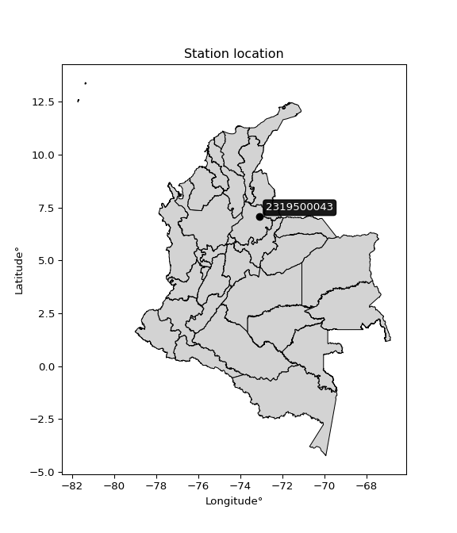</img>

</div>


## A. General information


### 1. General running parameters

• app_version: _v20260312_. • runtime: _2026-03-12 07:15:23.203550_. • Python version: _3.14.0_. • SciPy version: _1.16.3_. • Pandas version: _2.3.3_. • NumPy version: _2.3.5_. • Stations dataset (station_dataset_file): _dataset/pmax24h_in/automatic_colombia_2003_2025.csv_. • Stations catalog (station_catalog_file): _dataset/CNE.xls_. • Minimum year to eval til year_max (date_min): _1900_. • Maximum year to eval since year_min (date_max): _2025_. • Creates, save and include plots into reports (create_plot): _True_. • Plot only fit distributions with Δo > Δ (plot_only_fit): _True_. • Plot only simple graphs avoiding multiple CDFs and multiple Extreme values plots (plot_only_simple): _True_. • Eval low extreme values, if False, evaluates high extreme values (low_extreme): _False_. • Eval every SciPy distribution as logarithmic (pdist_logarithmic_on): _True_. • Standard deviation normalized (ddof): _1.0_. • Return periods to eval in years (Tr): _[2, 2.33, 5, 10, 15, 20, 25, 50, 75, 100, 200, 250, 500, 750, 1000]_. • Minimum data sample per station, 0 means any (minimum_sample): _5_. • Z-Score maximum threshold to adjust a value, 0 means disable (zscore_max): _3.5_. • Z-Score minimum threshold to adjust a value, 0 means disable (zscore_min): _-2.5_. • Avoid zeros, e.g. rain = 0 (avoid_zeros): _True_. • Avoid null values (avoid_nans): _True_. 

:file_folder:Table: [dataset.csv](../../dataset/pmax24h_in/automatic_colombia_2003_2025.csv)

> Delta Degrees of Freedom (DDOF): is a parameter used in the formulas for calculating variance and standard deviation. When ddof=0, the divisor is $N$ (the total number of observations) and this is used when your data set is the entire population. When ddof=1, the divisor is $N-1$ and this is used when your data set is a sample drawn from a larger population. Using $N-1$ provides an unbiased estimate of the population variance (known as Bessel´s correction).


### 2. Station info and location

|   id |     CODIGO | NOMBRE                             | CATEGORIA               | TECNOLOGIA                | ESTADO   | FECHA_INSTALACION   |   FECHA_SUSPENSION |   ALTITUD |   LATITUD |   LONGITUD | DEPARTAMENTO   | MUNICIPIO     | AREA_OPERATIVA                         | ENTIDAD                                                     | AREA_HIDROGRAFICA   | ZONA_HIDROGRAFICA   | SUBZONA_HIDROGRAFICA                      |   CORRIENTE | Catalogo   |   Version |
|-----:|-----------:|:-----------------------------------|:------------------------|:--------------------------|:---------|:--------------------|-------------------:|----------:|----------:|-----------:|:---------------|:--------------|:---------------------------------------|:------------------------------------------------------------|:--------------------|:--------------------|:------------------------------------------|------------:|:-----------|----------:|
|    0 | 2319500043 | FLORIDABLANCA - AUT   [2319500043] | Climatológica Principal | Automática con Telemetría | Activa   | 11/04/2018          |                nan |       894 |    7.0568 |   -73.0906 | Santander      | Floridablanca | Area Operativa 08 - Santanderes-Arauca | INSTITUTO DE HIDROLOGIA METEOROLOGIA Y ESTUDIOS AMBIENTALES | Magdalena Cauca     | Medio Magdalena     | Río Lebrija y otros directos al Magdalena |         nan | CNE_IDEAM  |  20251226 |

<div align="center">

Dynamic map: [:earth_americas:Google](http://maps.google.com/maps?q=7.056797,-73.090627) [:earth_americas:OSM](https://www.openstreetmap.org/#map=18/7.056797/-73.090627&layers=P) [:earth_americas:Bing](https://www.bing.com/maps?cp=7.056797~-73.090627&lvl=18) [:earth_americas:Apple](https://maps.apple.com/frame?center=7.056797%2C-73.090627&span=0.003%2C0.006)

</div>


<div align="center">

```geojson
{
  "type": "Feature",
  "geometry": {
    "type": "Point", 
    "coordinates": [-73.090627, 7.056797]
  }, 
  "properties": {
    "Name": "2319500043"
  }
}
```

</div>


### 3. Discrete values table and plot

<div align="center">

|               |           0 |           1 |            2 |           3 |           4 |          5 |          6 |
|:--------------|------------:|------------:|-------------:|------------:|------------:|-----------:|-----------:|
| Date          | 2019        | 2020        | 2021         | 2022        | 2023        | 2024       | 2025       |
| Value         |   66        |   51        |   54.8       |   71.8      |   40.2      |   20.4     |   77.2     |
| Value_initial |   66        |   51        |   54.8       |   71.8      |   40.2      |   20.4     |   77.2     |
| count         |    7        |    7        |    7         |    7        |    7        |    7       |    7       |
| mean          |   54.4857   |   54.4857   |   54.4857    |   54.4857   |   54.4857   |   54.4857  |   54.4857  |
| std           |   19.6912   |   19.6912   |   19.6912    |   19.6912   |   19.6912   |   19.6912  |   19.6912  |
| zscore        |    0.584742 |   -0.177019 |    0.0159607 |    0.879289 |   -0.725486 |   -1.73101 |    1.15352 |


</div>


<div align="center">

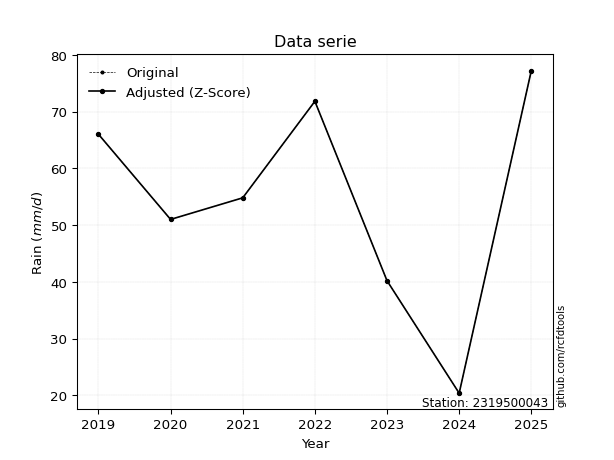</img>

</div>


> The initial value (value_initial) correspond to the initial obtained or null completed value, and value (value) is adjusted only when the initial value is outside the valid range (outlier) definite through the Z-Score value. If Z-Score is active, values out of range or outliers are replaced with the station mean value. A Z-Score (or standard score) measures how many standard deviations a data point is from the mean of a dataset, indicating its relative position; positive scores mean above the mean, negative mean below, and a score of zero is exactly at the mean, allowing for comparison of values from different distributions. It´s calculated using the formula $z=(x–μ)/σ$, where $x$ is the data point, $μ$ is the mean, and $σ$ is the standard deviation, helping identify outliers and understand probability.
>
> <sub>**Note**: In this study, "completing" (filling gaps in) and "extending" (forecasting or lengthening the historical record) rainfall data series are avoided for certain critical analyses because they introduce artificial bias and uncertainty, which can distort the statistics of rare events (extremes), alter day-to-day variability, and compromise the integrity and homogeneity of the original data. Some reasons against Completing/Extending rainfall data are: **Distortion of Extremes and Variability**: The primary issue is that most gap-filling or extension methods rely on averaging or regression with nearby stations, which inherently smooths the data. Rainfall is highly variable in space and time, with a large percentage of zero values and occasional large storms. Infilling methods often underestimate the highest values and overestimate the lowest (zero) values, which severely distorts analyses focused on flood frequency, drought severity, and intensity-duration-frequency (IDF) curves, **Loss of Data Homogeneity**: Infilled or extended data are synthetic estimates, not actual measurements. Combining these estimates with observed data can violate the assumption of data homogeneity, which requires that the data properties do not change over time. Inhomogeneity can lead to incorrect conclusions about long-term trends or changes in climate patterns, **Propagation of Errors**: Errors and biases from the original data (e.g., wind-induced undercatch, instrument errors, site changes) or the data used for imputation can propagate through the analysis, leading to unreliable hydrological models and inaccurate predictions, **Compromised Statistical Integrity**: For statistical analyses, especially those involving the frequency of events, using artificial data can introduce time bias or autocorrelation that doesn´t exist in reality, making it difficult to assess the true probability of events, **Difficulty in Validation**: It is difficult to accurately validate the quality of filled or extended data, especially for past periods where ground-truth measurements are unavailable. The reliability of imputation techniques heavily depends on the density of the surrounding station network and the complexity of the local topography.</sub>


### 4. Active continuous probability distributions from SciPy (80 of 104 available)

A Probability Density Function (PDF) describes the relative likelihood of a continuous random variable falling within a specific range, where the total area under its curve equals 1, and the area over any interval gives the actual probability for that range. Unlike discrete probabilities (like rolling a die), a PDF shows density, not direct probability for a single point (which is zero), with higher points indicating higher likelihood, often visualized as a bell curve for normal distributions.

A log of a probability density function (log-PDF) is simply the logarithm of the PDF´s value, denoted as $log(f(x))$, useful for converting multiplication of probabilities into addition, improving numerical stability with tiny numbers, and connecting to information theory concepts like entropy. Instead of dealing with very small probabilities (e.g., 0.000001), log-PDFs use negative numbers (e.g., $log(0.00001) ≈ -11.51$ that are easier for computers to handle, preventing underflow errors and simplifying complex calculations. In this study, each active probability distribution from SciPy is also evaluated in the $log$ form.

[scipy.stats](https://docs.scipy.org/doc/scipy/reference/stats.html) is a Python´s powerful submodule within the SciPy library for comprehensive statistical analysis, offering over 130 probability distributions (like Normal, Poisson, etc.), functions for descriptive stats (mean, variance), hypothesis testing (t-tests, chi-square), random variable generation, and statistical tests, making it essential for data science, modeling, and research. It provides tools to explore, model, and draw conclusions from data efficiently, working seamlessly with [NumPy](https://numpy.org/).

<div align="center">

|   id | p_dist           |   n_parameter | fit_method   | label                                                                       | active   | ref                                                                                                      |
|-----:|:-----------------|--------------:|:-------------|:----------------------------------------------------------------------------|:---------|:---------------------------------------------------------------------------------------------------------|
|    0 | alpha            |             3 | MLE          | Alpha                                                                       | True     | [:mortar_board:](https://docs.scipy.org/doc/scipy/reference/generated/scipy.stats.alpha.html)            |
|    1 | anglit           |             2 | MM           | Anglit                                                                      | True     | [:mortar_board:](https://docs.scipy.org/doc/scipy/reference/generated/scipy.stats.anglit.html)           |
|    2 | arcsine          |             2 | MM           | Arcsine                                                                     | True     | [:mortar_board:](https://docs.scipy.org/doc/scipy/reference/generated/scipy.stats.arcsine.html)          |
|    3 | argus            |             3 | MLE          | Argus                                                                       | True     | [:mortar_board:](https://docs.scipy.org/doc/scipy/reference/generated/scipy.stats.argus.html)            |
|    4 | beta             |             4 | MLE          | Beta                                                                        | True     | [:mortar_board:](https://docs.scipy.org/doc/scipy/reference/generated/scipy.stats.beta.html)             |
|    5 | betaprime        |             4 | MLE          | Beta prime                                                                  | True     | [:mortar_board:](https://docs.scipy.org/doc/scipy/reference/generated/scipy.stats.betaprime.html)        |
|    6 | bradford         |             3 | MLE          | Bradford                                                                    | True     | [:mortar_board:](https://docs.scipy.org/doc/scipy/reference/generated/scipy.stats.bradford.html)         |
|    7 | burr             |             4 | MLE          | Burr (Type III)                                                             | True     | [:mortar_board:](https://docs.scipy.org/doc/scipy/reference/generated/scipy.stats.burr.html)             |
|    8 | burr12           |             4 | MLE          | Burr (Type III) 12                                                          | True     | [:mortar_board:](https://docs.scipy.org/doc/scipy/reference/generated/scipy.stats.burr12.html)           |
|    9 | cosine           |             2 | MLE          | Cosine                                                                      | True     | [:mortar_board:](https://docs.scipy.org/doc/scipy/reference/generated/scipy.stats.cosine.html)           |
|   10 | crystalball      |             4 | MLE          | Crystalball                                                                 | True     | [:mortar_board:](https://docs.scipy.org/doc/scipy/reference/generated/scipy.stats.crystalball.html)      |
|   11 | dgamma           |             3 | MLE          | Double gamma                                                                | True     | [:mortar_board:](https://docs.scipy.org/doc/scipy/reference/generated/scipy.stats.dgamma.html)           |
|   12 | dweibull         |             3 | MLE          | Double Weibull                                                              | True     | [:mortar_board:](https://docs.scipy.org/doc/scipy/reference/generated/scipy.stats.dweibull.html)         |
|   13 | erlang           |             3 | MLE          | Erlang                                                                      | True     | [:mortar_board:](https://docs.scipy.org/doc/scipy/reference/generated/scipy.stats.erlang.html)           |
|   14 | exponnorm        |             3 | MLE          | Exponentially modified Normal                                               | True     | [:mortar_board:](https://docs.scipy.org/doc/scipy/reference/generated/scipy.stats.exponnorm.html)        |
|   15 | exponpow         |             3 | MLE          | Exponential power                                                           | True     | [:mortar_board:](https://docs.scipy.org/doc/scipy/reference/generated/scipy.stats.exponpow.html)         |
|   16 | exponweib        |             4 | MLE          | Exponentiated Weibull                                                       | True     | [:mortar_board:](https://docs.scipy.org/doc/scipy/reference/generated/scipy.stats.exponweib.html)        |
|   17 | f                |             4 | MLE          | F                                                                           | True     | [:mortar_board:](https://docs.scipy.org/doc/scipy/reference/generated/scipy.stats.f.html)                |
|   18 | fatiguelife      |             3 | MLE          | Fatigue-life (Birnbaum-Saunders)                                            | True     | [:mortar_board:](https://docs.scipy.org/doc/scipy/reference/generated/scipy.stats.fatiguelife.html)      |
|   19 | foldnorm         |             3 | MM           | Fold Normal                                                                 | True     | [:mortar_board:](https://docs.scipy.org/doc/scipy/reference/generated/scipy.stats.foldnorm.html)         |
|   20 | gamma            |             3 | MLE          | Gamma                                                                       | True     | [:mortar_board:](https://docs.scipy.org/doc/scipy/reference/generated/scipy.stats.gamma.html)            |
|   21 | gausshyper       |             6 | MLE          | Gauss hypergeometric                                                        | True     | [:mortar_board:](https://docs.scipy.org/doc/scipy/reference/generated/scipy.stats.gausshyper.html)       |
|   22 | genexpon         |             5 | MLE          | Generalized exponential                                                     | True     | [:mortar_board:](https://docs.scipy.org/doc/scipy/reference/generated/scipy.stats.genexpon.html)         |
|   23 | genextreme       |             3 | MLE          | Generalized exponential                                                     | True     | [:mortar_board:](https://docs.scipy.org/doc/scipy/reference/generated/scipy.stats.genextreme.html)       |
|   24 | gengamma         |             4 | MLE          | Generalized gamma                                                           | True     | [:mortar_board:](https://docs.scipy.org/doc/scipy/reference/generated/scipy.stats.gengamma.html)         |
|   25 | genhalflogistic  |             3 | MLE          | Generalized half-logistic                                                   | True     | [:mortar_board:](https://docs.scipy.org/doc/scipy/reference/generated/scipy.stats.genhalflogistic.html)  |
|   26 | genlogistic      |             3 | MLE          | Generalized logistic                                                        | True     | [:mortar_board:](https://docs.scipy.org/doc/scipy/reference/generated/scipy.stats.genlogistic.html)      |
|   27 | gennorm          |             3 | MLE          | Generalized Normal                                                          | True     | [:mortar_board:](https://docs.scipy.org/doc/scipy/reference/generated/scipy.stats.gennorm.html)          |
|   28 | genpareto        |             3 | MLE          | Generalized Pareto                                                          | True     | [:mortar_board:](https://docs.scipy.org/doc/scipy/reference/generated/scipy.stats.genpareto.html)        |
|   29 | gompertz         |             3 | MLE          | Gompertz (or truncated Gumbel)                                              | True     | [:mortar_board:](https://docs.scipy.org/doc/scipy/reference/generated/scipy.stats.gompertz.html)         |
|   30 | gumbel_l         |             2 | MM           | Gumbel Left Skew                                                            | True     | [:mortar_board:](https://docs.scipy.org/doc/scipy/reference/generated/scipy.stats.gumbel_l.html)         |
|   31 | gumbel_r         |             2 | MM           | Gumbel Right Skew                                                           | True     | [:mortar_board:](https://docs.scipy.org/doc/scipy/reference/generated/scipy.stats.gumbel_r.html)         |
|   32 | halfgennorm      |             3 | MLE          | Upper half of a generalized normal                                          | True     | [:mortar_board:](https://docs.scipy.org/doc/scipy/reference/generated/scipy.stats.halfgennorm.html)      |
|   33 | halflogistic     |             2 | MM           | Half-logistic                                                               | True     | [:mortar_board:](https://docs.scipy.org/doc/scipy/reference/generated/scipy.stats.halflogistic.html)     |
|   34 | halfnorm         |             2 | MM           | Half Normal                                                                 | True     | [:mortar_board:](https://docs.scipy.org/doc/scipy/reference/generated/scipy.stats.halfnorm.html)         |
|   35 | hypsecant        |             2 | MM           | hyperbolic secant                                                           | True     | [:mortar_board:](https://docs.scipy.org/doc/scipy/reference/generated/scipy.stats.hypsecant.html)        |
|   36 | invgamma         |             3 | MLE          | Inverted gamma                                                              | True     | [:mortar_board:](https://docs.scipy.org/doc/scipy/reference/generated/scipy.stats.invgamma.html)         |
|   37 | invgauss         |             3 | MLE          | Inverse Gaussian                                                            | True     | [:mortar_board:](https://docs.scipy.org/doc/scipy/reference/generated/scipy.stats.invgauss.html)         |
|   38 | invweibull       |             3 | MLE          | Inverted Weibull                                                            | True     | [:mortar_board:](https://docs.scipy.org/doc/scipy/reference/generated/scipy.stats.invweibull.html)       |
|   39 | johnsonsb        |             4 | MLE          | Johnson SB                                                                  | True     | [:mortar_board:](https://docs.scipy.org/doc/scipy/reference/generated/scipy.stats.johnsonsb.html)        |
|   40 | johnsonsu        |             4 | MLE          | Johnson Su                                                                  | True     | [:mortar_board:](https://docs.scipy.org/doc/scipy/reference/generated/scipy.stats.johnsonsu.html)        |
|   41 | kappa3           |             3 | MLE          | Kappa 3                                                                     | True     | [:mortar_board:](https://docs.scipy.org/doc/scipy/reference/generated/scipy.stats.kappa3.html)           |
|   42 | kappa4           |             4 | MLE          | Kappa 4                                                                     | True     | [:mortar_board:](https://docs.scipy.org/doc/scipy/reference/generated/scipy.stats.kappa4.html)           |
|   43 | ksone            |             3 | MLE          | Kolmogorov-Smirnov one-sided test statistic distribution                    | True     | [:mortar_board:](https://docs.scipy.org/doc/scipy/reference/generated/scipy.stats.ksone.html)            |
|   44 | kstwobign        |             2 | MLE          | Limiting distribution of scaled Kolmogorov-Smirnov two-sided test statistic | True     | [:mortar_board:](https://docs.scipy.org/doc/scipy/reference/generated/scipy.stats.kstwobign.html)        |
|   45 | laplace          |             2 | MM           | Laplace                                                                     | True     | [:mortar_board:](https://docs.scipy.org/doc/scipy/reference/generated/scipy.stats.laplace.html)          |
|   46 | levy_l           |             2 | MLE          | Left-skewed Levy                                                            | True     | [:mortar_board:](https://docs.scipy.org/doc/scipy/reference/generated/scipy.stats.levy_l.html)           |
|   47 | loggamma         |             3 | MLE          | Log gamma                                                                   | True     | [:mortar_board:](https://docs.scipy.org/doc/scipy/reference/generated/scipy.stats.loggamma.html)         |
|   48 | logistic         |             2 | MM           | Logistic (or Sech-squared)                                                  | True     | [:mortar_board:](https://docs.scipy.org/doc/scipy/reference/generated/scipy.stats.logistic.html)         |
|   49 | loglaplace       |             3 | MLE          | Log-Laplace                                                                 | True     | [:mortar_board:](https://docs.scipy.org/doc/scipy/reference/generated/scipy.stats.loglaplace.html)       |
|   50 | lomax            |             3 | MLE          | Lomax (Pareto of the second kind)                                           | True     | [:mortar_board:](https://docs.scipy.org/doc/scipy/reference/generated/scipy.stats.lomax.html)            |
|   51 | maxwell          |             2 | MM           | Maxwell                                                                     | True     | [:mortar_board:](https://docs.scipy.org/doc/scipy/reference/generated/scipy.stats.maxwell.html)          |
|   52 | mielke           |             4 | MLE          | Mielke Beta-Kappa / Dagum                                                   | True     | [:mortar_board:](https://docs.scipy.org/doc/scipy/reference/generated/scipy.stats.mielke.html)           |
|   53 | moyal            |             2 | MM           | Moyal                                                                       | True     | [:mortar_board:](https://docs.scipy.org/doc/scipy/reference/generated/scipy.stats.moyal.html)            |
|   54 | nakagami         |             3 | MLE          | Nakagami                                                                    | True     | [:mortar_board:](https://docs.scipy.org/doc/scipy/reference/generated/scipy.stats.nakagami.html)         |
|   55 | ncf              |             5 | MLE          | Non-central F distribution                                                  | True     | [:mortar_board:](https://docs.scipy.org/doc/scipy/reference/generated/scipy.stats.ncf.html)              |
|   56 | nct              |             4 | MLE          | Non-central Student’s t                                                     | True     | [:mortar_board:](https://docs.scipy.org/doc/scipy/reference/generated/scipy.stats.nct.html)              |
|   57 | norm             |             2 | MM           | Normal                                                                      | True     | [:mortar_board:](https://docs.scipy.org/doc/scipy/reference/generated/scipy.stats.norm.html)             |
|   58 | pearson3         |             3 | MM           | Pearson type III                                                            | True     | [:mortar_board:](https://docs.scipy.org/doc/scipy/reference/generated/scipy.stats.pearson3.html)         |
|   59 | powerlaw         |             3 | MLE          | Power-function                                                              | True     | [:mortar_board:](https://docs.scipy.org/doc/scipy/reference/generated/scipy.stats.powerlaw.html)         |
|   60 | rayleigh         |             2 | MM           | Rayleigh                                                                    | True     | [:mortar_board:](https://docs.scipy.org/doc/scipy/reference/generated/scipy.stats.rayleigh.html)         |
|   61 | rdist            |             3 | MLE          | R-distributed (symmetric beta)                                              | True     | [:mortar_board:](https://docs.scipy.org/doc/scipy/reference/generated/scipy.stats.rdist.html)            |
|   62 | rice             |             3 | MLE          | Rice                                                                        | True     | [:mortar_board:](https://docs.scipy.org/doc/scipy/reference/generated/scipy.stats.rice.html)             |
|   63 | semicircular     |             2 | MM           | Semicircular                                                                | True     | [:mortar_board:](https://docs.scipy.org/doc/scipy/reference/generated/scipy.stats.semicircular.html)     |
|   64 | skewnorm         |             3 | MLE          | Skew normal                                                                 | True     | [:mortar_board:](https://docs.scipy.org/doc/scipy/reference/generated/scipy.stats.skewnorm.html)         |
|   65 | t                |             3 | MLE          | Student’s t                                                                 | True     | [:mortar_board:](https://docs.scipy.org/doc/scipy/reference/generated/scipy.stats.t.html)                |
|   66 | trapezoid        |             4 | MLE          | Trapezoid                                                                   | True     | [:mortar_board:](https://docs.scipy.org/doc/scipy/reference/generated/scipy.stats.trapezoid.html)        |
|   67 | triang           |             3 | MLE          | Triangular                                                                  | True     | [:mortar_board:](https://docs.scipy.org/doc/scipy/reference/generated/scipy.stats.triang.html)           |
|   68 | truncexpon       |             3 | MLE          | Truncated exponential                                                       | True     | [:mortar_board:](https://docs.scipy.org/doc/scipy/reference/generated/scipy.stats.truncexpon.html)       |
|   69 | truncnorm        |             4 | MLE          | Truncated normal                                                            | True     | [:mortar_board:](https://docs.scipy.org/doc/scipy/reference/generated/scipy.stats.truncnorm.html)        |
|   70 | truncpareto      |             4 | MLE          | Upper truncated Pareto                                                      | True     | [:mortar_board:](https://docs.scipy.org/doc/scipy/reference/generated/scipy.stats.truncpareto.html)      |
|   71 | truncweibull_min |             5 | MLE          | Doubly truncated Weibull minimum                                            | True     | [:mortar_board:](https://docs.scipy.org/doc/scipy/reference/generated/scipy.stats.truncweibull_min.html) |
|   72 | tukeylambda      |             3 | MLE          | Tukey-Lamdba                                                                | True     | [:mortar_board:](https://docs.scipy.org/doc/scipy/reference/generated/scipy.stats.tukeylambda.html)      |
|   73 | uniform          |             2 | MLE          | Uniform                                                                     | True     | [:mortar_board:](https://docs.scipy.org/doc/scipy/reference/generated/scipy.stats.uniform.html)          |
|   74 | vonmises         |             3 | MLE          | Von Mises                                                                   | True     | [:mortar_board:](https://docs.scipy.org/doc/scipy/reference/generated/scipy.stats.vonmises.html)         |
|   75 | vonmises_line    |             3 | MLE          | Von Mises line                                                              | True     | [:mortar_board:](https://docs.scipy.org/doc/scipy/reference/generated/scipy.stats.vonmises_line.html)    |
|   76 | wald             |             2 | MM           | Wald                                                                        | True     | [:mortar_board:](https://docs.scipy.org/doc/scipy/reference/generated/scipy.stats.wald.html)             |
|   77 | weibull_max      |             3 | MLE          | Weibull maximum                                                             | True     | [:mortar_board:](https://docs.scipy.org/doc/scipy/reference/generated/scipy.stats.weibull_max.html)      |
|   78 | weibull_min      |             3 | MLE          | Weibull minimum                                                             | True     | [:mortar_board:](https://docs.scipy.org/doc/scipy/reference/generated/scipy.stats.weibull_min.html)      |
|   79 | wrapcauchy       |             3 | MLE          | Wrapped  Cauchy                                                             | True     | [:mortar_board:](https://docs.scipy.org/doc/scipy/reference/generated/scipy.stats.wrapcauchy.html)       |

</div>

> **n_parameter:** # arguments & localization & scale.
>
> **Fit methods:** (MLE) maximum likelihood, (MM) L-moments.
>
>**Inactive** (With the only purpose of prevent loops, zero divisions, infinite values, over high estimated values or horizontal trending for recurrence intervals estimations, the follow distributions were disabled.)**:** lognorm, norminvgauss, powernorm, powerlognorm, cauchy, halfcauchy, foldcauchy, skewcauchy, chi2, expon, fisk, genhyperbolic, geninvgauss, gibrat, kstwo, laplace_asymmetric, levy, levy_stable, ncx2, pareto, rel_breitwigner, recipinvgauss, studentized_range, loguniform, 


## B. Probability (PDF) vs. Empirical (EDF) distributions functions

A continuous probability distribution (CPD) describes probabilities for variables that can take any value within a range (like rain any time), unlike discrete variables with specific outcomes (like temperature). It uses a Probability Density Function (PDF), a curve where the total area under it equals 1, and the probability of the variable falling within an interval (a to b) is found by calculating the area under the curve between those points. A key feature is that the probability of hitting any single exact value is zero, so probabilities are always expressed for ranges, e.g., $P(a ≤ X ≤ b)$.

<div align="center">

Distributions parameters from station values
|     |    station | p_dist              |   n |              loc |           scale | shape                  | shape1                 | shape2                | shape3             |
|----:|-----------:|:--------------------|----:|-----------------:|----------------:|:-----------------------|:-----------------------|:----------------------|:-------------------|
|   0 | 2319500043 | alpha               |   7 |   -310.946       |  7053.12        | 19.349906056181403     |                        |                       |                    |
|   1 | 2319500043 | anglit              |   7 |     54.4857      |    53.3316      |                        |                        |                       |                    |
|   2 | 2319500043 | arcsine             |   7 |     28.7038      |    51.5638      |                        |                        |                       |                    |
|   3 | 2319500043 | argus               |   7 |      4.97502     |    74.427       | 1.6968756247321406     |                        |                       |                    |
|   4 | 2319500043 | beta                |   7 |      7.50269     |    69.6973      | 1.8921831504596254     | 0.5873553063459078     |                       |                    |
|   5 | 2319500043 | betaprime           |   7 |   -294.84        | 59246.2         | 354.34954020764013     | 60069.11538737868      |                       |                    |
|   6 | 2319500043 | bradford            |   7 |     20.3999      |    56.8117      | 0.6297248054720853     |                        |                       |                    |
|   7 | 2319500043 | burr                |   7 |     -1.66152     |    79.3556      | 554.4721554397737      | 0.00433354933839915    |                       |                    |
|   8 | 2319500043 | burr12              |   7 |     -3.04347     |    23.2725      | 573.4267485563014      | 0.0020784666314955474  |                       |                    |
|   9 | 2319500043 | cosine              |   7 |     52.7882      |    15.3447      |                        |                        |                       |                    |
|  10 | 2319500043 | crystalball         |   7 |     54.4857      |    18.2305      | 7143.67860311535       | 2755.5271644790437     |                       |                    |
|  11 | 2319500043 | dgamma              |   7 |     53.2773      |    11.4812      | 1.305526285420989      |                        |                       |                    |
|  12 | 2319500043 | dweibull            |   7 |     54.8         |    12.1641      | 0.5847880977230835     |                        |                       |                    |
|  13 | 2319500043 | erlang              |   7 |   -234.635       |     1.21557     | 237.9412676303183      |                        |                       |                    |
|  14 | 2319500043 | exponnorm           |   7 |     54.4706      |    18.2305      | 0.0008225131156488097  |                        |                       |                    |
|  15 | 2319500043 | exponpow            |   7 |     20.4         |     1.94599     | 0.10702762109230488    |                        |                       |                    |
|  16 | 2319500043 | exponweib           |   7 |     20.4         |     0.984875    | 1.371314866685493      | 0.17931041222630584    |                       |                    |
|  17 | 2319500043 | f                   |   7 |  -6513.64        |  6568.08        | 329985.50076437136     | 1195348.9669499865     |                       |                    |
|  18 | 2319500043 | fatiguelife         |   7 |     20.4         |     8.10894e-05 | 564.4022603118825      |                        |                       |                    |
|  19 | 2319500043 | foldnorm            |   7 |     58.0214      |     0.65192     | 4.800788638649315e-07  |                        |                       |                    |
|  20 | 2319500043 | gamma               |   7 |   -222.805       |     1.2579      | 220.4448603769257      |                        |                       |                    |
|  21 | 2319500043 | gausshyper          |   7 |     19.6697      |    57.5303      | 1.1306588310252996     | 0.578487951850658      | 1.0285590215359939    | 0.8962843958210194 |
|  22 | 2319500043 | genexpon            |   7 |     20.3999      |     0.872072    | 0.02531210181032322    | 0.00017500568657879577 | 1.3582228940151189    |                    |
|  23 | 2319500043 | genextreme          |   7 |     55.226       |    25.7575      | 1.1721780069647922     |                        |                       |                    |
|  24 | 2319500043 | gengamma            |   7 |     20.4         |     1.11185     | 1.3696842310894826     | 0.25968339856574324    |                       |                    |
|  25 | 2319500043 | genhalflogistic     |   7 |     15.3056      |    63.6205      | 1.0278888478556962     |                        |                       |                    |
|  26 | 2319500043 | genlogistic         |   7 |     77.2002      |     5.12818e-06 | 2.2579652489352776e-07 |                        |                       |                    |
|  27 | 2319500043 | gennorm             |   7 |     48.8         |    28.4         | 32732251.051667243     |                        |                       |                    |
|  28 | 2319500043 | genpareto           |   7 |     -0.0730922   |   137.73        | -1.7823745825231212    |                        |                       |                    |
|  29 | 2319500043 | gompertz            |   7 |    -42.6964      |    14.4082      | 0.0006511668688572655  |                        |                       |                    |
|  30 | 2319500043 | gumbel_l            |   7 |     62.6904      |    14.2143      |                        |                        |                       |                    |
|  31 | 2319500043 | gumbel_r            |   7 |     46.281       |    14.2143      |                        |                        |                       |                    |
|  32 | 2319500043 | halfgennorm         |   7 |     20.4         |     1.1871      | 0.34799633448712464    |                        |                       |                    |
|  33 | 2319500043 | halflogistic        |   7 |     32.8783      |    15.5865      |                        |                        |                       |                    |
|  34 | 2319500043 | halfnorm            |   7 |     30.3556      |    30.2426      |                        |                        |                       |                    |
|  35 | 2319500043 | hypsecant           |   7 |     54.4857      |    11.6059      |                        |                        |                       |                    |
|  36 | 2319500043 | invgamma            |   7 |   -193.477       | 42241.9         | 171.33506452306682     |                        |                       |                    |
|  37 | 2319500043 | invgauss            |   7 |    -29.5365      |  1310.82        | 0.0641112985699624     |                        |                       |                    |
|  38 | 2319500043 | invweibull          |   7 |     20.4         |     1.21237e-07 | 0.11353652107164194    |                        |                       |                    |
|  39 | 2319500043 | johnsonsb           |   7 |      6.94543     |    70.2546      | -0.6582761437336431    | 0.12333377784381386    |                       |                    |
|  40 | 2319500043 | johnsonsu           |   7 |     87.1691      |     0.53369     | 7.5934470145303        | 1.6382155828914875     |                       |                    |
|  41 | 2319500043 | kappa3              |   7 |     20.4         |    56.7264      | 1491.7235614388778     |                        |                       |                    |
|  42 | 2319500043 | kappa4              |   7 |     13.2804      |    66.272       | 1.1206354572255575     | 1.0364448324955486     |                       |                    |
|  43 | 2319500043 | ksone               |   7 |     14.72        |    68.16        | 1.0                    |                        |                       |                    |
|  44 | 2319500043 | kstwobign           |   7 |    -22.1624      |    87.5739      |                        |                        |                       |                    |
|  45 | 2319500043 | laplace             |   7 |     54.4857      |    12.8909      |                        |                        |                       |                    |
|  46 | 2319500043 | levy_l              |   7 |     78.9721      |     7.7709      |                        |                        |                       |                    |
|  47 | 2319500043 | loggamma            |   7 |     77.2005      |     4.35538e-05 | 1.9157578810503277e-06 |                        |                       |                    |
|  48 | 2319500043 | logistic            |   7 |     54.4857      |    10.051       |                        |                        |                       |                    |
|  49 | 2319500043 | loglaplace          |   7 |     -0.157053    |    54.9571      | 3.2636251811469585     |                        |                       |                    |
|  50 | 2319500043 | lomax               |   7 |     20.4         |     1.69083e+11 | 3002957494.419997      |                        |                       |                    |
|  51 | 2319500043 | maxwell             |   7 |     11.287       |    27.0708      |                        |                        |                       |                    |
|  52 | 2319500043 | mielke              |   7 |    -13.2561      |    90.7408      | 2.9695840827999307     | 1315.8865784989725     |                       |                    |
|  53 | 2319500043 | moyal               |   7 |     44.0603      |     8.20663     |                        |                        |                       |                    |
|  54 | 2319500043 | nakagami            |   7 |     40.2         |    20.0787      | 0.16267275473879006    |                        |                       |                    |
|  55 | 2319500043 | ncf                 |   7 |     -9.82702     |     1.3479      | 0.9697633919071129     | 4538.494225423086      | 45.360885470708126    |                    |
|  56 | 2319500043 | nct                 |   7 |  -1080.45        |    18.1538      | 196946.17383194965     | 62.517052817744364     |                       |                    |
|  57 | 2319500043 | norm                |   7 |     54.4857      |    18.2305      |                        |                        |                       |                    |
|  58 | 2319500043 | pearson3            |   7 |     54.4857      |    18.2305      | -0.5687881880016972    |                        |                       |                    |
|  59 | 2319500043 | powerlaw            |   7 |     20.4         |    56.8         | 0.17586173029894644    |                        |                       |                    |
|  60 | 2319500043 | rayleigh            |   7 |     19.6096      |    27.8271      |                        |                        |                       |                    |
|  61 | 2319500043 | rdist               |   7 |     16.1917      |    34.8083      | 1.0038639584015394     |                        |                       |                    |
|  62 | 2319500043 | rice                |   7 |      8.90627     |    19.8375      | 2.0306883110717298     |                        |                       |                    |
|  63 | 2319500043 | semicircular        |   7 |     54.4857      |    36.4611      |                        |                        |                       |                    |
|  64 | 2319500043 | skewnorm            |   7 |     77.2         |    29.1244      | -12361345.344670642    |                        |                       |                    |
|  65 | 2319500043 | t                   |   7 |     54.4824      |    18.2289      | 949126.7610432671      |                        |                       |                    |
|  66 | 2319500043 | trapezoid           |   7 |      2.92196     |    77.3456      | 1.0                    | 1.0                    |                       |                    |
|  67 | 2319500043 | triang              |   7 |      2.87975     |    74.3203      | 0.9999996491661807     |                        |                       |                    |
|  68 | 2319500043 | truncexpon          |   7 |     20.4         |    86.259       | 0.6584827693720299     |                        |                       |                    |
|  69 | 2319500043 | truncnorm           |   7 |     54.4857      |    18.2305      | -145.31538928738124    | 101.96961556211627     |                       |                    |
|  70 | 2319500043 | truncpareto         |   7 |     20.364       |     0.0359701   | 0.16786420185630935    | 1580.0876570512528     |                       |                    |
|  71 | 2319500043 | truncweibull_min    |   7 |     17.9587      |    80.5547      | 1.3913742016466868     | 0.00040263083398593626 | 0.7354170622974414    |                    |
|  72 | 2319500043 | tukeylambda         |   7 |     35.7         |    15.5023      | 1.01322200770562       |                        |                       |                    |
|  73 | 2319500043 | uniform             |   7 |     20.4         |    56.8         |                        |                        |                       |                    |
|  74 | 2319500043 | vonmises            |   7 |      2.29064     |     1           | 1.1831778207738513     |                        |                       |                    |
|  75 | 2319500043 | vonmises_line       |   7 |     48.3525      |     9.18246     | 7.949239785501067e-06  |                        |                       |                    |
|  76 | 2319500043 | wald                |   7 |     36.2551      |    18.2306      |                        |                        |                       |                    |
|  77 | 2319500043 | weibull_max         |   7 |     77.2         |     1.32738     | 0.2996436881688972     |                        |                       |                    |
|  78 | 2319500043 | weibull_min         |   7 |     -3.09019e+08 |     3.09019e+08 | 21465925.24991721      |                        |                       |                    |
|  79 | 2319500043 | wrapcauchy          |   7 |     20.3996      |     9.04006     | 0.1798137635971478     |                        |                       |                    |
|  80 | 2319500043 | logalpha            |   7 |     -9.805       |   414.78        | 30.263644914689685     |                        |                       |                    |
|  81 | 2319500043 | loganglit           |   7 |      3.92212     |     1.2392      |                        |                        |                       |                    |
|  82 | 2319500043 | logarcsine          |   7 |      3.32305     |     1.19814     |                        |                        |                       |                    |
|  83 | 2319500043 | logargus            |   7 |      2.48259     |     1.89922     | 2.544010210452691      |                        |                       |                    |
|  84 | 2319500043 | logbeta             |   7 |      2.7858      |     1.5606      | 1.1999693620036644     | 0.3611773173399675     |                       |                    |
|  85 | 2319500043 | logbetaprime        |   7 |     -9.75131     |    11.212       | 2093.2612131138267     | 1717.7416936678328     |                       |                    |
|  86 | 2319500043 | logbradford         |   7 |      2.96374     |     1.38634     | 5.768999015577474e-07  |                        |                       |                    |
|  87 | 2319500043 | logburr             |   7 |     -0.903136    |     5.25693     | 2415.9129075924843     | 0.004606498648006201   |                       |                    |
|  88 | 2319500043 | logburr12           |   7 |   -105.435       |   112.509       | 388.0649347267415      | 32205.98472154337      |                       |                    |
|  89 | 2319500043 | logcosine           |   7 |      3.84771     |     0.373025    |                        |                        |                       |                    |
|  90 | 2319500043 | logcrystalball      |   7 |      3.92212     |     0.423602    | 9.680438345889343      | 1.4390495961669272     |                       |                    |
|  91 | 2319500043 | logdgamma           |   7 |      4.00369     |     0.507916    | 0.42770213283294584    |                        |                       |                    |
|  92 | 2319500043 | logdweibull         |   7 |      4.00369     |     0.314539    | 0.9834064550171854     |                        |                       |                    |
|  93 | 2319500043 | logerlang           |   7 |     -2.63902     |     0.0304513   | 215.43728065077505     |                        |                       |                    |
|  94 | 2319500043 | logexponnorm        |   7 |      3.92185     |     0.423603    | 0.000648628994300242   |                        |                       |                    |
|  95 | 2319500043 | logexponpow         |   7 |     -4.51444e+07 |     4.51444e+07 | 130998586.36499743     |                        |                       |                    |
|  96 | 2319500043 | logexponweib        |   7 | -10649.3         | 10653.6         | 0.11440188881135965    | 228900.82138197054     |                       |                    |
|  97 | 2319500043 | logf                |   7 |   -599.588       |   603.508       | 14205093.828075103     | 5682030.4422576        |                       |                    |
|  98 | 2319500043 | logfatiguelife      |   7 |   -317.368       |   321.29        | 0.001322140061129943   |                        |                       |                    |
|  99 | 2319500043 | logfoldnorm         |   7 |      3.31546     |     0.490146    | 1.1044245913323638     |                        |                       |                    |
| 100 | 2319500043 | loggamma            |   7 |      3.01553     |     2.10924     | 0.1774259036410062     |                        |                       |                    |
| 101 | 2319500043 | loggausshyper       |   7 |      2.99495     |     1.35145     | 1.233718797126441      | 0.6687781143900723     | 1.0727361697772082    | 0.9355668881697867 |
| 102 | 2319500043 | loggenexpon         |   7 |      3.01553     |     0.0140629   | 0.004840808386537895   | 2.7215475049710056     | 9.949087639373032e-05 |                    |
| 103 | 2319500043 | loggenextreme       |   7 |      3.92023     |     0.494305    | 1.1598729344759344     |                        |                       |                    |
| 104 | 2319500043 | loggengamma         |   7 |     -3.64411e+07 |     3.64411e+07 | 0.9285247401513941     | 126157108.20525926     |                       |                    |
| 105 | 2319500043 | loggenhalflogistic  |   7 |      3.00043     |     1.42187     | 1.0563846517563111     |                        |                       |                    |
| 106 | 2319500043 | loggenlogistic      |   7 |      4.34641     |     2.90008e-07 | 6.795727767901053e-07  |                        |                       |                    |
| 107 | 2319500043 | loggennorm          |   7 |      4.00369     |     0.305966    | 0.9892741433972885     |                        |                       |                    |
| 108 | 2319500043 | loggenpareto        |   7 |     -0.00441993  |    10.9012      | -2.5055619314459268    |                        |                       |                    |
| 109 | 2319500043 | loggompertz         |   7 |      3.01553     |     0.310589    | 0.03181073601920255    |                        |                       |                    |
| 110 | 2319500043 | loggumbel_l         |   7 |      4.11277     |     0.330281    |                        |                        |                       |                    |
| 111 | 2319500043 | loggumbel_r         |   7 |      3.73148     |     0.330281    |                        |                        |                       |                    |
| 112 | 2319500043 | loghalfgennorm      |   7 |      3.01553     |     1.33112     | 44582.50641301146      |                        |                       |                    |
| 113 | 2319500043 | loghalflogistic     |   7 |      3.42004     |     0.362174    |                        |                        |                       |                    |
| 114 | 2319500043 | loghalfnorm         |   7 |      3.36141     |     0.70274     |                        |                        |                       |                    |
| 115 | 2319500043 | loghypsecant        |   7 |      3.92212     |     0.269673    |                        |                        |                       |                    |
| 116 | 2319500043 | loginvgamma         |   7 |     -7.96913     |  8900.49        | 749.1001207978902      |                        |                       |                    |
| 117 | 2319500043 | loginvgauss         |   7 |     -1.00221     |   566.091       | 0.008687870560548549   |                        |                       |                    |
| 118 | 2319500043 | loginvweibull       |   7 |     -5.08499e+07 |     5.08499e+07 | 106423173.9090217      |                        |                       |                    |
| 119 | 2319500043 | logjohnsonsb        |   7 |      2.15258     |     2.19382     | -0.6984689837055515    | 0.08591767947242027    |                       |                    |
| 120 | 2319500043 | logjohnsonsu        |   7 |      4.3828      |     0.00100721  | 5.615047168223089      | 0.8902703482289636     |                       |                    |
| 121 | 2319500043 | logkappa3           |   7 |      3.01553     |     1.32833     | 1025.5587843171645     |                        |                       |                    |
| 122 | 2319500043 | logkappa4           |   7 |      2.87909     |     1.58988     | 1.0855929980683996     | 1.0835286736789784     |                       |                    |
| 123 | 2319500043 | logksone            |   7 |      2.88245     |     1.59704     | 1.0                    |                        |                       |                    |
| 124 | 2319500043 | logkstwobign        |   7 |      1.93065     |     2.27709     |                        |                        |                       |                    |
| 125 | 2319500043 | loglaplace          |   7 |      3.92212     |     0.299532    |                        |                        |                       |                    |
| 126 | 2319500043 | loglevy_l           |   7 |      4.37303     |     0.116115    |                        |                        |                       |                    |
| 127 | 2319500043 | logloggamma         |   7 |      4.34641     |     3.39896e-07 | 8.009996165038448e-07  |                        |                       |                    |
| 128 | 2319500043 | loglogistic         |   7 |      3.92212     |     0.233544    |                        |                        |                       |                    |
| 129 | 2319500043 | logloglaplace       |   7 |     -0.124704    |     4.12839     | 12.595283774357661     |                        |                       |                    |
| 130 | 2319500043 | loglomax            |   7 |      3.01553     |  1249.33        | 1379.1000078029067     |                        |                       |                    |
| 131 | 2319500043 | logmaxwell          |   7 |      2.91836     |     0.629012    |                        |                        |                       |                    |
| 132 | 2319500043 | logmielke           |   7 |     -3.00675e+07 |     3.00675e+07 | 68293235.64942262      | 3620521972.488138      |                       |                    |
| 133 | 2319500043 | logmoyal            |   7 |      3.67988     |     0.190688    |                        |                        |                       |                    |
| 134 | 2319500043 | lognakagami         |   7 |      3.69387     |     0.361484    | 0.22864796710769736    |                        |                       |                    |
| 135 | 2319500043 | logncf              |   7 |    -23.5854      |    25.939       | 14920.592360812163     | 17287.25599920182      | 898.338793133236      |                    |
| 136 | 2319500043 | lognct              |   7 |    -19.8731      |     0.368743    | 5910.326944488734      | 64.52068483436375      |                       |                    |
| 137 | 2319500043 | lognorm             |   7 |      3.92212     |     0.423602    |                        |                        |                       |                    |
| 138 | 2319500043 | logpearson3         |   7 |      3.92212     |     0.423602    | -1.1604158058788512    |                        |                       |                    |
| 139 | 2319500043 | logpowerlaw         |   7 |      3.01553     |     1.33086     | 0.1883613444752448     |                        |                       |                    |
| 140 | 2319500043 | lograyleigh         |   7 |      3.11177     |     0.64657     |                        |                        |                       |                    |
| 141 | 2319500043 | logrdist            |   7 |      3.61718     |     0.72922     | 1.0945205963651565     |                        |                       |                    |
| 142 | 2319500043 | logrice             |   7 |   -206.914       |     0.42422     | 496.99654524416246     |                        |                       |                    |
| 143 | 2319500043 | logsemicircular     |   7 |      3.92212     |     0.847214    |                        |                        |                       |                    |
| 144 | 2319500043 | logskewnorm         |   7 |      4.3464      |     0.599547    | -24076415.602989323    |                        |                       |                    |
| 145 | 2319500043 | logt                |   7 |      4.04356     |     0.272076    | 2.6119459310482176     |                        |                       |                    |
| 146 | 2319500043 | logtrapezoid        |   7 |      2.724       |     1.79719     | 1.0                    | 1.0                    |                       |                    |
| 147 | 2319500043 | logtriang           |   7 |      2.78079     |     1.56561     | 0.9999989712058668     |                        |                       |                    |
| 148 | 2319500043 | logtruncexpon       |   7 |      3.01553     |     1.83422     | 0.7255802356021823     |                        |                       |                    |
| 149 | 2319500043 | logtruncnorm        |   7 |     -0.153825    |     1.13879     | 3.3787427684841234     | 3.9517652656895184     |                       |                    |
| 150 | 2319500043 | logtruncpareto      |   7 |      3.01455     |     0.000988146 | 0.16781469582243203    | 1347.8299885871406     |                       |                    |
| 151 | 2319500043 | logtruncweibull_min |   7 |      3.01388     |     1.80272     | 1.0122392757752514     | 0.0009025147466826583  | 0.7391731909199875    |                    |
| 152 | 2319500043 | logtukeylambda      |   7 |      4.00345     |     0.442302    | 1.2896933073302965     |                        |                       |                    |
| 153 | 2319500043 | loguniform          |   7 |      3.01553     |     1.33086     |                        |                        |                       |                    |
| 154 | 2319500043 | logvonmises         |   7 |     -2.34575     |     1           | 6.150045071963438      |                        |                       |                    |
| 155 | 2319500043 | logvonmises_line    |   7 |      4.01063     |     0.316749    | 1.1677866441731029     |                        |                       |                    |
| 156 | 2319500043 | logwald             |   7 |      3.4985      |     0.423617    |                        |                        |                       |                    |
| 157 | 2319500043 | logweibull_max      |   7 |      4.3464      |     0.399943    | 0.7177665924458614     |                        |                       |                    |
| 158 | 2319500043 | logweibull_min      |   7 |     -3.18761e+07 |     3.18761e+07 | 112626168.85917053     |                        |                       |                    |
| 159 | 2319500043 | logwrapcauchy       |   7 |      3.01553     |     0.211814    | 0.5                    |                        |                       |                    |

</div>

> **loc** (Location parameter): This shifts the distribution along the x-axis. For many common distributions, like the normal (Gaussian) distribution, loc represents the mean $μ$. For others, like the uniform distribution, it might represent the minimum value, or for the beta distribution, the left end of the support interval.
>
> **scale** (Scale parameter): This determines the width or spread of the distribution. For the normal distribution, scale represents the standard deviation $σ$. For a uniform distribution, it defines the length of the interval (from $loc$ to $loc + scale$).
>
> **shape** (Shape parameters): Refers to parameters that define the specific form of a probability distribution, distinct from its location (loc) and scale (scale). These parameters are required arguments for most distribution functions. For example, a normal (Gaussian) distribution is fully defined by its location (mean) and scale (standard deviation), so it has no specific shape parameters beyond loc and scale. However, other distributions have intrinsic properties that need specification, as Gamma distribution that takes a shape parameter, often named $a$ or $alpha$.


### 0. Cumulative distribution values - CDF (160 evaluated)

Cumulative Distribution Function (CDF), denoted as $F$<sub>$X$</sub>$(x)$, is a function that gives the probability that a random variable $X$ will take a value less than or equal to a specific value, $x$ (i.e., $(P(X≥x)$. It essentially "accumulates" probabilities from a given point up to the far right (positive infinity), providing a complete picture of the distribution´s probabilities for both discrete (like rain) and continuous (like temperature) variables, helping to find probabilities over ranges or above certain values. Each station is evaluated separately ordering the $x$ values ascending, calculating the CDF and PDF values for the activated distributions and their logarithmic forms.

<div align="center">

CDF ordered by x ascending and calculating $log(f(x))$ separately
|   id |    Station |   date |    x |   count |    mean |     std |     zscore |   Value_initial |    station |   m |     alpha |   alpha_pdf |    anglit |   anglit_pdf |   arcsine |   arcsine_pdf |     argus |   argus_pdf |      beta |       beta_pdf |   betaprime |   betaprime_pdf |    bradford |   bradford_pdf |      burr |    burr_pdf |     burr12 |   burr12_pdf |    cosine |   cosine_pdf |   crystalball |   crystalball_pdf |    dgamma |   dgamma_pdf |   dweibull |   dweibull_pdf |   erlang |   erlang_pdf |   exponnorm |   exponnorm_pdf |   exponpow |   exponpow_pdf |   exponweib |   exponweib_pdf |         f |      f_pdf |   fatiguelife |   fatiguelife_pdf |   foldnorm |   foldnorm_pdf |     gamma |   gamma_pdf |   gausshyper |   gausshyper_pdf |    genexpon |   genexpon_pdf |   genextreme |   genextreme_pdf |    gengamma |   gengamma_pdf |   genhalflogistic |   genhalflogistic_pdf |   genlogistic |   genlogistic_pdf |     gennorm |   gennorm_pdf |   genpareto |   genpareto_pdf |   gompertz |   gompertz_pdf |   gumbel_l |   gumbel_l_pdf |   gumbel_r |   gumbel_r_pdf |   halfgennorm |   halfgennorm_pdf |   halflogistic |   halflogistic_pdf |   halfnorm |   halfnorm_pdf |   hypsecant |   hypsecant_pdf |   invgamma |   invgamma_pdf |   invgauss |   invgauss_pdf |   invweibull |   invweibull_pdf |   johnsonsb |   johnsonsb_pdf |   johnsonsu |   johnsonsu_pdf |      kappa3 |   kappa3_pdf |      kappa4 |   kappa4_pdf |     ksone |   ksone_pdf |   kstwobign |   kstwobign_pdf |   laplace |   laplace_pdf |   levy_l |   levy_l_pdf |   loggamma |   loggamma_pdf |   logistic |   logistic_pdf |   loglaplace |   loglaplace_pdf |       lomax |   lomax_pdf |    maxwell |   maxwell_pdf |    mielke |   mielke_pdf |       moyal |   moyal_pdf |    nakagami |   nakagami_pdf |       ncf |    ncf_pdf |       nct |    nct_pdf |      norm |   norm_pdf |   pearson3 |   pearson3_pdf |   powerlaw |   powerlaw_pdf |    rayleigh |   rayleigh_pdf |    rdist |       rdist_pdf |      rice |   rice_pdf |   semicircular |   semicircular_pdf |   skewnorm |   skewnorm_pdf |        t |      t_pdf |   trapezoid |   trapezoid_pdf |    triang |   triang_pdf |   truncexpon |   truncexpon_pdf |   truncnorm |   truncnorm_pdf |   truncpareto |   truncpareto_pdf |   truncweibull_min |   truncweibull_min_pdf |   tukeylambda |   tukeylambda_pdf |   uniform |   uniform_pdf |   vonmises |   vonmises_pdf |   vonmises_line |   vonmises_line_pdf |      wald |   wald_pdf |   weibull_max |   weibull_max_pdf |   weibull_min |   weibull_min_pdf |   wrapcauchy |   wrapcauchy_pdf |   logalpha |   logalpha_pdf |   loganglit |   loganglit_pdf |   logarcsine |   logarcsine_pdf |   logargus |   logargus_pdf |   logbeta |   logbeta_pdf |   logbetaprime |   logbetaprime_pdf |   logbradford |   logbradford_pdf |   logburr |   logburr_pdf |   logburr12 |   logburr12_pdf |   logcosine |   logcosine_pdf |   logcrystalball |   logcrystalball_pdf |   logdgamma |   logdgamma_pdf |   logdweibull |   logdweibull_pdf |   logerlang |   logerlang_pdf |   logexponnorm |   logexponnorm_pdf |   logexponpow |   logexponpow_pdf |   logexponweib |   logexponweib_pdf |      logf |   logf_pdf |   logfatiguelife |   logfatiguelife_pdf |   logfoldnorm |   logfoldnorm_pdf |   loggausshyper |   loggausshyper_pdf |   loggenexpon |   loggenexpon_pdf |   loggenextreme |   loggenextreme_pdf |   loggengamma |   loggengamma_pdf |   loggenhalflogistic |   loggenhalflogistic_pdf |   loggenlogistic |   loggenlogistic_pdf |   loggennorm |   loggennorm_pdf |   loggenpareto |   loggenpareto_pdf |   loggompertz |   loggompertz_pdf |   loggumbel_l |   loggumbel_l_pdf |   loggumbel_r |   loggumbel_r_pdf |   loghalfgennorm |   loghalfgennorm_pdf |   loghalflogistic |   loghalflogistic_pdf |   loghalfnorm |   loghalfnorm_pdf |   loghypsecant |   loghypsecant_pdf |   loginvgamma |   loginvgamma_pdf |   loginvgauss |   loginvgauss_pdf |   loginvweibull |   loginvweibull_pdf |   logjohnsonsb |   logjohnsonsb_pdf |   logjohnsonsu |   logjohnsonsu_pdf |   logkappa3 |   logkappa3_pdf |   logkappa4 |   logkappa4_pdf |   logksone |   logksone_pdf |   logkstwobign |   logkstwobign_pdf |   loglevy_l |   loglevy_l_pdf |   logloggamma |   logloggamma_pdf |   loglogistic |   loglogistic_pdf |   logloglaplace |   logloglaplace_pdf |    loglomax |   loglomax_pdf |   logmaxwell |   logmaxwell_pdf |   logmielke |   logmielke_pdf |    logmoyal |   logmoyal_pdf |   lognakagami |   lognakagami_pdf |    logncf |   logncf_pdf |    lognct |   lognct_pdf |   lognorm |   lognorm_pdf |   logpearson3 |   logpearson3_pdf |   logpowerlaw |   logpowerlaw_pdf |   lograyleigh |   lograyleigh_pdf |   logrdist |   logrdist_pdf |   logrice |   logrice_pdf |   logsemicircular |   logsemicircular_pdf |   logskewnorm |   logskewnorm_pdf |      logt |   logt_pdf |   logtrapezoid |   logtrapezoid_pdf |   logtriang |   logtriang_pdf |   logtruncexpon |   logtruncexpon_pdf |   logtruncnorm |   logtruncnorm_pdf |   logtruncpareto |   logtruncpareto_pdf |   logtruncweibull_min |   logtruncweibull_min_pdf |   logtukeylambda |   logtukeylambda_pdf |   loguniform |   loguniform_pdf |   logvonmises |   logvonmises_pdf |   logvonmises_line |   logvonmises_line_pdf |   logwald |   logwald_pdf |   logweibull_max |   logweibull_max_pdf |   logweibull_min |   logweibull_min_pdf |   logwrapcauchy |   logwrapcauchy_pdf |
|-----:|-----------:|-------:|-----:|--------:|--------:|--------:|-----------:|----------------:|-----------:|----:|----------:|------------:|----------:|-------------:|----------:|--------------:|----------:|------------:|----------:|---------------:|------------:|----------------:|------------:|---------------:|----------:|------------:|-----------:|-------------:|----------:|-------------:|--------------:|------------------:|----------:|-------------:|-----------:|---------------:|---------:|-------------:|------------:|----------------:|-----------:|---------------:|------------:|----------------:|----------:|-----------:|--------------:|------------------:|-----------:|---------------:|----------:|------------:|-------------:|-----------------:|------------:|---------------:|-------------:|-----------------:|------------:|---------------:|------------------:|----------------------:|--------------:|------------------:|------------:|--------------:|------------:|----------------:|-----------:|---------------:|-----------:|---------------:|-----------:|---------------:|--------------:|------------------:|---------------:|-------------------:|-----------:|---------------:|------------:|----------------:|-----------:|---------------:|-----------:|---------------:|-------------:|-----------------:|------------:|----------------:|------------:|----------------:|------------:|-------------:|------------:|-------------:|----------:|------------:|------------:|----------------:|----------:|--------------:|---------:|-------------:|-----------:|---------------:|-----------:|---------------:|-------------:|-----------------:|------------:|------------:|-----------:|--------------:|----------:|-------------:|------------:|------------:|------------:|---------------:|----------:|-----------:|----------:|-----------:|----------:|-----------:|-----------:|---------------:|-----------:|---------------:|------------:|---------------:|---------:|----------------:|----------:|-----------:|---------------:|-------------------:|-----------:|---------------:|---------:|-----------:|------------:|----------------:|----------:|-------------:|-------------:|-----------------:|------------:|----------------:|--------------:|------------------:|-------------------:|-----------------------:|--------------:|------------------:|----------:|--------------:|-----------:|---------------:|----------------:|--------------------:|----------:|-----------:|--------------:|------------------:|--------------:|------------------:|-------------:|-----------------:|-----------:|---------------:|------------:|----------------:|-------------:|-----------------:|-----------:|---------------:|----------:|--------------:|---------------:|-------------------:|--------------:|------------------:|----------:|--------------:|------------:|----------------:|------------:|----------------:|-----------------:|---------------------:|------------:|----------------:|--------------:|------------------:|------------:|----------------:|---------------:|-------------------:|--------------:|------------------:|---------------:|-------------------:|----------:|-----------:|-----------------:|---------------------:|--------------:|------------------:|----------------:|--------------------:|--------------:|------------------:|----------------:|--------------------:|--------------:|------------------:|---------------------:|-------------------------:|-----------------:|---------------------:|-------------:|-----------------:|---------------:|-------------------:|--------------:|------------------:|--------------:|------------------:|--------------:|------------------:|-----------------:|---------------------:|------------------:|----------------------:|--------------:|------------------:|---------------:|-------------------:|--------------:|------------------:|--------------:|------------------:|----------------:|--------------------:|---------------:|-------------------:|---------------:|-------------------:|------------:|----------------:|------------:|----------------:|-----------:|---------------:|---------------:|-------------------:|------------:|----------------:|--------------:|------------------:|--------------:|------------------:|----------------:|--------------------:|------------:|---------------:|-------------:|-----------------:|------------:|----------------:|------------:|---------------:|--------------:|------------------:|----------:|-------------:|----------:|-------------:|----------:|--------------:|--------------:|------------------:|--------------:|------------------:|--------------:|------------------:|-----------:|---------------:|----------:|--------------:|------------------:|----------------------:|--------------:|------------------:|----------:|-----------:|---------------:|-------------------:|------------:|----------------:|----------------:|--------------------:|---------------:|-------------------:|-----------------:|---------------------:|----------------------:|--------------------------:|-----------------:|---------------------:|-------------:|-----------------:|--------------:|------------------:|-------------------:|-----------------------:|----------:|--------------:|-----------------:|---------------------:|-----------------:|---------------------:|----------------:|--------------------:|
|    0 | 2319500043 |   2024 | 20.4 |       7 | 54.4857 | 19.6912 | -1.73101   |            20.4 | 2319500043 |   1 | 0.0264129 |  0.00393143 | 0.0212429 |   0.00540741 |  0        |     0         | 0.0343488 |   0.0045427 | 0.0206098 |     0.00311718 |   0.0296436 |      0.00387788 | 1.70187e-06 |      0.0226948 | 0.0461492 | nan         | 0.00871491 |   0.049649   | 0.0275545 |   0.00504015 |     0.0307625 |        0.00381074 | 0.0478047 |    0.0038223 |  0.0796779 |     0.00248769 | 0.030099 |   0.00395843 |   0.0307628 |      0.00381077 |  0.0264554 |    7.96796e+11 | 0.000280462 |     1.93864e+10 | 0.0309849 | 0.00384225 |     0.0839453 |       7.94068e+08 |          0 |   0            | 0.0298249 |  0.00395829 |   0.00622034 |       0.00960259 | 1.46117e-06 |     0.0290252  |     0.105577 |       0.00356521 | 5.73393e-06 |    5.74018e+08 |         0.0417568 |            0.00854905 |      0        |        0.00361084 | 2.14584e-07 |     0.0176056 |    0.158607 |      0.00831097 |  0.0500016 |     0.00342504 |  0.0497565 |     0.00341189 | 0.00207742 |    0.000902714 |   2.56641e-14 |        0.164176   |       0        |         0          |   0        |      0         |   0.0337275 |      0.00290062 |  0.0267459 |     0.00396998 |  0.0243527 |     0.00471481 |  0.000772375 |      1.76882e+11 |    0.201605 |     0.00318948  |   0.0730645 |      0.00340434 | 6.74333e-12 |    0.0175423 | 1.07531e-14 |    0.733779  | 0.0833333 |   0.0146714 |   0.0278093 |      0.00617158 | 0.0355325 |    0.00275639 | 0.284323 |   0.00232167 | 0.00178919 |    7.14832e+11 |  0.0325695 |     0.00313488 |    0.0242381 |         0.08092  | 1.63714e-10 |  0.0177602  | 0.00980811 |    0.00315612 | 0.0525876 |   0.00463997 | 2.36628e-05 | 2.70747e-05 | 0           |    0           | 0.0193787 | 0.00363451 | 0.0308474 | 0.00381888 | 0.0307625 | 0.00381074 |  0.0440723 |     0.00385836 | 0.00141375 |    6.99818e+10 | 0.000403287 |     0.00102029 | 0.538681 |      0.00923661 | 0.0231575 | 0.00432651 |     0.00988248 |         0.00619905 |  0.0511456 |     0.00409038 | 0.030764 | 0.00381121 |   0.0510639 |      0.00584321 | 0.0555733 |   0.00634389 |  5.60752e-07 |        0.0240337 |   0.0307625 |      0.00381074 |      0        |        6.57698    |          0.0160008 |             0.00910669 |    3.4597e-10 |         0.0368665 |  0        |     0.0176056 |    3.24838 |      0.275907  |       0.0155128 |           0.0173324 | 0         | 0          |     0.0458701 |       0.00074578  |     0.0504449 |        0.00341423 |  9.99551e-06 |        0.025325  |  0.0183456 |       0.113537 |  0.00289272 |       0.0866785 |     0        |         0        |   0.024946 |       0.103951 |  0.034728 |   0.190163    |      0.0184475 |           0.108964 |     0.0373583 |          0.721323 | 0.0380211 |    nan        |   0.0204721 |       0.0724998 |   0.0192216 |        0.165041 |        0.0161702 |            0.0953542 |   0.0193267 |     0.0463979   |     0.0229225 |         0.0703188 |   0.0176385 |        0.107532 |      0.0161697 |          0.0953515 |     0.0273049 |         0.0792126 |      0.0385282 |          0.0947144 | 0.0162668 |  0.0959946 |        0.0163362 |            0.0961943 |      0        |          0        |      0.00581313 |            0.346909 |   3.12844e-07 |          0.344227 |       0.0693072 |            0.119844 |     0.0288042 |         0.0915629 |           0.00534286 |                 0.355633 |         0        |             0.103616 |    0.0210476 |        0.0670207 |       0.376722 |         0.186914   |   4.32671e-08 |          0.102421 |     0.0354335 |          0.105359 |   0.000160374 |        0.00424291 |         0        |             0.751255 |          0        |              0        |      0        |          0        |      0.0220646 |          0.0817541 |     0.0143068 |         0.0930088 |     0.0166279 |          0.11116  |       0.0176649 |            0.14922  |       0.230959 |        0.0499509   |       0.077238 |          0.0942576 | 2.76514e-12 |        0.747753 |    0.011601 |        0.928047 |  0.0833333 |       0.626159 |      0.0229442 |           0.208743 |    0.23007  |        0.082352 |     0.0434421 |          0.102376 |      0.020196 |         0.0847295 |       0.0159374 |           0.0639239 | 2.51706e-10 |       1.10387  |  0.000973524 |        0.0299127 |   0.0469458 |        0.10663  | 1.13927e-08 |    1.00176e-06 |   0           |       0           | 0.0176264 |     0.103435 | 0.0166636 |    0.0984764 | 0.0161698 |     0.0953522 |     0.0369803 |          0.112381 |    0.00121561 |       5.15604e+11 |      0        |          0        |   0.176721 |    0.778802    | 0.0162985 |     0.0958622 |          0        |              0        |     0.0264335 |          0.113276 | 0.0205745 |  0.0458729 |      0.0263152 |           0.180526 |   0.0224809 |        0.191537 |     9.30896e-06 |            1.05665  |    0           |           0        |      1.58242e-16 |          242.059     |           3.21219e-05 |                  0.989753 |        0         |              0       |     0        |         0.751391 |       1.01574 |          0.08487  |         1.6357e-09 |               0.11399  |  0        |      0        |        0.0934688 |             0.119478 |         0.021044 |            0.0735658 |        0        |            2.25417  |
|    1 | 2319500043 |   2023 | 40.2 |       7 | 54.4857 | 19.6912 | -0.725486  |            40.2 | 2319500043 |   2 | 0.230841  |  0.0174045  | 0.244765  |   0.0161236  |  0.313063 |     0.0148312 | 0.194441  |   0.0121228 | 0.13306   |     0.00853154 |   0.220737  |      0.0163887  | 0.406252    |      0.0186104 | 0.215072  |   0.012345  | 0.522139   |   0.0131705  | 0.253031  |   0.0174453  |     0.216633  |        0.016098   | 0.221076  |    0.0161795 |  0.164344  |     0.00732414 | 0.223826 |   0.016499   |   0.216635  |      0.016098   |  0.925968  |    0.00184833  | 0.761277    |     0.00356336  | 0.217906  | 0.0161496  |     0.809351  |       0.00601218  |          0 |   0            | 0.224753  |  0.0166237  |   0.253989   |       0.0135285  | 0.439287    |     0.0163874  |     0.210191 |       0.0075591  | 0.795104    |    0.00496772  |         0.245178  |            0.0123566  |      0        |        0.00863433 | 0.5         |     0.0176056 |    0.338452 |      0.0100314  |  0.185058  |     0.0116114  |  0.185771  |     0.0117723  | 0.215694   |    0.023276    |   0.528522    |        0.0114538  |       0.230649 |         0.0303725  |   0.255207 |      0.0250215 |   0.180882  |      0.01476    |  0.231665  |     0.0173841  |  0.268035  |     0.0188921  |  0.889744    |      0.000596015 |    0.25097  |     0.00224242  |   0.190209  |      0.00947064 | 0.347338    |    0.0175423 | 0.380433    |    0.0172842 | 0.373826  |   0.0146714 |   0.309011  |      0.0191547  | 0.165077  |    0.0128056  | 0.345622 |   0.0041672  | 0.845084   |    0.167723    |  0.194455  |     0.0155847  |    0.233357  |         0.779071 | 0.296476    |  0.0124948  | 0.232749   |    0.0190071  | 0.207765  |   0.0115417  | 0.205815    | 0.0276261   | 7.52912e-06 |    3.44746e+08 | 0.232031  | 0.0182648  | 0.216892  | 0.0161014  | 0.216633  | 0.016098   |  0.204599  |     0.0135977  | 0.830828   |    0.00737933  | 0.239482    |     0.0202226  | 0.742822 |      0.0126476  | 0.226403  | 0.0168011  |     0.257105   |         0.0160643  |  0.203937  |     0.0122241  | 0.216667 | 0.0161008  |   0.232292  |      0.0124627  | 0.252159  |   0.0135133  |  0.425202    |        0.0191044 |   0.216633  |      0.016098   |      0.920886 |        0.00413346 |          0.320764  |             0.0184412  |    0.646504   |         0.0325693 |  0.348592 |     0.0176056 |    6.57838 |      0.366355  |       0.358695  |           0.0173326 | 0.0790114 | 0.0526086  |     0.0665046 |       0.00145983  |     0.185193  |        0.011592   |  0.390546    |        0.0137263 |  0.321532  |       0.815643 |  0.319943   |       0.752828  |     0.375574 |         0.574688 |   0.207378 |       0.548024 |  0.225151 |   0.394659    |      0.310344  |           0.80673  |     0.526655  |          0.721323 | 0.224729  |      0.544046 |   0.207486  |       0.655359  |   0.37057   |        0.817548 |        0.295001  |            0.814526  |   0.113678  |     0.342595    |     0.186672  |         0.583777  |   0.311317  |        0.809525 |      0.294996  |          0.814518  |     0.194198  |         0.555826  |      0.204157  |          0.50185   | 0.29635   |  0.816489  |        0.295842  |            0.813889  |      0.339499 |          0.910137 |      0.39792    |            0.665723 |   0.421891    |          0.734625 |       0.236023  |            0.450253 |     0.231635  |         0.661162  |           0.329871   |                 0.646418 |         0        |             0.507865 |    0.183985  |        0.590989  |       0.531031 |         0.286838   |   0.221767    |          0.707951 |     0.245203  |          0.642875 |   0.326079    |        1.10636    |         0        |             0.751255 |          0.360994 |              1.20064  |      0.363844 |          1.01519  |      0.257966  |          0.85526   |     0.300864  |         0.822044  |     0.326458  |          0.824886 |       0.376845  |            0.769703 |       0.26611  |        0.0615159   |       0.207913 |          0.370242  | 0.507225    |        0.747753 |    0.514551 |        0.708706 |  0.508077  |       0.626159 |      0.413584  |           0.730706 |    0.320747 |        0.222982 |     0.21486   |          0.506338 |      0.273417 |         0.850633  |       0.187171  |           0.61737   | 0.526967    |       0.521886 |  0.322342    |        0.9017    |   0.21914   |        0.49774  | 0.335052    |    1.26727     |   1.18949e-07 |       1.22486e+08 | 0.304487  |     0.812451 | 0.298907  |    0.813314  | 0.294997  |     0.814522  |     0.247809  |          0.618429 |    0.880782   |       0.244578    |      0.333196 |          0.928461 |   0.535678 |    0.466808    | 0.295289  |     0.813706  |          0.33058  |              0.723641 |     0.276429  |          0.736025 | 0.150405  |  0.550994  |      0.291233  |           0.600559 |   0.34013   |        0.745023 |     0.599167    |            0.729998 |    5.90182e-07 |           3.57475  |      0.949129    |            0.117634  |           0.596357    |                  0.734506 |        0.0567526 |              1.59357 |     0.509693 |         0.751391 |       1.2779  |          0.80685  |         0.185924   |               0.688705 |  0.329869 |      2.19497  |        0.241468  |             0.377433 |         0.208384 |            0.653594  |        0.503232 |            0.25067  |
|    2 | 2319500043 |   2020 | 51   |       7 | 54.4857 | 19.6912 | -0.177019  |            51   | 2319500043 |   3 | 0.445618  |  0.0212786  | 0.434827  |   0.0185906  |  0.456832 |     0.0124607 | 0.354722  |   0.0177506 | 0.246392  |     0.0126902  |   0.428803  |      0.0212297  | 0.597981    |      0.0169468 | 0.373331  |   0.0170343 | 0.633644   |   0.00807944 | 0.462948  |   0.0206736  |     0.424184  |        0.0214868  | 0.453741  |    0.0242977 |  0.301326  |     0.0234833  | 0.432074 |   0.0211405  |   0.424186  |      0.0214868  |  0.941012  |    0.00106134  | 0.791257    |     0.00219209  | 0.425684  | 0.0214699  |     0.861791  |       0.00392386  |          0 |   0            | 0.434362  |  0.0212471  |   0.405366   |       0.0146158  | 0.591059    |     0.0119517  |     0.31289  |       0.0118377  | 0.835989    |    0.00291441  |         0.39539   |            0.0156637  |      0        |        0.0138915  | 0.5         |     0.0176056 |    0.45492  |      0.0116724  |  0.351933  |     0.0195394  |  0.35555   |     0.0199197  | 0.487973   |    0.0246314   |   0.62778     |        0.00740981 |       0.523631 |         0.0232833  |   0.505157 |      0.0208995 |   0.405805  |      0.0262344  |  0.44595   |     0.0212195  |  0.482276  |     0.0197041  |  0.894771    |      0.000369133 |    0.276195 |     0.00251021  |   0.326672  |      0.0163341  | 0.536795    |    0.0175423 | 0.563477    |    0.0166854 | 0.532277  |   0.0146714 |   0.512295  |      0.0177519  | 0.381537  |    0.0295973  | 0.401859 |   0.00654233 | 0.878392   |    0.116997    |  0.414158  |     0.0241399  |    0.515938  |         1.61606  | 0.419266    |  0.010314   | 0.458557   |    0.0216261  | 0.358834  |   0.0165834  | 0.512337    | 0.0256982   | 0.650508    |    0.0188177   | 0.453221  | 0.0214897  | 0.424397  | 0.0214748  | 0.424184  | 0.0214868  |  0.388819  |     0.0202547  | 0.896931   |    0.00515476  | 0.470726    |     0.0214556  | 1        | 406379          | 0.436255  | 0.0211763  |     0.439231   |         0.0173803  |  0.368338  |     0.0182791  | 0.424249 | 0.0214894  |   0.386386  |      0.0160733  | 0.419219  |   0.0174238  |  0.619135    |        0.0168561 |   0.424184  |      0.0214868  |      0.955256 |        0.00248798 |          0.524541  |             0.0190477  |    1          |         0.0390943 |  0.538732 |     0.0176056 |    8.09301 |      0.117196  |       0.545888  |           0.0173326 | 0.579475  | 0.0294126  |     0.0867988 |       0.00242632  |     0.351871  |        0.0195245  |  0.526997    |        0.012333  |  0.527448  |       0.874835 |  0.50783    |       0.80687   |     0.505156 |         0.531408 |   0.383678 |       0.970936 |  0.33567  |   0.552437    |      0.517585  |           0.894589 |     0.6983    |          0.721323 | 0.39408   |      0.907076 |   0.418127  |       1.11801   |   0.571476  |        0.842518 |        0.509142  |            0.941538  |   0.265463  |     1.26307     |     0.395625  |         1.2676    |   0.518423  |        0.890556 |      0.509135  |          0.941537  |     0.379313  |         1.03734   |      0.366432  |          0.900658  | 0.510811  |  0.941312  |        0.509562  |            0.938851  |      0.551746 |          0.854467 |      0.564186   |            0.740014 |   0.588906    |          0.655575 |       0.37663   |            0.764841 |     0.437244  |         1.06538   |           0.506033   |                 0.849334 |         0        |             0.886979 |    0.396068  |        1.2814    |       0.608692 |         0.376714   |   0.437895    |          1.10014  |     0.439092  |          0.98194  |   0.579723    |        0.956966   |         0        |             0.751255 |          0.608504 |              0.869365 |      0.583034 |          0.816729 |      0.511451  |          1.17959   |     0.512934  |         0.916469  |     0.532366  |          0.865543 |       0.552612  |            0.685951 |       0.283216 |        0.0864932   |       0.331256 |          0.716006  | 0.685159    |        0.747753 |    0.683776 |        0.71628  |  0.657077  |       0.626159 |      0.577386  |           0.633243 |    0.392055 |        0.406677 |     0.37644   |          0.887118 |      0.510386 |         1.07      |       0.400785  |           1.24442   | 0.636181    |       0.401316 |  0.5418      |        0.899236  |   0.376228  |        0.854537 | 0.605485    |    0.945684    |   0.635362    |       1.12603     | 0.515344  |     0.917528 | 0.511416  |    0.929726  | 0.509138  |     0.941539  |     0.431756  |          0.927917 |    0.932109   |       0.191613    |      0.552607 |          0.877611 |   0.650623 |    0.509869    | 0.509148  |     0.940168  |          0.50729  |              0.751378 |     0.489265  |          1.04783  | 0.356314  |  1.1925    |      0.451672  |           0.747907 |   0.540516  |        0.939186 |     0.762081    |            0.64118  |    0.606471    |           1.72643  |      0.972533    |            0.0828361 |           0.760388    |                  0.645862 |        0.400894  |              1.38754 |     0.688493 |         0.751391 |       1.49457 |          0.967364 |         0.408261   |               1.13653  |  0.677087 |      0.910056 |        0.358393  |             0.636709 |         0.418242 |            1.11346   |        0.570214 |            0.346388 |
|    3 | 2319500043 |   2021 | 54.8 |       7 | 54.4857 | 19.6912 |  0.0159607 |            54.8 | 2319500043 |   4 | 0.5262    |  0.0209891  | 0.505893  |   0.0187493  |  0.50388  |     0.0123472 | 0.426361  |   0.0199679 | 0.29812   |     0.0145883  |   0.510102  |      0.0214098  | 0.661386    |      0.01643   | 0.441369  |   0.0187833 | 0.662145   |   0.00696141 | 0.541674  |   0.020655   |     0.506877  |        0.0218799  | 0.528367  |    0.0229458 |  0.5       | 50817.6        | 0.512899 |   0.0212528  |   0.506879  |      0.0218799  |  0.944746  |    0.000910765 | 0.799048    |     0.00191968  | 0.508259  | 0.0218351  |     0.875751  |       0.00343835  |          0 |   0            | 0.515532  |  0.021326   |   0.462009   |       0.0152257  | 0.634045    |     0.0106954  |     0.361854 |       0.0140089  | 0.846268    |    0.00251242  |         0.457698  |            0.0171666  |      0        |        0.0164215  | 0.5         |     0.0176056 |    0.500795 |      0.0125035  |  0.431561  |     0.0223108  |  0.436739  |     0.022746   | 0.577422   |    0.0223092   |   0.654178    |        0.00651427 |       0.606414 |         0.0202824  |   0.581069 |      0.0190308 |   0.508619  |      0.0274164  |  0.526314  |     0.0209348  |  0.555312  |     0.0186473  |  0.896085    |      0.000324497 |    0.286155 |     0.00274955  |   0.39462   |      0.0194795  | 0.603456    |    0.0175423 | 0.626638    |    0.0165638 | 0.588028  |   0.0146714 |   0.577384  |      0.0164656  | 0.512043  |    0.0378527  | 0.429282 |   0.00796828 | 0.886405   |    0.106269    |  0.507817  |     0.024867   |    0.619194  |         1.27134  | 0.457166    |  0.00964085 | 0.53964    |    0.0209238  | 0.425591  |   0.0185704  | 0.60321     | 0.0220752   | 0.713748    |    0.014768    | 0.534042  | 0.0209102  | 0.507037  | 0.0218639  | 0.506877  | 0.0218799  |  0.469015  |     0.0218401  | 0.915586   |    0.00468071  | 0.550499    |     0.0204277  | 1        |      0          | 0.517155  | 0.0212624  |     0.505487   |         0.0174596  |  0.441825  |     0.0203813  | 0.506951 | 0.0218818  |   0.449879  |      0.0173437  | 0.488044  |   0.0187998  |  0.681798    |        0.0161296 |   0.506877  |      0.0218799  |      0.964082 |        0.00217041 |          0.596792  |             0.018958   |    1          |         0         |  0.605634 |     0.0176056 |    8.96276 |      0.0550855 |       0.611752  |           0.0173326 | 0.674892  | 0.0213261  |     0.0970962 |       0.00302899  |     0.431451  |        0.0223011  |  0.574846    |        0.0129493 |  0.589399  |       0.845927 |  0.565633   |       0.799987  |     0.543475 |         0.536333 |   0.459537 |       1.14342  |  0.37807  |   0.63151     |      0.5812    |           0.872112 |     0.750138  |          0.721323 | 0.464402  |      1.05329  |   0.502782  |       1.23193   |   0.631181  |        0.816559 |        0.576351  |            0.924485  |   0.5       |     1.32557e+08 |     0.5       |         2.69436   |   0.581686  |        0.86645  |      0.576345  |          0.924486  |     0.460276  |         1.21633   |      0.437218  |          1.07433   | 0.577885  |  0.923523  |        0.576568  |            0.921564  |      0.611739 |          0.813182 |      0.618623   |            0.776738 |   0.634704    |          0.618241 |       0.436624  |            0.910248 |     0.517442  |         1.16122   |           0.569976   |                 0.932413 |         0        |             1.04966  |    0.5       |        1.62663   |       0.637321 |         0.422368   |   0.520169    |          1.1836   |     0.512636  |          1.06058  |   0.644942    |        0.856446   |         0        |             0.751255 |          0.667242 |              0.765914 |      0.639262 |          0.747752 |      0.594844  |          1.12834   |     0.578064  |         0.89215   |     0.593487  |          0.832352 |       0.600329  |            0.641124 |       0.289942 |        0.101694    |       0.389006 |          0.900345  | 0.738896    |        0.747753 |    0.735455 |        0.722351 |  0.702076  |       0.626159 |      0.621454  |           0.592724 |    0.425    |        0.517549 |     0.445909  |          1.05083  |      0.586438 |         1.03847   |       0.5       |           1.52545   | 0.663907    |       0.370711 |  0.60484     |        0.852316  |   0.442935  |        1.00605  | 0.668784    |    0.816773    |   0.708158    |       0.910825    | 0.580692  |     0.897074 | 0.577711  |    0.91103   | 0.576347  |     0.924487  |     0.501494  |          1.01055  |    0.94546    |       0.180223    |      0.613825 |          0.82391  |   0.688253 |    0.539261    | 0.576261  |     0.92318   |          0.561197 |              0.747937 |     0.567584  |          1.13023  | 0.447026  |  1.31557   |      0.507019  |           0.792407 |   0.610118  |        0.997824 |     0.807268    |            0.616544 |    0.717428    |           1.37391  |      0.978228    |            0.0758516 |           0.805907    |                  0.621086 |        0.500334  |              1.38184 |     0.742491 |         0.751391 |       1.56381 |          0.954492 |         0.491824   |               1.1778   |  0.735012 |      0.711979 |        0.408578  |             0.765933 |         0.502563 |            1.22729   |        0.597994 |            0.434444 |
|    4 | 2319500043 |   2019 | 66   |       7 | 54.4857 | 19.6912 |  0.584742  |            66   | 2319500043 |   5 | 0.738491  |  0.0161492  | 0.709253  |   0.0170296  |  0.647367 |     0.0137988 | 0.68594   |   0.0260237 | 0.5046    |     0.0234731  |   0.73245   |      0.0172999  | 0.837597    |      0.0150751 | 0.681771  |   0.0242114 | 0.726401   |   0.00472295 | 0.757752  |   0.0171312  |     0.736174  |        0.0179262  | 0.773123  |    0.0165473 |  0.807181  |     0.00959307 | 0.732956 |   0.0170891  |   0.736175  |      0.0179261  |  0.953182  |    0.000625511 | 0.817289    |     0.00138948  | 0.736769  | 0.0178454  |     0.908018  |       0.00240433  |          1 |   3.65113e-33  | 0.73573   |  0.0170434  |   0.649394   |       0.0189425  | 0.736203    |     0.00770972 |     0.569651 |       0.0244173  | 0.869649    |    0.00174107  |         0.681316  |            0.023271   |      0        |        0.0268894  | 0.5         |     0.0176056 |    0.661634 |      0.01695    |  0.707624  |     0.024967   |  0.716961  |     0.0251327  | 0.77899    |    0.0136875   |   0.715931    |        0.00467131 |       0.786625 |         0.0122292  |   0.761449 |      0.0131727 |   0.773949  |      0.0178808  |  0.738236  |     0.016141   |  0.737508  |     0.0136035  |  0.899187    |      0.000237907 |    0.325192 |     0.00471617  |   0.665762  |      0.0281591  | 0.79993     |    0.0175423 | 0.811139    |    0.0164517 | 0.752347  |   0.0146714 |   0.737135  |      0.0120042  | 0.79533   |    0.0158771  | 0.561058 |   0.017642   | 0.904023   |    0.0844336   |  0.758703  |     0.0182143  |    0.795322  |         0.683327 | 0.555083    |  0.00790184 | 0.747557   |    0.015617   | 0.669078  |   0.0250692  | 0.792774    | 0.0123377   | 0.838778    |    0.00837934  | 0.742426  | 0.0156628  | 0.736139  | 0.0179109  | 0.736174  | 0.0179262  |  0.718192  |     0.0211126  | 0.962112   |    0.0037105   | 0.750825    |     0.0149278  | 1        |      0          | 0.737412  | 0.0171206  |     0.697649   |         0.0165668  |  0.700565  |     0.0254431  | 0.736252 | 0.0179251  |   0.665097  |      0.0210881  | 0.721312  |   0.0228552  |  0.851213    |        0.0141656 |   0.736174  |      0.0179262  |      0.984639 |        0.00156213 |          0.805003  |             0.0180958  |    1          |         0         |  0.802817 |     0.0176056 |   10.7874  |      0.245332  |       0.805876  |           0.0173324 | 0.834992  | 0.00929184 |     0.150366  |       0.00762207  |     0.707518  |        0.024977   |  0.74595     |        0.0186156 |  0.734063  |       0.69493  |  0.709244   |       0.732907  |     0.647357 |         0.593843 |   0.716917 |       1.60956  |  0.527896 |   1.0709      |      0.731464  |           0.725988 |     0.884278  |          0.721323 | 0.70256   |      1.53525  |   0.740849  |       1.23876   |   0.772199  |        0.686263 |        0.736168  |            0.771498  |   0.830873  |     0.585539    |     0.724607  |         0.86856   |   0.730721  |        0.719236 |      0.736162  |          0.771505  |     0.721875  |         1.51609   |      0.68907   |          1.66067   | 0.737382  |  0.769197  |        0.73587   |            0.769141  |      0.749529 |          0.658879 |      0.777537   |            0.968132 |   0.739533    |          0.506637 |       0.655625  |            1.52242  |     0.740738  |         1.16517   |           0.768945   |                 1.2342   |         0        |             1.62293  |    0.72596   |        0.882905  |       0.734582 |         0.675822   |   0.743961    |          1.14936  |     0.716949  |          1.08164  |   0.778983    |        0.589085   |         0        |             0.751255 |          0.786615 |              0.526318 |      0.761437 |          0.566909 |      0.77394   |          0.769562  |     0.731258  |         0.736846  |     0.735111  |          0.677668 |       0.70768   |            0.512108 |       0.316282 |        0.210065    |       0.624936 |          1.74792   | 0.877952    |        0.747753 |    0.872348 |        0.756123 |  0.818519  |       0.626159 |      0.721389  |           0.481549 |    0.573823 |        1.26139  |     0.691151  |          1.62877  |      0.758694 |         0.78391   |       0.71295   |           0.838011  | 0.726231    |       0.301922 |  0.747549    |        0.672122  |   0.675741  |        1.53483  | 0.792768    |    0.530993    |   0.840405    |       0.54297     | 0.735389  |     0.746486 | 0.735033  |    0.75947   | 0.736165  |     0.771503  |     0.701938  |          1.10655  |    0.976673   |       0.156685    |      0.750821 |          0.64247  |   0.801517 |    0.716636    | 0.735884  |     0.770798  |          0.697637 |              0.712979 |     0.793754  |          1.2861   | 0.683192  |  1.10513   |      0.665086  |           0.907559 |   0.809786  |        1.14956  |     0.916303    |            0.557099 |    0.909161    |           0.74688  |      0.990969    |            0.0620284 |           0.915735    |                  0.561048 |        0.759886  |              1.42643 |     0.882223 |         0.751391 |       1.72903 |          0.796396 |         0.698686   |               0.982479 |  0.834984 |      0.399901 |        0.600186  |             1.40309  |         0.74     |            1.23748   |        0.725975 |            1.10166  |
|    5 | 2319500043 |   2022 | 71.8 |       7 | 54.4857 | 19.6912 |  0.879289  |            71.8 | 2319500043 |   6 | 0.821799  |  0.0125539  | 0.802317  |   0.0149349  |  0.734379 |     0.0166629 | 0.840414  |   0.0265756 | 0.667805  |     0.0345093  |   0.82212   |      0.0135446  | 0.923218    |      0.0144577 | 0.830736  |   0.0271723 | 0.751479   |   0.00395758 | 0.847664  |   0.0137507  |     0.828878  |        0.0139393  | 0.852866  |    0.0111988 |  0.851825  |     0.00619919 | 0.821553 |   0.013392   |   0.828879  |      0.0139393  |  0.956525  |    0.00053147  | 0.824804    |     0.00120923  | 0.829041  | 0.0138741  |     0.920822  |       0.00202413  |          1 |   1.22036e-97  | 0.823934  |  0.0133069  |   0.77321    |       0.0248215  | 0.777334    |     0.0065076  |     0.739334 |       0.035275   | 0.878968    |    0.00148366  |         0.829467  |            0.0281036  |      0        |        0.0347128  | 0.5         |     0.0176056 |    0.775285 |      0.0233474  |  0.841107  |     0.0202934  |  0.850153  |     0.0200102  | 0.846981   |    0.00989594  |   0.741048    |        0.00401484 |       0.847883 |         0.00901724 |   0.829437 |      0.0103162 |   0.859133  |      0.0117452  |  0.821561  |     0.0125662  |  0.808098  |     0.0107652  |  0.900478    |      0.000208511 |    0.362532 |     0.0092784   |   0.829588  |      0.026999   | 0.901676    |    0.0175423 | 0.906981    |    0.016652  | 0.837441  |   0.0146714 |   0.800172  |      0.0097637  | 0.869487  |    0.0101244  | 0.702081 |   0.033682   | 0.910799   |    0.0766341   |  0.848468  |     0.0127917  |    0.845494  |         0.515826 | 0.598632    |  0.00712839 | 0.827972   |    0.0121083  | 0.825206  |   0.0288106  | 0.853617    | 0.00881783  | 0.881344    |    0.00638932  | 0.823043  | 0.0121348  | 0.828773  | 0.0139306  | 0.828878  | 0.0139393  |  0.830117  |     0.0171254  | 0.982585   |    0.00336185  | 0.827748    |     0.0116097  | 1        |      0          | 0.826162  | 0.0134064  |     0.790531   |         0.015366   |  0.852906  |     0.0269289  | 0.828946 | 0.013937   |   0.793031  |      0.0230271  | 0.859962  |   0.0249553  |  0.930672    |        0.0132444 |   0.828878  |      0.0139393  |      0.993083 |        0.00135843 |          0.908008  |             0.0174017  |    1          |         0         |  0.90493  |     0.0176056 |   11.6439  |      0.343386  |       0.906404  |           0.0173324 | 0.879795  | 0.00637803 |     0.218131  |       0.0184303   |     0.841071  |        0.0203058  |  0.867292    |        0.0231792 |  0.788858  |       0.605007 |  0.768857   |       0.680378  |     0.699761 |         0.656413 |   0.856736 |       1.66796  |  0.641556 |   1.77282     |      0.788757  |           0.632764 |     0.945035  |          0.721323 | 0.843269  |      1.81275  |   0.837847  |       1.04342   |   0.826611  |        0.603866 |        0.796848  |            0.667128  |   0.871639  |     0.400573    |     0.78867   |         0.662393  |   0.787482  |        0.627023 |      0.796844  |          0.667136  |     0.844936  |         1.3559    |      0.838115  |          1.8225    | 0.797858  |  0.664619  |        0.796379  |            0.665448  |      0.801497 |          0.574227 |      0.868094   |            1.22771  |   0.779957    |          0.453167 |       0.804768  |            2.07823  |     0.832674  |         0.999707  |           0.881528   |                 1.45494  |         0        |             1.97705  |    0.791027  |        0.671829  |       0.804871 |         1.07396    |   0.834166    |          0.976339 |     0.803829  |          0.967411 |   0.824034    |        0.48288    |         0        |             0.751255 |          0.827064 |              0.436206 |      0.805866 |          0.488701 |      0.831324  |          0.596618  |     0.789274  |         0.639166  |     0.788512  |          0.589456 |       0.748353  |            0.454016 |       0.341486 |        0.44972     |       0.796298 |          2.31359   | 0.940935    |        0.747753 |    0.937515 |        0.797483 |  0.871261  |       0.626159 |      0.759845  |           0.431846 |    0.720843 |        2.42461  |     0.842905  |          1.98639  |      0.818496 |         0.636112  |       0.774994  |           0.644301  | 0.750516    |       0.275122 |  0.800202    |        0.577749  |   0.818213  |        1.85839  | 0.833156    |    0.431046    |   0.881031    |       0.425532    | 0.794182  |     0.647635 | 0.794817  |    0.658019  | 0.796846  |     0.667133  |     0.793302  |          1.04902  |    0.989502   |       0.148118    |      0.801158 |          0.552747 |   0.871098 |    0.987488    | 0.796521  |     0.666797  |          0.756519 |              0.683597 |     0.903731  |          1.32111  | 0.766136  |  0.861745  |      0.743726  |           0.959715 |   0.909508  |        1.21829  |     0.962166    |            0.532095 |    0.963929    |           0.561753 |      0.995985    |            0.0572112 |           0.961917    |                  0.535706 |        0.882824  |              1.50538 |     0.945513 |         0.751391 |       1.79153 |          0.685306 |         0.774121   |               0.805168 |  0.86492  |      0.315007 |        0.74559   |             2.16661  |         0.837    |            1.04472   |        0.847714 |            1.82949  |
|    6 | 2319500043 |   2025 | 77.2 |       7 | 54.4857 | 19.6912 |  1.15352   |            77.2 | 2319500043 |   7 | 0.880724  |  0.00932512 | 0.876238  |   0.0123495  |  0.843141 |     0.0260974 | 0.970484  |   0.0191459 | 1         | 37167.8        |   0.885498  |      0.0099653  | 0.999838    |      0.0139267 | 0.984974  |   0.0290992 | 0.771281   |   0.00339715 | 0.912322  |   0.0101635  |     0.893608  |        0.0100697  | 0.902974  |    0.0075658 |  0.880239  |     0.00446819 | 0.884308 |   0.00988789 |   0.893609  |      0.0100696  |  0.959204  |    0.000463177 | 0.830961    |     0.00107603  | 0.893487  | 0.0100303  |     0.930945  |       0.00173441  |          1 |   1.43155e-188 | 0.886184  |  0.00978963 |   1          |   46999.9        | 0.809843    |     0.00555752 |     1        |       8.56293    | 0.886453    |    0.00129566  |         1         |            0.0835887  |      0.999991 |        0.0440301  | 1           |     0.0176056 |    1        |  73156.2        |  0.931177  |     0.0127865  |  0.937672  |     0.0121696  | 0.892628   |    0.0071329   |   0.761351    |        0.00352091 |       0.889974 |         0.00667073 |   0.878607 |      0.0079493 |   0.91066   |      0.00759712 |  0.88058   |     0.00934596 |  0.859617  |     0.00836888 |  0.901543    |      0.00018678  |    0.999924 |     2.42373e+09 |   0.951642  |      0.0164785  | 0.996401    |    0.0174613 | 0.999544    |    0.0199734 | 0.916667  |   0.0146714 |   0.847713  |      0.0078817  | 0.914152  |    0.00665953 | 0.963746 |   0.0526254  | 0.916137   |    0.0707092   |  0.905501  |     0.00851347 |    0.878715  |         0.404914 | 0.635337    |  0.0064765  | 0.884856   |    0.00901644 | 0.990674  |   0.0320111  | 0.894369    | 0.00639796  | 0.911803    |    0.0049467   | 0.880072  | 0.00904819 | 0.893474  | 0.0100676  | 0.893608  | 0.0100697  |  0.909184  |     0.0120431  | 1          |    0.00309616  | 0.882531    |     0.00873651 | 1        |      0          | 0.888872  | 0.00985288 |     0.869193   |         0.0136582  |  1         |     0.0273958  | 0.893662 | 0.0100669  |   0.922251  |      0.0248324  | 1         |   0.0269106  |  1           |        0.0124407 |   0.893608  |      0.0100697  |      1        |        0.00120893 |          1         |             0.0166561  |    1          |         0         |  1        |     0.0176056 |   12.3244  |      0.327363  |       0.999999  |           0.0173324 | 0.90913   | 0.00460172 |     0.999935  |       1.37348e+09 |     0.931193  |        0.0127925  |  1           |        0.025325  |  0.829814  |       0.524489 |  0.816242   |       0.625056  |     0.750503 |         0.752616 |   0.968146 |       1.27335  |  0.999998 |   3.92182e+09 |      0.831561  |           0.547471 |     0.997342  |          0.721323 | 0.984307  |      2.01938  |   0.904721  |       0.791775  |   0.867593  |        0.525553 |        0.841732  |            0.570306  |   0.89692   |     0.303101    |     0.831557  |         0.525888  |   0.829918  |        0.543119 |      0.841728  |          0.570315  |     0.930346  |         0.96177   |      0.95693   |          1.2599    | 0.84256   |  0.567819  |        0.841166  |            0.569293  |      0.840411 |          0.498955 |      1          |        88345.7      |   0.811157    |          0.40749  |       1         |          319.986    |     0.89761   |         0.782336  |           1          |                 9.99424  |         0.999977 |             2.34323  |    0.834453  |        0.531413  |       1        |         3.5436e+08 |   0.897475    |          0.762347 |     0.868489  |          0.807771 |   0.85608     |        0.40277    |         0.999821 |             0.751114 |          0.856187 |              0.36853  |      0.838976 |          0.42515  |      0.869835  |          0.469335  |     0.83242   |         0.550598  |     0.828431  |          0.511571 |       0.779531  |            0.406338 |       0.991765 |        3.96585e+12 |       0.964389 |          1.91617   | 0.995151    |        0.742632 |    1        |       10.6799   |  0.916667  |       0.626159 |      0.789656  |           0.390623 |    0.963222 |        3.53545  |     0.999987  |          2.35657  |      0.860169 |         0.515015  |       0.816874  |           0.515874  | 0.769689    |       0.253964 |  0.839151    |        0.496849  |   0.962189  |        1.90225  | 0.861725    |    0.358917    |   0.908751    |       0.341386    | 0.837862  |     0.556692 | 0.83915   |    0.564284  | 0.84173   |     0.570311  |     0.865368  |          0.926435 |    1          |       0.141533    |      0.838478 |          0.477022 |   1        |    3.02945e+06 | 0.841392  |     0.570279  |          0.804934 |              0.650412 |     1         |          1.33081  | 0.82123   |  0.662312  |      0.814948  |           1.00462  |   0.999998  |        1.27746  |     0.999998    |            0.51147  |    0.99999     |           0.437666 |      1           |            0.0535903 |           1           |                  0.514768 |        1         |              2.26016 |     1        |         0.751391 |       1.83752 |          0.582604 |         0.826782   |               0.648556 |  0.885647 |      0.258854 |        1         |         24529.7      |         0.904033 |            0.794709  |        1        |            2.25417  |


</div>

An Empirical Distribution Function (EDF) is a step-function estimate of a true cumulative distribution function (CDF) based on observed sample data, representing the proportion of data points less than or equal to a given value. It is calculated by ordering your data and jumping up by $1/n$ (where $n$ is sample size) at each unique data point, allowing analysis without assuming an underlying population distribution, and it gets closer to the true CDF as the sample size grows. For the empirical probability calculations, the parameter $m$ correspond to the order number which means the position of the $x$ values in an ascending order list.

The Kolmogorov-Smirnov (K-S) test is a non-parametric statistical test used to determine if a sample data set comes from a specific theoretical distribution (one-sample) or if two different samples come from the same underlying distribution (two-sample), by comparing their cumulative distribution functions (CDFs). It calculates the maximum vertical difference (D statistic) between these functions, with a small p-value indicating a significant difference and rejection of the null hypothesis (that the data/samples match).


### 1. EDF California (1923)

California´s estimates the true probability distribution of water-related data (like rainfall, streamflow) using observed samples, crucial for risk assessment.

<div align="center">


$P=m/n$


</div>


**1.1. Empirical values**

<div align="center">

|                | 0                   | 1                  | 2                   | 3                  | 4                  | 5                  | 6              |
|:---------------|:--------------------|:-------------------|:--------------------|:-------------------|:-------------------|:-------------------|:---------------|
| date           | 2024                | 2023               | 2020                | 2021               | 2019               | 2022               | 2025           |
| x              | 20.4                | 40.2               | 51.0                | 54.8               | 66.0               | 71.8               | 77.2           |
| m              | 1                   | 2                  | 3                   | 4                  | 5                  | 6                  | 7              |
| empirical_dist | edf_california      | edf_california     | edf_california      | edf_california     | edf_california     | edf_california     | edf_california |
| empirical      | 0.14285714285714285 | 0.2857142857142857 | 0.42857142857142855 | 0.5714285714285714 | 0.7142857142857143 | 0.8571428571428571 | 1.0            |
| empirical_tr   | 1.1666666666666665  | 1.4                | 1.75                | 2.333333333333333  | 3.5                | 6.999999999999997  | inf            |

</div>


**1.2. Kolmogorov-Smirnov fit test (sorted by Δ)**


<div align="center">

|                | 0                   | 1                   | 2                   | 3                   | 4                   | 5                   | 6                   | 7                   | 8                   | 9                   | 10                  | 11                  | 12                  | 13                  | 14                  | 15                  | 16                  | 17                  | 18                  | 19                  | 20                  | 21                  | 22                  | 23                  | 24                  | 25                  | 26                  | 27                  | 28                  | 29                  | 30                  | 31                  | 32                  | 33                  | 34                  | 35                  | 36                  | 37                  | 38                  | 39                  | 40                  | 41                  | 42                  | 43                  | 44                  | 45                  | 46                  | 47                  | 48                  | 49                  | 50                  | 51                  | 52                  | 53                  | 54                  | 55                  | 56                  | 57                  | 58                  | 59                  | 60                  | 61                  | 62                  | 63                  | 64                  | 65                  | 66                  | 67                  | 68                  | 69                  | 70                  | 71                  | 72                  | 73                  | 74                  | 75                  | 76                  | 77                  | 78                  | 79                  | 80                  | 81                  | 82                  | 83                  | 84                  | 85                  | 86                  | 87                  | 88                  | 89                  | 90                  | 91                  | 92                  | 93                  | 94                  | 95                  | 96                  | 97                  | 98                  | 99                  | 100                 | 101                 | 102                 | 103                 | 104                 | 105                 | 106                 | 107                 | 108                 | 109                 | 110                 | 111                 | 112                 | 113                 | 114                 | 115                 | 116                 | 117                 | 118                 | 119                 | 120                 | 121                 | 122                 | 123                 | 124                 | 125                 | 126                 | 127                 | 128                 | 129                 | 130                 | 131                 | 132                 | 133                 | 134                 | 135                 | 136                 | 137                 | 138                 | 139                 | 140                 | 141                 | 142                 | 143                 | 144                 | 145                 | 146                 | 147                 | 148                 | 149                 | 150                 | 151                 | 152                 | 153                 | 154                 | 155                 | 156                 | 157                 | 158                 | 159                 |
|:---------------|:--------------------|:--------------------|:--------------------|:--------------------|:--------------------|:--------------------|:--------------------|:--------------------|:--------------------|:--------------------|:--------------------|:--------------------|:--------------------|:--------------------|:--------------------|:--------------------|:--------------------|:--------------------|:--------------------|:--------------------|:--------------------|:--------------------|:--------------------|:--------------------|:--------------------|:--------------------|:--------------------|:--------------------|:--------------------|:--------------------|:--------------------|:--------------------|:--------------------|:--------------------|:--------------------|:--------------------|:--------------------|:--------------------|:--------------------|:--------------------|:--------------------|:--------------------|:--------------------|:--------------------|:--------------------|:--------------------|:--------------------|:--------------------|:--------------------|:--------------------|:--------------------|:--------------------|:--------------------|:--------------------|:--------------------|:--------------------|:--------------------|:--------------------|:--------------------|:--------------------|:--------------------|:--------------------|:--------------------|:--------------------|:--------------------|:--------------------|:--------------------|:--------------------|:--------------------|:--------------------|:--------------------|:--------------------|:--------------------|:--------------------|:--------------------|:--------------------|:--------------------|:--------------------|:--------------------|:--------------------|:--------------------|:--------------------|:--------------------|:--------------------|:--------------------|:--------------------|:--------------------|:--------------------|:--------------------|:--------------------|:--------------------|:--------------------|:--------------------|:--------------------|:--------------------|:--------------------|:--------------------|:--------------------|:--------------------|:--------------------|:--------------------|:--------------------|:--------------------|:--------------------|:--------------------|:--------------------|:--------------------|:--------------------|:--------------------|:--------------------|:--------------------|:--------------------|:--------------------|:--------------------|:--------------------|:--------------------|:--------------------|:--------------------|:--------------------|:--------------------|:--------------------|:--------------------|:--------------------|:--------------------|:--------------------|:--------------------|:--------------------|:--------------------|:--------------------|:--------------------|:--------------------|:--------------------|:--------------------|:--------------------|:--------------------|:--------------------|:--------------------|:--------------------|:--------------------|:--------------------|:--------------------|:--------------------|:--------------------|:--------------------|:--------------------|:--------------------|:--------------------|:--------------------|:--------------------|:--------------------|:--------------------|:--------------------|:--------------------|:--------------------|:--------------------|:--------------------|:--------------------|:--------------------|:--------------------|:--------------------|
| station        | 2319500043          | 2319500043          | 2319500043          | 2319500043          | 2319500043          | 2319500043          | 2319500043          | 2319500043          | 2319500043          | 2319500043          | 2319500043          | 2319500043          | 2319500043          | 2319500043          | 2319500043          | 2319500043          | 2319500043          | 2319500043          | 2319500043          | 2319500043          | 2319500043          | 2319500043          | 2319500043          | 2319500043          | 2319500043          | 2319500043          | 2319500043          | 2319500043          | 2319500043          | 2319500043          | 2319500043          | 2319500043          | 2319500043          | 2319500043          | 2319500043          | 2319500043          | 2319500043          | 2319500043          | 2319500043          | 2319500043          | 2319500043          | 2319500043          | 2319500043          | 2319500043          | 2319500043          | 2319500043          | 2319500043          | 2319500043          | 2319500043          | 2319500043          | 2319500043          | 2319500043          | 2319500043          | 2319500043          | 2319500043          | 2319500043          | 2319500043          | 2319500043          | 2319500043          | 2319500043          | 2319500043          | 2319500043          | 2319500043          | 2319500043          | 2319500043          | 2319500043          | 2319500043          | 2319500043          | 2319500043          | 2319500043          | 2319500043          | 2319500043          | 2319500043          | 2319500043          | 2319500043          | 2319500043          | 2319500043          | 2319500043          | 2319500043          | 2319500043          | 2319500043          | 2319500043          | 2319500043          | 2319500043          | 2319500043          | 2319500043          | 2319500043          | 2319500043          | 2319500043          | 2319500043          | 2319500043          | 2319500043          | 2319500043          | 2319500043          | 2319500043          | 2319500043          | 2319500043          | 2319500043          | 2319500043          | 2319500043          | 2319500043          | 2319500043          | 2319500043          | 2319500043          | 2319500043          | 2319500043          | 2319500043          | 2319500043          | 2319500043          | 2319500043          | 2319500043          | 2319500043          | 2319500043          | 2319500043          | 2319500043          | 2319500043          | 2319500043          | 2319500043          | 2319500043          | 2319500043          | 2319500043          | 2319500043          | 2319500043          | 2319500043          | 2319500043          | 2319500043          | 2319500043          | 2319500043          | 2319500043          | 2319500043          | 2319500043          | 2319500043          | 2319500043          | 2319500043          | 2319500043          | 2319500043          | 2319500043          | 2319500043          | 2319500043          | 2319500043          | 2319500043          | 2319500043          | 2319500043          | 2319500043          | 2319500043          | 2319500043          | 2319500043          | 2319500043          | 2319500043          | 2319500043          | 2319500043          | 2319500043          | 2319500043          | 2319500043          | 2319500043          | 2319500043          | 2319500043          | 2319500043          | 2319500043          | 2319500043          |
| empirical_dist | edf_california      | edf_california      | edf_california      | edf_california      | edf_california      | edf_california      | edf_california      | edf_california      | edf_california      | edf_california      | edf_california      | edf_california      | edf_california      | edf_california      | edf_california      | edf_california      | edf_california      | edf_california      | edf_california      | edf_california      | edf_california      | edf_california      | edf_california      | edf_california      | edf_california      | edf_california      | edf_california      | edf_california      | edf_california      | edf_california      | edf_california      | edf_california      | edf_california      | edf_california      | edf_california      | edf_california      | edf_california      | edf_california      | edf_california      | edf_california      | edf_california      | edf_california      | edf_california      | edf_california      | edf_california      | edf_california      | edf_california      | edf_california      | edf_california      | edf_california      | edf_california      | edf_california      | edf_california      | edf_california      | edf_california      | edf_california      | edf_california      | edf_california      | edf_california      | edf_california      | edf_california      | edf_california      | edf_california      | edf_california      | edf_california      | edf_california      | edf_california      | edf_california      | edf_california      | edf_california      | edf_california      | edf_california      | edf_california      | edf_california      | edf_california      | edf_california      | edf_california      | edf_california      | edf_california      | edf_california      | edf_california      | edf_california      | edf_california      | edf_california      | edf_california      | edf_california      | edf_california      | edf_california      | edf_california      | edf_california      | edf_california      | edf_california      | edf_california      | edf_california      | edf_california      | edf_california      | edf_california      | edf_california      | edf_california      | edf_california      | edf_california      | edf_california      | edf_california      | edf_california      | edf_california      | edf_california      | edf_california      | edf_california      | edf_california      | edf_california      | edf_california      | edf_california      | edf_california      | edf_california      | edf_california      | edf_california      | edf_california      | edf_california      | edf_california      | edf_california      | edf_california      | edf_california      | edf_california      | edf_california      | edf_california      | edf_california      | edf_california      | edf_california      | edf_california      | edf_california      | edf_california      | edf_california      | edf_california      | edf_california      | edf_california      | edf_california      | edf_california      | edf_california      | edf_california      | edf_california      | edf_california      | edf_california      | edf_california      | edf_california      | edf_california      | edf_california      | edf_california      | edf_california      | edf_california      | edf_california      | edf_california      | edf_california      | edf_california      | edf_california      | edf_california      | edf_california      | edf_california      | edf_california      | edf_california      | edf_california      |
| p_dist         | genpareto           | triang              | dgamma              | pearson3            | ksone               | logburr             | hypsecant           | logistic            | f                   | nct                 | t                   | exponnorm           | truncnorm           | norm                | crystalball         | genhalflogistic     | gamma               | loggengamma         | betaprime           | cosine              | logexponpow         | erlang              | logskewnorm         | logargus            | alpha               | invgamma            | rice                | logtriang           | laplace             | loglaplace          | loglaplace          | trapezoid           | logweibull_min      | logburr12           | ncf                 | anglit              | logloggamma         | truncweibull_min    | dweibull            | vonmises_line       | logmielke           | skewnorm            | burr                | loghypsecant        | loggumbel_l         | semicircular        | maxwell             | logexponweib        | logpearson3         | gumbel_l            | loggenextreme       | gausshyper          | loggausshyper       | loggenhalflogistic  | loglogistic         | gompertz            | weibull_min         | invgauss            | gumbel_r            | rayleigh            | moyal               | wrapcauchy          | loggompertz         | kappa3              | kappa4              | halfnorm            | halflogistic        | uniform             | logcosine           | argus               | mielke              | loglevy_l           | loggumbel_r         | kstwobign           | levy_l              | arcsine             | logf                | logcrystalball      | lognorm             | logexponnorm        | logrice             | logfatiguelife      | logfoldnorm         | logmaxwell          | lognct              | loghalfnorm         | lograyleigh         | logncf              | logweibull_max      | loggennorm          | loginvgamma         | logbetaprime        | logdweibull         | bradford            | logerlang           | logalpha            | loginvgauss         | logdgamma           | logvonmises_line    | johnsonsu           | logmoyal            | logt                | loghalflogistic     | logjohnsonsu        | logloglaplace       | loganglit           | logtrapezoid        | loggenexpon         | genexpon            | truncexpon          | logsemicircular     | wald                | genextreme          | logkstwobign        | logbeta             | logwrapcauchy       | loginvweibull       | logksone            | logtukeylambda      | burr12              | loglomax            | halfgennorm         | loggenpareto        | logwald             | logarcsine          | logrdist            | logkappa4           | logkappa3           | loguniform          | logbradford         | beta                | nakagami            | logtruncnorm        | lognakagami         | logtruncweibull_min | logtruncexpon       | gennorm             | lomax               | exponweib           | johnsonsb           | gengamma            | logjohnsonsb        | fatiguelife         | powerlaw            | loggamma            | loggamma            | rdist               | tukeylambda         | foldnorm            | logpowerlaw         | invweibull          | truncpareto         | weibull_max         | exponpow            | logtruncpareto      | genlogistic         | loggenlogistic      | loghalfgennorm      | logvonmises         | vonmises            |
| delta          | 0.08185785687830605 | 0.08728387411498353 | 0.09702575152250681 | 0.10241367615542807 | 0.10370556673373571 | 0.1070262179358823  | 0.10912968035946868 | 0.1102876538917028  | 0.11187224328152104 | 0.1120097913745901  | 0.1120931621475851  | 0.11209432885246028 | 0.1120946583424451  | 0.11209466616494149 | 0.11209466809356093 | 0.11373018729621831 | 0.11381601733622149 | 0.11405296685216514 | 0.11450194417231652 | 0.11530266676723191 | 0.11555225936929307 | 0.11569246442128078 | 0.11642362937084622 | 0.11791112334178627 | 0.11927587232811687 | 0.1194200661772139  | 0.1196996328581363  | 0.12037628068373836 | 0.12063761361793754 | 0.12128465676465527 | 0.12128465676465527 | 0.12154975867419143 | 0.12181313384665848 | 0.12238504565716801 | 0.12347845179977437 | 0.12376206887692787 | 0.1255198564104023  | 0.12685634276019678 | 0.12724576565490509 | 0.12734435338911126 | 0.12849382705444362 | 0.129603811032444   | 0.1300597990315897  | 0.1301646224566536  | 0.13151081810375786 | 0.13297466027596355 | 0.1330490308816649  | 0.13421105344262285 | 0.13463202623049197 | 0.13468971580302835 | 0.1348048482312606  | 0.13663680067921277 | 0.13704401643582906 | 0.13751427848038772 | 0.13983145943287778 | 0.13986722163987242 | 0.13997737694110546 | 0.1403833551036573  | 0.1407797244314497  | 0.1424538554675477  | 0.1428334800503717  | 0.14284714735089662 | 0.14285709959003795 | 0.14285714285039952 | 0.1428571428571321  | 0.14285714285714285 | 0.14285714285714285 | 0.14285714285714285 | 0.14290480285867163 | 0.14506736810448062 | 0.14583760897682024 | 0.14642874599602695 | 0.15115186130684072 | 0.15228721521509592 | 0.15506143333807054 | 0.15685910243885504 | 0.15744008364666562 | 0.15826752413980394 | 0.1582698665486011  | 0.15827171521193362 | 0.15860777147390015 | 0.1588344937779248  | 0.15958870461884755 | 0.16084917331870496 | 0.16084974421166942 | 0.16102416617288784 | 0.16152219321251304 | 0.16213838779392864 | 0.16285025756973098 | 0.1655473585780921  | 0.1675801908326775  | 0.1684389767403912  | 0.16844281651560244 | 0.16940921427402816 | 0.17008217136283876 | 0.1701859143183433  | 0.1715688592260719  | 0.17203594987728196 | 0.17321789086288986 | 0.17680905110217693 | 0.17691372052293614 | 0.17876950006481773 | 0.17993270654701027 | 0.18242261805027699 | 0.18312619818969944 | 0.18375754228983954 | 0.18505213286802102 | 0.18884281598124975 | 0.19015718313592667 | 0.190563707508492   | 0.19506596803033482 | 0.2067029183518018  | 0.20957431999130727 | 0.2103444619771413  | 0.21558696609057848 | 0.21751753875250168 | 0.2204688348791718  | 0.22850594682018194 | 0.22896167033287995 | 0.23642511959183699 | 0.24125266673541979 | 0.2428075065073111  | 0.24531680019884305 | 0.24851579242835203 | 0.24949693373511972 | 0.24996411896947102 | 0.2552046644555129  | 0.256587680310391   | 0.2599214218985038  | 0.26972863455905055 | 0.2733080946546164  | 0.2857067565904084  | 0.2857136955327209  | 0.28571416676559    | 0.3318168184002303  | 0.33350942099879516 | 0.3571428571428571  | 0.3646631789446757  | 0.4755627031558186  | 0.49461100329553465 | 0.5093899346596431  | 0.5156570918526227  | 0.5236369034671627  | 0.5451135721569211  | 0.5593700981219614  | 0.5593700981219614  | 0.5714285651709381  | 0.5714285714285643  | 0.5714285714285714  | 0.5950673212257771  | 0.6040300707395126  | 0.6351715826112465  | 0.6390114866480865  | 0.6402534987756184  | 0.6634144677742886  | 0.8571428571428571  | 0.8571428571428571  | 0.8571428571428571  | 1.0659973220972407  | 11.32439029300216   |
| deltao         | 0.48442053926100004 | 0.48442053926100004 | 0.48442053926100004 | 0.48442053926100004 | 0.48442053926100004 | 0.48442053926100004 | 0.48442053926100004 | 0.48442053926100004 | 0.48442053926100004 | 0.48442053926100004 | 0.48442053926100004 | 0.48442053926100004 | 0.48442053926100004 | 0.48442053926100004 | 0.48442053926100004 | 0.48442053926100004 | 0.48442053926100004 | 0.48442053926100004 | 0.48442053926100004 | 0.48442053926100004 | 0.48442053926100004 | 0.48442053926100004 | 0.48442053926100004 | 0.48442053926100004 | 0.48442053926100004 | 0.48442053926100004 | 0.48442053926100004 | 0.48442053926100004 | 0.48442053926100004 | 0.48442053926100004 | 0.48442053926100004 | 0.48442053926100004 | 0.48442053926100004 | 0.48442053926100004 | 0.48442053926100004 | 0.48442053926100004 | 0.48442053926100004 | 0.48442053926100004 | 0.48442053926100004 | 0.48442053926100004 | 0.48442053926100004 | 0.48442053926100004 | 0.48442053926100004 | 0.48442053926100004 | 0.48442053926100004 | 0.48442053926100004 | 0.48442053926100004 | 0.48442053926100004 | 0.48442053926100004 | 0.48442053926100004 | 0.48442053926100004 | 0.48442053926100004 | 0.48442053926100004 | 0.48442053926100004 | 0.48442053926100004 | 0.48442053926100004 | 0.48442053926100004 | 0.48442053926100004 | 0.48442053926100004 | 0.48442053926100004 | 0.48442053926100004 | 0.48442053926100004 | 0.48442053926100004 | 0.48442053926100004 | 0.48442053926100004 | 0.48442053926100004 | 0.48442053926100004 | 0.48442053926100004 | 0.48442053926100004 | 0.48442053926100004 | 0.48442053926100004 | 0.48442053926100004 | 0.48442053926100004 | 0.48442053926100004 | 0.48442053926100004 | 0.48442053926100004 | 0.48442053926100004 | 0.48442053926100004 | 0.48442053926100004 | 0.48442053926100004 | 0.48442053926100004 | 0.48442053926100004 | 0.48442053926100004 | 0.48442053926100004 | 0.48442053926100004 | 0.48442053926100004 | 0.48442053926100004 | 0.48442053926100004 | 0.48442053926100004 | 0.48442053926100004 | 0.48442053926100004 | 0.48442053926100004 | 0.48442053926100004 | 0.48442053926100004 | 0.48442053926100004 | 0.48442053926100004 | 0.48442053926100004 | 0.48442053926100004 | 0.48442053926100004 | 0.48442053926100004 | 0.48442053926100004 | 0.48442053926100004 | 0.48442053926100004 | 0.48442053926100004 | 0.48442053926100004 | 0.48442053926100004 | 0.48442053926100004 | 0.48442053926100004 | 0.48442053926100004 | 0.48442053926100004 | 0.48442053926100004 | 0.48442053926100004 | 0.48442053926100004 | 0.48442053926100004 | 0.48442053926100004 | 0.48442053926100004 | 0.48442053926100004 | 0.48442053926100004 | 0.48442053926100004 | 0.48442053926100004 | 0.48442053926100004 | 0.48442053926100004 | 0.48442053926100004 | 0.48442053926100004 | 0.48442053926100004 | 0.48442053926100004 | 0.48442053926100004 | 0.48442053926100004 | 0.48442053926100004 | 0.48442053926100004 | 0.48442053926100004 | 0.48442053926100004 | 0.48442053926100004 | 0.48442053926100004 | 0.48442053926100004 | 0.48442053926100004 | 0.48442053926100004 | 0.48442053926100004 | 0.48442053926100004 | 0.48442053926100004 | 0.48442053926100004 | 0.48442053926100004 | 0.48442053926100004 | 0.48442053926100004 | 0.48442053926100004 | 0.48442053926100004 | 0.48442053926100004 | 0.48442053926100004 | 0.48442053926100004 | 0.48442053926100004 | 0.48442053926100004 | 0.48442053926100004 | 0.48442053926100004 | 0.48442053926100004 | 0.48442053926100004 | 0.48442053926100004 | 0.48442053926100004 | 0.48442053926100004 | 0.48442053926100004 | 0.48442053926100004 |
| eval           | Δo > Δ              | Δo > Δ              | Δo > Δ              | Δo > Δ              | Δo > Δ              | Δo > Δ              | Δo > Δ              | Δo > Δ              | Δo > Δ              | Δo > Δ              | Δo > Δ              | Δo > Δ              | Δo > Δ              | Δo > Δ              | Δo > Δ              | Δo > Δ              | Δo > Δ              | Δo > Δ              | Δo > Δ              | Δo > Δ              | Δo > Δ              | Δo > Δ              | Δo > Δ              | Δo > Δ              | Δo > Δ              | Δo > Δ              | Δo > Δ              | Δo > Δ              | Δo > Δ              | Δo > Δ              | Δo > Δ              | Δo > Δ              | Δo > Δ              | Δo > Δ              | Δo > Δ              | Δo > Δ              | Δo > Δ              | Δo > Δ              | Δo > Δ              | Δo > Δ              | Δo > Δ              | Δo > Δ              | Δo > Δ              | Δo > Δ              | Δo > Δ              | Δo > Δ              | Δo > Δ              | Δo > Δ              | Δo > Δ              | Δo > Δ              | Δo > Δ              | Δo > Δ              | Δo > Δ              | Δo > Δ              | Δo > Δ              | Δo > Δ              | Δo > Δ              | Δo > Δ              | Δo > Δ              | Δo > Δ              | Δo > Δ              | Δo > Δ              | Δo > Δ              | Δo > Δ              | Δo > Δ              | Δo > Δ              | Δo > Δ              | Δo > Δ              | Δo > Δ              | Δo > Δ              | Δo > Δ              | Δo > Δ              | Δo > Δ              | Δo > Δ              | Δo > Δ              | Δo > Δ              | Δo > Δ              | Δo > Δ              | Δo > Δ              | Δo > Δ              | Δo > Δ              | Δo > Δ              | Δo > Δ              | Δo > Δ              | Δo > Δ              | Δo > Δ              | Δo > Δ              | Δo > Δ              | Δo > Δ              | Δo > Δ              | Δo > Δ              | Δo > Δ              | Δo > Δ              | Δo > Δ              | Δo > Δ              | Δo > Δ              | Δo > Δ              | Δo > Δ              | Δo > Δ              | Δo > Δ              | Δo > Δ              | Δo > Δ              | Δo > Δ              | Δo > Δ              | Δo > Δ              | Δo > Δ              | Δo > Δ              | Δo > Δ              | Δo > Δ              | Δo > Δ              | Δo > Δ              | Δo > Δ              | Δo > Δ              | Δo > Δ              | Δo > Δ              | Δo > Δ              | Δo > Δ              | Δo > Δ              | Δo > Δ              | Δo > Δ              | Δo > Δ              | Δo > Δ              | Δo > Δ              | Δo > Δ              | Δo > Δ              | Δo > Δ              | Δo > Δ              | Δo > Δ              | Δo > Δ              | Δo > Δ              | Δo > Δ              | Δo > Δ              | Δo > Δ              | Δo > Δ              | Δo > Δ              | Δo > Δ              | Δo > Δ              | Δo > Δ              | Δo > Δ              | Δo <= Δ             | Δo <= Δ             | Δo <= Δ             | Δo <= Δ             | Δo <= Δ             | Δo <= Δ             | Δo <= Δ             | Δo <= Δ             | Δo <= Δ             | Δo <= Δ             | Δo <= Δ             | Δo <= Δ             | Δo <= Δ             | Δo <= Δ             | Δo <= Δ             | Δo <= Δ             | Δo <= Δ             | Δo <= Δ             | Δo <= Δ             | Δo <= Δ             | Δo <= Δ             |
| fit            | 1                   | 1                   | 1                   | 1                   | 1                   | 1                   | 1                   | 1                   | 1                   | 1                   | 1                   | 1                   | 1                   | 1                   | 1                   | 1                   | 1                   | 1                   | 1                   | 1                   | 1                   | 1                   | 1                   | 1                   | 1                   | 1                   | 1                   | 1                   | 1                   | 1                   | 1                   | 1                   | 1                   | 1                   | 1                   | 1                   | 1                   | 1                   | 1                   | 1                   | 1                   | 1                   | 1                   | 1                   | 1                   | 1                   | 1                   | 1                   | 1                   | 1                   | 1                   | 1                   | 1                   | 1                   | 1                   | 1                   | 1                   | 1                   | 1                   | 1                   | 1                   | 1                   | 1                   | 1                   | 1                   | 1                   | 1                   | 1                   | 1                   | 1                   | 1                   | 1                   | 1                   | 1                   | 1                   | 1                   | 1                   | 1                   | 1                   | 1                   | 1                   | 1                   | 1                   | 1                   | 1                   | 1                   | 1                   | 1                   | 1                   | 1                   | 1                   | 1                   | 1                   | 1                   | 1                   | 1                   | 1                   | 1                   | 1                   | 1                   | 1                   | 1                   | 1                   | 1                   | 1                   | 1                   | 1                   | 1                   | 1                   | 1                   | 1                   | 1                   | 1                   | 1                   | 1                   | 1                   | 1                   | 1                   | 1                   | 1                   | 1                   | 1                   | 1                   | 1                   | 1                   | 1                   | 1                   | 1                   | 1                   | 1                   | 1                   | 1                   | 1                   | 1                   | 1                   | 1                   | 1                   | 1                   | 1                   | 0                   | 0                   | 0                   | 0                   | 0                   | 0                   | 0                   | 0                   | 0                   | 0                   | 0                   | 0                   | 0                   | 0                   | 0                   | 0                   | 0                   | 0                   | 0                   | 0                   | 0                   |
| n              | 7                   | 7                   | 7                   | 7                   | 7                   | 7                   | 7                   | 7                   | 7                   | 7                   | 7                   | 7                   | 7                   | 7                   | 7                   | 7                   | 7                   | 7                   | 7                   | 7                   | 7                   | 7                   | 7                   | 7                   | 7                   | 7                   | 7                   | 7                   | 7                   | 7                   | 7                   | 7                   | 7                   | 7                   | 7                   | 7                   | 7                   | 7                   | 7                   | 7                   | 7                   | 7                   | 7                   | 7                   | 7                   | 7                   | 7                   | 7                   | 7                   | 7                   | 7                   | 7                   | 7                   | 7                   | 7                   | 7                   | 7                   | 7                   | 7                   | 7                   | 7                   | 7                   | 7                   | 7                   | 7                   | 7                   | 7                   | 7                   | 7                   | 7                   | 7                   | 7                   | 7                   | 7                   | 7                   | 7                   | 7                   | 7                   | 7                   | 7                   | 7                   | 7                   | 7                   | 7                   | 7                   | 7                   | 7                   | 7                   | 7                   | 7                   | 7                   | 7                   | 7                   | 7                   | 7                   | 7                   | 7                   | 7                   | 7                   | 7                   | 7                   | 7                   | 7                   | 7                   | 7                   | 7                   | 7                   | 7                   | 7                   | 7                   | 7                   | 7                   | 7                   | 7                   | 7                   | 7                   | 7                   | 7                   | 7                   | 7                   | 7                   | 7                   | 7                   | 7                   | 7                   | 7                   | 7                   | 7                   | 7                   | 7                   | 7                   | 7                   | 7                   | 7                   | 7                   | 7                   | 7                   | 7                   | 7                   | 7                   | 7                   | 7                   | 7                   | 7                   | 7                   | 7                   | 7                   | 7                   | 7                   | 7                   | 7                   | 7                   | 7                   | 7                   | 7                   | 7                   | 7                   | 7                   | 7                   | 7                   |
| best_fit       | 1                   | 0                   | 0                   | 0                   | 0                   | 0                   | 0                   | 0                   | 0                   | 0                   | 0                   | 0                   | 0                   | 0                   | 0                   | 0                   | 0                   | 0                   | 0                   | 0                   | 0                   | 0                   | 0                   | 0                   | 0                   | 0                   | 0                   | 0                   | 0                   | 0                   | 0                   | 0                   | 0                   | 0                   | 0                   | 0                   | 0                   | 0                   | 0                   | 0                   | 0                   | 0                   | 0                   | 0                   | 0                   | 0                   | 0                   | 0                   | 0                   | 0                   | 0                   | 0                   | 0                   | 0                   | 0                   | 0                   | 0                   | 0                   | 0                   | 0                   | 0                   | 0                   | 0                   | 0                   | 0                   | 0                   | 0                   | 0                   | 0                   | 0                   | 0                   | 0                   | 0                   | 0                   | 0                   | 0                   | 0                   | 0                   | 0                   | 0                   | 0                   | 0                   | 0                   | 0                   | 0                   | 0                   | 0                   | 0                   | 0                   | 0                   | 0                   | 0                   | 0                   | 0                   | 0                   | 0                   | 0                   | 0                   | 0                   | 0                   | 0                   | 0                   | 0                   | 0                   | 0                   | 0                   | 0                   | 0                   | 0                   | 0                   | 0                   | 0                   | 0                   | 0                   | 0                   | 0                   | 0                   | 0                   | 0                   | 0                   | 0                   | 0                   | 0                   | 0                   | 0                   | 0                   | 0                   | 0                   | 0                   | 0                   | 0                   | 0                   | 0                   | 0                   | 0                   | 0                   | 0                   | 0                   | 0                   | 0                   | 0                   | 0                   | 0                   | 0                   | 0                   | 0                   | 0                   | 0                   | 0                   | 0                   | 0                   | 0                   | 0                   | 0                   | 0                   | 0                   | 0                   | 0                   | 0                   | 0                   |
| best_fit_sort  | 1                   | 2                   | 3                   | 4                   | 5                   | 6                   | 7                   | 8                   | 9                   | 10                  | 11                  | 12                  | 13                  | 14                  | 15                  | 16                  | 17                  | 18                  | 19                  | 20                  | 21                  | 22                  | 23                  | 24                  | 25                  | 26                  | 27                  | 28                  | 29                  | 30                  | 31                  | 32                  | 33                  | 34                  | 35                  | 36                  | 37                  | 38                  | 39                  | 40                  | 41                  | 42                  | 43                  | 44                  | 45                  | 46                  | 47                  | 48                  | 49                  | 50                  | 51                  | 52                  | 53                  | 54                  | 55                  | 56                  | 57                  | 58                  | 59                  | 60                  | 61                  | 62                  | 63                  | 64                  | 65                  | 66                  | 67                  | 68                  | 69                  | 70                  | 71                  | 72                  | 73                  | 74                  | 75                  | 76                  | 77                  | 78                  | 79                  | 80                  | 81                  | 82                  | 83                  | 84                  | 85                  | 86                  | 87                  | 88                  | 89                  | 90                  | 91                  | 92                  | 93                  | 94                  | 95                  | 96                  | 97                  | 98                  | 99                  | 100                 | 101                 | 102                 | 103                 | 104                 | 105                 | 106                 | 107                 | 108                 | 109                 | 110                 | 111                 | 112                 | 113                 | 114                 | 115                 | 116                 | 117                 | 118                 | 119                 | 120                 | 121                 | 122                 | 123                 | 124                 | 125                 | 126                 | 127                 | 128                 | 129                 | 130                 | 131                 | 132                 | 133                 | 134                 | 135                 | 136                 | 137                 | 138                 | 139                 | 140                 | 141                 | 142                 | 143                 | 144                 | 145                 | 146                 | 147                 | 148                 | 149                 | 150                 | 151                 | 152                 | 153                 | 154                 | 155                 | 156                 | 157                 | 158                 | 159                 | 160                 |

</div>


**1.3. Best fit**

<div align="center">

|   id |    station | empirical_dist   | p_dist    |     delta |   deltao | eval   |   fit |   n |   best_fit |   best_fit_sort |
|-----:|-----------:|:-----------------|:----------|----------:|---------:|:-------|------:|----:|-----------:|----------------:|
|    0 | 2319500043 | edf_california   | genpareto | 0.0818579 | 0.484421 | Δo > Δ |     1 |   7 |          1 |               1 |

</div>


<div align="center">

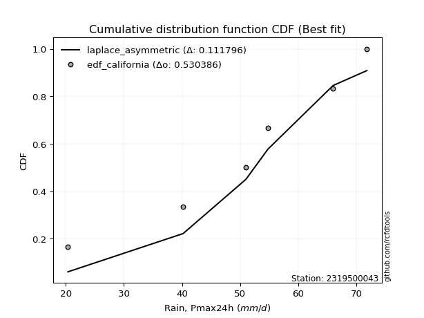</img>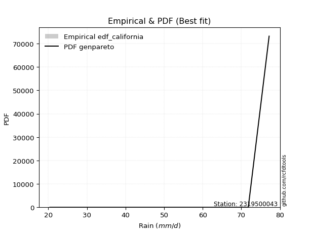</img>

</div>


### 2. EDF Hazen (1930)

Hazen method for plotting positions is a formula used to estimate the empirical cumulative probability distribution of flood events or other hydrological data. This formula often results in biased estimations, particularly when extrapolating to extreme events (high return periods).

<div align="center">


$P=(m-0.5)/n$


</div>


**2.1. Empirical values**

<div align="center">

|                | 0                   | 1                   | 2                   | 3         | 4                  | 5                  | 6                  |
|:---------------|:--------------------|:--------------------|:--------------------|:----------|:-------------------|:-------------------|:-------------------|
| date           | 2024                | 2023                | 2020                | 2021      | 2019               | 2022               | 2025               |
| x              | 20.4                | 40.2                | 51.0                | 54.8      | 66.0               | 71.8               | 77.2               |
| m              | 1                   | 2                   | 3                   | 4         | 5                  | 6                  | 7                  |
| empirical_dist | edf_hazen           | edf_hazen           | edf_hazen           | edf_hazen | edf_hazen          | edf_hazen          | edf_hazen          |
| empirical      | 0.07142857142857142 | 0.21428571428571427 | 0.35714285714285715 | 0.5       | 0.6428571428571429 | 0.7857142857142857 | 0.9285714285714286 |
| empirical_tr   | 1.0769230769230769  | 1.2727272727272727  | 1.5555555555555558  | 2.0       | 2.8000000000000003 | 4.666666666666666  | 14.000000000000007 |

</div>


**2.2. Kolmogorov-Smirnov fit test (sorted by Δ)**


<div align="center">

|                | 0                    | 1                    | 2                   | 3                    | 4                   | 5                   | 6                   | 7                   | 8                   | 9                   | 10                  | 11                  | 12                  | 13                  | 14                  | 15                  | 16                  | 17                  | 18                  | 19                  | 20                  | 21                  | 22                  | 23                  | 24                  | 25                  | 26                  | 27                  | 28                  | 29                  | 30                  | 31                  | 32                  | 33                  | 34                  | 35                  | 36                  | 37                  | 38                  | 39                  | 40                  | 41                  | 42                  | 43                  | 44                  | 45                  | 46                  | 47                  | 48                  | 49                  | 50                  | 51                  | 52                  | 53                  | 54                  | 55                  | 56                  | 57                  | 58                  | 59                  | 60                  | 61                  | 62                  | 63                  | 64                  | 65                  | 66                  | 67                  | 68                  | 69                  | 70                  | 71                  | 72                  | 73                  | 74                  | 75                  | 76                  | 77                  | 78                  | 79                  | 80                  | 81                  | 82                  | 83                  | 84                  | 85                  | 86                  | 87                  | 88                  | 89                  | 90                  | 91                  | 92                  | 93                  | 94                  | 95                  | 96                  | 97                  | 98                  | 99                  | 100                 | 101                 | 102                 | 103                 | 104                 | 105                 | 106                 | 107                 | 108                 | 109                 | 110                 | 111                 | 112                 | 113                 | 114                 | 115                 | 116                 | 117                 | 118                 | 119                 | 120                 | 121                 | 122                 | 123                 | 124                 | 125                 | 126                 | 127                 | 128                 | 129                 | 130                 | 131                 | 132                 | 133                 | 134                 | 135                 | 136                 | 137                 | 138                 | 139                 | 140                 | 141                 | 142                 | 143                 | 144                 | 145                 | 146                 | 147                 | 148                 | 149                 | 150                 | 151                 | 152                 | 153                 | 154                 | 155                 | 156                 | 157                 | 158                 | 159                 |
|:---------------|:---------------------|:---------------------|:--------------------|:---------------------|:--------------------|:--------------------|:--------------------|:--------------------|:--------------------|:--------------------|:--------------------|:--------------------|:--------------------|:--------------------|:--------------------|:--------------------|:--------------------|:--------------------|:--------------------|:--------------------|:--------------------|:--------------------|:--------------------|:--------------------|:--------------------|:--------------------|:--------------------|:--------------------|:--------------------|:--------------------|:--------------------|:--------------------|:--------------------|:--------------------|:--------------------|:--------------------|:--------------------|:--------------------|:--------------------|:--------------------|:--------------------|:--------------------|:--------------------|:--------------------|:--------------------|:--------------------|:--------------------|:--------------------|:--------------------|:--------------------|:--------------------|:--------------------|:--------------------|:--------------------|:--------------------|:--------------------|:--------------------|:--------------------|:--------------------|:--------------------|:--------------------|:--------------------|:--------------------|:--------------------|:--------------------|:--------------------|:--------------------|:--------------------|:--------------------|:--------------------|:--------------------|:--------------------|:--------------------|:--------------------|:--------------------|:--------------------|:--------------------|:--------------------|:--------------------|:--------------------|:--------------------|:--------------------|:--------------------|:--------------------|:--------------------|:--------------------|:--------------------|:--------------------|:--------------------|:--------------------|:--------------------|:--------------------|:--------------------|:--------------------|:--------------------|:--------------------|:--------------------|:--------------------|:--------------------|:--------------------|:--------------------|:--------------------|:--------------------|:--------------------|:--------------------|:--------------------|:--------------------|:--------------------|:--------------------|:--------------------|:--------------------|:--------------------|:--------------------|:--------------------|:--------------------|:--------------------|:--------------------|:--------------------|:--------------------|:--------------------|:--------------------|:--------------------|:--------------------|:--------------------|:--------------------|:--------------------|:--------------------|:--------------------|:--------------------|:--------------------|:--------------------|:--------------------|:--------------------|:--------------------|:--------------------|:--------------------|:--------------------|:--------------------|:--------------------|:--------------------|:--------------------|:--------------------|:--------------------|:--------------------|:--------------------|:--------------------|:--------------------|:--------------------|:--------------------|:--------------------|:--------------------|:--------------------|:--------------------|:--------------------|:--------------------|:--------------------|:--------------------|:--------------------|:--------------------|:--------------------|
| station        | 2319500043           | 2319500043           | 2319500043          | 2319500043           | 2319500043          | 2319500043          | 2319500043          | 2319500043          | 2319500043          | 2319500043          | 2319500043          | 2319500043          | 2319500043          | 2319500043          | 2319500043          | 2319500043          | 2319500043          | 2319500043          | 2319500043          | 2319500043          | 2319500043          | 2319500043          | 2319500043          | 2319500043          | 2319500043          | 2319500043          | 2319500043          | 2319500043          | 2319500043          | 2319500043          | 2319500043          | 2319500043          | 2319500043          | 2319500043          | 2319500043          | 2319500043          | 2319500043          | 2319500043          | 2319500043          | 2319500043          | 2319500043          | 2319500043          | 2319500043          | 2319500043          | 2319500043          | 2319500043          | 2319500043          | 2319500043          | 2319500043          | 2319500043          | 2319500043          | 2319500043          | 2319500043          | 2319500043          | 2319500043          | 2319500043          | 2319500043          | 2319500043          | 2319500043          | 2319500043          | 2319500043          | 2319500043          | 2319500043          | 2319500043          | 2319500043          | 2319500043          | 2319500043          | 2319500043          | 2319500043          | 2319500043          | 2319500043          | 2319500043          | 2319500043          | 2319500043          | 2319500043          | 2319500043          | 2319500043          | 2319500043          | 2319500043          | 2319500043          | 2319500043          | 2319500043          | 2319500043          | 2319500043          | 2319500043          | 2319500043          | 2319500043          | 2319500043          | 2319500043          | 2319500043          | 2319500043          | 2319500043          | 2319500043          | 2319500043          | 2319500043          | 2319500043          | 2319500043          | 2319500043          | 2319500043          | 2319500043          | 2319500043          | 2319500043          | 2319500043          | 2319500043          | 2319500043          | 2319500043          | 2319500043          | 2319500043          | 2319500043          | 2319500043          | 2319500043          | 2319500043          | 2319500043          | 2319500043          | 2319500043          | 2319500043          | 2319500043          | 2319500043          | 2319500043          | 2319500043          | 2319500043          | 2319500043          | 2319500043          | 2319500043          | 2319500043          | 2319500043          | 2319500043          | 2319500043          | 2319500043          | 2319500043          | 2319500043          | 2319500043          | 2319500043          | 2319500043          | 2319500043          | 2319500043          | 2319500043          | 2319500043          | 2319500043          | 2319500043          | 2319500043          | 2319500043          | 2319500043          | 2319500043          | 2319500043          | 2319500043          | 2319500043          | 2319500043          | 2319500043          | 2319500043          | 2319500043          | 2319500043          | 2319500043          | 2319500043          | 2319500043          | 2319500043          | 2319500043          | 2319500043          | 2319500043          | 2319500043          |
| empirical_dist | edf_hazen            | edf_hazen            | edf_hazen           | edf_hazen            | edf_hazen           | edf_hazen           | edf_hazen           | edf_hazen           | edf_hazen           | edf_hazen           | edf_hazen           | edf_hazen           | edf_hazen           | edf_hazen           | edf_hazen           | edf_hazen           | edf_hazen           | edf_hazen           | edf_hazen           | edf_hazen           | edf_hazen           | edf_hazen           | edf_hazen           | edf_hazen           | edf_hazen           | edf_hazen           | edf_hazen           | edf_hazen           | edf_hazen           | edf_hazen           | edf_hazen           | edf_hazen           | edf_hazen           | edf_hazen           | edf_hazen           | edf_hazen           | edf_hazen           | edf_hazen           | edf_hazen           | edf_hazen           | edf_hazen           | edf_hazen           | edf_hazen           | edf_hazen           | edf_hazen           | edf_hazen           | edf_hazen           | edf_hazen           | edf_hazen           | edf_hazen           | edf_hazen           | edf_hazen           | edf_hazen           | edf_hazen           | edf_hazen           | edf_hazen           | edf_hazen           | edf_hazen           | edf_hazen           | edf_hazen           | edf_hazen           | edf_hazen           | edf_hazen           | edf_hazen           | edf_hazen           | edf_hazen           | edf_hazen           | edf_hazen           | edf_hazen           | edf_hazen           | edf_hazen           | edf_hazen           | edf_hazen           | edf_hazen           | edf_hazen           | edf_hazen           | edf_hazen           | edf_hazen           | edf_hazen           | edf_hazen           | edf_hazen           | edf_hazen           | edf_hazen           | edf_hazen           | edf_hazen           | edf_hazen           | edf_hazen           | edf_hazen           | edf_hazen           | edf_hazen           | edf_hazen           | edf_hazen           | edf_hazen           | edf_hazen           | edf_hazen           | edf_hazen           | edf_hazen           | edf_hazen           | edf_hazen           | edf_hazen           | edf_hazen           | edf_hazen           | edf_hazen           | edf_hazen           | edf_hazen           | edf_hazen           | edf_hazen           | edf_hazen           | edf_hazen           | edf_hazen           | edf_hazen           | edf_hazen           | edf_hazen           | edf_hazen           | edf_hazen           | edf_hazen           | edf_hazen           | edf_hazen           | edf_hazen           | edf_hazen           | edf_hazen           | edf_hazen           | edf_hazen           | edf_hazen           | edf_hazen           | edf_hazen           | edf_hazen           | edf_hazen           | edf_hazen           | edf_hazen           | edf_hazen           | edf_hazen           | edf_hazen           | edf_hazen           | edf_hazen           | edf_hazen           | edf_hazen           | edf_hazen           | edf_hazen           | edf_hazen           | edf_hazen           | edf_hazen           | edf_hazen           | edf_hazen           | edf_hazen           | edf_hazen           | edf_hazen           | edf_hazen           | edf_hazen           | edf_hazen           | edf_hazen           | edf_hazen           | edf_hazen           | edf_hazen           | edf_hazen           | edf_hazen           | edf_hazen           | edf_hazen           | edf_hazen           | edf_hazen           |
| p_dist         | trapezoid            | logmielke            | burr                | logburr              | logexponweib        | gompertz            | weibull_min         | logloggamma         | skewnorm            | gausshyper          | loggenextreme       | genhalflogistic     | argus               | logargus            | gumbel_l            | mielke              | logpearson3         | pearson3            | anglit              | triang              | logexponpow         | loggumbel_l         | semicircular        | betaprime           | erlang              | logweibull_max      | gamma               | nct                 | truncnorm           | crystalball         | norm                | exponnorm           | t                   | f                   | loggennorm          | rice                | invgamma            | alpha               | logdweibull         | logweibull_min      | loggengamma         | logburr12           | ncf                 | arcsine             | loggompertz         | logvonmises_line    | maxwell             | johnsonsu           | logt                | logjohnsonsu        | logloglaplace       | rayleigh            | logtrapezoid        | cosine              | logistic            | genpareto           | invgauss            | dgamma              | hypsecant           | gumbel_r            | genextreme          | logbeta             | halfnorm            | loggenhalflogistic  | logsemicircular     | loganglit           | logskewnorm         | logexponnorm        | lognorm             | logcrystalball      | logrice             | logfatiguelife      | laplace             | loglogistic         | logf                | lognct              | loghypsecant        | kstwobign           | moyal               | loginvgamma         | logtukeylambda      | logncf              | loglevy_l           | loglaplace          | loglaplace          | logbetaprime        | logerlang           | dweibull            | halflogistic        | truncweibull_min    | logalpha            | ksone               | loginvgauss         | wrapcauchy          | logarcsine          | kappa3              | uniform             | logtriang           | logmaxwell          | logdgamma           | vonmises_line       | logfoldnorm         | lograyleigh         | loginvweibull       | beta                | kappa4              | loggausshyper       | levy_l              | logcosine           | logkstwobign        | wald                | loggumbel_r         | loghalfnorm         | loggenexpon         | genexpon            | bradford            | logmoyal            | loghalflogistic     | truncexpon          | logtruncnorm        | lognakagami         | gennorm             | logwrapcauchy       | lomax               | nakagami            | logksone            | burr12              | loglomax            | halfgennorm         | loggenpareto        | logwald             | logrdist            | logkappa4           | logkappa3           | loguniform          | logbradford         | logtruncweibull_min | logtruncexpon       | johnsonsb           | logjohnsonsb        | foldnorm            | exponweib           | weibull_max         | gengamma            | fatiguelife         | powerlaw            | loggamma            | loggamma            | rdist               | tukeylambda         | logpowerlaw         | invweibull          | truncpareto         | exponpow            | logtruncpareto      | genlogistic         | loggenlogistic      | loghalfgennorm      | logvonmises         | vonmises            |
| delta          | 0.050121187245620036 | 0.057065255625872224 | 0.05863122760301831 | 0.059703047358521166 | 0.06278248201405146 | 0.06843865021130102 | 0.06854880551253406 | 0.07141578383332814 | 0.07142821338757721 | 0.0714285714277415  | 0.07142857142855386 | 0.07142857142857018 | 0.07363879667590922 | 0.07405937293506659 | 0.07410426040915574 | 0.07440903754824885 | 0.07461311352364969 | 0.07533502830168326 | 0.07768386658342002 | 0.07845446565809733 | 0.07901750922626027 | 0.08194962126026101 | 0.08208852189637067 | 0.08959298586786746 | 0.09009895603733142 | 0.09142168614115959 | 0.0928725690922142  | 0.09328204465081302 | 0.0933164099657573  | 0.09331647094167639 | 0.09331648268010806 | 0.09331796958430172 | 0.09339444579880463 | 0.09391229334438977 | 0.09411878714952071 | 0.09455504902721468 | 0.09537882722766233 | 0.0956340040714575  | 0.09701424508703105 | 0.09714257045529628 | 0.09788057472511758 | 0.09799164815673855 | 0.09956920394794677 | 0.0996894599093715  | 0.10110368278537163 | 0.10178931943431846 | 0.10469972668187977 | 0.10538047967360553 | 0.10734092863624634 | 0.11099404662170559 | 0.11169762676112804 | 0.11358330043805459 | 0.11362356143944963 | 0.11489462311847443 | 0.1158461205090594  | 0.12416602758072456 | 0.12513350964845404 | 0.13026555987485355 | 0.13109218830653735 | 0.1361326292050019  | 0.13814574856273587 | 0.14415839466200708 | 0.14801386850467374 | 0.14889016351069378 | 0.15014740995814807 | 0.1506870791750266  | 0.15089707249411843 | 0.1519923899203342  | 0.15199476509034587 | 0.15199868939790057 | 0.1520054835675641  | 0.15241897366100515 | 0.1524725416134174  | 0.15324265452669678 | 0.15366775746847855 | 0.1542735343432749  | 0.15430798492899384 | 0.15515209746839004 | 0.15519392604576782 | 0.15579163889089492 | 0.15753309890430853 | 0.15820077052514808 | 0.15864112782990689 | 0.1587950264281553  | 0.1587950264281553  | 0.16044241669423426 | 0.16128048071600748 | 0.16432391842985117 | 0.1664877718567987  | 0.16739830814997153 | 0.17030498757852747 | 0.1751341381623071  | 0.1752234190904643  | 0.1762607052593617  | 0.17806836230654832 | 0.1796522959222852  | 0.18158953722333998 | 0.18337358488797934 | 0.1846572165193205  | 0.18801591302291365 | 0.1887447463069724  | 0.19460356721018418 | 0.19546417190157722 | 0.19546954145917278 | 0.20187952322604502 | 0.20633372850846882 | 0.2070434917244353  | 0.21289425527430048 | 0.21433337428724303 | 0.22024283507996373 | 0.22233222179131323 | 0.22258043273541211 | 0.225891000531871   | 0.23176281746648614 | 0.23391657571845764 | 0.24083778570259956 | 0.24834229195150753 | 0.25136127797558167 | 0.2619922789370634  | 0.2663034114912779  | 0.2782187515901506  | 0.2857142857142857  | 0.2889461101810731  | 0.2932346075161043  | 0.2933650856880084  | 0.29993451824875333 | 0.3078536910204084  | 0.3126812381639912  | 0.3142360779358825  | 0.31674537162741445 | 0.31994436385692343 | 0.3213926903980424  | 0.32663323588408427 | 0.32801625173896237 | 0.3313499933270752  | 0.34115720598762195 | 0.4032453898288017  | 0.40493799242736656 | 0.42318243186696325 | 0.44422852042405125 | 0.5                 | 0.54699127458439    | 0.5675829152195151  | 0.5808185060882145  | 0.5950654748957341  | 0.6165421435854925  | 0.6307986695505328  | 0.6307986695505328  | 0.6428571365995095  | 0.6428571428571357  | 0.6664958926543485  | 0.675458642168084   | 0.7066001540398179  | 0.7116820702041898  | 0.73484303920286    | 0.7857142857142857  | 0.7857142857142857  | 0.7857142857142857  | 1.1374258935258121  | 11.395818864430732  |
| deltao         | 0.48442053926100004  | 0.48442053926100004  | 0.48442053926100004 | 0.48442053926100004  | 0.48442053926100004 | 0.48442053926100004 | 0.48442053926100004 | 0.48442053926100004 | 0.48442053926100004 | 0.48442053926100004 | 0.48442053926100004 | 0.48442053926100004 | 0.48442053926100004 | 0.48442053926100004 | 0.48442053926100004 | 0.48442053926100004 | 0.48442053926100004 | 0.48442053926100004 | 0.48442053926100004 | 0.48442053926100004 | 0.48442053926100004 | 0.48442053926100004 | 0.48442053926100004 | 0.48442053926100004 | 0.48442053926100004 | 0.48442053926100004 | 0.48442053926100004 | 0.48442053926100004 | 0.48442053926100004 | 0.48442053926100004 | 0.48442053926100004 | 0.48442053926100004 | 0.48442053926100004 | 0.48442053926100004 | 0.48442053926100004 | 0.48442053926100004 | 0.48442053926100004 | 0.48442053926100004 | 0.48442053926100004 | 0.48442053926100004 | 0.48442053926100004 | 0.48442053926100004 | 0.48442053926100004 | 0.48442053926100004 | 0.48442053926100004 | 0.48442053926100004 | 0.48442053926100004 | 0.48442053926100004 | 0.48442053926100004 | 0.48442053926100004 | 0.48442053926100004 | 0.48442053926100004 | 0.48442053926100004 | 0.48442053926100004 | 0.48442053926100004 | 0.48442053926100004 | 0.48442053926100004 | 0.48442053926100004 | 0.48442053926100004 | 0.48442053926100004 | 0.48442053926100004 | 0.48442053926100004 | 0.48442053926100004 | 0.48442053926100004 | 0.48442053926100004 | 0.48442053926100004 | 0.48442053926100004 | 0.48442053926100004 | 0.48442053926100004 | 0.48442053926100004 | 0.48442053926100004 | 0.48442053926100004 | 0.48442053926100004 | 0.48442053926100004 | 0.48442053926100004 | 0.48442053926100004 | 0.48442053926100004 | 0.48442053926100004 | 0.48442053926100004 | 0.48442053926100004 | 0.48442053926100004 | 0.48442053926100004 | 0.48442053926100004 | 0.48442053926100004 | 0.48442053926100004 | 0.48442053926100004 | 0.48442053926100004 | 0.48442053926100004 | 0.48442053926100004 | 0.48442053926100004 | 0.48442053926100004 | 0.48442053926100004 | 0.48442053926100004 | 0.48442053926100004 | 0.48442053926100004 | 0.48442053926100004 | 0.48442053926100004 | 0.48442053926100004 | 0.48442053926100004 | 0.48442053926100004 | 0.48442053926100004 | 0.48442053926100004 | 0.48442053926100004 | 0.48442053926100004 | 0.48442053926100004 | 0.48442053926100004 | 0.48442053926100004 | 0.48442053926100004 | 0.48442053926100004 | 0.48442053926100004 | 0.48442053926100004 | 0.48442053926100004 | 0.48442053926100004 | 0.48442053926100004 | 0.48442053926100004 | 0.48442053926100004 | 0.48442053926100004 | 0.48442053926100004 | 0.48442053926100004 | 0.48442053926100004 | 0.48442053926100004 | 0.48442053926100004 | 0.48442053926100004 | 0.48442053926100004 | 0.48442053926100004 | 0.48442053926100004 | 0.48442053926100004 | 0.48442053926100004 | 0.48442053926100004 | 0.48442053926100004 | 0.48442053926100004 | 0.48442053926100004 | 0.48442053926100004 | 0.48442053926100004 | 0.48442053926100004 | 0.48442053926100004 | 0.48442053926100004 | 0.48442053926100004 | 0.48442053926100004 | 0.48442053926100004 | 0.48442053926100004 | 0.48442053926100004 | 0.48442053926100004 | 0.48442053926100004 | 0.48442053926100004 | 0.48442053926100004 | 0.48442053926100004 | 0.48442053926100004 | 0.48442053926100004 | 0.48442053926100004 | 0.48442053926100004 | 0.48442053926100004 | 0.48442053926100004 | 0.48442053926100004 | 0.48442053926100004 | 0.48442053926100004 | 0.48442053926100004 | 0.48442053926100004 | 0.48442053926100004 | 0.48442053926100004 |
| eval           | Δo > Δ               | Δo > Δ               | Δo > Δ              | Δo > Δ               | Δo > Δ              | Δo > Δ              | Δo > Δ              | Δo > Δ              | Δo > Δ              | Δo > Δ              | Δo > Δ              | Δo > Δ              | Δo > Δ              | Δo > Δ              | Δo > Δ              | Δo > Δ              | Δo > Δ              | Δo > Δ              | Δo > Δ              | Δo > Δ              | Δo > Δ              | Δo > Δ              | Δo > Δ              | Δo > Δ              | Δo > Δ              | Δo > Δ              | Δo > Δ              | Δo > Δ              | Δo > Δ              | Δo > Δ              | Δo > Δ              | Δo > Δ              | Δo > Δ              | Δo > Δ              | Δo > Δ              | Δo > Δ              | Δo > Δ              | Δo > Δ              | Δo > Δ              | Δo > Δ              | Δo > Δ              | Δo > Δ              | Δo > Δ              | Δo > Δ              | Δo > Δ              | Δo > Δ              | Δo > Δ              | Δo > Δ              | Δo > Δ              | Δo > Δ              | Δo > Δ              | Δo > Δ              | Δo > Δ              | Δo > Δ              | Δo > Δ              | Δo > Δ              | Δo > Δ              | Δo > Δ              | Δo > Δ              | Δo > Δ              | Δo > Δ              | Δo > Δ              | Δo > Δ              | Δo > Δ              | Δo > Δ              | Δo > Δ              | Δo > Δ              | Δo > Δ              | Δo > Δ              | Δo > Δ              | Δo > Δ              | Δo > Δ              | Δo > Δ              | Δo > Δ              | Δo > Δ              | Δo > Δ              | Δo > Δ              | Δo > Δ              | Δo > Δ              | Δo > Δ              | Δo > Δ              | Δo > Δ              | Δo > Δ              | Δo > Δ              | Δo > Δ              | Δo > Δ              | Δo > Δ              | Δo > Δ              | Δo > Δ              | Δo > Δ              | Δo > Δ              | Δo > Δ              | Δo > Δ              | Δo > Δ              | Δo > Δ              | Δo > Δ              | Δo > Δ              | Δo > Δ              | Δo > Δ              | Δo > Δ              | Δo > Δ              | Δo > Δ              | Δo > Δ              | Δo > Δ              | Δo > Δ              | Δo > Δ              | Δo > Δ              | Δo > Δ              | Δo > Δ              | Δo > Δ              | Δo > Δ              | Δo > Δ              | Δo > Δ              | Δo > Δ              | Δo > Δ              | Δo > Δ              | Δo > Δ              | Δo > Δ              | Δo > Δ              | Δo > Δ              | Δo > Δ              | Δo > Δ              | Δo > Δ              | Δo > Δ              | Δo > Δ              | Δo > Δ              | Δo > Δ              | Δo > Δ              | Δo > Δ              | Δo > Δ              | Δo > Δ              | Δo > Δ              | Δo > Δ              | Δo > Δ              | Δo > Δ              | Δo > Δ              | Δo > Δ              | Δo > Δ              | Δo > Δ              | Δo > Δ              | Δo <= Δ             | Δo <= Δ             | Δo <= Δ             | Δo <= Δ             | Δo <= Δ             | Δo <= Δ             | Δo <= Δ             | Δo <= Δ             | Δo <= Δ             | Δo <= Δ             | Δo <= Δ             | Δo <= Δ             | Δo <= Δ             | Δo <= Δ             | Δo <= Δ             | Δo <= Δ             | Δo <= Δ             | Δo <= Δ             | Δo <= Δ             | Δo <= Δ             |
| fit            | 1                    | 1                    | 1                   | 1                    | 1                   | 1                   | 1                   | 1                   | 1                   | 1                   | 1                   | 1                   | 1                   | 1                   | 1                   | 1                   | 1                   | 1                   | 1                   | 1                   | 1                   | 1                   | 1                   | 1                   | 1                   | 1                   | 1                   | 1                   | 1                   | 1                   | 1                   | 1                   | 1                   | 1                   | 1                   | 1                   | 1                   | 1                   | 1                   | 1                   | 1                   | 1                   | 1                   | 1                   | 1                   | 1                   | 1                   | 1                   | 1                   | 1                   | 1                   | 1                   | 1                   | 1                   | 1                   | 1                   | 1                   | 1                   | 1                   | 1                   | 1                   | 1                   | 1                   | 1                   | 1                   | 1                   | 1                   | 1                   | 1                   | 1                   | 1                   | 1                   | 1                   | 1                   | 1                   | 1                   | 1                   | 1                   | 1                   | 1                   | 1                   | 1                   | 1                   | 1                   | 1                   | 1                   | 1                   | 1                   | 1                   | 1                   | 1                   | 1                   | 1                   | 1                   | 1                   | 1                   | 1                   | 1                   | 1                   | 1                   | 1                   | 1                   | 1                   | 1                   | 1                   | 1                   | 1                   | 1                   | 1                   | 1                   | 1                   | 1                   | 1                   | 1                   | 1                   | 1                   | 1                   | 1                   | 1                   | 1                   | 1                   | 1                   | 1                   | 1                   | 1                   | 1                   | 1                   | 1                   | 1                   | 1                   | 1                   | 1                   | 1                   | 1                   | 1                   | 1                   | 1                   | 1                   | 1                   | 1                   | 0                   | 0                   | 0                   | 0                   | 0                   | 0                   | 0                   | 0                   | 0                   | 0                   | 0                   | 0                   | 0                   | 0                   | 0                   | 0                   | 0                   | 0                   | 0                   | 0                   |
| n              | 7                    | 7                    | 7                   | 7                    | 7                   | 7                   | 7                   | 7                   | 7                   | 7                   | 7                   | 7                   | 7                   | 7                   | 7                   | 7                   | 7                   | 7                   | 7                   | 7                   | 7                   | 7                   | 7                   | 7                   | 7                   | 7                   | 7                   | 7                   | 7                   | 7                   | 7                   | 7                   | 7                   | 7                   | 7                   | 7                   | 7                   | 7                   | 7                   | 7                   | 7                   | 7                   | 7                   | 7                   | 7                   | 7                   | 7                   | 7                   | 7                   | 7                   | 7                   | 7                   | 7                   | 7                   | 7                   | 7                   | 7                   | 7                   | 7                   | 7                   | 7                   | 7                   | 7                   | 7                   | 7                   | 7                   | 7                   | 7                   | 7                   | 7                   | 7                   | 7                   | 7                   | 7                   | 7                   | 7                   | 7                   | 7                   | 7                   | 7                   | 7                   | 7                   | 7                   | 7                   | 7                   | 7                   | 7                   | 7                   | 7                   | 7                   | 7                   | 7                   | 7                   | 7                   | 7                   | 7                   | 7                   | 7                   | 7                   | 7                   | 7                   | 7                   | 7                   | 7                   | 7                   | 7                   | 7                   | 7                   | 7                   | 7                   | 7                   | 7                   | 7                   | 7                   | 7                   | 7                   | 7                   | 7                   | 7                   | 7                   | 7                   | 7                   | 7                   | 7                   | 7                   | 7                   | 7                   | 7                   | 7                   | 7                   | 7                   | 7                   | 7                   | 7                   | 7                   | 7                   | 7                   | 7                   | 7                   | 7                   | 7                   | 7                   | 7                   | 7                   | 7                   | 7                   | 7                   | 7                   | 7                   | 7                   | 7                   | 7                   | 7                   | 7                   | 7                   | 7                   | 7                   | 7                   | 7                   | 7                   |
| best_fit       | 1                    | 0                    | 0                   | 0                    | 0                   | 0                   | 0                   | 0                   | 0                   | 0                   | 0                   | 0                   | 0                   | 0                   | 0                   | 0                   | 0                   | 0                   | 0                   | 0                   | 0                   | 0                   | 0                   | 0                   | 0                   | 0                   | 0                   | 0                   | 0                   | 0                   | 0                   | 0                   | 0                   | 0                   | 0                   | 0                   | 0                   | 0                   | 0                   | 0                   | 0                   | 0                   | 0                   | 0                   | 0                   | 0                   | 0                   | 0                   | 0                   | 0                   | 0                   | 0                   | 0                   | 0                   | 0                   | 0                   | 0                   | 0                   | 0                   | 0                   | 0                   | 0                   | 0                   | 0                   | 0                   | 0                   | 0                   | 0                   | 0                   | 0                   | 0                   | 0                   | 0                   | 0                   | 0                   | 0                   | 0                   | 0                   | 0                   | 0                   | 0                   | 0                   | 0                   | 0                   | 0                   | 0                   | 0                   | 0                   | 0                   | 0                   | 0                   | 0                   | 0                   | 0                   | 0                   | 0                   | 0                   | 0                   | 0                   | 0                   | 0                   | 0                   | 0                   | 0                   | 0                   | 0                   | 0                   | 0                   | 0                   | 0                   | 0                   | 0                   | 0                   | 0                   | 0                   | 0                   | 0                   | 0                   | 0                   | 0                   | 0                   | 0                   | 0                   | 0                   | 0                   | 0                   | 0                   | 0                   | 0                   | 0                   | 0                   | 0                   | 0                   | 0                   | 0                   | 0                   | 0                   | 0                   | 0                   | 0                   | 0                   | 0                   | 0                   | 0                   | 0                   | 0                   | 0                   | 0                   | 0                   | 0                   | 0                   | 0                   | 0                   | 0                   | 0                   | 0                   | 0                   | 0                   | 0                   | 0                   |
| best_fit_sort  | 1                    | 2                    | 3                   | 4                    | 5                   | 6                   | 7                   | 8                   | 9                   | 10                  | 11                  | 12                  | 13                  | 14                  | 15                  | 16                  | 17                  | 18                  | 19                  | 20                  | 21                  | 22                  | 23                  | 24                  | 25                  | 26                  | 27                  | 28                  | 29                  | 30                  | 31                  | 32                  | 33                  | 34                  | 35                  | 36                  | 37                  | 38                  | 39                  | 40                  | 41                  | 42                  | 43                  | 44                  | 45                  | 46                  | 47                  | 48                  | 49                  | 50                  | 51                  | 52                  | 53                  | 54                  | 55                  | 56                  | 57                  | 58                  | 59                  | 60                  | 61                  | 62                  | 63                  | 64                  | 65                  | 66                  | 67                  | 68                  | 69                  | 70                  | 71                  | 72                  | 73                  | 74                  | 75                  | 76                  | 77                  | 78                  | 79                  | 80                  | 81                  | 82                  | 83                  | 84                  | 85                  | 86                  | 87                  | 88                  | 89                  | 90                  | 91                  | 92                  | 93                  | 94                  | 95                  | 96                  | 97                  | 98                  | 99                  | 100                 | 101                 | 102                 | 103                 | 104                 | 105                 | 106                 | 107                 | 108                 | 109                 | 110                 | 111                 | 112                 | 113                 | 114                 | 115                 | 116                 | 117                 | 118                 | 119                 | 120                 | 121                 | 122                 | 123                 | 124                 | 125                 | 126                 | 127                 | 128                 | 129                 | 130                 | 131                 | 132                 | 133                 | 134                 | 135                 | 136                 | 137                 | 138                 | 139                 | 140                 | 141                 | 142                 | 143                 | 144                 | 145                 | 146                 | 147                 | 148                 | 149                 | 150                 | 151                 | 152                 | 153                 | 154                 | 155                 | 156                 | 157                 | 158                 | 159                 | 160                 |

</div>


**2.3. Best fit**

<div align="center">

|   id |    station | empirical_dist   | p_dist    |     delta |   deltao | eval   |   fit |   n |   best_fit |   best_fit_sort |
|-----:|-----------:|:-----------------|:----------|----------:|---------:|:-------|------:|----:|-----------:|----------------:|
|    0 | 2319500043 | edf_hazen        | trapezoid | 0.0501212 | 0.484421 | Δo > Δ |     1 |   7 |          1 |               1 |

</div>


<div align="center">

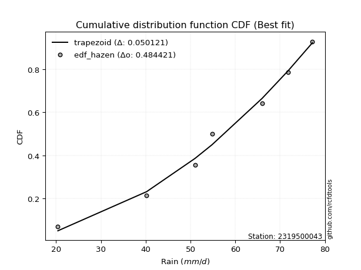</img></img>

</div>


### 3. EDF Weibull (1939)

Weibull plotting position formula is an empirical method used to estimate the non-exceedance probability or plotting position for a set of observed data, is often recommended or widely used in practice, particularly in flood frequency analysis.

<div align="center">


$P=m/(n+1)$


</div>


**3.1. Empirical values**

<div align="center">

|                | 0                  | 1                  | 2           | 3           | 4                  | 5           | 6           |
|:---------------|:-------------------|:-------------------|:------------|:------------|:-------------------|:------------|:------------|
| date           | 2024               | 2023               | 2020        | 2021        | 2019               | 2022        | 2025        |
| x              | 20.4               | 40.2               | 51.0        | 54.8        | 66.0               | 71.8        | 77.2        |
| m              | 1                  | 2                  | 3           | 4           | 5                  | 6           | 7           |
| empirical_dist | edf_weibull        | edf_weibull        | edf_weibull | edf_weibull | edf_weibull        | edf_weibull | edf_weibull |
| empirical      | 0.125              | 0.25               | 0.375       | 0.5         | 0.625              | 0.75        | 0.875       |
| empirical_tr   | 1.1428571428571428 | 1.3333333333333333 | 1.6         | 2.0         | 2.6666666666666665 | 4.0         | 8.0         |

</div>


**3.2. Kolmogorov-Smirnov fit test (sorted by Δ)**


<div align="center">

|                | 0                   | 1                   | 2                   | 3                   | 4                   | 5                   | 6                   | 7                   | 8                   | 9                   | 10                  | 11                  | 12                  | 13                  | 14                  | 15                  | 16                  | 17                  | 18                  | 19                  | 20                  | 21                  | 22                  | 23                  | 24                  | 25                  | 26                  | 27                  | 28                  | 29                  | 30                  | 31                  | 32                  | 33                  | 34                  | 35                  | 36                  | 37                  | 38                  | 39                  | 40                  | 41                  | 42                  | 43                  | 44                  | 45                  | 46                  | 47                  | 48                  | 49                  | 50                  | 51                  | 52                  | 53                  | 54                  | 55                  | 56                  | 57                  | 58                  | 59                  | 60                  | 61                  | 62                  | 63                  | 64                  | 65                  | 66                  | 67                  | 68                  | 69                  | 70                  | 71                  | 72                  | 73                  | 74                  | 75                  | 76                  | 77                  | 78                  | 79                  | 80                  | 81                  | 82                  | 83                  | 84                  | 85                  | 86                  | 87                  | 88                  | 89                  | 90                  | 91                  | 92                  | 93                  | 94                  | 95                  | 96                  | 97                  | 98                  | 99                  | 100                 | 101                 | 102                 | 103                 | 104                 | 105                 | 106                 | 107                 | 108                 | 109                 | 110                 | 111                 | 112                 | 113                 | 114                 | 115                 | 116                 | 117                 | 118                 | 119                 | 120                 | 121                 | 122                 | 123                 | 124                 | 125                 | 126                 | 127                 | 128                 | 129                 | 130                 | 131                 | 132                 | 133                 | 134                 | 135                 | 136                 | 137                 | 138                 | 139                 | 140                 | 141                 | 142                 | 143                 | 144                 | 145                 | 146                 | 147                 | 148                 | 149                 | 150                 | 151                 | 152                 | 153                 | 154                 | 155                 | 156                 | 157                 | 158                 | 159                 |
|:---------------|:--------------------|:--------------------|:--------------------|:--------------------|:--------------------|:--------------------|:--------------------|:--------------------|:--------------------|:--------------------|:--------------------|:--------------------|:--------------------|:--------------------|:--------------------|:--------------------|:--------------------|:--------------------|:--------------------|:--------------------|:--------------------|:--------------------|:--------------------|:--------------------|:--------------------|:--------------------|:--------------------|:--------------------|:--------------------|:--------------------|:--------------------|:--------------------|:--------------------|:--------------------|:--------------------|:--------------------|:--------------------|:--------------------|:--------------------|:--------------------|:--------------------|:--------------------|:--------------------|:--------------------|:--------------------|:--------------------|:--------------------|:--------------------|:--------------------|:--------------------|:--------------------|:--------------------|:--------------------|:--------------------|:--------------------|:--------------------|:--------------------|:--------------------|:--------------------|:--------------------|:--------------------|:--------------------|:--------------------|:--------------------|:--------------------|:--------------------|:--------------------|:--------------------|:--------------------|:--------------------|:--------------------|:--------------------|:--------------------|:--------------------|:--------------------|:--------------------|:--------------------|:--------------------|:--------------------|:--------------------|:--------------------|:--------------------|:--------------------|:--------------------|:--------------------|:--------------------|:--------------------|:--------------------|:--------------------|:--------------------|:--------------------|:--------------------|:--------------------|:--------------------|:--------------------|:--------------------|:--------------------|:--------------------|:--------------------|:--------------------|:--------------------|:--------------------|:--------------------|:--------------------|:--------------------|:--------------------|:--------------------|:--------------------|:--------------------|:--------------------|:--------------------|:--------------------|:--------------------|:--------------------|:--------------------|:--------------------|:--------------------|:--------------------|:--------------------|:--------------------|:--------------------|:--------------------|:--------------------|:--------------------|:--------------------|:--------------------|:--------------------|:--------------------|:--------------------|:--------------------|:--------------------|:--------------------|:--------------------|:--------------------|:--------------------|:--------------------|:--------------------|:--------------------|:--------------------|:--------------------|:--------------------|:--------------------|:--------------------|:--------------------|:--------------------|:--------------------|:--------------------|:--------------------|:--------------------|:--------------------|:--------------------|:--------------------|:--------------------|:--------------------|:--------------------|:--------------------|:--------------------|:--------------------|:--------------------|:--------------------|
| station        | 2319500043          | 2319500043          | 2319500043          | 2319500043          | 2319500043          | 2319500043          | 2319500043          | 2319500043          | 2319500043          | 2319500043          | 2319500043          | 2319500043          | 2319500043          | 2319500043          | 2319500043          | 2319500043          | 2319500043          | 2319500043          | 2319500043          | 2319500043          | 2319500043          | 2319500043          | 2319500043          | 2319500043          | 2319500043          | 2319500043          | 2319500043          | 2319500043          | 2319500043          | 2319500043          | 2319500043          | 2319500043          | 2319500043          | 2319500043          | 2319500043          | 2319500043          | 2319500043          | 2319500043          | 2319500043          | 2319500043          | 2319500043          | 2319500043          | 2319500043          | 2319500043          | 2319500043          | 2319500043          | 2319500043          | 2319500043          | 2319500043          | 2319500043          | 2319500043          | 2319500043          | 2319500043          | 2319500043          | 2319500043          | 2319500043          | 2319500043          | 2319500043          | 2319500043          | 2319500043          | 2319500043          | 2319500043          | 2319500043          | 2319500043          | 2319500043          | 2319500043          | 2319500043          | 2319500043          | 2319500043          | 2319500043          | 2319500043          | 2319500043          | 2319500043          | 2319500043          | 2319500043          | 2319500043          | 2319500043          | 2319500043          | 2319500043          | 2319500043          | 2319500043          | 2319500043          | 2319500043          | 2319500043          | 2319500043          | 2319500043          | 2319500043          | 2319500043          | 2319500043          | 2319500043          | 2319500043          | 2319500043          | 2319500043          | 2319500043          | 2319500043          | 2319500043          | 2319500043          | 2319500043          | 2319500043          | 2319500043          | 2319500043          | 2319500043          | 2319500043          | 2319500043          | 2319500043          | 2319500043          | 2319500043          | 2319500043          | 2319500043          | 2319500043          | 2319500043          | 2319500043          | 2319500043          | 2319500043          | 2319500043          | 2319500043          | 2319500043          | 2319500043          | 2319500043          | 2319500043          | 2319500043          | 2319500043          | 2319500043          | 2319500043          | 2319500043          | 2319500043          | 2319500043          | 2319500043          | 2319500043          | 2319500043          | 2319500043          | 2319500043          | 2319500043          | 2319500043          | 2319500043          | 2319500043          | 2319500043          | 2319500043          | 2319500043          | 2319500043          | 2319500043          | 2319500043          | 2319500043          | 2319500043          | 2319500043          | 2319500043          | 2319500043          | 2319500043          | 2319500043          | 2319500043          | 2319500043          | 2319500043          | 2319500043          | 2319500043          | 2319500043          | 2319500043          | 2319500043          | 2319500043          | 2319500043          | 2319500043          |
| empirical_dist | edf_weibull         | edf_weibull         | edf_weibull         | edf_weibull         | edf_weibull         | edf_weibull         | edf_weibull         | edf_weibull         | edf_weibull         | edf_weibull         | edf_weibull         | edf_weibull         | edf_weibull         | edf_weibull         | edf_weibull         | edf_weibull         | edf_weibull         | edf_weibull         | edf_weibull         | edf_weibull         | edf_weibull         | edf_weibull         | edf_weibull         | edf_weibull         | edf_weibull         | edf_weibull         | edf_weibull         | edf_weibull         | edf_weibull         | edf_weibull         | edf_weibull         | edf_weibull         | edf_weibull         | edf_weibull         | edf_weibull         | edf_weibull         | edf_weibull         | edf_weibull         | edf_weibull         | edf_weibull         | edf_weibull         | edf_weibull         | edf_weibull         | edf_weibull         | edf_weibull         | edf_weibull         | edf_weibull         | edf_weibull         | edf_weibull         | edf_weibull         | edf_weibull         | edf_weibull         | edf_weibull         | edf_weibull         | edf_weibull         | edf_weibull         | edf_weibull         | edf_weibull         | edf_weibull         | edf_weibull         | edf_weibull         | edf_weibull         | edf_weibull         | edf_weibull         | edf_weibull         | edf_weibull         | edf_weibull         | edf_weibull         | edf_weibull         | edf_weibull         | edf_weibull         | edf_weibull         | edf_weibull         | edf_weibull         | edf_weibull         | edf_weibull         | edf_weibull         | edf_weibull         | edf_weibull         | edf_weibull         | edf_weibull         | edf_weibull         | edf_weibull         | edf_weibull         | edf_weibull         | edf_weibull         | edf_weibull         | edf_weibull         | edf_weibull         | edf_weibull         | edf_weibull         | edf_weibull         | edf_weibull         | edf_weibull         | edf_weibull         | edf_weibull         | edf_weibull         | edf_weibull         | edf_weibull         | edf_weibull         | edf_weibull         | edf_weibull         | edf_weibull         | edf_weibull         | edf_weibull         | edf_weibull         | edf_weibull         | edf_weibull         | edf_weibull         | edf_weibull         | edf_weibull         | edf_weibull         | edf_weibull         | edf_weibull         | edf_weibull         | edf_weibull         | edf_weibull         | edf_weibull         | edf_weibull         | edf_weibull         | edf_weibull         | edf_weibull         | edf_weibull         | edf_weibull         | edf_weibull         | edf_weibull         | edf_weibull         | edf_weibull         | edf_weibull         | edf_weibull         | edf_weibull         | edf_weibull         | edf_weibull         | edf_weibull         | edf_weibull         | edf_weibull         | edf_weibull         | edf_weibull         | edf_weibull         | edf_weibull         | edf_weibull         | edf_weibull         | edf_weibull         | edf_weibull         | edf_weibull         | edf_weibull         | edf_weibull         | edf_weibull         | edf_weibull         | edf_weibull         | edf_weibull         | edf_weibull         | edf_weibull         | edf_weibull         | edf_weibull         | edf_weibull         | edf_weibull         | edf_weibull         | edf_weibull         | edf_weibull         |
| p_dist         | trapezoid           | logmielke           | logpearson3         | logexponweib        | weibull_min         | gompertz            | loggumbel_l         | pearson3            | argus               | logexponpow         | logtrapezoid        | gumbel_l            | logdweibull         | anglit              | loggennorm          | logt                | loglevy_l           | johnsonsu           | logargus            | betaprime           | erlang              | logloglaplace       | logburr             | burr                | gamma               | logjohnsonsu        | nct                 | truncnorm           | crystalball         | norm                | exponnorm           | t                   | f                   | rice                | invgauss            | invgamma            | alpha               | logweibull_min      | semicircular        | mielke              | loggengamma         | logburr12           | ncf                 | maxwell             | logloggamma         | logbeta             | triang              | skewnorm            | loggompertz         | logvonmises_line    | genpareto           | logweibull_max      | gausshyper          | loggenextreme       | genhalflogistic     | arcsine             | rayleigh            | logarcsine          | logsemicircular     | cosine              | loganglit           | logistic            | logexponnorm        | lognorm             | logcrystalball      | logrice             | logfatiguelife      | loglogistic         | logf                | lognct              | halfnorm            | kstwobign           | loginvgamma         | genextreme          | logncf              | logbetaprime        | logerlang           | loggenhalflogistic  | dgamma              | loghypsecant        | hypsecant           | wrapcauchy          | logalpha            | gumbel_r            | ksone               | loginvgauss         | levy_l              | halflogistic        | logmaxwell          | moyal               | logskewnorm         | loglaplace          | loglaplace          | laplace             | kappa3              | logfoldnorm         | lograyleigh         | loginvweibull       | uniform             | truncweibull_min    | vonmises_line       | dweibull            | logtriang           | kappa4              | loggausshyper       | logtukeylambda      | logcosine           | beta                | logkstwobign        | loggumbel_r         | logdgamma           | loghalfnorm         | wald                | loggenexpon         | genexpon            | bradford            | logmoyal            | loghalflogistic     | lomax               | truncexpon          | gennorm             | logwrapcauchy       | lognakagami         | burr12              | nakagami            | loglomax            | halfgennorm         | loggenpareto        | logksone            | logtruncnorm        | logrdist            | logwald             | logkappa4           | logkappa3           | loguniform          | logbradford         | logtruncweibull_min | logtruncexpon       | johnsonsb           | logjohnsonsb        | foldnorm            | exponweib           | weibull_max         | gengamma            | fatiguelife         | powerlaw            | loggamma            | loggamma            | rdist               | tukeylambda         | logpowerlaw         | invweibull          | truncpareto         | exponpow            | logtruncpareto      | genlogistic         | loggenlogistic      | loghalfgennorm      | logvonmises         | vonmises            |
| delta          | 0.07393609440080193 | 0.08718883564067603 | 0.08801966113074097 | 0.08811463486407023 | 0.09107086472493708 | 0.0911068649772605  | 0.09194877901670595 | 0.09319217115882616 | 0.09548438458014241 | 0.09769511651215022 | 0.09868477926086883 | 0.1001527888137459  | 0.10207750615508408 | 0.10375712232101417 | 0.10395242534822499 | 0.10442545056584748 | 0.10506969925847831 | 0.10538047967360553 | 0.10673592859256376 | 0.10745012872501036 | 0.10795609889447433 | 0.10906259331264337 | 0.10930651706788108 | 0.1099738824915878  | 0.1107297119493571  | 0.11099404662170559 | 0.11113918750795593 | 0.1111735528229002  | 0.11117361379881929 | 0.11117362553725096 | 0.11117511244144462 | 0.11125158865594753 | 0.11176943620153268 | 0.11241219188435758 | 0.11250790108677755 | 0.11323597008480524 | 0.1134911469286004  | 0.11499971331243919 | 0.1151175174188207  | 0.11567435918326774 | 0.11573771758226048 | 0.11584879101388146 | 0.11742634680508968 | 0.12255686953902267 | 0.12498721240475674 | 0.12499811864967336 | 0.12499961735191878 | 0.12499964195900581 | 0.12499995673289509 | 0.12499999836430464 | 0.12499999888136426 | 0.1249999999696465  | 0.12499999999917011 | 0.12499999999998246 | 0.12499999999999878 | 0.125               | 0.1258252620969632  | 0.1301557624679729  | 0.13229026710100522 | 0.13275176597561733 | 0.13282993631788376 | 0.1337032633662023  | 0.13413524706319135 | 0.13413762223320302 | 0.13414154654075772 | 0.13414834071042125 | 0.1345618308038623  | 0.13538551166955393 | 0.1358106146113357  | 0.13641639148613205 | 0.13644874528445516 | 0.1372949546112472  | 0.13793449603375207 | 0.13814574856273587 | 0.14034362766800523 | 0.1425852738370914  | 0.14342333785886463 | 0.14394521689410367 | 0.14812270273199646 | 0.1489403494443302  | 0.14894933116368025 | 0.15199711928661952 | 0.15244784472138462 | 0.15398977206214481 | 0.15727699530516426 | 0.15736627623332144 | 0.1593228267028719  | 0.16162452128301363 | 0.16680007366217764 | 0.16777421765706368 | 0.16875421535126134 | 0.17032170923673084 | 0.17032170923673084 | 0.1703296844705603  | 0.17493003201533797 | 0.17674642435304133 | 0.17760702904443437 | 0.17761239860202993 | 0.17781690140845063 | 0.18000298104585621 | 0.18087584892266273 | 0.18218106128699407 | 0.1847863982805752  | 0.18847658565132597 | 0.18918634886729246 | 0.19324738461859425 | 0.19647623143010018 | 0.20187952322604502 | 0.20238569222282088 | 0.20472328987826927 | 0.20587305588005655 | 0.20803385767472815 | 0.2099920298616641  | 0.2139056746093433  | 0.2160594328613148  | 0.2229806428454567  | 0.23048514909436468 | 0.23350413511843882 | 0.2396631789446757  | 0.24413513607992054 | 0.25                | 0.2532318244667874  | 0.26036160873300773 | 0.2721394053061227  | 0.27550794283086555 | 0.2769669524497055  | 0.2785217922215968  | 0.28103108591312875 | 0.2820773753916105  | 0.2841605543484208  | 0.2856784046837567  | 0.3020872209997806  | 0.3087760930269414  | 0.3101591088818195  | 0.31349285046993236 | 0.3233000631304791  | 0.38538824697165885 | 0.3870808495702237  | 0.38746814615267755 | 0.40851423470976556 | 0.5                 | 0.5112769888701043  | 0.5318686295052294  | 0.5451042203739288  | 0.5593511891814484  | 0.5808278578712068  | 0.5950843838362471  | 0.5950843838362471  | 0.6249999937423666  | 0.6249999999999929  | 0.6307816069400628  | 0.6397443564537983  | 0.6708858683255322  | 0.6759677844899041  | 0.6991287534885743  | 0.75                | 0.75                | 0.75                | 1.1195687506686693  | 11.44939029300216   |
| deltao         | 0.48442053926100004 | 0.48442053926100004 | 0.48442053926100004 | 0.48442053926100004 | 0.48442053926100004 | 0.48442053926100004 | 0.48442053926100004 | 0.48442053926100004 | 0.48442053926100004 | 0.48442053926100004 | 0.48442053926100004 | 0.48442053926100004 | 0.48442053926100004 | 0.48442053926100004 | 0.48442053926100004 | 0.48442053926100004 | 0.48442053926100004 | 0.48442053926100004 | 0.48442053926100004 | 0.48442053926100004 | 0.48442053926100004 | 0.48442053926100004 | 0.48442053926100004 | 0.48442053926100004 | 0.48442053926100004 | 0.48442053926100004 | 0.48442053926100004 | 0.48442053926100004 | 0.48442053926100004 | 0.48442053926100004 | 0.48442053926100004 | 0.48442053926100004 | 0.48442053926100004 | 0.48442053926100004 | 0.48442053926100004 | 0.48442053926100004 | 0.48442053926100004 | 0.48442053926100004 | 0.48442053926100004 | 0.48442053926100004 | 0.48442053926100004 | 0.48442053926100004 | 0.48442053926100004 | 0.48442053926100004 | 0.48442053926100004 | 0.48442053926100004 | 0.48442053926100004 | 0.48442053926100004 | 0.48442053926100004 | 0.48442053926100004 | 0.48442053926100004 | 0.48442053926100004 | 0.48442053926100004 | 0.48442053926100004 | 0.48442053926100004 | 0.48442053926100004 | 0.48442053926100004 | 0.48442053926100004 | 0.48442053926100004 | 0.48442053926100004 | 0.48442053926100004 | 0.48442053926100004 | 0.48442053926100004 | 0.48442053926100004 | 0.48442053926100004 | 0.48442053926100004 | 0.48442053926100004 | 0.48442053926100004 | 0.48442053926100004 | 0.48442053926100004 | 0.48442053926100004 | 0.48442053926100004 | 0.48442053926100004 | 0.48442053926100004 | 0.48442053926100004 | 0.48442053926100004 | 0.48442053926100004 | 0.48442053926100004 | 0.48442053926100004 | 0.48442053926100004 | 0.48442053926100004 | 0.48442053926100004 | 0.48442053926100004 | 0.48442053926100004 | 0.48442053926100004 | 0.48442053926100004 | 0.48442053926100004 | 0.48442053926100004 | 0.48442053926100004 | 0.48442053926100004 | 0.48442053926100004 | 0.48442053926100004 | 0.48442053926100004 | 0.48442053926100004 | 0.48442053926100004 | 0.48442053926100004 | 0.48442053926100004 | 0.48442053926100004 | 0.48442053926100004 | 0.48442053926100004 | 0.48442053926100004 | 0.48442053926100004 | 0.48442053926100004 | 0.48442053926100004 | 0.48442053926100004 | 0.48442053926100004 | 0.48442053926100004 | 0.48442053926100004 | 0.48442053926100004 | 0.48442053926100004 | 0.48442053926100004 | 0.48442053926100004 | 0.48442053926100004 | 0.48442053926100004 | 0.48442053926100004 | 0.48442053926100004 | 0.48442053926100004 | 0.48442053926100004 | 0.48442053926100004 | 0.48442053926100004 | 0.48442053926100004 | 0.48442053926100004 | 0.48442053926100004 | 0.48442053926100004 | 0.48442053926100004 | 0.48442053926100004 | 0.48442053926100004 | 0.48442053926100004 | 0.48442053926100004 | 0.48442053926100004 | 0.48442053926100004 | 0.48442053926100004 | 0.48442053926100004 | 0.48442053926100004 | 0.48442053926100004 | 0.48442053926100004 | 0.48442053926100004 | 0.48442053926100004 | 0.48442053926100004 | 0.48442053926100004 | 0.48442053926100004 | 0.48442053926100004 | 0.48442053926100004 | 0.48442053926100004 | 0.48442053926100004 | 0.48442053926100004 | 0.48442053926100004 | 0.48442053926100004 | 0.48442053926100004 | 0.48442053926100004 | 0.48442053926100004 | 0.48442053926100004 | 0.48442053926100004 | 0.48442053926100004 | 0.48442053926100004 | 0.48442053926100004 | 0.48442053926100004 | 0.48442053926100004 | 0.48442053926100004 | 0.48442053926100004 |
| eval           | Δo > Δ              | Δo > Δ              | Δo > Δ              | Δo > Δ              | Δo > Δ              | Δo > Δ              | Δo > Δ              | Δo > Δ              | Δo > Δ              | Δo > Δ              | Δo > Δ              | Δo > Δ              | Δo > Δ              | Δo > Δ              | Δo > Δ              | Δo > Δ              | Δo > Δ              | Δo > Δ              | Δo > Δ              | Δo > Δ              | Δo > Δ              | Δo > Δ              | Δo > Δ              | Δo > Δ              | Δo > Δ              | Δo > Δ              | Δo > Δ              | Δo > Δ              | Δo > Δ              | Δo > Δ              | Δo > Δ              | Δo > Δ              | Δo > Δ              | Δo > Δ              | Δo > Δ              | Δo > Δ              | Δo > Δ              | Δo > Δ              | Δo > Δ              | Δo > Δ              | Δo > Δ              | Δo > Δ              | Δo > Δ              | Δo > Δ              | Δo > Δ              | Δo > Δ              | Δo > Δ              | Δo > Δ              | Δo > Δ              | Δo > Δ              | Δo > Δ              | Δo > Δ              | Δo > Δ              | Δo > Δ              | Δo > Δ              | Δo > Δ              | Δo > Δ              | Δo > Δ              | Δo > Δ              | Δo > Δ              | Δo > Δ              | Δo > Δ              | Δo > Δ              | Δo > Δ              | Δo > Δ              | Δo > Δ              | Δo > Δ              | Δo > Δ              | Δo > Δ              | Δo > Δ              | Δo > Δ              | Δo > Δ              | Δo > Δ              | Δo > Δ              | Δo > Δ              | Δo > Δ              | Δo > Δ              | Δo > Δ              | Δo > Δ              | Δo > Δ              | Δo > Δ              | Δo > Δ              | Δo > Δ              | Δo > Δ              | Δo > Δ              | Δo > Δ              | Δo > Δ              | Δo > Δ              | Δo > Δ              | Δo > Δ              | Δo > Δ              | Δo > Δ              | Δo > Δ              | Δo > Δ              | Δo > Δ              | Δo > Δ              | Δo > Δ              | Δo > Δ              | Δo > Δ              | Δo > Δ              | Δo > Δ              | Δo > Δ              | Δo > Δ              | Δo > Δ              | Δo > Δ              | Δo > Δ              | Δo > Δ              | Δo > Δ              | Δo > Δ              | Δo > Δ              | Δo > Δ              | Δo > Δ              | Δo > Δ              | Δo > Δ              | Δo > Δ              | Δo > Δ              | Δo > Δ              | Δo > Δ              | Δo > Δ              | Δo > Δ              | Δo > Δ              | Δo > Δ              | Δo > Δ              | Δo > Δ              | Δo > Δ              | Δo > Δ              | Δo > Δ              | Δo > Δ              | Δo > Δ              | Δo > Δ              | Δo > Δ              | Δo > Δ              | Δo > Δ              | Δo > Δ              | Δo > Δ              | Δo > Δ              | Δo > Δ              | Δo > Δ              | Δo > Δ              | Δo > Δ              | Δo <= Δ             | Δo <= Δ             | Δo <= Δ             | Δo <= Δ             | Δo <= Δ             | Δo <= Δ             | Δo <= Δ             | Δo <= Δ             | Δo <= Δ             | Δo <= Δ             | Δo <= Δ             | Δo <= Δ             | Δo <= Δ             | Δo <= Δ             | Δo <= Δ             | Δo <= Δ             | Δo <= Δ             | Δo <= Δ             | Δo <= Δ             | Δo <= Δ             |
| fit            | 1                   | 1                   | 1                   | 1                   | 1                   | 1                   | 1                   | 1                   | 1                   | 1                   | 1                   | 1                   | 1                   | 1                   | 1                   | 1                   | 1                   | 1                   | 1                   | 1                   | 1                   | 1                   | 1                   | 1                   | 1                   | 1                   | 1                   | 1                   | 1                   | 1                   | 1                   | 1                   | 1                   | 1                   | 1                   | 1                   | 1                   | 1                   | 1                   | 1                   | 1                   | 1                   | 1                   | 1                   | 1                   | 1                   | 1                   | 1                   | 1                   | 1                   | 1                   | 1                   | 1                   | 1                   | 1                   | 1                   | 1                   | 1                   | 1                   | 1                   | 1                   | 1                   | 1                   | 1                   | 1                   | 1                   | 1                   | 1                   | 1                   | 1                   | 1                   | 1                   | 1                   | 1                   | 1                   | 1                   | 1                   | 1                   | 1                   | 1                   | 1                   | 1                   | 1                   | 1                   | 1                   | 1                   | 1                   | 1                   | 1                   | 1                   | 1                   | 1                   | 1                   | 1                   | 1                   | 1                   | 1                   | 1                   | 1                   | 1                   | 1                   | 1                   | 1                   | 1                   | 1                   | 1                   | 1                   | 1                   | 1                   | 1                   | 1                   | 1                   | 1                   | 1                   | 1                   | 1                   | 1                   | 1                   | 1                   | 1                   | 1                   | 1                   | 1                   | 1                   | 1                   | 1                   | 1                   | 1                   | 1                   | 1                   | 1                   | 1                   | 1                   | 1                   | 1                   | 1                   | 1                   | 1                   | 1                   | 1                   | 0                   | 0                   | 0                   | 0                   | 0                   | 0                   | 0                   | 0                   | 0                   | 0                   | 0                   | 0                   | 0                   | 0                   | 0                   | 0                   | 0                   | 0                   | 0                   | 0                   |
| n              | 7                   | 7                   | 7                   | 7                   | 7                   | 7                   | 7                   | 7                   | 7                   | 7                   | 7                   | 7                   | 7                   | 7                   | 7                   | 7                   | 7                   | 7                   | 7                   | 7                   | 7                   | 7                   | 7                   | 7                   | 7                   | 7                   | 7                   | 7                   | 7                   | 7                   | 7                   | 7                   | 7                   | 7                   | 7                   | 7                   | 7                   | 7                   | 7                   | 7                   | 7                   | 7                   | 7                   | 7                   | 7                   | 7                   | 7                   | 7                   | 7                   | 7                   | 7                   | 7                   | 7                   | 7                   | 7                   | 7                   | 7                   | 7                   | 7                   | 7                   | 7                   | 7                   | 7                   | 7                   | 7                   | 7                   | 7                   | 7                   | 7                   | 7                   | 7                   | 7                   | 7                   | 7                   | 7                   | 7                   | 7                   | 7                   | 7                   | 7                   | 7                   | 7                   | 7                   | 7                   | 7                   | 7                   | 7                   | 7                   | 7                   | 7                   | 7                   | 7                   | 7                   | 7                   | 7                   | 7                   | 7                   | 7                   | 7                   | 7                   | 7                   | 7                   | 7                   | 7                   | 7                   | 7                   | 7                   | 7                   | 7                   | 7                   | 7                   | 7                   | 7                   | 7                   | 7                   | 7                   | 7                   | 7                   | 7                   | 7                   | 7                   | 7                   | 7                   | 7                   | 7                   | 7                   | 7                   | 7                   | 7                   | 7                   | 7                   | 7                   | 7                   | 7                   | 7                   | 7                   | 7                   | 7                   | 7                   | 7                   | 7                   | 7                   | 7                   | 7                   | 7                   | 7                   | 7                   | 7                   | 7                   | 7                   | 7                   | 7                   | 7                   | 7                   | 7                   | 7                   | 7                   | 7                   | 7                   | 7                   |
| best_fit       | 1                   | 0                   | 0                   | 0                   | 0                   | 0                   | 0                   | 0                   | 0                   | 0                   | 0                   | 0                   | 0                   | 0                   | 0                   | 0                   | 0                   | 0                   | 0                   | 0                   | 0                   | 0                   | 0                   | 0                   | 0                   | 0                   | 0                   | 0                   | 0                   | 0                   | 0                   | 0                   | 0                   | 0                   | 0                   | 0                   | 0                   | 0                   | 0                   | 0                   | 0                   | 0                   | 0                   | 0                   | 0                   | 0                   | 0                   | 0                   | 0                   | 0                   | 0                   | 0                   | 0                   | 0                   | 0                   | 0                   | 0                   | 0                   | 0                   | 0                   | 0                   | 0                   | 0                   | 0                   | 0                   | 0                   | 0                   | 0                   | 0                   | 0                   | 0                   | 0                   | 0                   | 0                   | 0                   | 0                   | 0                   | 0                   | 0                   | 0                   | 0                   | 0                   | 0                   | 0                   | 0                   | 0                   | 0                   | 0                   | 0                   | 0                   | 0                   | 0                   | 0                   | 0                   | 0                   | 0                   | 0                   | 0                   | 0                   | 0                   | 0                   | 0                   | 0                   | 0                   | 0                   | 0                   | 0                   | 0                   | 0                   | 0                   | 0                   | 0                   | 0                   | 0                   | 0                   | 0                   | 0                   | 0                   | 0                   | 0                   | 0                   | 0                   | 0                   | 0                   | 0                   | 0                   | 0                   | 0                   | 0                   | 0                   | 0                   | 0                   | 0                   | 0                   | 0                   | 0                   | 0                   | 0                   | 0                   | 0                   | 0                   | 0                   | 0                   | 0                   | 0                   | 0                   | 0                   | 0                   | 0                   | 0                   | 0                   | 0                   | 0                   | 0                   | 0                   | 0                   | 0                   | 0                   | 0                   | 0                   |
| best_fit_sort  | 1                   | 2                   | 3                   | 4                   | 5                   | 6                   | 7                   | 8                   | 9                   | 10                  | 11                  | 12                  | 13                  | 14                  | 15                  | 16                  | 17                  | 18                  | 19                  | 20                  | 21                  | 22                  | 23                  | 24                  | 25                  | 26                  | 27                  | 28                  | 29                  | 30                  | 31                  | 32                  | 33                  | 34                  | 35                  | 36                  | 37                  | 38                  | 39                  | 40                  | 41                  | 42                  | 43                  | 44                  | 45                  | 46                  | 47                  | 48                  | 49                  | 50                  | 51                  | 52                  | 53                  | 54                  | 55                  | 56                  | 57                  | 58                  | 59                  | 60                  | 61                  | 62                  | 63                  | 64                  | 65                  | 66                  | 67                  | 68                  | 69                  | 70                  | 71                  | 72                  | 73                  | 74                  | 75                  | 76                  | 77                  | 78                  | 79                  | 80                  | 81                  | 82                  | 83                  | 84                  | 85                  | 86                  | 87                  | 88                  | 89                  | 90                  | 91                  | 92                  | 93                  | 94                  | 95                  | 96                  | 97                  | 98                  | 99                  | 100                 | 101                 | 102                 | 103                 | 104                 | 105                 | 106                 | 107                 | 108                 | 109                 | 110                 | 111                 | 112                 | 113                 | 114                 | 115                 | 116                 | 117                 | 118                 | 119                 | 120                 | 121                 | 122                 | 123                 | 124                 | 125                 | 126                 | 127                 | 128                 | 129                 | 130                 | 131                 | 132                 | 133                 | 134                 | 135                 | 136                 | 137                 | 138                 | 139                 | 140                 | 141                 | 142                 | 143                 | 144                 | 145                 | 146                 | 147                 | 148                 | 149                 | 150                 | 151                 | 152                 | 153                 | 154                 | 155                 | 156                 | 157                 | 158                 | 159                 | 160                 |

</div>


**3.3. Best fit**

<div align="center">

|   id |    station | empirical_dist   | p_dist    |     delta |   deltao | eval   |   fit |   n |   best_fit |   best_fit_sort |
|-----:|-----------:|:-----------------|:----------|----------:|---------:|:-------|------:|----:|-----------:|----------------:|
|    0 | 2319500043 | edf_weibull      | trapezoid | 0.0739361 | 0.484421 | Δo > Δ |     1 |   7 |          1 |               1 |

</div>


<div align="center">

</img>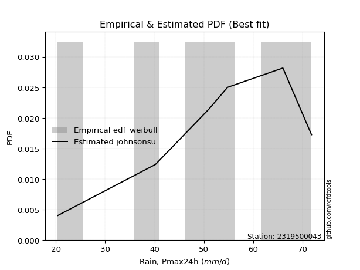</img>

</div>


### 4. EDF Beard (1943)

The Beard formula (or Beard´s plotting position formula) in hydrology is used to estimate the empirical non-exceedance probability _(P)_ of a flood event (or other extreme hydrological data point) within a given dataset.

<div align="center">


$P=(m-0.31)/(n+0.38)$


</div>


**4.1. Empirical values**

<div align="center">

|                | 0                   | 1                   | 2                   | 3         | 4                  | 5                  | 6                  |
|:---------------|:--------------------|:--------------------|:--------------------|:----------|:-------------------|:-------------------|:-------------------|
| date           | 2024                | 2023                | 2020                | 2021      | 2019               | 2022               | 2025               |
| x              | 20.4                | 40.2                | 51.0                | 54.8      | 66.0               | 71.8               | 77.2               |
| m              | 1                   | 2                   | 3                   | 4         | 5                  | 6                  | 7                  |
| empirical_dist | edf_beard           | edf_beard           | edf_beard           | edf_beard | edf_beard          | edf_beard          | edf_beard          |
| empirical      | 0.09349593495934959 | 0.22899728997289973 | 0.36449864498644985 | 0.5       | 0.6355013550135502 | 0.7710027100271003 | 0.9065040650406505 |
| empirical_tr   | 1.1031390134529149  | 1.29701230228471    | 1.5735607675906182  | 2.0       | 2.743494423791822  | 4.366863905325444  | 10.695652173913055 |

</div>


**4.2. Kolmogorov-Smirnov fit test (sorted by Δ)**


<div align="center">

|                | 0                    | 1                    | 2                   | 3                   | 4                   | 5                   | 6                   | 7                   | 8                   | 9                   | 10                  | 11                  | 12                  | 13                  | 14                  | 15                  | 16                  | 17                  | 18                  | 19                  | 20                  | 21                  | 22                  | 23                  | 24                  | 25                  | 26                  | 27                  | 28                  | 29                  | 30                  | 31                  | 32                  | 33                  | 34                  | 35                  | 36                  | 37                  | 38                  | 39                  | 40                  | 41                  | 42                  | 43                  | 44                  | 45                  | 46                  | 47                  | 48                  | 49                  | 50                  | 51                  | 52                  | 53                  | 54                  | 55                  | 56                  | 57                  | 58                  | 59                  | 60                  | 61                  | 62                  | 63                  | 64                  | 65                  | 66                  | 67                  | 68                  | 69                  | 70                  | 71                  | 72                  | 73                  | 74                  | 75                  | 76                  | 77                  | 78                  | 79                  | 80                  | 81                  | 82                  | 83                  | 84                  | 85                  | 86                  | 87                  | 88                  | 89                  | 90                  | 91                  | 92                  | 93                  | 94                  | 95                  | 96                  | 97                  | 98                  | 99                  | 100                 | 101                 | 102                 | 103                 | 104                 | 105                 | 106                 | 107                 | 108                 | 109                 | 110                 | 111                 | 112                 | 113                 | 114                 | 115                 | 116                 | 117                 | 118                 | 119                 | 120                 | 121                 | 122                 | 123                 | 124                 | 125                 | 126                 | 127                 | 128                 | 129                 | 130                 | 131                 | 132                 | 133                 | 134                 | 135                 | 136                 | 137                 | 138                 | 139                 | 140                 | 141                 | 142                 | 143                 | 144                 | 145                 | 146                 | 147                 | 148                 | 149                 | 150                 | 151                 | 152                 | 153                 | 154                 | 155                 | 156                 | 157                 | 158                 | 159                 |
|:---------------|:---------------------|:---------------------|:--------------------|:--------------------|:--------------------|:--------------------|:--------------------|:--------------------|:--------------------|:--------------------|:--------------------|:--------------------|:--------------------|:--------------------|:--------------------|:--------------------|:--------------------|:--------------------|:--------------------|:--------------------|:--------------------|:--------------------|:--------------------|:--------------------|:--------------------|:--------------------|:--------------------|:--------------------|:--------------------|:--------------------|:--------------------|:--------------------|:--------------------|:--------------------|:--------------------|:--------------------|:--------------------|:--------------------|:--------------------|:--------------------|:--------------------|:--------------------|:--------------------|:--------------------|:--------------------|:--------------------|:--------------------|:--------------------|:--------------------|:--------------------|:--------------------|:--------------------|:--------------------|:--------------------|:--------------------|:--------------------|:--------------------|:--------------------|:--------------------|:--------------------|:--------------------|:--------------------|:--------------------|:--------------------|:--------------------|:--------------------|:--------------------|:--------------------|:--------------------|:--------------------|:--------------------|:--------------------|:--------------------|:--------------------|:--------------------|:--------------------|:--------------------|:--------------------|:--------------------|:--------------------|:--------------------|:--------------------|:--------------------|:--------------------|:--------------------|:--------------------|:--------------------|:--------------------|:--------------------|:--------------------|:--------------------|:--------------------|:--------------------|:--------------------|:--------------------|:--------------------|:--------------------|:--------------------|:--------------------|:--------------------|:--------------------|:--------------------|:--------------------|:--------------------|:--------------------|:--------------------|:--------------------|:--------------------|:--------------------|:--------------------|:--------------------|:--------------------|:--------------------|:--------------------|:--------------------|:--------------------|:--------------------|:--------------------|:--------------------|:--------------------|:--------------------|:--------------------|:--------------------|:--------------------|:--------------------|:--------------------|:--------------------|:--------------------|:--------------------|:--------------------|:--------------------|:--------------------|:--------------------|:--------------------|:--------------------|:--------------------|:--------------------|:--------------------|:--------------------|:--------------------|:--------------------|:--------------------|:--------------------|:--------------------|:--------------------|:--------------------|:--------------------|:--------------------|:--------------------|:--------------------|:--------------------|:--------------------|:--------------------|:--------------------|:--------------------|:--------------------|:--------------------|:--------------------|:--------------------|:--------------------|
| station        | 2319500043           | 2319500043           | 2319500043          | 2319500043          | 2319500043          | 2319500043          | 2319500043          | 2319500043          | 2319500043          | 2319500043          | 2319500043          | 2319500043          | 2319500043          | 2319500043          | 2319500043          | 2319500043          | 2319500043          | 2319500043          | 2319500043          | 2319500043          | 2319500043          | 2319500043          | 2319500043          | 2319500043          | 2319500043          | 2319500043          | 2319500043          | 2319500043          | 2319500043          | 2319500043          | 2319500043          | 2319500043          | 2319500043          | 2319500043          | 2319500043          | 2319500043          | 2319500043          | 2319500043          | 2319500043          | 2319500043          | 2319500043          | 2319500043          | 2319500043          | 2319500043          | 2319500043          | 2319500043          | 2319500043          | 2319500043          | 2319500043          | 2319500043          | 2319500043          | 2319500043          | 2319500043          | 2319500043          | 2319500043          | 2319500043          | 2319500043          | 2319500043          | 2319500043          | 2319500043          | 2319500043          | 2319500043          | 2319500043          | 2319500043          | 2319500043          | 2319500043          | 2319500043          | 2319500043          | 2319500043          | 2319500043          | 2319500043          | 2319500043          | 2319500043          | 2319500043          | 2319500043          | 2319500043          | 2319500043          | 2319500043          | 2319500043          | 2319500043          | 2319500043          | 2319500043          | 2319500043          | 2319500043          | 2319500043          | 2319500043          | 2319500043          | 2319500043          | 2319500043          | 2319500043          | 2319500043          | 2319500043          | 2319500043          | 2319500043          | 2319500043          | 2319500043          | 2319500043          | 2319500043          | 2319500043          | 2319500043          | 2319500043          | 2319500043          | 2319500043          | 2319500043          | 2319500043          | 2319500043          | 2319500043          | 2319500043          | 2319500043          | 2319500043          | 2319500043          | 2319500043          | 2319500043          | 2319500043          | 2319500043          | 2319500043          | 2319500043          | 2319500043          | 2319500043          | 2319500043          | 2319500043          | 2319500043          | 2319500043          | 2319500043          | 2319500043          | 2319500043          | 2319500043          | 2319500043          | 2319500043          | 2319500043          | 2319500043          | 2319500043          | 2319500043          | 2319500043          | 2319500043          | 2319500043          | 2319500043          | 2319500043          | 2319500043          | 2319500043          | 2319500043          | 2319500043          | 2319500043          | 2319500043          | 2319500043          | 2319500043          | 2319500043          | 2319500043          | 2319500043          | 2319500043          | 2319500043          | 2319500043          | 2319500043          | 2319500043          | 2319500043          | 2319500043          | 2319500043          | 2319500043          | 2319500043          | 2319500043          |
| empirical_dist | edf_beard            | edf_beard            | edf_beard           | edf_beard           | edf_beard           | edf_beard           | edf_beard           | edf_beard           | edf_beard           | edf_beard           | edf_beard           | edf_beard           | edf_beard           | edf_beard           | edf_beard           | edf_beard           | edf_beard           | edf_beard           | edf_beard           | edf_beard           | edf_beard           | edf_beard           | edf_beard           | edf_beard           | edf_beard           | edf_beard           | edf_beard           | edf_beard           | edf_beard           | edf_beard           | edf_beard           | edf_beard           | edf_beard           | edf_beard           | edf_beard           | edf_beard           | edf_beard           | edf_beard           | edf_beard           | edf_beard           | edf_beard           | edf_beard           | edf_beard           | edf_beard           | edf_beard           | edf_beard           | edf_beard           | edf_beard           | edf_beard           | edf_beard           | edf_beard           | edf_beard           | edf_beard           | edf_beard           | edf_beard           | edf_beard           | edf_beard           | edf_beard           | edf_beard           | edf_beard           | edf_beard           | edf_beard           | edf_beard           | edf_beard           | edf_beard           | edf_beard           | edf_beard           | edf_beard           | edf_beard           | edf_beard           | edf_beard           | edf_beard           | edf_beard           | edf_beard           | edf_beard           | edf_beard           | edf_beard           | edf_beard           | edf_beard           | edf_beard           | edf_beard           | edf_beard           | edf_beard           | edf_beard           | edf_beard           | edf_beard           | edf_beard           | edf_beard           | edf_beard           | edf_beard           | edf_beard           | edf_beard           | edf_beard           | edf_beard           | edf_beard           | edf_beard           | edf_beard           | edf_beard           | edf_beard           | edf_beard           | edf_beard           | edf_beard           | edf_beard           | edf_beard           | edf_beard           | edf_beard           | edf_beard           | edf_beard           | edf_beard           | edf_beard           | edf_beard           | edf_beard           | edf_beard           | edf_beard           | edf_beard           | edf_beard           | edf_beard           | edf_beard           | edf_beard           | edf_beard           | edf_beard           | edf_beard           | edf_beard           | edf_beard           | edf_beard           | edf_beard           | edf_beard           | edf_beard           | edf_beard           | edf_beard           | edf_beard           | edf_beard           | edf_beard           | edf_beard           | edf_beard           | edf_beard           | edf_beard           | edf_beard           | edf_beard           | edf_beard           | edf_beard           | edf_beard           | edf_beard           | edf_beard           | edf_beard           | edf_beard           | edf_beard           | edf_beard           | edf_beard           | edf_beard           | edf_beard           | edf_beard           | edf_beard           | edf_beard           | edf_beard           | edf_beard           | edf_beard           | edf_beard           | edf_beard           | edf_beard           |
| p_dist         | trapezoid            | logmielke            | logexponweib        | logpearson3         | weibull_min         | gompertz            | argus               | anglit              | logburr             | burr                | loggumbel_l         | gumbel_l            | pearson3            | semicircular        | mielke              | logt                | logargus            | logexponpow         | logdweibull         | logloglaplace       | loggennorm          | logtrapezoid        | logloggamma         | triang              | skewnorm            | logvonmises_line    | logweibull_max      | gausshyper          | loggenextreme       | genhalflogistic     | arcsine             | betaprime           | erlang              | gamma               | nct                 | truncnorm           | crystalball         | norm                | exponnorm           | t                   | f                   | rice                | invgamma            | alpha               | logweibull_min      | loggengamma         | logburr12           | johnsonsu           | ncf                 | loggompertz         | genpareto           | logjohnsonsu        | maxwell             | rayleigh            | invgauss            | cosine              | logistic            | logbeta             | loglevy_l           | dgamma              | genextreme          | hypsecant           | halfnorm            | loggenhalflogistic  | logsemicircular     | loganglit           | gumbel_r            | logexponnorm        | lognorm             | logcrystalball      | logrice             | logfatiguelife      | loglogistic         | logf                | lognct              | loghypsecant        | kstwobign           | loginvgamma         | logncf              | logbetaprime        | logerlang           | logarcsine          | moyal               | logskewnorm         | halflogistic        | loglaplace          | loglaplace          | laplace             | wrapcauchy          | logalpha            | ksone               | loginvgauss         | truncweibull_min    | dweibull            | logtukeylambda      | kappa3              | uniform             | logtriang           | logmaxwell          | vonmises_line       | logfoldnorm         | lograyleigh         | loginvweibull       | levy_l              | logdgamma           | kappa4              | loggausshyper       | beta                | logcosine           | logkstwobign        | wald                | loggumbel_r         | loghalfnorm         | loggenexpon         | genexpon            | bradford            | logmoyal            | loghalflogistic     | truncexpon          | lognakagami         | gennorm             | lomax               | logtruncnorm        | logwrapcauchy       | nakagami            | logksone            | burr12              | loglomax            | halfgennorm         | loggenpareto        | logrdist            | logwald             | logkappa4           | logkappa3           | loguniform          | logbradford         | logtruncweibull_min | logtruncexpon       | johnsonsb           | logjohnsonsb        | foldnorm            | exponweib           | weibull_max         | gengamma            | fatiguelife         | powerlaw            | loggamma            | loggamma            | rdist               | tukeylambda         | logpowerlaw         | invweibull          | truncpareto         | exponpow            | logtruncpareto      | genlogistic         | loggenlogistic      | loghalfgennorm      | logvonmises         | vonmises            |
| delta          | 0.050121187245620036 | 0.057065255625872224 | 0.06711192483696993 | 0.06725732568005699 | 0.07201685454333928 | 0.07212294248797757 | 0.07363879667590922 | 0.07375162105662003 | 0.07780245202723057 | 0.07846981745093728 | 0.08144742400315574 | 0.08146004825274844 | 0.08269081614527596 | 0.08361345237817029 | 0.08417029414261723 | 0.08527356510546824 | 0.08573321856546345 | 0.08637329706985297 | 0.08910537576982491 | 0.08963026323034995 | 0.09045843798433839 | 0.09155619790867153 | 0.09348314736410623 | 0.09349555231126827 | 0.0934955769183553  | 0.09349593332365423 | 0.093495934928996   | 0.0934959349585196  | 0.09349593495933195 | 0.09349593495934827 | 0.09349593495934959 | 0.09694877371146016 | 0.09745474388092412 | 0.1002283569358069  | 0.10063783249440572 | 0.10067219780935    | 0.10067225878526909 | 0.10067227052370076 | 0.10067375742789442 | 0.10075023364239732 | 0.10126808118798247 | 0.10191083687080738 | 0.10273461507125503 | 0.1029897919150502  | 0.10449835829888898 | 0.10523636256871027 | 0.10534743600033125 | 0.10538047967360553 | 0.10692499179153947 | 0.10845947062896433 | 0.10945445189353911 | 0.11099404662170559 | 0.11205551452547247 | 0.115323907083413   | 0.11777772180486135 | 0.12225041096206712 | 0.1232019083526521  | 0.1294468189748217  | 0.1365737642991287  | 0.13762134771844625 | 0.13814574856273587 | 0.13844797615013005 | 0.14065808066108104 | 0.1415343756671011  | 0.14279162211455537 | 0.1433312913314339  | 0.1434884170485946  | 0.1446366020767415  | 0.14463897724675318 | 0.14464290155430787 | 0.1446496957239714  | 0.14506318581741245 | 0.14588686668310408 | 0.14631196962488585 | 0.1469177464996822  | 0.14695219708540114 | 0.14779630962479734 | 0.14843585104730223 | 0.15084498268155538 | 0.15308662885064156 | 0.15392469287241478 | 0.15600099877577023 | 0.15727286264351348 | 0.15825286033771113 | 0.159131984013206   | 0.15982035422318064 | 0.15982035422318064 | 0.1598283294570101  | 0.16249847430016967 | 0.16294919973493477 | 0.1677783503187144  | 0.1678676312468716  | 0.169501626032306   | 0.17167970627344387 | 0.17224467459149398 | 0.1722965080786925  | 0.17423374937974728 | 0.17601779704438664 | 0.1773014286757278  | 0.1813889584633797  | 0.18724777936659148 | 0.18810838405798452 | 0.18811375361558008 | 0.1908268917435223  | 0.19537170086650635 | 0.19897794066487612 | 0.19968770388084262 | 0.20187952322604502 | 0.20697758644365033 | 0.21288704723637103 | 0.21497643394772054 | 0.21522464489181942 | 0.2185352126882783  | 0.22440702962289344 | 0.22656078787486494 | 0.23348199785900686 | 0.24098650410791483 | 0.24400549013198897 | 0.2546364910934707  | 0.2708629637465579  | 0.2710027100271003  | 0.2711672439853262  | 0.2736591993348706  | 0.2742345344938877  | 0.2860092978444157  | 0.29257873040516064 | 0.293142115333223   | 0.2979696624768058  | 0.2995245022486971  | 0.30203379594022906 | 0.306681114710857   | 0.31258857601333073 | 0.3192774480404916  | 0.3206604638953697  | 0.3239942054834825  | 0.33380141814402925 | 0.395889601985209   | 0.39758220458377386 | 0.40847085617977785 | 0.42951694473686586 | 0.5                 | 0.5322796988972046  | 0.5528713395323297  | 0.5661069304010291  | 0.5803538992085487  | 0.6018305678983071  | 0.6160870938633474  | 0.6160870938633474  | 0.6355013487559167  | 0.6355013550135431  | 0.6517843169671631  | 0.6607470664808986  | 0.6918885783526325  | 0.6969704945170044  | 0.7201314635156746  | 0.7710027100271003  | 0.7710027100271003  | 0.7710027100271003  | 1.1300701056822196  | 11.41788622796151   |
| deltao         | 0.48442053926100004  | 0.48442053926100004  | 0.48442053926100004 | 0.48442053926100004 | 0.48442053926100004 | 0.48442053926100004 | 0.48442053926100004 | 0.48442053926100004 | 0.48442053926100004 | 0.48442053926100004 | 0.48442053926100004 | 0.48442053926100004 | 0.48442053926100004 | 0.48442053926100004 | 0.48442053926100004 | 0.48442053926100004 | 0.48442053926100004 | 0.48442053926100004 | 0.48442053926100004 | 0.48442053926100004 | 0.48442053926100004 | 0.48442053926100004 | 0.48442053926100004 | 0.48442053926100004 | 0.48442053926100004 | 0.48442053926100004 | 0.48442053926100004 | 0.48442053926100004 | 0.48442053926100004 | 0.48442053926100004 | 0.48442053926100004 | 0.48442053926100004 | 0.48442053926100004 | 0.48442053926100004 | 0.48442053926100004 | 0.48442053926100004 | 0.48442053926100004 | 0.48442053926100004 | 0.48442053926100004 | 0.48442053926100004 | 0.48442053926100004 | 0.48442053926100004 | 0.48442053926100004 | 0.48442053926100004 | 0.48442053926100004 | 0.48442053926100004 | 0.48442053926100004 | 0.48442053926100004 | 0.48442053926100004 | 0.48442053926100004 | 0.48442053926100004 | 0.48442053926100004 | 0.48442053926100004 | 0.48442053926100004 | 0.48442053926100004 | 0.48442053926100004 | 0.48442053926100004 | 0.48442053926100004 | 0.48442053926100004 | 0.48442053926100004 | 0.48442053926100004 | 0.48442053926100004 | 0.48442053926100004 | 0.48442053926100004 | 0.48442053926100004 | 0.48442053926100004 | 0.48442053926100004 | 0.48442053926100004 | 0.48442053926100004 | 0.48442053926100004 | 0.48442053926100004 | 0.48442053926100004 | 0.48442053926100004 | 0.48442053926100004 | 0.48442053926100004 | 0.48442053926100004 | 0.48442053926100004 | 0.48442053926100004 | 0.48442053926100004 | 0.48442053926100004 | 0.48442053926100004 | 0.48442053926100004 | 0.48442053926100004 | 0.48442053926100004 | 0.48442053926100004 | 0.48442053926100004 | 0.48442053926100004 | 0.48442053926100004 | 0.48442053926100004 | 0.48442053926100004 | 0.48442053926100004 | 0.48442053926100004 | 0.48442053926100004 | 0.48442053926100004 | 0.48442053926100004 | 0.48442053926100004 | 0.48442053926100004 | 0.48442053926100004 | 0.48442053926100004 | 0.48442053926100004 | 0.48442053926100004 | 0.48442053926100004 | 0.48442053926100004 | 0.48442053926100004 | 0.48442053926100004 | 0.48442053926100004 | 0.48442053926100004 | 0.48442053926100004 | 0.48442053926100004 | 0.48442053926100004 | 0.48442053926100004 | 0.48442053926100004 | 0.48442053926100004 | 0.48442053926100004 | 0.48442053926100004 | 0.48442053926100004 | 0.48442053926100004 | 0.48442053926100004 | 0.48442053926100004 | 0.48442053926100004 | 0.48442053926100004 | 0.48442053926100004 | 0.48442053926100004 | 0.48442053926100004 | 0.48442053926100004 | 0.48442053926100004 | 0.48442053926100004 | 0.48442053926100004 | 0.48442053926100004 | 0.48442053926100004 | 0.48442053926100004 | 0.48442053926100004 | 0.48442053926100004 | 0.48442053926100004 | 0.48442053926100004 | 0.48442053926100004 | 0.48442053926100004 | 0.48442053926100004 | 0.48442053926100004 | 0.48442053926100004 | 0.48442053926100004 | 0.48442053926100004 | 0.48442053926100004 | 0.48442053926100004 | 0.48442053926100004 | 0.48442053926100004 | 0.48442053926100004 | 0.48442053926100004 | 0.48442053926100004 | 0.48442053926100004 | 0.48442053926100004 | 0.48442053926100004 | 0.48442053926100004 | 0.48442053926100004 | 0.48442053926100004 | 0.48442053926100004 | 0.48442053926100004 | 0.48442053926100004 | 0.48442053926100004 | 0.48442053926100004 |
| eval           | Δo > Δ               | Δo > Δ               | Δo > Δ              | Δo > Δ              | Δo > Δ              | Δo > Δ              | Δo > Δ              | Δo > Δ              | Δo > Δ              | Δo > Δ              | Δo > Δ              | Δo > Δ              | Δo > Δ              | Δo > Δ              | Δo > Δ              | Δo > Δ              | Δo > Δ              | Δo > Δ              | Δo > Δ              | Δo > Δ              | Δo > Δ              | Δo > Δ              | Δo > Δ              | Δo > Δ              | Δo > Δ              | Δo > Δ              | Δo > Δ              | Δo > Δ              | Δo > Δ              | Δo > Δ              | Δo > Δ              | Δo > Δ              | Δo > Δ              | Δo > Δ              | Δo > Δ              | Δo > Δ              | Δo > Δ              | Δo > Δ              | Δo > Δ              | Δo > Δ              | Δo > Δ              | Δo > Δ              | Δo > Δ              | Δo > Δ              | Δo > Δ              | Δo > Δ              | Δo > Δ              | Δo > Δ              | Δo > Δ              | Δo > Δ              | Δo > Δ              | Δo > Δ              | Δo > Δ              | Δo > Δ              | Δo > Δ              | Δo > Δ              | Δo > Δ              | Δo > Δ              | Δo > Δ              | Δo > Δ              | Δo > Δ              | Δo > Δ              | Δo > Δ              | Δo > Δ              | Δo > Δ              | Δo > Δ              | Δo > Δ              | Δo > Δ              | Δo > Δ              | Δo > Δ              | Δo > Δ              | Δo > Δ              | Δo > Δ              | Δo > Δ              | Δo > Δ              | Δo > Δ              | Δo > Δ              | Δo > Δ              | Δo > Δ              | Δo > Δ              | Δo > Δ              | Δo > Δ              | Δo > Δ              | Δo > Δ              | Δo > Δ              | Δo > Δ              | Δo > Δ              | Δo > Δ              | Δo > Δ              | Δo > Δ              | Δo > Δ              | Δo > Δ              | Δo > Δ              | Δo > Δ              | Δo > Δ              | Δo > Δ              | Δo > Δ              | Δo > Δ              | Δo > Δ              | Δo > Δ              | Δo > Δ              | Δo > Δ              | Δo > Δ              | Δo > Δ              | Δo > Δ              | Δo > Δ              | Δo > Δ              | Δo > Δ              | Δo > Δ              | Δo > Δ              | Δo > Δ              | Δo > Δ              | Δo > Δ              | Δo > Δ              | Δo > Δ              | Δo > Δ              | Δo > Δ              | Δo > Δ              | Δo > Δ              | Δo > Δ              | Δo > Δ              | Δo > Δ              | Δo > Δ              | Δo > Δ              | Δo > Δ              | Δo > Δ              | Δo > Δ              | Δo > Δ              | Δo > Δ              | Δo > Δ              | Δo > Δ              | Δo > Δ              | Δo > Δ              | Δo > Δ              | Δo > Δ              | Δo > Δ              | Δo > Δ              | Δo > Δ              | Δo > Δ              | Δo > Δ              | Δo <= Δ             | Δo <= Δ             | Δo <= Δ             | Δo <= Δ             | Δo <= Δ             | Δo <= Δ             | Δo <= Δ             | Δo <= Δ             | Δo <= Δ             | Δo <= Δ             | Δo <= Δ             | Δo <= Δ             | Δo <= Δ             | Δo <= Δ             | Δo <= Δ             | Δo <= Δ             | Δo <= Δ             | Δo <= Δ             | Δo <= Δ             | Δo <= Δ             |
| fit            | 1                    | 1                    | 1                   | 1                   | 1                   | 1                   | 1                   | 1                   | 1                   | 1                   | 1                   | 1                   | 1                   | 1                   | 1                   | 1                   | 1                   | 1                   | 1                   | 1                   | 1                   | 1                   | 1                   | 1                   | 1                   | 1                   | 1                   | 1                   | 1                   | 1                   | 1                   | 1                   | 1                   | 1                   | 1                   | 1                   | 1                   | 1                   | 1                   | 1                   | 1                   | 1                   | 1                   | 1                   | 1                   | 1                   | 1                   | 1                   | 1                   | 1                   | 1                   | 1                   | 1                   | 1                   | 1                   | 1                   | 1                   | 1                   | 1                   | 1                   | 1                   | 1                   | 1                   | 1                   | 1                   | 1                   | 1                   | 1                   | 1                   | 1                   | 1                   | 1                   | 1                   | 1                   | 1                   | 1                   | 1                   | 1                   | 1                   | 1                   | 1                   | 1                   | 1                   | 1                   | 1                   | 1                   | 1                   | 1                   | 1                   | 1                   | 1                   | 1                   | 1                   | 1                   | 1                   | 1                   | 1                   | 1                   | 1                   | 1                   | 1                   | 1                   | 1                   | 1                   | 1                   | 1                   | 1                   | 1                   | 1                   | 1                   | 1                   | 1                   | 1                   | 1                   | 1                   | 1                   | 1                   | 1                   | 1                   | 1                   | 1                   | 1                   | 1                   | 1                   | 1                   | 1                   | 1                   | 1                   | 1                   | 1                   | 1                   | 1                   | 1                   | 1                   | 1                   | 1                   | 1                   | 1                   | 1                   | 1                   | 0                   | 0                   | 0                   | 0                   | 0                   | 0                   | 0                   | 0                   | 0                   | 0                   | 0                   | 0                   | 0                   | 0                   | 0                   | 0                   | 0                   | 0                   | 0                   | 0                   |
| n              | 7                    | 7                    | 7                   | 7                   | 7                   | 7                   | 7                   | 7                   | 7                   | 7                   | 7                   | 7                   | 7                   | 7                   | 7                   | 7                   | 7                   | 7                   | 7                   | 7                   | 7                   | 7                   | 7                   | 7                   | 7                   | 7                   | 7                   | 7                   | 7                   | 7                   | 7                   | 7                   | 7                   | 7                   | 7                   | 7                   | 7                   | 7                   | 7                   | 7                   | 7                   | 7                   | 7                   | 7                   | 7                   | 7                   | 7                   | 7                   | 7                   | 7                   | 7                   | 7                   | 7                   | 7                   | 7                   | 7                   | 7                   | 7                   | 7                   | 7                   | 7                   | 7                   | 7                   | 7                   | 7                   | 7                   | 7                   | 7                   | 7                   | 7                   | 7                   | 7                   | 7                   | 7                   | 7                   | 7                   | 7                   | 7                   | 7                   | 7                   | 7                   | 7                   | 7                   | 7                   | 7                   | 7                   | 7                   | 7                   | 7                   | 7                   | 7                   | 7                   | 7                   | 7                   | 7                   | 7                   | 7                   | 7                   | 7                   | 7                   | 7                   | 7                   | 7                   | 7                   | 7                   | 7                   | 7                   | 7                   | 7                   | 7                   | 7                   | 7                   | 7                   | 7                   | 7                   | 7                   | 7                   | 7                   | 7                   | 7                   | 7                   | 7                   | 7                   | 7                   | 7                   | 7                   | 7                   | 7                   | 7                   | 7                   | 7                   | 7                   | 7                   | 7                   | 7                   | 7                   | 7                   | 7                   | 7                   | 7                   | 7                   | 7                   | 7                   | 7                   | 7                   | 7                   | 7                   | 7                   | 7                   | 7                   | 7                   | 7                   | 7                   | 7                   | 7                   | 7                   | 7                   | 7                   | 7                   | 7                   |
| best_fit       | 1                    | 0                    | 0                   | 0                   | 0                   | 0                   | 0                   | 0                   | 0                   | 0                   | 0                   | 0                   | 0                   | 0                   | 0                   | 0                   | 0                   | 0                   | 0                   | 0                   | 0                   | 0                   | 0                   | 0                   | 0                   | 0                   | 0                   | 0                   | 0                   | 0                   | 0                   | 0                   | 0                   | 0                   | 0                   | 0                   | 0                   | 0                   | 0                   | 0                   | 0                   | 0                   | 0                   | 0                   | 0                   | 0                   | 0                   | 0                   | 0                   | 0                   | 0                   | 0                   | 0                   | 0                   | 0                   | 0                   | 0                   | 0                   | 0                   | 0                   | 0                   | 0                   | 0                   | 0                   | 0                   | 0                   | 0                   | 0                   | 0                   | 0                   | 0                   | 0                   | 0                   | 0                   | 0                   | 0                   | 0                   | 0                   | 0                   | 0                   | 0                   | 0                   | 0                   | 0                   | 0                   | 0                   | 0                   | 0                   | 0                   | 0                   | 0                   | 0                   | 0                   | 0                   | 0                   | 0                   | 0                   | 0                   | 0                   | 0                   | 0                   | 0                   | 0                   | 0                   | 0                   | 0                   | 0                   | 0                   | 0                   | 0                   | 0                   | 0                   | 0                   | 0                   | 0                   | 0                   | 0                   | 0                   | 0                   | 0                   | 0                   | 0                   | 0                   | 0                   | 0                   | 0                   | 0                   | 0                   | 0                   | 0                   | 0                   | 0                   | 0                   | 0                   | 0                   | 0                   | 0                   | 0                   | 0                   | 0                   | 0                   | 0                   | 0                   | 0                   | 0                   | 0                   | 0                   | 0                   | 0                   | 0                   | 0                   | 0                   | 0                   | 0                   | 0                   | 0                   | 0                   | 0                   | 0                   | 0                   |
| best_fit_sort  | 1                    | 2                    | 3                   | 4                   | 5                   | 6                   | 7                   | 8                   | 9                   | 10                  | 11                  | 12                  | 13                  | 14                  | 15                  | 16                  | 17                  | 18                  | 19                  | 20                  | 21                  | 22                  | 23                  | 24                  | 25                  | 26                  | 27                  | 28                  | 29                  | 30                  | 31                  | 32                  | 33                  | 34                  | 35                  | 36                  | 37                  | 38                  | 39                  | 40                  | 41                  | 42                  | 43                  | 44                  | 45                  | 46                  | 47                  | 48                  | 49                  | 50                  | 51                  | 52                  | 53                  | 54                  | 55                  | 56                  | 57                  | 58                  | 59                  | 60                  | 61                  | 62                  | 63                  | 64                  | 65                  | 66                  | 67                  | 68                  | 69                  | 70                  | 71                  | 72                  | 73                  | 74                  | 75                  | 76                  | 77                  | 78                  | 79                  | 80                  | 81                  | 82                  | 83                  | 84                  | 85                  | 86                  | 87                  | 88                  | 89                  | 90                  | 91                  | 92                  | 93                  | 94                  | 95                  | 96                  | 97                  | 98                  | 99                  | 100                 | 101                 | 102                 | 103                 | 104                 | 105                 | 106                 | 107                 | 108                 | 109                 | 110                 | 111                 | 112                 | 113                 | 114                 | 115                 | 116                 | 117                 | 118                 | 119                 | 120                 | 121                 | 122                 | 123                 | 124                 | 125                 | 126                 | 127                 | 128                 | 129                 | 130                 | 131                 | 132                 | 133                 | 134                 | 135                 | 136                 | 137                 | 138                 | 139                 | 140                 | 141                 | 142                 | 143                 | 144                 | 145                 | 146                 | 147                 | 148                 | 149                 | 150                 | 151                 | 152                 | 153                 | 154                 | 155                 | 156                 | 157                 | 158                 | 159                 | 160                 |

</div>


**4.3. Best fit**

<div align="center">

|   id |    station | empirical_dist   | p_dist    |     delta |   deltao | eval   |   fit |   n |   best_fit |   best_fit_sort |
|-----:|-----------:|:-----------------|:----------|----------:|---------:|:-------|------:|----:|-----------:|----------------:|
|    0 | 2319500043 | edf_beard        | trapezoid | 0.0501212 | 0.484421 | Δo > Δ |     1 |   7 |          1 |               1 |

</div>


<div align="center">

</img></img>

</div>


### 5. EDF Chegodayev (1955)

The Chegodayev formula is an empirical plotting position formula used in hydrological frequency analysis to estimate the exceedance probability or return period of a specific event from a set of observed data. It is primarily used for plotting observed data points on probability paper to fit a theoretical distribution, particularly for analyzing extreme events like maximum flood flows or rainfall intensities. The constant _b_ value in the generalized plotting position formula is 0.3.

<div align="center">


$P=(m-b)/(n+1-2b)$


</div>


**5.1. Empirical values**

<div align="center">

|                | 0                   | 1                   | 2                   | 3              | 4                  | 5                  | 6                  |
|:---------------|:--------------------|:--------------------|:--------------------|:---------------|:-------------------|:-------------------|:-------------------|
| date           | 2024                | 2023                | 2020                | 2021           | 2019               | 2022               | 2025               |
| x              | 20.4                | 40.2                | 51.0                | 54.8           | 66.0               | 71.8               | 77.2               |
| m              | 1                   | 2                   | 3                   | 4              | 5                  | 6                  | 7                  |
| empirical_dist | edf_chegodayev      | edf_chegodayev      | edf_chegodayev      | edf_chegodayev | edf_chegodayev     | edf_chegodayev     | edf_chegodayev     |
| empirical      | 0.09459459459459459 | 0.22972972972972971 | 0.36486486486486486 | 0.5            | 0.6351351351351351 | 0.7702702702702703 | 0.9054054054054054 |
| empirical_tr   | 1.1044776119402986  | 1.2982456140350878  | 1.574468085106383   | 2.0            | 2.7407407407407405 | 4.352941176470589  | 10.571428571428568 |

</div>


**5.2. Kolmogorov-Smirnov fit test (sorted by Δ)**


<div align="center">

|                | 0                    | 1                    | 2                   | 3                   | 4                   | 5                   | 6                   | 7                   | 8                   | 9                   | 10                  | 11                  | 12                  | 13                  | 14                  | 15                  | 16                  | 17                  | 18                  | 19                  | 20                  | 21                  | 22                  | 23                  | 24                  | 25                  | 26                  | 27                  | 28                  | 29                  | 30                  | 31                  | 32                  | 33                  | 34                  | 35                  | 36                  | 37                  | 38                  | 39                  | 40                  | 41                  | 42                  | 43                  | 44                  | 45                  | 46                  | 47                  | 48                  | 49                  | 50                  | 51                  | 52                  | 53                  | 54                  | 55                  | 56                  | 57                  | 58                  | 59                  | 60                  | 61                  | 62                  | 63                  | 64                  | 65                  | 66                  | 67                  | 68                  | 69                  | 70                  | 71                  | 72                  | 73                  | 74                  | 75                  | 76                  | 77                  | 78                  | 79                  | 80                  | 81                  | 82                  | 83                  | 84                  | 85                  | 86                  | 87                  | 88                  | 89                  | 90                  | 91                  | 92                  | 93                  | 94                  | 95                  | 96                  | 97                  | 98                  | 99                  | 100                 | 101                 | 102                 | 103                 | 104                 | 105                 | 106                 | 107                 | 108                 | 109                 | 110                 | 111                 | 112                 | 113                 | 114                 | 115                 | 116                 | 117                 | 118                 | 119                 | 120                 | 121                 | 122                 | 123                 | 124                 | 125                 | 126                 | 127                 | 128                 | 129                 | 130                 | 131                 | 132                 | 133                 | 134                 | 135                 | 136                 | 137                 | 138                 | 139                 | 140                 | 141                 | 142                 | 143                 | 144                 | 145                 | 146                 | 147                 | 148                 | 149                 | 150                 | 151                 | 152                 | 153                 | 154                 | 155                 | 156                 | 157                 | 158                 | 159                 |
|:---------------|:---------------------|:---------------------|:--------------------|:--------------------|:--------------------|:--------------------|:--------------------|:--------------------|:--------------------|:--------------------|:--------------------|:--------------------|:--------------------|:--------------------|:--------------------|:--------------------|:--------------------|:--------------------|:--------------------|:--------------------|:--------------------|:--------------------|:--------------------|:--------------------|:--------------------|:--------------------|:--------------------|:--------------------|:--------------------|:--------------------|:--------------------|:--------------------|:--------------------|:--------------------|:--------------------|:--------------------|:--------------------|:--------------------|:--------------------|:--------------------|:--------------------|:--------------------|:--------------------|:--------------------|:--------------------|:--------------------|:--------------------|:--------------------|:--------------------|:--------------------|:--------------------|:--------------------|:--------------------|:--------------------|:--------------------|:--------------------|:--------------------|:--------------------|:--------------------|:--------------------|:--------------------|:--------------------|:--------------------|:--------------------|:--------------------|:--------------------|:--------------------|:--------------------|:--------------------|:--------------------|:--------------------|:--------------------|:--------------------|:--------------------|:--------------------|:--------------------|:--------------------|:--------------------|:--------------------|:--------------------|:--------------------|:--------------------|:--------------------|:--------------------|:--------------------|:--------------------|:--------------------|:--------------------|:--------------------|:--------------------|:--------------------|:--------------------|:--------------------|:--------------------|:--------------------|:--------------------|:--------------------|:--------------------|:--------------------|:--------------------|:--------------------|:--------------------|:--------------------|:--------------------|:--------------------|:--------------------|:--------------------|:--------------------|:--------------------|:--------------------|:--------------------|:--------------------|:--------------------|:--------------------|:--------------------|:--------------------|:--------------------|:--------------------|:--------------------|:--------------------|:--------------------|:--------------------|:--------------------|:--------------------|:--------------------|:--------------------|:--------------------|:--------------------|:--------------------|:--------------------|:--------------------|:--------------------|:--------------------|:--------------------|:--------------------|:--------------------|:--------------------|:--------------------|:--------------------|:--------------------|:--------------------|:--------------------|:--------------------|:--------------------|:--------------------|:--------------------|:--------------------|:--------------------|:--------------------|:--------------------|:--------------------|:--------------------|:--------------------|:--------------------|:--------------------|:--------------------|:--------------------|:--------------------|:--------------------|:--------------------|
| station        | 2319500043           | 2319500043           | 2319500043          | 2319500043          | 2319500043          | 2319500043          | 2319500043          | 2319500043          | 2319500043          | 2319500043          | 2319500043          | 2319500043          | 2319500043          | 2319500043          | 2319500043          | 2319500043          | 2319500043          | 2319500043          | 2319500043          | 2319500043          | 2319500043          | 2319500043          | 2319500043          | 2319500043          | 2319500043          | 2319500043          | 2319500043          | 2319500043          | 2319500043          | 2319500043          | 2319500043          | 2319500043          | 2319500043          | 2319500043          | 2319500043          | 2319500043          | 2319500043          | 2319500043          | 2319500043          | 2319500043          | 2319500043          | 2319500043          | 2319500043          | 2319500043          | 2319500043          | 2319500043          | 2319500043          | 2319500043          | 2319500043          | 2319500043          | 2319500043          | 2319500043          | 2319500043          | 2319500043          | 2319500043          | 2319500043          | 2319500043          | 2319500043          | 2319500043          | 2319500043          | 2319500043          | 2319500043          | 2319500043          | 2319500043          | 2319500043          | 2319500043          | 2319500043          | 2319500043          | 2319500043          | 2319500043          | 2319500043          | 2319500043          | 2319500043          | 2319500043          | 2319500043          | 2319500043          | 2319500043          | 2319500043          | 2319500043          | 2319500043          | 2319500043          | 2319500043          | 2319500043          | 2319500043          | 2319500043          | 2319500043          | 2319500043          | 2319500043          | 2319500043          | 2319500043          | 2319500043          | 2319500043          | 2319500043          | 2319500043          | 2319500043          | 2319500043          | 2319500043          | 2319500043          | 2319500043          | 2319500043          | 2319500043          | 2319500043          | 2319500043          | 2319500043          | 2319500043          | 2319500043          | 2319500043          | 2319500043          | 2319500043          | 2319500043          | 2319500043          | 2319500043          | 2319500043          | 2319500043          | 2319500043          | 2319500043          | 2319500043          | 2319500043          | 2319500043          | 2319500043          | 2319500043          | 2319500043          | 2319500043          | 2319500043          | 2319500043          | 2319500043          | 2319500043          | 2319500043          | 2319500043          | 2319500043          | 2319500043          | 2319500043          | 2319500043          | 2319500043          | 2319500043          | 2319500043          | 2319500043          | 2319500043          | 2319500043          | 2319500043          | 2319500043          | 2319500043          | 2319500043          | 2319500043          | 2319500043          | 2319500043          | 2319500043          | 2319500043          | 2319500043          | 2319500043          | 2319500043          | 2319500043          | 2319500043          | 2319500043          | 2319500043          | 2319500043          | 2319500043          | 2319500043          | 2319500043          | 2319500043          |
| empirical_dist | edf_chegodayev       | edf_chegodayev       | edf_chegodayev      | edf_chegodayev      | edf_chegodayev      | edf_chegodayev      | edf_chegodayev      | edf_chegodayev      | edf_chegodayev      | edf_chegodayev      | edf_chegodayev      | edf_chegodayev      | edf_chegodayev      | edf_chegodayev      | edf_chegodayev      | edf_chegodayev      | edf_chegodayev      | edf_chegodayev      | edf_chegodayev      | edf_chegodayev      | edf_chegodayev      | edf_chegodayev      | edf_chegodayev      | edf_chegodayev      | edf_chegodayev      | edf_chegodayev      | edf_chegodayev      | edf_chegodayev      | edf_chegodayev      | edf_chegodayev      | edf_chegodayev      | edf_chegodayev      | edf_chegodayev      | edf_chegodayev      | edf_chegodayev      | edf_chegodayev      | edf_chegodayev      | edf_chegodayev      | edf_chegodayev      | edf_chegodayev      | edf_chegodayev      | edf_chegodayev      | edf_chegodayev      | edf_chegodayev      | edf_chegodayev      | edf_chegodayev      | edf_chegodayev      | edf_chegodayev      | edf_chegodayev      | edf_chegodayev      | edf_chegodayev      | edf_chegodayev      | edf_chegodayev      | edf_chegodayev      | edf_chegodayev      | edf_chegodayev      | edf_chegodayev      | edf_chegodayev      | edf_chegodayev      | edf_chegodayev      | edf_chegodayev      | edf_chegodayev      | edf_chegodayev      | edf_chegodayev      | edf_chegodayev      | edf_chegodayev      | edf_chegodayev      | edf_chegodayev      | edf_chegodayev      | edf_chegodayev      | edf_chegodayev      | edf_chegodayev      | edf_chegodayev      | edf_chegodayev      | edf_chegodayev      | edf_chegodayev      | edf_chegodayev      | edf_chegodayev      | edf_chegodayev      | edf_chegodayev      | edf_chegodayev      | edf_chegodayev      | edf_chegodayev      | edf_chegodayev      | edf_chegodayev      | edf_chegodayev      | edf_chegodayev      | edf_chegodayev      | edf_chegodayev      | edf_chegodayev      | edf_chegodayev      | edf_chegodayev      | edf_chegodayev      | edf_chegodayev      | edf_chegodayev      | edf_chegodayev      | edf_chegodayev      | edf_chegodayev      | edf_chegodayev      | edf_chegodayev      | edf_chegodayev      | edf_chegodayev      | edf_chegodayev      | edf_chegodayev      | edf_chegodayev      | edf_chegodayev      | edf_chegodayev      | edf_chegodayev      | edf_chegodayev      | edf_chegodayev      | edf_chegodayev      | edf_chegodayev      | edf_chegodayev      | edf_chegodayev      | edf_chegodayev      | edf_chegodayev      | edf_chegodayev      | edf_chegodayev      | edf_chegodayev      | edf_chegodayev      | edf_chegodayev      | edf_chegodayev      | edf_chegodayev      | edf_chegodayev      | edf_chegodayev      | edf_chegodayev      | edf_chegodayev      | edf_chegodayev      | edf_chegodayev      | edf_chegodayev      | edf_chegodayev      | edf_chegodayev      | edf_chegodayev      | edf_chegodayev      | edf_chegodayev      | edf_chegodayev      | edf_chegodayev      | edf_chegodayev      | edf_chegodayev      | edf_chegodayev      | edf_chegodayev      | edf_chegodayev      | edf_chegodayev      | edf_chegodayev      | edf_chegodayev      | edf_chegodayev      | edf_chegodayev      | edf_chegodayev      | edf_chegodayev      | edf_chegodayev      | edf_chegodayev      | edf_chegodayev      | edf_chegodayev      | edf_chegodayev      | edf_chegodayev      | edf_chegodayev      | edf_chegodayev      | edf_chegodayev      | edf_chegodayev      | edf_chegodayev      |
| p_dist         | trapezoid            | logmielke            | logpearson3         | logexponweib        | weibull_min         | gompertz            | argus               | anglit              | logburr             | burr                | loggumbel_l         | gumbel_l            | pearson3            | logt                | semicircular        | mielke              | logargus            | logexponpow         | logloglaplace       | logdweibull         | logtrapezoid        | loggennorm          | logloggamma         | triang              | skewnorm            | logvonmises_line    | logweibull_max      | gausshyper          | loggenextreme       | genhalflogistic     | arcsine             | betaprime           | erlang              | gamma               | nct                 | truncnorm           | crystalball         | norm                | exponnorm           | t                   | f                   | rice                | invgamma            | alpha               | logweibull_min      | johnsonsu           | loggengamma         | logburr12           | ncf                 | genpareto           | loggompertz         | logjohnsonsu        | maxwell             | rayleigh            | invgauss            | cosine              | logistic            | logbeta             | loglevy_l           | dgamma              | genextreme          | hypsecant           | halfnorm            | loggenhalflogistic  | logsemicircular     | loganglit           | gumbel_r            | logexponnorm        | lognorm             | logcrystalball      | logrice             | logfatiguelife      | loglogistic         | logf                | lognct              | loghypsecant        | kstwobign           | loginvgamma         | logncf              | logbetaprime        | logerlang           | logarcsine          | moyal               | logskewnorm         | halflogistic        | loglaplace          | loglaplace          | laplace             | wrapcauchy          | logalpha            | ksone               | loginvgauss         | truncweibull_min    | kappa3              | dweibull            | logtukeylambda      | uniform             | logtriang           | logmaxwell          | vonmises_line       | logfoldnorm         | lograyleigh         | loginvweibull       | levy_l              | logdgamma           | kappa4              | loggausshyper       | beta                | logcosine           | logkstwobign        | wald                | loggumbel_r         | loghalfnorm         | loggenexpon         | genexpon            | bradford            | logmoyal            | loghalflogistic     | truncexpon          | lomax               | gennorm             | lognakagami         | logwrapcauchy       | logtruncnorm        | nakagami            | logksone            | burr12              | loglomax            | halfgennorm         | loggenpareto        | logrdist            | logwald             | logkappa4           | logkappa3           | loguniform          | logbradford         | logtruncweibull_min | logtruncexpon       | johnsonsb           | logjohnsonsb        | foldnorm            | exponweib           | weibull_max         | gengamma            | fatiguelife         | powerlaw            | loggamma            | loggamma            | rdist               | tukeylambda         | logpowerlaw         | invweibull          | truncpareto         | exponpow            | logtruncpareto      | genlogistic         | loggenlogistic      | loghalfgennorm      | logvonmises         | vonmises            |
| delta          | 0.050121187245620036 | 0.057065255625872224 | 0.06689110580164198 | 0.06784436459379994 | 0.0723830744217544  | 0.07248916236639269 | 0.07363879667590922 | 0.07411784093503515 | 0.07890111166247571 | 0.07956847708618242 | 0.08181364388157086 | 0.08182626813116356 | 0.08305703602369108 | 0.0841749054702231  | 0.08471211201341529 | 0.08526895377786237 | 0.08646565832229347 | 0.08673951694826809 | 0.08853160359510481 | 0.08947159564824003 | 0.0904575382734264  | 0.09082465786275351 | 0.09458180699935137 | 0.0945942119465134  | 0.09459423655360044 | 0.09459459295889923 | 0.09459459456424113 | 0.09459459459376474 | 0.09459459459457709 | 0.0945945945945934  | 0.09459459459459459 | 0.09731499358987528 | 0.09782096375933924 | 0.10059457681422201 | 0.10100405237282084 | 0.10103841768776511 | 0.1010384786636842  | 0.10103849040211588 | 0.10103997730630954 | 0.10111645352081244 | 0.10163430106639759 | 0.1022770567492225  | 0.10310083494967015 | 0.10335601179346532 | 0.1048645781773041  | 0.10538047967360553 | 0.10560258244712539 | 0.10571365587874637 | 0.10729121166995459 | 0.10872201213670912 | 0.10882569050737945 | 0.11099404662170559 | 0.11242173440388759 | 0.11569012696182812 | 0.11741150192644634 | 0.12261663084048224 | 0.12356812823106722 | 0.12871437921799167 | 0.13547510466388374 | 0.13798756759686137 | 0.13814574856273587 | 0.13881419602854517 | 0.14029186078266603 | 0.14116815578868608 | 0.14242540223614036 | 0.1429650714530189  | 0.14385463692700973 | 0.1442703821983265  | 0.14427275736833817 | 0.14427668167589286 | 0.1442834758455564  | 0.14469696593899745 | 0.14552064680468907 | 0.14594574974647084 | 0.1465515266212672  | 0.14658597720698613 | 0.14743008974638233 | 0.14806963116888722 | 0.15047876280314038 | 0.15272040897222655 | 0.15355847299399977 | 0.1549023391405251  | 0.1576390825219286  | 0.15861908021612625 | 0.158765764134791   | 0.16018657410159576 | 0.16018657410159576 | 0.1601945493354252  | 0.16213225442175466 | 0.16258297985651976 | 0.1674121304402994  | 0.1675014113684566  | 0.16986784591072113 | 0.1719302882002775  | 0.17204592615185899 | 0.17297711434832397 | 0.17386752950133227 | 0.17565157716597163 | 0.17693520879731278 | 0.1810227385849647  | 0.18688155948817647 | 0.18774216417956952 | 0.18774753373716507 | 0.18972823210827733 | 0.19573792074492147 | 0.1986117207864611  | 0.1993214840024276  | 0.20187952322604502 | 0.20661136656523532 | 0.21252082735795602 | 0.21461021406930553 | 0.2148584250134044  | 0.2181689928098633  | 0.22404080974447843 | 0.22619456799644994 | 0.23311577798059185 | 0.24062028422949983 | 0.24363927025357396 | 0.2542702712150557  | 0.2700685843500811  | 0.2702702702702703  | 0.2704967438681429  | 0.27350209473705767 | 0.2740254192132857  | 0.2856430779660007  | 0.29221251052674563 | 0.29240967557639297 | 0.29723722271997577 | 0.29879206249186707 | 0.30130135618339904 | 0.305948674954027   | 0.3122223561349157  | 0.31891122816207657 | 0.32029424401695467 | 0.3236279856050675  | 0.33343519826561424 | 0.395523382106794   | 0.39721598470535885 | 0.40773841642294784 | 0.42878450498003584 | 0.5                 | 0.5315472591403746  | 0.5521388997754997  | 0.5653744906441991  | 0.5796214594517187  | 0.6010981281414771  | 0.6153546541065174  | 0.6153546541065174  | 0.6351351288775018  | 0.635135135135128   | 0.6510518772103331  | 0.6600146267240686  | 0.6911561385958025  | 0.6962380547601744  | 0.7193990237588446  | 0.7702702702702703  | 0.7702702702702703  | 0.7702702702702703  | 1.1297038858038044  | 11.418984887596755  |
| deltao         | 0.48442053926100004  | 0.48442053926100004  | 0.48442053926100004 | 0.48442053926100004 | 0.48442053926100004 | 0.48442053926100004 | 0.48442053926100004 | 0.48442053926100004 | 0.48442053926100004 | 0.48442053926100004 | 0.48442053926100004 | 0.48442053926100004 | 0.48442053926100004 | 0.48442053926100004 | 0.48442053926100004 | 0.48442053926100004 | 0.48442053926100004 | 0.48442053926100004 | 0.48442053926100004 | 0.48442053926100004 | 0.48442053926100004 | 0.48442053926100004 | 0.48442053926100004 | 0.48442053926100004 | 0.48442053926100004 | 0.48442053926100004 | 0.48442053926100004 | 0.48442053926100004 | 0.48442053926100004 | 0.48442053926100004 | 0.48442053926100004 | 0.48442053926100004 | 0.48442053926100004 | 0.48442053926100004 | 0.48442053926100004 | 0.48442053926100004 | 0.48442053926100004 | 0.48442053926100004 | 0.48442053926100004 | 0.48442053926100004 | 0.48442053926100004 | 0.48442053926100004 | 0.48442053926100004 | 0.48442053926100004 | 0.48442053926100004 | 0.48442053926100004 | 0.48442053926100004 | 0.48442053926100004 | 0.48442053926100004 | 0.48442053926100004 | 0.48442053926100004 | 0.48442053926100004 | 0.48442053926100004 | 0.48442053926100004 | 0.48442053926100004 | 0.48442053926100004 | 0.48442053926100004 | 0.48442053926100004 | 0.48442053926100004 | 0.48442053926100004 | 0.48442053926100004 | 0.48442053926100004 | 0.48442053926100004 | 0.48442053926100004 | 0.48442053926100004 | 0.48442053926100004 | 0.48442053926100004 | 0.48442053926100004 | 0.48442053926100004 | 0.48442053926100004 | 0.48442053926100004 | 0.48442053926100004 | 0.48442053926100004 | 0.48442053926100004 | 0.48442053926100004 | 0.48442053926100004 | 0.48442053926100004 | 0.48442053926100004 | 0.48442053926100004 | 0.48442053926100004 | 0.48442053926100004 | 0.48442053926100004 | 0.48442053926100004 | 0.48442053926100004 | 0.48442053926100004 | 0.48442053926100004 | 0.48442053926100004 | 0.48442053926100004 | 0.48442053926100004 | 0.48442053926100004 | 0.48442053926100004 | 0.48442053926100004 | 0.48442053926100004 | 0.48442053926100004 | 0.48442053926100004 | 0.48442053926100004 | 0.48442053926100004 | 0.48442053926100004 | 0.48442053926100004 | 0.48442053926100004 | 0.48442053926100004 | 0.48442053926100004 | 0.48442053926100004 | 0.48442053926100004 | 0.48442053926100004 | 0.48442053926100004 | 0.48442053926100004 | 0.48442053926100004 | 0.48442053926100004 | 0.48442053926100004 | 0.48442053926100004 | 0.48442053926100004 | 0.48442053926100004 | 0.48442053926100004 | 0.48442053926100004 | 0.48442053926100004 | 0.48442053926100004 | 0.48442053926100004 | 0.48442053926100004 | 0.48442053926100004 | 0.48442053926100004 | 0.48442053926100004 | 0.48442053926100004 | 0.48442053926100004 | 0.48442053926100004 | 0.48442053926100004 | 0.48442053926100004 | 0.48442053926100004 | 0.48442053926100004 | 0.48442053926100004 | 0.48442053926100004 | 0.48442053926100004 | 0.48442053926100004 | 0.48442053926100004 | 0.48442053926100004 | 0.48442053926100004 | 0.48442053926100004 | 0.48442053926100004 | 0.48442053926100004 | 0.48442053926100004 | 0.48442053926100004 | 0.48442053926100004 | 0.48442053926100004 | 0.48442053926100004 | 0.48442053926100004 | 0.48442053926100004 | 0.48442053926100004 | 0.48442053926100004 | 0.48442053926100004 | 0.48442053926100004 | 0.48442053926100004 | 0.48442053926100004 | 0.48442053926100004 | 0.48442053926100004 | 0.48442053926100004 | 0.48442053926100004 | 0.48442053926100004 | 0.48442053926100004 | 0.48442053926100004 | 0.48442053926100004 |
| eval           | Δo > Δ               | Δo > Δ               | Δo > Δ              | Δo > Δ              | Δo > Δ              | Δo > Δ              | Δo > Δ              | Δo > Δ              | Δo > Δ              | Δo > Δ              | Δo > Δ              | Δo > Δ              | Δo > Δ              | Δo > Δ              | Δo > Δ              | Δo > Δ              | Δo > Δ              | Δo > Δ              | Δo > Δ              | Δo > Δ              | Δo > Δ              | Δo > Δ              | Δo > Δ              | Δo > Δ              | Δo > Δ              | Δo > Δ              | Δo > Δ              | Δo > Δ              | Δo > Δ              | Δo > Δ              | Δo > Δ              | Δo > Δ              | Δo > Δ              | Δo > Δ              | Δo > Δ              | Δo > Δ              | Δo > Δ              | Δo > Δ              | Δo > Δ              | Δo > Δ              | Δo > Δ              | Δo > Δ              | Δo > Δ              | Δo > Δ              | Δo > Δ              | Δo > Δ              | Δo > Δ              | Δo > Δ              | Δo > Δ              | Δo > Δ              | Δo > Δ              | Δo > Δ              | Δo > Δ              | Δo > Δ              | Δo > Δ              | Δo > Δ              | Δo > Δ              | Δo > Δ              | Δo > Δ              | Δo > Δ              | Δo > Δ              | Δo > Δ              | Δo > Δ              | Δo > Δ              | Δo > Δ              | Δo > Δ              | Δo > Δ              | Δo > Δ              | Δo > Δ              | Δo > Δ              | Δo > Δ              | Δo > Δ              | Δo > Δ              | Δo > Δ              | Δo > Δ              | Δo > Δ              | Δo > Δ              | Δo > Δ              | Δo > Δ              | Δo > Δ              | Δo > Δ              | Δo > Δ              | Δo > Δ              | Δo > Δ              | Δo > Δ              | Δo > Δ              | Δo > Δ              | Δo > Δ              | Δo > Δ              | Δo > Δ              | Δo > Δ              | Δo > Δ              | Δo > Δ              | Δo > Δ              | Δo > Δ              | Δo > Δ              | Δo > Δ              | Δo > Δ              | Δo > Δ              | Δo > Δ              | Δo > Δ              | Δo > Δ              | Δo > Δ              | Δo > Δ              | Δo > Δ              | Δo > Δ              | Δo > Δ              | Δo > Δ              | Δo > Δ              | Δo > Δ              | Δo > Δ              | Δo > Δ              | Δo > Δ              | Δo > Δ              | Δo > Δ              | Δo > Δ              | Δo > Δ              | Δo > Δ              | Δo > Δ              | Δo > Δ              | Δo > Δ              | Δo > Δ              | Δo > Δ              | Δo > Δ              | Δo > Δ              | Δo > Δ              | Δo > Δ              | Δo > Δ              | Δo > Δ              | Δo > Δ              | Δo > Δ              | Δo > Δ              | Δo > Δ              | Δo > Δ              | Δo > Δ              | Δo > Δ              | Δo > Δ              | Δo > Δ              | Δo > Δ              | Δo > Δ              | Δo <= Δ             | Δo <= Δ             | Δo <= Δ             | Δo <= Δ             | Δo <= Δ             | Δo <= Δ             | Δo <= Δ             | Δo <= Δ             | Δo <= Δ             | Δo <= Δ             | Δo <= Δ             | Δo <= Δ             | Δo <= Δ             | Δo <= Δ             | Δo <= Δ             | Δo <= Δ             | Δo <= Δ             | Δo <= Δ             | Δo <= Δ             | Δo <= Δ             |
| fit            | 1                    | 1                    | 1                   | 1                   | 1                   | 1                   | 1                   | 1                   | 1                   | 1                   | 1                   | 1                   | 1                   | 1                   | 1                   | 1                   | 1                   | 1                   | 1                   | 1                   | 1                   | 1                   | 1                   | 1                   | 1                   | 1                   | 1                   | 1                   | 1                   | 1                   | 1                   | 1                   | 1                   | 1                   | 1                   | 1                   | 1                   | 1                   | 1                   | 1                   | 1                   | 1                   | 1                   | 1                   | 1                   | 1                   | 1                   | 1                   | 1                   | 1                   | 1                   | 1                   | 1                   | 1                   | 1                   | 1                   | 1                   | 1                   | 1                   | 1                   | 1                   | 1                   | 1                   | 1                   | 1                   | 1                   | 1                   | 1                   | 1                   | 1                   | 1                   | 1                   | 1                   | 1                   | 1                   | 1                   | 1                   | 1                   | 1                   | 1                   | 1                   | 1                   | 1                   | 1                   | 1                   | 1                   | 1                   | 1                   | 1                   | 1                   | 1                   | 1                   | 1                   | 1                   | 1                   | 1                   | 1                   | 1                   | 1                   | 1                   | 1                   | 1                   | 1                   | 1                   | 1                   | 1                   | 1                   | 1                   | 1                   | 1                   | 1                   | 1                   | 1                   | 1                   | 1                   | 1                   | 1                   | 1                   | 1                   | 1                   | 1                   | 1                   | 1                   | 1                   | 1                   | 1                   | 1                   | 1                   | 1                   | 1                   | 1                   | 1                   | 1                   | 1                   | 1                   | 1                   | 1                   | 1                   | 1                   | 1                   | 0                   | 0                   | 0                   | 0                   | 0                   | 0                   | 0                   | 0                   | 0                   | 0                   | 0                   | 0                   | 0                   | 0                   | 0                   | 0                   | 0                   | 0                   | 0                   | 0                   |
| n              | 7                    | 7                    | 7                   | 7                   | 7                   | 7                   | 7                   | 7                   | 7                   | 7                   | 7                   | 7                   | 7                   | 7                   | 7                   | 7                   | 7                   | 7                   | 7                   | 7                   | 7                   | 7                   | 7                   | 7                   | 7                   | 7                   | 7                   | 7                   | 7                   | 7                   | 7                   | 7                   | 7                   | 7                   | 7                   | 7                   | 7                   | 7                   | 7                   | 7                   | 7                   | 7                   | 7                   | 7                   | 7                   | 7                   | 7                   | 7                   | 7                   | 7                   | 7                   | 7                   | 7                   | 7                   | 7                   | 7                   | 7                   | 7                   | 7                   | 7                   | 7                   | 7                   | 7                   | 7                   | 7                   | 7                   | 7                   | 7                   | 7                   | 7                   | 7                   | 7                   | 7                   | 7                   | 7                   | 7                   | 7                   | 7                   | 7                   | 7                   | 7                   | 7                   | 7                   | 7                   | 7                   | 7                   | 7                   | 7                   | 7                   | 7                   | 7                   | 7                   | 7                   | 7                   | 7                   | 7                   | 7                   | 7                   | 7                   | 7                   | 7                   | 7                   | 7                   | 7                   | 7                   | 7                   | 7                   | 7                   | 7                   | 7                   | 7                   | 7                   | 7                   | 7                   | 7                   | 7                   | 7                   | 7                   | 7                   | 7                   | 7                   | 7                   | 7                   | 7                   | 7                   | 7                   | 7                   | 7                   | 7                   | 7                   | 7                   | 7                   | 7                   | 7                   | 7                   | 7                   | 7                   | 7                   | 7                   | 7                   | 7                   | 7                   | 7                   | 7                   | 7                   | 7                   | 7                   | 7                   | 7                   | 7                   | 7                   | 7                   | 7                   | 7                   | 7                   | 7                   | 7                   | 7                   | 7                   | 7                   |
| best_fit       | 1                    | 0                    | 0                   | 0                   | 0                   | 0                   | 0                   | 0                   | 0                   | 0                   | 0                   | 0                   | 0                   | 0                   | 0                   | 0                   | 0                   | 0                   | 0                   | 0                   | 0                   | 0                   | 0                   | 0                   | 0                   | 0                   | 0                   | 0                   | 0                   | 0                   | 0                   | 0                   | 0                   | 0                   | 0                   | 0                   | 0                   | 0                   | 0                   | 0                   | 0                   | 0                   | 0                   | 0                   | 0                   | 0                   | 0                   | 0                   | 0                   | 0                   | 0                   | 0                   | 0                   | 0                   | 0                   | 0                   | 0                   | 0                   | 0                   | 0                   | 0                   | 0                   | 0                   | 0                   | 0                   | 0                   | 0                   | 0                   | 0                   | 0                   | 0                   | 0                   | 0                   | 0                   | 0                   | 0                   | 0                   | 0                   | 0                   | 0                   | 0                   | 0                   | 0                   | 0                   | 0                   | 0                   | 0                   | 0                   | 0                   | 0                   | 0                   | 0                   | 0                   | 0                   | 0                   | 0                   | 0                   | 0                   | 0                   | 0                   | 0                   | 0                   | 0                   | 0                   | 0                   | 0                   | 0                   | 0                   | 0                   | 0                   | 0                   | 0                   | 0                   | 0                   | 0                   | 0                   | 0                   | 0                   | 0                   | 0                   | 0                   | 0                   | 0                   | 0                   | 0                   | 0                   | 0                   | 0                   | 0                   | 0                   | 0                   | 0                   | 0                   | 0                   | 0                   | 0                   | 0                   | 0                   | 0                   | 0                   | 0                   | 0                   | 0                   | 0                   | 0                   | 0                   | 0                   | 0                   | 0                   | 0                   | 0                   | 0                   | 0                   | 0                   | 0                   | 0                   | 0                   | 0                   | 0                   | 0                   |
| best_fit_sort  | 1                    | 2                    | 3                   | 4                   | 5                   | 6                   | 7                   | 8                   | 9                   | 10                  | 11                  | 12                  | 13                  | 14                  | 15                  | 16                  | 17                  | 18                  | 19                  | 20                  | 21                  | 22                  | 23                  | 24                  | 25                  | 26                  | 27                  | 28                  | 29                  | 30                  | 31                  | 32                  | 33                  | 34                  | 35                  | 36                  | 37                  | 38                  | 39                  | 40                  | 41                  | 42                  | 43                  | 44                  | 45                  | 46                  | 47                  | 48                  | 49                  | 50                  | 51                  | 52                  | 53                  | 54                  | 55                  | 56                  | 57                  | 58                  | 59                  | 60                  | 61                  | 62                  | 63                  | 64                  | 65                  | 66                  | 67                  | 68                  | 69                  | 70                  | 71                  | 72                  | 73                  | 74                  | 75                  | 76                  | 77                  | 78                  | 79                  | 80                  | 81                  | 82                  | 83                  | 84                  | 85                  | 86                  | 87                  | 88                  | 89                  | 90                  | 91                  | 92                  | 93                  | 94                  | 95                  | 96                  | 97                  | 98                  | 99                  | 100                 | 101                 | 102                 | 103                 | 104                 | 105                 | 106                 | 107                 | 108                 | 109                 | 110                 | 111                 | 112                 | 113                 | 114                 | 115                 | 116                 | 117                 | 118                 | 119                 | 120                 | 121                 | 122                 | 123                 | 124                 | 125                 | 126                 | 127                 | 128                 | 129                 | 130                 | 131                 | 132                 | 133                 | 134                 | 135                 | 136                 | 137                 | 138                 | 139                 | 140                 | 141                 | 142                 | 143                 | 144                 | 145                 | 146                 | 147                 | 148                 | 149                 | 150                 | 151                 | 152                 | 153                 | 154                 | 155                 | 156                 | 157                 | 158                 | 159                 | 160                 |

</div>


**5.3. Best fit**

<div align="center">

|   id |    station | empirical_dist   | p_dist    |     delta |   deltao | eval   |   fit |   n |   best_fit |   best_fit_sort |
|-----:|-----------:|:-----------------|:----------|----------:|---------:|:-------|------:|----:|-----------:|----------------:|
|    0 | 2319500043 | edf_chegodayev   | trapezoid | 0.0501212 | 0.484421 | Δo > Δ |     1 |   7 |          1 |               1 |

</div>


<div align="center">

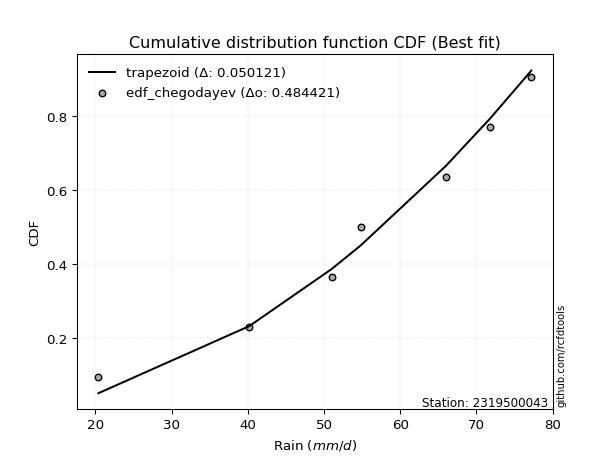</img>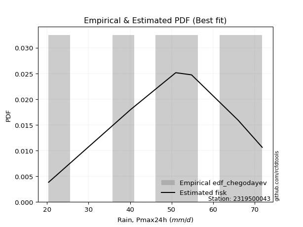</img>

</div>


### 6. EDF Blom (1958)

The Blom formula is a specific "plotting position" formula used in hydrology and statistical analysis to estimate the empirical cumulative probability (or non-exceedance probability) of a data series. It is particularly recommended for data that are approximately normally distributed. The constant _a_ is set to 0.375 (or 3/8).

<div align="center">


$P=(m-a)/(n+1-2a)$


</div>


**6.1. Empirical values**

<div align="center">

|                | 0                   | 1                   | 2                  | 3        | 4                  | 5                  | 6                  |
|:---------------|:--------------------|:--------------------|:-------------------|:---------|:-------------------|:-------------------|:-------------------|
| date           | 2024                | 2023                | 2020               | 2021     | 2019               | 2022               | 2025               |
| x              | 20.4                | 40.2                | 51.0               | 54.8     | 66.0               | 71.8               | 77.2               |
| m              | 1                   | 2                   | 3                  | 4        | 5                  | 6                  | 7                  |
| empirical_dist | edf_blom            | edf_blom            | edf_blom           | edf_blom | edf_blom           | edf_blom           | edf_blom           |
| empirical      | 0.08620689655172414 | 0.22413793103448276 | 0.3620689655172414 | 0.5      | 0.6379310344827587 | 0.7758620689655172 | 0.9137931034482759 |
| empirical_tr   | 1.0943396226415094  | 1.288888888888889   | 1.5675675675675675 | 2.0      | 2.7619047619047623 | 4.461538461538462  | 11.600000000000007 |

</div>


**6.2. Kolmogorov-Smirnov fit test (sorted by Δ)**


<div align="center">

|                | 0                    | 1                    | 2                   | 3                   | 4                   | 5                   | 6                   | 7                   | 8                   | 9                   | 10                  | 11                  | 12                  | 13                  | 14                  | 15                  | 16                  | 17                  | 18                  | 19                  | 20                  | 21                  | 22                  | 23                  | 24                  | 25                  | 26                  | 27                  | 28                  | 29                  | 30                  | 31                  | 32                  | 33                  | 34                  | 35                  | 36                  | 37                  | 38                  | 39                  | 40                  | 41                  | 42                  | 43                  | 44                  | 45                  | 46                  | 47                  | 48                  | 49                  | 50                  | 51                  | 52                  | 53                  | 54                  | 55                  | 56                  | 57                  | 58                  | 59                  | 60                  | 61                  | 62                  | 63                  | 64                  | 65                  | 66                  | 67                  | 68                  | 69                  | 70                  | 71                  | 72                  | 73                  | 74                  | 75                  | 76                  | 77                  | 78                  | 79                  | 80                  | 81                  | 82                  | 83                  | 84                  | 85                  | 86                  | 87                  | 88                  | 89                  | 90                  | 91                  | 92                  | 93                  | 94                  | 95                  | 96                  | 97                  | 98                  | 99                  | 100                 | 101                 | 102                 | 103                 | 104                 | 105                 | 106                 | 107                 | 108                 | 109                 | 110                 | 111                 | 112                 | 113                 | 114                 | 115                 | 116                 | 117                 | 118                 | 119                 | 120                 | 121                 | 122                 | 123                 | 124                 | 125                 | 126                 | 127                 | 128                 | 129                 | 130                 | 131                 | 132                 | 133                 | 134                 | 135                 | 136                 | 137                 | 138                 | 139                 | 140                 | 141                 | 142                 | 143                 | 144                 | 145                 | 146                 | 147                 | 148                 | 149                 | 150                 | 151                 | 152                 | 153                 | 154                 | 155                 | 156                 | 157                 | 158                 | 159                 |
|:---------------|:---------------------|:---------------------|:--------------------|:--------------------|:--------------------|:--------------------|:--------------------|:--------------------|:--------------------|:--------------------|:--------------------|:--------------------|:--------------------|:--------------------|:--------------------|:--------------------|:--------------------|:--------------------|:--------------------|:--------------------|:--------------------|:--------------------|:--------------------|:--------------------|:--------------------|:--------------------|:--------------------|:--------------------|:--------------------|:--------------------|:--------------------|:--------------------|:--------------------|:--------------------|:--------------------|:--------------------|:--------------------|:--------------------|:--------------------|:--------------------|:--------------------|:--------------------|:--------------------|:--------------------|:--------------------|:--------------------|:--------------------|:--------------------|:--------------------|:--------------------|:--------------------|:--------------------|:--------------------|:--------------------|:--------------------|:--------------------|:--------------------|:--------------------|:--------------------|:--------------------|:--------------------|:--------------------|:--------------------|:--------------------|:--------------------|:--------------------|:--------------------|:--------------------|:--------------------|:--------------------|:--------------------|:--------------------|:--------------------|:--------------------|:--------------------|:--------------------|:--------------------|:--------------------|:--------------------|:--------------------|:--------------------|:--------------------|:--------------------|:--------------------|:--------------------|:--------------------|:--------------------|:--------------------|:--------------------|:--------------------|:--------------------|:--------------------|:--------------------|:--------------------|:--------------------|:--------------------|:--------------------|:--------------------|:--------------------|:--------------------|:--------------------|:--------------------|:--------------------|:--------------------|:--------------------|:--------------------|:--------------------|:--------------------|:--------------------|:--------------------|:--------------------|:--------------------|:--------------------|:--------------------|:--------------------|:--------------------|:--------------------|:--------------------|:--------------------|:--------------------|:--------------------|:--------------------|:--------------------|:--------------------|:--------------------|:--------------------|:--------------------|:--------------------|:--------------------|:--------------------|:--------------------|:--------------------|:--------------------|:--------------------|:--------------------|:--------------------|:--------------------|:--------------------|:--------------------|:--------------------|:--------------------|:--------------------|:--------------------|:--------------------|:--------------------|:--------------------|:--------------------|:--------------------|:--------------------|:--------------------|:--------------------|:--------------------|:--------------------|:--------------------|:--------------------|:--------------------|:--------------------|:--------------------|:--------------------|:--------------------|
| station        | 2319500043           | 2319500043           | 2319500043          | 2319500043          | 2319500043          | 2319500043          | 2319500043          | 2319500043          | 2319500043          | 2319500043          | 2319500043          | 2319500043          | 2319500043          | 2319500043          | 2319500043          | 2319500043          | 2319500043          | 2319500043          | 2319500043          | 2319500043          | 2319500043          | 2319500043          | 2319500043          | 2319500043          | 2319500043          | 2319500043          | 2319500043          | 2319500043          | 2319500043          | 2319500043          | 2319500043          | 2319500043          | 2319500043          | 2319500043          | 2319500043          | 2319500043          | 2319500043          | 2319500043          | 2319500043          | 2319500043          | 2319500043          | 2319500043          | 2319500043          | 2319500043          | 2319500043          | 2319500043          | 2319500043          | 2319500043          | 2319500043          | 2319500043          | 2319500043          | 2319500043          | 2319500043          | 2319500043          | 2319500043          | 2319500043          | 2319500043          | 2319500043          | 2319500043          | 2319500043          | 2319500043          | 2319500043          | 2319500043          | 2319500043          | 2319500043          | 2319500043          | 2319500043          | 2319500043          | 2319500043          | 2319500043          | 2319500043          | 2319500043          | 2319500043          | 2319500043          | 2319500043          | 2319500043          | 2319500043          | 2319500043          | 2319500043          | 2319500043          | 2319500043          | 2319500043          | 2319500043          | 2319500043          | 2319500043          | 2319500043          | 2319500043          | 2319500043          | 2319500043          | 2319500043          | 2319500043          | 2319500043          | 2319500043          | 2319500043          | 2319500043          | 2319500043          | 2319500043          | 2319500043          | 2319500043          | 2319500043          | 2319500043          | 2319500043          | 2319500043          | 2319500043          | 2319500043          | 2319500043          | 2319500043          | 2319500043          | 2319500043          | 2319500043          | 2319500043          | 2319500043          | 2319500043          | 2319500043          | 2319500043          | 2319500043          | 2319500043          | 2319500043          | 2319500043          | 2319500043          | 2319500043          | 2319500043          | 2319500043          | 2319500043          | 2319500043          | 2319500043          | 2319500043          | 2319500043          | 2319500043          | 2319500043          | 2319500043          | 2319500043          | 2319500043          | 2319500043          | 2319500043          | 2319500043          | 2319500043          | 2319500043          | 2319500043          | 2319500043          | 2319500043          | 2319500043          | 2319500043          | 2319500043          | 2319500043          | 2319500043          | 2319500043          | 2319500043          | 2319500043          | 2319500043          | 2319500043          | 2319500043          | 2319500043          | 2319500043          | 2319500043          | 2319500043          | 2319500043          | 2319500043          | 2319500043          | 2319500043          |
| empirical_dist | edf_blom             | edf_blom             | edf_blom            | edf_blom            | edf_blom            | edf_blom            | edf_blom            | edf_blom            | edf_blom            | edf_blom            | edf_blom            | edf_blom            | edf_blom            | edf_blom            | edf_blom            | edf_blom            | edf_blom            | edf_blom            | edf_blom            | edf_blom            | edf_blom            | edf_blom            | edf_blom            | edf_blom            | edf_blom            | edf_blom            | edf_blom            | edf_blom            | edf_blom            | edf_blom            | edf_blom            | edf_blom            | edf_blom            | edf_blom            | edf_blom            | edf_blom            | edf_blom            | edf_blom            | edf_blom            | edf_blom            | edf_blom            | edf_blom            | edf_blom            | edf_blom            | edf_blom            | edf_blom            | edf_blom            | edf_blom            | edf_blom            | edf_blom            | edf_blom            | edf_blom            | edf_blom            | edf_blom            | edf_blom            | edf_blom            | edf_blom            | edf_blom            | edf_blom            | edf_blom            | edf_blom            | edf_blom            | edf_blom            | edf_blom            | edf_blom            | edf_blom            | edf_blom            | edf_blom            | edf_blom            | edf_blom            | edf_blom            | edf_blom            | edf_blom            | edf_blom            | edf_blom            | edf_blom            | edf_blom            | edf_blom            | edf_blom            | edf_blom            | edf_blom            | edf_blom            | edf_blom            | edf_blom            | edf_blom            | edf_blom            | edf_blom            | edf_blom            | edf_blom            | edf_blom            | edf_blom            | edf_blom            | edf_blom            | edf_blom            | edf_blom            | edf_blom            | edf_blom            | edf_blom            | edf_blom            | edf_blom            | edf_blom            | edf_blom            | edf_blom            | edf_blom            | edf_blom            | edf_blom            | edf_blom            | edf_blom            | edf_blom            | edf_blom            | edf_blom            | edf_blom            | edf_blom            | edf_blom            | edf_blom            | edf_blom            | edf_blom            | edf_blom            | edf_blom            | edf_blom            | edf_blom            | edf_blom            | edf_blom            | edf_blom            | edf_blom            | edf_blom            | edf_blom            | edf_blom            | edf_blom            | edf_blom            | edf_blom            | edf_blom            | edf_blom            | edf_blom            | edf_blom            | edf_blom            | edf_blom            | edf_blom            | edf_blom            | edf_blom            | edf_blom            | edf_blom            | edf_blom            | edf_blom            | edf_blom            | edf_blom            | edf_blom            | edf_blom            | edf_blom            | edf_blom            | edf_blom            | edf_blom            | edf_blom            | edf_blom            | edf_blom            | edf_blom            | edf_blom            | edf_blom            | edf_blom            | edf_blom            |
| p_dist         | trapezoid            | logmielke            | logexponweib        | weibull_min         | logpearson3         | gompertz            | logburr             | burr                | anglit              | argus               | mielke              | semicircular        | loggumbel_l         | gumbel_l            | pearson3            | logargus            | logexponpow         | logloggamma         | triang              | skewnorm            | gausshyper          | loggenextreme       | genhalflogistic     | logdweibull         | logvonmises_line    | loggennorm          | logweibull_max      | logt                | betaprime           | arcsine             | erlang              | logloglaplace       | gamma               | nct                 | truncnorm           | crystalball         | norm                | exponnorm           | t                   | f                   | logtrapezoid        | rice                | invgamma            | alpha               | logweibull_min      | loggengamma         | logburr12           | ncf                 | johnsonsu           | loggompertz         | maxwell             | logjohnsonsu        | rayleigh            | genpareto           | cosine              | invgauss            | logistic            | logbeta             | dgamma              | hypsecant           | genextreme          | gumbel_r            | halfnorm            | loglevy_l           | loggenhalflogistic  | logsemicircular     | loganglit           | logexponnorm        | lognorm             | logcrystalball      | logrice             | logfatiguelife      | loglogistic         | logf                | lognct              | loghypsecant        | kstwobign           | loginvgamma         | logncf              | moyal               | logbetaprime        | logskewnorm         | logerlang           | loglaplace          | loglaplace          | laplace             | halflogistic        | logarcsine          | logalpha            | wrapcauchy          | truncweibull_min    | logtukeylambda      | dweibull            | ksone               | loginvgauss         | kappa3              | uniform             | logtriang           | logmaxwell          | vonmises_line       | logfoldnorm         | lograyleigh         | loginvweibull       | logdgamma           | levy_l              | kappa4              | beta                | loggausshyper       | logcosine           | logkstwobign        | wald                | loggumbel_r         | loghalfnorm         | loggenexpon         | genexpon            | bradford            | logmoyal            | loghalflogistic     | truncexpon          | logtruncnorm        | lognakagami         | gennorm             | lomax               | logwrapcauchy       | nakagami            | logksone            | burr12              | loglomax            | halfgennorm         | loggenpareto        | logrdist            | logwald             | logkappa4           | logkappa3           | loguniform          | logbradford         | logtruncweibull_min | logtruncexpon       | johnsonsb           | logjohnsonsb        | foldnorm            | exponweib           | weibull_max         | gengamma            | fatiguelife         | powerlaw            | loggamma            | loggamma            | rdist               | tukeylambda         | logpowerlaw         | invweibull          | truncpareto         | exponpow            | logtruncpareto      | genlogistic         | loggenlogistic      | loghalfgennorm      | logvonmises         | vonmises            |
| delta          | 0.050121187245620036 | 0.057065255625872224 | 0.06278248201405146 | 0.06958717507413081 | 0.06968700514926546 | 0.0696932630187691  | 0.07051341361960517 | 0.07118077904331188 | 0.0727577582090358  | 0.07363879667590922 | 0.07688125573499183 | 0.07716241352198644 | 0.07901774453394728 | 0.07903036878353997 | 0.08026113667606749 | 0.08087385962704652 | 0.0839436176006445  | 0.08619410895648083 | 0.08620651390364287 | 0.0862065385107299  | 0.0862068965508942  | 0.08620689655170655 | 0.08620689655172287 | 0.08667569630061644 | 0.08701099431116577 | 0.08802875851512992 | 0.09142168614115959 | 0.09256260351309364 | 0.09451909424225169 | 0.09476335153498727 | 0.09502506441171565 | 0.09691930163797535 | 0.09779867746659843 | 0.09820815302519725 | 0.09824251834014153 | 0.09824257931606062 | 0.09824259105449229 | 0.09824407795868595 | 0.09832055417318886 | 0.098838401718774   | 0.09884523631629694 | 0.09948115740159891 | 0.10030493560204656 | 0.10056011244584173 | 0.10206867882968051 | 0.1028066830995018  | 0.10291775653112278 | 0.104495312322331   | 0.10538047967360553 | 0.10602979115975586 | 0.109625835056264   | 0.11099404662170559 | 0.11289422761420453 | 0.11431381083195608 | 0.11982073149285866 | 0.12020740127406981 | 0.12077222888344363 | 0.13430617791323862 | 0.13519166824923778 | 0.13601829668092158 | 0.13814574856273587 | 0.14105873757938614 | 0.1430877601302895  | 0.14386280270675417 | 0.14396405513630955 | 0.14522130158376384 | 0.14576097080064238 | 0.14706628154594997 | 0.14706865671596164 | 0.14707258102351634 | 0.14707937519317987 | 0.14749286528662092 | 0.14831654615231255 | 0.14874164909409432 | 0.14934742596889067 | 0.1493818765546096  | 0.1502259890940058  | 0.1508655305165107  | 0.15327466215076385 | 0.154843183174305   | 0.15551630831985003 | 0.15582318086850266 | 0.15635437234162325 | 0.15739067475397217 | 0.15739067475397217 | 0.15739864998780162 | 0.16156166348241446 | 0.16329003718339563 | 0.16537887920414324 | 0.1664084885105932  | 0.16707194656309754 | 0.16738531565307702 | 0.1692500268042354  | 0.17020802978792288 | 0.17029731071608006 | 0.17472618754790098 | 0.17666342884895575 | 0.1784474765135951  | 0.17973110814493626 | 0.18381863793258818 | 0.18967745883579995 | 0.190538063527193   | 0.19054343308478855 | 0.19294202139729788 | 0.19811593015114776 | 0.2014076201340846  | 0.20187952322604502 | 0.20211738335005108 | 0.2094072659128588  | 0.2153167267055795  | 0.217406113416929   | 0.21765432436102788 | 0.22096489215748677 | 0.2268367090921019  | 0.2289904673440734  | 0.23591167732821533 | 0.2434161835771233  | 0.24643516960119743 | 0.25706617056267916 | 0.2712295198656621  | 0.27329264321576635 | 0.27586206896551724 | 0.2784562823929516  | 0.2790938934323046  | 0.28843897731362417 | 0.2950084098743691  | 0.2980014742716399  | 0.3028290214152227  | 0.304383861187114   | 0.306893154878646   | 0.31154047364927395 | 0.3150182554825392  | 0.32170712750970004 | 0.32309014336457814 | 0.326423884952691   | 0.3362310976132377  | 0.3983192814544175  | 0.4000118840529823  | 0.4133302151181948  | 0.4343763036752828  | 0.5                 | 0.5371390578356215  | 0.5577306984707466  | 0.570966289339446   | 0.5852132581469657  | 0.6066899268367241  | 0.6209464528017643  | 0.6209464528017643  | 0.6379310282251252  | 0.6379310344827516  | 0.65664367590558    | 0.6656064254193156  | 0.6967479372910494  | 0.7018298534554214  | 0.7249908224540915  | 0.7758620689655172  | 0.7758620689655172  | 0.7758620689655172  | 1.132499785151428   | 11.410597189553885  |
| deltao         | 0.48442053926100004  | 0.48442053926100004  | 0.48442053926100004 | 0.48442053926100004 | 0.48442053926100004 | 0.48442053926100004 | 0.48442053926100004 | 0.48442053926100004 | 0.48442053926100004 | 0.48442053926100004 | 0.48442053926100004 | 0.48442053926100004 | 0.48442053926100004 | 0.48442053926100004 | 0.48442053926100004 | 0.48442053926100004 | 0.48442053926100004 | 0.48442053926100004 | 0.48442053926100004 | 0.48442053926100004 | 0.48442053926100004 | 0.48442053926100004 | 0.48442053926100004 | 0.48442053926100004 | 0.48442053926100004 | 0.48442053926100004 | 0.48442053926100004 | 0.48442053926100004 | 0.48442053926100004 | 0.48442053926100004 | 0.48442053926100004 | 0.48442053926100004 | 0.48442053926100004 | 0.48442053926100004 | 0.48442053926100004 | 0.48442053926100004 | 0.48442053926100004 | 0.48442053926100004 | 0.48442053926100004 | 0.48442053926100004 | 0.48442053926100004 | 0.48442053926100004 | 0.48442053926100004 | 0.48442053926100004 | 0.48442053926100004 | 0.48442053926100004 | 0.48442053926100004 | 0.48442053926100004 | 0.48442053926100004 | 0.48442053926100004 | 0.48442053926100004 | 0.48442053926100004 | 0.48442053926100004 | 0.48442053926100004 | 0.48442053926100004 | 0.48442053926100004 | 0.48442053926100004 | 0.48442053926100004 | 0.48442053926100004 | 0.48442053926100004 | 0.48442053926100004 | 0.48442053926100004 | 0.48442053926100004 | 0.48442053926100004 | 0.48442053926100004 | 0.48442053926100004 | 0.48442053926100004 | 0.48442053926100004 | 0.48442053926100004 | 0.48442053926100004 | 0.48442053926100004 | 0.48442053926100004 | 0.48442053926100004 | 0.48442053926100004 | 0.48442053926100004 | 0.48442053926100004 | 0.48442053926100004 | 0.48442053926100004 | 0.48442053926100004 | 0.48442053926100004 | 0.48442053926100004 | 0.48442053926100004 | 0.48442053926100004 | 0.48442053926100004 | 0.48442053926100004 | 0.48442053926100004 | 0.48442053926100004 | 0.48442053926100004 | 0.48442053926100004 | 0.48442053926100004 | 0.48442053926100004 | 0.48442053926100004 | 0.48442053926100004 | 0.48442053926100004 | 0.48442053926100004 | 0.48442053926100004 | 0.48442053926100004 | 0.48442053926100004 | 0.48442053926100004 | 0.48442053926100004 | 0.48442053926100004 | 0.48442053926100004 | 0.48442053926100004 | 0.48442053926100004 | 0.48442053926100004 | 0.48442053926100004 | 0.48442053926100004 | 0.48442053926100004 | 0.48442053926100004 | 0.48442053926100004 | 0.48442053926100004 | 0.48442053926100004 | 0.48442053926100004 | 0.48442053926100004 | 0.48442053926100004 | 0.48442053926100004 | 0.48442053926100004 | 0.48442053926100004 | 0.48442053926100004 | 0.48442053926100004 | 0.48442053926100004 | 0.48442053926100004 | 0.48442053926100004 | 0.48442053926100004 | 0.48442053926100004 | 0.48442053926100004 | 0.48442053926100004 | 0.48442053926100004 | 0.48442053926100004 | 0.48442053926100004 | 0.48442053926100004 | 0.48442053926100004 | 0.48442053926100004 | 0.48442053926100004 | 0.48442053926100004 | 0.48442053926100004 | 0.48442053926100004 | 0.48442053926100004 | 0.48442053926100004 | 0.48442053926100004 | 0.48442053926100004 | 0.48442053926100004 | 0.48442053926100004 | 0.48442053926100004 | 0.48442053926100004 | 0.48442053926100004 | 0.48442053926100004 | 0.48442053926100004 | 0.48442053926100004 | 0.48442053926100004 | 0.48442053926100004 | 0.48442053926100004 | 0.48442053926100004 | 0.48442053926100004 | 0.48442053926100004 | 0.48442053926100004 | 0.48442053926100004 | 0.48442053926100004 | 0.48442053926100004 | 0.48442053926100004 |
| eval           | Δo > Δ               | Δo > Δ               | Δo > Δ              | Δo > Δ              | Δo > Δ              | Δo > Δ              | Δo > Δ              | Δo > Δ              | Δo > Δ              | Δo > Δ              | Δo > Δ              | Δo > Δ              | Δo > Δ              | Δo > Δ              | Δo > Δ              | Δo > Δ              | Δo > Δ              | Δo > Δ              | Δo > Δ              | Δo > Δ              | Δo > Δ              | Δo > Δ              | Δo > Δ              | Δo > Δ              | Δo > Δ              | Δo > Δ              | Δo > Δ              | Δo > Δ              | Δo > Δ              | Δo > Δ              | Δo > Δ              | Δo > Δ              | Δo > Δ              | Δo > Δ              | Δo > Δ              | Δo > Δ              | Δo > Δ              | Δo > Δ              | Δo > Δ              | Δo > Δ              | Δo > Δ              | Δo > Δ              | Δo > Δ              | Δo > Δ              | Δo > Δ              | Δo > Δ              | Δo > Δ              | Δo > Δ              | Δo > Δ              | Δo > Δ              | Δo > Δ              | Δo > Δ              | Δo > Δ              | Δo > Δ              | Δo > Δ              | Δo > Δ              | Δo > Δ              | Δo > Δ              | Δo > Δ              | Δo > Δ              | Δo > Δ              | Δo > Δ              | Δo > Δ              | Δo > Δ              | Δo > Δ              | Δo > Δ              | Δo > Δ              | Δo > Δ              | Δo > Δ              | Δo > Δ              | Δo > Δ              | Δo > Δ              | Δo > Δ              | Δo > Δ              | Δo > Δ              | Δo > Δ              | Δo > Δ              | Δo > Δ              | Δo > Δ              | Δo > Δ              | Δo > Δ              | Δo > Δ              | Δo > Δ              | Δo > Δ              | Δo > Δ              | Δo > Δ              | Δo > Δ              | Δo > Δ              | Δo > Δ              | Δo > Δ              | Δo > Δ              | Δo > Δ              | Δo > Δ              | Δo > Δ              | Δo > Δ              | Δo > Δ              | Δo > Δ              | Δo > Δ              | Δo > Δ              | Δo > Δ              | Δo > Δ              | Δo > Δ              | Δo > Δ              | Δo > Δ              | Δo > Δ              | Δo > Δ              | Δo > Δ              | Δo > Δ              | Δo > Δ              | Δo > Δ              | Δo > Δ              | Δo > Δ              | Δo > Δ              | Δo > Δ              | Δo > Δ              | Δo > Δ              | Δo > Δ              | Δo > Δ              | Δo > Δ              | Δo > Δ              | Δo > Δ              | Δo > Δ              | Δo > Δ              | Δo > Δ              | Δo > Δ              | Δo > Δ              | Δo > Δ              | Δo > Δ              | Δo > Δ              | Δo > Δ              | Δo > Δ              | Δo > Δ              | Δo > Δ              | Δo > Δ              | Δo > Δ              | Δo > Δ              | Δo > Δ              | Δo > Δ              | Δo > Δ              | Δo > Δ              | Δo <= Δ             | Δo <= Δ             | Δo <= Δ             | Δo <= Δ             | Δo <= Δ             | Δo <= Δ             | Δo <= Δ             | Δo <= Δ             | Δo <= Δ             | Δo <= Δ             | Δo <= Δ             | Δo <= Δ             | Δo <= Δ             | Δo <= Δ             | Δo <= Δ             | Δo <= Δ             | Δo <= Δ             | Δo <= Δ             | Δo <= Δ             | Δo <= Δ             |
| fit            | 1                    | 1                    | 1                   | 1                   | 1                   | 1                   | 1                   | 1                   | 1                   | 1                   | 1                   | 1                   | 1                   | 1                   | 1                   | 1                   | 1                   | 1                   | 1                   | 1                   | 1                   | 1                   | 1                   | 1                   | 1                   | 1                   | 1                   | 1                   | 1                   | 1                   | 1                   | 1                   | 1                   | 1                   | 1                   | 1                   | 1                   | 1                   | 1                   | 1                   | 1                   | 1                   | 1                   | 1                   | 1                   | 1                   | 1                   | 1                   | 1                   | 1                   | 1                   | 1                   | 1                   | 1                   | 1                   | 1                   | 1                   | 1                   | 1                   | 1                   | 1                   | 1                   | 1                   | 1                   | 1                   | 1                   | 1                   | 1                   | 1                   | 1                   | 1                   | 1                   | 1                   | 1                   | 1                   | 1                   | 1                   | 1                   | 1                   | 1                   | 1                   | 1                   | 1                   | 1                   | 1                   | 1                   | 1                   | 1                   | 1                   | 1                   | 1                   | 1                   | 1                   | 1                   | 1                   | 1                   | 1                   | 1                   | 1                   | 1                   | 1                   | 1                   | 1                   | 1                   | 1                   | 1                   | 1                   | 1                   | 1                   | 1                   | 1                   | 1                   | 1                   | 1                   | 1                   | 1                   | 1                   | 1                   | 1                   | 1                   | 1                   | 1                   | 1                   | 1                   | 1                   | 1                   | 1                   | 1                   | 1                   | 1                   | 1                   | 1                   | 1                   | 1                   | 1                   | 1                   | 1                   | 1                   | 1                   | 1                   | 0                   | 0                   | 0                   | 0                   | 0                   | 0                   | 0                   | 0                   | 0                   | 0                   | 0                   | 0                   | 0                   | 0                   | 0                   | 0                   | 0                   | 0                   | 0                   | 0                   |
| n              | 7                    | 7                    | 7                   | 7                   | 7                   | 7                   | 7                   | 7                   | 7                   | 7                   | 7                   | 7                   | 7                   | 7                   | 7                   | 7                   | 7                   | 7                   | 7                   | 7                   | 7                   | 7                   | 7                   | 7                   | 7                   | 7                   | 7                   | 7                   | 7                   | 7                   | 7                   | 7                   | 7                   | 7                   | 7                   | 7                   | 7                   | 7                   | 7                   | 7                   | 7                   | 7                   | 7                   | 7                   | 7                   | 7                   | 7                   | 7                   | 7                   | 7                   | 7                   | 7                   | 7                   | 7                   | 7                   | 7                   | 7                   | 7                   | 7                   | 7                   | 7                   | 7                   | 7                   | 7                   | 7                   | 7                   | 7                   | 7                   | 7                   | 7                   | 7                   | 7                   | 7                   | 7                   | 7                   | 7                   | 7                   | 7                   | 7                   | 7                   | 7                   | 7                   | 7                   | 7                   | 7                   | 7                   | 7                   | 7                   | 7                   | 7                   | 7                   | 7                   | 7                   | 7                   | 7                   | 7                   | 7                   | 7                   | 7                   | 7                   | 7                   | 7                   | 7                   | 7                   | 7                   | 7                   | 7                   | 7                   | 7                   | 7                   | 7                   | 7                   | 7                   | 7                   | 7                   | 7                   | 7                   | 7                   | 7                   | 7                   | 7                   | 7                   | 7                   | 7                   | 7                   | 7                   | 7                   | 7                   | 7                   | 7                   | 7                   | 7                   | 7                   | 7                   | 7                   | 7                   | 7                   | 7                   | 7                   | 7                   | 7                   | 7                   | 7                   | 7                   | 7                   | 7                   | 7                   | 7                   | 7                   | 7                   | 7                   | 7                   | 7                   | 7                   | 7                   | 7                   | 7                   | 7                   | 7                   | 7                   |
| best_fit       | 1                    | 0                    | 0                   | 0                   | 0                   | 0                   | 0                   | 0                   | 0                   | 0                   | 0                   | 0                   | 0                   | 0                   | 0                   | 0                   | 0                   | 0                   | 0                   | 0                   | 0                   | 0                   | 0                   | 0                   | 0                   | 0                   | 0                   | 0                   | 0                   | 0                   | 0                   | 0                   | 0                   | 0                   | 0                   | 0                   | 0                   | 0                   | 0                   | 0                   | 0                   | 0                   | 0                   | 0                   | 0                   | 0                   | 0                   | 0                   | 0                   | 0                   | 0                   | 0                   | 0                   | 0                   | 0                   | 0                   | 0                   | 0                   | 0                   | 0                   | 0                   | 0                   | 0                   | 0                   | 0                   | 0                   | 0                   | 0                   | 0                   | 0                   | 0                   | 0                   | 0                   | 0                   | 0                   | 0                   | 0                   | 0                   | 0                   | 0                   | 0                   | 0                   | 0                   | 0                   | 0                   | 0                   | 0                   | 0                   | 0                   | 0                   | 0                   | 0                   | 0                   | 0                   | 0                   | 0                   | 0                   | 0                   | 0                   | 0                   | 0                   | 0                   | 0                   | 0                   | 0                   | 0                   | 0                   | 0                   | 0                   | 0                   | 0                   | 0                   | 0                   | 0                   | 0                   | 0                   | 0                   | 0                   | 0                   | 0                   | 0                   | 0                   | 0                   | 0                   | 0                   | 0                   | 0                   | 0                   | 0                   | 0                   | 0                   | 0                   | 0                   | 0                   | 0                   | 0                   | 0                   | 0                   | 0                   | 0                   | 0                   | 0                   | 0                   | 0                   | 0                   | 0                   | 0                   | 0                   | 0                   | 0                   | 0                   | 0                   | 0                   | 0                   | 0                   | 0                   | 0                   | 0                   | 0                   | 0                   |
| best_fit_sort  | 1                    | 2                    | 3                   | 4                   | 5                   | 6                   | 7                   | 8                   | 9                   | 10                  | 11                  | 12                  | 13                  | 14                  | 15                  | 16                  | 17                  | 18                  | 19                  | 20                  | 21                  | 22                  | 23                  | 24                  | 25                  | 26                  | 27                  | 28                  | 29                  | 30                  | 31                  | 32                  | 33                  | 34                  | 35                  | 36                  | 37                  | 38                  | 39                  | 40                  | 41                  | 42                  | 43                  | 44                  | 45                  | 46                  | 47                  | 48                  | 49                  | 50                  | 51                  | 52                  | 53                  | 54                  | 55                  | 56                  | 57                  | 58                  | 59                  | 60                  | 61                  | 62                  | 63                  | 64                  | 65                  | 66                  | 67                  | 68                  | 69                  | 70                  | 71                  | 72                  | 73                  | 74                  | 75                  | 76                  | 77                  | 78                  | 79                  | 80                  | 81                  | 82                  | 83                  | 84                  | 85                  | 86                  | 87                  | 88                  | 89                  | 90                  | 91                  | 92                  | 93                  | 94                  | 95                  | 96                  | 97                  | 98                  | 99                  | 100                 | 101                 | 102                 | 103                 | 104                 | 105                 | 106                 | 107                 | 108                 | 109                 | 110                 | 111                 | 112                 | 113                 | 114                 | 115                 | 116                 | 117                 | 118                 | 119                 | 120                 | 121                 | 122                 | 123                 | 124                 | 125                 | 126                 | 127                 | 128                 | 129                 | 130                 | 131                 | 132                 | 133                 | 134                 | 135                 | 136                 | 137                 | 138                 | 139                 | 140                 | 141                 | 142                 | 143                 | 144                 | 145                 | 146                 | 147                 | 148                 | 149                 | 150                 | 151                 | 152                 | 153                 | 154                 | 155                 | 156                 | 157                 | 158                 | 159                 | 160                 |

</div>


**6.3. Best fit**

<div align="center">

|   id |    station | empirical_dist   | p_dist    |     delta |   deltao | eval   |   fit |   n |   best_fit |   best_fit_sort |
|-----:|-----------:|:-----------------|:----------|----------:|---------:|:-------|------:|----:|-----------:|----------------:|
|    0 | 2319500043 | edf_blom         | trapezoid | 0.0501212 | 0.484421 | Δo > Δ |     1 |   7 |          1 |               1 |

</div>


<div align="center">

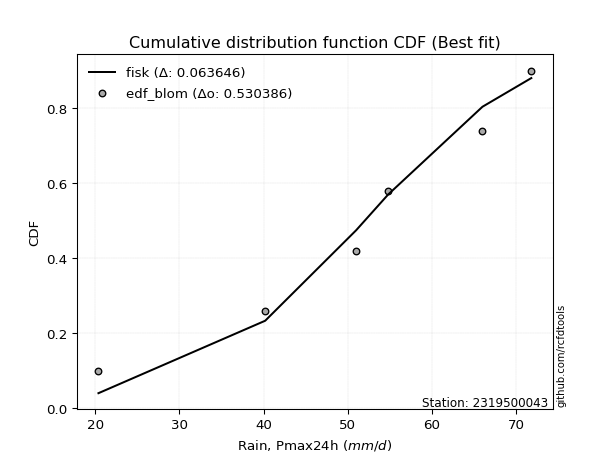</img></img>

</div>


### 7. EDF Tukey (1962)

In hydrology, the Tukey formula is used as a plotting position formula to estimate the empirical probability or frequency of a flood event (or other hydrological data). The formula parameter is given as _c=0.333_ (or 1/3).

<div align="center">


$P=(m-c)/(n+1-2c)$


</div>


**7.1. Empirical values**

<div align="center">

|                | 0                   | 1                   | 2                   | 3         | 4                  | 5                  | 6                  |
|:---------------|:--------------------|:--------------------|:--------------------|:----------|:-------------------|:-------------------|:-------------------|
| date           | 2024                | 2023                | 2020                | 2021      | 2019               | 2022               | 2025               |
| x              | 20.4                | 40.2                | 51.0                | 54.8      | 66.0               | 71.8               | 77.2               |
| m              | 1                   | 2                   | 3                   | 4         | 5                  | 6                  | 7                  |
| empirical_dist | edf_tukey           | edf_tukey           | edf_tukey           | edf_tukey | edf_tukey          | edf_tukey          | edf_tukey          |
| empirical      | 0.09090909090909091 | 0.22727272727272727 | 0.36363636363636365 | 0.5       | 0.6363636363636364 | 0.7727272727272727 | 0.9090909090909091 |
| empirical_tr   | 1.1                 | 1.2941176470588236  | 1.5714285714285714  | 2.0       | 2.75               | 4.3999999999999995 | 10.999999999999996 |

</div>


**7.2. Kolmogorov-Smirnov fit test (sorted by Δ)**


<div align="center">

|                | 0                    | 1                    | 2                   | 3                   | 4                   | 5                   | 6                   | 7                   | 8                   | 9                   | 10                  | 11                  | 12                  | 13                  | 14                  | 15                  | 16                  | 17                  | 18                  | 19                  | 20                  | 21                  | 22                  | 23                  | 24                  | 25                  | 26                  | 27                  | 28                  | 29                  | 30                  | 31                  | 32                  | 33                  | 34                  | 35                  | 36                  | 37                  | 38                  | 39                  | 40                  | 41                  | 42                  | 43                  | 44                  | 45                  | 46                  | 47                  | 48                  | 49                  | 50                  | 51                  | 52                  | 53                  | 54                  | 55                  | 56                  | 57                  | 58                  | 59                  | 60                  | 61                  | 62                  | 63                  | 64                  | 65                  | 66                  | 67                  | 68                  | 69                  | 70                  | 71                  | 72                  | 73                  | 74                  | 75                  | 76                  | 77                  | 78                  | 79                  | 80                  | 81                  | 82                  | 83                  | 84                  | 85                  | 86                  | 87                  | 88                  | 89                  | 90                  | 91                  | 92                  | 93                  | 94                  | 95                  | 96                  | 97                  | 98                  | 99                  | 100                 | 101                 | 102                 | 103                 | 104                 | 105                 | 106                 | 107                 | 108                 | 109                 | 110                 | 111                 | 112                 | 113                 | 114                 | 115                 | 116                 | 117                 | 118                 | 119                 | 120                 | 121                 | 122                 | 123                 | 124                 | 125                 | 126                 | 127                 | 128                 | 129                 | 130                 | 131                 | 132                 | 133                 | 134                 | 135                 | 136                 | 137                 | 138                 | 139                 | 140                 | 141                 | 142                 | 143                 | 144                 | 145                 | 146                 | 147                 | 148                 | 149                 | 150                 | 151                 | 152                 | 153                 | 154                 | 155                 | 156                 | 157                 | 158                 | 159                 |
|:---------------|:---------------------|:---------------------|:--------------------|:--------------------|:--------------------|:--------------------|:--------------------|:--------------------|:--------------------|:--------------------|:--------------------|:--------------------|:--------------------|:--------------------|:--------------------|:--------------------|:--------------------|:--------------------|:--------------------|:--------------------|:--------------------|:--------------------|:--------------------|:--------------------|:--------------------|:--------------------|:--------------------|:--------------------|:--------------------|:--------------------|:--------------------|:--------------------|:--------------------|:--------------------|:--------------------|:--------------------|:--------------------|:--------------------|:--------------------|:--------------------|:--------------------|:--------------------|:--------------------|:--------------------|:--------------------|:--------------------|:--------------------|:--------------------|:--------------------|:--------------------|:--------------------|:--------------------|:--------------------|:--------------------|:--------------------|:--------------------|:--------------------|:--------------------|:--------------------|:--------------------|:--------------------|:--------------------|:--------------------|:--------------------|:--------------------|:--------------------|:--------------------|:--------------------|:--------------------|:--------------------|:--------------------|:--------------------|:--------------------|:--------------------|:--------------------|:--------------------|:--------------------|:--------------------|:--------------------|:--------------------|:--------------------|:--------------------|:--------------------|:--------------------|:--------------------|:--------------------|:--------------------|:--------------------|:--------------------|:--------------------|:--------------------|:--------------------|:--------------------|:--------------------|:--------------------|:--------------------|:--------------------|:--------------------|:--------------------|:--------------------|:--------------------|:--------------------|:--------------------|:--------------------|:--------------------|:--------------------|:--------------------|:--------------------|:--------------------|:--------------------|:--------------------|:--------------------|:--------------------|:--------------------|:--------------------|:--------------------|:--------------------|:--------------------|:--------------------|:--------------------|:--------------------|:--------------------|:--------------------|:--------------------|:--------------------|:--------------------|:--------------------|:--------------------|:--------------------|:--------------------|:--------------------|:--------------------|:--------------------|:--------------------|:--------------------|:--------------------|:--------------------|:--------------------|:--------------------|:--------------------|:--------------------|:--------------------|:--------------------|:--------------------|:--------------------|:--------------------|:--------------------|:--------------------|:--------------------|:--------------------|:--------------------|:--------------------|:--------------------|:--------------------|:--------------------|:--------------------|:--------------------|:--------------------|:--------------------|:--------------------|
| station        | 2319500043           | 2319500043           | 2319500043          | 2319500043          | 2319500043          | 2319500043          | 2319500043          | 2319500043          | 2319500043          | 2319500043          | 2319500043          | 2319500043          | 2319500043          | 2319500043          | 2319500043          | 2319500043          | 2319500043          | 2319500043          | 2319500043          | 2319500043          | 2319500043          | 2319500043          | 2319500043          | 2319500043          | 2319500043          | 2319500043          | 2319500043          | 2319500043          | 2319500043          | 2319500043          | 2319500043          | 2319500043          | 2319500043          | 2319500043          | 2319500043          | 2319500043          | 2319500043          | 2319500043          | 2319500043          | 2319500043          | 2319500043          | 2319500043          | 2319500043          | 2319500043          | 2319500043          | 2319500043          | 2319500043          | 2319500043          | 2319500043          | 2319500043          | 2319500043          | 2319500043          | 2319500043          | 2319500043          | 2319500043          | 2319500043          | 2319500043          | 2319500043          | 2319500043          | 2319500043          | 2319500043          | 2319500043          | 2319500043          | 2319500043          | 2319500043          | 2319500043          | 2319500043          | 2319500043          | 2319500043          | 2319500043          | 2319500043          | 2319500043          | 2319500043          | 2319500043          | 2319500043          | 2319500043          | 2319500043          | 2319500043          | 2319500043          | 2319500043          | 2319500043          | 2319500043          | 2319500043          | 2319500043          | 2319500043          | 2319500043          | 2319500043          | 2319500043          | 2319500043          | 2319500043          | 2319500043          | 2319500043          | 2319500043          | 2319500043          | 2319500043          | 2319500043          | 2319500043          | 2319500043          | 2319500043          | 2319500043          | 2319500043          | 2319500043          | 2319500043          | 2319500043          | 2319500043          | 2319500043          | 2319500043          | 2319500043          | 2319500043          | 2319500043          | 2319500043          | 2319500043          | 2319500043          | 2319500043          | 2319500043          | 2319500043          | 2319500043          | 2319500043          | 2319500043          | 2319500043          | 2319500043          | 2319500043          | 2319500043          | 2319500043          | 2319500043          | 2319500043          | 2319500043          | 2319500043          | 2319500043          | 2319500043          | 2319500043          | 2319500043          | 2319500043          | 2319500043          | 2319500043          | 2319500043          | 2319500043          | 2319500043          | 2319500043          | 2319500043          | 2319500043          | 2319500043          | 2319500043          | 2319500043          | 2319500043          | 2319500043          | 2319500043          | 2319500043          | 2319500043          | 2319500043          | 2319500043          | 2319500043          | 2319500043          | 2319500043          | 2319500043          | 2319500043          | 2319500043          | 2319500043          | 2319500043          | 2319500043          |
| empirical_dist | edf_tukey            | edf_tukey            | edf_tukey           | edf_tukey           | edf_tukey           | edf_tukey           | edf_tukey           | edf_tukey           | edf_tukey           | edf_tukey           | edf_tukey           | edf_tukey           | edf_tukey           | edf_tukey           | edf_tukey           | edf_tukey           | edf_tukey           | edf_tukey           | edf_tukey           | edf_tukey           | edf_tukey           | edf_tukey           | edf_tukey           | edf_tukey           | edf_tukey           | edf_tukey           | edf_tukey           | edf_tukey           | edf_tukey           | edf_tukey           | edf_tukey           | edf_tukey           | edf_tukey           | edf_tukey           | edf_tukey           | edf_tukey           | edf_tukey           | edf_tukey           | edf_tukey           | edf_tukey           | edf_tukey           | edf_tukey           | edf_tukey           | edf_tukey           | edf_tukey           | edf_tukey           | edf_tukey           | edf_tukey           | edf_tukey           | edf_tukey           | edf_tukey           | edf_tukey           | edf_tukey           | edf_tukey           | edf_tukey           | edf_tukey           | edf_tukey           | edf_tukey           | edf_tukey           | edf_tukey           | edf_tukey           | edf_tukey           | edf_tukey           | edf_tukey           | edf_tukey           | edf_tukey           | edf_tukey           | edf_tukey           | edf_tukey           | edf_tukey           | edf_tukey           | edf_tukey           | edf_tukey           | edf_tukey           | edf_tukey           | edf_tukey           | edf_tukey           | edf_tukey           | edf_tukey           | edf_tukey           | edf_tukey           | edf_tukey           | edf_tukey           | edf_tukey           | edf_tukey           | edf_tukey           | edf_tukey           | edf_tukey           | edf_tukey           | edf_tukey           | edf_tukey           | edf_tukey           | edf_tukey           | edf_tukey           | edf_tukey           | edf_tukey           | edf_tukey           | edf_tukey           | edf_tukey           | edf_tukey           | edf_tukey           | edf_tukey           | edf_tukey           | edf_tukey           | edf_tukey           | edf_tukey           | edf_tukey           | edf_tukey           | edf_tukey           | edf_tukey           | edf_tukey           | edf_tukey           | edf_tukey           | edf_tukey           | edf_tukey           | edf_tukey           | edf_tukey           | edf_tukey           | edf_tukey           | edf_tukey           | edf_tukey           | edf_tukey           | edf_tukey           | edf_tukey           | edf_tukey           | edf_tukey           | edf_tukey           | edf_tukey           | edf_tukey           | edf_tukey           | edf_tukey           | edf_tukey           | edf_tukey           | edf_tukey           | edf_tukey           | edf_tukey           | edf_tukey           | edf_tukey           | edf_tukey           | edf_tukey           | edf_tukey           | edf_tukey           | edf_tukey           | edf_tukey           | edf_tukey           | edf_tukey           | edf_tukey           | edf_tukey           | edf_tukey           | edf_tukey           | edf_tukey           | edf_tukey           | edf_tukey           | edf_tukey           | edf_tukey           | edf_tukey           | edf_tukey           | edf_tukey           | edf_tukey           | edf_tukey           |
| p_dist         | trapezoid            | logmielke            | logexponweib        | logpearson3         | weibull_min         | gompertz            | anglit              | argus               | logburr             | burr                | loggumbel_l         | gumbel_l            | semicircular        | mielke              | pearson3            | logargus            | logexponpow         | logt                | logdweibull         | loggennorm          | logloggamma         | triang              | skewnorm            | logvonmises_line    | gausshyper          | loggenextreme       | genhalflogistic     | logweibull_max      | logloglaplace       | arcsine             | logtrapezoid        | betaprime           | erlang              | gamma               | nct                 | truncnorm           | crystalball         | norm                | exponnorm           | t                   | f                   | rice                | invgamma            | alpha               | logweibull_min      | loggengamma         | logburr12           | johnsonsu           | ncf                 | loggompertz         | logjohnsonsu        | genpareto           | maxwell             | rayleigh            | invgauss            | cosine              | logistic            | logbeta             | dgamma              | hypsecant           | genextreme          | loglevy_l           | halfnorm            | loggenhalflogistic  | gumbel_r            | logsemicircular     | loganglit           | logexponnorm        | lognorm             | logcrystalball      | logrice             | logfatiguelife      | loglogistic         | logf                | lognct              | loghypsecant        | kstwobign           | loginvgamma         | logncf              | logbetaprime        | logerlang           | moyal               | logskewnorm         | logarcsine          | loglaplace          | loglaplace          | laplace             | halflogistic        | wrapcauchy          | logalpha            | truncweibull_min    | ksone               | loginvgauss         | logtukeylambda      | dweibull            | kappa3              | uniform             | logtriang           | logmaxwell          | vonmises_line       | logfoldnorm         | lograyleigh         | loginvweibull       | levy_l              | logdgamma           | kappa4              | loggausshyper       | beta                | logcosine           | logkstwobign        | wald                | loggumbel_r         | loghalfnorm         | loggenexpon         | genexpon            | bradford            | logmoyal            | loghalflogistic     | truncexpon          | lognakagami         | gennorm             | logtruncnorm        | lomax               | logwrapcauchy       | nakagami            | logksone            | burr12              | loglomax            | halfgennorm         | loggenpareto        | logrdist            | logwald             | logkappa4           | logkappa3           | loguniform          | logbradford         | logtruncweibull_min | logtruncexpon       | johnsonsb           | logjohnsonsb        | foldnorm            | exponweib           | weibull_max         | gengamma            | fatiguelife         | powerlaw            | loggamma            | loggamma            | rdist               | tukeylambda         | logpowerlaw         | invweibull          | truncpareto         | exponpow            | logtruncpareto      | genlogistic         | loggenlogistic      | loghalfgennorm      | logvonmises         | vonmises            |
| delta          | 0.050121187245620036 | 0.057065255625872224 | 0.06538736213679752 | 0.06811960703014319 | 0.07115457319325313 | 0.07126066113789142 | 0.07288933970653388 | 0.07363879667590922 | 0.07521560797697202 | 0.07588297340067873 | 0.0805851426530696  | 0.0805977669026623  | 0.08102660832791161 | 0.08158345009235868 | 0.08182853479518981 | 0.08400865586529105 | 0.08551101571976683 | 0.08786040915572679 | 0.08824309441973877 | 0.08959615663425224 | 0.09089630331384768 | 0.09090870826100972 | 0.09090873286809675 | 0.09090908927339555 | 0.09090909090826105 | 0.0909090909090734  | 0.09090909090908972 | 0.09142168614115959 | 0.0922171072806085  | 0.09319595341586501 | 0.09414304195893008 | 0.09608649236137401 | 0.09659246253083797 | 0.09936607558572075 | 0.09977555114431957 | 0.09980991645926385 | 0.09980997743518294 | 0.09980998917361461 | 0.09981147607780827 | 0.09988795229231118 | 0.10040579983789633 | 0.10104855552072123 | 0.10187233372116888 | 0.10212751056496405 | 0.10363607694880284 | 0.10437408121862413 | 0.1044851546502451  | 0.10538047967360553 | 0.10606271044145332 | 0.10759718927887818 | 0.11099404662170559 | 0.11117901459371157 | 0.11119323317538632 | 0.11446162573332685 | 0.11864000315494755 | 0.12138812961198098 | 0.12233962700256595 | 0.1311713816749941  | 0.1367590663683601  | 0.1375856948000439  | 0.13814574856273587 | 0.1391606083493874  | 0.14152036201116724 | 0.1423966570171873  | 0.14262613569850846 | 0.14365390346464157 | 0.1441935726815201  | 0.1454988834268277  | 0.14550125859683938 | 0.14550518290439407 | 0.1455119770740576  | 0.14592546716749866 | 0.14674914803319028 | 0.14717425097497205 | 0.1477800278497684  | 0.14781447843548734 | 0.14865859097488354 | 0.14929813239738843 | 0.1517072640316416  | 0.15394891020072776 | 0.15478697422250098 | 0.15641058129342733 | 0.15739057898762498 | 0.15858784282602878 | 0.1589580728730945  | 0.1589580728730945  | 0.15896604810692394 | 0.1599942653632922  | 0.16336075565025587 | 0.16381148108502097 | 0.16863934468221986 | 0.1686406316688006  | 0.1687299125969578  | 0.17052011189132152 | 0.17081742492335772 | 0.17315878942877871 | 0.17509603072983349 | 0.17688007839447284 | 0.178163710025814   | 0.18225123981346592 | 0.18811006071667769 | 0.18897066540807073 | 0.18897603496566628 | 0.193413735793781   | 0.1945094195164202  | 0.19984022201496232 | 0.20054998523092882 | 0.20187952322604502 | 0.20783986779373653 | 0.21374932858645723 | 0.21583871529780674 | 0.21608692624190562 | 0.2193974940383645  | 0.22526931097297964 | 0.22742306922495115 | 0.23434427920909306 | 0.24184878545800104 | 0.24486777148207517 | 0.2554987724435569  | 0.2717252450966441  | 0.2727272727272727  | 0.27279691798478445 | 0.27375408803558476 | 0.2759590971940601  | 0.2868715791945019  | 0.29344101175524684 | 0.2948666780333954  | 0.2996942251769782  | 0.3012490649488695  | 0.30375835864040146 | 0.3084056774110294  | 0.31345085736341693 | 0.3201397293905778  | 0.3215227452454559  | 0.3248564868335687  | 0.33466369949411545 | 0.3967518833352952  | 0.39844448593386006 | 0.41019541887995026 | 0.43124150743703826 | 0.5                 | 0.534004261597377   | 0.5545959022325021  | 0.5678314931012015  | 0.5820784619087211  | 0.6035551305984795  | 0.6178116565635198  | 0.6178116565635198  | 0.6363636301060029  | 0.6363636363636292  | 0.6535088796673355  | 0.662471629181071   | 0.6936131410528049  | 0.6986950572171768  | 0.721856026215847   | 0.7727272727272727  | 0.7727272727272727  | 0.7727272727272727  | 1.1309323870323058  | 11.415299383911252  |
| deltao         | 0.48442053926100004  | 0.48442053926100004  | 0.48442053926100004 | 0.48442053926100004 | 0.48442053926100004 | 0.48442053926100004 | 0.48442053926100004 | 0.48442053926100004 | 0.48442053926100004 | 0.48442053926100004 | 0.48442053926100004 | 0.48442053926100004 | 0.48442053926100004 | 0.48442053926100004 | 0.48442053926100004 | 0.48442053926100004 | 0.48442053926100004 | 0.48442053926100004 | 0.48442053926100004 | 0.48442053926100004 | 0.48442053926100004 | 0.48442053926100004 | 0.48442053926100004 | 0.48442053926100004 | 0.48442053926100004 | 0.48442053926100004 | 0.48442053926100004 | 0.48442053926100004 | 0.48442053926100004 | 0.48442053926100004 | 0.48442053926100004 | 0.48442053926100004 | 0.48442053926100004 | 0.48442053926100004 | 0.48442053926100004 | 0.48442053926100004 | 0.48442053926100004 | 0.48442053926100004 | 0.48442053926100004 | 0.48442053926100004 | 0.48442053926100004 | 0.48442053926100004 | 0.48442053926100004 | 0.48442053926100004 | 0.48442053926100004 | 0.48442053926100004 | 0.48442053926100004 | 0.48442053926100004 | 0.48442053926100004 | 0.48442053926100004 | 0.48442053926100004 | 0.48442053926100004 | 0.48442053926100004 | 0.48442053926100004 | 0.48442053926100004 | 0.48442053926100004 | 0.48442053926100004 | 0.48442053926100004 | 0.48442053926100004 | 0.48442053926100004 | 0.48442053926100004 | 0.48442053926100004 | 0.48442053926100004 | 0.48442053926100004 | 0.48442053926100004 | 0.48442053926100004 | 0.48442053926100004 | 0.48442053926100004 | 0.48442053926100004 | 0.48442053926100004 | 0.48442053926100004 | 0.48442053926100004 | 0.48442053926100004 | 0.48442053926100004 | 0.48442053926100004 | 0.48442053926100004 | 0.48442053926100004 | 0.48442053926100004 | 0.48442053926100004 | 0.48442053926100004 | 0.48442053926100004 | 0.48442053926100004 | 0.48442053926100004 | 0.48442053926100004 | 0.48442053926100004 | 0.48442053926100004 | 0.48442053926100004 | 0.48442053926100004 | 0.48442053926100004 | 0.48442053926100004 | 0.48442053926100004 | 0.48442053926100004 | 0.48442053926100004 | 0.48442053926100004 | 0.48442053926100004 | 0.48442053926100004 | 0.48442053926100004 | 0.48442053926100004 | 0.48442053926100004 | 0.48442053926100004 | 0.48442053926100004 | 0.48442053926100004 | 0.48442053926100004 | 0.48442053926100004 | 0.48442053926100004 | 0.48442053926100004 | 0.48442053926100004 | 0.48442053926100004 | 0.48442053926100004 | 0.48442053926100004 | 0.48442053926100004 | 0.48442053926100004 | 0.48442053926100004 | 0.48442053926100004 | 0.48442053926100004 | 0.48442053926100004 | 0.48442053926100004 | 0.48442053926100004 | 0.48442053926100004 | 0.48442053926100004 | 0.48442053926100004 | 0.48442053926100004 | 0.48442053926100004 | 0.48442053926100004 | 0.48442053926100004 | 0.48442053926100004 | 0.48442053926100004 | 0.48442053926100004 | 0.48442053926100004 | 0.48442053926100004 | 0.48442053926100004 | 0.48442053926100004 | 0.48442053926100004 | 0.48442053926100004 | 0.48442053926100004 | 0.48442053926100004 | 0.48442053926100004 | 0.48442053926100004 | 0.48442053926100004 | 0.48442053926100004 | 0.48442053926100004 | 0.48442053926100004 | 0.48442053926100004 | 0.48442053926100004 | 0.48442053926100004 | 0.48442053926100004 | 0.48442053926100004 | 0.48442053926100004 | 0.48442053926100004 | 0.48442053926100004 | 0.48442053926100004 | 0.48442053926100004 | 0.48442053926100004 | 0.48442053926100004 | 0.48442053926100004 | 0.48442053926100004 | 0.48442053926100004 | 0.48442053926100004 | 0.48442053926100004 | 0.48442053926100004 |
| eval           | Δo > Δ               | Δo > Δ               | Δo > Δ              | Δo > Δ              | Δo > Δ              | Δo > Δ              | Δo > Δ              | Δo > Δ              | Δo > Δ              | Δo > Δ              | Δo > Δ              | Δo > Δ              | Δo > Δ              | Δo > Δ              | Δo > Δ              | Δo > Δ              | Δo > Δ              | Δo > Δ              | Δo > Δ              | Δo > Δ              | Δo > Δ              | Δo > Δ              | Δo > Δ              | Δo > Δ              | Δo > Δ              | Δo > Δ              | Δo > Δ              | Δo > Δ              | Δo > Δ              | Δo > Δ              | Δo > Δ              | Δo > Δ              | Δo > Δ              | Δo > Δ              | Δo > Δ              | Δo > Δ              | Δo > Δ              | Δo > Δ              | Δo > Δ              | Δo > Δ              | Δo > Δ              | Δo > Δ              | Δo > Δ              | Δo > Δ              | Δo > Δ              | Δo > Δ              | Δo > Δ              | Δo > Δ              | Δo > Δ              | Δo > Δ              | Δo > Δ              | Δo > Δ              | Δo > Δ              | Δo > Δ              | Δo > Δ              | Δo > Δ              | Δo > Δ              | Δo > Δ              | Δo > Δ              | Δo > Δ              | Δo > Δ              | Δo > Δ              | Δo > Δ              | Δo > Δ              | Δo > Δ              | Δo > Δ              | Δo > Δ              | Δo > Δ              | Δo > Δ              | Δo > Δ              | Δo > Δ              | Δo > Δ              | Δo > Δ              | Δo > Δ              | Δo > Δ              | Δo > Δ              | Δo > Δ              | Δo > Δ              | Δo > Δ              | Δo > Δ              | Δo > Δ              | Δo > Δ              | Δo > Δ              | Δo > Δ              | Δo > Δ              | Δo > Δ              | Δo > Δ              | Δo > Δ              | Δo > Δ              | Δo > Δ              | Δo > Δ              | Δo > Δ              | Δo > Δ              | Δo > Δ              | Δo > Δ              | Δo > Δ              | Δo > Δ              | Δo > Δ              | Δo > Δ              | Δo > Δ              | Δo > Δ              | Δo > Δ              | Δo > Δ              | Δo > Δ              | Δo > Δ              | Δo > Δ              | Δo > Δ              | Δo > Δ              | Δo > Δ              | Δo > Δ              | Δo > Δ              | Δo > Δ              | Δo > Δ              | Δo > Δ              | Δo > Δ              | Δo > Δ              | Δo > Δ              | Δo > Δ              | Δo > Δ              | Δo > Δ              | Δo > Δ              | Δo > Δ              | Δo > Δ              | Δo > Δ              | Δo > Δ              | Δo > Δ              | Δo > Δ              | Δo > Δ              | Δo > Δ              | Δo > Δ              | Δo > Δ              | Δo > Δ              | Δo > Δ              | Δo > Δ              | Δo > Δ              | Δo > Δ              | Δo > Δ              | Δo > Δ              | Δo > Δ              | Δo > Δ              | Δo <= Δ             | Δo <= Δ             | Δo <= Δ             | Δo <= Δ             | Δo <= Δ             | Δo <= Δ             | Δo <= Δ             | Δo <= Δ             | Δo <= Δ             | Δo <= Δ             | Δo <= Δ             | Δo <= Δ             | Δo <= Δ             | Δo <= Δ             | Δo <= Δ             | Δo <= Δ             | Δo <= Δ             | Δo <= Δ             | Δo <= Δ             | Δo <= Δ             |
| fit            | 1                    | 1                    | 1                   | 1                   | 1                   | 1                   | 1                   | 1                   | 1                   | 1                   | 1                   | 1                   | 1                   | 1                   | 1                   | 1                   | 1                   | 1                   | 1                   | 1                   | 1                   | 1                   | 1                   | 1                   | 1                   | 1                   | 1                   | 1                   | 1                   | 1                   | 1                   | 1                   | 1                   | 1                   | 1                   | 1                   | 1                   | 1                   | 1                   | 1                   | 1                   | 1                   | 1                   | 1                   | 1                   | 1                   | 1                   | 1                   | 1                   | 1                   | 1                   | 1                   | 1                   | 1                   | 1                   | 1                   | 1                   | 1                   | 1                   | 1                   | 1                   | 1                   | 1                   | 1                   | 1                   | 1                   | 1                   | 1                   | 1                   | 1                   | 1                   | 1                   | 1                   | 1                   | 1                   | 1                   | 1                   | 1                   | 1                   | 1                   | 1                   | 1                   | 1                   | 1                   | 1                   | 1                   | 1                   | 1                   | 1                   | 1                   | 1                   | 1                   | 1                   | 1                   | 1                   | 1                   | 1                   | 1                   | 1                   | 1                   | 1                   | 1                   | 1                   | 1                   | 1                   | 1                   | 1                   | 1                   | 1                   | 1                   | 1                   | 1                   | 1                   | 1                   | 1                   | 1                   | 1                   | 1                   | 1                   | 1                   | 1                   | 1                   | 1                   | 1                   | 1                   | 1                   | 1                   | 1                   | 1                   | 1                   | 1                   | 1                   | 1                   | 1                   | 1                   | 1                   | 1                   | 1                   | 1                   | 1                   | 0                   | 0                   | 0                   | 0                   | 0                   | 0                   | 0                   | 0                   | 0                   | 0                   | 0                   | 0                   | 0                   | 0                   | 0                   | 0                   | 0                   | 0                   | 0                   | 0                   |
| n              | 7                    | 7                    | 7                   | 7                   | 7                   | 7                   | 7                   | 7                   | 7                   | 7                   | 7                   | 7                   | 7                   | 7                   | 7                   | 7                   | 7                   | 7                   | 7                   | 7                   | 7                   | 7                   | 7                   | 7                   | 7                   | 7                   | 7                   | 7                   | 7                   | 7                   | 7                   | 7                   | 7                   | 7                   | 7                   | 7                   | 7                   | 7                   | 7                   | 7                   | 7                   | 7                   | 7                   | 7                   | 7                   | 7                   | 7                   | 7                   | 7                   | 7                   | 7                   | 7                   | 7                   | 7                   | 7                   | 7                   | 7                   | 7                   | 7                   | 7                   | 7                   | 7                   | 7                   | 7                   | 7                   | 7                   | 7                   | 7                   | 7                   | 7                   | 7                   | 7                   | 7                   | 7                   | 7                   | 7                   | 7                   | 7                   | 7                   | 7                   | 7                   | 7                   | 7                   | 7                   | 7                   | 7                   | 7                   | 7                   | 7                   | 7                   | 7                   | 7                   | 7                   | 7                   | 7                   | 7                   | 7                   | 7                   | 7                   | 7                   | 7                   | 7                   | 7                   | 7                   | 7                   | 7                   | 7                   | 7                   | 7                   | 7                   | 7                   | 7                   | 7                   | 7                   | 7                   | 7                   | 7                   | 7                   | 7                   | 7                   | 7                   | 7                   | 7                   | 7                   | 7                   | 7                   | 7                   | 7                   | 7                   | 7                   | 7                   | 7                   | 7                   | 7                   | 7                   | 7                   | 7                   | 7                   | 7                   | 7                   | 7                   | 7                   | 7                   | 7                   | 7                   | 7                   | 7                   | 7                   | 7                   | 7                   | 7                   | 7                   | 7                   | 7                   | 7                   | 7                   | 7                   | 7                   | 7                   | 7                   |
| best_fit       | 1                    | 0                    | 0                   | 0                   | 0                   | 0                   | 0                   | 0                   | 0                   | 0                   | 0                   | 0                   | 0                   | 0                   | 0                   | 0                   | 0                   | 0                   | 0                   | 0                   | 0                   | 0                   | 0                   | 0                   | 0                   | 0                   | 0                   | 0                   | 0                   | 0                   | 0                   | 0                   | 0                   | 0                   | 0                   | 0                   | 0                   | 0                   | 0                   | 0                   | 0                   | 0                   | 0                   | 0                   | 0                   | 0                   | 0                   | 0                   | 0                   | 0                   | 0                   | 0                   | 0                   | 0                   | 0                   | 0                   | 0                   | 0                   | 0                   | 0                   | 0                   | 0                   | 0                   | 0                   | 0                   | 0                   | 0                   | 0                   | 0                   | 0                   | 0                   | 0                   | 0                   | 0                   | 0                   | 0                   | 0                   | 0                   | 0                   | 0                   | 0                   | 0                   | 0                   | 0                   | 0                   | 0                   | 0                   | 0                   | 0                   | 0                   | 0                   | 0                   | 0                   | 0                   | 0                   | 0                   | 0                   | 0                   | 0                   | 0                   | 0                   | 0                   | 0                   | 0                   | 0                   | 0                   | 0                   | 0                   | 0                   | 0                   | 0                   | 0                   | 0                   | 0                   | 0                   | 0                   | 0                   | 0                   | 0                   | 0                   | 0                   | 0                   | 0                   | 0                   | 0                   | 0                   | 0                   | 0                   | 0                   | 0                   | 0                   | 0                   | 0                   | 0                   | 0                   | 0                   | 0                   | 0                   | 0                   | 0                   | 0                   | 0                   | 0                   | 0                   | 0                   | 0                   | 0                   | 0                   | 0                   | 0                   | 0                   | 0                   | 0                   | 0                   | 0                   | 0                   | 0                   | 0                   | 0                   | 0                   |
| best_fit_sort  | 1                    | 2                    | 3                   | 4                   | 5                   | 6                   | 7                   | 8                   | 9                   | 10                  | 11                  | 12                  | 13                  | 14                  | 15                  | 16                  | 17                  | 18                  | 19                  | 20                  | 21                  | 22                  | 23                  | 24                  | 25                  | 26                  | 27                  | 28                  | 29                  | 30                  | 31                  | 32                  | 33                  | 34                  | 35                  | 36                  | 37                  | 38                  | 39                  | 40                  | 41                  | 42                  | 43                  | 44                  | 45                  | 46                  | 47                  | 48                  | 49                  | 50                  | 51                  | 52                  | 53                  | 54                  | 55                  | 56                  | 57                  | 58                  | 59                  | 60                  | 61                  | 62                  | 63                  | 64                  | 65                  | 66                  | 67                  | 68                  | 69                  | 70                  | 71                  | 72                  | 73                  | 74                  | 75                  | 76                  | 77                  | 78                  | 79                  | 80                  | 81                  | 82                  | 83                  | 84                  | 85                  | 86                  | 87                  | 88                  | 89                  | 90                  | 91                  | 92                  | 93                  | 94                  | 95                  | 96                  | 97                  | 98                  | 99                  | 100                 | 101                 | 102                 | 103                 | 104                 | 105                 | 106                 | 107                 | 108                 | 109                 | 110                 | 111                 | 112                 | 113                 | 114                 | 115                 | 116                 | 117                 | 118                 | 119                 | 120                 | 121                 | 122                 | 123                 | 124                 | 125                 | 126                 | 127                 | 128                 | 129                 | 130                 | 131                 | 132                 | 133                 | 134                 | 135                 | 136                 | 137                 | 138                 | 139                 | 140                 | 141                 | 142                 | 143                 | 144                 | 145                 | 146                 | 147                 | 148                 | 149                 | 150                 | 151                 | 152                 | 153                 | 154                 | 155                 | 156                 | 157                 | 158                 | 159                 | 160                 |

</div>


**7.3. Best fit**

<div align="center">

|   id |    station | empirical_dist   | p_dist    |     delta |   deltao | eval   |   fit |   n |   best_fit |   best_fit_sort |
|-----:|-----------:|:-----------------|:----------|----------:|---------:|:-------|------:|----:|-----------:|----------------:|
|    0 | 2319500043 | edf_tukey        | trapezoid | 0.0501212 | 0.484421 | Δo > Δ |     1 |   7 |          1 |               1 |

</div>


<div align="center">

</img></img>

</div>


### 8. EDF Gringorten (1963)

Gringorten plotting position formula is essential for estimating the probability and return periods of extreme events like floods and heavy rainfall. The constant _a=0.44_.

<div align="center">


$P=(m-a)/(n+1-2a)$


</div>


**8.1. Empirical values**

<div align="center">

|                | 0                   | 1                   | 2                  | 3              | 4                  | 5                  | 6                  |
|:---------------|:--------------------|:--------------------|:-------------------|:---------------|:-------------------|:-------------------|:-------------------|
| date           | 2024                | 2023                | 2020               | 2021           | 2019               | 2022               | 2025               |
| x              | 20.4                | 40.2                | 51.0               | 54.8           | 66.0               | 71.8               | 77.2               |
| m              | 1                   | 2                   | 3                  | 4              | 5                  | 6                  | 7                  |
| empirical_dist | edf_gringorten      | edf_gringorten      | edf_gringorten     | edf_gringorten | edf_gringorten     | edf_gringorten     | edf_gringorten     |
| empirical      | 0.07865168539325844 | 0.21910112359550563 | 0.3595505617977528 | 0.5            | 0.6404494382022471 | 0.7808988764044943 | 0.9213483146067415 |
| empirical_tr   | 1.0853658536585364  | 1.2805755395683454  | 1.5614035087719298 | 2.0            | 2.781249999999999  | 4.564102564102562  | 12.714285714285701 |

</div>


**8.2. Kolmogorov-Smirnov fit test (sorted by Δ)**


<div align="center">

|                | 0                    | 1                    | 2                   | 3                   | 4                   | 5                   | 6                   | 7                   | 8                   | 9                   | 10                  | 11                  | 12                  | 13                  | 14                  | 15                  | 16                  | 17                  | 18                  | 19                  | 20                  | 21                  | 22                  | 23                  | 24                  | 25                  | 26                  | 27                  | 28                  | 29                  | 30                  | 31                  | 32                  | 33                  | 34                  | 35                  | 36                  | 37                  | 38                  | 39                  | 40                  | 41                  | 42                  | 43                  | 44                  | 45                  | 46                  | 47                  | 48                  | 49                  | 50                  | 51                  | 52                  | 53                  | 54                  | 55                  | 56                  | 57                  | 58                  | 59                  | 60                  | 61                  | 62                  | 63                  | 64                  | 65                  | 66                  | 67                  | 68                  | 69                  | 70                  | 71                  | 72                  | 73                  | 74                  | 75                  | 76                  | 77                  | 78                  | 79                  | 80                  | 81                  | 82                  | 83                  | 84                  | 85                  | 86                  | 87                  | 88                  | 89                  | 90                  | 91                  | 92                  | 93                  | 94                  | 95                  | 96                  | 97                  | 98                  | 99                  | 100                 | 101                 | 102                 | 103                 | 104                 | 105                 | 106                 | 107                 | 108                 | 109                 | 110                 | 111                 | 112                 | 113                 | 114                 | 115                 | 116                 | 117                 | 118                 | 119                 | 120                 | 121                 | 122                 | 123                 | 124                 | 125                 | 126                 | 127                 | 128                 | 129                 | 130                 | 131                 | 132                 | 133                 | 134                 | 135                 | 136                 | 137                 | 138                 | 139                 | 140                 | 141                 | 142                 | 143                 | 144                 | 145                 | 146                 | 147                 | 148                 | 149                 | 150                 | 151                 | 152                 | 153                 | 154                 | 155                 | 156                 | 157                 | 158                 | 159                 |
|:---------------|:---------------------|:---------------------|:--------------------|:--------------------|:--------------------|:--------------------|:--------------------|:--------------------|:--------------------|:--------------------|:--------------------|:--------------------|:--------------------|:--------------------|:--------------------|:--------------------|:--------------------|:--------------------|:--------------------|:--------------------|:--------------------|:--------------------|:--------------------|:--------------------|:--------------------|:--------------------|:--------------------|:--------------------|:--------------------|:--------------------|:--------------------|:--------------------|:--------------------|:--------------------|:--------------------|:--------------------|:--------------------|:--------------------|:--------------------|:--------------------|:--------------------|:--------------------|:--------------------|:--------------------|:--------------------|:--------------------|:--------------------|:--------------------|:--------------------|:--------------------|:--------------------|:--------------------|:--------------------|:--------------------|:--------------------|:--------------------|:--------------------|:--------------------|:--------------------|:--------------------|:--------------------|:--------------------|:--------------------|:--------------------|:--------------------|:--------------------|:--------------------|:--------------------|:--------------------|:--------------------|:--------------------|:--------------------|:--------------------|:--------------------|:--------------------|:--------------------|:--------------------|:--------------------|:--------------------|:--------------------|:--------------------|:--------------------|:--------------------|:--------------------|:--------------------|:--------------------|:--------------------|:--------------------|:--------------------|:--------------------|:--------------------|:--------------------|:--------------------|:--------------------|:--------------------|:--------------------|:--------------------|:--------------------|:--------------------|:--------------------|:--------------------|:--------------------|:--------------------|:--------------------|:--------------------|:--------------------|:--------------------|:--------------------|:--------------------|:--------------------|:--------------------|:--------------------|:--------------------|:--------------------|:--------------------|:--------------------|:--------------------|:--------------------|:--------------------|:--------------------|:--------------------|:--------------------|:--------------------|:--------------------|:--------------------|:--------------------|:--------------------|:--------------------|:--------------------|:--------------------|:--------------------|:--------------------|:--------------------|:--------------------|:--------------------|:--------------------|:--------------------|:--------------------|:--------------------|:--------------------|:--------------------|:--------------------|:--------------------|:--------------------|:--------------------|:--------------------|:--------------------|:--------------------|:--------------------|:--------------------|:--------------------|:--------------------|:--------------------|:--------------------|:--------------------|:--------------------|:--------------------|:--------------------|:--------------------|:--------------------|
| station        | 2319500043           | 2319500043           | 2319500043          | 2319500043          | 2319500043          | 2319500043          | 2319500043          | 2319500043          | 2319500043          | 2319500043          | 2319500043          | 2319500043          | 2319500043          | 2319500043          | 2319500043          | 2319500043          | 2319500043          | 2319500043          | 2319500043          | 2319500043          | 2319500043          | 2319500043          | 2319500043          | 2319500043          | 2319500043          | 2319500043          | 2319500043          | 2319500043          | 2319500043          | 2319500043          | 2319500043          | 2319500043          | 2319500043          | 2319500043          | 2319500043          | 2319500043          | 2319500043          | 2319500043          | 2319500043          | 2319500043          | 2319500043          | 2319500043          | 2319500043          | 2319500043          | 2319500043          | 2319500043          | 2319500043          | 2319500043          | 2319500043          | 2319500043          | 2319500043          | 2319500043          | 2319500043          | 2319500043          | 2319500043          | 2319500043          | 2319500043          | 2319500043          | 2319500043          | 2319500043          | 2319500043          | 2319500043          | 2319500043          | 2319500043          | 2319500043          | 2319500043          | 2319500043          | 2319500043          | 2319500043          | 2319500043          | 2319500043          | 2319500043          | 2319500043          | 2319500043          | 2319500043          | 2319500043          | 2319500043          | 2319500043          | 2319500043          | 2319500043          | 2319500043          | 2319500043          | 2319500043          | 2319500043          | 2319500043          | 2319500043          | 2319500043          | 2319500043          | 2319500043          | 2319500043          | 2319500043          | 2319500043          | 2319500043          | 2319500043          | 2319500043          | 2319500043          | 2319500043          | 2319500043          | 2319500043          | 2319500043          | 2319500043          | 2319500043          | 2319500043          | 2319500043          | 2319500043          | 2319500043          | 2319500043          | 2319500043          | 2319500043          | 2319500043          | 2319500043          | 2319500043          | 2319500043          | 2319500043          | 2319500043          | 2319500043          | 2319500043          | 2319500043          | 2319500043          | 2319500043          | 2319500043          | 2319500043          | 2319500043          | 2319500043          | 2319500043          | 2319500043          | 2319500043          | 2319500043          | 2319500043          | 2319500043          | 2319500043          | 2319500043          | 2319500043          | 2319500043          | 2319500043          | 2319500043          | 2319500043          | 2319500043          | 2319500043          | 2319500043          | 2319500043          | 2319500043          | 2319500043          | 2319500043          | 2319500043          | 2319500043          | 2319500043          | 2319500043          | 2319500043          | 2319500043          | 2319500043          | 2319500043          | 2319500043          | 2319500043          | 2319500043          | 2319500043          | 2319500043          | 2319500043          | 2319500043          | 2319500043          |
| empirical_dist | edf_gringorten       | edf_gringorten       | edf_gringorten      | edf_gringorten      | edf_gringorten      | edf_gringorten      | edf_gringorten      | edf_gringorten      | edf_gringorten      | edf_gringorten      | edf_gringorten      | edf_gringorten      | edf_gringorten      | edf_gringorten      | edf_gringorten      | edf_gringorten      | edf_gringorten      | edf_gringorten      | edf_gringorten      | edf_gringorten      | edf_gringorten      | edf_gringorten      | edf_gringorten      | edf_gringorten      | edf_gringorten      | edf_gringorten      | edf_gringorten      | edf_gringorten      | edf_gringorten      | edf_gringorten      | edf_gringorten      | edf_gringorten      | edf_gringorten      | edf_gringorten      | edf_gringorten      | edf_gringorten      | edf_gringorten      | edf_gringorten      | edf_gringorten      | edf_gringorten      | edf_gringorten      | edf_gringorten      | edf_gringorten      | edf_gringorten      | edf_gringorten      | edf_gringorten      | edf_gringorten      | edf_gringorten      | edf_gringorten      | edf_gringorten      | edf_gringorten      | edf_gringorten      | edf_gringorten      | edf_gringorten      | edf_gringorten      | edf_gringorten      | edf_gringorten      | edf_gringorten      | edf_gringorten      | edf_gringorten      | edf_gringorten      | edf_gringorten      | edf_gringorten      | edf_gringorten      | edf_gringorten      | edf_gringorten      | edf_gringorten      | edf_gringorten      | edf_gringorten      | edf_gringorten      | edf_gringorten      | edf_gringorten      | edf_gringorten      | edf_gringorten      | edf_gringorten      | edf_gringorten      | edf_gringorten      | edf_gringorten      | edf_gringorten      | edf_gringorten      | edf_gringorten      | edf_gringorten      | edf_gringorten      | edf_gringorten      | edf_gringorten      | edf_gringorten      | edf_gringorten      | edf_gringorten      | edf_gringorten      | edf_gringorten      | edf_gringorten      | edf_gringorten      | edf_gringorten      | edf_gringorten      | edf_gringorten      | edf_gringorten      | edf_gringorten      | edf_gringorten      | edf_gringorten      | edf_gringorten      | edf_gringorten      | edf_gringorten      | edf_gringorten      | edf_gringorten      | edf_gringorten      | edf_gringorten      | edf_gringorten      | edf_gringorten      | edf_gringorten      | edf_gringorten      | edf_gringorten      | edf_gringorten      | edf_gringorten      | edf_gringorten      | edf_gringorten      | edf_gringorten      | edf_gringorten      | edf_gringorten      | edf_gringorten      | edf_gringorten      | edf_gringorten      | edf_gringorten      | edf_gringorten      | edf_gringorten      | edf_gringorten      | edf_gringorten      | edf_gringorten      | edf_gringorten      | edf_gringorten      | edf_gringorten      | edf_gringorten      | edf_gringorten      | edf_gringorten      | edf_gringorten      | edf_gringorten      | edf_gringorten      | edf_gringorten      | edf_gringorten      | edf_gringorten      | edf_gringorten      | edf_gringorten      | edf_gringorten      | edf_gringorten      | edf_gringorten      | edf_gringorten      | edf_gringorten      | edf_gringorten      | edf_gringorten      | edf_gringorten      | edf_gringorten      | edf_gringorten      | edf_gringorten      | edf_gringorten      | edf_gringorten      | edf_gringorten      | edf_gringorten      | edf_gringorten      | edf_gringorten      | edf_gringorten      | edf_gringorten      |
| p_dist         | trapezoid            | logmielke            | logexponweib        | logburr             | burr                | gompertz            | weibull_min         | logpearson3         | argus               | mielke              | anglit              | logargus            | gumbel_l            | pearson3            | logloggamma         | skewnorm            | gausshyper          | loggenextreme       | genhalflogistic     | loggumbel_l         | semicircular        | triang              | logexponpow         | loggennorm          | logdweibull         | logweibull_max      | betaprime           | erlang              | logvonmises_line    | gamma               | nct                 | truncnorm           | crystalball         | norm                | exponnorm           | t                   | f                   | rice                | arcsine             | invgamma            | alpha               | logweibull_min      | logt                | loggengamma         | logburr12           | ncf                 | loggompertz         | logloglaplace       | johnsonsu           | logtrapezoid        | maxwell             | logjohnsonsu        | rayleigh            | cosine              | logistic            | genpareto           | invgauss            | dgamma              | hypsecant           | genextreme          | gumbel_r            | logbeta             | halfnorm            | loggenhalflogistic  | logsemicircular     | loganglit           | logexponnorm        | lognorm             | logcrystalball      | logrice             | logfatiguelife      | loglogistic         | logf                | loglevy_l           | lognct              | loghypsecant        | kstwobign           | moyal               | logskewnorm         | loginvgamma         | laplace             | logncf              | loglaplace          | loglaplace          | logbetaprime        | logerlang           | logtukeylambda      | halflogistic        | truncweibull_min    | dweibull            | logalpha            | logarcsine          | wrapcauchy          | ksone               | loginvgauss         | kappa3              | uniform             | logtriang           | logmaxwell          | vonmises_line       | logdgamma           | logfoldnorm         | lograyleigh         | loginvweibull       | beta                | kappa4              | loggausshyper       | levy_l              | logcosine           | logkstwobign        | wald                | loggumbel_r         | loghalfnorm         | loggenexpon         | genexpon            | bradford            | logmoyal            | loghalflogistic     | truncexpon          | logtruncnorm        | lognakagami         | gennorm             | logwrapcauchy       | lomax               | nakagami            | logksone            | burr12              | loglomax            | halfgennorm         | loggenpareto        | logrdist            | logwald             | logkappa4           | logkappa3           | loguniform          | logbradford         | logtruncweibull_min | logtruncexpon       | johnsonsb           | logjohnsonsb        | foldnorm            | exponweib           | weibull_max         | gengamma            | fatiguelife         | powerlaw            | loggamma            | loggamma            | rdist               | tukeylambda         | logpowerlaw         | invweibull          | truncpareto         | exponpow            | logtruncpareto      | genlogistic         | loggenlogistic      | loghalfgennorm      | logvonmises         | vonmises            |
| delta          | 0.050121187245620036 | 0.057065255625872224 | 0.06278248201405146 | 0.06295820246113959 | 0.0636255678848463  | 0.06843865021130102 | 0.06854880551253406 | 0.07220540886875404 | 0.07363879667590922 | 0.07440903754824885 | 0.07527616192852438 | 0.0764670775899624  | 0.07651196506405156 | 0.07774273295657907 | 0.07863889779801525 | 0.07865132735226432 | 0.07865168539242862 | 0.07865168539324097 | 0.07865168539325729 | 0.07954191660536536 | 0.07968081724147502 | 0.08086217031299314 | 0.08142521388115609 | 0.0868956731848336  | 0.08979113112234394 | 0.09142168614115959 | 0.09200069052276327 | 0.09250666069222724 | 0.09456620546963135 | 0.09528027374711001 | 0.09568974930570884 | 0.09572411462065311 | 0.0957241755965722  | 0.09572418733500387 | 0.09572567423919753 | 0.09580215045370044 | 0.09631999799928559 | 0.09696275368211049 | 0.09728175525447585 | 0.09778653188255815 | 0.09804170872635332 | 0.0995502751101921  | 0.10011781467155922 | 0.10028827938001339 | 0.10039935281163437 | 0.10197690860284259 | 0.10351138744026744 | 0.10447451279644093 | 0.10538047967360553 | 0.10640044747476252 | 0.10710743133677558 | 0.11099404662170559 | 0.11117559578315894 | 0.11730232777337024 | 0.11825382516395522 | 0.11935061827093321 | 0.1227258049935584  | 0.13267326452974937 | 0.13349989296143316 | 0.13814574856273587 | 0.13854033385989772 | 0.13934298535221568 | 0.1456061638497781  | 0.14648245885579814 | 0.14773970530325242 | 0.14827937452013096 | 0.14958468526543856 | 0.14958706043545023 | 0.14959098474300492 | 0.14959777891266846 | 0.1500112690061095  | 0.15083494987180113 | 0.1512600528135829  | 0.15141801386521986 | 0.15186582968837925 | 0.1519002802740982  | 0.1527443928134944  | 0.15278622139087217 | 0.15330477714901425 | 0.15338393423599928 | 0.1548802462683132  | 0.15579306587025243 | 0.15638732177325965 | 0.15638732177325965 | 0.1580347120393386  | 0.15887277606111183 | 0.16234850821409988 | 0.16408006720190305 | 0.16499060349507588 | 0.16673162308474698 | 0.16789728292363182 | 0.1708452483418612  | 0.17144529594957034 | 0.17272643350741146 | 0.17281571443556865 | 0.17724459126738956 | 0.17918183256844433 | 0.1809658802330837  | 0.18224951186442484 | 0.18633704165207676 | 0.19042361767780946 | 0.19219586255528853 | 0.19305646724668157 | 0.19306183680427713 | 0.20187952322604502 | 0.20392602385357317 | 0.20463578706953967 | 0.20567114130961345 | 0.21192566963234738 | 0.21783513042506808 | 0.21992451713641759 | 0.22017272808051647 | 0.22348329587697535 | 0.2293551128115905  | 0.231508871063562   | 0.2384300810477039  | 0.24593458729661188 | 0.24895357332068602 | 0.25958457428216775 | 0.2687111161461737  | 0.27581104693525493 | 0.2808988764044944  | 0.2841307008712818  | 0.2860114935514172  | 0.29095738103311275 | 0.2975268135938577  | 0.3030382817106171  | 0.3078658288541999  | 0.3094206686260912  | 0.31192996231762316 | 0.3165772810882511  | 0.3175366592020278  | 0.3242255312291886  | 0.3256085470840667  | 0.32894228867217956 | 0.3387495013327263  | 0.40083768517390606 | 0.4025302877724709  | 0.41836702255717184 | 0.43941311111425985 | 0.5                 | 0.5421758652745987  | 0.5627675059097237  | 0.5760030967784232  | 0.5902500655859428  | 0.6117267342757012  | 0.6259832602407415  | 0.6259832602407415  | 0.6404494319446138  | 0.6404494382022401  | 0.6616804833445572  | 0.6706432328582927  | 0.7017847447300266  | 0.7068666608943985  | 0.7300276298930687  | 0.7808988764044943  | 0.7808988764044943  | 0.7808988764044943  | 1.1350181888709165  | 11.40304197839542   |
| deltao         | 0.48442053926100004  | 0.48442053926100004  | 0.48442053926100004 | 0.48442053926100004 | 0.48442053926100004 | 0.48442053926100004 | 0.48442053926100004 | 0.48442053926100004 | 0.48442053926100004 | 0.48442053926100004 | 0.48442053926100004 | 0.48442053926100004 | 0.48442053926100004 | 0.48442053926100004 | 0.48442053926100004 | 0.48442053926100004 | 0.48442053926100004 | 0.48442053926100004 | 0.48442053926100004 | 0.48442053926100004 | 0.48442053926100004 | 0.48442053926100004 | 0.48442053926100004 | 0.48442053926100004 | 0.48442053926100004 | 0.48442053926100004 | 0.48442053926100004 | 0.48442053926100004 | 0.48442053926100004 | 0.48442053926100004 | 0.48442053926100004 | 0.48442053926100004 | 0.48442053926100004 | 0.48442053926100004 | 0.48442053926100004 | 0.48442053926100004 | 0.48442053926100004 | 0.48442053926100004 | 0.48442053926100004 | 0.48442053926100004 | 0.48442053926100004 | 0.48442053926100004 | 0.48442053926100004 | 0.48442053926100004 | 0.48442053926100004 | 0.48442053926100004 | 0.48442053926100004 | 0.48442053926100004 | 0.48442053926100004 | 0.48442053926100004 | 0.48442053926100004 | 0.48442053926100004 | 0.48442053926100004 | 0.48442053926100004 | 0.48442053926100004 | 0.48442053926100004 | 0.48442053926100004 | 0.48442053926100004 | 0.48442053926100004 | 0.48442053926100004 | 0.48442053926100004 | 0.48442053926100004 | 0.48442053926100004 | 0.48442053926100004 | 0.48442053926100004 | 0.48442053926100004 | 0.48442053926100004 | 0.48442053926100004 | 0.48442053926100004 | 0.48442053926100004 | 0.48442053926100004 | 0.48442053926100004 | 0.48442053926100004 | 0.48442053926100004 | 0.48442053926100004 | 0.48442053926100004 | 0.48442053926100004 | 0.48442053926100004 | 0.48442053926100004 | 0.48442053926100004 | 0.48442053926100004 | 0.48442053926100004 | 0.48442053926100004 | 0.48442053926100004 | 0.48442053926100004 | 0.48442053926100004 | 0.48442053926100004 | 0.48442053926100004 | 0.48442053926100004 | 0.48442053926100004 | 0.48442053926100004 | 0.48442053926100004 | 0.48442053926100004 | 0.48442053926100004 | 0.48442053926100004 | 0.48442053926100004 | 0.48442053926100004 | 0.48442053926100004 | 0.48442053926100004 | 0.48442053926100004 | 0.48442053926100004 | 0.48442053926100004 | 0.48442053926100004 | 0.48442053926100004 | 0.48442053926100004 | 0.48442053926100004 | 0.48442053926100004 | 0.48442053926100004 | 0.48442053926100004 | 0.48442053926100004 | 0.48442053926100004 | 0.48442053926100004 | 0.48442053926100004 | 0.48442053926100004 | 0.48442053926100004 | 0.48442053926100004 | 0.48442053926100004 | 0.48442053926100004 | 0.48442053926100004 | 0.48442053926100004 | 0.48442053926100004 | 0.48442053926100004 | 0.48442053926100004 | 0.48442053926100004 | 0.48442053926100004 | 0.48442053926100004 | 0.48442053926100004 | 0.48442053926100004 | 0.48442053926100004 | 0.48442053926100004 | 0.48442053926100004 | 0.48442053926100004 | 0.48442053926100004 | 0.48442053926100004 | 0.48442053926100004 | 0.48442053926100004 | 0.48442053926100004 | 0.48442053926100004 | 0.48442053926100004 | 0.48442053926100004 | 0.48442053926100004 | 0.48442053926100004 | 0.48442053926100004 | 0.48442053926100004 | 0.48442053926100004 | 0.48442053926100004 | 0.48442053926100004 | 0.48442053926100004 | 0.48442053926100004 | 0.48442053926100004 | 0.48442053926100004 | 0.48442053926100004 | 0.48442053926100004 | 0.48442053926100004 | 0.48442053926100004 | 0.48442053926100004 | 0.48442053926100004 | 0.48442053926100004 | 0.48442053926100004 | 0.48442053926100004 |
| eval           | Δo > Δ               | Δo > Δ               | Δo > Δ              | Δo > Δ              | Δo > Δ              | Δo > Δ              | Δo > Δ              | Δo > Δ              | Δo > Δ              | Δo > Δ              | Δo > Δ              | Δo > Δ              | Δo > Δ              | Δo > Δ              | Δo > Δ              | Δo > Δ              | Δo > Δ              | Δo > Δ              | Δo > Δ              | Δo > Δ              | Δo > Δ              | Δo > Δ              | Δo > Δ              | Δo > Δ              | Δo > Δ              | Δo > Δ              | Δo > Δ              | Δo > Δ              | Δo > Δ              | Δo > Δ              | Δo > Δ              | Δo > Δ              | Δo > Δ              | Δo > Δ              | Δo > Δ              | Δo > Δ              | Δo > Δ              | Δo > Δ              | Δo > Δ              | Δo > Δ              | Δo > Δ              | Δo > Δ              | Δo > Δ              | Δo > Δ              | Δo > Δ              | Δo > Δ              | Δo > Δ              | Δo > Δ              | Δo > Δ              | Δo > Δ              | Δo > Δ              | Δo > Δ              | Δo > Δ              | Δo > Δ              | Δo > Δ              | Δo > Δ              | Δo > Δ              | Δo > Δ              | Δo > Δ              | Δo > Δ              | Δo > Δ              | Δo > Δ              | Δo > Δ              | Δo > Δ              | Δo > Δ              | Δo > Δ              | Δo > Δ              | Δo > Δ              | Δo > Δ              | Δo > Δ              | Δo > Δ              | Δo > Δ              | Δo > Δ              | Δo > Δ              | Δo > Δ              | Δo > Δ              | Δo > Δ              | Δo > Δ              | Δo > Δ              | Δo > Δ              | Δo > Δ              | Δo > Δ              | Δo > Δ              | Δo > Δ              | Δo > Δ              | Δo > Δ              | Δo > Δ              | Δo > Δ              | Δo > Δ              | Δo > Δ              | Δo > Δ              | Δo > Δ              | Δo > Δ              | Δo > Δ              | Δo > Δ              | Δo > Δ              | Δo > Δ              | Δo > Δ              | Δo > Δ              | Δo > Δ              | Δo > Δ              | Δo > Δ              | Δo > Δ              | Δo > Δ              | Δo > Δ              | Δo > Δ              | Δo > Δ              | Δo > Δ              | Δo > Δ              | Δo > Δ              | Δo > Δ              | Δo > Δ              | Δo > Δ              | Δo > Δ              | Δo > Δ              | Δo > Δ              | Δo > Δ              | Δo > Δ              | Δo > Δ              | Δo > Δ              | Δo > Δ              | Δo > Δ              | Δo > Δ              | Δo > Δ              | Δo > Δ              | Δo > Δ              | Δo > Δ              | Δo > Δ              | Δo > Δ              | Δo > Δ              | Δo > Δ              | Δo > Δ              | Δo > Δ              | Δo > Δ              | Δo > Δ              | Δo > Δ              | Δo > Δ              | Δo > Δ              | Δo > Δ              | Δo > Δ              | Δo <= Δ             | Δo <= Δ             | Δo <= Δ             | Δo <= Δ             | Δo <= Δ             | Δo <= Δ             | Δo <= Δ             | Δo <= Δ             | Δo <= Δ             | Δo <= Δ             | Δo <= Δ             | Δo <= Δ             | Δo <= Δ             | Δo <= Δ             | Δo <= Δ             | Δo <= Δ             | Δo <= Δ             | Δo <= Δ             | Δo <= Δ             | Δo <= Δ             |
| fit            | 1                    | 1                    | 1                   | 1                   | 1                   | 1                   | 1                   | 1                   | 1                   | 1                   | 1                   | 1                   | 1                   | 1                   | 1                   | 1                   | 1                   | 1                   | 1                   | 1                   | 1                   | 1                   | 1                   | 1                   | 1                   | 1                   | 1                   | 1                   | 1                   | 1                   | 1                   | 1                   | 1                   | 1                   | 1                   | 1                   | 1                   | 1                   | 1                   | 1                   | 1                   | 1                   | 1                   | 1                   | 1                   | 1                   | 1                   | 1                   | 1                   | 1                   | 1                   | 1                   | 1                   | 1                   | 1                   | 1                   | 1                   | 1                   | 1                   | 1                   | 1                   | 1                   | 1                   | 1                   | 1                   | 1                   | 1                   | 1                   | 1                   | 1                   | 1                   | 1                   | 1                   | 1                   | 1                   | 1                   | 1                   | 1                   | 1                   | 1                   | 1                   | 1                   | 1                   | 1                   | 1                   | 1                   | 1                   | 1                   | 1                   | 1                   | 1                   | 1                   | 1                   | 1                   | 1                   | 1                   | 1                   | 1                   | 1                   | 1                   | 1                   | 1                   | 1                   | 1                   | 1                   | 1                   | 1                   | 1                   | 1                   | 1                   | 1                   | 1                   | 1                   | 1                   | 1                   | 1                   | 1                   | 1                   | 1                   | 1                   | 1                   | 1                   | 1                   | 1                   | 1                   | 1                   | 1                   | 1                   | 1                   | 1                   | 1                   | 1                   | 1                   | 1                   | 1                   | 1                   | 1                   | 1                   | 1                   | 1                   | 0                   | 0                   | 0                   | 0                   | 0                   | 0                   | 0                   | 0                   | 0                   | 0                   | 0                   | 0                   | 0                   | 0                   | 0                   | 0                   | 0                   | 0                   | 0                   | 0                   |
| n              | 7                    | 7                    | 7                   | 7                   | 7                   | 7                   | 7                   | 7                   | 7                   | 7                   | 7                   | 7                   | 7                   | 7                   | 7                   | 7                   | 7                   | 7                   | 7                   | 7                   | 7                   | 7                   | 7                   | 7                   | 7                   | 7                   | 7                   | 7                   | 7                   | 7                   | 7                   | 7                   | 7                   | 7                   | 7                   | 7                   | 7                   | 7                   | 7                   | 7                   | 7                   | 7                   | 7                   | 7                   | 7                   | 7                   | 7                   | 7                   | 7                   | 7                   | 7                   | 7                   | 7                   | 7                   | 7                   | 7                   | 7                   | 7                   | 7                   | 7                   | 7                   | 7                   | 7                   | 7                   | 7                   | 7                   | 7                   | 7                   | 7                   | 7                   | 7                   | 7                   | 7                   | 7                   | 7                   | 7                   | 7                   | 7                   | 7                   | 7                   | 7                   | 7                   | 7                   | 7                   | 7                   | 7                   | 7                   | 7                   | 7                   | 7                   | 7                   | 7                   | 7                   | 7                   | 7                   | 7                   | 7                   | 7                   | 7                   | 7                   | 7                   | 7                   | 7                   | 7                   | 7                   | 7                   | 7                   | 7                   | 7                   | 7                   | 7                   | 7                   | 7                   | 7                   | 7                   | 7                   | 7                   | 7                   | 7                   | 7                   | 7                   | 7                   | 7                   | 7                   | 7                   | 7                   | 7                   | 7                   | 7                   | 7                   | 7                   | 7                   | 7                   | 7                   | 7                   | 7                   | 7                   | 7                   | 7                   | 7                   | 7                   | 7                   | 7                   | 7                   | 7                   | 7                   | 7                   | 7                   | 7                   | 7                   | 7                   | 7                   | 7                   | 7                   | 7                   | 7                   | 7                   | 7                   | 7                   | 7                   |
| best_fit       | 1                    | 0                    | 0                   | 0                   | 0                   | 0                   | 0                   | 0                   | 0                   | 0                   | 0                   | 0                   | 0                   | 0                   | 0                   | 0                   | 0                   | 0                   | 0                   | 0                   | 0                   | 0                   | 0                   | 0                   | 0                   | 0                   | 0                   | 0                   | 0                   | 0                   | 0                   | 0                   | 0                   | 0                   | 0                   | 0                   | 0                   | 0                   | 0                   | 0                   | 0                   | 0                   | 0                   | 0                   | 0                   | 0                   | 0                   | 0                   | 0                   | 0                   | 0                   | 0                   | 0                   | 0                   | 0                   | 0                   | 0                   | 0                   | 0                   | 0                   | 0                   | 0                   | 0                   | 0                   | 0                   | 0                   | 0                   | 0                   | 0                   | 0                   | 0                   | 0                   | 0                   | 0                   | 0                   | 0                   | 0                   | 0                   | 0                   | 0                   | 0                   | 0                   | 0                   | 0                   | 0                   | 0                   | 0                   | 0                   | 0                   | 0                   | 0                   | 0                   | 0                   | 0                   | 0                   | 0                   | 0                   | 0                   | 0                   | 0                   | 0                   | 0                   | 0                   | 0                   | 0                   | 0                   | 0                   | 0                   | 0                   | 0                   | 0                   | 0                   | 0                   | 0                   | 0                   | 0                   | 0                   | 0                   | 0                   | 0                   | 0                   | 0                   | 0                   | 0                   | 0                   | 0                   | 0                   | 0                   | 0                   | 0                   | 0                   | 0                   | 0                   | 0                   | 0                   | 0                   | 0                   | 0                   | 0                   | 0                   | 0                   | 0                   | 0                   | 0                   | 0                   | 0                   | 0                   | 0                   | 0                   | 0                   | 0                   | 0                   | 0                   | 0                   | 0                   | 0                   | 0                   | 0                   | 0                   | 0                   |
| best_fit_sort  | 1                    | 2                    | 3                   | 4                   | 5                   | 6                   | 7                   | 8                   | 9                   | 10                  | 11                  | 12                  | 13                  | 14                  | 15                  | 16                  | 17                  | 18                  | 19                  | 20                  | 21                  | 22                  | 23                  | 24                  | 25                  | 26                  | 27                  | 28                  | 29                  | 30                  | 31                  | 32                  | 33                  | 34                  | 35                  | 36                  | 37                  | 38                  | 39                  | 40                  | 41                  | 42                  | 43                  | 44                  | 45                  | 46                  | 47                  | 48                  | 49                  | 50                  | 51                  | 52                  | 53                  | 54                  | 55                  | 56                  | 57                  | 58                  | 59                  | 60                  | 61                  | 62                  | 63                  | 64                  | 65                  | 66                  | 67                  | 68                  | 69                  | 70                  | 71                  | 72                  | 73                  | 74                  | 75                  | 76                  | 77                  | 78                  | 79                  | 80                  | 81                  | 82                  | 83                  | 84                  | 85                  | 86                  | 87                  | 88                  | 89                  | 90                  | 91                  | 92                  | 93                  | 94                  | 95                  | 96                  | 97                  | 98                  | 99                  | 100                 | 101                 | 102                 | 103                 | 104                 | 105                 | 106                 | 107                 | 108                 | 109                 | 110                 | 111                 | 112                 | 113                 | 114                 | 115                 | 116                 | 117                 | 118                 | 119                 | 120                 | 121                 | 122                 | 123                 | 124                 | 125                 | 126                 | 127                 | 128                 | 129                 | 130                 | 131                 | 132                 | 133                 | 134                 | 135                 | 136                 | 137                 | 138                 | 139                 | 140                 | 141                 | 142                 | 143                 | 144                 | 145                 | 146                 | 147                 | 148                 | 149                 | 150                 | 151                 | 152                 | 153                 | 154                 | 155                 | 156                 | 157                 | 158                 | 159                 | 160                 |

</div>


**8.3. Best fit**

<div align="center">

|   id |    station | empirical_dist   | p_dist    |     delta |   deltao | eval   |   fit |   n |   best_fit |   best_fit_sort |
|-----:|-----------:|:-----------------|:----------|----------:|---------:|:-------|------:|----:|-----------:|----------------:|
|    0 | 2319500043 | edf_gringorten   | trapezoid | 0.0501212 | 0.484421 | Δo > Δ |     1 |   7 |          1 |               1 |

</div>


<div align="center">

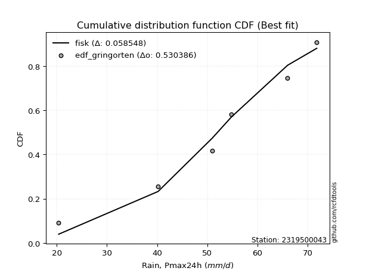</img>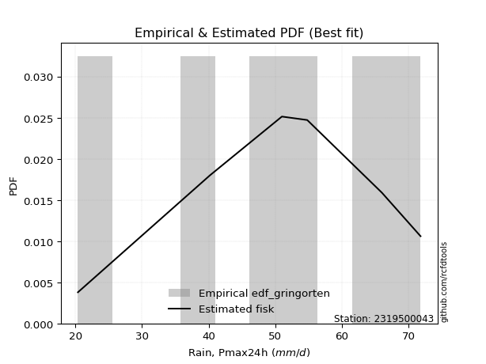</img>

</div>


### 9. EDF Filliben (1975)

The specific values of the constants (0.3175) (often denoted as $alpha$) and (0.365) are derived from a method proposed by James J. Filliben in a 1975 paper. This particular formula is the mean value of the $i$-th order statistic of the normal distribution and is considered a robust and effective plotting position formula for the normal probability plot correlation coefficient test for normality.

<div align="center">


$P=(m-0.3175)/(n+0.365)$


</div>


**9.1. Empirical values**

<div align="center">

|                | 0                   | 1                   | 2                   | 3            | 4                  | 5                  | 6                  |
|:---------------|:--------------------|:--------------------|:--------------------|:-------------|:-------------------|:-------------------|:-------------------|
| date           | 2024                | 2023                | 2020                | 2021         | 2019               | 2022               | 2025               |
| x              | 20.4                | 40.2                | 51.0                | 54.8         | 66.0               | 71.8               | 77.2               |
| m              | 1                   | 2                   | 3                   | 4            | 5                  | 6                  | 7                  |
| empirical_dist | edf_filliben        | edf_filliben        | edf_filliben        | edf_filliben | edf_filliben       | edf_filliben       | edf_filliben       |
| empirical      | 0.09266802443991853 | 0.22844534962661237 | 0.36422267481330617 | 0.5          | 0.6357773251866938 | 0.7715546503733877 | 0.9073319755600815 |
| empirical_tr   | 1.1021324354657687  | 1.2960844698636163  | 1.5728777362520021  | 2.0          | 2.7455731593662627 | 4.377414561664191  | 10.791208791208794 |

</div>


**9.2. Kolmogorov-Smirnov fit test (sorted by Δ)**


<div align="center">

|                | 0                    | 1                    | 2                   | 3                   | 4                   | 5                   | 6                   | 7                   | 8                   | 9                   | 10                  | 11                  | 12                  | 13                  | 14                  | 15                  | 16                  | 17                  | 18                  | 19                  | 20                  | 21                  | 22                  | 23                  | 24                  | 25                  | 26                  | 27                  | 28                  | 29                  | 30                  | 31                  | 32                  | 33                  | 34                  | 35                  | 36                  | 37                  | 38                  | 39                  | 40                  | 41                  | 42                  | 43                  | 44                  | 45                  | 46                  | 47                  | 48                  | 49                  | 50                  | 51                  | 52                  | 53                  | 54                  | 55                  | 56                  | 57                  | 58                  | 59                  | 60                  | 61                  | 62                  | 63                  | 64                  | 65                  | 66                  | 67                  | 68                  | 69                  | 70                  | 71                  | 72                  | 73                  | 74                  | 75                  | 76                  | 77                  | 78                  | 79                  | 80                  | 81                  | 82                  | 83                  | 84                  | 85                  | 86                  | 87                  | 88                  | 89                  | 90                  | 91                  | 92                  | 93                  | 94                  | 95                  | 96                  | 97                  | 98                  | 99                  | 100                 | 101                 | 102                 | 103                 | 104                 | 105                 | 106                 | 107                 | 108                 | 109                 | 110                 | 111                 | 112                 | 113                 | 114                 | 115                 | 116                 | 117                 | 118                 | 119                 | 120                 | 121                 | 122                 | 123                 | 124                 | 125                 | 126                 | 127                 | 128                 | 129                 | 130                 | 131                 | 132                 | 133                 | 134                 | 135                 | 136                 | 137                 | 138                 | 139                 | 140                 | 141                 | 142                 | 143                 | 144                 | 145                 | 146                 | 147                 | 148                 | 149                 | 150                 | 151                 | 152                 | 153                 | 154                 | 155                 | 156                 | 157                 | 158                 | 159                 |
|:---------------|:---------------------|:---------------------|:--------------------|:--------------------|:--------------------|:--------------------|:--------------------|:--------------------|:--------------------|:--------------------|:--------------------|:--------------------|:--------------------|:--------------------|:--------------------|:--------------------|:--------------------|:--------------------|:--------------------|:--------------------|:--------------------|:--------------------|:--------------------|:--------------------|:--------------------|:--------------------|:--------------------|:--------------------|:--------------------|:--------------------|:--------------------|:--------------------|:--------------------|:--------------------|:--------------------|:--------------------|:--------------------|:--------------------|:--------------------|:--------------------|:--------------------|:--------------------|:--------------------|:--------------------|:--------------------|:--------------------|:--------------------|:--------------------|:--------------------|:--------------------|:--------------------|:--------------------|:--------------------|:--------------------|:--------------------|:--------------------|:--------------------|:--------------------|:--------------------|:--------------------|:--------------------|:--------------------|:--------------------|:--------------------|:--------------------|:--------------------|:--------------------|:--------------------|:--------------------|:--------------------|:--------------------|:--------------------|:--------------------|:--------------------|:--------------------|:--------------------|:--------------------|:--------------------|:--------------------|:--------------------|:--------------------|:--------------------|:--------------------|:--------------------|:--------------------|:--------------------|:--------------------|:--------------------|:--------------------|:--------------------|:--------------------|:--------------------|:--------------------|:--------------------|:--------------------|:--------------------|:--------------------|:--------------------|:--------------------|:--------------------|:--------------------|:--------------------|:--------------------|:--------------------|:--------------------|:--------------------|:--------------------|:--------------------|:--------------------|:--------------------|:--------------------|:--------------------|:--------------------|:--------------------|:--------------------|:--------------------|:--------------------|:--------------------|:--------------------|:--------------------|:--------------------|:--------------------|:--------------------|:--------------------|:--------------------|:--------------------|:--------------------|:--------------------|:--------------------|:--------------------|:--------------------|:--------------------|:--------------------|:--------------------|:--------------------|:--------------------|:--------------------|:--------------------|:--------------------|:--------------------|:--------------------|:--------------------|:--------------------|:--------------------|:--------------------|:--------------------|:--------------------|:--------------------|:--------------------|:--------------------|:--------------------|:--------------------|:--------------------|:--------------------|:--------------------|:--------------------|:--------------------|:--------------------|:--------------------|:--------------------|
| station        | 2319500043           | 2319500043           | 2319500043          | 2319500043          | 2319500043          | 2319500043          | 2319500043          | 2319500043          | 2319500043          | 2319500043          | 2319500043          | 2319500043          | 2319500043          | 2319500043          | 2319500043          | 2319500043          | 2319500043          | 2319500043          | 2319500043          | 2319500043          | 2319500043          | 2319500043          | 2319500043          | 2319500043          | 2319500043          | 2319500043          | 2319500043          | 2319500043          | 2319500043          | 2319500043          | 2319500043          | 2319500043          | 2319500043          | 2319500043          | 2319500043          | 2319500043          | 2319500043          | 2319500043          | 2319500043          | 2319500043          | 2319500043          | 2319500043          | 2319500043          | 2319500043          | 2319500043          | 2319500043          | 2319500043          | 2319500043          | 2319500043          | 2319500043          | 2319500043          | 2319500043          | 2319500043          | 2319500043          | 2319500043          | 2319500043          | 2319500043          | 2319500043          | 2319500043          | 2319500043          | 2319500043          | 2319500043          | 2319500043          | 2319500043          | 2319500043          | 2319500043          | 2319500043          | 2319500043          | 2319500043          | 2319500043          | 2319500043          | 2319500043          | 2319500043          | 2319500043          | 2319500043          | 2319500043          | 2319500043          | 2319500043          | 2319500043          | 2319500043          | 2319500043          | 2319500043          | 2319500043          | 2319500043          | 2319500043          | 2319500043          | 2319500043          | 2319500043          | 2319500043          | 2319500043          | 2319500043          | 2319500043          | 2319500043          | 2319500043          | 2319500043          | 2319500043          | 2319500043          | 2319500043          | 2319500043          | 2319500043          | 2319500043          | 2319500043          | 2319500043          | 2319500043          | 2319500043          | 2319500043          | 2319500043          | 2319500043          | 2319500043          | 2319500043          | 2319500043          | 2319500043          | 2319500043          | 2319500043          | 2319500043          | 2319500043          | 2319500043          | 2319500043          | 2319500043          | 2319500043          | 2319500043          | 2319500043          | 2319500043          | 2319500043          | 2319500043          | 2319500043          | 2319500043          | 2319500043          | 2319500043          | 2319500043          | 2319500043          | 2319500043          | 2319500043          | 2319500043          | 2319500043          | 2319500043          | 2319500043          | 2319500043          | 2319500043          | 2319500043          | 2319500043          | 2319500043          | 2319500043          | 2319500043          | 2319500043          | 2319500043          | 2319500043          | 2319500043          | 2319500043          | 2319500043          | 2319500043          | 2319500043          | 2319500043          | 2319500043          | 2319500043          | 2319500043          | 2319500043          | 2319500043          | 2319500043          | 2319500043          |
| empirical_dist | edf_filliben         | edf_filliben         | edf_filliben        | edf_filliben        | edf_filliben        | edf_filliben        | edf_filliben        | edf_filliben        | edf_filliben        | edf_filliben        | edf_filliben        | edf_filliben        | edf_filliben        | edf_filliben        | edf_filliben        | edf_filliben        | edf_filliben        | edf_filliben        | edf_filliben        | edf_filliben        | edf_filliben        | edf_filliben        | edf_filliben        | edf_filliben        | edf_filliben        | edf_filliben        | edf_filliben        | edf_filliben        | edf_filliben        | edf_filliben        | edf_filliben        | edf_filliben        | edf_filliben        | edf_filliben        | edf_filliben        | edf_filliben        | edf_filliben        | edf_filliben        | edf_filliben        | edf_filliben        | edf_filliben        | edf_filliben        | edf_filliben        | edf_filliben        | edf_filliben        | edf_filliben        | edf_filliben        | edf_filliben        | edf_filliben        | edf_filliben        | edf_filliben        | edf_filliben        | edf_filliben        | edf_filliben        | edf_filliben        | edf_filliben        | edf_filliben        | edf_filliben        | edf_filliben        | edf_filliben        | edf_filliben        | edf_filliben        | edf_filliben        | edf_filliben        | edf_filliben        | edf_filliben        | edf_filliben        | edf_filliben        | edf_filliben        | edf_filliben        | edf_filliben        | edf_filliben        | edf_filliben        | edf_filliben        | edf_filliben        | edf_filliben        | edf_filliben        | edf_filliben        | edf_filliben        | edf_filliben        | edf_filliben        | edf_filliben        | edf_filliben        | edf_filliben        | edf_filliben        | edf_filliben        | edf_filliben        | edf_filliben        | edf_filliben        | edf_filliben        | edf_filliben        | edf_filliben        | edf_filliben        | edf_filliben        | edf_filliben        | edf_filliben        | edf_filliben        | edf_filliben        | edf_filliben        | edf_filliben        | edf_filliben        | edf_filliben        | edf_filliben        | edf_filliben        | edf_filliben        | edf_filliben        | edf_filliben        | edf_filliben        | edf_filliben        | edf_filliben        | edf_filliben        | edf_filliben        | edf_filliben        | edf_filliben        | edf_filliben        | edf_filliben        | edf_filliben        | edf_filliben        | edf_filliben        | edf_filliben        | edf_filliben        | edf_filliben        | edf_filliben        | edf_filliben        | edf_filliben        | edf_filliben        | edf_filliben        | edf_filliben        | edf_filliben        | edf_filliben        | edf_filliben        | edf_filliben        | edf_filliben        | edf_filliben        | edf_filliben        | edf_filliben        | edf_filliben        | edf_filliben        | edf_filliben        | edf_filliben        | edf_filliben        | edf_filliben        | edf_filliben        | edf_filliben        | edf_filliben        | edf_filliben        | edf_filliben        | edf_filliben        | edf_filliben        | edf_filliben        | edf_filliben        | edf_filliben        | edf_filliben        | edf_filliben        | edf_filliben        | edf_filliben        | edf_filliben        | edf_filliben        | edf_filliben        | edf_filliben        |
| p_dist         | trapezoid            | logmielke            | logexponweib        | logpearson3         | weibull_min         | gompertz            | anglit              | argus               | logburr             | burr                | loggumbel_l         | gumbel_l            | pearson3            | semicircular        | mielke              | logargus            | logexponpow         | logt                | logdweibull         | loggennorm          | logloglaplace       | logtrapezoid        | logloggamma         | triang              | skewnorm            | logvonmises_line    | logweibull_max      | gausshyper          | loggenextreme       | genhalflogistic     | arcsine             | betaprime           | erlang              | gamma               | nct                 | truncnorm           | crystalball         | norm                | exponnorm           | t                   | f                   | rice                | invgamma            | alpha               | logweibull_min      | loggengamma         | logburr12           | johnsonsu           | ncf                 | loggompertz         | genpareto           | logjohnsonsu        | maxwell             | rayleigh            | invgauss            | cosine              | logistic            | logbeta             | dgamma              | loglevy_l           | genextreme          | hypsecant           | halfnorm            | loggenhalflogistic  | logsemicircular     | gumbel_r            | loganglit           | logexponnorm        | lognorm             | logcrystalball      | logrice             | logfatiguelife      | loglogistic         | logf                | lognct              | loghypsecant        | kstwobign           | loginvgamma         | logncf              | logbetaprime        | logerlang           | logarcsine          | moyal               | logskewnorm         | halflogistic        | loglaplace          | loglaplace          | laplace             | wrapcauchy          | logalpha            | ksone               | loginvgauss         | truncweibull_min    | dweibull            | logtukeylambda      | kappa3              | uniform             | logtriang           | logmaxwell          | vonmises_line       | logfoldnorm         | lograyleigh         | loginvweibull       | levy_l              | logdgamma           | kappa4              | loggausshyper       | beta                | logcosine           | logkstwobign        | wald                | loggumbel_r         | loghalfnorm         | loggenexpon         | genexpon            | bradford            | logmoyal            | loghalflogistic     | truncexpon          | lognakagami         | gennorm             | lomax               | logtruncnorm        | logwrapcauchy       | nakagami            | logksone            | burr12              | loglomax            | halfgennorm         | loggenpareto        | logrdist            | logwald             | logkappa4           | logkappa3           | loguniform          | logbradford         | logtruncweibull_min | logtruncexpon       | johnsonsb           | logjohnsonsb        | foldnorm            | exponweib           | weibull_max         | gengamma            | fatiguelife         | powerlaw            | loggamma            | loggamma            | rdist               | tukeylambda         | logpowerlaw         | invweibull          | truncpareto         | exponpow            | logtruncpareto      | genlogistic         | loggenlogistic      | loghalfgennorm      | logvonmises         | vonmises            |
| delta          | 0.050121187245620036 | 0.057065255625872224 | 0.06655998449068257 | 0.06753329585320067 | 0.07174088437019566 | 0.07184697231483395 | 0.0734756508834764  | 0.07363879667590922 | 0.07697454150779959 | 0.0776419069315063  | 0.08117145383001212 | 0.08118407807960482 | 0.08241484597213233 | 0.08278554185873924 | 0.08334238362318624 | 0.0851812782191761  | 0.08609732689670935 | 0.08610147562489923 | 0.08882940559668129 | 0.09018246781119477 | 0.09045817374978093 | 0.09238410842810252 | 0.09265523684467525 | 0.09266764179183729 | 0.09266766639892432 | 0.09266802280422318 | 0.09266802440956501 | 0.09266802443908861 | 0.09266802443990096 | 0.09266802443991728 | 0.09266802443991853 | 0.09667280353831653 | 0.0971787737077805  | 0.09995238676266327 | 0.1003618623212621  | 0.10039622763620637 | 0.10039628861212546 | 0.10039630035055713 | 0.10039778725475079 | 0.1004742634692537  | 0.10099211101483885 | 0.10163486669766375 | 0.1024586448981114  | 0.10271382174190657 | 0.10422238812574536 | 0.10496039239556665 | 0.10507146582718763 | 0.10538047967360553 | 0.10664902161839585 | 0.1081835004558207  | 0.11000639223982647 | 0.11099404662170559 | 0.11177954435232884 | 0.11504793691026938 | 0.11805369197800503 | 0.1219744407889235  | 0.12292593817950848 | 0.12999875932110905 | 0.13734537754530263 | 0.13740167481855978 | 0.13814574856273587 | 0.13817200597698642 | 0.14093405083422472 | 0.14181034584024477 | 0.14306759228769905 | 0.14321244687545098 | 0.1436072615045776  | 0.14491257224988519 | 0.14491494741989686 | 0.14491887172745155 | 0.14492566589711509 | 0.14533915599055613 | 0.14616283685624776 | 0.14658793979802953 | 0.14719371667282588 | 0.14722816725854482 | 0.14807227979794102 | 0.1487118212204459  | 0.15112095285469906 | 0.15336259902378524 | 0.15420066304555846 | 0.1568289092952012  | 0.15699689247036985 | 0.1579768901645675  | 0.15940795418634968 | 0.159544384050037   | 0.159544384050037   | 0.15955235928386646 | 0.16277444447331335 | 0.16322516990807845 | 0.1680543204918581  | 0.16814360142001528 | 0.16922565585916238 | 0.17140373610030024 | 0.17169273424520662 | 0.1725724782518362  | 0.17450971955289096 | 0.17629376721753032 | 0.17757739884887147 | 0.1816649286365234  | 0.18752374953973516 | 0.1883843542311282  | 0.18838972378872376 | 0.19165480226295337 | 0.19509573069336272 | 0.1992539108380198  | 0.1999636740539863  | 0.20187952322604502 | 0.207253556616794   | 0.2131630174095147  | 0.21525240412086422 | 0.2155006150649631  | 0.21881118286142198 | 0.22468299979603712 | 0.22683675804800862 | 0.23375796803215054 | 0.24126247428105851 | 0.24428146030513265 | 0.2549124612666144  | 0.27113893391970156 | 0.27155465037338766 | 0.2719951545047572  | 0.27338322916172697 | 0.27478647484017504 | 0.2862852680175594  | 0.2928547005783043  | 0.29369405567951035 | 0.29852160282309315 | 0.30007644259498445 | 0.3025857362865164  | 0.3072330550571444  | 0.3128645461864744  | 0.31955341821363525 | 0.32093643406851335 | 0.3242701756566262  | 0.33407738831717293 | 0.3961655721583527  | 0.39785817475691754 | 0.4090227965260652  | 0.4300688850831532  | 0.5                 | 0.532831639243492   | 0.5534232798786171  | 0.5666588707473165  | 0.5809058395548361  | 0.6023825082445945  | 0.6166390342096347  | 0.6166390342096347  | 0.6357773189290604  | 0.6357773251866867  | 0.6523362573134505  | 0.661299006827186   | 0.6924405186989199  | 0.6975224348632918  | 0.720683403861962   | 0.7715546503733877  | 0.7715546503733877  | 0.7715546503733877  | 1.1303460758553632  | 11.417058317442079  |
| deltao         | 0.48442053926100004  | 0.48442053926100004  | 0.48442053926100004 | 0.48442053926100004 | 0.48442053926100004 | 0.48442053926100004 | 0.48442053926100004 | 0.48442053926100004 | 0.48442053926100004 | 0.48442053926100004 | 0.48442053926100004 | 0.48442053926100004 | 0.48442053926100004 | 0.48442053926100004 | 0.48442053926100004 | 0.48442053926100004 | 0.48442053926100004 | 0.48442053926100004 | 0.48442053926100004 | 0.48442053926100004 | 0.48442053926100004 | 0.48442053926100004 | 0.48442053926100004 | 0.48442053926100004 | 0.48442053926100004 | 0.48442053926100004 | 0.48442053926100004 | 0.48442053926100004 | 0.48442053926100004 | 0.48442053926100004 | 0.48442053926100004 | 0.48442053926100004 | 0.48442053926100004 | 0.48442053926100004 | 0.48442053926100004 | 0.48442053926100004 | 0.48442053926100004 | 0.48442053926100004 | 0.48442053926100004 | 0.48442053926100004 | 0.48442053926100004 | 0.48442053926100004 | 0.48442053926100004 | 0.48442053926100004 | 0.48442053926100004 | 0.48442053926100004 | 0.48442053926100004 | 0.48442053926100004 | 0.48442053926100004 | 0.48442053926100004 | 0.48442053926100004 | 0.48442053926100004 | 0.48442053926100004 | 0.48442053926100004 | 0.48442053926100004 | 0.48442053926100004 | 0.48442053926100004 | 0.48442053926100004 | 0.48442053926100004 | 0.48442053926100004 | 0.48442053926100004 | 0.48442053926100004 | 0.48442053926100004 | 0.48442053926100004 | 0.48442053926100004 | 0.48442053926100004 | 0.48442053926100004 | 0.48442053926100004 | 0.48442053926100004 | 0.48442053926100004 | 0.48442053926100004 | 0.48442053926100004 | 0.48442053926100004 | 0.48442053926100004 | 0.48442053926100004 | 0.48442053926100004 | 0.48442053926100004 | 0.48442053926100004 | 0.48442053926100004 | 0.48442053926100004 | 0.48442053926100004 | 0.48442053926100004 | 0.48442053926100004 | 0.48442053926100004 | 0.48442053926100004 | 0.48442053926100004 | 0.48442053926100004 | 0.48442053926100004 | 0.48442053926100004 | 0.48442053926100004 | 0.48442053926100004 | 0.48442053926100004 | 0.48442053926100004 | 0.48442053926100004 | 0.48442053926100004 | 0.48442053926100004 | 0.48442053926100004 | 0.48442053926100004 | 0.48442053926100004 | 0.48442053926100004 | 0.48442053926100004 | 0.48442053926100004 | 0.48442053926100004 | 0.48442053926100004 | 0.48442053926100004 | 0.48442053926100004 | 0.48442053926100004 | 0.48442053926100004 | 0.48442053926100004 | 0.48442053926100004 | 0.48442053926100004 | 0.48442053926100004 | 0.48442053926100004 | 0.48442053926100004 | 0.48442053926100004 | 0.48442053926100004 | 0.48442053926100004 | 0.48442053926100004 | 0.48442053926100004 | 0.48442053926100004 | 0.48442053926100004 | 0.48442053926100004 | 0.48442053926100004 | 0.48442053926100004 | 0.48442053926100004 | 0.48442053926100004 | 0.48442053926100004 | 0.48442053926100004 | 0.48442053926100004 | 0.48442053926100004 | 0.48442053926100004 | 0.48442053926100004 | 0.48442053926100004 | 0.48442053926100004 | 0.48442053926100004 | 0.48442053926100004 | 0.48442053926100004 | 0.48442053926100004 | 0.48442053926100004 | 0.48442053926100004 | 0.48442053926100004 | 0.48442053926100004 | 0.48442053926100004 | 0.48442053926100004 | 0.48442053926100004 | 0.48442053926100004 | 0.48442053926100004 | 0.48442053926100004 | 0.48442053926100004 | 0.48442053926100004 | 0.48442053926100004 | 0.48442053926100004 | 0.48442053926100004 | 0.48442053926100004 | 0.48442053926100004 | 0.48442053926100004 | 0.48442053926100004 | 0.48442053926100004 | 0.48442053926100004 | 0.48442053926100004 |
| eval           | Δo > Δ               | Δo > Δ               | Δo > Δ              | Δo > Δ              | Δo > Δ              | Δo > Δ              | Δo > Δ              | Δo > Δ              | Δo > Δ              | Δo > Δ              | Δo > Δ              | Δo > Δ              | Δo > Δ              | Δo > Δ              | Δo > Δ              | Δo > Δ              | Δo > Δ              | Δo > Δ              | Δo > Δ              | Δo > Δ              | Δo > Δ              | Δo > Δ              | Δo > Δ              | Δo > Δ              | Δo > Δ              | Δo > Δ              | Δo > Δ              | Δo > Δ              | Δo > Δ              | Δo > Δ              | Δo > Δ              | Δo > Δ              | Δo > Δ              | Δo > Δ              | Δo > Δ              | Δo > Δ              | Δo > Δ              | Δo > Δ              | Δo > Δ              | Δo > Δ              | Δo > Δ              | Δo > Δ              | Δo > Δ              | Δo > Δ              | Δo > Δ              | Δo > Δ              | Δo > Δ              | Δo > Δ              | Δo > Δ              | Δo > Δ              | Δo > Δ              | Δo > Δ              | Δo > Δ              | Δo > Δ              | Δo > Δ              | Δo > Δ              | Δo > Δ              | Δo > Δ              | Δo > Δ              | Δo > Δ              | Δo > Δ              | Δo > Δ              | Δo > Δ              | Δo > Δ              | Δo > Δ              | Δo > Δ              | Δo > Δ              | Δo > Δ              | Δo > Δ              | Δo > Δ              | Δo > Δ              | Δo > Δ              | Δo > Δ              | Δo > Δ              | Δo > Δ              | Δo > Δ              | Δo > Δ              | Δo > Δ              | Δo > Δ              | Δo > Δ              | Δo > Δ              | Δo > Δ              | Δo > Δ              | Δo > Δ              | Δo > Δ              | Δo > Δ              | Δo > Δ              | Δo > Δ              | Δo > Δ              | Δo > Δ              | Δo > Δ              | Δo > Δ              | Δo > Δ              | Δo > Δ              | Δo > Δ              | Δo > Δ              | Δo > Δ              | Δo > Δ              | Δo > Δ              | Δo > Δ              | Δo > Δ              | Δo > Δ              | Δo > Δ              | Δo > Δ              | Δo > Δ              | Δo > Δ              | Δo > Δ              | Δo > Δ              | Δo > Δ              | Δo > Δ              | Δo > Δ              | Δo > Δ              | Δo > Δ              | Δo > Δ              | Δo > Δ              | Δo > Δ              | Δo > Δ              | Δo > Δ              | Δo > Δ              | Δo > Δ              | Δo > Δ              | Δo > Δ              | Δo > Δ              | Δo > Δ              | Δo > Δ              | Δo > Δ              | Δo > Δ              | Δo > Δ              | Δo > Δ              | Δo > Δ              | Δo > Δ              | Δo > Δ              | Δo > Δ              | Δo > Δ              | Δo > Δ              | Δo > Δ              | Δo > Δ              | Δo > Δ              | Δo > Δ              | Δo > Δ              | Δo <= Δ             | Δo <= Δ             | Δo <= Δ             | Δo <= Δ             | Δo <= Δ             | Δo <= Δ             | Δo <= Δ             | Δo <= Δ             | Δo <= Δ             | Δo <= Δ             | Δo <= Δ             | Δo <= Δ             | Δo <= Δ             | Δo <= Δ             | Δo <= Δ             | Δo <= Δ             | Δo <= Δ             | Δo <= Δ             | Δo <= Δ             | Δo <= Δ             |
| fit            | 1                    | 1                    | 1                   | 1                   | 1                   | 1                   | 1                   | 1                   | 1                   | 1                   | 1                   | 1                   | 1                   | 1                   | 1                   | 1                   | 1                   | 1                   | 1                   | 1                   | 1                   | 1                   | 1                   | 1                   | 1                   | 1                   | 1                   | 1                   | 1                   | 1                   | 1                   | 1                   | 1                   | 1                   | 1                   | 1                   | 1                   | 1                   | 1                   | 1                   | 1                   | 1                   | 1                   | 1                   | 1                   | 1                   | 1                   | 1                   | 1                   | 1                   | 1                   | 1                   | 1                   | 1                   | 1                   | 1                   | 1                   | 1                   | 1                   | 1                   | 1                   | 1                   | 1                   | 1                   | 1                   | 1                   | 1                   | 1                   | 1                   | 1                   | 1                   | 1                   | 1                   | 1                   | 1                   | 1                   | 1                   | 1                   | 1                   | 1                   | 1                   | 1                   | 1                   | 1                   | 1                   | 1                   | 1                   | 1                   | 1                   | 1                   | 1                   | 1                   | 1                   | 1                   | 1                   | 1                   | 1                   | 1                   | 1                   | 1                   | 1                   | 1                   | 1                   | 1                   | 1                   | 1                   | 1                   | 1                   | 1                   | 1                   | 1                   | 1                   | 1                   | 1                   | 1                   | 1                   | 1                   | 1                   | 1                   | 1                   | 1                   | 1                   | 1                   | 1                   | 1                   | 1                   | 1                   | 1                   | 1                   | 1                   | 1                   | 1                   | 1                   | 1                   | 1                   | 1                   | 1                   | 1                   | 1                   | 1                   | 0                   | 0                   | 0                   | 0                   | 0                   | 0                   | 0                   | 0                   | 0                   | 0                   | 0                   | 0                   | 0                   | 0                   | 0                   | 0                   | 0                   | 0                   | 0                   | 0                   |
| n              | 7                    | 7                    | 7                   | 7                   | 7                   | 7                   | 7                   | 7                   | 7                   | 7                   | 7                   | 7                   | 7                   | 7                   | 7                   | 7                   | 7                   | 7                   | 7                   | 7                   | 7                   | 7                   | 7                   | 7                   | 7                   | 7                   | 7                   | 7                   | 7                   | 7                   | 7                   | 7                   | 7                   | 7                   | 7                   | 7                   | 7                   | 7                   | 7                   | 7                   | 7                   | 7                   | 7                   | 7                   | 7                   | 7                   | 7                   | 7                   | 7                   | 7                   | 7                   | 7                   | 7                   | 7                   | 7                   | 7                   | 7                   | 7                   | 7                   | 7                   | 7                   | 7                   | 7                   | 7                   | 7                   | 7                   | 7                   | 7                   | 7                   | 7                   | 7                   | 7                   | 7                   | 7                   | 7                   | 7                   | 7                   | 7                   | 7                   | 7                   | 7                   | 7                   | 7                   | 7                   | 7                   | 7                   | 7                   | 7                   | 7                   | 7                   | 7                   | 7                   | 7                   | 7                   | 7                   | 7                   | 7                   | 7                   | 7                   | 7                   | 7                   | 7                   | 7                   | 7                   | 7                   | 7                   | 7                   | 7                   | 7                   | 7                   | 7                   | 7                   | 7                   | 7                   | 7                   | 7                   | 7                   | 7                   | 7                   | 7                   | 7                   | 7                   | 7                   | 7                   | 7                   | 7                   | 7                   | 7                   | 7                   | 7                   | 7                   | 7                   | 7                   | 7                   | 7                   | 7                   | 7                   | 7                   | 7                   | 7                   | 7                   | 7                   | 7                   | 7                   | 7                   | 7                   | 7                   | 7                   | 7                   | 7                   | 7                   | 7                   | 7                   | 7                   | 7                   | 7                   | 7                   | 7                   | 7                   | 7                   |
| best_fit       | 1                    | 0                    | 0                   | 0                   | 0                   | 0                   | 0                   | 0                   | 0                   | 0                   | 0                   | 0                   | 0                   | 0                   | 0                   | 0                   | 0                   | 0                   | 0                   | 0                   | 0                   | 0                   | 0                   | 0                   | 0                   | 0                   | 0                   | 0                   | 0                   | 0                   | 0                   | 0                   | 0                   | 0                   | 0                   | 0                   | 0                   | 0                   | 0                   | 0                   | 0                   | 0                   | 0                   | 0                   | 0                   | 0                   | 0                   | 0                   | 0                   | 0                   | 0                   | 0                   | 0                   | 0                   | 0                   | 0                   | 0                   | 0                   | 0                   | 0                   | 0                   | 0                   | 0                   | 0                   | 0                   | 0                   | 0                   | 0                   | 0                   | 0                   | 0                   | 0                   | 0                   | 0                   | 0                   | 0                   | 0                   | 0                   | 0                   | 0                   | 0                   | 0                   | 0                   | 0                   | 0                   | 0                   | 0                   | 0                   | 0                   | 0                   | 0                   | 0                   | 0                   | 0                   | 0                   | 0                   | 0                   | 0                   | 0                   | 0                   | 0                   | 0                   | 0                   | 0                   | 0                   | 0                   | 0                   | 0                   | 0                   | 0                   | 0                   | 0                   | 0                   | 0                   | 0                   | 0                   | 0                   | 0                   | 0                   | 0                   | 0                   | 0                   | 0                   | 0                   | 0                   | 0                   | 0                   | 0                   | 0                   | 0                   | 0                   | 0                   | 0                   | 0                   | 0                   | 0                   | 0                   | 0                   | 0                   | 0                   | 0                   | 0                   | 0                   | 0                   | 0                   | 0                   | 0                   | 0                   | 0                   | 0                   | 0                   | 0                   | 0                   | 0                   | 0                   | 0                   | 0                   | 0                   | 0                   | 0                   |
| best_fit_sort  | 1                    | 2                    | 3                   | 4                   | 5                   | 6                   | 7                   | 8                   | 9                   | 10                  | 11                  | 12                  | 13                  | 14                  | 15                  | 16                  | 17                  | 18                  | 19                  | 20                  | 21                  | 22                  | 23                  | 24                  | 25                  | 26                  | 27                  | 28                  | 29                  | 30                  | 31                  | 32                  | 33                  | 34                  | 35                  | 36                  | 37                  | 38                  | 39                  | 40                  | 41                  | 42                  | 43                  | 44                  | 45                  | 46                  | 47                  | 48                  | 49                  | 50                  | 51                  | 52                  | 53                  | 54                  | 55                  | 56                  | 57                  | 58                  | 59                  | 60                  | 61                  | 62                  | 63                  | 64                  | 65                  | 66                  | 67                  | 68                  | 69                  | 70                  | 71                  | 72                  | 73                  | 74                  | 75                  | 76                  | 77                  | 78                  | 79                  | 80                  | 81                  | 82                  | 83                  | 84                  | 85                  | 86                  | 87                  | 88                  | 89                  | 90                  | 91                  | 92                  | 93                  | 94                  | 95                  | 96                  | 97                  | 98                  | 99                  | 100                 | 101                 | 102                 | 103                 | 104                 | 105                 | 106                 | 107                 | 108                 | 109                 | 110                 | 111                 | 112                 | 113                 | 114                 | 115                 | 116                 | 117                 | 118                 | 119                 | 120                 | 121                 | 122                 | 123                 | 124                 | 125                 | 126                 | 127                 | 128                 | 129                 | 130                 | 131                 | 132                 | 133                 | 134                 | 135                 | 136                 | 137                 | 138                 | 139                 | 140                 | 141                 | 142                 | 143                 | 144                 | 145                 | 146                 | 147                 | 148                 | 149                 | 150                 | 151                 | 152                 | 153                 | 154                 | 155                 | 156                 | 157                 | 158                 | 159                 | 160                 |

</div>


**9.3. Best fit**

<div align="center">

|   id |    station | empirical_dist   | p_dist    |     delta |   deltao | eval   |   fit |   n |   best_fit |   best_fit_sort |
|-----:|-----------:|:-----------------|:----------|----------:|---------:|:-------|------:|----:|-----------:|----------------:|
|    0 | 2319500043 | edf_filliben     | trapezoid | 0.0501212 | 0.484421 | Δo > Δ |     1 |   7 |          1 |               1 |

</div>


<div align="center">

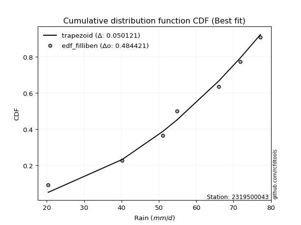</img>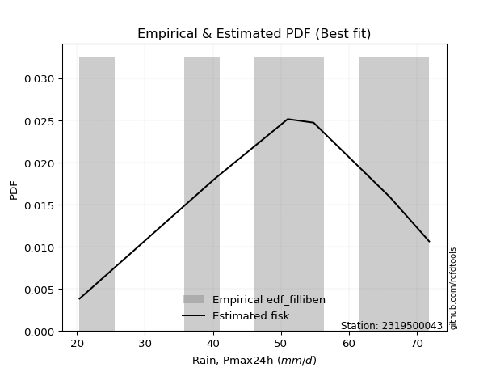</img>

</div>


### 10. EDF Jenkinson (1977)

The Jenkinson formula in hydrology is an empirical plotting position formula used to estimate the non-exceedance probability _(P)_ or return period _(T)_ of a given ordered observation within a sample. It is a widely used method in the frequency analysis of extreme events such as floods and rainfall, as it provides a distribution-free way to plot data. _a≈0.31_ and _b≈0.38_ are constants derived to approximate the median of the probability distribution for the given rank.

<div align="center">


$P=(m-a)/(n+b)$


</div>


**10.1. Empirical values**

<div align="center">

|                | 0                   | 1                   | 2                   | 3             | 4                  | 5                  | 6                  |
|:---------------|:--------------------|:--------------------|:--------------------|:--------------|:-------------------|:-------------------|:-------------------|
| date           | 2024                | 2023                | 2020                | 2021          | 2019               | 2022               | 2025               |
| x              | 20.4                | 40.2                | 51.0                | 54.8          | 66.0               | 71.8               | 77.2               |
| m              | 1                   | 2                   | 3                   | 4             | 5                  | 6                  | 7                  |
| empirical_dist | edf_jenkinson       | edf_jenkinson       | edf_jenkinson       | edf_jenkinson | edf_jenkinson      | edf_jenkinson      | edf_jenkinson      |
| empirical      | 0.09349593495934959 | 0.22899728997289973 | 0.36449864498644985 | 0.5           | 0.6355013550135502 | 0.7710027100271003 | 0.9065040650406505 |
| empirical_tr   | 1.1031390134529149  | 1.29701230228471    | 1.5735607675906182  | 2.0           | 2.743494423791822  | 4.366863905325444  | 10.695652173913055 |

</div>


**10.2. Kolmogorov-Smirnov fit test (sorted by Δ)**


<div align="center">

|                | 0                    | 1                    | 2                   | 3                   | 4                   | 5                   | 6                   | 7                   | 8                   | 9                   | 10                  | 11                  | 12                  | 13                  | 14                  | 15                  | 16                  | 17                  | 18                  | 19                  | 20                  | 21                  | 22                  | 23                  | 24                  | 25                  | 26                  | 27                  | 28                  | 29                  | 30                  | 31                  | 32                  | 33                  | 34                  | 35                  | 36                  | 37                  | 38                  | 39                  | 40                  | 41                  | 42                  | 43                  | 44                  | 45                  | 46                  | 47                  | 48                  | 49                  | 50                  | 51                  | 52                  | 53                  | 54                  | 55                  | 56                  | 57                  | 58                  | 59                  | 60                  | 61                  | 62                  | 63                  | 64                  | 65                  | 66                  | 67                  | 68                  | 69                  | 70                  | 71                  | 72                  | 73                  | 74                  | 75                  | 76                  | 77                  | 78                  | 79                  | 80                  | 81                  | 82                  | 83                  | 84                  | 85                  | 86                  | 87                  | 88                  | 89                  | 90                  | 91                  | 92                  | 93                  | 94                  | 95                  | 96                  | 97                  | 98                  | 99                  | 100                 | 101                 | 102                 | 103                 | 104                 | 105                 | 106                 | 107                 | 108                 | 109                 | 110                 | 111                 | 112                 | 113                 | 114                 | 115                 | 116                 | 117                 | 118                 | 119                 | 120                 | 121                 | 122                 | 123                 | 124                 | 125                 | 126                 | 127                 | 128                 | 129                 | 130                 | 131                 | 132                 | 133                 | 134                 | 135                 | 136                 | 137                 | 138                 | 139                 | 140                 | 141                 | 142                 | 143                 | 144                 | 145                 | 146                 | 147                 | 148                 | 149                 | 150                 | 151                 | 152                 | 153                 | 154                 | 155                 | 156                 | 157                 | 158                 | 159                 |
|:---------------|:---------------------|:---------------------|:--------------------|:--------------------|:--------------------|:--------------------|:--------------------|:--------------------|:--------------------|:--------------------|:--------------------|:--------------------|:--------------------|:--------------------|:--------------------|:--------------------|:--------------------|:--------------------|:--------------------|:--------------------|:--------------------|:--------------------|:--------------------|:--------------------|:--------------------|:--------------------|:--------------------|:--------------------|:--------------------|:--------------------|:--------------------|:--------------------|:--------------------|:--------------------|:--------------------|:--------------------|:--------------------|:--------------------|:--------------------|:--------------------|:--------------------|:--------------------|:--------------------|:--------------------|:--------------------|:--------------------|:--------------------|:--------------------|:--------------------|:--------------------|:--------------------|:--------------------|:--------------------|:--------------------|:--------------------|:--------------------|:--------------------|:--------------------|:--------------------|:--------------------|:--------------------|:--------------------|:--------------------|:--------------------|:--------------------|:--------------------|:--------------------|:--------------------|:--------------------|:--------------------|:--------------------|:--------------------|:--------------------|:--------------------|:--------------------|:--------------------|:--------------------|:--------------------|:--------------------|:--------------------|:--------------------|:--------------------|:--------------------|:--------------------|:--------------------|:--------------------|:--------------------|:--------------------|:--------------------|:--------------------|:--------------------|:--------------------|:--------------------|:--------------------|:--------------------|:--------------------|:--------------------|:--------------------|:--------------------|:--------------------|:--------------------|:--------------------|:--------------------|:--------------------|:--------------------|:--------------------|:--------------------|:--------------------|:--------------------|:--------------------|:--------------------|:--------------------|:--------------------|:--------------------|:--------------------|:--------------------|:--------------------|:--------------------|:--------------------|:--------------------|:--------------------|:--------------------|:--------------------|:--------------------|:--------------------|:--------------------|:--------------------|:--------------------|:--------------------|:--------------------|:--------------------|:--------------------|:--------------------|:--------------------|:--------------------|:--------------------|:--------------------|:--------------------|:--------------------|:--------------------|:--------------------|:--------------------|:--------------------|:--------------------|:--------------------|:--------------------|:--------------------|:--------------------|:--------------------|:--------------------|:--------------------|:--------------------|:--------------------|:--------------------|:--------------------|:--------------------|:--------------------|:--------------------|:--------------------|:--------------------|
| station        | 2319500043           | 2319500043           | 2319500043          | 2319500043          | 2319500043          | 2319500043          | 2319500043          | 2319500043          | 2319500043          | 2319500043          | 2319500043          | 2319500043          | 2319500043          | 2319500043          | 2319500043          | 2319500043          | 2319500043          | 2319500043          | 2319500043          | 2319500043          | 2319500043          | 2319500043          | 2319500043          | 2319500043          | 2319500043          | 2319500043          | 2319500043          | 2319500043          | 2319500043          | 2319500043          | 2319500043          | 2319500043          | 2319500043          | 2319500043          | 2319500043          | 2319500043          | 2319500043          | 2319500043          | 2319500043          | 2319500043          | 2319500043          | 2319500043          | 2319500043          | 2319500043          | 2319500043          | 2319500043          | 2319500043          | 2319500043          | 2319500043          | 2319500043          | 2319500043          | 2319500043          | 2319500043          | 2319500043          | 2319500043          | 2319500043          | 2319500043          | 2319500043          | 2319500043          | 2319500043          | 2319500043          | 2319500043          | 2319500043          | 2319500043          | 2319500043          | 2319500043          | 2319500043          | 2319500043          | 2319500043          | 2319500043          | 2319500043          | 2319500043          | 2319500043          | 2319500043          | 2319500043          | 2319500043          | 2319500043          | 2319500043          | 2319500043          | 2319500043          | 2319500043          | 2319500043          | 2319500043          | 2319500043          | 2319500043          | 2319500043          | 2319500043          | 2319500043          | 2319500043          | 2319500043          | 2319500043          | 2319500043          | 2319500043          | 2319500043          | 2319500043          | 2319500043          | 2319500043          | 2319500043          | 2319500043          | 2319500043          | 2319500043          | 2319500043          | 2319500043          | 2319500043          | 2319500043          | 2319500043          | 2319500043          | 2319500043          | 2319500043          | 2319500043          | 2319500043          | 2319500043          | 2319500043          | 2319500043          | 2319500043          | 2319500043          | 2319500043          | 2319500043          | 2319500043          | 2319500043          | 2319500043          | 2319500043          | 2319500043          | 2319500043          | 2319500043          | 2319500043          | 2319500043          | 2319500043          | 2319500043          | 2319500043          | 2319500043          | 2319500043          | 2319500043          | 2319500043          | 2319500043          | 2319500043          | 2319500043          | 2319500043          | 2319500043          | 2319500043          | 2319500043          | 2319500043          | 2319500043          | 2319500043          | 2319500043          | 2319500043          | 2319500043          | 2319500043          | 2319500043          | 2319500043          | 2319500043          | 2319500043          | 2319500043          | 2319500043          | 2319500043          | 2319500043          | 2319500043          | 2319500043          | 2319500043          | 2319500043          |
| empirical_dist | edf_jenkinson        | edf_jenkinson        | edf_jenkinson       | edf_jenkinson       | edf_jenkinson       | edf_jenkinson       | edf_jenkinson       | edf_jenkinson       | edf_jenkinson       | edf_jenkinson       | edf_jenkinson       | edf_jenkinson       | edf_jenkinson       | edf_jenkinson       | edf_jenkinson       | edf_jenkinson       | edf_jenkinson       | edf_jenkinson       | edf_jenkinson       | edf_jenkinson       | edf_jenkinson       | edf_jenkinson       | edf_jenkinson       | edf_jenkinson       | edf_jenkinson       | edf_jenkinson       | edf_jenkinson       | edf_jenkinson       | edf_jenkinson       | edf_jenkinson       | edf_jenkinson       | edf_jenkinson       | edf_jenkinson       | edf_jenkinson       | edf_jenkinson       | edf_jenkinson       | edf_jenkinson       | edf_jenkinson       | edf_jenkinson       | edf_jenkinson       | edf_jenkinson       | edf_jenkinson       | edf_jenkinson       | edf_jenkinson       | edf_jenkinson       | edf_jenkinson       | edf_jenkinson       | edf_jenkinson       | edf_jenkinson       | edf_jenkinson       | edf_jenkinson       | edf_jenkinson       | edf_jenkinson       | edf_jenkinson       | edf_jenkinson       | edf_jenkinson       | edf_jenkinson       | edf_jenkinson       | edf_jenkinson       | edf_jenkinson       | edf_jenkinson       | edf_jenkinson       | edf_jenkinson       | edf_jenkinson       | edf_jenkinson       | edf_jenkinson       | edf_jenkinson       | edf_jenkinson       | edf_jenkinson       | edf_jenkinson       | edf_jenkinson       | edf_jenkinson       | edf_jenkinson       | edf_jenkinson       | edf_jenkinson       | edf_jenkinson       | edf_jenkinson       | edf_jenkinson       | edf_jenkinson       | edf_jenkinson       | edf_jenkinson       | edf_jenkinson       | edf_jenkinson       | edf_jenkinson       | edf_jenkinson       | edf_jenkinson       | edf_jenkinson       | edf_jenkinson       | edf_jenkinson       | edf_jenkinson       | edf_jenkinson       | edf_jenkinson       | edf_jenkinson       | edf_jenkinson       | edf_jenkinson       | edf_jenkinson       | edf_jenkinson       | edf_jenkinson       | edf_jenkinson       | edf_jenkinson       | edf_jenkinson       | edf_jenkinson       | edf_jenkinson       | edf_jenkinson       | edf_jenkinson       | edf_jenkinson       | edf_jenkinson       | edf_jenkinson       | edf_jenkinson       | edf_jenkinson       | edf_jenkinson       | edf_jenkinson       | edf_jenkinson       | edf_jenkinson       | edf_jenkinson       | edf_jenkinson       | edf_jenkinson       | edf_jenkinson       | edf_jenkinson       | edf_jenkinson       | edf_jenkinson       | edf_jenkinson       | edf_jenkinson       | edf_jenkinson       | edf_jenkinson       | edf_jenkinson       | edf_jenkinson       | edf_jenkinson       | edf_jenkinson       | edf_jenkinson       | edf_jenkinson       | edf_jenkinson       | edf_jenkinson       | edf_jenkinson       | edf_jenkinson       | edf_jenkinson       | edf_jenkinson       | edf_jenkinson       | edf_jenkinson       | edf_jenkinson       | edf_jenkinson       | edf_jenkinson       | edf_jenkinson       | edf_jenkinson       | edf_jenkinson       | edf_jenkinson       | edf_jenkinson       | edf_jenkinson       | edf_jenkinson       | edf_jenkinson       | edf_jenkinson       | edf_jenkinson       | edf_jenkinson       | edf_jenkinson       | edf_jenkinson       | edf_jenkinson       | edf_jenkinson       | edf_jenkinson       | edf_jenkinson       | edf_jenkinson       |
| p_dist         | trapezoid            | logmielke            | logexponweib        | logpearson3         | weibull_min         | gompertz            | argus               | anglit              | logburr             | burr                | loggumbel_l         | gumbel_l            | pearson3            | semicircular        | mielke              | logt                | logargus            | logexponpow         | logdweibull         | logloglaplace       | loggennorm          | logtrapezoid        | logloggamma         | triang              | skewnorm            | logvonmises_line    | logweibull_max      | gausshyper          | loggenextreme       | genhalflogistic     | arcsine             | betaprime           | erlang              | gamma               | nct                 | truncnorm           | crystalball         | norm                | exponnorm           | t                   | f                   | rice                | invgamma            | alpha               | logweibull_min      | loggengamma         | logburr12           | johnsonsu           | ncf                 | loggompertz         | genpareto           | logjohnsonsu        | maxwell             | rayleigh            | invgauss            | cosine              | logistic            | logbeta             | loglevy_l           | dgamma              | genextreme          | hypsecant           | halfnorm            | loggenhalflogistic  | logsemicircular     | loganglit           | gumbel_r            | logexponnorm        | lognorm             | logcrystalball      | logrice             | logfatiguelife      | loglogistic         | logf                | lognct              | loghypsecant        | kstwobign           | loginvgamma         | logncf              | logbetaprime        | logerlang           | logarcsine          | moyal               | logskewnorm         | halflogistic        | loglaplace          | loglaplace          | laplace             | wrapcauchy          | logalpha            | ksone               | loginvgauss         | truncweibull_min    | dweibull            | logtukeylambda      | kappa3              | uniform             | logtriang           | logmaxwell          | vonmises_line       | logfoldnorm         | lograyleigh         | loginvweibull       | levy_l              | logdgamma           | kappa4              | loggausshyper       | beta                | logcosine           | logkstwobign        | wald                | loggumbel_r         | loghalfnorm         | loggenexpon         | genexpon            | bradford            | logmoyal            | loghalflogistic     | truncexpon          | lognakagami         | gennorm             | lomax               | logtruncnorm        | logwrapcauchy       | nakagami            | logksone            | burr12              | loglomax            | halfgennorm         | loggenpareto        | logrdist            | logwald             | logkappa4           | logkappa3           | loguniform          | logbradford         | logtruncweibull_min | logtruncexpon       | johnsonsb           | logjohnsonsb        | foldnorm            | exponweib           | weibull_max         | gengamma            | fatiguelife         | powerlaw            | loggamma            | loggamma            | rdist               | tukeylambda         | logpowerlaw         | invweibull          | truncpareto         | exponpow            | logtruncpareto      | genlogistic         | loggenlogistic      | loghalfgennorm      | logvonmises         | vonmises            |
| delta          | 0.050121187245620036 | 0.057065255625872224 | 0.06711192483696993 | 0.06725732568005699 | 0.07201685454333928 | 0.07212294248797757 | 0.07363879667590922 | 0.07375162105662003 | 0.07780245202723057 | 0.07846981745093728 | 0.08144742400315574 | 0.08146004825274844 | 0.08269081614527596 | 0.08361345237817029 | 0.08417029414261723 | 0.08527356510546824 | 0.08573321856546345 | 0.08637329706985297 | 0.08910537576982491 | 0.08963026323034995 | 0.09045843798433839 | 0.09155619790867153 | 0.09348314736410623 | 0.09349555231126827 | 0.0934955769183553  | 0.09349593332365423 | 0.093495934928996   | 0.0934959349585196  | 0.09349593495933195 | 0.09349593495934827 | 0.09349593495934959 | 0.09694877371146016 | 0.09745474388092412 | 0.1002283569358069  | 0.10063783249440572 | 0.10067219780935    | 0.10067225878526909 | 0.10067227052370076 | 0.10067375742789442 | 0.10075023364239732 | 0.10126808118798247 | 0.10191083687080738 | 0.10273461507125503 | 0.1029897919150502  | 0.10449835829888898 | 0.10523636256871027 | 0.10534743600033125 | 0.10538047967360553 | 0.10692499179153947 | 0.10845947062896433 | 0.10945445189353911 | 0.11099404662170559 | 0.11205551452547247 | 0.115323907083413   | 0.11777772180486135 | 0.12225041096206712 | 0.1232019083526521  | 0.1294468189748217  | 0.1365737642991287  | 0.13762134771844625 | 0.13814574856273587 | 0.13844797615013005 | 0.14065808066108104 | 0.1415343756671011  | 0.14279162211455537 | 0.1433312913314339  | 0.1434884170485946  | 0.1446366020767415  | 0.14463897724675318 | 0.14464290155430787 | 0.1446496957239714  | 0.14506318581741245 | 0.14588686668310408 | 0.14631196962488585 | 0.1469177464996822  | 0.14695219708540114 | 0.14779630962479734 | 0.14843585104730223 | 0.15084498268155538 | 0.15308662885064156 | 0.15392469287241478 | 0.15600099877577023 | 0.15727286264351348 | 0.15825286033771113 | 0.159131984013206   | 0.15982035422318064 | 0.15982035422318064 | 0.1598283294570101  | 0.16249847430016967 | 0.16294919973493477 | 0.1677783503187144  | 0.1678676312468716  | 0.169501626032306   | 0.17167970627344387 | 0.17224467459149398 | 0.1722965080786925  | 0.17423374937974728 | 0.17601779704438664 | 0.1773014286757278  | 0.1813889584633797  | 0.18724777936659148 | 0.18810838405798452 | 0.18811375361558008 | 0.1908268917435223  | 0.19537170086650635 | 0.19897794066487612 | 0.19968770388084262 | 0.20187952322604502 | 0.20697758644365033 | 0.21288704723637103 | 0.21497643394772054 | 0.21522464489181942 | 0.2185352126882783  | 0.22440702962289344 | 0.22656078787486494 | 0.23348199785900686 | 0.24098650410791483 | 0.24400549013198897 | 0.2546364910934707  | 0.2708629637465579  | 0.2710027100271003  | 0.2711672439853262  | 0.2736591993348706  | 0.2742345344938877  | 0.2860092978444157  | 0.29257873040516064 | 0.293142115333223   | 0.2979696624768058  | 0.2995245022486971  | 0.30203379594022906 | 0.306681114710857   | 0.31258857601333073 | 0.3192774480404916  | 0.3206604638953697  | 0.3239942054834825  | 0.33380141814402925 | 0.395889601985209   | 0.39758220458377386 | 0.40847085617977785 | 0.42951694473686586 | 0.5                 | 0.5322796988972046  | 0.5528713395323297  | 0.5661069304010291  | 0.5803538992085487  | 0.6018305678983071  | 0.6160870938633474  | 0.6160870938633474  | 0.6355013487559167  | 0.6355013550135431  | 0.6517843169671631  | 0.6607470664808986  | 0.6918885783526325  | 0.6969704945170044  | 0.7201314635156746  | 0.7710027100271003  | 0.7710027100271003  | 0.7710027100271003  | 1.1300701056822196  | 11.41788622796151   |
| deltao         | 0.48442053926100004  | 0.48442053926100004  | 0.48442053926100004 | 0.48442053926100004 | 0.48442053926100004 | 0.48442053926100004 | 0.48442053926100004 | 0.48442053926100004 | 0.48442053926100004 | 0.48442053926100004 | 0.48442053926100004 | 0.48442053926100004 | 0.48442053926100004 | 0.48442053926100004 | 0.48442053926100004 | 0.48442053926100004 | 0.48442053926100004 | 0.48442053926100004 | 0.48442053926100004 | 0.48442053926100004 | 0.48442053926100004 | 0.48442053926100004 | 0.48442053926100004 | 0.48442053926100004 | 0.48442053926100004 | 0.48442053926100004 | 0.48442053926100004 | 0.48442053926100004 | 0.48442053926100004 | 0.48442053926100004 | 0.48442053926100004 | 0.48442053926100004 | 0.48442053926100004 | 0.48442053926100004 | 0.48442053926100004 | 0.48442053926100004 | 0.48442053926100004 | 0.48442053926100004 | 0.48442053926100004 | 0.48442053926100004 | 0.48442053926100004 | 0.48442053926100004 | 0.48442053926100004 | 0.48442053926100004 | 0.48442053926100004 | 0.48442053926100004 | 0.48442053926100004 | 0.48442053926100004 | 0.48442053926100004 | 0.48442053926100004 | 0.48442053926100004 | 0.48442053926100004 | 0.48442053926100004 | 0.48442053926100004 | 0.48442053926100004 | 0.48442053926100004 | 0.48442053926100004 | 0.48442053926100004 | 0.48442053926100004 | 0.48442053926100004 | 0.48442053926100004 | 0.48442053926100004 | 0.48442053926100004 | 0.48442053926100004 | 0.48442053926100004 | 0.48442053926100004 | 0.48442053926100004 | 0.48442053926100004 | 0.48442053926100004 | 0.48442053926100004 | 0.48442053926100004 | 0.48442053926100004 | 0.48442053926100004 | 0.48442053926100004 | 0.48442053926100004 | 0.48442053926100004 | 0.48442053926100004 | 0.48442053926100004 | 0.48442053926100004 | 0.48442053926100004 | 0.48442053926100004 | 0.48442053926100004 | 0.48442053926100004 | 0.48442053926100004 | 0.48442053926100004 | 0.48442053926100004 | 0.48442053926100004 | 0.48442053926100004 | 0.48442053926100004 | 0.48442053926100004 | 0.48442053926100004 | 0.48442053926100004 | 0.48442053926100004 | 0.48442053926100004 | 0.48442053926100004 | 0.48442053926100004 | 0.48442053926100004 | 0.48442053926100004 | 0.48442053926100004 | 0.48442053926100004 | 0.48442053926100004 | 0.48442053926100004 | 0.48442053926100004 | 0.48442053926100004 | 0.48442053926100004 | 0.48442053926100004 | 0.48442053926100004 | 0.48442053926100004 | 0.48442053926100004 | 0.48442053926100004 | 0.48442053926100004 | 0.48442053926100004 | 0.48442053926100004 | 0.48442053926100004 | 0.48442053926100004 | 0.48442053926100004 | 0.48442053926100004 | 0.48442053926100004 | 0.48442053926100004 | 0.48442053926100004 | 0.48442053926100004 | 0.48442053926100004 | 0.48442053926100004 | 0.48442053926100004 | 0.48442053926100004 | 0.48442053926100004 | 0.48442053926100004 | 0.48442053926100004 | 0.48442053926100004 | 0.48442053926100004 | 0.48442053926100004 | 0.48442053926100004 | 0.48442053926100004 | 0.48442053926100004 | 0.48442053926100004 | 0.48442053926100004 | 0.48442053926100004 | 0.48442053926100004 | 0.48442053926100004 | 0.48442053926100004 | 0.48442053926100004 | 0.48442053926100004 | 0.48442053926100004 | 0.48442053926100004 | 0.48442053926100004 | 0.48442053926100004 | 0.48442053926100004 | 0.48442053926100004 | 0.48442053926100004 | 0.48442053926100004 | 0.48442053926100004 | 0.48442053926100004 | 0.48442053926100004 | 0.48442053926100004 | 0.48442053926100004 | 0.48442053926100004 | 0.48442053926100004 | 0.48442053926100004 | 0.48442053926100004 | 0.48442053926100004 |
| eval           | Δo > Δ               | Δo > Δ               | Δo > Δ              | Δo > Δ              | Δo > Δ              | Δo > Δ              | Δo > Δ              | Δo > Δ              | Δo > Δ              | Δo > Δ              | Δo > Δ              | Δo > Δ              | Δo > Δ              | Δo > Δ              | Δo > Δ              | Δo > Δ              | Δo > Δ              | Δo > Δ              | Δo > Δ              | Δo > Δ              | Δo > Δ              | Δo > Δ              | Δo > Δ              | Δo > Δ              | Δo > Δ              | Δo > Δ              | Δo > Δ              | Δo > Δ              | Δo > Δ              | Δo > Δ              | Δo > Δ              | Δo > Δ              | Δo > Δ              | Δo > Δ              | Δo > Δ              | Δo > Δ              | Δo > Δ              | Δo > Δ              | Δo > Δ              | Δo > Δ              | Δo > Δ              | Δo > Δ              | Δo > Δ              | Δo > Δ              | Δo > Δ              | Δo > Δ              | Δo > Δ              | Δo > Δ              | Δo > Δ              | Δo > Δ              | Δo > Δ              | Δo > Δ              | Δo > Δ              | Δo > Δ              | Δo > Δ              | Δo > Δ              | Δo > Δ              | Δo > Δ              | Δo > Δ              | Δo > Δ              | Δo > Δ              | Δo > Δ              | Δo > Δ              | Δo > Δ              | Δo > Δ              | Δo > Δ              | Δo > Δ              | Δo > Δ              | Δo > Δ              | Δo > Δ              | Δo > Δ              | Δo > Δ              | Δo > Δ              | Δo > Δ              | Δo > Δ              | Δo > Δ              | Δo > Δ              | Δo > Δ              | Δo > Δ              | Δo > Δ              | Δo > Δ              | Δo > Δ              | Δo > Δ              | Δo > Δ              | Δo > Δ              | Δo > Δ              | Δo > Δ              | Δo > Δ              | Δo > Δ              | Δo > Δ              | Δo > Δ              | Δo > Δ              | Δo > Δ              | Δo > Δ              | Δo > Δ              | Δo > Δ              | Δo > Δ              | Δo > Δ              | Δo > Δ              | Δo > Δ              | Δo > Δ              | Δo > Δ              | Δo > Δ              | Δo > Δ              | Δo > Δ              | Δo > Δ              | Δo > Δ              | Δo > Δ              | Δo > Δ              | Δo > Δ              | Δo > Δ              | Δo > Δ              | Δo > Δ              | Δo > Δ              | Δo > Δ              | Δo > Δ              | Δo > Δ              | Δo > Δ              | Δo > Δ              | Δo > Δ              | Δo > Δ              | Δo > Δ              | Δo > Δ              | Δo > Δ              | Δo > Δ              | Δo > Δ              | Δo > Δ              | Δo > Δ              | Δo > Δ              | Δo > Δ              | Δo > Δ              | Δo > Δ              | Δo > Δ              | Δo > Δ              | Δo > Δ              | Δo > Δ              | Δo > Δ              | Δo > Δ              | Δo > Δ              | Δo > Δ              | Δo <= Δ             | Δo <= Δ             | Δo <= Δ             | Δo <= Δ             | Δo <= Δ             | Δo <= Δ             | Δo <= Δ             | Δo <= Δ             | Δo <= Δ             | Δo <= Δ             | Δo <= Δ             | Δo <= Δ             | Δo <= Δ             | Δo <= Δ             | Δo <= Δ             | Δo <= Δ             | Δo <= Δ             | Δo <= Δ             | Δo <= Δ             | Δo <= Δ             |
| fit            | 1                    | 1                    | 1                   | 1                   | 1                   | 1                   | 1                   | 1                   | 1                   | 1                   | 1                   | 1                   | 1                   | 1                   | 1                   | 1                   | 1                   | 1                   | 1                   | 1                   | 1                   | 1                   | 1                   | 1                   | 1                   | 1                   | 1                   | 1                   | 1                   | 1                   | 1                   | 1                   | 1                   | 1                   | 1                   | 1                   | 1                   | 1                   | 1                   | 1                   | 1                   | 1                   | 1                   | 1                   | 1                   | 1                   | 1                   | 1                   | 1                   | 1                   | 1                   | 1                   | 1                   | 1                   | 1                   | 1                   | 1                   | 1                   | 1                   | 1                   | 1                   | 1                   | 1                   | 1                   | 1                   | 1                   | 1                   | 1                   | 1                   | 1                   | 1                   | 1                   | 1                   | 1                   | 1                   | 1                   | 1                   | 1                   | 1                   | 1                   | 1                   | 1                   | 1                   | 1                   | 1                   | 1                   | 1                   | 1                   | 1                   | 1                   | 1                   | 1                   | 1                   | 1                   | 1                   | 1                   | 1                   | 1                   | 1                   | 1                   | 1                   | 1                   | 1                   | 1                   | 1                   | 1                   | 1                   | 1                   | 1                   | 1                   | 1                   | 1                   | 1                   | 1                   | 1                   | 1                   | 1                   | 1                   | 1                   | 1                   | 1                   | 1                   | 1                   | 1                   | 1                   | 1                   | 1                   | 1                   | 1                   | 1                   | 1                   | 1                   | 1                   | 1                   | 1                   | 1                   | 1                   | 1                   | 1                   | 1                   | 0                   | 0                   | 0                   | 0                   | 0                   | 0                   | 0                   | 0                   | 0                   | 0                   | 0                   | 0                   | 0                   | 0                   | 0                   | 0                   | 0                   | 0                   | 0                   | 0                   |
| n              | 7                    | 7                    | 7                   | 7                   | 7                   | 7                   | 7                   | 7                   | 7                   | 7                   | 7                   | 7                   | 7                   | 7                   | 7                   | 7                   | 7                   | 7                   | 7                   | 7                   | 7                   | 7                   | 7                   | 7                   | 7                   | 7                   | 7                   | 7                   | 7                   | 7                   | 7                   | 7                   | 7                   | 7                   | 7                   | 7                   | 7                   | 7                   | 7                   | 7                   | 7                   | 7                   | 7                   | 7                   | 7                   | 7                   | 7                   | 7                   | 7                   | 7                   | 7                   | 7                   | 7                   | 7                   | 7                   | 7                   | 7                   | 7                   | 7                   | 7                   | 7                   | 7                   | 7                   | 7                   | 7                   | 7                   | 7                   | 7                   | 7                   | 7                   | 7                   | 7                   | 7                   | 7                   | 7                   | 7                   | 7                   | 7                   | 7                   | 7                   | 7                   | 7                   | 7                   | 7                   | 7                   | 7                   | 7                   | 7                   | 7                   | 7                   | 7                   | 7                   | 7                   | 7                   | 7                   | 7                   | 7                   | 7                   | 7                   | 7                   | 7                   | 7                   | 7                   | 7                   | 7                   | 7                   | 7                   | 7                   | 7                   | 7                   | 7                   | 7                   | 7                   | 7                   | 7                   | 7                   | 7                   | 7                   | 7                   | 7                   | 7                   | 7                   | 7                   | 7                   | 7                   | 7                   | 7                   | 7                   | 7                   | 7                   | 7                   | 7                   | 7                   | 7                   | 7                   | 7                   | 7                   | 7                   | 7                   | 7                   | 7                   | 7                   | 7                   | 7                   | 7                   | 7                   | 7                   | 7                   | 7                   | 7                   | 7                   | 7                   | 7                   | 7                   | 7                   | 7                   | 7                   | 7                   | 7                   | 7                   |
| best_fit       | 1                    | 0                    | 0                   | 0                   | 0                   | 0                   | 0                   | 0                   | 0                   | 0                   | 0                   | 0                   | 0                   | 0                   | 0                   | 0                   | 0                   | 0                   | 0                   | 0                   | 0                   | 0                   | 0                   | 0                   | 0                   | 0                   | 0                   | 0                   | 0                   | 0                   | 0                   | 0                   | 0                   | 0                   | 0                   | 0                   | 0                   | 0                   | 0                   | 0                   | 0                   | 0                   | 0                   | 0                   | 0                   | 0                   | 0                   | 0                   | 0                   | 0                   | 0                   | 0                   | 0                   | 0                   | 0                   | 0                   | 0                   | 0                   | 0                   | 0                   | 0                   | 0                   | 0                   | 0                   | 0                   | 0                   | 0                   | 0                   | 0                   | 0                   | 0                   | 0                   | 0                   | 0                   | 0                   | 0                   | 0                   | 0                   | 0                   | 0                   | 0                   | 0                   | 0                   | 0                   | 0                   | 0                   | 0                   | 0                   | 0                   | 0                   | 0                   | 0                   | 0                   | 0                   | 0                   | 0                   | 0                   | 0                   | 0                   | 0                   | 0                   | 0                   | 0                   | 0                   | 0                   | 0                   | 0                   | 0                   | 0                   | 0                   | 0                   | 0                   | 0                   | 0                   | 0                   | 0                   | 0                   | 0                   | 0                   | 0                   | 0                   | 0                   | 0                   | 0                   | 0                   | 0                   | 0                   | 0                   | 0                   | 0                   | 0                   | 0                   | 0                   | 0                   | 0                   | 0                   | 0                   | 0                   | 0                   | 0                   | 0                   | 0                   | 0                   | 0                   | 0                   | 0                   | 0                   | 0                   | 0                   | 0                   | 0                   | 0                   | 0                   | 0                   | 0                   | 0                   | 0                   | 0                   | 0                   | 0                   |
| best_fit_sort  | 1                    | 2                    | 3                   | 4                   | 5                   | 6                   | 7                   | 8                   | 9                   | 10                  | 11                  | 12                  | 13                  | 14                  | 15                  | 16                  | 17                  | 18                  | 19                  | 20                  | 21                  | 22                  | 23                  | 24                  | 25                  | 26                  | 27                  | 28                  | 29                  | 30                  | 31                  | 32                  | 33                  | 34                  | 35                  | 36                  | 37                  | 38                  | 39                  | 40                  | 41                  | 42                  | 43                  | 44                  | 45                  | 46                  | 47                  | 48                  | 49                  | 50                  | 51                  | 52                  | 53                  | 54                  | 55                  | 56                  | 57                  | 58                  | 59                  | 60                  | 61                  | 62                  | 63                  | 64                  | 65                  | 66                  | 67                  | 68                  | 69                  | 70                  | 71                  | 72                  | 73                  | 74                  | 75                  | 76                  | 77                  | 78                  | 79                  | 80                  | 81                  | 82                  | 83                  | 84                  | 85                  | 86                  | 87                  | 88                  | 89                  | 90                  | 91                  | 92                  | 93                  | 94                  | 95                  | 96                  | 97                  | 98                  | 99                  | 100                 | 101                 | 102                 | 103                 | 104                 | 105                 | 106                 | 107                 | 108                 | 109                 | 110                 | 111                 | 112                 | 113                 | 114                 | 115                 | 116                 | 117                 | 118                 | 119                 | 120                 | 121                 | 122                 | 123                 | 124                 | 125                 | 126                 | 127                 | 128                 | 129                 | 130                 | 131                 | 132                 | 133                 | 134                 | 135                 | 136                 | 137                 | 138                 | 139                 | 140                 | 141                 | 142                 | 143                 | 144                 | 145                 | 146                 | 147                 | 148                 | 149                 | 150                 | 151                 | 152                 | 153                 | 154                 | 155                 | 156                 | 157                 | 158                 | 159                 | 160                 |

</div>


**10.3. Best fit**

<div align="center">

|   id |    station | empirical_dist   | p_dist    |     delta |   deltao | eval   |   fit |   n |   best_fit |   best_fit_sort |
|-----:|-----------:|:-----------------|:----------|----------:|---------:|:-------|------:|----:|-----------:|----------------:|
|    0 | 2319500043 | edf_jenkinson    | trapezoid | 0.0501212 | 0.484421 | Δo > Δ |     1 |   7 |          1 |               1 |

</div>


<div align="center">

</img>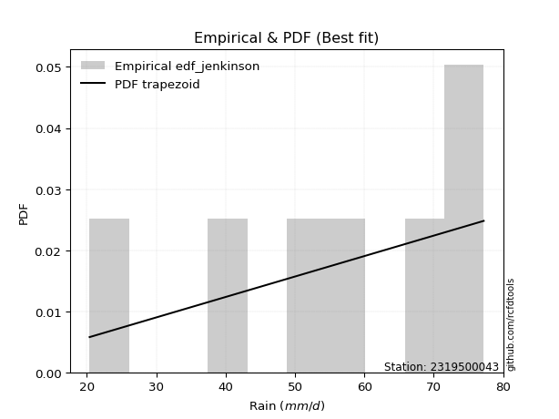</img>

</div>


### 11. EDF Cunnane (1978)

Cunnane´s work in statistical hydrology has focused on the performance and evaluation of different probability distributions (such as GEV, Gumbel, Lognormal) for flood frequency estimation. _b_ is a constant, typically set to 0.4.

<div align="center">


$P=(m-b)/(n+1-2b)$


</div>


**11.1. Empirical values**

<div align="center">

|                | 0                   | 1                   | 2                  | 3           | 4                  | 5                  | 6                  |
|:---------------|:--------------------|:--------------------|:-------------------|:------------|:-------------------|:-------------------|:-------------------|
| date           | 2024                | 2023                | 2020               | 2021        | 2019               | 2022               | 2025               |
| x              | 20.4                | 40.2                | 51.0               | 54.8        | 66.0               | 71.8               | 77.2               |
| m              | 1                   | 2                   | 3                  | 4           | 5                  | 6                  | 7                  |
| empirical_dist | edf_cunnane         | edf_cunnane         | edf_cunnane        | edf_cunnane | edf_cunnane        | edf_cunnane        | edf_cunnane        |
| empirical      | 0.08333333333333333 | 0.22222222222222224 | 0.3611111111111111 | 0.5         | 0.6388888888888888 | 0.7777777777777777 | 0.9166666666666666 |
| empirical_tr   | 1.090909090909091   | 1.2857142857142856  | 1.565217391304348  | 2.0         | 2.7692307692307687 | 4.499999999999998  | 11.999999999999995 |

</div>


**11.2. Kolmogorov-Smirnov fit test (sorted by Δ)**


<div align="center">

|                | 0                    | 1                    | 2                   | 3                   | 4                   | 5                   | 6                   | 7                   | 8                   | 9                   | 10                  | 11                  | 12                  | 13                  | 14                  | 15                  | 16                  | 17                  | 18                  | 19                  | 20                  | 21                  | 22                  | 23                  | 24                  | 25                  | 26                  | 27                  | 28                  | 29                  | 30                  | 31                  | 32                  | 33                  | 34                  | 35                  | 36                  | 37                  | 38                  | 39                  | 40                  | 41                  | 42                  | 43                  | 44                  | 45                  | 46                  | 47                  | 48                  | 49                  | 50                  | 51                  | 52                  | 53                  | 54                  | 55                  | 56                  | 57                  | 58                  | 59                  | 60                  | 61                  | 62                  | 63                  | 64                  | 65                  | 66                  | 67                  | 68                  | 69                  | 70                  | 71                  | 72                  | 73                  | 74                  | 75                  | 76                  | 77                  | 78                  | 79                  | 80                  | 81                  | 82                  | 83                  | 84                  | 85                  | 86                  | 87                  | 88                  | 89                  | 90                  | 91                  | 92                  | 93                  | 94                  | 95                  | 96                  | 97                  | 98                  | 99                  | 100                 | 101                 | 102                 | 103                 | 104                 | 105                 | 106                 | 107                 | 108                 | 109                 | 110                 | 111                 | 112                 | 113                 | 114                 | 115                 | 116                 | 117                 | 118                 | 119                 | 120                 | 121                 | 122                 | 123                 | 124                 | 125                 | 126                 | 127                 | 128                 | 129                 | 130                 | 131                 | 132                 | 133                 | 134                 | 135                 | 136                 | 137                 | 138                 | 139                 | 140                 | 141                 | 142                 | 143                 | 144                 | 145                 | 146                 | 147                 | 148                 | 149                 | 150                 | 151                 | 152                 | 153                 | 154                 | 155                 | 156                 | 157                 | 158                 | 159                 |
|:---------------|:---------------------|:---------------------|:--------------------|:--------------------|:--------------------|:--------------------|:--------------------|:--------------------|:--------------------|:--------------------|:--------------------|:--------------------|:--------------------|:--------------------|:--------------------|:--------------------|:--------------------|:--------------------|:--------------------|:--------------------|:--------------------|:--------------------|:--------------------|:--------------------|:--------------------|:--------------------|:--------------------|:--------------------|:--------------------|:--------------------|:--------------------|:--------------------|:--------------------|:--------------------|:--------------------|:--------------------|:--------------------|:--------------------|:--------------------|:--------------------|:--------------------|:--------------------|:--------------------|:--------------------|:--------------------|:--------------------|:--------------------|:--------------------|:--------------------|:--------------------|:--------------------|:--------------------|:--------------------|:--------------------|:--------------------|:--------------------|:--------------------|:--------------------|:--------------------|:--------------------|:--------------------|:--------------------|:--------------------|:--------------------|:--------------------|:--------------------|:--------------------|:--------------------|:--------------------|:--------------------|:--------------------|:--------------------|:--------------------|:--------------------|:--------------------|:--------------------|:--------------------|:--------------------|:--------------------|:--------------------|:--------------------|:--------------------|:--------------------|:--------------------|:--------------------|:--------------------|:--------------------|:--------------------|:--------------------|:--------------------|:--------------------|:--------------------|:--------------------|:--------------------|:--------------------|:--------------------|:--------------------|:--------------------|:--------------------|:--------------------|:--------------------|:--------------------|:--------------------|:--------------------|:--------------------|:--------------------|:--------------------|:--------------------|:--------------------|:--------------------|:--------------------|:--------------------|:--------------------|:--------------------|:--------------------|:--------------------|:--------------------|:--------------------|:--------------------|:--------------------|:--------------------|:--------------------|:--------------------|:--------------------|:--------------------|:--------------------|:--------------------|:--------------------|:--------------------|:--------------------|:--------------------|:--------------------|:--------------------|:--------------------|:--------------------|:--------------------|:--------------------|:--------------------|:--------------------|:--------------------|:--------------------|:--------------------|:--------------------|:--------------------|:--------------------|:--------------------|:--------------------|:--------------------|:--------------------|:--------------------|:--------------------|:--------------------|:--------------------|:--------------------|:--------------------|:--------------------|:--------------------|:--------------------|:--------------------|:--------------------|
| station        | 2319500043           | 2319500043           | 2319500043          | 2319500043          | 2319500043          | 2319500043          | 2319500043          | 2319500043          | 2319500043          | 2319500043          | 2319500043          | 2319500043          | 2319500043          | 2319500043          | 2319500043          | 2319500043          | 2319500043          | 2319500043          | 2319500043          | 2319500043          | 2319500043          | 2319500043          | 2319500043          | 2319500043          | 2319500043          | 2319500043          | 2319500043          | 2319500043          | 2319500043          | 2319500043          | 2319500043          | 2319500043          | 2319500043          | 2319500043          | 2319500043          | 2319500043          | 2319500043          | 2319500043          | 2319500043          | 2319500043          | 2319500043          | 2319500043          | 2319500043          | 2319500043          | 2319500043          | 2319500043          | 2319500043          | 2319500043          | 2319500043          | 2319500043          | 2319500043          | 2319500043          | 2319500043          | 2319500043          | 2319500043          | 2319500043          | 2319500043          | 2319500043          | 2319500043          | 2319500043          | 2319500043          | 2319500043          | 2319500043          | 2319500043          | 2319500043          | 2319500043          | 2319500043          | 2319500043          | 2319500043          | 2319500043          | 2319500043          | 2319500043          | 2319500043          | 2319500043          | 2319500043          | 2319500043          | 2319500043          | 2319500043          | 2319500043          | 2319500043          | 2319500043          | 2319500043          | 2319500043          | 2319500043          | 2319500043          | 2319500043          | 2319500043          | 2319500043          | 2319500043          | 2319500043          | 2319500043          | 2319500043          | 2319500043          | 2319500043          | 2319500043          | 2319500043          | 2319500043          | 2319500043          | 2319500043          | 2319500043          | 2319500043          | 2319500043          | 2319500043          | 2319500043          | 2319500043          | 2319500043          | 2319500043          | 2319500043          | 2319500043          | 2319500043          | 2319500043          | 2319500043          | 2319500043          | 2319500043          | 2319500043          | 2319500043          | 2319500043          | 2319500043          | 2319500043          | 2319500043          | 2319500043          | 2319500043          | 2319500043          | 2319500043          | 2319500043          | 2319500043          | 2319500043          | 2319500043          | 2319500043          | 2319500043          | 2319500043          | 2319500043          | 2319500043          | 2319500043          | 2319500043          | 2319500043          | 2319500043          | 2319500043          | 2319500043          | 2319500043          | 2319500043          | 2319500043          | 2319500043          | 2319500043          | 2319500043          | 2319500043          | 2319500043          | 2319500043          | 2319500043          | 2319500043          | 2319500043          | 2319500043          | 2319500043          | 2319500043          | 2319500043          | 2319500043          | 2319500043          | 2319500043          | 2319500043          | 2319500043          |
| empirical_dist | edf_cunnane          | edf_cunnane          | edf_cunnane         | edf_cunnane         | edf_cunnane         | edf_cunnane         | edf_cunnane         | edf_cunnane         | edf_cunnane         | edf_cunnane         | edf_cunnane         | edf_cunnane         | edf_cunnane         | edf_cunnane         | edf_cunnane         | edf_cunnane         | edf_cunnane         | edf_cunnane         | edf_cunnane         | edf_cunnane         | edf_cunnane         | edf_cunnane         | edf_cunnane         | edf_cunnane         | edf_cunnane         | edf_cunnane         | edf_cunnane         | edf_cunnane         | edf_cunnane         | edf_cunnane         | edf_cunnane         | edf_cunnane         | edf_cunnane         | edf_cunnane         | edf_cunnane         | edf_cunnane         | edf_cunnane         | edf_cunnane         | edf_cunnane         | edf_cunnane         | edf_cunnane         | edf_cunnane         | edf_cunnane         | edf_cunnane         | edf_cunnane         | edf_cunnane         | edf_cunnane         | edf_cunnane         | edf_cunnane         | edf_cunnane         | edf_cunnane         | edf_cunnane         | edf_cunnane         | edf_cunnane         | edf_cunnane         | edf_cunnane         | edf_cunnane         | edf_cunnane         | edf_cunnane         | edf_cunnane         | edf_cunnane         | edf_cunnane         | edf_cunnane         | edf_cunnane         | edf_cunnane         | edf_cunnane         | edf_cunnane         | edf_cunnane         | edf_cunnane         | edf_cunnane         | edf_cunnane         | edf_cunnane         | edf_cunnane         | edf_cunnane         | edf_cunnane         | edf_cunnane         | edf_cunnane         | edf_cunnane         | edf_cunnane         | edf_cunnane         | edf_cunnane         | edf_cunnane         | edf_cunnane         | edf_cunnane         | edf_cunnane         | edf_cunnane         | edf_cunnane         | edf_cunnane         | edf_cunnane         | edf_cunnane         | edf_cunnane         | edf_cunnane         | edf_cunnane         | edf_cunnane         | edf_cunnane         | edf_cunnane         | edf_cunnane         | edf_cunnane         | edf_cunnane         | edf_cunnane         | edf_cunnane         | edf_cunnane         | edf_cunnane         | edf_cunnane         | edf_cunnane         | edf_cunnane         | edf_cunnane         | edf_cunnane         | edf_cunnane         | edf_cunnane         | edf_cunnane         | edf_cunnane         | edf_cunnane         | edf_cunnane         | edf_cunnane         | edf_cunnane         | edf_cunnane         | edf_cunnane         | edf_cunnane         | edf_cunnane         | edf_cunnane         | edf_cunnane         | edf_cunnane         | edf_cunnane         | edf_cunnane         | edf_cunnane         | edf_cunnane         | edf_cunnane         | edf_cunnane         | edf_cunnane         | edf_cunnane         | edf_cunnane         | edf_cunnane         | edf_cunnane         | edf_cunnane         | edf_cunnane         | edf_cunnane         | edf_cunnane         | edf_cunnane         | edf_cunnane         | edf_cunnane         | edf_cunnane         | edf_cunnane         | edf_cunnane         | edf_cunnane         | edf_cunnane         | edf_cunnane         | edf_cunnane         | edf_cunnane         | edf_cunnane         | edf_cunnane         | edf_cunnane         | edf_cunnane         | edf_cunnane         | edf_cunnane         | edf_cunnane         | edf_cunnane         | edf_cunnane         | edf_cunnane         | edf_cunnane         |
| p_dist         | trapezoid            | logmielke            | logexponweib        | logburr             | burr                | weibull_min         | gompertz            | logpearson3         | argus               | anglit              | mielke              | loggumbel_l         | gumbel_l            | semicircular        | logargus            | pearson3            | logexponpow         | logloggamma         | triang              | skewnorm            | gausshyper          | loggenextreme       | genhalflogistic     | logdweibull         | loggennorm          | logvonmises_line    | logweibull_max      | betaprime           | erlang              | logt                | arcsine             | gamma               | nct                 | truncnorm           | crystalball         | norm                | exponnorm           | t                   | f                   | rice                | invgamma            | alpha               | logloglaplace       | logweibull_min      | logtrapezoid        | loggengamma         | logburr12           | ncf                 | loggompertz         | johnsonsu           | maxwell             | logjohnsonsu        | rayleigh            | genpareto           | cosine              | logistic            | invgauss            | dgamma              | hypsecant           | logbeta             | genextreme          | gumbel_r            | halfnorm            | loggenhalflogistic  | logsemicircular     | loganglit           | loglevy_l           | logexponnorm        | lognorm             | logcrystalball      | logrice             | logfatiguelife      | loglogistic         | logf                | lognct              | loghypsecant        | kstwobign           | loginvgamma         | moyal               | logncf              | logskewnorm         | loglaplace          | loglaplace          | laplace             | logbetaprime        | logerlang           | halflogistic        | logtukeylambda      | truncweibull_min    | logarcsine          | logalpha            | dweibull            | wrapcauchy          | ksone               | loginvgauss         | kappa3              | uniform             | logtriang           | logmaxwell          | vonmises_line       | logfoldnorm         | lograyleigh         | loginvweibull       | logdgamma           | levy_l              | beta                | kappa4              | loggausshyper       | logcosine           | logkstwobign        | wald                | loggumbel_r         | loghalfnorm         | loggenexpon         | genexpon            | bradford            | logmoyal            | loghalflogistic     | truncexpon          | logtruncnorm        | lognakagami         | gennorm             | logwrapcauchy       | lomax               | nakagami            | logksone            | burr12              | loglomax            | halfgennorm         | loggenpareto        | logrdist            | logwald             | logkappa4           | logkappa3           | loguniform          | logbradford         | logtruncweibull_min | logtruncexpon       | johnsonsb           | logjohnsonsb        | foldnorm            | exponweib           | weibull_max         | gengamma            | fatiguelife         | powerlaw            | loggamma            | loggamma            | rdist               | tukeylambda         | logpowerlaw         | invweibull          | truncpareto         | exponpow            | logtruncpareto      | genlogistic         | loggenlogistic      | loghalfgennorm      | logvonmises         | vonmises            |
| delta          | 0.050121187245620036 | 0.057065255625872224 | 0.06278248201405146 | 0.06763985040121445 | 0.06830721582492116 | 0.06862932066800065 | 0.06873540861263894 | 0.07064485955539573 | 0.07363879667590922 | 0.07371561261516607 | 0.07440903754824885 | 0.07805989012781711 | 0.07807251437740981 | 0.07812026792811672 | 0.07895815081478608 | 0.07930328226993733 | 0.08298576319451434 | 0.08332054573809011 | 0.08333295068525215 | 0.08333297529233918 | 0.08333333333250348 | 0.08333333333331583 | 0.08333333333333215 | 0.08571784189448628 | 0.08707090410899976 | 0.08988455752955649 | 0.09142168614115959 | 0.09356123983612152 | 0.09406721000558549 | 0.09543616673148436 | 0.09572120594111755 | 0.09684082306046826 | 0.09725029861906709 | 0.09728466393401136 | 0.09728472490993045 | 0.09728473664836212 | 0.09728622355255578 | 0.09736269976705869 | 0.09788054731264384 | 0.09852330299546874 | 0.0993470811959164  | 0.09960225803971157 | 0.09979286485636607 | 0.10111082442355035 | 0.10171879953468765 | 0.10184882869337164 | 0.10195990212499262 | 0.10353745791620084 | 0.1050719367536257  | 0.10538047967360553 | 0.10866798065013383 | 0.11099404662170559 | 0.11193637320807437 | 0.1162295196442166  | 0.11886287708672849 | 0.11981437447731347 | 0.12116525568020009 | 0.13423381384310762 | 0.13506044227479141 | 0.13622188672549906 | 0.13814574856273587 | 0.14010088317325597 | 0.14404561453641979 | 0.14492190954243983 | 0.14617915598989412 | 0.14671882520677265 | 0.146736365925145   | 0.14802413595208025 | 0.14802651112209192 | 0.1480304354296466  | 0.14803722959931015 | 0.1484507196927512  | 0.14927440055844282 | 0.1496995035002246  | 0.15030528037502094 | 0.15033973096073988 | 0.15118384350013608 | 0.15182338492264097 | 0.15388532876817484 | 0.15423251655689413 | 0.1548653264623725  | 0.156432820347842   | 0.156432820347842   | 0.15644079558167145 | 0.1564741627259803  | 0.15731222674775353 | 0.16251951788854474 | 0.1654696068408165  | 0.16611409215696737 | 0.16616360040178635 | 0.1663367336102735  | 0.16829217239810523 | 0.16832419732285372 | 0.17116588419405315 | 0.17125516512221034 | 0.17568404195403126 | 0.17762128325508603 | 0.17940533091972538 | 0.18068896255106653 | 0.18477649233871846 | 0.19063531324193023 | 0.19149591793332327 | 0.19150128749091883 | 0.19198416699116772 | 0.20098949336953859 | 0.20187952322604502 | 0.20236547454021486 | 0.20307523775618136 | 0.21036512031898907 | 0.21627458111170977 | 0.21836396782305928 | 0.21861217876715816 | 0.22192274656361705 | 0.22779456349823218 | 0.2299483217502037  | 0.2368695317343456  | 0.24437403798325358 | 0.2473930240073277  | 0.25802402496880944 | 0.27027166545953196 | 0.2742504976218966  | 0.2777777777777778  | 0.28100960224456517 | 0.28132984561134233 | 0.28939683171975444 | 0.2959662642804994  | 0.2999171830839005  | 0.3047447302274833  | 0.3062995699993746  | 0.30880886369090654 | 0.3134561824615345  | 0.3159761098886695  | 0.3226649819158303  | 0.3240479977707084  | 0.32738173935882126 | 0.337188952019368   | 0.39927713586054775 | 0.4009697384591126  | 0.41524592393045523 | 0.43629201248754323 | 0.5                 | 0.5390547666478821  | 0.5596464072830071  | 0.5728819981517066  | 0.5871289669592262  | 0.6086056356489846  | 0.6228621616140249  | 0.6228621616140249  | 0.6388888826312555  | 0.6388888888888817  | 0.6585593847178406  | 0.6675221342315761  | 0.69866364610331    | 0.7037455622676819  | 0.7269065312663521  | 0.7777777777777777  | 0.7777777777777777  | 0.7777777777777777  | 1.1334576395575582  | 11.407723626335494  |
| deltao         | 0.48442053926100004  | 0.48442053926100004  | 0.48442053926100004 | 0.48442053926100004 | 0.48442053926100004 | 0.48442053926100004 | 0.48442053926100004 | 0.48442053926100004 | 0.48442053926100004 | 0.48442053926100004 | 0.48442053926100004 | 0.48442053926100004 | 0.48442053926100004 | 0.48442053926100004 | 0.48442053926100004 | 0.48442053926100004 | 0.48442053926100004 | 0.48442053926100004 | 0.48442053926100004 | 0.48442053926100004 | 0.48442053926100004 | 0.48442053926100004 | 0.48442053926100004 | 0.48442053926100004 | 0.48442053926100004 | 0.48442053926100004 | 0.48442053926100004 | 0.48442053926100004 | 0.48442053926100004 | 0.48442053926100004 | 0.48442053926100004 | 0.48442053926100004 | 0.48442053926100004 | 0.48442053926100004 | 0.48442053926100004 | 0.48442053926100004 | 0.48442053926100004 | 0.48442053926100004 | 0.48442053926100004 | 0.48442053926100004 | 0.48442053926100004 | 0.48442053926100004 | 0.48442053926100004 | 0.48442053926100004 | 0.48442053926100004 | 0.48442053926100004 | 0.48442053926100004 | 0.48442053926100004 | 0.48442053926100004 | 0.48442053926100004 | 0.48442053926100004 | 0.48442053926100004 | 0.48442053926100004 | 0.48442053926100004 | 0.48442053926100004 | 0.48442053926100004 | 0.48442053926100004 | 0.48442053926100004 | 0.48442053926100004 | 0.48442053926100004 | 0.48442053926100004 | 0.48442053926100004 | 0.48442053926100004 | 0.48442053926100004 | 0.48442053926100004 | 0.48442053926100004 | 0.48442053926100004 | 0.48442053926100004 | 0.48442053926100004 | 0.48442053926100004 | 0.48442053926100004 | 0.48442053926100004 | 0.48442053926100004 | 0.48442053926100004 | 0.48442053926100004 | 0.48442053926100004 | 0.48442053926100004 | 0.48442053926100004 | 0.48442053926100004 | 0.48442053926100004 | 0.48442053926100004 | 0.48442053926100004 | 0.48442053926100004 | 0.48442053926100004 | 0.48442053926100004 | 0.48442053926100004 | 0.48442053926100004 | 0.48442053926100004 | 0.48442053926100004 | 0.48442053926100004 | 0.48442053926100004 | 0.48442053926100004 | 0.48442053926100004 | 0.48442053926100004 | 0.48442053926100004 | 0.48442053926100004 | 0.48442053926100004 | 0.48442053926100004 | 0.48442053926100004 | 0.48442053926100004 | 0.48442053926100004 | 0.48442053926100004 | 0.48442053926100004 | 0.48442053926100004 | 0.48442053926100004 | 0.48442053926100004 | 0.48442053926100004 | 0.48442053926100004 | 0.48442053926100004 | 0.48442053926100004 | 0.48442053926100004 | 0.48442053926100004 | 0.48442053926100004 | 0.48442053926100004 | 0.48442053926100004 | 0.48442053926100004 | 0.48442053926100004 | 0.48442053926100004 | 0.48442053926100004 | 0.48442053926100004 | 0.48442053926100004 | 0.48442053926100004 | 0.48442053926100004 | 0.48442053926100004 | 0.48442053926100004 | 0.48442053926100004 | 0.48442053926100004 | 0.48442053926100004 | 0.48442053926100004 | 0.48442053926100004 | 0.48442053926100004 | 0.48442053926100004 | 0.48442053926100004 | 0.48442053926100004 | 0.48442053926100004 | 0.48442053926100004 | 0.48442053926100004 | 0.48442053926100004 | 0.48442053926100004 | 0.48442053926100004 | 0.48442053926100004 | 0.48442053926100004 | 0.48442053926100004 | 0.48442053926100004 | 0.48442053926100004 | 0.48442053926100004 | 0.48442053926100004 | 0.48442053926100004 | 0.48442053926100004 | 0.48442053926100004 | 0.48442053926100004 | 0.48442053926100004 | 0.48442053926100004 | 0.48442053926100004 | 0.48442053926100004 | 0.48442053926100004 | 0.48442053926100004 | 0.48442053926100004 | 0.48442053926100004 | 0.48442053926100004 |
| eval           | Δo > Δ               | Δo > Δ               | Δo > Δ              | Δo > Δ              | Δo > Δ              | Δo > Δ              | Δo > Δ              | Δo > Δ              | Δo > Δ              | Δo > Δ              | Δo > Δ              | Δo > Δ              | Δo > Δ              | Δo > Δ              | Δo > Δ              | Δo > Δ              | Δo > Δ              | Δo > Δ              | Δo > Δ              | Δo > Δ              | Δo > Δ              | Δo > Δ              | Δo > Δ              | Δo > Δ              | Δo > Δ              | Δo > Δ              | Δo > Δ              | Δo > Δ              | Δo > Δ              | Δo > Δ              | Δo > Δ              | Δo > Δ              | Δo > Δ              | Δo > Δ              | Δo > Δ              | Δo > Δ              | Δo > Δ              | Δo > Δ              | Δo > Δ              | Δo > Δ              | Δo > Δ              | Δo > Δ              | Δo > Δ              | Δo > Δ              | Δo > Δ              | Δo > Δ              | Δo > Δ              | Δo > Δ              | Δo > Δ              | Δo > Δ              | Δo > Δ              | Δo > Δ              | Δo > Δ              | Δo > Δ              | Δo > Δ              | Δo > Δ              | Δo > Δ              | Δo > Δ              | Δo > Δ              | Δo > Δ              | Δo > Δ              | Δo > Δ              | Δo > Δ              | Δo > Δ              | Δo > Δ              | Δo > Δ              | Δo > Δ              | Δo > Δ              | Δo > Δ              | Δo > Δ              | Δo > Δ              | Δo > Δ              | Δo > Δ              | Δo > Δ              | Δo > Δ              | Δo > Δ              | Δo > Δ              | Δo > Δ              | Δo > Δ              | Δo > Δ              | Δo > Δ              | Δo > Δ              | Δo > Δ              | Δo > Δ              | Δo > Δ              | Δo > Δ              | Δo > Δ              | Δo > Δ              | Δo > Δ              | Δo > Δ              | Δo > Δ              | Δo > Δ              | Δo > Δ              | Δo > Δ              | Δo > Δ              | Δo > Δ              | Δo > Δ              | Δo > Δ              | Δo > Δ              | Δo > Δ              | Δo > Δ              | Δo > Δ              | Δo > Δ              | Δo > Δ              | Δo > Δ              | Δo > Δ              | Δo > Δ              | Δo > Δ              | Δo > Δ              | Δo > Δ              | Δo > Δ              | Δo > Δ              | Δo > Δ              | Δo > Δ              | Δo > Δ              | Δo > Δ              | Δo > Δ              | Δo > Δ              | Δo > Δ              | Δo > Δ              | Δo > Δ              | Δo > Δ              | Δo > Δ              | Δo > Δ              | Δo > Δ              | Δo > Δ              | Δo > Δ              | Δo > Δ              | Δo > Δ              | Δo > Δ              | Δo > Δ              | Δo > Δ              | Δo > Δ              | Δo > Δ              | Δo > Δ              | Δo > Δ              | Δo > Δ              | Δo > Δ              | Δo > Δ              | Δo > Δ              | Δo <= Δ             | Δo <= Δ             | Δo <= Δ             | Δo <= Δ             | Δo <= Δ             | Δo <= Δ             | Δo <= Δ             | Δo <= Δ             | Δo <= Δ             | Δo <= Δ             | Δo <= Δ             | Δo <= Δ             | Δo <= Δ             | Δo <= Δ             | Δo <= Δ             | Δo <= Δ             | Δo <= Δ             | Δo <= Δ             | Δo <= Δ             | Δo <= Δ             |
| fit            | 1                    | 1                    | 1                   | 1                   | 1                   | 1                   | 1                   | 1                   | 1                   | 1                   | 1                   | 1                   | 1                   | 1                   | 1                   | 1                   | 1                   | 1                   | 1                   | 1                   | 1                   | 1                   | 1                   | 1                   | 1                   | 1                   | 1                   | 1                   | 1                   | 1                   | 1                   | 1                   | 1                   | 1                   | 1                   | 1                   | 1                   | 1                   | 1                   | 1                   | 1                   | 1                   | 1                   | 1                   | 1                   | 1                   | 1                   | 1                   | 1                   | 1                   | 1                   | 1                   | 1                   | 1                   | 1                   | 1                   | 1                   | 1                   | 1                   | 1                   | 1                   | 1                   | 1                   | 1                   | 1                   | 1                   | 1                   | 1                   | 1                   | 1                   | 1                   | 1                   | 1                   | 1                   | 1                   | 1                   | 1                   | 1                   | 1                   | 1                   | 1                   | 1                   | 1                   | 1                   | 1                   | 1                   | 1                   | 1                   | 1                   | 1                   | 1                   | 1                   | 1                   | 1                   | 1                   | 1                   | 1                   | 1                   | 1                   | 1                   | 1                   | 1                   | 1                   | 1                   | 1                   | 1                   | 1                   | 1                   | 1                   | 1                   | 1                   | 1                   | 1                   | 1                   | 1                   | 1                   | 1                   | 1                   | 1                   | 1                   | 1                   | 1                   | 1                   | 1                   | 1                   | 1                   | 1                   | 1                   | 1                   | 1                   | 1                   | 1                   | 1                   | 1                   | 1                   | 1                   | 1                   | 1                   | 1                   | 1                   | 0                   | 0                   | 0                   | 0                   | 0                   | 0                   | 0                   | 0                   | 0                   | 0                   | 0                   | 0                   | 0                   | 0                   | 0                   | 0                   | 0                   | 0                   | 0                   | 0                   |
| n              | 7                    | 7                    | 7                   | 7                   | 7                   | 7                   | 7                   | 7                   | 7                   | 7                   | 7                   | 7                   | 7                   | 7                   | 7                   | 7                   | 7                   | 7                   | 7                   | 7                   | 7                   | 7                   | 7                   | 7                   | 7                   | 7                   | 7                   | 7                   | 7                   | 7                   | 7                   | 7                   | 7                   | 7                   | 7                   | 7                   | 7                   | 7                   | 7                   | 7                   | 7                   | 7                   | 7                   | 7                   | 7                   | 7                   | 7                   | 7                   | 7                   | 7                   | 7                   | 7                   | 7                   | 7                   | 7                   | 7                   | 7                   | 7                   | 7                   | 7                   | 7                   | 7                   | 7                   | 7                   | 7                   | 7                   | 7                   | 7                   | 7                   | 7                   | 7                   | 7                   | 7                   | 7                   | 7                   | 7                   | 7                   | 7                   | 7                   | 7                   | 7                   | 7                   | 7                   | 7                   | 7                   | 7                   | 7                   | 7                   | 7                   | 7                   | 7                   | 7                   | 7                   | 7                   | 7                   | 7                   | 7                   | 7                   | 7                   | 7                   | 7                   | 7                   | 7                   | 7                   | 7                   | 7                   | 7                   | 7                   | 7                   | 7                   | 7                   | 7                   | 7                   | 7                   | 7                   | 7                   | 7                   | 7                   | 7                   | 7                   | 7                   | 7                   | 7                   | 7                   | 7                   | 7                   | 7                   | 7                   | 7                   | 7                   | 7                   | 7                   | 7                   | 7                   | 7                   | 7                   | 7                   | 7                   | 7                   | 7                   | 7                   | 7                   | 7                   | 7                   | 7                   | 7                   | 7                   | 7                   | 7                   | 7                   | 7                   | 7                   | 7                   | 7                   | 7                   | 7                   | 7                   | 7                   | 7                   | 7                   |
| best_fit       | 1                    | 0                    | 0                   | 0                   | 0                   | 0                   | 0                   | 0                   | 0                   | 0                   | 0                   | 0                   | 0                   | 0                   | 0                   | 0                   | 0                   | 0                   | 0                   | 0                   | 0                   | 0                   | 0                   | 0                   | 0                   | 0                   | 0                   | 0                   | 0                   | 0                   | 0                   | 0                   | 0                   | 0                   | 0                   | 0                   | 0                   | 0                   | 0                   | 0                   | 0                   | 0                   | 0                   | 0                   | 0                   | 0                   | 0                   | 0                   | 0                   | 0                   | 0                   | 0                   | 0                   | 0                   | 0                   | 0                   | 0                   | 0                   | 0                   | 0                   | 0                   | 0                   | 0                   | 0                   | 0                   | 0                   | 0                   | 0                   | 0                   | 0                   | 0                   | 0                   | 0                   | 0                   | 0                   | 0                   | 0                   | 0                   | 0                   | 0                   | 0                   | 0                   | 0                   | 0                   | 0                   | 0                   | 0                   | 0                   | 0                   | 0                   | 0                   | 0                   | 0                   | 0                   | 0                   | 0                   | 0                   | 0                   | 0                   | 0                   | 0                   | 0                   | 0                   | 0                   | 0                   | 0                   | 0                   | 0                   | 0                   | 0                   | 0                   | 0                   | 0                   | 0                   | 0                   | 0                   | 0                   | 0                   | 0                   | 0                   | 0                   | 0                   | 0                   | 0                   | 0                   | 0                   | 0                   | 0                   | 0                   | 0                   | 0                   | 0                   | 0                   | 0                   | 0                   | 0                   | 0                   | 0                   | 0                   | 0                   | 0                   | 0                   | 0                   | 0                   | 0                   | 0                   | 0                   | 0                   | 0                   | 0                   | 0                   | 0                   | 0                   | 0                   | 0                   | 0                   | 0                   | 0                   | 0                   | 0                   |
| best_fit_sort  | 1                    | 2                    | 3                   | 4                   | 5                   | 6                   | 7                   | 8                   | 9                   | 10                  | 11                  | 12                  | 13                  | 14                  | 15                  | 16                  | 17                  | 18                  | 19                  | 20                  | 21                  | 22                  | 23                  | 24                  | 25                  | 26                  | 27                  | 28                  | 29                  | 30                  | 31                  | 32                  | 33                  | 34                  | 35                  | 36                  | 37                  | 38                  | 39                  | 40                  | 41                  | 42                  | 43                  | 44                  | 45                  | 46                  | 47                  | 48                  | 49                  | 50                  | 51                  | 52                  | 53                  | 54                  | 55                  | 56                  | 57                  | 58                  | 59                  | 60                  | 61                  | 62                  | 63                  | 64                  | 65                  | 66                  | 67                  | 68                  | 69                  | 70                  | 71                  | 72                  | 73                  | 74                  | 75                  | 76                  | 77                  | 78                  | 79                  | 80                  | 81                  | 82                  | 83                  | 84                  | 85                  | 86                  | 87                  | 88                  | 89                  | 90                  | 91                  | 92                  | 93                  | 94                  | 95                  | 96                  | 97                  | 98                  | 99                  | 100                 | 101                 | 102                 | 103                 | 104                 | 105                 | 106                 | 107                 | 108                 | 109                 | 110                 | 111                 | 112                 | 113                 | 114                 | 115                 | 116                 | 117                 | 118                 | 119                 | 120                 | 121                 | 122                 | 123                 | 124                 | 125                 | 126                 | 127                 | 128                 | 129                 | 130                 | 131                 | 132                 | 133                 | 134                 | 135                 | 136                 | 137                 | 138                 | 139                 | 140                 | 141                 | 142                 | 143                 | 144                 | 145                 | 146                 | 147                 | 148                 | 149                 | 150                 | 151                 | 152                 | 153                 | 154                 | 155                 | 156                 | 157                 | 158                 | 159                 | 160                 |

</div>


**11.3. Best fit**

<div align="center">

|   id |    station | empirical_dist   | p_dist    |     delta |   deltao | eval   |   fit |   n |   best_fit |   best_fit_sort |
|-----:|-----------:|:-----------------|:----------|----------:|---------:|:-------|------:|----:|-----------:|----------------:|
|    0 | 2319500043 | edf_cunnane      | trapezoid | 0.0501212 | 0.484421 | Δo > Δ |     1 |   7 |          1 |               1 |

</div>


<div align="center">

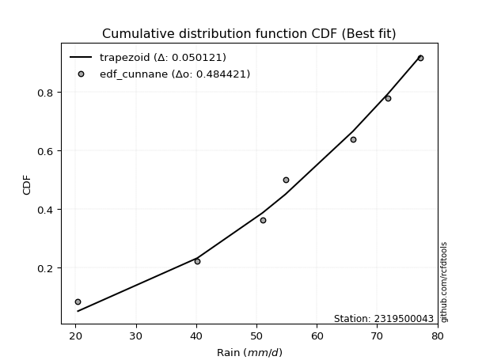</img></img>

</div>


### 12. EDF Adamowski (1981)

The Adamowski formula in hydrology refers to a specific plotting position formula used for estimating the non-parametric empirical distribution of hydrological events (like flood peaks) to calculate their return periods. This formula provides an alternative to traditional parametric methods (like the Gumbel or Log Pearson Type III distributions). 

<div align="center">


$P=(m-0.25)/(n+0.5)$


</div>


**12.1. Empirical values**

<div align="center">

|                | 0                  | 1                   | 2                   | 3             | 4                  | 5                  | 6                  |
|:---------------|:-------------------|:--------------------|:--------------------|:--------------|:-------------------|:-------------------|:-------------------|
| date           | 2024               | 2023                | 2020                | 2021          | 2019               | 2022               | 2025               |
| x              | 20.4               | 40.2                | 51.0                | 54.8          | 66.0               | 71.8               | 77.2               |
| m              | 1                  | 2                   | 3                   | 4             | 5                  | 6                  | 7                  |
| empirical_dist | edf_adamowski      | edf_adamowski       | edf_adamowski       | edf_adamowski | edf_adamowski      | edf_adamowski      | edf_adamowski      |
| empirical      | 0.1                | 0.23333333333333334 | 0.36666666666666664 | 0.5           | 0.6333333333333333 | 0.7666666666666667 | 0.9                |
| empirical_tr   | 1.1111111111111112 | 1.3043478260869565  | 1.5789473684210527  | 2.0           | 2.727272727272727  | 4.2857142857142865 | 10.000000000000002 |

</div>


**12.2. Kolmogorov-Smirnov fit test (sorted by Δ)**


<div align="center">

|                | 0                    | 1                   | 2                   | 3                   | 4                   | 5                   | 6                   | 7                   | 8                   | 9                   | 10                  | 11                  | 12                  | 13                  | 14                  | 15                  | 16                  | 17                  | 18                  | 19                  | 20                  | 21                  | 22                  | 23                  | 24                  | 25                  | 26                  | 27                  | 28                  | 29                  | 30                  | 31                  | 32                  | 33                  | 34                  | 35                  | 36                  | 37                  | 38                  | 39                  | 40                  | 41                  | 42                  | 43                  | 44                  | 45                  | 46                  | 47                  | 48                  | 49                  | 50                  | 51                  | 52                  | 53                  | 54                  | 55                  | 56                  | 57                  | 58                  | 59                  | 60                  | 61                  | 62                  | 63                  | 64                  | 65                  | 66                  | 67                  | 68                  | 69                  | 70                  | 71                  | 72                  | 73                  | 74                  | 75                  | 76                  | 77                  | 78                  | 79                  | 80                  | 81                  | 82                  | 83                  | 84                  | 85                  | 86                  | 87                  | 88                  | 89                  | 90                  | 91                  | 92                  | 93                  | 94                  | 95                  | 96                  | 97                  | 98                  | 99                  | 100                 | 101                 | 102                 | 103                 | 104                 | 105                 | 106                 | 107                 | 108                 | 109                 | 110                 | 111                 | 112                 | 113                 | 114                 | 115                 | 116                 | 117                 | 118                 | 119                 | 120                 | 121                 | 122                 | 123                 | 124                 | 125                 | 126                 | 127                 | 128                 | 129                 | 130                 | 131                 | 132                 | 133                 | 134                 | 135                 | 136                 | 137                 | 138                 | 139                 | 140                 | 141                 | 142                 | 143                 | 144                 | 145                 | 146                 | 147                 | 148                 | 149                 | 150                 | 151                 | 152                 | 153                 | 154                 | 155                 | 156                 | 157                 | 158                 | 159                 |
|:---------------|:---------------------|:--------------------|:--------------------|:--------------------|:--------------------|:--------------------|:--------------------|:--------------------|:--------------------|:--------------------|:--------------------|:--------------------|:--------------------|:--------------------|:--------------------|:--------------------|:--------------------|:--------------------|:--------------------|:--------------------|:--------------------|:--------------------|:--------------------|:--------------------|:--------------------|:--------------------|:--------------------|:--------------------|:--------------------|:--------------------|:--------------------|:--------------------|:--------------------|:--------------------|:--------------------|:--------------------|:--------------------|:--------------------|:--------------------|:--------------------|:--------------------|:--------------------|:--------------------|:--------------------|:--------------------|:--------------------|:--------------------|:--------------------|:--------------------|:--------------------|:--------------------|:--------------------|:--------------------|:--------------------|:--------------------|:--------------------|:--------------------|:--------------------|:--------------------|:--------------------|:--------------------|:--------------------|:--------------------|:--------------------|:--------------------|:--------------------|:--------------------|:--------------------|:--------------------|:--------------------|:--------------------|:--------------------|:--------------------|:--------------------|:--------------------|:--------------------|:--------------------|:--------------------|:--------------------|:--------------------|:--------------------|:--------------------|:--------------------|:--------------------|:--------------------|:--------------------|:--------------------|:--------------------|:--------------------|:--------------------|:--------------------|:--------------------|:--------------------|:--------------------|:--------------------|:--------------------|:--------------------|:--------------------|:--------------------|:--------------------|:--------------------|:--------------------|:--------------------|:--------------------|:--------------------|:--------------------|:--------------------|:--------------------|:--------------------|:--------------------|:--------------------|:--------------------|:--------------------|:--------------------|:--------------------|:--------------------|:--------------------|:--------------------|:--------------------|:--------------------|:--------------------|:--------------------|:--------------------|:--------------------|:--------------------|:--------------------|:--------------------|:--------------------|:--------------------|:--------------------|:--------------------|:--------------------|:--------------------|:--------------------|:--------------------|:--------------------|:--------------------|:--------------------|:--------------------|:--------------------|:--------------------|:--------------------|:--------------------|:--------------------|:--------------------|:--------------------|:--------------------|:--------------------|:--------------------|:--------------------|:--------------------|:--------------------|:--------------------|:--------------------|:--------------------|:--------------------|:--------------------|:--------------------|:--------------------|:--------------------|
| station        | 2319500043           | 2319500043          | 2319500043          | 2319500043          | 2319500043          | 2319500043          | 2319500043          | 2319500043          | 2319500043          | 2319500043          | 2319500043          | 2319500043          | 2319500043          | 2319500043          | 2319500043          | 2319500043          | 2319500043          | 2319500043          | 2319500043          | 2319500043          | 2319500043          | 2319500043          | 2319500043          | 2319500043          | 2319500043          | 2319500043          | 2319500043          | 2319500043          | 2319500043          | 2319500043          | 2319500043          | 2319500043          | 2319500043          | 2319500043          | 2319500043          | 2319500043          | 2319500043          | 2319500043          | 2319500043          | 2319500043          | 2319500043          | 2319500043          | 2319500043          | 2319500043          | 2319500043          | 2319500043          | 2319500043          | 2319500043          | 2319500043          | 2319500043          | 2319500043          | 2319500043          | 2319500043          | 2319500043          | 2319500043          | 2319500043          | 2319500043          | 2319500043          | 2319500043          | 2319500043          | 2319500043          | 2319500043          | 2319500043          | 2319500043          | 2319500043          | 2319500043          | 2319500043          | 2319500043          | 2319500043          | 2319500043          | 2319500043          | 2319500043          | 2319500043          | 2319500043          | 2319500043          | 2319500043          | 2319500043          | 2319500043          | 2319500043          | 2319500043          | 2319500043          | 2319500043          | 2319500043          | 2319500043          | 2319500043          | 2319500043          | 2319500043          | 2319500043          | 2319500043          | 2319500043          | 2319500043          | 2319500043          | 2319500043          | 2319500043          | 2319500043          | 2319500043          | 2319500043          | 2319500043          | 2319500043          | 2319500043          | 2319500043          | 2319500043          | 2319500043          | 2319500043          | 2319500043          | 2319500043          | 2319500043          | 2319500043          | 2319500043          | 2319500043          | 2319500043          | 2319500043          | 2319500043          | 2319500043          | 2319500043          | 2319500043          | 2319500043          | 2319500043          | 2319500043          | 2319500043          | 2319500043          | 2319500043          | 2319500043          | 2319500043          | 2319500043          | 2319500043          | 2319500043          | 2319500043          | 2319500043          | 2319500043          | 2319500043          | 2319500043          | 2319500043          | 2319500043          | 2319500043          | 2319500043          | 2319500043          | 2319500043          | 2319500043          | 2319500043          | 2319500043          | 2319500043          | 2319500043          | 2319500043          | 2319500043          | 2319500043          | 2319500043          | 2319500043          | 2319500043          | 2319500043          | 2319500043          | 2319500043          | 2319500043          | 2319500043          | 2319500043          | 2319500043          | 2319500043          | 2319500043          | 2319500043          | 2319500043          |
| empirical_dist | edf_adamowski        | edf_adamowski       | edf_adamowski       | edf_adamowski       | edf_adamowski       | edf_adamowski       | edf_adamowski       | edf_adamowski       | edf_adamowski       | edf_adamowski       | edf_adamowski       | edf_adamowski       | edf_adamowski       | edf_adamowski       | edf_adamowski       | edf_adamowski       | edf_adamowski       | edf_adamowski       | edf_adamowski       | edf_adamowski       | edf_adamowski       | edf_adamowski       | edf_adamowski       | edf_adamowski       | edf_adamowski       | edf_adamowski       | edf_adamowski       | edf_adamowski       | edf_adamowski       | edf_adamowski       | edf_adamowski       | edf_adamowski       | edf_adamowski       | edf_adamowski       | edf_adamowski       | edf_adamowski       | edf_adamowski       | edf_adamowski       | edf_adamowski       | edf_adamowski       | edf_adamowski       | edf_adamowski       | edf_adamowski       | edf_adamowski       | edf_adamowski       | edf_adamowski       | edf_adamowski       | edf_adamowski       | edf_adamowski       | edf_adamowski       | edf_adamowski       | edf_adamowski       | edf_adamowski       | edf_adamowski       | edf_adamowski       | edf_adamowski       | edf_adamowski       | edf_adamowski       | edf_adamowski       | edf_adamowski       | edf_adamowski       | edf_adamowski       | edf_adamowski       | edf_adamowski       | edf_adamowski       | edf_adamowski       | edf_adamowski       | edf_adamowski       | edf_adamowski       | edf_adamowski       | edf_adamowski       | edf_adamowski       | edf_adamowski       | edf_adamowski       | edf_adamowski       | edf_adamowski       | edf_adamowski       | edf_adamowski       | edf_adamowski       | edf_adamowski       | edf_adamowski       | edf_adamowski       | edf_adamowski       | edf_adamowski       | edf_adamowski       | edf_adamowski       | edf_adamowski       | edf_adamowski       | edf_adamowski       | edf_adamowski       | edf_adamowski       | edf_adamowski       | edf_adamowski       | edf_adamowski       | edf_adamowski       | edf_adamowski       | edf_adamowski       | edf_adamowski       | edf_adamowski       | edf_adamowski       | edf_adamowski       | edf_adamowski       | edf_adamowski       | edf_adamowski       | edf_adamowski       | edf_adamowski       | edf_adamowski       | edf_adamowski       | edf_adamowski       | edf_adamowski       | edf_adamowski       | edf_adamowski       | edf_adamowski       | edf_adamowski       | edf_adamowski       | edf_adamowski       | edf_adamowski       | edf_adamowski       | edf_adamowski       | edf_adamowski       | edf_adamowski       | edf_adamowski       | edf_adamowski       | edf_adamowski       | edf_adamowski       | edf_adamowski       | edf_adamowski       | edf_adamowski       | edf_adamowski       | edf_adamowski       | edf_adamowski       | edf_adamowski       | edf_adamowski       | edf_adamowski       | edf_adamowski       | edf_adamowski       | edf_adamowski       | edf_adamowski       | edf_adamowski       | edf_adamowski       | edf_adamowski       | edf_adamowski       | edf_adamowski       | edf_adamowski       | edf_adamowski       | edf_adamowski       | edf_adamowski       | edf_adamowski       | edf_adamowski       | edf_adamowski       | edf_adamowski       | edf_adamowski       | edf_adamowski       | edf_adamowski       | edf_adamowski       | edf_adamowski       | edf_adamowski       | edf_adamowski       | edf_adamowski       | edf_adamowski       |
| p_dist         | trapezoid            | logmielke           | logpearson3         | logexponweib        | argus               | weibull_min         | gompertz            | anglit              | logt                | loggumbel_l         | gumbel_l            | logloglaplace       | logburr             | pearson3            | burr                | logtrapezoid        | logexponpow         | logargus            | semicircular        | mielke              | logdweibull         | loggennorm          | betaprime           | erlang              | logloggamma         | triang              | skewnorm            | logvonmises_line    | logweibull_max      | gausshyper          | loggenextreme       | genhalflogistic     | arcsine             | gamma               | nct                 | truncnorm           | crystalball         | norm                | exponnorm           | t                   | f                   | rice                | invgamma            | genpareto           | alpha               | johnsonsu           | logweibull_min      | loggengamma         | logburr12           | ncf                 | loggompertz         | logjohnsonsu        | maxwell             | invgauss            | rayleigh            | cosine              | logbeta             | logistic            | loglevy_l           | genextreme          | halfnorm            | loggenhalflogistic  | dgamma              | hypsecant           | logsemicircular     | loganglit           | logexponnorm        | lognorm             | logcrystalball      | logrice             | logfatiguelife      | loglogistic         | logf                | lognct              | loghypsecant        | kstwobign           | gumbel_r            | loginvgamma         | logncf              | logarcsine          | logbetaprime        | logerlang           | halflogistic        | moyal               | wrapcauchy          | logskewnorm         | logalpha            | loglaplace          | loglaplace          | laplace             | ksone               | loginvgauss         | kappa3              | truncweibull_min    | uniform             | dweibull            | logmaxwell          | logtriang           | logtukeylambda      | vonmises_line       | levy_l              | logfoldnorm         | lograyleigh         | loginvweibull       | kappa4              | loggausshyper       | logdgamma           | beta                | logcosine           | logkstwobign        | wald                | loggumbel_r         | loghalfnorm         | loggenexpon         | genexpon            | bradford            | logmoyal            | loghalflogistic     | truncexpon          | lomax               | gennorm             | lognakagami         | logwrapcauchy       | logtruncnorm        | nakagami            | burr12              | logksone            | loglomax            | halfgennorm         | loggenpareto        | logrdist            | logwald             | logkappa4           | logkappa3           | loguniform          | logbradford         | logtruncweibull_min | logtruncexpon       | johnsonsb           | logjohnsonsb        | foldnorm            | exponweib           | weibull_max         | gengamma            | fatiguelife         | powerlaw            | loggamma            | loggamma            | rdist               | tukeylambda         | logpowerlaw         | invweibull          | truncpareto         | exponpow            | logtruncpareto      | genlogistic         | loggenlogistic      | loghalfgennorm      | logvonmises         | vonmises            |
| delta          | 0.050121187245620036 | 0.06218883564067601 | 0.06860490407606545 | 0.07144796819740351 | 0.07374753061104766 | 0.07440419805827037 | 0.07444019831059379 | 0.07875712232101417 | 0.08292851940364515 | 0.08361544568337265 | 0.08362806993296534 | 0.08406259331264337 | 0.08430651706788106 | 0.08485883782549286 | 0.08497388249158777 | 0.08505213286802105 | 0.08854131875006988 | 0.09006926192589704 | 0.09011751741882071 | 0.09067435918326772 | 0.09127339745004182 | 0.0926264596645553  | 0.09911679539167706 | 0.09962276556114102 | 0.09998721240475672 | 0.09999961735191876 | 0.09999964195900579 | 0.09999999836430465 | 0.09999999996964648 | 0.09999999999917009 | 0.09999999999998244 | 0.09999999999999876 | 0.1                 | 0.1023963786160238  | 0.10280585417462262 | 0.1028402194895669  | 0.10284028046548599 | 0.10284029220391766 | 0.10284177910811132 | 0.10291825532261423 | 0.10343610286819938 | 0.10407885855102428 | 0.10490263675147193 | 0.1051184085331055  | 0.1051578135952671  | 0.10538047967360553 | 0.10666637997910589 | 0.10740438424892718 | 0.10751545768054815 | 0.10909301347175637 | 0.11062749230918123 | 0.11099404662170559 | 0.11422353620568937 | 0.11560970012464455 | 0.1174919287636299  | 0.12441843264228403 | 0.1251107756143881  | 0.125369930032869   | 0.1300696992584783  | 0.13814574856273587 | 0.13849005898086425 | 0.1393663539868843  | 0.13978936939866315 | 0.14061599783034695 | 0.14062360043433858 | 0.14116326965121712 | 0.1424685803965247  | 0.14247095556653638 | 0.14247487987409108 | 0.1424816740437546  | 0.14289516413719566 | 0.14371884500288729 | 0.14414394794466906 | 0.1447497248194654  | 0.14478417540518435 | 0.14562828794458055 | 0.1456564387288115  | 0.14626782936708543 | 0.1486769610013386  | 0.14949693373511974 | 0.15091860717042477 | 0.151756671192198   | 0.1569639623329892  | 0.15944088432373038 | 0.16033045261995288 | 0.16042088201792803 | 0.16078117805471798 | 0.16198837590339754 | 0.16198837590339754 | 0.161996351137227   | 0.16561032863849762 | 0.1656996095666548  | 0.17012848639847572 | 0.1716696477125229  | 0.1720657276995305  | 0.17384772795366077 | 0.175133406995511   | 0.1764530649472419  | 0.1765807179519276  | 0.17922093678316292 | 0.1843228267028719  | 0.1850797576863747  | 0.18594036237776773 | 0.1859457319353633  | 0.19680991898465933 | 0.19751968220062582 | 0.19753972254672325 | 0.20187952322604502 | 0.20480956476343354 | 0.21071902555615424 | 0.21280841226750374 | 0.21305662321160262 | 0.2163671910080615  | 0.22223900794267665 | 0.22439276619464815 | 0.23131397617879007 | 0.23881848242769804 | 0.24183746845177218 | 0.2524684694132539  | 0.2646631789446757  | 0.2666666666666667  | 0.2686949420663411  | 0.26989849113345404 | 0.2758272210150875  | 0.2838412761641989  | 0.28880607197278935 | 0.29041070872494384 | 0.29363361911637215 | 0.29518845888826345 | 0.2976977525797954  | 0.3023450713504234  | 0.31042055433311394 | 0.3171094263602748  | 0.3184924422151529  | 0.3218261838032657  | 0.33163339646381246 | 0.3937215803049922  | 0.39541418290355707 | 0.40413481281934427 | 0.4251809013764323  | 0.5                 | 0.5279436555367709  | 0.5485352961718961  | 0.5617708870405955  | 0.576017855848115   | 0.5974945245378736  | 0.6117510505029138  | 0.6117510505029138  | 0.6333333270757     | 0.6333333333333262  | 0.6474482736067295  | 0.656411023120465   | 0.6875525349921989  | 0.6926344511565707  | 0.715795420155241   | 0.7666666666666667  | 0.7666666666666667  | 0.7666666666666667  | 1.1279020840020026  | 11.42439029300216   |
| deltao         | 0.48442053926100004  | 0.48442053926100004 | 0.48442053926100004 | 0.48442053926100004 | 0.48442053926100004 | 0.48442053926100004 | 0.48442053926100004 | 0.48442053926100004 | 0.48442053926100004 | 0.48442053926100004 | 0.48442053926100004 | 0.48442053926100004 | 0.48442053926100004 | 0.48442053926100004 | 0.48442053926100004 | 0.48442053926100004 | 0.48442053926100004 | 0.48442053926100004 | 0.48442053926100004 | 0.48442053926100004 | 0.48442053926100004 | 0.48442053926100004 | 0.48442053926100004 | 0.48442053926100004 | 0.48442053926100004 | 0.48442053926100004 | 0.48442053926100004 | 0.48442053926100004 | 0.48442053926100004 | 0.48442053926100004 | 0.48442053926100004 | 0.48442053926100004 | 0.48442053926100004 | 0.48442053926100004 | 0.48442053926100004 | 0.48442053926100004 | 0.48442053926100004 | 0.48442053926100004 | 0.48442053926100004 | 0.48442053926100004 | 0.48442053926100004 | 0.48442053926100004 | 0.48442053926100004 | 0.48442053926100004 | 0.48442053926100004 | 0.48442053926100004 | 0.48442053926100004 | 0.48442053926100004 | 0.48442053926100004 | 0.48442053926100004 | 0.48442053926100004 | 0.48442053926100004 | 0.48442053926100004 | 0.48442053926100004 | 0.48442053926100004 | 0.48442053926100004 | 0.48442053926100004 | 0.48442053926100004 | 0.48442053926100004 | 0.48442053926100004 | 0.48442053926100004 | 0.48442053926100004 | 0.48442053926100004 | 0.48442053926100004 | 0.48442053926100004 | 0.48442053926100004 | 0.48442053926100004 | 0.48442053926100004 | 0.48442053926100004 | 0.48442053926100004 | 0.48442053926100004 | 0.48442053926100004 | 0.48442053926100004 | 0.48442053926100004 | 0.48442053926100004 | 0.48442053926100004 | 0.48442053926100004 | 0.48442053926100004 | 0.48442053926100004 | 0.48442053926100004 | 0.48442053926100004 | 0.48442053926100004 | 0.48442053926100004 | 0.48442053926100004 | 0.48442053926100004 | 0.48442053926100004 | 0.48442053926100004 | 0.48442053926100004 | 0.48442053926100004 | 0.48442053926100004 | 0.48442053926100004 | 0.48442053926100004 | 0.48442053926100004 | 0.48442053926100004 | 0.48442053926100004 | 0.48442053926100004 | 0.48442053926100004 | 0.48442053926100004 | 0.48442053926100004 | 0.48442053926100004 | 0.48442053926100004 | 0.48442053926100004 | 0.48442053926100004 | 0.48442053926100004 | 0.48442053926100004 | 0.48442053926100004 | 0.48442053926100004 | 0.48442053926100004 | 0.48442053926100004 | 0.48442053926100004 | 0.48442053926100004 | 0.48442053926100004 | 0.48442053926100004 | 0.48442053926100004 | 0.48442053926100004 | 0.48442053926100004 | 0.48442053926100004 | 0.48442053926100004 | 0.48442053926100004 | 0.48442053926100004 | 0.48442053926100004 | 0.48442053926100004 | 0.48442053926100004 | 0.48442053926100004 | 0.48442053926100004 | 0.48442053926100004 | 0.48442053926100004 | 0.48442053926100004 | 0.48442053926100004 | 0.48442053926100004 | 0.48442053926100004 | 0.48442053926100004 | 0.48442053926100004 | 0.48442053926100004 | 0.48442053926100004 | 0.48442053926100004 | 0.48442053926100004 | 0.48442053926100004 | 0.48442053926100004 | 0.48442053926100004 | 0.48442053926100004 | 0.48442053926100004 | 0.48442053926100004 | 0.48442053926100004 | 0.48442053926100004 | 0.48442053926100004 | 0.48442053926100004 | 0.48442053926100004 | 0.48442053926100004 | 0.48442053926100004 | 0.48442053926100004 | 0.48442053926100004 | 0.48442053926100004 | 0.48442053926100004 | 0.48442053926100004 | 0.48442053926100004 | 0.48442053926100004 | 0.48442053926100004 | 0.48442053926100004 | 0.48442053926100004 |
| eval           | Δo > Δ               | Δo > Δ              | Δo > Δ              | Δo > Δ              | Δo > Δ              | Δo > Δ              | Δo > Δ              | Δo > Δ              | Δo > Δ              | Δo > Δ              | Δo > Δ              | Δo > Δ              | Δo > Δ              | Δo > Δ              | Δo > Δ              | Δo > Δ              | Δo > Δ              | Δo > Δ              | Δo > Δ              | Δo > Δ              | Δo > Δ              | Δo > Δ              | Δo > Δ              | Δo > Δ              | Δo > Δ              | Δo > Δ              | Δo > Δ              | Δo > Δ              | Δo > Δ              | Δo > Δ              | Δo > Δ              | Δo > Δ              | Δo > Δ              | Δo > Δ              | Δo > Δ              | Δo > Δ              | Δo > Δ              | Δo > Δ              | Δo > Δ              | Δo > Δ              | Δo > Δ              | Δo > Δ              | Δo > Δ              | Δo > Δ              | Δo > Δ              | Δo > Δ              | Δo > Δ              | Δo > Δ              | Δo > Δ              | Δo > Δ              | Δo > Δ              | Δo > Δ              | Δo > Δ              | Δo > Δ              | Δo > Δ              | Δo > Δ              | Δo > Δ              | Δo > Δ              | Δo > Δ              | Δo > Δ              | Δo > Δ              | Δo > Δ              | Δo > Δ              | Δo > Δ              | Δo > Δ              | Δo > Δ              | Δo > Δ              | Δo > Δ              | Δo > Δ              | Δo > Δ              | Δo > Δ              | Δo > Δ              | Δo > Δ              | Δo > Δ              | Δo > Δ              | Δo > Δ              | Δo > Δ              | Δo > Δ              | Δo > Δ              | Δo > Δ              | Δo > Δ              | Δo > Δ              | Δo > Δ              | Δo > Δ              | Δo > Δ              | Δo > Δ              | Δo > Δ              | Δo > Δ              | Δo > Δ              | Δo > Δ              | Δo > Δ              | Δo > Δ              | Δo > Δ              | Δo > Δ              | Δo > Δ              | Δo > Δ              | Δo > Δ              | Δo > Δ              | Δo > Δ              | Δo > Δ              | Δo > Δ              | Δo > Δ              | Δo > Δ              | Δo > Δ              | Δo > Δ              | Δo > Δ              | Δo > Δ              | Δo > Δ              | Δo > Δ              | Δo > Δ              | Δo > Δ              | Δo > Δ              | Δo > Δ              | Δo > Δ              | Δo > Δ              | Δo > Δ              | Δo > Δ              | Δo > Δ              | Δo > Δ              | Δo > Δ              | Δo > Δ              | Δo > Δ              | Δo > Δ              | Δo > Δ              | Δo > Δ              | Δo > Δ              | Δo > Δ              | Δo > Δ              | Δo > Δ              | Δo > Δ              | Δo > Δ              | Δo > Δ              | Δo > Δ              | Δo > Δ              | Δo > Δ              | Δo > Δ              | Δo > Δ              | Δo > Δ              | Δo > Δ              | Δo > Δ              | Δo <= Δ             | Δo <= Δ             | Δo <= Δ             | Δo <= Δ             | Δo <= Δ             | Δo <= Δ             | Δo <= Δ             | Δo <= Δ             | Δo <= Δ             | Δo <= Δ             | Δo <= Δ             | Δo <= Δ             | Δo <= Δ             | Δo <= Δ             | Δo <= Δ             | Δo <= Δ             | Δo <= Δ             | Δo <= Δ             | Δo <= Δ             | Δo <= Δ             |
| fit            | 1                    | 1                   | 1                   | 1                   | 1                   | 1                   | 1                   | 1                   | 1                   | 1                   | 1                   | 1                   | 1                   | 1                   | 1                   | 1                   | 1                   | 1                   | 1                   | 1                   | 1                   | 1                   | 1                   | 1                   | 1                   | 1                   | 1                   | 1                   | 1                   | 1                   | 1                   | 1                   | 1                   | 1                   | 1                   | 1                   | 1                   | 1                   | 1                   | 1                   | 1                   | 1                   | 1                   | 1                   | 1                   | 1                   | 1                   | 1                   | 1                   | 1                   | 1                   | 1                   | 1                   | 1                   | 1                   | 1                   | 1                   | 1                   | 1                   | 1                   | 1                   | 1                   | 1                   | 1                   | 1                   | 1                   | 1                   | 1                   | 1                   | 1                   | 1                   | 1                   | 1                   | 1                   | 1                   | 1                   | 1                   | 1                   | 1                   | 1                   | 1                   | 1                   | 1                   | 1                   | 1                   | 1                   | 1                   | 1                   | 1                   | 1                   | 1                   | 1                   | 1                   | 1                   | 1                   | 1                   | 1                   | 1                   | 1                   | 1                   | 1                   | 1                   | 1                   | 1                   | 1                   | 1                   | 1                   | 1                   | 1                   | 1                   | 1                   | 1                   | 1                   | 1                   | 1                   | 1                   | 1                   | 1                   | 1                   | 1                   | 1                   | 1                   | 1                   | 1                   | 1                   | 1                   | 1                   | 1                   | 1                   | 1                   | 1                   | 1                   | 1                   | 1                   | 1                   | 1                   | 1                   | 1                   | 1                   | 1                   | 0                   | 0                   | 0                   | 0                   | 0                   | 0                   | 0                   | 0                   | 0                   | 0                   | 0                   | 0                   | 0                   | 0                   | 0                   | 0                   | 0                   | 0                   | 0                   | 0                   |
| n              | 7                    | 7                   | 7                   | 7                   | 7                   | 7                   | 7                   | 7                   | 7                   | 7                   | 7                   | 7                   | 7                   | 7                   | 7                   | 7                   | 7                   | 7                   | 7                   | 7                   | 7                   | 7                   | 7                   | 7                   | 7                   | 7                   | 7                   | 7                   | 7                   | 7                   | 7                   | 7                   | 7                   | 7                   | 7                   | 7                   | 7                   | 7                   | 7                   | 7                   | 7                   | 7                   | 7                   | 7                   | 7                   | 7                   | 7                   | 7                   | 7                   | 7                   | 7                   | 7                   | 7                   | 7                   | 7                   | 7                   | 7                   | 7                   | 7                   | 7                   | 7                   | 7                   | 7                   | 7                   | 7                   | 7                   | 7                   | 7                   | 7                   | 7                   | 7                   | 7                   | 7                   | 7                   | 7                   | 7                   | 7                   | 7                   | 7                   | 7                   | 7                   | 7                   | 7                   | 7                   | 7                   | 7                   | 7                   | 7                   | 7                   | 7                   | 7                   | 7                   | 7                   | 7                   | 7                   | 7                   | 7                   | 7                   | 7                   | 7                   | 7                   | 7                   | 7                   | 7                   | 7                   | 7                   | 7                   | 7                   | 7                   | 7                   | 7                   | 7                   | 7                   | 7                   | 7                   | 7                   | 7                   | 7                   | 7                   | 7                   | 7                   | 7                   | 7                   | 7                   | 7                   | 7                   | 7                   | 7                   | 7                   | 7                   | 7                   | 7                   | 7                   | 7                   | 7                   | 7                   | 7                   | 7                   | 7                   | 7                   | 7                   | 7                   | 7                   | 7                   | 7                   | 7                   | 7                   | 7                   | 7                   | 7                   | 7                   | 7                   | 7                   | 7                   | 7                   | 7                   | 7                   | 7                   | 7                   | 7                   |
| best_fit       | 1                    | 0                   | 0                   | 0                   | 0                   | 0                   | 0                   | 0                   | 0                   | 0                   | 0                   | 0                   | 0                   | 0                   | 0                   | 0                   | 0                   | 0                   | 0                   | 0                   | 0                   | 0                   | 0                   | 0                   | 0                   | 0                   | 0                   | 0                   | 0                   | 0                   | 0                   | 0                   | 0                   | 0                   | 0                   | 0                   | 0                   | 0                   | 0                   | 0                   | 0                   | 0                   | 0                   | 0                   | 0                   | 0                   | 0                   | 0                   | 0                   | 0                   | 0                   | 0                   | 0                   | 0                   | 0                   | 0                   | 0                   | 0                   | 0                   | 0                   | 0                   | 0                   | 0                   | 0                   | 0                   | 0                   | 0                   | 0                   | 0                   | 0                   | 0                   | 0                   | 0                   | 0                   | 0                   | 0                   | 0                   | 0                   | 0                   | 0                   | 0                   | 0                   | 0                   | 0                   | 0                   | 0                   | 0                   | 0                   | 0                   | 0                   | 0                   | 0                   | 0                   | 0                   | 0                   | 0                   | 0                   | 0                   | 0                   | 0                   | 0                   | 0                   | 0                   | 0                   | 0                   | 0                   | 0                   | 0                   | 0                   | 0                   | 0                   | 0                   | 0                   | 0                   | 0                   | 0                   | 0                   | 0                   | 0                   | 0                   | 0                   | 0                   | 0                   | 0                   | 0                   | 0                   | 0                   | 0                   | 0                   | 0                   | 0                   | 0                   | 0                   | 0                   | 0                   | 0                   | 0                   | 0                   | 0                   | 0                   | 0                   | 0                   | 0                   | 0                   | 0                   | 0                   | 0                   | 0                   | 0                   | 0                   | 0                   | 0                   | 0                   | 0                   | 0                   | 0                   | 0                   | 0                   | 0                   | 0                   |
| best_fit_sort  | 1                    | 2                   | 3                   | 4                   | 5                   | 6                   | 7                   | 8                   | 9                   | 10                  | 11                  | 12                  | 13                  | 14                  | 15                  | 16                  | 17                  | 18                  | 19                  | 20                  | 21                  | 22                  | 23                  | 24                  | 25                  | 26                  | 27                  | 28                  | 29                  | 30                  | 31                  | 32                  | 33                  | 34                  | 35                  | 36                  | 37                  | 38                  | 39                  | 40                  | 41                  | 42                  | 43                  | 44                  | 45                  | 46                  | 47                  | 48                  | 49                  | 50                  | 51                  | 52                  | 53                  | 54                  | 55                  | 56                  | 57                  | 58                  | 59                  | 60                  | 61                  | 62                  | 63                  | 64                  | 65                  | 66                  | 67                  | 68                  | 69                  | 70                  | 71                  | 72                  | 73                  | 74                  | 75                  | 76                  | 77                  | 78                  | 79                  | 80                  | 81                  | 82                  | 83                  | 84                  | 85                  | 86                  | 87                  | 88                  | 89                  | 90                  | 91                  | 92                  | 93                  | 94                  | 95                  | 96                  | 97                  | 98                  | 99                  | 100                 | 101                 | 102                 | 103                 | 104                 | 105                 | 106                 | 107                 | 108                 | 109                 | 110                 | 111                 | 112                 | 113                 | 114                 | 115                 | 116                 | 117                 | 118                 | 119                 | 120                 | 121                 | 122                 | 123                 | 124                 | 125                 | 126                 | 127                 | 128                 | 129                 | 130                 | 131                 | 132                 | 133                 | 134                 | 135                 | 136                 | 137                 | 138                 | 139                 | 140                 | 141                 | 142                 | 143                 | 144                 | 145                 | 146                 | 147                 | 148                 | 149                 | 150                 | 151                 | 152                 | 153                 | 154                 | 155                 | 156                 | 157                 | 158                 | 159                 | 160                 |

</div>


**12.3. Best fit**

<div align="center">

|   id |    station | empirical_dist   | p_dist    |     delta |   deltao | eval   |   fit |   n |   best_fit |   best_fit_sort |
|-----:|-----------:|:-----------------|:----------|----------:|---------:|:-------|------:|----:|-----------:|----------------:|
|    0 | 2319500043 | edf_adamowski    | trapezoid | 0.0501212 | 0.484421 | Δo > Δ |     1 |   7 |          1 |               1 |

</div>


<div align="center">

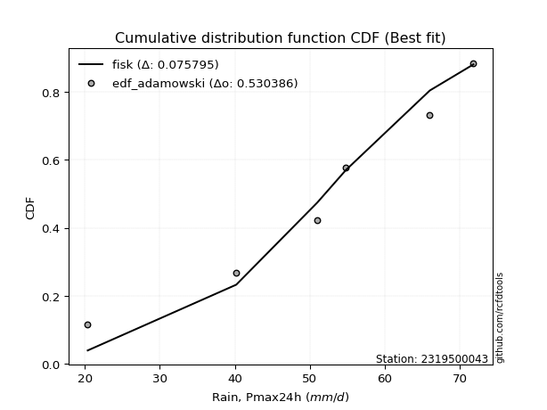</img></img>

</div>


## C. Best fit & Estimate extreme values for specific return periods - Tr

Best fit in probability distribution analysis means finding the theoretical distribution (like Normal, Poisson, Exponential, etc.) that most accurately mirrors your real-world data´s patterns (shape, center, spread) for better predictions, using methods like visual checks (Q-Q plots), goodness-of-fit tests (Kolmogorov-Smirnov, Chi-Squared), and information criteria (AIC) to score and select the simplest, most representative model.


### 1. Best fit (ordered by delta Δ)

:file_folder:Table: [bestfit_2319500043.csv](table/bestfit_2319500043.csv)

<div align="center">

|   id |    station | empirical_dist   | p_dist    |     delta |   deltao | eval   |   fit |   n |   best_fit |   best_fit_sort |
|-----:|-----------:|:-----------------|:----------|----------:|---------:|:-------|------:|----:|-----------:|----------------:|
|    0 | 2319500043 | edf_adamowski    | trapezoid | 0.0501212 | 0.484421 | Δo > Δ |     1 |   7 |          1 |               1 |
|    1 | 2319500043 | edf_cunnane      | trapezoid | 0.0501212 | 0.484421 | Δo > Δ |     1 |   7 |          1 |               2 |
|    2 | 2319500043 | edf_jenkinson    | trapezoid | 0.0501212 | 0.484421 | Δo > Δ |     1 |   7 |          1 |               3 |
|    3 | 2319500043 | edf_filliben     | trapezoid | 0.0501212 | 0.484421 | Δo > Δ |     1 |   7 |          1 |               4 |
|    4 | 2319500043 | edf_gringorten   | trapezoid | 0.0501212 | 0.484421 | Δo > Δ |     1 |   7 |          1 |               5 |
|    5 | 2319500043 | edf_tukey        | trapezoid | 0.0501212 | 0.484421 | Δo > Δ |     1 |   7 |          1 |               6 |
|    6 | 2319500043 | edf_blom         | trapezoid | 0.0501212 | 0.484421 | Δo > Δ |     1 |   7 |          1 |               7 |
|    7 | 2319500043 | edf_chegodayev   | trapezoid | 0.0501212 | 0.484421 | Δo > Δ |     1 |   7 |          1 |               8 |
|    8 | 2319500043 | edf_beard        | trapezoid | 0.0501212 | 0.484421 | Δo > Δ |     1 |   7 |          1 |               9 |
|    9 | 2319500043 | edf_hazen        | trapezoid | 0.0501212 | 0.484421 | Δo > Δ |     1 |   7 |          1 |              10 |
|   10 | 2319500043 | edf_weibull      | trapezoid | 0.0739361 | 0.484421 | Δo > Δ |     1 |   7 |          1 |              11 |
|   11 | 2319500043 | edf_california   | genpareto | 0.0818579 | 0.484421 | Δo > Δ |     1 |   7 |          1 |              12 |

</div>


### 2. Extreme values and % difference analysis

In hydrology, a return period (or recurrence interval $Tr$) is the statistical average time between extreme events like floods or droughts of a specific magnitude, indicating how rare an event is, with a 100-year flood, for example, having a 1% chance of occurring in any given year, not that it happens exactly every century. It is a key tool for infrastructure design (like bridges or dams) and risk assessment, calculated from historical data to determine the probability of future events, although it is important to remember it is statistical average, and events can cluster or be missed.

The extreme value porcentage difference is evaluated as $pdiff = 1 - (ETrBf / ETr) * 100$, where _ETrBf_ correspond to the bestfit extreme value for a specific recurrence interval and _ETr_ correspond to the extreme value for one of the most used PDFsused in hydrology.

> risk_rate: assuming the return period as the project useful life.

:file_folder:Table: [extreme_2319500043.csv](table/extreme_2319500043.csv), all PDFs.  
:file_folder:Table: [extremepdiff_2319500043.csv](table/extremepdiff_2319500043.csv), % difference between bestfit and most used PDFs in Hydrology.

<div align="center">

Extreme values table for only best fit PDFs
|   id |      tr |   prob_l |     prob_g |    alpha |   anglit |   arcsine |   argus |    beta |   betaprime |   bradford |    burr |   burr12 |   cosine |   crystalball |   dgamma |   dweibull |   erlang |   exponnorm |   exponpow |   exponweib |        f |   fatiguelife |   foldnorm |    gamma |   gausshyper |   genexpon |   genextreme |   gengamma |   genhalflogistic |   genlogistic |   gennorm |   genpareto |   gompertz |   gumbel_l |   gumbel_r |   halfgennorm |   halflogistic |   halfnorm |   hypsecant |   invgamma |   invgauss |       invweibull |   johnsonsb |   johnsonsu |   kappa3 |   kappa4 |   ksone |   kstwobign |   laplace |   levy_l |   loggamma |   logistic |   loglaplace |    lomax |   maxwell |   mielke |    moyal |   nakagami |      ncf |      nct |     norm |   pearson3 |   powerlaw |   rayleigh |   rdist |     rice |   semicircular |   skewnorm |        t |   trapezoid |   triang |   truncexpon |   truncnorm |   truncpareto |   truncweibull_min |   tukeylambda |   uniform |   vonmises |   vonmises_line |     wald |   weibull_max |   weibull_min |   wrapcauchy |   logalpha |   loganglit |   logarcsine |   logargus |   logbeta |   logbetaprime |   logbradford |   logburr |   logburr12 |   logcosine |   logcrystalball |   logdgamma |   logdweibull |   logerlang |   logexponnorm |   logexponpow |   logexponweib |     logf |   logfatiguelife |   logfoldnorm |   loggausshyper |   loggenexpon |   loggenextreme |   loggengamma |   loggenhalflogistic |   loggenlogistic |   loggennorm |   loggenpareto |   loggompertz |   loggumbel_l |   loggumbel_r |   loghalfgennorm |   loghalflogistic |   loghalfnorm |   loghypsecant |   loginvgamma |   loginvgauss |   loginvweibull |   logjohnsonsb |   logjohnsonsu |   logkappa3 |   logkappa4 |   logksone |   logkstwobign |   loglevy_l |   logloggamma |   loglogistic |   logloglaplace |   loglomax |   logmaxwell |   logmielke |   logmoyal |   lognakagami |   logncf |   lognct |   lognorm |   logpearson3 |   logpowerlaw |   lograyleigh |   logrdist |   logrice |   logsemicircular |   logskewnorm |      logt |   logtrapezoid |   logtriang |   logtruncexpon |   logtruncnorm |   logtruncpareto |   logtruncweibull_min |   logtukeylambda |   loguniform |   logvonmises |   logvonmises_line |   logwald |   logweibull_max |   logweibull_min |   logwrapcauchy |    station |   n |   risk_rate |
|-----:|--------:|---------:|-----------:|---------:|---------:|----------:|--------:|--------:|------------:|-----------:|--------:|---------:|---------:|--------------:|---------:|-----------:|---------:|------------:|-----------:|------------:|---------:|--------------:|-----------:|---------:|-------------:|-----------:|-------------:|-----------:|------------------:|--------------:|----------:|------------:|-----------:|-----------:|-----------:|--------------:|---------------:|-----------:|------------:|-----------:|-----------:|-----------------:|------------:|------------:|---------:|---------:|--------:|------------:|----------:|---------:|-----------:|-----------:|-------------:|---------:|----------:|---------:|---------:|-----------:|---------:|---------:|---------:|-----------:|-----------:|-----------:|--------:|---------:|---------------:|-----------:|---------:|------------:|---------:|-------------:|------------:|--------------:|-------------------:|--------------:|----------:|-----------:|----------------:|---------:|--------------:|--------------:|-------------:|-----------:|------------:|-------------:|-----------:|----------:|---------------:|--------------:|----------:|------------:|------------:|-----------------:|------------:|--------------:|------------:|---------------:|--------------:|---------------:|---------:|-----------------:|--------------:|----------------:|--------------:|----------------:|--------------:|---------------------:|-----------------:|-------------:|---------------:|--------------:|--------------:|--------------:|-----------------:|------------------:|--------------:|---------------:|--------------:|--------------:|----------------:|---------------:|---------------:|------------:|------------:|-----------:|---------------:|------------:|--------------:|--------------:|----------------:|-----------:|-------------:|------------:|-----------:|--------------:|---------:|---------:|----------:|--------------:|--------------:|--------------:|-----------:|----------:|------------------:|--------------:|----------:|---------------:|------------:|----------------:|---------------:|-----------------:|----------------------:|-----------------:|-------------:|--------------:|-------------------:|----------:|-----------------:|-----------------:|----------------:|-----------:|----:|------------:|
|    0 |    2    | 0.5      | 0.5        |  53.5578 |  54.4857 |   54.4857 | 58.3052 | 65.803  |     54.3285 |    45.3545 | 57.8082 |  38.5876 |  52.7882 |       54.4857 |  53.2773 |    54.8    |  54.1937 |     54.4856 |    20.4049 |     21.0353 |  54.4218 |       20.4001 |    58.4611 |  54.0727 |      57.2559 |    44.1212 |      62.9002 |    21.764  |           57.1911 |           inf |      48.8 |     54.7364 |    57.7457 |    57.4807 |    51.4907 |       37.848  |        50.0018 |    50.7539 |     54.4857 |    53.5491 |    51.904  |     20.4         |     76.8638 |     59.6738 |  20.4    |  47.2133 | 48.8    |     50.3114 |   54.4857 |  61.8908 |    20.9698 |    54.4857 |      50.5075 |  59.428  |   52.9265 |  58.5947 |  50.5238 |    44.933  |  53.1863 |  54.4782 |  54.4857 |    56.2054 |    21.5031 |    52.3735 | 16.1917 |  53.9943 |        54.4857 |    57.5559 |  54.4824 |     57.6136 |  55.4321 |      44.2069 |     54.4857 |       20.8533 |            49.7117 |       35.7    |   48.8    |    2.29064 |         48.3525 |  48.5761 |       76.8094 |       57.7512 |      48.7998 |    49.4307 |     50.5075 |      50.5075 |    56.7002 |   64.2092 |        50.0086 |       38.7416 |   56.62   |     54.6762 |     46.8855 |          50.5073 |     54.8    |       54.8    |     49.9576 |        50.5077 |       56.562  |        57.8767 |  50.4206 |          50.4833 |       48.0477 |         46.6632 |       44.7838 |         58.429  |       53.977  |              50.6374 |              inf |      54.8    |        35.882  |       53.8678 |       54.1476 |       47.1122 |          20.4    |           45.51   |       46.3122 |        50.5075 |       50.2861 |       49.1391 |         47.3394 |        77.1501 |        60.7391 |     20.4    |     39.3831 |    39.6848 |        45.3818 |     61.4236 |       57.5282 |       50.5075 |         54.8    |    38.2298 |      48.7104 |     57.8032 |    46.0655 |       46.1147 |  50.1549 |  50.3778 |   50.5075 |       54.719  |       21.0965 |       48.0886 |    37.2324 |   50.5062 |           50.5076 |       51.5221 |   57.0291 |        54.315  |     48.8056 |         35.2624 |        48.2042 |          20.6458 |               35.4131 |          54.7867 |      39.6848 |     0.0957758 |            55.1816 |   44.0269 |          60.7269 |          54.6855 |         39.6848 | 2319500043 |   7 |    0.75     |
|    1 |    2.33 | 0.570815 | 0.429185   |  56.9506 |  58.2752 |   60.1743 | 61.3922 | 68.6218 |     57.6602 |    49.4076 | 61.1786 |  44.279  |  56.2162 |       57.739  |  56.5497 |    55.2893 |  57.5499 |     57.7389 |    20.4201 |     22.0076 |  57.682  |       21.2227 |    58.5368 |  57.4159 |      61.6004 |    49.3468 |      66.0476 |    22.9711 |           60.89   |           inf |      48.8 |     60.0895 |    60.6123 |    60.3111 |    54.5052 |       44.2374 |        53.1011 |    54.265  |     57.0893 |    56.9505 |    55.6381 |     20.4         |     77.1206 |     62.5121 |  20.4    |  51.4401 | 53.6268 |     54.4028 |   56.4544 |  66.5393 |    21.6365 |    57.3521 |      52.8716 |  68.0271 |   56.3064 |  61.8722 |  53.3774 |    47.3466 |  56.5804 |  57.7339 |  57.739  |    59.3526 |    22.7427 |    55.8034 | 23.852  |  57.3445 |        58.55   |    60.6908 |  57.7353 |     61.3584 |  59.0304 |      48.18   |     57.739  |       21.1571 |            53.4316 |       37.8755 |   52.8223 |    2.4803  |         52.4382 |  50.7093 |       77.0075 |       60.6177 |      54.4878 |    53.617  |     55.1564 |      57.645  |    59.8671 |   68.4735 |        54.1533 |       42.738  |   60.0696 |     57.8352 |     50.96   |          54.4733 |     55.019  |       57.4105 |     54.119  |        54.4736 |       59.6009 |        61.0883 |  54.3828 |          54.4594 |       52.1588 |         51.4577 |       49.6254 |         62.0885 |       57.3295 |              54.8494 |              inf |      57.4406 |        45.7795 |       57.163  |       57.8284 |       50.5304 |          20.4    |           48.9085 |       50.2491 |        53.6574 |       54.3575 |       53.3405 |         52.3879 |        77.1937 |        63.8641 |     43.7683 |     43.5203 |    44.4365 |        50.4759 |     65.8416 |       60.8543 |       53.986  |         57.6305 |    43.9056 |      52.6901 |     61.2744 |    49.2235 |       48.388  |  54.2016 |  54.3875 |   54.4735 |       58.5693 |       21.8316 |       52.0779 |    43.3212 |   54.4781 |           55.5099 |       54.9567 |   60.1639 |        59.2529 |     52.649  |         38.6843 |        49.9896 |          20.809  |               38.8385 |          57.6656 |      43.6068 |     0.103091  |            58.6252 |   46.2642 |          64.5723 |          57.8559 |         51.0884 | 2319500043 |   7 |    0.729209 |
|    2 |    5    | 0.8      | 0.2        |  70.1328 |  71.6452 |   75.3437 | 70.2892 | 74.9827 |     70.2283 |    63.5288 | 70.6564 | inf      |  68.5695 |       69.8289 |  67.7152 |    65.2751 |  70.2499 |     69.8288 |    21.7178 |     55.2998 |  69.8094 |       38.697  |    58.8568 |  70.0757 |      72.8366 |    75.4732 |      73.4127 |    41.2155 |           70.7316 |           inf |      48.8 |     72.8127 |    69.8755 |    69.4548 |    67.6016 |       89.8093 |        67.1253 |    69.113  |     67.5328 |    70.1515 |    71.0598 |     20.4662      |     77.1996 |     70.7228 |  66.004  |  65.3228 | 69.248  |     71.7824 |   66.2976 |  74.2406 |    32.3189 |    68.4194 |      66.4587 | 111.02   |   69.6095 |  70.9161 |  66.5956 |    61.8159 |  69.9833 |  69.8345 |  69.8289 |    70.1105 |    36.3695 |    69.5348 | 44.3128 |  69.935  |        72.4195 |    69.8214 |  69.8242 |     72.102  |  69.3538 |      62.4584 |     69.8289 |       25.6769 |            65.7238 |       44.9084 |   65.84   |    3.2207  |         65.661  |  62.651  |       77.1911 |       69.8782 |      68.7439 |    73.158  |     75.2516 |      82.0051 |    69.4116 |   76.1011 |        73.1091 |       58.7221 |   70.0661 |     69.3559 |     68.8098 |          72.1416 |     63.0045 |       73.0741 |     73.2756 |        72.1421 |       69.545  |        70.3156 |  72.0325 |          72.1938 |       71.6135 |         67.5138 |       75.1564 |         71.6346 |       69.5753 |              67.645  |              inf |      72.787  |        71.469  |       69.4297 |       71.5175 |       68.5032 |          20.4    |           67.7497 |       70.9526 |        68.3939 |       73.0352 |       73.2393 |         81.3618 |        77.2    |        71.9148 |     59.4661 |     59.8829 |    64.0765 |        79.3126 |     73.8716 |       70.2258 |       69.8174 |         74.8301 |    87.7399 |      71.775  |     71.0919 |    66.9206 |       61.6867 |  72.4536 |  72.3722 |   72.1419 |       72.2617 |       30.6484 |       71.6501 |    65.8601 |   72.1775 |           76.6183 |       66.321  |   74.8994 |        76.0546 |     65.4388 |         54.1598 |        58.5857 |          23.3014 |               54.2826 |          67.8707 |      59.1589 |     0.135771  |            74.2598 |   61.0598 |          73.473  |          69.4092 |         69.8076 | 2319500043 |   7 |    0.67232  |
|    3 |   10    | 0.9      | 0.1        |  79.4113 |  79.2128 |   79.0057 | 74.0943 | 76.5273 |     78.7288 |    70.2032 | 74.2896 | inf      |  76.0329 |       77.8491 |  76.8125 |    82.2472 |  78.8738 |     77.849  |    30.6569 |    225.358  |  77.8643 |       62.8244 |    59.0937 |  78.6799 |      75.8675 |    99.1901 |      75.6285 |    89.1393 |           74.1992 |           inf |      48.8 |     75.9246 |    75.034  |    74.5456 |    78.2684 |      151.925  |        78.7717 |    80.1002 |     75.8723 |    79.4232 |    82.7385 |     69.5625      |     77.2    |     74.5983 |  71.7045 |  71.3804 | 76.064  |     85.0147 |   75.2329 |  76.0999 |    63.0105 |    76.5701 |      81.7937 | 150.048  |   78.9715 |  74.3217 |  78.1041 |    74.9408 |  79.563  |  77.8632 |  77.8491 |    76.4598 |    51.6003 |    79.3256 | 49.2771 |  78.3732 |        79.5363 |    73.5402 |  77.8437 |     76.2985 |  73.3861 |      69.5147 |     77.8491 |       35.821  |            71.3406 |       47.9667 |   71.52   |    3.78912 |         71.4305 |  75.3239 |       77.1993 |       75.034  |      73.1835 |    90.6145 |     89.7185 |      89.2886 |    73.7156 |   77.038  |        89.5496 |       67.4543 |   74.0145 |     76.7474 |     82.4985 |          86.9198 |     78.0033 |       91.2864 |     90.0392 |        86.9205 |       75.0129 |        74.3441 |  86.8041 |          87.0511 |       88.7308 |         73.5762 |      101.279  |         74.8185 |       77.4377 |              72.7039 |              inf |      90.3464 |        76.1584 |       77.4579 |       80.4979 |       87.7711 |          20.4    |           88.805  |       91.5897 |        83.018  |       89.3222 |       91.3699 |        116.451  |        77.2    |        74.988  |     67.9751 |     68.4375 |    75.1723 |       111.884  |     75.9526 |       73.8249 |       84.375  |         96.1979 |   164.546  |      89.2168 |     74.8781 |    87.4367 |       75.319  |  87.9815 |  87.5575 |   86.9202 |       80.3008 |       43.6511 |       89.9528 |    73.7402 |   86.9868 |           90.3961 |       71.5975 |   90.7067 |        83.8442 |     71.2404 |         64.1114 |        65.2114 |          29.7539 |               64.1883 |          72.6189 |      67.5801 |     0.163586  |            89.0408 |   81.968  |          75.8688 |          76.8138 |         73.7511 | 2319500043 |   7 |    0.651322 |
|    4 |   15    | 0.933333 | 0.0666667  |  84.2126 |  82.4443 |   79.7042 | 75.4674 | 76.8636 |     83.0197 |    72.5014 | 75.4479 | inf      |  79.4326 |       81.8513 |  81.9748 |    95.1053 |  83.2371 |     81.8512 |    44.7455 |    483.831  |  81.8869 |       78.6041 |    59.2169 |  83.0355 |      76.5372 |   113.064  |      76.2433 |   139.339  |           75.257  |           inf |      48.8 |     76.5809 |    77.3703 |    76.8511 |    84.2865 |      198.053  |        85.3626 |    85.8179 |     80.6316 |    84.2123 |    89.0302 |   2067.53        |     77.2    |     76.1765 |  73.6047 |  73.3763 | 78.336  |     92.0394 |   80.4597 |  76.6616 |   102.244  |    81.0109 |      92.3559 | 172.878  |   83.775  |  75.4009 |  84.7831 |    82.0908 |  84.5496 |  81.8701 |  81.8513 |    79.4026 |    58.768  |    84.3703 | 50.2284 |  82.6024 |        82.3115 |    74.7637 |  81.8456 |     77.6449 |  74.6799 |      72.0011 |     81.8513 |       43.4975 |            73.2634 |       48.9829 |   73.4133 |    4.10789 |         73.3537 |  83.4618 |       77.1998 |       77.3689 |      74.5476 |   101.074  |     96.7146 |      90.7495 |    75.3062 |   77.1472 |        99.2011 |       70.6446 |   75.2869 |     80.3517 |     89.6063 |          95.3907 |     90.143  |      104.062  |     99.9382 |        95.3914 |       77.4429 |        75.8992 |  95.2747 |          95.5761 |       98.7837 |         75.1966 |      118.161  |         75.7338 |       81.2714 |              74.2927 |              inf |     102.556  |        76.8213 |       81.4083 |       84.9278 |      100.944  |          20.4    |          103.502  |      104.604  |        92.7255 |       98.9242 |      102.374  |        142.56   |        77.2    |        76.0688 |     71.0738 |     71.4236 |    79.2824 |       134.306  |     76.5928 |       74.973  |       93.5465 |        112.155  |   237.738  |      99.7516 |     76.1008 |   102.116  |       83.7773 |  96.9815 |  96.316  |   95.3911 |       83.8801 |       51.3279 |      101.139  |    75.5229 |   95.4771 |           96.4175 |       73.4237 |  102.525  |        86.5088 |     73.2087 |         68.0663 |        68.3005 |          35.6525 |               68.1216 |          74.2003 |      70.6456 |     0.179864  |            98.5611 |   99.0306 |          76.4591 |          80.4222 |         74.921  | 2319500043 |   7 |    0.644736 |
|    5 |   20    | 0.95     | 0.05       |  87.4213 |  84.3453 |   79.9502 | 76.2049 | 76.9941 |     85.8474 |    73.6646 | 76.018  | inf      |  81.5233 |       84.4723 |  85.5926 |   105.438  |  86.1161 |     84.4722 |    61.2718 |    793.923  |  84.5223 |       90.2871 |    59.2991 |  85.9103 |      76.7965 |   122.907  |      76.5241 |   188.1    |           75.7671 |           inf |      48.8 |     76.8292 |    78.8247 |    78.2862 |    88.5002 |      235.388  |        89.9803 |    89.63   |     83.989  |    87.4091 |    93.3247 |  27887.1         |     77.2    |     77.1012 |  74.5547 |  74.3647 | 79.472  |     96.7715 |   84.1682 |  76.9492 |   148.715  |    84.0803 |     100.667  | 189.076  |   86.9629 |  75.9309 |  89.5133 |    86.9154 |  87.8897 |  84.4943 |  84.4723 |    81.2505 |    62.8305 |    87.7233 | 50.5643 |  85.3776 |        83.8509 |    75.3737 |  84.4663 |     78.3092 |  75.3182 |      73.2718 |     84.4723 |       48.9698 |            74.2357 |       49.4899 |   74.36   |    4.32557 |         74.3153 |  89.5262 |       77.1999 |       78.8223 |      75.2173 |   108.668  |    101.082  |      91.2697 |    76.1691 |   77.1762 |       106.122  |       72.2959 |   75.9155 |     82.681  |     94.2783 |         101.381  |    100.47   |      114.229  |    107.061  |       101.381  |       78.937  |        76.7905 | 101.266  |         101.608  |      105.983  |         75.8895 |      130.929  |         76.1575 |       83.7485 |              75.063  |              inf |     112.221  |        77.0156 |       83.9723 |       87.8075 |      111.328  |          20.4    |          115.225  |      114.292  |       100.249  |      105.829  |      110.423  |        164.253  |        77.2    |        76.6515 |     72.6758 |     72.9234 |    81.4211 |       151.891  |     76.9227 |       75.5382 |      100.462  |        125.437  |   308.684  |     107.421  |     76.7229 |   113.979  |       89.9789 | 103.387  | 102.532  |  101.381  |       86.0514 |       56.2127 |      109.334  |    76.2023 |  101.481  |           99.9286 |       74.3515 |  112.681  |        87.8543 |     74.1996 |         70.1869 |        70.1111 |          40.5008 |               70.2298 |          74.9819 |      72.2301 |     0.191556  |           105.615  |  114.017  |          76.709  |          82.7533 |         75.4941 | 2319500043 |   7 |    0.641514 |
|    6 |   25    | 0.96     | 0.04       |  89.8169 |  85.6335 |   80.0643 | 76.6745 | 77.0592 |     87.9379 |    74.3671 | 76.3573 | inf      |  82.9895 |       86.4017 |  88.3786 |   114.116  |  88.2465 |     86.4016 |    78.9553 |   1136.48   |  86.4628 |       99.5697 |    59.3603 |  88.0379 |      76.9255 |   130.542  |      76.6828 |   234.773  |           76.0668 |           inf |      48.8 |     76.9509 |    79.8596 |    79.3074 |    91.7459 |      267.066  |        93.5381 |    92.4663 |     86.5874 |    89.7936 |    96.576  | 208238           |     77.2    |     77.7319 |  75.1248 |  74.9532 | 80.1536 |    100.316  |   87.0447 |  77.1297 |   201.846  |    86.4284 |     107.626  | 201.641  |   89.3296 |  76.2459 |  93.1797 |    90.5228 |  90.3862 |  86.4261 |  86.4017 |    82.5713 |    65.4337 |    90.2145 | 50.7205 |  87.423  |        84.8495 |    75.7393 |  86.3956 |     78.7049 |  75.6984 |      74.0432 |     86.4017 |       52.9779 |            74.8228 |       49.7936 |   74.928  |    4.48547 |         74.8923 |  94.3837 |       77.2    |       79.8566 |      75.6162 |   114.673  |    104.154  |      91.5121 |    76.7218 |   77.1872 |       111.548  |       73.3052 |   76.2904 |     84.3799 |     97.6992 |         106.029  |    109.578  |      122.811  |    112.659  |       106.03   |       79.9908 |        77.3915 | 105.916  |         106.291  |      111.619  |         76.2584 |      141.31   |         76.3988 |       85.5551 |              75.5159 |              inf |     120.348  |        77.0945 |       85.8477 |       89.9159 |      120.048  |          20.4    |          125.156  |      122.079  |       106.488  |      111.252  |      116.824  |        183.187  |        77.2    |        77.0265 |     73.6542 |     73.8199 |    82.7318 |       166.555  |     77.1304 |       75.8746 |      106.095  |        137.057  |   378.01   |     113.494  |     77.1119 |   124.115  |       94.9023 | 108.381  | 107.368  |  106.029  |       87.5593 |       59.5661 |      115.85   |    76.5344 |  106.141  |          102.274  |       74.9132 |  121.893  |        88.6659 |     74.7964 |         71.5087 |        71.3055 |          44.4379 |               71.5437 |          75.4456 |      73.1978 |     0.200747  |           111.095  |  127.64   |          76.8425 |          84.4532 |         75.8358 | 2319500043 |   7 |    0.639603 |
|    7 |   50    | 0.98     | 0.02       |  96.8391 |  88.8047 |   80.2167 | 77.7224 | 77.1568 |     93.9668 |    75.7824 | 77.031  | inf      |  86.8287 |       91.9267 |  96.9461 |   144.598  |  94.3986 |     91.9266 |   170.082  |   3065.52   |  92.0223 |      129.352  |    59.538  |  94.1841 |      77.1171 |   154.259  |      76.9732 |   439.735  |           76.65   |           inf |      48.8 |     77.1276 |    82.669  |    82.0795 |   101.744  |      381.234  |       104.5    |   100.71   |     94.6435 |    96.7721 |   106.32   |      1.02128e+08 |     77.2    |     79.3286 |  76.2649 |  76.1145 | 81.5168 |    110.725  |   95.98   |  77.5362 |   557.169  |    93.6025 |     132.46   | 240.669  |   96.1936 |  76.8695 | 104.562  |   101.047  |  97.7126 |  91.9585 |  91.9267 |    86.1723 |    71.0358 |    97.4462 | 50.9297 |  93.2911 |        87.1308 |    76.4699 |  91.9201 |     79.4902 |  76.4531 |      75.6072 |     91.9267 |       63.1402 |            76.0054 |       50.3994 |   76.064  |    4.89673 |         76.0462 | 110.243  |       77.2    |       82.6641 |      76.4097 |   134.071  |    112.118  |      91.8367 |    77.9643 |   77.1981 |       128.795  |       75.3661 |   77.0371 |     89.1715 |    107.257  |         120.553  |    145.125  |      153.903  |    130.527  |       120.554  |       82.8083 |        78.8972 | 120.45   |         120.934  |      129.48   |         76.8644 |      176.393  |         76.8446 |       90.6493 |              76.3942 |              inf |     149.587  |        77.1814 |       91.1592 |       95.8982 |      151.444  |          20.4    |          161.463  |      147.855  |       128.409  |      128.557  |      137.688  |        256.365  |        77.2    |        77.8906 |     75.6508 |     75.5846 |    85.417  |       218.321  |     77.6003 |       76.5414 |      125.34   |        182.331  |   709.435  |     133.118  |     78.0076 |   161.69   |      110.83   | 124.11   | 122.548  |  120.554  |       91.4459 |       67.427  |      137.047  |    77.0116 |  120.703  |          107.842  |       76.0484 |  161.475  |        90.2987 |     75.9949 |         74.2703 |        73.9946 |          56.1135 |               74.2885 |          76.3533 |      75.1723 |     0.230216  |           126.405  |  184.517  |          77.0656 |          89.2458 |         76.5173 | 2319500043 |   7 |    0.63583  |
|    8 |   75    | 0.986667 | 0.0133333  | 100.709  |  90.2003 |   80.245  | 78.1316 | 77.1783 |     97.2275 |    76.2573 | 77.2586 | inf      |  88.6621 |       94.8912 | 101.911  |   164.796  |  97.7313 |     94.8911 |   256.175  |   5102.34   |  95.0069 |      147.289  |    59.6347 |  97.5147 |      77.1589 |   168.132  |      77.0596 |   610.553  |           76.8387 |           inf |      48.8 |     77.1648 |    84.0897 |    83.4813 |   107.556  |      459.551  |       110.872  |   105.198  |     99.3514 |   100.611  |   111.819  |      3.74147e+09 |     77.2    |     80.0713 |  76.6449 |  76.4942 | 81.9712 |    116.451  |  101.207  |  77.7033 |  1047.34   |    97.746  |     149.564  | 263.499  |   99.9253 |  77.0757 | 111.218  |   106.78   | 101.752  |  94.9272 |  94.8912 |    87.9959 |    73.0259 |   101.38   | 50.9686 |  96.4456 |        88.0422 |    76.7133 |  94.8844 |     79.7502 |  76.7029 |      76.1349 |     94.8912 |       67.3201 |            76.4023 |       50.6006 |   76.4427 |    5.06429 |         76.4308 | 120.003  |       77.2    |       84.0838 |      76.6734 |   146.002  |    115.813  |      91.8971 |    78.4531 |   77.1994 |       139.209  |       76.0659 |   77.2911 |     91.6981 |    112.145  |         129.15   |    172.109  |      175.691  |    141.369  |       129.151  |       84.2077 |        79.5962 | 129.056  |         129.608  |      140.218  |         77.0167 |      199.04   |         76.9786 |       93.3347 |              76.6759 |              inf |     169.915  |        77.1933 |       93.9725 |       99.0732 |      173.339  |          75.86   |          187.231  |      164.106  |       143.253  |      139.052  |      150.655  |        311.672  |        77.2    |        78.2492 |     76.3283 |     76.1547 |    86.3313 |       253.375  |     77.7943 |       76.7619 |      138.008  |        217.069  |  1025.44   |     145.176  |     78.407  |   188.733  |      120.599  | 133.506  | 131.58   |  129.15   |       93.268  |       70.4469 |      150.165  |    77.1101 |  129.324  |          110.15   |       76.4304 |  196.589  |        90.8459 |     76.3959 |         75.2276 |        74.9976 |          61.7213 |               75.2398 |          76.6465 |      75.8422 |     0.248269  |           133.177  |  231.484  |          77.1239 |          91.7719 |         76.7445 | 2319500043 |   7 |    0.634587 |
|    9 |  100    | 0.99     | 0.01       | 103.369  |  91.0302 |   80.2549 | 78.3585 | 77.1867 |     99.4433 |    76.4953 | 77.3776 | inf      |  89.8113 |       96.8963 | 105.416  |   180.143  |  99.998  |     96.8962 |   335.514  |   7135.97   |  97.0262 |      160.195  |    59.7006 |  99.7804 |      77.175  |   177.976  |      77.1    |   759.002  |           76.9317 |           inf |      48.8 |     77.1789 |    85.019  |    84.3982 |   111.669  |      520.503  |       115.382  |   108.255  |    102.691  |   103.245  |   115.649  |      4.78528e+10 |     77.2    |     80.5335 |  76.8349 |  76.6818 | 82.1984 |    120.375  |  104.915  |  77.8009 |  1660.85   |   100.671  |     163.024  | 279.697  |  102.467  |  77.179  | 115.94   |   110.682  | 104.527  |  96.9352 |  96.8963 |    89.1874 |    74.0449 |   104.061  | 50.9823 |  98.5813 |        88.5525 |    76.835  |  96.8893 |     79.8799 |  76.8275 |      76.3999 |     96.8963 |       69.588  |            76.6012 |       50.701  |   76.632  |    5.15311 |         76.6231 | 127.118  |       77.2    |       85.0124 |      76.8051 |   154.754  |    118.068  |      91.9182 |    78.725  |   77.1997 |       146.762  |       76.4182 |   77.425  |     93.3897 |    115.322  |         135.309  |    194.664  |      193.026  |    149.254  |       135.31   |       85.1134 |        80.0334 | 135.223  |         135.826  |      147.982  |         77.0807 |      216.124  |         77.0417 |       95.1324 |              76.8136 |              inf |     186.006  |        77.1967 |       95.8606 |      101.207  |      190.723  |          76.1974 |          207.917  |      176.188  |       154.812  |      146.685  |      160.229  |        357.886  |        77.2    |        78.458  |     76.6693 |     76.4331 |    86.7921 |       280.59   |     77.9078 |       76.8719 |      147.715  |        246.509  |  1331.86   |     154.009  |     78.66   |   210.621  |      127.738  | 140.275  | 138.071  |  135.31   |       94.3981 |       72.0421 |      159.815  |    77.1468 |  135.501  |          111.464  |       76.6221 |  230.081  |        91.12   |     76.5967 |         75.7134 |        75.5225 |          64.9852 |               75.7226 |          76.7904 |      76.1794 |     0.261519  |           136.902  |  273.104  |          77.1492 |          93.4627 |         76.8582 | 2319500043 |   7 |    0.633968 |
|   10 |  200    | 0.995    | 0.005      | 109.531  |  92.598  |   80.2644 | 78.7503 | 77.1959 |    104.5    |    76.853  | 77.5826 | inf      |  92.1478 |      101.444  | 113.817  |   220.471  | 105.177  |    101.444  |   601.241  |  14871.5    | 101.608  |      191.786  |    59.8513 | 104.959  |      77.1925 |   201.693  |      77.1557 |  1226.07   |           77.0687 |           inf |      48.8 |     77.1939 |    87.0389 |    86.3912 |   121.557  |      686.465  |       126.225  |   115.248  |    110.736  |   109.337  |   124.672  |      2.19242e+13 |     77.2    |     81.4741 |  77.12   |  76.9586 | 82.5392 |    129.412  |  113.851  |  77.9859 |  5234.81   |   107.689  |     200.641  | 318.725  |  108.283  |  77.3396 | 127.317  |   119.586  | 110.952  | 101.49   | 101.444  |    91.7669 |    75.6039 |   110.194  | 50.9956 | 103.431  |        89.4422 |    77.0175 | 101.437  |     80.074  |  77.014  |      76.799  |    101.444  |       73.2343 |            76.9002 |       50.8512 |   76.916  |    5.29106 |         76.9116 | 144.842  |       77.2    |       87.0308 |      77.0026 |   176.906  |    122.449  |      91.9386 |    79.1958 |   77.2    |       165.57   |       76.9498 |   77.6585 |     97.1761 |    122.062  |         150.392  |    263.465  |      242.259  |    168.97   |       150.393  |       87.0551 |        80.9352 | 150.329  |         151.063  |      167.227  |         77.1577 |      260.973  |         77.1293 |       99.1552 |              77.0144 |              inf |     231.372  |        77.1994 |      100.099  |      106.004  |      239.987  |          76.7062 |          267.492  |      207.271  |       186.634  |      165.769  |      184.671  |        499.001  |        77.2    |        78.8475 |     77.1843 |     76.8371 |    87.4879 |       354.915  |     78.1235 |       77.0364 |      173.876  |        339.011  |  2501.17   |     176.291  |     79.2094 |   274.353  |      145.669  | 156.979  | 154.037  |  150.392  |       96.666  |       74.5485 |      184.291  |    77.185  |  150.628  |          113.793  |       76.9105 |  361.749  |        91.5319 |     76.8982 |         76.4513 |        76.3415 |          70.5837 |               76.4558 |          77.0011 |      76.688  |     0.295223  |           142.883  |  412.276  |          77.1807 |          97.2462 |         77.0289 | 2319500043 |   7 |    0.633042 |
|   11 |  250    | 0.996    | 0.004      | 111.451  |  92.997  |   80.2656 | 78.8415 | 77.1972 |    106.054  |    76.9247 | 77.634  | inf      |  92.7884 |      102.834  | 116.509  |   234.433  | 106.77   |    102.834  |   712.404  |  18480.4    | 103.009  |      202.082  |    59.8977 | 106.552  |      77.1949 |   209.328  |      77.1659 |  1413.9    |           77.0957 |           inf |      48.8 |     77.1959 |    87.6332 |    86.9776 |   124.736  |      745.833  |       129.711  |   117.399  |    113.326  |   111.232  |   127.523  |      1.57182e+14 |     77.2    |     81.7343 |  77.1771 |  77.0129 | 82.6074 |    132.209  |  116.727  |  78.034  |  7647.38   |   109.942  |     214.51   | 331.289  |  110.073  |  77.3751 | 130.979  |   122.318  | 112.951  | 102.882  | 102.834  |    92.5218 |    75.9201 |   112.082  | 50.9972 | 104.915  |        89.651  |    77.054  | 102.827  |     80.1127 |  77.0512 |      76.8791 |    102.834  |       74.0009 |            76.9601 |       50.8811 |   76.9728 |    5.31914 |         76.9693 | 150.705  |       77.2    |       87.6247 |      77.042  |   184.377  |    123.589  |      91.941  |    79.3057 |   77.2    |       171.82   |       77.0565 |   77.7177 |     98.3194 |    123.978  |         155.328  |    290.862  |      260.674  |    175.546  |       155.329  |       87.6192 |        81.1891 | 155.275  |         156.053  |      173.593  |         77.1697 |      276.58   |         77.1455 |      100.37   |              77.0534 |              inf |     248.229  |        77.1997 |      101.383  |      107.458  |      258.385  |          76.8084 |          290.06   |      217.895  |       198.211  |      172.135  |      192.979  |        555.277  |        77.2    |        78.9467 |     77.2886 |     76.9149 |    87.6278 |       381.687  |     78.1797 |       77.0692 |      183.22   |        377.058  |  3063.93   |     183.779  |     79.3749 |   298.723  |      151.666  | 162.485  | 159.283  |  155.329  |       97.2804 |       75.0669 |      192.554  |    77.19   |  155.579  |          114.346  |       76.9683 |  429.516  |        91.6143 |     76.9585 |         76.6002 |        76.5101 |          71.8185 |               76.6037 |          77.0423 |      76.7901 |     0.306684  |           144.13   |  472.455  |          77.1859 |          98.3883 |         77.0631 | 2319500043 |   7 |    0.632858 |
|   12 |  500    | 0.998    | 0.002      | 117.249  |  93.9864 |   80.2671 | 79.0505 | 77.1991 |    110.685  |    77.0681 | 77.7703 | inf      |  94.4929 |      106.956  | 124.843  |   280.749  | 111.524  |    106.956  |  1150.23   |  34544.9    | 107.165  |      234.38   |    60.036  | 111.307  |      77.1985 |   233.045  |      77.1849 |  2133.89   |           77.1489 |           inf |      48.8 |     77.1988 |    89.3369 |    88.6586 |   134.603  |      949.488  |       140.53   |   123.812  |    121.371  |   116.944  |   136.246  |      7.10608e+16 |     77.2    |     82.4385 |  77.293  |  77.1201 | 82.7437 |    140.59   |  125.663  |  78.1584 | 25425.1    |   116.929  |     264.007  | 370.317  |  115.415  |  77.4602 | 142.356  |   130.443  | 118.977  | 107.011  | 106.956  |    94.6707 |    76.5571 |   117.714  | 50.9993 | 109.319  |        90.1316 |    77.127  | 106.948  |     80.1902 |  77.1257 |      77.0394 |    106.956  |       75.5734 |            77.08   |       50.9408 |   77.0864 |    5.37558 |         77.0847 | 169.349  |       77.2    |       89.3272 |      77.121  |   208.721  |    126.464  |      91.9443 |    79.5579 |   77.2    |       191.885  |       77.2705 |   77.876  |    101.673  |    129.223  |         170.94   |    396.995  |      327.407  |    196.732  |       170.942  |       89.2178 |        81.892  | 170.92   |         171.844  |      193.935  |         77.1892 |      328.949  |         77.1756 |      103.931  |              77.1296 |              inf |     308.89   |        77.1999 |      105.155  |      111.738  |      324.964  |          77.0131 |          372.967  |      252.912  |       238.95   |      192.652  |      220.26   |        773.664  |        77.2    |        79.1962 |     77.5078 |     77.0653 |    87.9081 |       474.629  |     78.3251 |       77.1349 |      215.517  |        531.167  |  5756.33   |     208.066  |     79.87   |   389.112  |      171.018  | 180.015  | 175.939  |  170.941  |       98.8993 |       76.1214 |      219.479  |    77.1972 |  171.24   |          115.63   |       77.0841 |  809.368  |        91.7794 |     77.0793 |         76.8993 |        76.8524 |          74.4168 |               76.901  |          77.123  |      76.9948 |     0.344533  |           146.671  |  728.632  |          77.1946 |         101.737  |         77.1315 | 2319500043 |   7 |    0.632489 |
|   13 |  750    | 0.998667 | 0.00133333 | 120.539  |  94.4244 |   80.2674 | 79.1343 | 77.1996 |    113.274  |    77.1159 | 77.8402 | inf      |  95.3189 |      109.246  | 129.7    |   309.856  | 114.183  |    109.246  |  1478.42   |  48333.2    | 109.474  |      253.462  |    60.1132 | 113.968  |      77.1992 |   246.918  |      77.1906 |  2663.19   |           77.1663 |           inf |      48.8 |     77.1994 |    90.2475 |    89.557  |   140.371  |     1082.57   |       146.855  |   127.395  |    126.077  |   120.178  |   141.265  |      2.53439e+18 |     77.2    |     82.7899 |  77.3346 |  77.1551 | 82.7891 |    145.299  |  130.889  |  78.2174 | 52088      |   121.011  |     298.099  | 393.147  |  118.402  |  77.4996 | 149.011  |   134.967  | 122.389  | 109.304  | 109.246  |    95.8075 |    76.7707 |   120.864  | 50.9997 | 111.767  |        90.325  |    77.1513 | 109.238  |     80.216  |  77.1505 |      77.0929 |    109.246  |       76.1095 |            77.12   |       50.9606 |   77.1243 |    5.39445 |         77.1232 | 180.528  |       77.2    |       90.237  |      77.1474 |   223.807  |    127.757  |      91.9449 |    79.6591 |   77.2    |       204.103  |       77.3419 |   77.9579 |    103.512  |    131.844  |         180.281  |    477.301  |      374.19   |    209.685  |       180.282  |       90.061  |        82.2539 | 180.283  |         181.299  |      206.248  |         77.1941 |      362.466  |         77.1848 |      105.884  |              77.1541 |              inf |     351.075  |        77.2    |      107.229  |      114.095  |      371.572  |          77.0815 |          432.015  |      274.871  |       266.56   |      205.201  |      237.314  |        939.204  |        77.2    |        79.31   |     77.5928 |     77.1132 |    88.0017 |       536.444  |     78.3942 |       77.1567 |      236.959  |        654.878  |  8325.5    |     223.024  |     80.1516 |   454.184  |      182.859  | 190.587  | 185.95   |  180.282  |       99.6751 |       76.4782 |      236.144  |    77.1987 |  180.612  |          116.151  |       77.1227 | 1274.84   |        91.8344 |     77.1196 |         76.9995 |        76.9681 |          75.3232 |               77.0004 |          77.1493 |      77.0631 |     0.368491  |           147.53   |  944.751  |          77.1969 |         103.573  |         77.1543 | 2319500043 |   7 |    0.632366 |
|   14 | 1000    | 0.999    | 0.001      | 122.834  |  94.6855 |   80.2675 | 79.1812 | 77.1997 |    115.062  |    77.1399 | 77.8872 | inf      |  95.84   |      110.822  | 133.139  |   331.39   | 116.022  |    110.822  |  1746.81   |  60625.9    | 111.065  |      267.074  |    60.1665 | 115.808  |      77.1995 |   256.762  |      77.1933 |  3093.23   |           77.175  |           inf |      48.8 |     77.1997 |    90.8603 |    90.1616 |   144.463  |     1183.45   |       151.342  |   129.87   |    129.416  |   122.43   |   144.795  |      3.19844e+19 |     77.2    |     83.0168 |  77.3577 |  77.1723 | 82.8118 |    148.561  |  134.598  |  78.2544 | 87124.2    |   123.906  |     324.925  | 409.345  |  120.467  |  77.525  | 153.733  |   138.085  | 124.765  | 110.884  | 110.822  |    96.5671 |    76.8778 |   123.041  | 50.9998 | 113.454  |        90.4337 |    77.1635 | 110.814  |     80.2289 |  77.1628 |      77.1197 |    110.822  |       76.3798 |            77.14   |       50.9705 |   77.1432 |    5.40389 |         77.1424 | 188.569  |       77.2    |       90.8494 |      77.1605 |   234.911  |    128.535  |      91.9451 |    79.7159 |   77.2    |       212.997  |       77.3777 |   78.0132 |    104.769  |    133.525  |         187.007  |    544.42   |      411.423  |    219.139  |       187.009  |       90.624  |        82.4926 | 187.027  |         188.11   |      215.177  |         77.1962 |      387.612  |         77.1891 |      107.218  |              77.1661 |              inf |     384.475  |        77.2    |      108.648  |      115.709  |      408.632  |          77.1157 |          479.485  |      291.138  |       288.063  |      214.364  |      249.935  |       1077.68   |        77.2    |        79.3797 |     77.6426 |     77.1364 |    88.0486 |       583.929  |     78.4376 |       77.1677 |      253.447  |        762.912  | 10818.1    |     233.986  |     80.3494 |   506.852  |      191.501  | 198.238  | 193.179  |  187.008  |      100.161  |       76.6576 |      248.395  |    77.1992 |  187.36   |          116.444  |       77.142  | 1840.34   |        91.862  |     77.1397 |         77.0496 |        77.0262 |          75.7843 |               77.0503 |          77.1623 |      77.0973 |     0.386434  |           147.962  | 1138.84   |          77.198  |         104.828  |         77.1658 | 2319500043 |   7 |    0.632305 |


</div>


<div align="center">

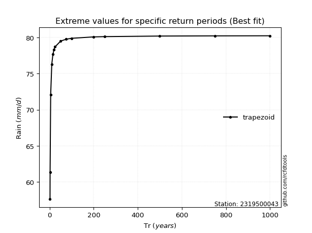</img>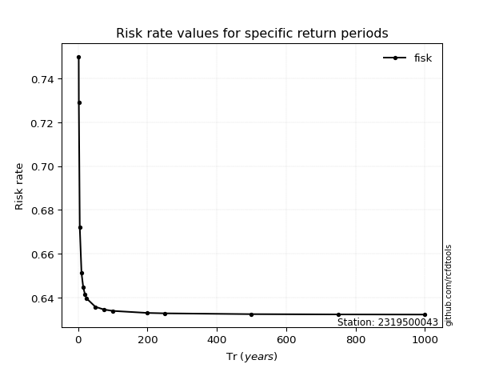</img>

</div>


<sub>**APP DISCLAIMER**: NO WARRANTY - This software is provided by [github.com/rcfdtools](https://github.com/rcfdtools) "as is", without any express or implied warranty, including warranties of merchantability, fitness for a particular purpose, or non-infringement. There is no guarantee that the software will be error-free or operate without interruption. LIMITATION OF LIABILITY - Neither the authors nor copyright holders will be liable for claims or damages arising from the software or its use. You are responsible for determining if the software is appropriate for your use and assume all associated risks, including errors, legal compliance, and data loss. NO PROFESSIONAL ADVICE - The software provides general information and does not offer professional advice. It should not replace consultation with professional advisors.</sub>