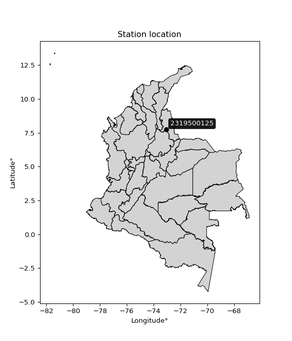

<div align="center">


</div>

# PMP Station (Rain, Pmax24h): 2319500125

Probable Maximum Precipitation (PMP) is the greatest amount of rainfall for a specific duration that is meteorologically possible for a given location, acting as a "worst-case" scenario for extreme storms, crucial for designing safety-critical infrastructure like bridges, river deviations, dams, spillways, and nuclear plants to prevent catastrophic failure. PMP is calculated by hydrologists using meteorological data to determine the upper limit of extreme rainfall, often leading to the Probable Maximum Flood (PMF) for flood control design, and is increasingly being studied for climate change impacts. Probable Maximum Precipitation (PMP) is the theoretical upper limit of rainfall, a deterministic estimate for extreme events, while probability distributions (like GEV, Gumbel) describe the likelihood and frequency of various precipitation amounts, including rare ones, showing how often events occur, with PMP representing the extreme end of these distributions, used for critical infrastructure design to ensure safety against the worst conceivable weather, unlike standard statistical forecasts which cover typical probabilities.

The most common probability distributions in hydrology, used for analyzing floods, rainfall, and streamflow, include the Normal, Log-Normal, Gumbel, Gamma (including Log-Pearson Type III), and Generalized Extreme Value (GEV) distributions, often chosen based on the data´s skewness and whether modeling extremes or general conditions, with Gumbel and GEV popular for extreme events like floods, while the Normal distribution serves as a baseline, though often requiring transformations for skewed hydrological data. These distributions help in designing water infrastructure, managing water resources, and forecasting hydrologic events.

> Hydrological data often isn´t perfectly normal (it´s skewed), so different distributions are needed for different applications, such as: **Flood Frequency Analysis**: Using Gumbel, GEV, or Log-Pearson Type III for predicting extreme flood magnitudes and their return periods, **Rainfall Analysis**: Normal for annual totals, but Log-Normal, Weibull, or GEV for intensity or extreme daily rainfall, **Streamflow Modeling**: Gamma and Log-Normal for maximum flows, GEV for minimum flows, and Kappa for daily flows.

<div align="center">

</img>

</div>


## A. General information


### 1. General running parameters

• app_version: _v20260108_. • runtime: _2026-01-08 13:24:42.400241_. • Python version: _3.14.0_. • SciPy version: _1.16.3_. • Pandas version: _2.3.3_. • NumPy version: _2.3.5_. • Stations dataset (station_dataset_file): _dataset/pmax24h_in/automatic_colombia_2003_2024.csv_. • Stations catalog (station_catalog_file): _dataset/CNE.xls_. • Minimum year to eval til year_max (date_min): _1900_. • Maximum year to eval since year_min (date_max): _2024_. • Creates, save and include plots into reports (create_plot): _False_. • Plot only fit distributions with Δo > Δ (plot_only_fit): _True_. • Plot only simple graphs avoiding multiple CDFs and multiple Extreme values plots (plot_only_simple): _True_. • Eval low extreme values, if False, evaluates high extreme values (low_extreme): _False_. • Eval every SciPy distribution as logarithmic (pdist_logarithmic_on): _True_. • Standard deviation normalized (ddof): _1.0_. • Return periods to eval in years (Tr): _[2, 2.33, 5, 10, 15, 20, 25, 50, 75, 100, 200, 250, 500, 750, 1000]_. • Minimum data sample per station, 0 means any (minimum_sample): _5_. • Z-Score maximum threshold to adjust a value, 0 means disable (zscore_max): _3.5_. • Z-Score minimum threshold to adjust a value, 0 means disable (zscore_min): _-2.5_. • Avoid zeros, e.g. rain = 0 (avoid_zeros): _True_. • Avoid null values (avoid_nans): _True_. 

:file_folder:Table: [dataset.csv](../../dataset/pmax24h_in/automatic_colombia_2003_2024.csv)

> Delta Degrees of Freedom (DDOF): is a parameter used in the formulas for calculating variance and standard deviation. When ddof=0, the divisor is $N$ (the total number of observations) and this is used when your data set is the entire population. When ddof=1, the divisor is $N-1$ and this is used when your data set is a sample drawn from a larger population. Using $N-1$ provides an unbiased estimate of the population variance (known as Bessel´s correction).


### 2. Station info and location

|   id |     CODIGO | NOMBRE                                     | CATEGORIA               | TECNOLOGIA                | ESTADO   | FECHA_INSTALACION   |   FECHA_SUSPENSION |   ALTITUD |   LATITUD |   LONGITUD | DEPARTAMENTO       | MUNICIPIO   | AREA_OPERATIVA                         | ENTIDAD                                                     | AREA_HIDROGRAFICA   | ZONA_HIDROGRAFICA   | SUBZONA_HIDROGRAFICA                      |   CORRIENTE | Catalogo   |   Version |
|-----:|-----------:|:-------------------------------------------|:------------------------|:--------------------------|:---------|:--------------------|-------------------:|----------:|----------:|-----------:|:-------------------|:------------|:---------------------------------------|:------------------------------------------------------------|:--------------------|:--------------------|:------------------------------------------|------------:|:-----------|----------:|
|    0 | 2319500125 | POLIDEPORTIVO CACHIRA - AUT   [2319500125] | Climatológica Principal | Automática con Telemetría | Activa   | 13/12/2017          |                nan |      1992 |   7.73719 |   -73.0489 | Norte De Santander | Cáchira     | Area Operativa 08 - Santanderes-Arauca | INSTITUTO DE HIDROLOGIA METEOROLOGIA Y ESTUDIOS AMBIENTALES | Magdalena Cauca     | Medio Magdalena     | Río Lebrija y otros directos al Magdalena |         nan | CNE_IDEAM  |  20251226 |

<div align="center">

Dynamic map: [:earth_americas:Google](http://maps.google.com/maps?q=7.73719,-73.04892) [:earth_americas:OSM](https://www.openstreetmap.org/#map=18/7.73719/-73.04892&layers=P) [:earth_americas:Bing](https://www.bing.com/maps?cp=7.73719~-73.04892&lvl=18) [:earth_americas:Apple](https://maps.apple.com/frame?center=7.73719%2C-73.04892&span=0.003%2C0.006)

</div>


<div align="center">

```geojson
{
  "type": "Feature",
  "geometry": {
    "type": "Point", 
    "coordinates": [-73.04892, 7.73719]
  }, 
  "properties": {
    "Name": "2319500125"
  }
}
```

</div>


### 3. Discrete values table and plot

<div align="center">

|               |           0 |          1 |           2 |           3 |          4 |          5 |
|:--------------|------------:|-----------:|------------:|------------:|-----------:|-----------:|
| Date          | 2019        | 2020       | 2021        | 2022        | 2023       | 2024       |
| Value         |   37.2      |   52.6     |   28.2      |   33.8      |   24       |   90       |
| Value_initial |   37.2      |   52.6     |   28.2      |   33.8      |   24       |   90       |
| count         |    6        |    6       |    6        |    6        |    6       |    6       |
| mean          |   44.3      |   44.3     |   44.3      |   44.3      |   44.3     |   44.3     |
| std           |   24.4513   |   24.4513  |   24.4513   |   24.4513   |   24.4513  |   24.4513  |
| zscore        |   -0.290373 |    0.33945 |   -0.658451 |   -0.429424 |   -0.83022 |    1.86902 |


</div>


> The initial value (value_initial) correspond to the initial obtained or null completed value, and value (value) is adjusted only when the initial value is outside the valid range (outlier) definite through the Z-Score value. If Z-Score is active, values out of range or outliers are replaced with the station mean value. A Z-Score (or standard score) measures how many standard deviations a data point is from the mean of a dataset, indicating its relative position; positive scores mean above the mean, negative mean below, and a score of zero is exactly at the mean, allowing for comparison of values from different distributions. It´s calculated using the formula $z=(x–μ)/σ$, where $x$ is the data point, $μ$ is the mean, and $σ$ is the standard deviation, helping identify outliers and understand probability.
>
> <sub>**Note**: In this study, "completing" (filling gaps in) and "extending" (forecasting or lengthening the historical record) rainfall data series are avoided for certain critical analyses because they introduce artificial bias and uncertainty, which can distort the statistics of rare events (extremes), alter day-to-day variability, and compromise the integrity and homogeneity of the original data. Some reasons against Completing/Extending rainfall data are: **Distortion of Extremes and Variability**: The primary issue is that most gap-filling or extension methods rely on averaging or regression with nearby stations, which inherently smooths the data. Rainfall is highly variable in space and time, with a large percentage of zero values and occasional large storms. Infilling methods often underestimate the highest values and overestimate the lowest (zero) values, which severely distorts analyses focused on flood frequency, drought severity, and intensity-duration-frequency (IDF) curves, **Loss of Data Homogeneity**: Infilled or extended data are synthetic estimates, not actual measurements. Combining these estimates with observed data can violate the assumption of data homogeneity, which requires that the data properties do not change over time. Inhomogeneity can lead to incorrect conclusions about long-term trends or changes in climate patterns, **Propagation of Errors**: Errors and biases from the original data (e.g., wind-induced undercatch, instrument errors, site changes) or the data used for imputation can propagate through the analysis, leading to unreliable hydrological models and inaccurate predictions, **Compromised Statistical Integrity**: For statistical analyses, especially those involving the frequency of events, using artificial data can introduce time bias or autocorrelation that doesn´t exist in reality, making it difficult to assess the true probability of events, **Difficulty in Validation**: It is difficult to accurately validate the quality of filled or extended data, especially for past periods where ground-truth measurements are unavailable. The reliability of imputation techniques heavily depends on the density of the surrounding station network and the complexity of the local topography.</sub>


### 4. Active continuous probability distributions from SciPy (43 of 104 available)

A Probability Density Function (PDF) describes the relative likelihood of a continuous random variable falling within a specific range, where the total area under its curve equals 1, and the area over any interval gives the actual probability for that range. Unlike discrete probabilities (like rolling a die), a PDF shows density, not direct probability for a single point (which is zero), with higher points indicating higher likelihood, often visualized as a bell curve for normal distributions.

A log of a probability density function (log-PDF) is simply the logarithm of the PDF´s value, denoted as $log(f(x))$, useful for converting multiplication of probabilities into addition, improving numerical stability with tiny numbers, and connecting to information theory concepts like entropy. Instead of dealing with very small probabilities (e.g., 0.000001), log-PDFs use negative numbers (e.g., $log(0.00001) ≈ -11.51$ that are easier for computers to handle, preventing underflow errors and simplifying complex calculations. In this study, each active probability distribution from SciPy is also evaluated in the $log$ form.

[scipy.stats](https://docs.scipy.org/doc/scipy/reference/stats.html) is a Python´s powerful submodule within the SciPy library for comprehensive statistical analysis, offering over 130 probability distributions (like Normal, Poisson), functions for descriptive stats (mean, variance), hypothesis testing (t-tests, chi-square), random variable generation, and statistical tests, making it essential for data science, modeling, and research. It provides tools to explore, model, and draw conclusions from data efficiently, working seamlessly with NumPy.

<div align="center">

|   id | p_dist             |   n_parameter | fit_method   | label                                                                       | active   | ref                                                                                                        |
|-----:|:-------------------|--------------:|:-------------|:----------------------------------------------------------------------------|:---------|:-----------------------------------------------------------------------------------------------------------|
|    0 | alpha              |             3 | MLE          | Alpha                                                                       | True     | [:mortar_board:](https://docs.scipy.org/doc/scipy/reference/generated/scipy.stats.alpha.html)              |
|    1 | betaprime          |             4 | MLE          | Beta prime                                                                  | True     | [:mortar_board:](https://docs.scipy.org/doc/scipy/reference/generated/scipy.stats.betaprime.html)          |
|    2 | chi2               |             3 | MLE          | Chi²                                                                        | True     | [:mortar_board:](https://docs.scipy.org/doc/scipy/reference/generated/scipy.stats.chi2.html)               |
|    3 | crystalball        |             4 | MLE          | Crystalball                                                                 | True     | [:mortar_board:](https://docs.scipy.org/doc/scipy/reference/generated/scipy.stats.crystalball.html)        |
|    4 | erlang             |             3 | MLE          | Erlang                                                                      | True     | [:mortar_board:](https://docs.scipy.org/doc/scipy/reference/generated/scipy.stats.erlang.html)             |
|    5 | expon              |             2 | MLE          | Exponential                                                                 | True     | [:mortar_board:](https://docs.scipy.org/doc/scipy/reference/generated/scipy.stats.expon.html)              |
|    6 | exponnorm          |             3 | MLE          | Exponentially modified Normal                                               | True     | [:mortar_board:](https://docs.scipy.org/doc/scipy/reference/generated/scipy.stats.exponnorm.html)          |
|    7 | f                  |             4 | MLE          | F                                                                           | True     | [:mortar_board:](https://docs.scipy.org/doc/scipy/reference/generated/scipy.stats.f.html)                  |
|    8 | fatiguelife        |             3 | MLE          | Fatigue-life (Birnbaum-Saunders)                                            | True     | [:mortar_board:](https://docs.scipy.org/doc/scipy/reference/generated/scipy.stats.fatiguelife.html)        |
|    9 | fisk               |             3 | MLE          | Fisk                                                                        | True     | [:mortar_board:](https://docs.scipy.org/doc/scipy/reference/generated/scipy.stats.fisk.html)               |
|   10 | gamma              |             3 | MLE          | Gamma                                                                       | True     | [:mortar_board:](https://docs.scipy.org/doc/scipy/reference/generated/scipy.stats.gamma.html)              |
|   11 | genexpon           |             5 | MLE          | Generalized exponential                                                     | True     | [:mortar_board:](https://docs.scipy.org/doc/scipy/reference/generated/scipy.stats.genexpon.html)           |
|   12 | genlogistic        |             3 | MLE          | Generalized logistic                                                        | True     | [:mortar_board:](https://docs.scipy.org/doc/scipy/reference/generated/scipy.stats.genlogistic.html)        |
|   13 | gibrat             |             2 | MM           | Gibrat                                                                      | True     | [:mortar_board:](https://docs.scipy.org/doc/scipy/reference/generated/scipy.stats.gibrat.html)             |
|   14 | gompertz           |             3 | MLE          | Gompertz (or truncated Gumbel)                                              | True     | [:mortar_board:](https://docs.scipy.org/doc/scipy/reference/generated/scipy.stats.gompertz.html)           |
|   15 | gumbel_l           |             2 | MM           | Gumbel Left Skew                                                            | True     | [:mortar_board:](https://docs.scipy.org/doc/scipy/reference/generated/scipy.stats.gumbel_l.html)           |
|   16 | gumbel_r           |             2 | MM           | Gumbel Right Skew                                                           | True     | [:mortar_board:](https://docs.scipy.org/doc/scipy/reference/generated/scipy.stats.gumbel_r.html)           |
|   17 | halflogistic       |             2 | MM           | Half-logistic                                                               | True     | [:mortar_board:](https://docs.scipy.org/doc/scipy/reference/generated/scipy.stats.halflogistic.html)       |
|   18 | halfnorm           |             2 | MM           | Half Normal                                                                 | True     | [:mortar_board:](https://docs.scipy.org/doc/scipy/reference/generated/scipy.stats.halfnorm.html)           |
|   19 | hypsecant          |             2 | MM           | hyperbolic secant                                                           | True     | [:mortar_board:](https://docs.scipy.org/doc/scipy/reference/generated/scipy.stats.hypsecant.html)          |
|   20 | invgamma           |             3 | MLE          | Inverted gamma                                                              | True     | [:mortar_board:](https://docs.scipy.org/doc/scipy/reference/generated/scipy.stats.invgamma.html)           |
|   21 | invgauss           |             3 | MLE          | Inverse Gaussian                                                            | True     | [:mortar_board:](https://docs.scipy.org/doc/scipy/reference/generated/scipy.stats.invgauss.html)           |
|   22 | invweibull         |             3 | MLE          | Inverted Weibull                                                            | True     | [:mortar_board:](https://docs.scipy.org/doc/scipy/reference/generated/scipy.stats.invweibull.html)         |
|   23 | kstwobign          |             2 | MLE          | Limiting distribution of scaled Kolmogorov-Smirnov two-sided test statistic | True     | [:mortar_board:](https://docs.scipy.org/doc/scipy/reference/generated/scipy.stats.kstwobign.html)          |
|   24 | laplace            |             2 | MM           | Laplace                                                                     | True     | [:mortar_board:](https://docs.scipy.org/doc/scipy/reference/generated/scipy.stats.laplace.html)            |
|   25 | laplace_asymmetric |             3 | MLE          | Asymmetric Laplace                                                          | True     | [:mortar_board:](https://docs.scipy.org/doc/scipy/reference/generated/scipy.stats.laplace_asymmetric.html) |
|   26 | loggamma           |             3 | MLE          | Log gamma                                                                   | True     | [:mortar_board:](https://docs.scipy.org/doc/scipy/reference/generated/scipy.stats.loggamma.html)           |
|   27 | logistic           |             2 | MM           | Logistic (or Sech-squared)                                                  | True     | [:mortar_board:](https://docs.scipy.org/doc/scipy/reference/generated/scipy.stats.logistic.html)           |
|   28 | lognorm            |             3 | MLE          | Log Normal                                                                  | True     | [:mortar_board:](https://docs.scipy.org/doc/scipy/reference/generated/scipy.stats.lognorm.html)            |
|   29 | maxwell            |             2 | MM           | Maxwell                                                                     | True     | [:mortar_board:](https://docs.scipy.org/doc/scipy/reference/generated/scipy.stats.maxwell.html)            |
|   30 | mielke             |             4 | MLE          | Mielke Beta-Kappa / Dagum                                                   | True     | [:mortar_board:](https://docs.scipy.org/doc/scipy/reference/generated/scipy.stats.mielke.html)             |
|   31 | moyal              |             2 | MM           | Moyal                                                                       | True     | [:mortar_board:](https://docs.scipy.org/doc/scipy/reference/generated/scipy.stats.moyal.html)              |
|   32 | nakagami           |             3 | MLE          | Nakagami                                                                    | True     | [:mortar_board:](https://docs.scipy.org/doc/scipy/reference/generated/scipy.stats.nakagami.html)           |
|   33 | ncf                |             5 | MLE          | Non-central F distribution                                                  | True     | [:mortar_board:](https://docs.scipy.org/doc/scipy/reference/generated/scipy.stats.ncf.html)                |
|   34 | nct                |             4 | MLE          | Non-central Student’s t                                                     | True     | [:mortar_board:](https://docs.scipy.org/doc/scipy/reference/generated/scipy.stats.nct.html)                |
|   35 | norm               |             2 | MM           | Normal                                                                      | True     | [:mortar_board:](https://docs.scipy.org/doc/scipy/reference/generated/scipy.stats.norm.html)               |
|   36 | pearson3           |             3 | MM           | Pearson type III                                                            | True     | [:mortar_board:](https://docs.scipy.org/doc/scipy/reference/generated/scipy.stats.pearson3.html)           |
|   37 | rayleigh           |             2 | MM           | Rayleigh                                                                    | True     | [:mortar_board:](https://docs.scipy.org/doc/scipy/reference/generated/scipy.stats.rayleigh.html)           |
|   38 | rice               |             3 | MLE          | Rice                                                                        | True     | [:mortar_board:](https://docs.scipy.org/doc/scipy/reference/generated/scipy.stats.rice.html)               |
|   39 | t                  |             3 | MLE          | Student’s t                                                                 | True     | [:mortar_board:](https://docs.scipy.org/doc/scipy/reference/generated/scipy.stats.t.html)                  |
|   40 | truncnorm          |             4 | MLE          | Truncated normal                                                            | True     | [:mortar_board:](https://docs.scipy.org/doc/scipy/reference/generated/scipy.stats.truncnorm.html)          |
|   41 | wald               |             2 | MM           | Wald                                                                        | True     | [:mortar_board:](https://docs.scipy.org/doc/scipy/reference/generated/scipy.stats.wald.html)               |
|   42 | weibull_min        |             3 | MLE          | Weibull minimum                                                             | True     | [:mortar_board:](https://docs.scipy.org/doc/scipy/reference/generated/scipy.stats.weibull_min.html)        |

</div>

> **n_parameter:** # arguments & localization & scale.
>
> **Fit methods:** (MLE) maximum likelihood, (MM) L-moments.
>
>**Inactive** (With the only purpose of prevent loops, zero divisions, infinite values, over high estimated values or horizontal trending for recurrence intervals estimations, the follow distributions were disabled.)**:** foldnorm, gennorm, norminvgauss, powernorm, powerlognorm, skewnorm, genextreme, anglit, arcsine, argus, beta, bradford, burr, burr12, cauchy, cosine, halfcauchy, foldcauchy, skewcauchy, wrapcauchy, dgamma, gengamma, exponweib, exponpow, truncexpon, gausshyper, genhalflogistic, genhyperbolic, geninvgauss, halfgennorm, johnsonsb, johnsonsu, kappa4, kappa3, ksone, kstwo, loglaplace, levy, levy_l, levy_stable, ncx2, pareto, genpareto, truncpareto, lomax, powerlaw, rdist, rel_breitwigner, recipinvgauss, semicircular, studentized_range, trapezoid, triang, truncweibull_min, tukeylambda, uniform, loguniform, vonmises, vonmises_line, weibull_max, dweibull, 


## B. Probability (PDF) vs. Empirical (EDF) distributions functions

A continuous probability distribution (CPD) describes probabilities for variables that can take any value within a range (like rain any time), unlike discrete variables with specific outcomes (like temperature). It uses a Probability Density Function (PDF), a curve where the total area under it equals 1, and the probability of the variable falling within an interval (a to b) is found by calculating the area under the curve between those points. A key feature is that the probability of hitting any single exact value is zero, so probabilities are always expressed for ranges, e.g., $P(a ≤ X ≤ b)$.

<div align="center">

Distributions parameters from station values
|    |    station | p_dist                |   n |            loc |           scale | shape                  | shape1                | shape2                | shape3   |
|---:|-----------:|:----------------------|----:|---------------:|----------------:|:-----------------------|:----------------------|:----------------------|:---------|
|  0 | 2319500125 | alpha                 |   6 |     18.756     |    10.3505      | 1.3968341024996765e-08 |                       |                       |          |
|  1 | 2319500125 | betaprime             |   6 |     -0.460793  |     0.778014    | 299.8215543066419      | 6.258214567881342     |                       |          |
|  2 | 2319500125 | chi2                  |   6 |     24         |     8.79556     | 1.3713083323202384     |                       |                       |          |
|  3 | 2319500125 | crystalball           |   6 |     44.3       |    22.3209      | 2689.140583283321      | 3731.2702766100424    |                       |          |
|  4 | 2319500125 | erlang                |   6 |     24         |    23.2981      | 0.6355112359986816     |                       |                       |          |
|  5 | 2319500125 | expon                 |   6 |     24         |    20.3         |                        |                       |                       |          |
|  6 | 2319500125 | exponnorm             |   6 |     23.9758    |     0.00723054  | 2786.4099482109123     |                       |                       |          |
|  7 | 2319500125 | f                     |   6 |     24         |     8.27214     | 0.8342567518995748     | 2.6762870097410643    |                       |          |
|  8 | 2319500125 | fatiguelife           |   6 |     23.025     |     8.98365     | 1.5845411260063558     |                       |                       |          |
|  9 | 2319500125 | fisk                  |   6 |     24         |    12.9835      | 0.3147861740033111     |                       |                       |          |
| 10 | 2319500125 | gamma                 |   6 |     24         |    21.6507      | 0.326226430506631      |                       |                       |          |
| 11 | 2319500125 | genexpon              |   6 |     24         |    27.0428      | 1.3321608584033826     | 7.909135035428596e-10 | 1.8152755477806601    |          |
| 12 | 2319500125 | genlogistic           |   6 |    -72.1223    |    14.0196      | 2058.604290929332      |                       |                       |          |
| 13 | 2319500125 | gibrat                |   6 |     27.272     |    10.328       |                        |                       |                       |          |
| 14 | 2319500125 | gompertz              |   6 |     24         | 15056.5         | 742.2450014313998      |                       |                       |          |
| 15 | 2319500125 | gumbel_l              |   6 |     54.3456    |    17.4035      |                        |                       |                       |          |
| 16 | 2319500125 | gumbel_r              |   6 |     34.2544    |    17.4035      |                        |                       |                       |          |
| 17 | 2319500125 | halflogistic          |   6 |     17.8445    |    19.0836      |                        |                       |                       |          |
| 18 | 2319500125 | halfnorm              |   6 |     14.7559    |    37.0281      |                        |                       |                       |          |
| 19 | 2319500125 | hypsecant             |   6 |     44.3       |    14.2099      |                        |                       |                       |          |
| 20 | 2319500125 | invgamma              |   6 |     18.8262    |    21.9013      | 1.696733406402533      |                       |                       |          |
| 21 | 2319500125 | invgauss              |   6 |     21.1417    |    14.2846      | 1.6212128812430282     |                       |                       |          |
| 22 | 2319500125 | invweibull            |   6 |     24         |     1.31895     | 0.05452310524351728    |                       |                       |          |
| 23 | 2319500125 | kstwobign             |   6 |    -16.6848    |    70.6822      |                        |                       |                       |          |
| 24 | 2319500125 | laplace               |   6 |     44.3       |    15.7833      |                        |                       |                       |          |
| 25 | 2319500125 | laplace_asymmetric    |   6 |     24         |     0.00195369  | 9.62403601932897e-05   |                       |                       |          |
| 26 | 2319500125 | loggamma              |   6 |  -5723.09      |   805.998       | 1281.702852006677      |                       |                       |          |
| 27 | 2319500125 | logistic              |   6 |     44.3       |    12.3062      |                        |                       |                       |          |
| 28 | 2319500125 | lognorm               |   6 |     24         |     0.0392271   | 13.458365784989576     |                       |                       |          |
| 29 | 2319500125 | maxwell               |   6 |     -8.5912    |    33.1446      |                        |                       |                       |          |
| 30 | 2319500125 | mielke                |   6 |     10.9944    |     1.05489     | 1218.1441936189071     | 2.145075158923601     |                       |          |
| 31 | 2319500125 | moyal                 |   6 |     31.5355    |    10.0479      |                        |                       |                       |          |
| 32 | 2319500125 | nakagami              |   6 |     24         |    24.0199      | 0.28497966831050603    |                       |                       |          |
| 33 | 2319500125 | ncf                   |   6 |     -0.240975  |     1.25349e-05 | 1.0942420465083694e-05 | 26.810863858885263    | 35.405979545343016    |          |
| 34 | 2319500125 | nct                   |   6 |     -0.101041  |     0.57296     | 3.6847262248712447     | 60.17209010047151     |                       |          |
| 35 | 2319500125 | norm                  |   6 |     44.3       |    22.3209      |                        |                       |                       |          |
| 36 | 2319500125 | pearson3              |   6 |     44.3       |    22.3209      | 1.2283513477886845     |                       |                       |          |
| 37 | 2319500125 | rayleigh              |   6 |      1.59878   |    34.0706      |                        |                       |                       |          |
| 38 | 2319500125 | rice                  |   6 |     10.4941    |    28.6449      | 0.001323505671843585   |                       |                       |          |
| 39 | 2319500125 | t                     |   6 |     44.2974    |    22.3187      | 10658.216242877494     |                       |                       |          |
| 40 | 2319500125 | truncnorm             |   6 | -12900         |   538.508       | 23.999681188461054     | 24.12224257638818     |                       |          |
| 41 | 2319500125 | wald                  |   6 |     21.9791    |    22.3209      |                        |                       |                       |          |
| 42 | 2319500125 | weibull_min           |   6 |     24         |    19.9293      | 0.6744056456896104     |                       |                       |          |
| 43 | 2319500125 | logalpha              |   6 |      2.21677   |     5.06649     | 3.734852091421374      |                       |                       |          |
| 44 | 2319500125 | logbetaprime          |   6 |      3.17805   |  1243.41        | 0.8209955707218437     | 3301.0645980453583    |                       |          |
| 45 | 2319500125 | logchi2               |   6 |      3.17805   |     0.962961    | 0.29400087547411746    |                       |                       |          |
| 46 | 2319500125 | logcrystalball        |   6 |      3.68611   |     0.437667    | 22.86410053765715      | 5.3099118023164795    |                       |          |
| 47 | 2319500125 | logerlang             |   6 |      3.17805   |     0.595839    | 0.6805522532312009     |                       |                       |          |
| 48 | 2319500125 | logexpon              |   6 |      3.17805   |     0.508058    |                        |                       |                       |          |
| 49 | 2319500125 | logexponnorm          |   6 |      3.1774    |     0.000215466 | 2356.555338222899      |                       |                       |          |
| 50 | 2319500125 | logf                  |   6 |      2.79021   |     0.714762    | 740.6139486374808      | 9.324568178327937     |                       |          |
| 51 | 2319500125 | logfatiguelife        |   6 |      3.04617   |     0.478564    | 0.8148924665395041     |                       |                       |          |
| 52 | 2319500125 | logfisk               |   6 |      3.08138   |     0.465472    | 1.9842524975845977     |                       |                       |          |
| 53 | 2319500125 | loggamma              |   6 |      3.17805   |     0.665553    | 0.16534714680376494    |                       |                       |          |
| 54 | 2319500125 | loggenexpon           |   6 |      3.17777   |     0.0294464   | 0.048021680745286316   | 3.67914078684384      | 0.0001792105599949757 |          |
| 55 | 2319500125 | loggenlogistic        |   6 |      1.2041    |     0.325199    | 1115.2553872332637     |                       |                       |          |
| 56 | 2319500125 | loggibrat             |   6 |      3.35229   |     0.202479    |                        |                       |                       |          |
| 57 | 2319500125 | loggompertz           |   6 |      3.17805   |     2.01295     | 3.1298165364398347     |                       |                       |          |
| 58 | 2319500125 | loggumbel_l           |   6 |      3.88309   |     0.341247    |                        |                       |                       |          |
| 59 | 2319500125 | loggumbel_r           |   6 |      3.48914   |     0.341247    |                        |                       |                       |          |
| 60 | 2319500125 | loghalflogistic       |   6 |      3.16738   |     0.374189    |                        |                       |                       |          |
| 61 | 2319500125 | loghalfnorm           |   6 |      3.10681   |     0.726044    |                        |                       |                       |          |
| 62 | 2319500125 | loghypsecant          |   6 |      3.68611   |     0.278627    |                        |                       |                       |          |
| 63 | 2319500125 | loginvgamma           |   6 |      2.07056   |    24.2743      | 16.20195400707832      |                       |                       |          |
| 64 | 2319500125 | loginvgauss           |   6 |      2.98536   |     1.30727     | 0.5360413055848062     |                       |                       |          |
| 65 | 2319500125 | loginvweibull         |   6 |      2.11989   |     1.33036     | 4.559622217877184      |                       |                       |          |
| 66 | 2319500125 | logkstwobign          |   6 |      2.33637   |     1.55166     |                        |                       |                       |          |
| 67 | 2319500125 | loglaplace            |   6 |      3.68611   |     0.309477    |                        |                       |                       |          |
| 68 | 2319500125 | loglaplace_asymmetric |   6 |      3.52046   |     0.307846    | 0.7663725496730147     |                       |                       |          |
| 69 | 2319500125 | logloggamma           |   6 |   -109.693     |    15.8378      | 1285.785099731458      |                       |                       |          |
| 70 | 2319500125 | loglogistic           |   6 |      3.68611   |     0.241298    |                        |                       |                       |          |
| 71 | 2319500125 | loglognorm            |   6 |      3.17805   |     0.00149458  | 12.916350301504545     |                       |                       |          |
| 72 | 2319500125 | logmaxwell            |   6 |      2.64903   |     0.649898    |                        |                       |                       |          |
| 73 | 2319500125 | logmielke             |   6 |      2.1807    |     0.464851    | 355.54759296595694     | 4.373267798932361     |                       |          |
| 74 | 2319500125 | logmoyal              |   6 |      3.43583   |     0.197019    |                        |                       |                       |          |
| 75 | 2319500125 | lognakagami           |   6 |      3.17805   |     0.938509    | 0.25614654507373824    |                       |                       |          |
| 76 | 2319500125 | logncf                |   6 |      0.148474  |     4.65092e-06 | 0.0004901583326753869  | 147.12853988462643    | 369.5381086659638     |          |
| 77 | 2319500125 | lognct                |   6 |     -0.149049  |     0.0614105   | 44.271873911509346     | 61.36519508437378     |                       |          |
| 78 | 2319500125 | lognorm               |   6 |      3.68611   |     0.437667    |                        |                       |                       |          |
| 79 | 2319500125 | logpearson3           |   6 |      3.68611   |     0.437666    | 0.759824916389244      |                       |                       |          |
| 80 | 2319500125 | lograyleigh           |   6 |      2.84883   |     0.668054    |                        |                       |                       |          |
| 81 | 2319500125 | logrice               |   6 |      2.95796   |     0.60073     | 0.0006921615788205962  |                       |                       |          |
| 82 | 2319500125 | logt                  |   6 |      3.68611   |     0.437667    | 1088911840.1240275     |                       |                       |          |
| 83 | 2319500125 | logtruncnorm          |   6 |     -0.0802671 |     0.771459    | 5.24069138527814       | 6.383923052195549     |                       |          |
| 84 | 2319500125 | logwald               |   6 |      3.24842   |     0.437687    |                        |                       |                       |          |
| 85 | 2319500125 | logweibull_min        |   6 |      3.17805   |     0.523304    | 0.7651342828331571     |                       |                       |          |

</div>

> **loc** (Location parameter): This shifts the distribution along the x-axis. For many common distributions, like the normal (Gaussian) distribution, loc represents the mean $μ$. For others, like the uniform distribution, it might represent the minimum value, or for the beta distribution, the left end of the support interval.
>
> **scale** (Scale parameter): This determines the width or spread of the distribution. For the normal distribution, scale represents the standard deviation $σ$. For a uniform distribution, it defines the length of the interval (from $loc$ to $loc + scale$).
>
> **shape** (Shape parameters): Refers to parameters that define the specific form of a probability distribution, distinct from its location (loc) and scale (scale). These parameters are required arguments for most distribution functions. For example, a normal (Gaussian) distribution is fully defined by its location (mean) and scale (standard deviation), so it has no specific shape parameters beyond loc and scale. However, other distributions have intrinsic properties that need specification, as Gamma distribution that takes a shape parameter, often named $a$ or $alpha$.


### 0. Cumulative distribution values - CDF (86 evaluated)

Cumulative Distribution Function (CDF), denoted as $F$<sub>$X$</sub>$(x)$, is a function that gives the probability that a random variable $X$ will take a value less than or equal to a specific value, $x$ (i.e., $(P(X≥x)$. It essentially "accumulates" probabilities from a given point up to the far right (positive infinity), providing a complete picture of the distribution´s probabilities for both discrete (like rain) and continuous (like temperature) variables, helping to find probabilities over ranges or above certain values. Each station is evaluated separately ordering the $x$ values ascending, calculating the CDF and PDF values for the activated distributions and their logarithmic forms.

<div align="center">

CDF ordered by x ascending and calculating $log(f(x))$ separately
|   id |    Station |   date |    x |   count |   mean |     std |    zscore |   Value_initial |    station |   m |     alpha |   alpha_pdf |   betaprime |   betaprime_pdf |        chi2 |       chi2_pdf |   crystalball |   crystalball_pdf |      erlang |     erlang_pdf |    expon |   expon_pdf |   exponnorm |   exponnorm_pdf |           f |         f_pdf |   fatiguelife |   fatiguelife_pdf |        fisk |    fisk_pdf |       gamma |   gamma_pdf |    genexpon |   genexpon_pdf |   genlogistic |   genlogistic_pdf |     gibrat |   gibrat_pdf |    gompertz |   gompertz_pdf |   gumbel_l |   gumbel_l_pdf |   gumbel_r |   gumbel_r_pdf |   halflogistic |   halflogistic_pdf |   halfnorm |   halfnorm_pdf |   hypsecant |   hypsecant_pdf |   invgamma |   invgamma_pdf |   invgauss |   invgauss_pdf |   invweibull |   invweibull_pdf |   kstwobign |   kstwobign_pdf |   laplace |   laplace_pdf |   laplace_asymmetric |   laplace_asymmetric_pdf |   loggamma |   loggamma_pdf |   logistic |   logistic_pdf |   lognorm |   lognorm_pdf |   maxwell |   maxwell_pdf |   mielke |   mielke_pdf |    moyal |   moyal_pdf |    nakagami |    nakagami_pdf |      ncf |    ncf_pdf |      nct |    nct_pdf |     norm |   norm_pdf |   pearson3 |   pearson3_pdf |   rayleigh |   rayleigh_pdf |     rice |   rice_pdf |        t |      t_pdf |   truncnorm |   truncnorm_pdf |     wald |   wald_pdf |   weibull_min |   weibull_min_pdf |   logalpha |   logalpha_pdf |   logbetaprime |   logbetaprime_pdf |    logchi2 |   logchi2_pdf |   logcrystalball |   logcrystalball_pdf |   logerlang |   logerlang_pdf |   logexpon |   logexpon_pdf |   logexponnorm |   logexponnorm_pdf |      logf |   logf_pdf |   logfatiguelife |   logfatiguelife_pdf |   logfisk |   logfisk_pdf |   loggenexpon |   loggenexpon_pdf |   loggenlogistic |   loggenlogistic_pdf |   loggibrat |   loggibrat_pdf |   loggompertz |   loggompertz_pdf |   loggumbel_l |   loggumbel_l_pdf |   loggumbel_r |   loggumbel_r_pdf |   loghalflogistic |   loghalflogistic_pdf |   loghalfnorm |   loghalfnorm_pdf |   loghypsecant |   loghypsecant_pdf |   loginvgamma |   loginvgamma_pdf |   loginvgauss |   loginvgauss_pdf |   loginvweibull |   loginvweibull_pdf |   logkstwobign |   logkstwobign_pdf |   loglaplace |   loglaplace_pdf |   loglaplace_asymmetric |   loglaplace_asymmetric_pdf |   logloggamma |   logloggamma_pdf |   loglogistic |   loglogistic_pdf |   loglognorm |   loglognorm_pdf |   logmaxwell |   logmaxwell_pdf |   logmielke |   logmielke_pdf |   logmoyal |   logmoyal_pdf |   lognakagami |   lognakagami_pdf |   logncf |   logncf_pdf |   lognct |   lognct_pdf |   logpearson3 |   logpearson3_pdf |   lograyleigh |   lograyleigh_pdf |   logrice |   logrice_pdf |     logt |   logt_pdf |   logtruncnorm |   logtruncnorm_pdf |   logwald |   logwald_pdf |   logweibull_min |   logweibull_min_pdf |
|-----:|-----------:|-------:|-----:|--------:|-------:|--------:|----------:|----------------:|-----------:|----:|----------:|------------:|------------:|----------------:|------------:|---------------:|--------------:|------------------:|------------:|---------------:|---------:|------------:|------------:|----------------:|------------:|--------------:|--------------:|------------------:|------------:|------------:|------------:|------------:|------------:|---------------:|--------------:|------------------:|-----------:|-------------:|------------:|---------------:|-----------:|---------------:|-----------:|---------------:|---------------:|-------------------:|-----------:|---------------:|------------:|----------------:|-----------:|---------------:|-----------:|---------------:|-------------:|-----------------:|------------:|----------------:|----------:|--------------:|---------------------:|-------------------------:|-----------:|---------------:|-----------:|---------------:|----------:|--------------:|----------:|--------------:|---------:|-------------:|---------:|------------:|------------:|----------------:|---------:|-----------:|---------:|-----------:|---------:|-----------:|-----------:|---------------:|-----------:|---------------:|---------:|-----------:|---------:|-----------:|------------:|----------------:|---------:|-----------:|--------------:|------------------:|-----------:|---------------:|---------------:|-------------------:|-----------:|--------------:|-----------------:|---------------------:|------------:|----------------:|-----------:|---------------:|---------------:|-------------------:|----------:|-----------:|-----------------:|---------------------:|----------:|--------------:|--------------:|------------------:|-----------------:|---------------------:|------------:|----------------:|--------------:|------------------:|--------------:|------------------:|--------------:|------------------:|------------------:|----------------------:|--------------:|------------------:|---------------:|-------------------:|--------------:|------------------:|--------------:|------------------:|----------------:|--------------------:|---------------:|-------------------:|-------------:|-----------------:|------------------------:|----------------------------:|--------------:|------------------:|--------------:|------------------:|-------------:|-----------------:|-------------:|-----------------:|------------:|----------------:|-----------:|---------------:|--------------:|------------------:|---------:|-------------:|---------:|-------------:|--------------:|------------------:|--------------:|------------------:|----------:|--------------:|---------:|-----------:|---------------:|-------------------:|----------:|--------------:|-----------------:|---------------------:|
|    0 | 2319500125 |   2023 | 24   |       6 |   44.3 | 24.4513 | -0.83022  |            24   | 2319500125 |   1 | 0.0484059 |  0.0428162  |    0.107158 |       0.0213366 | 3.07692e-11 | 2969.14        |      0.181553 |        0.0118193  | 9.88536e-11 | 17683          | 0        |  0.0492611  |   0.0011995 |      0.0495546  | 0.000377364 | 1371.92       |     0.0438392 |        0.101075   | 9.46179e-05 | 1.39249e+07 | 7.93019e-06 | 7.28187e+08 | 1.96292e-12 |      0.0492612 |      0.114611 |        0.0176996  | 0          |   0          | 3.25621e-10 |      0.0492973 |   0.160444 |    0.00843639  |   0.164875 |     0.0170769  |       0.159893 |         0.0255307  |   0.197144 |     0.0208869  |    0.149742 |      0.0101534  |  0.0504393 |     0.0357228  |  0.0456635 |     0.0457426  |    0.0019724 |      1.88538e+11 |    0.105153 |      0.0166633  |  0.138163 |    0.00875378 |          9.55134e-09 |               0.0492609  | 0.00333528 |    1.24182e+12 |   0.161166 |     0.0109857  |  0.122855 |      0.464679 |  0.190735 |    0.0143531  |      nan |          nan | 0.145681 |  0.0200449  | 7.37889e-10 | 118379          | 0.135392 | 0.018465   | 0.09126  | 0.0233933  | 0.181553 | 0.0118193  |   0.169796 |     0.0197407  |   0.194384 |      0.0155467 | 0.105198 | 0.0147284  | 0.181571 | 0.0118202  | 3.46936e-09 |       0.0470994 | 0.002324 |  0.0068108 |   3.81811e-11 |     3623.92       |  0.0623123 |       0.672734 |    5.91518e-13 |       1093.55      | 0.00538226 |   1.78161e+12 |         0.122854 |             0.464678 | 5.59941e-11 |    85809.1      |   0        |       1.96828  |     0.00128467 |           1.9645   | 0.0549709 |   0.751802 |        0.0451851 |             1.07512  | 0.0423452 |      0.832326 |   0.000465661 |          1.63028  |        0.0761834 |             0.602451 |    0        |       0         |   1.08994e-11 |          1.55484  |      0.11899  |         0.32707   |     0.0830488 |          0.60558  |         0.0142682 |              1.33595  |     0.0781649 |          1.09367  |       0.101916 |           0.35956  |     0.0866686 |          0.635168 |     0.0482051 |          0.906605 |       0.0584301 |            0.715021 |      0.0697981 |           0.612454 |    0.0968286 |         0.312878 |               0.0866772 |                    0.367393 |      0.125574 |          0.462532 |      0.108562 |          0.401064 |    0.0127684 |      5.74595e+12 |     0.118042 |         0.584085 |   0.0587029 |        0.717229 |  0.0544092 |       0.612409 |   1.56712e-08 |       9.03901e+06 | 0.173176 |     0.539064 | 0.101282 |     0.535907 |      0.103204 |          0.60818  |      0.114348 |          0.653328 | 0.0649121 |      0.570291 | 0.122855 |   0.464678 |    0           |           0        | 0         |      0        |      2.94066e-12 |          5066.54     |
|    1 | 2319500125 |   2021 | 28.2 |       6 |   44.3 | 24.4513 | -0.658451 |            28.2 | 2319500125 |   2 | 0.273083  |  0.0507873  |    0.21034  |       0.0270068 | 0.376089    |    0.0531533   |      0.235364 |        0.0137792  | 0.349998    |     0.0473629  | 0.186896 |  0.0400544  |   0.189144  |      0.0402465  | 0.500033    |    0.0413759  |     0.362223  |        0.0474703  | 0.412106    | 0.0181583   | 0.625617    | 0.0419194   | 0.186897    |      0.0400544 |      0.200757 |        0.0229836  | 0.00798643 |   0.0235838  | 0.187044    |      0.0400878 |   0.199577 |    0.0102385   |   0.242667 |     0.0197449  |       0.264852 |         0.0243626  |   0.283455 |     0.0201736  |    0.198353 |      0.0130728  |  0.244493  |     0.0479319  |  0.270222  |     0.049305   |    0.391096  |      0.00476638  |    0.185198 |      0.0211202  |  0.180285 |    0.0114226  |          0.186895    |               0.0400542  | 0.82482    |    0.685827    |   0.212774 |     0.0136111  |  0.214075 |      0.665938 |  0.254694 |    0.0160189  |      nan |          nan | 0.237783 |  0.0233496  | 0.28706     |      0.038692   | 0.221795 | 0.022336   | 0.20837  | 0.0310159  | 0.235364 | 0.0137792  |   0.25665  |     0.0213327  |   0.262728 |      0.0168954 | 0.173895 | 0.0178262  | 0.235386 | 0.0137804  | 0.180405    |       0.039058  | 0.142929 |  0.0477667 |   0.295238    |        0.0395961  |  0.218152  |       1.18477  |    0.44192     |          1.76419   | 0.735732   |   0.623313    |         0.214074 |             0.665937 | 0.40818     |        1.46152  |   0.271976 |       1.43296  |     0.273048   |           1.43169  | 0.229811  |   1.28599  |        0.271767  |             1.43054  | 0.236616  |      1.3895   |   0.2392      |          1.33414  |        0.208317  |             1.00417  |    0        |       0         |   0.229769    |          1.29748  |      0.183903 |         0.486007  |     0.211994  |          0.963655 |         0.2258    |              1.26809  |     0.251215  |          1.04402  |       0.178542 |           0.607716 |     0.220656  |          0.993635 |     0.250516  |          1.37799  |       0.225971  |            1.25671  |      0.202399  |           0.989972 |    0.163047  |         0.526848 |               0.1717    |                    0.727774 |      0.216004 |          0.658419 |      0.191982 |          0.642876 |    0.641483  |      0.179349    |     0.229726 |         0.787941 |   0.226637  |        1.25831  |  0.201424  |       1.14387  |   0.315679    |       0.996782    | 0.270689 |     0.662412 | 0.210378 |     0.807242 |      0.223885 |          0.867412 |      0.236263 |          0.839367 | 0.182499  |      0.863901 | 0.214075 |   0.665937 |    0           |           0        | 0.0707864 |      2.12456  |      0.333897    |             1.28407  |
|    2 | 2319500125 |   2022 | 33.8 |       6 |   44.3 | 24.4513 | -0.429424 |            33.8 | 2319500125 |   3 | 0.491442  |  0.0287996  |    0.366893 |       0.0278199 | 0.597287    |    0.0296213   |      0.319031 |        0.016001   | 0.549698    |     0.0273481  | 0.382921 |  0.030398   |   0.385913  |      0.0304799  | 0.654282    |    0.0188225  |     0.54574   |        0.0233085  | 0.477877    | 0.00801454  | 0.778872    | 0.0182873   | 0.382922    |      0.030398  |      0.3406   |        0.0261595  | 0.323206   |   0.0550082  | 0.383237    |      0.0304245 |   0.264432 |    0.0129802   |   0.358275 |     0.0211309  |       0.395279 |         0.0221068  |   0.392969 |     0.0188786  |    0.283673 |      0.0174235  |  0.471074  |     0.0324751  |  0.48739   |     0.029813   |    0.408029  |      0.00203496  |    0.3126   |      0.023756   |  0.25707  |    0.0162875  |          0.38292     |               0.0303979  | 0.90356    |    0.27867     |   0.298756 |     0.017024   |  0.352535 |      0.848515 |  0.348695 |    0.0173799  |      nan |          nan | 0.371627 |  0.0237992  | 0.461329    |      0.0258558  | 0.353721 | 0.0241549  | 0.384844 | 0.030482   | 0.319031 | 0.016001   |   0.376781 |     0.0212208  |   0.360223 |      0.0177476 | 0.281783 | 0.0203998  | 0.319061 | 0.0160026  | 0.373961    |       0.0304272 | 0.390403 |  0.0376318 |   0.461835    |        0.0229464  |  0.439865  |       1.17579  |    0.678527    |          0.953132  | 0.812498   |   0.298493    |         0.352533 |             0.848515 | 0.609268    |        0.847849 |   0.49031  |       1.00321  |     0.491168   |           1.00212  | 0.457536  |   1.1503   |        0.495606  |             1.03216  | 0.47108   |      1.12599  |   0.4531      |          1.03426  |        0.406974  |             1.12462  |    0.426355 |       2.33173   |   0.440297    |          1.03162  |      0.292163 |         0.716744  |     0.4016    |          1.07365  |         0.439653  |              1.07794  |     0.431138  |          0.934315 |       0.321011 |           0.966518 |     0.414721  |          1.09219  |     0.477742  |          1.08842  |       0.453402  |            1.16754  |      0.394863  |           1.07945  |    0.292758  |         0.945977 |               0.37001   |                    1.56834  |      0.352749 |          0.837939 |      0.334812 |          0.922978 |    0.66302   |      0.0825642   |     0.384622 |         0.898366 |   0.453931  |        1.16461  |  0.419832  |       1.17979  |   0.461775    |       0.672357    | 0.398161 |     0.730949 | 0.37487  |     0.976179 |      0.39369  |          0.971663 |      0.396716 |          0.90788  | 0.354921  |      1.00548  | 0.352534 |   0.848515 |    0           |           0        | 0.462285  |      1.65769  |      0.514637    |             0.783998 |
|    3 | 2319500125 |   2019 | 37.2 |       6 |   44.3 | 24.4513 | -0.290373 |            37.2 | 2319500125 |   4 | 0.57467   |  0.0207399  |    0.458511 |       0.0258725 | 0.684637    |    0.0222333   |      0.375209 |        0.0169913  | 0.631572    |     0.0212032  | 0.478083 |  0.0257102  |   0.481272  |      0.0257468  | 0.708478    |    0.0135238  |     0.614217  |        0.0174733  | 0.501301    | 0.00596182  | 0.830884    | 0.0127879   | 0.478084    |      0.0257102 |      0.429492 |        0.025886   | 0.484247   |   0.040152   | 0.478481    |      0.025732  |   0.311591 |    0.014769    |   0.42986  |     0.0208537  |       0.467701 |         0.0204693  |   0.455577 |     0.017932   |    0.347189 |      0.0198684  |  0.567308  |     0.0245157  |  0.575481  |     0.0224718  |    0.413963  |      0.00150809  |    0.393585 |      0.0237056  |  0.318864 |    0.0202027  |          0.478081    |               0.0257102  | 0.926001   |    0.196374    |   0.359636 |     0.018714   |  0.436642 |      0.900001 |  0.408429 |    0.0176928  |      nan |          nan | 0.450628 |  0.0225343  | 0.542122    |      0.0218856  | 0.435228 | 0.0236165  | 0.48312  | 0.027141   | 0.375209 | 0.0169913  |   0.447518 |     0.0203085  |   0.420699 |      0.0177668 | 0.352476 | 0.021075   | 0.375245 | 0.016993   | 0.469951    |       0.0261454 | 0.504014 |  0.0294704 |   0.531126    |        0.0181443  |  0.545724  |       1.02525  |    0.757433    |          0.70707   | 0.837579   |   0.230087    |         0.436641 |             0.900001 | 0.681409    |        0.667141 |   0.57794  |       0.830732 |     0.578698   |           0.829732 | 0.559381  |   0.972088 |        0.585167  |             0.842255 | 0.568561  |      0.909905 |   0.545354    |          0.892855 |        0.511921  |             1.05373  |    0.604642 |       1.45876   |   0.532934    |          0.902855 |      0.367197 |         0.848558  |     0.502129  |          1.01368  |         0.53696   |              0.950953 |     0.51716   |          0.859102 |       0.421077 |           1.10749  |     0.516704  |          1.02548  |     0.572953  |          0.900819 |       0.557161  |            0.992976 |      0.495768  |           1.01722  |    0.399038  |         1.28939  |               0.503743  |                    1.23541  |      0.435861 |          0.890097 |      0.42818  |          1.01469  |    0.669969  |      0.0639789   |     0.471044 |         0.898428 |   0.557346  |        0.988937 |  0.527043  |       1.04858  |   0.521727    |       0.583278    | 0.468486 |     0.732535 | 0.469164 |     0.98171  |      0.485983 |          0.946097 |      0.483098 |          0.888896 | 0.451468  |      1.00068  | 0.436641 |   0.900001 |    0           |           0        | 0.596065  |      1.16507  |      0.582345    |             0.636638 |
|    4 | 2319500125 |   2020 | 52.6 |       6 |   44.3 | 24.4513 |  0.33945  |            52.6 | 2319500125 |   5 | 0.759734  |  0.00688064 |    0.756143 |       0.0130432 | 0.887535    |    0.00726523  |      0.644997 |        0.0166791  | 0.839203    |     0.00825927 | 0.75558  |  0.0120404  |   0.758467  |      0.0119884  | 0.833076    |    0.00484943 |     0.787346  |        0.00732767 | 0.561831    | 0.00270955  | 0.94038     | 0.0037294   | 0.755581    |      0.0120404 |      0.754426 |        0.0151632  | 0.815154   |   0.0105334  | 0.75616     |      0.0120435 |   0.595282 |    0.0210356   |   0.705749 |     0.0141322  |       0.721426 |         0.0125643  |   0.693237 |     0.0127816  |    0.676173 |      0.0190563  |  0.790197  |     0.00817567 |  0.787727  |     0.00829995 |    0.429312  |      0.00069205  |    0.708202 |      0.0160341  |  0.70448  |    0.0187236  |          0.755578    |               0.0120404  | 0.967887   |    0.0717649   |   0.662501 |     0.0181692  |  0.736306 |      0.746506 |  0.667163 |    0.0149263  |      nan |          nan | 0.725913 |  0.0130893  | 0.789398    |      0.01142    | 0.734952 | 0.0144814  | 0.772871 | 0.0118007  | 0.644997 | 0.0166791  |   0.708687 |     0.0132788  |   0.673848 |      0.0143298 | 0.66052  | 0.0174206  | 0.645051 | 0.0166793  | 0.761148    |       0.0131475 | 0.782918 |  0.0105767 |   0.720804    |        0.00839964 |  0.79765   |       0.468731 |    0.909964    |          0.254025  | 0.894118   |   0.116952    |         0.736305 |             0.746508 | 0.841309    |        0.309687 |   0.786567 |       0.420095 |     0.787037   |           0.41942  | 0.795225  |   0.442436 |        0.79147   |             0.404741 | 0.780182  |      0.386113 |   0.779971    |          0.489846 |        0.793883  |             0.563424 |    0.865099 |       0.355505  |   0.775071    |          0.516443 |      0.717147 |         1.04673   |     0.779091  |          0.569917 |         0.786715  |              0.509207 |     0.761546  |          0.548537 |       0.774081 |           0.744448 |     0.793881  |          0.560893 |     0.793086  |          0.425363 |       0.797451  |            0.44658  |      0.778074  |           0.59717  |    0.795447  |         0.660964 |               0.7905    |                    0.521543 |      0.733823 |          0.747487 |      0.758837 |          0.75841  |    0.686134  |      0.0349966   |     0.747672 |         0.650327 |   0.796411  |        0.444294 |  0.792865  |       0.5137   |   0.686376    |       0.388154    | 0.701544 |     0.580268 | 0.763696 |     0.659188 |      0.761836 |          0.611138 |      0.750935 |          0.621626 | 0.753087  |      0.687456 | 0.736305 |   0.746507 |    2.77538e-05 |           7.03256  | 0.835056  |      0.386843 |      0.744199    |             0.340068 |
|    5 | 2319500125 |   2024 | 90   |       6 |   44.3 | 24.4513 |  1.86902  |            90   | 2319500125 |   6 | 0.884488  |  0.00160999 |    0.96274  |       0.0016995 | 0.989035    |    0.000666414 |      0.979691 |        0.00219758 | 0.974137    |     0.00122293 | 0.961274 |  0.00190771 |   0.962262  |      0.00187312 | 0.924029    |    0.00120031 |     0.932154  |        0.0019123  | 0.625236    | 0.00111757  | 0.993069    | 0.000377334 | 0.961274    |      0.0019077 |      0.980629 |        0.00136826 | 0.96438    |   0.00124969 | 0.961641    |      0.0018993 |   0.999573 |    0.000190533 |   0.960179 |     0.00224191 |       0.955418 |         0.00228408 |   0.957855 |     0.00273357 |    0.974477 |      0.00179421 |  0.927382  |     0.00153982 |  0.93638   |     0.00176193 |    0.445801  |      0.000297527 |    0.978999 |      0.00179383 |  0.972363 |    0.001751   |          0.961273    |               0.00190773 | 0.989547   |    0.0207214   |   0.976191 |     0.00188867 |  0.968499 |      0.16188  |  0.96862  |    0.00255292 |      nan |          nan | 0.956525 |  0.00216124 | 0.983024    |      0.00138843 | 0.970734 | 0.00174737 | 0.956647 | 0.00160859 | 0.979691 | 0.00219758 |   0.957624 |     0.00236969 |   0.965476 |      0.0026292 | 0.97876  | 0.00205802 | 0.979694 | 0.00219678 | 0.999999    |       0.0024678 | 0.955015 |  0.0016889 |   0.893804    |        0.00243339 |  0.935286  |       0.122968 |    0.979852    |          0.0556477 | 0.937968   |   0.0567171   |         0.968498 |             0.16188  | 0.942789    |        0.106439 |   0.925844 |       0.14596  |     0.926054   |           0.145634 | 0.930159  |   0.128418 |        0.924303  |             0.139398 | 0.90123   |      0.124523 |   0.940319    |          0.157084 |        0.956703  |             0.130213 |    0.958605 |       0.0772142 |   0.94527     |          0.164091 |      0.997743 |         0.0403023 |     0.949584  |          0.143951 |         0.944741  |              0.143596 |     0.944967  |          0.174438 |       0.965711 |           0.122826 |     0.956787  |          0.130029 |     0.928804  |          0.136766 |       0.931914  |            0.125898 |      0.959029  |           0.147258 |    0.963934  |         0.116537 |               0.944983  |                    0.136964 |      0.968155 |          0.164638 |      0.966823 |          0.132931 |    0.70031   |      0.0203564   |     0.956208 |         0.172603 |   0.930533  |        0.126283 |  0.946429  |       0.135749 |   0.84478     |       0.216604    | 0.91432  |     0.228562 | 0.960633 |     0.149275 |      0.95201  |          0.160323 |      0.952817 |          0.174543 | 0.962886  |      0.158568 | 0.968499 |   0.16188  |    0.982904    |           0.143647 | 0.947244  |      0.103016 |      0.868905    |             0.154192 |


</div>

An Empirical Distribution Function (EDF) is a step-function estimate of a true cumulative distribution function (CDF) based on observed sample data, representing the proportion of data points less than or equal to a given value. It is calculated by ordering your data and jumping up by $1/n$ (where $n$ is sample size) at each unique data point, allowing analysis without assuming an underlying population distribution, and it gets closer to the true CDF as the sample size grows. For the empirical probability calculations, the parameter $m$ correspond to the order number which means the position of the $x$ values in an ascending order list.

The Kolmogorov-Smirnov (K-S) test is a non-parametric statistical test used to determine if a sample data set comes from a specific theoretical distribution (one-sample) or if two different samples come from the same underlying distribution (two-sample), by comparing their cumulative distribution functions (CDFs). It calculates the maximum vertical difference (D statistic) between these functions, with a small p-value indicating a significant difference and rejection of the null hypothesis (that the data/samples match).


### 1. EDF California (1923)

California´s estimates the true probability distribution of water-related data (like rainfall, streamflow) using observed samples, crucial for risk assessment.

<div align="center">


$P=m/n$


</div>


**1.1. Empirical values**

<div align="center">

|                | 0                   | 1                  | 2              | 3                  | 4                  | 5              |
|:---------------|:--------------------|:-------------------|:---------------|:-------------------|:-------------------|:---------------|
| date           | 2023                | 2021               | 2022           | 2019               | 2020               | 2024           |
| x              | 24.0                | 28.2               | 33.8           | 37.2               | 52.6               | 90.0           |
| m              | 1                   | 2                  | 3              | 4                  | 5                  | 6              |
| empirical_dist | edf_california      | edf_california     | edf_california | edf_california     | edf_california     | edf_california |
| empirical      | 0.16666666666666666 | 0.3333333333333333 | 0.5            | 0.6666666666666666 | 0.8333333333333334 | 1.0            |
| empirical_tr   | 1.2                 | 1.4999999999999998 | 2.0            | 2.9999999999999996 | 6.000000000000002  | inf            |

</div>


**1.2. Kolmogorov-Smirnov fit test (sorted by Δ)**


<div align="center">

|                | 0                   | 1                   | 2                   | 3                   | 4                   | 5                   | 6                   | 7                   | 8                   | 9                   | 10                  | 11                  | 12                  | 13                  | 14                 | 15                  | 16                    | 17                  | 18                  | 19                  | 20                  | 21                  | 22                 | 23                  | 24                 | 25                 | 26                 | 27                | 28                  | 29                  | 30                  | 31                 | 32                 | 33                 | 34                  | 35                  | 36                  | 37                | 38                 | 39                  | 40                 | 41                  | 42                  | 43                  | 44                  | 45                  | 46                  | 47                  | 48                  | 49                  | 50                  | 51                  | 52                  | 53                  | 54                  | 55                  | 56                  | 57                 | 58                | 59                 | 60                  | 61                 | 62                  | 63                  | 64                  | 65                  | 66                  | 67                  | 68                 | 69                  | 70                 | 71                  | 72                 | 73                 | 74                  | 75                  | 76                 | 77                 | 78               | 79                | 80                | 81                 | 82                 | 83                 | 84                 | 85             |
|:---------------|:--------------------|:--------------------|:--------------------|:--------------------|:--------------------|:--------------------|:--------------------|:--------------------|:--------------------|:--------------------|:--------------------|:--------------------|:--------------------|:--------------------|:-------------------|:--------------------|:----------------------|:--------------------|:--------------------|:--------------------|:--------------------|:--------------------|:-------------------|:--------------------|:-------------------|:-------------------|:-------------------|:------------------|:--------------------|:--------------------|:--------------------|:-------------------|:-------------------|:-------------------|:--------------------|:--------------------|:--------------------|:------------------|:-------------------|:--------------------|:-------------------|:--------------------|:--------------------|:--------------------|:--------------------|:--------------------|:--------------------|:--------------------|:--------------------|:--------------------|:--------------------|:--------------------|:--------------------|:--------------------|:--------------------|:--------------------|:--------------------|:-------------------|:------------------|:-------------------|:--------------------|:-------------------|:--------------------|:--------------------|:--------------------|:--------------------|:--------------------|:--------------------|:-------------------|:--------------------|:-------------------|:--------------------|:-------------------|:-------------------|:--------------------|:--------------------|:-------------------|:-------------------|:-----------------|:------------------|:------------------|:-------------------|:-------------------|:-------------------|:-------------------|:---------------|
| station        | 2319500125          | 2319500125          | 2319500125          | 2319500125          | 2319500125          | 2319500125          | 2319500125          | 2319500125          | 2319500125          | 2319500125          | 2319500125          | 2319500125          | 2319500125          | 2319500125          | 2319500125         | 2319500125          | 2319500125            | 2319500125          | 2319500125          | 2319500125          | 2319500125          | 2319500125          | 2319500125         | 2319500125          | 2319500125         | 2319500125         | 2319500125         | 2319500125        | 2319500125          | 2319500125          | 2319500125          | 2319500125         | 2319500125         | 2319500125         | 2319500125          | 2319500125          | 2319500125          | 2319500125        | 2319500125         | 2319500125          | 2319500125         | 2319500125          | 2319500125          | 2319500125          | 2319500125          | 2319500125          | 2319500125          | 2319500125          | 2319500125          | 2319500125          | 2319500125          | 2319500125          | 2319500125          | 2319500125          | 2319500125          | 2319500125          | 2319500125          | 2319500125         | 2319500125        | 2319500125         | 2319500125          | 2319500125         | 2319500125          | 2319500125          | 2319500125          | 2319500125          | 2319500125          | 2319500125          | 2319500125         | 2319500125          | 2319500125         | 2319500125          | 2319500125         | 2319500125         | 2319500125          | 2319500125          | 2319500125         | 2319500125         | 2319500125       | 2319500125        | 2319500125        | 2319500125         | 2319500125         | 2319500125         | 2319500125         | 2319500125     |
| empirical_dist | edf_california      | edf_california      | edf_california      | edf_california      | edf_california      | edf_california      | edf_california      | edf_california      | edf_california      | edf_california      | edf_california      | edf_california      | edf_california      | edf_california      | edf_california     | edf_california      | edf_california        | edf_california      | edf_california      | edf_california      | edf_california      | edf_california      | edf_california     | edf_california      | edf_california     | edf_california     | edf_california     | edf_california    | edf_california      | edf_california      | edf_california      | edf_california     | edf_california     | edf_california     | edf_california      | edf_california      | edf_california      | edf_california    | edf_california     | edf_california      | edf_california     | edf_california      | edf_california      | edf_california      | edf_california      | edf_california      | edf_california      | edf_california      | edf_california      | edf_california      | edf_california      | edf_california      | edf_california      | edf_california      | edf_california      | edf_california      | edf_california      | edf_california     | edf_california    | edf_california     | edf_california      | edf_california     | edf_california      | edf_california      | edf_california      | edf_california      | edf_california      | edf_california      | edf_california     | edf_california      | edf_california     | edf_california      | edf_california     | edf_california     | edf_california      | edf_california      | edf_california     | edf_california     | edf_california   | edf_california    | edf_california    | edf_california     | edf_california     | edf_california     | edf_california     | edf_california |
| p_dist         | logmielke           | loginvweibull       | logf                | invgamma            | alpha               | loginvgauss         | logalpha            | invgauss            | logfatiguelife      | fatiguelife         | logfisk             | logmoyal            | loghalfnorm         | loginvgamma         | loghalflogistic    | loggenlogistic      | loglaplace_asymmetric | loggumbel_r         | logexponnorm        | loggenexpon         | lognakagami         | nakagami            | erlang             | logerlang           | weibull_min        | chi2               | loggompertz        | logweibull_min    | logexpon            | f                   | logkstwobign        | logbetaprime       | logpearson3        | nct                | lograyleigh         | exponnorm           | gompertz            | genexpon          | expon              | laplace_asymmetric  | wald               | logmaxwell          | truncnorm           | lognct              | logncf              | halflogistic        | betaprime           | halfnorm            | logrice             | moyal               | pearson3            | lognorm             | lognorm             | logt                | logcrystalball      | logloggamma         | ncf                 | gumbel_r           | genlogistic       | loglogistic        | loghypsecant        | rayleigh           | maxwell             | logwald             | loglaplace          | kstwobign           | t                   | norm                | crystalball        | gamma               | loggumbel_l        | logistic            | loglognorm         | rice               | hypsecant           | gibrat              | loggibrat          | laplace            | gumbel_l         | fisk              | logchi2           | loggamma           | loggamma           | invweibull         | logtruncnorm       | mielke         |
| delta          | 0.10932038841895797 | 0.10950594873766295 | 0.11169572730903744 | 0.11622740631360037 | 0.11826075553370334 | 0.11846159319985336 | 0.12094247837697081 | 0.12100319240599756 | 0.12148157180144806 | 0.12282751265787667 | 0.12432145983066012 | 0.13962362754284818 | 0.14950620845896345 | 0.14996275824481542 | 0.1523984702884275 | 0.15474516992588083 | 0.16292328974768056   | 0.16453727659908168 | 0.16538200138378004 | 0.16620100530211887 | 0.16666665099544647 | 0.16666666592877769 | 0.1666666665678131 | 0.16666666661067256 | 0.1666666666284856 | 0.1666666666358975 | 0.1666666666557673 | 0.166666666663726 | 0.16666666666666666 | 0.16669950940465988 | 0.17089872713858423 | 0.1785274048080845 | 0.1806836759389952 | 0.1835465793219998 | 0.18356879905639156 | 0.18539427251364726 | 0.18818534328784864 | 0.188583068154076 | 0.1885838765580553 | 0.18858547836003303 | 0.1904043587352695 | 0.19562264610373054 | 0.19671610171191312 | 0.19750271132388003 | 0.19818090448582049 | 0.19896573758512576 | 0.20815541148813366 | 0.21108960423112588 | 0.21519870557348952 | 0.21603824668294813 | 0.21914837099971862 | 0.23002491832247934 | 0.23002491832247934 | 0.23002555594927349 | 0.23002611222847474 | 0.23080560191315097 | 0.23143896703847822 | 0.2368065289838539 | 0.237175025333545 | 0.2384868506837987 | 0.24558993704480536 | 0.2459679150089361 | 0.25823784445435305 | 0.26254697612302047 | 0.26762878144479324 | 0.27308132329414586 | 0.29142132143624844 | 0.29145730475111686 | 0.2914573142372168 | 0.29228349395786196 | 0.2994697095169875 | 0.30703116641165334 | 0.3081497900237877 | 0.3141907422554638 | 0.31947800442892094 | 0.32534690174288505 | 0.3333333333333333 | 0.3478026481267481 | 0.35507535973954 | 0.374763514531002 | 0.402399126062469 | 0.4914869507912402 | 0.4914869507912402 | 0.5541988728009112 | 0.8333055795135639 | nan            |
| deltao         | 0.530385761606      | 0.530385761606      | 0.530385761606      | 0.530385761606      | 0.530385761606      | 0.530385761606      | 0.530385761606      | 0.530385761606      | 0.530385761606      | 0.530385761606      | 0.530385761606      | 0.530385761606      | 0.530385761606      | 0.530385761606      | 0.530385761606     | 0.530385761606      | 0.530385761606        | 0.530385761606      | 0.530385761606      | 0.530385761606      | 0.530385761606      | 0.530385761606      | 0.530385761606     | 0.530385761606      | 0.530385761606     | 0.530385761606     | 0.530385761606     | 0.530385761606    | 0.530385761606      | 0.530385761606      | 0.530385761606      | 0.530385761606     | 0.530385761606     | 0.530385761606     | 0.530385761606      | 0.530385761606      | 0.530385761606      | 0.530385761606    | 0.530385761606     | 0.530385761606      | 0.530385761606     | 0.530385761606      | 0.530385761606      | 0.530385761606      | 0.530385761606      | 0.530385761606      | 0.530385761606      | 0.530385761606      | 0.530385761606      | 0.530385761606      | 0.530385761606      | 0.530385761606      | 0.530385761606      | 0.530385761606      | 0.530385761606      | 0.530385761606      | 0.530385761606      | 0.530385761606     | 0.530385761606    | 0.530385761606     | 0.530385761606      | 0.530385761606     | 0.530385761606      | 0.530385761606      | 0.530385761606      | 0.530385761606      | 0.530385761606      | 0.530385761606      | 0.530385761606     | 0.530385761606      | 0.530385761606     | 0.530385761606      | 0.530385761606     | 0.530385761606     | 0.530385761606      | 0.530385761606      | 0.530385761606     | 0.530385761606     | 0.530385761606   | 0.530385761606    | 0.530385761606    | 0.530385761606     | 0.530385761606     | 0.530385761606     | 0.530385761606     | 0.530385761606 |
| eval           | Δo > Δ              | Δo > Δ              | Δo > Δ              | Δo > Δ              | Δo > Δ              | Δo > Δ              | Δo > Δ              | Δo > Δ              | Δo > Δ              | Δo > Δ              | Δo > Δ              | Δo > Δ              | Δo > Δ              | Δo > Δ              | Δo > Δ             | Δo > Δ              | Δo > Δ                | Δo > Δ              | Δo > Δ              | Δo > Δ              | Δo > Δ              | Δo > Δ              | Δo > Δ             | Δo > Δ              | Δo > Δ             | Δo > Δ             | Δo > Δ             | Δo > Δ            | Δo > Δ              | Δo > Δ              | Δo > Δ              | Δo > Δ             | Δo > Δ             | Δo > Δ             | Δo > Δ              | Δo > Δ              | Δo > Δ              | Δo > Δ            | Δo > Δ             | Δo > Δ              | Δo > Δ             | Δo > Δ              | Δo > Δ              | Δo > Δ              | Δo > Δ              | Δo > Δ              | Δo > Δ              | Δo > Δ              | Δo > Δ              | Δo > Δ              | Δo > Δ              | Δo > Δ              | Δo > Δ              | Δo > Δ              | Δo > Δ              | Δo > Δ              | Δo > Δ              | Δo > Δ             | Δo > Δ            | Δo > Δ             | Δo > Δ              | Δo > Δ             | Δo > Δ              | Δo > Δ              | Δo > Δ              | Δo > Δ              | Δo > Δ              | Δo > Δ              | Δo > Δ             | Δo > Δ              | Δo > Δ             | Δo > Δ              | Δo > Δ             | Δo > Δ             | Δo > Δ              | Δo > Δ              | Δo > Δ             | Δo > Δ             | Δo > Δ           | Δo > Δ            | Δo > Δ            | Δo > Δ             | Δo > Δ             | Δo <= Δ            | Δo <= Δ            | Δo <= Δ        |
| fit            | 1                   | 1                   | 1                   | 1                   | 1                   | 1                   | 1                   | 1                   | 1                   | 1                   | 1                   | 1                   | 1                   | 1                   | 1                  | 1                   | 1                     | 1                   | 1                   | 1                   | 1                   | 1                   | 1                  | 1                   | 1                  | 1                  | 1                  | 1                 | 1                   | 1                   | 1                   | 1                  | 1                  | 1                  | 1                   | 1                   | 1                   | 1                 | 1                  | 1                   | 1                  | 1                   | 1                   | 1                   | 1                   | 1                   | 1                   | 1                   | 1                   | 1                   | 1                   | 1                   | 1                   | 1                   | 1                   | 1                   | 1                   | 1                  | 1                 | 1                  | 1                   | 1                  | 1                   | 1                   | 1                   | 1                   | 1                   | 1                   | 1                  | 1                   | 1                  | 1                   | 1                  | 1                  | 1                   | 1                   | 1                  | 1                  | 1                | 1                 | 1                 | 1                  | 1                  | 0                  | 0                  | 0              |
| n              | 6                   | 6                   | 6                   | 6                   | 6                   | 6                   | 6                   | 6                   | 6                   | 6                   | 6                   | 6                   | 6                   | 6                   | 6                  | 6                   | 6                     | 6                   | 6                   | 6                   | 6                   | 6                   | 6                  | 6                   | 6                  | 6                  | 6                  | 6                 | 6                   | 6                   | 6                   | 6                  | 6                  | 6                  | 6                   | 6                   | 6                   | 6                 | 6                  | 6                   | 6                  | 6                   | 6                   | 6                   | 6                   | 6                   | 6                   | 6                   | 6                   | 6                   | 6                   | 6                   | 6                   | 6                   | 6                   | 6                   | 6                   | 6                  | 6                 | 6                  | 6                   | 6                  | 6                   | 6                   | 6                   | 6                   | 6                   | 6                   | 6                  | 6                   | 6                  | 6                   | 6                  | 6                  | 6                   | 6                   | 6                  | 6                  | 6                | 6                 | 6                 | 6                  | 6                  | 6                  | 6                  | 6              |
| best_fit       | 1                   | 0                   | 0                   | 0                   | 0                   | 0                   | 0                   | 0                   | 0                   | 0                   | 0                   | 0                   | 0                   | 0                   | 0                  | 0                   | 0                     | 0                   | 0                   | 0                   | 0                   | 0                   | 0                  | 0                   | 0                  | 0                  | 0                  | 0                 | 0                   | 0                   | 0                   | 0                  | 0                  | 0                  | 0                   | 0                   | 0                   | 0                 | 0                  | 0                   | 0                  | 0                   | 0                   | 0                   | 0                   | 0                   | 0                   | 0                   | 0                   | 0                   | 0                   | 0                   | 0                   | 0                   | 0                   | 0                   | 0                   | 0                  | 0                 | 0                  | 0                   | 0                  | 0                   | 0                   | 0                   | 0                   | 0                   | 0                   | 0                  | 0                   | 0                  | 0                   | 0                  | 0                  | 0                   | 0                   | 0                  | 0                  | 0                | 0                 | 0                 | 0                  | 0                  | 0                  | 0                  | 0              |
| best_fit_sort  | 1                   | 2                   | 3                   | 4                   | 5                   | 6                   | 7                   | 8                   | 9                   | 10                  | 11                  | 12                  | 13                  | 14                  | 15                 | 16                  | 17                    | 18                  | 19                  | 20                  | 21                  | 22                  | 23                 | 24                  | 25                 | 26                 | 27                 | 28                | 29                  | 30                  | 31                  | 32                 | 33                 | 34                 | 35                  | 36                  | 37                  | 38                | 39                 | 40                  | 41                 | 42                  | 43                  | 44                  | 45                  | 46                  | 47                  | 48                  | 49                  | 50                  | 51                  | 52                  | 53                  | 54                  | 55                  | 56                  | 57                  | 58                 | 59                | 60                 | 61                  | 62                 | 63                  | 64                  | 65                  | 66                  | 67                  | 68                  | 69                 | 70                  | 71                 | 72                  | 73                 | 74                 | 75                  | 76                  | 77                 | 78                 | 79               | 80                | 81                | 82                 | 83                 | 84                 | 85                 | 86             |

</div>


<div align="center">

</img>

</div>


**1.3. Best fit**

<div align="center">

|   id |    station | empirical_dist   | p_dist    |   delta |   deltao | eval   |   fit |   n |   best_fit |   best_fit_sort |
|-----:|-----------:|:-----------------|:----------|--------:|---------:|:-------|------:|----:|-----------:|----------------:|
|    0 | 2319500125 | edf_california   | logmielke | 0.10932 | 0.530386 | Δo > Δ |     1 |   6 |          1 |               1 |

</div>


### 2. EDF Hazen (1930)

Hazen method for plotting positions is a formula used to estimate the empirical cumulative probability distribution of flood events or other hydrological data. This formula often results in biased estimations, particularly when extrapolating to extreme events (high return periods).

<div align="center">


$P=(m-0.5)/n$


</div>


**2.1. Empirical values**

<div align="center">

|                | 0                   | 1                  | 2                  | 3                  | 4         | 5                  |
|:---------------|:--------------------|:-------------------|:-------------------|:-------------------|:----------|:-------------------|
| date           | 2023                | 2021               | 2022               | 2019               | 2020      | 2024               |
| x              | 24.0                | 28.2               | 33.8               | 37.2               | 52.6      | 90.0               |
| m              | 1                   | 2                  | 3                  | 4                  | 5         | 6                  |
| empirical_dist | edf_hazen           | edf_hazen          | edf_hazen          | edf_hazen          | edf_hazen | edf_hazen          |
| empirical      | 0.08333333333333333 | 0.25               | 0.4166666666666667 | 0.5833333333333334 | 0.75      | 0.9166666666666666 |
| empirical_tr   | 1.090909090909091   | 1.3333333333333333 | 1.7142857142857144 | 2.4000000000000004 | 4.0       | 11.999999999999995 |

</div>


**2.2. Kolmogorov-Smirnov fit test (sorted by Δ)**


<div align="center">

|                | 0                   | 1                   | 2                    | 3                   | 4                    | 5                   | 6                    | 7                   | 8                   | 9                   | 10                  | 11                  | 12                  | 13                  | 14                  | 15                    | 16                  | 17                  | 18                  | 19                  | 20                  | 21                  | 22                  | 23                  | 24                  | 25                  | 26                  | 27                  | 28                 | 29                | 30                  | 31                  | 32                  | 33                  | 34                  | 35                  | 36                  | 37                  | 38                  | 39                 | 40                 | 41                  | 42                  | 43                  | 44                  | 45                  | 46                  | 47                  | 48                  | 49                  | 50                  | 51                 | 52                  | 53                  | 54                  | 55                  | 56                 | 57                  | 58                 | 59                  | 60                  | 61                  | 62                 | 63                  | 64                  | 65                 | 66                  | 67                  | 68                  | 69                  | 70                  | 71                  | 72             | 73                 | 74                 | 75                  | 76                  | 77                 | 78                 | 79                | 80                 | 81                  | 82                 | 83                 | 84                 | 85             |
|:---------------|:--------------------|:--------------------|:---------------------|:--------------------|:---------------------|:--------------------|:---------------------|:--------------------|:--------------------|:--------------------|:--------------------|:--------------------|:--------------------|:--------------------|:--------------------|:----------------------|:--------------------|:--------------------|:--------------------|:--------------------|:--------------------|:--------------------|:--------------------|:--------------------|:--------------------|:--------------------|:--------------------|:--------------------|:-------------------|:------------------|:--------------------|:--------------------|:--------------------|:--------------------|:--------------------|:--------------------|:--------------------|:--------------------|:--------------------|:-------------------|:-------------------|:--------------------|:--------------------|:--------------------|:--------------------|:--------------------|:--------------------|:--------------------|:--------------------|:--------------------|:--------------------|:-------------------|:--------------------|:--------------------|:--------------------|:--------------------|:-------------------|:--------------------|:-------------------|:--------------------|:--------------------|:--------------------|:-------------------|:--------------------|:--------------------|:-------------------|:--------------------|:--------------------|:--------------------|:--------------------|:--------------------|:--------------------|:---------------|:-------------------|:-------------------|:--------------------|:--------------------|:-------------------|:-------------------|:------------------|:-------------------|:--------------------|:-------------------|:-------------------|:-------------------|:---------------|
| station        | 2319500125          | 2319500125          | 2319500125           | 2319500125          | 2319500125           | 2319500125          | 2319500125           | 2319500125          | 2319500125          | 2319500125          | 2319500125          | 2319500125          | 2319500125          | 2319500125          | 2319500125          | 2319500125            | 2319500125          | 2319500125          | 2319500125          | 2319500125          | 2319500125          | 2319500125          | 2319500125          | 2319500125          | 2319500125          | 2319500125          | 2319500125          | 2319500125          | 2319500125         | 2319500125        | 2319500125          | 2319500125          | 2319500125          | 2319500125          | 2319500125          | 2319500125          | 2319500125          | 2319500125          | 2319500125          | 2319500125         | 2319500125         | 2319500125          | 2319500125          | 2319500125          | 2319500125          | 2319500125          | 2319500125          | 2319500125          | 2319500125          | 2319500125          | 2319500125          | 2319500125         | 2319500125          | 2319500125          | 2319500125          | 2319500125          | 2319500125         | 2319500125          | 2319500125         | 2319500125          | 2319500125          | 2319500125          | 2319500125         | 2319500125          | 2319500125          | 2319500125         | 2319500125          | 2319500125          | 2319500125          | 2319500125          | 2319500125          | 2319500125          | 2319500125     | 2319500125         | 2319500125         | 2319500125          | 2319500125          | 2319500125         | 2319500125         | 2319500125        | 2319500125         | 2319500125          | 2319500125         | 2319500125         | 2319500125         | 2319500125     |
| empirical_dist | edf_hazen           | edf_hazen           | edf_hazen            | edf_hazen           | edf_hazen            | edf_hazen           | edf_hazen            | edf_hazen           | edf_hazen           | edf_hazen           | edf_hazen           | edf_hazen           | edf_hazen           | edf_hazen           | edf_hazen           | edf_hazen             | edf_hazen           | edf_hazen           | edf_hazen           | edf_hazen           | edf_hazen           | edf_hazen           | edf_hazen           | edf_hazen           | edf_hazen           | edf_hazen           | edf_hazen           | edf_hazen           | edf_hazen          | edf_hazen         | edf_hazen           | edf_hazen           | edf_hazen           | edf_hazen           | edf_hazen           | edf_hazen           | edf_hazen           | edf_hazen           | edf_hazen           | edf_hazen          | edf_hazen          | edf_hazen           | edf_hazen           | edf_hazen           | edf_hazen           | edf_hazen           | edf_hazen           | edf_hazen           | edf_hazen           | edf_hazen           | edf_hazen           | edf_hazen          | edf_hazen           | edf_hazen           | edf_hazen           | edf_hazen           | edf_hazen          | edf_hazen           | edf_hazen          | edf_hazen           | edf_hazen           | edf_hazen           | edf_hazen          | edf_hazen           | edf_hazen           | edf_hazen          | edf_hazen           | edf_hazen           | edf_hazen           | edf_hazen           | edf_hazen           | edf_hazen           | edf_hazen      | edf_hazen          | edf_hazen          | edf_hazen           | edf_hazen           | edf_hazen          | edf_hazen          | edf_hazen         | edf_hazen          | edf_hazen           | edf_hazen          | edf_hazen          | edf_hazen          | edf_hazen      |
| p_dist         | logf                | logmielke           | loginvweibull        | logalpha            | invgamma             | logfisk             | logmoyal             | loginvgauss         | loghalfnorm         | loginvgamma         | loghalflogistic     | invgauss            | loggenlogistic      | alpha               | logfatiguelife      | loglaplace_asymmetric | loggumbel_r         | logexponnorm        | loggenexpon         | lognakagami         | nakagami            | weibull_min         | loggompertz         | logexpon            | logkstwobign        | logpearson3         | logweibull_min      | nct                 | lograyleigh        | exponnorm         | gompertz            | genexpon            | expon               | laplace_asymmetric  | wald                | logmaxwell          | truncnorm           | lognct              | logncf              | halflogistic       | betaprime          | halfnorm            | fatiguelife         | logrice             | moyal               | erlang              | pearson3            | lognorm             | lognorm             | logt                | logcrystalball      | logloggamma        | ncf                 | gumbel_r            | genlogistic         | loglogistic         | loghypsecant       | rayleigh            | maxwell            | logwald             | chi2                | loglaplace          | kstwobign          | logerlang           | t                   | norm               | crystalball         | loggumbel_l         | logistic            | rice                | hypsecant           | gibrat              | loggibrat      | f                  | logbetaprime       | laplace             | gumbel_l            | fisk               | gamma              | loglognorm        | invweibull         | logchi2             | loggamma           | loggamma           | logtruncnorm       | mielke         |
| delta          | 0.04522504344428224 | 0.04641121744631416 | 0.047451354198519535 | 0.04765014408198964 | 0.054407243244282866 | 0.05441341464201255 | 0.056290294209514924 | 0.06107525087062582 | 0.06617287512563019 | 0.06662942491148216 | 0.06906513695509418 | 0.07072381422279833 | 0.07141183659254757 | 0.07477554938341568 | 0.07893911423334354 | 0.0795899564143473    | 0.08120394326574842 | 0.08204866805044671 | 0.08286767196878554 | 0.08333331766211315 | 0.08333333259544434 | 0.08333333329515225 | 0.08333333332243398 | 0.08333333333333333 | 0.08756539380525097 | 0.09735034260566194 | 0.09797073315629284 | 0.10021324598866654 | 0.1002354657230583 | 0.102060939180314 | 0.10485200995451538 | 0.10524973482074274 | 0.10525054322472205 | 0.10525214502669977 | 0.10707102540193619 | 0.11228931277039728 | 0.11338276837857986 | 0.11416937799054677 | 0.11484757115248723 | 0.1156324042517925 | 0.1248220781548004 | 0.12775627089779262 | 0.12907314424819588 | 0.13186537224015626 | 0.13270491334961487 | 0.13303156850039505 | 0.13581503766638536 | 0.14669158498914608 | 0.14669158498914608 | 0.14669222261594023 | 0.14669277889514148 | 0.1474722685798177 | 0.14810563370514496 | 0.15347319565052064 | 0.15384169200021175 | 0.15515351735046545 | 0.1622566037114721 | 0.16263458167560285 | 0.1749045111210198 | 0.17921364278968716 | 0.18062071335225155 | 0.18429544811145998 | 0.1897479899608126 | 0.19260109808370535 | 0.20808798810291518 | 0.2081239714177836 | 0.20812398090388357 | 0.21613637618365422 | 0.22369783307832009 | 0.23085740892213052 | 0.23614467109558768 | 0.24201356840955174 | 0.25           | 0.2500328427379932 | 0.2618607381414178 | 0.26446931479341484 | 0.27174202640620676 | 0.2914301811976686 | 0.3756168272911953 | 0.391483123357121 | 0.4708655394675778 | 0.48573245939580234 | 0.5748202841245735 | 0.5748202841245735 | 0.7499722461802305 | nan            |
| deltao         | 0.530385761606      | 0.530385761606      | 0.530385761606       | 0.530385761606      | 0.530385761606       | 0.530385761606      | 0.530385761606       | 0.530385761606      | 0.530385761606      | 0.530385761606      | 0.530385761606      | 0.530385761606      | 0.530385761606      | 0.530385761606      | 0.530385761606      | 0.530385761606        | 0.530385761606      | 0.530385761606      | 0.530385761606      | 0.530385761606      | 0.530385761606      | 0.530385761606      | 0.530385761606      | 0.530385761606      | 0.530385761606      | 0.530385761606      | 0.530385761606      | 0.530385761606      | 0.530385761606     | 0.530385761606    | 0.530385761606      | 0.530385761606      | 0.530385761606      | 0.530385761606      | 0.530385761606      | 0.530385761606      | 0.530385761606      | 0.530385761606      | 0.530385761606      | 0.530385761606     | 0.530385761606     | 0.530385761606      | 0.530385761606      | 0.530385761606      | 0.530385761606      | 0.530385761606      | 0.530385761606      | 0.530385761606      | 0.530385761606      | 0.530385761606      | 0.530385761606      | 0.530385761606     | 0.530385761606      | 0.530385761606      | 0.530385761606      | 0.530385761606      | 0.530385761606     | 0.530385761606      | 0.530385761606     | 0.530385761606      | 0.530385761606      | 0.530385761606      | 0.530385761606     | 0.530385761606      | 0.530385761606      | 0.530385761606     | 0.530385761606      | 0.530385761606      | 0.530385761606      | 0.530385761606      | 0.530385761606      | 0.530385761606      | 0.530385761606 | 0.530385761606     | 0.530385761606     | 0.530385761606      | 0.530385761606      | 0.530385761606     | 0.530385761606     | 0.530385761606    | 0.530385761606     | 0.530385761606      | 0.530385761606     | 0.530385761606     | 0.530385761606     | 0.530385761606 |
| eval           | Δo > Δ              | Δo > Δ              | Δo > Δ               | Δo > Δ              | Δo > Δ               | Δo > Δ              | Δo > Δ               | Δo > Δ              | Δo > Δ              | Δo > Δ              | Δo > Δ              | Δo > Δ              | Δo > Δ              | Δo > Δ              | Δo > Δ              | Δo > Δ                | Δo > Δ              | Δo > Δ              | Δo > Δ              | Δo > Δ              | Δo > Δ              | Δo > Δ              | Δo > Δ              | Δo > Δ              | Δo > Δ              | Δo > Δ              | Δo > Δ              | Δo > Δ              | Δo > Δ             | Δo > Δ            | Δo > Δ              | Δo > Δ              | Δo > Δ              | Δo > Δ              | Δo > Δ              | Δo > Δ              | Δo > Δ              | Δo > Δ              | Δo > Δ              | Δo > Δ             | Δo > Δ             | Δo > Δ              | Δo > Δ              | Δo > Δ              | Δo > Δ              | Δo > Δ              | Δo > Δ              | Δo > Δ              | Δo > Δ              | Δo > Δ              | Δo > Δ              | Δo > Δ             | Δo > Δ              | Δo > Δ              | Δo > Δ              | Δo > Δ              | Δo > Δ             | Δo > Δ              | Δo > Δ             | Δo > Δ              | Δo > Δ              | Δo > Δ              | Δo > Δ             | Δo > Δ              | Δo > Δ              | Δo > Δ             | Δo > Δ              | Δo > Δ              | Δo > Δ              | Δo > Δ              | Δo > Δ              | Δo > Δ              | Δo > Δ         | Δo > Δ             | Δo > Δ             | Δo > Δ              | Δo > Δ              | Δo > Δ             | Δo > Δ             | Δo > Δ            | Δo > Δ             | Δo > Δ              | Δo <= Δ            | Δo <= Δ            | Δo <= Δ            | Δo <= Δ        |
| fit            | 1                   | 1                   | 1                    | 1                   | 1                    | 1                   | 1                    | 1                   | 1                   | 1                   | 1                   | 1                   | 1                   | 1                   | 1                   | 1                     | 1                   | 1                   | 1                   | 1                   | 1                   | 1                   | 1                   | 1                   | 1                   | 1                   | 1                   | 1                   | 1                  | 1                 | 1                   | 1                   | 1                   | 1                   | 1                   | 1                   | 1                   | 1                   | 1                   | 1                  | 1                  | 1                   | 1                   | 1                   | 1                   | 1                   | 1                   | 1                   | 1                   | 1                   | 1                   | 1                  | 1                   | 1                   | 1                   | 1                   | 1                  | 1                   | 1                  | 1                   | 1                   | 1                   | 1                  | 1                   | 1                   | 1                  | 1                   | 1                   | 1                   | 1                   | 1                   | 1                   | 1              | 1                  | 1                  | 1                   | 1                   | 1                  | 1                  | 1                 | 1                  | 1                   | 0                  | 0                  | 0                  | 0              |
| n              | 6                   | 6                   | 6                    | 6                   | 6                    | 6                   | 6                    | 6                   | 6                   | 6                   | 6                   | 6                   | 6                   | 6                   | 6                   | 6                     | 6                   | 6                   | 6                   | 6                   | 6                   | 6                   | 6                   | 6                   | 6                   | 6                   | 6                   | 6                   | 6                  | 6                 | 6                   | 6                   | 6                   | 6                   | 6                   | 6                   | 6                   | 6                   | 6                   | 6                  | 6                  | 6                   | 6                   | 6                   | 6                   | 6                   | 6                   | 6                   | 6                   | 6                   | 6                   | 6                  | 6                   | 6                   | 6                   | 6                   | 6                  | 6                   | 6                  | 6                   | 6                   | 6                   | 6                  | 6                   | 6                   | 6                  | 6                   | 6                   | 6                   | 6                   | 6                   | 6                   | 6              | 6                  | 6                  | 6                   | 6                   | 6                  | 6                  | 6                 | 6                  | 6                   | 6                  | 6                  | 6                  | 6              |
| best_fit       | 1                   | 0                   | 0                    | 0                   | 0                    | 0                   | 0                    | 0                   | 0                   | 0                   | 0                   | 0                   | 0                   | 0                   | 0                   | 0                     | 0                   | 0                   | 0                   | 0                   | 0                   | 0                   | 0                   | 0                   | 0                   | 0                   | 0                   | 0                   | 0                  | 0                 | 0                   | 0                   | 0                   | 0                   | 0                   | 0                   | 0                   | 0                   | 0                   | 0                  | 0                  | 0                   | 0                   | 0                   | 0                   | 0                   | 0                   | 0                   | 0                   | 0                   | 0                   | 0                  | 0                   | 0                   | 0                   | 0                   | 0                  | 0                   | 0                  | 0                   | 0                   | 0                   | 0                  | 0                   | 0                   | 0                  | 0                   | 0                   | 0                   | 0                   | 0                   | 0                   | 0              | 0                  | 0                  | 0                   | 0                   | 0                  | 0                  | 0                 | 0                  | 0                   | 0                  | 0                  | 0                  | 0              |
| best_fit_sort  | 1                   | 2                   | 3                    | 4                   | 5                    | 6                   | 7                    | 8                   | 9                   | 10                  | 11                  | 12                  | 13                  | 14                  | 15                  | 16                    | 17                  | 18                  | 19                  | 20                  | 21                  | 22                  | 23                  | 24                  | 25                  | 26                  | 27                  | 28                  | 29                 | 30                | 31                  | 32                  | 33                  | 34                  | 35                  | 36                  | 37                  | 38                  | 39                  | 40                 | 41                 | 42                  | 43                  | 44                  | 45                  | 46                  | 47                  | 48                  | 49                  | 50                  | 51                  | 52                 | 53                  | 54                  | 55                  | 56                  | 57                 | 58                  | 59                 | 60                  | 61                  | 62                  | 63                 | 64                  | 65                  | 66                 | 67                  | 68                  | 69                  | 70                  | 71                  | 72                  | 73             | 74                 | 75                 | 76                  | 77                  | 78                 | 79                 | 80                | 81                 | 82                  | 83                 | 84                 | 85                 | 86             |

</div>


<div align="center">

</img>

</div>


**2.3. Best fit**

<div align="center">

|   id |    station | empirical_dist   | p_dist   |    delta |   deltao | eval   |   fit |   n |   best_fit |   best_fit_sort |
|-----:|-----------:|:-----------------|:---------|---------:|---------:|:-------|------:|----:|-----------:|----------------:|
|    0 | 2319500125 | edf_hazen        | logf     | 0.045225 | 0.530386 | Δo > Δ |     1 |   6 |          1 |               1 |

</div>


### 3. EDF Weibull (1939)

Weibull plotting position formula is an empirical method used to estimate the non-exceedance probability or plotting position for a set of observed data, is often recommended or widely used in practice, particularly in flood frequency analysis.

<div align="center">


$P=m/(n+1)$


</div>


**3.1. Empirical values**

<div align="center">

|                | 0                   | 1                  | 2                   | 3                  | 4                  | 5                  |
|:---------------|:--------------------|:-------------------|:--------------------|:-------------------|:-------------------|:-------------------|
| date           | 2023                | 2021               | 2022                | 2019               | 2020               | 2024               |
| x              | 24.0                | 28.2               | 33.8                | 37.2               | 52.6               | 90.0               |
| m              | 1                   | 2                  | 3                   | 4                  | 5                  | 6                  |
| empirical_dist | edf_weibull         | edf_weibull        | edf_weibull         | edf_weibull        | edf_weibull        | edf_weibull        |
| empirical      | 0.14285714285714285 | 0.2857142857142857 | 0.42857142857142855 | 0.5714285714285714 | 0.7142857142857143 | 0.8571428571428571 |
| empirical_tr   | 1.1666666666666665  | 1.4                | 1.75                | 2.333333333333333  | 3.5                | 6.999999999999997  |

</div>


**3.2. Kolmogorov-Smirnov fit test (sorted by Δ)**


<div align="center">

|                | 0                   | 1                  | 2                   | 3                   | 4                   | 5                  | 6                   | 7                   | 8                   | 9                   | 10                  | 11                  | 12                  | 13                  | 14                  | 15                  | 16                  | 17                 | 18                  | 19                  | 20                  | 21                 | 22                  | 23                  | 24                    | 25                  | 26                  | 27                  | 28                 | 29                  | 30                 | 31                 | 32                 | 33                  | 34                 | 35                  | 36                  | 37                  | 38                  | 39                  | 40                  | 41                  | 42                 | 43                  | 44                 | 45                  | 46                  | 47                  | 48                  | 49                  | 50                  | 51                 | 52                  | 53                  | 54                  | 55                  | 56                  | 57                  | 58                  | 59                | 60                 | 61                  | 62                  | 63                 | 64                  | 65                 | 66                  | 67                 | 68                  | 69                  | 70                 | 71                  | 72                  | 73                  | 74                  | 75                 | 76                  | 77                 | 78                  | 79                 | 80                 | 81                  | 82                 | 83                 | 84                 | 85             |
|:---------------|:--------------------|:-------------------|:--------------------|:--------------------|:--------------------|:-------------------|:--------------------|:--------------------|:--------------------|:--------------------|:--------------------|:--------------------|:--------------------|:--------------------|:--------------------|:--------------------|:--------------------|:-------------------|:--------------------|:--------------------|:--------------------|:-------------------|:--------------------|:--------------------|:----------------------|:--------------------|:--------------------|:--------------------|:-------------------|:--------------------|:-------------------|:-------------------|:-------------------|:--------------------|:-------------------|:--------------------|:--------------------|:--------------------|:--------------------|:--------------------|:--------------------|:--------------------|:-------------------|:--------------------|:-------------------|:--------------------|:--------------------|:--------------------|:--------------------|:--------------------|:--------------------|:-------------------|:--------------------|:--------------------|:--------------------|:--------------------|:--------------------|:--------------------|:--------------------|:------------------|:-------------------|:--------------------|:--------------------|:-------------------|:--------------------|:-------------------|:--------------------|:-------------------|:--------------------|:--------------------|:-------------------|:--------------------|:--------------------|:--------------------|:--------------------|:-------------------|:--------------------|:-------------------|:--------------------|:-------------------|:-------------------|:--------------------|:-------------------|:-------------------|:-------------------|:---------------|
| station        | 2319500125          | 2319500125         | 2319500125          | 2319500125          | 2319500125          | 2319500125         | 2319500125          | 2319500125          | 2319500125          | 2319500125          | 2319500125          | 2319500125          | 2319500125          | 2319500125          | 2319500125          | 2319500125          | 2319500125          | 2319500125         | 2319500125          | 2319500125          | 2319500125          | 2319500125         | 2319500125          | 2319500125          | 2319500125            | 2319500125          | 2319500125          | 2319500125          | 2319500125         | 2319500125          | 2319500125         | 2319500125         | 2319500125         | 2319500125          | 2319500125         | 2319500125          | 2319500125          | 2319500125          | 2319500125          | 2319500125          | 2319500125          | 2319500125          | 2319500125         | 2319500125          | 2319500125         | 2319500125          | 2319500125          | 2319500125          | 2319500125          | 2319500125          | 2319500125          | 2319500125         | 2319500125          | 2319500125          | 2319500125          | 2319500125          | 2319500125          | 2319500125          | 2319500125          | 2319500125        | 2319500125         | 2319500125          | 2319500125          | 2319500125         | 2319500125          | 2319500125         | 2319500125          | 2319500125         | 2319500125          | 2319500125          | 2319500125         | 2319500125          | 2319500125          | 2319500125          | 2319500125          | 2319500125         | 2319500125          | 2319500125         | 2319500125          | 2319500125         | 2319500125         | 2319500125          | 2319500125         | 2319500125         | 2319500125         | 2319500125     |
| empirical_dist | edf_weibull         | edf_weibull        | edf_weibull         | edf_weibull         | edf_weibull         | edf_weibull        | edf_weibull         | edf_weibull         | edf_weibull         | edf_weibull         | edf_weibull         | edf_weibull         | edf_weibull         | edf_weibull         | edf_weibull         | edf_weibull         | edf_weibull         | edf_weibull        | edf_weibull         | edf_weibull         | edf_weibull         | edf_weibull        | edf_weibull         | edf_weibull         | edf_weibull           | edf_weibull         | edf_weibull         | edf_weibull         | edf_weibull        | edf_weibull         | edf_weibull        | edf_weibull        | edf_weibull        | edf_weibull         | edf_weibull        | edf_weibull         | edf_weibull         | edf_weibull         | edf_weibull         | edf_weibull         | edf_weibull         | edf_weibull         | edf_weibull        | edf_weibull         | edf_weibull        | edf_weibull         | edf_weibull         | edf_weibull         | edf_weibull         | edf_weibull         | edf_weibull         | edf_weibull        | edf_weibull         | edf_weibull         | edf_weibull         | edf_weibull         | edf_weibull         | edf_weibull         | edf_weibull         | edf_weibull       | edf_weibull        | edf_weibull         | edf_weibull         | edf_weibull        | edf_weibull         | edf_weibull        | edf_weibull         | edf_weibull        | edf_weibull         | edf_weibull         | edf_weibull        | edf_weibull         | edf_weibull         | edf_weibull         | edf_weibull         | edf_weibull        | edf_weibull         | edf_weibull        | edf_weibull         | edf_weibull        | edf_weibull        | edf_weibull         | edf_weibull        | edf_weibull        | edf_weibull        | edf_weibull    |
| p_dist         | logalpha            | logmielke          | loginvweibull       | loghalfnorm         | logf                | logmoyal           | invgamma            | loggumbel_r         | alpha               | loginvgauss         | logpearson3         | lograyleigh         | invgauss            | logfatiguelife      | nct                 | loggenlogistic      | loginvgamma         | logmaxwell         | logfisk             | logkstwobign        | logncf              | lognct             | halflogistic        | betaprime           | loglaplace_asymmetric | halfnorm            | fatiguelife         | logrice             | moyal              | pearson3            | loghalflogistic    | lognorm            | lognorm            | logt                | logcrystalball     | logloggamma         | ncf                 | gumbel_r            | logexponnorm        | exponnorm           | genlogistic         | loggenexpon         | wald               | lognakagami         | laplace_asymmetric | truncnorm           | nakagami            | gompertz            | erlang              | weibull_min         | loggompertz         | logweibull_min     | genexpon            | logexpon            | expon               | loglogistic         | loghypsecant        | rayleigh            | maxwell             | loglaplace        | chi2               | kstwobign           | logerlang           | t                  | norm                | crystalball        | loggumbel_l         | logistic           | logwald             | rice                | hypsecant          | f                   | fisk                | logbetaprime        | laplace             | gumbel_l           | gibrat              | loggibrat          | gamma               | loglognorm         | invweibull         | logchi2             | loggamma           | loggamma           | logtruncnorm       | mielke         |
| delta          | 0.08336442979627534 | 0.0841542392205098 | 0.08442707794012802 | 0.08782377180424195 | 0.08788620349951363 | 0.0892860744361661 | 0.09241788250407657 | 0.09244134458874598 | 0.09445123172417953 | 0.09465206939032955 | 0.09486745923903006 | 0.09567429365003532 | 0.09719366859647376 | 0.09767204799192425 | 0.09950371767570754 | 0.09956000163190215 | 0.09964449387273389 | 0.1003845508656353 | 0.10051193602113631 | 0.10188612282138598 | 0.10294280924772525 | 0.1034898534029538 | 0.10372764234703052 | 0.11291731625003842 | 0.11401437394304581   | 0.11585150899303065 | 0.11716838234343402 | 0.11996061033539429 | 0.1208001514448529 | 0.12391027576162339 | 0.1285889464789037 | 0.1347868230843841 | 0.1347868230843841 | 0.13478746071117825 | 0.1347880169903795 | 0.13556750667505574 | 0.13620087180038298 | 0.14156843374575867 | 0.14157247757425623 | 0.14165764257502483 | 0.14193693009544978 | 0.14239148149259506 | 0.1427853111162219 | 0.14285712718592267 | 0.1428571333058049 | 0.14285713938778072 | 0.14285714211925388 | 0.14285714253152187 | 0.14285714275828928 | 0.14285714281896178 | 0.14285714284624348 | 0.1428571428542022 | 0.14285714285517992 | 0.14285714285714285 | 0.14285714285714285 | 0.14324875544570348 | 0.15035184180671013 | 0.15072981977084088 | 0.16299974921625782 | 0.172390686206698 | 0.1732489815169903 | 0.17784322805605063 | 0.18069633617894348 | 0.1961832261981532 | 0.19621920951302163 | 0.1962192189991216 | 0.20423161427889225 | 0.2117930711735581 | 0.21492792850397285 | 0.21895264701736855 | 0.2242399091908257 | 0.22571062139318948 | 0.23190637167385908 | 0.24995597623665594 | 0.25256455288865287 | 0.2598372645014448 | 0.27772785412383744 | 0.2857142857142857 | 0.35030096369458225 | 0.3557688376428353 | 0.4113417299437683 | 0.45001817368151664 | 0.5391059984102878 | 0.5391059984102878 | 0.7142579604659448 | nan            |
| deltao         | 0.530385761606      | 0.530385761606     | 0.530385761606      | 0.530385761606      | 0.530385761606      | 0.530385761606     | 0.530385761606      | 0.530385761606      | 0.530385761606      | 0.530385761606      | 0.530385761606      | 0.530385761606      | 0.530385761606      | 0.530385761606      | 0.530385761606      | 0.530385761606      | 0.530385761606      | 0.530385761606     | 0.530385761606      | 0.530385761606      | 0.530385761606      | 0.530385761606     | 0.530385761606      | 0.530385761606      | 0.530385761606        | 0.530385761606      | 0.530385761606      | 0.530385761606      | 0.530385761606     | 0.530385761606      | 0.530385761606     | 0.530385761606     | 0.530385761606     | 0.530385761606      | 0.530385761606     | 0.530385761606      | 0.530385761606      | 0.530385761606      | 0.530385761606      | 0.530385761606      | 0.530385761606      | 0.530385761606      | 0.530385761606     | 0.530385761606      | 0.530385761606     | 0.530385761606      | 0.530385761606      | 0.530385761606      | 0.530385761606      | 0.530385761606      | 0.530385761606      | 0.530385761606     | 0.530385761606      | 0.530385761606      | 0.530385761606      | 0.530385761606      | 0.530385761606      | 0.530385761606      | 0.530385761606      | 0.530385761606    | 0.530385761606     | 0.530385761606      | 0.530385761606      | 0.530385761606     | 0.530385761606      | 0.530385761606     | 0.530385761606      | 0.530385761606     | 0.530385761606      | 0.530385761606      | 0.530385761606     | 0.530385761606      | 0.530385761606      | 0.530385761606      | 0.530385761606      | 0.530385761606     | 0.530385761606      | 0.530385761606     | 0.530385761606      | 0.530385761606     | 0.530385761606     | 0.530385761606      | 0.530385761606     | 0.530385761606     | 0.530385761606     | 0.530385761606 |
| eval           | Δo > Δ              | Δo > Δ             | Δo > Δ              | Δo > Δ              | Δo > Δ              | Δo > Δ             | Δo > Δ              | Δo > Δ              | Δo > Δ              | Δo > Δ              | Δo > Δ              | Δo > Δ              | Δo > Δ              | Δo > Δ              | Δo > Δ              | Δo > Δ              | Δo > Δ              | Δo > Δ             | Δo > Δ              | Δo > Δ              | Δo > Δ              | Δo > Δ             | Δo > Δ              | Δo > Δ              | Δo > Δ                | Δo > Δ              | Δo > Δ              | Δo > Δ              | Δo > Δ             | Δo > Δ              | Δo > Δ             | Δo > Δ             | Δo > Δ             | Δo > Δ              | Δo > Δ             | Δo > Δ              | Δo > Δ              | Δo > Δ              | Δo > Δ              | Δo > Δ              | Δo > Δ              | Δo > Δ              | Δo > Δ             | Δo > Δ              | Δo > Δ             | Δo > Δ              | Δo > Δ              | Δo > Δ              | Δo > Δ              | Δo > Δ              | Δo > Δ              | Δo > Δ             | Δo > Δ              | Δo > Δ              | Δo > Δ              | Δo > Δ              | Δo > Δ              | Δo > Δ              | Δo > Δ              | Δo > Δ            | Δo > Δ             | Δo > Δ              | Δo > Δ              | Δo > Δ             | Δo > Δ              | Δo > Δ             | Δo > Δ              | Δo > Δ             | Δo > Δ              | Δo > Δ              | Δo > Δ             | Δo > Δ              | Δo > Δ              | Δo > Δ              | Δo > Δ              | Δo > Δ             | Δo > Δ              | Δo > Δ             | Δo > Δ              | Δo > Δ             | Δo > Δ             | Δo > Δ              | Δo <= Δ            | Δo <= Δ            | Δo <= Δ            | Δo <= Δ        |
| fit            | 1                   | 1                  | 1                   | 1                   | 1                   | 1                  | 1                   | 1                   | 1                   | 1                   | 1                   | 1                   | 1                   | 1                   | 1                   | 1                   | 1                   | 1                  | 1                   | 1                   | 1                   | 1                  | 1                   | 1                   | 1                     | 1                   | 1                   | 1                   | 1                  | 1                   | 1                  | 1                  | 1                  | 1                   | 1                  | 1                   | 1                   | 1                   | 1                   | 1                   | 1                   | 1                   | 1                  | 1                   | 1                  | 1                   | 1                   | 1                   | 1                   | 1                   | 1                   | 1                  | 1                   | 1                   | 1                   | 1                   | 1                   | 1                   | 1                   | 1                 | 1                  | 1                   | 1                   | 1                  | 1                   | 1                  | 1                   | 1                  | 1                   | 1                   | 1                  | 1                   | 1                   | 1                   | 1                   | 1                  | 1                   | 1                  | 1                   | 1                  | 1                  | 1                   | 0                  | 0                  | 0                  | 0              |
| n              | 6                   | 6                  | 6                   | 6                   | 6                   | 6                  | 6                   | 6                   | 6                   | 6                   | 6                   | 6                   | 6                   | 6                   | 6                   | 6                   | 6                   | 6                  | 6                   | 6                   | 6                   | 6                  | 6                   | 6                   | 6                     | 6                   | 6                   | 6                   | 6                  | 6                   | 6                  | 6                  | 6                  | 6                   | 6                  | 6                   | 6                   | 6                   | 6                   | 6                   | 6                   | 6                   | 6                  | 6                   | 6                  | 6                   | 6                   | 6                   | 6                   | 6                   | 6                   | 6                  | 6                   | 6                   | 6                   | 6                   | 6                   | 6                   | 6                   | 6                 | 6                  | 6                   | 6                   | 6                  | 6                   | 6                  | 6                   | 6                  | 6                   | 6                   | 6                  | 6                   | 6                   | 6                   | 6                   | 6                  | 6                   | 6                  | 6                   | 6                  | 6                  | 6                   | 6                  | 6                  | 6                  | 6              |
| best_fit       | 1                   | 0                  | 0                   | 0                   | 0                   | 0                  | 0                   | 0                   | 0                   | 0                   | 0                   | 0                   | 0                   | 0                   | 0                   | 0                   | 0                   | 0                  | 0                   | 0                   | 0                   | 0                  | 0                   | 0                   | 0                     | 0                   | 0                   | 0                   | 0                  | 0                   | 0                  | 0                  | 0                  | 0                   | 0                  | 0                   | 0                   | 0                   | 0                   | 0                   | 0                   | 0                   | 0                  | 0                   | 0                  | 0                   | 0                   | 0                   | 0                   | 0                   | 0                   | 0                  | 0                   | 0                   | 0                   | 0                   | 0                   | 0                   | 0                   | 0                 | 0                  | 0                   | 0                   | 0                  | 0                   | 0                  | 0                   | 0                  | 0                   | 0                   | 0                  | 0                   | 0                   | 0                   | 0                   | 0                  | 0                   | 0                  | 0                   | 0                  | 0                  | 0                   | 0                  | 0                  | 0                  | 0              |
| best_fit_sort  | 1                   | 2                  | 3                   | 4                   | 5                   | 6                  | 7                   | 8                   | 9                   | 10                  | 11                  | 12                  | 13                  | 14                  | 15                  | 16                  | 17                  | 18                 | 19                  | 20                  | 21                  | 22                 | 23                  | 24                  | 25                    | 26                  | 27                  | 28                  | 29                 | 30                  | 31                 | 32                 | 33                 | 34                  | 35                 | 36                  | 37                  | 38                  | 39                  | 40                  | 41                  | 42                  | 43                 | 44                  | 45                 | 46                  | 47                  | 48                  | 49                  | 50                  | 51                  | 52                 | 53                  | 54                  | 55                  | 56                  | 57                  | 58                  | 59                  | 60                | 61                 | 62                  | 63                  | 64                 | 65                  | 66                 | 67                  | 68                 | 69                  | 70                  | 71                 | 72                  | 73                  | 74                  | 75                  | 76                 | 77                  | 78                 | 79                  | 80                 | 81                 | 82                  | 83                 | 84                 | 85                 | 86             |

</div>


<div align="center">

</img>

</div>


**3.3. Best fit**

<div align="center">

|   id |    station | empirical_dist   | p_dist   |     delta |   deltao | eval   |   fit |   n |   best_fit |   best_fit_sort |
|-----:|-----------:|:-----------------|:---------|----------:|---------:|:-------|------:|----:|-----------:|----------------:|
|    0 | 2319500125 | edf_weibull      | logalpha | 0.0833644 | 0.530386 | Δo > Δ |     1 |   6 |          1 |               1 |

</div>


### 4. EDF Beard (1943)

The Beard formula (or Beard´s plotting position formula) in hydrology is used to estimate the empirical non-exceedance probability _(P)_ of a flood event (or other extreme hydrological data point) within a given dataset.

<div align="center">


$P=(m-0.31)/(n+0.38)$


</div>


**4.1. Empirical values**

<div align="center">

|                | 0                   | 1                   | 2                  | 3                  | 4                  | 5                  |
|:---------------|:--------------------|:--------------------|:-------------------|:-------------------|:-------------------|:-------------------|
| date           | 2023                | 2021                | 2022               | 2019               | 2020               | 2024               |
| x              | 24.0                | 28.2                | 33.8               | 37.2               | 52.6               | 90.0               |
| m              | 1                   | 2                   | 3                  | 4                  | 5                  | 6                  |
| empirical_dist | edf_beard           | edf_beard           | edf_beard          | edf_beard          | edf_beard          | edf_beard          |
| empirical      | 0.10815047021943573 | 0.26489028213166144 | 0.4216300940438871 | 0.5783699059561128 | 0.7351097178683387 | 0.8918495297805643 |
| empirical_tr   | 1.1212653778558874  | 1.3603411513859276  | 1.7289972899728996 | 2.3717472118959106 | 3.7751479289940844 | 9.246376811594207  |

</div>


**4.2. Kolmogorov-Smirnov fit test (sorted by Δ)**


<div align="center">

|                | 0                   | 1                    | 2                   | 3                   | 4                   | 5                   | 6                   | 7                  | 8                   | 9                   | 10                 | 11                  | 12                  | 13                 | 14                  | 15                  | 16                  | 17                    | 18                  | 19                  | 20                  | 21                  | 22                  | 23                  | 24                  | 25                  | 26                  | 27                  | 28                  | 29                  | 30                  | 31                  | 32                  | 33                  | 34                  | 35                 | 36                  | 37                  | 38                  | 39                  | 40                  | 41                  | 42                  | 43                 | 44                  | 45                 | 46                 | 47                  | 48                  | 49                  | 50                  | 51                  | 52                 | 53                 | 54                 | 55                 | 56                  | 57                 | 58                  | 59                 | 60                  | 61                  | 62                 | 63                 | 64                  | 65                  | 66                | 67                  | 68                  | 69                  | 70                  | 71                  | 72                  | 73                 | 74                 | 75                  | 76                 | 77                 | 78                  | 79                  | 80                 | 81                 | 82                 | 83                 | 84                 | 85             |
|:---------------|:--------------------|:---------------------|:--------------------|:--------------------|:--------------------|:--------------------|:--------------------|:-------------------|:--------------------|:--------------------|:-------------------|:--------------------|:--------------------|:-------------------|:--------------------|:--------------------|:--------------------|:----------------------|:--------------------|:--------------------|:--------------------|:--------------------|:--------------------|:--------------------|:--------------------|:--------------------|:--------------------|:--------------------|:--------------------|:--------------------|:--------------------|:--------------------|:--------------------|:--------------------|:--------------------|:-------------------|:--------------------|:--------------------|:--------------------|:--------------------|:--------------------|:--------------------|:--------------------|:-------------------|:--------------------|:-------------------|:-------------------|:--------------------|:--------------------|:--------------------|:--------------------|:--------------------|:-------------------|:-------------------|:-------------------|:-------------------|:--------------------|:-------------------|:--------------------|:-------------------|:--------------------|:--------------------|:-------------------|:-------------------|:--------------------|:--------------------|:------------------|:--------------------|:--------------------|:--------------------|:--------------------|:--------------------|:--------------------|:-------------------|:-------------------|:--------------------|:-------------------|:-------------------|:--------------------|:--------------------|:-------------------|:-------------------|:-------------------|:-------------------|:-------------------|:---------------|
| station        | 2319500125          | 2319500125           | 2319500125          | 2319500125          | 2319500125          | 2319500125          | 2319500125          | 2319500125         | 2319500125          | 2319500125          | 2319500125         | 2319500125          | 2319500125          | 2319500125         | 2319500125          | 2319500125          | 2319500125          | 2319500125            | 2319500125          | 2319500125          | 2319500125          | 2319500125          | 2319500125          | 2319500125          | 2319500125          | 2319500125          | 2319500125          | 2319500125          | 2319500125          | 2319500125          | 2319500125          | 2319500125          | 2319500125          | 2319500125          | 2319500125          | 2319500125         | 2319500125          | 2319500125          | 2319500125          | 2319500125          | 2319500125          | 2319500125          | 2319500125          | 2319500125         | 2319500125          | 2319500125         | 2319500125         | 2319500125          | 2319500125          | 2319500125          | 2319500125          | 2319500125          | 2319500125         | 2319500125         | 2319500125         | 2319500125         | 2319500125          | 2319500125         | 2319500125          | 2319500125         | 2319500125          | 2319500125          | 2319500125         | 2319500125         | 2319500125          | 2319500125          | 2319500125        | 2319500125          | 2319500125          | 2319500125          | 2319500125          | 2319500125          | 2319500125          | 2319500125         | 2319500125         | 2319500125          | 2319500125         | 2319500125         | 2319500125          | 2319500125          | 2319500125         | 2319500125         | 2319500125         | 2319500125         | 2319500125         | 2319500125     |
| empirical_dist | edf_beard           | edf_beard            | edf_beard           | edf_beard           | edf_beard           | edf_beard           | edf_beard           | edf_beard          | edf_beard           | edf_beard           | edf_beard          | edf_beard           | edf_beard           | edf_beard          | edf_beard           | edf_beard           | edf_beard           | edf_beard             | edf_beard           | edf_beard           | edf_beard           | edf_beard           | edf_beard           | edf_beard           | edf_beard           | edf_beard           | edf_beard           | edf_beard           | edf_beard           | edf_beard           | edf_beard           | edf_beard           | edf_beard           | edf_beard           | edf_beard           | edf_beard          | edf_beard           | edf_beard           | edf_beard           | edf_beard           | edf_beard           | edf_beard           | edf_beard           | edf_beard          | edf_beard           | edf_beard          | edf_beard          | edf_beard           | edf_beard           | edf_beard           | edf_beard           | edf_beard           | edf_beard          | edf_beard          | edf_beard          | edf_beard          | edf_beard           | edf_beard          | edf_beard           | edf_beard          | edf_beard           | edf_beard           | edf_beard          | edf_beard          | edf_beard           | edf_beard           | edf_beard         | edf_beard           | edf_beard           | edf_beard           | edf_beard           | edf_beard           | edf_beard           | edf_beard          | edf_beard          | edf_beard           | edf_beard          | edf_beard          | edf_beard           | edf_beard           | edf_beard          | edf_beard          | edf_beard          | edf_beard          | edf_beard          | edf_beard      |
| p_dist         | invgamma            | loginvgauss          | logf                | loghalfnorm         | logmielke           | loginvweibull       | logalpha            | logmoyal           | loginvgamma         | invgauss            | logfisk            | loggenlogistic      | alpha               | logfatiguelife     | loggumbel_r         | logkstwobign        | logpearson3         | loglaplace_asymmetric | loghalflogistic     | nct                 | lograyleigh         | logexponnorm        | exponnorm           | logmaxwell          | loggenexpon         | lognakagami         | laplace_asymmetric  | nakagami            | gompertz            | weibull_min         | loggompertz         | logweibull_min      | genexpon            | logexpon            | expon               | truncnorm          | lognct              | logncf              | halflogistic        | betaprime           | wald                | halfnorm            | fatiguelife         | logrice            | moyal               | erlang             | pearson3           | lognorm             | lognorm             | logt                | logcrystalball      | logloggamma         | ncf                | gumbel_r           | genlogistic        | loglogistic        | loghypsecant        | rayleigh           | maxwell             | chi2               | loglaplace          | kstwobign           | logerlang          | logwald            | t                   | norm                | crystalball       | loggumbel_l         | logistic            | rice                | hypsecant           | f                   | logbetaprime        | gibrat             | laplace            | loggibrat           | fisk               | gumbel_l           | gamma               | loglognorm          | invweibull         | logchi2            | loggamma           | loggamma           | logtruncnorm       | mielke         |
| delta          | 0.05771120986636944 | 0.059945396752622435 | 0.06011532557594357 | 0.06120944774840964 | 0.06130149957797548 | 0.06234163633018086 | 0.06254042621365097 | 0.0634667177599868 | 0.06493782123502667 | 0.06576038684557789 | 0.0658052633834292 | 0.06644840921532702 | 0.06981212200619524 | 0.0739756868561231 | 0.07624051588852787 | 0.08260196642803042 | 0.09238691522844139 | 0.09319037036042155   | 0.09388227384119659 | 0.09524981861144599 | 0.09527203834583775 | 0.10686580493654911 | 0.10695096993731772 | 0.10732588539317672 | 0.10768480885488795 | 0.10815045454821555 | 0.10815046066809779 | 0.10815046948154675 | 0.10815046989381477 | 0.10815047018125465 | 0.10815047020853638 | 0.10815047021649507 | 0.10815047021747282 | 0.10815047021943573 | 0.10815047021943573 | 0.1084193410013593 | 0.10920595061332622 | 0.10988414377526667 | 0.11066897687457194 | 0.11985865077757984 | 0.12196130753359763 | 0.12279284352057207 | 0.12410971687097544 | 0.1269019448629357 | 0.12774148597239432 | 0.1280681411231746 | 0.1308516102891648 | 0.14172815761192553 | 0.14172815761192553 | 0.14172879523871967 | 0.14172935151792093 | 0.14250884120259716 | 0.1431422063279244 | 0.1485097682733001 | 0.1488782646229912 | 0.1501900899732449 | 0.15729317633425155 | 0.1576711542983823 | 0.16994108374379924 | 0.1756572859750311 | 0.17933202073423943 | 0.18478456258359205 | 0.1876376707064849 | 0.1941039249213486 | 0.20312456072569463 | 0.20316054404056305 | 0.203160553526663 | 0.21117294880643367 | 0.21873440570109953 | 0.22589398154490997 | 0.23118124371836712 | 0.23514256060633176 | 0.25689731076419736 | 0.2569038505412132 | 0.2595058874161943 | 0.26489028213166144 | 0.2666130443115663 | 0.2667785990289862 | 0.36072654515953384 | 0.37659284122545955 | 0.4460484025814755 | 0.4708421772641409 | 0.5599300019929121 | 0.5599300019929121 | 0.7350819640485692 | nan            |
| deltao         | 0.530385761606      | 0.530385761606       | 0.530385761606      | 0.530385761606      | 0.530385761606      | 0.530385761606      | 0.530385761606      | 0.530385761606     | 0.530385761606      | 0.530385761606      | 0.530385761606     | 0.530385761606      | 0.530385761606      | 0.530385761606     | 0.530385761606      | 0.530385761606      | 0.530385761606      | 0.530385761606        | 0.530385761606      | 0.530385761606      | 0.530385761606      | 0.530385761606      | 0.530385761606      | 0.530385761606      | 0.530385761606      | 0.530385761606      | 0.530385761606      | 0.530385761606      | 0.530385761606      | 0.530385761606      | 0.530385761606      | 0.530385761606      | 0.530385761606      | 0.530385761606      | 0.530385761606      | 0.530385761606     | 0.530385761606      | 0.530385761606      | 0.530385761606      | 0.530385761606      | 0.530385761606      | 0.530385761606      | 0.530385761606      | 0.530385761606     | 0.530385761606      | 0.530385761606     | 0.530385761606     | 0.530385761606      | 0.530385761606      | 0.530385761606      | 0.530385761606      | 0.530385761606      | 0.530385761606     | 0.530385761606     | 0.530385761606     | 0.530385761606     | 0.530385761606      | 0.530385761606     | 0.530385761606      | 0.530385761606     | 0.530385761606      | 0.530385761606      | 0.530385761606     | 0.530385761606     | 0.530385761606      | 0.530385761606      | 0.530385761606    | 0.530385761606      | 0.530385761606      | 0.530385761606      | 0.530385761606      | 0.530385761606      | 0.530385761606      | 0.530385761606     | 0.530385761606     | 0.530385761606      | 0.530385761606     | 0.530385761606     | 0.530385761606      | 0.530385761606      | 0.530385761606     | 0.530385761606     | 0.530385761606     | 0.530385761606     | 0.530385761606     | 0.530385761606 |
| eval           | Δo > Δ              | Δo > Δ               | Δo > Δ              | Δo > Δ              | Δo > Δ              | Δo > Δ              | Δo > Δ              | Δo > Δ             | Δo > Δ              | Δo > Δ              | Δo > Δ             | Δo > Δ              | Δo > Δ              | Δo > Δ             | Δo > Δ              | Δo > Δ              | Δo > Δ              | Δo > Δ                | Δo > Δ              | Δo > Δ              | Δo > Δ              | Δo > Δ              | Δo > Δ              | Δo > Δ              | Δo > Δ              | Δo > Δ              | Δo > Δ              | Δo > Δ              | Δo > Δ              | Δo > Δ              | Δo > Δ              | Δo > Δ              | Δo > Δ              | Δo > Δ              | Δo > Δ              | Δo > Δ             | Δo > Δ              | Δo > Δ              | Δo > Δ              | Δo > Δ              | Δo > Δ              | Δo > Δ              | Δo > Δ              | Δo > Δ             | Δo > Δ              | Δo > Δ             | Δo > Δ             | Δo > Δ              | Δo > Δ              | Δo > Δ              | Δo > Δ              | Δo > Δ              | Δo > Δ             | Δo > Δ             | Δo > Δ             | Δo > Δ             | Δo > Δ              | Δo > Δ             | Δo > Δ              | Δo > Δ             | Δo > Δ              | Δo > Δ              | Δo > Δ             | Δo > Δ             | Δo > Δ              | Δo > Δ              | Δo > Δ            | Δo > Δ              | Δo > Δ              | Δo > Δ              | Δo > Δ              | Δo > Δ              | Δo > Δ              | Δo > Δ             | Δo > Δ             | Δo > Δ              | Δo > Δ             | Δo > Δ             | Δo > Δ              | Δo > Δ              | Δo > Δ             | Δo > Δ             | Δo <= Δ            | Δo <= Δ            | Δo <= Δ            | Δo <= Δ        |
| fit            | 1                   | 1                    | 1                   | 1                   | 1                   | 1                   | 1                   | 1                  | 1                   | 1                   | 1                  | 1                   | 1                   | 1                  | 1                   | 1                   | 1                   | 1                     | 1                   | 1                   | 1                   | 1                   | 1                   | 1                   | 1                   | 1                   | 1                   | 1                   | 1                   | 1                   | 1                   | 1                   | 1                   | 1                   | 1                   | 1                  | 1                   | 1                   | 1                   | 1                   | 1                   | 1                   | 1                   | 1                  | 1                   | 1                  | 1                  | 1                   | 1                   | 1                   | 1                   | 1                   | 1                  | 1                  | 1                  | 1                  | 1                   | 1                  | 1                   | 1                  | 1                   | 1                   | 1                  | 1                  | 1                   | 1                   | 1                 | 1                   | 1                   | 1                   | 1                   | 1                   | 1                   | 1                  | 1                  | 1                   | 1                  | 1                  | 1                   | 1                   | 1                  | 1                  | 0                  | 0                  | 0                  | 0              |
| n              | 6                   | 6                    | 6                   | 6                   | 6                   | 6                   | 6                   | 6                  | 6                   | 6                   | 6                  | 6                   | 6                   | 6                  | 6                   | 6                   | 6                   | 6                     | 6                   | 6                   | 6                   | 6                   | 6                   | 6                   | 6                   | 6                   | 6                   | 6                   | 6                   | 6                   | 6                   | 6                   | 6                   | 6                   | 6                   | 6                  | 6                   | 6                   | 6                   | 6                   | 6                   | 6                   | 6                   | 6                  | 6                   | 6                  | 6                  | 6                   | 6                   | 6                   | 6                   | 6                   | 6                  | 6                  | 6                  | 6                  | 6                   | 6                  | 6                   | 6                  | 6                   | 6                   | 6                  | 6                  | 6                   | 6                   | 6                 | 6                   | 6                   | 6                   | 6                   | 6                   | 6                   | 6                  | 6                  | 6                   | 6                  | 6                  | 6                   | 6                   | 6                  | 6                  | 6                  | 6                  | 6                  | 6              |
| best_fit       | 1                   | 0                    | 0                   | 0                   | 0                   | 0                   | 0                   | 0                  | 0                   | 0                   | 0                  | 0                   | 0                   | 0                  | 0                   | 0                   | 0                   | 0                     | 0                   | 0                   | 0                   | 0                   | 0                   | 0                   | 0                   | 0                   | 0                   | 0                   | 0                   | 0                   | 0                   | 0                   | 0                   | 0                   | 0                   | 0                  | 0                   | 0                   | 0                   | 0                   | 0                   | 0                   | 0                   | 0                  | 0                   | 0                  | 0                  | 0                   | 0                   | 0                   | 0                   | 0                   | 0                  | 0                  | 0                  | 0                  | 0                   | 0                  | 0                   | 0                  | 0                   | 0                   | 0                  | 0                  | 0                   | 0                   | 0                 | 0                   | 0                   | 0                   | 0                   | 0                   | 0                   | 0                  | 0                  | 0                   | 0                  | 0                  | 0                   | 0                   | 0                  | 0                  | 0                  | 0                  | 0                  | 0              |
| best_fit_sort  | 1                   | 2                    | 3                   | 4                   | 5                   | 6                   | 7                   | 8                  | 9                   | 10                  | 11                 | 12                  | 13                  | 14                 | 15                  | 16                  | 17                  | 18                    | 19                  | 20                  | 21                  | 22                  | 23                  | 24                  | 25                  | 26                  | 27                  | 28                  | 29                  | 30                  | 31                  | 32                  | 33                  | 34                  | 35                  | 36                 | 37                  | 38                  | 39                  | 40                  | 41                  | 42                  | 43                  | 44                 | 45                  | 46                 | 47                 | 48                  | 49                  | 50                  | 51                  | 52                  | 53                 | 54                 | 55                 | 56                 | 57                  | 58                 | 59                  | 60                 | 61                  | 62                  | 63                 | 64                 | 65                  | 66                  | 67                | 68                  | 69                  | 70                  | 71                  | 72                  | 73                  | 74                 | 75                 | 76                  | 77                 | 78                 | 79                  | 80                  | 81                 | 82                 | 83                 | 84                 | 85                 | 86             |

</div>


<div align="center">

</img>

</div>


**4.3. Best fit**

<div align="center">

|   id |    station | empirical_dist   | p_dist   |     delta |   deltao | eval   |   fit |   n |   best_fit |   best_fit_sort |
|-----:|-----------:|:-----------------|:---------|----------:|---------:|:-------|------:|----:|-----------:|----------------:|
|    0 | 2319500125 | edf_beard        | invgamma | 0.0577112 | 0.530386 | Δo > Δ |     1 |   6 |          1 |               1 |

</div>


### 5. EDF Chegodayev (1955)

The Chegodayev formula is an empirical plotting position formula used in hydrological frequency analysis to estimate the exceedance probability or return period of a specific event from a set of observed data. It is primarily used for plotting observed data points on probability paper to fit a theoretical distribution, particularly for analyzing extreme events like maximum flood flows or rainfall intensities. The constant _b_ value in the generalized plotting position formula is 0.3.

<div align="center">


$P=(m-b)/(n+1-2b)$


</div>


**5.1. Empirical values**

<div align="center">

|                | 0                   | 1                  | 2                  | 3                  | 4                 | 5                 |
|:---------------|:--------------------|:-------------------|:-------------------|:-------------------|:------------------|:------------------|
| date           | 2023                | 2021               | 2022               | 2019               | 2020              | 2024              |
| x              | 24.0                | 28.2               | 33.8               | 37.2               | 52.6              | 90.0              |
| m              | 1                   | 2                  | 3                  | 4                  | 5                 | 6                 |
| empirical_dist | edf_chegodayev      | edf_chegodayev     | edf_chegodayev     | edf_chegodayev     | edf_chegodayev    | edf_chegodayev    |
| empirical      | 0.10937499999999999 | 0.265625           | 0.421875           | 0.578125           | 0.734375          | 0.890625          |
| empirical_tr   | 1.1228070175438596  | 1.3617021276595744 | 1.7297297297297298 | 2.3703703703703702 | 3.764705882352941 | 9.142857142857142 |

</div>


**5.2. Kolmogorov-Smirnov fit test (sorted by Δ)**


<div align="center">

|                | 0                    | 1                   | 2                   | 3                   | 4                   | 5                   | 6                   | 7                   | 8                   | 9                   | 10                 | 11                  | 12                  | 13                  | 14                  | 15                 | 16                  | 17                    | 18                  | 19                  | 20                  | 21                 | 22                  | 23                  | 24                 | 25                 | 26                 | 27                  | 28                  | 29                | 30                  | 31                 | 32                  | 33                  | 34                  | 35                  | 36                  | 37                  | 38                  | 39                  | 40                  | 41                  | 42                  | 43                 | 44                 | 45                  | 46                | 47                  | 48                  | 49                  | 50                  | 51                  | 52                 | 53                  | 54                  | 55                  | 56                  | 57                  | 58                  | 59                  | 60                 | 61                  | 62                  | 63                  | 64                 | 65                  | 66                 | 67                  | 68                  | 69                  | 70                 | 71                 | 72                 | 73                  | 74                 | 75                | 76             | 77                 | 78                 | 79                | 80                 | 81                  | 82                 | 83                 | 84                 | 85             |
|:---------------|:---------------------|:--------------------|:--------------------|:--------------------|:--------------------|:--------------------|:--------------------|:--------------------|:--------------------|:--------------------|:-------------------|:--------------------|:--------------------|:--------------------|:--------------------|:-------------------|:--------------------|:----------------------|:--------------------|:--------------------|:--------------------|:-------------------|:--------------------|:--------------------|:-------------------|:-------------------|:-------------------|:--------------------|:--------------------|:------------------|:--------------------|:-------------------|:--------------------|:--------------------|:--------------------|:--------------------|:--------------------|:--------------------|:--------------------|:--------------------|:--------------------|:--------------------|:--------------------|:-------------------|:-------------------|:--------------------|:------------------|:--------------------|:--------------------|:--------------------|:--------------------|:--------------------|:-------------------|:--------------------|:--------------------|:--------------------|:--------------------|:--------------------|:--------------------|:--------------------|:-------------------|:--------------------|:--------------------|:--------------------|:-------------------|:--------------------|:-------------------|:--------------------|:--------------------|:--------------------|:-------------------|:-------------------|:-------------------|:--------------------|:-------------------|:------------------|:---------------|:-------------------|:-------------------|:------------------|:-------------------|:--------------------|:-------------------|:-------------------|:-------------------|:---------------|
| station        | 2319500125           | 2319500125          | 2319500125          | 2319500125          | 2319500125          | 2319500125          | 2319500125          | 2319500125          | 2319500125          | 2319500125          | 2319500125         | 2319500125          | 2319500125          | 2319500125          | 2319500125          | 2319500125         | 2319500125          | 2319500125            | 2319500125          | 2319500125          | 2319500125          | 2319500125         | 2319500125          | 2319500125          | 2319500125         | 2319500125         | 2319500125         | 2319500125          | 2319500125          | 2319500125        | 2319500125          | 2319500125         | 2319500125          | 2319500125          | 2319500125          | 2319500125          | 2319500125          | 2319500125          | 2319500125          | 2319500125          | 2319500125          | 2319500125          | 2319500125          | 2319500125         | 2319500125         | 2319500125          | 2319500125        | 2319500125          | 2319500125          | 2319500125          | 2319500125          | 2319500125          | 2319500125         | 2319500125          | 2319500125          | 2319500125          | 2319500125          | 2319500125          | 2319500125          | 2319500125          | 2319500125         | 2319500125          | 2319500125          | 2319500125          | 2319500125         | 2319500125          | 2319500125         | 2319500125          | 2319500125          | 2319500125          | 2319500125         | 2319500125         | 2319500125         | 2319500125          | 2319500125         | 2319500125        | 2319500125     | 2319500125         | 2319500125         | 2319500125        | 2319500125         | 2319500125          | 2319500125         | 2319500125         | 2319500125         | 2319500125     |
| empirical_dist | edf_chegodayev       | edf_chegodayev      | edf_chegodayev      | edf_chegodayev      | edf_chegodayev      | edf_chegodayev      | edf_chegodayev      | edf_chegodayev      | edf_chegodayev      | edf_chegodayev      | edf_chegodayev     | edf_chegodayev      | edf_chegodayev      | edf_chegodayev      | edf_chegodayev      | edf_chegodayev     | edf_chegodayev      | edf_chegodayev        | edf_chegodayev      | edf_chegodayev      | edf_chegodayev      | edf_chegodayev     | edf_chegodayev      | edf_chegodayev      | edf_chegodayev     | edf_chegodayev     | edf_chegodayev     | edf_chegodayev      | edf_chegodayev      | edf_chegodayev    | edf_chegodayev      | edf_chegodayev     | edf_chegodayev      | edf_chegodayev      | edf_chegodayev      | edf_chegodayev      | edf_chegodayev      | edf_chegodayev      | edf_chegodayev      | edf_chegodayev      | edf_chegodayev      | edf_chegodayev      | edf_chegodayev      | edf_chegodayev     | edf_chegodayev     | edf_chegodayev      | edf_chegodayev    | edf_chegodayev      | edf_chegodayev      | edf_chegodayev      | edf_chegodayev      | edf_chegodayev      | edf_chegodayev     | edf_chegodayev      | edf_chegodayev      | edf_chegodayev      | edf_chegodayev      | edf_chegodayev      | edf_chegodayev      | edf_chegodayev      | edf_chegodayev     | edf_chegodayev      | edf_chegodayev      | edf_chegodayev      | edf_chegodayev     | edf_chegodayev      | edf_chegodayev     | edf_chegodayev      | edf_chegodayev      | edf_chegodayev      | edf_chegodayev     | edf_chegodayev     | edf_chegodayev     | edf_chegodayev      | edf_chegodayev     | edf_chegodayev    | edf_chegodayev | edf_chegodayev     | edf_chegodayev     | edf_chegodayev    | edf_chegodayev     | edf_chegodayev      | edf_chegodayev     | edf_chegodayev     | edf_chegodayev     | edf_chegodayev |
| p_dist         | invgamma             | logf                | loghalfnorm         | loginvgauss         | logmielke           | loginvweibull       | logalpha            | logmoyal            | invgauss            | loginvgamma         | loggenlogistic     | logfisk             | alpha               | logfatiguelife      | loggumbel_r         | logkstwobign       | logpearson3         | loglaplace_asymmetric | nct                 | lograyleigh         | loghalflogistic     | logmaxwell         | logexponnorm        | exponnorm           | loggenexpon        | lognct             | lognakagami        | laplace_asymmetric  | truncnorm           | nakagami          | gompertz            | weibull_min        | loggompertz         | logweibull_min      | genexpon            | expon               | logexpon            | logncf              | halflogistic        | betaprime           | halfnorm            | wald                | fatiguelife         | logrice            | moyal              | erlang              | pearson3          | lognorm             | lognorm             | logt                | logcrystalball      | logloggamma         | ncf                | gumbel_r            | genlogistic         | loglogistic         | loghypsecant        | rayleigh            | maxwell             | chi2                | loglaplace         | kstwobign           | logerlang           | logwald             | t                  | norm                | crystalball        | loggumbel_l         | logistic            | rice                | hypsecant          | f                  | logbetaprime       | gibrat              | laplace            | fisk              | loggibrat      | gumbel_l           | gamma              | loglognorm        | invweibull         | logchi2             | loggamma           | loggamma           | logtruncnorm       | mielke         |
| delta          | 0.058935739646933695 | 0.06085004344428224 | 0.06096454179229682 | 0.06116992653318669 | 0.06203621744631416 | 0.06307635419851954 | 0.06327514408198964 | 0.06420143562832537 | 0.06551548088946502 | 0.06616235101559098 | 0.0662035032592142 | 0.06702979316399345 | 0.06956721605008237 | 0.07373078090001023 | 0.07599560993241505 | 0.0823570604719176 | 0.09214200927232857 | 0.09392508822876011   | 0.09500491265533317 | 0.09502713238972493 | 0.09510680362176084 | 0.1070809794370639 | 0.10809033471711336 | 0.10817549971788197 | 0.1089093386354522 | 0.1089610446572134 | 0.1093749843287798 | 0.10937499044866204 | 0.10937499653063786 | 0.109374999262111 | 0.10937499967437903 | 0.1093749999618189 | 0.10937499998910064 | 0.10937499999705932 | 0.10937499999803707 | 0.10937499999999999 | 0.10937499999999999 | 0.10963923781915386 | 0.11042407091845913 | 0.11961374482146703 | 0.12254793756445925 | 0.12269602540193619 | 0.12386481091486257 | 0.1266570389068229 | 0.1274965800162815 | 0.12782323516706173 | 0.130606704333052 | 0.14148325165581271 | 0.14148325165581271 | 0.14148388928260686 | 0.14148444556180811 | 0.14226393524648434 | 0.1428973003718116 | 0.14826486231718727 | 0.14863335866687838 | 0.14994518401713208 | 0.15704827037813873 | 0.15742624834226948 | 0.16969617778768642 | 0.17541238001891823 | 0.1790871147781266 | 0.18453965662747923 | 0.18739276475037203 | 0.19483864278968716 | 0.2028796547695818 | 0.20291563808445023 | 0.2029156475705502 | 0.21092804285032085 | 0.21848949974498671 | 0.22564907558879715 | 0.2309363377622543 | 0.2344078427379932 | 0.2566524048080845 | 0.25763856840955174 | 0.2592609814600815 | 0.265388514531002 | 0.265625       | 0.2665336930728734 | 0.3599918272911953 | 0.375858123357121 | 0.4448238728009112 | 0.47010745939580234 | 0.5591952841245735 | 0.5591952841245735 | 0.7343472461802305 | nan            |
| deltao         | 0.530385761606       | 0.530385761606      | 0.530385761606      | 0.530385761606      | 0.530385761606      | 0.530385761606      | 0.530385761606      | 0.530385761606      | 0.530385761606      | 0.530385761606      | 0.530385761606     | 0.530385761606      | 0.530385761606      | 0.530385761606      | 0.530385761606      | 0.530385761606     | 0.530385761606      | 0.530385761606        | 0.530385761606      | 0.530385761606      | 0.530385761606      | 0.530385761606     | 0.530385761606      | 0.530385761606      | 0.530385761606     | 0.530385761606     | 0.530385761606     | 0.530385761606      | 0.530385761606      | 0.530385761606    | 0.530385761606      | 0.530385761606     | 0.530385761606      | 0.530385761606      | 0.530385761606      | 0.530385761606      | 0.530385761606      | 0.530385761606      | 0.530385761606      | 0.530385761606      | 0.530385761606      | 0.530385761606      | 0.530385761606      | 0.530385761606     | 0.530385761606     | 0.530385761606      | 0.530385761606    | 0.530385761606      | 0.530385761606      | 0.530385761606      | 0.530385761606      | 0.530385761606      | 0.530385761606     | 0.530385761606      | 0.530385761606      | 0.530385761606      | 0.530385761606      | 0.530385761606      | 0.530385761606      | 0.530385761606      | 0.530385761606     | 0.530385761606      | 0.530385761606      | 0.530385761606      | 0.530385761606     | 0.530385761606      | 0.530385761606     | 0.530385761606      | 0.530385761606      | 0.530385761606      | 0.530385761606     | 0.530385761606     | 0.530385761606     | 0.530385761606      | 0.530385761606     | 0.530385761606    | 0.530385761606 | 0.530385761606     | 0.530385761606     | 0.530385761606    | 0.530385761606     | 0.530385761606      | 0.530385761606     | 0.530385761606     | 0.530385761606     | 0.530385761606 |
| eval           | Δo > Δ               | Δo > Δ              | Δo > Δ              | Δo > Δ              | Δo > Δ              | Δo > Δ              | Δo > Δ              | Δo > Δ              | Δo > Δ              | Δo > Δ              | Δo > Δ             | Δo > Δ              | Δo > Δ              | Δo > Δ              | Δo > Δ              | Δo > Δ             | Δo > Δ              | Δo > Δ                | Δo > Δ              | Δo > Δ              | Δo > Δ              | Δo > Δ             | Δo > Δ              | Δo > Δ              | Δo > Δ             | Δo > Δ             | Δo > Δ             | Δo > Δ              | Δo > Δ              | Δo > Δ            | Δo > Δ              | Δo > Δ             | Δo > Δ              | Δo > Δ              | Δo > Δ              | Δo > Δ              | Δo > Δ              | Δo > Δ              | Δo > Δ              | Δo > Δ              | Δo > Δ              | Δo > Δ              | Δo > Δ              | Δo > Δ             | Δo > Δ             | Δo > Δ              | Δo > Δ            | Δo > Δ              | Δo > Δ              | Δo > Δ              | Δo > Δ              | Δo > Δ              | Δo > Δ             | Δo > Δ              | Δo > Δ              | Δo > Δ              | Δo > Δ              | Δo > Δ              | Δo > Δ              | Δo > Δ              | Δo > Δ             | Δo > Δ              | Δo > Δ              | Δo > Δ              | Δo > Δ             | Δo > Δ              | Δo > Δ             | Δo > Δ              | Δo > Δ              | Δo > Δ              | Δo > Δ             | Δo > Δ             | Δo > Δ             | Δo > Δ              | Δo > Δ             | Δo > Δ            | Δo > Δ         | Δo > Δ             | Δo > Δ             | Δo > Δ            | Δo > Δ             | Δo > Δ              | Δo <= Δ            | Δo <= Δ            | Δo <= Δ            | Δo <= Δ        |
| fit            | 1                    | 1                   | 1                   | 1                   | 1                   | 1                   | 1                   | 1                   | 1                   | 1                   | 1                  | 1                   | 1                   | 1                   | 1                   | 1                  | 1                   | 1                     | 1                   | 1                   | 1                   | 1                  | 1                   | 1                   | 1                  | 1                  | 1                  | 1                   | 1                   | 1                 | 1                   | 1                  | 1                   | 1                   | 1                   | 1                   | 1                   | 1                   | 1                   | 1                   | 1                   | 1                   | 1                   | 1                  | 1                  | 1                   | 1                 | 1                   | 1                   | 1                   | 1                   | 1                   | 1                  | 1                   | 1                   | 1                   | 1                   | 1                   | 1                   | 1                   | 1                  | 1                   | 1                   | 1                   | 1                  | 1                   | 1                  | 1                   | 1                   | 1                   | 1                  | 1                  | 1                  | 1                   | 1                  | 1                 | 1              | 1                  | 1                  | 1                 | 1                  | 1                   | 0                  | 0                  | 0                  | 0              |
| n              | 6                    | 6                   | 6                   | 6                   | 6                   | 6                   | 6                   | 6                   | 6                   | 6                   | 6                  | 6                   | 6                   | 6                   | 6                   | 6                  | 6                   | 6                     | 6                   | 6                   | 6                   | 6                  | 6                   | 6                   | 6                  | 6                  | 6                  | 6                   | 6                   | 6                 | 6                   | 6                  | 6                   | 6                   | 6                   | 6                   | 6                   | 6                   | 6                   | 6                   | 6                   | 6                   | 6                   | 6                  | 6                  | 6                   | 6                 | 6                   | 6                   | 6                   | 6                   | 6                   | 6                  | 6                   | 6                   | 6                   | 6                   | 6                   | 6                   | 6                   | 6                  | 6                   | 6                   | 6                   | 6                  | 6                   | 6                  | 6                   | 6                   | 6                   | 6                  | 6                  | 6                  | 6                   | 6                  | 6                 | 6              | 6                  | 6                  | 6                 | 6                  | 6                   | 6                  | 6                  | 6                  | 6              |
| best_fit       | 1                    | 0                   | 0                   | 0                   | 0                   | 0                   | 0                   | 0                   | 0                   | 0                   | 0                  | 0                   | 0                   | 0                   | 0                   | 0                  | 0                   | 0                     | 0                   | 0                   | 0                   | 0                  | 0                   | 0                   | 0                  | 0                  | 0                  | 0                   | 0                   | 0                 | 0                   | 0                  | 0                   | 0                   | 0                   | 0                   | 0                   | 0                   | 0                   | 0                   | 0                   | 0                   | 0                   | 0                  | 0                  | 0                   | 0                 | 0                   | 0                   | 0                   | 0                   | 0                   | 0                  | 0                   | 0                   | 0                   | 0                   | 0                   | 0                   | 0                   | 0                  | 0                   | 0                   | 0                   | 0                  | 0                   | 0                  | 0                   | 0                   | 0                   | 0                  | 0                  | 0                  | 0                   | 0                  | 0                 | 0              | 0                  | 0                  | 0                 | 0                  | 0                   | 0                  | 0                  | 0                  | 0              |
| best_fit_sort  | 1                    | 2                   | 3                   | 4                   | 5                   | 6                   | 7                   | 8                   | 9                   | 10                  | 11                 | 12                  | 13                  | 14                  | 15                  | 16                 | 17                  | 18                    | 19                  | 20                  | 21                  | 22                 | 23                  | 24                  | 25                 | 26                 | 27                 | 28                  | 29                  | 30                | 31                  | 32                 | 33                  | 34                  | 35                  | 36                  | 37                  | 38                  | 39                  | 40                  | 41                  | 42                  | 43                  | 44                 | 45                 | 46                  | 47                | 48                  | 49                  | 50                  | 51                  | 52                  | 53                 | 54                  | 55                  | 56                  | 57                  | 58                  | 59                  | 60                  | 61                 | 62                  | 63                  | 64                  | 65                 | 66                  | 67                 | 68                  | 69                  | 70                  | 71                 | 72                 | 73                 | 74                  | 75                 | 76                | 77             | 78                 | 79                 | 80                | 81                 | 82                  | 83                 | 84                 | 85                 | 86             |

</div>


<div align="center">

</img>

</div>


**5.3. Best fit**

<div align="center">

|   id |    station | empirical_dist   | p_dist   |     delta |   deltao | eval   |   fit |   n |   best_fit |   best_fit_sort |
|-----:|-----------:|:-----------------|:---------|----------:|---------:|:-------|------:|----:|-----------:|----------------:|
|    0 | 2319500125 | edf_chegodayev   | invgamma | 0.0589357 | 0.530386 | Δo > Δ |     1 |   6 |          1 |               1 |

</div>


### 6. EDF Blom (1958)

The Blom formula is a specific "plotting position" formula used in hydrology and statistical analysis to estimate the empirical cumulative probability (or non-exceedance probability) of a data series. It is particularly recommended for data that are approximately normally distributed. The constant _a_ is set to 0.375 (or 3/8).

<div align="center">


$P=(m-a)/(n+1-2a)$


</div>


**6.1. Empirical values**

<div align="center">

|                | 0                  | 1                  | 2                  | 3                 | 4                 | 5                  |
|:---------------|:-------------------|:-------------------|:-------------------|:------------------|:------------------|:-------------------|
| date           | 2023               | 2021               | 2022               | 2019              | 2020              | 2024               |
| x              | 24.0               | 28.2               | 33.8               | 37.2              | 52.6              | 90.0               |
| m              | 1                  | 2                  | 3                  | 4                 | 5                 | 6                  |
| empirical_dist | edf_blom           | edf_blom           | edf_blom           | edf_blom          | edf_blom          | edf_blom           |
| empirical      | 0.1                | 0.26               | 0.42               | 0.58              | 0.74              | 0.9                |
| empirical_tr   | 1.1111111111111112 | 1.3513513513513513 | 1.7241379310344827 | 2.380952380952381 | 3.846153846153846 | 10.000000000000002 |

</div>


**6.2. Kolmogorov-Smirnov fit test (sorted by Δ)**


<div align="center">

|                | 0                    | 1                   | 2                    | 3                    | 4                   | 5                   | 6                   | 7                    | 8                   | 9                   | 10                  | 11                  | 12                  | 13                  | 14                  | 15                  | 16                  | 17                    | 18                  | 19                  | 20                 | 21                  | 22                  | 23                  | 24                  | 25                  | 26                  | 27                  | 28                  | 29             | 30                  | 31                  | 32                  | 33                  | 34                  | 35                  | 36                  | 37                  | 38                  | 39                 | 40                  | 41                  | 42                  | 43                  | 44                  | 45                  | 46                  | 47                  | 48                  | 49                  | 50                  | 51                 | 52                  | 53                  | 54                  | 55                  | 56                 | 57                  | 58                  | 59                  | 60                  | 61                 | 62                  | 63                  | 64                  | 65                 | 66                  | 67                 | 68                  | 69                  | 70                  | 71                 | 72                  | 73                 | 74             | 75                  | 76                  | 77                | 78                  | 79                | 80                 | 81                  | 82                 | 83                 | 84                 | 85             |
|:---------------|:---------------------|:--------------------|:---------------------|:---------------------|:--------------------|:--------------------|:--------------------|:---------------------|:--------------------|:--------------------|:--------------------|:--------------------|:--------------------|:--------------------|:--------------------|:--------------------|:--------------------|:----------------------|:--------------------|:--------------------|:-------------------|:--------------------|:--------------------|:--------------------|:--------------------|:--------------------|:--------------------|:--------------------|:--------------------|:---------------|:--------------------|:--------------------|:--------------------|:--------------------|:--------------------|:--------------------|:--------------------|:--------------------|:--------------------|:-------------------|:--------------------|:--------------------|:--------------------|:--------------------|:--------------------|:--------------------|:--------------------|:--------------------|:--------------------|:--------------------|:--------------------|:-------------------|:--------------------|:--------------------|:--------------------|:--------------------|:-------------------|:--------------------|:--------------------|:--------------------|:--------------------|:-------------------|:--------------------|:--------------------|:--------------------|:-------------------|:--------------------|:-------------------|:--------------------|:--------------------|:--------------------|:-------------------|:--------------------|:-------------------|:---------------|:--------------------|:--------------------|:------------------|:--------------------|:------------------|:-------------------|:--------------------|:-------------------|:-------------------|:-------------------|:---------------|
| station        | 2319500125           | 2319500125          | 2319500125           | 2319500125           | 2319500125          | 2319500125          | 2319500125          | 2319500125           | 2319500125          | 2319500125          | 2319500125          | 2319500125          | 2319500125          | 2319500125          | 2319500125          | 2319500125          | 2319500125          | 2319500125            | 2319500125          | 2319500125          | 2319500125         | 2319500125          | 2319500125          | 2319500125          | 2319500125          | 2319500125          | 2319500125          | 2319500125          | 2319500125          | 2319500125     | 2319500125          | 2319500125          | 2319500125          | 2319500125          | 2319500125          | 2319500125          | 2319500125          | 2319500125          | 2319500125          | 2319500125         | 2319500125          | 2319500125          | 2319500125          | 2319500125          | 2319500125          | 2319500125          | 2319500125          | 2319500125          | 2319500125          | 2319500125          | 2319500125          | 2319500125         | 2319500125          | 2319500125          | 2319500125          | 2319500125          | 2319500125         | 2319500125          | 2319500125          | 2319500125          | 2319500125          | 2319500125         | 2319500125          | 2319500125          | 2319500125          | 2319500125         | 2319500125          | 2319500125         | 2319500125          | 2319500125          | 2319500125          | 2319500125         | 2319500125          | 2319500125         | 2319500125     | 2319500125          | 2319500125          | 2319500125        | 2319500125          | 2319500125        | 2319500125         | 2319500125          | 2319500125         | 2319500125         | 2319500125         | 2319500125     |
| empirical_dist | edf_blom             | edf_blom            | edf_blom             | edf_blom             | edf_blom            | edf_blom            | edf_blom            | edf_blom             | edf_blom            | edf_blom            | edf_blom            | edf_blom            | edf_blom            | edf_blom            | edf_blom            | edf_blom            | edf_blom            | edf_blom              | edf_blom            | edf_blom            | edf_blom           | edf_blom            | edf_blom            | edf_blom            | edf_blom            | edf_blom            | edf_blom            | edf_blom            | edf_blom            | edf_blom       | edf_blom            | edf_blom            | edf_blom            | edf_blom            | edf_blom            | edf_blom            | edf_blom            | edf_blom            | edf_blom            | edf_blom           | edf_blom            | edf_blom            | edf_blom            | edf_blom            | edf_blom            | edf_blom            | edf_blom            | edf_blom            | edf_blom            | edf_blom            | edf_blom            | edf_blom           | edf_blom            | edf_blom            | edf_blom            | edf_blom            | edf_blom           | edf_blom            | edf_blom            | edf_blom            | edf_blom            | edf_blom           | edf_blom            | edf_blom            | edf_blom            | edf_blom           | edf_blom            | edf_blom           | edf_blom            | edf_blom            | edf_blom            | edf_blom           | edf_blom            | edf_blom           | edf_blom       | edf_blom            | edf_blom            | edf_blom          | edf_blom            | edf_blom          | edf_blom           | edf_blom            | edf_blom           | edf_blom           | edf_blom           | edf_blom       |
| p_dist         | invgamma             | logf                | logmielke            | loginvweibull        | logalpha            | logfisk             | loginvgauss         | logmoyal             | loghalfnorm         | loginvgamma         | invgauss            | loggenlogistic      | alpha               | logfatiguelife      | loggumbel_r         | logkstwobign        | loghalflogistic     | loglaplace_asymmetric | logpearson3         | nct                 | lograyleigh        | logexponnorm        | exponnorm           | loggenexpon         | lognakagami         | nakagami            | weibull_min         | loggompertz         | logweibull_min      | logexpon       | gompertz            | genexpon            | expon               | laplace_asymmetric  | logmaxwell          | truncnorm           | lognct              | logncf              | halflogistic        | wald               | betaprime           | halfnorm            | fatiguelife         | logrice             | moyal               | erlang              | pearson3            | lognorm             | lognorm             | logt                | logcrystalball      | logloggamma        | ncf                 | gumbel_r            | genlogistic         | loglogistic         | loghypsecant       | rayleigh            | maxwell             | chi2                | loglaplace          | kstwobign          | logwald             | logerlang           | t                   | norm               | crystalball         | loggumbel_l        | logistic            | rice                | hypsecant           | f                  | gibrat              | logbetaprime       | loggibrat      | laplace             | gumbel_l            | fisk              | gamma               | loglognorm        | invweibull         | logchi2             | loggamma           | loggamma           | logtruncnorm       | mielke         |
| delta          | 0.051073909910949566 | 0.05522504344428225 | 0.056411217446314166 | 0.057451354198519544 | 0.05765014408198965 | 0.05765479316399347 | 0.05774191753729252 | 0.058576435628325374 | 0.06283954179229678 | 0.06329609157814875 | 0.06739048088946503 | 0.06807850325921416 | 0.07144221605008239 | 0.07560578090001024 | 0.07787060993241501 | 0.08423206047191756 | 0.08573180362176086 | 0.08830008822876012   | 0.09401700927232853 | 0.09687991265533313 | 0.0969021323897249 | 0.09871533471711338 | 0.09880049971788199 | 0.09953433863545222 | 0.09999998432877982 | 0.09999999926211102 | 0.09999999996181892 | 0.09999999998910065 | 0.09999999999705934 | 0.1            | 0.10151867662118197 | 0.10191640148740932 | 0.10191720989138864 | 0.10191881169336636 | 0.10895597943706387 | 0.11004943504524645 | 0.11083604465721336 | 0.11151423781915382 | 0.11229907091845909 | 0.1170710254019362 | 0.12148874482146699 | 0.12442293756445921 | 0.12573981091486258 | 0.12853203890682285 | 0.12937158001628146 | 0.12969823516706175 | 0.13248170433305195 | 0.14335825165581267 | 0.14335825165581267 | 0.14335888928260682 | 0.14335944556180807 | 0.1441389352464843 | 0.14477230037181155 | 0.15013986231718723 | 0.15050835866687834 | 0.15182018401713204 | 0.1589232703781387 | 0.15930124834226944 | 0.17157117778768638 | 0.17728738001891825 | 0.18096211477812657 | 0.1864146566274792 | 0.18921364278968716 | 0.18926776475037205 | 0.20475465476958177 | 0.2047906380844502 | 0.20479064757055015 | 0.2128030428503208 | 0.22036449974498667 | 0.22752407558879711 | 0.23281133776225427 | 0.2400328427379932 | 0.25201356840955175 | 0.2585274048080845 | 0.26           | 0.26113598146008143 | 0.26840869307287335 | 0.274763514531002 | 0.36561682729119527 | 0.381483123357121 | 0.4541988728009112 | 0.47573245939580233 | 0.5648202841245735 | 0.5648202841245735 | 0.7399722461802305 | nan            |
| deltao         | 0.530385761606       | 0.530385761606      | 0.530385761606       | 0.530385761606       | 0.530385761606      | 0.530385761606      | 0.530385761606      | 0.530385761606       | 0.530385761606      | 0.530385761606      | 0.530385761606      | 0.530385761606      | 0.530385761606      | 0.530385761606      | 0.530385761606      | 0.530385761606      | 0.530385761606      | 0.530385761606        | 0.530385761606      | 0.530385761606      | 0.530385761606     | 0.530385761606      | 0.530385761606      | 0.530385761606      | 0.530385761606      | 0.530385761606      | 0.530385761606      | 0.530385761606      | 0.530385761606      | 0.530385761606 | 0.530385761606      | 0.530385761606      | 0.530385761606      | 0.530385761606      | 0.530385761606      | 0.530385761606      | 0.530385761606      | 0.530385761606      | 0.530385761606      | 0.530385761606     | 0.530385761606      | 0.530385761606      | 0.530385761606      | 0.530385761606      | 0.530385761606      | 0.530385761606      | 0.530385761606      | 0.530385761606      | 0.530385761606      | 0.530385761606      | 0.530385761606      | 0.530385761606     | 0.530385761606      | 0.530385761606      | 0.530385761606      | 0.530385761606      | 0.530385761606     | 0.530385761606      | 0.530385761606      | 0.530385761606      | 0.530385761606      | 0.530385761606     | 0.530385761606      | 0.530385761606      | 0.530385761606      | 0.530385761606     | 0.530385761606      | 0.530385761606     | 0.530385761606      | 0.530385761606      | 0.530385761606      | 0.530385761606     | 0.530385761606      | 0.530385761606     | 0.530385761606 | 0.530385761606      | 0.530385761606      | 0.530385761606    | 0.530385761606      | 0.530385761606    | 0.530385761606     | 0.530385761606      | 0.530385761606     | 0.530385761606     | 0.530385761606     | 0.530385761606 |
| eval           | Δo > Δ               | Δo > Δ              | Δo > Δ               | Δo > Δ               | Δo > Δ              | Δo > Δ              | Δo > Δ              | Δo > Δ               | Δo > Δ              | Δo > Δ              | Δo > Δ              | Δo > Δ              | Δo > Δ              | Δo > Δ              | Δo > Δ              | Δo > Δ              | Δo > Δ              | Δo > Δ                | Δo > Δ              | Δo > Δ              | Δo > Δ             | Δo > Δ              | Δo > Δ              | Δo > Δ              | Δo > Δ              | Δo > Δ              | Δo > Δ              | Δo > Δ              | Δo > Δ              | Δo > Δ         | Δo > Δ              | Δo > Δ              | Δo > Δ              | Δo > Δ              | Δo > Δ              | Δo > Δ              | Δo > Δ              | Δo > Δ              | Δo > Δ              | Δo > Δ             | Δo > Δ              | Δo > Δ              | Δo > Δ              | Δo > Δ              | Δo > Δ              | Δo > Δ              | Δo > Δ              | Δo > Δ              | Δo > Δ              | Δo > Δ              | Δo > Δ              | Δo > Δ             | Δo > Δ              | Δo > Δ              | Δo > Δ              | Δo > Δ              | Δo > Δ             | Δo > Δ              | Δo > Δ              | Δo > Δ              | Δo > Δ              | Δo > Δ             | Δo > Δ              | Δo > Δ              | Δo > Δ              | Δo > Δ             | Δo > Δ              | Δo > Δ             | Δo > Δ              | Δo > Δ              | Δo > Δ              | Δo > Δ             | Δo > Δ              | Δo > Δ             | Δo > Δ         | Δo > Δ              | Δo > Δ              | Δo > Δ            | Δo > Δ              | Δo > Δ            | Δo > Δ             | Δo > Δ              | Δo <= Δ            | Δo <= Δ            | Δo <= Δ            | Δo <= Δ        |
| fit            | 1                    | 1                   | 1                    | 1                    | 1                   | 1                   | 1                   | 1                    | 1                   | 1                   | 1                   | 1                   | 1                   | 1                   | 1                   | 1                   | 1                   | 1                     | 1                   | 1                   | 1                  | 1                   | 1                   | 1                   | 1                   | 1                   | 1                   | 1                   | 1                   | 1              | 1                   | 1                   | 1                   | 1                   | 1                   | 1                   | 1                   | 1                   | 1                   | 1                  | 1                   | 1                   | 1                   | 1                   | 1                   | 1                   | 1                   | 1                   | 1                   | 1                   | 1                   | 1                  | 1                   | 1                   | 1                   | 1                   | 1                  | 1                   | 1                   | 1                   | 1                   | 1                  | 1                   | 1                   | 1                   | 1                  | 1                   | 1                  | 1                   | 1                   | 1                   | 1                  | 1                   | 1                  | 1              | 1                   | 1                   | 1                 | 1                   | 1                 | 1                  | 1                   | 0                  | 0                  | 0                  | 0              |
| n              | 6                    | 6                   | 6                    | 6                    | 6                   | 6                   | 6                   | 6                    | 6                   | 6                   | 6                   | 6                   | 6                   | 6                   | 6                   | 6                   | 6                   | 6                     | 6                   | 6                   | 6                  | 6                   | 6                   | 6                   | 6                   | 6                   | 6                   | 6                   | 6                   | 6              | 6                   | 6                   | 6                   | 6                   | 6                   | 6                   | 6                   | 6                   | 6                   | 6                  | 6                   | 6                   | 6                   | 6                   | 6                   | 6                   | 6                   | 6                   | 6                   | 6                   | 6                   | 6                  | 6                   | 6                   | 6                   | 6                   | 6                  | 6                   | 6                   | 6                   | 6                   | 6                  | 6                   | 6                   | 6                   | 6                  | 6                   | 6                  | 6                   | 6                   | 6                   | 6                  | 6                   | 6                  | 6              | 6                   | 6                   | 6                 | 6                   | 6                 | 6                  | 6                   | 6                  | 6                  | 6                  | 6              |
| best_fit       | 1                    | 0                   | 0                    | 0                    | 0                   | 0                   | 0                   | 0                    | 0                   | 0                   | 0                   | 0                   | 0                   | 0                   | 0                   | 0                   | 0                   | 0                     | 0                   | 0                   | 0                  | 0                   | 0                   | 0                   | 0                   | 0                   | 0                   | 0                   | 0                   | 0              | 0                   | 0                   | 0                   | 0                   | 0                   | 0                   | 0                   | 0                   | 0                   | 0                  | 0                   | 0                   | 0                   | 0                   | 0                   | 0                   | 0                   | 0                   | 0                   | 0                   | 0                   | 0                  | 0                   | 0                   | 0                   | 0                   | 0                  | 0                   | 0                   | 0                   | 0                   | 0                  | 0                   | 0                   | 0                   | 0                  | 0                   | 0                  | 0                   | 0                   | 0                   | 0                  | 0                   | 0                  | 0              | 0                   | 0                   | 0                 | 0                   | 0                 | 0                  | 0                   | 0                  | 0                  | 0                  | 0              |
| best_fit_sort  | 1                    | 2                   | 3                    | 4                    | 5                   | 6                   | 7                   | 8                    | 9                   | 10                  | 11                  | 12                  | 13                  | 14                  | 15                  | 16                  | 17                  | 18                    | 19                  | 20                  | 21                 | 22                  | 23                  | 24                  | 25                  | 26                  | 27                  | 28                  | 29                  | 30             | 31                  | 32                  | 33                  | 34                  | 35                  | 36                  | 37                  | 38                  | 39                  | 40                 | 41                  | 42                  | 43                  | 44                  | 45                  | 46                  | 47                  | 48                  | 49                  | 50                  | 51                  | 52                 | 53                  | 54                  | 55                  | 56                  | 57                 | 58                  | 59                  | 60                  | 61                  | 62                 | 63                  | 64                  | 65                  | 66                 | 67                  | 68                 | 69                  | 70                  | 71                  | 72                 | 73                  | 74                 | 75             | 76                  | 77                  | 78                | 79                  | 80                | 81                 | 82                  | 83                 | 84                 | 85                 | 86             |

</div>


<div align="center">

</img>

</div>


**6.3. Best fit**

<div align="center">

|   id |    station | empirical_dist   | p_dist   |     delta |   deltao | eval   |   fit |   n |   best_fit |   best_fit_sort |
|-----:|-----------:|:-----------------|:---------|----------:|---------:|:-------|------:|----:|-----------:|----------------:|
|    0 | 2319500125 | edf_blom         | invgamma | 0.0510739 | 0.530386 | Δo > Δ |     1 |   6 |          1 |               1 |

</div>


### 7. EDF Tukey (1962)

In hydrology, the Tukey formula is used as a plotting position formula to estimate the empirical probability or frequency of a flood event (or other hydrological data). The formula parameter is given as _c=0.333_ (or 1/3).

<div align="center">


$P=(m-c)/(n+1-2c)$


</div>


**7.1. Empirical values**

<div align="center">

|                | 0                   | 1                  | 2                   | 3                  | 4                  | 5                  |
|:---------------|:--------------------|:-------------------|:--------------------|:-------------------|:-------------------|:-------------------|
| date           | 2023                | 2021               | 2022                | 2019               | 2020               | 2024               |
| x              | 24.0                | 28.2               | 33.8                | 37.2               | 52.6               | 90.0               |
| m              | 1                   | 2                  | 3                   | 4                  | 5                  | 6                  |
| empirical_dist | edf_tukey           | edf_tukey          | edf_tukey           | edf_tukey          | edf_tukey          | edf_tukey          |
| empirical      | 0.10526315789473684 | 0.2631578947368421 | 0.42105263157894735 | 0.5789473684210527 | 0.7368421052631579 | 0.8947368421052632 |
| empirical_tr   | 1.1176470588235294  | 1.357142857142857  | 1.7272727272727273  | 2.375              | 3.7999999999999994 | 9.5                |

</div>


**7.2. Kolmogorov-Smirnov fit test (sorted by Δ)**


<div align="center">

|                | 0                    | 1                   | 2                   | 3                  | 4                   | 5                   | 6                    | 7                   | 8                    | 9                  | 10                  | 11                  | 12                  | 13                  | 14                  | 15                  | 16                  | 17                    | 18                  | 19                  | 20                  | 21                  | 22                  | 23                  | 24                  | 25                 | 26                  | 27                  | 28                  | 29                  | 30                  | 31                  | 32                  | 33                  | 34                  | 35                  | 36                  | 37                  | 38                  | 39                  | 40                  | 41                  | 42                  | 43                  | 44                  | 45                 | 46                  | 47                  | 48                  | 49                 | 50                  | 51                | 52                  | 53                  | 54                  | 55                  | 56                 | 57                  | 58                  | 59                 | 60                  | 61                 | 62                 | 63                  | 64                  | 65                 | 66                  | 67                 | 68                  | 69                 | 70                  | 71                 | 72                  | 73                  | 74                  | 75                 | 76                  | 77                  | 78                 | 79                 | 80                  | 81                  | 82                 | 83                 | 84                 | 85             |
|:---------------|:---------------------|:--------------------|:--------------------|:-------------------|:--------------------|:--------------------|:---------------------|:--------------------|:---------------------|:-------------------|:--------------------|:--------------------|:--------------------|:--------------------|:--------------------|:--------------------|:--------------------|:----------------------|:--------------------|:--------------------|:--------------------|:--------------------|:--------------------|:--------------------|:--------------------|:-------------------|:--------------------|:--------------------|:--------------------|:--------------------|:--------------------|:--------------------|:--------------------|:--------------------|:--------------------|:--------------------|:--------------------|:--------------------|:--------------------|:--------------------|:--------------------|:--------------------|:--------------------|:--------------------|:--------------------|:-------------------|:--------------------|:--------------------|:--------------------|:-------------------|:--------------------|:------------------|:--------------------|:--------------------|:--------------------|:--------------------|:-------------------|:--------------------|:--------------------|:-------------------|:--------------------|:-------------------|:-------------------|:--------------------|:--------------------|:-------------------|:--------------------|:-------------------|:--------------------|:-------------------|:--------------------|:-------------------|:--------------------|:--------------------|:--------------------|:-------------------|:--------------------|:--------------------|:-------------------|:-------------------|:--------------------|:--------------------|:-------------------|:-------------------|:-------------------|:---------------|
| station        | 2319500125           | 2319500125          | 2319500125          | 2319500125         | 2319500125          | 2319500125          | 2319500125           | 2319500125          | 2319500125           | 2319500125         | 2319500125          | 2319500125          | 2319500125          | 2319500125          | 2319500125          | 2319500125          | 2319500125          | 2319500125            | 2319500125          | 2319500125          | 2319500125          | 2319500125          | 2319500125          | 2319500125          | 2319500125          | 2319500125         | 2319500125          | 2319500125          | 2319500125          | 2319500125          | 2319500125          | 2319500125          | 2319500125          | 2319500125          | 2319500125          | 2319500125          | 2319500125          | 2319500125          | 2319500125          | 2319500125          | 2319500125          | 2319500125          | 2319500125          | 2319500125          | 2319500125          | 2319500125         | 2319500125          | 2319500125          | 2319500125          | 2319500125         | 2319500125          | 2319500125        | 2319500125          | 2319500125          | 2319500125          | 2319500125          | 2319500125         | 2319500125          | 2319500125          | 2319500125         | 2319500125          | 2319500125         | 2319500125         | 2319500125          | 2319500125          | 2319500125         | 2319500125          | 2319500125         | 2319500125          | 2319500125         | 2319500125          | 2319500125         | 2319500125          | 2319500125          | 2319500125          | 2319500125         | 2319500125          | 2319500125          | 2319500125         | 2319500125         | 2319500125          | 2319500125          | 2319500125         | 2319500125         | 2319500125         | 2319500125     |
| empirical_dist | edf_tukey            | edf_tukey           | edf_tukey           | edf_tukey          | edf_tukey           | edf_tukey           | edf_tukey            | edf_tukey           | edf_tukey            | edf_tukey          | edf_tukey           | edf_tukey           | edf_tukey           | edf_tukey           | edf_tukey           | edf_tukey           | edf_tukey           | edf_tukey             | edf_tukey           | edf_tukey           | edf_tukey           | edf_tukey           | edf_tukey           | edf_tukey           | edf_tukey           | edf_tukey          | edf_tukey           | edf_tukey           | edf_tukey           | edf_tukey           | edf_tukey           | edf_tukey           | edf_tukey           | edf_tukey           | edf_tukey           | edf_tukey           | edf_tukey           | edf_tukey           | edf_tukey           | edf_tukey           | edf_tukey           | edf_tukey           | edf_tukey           | edf_tukey           | edf_tukey           | edf_tukey          | edf_tukey           | edf_tukey           | edf_tukey           | edf_tukey          | edf_tukey           | edf_tukey         | edf_tukey           | edf_tukey           | edf_tukey           | edf_tukey           | edf_tukey          | edf_tukey           | edf_tukey           | edf_tukey          | edf_tukey           | edf_tukey          | edf_tukey          | edf_tukey           | edf_tukey           | edf_tukey          | edf_tukey           | edf_tukey          | edf_tukey           | edf_tukey          | edf_tukey           | edf_tukey          | edf_tukey           | edf_tukey           | edf_tukey           | edf_tukey          | edf_tukey           | edf_tukey           | edf_tukey          | edf_tukey          | edf_tukey           | edf_tukey           | edf_tukey          | edf_tukey          | edf_tukey          | edf_tukey      |
| p_dist         | invgamma             | loginvgauss         | logf                | logmielke          | loginvweibull       | logalpha            | logmoyal             | loghalfnorm         | loginvgamma          | logfisk            | invgauss            | loggenlogistic      | alpha               | logfatiguelife      | loggumbel_r         | logkstwobign        | loghalflogistic     | loglaplace_asymmetric | logpearson3         | nct                 | lograyleigh         | logexponnorm        | exponnorm           | loggenexpon         | lognakagami         | laplace_asymmetric | nakagami            | gompertz            | weibull_min         | loggompertz         | logweibull_min      | genexpon            | expon               | logexpon            | logmaxwell          | truncnorm           | lognct              | logncf              | halflogistic        | wald                | betaprime           | halfnorm            | fatiguelife         | logrice             | moyal               | erlang             | pearson3            | lognorm             | lognorm             | logt               | logcrystalball      | logloggamma       | ncf                 | gumbel_r            | genlogistic         | loglogistic         | loghypsecant       | rayleigh            | maxwell             | chi2               | loglaplace          | kstwobign          | logerlang          | logwald             | t                   | norm               | crystalball         | loggumbel_l        | logistic            | rice               | hypsecant           | f                  | gibrat              | logbetaprime        | laplace             | loggibrat          | gumbel_l            | fisk                | gamma              | loglognorm         | invweibull          | logchi2             | loggamma           | loggamma           | logtruncnorm       | mielke         |
| delta          | 0.054823897541670545 | 0.05705808442792354 | 0.05838293818112439 | 0.0595691121831563 | 0.06060924893536168 | 0.06080803881883179 | 0.061734330365167456 | 0.06178691021334948 | 0.062243459999201445 | 0.0629179510587303 | 0.06633784931051767 | 0.06702587168026686 | 0.07038958447113502 | 0.07455314932106288 | 0.07681797835346771 | 0.08317942889297025 | 0.09099496151649769 | 0.0914579829656022    | 0.09296437769338123 | 0.09582728107638583 | 0.09584950081077759 | 0.10397849261185022 | 0.10406365761261882 | 0.10479749653018905 | 0.10526314222351665 | 0.1052631483433989 | 0.10526315715684785 | 0.10526315756911588 | 0.10526315785655575 | 0.10526315788383749 | 0.10526315789179617 | 0.10526315789277392 | 0.10526315789473684 | 0.10526315789473684 | 0.10790334785811656 | 0.10899680346629914 | 0.10978341307826606 | 0.11046160624020651 | 0.11124643933951178 | 0.12022892013877828 | 0.12043611324251968 | 0.12337030598551191 | 0.12468717933591522 | 0.12747940732787555 | 0.12831894843733416 | 0.1286456035881144 | 0.13142907275410465 | 0.14230562007686537 | 0.14230562007686537 | 0.1423062577036595 | 0.14230681398286077 | 0.143086303667537 | 0.14371966879286424 | 0.14908723073823993 | 0.14945572708793103 | 0.15076755243818474 | 0.1578706387991914 | 0.15824861676332214 | 0.17051854620873907 | 0.1762347484399709 | 0.17990948319917927 | 0.1853620250485319 | 0.1882151331714247 | 0.19237153752652925 | 0.20370202319063446 | 0.2037380065055029 | 0.20373801599160285 | 0.2117504112713735 | 0.21931186816603937 | 0.2264714440098498 | 0.23175870618330696 | 0.2368749480011511 | 0.25517146314639383 | 0.25747477322913714 | 0.26008334988113413 | 0.2631578947368421 | 0.26735606149392604 | 0.26950035663626515 | 0.3624589325543532 | 0.3783252286202789 | 0.44893571490617434 | 0.47257456465896025 | 0.5616623893877315 | 0.5616623893877315 | 0.7368143514433884 | nan            |
| deltao         | 0.530385761606       | 0.530385761606      | 0.530385761606      | 0.530385761606     | 0.530385761606      | 0.530385761606      | 0.530385761606       | 0.530385761606      | 0.530385761606       | 0.530385761606     | 0.530385761606      | 0.530385761606      | 0.530385761606      | 0.530385761606      | 0.530385761606      | 0.530385761606      | 0.530385761606      | 0.530385761606        | 0.530385761606      | 0.530385761606      | 0.530385761606      | 0.530385761606      | 0.530385761606      | 0.530385761606      | 0.530385761606      | 0.530385761606     | 0.530385761606      | 0.530385761606      | 0.530385761606      | 0.530385761606      | 0.530385761606      | 0.530385761606      | 0.530385761606      | 0.530385761606      | 0.530385761606      | 0.530385761606      | 0.530385761606      | 0.530385761606      | 0.530385761606      | 0.530385761606      | 0.530385761606      | 0.530385761606      | 0.530385761606      | 0.530385761606      | 0.530385761606      | 0.530385761606     | 0.530385761606      | 0.530385761606      | 0.530385761606      | 0.530385761606     | 0.530385761606      | 0.530385761606    | 0.530385761606      | 0.530385761606      | 0.530385761606      | 0.530385761606      | 0.530385761606     | 0.530385761606      | 0.530385761606      | 0.530385761606     | 0.530385761606      | 0.530385761606     | 0.530385761606     | 0.530385761606      | 0.530385761606      | 0.530385761606     | 0.530385761606      | 0.530385761606     | 0.530385761606      | 0.530385761606     | 0.530385761606      | 0.530385761606     | 0.530385761606      | 0.530385761606      | 0.530385761606      | 0.530385761606     | 0.530385761606      | 0.530385761606      | 0.530385761606     | 0.530385761606     | 0.530385761606      | 0.530385761606      | 0.530385761606     | 0.530385761606     | 0.530385761606     | 0.530385761606 |
| eval           | Δo > Δ               | Δo > Δ              | Δo > Δ              | Δo > Δ             | Δo > Δ              | Δo > Δ              | Δo > Δ               | Δo > Δ              | Δo > Δ               | Δo > Δ             | Δo > Δ              | Δo > Δ              | Δo > Δ              | Δo > Δ              | Δo > Δ              | Δo > Δ              | Δo > Δ              | Δo > Δ                | Δo > Δ              | Δo > Δ              | Δo > Δ              | Δo > Δ              | Δo > Δ              | Δo > Δ              | Δo > Δ              | Δo > Δ             | Δo > Δ              | Δo > Δ              | Δo > Δ              | Δo > Δ              | Δo > Δ              | Δo > Δ              | Δo > Δ              | Δo > Δ              | Δo > Δ              | Δo > Δ              | Δo > Δ              | Δo > Δ              | Δo > Δ              | Δo > Δ              | Δo > Δ              | Δo > Δ              | Δo > Δ              | Δo > Δ              | Δo > Δ              | Δo > Δ             | Δo > Δ              | Δo > Δ              | Δo > Δ              | Δo > Δ             | Δo > Δ              | Δo > Δ            | Δo > Δ              | Δo > Δ              | Δo > Δ              | Δo > Δ              | Δo > Δ             | Δo > Δ              | Δo > Δ              | Δo > Δ             | Δo > Δ              | Δo > Δ             | Δo > Δ             | Δo > Δ              | Δo > Δ              | Δo > Δ             | Δo > Δ              | Δo > Δ             | Δo > Δ              | Δo > Δ             | Δo > Δ              | Δo > Δ             | Δo > Δ              | Δo > Δ              | Δo > Δ              | Δo > Δ             | Δo > Δ              | Δo > Δ              | Δo > Δ             | Δo > Δ             | Δo > Δ              | Δo > Δ              | Δo <= Δ            | Δo <= Δ            | Δo <= Δ            | Δo <= Δ        |
| fit            | 1                    | 1                   | 1                   | 1                  | 1                   | 1                   | 1                    | 1                   | 1                    | 1                  | 1                   | 1                   | 1                   | 1                   | 1                   | 1                   | 1                   | 1                     | 1                   | 1                   | 1                   | 1                   | 1                   | 1                   | 1                   | 1                  | 1                   | 1                   | 1                   | 1                   | 1                   | 1                   | 1                   | 1                   | 1                   | 1                   | 1                   | 1                   | 1                   | 1                   | 1                   | 1                   | 1                   | 1                   | 1                   | 1                  | 1                   | 1                   | 1                   | 1                  | 1                   | 1                 | 1                   | 1                   | 1                   | 1                   | 1                  | 1                   | 1                   | 1                  | 1                   | 1                  | 1                  | 1                   | 1                   | 1                  | 1                   | 1                  | 1                   | 1                  | 1                   | 1                  | 1                   | 1                   | 1                   | 1                  | 1                   | 1                   | 1                  | 1                  | 1                   | 1                   | 0                  | 0                  | 0                  | 0              |
| n              | 6                    | 6                   | 6                   | 6                  | 6                   | 6                   | 6                    | 6                   | 6                    | 6                  | 6                   | 6                   | 6                   | 6                   | 6                   | 6                   | 6                   | 6                     | 6                   | 6                   | 6                   | 6                   | 6                   | 6                   | 6                   | 6                  | 6                   | 6                   | 6                   | 6                   | 6                   | 6                   | 6                   | 6                   | 6                   | 6                   | 6                   | 6                   | 6                   | 6                   | 6                   | 6                   | 6                   | 6                   | 6                   | 6                  | 6                   | 6                   | 6                   | 6                  | 6                   | 6                 | 6                   | 6                   | 6                   | 6                   | 6                  | 6                   | 6                   | 6                  | 6                   | 6                  | 6                  | 6                   | 6                   | 6                  | 6                   | 6                  | 6                   | 6                  | 6                   | 6                  | 6                   | 6                   | 6                   | 6                  | 6                   | 6                   | 6                  | 6                  | 6                   | 6                   | 6                  | 6                  | 6                  | 6              |
| best_fit       | 1                    | 0                   | 0                   | 0                  | 0                   | 0                   | 0                    | 0                   | 0                    | 0                  | 0                   | 0                   | 0                   | 0                   | 0                   | 0                   | 0                   | 0                     | 0                   | 0                   | 0                   | 0                   | 0                   | 0                   | 0                   | 0                  | 0                   | 0                   | 0                   | 0                   | 0                   | 0                   | 0                   | 0                   | 0                   | 0                   | 0                   | 0                   | 0                   | 0                   | 0                   | 0                   | 0                   | 0                   | 0                   | 0                  | 0                   | 0                   | 0                   | 0                  | 0                   | 0                 | 0                   | 0                   | 0                   | 0                   | 0                  | 0                   | 0                   | 0                  | 0                   | 0                  | 0                  | 0                   | 0                   | 0                  | 0                   | 0                  | 0                   | 0                  | 0                   | 0                  | 0                   | 0                   | 0                   | 0                  | 0                   | 0                   | 0                  | 0                  | 0                   | 0                   | 0                  | 0                  | 0                  | 0              |
| best_fit_sort  | 1                    | 2                   | 3                   | 4                  | 5                   | 6                   | 7                    | 8                   | 9                    | 10                 | 11                  | 12                  | 13                  | 14                  | 15                  | 16                  | 17                  | 18                    | 19                  | 20                  | 21                  | 22                  | 23                  | 24                  | 25                  | 26                 | 27                  | 28                  | 29                  | 30                  | 31                  | 32                  | 33                  | 34                  | 35                  | 36                  | 37                  | 38                  | 39                  | 40                  | 41                  | 42                  | 43                  | 44                  | 45                  | 46                 | 47                  | 48                  | 49                  | 50                 | 51                  | 52                | 53                  | 54                  | 55                  | 56                  | 57                 | 58                  | 59                  | 60                 | 61                  | 62                 | 63                 | 64                  | 65                  | 66                 | 67                  | 68                 | 69                  | 70                 | 71                  | 72                 | 73                  | 74                  | 75                  | 76                 | 77                  | 78                  | 79                 | 80                 | 81                  | 82                  | 83                 | 84                 | 85                 | 86             |

</div>


<div align="center">

</img>

</div>


**7.3. Best fit**

<div align="center">

|   id |    station | empirical_dist   | p_dist   |     delta |   deltao | eval   |   fit |   n |   best_fit |   best_fit_sort |
|-----:|-----------:|:-----------------|:---------|----------:|---------:|:-------|------:|----:|-----------:|----------------:|
|    0 | 2319500125 | edf_tukey        | invgamma | 0.0548239 | 0.530386 | Δo > Δ |     1 |   6 |          1 |               1 |

</div>


### 8. EDF Gringorten (1963)

Gringorten plotting position formula is essential for estimating the probability and return periods of extreme events like floods and heavy rainfall. The constant _a=0.44_.

<div align="center">


$P=(m-a)/(n+1-2a)$


</div>


**8.1. Empirical values**

<div align="center">

|                | 0                   | 1                  | 2                   | 3                  | 4                  | 5                  |
|:---------------|:--------------------|:-------------------|:--------------------|:-------------------|:-------------------|:-------------------|
| date           | 2023                | 2021               | 2022                | 2019               | 2020               | 2024               |
| x              | 24.0                | 28.2               | 33.8                | 37.2               | 52.6               | 90.0               |
| m              | 1                   | 2                  | 3                   | 4                  | 5                  | 6                  |
| empirical_dist | edf_gringorten      | edf_gringorten     | edf_gringorten      | edf_gringorten     | edf_gringorten     | edf_gringorten     |
| empirical      | 0.09150326797385622 | 0.2549019607843137 | 0.41830065359477125 | 0.5816993464052288 | 0.7450980392156862 | 0.9084967320261437 |
| empirical_tr   | 1.1007194244604317  | 1.3421052631578947 | 1.7191011235955058  | 2.3906250000000004 | 3.9230769230769216 | 10.928571428571415 |

</div>


**8.2. Kolmogorov-Smirnov fit test (sorted by Δ)**


<div align="center">

|                | 0                   | 1                    | 2                    | 3                   | 4                    | 5                   | 6                    | 7                   | 8                   | 9                   | 10                  | 11                | 12                  | 13                  | 14                  | 15                  | 16                    | 17                 | 18                 | 19                  | 20                  | 21                  | 22                  | 23                  | 24                  | 25                  | 26                  | 27                  | 28                  | 29                  | 30                  | 31                  | 32                  | 33                 | 34                 | 35                  | 36                 | 37                 | 38                  | 39                  | 40                  | 41                  | 42                 | 43                 | 44                 | 45                  | 46                 | 47                  | 48                  | 49                  | 50                  | 51                  | 52                 | 53                  | 54                  | 55                  | 56                  | 57                  | 58                  | 59                  | 60                 | 61                  | 62                  | 63                  | 64                 | 65                  | 66                | 67                  | 68                  | 69                  | 70                 | 71                 | 72                  | 73                 | 74                  | 75                 | 76                 | 77                  | 78                  | 79                 | 80                  | 81                  | 82                 | 83                 | 84                 | 85             |
|:---------------|:--------------------|:---------------------|:---------------------|:--------------------|:---------------------|:--------------------|:---------------------|:--------------------|:--------------------|:--------------------|:--------------------|:------------------|:--------------------|:--------------------|:--------------------|:--------------------|:----------------------|:-------------------|:-------------------|:--------------------|:--------------------|:--------------------|:--------------------|:--------------------|:--------------------|:--------------------|:--------------------|:--------------------|:--------------------|:--------------------|:--------------------|:--------------------|:--------------------|:-------------------|:-------------------|:--------------------|:-------------------|:-------------------|:--------------------|:--------------------|:--------------------|:--------------------|:-------------------|:-------------------|:-------------------|:--------------------|:-------------------|:--------------------|:--------------------|:--------------------|:--------------------|:--------------------|:-------------------|:--------------------|:--------------------|:--------------------|:--------------------|:--------------------|:--------------------|:--------------------|:-------------------|:--------------------|:--------------------|:--------------------|:-------------------|:--------------------|:------------------|:--------------------|:--------------------|:--------------------|:-------------------|:-------------------|:--------------------|:-------------------|:--------------------|:-------------------|:-------------------|:--------------------|:--------------------|:-------------------|:--------------------|:--------------------|:-------------------|:-------------------|:-------------------|:---------------|
| station        | 2319500125          | 2319500125           | 2319500125           | 2319500125          | 2319500125           | 2319500125          | 2319500125           | 2319500125          | 2319500125          | 2319500125          | 2319500125          | 2319500125        | 2319500125          | 2319500125          | 2319500125          | 2319500125          | 2319500125            | 2319500125         | 2319500125         | 2319500125          | 2319500125          | 2319500125          | 2319500125          | 2319500125          | 2319500125          | 2319500125          | 2319500125          | 2319500125          | 2319500125          | 2319500125          | 2319500125          | 2319500125          | 2319500125          | 2319500125         | 2319500125         | 2319500125          | 2319500125         | 2319500125         | 2319500125          | 2319500125          | 2319500125          | 2319500125          | 2319500125         | 2319500125         | 2319500125         | 2319500125          | 2319500125         | 2319500125          | 2319500125          | 2319500125          | 2319500125          | 2319500125          | 2319500125         | 2319500125          | 2319500125          | 2319500125          | 2319500125          | 2319500125          | 2319500125          | 2319500125          | 2319500125         | 2319500125          | 2319500125          | 2319500125          | 2319500125         | 2319500125          | 2319500125        | 2319500125          | 2319500125          | 2319500125          | 2319500125         | 2319500125         | 2319500125          | 2319500125         | 2319500125          | 2319500125         | 2319500125         | 2319500125          | 2319500125          | 2319500125         | 2319500125          | 2319500125          | 2319500125         | 2319500125         | 2319500125         | 2319500125     |
| empirical_dist | edf_gringorten      | edf_gringorten       | edf_gringorten       | edf_gringorten      | edf_gringorten       | edf_gringorten      | edf_gringorten       | edf_gringorten      | edf_gringorten      | edf_gringorten      | edf_gringorten      | edf_gringorten    | edf_gringorten      | edf_gringorten      | edf_gringorten      | edf_gringorten      | edf_gringorten        | edf_gringorten     | edf_gringorten     | edf_gringorten      | edf_gringorten      | edf_gringorten      | edf_gringorten      | edf_gringorten      | edf_gringorten      | edf_gringorten      | edf_gringorten      | edf_gringorten      | edf_gringorten      | edf_gringorten      | edf_gringorten      | edf_gringorten      | edf_gringorten      | edf_gringorten     | edf_gringorten     | edf_gringorten      | edf_gringorten     | edf_gringorten     | edf_gringorten      | edf_gringorten      | edf_gringorten      | edf_gringorten      | edf_gringorten     | edf_gringorten     | edf_gringorten     | edf_gringorten      | edf_gringorten     | edf_gringorten      | edf_gringorten      | edf_gringorten      | edf_gringorten      | edf_gringorten      | edf_gringorten     | edf_gringorten      | edf_gringorten      | edf_gringorten      | edf_gringorten      | edf_gringorten      | edf_gringorten      | edf_gringorten      | edf_gringorten     | edf_gringorten      | edf_gringorten      | edf_gringorten      | edf_gringorten     | edf_gringorten      | edf_gringorten    | edf_gringorten      | edf_gringorten      | edf_gringorten      | edf_gringorten     | edf_gringorten     | edf_gringorten      | edf_gringorten     | edf_gringorten      | edf_gringorten     | edf_gringorten     | edf_gringorten      | edf_gringorten      | edf_gringorten     | edf_gringorten      | edf_gringorten      | edf_gringorten     | edf_gringorten     | edf_gringorten     | edf_gringorten |
| p_dist         | logf                | logmielke            | loginvweibull        | logalpha            | invgamma             | logfisk             | logmoyal             | loginvgauss         | loghalfnorm         | loginvgamma         | invgauss            | loggenlogistic    | alpha               | loghalflogistic     | logfatiguelife      | loggumbel_r         | loglaplace_asymmetric | logkstwobign       | logexponnorm       | loggenexpon         | lognakagami         | nakagami            | weibull_min         | loggompertz         | logexpon            | logpearson3         | logweibull_min      | nct                 | lograyleigh         | exponnorm           | gompertz            | genexpon            | expon               | laplace_asymmetric | logmaxwell         | truncnorm           | wald               | lognct             | logncf              | halflogistic        | betaprime           | halfnorm            | fatiguelife        | logrice            | moyal              | erlang              | pearson3           | lognorm             | lognorm             | logt                | logcrystalball      | logloggamma         | ncf                | gumbel_r            | genlogistic         | loglogistic         | loghypsecant        | rayleigh            | maxwell             | chi2                | loglaplace         | logwald             | kstwobign           | logerlang           | t                  | norm                | crystalball       | loggumbel_l         | logistic            | rice                | hypsecant          | f                  | gibrat              | loggibrat          | logbetaprime        | laplace            | gumbel_l           | fisk                | gamma               | loglognorm         | invweibull          | logchi2             | loggamma           | loggamma           | logtruncnorm       | mielke         |
| delta          | 0.05012700422859606 | 0.051313178230627976 | 0.052353314982833354 | 0.05255210486630346 | 0.052773256316178296 | 0.05277942771390798 | 0.054656307281410355 | 0.05944126394252125 | 0.06453888819752562 | 0.06499543798337759 | 0.06908982729469376 | 0.069777849664443 | 0.07314156245531112 | 0.07723507159561707 | 0.07730512730523897 | 0.07956995633764385 | 0.08320204901307382   | 0.0859314068771464 | 0.0902186026909696 | 0.09103760660930843 | 0.09150325230263603 | 0.09150326723596723 | 0.09150326793567513 | 0.09150326796295687 | 0.09150326797385622 | 0.09571635567755737 | 0.09633674622818827 | 0.09857925906056197 | 0.09860147879495373 | 0.10042695225220943 | 0.10321802302641081 | 0.10361574789263817 | 0.10361655629661748 | 0.1036181580985952 | 0.1106553258422927 | 0.11174878145047529 | 0.1119729861862499 | 0.1125353910624422 | 0.11321358422438266 | 0.11399841732368793 | 0.12318809122669583 | 0.12612228396968805 | 0.1274391573200913 | 0.1302313853120517 | 0.1310709264215103 | 0.13139758157229048 | 0.1341810507382808 | 0.14505759806104151 | 0.14505759806104151 | 0.14505823568783566 | 0.14505879196703692 | 0.14583828165171314 | 0.1464716467770404 | 0.15183920872241607 | 0.15220770507210718 | 0.15351953042236088 | 0.16062261678336753 | 0.16100059474749828 | 0.17327052419291522 | 0.17898672642414698 | 0.1826614611833554 | 0.18411560357400086 | 0.18811400303270803 | 0.19096711115560078 | 0.2064540011748106 | 0.20648998448967903 | 0.206489993975779 | 0.21450238925554965 | 0.22206384615021552 | 0.22922342199402596 | 0.2345106841674831 | 0.2451308819536795 | 0.24691552919386545 | 0.2549019607843137 | 0.26022675121331323 | 0.2628353278653103 | 0.2701080394781022 | 0.28326024655714566 | 0.37071486650688157 | 0.3865811625728073 | 0.46269560482705485 | 0.48083049861148863 | 0.5699183233402598 | 0.5699183233402598 | 0.7450702853959167 | nan            |
| deltao         | 0.530385761606      | 0.530385761606       | 0.530385761606       | 0.530385761606      | 0.530385761606       | 0.530385761606      | 0.530385761606       | 0.530385761606      | 0.530385761606      | 0.530385761606      | 0.530385761606      | 0.530385761606    | 0.530385761606      | 0.530385761606      | 0.530385761606      | 0.530385761606      | 0.530385761606        | 0.530385761606     | 0.530385761606     | 0.530385761606      | 0.530385761606      | 0.530385761606      | 0.530385761606      | 0.530385761606      | 0.530385761606      | 0.530385761606      | 0.530385761606      | 0.530385761606      | 0.530385761606      | 0.530385761606      | 0.530385761606      | 0.530385761606      | 0.530385761606      | 0.530385761606     | 0.530385761606     | 0.530385761606      | 0.530385761606     | 0.530385761606     | 0.530385761606      | 0.530385761606      | 0.530385761606      | 0.530385761606      | 0.530385761606     | 0.530385761606     | 0.530385761606     | 0.530385761606      | 0.530385761606     | 0.530385761606      | 0.530385761606      | 0.530385761606      | 0.530385761606      | 0.530385761606      | 0.530385761606     | 0.530385761606      | 0.530385761606      | 0.530385761606      | 0.530385761606      | 0.530385761606      | 0.530385761606      | 0.530385761606      | 0.530385761606     | 0.530385761606      | 0.530385761606      | 0.530385761606      | 0.530385761606     | 0.530385761606      | 0.530385761606    | 0.530385761606      | 0.530385761606      | 0.530385761606      | 0.530385761606     | 0.530385761606     | 0.530385761606      | 0.530385761606     | 0.530385761606      | 0.530385761606     | 0.530385761606     | 0.530385761606      | 0.530385761606      | 0.530385761606     | 0.530385761606      | 0.530385761606      | 0.530385761606     | 0.530385761606     | 0.530385761606     | 0.530385761606 |
| eval           | Δo > Δ              | Δo > Δ               | Δo > Δ               | Δo > Δ              | Δo > Δ               | Δo > Δ              | Δo > Δ               | Δo > Δ              | Δo > Δ              | Δo > Δ              | Δo > Δ              | Δo > Δ            | Δo > Δ              | Δo > Δ              | Δo > Δ              | Δo > Δ              | Δo > Δ                | Δo > Δ             | Δo > Δ             | Δo > Δ              | Δo > Δ              | Δo > Δ              | Δo > Δ              | Δo > Δ              | Δo > Δ              | Δo > Δ              | Δo > Δ              | Δo > Δ              | Δo > Δ              | Δo > Δ              | Δo > Δ              | Δo > Δ              | Δo > Δ              | Δo > Δ             | Δo > Δ             | Δo > Δ              | Δo > Δ             | Δo > Δ             | Δo > Δ              | Δo > Δ              | Δo > Δ              | Δo > Δ              | Δo > Δ             | Δo > Δ             | Δo > Δ             | Δo > Δ              | Δo > Δ             | Δo > Δ              | Δo > Δ              | Δo > Δ              | Δo > Δ              | Δo > Δ              | Δo > Δ             | Δo > Δ              | Δo > Δ              | Δo > Δ              | Δo > Δ              | Δo > Δ              | Δo > Δ              | Δo > Δ              | Δo > Δ             | Δo > Δ              | Δo > Δ              | Δo > Δ              | Δo > Δ             | Δo > Δ              | Δo > Δ            | Δo > Δ              | Δo > Δ              | Δo > Δ              | Δo > Δ             | Δo > Δ             | Δo > Δ              | Δo > Δ             | Δo > Δ              | Δo > Δ             | Δo > Δ             | Δo > Δ              | Δo > Δ              | Δo > Δ             | Δo > Δ              | Δo > Δ              | Δo <= Δ            | Δo <= Δ            | Δo <= Δ            | Δo <= Δ        |
| fit            | 1                   | 1                    | 1                    | 1                   | 1                    | 1                   | 1                    | 1                   | 1                   | 1                   | 1                   | 1                 | 1                   | 1                   | 1                   | 1                   | 1                     | 1                  | 1                  | 1                   | 1                   | 1                   | 1                   | 1                   | 1                   | 1                   | 1                   | 1                   | 1                   | 1                   | 1                   | 1                   | 1                   | 1                  | 1                  | 1                   | 1                  | 1                  | 1                   | 1                   | 1                   | 1                   | 1                  | 1                  | 1                  | 1                   | 1                  | 1                   | 1                   | 1                   | 1                   | 1                   | 1                  | 1                   | 1                   | 1                   | 1                   | 1                   | 1                   | 1                   | 1                  | 1                   | 1                   | 1                   | 1                  | 1                   | 1                 | 1                   | 1                   | 1                   | 1                  | 1                  | 1                   | 1                  | 1                   | 1                  | 1                  | 1                   | 1                   | 1                  | 1                   | 1                   | 0                  | 0                  | 0                  | 0              |
| n              | 6                   | 6                    | 6                    | 6                   | 6                    | 6                   | 6                    | 6                   | 6                   | 6                   | 6                   | 6                 | 6                   | 6                   | 6                   | 6                   | 6                     | 6                  | 6                  | 6                   | 6                   | 6                   | 6                   | 6                   | 6                   | 6                   | 6                   | 6                   | 6                   | 6                   | 6                   | 6                   | 6                   | 6                  | 6                  | 6                   | 6                  | 6                  | 6                   | 6                   | 6                   | 6                   | 6                  | 6                  | 6                  | 6                   | 6                  | 6                   | 6                   | 6                   | 6                   | 6                   | 6                  | 6                   | 6                   | 6                   | 6                   | 6                   | 6                   | 6                   | 6                  | 6                   | 6                   | 6                   | 6                  | 6                   | 6                 | 6                   | 6                   | 6                   | 6                  | 6                  | 6                   | 6                  | 6                   | 6                  | 6                  | 6                   | 6                   | 6                  | 6                   | 6                   | 6                  | 6                  | 6                  | 6              |
| best_fit       | 1                   | 0                    | 0                    | 0                   | 0                    | 0                   | 0                    | 0                   | 0                   | 0                   | 0                   | 0                 | 0                   | 0                   | 0                   | 0                   | 0                     | 0                  | 0                  | 0                   | 0                   | 0                   | 0                   | 0                   | 0                   | 0                   | 0                   | 0                   | 0                   | 0                   | 0                   | 0                   | 0                   | 0                  | 0                  | 0                   | 0                  | 0                  | 0                   | 0                   | 0                   | 0                   | 0                  | 0                  | 0                  | 0                   | 0                  | 0                   | 0                   | 0                   | 0                   | 0                   | 0                  | 0                   | 0                   | 0                   | 0                   | 0                   | 0                   | 0                   | 0                  | 0                   | 0                   | 0                   | 0                  | 0                   | 0                 | 0                   | 0                   | 0                   | 0                  | 0                  | 0                   | 0                  | 0                   | 0                  | 0                  | 0                   | 0                   | 0                  | 0                   | 0                   | 0                  | 0                  | 0                  | 0              |
| best_fit_sort  | 1                   | 2                    | 3                    | 4                   | 5                    | 6                   | 7                    | 8                   | 9                   | 10                  | 11                  | 12                | 13                  | 14                  | 15                  | 16                  | 17                    | 18                 | 19                 | 20                  | 21                  | 22                  | 23                  | 24                  | 25                  | 26                  | 27                  | 28                  | 29                  | 30                  | 31                  | 32                  | 33                  | 34                 | 35                 | 36                  | 37                 | 38                 | 39                  | 40                  | 41                  | 42                  | 43                 | 44                 | 45                 | 46                  | 47                 | 48                  | 49                  | 50                  | 51                  | 52                  | 53                 | 54                  | 55                  | 56                  | 57                  | 58                  | 59                  | 60                  | 61                 | 62                  | 63                  | 64                  | 65                 | 66                  | 67                | 68                  | 69                  | 70                  | 71                 | 72                 | 73                  | 74                 | 75                  | 76                 | 77                 | 78                  | 79                  | 80                 | 81                  | 82                  | 83                 | 84                 | 85                 | 86             |

</div>


<div align="center">

</img>

</div>


**8.3. Best fit**

<div align="center">

|   id |    station | empirical_dist   | p_dist   |    delta |   deltao | eval   |   fit |   n |   best_fit |   best_fit_sort |
|-----:|-----------:|:-----------------|:---------|---------:|---------:|:-------|------:|----:|-----------:|----------------:|
|    0 | 2319500125 | edf_gringorten   | logf     | 0.050127 | 0.530386 | Δo > Δ |     1 |   6 |          1 |               1 |

</div>


### 9. EDF Filliben (1975)

The specific values of the constants (0.3175) (often denoted as $alpha$) and (0.365) are derived from a method proposed by James J. Filliben in a 1975 paper. This particular formula is the mean value of the $i$-th order statistic of the normal distribution and is considered a robust and effective plotting position formula for the normal probability plot correlation coefficient test for normality.

<div align="center">


$P=(m-0.3175)/(n+0.365)$


</div>


**9.1. Empirical values**

<div align="center">

|                | 0                   | 1                   | 2                  | 3                  | 4                  | 5                  |
|:---------------|:--------------------|:--------------------|:-------------------|:-------------------|:-------------------|:-------------------|
| date           | 2023                | 2021                | 2022               | 2019               | 2020               | 2024               |
| x              | 24.0                | 28.2                | 33.8               | 37.2               | 52.6               | 90.0               |
| m              | 1                   | 2                   | 3                  | 4                  | 5                  | 6                  |
| empirical_dist | edf_filliben        | edf_filliben        | edf_filliben       | edf_filliben       | edf_filliben       | edf_filliben       |
| empirical      | 0.10722702278083267 | 0.26433621366849963 | 0.4214454045561665 | 0.5785545954438335 | 0.7356637863315004 | 0.8927729772191673 |
| empirical_tr   | 1.1201055873295205  | 1.3593166043780034  | 1.7284453496266123 | 2.3727865796831313 | 3.783060921248143  | 9.326007326007321  |

</div>


**9.2. Kolmogorov-Smirnov fit test (sorted by Δ)**


<div align="center">

|                | 0                    | 1                   | 2                   | 3                   | 4                  | 5                   | 6                   | 7                 | 8                   | 9                   | 10                  | 11                  | 12                  | 13                 | 14                  | 15                  | 16                  | 17                    | 18                  | 19                  | 20                  | 21                  | 22                  | 23                  | 24                  | 25                  | 26                  | 27                 | 28                  | 29                  | 30                | 31                  | 32                  | 33                  | 34                  | 35                  | 36                  | 37                  | 38                 | 39                 | 40                  | 41                  | 42                  | 43                  | 44                  | 45                 | 46                  | 47                 | 48                 | 49                  | 50                 | 51                  | 52                  | 53                  | 54                  | 55                  | 56                 | 57                  | 58                 | 59                 | 60                  | 61                 | 62                 | 63                 | 64                  | 65                 | 66                  | 67                  | 68                 | 69                  | 70                  | 71                  | 72                  | 73                  | 74                  | 75                  | 76                  | 77                  | 78                  | 79                  | 80                  | 81                 | 82                 | 83                 | 84                 | 85             |
|:---------------|:---------------------|:--------------------|:--------------------|:--------------------|:-------------------|:--------------------|:--------------------|:------------------|:--------------------|:--------------------|:--------------------|:--------------------|:--------------------|:-------------------|:--------------------|:--------------------|:--------------------|:----------------------|:--------------------|:--------------------|:--------------------|:--------------------|:--------------------|:--------------------|:--------------------|:--------------------|:--------------------|:-------------------|:--------------------|:--------------------|:------------------|:--------------------|:--------------------|:--------------------|:--------------------|:--------------------|:--------------------|:--------------------|:-------------------|:-------------------|:--------------------|:--------------------|:--------------------|:--------------------|:--------------------|:-------------------|:--------------------|:-------------------|:-------------------|:--------------------|:-------------------|:--------------------|:--------------------|:--------------------|:--------------------|:--------------------|:-------------------|:--------------------|:-------------------|:-------------------|:--------------------|:-------------------|:-------------------|:-------------------|:--------------------|:-------------------|:--------------------|:--------------------|:-------------------|:--------------------|:--------------------|:--------------------|:--------------------|:--------------------|:--------------------|:--------------------|:--------------------|:--------------------|:--------------------|:--------------------|:--------------------|:-------------------|:-------------------|:-------------------|:-------------------|:---------------|
| station        | 2319500125           | 2319500125          | 2319500125          | 2319500125          | 2319500125         | 2319500125          | 2319500125          | 2319500125        | 2319500125          | 2319500125          | 2319500125          | 2319500125          | 2319500125          | 2319500125         | 2319500125          | 2319500125          | 2319500125          | 2319500125            | 2319500125          | 2319500125          | 2319500125          | 2319500125          | 2319500125          | 2319500125          | 2319500125          | 2319500125          | 2319500125          | 2319500125         | 2319500125          | 2319500125          | 2319500125        | 2319500125          | 2319500125          | 2319500125          | 2319500125          | 2319500125          | 2319500125          | 2319500125          | 2319500125         | 2319500125         | 2319500125          | 2319500125          | 2319500125          | 2319500125          | 2319500125          | 2319500125         | 2319500125          | 2319500125         | 2319500125         | 2319500125          | 2319500125         | 2319500125          | 2319500125          | 2319500125          | 2319500125          | 2319500125          | 2319500125         | 2319500125          | 2319500125         | 2319500125         | 2319500125          | 2319500125         | 2319500125         | 2319500125         | 2319500125          | 2319500125         | 2319500125          | 2319500125          | 2319500125         | 2319500125          | 2319500125          | 2319500125          | 2319500125          | 2319500125          | 2319500125          | 2319500125          | 2319500125          | 2319500125          | 2319500125          | 2319500125          | 2319500125          | 2319500125         | 2319500125         | 2319500125         | 2319500125         | 2319500125     |
| empirical_dist | edf_filliben         | edf_filliben        | edf_filliben        | edf_filliben        | edf_filliben       | edf_filliben        | edf_filliben        | edf_filliben      | edf_filliben        | edf_filliben        | edf_filliben        | edf_filliben        | edf_filliben        | edf_filliben       | edf_filliben        | edf_filliben        | edf_filliben        | edf_filliben          | edf_filliben        | edf_filliben        | edf_filliben        | edf_filliben        | edf_filliben        | edf_filliben        | edf_filliben        | edf_filliben        | edf_filliben        | edf_filliben       | edf_filliben        | edf_filliben        | edf_filliben      | edf_filliben        | edf_filliben        | edf_filliben        | edf_filliben        | edf_filliben        | edf_filliben        | edf_filliben        | edf_filliben       | edf_filliben       | edf_filliben        | edf_filliben        | edf_filliben        | edf_filliben        | edf_filliben        | edf_filliben       | edf_filliben        | edf_filliben       | edf_filliben       | edf_filliben        | edf_filliben       | edf_filliben        | edf_filliben        | edf_filliben        | edf_filliben        | edf_filliben        | edf_filliben       | edf_filliben        | edf_filliben       | edf_filliben       | edf_filliben        | edf_filliben       | edf_filliben       | edf_filliben       | edf_filliben        | edf_filliben       | edf_filliben        | edf_filliben        | edf_filliben       | edf_filliben        | edf_filliben        | edf_filliben        | edf_filliben        | edf_filliben        | edf_filliben        | edf_filliben        | edf_filliben        | edf_filliben        | edf_filliben        | edf_filliben        | edf_filliben        | edf_filliben       | edf_filliben       | edf_filliben       | edf_filliben       | edf_filliben   |
| p_dist         | invgamma             | loginvgauss         | logf                | logmielke           | loghalfnorm        | loginvweibull       | logalpha            | logmoyal          | loginvgamma         | logfisk             | invgauss            | loggenlogistic      | alpha               | logfatiguelife     | loggumbel_r         | logkstwobign        | logpearson3         | loglaplace_asymmetric | loghalflogistic     | nct                 | lograyleigh         | logexponnorm        | exponnorm           | loggenexpon         | lognakagami         | laplace_asymmetric  | nakagami            | gompertz           | weibull_min         | loggompertz         | logweibull_min    | genexpon            | expon               | logexpon            | logmaxwell          | truncnorm           | lognct              | logncf              | halflogistic       | betaprime          | wald                | halfnorm            | fatiguelife         | logrice             | moyal               | erlang             | pearson3            | lognorm            | lognorm            | logt                | logcrystalball     | logloggamma         | ncf                 | gumbel_r            | genlogistic         | loglogistic         | loghypsecant       | rayleigh            | maxwell            | chi2               | loglaplace          | kstwobign          | logerlang          | logwald            | t                   | norm               | crystalball         | loggumbel_l         | logistic           | rice                | hypsecant           | f                   | gibrat              | logbetaprime        | laplace             | loggibrat           | gumbel_l            | fisk                | gamma               | loglognorm          | invweibull          | logchi2            | loggamma           | loggamma           | logtruncnorm       | mielke         |
| delta          | 0.056787762427766376 | 0.05902194931401937 | 0.05956125711278182 | 0.06074743111481373 | 0.0613941372361303 | 0.06178756786701911 | 0.06198635775048922 | 0.062912649296825 | 0.06401437379642372 | 0.06488181594482613 | 0.06594507633329849 | 0.06663309870304768 | 0.06999681149391584 | 0.0741603763438437 | 0.07642520537624853 | 0.08278665591575107 | 0.09257160471616205 | 0.09263630189725974   | 0.09295882640259352 | 0.09543450809916665 | 0.09545672783355841 | 0.10594235749794605 | 0.10602752249871465 | 0.10676136141628488 | 0.10722700710961248 | 0.10722701322949472 | 0.10722702204294368 | 0.1072270224552117 | 0.10722702274265158 | 0.10722702276993332 | 0.107227022777892 | 0.10722702277886975 | 0.10722702278083267 | 0.10722702278083267 | 0.10751057488089738 | 0.10860403048907996 | 0.10939064010104688 | 0.11006883326298733 | 0.1108536663622926 | 0.1200433402653005 | 0.12140723907043582 | 0.12297753300829273 | 0.12429440635869604 | 0.12708663435065637 | 0.12792617546011498 | 0.1282528306108952 | 0.13103629977688547 | 0.1419128470996462 | 0.1419128470996462 | 0.14191348472644033 | 0.1419140410056416 | 0.14269353069031782 | 0.14332689581564506 | 0.14869445776102075 | 0.14906295411071185 | 0.15037477946096556 | 0.1574778658219722 | 0.15785584378610296 | 0.1701257732315199 | 0.1758419754627517 | 0.17951671022196009 | 0.1849692520713127 | 0.1878223601942055 | 0.1935498564581868 | 0.20330925021341528 | 0.2033452335282837 | 0.20334524301438367 | 0.21135763829415433 | 0.2189190951888202 | 0.22607867103263063 | 0.23136593320608778 | 0.23569662906949357 | 0.25634978207805137 | 0.25708200025191796 | 0.25969057690391495 | 0.26433621366849963 | 0.26696328851670686 | 0.26753649175016925 | 0.36128061362269565 | 0.37714690968862136 | 0.44697185002007844 | 0.4713962457273027 | 0.5604840704560738 | 0.5604840704560738 | 0.7356360325117309 | nan            |
| deltao         | 0.530385761606       | 0.530385761606      | 0.530385761606      | 0.530385761606      | 0.530385761606     | 0.530385761606      | 0.530385761606      | 0.530385761606    | 0.530385761606      | 0.530385761606      | 0.530385761606      | 0.530385761606      | 0.530385761606      | 0.530385761606     | 0.530385761606      | 0.530385761606      | 0.530385761606      | 0.530385761606        | 0.530385761606      | 0.530385761606      | 0.530385761606      | 0.530385761606      | 0.530385761606      | 0.530385761606      | 0.530385761606      | 0.530385761606      | 0.530385761606      | 0.530385761606     | 0.530385761606      | 0.530385761606      | 0.530385761606    | 0.530385761606      | 0.530385761606      | 0.530385761606      | 0.530385761606      | 0.530385761606      | 0.530385761606      | 0.530385761606      | 0.530385761606     | 0.530385761606     | 0.530385761606      | 0.530385761606      | 0.530385761606      | 0.530385761606      | 0.530385761606      | 0.530385761606     | 0.530385761606      | 0.530385761606     | 0.530385761606     | 0.530385761606      | 0.530385761606     | 0.530385761606      | 0.530385761606      | 0.530385761606      | 0.530385761606      | 0.530385761606      | 0.530385761606     | 0.530385761606      | 0.530385761606     | 0.530385761606     | 0.530385761606      | 0.530385761606     | 0.530385761606     | 0.530385761606     | 0.530385761606      | 0.530385761606     | 0.530385761606      | 0.530385761606      | 0.530385761606     | 0.530385761606      | 0.530385761606      | 0.530385761606      | 0.530385761606      | 0.530385761606      | 0.530385761606      | 0.530385761606      | 0.530385761606      | 0.530385761606      | 0.530385761606      | 0.530385761606      | 0.530385761606      | 0.530385761606     | 0.530385761606     | 0.530385761606     | 0.530385761606     | 0.530385761606 |
| eval           | Δo > Δ               | Δo > Δ              | Δo > Δ              | Δo > Δ              | Δo > Δ             | Δo > Δ              | Δo > Δ              | Δo > Δ            | Δo > Δ              | Δo > Δ              | Δo > Δ              | Δo > Δ              | Δo > Δ              | Δo > Δ             | Δo > Δ              | Δo > Δ              | Δo > Δ              | Δo > Δ                | Δo > Δ              | Δo > Δ              | Δo > Δ              | Δo > Δ              | Δo > Δ              | Δo > Δ              | Δo > Δ              | Δo > Δ              | Δo > Δ              | Δo > Δ             | Δo > Δ              | Δo > Δ              | Δo > Δ            | Δo > Δ              | Δo > Δ              | Δo > Δ              | Δo > Δ              | Δo > Δ              | Δo > Δ              | Δo > Δ              | Δo > Δ             | Δo > Δ             | Δo > Δ              | Δo > Δ              | Δo > Δ              | Δo > Δ              | Δo > Δ              | Δo > Δ             | Δo > Δ              | Δo > Δ             | Δo > Δ             | Δo > Δ              | Δo > Δ             | Δo > Δ              | Δo > Δ              | Δo > Δ              | Δo > Δ              | Δo > Δ              | Δo > Δ             | Δo > Δ              | Δo > Δ             | Δo > Δ             | Δo > Δ              | Δo > Δ             | Δo > Δ             | Δo > Δ             | Δo > Δ              | Δo > Δ             | Δo > Δ              | Δo > Δ              | Δo > Δ             | Δo > Δ              | Δo > Δ              | Δo > Δ              | Δo > Δ              | Δo > Δ              | Δo > Δ              | Δo > Δ              | Δo > Δ              | Δo > Δ              | Δo > Δ              | Δo > Δ              | Δo > Δ              | Δo > Δ             | Δo <= Δ            | Δo <= Δ            | Δo <= Δ            | Δo <= Δ        |
| fit            | 1                    | 1                   | 1                   | 1                   | 1                  | 1                   | 1                   | 1                 | 1                   | 1                   | 1                   | 1                   | 1                   | 1                  | 1                   | 1                   | 1                   | 1                     | 1                   | 1                   | 1                   | 1                   | 1                   | 1                   | 1                   | 1                   | 1                   | 1                  | 1                   | 1                   | 1                 | 1                   | 1                   | 1                   | 1                   | 1                   | 1                   | 1                   | 1                  | 1                  | 1                   | 1                   | 1                   | 1                   | 1                   | 1                  | 1                   | 1                  | 1                  | 1                   | 1                  | 1                   | 1                   | 1                   | 1                   | 1                   | 1                  | 1                   | 1                  | 1                  | 1                   | 1                  | 1                  | 1                  | 1                   | 1                  | 1                   | 1                   | 1                  | 1                   | 1                   | 1                   | 1                   | 1                   | 1                   | 1                   | 1                   | 1                   | 1                   | 1                   | 1                   | 1                  | 0                  | 0                  | 0                  | 0              |
| n              | 6                    | 6                   | 6                   | 6                   | 6                  | 6                   | 6                   | 6                 | 6                   | 6                   | 6                   | 6                   | 6                   | 6                  | 6                   | 6                   | 6                   | 6                     | 6                   | 6                   | 6                   | 6                   | 6                   | 6                   | 6                   | 6                   | 6                   | 6                  | 6                   | 6                   | 6                 | 6                   | 6                   | 6                   | 6                   | 6                   | 6                   | 6                   | 6                  | 6                  | 6                   | 6                   | 6                   | 6                   | 6                   | 6                  | 6                   | 6                  | 6                  | 6                   | 6                  | 6                   | 6                   | 6                   | 6                   | 6                   | 6                  | 6                   | 6                  | 6                  | 6                   | 6                  | 6                  | 6                  | 6                   | 6                  | 6                   | 6                   | 6                  | 6                   | 6                   | 6                   | 6                   | 6                   | 6                   | 6                   | 6                   | 6                   | 6                   | 6                   | 6                   | 6                  | 6                  | 6                  | 6                  | 6              |
| best_fit       | 1                    | 0                   | 0                   | 0                   | 0                  | 0                   | 0                   | 0                 | 0                   | 0                   | 0                   | 0                   | 0                   | 0                  | 0                   | 0                   | 0                   | 0                     | 0                   | 0                   | 0                   | 0                   | 0                   | 0                   | 0                   | 0                   | 0                   | 0                  | 0                   | 0                   | 0                 | 0                   | 0                   | 0                   | 0                   | 0                   | 0                   | 0                   | 0                  | 0                  | 0                   | 0                   | 0                   | 0                   | 0                   | 0                  | 0                   | 0                  | 0                  | 0                   | 0                  | 0                   | 0                   | 0                   | 0                   | 0                   | 0                  | 0                   | 0                  | 0                  | 0                   | 0                  | 0                  | 0                  | 0                   | 0                  | 0                   | 0                   | 0                  | 0                   | 0                   | 0                   | 0                   | 0                   | 0                   | 0                   | 0                   | 0                   | 0                   | 0                   | 0                   | 0                  | 0                  | 0                  | 0                  | 0              |
| best_fit_sort  | 1                    | 2                   | 3                   | 4                   | 5                  | 6                   | 7                   | 8                 | 9                   | 10                  | 11                  | 12                  | 13                  | 14                 | 15                  | 16                  | 17                  | 18                    | 19                  | 20                  | 21                  | 22                  | 23                  | 24                  | 25                  | 26                  | 27                  | 28                 | 29                  | 30                  | 31                | 32                  | 33                  | 34                  | 35                  | 36                  | 37                  | 38                  | 39                 | 40                 | 41                  | 42                  | 43                  | 44                  | 45                  | 46                 | 47                  | 48                 | 49                 | 50                  | 51                 | 52                  | 53                  | 54                  | 55                  | 56                  | 57                 | 58                  | 59                 | 60                 | 61                  | 62                 | 63                 | 64                 | 65                  | 66                 | 67                  | 68                  | 69                 | 70                  | 71                  | 72                  | 73                  | 74                  | 75                  | 76                  | 77                  | 78                  | 79                  | 80                  | 81                  | 82                 | 83                 | 84                 | 85                 | 86             |

</div>


<div align="center">

</img>

</div>


**9.3. Best fit**

<div align="center">

|   id |    station | empirical_dist   | p_dist   |     delta |   deltao | eval   |   fit |   n |   best_fit |   best_fit_sort |
|-----:|-----------:|:-----------------|:---------|----------:|---------:|:-------|------:|----:|-----------:|----------------:|
|    0 | 2319500125 | edf_filliben     | invgamma | 0.0567878 | 0.530386 | Δo > Δ |     1 |   6 |          1 |               1 |

</div>


### 10. EDF Jenkinson (1977)

The Jenkinson formula in hydrology is an empirical plotting position formula used to estimate the non-exceedance probability _(P)_ or return period _(T)_ of a given ordered observation within a sample. It is a widely used method in the frequency analysis of extreme events such as floods and rainfall, as it provides a distribution-free way to plot data. _a≈0.31_ and _b≈0.38_ are constants derived to approximate the median of the probability distribution for the given rank.

<div align="center">


$P=(m-a)/(n+b)$


</div>


**10.1. Empirical values**

<div align="center">

|                | 0                   | 1                   | 2                  | 3                  | 4                  | 5                  |
|:---------------|:--------------------|:--------------------|:-------------------|:-------------------|:-------------------|:-------------------|
| date           | 2023                | 2021                | 2022               | 2019               | 2020               | 2024               |
| x              | 24.0                | 28.2                | 33.8               | 37.2               | 52.6               | 90.0               |
| m              | 1                   | 2                   | 3                  | 4                  | 5                  | 6                  |
| empirical_dist | edf_jenkinson       | edf_jenkinson       | edf_jenkinson      | edf_jenkinson      | edf_jenkinson      | edf_jenkinson      |
| empirical      | 0.10815047021943573 | 0.26489028213166144 | 0.4216300940438871 | 0.5783699059561128 | 0.7351097178683387 | 0.8918495297805643 |
| empirical_tr   | 1.1212653778558874  | 1.3603411513859276  | 1.7289972899728996 | 2.3717472118959106 | 3.7751479289940844 | 9.246376811594207  |

</div>


**10.2. Kolmogorov-Smirnov fit test (sorted by Δ)**


<div align="center">

|                | 0                   | 1                    | 2                   | 3                   | 4                   | 5                   | 6                   | 7                  | 8                   | 9                   | 10                 | 11                  | 12                  | 13                 | 14                  | 15                  | 16                  | 17                    | 18                  | 19                  | 20                  | 21                  | 22                  | 23                  | 24                  | 25                  | 26                  | 27                  | 28                  | 29                  | 30                  | 31                  | 32                  | 33                  | 34                  | 35                 | 36                  | 37                  | 38                  | 39                  | 40                  | 41                  | 42                  | 43                 | 44                  | 45                 | 46                 | 47                  | 48                  | 49                  | 50                  | 51                  | 52                 | 53                 | 54                 | 55                 | 56                  | 57                 | 58                  | 59                 | 60                  | 61                  | 62                 | 63                 | 64                  | 65                  | 66                | 67                  | 68                  | 69                  | 70                  | 71                  | 72                  | 73                 | 74                 | 75                  | 76                 | 77                 | 78                  | 79                  | 80                 | 81                 | 82                 | 83                 | 84                 | 85             |
|:---------------|:--------------------|:---------------------|:--------------------|:--------------------|:--------------------|:--------------------|:--------------------|:-------------------|:--------------------|:--------------------|:-------------------|:--------------------|:--------------------|:-------------------|:--------------------|:--------------------|:--------------------|:----------------------|:--------------------|:--------------------|:--------------------|:--------------------|:--------------------|:--------------------|:--------------------|:--------------------|:--------------------|:--------------------|:--------------------|:--------------------|:--------------------|:--------------------|:--------------------|:--------------------|:--------------------|:-------------------|:--------------------|:--------------------|:--------------------|:--------------------|:--------------------|:--------------------|:--------------------|:-------------------|:--------------------|:-------------------|:-------------------|:--------------------|:--------------------|:--------------------|:--------------------|:--------------------|:-------------------|:-------------------|:-------------------|:-------------------|:--------------------|:-------------------|:--------------------|:-------------------|:--------------------|:--------------------|:-------------------|:-------------------|:--------------------|:--------------------|:------------------|:--------------------|:--------------------|:--------------------|:--------------------|:--------------------|:--------------------|:-------------------|:-------------------|:--------------------|:-------------------|:-------------------|:--------------------|:--------------------|:-------------------|:-------------------|:-------------------|:-------------------|:-------------------|:---------------|
| station        | 2319500125          | 2319500125           | 2319500125          | 2319500125          | 2319500125          | 2319500125          | 2319500125          | 2319500125         | 2319500125          | 2319500125          | 2319500125         | 2319500125          | 2319500125          | 2319500125         | 2319500125          | 2319500125          | 2319500125          | 2319500125            | 2319500125          | 2319500125          | 2319500125          | 2319500125          | 2319500125          | 2319500125          | 2319500125          | 2319500125          | 2319500125          | 2319500125          | 2319500125          | 2319500125          | 2319500125          | 2319500125          | 2319500125          | 2319500125          | 2319500125          | 2319500125         | 2319500125          | 2319500125          | 2319500125          | 2319500125          | 2319500125          | 2319500125          | 2319500125          | 2319500125         | 2319500125          | 2319500125         | 2319500125         | 2319500125          | 2319500125          | 2319500125          | 2319500125          | 2319500125          | 2319500125         | 2319500125         | 2319500125         | 2319500125         | 2319500125          | 2319500125         | 2319500125          | 2319500125         | 2319500125          | 2319500125          | 2319500125         | 2319500125         | 2319500125          | 2319500125          | 2319500125        | 2319500125          | 2319500125          | 2319500125          | 2319500125          | 2319500125          | 2319500125          | 2319500125         | 2319500125         | 2319500125          | 2319500125         | 2319500125         | 2319500125          | 2319500125          | 2319500125         | 2319500125         | 2319500125         | 2319500125         | 2319500125         | 2319500125     |
| empirical_dist | edf_jenkinson       | edf_jenkinson        | edf_jenkinson       | edf_jenkinson       | edf_jenkinson       | edf_jenkinson       | edf_jenkinson       | edf_jenkinson      | edf_jenkinson       | edf_jenkinson       | edf_jenkinson      | edf_jenkinson       | edf_jenkinson       | edf_jenkinson      | edf_jenkinson       | edf_jenkinson       | edf_jenkinson       | edf_jenkinson         | edf_jenkinson       | edf_jenkinson       | edf_jenkinson       | edf_jenkinson       | edf_jenkinson       | edf_jenkinson       | edf_jenkinson       | edf_jenkinson       | edf_jenkinson       | edf_jenkinson       | edf_jenkinson       | edf_jenkinson       | edf_jenkinson       | edf_jenkinson       | edf_jenkinson       | edf_jenkinson       | edf_jenkinson       | edf_jenkinson      | edf_jenkinson       | edf_jenkinson       | edf_jenkinson       | edf_jenkinson       | edf_jenkinson       | edf_jenkinson       | edf_jenkinson       | edf_jenkinson      | edf_jenkinson       | edf_jenkinson      | edf_jenkinson      | edf_jenkinson       | edf_jenkinson       | edf_jenkinson       | edf_jenkinson       | edf_jenkinson       | edf_jenkinson      | edf_jenkinson      | edf_jenkinson      | edf_jenkinson      | edf_jenkinson       | edf_jenkinson      | edf_jenkinson       | edf_jenkinson      | edf_jenkinson       | edf_jenkinson       | edf_jenkinson      | edf_jenkinson      | edf_jenkinson       | edf_jenkinson       | edf_jenkinson     | edf_jenkinson       | edf_jenkinson       | edf_jenkinson       | edf_jenkinson       | edf_jenkinson       | edf_jenkinson       | edf_jenkinson      | edf_jenkinson      | edf_jenkinson       | edf_jenkinson      | edf_jenkinson      | edf_jenkinson       | edf_jenkinson       | edf_jenkinson      | edf_jenkinson      | edf_jenkinson      | edf_jenkinson      | edf_jenkinson      | edf_jenkinson  |
| p_dist         | invgamma            | loginvgauss          | logf                | loghalfnorm         | logmielke           | loginvweibull       | logalpha            | logmoyal           | loginvgamma         | invgauss            | logfisk            | loggenlogistic      | alpha               | logfatiguelife     | loggumbel_r         | logkstwobign        | logpearson3         | loglaplace_asymmetric | loghalflogistic     | nct                 | lograyleigh         | logexponnorm        | exponnorm           | logmaxwell          | loggenexpon         | lognakagami         | laplace_asymmetric  | nakagami            | gompertz            | weibull_min         | loggompertz         | logweibull_min      | genexpon            | logexpon            | expon               | truncnorm          | lognct              | logncf              | halflogistic        | betaprime           | wald                | halfnorm            | fatiguelife         | logrice            | moyal               | erlang             | pearson3           | lognorm             | lognorm             | logt                | logcrystalball      | logloggamma         | ncf                | gumbel_r           | genlogistic        | loglogistic        | loghypsecant        | rayleigh           | maxwell             | chi2               | loglaplace          | kstwobign           | logerlang          | logwald            | t                   | norm                | crystalball       | loggumbel_l         | logistic            | rice                | hypsecant           | f                   | logbetaprime        | gibrat             | laplace            | loggibrat           | fisk               | gumbel_l           | gamma               | loglognorm          | invweibull         | logchi2            | loggamma           | loggamma           | logtruncnorm       | mielke         |
| delta          | 0.05771120986636944 | 0.059945396752622435 | 0.06011532557594357 | 0.06120944774840964 | 0.06130149957797548 | 0.06234163633018086 | 0.06254042621365097 | 0.0634667177599868 | 0.06493782123502667 | 0.06576038684557789 | 0.0658052633834292 | 0.06644840921532702 | 0.06981212200619524 | 0.0739756868561231 | 0.07624051588852787 | 0.08260196642803042 | 0.09238691522844139 | 0.09319037036042155   | 0.09388227384119659 | 0.09524981861144599 | 0.09527203834583775 | 0.10686580493654911 | 0.10695096993731772 | 0.10732588539317672 | 0.10768480885488795 | 0.10815045454821555 | 0.10815046066809779 | 0.10815046948154675 | 0.10815046989381477 | 0.10815047018125465 | 0.10815047020853638 | 0.10815047021649507 | 0.10815047021747282 | 0.10815047021943573 | 0.10815047021943573 | 0.1084193410013593 | 0.10920595061332622 | 0.10988414377526667 | 0.11066897687457194 | 0.11985865077757984 | 0.12196130753359763 | 0.12279284352057207 | 0.12410971687097544 | 0.1269019448629357 | 0.12774148597239432 | 0.1280681411231746 | 0.1308516102891648 | 0.14172815761192553 | 0.14172815761192553 | 0.14172879523871967 | 0.14172935151792093 | 0.14250884120259716 | 0.1431422063279244 | 0.1485097682733001 | 0.1488782646229912 | 0.1501900899732449 | 0.15729317633425155 | 0.1576711542983823 | 0.16994108374379924 | 0.1756572859750311 | 0.17933202073423943 | 0.18478456258359205 | 0.1876376707064849 | 0.1941039249213486 | 0.20312456072569463 | 0.20316054404056305 | 0.203160553526663 | 0.21117294880643367 | 0.21873440570109953 | 0.22589398154490997 | 0.23118124371836712 | 0.23514256060633176 | 0.25689731076419736 | 0.2569038505412132 | 0.2595058874161943 | 0.26489028213166144 | 0.2666130443115663 | 0.2667785990289862 | 0.36072654515953384 | 0.37659284122545955 | 0.4460484025814755 | 0.4708421772641409 | 0.5599300019929121 | 0.5599300019929121 | 0.7350819640485692 | nan            |
| deltao         | 0.530385761606      | 0.530385761606       | 0.530385761606      | 0.530385761606      | 0.530385761606      | 0.530385761606      | 0.530385761606      | 0.530385761606     | 0.530385761606      | 0.530385761606      | 0.530385761606     | 0.530385761606      | 0.530385761606      | 0.530385761606     | 0.530385761606      | 0.530385761606      | 0.530385761606      | 0.530385761606        | 0.530385761606      | 0.530385761606      | 0.530385761606      | 0.530385761606      | 0.530385761606      | 0.530385761606      | 0.530385761606      | 0.530385761606      | 0.530385761606      | 0.530385761606      | 0.530385761606      | 0.530385761606      | 0.530385761606      | 0.530385761606      | 0.530385761606      | 0.530385761606      | 0.530385761606      | 0.530385761606     | 0.530385761606      | 0.530385761606      | 0.530385761606      | 0.530385761606      | 0.530385761606      | 0.530385761606      | 0.530385761606      | 0.530385761606     | 0.530385761606      | 0.530385761606     | 0.530385761606     | 0.530385761606      | 0.530385761606      | 0.530385761606      | 0.530385761606      | 0.530385761606      | 0.530385761606     | 0.530385761606     | 0.530385761606     | 0.530385761606     | 0.530385761606      | 0.530385761606     | 0.530385761606      | 0.530385761606     | 0.530385761606      | 0.530385761606      | 0.530385761606     | 0.530385761606     | 0.530385761606      | 0.530385761606      | 0.530385761606    | 0.530385761606      | 0.530385761606      | 0.530385761606      | 0.530385761606      | 0.530385761606      | 0.530385761606      | 0.530385761606     | 0.530385761606     | 0.530385761606      | 0.530385761606     | 0.530385761606     | 0.530385761606      | 0.530385761606      | 0.530385761606     | 0.530385761606     | 0.530385761606     | 0.530385761606     | 0.530385761606     | 0.530385761606 |
| eval           | Δo > Δ              | Δo > Δ               | Δo > Δ              | Δo > Δ              | Δo > Δ              | Δo > Δ              | Δo > Δ              | Δo > Δ             | Δo > Δ              | Δo > Δ              | Δo > Δ             | Δo > Δ              | Δo > Δ              | Δo > Δ             | Δo > Δ              | Δo > Δ              | Δo > Δ              | Δo > Δ                | Δo > Δ              | Δo > Δ              | Δo > Δ              | Δo > Δ              | Δo > Δ              | Δo > Δ              | Δo > Δ              | Δo > Δ              | Δo > Δ              | Δo > Δ              | Δo > Δ              | Δo > Δ              | Δo > Δ              | Δo > Δ              | Δo > Δ              | Δo > Δ              | Δo > Δ              | Δo > Δ             | Δo > Δ              | Δo > Δ              | Δo > Δ              | Δo > Δ              | Δo > Δ              | Δo > Δ              | Δo > Δ              | Δo > Δ             | Δo > Δ              | Δo > Δ             | Δo > Δ             | Δo > Δ              | Δo > Δ              | Δo > Δ              | Δo > Δ              | Δo > Δ              | Δo > Δ             | Δo > Δ             | Δo > Δ             | Δo > Δ             | Δo > Δ              | Δo > Δ             | Δo > Δ              | Δo > Δ             | Δo > Δ              | Δo > Δ              | Δo > Δ             | Δo > Δ             | Δo > Δ              | Δo > Δ              | Δo > Δ            | Δo > Δ              | Δo > Δ              | Δo > Δ              | Δo > Δ              | Δo > Δ              | Δo > Δ              | Δo > Δ             | Δo > Δ             | Δo > Δ              | Δo > Δ             | Δo > Δ             | Δo > Δ              | Δo > Δ              | Δo > Δ             | Δo > Δ             | Δo <= Δ            | Δo <= Δ            | Δo <= Δ            | Δo <= Δ        |
| fit            | 1                   | 1                    | 1                   | 1                   | 1                   | 1                   | 1                   | 1                  | 1                   | 1                   | 1                  | 1                   | 1                   | 1                  | 1                   | 1                   | 1                   | 1                     | 1                   | 1                   | 1                   | 1                   | 1                   | 1                   | 1                   | 1                   | 1                   | 1                   | 1                   | 1                   | 1                   | 1                   | 1                   | 1                   | 1                   | 1                  | 1                   | 1                   | 1                   | 1                   | 1                   | 1                   | 1                   | 1                  | 1                   | 1                  | 1                  | 1                   | 1                   | 1                   | 1                   | 1                   | 1                  | 1                  | 1                  | 1                  | 1                   | 1                  | 1                   | 1                  | 1                   | 1                   | 1                  | 1                  | 1                   | 1                   | 1                 | 1                   | 1                   | 1                   | 1                   | 1                   | 1                   | 1                  | 1                  | 1                   | 1                  | 1                  | 1                   | 1                   | 1                  | 1                  | 0                  | 0                  | 0                  | 0              |
| n              | 6                   | 6                    | 6                   | 6                   | 6                   | 6                   | 6                   | 6                  | 6                   | 6                   | 6                  | 6                   | 6                   | 6                  | 6                   | 6                   | 6                   | 6                     | 6                   | 6                   | 6                   | 6                   | 6                   | 6                   | 6                   | 6                   | 6                   | 6                   | 6                   | 6                   | 6                   | 6                   | 6                   | 6                   | 6                   | 6                  | 6                   | 6                   | 6                   | 6                   | 6                   | 6                   | 6                   | 6                  | 6                   | 6                  | 6                  | 6                   | 6                   | 6                   | 6                   | 6                   | 6                  | 6                  | 6                  | 6                  | 6                   | 6                  | 6                   | 6                  | 6                   | 6                   | 6                  | 6                  | 6                   | 6                   | 6                 | 6                   | 6                   | 6                   | 6                   | 6                   | 6                   | 6                  | 6                  | 6                   | 6                  | 6                  | 6                   | 6                   | 6                  | 6                  | 6                  | 6                  | 6                  | 6              |
| best_fit       | 1                   | 0                    | 0                   | 0                   | 0                   | 0                   | 0                   | 0                  | 0                   | 0                   | 0                  | 0                   | 0                   | 0                  | 0                   | 0                   | 0                   | 0                     | 0                   | 0                   | 0                   | 0                   | 0                   | 0                   | 0                   | 0                   | 0                   | 0                   | 0                   | 0                   | 0                   | 0                   | 0                   | 0                   | 0                   | 0                  | 0                   | 0                   | 0                   | 0                   | 0                   | 0                   | 0                   | 0                  | 0                   | 0                  | 0                  | 0                   | 0                   | 0                   | 0                   | 0                   | 0                  | 0                  | 0                  | 0                  | 0                   | 0                  | 0                   | 0                  | 0                   | 0                   | 0                  | 0                  | 0                   | 0                   | 0                 | 0                   | 0                   | 0                   | 0                   | 0                   | 0                   | 0                  | 0                  | 0                   | 0                  | 0                  | 0                   | 0                   | 0                  | 0                  | 0                  | 0                  | 0                  | 0              |
| best_fit_sort  | 1                   | 2                    | 3                   | 4                   | 5                   | 6                   | 7                   | 8                  | 9                   | 10                  | 11                 | 12                  | 13                  | 14                 | 15                  | 16                  | 17                  | 18                    | 19                  | 20                  | 21                  | 22                  | 23                  | 24                  | 25                  | 26                  | 27                  | 28                  | 29                  | 30                  | 31                  | 32                  | 33                  | 34                  | 35                  | 36                 | 37                  | 38                  | 39                  | 40                  | 41                  | 42                  | 43                  | 44                 | 45                  | 46                 | 47                 | 48                  | 49                  | 50                  | 51                  | 52                  | 53                 | 54                 | 55                 | 56                 | 57                  | 58                 | 59                  | 60                 | 61                  | 62                  | 63                 | 64                 | 65                  | 66                  | 67                | 68                  | 69                  | 70                  | 71                  | 72                  | 73                  | 74                 | 75                 | 76                  | 77                 | 78                 | 79                  | 80                  | 81                 | 82                 | 83                 | 84                 | 85                 | 86             |

</div>


<div align="center">

</img>

</div>


**10.3. Best fit**

<div align="center">

|   id |    station | empirical_dist   | p_dist   |     delta |   deltao | eval   |   fit |   n |   best_fit |   best_fit_sort |
|-----:|-----------:|:-----------------|:---------|----------:|---------:|:-------|------:|----:|-----------:|----------------:|
|    0 | 2319500125 | edf_jenkinson    | invgamma | 0.0577112 | 0.530386 | Δo > Δ |     1 |   6 |          1 |               1 |

</div>


### 11. EDF Cunnane (1978)

Cunnane´s work in statistical hydrology has focused on the performance and evaluation of different probability distributions (such as GEV, Gumbel, Lognormal) for flood frequency estimation. _b_ is a constant, typically set to 0.4.

<div align="center">


$P=(m-b)/(n+1-2b)$


</div>


**11.1. Empirical values**

<div align="center">

|                | 0                  | 1                   | 2                   | 3                  | 4                  | 5                  |
|:---------------|:-------------------|:--------------------|:--------------------|:-------------------|:-------------------|:-------------------|
| date           | 2023               | 2021                | 2022                | 2019               | 2020               | 2024               |
| x              | 24.0               | 28.2                | 33.8                | 37.2               | 52.6               | 90.0               |
| m              | 1                  | 2                   | 3                   | 4                  | 5                  | 6                  |
| empirical_dist | edf_cunnane        | edf_cunnane         | edf_cunnane         | edf_cunnane        | edf_cunnane        | edf_cunnane        |
| empirical      | 0.0967741935483871 | 0.25806451612903225 | 0.41935483870967744 | 0.5806451612903226 | 0.7419354838709676 | 0.9032258064516128 |
| empirical_tr   | 1.1071428571428572 | 1.3478260869565217  | 1.7222222222222225  | 2.384615384615385  | 3.8749999999999982 | 10.333333333333318 |

</div>


**11.2. Kolmogorov-Smirnov fit test (sorted by Δ)**


<div align="center">

|                | 0                    | 1                    | 2                    | 3                   | 4                  | 5                    | 6                    | 7                   | 8                   | 9                   | 10                  | 11                  | 12                  | 13                 | 14                  | 15                  | 16                  | 17                    | 18                 | 19                  | 20                  | 21                  | 22                  | 23                  | 24                  | 25                  | 26                 | 27                 | 28                  | 29                  | 30                  | 31                  | 32                 | 33                  | 34                  | 35                 | 36                  | 37                  | 38                  | 39                  | 40                  | 41                  | 42                  | 43                  | 44                  | 45                 | 46                 | 47                  | 48                  | 49                  | 50                  | 51                  | 52                 | 53                 | 54                | 55                 | 56                  | 57                 | 58                  | 59                 | 60                  | 61                  | 62                 | 63                 | 64                  | 65                  | 66                  | 67                  | 68                  | 69                  | 70                  | 71                  | 72                | 73                  | 74                  | 75                 | 76                | 77                  | 78                | 79                  | 80                  | 81                 | 82                 | 83                 | 84                 | 85             |
|:---------------|:---------------------|:---------------------|:---------------------|:--------------------|:-------------------|:---------------------|:---------------------|:--------------------|:--------------------|:--------------------|:--------------------|:--------------------|:--------------------|:-------------------|:--------------------|:--------------------|:--------------------|:----------------------|:-------------------|:--------------------|:--------------------|:--------------------|:--------------------|:--------------------|:--------------------|:--------------------|:-------------------|:-------------------|:--------------------|:--------------------|:--------------------|:--------------------|:-------------------|:--------------------|:--------------------|:-------------------|:--------------------|:--------------------|:--------------------|:--------------------|:--------------------|:--------------------|:--------------------|:--------------------|:--------------------|:-------------------|:-------------------|:--------------------|:--------------------|:--------------------|:--------------------|:--------------------|:-------------------|:-------------------|:------------------|:-------------------|:--------------------|:-------------------|:--------------------|:-------------------|:--------------------|:--------------------|:-------------------|:-------------------|:--------------------|:--------------------|:--------------------|:--------------------|:--------------------|:--------------------|:--------------------|:--------------------|:------------------|:--------------------|:--------------------|:-------------------|:------------------|:--------------------|:------------------|:--------------------|:--------------------|:-------------------|:-------------------|:-------------------|:-------------------|:---------------|
| station        | 2319500125           | 2319500125           | 2319500125           | 2319500125          | 2319500125         | 2319500125           | 2319500125           | 2319500125          | 2319500125          | 2319500125          | 2319500125          | 2319500125          | 2319500125          | 2319500125         | 2319500125          | 2319500125          | 2319500125          | 2319500125            | 2319500125         | 2319500125          | 2319500125          | 2319500125          | 2319500125          | 2319500125          | 2319500125          | 2319500125          | 2319500125         | 2319500125         | 2319500125          | 2319500125          | 2319500125          | 2319500125          | 2319500125         | 2319500125          | 2319500125          | 2319500125         | 2319500125          | 2319500125          | 2319500125          | 2319500125          | 2319500125          | 2319500125          | 2319500125          | 2319500125          | 2319500125          | 2319500125         | 2319500125         | 2319500125          | 2319500125          | 2319500125          | 2319500125          | 2319500125          | 2319500125         | 2319500125         | 2319500125        | 2319500125         | 2319500125          | 2319500125         | 2319500125          | 2319500125         | 2319500125          | 2319500125          | 2319500125         | 2319500125         | 2319500125          | 2319500125          | 2319500125          | 2319500125          | 2319500125          | 2319500125          | 2319500125          | 2319500125          | 2319500125        | 2319500125          | 2319500125          | 2319500125         | 2319500125        | 2319500125          | 2319500125        | 2319500125          | 2319500125          | 2319500125         | 2319500125         | 2319500125         | 2319500125         | 2319500125     |
| empirical_dist | edf_cunnane          | edf_cunnane          | edf_cunnane          | edf_cunnane         | edf_cunnane        | edf_cunnane          | edf_cunnane          | edf_cunnane         | edf_cunnane         | edf_cunnane         | edf_cunnane         | edf_cunnane         | edf_cunnane         | edf_cunnane        | edf_cunnane         | edf_cunnane         | edf_cunnane         | edf_cunnane           | edf_cunnane        | edf_cunnane         | edf_cunnane         | edf_cunnane         | edf_cunnane         | edf_cunnane         | edf_cunnane         | edf_cunnane         | edf_cunnane        | edf_cunnane        | edf_cunnane         | edf_cunnane         | edf_cunnane         | edf_cunnane         | edf_cunnane        | edf_cunnane         | edf_cunnane         | edf_cunnane        | edf_cunnane         | edf_cunnane         | edf_cunnane         | edf_cunnane         | edf_cunnane         | edf_cunnane         | edf_cunnane         | edf_cunnane         | edf_cunnane         | edf_cunnane        | edf_cunnane        | edf_cunnane         | edf_cunnane         | edf_cunnane         | edf_cunnane         | edf_cunnane         | edf_cunnane        | edf_cunnane        | edf_cunnane       | edf_cunnane        | edf_cunnane         | edf_cunnane        | edf_cunnane         | edf_cunnane        | edf_cunnane         | edf_cunnane         | edf_cunnane        | edf_cunnane        | edf_cunnane         | edf_cunnane         | edf_cunnane         | edf_cunnane         | edf_cunnane         | edf_cunnane         | edf_cunnane         | edf_cunnane         | edf_cunnane       | edf_cunnane         | edf_cunnane         | edf_cunnane        | edf_cunnane       | edf_cunnane         | edf_cunnane       | edf_cunnane         | edf_cunnane         | edf_cunnane        | edf_cunnane        | edf_cunnane        | edf_cunnane        | edf_cunnane    |
| p_dist         | invgamma             | logf                 | logfisk              | logmielke           | loginvweibull      | logalpha             | logmoyal             | loginvgauss         | loghalfnorm         | loginvgamma         | invgauss            | loggenlogistic      | alpha               | logfatiguelife     | loggumbel_r         | loghalflogistic     | logkstwobign        | loglaplace_asymmetric | logpearson3        | logexponnorm        | loggenexpon         | lognakagami         | nakagami            | weibull_min         | loggompertz         | logweibull_min      | logexpon           | nct                | lograyleigh         | exponnorm           | gompertz            | genexpon            | expon              | laplace_asymmetric  | logmaxwell          | truncnorm          | lognct              | logncf              | halflogistic        | wald                | betaprime           | halfnorm            | fatiguelife         | logrice             | moyal               | erlang             | pearson3           | lognorm             | lognorm             | logt                | logcrystalball      | logloggamma         | ncf                | gumbel_r           | genlogistic       | loglogistic        | loghypsecant        | rayleigh           | maxwell             | chi2               | loglaplace          | kstwobign           | logwald            | logerlang          | t                   | norm                | crystalball         | loggumbel_l         | logistic            | rice                | hypsecant           | f                   | gibrat            | loggibrat           | logbetaprime        | laplace            | gumbel_l          | fisk                | gamma             | loglognorm          | invweibull          | logchi2            | loggamma           | loggamma           | logtruncnorm       | mielke         |
| delta          | 0.051719071201272115 | 0.053289559573314604 | 0.054428986712380556 | 0.05447573357534652 | 0.0555158703275519 | 0.055714660211022005 | 0.056640951757357616 | 0.05838707882761507 | 0.06348470308261944 | 0.06394125286847141 | 0.06803564217978758 | 0.06872366454953682 | 0.07208737734040493 | 0.0762509421903328 | 0.07851577122273767 | 0.08250599717014795 | 0.08487722176224022 | 0.08636460435779236   | 0.0946621705626512 | 0.09548952826550047 | 0.09630853218383931 | 0.09677417787716691 | 0.09677419281049811 | 0.09677419351020601 | 0.09677419353748774 | 0.09677419354544643 | 0.0967741935483871 | 0.0975250739456558 | 0.09754729368004755 | 0.09937276713730325 | 0.10216383791150463 | 0.10256156277773198 | 0.1025623711817113 | 0.10256397298368902 | 0.10960114072738653 | 0.1106945963355691 | 0.11148120594753602 | 0.11215939910947648 | 0.11294423220878175 | 0.11513554153096844 | 0.12213390611178965 | 0.12506809885478187 | 0.12638497220518513 | 0.12917720019714551 | 0.13001674130660412 | 0.1303433964573843 | 0.1331268656233746 | 0.14400341294613533 | 0.14400341294613533 | 0.14400405057292948 | 0.14400460685213073 | 0.14478409653680696 | 0.1454174616621342 | 0.1507850236075099 | 0.151153519957201 | 0.1524653453074547 | 0.15956843166846135 | 0.1599464096325921 | 0.17221633907800904 | 0.1779325413092408 | 0.18160727606844923 | 0.18705981791780185 | 0.1872781589187194 | 0.1899129260406946 | 0.20539981605990443 | 0.20543579937477285 | 0.20543580886087282 | 0.21344820414064347 | 0.22100966103530933 | 0.22816923687911977 | 0.23345649905257693 | 0.24196832660896095 | 0.250078084538584 | 0.25806451612903225 | 0.25917256609840705 | 0.2617811427504041 | 0.269053854363196 | 0.27798932098261475 | 0.367552311162163 | 0.38341860722808874 | 0.45742467925252395 | 0.4776679432667701 | 0.5667557679955413 | 0.5667557679955413 | 0.7419077300511981 | nan            |
| deltao         | 0.530385761606       | 0.530385761606       | 0.530385761606       | 0.530385761606      | 0.530385761606     | 0.530385761606       | 0.530385761606       | 0.530385761606      | 0.530385761606      | 0.530385761606      | 0.530385761606      | 0.530385761606      | 0.530385761606      | 0.530385761606     | 0.530385761606      | 0.530385761606      | 0.530385761606      | 0.530385761606        | 0.530385761606     | 0.530385761606      | 0.530385761606      | 0.530385761606      | 0.530385761606      | 0.530385761606      | 0.530385761606      | 0.530385761606      | 0.530385761606     | 0.530385761606     | 0.530385761606      | 0.530385761606      | 0.530385761606      | 0.530385761606      | 0.530385761606     | 0.530385761606      | 0.530385761606      | 0.530385761606     | 0.530385761606      | 0.530385761606      | 0.530385761606      | 0.530385761606      | 0.530385761606      | 0.530385761606      | 0.530385761606      | 0.530385761606      | 0.530385761606      | 0.530385761606     | 0.530385761606     | 0.530385761606      | 0.530385761606      | 0.530385761606      | 0.530385761606      | 0.530385761606      | 0.530385761606     | 0.530385761606     | 0.530385761606    | 0.530385761606     | 0.530385761606      | 0.530385761606     | 0.530385761606      | 0.530385761606     | 0.530385761606      | 0.530385761606      | 0.530385761606     | 0.530385761606     | 0.530385761606      | 0.530385761606      | 0.530385761606      | 0.530385761606      | 0.530385761606      | 0.530385761606      | 0.530385761606      | 0.530385761606      | 0.530385761606    | 0.530385761606      | 0.530385761606      | 0.530385761606     | 0.530385761606    | 0.530385761606      | 0.530385761606    | 0.530385761606      | 0.530385761606      | 0.530385761606     | 0.530385761606     | 0.530385761606     | 0.530385761606     | 0.530385761606 |
| eval           | Δo > Δ               | Δo > Δ               | Δo > Δ               | Δo > Δ              | Δo > Δ             | Δo > Δ               | Δo > Δ               | Δo > Δ              | Δo > Δ              | Δo > Δ              | Δo > Δ              | Δo > Δ              | Δo > Δ              | Δo > Δ             | Δo > Δ              | Δo > Δ              | Δo > Δ              | Δo > Δ                | Δo > Δ             | Δo > Δ              | Δo > Δ              | Δo > Δ              | Δo > Δ              | Δo > Δ              | Δo > Δ              | Δo > Δ              | Δo > Δ             | Δo > Δ             | Δo > Δ              | Δo > Δ              | Δo > Δ              | Δo > Δ              | Δo > Δ             | Δo > Δ              | Δo > Δ              | Δo > Δ             | Δo > Δ              | Δo > Δ              | Δo > Δ              | Δo > Δ              | Δo > Δ              | Δo > Δ              | Δo > Δ              | Δo > Δ              | Δo > Δ              | Δo > Δ             | Δo > Δ             | Δo > Δ              | Δo > Δ              | Δo > Δ              | Δo > Δ              | Δo > Δ              | Δo > Δ             | Δo > Δ             | Δo > Δ            | Δo > Δ             | Δo > Δ              | Δo > Δ             | Δo > Δ              | Δo > Δ             | Δo > Δ              | Δo > Δ              | Δo > Δ             | Δo > Δ             | Δo > Δ              | Δo > Δ              | Δo > Δ              | Δo > Δ              | Δo > Δ              | Δo > Δ              | Δo > Δ              | Δo > Δ              | Δo > Δ            | Δo > Δ              | Δo > Δ              | Δo > Δ             | Δo > Δ            | Δo > Δ              | Δo > Δ            | Δo > Δ              | Δo > Δ              | Δo > Δ             | Δo <= Δ            | Δo <= Δ            | Δo <= Δ            | Δo <= Δ        |
| fit            | 1                    | 1                    | 1                    | 1                   | 1                  | 1                    | 1                    | 1                   | 1                   | 1                   | 1                   | 1                   | 1                   | 1                  | 1                   | 1                   | 1                   | 1                     | 1                  | 1                   | 1                   | 1                   | 1                   | 1                   | 1                   | 1                   | 1                  | 1                  | 1                   | 1                   | 1                   | 1                   | 1                  | 1                   | 1                   | 1                  | 1                   | 1                   | 1                   | 1                   | 1                   | 1                   | 1                   | 1                   | 1                   | 1                  | 1                  | 1                   | 1                   | 1                   | 1                   | 1                   | 1                  | 1                  | 1                 | 1                  | 1                   | 1                  | 1                   | 1                  | 1                   | 1                   | 1                  | 1                  | 1                   | 1                   | 1                   | 1                   | 1                   | 1                   | 1                   | 1                   | 1                 | 1                   | 1                   | 1                  | 1                 | 1                   | 1                 | 1                   | 1                   | 1                  | 0                  | 0                  | 0                  | 0              |
| n              | 6                    | 6                    | 6                    | 6                   | 6                  | 6                    | 6                    | 6                   | 6                   | 6                   | 6                   | 6                   | 6                   | 6                  | 6                   | 6                   | 6                   | 6                     | 6                  | 6                   | 6                   | 6                   | 6                   | 6                   | 6                   | 6                   | 6                  | 6                  | 6                   | 6                   | 6                   | 6                   | 6                  | 6                   | 6                   | 6                  | 6                   | 6                   | 6                   | 6                   | 6                   | 6                   | 6                   | 6                   | 6                   | 6                  | 6                  | 6                   | 6                   | 6                   | 6                   | 6                   | 6                  | 6                  | 6                 | 6                  | 6                   | 6                  | 6                   | 6                  | 6                   | 6                   | 6                  | 6                  | 6                   | 6                   | 6                   | 6                   | 6                   | 6                   | 6                   | 6                   | 6                 | 6                   | 6                   | 6                  | 6                 | 6                   | 6                 | 6                   | 6                   | 6                  | 6                  | 6                  | 6                  | 6              |
| best_fit       | 1                    | 0                    | 0                    | 0                   | 0                  | 0                    | 0                    | 0                   | 0                   | 0                   | 0                   | 0                   | 0                   | 0                  | 0                   | 0                   | 0                   | 0                     | 0                  | 0                   | 0                   | 0                   | 0                   | 0                   | 0                   | 0                   | 0                  | 0                  | 0                   | 0                   | 0                   | 0                   | 0                  | 0                   | 0                   | 0                  | 0                   | 0                   | 0                   | 0                   | 0                   | 0                   | 0                   | 0                   | 0                   | 0                  | 0                  | 0                   | 0                   | 0                   | 0                   | 0                   | 0                  | 0                  | 0                 | 0                  | 0                   | 0                  | 0                   | 0                  | 0                   | 0                   | 0                  | 0                  | 0                   | 0                   | 0                   | 0                   | 0                   | 0                   | 0                   | 0                   | 0                 | 0                   | 0                   | 0                  | 0                 | 0                   | 0                 | 0                   | 0                   | 0                  | 0                  | 0                  | 0                  | 0              |
| best_fit_sort  | 1                    | 2                    | 3                    | 4                   | 5                  | 6                    | 7                    | 8                   | 9                   | 10                  | 11                  | 12                  | 13                  | 14                 | 15                  | 16                  | 17                  | 18                    | 19                 | 20                  | 21                  | 22                  | 23                  | 24                  | 25                  | 26                  | 27                 | 28                 | 29                  | 30                  | 31                  | 32                  | 33                 | 34                  | 35                  | 36                 | 37                  | 38                  | 39                  | 40                  | 41                  | 42                  | 43                  | 44                  | 45                  | 46                 | 47                 | 48                  | 49                  | 50                  | 51                  | 52                  | 53                 | 54                 | 55                | 56                 | 57                  | 58                 | 59                  | 60                 | 61                  | 62                  | 63                 | 64                 | 65                  | 66                  | 67                  | 68                  | 69                  | 70                  | 71                  | 72                  | 73                | 74                  | 75                  | 76                 | 77                | 78                  | 79                | 80                  | 81                  | 82                 | 83                 | 84                 | 85                 | 86             |

</div>


<div align="center">

</img>

</div>


**11.3. Best fit**

<div align="center">

|   id |    station | empirical_dist   | p_dist   |     delta |   deltao | eval   |   fit |   n |   best_fit |   best_fit_sort |
|-----:|-----------:|:-----------------|:---------|----------:|---------:|:-------|------:|----:|-----------:|----------------:|
|    0 | 2319500125 | edf_cunnane      | invgamma | 0.0517191 | 0.530386 | Δo > Δ |     1 |   6 |          1 |               1 |

</div>


### 12. EDF Adamowski (1981)

The Adamowski formula in hydrology refers to a specific plotting position formula used for estimating the non-parametric empirical distribution of hydrological events (like flood peaks) to calculate their return periods. This formula provides an alternative to traditional parametric methods (like the Gumbel or Log Pearson Type III distributions). 

<div align="center">


$P=(m-0.25)/(n+0.5)$


</div>


**12.1. Empirical values**

<div align="center">

|                | 0                   | 1                  | 2                  | 3                  | 4                  | 5                  |
|:---------------|:--------------------|:-------------------|:-------------------|:-------------------|:-------------------|:-------------------|
| date           | 2023                | 2021               | 2022               | 2019               | 2020               | 2024               |
| x              | 24.0                | 28.2               | 33.8               | 37.2               | 52.6               | 90.0               |
| m              | 1                   | 2                  | 3                  | 4                  | 5                  | 6                  |
| empirical_dist | edf_adamowski       | edf_adamowski      | edf_adamowski      | edf_adamowski      | edf_adamowski      | edf_adamowski      |
| empirical      | 0.11538461538461539 | 0.2692307692307692 | 0.4230769230769231 | 0.5769230769230769 | 0.7307692307692307 | 0.8846153846153846 |
| empirical_tr   | 1.1304347826086958  | 1.3684210526315788 | 1.7333333333333334 | 2.3636363636363633 | 3.7142857142857135 | 8.666666666666664  |

</div>


**12.2. Kolmogorov-Smirnov fit test (sorted by Δ)**


<div align="center">

|                | 0                   | 1                   | 2                  | 3                   | 4                   | 5                   | 6                  | 7                   | 8                  | 9                  | 10                  | 11                 | 12                  | 13                  | 14                  | 15                  | 16                  | 17                  | 18                 | 19                    | 20                  | 21                  | 22                  | 23                  | 24                | 25                  | 26                  | 27                 | 28                  | 29                  | 30                  | 31                 | 32                  | 33                  | 34                  | 35                  | 36                  | 37                  | 38                  | 39                 | 40                  | 41                 | 42                  | 43                  | 44                 | 45                  | 46                  | 47                  | 48                  | 49                  | 50                  | 51                 | 52                  | 53                  | 54                  | 55                  | 56                 | 57                  | 58                 | 59                  | 60                  | 61                 | 62                  | 63                  | 64                  | 65                 | 66                  | 67                  | 68                 | 69                  | 70                  | 71                  | 72                 | 73                  | 74                  | 75                  | 76                  | 77                 | 78                  | 79                  | 80                  | 81                 | 82                 | 83                 | 84                 | 85             |
|:---------------|:--------------------|:--------------------|:-------------------|:--------------------|:--------------------|:--------------------|:-------------------|:--------------------|:-------------------|:-------------------|:--------------------|:-------------------|:--------------------|:--------------------|:--------------------|:--------------------|:--------------------|:--------------------|:-------------------|:----------------------|:--------------------|:--------------------|:--------------------|:--------------------|:------------------|:--------------------|:--------------------|:-------------------|:--------------------|:--------------------|:--------------------|:-------------------|:--------------------|:--------------------|:--------------------|:--------------------|:--------------------|:--------------------|:--------------------|:-------------------|:--------------------|:-------------------|:--------------------|:--------------------|:-------------------|:--------------------|:--------------------|:--------------------|:--------------------|:--------------------|:--------------------|:-------------------|:--------------------|:--------------------|:--------------------|:--------------------|:-------------------|:--------------------|:-------------------|:--------------------|:--------------------|:-------------------|:--------------------|:--------------------|:--------------------|:-------------------|:--------------------|:--------------------|:-------------------|:--------------------|:--------------------|:--------------------|:-------------------|:--------------------|:--------------------|:--------------------|:--------------------|:-------------------|:--------------------|:--------------------|:--------------------|:-------------------|:-------------------|:-------------------|:-------------------|:---------------|
| station        | 2319500125          | 2319500125          | 2319500125         | 2319500125          | 2319500125          | 2319500125          | 2319500125         | 2319500125          | 2319500125         | 2319500125         | 2319500125          | 2319500125         | 2319500125          | 2319500125          | 2319500125          | 2319500125          | 2319500125          | 2319500125          | 2319500125         | 2319500125            | 2319500125          | 2319500125          | 2319500125          | 2319500125          | 2319500125        | 2319500125          | 2319500125          | 2319500125         | 2319500125          | 2319500125          | 2319500125          | 2319500125         | 2319500125          | 2319500125          | 2319500125          | 2319500125          | 2319500125          | 2319500125          | 2319500125          | 2319500125         | 2319500125          | 2319500125         | 2319500125          | 2319500125          | 2319500125         | 2319500125          | 2319500125          | 2319500125          | 2319500125          | 2319500125          | 2319500125          | 2319500125         | 2319500125          | 2319500125          | 2319500125          | 2319500125          | 2319500125         | 2319500125          | 2319500125         | 2319500125          | 2319500125          | 2319500125         | 2319500125          | 2319500125          | 2319500125          | 2319500125         | 2319500125          | 2319500125          | 2319500125         | 2319500125          | 2319500125          | 2319500125          | 2319500125         | 2319500125          | 2319500125          | 2319500125          | 2319500125          | 2319500125         | 2319500125          | 2319500125          | 2319500125          | 2319500125         | 2319500125         | 2319500125         | 2319500125         | 2319500125     |
| empirical_dist | edf_adamowski       | edf_adamowski       | edf_adamowski      | edf_adamowski       | edf_adamowski       | edf_adamowski       | edf_adamowski      | edf_adamowski       | edf_adamowski      | edf_adamowski      | edf_adamowski       | edf_adamowski      | edf_adamowski       | edf_adamowski       | edf_adamowski       | edf_adamowski       | edf_adamowski       | edf_adamowski       | edf_adamowski      | edf_adamowski         | edf_adamowski       | edf_adamowski       | edf_adamowski       | edf_adamowski       | edf_adamowski     | edf_adamowski       | edf_adamowski       | edf_adamowski      | edf_adamowski       | edf_adamowski       | edf_adamowski       | edf_adamowski      | edf_adamowski       | edf_adamowski       | edf_adamowski       | edf_adamowski       | edf_adamowski       | edf_adamowski       | edf_adamowski       | edf_adamowski      | edf_adamowski       | edf_adamowski      | edf_adamowski       | edf_adamowski       | edf_adamowski      | edf_adamowski       | edf_adamowski       | edf_adamowski       | edf_adamowski       | edf_adamowski       | edf_adamowski       | edf_adamowski      | edf_adamowski       | edf_adamowski       | edf_adamowski       | edf_adamowski       | edf_adamowski      | edf_adamowski       | edf_adamowski      | edf_adamowski       | edf_adamowski       | edf_adamowski      | edf_adamowski       | edf_adamowski       | edf_adamowski       | edf_adamowski      | edf_adamowski       | edf_adamowski       | edf_adamowski      | edf_adamowski       | edf_adamowski       | edf_adamowski       | edf_adamowski      | edf_adamowski       | edf_adamowski       | edf_adamowski       | edf_adamowski       | edf_adamowski      | edf_adamowski       | edf_adamowski       | edf_adamowski       | edf_adamowski      | edf_adamowski      | edf_adamowski      | edf_adamowski      | edf_adamowski  |
| p_dist         | loghalfnorm         | logf                | invgamma           | logmielke           | loginvweibull       | logalpha            | loginvgauss        | logmoyal            | alpha              | invgauss           | loggenlogistic      | loginvgamma        | logfatiguelife      | logfisk             | loggumbel_r         | logkstwobign        | logpearson3         | nct                 | lograyleigh        | loglaplace_asymmetric | loghalflogistic     | logmaxwell          | lognct              | logncf              | halflogistic      | logexponnorm        | exponnorm           | loggenexpon        | lognakagami         | laplace_asymmetric  | truncnorm           | nakagami           | gompertz            | weibull_min         | loggompertz         | logweibull_min      | genexpon            | expon               | logexpon            | betaprime          | halfnorm            | fatiguelife        | logrice             | moyal               | wald               | erlang              | pearson3            | lognorm             | lognorm             | logt                | logcrystalball      | logloggamma        | ncf                 | gumbel_r            | genlogistic         | loglogistic         | loghypsecant       | rayleigh            | maxwell            | chi2                | loglaplace          | kstwobign          | logerlang           | logwald             | t                   | norm               | crystalball         | loggumbel_l         | logistic           | rice                | hypsecant           | f                   | logbetaprime       | laplace             | fisk                | gibrat              | gumbel_l            | loggibrat          | gamma               | loglognorm          | invweibull          | logchi2            | loggamma           | loggamma           | logtruncnorm       | mielke         |
| delta          | 0.06035124433171446 | 0.06445581267505152 | 0.0649453550315491 | 0.06564198667708343 | 0.06668212342928881 | 0.06688091331275892 | 0.0671795419178021 | 0.06780720485909458 | 0.0683652929731593 | 0.0697211411239463 | 0.07208747415937466 | 0.0721719664002064 | 0.07252885782308716 | 0.07303940854860885 | 0.07479368685549193 | 0.08115513739499447 | 0.09094008619540545 | 0.09380298957841005 | 0.0938252093128018 | 0.09753085745952933   | 0.10111641900637625 | 0.10587905636014078 | 0.10775912158029027 | 0.10843731474223073 | 0.109222147841536 | 0.11409995010172877 | 0.11418511510249738 | 0.1149189540200676 | 0.11538459971339521 | 0.11538460583327745 | 0.11538461191525326 | 0.1153846146467264 | 0.11538461505899443 | 0.11538461534643431 | 0.11538461537371604 | 0.11538461538167473 | 0.11538461538265248 | 0.11538461538461539 | 0.11538461538461539 | 0.1184118217445439 | 0.12134601448753612 | 0.1226628878379395 | 0.12545511582989977 | 0.12629465693935837 | 0.1263017946327054 | 0.12662131209013866 | 0.12940478125612886 | 0.14028132857888959 | 0.14028132857888959 | 0.14028196620568373 | 0.14028252248488499 | 0.1410620121695612 | 0.14169537729488846 | 0.14706293924026415 | 0.14743143558995525 | 0.14874326094020895 | 0.1558463473012156 | 0.15622432526534635 | 0.1684942547107633 | 0.17421045694199516 | 0.17788519170120348 | 0.1833377335505561 | 0.18619084167344896 | 0.19844441202045637 | 0.20167773169265868 | 0.2017137150075271 | 0.20171372449362707 | 0.20972611977339772 | 0.2172875766680636 | 0.22444715251187403 | 0.22973441468533118 | 0.23120512688769496 | 0.2554504817311614 | 0.25805905838315835 | 0.25937889914638657 | 0.26124433764032096 | 0.26533176999595026 | 0.2692307692307692 | 0.35638605806042606 | 0.37225235412635177 | 0.43881425741629576 | 0.4665016901650331 | 0.5555895148938044 | 0.5555895148938044 | 0.7307414769494612 | nan            |
| deltao         | 0.530385761606      | 0.530385761606      | 0.530385761606     | 0.530385761606      | 0.530385761606      | 0.530385761606      | 0.530385761606     | 0.530385761606      | 0.530385761606     | 0.530385761606     | 0.530385761606      | 0.530385761606     | 0.530385761606      | 0.530385761606      | 0.530385761606      | 0.530385761606      | 0.530385761606      | 0.530385761606      | 0.530385761606     | 0.530385761606        | 0.530385761606      | 0.530385761606      | 0.530385761606      | 0.530385761606      | 0.530385761606    | 0.530385761606      | 0.530385761606      | 0.530385761606     | 0.530385761606      | 0.530385761606      | 0.530385761606      | 0.530385761606     | 0.530385761606      | 0.530385761606      | 0.530385761606      | 0.530385761606      | 0.530385761606      | 0.530385761606      | 0.530385761606      | 0.530385761606     | 0.530385761606      | 0.530385761606     | 0.530385761606      | 0.530385761606      | 0.530385761606     | 0.530385761606      | 0.530385761606      | 0.530385761606      | 0.530385761606      | 0.530385761606      | 0.530385761606      | 0.530385761606     | 0.530385761606      | 0.530385761606      | 0.530385761606      | 0.530385761606      | 0.530385761606     | 0.530385761606      | 0.530385761606     | 0.530385761606      | 0.530385761606      | 0.530385761606     | 0.530385761606      | 0.530385761606      | 0.530385761606      | 0.530385761606     | 0.530385761606      | 0.530385761606      | 0.530385761606     | 0.530385761606      | 0.530385761606      | 0.530385761606      | 0.530385761606     | 0.530385761606      | 0.530385761606      | 0.530385761606      | 0.530385761606      | 0.530385761606     | 0.530385761606      | 0.530385761606      | 0.530385761606      | 0.530385761606     | 0.530385761606     | 0.530385761606     | 0.530385761606     | 0.530385761606 |
| eval           | Δo > Δ              | Δo > Δ              | Δo > Δ             | Δo > Δ              | Δo > Δ              | Δo > Δ              | Δo > Δ             | Δo > Δ              | Δo > Δ             | Δo > Δ             | Δo > Δ              | Δo > Δ             | Δo > Δ              | Δo > Δ              | Δo > Δ              | Δo > Δ              | Δo > Δ              | Δo > Δ              | Δo > Δ             | Δo > Δ                | Δo > Δ              | Δo > Δ              | Δo > Δ              | Δo > Δ              | Δo > Δ            | Δo > Δ              | Δo > Δ              | Δo > Δ             | Δo > Δ              | Δo > Δ              | Δo > Δ              | Δo > Δ             | Δo > Δ              | Δo > Δ              | Δo > Δ              | Δo > Δ              | Δo > Δ              | Δo > Δ              | Δo > Δ              | Δo > Δ             | Δo > Δ              | Δo > Δ             | Δo > Δ              | Δo > Δ              | Δo > Δ             | Δo > Δ              | Δo > Δ              | Δo > Δ              | Δo > Δ              | Δo > Δ              | Δo > Δ              | Δo > Δ             | Δo > Δ              | Δo > Δ              | Δo > Δ              | Δo > Δ              | Δo > Δ             | Δo > Δ              | Δo > Δ             | Δo > Δ              | Δo > Δ              | Δo > Δ             | Δo > Δ              | Δo > Δ              | Δo > Δ              | Δo > Δ             | Δo > Δ              | Δo > Δ              | Δo > Δ             | Δo > Δ              | Δo > Δ              | Δo > Δ              | Δo > Δ             | Δo > Δ              | Δo > Δ              | Δo > Δ              | Δo > Δ              | Δo > Δ             | Δo > Δ              | Δo > Δ              | Δo > Δ              | Δo > Δ             | Δo <= Δ            | Δo <= Δ            | Δo <= Δ            | Δo <= Δ        |
| fit            | 1                   | 1                   | 1                  | 1                   | 1                   | 1                   | 1                  | 1                   | 1                  | 1                  | 1                   | 1                  | 1                   | 1                   | 1                   | 1                   | 1                   | 1                   | 1                  | 1                     | 1                   | 1                   | 1                   | 1                   | 1                 | 1                   | 1                   | 1                  | 1                   | 1                   | 1                   | 1                  | 1                   | 1                   | 1                   | 1                   | 1                   | 1                   | 1                   | 1                  | 1                   | 1                  | 1                   | 1                   | 1                  | 1                   | 1                   | 1                   | 1                   | 1                   | 1                   | 1                  | 1                   | 1                   | 1                   | 1                   | 1                  | 1                   | 1                  | 1                   | 1                   | 1                  | 1                   | 1                   | 1                   | 1                  | 1                   | 1                   | 1                  | 1                   | 1                   | 1                   | 1                  | 1                   | 1                   | 1                   | 1                   | 1                  | 1                   | 1                   | 1                   | 1                  | 0                  | 0                  | 0                  | 0              |
| n              | 6                   | 6                   | 6                  | 6                   | 6                   | 6                   | 6                  | 6                   | 6                  | 6                  | 6                   | 6                  | 6                   | 6                   | 6                   | 6                   | 6                   | 6                   | 6                  | 6                     | 6                   | 6                   | 6                   | 6                   | 6                 | 6                   | 6                   | 6                  | 6                   | 6                   | 6                   | 6                  | 6                   | 6                   | 6                   | 6                   | 6                   | 6                   | 6                   | 6                  | 6                   | 6                  | 6                   | 6                   | 6                  | 6                   | 6                   | 6                   | 6                   | 6                   | 6                   | 6                  | 6                   | 6                   | 6                   | 6                   | 6                  | 6                   | 6                  | 6                   | 6                   | 6                  | 6                   | 6                   | 6                   | 6                  | 6                   | 6                   | 6                  | 6                   | 6                   | 6                   | 6                  | 6                   | 6                   | 6                   | 6                   | 6                  | 6                   | 6                   | 6                   | 6                  | 6                  | 6                  | 6                  | 6              |
| best_fit       | 1                   | 0                   | 0                  | 0                   | 0                   | 0                   | 0                  | 0                   | 0                  | 0                  | 0                   | 0                  | 0                   | 0                   | 0                   | 0                   | 0                   | 0                   | 0                  | 0                     | 0                   | 0                   | 0                   | 0                   | 0                 | 0                   | 0                   | 0                  | 0                   | 0                   | 0                   | 0                  | 0                   | 0                   | 0                   | 0                   | 0                   | 0                   | 0                   | 0                  | 0                   | 0                  | 0                   | 0                   | 0                  | 0                   | 0                   | 0                   | 0                   | 0                   | 0                   | 0                  | 0                   | 0                   | 0                   | 0                   | 0                  | 0                   | 0                  | 0                   | 0                   | 0                  | 0                   | 0                   | 0                   | 0                  | 0                   | 0                   | 0                  | 0                   | 0                   | 0                   | 0                  | 0                   | 0                   | 0                   | 0                   | 0                  | 0                   | 0                   | 0                   | 0                  | 0                  | 0                  | 0                  | 0              |
| best_fit_sort  | 1                   | 2                   | 3                  | 4                   | 5                   | 6                   | 7                  | 8                   | 9                  | 10                 | 11                  | 12                 | 13                  | 14                  | 15                  | 16                  | 17                  | 18                  | 19                 | 20                    | 21                  | 22                  | 23                  | 24                  | 25                | 26                  | 27                  | 28                 | 29                  | 30                  | 31                  | 32                 | 33                  | 34                  | 35                  | 36                  | 37                  | 38                  | 39                  | 40                 | 41                  | 42                 | 43                  | 44                  | 45                 | 46                  | 47                  | 48                  | 49                  | 50                  | 51                  | 52                 | 53                  | 54                  | 55                  | 56                  | 57                 | 58                  | 59                 | 60                  | 61                  | 62                 | 63                  | 64                  | 65                  | 66                 | 67                  | 68                  | 69                 | 70                  | 71                  | 72                  | 73                 | 74                  | 75                  | 76                  | 77                  | 78                 | 79                  | 80                  | 81                  | 82                 | 83                 | 84                 | 85                 | 86             |

</div>


<div align="center">

</img>

</div>


**12.3. Best fit**

<div align="center">

|   id |    station | empirical_dist   | p_dist      |     delta |   deltao | eval   |   fit |   n |   best_fit |   best_fit_sort |
|-----:|-----------:|:-----------------|:------------|----------:|---------:|:-------|------:|----:|-----------:|----------------:|
|    0 | 2319500125 | edf_adamowski    | loghalfnorm | 0.0603512 | 0.530386 | Δo > Δ |     1 |   6 |          1 |               1 |

</div>


## C. Best fit & Estimate extreme values for specific return periods - Tr

Best fit in probability distribution analysis means finding the theoretical distribution (like Normal, Poisson, Exponential) that most accurately mirrors your real-world data´s patterns (shape, center, spread) for better predictions, using methods like visual checks (Q-Q plots), goodness-of-fit tests (Kolmogorov-Smirnov, Chi-Squared), and information criteria (AIC) to score and select the simplest, most representative model.


### 1. Best fit (ordered by delta Δ)

:file_folder:Table: [bestfit_2319500125.csv](table/bestfit_2319500125.csv)

<div align="center">

|   id |    station | empirical_dist   | p_dist      |     delta |   deltao | eval   |   fit |   n |   best_fit |   best_fit_sort |
|-----:|-----------:|:-----------------|:------------|----------:|---------:|:-------|------:|----:|-----------:|----------------:|
|    0 | 2319500125 | edf_hazen        | logf        | 0.045225  | 0.530386 | Δo > Δ |     1 |   6 |          1 |               1 |
|    1 | 2319500125 | edf_gringorten   | logf        | 0.050127  | 0.530386 | Δo > Δ |     1 |   6 |          1 |               2 |
|    2 | 2319500125 | edf_blom         | invgamma    | 0.0510739 | 0.530386 | Δo > Δ |     1 |   6 |          1 |               3 |
|    3 | 2319500125 | edf_cunnane      | invgamma    | 0.0517191 | 0.530386 | Δo > Δ |     1 |   6 |          1 |               4 |
|    4 | 2319500125 | edf_tukey        | invgamma    | 0.0548239 | 0.530386 | Δo > Δ |     1 |   6 |          1 |               5 |
|    5 | 2319500125 | edf_filliben     | invgamma    | 0.0567878 | 0.530386 | Δo > Δ |     1 |   6 |          1 |               6 |
|    6 | 2319500125 | edf_beard        | invgamma    | 0.0577112 | 0.530386 | Δo > Δ |     1 |   6 |          1 |               7 |
|    7 | 2319500125 | edf_jenkinson    | invgamma    | 0.0577112 | 0.530386 | Δo > Δ |     1 |   6 |          1 |               8 |
|    8 | 2319500125 | edf_chegodayev   | invgamma    | 0.0589357 | 0.530386 | Δo > Δ |     1 |   6 |          1 |               9 |
|    9 | 2319500125 | edf_adamowski    | loghalfnorm | 0.0603512 | 0.530386 | Δo > Δ |     1 |   6 |          1 |              10 |
|   10 | 2319500125 | edf_weibull      | logalpha    | 0.0833644 | 0.530386 | Δo > Δ |     1 |   6 |          1 |              11 |
|   11 | 2319500125 | edf_california   | logmielke   | 0.10932   | 0.530386 | Δo > Δ |     1 |   6 |          1 |              12 |

</div>


### 2. Extreme values and % difference analysis

In hydrology, a return period (or recurrence interval $Tr$) is the statistical average time between extreme events like floods or droughts of a specific magnitude, indicating how rare an event is, with a 100-year flood, for example, having a 1% chance of occurring in any given year, not that it happens exactly every century. It is a key tool for infrastructure design (like bridges or dams) and risk assessment, calculated from historical data to determine the probability of future events, although it is important to remember it is statistical average, and events can cluster or be missed.

> risk_rate: assuming the return period as the project useful life.

:file_folder:Table: [extreme_2319500125.csv](table/extreme_2319500125.csv), all PDFs.  
:file_folder:Table: [extremepdiff_2319500125.csv](table/extremepdiff_2319500125.csv), % difference between bestfit and most used PDFs in Hydrology.

<div align="center">

Extreme values table for only best fit PDFs
|   id |      tr |   prob_l |     prob_g |     alpha |   betaprime |     chi2 |   crystalball |   erlang |    expon |   exponnorm |         f |   fatiguelife |             fisk |    gamma |   genexpon |   genlogistic |   gibrat |   gompertz |   gumbel_l |   gumbel_r |   halflogistic |   halfnorm |   hypsecant |   invgamma |   invgauss |      invweibull |   kstwobign |   laplace |   laplace_asymmetric |   loggamma |   logistic |   lognorm |   maxwell |   mielke |    moyal |   nakagami |      ncf |      nct |     norm |   pearson3 |   rayleigh |     rice |        t |   truncnorm |     wald |   weibull_min |   logalpha |   logbetaprime |    logchi2 |   logcrystalball |   logerlang |   logexpon |   logexponnorm |      logf |   logfatiguelife |          logfisk |   loggenexpon |   loggenlogistic |   loggibrat |   loggompertz |   loggumbel_l |   loggumbel_r |   loghalflogistic |   loghalfnorm |   loghypsecant |   loginvgamma |   loginvgauss |   loginvweibull |   logkstwobign |   loglaplace |   loglaplace_asymmetric |   logloggamma |   loglogistic |    loglognorm |   logmaxwell |   logmielke |   logmoyal |   lognakagami |   logncf |   lognct |   logpearson3 |   lograyleigh |   logrice |     logt |   logtruncnorm |   logwald |   logweibull_min |    station |   n |   risk_rate |
|-----:|--------:|---------:|-----------:|----------:|------------:|---------:|--------------:|---------:|---------:|------------:|----------:|--------------:|-----------------:|---------:|-----------:|--------------:|---------:|-----------:|-----------:|-----------:|---------------:|-----------:|------------:|-----------:|-----------:|----------------:|------------:|----------:|---------------------:|-----------:|-----------:|----------:|----------:|---------:|---------:|-----------:|---------:|---------:|---------:|-----------:|-----------:|---------:|---------:|------------:|---------:|--------------:|-----------:|---------------:|-----------:|-----------------:|------------:|-----------:|---------------:|----------:|-----------------:|-----------------:|--------------:|-----------------:|------------:|--------------:|--------------:|--------------:|------------------:|--------------:|---------------:|--------------:|--------------:|----------------:|---------------:|-------------:|------------------------:|--------------:|--------------:|--------------:|-------------:|------------:|-----------:|--------------:|---------:|---------:|--------------:|--------------:|----------:|---------:|---------------:|----------:|-----------------:|-----------:|----:|------------:|
|    0 |    2    | 0.5      | 0.5        |   34.1017 |     38.8435 |  30.9328 |       44.3    |  32.1067 |  38.0709 |     37.9408 |   28.1992 |       32.0087 |     36.9835      |  25.9613 |    38.0709 |       39.9803 |  37.6    |    38.054  |    47.967  |    40.633  |        38.81   |    39.7309 |     44.3    |    34.7252 |    34.2309 |  1119.53        |     41.8099 |   44.3    |              38.071  |    24.1556 |    44.3    |   39.8894 |   42.391  |  35.0535 |  39.4492 |    35.3569 |  40.0041 |  37.8302 |  44.3    |    39.8467 |    41.7139 |  44.2209 |  44.2974 |     38.3798 |  37.0645 |       35.5736 |    35.633  |        29.2074 |    24.263  |          39.8895 |     30.2672 |    34.1312 |        34.1018 |   35.1104 |          33.9448 |     34.7038      |       35.4254 |          36.7838 |     34.9798 |       35.9004 |       42.8632 |       37.122  |           35.8185 |       36.4712 |        39.8894 |       36.6035 |       34.5122 |         35.2198 |        37.3554 |      39.8894 |                 37.0879 |       39.9524 |       39.8894 |  24.0359      |      38.4239 |     35.207  |    36.2702 |       35.8733 |  38.8422 |  38.3929 |       37.7576 |       37.9172 |   39.0666 |  39.8895 |        57.9815 |   34.613  |          33.1878 | 2319500125 |   6 |    0.75     |
|    1 |    2.33 | 0.570815 | 0.429185   |   37.0157 |     41.8849 |  32.9404 |       48.2832 |  34.5968 |  41.1711 |     41.0177 |   30.2377 |       34.9333 |     56.1247      |  27.0534 |    41.1711 |       42.9539 |  39.6177 |    41.1487 |    51.4324 |    44.3239 |        42.6048 |    44.0298 |     47.4877 |    37.3439 |    36.994  | 53588.4         |     45.1122 |   46.7104 |              41.1712 |    24.3516 |    47.8095 |   43.1298 |   46.5292 |  37.5551 |  42.9431 |    38.5514 |  43.2787 |  40.6889 |  48.2832 |    43.6771 |    45.9134 |  47.7516 |  48.2803 |     41.4337 |  39.6763 |       39.5488 |    38.1424 |        30.6966 |    24.6576 |          43.1298 |     32.3831 |    36.885  |        36.8515 |   37.6454 |          36.5826 |     37.2926      |       38.3016 |          39.411  |     36.3912 |       38.8457 |       45.877  |       39.9081 |           38.5853 |       39.6787 |        42.4623 |       39.2766 |       37.1121 |         37.7222 |        40.164  |      41.82   |                 39.4343 |       43.2264 |       42.731  |  24.3622      |      41.6717 |     37.7171 |    38.8421 |       40.6707 |  42.9052 |  41.361  |       40.8067 |       41.1715 |   42.0691 |  43.1298 |        59.2214 |   36.4319 |          36.5445 | 2319500125 |   6 |    0.729209 |
|    2 |    5    | 0.8      | 0.2        |   59.6111 |     56.3106 |  43.8389 |       63.0858 |  48.3938 |  56.6716 |     56.4016 |   46.8082 |       54.3967 |   1085.67        |  35.0374 |    56.6715 |       55.8721 |  51.2343 |    56.6122 |    62.6277 |    60.3587 |        59.7755 |    62.2093 |     60.2745 |    53.8444 |    54.1401 |     1.16881e+12 |     59.1395 |   58.7621 |              56.6717 |    27.3058 |    61.36   |   57.6541 |   62.8171 |  51.8112 |  59.127  |    53.5476 |  57.6466 |  55.0703 |  63.0858 |    60.5682 |    62.7257 |  61.8866 |  63.082  |     55.7691 |  54.2973 |       64.3595 |    52.8661 |        39.7579 |    32.4955 |          57.6542 |     46.7667 |    54.3661 |        54.3043 |   53.1783 |          53.7456 |     55.5596      |       54.8871 |          53.1818 |     45.6986 |       55.3257 |       57.1386 |       54.6522 |           54.0308 |       56.6717 |        54.562  |       53.1844 |       53.4778 |         52.9032 |        54.6476 |      52.9677 |                 53.5897 |       57.8591 |       55.7358 |   3.38273e+35 |      57.3512 |     53.0309 |    53.3481 |       74.7281 |  63.7177 |  55.7608 |       56.2189 |       57.2485 |   56.5851 |  57.6541 |        65.7222 |   48.5282 |          63.6086 | 2319500125 |   6 |    0.67232  |
|    3 |   10    | 0.9      | 0.1        |  101.124  |     69.5656 |  54.4237 |       72.9054 |  62.0095 |  70.7425 |     70.3666 |   74.3059 |       76.5291 |  13981           |  44.6066 |    70.7424 |       66.3932 |  64.4758 |    70.6358 |    68.8607 |    73.4188 |        74.035  |    75.6617 |     70.4851 |    76.2321 |    74.4856 |     1.10955e+18 |     69.8194 |   69.7022 |              70.7427 |    33.3815 |    71.3394 |   69.8957 |   74.2796 |  68.9095 |  73.2176 |    65.3715 |  69.5081 |  69.5232 |  72.9054 |    74.2137 |    74.7132 |  71.9651 |  72.9018 |     66.8886 |  69.8136 |       92.6405 |    72.3517 |        50.6813 |    55.4305 |          69.8958 |     66.8648 |    77.316  |        77.2119 |   74.4789 |          77.4406 |     89.1234      |       73.5421 |          67.882  |     59.244  |       72.8213 |       64.5666 |       70.6028 |           71.4611 |       73.7771 |        66.6561 |       67.8862 |       75.5493 |         73.6388 |        69.0865 |      65.6407 |                 70.795  |       70.1362 |       67.7821 | inf           |      71.8047 |     74.1686 |    70.325  |      121.822  |  84.8701 |  69.4393 |       71.554  |       72.4178 |   69.9031 |  69.8958 |        72.0663 |   65.7856 |         113.815  | 2319500125 |   6 |    0.651322 |
|    4 |   15    | 0.933333 | 0.0666667  |  142.489  |     77.6865 |  60.7893 |       77.8056 |  70.2496 |  78.9734 |     78.5356 |   98.6931 |       90.6226 |  56826.2         |  50.8258 |    78.9733 |       72.329  |  73.6093 |    78.833  |    71.6835 |    80.7872 |        82.1046 |    82.6622 |     76.3122 |    94.1347 |    88.3193 |     2.61544e+21 |     75.4892 |   76.1018 |              78.9737 |    38.714  |    76.7767 |   76.9447 |   80.1609 |  81.5477 |  81.3952 |    71.6157 |  76.281  |  78.9719 |  77.8056 |    81.7863 |    80.8897 |  77.158  |  77.8023 |     72.2935 |  79.7774 |      111.303  |    88.6079 |        58.5305 |    83.2453 |          76.9448 |     82.9137 |    95.0022 |        94.8628 |   92.3156 |          96.4446 |    126.64        |       86.2711 |          77.9027 |     70.8612 |       84.1759 |       68.241  |       81.5772 |           83.712  |       84.6322 |        74.7242 |       77.8746 |       93.139  |         91.033  |        78.2434 |      74.4165 |                 83.3177 |       77.1825 |       75.4079 | inf           |      80.5815 |     92.0691 |    82.5556 |      157.861  |  98.6986 |  78.0208 |       81.4223 |       81.7414 |   77.9458 |  76.9448 |        75.9715 |   79.9803 |         164.369  | 2319500125 |   6 |    0.644736 |
|    5 |   20    | 0.95     | 0.05       |  183.818  |     83.6687 |  65.3618 |       81.0146 |  76.1849 |  84.8134 |     84.3316 |  121.15   |      100.983  | 149884           |  55.4406 |    84.8132 |       76.485  |  80.7737 |    84.6463 |    73.4406 |    85.9463 |        87.7584 |    87.3296 |     80.4229 |   109.665  |    98.9175 |     6.00914e+23 |     79.3086 |   80.6423 |              84.8137 |    43.4517 |    80.5348 |   81.9418 |   84.0641 |  92.0045 |  87.1867 |    75.7953 |  81.0668 |  86.2204 |  81.0146 |    87.0274 |    84.9951 |  80.6096 |  81.0116 |     75.5809 |  87.2025 |      125.401  |   103.537  |        64.8681 |   114.7    |          81.9419 |     96.7735 |   109.954  |       109.783  |  108.543  |         112.937  |    169.723       |       96.1986 |          85.7869 |     81.5472 |       92.7342 |       70.633  |       90.2614 |           93.5262 |       92.743  |        80.9966 |       85.7358 |      108.387  |        106.896  |        85.0866 |      81.3458 |                 93.5243 |       82.1676 |       81.1744 | inf           |      86.9909 |    108.511  |    92.4836 |      187.799  | 109.281  |  84.4365 |       88.8989 |       88.5934 |   83.7971 |  81.9419 |        78.826  |   92.5156 |         215.618  | 2319500125 |   6 |    0.641514 |
|    6 |   25    | 0.96     | 0.04       |  225.132  |     88.4515 |  68.9352 |       83.3769 |  80.831  |  89.3432 |     88.8273 |  142.251  |      109.187  | 314792           |  59.1161 |    89.343  |       79.6863 |  86.7464 |    89.154  |    74.6909 |    89.9202 |        92.1144 |    90.8023 |     83.6043 |   123.647  |   107.553  |     3.95921e+25 |     82.1694 |   84.1643 |              89.3435 |    47.756  |    83.4097 |   85.8266 |   86.9618 | 101.104  |  91.6757 |    78.9101 |  84.7814 |  92.1909 |  83.3769 |    91.0301 |    88.0453 |  83.174  |  83.3742 |     77.8137 |  93.1498 |      136.8    |   117.788  |        70.2745 |   149.339  |          85.8267 |    109.201  |   123.153  |       122.954  |  123.818  |         127.786  |    219.347       |      104.444  |          92.3997 |     91.6773 |       99.6597 |       72.3861 |       97.5758 |          101.866  |       99.2781 |        86.2102 |       92.3394 |      122.12   |        121.865  |        90.6017 |      87.1619 |                102.294  |       86.0373 |       85.8817 | inf           |      92.0767 |    124.116  |   100.993  |      213.759  | 117.975  |  89.6221 |       94.9953 |       94.0537 |   88.4272 |  85.8266 |        81.0855 |  103.959  |         267.64   | 2319500125 |   6 |    0.639603 |
|    7 |   50    | 0.98     | 0.02       |  431.639  |    104.211  |  80.1554 |       90.1416 |  95.4534 | 103.414  |    102.792  |  235.636  |      135.412  |      3.03908e+06 |  70.9634 |   103.414  |       89.5478 | 107.8    |   103.147  |    78.085  |   102.162  |       105.536  |   100.896  |     93.468  |   180.833  |   136.466  |     1.58656e+31 |     90.5703 |   95.1044 |             103.414  |    65.4617 |    92.1934 |   98.0002 |   95.3658 | 136.074  | 105.611  |    87.9749 |  96.405  | 112.956  |  90.1416 |   103.179  |    96.8995 |  90.6182 |  90.1401 |     83.086  | 112.568  |      174.625  |   186.264  |        90.2401 |   362.984  |          98.0003 |    159.594  |   175.141  |       174.82   |  193.604  |         188.533  |    596.089       |      133.358  |         116.149  |    138.522  |      122.774  |       77.3674 |      124.048  |          132.532  |      121.006  |       104.605  |      116.203  |      178.468  |        190.652  |       108.95   |     108.016  |                135.137  |       98.1324 |      102.023  | inf           |     108.571  |    196.778  |   132.728  |      311.615  | 148.012  | 107.051  |      115.772  |      111.886  |  103.368  |  98.0002 |        88.3245 |  152.134  |         539.025  | 2319500125 |   6 |    0.63583  |
|    8 |   75    | 0.986667 | 0.0133333  |  638.116  |    114.139  |  86.7871 |       93.7713 | 104.115  | 111.645  |    110.961  |  317.462  |      151.163  |      1.12588e+07 |  78.1361 |   111.645  |       95.2797 | 122.02   |   111.327  |    79.8013 |   109.277  |       113.338  |   106.391  |     99.2322 |   226.831  |   154.68   |     2.86447e+34 |     95.1923 |  101.504  |             111.645  |    79.6954 |    97.2665 |  105.229  |   99.9349 | 162.338  | 113.761  |    92.9101 | 103.307  | 126.888  |  93.7712 |   110.124  |   101.716  |  94.6681 |  93.7706 |     85.1616 | 124.517  |      198.343  |   256.565  |       104.538  |   634.018  |         105.229  |    199.726  |   215.204  |       214.784  |  259.104  |         237.431  |   1279.84        |      152.798  |         132.665  |    183.059  |      137.419  |       80.0154 |      142.62   |          154.439  |      134.772  |       117.122  |      132.991  |      224.088  |        255.731  |       120.586  |     122.457  |                159.041  |      105.293  |      112.694  | inf           |     118.747  |    266.675  |   155.725  |      382.599  | 167.979  | 118.294  |      129.36   |      122.969  |  112.531  | 105.229  |        92.6723 |  192.302  |         827.02   | 2319500125 |   6 |    0.634587 |
|    9 |  100    | 0.99     | 0.01       |  844.586  |    121.537  |  91.5172 |       96.2262 | 110.3    | 117.485  |    116.757  |  392.56   |      162.484  |      2.83821e+07 |  83.3127 |   117.485  |       99.3365 | 133.036  |   117.128  |    80.9239 |   114.313  |       118.86   |   110.134  |    103.321  |   266.805  |   168.118  |     5.78006e+36 |     98.3592 |  106.045  |             117.485  |    92.0364 |   100.848  |  110.418  |  103.047  | 184.195  | 119.542  |    96.2708 | 108.265  | 137.69   |  96.2262 |   114.991  |   104.998  |  97.4272 |  96.2263 |     86.2766 | 133.229  |      215.842  |   331.952  |       116.071  |   954.686  |         110.419  |    234.383  |   249.073  |       248.566  |  323.435  |         279.967  |   2435.69        |      167.83   |         145.756  |    227.186  |      148.314  |       81.7962 |      157.422  |          172.1    |      145.035  |       126.899  |      146.433  |      263.979  |        320.051  |       129.267  |     133.86   |                178.523  |      110.423  |      120.893  | inf           |     126.219  |    336.632  |   174.419  |      439.975  | 183.355  | 126.797  |      139.716  |      131.142  |  119.234  | 110.418  |        95.7782 |  228.126  |        1129.12   | 2319500125 |   6 |    0.633968 |
|   10 |  200    | 0.995    | 0.005      | 1670.45   |    140.685  | 102.985  |      101.795  | 125.313  | 131.556  |    130.722  |  656.072  |      190.165  |      2.60793e+08 |  96.0315 |   131.556  |      109.089  | 163.005  |   131.095  |    83.3641 |   126.42   |       132.135  |   118.695  |    113.172  |   396.112  |   202.041  |     2.00963e+42 |    105.653  |  116.985  |             131.556  |   131.799  |   109.44   |  123.158  |  110.167  | 250.543  | 133.472  |   103.95   | 120.466  | 167.293  | 101.795  |   126.547  |   112.507  | 103.74   | 101.797  |     88.0609 | 154.929  |      260.175  |   709.158  |       149.482  |  2658.17   |         123.158  |    345.48   |   354.216  |       353.42   |  584.297  |         417.876  |  17801.6         |      208.662  |         182.758  |    408.833  |      176.282  |       85.805  |      199.601  |          223.27   |      171.544  |       153.936  |      185.176  |      394.583  |        583.975  |       151.715  |     165.887  |                235.839  |      122.984  |      143.076  | inf           |     145.13   |    630.393  |   229.2    |      605.424  | 225.036  | 149.297  |      167.359  |      151.944  |  136.113  | 123.158  |       103.176  |  349.121  |        2449.67   | 2319500125 |   6 |    0.633042 |
|   11 |  250    | 0.996    | 0.004      | 2083.38   |    147.279  | 106.695  |      103.497  | 130.175  | 136.086  |    135.218  |  774.362  |      199.18   |      5.31546e+08 | 100.19   |   136.085  |      112.225  | 173.758  |   135.589  |    84.082  |   130.313  |       136.403  |   121.329  |    116.342  |   450.299  |   213.38   |     1.21486e+44 |    107.911  |  120.507  |             136.086  |   148.411  |   112.199  |  127.337  |  112.359  | 276.867  | 137.957  |   106.31   | 124.48   | 178.029  | 103.497  |   130.222  |   114.819  | 105.684  | 103.499  |     88.4355 | 162.108  |      275.073  |   955.645  |       162.202  |  3731.9    |         127.337  |    391.689  |   396.738  |       395.82   |  720.267  |         475.82   |  39695.1         |      223.304  |         196.545  |    504.778  |      185.803  |       87.0215 |      215.431  |          242.758  |      180.636  |       163.811  |      199.913  |      449.996  |        723.074  |       159.422  |     177.748  |                257.955  |      127.094  |      151.028  | inf           |     151.504  |    788.526  |   250.265  |      667.811  | 239.995  | 157.204  |      177.141  |      158.989  |  141.775  | 127.337  |       105.477  |  401.895  |        3165.14   | 2319500125 |   6 |    0.632858 |
|   12 |  500    | 0.998    | 0.002      | 4148.01   |    169.236  | 118.267  |      108.543  | 145.354  | 150.157  |    149.183  | 1297.05   |      227.446  |      4.83736e+09 | 113.268  |   150.156  |      121.957  | 210.92   |   149.539  |    86.1402 |   142.393  |       149.65   |   129.181  |    126.192  |   672.16   |   249.734  |     4.10825e+49 |    114.675  |  131.447  |             150.157  |   216.29   |   120.753  |  140.582  |  118.899  | 378.457  | 151.886  |   113.338  | 137.25   | 215.727  | 108.543  |   141.52   |   121.715  | 111.482  | 108.548  |     89.2042 | 184.935  |      323.196  |  3079.49   |       209.158  | 10969.6    |         140.582  |    579.435  |   564.215  |       562.792  | 1473.6    |         713.969  | 926108           |      273.929  |         246.319  |   1045.94   |      216.985  |       90.6051 |      273.012  |          314.76   |      210.705  |       198.71   |      254.562  |      680.647  |       1506.43   |       184.945  |     220.275  |                340.774  |      140.089  |      178.61   | inf           |     172.234  |   1706.91   |   328.866  |      894.274  | 291.928  | 184.1    |      210.595  |      182.01   |  160.107  | 140.582  |       112.103  |  628.796  |        7157.7    | 2319500125 |   6 |    0.632489 |
|   13 |  750    | 0.998667 | 0.00133333 | 6212.64   |    183.198  | 125.065  |      111.347  | 154.278  | 158.387  |    157.352  | 1754.64   |      244.139  |      1.75764e+10 | 121.018  |   158.387  |      127.646  | 235.497  |   157.693  |    87.2402 |   149.456  |       157.394  |   133.568  |    131.954  |   850.729  |   271.709  |     7.01421e+52 |    118.476  |  137.846  |             158.388  |   270.879  |   125.751  |  148.526  |  122.558  | 454.983  | 160.034  |   117.259  | 144.949  | 241.232  | 111.347  |   148.056  |   125.572  | 114.724  | 111.353  |     89.4664 | 198.622  |      352.591  |  7751.06   |       242.784  | 20914.1    |         148.526  |    729.327  |   693.281  |       691.448  | 2357.23   |         906.628  |      1.04212e+07 |      307.451  |         281.067  |   1693.41   |      236.354  |       92.5805 |      313.561  |          366.374  |      229.631  |       222.476  |      294.091  |      870.201  |       2443.75   |       201.036  |     249.725  |                401.052  |      147.861  |      197      | inf           |     185.041  |   2847.11   |   385.839  |     1052.44   | 326.58   | 201.642  |      232.522  |      196.307  |  171.373  | 148.526  |       115.451  |  822.367  |       11691.3    | 2319500125 |   6 |    0.632366 |
|   14 | 1000    | 0.999    | 0.001      | 8277.27   |    193.646  | 129.9    |      113.277  | 160.628  | 164.227  |    163.148  | 2174.49   |      256.044  |      4.38824e+10 | 126.554  |   164.227  |      131.681  | 254.305  |   163.476  |    87.9805 |   154.465  |       162.887  |   136.598  |    136.042  |  1005.95   |   287.585  |     1.37654e+55 |    121.108  |  142.387  |             164.228  |   318.354  |   129.296  |  154.254  |  125.086  | 518.744  | 165.815  |   119.965  | 150.523  | 261.081  | 113.277  |   152.665  |   128.237  | 116.965  | 113.285  |     89.5987 | 208.467  |      373.985  | 17387      |       269.91   | 33243.3    |         154.255  |    858.984  |   802.39   |       800.199  | 3373.92   |        1074.74   |      8.0383e+07  |      333.137  |         308.648  |   2448.46   |      250.602  |       93.9342 |      345.925  |          408.04   |      243.686  |       241.044  |      326.286  |     1037.45   |       3538.71   |       212.998  |     272.978  |                450.181  |      153.456  |      211.178  | inf           |     194.446  |   4216.88   |   432.152  |     1177.57   | 353.306  | 214.987  |      249.238  |      206.838  |  179.618  | 154.255  |       117.531  |  997.488  |       16654      | 2319500125 |   6 |    0.632305 |


</div>


<div align="center">

</img>

</div>


<sub>**APP DISCLAIMER**: NO WARRANTY - This software is provided by [github.com/rcfdtools](https://github.com/rcfdtools) "as is", without any express or implied warranty, including warranties of merchantability, fitness for a particular purpose, or non-infringement. There is no guarantee that the software will be error-free or operate without interruption. LIMITATION OF LIABILITY - Neither the authors nor copyright holders will be liable for claims or damages arising from the software or its use. You are responsible for determining if the software is appropriate for your use and assume all associated risks, including errors, legal compliance, and data loss. NO PROFESSIONAL ADVICE - The software provides general information and does not offer professional advice. It should not replace consultation with professional advisors.</sub>