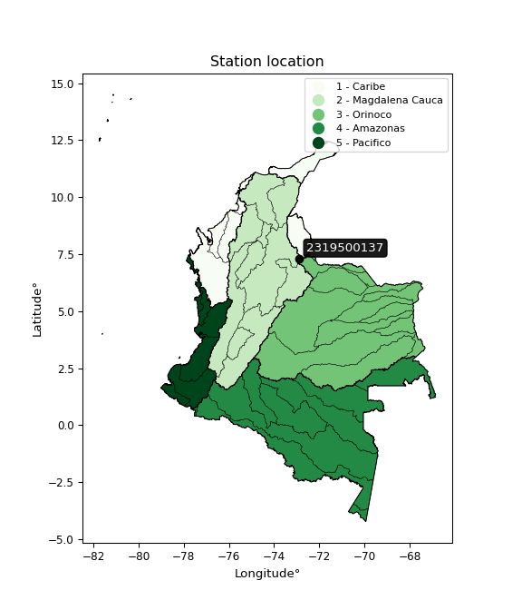

<div align="center">


</div>

# PMP Station (Rain, Pmax24h): 2319500137

Probable Maximum Precipitation (PMP) is the greatest amount of rainfall for a specific duration that is meteorologically possible for a given location, acting as a "worst-case" scenario for extreme storms, crucial for designing safety-critical infrastructure like bridges, river deviations, dams, spillways, and nuclear plants to prevent catastrophic failure. PMP is calculated by hydrologists using meteorological data to determine the upper limit of extreme rainfall, often leading to the Probable Maximum Flood (PMF) for flood control design, and is increasingly being studied for climate change impacts.

<div align="center">

</img>

</div>


## A. General information


### 1. General running parameters

• app_version: _v20260103_. • runtime: _2026-01-03 07:24:50.581521_. • Python version: _3.14.0_. • SciPy version: _1.16.3_. • Pandas version: _2.3.3_. • NumPy version: _2.3.5_. • Stations dataset (station_dataset_file): _dataset/pmax24h_in/automatic_colombia_2003_2024.csv_. • Stations catalog (station_catalog_file): _dataset/CNE.xls_. • Minimum year to eval til year_max (date_min): _1900_. • Maximum year to eval since year_min (date_max): _2024_. • Creates, save and include plots into reports (create_plot): _False_. • Plot only fit distributions with Δo > Δ (plot_only_fit): _True_. • Eval low extreme values, if False, evaluates high extreme values (low_extreme): _False_. • Eval every SciPy distribution as logarithmic (pdist_logarithmic_on): _True_. • Standard deviation normalized (ddof): _1.0_. • Return periods to eval in years (Tr): _[2, 2.33, 5, 10, 15, 20, 25, 50, 75, 100, 200, 250, 500, 750, 1000]_. • Minimum data sample per station, 0 means any (minimum_sample): _5_. • Z-Score maximum threshold to adjust a value, 0 means disable (zscore_max): _3.5_. • Z-Score minimum threshold to adjust a value, 0 means disable (zscore_min): _-2.5_. • Avoid zeros, e.g. rain = 0 (avoid_zeros): _True_. • Avoid null values (avoid_nans): _True_. [:file_folder:Dataset file.](../../dataset/pmax24h_in/automatic_colombia_2003_2024.csv)

> Delta Degrees of Freedom (DDOF): is a parameter used in the formulas for calculating variance and standard deviation. When ddof=0, the divisor is $N$ (the total number of observations) and this is used when your data set is the entire population. When ddof=1, the divisor is $N-1$ and this is used when your data set is a sample drawn from a larger population. Using $N-1$ provides an unbiased estimate of the population variance (known as Bessel´s correction).


### 2. Station info and location

|   id |     CODIGO | NOMBRE                     | CATEGORIA               | TECNOLOGIA                | ESTADO   | FECHA_INSTALACION   |   FECHA_SUSPENSION |   ALTITUD |   LATITUD |   LONGITUD | DEPARTAMENTO   | MUNICIPIO   | AREA_OPERATIVA                         | ENTIDAD                                                     | AREA_HIDROGRAFICA   | ZONA_HIDROGRAFICA   | SUBZONA_HIDROGRAFICA                      |   CORRIENTE | Catalogo   |   Version |
|-----:|-----------:|:---------------------------|:------------------------|:--------------------------|:---------|:--------------------|-------------------:|----------:|----------:|-----------:|:---------------|:------------|:---------------------------------------|:------------------------------------------------------------|:--------------------|:--------------------|:------------------------------------------|------------:|:-----------|----------:|
|    0 | 2319500137 | VETAS - AUT   [2319500137] | Climatológica Principal | Automática con Telemetría | Activa   | 25/08/2018          |                nan |      3325 |   7.31022 |   -72.8768 | Santander      | Vetas       | Area Operativa 08 - Santanderes-Arauca | INSTITUTO DE HIDROLOGIA METEOROLOGIA Y ESTUDIOS AMBIENTALES | Magdalena Cauca     | Medio Magdalena     | Río Lebrija y otros directos al Magdalena |         nan | CNE_IDEAM  |  20251226 |

<div align="center">

Dynamic map: [:earth_americas:Google](http://maps.google.com/maps?q=7.31022,-72.87683) [:earth_americas:OSM](https://www.openstreetmap.org/#map=18/7.31022/-72.87683&layers=P) [:earth_americas:Bing](https://www.bing.com/maps?cp=7.31022~-72.87683&lvl=18) [:earth_americas:Apple](https://maps.apple.com/frame?center=7.31022%2C-72.87683&span=0.003%2C0.006)

</div>


<div align="center">

```geojson
{
  "type": "Feature",
  "geometry": {
    "type": "Point", 
    "coordinates": [-72.87683, 7.31022]
  }, 
  "properties": {
    "Name": "2319500137"
  }
}
```

</div>


### 3. Discrete values table and plot

<div align="center">

|               |          0 |            1 |           2 |           3 |          4 |
|:--------------|-----------:|-------------:|------------:|------------:|-----------:|
| Date          | 2019       | 2020         | 2021        | 2022        | 2023       |
| Value         |   51       |   38.2       |   42.6      |   31.2      |   27       |
| Value_initial |   51       |   38.2       |   42.6      |   31.2      |   27       |
| count         |    5       |    5         |    5        |    5        |    5       |
| mean          |   38       |   38         |   38        |   38        |   38       |
| std           |    9.45304 |    9.45304   |    9.45304  |    9.45304  |    9.45304 |
| zscore        |    1.37522 |    0.0211572 |    0.486616 |   -0.719345 |   -1.16365 |


</div>


> The initial value (value_initial) correspond to the initial obtained or null completed value, and value (value) is adjusted only when the initial value is outside the valid range definite through the Z-Score value. If Z-Score is active, values out of range or outliers are replaced with the station mean value


### 4. Active continuous probability distributions from SciPy (44 of 104 available)

A Probability Density Function (PDF) describes the relative likelihood of a continuous random variable falling within a specific range, where the total area under its curve equals 1, and the area over any interval gives the actual probability for that range. Unlike discrete probabilities (like rolling a die), a PDF shows density, not direct probability for a single point (which is zero), with higher points indicating higher likelihood, often visualized as a bell curve for normal distributions.

A log of a probability density function (log-PDF) is simply the logarithm of the PDF´s value, denoted as $log(f(x))$, useful for converting multiplication of probabilities into addition, improving numerical stability with tiny numbers, and connecting to information theory concepts like entropy. Instead of dealing with very small probabilities (e.g., 0.000001), log-PDFs use negative numbers (e.g., $log(0.00001) ≈ -11.51$ that are easier for computers to handle, preventing underflow errors and simplifying complex calculations. In this study, each active probability distribution from SciPy is also evaluated in the $log$ form.

[scipy.stats](https://docs.scipy.org/doc/scipy/reference/stats.html) is a Python´s powerful submodule within the SciPy library for comprehensive statistical analysis, offering over 130 probability distributions (like Normal, Poisson), functions for descriptive stats (mean, variance), hypothesis testing (t-tests, chi-square), random variable generation, and statistical tests, making it essential for data science, modeling, and research. It provides tools to explore, model, and draw conclusions from data efficiently, working seamlessly with NumPy.

<div align="center">

|   id | p_dist             |   n_parameter | fit_method   | label                                                                       | active   | ref                                                                                                        |
|-----:|:-------------------|--------------:|:-------------|:----------------------------------------------------------------------------|:---------|:-----------------------------------------------------------------------------------------------------------|
|    0 | alpha              |             3 | MLE          | Alpha                                                                       | True     | [:mortar_board:](https://docs.scipy.org/doc/scipy/reference/generated/scipy.stats.alpha.html)              |
|    1 | betaprime          |             4 | MLE          | Beta prime                                                                  | True     | [:mortar_board:](https://docs.scipy.org/doc/scipy/reference/generated/scipy.stats.betaprime.html)          |
|    2 | chi2               |             3 | MLE          | Chi²                                                                        | True     | [:mortar_board:](https://docs.scipy.org/doc/scipy/reference/generated/scipy.stats.chi2.html)               |
|    3 | crystalball        |             4 | MLE          | Crystalball                                                                 | True     | [:mortar_board:](https://docs.scipy.org/doc/scipy/reference/generated/scipy.stats.crystalball.html)        |
|    4 | erlang             |             3 | MLE          | Erlang                                                                      | True     | [:mortar_board:](https://docs.scipy.org/doc/scipy/reference/generated/scipy.stats.erlang.html)             |
|    5 | expon              |             2 | MLE          | Exponential                                                                 | True     | [:mortar_board:](https://docs.scipy.org/doc/scipy/reference/generated/scipy.stats.expon.html)              |
|    6 | exponnorm          |             3 | MLE          | Exponentially modified Normal                                               | True     | [:mortar_board:](https://docs.scipy.org/doc/scipy/reference/generated/scipy.stats.exponnorm.html)          |
|    7 | f                  |             4 | MLE          | F                                                                           | True     | [:mortar_board:](https://docs.scipy.org/doc/scipy/reference/generated/scipy.stats.f.html)                  |
|    8 | fatiguelife        |             3 | MLE          | Fatigue-life (Birnbaum-Saunders)                                            | True     | [:mortar_board:](https://docs.scipy.org/doc/scipy/reference/generated/scipy.stats.fatiguelife.html)        |
|    9 | fisk               |             3 | MLE          | Fisk                                                                        | True     | [:mortar_board:](https://docs.scipy.org/doc/scipy/reference/generated/scipy.stats.fisk.html)               |
|   10 | gamma              |             3 | MLE          | Gamma                                                                       | True     | [:mortar_board:](https://docs.scipy.org/doc/scipy/reference/generated/scipy.stats.gamma.html)              |
|   11 | genexpon           |             5 | MLE          | Generalized exponential                                                     | True     | [:mortar_board:](https://docs.scipy.org/doc/scipy/reference/generated/scipy.stats.genexpon.html)           |
|   12 | genlogistic        |             3 | MLE          | Generalized logistic                                                        | True     | [:mortar_board:](https://docs.scipy.org/doc/scipy/reference/generated/scipy.stats.genlogistic.html)        |
|   13 | gibrat             |             2 | MM           | Gibrat                                                                      | True     | [:mortar_board:](https://docs.scipy.org/doc/scipy/reference/generated/scipy.stats.gibrat.html)             |
|   14 | gompertz           |             3 | MLE          | Gompertz (or truncated Gumbel)                                              | True     | [:mortar_board:](https://docs.scipy.org/doc/scipy/reference/generated/scipy.stats.gompertz.html)           |
|   15 | gumbel_l           |             2 | MM           | Gumbel Left Skew                                                            | True     | [:mortar_board:](https://docs.scipy.org/doc/scipy/reference/generated/scipy.stats.gumbel_l.html)           |
|   16 | gumbel_r           |             2 | MM           | Gumbel Right Skew                                                           | True     | [:mortar_board:](https://docs.scipy.org/doc/scipy/reference/generated/scipy.stats.gumbel_r.html)           |
|   17 | halflogistic       |             2 | MM           | Half-logistic                                                               | True     | [:mortar_board:](https://docs.scipy.org/doc/scipy/reference/generated/scipy.stats.halflogistic.html)       |
|   18 | halfnorm           |             2 | MM           | Half Normal                                                                 | True     | [:mortar_board:](https://docs.scipy.org/doc/scipy/reference/generated/scipy.stats.halfnorm.html)           |
|   19 | hypsecant          |             2 | MM           | hyperbolic secant                                                           | True     | [:mortar_board:](https://docs.scipy.org/doc/scipy/reference/generated/scipy.stats.hypsecant.html)          |
|   20 | invgamma           |             3 | MLE          | Inverted gamma                                                              | True     | [:mortar_board:](https://docs.scipy.org/doc/scipy/reference/generated/scipy.stats.invgamma.html)           |
|   21 | invgauss           |             3 | MLE          | Inverse Gaussian                                                            | True     | [:mortar_board:](https://docs.scipy.org/doc/scipy/reference/generated/scipy.stats.invgauss.html)           |
|   22 | invweibull         |             3 | MLE          | Inverted Weibull                                                            | True     | [:mortar_board:](https://docs.scipy.org/doc/scipy/reference/generated/scipy.stats.invweibull.html)         |
|   23 | johnsonsu          |             4 | MLE          | Johnson Su                                                                  | True     | [:mortar_board:](https://docs.scipy.org/doc/scipy/reference/generated/scipy.stats.johnsonsu.html)          |
|   24 | kstwobign          |             2 | MLE          | Limiting distribution of scaled Kolmogorov-Smirnov two-sided test statistic | True     | [:mortar_board:](https://docs.scipy.org/doc/scipy/reference/generated/scipy.stats.kstwobign.html)          |
|   25 | laplace            |             2 | MM           | Laplace                                                                     | True     | [:mortar_board:](https://docs.scipy.org/doc/scipy/reference/generated/scipy.stats.laplace.html)            |
|   26 | laplace_asymmetric |             3 | MLE          | Asymmetric Laplace                                                          | True     | [:mortar_board:](https://docs.scipy.org/doc/scipy/reference/generated/scipy.stats.laplace_asymmetric.html) |
|   27 | loggamma           |             3 | MLE          | Log gamma                                                                   | True     | [:mortar_board:](https://docs.scipy.org/doc/scipy/reference/generated/scipy.stats.loggamma.html)           |
|   28 | logistic           |             2 | MM           | Logistic (or Sech-squared)                                                  | True     | [:mortar_board:](https://docs.scipy.org/doc/scipy/reference/generated/scipy.stats.logistic.html)           |
|   29 | lognorm            |             3 | MLE          | Log Normal                                                                  | True     | [:mortar_board:](https://docs.scipy.org/doc/scipy/reference/generated/scipy.stats.lognorm.html)            |
|   30 | maxwell            |             2 | MM           | Maxwell                                                                     | True     | [:mortar_board:](https://docs.scipy.org/doc/scipy/reference/generated/scipy.stats.maxwell.html)            |
|   31 | mielke             |             4 | MLE          | Mielke Beta-Kappa / Dagum                                                   | True     | [:mortar_board:](https://docs.scipy.org/doc/scipy/reference/generated/scipy.stats.mielke.html)             |
|   32 | moyal              |             2 | MM           | Moyal                                                                       | True     | [:mortar_board:](https://docs.scipy.org/doc/scipy/reference/generated/scipy.stats.moyal.html)              |
|   33 | nakagami           |             3 | MLE          | Nakagami                                                                    | True     | [:mortar_board:](https://docs.scipy.org/doc/scipy/reference/generated/scipy.stats.nakagami.html)           |
|   34 | ncf                |             5 | MLE          | Non-central F distribution                                                  | True     | [:mortar_board:](https://docs.scipy.org/doc/scipy/reference/generated/scipy.stats.ncf.html)                |
|   35 | nct                |             4 | MLE          | Non-central Student’s t                                                     | True     | [:mortar_board:](https://docs.scipy.org/doc/scipy/reference/generated/scipy.stats.nct.html)                |
|   36 | norm               |             2 | MM           | Normal                                                                      | True     | [:mortar_board:](https://docs.scipy.org/doc/scipy/reference/generated/scipy.stats.norm.html)               |
|   37 | pearson3           |             3 | MM           | Pearson type III                                                            | True     | [:mortar_board:](https://docs.scipy.org/doc/scipy/reference/generated/scipy.stats.pearson3.html)           |
|   38 | rayleigh           |             2 | MM           | Rayleigh                                                                    | True     | [:mortar_board:](https://docs.scipy.org/doc/scipy/reference/generated/scipy.stats.rayleigh.html)           |
|   39 | rice               |             3 | MLE          | Rice                                                                        | True     | [:mortar_board:](https://docs.scipy.org/doc/scipy/reference/generated/scipy.stats.rice.html)               |
|   40 | t                  |             3 | MLE          | Student’s t                                                                 | True     | [:mortar_board:](https://docs.scipy.org/doc/scipy/reference/generated/scipy.stats.t.html)                  |
|   41 | truncnorm          |             4 | MLE          | Truncated normal                                                            | True     | [:mortar_board:](https://docs.scipy.org/doc/scipy/reference/generated/scipy.stats.truncnorm.html)          |
|   42 | wald               |             2 | MM           | Wald                                                                        | True     | [:mortar_board:](https://docs.scipy.org/doc/scipy/reference/generated/scipy.stats.wald.html)               |
|   43 | weibull_min        |             3 | MLE          | Weibull minimum                                                             | True     | [:mortar_board:](https://docs.scipy.org/doc/scipy/reference/generated/scipy.stats.weibull_min.html)        |

</div>

> **n_parameter:** # arguments & localization & scale.
>
> **Fit methods:** (MLE) maximum likelihood, (MM) L-moments.
>
>**Inactive** (With the only purpose of prevent loops, zero divisions, infinite values, over high estimated values or horizontal trending for recurrence intervals estimations, the follow distributions were disabled.)**:** foldnorm, gennorm, norminvgauss, powernorm, powerlognorm, skewnorm, genextreme, anglit, arcsine, argus, beta, bradford, burr, burr12, cauchy, cosine, halfcauchy, foldcauchy, skewcauchy, wrapcauchy, dgamma, gengamma, exponweib, exponpow, truncexpon, gausshyper, genhalflogistic, genhyperbolic, geninvgauss, halfgennorm, johnsonsb, kappa4, kappa3, ksone, kstwo, loglaplace, levy, levy_l, levy_stable, ncx2, pareto, genpareto, truncpareto, lomax, powerlaw, rdist, rel_breitwigner, recipinvgauss, semicircular, studentized_range, trapezoid, triang, truncweibull_min, tukeylambda, uniform, loguniform, vonmises, vonmises_line, weibull_max, dweibull, 


## B. Probability distributions vs. Empirical distributions

A continuous probability distribution (CPD) describes probabilities for variables that can take any value within a range (like rain any time), unlike discrete variables with specific outcomes (like temperature). It uses a Probability Density Function (PDF), a curve where the total area under it equals 1, and the probability of the variable falling within an interval (a to b) is found by calculating the area under the curve between those points. A key feature is that the probability of hitting any single exact value is zero, so probabilities are always expressed for ranges, e.g., $P(a ≤ X ≤ b)$.

<div align="center">

Distributions parameters from station values
|    |    station | p_dist                |   n |             loc |          scale | shape                  | shape1                | shape2                | shape3   |
|---:|-----------:|:----------------------|----:|----------------:|---------------:|:-----------------------|:----------------------|:----------------------|:---------|
|  0 | 2319500137 | alpha                 |   5 |   -47.5974      |  867.232       | 10.229968215142101     |                       |                       |          |
|  1 | 2319500137 | betaprime             |   5 |    -1.34426     |   92.5483      | 30.557417261661485     | 72.87329453843734     |                       |          |
|  2 | 2319500137 | chi2                  |   5 |    27           |    1.49352     | 0.8479430349474955     |                       |                       |          |
|  3 | 2319500137 | crystalball           |   5 |    38           |    8.45506     | 3987.9234935354807     | 620.4336155467897     |                       |          |
|  4 | 2319500137 | erlang                |   5 |    27           |   10.0669      | 0.5874679455294282     |                       |                       |          |
|  5 | 2319500137 | expon                 |   5 |    27           |   11           |                        |                       |                       |          |
|  6 | 2319500137 | exponnorm             |   5 |    36.4229      |    8.30703     | 0.18984669176107874    |                       |                       |          |
|  7 | 2319500137 | f                     |   5 |    25.7324      |   12.3193      | 2.9446259220545947     | 3287.707710099431     |                       |          |
|  8 | 2319500137 | fatiguelife           |   5 |    27           |    2.97864e-05 | 596.6137096784207      |                       |                       |          |
|  9 | 2319500137 | fisk                  |   5 |    -0.0540779   |   37.1969      | 7.299154554919468      |                       |                       |          |
| 10 | 2319500137 | gamma                 |   5 |    26.9998      |   15.4327      | 0.5278573722836479     |                       |                       |          |
| 11 | 2319500137 | genexpon              |   5 |    27           |    2.03838     | 0.16696581524232676    | 6.385037745632568e-07 | 1.714953480405451     |          |
| 12 | 2319500137 | genlogistic           |   5 |   -12.2886      |    7.17667     | 622.1278008404443      |                       |                       |          |
| 13 | 2319500137 | gibrat                |   5 |    31.5498      |    3.91223     |                        |                       |                       |          |
| 14 | 2319500137 | gompertz              |   5 |    27           |   19.3871      | 1.0636879268021473     |                       |                       |          |
| 15 | 2319500137 | gumbel_l              |   5 |    41.8052      |    6.59238     |                        |                       |                       |          |
| 16 | 2319500137 | gumbel_r              |   5 |    34.1948      |    6.59238     |                        |                       |                       |          |
| 17 | 2319500137 | halflogistic          |   5 |    27.9788      |    7.22876     |                        |                       |                       |          |
| 18 | 2319500137 | halfnorm              |   5 |    26.8088      |   14.0261      |                        |                       |                       |          |
| 19 | 2319500137 | hypsecant             |   5 |    38           |    5.38266     |                        |                       |                       |          |
| 20 | 2319500137 | invgamma              |   5 |    -5.94115     | 1146           | 27.068352255920445     |                       |                       |          |
| 21 | 2319500137 | invgauss              |   5 |    16.8209      |  107.463       | 0.19708270429725036    |                       |                       |          |
| 22 | 2319500137 | invweibull            |   5 |    27           |    1.6149      | 0.059022778397107345   |                       |                       |          |
| 23 | 2319500137 | johnsonsu             |   5 |    12.7048      |    1.29494     | -10.388758855632162    | 2.8798802532794756    |                       |          |
| 24 | 2319500137 | kstwobign             |   5 |     9.15139     |   32.9524      |                        |                       |                       |          |
| 25 | 2319500137 | laplace               |   5 |    38           |    5.97863     |                        |                       |                       |          |
| 26 | 2319500137 | laplace_asymmetric    |   5 |    38.2         |    7.0779      | 1.0141588056014945     |                       |                       |          |
| 27 | 2319500137 | loggamma              |   5 | -2037.84        |  293.277       | 1186.1793777812463     |                       |                       |          |
| 28 | 2319500137 | logistic              |   5 |    38           |    4.66152     |                        |                       |                       |          |
| 29 | 2319500137 | lognorm               |   5 |    27           |    0.00910485  | 14.297599784058923     |                       |                       |          |
| 30 | 2319500137 | maxwell               |   5 |    17.9651      |   12.555       |                        |                       |                       |          |
| 31 | 2319500137 | mielke                |   5 |    -0.0170721   |   12.7263      | 582.6339592343639      | 4.971003452783593     |                       |          |
| 32 | 2319500137 | moyal                 |   5 |    33.1649      |    3.80611     |                        |                       |                       |          |
| 33 | 2319500137 | nakagami              |   5 |    31.2         |   11.4027      | 0.15391987343328944    |                       |                       |          |
| 34 | 2319500137 | ncf                   |   5 |    -0.311986    |   36.9869      | 134.63124608743595     | 57.94308556391664     | 0.006819274470671384  |          |
| 35 | 2319500137 | nct                   |   5 |    -0.219537    |    2.60863     | 11.840566158197394     | 13.71739168695914     |                       |          |
| 36 | 2319500137 | norm                  |   5 |    38           |    8.45506     |                        |                       |                       |          |
| 37 | 2319500137 | pearson3              |   5 |    38           |    8.45506     | 0.21473242839285783    |                       |                       |          |
| 38 | 2319500137 | rayleigh              |   5 |    21.825       |   12.9058      |                        |                       |                       |          |
| 39 | 2319500137 | rice                  |   5 |    22.5882      |   10.9591      | 0.7569146546526777     |                       |                       |          |
| 40 | 2319500137 | t                     |   5 |    38.0001      |    8.455       | 109256168.59873506     |                       |                       |          |
| 41 | 2319500137 | truncnorm             |   5 |    38           |    8.45506     | -56.89124065509897     | 472.0594936704775     |                       |          |
| 42 | 2319500137 | wald                  |   5 |    29.545       |    8.45503     |                        |                       |                       |          |
| 43 | 2319500137 | weibull_min           |   5 |    27           |   13.3898      | 0.787386784424073      |                       |                       |          |
| 44 | 2319500137 | logalpha              |   5 |    -1.4771      |  112.411       | 22.135983935674012     |                       |                       |          |
| 45 | 2319500137 | logbetaprime          |   5 |    -4.34759     |    4.12572     | 1641.448955219811      | 848.7249585913842     |                       |          |
| 46 | 2319500137 | logchi2               |   5 |     3.29584     |    0.990058    | 1.041769533709679      |                       |                       |          |
| 47 | 2319500137 | logcrystalball        |   5 |     3.61255     |    0.224587    | 1125.0087832358145     | 14.469082974694938    |                       |          |
| 48 | 2319500137 | logerlang             |   5 |   -13.3274      |    0.00298106  | 5682.510199297265      |                       |                       |          |
| 49 | 2319500137 | logexpon              |   5 |     3.29584     |    0.316717    |                        |                       |                       |          |
| 50 | 2319500137 | logexponnorm          |   5 |     3.61224     |    0.224587    | 0.0013866204612694327  |                       |                       |          |
| 51 | 2319500137 | logf                  |   5 |   -31.2885      |   34.9003      | 153781.56976012047     | 70284.31506208828     |                       |          |
| 52 | 2319500137 | logfatiguelife        |   5 |    -5.22198     |    8.83117     | 0.02543231217014411    |                       |                       |          |
| 53 | 2319500137 | logfisk               |   5 |    -3.43488e+06 |    3.43489e+06 | 25029832.305171505     |                       |                       |          |
| 54 | 2319500137 | loggamma              |   5 |   -13.2987      |    0.00298328  | 5668.640314352833      |                       |                       |          |
| 55 | 2319500137 | loggenexpon           |   5 |     3.29583     |    0.0125716   | 0.02449192267840926    | 6.289663932983348     | 0.0001276726728168953 |          |
| 56 | 2319500137 | loggenlogistic        |   5 |     2.38733     |    0.201558    | 250.9293910680056      |                       |                       |          |
| 57 | 2319500137 | loggibrat             |   5 |     3.44124     |    0.103906    |                        |                       |                       |          |
| 58 | 2319500137 | loggompertz           |   5 |     3.29584     |    0.371748    | 0.5578674561875947     |                       |                       |          |
| 59 | 2319500137 | loggumbel_l           |   5 |     3.71363     |    0.17511     |                        |                       |                       |          |
| 60 | 2319500137 | loggumbel_r           |   5 |     3.51148     |    0.17511     |                        |                       |                       |          |
| 61 | 2319500137 | loghalflogistic       |   5 |     3.3463      |    0.192058    |                        |                       |                       |          |
| 62 | 2319500137 | loghalfnorm           |   5 |     3.31526     |    0.372605    |                        |                       |                       |          |
| 63 | 2319500137 | loghypsecant          |   5 |     3.61255     |    0.142976    |                        |                       |                       |          |
| 64 | 2319500137 | loginvgamma           |   5 |    -3.75274     | 7886.11        | 1071.7221209367208     |                       |                       |          |
| 65 | 2319500137 | loginvgauss           |   5 |     2.37875     |   34.6111      | 0.03562591649130578    |                       |                       |          |
| 66 | 2319500137 | loginvweibull         |   5 |    -1.30243e+07 |    1.30243e+07 | 64412901.63750473      |                       |                       |          |
| 67 | 2319500137 | logjohnsonsu          |   5 |     8.72065     |    0.0190917   | 142.77661736136815     | 22.729664826478764    |                       |          |
| 68 | 2319500137 | logkstwobign          |   5 |     2.80528     |    0.920745    |                        |                       |                       |          |
| 69 | 2319500137 | loglaplace            |   5 |     3.61255     |    0.158807    |                        |                       |                       |          |
| 70 | 2319500137 | loglaplace_asymmetric |   5 |     3.64284     |    0.187684    | 1.0837640416321932     |                       |                       |          |
| 71 | 2319500137 | logloggamma           |   5 |   -10.6491      |    2.81902     | 157.94550584326998     |                       |                       |          |
| 72 | 2319500137 | loglogistic           |   5 |     3.61255     |    0.123821    |                        |                       |                       |          |
| 73 | 2319500137 | loglognorm            |   5 |     3.29584     |    0.000364811 | 13.725992684157122     |                       |                       |          |
| 74 | 2319500137 | logmaxwell            |   5 |     3.08038     |    0.333492    |                        |                       |                       |          |
| 75 | 2319500137 | logmielke             |   5 | -6241.42        | 6244.04        | 2514125.530210289      | 30975.398140833364    |                       |          |
| 76 | 2319500137 | logmoyal              |   5 |     3.48412     |    0.1011      |                        |                       |                       |          |
| 77 | 2319500137 | lognakagami           |   5 |     3.29584     |    0.378645    | 0.32417738394242124    |                       |                       |          |
| 78 | 2319500137 | logncf                |   5 |    -1.79197     |    2.1474e-09  | 1.8075609307183443e-07 | 356.97686277223244    | 454.0769884218355     |          |
| 79 | 2319500137 | lognct                |   5 |    -0.748213    |    0.0357573   | 192.63152662585424     | 121.46701224387377    |                       |          |
| 80 | 2319500137 | lognorm               |   5 |     3.61255     |    0.224587    |                        |                       |                       |          |
| 81 | 2319500137 | logpearson3           |   5 |     3.61255     |    0.224587    | -0.028115938933397276  |                       |                       |          |
| 82 | 2319500137 | lograyleigh           |   5 |     3.18291     |    0.342809    |                        |                       |                       |          |
| 83 | 2319500137 | logrice               |   5 |     3.17447     |    0.271603    | 1.1337067116082569     |                       |                       |          |
| 84 | 2319500137 | logt                  |   5 |     3.61256     |    0.224588    | 376638930.6409166      |                       |                       |          |
| 85 | 2319500137 | logtruncnorm          |   5 |    -0.082492    |    1.2502      | 2.7022296677348905     | 3.210941856302197     |                       |          |
| 86 | 2319500137 | logwald               |   5 |     3.38795     |    0.224606    |                        |                       |                       |          |
| 87 | 2319500137 | logweibull_min        |   5 |     3.29584     |    0.235448    | 0.7418628645267509     |                       |                       |          |

</div>

> **loc** (Location parameter): This shifts the distribution along the x-axis. For many common distributions, like the normal (Gaussian) distribution, loc represents the mean $μ$. For others, like the uniform distribution, it might represent the minimum value, or for the beta distribution, the left end of the support interval.
>
> **scale** (Scale parameter): This determines the width or spread of the distribution. For the normal distribution, scale represents the standard deviation $σ$. For a uniform distribution, it defines the length of the interval (from $loc$ to $loc + scale$).
>
> **shape** (Shape parameters): Refers to parameters that define the specific form of a probability distribution, distinct from its location (loc) and scale (scale). These parameters are required arguments for most distribution functions. For example, a normal (Gaussian) distribution is fully defined by its location (mean) and scale (standard deviation), so it has no specific shape parameters beyond loc and scale. However, other distributions have intrinsic properties that need specification, as Gamma distribution that takes a shape parameter, often named $a$ or $alpha$.


### 0. Cumulative distribution values - CDF (88 evaluated)

Cumulative Distribution Function (CDF), denoted as $F$<sub>$X$</sub>$(x)$, is a function that gives the probability that a random variable $X$ will take a value less than or equal to a specific value, $x$ (i.e., $(P(X≥x)$. It essentially "accumulates" probabilities from a given point up to the far right (positive infinity), providing a complete picture of the distribution´s probabilities for both discrete (like rain) and continuous (like temperature) variables, helping to find probabilities over ranges or above certain values. Each station is evaluated separately ordering the $x$ values ascending, calculating the CDF and PDF values for the activated distributions and their logarithmic forms.

<div align="center">

CDF ordered by x ascending and calculating $log(f(x))$ separately
|   id |    Station |   date |    x |   count |   mean |     std |     zscore |   Value_initial |    station |   m |     alpha |   alpha_pdf |   betaprime |   betaprime_pdf |        chi2 |    chi2_pdf |   crystalball |   crystalball_pdf |      erlang |   erlang_pdf |    expon |   expon_pdf |   exponnorm |   exponnorm_pdf |         f |     f_pdf |   fatiguelife |   fatiguelife_pdf |      fisk |   fisk_pdf |      gamma |   gamma_pdf |    genexpon |   genexpon_pdf |   genlogistic |   genlogistic_pdf |   gibrat |   gibrat_pdf |    gompertz |   gompertz_pdf |   gumbel_l |   gumbel_l_pdf |   gumbel_r |   gumbel_r_pdf |   halflogistic |   halflogistic_pdf |   halfnorm |   halfnorm_pdf |   hypsecant |   hypsecant_pdf |   invgamma |   invgamma_pdf |   invgauss |   invgauss_pdf |   invweibull |   invweibull_pdf |   johnsonsu |   johnsonsu_pdf |   kstwobign |   kstwobign_pdf |   laplace |   laplace_pdf |   laplace_asymmetric |   laplace_asymmetric_pdf |   loggamma |   loggamma_pdf |   logistic |   logistic_pdf |   lognorm |   lognorm_pdf |   maxwell |   maxwell_pdf |      mielke |   mielke_pdf |     moyal |   moyal_pdf |    nakagami |   nakagami_pdf |       ncf |   ncf_pdf |       nct |   nct_pdf |      norm |   norm_pdf |   pearson3 |   pearson3_pdf |   rayleigh |   rayleigh_pdf |      rice |   rice_pdf |         t |     t_pdf |   truncnorm |   truncnorm_pdf |      wald |   wald_pdf |   weibull_min |   weibull_min_pdf |   logalpha |   logalpha_pdf |   logbetaprime |   logbetaprime_pdf |     logchi2 |   logchi2_pdf |   logcrystalball |   logcrystalball_pdf |   logerlang |   logerlang_pdf |   logexpon |   logexpon_pdf |   logexponnorm |   logexponnorm_pdf |      logf |   logf_pdf |   logfatiguelife |   logfatiguelife_pdf |   logfisk |   logfisk_pdf |   loggenexpon |   loggenexpon_pdf |   loggenlogistic |   loggenlogistic_pdf |   loggibrat |   loggibrat_pdf |   loggompertz |   loggompertz_pdf |   loggumbel_l |   loggumbel_l_pdf |   loggumbel_r |   loggumbel_r_pdf |   loghalflogistic |   loghalflogistic_pdf |   loghalfnorm |   loghalfnorm_pdf |   loghypsecant |   loghypsecant_pdf |   loginvgamma |   loginvgamma_pdf |   loginvgauss |   loginvgauss_pdf |   loginvweibull |   loginvweibull_pdf |   logjohnsonsu |   logjohnsonsu_pdf |   logkstwobign |   logkstwobign_pdf |   loglaplace |   loglaplace_pdf |   loglaplace_asymmetric |   loglaplace_asymmetric_pdf |   logloggamma |   logloggamma_pdf |   loglogistic |   loglogistic_pdf |   loglognorm |   loglognorm_pdf |   logmaxwell |   logmaxwell_pdf |   logmielke |   logmielke_pdf |   logmoyal |   logmoyal_pdf |   lognakagami |   lognakagami_pdf |   logncf |   logncf_pdf |    lognct |   lognct_pdf |   logpearson3 |   logpearson3_pdf |   lograyleigh |   lograyleigh_pdf |   logrice |   logrice_pdf |      logt |   logt_pdf |   logtruncnorm |   logtruncnorm_pdf |   logwald |   logwald_pdf |   logweibull_min |   logweibull_min_pdf |
|-----:|-----------:|-------:|-----:|--------:|-------:|--------:|-----------:|----------------:|-----------:|----:|----------:|------------:|------------:|----------------:|------------:|------------:|--------------:|------------------:|------------:|-------------:|---------:|------------:|------------:|----------------:|----------:|----------:|--------------:|------------------:|----------:|-----------:|-----------:|------------:|------------:|---------------:|--------------:|------------------:|---------:|-------------:|------------:|---------------:|-----------:|---------------:|-----------:|---------------:|---------------:|-------------------:|-----------:|---------------:|------------:|----------------:|-----------:|---------------:|-----------:|---------------:|-------------:|-----------------:|------------:|----------------:|------------:|----------------:|----------:|--------------:|---------------------:|-------------------------:|-----------:|---------------:|-----------:|---------------:|----------:|--------------:|----------:|--------------:|------------:|-------------:|----------:|------------:|------------:|---------------:|----------:|----------:|----------:|----------:|----------:|-----------:|-----------:|---------------:|-----------:|---------------:|----------:|-----------:|----------:|----------:|------------:|----------------:|----------:|-----------:|--------------:|------------------:|-----------:|---------------:|---------------:|-------------------:|------------:|--------------:|-----------------:|---------------------:|------------:|----------------:|-----------:|---------------:|---------------:|-------------------:|----------:|-----------:|-----------------:|---------------------:|----------:|--------------:|--------------:|------------------:|-----------------:|---------------------:|------------:|----------------:|--------------:|------------------:|--------------:|------------------:|--------------:|------------------:|------------------:|----------------------:|--------------:|------------------:|---------------:|-------------------:|--------------:|------------------:|--------------:|------------------:|----------------:|--------------------:|---------------:|-------------------:|---------------:|-------------------:|-------------:|-----------------:|------------------------:|----------------------------:|--------------:|------------------:|--------------:|------------------:|-------------:|-----------------:|-------------:|-----------------:|------------:|----------------:|-----------:|---------------:|--------------:|------------------:|---------:|-------------:|----------:|-------------:|--------------:|------------------:|--------------:|------------------:|----------:|--------------:|----------:|-----------:|---------------:|-------------------:|----------:|--------------:|-----------------:|---------------------:|
|    0 | 2319500137 |   2023 | 27   |       5 |     38 | 9.45304 | -1.16365   |            27   | 2319500137 |   1 | 0.0814289 |   0.0234804 |   0.0819865 |       0.0235885 | 5.30665e-07 | 6.33281e+07 |     0.0966298 |         0.0202419 | 0.000245755 |  24.272      | 0        |   0.0909091 |   0.0963245 |       0.0202927 | 0.0435772 | 0.0475648 |      0.011671 |        2.1247e+09 | 0.0891585 |  0.0219101 | 0.00291135 |  7.95339    | 8.18812e-07 |      0.081911  |     0.0740689 |         0.0268064 | 0        |   0          | 2.11459e-11 |      0.0548657 |   0.100433 |      0.0144427 |  0.0508756 |      0.0229851 |       0        |          0         |  0.0108753 |      0.0568806 |   0.0820244 |       0.0150706 |  0.0770354 |      0.0248261 |  0.0649433 |      0.0306597 |  0.000879097 |      5.13843e+10 |    0.070676 |       0.0271388 |   0.0690449 |       0.0286651 | 0.0794177 |    0.0132836  |             0.106513 |                0.0148386 |  0.0786484 |       0.661685 |  0.0862942 |      0.0169146 | 0.0792372 |      0.657173 |  0.08505  |     0.0254029 |   0.0641996 |    0.032057  | 0.0246018 |   0.0188445 | 0           |    0           | 0.0783534 | 0.0249162 | 0.0718734 | 0.0262452 | 0.0966298 |  0.0202419 |  0.0916259 |      0.0215234 |  0.0772474 |      0.02867   | 0.0591192 |  0.026031  | 0.0966271 | 0.0202416 |   0.0966299 |       0.0202419 | 0         | 0          |    9.3869e-13 |       104.021     |  0.0784316 |       0.722668 |       0.153012 |           0.734308 | 1.14129e-08 |   6.69328e+06 |        0.0792373 |             0.657174 |    0.078723 |        0.661832 |   0        |       3.15739  |      0.0792374 |           0.657174 | 0.0786466 |   0.659767 |        0.0777101 |             0.67145  | 0.0891673 |      0.59182  |    9.0216e-06 |          1.9482   |        0.0638068 |             0.866401 |    0        |         0       |   4.52717e-11 |          1.50066  |     0.0879009 |          0.479238 |      0.032509 |          0.636079 |          0        |              0        |      0        |          0        |      0.0692036 |           0.480217 |     0.0765918 |          0.677721 |     0.0684165 |          0.774087 |       0.0637947 |            0.86829  |      0.0823677 |            0.63676 |      0.0609505 |           0.955792 |    0.0680508 |         0.428513 |               0.0980883 |                    0.482231 |     0.0811162 |          0.644578 |     0.0719003 |          0.538928 |    0.0228195 |      8.88017e+12 |    0.0633764 |         0.810541 |    0.064581 |        0.863026 |  0.0111647 |       0.400289 |   1.62028e-10 |     236555        | 0.3157   |     0.576591 | 0.0737818 |     0.700806 |     0.0799085 |          0.652786 |     0.0528152 |          0.910209 | 0.0515587 |      0.834043 | 0.0792371 |   0.657169 |    7.46103e-06 |           2.97786  | 0         |      0        |      1.99443e-11 |         16658.8      |
|    1 | 2319500137 |   2022 | 31.2 |       5 |     38 | 9.45304 | -0.719345  |            31.2 | 2319500137 |   2 | 0.218912  |   0.0412386 |   0.219154  |       0.0409586 | 0.925069    | 0.0322587   |     0.210626  |         0.0341458 | 0.579169    |   0.0618113  | 0.317381 |   0.0620563 |   0.21071   |       0.0342729 | 0.281953  | 0.0574085 |      0.735453 |        0.024521   | 0.219155  |  0.0399652 | 0.517733   |  0.054272   | 0.291091    |      0.0580677 |     0.23433   |         0.0473231 | 0        |   0          | 0.226865    |      0.0526795 |   0.181389 |      0.0248532 |  0.207     |      0.049456  |       0.219188 |          0.0658451 |  0.245775  |      0.0541652 |   0.175404  |       0.0309626 |  0.223666  |      0.043714  |  0.246694  |      0.0515997 |  0.388622    |      0.00516176  |    0.232292 |       0.0474271 |   0.238146  |       0.0487257 | 0.160328  |    0.0268169  |             0.191212 |                0.0266382 |  0.222359  |       1.33538  |  0.188658  |      0.0328362 | 0.221703  |      1.32422  |  0.225639 |     0.0405161 |   0.260064  |    0.0554563 | 0.195496  |   0.0587019 | 1.35552e-05 |    1.17455e+09 | 0.224797  | 0.043552  | 0.230031  | 0.0470356 | 0.210626  |  0.0341458 |  0.214012  |      0.036601  |  0.231905  |      0.0432332 | 0.20796   |  0.0431164 | 0.210622  | 0.0341457 |   0.210626  |       0.0341458 | 0.0599586 | 0.104402   |    0.330589   |         0.0503689 |  0.234763  |       1.4277   |       0.281341 |           1.02722  | 0.281353    |   0.965892    |        0.221703  |             1.32422  |    0.222415 |        1.33492  |   0.366503 |       2.0002   |      0.221703  |           1.32423  | 0.221905  |   1.33145  |        0.223997  |             1.35797  | 0.219208  |      1.2472   |    0.284493   |          1.91919  |        0.260056  |             1.7331   |    0        |         0       |   0.232951    |          1.69829  |     0.189486  |          0.97241  |      0.223017 |          1.91102  |          0.240233 |              2.45314  |      0.26306  |          2.0239   |      0.185552  |           1.22552  |     0.224724  |          1.37435  |     0.240881  |          1.56594  |       0.260216  |            1.73251  |      0.219076  |            1.2715  |      0.271865  |           1.79157  |    0.169131  |         1.06501  |               0.199671  |                    0.981643 |     0.220052  |          1.29217  |     0.199376  |          1.28916  |    0.66852   |      0.182813    |    0.238722  |         1.557    |    0.259504 |        1.72203  |  0.214505  |       2.26703  |   0.411096    |          1.7787   | 0.402029 |     0.61249  | 0.228434  |     1.43148  |     0.221124  |          1.31283  |     0.245829  |          1.65258  | 0.230108  |      1.56437  | 0.221701  |   1.32421  |    0.369011    |           2.16412  | 0.0959531 |      4.47501  |      0.501646    |             1.78089  |
|    2 | 2319500137 |   2020 | 38.2 |       5 |     38 | 9.45304 |  0.0211572 |            38.2 | 2319500137 |   3 | 0.548577  |   0.046651  |   0.546402  |       0.0464896 | 0.995338    | 0.00176005  |     0.509436  |         0.0471707 | 0.833076    |   0.0205757  | 0.638749 |   0.032841  |   0.510259  |       0.0471995 | 0.61471   | 0.0366981 |      0.847976 |        0.0107941  | 0.550964  |  0.0472062 | 0.757258   |  0.0217008  | 0.600447    |      0.032728  |     0.578392  |         0.0441057 | 0.70213  |   0.0521142  | 0.56471     |      0.0425573 |   0.439404 |      0.0492155 |  0.580026  |      0.0479235 |       0.60878  |          0.0435336 |  0.583291  |      0.0409052 |   0.511825  |       0.0590954 |  0.560104  |      0.0458003 |  0.593141  |      0.0418272 |  0.409841    |      0.00192653  |    0.575891 |       0.0441888 |   0.581274  |       0.0435268 | 0.51645   |    0.0808798  |             0.507029 |                0.0706354 |  0.555458  |       1.75684  |  0.510724  |      0.0536059 | 0.553628  |      1.76026  |  0.542085 |     0.0450437 |   0.609912  |    0.0391429 | 0.605785  |   0.0473503 | 0.687149    |    0.0287347   | 0.560042  | 0.0457129 | 0.576156  | 0.0447899 | 0.509436  |  0.0471707 |  0.523694  |      0.047006  |  0.552886  |      0.0439573 | 0.539314  |  0.0464431 | 0.509433  | 0.047171  |   0.509436  |       0.0471707 | 0.677374  | 0.0455456  |    0.580557   |         0.0256199 |  0.571618  |       1.68312  |       0.511452 |           1.18014  | 0.429123    |   0.573278    |        0.553628  |             1.76026  |    0.555361 |        1.75607  |   0.665665 |       1.05563  |      0.553628  |           1.76026  | 0.554485  |   1.75691  |        0.559415  |             1.74986  | 0.551001  |      1.80278  |    0.625277   |          1.38954  |        0.61005   |             1.49435  |    0.746256 |         1.58876 |   0.57722     |          1.61353  |     0.486986  |          1.95542  |      0.623567 |          1.68186  |          0.648086 |              1.50992  |      0.620684 |          1.45497  |      0.566917  |           2.17729  |     0.561524  |          1.74194  |     0.589387  |          1.63714  |       0.609739  |            1.49185  |      0.545047  |            1.77436 |      0.620448  |           1.4683   |    0.586802  |         2.60189  |               0.540134  |                    2.65546  |     0.548473  |          1.76956  |     0.560837  |          1.98915  |    0.691327  |      0.0739325   |    0.583776  |         1.64128  |    0.608422 |        1.4949   |  0.648285  |       1.62212  |   0.688245    |          1.04398  | 0.526782 |     0.609956 | 0.570476  |     1.72045  |     0.551808  |          1.76356  |     0.593434  |          1.59117  | 0.576906  |      1.66795  | 0.553624  |   1.76026  |    0.719389    |           1.35347  | 0.716869  |      1.45753  |      0.736415    |             0.751398 |
|    3 | 2319500137 |   2021 | 42.6 |       5 |     38 | 9.45304 |  0.486616  |            42.6 | 2319500137 |   4 | 0.730772  |   0.0351954 |   0.72889   |       0.0354613 | 0.999091    | 0.00033335  |     0.706798  |         0.040693  | 0.901707    |   0.0115923  | 0.757846 |   0.022014  |   0.70743   |       0.0405871 | 0.749338  | 0.0250212 |      0.887434 |        0.00743216 | 0.73091   |  0.0336569 | 0.834116   |  0.0139544  | 0.721356    |      0.0228242 |     0.743322  |         0.0307156 | 0.850444 |   0.0210583  | 0.731431    |      0.032947  |   0.676361 |      0.055383  |  0.756212  |      0.0320538 |       0.766308 |          0.0285507 |  0.739769  |      0.0301831 |   0.743916  |       0.0426072 |  0.735899  |      0.033468  |  0.747722  |      0.0286376 |  0.416983    |      0.00137999  |    0.741955 |       0.031096  |   0.745795  |       0.0311275 | 0.768356  |    0.0387453  |             0.737567 |                0.0376027 |  0.733426  |       1.45466  |  0.728456  |      0.0424342 | 0.732454  |      1.4655   |  0.721883 |     0.0356911 |   0.749838  |    0         | 0.772171  |   0.0291024 | 0.788736    |    0.0186286   | 0.735757  | 0.0335042 | 0.743876  | 0.03122   | 0.706798  |  0.040693  |  0.715469  |      0.0386229 |  0.726276  |      0.0341416 | 0.723449  |  0.03632   | 0.706796  | 0.0406933 |   0.706797  |       0.040693  | 0.819328  | 0.0223447  |    0.676265   |         0.0184288 |  0.738343  |       1.33793  |       0.636427 |           1.09436  | 0.485985    |   0.475999    |        0.732454  |             1.4655   |    0.733272 |        1.45441  |   0.763031 |       0.748204 |      0.732454  |           1.4655   | 0.732631  |   1.45754  |        0.735685  |             1.43334  | 0.730887  |      1.43328  |    0.757295   |          1.03389  |        0.749861  |             1.07034  |    0.863252 |         0.70519 |   0.739306    |          1.334    |     0.711755  |          2.04764  |      0.776144 |          1.12323  |          0.784054 |              1.00298  |      0.7587   |          1.07783  |      0.770227  |           1.47109  |     0.736279  |          1.41598  |     0.747424  |          1.23979  |       0.749356  |            1.06934  |      0.727897  |            1.51838 |      0.758861  |           1.07126  |    0.79202   |         1.30964  |               0.754961  |                    1.41496  |     0.729776  |          1.49742  |     0.754917  |          1.49423  |    0.6983    |      0.05569     |    0.744315  |         1.27766  |    0.748474 |        1.07362  |  0.790208  |       1.0133   |   0.787078    |          0.778039 | 0.592044 |     0.584832 | 0.740779  |     1.3633   |     0.731506  |          1.47671  |     0.747726  |          1.22135  | 0.741447  |      1.32029  | 0.73245   |   1.46551  |    0.849177    |           1.0398   | 0.833049  |      0.764859 |      0.804652    |             0.518956 |
|    4 | 2319500137 |   2019 | 51   |       5 |     38 | 9.45304 |  1.37522   |            51   | 2319500137 |   5 | 0.924254  |   0.0127235 |   0.925166  |       0.0129553 | 0.999956    | 1.56254e-05 |     0.93792   |         0.0144694 | 0.962562    |   0.00421313 | 0.887164 |   0.0102578 |   0.937617  |       0.0144158 | 0.894155  | 0.0111043 |      0.933778 |        0.0040321  | 0.909813  |  0.011731  | 0.916064   |  0.00660684 | 0.859967    |      0.0114703 |     0.912072  |         0.0116958 | 0.945615 |   0.00566867 | 0.926055    |      0.0139908 |   0.982297 |      0.010833  |  0.92483   |      0.0109628 |       0.920506 |          0.0105598 |  0.915424  |      0.0128546 |   0.943267  |       0.0104842 |  0.919793  |      0.012348  |  0.907432  |      0.0114463 |  0.426241    |      0.000893893 |    0.9134   |       0.0118598 |   0.920546  |       0.0122462 | 0.943162  |    0.00950678 |             0.921241 |                0.0112851 |  0.921803  |       0.642494 |  0.942067  |      0.0117079 | 0.922428  |      0.646675 |  0.925616 |     0.0138059 | nan         |  nan         | 0.923487  |   0.0100205 | 0.901228    |    0.00932153  | 0.920087  | 0.0123812 | 0.914017  | 0.0116036 | 0.93792   |  0.0144694 |  0.932619  |      0.0139313 |  0.922322  |      0.0136062 | 0.928831  |  0.0136941 | 0.93792   | 0.0144694 |   0.93792   |       0.0144694 | 0.930203  | 0.00732611 |    0.794696   |         0.0106642 |  0.912059  |       0.613291 |       0.807094 |           0.779286 | 0.561438    |   0.370609    |        0.922428  |             0.646675 |    0.921681 |        0.642962 |   0.865752 |       0.423874 |      0.922428  |           0.646674 | 0.921575  |   0.645004 |        0.920868  |             0.633448 | 0.909749  |      0.598303 |    0.896109   |          0.537035 |        0.888774  |             0.519813 |    0.939681 |         0.24383 |   0.920265    |          0.662101 |     0.969087  |          0.613735 |      0.913315 |          0.472927 |          0.909452 |              0.450119 |      0.902025 |          0.544626 |      0.932012  |           0.471909 |     0.919188  |          0.629044 |     0.907259  |          0.572474 |       0.888267  |            0.520498 |      0.925773  |            0.66658 |      0.899835  |           0.532208 |    0.933035  |         0.421675 |               0.913323  |                    0.500508 |     0.924452  |          0.658411 |     0.929464  |          0.529477 |    0.706694  |      0.0394197   |    0.911063  |         0.599148 |    0.887996 |        0.522788 |  0.913009  |       0.428514 |   0.895188    |          0.443825 | 0.691507 |     0.515677 | 0.916138  |     0.608438 |     0.923136  |          0.650893 |     0.908036  |          0.58607  | 0.914208  |      0.615945 | 0.922426  |   0.646685 |    1           |           0.661769 | 0.92257   |      0.310577 |      0.876318    |             0.301534 |


</div>

An Empirical Distribution Function (EDF) is a step-function estimate of a true cumulative distribution function (CDF) based on observed sample data, representing the proportion of data points less than or equal to a given value. It is calculated by ordering your data and jumping up by $1/n$ (where $n$ is sample size) at each unique data point, allowing analysis without assuming an underlying population distribution, and it gets closer to the true CDF as the sample size grows. For the empirical probability calculations, the parameter $m$ correspond to the order number which means the position of the $x$ values in an ascending order list.


### 1. Empirical - EDF California (1923)

California´s estimates the true probability distribution of water-related data (like rainfall, streamflow) using observed samples, crucial for risk assessment.

<div align="center">


$P=m/n$


</div>


**1.1. Empirical values**

<div align="center">

|                | 0              | 1                  | 2              | 3                 | 4              |
|:---------------|:---------------|:-------------------|:---------------|:------------------|:---------------|
| date           | 2023           | 2022               | 2020           | 2021              | 2019           |
| x              | 27.0           | 31.2               | 38.2           | 42.6              | 51.0           |
| m              | 1              | 2                  | 3              | 4                 | 5              |
| empirical_dist | edf_california | edf_california     | edf_california | edf_california    | edf_california |
| empirical      | 0.2            | 0.4                | 0.6            | 0.8               | 1.0            |
| empirical_tr   | 1.25           | 1.6666666666666667 | 2.5            | 5.000000000000001 | inf            |

</div>


**1.2. Kolmogorov-Smirnov fit test (sorted by Δ)**


<div align="center">

|                | 0                   | 1                   | 2                  | 3                   | 4                   | 5                  | 6                   | 7                   | 8                   | 9                   | 10                  | 11                  | 12                  | 13                 | 14                  | 15                  | 16                 | 17                 | 18                  | 19                  | 20                  | 21                  | 22                  | 23                 | 24                  | 25                  | 26                  | 27                  | 28                 | 29                 | 30                  | 31                  | 32                 | 33                  | 34                  | 35                  | 36                  | 37                  | 38                  | 39                  | 40                  | 41                  | 42                  | 43                 | 44                  | 45                  | 46                 | 47                  | 48                 | 49                 | 50                 | 51                  | 52                 | 53                  | 54                 | 55                 | 56                  | 57                  | 58                 | 59                 | 60                 | 61                 | 62                 | 63                 | 64                    | 65                  | 66                 | 67                  | 68                  | 69                  | 70                  | 71                  | 72                  | 73                  | 74                  | 75                  | 76                  | 77                 | 78                 | 79                 | 80                  | 81                  | 82                  | 83                 | 84                 | 85                 | 86                 | 87                 |
|:---------------|:--------------------|:--------------------|:-------------------|:--------------------|:--------------------|:-------------------|:--------------------|:--------------------|:--------------------|:--------------------|:--------------------|:--------------------|:--------------------|:-------------------|:--------------------|:--------------------|:-------------------|:-------------------|:--------------------|:--------------------|:--------------------|:--------------------|:--------------------|:-------------------|:--------------------|:--------------------|:--------------------|:--------------------|:-------------------|:-------------------|:--------------------|:--------------------|:-------------------|:--------------------|:--------------------|:--------------------|:--------------------|:--------------------|:--------------------|:--------------------|:--------------------|:--------------------|:--------------------|:-------------------|:--------------------|:--------------------|:-------------------|:--------------------|:-------------------|:-------------------|:-------------------|:--------------------|:-------------------|:--------------------|:-------------------|:-------------------|:--------------------|:--------------------|:-------------------|:-------------------|:-------------------|:-------------------|:-------------------|:-------------------|:----------------------|:--------------------|:-------------------|:--------------------|:--------------------|:--------------------|:--------------------|:--------------------|:--------------------|:--------------------|:--------------------|:--------------------|:--------------------|:-------------------|:-------------------|:-------------------|:--------------------|:--------------------|:--------------------|:-------------------|:-------------------|:-------------------|:-------------------|:-------------------|
| station        | 2319500137          | 2319500137          | 2319500137         | 2319500137          | 2319500137          | 2319500137         | 2319500137          | 2319500137          | 2319500137          | 2319500137          | 2319500137          | 2319500137          | 2319500137          | 2319500137         | 2319500137          | 2319500137          | 2319500137         | 2319500137         | 2319500137          | 2319500137          | 2319500137          | 2319500137          | 2319500137          | 2319500137         | 2319500137          | 2319500137          | 2319500137          | 2319500137          | 2319500137         | 2319500137         | 2319500137          | 2319500137          | 2319500137         | 2319500137          | 2319500137          | 2319500137          | 2319500137          | 2319500137          | 2319500137          | 2319500137          | 2319500137          | 2319500137          | 2319500137          | 2319500137         | 2319500137          | 2319500137          | 2319500137         | 2319500137          | 2319500137         | 2319500137         | 2319500137         | 2319500137          | 2319500137         | 2319500137          | 2319500137         | 2319500137         | 2319500137          | 2319500137          | 2319500137         | 2319500137         | 2319500137         | 2319500137         | 2319500137         | 2319500137         | 2319500137            | 2319500137          | 2319500137         | 2319500137          | 2319500137          | 2319500137          | 2319500137          | 2319500137          | 2319500137          | 2319500137          | 2319500137          | 2319500137          | 2319500137          | 2319500137         | 2319500137         | 2319500137         | 2319500137          | 2319500137          | 2319500137          | 2319500137         | 2319500137         | 2319500137         | 2319500137         | 2319500137         |
| empirical_dist | edf_california      | edf_california      | edf_california     | edf_california      | edf_california      | edf_california     | edf_california      | edf_california      | edf_california      | edf_california      | edf_california      | edf_california      | edf_california      | edf_california     | edf_california      | edf_california      | edf_california     | edf_california     | edf_california      | edf_california      | edf_california      | edf_california      | edf_california      | edf_california     | edf_california      | edf_california      | edf_california      | edf_california      | edf_california     | edf_california     | edf_california      | edf_california      | edf_california     | edf_california      | edf_california      | edf_california      | edf_california      | edf_california      | edf_california      | edf_california      | edf_california      | edf_california      | edf_california      | edf_california     | edf_california      | edf_california      | edf_california     | edf_california      | edf_california     | edf_california     | edf_california     | edf_california      | edf_california     | edf_california      | edf_california     | edf_california     | edf_california      | edf_california      | edf_california     | edf_california     | edf_california     | edf_california     | edf_california     | edf_california     | edf_california        | edf_california      | edf_california     | edf_california      | edf_california      | edf_california      | edf_california      | edf_california      | edf_california      | edf_california      | edf_california      | edf_california      | edf_california      | edf_california     | edf_california     | edf_california     | edf_california      | edf_california      | edf_california      | edf_california     | edf_california     | edf_california     | edf_california     | edf_california     |
| p_dist         | logkstwobign        | loginvweibull       | mielke             | loggenlogistic      | logmielke           | invgauss           | lograyleigh         | f                   | loginvgauss         | logmaxwell          | kstwobign           | logalpha            | genlogistic         | johnsonsu          | rayleigh            | logrice             | nct                | lognct             | maxwell             | ncf                 | loginvgamma         | logfatiguelife      | invgamma            | loggumbel_r        | logerlang           | loggamma            | loggamma            | logf                | logexponnorm       | logcrystalball     | lognorm             | lognorm             | logt               | logpearson3         | logloggamma         | logfisk             | fisk                | betaprime           | logjohnsonsu        | alpha               | pearson3            | logmoyal            | halfnorm            | exponnorm          | truncnorm           | crystalball         | norm               | t                   | rice               | logbetaprime       | gumbel_r           | gamma               | loggenexpon        | logtruncnorm        | genexpon           | lognakagami        | loggompertz         | gompertz            | logweibull_min     | loghalfnorm        | logexpon           | loghalflogistic    | expon              | halflogistic       | loglaplace_asymmetric | loglogistic         | moyal              | weibull_min         | laplace_asymmetric  | loggumbel_l         | logistic            | loghypsecant        | gumbel_l            | hypsecant           | loglaplace          | erlang              | laplace             | loglognorm         | logwald            | logncf             | fatiguelife         | wald                | nakagami            | gibrat             | loggibrat          | logchi2            | chi2               | invweibull         |
| delta          | 0.13904945453026318 | 0.13978434489726166 | 0.1399359629155193 | 0.13994447728728465 | 0.14049563495532064 | 0.1533055874391242 | 0.15417079065931935 | 0.15642280027191838 | 0.15911887524121507 | 0.16127766153171366 | 0.16185442368023673 | 0.16523695790330373 | 0.16566964551816735 | 0.167708460051541  | 0.16809458035300792 | 0.16989236482270728 | 0.1699690320120507 | 0.1715656678865077 | 0.17436139809464526 | 0.17520319348927477 | 0.17527615983844047 | 0.17600255824768624 | 0.17633404026229543 | 0.1769826774663071 | 0.17758476413027777 | 0.17764109902574324 | 0.17764109902574324 | 0.17809534582947908 | 0.1782970342786857 | 0.1782972979137773 | 0.17829747096517717 | 0.17829747096517717 | 0.178298581475347  | 0.17887598174962663 | 0.17994818965655474 | 0.18079237439683316 | 0.18084491608552244 | 0.18084640934895863 | 0.18092402341576547 | 0.18108750165256843 | 0.18598819773660616 | 0.18883534637358423 | 0.18912474504168475 | 0.1892902223412678 | 0.18937434933661168 | 0.18937436314639838 | 0.1893743749383976 | 0.18937797049784455 | 0.1920401693178746 | 0.1929058798717963 | 0.1929998741011993 | 0.19708864504398563 | 0.1999909783993767 | 0.19999253896721383 | 0.199999181187673  | 0.1999999998379722 | 0.19999999995472825 | 0.19999999997885406 | 0.1999999999800557 | 0.2                | 0.2                | 0.2                | 0.2                | 0.2                | 0.20032875019435584   | 0.20062373883875476 | 0.2045044688192048 | 0.20530409190875354 | 0.20878806957949025 | 0.21051373730108325 | 0.21134178392232403 | 0.21444817618254483 | 0.21861142412315024 | 0.22459574200059496 | 0.23086863649552355 | 0.23307631753170865 | 0.23967171155422293 | 0.2933055636742923 | 0.3040469229489392 | 0.308493150687279  | 0.33545274648651957 | 0.34004141857606907 | 0.39998644481288564 | 0.4                | 0.4                | 0.4385616264232757 | 0.525069065822336  | 0.5737585961172754 |
| deltao         | 0.5865427407550001  | 0.5865427407550001  | 0.5865427407550001 | 0.5865427407550001  | 0.5865427407550001  | 0.5865427407550001 | 0.5865427407550001  | 0.5865427407550001  | 0.5865427407550001  | 0.5865427407550001  | 0.5865427407550001  | 0.5865427407550001  | 0.5865427407550001  | 0.5865427407550001 | 0.5865427407550001  | 0.5865427407550001  | 0.5865427407550001 | 0.5865427407550001 | 0.5865427407550001  | 0.5865427407550001  | 0.5865427407550001  | 0.5865427407550001  | 0.5865427407550001  | 0.5865427407550001 | 0.5865427407550001  | 0.5865427407550001  | 0.5865427407550001  | 0.5865427407550001  | 0.5865427407550001 | 0.5865427407550001 | 0.5865427407550001  | 0.5865427407550001  | 0.5865427407550001 | 0.5865427407550001  | 0.5865427407550001  | 0.5865427407550001  | 0.5865427407550001  | 0.5865427407550001  | 0.5865427407550001  | 0.5865427407550001  | 0.5865427407550001  | 0.5865427407550001  | 0.5865427407550001  | 0.5865427407550001 | 0.5865427407550001  | 0.5865427407550001  | 0.5865427407550001 | 0.5865427407550001  | 0.5865427407550001 | 0.5865427407550001 | 0.5865427407550001 | 0.5865427407550001  | 0.5865427407550001 | 0.5865427407550001  | 0.5865427407550001 | 0.5865427407550001 | 0.5865427407550001  | 0.5865427407550001  | 0.5865427407550001 | 0.5865427407550001 | 0.5865427407550001 | 0.5865427407550001 | 0.5865427407550001 | 0.5865427407550001 | 0.5865427407550001    | 0.5865427407550001  | 0.5865427407550001 | 0.5865427407550001  | 0.5865427407550001  | 0.5865427407550001  | 0.5865427407550001  | 0.5865427407550001  | 0.5865427407550001  | 0.5865427407550001  | 0.5865427407550001  | 0.5865427407550001  | 0.5865427407550001  | 0.5865427407550001 | 0.5865427407550001 | 0.5865427407550001 | 0.5865427407550001  | 0.5865427407550001  | 0.5865427407550001  | 0.5865427407550001 | 0.5865427407550001 | 0.5865427407550001 | 0.5865427407550001 | 0.5865427407550001 |
| eval           | Δo > Δ              | Δo > Δ              | Δo > Δ             | Δo > Δ              | Δo > Δ              | Δo > Δ             | Δo > Δ              | Δo > Δ              | Δo > Δ              | Δo > Δ              | Δo > Δ              | Δo > Δ              | Δo > Δ              | Δo > Δ             | Δo > Δ              | Δo > Δ              | Δo > Δ             | Δo > Δ             | Δo > Δ              | Δo > Δ              | Δo > Δ              | Δo > Δ              | Δo > Δ              | Δo > Δ             | Δo > Δ              | Δo > Δ              | Δo > Δ              | Δo > Δ              | Δo > Δ             | Δo > Δ             | Δo > Δ              | Δo > Δ              | Δo > Δ             | Δo > Δ              | Δo > Δ              | Δo > Δ              | Δo > Δ              | Δo > Δ              | Δo > Δ              | Δo > Δ              | Δo > Δ              | Δo > Δ              | Δo > Δ              | Δo > Δ             | Δo > Δ              | Δo > Δ              | Δo > Δ             | Δo > Δ              | Δo > Δ             | Δo > Δ             | Δo > Δ             | Δo > Δ              | Δo > Δ             | Δo > Δ              | Δo > Δ             | Δo > Δ             | Δo > Δ              | Δo > Δ              | Δo > Δ             | Δo > Δ             | Δo > Δ             | Δo > Δ             | Δo > Δ             | Δo > Δ             | Δo > Δ                | Δo > Δ              | Δo > Δ             | Δo > Δ              | Δo > Δ              | Δo > Δ              | Δo > Δ              | Δo > Δ              | Δo > Δ              | Δo > Δ              | Δo > Δ              | Δo > Δ              | Δo > Δ              | Δo > Δ             | Δo > Δ             | Δo > Δ             | Δo > Δ              | Δo > Δ              | Δo > Δ              | Δo > Δ             | Δo > Δ             | Δo > Δ             | Δo > Δ             | Δo > Δ             |
| fit            | 1                   | 1                   | 1                  | 1                   | 1                   | 1                  | 1                   | 1                   | 1                   | 1                   | 1                   | 1                   | 1                   | 1                  | 1                   | 1                   | 1                  | 1                  | 1                   | 1                   | 1                   | 1                   | 1                   | 1                  | 1                   | 1                   | 1                   | 1                   | 1                  | 1                  | 1                   | 1                   | 1                  | 1                   | 1                   | 1                   | 1                   | 1                   | 1                   | 1                   | 1                   | 1                   | 1                   | 1                  | 1                   | 1                   | 1                  | 1                   | 1                  | 1                  | 1                  | 1                   | 1                  | 1                   | 1                  | 1                  | 1                   | 1                   | 1                  | 1                  | 1                  | 1                  | 1                  | 1                  | 1                     | 1                   | 1                  | 1                   | 1                   | 1                   | 1                   | 1                   | 1                   | 1                   | 1                   | 1                   | 1                   | 1                  | 1                  | 1                  | 1                   | 1                   | 1                   | 1                  | 1                  | 1                  | 1                  | 1                  |
| n              | 5                   | 5                   | 5                  | 5                   | 5                   | 5                  | 5                   | 5                   | 5                   | 5                   | 5                   | 5                   | 5                   | 5                  | 5                   | 5                   | 5                  | 5                  | 5                   | 5                   | 5                   | 5                   | 5                   | 5                  | 5                   | 5                   | 5                   | 5                   | 5                  | 5                  | 5                   | 5                   | 5                  | 5                   | 5                   | 5                   | 5                   | 5                   | 5                   | 5                   | 5                   | 5                   | 5                   | 5                  | 5                   | 5                   | 5                  | 5                   | 5                  | 5                  | 5                  | 5                   | 5                  | 5                   | 5                  | 5                  | 5                   | 5                   | 5                  | 5                  | 5                  | 5                  | 5                  | 5                  | 5                     | 5                   | 5                  | 5                   | 5                   | 5                   | 5                   | 5                   | 5                   | 5                   | 5                   | 5                   | 5                   | 5                  | 5                  | 5                  | 5                   | 5                   | 5                   | 5                  | 5                  | 5                  | 5                  | 5                  |
| best_fit       | 1                   | 0                   | 0                  | 0                   | 0                   | 0                  | 0                   | 0                   | 0                   | 0                   | 0                   | 0                   | 0                   | 0                  | 0                   | 0                   | 0                  | 0                  | 0                   | 0                   | 0                   | 0                   | 0                   | 0                  | 0                   | 0                   | 0                   | 0                   | 0                  | 0                  | 0                   | 0                   | 0                  | 0                   | 0                   | 0                   | 0                   | 0                   | 0                   | 0                   | 0                   | 0                   | 0                   | 0                  | 0                   | 0                   | 0                  | 0                   | 0                  | 0                  | 0                  | 0                   | 0                  | 0                   | 0                  | 0                  | 0                   | 0                   | 0                  | 0                  | 0                  | 0                  | 0                  | 0                  | 0                     | 0                   | 0                  | 0                   | 0                   | 0                   | 0                   | 0                   | 0                   | 0                   | 0                   | 0                   | 0                   | 0                  | 0                  | 0                  | 0                   | 0                   | 0                   | 0                  | 0                  | 0                  | 0                  | 0                  |
| best_fit_sort  | 1                   | 2                   | 3                  | 4                   | 5                   | 6                  | 7                   | 8                   | 9                   | 10                  | 11                  | 12                  | 13                  | 14                 | 15                  | 16                  | 17                 | 18                 | 19                  | 20                  | 21                  | 22                  | 23                  | 24                 | 25                  | 26                  | 27                  | 28                  | 29                 | 30                 | 31                  | 32                  | 33                 | 34                  | 35                  | 36                  | 37                  | 38                  | 39                  | 40                  | 41                  | 42                  | 43                  | 44                 | 45                  | 46                  | 47                 | 48                  | 49                 | 50                 | 51                 | 52                  | 53                 | 54                  | 55                 | 56                 | 57                  | 58                  | 59                 | 60                 | 61                 | 62                 | 63                 | 64                 | 65                    | 66                  | 67                 | 68                  | 69                  | 70                  | 71                  | 72                  | 73                  | 74                  | 75                  | 76                  | 77                  | 78                 | 79                 | 80                 | 81                  | 82                  | 83                  | 84                 | 85                 | 86                 | 87                 | 88                 |

</div>


**1.3. Best fit**

<div align="center">

|   id |    station | empirical_dist   | p_dist       |    delta |   deltao | eval   |   fit |   n |   best_fit |   best_fit_sort |
|-----:|-----------:|:-----------------|:-------------|---------:|---------:|:-------|------:|----:|-----------:|----------------:|
|    0 | 2319500137 | edf_california   | logkstwobign | 0.139049 | 0.586543 | Δo > Δ |     1 |   5 |          1 |               1 |

</div>


### 2. Empirical - EDF Hazen (1930)

Hazen method for plotting positions is a formula used to estimate the empirical cumulative probability distribution of flood events or other hydrological data. This formula often results in biased estimations, particularly when extrapolating to extreme events (high return periods).

<div align="center">


$P=(m-0.5)/n$


</div>


**2.1. Empirical values**

<div align="center">

|                | 0                  | 1                  | 2         | 3                 | 4                  |
|:---------------|:-------------------|:-------------------|:----------|:------------------|:-------------------|
| date           | 2023               | 2022               | 2020      | 2021              | 2019               |
| x              | 27.0               | 31.2               | 38.2      | 42.6              | 51.0               |
| m              | 1                  | 2                  | 3         | 4                 | 5                  |
| empirical_dist | edf_hazen          | edf_hazen          | edf_hazen | edf_hazen         | edf_hazen          |
| empirical      | 0.1                | 0.3                | 0.5       | 0.7               | 0.9                |
| empirical_tr   | 1.1111111111111112 | 1.4285714285714286 | 2.0       | 3.333333333333333 | 10.000000000000002 |

</div>


**2.2. Kolmogorov-Smirnov fit test (sorted by Δ)**


<div align="center">

|                | 0                   | 1                   | 2                   | 3                   | 4                   | 5                   | 6                  | 7                  | 8                   | 9                  | 10                  | 11                  | 12                 | 13                 | 14                  | 15                  | 16                  | 17                  | 18                  | 19                  | 20                  | 21                 | 22                 | 23                  | 24                  | 25                  | 26                  | 27                 | 28                  | 29                  | 30                  | 31                  | 32                  | 33                  | 34                  | 35                  | 36                  | 37                  | 38                  | 39                  | 40                  | 41                  | 42                  | 43                  | 44                  | 45                    | 46                  | 47                  | 48                  | 49                  | 50                  | 51                  | 52                  | 53                  | 54                  | 55                  | 56                  | 57                 | 58                 | 59                  | 60                 | 61                 | 62                  | 63                  | 64                  | 65                  | 66                  | 67                  | 68                 | 69                  | 70                  | 71                  | 72                  | 73                  | 74                  | 75                  | 76                  | 77                 | 78                  | 79                 | 80                 | 81                 | 82                  | 83                 | 84                  | 85                 | 86                  | 87                 |
|:---------------|:--------------------|:--------------------|:--------------------|:--------------------|:--------------------|:--------------------|:-------------------|:-------------------|:--------------------|:-------------------|:--------------------|:--------------------|:-------------------|:-------------------|:--------------------|:--------------------|:--------------------|:--------------------|:--------------------|:--------------------|:--------------------|:-------------------|:-------------------|:--------------------|:--------------------|:--------------------|:--------------------|:-------------------|:--------------------|:--------------------|:--------------------|:--------------------|:--------------------|:--------------------|:--------------------|:--------------------|:--------------------|:--------------------|:--------------------|:--------------------|:--------------------|:--------------------|:--------------------|:--------------------|:--------------------|:----------------------|:--------------------|:--------------------|:--------------------|:--------------------|:--------------------|:--------------------|:--------------------|:--------------------|:--------------------|:--------------------|:--------------------|:-------------------|:-------------------|:--------------------|:-------------------|:-------------------|:--------------------|:--------------------|:--------------------|:--------------------|:--------------------|:--------------------|:-------------------|:--------------------|:--------------------|:--------------------|:--------------------|:--------------------|:--------------------|:--------------------|:--------------------|:-------------------|:--------------------|:-------------------|:-------------------|:-------------------|:--------------------|:-------------------|:--------------------|:-------------------|:--------------------|:-------------------|
| station        | 2319500137          | 2319500137          | 2319500137          | 2319500137          | 2319500137          | 2319500137          | 2319500137         | 2319500137         | 2319500137          | 2319500137         | 2319500137          | 2319500137          | 2319500137         | 2319500137         | 2319500137          | 2319500137          | 2319500137          | 2319500137          | 2319500137          | 2319500137          | 2319500137          | 2319500137         | 2319500137         | 2319500137          | 2319500137          | 2319500137          | 2319500137          | 2319500137         | 2319500137          | 2319500137          | 2319500137          | 2319500137          | 2319500137          | 2319500137          | 2319500137          | 2319500137          | 2319500137          | 2319500137          | 2319500137          | 2319500137          | 2319500137          | 2319500137          | 2319500137          | 2319500137          | 2319500137          | 2319500137            | 2319500137          | 2319500137          | 2319500137          | 2319500137          | 2319500137          | 2319500137          | 2319500137          | 2319500137          | 2319500137          | 2319500137          | 2319500137          | 2319500137         | 2319500137         | 2319500137          | 2319500137         | 2319500137         | 2319500137          | 2319500137          | 2319500137          | 2319500137          | 2319500137          | 2319500137          | 2319500137         | 2319500137          | 2319500137          | 2319500137          | 2319500137          | 2319500137          | 2319500137          | 2319500137          | 2319500137          | 2319500137         | 2319500137          | 2319500137         | 2319500137         | 2319500137         | 2319500137          | 2319500137         | 2319500137          | 2319500137         | 2319500137          | 2319500137         |
| empirical_dist | edf_hazen           | edf_hazen           | edf_hazen           | edf_hazen           | edf_hazen           | edf_hazen           | edf_hazen          | edf_hazen          | edf_hazen           | edf_hazen          | edf_hazen           | edf_hazen           | edf_hazen          | edf_hazen          | edf_hazen           | edf_hazen           | edf_hazen           | edf_hazen           | edf_hazen           | edf_hazen           | edf_hazen           | edf_hazen          | edf_hazen          | edf_hazen           | edf_hazen           | edf_hazen           | edf_hazen           | edf_hazen          | edf_hazen           | edf_hazen           | edf_hazen           | edf_hazen           | edf_hazen           | edf_hazen           | edf_hazen           | edf_hazen           | edf_hazen           | edf_hazen           | edf_hazen           | edf_hazen           | edf_hazen           | edf_hazen           | edf_hazen           | edf_hazen           | edf_hazen           | edf_hazen             | edf_hazen           | edf_hazen           | edf_hazen           | edf_hazen           | edf_hazen           | edf_hazen           | edf_hazen           | edf_hazen           | edf_hazen           | edf_hazen           | edf_hazen           | edf_hazen          | edf_hazen          | edf_hazen           | edf_hazen          | edf_hazen          | edf_hazen           | edf_hazen           | edf_hazen           | edf_hazen           | edf_hazen           | edf_hazen           | edf_hazen          | edf_hazen           | edf_hazen           | edf_hazen           | edf_hazen           | edf_hazen           | edf_hazen           | edf_hazen           | edf_hazen           | edf_hazen          | edf_hazen           | edf_hazen          | edf_hazen          | edf_hazen          | edf_hazen           | edf_hazen          | edf_hazen           | edf_hazen          | edf_hazen           | edf_hazen          |
| p_dist         | rayleigh            | lognct              | logalpha            | maxwell             | ncf                 | loginvgamma         | johnsonsu          | logfatiguelife     | nct                 | invgamma           | logrice             | logerlang           | loggamma           | loggamma           | logf                | logexponnorm        | logcrystalball      | lognorm             | lognorm             | logt                | genlogistic         | logpearson3        | logloggamma        | logfisk             | fisk                | betaprime           | logjohnsonsu        | alpha              | kstwobign           | logmaxwell          | pearson3            | halfnorm            | exponnorm           | truncnorm           | crystalball         | norm                | t                   | loginvgauss         | rice                | logbetaprime        | gumbel_r            | invgauss            | lograyleigh         | loggompertz         | gompertz            | loglaplace_asymmetric | genexpon            | loglogistic         | weibull_min         | moyal               | logmielke           | halflogistic        | laplace_asymmetric  | loginvweibull       | mielke              | loggenlogistic      | loggumbel_l         | logistic           | loghypsecant       | f                   | gumbel_l           | logkstwobign       | loghalfnorm         | loggumbel_r         | hypsecant           | loggenexpon         | loglaplace          | expon               | laplace            | loghalflogistic     | logmoyal            | logexpon            | lognakagami         | logncf              | logwald             | logtruncnorm        | logweibull_min      | wald               | gamma               | nakagami           | gibrat             | loggibrat          | erlang              | logchi2            | loglognorm          | fatiguelife        | invweibull          | chi2               |
| delta          | 0.06809458035300789 | 0.07156566788650767 | 0.07161751515407477 | 0.07436139809464523 | 0.07520319348927473 | 0.07527615983844044 | 0.0758908912800188 | 0.0760025582476862 | 0.07615602953783052 | 0.0763340402622954 | 0.07690579399097286 | 0.07758476413027773 | 0.0776410990257432 | 0.0776410990257432 | 0.07809534582947905 | 0.07829703427868567 | 0.07829729791377726 | 0.07829747096517714 | 0.07829747096517714 | 0.07829858147534696 | 0.07839208837203393 | 0.0788759817496266 | 0.0799481896565547 | 0.08079237439683312 | 0.08084491608552241 | 0.08084640934895859 | 0.08092402341576543 | 0.0810875016525684 | 0.08127429592777247 | 0.08377634504449616 | 0.08598819773660613 | 0.08912474504168476 | 0.08929022234126777 | 0.08937434933661165 | 0.08937436314639835 | 0.08937437493839756 | 0.08937797049784452 | 0.08938686826526632 | 0.09204016931787457 | 0.09290587987179633 | 0.09299987410119925 | 0.09314073041600546 | 0.09343389846598238 | 0.09999999995472826 | 0.09999999997885406 | 0.1003287501943558    | 0.10044681478333395 | 0.10062373883875472 | 0.10530409190875356 | 0.10578464412173472 | 0.10842208311743196 | 0.10877991009703891 | 0.10878806957949022 | 0.10973921367491102 | 0.10991154233285327 | 0.11005029612661188 | 0.11051373730108321 | 0.111341783922324  | 0.1144481761825448 | 0.11470986160372743 | 0.1186114241231502 | 0.1204477761686662 | 0.12068437128433762 | 0.12356735076793579 | 0.12459574200059492 | 0.12527749573007152 | 0.13086863649552352 | 0.13874883627688495 | 0.1396717115542229 | 0.14808582823604988 | 0.14828482227287387 | 0.16566451717308595 | 0.18824495222149384 | 0.21569997373670893 | 0.21686936007428637 | 0.21938938437798872 | 0.23641538517664695 | 0.240041418576069  | 0.25725758833656776 | 0.2999864448128856 | 0.3                | 0.3                | 0.33307631753170863 | 0.3385616264232757 | 0.36852042296126025 | 0.4354527464865196 | 0.47375859611727544 | 0.6250690658223361 |
| deltao         | 0.5865427407550001  | 0.5865427407550001  | 0.5865427407550001  | 0.5865427407550001  | 0.5865427407550001  | 0.5865427407550001  | 0.5865427407550001 | 0.5865427407550001 | 0.5865427407550001  | 0.5865427407550001 | 0.5865427407550001  | 0.5865427407550001  | 0.5865427407550001 | 0.5865427407550001 | 0.5865427407550001  | 0.5865427407550001  | 0.5865427407550001  | 0.5865427407550001  | 0.5865427407550001  | 0.5865427407550001  | 0.5865427407550001  | 0.5865427407550001 | 0.5865427407550001 | 0.5865427407550001  | 0.5865427407550001  | 0.5865427407550001  | 0.5865427407550001  | 0.5865427407550001 | 0.5865427407550001  | 0.5865427407550001  | 0.5865427407550001  | 0.5865427407550001  | 0.5865427407550001  | 0.5865427407550001  | 0.5865427407550001  | 0.5865427407550001  | 0.5865427407550001  | 0.5865427407550001  | 0.5865427407550001  | 0.5865427407550001  | 0.5865427407550001  | 0.5865427407550001  | 0.5865427407550001  | 0.5865427407550001  | 0.5865427407550001  | 0.5865427407550001    | 0.5865427407550001  | 0.5865427407550001  | 0.5865427407550001  | 0.5865427407550001  | 0.5865427407550001  | 0.5865427407550001  | 0.5865427407550001  | 0.5865427407550001  | 0.5865427407550001  | 0.5865427407550001  | 0.5865427407550001  | 0.5865427407550001 | 0.5865427407550001 | 0.5865427407550001  | 0.5865427407550001 | 0.5865427407550001 | 0.5865427407550001  | 0.5865427407550001  | 0.5865427407550001  | 0.5865427407550001  | 0.5865427407550001  | 0.5865427407550001  | 0.5865427407550001 | 0.5865427407550001  | 0.5865427407550001  | 0.5865427407550001  | 0.5865427407550001  | 0.5865427407550001  | 0.5865427407550001  | 0.5865427407550001  | 0.5865427407550001  | 0.5865427407550001 | 0.5865427407550001  | 0.5865427407550001 | 0.5865427407550001 | 0.5865427407550001 | 0.5865427407550001  | 0.5865427407550001 | 0.5865427407550001  | 0.5865427407550001 | 0.5865427407550001  | 0.5865427407550001 |
| eval           | Δo > Δ              | Δo > Δ              | Δo > Δ              | Δo > Δ              | Δo > Δ              | Δo > Δ              | Δo > Δ             | Δo > Δ             | Δo > Δ              | Δo > Δ             | Δo > Δ              | Δo > Δ              | Δo > Δ             | Δo > Δ             | Δo > Δ              | Δo > Δ              | Δo > Δ              | Δo > Δ              | Δo > Δ              | Δo > Δ              | Δo > Δ              | Δo > Δ             | Δo > Δ             | Δo > Δ              | Δo > Δ              | Δo > Δ              | Δo > Δ              | Δo > Δ             | Δo > Δ              | Δo > Δ              | Δo > Δ              | Δo > Δ              | Δo > Δ              | Δo > Δ              | Δo > Δ              | Δo > Δ              | Δo > Δ              | Δo > Δ              | Δo > Δ              | Δo > Δ              | Δo > Δ              | Δo > Δ              | Δo > Δ              | Δo > Δ              | Δo > Δ              | Δo > Δ                | Δo > Δ              | Δo > Δ              | Δo > Δ              | Δo > Δ              | Δo > Δ              | Δo > Δ              | Δo > Δ              | Δo > Δ              | Δo > Δ              | Δo > Δ              | Δo > Δ              | Δo > Δ             | Δo > Δ             | Δo > Δ              | Δo > Δ             | Δo > Δ             | Δo > Δ              | Δo > Δ              | Δo > Δ              | Δo > Δ              | Δo > Δ              | Δo > Δ              | Δo > Δ             | Δo > Δ              | Δo > Δ              | Δo > Δ              | Δo > Δ              | Δo > Δ              | Δo > Δ              | Δo > Δ              | Δo > Δ              | Δo > Δ             | Δo > Δ              | Δo > Δ             | Δo > Δ             | Δo > Δ             | Δo > Δ              | Δo > Δ             | Δo > Δ              | Δo > Δ             | Δo > Δ              | Δo <= Δ            |
| fit            | 1                   | 1                   | 1                   | 1                   | 1                   | 1                   | 1                  | 1                  | 1                   | 1                  | 1                   | 1                   | 1                  | 1                  | 1                   | 1                   | 1                   | 1                   | 1                   | 1                   | 1                   | 1                  | 1                  | 1                   | 1                   | 1                   | 1                   | 1                  | 1                   | 1                   | 1                   | 1                   | 1                   | 1                   | 1                   | 1                   | 1                   | 1                   | 1                   | 1                   | 1                   | 1                   | 1                   | 1                   | 1                   | 1                     | 1                   | 1                   | 1                   | 1                   | 1                   | 1                   | 1                   | 1                   | 1                   | 1                   | 1                   | 1                  | 1                  | 1                   | 1                  | 1                  | 1                   | 1                   | 1                   | 1                   | 1                   | 1                   | 1                  | 1                   | 1                   | 1                   | 1                   | 1                   | 1                   | 1                   | 1                   | 1                  | 1                   | 1                  | 1                  | 1                  | 1                   | 1                  | 1                   | 1                  | 1                   | 0                  |
| n              | 5                   | 5                   | 5                   | 5                   | 5                   | 5                   | 5                  | 5                  | 5                   | 5                  | 5                   | 5                   | 5                  | 5                  | 5                   | 5                   | 5                   | 5                   | 5                   | 5                   | 5                   | 5                  | 5                  | 5                   | 5                   | 5                   | 5                   | 5                  | 5                   | 5                   | 5                   | 5                   | 5                   | 5                   | 5                   | 5                   | 5                   | 5                   | 5                   | 5                   | 5                   | 5                   | 5                   | 5                   | 5                   | 5                     | 5                   | 5                   | 5                   | 5                   | 5                   | 5                   | 5                   | 5                   | 5                   | 5                   | 5                   | 5                  | 5                  | 5                   | 5                  | 5                  | 5                   | 5                   | 5                   | 5                   | 5                   | 5                   | 5                  | 5                   | 5                   | 5                   | 5                   | 5                   | 5                   | 5                   | 5                   | 5                  | 5                   | 5                  | 5                  | 5                  | 5                   | 5                  | 5                   | 5                  | 5                   | 5                  |
| best_fit       | 1                   | 0                   | 0                   | 0                   | 0                   | 0                   | 0                  | 0                  | 0                   | 0                  | 0                   | 0                   | 0                  | 0                  | 0                   | 0                   | 0                   | 0                   | 0                   | 0                   | 0                   | 0                  | 0                  | 0                   | 0                   | 0                   | 0                   | 0                  | 0                   | 0                   | 0                   | 0                   | 0                   | 0                   | 0                   | 0                   | 0                   | 0                   | 0                   | 0                   | 0                   | 0                   | 0                   | 0                   | 0                   | 0                     | 0                   | 0                   | 0                   | 0                   | 0                   | 0                   | 0                   | 0                   | 0                   | 0                   | 0                   | 0                  | 0                  | 0                   | 0                  | 0                  | 0                   | 0                   | 0                   | 0                   | 0                   | 0                   | 0                  | 0                   | 0                   | 0                   | 0                   | 0                   | 0                   | 0                   | 0                   | 0                  | 0                   | 0                  | 0                  | 0                  | 0                   | 0                  | 0                   | 0                  | 0                   | 0                  |
| best_fit_sort  | 1                   | 2                   | 3                   | 4                   | 5                   | 6                   | 7                  | 8                  | 9                   | 10                 | 11                  | 12                  | 13                 | 14                 | 15                  | 16                  | 17                  | 18                  | 19                  | 20                  | 21                  | 22                 | 23                 | 24                  | 25                  | 26                  | 27                  | 28                 | 29                  | 30                  | 31                  | 32                  | 33                  | 34                  | 35                  | 36                  | 37                  | 38                  | 39                  | 40                  | 41                  | 42                  | 43                  | 44                  | 45                  | 46                    | 47                  | 48                  | 49                  | 50                  | 51                  | 52                  | 53                  | 54                  | 55                  | 56                  | 57                  | 58                 | 59                 | 60                  | 61                 | 62                 | 63                  | 64                  | 65                  | 66                  | 67                  | 68                  | 69                 | 70                  | 71                  | 72                  | 73                  | 74                  | 75                  | 76                  | 77                  | 78                 | 79                  | 80                 | 81                 | 82                 | 83                  | 84                 | 85                  | 86                 | 87                  | 88                 |

</div>


**2.3. Best fit**

<div align="center">

|   id |    station | empirical_dist   | p_dist   |     delta |   deltao | eval   |   fit |   n |   best_fit |   best_fit_sort |
|-----:|-----------:|:-----------------|:---------|----------:|---------:|:-------|------:|----:|-----------:|----------------:|
|    0 | 2319500137 | edf_hazen        | rayleigh | 0.0680946 | 0.586543 | Δo > Δ |     1 |   5 |          1 |               1 |

</div>


### 3. Empirical - EDF Weibull (1939)

Weibull plotting position formula is an empirical method used to estimate the non-exceedance probability or plotting position for a set of observed data, is often recommended or widely used in practice, particularly in flood frequency analysis.

<div align="center">


$P=m/(n+1)$


</div>


**3.1. Empirical values**

<div align="center">

|                | 0                   | 1                  | 2           | 3                  | 4                  |
|:---------------|:--------------------|:-------------------|:------------|:-------------------|:-------------------|
| date           | 2023                | 2022               | 2020        | 2021               | 2019               |
| x              | 27.0                | 31.2               | 38.2        | 42.6               | 51.0               |
| m              | 1                   | 2                  | 3           | 4                  | 5                  |
| empirical_dist | edf_weibull         | edf_weibull        | edf_weibull | edf_weibull        | edf_weibull        |
| empirical      | 0.16666666666666666 | 0.3333333333333333 | 0.5         | 0.6666666666666666 | 0.8333333333333334 |
| empirical_tr   | 1.2                 | 1.4999999999999998 | 2.0         | 2.9999999999999996 | 6.000000000000002  |

</div>


**3.2. Kolmogorov-Smirnov fit test (sorted by Δ)**


<div align="center">

|                | 0                    | 1                  | 2                   | 3                   | 4                   | 5                   | 6                   | 7                   | 8                   | 9                  | 10                 | 11                  | 12                  | 13                  | 14                  | 15                  | 16                  | 17                  | 18                  | 19                  | 20                  | 21                  | 22                  | 23                  | 24                 | 25                  | 26                  | 27                  | 28                  | 29                  | 30                  | 31                  | 32                  | 33                  | 34                  | 35                  | 36                  | 37                  | 38                  | 39                 | 40                  | 41                  | 42                  | 43                  | 44                  | 45                  | 46                 | 47                  | 48                    | 49                  | 50                 | 51                  | 52                  | 53                  | 54                  | 55                  | 56                  | 57                  | 58                 | 59                  | 60                  | 61                  | 62                  | 63                  | 64                 | 65                 | 66                  | 67                  | 68                  | 69                  | 70                  | 71                  | 72                  | 73                  | 74                  | 75                  | 76                 | 77                  | 78                  | 79                  | 80                  | 81                  | 82                 | 83                 | 84                 | 85                 | 86                 | 87                 |
|:---------------|:---------------------|:-------------------|:--------------------|:--------------------|:--------------------|:--------------------|:--------------------|:--------------------|:--------------------|:-------------------|:-------------------|:--------------------|:--------------------|:--------------------|:--------------------|:--------------------|:--------------------|:--------------------|:--------------------|:--------------------|:--------------------|:--------------------|:--------------------|:--------------------|:-------------------|:--------------------|:--------------------|:--------------------|:--------------------|:--------------------|:--------------------|:--------------------|:--------------------|:--------------------|:--------------------|:--------------------|:--------------------|:--------------------|:--------------------|:-------------------|:--------------------|:--------------------|:--------------------|:--------------------|:--------------------|:--------------------|:-------------------|:--------------------|:----------------------|:--------------------|:-------------------|:--------------------|:--------------------|:--------------------|:--------------------|:--------------------|:--------------------|:--------------------|:-------------------|:--------------------|:--------------------|:--------------------|:--------------------|:--------------------|:-------------------|:-------------------|:--------------------|:--------------------|:--------------------|:--------------------|:--------------------|:--------------------|:--------------------|:--------------------|:--------------------|:--------------------|:-------------------|:--------------------|:--------------------|:--------------------|:--------------------|:--------------------|:-------------------|:-------------------|:-------------------|:-------------------|:-------------------|:-------------------|
| station        | 2319500137           | 2319500137         | 2319500137          | 2319500137          | 2319500137          | 2319500137          | 2319500137          | 2319500137          | 2319500137          | 2319500137         | 2319500137         | 2319500137          | 2319500137          | 2319500137          | 2319500137          | 2319500137          | 2319500137          | 2319500137          | 2319500137          | 2319500137          | 2319500137          | 2319500137          | 2319500137          | 2319500137          | 2319500137         | 2319500137          | 2319500137          | 2319500137          | 2319500137          | 2319500137          | 2319500137          | 2319500137          | 2319500137          | 2319500137          | 2319500137          | 2319500137          | 2319500137          | 2319500137          | 2319500137          | 2319500137         | 2319500137          | 2319500137          | 2319500137          | 2319500137          | 2319500137          | 2319500137          | 2319500137         | 2319500137          | 2319500137            | 2319500137          | 2319500137         | 2319500137          | 2319500137          | 2319500137          | 2319500137          | 2319500137          | 2319500137          | 2319500137          | 2319500137         | 2319500137          | 2319500137          | 2319500137          | 2319500137          | 2319500137          | 2319500137         | 2319500137         | 2319500137          | 2319500137          | 2319500137          | 2319500137          | 2319500137          | 2319500137          | 2319500137          | 2319500137          | 2319500137          | 2319500137          | 2319500137         | 2319500137          | 2319500137          | 2319500137          | 2319500137          | 2319500137          | 2319500137         | 2319500137         | 2319500137         | 2319500137         | 2319500137         | 2319500137         |
| empirical_dist | edf_weibull          | edf_weibull        | edf_weibull         | edf_weibull         | edf_weibull         | edf_weibull         | edf_weibull         | edf_weibull         | edf_weibull         | edf_weibull        | edf_weibull        | edf_weibull         | edf_weibull         | edf_weibull         | edf_weibull         | edf_weibull         | edf_weibull         | edf_weibull         | edf_weibull         | edf_weibull         | edf_weibull         | edf_weibull         | edf_weibull         | edf_weibull         | edf_weibull        | edf_weibull         | edf_weibull         | edf_weibull         | edf_weibull         | edf_weibull         | edf_weibull         | edf_weibull         | edf_weibull         | edf_weibull         | edf_weibull         | edf_weibull         | edf_weibull         | edf_weibull         | edf_weibull         | edf_weibull        | edf_weibull         | edf_weibull         | edf_weibull         | edf_weibull         | edf_weibull         | edf_weibull         | edf_weibull        | edf_weibull         | edf_weibull           | edf_weibull         | edf_weibull        | edf_weibull         | edf_weibull         | edf_weibull         | edf_weibull         | edf_weibull         | edf_weibull         | edf_weibull         | edf_weibull        | edf_weibull         | edf_weibull         | edf_weibull         | edf_weibull         | edf_weibull         | edf_weibull        | edf_weibull        | edf_weibull         | edf_weibull         | edf_weibull         | edf_weibull         | edf_weibull         | edf_weibull         | edf_weibull         | edf_weibull         | edf_weibull         | edf_weibull         | edf_weibull        | edf_weibull         | edf_weibull         | edf_weibull         | edf_weibull         | edf_weibull         | edf_weibull        | edf_weibull        | edf_weibull        | edf_weibull        | edf_weibull        | edf_weibull        |
| p_dist         | logbetaprime         | kstwobign          | loginvgauss         | logalpha            | genlogistic         | johnsonsu           | rayleigh            | invgauss            | logmaxwell          | nct                | lognct             | maxwell             | logmielke           | ncf                 | loginvgamma         | logfatiguelife      | invgamma            | loginvweibull       | mielke              | loggenlogistic      | logerlang           | loggamma            | loggamma            | logf                | logexponnorm       | logcrystalball      | lognorm             | lognorm             | logt                | logpearson3         | logloggamma         | lograyleigh         | logfisk             | fisk                | betaprime           | logjohnsonsu        | alpha               | logrice             | pearson3            | logkstwobign       | exponnorm           | truncnorm           | crystalball         | norm                | t                   | f                   | rice               | gumbel_r            | loglaplace_asymmetric | loglogistic         | loggumbel_r        | moyal               | laplace_asymmetric  | loggumbel_l         | logistic            | loghypsecant        | logncf              | gumbel_l            | logmoyal           | halfnorm            | hypsecant           | loglaplace          | loggenexpon         | genexpon            | loggompertz        | gompertz           | weibull_min         | halflogistic        | loghalflogistic     | loghalfnorm         | logexpon            | expon               | laplace             | lognakagami         | logtruncnorm        | logweibull_min      | logwald            | gamma               | logchi2             | wald                | erlang              | nakagami            | gibrat             | loggibrat          | loglognorm         | fatiguelife        | invweibull         | chi2               |
| delta          | 0.051991862190170435 | 0.0976218089928738 | 0.09825017188581925 | 0.09857029123663702 | 0.09900297885150064 | 0.10104179338487429 | 0.10142791368634121 | 0.10172339934292154 | 0.10329028027574685 | 0.103302365345384  | 0.104899001219841  | 0.10769473142797856 | 0.10842208311743196 | 0.10853652682260806 | 0.10860949317177376 | 0.10933589158101953 | 0.10966737359562873 | 0.10973921367491102 | 0.10991154233285327 | 0.11005029612661188 | 0.11091809746361106 | 0.11097443235907653 | 0.11097443235907653 | 0.11142867916281238 | 0.111630367612019  | 0.11163063124711059 | 0.11163080429851047 | 0.11163080429851047 | 0.11163191480868029 | 0.11220931508295992 | 0.11328152298988803 | 0.11385145328689203 | 0.11412570773016645 | 0.11417824941885574 | 0.11417974268229192 | 0.11425735674909876 | 0.11442083498590172 | 0.11510792573747387 | 0.11932153106993945 | 0.1204477761686662 | 0.12262355567460109 | 0.12270768266994497 | 0.12270769647973168 | 0.12270770827173089 | 0.12271130383117784 | 0.12308946693858502 | 0.1253735026512079 | 0.12633320743453258 | 0.13366208352768913   | 0.13395707217208805 | 0.1341576875707084 | 0.14206486296348758 | 0.14212140291282355 | 0.14384707063441654 | 0.14467511725565732 | 0.14778150951587812 | 0.14903330707004228 | 0.15194475745648353 | 0.1555020130402509 | 0.15579141170835142 | 0.15792907533392825 | 0.16420196982885685 | 0.16665764506604336 | 0.16666584785433963 | 0.1666666666213949 | 0.1666666666455207 | 0.16666666666572796 | 0.16666666666666666 | 0.16666666666666666 | 0.16666666666666666 | 0.16666666666666666 | 0.16666666666666666 | 0.17300504488755622 | 0.18824495222149384 | 0.21938938437798872 | 0.23641538517664695 | 0.2373802562822725 | 0.25725758833656776 | 0.27189495975660904 | 0.27337475190940236 | 0.33307631753170863 | 0.33331977814621894 | 0.3333333333333333 | 0.3333333333333333 | 0.3351870896279269 | 0.4021194131531863 | 0.4070919294506088 | 0.5917357324890027 |
| deltao         | 0.5865427407550001   | 0.5865427407550001 | 0.5865427407550001  | 0.5865427407550001  | 0.5865427407550001  | 0.5865427407550001  | 0.5865427407550001  | 0.5865427407550001  | 0.5865427407550001  | 0.5865427407550001 | 0.5865427407550001 | 0.5865427407550001  | 0.5865427407550001  | 0.5865427407550001  | 0.5865427407550001  | 0.5865427407550001  | 0.5865427407550001  | 0.5865427407550001  | 0.5865427407550001  | 0.5865427407550001  | 0.5865427407550001  | 0.5865427407550001  | 0.5865427407550001  | 0.5865427407550001  | 0.5865427407550001 | 0.5865427407550001  | 0.5865427407550001  | 0.5865427407550001  | 0.5865427407550001  | 0.5865427407550001  | 0.5865427407550001  | 0.5865427407550001  | 0.5865427407550001  | 0.5865427407550001  | 0.5865427407550001  | 0.5865427407550001  | 0.5865427407550001  | 0.5865427407550001  | 0.5865427407550001  | 0.5865427407550001 | 0.5865427407550001  | 0.5865427407550001  | 0.5865427407550001  | 0.5865427407550001  | 0.5865427407550001  | 0.5865427407550001  | 0.5865427407550001 | 0.5865427407550001  | 0.5865427407550001    | 0.5865427407550001  | 0.5865427407550001 | 0.5865427407550001  | 0.5865427407550001  | 0.5865427407550001  | 0.5865427407550001  | 0.5865427407550001  | 0.5865427407550001  | 0.5865427407550001  | 0.5865427407550001 | 0.5865427407550001  | 0.5865427407550001  | 0.5865427407550001  | 0.5865427407550001  | 0.5865427407550001  | 0.5865427407550001 | 0.5865427407550001 | 0.5865427407550001  | 0.5865427407550001  | 0.5865427407550001  | 0.5865427407550001  | 0.5865427407550001  | 0.5865427407550001  | 0.5865427407550001  | 0.5865427407550001  | 0.5865427407550001  | 0.5865427407550001  | 0.5865427407550001 | 0.5865427407550001  | 0.5865427407550001  | 0.5865427407550001  | 0.5865427407550001  | 0.5865427407550001  | 0.5865427407550001 | 0.5865427407550001 | 0.5865427407550001 | 0.5865427407550001 | 0.5865427407550001 | 0.5865427407550001 |
| eval           | Δo > Δ               | Δo > Δ             | Δo > Δ              | Δo > Δ              | Δo > Δ              | Δo > Δ              | Δo > Δ              | Δo > Δ              | Δo > Δ              | Δo > Δ             | Δo > Δ             | Δo > Δ              | Δo > Δ              | Δo > Δ              | Δo > Δ              | Δo > Δ              | Δo > Δ              | Δo > Δ              | Δo > Δ              | Δo > Δ              | Δo > Δ              | Δo > Δ              | Δo > Δ              | Δo > Δ              | Δo > Δ             | Δo > Δ              | Δo > Δ              | Δo > Δ              | Δo > Δ              | Δo > Δ              | Δo > Δ              | Δo > Δ              | Δo > Δ              | Δo > Δ              | Δo > Δ              | Δo > Δ              | Δo > Δ              | Δo > Δ              | Δo > Δ              | Δo > Δ             | Δo > Δ              | Δo > Δ              | Δo > Δ              | Δo > Δ              | Δo > Δ              | Δo > Δ              | Δo > Δ             | Δo > Δ              | Δo > Δ                | Δo > Δ              | Δo > Δ             | Δo > Δ              | Δo > Δ              | Δo > Δ              | Δo > Δ              | Δo > Δ              | Δo > Δ              | Δo > Δ              | Δo > Δ             | Δo > Δ              | Δo > Δ              | Δo > Δ              | Δo > Δ              | Δo > Δ              | Δo > Δ             | Δo > Δ             | Δo > Δ              | Δo > Δ              | Δo > Δ              | Δo > Δ              | Δo > Δ              | Δo > Δ              | Δo > Δ              | Δo > Δ              | Δo > Δ              | Δo > Δ              | Δo > Δ             | Δo > Δ              | Δo > Δ              | Δo > Δ              | Δo > Δ              | Δo > Δ              | Δo > Δ             | Δo > Δ             | Δo > Δ             | Δo > Δ             | Δo > Δ             | Δo <= Δ            |
| fit            | 1                    | 1                  | 1                   | 1                   | 1                   | 1                   | 1                   | 1                   | 1                   | 1                  | 1                  | 1                   | 1                   | 1                   | 1                   | 1                   | 1                   | 1                   | 1                   | 1                   | 1                   | 1                   | 1                   | 1                   | 1                  | 1                   | 1                   | 1                   | 1                   | 1                   | 1                   | 1                   | 1                   | 1                   | 1                   | 1                   | 1                   | 1                   | 1                   | 1                  | 1                   | 1                   | 1                   | 1                   | 1                   | 1                   | 1                  | 1                   | 1                     | 1                   | 1                  | 1                   | 1                   | 1                   | 1                   | 1                   | 1                   | 1                   | 1                  | 1                   | 1                   | 1                   | 1                   | 1                   | 1                  | 1                  | 1                   | 1                   | 1                   | 1                   | 1                   | 1                   | 1                   | 1                   | 1                   | 1                   | 1                  | 1                   | 1                   | 1                   | 1                   | 1                   | 1                  | 1                  | 1                  | 1                  | 1                  | 0                  |
| n              | 5                    | 5                  | 5                   | 5                   | 5                   | 5                   | 5                   | 5                   | 5                   | 5                  | 5                  | 5                   | 5                   | 5                   | 5                   | 5                   | 5                   | 5                   | 5                   | 5                   | 5                   | 5                   | 5                   | 5                   | 5                  | 5                   | 5                   | 5                   | 5                   | 5                   | 5                   | 5                   | 5                   | 5                   | 5                   | 5                   | 5                   | 5                   | 5                   | 5                  | 5                   | 5                   | 5                   | 5                   | 5                   | 5                   | 5                  | 5                   | 5                     | 5                   | 5                  | 5                   | 5                   | 5                   | 5                   | 5                   | 5                   | 5                   | 5                  | 5                   | 5                   | 5                   | 5                   | 5                   | 5                  | 5                  | 5                   | 5                   | 5                   | 5                   | 5                   | 5                   | 5                   | 5                   | 5                   | 5                   | 5                  | 5                   | 5                   | 5                   | 5                   | 5                   | 5                  | 5                  | 5                  | 5                  | 5                  | 5                  |
| best_fit       | 1                    | 0                  | 0                   | 0                   | 0                   | 0                   | 0                   | 0                   | 0                   | 0                  | 0                  | 0                   | 0                   | 0                   | 0                   | 0                   | 0                   | 0                   | 0                   | 0                   | 0                   | 0                   | 0                   | 0                   | 0                  | 0                   | 0                   | 0                   | 0                   | 0                   | 0                   | 0                   | 0                   | 0                   | 0                   | 0                   | 0                   | 0                   | 0                   | 0                  | 0                   | 0                   | 0                   | 0                   | 0                   | 0                   | 0                  | 0                   | 0                     | 0                   | 0                  | 0                   | 0                   | 0                   | 0                   | 0                   | 0                   | 0                   | 0                  | 0                   | 0                   | 0                   | 0                   | 0                   | 0                  | 0                  | 0                   | 0                   | 0                   | 0                   | 0                   | 0                   | 0                   | 0                   | 0                   | 0                   | 0                  | 0                   | 0                   | 0                   | 0                   | 0                   | 0                  | 0                  | 0                  | 0                  | 0                  | 0                  |
| best_fit_sort  | 1                    | 2                  | 3                   | 4                   | 5                   | 6                   | 7                   | 8                   | 9                   | 10                 | 11                 | 12                  | 13                  | 14                  | 15                  | 16                  | 17                  | 18                  | 19                  | 20                  | 21                  | 22                  | 23                  | 24                  | 25                 | 26                  | 27                  | 28                  | 29                  | 30                  | 31                  | 32                  | 33                  | 34                  | 35                  | 36                  | 37                  | 38                  | 39                  | 40                 | 41                  | 42                  | 43                  | 44                  | 45                  | 46                  | 47                 | 48                  | 49                    | 50                  | 51                 | 52                  | 53                  | 54                  | 55                  | 56                  | 57                  | 58                  | 59                 | 60                  | 61                  | 62                  | 63                  | 64                  | 65                 | 66                 | 67                  | 68                  | 69                  | 70                  | 71                  | 72                  | 73                  | 74                  | 75                  | 76                  | 77                 | 78                  | 79                  | 80                  | 81                  | 82                  | 83                 | 84                 | 85                 | 86                 | 87                 | 88                 |

</div>


**3.3. Best fit**

<div align="center">

|   id |    station | empirical_dist   | p_dist       |     delta |   deltao | eval   |   fit |   n |   best_fit |   best_fit_sort |
|-----:|-----------:|:-----------------|:-------------|----------:|---------:|:-------|------:|----:|-----------:|----------------:|
|    0 | 2319500137 | edf_weibull      | logbetaprime | 0.0519919 | 0.586543 | Δo > Δ |     1 |   5 |          1 |               1 |

</div>


### 4. Empirical - EDF Beard (1943)

The Beard formula (or Beard´s plotting position formula) in hydrology is used to estimate the empirical non-exceedance probability _(P)_ of a flood event (or other extreme hydrological data point) within a given dataset.

<div align="center">


$P=(m-0.31)/(n+0.38)$


</div>


**4.1. Empirical values**

<div align="center">

|                | 0                   | 1                  | 2         | 3                  | 4                  |
|:---------------|:--------------------|:-------------------|:----------|:-------------------|:-------------------|
| date           | 2023                | 2022               | 2020      | 2021               | 2019               |
| x              | 27.0                | 31.2               | 38.2      | 42.6               | 51.0               |
| m              | 1                   | 2                  | 3         | 4                  | 5                  |
| empirical_dist | edf_beard           | edf_beard          | edf_beard | edf_beard          | edf_beard          |
| empirical      | 0.12825278810408922 | 0.3141263940520446 | 0.5       | 0.6858736059479554 | 0.8717472118959109 |
| empirical_tr   | 1.1471215351812367  | 1.4579945799457996 | 2.0       | 3.183431952662722  | 7.797101449275368  |

</div>


**4.2. Kolmogorov-Smirnov fit test (sorted by Δ)**


<div align="center">

|                | 0                   | 1                   | 2                   | 3                   | 4                  | 5                   | 6                   | 7                   | 8                   | 9                  | 10                  | 11                  | 12                  | 13                  | 14                  | 15                  | 16                  | 17                  | 18                  | 19                  | 20                 | 21                 | 22                  | 23                  | 24                 | 25                  | 26                  | 27                  | 28                  | 29                  | 30                  | 31                  | 32                  | 33                  | 34                  | 35                 | 36                  | 37                  | 38                 | 39                  | 40                 | 41                  | 42                  | 43                  | 44                  | 45                  | 46                    | 47                  | 48                  | 49                  | 50                  | 51                 | 52                  | 53                  | 54                  | 55                  | 56                  | 57                 | 58                  | 59                  | 60                  | 61                  | 62                  | 63                  | 64                  | 65                  | 66                  | 67                  | 68                  | 69                  | 70                  | 71                  | 72                  | 73                  | 74                 | 75                  | 76                  | 77                  | 78                  | 79                  | 80                  | 81                 | 82                 | 83                  | 84                 | 85                  | 86                 | 87                 |
|:---------------|:--------------------|:--------------------|:--------------------|:--------------------|:-------------------|:--------------------|:--------------------|:--------------------|:--------------------|:-------------------|:--------------------|:--------------------|:--------------------|:--------------------|:--------------------|:--------------------|:--------------------|:--------------------|:--------------------|:--------------------|:-------------------|:-------------------|:--------------------|:--------------------|:-------------------|:--------------------|:--------------------|:--------------------|:--------------------|:--------------------|:--------------------|:--------------------|:--------------------|:--------------------|:--------------------|:-------------------|:--------------------|:--------------------|:-------------------|:--------------------|:-------------------|:--------------------|:--------------------|:--------------------|:--------------------|:--------------------|:----------------------|:--------------------|:--------------------|:--------------------|:--------------------|:-------------------|:--------------------|:--------------------|:--------------------|:--------------------|:--------------------|:-------------------|:--------------------|:--------------------|:--------------------|:--------------------|:--------------------|:--------------------|:--------------------|:--------------------|:--------------------|:--------------------|:--------------------|:--------------------|:--------------------|:--------------------|:--------------------|:--------------------|:-------------------|:--------------------|:--------------------|:--------------------|:--------------------|:--------------------|:--------------------|:-------------------|:-------------------|:--------------------|:-------------------|:--------------------|:-------------------|:-------------------|
| station        | 2319500137          | 2319500137          | 2319500137          | 2319500137          | 2319500137         | 2319500137          | 2319500137          | 2319500137          | 2319500137          | 2319500137         | 2319500137          | 2319500137          | 2319500137          | 2319500137          | 2319500137          | 2319500137          | 2319500137          | 2319500137          | 2319500137          | 2319500137          | 2319500137         | 2319500137         | 2319500137          | 2319500137          | 2319500137         | 2319500137          | 2319500137          | 2319500137          | 2319500137          | 2319500137          | 2319500137          | 2319500137          | 2319500137          | 2319500137          | 2319500137          | 2319500137         | 2319500137          | 2319500137          | 2319500137         | 2319500137          | 2319500137         | 2319500137          | 2319500137          | 2319500137          | 2319500137          | 2319500137          | 2319500137            | 2319500137          | 2319500137          | 2319500137          | 2319500137          | 2319500137         | 2319500137          | 2319500137          | 2319500137          | 2319500137          | 2319500137          | 2319500137         | 2319500137          | 2319500137          | 2319500137          | 2319500137          | 2319500137          | 2319500137          | 2319500137          | 2319500137          | 2319500137          | 2319500137          | 2319500137          | 2319500137          | 2319500137          | 2319500137          | 2319500137          | 2319500137          | 2319500137         | 2319500137          | 2319500137          | 2319500137          | 2319500137          | 2319500137          | 2319500137          | 2319500137         | 2319500137         | 2319500137          | 2319500137         | 2319500137          | 2319500137         | 2319500137         |
| empirical_dist | edf_beard           | edf_beard           | edf_beard           | edf_beard           | edf_beard          | edf_beard           | edf_beard           | edf_beard           | edf_beard           | edf_beard          | edf_beard           | edf_beard           | edf_beard           | edf_beard           | edf_beard           | edf_beard           | edf_beard           | edf_beard           | edf_beard           | edf_beard           | edf_beard          | edf_beard          | edf_beard           | edf_beard           | edf_beard          | edf_beard           | edf_beard           | edf_beard           | edf_beard           | edf_beard           | edf_beard           | edf_beard           | edf_beard           | edf_beard           | edf_beard           | edf_beard          | edf_beard           | edf_beard           | edf_beard          | edf_beard           | edf_beard          | edf_beard           | edf_beard           | edf_beard           | edf_beard           | edf_beard           | edf_beard             | edf_beard           | edf_beard           | edf_beard           | edf_beard           | edf_beard          | edf_beard           | edf_beard           | edf_beard           | edf_beard           | edf_beard           | edf_beard          | edf_beard           | edf_beard           | edf_beard           | edf_beard           | edf_beard           | edf_beard           | edf_beard           | edf_beard           | edf_beard           | edf_beard           | edf_beard           | edf_beard           | edf_beard           | edf_beard           | edf_beard           | edf_beard           | edf_beard          | edf_beard           | edf_beard           | edf_beard           | edf_beard           | edf_beard           | edf_beard           | edf_beard          | edf_beard          | edf_beard           | edf_beard          | edf_beard           | edf_beard          | edf_beard          |
| p_dist         | logbetaprime        | logalpha            | genlogistic         | kstwobign           | johnsonsu          | rayleigh            | logmaxwell          | logrice             | nct                 | lognct             | maxwell             | ncf                 | loginvgauss         | loginvgamma         | logfatiguelife      | invgamma            | logerlang           | loggamma            | loggamma            | logf                | logexponnorm       | logcrystalball     | lognorm             | lognorm             | logt               | logpearson3         | invgauss            | lograyleigh         | logloggamma         | logfisk             | fisk                | betaprime           | logjohnsonsu        | alpha               | pearson3            | exponnorm          | truncnorm           | crystalball         | norm               | t                   | rice               | gumbel_r            | logmielke           | loginvweibull       | mielke              | loggenlogistic      | loglaplace_asymmetric | f                   | loglogistic         | halfnorm            | moyal               | logkstwobign       | laplace_asymmetric  | loggumbel_r         | loggumbel_l         | logistic            | loggenexpon         | genexpon           | loggompertz         | gompertz            | weibull_min         | loghalfnorm         | halflogistic        | loghypsecant        | gumbel_l            | hypsecant           | expon               | loglaplace          | loghalflogistic     | logmoyal            | laplace             | logexpon            | logncf              | lognakagami         | logwald            | logtruncnorm        | logweibull_min      | wald                | gamma               | logchi2             | nakagami            | gibrat             | loggibrat          | erlang              | loglognorm         | fatiguelife         | invweibull         | chi2               |
| delta          | 0.06465309176770717 | 0.07936335195534833 | 0.07979603957021195 | 0.08127429592777247 | 0.0818348541035856 | 0.08222097440505252 | 0.08377634504449616 | 0.08401875887475188 | 0.08409542606409531 | 0.0856920619385523 | 0.08848779214668986 | 0.08932958754131937 | 0.08938686826526632 | 0.08940255389048507 | 0.09012895229973084 | 0.09046043431434003 | 0.09171115818232237 | 0.09176749307778784 | 0.09176749307778784 | 0.09222173988152368 | 0.0924234283307303 | 0.0924236919658219 | 0.09242386501722177 | 0.09242386501722177 | 0.0924249755273916 | 0.09300237580167123 | 0.09314073041600546 | 0.09343389846598238 | 0.09407458370859934 | 0.09491876844887775 | 0.09497131013756704 | 0.09497280340100323 | 0.09505041746781007 | 0.09521389570461303 | 0.10011459178865076 | 0.1034166163933124 | 0.10350074338865628 | 0.10350075719844298 | 0.1035007689904422 | 0.10350436454988915 | 0.1061665633699192 | 0.10712626815324389 | 0.10842208311743196 | 0.10973921367491102 | 0.10991154233285327 | 0.11005029612661188 | 0.11445514424640044   | 0.11470986160372743 | 0.11475013289079936 | 0.11737753314577397 | 0.11863086287124941 | 0.1204477761686662 | 0.12291446363153485 | 0.12356735076793579 | 0.12464013135312785 | 0.12546817797436863 | 0.12824376650346592 | 0.1282519692917622 | 0.12825278805881746 | 0.12825278808294327 | 0.12825278810315052 | 0.12825278810408922 | 0.12825278810408922 | 0.12857457023458943 | 0.13273781817519484 | 0.13872213605263956 | 0.13874883627688495 | 0.14499503054756815 | 0.14808582823604988 | 0.14828482227287387 | 0.15379810560626753 | 0.16566451717308595 | 0.18744718563261972 | 0.18824495222149384 | 0.2181733170009838 | 0.21938938437798872 | 0.23641538517664695 | 0.25416781262811367 | 0.25725758833656776 | 0.31030883831918654 | 0.31411283886493024 | 0.3141263940520446 | 0.3141263940520446 | 0.33307631753170863 | 0.3543940289092156 | 0.42132635243447497 | 0.4455058080131863 | 0.6109426717702915 |
| deltao         | 0.5865427407550001  | 0.5865427407550001  | 0.5865427407550001  | 0.5865427407550001  | 0.5865427407550001 | 0.5865427407550001  | 0.5865427407550001  | 0.5865427407550001  | 0.5865427407550001  | 0.5865427407550001 | 0.5865427407550001  | 0.5865427407550001  | 0.5865427407550001  | 0.5865427407550001  | 0.5865427407550001  | 0.5865427407550001  | 0.5865427407550001  | 0.5865427407550001  | 0.5865427407550001  | 0.5865427407550001  | 0.5865427407550001 | 0.5865427407550001 | 0.5865427407550001  | 0.5865427407550001  | 0.5865427407550001 | 0.5865427407550001  | 0.5865427407550001  | 0.5865427407550001  | 0.5865427407550001  | 0.5865427407550001  | 0.5865427407550001  | 0.5865427407550001  | 0.5865427407550001  | 0.5865427407550001  | 0.5865427407550001  | 0.5865427407550001 | 0.5865427407550001  | 0.5865427407550001  | 0.5865427407550001 | 0.5865427407550001  | 0.5865427407550001 | 0.5865427407550001  | 0.5865427407550001  | 0.5865427407550001  | 0.5865427407550001  | 0.5865427407550001  | 0.5865427407550001    | 0.5865427407550001  | 0.5865427407550001  | 0.5865427407550001  | 0.5865427407550001  | 0.5865427407550001 | 0.5865427407550001  | 0.5865427407550001  | 0.5865427407550001  | 0.5865427407550001  | 0.5865427407550001  | 0.5865427407550001 | 0.5865427407550001  | 0.5865427407550001  | 0.5865427407550001  | 0.5865427407550001  | 0.5865427407550001  | 0.5865427407550001  | 0.5865427407550001  | 0.5865427407550001  | 0.5865427407550001  | 0.5865427407550001  | 0.5865427407550001  | 0.5865427407550001  | 0.5865427407550001  | 0.5865427407550001  | 0.5865427407550001  | 0.5865427407550001  | 0.5865427407550001 | 0.5865427407550001  | 0.5865427407550001  | 0.5865427407550001  | 0.5865427407550001  | 0.5865427407550001  | 0.5865427407550001  | 0.5865427407550001 | 0.5865427407550001 | 0.5865427407550001  | 0.5865427407550001 | 0.5865427407550001  | 0.5865427407550001 | 0.5865427407550001 |
| eval           | Δo > Δ              | Δo > Δ              | Δo > Δ              | Δo > Δ              | Δo > Δ             | Δo > Δ              | Δo > Δ              | Δo > Δ              | Δo > Δ              | Δo > Δ             | Δo > Δ              | Δo > Δ              | Δo > Δ              | Δo > Δ              | Δo > Δ              | Δo > Δ              | Δo > Δ              | Δo > Δ              | Δo > Δ              | Δo > Δ              | Δo > Δ             | Δo > Δ             | Δo > Δ              | Δo > Δ              | Δo > Δ             | Δo > Δ              | Δo > Δ              | Δo > Δ              | Δo > Δ              | Δo > Δ              | Δo > Δ              | Δo > Δ              | Δo > Δ              | Δo > Δ              | Δo > Δ              | Δo > Δ             | Δo > Δ              | Δo > Δ              | Δo > Δ             | Δo > Δ              | Δo > Δ             | Δo > Δ              | Δo > Δ              | Δo > Δ              | Δo > Δ              | Δo > Δ              | Δo > Δ                | Δo > Δ              | Δo > Δ              | Δo > Δ              | Δo > Δ              | Δo > Δ             | Δo > Δ              | Δo > Δ              | Δo > Δ              | Δo > Δ              | Δo > Δ              | Δo > Δ             | Δo > Δ              | Δo > Δ              | Δo > Δ              | Δo > Δ              | Δo > Δ              | Δo > Δ              | Δo > Δ              | Δo > Δ              | Δo > Δ              | Δo > Δ              | Δo > Δ              | Δo > Δ              | Δo > Δ              | Δo > Δ              | Δo > Δ              | Δo > Δ              | Δo > Δ             | Δo > Δ              | Δo > Δ              | Δo > Δ              | Δo > Δ              | Δo > Δ              | Δo > Δ              | Δo > Δ             | Δo > Δ             | Δo > Δ              | Δo > Δ             | Δo > Δ              | Δo > Δ             | Δo <= Δ            |
| fit            | 1                   | 1                   | 1                   | 1                   | 1                  | 1                   | 1                   | 1                   | 1                   | 1                  | 1                   | 1                   | 1                   | 1                   | 1                   | 1                   | 1                   | 1                   | 1                   | 1                   | 1                  | 1                  | 1                   | 1                   | 1                  | 1                   | 1                   | 1                   | 1                   | 1                   | 1                   | 1                   | 1                   | 1                   | 1                   | 1                  | 1                   | 1                   | 1                  | 1                   | 1                  | 1                   | 1                   | 1                   | 1                   | 1                   | 1                     | 1                   | 1                   | 1                   | 1                   | 1                  | 1                   | 1                   | 1                   | 1                   | 1                   | 1                  | 1                   | 1                   | 1                   | 1                   | 1                   | 1                   | 1                   | 1                   | 1                   | 1                   | 1                   | 1                   | 1                   | 1                   | 1                   | 1                   | 1                  | 1                   | 1                   | 1                   | 1                   | 1                   | 1                   | 1                  | 1                  | 1                   | 1                  | 1                   | 1                  | 0                  |
| n              | 5                   | 5                   | 5                   | 5                   | 5                  | 5                   | 5                   | 5                   | 5                   | 5                  | 5                   | 5                   | 5                   | 5                   | 5                   | 5                   | 5                   | 5                   | 5                   | 5                   | 5                  | 5                  | 5                   | 5                   | 5                  | 5                   | 5                   | 5                   | 5                   | 5                   | 5                   | 5                   | 5                   | 5                   | 5                   | 5                  | 5                   | 5                   | 5                  | 5                   | 5                  | 5                   | 5                   | 5                   | 5                   | 5                   | 5                     | 5                   | 5                   | 5                   | 5                   | 5                  | 5                   | 5                   | 5                   | 5                   | 5                   | 5                  | 5                   | 5                   | 5                   | 5                   | 5                   | 5                   | 5                   | 5                   | 5                   | 5                   | 5                   | 5                   | 5                   | 5                   | 5                   | 5                   | 5                  | 5                   | 5                   | 5                   | 5                   | 5                   | 5                   | 5                  | 5                  | 5                   | 5                  | 5                   | 5                  | 5                  |
| best_fit       | 1                   | 0                   | 0                   | 0                   | 0                  | 0                   | 0                   | 0                   | 0                   | 0                  | 0                   | 0                   | 0                   | 0                   | 0                   | 0                   | 0                   | 0                   | 0                   | 0                   | 0                  | 0                  | 0                   | 0                   | 0                  | 0                   | 0                   | 0                   | 0                   | 0                   | 0                   | 0                   | 0                   | 0                   | 0                   | 0                  | 0                   | 0                   | 0                  | 0                   | 0                  | 0                   | 0                   | 0                   | 0                   | 0                   | 0                     | 0                   | 0                   | 0                   | 0                   | 0                  | 0                   | 0                   | 0                   | 0                   | 0                   | 0                  | 0                   | 0                   | 0                   | 0                   | 0                   | 0                   | 0                   | 0                   | 0                   | 0                   | 0                   | 0                   | 0                   | 0                   | 0                   | 0                   | 0                  | 0                   | 0                   | 0                   | 0                   | 0                   | 0                   | 0                  | 0                  | 0                   | 0                  | 0                   | 0                  | 0                  |
| best_fit_sort  | 1                   | 2                   | 3                   | 4                   | 5                  | 6                   | 7                   | 8                   | 9                   | 10                 | 11                  | 12                  | 13                  | 14                  | 15                  | 16                  | 17                  | 18                  | 19                  | 20                  | 21                 | 22                 | 23                  | 24                  | 25                 | 26                  | 27                  | 28                  | 29                  | 30                  | 31                  | 32                  | 33                  | 34                  | 35                  | 36                 | 37                  | 38                  | 39                 | 40                  | 41                 | 42                  | 43                  | 44                  | 45                  | 46                  | 47                    | 48                  | 49                  | 50                  | 51                  | 52                 | 53                  | 54                  | 55                  | 56                  | 57                  | 58                 | 59                  | 60                  | 61                  | 62                  | 63                  | 64                  | 65                  | 66                  | 67                  | 68                  | 69                  | 70                  | 71                  | 72                  | 73                  | 74                  | 75                 | 76                  | 77                  | 78                  | 79                  | 80                  | 81                  | 82                 | 83                 | 84                  | 85                 | 86                  | 87                 | 88                 |

</div>


**4.3. Best fit**

<div align="center">

|   id |    station | empirical_dist   | p_dist       |     delta |   deltao | eval   |   fit |   n |   best_fit |   best_fit_sort |
|-----:|-----------:|:-----------------|:-------------|----------:|---------:|:-------|------:|----:|-----------:|----------------:|
|    0 | 2319500137 | edf_beard        | logbetaprime | 0.0646531 | 0.586543 | Δo > Δ |     1 |   5 |          1 |               1 |

</div>


### 5. Empirical - EDF Chegodayev (1955)

The Chegodayev formula is an empirical plotting position formula used in hydrological frequency analysis to estimate the exceedance probability or return period of a specific event from a set of observed data. It is primarily used for plotting observed data points on probability paper to fit a theoretical distribution, particularly for analyzing extreme events like maximum flood flows or rainfall intensities. The constant _b_ value in the generalized plotting position formula is 0.3.

<div align="center">


$P=(m-b)/(n+1-2b)$


</div>


**5.1. Empirical values**

<div align="center">

|                | 0                   | 1                   | 2              | 3                  | 4                  |
|:---------------|:--------------------|:--------------------|:---------------|:-------------------|:-------------------|
| date           | 2023                | 2022                | 2020           | 2021               | 2019               |
| x              | 27.0                | 31.2                | 38.2           | 42.6               | 51.0               |
| m              | 1                   | 2                   | 3              | 4                  | 5                  |
| empirical_dist | edf_chegodayev      | edf_chegodayev      | edf_chegodayev | edf_chegodayev     | edf_chegodayev     |
| empirical      | 0.12962962962962962 | 0.31481481481481477 | 0.5            | 0.6851851851851851 | 0.8703703703703703 |
| empirical_tr   | 1.148936170212766   | 1.4594594594594594  | 2.0            | 3.1764705882352935 | 7.714285714285713  |

</div>


**5.2. Kolmogorov-Smirnov fit test (sorted by Δ)**


<div align="center">

|                | 0                   | 1                   | 2                  | 3                   | 4                   | 5                   | 6                   | 7                   | 8                   | 9                   | 10                  | 11                  | 12                  | 13                  | 14                  | 15                  | 16                  | 17                  | 18                  | 19                  | 20                  | 21                  | 22                  | 23                  | 24                  | 25                  | 26                  | 27                  | 28                  | 29                 | 30                  | 31                  | 32                  | 33                  | 34                 | 35                  | 36                  | 37                  | 38                  | 39                 | 40                  | 41                  | 42                  | 43                  | 44                  | 45                  | 46                  | 47                    | 48                 | 49                  | 50                  | 51                 | 52                  | 53                 | 54                 | 55                  | 56                  | 57                  | 58                 | 59                  | 60                  | 61                  | 62                  | 63                  | 64                  | 65                  | 66                 | 67                 | 68                  | 69                  | 70                  | 71                  | 72                  | 73                  | 74                  | 75                  | 76                  | 77                 | 78                  | 79                 | 80                 | 81                  | 82                  | 83                  | 84                  | 85                 | 86                  | 87                 |
|:---------------|:--------------------|:--------------------|:-------------------|:--------------------|:--------------------|:--------------------|:--------------------|:--------------------|:--------------------|:--------------------|:--------------------|:--------------------|:--------------------|:--------------------|:--------------------|:--------------------|:--------------------|:--------------------|:--------------------|:--------------------|:--------------------|:--------------------|:--------------------|:--------------------|:--------------------|:--------------------|:--------------------|:--------------------|:--------------------|:-------------------|:--------------------|:--------------------|:--------------------|:--------------------|:-------------------|:--------------------|:--------------------|:--------------------|:--------------------|:-------------------|:--------------------|:--------------------|:--------------------|:--------------------|:--------------------|:--------------------|:--------------------|:----------------------|:-------------------|:--------------------|:--------------------|:-------------------|:--------------------|:-------------------|:-------------------|:--------------------|:--------------------|:--------------------|:-------------------|:--------------------|:--------------------|:--------------------|:--------------------|:--------------------|:--------------------|:--------------------|:-------------------|:-------------------|:--------------------|:--------------------|:--------------------|:--------------------|:--------------------|:--------------------|:--------------------|:--------------------|:--------------------|:-------------------|:--------------------|:-------------------|:-------------------|:--------------------|:--------------------|:--------------------|:--------------------|:-------------------|:--------------------|:-------------------|
| station        | 2319500137          | 2319500137          | 2319500137         | 2319500137          | 2319500137          | 2319500137          | 2319500137          | 2319500137          | 2319500137          | 2319500137          | 2319500137          | 2319500137          | 2319500137          | 2319500137          | 2319500137          | 2319500137          | 2319500137          | 2319500137          | 2319500137          | 2319500137          | 2319500137          | 2319500137          | 2319500137          | 2319500137          | 2319500137          | 2319500137          | 2319500137          | 2319500137          | 2319500137          | 2319500137         | 2319500137          | 2319500137          | 2319500137          | 2319500137          | 2319500137         | 2319500137          | 2319500137          | 2319500137          | 2319500137          | 2319500137         | 2319500137          | 2319500137          | 2319500137          | 2319500137          | 2319500137          | 2319500137          | 2319500137          | 2319500137            | 2319500137         | 2319500137          | 2319500137          | 2319500137         | 2319500137          | 2319500137         | 2319500137         | 2319500137          | 2319500137          | 2319500137          | 2319500137         | 2319500137          | 2319500137          | 2319500137          | 2319500137          | 2319500137          | 2319500137          | 2319500137          | 2319500137         | 2319500137         | 2319500137          | 2319500137          | 2319500137          | 2319500137          | 2319500137          | 2319500137          | 2319500137          | 2319500137          | 2319500137          | 2319500137         | 2319500137          | 2319500137         | 2319500137         | 2319500137          | 2319500137          | 2319500137          | 2319500137          | 2319500137         | 2319500137          | 2319500137         |
| empirical_dist | edf_chegodayev      | edf_chegodayev      | edf_chegodayev     | edf_chegodayev      | edf_chegodayev      | edf_chegodayev      | edf_chegodayev      | edf_chegodayev      | edf_chegodayev      | edf_chegodayev      | edf_chegodayev      | edf_chegodayev      | edf_chegodayev      | edf_chegodayev      | edf_chegodayev      | edf_chegodayev      | edf_chegodayev      | edf_chegodayev      | edf_chegodayev      | edf_chegodayev      | edf_chegodayev      | edf_chegodayev      | edf_chegodayev      | edf_chegodayev      | edf_chegodayev      | edf_chegodayev      | edf_chegodayev      | edf_chegodayev      | edf_chegodayev      | edf_chegodayev     | edf_chegodayev      | edf_chegodayev      | edf_chegodayev      | edf_chegodayev      | edf_chegodayev     | edf_chegodayev      | edf_chegodayev      | edf_chegodayev      | edf_chegodayev      | edf_chegodayev     | edf_chegodayev      | edf_chegodayev      | edf_chegodayev      | edf_chegodayev      | edf_chegodayev      | edf_chegodayev      | edf_chegodayev      | edf_chegodayev        | edf_chegodayev     | edf_chegodayev      | edf_chegodayev      | edf_chegodayev     | edf_chegodayev      | edf_chegodayev     | edf_chegodayev     | edf_chegodayev      | edf_chegodayev      | edf_chegodayev      | edf_chegodayev     | edf_chegodayev      | edf_chegodayev      | edf_chegodayev      | edf_chegodayev      | edf_chegodayev      | edf_chegodayev      | edf_chegodayev      | edf_chegodayev     | edf_chegodayev     | edf_chegodayev      | edf_chegodayev      | edf_chegodayev      | edf_chegodayev      | edf_chegodayev      | edf_chegodayev      | edf_chegodayev      | edf_chegodayev      | edf_chegodayev      | edf_chegodayev     | edf_chegodayev      | edf_chegodayev     | edf_chegodayev     | edf_chegodayev      | edf_chegodayev      | edf_chegodayev      | edf_chegodayev      | edf_chegodayev     | edf_chegodayev      | edf_chegodayev     |
| p_dist         | logbetaprime        | logalpha            | genlogistic        | kstwobign           | johnsonsu           | rayleigh            | logmaxwell          | logrice             | nct                 | lognct              | maxwell             | loginvgauss         | ncf                 | loginvgamma         | logfatiguelife      | invgamma            | logerlang           | loggamma            | loggamma            | logf                | logexponnorm        | logcrystalball      | lognorm             | lognorm             | logt                | invgauss            | lograyleigh         | logpearson3         | logloggamma         | logfisk            | fisk                | betaprime           | logjohnsonsu        | alpha               | pearson3           | exponnorm           | truncnorm           | crystalball         | norm                | t                  | rice                | gumbel_r            | logmielke           | loginvweibull       | mielke              | loggenlogistic      | f                   | loglaplace_asymmetric | loglogistic        | halfnorm            | moyal               | logkstwobign       | loggumbel_r         | laplace_asymmetric | loggumbel_l        | logistic            | loghypsecant        | loggenexpon         | genexpon           | loggompertz         | gompertz            | weibull_min         | halflogistic        | loghalfnorm         | gumbel_l            | expon               | hypsecant          | loglaplace         | loghalflogistic     | logmoyal            | laplace             | logexpon            | logncf              | lognakagami         | logwald             | logtruncnorm        | logweibull_min      | wald               | gamma               | logchi2            | nakagami           | gibrat              | loggibrat           | erlang              | loglognorm          | fatiguelife        | invweibull          | chi2               |
| delta          | 0.06327625024216665 | 0.08005177271811847 | 0.0804844603329821 | 0.08127429592777247 | 0.08252327486635574 | 0.08290939516782267 | 0.08377634504449616 | 0.08470717963752203 | 0.08478384682686546 | 0.08638048270132245 | 0.08917621290946001 | 0.08938686826526632 | 0.09001800830408951 | 0.09009097465325522 | 0.09081737306250098 | 0.09114885507711018 | 0.09239957894509251 | 0.09245591384055799 | 0.09245591384055799 | 0.09291016064429383 | 0.09311184909350045 | 0.09311211272859204 | 0.09311228577999192 | 0.09311228577999192 | 0.09311339629016174 | 0.09314073041600546 | 0.09343389846598238 | 0.09369079656444138 | 0.09476300447136948 | 0.0956071892116479 | 0.09565973090033719 | 0.09566122416377337 | 0.09573883823058021 | 0.09590231646738318 | 0.1008030125514209 | 0.10410503715608255 | 0.10418916415142643 | 0.10418917796121313 | 0.10418918975321234 | 0.1041927853126593 | 0.10685498413268935 | 0.10781468891601403 | 0.10842208311743196 | 0.10973921367491102 | 0.10991154233285327 | 0.11005029612661188 | 0.11470986160372743 | 0.11514356500917058   | 0.1154385536535695 | 0.11875437467131437 | 0.11931928363401956 | 0.1204477761686662 | 0.12356735076793579 | 0.123602884394305  | 0.125328552115898  | 0.12615659873713878 | 0.12926299099735958 | 0.12962060802900632 | 0.1296288108173026 | 0.12962962958435786 | 0.12962962960848368 | 0.12962962962869093 | 0.12962962962962962 | 0.12962962962962962 | 0.13342623893796499 | 0.13874883627688495 | 0.1394105568154097 | 0.1456834513103383 | 0.14808582823604988 | 0.14828482227287387 | 0.15448652636903767 | 0.16566451717308595 | 0.18607034410707932 | 0.18824495222149384 | 0.21886173776375395 | 0.21938938437798872 | 0.23641538517664695 | 0.2548562333908838 | 0.25725758833656776 | 0.308931996793646  | 0.3148012596277004 | 0.31481481481481477 | 0.31481481481481477 | 0.33307631753170863 | 0.35370560814644547 | 0.4206379316717048 | 0.44412896648764577 | 0.6102542510075213 |
| deltao         | 0.5865427407550001  | 0.5865427407550001  | 0.5865427407550001 | 0.5865427407550001  | 0.5865427407550001  | 0.5865427407550001  | 0.5865427407550001  | 0.5865427407550001  | 0.5865427407550001  | 0.5865427407550001  | 0.5865427407550001  | 0.5865427407550001  | 0.5865427407550001  | 0.5865427407550001  | 0.5865427407550001  | 0.5865427407550001  | 0.5865427407550001  | 0.5865427407550001  | 0.5865427407550001  | 0.5865427407550001  | 0.5865427407550001  | 0.5865427407550001  | 0.5865427407550001  | 0.5865427407550001  | 0.5865427407550001  | 0.5865427407550001  | 0.5865427407550001  | 0.5865427407550001  | 0.5865427407550001  | 0.5865427407550001 | 0.5865427407550001  | 0.5865427407550001  | 0.5865427407550001  | 0.5865427407550001  | 0.5865427407550001 | 0.5865427407550001  | 0.5865427407550001  | 0.5865427407550001  | 0.5865427407550001  | 0.5865427407550001 | 0.5865427407550001  | 0.5865427407550001  | 0.5865427407550001  | 0.5865427407550001  | 0.5865427407550001  | 0.5865427407550001  | 0.5865427407550001  | 0.5865427407550001    | 0.5865427407550001 | 0.5865427407550001  | 0.5865427407550001  | 0.5865427407550001 | 0.5865427407550001  | 0.5865427407550001 | 0.5865427407550001 | 0.5865427407550001  | 0.5865427407550001  | 0.5865427407550001  | 0.5865427407550001 | 0.5865427407550001  | 0.5865427407550001  | 0.5865427407550001  | 0.5865427407550001  | 0.5865427407550001  | 0.5865427407550001  | 0.5865427407550001  | 0.5865427407550001 | 0.5865427407550001 | 0.5865427407550001  | 0.5865427407550001  | 0.5865427407550001  | 0.5865427407550001  | 0.5865427407550001  | 0.5865427407550001  | 0.5865427407550001  | 0.5865427407550001  | 0.5865427407550001  | 0.5865427407550001 | 0.5865427407550001  | 0.5865427407550001 | 0.5865427407550001 | 0.5865427407550001  | 0.5865427407550001  | 0.5865427407550001  | 0.5865427407550001  | 0.5865427407550001 | 0.5865427407550001  | 0.5865427407550001 |
| eval           | Δo > Δ              | Δo > Δ              | Δo > Δ             | Δo > Δ              | Δo > Δ              | Δo > Δ              | Δo > Δ              | Δo > Δ              | Δo > Δ              | Δo > Δ              | Δo > Δ              | Δo > Δ              | Δo > Δ              | Δo > Δ              | Δo > Δ              | Δo > Δ              | Δo > Δ              | Δo > Δ              | Δo > Δ              | Δo > Δ              | Δo > Δ              | Δo > Δ              | Δo > Δ              | Δo > Δ              | Δo > Δ              | Δo > Δ              | Δo > Δ              | Δo > Δ              | Δo > Δ              | Δo > Δ             | Δo > Δ              | Δo > Δ              | Δo > Δ              | Δo > Δ              | Δo > Δ             | Δo > Δ              | Δo > Δ              | Δo > Δ              | Δo > Δ              | Δo > Δ             | Δo > Δ              | Δo > Δ              | Δo > Δ              | Δo > Δ              | Δo > Δ              | Δo > Δ              | Δo > Δ              | Δo > Δ                | Δo > Δ             | Δo > Δ              | Δo > Δ              | Δo > Δ             | Δo > Δ              | Δo > Δ             | Δo > Δ             | Δo > Δ              | Δo > Δ              | Δo > Δ              | Δo > Δ             | Δo > Δ              | Δo > Δ              | Δo > Δ              | Δo > Δ              | Δo > Δ              | Δo > Δ              | Δo > Δ              | Δo > Δ             | Δo > Δ             | Δo > Δ              | Δo > Δ              | Δo > Δ              | Δo > Δ              | Δo > Δ              | Δo > Δ              | Δo > Δ              | Δo > Δ              | Δo > Δ              | Δo > Δ             | Δo > Δ              | Δo > Δ             | Δo > Δ             | Δo > Δ              | Δo > Δ              | Δo > Δ              | Δo > Δ              | Δo > Δ             | Δo > Δ              | Δo <= Δ            |
| fit            | 1                   | 1                   | 1                  | 1                   | 1                   | 1                   | 1                   | 1                   | 1                   | 1                   | 1                   | 1                   | 1                   | 1                   | 1                   | 1                   | 1                   | 1                   | 1                   | 1                   | 1                   | 1                   | 1                   | 1                   | 1                   | 1                   | 1                   | 1                   | 1                   | 1                  | 1                   | 1                   | 1                   | 1                   | 1                  | 1                   | 1                   | 1                   | 1                   | 1                  | 1                   | 1                   | 1                   | 1                   | 1                   | 1                   | 1                   | 1                     | 1                  | 1                   | 1                   | 1                  | 1                   | 1                  | 1                  | 1                   | 1                   | 1                   | 1                  | 1                   | 1                   | 1                   | 1                   | 1                   | 1                   | 1                   | 1                  | 1                  | 1                   | 1                   | 1                   | 1                   | 1                   | 1                   | 1                   | 1                   | 1                   | 1                  | 1                   | 1                  | 1                  | 1                   | 1                   | 1                   | 1                   | 1                  | 1                   | 0                  |
| n              | 5                   | 5                   | 5                  | 5                   | 5                   | 5                   | 5                   | 5                   | 5                   | 5                   | 5                   | 5                   | 5                   | 5                   | 5                   | 5                   | 5                   | 5                   | 5                   | 5                   | 5                   | 5                   | 5                   | 5                   | 5                   | 5                   | 5                   | 5                   | 5                   | 5                  | 5                   | 5                   | 5                   | 5                   | 5                  | 5                   | 5                   | 5                   | 5                   | 5                  | 5                   | 5                   | 5                   | 5                   | 5                   | 5                   | 5                   | 5                     | 5                  | 5                   | 5                   | 5                  | 5                   | 5                  | 5                  | 5                   | 5                   | 5                   | 5                  | 5                   | 5                   | 5                   | 5                   | 5                   | 5                   | 5                   | 5                  | 5                  | 5                   | 5                   | 5                   | 5                   | 5                   | 5                   | 5                   | 5                   | 5                   | 5                  | 5                   | 5                  | 5                  | 5                   | 5                   | 5                   | 5                   | 5                  | 5                   | 5                  |
| best_fit       | 1                   | 0                   | 0                  | 0                   | 0                   | 0                   | 0                   | 0                   | 0                   | 0                   | 0                   | 0                   | 0                   | 0                   | 0                   | 0                   | 0                   | 0                   | 0                   | 0                   | 0                   | 0                   | 0                   | 0                   | 0                   | 0                   | 0                   | 0                   | 0                   | 0                  | 0                   | 0                   | 0                   | 0                   | 0                  | 0                   | 0                   | 0                   | 0                   | 0                  | 0                   | 0                   | 0                   | 0                   | 0                   | 0                   | 0                   | 0                     | 0                  | 0                   | 0                   | 0                  | 0                   | 0                  | 0                  | 0                   | 0                   | 0                   | 0                  | 0                   | 0                   | 0                   | 0                   | 0                   | 0                   | 0                   | 0                  | 0                  | 0                   | 0                   | 0                   | 0                   | 0                   | 0                   | 0                   | 0                   | 0                   | 0                  | 0                   | 0                  | 0                  | 0                   | 0                   | 0                   | 0                   | 0                  | 0                   | 0                  |
| best_fit_sort  | 1                   | 2                   | 3                  | 4                   | 5                   | 6                   | 7                   | 8                   | 9                   | 10                  | 11                  | 12                  | 13                  | 14                  | 15                  | 16                  | 17                  | 18                  | 19                  | 20                  | 21                  | 22                  | 23                  | 24                  | 25                  | 26                  | 27                  | 28                  | 29                  | 30                 | 31                  | 32                  | 33                  | 34                  | 35                 | 36                  | 37                  | 38                  | 39                  | 40                 | 41                  | 42                  | 43                  | 44                  | 45                  | 46                  | 47                  | 48                    | 49                 | 50                  | 51                  | 52                 | 53                  | 54                 | 55                 | 56                  | 57                  | 58                  | 59                 | 60                  | 61                  | 62                  | 63                  | 64                  | 65                  | 66                  | 67                 | 68                 | 69                  | 70                  | 71                  | 72                  | 73                  | 74                  | 75                  | 76                  | 77                  | 78                 | 79                  | 80                 | 81                 | 82                  | 83                  | 84                  | 85                  | 86                 | 87                  | 88                 |

</div>


**5.3. Best fit**

<div align="center">

|   id |    station | empirical_dist   | p_dist       |     delta |   deltao | eval   |   fit |   n |   best_fit |   best_fit_sort |
|-----:|-----------:|:-----------------|:-------------|----------:|---------:|:-------|------:|----:|-----------:|----------------:|
|    0 | 2319500137 | edf_chegodayev   | logbetaprime | 0.0632763 | 0.586543 | Δo > Δ |     1 |   5 |          1 |               1 |

</div>


### 6. Empirical - EDF Blom (1958)

The Blom formula is a specific "plotting position" formula used in hydrology and statistical analysis to estimate the empirical cumulative probability (or non-exceedance probability) of a data series. It is particularly recommended for data that are approximately normally distributed. The constant _a_ is set to 0.375 (or 3/8).

<div align="center">


$P=(m-a)/(n+1-2a)$


</div>


**6.1. Empirical values**

<div align="center">

|                | 0                   | 1                   | 2        | 3                  | 4                  |
|:---------------|:--------------------|:--------------------|:---------|:-------------------|:-------------------|
| date           | 2023                | 2022                | 2020     | 2021               | 2019               |
| x              | 27.0                | 31.2                | 38.2     | 42.6               | 51.0               |
| m              | 1                   | 2                   | 3        | 4                  | 5                  |
| empirical_dist | edf_blom            | edf_blom            | edf_blom | edf_blom           | edf_blom           |
| empirical      | 0.11904761904761904 | 0.30952380952380953 | 0.5      | 0.6904761904761905 | 0.8809523809523809 |
| empirical_tr   | 1.135135135135135   | 1.4482758620689655  | 2.0      | 3.230769230769231  | 8.399999999999999  |

</div>


**6.2. Kolmogorov-Smirnov fit test (sorted by Δ)**


<div align="center">

|                | 0                   | 1                   | 2                   | 3                   | 4                   | 5                  | 6                   | 7                   | 8                   | 9                   | 10                  | 11                  | 12                  | 13                  | 14                  | 15                  | 16                  | 17                  | 18                 | 19                  | 20                  | 21                  | 22                  | 23                  | 24                  | 25                  | 26                  | 27                  | 28                  | 29                  | 30                  | 31                  | 32                  | 33                  | 34                  | 35                  | 36                  | 37                 | 38                 | 39                  | 40                  | 41                 | 42                 | 43                  | 44                  | 45                    | 46                  | 47                  | 48                  | 49                  | 50                  | 51                  | 52                  | 53                 | 54                 | 55                  | 56                  | 57                  | 58                 | 59                  | 60                  | 61                  | 62                  | 63                  | 64                  | 65                  | 66                  | 67                  | 68                  | 69                  | 70                  | 71                  | 72                  | 73                 | 74                  | 75                  | 76                  | 77                  | 78                  | 79                  | 80                  | 81                  | 82                 | 83                  | 84                 | 85                  | 86                  | 87                 |
|:---------------|:--------------------|:--------------------|:--------------------|:--------------------|:--------------------|:-------------------|:--------------------|:--------------------|:--------------------|:--------------------|:--------------------|:--------------------|:--------------------|:--------------------|:--------------------|:--------------------|:--------------------|:--------------------|:-------------------|:--------------------|:--------------------|:--------------------|:--------------------|:--------------------|:--------------------|:--------------------|:--------------------|:--------------------|:--------------------|:--------------------|:--------------------|:--------------------|:--------------------|:--------------------|:--------------------|:--------------------|:--------------------|:-------------------|:-------------------|:--------------------|:--------------------|:-------------------|:-------------------|:--------------------|:--------------------|:----------------------|:--------------------|:--------------------|:--------------------|:--------------------|:--------------------|:--------------------|:--------------------|:-------------------|:-------------------|:--------------------|:--------------------|:--------------------|:-------------------|:--------------------|:--------------------|:--------------------|:--------------------|:--------------------|:--------------------|:--------------------|:--------------------|:--------------------|:--------------------|:--------------------|:--------------------|:--------------------|:--------------------|:-------------------|:--------------------|:--------------------|:--------------------|:--------------------|:--------------------|:--------------------|:--------------------|:--------------------|:-------------------|:--------------------|:-------------------|:--------------------|:--------------------|:-------------------|
| station        | 2319500137          | 2319500137          | 2319500137          | 2319500137          | 2319500137          | 2319500137         | 2319500137          | 2319500137          | 2319500137          | 2319500137          | 2319500137          | 2319500137          | 2319500137          | 2319500137          | 2319500137          | 2319500137          | 2319500137          | 2319500137          | 2319500137         | 2319500137          | 2319500137          | 2319500137          | 2319500137          | 2319500137          | 2319500137          | 2319500137          | 2319500137          | 2319500137          | 2319500137          | 2319500137          | 2319500137          | 2319500137          | 2319500137          | 2319500137          | 2319500137          | 2319500137          | 2319500137          | 2319500137         | 2319500137         | 2319500137          | 2319500137          | 2319500137         | 2319500137         | 2319500137          | 2319500137          | 2319500137            | 2319500137          | 2319500137          | 2319500137          | 2319500137          | 2319500137          | 2319500137          | 2319500137          | 2319500137         | 2319500137         | 2319500137          | 2319500137          | 2319500137          | 2319500137         | 2319500137          | 2319500137          | 2319500137          | 2319500137          | 2319500137          | 2319500137          | 2319500137          | 2319500137          | 2319500137          | 2319500137          | 2319500137          | 2319500137          | 2319500137          | 2319500137          | 2319500137         | 2319500137          | 2319500137          | 2319500137          | 2319500137          | 2319500137          | 2319500137          | 2319500137          | 2319500137          | 2319500137         | 2319500137          | 2319500137         | 2319500137          | 2319500137          | 2319500137         |
| empirical_dist | edf_blom            | edf_blom            | edf_blom            | edf_blom            | edf_blom            | edf_blom           | edf_blom            | edf_blom            | edf_blom            | edf_blom            | edf_blom            | edf_blom            | edf_blom            | edf_blom            | edf_blom            | edf_blom            | edf_blom            | edf_blom            | edf_blom           | edf_blom            | edf_blom            | edf_blom            | edf_blom            | edf_blom            | edf_blom            | edf_blom            | edf_blom            | edf_blom            | edf_blom            | edf_blom            | edf_blom            | edf_blom            | edf_blom            | edf_blom            | edf_blom            | edf_blom            | edf_blom            | edf_blom           | edf_blom           | edf_blom            | edf_blom            | edf_blom           | edf_blom           | edf_blom            | edf_blom            | edf_blom              | edf_blom            | edf_blom            | edf_blom            | edf_blom            | edf_blom            | edf_blom            | edf_blom            | edf_blom           | edf_blom           | edf_blom            | edf_blom            | edf_blom            | edf_blom           | edf_blom            | edf_blom            | edf_blom            | edf_blom            | edf_blom            | edf_blom            | edf_blom            | edf_blom            | edf_blom            | edf_blom            | edf_blom            | edf_blom            | edf_blom            | edf_blom            | edf_blom           | edf_blom            | edf_blom            | edf_blom            | edf_blom            | edf_blom            | edf_blom            | edf_blom            | edf_blom            | edf_blom           | edf_blom            | edf_blom           | edf_blom            | edf_blom            | edf_blom           |
| p_dist         | logbetaprime        | logalpha            | johnsonsu           | rayleigh            | genlogistic         | logrice            | nct                 | lognct              | kstwobign           | logmaxwell          | maxwell             | ncf                 | loginvgamma         | logfatiguelife      | invgamma            | logerlang           | loggamma            | loggamma            | logf               | logexponnorm        | logcrystalball      | lognorm             | lognorm             | logt                | logpearson3         | loginvgauss         | logloggamma         | logfisk             | fisk                | betaprime           | logjohnsonsu        | alpha               | invgauss            | lograyleigh         | pearson3            | exponnorm           | truncnorm           | crystalball        | norm               | t                   | rice                | gumbel_r           | halfnorm           | logmielke           | loginvweibull       | loglaplace_asymmetric | mielke              | loggenlogistic      | loglogistic         | moyal               | f                   | laplace_asymmetric  | genexpon            | loggompertz        | gompertz           | weibull_min         | halflogistic        | loggumbel_l         | logkstwobign       | loghalfnorm         | logistic            | loggumbel_r         | loghypsecant        | loggenexpon         | gumbel_l            | hypsecant           | expon               | loglaplace          | loghalflogistic     | logmoyal            | laplace             | logexpon            | lognakagami         | logncf             | logwald             | logtruncnorm        | logweibull_min      | wald                | gamma               | nakagami            | gibrat              | loggibrat           | logchi2            | erlang              | loglognorm         | fatiguelife         | invweibull          | chi2               |
| delta          | 0.07385826082417724 | 0.07476076742711324 | 0.07723226957535051 | 0.07761838987681743 | 0.07839208837203393 | 0.0794161743465168 | 0.07949284153586023 | 0.08108947741031722 | 0.08127429592777247 | 0.08377634504449616 | 0.08388520761845478 | 0.08472700301308428 | 0.08479996936224998 | 0.08552636777149575 | 0.08585784978610495 | 0.08710857365408728 | 0.08716490854955275 | 0.08716490854955275 | 0.0876191553532886 | 0.08782084380249522 | 0.08782110743758681 | 0.08782128048898669 | 0.08782128048898669 | 0.08782239099915651 | 0.08839979127343614 | 0.08938686826526632 | 0.08947199918036425 | 0.09031618392064267 | 0.09036872560933196 | 0.09037021887276814 | 0.09044783293957498 | 0.09061131117637794 | 0.09314073041600546 | 0.09343389846598238 | 0.09551200726041567 | 0.09881403186507731 | 0.09889815886042119 | 0.0988981726702079 | 0.0988981844622071 | 0.09890178002165406 | 0.10156397884168411 | 0.1025236836250088 | 0.1081723640893038 | 0.10842208311743196 | 0.10973921367491102 | 0.10985255971816535   | 0.10991154233285327 | 0.11005029612661188 | 0.11014754836256427 | 0.11402827834301432 | 0.11470986160372743 | 0.11831187910329977 | 0.11904680023529202 | 0.1190476190023473 | 0.1190476190264731 | 0.11904761904668035 | 0.11904761904761904 | 0.12003754682489276 | 0.1204477761686662 | 0.12068437128433762 | 0.12086559344613354 | 0.12356735076793579 | 0.12397198570635434 | 0.12527749573007152 | 0.12813523364695975 | 0.13411955152440447 | 0.13874883627688495 | 0.14039244601933307 | 0.14808582823604988 | 0.14828482227287387 | 0.14919552107803244 | 0.16566451717308595 | 0.18824495222149384 | 0.1966523546890899 | 0.21686936007428637 | 0.21938938437798872 | 0.23641538517664695 | 0.24956522809987855 | 0.25725758833656776 | 0.30951025433669516 | 0.30952380952380953 | 0.30952380952380953 | 0.3195140073756566 | 0.33307631753170863 | 0.3589966134374507 | 0.42592893696271006 | 0.45471097706965635 | 0.6155452562985265 |
| deltao         | 0.5865427407550001  | 0.5865427407550001  | 0.5865427407550001  | 0.5865427407550001  | 0.5865427407550001  | 0.5865427407550001 | 0.5865427407550001  | 0.5865427407550001  | 0.5865427407550001  | 0.5865427407550001  | 0.5865427407550001  | 0.5865427407550001  | 0.5865427407550001  | 0.5865427407550001  | 0.5865427407550001  | 0.5865427407550001  | 0.5865427407550001  | 0.5865427407550001  | 0.5865427407550001 | 0.5865427407550001  | 0.5865427407550001  | 0.5865427407550001  | 0.5865427407550001  | 0.5865427407550001  | 0.5865427407550001  | 0.5865427407550001  | 0.5865427407550001  | 0.5865427407550001  | 0.5865427407550001  | 0.5865427407550001  | 0.5865427407550001  | 0.5865427407550001  | 0.5865427407550001  | 0.5865427407550001  | 0.5865427407550001  | 0.5865427407550001  | 0.5865427407550001  | 0.5865427407550001 | 0.5865427407550001 | 0.5865427407550001  | 0.5865427407550001  | 0.5865427407550001 | 0.5865427407550001 | 0.5865427407550001  | 0.5865427407550001  | 0.5865427407550001    | 0.5865427407550001  | 0.5865427407550001  | 0.5865427407550001  | 0.5865427407550001  | 0.5865427407550001  | 0.5865427407550001  | 0.5865427407550001  | 0.5865427407550001 | 0.5865427407550001 | 0.5865427407550001  | 0.5865427407550001  | 0.5865427407550001  | 0.5865427407550001 | 0.5865427407550001  | 0.5865427407550001  | 0.5865427407550001  | 0.5865427407550001  | 0.5865427407550001  | 0.5865427407550001  | 0.5865427407550001  | 0.5865427407550001  | 0.5865427407550001  | 0.5865427407550001  | 0.5865427407550001  | 0.5865427407550001  | 0.5865427407550001  | 0.5865427407550001  | 0.5865427407550001 | 0.5865427407550001  | 0.5865427407550001  | 0.5865427407550001  | 0.5865427407550001  | 0.5865427407550001  | 0.5865427407550001  | 0.5865427407550001  | 0.5865427407550001  | 0.5865427407550001 | 0.5865427407550001  | 0.5865427407550001 | 0.5865427407550001  | 0.5865427407550001  | 0.5865427407550001 |
| eval           | Δo > Δ              | Δo > Δ              | Δo > Δ              | Δo > Δ              | Δo > Δ              | Δo > Δ             | Δo > Δ              | Δo > Δ              | Δo > Δ              | Δo > Δ              | Δo > Δ              | Δo > Δ              | Δo > Δ              | Δo > Δ              | Δo > Δ              | Δo > Δ              | Δo > Δ              | Δo > Δ              | Δo > Δ             | Δo > Δ              | Δo > Δ              | Δo > Δ              | Δo > Δ              | Δo > Δ              | Δo > Δ              | Δo > Δ              | Δo > Δ              | Δo > Δ              | Δo > Δ              | Δo > Δ              | Δo > Δ              | Δo > Δ              | Δo > Δ              | Δo > Δ              | Δo > Δ              | Δo > Δ              | Δo > Δ              | Δo > Δ             | Δo > Δ             | Δo > Δ              | Δo > Δ              | Δo > Δ             | Δo > Δ             | Δo > Δ              | Δo > Δ              | Δo > Δ                | Δo > Δ              | Δo > Δ              | Δo > Δ              | Δo > Δ              | Δo > Δ              | Δo > Δ              | Δo > Δ              | Δo > Δ             | Δo > Δ             | Δo > Δ              | Δo > Δ              | Δo > Δ              | Δo > Δ             | Δo > Δ              | Δo > Δ              | Δo > Δ              | Δo > Δ              | Δo > Δ              | Δo > Δ              | Δo > Δ              | Δo > Δ              | Δo > Δ              | Δo > Δ              | Δo > Δ              | Δo > Δ              | Δo > Δ              | Δo > Δ              | Δo > Δ             | Δo > Δ              | Δo > Δ              | Δo > Δ              | Δo > Δ              | Δo > Δ              | Δo > Δ              | Δo > Δ              | Δo > Δ              | Δo > Δ             | Δo > Δ              | Δo > Δ             | Δo > Δ              | Δo > Δ              | Δo <= Δ            |
| fit            | 1                   | 1                   | 1                   | 1                   | 1                   | 1                  | 1                   | 1                   | 1                   | 1                   | 1                   | 1                   | 1                   | 1                   | 1                   | 1                   | 1                   | 1                   | 1                  | 1                   | 1                   | 1                   | 1                   | 1                   | 1                   | 1                   | 1                   | 1                   | 1                   | 1                   | 1                   | 1                   | 1                   | 1                   | 1                   | 1                   | 1                   | 1                  | 1                  | 1                   | 1                   | 1                  | 1                  | 1                   | 1                   | 1                     | 1                   | 1                   | 1                   | 1                   | 1                   | 1                   | 1                   | 1                  | 1                  | 1                   | 1                   | 1                   | 1                  | 1                   | 1                   | 1                   | 1                   | 1                   | 1                   | 1                   | 1                   | 1                   | 1                   | 1                   | 1                   | 1                   | 1                   | 1                  | 1                   | 1                   | 1                   | 1                   | 1                   | 1                   | 1                   | 1                   | 1                  | 1                   | 1                  | 1                   | 1                   | 0                  |
| n              | 5                   | 5                   | 5                   | 5                   | 5                   | 5                  | 5                   | 5                   | 5                   | 5                   | 5                   | 5                   | 5                   | 5                   | 5                   | 5                   | 5                   | 5                   | 5                  | 5                   | 5                   | 5                   | 5                   | 5                   | 5                   | 5                   | 5                   | 5                   | 5                   | 5                   | 5                   | 5                   | 5                   | 5                   | 5                   | 5                   | 5                   | 5                  | 5                  | 5                   | 5                   | 5                  | 5                  | 5                   | 5                   | 5                     | 5                   | 5                   | 5                   | 5                   | 5                   | 5                   | 5                   | 5                  | 5                  | 5                   | 5                   | 5                   | 5                  | 5                   | 5                   | 5                   | 5                   | 5                   | 5                   | 5                   | 5                   | 5                   | 5                   | 5                   | 5                   | 5                   | 5                   | 5                  | 5                   | 5                   | 5                   | 5                   | 5                   | 5                   | 5                   | 5                   | 5                  | 5                   | 5                  | 5                   | 5                   | 5                  |
| best_fit       | 1                   | 0                   | 0                   | 0                   | 0                   | 0                  | 0                   | 0                   | 0                   | 0                   | 0                   | 0                   | 0                   | 0                   | 0                   | 0                   | 0                   | 0                   | 0                  | 0                   | 0                   | 0                   | 0                   | 0                   | 0                   | 0                   | 0                   | 0                   | 0                   | 0                   | 0                   | 0                   | 0                   | 0                   | 0                   | 0                   | 0                   | 0                  | 0                  | 0                   | 0                   | 0                  | 0                  | 0                   | 0                   | 0                     | 0                   | 0                   | 0                   | 0                   | 0                   | 0                   | 0                   | 0                  | 0                  | 0                   | 0                   | 0                   | 0                  | 0                   | 0                   | 0                   | 0                   | 0                   | 0                   | 0                   | 0                   | 0                   | 0                   | 0                   | 0                   | 0                   | 0                   | 0                  | 0                   | 0                   | 0                   | 0                   | 0                   | 0                   | 0                   | 0                   | 0                  | 0                   | 0                  | 0                   | 0                   | 0                  |
| best_fit_sort  | 1                   | 2                   | 3                   | 4                   | 5                   | 6                  | 7                   | 8                   | 9                   | 10                  | 11                  | 12                  | 13                  | 14                  | 15                  | 16                  | 17                  | 18                  | 19                 | 20                  | 21                  | 22                  | 23                  | 24                  | 25                  | 26                  | 27                  | 28                  | 29                  | 30                  | 31                  | 32                  | 33                  | 34                  | 35                  | 36                  | 37                  | 38                 | 39                 | 40                  | 41                  | 42                 | 43                 | 44                  | 45                  | 46                    | 47                  | 48                  | 49                  | 50                  | 51                  | 52                  | 53                  | 54                 | 55                 | 56                  | 57                  | 58                  | 59                 | 60                  | 61                  | 62                  | 63                  | 64                  | 65                  | 66                  | 67                  | 68                  | 69                  | 70                  | 71                  | 72                  | 73                  | 74                 | 75                  | 76                  | 77                  | 78                  | 79                  | 80                  | 81                  | 82                  | 83                 | 84                  | 85                 | 86                  | 87                  | 88                 |

</div>


**6.3. Best fit**

<div align="center">

|   id |    station | empirical_dist   | p_dist       |     delta |   deltao | eval   |   fit |   n |   best_fit |   best_fit_sort |
|-----:|-----------:|:-----------------|:-------------|----------:|---------:|:-------|------:|----:|-----------:|----------------:|
|    0 | 2319500137 | edf_blom         | logbetaprime | 0.0738583 | 0.586543 | Δo > Δ |     1 |   5 |          1 |               1 |

</div>


### 7. Empirical - EDF Tukey (1962)

In hydrology, the Tukey formula is used as a plotting position formula to estimate the empirical probability or frequency of a flood event (or other hydrological data). The formula parameter is given as _c=0.333_ (or 1/3).

<div align="center">


$P=(m-c)/(n+1-2c)$


</div>


**7.1. Empirical values**

<div align="center">

|                | 0                  | 1                  | 2         | 3         | 4         |
|:---------------|:-------------------|:-------------------|:----------|:----------|:----------|
| date           | 2023               | 2022               | 2020      | 2021      | 2019      |
| x              | 27.0               | 31.2               | 38.2      | 42.6      | 51.0      |
| m              | 1                  | 2                  | 3         | 4         | 5         |
| empirical_dist | edf_tukey          | edf_tukey          | edf_tukey | edf_tukey | edf_tukey |
| empirical      | 0.125              | 0.3125             | 0.5       | 0.6875    | 0.875     |
| empirical_tr   | 1.1428571428571428 | 1.4545454545454546 | 2.0       | 3.2       | 8.0       |

</div>


**7.2. Kolmogorov-Smirnov fit test (sorted by Δ)**


<div align="center">

|                | 0                  | 1                  | 2                   | 3                   | 4                  | 5                   | 6                   | 7                   | 8                   | 9                   | 10                  | 11                  | 12                  | 13                  | 14                  | 15                  | 16                  | 17                  | 18                  | 19                  | 20                  | 21                  | 22                  | 23                  | 24                  | 25                 | 26                  | 27                  | 28                  | 29                  | 30                 | 31                  | 32                  | 33                 | 34                  | 35                  | 36                  | 37                  | 38                  | 39                  | 40                  | 41                  | 42                  | 43                  | 44                  | 45                  | 46                    | 47                  | 48                  | 49                  | 50                  | 51                 | 52                  | 53                  | 54                  | 55                 | 56                  | 57                  | 58                  | 59                 | 60                 | 61                 | 62                  | 63                 | 64                  | 65                  | 66                  | 67                  | 68                  | 69                  | 70                 | 71                  | 72                  | 73                  | 74                  | 75                  | 76                  | 77                  | 78                  | 79                 | 80                 | 81                 | 82                 | 83                  | 84                  | 85                 | 86                 | 87                 |
|:---------------|:-------------------|:-------------------|:--------------------|:--------------------|:-------------------|:--------------------|:--------------------|:--------------------|:--------------------|:--------------------|:--------------------|:--------------------|:--------------------|:--------------------|:--------------------|:--------------------|:--------------------|:--------------------|:--------------------|:--------------------|:--------------------|:--------------------|:--------------------|:--------------------|:--------------------|:-------------------|:--------------------|:--------------------|:--------------------|:--------------------|:-------------------|:--------------------|:--------------------|:-------------------|:--------------------|:--------------------|:--------------------|:--------------------|:--------------------|:--------------------|:--------------------|:--------------------|:--------------------|:--------------------|:--------------------|:--------------------|:----------------------|:--------------------|:--------------------|:--------------------|:--------------------|:-------------------|:--------------------|:--------------------|:--------------------|:-------------------|:--------------------|:--------------------|:--------------------|:-------------------|:-------------------|:-------------------|:--------------------|:-------------------|:--------------------|:--------------------|:--------------------|:--------------------|:--------------------|:--------------------|:-------------------|:--------------------|:--------------------|:--------------------|:--------------------|:--------------------|:--------------------|:--------------------|:--------------------|:-------------------|:-------------------|:-------------------|:-------------------|:--------------------|:--------------------|:-------------------|:-------------------|:-------------------|
| station        | 2319500137         | 2319500137         | 2319500137          | 2319500137          | 2319500137         | 2319500137          | 2319500137          | 2319500137          | 2319500137          | 2319500137          | 2319500137          | 2319500137          | 2319500137          | 2319500137          | 2319500137          | 2319500137          | 2319500137          | 2319500137          | 2319500137          | 2319500137          | 2319500137          | 2319500137          | 2319500137          | 2319500137          | 2319500137          | 2319500137         | 2319500137          | 2319500137          | 2319500137          | 2319500137          | 2319500137         | 2319500137          | 2319500137          | 2319500137         | 2319500137          | 2319500137          | 2319500137          | 2319500137          | 2319500137          | 2319500137          | 2319500137          | 2319500137          | 2319500137          | 2319500137          | 2319500137          | 2319500137          | 2319500137            | 2319500137          | 2319500137          | 2319500137          | 2319500137          | 2319500137         | 2319500137          | 2319500137          | 2319500137          | 2319500137         | 2319500137          | 2319500137          | 2319500137          | 2319500137         | 2319500137         | 2319500137         | 2319500137          | 2319500137         | 2319500137          | 2319500137          | 2319500137          | 2319500137          | 2319500137          | 2319500137          | 2319500137         | 2319500137          | 2319500137          | 2319500137          | 2319500137          | 2319500137          | 2319500137          | 2319500137          | 2319500137          | 2319500137         | 2319500137         | 2319500137         | 2319500137         | 2319500137          | 2319500137          | 2319500137         | 2319500137         | 2319500137         |
| empirical_dist | edf_tukey          | edf_tukey          | edf_tukey           | edf_tukey           | edf_tukey          | edf_tukey           | edf_tukey           | edf_tukey           | edf_tukey           | edf_tukey           | edf_tukey           | edf_tukey           | edf_tukey           | edf_tukey           | edf_tukey           | edf_tukey           | edf_tukey           | edf_tukey           | edf_tukey           | edf_tukey           | edf_tukey           | edf_tukey           | edf_tukey           | edf_tukey           | edf_tukey           | edf_tukey          | edf_tukey           | edf_tukey           | edf_tukey           | edf_tukey           | edf_tukey          | edf_tukey           | edf_tukey           | edf_tukey          | edf_tukey           | edf_tukey           | edf_tukey           | edf_tukey           | edf_tukey           | edf_tukey           | edf_tukey           | edf_tukey           | edf_tukey           | edf_tukey           | edf_tukey           | edf_tukey           | edf_tukey             | edf_tukey           | edf_tukey           | edf_tukey           | edf_tukey           | edf_tukey          | edf_tukey           | edf_tukey           | edf_tukey           | edf_tukey          | edf_tukey           | edf_tukey           | edf_tukey           | edf_tukey          | edf_tukey          | edf_tukey          | edf_tukey           | edf_tukey          | edf_tukey           | edf_tukey           | edf_tukey           | edf_tukey           | edf_tukey           | edf_tukey           | edf_tukey          | edf_tukey           | edf_tukey           | edf_tukey           | edf_tukey           | edf_tukey           | edf_tukey           | edf_tukey           | edf_tukey           | edf_tukey          | edf_tukey          | edf_tukey          | edf_tukey          | edf_tukey           | edf_tukey           | edf_tukey          | edf_tukey          | edf_tukey          |
| p_dist         | logbetaprime       | logalpha           | genlogistic         | johnsonsu           | rayleigh           | kstwobign           | logrice             | nct                 | logmaxwell          | lognct              | maxwell             | ncf                 | loginvgamma         | logfatiguelife      | invgamma            | loginvgauss         | logerlang           | loggamma            | loggamma            | logf                | logexponnorm        | logcrystalball      | lognorm             | lognorm             | logt                | logpearson3        | logloggamma         | invgauss            | logfisk             | fisk                | betaprime          | logjohnsonsu        | lograyleigh         | alpha              | pearson3            | exponnorm           | truncnorm           | crystalball         | norm                | t                   | rice                | gumbel_r            | logmielke           | loginvweibull       | mielke              | loggenlogistic      | loglaplace_asymmetric | loglogistic         | halfnorm            | f                   | moyal               | logkstwobign       | laplace_asymmetric  | loggumbel_l         | loggumbel_r         | logistic           | genexpon            | loggompertz         | gompertz            | weibull_min        | halflogistic       | loghalfnorm        | loggenexpon         | loghypsecant       | gumbel_l            | hypsecant           | expon               | loglaplace          | loghalflogistic     | logmoyal            | laplace            | logexpon            | lognakagami         | logncf              | logwald             | logtruncnorm        | logweibull_min      | wald                | gamma               | nakagami           | gibrat             | loggibrat          | logchi2            | erlang              | loglognorm          | fatiguelife        | invweibull         | chi2               |
| delta          | 0.0679058798717963 | 0.0777369579033037 | 0.07839208837203393 | 0.08020846005154098 | 0.0805945803530079 | 0.08127429592777247 | 0.08239236482270726 | 0.08246903201205069 | 0.08377634504449616 | 0.08406566788650768 | 0.08686139809464524 | 0.08770319348927474 | 0.08777615983844045 | 0.08850255824768621 | 0.08883404026229541 | 0.08938686826526632 | 0.09008476413027774 | 0.09014109902574322 | 0.09014109902574322 | 0.09059534582947906 | 0.09079703427868568 | 0.09079729791377728 | 0.09079747096517715 | 0.09079747096517715 | 0.09079858147534697 | 0.0913759817496266 | 0.09244818965655471 | 0.09314073041600546 | 0.09329237439683313 | 0.09334491608552242 | 0.0933464093489586 | 0.09342402341576544 | 0.09343389846598238 | 0.0935875016525684 | 0.09848819773660614 | 0.10179022234126778 | 0.10187434933661166 | 0.10187436314639836 | 0.10187437493839757 | 0.10187797049784453 | 0.10454016931787458 | 0.10549987410119926 | 0.10842208311743196 | 0.10973921367491102 | 0.10991154233285327 | 0.11005029612661188 | 0.11282875019435581   | 0.11312373883875473 | 0.11412474504168475 | 0.11470986160372743 | 0.11700446881920479 | 0.1204477761686662 | 0.12128806957949023 | 0.12301373730108323 | 0.12356735076793579 | 0.123841783922324  | 0.12499918118767298 | 0.12499999995472826 | 0.12499999997885405 | 0.1249999999990613 | 0.125              | 0.125              | 0.12527749573007152 | 0.1269481761825448 | 0.13111142412315022 | 0.13709574200059493 | 0.13874883627688495 | 0.14336863649552353 | 0.14808582823604988 | 0.14828482227287387 | 0.1521717115542229 | 0.16566451717308595 | 0.18824495222149384 | 0.19069997373670894 | 0.21686936007428637 | 0.21938938437798872 | 0.23641538517664695 | 0.25254141857606904 | 0.25725758833656776 | 0.3124864448128856 | 0.3125             | 0.3125             | 0.3135616264232757 | 0.33307631753170863 | 0.35602042296126024 | 0.4229527464865196 | 0.4487585961172754 | 0.6125690658223361 |
| deltao         | 0.5865427407550001 | 0.5865427407550001 | 0.5865427407550001  | 0.5865427407550001  | 0.5865427407550001 | 0.5865427407550001  | 0.5865427407550001  | 0.5865427407550001  | 0.5865427407550001  | 0.5865427407550001  | 0.5865427407550001  | 0.5865427407550001  | 0.5865427407550001  | 0.5865427407550001  | 0.5865427407550001  | 0.5865427407550001  | 0.5865427407550001  | 0.5865427407550001  | 0.5865427407550001  | 0.5865427407550001  | 0.5865427407550001  | 0.5865427407550001  | 0.5865427407550001  | 0.5865427407550001  | 0.5865427407550001  | 0.5865427407550001 | 0.5865427407550001  | 0.5865427407550001  | 0.5865427407550001  | 0.5865427407550001  | 0.5865427407550001 | 0.5865427407550001  | 0.5865427407550001  | 0.5865427407550001 | 0.5865427407550001  | 0.5865427407550001  | 0.5865427407550001  | 0.5865427407550001  | 0.5865427407550001  | 0.5865427407550001  | 0.5865427407550001  | 0.5865427407550001  | 0.5865427407550001  | 0.5865427407550001  | 0.5865427407550001  | 0.5865427407550001  | 0.5865427407550001    | 0.5865427407550001  | 0.5865427407550001  | 0.5865427407550001  | 0.5865427407550001  | 0.5865427407550001 | 0.5865427407550001  | 0.5865427407550001  | 0.5865427407550001  | 0.5865427407550001 | 0.5865427407550001  | 0.5865427407550001  | 0.5865427407550001  | 0.5865427407550001 | 0.5865427407550001 | 0.5865427407550001 | 0.5865427407550001  | 0.5865427407550001 | 0.5865427407550001  | 0.5865427407550001  | 0.5865427407550001  | 0.5865427407550001  | 0.5865427407550001  | 0.5865427407550001  | 0.5865427407550001 | 0.5865427407550001  | 0.5865427407550001  | 0.5865427407550001  | 0.5865427407550001  | 0.5865427407550001  | 0.5865427407550001  | 0.5865427407550001  | 0.5865427407550001  | 0.5865427407550001 | 0.5865427407550001 | 0.5865427407550001 | 0.5865427407550001 | 0.5865427407550001  | 0.5865427407550001  | 0.5865427407550001 | 0.5865427407550001 | 0.5865427407550001 |
| eval           | Δo > Δ             | Δo > Δ             | Δo > Δ              | Δo > Δ              | Δo > Δ             | Δo > Δ              | Δo > Δ              | Δo > Δ              | Δo > Δ              | Δo > Δ              | Δo > Δ              | Δo > Δ              | Δo > Δ              | Δo > Δ              | Δo > Δ              | Δo > Δ              | Δo > Δ              | Δo > Δ              | Δo > Δ              | Δo > Δ              | Δo > Δ              | Δo > Δ              | Δo > Δ              | Δo > Δ              | Δo > Δ              | Δo > Δ             | Δo > Δ              | Δo > Δ              | Δo > Δ              | Δo > Δ              | Δo > Δ             | Δo > Δ              | Δo > Δ              | Δo > Δ             | Δo > Δ              | Δo > Δ              | Δo > Δ              | Δo > Δ              | Δo > Δ              | Δo > Δ              | Δo > Δ              | Δo > Δ              | Δo > Δ              | Δo > Δ              | Δo > Δ              | Δo > Δ              | Δo > Δ                | Δo > Δ              | Δo > Δ              | Δo > Δ              | Δo > Δ              | Δo > Δ             | Δo > Δ              | Δo > Δ              | Δo > Δ              | Δo > Δ             | Δo > Δ              | Δo > Δ              | Δo > Δ              | Δo > Δ             | Δo > Δ             | Δo > Δ             | Δo > Δ              | Δo > Δ             | Δo > Δ              | Δo > Δ              | Δo > Δ              | Δo > Δ              | Δo > Δ              | Δo > Δ              | Δo > Δ             | Δo > Δ              | Δo > Δ              | Δo > Δ              | Δo > Δ              | Δo > Δ              | Δo > Δ              | Δo > Δ              | Δo > Δ              | Δo > Δ             | Δo > Δ             | Δo > Δ             | Δo > Δ             | Δo > Δ              | Δo > Δ              | Δo > Δ             | Δo > Δ             | Δo <= Δ            |
| fit            | 1                  | 1                  | 1                   | 1                   | 1                  | 1                   | 1                   | 1                   | 1                   | 1                   | 1                   | 1                   | 1                   | 1                   | 1                   | 1                   | 1                   | 1                   | 1                   | 1                   | 1                   | 1                   | 1                   | 1                   | 1                   | 1                  | 1                   | 1                   | 1                   | 1                   | 1                  | 1                   | 1                   | 1                  | 1                   | 1                   | 1                   | 1                   | 1                   | 1                   | 1                   | 1                   | 1                   | 1                   | 1                   | 1                   | 1                     | 1                   | 1                   | 1                   | 1                   | 1                  | 1                   | 1                   | 1                   | 1                  | 1                   | 1                   | 1                   | 1                  | 1                  | 1                  | 1                   | 1                  | 1                   | 1                   | 1                   | 1                   | 1                   | 1                   | 1                  | 1                   | 1                   | 1                   | 1                   | 1                   | 1                   | 1                   | 1                   | 1                  | 1                  | 1                  | 1                  | 1                   | 1                   | 1                  | 1                  | 0                  |
| n              | 5                  | 5                  | 5                   | 5                   | 5                  | 5                   | 5                   | 5                   | 5                   | 5                   | 5                   | 5                   | 5                   | 5                   | 5                   | 5                   | 5                   | 5                   | 5                   | 5                   | 5                   | 5                   | 5                   | 5                   | 5                   | 5                  | 5                   | 5                   | 5                   | 5                   | 5                  | 5                   | 5                   | 5                  | 5                   | 5                   | 5                   | 5                   | 5                   | 5                   | 5                   | 5                   | 5                   | 5                   | 5                   | 5                   | 5                     | 5                   | 5                   | 5                   | 5                   | 5                  | 5                   | 5                   | 5                   | 5                  | 5                   | 5                   | 5                   | 5                  | 5                  | 5                  | 5                   | 5                  | 5                   | 5                   | 5                   | 5                   | 5                   | 5                   | 5                  | 5                   | 5                   | 5                   | 5                   | 5                   | 5                   | 5                   | 5                   | 5                  | 5                  | 5                  | 5                  | 5                   | 5                   | 5                  | 5                  | 5                  |
| best_fit       | 1                  | 0                  | 0                   | 0                   | 0                  | 0                   | 0                   | 0                   | 0                   | 0                   | 0                   | 0                   | 0                   | 0                   | 0                   | 0                   | 0                   | 0                   | 0                   | 0                   | 0                   | 0                   | 0                   | 0                   | 0                   | 0                  | 0                   | 0                   | 0                   | 0                   | 0                  | 0                   | 0                   | 0                  | 0                   | 0                   | 0                   | 0                   | 0                   | 0                   | 0                   | 0                   | 0                   | 0                   | 0                   | 0                   | 0                     | 0                   | 0                   | 0                   | 0                   | 0                  | 0                   | 0                   | 0                   | 0                  | 0                   | 0                   | 0                   | 0                  | 0                  | 0                  | 0                   | 0                  | 0                   | 0                   | 0                   | 0                   | 0                   | 0                   | 0                  | 0                   | 0                   | 0                   | 0                   | 0                   | 0                   | 0                   | 0                   | 0                  | 0                  | 0                  | 0                  | 0                   | 0                   | 0                  | 0                  | 0                  |
| best_fit_sort  | 1                  | 2                  | 3                   | 4                   | 5                  | 6                   | 7                   | 8                   | 9                   | 10                  | 11                  | 12                  | 13                  | 14                  | 15                  | 16                  | 17                  | 18                  | 19                  | 20                  | 21                  | 22                  | 23                  | 24                  | 25                  | 26                 | 27                  | 28                  | 29                  | 30                  | 31                 | 32                  | 33                  | 34                 | 35                  | 36                  | 37                  | 38                  | 39                  | 40                  | 41                  | 42                  | 43                  | 44                  | 45                  | 46                  | 47                    | 48                  | 49                  | 50                  | 51                  | 52                 | 53                  | 54                  | 55                  | 56                 | 57                  | 58                  | 59                  | 60                 | 61                 | 62                 | 63                  | 64                 | 65                  | 66                  | 67                  | 68                  | 69                  | 70                  | 71                 | 72                  | 73                  | 74                  | 75                  | 76                  | 77                  | 78                  | 79                  | 80                 | 81                 | 82                 | 83                 | 84                  | 85                  | 86                 | 87                 | 88                 |

</div>


**7.3. Best fit**

<div align="center">

|   id |    station | empirical_dist   | p_dist       |     delta |   deltao | eval   |   fit |   n |   best_fit |   best_fit_sort |
|-----:|-----------:|:-----------------|:-------------|----------:|---------:|:-------|------:|----:|-----------:|----------------:|
|    0 | 2319500137 | edf_tukey        | logbetaprime | 0.0679059 | 0.586543 | Δo > Δ |     1 |   5 |          1 |               1 |

</div>


### 8. Empirical - EDF Gringorten (1963)

Gringorten plotting position formula is essential for estimating the probability and return periods of extreme events like floods and heavy rainfall. The constant _a=0.44_.

<div align="center">


$P=(m-a)/(n+1-2a)$


</div>


**8.1. Empirical values**

<div align="center">

|                | 0                   | 1                  | 2              | 3                 | 4                  |
|:---------------|:--------------------|:-------------------|:---------------|:------------------|:-------------------|
| date           | 2023                | 2022               | 2020           | 2021              | 2019               |
| x              | 27.0                | 31.2               | 38.2           | 42.6              | 51.0               |
| m              | 1                   | 2                  | 3              | 4                 | 5                  |
| empirical_dist | edf_gringorten      | edf_gringorten     | edf_gringorten | edf_gringorten    | edf_gringorten     |
| empirical      | 0.10937500000000001 | 0.3046875          | 0.5            | 0.6953125         | 0.8906249999999999 |
| empirical_tr   | 1.1228070175438596  | 1.4382022471910112 | 2.0            | 3.282051282051282 | 9.142857142857133  |

</div>


**8.2. Kolmogorov-Smirnov fit test (sorted by Δ)**


<div align="center">

|                | 0                   | 1                  | 2                  | 3                   | 4                   | 5                   | 6                   | 7                   | 8                   | 9                   | 10                  | 11                  | 12                  | 13                  | 14                  | 15                  | 16                  | 17                  | 18                  | 19                  | 20                  | 21                  | 22                 | 23                 | 24                  | 25                  | 26                  | 27                  | 28                 | 29                  | 30                 | 31                  | 32                  | 33                  | 34                  | 35                  | 36                  | 37                  | 38                  | 39                  | 40                  | 41                  | 42                  | 43                    | 44                  | 45                  | 46                  | 47                  | 48                  | 49                  | 50                  | 51                  | 52                  | 53                  | 54                  | 55                  | 56                  | 57                  | 58                 | 59                  | 60                 | 61                  | 62                  | 63                  | 64                  | 65                  | 66                  | 67                  | 68                 | 69                  | 70                  | 71                  | 72                  | 73                  | 74                  | 75                  | 76                  | 77                  | 78                  | 79                 | 80                 | 81                 | 82                  | 83                  | 84                  | 85                 | 86                 | 87                 |
|:---------------|:--------------------|:-------------------|:-------------------|:--------------------|:--------------------|:--------------------|:--------------------|:--------------------|:--------------------|:--------------------|:--------------------|:--------------------|:--------------------|:--------------------|:--------------------|:--------------------|:--------------------|:--------------------|:--------------------|:--------------------|:--------------------|:--------------------|:-------------------|:-------------------|:--------------------|:--------------------|:--------------------|:--------------------|:-------------------|:--------------------|:-------------------|:--------------------|:--------------------|:--------------------|:--------------------|:--------------------|:--------------------|:--------------------|:--------------------|:--------------------|:--------------------|:--------------------|:--------------------|:----------------------|:--------------------|:--------------------|:--------------------|:--------------------|:--------------------|:--------------------|:--------------------|:--------------------|:--------------------|:--------------------|:--------------------|:--------------------|:--------------------|:--------------------|:-------------------|:--------------------|:-------------------|:--------------------|:--------------------|:--------------------|:--------------------|:--------------------|:--------------------|:--------------------|:-------------------|:--------------------|:--------------------|:--------------------|:--------------------|:--------------------|:--------------------|:--------------------|:--------------------|:--------------------|:--------------------|:-------------------|:-------------------|:-------------------|:--------------------|:--------------------|:--------------------|:-------------------|:-------------------|:-------------------|
| station        | 2319500137          | 2319500137         | 2319500137         | 2319500137          | 2319500137          | 2319500137          | 2319500137          | 2319500137          | 2319500137          | 2319500137          | 2319500137          | 2319500137          | 2319500137          | 2319500137          | 2319500137          | 2319500137          | 2319500137          | 2319500137          | 2319500137          | 2319500137          | 2319500137          | 2319500137          | 2319500137         | 2319500137         | 2319500137          | 2319500137          | 2319500137          | 2319500137          | 2319500137         | 2319500137          | 2319500137         | 2319500137          | 2319500137          | 2319500137          | 2319500137          | 2319500137          | 2319500137          | 2319500137          | 2319500137          | 2319500137          | 2319500137          | 2319500137          | 2319500137          | 2319500137            | 2319500137          | 2319500137          | 2319500137          | 2319500137          | 2319500137          | 2319500137          | 2319500137          | 2319500137          | 2319500137          | 2319500137          | 2319500137          | 2319500137          | 2319500137          | 2319500137          | 2319500137         | 2319500137          | 2319500137         | 2319500137          | 2319500137          | 2319500137          | 2319500137          | 2319500137          | 2319500137          | 2319500137          | 2319500137         | 2319500137          | 2319500137          | 2319500137          | 2319500137          | 2319500137          | 2319500137          | 2319500137          | 2319500137          | 2319500137          | 2319500137          | 2319500137         | 2319500137         | 2319500137         | 2319500137          | 2319500137          | 2319500137          | 2319500137         | 2319500137         | 2319500137         |
| empirical_dist | edf_gringorten      | edf_gringorten     | edf_gringorten     | edf_gringorten      | edf_gringorten      | edf_gringorten      | edf_gringorten      | edf_gringorten      | edf_gringorten      | edf_gringorten      | edf_gringorten      | edf_gringorten      | edf_gringorten      | edf_gringorten      | edf_gringorten      | edf_gringorten      | edf_gringorten      | edf_gringorten      | edf_gringorten      | edf_gringorten      | edf_gringorten      | edf_gringorten      | edf_gringorten     | edf_gringorten     | edf_gringorten      | edf_gringorten      | edf_gringorten      | edf_gringorten      | edf_gringorten     | edf_gringorten      | edf_gringorten     | edf_gringorten      | edf_gringorten      | edf_gringorten      | edf_gringorten      | edf_gringorten      | edf_gringorten      | edf_gringorten      | edf_gringorten      | edf_gringorten      | edf_gringorten      | edf_gringorten      | edf_gringorten      | edf_gringorten        | edf_gringorten      | edf_gringorten      | edf_gringorten      | edf_gringorten      | edf_gringorten      | edf_gringorten      | edf_gringorten      | edf_gringorten      | edf_gringorten      | edf_gringorten      | edf_gringorten      | edf_gringorten      | edf_gringorten      | edf_gringorten      | edf_gringorten     | edf_gringorten      | edf_gringorten     | edf_gringorten      | edf_gringorten      | edf_gringorten      | edf_gringorten      | edf_gringorten      | edf_gringorten      | edf_gringorten      | edf_gringorten     | edf_gringorten      | edf_gringorten      | edf_gringorten      | edf_gringorten      | edf_gringorten      | edf_gringorten      | edf_gringorten      | edf_gringorten      | edf_gringorten      | edf_gringorten      | edf_gringorten     | edf_gringorten     | edf_gringorten     | edf_gringorten      | edf_gringorten      | edf_gringorten      | edf_gringorten     | edf_gringorten     | edf_gringorten     |
| p_dist         | logalpha            | rayleigh           | johnsonsu          | nct                 | lognct              | logrice             | genlogistic         | maxwell             | ncf                 | loginvgamma         | logfatiguelife      | invgamma            | kstwobign           | logerlang           | loggamma            | loggamma            | logf                | logexponnorm        | logcrystalball      | lognorm             | lognorm             | logt                | logbetaprime       | logpearson3        | logmaxwell          | logloggamma         | logfisk             | fisk                | betaprime          | logjohnsonsu        | alpha              | loginvgauss         | pearson3            | invgauss            | lograyleigh         | exponnorm           | truncnorm           | crystalball         | norm                | t                   | rice                | gumbel_r            | halfnorm            | loglaplace_asymmetric | loglogistic         | logmielke           | moyal               | genexpon            | loggompertz         | gompertz            | weibull_min         | halflogistic        | loginvweibull       | mielke              | loggenlogistic      | laplace_asymmetric  | f                   | loggumbel_l         | logistic           | loghypsecant        | logkstwobign       | loghalfnorm         | gumbel_l            | loggumbel_r         | loggenexpon         | hypsecant           | loglaplace          | expon               | laplace            | loghalflogistic     | logmoyal            | logexpon            | lognakagami         | logncf              | logwald             | logtruncnorm        | logweibull_min      | wald                | gamma               | nakagami           | gibrat             | loggibrat          | logchi2             | erlang              | loglognorm          | fatiguelife        | invweibull         | chi2               |
| delta          | 0.07161751515407477 | 0.0727820803530079 | 0.0758908912800188 | 0.07615602953783052 | 0.07625316788650768 | 0.07690579399097286 | 0.07839208837203393 | 0.07904889809464524 | 0.07989069348927474 | 0.07996365983844045 | 0.08069005824768621 | 0.08102154026229541 | 0.08127429592777247 | 0.08227226413027774 | 0.08232859902574322 | 0.08232859902574322 | 0.08278284582947906 | 0.08298453427868568 | 0.08298479791377728 | 0.08298497096517715 | 0.08298497096517715 | 0.08298608147534697 | 0.0835308798717962 | 0.0835634817496266 | 0.08377634504449616 | 0.08463568965655471 | 0.08547987439683313 | 0.08553241608552242 | 0.0855339093489586 | 0.08561152341576544 | 0.0857750016525684 | 0.08938686826526632 | 0.09067569773660614 | 0.09314073041600546 | 0.09343389846598238 | 0.09397772234126778 | 0.09406184933661166 | 0.09406186314639836 | 0.09406187493839757 | 0.09406547049784453 | 0.09672766931787458 | 0.09768737410119926 | 0.09849974504168477 | 0.10501625019435581   | 0.10531123883875473 | 0.10842208311743196 | 0.10919196881920479 | 0.10937418118767299 | 0.10937499995472827 | 0.10937499997885407 | 0.10937499999906132 | 0.10937500000000001 | 0.10973921367491102 | 0.10991154233285327 | 0.11005029612661188 | 0.11347556957949023 | 0.11470986160372743 | 0.11520123730108323 | 0.116029283922324  | 0.11913567618254481 | 0.1204477761686662 | 0.12068437128433762 | 0.12329892412315022 | 0.12356735076793579 | 0.12527749573007152 | 0.12928324200059493 | 0.13555613649552353 | 0.13874883627688495 | 0.1443592115542229 | 0.14808582823604988 | 0.14828482227287387 | 0.16566451717308595 | 0.18824495222149384 | 0.20632497373670894 | 0.21686936007428637 | 0.21938938437798872 | 0.23641538517664695 | 0.24472891857606902 | 0.25725758833656776 | 0.3046739448128856 | 0.3046875          | 0.3046875          | 0.32918662642327556 | 0.33307631753170863 | 0.36383292296126024 | 0.4307652464865196 | 0.4643835961172753 | 0.6203815658223361 |
| deltao         | 0.5865427407550001  | 0.5865427407550001 | 0.5865427407550001 | 0.5865427407550001  | 0.5865427407550001  | 0.5865427407550001  | 0.5865427407550001  | 0.5865427407550001  | 0.5865427407550001  | 0.5865427407550001  | 0.5865427407550001  | 0.5865427407550001  | 0.5865427407550001  | 0.5865427407550001  | 0.5865427407550001  | 0.5865427407550001  | 0.5865427407550001  | 0.5865427407550001  | 0.5865427407550001  | 0.5865427407550001  | 0.5865427407550001  | 0.5865427407550001  | 0.5865427407550001 | 0.5865427407550001 | 0.5865427407550001  | 0.5865427407550001  | 0.5865427407550001  | 0.5865427407550001  | 0.5865427407550001 | 0.5865427407550001  | 0.5865427407550001 | 0.5865427407550001  | 0.5865427407550001  | 0.5865427407550001  | 0.5865427407550001  | 0.5865427407550001  | 0.5865427407550001  | 0.5865427407550001  | 0.5865427407550001  | 0.5865427407550001  | 0.5865427407550001  | 0.5865427407550001  | 0.5865427407550001  | 0.5865427407550001    | 0.5865427407550001  | 0.5865427407550001  | 0.5865427407550001  | 0.5865427407550001  | 0.5865427407550001  | 0.5865427407550001  | 0.5865427407550001  | 0.5865427407550001  | 0.5865427407550001  | 0.5865427407550001  | 0.5865427407550001  | 0.5865427407550001  | 0.5865427407550001  | 0.5865427407550001  | 0.5865427407550001 | 0.5865427407550001  | 0.5865427407550001 | 0.5865427407550001  | 0.5865427407550001  | 0.5865427407550001  | 0.5865427407550001  | 0.5865427407550001  | 0.5865427407550001  | 0.5865427407550001  | 0.5865427407550001 | 0.5865427407550001  | 0.5865427407550001  | 0.5865427407550001  | 0.5865427407550001  | 0.5865427407550001  | 0.5865427407550001  | 0.5865427407550001  | 0.5865427407550001  | 0.5865427407550001  | 0.5865427407550001  | 0.5865427407550001 | 0.5865427407550001 | 0.5865427407550001 | 0.5865427407550001  | 0.5865427407550001  | 0.5865427407550001  | 0.5865427407550001 | 0.5865427407550001 | 0.5865427407550001 |
| eval           | Δo > Δ              | Δo > Δ             | Δo > Δ             | Δo > Δ              | Δo > Δ              | Δo > Δ              | Δo > Δ              | Δo > Δ              | Δo > Δ              | Δo > Δ              | Δo > Δ              | Δo > Δ              | Δo > Δ              | Δo > Δ              | Δo > Δ              | Δo > Δ              | Δo > Δ              | Δo > Δ              | Δo > Δ              | Δo > Δ              | Δo > Δ              | Δo > Δ              | Δo > Δ             | Δo > Δ             | Δo > Δ              | Δo > Δ              | Δo > Δ              | Δo > Δ              | Δo > Δ             | Δo > Δ              | Δo > Δ             | Δo > Δ              | Δo > Δ              | Δo > Δ              | Δo > Δ              | Δo > Δ              | Δo > Δ              | Δo > Δ              | Δo > Δ              | Δo > Δ              | Δo > Δ              | Δo > Δ              | Δo > Δ              | Δo > Δ                | Δo > Δ              | Δo > Δ              | Δo > Δ              | Δo > Δ              | Δo > Δ              | Δo > Δ              | Δo > Δ              | Δo > Δ              | Δo > Δ              | Δo > Δ              | Δo > Δ              | Δo > Δ              | Δo > Δ              | Δo > Δ              | Δo > Δ             | Δo > Δ              | Δo > Δ             | Δo > Δ              | Δo > Δ              | Δo > Δ              | Δo > Δ              | Δo > Δ              | Δo > Δ              | Δo > Δ              | Δo > Δ             | Δo > Δ              | Δo > Δ              | Δo > Δ              | Δo > Δ              | Δo > Δ              | Δo > Δ              | Δo > Δ              | Δo > Δ              | Δo > Δ              | Δo > Δ              | Δo > Δ             | Δo > Δ             | Δo > Δ             | Δo > Δ              | Δo > Δ              | Δo > Δ              | Δo > Δ             | Δo > Δ             | Δo <= Δ            |
| fit            | 1                   | 1                  | 1                  | 1                   | 1                   | 1                   | 1                   | 1                   | 1                   | 1                   | 1                   | 1                   | 1                   | 1                   | 1                   | 1                   | 1                   | 1                   | 1                   | 1                   | 1                   | 1                   | 1                  | 1                  | 1                   | 1                   | 1                   | 1                   | 1                  | 1                   | 1                  | 1                   | 1                   | 1                   | 1                   | 1                   | 1                   | 1                   | 1                   | 1                   | 1                   | 1                   | 1                   | 1                     | 1                   | 1                   | 1                   | 1                   | 1                   | 1                   | 1                   | 1                   | 1                   | 1                   | 1                   | 1                   | 1                   | 1                   | 1                  | 1                   | 1                  | 1                   | 1                   | 1                   | 1                   | 1                   | 1                   | 1                   | 1                  | 1                   | 1                   | 1                   | 1                   | 1                   | 1                   | 1                   | 1                   | 1                   | 1                   | 1                  | 1                  | 1                  | 1                   | 1                   | 1                   | 1                  | 1                  | 0                  |
| n              | 5                   | 5                  | 5                  | 5                   | 5                   | 5                   | 5                   | 5                   | 5                   | 5                   | 5                   | 5                   | 5                   | 5                   | 5                   | 5                   | 5                   | 5                   | 5                   | 5                   | 5                   | 5                   | 5                  | 5                  | 5                   | 5                   | 5                   | 5                   | 5                  | 5                   | 5                  | 5                   | 5                   | 5                   | 5                   | 5                   | 5                   | 5                   | 5                   | 5                   | 5                   | 5                   | 5                   | 5                     | 5                   | 5                   | 5                   | 5                   | 5                   | 5                   | 5                   | 5                   | 5                   | 5                   | 5                   | 5                   | 5                   | 5                   | 5                  | 5                   | 5                  | 5                   | 5                   | 5                   | 5                   | 5                   | 5                   | 5                   | 5                  | 5                   | 5                   | 5                   | 5                   | 5                   | 5                   | 5                   | 5                   | 5                   | 5                   | 5                  | 5                  | 5                  | 5                   | 5                   | 5                   | 5                  | 5                  | 5                  |
| best_fit       | 1                   | 0                  | 0                  | 0                   | 0                   | 0                   | 0                   | 0                   | 0                   | 0                   | 0                   | 0                   | 0                   | 0                   | 0                   | 0                   | 0                   | 0                   | 0                   | 0                   | 0                   | 0                   | 0                  | 0                  | 0                   | 0                   | 0                   | 0                   | 0                  | 0                   | 0                  | 0                   | 0                   | 0                   | 0                   | 0                   | 0                   | 0                   | 0                   | 0                   | 0                   | 0                   | 0                   | 0                     | 0                   | 0                   | 0                   | 0                   | 0                   | 0                   | 0                   | 0                   | 0                   | 0                   | 0                   | 0                   | 0                   | 0                   | 0                  | 0                   | 0                  | 0                   | 0                   | 0                   | 0                   | 0                   | 0                   | 0                   | 0                  | 0                   | 0                   | 0                   | 0                   | 0                   | 0                   | 0                   | 0                   | 0                   | 0                   | 0                  | 0                  | 0                  | 0                   | 0                   | 0                   | 0                  | 0                  | 0                  |
| best_fit_sort  | 1                   | 2                  | 3                  | 4                   | 5                   | 6                   | 7                   | 8                   | 9                   | 10                  | 11                  | 12                  | 13                  | 14                  | 15                  | 16                  | 17                  | 18                  | 19                  | 20                  | 21                  | 22                  | 23                 | 24                 | 25                  | 26                  | 27                  | 28                  | 29                 | 30                  | 31                 | 32                  | 33                  | 34                  | 35                  | 36                  | 37                  | 38                  | 39                  | 40                  | 41                  | 42                  | 43                  | 44                    | 45                  | 46                  | 47                  | 48                  | 49                  | 50                  | 51                  | 52                  | 53                  | 54                  | 55                  | 56                  | 57                  | 58                  | 59                 | 60                  | 61                 | 62                  | 63                  | 64                  | 65                  | 66                  | 67                  | 68                  | 69                 | 70                  | 71                  | 72                  | 73                  | 74                  | 75                  | 76                  | 77                  | 78                  | 79                  | 80                 | 81                 | 82                 | 83                  | 84                  | 85                  | 86                 | 87                 | 88                 |

</div>


**8.3. Best fit**

<div align="center">

|   id |    station | empirical_dist   | p_dist   |     delta |   deltao | eval   |   fit |   n |   best_fit |   best_fit_sort |
|-----:|-----------:|:-----------------|:---------|----------:|---------:|:-------|------:|----:|-----------:|----------------:|
|    0 | 2319500137 | edf_gringorten   | logalpha | 0.0716175 | 0.586543 | Δo > Δ |     1 |   5 |          1 |               1 |

</div>


### 9. Empirical - EDF Filliben (1975)

The specific values of the constants (0.3175) (often denoted as $alpha$) and (0.365) are derived from a method proposed by James J. Filliben in a 1975 paper. This particular formula is the mean value of the $i$-th order statistic of the normal distribution and is considered a robust and effective plotting position formula for the normal probability plot correlation coefficient test for normality.

<div align="center">


$P=(m-0.3175)/(n+0.365)$


</div>


**9.1. Empirical values**

<div align="center">

|                | 0                   | 1                  | 2            | 3                  | 4                  |
|:---------------|:--------------------|:-------------------|:-------------|:-------------------|:-------------------|
| date           | 2023                | 2022               | 2020         | 2021               | 2019               |
| x              | 27.0                | 31.2               | 38.2         | 42.6               | 51.0               |
| m              | 1                   | 2                  | 3            | 4                  | 5                  |
| empirical_dist | edf_filliben        | edf_filliben       | edf_filliben | edf_filliben       | edf_filliben       |
| empirical      | 0.12721342031686858 | 0.3136067101584343 | 0.5          | 0.6863932898415657 | 0.8727865796831314 |
| empirical_tr   | 1.1457554725040042  | 1.456890699253225  | 2.0          | 3.188707280832095  | 7.860805860805863  |

</div>


**9.2. Kolmogorov-Smirnov fit test (sorted by Δ)**


<div align="center">

|                | 0                   | 1                   | 2                  | 3                   | 4                   | 5                   | 6                   | 7                   | 8                   | 9                   | 10                  | 11                  | 12                  | 13                  | 14                  | 15                  | 16                  | 17                  | 18                  | 19                  | 20                  | 21                  | 22                  | 23                  | 24                  | 25                  | 26                  | 27                  | 28                  | 29                  | 30                 | 31                  | 32                  | 33                  | 34                  | 35                  | 36                  | 37                  | 38                  | 39                 | 40                  | 41                  | 42                  | 43                  | 44                  | 45                  | 46                    | 47                  | 48                  | 49                  | 50                  | 51                 | 52                  | 53                  | 54                 | 55                  | 56                  | 57                  | 58                  | 59                  | 60                 | 61                  | 62                  | 63                  | 64                 | 65                 | 66                  | 67                 | 68                  | 69                  | 70                  | 71                  | 72                  | 73                  | 74                  | 75                  | 76                  | 77                 | 78                  | 79                 | 80                 | 81                 | 82                 | 83                  | 84                  | 85                 | 86                  | 87                 |
|:---------------|:--------------------|:--------------------|:-------------------|:--------------------|:--------------------|:--------------------|:--------------------|:--------------------|:--------------------|:--------------------|:--------------------|:--------------------|:--------------------|:--------------------|:--------------------|:--------------------|:--------------------|:--------------------|:--------------------|:--------------------|:--------------------|:--------------------|:--------------------|:--------------------|:--------------------|:--------------------|:--------------------|:--------------------|:--------------------|:--------------------|:-------------------|:--------------------|:--------------------|:--------------------|:--------------------|:--------------------|:--------------------|:--------------------|:--------------------|:-------------------|:--------------------|:--------------------|:--------------------|:--------------------|:--------------------|:--------------------|:----------------------|:--------------------|:--------------------|:--------------------|:--------------------|:-------------------|:--------------------|:--------------------|:-------------------|:--------------------|:--------------------|:--------------------|:--------------------|:--------------------|:-------------------|:--------------------|:--------------------|:--------------------|:-------------------|:-------------------|:--------------------|:-------------------|:--------------------|:--------------------|:--------------------|:--------------------|:--------------------|:--------------------|:--------------------|:--------------------|:--------------------|:-------------------|:--------------------|:-------------------|:-------------------|:-------------------|:-------------------|:--------------------|:--------------------|:-------------------|:--------------------|:-------------------|
| station        | 2319500137          | 2319500137          | 2319500137         | 2319500137          | 2319500137          | 2319500137          | 2319500137          | 2319500137          | 2319500137          | 2319500137          | 2319500137          | 2319500137          | 2319500137          | 2319500137          | 2319500137          | 2319500137          | 2319500137          | 2319500137          | 2319500137          | 2319500137          | 2319500137          | 2319500137          | 2319500137          | 2319500137          | 2319500137          | 2319500137          | 2319500137          | 2319500137          | 2319500137          | 2319500137          | 2319500137         | 2319500137          | 2319500137          | 2319500137          | 2319500137          | 2319500137          | 2319500137          | 2319500137          | 2319500137          | 2319500137         | 2319500137          | 2319500137          | 2319500137          | 2319500137          | 2319500137          | 2319500137          | 2319500137            | 2319500137          | 2319500137          | 2319500137          | 2319500137          | 2319500137         | 2319500137          | 2319500137          | 2319500137         | 2319500137          | 2319500137          | 2319500137          | 2319500137          | 2319500137          | 2319500137         | 2319500137          | 2319500137          | 2319500137          | 2319500137         | 2319500137         | 2319500137          | 2319500137         | 2319500137          | 2319500137          | 2319500137          | 2319500137          | 2319500137          | 2319500137          | 2319500137          | 2319500137          | 2319500137          | 2319500137         | 2319500137          | 2319500137         | 2319500137         | 2319500137         | 2319500137         | 2319500137          | 2319500137          | 2319500137         | 2319500137          | 2319500137         |
| empirical_dist | edf_filliben        | edf_filliben        | edf_filliben       | edf_filliben        | edf_filliben        | edf_filliben        | edf_filliben        | edf_filliben        | edf_filliben        | edf_filliben        | edf_filliben        | edf_filliben        | edf_filliben        | edf_filliben        | edf_filliben        | edf_filliben        | edf_filliben        | edf_filliben        | edf_filliben        | edf_filliben        | edf_filliben        | edf_filliben        | edf_filliben        | edf_filliben        | edf_filliben        | edf_filliben        | edf_filliben        | edf_filliben        | edf_filliben        | edf_filliben        | edf_filliben       | edf_filliben        | edf_filliben        | edf_filliben        | edf_filliben        | edf_filliben        | edf_filliben        | edf_filliben        | edf_filliben        | edf_filliben       | edf_filliben        | edf_filliben        | edf_filliben        | edf_filliben        | edf_filliben        | edf_filliben        | edf_filliben          | edf_filliben        | edf_filliben        | edf_filliben        | edf_filliben        | edf_filliben       | edf_filliben        | edf_filliben        | edf_filliben       | edf_filliben        | edf_filliben        | edf_filliben        | edf_filliben        | edf_filliben        | edf_filliben       | edf_filliben        | edf_filliben        | edf_filliben        | edf_filliben       | edf_filliben       | edf_filliben        | edf_filliben       | edf_filliben        | edf_filliben        | edf_filliben        | edf_filliben        | edf_filliben        | edf_filliben        | edf_filliben        | edf_filliben        | edf_filliben        | edf_filliben       | edf_filliben        | edf_filliben       | edf_filliben       | edf_filliben       | edf_filliben       | edf_filliben        | edf_filliben        | edf_filliben       | edf_filliben        | edf_filliben       |
| p_dist         | logbetaprime        | logalpha            | genlogistic        | kstwobign           | johnsonsu           | rayleigh            | logrice             | nct                 | logmaxwell          | lognct              | maxwell             | ncf                 | loginvgamma         | loginvgauss         | logfatiguelife      | invgamma            | logerlang           | loggamma            | loggamma            | logf                | logexponnorm        | logcrystalball      | lognorm             | lognorm             | logt                | logpearson3         | invgauss            | lograyleigh         | logloggamma         | logfisk             | fisk               | betaprime           | logjohnsonsu        | alpha               | pearson3            | exponnorm           | truncnorm           | crystalball         | norm                | t                  | rice                | gumbel_r            | logmielke           | loginvweibull       | mielke              | loggenlogistic      | loglaplace_asymmetric | loglogistic         | f                   | halfnorm            | moyal               | logkstwobign       | laplace_asymmetric  | loggumbel_r         | loggumbel_l        | logistic            | loggenexpon         | genexpon            | loggompertz         | gompertz            | weibull_min        | loghalfnorm         | halflogistic        | loghypsecant        | gumbel_l           | hypsecant          | expon               | loglaplace         | loghalflogistic     | logmoyal            | laplace             | logexpon            | lognakagami         | logncf              | logwald             | logtruncnorm        | logweibull_min      | wald               | gamma               | logchi2            | nakagami           | gibrat             | loggibrat          | erlang              | loglognorm          | fatiguelife        | invweibull          | chi2               |
| delta          | 0.06569245955492775 | 0.07884366806173798 | 0.0792763556766016 | 0.08127429592777247 | 0.08131517020997525 | 0.08170129051144218 | 0.08349907498114154 | 0.08357574217048497 | 0.08377634504449616 | 0.08517237804494196 | 0.08796810825307952 | 0.08880990364770902 | 0.08888286999687472 | 0.08938686826526632 | 0.08960926840612049 | 0.08994075042072969 | 0.09119147428871202 | 0.09124780918417749 | 0.09124780918417749 | 0.09170205598791334 | 0.09190374443711996 | 0.09190400807221155 | 0.09190418112361143 | 0.09190418112361143 | 0.09190529163378125 | 0.09248269190806088 | 0.09314073041600546 | 0.09343389846598238 | 0.09355489981498899 | 0.09439908455526741 | 0.0944516262439567 | 0.09445311950739288 | 0.09453073357419972 | 0.09469421181100268 | 0.09959490789504041 | 0.10289693249970205 | 0.10298105949504593 | 0.10298107330483264 | 0.10298108509683185 | 0.1029846806562788 | 0.10564687947630885 | 0.10660658425963354 | 0.10842208311743196 | 0.10973921367491102 | 0.10991154233285327 | 0.11005029612661188 | 0.11393546035279009   | 0.11423044899718901 | 0.11470986160372743 | 0.11633816535855333 | 0.11811117897763906 | 0.1204477761686662 | 0.12239477973792451 | 0.12356735076793579 | 0.1241204474595175 | 0.12494849408075828 | 0.12720439871624528 | 0.12721260150454156 | 0.12721342027159682 | 0.12721342029572263 | 0.1272134203159299 | 0.12721342031686858 | 0.12721342031686858 | 0.12805488634097908 | 0.1322181342815845 | 0.1382024521590292 | 0.13874883627688495 | 0.1444753466539578 | 0.14808582823604988 | 0.14828482227287387 | 0.15327842171265718 | 0.16566451717308595 | 0.18824495222149384 | 0.18848655341984036 | 0.21765363310737346 | 0.21938938437798872 | 0.23641538517664695 | 0.2536481287345033 | 0.25725758833656776 | 0.3113482061064071 | 0.3135931549713199 | 0.3136067101584343 | 0.3136067101584343 | 0.33307631753170863 | 0.35491371280282596 | 0.4218460363280853 | 0.44654517580040687 | 0.6114623556639018 |
| deltao         | 0.5865427407550001  | 0.5865427407550001  | 0.5865427407550001 | 0.5865427407550001  | 0.5865427407550001  | 0.5865427407550001  | 0.5865427407550001  | 0.5865427407550001  | 0.5865427407550001  | 0.5865427407550001  | 0.5865427407550001  | 0.5865427407550001  | 0.5865427407550001  | 0.5865427407550001  | 0.5865427407550001  | 0.5865427407550001  | 0.5865427407550001  | 0.5865427407550001  | 0.5865427407550001  | 0.5865427407550001  | 0.5865427407550001  | 0.5865427407550001  | 0.5865427407550001  | 0.5865427407550001  | 0.5865427407550001  | 0.5865427407550001  | 0.5865427407550001  | 0.5865427407550001  | 0.5865427407550001  | 0.5865427407550001  | 0.5865427407550001 | 0.5865427407550001  | 0.5865427407550001  | 0.5865427407550001  | 0.5865427407550001  | 0.5865427407550001  | 0.5865427407550001  | 0.5865427407550001  | 0.5865427407550001  | 0.5865427407550001 | 0.5865427407550001  | 0.5865427407550001  | 0.5865427407550001  | 0.5865427407550001  | 0.5865427407550001  | 0.5865427407550001  | 0.5865427407550001    | 0.5865427407550001  | 0.5865427407550001  | 0.5865427407550001  | 0.5865427407550001  | 0.5865427407550001 | 0.5865427407550001  | 0.5865427407550001  | 0.5865427407550001 | 0.5865427407550001  | 0.5865427407550001  | 0.5865427407550001  | 0.5865427407550001  | 0.5865427407550001  | 0.5865427407550001 | 0.5865427407550001  | 0.5865427407550001  | 0.5865427407550001  | 0.5865427407550001 | 0.5865427407550001 | 0.5865427407550001  | 0.5865427407550001 | 0.5865427407550001  | 0.5865427407550001  | 0.5865427407550001  | 0.5865427407550001  | 0.5865427407550001  | 0.5865427407550001  | 0.5865427407550001  | 0.5865427407550001  | 0.5865427407550001  | 0.5865427407550001 | 0.5865427407550001  | 0.5865427407550001 | 0.5865427407550001 | 0.5865427407550001 | 0.5865427407550001 | 0.5865427407550001  | 0.5865427407550001  | 0.5865427407550001 | 0.5865427407550001  | 0.5865427407550001 |
| eval           | Δo > Δ              | Δo > Δ              | Δo > Δ             | Δo > Δ              | Δo > Δ              | Δo > Δ              | Δo > Δ              | Δo > Δ              | Δo > Δ              | Δo > Δ              | Δo > Δ              | Δo > Δ              | Δo > Δ              | Δo > Δ              | Δo > Δ              | Δo > Δ              | Δo > Δ              | Δo > Δ              | Δo > Δ              | Δo > Δ              | Δo > Δ              | Δo > Δ              | Δo > Δ              | Δo > Δ              | Δo > Δ              | Δo > Δ              | Δo > Δ              | Δo > Δ              | Δo > Δ              | Δo > Δ              | Δo > Δ             | Δo > Δ              | Δo > Δ              | Δo > Δ              | Δo > Δ              | Δo > Δ              | Δo > Δ              | Δo > Δ              | Δo > Δ              | Δo > Δ             | Δo > Δ              | Δo > Δ              | Δo > Δ              | Δo > Δ              | Δo > Δ              | Δo > Δ              | Δo > Δ                | Δo > Δ              | Δo > Δ              | Δo > Δ              | Δo > Δ              | Δo > Δ             | Δo > Δ              | Δo > Δ              | Δo > Δ             | Δo > Δ              | Δo > Δ              | Δo > Δ              | Δo > Δ              | Δo > Δ              | Δo > Δ             | Δo > Δ              | Δo > Δ              | Δo > Δ              | Δo > Δ             | Δo > Δ             | Δo > Δ              | Δo > Δ             | Δo > Δ              | Δo > Δ              | Δo > Δ              | Δo > Δ              | Δo > Δ              | Δo > Δ              | Δo > Δ              | Δo > Δ              | Δo > Δ              | Δo > Δ             | Δo > Δ              | Δo > Δ             | Δo > Δ             | Δo > Δ             | Δo > Δ             | Δo > Δ              | Δo > Δ              | Δo > Δ             | Δo > Δ              | Δo <= Δ            |
| fit            | 1                   | 1                   | 1                  | 1                   | 1                   | 1                   | 1                   | 1                   | 1                   | 1                   | 1                   | 1                   | 1                   | 1                   | 1                   | 1                   | 1                   | 1                   | 1                   | 1                   | 1                   | 1                   | 1                   | 1                   | 1                   | 1                   | 1                   | 1                   | 1                   | 1                   | 1                  | 1                   | 1                   | 1                   | 1                   | 1                   | 1                   | 1                   | 1                   | 1                  | 1                   | 1                   | 1                   | 1                   | 1                   | 1                   | 1                     | 1                   | 1                   | 1                   | 1                   | 1                  | 1                   | 1                   | 1                  | 1                   | 1                   | 1                   | 1                   | 1                   | 1                  | 1                   | 1                   | 1                   | 1                  | 1                  | 1                   | 1                  | 1                   | 1                   | 1                   | 1                   | 1                   | 1                   | 1                   | 1                   | 1                   | 1                  | 1                   | 1                  | 1                  | 1                  | 1                  | 1                   | 1                   | 1                  | 1                   | 0                  |
| n              | 5                   | 5                   | 5                  | 5                   | 5                   | 5                   | 5                   | 5                   | 5                   | 5                   | 5                   | 5                   | 5                   | 5                   | 5                   | 5                   | 5                   | 5                   | 5                   | 5                   | 5                   | 5                   | 5                   | 5                   | 5                   | 5                   | 5                   | 5                   | 5                   | 5                   | 5                  | 5                   | 5                   | 5                   | 5                   | 5                   | 5                   | 5                   | 5                   | 5                  | 5                   | 5                   | 5                   | 5                   | 5                   | 5                   | 5                     | 5                   | 5                   | 5                   | 5                   | 5                  | 5                   | 5                   | 5                  | 5                   | 5                   | 5                   | 5                   | 5                   | 5                  | 5                   | 5                   | 5                   | 5                  | 5                  | 5                   | 5                  | 5                   | 5                   | 5                   | 5                   | 5                   | 5                   | 5                   | 5                   | 5                   | 5                  | 5                   | 5                  | 5                  | 5                  | 5                  | 5                   | 5                   | 5                  | 5                   | 5                  |
| best_fit       | 1                   | 0                   | 0                  | 0                   | 0                   | 0                   | 0                   | 0                   | 0                   | 0                   | 0                   | 0                   | 0                   | 0                   | 0                   | 0                   | 0                   | 0                   | 0                   | 0                   | 0                   | 0                   | 0                   | 0                   | 0                   | 0                   | 0                   | 0                   | 0                   | 0                   | 0                  | 0                   | 0                   | 0                   | 0                   | 0                   | 0                   | 0                   | 0                   | 0                  | 0                   | 0                   | 0                   | 0                   | 0                   | 0                   | 0                     | 0                   | 0                   | 0                   | 0                   | 0                  | 0                   | 0                   | 0                  | 0                   | 0                   | 0                   | 0                   | 0                   | 0                  | 0                   | 0                   | 0                   | 0                  | 0                  | 0                   | 0                  | 0                   | 0                   | 0                   | 0                   | 0                   | 0                   | 0                   | 0                   | 0                   | 0                  | 0                   | 0                  | 0                  | 0                  | 0                  | 0                   | 0                   | 0                  | 0                   | 0                  |
| best_fit_sort  | 1                   | 2                   | 3                  | 4                   | 5                   | 6                   | 7                   | 8                   | 9                   | 10                  | 11                  | 12                  | 13                  | 14                  | 15                  | 16                  | 17                  | 18                  | 19                  | 20                  | 21                  | 22                  | 23                  | 24                  | 25                  | 26                  | 27                  | 28                  | 29                  | 30                  | 31                 | 32                  | 33                  | 34                  | 35                  | 36                  | 37                  | 38                  | 39                  | 40                 | 41                  | 42                  | 43                  | 44                  | 45                  | 46                  | 47                    | 48                  | 49                  | 50                  | 51                  | 52                 | 53                  | 54                  | 55                 | 56                  | 57                  | 58                  | 59                  | 60                  | 61                 | 62                  | 63                  | 64                  | 65                 | 66                 | 67                  | 68                 | 69                  | 70                  | 71                  | 72                  | 73                  | 74                  | 75                  | 76                  | 77                  | 78                 | 79                  | 80                 | 81                 | 82                 | 83                 | 84                  | 85                  | 86                 | 87                  | 88                 |

</div>


**9.3. Best fit**

<div align="center">

|   id |    station | empirical_dist   | p_dist       |     delta |   deltao | eval   |   fit |   n |   best_fit |   best_fit_sort |
|-----:|-----------:|:-----------------|:-------------|----------:|---------:|:-------|------:|----:|-----------:|----------------:|
|    0 | 2319500137 | edf_filliben     | logbetaprime | 0.0656925 | 0.586543 | Δo > Δ |     1 |   5 |          1 |               1 |

</div>


### 10. Empirical - EDF Jenkinson (1977)

The Jenkinson formula in hydrology is an empirical plotting position formula used to estimate the non-exceedance probability _(P)_ or return period _(T)_ of a given ordered observation within a sample. It is a widely used method in the frequency analysis of extreme events such as floods and rainfall, as it provides a distribution-free way to plot data. _a≈0.31_ and _b≈0.38_ are constants derived to approximate the median of the probability distribution for the given rank.

<div align="center">


$P=(m-a)/(n+b)$


</div>


**10.1. Empirical values**

<div align="center">

|                | 0                   | 1                  | 2             | 3                  | 4                  |
|:---------------|:--------------------|:-------------------|:--------------|:-------------------|:-------------------|
| date           | 2023                | 2022               | 2020          | 2021               | 2019               |
| x              | 27.0                | 31.2               | 38.2          | 42.6               | 51.0               |
| m              | 1                   | 2                  | 3             | 4                  | 5                  |
| empirical_dist | edf_jenkinson       | edf_jenkinson      | edf_jenkinson | edf_jenkinson      | edf_jenkinson      |
| empirical      | 0.12825278810408922 | 0.3141263940520446 | 0.5           | 0.6858736059479554 | 0.8717472118959109 |
| empirical_tr   | 1.1471215351812367  | 1.4579945799457996 | 2.0           | 3.183431952662722  | 7.797101449275368  |

</div>


**10.2. Kolmogorov-Smirnov fit test (sorted by Δ)**


<div align="center">

|                | 0                   | 1                   | 2                   | 3                   | 4                  | 5                   | 6                   | 7                   | 8                   | 9                  | 10                  | 11                  | 12                  | 13                  | 14                  | 15                  | 16                  | 17                  | 18                  | 19                  | 20                 | 21                 | 22                  | 23                  | 24                 | 25                  | 26                  | 27                  | 28                  | 29                  | 30                  | 31                  | 32                  | 33                  | 34                  | 35                 | 36                  | 37                  | 38                 | 39                  | 40                 | 41                  | 42                  | 43                  | 44                  | 45                  | 46                    | 47                  | 48                  | 49                  | 50                  | 51                 | 52                  | 53                  | 54                  | 55                  | 56                  | 57                 | 58                  | 59                  | 60                  | 61                  | 62                  | 63                  | 64                  | 65                  | 66                  | 67                  | 68                  | 69                  | 70                  | 71                  | 72                  | 73                  | 74                 | 75                  | 76                  | 77                  | 78                  | 79                  | 80                  | 81                 | 82                 | 83                  | 84                 | 85                  | 86                 | 87                 |
|:---------------|:--------------------|:--------------------|:--------------------|:--------------------|:-------------------|:--------------------|:--------------------|:--------------------|:--------------------|:-------------------|:--------------------|:--------------------|:--------------------|:--------------------|:--------------------|:--------------------|:--------------------|:--------------------|:--------------------|:--------------------|:-------------------|:-------------------|:--------------------|:--------------------|:-------------------|:--------------------|:--------------------|:--------------------|:--------------------|:--------------------|:--------------------|:--------------------|:--------------------|:--------------------|:--------------------|:-------------------|:--------------------|:--------------------|:-------------------|:--------------------|:-------------------|:--------------------|:--------------------|:--------------------|:--------------------|:--------------------|:----------------------|:--------------------|:--------------------|:--------------------|:--------------------|:-------------------|:--------------------|:--------------------|:--------------------|:--------------------|:--------------------|:-------------------|:--------------------|:--------------------|:--------------------|:--------------------|:--------------------|:--------------------|:--------------------|:--------------------|:--------------------|:--------------------|:--------------------|:--------------------|:--------------------|:--------------------|:--------------------|:--------------------|:-------------------|:--------------------|:--------------------|:--------------------|:--------------------|:--------------------|:--------------------|:-------------------|:-------------------|:--------------------|:-------------------|:--------------------|:-------------------|:-------------------|
| station        | 2319500137          | 2319500137          | 2319500137          | 2319500137          | 2319500137         | 2319500137          | 2319500137          | 2319500137          | 2319500137          | 2319500137         | 2319500137          | 2319500137          | 2319500137          | 2319500137          | 2319500137          | 2319500137          | 2319500137          | 2319500137          | 2319500137          | 2319500137          | 2319500137         | 2319500137         | 2319500137          | 2319500137          | 2319500137         | 2319500137          | 2319500137          | 2319500137          | 2319500137          | 2319500137          | 2319500137          | 2319500137          | 2319500137          | 2319500137          | 2319500137          | 2319500137         | 2319500137          | 2319500137          | 2319500137         | 2319500137          | 2319500137         | 2319500137          | 2319500137          | 2319500137          | 2319500137          | 2319500137          | 2319500137            | 2319500137          | 2319500137          | 2319500137          | 2319500137          | 2319500137         | 2319500137          | 2319500137          | 2319500137          | 2319500137          | 2319500137          | 2319500137         | 2319500137          | 2319500137          | 2319500137          | 2319500137          | 2319500137          | 2319500137          | 2319500137          | 2319500137          | 2319500137          | 2319500137          | 2319500137          | 2319500137          | 2319500137          | 2319500137          | 2319500137          | 2319500137          | 2319500137         | 2319500137          | 2319500137          | 2319500137          | 2319500137          | 2319500137          | 2319500137          | 2319500137         | 2319500137         | 2319500137          | 2319500137         | 2319500137          | 2319500137         | 2319500137         |
| empirical_dist | edf_jenkinson       | edf_jenkinson       | edf_jenkinson       | edf_jenkinson       | edf_jenkinson      | edf_jenkinson       | edf_jenkinson       | edf_jenkinson       | edf_jenkinson       | edf_jenkinson      | edf_jenkinson       | edf_jenkinson       | edf_jenkinson       | edf_jenkinson       | edf_jenkinson       | edf_jenkinson       | edf_jenkinson       | edf_jenkinson       | edf_jenkinson       | edf_jenkinson       | edf_jenkinson      | edf_jenkinson      | edf_jenkinson       | edf_jenkinson       | edf_jenkinson      | edf_jenkinson       | edf_jenkinson       | edf_jenkinson       | edf_jenkinson       | edf_jenkinson       | edf_jenkinson       | edf_jenkinson       | edf_jenkinson       | edf_jenkinson       | edf_jenkinson       | edf_jenkinson      | edf_jenkinson       | edf_jenkinson       | edf_jenkinson      | edf_jenkinson       | edf_jenkinson      | edf_jenkinson       | edf_jenkinson       | edf_jenkinson       | edf_jenkinson       | edf_jenkinson       | edf_jenkinson         | edf_jenkinson       | edf_jenkinson       | edf_jenkinson       | edf_jenkinson       | edf_jenkinson      | edf_jenkinson       | edf_jenkinson       | edf_jenkinson       | edf_jenkinson       | edf_jenkinson       | edf_jenkinson      | edf_jenkinson       | edf_jenkinson       | edf_jenkinson       | edf_jenkinson       | edf_jenkinson       | edf_jenkinson       | edf_jenkinson       | edf_jenkinson       | edf_jenkinson       | edf_jenkinson       | edf_jenkinson       | edf_jenkinson       | edf_jenkinson       | edf_jenkinson       | edf_jenkinson       | edf_jenkinson       | edf_jenkinson      | edf_jenkinson       | edf_jenkinson       | edf_jenkinson       | edf_jenkinson       | edf_jenkinson       | edf_jenkinson       | edf_jenkinson      | edf_jenkinson      | edf_jenkinson       | edf_jenkinson      | edf_jenkinson       | edf_jenkinson      | edf_jenkinson      |
| p_dist         | logbetaprime        | logalpha            | genlogistic         | kstwobign           | johnsonsu          | rayleigh            | logmaxwell          | logrice             | nct                 | lognct             | maxwell             | ncf                 | loginvgauss         | loginvgamma         | logfatiguelife      | invgamma            | logerlang           | loggamma            | loggamma            | logf                | logexponnorm       | logcrystalball     | lognorm             | lognorm             | logt               | logpearson3         | invgauss            | lograyleigh         | logloggamma         | logfisk             | fisk                | betaprime           | logjohnsonsu        | alpha               | pearson3            | exponnorm          | truncnorm           | crystalball         | norm               | t                   | rice               | gumbel_r            | logmielke           | loginvweibull       | mielke              | loggenlogistic      | loglaplace_asymmetric | f                   | loglogistic         | halfnorm            | moyal               | logkstwobign       | laplace_asymmetric  | loggumbel_r         | loggumbel_l         | logistic            | loggenexpon         | genexpon           | loggompertz         | gompertz            | weibull_min         | loghalfnorm         | halflogistic        | loghypsecant        | gumbel_l            | hypsecant           | expon               | loglaplace          | loghalflogistic     | logmoyal            | laplace             | logexpon            | logncf              | lognakagami         | logwald            | logtruncnorm        | logweibull_min      | wald                | gamma               | logchi2             | nakagami            | gibrat             | loggibrat          | erlang              | loglognorm         | fatiguelife         | invweibull         | chi2               |
| delta          | 0.06465309176770717 | 0.07936335195534833 | 0.07979603957021195 | 0.08127429592777247 | 0.0818348541035856 | 0.08222097440505252 | 0.08377634504449616 | 0.08401875887475188 | 0.08409542606409531 | 0.0856920619385523 | 0.08848779214668986 | 0.08932958754131937 | 0.08938686826526632 | 0.08940255389048507 | 0.09012895229973084 | 0.09046043431434003 | 0.09171115818232237 | 0.09176749307778784 | 0.09176749307778784 | 0.09222173988152368 | 0.0924234283307303 | 0.0924236919658219 | 0.09242386501722177 | 0.09242386501722177 | 0.0924249755273916 | 0.09300237580167123 | 0.09314073041600546 | 0.09343389846598238 | 0.09407458370859934 | 0.09491876844887775 | 0.09497131013756704 | 0.09497280340100323 | 0.09505041746781007 | 0.09521389570461303 | 0.10011459178865076 | 0.1034166163933124 | 0.10350074338865628 | 0.10350075719844298 | 0.1035007689904422 | 0.10350436454988915 | 0.1061665633699192 | 0.10712626815324389 | 0.10842208311743196 | 0.10973921367491102 | 0.10991154233285327 | 0.11005029612661188 | 0.11445514424640044   | 0.11470986160372743 | 0.11475013289079936 | 0.11737753314577397 | 0.11863086287124941 | 0.1204477761686662 | 0.12291446363153485 | 0.12356735076793579 | 0.12464013135312785 | 0.12546817797436863 | 0.12824376650346592 | 0.1282519692917622 | 0.12825278805881746 | 0.12825278808294327 | 0.12825278810315052 | 0.12825278810408922 | 0.12825278810408922 | 0.12857457023458943 | 0.13273781817519484 | 0.13872213605263956 | 0.13874883627688495 | 0.14499503054756815 | 0.14808582823604988 | 0.14828482227287387 | 0.15379810560626753 | 0.16566451717308595 | 0.18744718563261972 | 0.18824495222149384 | 0.2181733170009838 | 0.21938938437798872 | 0.23641538517664695 | 0.25416781262811367 | 0.25725758833656776 | 0.31030883831918654 | 0.31411283886493024 | 0.3141263940520446 | 0.3141263940520446 | 0.33307631753170863 | 0.3543940289092156 | 0.42132635243447497 | 0.4455058080131863 | 0.6109426717702915 |
| deltao         | 0.5865427407550001  | 0.5865427407550001  | 0.5865427407550001  | 0.5865427407550001  | 0.5865427407550001 | 0.5865427407550001  | 0.5865427407550001  | 0.5865427407550001  | 0.5865427407550001  | 0.5865427407550001 | 0.5865427407550001  | 0.5865427407550001  | 0.5865427407550001  | 0.5865427407550001  | 0.5865427407550001  | 0.5865427407550001  | 0.5865427407550001  | 0.5865427407550001  | 0.5865427407550001  | 0.5865427407550001  | 0.5865427407550001 | 0.5865427407550001 | 0.5865427407550001  | 0.5865427407550001  | 0.5865427407550001 | 0.5865427407550001  | 0.5865427407550001  | 0.5865427407550001  | 0.5865427407550001  | 0.5865427407550001  | 0.5865427407550001  | 0.5865427407550001  | 0.5865427407550001  | 0.5865427407550001  | 0.5865427407550001  | 0.5865427407550001 | 0.5865427407550001  | 0.5865427407550001  | 0.5865427407550001 | 0.5865427407550001  | 0.5865427407550001 | 0.5865427407550001  | 0.5865427407550001  | 0.5865427407550001  | 0.5865427407550001  | 0.5865427407550001  | 0.5865427407550001    | 0.5865427407550001  | 0.5865427407550001  | 0.5865427407550001  | 0.5865427407550001  | 0.5865427407550001 | 0.5865427407550001  | 0.5865427407550001  | 0.5865427407550001  | 0.5865427407550001  | 0.5865427407550001  | 0.5865427407550001 | 0.5865427407550001  | 0.5865427407550001  | 0.5865427407550001  | 0.5865427407550001  | 0.5865427407550001  | 0.5865427407550001  | 0.5865427407550001  | 0.5865427407550001  | 0.5865427407550001  | 0.5865427407550001  | 0.5865427407550001  | 0.5865427407550001  | 0.5865427407550001  | 0.5865427407550001  | 0.5865427407550001  | 0.5865427407550001  | 0.5865427407550001 | 0.5865427407550001  | 0.5865427407550001  | 0.5865427407550001  | 0.5865427407550001  | 0.5865427407550001  | 0.5865427407550001  | 0.5865427407550001 | 0.5865427407550001 | 0.5865427407550001  | 0.5865427407550001 | 0.5865427407550001  | 0.5865427407550001 | 0.5865427407550001 |
| eval           | Δo > Δ              | Δo > Δ              | Δo > Δ              | Δo > Δ              | Δo > Δ             | Δo > Δ              | Δo > Δ              | Δo > Δ              | Δo > Δ              | Δo > Δ             | Δo > Δ              | Δo > Δ              | Δo > Δ              | Δo > Δ              | Δo > Δ              | Δo > Δ              | Δo > Δ              | Δo > Δ              | Δo > Δ              | Δo > Δ              | Δo > Δ             | Δo > Δ             | Δo > Δ              | Δo > Δ              | Δo > Δ             | Δo > Δ              | Δo > Δ              | Δo > Δ              | Δo > Δ              | Δo > Δ              | Δo > Δ              | Δo > Δ              | Δo > Δ              | Δo > Δ              | Δo > Δ              | Δo > Δ             | Δo > Δ              | Δo > Δ              | Δo > Δ             | Δo > Δ              | Δo > Δ             | Δo > Δ              | Δo > Δ              | Δo > Δ              | Δo > Δ              | Δo > Δ              | Δo > Δ                | Δo > Δ              | Δo > Δ              | Δo > Δ              | Δo > Δ              | Δo > Δ             | Δo > Δ              | Δo > Δ              | Δo > Δ              | Δo > Δ              | Δo > Δ              | Δo > Δ             | Δo > Δ              | Δo > Δ              | Δo > Δ              | Δo > Δ              | Δo > Δ              | Δo > Δ              | Δo > Δ              | Δo > Δ              | Δo > Δ              | Δo > Δ              | Δo > Δ              | Δo > Δ              | Δo > Δ              | Δo > Δ              | Δo > Δ              | Δo > Δ              | Δo > Δ             | Δo > Δ              | Δo > Δ              | Δo > Δ              | Δo > Δ              | Δo > Δ              | Δo > Δ              | Δo > Δ             | Δo > Δ             | Δo > Δ              | Δo > Δ             | Δo > Δ              | Δo > Δ             | Δo <= Δ            |
| fit            | 1                   | 1                   | 1                   | 1                   | 1                  | 1                   | 1                   | 1                   | 1                   | 1                  | 1                   | 1                   | 1                   | 1                   | 1                   | 1                   | 1                   | 1                   | 1                   | 1                   | 1                  | 1                  | 1                   | 1                   | 1                  | 1                   | 1                   | 1                   | 1                   | 1                   | 1                   | 1                   | 1                   | 1                   | 1                   | 1                  | 1                   | 1                   | 1                  | 1                   | 1                  | 1                   | 1                   | 1                   | 1                   | 1                   | 1                     | 1                   | 1                   | 1                   | 1                   | 1                  | 1                   | 1                   | 1                   | 1                   | 1                   | 1                  | 1                   | 1                   | 1                   | 1                   | 1                   | 1                   | 1                   | 1                   | 1                   | 1                   | 1                   | 1                   | 1                   | 1                   | 1                   | 1                   | 1                  | 1                   | 1                   | 1                   | 1                   | 1                   | 1                   | 1                  | 1                  | 1                   | 1                  | 1                   | 1                  | 0                  |
| n              | 5                   | 5                   | 5                   | 5                   | 5                  | 5                   | 5                   | 5                   | 5                   | 5                  | 5                   | 5                   | 5                   | 5                   | 5                   | 5                   | 5                   | 5                   | 5                   | 5                   | 5                  | 5                  | 5                   | 5                   | 5                  | 5                   | 5                   | 5                   | 5                   | 5                   | 5                   | 5                   | 5                   | 5                   | 5                   | 5                  | 5                   | 5                   | 5                  | 5                   | 5                  | 5                   | 5                   | 5                   | 5                   | 5                   | 5                     | 5                   | 5                   | 5                   | 5                   | 5                  | 5                   | 5                   | 5                   | 5                   | 5                   | 5                  | 5                   | 5                   | 5                   | 5                   | 5                   | 5                   | 5                   | 5                   | 5                   | 5                   | 5                   | 5                   | 5                   | 5                   | 5                   | 5                   | 5                  | 5                   | 5                   | 5                   | 5                   | 5                   | 5                   | 5                  | 5                  | 5                   | 5                  | 5                   | 5                  | 5                  |
| best_fit       | 1                   | 0                   | 0                   | 0                   | 0                  | 0                   | 0                   | 0                   | 0                   | 0                  | 0                   | 0                   | 0                   | 0                   | 0                   | 0                   | 0                   | 0                   | 0                   | 0                   | 0                  | 0                  | 0                   | 0                   | 0                  | 0                   | 0                   | 0                   | 0                   | 0                   | 0                   | 0                   | 0                   | 0                   | 0                   | 0                  | 0                   | 0                   | 0                  | 0                   | 0                  | 0                   | 0                   | 0                   | 0                   | 0                   | 0                     | 0                   | 0                   | 0                   | 0                   | 0                  | 0                   | 0                   | 0                   | 0                   | 0                   | 0                  | 0                   | 0                   | 0                   | 0                   | 0                   | 0                   | 0                   | 0                   | 0                   | 0                   | 0                   | 0                   | 0                   | 0                   | 0                   | 0                   | 0                  | 0                   | 0                   | 0                   | 0                   | 0                   | 0                   | 0                  | 0                  | 0                   | 0                  | 0                   | 0                  | 0                  |
| best_fit_sort  | 1                   | 2                   | 3                   | 4                   | 5                  | 6                   | 7                   | 8                   | 9                   | 10                 | 11                  | 12                  | 13                  | 14                  | 15                  | 16                  | 17                  | 18                  | 19                  | 20                  | 21                 | 22                 | 23                  | 24                  | 25                 | 26                  | 27                  | 28                  | 29                  | 30                  | 31                  | 32                  | 33                  | 34                  | 35                  | 36                 | 37                  | 38                  | 39                 | 40                  | 41                 | 42                  | 43                  | 44                  | 45                  | 46                  | 47                    | 48                  | 49                  | 50                  | 51                  | 52                 | 53                  | 54                  | 55                  | 56                  | 57                  | 58                 | 59                  | 60                  | 61                  | 62                  | 63                  | 64                  | 65                  | 66                  | 67                  | 68                  | 69                  | 70                  | 71                  | 72                  | 73                  | 74                  | 75                 | 76                  | 77                  | 78                  | 79                  | 80                  | 81                  | 82                 | 83                 | 84                  | 85                 | 86                  | 87                 | 88                 |

</div>


**10.3. Best fit**

<div align="center">

|   id |    station | empirical_dist   | p_dist       |     delta |   deltao | eval   |   fit |   n |   best_fit |   best_fit_sort |
|-----:|-----------:|:-----------------|:-------------|----------:|---------:|:-------|------:|----:|-----------:|----------------:|
|    0 | 2319500137 | edf_jenkinson    | logbetaprime | 0.0646531 | 0.586543 | Δo > Δ |     1 |   5 |          1 |               1 |

</div>


### 11. Empirical - EDF Cunnane (1978)

Cunnane´s work in statistical hydrology has focused on the performance and evaluation of different probability distributions (such as GEV, Gumbel, Lognormal) for flood frequency estimation. _b_ is a constant, typically set to 0.4.

<div align="center">


$P=(m-b)/(n+1-2b)$


</div>


**11.1. Empirical values**

<div align="center">

|                | 0                   | 1                  | 2           | 3                  | 4                  |
|:---------------|:--------------------|:-------------------|:------------|:-------------------|:-------------------|
| date           | 2023                | 2022               | 2020        | 2021               | 2019               |
| x              | 27.0                | 31.2               | 38.2        | 42.6               | 51.0               |
| m              | 1                   | 2                  | 3           | 4                  | 5                  |
| empirical_dist | edf_cunnane         | edf_cunnane        | edf_cunnane | edf_cunnane        | edf_cunnane        |
| empirical      | 0.11538461538461538 | 0.3076923076923077 | 0.5         | 0.6923076923076923 | 0.8846153846153845 |
| empirical_tr   | 1.1304347826086958  | 1.4444444444444444 | 2.0         | 3.25               | 8.666666666666655  |

</div>


**11.2. Kolmogorov-Smirnov fit test (sorted by Δ)**


<div align="center">

|                | 0                   | 1                   | 2                  | 3                   | 4                   | 5                  | 6                   | 7                   | 8                   | 9                   | 10                  | 11                  | 12                  | 13                  | 14                  | 15                  | 16                  | 17                  | 18                  | 19                 | 20                  | 21                  | 22                  | 23                  | 24                  | 25                  | 26                  | 27                  | 28                  | 29                  | 30                  | 31                  | 32                  | 33                  | 34                  | 35                  | 36                  | 37                  | 38                  | 39                  | 40                  | 41                  | 42                  | 43                    | 44                  | 45                  | 46                  | 47                  | 48                  | 49                 | 50                  | 51                  | 52                  | 53                  | 54                  | 55                  | 56                  | 57                  | 58                  | 59                 | 60                  | 61                  | 62                  | 63                  | 64                  | 65                  | 66                  | 67                  | 68                  | 69                  | 70                  | 71                  | 72                  | 73                  | 74                  | 75                  | 76                  | 77                  | 78                  | 79                  | 80                 | 81                 | 82                  | 83                  | 84                  | 85                 | 86                 | 87                 |
|:---------------|:--------------------|:--------------------|:-------------------|:--------------------|:--------------------|:-------------------|:--------------------|:--------------------|:--------------------|:--------------------|:--------------------|:--------------------|:--------------------|:--------------------|:--------------------|:--------------------|:--------------------|:--------------------|:--------------------|:-------------------|:--------------------|:--------------------|:--------------------|:--------------------|:--------------------|:--------------------|:--------------------|:--------------------|:--------------------|:--------------------|:--------------------|:--------------------|:--------------------|:--------------------|:--------------------|:--------------------|:--------------------|:--------------------|:--------------------|:--------------------|:--------------------|:--------------------|:--------------------|:----------------------|:--------------------|:--------------------|:--------------------|:--------------------|:--------------------|:-------------------|:--------------------|:--------------------|:--------------------|:--------------------|:--------------------|:--------------------|:--------------------|:--------------------|:--------------------|:-------------------|:--------------------|:--------------------|:--------------------|:--------------------|:--------------------|:--------------------|:--------------------|:--------------------|:--------------------|:--------------------|:--------------------|:--------------------|:--------------------|:--------------------|:--------------------|:--------------------|:--------------------|:--------------------|:--------------------|:--------------------|:-------------------|:-------------------|:--------------------|:--------------------|:--------------------|:-------------------|:-------------------|:-------------------|
| station        | 2319500137          | 2319500137          | 2319500137         | 2319500137          | 2319500137          | 2319500137         | 2319500137          | 2319500137          | 2319500137          | 2319500137          | 2319500137          | 2319500137          | 2319500137          | 2319500137          | 2319500137          | 2319500137          | 2319500137          | 2319500137          | 2319500137          | 2319500137         | 2319500137          | 2319500137          | 2319500137          | 2319500137          | 2319500137          | 2319500137          | 2319500137          | 2319500137          | 2319500137          | 2319500137          | 2319500137          | 2319500137          | 2319500137          | 2319500137          | 2319500137          | 2319500137          | 2319500137          | 2319500137          | 2319500137          | 2319500137          | 2319500137          | 2319500137          | 2319500137          | 2319500137            | 2319500137          | 2319500137          | 2319500137          | 2319500137          | 2319500137          | 2319500137         | 2319500137          | 2319500137          | 2319500137          | 2319500137          | 2319500137          | 2319500137          | 2319500137          | 2319500137          | 2319500137          | 2319500137         | 2319500137          | 2319500137          | 2319500137          | 2319500137          | 2319500137          | 2319500137          | 2319500137          | 2319500137          | 2319500137          | 2319500137          | 2319500137          | 2319500137          | 2319500137          | 2319500137          | 2319500137          | 2319500137          | 2319500137          | 2319500137          | 2319500137          | 2319500137          | 2319500137         | 2319500137         | 2319500137          | 2319500137          | 2319500137          | 2319500137         | 2319500137         | 2319500137         |
| empirical_dist | edf_cunnane         | edf_cunnane         | edf_cunnane        | edf_cunnane         | edf_cunnane         | edf_cunnane        | edf_cunnane         | edf_cunnane         | edf_cunnane         | edf_cunnane         | edf_cunnane         | edf_cunnane         | edf_cunnane         | edf_cunnane         | edf_cunnane         | edf_cunnane         | edf_cunnane         | edf_cunnane         | edf_cunnane         | edf_cunnane        | edf_cunnane         | edf_cunnane         | edf_cunnane         | edf_cunnane         | edf_cunnane         | edf_cunnane         | edf_cunnane         | edf_cunnane         | edf_cunnane         | edf_cunnane         | edf_cunnane         | edf_cunnane         | edf_cunnane         | edf_cunnane         | edf_cunnane         | edf_cunnane         | edf_cunnane         | edf_cunnane         | edf_cunnane         | edf_cunnane         | edf_cunnane         | edf_cunnane         | edf_cunnane         | edf_cunnane           | edf_cunnane         | edf_cunnane         | edf_cunnane         | edf_cunnane         | edf_cunnane         | edf_cunnane        | edf_cunnane         | edf_cunnane         | edf_cunnane         | edf_cunnane         | edf_cunnane         | edf_cunnane         | edf_cunnane         | edf_cunnane         | edf_cunnane         | edf_cunnane        | edf_cunnane         | edf_cunnane         | edf_cunnane         | edf_cunnane         | edf_cunnane         | edf_cunnane         | edf_cunnane         | edf_cunnane         | edf_cunnane         | edf_cunnane         | edf_cunnane         | edf_cunnane         | edf_cunnane         | edf_cunnane         | edf_cunnane         | edf_cunnane         | edf_cunnane         | edf_cunnane         | edf_cunnane         | edf_cunnane         | edf_cunnane        | edf_cunnane        | edf_cunnane         | edf_cunnane         | edf_cunnane         | edf_cunnane        | edf_cunnane        | edf_cunnane        |
| p_dist         | logalpha            | rayleigh            | johnsonsu          | logbetaprime        | logrice             | nct                | genlogistic         | lognct              | kstwobign           | maxwell             | ncf                 | loginvgamma         | logfatiguelife      | logmaxwell          | invgamma            | logerlang           | loggamma            | loggamma            | logf                | logexponnorm       | logcrystalball      | lognorm             | lognorm             | logt                | logpearson3         | logloggamma         | logfisk             | fisk                | betaprime           | logjohnsonsu        | alpha               | loginvgauss         | invgauss            | lograyleigh         | pearson3            | exponnorm           | truncnorm           | crystalball         | norm                | t                   | rice                | gumbel_r            | halfnorm            | loglaplace_asymmetric | loglogistic         | logmielke           | loginvweibull       | mielke              | loggenlogistic      | moyal              | f                   | genexpon            | loggompertz         | gompertz            | weibull_min         | halflogistic        | laplace_asymmetric  | loggumbel_l         | logistic            | logkstwobign       | loghalfnorm         | loghypsecant        | loggumbel_r         | loggenexpon         | gumbel_l            | hypsecant           | loglaplace          | expon               | laplace             | loghalflogistic     | logmoyal            | logexpon            | lognakagami         | logncf              | logwald             | logtruncnorm        | logweibull_min      | wald                | gamma               | nakagami            | gibrat             | loggibrat          | logchi2             | erlang              | loglognorm          | fatiguelife        | invweibull         | chi2               |
| delta          | 0.07292926559561141 | 0.07578688804531561 | 0.0758908912800188 | 0.07752126448718077 | 0.07758467251501497 | 0.0776613397043584 | 0.07839208837203393 | 0.07925797557881539 | 0.08127429592777247 | 0.08205370578695295 | 0.08289550118158245 | 0.08296846753074816 | 0.08369486593999392 | 0.08377634504449616 | 0.08402634795460312 | 0.08527707182258545 | 0.08533340671805092 | 0.08533340671805092 | 0.08578765352178677 | 0.0859893419709934 | 0.08598960560608498 | 0.08598977865748486 | 0.08598977865748486 | 0.08599088916765468 | 0.08656828944193432 | 0.08764049734886242 | 0.08848468208914084 | 0.08853722377783013 | 0.08853871704126631 | 0.08861633110807315 | 0.08877980934487611 | 0.08938686826526632 | 0.09314073041600546 | 0.09343389846598238 | 0.09368050542891385 | 0.09698253003357549 | 0.09706665702891937 | 0.09706667083870607 | 0.09706668263070528 | 0.09707027819015224 | 0.09973247701018229 | 0.10069218179350697 | 0.10450936042630013 | 0.10802105788666352   | 0.10831604653106244 | 0.10842208311743196 | 0.10973921367491102 | 0.10991154233285327 | 0.11005029612661188 | 0.1121967765115125 | 0.11470986160372743 | 0.11538379657228835 | 0.11538461533934363 | 0.11538461536346943 | 0.11538461538367668 | 0.11538461538461538 | 0.11648037727179794 | 0.11820604499339094 | 0.11903409161463172 | 0.1204477761686662 | 0.12068437128433762 | 0.12214048387485252 | 0.12356735076793579 | 0.12527749573007152 | 0.12630373181545793 | 0.13228804969290264 | 0.13856094418783124 | 0.13874883627688495 | 0.14736401924653061 | 0.14808582823604988 | 0.14828482227287387 | 0.16566451717308595 | 0.18824495222149384 | 0.20031535835209358 | 0.21686936007428637 | 0.21938938437798872 | 0.23641538517664695 | 0.24773372626837672 | 0.25725758833656776 | 0.30767875250519333 | 0.3076923076923077 | 0.3076923076923077 | 0.32317701103866014 | 0.33307631753170863 | 0.36082811526895253 | 0.4277604387942119 | 0.4583739807326599 | 0.6173767581300283 |
| deltao         | 0.5865427407550001  | 0.5865427407550001  | 0.5865427407550001 | 0.5865427407550001  | 0.5865427407550001  | 0.5865427407550001 | 0.5865427407550001  | 0.5865427407550001  | 0.5865427407550001  | 0.5865427407550001  | 0.5865427407550001  | 0.5865427407550001  | 0.5865427407550001  | 0.5865427407550001  | 0.5865427407550001  | 0.5865427407550001  | 0.5865427407550001  | 0.5865427407550001  | 0.5865427407550001  | 0.5865427407550001 | 0.5865427407550001  | 0.5865427407550001  | 0.5865427407550001  | 0.5865427407550001  | 0.5865427407550001  | 0.5865427407550001  | 0.5865427407550001  | 0.5865427407550001  | 0.5865427407550001  | 0.5865427407550001  | 0.5865427407550001  | 0.5865427407550001  | 0.5865427407550001  | 0.5865427407550001  | 0.5865427407550001  | 0.5865427407550001  | 0.5865427407550001  | 0.5865427407550001  | 0.5865427407550001  | 0.5865427407550001  | 0.5865427407550001  | 0.5865427407550001  | 0.5865427407550001  | 0.5865427407550001    | 0.5865427407550001  | 0.5865427407550001  | 0.5865427407550001  | 0.5865427407550001  | 0.5865427407550001  | 0.5865427407550001 | 0.5865427407550001  | 0.5865427407550001  | 0.5865427407550001  | 0.5865427407550001  | 0.5865427407550001  | 0.5865427407550001  | 0.5865427407550001  | 0.5865427407550001  | 0.5865427407550001  | 0.5865427407550001 | 0.5865427407550001  | 0.5865427407550001  | 0.5865427407550001  | 0.5865427407550001  | 0.5865427407550001  | 0.5865427407550001  | 0.5865427407550001  | 0.5865427407550001  | 0.5865427407550001  | 0.5865427407550001  | 0.5865427407550001  | 0.5865427407550001  | 0.5865427407550001  | 0.5865427407550001  | 0.5865427407550001  | 0.5865427407550001  | 0.5865427407550001  | 0.5865427407550001  | 0.5865427407550001  | 0.5865427407550001  | 0.5865427407550001 | 0.5865427407550001 | 0.5865427407550001  | 0.5865427407550001  | 0.5865427407550001  | 0.5865427407550001 | 0.5865427407550001 | 0.5865427407550001 |
| eval           | Δo > Δ              | Δo > Δ              | Δo > Δ             | Δo > Δ              | Δo > Δ              | Δo > Δ             | Δo > Δ              | Δo > Δ              | Δo > Δ              | Δo > Δ              | Δo > Δ              | Δo > Δ              | Δo > Δ              | Δo > Δ              | Δo > Δ              | Δo > Δ              | Δo > Δ              | Δo > Δ              | Δo > Δ              | Δo > Δ             | Δo > Δ              | Δo > Δ              | Δo > Δ              | Δo > Δ              | Δo > Δ              | Δo > Δ              | Δo > Δ              | Δo > Δ              | Δo > Δ              | Δo > Δ              | Δo > Δ              | Δo > Δ              | Δo > Δ              | Δo > Δ              | Δo > Δ              | Δo > Δ              | Δo > Δ              | Δo > Δ              | Δo > Δ              | Δo > Δ              | Δo > Δ              | Δo > Δ              | Δo > Δ              | Δo > Δ                | Δo > Δ              | Δo > Δ              | Δo > Δ              | Δo > Δ              | Δo > Δ              | Δo > Δ             | Δo > Δ              | Δo > Δ              | Δo > Δ              | Δo > Δ              | Δo > Δ              | Δo > Δ              | Δo > Δ              | Δo > Δ              | Δo > Δ              | Δo > Δ             | Δo > Δ              | Δo > Δ              | Δo > Δ              | Δo > Δ              | Δo > Δ              | Δo > Δ              | Δo > Δ              | Δo > Δ              | Δo > Δ              | Δo > Δ              | Δo > Δ              | Δo > Δ              | Δo > Δ              | Δo > Δ              | Δo > Δ              | Δo > Δ              | Δo > Δ              | Δo > Δ              | Δo > Δ              | Δo > Δ              | Δo > Δ             | Δo > Δ             | Δo > Δ              | Δo > Δ              | Δo > Δ              | Δo > Δ             | Δo > Δ             | Δo <= Δ            |
| fit            | 1                   | 1                   | 1                  | 1                   | 1                   | 1                  | 1                   | 1                   | 1                   | 1                   | 1                   | 1                   | 1                   | 1                   | 1                   | 1                   | 1                   | 1                   | 1                   | 1                  | 1                   | 1                   | 1                   | 1                   | 1                   | 1                   | 1                   | 1                   | 1                   | 1                   | 1                   | 1                   | 1                   | 1                   | 1                   | 1                   | 1                   | 1                   | 1                   | 1                   | 1                   | 1                   | 1                   | 1                     | 1                   | 1                   | 1                   | 1                   | 1                   | 1                  | 1                   | 1                   | 1                   | 1                   | 1                   | 1                   | 1                   | 1                   | 1                   | 1                  | 1                   | 1                   | 1                   | 1                   | 1                   | 1                   | 1                   | 1                   | 1                   | 1                   | 1                   | 1                   | 1                   | 1                   | 1                   | 1                   | 1                   | 1                   | 1                   | 1                   | 1                  | 1                  | 1                   | 1                   | 1                   | 1                  | 1                  | 0                  |
| n              | 5                   | 5                   | 5                  | 5                   | 5                   | 5                  | 5                   | 5                   | 5                   | 5                   | 5                   | 5                   | 5                   | 5                   | 5                   | 5                   | 5                   | 5                   | 5                   | 5                  | 5                   | 5                   | 5                   | 5                   | 5                   | 5                   | 5                   | 5                   | 5                   | 5                   | 5                   | 5                   | 5                   | 5                   | 5                   | 5                   | 5                   | 5                   | 5                   | 5                   | 5                   | 5                   | 5                   | 5                     | 5                   | 5                   | 5                   | 5                   | 5                   | 5                  | 5                   | 5                   | 5                   | 5                   | 5                   | 5                   | 5                   | 5                   | 5                   | 5                  | 5                   | 5                   | 5                   | 5                   | 5                   | 5                   | 5                   | 5                   | 5                   | 5                   | 5                   | 5                   | 5                   | 5                   | 5                   | 5                   | 5                   | 5                   | 5                   | 5                   | 5                  | 5                  | 5                   | 5                   | 5                   | 5                  | 5                  | 5                  |
| best_fit       | 1                   | 0                   | 0                  | 0                   | 0                   | 0                  | 0                   | 0                   | 0                   | 0                   | 0                   | 0                   | 0                   | 0                   | 0                   | 0                   | 0                   | 0                   | 0                   | 0                  | 0                   | 0                   | 0                   | 0                   | 0                   | 0                   | 0                   | 0                   | 0                   | 0                   | 0                   | 0                   | 0                   | 0                   | 0                   | 0                   | 0                   | 0                   | 0                   | 0                   | 0                   | 0                   | 0                   | 0                     | 0                   | 0                   | 0                   | 0                   | 0                   | 0                  | 0                   | 0                   | 0                   | 0                   | 0                   | 0                   | 0                   | 0                   | 0                   | 0                  | 0                   | 0                   | 0                   | 0                   | 0                   | 0                   | 0                   | 0                   | 0                   | 0                   | 0                   | 0                   | 0                   | 0                   | 0                   | 0                   | 0                   | 0                   | 0                   | 0                   | 0                  | 0                  | 0                   | 0                   | 0                   | 0                  | 0                  | 0                  |
| best_fit_sort  | 1                   | 2                   | 3                  | 4                   | 5                   | 6                  | 7                   | 8                   | 9                   | 10                  | 11                  | 12                  | 13                  | 14                  | 15                  | 16                  | 17                  | 18                  | 19                  | 20                 | 21                  | 22                  | 23                  | 24                  | 25                  | 26                  | 27                  | 28                  | 29                  | 30                  | 31                  | 32                  | 33                  | 34                  | 35                  | 36                  | 37                  | 38                  | 39                  | 40                  | 41                  | 42                  | 43                  | 44                    | 45                  | 46                  | 47                  | 48                  | 49                  | 50                 | 51                  | 52                  | 53                  | 54                  | 55                  | 56                  | 57                  | 58                  | 59                  | 60                 | 61                  | 62                  | 63                  | 64                  | 65                  | 66                  | 67                  | 68                  | 69                  | 70                  | 71                  | 72                  | 73                  | 74                  | 75                  | 76                  | 77                  | 78                  | 79                  | 80                  | 81                 | 82                 | 83                  | 84                  | 85                  | 86                 | 87                 | 88                 |

</div>


**11.3. Best fit**

<div align="center">

|   id |    station | empirical_dist   | p_dist   |     delta |   deltao | eval   |   fit |   n |   best_fit |   best_fit_sort |
|-----:|-----------:|:-----------------|:---------|----------:|---------:|:-------|------:|----:|-----------:|----------------:|
|    0 | 2319500137 | edf_cunnane      | logalpha | 0.0729293 | 0.586543 | Δo > Δ |     1 |   5 |          1 |               1 |

</div>


### 12. Empirical - EDF Adamowski (1981)

The Adamowski formula in hydrology refers to a specific plotting position formula used for estimating the non-parametric empirical distribution of hydrological events (like flood peaks) to calculate their return periods. This formula provides an alternative to traditional parametric methods (like the Gumbel or Log Pearson Type III distributions). 

<div align="center">


$P=(m-0.25)/(n+0.5)$


</div>


**12.1. Empirical values**

<div align="center">

|                | 0                   | 1                  | 2             | 3                  | 4                  |
|:---------------|:--------------------|:-------------------|:--------------|:-------------------|:-------------------|
| date           | 2023                | 2022               | 2020          | 2021               | 2019               |
| x              | 27.0                | 31.2               | 38.2          | 42.6               | 51.0               |
| m              | 1                   | 2                  | 3             | 4                  | 5                  |
| empirical_dist | edf_adamowski       | edf_adamowski      | edf_adamowski | edf_adamowski      | edf_adamowski      |
| empirical      | 0.13636363636363635 | 0.3181818181818182 | 0.5           | 0.6818181818181818 | 0.8636363636363636 |
| empirical_tr   | 1.1578947368421053  | 1.4666666666666666 | 2.0           | 3.1428571428571423 | 7.333333333333334  |

</div>


**12.2. Kolmogorov-Smirnov fit test (sorted by Δ)**


<div align="center">

|                | 0                   | 1                   | 2                   | 3                   | 4                  | 5                   | 6                   | 7                   | 8                   | 9                   | 10                  | 11                  | 12                  | 13                  | 14                  | 15                  | 16                  | 17                  | 18                  | 19                  | 20                  | 21                  | 22                  | 23                  | 24                  | 25                  | 26                  | 27                  | 28                  | 29                  | 30                 | 31                  | 32                  | 33                  | 34                  | 35                  | 36                  | 37                  | 38                  | 39                 | 40                  | 41                  | 42                  | 43                  | 44                  | 45                  | 46                  | 47                    | 48                  | 49                 | 50                  | 51                  | 52                 | 53                 | 54                 | 55                  | 56                  | 57                  | 58                  | 59                 | 60                 | 61                  | 62                  | 63                  | 64                 | 65                  | 66                 | 67                  | 68                  | 69                 | 70                  | 71                  | 72                  | 73                  | 74                  | 75                  | 76                  | 77                  | 78                 | 79                 | 80                 | 81                 | 82                 | 83                  | 84                  | 85                 | 86                  | 87                 |
|:---------------|:--------------------|:--------------------|:--------------------|:--------------------|:-------------------|:--------------------|:--------------------|:--------------------|:--------------------|:--------------------|:--------------------|:--------------------|:--------------------|:--------------------|:--------------------|:--------------------|:--------------------|:--------------------|:--------------------|:--------------------|:--------------------|:--------------------|:--------------------|:--------------------|:--------------------|:--------------------|:--------------------|:--------------------|:--------------------|:--------------------|:-------------------|:--------------------|:--------------------|:--------------------|:--------------------|:--------------------|:--------------------|:--------------------|:--------------------|:-------------------|:--------------------|:--------------------|:--------------------|:--------------------|:--------------------|:--------------------|:--------------------|:----------------------|:--------------------|:-------------------|:--------------------|:--------------------|:-------------------|:-------------------|:-------------------|:--------------------|:--------------------|:--------------------|:--------------------|:-------------------|:-------------------|:--------------------|:--------------------|:--------------------|:-------------------|:--------------------|:-------------------|:--------------------|:--------------------|:-------------------|:--------------------|:--------------------|:--------------------|:--------------------|:--------------------|:--------------------|:--------------------|:--------------------|:-------------------|:-------------------|:-------------------|:-------------------|:-------------------|:--------------------|:--------------------|:-------------------|:--------------------|:-------------------|
| station        | 2319500137          | 2319500137          | 2319500137          | 2319500137          | 2319500137         | 2319500137          | 2319500137          | 2319500137          | 2319500137          | 2319500137          | 2319500137          | 2319500137          | 2319500137          | 2319500137          | 2319500137          | 2319500137          | 2319500137          | 2319500137          | 2319500137          | 2319500137          | 2319500137          | 2319500137          | 2319500137          | 2319500137          | 2319500137          | 2319500137          | 2319500137          | 2319500137          | 2319500137          | 2319500137          | 2319500137         | 2319500137          | 2319500137          | 2319500137          | 2319500137          | 2319500137          | 2319500137          | 2319500137          | 2319500137          | 2319500137         | 2319500137          | 2319500137          | 2319500137          | 2319500137          | 2319500137          | 2319500137          | 2319500137          | 2319500137            | 2319500137          | 2319500137         | 2319500137          | 2319500137          | 2319500137         | 2319500137         | 2319500137         | 2319500137          | 2319500137          | 2319500137          | 2319500137          | 2319500137         | 2319500137         | 2319500137          | 2319500137          | 2319500137          | 2319500137         | 2319500137          | 2319500137         | 2319500137          | 2319500137          | 2319500137         | 2319500137          | 2319500137          | 2319500137          | 2319500137          | 2319500137          | 2319500137          | 2319500137          | 2319500137          | 2319500137         | 2319500137         | 2319500137         | 2319500137         | 2319500137         | 2319500137          | 2319500137          | 2319500137         | 2319500137          | 2319500137         |
| empirical_dist | edf_adamowski       | edf_adamowski       | edf_adamowski       | edf_adamowski       | edf_adamowski      | edf_adamowski       | edf_adamowski       | edf_adamowski       | edf_adamowski       | edf_adamowski       | edf_adamowski       | edf_adamowski       | edf_adamowski       | edf_adamowski       | edf_adamowski       | edf_adamowski       | edf_adamowski       | edf_adamowski       | edf_adamowski       | edf_adamowski       | edf_adamowski       | edf_adamowski       | edf_adamowski       | edf_adamowski       | edf_adamowski       | edf_adamowski       | edf_adamowski       | edf_adamowski       | edf_adamowski       | edf_adamowski       | edf_adamowski      | edf_adamowski       | edf_adamowski       | edf_adamowski       | edf_adamowski       | edf_adamowski       | edf_adamowski       | edf_adamowski       | edf_adamowski       | edf_adamowski      | edf_adamowski       | edf_adamowski       | edf_adamowski       | edf_adamowski       | edf_adamowski       | edf_adamowski       | edf_adamowski       | edf_adamowski         | edf_adamowski       | edf_adamowski      | edf_adamowski       | edf_adamowski       | edf_adamowski      | edf_adamowski      | edf_adamowski      | edf_adamowski       | edf_adamowski       | edf_adamowski       | edf_adamowski       | edf_adamowski      | edf_adamowski      | edf_adamowski       | edf_adamowski       | edf_adamowski       | edf_adamowski      | edf_adamowski       | edf_adamowski      | edf_adamowski       | edf_adamowski       | edf_adamowski      | edf_adamowski       | edf_adamowski       | edf_adamowski       | edf_adamowski       | edf_adamowski       | edf_adamowski       | edf_adamowski       | edf_adamowski       | edf_adamowski      | edf_adamowski      | edf_adamowski      | edf_adamowski      | edf_adamowski      | edf_adamowski       | edf_adamowski       | edf_adamowski      | edf_adamowski       | edf_adamowski      |
| p_dist         | logbetaprime        | kstwobign           | logalpha            | logmaxwell          | genlogistic        | johnsonsu           | rayleigh            | logrice             | nct                 | loginvgauss         | lognct              | maxwell             | invgauss            | ncf                 | lograyleigh         | loginvgamma         | logfatiguelife      | invgamma            | logerlang           | loggamma            | loggamma            | logf                | logexponnorm        | logcrystalball      | lognorm             | lognorm             | logt                | logpearson3         | logloggamma         | logfisk             | fisk               | betaprime           | logjohnsonsu        | alpha               | pearson3            | exponnorm           | truncnorm           | crystalball         | norm                | t                  | logmielke           | loginvweibull       | mielke              | loggenlogistic      | rice                | gumbel_r            | f                   | loglaplace_asymmetric | loglogistic         | logkstwobign       | moyal               | loggumbel_r         | halfnorm           | laplace_asymmetric | loggumbel_l        | logistic            | loghypsecant        | loggenexpon         | genexpon            | loggompertz        | gompertz           | weibull_min         | halflogistic        | loghalfnorm         | gumbel_l           | expon               | hypsecant          | loghalflogistic     | logmoyal            | loglaplace         | laplace             | logexpon            | logncf              | lognakagami         | logtruncnorm        | logwald             | logweibull_min      | gamma               | wald               | logchi2            | nakagami           | gibrat             | loggibrat          | erlang              | loglognorm          | fatiguelife        | invweibull          | chi2               |
| delta          | 0.05654224350815995 | 0.08127429592777247 | 0.08341877608512188 | 0.08377634504449616 | 0.0838514636999855 | 0.08589027823335915 | 0.08627639853482608 | 0.08807418300452544 | 0.08815085019386887 | 0.08938686826526632 | 0.08974748606832586 | 0.09254321627646342 | 0.09314073041600546 | 0.09338501167109292 | 0.09343389846598238 | 0.09345797802025863 | 0.09418437642950439 | 0.09451585844411359 | 0.09576658231209592 | 0.09582291720756139 | 0.09582291720756139 | 0.09627716401129724 | 0.09647885246050386 | 0.09647911609559545 | 0.09647928914699533 | 0.09647928914699533 | 0.09648039965716515 | 0.09705779993144478 | 0.09813000783837289 | 0.09897419257865131 | 0.0990267342673406 | 0.09902822753077678 | 0.09910584159758362 | 0.09926931983438658 | 0.10417001591842431 | 0.10747204052308595 | 0.10755616751842983 | 0.10755618132821654 | 0.10755619312021575 | 0.1075597886796627 | 0.10842208311743196 | 0.10973921367491102 | 0.10991154233285327 | 0.11005029612661188 | 0.11022198749969275 | 0.11118169228301744 | 0.11470986160372743 | 0.11851056837617399   | 0.11880555702057291 | 0.1204477761686662 | 0.12268628700102296 | 0.12356735076793579 | 0.1254883814053211 | 0.1269698877613084 | 0.1286955554829014 | 0.12952360210414218 | 0.13262999436436299 | 0.13635461476301305 | 0.13636281755130933 | 0.1363636363183646 | 0.1363636363424904 | 0.13636363636269766 | 0.13636363636363635 | 0.13636363636363635 | 0.1367932423049684 | 0.13874883627688495 | 0.1427775601824131 | 0.14808582823604988 | 0.14828482227287387 | 0.1490504546773417 | 0.15785352973604108 | 0.16566451717308595 | 0.17933633737307259 | 0.18824495222149384 | 0.21938938437798872 | 0.22222874113075736 | 0.23641538517664695 | 0.25725758833656776 | 0.2582232367578872 | 0.3021979900596393 | 0.3181682629947038 | 0.3181818181818182 | 0.3181818181818182 | 0.33307631753170863 | 0.35033860477944206 | 0.4172709283047014 | 0.43739495975363907 | 0.6068872476405178 |
| deltao         | 0.5865427407550001  | 0.5865427407550001  | 0.5865427407550001  | 0.5865427407550001  | 0.5865427407550001 | 0.5865427407550001  | 0.5865427407550001  | 0.5865427407550001  | 0.5865427407550001  | 0.5865427407550001  | 0.5865427407550001  | 0.5865427407550001  | 0.5865427407550001  | 0.5865427407550001  | 0.5865427407550001  | 0.5865427407550001  | 0.5865427407550001  | 0.5865427407550001  | 0.5865427407550001  | 0.5865427407550001  | 0.5865427407550001  | 0.5865427407550001  | 0.5865427407550001  | 0.5865427407550001  | 0.5865427407550001  | 0.5865427407550001  | 0.5865427407550001  | 0.5865427407550001  | 0.5865427407550001  | 0.5865427407550001  | 0.5865427407550001 | 0.5865427407550001  | 0.5865427407550001  | 0.5865427407550001  | 0.5865427407550001  | 0.5865427407550001  | 0.5865427407550001  | 0.5865427407550001  | 0.5865427407550001  | 0.5865427407550001 | 0.5865427407550001  | 0.5865427407550001  | 0.5865427407550001  | 0.5865427407550001  | 0.5865427407550001  | 0.5865427407550001  | 0.5865427407550001  | 0.5865427407550001    | 0.5865427407550001  | 0.5865427407550001 | 0.5865427407550001  | 0.5865427407550001  | 0.5865427407550001 | 0.5865427407550001 | 0.5865427407550001 | 0.5865427407550001  | 0.5865427407550001  | 0.5865427407550001  | 0.5865427407550001  | 0.5865427407550001 | 0.5865427407550001 | 0.5865427407550001  | 0.5865427407550001  | 0.5865427407550001  | 0.5865427407550001 | 0.5865427407550001  | 0.5865427407550001 | 0.5865427407550001  | 0.5865427407550001  | 0.5865427407550001 | 0.5865427407550001  | 0.5865427407550001  | 0.5865427407550001  | 0.5865427407550001  | 0.5865427407550001  | 0.5865427407550001  | 0.5865427407550001  | 0.5865427407550001  | 0.5865427407550001 | 0.5865427407550001 | 0.5865427407550001 | 0.5865427407550001 | 0.5865427407550001 | 0.5865427407550001  | 0.5865427407550001  | 0.5865427407550001 | 0.5865427407550001  | 0.5865427407550001 |
| eval           | Δo > Δ              | Δo > Δ              | Δo > Δ              | Δo > Δ              | Δo > Δ             | Δo > Δ              | Δo > Δ              | Δo > Δ              | Δo > Δ              | Δo > Δ              | Δo > Δ              | Δo > Δ              | Δo > Δ              | Δo > Δ              | Δo > Δ              | Δo > Δ              | Δo > Δ              | Δo > Δ              | Δo > Δ              | Δo > Δ              | Δo > Δ              | Δo > Δ              | Δo > Δ              | Δo > Δ              | Δo > Δ              | Δo > Δ              | Δo > Δ              | Δo > Δ              | Δo > Δ              | Δo > Δ              | Δo > Δ             | Δo > Δ              | Δo > Δ              | Δo > Δ              | Δo > Δ              | Δo > Δ              | Δo > Δ              | Δo > Δ              | Δo > Δ              | Δo > Δ             | Δo > Δ              | Δo > Δ              | Δo > Δ              | Δo > Δ              | Δo > Δ              | Δo > Δ              | Δo > Δ              | Δo > Δ                | Δo > Δ              | Δo > Δ             | Δo > Δ              | Δo > Δ              | Δo > Δ             | Δo > Δ             | Δo > Δ             | Δo > Δ              | Δo > Δ              | Δo > Δ              | Δo > Δ              | Δo > Δ             | Δo > Δ             | Δo > Δ              | Δo > Δ              | Δo > Δ              | Δo > Δ             | Δo > Δ              | Δo > Δ             | Δo > Δ              | Δo > Δ              | Δo > Δ             | Δo > Δ              | Δo > Δ              | Δo > Δ              | Δo > Δ              | Δo > Δ              | Δo > Δ              | Δo > Δ              | Δo > Δ              | Δo > Δ             | Δo > Δ             | Δo > Δ             | Δo > Δ             | Δo > Δ             | Δo > Δ              | Δo > Δ              | Δo > Δ             | Δo > Δ              | Δo <= Δ            |
| fit            | 1                   | 1                   | 1                   | 1                   | 1                  | 1                   | 1                   | 1                   | 1                   | 1                   | 1                   | 1                   | 1                   | 1                   | 1                   | 1                   | 1                   | 1                   | 1                   | 1                   | 1                   | 1                   | 1                   | 1                   | 1                   | 1                   | 1                   | 1                   | 1                   | 1                   | 1                  | 1                   | 1                   | 1                   | 1                   | 1                   | 1                   | 1                   | 1                   | 1                  | 1                   | 1                   | 1                   | 1                   | 1                   | 1                   | 1                   | 1                     | 1                   | 1                  | 1                   | 1                   | 1                  | 1                  | 1                  | 1                   | 1                   | 1                   | 1                   | 1                  | 1                  | 1                   | 1                   | 1                   | 1                  | 1                   | 1                  | 1                   | 1                   | 1                  | 1                   | 1                   | 1                   | 1                   | 1                   | 1                   | 1                   | 1                   | 1                  | 1                  | 1                  | 1                  | 1                  | 1                   | 1                   | 1                  | 1                   | 0                  |
| n              | 5                   | 5                   | 5                   | 5                   | 5                  | 5                   | 5                   | 5                   | 5                   | 5                   | 5                   | 5                   | 5                   | 5                   | 5                   | 5                   | 5                   | 5                   | 5                   | 5                   | 5                   | 5                   | 5                   | 5                   | 5                   | 5                   | 5                   | 5                   | 5                   | 5                   | 5                  | 5                   | 5                   | 5                   | 5                   | 5                   | 5                   | 5                   | 5                   | 5                  | 5                   | 5                   | 5                   | 5                   | 5                   | 5                   | 5                   | 5                     | 5                   | 5                  | 5                   | 5                   | 5                  | 5                  | 5                  | 5                   | 5                   | 5                   | 5                   | 5                  | 5                  | 5                   | 5                   | 5                   | 5                  | 5                   | 5                  | 5                   | 5                   | 5                  | 5                   | 5                   | 5                   | 5                   | 5                   | 5                   | 5                   | 5                   | 5                  | 5                  | 5                  | 5                  | 5                  | 5                   | 5                   | 5                  | 5                   | 5                  |
| best_fit       | 1                   | 0                   | 0                   | 0                   | 0                  | 0                   | 0                   | 0                   | 0                   | 0                   | 0                   | 0                   | 0                   | 0                   | 0                   | 0                   | 0                   | 0                   | 0                   | 0                   | 0                   | 0                   | 0                   | 0                   | 0                   | 0                   | 0                   | 0                   | 0                   | 0                   | 0                  | 0                   | 0                   | 0                   | 0                   | 0                   | 0                   | 0                   | 0                   | 0                  | 0                   | 0                   | 0                   | 0                   | 0                   | 0                   | 0                   | 0                     | 0                   | 0                  | 0                   | 0                   | 0                  | 0                  | 0                  | 0                   | 0                   | 0                   | 0                   | 0                  | 0                  | 0                   | 0                   | 0                   | 0                  | 0                   | 0                  | 0                   | 0                   | 0                  | 0                   | 0                   | 0                   | 0                   | 0                   | 0                   | 0                   | 0                   | 0                  | 0                  | 0                  | 0                  | 0                  | 0                   | 0                   | 0                  | 0                   | 0                  |
| best_fit_sort  | 1                   | 2                   | 3                   | 4                   | 5                  | 6                   | 7                   | 8                   | 9                   | 10                  | 11                  | 12                  | 13                  | 14                  | 15                  | 16                  | 17                  | 18                  | 19                  | 20                  | 21                  | 22                  | 23                  | 24                  | 25                  | 26                  | 27                  | 28                  | 29                  | 30                  | 31                 | 32                  | 33                  | 34                  | 35                  | 36                  | 37                  | 38                  | 39                  | 40                 | 41                  | 42                  | 43                  | 44                  | 45                  | 46                  | 47                  | 48                    | 49                  | 50                 | 51                  | 52                  | 53                 | 54                 | 55                 | 56                  | 57                  | 58                  | 59                  | 60                 | 61                 | 62                  | 63                  | 64                  | 65                 | 66                  | 67                 | 68                  | 69                  | 70                 | 71                  | 72                  | 73                  | 74                  | 75                  | 76                  | 77                  | 78                  | 79                 | 80                 | 81                 | 82                 | 83                 | 84                  | 85                  | 86                 | 87                  | 88                 |

</div>


**12.3. Best fit**

<div align="center">

|   id |    station | empirical_dist   | p_dist       |     delta |   deltao | eval   |   fit |   n |   best_fit |   best_fit_sort |
|-----:|-----------:|:-----------------|:-------------|----------:|---------:|:-------|------:|----:|-----------:|----------------:|
|    0 | 2319500137 | edf_adamowski    | logbetaprime | 0.0565422 | 0.586543 | Δo > Δ |     1 |   5 |          1 |               1 |

</div>


## C. Best fit & Estimate extreme values for specific return periods - Tr

Best fit in probability distribution analysis means finding the theoretical distribution (like Normal, Poisson, Exponential) that most accurately mirrors your real-world data´s patterns (shape, center, spread) for better predictions, using methods like visual checks (Q-Q plots), goodness-of-fit tests (Kolmogorov-Smirnov, Chi-Squared), and information criteria (AIC) to score and select the simplest, most representative model.


### 1. Best fit (ordered by delta Δ)

<div align="center">

|   id |    station | empirical_dist   | p_dist       |     delta |   deltao | eval   |   fit |   n |   best_fit |   best_fit_sort |
|-----:|-----------:|:-----------------|:-------------|----------:|---------:|:-------|------:|----:|-----------:|----------------:|
|    0 | 2319500137 | edf_weibull      | logbetaprime | 0.0519919 | 0.586543 | Δo > Δ |     1 |   5 |          1 |               1 |
|    1 | 2319500137 | edf_adamowski    | logbetaprime | 0.0565422 | 0.586543 | Δo > Δ |     1 |   5 |          1 |               2 |
|    2 | 2319500137 | edf_chegodayev   | logbetaprime | 0.0632763 | 0.586543 | Δo > Δ |     1 |   5 |          1 |               3 |
|    3 | 2319500137 | edf_jenkinson    | logbetaprime | 0.0646531 | 0.586543 | Δo > Δ |     1 |   5 |          1 |               4 |
|    4 | 2319500137 | edf_beard        | logbetaprime | 0.0646531 | 0.586543 | Δo > Δ |     1 |   5 |          1 |               5 |
|    5 | 2319500137 | edf_filliben     | logbetaprime | 0.0656925 | 0.586543 | Δo > Δ |     1 |   5 |          1 |               6 |
|    6 | 2319500137 | edf_tukey        | logbetaprime | 0.0679059 | 0.586543 | Δo > Δ |     1 |   5 |          1 |               7 |
|    7 | 2319500137 | edf_hazen        | rayleigh     | 0.0680946 | 0.586543 | Δo > Δ |     1 |   5 |          1 |               8 |
|    8 | 2319500137 | edf_gringorten   | logalpha     | 0.0716175 | 0.586543 | Δo > Δ |     1 |   5 |          1 |               9 |
|    9 | 2319500137 | edf_cunnane      | logalpha     | 0.0729293 | 0.586543 | Δo > Δ |     1 |   5 |          1 |              10 |
|   10 | 2319500137 | edf_blom         | logbetaprime | 0.0738583 | 0.586543 | Δo > Δ |     1 |   5 |          1 |              11 |
|   11 | 2319500137 | edf_california   | logkstwobign | 0.139049  | 0.586543 | Δo > Δ |     1 |   5 |          1 |              12 |

</div>

:file_folder:Tables: [bestfit_2319500137.csv](table/bestfit_2319500137.csv) | [extreme_2319500137.csv](table/extreme_2319500137.csv)


### 2. Extreme values

In hydrology, a return period (or recurrence interval $Tr$) is the statistical average time between extreme events like floods or droughts of a specific magnitude, indicating how rare an event is, with a 100-year flood, for example, having a 1% chance of occurring in any given year, not that it happens exactly every century. It is a key tool for infrastructure design (like bridges or dams) and risk assessment, calculated from historical data to determine the probability of future events, although it is important to remember it is statistical average, and events can cluster or be missed.

> risk_rate: assuming the return period as the project useful life.

|   id |      tr |   prob_l |     prob_g |   alpha |   betaprime |    chi2 |   crystalball |   erlang |    expon |   exponnorm |       f |   fatiguelife |    fisk |    gamma |   genexpon |   genlogistic |   gibrat |   gompertz |   gumbel_l |   gumbel_r |   halflogistic |   halfnorm |   hypsecant |   invgamma |   invgauss |      invweibull |   johnsonsu |   kstwobign |   laplace |   laplace_asymmetric |   loggamma |   logistic |   lognorm |   maxwell |   mielke |   moyal |   nakagami |     ncf |     nct |    norm |   pearson3 |   rayleigh |    rice |       t |   truncnorm |     wald |   weibull_min |   logalpha |   logbetaprime |          logchi2 |   logcrystalball |   logerlang |   logexpon |   logexponnorm |    logf |   logfatiguelife |   logfisk |   loggenexpon |   loggenlogistic |   loggibrat |   loggompertz |   loggumbel_l |   loggumbel_r |   loghalflogistic |   loghalfnorm |   loghypsecant |   loginvgamma |   loginvgauss |   loginvweibull |   logjohnsonsu |   logkstwobign |   loglaplace |   loglaplace_asymmetric |   logloggamma |   loglogistic |    loglognorm |   logmaxwell |   logmielke |   logmoyal |   lognakagami |   logncf |   lognct |   logpearson3 |   lograyleigh |   logrice |    logt |   logtruncnorm |   logwald |   logweibull_min |    station |   n |   risk_rate |
|-----:|--------:|---------:|-----------:|--------:|------------:|--------:|--------------:|---------:|---------:|------------:|--------:|--------------:|--------:|---------:|-----------:|--------------:|---------:|-----------:|-----------:|-----------:|---------------:|-----------:|------------:|-----------:|-----------:|----------------:|------------:|------------:|----------:|---------------------:|-----------:|-----------:|----------:|----------:|---------:|--------:|-----------:|--------:|--------:|--------:|-----------:|-----------:|--------:|--------:|------------:|---------:|--------------:|-----------:|---------------:|-----------------:|-----------------:|------------:|-----------:|---------------:|--------:|-----------------:|----------:|--------------:|-----------------:|------------:|--------------:|--------------:|--------------:|------------------:|--------------:|---------------:|--------------:|--------------:|----------------:|---------------:|---------------:|-------------:|------------------------:|--------------:|--------------:|--------------:|-------------:|------------:|-----------:|--------------:|---------:|---------:|--------------:|--------------:|----------:|--------:|---------------:|----------:|-----------------:|-----------:|----:|------------:|
|    0 |    2    | 0.5      | 0.5        | 37.1762 |     37.2171 | 27.4902 |       38      |  30.0645 |  34.6246 |     37.9827 | 35.4042 |       27      | 37.1428 |  30.8825 |    35.4621 |       36.5064 |  35.462  |    36.7279 |    39.389  |    36.611  |        35.9204 |    36.2693 |     38      |    36.9228 |    36.1234 |   830.485       |     36.5585 |     36.4219 |   38      |              38.0998 |    37.0213 |    38      |   37.0606 |   37.2769 |  35.6831 | 36.1625 |    33.6383 | 36.9212 | 36.5746 | 38      |    37.6976 |    37.0204 | 37.3641 | 38.0001 |     38      |  35.2592 |       35.4066 |    36.6381 |        37.8315 |     43.903       |          37.0606 |     37.0227 |    33.6283 |        37.0606 | 37.0413 |          36.9364 |   37.1418 |       35.1779 |          35.6794 |     34.6449 |       36.4542 |       38.4535 |       35.7181 |           35.0683 |       35.3952 |        37.0606 |       36.8888 |       36.2443 |         35.682  |        37.2441 |        35.4197 |      37.0606 |                 37.6048 |       37.1712 |       37.0606 |  27.0099      |      36.3555 |     35.7117 |    35.2952 |       32.9317 |  36.567  |  36.6937 |       37.0996 |       36.1087 |   36.5201 | 37.0607 |        33.2989 |   34.4581 |          31.1713 | 2319500137 |   5 |    0.75     |
|    1 |    2.33 | 0.570815 | 0.429185   | 38.6813 |     38.7304 | 27.7022 |       39.5088 |  31.0666 |  36.3046 |     39.4909 | 37.058  |       27.3377 | 38.6248 |  32.269  |    37.3266 |       38.0291 |  36.2264 |    38.344  |    40.7017 |    38.009  |        37.3579 |    37.8977 |     39.2075 |    38.4352 |    37.6761 | 29231.3         |     38.0855 |     37.9614 |   38.9131 |              39.167  |    38.5365 |    39.3294 |   38.5761 |   38.8444 |  37.2433 | 37.486  |    34.9651 | 38.437  | 38.0812 | 39.5088 |    39.2127 |    38.6111 | 38.8866 | 39.5089 |     39.5088 |  36.2486 |       37.8255 |    38.1818 |        40.1898 |     52.3282      |          38.5761 |     38.5387 |    35.2949 |        38.576  | 38.5579 |          38.4504 |   38.6242 |       36.7919 |          37.2396 |     35.3554 |       38.049  |       39.818  |       37.0695 |           36.4335 |       36.9599 |        38.2685 |       38.4048 |       37.7731 |         37.2453 |        38.7605 |        36.9766 |      37.9704 |                 38.6595 |       38.687  |       38.3926 |  27.1143      |      37.9012 |     37.2779 |    36.558  |       34.6024 |  41.0942 |  38.2075 |       38.6153 |       37.6671 |   38.0611 | 38.5761 |        34.6477 |   35.3757 |          32.5809 | 2319500137 |   5 |    0.729209 |
|    2 |    5    | 0.8      | 0.2        | 44.7758 |     44.8167 | 29.0565 |       45.116  |  36.748  |  44.7038 |     45.1063 | 44.8423 |       34.51   | 44.9229 |  40.4052 |    46.6485 |       44.6433 |  40.6267 |    44.8653 |    44.9424 |    44.083  |        43.862  |    44.7839 |     44.0511 |    44.7195 |    44.6148 |     1.75723e+11 |     44.6655 |     44.501  |   43.4782 |              44.4961 |    44.7562 |    44.4622 |   44.7715 |   45.0142 |  44.8438 | 43.6164 |    43.2212 | 44.7208 | 44.5878 | 45.116  |    45.0135 |    44.9796 | 44.9219 | 45.116  |     45.116  |  41.7869 |       51.505  |    44.7815 |        50.5432 |    147.294       |          44.7715 |     44.762  |    44.951  |        44.7715 | 44.7792 |          44.7127 |   44.9246 |       44.5282 |          44.8451 |     39.7385 |       44.7165 |       44.5656 |       43.5597 |           43.3062 |       44.3791 |        43.5228 |       44.7214 |       44.6002 |         44.8725 |        44.8353 |        44.3899 |      42.8655 |                 44.125  |       44.8084 |       44.0008 |   8.08496e+17 |      44.6506 |     44.9063 |    43.0232 |       43.331  |  64.6621 |  44.6467 |       44.7849 |       44.6096 |   44.6855 | 44.7716 |        40.7355 |   40.9828 |          42.2252 | 2319500137 |   5 |    0.67232  |
|    3 |   10    | 0.9      | 0.1        | 49.3171 |     49.2895 | 30.5395 |       48.8356 |  42.4541 |  52.3284 |     48.8422 | 51.5408 |       44.4132 | 50.2079 |  48.7901 |    55.1107 |       50.0296 |  45.6425 |    49.3352 |    47.3035 |    49.0301 |        49.2635 |    49.8796 |     47.9188 |    49.5515 |    50.3742 |     5.84164e+16 |     49.9445 |     49.4801 |   47.6222 |              49.3336 |    49.4504 |    48.2424 |   49.4209 |   49.3561 |  52.1592 | 48.9539 |    50.869  | 49.5358 | 49.8779 | 48.8356 |    49.0113 |    49.5204 | 49.1675 | 48.8356 |     48.8356 |  47.6644 |       65.6186 |    50.0566 |        59.0793 |    429.467       |          49.4209 |     49.4591 |    55.9862 |        49.4209 | 49.4703 |          49.4894 |   50.2129 |       51.3767 |          52.1704 |     45.4012 |       49.5757 |       47.45   |       49.6769 |           49.9891 |       50.8123 |        48.2319 |       49.5893 |       50.3773 |         52.225  |        49.2674 |        51.0158 |      47.8535 |                 49.7527 |       49.3254 |       48.6483 | inf           |      50.109  |     52.2493 |    49.5764 |       51.5666 |  88.9232 |  49.7555 |       49.3871 |       50.3281 |   49.9034 | 49.4211 |        44.8775 |   47.9081 |          55.7299 | 2319500137 |   5 |    0.651322 |
|    4 |   15    | 0.933333 | 0.0666667  | 51.7546 |     51.6624 | 31.4729 |       50.6918 |  45.931  |  56.7886 |     50.7105 | 55.3695 |       50.8901 | 53.3443 |  53.9499 |    60.0607 |       53.0683 |  49.1023 |    51.5401 |    48.3727 |    51.8212 |        52.3202 |    52.5314 |     50.1261 |    52.1912 |    53.6355 |     7.61789e+19 |     52.896  |     52.1233 |   50.0464 |              52.1634 |    51.9815 |    50.302  |   51.9187 |   51.5839 |  56.7996 | 52.0515 |    55.055  | 52.1599 | 52.879  | 50.6918 |    51.0515 |    51.86   | 51.3375 | 50.6917 |     50.6918 |  51.4386 |       74.4524 |    53.0111 |        63.9419 |    830.398       |          51.9187 |     51.9918 |    63.6579 |        51.9187 | 51.9981 |          52.0828 |   53.3516 |       55.386  |          56.8188 |     49.7707 |       52.08   |       48.817  |       53.4998 |           54.2182 |       54.5208 |        51.1443 |       52.2499 |       53.7303 |         56.8928 |        51.6053 |        54.9264 |      51.0362 |                 53.3718 |       51.7257 |       51.3839 | inf           |      53.1637 |     56.9081 |    53.8281 |       56.5074 | 104.835  |  52.6023 |       51.8498 |       53.555  |   52.7721 | 51.9188 |        46.6261 |   52.9606 |          66.5272 | 2319500137 |   5 |    0.644736 |
|    5 |   20    | 0.95     | 0.05       | 53.4183 |     53.2698 | 32.1565 |       51.9073 |  48.4429 |  59.9531 |     51.9356 | 58.0574 |       55.6854 | 55.6258 |  57.6933 |    63.5728 |       55.1959 |  51.8161 |    52.9651 |    49.0383 |    53.7754 |        54.4618 |    54.2994 |     51.6832 |    54.0099 |    55.9197 |     1.15635e+22 |     54.9544 |     53.9039 |   51.7663 |              54.1711 |    53.7116 |    51.7256 |   53.6224 |   53.0625 |  60.2918 | 54.2453 |    57.8831 | 53.9654 | 54.9938 | 51.9073 |    52.404  |    53.4151 | 52.7735 | 51.9073 |     51.9073 |  54.2512 |       80.9441 |    55.0764 |        67.3714 |   1340.13        |          53.6224 |     53.7231 |    69.7304 |        53.6224 | 53.7254 |          53.8625 |   55.635  |       58.2466 |          60.3177 |     53.4905 |       53.7403 |       49.6878 |       56.3503 |           57.3927 |       57.1426 |        53.3041 |       54.0831 |       56.1224 |         60.4073 |        53.1833 |        57.7283 |      53.4219 |                 56.0981 |       53.3528 |       53.3641 | inf           |      55.2932 |     60.4146 |    57.058  |       60.0722 | 117.013  |  54.5863 |       53.5257 |       55.8136 |   54.7518 | 53.6226 |        47.5956 |   57.0691 |          75.8741 | 2319500137 |   5 |    0.641514 |
|    6 |   25    | 0.96     | 0.04       | 54.6791 |     54.481  | 32.6969 |       52.8022 |  50.4126 |  62.4076 |     52.8382 | 60.1286 |       59.4954 | 57.4367 |  60.636  |    66.297  |       56.8346 |  54.0786 |    54.0026 |    49.5119 |    55.2807 |        56.1118 |    55.6148 |     52.8883 |    55.3968 |    57.6787 |     5.53637e+23 |     56.5366 |     55.2377 |   53.1004 |              55.7285 |    55.0234 |    52.8146 |   54.9122 |   54.1601 |  63.1273 | 55.9457 |    59.9986 | 55.3407 | 56.6328 | 52.8022 |    53.4079 |    54.5705 | 53.8374 | 52.8021 |     52.8022 |  56.504  |       86.0977 |    56.6676 |        70.0289 |   1952.54        |          54.9122 |     55.0358 |    74.8368 |        54.9122 | 55.0347 |          55.2157 |   57.4475 |       60.4786 |          63.1588 |     56.8033 |       54.9708 |       50.3168 |       58.6491 |           59.9647 |       59.1747 |        55.038  |       55.4809 |       57.9917 |         63.2617 |        54.3691 |        59.9202 |      55.3489 |                 58.3084 |       54.5791 |       54.9303 | inf           |      56.929  |     63.2619 |    59.6942 |       62.8731 | 127.01   |  56.1114 |       54.7925 |       57.553  |   56.262  | 54.9124 |        48.2126 |   60.5887 |          84.2798 | 2319500137 |   5 |    0.639603 |
|    7 |   50    | 0.98     | 0.02       | 58.4702 |     58.0848 | 34.4209 |       55.3646 |  56.6271 |  70.0323 |     55.4276 | 66.501  |       71.7198 | 63.3426 |  69.9531 |    74.7592 |       61.8828 |  62.0538 |    56.9109 |    50.7976 |    59.9178 |        61.1958 |    59.4383 |     56.6246 |    59.6083 |    63.0928 |     8.29722e+28 |     61.4027 |     59.1542 |   57.2445 |              60.566  |    58.967  |    56.1418 |   58.7799 |   57.3435 |  72.7266 | 61.2245 |    66.173  | 59.51   | 61.7522 | 55.3646 |    56.322  |    57.9244 | 56.9117 | 55.3645 |     55.3646 |  63.8594 |      102.707  |    61.585  |        78.318  |   6432.07        |          58.7799 |     58.9821 |    93.2088 |        58.7798 | 58.9692 |          59.3034 |   63.3594 |       67.5056 |          72.7798 |     70.2043 |       58.5244 |       52.0648 |       66.3368 |           68.6369 |       65.501  |        60.7805 |       59.7236 |       63.91   |         72.9306 |        57.8803 |        66.8498 |      61.7895 |                 65.745  |       58.2289 |       60.006  | inf           |      61.9523 |     72.9036 |    68.6797 |       71.7862 | 161.454  |  60.8065 |       58.5807 |       62.9157 |   60.8454 | 58.7801 |        49.5369 |   73.6632 |         118.676  | 2319500137 |   5 |    0.63583  |
|    8 |   75    | 0.986667 | 0.0133333  | 60.6225 |     60.1043 | 35.4551 |       56.7395 |  60.3169 |  74.4924 |     56.82   | 70.1939 |       79.0819 | 67.0262 |  75.5031 |    79.7092 |       64.817  |  67.4402 |    58.4297 |    51.4477 |    62.6131 |        64.1511 |    61.5197 |     58.8081 |    62.0248 |    66.2358 |     8.45768e+31 |     64.2326 |     61.309  |   59.6686 |              63.3958 |    61.2029 |    58.0635 |   60.9662 |   59.0742 |  78.9629 | 64.3114 |    69.537  | 61.8974 | 64.7881 | 56.7395 |    57.9097 |    59.7491 | 58.576  | 56.7394 |     56.7395 |  68.3856 |      112.809  |    64.4645 |        83.2186 |  13088.4         |          60.9662 |     61.2196 |   105.981  |        60.9662 | 61.1989 |          61.634  |   67.0472 |       71.695  |          79.0315 |     81.0017 |       60.4443 |       52.9717 |       71.2602 |           74.2434 |       69.2247 |        64.4099 |       62.1562 |       67.4717 |         79.2159 |        59.8363 |        70.9984 |      65.8991 |                 70.5274 |       60.2744 |       63.1485 | inf           |      64.8669 |     79.169  |    74.5485 |       77.159  | 184.236  |  63.5431 |       60.7154 |       66.0402 |   63.4704 | 60.9665 |        50.0079 |   83.0748 |         146.482  | 2319500137 |   5 |    0.634587 |
|    9 |  100    | 0.99     | 0.01       | 62.1285 |     61.5056 | 36.1982 |       57.6694 |  62.9546 |  77.6569 |     57.763  | 72.8014 |       84.3792 | 69.7551 |  79.477  |    83.2213 |       66.8937 |  71.6129 |    59.4394 |    51.873  |    64.5207 |        66.2428 |    62.9376 |     60.3569 |    63.7255 |    68.4589 |     1.13874e+34 |     66.2391 |     62.7854 |   61.3885 |              65.4035 |    62.7649 |    59.4202 |   62.4909 |   60.2531 |  83.697  | 66.5015 |    71.8265 | 63.5755 | 66.9687 | 57.6694 |    58.9931 |    60.9922 | 59.7067 | 57.6693 |     57.6694 |  71.6856 |      120.135  |    66.5162 |        86.7291 |  21769.8         |          62.4909 |     62.7828 |   116.091  |        62.4909 | 62.7561 |          63.2676 |   69.7794 |       74.7076 |          83.7781 |     90.4949 |       61.7463 |       53.5735 |       74.9641 |           78.4862 |       71.8818 |        67.115  |       63.8672 |       70.0517 |         83.9891 |        61.1884 |        73.9886 |      68.9796 |                 74.1301 |       61.6933 |       65.4658 | inf           |      66.9302 |     83.926  |    79.0138 |       81.0464 | 201.706  |  65.4875 |       62.2011 |       68.2572 |   65.3146 | 62.4912 |        50.2495 |   90.6863 |         170.805  | 2319500137 |   5 |    0.633968 |
|   10 |  200    | 0.995    | 0.005      | 65.7049 |     64.7934 | 38.015  |       59.7788 |  69.3662 |  85.2815 |     59.9065 | 79.048  |       97.346  | 76.7624 |  89.1547 |    91.6835 |       71.8863 |  82.9651 |    61.6758 |    52.7973 |    69.1068 |        71.2716 |    66.1805 |     64.0882 |    67.7943 |    73.7997 |     1.49682e+39 |     71.0849 |     66.1859 |   65.5326 |              70.2411 |    66.4635 |    62.6748 |   66.0923 |   62.9502 |  96.2721 | 71.778  |    77.0502 | 67.5834 | 72.3352 | 59.7788 |    61.4794 |    63.8365 | 62.2848 | 59.7787 |     59.7788 |  79.9056 |      138.288  |    71.5089 |        95.3278 |  75179.1         |          66.0923 |     66.4841 |   144.59   |        66.0923 | 66.4418 |          67.1535 |   76.7959 |       82.1166 |          96.3889 |    122.34   |       64.7067 |       54.9051 |       84.6755 |           89.7052 |       78.3489 |        74.1078 |       67.9563 |       76.4716 |         96.6746 |        64.3441 |        81.3635 |      77.0063 |                 83.5846 |       65.0213 |       71.3771 | inf           |      71.9012 |     96.565  |    90.9019 |       90.6828 | 248.722  |  70.1999 |       65.7014 |       73.614  |   69.7125 | 66.0926 |        50.6198 |  112.817  |         250.707  | 2319500137 |   5 |    0.633042 |
|   11 |  250    | 0.996    | 0.004      | 66.8448 |     65.8293 | 38.6066 |       60.4234 |  71.4449 |  87.7361 |     60.5628 | 81.0497 |      101.572  | 79.1579 |  92.2968 |    94.4077 |       73.4913 |  87.0384 |    62.3441 |    53.0692 |    70.5811 |        72.8882 |    67.1781 |     65.2893 |    69.0992 |    75.516  |     6.61867e+40 |     72.6515 |     67.2383 |   66.8667 |              71.7984 |    67.6383 |    63.7197 |   67.2337 |   63.7805 | 100.703  | 73.4767 |    78.6529 | 68.8667 | 74.1017 | 60.4234 |    62.2471 |    64.7121 | 63.0761 | 60.4233 |     60.4234 |  82.625  |      144.274  |    73.1352 |        98.1439 | 112430           |          67.2337 |     67.6598 |   155.179  |        67.2337 | 67.6121 |          68.3931 |   79.1949 |       84.55   |         100.833  |    136.317  |       65.6125 |       55.3032 |       88.0574 |           93.6422 |       80.4531 |        76.5103 |       69.2664 |       78.6052 |        101.147  |        65.3334 |        83.7915 |      79.7841 |                 86.8778 |       66.0692 |       73.3859 | inf           |      73.5044 |    101.02   |    95.0973 |       93.8694 | 265.469  |  71.7292 |       66.8081 |       75.3461 |   71.1182 | 67.234  |        50.695  |  121.269  |         284.779  | 2319500137 |   5 |    0.632858 |
|   12 |  500    | 0.998    | 0.002      | 70.3643 |     68.9902 | 40.462  |       62.335  |  77.9396 |  95.3607 |     62.513  | 87.2434 |      114.829  | 87.0728 | 102.126  |   102.87   |       78.473  | 101.115  |    64.2844 |    53.8489 |    75.1572 |        77.9061 |    70.1526 |     69.0204 |    73.1498 |    80.843  |     8.47972e+45 |     77.5485 |     70.392  |   71.0108 |              76.6359 |    71.2507 |    66.9602 |   70.7358 |   66.2579 | 115.797  | 78.7531 |    83.4177 | 72.8442 | 79.7276 | 62.335  |    64.5461 |    67.3245 | 65.4307 | 62.3349 |     62.335  |  91.2718 |      163.279  |    78.2606 |       107.061  | 396028           |          70.7358 |     71.275  |   193.274  |        70.7358 | 71.2095 |          72.2199 |   87.122  |       92.2689 |         115.976  |    198.117  |       68.2997 |       56.4603 |       99.4387 |          106.997  |       87.0683 |        84.4813 |       73.328  |       85.4612 |        116.388  |        68.3369 |        91.5104 |      89.068  |                 97.9581 |       69.2646 |       79.9824 | inf           |      78.5043 |    116.197  |   109.405  |      104.041  | 323.094  |  76.5306 |       70.1959 |       80.7602 |   75.4648 | 70.7361 |        50.8467 |  152.583  |         427.884  | 2319500137 |   5 |    0.632489 |
|   13 |  750    | 0.998667 | 0.00133333 | 72.4146 |     70.8052 | 41.558  |       63.397  |  81.7618 |  99.8208 |     63.5992 | 90.8518 |      122.661  | 92.058  | 107.917  |   107.82   |       81.3853 | 110.425  |    65.3354 |    54.2655 |    77.8324 |        80.8395 |    71.8144 |     71.2029 |    75.5231 |    83.9579 |     8.20887e+48 |     80.4396 |     72.1637 |   73.4349 |              79.4657 |    73.3434 |    68.8534 |   72.7595 |   67.6436 | 125.648  | 81.8396 |    86.0702 | 75.1703 | 83.1253 | 63.397  |    65.8375 |    68.7853 | 66.7436 | 63.3968 |     63.397  |  96.4563 |      174.669  |    81.3176 |       112.406  | 831746           |          72.7595 |     73.3694 |   219.758  |        72.7595 | 73.2926 |          74.4475 |   92.1155 |       96.9019 |         125.86   |    253.691  |       69.7921 |       57.0887 |      106.762  |          115.669  |       90.998  |        89.5237 |       75.704  |       89.6434 |        126.341  |        70.0512 |        96.1546 |      94.9918 |                105.084  |       71.0977 |       84.1074 | inf           |      81.4476 |    126.106  |   118.752  |      110.19   | 361.107  |  79.3817 |       72.1483 |       83.9555 |   77.9988 | 72.7598 |        50.8976 |  175.113  |         547.065  | 2319500137 |   5 |    0.632366 |
|   14 | 1000    | 0.999    | 0.001      | 73.8681 |     72.0802 | 42.3398 |       64.1281 |  84.4827 | 102.985  |     64.3482 | 93.4063 |      128.248  | 95.7653 | 112.043  |   111.332  |       83.4511 | 117.549  |    66.048  |    54.546  |    79.73   |        82.9203 |    72.962  |     72.7514 |    77.2109 |    86.1681 |     1.07721e+51 |     82.5047 |     73.3912 |   75.1548 |              81.4735 |    74.8213 |    70.196  |   74.1863 |   68.6013 | 133.14   | 84.0295 |    87.898  | 76.8228 | 85.5881 | 64.1281 |    66.7325 |    69.7948 | 67.6493 | 64.128  |     64.1281 | 100.186  |      182.866  |    83.5161 |       116.261  |      1.41114e+06 |          74.1863 |     74.8484 |   240.722  |        74.1863 | 74.7632 |          76.0252 |   95.8293 |      100.244  |         133.379  |    306.535  |       70.8191 |       57.5155 |      112.281  |          122.244  |       93.8149 |        93.2827 |       77.392  |       92.6927 |        133.912  |        71.2508 |        99.5095 |      99.4323 |                110.452  |       72.3843 |       87.161  | inf           |      83.5462 |    133.642  |   125.865  |      114.645  | 390.195  |  81.4261 |       73.5225 |       86.2372 |   79.7949 | 74.1867 |        50.9232 |  193.35   |         653.361  | 2319500137 |   5 |    0.632305 |

<sub>**APP DISCLAIMER**: NO WARRANTY - This software is provided by [github.com/rcfdtools](https://github.com/rcfdtools) "as is", without any express or implied warranty, including warranties of merchantability, fitness for a particular purpose, or non-infringement. There is no guarantee that the software will be error-free or operate without interruption. LIMITATION OF LIABILITY - Neither the authors nor copyright holders will be liable for claims or damages arising from the software or its use. You are responsible for determining if the software is appropriate for your use and assume all associated risks, including errors, legal compliance, and data loss. NO PROFESSIONAL ADVICE - The software provides general information and does not offer professional advice. It should not replace consultation with professional advisors.</sub>