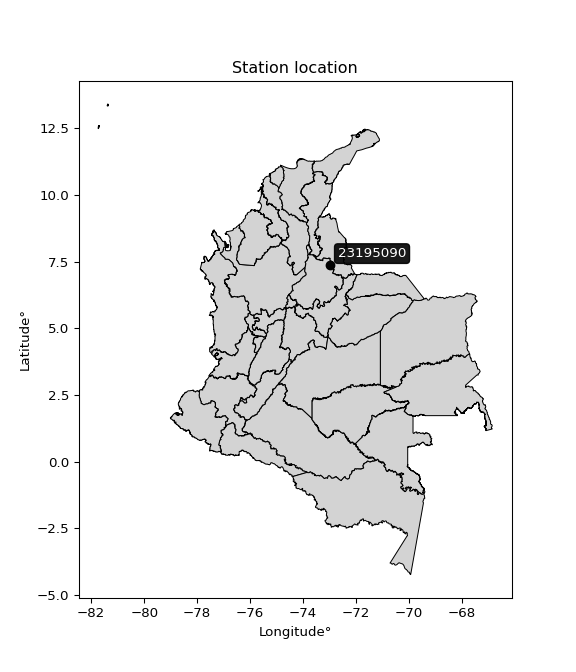

<div align="center">


</div>

# PMax24h Station (Rain): 23195090

Maximum Precipitation in 24 hours (PMax24h) is the greatest amount of rainfall for a specific duration that is meteorologically possible for a given location, acting as a "worst-case" scenario for extreme storms, crucial for designing safety-critical infrastructure like bridges, river deviations, dams, spillways, and nuclear plants to prevent catastrophic failure. The PMax24h is related with the Probable Maximum Precipitation (PMP) and it is calculated by hydrologists using meteorological data to determine the upper limit of extreme rainfall, often leading to the Probable Maximum Flood (PMF) for flood control design, and is increasingly being studied for climate change impacts. Probable Maximum Precipitation (PMP) is the theoretical upper limit of rainfall, a deterministic estimate for extreme events, while probability distributions (like GEV, Gumbel) describe the likelihood and frequency of various precipitation amounts, including rare ones, showing how often events occur, with PMP representing the extreme end of these distributions, used for critical infrastructure design to ensure safety against the worst conceivable weather, unlike standard statistical forecasts which cover typical probabilities.

The most common probability distributions in hydrology, used for analyzing floods, rainfall, and streamflow, include the Normal, Log-Normal, Gumbel, Gamma (including Log-Pearson Type III), and Generalized Extreme Value (GEV) distributions, often chosen based on the data´s skewness and whether modeling extremes or general conditions, with Gumbel and GEV popular for extreme events like floods, while the Normal distribution serves as a baseline, though often requiring transformations for skewed hydrological data. These distributions help in designing water infrastructure, managing water resources, and forecasting hydrologic events.

> Hydrological data often isn´t perfectly normal (it´s skewed), so different distributions are needed for different applications, such as: **Flood Frequency Analysis**: Using Gumbel, GEV, or Log-Pearson Type III for predicting extreme flood magnitudes and their return periods, **Rainfall Analysis**: Normal for annual totals, but Log-Normal, Weibull, or GEV for intensity or extreme daily rainfall, **Streamflow Modeling**: Gamma and Log-Normal for maximum flows, GEV for minimum flows, and Kappa for daily flows.

<div align="center">

</img>

</div>


## A. General information


### 1. General running parameters

• app_version: _v20260225_. • runtime: _2026-02-28 16:54:07.457399_. • Python version: _3.14.0_. • SciPy version: _1.16.3_. • Pandas version: _2.3.3_. • NumPy version: _2.3.5_. • Stations dataset (station_dataset_file): _dataset/pmax24h_in/automatic_colombia_2003_2025.csv_. • Stations catalog (station_catalog_file): _dataset/CNE.xls_. • Minimum year to eval til year_max (date_min): _1900_. • Maximum year to eval since year_min (date_max): _2025_. • Creates, save and include plots into reports (create_plot): _False_. • Plot only fit distributions with Δo > Δ (plot_only_fit): _True_. • Plot only simple graphs avoiding multiple CDFs and multiple Extreme values plots (plot_only_simple): _False_. • Eval low extreme values, if False, evaluates high extreme values (low_extreme): _False_. • Eval every SciPy distribution as logarithmic (pdist_logarithmic_on): _True_. • Standard deviation normalized (ddof): _1.0_. • Return periods to eval in years (Tr): _[2, 2.33, 5, 10, 15, 20, 25, 50, 75, 100, 200, 250, 500, 750, 1000]_. • Minimum data sample per station, 0 means any (minimum_sample): _5_. • Z-Score maximum threshold to adjust a value, 0 means disable (zscore_max): _3.5_. • Z-Score minimum threshold to adjust a value, 0 means disable (zscore_min): _-2.5_. • Avoid zeros, e.g. rain = 0 (avoid_zeros): _True_. • Avoid null values (avoid_nans): _True_. 

:file_folder:Table: [dataset.csv](../../dataset/pmax24h_in/automatic_colombia_2003_2025.csv)

> Delta Degrees of Freedom (DDOF): is a parameter used in the formulas for calculating variance and standard deviation. When ddof=0, the divisor is $N$ (the total number of observations) and this is used when your data set is the entire population. When ddof=1, the divisor is $N-1$ and this is used when your data set is a sample drawn from a larger population. Using $N-1$ provides an unbiased estimate of the population variance (known as Bessel´s correction).


### 2. Station info and location

|   id |   CODIGO | NOMBRE                          | CATEGORIA               | TECNOLOGIA                              | ESTADO   | FECHA_INSTALACION   |   FECHA_SUSPENSION |   ALTITUD |   LATITUD |   LONGITUD | DEPARTAMENTO   | MUNICIPIO   | AREA_OPERATIVA                         | ENTIDAD                                                     | AREA_HIDROGRAFICA   | ZONA_HIDROGRAFICA   | SUBZONA_HIDROGRAFICA                      |   CORRIENTE | Catalogo   |   Version |
|-----:|---------:|:--------------------------------|:------------------------|:----------------------------------------|:---------|:--------------------|-------------------:|----------:|----------:|-----------:|:---------------|:------------|:---------------------------------------|:------------------------------------------------------------|:--------------------|:--------------------|:------------------------------------------|------------:|:-----------|----------:|
|    0 | 23195090 | VIVERO SURATA  - AUT [23195090] | Climatológica Principal | Automática con Telemetría, Convencional | Activa   | 15/09/1968          |                nan |      1791 |   7.36583 |   -72.9875 | Santander      | Suratá      | Area Operativa 08 - Santanderes-Arauca | INSTITUTO DE HIDROLOGIA METEOROLOGIA Y ESTUDIOS AMBIENTALES | Magdalena Cauca     | Medio Magdalena     | Río Lebrija y otros directos al Magdalena |         nan | CNE_IDEAM  |  20251226 |

<div align="center">

Dynamic map: [:earth_americas:Google](http://maps.google.com/maps?q=7.36583,-72.9875) [:earth_americas:OSM](https://www.openstreetmap.org/#map=18/7.36583/-72.9875&layers=P) [:earth_americas:Bing](https://www.bing.com/maps?cp=7.36583~-72.9875&lvl=18) [:earth_americas:Apple](https://maps.apple.com/frame?center=7.36583%2C-72.9875&span=0.003%2C0.006)

</div>


<div align="center">

```geojson
{
  "type": "Feature",
  "geometry": {
    "type": "Point", 
    "coordinates": [-72.9875, 7.36583]
  }, 
  "properties": {
    "Name": "23195090"
  }
}
```

</div>


### 3. Discrete values table and plot

<div align="center">

|               |           0 |          1 |           2 |           3 |           4 |           5 |          6 |           7 |          8 |
|:--------------|------------:|-----------:|------------:|------------:|------------:|------------:|-----------:|------------:|-----------:|
| Date          | 2017        | 2018       | 2019        | 2020        | 2021        | 2022        | 2023       | 2024        | 2025       |
| Value         |   19.6      |   87.2     |   37.2      |   37.8      |   40.4      |   33.4      |    1       |   13.8      |    0.8     |
| Value_initial |   19.6      |   87.2     |   37.2      |   37.8      |   40.4      |   33.4      |    1       |   13.8      |    0.8     |
| count         |    9        |    9       |    9        |    9        |    9        |    9        |    9       |    9        |    9       |
| mean          |   30.1333   |   30.1333  |   30.1333   |   30.1333   |   30.1333   |   30.1333   |   30.1333  |   30.1333   |   30.1333  |
| std           |   26.3826   |   26.3826  |   26.3826   |   26.3826   |   26.3826   |   26.3826   |   26.3826  |   26.3826   |   26.3826  |
| zscore        |   -0.399253 |    2.16304 |    0.267854 |    0.290596 |    0.389146 |    0.123819 |   -1.10426 |   -0.619096 |   -1.11185 |


</div>


> The initial value (value_initial) correspond to the initial obtained or null completed value, and value (value) is adjusted only when the initial value is outside the valid range (outlier) definite through the Z-Score value. If Z-Score is active, values out of range or outliers are replaced with the station mean value. A Z-Score (or standard score) measures how many standard deviations a data point is from the mean of a dataset, indicating its relative position; positive scores mean above the mean, negative mean below, and a score of zero is exactly at the mean, allowing for comparison of values from different distributions. It´s calculated using the formula $z=(x–μ)/σ$, where $x$ is the data point, $μ$ is the mean, and $σ$ is the standard deviation, helping identify outliers and understand probability.
>
> <sub>**Note**: In this study, "completing" (filling gaps in) and "extending" (forecasting or lengthening the historical record) rainfall data series are avoided for certain critical analyses because they introduce artificial bias and uncertainty, which can distort the statistics of rare events (extremes), alter day-to-day variability, and compromise the integrity and homogeneity of the original data. Some reasons against Completing/Extending rainfall data are: **Distortion of Extremes and Variability**: The primary issue is that most gap-filling or extension methods rely on averaging or regression with nearby stations, which inherently smooths the data. Rainfall is highly variable in space and time, with a large percentage of zero values and occasional large storms. Infilling methods often underestimate the highest values and overestimate the lowest (zero) values, which severely distorts analyses focused on flood frequency, drought severity, and intensity-duration-frequency (IDF) curves, **Loss of Data Homogeneity**: Infilled or extended data are synthetic estimates, not actual measurements. Combining these estimates with observed data can violate the assumption of data homogeneity, which requires that the data properties do not change over time. Inhomogeneity can lead to incorrect conclusions about long-term trends or changes in climate patterns, **Propagation of Errors**: Errors and biases from the original data (e.g., wind-induced undercatch, instrument errors, site changes) or the data used for imputation can propagate through the analysis, leading to unreliable hydrological models and inaccurate predictions, **Compromised Statistical Integrity**: For statistical analyses, especially those involving the frequency of events, using artificial data can introduce time bias or autocorrelation that doesn´t exist in reality, making it difficult to assess the true probability of events, **Difficulty in Validation**: It is difficult to accurately validate the quality of filled or extended data, especially for past periods where ground-truth measurements are unavailable. The reliability of imputation techniques heavily depends on the density of the surrounding station network and the complexity of the local topography.</sub>


### 4. Active continuous probability distributions from SciPy (80 of 104 available)

A Probability Density Function (PDF) describes the relative likelihood of a continuous random variable falling within a specific range, where the total area under its curve equals 1, and the area over any interval gives the actual probability for that range. Unlike discrete probabilities (like rolling a die), a PDF shows density, not direct probability for a single point (which is zero), with higher points indicating higher likelihood, often visualized as a bell curve for normal distributions.

A log of a probability density function (log-PDF) is simply the logarithm of the PDF´s value, denoted as $log(f(x))$, useful for converting multiplication of probabilities into addition, improving numerical stability with tiny numbers, and connecting to information theory concepts like entropy. Instead of dealing with very small probabilities (e.g., 0.000001), log-PDFs use negative numbers (e.g., $log(0.00001) ≈ -11.51$ that are easier for computers to handle, preventing underflow errors and simplifying complex calculations. In this study, each active probability distribution from SciPy is also evaluated in the $log$ form.

[scipy.stats](https://docs.scipy.org/doc/scipy/reference/stats.html) is a Python´s powerful submodule within the SciPy library for comprehensive statistical analysis, offering over 130 probability distributions (like Normal, Poisson, etc.), functions for descriptive stats (mean, variance), hypothesis testing (t-tests, chi-square), random variable generation, and statistical tests, making it essential for data science, modeling, and research. It provides tools to explore, model, and draw conclusions from data efficiently, working seamlessly with [NumPy](https://numpy.org/).

<div align="center">

|   id | p_dist           |   n_parameter | fit_method   | label                                                                       | active   | ref                                                                                                      |
|-----:|:-----------------|--------------:|:-------------|:----------------------------------------------------------------------------|:---------|:---------------------------------------------------------------------------------------------------------|
|    0 | alpha            |             3 | MLE          | Alpha                                                                       | True     | [:mortar_board:](https://docs.scipy.org/doc/scipy/reference/generated/scipy.stats.alpha.html)            |
|    1 | anglit           |             2 | MM           | Anglit                                                                      | True     | [:mortar_board:](https://docs.scipy.org/doc/scipy/reference/generated/scipy.stats.anglit.html)           |
|    2 | arcsine          |             2 | MM           | Arcsine                                                                     | True     | [:mortar_board:](https://docs.scipy.org/doc/scipy/reference/generated/scipy.stats.arcsine.html)          |
|    3 | argus            |             3 | MLE          | Argus                                                                       | True     | [:mortar_board:](https://docs.scipy.org/doc/scipy/reference/generated/scipy.stats.argus.html)            |
|    4 | beta             |             4 | MLE          | Beta                                                                        | True     | [:mortar_board:](https://docs.scipy.org/doc/scipy/reference/generated/scipy.stats.beta.html)             |
|    5 | betaprime        |             4 | MLE          | Beta prime                                                                  | True     | [:mortar_board:](https://docs.scipy.org/doc/scipy/reference/generated/scipy.stats.betaprime.html)        |
|    6 | bradford         |             3 | MLE          | Bradford                                                                    | True     | [:mortar_board:](https://docs.scipy.org/doc/scipy/reference/generated/scipy.stats.bradford.html)         |
|    7 | burr             |             4 | MLE          | Burr (Type III)                                                             | True     | [:mortar_board:](https://docs.scipy.org/doc/scipy/reference/generated/scipy.stats.burr.html)             |
|    8 | burr12           |             4 | MLE          | Burr (Type III) 12                                                          | True     | [:mortar_board:](https://docs.scipy.org/doc/scipy/reference/generated/scipy.stats.burr12.html)           |
|    9 | cosine           |             2 | MLE          | Cosine                                                                      | True     | [:mortar_board:](https://docs.scipy.org/doc/scipy/reference/generated/scipy.stats.cosine.html)           |
|   10 | crystalball      |             4 | MLE          | Crystalball                                                                 | True     | [:mortar_board:](https://docs.scipy.org/doc/scipy/reference/generated/scipy.stats.crystalball.html)      |
|   11 | dgamma           |             3 | MLE          | Double gamma                                                                | True     | [:mortar_board:](https://docs.scipy.org/doc/scipy/reference/generated/scipy.stats.dgamma.html)           |
|   12 | dweibull         |             3 | MLE          | Double Weibull                                                              | True     | [:mortar_board:](https://docs.scipy.org/doc/scipy/reference/generated/scipy.stats.dweibull.html)         |
|   13 | erlang           |             3 | MLE          | Erlang                                                                      | True     | [:mortar_board:](https://docs.scipy.org/doc/scipy/reference/generated/scipy.stats.erlang.html)           |
|   14 | exponnorm        |             3 | MLE          | Exponentially modified Normal                                               | True     | [:mortar_board:](https://docs.scipy.org/doc/scipy/reference/generated/scipy.stats.exponnorm.html)        |
|   15 | exponpow         |             3 | MLE          | Exponential power                                                           | True     | [:mortar_board:](https://docs.scipy.org/doc/scipy/reference/generated/scipy.stats.exponpow.html)         |
|   16 | exponweib        |             4 | MLE          | Exponentiated Weibull                                                       | True     | [:mortar_board:](https://docs.scipy.org/doc/scipy/reference/generated/scipy.stats.exponweib.html)        |
|   17 | f                |             4 | MLE          | F                                                                           | True     | [:mortar_board:](https://docs.scipy.org/doc/scipy/reference/generated/scipy.stats.f.html)                |
|   18 | fatiguelife      |             3 | MLE          | Fatigue-life (Birnbaum-Saunders)                                            | True     | [:mortar_board:](https://docs.scipy.org/doc/scipy/reference/generated/scipy.stats.fatiguelife.html)      |
|   19 | foldnorm         |             3 | MM           | Fold Normal                                                                 | True     | [:mortar_board:](https://docs.scipy.org/doc/scipy/reference/generated/scipy.stats.foldnorm.html)         |
|   20 | gamma            |             3 | MLE          | Gamma                                                                       | True     | [:mortar_board:](https://docs.scipy.org/doc/scipy/reference/generated/scipy.stats.gamma.html)            |
|   21 | gausshyper       |             6 | MLE          | Gauss hypergeometric                                                        | True     | [:mortar_board:](https://docs.scipy.org/doc/scipy/reference/generated/scipy.stats.gausshyper.html)       |
|   22 | genexpon         |             5 | MLE          | Generalized exponential                                                     | True     | [:mortar_board:](https://docs.scipy.org/doc/scipy/reference/generated/scipy.stats.genexpon.html)         |
|   23 | genextreme       |             3 | MLE          | Generalized exponential                                                     | True     | [:mortar_board:](https://docs.scipy.org/doc/scipy/reference/generated/scipy.stats.genextreme.html)       |
|   24 | gengamma         |             4 | MLE          | Generalized gamma                                                           | True     | [:mortar_board:](https://docs.scipy.org/doc/scipy/reference/generated/scipy.stats.gengamma.html)         |
|   25 | genhalflogistic  |             3 | MLE          | Generalized half-logistic                                                   | True     | [:mortar_board:](https://docs.scipy.org/doc/scipy/reference/generated/scipy.stats.genhalflogistic.html)  |
|   26 | genlogistic      |             3 | MLE          | Generalized logistic                                                        | True     | [:mortar_board:](https://docs.scipy.org/doc/scipy/reference/generated/scipy.stats.genlogistic.html)      |
|   27 | gennorm          |             3 | MLE          | Generalized Normal                                                          | True     | [:mortar_board:](https://docs.scipy.org/doc/scipy/reference/generated/scipy.stats.gennorm.html)          |
|   28 | genpareto        |             3 | MLE          | Generalized Pareto                                                          | True     | [:mortar_board:](https://docs.scipy.org/doc/scipy/reference/generated/scipy.stats.genpareto.html)        |
|   29 | gompertz         |             3 | MLE          | Gompertz (or truncated Gumbel)                                              | True     | [:mortar_board:](https://docs.scipy.org/doc/scipy/reference/generated/scipy.stats.gompertz.html)         |
|   30 | gumbel_l         |             2 | MM           | Gumbel Left Skew                                                            | True     | [:mortar_board:](https://docs.scipy.org/doc/scipy/reference/generated/scipy.stats.gumbel_l.html)         |
|   31 | gumbel_r         |             2 | MM           | Gumbel Right Skew                                                           | True     | [:mortar_board:](https://docs.scipy.org/doc/scipy/reference/generated/scipy.stats.gumbel_r.html)         |
|   32 | halfgennorm      |             3 | MLE          | Upper half of a generalized normal                                          | True     | [:mortar_board:](https://docs.scipy.org/doc/scipy/reference/generated/scipy.stats.halfgennorm.html)      |
|   33 | halflogistic     |             2 | MM           | Half-logistic                                                               | True     | [:mortar_board:](https://docs.scipy.org/doc/scipy/reference/generated/scipy.stats.halflogistic.html)     |
|   34 | halfnorm         |             2 | MM           | Half Normal                                                                 | True     | [:mortar_board:](https://docs.scipy.org/doc/scipy/reference/generated/scipy.stats.halfnorm.html)         |
|   35 | hypsecant        |             2 | MM           | hyperbolic secant                                                           | True     | [:mortar_board:](https://docs.scipy.org/doc/scipy/reference/generated/scipy.stats.hypsecant.html)        |
|   36 | invgamma         |             3 | MLE          | Inverted gamma                                                              | True     | [:mortar_board:](https://docs.scipy.org/doc/scipy/reference/generated/scipy.stats.invgamma.html)         |
|   37 | invgauss         |             3 | MLE          | Inverse Gaussian                                                            | True     | [:mortar_board:](https://docs.scipy.org/doc/scipy/reference/generated/scipy.stats.invgauss.html)         |
|   38 | invweibull       |             3 | MLE          | Inverted Weibull                                                            | True     | [:mortar_board:](https://docs.scipy.org/doc/scipy/reference/generated/scipy.stats.invweibull.html)       |
|   39 | johnsonsb        |             4 | MLE          | Johnson SB                                                                  | True     | [:mortar_board:](https://docs.scipy.org/doc/scipy/reference/generated/scipy.stats.johnsonsb.html)        |
|   40 | johnsonsu        |             4 | MLE          | Johnson Su                                                                  | True     | [:mortar_board:](https://docs.scipy.org/doc/scipy/reference/generated/scipy.stats.johnsonsu.html)        |
|   41 | kappa3           |             3 | MLE          | Kappa 3                                                                     | True     | [:mortar_board:](https://docs.scipy.org/doc/scipy/reference/generated/scipy.stats.kappa3.html)           |
|   42 | kappa4           |             4 | MLE          | Kappa 4                                                                     | True     | [:mortar_board:](https://docs.scipy.org/doc/scipy/reference/generated/scipy.stats.kappa4.html)           |
|   43 | ksone            |             3 | MLE          | Kolmogorov-Smirnov one-sided test statistic distribution                    | True     | [:mortar_board:](https://docs.scipy.org/doc/scipy/reference/generated/scipy.stats.ksone.html)            |
|   44 | kstwobign        |             2 | MLE          | Limiting distribution of scaled Kolmogorov-Smirnov two-sided test statistic | True     | [:mortar_board:](https://docs.scipy.org/doc/scipy/reference/generated/scipy.stats.kstwobign.html)        |
|   45 | laplace          |             2 | MM           | Laplace                                                                     | True     | [:mortar_board:](https://docs.scipy.org/doc/scipy/reference/generated/scipy.stats.laplace.html)          |
|   46 | levy_l           |             2 | MLE          | Left-skewed Levy                                                            | True     | [:mortar_board:](https://docs.scipy.org/doc/scipy/reference/generated/scipy.stats.levy_l.html)           |
|   47 | loggamma         |             3 | MLE          | Log gamma                                                                   | True     | [:mortar_board:](https://docs.scipy.org/doc/scipy/reference/generated/scipy.stats.loggamma.html)         |
|   48 | logistic         |             2 | MM           | Logistic (or Sech-squared)                                                  | True     | [:mortar_board:](https://docs.scipy.org/doc/scipy/reference/generated/scipy.stats.logistic.html)         |
|   49 | loglaplace       |             3 | MLE          | Log-Laplace                                                                 | True     | [:mortar_board:](https://docs.scipy.org/doc/scipy/reference/generated/scipy.stats.loglaplace.html)       |
|   50 | lomax            |             3 | MLE          | Lomax (Pareto of the second kind)                                           | True     | [:mortar_board:](https://docs.scipy.org/doc/scipy/reference/generated/scipy.stats.lomax.html)            |
|   51 | maxwell          |             2 | MM           | Maxwell                                                                     | True     | [:mortar_board:](https://docs.scipy.org/doc/scipy/reference/generated/scipy.stats.maxwell.html)          |
|   52 | mielke           |             4 | MLE          | Mielke Beta-Kappa / Dagum                                                   | True     | [:mortar_board:](https://docs.scipy.org/doc/scipy/reference/generated/scipy.stats.mielke.html)           |
|   53 | moyal            |             2 | MM           | Moyal                                                                       | True     | [:mortar_board:](https://docs.scipy.org/doc/scipy/reference/generated/scipy.stats.moyal.html)            |
|   54 | nakagami         |             3 | MLE          | Nakagami                                                                    | True     | [:mortar_board:](https://docs.scipy.org/doc/scipy/reference/generated/scipy.stats.nakagami.html)         |
|   55 | ncf              |             5 | MLE          | Non-central F distribution                                                  | True     | [:mortar_board:](https://docs.scipy.org/doc/scipy/reference/generated/scipy.stats.ncf.html)              |
|   56 | nct              |             4 | MLE          | Non-central Student’s t                                                     | True     | [:mortar_board:](https://docs.scipy.org/doc/scipy/reference/generated/scipy.stats.nct.html)              |
|   57 | norm             |             2 | MM           | Normal                                                                      | True     | [:mortar_board:](https://docs.scipy.org/doc/scipy/reference/generated/scipy.stats.norm.html)             |
|   58 | pearson3         |             3 | MM           | Pearson type III                                                            | True     | [:mortar_board:](https://docs.scipy.org/doc/scipy/reference/generated/scipy.stats.pearson3.html)         |
|   59 | powerlaw         |             3 | MLE          | Power-function                                                              | True     | [:mortar_board:](https://docs.scipy.org/doc/scipy/reference/generated/scipy.stats.powerlaw.html)         |
|   60 | rayleigh         |             2 | MM           | Rayleigh                                                                    | True     | [:mortar_board:](https://docs.scipy.org/doc/scipy/reference/generated/scipy.stats.rayleigh.html)         |
|   61 | rdist            |             3 | MLE          | R-distributed (symmetric beta)                                              | True     | [:mortar_board:](https://docs.scipy.org/doc/scipy/reference/generated/scipy.stats.rdist.html)            |
|   62 | rice             |             3 | MLE          | Rice                                                                        | True     | [:mortar_board:](https://docs.scipy.org/doc/scipy/reference/generated/scipy.stats.rice.html)             |
|   63 | semicircular     |             2 | MM           | Semicircular                                                                | True     | [:mortar_board:](https://docs.scipy.org/doc/scipy/reference/generated/scipy.stats.semicircular.html)     |
|   64 | skewnorm         |             3 | MLE          | Skew normal                                                                 | True     | [:mortar_board:](https://docs.scipy.org/doc/scipy/reference/generated/scipy.stats.skewnorm.html)         |
|   65 | t                |             3 | MLE          | Student’s t                                                                 | True     | [:mortar_board:](https://docs.scipy.org/doc/scipy/reference/generated/scipy.stats.t.html)                |
|   66 | trapezoid        |             4 | MLE          | Trapezoid                                                                   | True     | [:mortar_board:](https://docs.scipy.org/doc/scipy/reference/generated/scipy.stats.trapezoid.html)        |
|   67 | triang           |             3 | MLE          | Triangular                                                                  | True     | [:mortar_board:](https://docs.scipy.org/doc/scipy/reference/generated/scipy.stats.triang.html)           |
|   68 | truncexpon       |             3 | MLE          | Truncated exponential                                                       | True     | [:mortar_board:](https://docs.scipy.org/doc/scipy/reference/generated/scipy.stats.truncexpon.html)       |
|   69 | truncnorm        |             4 | MLE          | Truncated normal                                                            | True     | [:mortar_board:](https://docs.scipy.org/doc/scipy/reference/generated/scipy.stats.truncnorm.html)        |
|   70 | truncpareto      |             4 | MLE          | Upper truncated Pareto                                                      | True     | [:mortar_board:](https://docs.scipy.org/doc/scipy/reference/generated/scipy.stats.truncpareto.html)      |
|   71 | truncweibull_min |             5 | MLE          | Doubly truncated Weibull minimum                                            | True     | [:mortar_board:](https://docs.scipy.org/doc/scipy/reference/generated/scipy.stats.truncweibull_min.html) |
|   72 | tukeylambda      |             3 | MLE          | Tukey-Lamdba                                                                | True     | [:mortar_board:](https://docs.scipy.org/doc/scipy/reference/generated/scipy.stats.tukeylambda.html)      |
|   73 | uniform          |             2 | MLE          | Uniform                                                                     | True     | [:mortar_board:](https://docs.scipy.org/doc/scipy/reference/generated/scipy.stats.uniform.html)          |
|   74 | vonmises         |             3 | MLE          | Von Mises                                                                   | True     | [:mortar_board:](https://docs.scipy.org/doc/scipy/reference/generated/scipy.stats.vonmises.html)         |
|   75 | vonmises_line    |             3 | MLE          | Von Mises line                                                              | True     | [:mortar_board:](https://docs.scipy.org/doc/scipy/reference/generated/scipy.stats.vonmises_line.html)    |
|   76 | wald             |             2 | MM           | Wald                                                                        | True     | [:mortar_board:](https://docs.scipy.org/doc/scipy/reference/generated/scipy.stats.wald.html)             |
|   77 | weibull_max      |             3 | MLE          | Weibull maximum                                                             | True     | [:mortar_board:](https://docs.scipy.org/doc/scipy/reference/generated/scipy.stats.weibull_max.html)      |
|   78 | weibull_min      |             3 | MLE          | Weibull minimum                                                             | True     | [:mortar_board:](https://docs.scipy.org/doc/scipy/reference/generated/scipy.stats.weibull_min.html)      |
|   79 | wrapcauchy       |             3 | MLE          | Wrapped  Cauchy                                                             | True     | [:mortar_board:](https://docs.scipy.org/doc/scipy/reference/generated/scipy.stats.wrapcauchy.html)       |

</div>

> **n_parameter:** # arguments & localization & scale.
>
> **Fit methods:** (MLE) maximum likelihood, (MM) L-moments.
>
>**Inactive** (With the only purpose of prevent loops, zero divisions, infinite values, over high estimated values or horizontal trending for recurrence intervals estimations, the follow distributions were disabled.)**:** lognorm, norminvgauss, powernorm, powerlognorm, cauchy, halfcauchy, foldcauchy, skewcauchy, chi2, expon, fisk, genhyperbolic, geninvgauss, gibrat, kstwo, laplace_asymmetric, levy, levy_stable, ncx2, pareto, rel_breitwigner, recipinvgauss, studentized_range, loguniform, 


## B. Probability (PDF) vs. Empirical (EDF) distributions functions

A continuous probability distribution (CPD) describes probabilities for variables that can take any value within a range (like rain any time), unlike discrete variables with specific outcomes (like temperature). It uses a Probability Density Function (PDF), a curve where the total area under it equals 1, and the probability of the variable falling within an interval (a to b) is found by calculating the area under the curve between those points. A key feature is that the probability of hitting any single exact value is zero, so probabilities are always expressed for ranges, e.g., $P(a ≤ X ≤ b)$.

<div align="center">

Distributions parameters from station values
|     |   station | p_dist              |   n |               loc |            scale | shape                  | shape1               | shape2                | shape3             |
|----:|----------:|:--------------------|----:|------------------:|-----------------:|:-----------------------|:---------------------|:----------------------|:-------------------|
|   0 |  23195090 | alpha               |   9 |       0.000653402 |      1.8727      | 4.861841879902041e-09  |                      |                       |                    |
|   1 |  23195090 | anglit              |   9 |      30.1333      |     72.7656      |                        |                      |                       |                    |
|   2 |  23195090 | arcsine             |   9 |      -5.04345     |     70.3535      |                        |                      |                       |                    |
|   3 |  23195090 | argus               |   9 |     -31.2095      |    122.135       | 1.4795784324262286e-06 |                      |                       |                    |
|   4 |  23195090 | beta                |   9 |       0.8         |    239.425       | 0.4805267574286175     | 4.317228154497387    |                       |                    |
|   5 |  23195090 | betaprime           |   9 |       0.8         |     73.7538      | 0.8112387421697623     | 2.558197250887998    |                       |                    |
|   6 |  23195090 | bradford            |   9 |       0.799773    |     86.4003      | 1.6254216248302686     |                      |                       |                    |
|   7 |  23195090 | burr                |   9 |       0.8         |     71.653       | 4.916036064826243      | 0.06036492411341176  |                       |                    |
|   8 |  23195090 | burr12              |   9 |       0.8         |    298.59        | 0.8353737203190464     | 7.420642511938507    |                       |                    |
|   9 |  23195090 | cosine              |   9 |      34.2448      |     22.5664      |                        |                      |                       |                    |
|  10 |  23195090 | crystalball         |   9 |      30.1333      |     24.8737      | 3304.4170200665963     | 33.9313984781214     |                       |                    |
|  11 |  23195090 | dgamma              |   9 |      26.2584      |      8.96172     | 2.164039650985276      |                      |                       |                    |
|  12 |  23195090 | dweibull            |   9 |      26.8985      |     21.4101      | 1.378852102381292      |                      |                       |                    |
|  13 |  23195090 | erlang              |   9 |       0.8         |     41.2208      | 0.4632118906346959     |                      |                       |                    |
|  14 |  23195090 | exponnorm           |   9 |       8.56745     |     13.0326      | 1.654763439316055      |                      |                       |                    |
|  15 |  23195090 | exponpow            |   9 |       0.8         |     57.0453      | 0.4342566297716075     |                      |                       |                    |
|  16 |  23195090 | exponweib           |   9 |       0.8         |      2.54757     | 1.0988535514686835     | 0.2832333742623032   |                       |                    |
|  17 |  23195090 | f                   |   9 |       0.8         |     27.6254      | 1.0920968930556874     | 157.5945730575334    |                       |                    |
|  18 |  23195090 | fatiguelife         |   9 |       0.8         |      0.000221043 | 378.40102616881006     |                      |                       |                    |
|  19 |  23195090 | foldnorm            |   9 |      -3.10792     |     37.3997      | 0.4819861898815503     |                      |                       |                    |
|  20 |  23195090 | gamma               |   9 |       0.8         |     30.6874      | 0.5480232015784461     |                      |                       |                    |
|  21 |  23195090 | gausshyper          |   9 |      -2.05415     |     89.2541      | 1.4144724458761604     | 0.2902926317933868   | 2.7812201284012694    | 2.8950021813656015 |
|  22 |  23195090 | genexpon            |   9 |      -7.55332     |      2.45818     | 3.538195673138573e-09  | 0.11661408267902895  | 0.10189469911630006   |                    |
|  23 |  23195090 | genextreme          |   9 |       1.70006     |      7.14662     | -7.9401374745228       |                      |                       |                    |
|  24 |  23195090 | gengamma            |   9 |       0.8         |      4.33144     | 1.9734671384014253     | 0.4236437399451064   |                       |                    |
|  25 |  23195090 | genhalflogistic     |   9 |      -8.08811     |     99.7531      | 1.0468573432171147     |                      |                       |                    |
|  26 |  23195090 | genlogistic         |   9 |    -108.126       |     18.9352      | 817.8084330219879      |                      |                       |                    |
|  27 |  23195090 | gennorm             |   9 |      33.4         |     17.8374      | 0.9717673160159108     |                      |                       |                    |
|  28 |  23195090 | genpareto           |   9 |       0.8         |     37.8577      | -0.2779877710732151    |                      |                       |                    |
|  29 |  23195090 | gompertz            |   9 |       0.8         |    117.341       | 3.172445668577076      |                      |                       |                    |
|  30 |  23195090 | gumbel_l            |   9 |      41.3278      |     19.394       |                        |                      |                       |                    |
|  31 |  23195090 | gumbel_r            |   9 |      18.9388      |     19.394       |                        |                      |                       |                    |
|  32 |  23195090 | halfgennorm         |   9 |       0.8         |      6.46141     | 0.5216995988204788     |                      |                       |                    |
|  33 |  23195090 | halflogistic        |   9 |       0.652188    |     21.2662      |                        |                      |                       |                    |
|  34 |  23195090 | halfnorm            |   9 |      -2.78973     |     41.2629      |                        |                      |                       |                    |
|  35 |  23195090 | hypsecant           |   9 |      30.1333      |     15.8351      |                        |                      |                       |                    |
|  36 |  23195090 | invgamma            |   9 |     -37.7739      |    505.279       | 8.418382693980094      |                      |                       |                    |
|  37 |  23195090 | invgauss            |   9 |     -17.0684      |    141.145       | 0.3344199101196528     |                      |                       |                    |
|  38 |  23195090 | invweibull          |   9 |       0.8         |      1.86717     | 0.05431082425495568    |                      |                       |                    |
|  39 |  23195090 | johnsonsb           |   9 |       0.8         |    154.604       | 0.18511663638227158    | 0.12946924682433616  |                       |                    |
|  40 |  23195090 | johnsonsu           |   9 |     -17.0158      |      1.33091     | -7.590491151854366     | 1.842470434708563    |                       |                    |
|  41 |  23195090 | kappa3              |   9 |       0.8         |     34.9326      | 3.8200625604485685     |                      |                       |                    |
|  42 |  23195090 | kappa4              |   9 |      -7.84325     |     96.4297      | 1.0983642672614118     | 0.9813077353642662   |                       |                    |
|  43 |  23195090 | ksone               |   9 |      -7.84        |    103.68        | 1.0                    |                      |                       |                    |
|  44 |  23195090 | kstwobign           |   9 |     -48.7119      |     90.7887      |                        |                      |                       |                    |
|  45 |  23195090 | laplace             |   9 |      30.1333      |     17.5884      |                        |                      |                       |                    |
|  46 |  23195090 | levy_l              |   9 |      94.0133      |     34.0012      |                        |                      |                       |                    |
|  47 |  23195090 | loggamma            |   9 |   -6678.02        |    928.833       | 1369.6652903605236     |                      |                       |                    |
|  48 |  23195090 | logistic            |   9 |      30.1333      |     13.7136      |                        |                      |                       |                    |
|  49 |  23195090 | loglaplace          |   9 |      -0.0741652   |     33.4742      | 0.9117353037327227     |                      |                       |                    |
|  50 |  23195090 | lomax               |   9 |       0.8         |      3.3619e+08  | 11467654.495012023     |                      |                       |                    |
|  51 |  23195090 | maxwell             |   9 |     -28.807       |     36.9353      |                        |                      |                       |                    |
|  52 |  23195090 | mielke              |   9 |       0.8         |     63.9049      | 0.6537238410387725     | 7.27560292554233     |                       |                    |
|  53 |  23195090 | moyal               |   9 |      15.9089      |     11.1971      |                        |                      |                       |                    |
|  54 |  23195090 | nakagami            |   9 |       0.8         |     55.4065      | 0.20596363139780927    |                      |                       |                    |
|  55 |  23195090 | ncf                 |   9 |       0.8         |      5.78848     | 0.8690738045794575     | 773.7709887785848    | 2.2546381809351974    |                    |
|  56 |  23195090 | nct                 |   9 |      -0.23549     |      0.0433653   | 0.39008949445671826    | 54.73618276577466    |                       |                    |
|  57 |  23195090 | norm                |   9 |      30.1333      |     24.8737      |                        |                      |                       |                    |
|  58 |  23195090 | pearson3            |   9 |      30.1333      |     24.8738      | 0.9549862420944009     |                      |                       |                    |
|  59 |  23195090 | powerlaw            |   9 |       0.8         |     86.4         | 0.16620282054870517    |                      |                       |                    |
|  60 |  23195090 | rayleigh            |   9 |     -17.4516      |     37.9672      |                        |                      |                       |                    |
|  61 |  23195090 | rdist               |   9 |      -7.06815     |     47.4681      | 1.0952099717169772     |                      |                       |                    |
|  62 |  23195090 | rice                |   9 |     -12.0196      |     34.609       | 0.00043759297844793107 |                      |                       |                    |
|  63 |  23195090 | semicircular        |   9 |      30.1333      |     49.7475      |                        |                      |                       |                    |
|  64 |  23195090 | skewnorm            |   9 |       0.799991    |     38.4604      | 21293588.202480547     |                      |                       |                    |
|  65 |  23195090 | t                   |   9 |      30.0759      |     24.732       | 19.934704129497113     |                      |                       |                    |
|  66 |  23195090 | trapezoid           |   9 |      -8.232       |    103.68        | 1.0                    | 1.0                  |                       |                    |
|  67 |  23195090 | triang              |   9 |      -9.21588     |     96.4159      | 0.9999998724093782     |                      |                       |                    |
|  68 |  23195090 | truncexpon          |   9 |       0.799991    |    116.551       | 0.74130417109621       |                      |                       |                    |
|  69 |  23195090 | truncnorm           |   9 |     -41.9926      |     52.2914      | 0.818347679875323      | 81.25920047690354    |                       |                    |
|  70 |  23195090 | truncpareto         |   9 |       0.797605    |      0.00239483  | 0.12675155739713054    | 36078.76079285128    |                       |                    |
|  71 |  23195090 | truncweibull_min    |   9 |      -4.2519      |     75.8885      | 1.184030923358888      | 0.001159115181120566 | 1.2050831466974468    |                    |
|  72 |  23195090 | tukeylambda         |   9 |      20.5999      |     55.0975      | 2.782687220456002      |                      |                       |                    |
|  73 |  23195090 | uniform             |   9 |       0.8         |     86.4         |                        |                      |                       |                    |
|  74 |  23195090 | vonmises            |   9 |       0.766799    |      1           | 1.3383478275906198     |                      |                       |                    |
|  75 |  23195090 | vonmises_line       |   9 |      27.4652      |     19.0142      | 1.1486089519564864     |                      |                       |                    |
|  76 |  23195090 | wald                |   9 |       5.25957     |     24.8738      |                        |                      |                       |                    |
|  77 |  23195090 | weibull_max         |   9 |      87.2         |      1.57867     | 0.242123606357283      |                      |                       |                    |
|  78 |  23195090 | weibull_min         |   9 |       0.8         |     29.0721      | 0.6608810624878023     |                      |                       |                    |
|  79 |  23195090 | wrapcauchy          |   9 |       0.787995    |     13.7529      | 0.062190818996745494   |                      |                       |                    |
|  80 |  23195090 | logalpha            |   9 |     -52.5967      |   1877.12        | 33.99582710469055      |                      |                       |                    |
|  81 |  23195090 | loganglit           |   9 |       2.70014     |      4.6155      |                        |                      |                       |                    |
|  82 |  23195090 | logarcsine          |   9 |       0.468923    |      4.46245     |                        |                      |                       |                    |
|  83 |  23195090 | logargus            |   9 |      -2.04389     |      6.62269     | 2.189647436500052      |                      |                       |                    |
|  84 |  23195090 | logbeta             |   9 |      -0.675106    |      5.14331     | 0.4833356647691398     | 0.19512048169567087  |                       |                    |
|  85 |  23195090 | logbetaprime        |   9 |      -0.223144    |      1.64066     | 0.6235313068505448     | 1.0823569470872858   |                       |                    |
|  86 |  23195090 | logbradford         |   9 |      -0.223161    |      5.00045     | 5.5126813051867654e-05 |                      |                       |                    |
|  87 |  23195090 | logburr             |   9 |      -0.23036     |      4.79418     | 109.21652789477429     | 0.007203894652203724 |                       |                    |
|  88 |  23195090 | logburr12           |   9 |      -0.223144    |      2.227       | 0.5776236768086865     | 1.7703617264982787   |                       |                    |
|  89 |  23195090 | logcosine           |   9 |       2.48116     |      1.3203      |                        |                      |                       |                    |
|  90 |  23195090 | logcrystalball      |   9 |       2.70014     |      1.57773     | 9187.656094878676      | 219.81791462312276   |                       |                    |
|  91 |  23195090 | logdgamma           |   9 |       3.63231     |      1.21602     | 0.5928907883969003     |                      |                       |                    |
|  92 |  23195090 | logdweibull         |   9 |       3.63231     |      1.33513     | 0.6896779452137012     |                      |                       |                    |
|  93 |  23195090 | logerlang           |   9 |     -22.4563      |      0.10857     | 231.55731245336085     |                      |                       |                    |
|  94 |  23195090 | logexponnorm        |   9 |       2.69891     |      1.57774     | 0.0007829897042073817  |                      |                       |                    |
|  95 |  23195090 | logexponpow         |   9 |      -0.223144    |      3.06234     | 0.5195698748429043     |                      |                       |                    |
|  96 |  23195090 | logexponweib        |   9 |      -0.223144    |      4.74527     | 0.06605822436181857    | 6.92517280822474     |                       |                    |
|  97 |  23195090 | logf                |   9 |      -0.223144    |      1.20957     | 1.2715423211265713     | 1.1875297681644956   |                       |                    |
|  98 |  23195090 | logfatiguelife      |   9 |    -793.669       |    796.369       | 0.00197256086644963    |                      |                       |                    |
|  99 |  23195090 | logfoldnorm         |   9 |      -8.07947     |      1.37245     | 7.891660299919857      |                      |                       |                    |
| 100 |  23195090 | loggamma            |   9 |     -21.2573      |      0.11084     | 216.0989726920754      |                      |                       |                    |
| 101 |  23195090 | loggausshyper       |   9 |      -0.699358    |      5.16756     | 1.2225933863937903     | 0.4965675969496215   | 1.155436195236233     | 1.0821751899096705 |
| 102 |  23195090 | loggenexpon         |   9 |      -0.236448    |      0.00864858  | 0.0011990797752136954  | 1.467928033140685    | 5.423856479264734e-06 |                    |
| 103 |  23195090 | loggenextreme       |   9 |       2.73657     |      1.93623     | 1.1181503635424013     |                      |                       |                    |
| 104 |  23195090 | loggengamma         |   9 |      -0.223144    |      2.40248     | 0.8465233420493353     | 0.8366850479550338   |                       |                    |
| 105 |  23195090 | loggenhalflogistic  |   9 |      -0.782945    |      5.55543     | 1.057944953973308      |                      |                       |                    |
| 106 |  23195090 | loggenlogistic      |   9 |       4.13518     |      0.230272    | 0.154735499736163      |                      |                       |                    |
| 107 |  23195090 | loggennorm          |   9 |       3.61631     |      0.0415893   | 0.3816694241459878     |                      |                       |                    |
| 108 |  23195090 | loggenpareto        |   9 |      -0.223144    |      3.65309     | 0.6656574768091204     |                      |                       |                    |
| 109 |  23195090 | loggompertz         |   9 |      -0.223144    |      1.21548     | 0.056467696361939476   |                      |                       |                    |
| 110 |  23195090 | loggumbel_l         |   9 |       3.4102      |      1.23015     |                        |                      |                       |                    |
| 111 |  23195090 | loggumbel_r         |   9 |       1.99008     |      1.23015     |                        |                      |                       |                    |
| 112 |  23195090 | loghalfgennorm      |   9 |      -0.223144    |      1.33308     | 0.659975661124744      |                      |                       |                    |
| 113 |  23195090 | loghalflogistic     |   9 |       0.830135    |      1.34892     |                        |                      |                       |                    |
| 114 |  23195090 | loghalfnorm         |   9 |       0.611797    |      2.61734     |                        |                      |                       |                    |
| 115 |  23195090 | loghypsecant        |   9 |       2.70014     |      1.00442     |                        |                      |                       |                    |
| 116 |  23195090 | loginvgamma         |   9 |     -32.4679      |  16589.6         | 472.60701399763775     |                      |                       |                    |
| 117 |  23195090 | loginvgauss         |   9 |     -12.601       |   1257.33        | 0.012122459016196806   |                      |                       |                    |
| 118 |  23195090 | loginvweibull       |   9 |  -53124.5         |  53126.3         | 30484.244369757493     |                      |                       |                    |
| 119 |  23195090 | logjohnsonsb        |   9 |      -0.649185    |      5.11739     | -0.44499277860494135   | 0.13047208283259804  |                       |                    |
| 120 |  23195090 | logjohnsonsu        |   9 |       3.64274     |      0.0466015   | 0.6137172120795495     | 0.3621444519560654   |                       |                    |
| 121 |  23195090 | logkappa3           |   9 |      -0.223144    |      1.53718     | 1.0922149423207854     |                      |                       |                    |
| 122 |  23195090 | logkappa4           |   9 |      -0.682399    |      5.32499     | 1.0945078937891966     | 1.0265660515081216   |                       |                    |
| 123 |  23195090 | logksone            |   9 |      -0.692278    |      5.62962     | 1.0                    |                      |                       |                    |
| 124 |  23195090 | logkstwobign        |   9 |      -4.1895      |      7.84618     |                        |                      |                       |                    |
| 125 |  23195090 | loglaplace          |   9 |       2.70014     |      1.11563     |                        |                      |                       |                    |
| 126 |  23195090 | loglevy_l           |   9 |       4.61604     |      0.731124    |                        |                      |                       |                    |
| 127 |  23195090 | logloggamma         |   9 |       4.34888     |      0.327841    | 0.21039642924338559    |                      |                       |                    |
| 128 |  23195090 | loglogistic         |   9 |       2.70014     |      0.869849    |                        |                      |                       |                    |
| 129 |  23195090 | logloglaplace       |   9 |      -0.223144    |      2.04809     | 0.6159927830326244     |                      |                       |                    |
| 130 |  23195090 | loglomax            |   9 |      -0.223144    |      3.27777e+07 | 11098310.206139866     |                      |                       |                    |
| 131 |  23195090 | logmaxwell          |   9 |      -1.03842     |      2.3428      |                        |                      |                       |                    |
| 132 |  23195090 | logmielke           |   9 | -353457           | 353461           | 236439.06827531045     | 1544022.1262059498   |                       |                    |
| 133 |  23195090 | logmoyal            |   9 |       1.79789     |      0.710229    |                        |                      |                       |                    |
| 134 |  23195090 | lognakagami         |   9 |      -0.223144    |      3.15259     | 0.26481656221485234    |                      |                       |                    |
| 135 |  23195090 | logncf              |   9 |      -0.223144    |      1.19485     | 1.3161963350518038     | 1.1794391294274025   | 1.0035043617332522    |                    |
| 136 |  23195090 | lognct              |   9 |    -105.782       |      1.54034     | 47085.36156403684      | 70.4260178426654     |                       |                    |
| 137 |  23195090 | lognorm             |   9 |       2.70014     |      1.57773     |                        |                      |                       |                    |
| 138 |  23195090 | logpearson3         |   9 |       2.70014     |      1.57773     | -1.0189327112020705    |                      |                       |                    |
| 139 |  23195090 | logpowerlaw         |   9 |      -0.223144    |      4.69135     | 0.20269708526754884    |                      |                       |                    |
| 140 |  23195090 | lograyleigh         |   9 |      -0.318154    |      2.40825     |                        |                      |                       |                    |
| 141 |  23195090 | logrdist            |   9 |       0.312188    |      2.66334     | 1.0579561610161226     |                      |                       |                    |
| 142 |  23195090 | logrice             |   9 |      -1.28755     |      1.71954     | 2.054188503631364      |                      |                       |                    |
| 143 |  23195090 | logsemicircular     |   9 |       2.70014     |      3.15546     |                        |                      |                       |                    |
| 144 |  23195090 | logskewnorm         |   9 |       4.4682      |      2.36974     | -110107011.45527089    |                      |                       |                    |
| 145 |  23195090 | logt                |   9 |       2.70014     |      1.57773     | 327745414046.3644      |                      |                       |                    |
| 146 |  23195090 | logtrapezoid        |   9 |      -1.85048     |      6.69375     | 1.0                    | 1.0                  |                       |                    |
| 147 |  23195090 | logtriang           |   9 |      -1.77636     |      6.24458     | 0.9999999722803565     |                      |                       |                    |
| 148 |  23195090 | logtruncexpon       |   9 |      -0.223147    |      5.02071     | 0.9344054288032932     |                      |                       |                    |
| 149 |  23195090 | logtruncnorm        |   9 |       0.728095    |      4.64024     | -0.2049996595959661    | 0.806016652224073    |                       |                    |
| 150 |  23195090 | logtruncpareto      |   9 |      -0.223471    |      0.000327386 | 0.0030005904631315544  | 14331.426413993267   |                       |                    |
| 151 |  23195090 | logtruncweibull_min |   9 |      -5.3919      |     16.7314      | 4.6466486167574805     | 0.006109362929091705 | 0.5893157931304466    |                    |
| 152 |  23195090 | logtukeylambda      |   9 |       0.0348221   |      4.75131     | 1.0717132588064104     |                      |                       |                    |
| 153 |  23195090 | loguniform          |   9 |      -0.223144    |      4.69135     |                        |                      |                       |                    |
| 154 |  23195090 | logvonmises         |   9 |      -2.57312     |      1           | 1.1118857562447804     |                      |                       |                    |
| 155 |  23195090 | logvonmises_line    |   9 |       3.1163      |      1.06298     | 0.9713711028052299     |                      |                       |                    |
| 156 |  23195090 | logwald             |   9 |       1.12238     |      1.57775     |                        |                      |                       |                    |
| 157 |  23195090 | logweibull_max      |   9 |       4.4682      |      1.19753     | 0.9929705295732011     |                      |                       |                    |
| 158 |  23195090 | logweibull_min      |   9 |      -1.05037e+08 |      1.05037e+08 | 99952741.7676675       |                      |                       |                    |
| 159 |  23195090 | logwrapcauchy       |   9 |      -0.223462    |      0.746702    | 0.3444824891469929     |                      |                       |                    |

</div>

> **loc** (Location parameter): This shifts the distribution along the x-axis. For many common distributions, like the normal (Gaussian) distribution, loc represents the mean $μ$. For others, like the uniform distribution, it might represent the minimum value, or for the beta distribution, the left end of the support interval.
>
> **scale** (Scale parameter): This determines the width or spread of the distribution. For the normal distribution, scale represents the standard deviation $σ$. For a uniform distribution, it defines the length of the interval (from $loc$ to $loc + scale$).
>
> **shape** (Shape parameters): Refers to parameters that define the specific form of a probability distribution, distinct from its location (loc) and scale (scale). These parameters are required arguments for most distribution functions. For example, a normal (Gaussian) distribution is fully defined by its location (mean) and scale (standard deviation), so it has no specific shape parameters beyond loc and scale. However, other distributions have intrinsic properties that need specification, as Gamma distribution that takes a shape parameter, often named $a$ or $alpha$.


### 0. Cumulative distribution values - CDF (160 evaluated)

Cumulative Distribution Function (CDF), denoted as $F$<sub>$X$</sub>$(x)$, is a function that gives the probability that a random variable $X$ will take a value less than or equal to a specific value, $x$ (i.e., $(P(X≥x)$. It essentially "accumulates" probabilities from a given point up to the far right (positive infinity), providing a complete picture of the distribution´s probabilities for both discrete (like rain) and continuous (like temperature) variables, helping to find probabilities over ranges or above certain values. Each station is evaluated separately ordering the $x$ values ascending, calculating the CDF and PDF values for the activated distributions and their logarithmic forms.

<div align="center">

CDF ordered by x ascending and calculating $log(f(x))$ separately
|   id |   Station |   date |    x |   count |    mean |     std |    zscore |   Value_initial |   station |   m |     alpha |   alpha_pdf |   anglit |   anglit_pdf |   arcsine |   arcsine_pdf |    argus |   argus_pdf |        beta |    beta_pdf |   betaprime |   betaprime_pdf |    bradford |   bradford_pdf |        burr |    burr_pdf |      burr12 |   burr12_pdf |   cosine |   cosine_pdf |   crystalball |   crystalball_pdf |   dgamma |   dgamma_pdf |   dweibull |   dweibull_pdf |      erlang |   erlang_pdf |   exponnorm |   exponnorm_pdf |    exponpow |   exponpow_pdf |   exponweib |   exponweib_pdf |           f |       f_pdf |   fatiguelife |   fatiguelife_pdf |   foldnorm |   foldnorm_pdf |      gamma |   gamma_pdf |   gausshyper |   gausshyper_pdf |   genexpon |   genexpon_pdf |   genextreme |   genextreme_pdf |    gengamma |   gengamma_pdf |   genhalflogistic |   genhalflogistic_pdf |   genlogistic |   genlogistic_pdf |   gennorm |   gennorm_pdf |   genpareto |   genpareto_pdf |    gompertz |   gompertz_pdf |   gumbel_l |   gumbel_l_pdf |   gumbel_r |   gumbel_r_pdf |   halfgennorm |   halfgennorm_pdf |   halflogistic |   halflogistic_pdf |   halfnorm |   halfnorm_pdf |   hypsecant |   hypsecant_pdf |   invgamma |   invgamma_pdf |   invgauss |   invgauss_pdf |   invweibull |   invweibull_pdf |   johnsonsb |   johnsonsb_pdf |   johnsonsu |   johnsonsu_pdf |      kappa3 |   kappa3_pdf |      kappa4 |   kappa4_pdf |     ksone |   ksone_pdf |   kstwobign |   kstwobign_pdf |   laplace |   laplace_pdf |   levy_l |   levy_l_pdf |   loggamma |   loggamma_pdf |   logistic |   logistic_pdf |   loglaplace |   loglaplace_pdf |      lomax |   lomax_pdf |   maxwell |   maxwell_pdf |      mielke |      mielke_pdf |     moyal |   moyal_pdf |    nakagami |   nakagami_pdf |         ncf |     ncf_pdf |       nct |     nct_pdf |     norm |   norm_pdf |   pearson3 |   pearson3_pdf |   powerlaw |   powerlaw_pdf |   rayleigh |   rayleigh_pdf |    rdist |      rdist_pdf |     rice |   rice_pdf |   semicircular |   semicircular_pdf |   skewnorm |   skewnorm_pdf |        t |      t_pdf |   trapezoid |   trapezoid_pdf |    triang |   triang_pdf |   truncexpon |   truncexpon_pdf |   truncnorm |   truncnorm_pdf |   truncpareto |   truncpareto_pdf |   truncweibull_min |   truncweibull_min_pdf |   tukeylambda |   tukeylambda_pdf |    uniform |   uniform_pdf |   vonmises |   vonmises_pdf |   vonmises_line |   vonmises_line_pdf |     wald |   wald_pdf |   weibull_max |   weibull_max_pdf |   weibull_min |   weibull_min_pdf |   wrapcauchy |   wrapcauchy_pdf |   logalpha |   logalpha_pdf |   loganglit |   loganglit_pdf |   logarcsine |   logarcsine_pdf |   logargus |   logargus_pdf |   logbeta |   logbeta_pdf |   logbetaprime |   logbetaprime_pdf |   logbradford |   logbradford_pdf |    logburr |   logburr_pdf |   logburr12 |   logburr12_pdf |   logcosine |   logcosine_pdf |   logcrystalball |   logcrystalball_pdf |   logdgamma |   logdgamma_pdf |   logdweibull |   logdweibull_pdf |   logerlang |   logerlang_pdf |   logexponnorm |   logexponnorm_pdf |   logexponpow |   logexponpow_pdf |   logexponweib |   logexponweib_pdf |        logf |       logf_pdf |   logfatiguelife |   logfatiguelife_pdf |   logfoldnorm |   logfoldnorm_pdf |   loggausshyper |   loggausshyper_pdf |   loggenexpon |   loggenexpon_pdf |   loggenextreme |   loggenextreme_pdf |   loggengamma |   loggengamma_pdf |   loggenhalflogistic |   loggenhalflogistic_pdf |   loggenlogistic |   loggenlogistic_pdf |   loggennorm |   loggennorm_pdf |   loggenpareto |   loggenpareto_pdf |   loggompertz |   loggompertz_pdf |   loggumbel_l |   loggumbel_l_pdf |   loggumbel_r |   loggumbel_r_pdf |   loghalfgennorm |   loghalfgennorm_pdf |   loghalflogistic |   loghalflogistic_pdf |   loghalfnorm |   loghalfnorm_pdf |   loghypsecant |   loghypsecant_pdf |   loginvgamma |   loginvgamma_pdf |   loginvgauss |   loginvgauss_pdf |   loginvweibull |   loginvweibull_pdf |   logjohnsonsb |   logjohnsonsb_pdf |   logjohnsonsu |   logjohnsonsu_pdf |   logkappa3 |   logkappa3_pdf |   logkappa4 |   logkappa4_pdf |   logksone |   logksone_pdf |   logkstwobign |   logkstwobign_pdf |   loglevy_l |   loglevy_l_pdf |   logloggamma |   logloggamma_pdf |   loglogistic |   loglogistic_pdf |   logloglaplace |   logloglaplace_pdf |    loglomax |   loglomax_pdf |   logmaxwell |   logmaxwell_pdf |   logmielke |   logmielke_pdf |    logmoyal |   logmoyal_pdf |   lognakagami |   lognakagami_pdf |     logncf |     logncf_pdf |    lognct |   lognct_pdf |   lognorm |   lognorm_pdf |   logpearson3 |   logpearson3_pdf |   logpowerlaw |   logpowerlaw_pdf |   lograyleigh |   lograyleigh_pdf |   logrdist |   logrdist_pdf |   logrice |   logrice_pdf |   logsemicircular |   logsemicircular_pdf |   logskewnorm |   logskewnorm_pdf |      logt |   logt_pdf |   logtrapezoid |   logtrapezoid_pdf |   logtriang |   logtriang_pdf |   logtruncexpon |   logtruncexpon_pdf |   logtruncnorm |   logtruncnorm_pdf |   logtruncpareto |   logtruncpareto_pdf |   logtruncweibull_min |   logtruncweibull_min_pdf |   logtukeylambda |   logtukeylambda_pdf |   loguniform |   loguniform_pdf |   logvonmises |   logvonmises_pdf |   logvonmises_line |   logvonmises_line_pdf |   logwald |   logwald_pdf |   logweibull_max |   logweibull_max_pdf |   logweibull_min |   logweibull_min_pdf |   logwrapcauchy |   logwrapcauchy_pdf |
|-----:|----------:|-------:|-----:|--------:|--------:|--------:|----------:|----------------:|----------:|----:|----------:|------------:|---------:|-------------:|----------:|--------------:|---------:|------------:|------------:|------------:|------------:|----------------:|------------:|---------------:|------------:|------------:|------------:|-------------:|---------:|-------------:|--------------:|------------------:|---------:|-------------:|-----------:|---------------:|------------:|-------------:|------------:|----------------:|------------:|---------------:|------------:|----------------:|------------:|------------:|--------------:|------------------:|-----------:|---------------:|-----------:|------------:|-------------:|-----------------:|-----------:|---------------:|-------------:|-----------------:|------------:|---------------:|------------------:|----------------------:|--------------:|------------------:|----------:|--------------:|------------:|----------------:|------------:|---------------:|-----------:|---------------:|-----------:|---------------:|--------------:|------------------:|---------------:|-------------------:|-----------:|---------------:|------------:|----------------:|-----------:|---------------:|-----------:|---------------:|-------------:|-----------------:|------------:|----------------:|------------:|----------------:|------------:|-------------:|------------:|-------------:|----------:|------------:|------------:|----------------:|----------:|--------------:|---------:|-------------:|-----------:|---------------:|-----------:|---------------:|-------------:|-----------------:|-----------:|------------:|----------:|--------------:|------------:|----------------:|----------:|------------:|------------:|---------------:|------------:|------------:|----------:|------------:|---------:|-----------:|-----------:|---------------:|-----------:|---------------:|-----------:|---------------:|---------:|---------------:|---------:|-----------:|---------------:|-------------------:|-----------:|---------------:|---------:|-----------:|------------:|----------------:|----------:|-------------:|-------------:|-----------------:|------------:|----------------:|--------------:|------------------:|-------------------:|-----------------------:|--------------:|------------------:|-----------:|--------------:|-----------:|---------------:|----------------:|--------------------:|---------:|-----------:|--------------:|------------------:|--------------:|------------------:|-------------:|-----------------:|-----------:|---------------:|------------:|----------------:|-------------:|-----------------:|-----------:|---------------:|----------:|--------------:|---------------:|-------------------:|--------------:|------------------:|-----------:|--------------:|------------:|----------------:|------------:|----------------:|-----------------:|---------------------:|------------:|----------------:|--------------:|------------------:|------------:|----------------:|---------------:|-------------------:|--------------:|------------------:|---------------:|-------------------:|------------:|---------------:|-----------------:|---------------------:|--------------:|------------------:|----------------:|--------------------:|--------------:|------------------:|----------------:|--------------------:|--------------:|------------------:|---------------------:|-------------------------:|-----------------:|---------------------:|-------------:|-----------------:|---------------:|-------------------:|--------------:|------------------:|--------------:|------------------:|--------------:|------------------:|-----------------:|---------------------:|------------------:|----------------------:|--------------:|------------------:|---------------:|-------------------:|--------------:|------------------:|--------------:|------------------:|----------------:|--------------------:|---------------:|-------------------:|---------------:|-------------------:|------------:|----------------:|------------:|----------------:|-----------:|---------------:|---------------:|-------------------:|------------:|----------------:|--------------:|------------------:|--------------:|------------------:|----------------:|--------------------:|------------:|---------------:|-------------:|-----------------:|------------:|----------------:|------------:|---------------:|--------------:|------------------:|-----------:|---------------:|----------:|-------------:|----------:|--------------:|--------------:|------------------:|--------------:|------------------:|--------------:|------------------:|-----------:|---------------:|----------:|--------------:|------------------:|----------------------:|--------------:|------------------:|----------:|-----------:|---------------:|-------------------:|------------:|----------------:|----------------:|--------------------:|---------------:|-------------------:|-----------------:|---------------------:|----------------------:|--------------------------:|-----------------:|---------------------:|-------------:|-----------------:|--------------:|------------------:|-------------------:|-----------------------:|----------:|--------------:|-----------------:|---------------------:|-----------------:|---------------------:|----------------:|--------------------:|
|    0 |  23195090 |   2025 |  0.8 |       9 | 30.1333 | 26.3826 | -1.11185  |             0.8 |  23195090 |   1 | 0.0191401 | 0.150345    | 0.139155 |  0.00951295  |  0.186113 |    0.0163946  | 0.101242 |  0.00621254 | 3.43171e-09 | 1.48531e+07 | 7.75816e-15 |     56.6888     | 4.41891e-06 |     0.0194901  | 6.13373e-05 | 3.97457e+07 | 2.98389e-15 |  22.4519     | 0.105594 |   0.00767775 |      0.119141 |        0.00800161 | 0.130101 |  0.01016     |   0.134378 |    0.00932845  | 8.20849e-09 |  3.42478e+07 |   0.0776847 |      0.00917665 | 2.03687e-08 |    7.96709e+07 | 8.09126e-06 |     2.26822e+10 | 2.55935e-10 | 1.25878e+06 |     0.0791031 |       1.34157e+08 |  0.0741251 |     0.018915   | 3.1107e-10 | 1.53549e+06 |    0.0300887 |      0.0135972   |  0.0594856 |     0.013058   |  0.000164213 |   5849.72        | 6.89448e-15 |    51.9185     |         0.0467332 |            0.00551594 |     0.0748662 |        0.0102323  | 0.0866931 |    0.00459049 | 1.61221e-11 |      0.0264147  | 3.13969e-15 |     0.0270362  |   0.116375 |    0.00563703  |  0.0782432 |     0.0102794  |   8.00591e-12 |        0.0834412  |     0.00347526 |         0.0235113  |  0.0693257 |     0.0192636  |   0.0990508 |      0.00615468 |  0.0674105 |     0.0113915  |  0.0614908 |     0.0136516  |  0.000496772 |      1.84871e+12 | 8.76408e-08 |     5.52228e+08 |   0.0628802 |      0.0127435  | 3.49674e-13 |   0.0201557  | 2.98008e-15 |   0.277872   | 0.0833333 |  0.00964506 |   0.0725932 |      0.0106976  | 0.0943339 |    0.00536342 | 0.45413  |   0.00215393 |  0.0324076 |      0.0485568 |   0.105364 |     0.00687365 |    0.0363901 |        0.0326186 | 2.6783e-09 |  0.0341106  |  0.113373 |    0.0100664  | 3.85988e-12 | 11363.9         | 0.0495991 |  0.0101794  | 4.03768e-08 |     1.4981e+08 | 1.38474e-08 | 5.41981e+07 | 0.0490581 | 0.14773     | 0.119141 | 0.00800161 |  0.0876011 |     0.0112685  | 0.00106279 |    1.59102e+12 |   0.10912  |     0.0112798  | 0.556401 |     0.00722884 | 0.066302 | 0.00999312 |       0.147678 |          0.0103357 | 0          |     0.0207456  | 0.125222 | 0.00782357 |  0.00758888 |      0.00168044 | 0.0107915 |   0.00215487 |  1.46125e-07 |       0.0163893  | 1.26565e-12 |      0.0264223  |      0        |      71.957       |          0.0551577 |             0.0127756  |   3.34979e-06 |         0.0181498 | 0          |     0.0115741 |   0.513423 |      0.404114  |        0.116357 |          0.0074721  | 0        | 0          |     0.0716824 |       0.00052942  |   3.08127e-12 |    18341.9        |  0.000157354 |        0.0131073 |  0.0325135 |      0.0497673 |   0.0229372 |       0.0648699 |     0        |         0        |  0.0380879 |      0.0448648 |  0.101004 |   0.113566    |    3.69055e-11 |     829086         |   3.58438e-06 |          0.199987 | 0.00601681 |    nan        | 3.04577e-10 |     6.33858e+06 |   0.0326549 |       0.0651522 |        0.0319527 |            0.0454368 |  0.00789722 |      0.00716653 |     0.062594  |         0.0232668 |   0.0351246 |       0.050927  |      0.0319529 |          0.0454368 |   1.39677e-09 |       2.61468e+07 |    3.56391e-07 |        4.27822e+06 | 1.85824e-11 | 425649         |        0.0311361 |            0.0448333 |     0.0151034 |         0.0277566 |       0.044424  |         0.111082    |    0.00185235 |          0.139801 |       0.0873005 |           0.0405811 |   1.06789e-12 |     27250.6       |            0.0532261 |                 0.100456 |        0.0534687 |            0.0359293 |    0.0268879 |        0.0114062 |    5.12215e-10 |          0.273741  |   2.73476e-09 |         0.0464573 |     0.0508163 |         0.0402411 |    0.00237095 |         0.0116499 |      2.49007e-12 |            0.558265  |          0        |             0         |      0        |          0        |      0.0346311 |          0.0344109 |     0.0295379 |         0.0465937 |     0.0327485 |         0.0540571 |       0.0359594 |           0.0686174 |       0.224229 |        0.0999921   |       0.107972 |          0.0173793 | 2.65863e-09 |       0.600071  | 2.64879e-15 |        4.49118  |  0.0833333 |       0.177632 |      0.039692  |          0.0866163 |    0.302499 |       0.0297126 |     0.0580852 |         0.0372769 |     0.0335472 |         0.0372729 |     3.11772e-11 |      345965         | 1.13129e-08 |      0.338593  |    0.0108096 |        0.0388197 |   0.0540589 |       0.0361618 | 3.34307e-05 |    0.000426458 |   1.04147e-09 |       9.93668e+06 | 4.8909e-12 | 115966         | 0.0320905 |    0.0456416 | 0.0319527 |     0.0454368 |     0.0518402 |         0.0434109 |   0.000322066 |       2.35203e+12 |   0.000777924 |         0.0163692 |   0.433056 |    0.126687    | 0.0255609 |     0.0521476 |         0.0118467 |              0.075958 |     0.0477382 |         0.0474462 | 0.0319527 |  0.0454368 |      0.0591037 |          0.0726387 |   0.061867  |       0.079663  |     1.24124e-06 |            0.328033 |    2.20545e-06 |           0.226859 |      1.21211e-07 |          323.771     |             0.0517825 |                 0.0464528 |         0.471469 |             0.110609 |    0         |         0.213158 |      0.965052 |         0.0546273 |        6.90492e-11 |              0.0453383 |  0        |     0         |        0.0206489 |            0.0169581 |        0.0316815 |            0.0296651 |     0.000139293 |            0.437163 |
|    1 |  23195090 |   2023 |  1   |       9 | 30.1333 | 26.3826 | -1.10426  |             1   |  23195090 |   2 | 0.0609405 | 0.258489    | 0.141063 |  0.00956733  |  0.189366 |    0.0161461  | 0.102488 |  0.00624846 | 0.0734267   | 0.176087    | 0.0183626   |      0.0741079  | 0.00389512  |     0.019417   | 0.174592    | 0.259056    | 0.0164005   |   0.0678623  | 0.107136 |   0.00773999 |      0.120749 |        0.00807758 | 0.132147 |  0.0102943   |   0.136254 |    0.00943115  | 0.0955391   |  0.220542    |   0.0795353 |      0.00932961 | 0.0857576   |    0.185732    | 0.350502    |     0.423497    | 0.0546798   | 0.148905    |     0.531644  |       0.0791197   |  0.0779072 |     0.0189066  | 0.071169   | 0.194192    |    0.0328267 |      0.0137786   |  0.0621196 |     0.0132813  |  0.298625    |      0.227268    | 0.0327716   |     0.124766   |         0.0478376 |            0.00552816 |     0.0769299 |        0.0104042  | 0.0876161 |    0.00463993 | 0.00527287  |      0.026314   | 0.00539723  |     0.0269361  |   0.117508 |    0.00568816  |  0.0803155 |     0.0104434  |   0.0150031   |        0.0708801  |     0.0081774  |         0.02351    |  0.0731776 |     0.0192552  |   0.100289  |      0.00622908 |  0.0697105 |     0.0116083  |  0.0642498 |     0.0139369  |  0.32336     |      0.0991362   | 0.249607    |     0.205806    |   0.0654548 |      0.0130021  | 0.00403113  |   0.0201557  | 0.003922    |   0.0178534  | 0.0852623 |  0.00964506 |   0.0747501 |      0.010871   | 0.0954127 |    0.00542476 | 0.454561 |   0.00216004 |  0.044785  |      0.0627665 |   0.106747 |     0.00695309 |    0.0444478 |        0.0398411 | 0.00679891 |  0.0338787  |  0.115395 |    0.0101585  | 0.023054    |     0.0753547   | 0.0516609 |  0.010439   | 0.077685    |     0.160002   | 0.0593772   | 0.131122    | 0.0797976 | 0.156756    | 0.120749 | 0.00807758 |  0.0898693 |     0.0114135  | 0.364733   |    0.303098    |   0.111385 |     0.0113744  | 0.557847 |     0.0072336  | 0.068314 | 0.0101272  |       0.149749 |          0.010373  | 0.00414929 |     0.0207453  | 0.126794 | 0.00789718 |  0.00792869 |      0.00171765 | 0.0112267 |   0.0021979  |  0.00327519  |       0.0163612  | 0.00527619  |      0.0263395  |      0.584811 |       0.485185    |          0.0577196 |             0.0128428  |   0.00364505  |         0.0182674 | 0.00231481 |     0.0115741 |   0.593181 |      0.390024  |        0.11786  |          0.00756154 | 0        | 0          |     0.0717884 |       0.000531136 |   0.0365445   |        0.118524   |  0.0027788   |        0.0131071 |  0.0452262 |      0.0645764 |   0.0396184 |       0.0845244 |     0        |         0        |  0.0489086 |      0.0522295 |  0.124166 |   0.0959943   |    0.280714    |          0.685966  |   0.0446294   |          0.199987 | 0.0917859  |      0.313491 | 0.340218    |     0.632973    |   0.049266  |       0.0839502 |        0.0435031 |            0.0584618 |  0.00967443 |      0.00882155 |     0.0680592 |         0.0257707 |   0.048041  |       0.0652067 |      0.0435033 |          0.0584617 |   0.253482    |       0.576077    |    0.246965    |        0.5063      | 0.220527    |      0.549097  |        0.0425529 |            0.0578745 |     0.0224932 |         0.0389642 |       0.0700588 |         0.118186    |    0.0351259  |          0.158057 |       0.0968679 |           0.0452609 |   0.184873    |         0.544416  |            0.0761607 |                 0.105159 |        0.0621184 |            0.0417416 |    0.0296009 |        0.0129519 |    0.0581171   |          0.247758  |   0.0113147   |         0.0551877 |     0.060611  |         0.0477468 |    0.00646261 |         0.0264867 |      0.103852    |            0.41053   |          0        |             0         |      0        |          0        |      0.0432226 |          0.0429005 |     0.0414983 |         0.0610199 |     0.046624  |         0.0707246 |       0.0536272 |           0.0900317 |       0.243003 |        0.0720411   |       0.11202  |          0.0189373 | 0.121576    |       0.490291  | 0.0600151   |        0.245884 |  0.122971  |       0.177632 |      0.0619912 |          0.113259  |    0.309355 |       0.0317766 |     0.0670284 |         0.0430163 |     0.0429365 |         0.0472415 |     0.127619    |           0.352294  | 0.0727712   |      0.313953  |    0.0218416 |        0.0606489 |   0.0627615 |       0.0419833 | 0.000391693 |    0.00370985  |   0.191439    |       0.453905    | 0.139446   |      0.392102  | 0.0436915 |    0.0587097 | 0.0435031 |     0.0584618 |     0.062402  |         0.051448  |   0.539374    |       0.489951    |   0.00868854  |         0.0543806 |   0.461127 |    0.125062    | 0.038845  |     0.0672148 |         0.032178  |              0.1044   |     0.0593586 |         0.0569161 | 0.0435031 |  0.0584618 |      0.0764239 |          0.082599  |   0.0809202 |       0.0911078 |     0.0715968   |            0.313772 |    0.0508551   |           0.228842 |      0.685006    |            0.46513   |             0.0629905 |                 0.0541436 |         0.496149 |             0.110597 |    0.0475649 |         0.213158 |      0.9763   |         0.0467512 |        0.0101894   |              0.0463155 |  0        |     0         |        0.0248026 |            0.0203764 |        0.0390284 |            0.0364047 |     0.0954568   |            0.408082 |
|    2 |  23195090 |   2024 | 13.8 |       9 | 30.1333 | 26.3826 | -0.619096 |            13.8 |  23195090 |   3 | 0.892051  | 0.00777486  | 0.282999 |  0.012381    |  0.346298 |    0.010217   | 0.196632 |  0.00841495 | 0.515503    | 0.0167782   | 0.429173    |      0.0196816  | 0.226668    |     0.0156601  | 0.602575    | 0.0137521   | 0.40691     |   0.0192252  | 0.230549 |   0.0114036  |      0.255703 |        0.0129282  | 0.322284 |  0.0188628   |   0.300886 |    0.0160863   | 0.60132     |  0.0171982   |   0.260785  |      0.0183247  | 0.499605    |    0.0148832   | 0.77759     |     0.00759841  | 0.489789    | 0.0173571   |     0.739198  |       0.00800825  |  0.31294   |     0.017558   | 0.609666   | 0.0193949   |    0.212465  |      0.0125354   |  0.288801  |     0.019816   |  0.48948     |      0.00338776  | 0.481133    |     0.0167905  |         0.124008  |            0.00640702 |     0.271002  |        0.0186714  | 0.173088  |    0.0092522  | 0.302955    |      0.0203553  | 0.310424    |     0.0208277  |   0.214833 |    0.00979168  |  0.271609  |     0.0182538  |   0.448332    |        0.0197673  |     0.299641   |         0.0214006  |  0.312352  |     0.0178353  |   0.218004  |      0.0127158  |  0.285964  |     0.0200693  |  0.309808  |     0.0210176  |  0.406581    |      0.00152869  | 0.450631    |     0.00430463  |   0.300425  |      0.0207824  | 0.261614    |   0.0200041  | 0.175186    |   0.0122502  | 0.208719  |  0.00964506 |   0.269786  |      0.0181455  | 0.197545  |    0.0112315  | 0.484995 |   0.00261964 |  0.491769  |      0.24524   |   0.233075 |     0.0130346  |    0.467294  |        0.418863  | 0.358174   |  0.0218931  |  0.278141 |    0.0147781  | 0.353094    |     0.0177557   | 0.271877  |  0.0214068  | 0.432799    |     0.0135856  | 0.476512    | 0.0212223   | 0.605083  | 0.0109248   | 0.255703 | 0.0129282  |  0.281964  |     0.0174159  | 0.729939   |    0.00933215  |   0.287348 |     0.0154501  | 0.653718 |     0.00786666 | 0.242919 | 0.0163197  |       0.2948   |          0.0120876 | 0.264644   |     0.0195937  | 0.259004 | 0.0127205  |  0.0451563  |      0.00409915 | 0.0569846 |   0.00495177 |  0.201608    |       0.0146595  | 0.30779     |      0.0209023  |      0.902449 |       0.00445593  |          0.233861  |             0.014009   |   0.29564     |         0.0279532 | 0.150463   |     0.0115741 |   2.68009  |      0.350455  |        0.257906 |          0.0146315  | 0.212034 | 0.0425464  |     0.079382  |       0.000663409 |   0.44428     |        0.0165973  |  0.167229    |        0.0123804 |  0.501305  |      0.245575  |   0.483651  |       0.216546  |     0.48923  |         0.142743 |  0.374058  |      0.233021  |  0.328946 |   0.0862317   |    0.776904    |          0.0587248 |   0.569521    |          0.199981 | 0.665108   |      0.183289 | 0.742647    |     0.0494815   |   0.534564  |       0.240377  |        0.480924  |            0.252569  |  0.120907   |      0.128719   |     0.219427  |         0.123692  |   0.494415  |       0.241802  |      0.480922  |          0.252568  |   0.801994    |       0.0911243   |    0.790934    |        0.125212    | 0.642876    |      0.0576709 |        0.480834  |            0.253691  |     0.463195  |         0.28944   |       0.437788  |         0.166066    |    0.564863   |          0.192732 |       0.347288  |           0.17818   |   0.744763    |         0.0937714 |            0.45795   |                 0.202599 |        0.362316  |            0.243121  |    0.133705  |        0.110352  |    0.466316    |          0.0961808 |   0.412263    |         0.284297  |     0.410245  |         0.253155  |    0.550469   |         0.267139  |      0.647489    |            0.107182  |          0.581796 |             0.245201  |      0.558138 |          0.226804 |      0.476105  |          0.316018  |     0.491486  |         0.247093  |     0.518039  |         0.238094  |       0.52264   |           0.194587  |       0.355667 |        0.0412124   |       0.225317 |          0.106657  | 0.666739    |       0.0837515 | 0.620116    |        0.201697 |  0.589196  |       0.177632 |      0.562297  |          0.187436  |    0.455436 |       0.101031  |     0.36091   |         0.230626  |     0.478323  |         0.286866  |     0.591884    |           0.088277  | 0.618731    |      0.129095  |    0.514633  |        0.245229  |   0.363165  |       0.242606  | 0.576331    |    0.268495    |   0.706251    |       0.110536    | 0.528527   |      0.0663285 | 0.481452  |    0.252177  | 0.480924  |     0.252569  |     0.413766  |         0.241301  |   0.90377     |       0.0643271   |   0.52603     |         0.240498  |   0.843824 |    0.240479    | 0.49218   |     0.2457    |         0.484775  |              0.201694 |     0.436599  |         0.248783  | 0.480924  |  0.252569  |      0.446967  |          0.199755  |   0.49671   |       0.225724  |     0.712962    |            0.186028 |    0.646306    |           0.213111 |      0.948548    |            0.0362174 |             0.392355  |                 0.223718  |         0.787603 |             0.112078 |    0.607035  |         0.213158 |      1.17449  |         0.200461  |        0.349635    |              0.285671  |  0.648316 |     0.271818  |        0.215502  |            0.178149  |        0.383584  |            0.283805  |     0.553744    |            0.113331 |
|    3 |  23195090 |   2017 | 19.6 |       9 | 30.1333 | 26.3826 | -0.399253 |            19.6 |  23195090 |   4 | 0.923879  | 0.00387207  | 0.357257 |  0.0131708   |  0.4032   |    0.00948404 | 0.24802  |  0.00929229 | 0.59999     | 0.0127097   | 0.528045    |      0.0147611  | 0.313734    |     0.0143979  | 0.672242    | 0.0105965   | 0.504548    |   0.0147519  | 0.300527 |   0.0126717  |      0.335975 |        0.0146632  | 0.431375 |  0.0173762   |   0.39856  |    0.0170736   | 0.685418    |  0.0122567   |   0.372675  |      0.0198785  | 0.574441    |    0.0112565   | 0.812904    |     0.0049173   | 0.57704     | 0.0130862   |     0.779556  |       0.00607625  |  0.411767  |     0.0164783  | 0.703839   | 0.0135891   |    0.280359  |      0.0109189   |  0.402514  |     0.0191472  |  0.505616    |      0.00230996  | 0.563535    |     0.0120717  |         0.162512  |            0.00687879 |     0.382375  |        0.0194021  | 0.236202  |    0.0126984  | 0.413976    |      0.0179588  | 0.423778    |     0.0182859  |   0.278317 |    0.0121373   |  0.380419  |     0.0189579  |   0.546676    |        0.0145618  |     0.418187   |         0.0193998  |  0.412602  |     0.0166896  |   0.302346  |      0.0163491  |  0.402601  |     0.0198033  |  0.427724  |     0.0193946  |  0.413905    |      0.00105477  | 0.471742    |     0.00311986  |   0.418517  |      0.0196412  | 0.376528    |   0.0195482  | 0.244956    |   0.0118351  | 0.26466   |  0.00964506 |   0.376918  |      0.0185294  | 0.274713  |    0.015619   | 0.500935 |   0.00288378 |  0.576931  |      0.238389  |   0.316892 |     0.0157852  |    0.60937   |        0.350144  | 0.473382   |  0.0179633  |  0.36698  |    0.0157199  | 0.449388    |     0.0156242   | 0.396413  |  0.0210889  | 0.502772    |     0.0108016  | 0.587472    | 0.0171833   | 0.654773  | 0.00677347  | 0.335975 | 0.0146632  |  0.384677  |     0.0177786  | 0.776094   |    0.00686112  |   0.378844 |     0.0159657  | 0.700965 |     0.0084744  | 0.341211 | 0.0173909  |       0.366219 |          0.0125069 | 0.375027   |     0.0184095  | 0.338205 | 0.0145036  |  0.0720608  |      0.00517827 | 0.0893236 |   0.00619961 |  0.284552    |       0.0139478  | 0.421898    |      0.0184555  |      0.923328 |       0.00294066  |          0.314422  |             0.0137302  |   0.468808    |         0.0311389 | 0.217593   |     0.0115741 |   3.49339  |      0.40434   |        0.351935 |          0.0176438  | 0.428415 | 0.0313613  |     0.0834515 |       0.000742313 |   0.527488    |        0.0124526  |  0.237312    |        0.0117774 |  0.586241  |      0.236797  |   0.559525  |       0.215121  |     0.539387 |         0.143761 |  0.463476  |      0.277475  |  0.360944 |   0.0970041   |    0.795809    |          0.0494385 |   0.639686    |          0.19998  | 0.728613   |      0.178815 | 0.758748    |     0.0425816   |   0.617803  |       0.232737  |        0.569282  |            0.249035  |  0.177982   |      0.204469   |     0.270843  |         0.174362  |   0.578358  |       0.23496   |      0.56928   |          0.249035  |   0.831567    |       0.0778332   |    0.833127    |        0.115313    | 0.661679    |      0.0498239 |        0.569564  |            0.250003  |     0.564842  |         0.28683   |       0.498324  |         0.179829    |    0.629921   |          0.177711 |       0.416597  |           0.218562  |   0.775276    |         0.080581  |            0.533118  |                 0.226634 |        0.45829   |            0.305968  |    0.18377   |        0.184701  |    0.498368    |          0.0867528 |   0.517235    |         0.311666  |     0.504571  |         0.282855  |    0.638366   |         0.232919  |      0.682712    |            0.0939725 |          0.661359 |             0.208538  |      0.63353  |          0.202757 |      0.5862    |          0.305361  |     0.57714   |         0.239319  |     0.599661  |         0.225672  |       0.588287  |           0.179087  |       0.370988 |        0.0466336   |       0.273726 |          0.180254  | 0.693872    |       0.071395  | 0.6907      |        0.200723 |  0.65152   |       0.177632 |      0.625218  |          0.170942  |    0.495601 |       0.129916  |     0.451274  |         0.286004  |     0.578494  |         0.280323  |     0.620072    |           0.0731656 | 0.661438    |      0.114635  |    0.598315  |        0.230385  |   0.458892  |       0.305069  | 0.662502    |    0.22289     |   0.742956    |       0.0989054   | 0.550348   |      0.0583337 | 0.569649  |    0.248513  | 0.569282  |     0.249035  |     0.503196  |         0.267248  |   0.925307    |       0.0586359   |   0.607515    |         0.222896  |   1        |    1.52715e+06 | 0.577598  |     0.239417  |         0.55549   |              0.200982 |     0.528766  |         0.276111  | 0.569282  |  0.249035  |      0.519801  |          0.215416  |   0.579065  |       0.24372   |     0.776004    |            0.173472 |    0.719865    |           0.206036 |      0.960529    |            0.0322339 |             0.477054  |                 0.259662  |         0.827023 |             0.112656 |    0.681824  |         0.213158 |      1.25737  |         0.272335  |        0.455592    |              0.313685  |  0.729513 |     0.196079  |        0.288076  |            0.238498  |        0.491154  |            0.32714   |     0.596671    |            0.133724 |
|    4 |  23195090 |   2022 | 33.4 |       9 | 30.1333 | 26.3826 |  0.123819 |            33.4 |  23195090 |   5 | 0.955286  | 0.00133737  | 0.544833 |  0.0136874   |  0.529602 |    0.00908814 | 0.38886  |  0.0110269  | 0.73636     | 0.00770717  | 0.681592    |      0.00832946 | 0.495504    |     0.0120809  | 0.790613    | 0.00705008  | 0.661599    |   0.00874203 | 0.488085 |   0.0141005  |      0.552243 |        0.015901   | 0.57714  |  0.017863    |   0.587894 |    0.0168971   | 0.809206    |  0.00652611  |   0.628793  |      0.0158975  | 0.696035    |    0.00695726  | 0.860667    |     0.00247483  | 0.716067    | 0.00775836  |     0.844919  |       0.00371044  |  0.617005  |     0.0131252  | 0.837265   | 0.00675836  |    0.410651  |      0.00822896  |  0.635022  |     0.0141435  |  0.529246    |      0.00130099  | 0.687845    |     0.00676307 |         0.266435  |            0.00824749 |     0.628776  |        0.0154029  | 0.5       |    0.0276813  | 0.626297    |      0.0129779  | 0.637954    |     0.0129231  |   0.485449 |    0.0176291   |  0.622243  |     0.0152216  |   0.697189    |        0.00814719 |     0.646901   |         0.0136724  |  0.619541  |     0.0131627  |   0.565204  |      0.0196813  |  0.642107  |     0.0143449  |  0.652766  |     0.0131312  |  0.424799    |      0.000605894 | 0.505685    |     0.00200753  |   0.649248  |      0.0135423  | 0.626309    |   0.0159961  | 0.403661    |   0.0112212  | 0.397762  |  0.00964506 |   0.613355  |      0.0150631  | 0.584751  |    0.0236093  | 0.546124 |   0.00372388 |  0.697166  |      0.209555  |   0.559272 |     0.0179739  |    0.757748  |        0.217144  | 0.671102   |  0.0112189  |  0.582485 |    0.0148367  | 0.643599    |     0.0128103   | 0.647007  |  0.0146914  | 0.625719    |     0.00745134 | 0.772362    | 0.0101165   | 0.718962  | 0.00325671  | 0.552243 | 0.015901   |  0.613261  |     0.0146866  | 0.850446   |    0.00433579  |   0.592182 |     0.0143864  | 0.839533 |     0.0128392  | 0.577323 | 0.0160278  |       0.541774 |          0.0127694 | 0.603353   |     0.0144848  | 0.552785 | 0.0157794  |  0.161237   |      0.00774582 | 0.195364  |   0.00916862 |  0.466074    |       0.0123904  | 0.63848     |      0.0130618  |      0.952723 |       0.00158165  |          0.495709  |             0.0124474  |   0.857018    |         0.0229532 | 0.377315   |     0.0115741 |   5.87449  |      0.168583  |        0.613258 |          0.0183892  | 0.715722 | 0.0132274  |     0.0953772 |       0.00100868  |   0.65994     |        0.00743593 |  0.39059     |        0.0105455 |  0.704985  |      0.205758  |   0.671592  |       0.203503  |     0.618014 |         0.153061 |  0.63056   |      0.348961  |  0.419952 |   0.129011    |    0.819226    |          0.0390349 |   0.746281    |          0.199979 | 0.822341   |      0.173046 | 0.779236    |     0.0347246   |   0.735567  |       0.206398  |        0.695811  |            0.221751  |  0.360805   |      0.625307   |     0.411869  |         0.445076  |   0.696938  |       0.206898  |      0.695809  |          0.221751  |   0.868508    |       0.0614489   |    0.890406    |        0.0991442   | 0.685711    |      0.040836  |        0.696496  |            0.222268  |     0.709399  |         0.249652  |       0.60259   |         0.215696    |    0.717785   |          0.151496 |       0.55441   |           0.304762  |   0.813797    |         0.0646776 |            0.665862  |                 0.274132 |        0.649902  |            0.409755  |    0.373781  |        0.750399  |    0.541298    |          0.0747422 |   0.686559    |         0.313734  |     0.661501  |         0.298072  |    0.747505   |         0.176836  |      0.728275    |            0.0776502 |          0.758554 |             0.157383  |      0.731601 |          0.165232 |      0.732313  |          0.236189  |     0.697499  |         0.209157  |     0.711778  |         0.19279   |       0.676554  |           0.151686  |       0.399864 |        0.0646443   |       0.487729 |          1.0166    | 0.727932    |       0.0571693 | 0.797497    |        0.200222 |  0.746202  |       0.177632 |      0.709211  |          0.144088  |    0.583499 |       0.2104    |     0.628651  |         0.378488  |     0.716948  |         0.233297  |     0.654484    |           0.0570345 | 0.717345    |      0.0957051 |    0.712233  |        0.195085  |   0.649921  |       0.408678  | 0.764253    |    0.161049    |   0.791432    |       0.083366    | 0.578799   |      0.0488748 | 0.69588   |    0.221191  | 0.695811  |     0.221751  |     0.651981  |         0.285425  |   0.954671    |       0.0518555   |   0.717043    |         0.186699  |   1        |    0           | 0.698621  |     0.211415  |         0.661297  |              0.195018 |     0.685507  |         0.310191  | 0.695811  |  0.221751  |      0.640964  |          0.239209  |   0.71626   |       0.271058  |     0.86373     |            0.155999 |    0.826458    |           0.193605 |      0.976417    |            0.0276173 |             0.631436  |                 0.320955  |         0.887393 |             0.113982 |    0.795443  |         0.213158 |      1.42745  |         0.354689  |        0.621432    |              0.296339  |  0.813224 |     0.124646  |        0.44816   |            0.372185  |        0.674362  |            0.347669  |     0.68376     |            0.203179 |
|    5 |  23195090 |   2019 | 37.2 |       9 | 30.1333 | 26.3826 |  0.267854 |            37.2 |  23195090 |   6 | 0.95985   | 0.00107842  | 0.596506 |  0.0134843   |  0.564384 |    0.00923718 | 0.431482 |  0.0113974  | 0.763963    | 0.00684393  | 0.711126    |      0.0072478  | 0.540423    |     0.0115683  | 0.816191    | 0.00642405  | 0.692769    |   0.0076932  | 0.541625 |   0.0140451  |      0.611834 |        0.0154043  | 0.648795 |  0.019208    |   0.652791 |    0.0169481   | 0.832207    |  0.00560938  |   0.685488  |      0.0139341  | 0.721059    |    0.00623365  | 0.869418    |     0.00214417  | 0.743767    | 0.00684649  |     0.85823   |       0.00330683  |  0.664927  |     0.0120929  | 0.86083    | 0.00568094  |    0.440968  |      0.00774312  |  0.685774  |     0.0125746  |  0.533911    |      0.00115923  | 0.71192     |     0.00593551 |         0.298624  |            0.00870055 |     0.684111  |        0.0137127  | 0.594155  |    0.0221584  | 0.67331     |      0.0117773  | 0.684578    |     0.0116294  |   0.554378 |    0.0185722   |  0.677052  |     0.0136153  |   0.726093    |        0.00709882 |     0.695894   |         0.0121256  |  0.667527  |     0.01209    |   0.637558  |      0.0182535  |  0.693272  |     0.0125954  |  0.699551  |     0.011515   |  0.426976    |      0.000542166 | 0.513012    |     0.00185495  |   0.697469  |      0.0118572  | 0.684098    |   0.0143867  | 0.446062    |   0.0110969  | 0.434414  |  0.00964506 |   0.667931  |      0.0136509  | 0.665436  |    0.0190219  | 0.560839 |   0.0040274  |  0.719326  |      0.201679  |   0.626049 |     0.0170715  |    0.780052  |        0.197153  | 0.711086   |  0.00985503 |  0.637287 |    0.013973   | 0.691136    |     0.0122091   | 0.699159  |  0.0127783  | 0.652886    |     0.00686176 | 0.807983    | 0.00866299  | 0.730446  | 0.00280699  | 0.611834 | 0.0154043  |  0.666563  |     0.0133536  | 0.866175   |    0.00395496  |   0.645126 |     0.0134542  | 0.896167 |     0.017948   | 0.636243 | 0.0149476  |       0.590127 |          0.0126673 | 0.65607    |     0.0132563  | 0.61186  | 0.0152519  |  0.192014   |      0.00845282 | 0.231759  |   0.00998617 |  0.512398    |       0.0119929  | 0.685562    |      0.0117315  |      0.958369 |       0.00139689  |          0.542203  |             0.0120206  |   0.938786    |         0.0201579 | 0.421296   |     0.0115741 |   6.11755  |      0.158513  |        0.68026  |          0.0167766  | 0.760936 | 0.0106812  |     0.0993997 |       0.00111123  |   0.686565    |        0.0066022  |  0.430273    |        0.0103538 |  0.726721  |      0.197601  |   0.693325  |       0.199811  |     0.634684 |         0.156459 |  0.668874  |      0.361971  |  0.43443  |   0.140138    |    0.823339    |          0.0373325 |   0.767829    |          0.199979 | 0.840931   |      0.172001 | 0.782907    |     0.0334211   |   0.757425  |       0.199214  |        0.719274  |            0.213627  |  0.457243   |      1.57132    |     0.476901  |         0.972305  |   0.718824  |       0.199253  |      0.719272  |          0.213627  |   0.874975    |       0.0585931   |    0.900891    |        0.0954365   | 0.69003     |      0.0393399 |        0.720009  |            0.214039  |     0.735699  |         0.238335  |       0.62643   |         0.227166    |    0.73381    |          0.14594  |       0.588456  |           0.327575  |   0.820618    |         0.0619464 |            0.696032  |                 0.286011 |        0.694805  |            0.422503  |    0.5       |        3.16003   |    0.549235    |          0.0726004 |   0.719988    |         0.306255  |     0.693457  |         0.294643  |    0.765973   |         0.166008  |      0.736488    |            0.074799  |          0.775005 |             0.148032  |      0.749001 |          0.157738 |      0.75685   |          0.219216  |     0.719605  |         0.201077  |     0.732124  |         0.184806  |       0.69259   |           0.145972  |       0.407173 |        0.0713094   |       0.662015 |          2.47105   | 0.733963    |       0.0548018 | 0.819076    |        0.20031  |  0.765343  |       0.177632 |      0.724444  |          0.138648  |    0.607545 |       0.236743  |     0.670277  |         0.393607  |     0.741398  |         0.220414  |     0.660489    |           0.0544703 | 0.727472    |      0.0922763 |    0.732809  |        0.186785  |   0.694718  |       0.421648  | 0.781018    |    0.150232    |   0.800259    |       0.0804884   | 0.583977   |      0.0472664 | 0.719283  |    0.213084  | 0.719274  |     0.213627  |     0.682699  |         0.284418  |   0.960195    |       0.0506918   |   0.736726    |         0.178604  |   1        |    0           | 0.720987  |     0.203631  |         0.682208  |              0.193061 |     0.719229  |         0.315629  | 0.719274  |  0.213627  |      0.666999  |          0.244019  |   0.745765  |       0.276585  |     0.88036     |            0.152687 |    0.847173    |           0.190878 |      0.97935     |            0.02684   |             0.666738  |                 0.334328  |         0.899695 |             0.114359 |    0.818411  |         0.213158 |      1.46604  |         0.360992  |        0.652755    |              0.284689  |  0.826092 |     0.114362  |        0.490131  |            0.407382  |        0.711516  |            0.341259  |     0.706846    |            0.225915 |
|    6 |  23195090 |   2020 | 37.8 |       9 | 30.1333 | 26.3826 |  0.290596 |            37.8 |  23195090 |   7 | 0.960486  | 0.0010445   | 0.604583 |  0.0134388   |  0.569936 |    0.00927175 | 0.438337 |  0.011451   | 0.768032    | 0.00671975  | 0.715428    |      0.00709442 | 0.547341    |     0.0114913  | 0.820018    | 0.00633119  | 0.69734     |   0.00754312 | 0.550044 |   0.0140181  |      0.621044 |        0.0152947  | 0.660296 |  0.0191159   |   0.66292  |    0.0168104   | 0.835534    |  0.00548002  |   0.693755  |      0.0136233  | 0.724768    |    0.00612996  | 0.870691    |     0.00209868  | 0.747836    | 0.00671593  |     0.860197  |       0.00324897  |  0.672133  |     0.0119283  | 0.864193   | 0.00552993  |    0.445593  |      0.00767487  |  0.693246  |     0.0123315  |  0.5346      |      0.00113956  | 0.715446    |     0.00581911 |         0.303867  |            0.00877568 |     0.692258  |        0.0134434  | 0.607226  |    0.0214161  | 0.680321    |      0.0115943  | 0.691497    |     0.0114327  |   0.565553 |    0.0186754   |  0.685144  |     0.0133583  |   0.730308    |        0.00695055 |     0.703099   |         0.0118887  |  0.67473   |     0.0119196  |   0.648421  |      0.0179556  |  0.700749  |     0.0123266  |  0.706387  |     0.0112726  |  0.427299    |      0.000533303 | 0.514118    |     0.00183401  |   0.704507  |      0.0116028  | 0.692649    |   0.014117   | 0.452714    |   0.0110784  | 0.440201  |  0.00964506 |   0.676054  |      0.0134239  | 0.676657  |    0.0183839  | 0.563271 |   0.00407901 |  0.722543  |      0.200466  |   0.636234 |     0.0168767  |    0.783184  |        0.194345  | 0.716939   |  0.00965538 |  0.645625 |    0.0138192  | 0.698433    |     0.0121128   | 0.706739  |  0.012489   | 0.656978    |     0.00677605 | 0.813116    | 0.00845052  | 0.732112  | 0.00274569  | 0.621044 | 0.0152947  |  0.67451   |     0.013137   | 0.868531   |    0.00390142  |   0.653151 |     0.0132943  | 0.907423 |     0.0196576  | 0.645155 | 0.0147591  |       0.597721 |          0.0126441 | 0.663965   |     0.0130604  | 0.620977 | 0.0151363  |  0.19712    |      0.00856446 | 0.237789  |   0.0101153  |  0.519575    |       0.0119314  | 0.69254     |      0.0115287  |      0.959199 |       0.00137139  |          0.549395  |             0.0119517  |   0.95076     |         0.0197583 | 0.428241   |     0.0115741 |   6.25465  |      0.30384   |        0.690236 |          0.0164732  | 0.76724  | 0.0103366  |     0.100072  |       0.00112902  |   0.69049     |        0.00648346 |  0.436479    |        0.0103309 |  0.729873  |      0.196352  |   0.696518  |       0.199225  |     0.637191 |         0.157021 |  0.67468   |      0.363787  |  0.436688 |   0.14202     |    0.823934    |          0.0370892 |   0.771029    |          0.199979 | 0.843682   |      0.171849 | 0.78344     |     0.0332343   |   0.760604  |       0.198101  |        0.722682  |            0.212361  |  0.5        | 526040          |     0.5       |     13239.1       |   0.722003  |       0.198076  |      0.72268   |          0.212361  |   0.875909    |       0.0581805   |    0.902413    |        0.0948684   | 0.690658    |      0.0391254 |        0.723423  |            0.212758  |     0.739499  |         0.236574  |       0.63008   |         0.229068    |    0.736138   |          0.145112 |       0.593726  |           0.331171  |   0.821606    |         0.0615529 |            0.700623  |                 0.28786  |        0.701575  |            0.423721  |    0.530931  |        1.57854   |    0.550394    |          0.0722897 |   0.724877    |         0.304895  |     0.698166  |         0.293915  |    0.768617   |         0.164428  |      0.737681    |            0.0743869 |          0.777363 |             0.146675  |      0.751516 |          0.156632 |      0.760337  |          0.216695  |     0.722813  |         0.199836  |     0.735072  |         0.183596  |       0.694919  |           0.145124  |       0.408324 |        0.0724528   |       0.703087 |          2.6243    | 0.734837    |       0.0544625 | 0.822281    |        0.200331 |  0.768185  |       0.177632 |      0.726656  |          0.137844  |    0.611367 |       0.241104  |     0.676591  |         0.395546  |     0.744909  |         0.218451  |     0.661358    |           0.0541054 | 0.728944    |      0.0917777 |    0.735787  |        0.185532  |   0.701475  |       0.422912  | 0.78341     |    0.148677    |   0.801544    |       0.0800681   | 0.584732   |      0.047035  | 0.722683  |    0.211822  | 0.722682  |     0.212361  |     0.687248  |         0.284104  |   0.961005    |       0.050524    |   0.739574    |         0.17739   |   1        |    0           | 0.724236  |     0.202428  |         0.685294  |              0.192747 |     0.724285  |         0.316389  | 0.722682  |  0.212361  |      0.670909  |          0.244733  |   0.750197  |       0.277405  |     0.882799    |            0.152201 |    0.850224    |           0.190467 |      0.979779    |            0.0267283 |             0.672103  |                 0.336342  |         0.901525 |             0.114419 |    0.821822  |         0.213158 |      1.47183  |         0.361543  |        0.657295    |              0.282781  |  0.82791  |     0.112924  |        0.496694  |            0.412891  |        0.716966  |            0.339949  |     0.71049     |            0.229602 |
|    7 |  23195090 |   2021 | 40.4 |       9 | 30.1333 | 26.3826 |  0.389146 |            40.4 |  23195090 |   8 | 0.963027  | 0.000914521 | 0.639227 |  0.0131992   |  0.594274 |    0.00946078 | 0.468396 |  0.0116665  | 0.784835    | 0.00621453  | 0.733055    |      0.00647731 | 0.576796    |     0.0111692  | 0.835969    | 0.00594258  | 0.716148    |   0.00693551 | 0.586286 |   0.0138447  |      0.660106 |        0.0147291  | 0.708882 |  0.0181176   |   0.705563 |    0.0159232   | 0.849093    |  0.00496086  |   0.727445  |      0.0123001  | 0.740149    |    0.0057091   | 0.875908    |     0.00191886  | 0.764597    | 0.00618667  |     0.868333  |       0.00301412  |  0.702217  |     0.011213   | 0.877769   | 0.00492713  |    0.465187  |      0.00740423  |  0.723959  |     0.011301   |  0.537459    |      0.00106132  | 0.729957    |     0.00535265 |         0.327119  |            0.00911349 |     0.725701  |        0.0122854  | 0.659017  |    0.018501   | 0.709454    |      0.0108213  | 0.720135    |     0.0106037  |   0.614527 |    0.0189474   |  0.718432  |     0.0122499  |   0.747589    |        0.00635467 |     0.7327     |         0.0108894  |  0.70476   |     0.011181   |   0.693273  |      0.0165085  |  0.731316  |     0.011196   |  0.734371  |     0.0102652  |  0.428638    |      0.00049801  | 0.518777    |     0.00175149  |   0.733281  |      0.0105425  | 0.727804    |   0.0129187  | 0.481416    |   0.011001   | 0.465278  |  0.00964506 |   0.709674  |      0.0124384  | 0.72109   |    0.0158576  | 0.574179 |   0.00431554 |  0.735708  |      0.195314  |   0.678884 |     0.0158967  |    0.795734  |        0.183096  | 0.740962   |  0.00883594 |  0.680645 |    0.013108   | 0.729371    |     0.0116814   | 0.737627  |  0.0112843  | 0.674132    |     0.00642435 | 0.833939    | 0.00758058  | 0.738929  | 0.00250481  | 0.660106 | 0.0147291  |  0.707439  |     0.0121913  | 0.87839    |    0.00368664  |   0.686785 |     0.0125701  | 1        | 46006.4        | 0.682424 | 0.0138983  |       0.630444 |          0.0125215 | 0.696816   |     0.0122101  | 0.659591 | 0.0145426  |  0.220016   |      0.0090482  | 0.264816  |   0.0106746  |  0.550253    |       0.0116681  | 0.721394    |      0.0106731  |      0.96263  |       0.00127037  |          0.580079  |             0.0116502  |   1           |         0.0181497 | 0.458333   |     0.0115741 |   6.9529   |      0.0659239 |        0.731252 |          0.0150531  | 0.792318 | 0.00899258 |     0.103113  |       0.00121199  |   0.706712    |        0.00600379 |  0.463233    |        0.0102557 |  0.742759  |      0.191064  |   0.709687  |       0.196688  |     0.647719 |         0.159534 |  0.699121  |      0.370925  |  0.446414 |   0.150625    |    0.826368    |          0.0361025 |   0.784332    |          0.199979 | 0.855092   |      0.171224 | 0.785625    |     0.0324755   |   0.773625  |       0.193355  |        0.73663   |            0.206953  |  0.598004   |      0.843899   |     0.559356  |         0.577333  |   0.735014  |       0.193075  |      0.736628  |          0.206953  |   0.879723    |       0.0564964   |    0.908644    |        0.0924539   | 0.693231    |      0.0382538 |        0.737395  |            0.207286  |     0.754987  |         0.229059  |       0.645596  |         0.237638    |    0.745677   |          0.141662 |       0.616269  |           0.34677   |   0.825647    |         0.0599489 |            0.720034  |                 0.295809 |        0.729872  |            0.426358  |    0.605942  |        0.862499  |    0.555161    |          0.0710177 |   0.744954    |         0.298545  |     0.717601  |         0.290269  |    0.779338   |         0.157945  |      0.742573    |            0.072704  |          0.786935 |             0.141125  |      0.761783 |          0.152056 |      0.774404  |          0.206267  |     0.735932  |         0.194577  |     0.747116  |         0.178509  |       0.704456  |           0.141606  |       0.413314 |        0.0777374   |       0.837065 |          1.22276   | 0.738414    |       0.0530843 | 0.83561     |        0.200437 |  0.780001  |       0.177632 |      0.735714  |          0.134511  |    0.628043 |       0.260682  |     0.703144  |         0.402491  |     0.759167  |         0.210189  |     0.664908    |           0.0526302 | 0.734981    |      0.0897336 |    0.747955  |        0.180278  |   0.729725  |       0.42577   | 0.793088    |    0.142355    |   0.806812    |       0.078339    | 0.587829   |      0.0460923 | 0.736595  |    0.206429  | 0.73663   |     0.206953  |     0.706092  |         0.282325  |   0.964343    |       0.0498396   |   0.751205    |         0.172321  |   1        |    0           | 0.737533  |     0.197311  |         0.698071  |              0.19138  |     0.745433  |         0.319412  | 0.73663   |  0.206953  |      0.687288  |          0.247702  |   0.768763  |       0.280817  |     0.892857    |            0.150198 |    0.862837    |           0.188747 |      0.981542    |            0.0262737 |             0.694757  |                 0.344791  |         0.909145 |             0.114686 |    0.836001  |         0.213158 |      1.49592  |         0.362734  |        0.675831    |              0.274416  |  0.835229 |     0.107181  |        0.524941  |            0.436628  |        0.739374  |            0.333491  |     0.726295    |            0.245816 |
|    8 |  23195090 |   2018 | 87.2 |       9 | 30.1333 | 26.3826 |  2.16304  |            87.2 |  23195090 |   9 | 0.982866  | 0.000196464 | 0.999999 |  3.14581e-05 |  1        |    0          | 0.985276 |  0.00583671 | 0.947012    | 0.00170992  | 0.894894    |      0.00174455 | 1           |     0.00742363 | 0.979957    | 0.000959086 | 0.895003    |   0.00197323 | 0.987089 |   0.00211359 |      0.989112 |        0.00115396 | 0.994364 |  0.000535314 |   0.99227  |    0.000736981 | 0.963777    |  0.00104859  |   0.968682  |      0.00145221 | 0.900937    |    0.00197483  | 0.927352    |     0.000643903 | 0.924635    | 0.00173543  |     0.950754  |       0.000974242 |  0.971476  |     0.00180865 | 0.979483   | 0.000753583 |    1         |      3.39495e+08 |  0.965717  |     0.00159435 |  0.569614    |      0.000467294 | 0.87351     |     0.0017324  |         1         |            0.103808   |     0.973282  |        0.00139197 | 0.971609  |    0.00148762 | 0.973216    |      0.00193532 | 0.968329    |     0.00178808 |   0.999976 |    1.30502e-05 |  0.970826  |     0.00148212 |   0.907989    |        0.00174324 |     0.96641    |         0.00155296 |  0.970808  |     0.00179296 |   0.982676  |      0.00109351 |  0.962103  |     0.00151769 |  0.957576  |     0.00165525 |  0.44397     |      0.000226611 | 0.585402    |     0.00132393  |   0.957372  |      0.00160401 | 0.970736    |   0.00120509 | 0.969218    |   0.00974664 | 0.916667  |  0.00964506 |   0.977381  |      0.00149187 | 0.980507  |    0.00110827 | 0.974511 |   0.0107887  |  0.861028  |      0.129601  |   0.984652 |     0.00110199 |    0.897508  |        0.09187   | 0.947511   |  0.00179042 |  0.980248 |    0.00153635 | 0.990551    |     0.000751479 | 0.966943  |  0.00147527 | 0.875148    |     0.00273376 | 0.98293     | 0.000869399 | 0.806367  | 0.000863782 | 0.989112 | 0.00115396 |  0.97228   |     0.00157798 | 1          |    0.00192364  |   0.977602 |     0.00162608 | 1        |     0          | 0.983584 | 0.00135987 |       1        |          0         | 0.975326   |     0.00166368 | 0.984131 | 0.00133106 |  0.847224   |      0.0177555  | 0.999999  |   0.0207435  |  1           |       0.00780935 | 0.967355    |      0.00174553 |      1        |       0.000527452 |          1         |             0.00651273 |   1           |         0         | 1          |     0.0115741 |  14.082    |      0.111811  |        1        |          0.00195432 | 0.963332 | 0.00120663 |     0.999603  |       6.76793e+09 |   0.871792    |        0.0020144  |  1           |        0.0131073 |  0.864646  |      0.12538   |   0.84668   |       0.156124  |     0.791176 |         0.233878 |  0.980245  |      0.257306  |  0.999302 |   1.19305e+11 |    0.850416    |          0.0270568 |   0.93819     |          0.199977 | 0.98353    |      0.148269 | 0.807709    |     0.0253987   |   0.898337  |       0.128471  |        0.868779  |            0.134951  |  0.854429   |      0.159963   |     0.757596  |         0.144802  |   0.859309  |       0.129135  |      0.868777  |          0.134952  |   0.916566    |       0.0401771   |    0.967141    |        0.0573573   | 0.719324    |      0.0301052 |        0.869548  |            0.134691  |     0.894506  |         0.13294   |       1         |         6.53406e+06 |    0.839446   |          0.102544 |       1         |          25.0553    |   0.865518    |         0.0445937 |            1         |                 2.69256  |        0.967811  |            0.123946  |    0.849345  |        0.133307  |    0.604699    |          0.0583391 |   0.927411    |         0.160017  |     0.90589   |         0.180798  |    0.875125   |         0.0948921 |      0.791864    |            0.0562943 |          0.873701 |             0.0877168 |      0.859359 |          0.10296  |      0.891566  |          0.105882  |     0.86045   |         0.128518  |     0.861124  |         0.118144  |       0.798279  |           0.103194  |       0.99999  |        5.30269e+09 |       0.971671 |          0.028418  | 0.773994    |       0.0402686 | 0.99198     |        0.213646 |  0.916667  |       0.177632 |      0.824942  |          0.0982769 |    0.973842 |       0.506208  |     0.97062   |         0.17948   |     0.884179  |         0.117729  |     0.699915    |           0.0394024 | 0.79576     |      0.0691543 |    0.862826  |        0.11881   |   0.967962  |       0.124032  | 0.878709    |    0.0847279   |   0.859938    |       0.0603536   | 0.619629   |      0.0371016 | 0.868449  |    0.134738  | 0.868779  |     0.134951  |     0.898998  |         0.199756  |   1           |       0.0432066   |   0.861245    |         0.114512  |   1        |    0           | 0.864251  |     0.130928  |         0.837048  |              0.167106 |     1         |         0.336698  | 0.868779  |  0.134951  |      0.891074  |          0.282044  |   0.999997  |       0.320277  |     0.999997    |            0.128858 |    1           |           0.167421 |      0.999995    |            0.0219533 |             1         |                 0.451357  |         1        |             0.191912 |    1         |         0.213158 |      1.749    |         0.267525  |        0.843011    |              0.159436  |  0.897874 |     0.0608951 |        1         |            1.05926   |        0.938961  |            0.162417  |     1           |            0.437163 |


</div>

An Empirical Distribution Function (EDF) is a step-function estimate of a true cumulative distribution function (CDF) based on observed sample data, representing the proportion of data points less than or equal to a given value. It is calculated by ordering your data and jumping up by $1/n$ (where $n$ is sample size) at each unique data point, allowing analysis without assuming an underlying population distribution, and it gets closer to the true CDF as the sample size grows. For the empirical probability calculations, the parameter $m$ correspond to the order number which means the position of the $x$ values in an ascending order list.

The Kolmogorov-Smirnov (K-S) test is a non-parametric statistical test used to determine if a sample data set comes from a specific theoretical distribution (one-sample) or if two different samples come from the same underlying distribution (two-sample), by comparing their cumulative distribution functions (CDFs). It calculates the maximum vertical difference (D statistic) between these functions, with a small p-value indicating a significant difference and rejection of the null hypothesis (that the data/samples match).


### 1. EDF California (1923)

California´s estimates the true probability distribution of water-related data (like rainfall, streamflow) using observed samples, crucial for risk assessment.

<div align="center">


$P=m/n$


</div>


**1.1. Empirical values**

<div align="center">

|                | 0                  | 1                  | 2                  | 3                  | 4                  | 5                  | 6                  | 7                  | 8              |
|:---------------|:-------------------|:-------------------|:-------------------|:-------------------|:-------------------|:-------------------|:-------------------|:-------------------|:---------------|
| date           | 2025               | 2023               | 2024               | 2017               | 2022               | 2019               | 2020               | 2021               | 2018           |
| x              | 0.8                | 1.0                | 13.8               | 19.6               | 33.4               | 37.2               | 37.8               | 40.4               | 87.2           |
| m              | 1                  | 2                  | 3                  | 4                  | 5                  | 6                  | 7                  | 8                  | 9              |
| empirical_dist | edf_california     | edf_california     | edf_california     | edf_california     | edf_california     | edf_california     | edf_california     | edf_california     | edf_california |
| empirical      | 0.1111111111111111 | 0.2222222222222222 | 0.3333333333333333 | 0.4444444444444444 | 0.5555555555555556 | 0.6666666666666666 | 0.7777777777777778 | 0.8888888888888888 | 1.0            |
| empirical_tr   | 1.125              | 1.2857142857142856 | 1.4999999999999998 | 1.7999999999999998 | 2.25               | 2.9999999999999996 | 4.5                | 8.999999999999996  | inf            |

</div>


**1.2. Kolmogorov-Smirnov fit test (sorted by Δ)**


<div align="center">

|                | 0                   | 1                   | 2                   | 3                   | 4                   | 5                   | 6                   | 7                   | 8                   | 9                   | 10                  | 11                  | 12                  | 13                  | 14                  | 15                  | 16                  | 17                  | 18                  | 19                  | 20                  | 21                  | 22                  | 23                  | 24                  | 25                  | 26                  | 27                  | 28                  | 29                  | 30                  | 31                  | 32                  | 33                  | 34                  | 35                  | 36                  | 37                  | 38                  | 39                  | 40                  | 41                  | 42                  | 43                  | 44                  | 45                  | 46                  | 47                  | 48                  | 49                  | 50                  | 51                  | 52                  | 53                  | 54                  | 55                  | 56                  | 57                  | 58                  | 59                  | 60                  | 61                  | 62                  | 63                  | 64                  | 65                  | 66                  | 67                  | 68                  | 69                  | 70                  | 71                  | 72                  | 73                  | 74                  | 75                  | 76                  | 77                  | 78                  | 79                  | 80                  | 81                  | 82                  | 83                  | 84                  | 85                  | 86                  | 87                  | 88                  | 89                  | 90                  | 91                  | 92                  | 93                  | 94                  | 95                  | 96                  | 97                  | 98                  | 99                  | 100                 | 101                 | 102                 | 103                 | 104                 | 105                 | 106                 | 107                 | 108                 | 109                 | 110                 | 111                 | 112                 | 113                 | 114                 | 115                 | 116                 | 117                 | 118                 | 119                 | 120                 | 121                 | 122                 | 123                 | 124                 | 125                 | 126                 | 127                 | 128                 | 129                 | 130                 | 131                 | 132                 | 133                 | 134                 | 135                 | 136                 | 137                 | 138                 | 139                 | 140                 | 141                 | 142                 | 143                 | 144                 | 145                 | 146                 | 147                 | 148                 | 149                 | 150                 | 151                 | 152                 | 153                 | 154                 | 155                 | 156                 | 157                 | 158                 | 159                 |
|:---------------|:--------------------|:--------------------|:--------------------|:--------------------|:--------------------|:--------------------|:--------------------|:--------------------|:--------------------|:--------------------|:--------------------|:--------------------|:--------------------|:--------------------|:--------------------|:--------------------|:--------------------|:--------------------|:--------------------|:--------------------|:--------------------|:--------------------|:--------------------|:--------------------|:--------------------|:--------------------|:--------------------|:--------------------|:--------------------|:--------------------|:--------------------|:--------------------|:--------------------|:--------------------|:--------------------|:--------------------|:--------------------|:--------------------|:--------------------|:--------------------|:--------------------|:--------------------|:--------------------|:--------------------|:--------------------|:--------------------|:--------------------|:--------------------|:--------------------|:--------------------|:--------------------|:--------------------|:--------------------|:--------------------|:--------------------|:--------------------|:--------------------|:--------------------|:--------------------|:--------------------|:--------------------|:--------------------|:--------------------|:--------------------|:--------------------|:--------------------|:--------------------|:--------------------|:--------------------|:--------------------|:--------------------|:--------------------|:--------------------|:--------------------|:--------------------|:--------------------|:--------------------|:--------------------|:--------------------|:--------------------|:--------------------|:--------------------|:--------------------|:--------------------|:--------------------|:--------------------|:--------------------|:--------------------|:--------------------|:--------------------|:--------------------|:--------------------|:--------------------|:--------------------|:--------------------|:--------------------|:--------------------|:--------------------|:--------------------|:--------------------|:--------------------|:--------------------|:--------------------|:--------------------|:--------------------|:--------------------|:--------------------|:--------------------|:--------------------|:--------------------|:--------------------|:--------------------|:--------------------|:--------------------|:--------------------|:--------------------|:--------------------|:--------------------|:--------------------|:--------------------|:--------------------|:--------------------|:--------------------|:--------------------|:--------------------|:--------------------|:--------------------|:--------------------|:--------------------|:--------------------|:--------------------|:--------------------|:--------------------|:--------------------|:--------------------|:--------------------|:--------------------|:--------------------|:--------------------|:--------------------|:--------------------|:--------------------|:--------------------|:--------------------|:--------------------|:--------------------|:--------------------|:--------------------|:--------------------|:--------------------|:--------------------|:--------------------|:--------------------|:--------------------|:--------------------|:--------------------|:--------------------|:--------------------|:--------------------|:--------------------|
| station        | 23195090            | 23195090            | 23195090            | 23195090            | 23195090            | 23195090            | 23195090            | 23195090            | 23195090            | 23195090            | 23195090            | 23195090            | 23195090            | 23195090            | 23195090            | 23195090            | 23195090            | 23195090            | 23195090            | 23195090            | 23195090            | 23195090            | 23195090            | 23195090            | 23195090            | 23195090            | 23195090            | 23195090            | 23195090            | 23195090            | 23195090            | 23195090            | 23195090            | 23195090            | 23195090            | 23195090            | 23195090            | 23195090            | 23195090            | 23195090            | 23195090            | 23195090            | 23195090            | 23195090            | 23195090            | 23195090            | 23195090            | 23195090            | 23195090            | 23195090            | 23195090            | 23195090            | 23195090            | 23195090            | 23195090            | 23195090            | 23195090            | 23195090            | 23195090            | 23195090            | 23195090            | 23195090            | 23195090            | 23195090            | 23195090            | 23195090            | 23195090            | 23195090            | 23195090            | 23195090            | 23195090            | 23195090            | 23195090            | 23195090            | 23195090            | 23195090            | 23195090            | 23195090            | 23195090            | 23195090            | 23195090            | 23195090            | 23195090            | 23195090            | 23195090            | 23195090            | 23195090            | 23195090            | 23195090            | 23195090            | 23195090            | 23195090            | 23195090            | 23195090            | 23195090            | 23195090            | 23195090            | 23195090            | 23195090            | 23195090            | 23195090            | 23195090            | 23195090            | 23195090            | 23195090            | 23195090            | 23195090            | 23195090            | 23195090            | 23195090            | 23195090            | 23195090            | 23195090            | 23195090            | 23195090            | 23195090            | 23195090            | 23195090            | 23195090            | 23195090            | 23195090            | 23195090            | 23195090            | 23195090            | 23195090            | 23195090            | 23195090            | 23195090            | 23195090            | 23195090            | 23195090            | 23195090            | 23195090            | 23195090            | 23195090            | 23195090            | 23195090            | 23195090            | 23195090            | 23195090            | 23195090            | 23195090            | 23195090            | 23195090            | 23195090            | 23195090            | 23195090            | 23195090            | 23195090            | 23195090            | 23195090            | 23195090            | 23195090            | 23195090            | 23195090            | 23195090            | 23195090            | 23195090            | 23195090            | 23195090            |
| empirical_dist | edf_california      | edf_california      | edf_california      | edf_california      | edf_california      | edf_california      | edf_california      | edf_california      | edf_california      | edf_california      | edf_california      | edf_california      | edf_california      | edf_california      | edf_california      | edf_california      | edf_california      | edf_california      | edf_california      | edf_california      | edf_california      | edf_california      | edf_california      | edf_california      | edf_california      | edf_california      | edf_california      | edf_california      | edf_california      | edf_california      | edf_california      | edf_california      | edf_california      | edf_california      | edf_california      | edf_california      | edf_california      | edf_california      | edf_california      | edf_california      | edf_california      | edf_california      | edf_california      | edf_california      | edf_california      | edf_california      | edf_california      | edf_california      | edf_california      | edf_california      | edf_california      | edf_california      | edf_california      | edf_california      | edf_california      | edf_california      | edf_california      | edf_california      | edf_california      | edf_california      | edf_california      | edf_california      | edf_california      | edf_california      | edf_california      | edf_california      | edf_california      | edf_california      | edf_california      | edf_california      | edf_california      | edf_california      | edf_california      | edf_california      | edf_california      | edf_california      | edf_california      | edf_california      | edf_california      | edf_california      | edf_california      | edf_california      | edf_california      | edf_california      | edf_california      | edf_california      | edf_california      | edf_california      | edf_california      | edf_california      | edf_california      | edf_california      | edf_california      | edf_california      | edf_california      | edf_california      | edf_california      | edf_california      | edf_california      | edf_california      | edf_california      | edf_california      | edf_california      | edf_california      | edf_california      | edf_california      | edf_california      | edf_california      | edf_california      | edf_california      | edf_california      | edf_california      | edf_california      | edf_california      | edf_california      | edf_california      | edf_california      | edf_california      | edf_california      | edf_california      | edf_california      | edf_california      | edf_california      | edf_california      | edf_california      | edf_california      | edf_california      | edf_california      | edf_california      | edf_california      | edf_california      | edf_california      | edf_california      | edf_california      | edf_california      | edf_california      | edf_california      | edf_california      | edf_california      | edf_california      | edf_california      | edf_california      | edf_california      | edf_california      | edf_california      | edf_california      | edf_california      | edf_california      | edf_california      | edf_california      | edf_california      | edf_california      | edf_california      | edf_california      | edf_california      | edf_california      | edf_california      | edf_california      | edf_california      | edf_california      |
| p_dist         | johnsonsu           | invgamma            | vonmises_line       | invgauss            | logmielke           | loggenlogistic      | exponnorm           | logskewnorm         | genlogistic         | logtriang           | genexpon            | exponpow            | f                   | loggenhalflogistic  | laplace             | gumbel_r            | moyal               | logjohnsonsu        | loggumbel_l         | logerlang           | logalpha            | loggamma            | loggamma            | lognct              | logexponnorm        | lognorm             | logcrystalball      | logt                | loghypsecant        | kstwobign           | loglogistic         | logfatiguelife      | dgamma              | loginvgamma         | pearson3            | beta                | loganglit           | logpearson3         | logweibull_min      | dweibull            | logrice             | halfnorm            | loginvgauss         | weibull_min         | logloggamma         | foldnorm            | gengamma            | logargus            | logsemicircular     | logtruncweibull_min | hypsecant           | mielke              | logfoldnorm         | logmaxwell          | logcosine           | logtrapezoid        | loginvweibull       | rayleigh            | loglaplace          | loglaplace          | betaprime           | burr12              | rice                | halfgennorm         | maxwell             | logistic            | loggompertz         | logvonmises_line    | lograyleigh         | halflogistic        | nakagami            | lomax               | ncf                 | gompertz            | truncnorm           | genpareto           | loggumbel_r         | skewnorm            | kappa3              | logwrapcauchy       | wald                | loghalfnorm         | crystalball         | norm                | logkstwobign        | t                   | gennorm             | loggenexpon         | logbradford         | logarcsine          | logmoyal            | loggausshyper       | loghalflogistic     | anglit              | logksone            | semicircular        | loglevy_l           | erlang              | burr                | nct                 | loggenextreme       | loguniform          | gumbel_l            | gamma               | loggennorm          | loglomax            | logkappa4           | logdgamma           | arcsine             | logloglaplace       | tukeylambda         | cosine              | truncweibull_min    | logf                | bradford            | logtruncnorm        | loghalfgennorm      | logwald             | logdweibull         | logburr             | logkappa3           | truncexpon          | levy_l              | logweibull_max      | lognakagami         | logtruncexpon       | logncf              | loggenpareto        | powerlaw            | fatiguelife         | kappa4              | logburr12           | loggengamma         | johnsonsb           | argus               | ksone               | gausshyper          | wrapcauchy          | genextreme          | uniform             | logbeta             | logbetaprime        | exponweib           | rdist               | logtukeylambda      | logexponweib        | logexponpow         | logjohnsonsb        | logrdist            | invweibull          | alpha               | genhalflogistic     | truncpareto         | logpowerlaw         | logtruncpareto      | triang              | trapezoid           | weibull_max         | logvonmises         | vonmises            |
| delta          | 0.15676738076241825 | 0.1575732211314097  | 0.15763670148197706 | 0.15797246145379545 | 0.1594607146092008  | 0.16010382445379806 | 0.16144383500440385 | 0.16286358042546312 | 0.16318794373603795 | 0.1633765898210452  | 0.1649295116593994  | 0.16627204449264993 | 0.16754242225381732 | 0.16885532821228078 | 0.16973118714407448 | 0.17045721951574666 | 0.17056127922666006 | 0.170718313650571   | 0.17128741109993517 | 0.17418123125256832 | 0.1769959903198139  | 0.17743717610078702 | 0.17743717610078702 | 0.178530749464947   | 0.17871895105330157 | 0.17871911725100437 | 0.17871911817167851 | 0.17871914772983574 | 0.1789995880340129  | 0.1792146819719973  | 0.17928570001954242 | 0.17966929325902764 | 0.18000724103230326 | 0.18072387666725884 | 0.1814501964077797  | 0.18216999447200238 | 0.18260384145936512 | 0.18279726316822353 | 0.18319386720160882 | 0.18332556171518144 | 0.18337720344174024 | 0.18412898172728998 | 0.18470561013169845 | 0.18567776927314544 | 0.18574466230562603 | 0.1866717879019264  | 0.18945063059138612 | 0.18976822440610208 | 0.19081800480529387 | 0.19413173361325087 | 0.19561619379919315 | 0.1991682473280752  | 0.19972897846724924 | 0.20038060639692915 | 0.2012302816661074  | 0.2016011707144465  | 0.20172111286770744 | 0.20210391574365827 | 0.2021925766085373  | 0.2021925766085373  | 0.20385961666382874 | 0.205821710973493   | 0.20646464368600725 | 0.20721910069915694 | 0.20824358434844759 | 0.21000477975377096 | 0.21090748456026567 | 0.21305753275962336 | 0.21353367756214114 | 0.21404481920948928 | 0.2147573497627293  | 0.21542330895166922 | 0.21680608115434652 | 0.2168249960622074  | 0.2169460348376594  | 0.21694935261773013 | 0.2171357630635226  | 0.21807292994574917 | 0.21819108896082773 | 0.22041089571724543 | 0.2222222222222222  | 0.22480475592924137 | 0.22878324479596246 | 0.2287832458951382  | 0.2289637671280111  | 0.22929814075158306 | 0.22987169592153256 | 0.23152980915182703 | 0.2361877388153078  | 0.24117028651800443 | 0.24299762756045157 | 0.2432924168750792  | 0.24846262347655917 | 0.2496615780717394  | 0.25586246123864526 | 0.25844472308808986 | 0.2608454787362131  | 0.2679862672984626  | 0.26924216037445864 | 0.2717499039353463  | 0.2726198355050614  | 0.27370162015304106 | 0.27436154464667384 | 0.2817094950168372  | 0.2829466934238509  | 0.28539756368125374 | 0.286782905589213   | 0.290884515508796   | 0.29461489861029966 | 0.30008511419742656 | 0.3014626382609664  | 0.30260299136630764 | 0.3088103832473016  | 0.3095428246781628  | 0.3120932867213354  | 0.31297284747697857 | 0.31415596615260294 | 0.31498298508073447 | 0.32953262525855787 | 0.33177418353145277 | 0.3334052260751191  | 0.3386356708306013  | 0.3430188072980463  | 0.3639475380176753  | 0.37291753302891456 | 0.3796289959370129  | 0.3803714065065307  | 0.3953009942377741  | 0.3966055201227861  | 0.40586465054600224 | 0.40747248154834836 | 0.40931391158413394 | 0.41142961684553875 | 0.41459785388873416 | 0.4204931201269969  | 0.42361111111111105 | 0.4237019445485069  | 0.4256560073221081  | 0.43038640296117014 | 0.4305555555555555  | 0.44247514769066465 | 0.4435706146618415  | 0.4442565269841861  | 0.44528959933942275 | 0.45426945259738954 | 0.45760109376651753 | 0.4686605905789339  | 0.475575002842392   | 0.5555555521409548  | 0.5560295341690686  | 0.5587175827309119  | 0.5617701954596415  | 0.56911591997329    | 0.5704369319433431  | 0.6152143327323223  | 0.624073049803332   | 0.6688728792771681  | 0.7857759381419857  | 0.8718907350003966  | 13.081982665161965  |
| deltao         | 0.41761268023100007 | 0.41761268023100007 | 0.41761268023100007 | 0.41761268023100007 | 0.41761268023100007 | 0.41761268023100007 | 0.41761268023100007 | 0.41761268023100007 | 0.41761268023100007 | 0.41761268023100007 | 0.41761268023100007 | 0.41761268023100007 | 0.41761268023100007 | 0.41761268023100007 | 0.41761268023100007 | 0.41761268023100007 | 0.41761268023100007 | 0.41761268023100007 | 0.41761268023100007 | 0.41761268023100007 | 0.41761268023100007 | 0.41761268023100007 | 0.41761268023100007 | 0.41761268023100007 | 0.41761268023100007 | 0.41761268023100007 | 0.41761268023100007 | 0.41761268023100007 | 0.41761268023100007 | 0.41761268023100007 | 0.41761268023100007 | 0.41761268023100007 | 0.41761268023100007 | 0.41761268023100007 | 0.41761268023100007 | 0.41761268023100007 | 0.41761268023100007 | 0.41761268023100007 | 0.41761268023100007 | 0.41761268023100007 | 0.41761268023100007 | 0.41761268023100007 | 0.41761268023100007 | 0.41761268023100007 | 0.41761268023100007 | 0.41761268023100007 | 0.41761268023100007 | 0.41761268023100007 | 0.41761268023100007 | 0.41761268023100007 | 0.41761268023100007 | 0.41761268023100007 | 0.41761268023100007 | 0.41761268023100007 | 0.41761268023100007 | 0.41761268023100007 | 0.41761268023100007 | 0.41761268023100007 | 0.41761268023100007 | 0.41761268023100007 | 0.41761268023100007 | 0.41761268023100007 | 0.41761268023100007 | 0.41761268023100007 | 0.41761268023100007 | 0.41761268023100007 | 0.41761268023100007 | 0.41761268023100007 | 0.41761268023100007 | 0.41761268023100007 | 0.41761268023100007 | 0.41761268023100007 | 0.41761268023100007 | 0.41761268023100007 | 0.41761268023100007 | 0.41761268023100007 | 0.41761268023100007 | 0.41761268023100007 | 0.41761268023100007 | 0.41761268023100007 | 0.41761268023100007 | 0.41761268023100007 | 0.41761268023100007 | 0.41761268023100007 | 0.41761268023100007 | 0.41761268023100007 | 0.41761268023100007 | 0.41761268023100007 | 0.41761268023100007 | 0.41761268023100007 | 0.41761268023100007 | 0.41761268023100007 | 0.41761268023100007 | 0.41761268023100007 | 0.41761268023100007 | 0.41761268023100007 | 0.41761268023100007 | 0.41761268023100007 | 0.41761268023100007 | 0.41761268023100007 | 0.41761268023100007 | 0.41761268023100007 | 0.41761268023100007 | 0.41761268023100007 | 0.41761268023100007 | 0.41761268023100007 | 0.41761268023100007 | 0.41761268023100007 | 0.41761268023100007 | 0.41761268023100007 | 0.41761268023100007 | 0.41761268023100007 | 0.41761268023100007 | 0.41761268023100007 | 0.41761268023100007 | 0.41761268023100007 | 0.41761268023100007 | 0.41761268023100007 | 0.41761268023100007 | 0.41761268023100007 | 0.41761268023100007 | 0.41761268023100007 | 0.41761268023100007 | 0.41761268023100007 | 0.41761268023100007 | 0.41761268023100007 | 0.41761268023100007 | 0.41761268023100007 | 0.41761268023100007 | 0.41761268023100007 | 0.41761268023100007 | 0.41761268023100007 | 0.41761268023100007 | 0.41761268023100007 | 0.41761268023100007 | 0.41761268023100007 | 0.41761268023100007 | 0.41761268023100007 | 0.41761268023100007 | 0.41761268023100007 | 0.41761268023100007 | 0.41761268023100007 | 0.41761268023100007 | 0.41761268023100007 | 0.41761268023100007 | 0.41761268023100007 | 0.41761268023100007 | 0.41761268023100007 | 0.41761268023100007 | 0.41761268023100007 | 0.41761268023100007 | 0.41761268023100007 | 0.41761268023100007 | 0.41761268023100007 | 0.41761268023100007 | 0.41761268023100007 | 0.41761268023100007 | 0.41761268023100007 | 0.41761268023100007 | 0.41761268023100007 |
| eval           | Δo > Δ              | Δo > Δ              | Δo > Δ              | Δo > Δ              | Δo > Δ              | Δo > Δ              | Δo > Δ              | Δo > Δ              | Δo > Δ              | Δo > Δ              | Δo > Δ              | Δo > Δ              | Δo > Δ              | Δo > Δ              | Δo > Δ              | Δo > Δ              | Δo > Δ              | Δo > Δ              | Δo > Δ              | Δo > Δ              | Δo > Δ              | Δo > Δ              | Δo > Δ              | Δo > Δ              | Δo > Δ              | Δo > Δ              | Δo > Δ              | Δo > Δ              | Δo > Δ              | Δo > Δ              | Δo > Δ              | Δo > Δ              | Δo > Δ              | Δo > Δ              | Δo > Δ              | Δo > Δ              | Δo > Δ              | Δo > Δ              | Δo > Δ              | Δo > Δ              | Δo > Δ              | Δo > Δ              | Δo > Δ              | Δo > Δ              | Δo > Δ              | Δo > Δ              | Δo > Δ              | Δo > Δ              | Δo > Δ              | Δo > Δ              | Δo > Δ              | Δo > Δ              | Δo > Δ              | Δo > Δ              | Δo > Δ              | Δo > Δ              | Δo > Δ              | Δo > Δ              | Δo > Δ              | Δo > Δ              | Δo > Δ              | Δo > Δ              | Δo > Δ              | Δo > Δ              | Δo > Δ              | Δo > Δ              | Δo > Δ              | Δo > Δ              | Δo > Δ              | Δo > Δ              | Δo > Δ              | Δo > Δ              | Δo > Δ              | Δo > Δ              | Δo > Δ              | Δo > Δ              | Δo > Δ              | Δo > Δ              | Δo > Δ              | Δo > Δ              | Δo > Δ              | Δo > Δ              | Δo > Δ              | Δo > Δ              | Δo > Δ              | Δo > Δ              | Δo > Δ              | Δo > Δ              | Δo > Δ              | Δo > Δ              | Δo > Δ              | Δo > Δ              | Δo > Δ              | Δo > Δ              | Δo > Δ              | Δo > Δ              | Δo > Δ              | Δo > Δ              | Δo > Δ              | Δo > Δ              | Δo > Δ              | Δo > Δ              | Δo > Δ              | Δo > Δ              | Δo > Δ              | Δo > Δ              | Δo > Δ              | Δo > Δ              | Δo > Δ              | Δo > Δ              | Δo > Δ              | Δo > Δ              | Δo > Δ              | Δo > Δ              | Δo > Δ              | Δo > Δ              | Δo > Δ              | Δo > Δ              | Δo > Δ              | Δo > Δ              | Δo > Δ              | Δo > Δ              | Δo > Δ              | Δo > Δ              | Δo > Δ              | Δo > Δ              | Δo > Δ              | Δo > Δ              | Δo > Δ              | Δo > Δ              | Δo > Δ              | Δo > Δ              | Δo > Δ              | Δo > Δ              | Δo <= Δ             | Δo <= Δ             | Δo <= Δ             | Δo <= Δ             | Δo <= Δ             | Δo <= Δ             | Δo <= Δ             | Δo <= Δ             | Δo <= Δ             | Δo <= Δ             | Δo <= Δ             | Δo <= Δ             | Δo <= Δ             | Δo <= Δ             | Δo <= Δ             | Δo <= Δ             | Δo <= Δ             | Δo <= Δ             | Δo <= Δ             | Δo <= Δ             | Δo <= Δ             | Δo <= Δ             | Δo <= Δ             | Δo <= Δ             | Δo <= Δ             | Δo <= Δ             |
| fit            | 1                   | 1                   | 1                   | 1                   | 1                   | 1                   | 1                   | 1                   | 1                   | 1                   | 1                   | 1                   | 1                   | 1                   | 1                   | 1                   | 1                   | 1                   | 1                   | 1                   | 1                   | 1                   | 1                   | 1                   | 1                   | 1                   | 1                   | 1                   | 1                   | 1                   | 1                   | 1                   | 1                   | 1                   | 1                   | 1                   | 1                   | 1                   | 1                   | 1                   | 1                   | 1                   | 1                   | 1                   | 1                   | 1                   | 1                   | 1                   | 1                   | 1                   | 1                   | 1                   | 1                   | 1                   | 1                   | 1                   | 1                   | 1                   | 1                   | 1                   | 1                   | 1                   | 1                   | 1                   | 1                   | 1                   | 1                   | 1                   | 1                   | 1                   | 1                   | 1                   | 1                   | 1                   | 1                   | 1                   | 1                   | 1                   | 1                   | 1                   | 1                   | 1                   | 1                   | 1                   | 1                   | 1                   | 1                   | 1                   | 1                   | 1                   | 1                   | 1                   | 1                   | 1                   | 1                   | 1                   | 1                   | 1                   | 1                   | 1                   | 1                   | 1                   | 1                   | 1                   | 1                   | 1                   | 1                   | 1                   | 1                   | 1                   | 1                   | 1                   | 1                   | 1                   | 1                   | 1                   | 1                   | 1                   | 1                   | 1                   | 1                   | 1                   | 1                   | 1                   | 1                   | 1                   | 1                   | 1                   | 1                   | 1                   | 1                   | 1                   | 1                   | 1                   | 0                   | 0                   | 0                   | 0                   | 0                   | 0                   | 0                   | 0                   | 0                   | 0                   | 0                   | 0                   | 0                   | 0                   | 0                   | 0                   | 0                   | 0                   | 0                   | 0                   | 0                   | 0                   | 0                   | 0                   | 0                   | 0                   |
| n              | 9                   | 9                   | 9                   | 9                   | 9                   | 9                   | 9                   | 9                   | 9                   | 9                   | 9                   | 9                   | 9                   | 9                   | 9                   | 9                   | 9                   | 9                   | 9                   | 9                   | 9                   | 9                   | 9                   | 9                   | 9                   | 9                   | 9                   | 9                   | 9                   | 9                   | 9                   | 9                   | 9                   | 9                   | 9                   | 9                   | 9                   | 9                   | 9                   | 9                   | 9                   | 9                   | 9                   | 9                   | 9                   | 9                   | 9                   | 9                   | 9                   | 9                   | 9                   | 9                   | 9                   | 9                   | 9                   | 9                   | 9                   | 9                   | 9                   | 9                   | 9                   | 9                   | 9                   | 9                   | 9                   | 9                   | 9                   | 9                   | 9                   | 9                   | 9                   | 9                   | 9                   | 9                   | 9                   | 9                   | 9                   | 9                   | 9                   | 9                   | 9                   | 9                   | 9                   | 9                   | 9                   | 9                   | 9                   | 9                   | 9                   | 9                   | 9                   | 9                   | 9                   | 9                   | 9                   | 9                   | 9                   | 9                   | 9                   | 9                   | 9                   | 9                   | 9                   | 9                   | 9                   | 9                   | 9                   | 9                   | 9                   | 9                   | 9                   | 9                   | 9                   | 9                   | 9                   | 9                   | 9                   | 9                   | 9                   | 9                   | 9                   | 9                   | 9                   | 9                   | 9                   | 9                   | 9                   | 9                   | 9                   | 9                   | 9                   | 9                   | 9                   | 9                   | 9                   | 9                   | 9                   | 9                   | 9                   | 9                   | 9                   | 9                   | 9                   | 9                   | 9                   | 9                   | 9                   | 9                   | 9                   | 9                   | 9                   | 9                   | 9                   | 9                   | 9                   | 9                   | 9                   | 9                   | 9                   | 9                   |
| best_fit       | 1                   | 0                   | 0                   | 0                   | 0                   | 0                   | 0                   | 0                   | 0                   | 0                   | 0                   | 0                   | 0                   | 0                   | 0                   | 0                   | 0                   | 0                   | 0                   | 0                   | 0                   | 0                   | 0                   | 0                   | 0                   | 0                   | 0                   | 0                   | 0                   | 0                   | 0                   | 0                   | 0                   | 0                   | 0                   | 0                   | 0                   | 0                   | 0                   | 0                   | 0                   | 0                   | 0                   | 0                   | 0                   | 0                   | 0                   | 0                   | 0                   | 0                   | 0                   | 0                   | 0                   | 0                   | 0                   | 0                   | 0                   | 0                   | 0                   | 0                   | 0                   | 0                   | 0                   | 0                   | 0                   | 0                   | 0                   | 0                   | 0                   | 0                   | 0                   | 0                   | 0                   | 0                   | 0                   | 0                   | 0                   | 0                   | 0                   | 0                   | 0                   | 0                   | 0                   | 0                   | 0                   | 0                   | 0                   | 0                   | 0                   | 0                   | 0                   | 0                   | 0                   | 0                   | 0                   | 0                   | 0                   | 0                   | 0                   | 0                   | 0                   | 0                   | 0                   | 0                   | 0                   | 0                   | 0                   | 0                   | 0                   | 0                   | 0                   | 0                   | 0                   | 0                   | 0                   | 0                   | 0                   | 0                   | 0                   | 0                   | 0                   | 0                   | 0                   | 0                   | 0                   | 0                   | 0                   | 0                   | 0                   | 0                   | 0                   | 0                   | 0                   | 0                   | 0                   | 0                   | 0                   | 0                   | 0                   | 0                   | 0                   | 0                   | 0                   | 0                   | 0                   | 0                   | 0                   | 0                   | 0                   | 0                   | 0                   | 0                   | 0                   | 0                   | 0                   | 0                   | 0                   | 0                   | 0                   | 0                   |
| best_fit_sort  | 1                   | 2                   | 3                   | 4                   | 5                   | 6                   | 7                   | 8                   | 9                   | 10                  | 11                  | 12                  | 13                  | 14                  | 15                  | 16                  | 17                  | 18                  | 19                  | 20                  | 21                  | 22                  | 23                  | 24                  | 25                  | 26                  | 27                  | 28                  | 29                  | 30                  | 31                  | 32                  | 33                  | 34                  | 35                  | 36                  | 37                  | 38                  | 39                  | 40                  | 41                  | 42                  | 43                  | 44                  | 45                  | 46                  | 47                  | 48                  | 49                  | 50                  | 51                  | 52                  | 53                  | 54                  | 55                  | 56                  | 57                  | 58                  | 59                  | 60                  | 61                  | 62                  | 63                  | 64                  | 65                  | 66                  | 67                  | 68                  | 69                  | 70                  | 71                  | 72                  | 73                  | 74                  | 75                  | 76                  | 77                  | 78                  | 79                  | 80                  | 81                  | 82                  | 83                  | 84                  | 85                  | 86                  | 87                  | 88                  | 89                  | 90                  | 91                  | 92                  | 93                  | 94                  | 95                  | 96                  | 97                  | 98                  | 99                  | 100                 | 101                 | 102                 | 103                 | 104                 | 105                 | 106                 | 107                 | 108                 | 109                 | 110                 | 111                 | 112                 | 113                 | 114                 | 115                 | 116                 | 117                 | 118                 | 119                 | 120                 | 121                 | 122                 | 123                 | 124                 | 125                 | 126                 | 127                 | 128                 | 129                 | 130                 | 131                 | 132                 | 133                 | 134                 | 135                 | 136                 | 137                 | 138                 | 139                 | 140                 | 141                 | 142                 | 143                 | 144                 | 145                 | 146                 | 147                 | 148                 | 149                 | 150                 | 151                 | 152                 | 153                 | 154                 | 155                 | 156                 | 157                 | 158                 | 159                 | 160                 |

</div>


**1.3. Best fit**

<div align="center">

|   id |   station | empirical_dist   | p_dist    |    delta |   deltao | eval   |   fit |   n |   best_fit |   best_fit_sort |
|-----:|----------:|:-----------------|:----------|---------:|---------:|:-------|------:|----:|-----------:|----------------:|
|    0 |  23195090 | edf_california   | johnsonsu | 0.156767 | 0.417613 | Δo > Δ |     1 |   9 |          1 |               1 |

</div>


### 2. EDF Hazen (1930)

Hazen method for plotting positions is a formula used to estimate the empirical cumulative probability distribution of flood events or other hydrological data. This formula often results in biased estimations, particularly when extrapolating to extreme events (high return periods).

<div align="center">


$P=(m-0.5)/n$


</div>


**2.1. Empirical values**

<div align="center">

|                | 0                   | 1                   | 2                  | 3                  | 4         | 5                  | 6                  | 7                  | 8                  |
|:---------------|:--------------------|:--------------------|:-------------------|:-------------------|:----------|:-------------------|:-------------------|:-------------------|:-------------------|
| date           | 2025                | 2023                | 2024               | 2017               | 2022      | 2019               | 2020               | 2021               | 2018               |
| x              | 0.8                 | 1.0                 | 13.8               | 19.6               | 33.4      | 37.2               | 37.8               | 40.4               | 87.2               |
| m              | 1                   | 2                   | 3                  | 4                  | 5         | 6                  | 7                  | 8                  | 9                  |
| empirical_dist | edf_hazen           | edf_hazen           | edf_hazen          | edf_hazen          | edf_hazen | edf_hazen          | edf_hazen          | edf_hazen          | edf_hazen          |
| empirical      | 0.05555555555555555 | 0.16666666666666666 | 0.2777777777777778 | 0.3888888888888889 | 0.5       | 0.6111111111111112 | 0.7222222222222222 | 0.8333333333333334 | 0.9444444444444444 |
| empirical_tr   | 1.0588235294117647  | 1.2                 | 1.3846153846153846 | 1.6363636363636362 | 2.0       | 2.5714285714285716 | 3.5999999999999996 | 6.000000000000002  | 17.999999999999993 |

</div>


**2.2. Kolmogorov-Smirnov fit test (sorted by Δ)**


<div align="center">

|                | 0                   | 1                   | 2                   | 3                   | 4                   | 5                   | 6                   | 7                   | 8                   | 9                   | 10                  | 11                  | 12                  | 13                  | 14                  | 15                  | 16                  | 17                  | 18                  | 19                  | 20                  | 21                  | 22                  | 23                  | 24                  | 25                  | 26                  | 27                  | 28                  | 29                  | 30                  | 31                  | 32                  | 33                  | 34                  | 35                  | 36                  | 37                  | 38                  | 39                  | 40                  | 41                  | 42                  | 43                  | 44                  | 45                  | 46                  | 47                  | 48                  | 49                  | 50                  | 51                  | 52                  | 53                  | 54                  | 55                  | 56                  | 57                  | 58                  | 59                  | 60                  | 61                  | 62                  | 63                  | 64                  | 65                  | 66                  | 67                  | 68                  | 69                  | 70                  | 71                  | 72                  | 73                  | 74                  | 75                  | 76                  | 77                  | 78                  | 79                  | 80                  | 81                  | 82                  | 83                  | 84                  | 85                  | 86                  | 87                  | 88                  | 89                  | 90                  | 91                  | 92                  | 93                  | 94                  | 95                  | 96                  | 97                  | 98                  | 99                  | 100                 | 101                 | 102                 | 103                 | 104                 | 105                 | 106                 | 107                 | 108                 | 109                 | 110                 | 111                 | 112                 | 113                 | 114                 | 115                 | 116                 | 117                 | 118                 | 119                 | 120                 | 121                 | 122                 | 123                 | 124                 | 125                 | 126                 | 127                 | 128                 | 129                 | 130                 | 131                 | 132                 | 133                 | 134                 | 135                 | 136                 | 137                 | 138                 | 139                 | 140                 | 141                 | 142                 | 143                 | 144                 | 145                 | 146                 | 147                 | 148                 | 149                 | 150                 | 151                 | 152                 | 153                 | 154                 | 155                 | 156                 | 157                 | 158                 | 159                 |
|:---------------|:--------------------|:--------------------|:--------------------|:--------------------|:--------------------|:--------------------|:--------------------|:--------------------|:--------------------|:--------------------|:--------------------|:--------------------|:--------------------|:--------------------|:--------------------|:--------------------|:--------------------|:--------------------|:--------------------|:--------------------|:--------------------|:--------------------|:--------------------|:--------------------|:--------------------|:--------------------|:--------------------|:--------------------|:--------------------|:--------------------|:--------------------|:--------------------|:--------------------|:--------------------|:--------------------|:--------------------|:--------------------|:--------------------|:--------------------|:--------------------|:--------------------|:--------------------|:--------------------|:--------------------|:--------------------|:--------------------|:--------------------|:--------------------|:--------------------|:--------------------|:--------------------|:--------------------|:--------------------|:--------------------|:--------------------|:--------------------|:--------------------|:--------------------|:--------------------|:--------------------|:--------------------|:--------------------|:--------------------|:--------------------|:--------------------|:--------------------|:--------------------|:--------------------|:--------------------|:--------------------|:--------------------|:--------------------|:--------------------|:--------------------|:--------------------|:--------------------|:--------------------|:--------------------|:--------------------|:--------------------|:--------------------|:--------------------|:--------------------|:--------------------|:--------------------|:--------------------|:--------------------|:--------------------|:--------------------|:--------------------|:--------------------|:--------------------|:--------------------|:--------------------|:--------------------|:--------------------|:--------------------|:--------------------|:--------------------|:--------------------|:--------------------|:--------------------|:--------------------|:--------------------|:--------------------|:--------------------|:--------------------|:--------------------|:--------------------|:--------------------|:--------------------|:--------------------|:--------------------|:--------------------|:--------------------|:--------------------|:--------------------|:--------------------|:--------------------|:--------------------|:--------------------|:--------------------|:--------------------|:--------------------|:--------------------|:--------------------|:--------------------|:--------------------|:--------------------|:--------------------|:--------------------|:--------------------|:--------------------|:--------------------|:--------------------|:--------------------|:--------------------|:--------------------|:--------------------|:--------------------|:--------------------|:--------------------|:--------------------|:--------------------|:--------------------|:--------------------|:--------------------|:--------------------|:--------------------|:--------------------|:--------------------|:--------------------|:--------------------|:--------------------|:--------------------|:--------------------|:--------------------|:--------------------|:--------------------|:--------------------|
| station        | 23195090            | 23195090            | 23195090            | 23195090            | 23195090            | 23195090            | 23195090            | 23195090            | 23195090            | 23195090            | 23195090            | 23195090            | 23195090            | 23195090            | 23195090            | 23195090            | 23195090            | 23195090            | 23195090            | 23195090            | 23195090            | 23195090            | 23195090            | 23195090            | 23195090            | 23195090            | 23195090            | 23195090            | 23195090            | 23195090            | 23195090            | 23195090            | 23195090            | 23195090            | 23195090            | 23195090            | 23195090            | 23195090            | 23195090            | 23195090            | 23195090            | 23195090            | 23195090            | 23195090            | 23195090            | 23195090            | 23195090            | 23195090            | 23195090            | 23195090            | 23195090            | 23195090            | 23195090            | 23195090            | 23195090            | 23195090            | 23195090            | 23195090            | 23195090            | 23195090            | 23195090            | 23195090            | 23195090            | 23195090            | 23195090            | 23195090            | 23195090            | 23195090            | 23195090            | 23195090            | 23195090            | 23195090            | 23195090            | 23195090            | 23195090            | 23195090            | 23195090            | 23195090            | 23195090            | 23195090            | 23195090            | 23195090            | 23195090            | 23195090            | 23195090            | 23195090            | 23195090            | 23195090            | 23195090            | 23195090            | 23195090            | 23195090            | 23195090            | 23195090            | 23195090            | 23195090            | 23195090            | 23195090            | 23195090            | 23195090            | 23195090            | 23195090            | 23195090            | 23195090            | 23195090            | 23195090            | 23195090            | 23195090            | 23195090            | 23195090            | 23195090            | 23195090            | 23195090            | 23195090            | 23195090            | 23195090            | 23195090            | 23195090            | 23195090            | 23195090            | 23195090            | 23195090            | 23195090            | 23195090            | 23195090            | 23195090            | 23195090            | 23195090            | 23195090            | 23195090            | 23195090            | 23195090            | 23195090            | 23195090            | 23195090            | 23195090            | 23195090            | 23195090            | 23195090            | 23195090            | 23195090            | 23195090            | 23195090            | 23195090            | 23195090            | 23195090            | 23195090            | 23195090            | 23195090            | 23195090            | 23195090            | 23195090            | 23195090            | 23195090            | 23195090            | 23195090            | 23195090            | 23195090            | 23195090            | 23195090            |
| empirical_dist | edf_hazen           | edf_hazen           | edf_hazen           | edf_hazen           | edf_hazen           | edf_hazen           | edf_hazen           | edf_hazen           | edf_hazen           | edf_hazen           | edf_hazen           | edf_hazen           | edf_hazen           | edf_hazen           | edf_hazen           | edf_hazen           | edf_hazen           | edf_hazen           | edf_hazen           | edf_hazen           | edf_hazen           | edf_hazen           | edf_hazen           | edf_hazen           | edf_hazen           | edf_hazen           | edf_hazen           | edf_hazen           | edf_hazen           | edf_hazen           | edf_hazen           | edf_hazen           | edf_hazen           | edf_hazen           | edf_hazen           | edf_hazen           | edf_hazen           | edf_hazen           | edf_hazen           | edf_hazen           | edf_hazen           | edf_hazen           | edf_hazen           | edf_hazen           | edf_hazen           | edf_hazen           | edf_hazen           | edf_hazen           | edf_hazen           | edf_hazen           | edf_hazen           | edf_hazen           | edf_hazen           | edf_hazen           | edf_hazen           | edf_hazen           | edf_hazen           | edf_hazen           | edf_hazen           | edf_hazen           | edf_hazen           | edf_hazen           | edf_hazen           | edf_hazen           | edf_hazen           | edf_hazen           | edf_hazen           | edf_hazen           | edf_hazen           | edf_hazen           | edf_hazen           | edf_hazen           | edf_hazen           | edf_hazen           | edf_hazen           | edf_hazen           | edf_hazen           | edf_hazen           | edf_hazen           | edf_hazen           | edf_hazen           | edf_hazen           | edf_hazen           | edf_hazen           | edf_hazen           | edf_hazen           | edf_hazen           | edf_hazen           | edf_hazen           | edf_hazen           | edf_hazen           | edf_hazen           | edf_hazen           | edf_hazen           | edf_hazen           | edf_hazen           | edf_hazen           | edf_hazen           | edf_hazen           | edf_hazen           | edf_hazen           | edf_hazen           | edf_hazen           | edf_hazen           | edf_hazen           | edf_hazen           | edf_hazen           | edf_hazen           | edf_hazen           | edf_hazen           | edf_hazen           | edf_hazen           | edf_hazen           | edf_hazen           | edf_hazen           | edf_hazen           | edf_hazen           | edf_hazen           | edf_hazen           | edf_hazen           | edf_hazen           | edf_hazen           | edf_hazen           | edf_hazen           | edf_hazen           | edf_hazen           | edf_hazen           | edf_hazen           | edf_hazen           | edf_hazen           | edf_hazen           | edf_hazen           | edf_hazen           | edf_hazen           | edf_hazen           | edf_hazen           | edf_hazen           | edf_hazen           | edf_hazen           | edf_hazen           | edf_hazen           | edf_hazen           | edf_hazen           | edf_hazen           | edf_hazen           | edf_hazen           | edf_hazen           | edf_hazen           | edf_hazen           | edf_hazen           | edf_hazen           | edf_hazen           | edf_hazen           | edf_hazen           | edf_hazen           | edf_hazen           | edf_hazen           | edf_hazen           | edf_hazen           | edf_hazen           |
| p_dist         | vonmises_line       | laplace             | logjohnsonsu        | gumbel_r            | kstwobign           | dgamma              | pearson3            | dweibull            | halfnorm            | genlogistic         | exponnorm           | logloggamma         | foldnorm            | logargus            | genexpon            | logtruncweibull_min | hypsecant           | invgamma            | mielke              | rayleigh            | moyal               | johnsonsu           | loggenlogistic      | logmielke           | rice                | logpearson3         | maxwell             | invgauss            | logistic            | logvonmises_line    | halflogistic        | nakagami            | gompertz            | truncnorm           | genpareto           | loggumbel_l         | burr12              | skewnorm            | kappa3              | weibull_min         | logtrapezoid        | lomax               | crystalball         | norm                | t                   | gennorm             | logweibull_min      | loggenhalflogistic  | betaprime           | logskewnorm         | loggompertz         | loggausshyper       | anglit              | halfgennorm         | semicircular        | logfatiguelife      | logexponnorm        | lognorm             | logcrystalball      | logt                | gengamma            | lognct              | loganglit           | logsemicircular     | logfoldnorm         | logarcsine          | loginvgamma         | loggamma            | loggamma            | logrice             | wald                | f                   | logerlang           | loglogistic         | loggenextreme       | gumbel_l            | logtriang           | exponpow            | logalpha            | loggennorm          | loghypsecant        | logdgamma           | logmaxwell          | beta                | arcsine             | loginvgauss         | loginvweibull       | loglevy_l           | cosine              | lograyleigh         | truncweibull_min    | bradford            | logcosine           | loglaplace          | loglaplace          | ncf                 | loggumbel_r         | logdweibull         | logwrapcauchy       | loghalfnorm         | truncexpon          | logkstwobign        | loggenexpon         | logbradford         | logmoyal            | loghalflogistic     | logweibull_max      | logksone            | logloglaplace       | erlang              | burr                | logncf              | nct                 | loguniform          | gamma               | loggenpareto        | loglomax            | logkappa4           | kappa4              | tukeylambda         | johnsonsb           | argus               | logf                | ksone               | gausshyper          | logtruncnorm        | loghalfgennorm      | wrapcauchy          | logwald             | genextreme          | uniform             | logbeta             | logburr             | logkappa3           | levy_l              | logjohnsonsb        | lognakagami         | logtruncexpon       | powerlaw            | fatiguelife         | logburr12           | loggengamma         | logbetaprime        | exponweib           | invweibull          | rdist               | genhalflogistic     | logtukeylambda      | logexponweib        | logexponpow         | triang              | logrdist            | trapezoid           | alpha               | truncpareto         | logpowerlaw         | logtruncpareto      | weibull_max         | logvonmises         | vonmises            |
| delta          | 0.11325802077113778 | 0.11417563158851896 | 0.11516275809501547 | 0.12224310175274555 | 0.12365912641644183 | 0.12445168547674779 | 0.12589464085222424 | 0.12777000615962597 | 0.1285734261717345  | 0.12877570594171706 | 0.12879263390222717 | 0.13018910675007056 | 0.13111623234637093 | 0.1342126688505466  | 0.1350217709216075  | 0.1385761780576954  | 0.14006063824363768 | 0.14210696356513952 | 0.14361269177251965 | 0.1465483601881028  | 0.14700715626566252 | 0.14924777328485694 | 0.14990207170431646 | 0.14992050397879875 | 0.15090908813045179 | 0.151981266803501   | 0.15268802879289212 | 0.15276603078215178 | 0.1544492241982155  | 0.1575019772040679  | 0.15848926365393373 | 0.15920179420717384 | 0.16126944050665185 | 0.16139047928210384 | 0.16139379706217458 | 0.16150101287001906 | 0.16159884949970627 | 0.16251737439019362 | 0.16263553340527218 | 0.16650195690730496 | 0.16918926945834117 | 0.1711017658289593  | 0.173227689240407   | 0.17322769033958274 | 0.1737425851960276  | 0.1743161403659771  | 0.1743620087485751  | 0.18017254578411135 | 0.18159243542774706 | 0.18550695333616685 | 0.18655892378268568 | 0.18773686131952372 | 0.19410602251618392 | 0.19718890153309043 | 0.2028891675325344  | 0.20305605333216292 | 0.20314417757810366 | 0.20314587580164345 | 0.20314587619686503 | 0.20314589967144137 | 0.2033555504340377  | 0.20367451352703786 | 0.2058733353150457  | 0.20699714681131964 | 0.20939943897914004 | 0.21145204253270355 | 0.2137085429546286  | 0.2139914542036293  | 0.2139914542036293  | 0.2144025956682497  | 0.21572225661443956 | 0.21606719144731967 | 0.2166367951581044  | 0.21694831907836498 | 0.21706427994950594 | 0.21880598909111837 | 0.21893214537660072 | 0.22182760004820545 | 0.22352748591025418 | 0.22739113786829546 | 0.23231339650919436 | 0.23532895995324055 | 0.23685489406829796 | 0.2377255500275579  | 0.2390593430547442  | 0.24026116568725397 | 0.2448622918123653  | 0.2469429758510933  | 0.24704743581075217 | 0.24825250856799175 | 0.2532548276917461  | 0.25653773116577994 | 0.2567858372216629  | 0.25774813216409287 | 0.25774813216409287 | 0.2723616367099021  | 0.27269131861907814 | 0.2739770697030024  | 0.27596645127280095 | 0.2803603114847969  | 0.28308011527504584 | 0.2845193226835666  | 0.28708536470738255 | 0.2917432943708633  | 0.2985531831160071  | 0.3040181790321147  | 0.30839198246211985 | 0.3114180167942008  | 0.3141065715523065  | 0.3235418228540181  | 0.32479771593001416 | 0.3248158509509751  | 0.32730545949090184 | 0.3292571757085966  | 0.33726505057239275 | 0.3397454386822185  | 0.34095311923680927 | 0.3423384611447685  | 0.3519169259927929  | 0.357018193816522   | 0.3590422983331786  | 0.36493756457144144 | 0.3650983802337183  | 0.3680555555555556  | 0.36814638899295143 | 0.3685284030325341  | 0.36971152170815846 | 0.37010045176655265 | 0.37053854063629    | 0.37483084740561456 | 0.37500000000000006 | 0.3869195921351092  | 0.3873297390870083  | 0.3889607816306746  | 0.3985743628536018  | 0.42001944728683654 | 0.4284730885844701  | 0.4351845514925684  | 0.45216107567834163 | 0.46142020610155776 | 0.46486946713968946 | 0.4669851724010943  | 0.499126170217397   | 0.49981208253974163 | 0.5004739786135131  | 0.5008451548949783  | 0.5062146399040861  | 0.5098250081529451  | 0.513156649322073   | 0.5242161461344894  | 0.5685174942477766  | 0.6111111076965103  | 0.6133173237216126  | 0.6142731382864673  | 0.6246714755288455  | 0.6259924874988986  | 0.6707698882878779  | 0.7302203825864302  | 0.9274462905559522  | 13.13753822071752   |
| deltao         | 0.41761268023100007 | 0.41761268023100007 | 0.41761268023100007 | 0.41761268023100007 | 0.41761268023100007 | 0.41761268023100007 | 0.41761268023100007 | 0.41761268023100007 | 0.41761268023100007 | 0.41761268023100007 | 0.41761268023100007 | 0.41761268023100007 | 0.41761268023100007 | 0.41761268023100007 | 0.41761268023100007 | 0.41761268023100007 | 0.41761268023100007 | 0.41761268023100007 | 0.41761268023100007 | 0.41761268023100007 | 0.41761268023100007 | 0.41761268023100007 | 0.41761268023100007 | 0.41761268023100007 | 0.41761268023100007 | 0.41761268023100007 | 0.41761268023100007 | 0.41761268023100007 | 0.41761268023100007 | 0.41761268023100007 | 0.41761268023100007 | 0.41761268023100007 | 0.41761268023100007 | 0.41761268023100007 | 0.41761268023100007 | 0.41761268023100007 | 0.41761268023100007 | 0.41761268023100007 | 0.41761268023100007 | 0.41761268023100007 | 0.41761268023100007 | 0.41761268023100007 | 0.41761268023100007 | 0.41761268023100007 | 0.41761268023100007 | 0.41761268023100007 | 0.41761268023100007 | 0.41761268023100007 | 0.41761268023100007 | 0.41761268023100007 | 0.41761268023100007 | 0.41761268023100007 | 0.41761268023100007 | 0.41761268023100007 | 0.41761268023100007 | 0.41761268023100007 | 0.41761268023100007 | 0.41761268023100007 | 0.41761268023100007 | 0.41761268023100007 | 0.41761268023100007 | 0.41761268023100007 | 0.41761268023100007 | 0.41761268023100007 | 0.41761268023100007 | 0.41761268023100007 | 0.41761268023100007 | 0.41761268023100007 | 0.41761268023100007 | 0.41761268023100007 | 0.41761268023100007 | 0.41761268023100007 | 0.41761268023100007 | 0.41761268023100007 | 0.41761268023100007 | 0.41761268023100007 | 0.41761268023100007 | 0.41761268023100007 | 0.41761268023100007 | 0.41761268023100007 | 0.41761268023100007 | 0.41761268023100007 | 0.41761268023100007 | 0.41761268023100007 | 0.41761268023100007 | 0.41761268023100007 | 0.41761268023100007 | 0.41761268023100007 | 0.41761268023100007 | 0.41761268023100007 | 0.41761268023100007 | 0.41761268023100007 | 0.41761268023100007 | 0.41761268023100007 | 0.41761268023100007 | 0.41761268023100007 | 0.41761268023100007 | 0.41761268023100007 | 0.41761268023100007 | 0.41761268023100007 | 0.41761268023100007 | 0.41761268023100007 | 0.41761268023100007 | 0.41761268023100007 | 0.41761268023100007 | 0.41761268023100007 | 0.41761268023100007 | 0.41761268023100007 | 0.41761268023100007 | 0.41761268023100007 | 0.41761268023100007 | 0.41761268023100007 | 0.41761268023100007 | 0.41761268023100007 | 0.41761268023100007 | 0.41761268023100007 | 0.41761268023100007 | 0.41761268023100007 | 0.41761268023100007 | 0.41761268023100007 | 0.41761268023100007 | 0.41761268023100007 | 0.41761268023100007 | 0.41761268023100007 | 0.41761268023100007 | 0.41761268023100007 | 0.41761268023100007 | 0.41761268023100007 | 0.41761268023100007 | 0.41761268023100007 | 0.41761268023100007 | 0.41761268023100007 | 0.41761268023100007 | 0.41761268023100007 | 0.41761268023100007 | 0.41761268023100007 | 0.41761268023100007 | 0.41761268023100007 | 0.41761268023100007 | 0.41761268023100007 | 0.41761268023100007 | 0.41761268023100007 | 0.41761268023100007 | 0.41761268023100007 | 0.41761268023100007 | 0.41761268023100007 | 0.41761268023100007 | 0.41761268023100007 | 0.41761268023100007 | 0.41761268023100007 | 0.41761268023100007 | 0.41761268023100007 | 0.41761268023100007 | 0.41761268023100007 | 0.41761268023100007 | 0.41761268023100007 | 0.41761268023100007 | 0.41761268023100007 | 0.41761268023100007 | 0.41761268023100007 |
| eval           | Δo > Δ              | Δo > Δ              | Δo > Δ              | Δo > Δ              | Δo > Δ              | Δo > Δ              | Δo > Δ              | Δo > Δ              | Δo > Δ              | Δo > Δ              | Δo > Δ              | Δo > Δ              | Δo > Δ              | Δo > Δ              | Δo > Δ              | Δo > Δ              | Δo > Δ              | Δo > Δ              | Δo > Δ              | Δo > Δ              | Δo > Δ              | Δo > Δ              | Δo > Δ              | Δo > Δ              | Δo > Δ              | Δo > Δ              | Δo > Δ              | Δo > Δ              | Δo > Δ              | Δo > Δ              | Δo > Δ              | Δo > Δ              | Δo > Δ              | Δo > Δ              | Δo > Δ              | Δo > Δ              | Δo > Δ              | Δo > Δ              | Δo > Δ              | Δo > Δ              | Δo > Δ              | Δo > Δ              | Δo > Δ              | Δo > Δ              | Δo > Δ              | Δo > Δ              | Δo > Δ              | Δo > Δ              | Δo > Δ              | Δo > Δ              | Δo > Δ              | Δo > Δ              | Δo > Δ              | Δo > Δ              | Δo > Δ              | Δo > Δ              | Δo > Δ              | Δo > Δ              | Δo > Δ              | Δo > Δ              | Δo > Δ              | Δo > Δ              | Δo > Δ              | Δo > Δ              | Δo > Δ              | Δo > Δ              | Δo > Δ              | Δo > Δ              | Δo > Δ              | Δo > Δ              | Δo > Δ              | Δo > Δ              | Δo > Δ              | Δo > Δ              | Δo > Δ              | Δo > Δ              | Δo > Δ              | Δo > Δ              | Δo > Δ              | Δo > Δ              | Δo > Δ              | Δo > Δ              | Δo > Δ              | Δo > Δ              | Δo > Δ              | Δo > Δ              | Δo > Δ              | Δo > Δ              | Δo > Δ              | Δo > Δ              | Δo > Δ              | Δo > Δ              | Δo > Δ              | Δo > Δ              | Δo > Δ              | Δo > Δ              | Δo > Δ              | Δo > Δ              | Δo > Δ              | Δo > Δ              | Δo > Δ              | Δo > Δ              | Δo > Δ              | Δo > Δ              | Δo > Δ              | Δo > Δ              | Δo > Δ              | Δo > Δ              | Δo > Δ              | Δo > Δ              | Δo > Δ              | Δo > Δ              | Δo > Δ              | Δo > Δ              | Δo > Δ              | Δo > Δ              | Δo > Δ              | Δo > Δ              | Δo > Δ              | Δo > Δ              | Δo > Δ              | Δo > Δ              | Δo > Δ              | Δo > Δ              | Δo > Δ              | Δo > Δ              | Δo > Δ              | Δo > Δ              | Δo > Δ              | Δo > Δ              | Δo > Δ              | Δo > Δ              | Δo > Δ              | Δo > Δ              | Δo > Δ              | Δo <= Δ             | Δo <= Δ             | Δo <= Δ             | Δo <= Δ             | Δo <= Δ             | Δo <= Δ             | Δo <= Δ             | Δo <= Δ             | Δo <= Δ             | Δo <= Δ             | Δo <= Δ             | Δo <= Δ             | Δo <= Δ             | Δo <= Δ             | Δo <= Δ             | Δo <= Δ             | Δo <= Δ             | Δo <= Δ             | Δo <= Δ             | Δo <= Δ             | Δo <= Δ             | Δo <= Δ             | Δo <= Δ             | Δo <= Δ             | Δo <= Δ             |
| fit            | 1                   | 1                   | 1                   | 1                   | 1                   | 1                   | 1                   | 1                   | 1                   | 1                   | 1                   | 1                   | 1                   | 1                   | 1                   | 1                   | 1                   | 1                   | 1                   | 1                   | 1                   | 1                   | 1                   | 1                   | 1                   | 1                   | 1                   | 1                   | 1                   | 1                   | 1                   | 1                   | 1                   | 1                   | 1                   | 1                   | 1                   | 1                   | 1                   | 1                   | 1                   | 1                   | 1                   | 1                   | 1                   | 1                   | 1                   | 1                   | 1                   | 1                   | 1                   | 1                   | 1                   | 1                   | 1                   | 1                   | 1                   | 1                   | 1                   | 1                   | 1                   | 1                   | 1                   | 1                   | 1                   | 1                   | 1                   | 1                   | 1                   | 1                   | 1                   | 1                   | 1                   | 1                   | 1                   | 1                   | 1                   | 1                   | 1                   | 1                   | 1                   | 1                   | 1                   | 1                   | 1                   | 1                   | 1                   | 1                   | 1                   | 1                   | 1                   | 1                   | 1                   | 1                   | 1                   | 1                   | 1                   | 1                   | 1                   | 1                   | 1                   | 1                   | 1                   | 1                   | 1                   | 1                   | 1                   | 1                   | 1                   | 1                   | 1                   | 1                   | 1                   | 1                   | 1                   | 1                   | 1                   | 1                   | 1                   | 1                   | 1                   | 1                   | 1                   | 1                   | 1                   | 1                   | 1                   | 1                   | 1                   | 1                   | 1                   | 1                   | 1                   | 1                   | 1                   | 0                   | 0                   | 0                   | 0                   | 0                   | 0                   | 0                   | 0                   | 0                   | 0                   | 0                   | 0                   | 0                   | 0                   | 0                   | 0                   | 0                   | 0                   | 0                   | 0                   | 0                   | 0                   | 0                   | 0                   | 0                   |
| n              | 9                   | 9                   | 9                   | 9                   | 9                   | 9                   | 9                   | 9                   | 9                   | 9                   | 9                   | 9                   | 9                   | 9                   | 9                   | 9                   | 9                   | 9                   | 9                   | 9                   | 9                   | 9                   | 9                   | 9                   | 9                   | 9                   | 9                   | 9                   | 9                   | 9                   | 9                   | 9                   | 9                   | 9                   | 9                   | 9                   | 9                   | 9                   | 9                   | 9                   | 9                   | 9                   | 9                   | 9                   | 9                   | 9                   | 9                   | 9                   | 9                   | 9                   | 9                   | 9                   | 9                   | 9                   | 9                   | 9                   | 9                   | 9                   | 9                   | 9                   | 9                   | 9                   | 9                   | 9                   | 9                   | 9                   | 9                   | 9                   | 9                   | 9                   | 9                   | 9                   | 9                   | 9                   | 9                   | 9                   | 9                   | 9                   | 9                   | 9                   | 9                   | 9                   | 9                   | 9                   | 9                   | 9                   | 9                   | 9                   | 9                   | 9                   | 9                   | 9                   | 9                   | 9                   | 9                   | 9                   | 9                   | 9                   | 9                   | 9                   | 9                   | 9                   | 9                   | 9                   | 9                   | 9                   | 9                   | 9                   | 9                   | 9                   | 9                   | 9                   | 9                   | 9                   | 9                   | 9                   | 9                   | 9                   | 9                   | 9                   | 9                   | 9                   | 9                   | 9                   | 9                   | 9                   | 9                   | 9                   | 9                   | 9                   | 9                   | 9                   | 9                   | 9                   | 9                   | 9                   | 9                   | 9                   | 9                   | 9                   | 9                   | 9                   | 9                   | 9                   | 9                   | 9                   | 9                   | 9                   | 9                   | 9                   | 9                   | 9                   | 9                   | 9                   | 9                   | 9                   | 9                   | 9                   | 9                   | 9                   |
| best_fit       | 1                   | 0                   | 0                   | 0                   | 0                   | 0                   | 0                   | 0                   | 0                   | 0                   | 0                   | 0                   | 0                   | 0                   | 0                   | 0                   | 0                   | 0                   | 0                   | 0                   | 0                   | 0                   | 0                   | 0                   | 0                   | 0                   | 0                   | 0                   | 0                   | 0                   | 0                   | 0                   | 0                   | 0                   | 0                   | 0                   | 0                   | 0                   | 0                   | 0                   | 0                   | 0                   | 0                   | 0                   | 0                   | 0                   | 0                   | 0                   | 0                   | 0                   | 0                   | 0                   | 0                   | 0                   | 0                   | 0                   | 0                   | 0                   | 0                   | 0                   | 0                   | 0                   | 0                   | 0                   | 0                   | 0                   | 0                   | 0                   | 0                   | 0                   | 0                   | 0                   | 0                   | 0                   | 0                   | 0                   | 0                   | 0                   | 0                   | 0                   | 0                   | 0                   | 0                   | 0                   | 0                   | 0                   | 0                   | 0                   | 0                   | 0                   | 0                   | 0                   | 0                   | 0                   | 0                   | 0                   | 0                   | 0                   | 0                   | 0                   | 0                   | 0                   | 0                   | 0                   | 0                   | 0                   | 0                   | 0                   | 0                   | 0                   | 0                   | 0                   | 0                   | 0                   | 0                   | 0                   | 0                   | 0                   | 0                   | 0                   | 0                   | 0                   | 0                   | 0                   | 0                   | 0                   | 0                   | 0                   | 0                   | 0                   | 0                   | 0                   | 0                   | 0                   | 0                   | 0                   | 0                   | 0                   | 0                   | 0                   | 0                   | 0                   | 0                   | 0                   | 0                   | 0                   | 0                   | 0                   | 0                   | 0                   | 0                   | 0                   | 0                   | 0                   | 0                   | 0                   | 0                   | 0                   | 0                   | 0                   |
| best_fit_sort  | 1                   | 2                   | 3                   | 4                   | 5                   | 6                   | 7                   | 8                   | 9                   | 10                  | 11                  | 12                  | 13                  | 14                  | 15                  | 16                  | 17                  | 18                  | 19                  | 20                  | 21                  | 22                  | 23                  | 24                  | 25                  | 26                  | 27                  | 28                  | 29                  | 30                  | 31                  | 32                  | 33                  | 34                  | 35                  | 36                  | 37                  | 38                  | 39                  | 40                  | 41                  | 42                  | 43                  | 44                  | 45                  | 46                  | 47                  | 48                  | 49                  | 50                  | 51                  | 52                  | 53                  | 54                  | 55                  | 56                  | 57                  | 58                  | 59                  | 60                  | 61                  | 62                  | 63                  | 64                  | 65                  | 66                  | 67                  | 68                  | 69                  | 70                  | 71                  | 72                  | 73                  | 74                  | 75                  | 76                  | 77                  | 78                  | 79                  | 80                  | 81                  | 82                  | 83                  | 84                  | 85                  | 86                  | 87                  | 88                  | 89                  | 90                  | 91                  | 92                  | 93                  | 94                  | 95                  | 96                  | 97                  | 98                  | 99                  | 100                 | 101                 | 102                 | 103                 | 104                 | 105                 | 106                 | 107                 | 108                 | 109                 | 110                 | 111                 | 112                 | 113                 | 114                 | 115                 | 116                 | 117                 | 118                 | 119                 | 120                 | 121                 | 122                 | 123                 | 124                 | 125                 | 126                 | 127                 | 128                 | 129                 | 130                 | 131                 | 132                 | 133                 | 134                 | 135                 | 136                 | 137                 | 138                 | 139                 | 140                 | 141                 | 142                 | 143                 | 144                 | 145                 | 146                 | 147                 | 148                 | 149                 | 150                 | 151                 | 152                 | 153                 | 154                 | 155                 | 156                 | 157                 | 158                 | 159                 | 160                 |

</div>


**2.3. Best fit**

<div align="center">

|   id |   station | empirical_dist   | p_dist        |    delta |   deltao | eval   |   fit |   n |   best_fit |   best_fit_sort |
|-----:|----------:|:-----------------|:--------------|---------:|---------:|:-------|------:|----:|-----------:|----------------:|
|    0 |  23195090 | edf_hazen        | vonmises_line | 0.113258 | 0.417613 | Δo > Δ |     1 |   9 |          1 |               1 |

</div>


### 3. EDF Weibull (1939)

Weibull plotting position formula is an empirical method used to estimate the non-exceedance probability or plotting position for a set of observed data, is often recommended or widely used in practice, particularly in flood frequency analysis.

<div align="center">


$P=m/(n+1)$


</div>


**3.1. Empirical values**

<div align="center">

|                | 0                  | 1           | 2                  | 3                  | 4           | 5           | 6                 | 7                 | 8                  |
|:---------------|:-------------------|:------------|:-------------------|:-------------------|:------------|:------------|:------------------|:------------------|:-------------------|
| date           | 2025               | 2023        | 2024               | 2017               | 2022        | 2019        | 2020              | 2021              | 2018               |
| x              | 0.8                | 1.0         | 13.8               | 19.6               | 33.4        | 37.2        | 37.8              | 40.4              | 87.2               |
| m              | 1                  | 2           | 3                  | 4                  | 5           | 6           | 7                 | 8                 | 9                  |
| empirical_dist | edf_weibull        | edf_weibull | edf_weibull        | edf_weibull        | edf_weibull | edf_weibull | edf_weibull       | edf_weibull       | edf_weibull        |
| empirical      | 0.1                | 0.2         | 0.3                | 0.4                | 0.5         | 0.6         | 0.7               | 0.8               | 0.9                |
| empirical_tr   | 1.1111111111111112 | 1.25        | 1.4285714285714286 | 1.6666666666666667 | 2.0         | 2.5         | 3.333333333333333 | 5.000000000000001 | 10.000000000000002 |

</div>


**3.2. Kolmogorov-Smirnov fit test (sorted by Δ)**


<div align="center">

|                | 0                   | 1                   | 2                   | 3                   | 4                   | 5                   | 6                   | 7                   | 8                   | 9                   | 10                  | 11                  | 12                  | 13                  | 14                  | 15                  | 16                  | 17                  | 18                  | 19                  | 20                  | 21                  | 22                  | 23                  | 24                  | 25                  | 26                  | 27                  | 28                  | 29                  | 30                  | 31                  | 32                  | 33                  | 34                  | 35                  | 36                  | 37                  | 38                  | 39                  | 40                  | 41                  | 42                  | 43                  | 44                  | 45                  | 46                  | 47                  | 48                  | 49                  | 50                  | 51                  | 52                  | 53                  | 54                  | 55                  | 56                  | 57                  | 58                  | 59                  | 60                  | 61                  | 62                  | 63                  | 64                  | 65                  | 66                  | 67                  | 68                  | 69                  | 70                  | 71                  | 72                  | 73                  | 74                  | 75                  | 76                  | 77                  | 78                  | 79                  | 80                  | 81                  | 82                  | 83                  | 84                  | 85                  | 86                  | 87                  | 88                  | 89                  | 90                  | 91                  | 92                  | 93                  | 94                  | 95                  | 96                  | 97                  | 98                  | 99                  | 100                 | 101                 | 102                 | 103                 | 104                 | 105                 | 106                 | 107                 | 108                 | 109                 | 110                 | 111                 | 112                 | 113                 | 114                 | 115                 | 116                 | 117                 | 118                 | 119                 | 120                 | 121                 | 122                 | 123                 | 124                 | 125                 | 126                 | 127                 | 128                 | 129                 | 130                 | 131                 | 132                 | 133                 | 134                 | 135                 | 136                 | 137                 | 138                 | 139                 | 140                 | 141                 | 142                 | 143                 | 144                 | 145                 | 146                 | 147                 | 148                 | 149                 | 150                 | 151                 | 152                 | 153                 | 154                 | 155                 | 156                 | 157                 | 158                 | 159                 |
|:---------------|:--------------------|:--------------------|:--------------------|:--------------------|:--------------------|:--------------------|:--------------------|:--------------------|:--------------------|:--------------------|:--------------------|:--------------------|:--------------------|:--------------------|:--------------------|:--------------------|:--------------------|:--------------------|:--------------------|:--------------------|:--------------------|:--------------------|:--------------------|:--------------------|:--------------------|:--------------------|:--------------------|:--------------------|:--------------------|:--------------------|:--------------------|:--------------------|:--------------------|:--------------------|:--------------------|:--------------------|:--------------------|:--------------------|:--------------------|:--------------------|:--------------------|:--------------------|:--------------------|:--------------------|:--------------------|:--------------------|:--------------------|:--------------------|:--------------------|:--------------------|:--------------------|:--------------------|:--------------------|:--------------------|:--------------------|:--------------------|:--------------------|:--------------------|:--------------------|:--------------------|:--------------------|:--------------------|:--------------------|:--------------------|:--------------------|:--------------------|:--------------------|:--------------------|:--------------------|:--------------------|:--------------------|:--------------------|:--------------------|:--------------------|:--------------------|:--------------------|:--------------------|:--------------------|:--------------------|:--------------------|:--------------------|:--------------------|:--------------------|:--------------------|:--------------------|:--------------------|:--------------------|:--------------------|:--------------------|:--------------------|:--------------------|:--------------------|:--------------------|:--------------------|:--------------------|:--------------------|:--------------------|:--------------------|:--------------------|:--------------------|:--------------------|:--------------------|:--------------------|:--------------------|:--------------------|:--------------------|:--------------------|:--------------------|:--------------------|:--------------------|:--------------------|:--------------------|:--------------------|:--------------------|:--------------------|:--------------------|:--------------------|:--------------------|:--------------------|:--------------------|:--------------------|:--------------------|:--------------------|:--------------------|:--------------------|:--------------------|:--------------------|:--------------------|:--------------------|:--------------------|:--------------------|:--------------------|:--------------------|:--------------------|:--------------------|:--------------------|:--------------------|:--------------------|:--------------------|:--------------------|:--------------------|:--------------------|:--------------------|:--------------------|:--------------------|:--------------------|:--------------------|:--------------------|:--------------------|:--------------------|:--------------------|:--------------------|:--------------------|:--------------------|:--------------------|:--------------------|:--------------------|:--------------------|:--------------------|:--------------------|
| station        | 23195090            | 23195090            | 23195090            | 23195090            | 23195090            | 23195090            | 23195090            | 23195090            | 23195090            | 23195090            | 23195090            | 23195090            | 23195090            | 23195090            | 23195090            | 23195090            | 23195090            | 23195090            | 23195090            | 23195090            | 23195090            | 23195090            | 23195090            | 23195090            | 23195090            | 23195090            | 23195090            | 23195090            | 23195090            | 23195090            | 23195090            | 23195090            | 23195090            | 23195090            | 23195090            | 23195090            | 23195090            | 23195090            | 23195090            | 23195090            | 23195090            | 23195090            | 23195090            | 23195090            | 23195090            | 23195090            | 23195090            | 23195090            | 23195090            | 23195090            | 23195090            | 23195090            | 23195090            | 23195090            | 23195090            | 23195090            | 23195090            | 23195090            | 23195090            | 23195090            | 23195090            | 23195090            | 23195090            | 23195090            | 23195090            | 23195090            | 23195090            | 23195090            | 23195090            | 23195090            | 23195090            | 23195090            | 23195090            | 23195090            | 23195090            | 23195090            | 23195090            | 23195090            | 23195090            | 23195090            | 23195090            | 23195090            | 23195090            | 23195090            | 23195090            | 23195090            | 23195090            | 23195090            | 23195090            | 23195090            | 23195090            | 23195090            | 23195090            | 23195090            | 23195090            | 23195090            | 23195090            | 23195090            | 23195090            | 23195090            | 23195090            | 23195090            | 23195090            | 23195090            | 23195090            | 23195090            | 23195090            | 23195090            | 23195090            | 23195090            | 23195090            | 23195090            | 23195090            | 23195090            | 23195090            | 23195090            | 23195090            | 23195090            | 23195090            | 23195090            | 23195090            | 23195090            | 23195090            | 23195090            | 23195090            | 23195090            | 23195090            | 23195090            | 23195090            | 23195090            | 23195090            | 23195090            | 23195090            | 23195090            | 23195090            | 23195090            | 23195090            | 23195090            | 23195090            | 23195090            | 23195090            | 23195090            | 23195090            | 23195090            | 23195090            | 23195090            | 23195090            | 23195090            | 23195090            | 23195090            | 23195090            | 23195090            | 23195090            | 23195090            | 23195090            | 23195090            | 23195090            | 23195090            | 23195090            | 23195090            |
| empirical_dist | edf_weibull         | edf_weibull         | edf_weibull         | edf_weibull         | edf_weibull         | edf_weibull         | edf_weibull         | edf_weibull         | edf_weibull         | edf_weibull         | edf_weibull         | edf_weibull         | edf_weibull         | edf_weibull         | edf_weibull         | edf_weibull         | edf_weibull         | edf_weibull         | edf_weibull         | edf_weibull         | edf_weibull         | edf_weibull         | edf_weibull         | edf_weibull         | edf_weibull         | edf_weibull         | edf_weibull         | edf_weibull         | edf_weibull         | edf_weibull         | edf_weibull         | edf_weibull         | edf_weibull         | edf_weibull         | edf_weibull         | edf_weibull         | edf_weibull         | edf_weibull         | edf_weibull         | edf_weibull         | edf_weibull         | edf_weibull         | edf_weibull         | edf_weibull         | edf_weibull         | edf_weibull         | edf_weibull         | edf_weibull         | edf_weibull         | edf_weibull         | edf_weibull         | edf_weibull         | edf_weibull         | edf_weibull         | edf_weibull         | edf_weibull         | edf_weibull         | edf_weibull         | edf_weibull         | edf_weibull         | edf_weibull         | edf_weibull         | edf_weibull         | edf_weibull         | edf_weibull         | edf_weibull         | edf_weibull         | edf_weibull         | edf_weibull         | edf_weibull         | edf_weibull         | edf_weibull         | edf_weibull         | edf_weibull         | edf_weibull         | edf_weibull         | edf_weibull         | edf_weibull         | edf_weibull         | edf_weibull         | edf_weibull         | edf_weibull         | edf_weibull         | edf_weibull         | edf_weibull         | edf_weibull         | edf_weibull         | edf_weibull         | edf_weibull         | edf_weibull         | edf_weibull         | edf_weibull         | edf_weibull         | edf_weibull         | edf_weibull         | edf_weibull         | edf_weibull         | edf_weibull         | edf_weibull         | edf_weibull         | edf_weibull         | edf_weibull         | edf_weibull         | edf_weibull         | edf_weibull         | edf_weibull         | edf_weibull         | edf_weibull         | edf_weibull         | edf_weibull         | edf_weibull         | edf_weibull         | edf_weibull         | edf_weibull         | edf_weibull         | edf_weibull         | edf_weibull         | edf_weibull         | edf_weibull         | edf_weibull         | edf_weibull         | edf_weibull         | edf_weibull         | edf_weibull         | edf_weibull         | edf_weibull         | edf_weibull         | edf_weibull         | edf_weibull         | edf_weibull         | edf_weibull         | edf_weibull         | edf_weibull         | edf_weibull         | edf_weibull         | edf_weibull         | edf_weibull         | edf_weibull         | edf_weibull         | edf_weibull         | edf_weibull         | edf_weibull         | edf_weibull         | edf_weibull         | edf_weibull         | edf_weibull         | edf_weibull         | edf_weibull         | edf_weibull         | edf_weibull         | edf_weibull         | edf_weibull         | edf_weibull         | edf_weibull         | edf_weibull         | edf_weibull         | edf_weibull         | edf_weibull         | edf_weibull         | edf_weibull         |
| p_dist         | dgamma              | dweibull            | hypsecant           | rayleigh            | vonmises_line       | pearson3            | maxwell             | logistic            | foldnorm            | gumbel_r            | kstwobign           | laplace             | logjohnsonsu        | halfnorm            | genlogistic         | exponnorm           | rice                | nakagami            | logloggamma         | logtruncweibull_min | genexpon            | crystalball         | norm                | t                   | invgamma            | logtrapezoid        | moyal               | johnsonsu           | loggenlogistic      | logmielke           | logargus            | logpearson3         | invgauss            | loggausshyper       | anglit              | loggumbel_l         | weibull_min         | gennorm             | loggenhalflogistic  | semicircular        | logweibull_min      | mielke              | betaprime           | burr12              | loganglit           | loggenextreme       | logsemicircular     | gumbel_l            | logskewnorm         | gengamma            | loggompertz         | logvonmises_line    | halflogistic        | lomax               | gompertz            | truncnorm           | genpareto           | logexponnorm        | lognorm             | logcrystalball      | logt                | skewnorm            | lognct              | kappa3              | logfatiguelife      | logerlang           | loggamma            | loggamma            | halfgennorm         | loginvgamma         | logrice             | exponpow            | logarcsine          | loglevy_l           | logalpha            | arcsine             | logfoldnorm         | cosine              | logmaxwell          | wald                | f                   | loggennorm          | logtriang           | loglogistic         | loginvgauss         | truncweibull_min    | logdgamma           | loginvweibull       | bradford            | lograyleigh         | loghypsecant        | logcosine           | beta                | logdweibull         | truncexpon          | loggumbel_r         | logwrapcauchy       | loglaplace          | loglaplace          | loghalfnorm         | logkstwobign        | loggenexpon         | logbradford         | ncf                 | logweibull_max      | logmoyal            | logncf              | loghalflogistic     | logksone            | logloglaplace       | loggenpareto        | burr                | nct                 | loguniform          | erlang              | johnsonsb           | kappa4              | loglomax            | logkappa4           | genextreme          | argus               | ksone               | gausshyper          | wrapcauchy          | gamma               | uniform             | logf                | logtruncnorm        | loghalfgennorm      | logwald             | logbeta             | levy_l              | tukeylambda         | logburr             | logkappa3           | logjohnsonsb        | lognakagami         | logtruncexpon       | powerlaw            | fatiguelife         | logburr12           | loggengamma         | invweibull          | rdist               | genhalflogistic     | logbetaprime        | exponweib           | logtukeylambda      | logexponweib        | logexponpow         | triang              | trapezoid           | alpha               | logrdist            | truncpareto         | logpowerlaw         | logtruncpareto      | weibull_max         | logvonmises         | vonmises            |
| delta          | 0.09436362133666398 | 0.09443667282629264 | 0.10672730491030435 | 0.11321502685476947 | 0.11325802077113778 | 0.11326074403048292 | 0.11935469545955879 | 0.12111589086488217 | 0.12209276269250968 | 0.12224310175274555 | 0.1252499260671429  | 0.12528674269963008 | 0.1262738692061266  | 0.12682241760857663 | 0.12877570594171706 | 0.12879263390222717 | 0.13168597124943443 | 0.13279921214787144 | 0.13297159464369573 | 0.13700945118381042 | 0.13788037632164493 | 0.13989435590707366 | 0.13989435700624941 | 0.14040925186269426 | 0.14210696356513952 | 0.14696704723611898 | 0.14833905700443786 | 0.14924777328485694 | 0.14990207170431646 | 0.14992050397879875 | 0.15109142173864937 | 0.151981266803501   | 0.15276603078215178 | 0.1544035279861904  | 0.1607726891828506  | 0.16150101287001906 | 0.16345554705092324 | 0.1637982926208117  | 0.16586205386238795 | 0.16955583419920106 | 0.1743620087485751  | 0.176946025105853   | 0.18163739444160654 | 0.1835994887512708  | 0.1836511130928235  | 0.18373094661617262 | 0.18477492458909744 | 0.18547265575778504 | 0.18550695333616685 | 0.1878453343113189  | 0.18868526233804347 | 0.1898105626468166  | 0.19182259698726709 | 0.19320108672944702 | 0.1946027738399852  | 0.1947238126154372  | 0.19472713039550793 | 0.19580905963957707 | 0.1958112651349707  | 0.19581126677486482 | 0.19581133208298773 | 0.19585070772352697 | 0.1958797946254529  | 0.19596886673860553 | 0.19649562279739907 | 0.19693752447487312 | 0.1971655833752366  | 0.1971655833752366  | 0.19718890153309043 | 0.19749886434980424 | 0.19862123772536455 | 0.19960537782598325 | 0.2                 | 0.20249853140664884 | 0.2049852478174734  | 0.20572600972141086 | 0.20939943897914004 | 0.21371410247741884 | 0.21463267184607576 | 0.21572225661443956 | 0.21606719144731967 | 0.2162299380004619  | 0.21625974967145756 | 0.21694831907836498 | 0.21803894346503178 | 0.2199214943584128  | 0.22201819339993684 | 0.2226400695901431  | 0.2232043978324466  | 0.22603028634576955 | 0.23231339650919436 | 0.2355671998229305  | 0.2363601552987784  | 0.24064373636966907 | 0.24974678194171251 | 0.25046909639685594 | 0.25374422905057875 | 0.25774813216409287 | 0.25774813216409287 | 0.2581380892625747  | 0.2622971004613444  | 0.26486314248516035 | 0.2695210721486411  | 0.2723616367099021  | 0.2750586491287865  | 0.2763309608937849  | 0.2803714065065307  | 0.2817959568098925  | 0.2891957945719786  | 0.2918843493300843  | 0.2953009942377741  | 0.30257549370779196 | 0.30508323726867964 | 0.3070349534863744  | 0.30920614661307533 | 0.3145978538887342  | 0.31858359265945957 | 0.31873089701458707 | 0.3201162389225463  | 0.33038640296117017 | 0.3316042312381081  | 0.33472222222222225 | 0.3348130556596181  | 0.3367671184332193  | 0.33726505057239275 | 0.34166666666666673 | 0.3428761580114961  | 0.3463061808103119  | 0.34748929948593626 | 0.3483163184140678  | 0.35358625880177585 | 0.3541299184091574  | 0.357018193816522   | 0.3651075168647861  | 0.3667385594084524  | 0.3866861139535032  | 0.4062508663622479  | 0.4129623292703462  | 0.42993885345611943 | 0.43919798387933556 | 0.44264724491746726 | 0.4447629501788721  | 0.45602953416906866 | 0.4564007104505339  | 0.4728813065707527  | 0.4769039479951748  | 0.47758986031751943 | 0.48760278593072287 | 0.49093442709985086 | 0.5019939239122673  | 0.5351841609144432  | 0.5799839903882793  | 0.5920509160642451  | 0.5999999965853992  | 0.6024492533066232  | 0.6037702652766763  | 0.6485476660656557  | 0.6968870492530969  | 0.9274462905559522  | 13.181982665161964  |
| deltao         | 0.41761268023100007 | 0.41761268023100007 | 0.41761268023100007 | 0.41761268023100007 | 0.41761268023100007 | 0.41761268023100007 | 0.41761268023100007 | 0.41761268023100007 | 0.41761268023100007 | 0.41761268023100007 | 0.41761268023100007 | 0.41761268023100007 | 0.41761268023100007 | 0.41761268023100007 | 0.41761268023100007 | 0.41761268023100007 | 0.41761268023100007 | 0.41761268023100007 | 0.41761268023100007 | 0.41761268023100007 | 0.41761268023100007 | 0.41761268023100007 | 0.41761268023100007 | 0.41761268023100007 | 0.41761268023100007 | 0.41761268023100007 | 0.41761268023100007 | 0.41761268023100007 | 0.41761268023100007 | 0.41761268023100007 | 0.41761268023100007 | 0.41761268023100007 | 0.41761268023100007 | 0.41761268023100007 | 0.41761268023100007 | 0.41761268023100007 | 0.41761268023100007 | 0.41761268023100007 | 0.41761268023100007 | 0.41761268023100007 | 0.41761268023100007 | 0.41761268023100007 | 0.41761268023100007 | 0.41761268023100007 | 0.41761268023100007 | 0.41761268023100007 | 0.41761268023100007 | 0.41761268023100007 | 0.41761268023100007 | 0.41761268023100007 | 0.41761268023100007 | 0.41761268023100007 | 0.41761268023100007 | 0.41761268023100007 | 0.41761268023100007 | 0.41761268023100007 | 0.41761268023100007 | 0.41761268023100007 | 0.41761268023100007 | 0.41761268023100007 | 0.41761268023100007 | 0.41761268023100007 | 0.41761268023100007 | 0.41761268023100007 | 0.41761268023100007 | 0.41761268023100007 | 0.41761268023100007 | 0.41761268023100007 | 0.41761268023100007 | 0.41761268023100007 | 0.41761268023100007 | 0.41761268023100007 | 0.41761268023100007 | 0.41761268023100007 | 0.41761268023100007 | 0.41761268023100007 | 0.41761268023100007 | 0.41761268023100007 | 0.41761268023100007 | 0.41761268023100007 | 0.41761268023100007 | 0.41761268023100007 | 0.41761268023100007 | 0.41761268023100007 | 0.41761268023100007 | 0.41761268023100007 | 0.41761268023100007 | 0.41761268023100007 | 0.41761268023100007 | 0.41761268023100007 | 0.41761268023100007 | 0.41761268023100007 | 0.41761268023100007 | 0.41761268023100007 | 0.41761268023100007 | 0.41761268023100007 | 0.41761268023100007 | 0.41761268023100007 | 0.41761268023100007 | 0.41761268023100007 | 0.41761268023100007 | 0.41761268023100007 | 0.41761268023100007 | 0.41761268023100007 | 0.41761268023100007 | 0.41761268023100007 | 0.41761268023100007 | 0.41761268023100007 | 0.41761268023100007 | 0.41761268023100007 | 0.41761268023100007 | 0.41761268023100007 | 0.41761268023100007 | 0.41761268023100007 | 0.41761268023100007 | 0.41761268023100007 | 0.41761268023100007 | 0.41761268023100007 | 0.41761268023100007 | 0.41761268023100007 | 0.41761268023100007 | 0.41761268023100007 | 0.41761268023100007 | 0.41761268023100007 | 0.41761268023100007 | 0.41761268023100007 | 0.41761268023100007 | 0.41761268023100007 | 0.41761268023100007 | 0.41761268023100007 | 0.41761268023100007 | 0.41761268023100007 | 0.41761268023100007 | 0.41761268023100007 | 0.41761268023100007 | 0.41761268023100007 | 0.41761268023100007 | 0.41761268023100007 | 0.41761268023100007 | 0.41761268023100007 | 0.41761268023100007 | 0.41761268023100007 | 0.41761268023100007 | 0.41761268023100007 | 0.41761268023100007 | 0.41761268023100007 | 0.41761268023100007 | 0.41761268023100007 | 0.41761268023100007 | 0.41761268023100007 | 0.41761268023100007 | 0.41761268023100007 | 0.41761268023100007 | 0.41761268023100007 | 0.41761268023100007 | 0.41761268023100007 | 0.41761268023100007 | 0.41761268023100007 | 0.41761268023100007 | 0.41761268023100007 |
| eval           | Δo > Δ              | Δo > Δ              | Δo > Δ              | Δo > Δ              | Δo > Δ              | Δo > Δ              | Δo > Δ              | Δo > Δ              | Δo > Δ              | Δo > Δ              | Δo > Δ              | Δo > Δ              | Δo > Δ              | Δo > Δ              | Δo > Δ              | Δo > Δ              | Δo > Δ              | Δo > Δ              | Δo > Δ              | Δo > Δ              | Δo > Δ              | Δo > Δ              | Δo > Δ              | Δo > Δ              | Δo > Δ              | Δo > Δ              | Δo > Δ              | Δo > Δ              | Δo > Δ              | Δo > Δ              | Δo > Δ              | Δo > Δ              | Δo > Δ              | Δo > Δ              | Δo > Δ              | Δo > Δ              | Δo > Δ              | Δo > Δ              | Δo > Δ              | Δo > Δ              | Δo > Δ              | Δo > Δ              | Δo > Δ              | Δo > Δ              | Δo > Δ              | Δo > Δ              | Δo > Δ              | Δo > Δ              | Δo > Δ              | Δo > Δ              | Δo > Δ              | Δo > Δ              | Δo > Δ              | Δo > Δ              | Δo > Δ              | Δo > Δ              | Δo > Δ              | Δo > Δ              | Δo > Δ              | Δo > Δ              | Δo > Δ              | Δo > Δ              | Δo > Δ              | Δo > Δ              | Δo > Δ              | Δo > Δ              | Δo > Δ              | Δo > Δ              | Δo > Δ              | Δo > Δ              | Δo > Δ              | Δo > Δ              | Δo > Δ              | Δo > Δ              | Δo > Δ              | Δo > Δ              | Δo > Δ              | Δo > Δ              | Δo > Δ              | Δo > Δ              | Δo > Δ              | Δo > Δ              | Δo > Δ              | Δo > Δ              | Δo > Δ              | Δo > Δ              | Δo > Δ              | Δo > Δ              | Δo > Δ              | Δo > Δ              | Δo > Δ              | Δo > Δ              | Δo > Δ              | Δo > Δ              | Δo > Δ              | Δo > Δ              | Δo > Δ              | Δo > Δ              | Δo > Δ              | Δo > Δ              | Δo > Δ              | Δo > Δ              | Δo > Δ              | Δo > Δ              | Δo > Δ              | Δo > Δ              | Δo > Δ              | Δo > Δ              | Δo > Δ              | Δo > Δ              | Δo > Δ              | Δo > Δ              | Δo > Δ              | Δo > Δ              | Δo > Δ              | Δo > Δ              | Δo > Δ              | Δo > Δ              | Δo > Δ              | Δo > Δ              | Δo > Δ              | Δo > Δ              | Δo > Δ              | Δo > Δ              | Δo > Δ              | Δo > Δ              | Δo > Δ              | Δo > Δ              | Δo > Δ              | Δo > Δ              | Δo > Δ              | Δo > Δ              | Δo > Δ              | Δo > Δ              | Δo > Δ              | Δo > Δ              | Δo > Δ              | Δo > Δ              | Δo <= Δ             | Δo <= Δ             | Δo <= Δ             | Δo <= Δ             | Δo <= Δ             | Δo <= Δ             | Δo <= Δ             | Δo <= Δ             | Δo <= Δ             | Δo <= Δ             | Δo <= Δ             | Δo <= Δ             | Δo <= Δ             | Δo <= Δ             | Δo <= Δ             | Δo <= Δ             | Δo <= Δ             | Δo <= Δ             | Δo <= Δ             | Δo <= Δ             | Δo <= Δ             | Δo <= Δ             |
| fit            | 1                   | 1                   | 1                   | 1                   | 1                   | 1                   | 1                   | 1                   | 1                   | 1                   | 1                   | 1                   | 1                   | 1                   | 1                   | 1                   | 1                   | 1                   | 1                   | 1                   | 1                   | 1                   | 1                   | 1                   | 1                   | 1                   | 1                   | 1                   | 1                   | 1                   | 1                   | 1                   | 1                   | 1                   | 1                   | 1                   | 1                   | 1                   | 1                   | 1                   | 1                   | 1                   | 1                   | 1                   | 1                   | 1                   | 1                   | 1                   | 1                   | 1                   | 1                   | 1                   | 1                   | 1                   | 1                   | 1                   | 1                   | 1                   | 1                   | 1                   | 1                   | 1                   | 1                   | 1                   | 1                   | 1                   | 1                   | 1                   | 1                   | 1                   | 1                   | 1                   | 1                   | 1                   | 1                   | 1                   | 1                   | 1                   | 1                   | 1                   | 1                   | 1                   | 1                   | 1                   | 1                   | 1                   | 1                   | 1                   | 1                   | 1                   | 1                   | 1                   | 1                   | 1                   | 1                   | 1                   | 1                   | 1                   | 1                   | 1                   | 1                   | 1                   | 1                   | 1                   | 1                   | 1                   | 1                   | 1                   | 1                   | 1                   | 1                   | 1                   | 1                   | 1                   | 1                   | 1                   | 1                   | 1                   | 1                   | 1                   | 1                   | 1                   | 1                   | 1                   | 1                   | 1                   | 1                   | 1                   | 1                   | 1                   | 1                   | 1                   | 1                   | 1                   | 1                   | 1                   | 1                   | 1                   | 0                   | 0                   | 0                   | 0                   | 0                   | 0                   | 0                   | 0                   | 0                   | 0                   | 0                   | 0                   | 0                   | 0                   | 0                   | 0                   | 0                   | 0                   | 0                   | 0                   | 0                   | 0                   |
| n              | 9                   | 9                   | 9                   | 9                   | 9                   | 9                   | 9                   | 9                   | 9                   | 9                   | 9                   | 9                   | 9                   | 9                   | 9                   | 9                   | 9                   | 9                   | 9                   | 9                   | 9                   | 9                   | 9                   | 9                   | 9                   | 9                   | 9                   | 9                   | 9                   | 9                   | 9                   | 9                   | 9                   | 9                   | 9                   | 9                   | 9                   | 9                   | 9                   | 9                   | 9                   | 9                   | 9                   | 9                   | 9                   | 9                   | 9                   | 9                   | 9                   | 9                   | 9                   | 9                   | 9                   | 9                   | 9                   | 9                   | 9                   | 9                   | 9                   | 9                   | 9                   | 9                   | 9                   | 9                   | 9                   | 9                   | 9                   | 9                   | 9                   | 9                   | 9                   | 9                   | 9                   | 9                   | 9                   | 9                   | 9                   | 9                   | 9                   | 9                   | 9                   | 9                   | 9                   | 9                   | 9                   | 9                   | 9                   | 9                   | 9                   | 9                   | 9                   | 9                   | 9                   | 9                   | 9                   | 9                   | 9                   | 9                   | 9                   | 9                   | 9                   | 9                   | 9                   | 9                   | 9                   | 9                   | 9                   | 9                   | 9                   | 9                   | 9                   | 9                   | 9                   | 9                   | 9                   | 9                   | 9                   | 9                   | 9                   | 9                   | 9                   | 9                   | 9                   | 9                   | 9                   | 9                   | 9                   | 9                   | 9                   | 9                   | 9                   | 9                   | 9                   | 9                   | 9                   | 9                   | 9                   | 9                   | 9                   | 9                   | 9                   | 9                   | 9                   | 9                   | 9                   | 9                   | 9                   | 9                   | 9                   | 9                   | 9                   | 9                   | 9                   | 9                   | 9                   | 9                   | 9                   | 9                   | 9                   | 9                   |
| best_fit       | 1                   | 0                   | 0                   | 0                   | 0                   | 0                   | 0                   | 0                   | 0                   | 0                   | 0                   | 0                   | 0                   | 0                   | 0                   | 0                   | 0                   | 0                   | 0                   | 0                   | 0                   | 0                   | 0                   | 0                   | 0                   | 0                   | 0                   | 0                   | 0                   | 0                   | 0                   | 0                   | 0                   | 0                   | 0                   | 0                   | 0                   | 0                   | 0                   | 0                   | 0                   | 0                   | 0                   | 0                   | 0                   | 0                   | 0                   | 0                   | 0                   | 0                   | 0                   | 0                   | 0                   | 0                   | 0                   | 0                   | 0                   | 0                   | 0                   | 0                   | 0                   | 0                   | 0                   | 0                   | 0                   | 0                   | 0                   | 0                   | 0                   | 0                   | 0                   | 0                   | 0                   | 0                   | 0                   | 0                   | 0                   | 0                   | 0                   | 0                   | 0                   | 0                   | 0                   | 0                   | 0                   | 0                   | 0                   | 0                   | 0                   | 0                   | 0                   | 0                   | 0                   | 0                   | 0                   | 0                   | 0                   | 0                   | 0                   | 0                   | 0                   | 0                   | 0                   | 0                   | 0                   | 0                   | 0                   | 0                   | 0                   | 0                   | 0                   | 0                   | 0                   | 0                   | 0                   | 0                   | 0                   | 0                   | 0                   | 0                   | 0                   | 0                   | 0                   | 0                   | 0                   | 0                   | 0                   | 0                   | 0                   | 0                   | 0                   | 0                   | 0                   | 0                   | 0                   | 0                   | 0                   | 0                   | 0                   | 0                   | 0                   | 0                   | 0                   | 0                   | 0                   | 0                   | 0                   | 0                   | 0                   | 0                   | 0                   | 0                   | 0                   | 0                   | 0                   | 0                   | 0                   | 0                   | 0                   | 0                   |
| best_fit_sort  | 1                   | 2                   | 3                   | 4                   | 5                   | 6                   | 7                   | 8                   | 9                   | 10                  | 11                  | 12                  | 13                  | 14                  | 15                  | 16                  | 17                  | 18                  | 19                  | 20                  | 21                  | 22                  | 23                  | 24                  | 25                  | 26                  | 27                  | 28                  | 29                  | 30                  | 31                  | 32                  | 33                  | 34                  | 35                  | 36                  | 37                  | 38                  | 39                  | 40                  | 41                  | 42                  | 43                  | 44                  | 45                  | 46                  | 47                  | 48                  | 49                  | 50                  | 51                  | 52                  | 53                  | 54                  | 55                  | 56                  | 57                  | 58                  | 59                  | 60                  | 61                  | 62                  | 63                  | 64                  | 65                  | 66                  | 67                  | 68                  | 69                  | 70                  | 71                  | 72                  | 73                  | 74                  | 75                  | 76                  | 77                  | 78                  | 79                  | 80                  | 81                  | 82                  | 83                  | 84                  | 85                  | 86                  | 87                  | 88                  | 89                  | 90                  | 91                  | 92                  | 93                  | 94                  | 95                  | 96                  | 97                  | 98                  | 99                  | 100                 | 101                 | 102                 | 103                 | 104                 | 105                 | 106                 | 107                 | 108                 | 109                 | 110                 | 111                 | 112                 | 113                 | 114                 | 115                 | 116                 | 117                 | 118                 | 119                 | 120                 | 121                 | 122                 | 123                 | 124                 | 125                 | 126                 | 127                 | 128                 | 129                 | 130                 | 131                 | 132                 | 133                 | 134                 | 135                 | 136                 | 137                 | 138                 | 139                 | 140                 | 141                 | 142                 | 143                 | 144                 | 145                 | 146                 | 147                 | 148                 | 149                 | 150                 | 151                 | 152                 | 153                 | 154                 | 155                 | 156                 | 157                 | 158                 | 159                 | 160                 |

</div>


**3.3. Best fit**

<div align="center">

|   id |   station | empirical_dist   | p_dist   |     delta |   deltao | eval   |   fit |   n |   best_fit |   best_fit_sort |
|-----:|----------:|:-----------------|:---------|----------:|---------:|:-------|------:|----:|-----------:|----------------:|
|    0 |  23195090 | edf_weibull      | dgamma   | 0.0943636 | 0.417613 | Δo > Δ |     1 |   9 |          1 |               1 |

</div>


### 4. EDF Beard (1943)

The Beard formula (or Beard´s plotting position formula) in hydrology is used to estimate the empirical non-exceedance probability _(P)_ of a flood event (or other extreme hydrological data point) within a given dataset.

<div align="center">


$P=(m-0.31)/(n+0.38)$


</div>


**4.1. Empirical values**

<div align="center">

|                | 0                   | 1                   | 2                  | 3                   | 4         | 5                  | 6                  | 7                  | 8                  |
|:---------------|:--------------------|:--------------------|:-------------------|:--------------------|:----------|:-------------------|:-------------------|:-------------------|:-------------------|
| date           | 2025                | 2023                | 2024               | 2017                | 2022      | 2019               | 2020               | 2021               | 2018               |
| x              | 0.8                 | 1.0                 | 13.8               | 19.6                | 33.4      | 37.2               | 37.8               | 40.4               | 87.2               |
| m              | 1                   | 2                   | 3                  | 4                   | 5         | 6                  | 7                  | 8                  | 9                  |
| empirical_dist | edf_beard           | edf_beard           | edf_beard          | edf_beard           | edf_beard | edf_beard          | edf_beard          | edf_beard          | edf_beard          |
| empirical      | 0.07356076759061833 | 0.18017057569296374 | 0.2867803837953091 | 0.39339019189765456 | 0.5       | 0.6066098081023454 | 0.7132196162046908 | 0.8198294243070362 | 0.9264392324093815 |
| empirical_tr   | 1.0794016110471807  | 1.2197659297789336  | 1.4020926756352765 | 1.6485061511423549  | 2.0       | 2.542005420054201  | 3.486988847583642  | 5.550295857988164  | 13.5942028985507   |

</div>


**4.2. Kolmogorov-Smirnov fit test (sorted by Δ)**


<div align="center">

|                | 0                   | 1                   | 2                   | 3                   | 4                   | 5                   | 6                   | 7                   | 8                   | 9                   | 10                  | 11                  | 12                  | 13                  | 14                  | 15                  | 16                  | 17                  | 18                  | 19                  | 20                  | 21                  | 22                  | 23                  | 24                  | 25                  | 26                  | 27                  | 28                  | 29                  | 30                  | 31                  | 32                  | 33                  | 34                  | 35                  | 36                  | 37                  | 38                  | 39                  | 40                  | 41                  | 42                  | 43                  | 44                  | 45                  | 46                  | 47                  | 48                  | 49                  | 50                  | 51                  | 52                  | 53                  | 54                  | 55                  | 56                  | 57                  | 58                  | 59                  | 60                  | 61                  | 62                  | 63                  | 64                  | 65                  | 66                  | 67                  | 68                  | 69                  | 70                  | 71                  | 72                  | 73                  | 74                  | 75                  | 76                  | 77                  | 78                  | 79                  | 80                  | 81                  | 82                  | 83                  | 84                  | 85                  | 86                  | 87                  | 88                  | 89                  | 90                  | 91                  | 92                  | 93                  | 94                  | 95                  | 96                  | 97                  | 98                  | 99                  | 100                 | 101                 | 102                 | 103                 | 104                 | 105                 | 106                 | 107                 | 108                 | 109                 | 110                 | 111                 | 112                 | 113                 | 114                 | 115                 | 116                 | 117                 | 118                 | 119                 | 120                 | 121                 | 122                 | 123                 | 124                 | 125                 | 126                 | 127                 | 128                 | 129                 | 130                 | 131                 | 132                 | 133                 | 134                 | 135                 | 136                 | 137                 | 138                 | 139                 | 140                 | 141                 | 142                 | 143                 | 144                 | 145                 | 146                 | 147                 | 148                 | 149                 | 150                 | 151                 | 152                 | 153                 | 154                 | 155                 | 156                 | 157                 | 158                 | 159                 |
|:---------------|:--------------------|:--------------------|:--------------------|:--------------------|:--------------------|:--------------------|:--------------------|:--------------------|:--------------------|:--------------------|:--------------------|:--------------------|:--------------------|:--------------------|:--------------------|:--------------------|:--------------------|:--------------------|:--------------------|:--------------------|:--------------------|:--------------------|:--------------------|:--------------------|:--------------------|:--------------------|:--------------------|:--------------------|:--------------------|:--------------------|:--------------------|:--------------------|:--------------------|:--------------------|:--------------------|:--------------------|:--------------------|:--------------------|:--------------------|:--------------------|:--------------------|:--------------------|:--------------------|:--------------------|:--------------------|:--------------------|:--------------------|:--------------------|:--------------------|:--------------------|:--------------------|:--------------------|:--------------------|:--------------------|:--------------------|:--------------------|:--------------------|:--------------------|:--------------------|:--------------------|:--------------------|:--------------------|:--------------------|:--------------------|:--------------------|:--------------------|:--------------------|:--------------------|:--------------------|:--------------------|:--------------------|:--------------------|:--------------------|:--------------------|:--------------------|:--------------------|:--------------------|:--------------------|:--------------------|:--------------------|:--------------------|:--------------------|:--------------------|:--------------------|:--------------------|:--------------------|:--------------------|:--------------------|:--------------------|:--------------------|:--------------------|:--------------------|:--------------------|:--------------------|:--------------------|:--------------------|:--------------------|:--------------------|:--------------------|:--------------------|:--------------------|:--------------------|:--------------------|:--------------------|:--------------------|:--------------------|:--------------------|:--------------------|:--------------------|:--------------------|:--------------------|:--------------------|:--------------------|:--------------------|:--------------------|:--------------------|:--------------------|:--------------------|:--------------------|:--------------------|:--------------------|:--------------------|:--------------------|:--------------------|:--------------------|:--------------------|:--------------------|:--------------------|:--------------------|:--------------------|:--------------------|:--------------------|:--------------------|:--------------------|:--------------------|:--------------------|:--------------------|:--------------------|:--------------------|:--------------------|:--------------------|:--------------------|:--------------------|:--------------------|:--------------------|:--------------------|:--------------------|:--------------------|:--------------------|:--------------------|:--------------------|:--------------------|:--------------------|:--------------------|:--------------------|:--------------------|:--------------------|:--------------------|:--------------------|:--------------------|
| station        | 23195090            | 23195090            | 23195090            | 23195090            | 23195090            | 23195090            | 23195090            | 23195090            | 23195090            | 23195090            | 23195090            | 23195090            | 23195090            | 23195090            | 23195090            | 23195090            | 23195090            | 23195090            | 23195090            | 23195090            | 23195090            | 23195090            | 23195090            | 23195090            | 23195090            | 23195090            | 23195090            | 23195090            | 23195090            | 23195090            | 23195090            | 23195090            | 23195090            | 23195090            | 23195090            | 23195090            | 23195090            | 23195090            | 23195090            | 23195090            | 23195090            | 23195090            | 23195090            | 23195090            | 23195090            | 23195090            | 23195090            | 23195090            | 23195090            | 23195090            | 23195090            | 23195090            | 23195090            | 23195090            | 23195090            | 23195090            | 23195090            | 23195090            | 23195090            | 23195090            | 23195090            | 23195090            | 23195090            | 23195090            | 23195090            | 23195090            | 23195090            | 23195090            | 23195090            | 23195090            | 23195090            | 23195090            | 23195090            | 23195090            | 23195090            | 23195090            | 23195090            | 23195090            | 23195090            | 23195090            | 23195090            | 23195090            | 23195090            | 23195090            | 23195090            | 23195090            | 23195090            | 23195090            | 23195090            | 23195090            | 23195090            | 23195090            | 23195090            | 23195090            | 23195090            | 23195090            | 23195090            | 23195090            | 23195090            | 23195090            | 23195090            | 23195090            | 23195090            | 23195090            | 23195090            | 23195090            | 23195090            | 23195090            | 23195090            | 23195090            | 23195090            | 23195090            | 23195090            | 23195090            | 23195090            | 23195090            | 23195090            | 23195090            | 23195090            | 23195090            | 23195090            | 23195090            | 23195090            | 23195090            | 23195090            | 23195090            | 23195090            | 23195090            | 23195090            | 23195090            | 23195090            | 23195090            | 23195090            | 23195090            | 23195090            | 23195090            | 23195090            | 23195090            | 23195090            | 23195090            | 23195090            | 23195090            | 23195090            | 23195090            | 23195090            | 23195090            | 23195090            | 23195090            | 23195090            | 23195090            | 23195090            | 23195090            | 23195090            | 23195090            | 23195090            | 23195090            | 23195090            | 23195090            | 23195090            | 23195090            |
| empirical_dist | edf_beard           | edf_beard           | edf_beard           | edf_beard           | edf_beard           | edf_beard           | edf_beard           | edf_beard           | edf_beard           | edf_beard           | edf_beard           | edf_beard           | edf_beard           | edf_beard           | edf_beard           | edf_beard           | edf_beard           | edf_beard           | edf_beard           | edf_beard           | edf_beard           | edf_beard           | edf_beard           | edf_beard           | edf_beard           | edf_beard           | edf_beard           | edf_beard           | edf_beard           | edf_beard           | edf_beard           | edf_beard           | edf_beard           | edf_beard           | edf_beard           | edf_beard           | edf_beard           | edf_beard           | edf_beard           | edf_beard           | edf_beard           | edf_beard           | edf_beard           | edf_beard           | edf_beard           | edf_beard           | edf_beard           | edf_beard           | edf_beard           | edf_beard           | edf_beard           | edf_beard           | edf_beard           | edf_beard           | edf_beard           | edf_beard           | edf_beard           | edf_beard           | edf_beard           | edf_beard           | edf_beard           | edf_beard           | edf_beard           | edf_beard           | edf_beard           | edf_beard           | edf_beard           | edf_beard           | edf_beard           | edf_beard           | edf_beard           | edf_beard           | edf_beard           | edf_beard           | edf_beard           | edf_beard           | edf_beard           | edf_beard           | edf_beard           | edf_beard           | edf_beard           | edf_beard           | edf_beard           | edf_beard           | edf_beard           | edf_beard           | edf_beard           | edf_beard           | edf_beard           | edf_beard           | edf_beard           | edf_beard           | edf_beard           | edf_beard           | edf_beard           | edf_beard           | edf_beard           | edf_beard           | edf_beard           | edf_beard           | edf_beard           | edf_beard           | edf_beard           | edf_beard           | edf_beard           | edf_beard           | edf_beard           | edf_beard           | edf_beard           | edf_beard           | edf_beard           | edf_beard           | edf_beard           | edf_beard           | edf_beard           | edf_beard           | edf_beard           | edf_beard           | edf_beard           | edf_beard           | edf_beard           | edf_beard           | edf_beard           | edf_beard           | edf_beard           | edf_beard           | edf_beard           | edf_beard           | edf_beard           | edf_beard           | edf_beard           | edf_beard           | edf_beard           | edf_beard           | edf_beard           | edf_beard           | edf_beard           | edf_beard           | edf_beard           | edf_beard           | edf_beard           | edf_beard           | edf_beard           | edf_beard           | edf_beard           | edf_beard           | edf_beard           | edf_beard           | edf_beard           | edf_beard           | edf_beard           | edf_beard           | edf_beard           | edf_beard           | edf_beard           | edf_beard           | edf_beard           | edf_beard           | edf_beard           | edf_beard           |
| p_dist         | dgamma              | vonmises_line       | pearson3            | kstwobign           | dweibull            | foldnorm            | laplace             | halfnorm            | logjohnsonsu        | gumbel_r            | hypsecant           | logloggamma         | genlogistic         | exponnorm           | logargus            | logtruncweibull_min | rayleigh            | genexpon            | rice                | maxwell             | logistic            | invgamma            | nakagami            | moyal               | johnsonsu           | loggenlogistic      | logmielke           | logpearson3         | invgauss            | mielke              | crystalball         | norm                | weibull_min         | logtrapezoid        | t                   | gennorm             | loggumbel_l         | burr12              | logvonmises_line    | loggenhalflogistic  | halflogistic        | lomax               | loggausshyper       | logweibull_min      | gompertz            | truncnorm           | genpareto           | skewnorm            | kappa3              | anglit              | betaprime           | logskewnorm         | loggompertz         | semicircular        | gengamma            | logexponnorm        | lognorm             | logcrystalball      | logt                | lognct              | logfatiguelife      | loganglit           | halfgennorm         | logsemicircular     | logarcsine          | loggenextreme       | loginvgamma         | loggamma            | loggamma            | gumbel_l            | logrice             | logerlang           | logfoldnorm         | exponpow            | loggennorm          | logalpha            | wald                | f                   | logtriang           | loglogistic         | logdgamma           | arcsine             | logmaxwell          | loglevy_l           | loginvgauss         | loghypsecant        | cosine              | loginvweibull       | beta                | lograyleigh         | truncweibull_min    | bradford            | logcosine           | loglaplace          | loglaplace          | logdweibull         | loggumbel_r         | logwrapcauchy       | truncexpon          | loghalfnorm         | ncf                 | logkstwobign        | loggenexpon         | logbradford         | logmoyal            | logweibull_max      | loghalflogistic     | logksone            | logloglaplace       | logncf              | erlang              | burr                | nct                 | loguniform          | loggenpareto        | loglomax            | logkappa4           | gamma               | kappa4              | johnsonsb           | argus               | ksone               | gausshyper          | logf                | wrapcauchy          | genextreme          | tukeylambda         | logtruncnorm        | loghalfgennorm      | uniform             | logwald             | logbeta             | logburr             | logkappa3           | levy_l              | logjohnsonsb        | lognakagami         | logtruncexpon       | powerlaw            | fatiguelife         | logburr12           | loggengamma         | invweibull          | rdist               | logbetaprime        | exponweib           | genhalflogistic     | logtukeylambda      | logexponweib        | logexponpow         | triang              | trapezoid           | alpha               | logrdist            | truncpareto         | logpowerlaw         | logtruncpareto      | weibull_max         | logvonmises         | vonmises            |
| delta          | 0.11094777645045062 | 0.11325802077113778 | 0.11326074403048292 | 0.11335541746881317 | 0.1142660971333288  | 0.11761232332007376 | 0.11867693459728462 | 0.11954141064411539 | 0.11966406110378114 | 0.12224310175274555 | 0.1265567292173405  | 0.12865057749577458 | 0.12877570594171706 | 0.12879263390222717 | 0.1312619974316131  | 0.1314362701787256  | 0.13304445116180563 | 0.1350217709216075  | 0.13740517910415462 | 0.13918411976659495 | 0.14094531517191833 | 0.14210696356513952 | 0.1460188283525623  | 0.14700715626566252 | 0.14924777328485694 | 0.14990207170431646 | 0.14992050397879875 | 0.151981266803501   | 0.15276603078215178 | 0.15711660079881673 | 0.15972378021410982 | 0.15972378131328557 | 0.1599397065220709  | 0.16018666344080984 | 0.16023867616973042 | 0.16081223133967992 | 0.16150101287001906 | 0.16377006444423453 | 0.16998113833978032 | 0.17116993976658001 | 0.17199317268023082 | 0.17337166242241075 | 0.17423295229322655 | 0.1743620087485751  | 0.17477334953294893 | 0.17489438830840093 | 0.17489770608847166 | 0.1760212834164907  | 0.17613944243156926 | 0.18060211348988675 | 0.18159243542774706 | 0.18550695333616685 | 0.18655892378268568 | 0.18938525850623722 | 0.19435294441650636 | 0.19580905963957707 | 0.1958112651349707  | 0.19581126677486482 | 0.19581133208298773 | 0.1958797946254529  | 0.19649562279739907 | 0.19687072929751437 | 0.19718890153309043 | 0.1979945407937883  | 0.20244943651517222 | 0.20356037092320878 | 0.20470593693709727 | 0.20498884818609797 | 0.20498884818609797 | 0.2053020800648212  | 0.20539998965071837 | 0.20763418914057308 | 0.20939943897914004 | 0.21282499403067412 | 0.2138872288419983  | 0.21452487989272284 | 0.21572225661443956 | 0.21606719144731967 | 0.21625974967145756 | 0.21694831907836498 | 0.22182505092694338 | 0.22555543402844702 | 0.22785228805076663 | 0.2289377638160305  | 0.23125855966972264 | 0.23231339650919436 | 0.233543526784455   | 0.23585968579483396 | 0.2363601552987784  | 0.2392499025504604  | 0.23975091866544895 | 0.24303382213948277 | 0.2477832312041316  | 0.25774813216409287 | 0.25774813216409287 | 0.26047316067670523 | 0.2636887126015468  | 0.2669638452552696  | 0.2695762062487487  | 0.27135770546726556 | 0.2723616367099021  | 0.2755167166660353  | 0.2780827586898512  | 0.282740688353332   | 0.28955057709847576 | 0.2948880734358227  | 0.29501557301458337 | 0.30241541077666945 | 0.30510396553477515 | 0.3068106389159122  | 0.3145392168364868  | 0.31579510991248283 | 0.3183028534733705  | 0.32025456969106525 | 0.3217402266471556  | 0.33195051321927793 | 0.3333358551272372  | 0.33726505057239275 | 0.3384130169664957  | 0.3410370862981157  | 0.3514336555451443  | 0.3545516465292584  | 0.35464247996665427 | 0.356095774216187   | 0.3565965427402555  | 0.3568256353705517  | 0.357018193816522   | 0.35952579701500276 | 0.36070891569062713 | 0.3614960909737029  | 0.36153593461875866 | 0.373415683108812   | 0.37832713306947696 | 0.37995817561314327 | 0.38056915081853904 | 0.4065155382605394  | 0.41947048256693875 | 0.42618194547503707 | 0.4431584696608103  | 0.45241760008402643 | 0.45586686112215813 | 0.45798256638356294 | 0.48246876657845017 | 0.4828399428599155  | 0.4901235641998657  | 0.4908094765222103  | 0.4927107308777889  | 0.5008224021354137  | 0.5041540433045417  | 0.5152135401169581  | 0.5550135852214795  | 0.5998134146953155  | 0.605270532268936   | 0.6066098046877446  | 0.6156688695113142  | 0.6169898814813672  | 0.6617672822703465  | 0.716716473560133   | 0.9274462905559522  | 13.155543432752584  |
| deltao         | 0.41761268023100007 | 0.41761268023100007 | 0.41761268023100007 | 0.41761268023100007 | 0.41761268023100007 | 0.41761268023100007 | 0.41761268023100007 | 0.41761268023100007 | 0.41761268023100007 | 0.41761268023100007 | 0.41761268023100007 | 0.41761268023100007 | 0.41761268023100007 | 0.41761268023100007 | 0.41761268023100007 | 0.41761268023100007 | 0.41761268023100007 | 0.41761268023100007 | 0.41761268023100007 | 0.41761268023100007 | 0.41761268023100007 | 0.41761268023100007 | 0.41761268023100007 | 0.41761268023100007 | 0.41761268023100007 | 0.41761268023100007 | 0.41761268023100007 | 0.41761268023100007 | 0.41761268023100007 | 0.41761268023100007 | 0.41761268023100007 | 0.41761268023100007 | 0.41761268023100007 | 0.41761268023100007 | 0.41761268023100007 | 0.41761268023100007 | 0.41761268023100007 | 0.41761268023100007 | 0.41761268023100007 | 0.41761268023100007 | 0.41761268023100007 | 0.41761268023100007 | 0.41761268023100007 | 0.41761268023100007 | 0.41761268023100007 | 0.41761268023100007 | 0.41761268023100007 | 0.41761268023100007 | 0.41761268023100007 | 0.41761268023100007 | 0.41761268023100007 | 0.41761268023100007 | 0.41761268023100007 | 0.41761268023100007 | 0.41761268023100007 | 0.41761268023100007 | 0.41761268023100007 | 0.41761268023100007 | 0.41761268023100007 | 0.41761268023100007 | 0.41761268023100007 | 0.41761268023100007 | 0.41761268023100007 | 0.41761268023100007 | 0.41761268023100007 | 0.41761268023100007 | 0.41761268023100007 | 0.41761268023100007 | 0.41761268023100007 | 0.41761268023100007 | 0.41761268023100007 | 0.41761268023100007 | 0.41761268023100007 | 0.41761268023100007 | 0.41761268023100007 | 0.41761268023100007 | 0.41761268023100007 | 0.41761268023100007 | 0.41761268023100007 | 0.41761268023100007 | 0.41761268023100007 | 0.41761268023100007 | 0.41761268023100007 | 0.41761268023100007 | 0.41761268023100007 | 0.41761268023100007 | 0.41761268023100007 | 0.41761268023100007 | 0.41761268023100007 | 0.41761268023100007 | 0.41761268023100007 | 0.41761268023100007 | 0.41761268023100007 | 0.41761268023100007 | 0.41761268023100007 | 0.41761268023100007 | 0.41761268023100007 | 0.41761268023100007 | 0.41761268023100007 | 0.41761268023100007 | 0.41761268023100007 | 0.41761268023100007 | 0.41761268023100007 | 0.41761268023100007 | 0.41761268023100007 | 0.41761268023100007 | 0.41761268023100007 | 0.41761268023100007 | 0.41761268023100007 | 0.41761268023100007 | 0.41761268023100007 | 0.41761268023100007 | 0.41761268023100007 | 0.41761268023100007 | 0.41761268023100007 | 0.41761268023100007 | 0.41761268023100007 | 0.41761268023100007 | 0.41761268023100007 | 0.41761268023100007 | 0.41761268023100007 | 0.41761268023100007 | 0.41761268023100007 | 0.41761268023100007 | 0.41761268023100007 | 0.41761268023100007 | 0.41761268023100007 | 0.41761268023100007 | 0.41761268023100007 | 0.41761268023100007 | 0.41761268023100007 | 0.41761268023100007 | 0.41761268023100007 | 0.41761268023100007 | 0.41761268023100007 | 0.41761268023100007 | 0.41761268023100007 | 0.41761268023100007 | 0.41761268023100007 | 0.41761268023100007 | 0.41761268023100007 | 0.41761268023100007 | 0.41761268023100007 | 0.41761268023100007 | 0.41761268023100007 | 0.41761268023100007 | 0.41761268023100007 | 0.41761268023100007 | 0.41761268023100007 | 0.41761268023100007 | 0.41761268023100007 | 0.41761268023100007 | 0.41761268023100007 | 0.41761268023100007 | 0.41761268023100007 | 0.41761268023100007 | 0.41761268023100007 | 0.41761268023100007 | 0.41761268023100007 | 0.41761268023100007 |
| eval           | Δo > Δ              | Δo > Δ              | Δo > Δ              | Δo > Δ              | Δo > Δ              | Δo > Δ              | Δo > Δ              | Δo > Δ              | Δo > Δ              | Δo > Δ              | Δo > Δ              | Δo > Δ              | Δo > Δ              | Δo > Δ              | Δo > Δ              | Δo > Δ              | Δo > Δ              | Δo > Δ              | Δo > Δ              | Δo > Δ              | Δo > Δ              | Δo > Δ              | Δo > Δ              | Δo > Δ              | Δo > Δ              | Δo > Δ              | Δo > Δ              | Δo > Δ              | Δo > Δ              | Δo > Δ              | Δo > Δ              | Δo > Δ              | Δo > Δ              | Δo > Δ              | Δo > Δ              | Δo > Δ              | Δo > Δ              | Δo > Δ              | Δo > Δ              | Δo > Δ              | Δo > Δ              | Δo > Δ              | Δo > Δ              | Δo > Δ              | Δo > Δ              | Δo > Δ              | Δo > Δ              | Δo > Δ              | Δo > Δ              | Δo > Δ              | Δo > Δ              | Δo > Δ              | Δo > Δ              | Δo > Δ              | Δo > Δ              | Δo > Δ              | Δo > Δ              | Δo > Δ              | Δo > Δ              | Δo > Δ              | Δo > Δ              | Δo > Δ              | Δo > Δ              | Δo > Δ              | Δo > Δ              | Δo > Δ              | Δo > Δ              | Δo > Δ              | Δo > Δ              | Δo > Δ              | Δo > Δ              | Δo > Δ              | Δo > Δ              | Δo > Δ              | Δo > Δ              | Δo > Δ              | Δo > Δ              | Δo > Δ              | Δo > Δ              | Δo > Δ              | Δo > Δ              | Δo > Δ              | Δo > Δ              | Δo > Δ              | Δo > Δ              | Δo > Δ              | Δo > Δ              | Δo > Δ              | Δo > Δ              | Δo > Δ              | Δo > Δ              | Δo > Δ              | Δo > Δ              | Δo > Δ              | Δo > Δ              | Δo > Δ              | Δo > Δ              | Δo > Δ              | Δo > Δ              | Δo > Δ              | Δo > Δ              | Δo > Δ              | Δo > Δ              | Δo > Δ              | Δo > Δ              | Δo > Δ              | Δo > Δ              | Δo > Δ              | Δo > Δ              | Δo > Δ              | Δo > Δ              | Δo > Δ              | Δo > Δ              | Δo > Δ              | Δo > Δ              | Δo > Δ              | Δo > Δ              | Δo > Δ              | Δo > Δ              | Δo > Δ              | Δo > Δ              | Δo > Δ              | Δo > Δ              | Δo > Δ              | Δo > Δ              | Δo > Δ              | Δo > Δ              | Δo > Δ              | Δo > Δ              | Δo > Δ              | Δo > Δ              | Δo > Δ              | Δo > Δ              | Δo > Δ              | Δo > Δ              | Δo > Δ              | Δo <= Δ             | Δo <= Δ             | Δo <= Δ             | Δo <= Δ             | Δo <= Δ             | Δo <= Δ             | Δo <= Δ             | Δo <= Δ             | Δo <= Δ             | Δo <= Δ             | Δo <= Δ             | Δo <= Δ             | Δo <= Δ             | Δo <= Δ             | Δo <= Δ             | Δo <= Δ             | Δo <= Δ             | Δo <= Δ             | Δo <= Δ             | Δo <= Δ             | Δo <= Δ             | Δo <= Δ             | Δo <= Δ             | Δo <= Δ             |
| fit            | 1                   | 1                   | 1                   | 1                   | 1                   | 1                   | 1                   | 1                   | 1                   | 1                   | 1                   | 1                   | 1                   | 1                   | 1                   | 1                   | 1                   | 1                   | 1                   | 1                   | 1                   | 1                   | 1                   | 1                   | 1                   | 1                   | 1                   | 1                   | 1                   | 1                   | 1                   | 1                   | 1                   | 1                   | 1                   | 1                   | 1                   | 1                   | 1                   | 1                   | 1                   | 1                   | 1                   | 1                   | 1                   | 1                   | 1                   | 1                   | 1                   | 1                   | 1                   | 1                   | 1                   | 1                   | 1                   | 1                   | 1                   | 1                   | 1                   | 1                   | 1                   | 1                   | 1                   | 1                   | 1                   | 1                   | 1                   | 1                   | 1                   | 1                   | 1                   | 1                   | 1                   | 1                   | 1                   | 1                   | 1                   | 1                   | 1                   | 1                   | 1                   | 1                   | 1                   | 1                   | 1                   | 1                   | 1                   | 1                   | 1                   | 1                   | 1                   | 1                   | 1                   | 1                   | 1                   | 1                   | 1                   | 1                   | 1                   | 1                   | 1                   | 1                   | 1                   | 1                   | 1                   | 1                   | 1                   | 1                   | 1                   | 1                   | 1                   | 1                   | 1                   | 1                   | 1                   | 1                   | 1                   | 1                   | 1                   | 1                   | 1                   | 1                   | 1                   | 1                   | 1                   | 1                   | 1                   | 1                   | 1                   | 1                   | 1                   | 1                   | 1                   | 1                   | 1                   | 1                   | 0                   | 0                   | 0                   | 0                   | 0                   | 0                   | 0                   | 0                   | 0                   | 0                   | 0                   | 0                   | 0                   | 0                   | 0                   | 0                   | 0                   | 0                   | 0                   | 0                   | 0                   | 0                   | 0                   | 0                   |
| n              | 9                   | 9                   | 9                   | 9                   | 9                   | 9                   | 9                   | 9                   | 9                   | 9                   | 9                   | 9                   | 9                   | 9                   | 9                   | 9                   | 9                   | 9                   | 9                   | 9                   | 9                   | 9                   | 9                   | 9                   | 9                   | 9                   | 9                   | 9                   | 9                   | 9                   | 9                   | 9                   | 9                   | 9                   | 9                   | 9                   | 9                   | 9                   | 9                   | 9                   | 9                   | 9                   | 9                   | 9                   | 9                   | 9                   | 9                   | 9                   | 9                   | 9                   | 9                   | 9                   | 9                   | 9                   | 9                   | 9                   | 9                   | 9                   | 9                   | 9                   | 9                   | 9                   | 9                   | 9                   | 9                   | 9                   | 9                   | 9                   | 9                   | 9                   | 9                   | 9                   | 9                   | 9                   | 9                   | 9                   | 9                   | 9                   | 9                   | 9                   | 9                   | 9                   | 9                   | 9                   | 9                   | 9                   | 9                   | 9                   | 9                   | 9                   | 9                   | 9                   | 9                   | 9                   | 9                   | 9                   | 9                   | 9                   | 9                   | 9                   | 9                   | 9                   | 9                   | 9                   | 9                   | 9                   | 9                   | 9                   | 9                   | 9                   | 9                   | 9                   | 9                   | 9                   | 9                   | 9                   | 9                   | 9                   | 9                   | 9                   | 9                   | 9                   | 9                   | 9                   | 9                   | 9                   | 9                   | 9                   | 9                   | 9                   | 9                   | 9                   | 9                   | 9                   | 9                   | 9                   | 9                   | 9                   | 9                   | 9                   | 9                   | 9                   | 9                   | 9                   | 9                   | 9                   | 9                   | 9                   | 9                   | 9                   | 9                   | 9                   | 9                   | 9                   | 9                   | 9                   | 9                   | 9                   | 9                   | 9                   |
| best_fit       | 1                   | 0                   | 0                   | 0                   | 0                   | 0                   | 0                   | 0                   | 0                   | 0                   | 0                   | 0                   | 0                   | 0                   | 0                   | 0                   | 0                   | 0                   | 0                   | 0                   | 0                   | 0                   | 0                   | 0                   | 0                   | 0                   | 0                   | 0                   | 0                   | 0                   | 0                   | 0                   | 0                   | 0                   | 0                   | 0                   | 0                   | 0                   | 0                   | 0                   | 0                   | 0                   | 0                   | 0                   | 0                   | 0                   | 0                   | 0                   | 0                   | 0                   | 0                   | 0                   | 0                   | 0                   | 0                   | 0                   | 0                   | 0                   | 0                   | 0                   | 0                   | 0                   | 0                   | 0                   | 0                   | 0                   | 0                   | 0                   | 0                   | 0                   | 0                   | 0                   | 0                   | 0                   | 0                   | 0                   | 0                   | 0                   | 0                   | 0                   | 0                   | 0                   | 0                   | 0                   | 0                   | 0                   | 0                   | 0                   | 0                   | 0                   | 0                   | 0                   | 0                   | 0                   | 0                   | 0                   | 0                   | 0                   | 0                   | 0                   | 0                   | 0                   | 0                   | 0                   | 0                   | 0                   | 0                   | 0                   | 0                   | 0                   | 0                   | 0                   | 0                   | 0                   | 0                   | 0                   | 0                   | 0                   | 0                   | 0                   | 0                   | 0                   | 0                   | 0                   | 0                   | 0                   | 0                   | 0                   | 0                   | 0                   | 0                   | 0                   | 0                   | 0                   | 0                   | 0                   | 0                   | 0                   | 0                   | 0                   | 0                   | 0                   | 0                   | 0                   | 0                   | 0                   | 0                   | 0                   | 0                   | 0                   | 0                   | 0                   | 0                   | 0                   | 0                   | 0                   | 0                   | 0                   | 0                   | 0                   |
| best_fit_sort  | 1                   | 2                   | 3                   | 4                   | 5                   | 6                   | 7                   | 8                   | 9                   | 10                  | 11                  | 12                  | 13                  | 14                  | 15                  | 16                  | 17                  | 18                  | 19                  | 20                  | 21                  | 22                  | 23                  | 24                  | 25                  | 26                  | 27                  | 28                  | 29                  | 30                  | 31                  | 32                  | 33                  | 34                  | 35                  | 36                  | 37                  | 38                  | 39                  | 40                  | 41                  | 42                  | 43                  | 44                  | 45                  | 46                  | 47                  | 48                  | 49                  | 50                  | 51                  | 52                  | 53                  | 54                  | 55                  | 56                  | 57                  | 58                  | 59                  | 60                  | 61                  | 62                  | 63                  | 64                  | 65                  | 66                  | 67                  | 68                  | 69                  | 70                  | 71                  | 72                  | 73                  | 74                  | 75                  | 76                  | 77                  | 78                  | 79                  | 80                  | 81                  | 82                  | 83                  | 84                  | 85                  | 86                  | 87                  | 88                  | 89                  | 90                  | 91                  | 92                  | 93                  | 94                  | 95                  | 96                  | 97                  | 98                  | 99                  | 100                 | 101                 | 102                 | 103                 | 104                 | 105                 | 106                 | 107                 | 108                 | 109                 | 110                 | 111                 | 112                 | 113                 | 114                 | 115                 | 116                 | 117                 | 118                 | 119                 | 120                 | 121                 | 122                 | 123                 | 124                 | 125                 | 126                 | 127                 | 128                 | 129                 | 130                 | 131                 | 132                 | 133                 | 134                 | 135                 | 136                 | 137                 | 138                 | 139                 | 140                 | 141                 | 142                 | 143                 | 144                 | 145                 | 146                 | 147                 | 148                 | 149                 | 150                 | 151                 | 152                 | 153                 | 154                 | 155                 | 156                 | 157                 | 158                 | 159                 | 160                 |

</div>


**4.3. Best fit**

<div align="center">

|   id |   station | empirical_dist   | p_dist   |    delta |   deltao | eval   |   fit |   n |   best_fit |   best_fit_sort |
|-----:|----------:|:-----------------|:---------|---------:|---------:|:-------|------:|----:|-----------:|----------------:|
|    0 |  23195090 | edf_beard        | dgamma   | 0.110948 | 0.417613 | Δo > Δ |     1 |   9 |          1 |               1 |

</div>


### 5. EDF Chegodayev (1955)

The Chegodayev formula is an empirical plotting position formula used in hydrological frequency analysis to estimate the exceedance probability or return period of a specific event from a set of observed data. It is primarily used for plotting observed data points on probability paper to fit a theoretical distribution, particularly for analyzing extreme events like maximum flood flows or rainfall intensities. The constant _b_ value in the generalized plotting position formula is 0.3.

<div align="center">


$P=(m-b)/(n+1-2b)$


</div>


**5.1. Empirical values**

<div align="center">

|                | 0                   | 1                   | 2                  | 3                   | 4              | 5                  | 6                  | 7                  | 8                  |
|:---------------|:--------------------|:--------------------|:-------------------|:--------------------|:---------------|:-------------------|:-------------------|:-------------------|:-------------------|
| date           | 2025                | 2023                | 2024               | 2017                | 2022           | 2019               | 2020               | 2021               | 2018               |
| x              | 0.8                 | 1.0                 | 13.8               | 19.6                | 33.4           | 37.2               | 37.8               | 40.4               | 87.2               |
| m              | 1                   | 2                   | 3                  | 4                   | 5              | 6                  | 7                  | 8                  | 9                  |
| empirical_dist | edf_chegodayev      | edf_chegodayev      | edf_chegodayev     | edf_chegodayev      | edf_chegodayev | edf_chegodayev     | edf_chegodayev     | edf_chegodayev     | edf_chegodayev     |
| empirical      | 0.07446808510638298 | 0.18085106382978722 | 0.2872340425531915 | 0.39361702127659576 | 0.5            | 0.6063829787234043 | 0.7127659574468085 | 0.8191489361702128 | 0.9255319148936169 |
| empirical_tr   | 1.0804597701149425  | 1.2207792207792207  | 1.4029850746268657 | 1.6491228070175437  | 2.0            | 2.540540540540541  | 3.481481481481481  | 5.529411764705883  | 13.428571428571399 |

</div>


**5.2. Kolmogorov-Smirnov fit test (sorted by Δ)**


<div align="center">

|                | 0                   | 1                   | 2                   | 3                   | 4                   | 5                   | 6                   | 7                   | 8                   | 9                   | 10                  | 11                  | 12                  | 13                  | 14                  | 15                  | 16                  | 17                  | 18                  | 19                  | 20                  | 21                  | 22                  | 23                  | 24                  | 25                  | 26                  | 27                  | 28                  | 29                  | 30                  | 31                  | 32                  | 33                  | 34                  | 35                  | 36                  | 37                  | 38                  | 39                  | 40                  | 41                  | 42                  | 43                  | 44                  | 45                  | 46                  | 47                  | 48                  | 49                  | 50                  | 51                  | 52                  | 53                  | 54                  | 55                  | 56                  | 57                  | 58                  | 59                  | 60                  | 61                  | 62                  | 63                  | 64                  | 65                  | 66                  | 67                  | 68                  | 69                  | 70                  | 71                  | 72                  | 73                  | 74                  | 75                  | 76                  | 77                  | 78                  | 79                  | 80                  | 81                  | 82                  | 83                  | 84                  | 85                  | 86                  | 87                  | 88                  | 89                  | 90                  | 91                  | 92                  | 93                  | 94                  | 95                  | 96                  | 97                  | 98                  | 99                  | 100                 | 101                 | 102                 | 103                 | 104                 | 105                 | 106                 | 107                 | 108                 | 109                 | 110                 | 111                 | 112                 | 113                 | 114                 | 115                 | 116                 | 117                 | 118                 | 119                 | 120                 | 121                 | 122                 | 123                 | 124                 | 125                 | 126                 | 127                 | 128                 | 129                 | 130                 | 131                 | 132                 | 133                 | 134                 | 135                 | 136                 | 137                 | 138                 | 139                 | 140                 | 141                 | 142                 | 143                 | 144                 | 145                 | 146                 | 147                 | 148                 | 149                 | 150                 | 151                 | 152                 | 153                 | 154                 | 155                 | 156                 | 157                 | 158                 | 159                 |
|:---------------|:--------------------|:--------------------|:--------------------|:--------------------|:--------------------|:--------------------|:--------------------|:--------------------|:--------------------|:--------------------|:--------------------|:--------------------|:--------------------|:--------------------|:--------------------|:--------------------|:--------------------|:--------------------|:--------------------|:--------------------|:--------------------|:--------------------|:--------------------|:--------------------|:--------------------|:--------------------|:--------------------|:--------------------|:--------------------|:--------------------|:--------------------|:--------------------|:--------------------|:--------------------|:--------------------|:--------------------|:--------------------|:--------------------|:--------------------|:--------------------|:--------------------|:--------------------|:--------------------|:--------------------|:--------------------|:--------------------|:--------------------|:--------------------|:--------------------|:--------------------|:--------------------|:--------------------|:--------------------|:--------------------|:--------------------|:--------------------|:--------------------|:--------------------|:--------------------|:--------------------|:--------------------|:--------------------|:--------------------|:--------------------|:--------------------|:--------------------|:--------------------|:--------------------|:--------------------|:--------------------|:--------------------|:--------------------|:--------------------|:--------------------|:--------------------|:--------------------|:--------------------|:--------------------|:--------------------|:--------------------|:--------------------|:--------------------|:--------------------|:--------------------|:--------------------|:--------------------|:--------------------|:--------------------|:--------------------|:--------------------|:--------------------|:--------------------|:--------------------|:--------------------|:--------------------|:--------------------|:--------------------|:--------------------|:--------------------|:--------------------|:--------------------|:--------------------|:--------------------|:--------------------|:--------------------|:--------------------|:--------------------|:--------------------|:--------------------|:--------------------|:--------------------|:--------------------|:--------------------|:--------------------|:--------------------|:--------------------|:--------------------|:--------------------|:--------------------|:--------------------|:--------------------|:--------------------|:--------------------|:--------------------|:--------------------|:--------------------|:--------------------|:--------------------|:--------------------|:--------------------|:--------------------|:--------------------|:--------------------|:--------------------|:--------------------|:--------------------|:--------------------|:--------------------|:--------------------|:--------------------|:--------------------|:--------------------|:--------------------|:--------------------|:--------------------|:--------------------|:--------------------|:--------------------|:--------------------|:--------------------|:--------------------|:--------------------|:--------------------|:--------------------|:--------------------|:--------------------|:--------------------|:--------------------|:--------------------|:--------------------|
| station        | 23195090            | 23195090            | 23195090            | 23195090            | 23195090            | 23195090            | 23195090            | 23195090            | 23195090            | 23195090            | 23195090            | 23195090            | 23195090            | 23195090            | 23195090            | 23195090            | 23195090            | 23195090            | 23195090            | 23195090            | 23195090            | 23195090            | 23195090            | 23195090            | 23195090            | 23195090            | 23195090            | 23195090            | 23195090            | 23195090            | 23195090            | 23195090            | 23195090            | 23195090            | 23195090            | 23195090            | 23195090            | 23195090            | 23195090            | 23195090            | 23195090            | 23195090            | 23195090            | 23195090            | 23195090            | 23195090            | 23195090            | 23195090            | 23195090            | 23195090            | 23195090            | 23195090            | 23195090            | 23195090            | 23195090            | 23195090            | 23195090            | 23195090            | 23195090            | 23195090            | 23195090            | 23195090            | 23195090            | 23195090            | 23195090            | 23195090            | 23195090            | 23195090            | 23195090            | 23195090            | 23195090            | 23195090            | 23195090            | 23195090            | 23195090            | 23195090            | 23195090            | 23195090            | 23195090            | 23195090            | 23195090            | 23195090            | 23195090            | 23195090            | 23195090            | 23195090            | 23195090            | 23195090            | 23195090            | 23195090            | 23195090            | 23195090            | 23195090            | 23195090            | 23195090            | 23195090            | 23195090            | 23195090            | 23195090            | 23195090            | 23195090            | 23195090            | 23195090            | 23195090            | 23195090            | 23195090            | 23195090            | 23195090            | 23195090            | 23195090            | 23195090            | 23195090            | 23195090            | 23195090            | 23195090            | 23195090            | 23195090            | 23195090            | 23195090            | 23195090            | 23195090            | 23195090            | 23195090            | 23195090            | 23195090            | 23195090            | 23195090            | 23195090            | 23195090            | 23195090            | 23195090            | 23195090            | 23195090            | 23195090            | 23195090            | 23195090            | 23195090            | 23195090            | 23195090            | 23195090            | 23195090            | 23195090            | 23195090            | 23195090            | 23195090            | 23195090            | 23195090            | 23195090            | 23195090            | 23195090            | 23195090            | 23195090            | 23195090            | 23195090            | 23195090            | 23195090            | 23195090            | 23195090            | 23195090            | 23195090            |
| empirical_dist | edf_chegodayev      | edf_chegodayev      | edf_chegodayev      | edf_chegodayev      | edf_chegodayev      | edf_chegodayev      | edf_chegodayev      | edf_chegodayev      | edf_chegodayev      | edf_chegodayev      | edf_chegodayev      | edf_chegodayev      | edf_chegodayev      | edf_chegodayev      | edf_chegodayev      | edf_chegodayev      | edf_chegodayev      | edf_chegodayev      | edf_chegodayev      | edf_chegodayev      | edf_chegodayev      | edf_chegodayev      | edf_chegodayev      | edf_chegodayev      | edf_chegodayev      | edf_chegodayev      | edf_chegodayev      | edf_chegodayev      | edf_chegodayev      | edf_chegodayev      | edf_chegodayev      | edf_chegodayev      | edf_chegodayev      | edf_chegodayev      | edf_chegodayev      | edf_chegodayev      | edf_chegodayev      | edf_chegodayev      | edf_chegodayev      | edf_chegodayev      | edf_chegodayev      | edf_chegodayev      | edf_chegodayev      | edf_chegodayev      | edf_chegodayev      | edf_chegodayev      | edf_chegodayev      | edf_chegodayev      | edf_chegodayev      | edf_chegodayev      | edf_chegodayev      | edf_chegodayev      | edf_chegodayev      | edf_chegodayev      | edf_chegodayev      | edf_chegodayev      | edf_chegodayev      | edf_chegodayev      | edf_chegodayev      | edf_chegodayev      | edf_chegodayev      | edf_chegodayev      | edf_chegodayev      | edf_chegodayev      | edf_chegodayev      | edf_chegodayev      | edf_chegodayev      | edf_chegodayev      | edf_chegodayev      | edf_chegodayev      | edf_chegodayev      | edf_chegodayev      | edf_chegodayev      | edf_chegodayev      | edf_chegodayev      | edf_chegodayev      | edf_chegodayev      | edf_chegodayev      | edf_chegodayev      | edf_chegodayev      | edf_chegodayev      | edf_chegodayev      | edf_chegodayev      | edf_chegodayev      | edf_chegodayev      | edf_chegodayev      | edf_chegodayev      | edf_chegodayev      | edf_chegodayev      | edf_chegodayev      | edf_chegodayev      | edf_chegodayev      | edf_chegodayev      | edf_chegodayev      | edf_chegodayev      | edf_chegodayev      | edf_chegodayev      | edf_chegodayev      | edf_chegodayev      | edf_chegodayev      | edf_chegodayev      | edf_chegodayev      | edf_chegodayev      | edf_chegodayev      | edf_chegodayev      | edf_chegodayev      | edf_chegodayev      | edf_chegodayev      | edf_chegodayev      | edf_chegodayev      | edf_chegodayev      | edf_chegodayev      | edf_chegodayev      | edf_chegodayev      | edf_chegodayev      | edf_chegodayev      | edf_chegodayev      | edf_chegodayev      | edf_chegodayev      | edf_chegodayev      | edf_chegodayev      | edf_chegodayev      | edf_chegodayev      | edf_chegodayev      | edf_chegodayev      | edf_chegodayev      | edf_chegodayev      | edf_chegodayev      | edf_chegodayev      | edf_chegodayev      | edf_chegodayev      | edf_chegodayev      | edf_chegodayev      | edf_chegodayev      | edf_chegodayev      | edf_chegodayev      | edf_chegodayev      | edf_chegodayev      | edf_chegodayev      | edf_chegodayev      | edf_chegodayev      | edf_chegodayev      | edf_chegodayev      | edf_chegodayev      | edf_chegodayev      | edf_chegodayev      | edf_chegodayev      | edf_chegodayev      | edf_chegodayev      | edf_chegodayev      | edf_chegodayev      | edf_chegodayev      | edf_chegodayev      | edf_chegodayev      | edf_chegodayev      | edf_chegodayev      | edf_chegodayev      | edf_chegodayev      | edf_chegodayev      | edf_chegodayev      |
| p_dist         | dgamma              | vonmises_line       | pearson3            | kstwobign           | dweibull            | foldnorm            | laplace             | halfnorm            | logjohnsonsu        | gumbel_r            | hypsecant           | logloggamma         | genlogistic         | exponnorm           | logtruncweibull_min | logargus            | rayleigh            | genexpon            | rice                | maxwell             | logistic            | invgamma            | nakagami            | moyal               | johnsonsu           | loggenlogistic      | logmielke           | logpearson3         | invgauss            | mielke              | crystalball         | norm                | t                   | logtrapezoid        | weibull_min         | gennorm             | loggumbel_l         | burr12              | logvonmises_line    | loggenhalflogistic  | halflogistic        | loggausshyper       | lomax               | logweibull_min      | gompertz            | truncnorm           | genpareto           | skewnorm            | kappa3              | anglit              | betaprime           | logskewnorm         | loggompertz         | semicircular        | gengamma            | logexponnorm        | lognorm             | logcrystalball      | logt                | lognct              | loganglit           | logfatiguelife      | halfgennorm         | logsemicircular     | logarcsine          | loggenextreme       | loginvgamma         | loggamma            | loggamma            | gumbel_l            | logrice             | logerlang           | logfoldnorm         | exponpow            | loggennorm          | logalpha            | wald                | f                   | logtriang           | loglogistic         | logdgamma           | arcsine             | logmaxwell          | loglevy_l           | loginvgauss         | loghypsecant        | cosine              | loginvweibull       | beta                | lograyleigh         | truncweibull_min    | bradford            | logcosine           | loglaplace          | loglaplace          | logdweibull         | loggumbel_r         | logwrapcauchy       | truncexpon          | loghalfnorm         | ncf                 | logkstwobign        | loggenexpon         | logbradford         | logmoyal            | logweibull_max      | loghalflogistic     | logksone            | logloglaplace       | logncf              | erlang              | burr                | nct                 | loguniform          | loggenpareto        | loglomax            | logkappa4           | gamma               | kappa4              | johnsonsb           | argus               | ksone               | gausshyper          | logf                | wrapcauchy          | genextreme          | tukeylambda         | logtruncnorm        | loghalfgennorm      | uniform             | logwald             | logbeta             | logburr             | logkappa3           | levy_l              | logjohnsonsb        | lognakagami         | logtruncexpon       | powerlaw            | fatiguelife         | logburr12           | loggengamma         | invweibull          | rdist               | logbetaprime        | exponweib           | genhalflogistic     | logtukeylambda      | logexponweib        | logexponpow         | triang              | trapezoid           | alpha               | logrdist            | truncpareto         | logpowerlaw         | logtruncpareto      | weibull_max         | logvonmises         | vonmises            |
| delta          | 0.1102672883136272  | 0.11325802077113778 | 0.11326074403048292 | 0.11335541746881317 | 0.11358560899650538 | 0.11700537827704705 | 0.11890376397622582 | 0.11954141064411539 | 0.11989089048272233 | 0.12224310175274555 | 0.1258762410805171  | 0.12865057749577458 | 0.12877570594171706 | 0.12879263390222717 | 0.1314362701787256  | 0.13194248556843657 | 0.1323639630249822  | 0.1350217709216075  | 0.1367246909673312  | 0.13850363162977153 | 0.1402648270350949  | 0.14210696356513952 | 0.1455651695946799  | 0.14700715626566252 | 0.14924777328485694 | 0.14990207170431646 | 0.14992050397879875 | 0.151981266803501   | 0.15276603078215178 | 0.1577970889356402  | 0.1590432920772864  | 0.15904329317646215 | 0.159558188032907   | 0.15973300468292745 | 0.1599397065220709  | 0.1601317432028565  | 0.16150101287001906 | 0.164450552581058   | 0.1706616264766038  | 0.17071628100869762 | 0.1726736608170543  | 0.17355246415640313 | 0.17405215055923423 | 0.1743620087485751  | 0.1754538376697724  | 0.1755748764452244  | 0.17557819422529514 | 0.17670177155331418 | 0.17681993056839274 | 0.17992162535306333 | 0.18159243542774706 | 0.18550695333616685 | 0.18655892378268568 | 0.1887047703694138  | 0.19389928565862397 | 0.19580905963957707 | 0.1958112651349707  | 0.19581126677486482 | 0.19581133208298773 | 0.1958797946254529  | 0.19641707053963198 | 0.19649562279739907 | 0.19718890153309043 | 0.19754088203590592 | 0.20199577775728983 | 0.20287988278638536 | 0.20425227817921487 | 0.20453518942821558 | 0.20453518942821558 | 0.20462159192799778 | 0.20494633089283598 | 0.2071805303826907  | 0.20939943897914004 | 0.21237133527279173 | 0.21320674070517487 | 0.21407122113484045 | 0.21572225661443956 | 0.21606719144731967 | 0.21625974967145756 | 0.21694831907836498 | 0.22114456279011996 | 0.2248749458916236  | 0.22739862929288424 | 0.22803044630026587 | 0.23080490091184025 | 0.23231339650919436 | 0.23286303864763158 | 0.23540602703695157 | 0.2363601552987784  | 0.23879624379257802 | 0.23907043052862553 | 0.24235333400265935 | 0.2473295724462492  | 0.25774813216409287 | 0.25774813216409287 | 0.2597926725398818  | 0.2632350538436644  | 0.2665101864973872  | 0.26889571811192525 | 0.2709040467093832  | 0.2723616367099021  | 0.2750630579081529  | 0.2776290999319688  | 0.2822870295954496  | 0.28909691834059337 | 0.29420758529899926 | 0.294561914256701   | 0.30196175201878706 | 0.30465030677689275 | 0.30590332140014753 | 0.3140855580786044  | 0.31534145115460044 | 0.3178491947154881  | 0.31980091093318286 | 0.32083290913139095 | 0.33149685446139554 | 0.3328821963693548  | 0.33726505057239275 | 0.3377325288296723  | 0.340129768782351   | 0.35075316740832085 | 0.353871158392435   | 0.35396199182983085 | 0.3556421154583046  | 0.35591605460343206 | 0.355918317854787   | 0.357018193816522   | 0.35907213825712037 | 0.36025525693274474 | 0.36081560283687947 | 0.36108227586087627 | 0.3727351949719886  | 0.37787347431159457 | 0.3795045168552609  | 0.3796618333027744  | 0.40583505012371596 | 0.41901682380905636 | 0.4257282867171547  | 0.4427048109029279  | 0.45196394132614404 | 0.45541320236427574 | 0.45752890762568055 | 0.4815614490626855  | 0.4819326253441509  | 0.4896699054419833  | 0.4903558177643279  | 0.49203024274096546 | 0.5003687433775313  | 0.5037003845466593  | 0.5147598813590757  | 0.5543330970846561  | 0.599132926558492   | 0.6048168735110536  | 0.6063829753088035  | 0.6152152107534318  | 0.6165362227234849  | 0.6613136235124641  | 0.7160359854233096  | 0.9274462905559522  | 13.156450750268348  |
| deltao         | 0.41761268023100007 | 0.41761268023100007 | 0.41761268023100007 | 0.41761268023100007 | 0.41761268023100007 | 0.41761268023100007 | 0.41761268023100007 | 0.41761268023100007 | 0.41761268023100007 | 0.41761268023100007 | 0.41761268023100007 | 0.41761268023100007 | 0.41761268023100007 | 0.41761268023100007 | 0.41761268023100007 | 0.41761268023100007 | 0.41761268023100007 | 0.41761268023100007 | 0.41761268023100007 | 0.41761268023100007 | 0.41761268023100007 | 0.41761268023100007 | 0.41761268023100007 | 0.41761268023100007 | 0.41761268023100007 | 0.41761268023100007 | 0.41761268023100007 | 0.41761268023100007 | 0.41761268023100007 | 0.41761268023100007 | 0.41761268023100007 | 0.41761268023100007 | 0.41761268023100007 | 0.41761268023100007 | 0.41761268023100007 | 0.41761268023100007 | 0.41761268023100007 | 0.41761268023100007 | 0.41761268023100007 | 0.41761268023100007 | 0.41761268023100007 | 0.41761268023100007 | 0.41761268023100007 | 0.41761268023100007 | 0.41761268023100007 | 0.41761268023100007 | 0.41761268023100007 | 0.41761268023100007 | 0.41761268023100007 | 0.41761268023100007 | 0.41761268023100007 | 0.41761268023100007 | 0.41761268023100007 | 0.41761268023100007 | 0.41761268023100007 | 0.41761268023100007 | 0.41761268023100007 | 0.41761268023100007 | 0.41761268023100007 | 0.41761268023100007 | 0.41761268023100007 | 0.41761268023100007 | 0.41761268023100007 | 0.41761268023100007 | 0.41761268023100007 | 0.41761268023100007 | 0.41761268023100007 | 0.41761268023100007 | 0.41761268023100007 | 0.41761268023100007 | 0.41761268023100007 | 0.41761268023100007 | 0.41761268023100007 | 0.41761268023100007 | 0.41761268023100007 | 0.41761268023100007 | 0.41761268023100007 | 0.41761268023100007 | 0.41761268023100007 | 0.41761268023100007 | 0.41761268023100007 | 0.41761268023100007 | 0.41761268023100007 | 0.41761268023100007 | 0.41761268023100007 | 0.41761268023100007 | 0.41761268023100007 | 0.41761268023100007 | 0.41761268023100007 | 0.41761268023100007 | 0.41761268023100007 | 0.41761268023100007 | 0.41761268023100007 | 0.41761268023100007 | 0.41761268023100007 | 0.41761268023100007 | 0.41761268023100007 | 0.41761268023100007 | 0.41761268023100007 | 0.41761268023100007 | 0.41761268023100007 | 0.41761268023100007 | 0.41761268023100007 | 0.41761268023100007 | 0.41761268023100007 | 0.41761268023100007 | 0.41761268023100007 | 0.41761268023100007 | 0.41761268023100007 | 0.41761268023100007 | 0.41761268023100007 | 0.41761268023100007 | 0.41761268023100007 | 0.41761268023100007 | 0.41761268023100007 | 0.41761268023100007 | 0.41761268023100007 | 0.41761268023100007 | 0.41761268023100007 | 0.41761268023100007 | 0.41761268023100007 | 0.41761268023100007 | 0.41761268023100007 | 0.41761268023100007 | 0.41761268023100007 | 0.41761268023100007 | 0.41761268023100007 | 0.41761268023100007 | 0.41761268023100007 | 0.41761268023100007 | 0.41761268023100007 | 0.41761268023100007 | 0.41761268023100007 | 0.41761268023100007 | 0.41761268023100007 | 0.41761268023100007 | 0.41761268023100007 | 0.41761268023100007 | 0.41761268023100007 | 0.41761268023100007 | 0.41761268023100007 | 0.41761268023100007 | 0.41761268023100007 | 0.41761268023100007 | 0.41761268023100007 | 0.41761268023100007 | 0.41761268023100007 | 0.41761268023100007 | 0.41761268023100007 | 0.41761268023100007 | 0.41761268023100007 | 0.41761268023100007 | 0.41761268023100007 | 0.41761268023100007 | 0.41761268023100007 | 0.41761268023100007 | 0.41761268023100007 | 0.41761268023100007 | 0.41761268023100007 | 0.41761268023100007 |
| eval           | Δo > Δ              | Δo > Δ              | Δo > Δ              | Δo > Δ              | Δo > Δ              | Δo > Δ              | Δo > Δ              | Δo > Δ              | Δo > Δ              | Δo > Δ              | Δo > Δ              | Δo > Δ              | Δo > Δ              | Δo > Δ              | Δo > Δ              | Δo > Δ              | Δo > Δ              | Δo > Δ              | Δo > Δ              | Δo > Δ              | Δo > Δ              | Δo > Δ              | Δo > Δ              | Δo > Δ              | Δo > Δ              | Δo > Δ              | Δo > Δ              | Δo > Δ              | Δo > Δ              | Δo > Δ              | Δo > Δ              | Δo > Δ              | Δo > Δ              | Δo > Δ              | Δo > Δ              | Δo > Δ              | Δo > Δ              | Δo > Δ              | Δo > Δ              | Δo > Δ              | Δo > Δ              | Δo > Δ              | Δo > Δ              | Δo > Δ              | Δo > Δ              | Δo > Δ              | Δo > Δ              | Δo > Δ              | Δo > Δ              | Δo > Δ              | Δo > Δ              | Δo > Δ              | Δo > Δ              | Δo > Δ              | Δo > Δ              | Δo > Δ              | Δo > Δ              | Δo > Δ              | Δo > Δ              | Δo > Δ              | Δo > Δ              | Δo > Δ              | Δo > Δ              | Δo > Δ              | Δo > Δ              | Δo > Δ              | Δo > Δ              | Δo > Δ              | Δo > Δ              | Δo > Δ              | Δo > Δ              | Δo > Δ              | Δo > Δ              | Δo > Δ              | Δo > Δ              | Δo > Δ              | Δo > Δ              | Δo > Δ              | Δo > Δ              | Δo > Δ              | Δo > Δ              | Δo > Δ              | Δo > Δ              | Δo > Δ              | Δo > Δ              | Δo > Δ              | Δo > Δ              | Δo > Δ              | Δo > Δ              | Δo > Δ              | Δo > Δ              | Δo > Δ              | Δo > Δ              | Δo > Δ              | Δo > Δ              | Δo > Δ              | Δo > Δ              | Δo > Δ              | Δo > Δ              | Δo > Δ              | Δo > Δ              | Δo > Δ              | Δo > Δ              | Δo > Δ              | Δo > Δ              | Δo > Δ              | Δo > Δ              | Δo > Δ              | Δo > Δ              | Δo > Δ              | Δo > Δ              | Δo > Δ              | Δo > Δ              | Δo > Δ              | Δo > Δ              | Δo > Δ              | Δo > Δ              | Δo > Δ              | Δo > Δ              | Δo > Δ              | Δo > Δ              | Δo > Δ              | Δo > Δ              | Δo > Δ              | Δo > Δ              | Δo > Δ              | Δo > Δ              | Δo > Δ              | Δo > Δ              | Δo > Δ              | Δo > Δ              | Δo > Δ              | Δo > Δ              | Δo > Δ              | Δo > Δ              | Δo > Δ              | Δo <= Δ             | Δo <= Δ             | Δo <= Δ             | Δo <= Δ             | Δo <= Δ             | Δo <= Δ             | Δo <= Δ             | Δo <= Δ             | Δo <= Δ             | Δo <= Δ             | Δo <= Δ             | Δo <= Δ             | Δo <= Δ             | Δo <= Δ             | Δo <= Δ             | Δo <= Δ             | Δo <= Δ             | Δo <= Δ             | Δo <= Δ             | Δo <= Δ             | Δo <= Δ             | Δo <= Δ             | Δo <= Δ             | Δo <= Δ             |
| fit            | 1                   | 1                   | 1                   | 1                   | 1                   | 1                   | 1                   | 1                   | 1                   | 1                   | 1                   | 1                   | 1                   | 1                   | 1                   | 1                   | 1                   | 1                   | 1                   | 1                   | 1                   | 1                   | 1                   | 1                   | 1                   | 1                   | 1                   | 1                   | 1                   | 1                   | 1                   | 1                   | 1                   | 1                   | 1                   | 1                   | 1                   | 1                   | 1                   | 1                   | 1                   | 1                   | 1                   | 1                   | 1                   | 1                   | 1                   | 1                   | 1                   | 1                   | 1                   | 1                   | 1                   | 1                   | 1                   | 1                   | 1                   | 1                   | 1                   | 1                   | 1                   | 1                   | 1                   | 1                   | 1                   | 1                   | 1                   | 1                   | 1                   | 1                   | 1                   | 1                   | 1                   | 1                   | 1                   | 1                   | 1                   | 1                   | 1                   | 1                   | 1                   | 1                   | 1                   | 1                   | 1                   | 1                   | 1                   | 1                   | 1                   | 1                   | 1                   | 1                   | 1                   | 1                   | 1                   | 1                   | 1                   | 1                   | 1                   | 1                   | 1                   | 1                   | 1                   | 1                   | 1                   | 1                   | 1                   | 1                   | 1                   | 1                   | 1                   | 1                   | 1                   | 1                   | 1                   | 1                   | 1                   | 1                   | 1                   | 1                   | 1                   | 1                   | 1                   | 1                   | 1                   | 1                   | 1                   | 1                   | 1                   | 1                   | 1                   | 1                   | 1                   | 1                   | 1                   | 1                   | 0                   | 0                   | 0                   | 0                   | 0                   | 0                   | 0                   | 0                   | 0                   | 0                   | 0                   | 0                   | 0                   | 0                   | 0                   | 0                   | 0                   | 0                   | 0                   | 0                   | 0                   | 0                   | 0                   | 0                   |
| n              | 9                   | 9                   | 9                   | 9                   | 9                   | 9                   | 9                   | 9                   | 9                   | 9                   | 9                   | 9                   | 9                   | 9                   | 9                   | 9                   | 9                   | 9                   | 9                   | 9                   | 9                   | 9                   | 9                   | 9                   | 9                   | 9                   | 9                   | 9                   | 9                   | 9                   | 9                   | 9                   | 9                   | 9                   | 9                   | 9                   | 9                   | 9                   | 9                   | 9                   | 9                   | 9                   | 9                   | 9                   | 9                   | 9                   | 9                   | 9                   | 9                   | 9                   | 9                   | 9                   | 9                   | 9                   | 9                   | 9                   | 9                   | 9                   | 9                   | 9                   | 9                   | 9                   | 9                   | 9                   | 9                   | 9                   | 9                   | 9                   | 9                   | 9                   | 9                   | 9                   | 9                   | 9                   | 9                   | 9                   | 9                   | 9                   | 9                   | 9                   | 9                   | 9                   | 9                   | 9                   | 9                   | 9                   | 9                   | 9                   | 9                   | 9                   | 9                   | 9                   | 9                   | 9                   | 9                   | 9                   | 9                   | 9                   | 9                   | 9                   | 9                   | 9                   | 9                   | 9                   | 9                   | 9                   | 9                   | 9                   | 9                   | 9                   | 9                   | 9                   | 9                   | 9                   | 9                   | 9                   | 9                   | 9                   | 9                   | 9                   | 9                   | 9                   | 9                   | 9                   | 9                   | 9                   | 9                   | 9                   | 9                   | 9                   | 9                   | 9                   | 9                   | 9                   | 9                   | 9                   | 9                   | 9                   | 9                   | 9                   | 9                   | 9                   | 9                   | 9                   | 9                   | 9                   | 9                   | 9                   | 9                   | 9                   | 9                   | 9                   | 9                   | 9                   | 9                   | 9                   | 9                   | 9                   | 9                   | 9                   |
| best_fit       | 1                   | 0                   | 0                   | 0                   | 0                   | 0                   | 0                   | 0                   | 0                   | 0                   | 0                   | 0                   | 0                   | 0                   | 0                   | 0                   | 0                   | 0                   | 0                   | 0                   | 0                   | 0                   | 0                   | 0                   | 0                   | 0                   | 0                   | 0                   | 0                   | 0                   | 0                   | 0                   | 0                   | 0                   | 0                   | 0                   | 0                   | 0                   | 0                   | 0                   | 0                   | 0                   | 0                   | 0                   | 0                   | 0                   | 0                   | 0                   | 0                   | 0                   | 0                   | 0                   | 0                   | 0                   | 0                   | 0                   | 0                   | 0                   | 0                   | 0                   | 0                   | 0                   | 0                   | 0                   | 0                   | 0                   | 0                   | 0                   | 0                   | 0                   | 0                   | 0                   | 0                   | 0                   | 0                   | 0                   | 0                   | 0                   | 0                   | 0                   | 0                   | 0                   | 0                   | 0                   | 0                   | 0                   | 0                   | 0                   | 0                   | 0                   | 0                   | 0                   | 0                   | 0                   | 0                   | 0                   | 0                   | 0                   | 0                   | 0                   | 0                   | 0                   | 0                   | 0                   | 0                   | 0                   | 0                   | 0                   | 0                   | 0                   | 0                   | 0                   | 0                   | 0                   | 0                   | 0                   | 0                   | 0                   | 0                   | 0                   | 0                   | 0                   | 0                   | 0                   | 0                   | 0                   | 0                   | 0                   | 0                   | 0                   | 0                   | 0                   | 0                   | 0                   | 0                   | 0                   | 0                   | 0                   | 0                   | 0                   | 0                   | 0                   | 0                   | 0                   | 0                   | 0                   | 0                   | 0                   | 0                   | 0                   | 0                   | 0                   | 0                   | 0                   | 0                   | 0                   | 0                   | 0                   | 0                   | 0                   |
| best_fit_sort  | 1                   | 2                   | 3                   | 4                   | 5                   | 6                   | 7                   | 8                   | 9                   | 10                  | 11                  | 12                  | 13                  | 14                  | 15                  | 16                  | 17                  | 18                  | 19                  | 20                  | 21                  | 22                  | 23                  | 24                  | 25                  | 26                  | 27                  | 28                  | 29                  | 30                  | 31                  | 32                  | 33                  | 34                  | 35                  | 36                  | 37                  | 38                  | 39                  | 40                  | 41                  | 42                  | 43                  | 44                  | 45                  | 46                  | 47                  | 48                  | 49                  | 50                  | 51                  | 52                  | 53                  | 54                  | 55                  | 56                  | 57                  | 58                  | 59                  | 60                  | 61                  | 62                  | 63                  | 64                  | 65                  | 66                  | 67                  | 68                  | 69                  | 70                  | 71                  | 72                  | 73                  | 74                  | 75                  | 76                  | 77                  | 78                  | 79                  | 80                  | 81                  | 82                  | 83                  | 84                  | 85                  | 86                  | 87                  | 88                  | 89                  | 90                  | 91                  | 92                  | 93                  | 94                  | 95                  | 96                  | 97                  | 98                  | 99                  | 100                 | 101                 | 102                 | 103                 | 104                 | 105                 | 106                 | 107                 | 108                 | 109                 | 110                 | 111                 | 112                 | 113                 | 114                 | 115                 | 116                 | 117                 | 118                 | 119                 | 120                 | 121                 | 122                 | 123                 | 124                 | 125                 | 126                 | 127                 | 128                 | 129                 | 130                 | 131                 | 132                 | 133                 | 134                 | 135                 | 136                 | 137                 | 138                 | 139                 | 140                 | 141                 | 142                 | 143                 | 144                 | 145                 | 146                 | 147                 | 148                 | 149                 | 150                 | 151                 | 152                 | 153                 | 154                 | 155                 | 156                 | 157                 | 158                 | 159                 | 160                 |

</div>


**5.3. Best fit**

<div align="center">

|   id |   station | empirical_dist   | p_dist   |    delta |   deltao | eval   |   fit |   n |   best_fit |   best_fit_sort |
|-----:|----------:|:-----------------|:---------|---------:|---------:|:-------|------:|----:|-----------:|----------------:|
|    0 |  23195090 | edf_chegodayev   | dgamma   | 0.110267 | 0.417613 | Δo > Δ |     1 |   9 |          1 |               1 |

</div>


### 6. EDF Blom (1958)

The Blom formula is a specific "plotting position" formula used in hydrology and statistical analysis to estimate the empirical cumulative probability (or non-exceedance probability) of a data series. It is particularly recommended for data that are approximately normally distributed. The constant _a_ is set to 0.375 (or 3/8).

<div align="center">


$P=(m-a)/(n+1-2a)$


</div>


**6.1. Empirical values**

<div align="center">

|                | 0                   | 1                   | 2                   | 3                  | 4        | 5                  | 6                  | 7                  | 8                  |
|:---------------|:--------------------|:--------------------|:--------------------|:-------------------|:---------|:-------------------|:-------------------|:-------------------|:-------------------|
| date           | 2025                | 2023                | 2024                | 2017               | 2022     | 2019               | 2020               | 2021               | 2018               |
| x              | 0.8                 | 1.0                 | 13.8                | 19.6               | 33.4     | 37.2               | 37.8               | 40.4               | 87.2               |
| m              | 1                   | 2                   | 3                   | 4                  | 5        | 6                  | 7                  | 8                  | 9                  |
| empirical_dist | edf_blom            | edf_blom            | edf_blom            | edf_blom           | edf_blom | edf_blom           | edf_blom           | edf_blom           | edf_blom           |
| empirical      | 0.06756756756756757 | 0.17567567567567569 | 0.28378378378378377 | 0.3918918918918919 | 0.5      | 0.6081081081081081 | 0.7162162162162162 | 0.8243243243243243 | 0.9324324324324325 |
| empirical_tr   | 1.072463768115942   | 1.2131147540983607  | 1.3962264150943395  | 1.6444444444444444 | 2.0      | 2.5517241379310347 | 3.523809523809524  | 5.6923076923076925 | 14.800000000000006 |

</div>


**6.2. Kolmogorov-Smirnov fit test (sorted by Δ)**


<div align="center">

|                | 0                   | 1                   | 2                   | 3                   | 4                   | 5                   | 6                   | 7                   | 8                   | 9                   | 10                  | 11                  | 12                  | 13                  | 14                  | 15                  | 16                  | 17                  | 18                  | 19                  | 20                  | 21                  | 22                  | 23                  | 24                  | 25                  | 26                  | 27                  | 28                  | 29                  | 30                  | 31                  | 32                  | 33                  | 34                  | 35                  | 36                  | 37                  | 38                  | 39                  | 40                  | 41                  | 42                  | 43                  | 44                  | 45                  | 46                  | 47                  | 48                  | 49                  | 50                  | 51                  | 52                  | 53                  | 54                  | 55                  | 56                  | 57                  | 58                  | 59                  | 60                  | 61                  | 62                  | 63                  | 64                  | 65                  | 66                  | 67                  | 68                  | 69                  | 70                  | 71                  | 72                  | 73                  | 74                  | 75                  | 76                  | 77                  | 78                  | 79                  | 80                  | 81                  | 82                  | 83                  | 84                  | 85                  | 86                  | 87                  | 88                  | 89                  | 90                  | 91                  | 92                  | 93                  | 94                  | 95                  | 96                  | 97                  | 98                  | 99                  | 100                 | 101                 | 102                 | 103                 | 104                 | 105                 | 106                 | 107                 | 108                 | 109                 | 110                 | 111                 | 112                 | 113                 | 114                 | 115                 | 116                 | 117                 | 118                 | 119                 | 120                 | 121                 | 122                 | 123                 | 124                 | 125                 | 126                 | 127                 | 128                 | 129                 | 130                 | 131                 | 132                 | 133                 | 134                 | 135                 | 136                 | 137                 | 138                 | 139                 | 140                 | 141                 | 142                 | 143                 | 144                 | 145                 | 146                 | 147                 | 148                 | 149                 | 150                 | 151                 | 152                 | 153                 | 154                 | 155                 | 156                 | 157                 | 158                 | 159                 |
|:---------------|:--------------------|:--------------------|:--------------------|:--------------------|:--------------------|:--------------------|:--------------------|:--------------------|:--------------------|:--------------------|:--------------------|:--------------------|:--------------------|:--------------------|:--------------------|:--------------------|:--------------------|:--------------------|:--------------------|:--------------------|:--------------------|:--------------------|:--------------------|:--------------------|:--------------------|:--------------------|:--------------------|:--------------------|:--------------------|:--------------------|:--------------------|:--------------------|:--------------------|:--------------------|:--------------------|:--------------------|:--------------------|:--------------------|:--------------------|:--------------------|:--------------------|:--------------------|:--------------------|:--------------------|:--------------------|:--------------------|:--------------------|:--------------------|:--------------------|:--------------------|:--------------------|:--------------------|:--------------------|:--------------------|:--------------------|:--------------------|:--------------------|:--------------------|:--------------------|:--------------------|:--------------------|:--------------------|:--------------------|:--------------------|:--------------------|:--------------------|:--------------------|:--------------------|:--------------------|:--------------------|:--------------------|:--------------------|:--------------------|:--------------------|:--------------------|:--------------------|:--------------------|:--------------------|:--------------------|:--------------------|:--------------------|:--------------------|:--------------------|:--------------------|:--------------------|:--------------------|:--------------------|:--------------------|:--------------------|:--------------------|:--------------------|:--------------------|:--------------------|:--------------------|:--------------------|:--------------------|:--------------------|:--------------------|:--------------------|:--------------------|:--------------------|:--------------------|:--------------------|:--------------------|:--------------------|:--------------------|:--------------------|:--------------------|:--------------------|:--------------------|:--------------------|:--------------------|:--------------------|:--------------------|:--------------------|:--------------------|:--------------------|:--------------------|:--------------------|:--------------------|:--------------------|:--------------------|:--------------------|:--------------------|:--------------------|:--------------------|:--------------------|:--------------------|:--------------------|:--------------------|:--------------------|:--------------------|:--------------------|:--------------------|:--------------------|:--------------------|:--------------------|:--------------------|:--------------------|:--------------------|:--------------------|:--------------------|:--------------------|:--------------------|:--------------------|:--------------------|:--------------------|:--------------------|:--------------------|:--------------------|:--------------------|:--------------------|:--------------------|:--------------------|:--------------------|:--------------------|:--------------------|:--------------------|:--------------------|:--------------------|
| station        | 23195090            | 23195090            | 23195090            | 23195090            | 23195090            | 23195090            | 23195090            | 23195090            | 23195090            | 23195090            | 23195090            | 23195090            | 23195090            | 23195090            | 23195090            | 23195090            | 23195090            | 23195090            | 23195090            | 23195090            | 23195090            | 23195090            | 23195090            | 23195090            | 23195090            | 23195090            | 23195090            | 23195090            | 23195090            | 23195090            | 23195090            | 23195090            | 23195090            | 23195090            | 23195090            | 23195090            | 23195090            | 23195090            | 23195090            | 23195090            | 23195090            | 23195090            | 23195090            | 23195090            | 23195090            | 23195090            | 23195090            | 23195090            | 23195090            | 23195090            | 23195090            | 23195090            | 23195090            | 23195090            | 23195090            | 23195090            | 23195090            | 23195090            | 23195090            | 23195090            | 23195090            | 23195090            | 23195090            | 23195090            | 23195090            | 23195090            | 23195090            | 23195090            | 23195090            | 23195090            | 23195090            | 23195090            | 23195090            | 23195090            | 23195090            | 23195090            | 23195090            | 23195090            | 23195090            | 23195090            | 23195090            | 23195090            | 23195090            | 23195090            | 23195090            | 23195090            | 23195090            | 23195090            | 23195090            | 23195090            | 23195090            | 23195090            | 23195090            | 23195090            | 23195090            | 23195090            | 23195090            | 23195090            | 23195090            | 23195090            | 23195090            | 23195090            | 23195090            | 23195090            | 23195090            | 23195090            | 23195090            | 23195090            | 23195090            | 23195090            | 23195090            | 23195090            | 23195090            | 23195090            | 23195090            | 23195090            | 23195090            | 23195090            | 23195090            | 23195090            | 23195090            | 23195090            | 23195090            | 23195090            | 23195090            | 23195090            | 23195090            | 23195090            | 23195090            | 23195090            | 23195090            | 23195090            | 23195090            | 23195090            | 23195090            | 23195090            | 23195090            | 23195090            | 23195090            | 23195090            | 23195090            | 23195090            | 23195090            | 23195090            | 23195090            | 23195090            | 23195090            | 23195090            | 23195090            | 23195090            | 23195090            | 23195090            | 23195090            | 23195090            | 23195090            | 23195090            | 23195090            | 23195090            | 23195090            | 23195090            |
| empirical_dist | edf_blom            | edf_blom            | edf_blom            | edf_blom            | edf_blom            | edf_blom            | edf_blom            | edf_blom            | edf_blom            | edf_blom            | edf_blom            | edf_blom            | edf_blom            | edf_blom            | edf_blom            | edf_blom            | edf_blom            | edf_blom            | edf_blom            | edf_blom            | edf_blom            | edf_blom            | edf_blom            | edf_blom            | edf_blom            | edf_blom            | edf_blom            | edf_blom            | edf_blom            | edf_blom            | edf_blom            | edf_blom            | edf_blom            | edf_blom            | edf_blom            | edf_blom            | edf_blom            | edf_blom            | edf_blom            | edf_blom            | edf_blom            | edf_blom            | edf_blom            | edf_blom            | edf_blom            | edf_blom            | edf_blom            | edf_blom            | edf_blom            | edf_blom            | edf_blom            | edf_blom            | edf_blom            | edf_blom            | edf_blom            | edf_blom            | edf_blom            | edf_blom            | edf_blom            | edf_blom            | edf_blom            | edf_blom            | edf_blom            | edf_blom            | edf_blom            | edf_blom            | edf_blom            | edf_blom            | edf_blom            | edf_blom            | edf_blom            | edf_blom            | edf_blom            | edf_blom            | edf_blom            | edf_blom            | edf_blom            | edf_blom            | edf_blom            | edf_blom            | edf_blom            | edf_blom            | edf_blom            | edf_blom            | edf_blom            | edf_blom            | edf_blom            | edf_blom            | edf_blom            | edf_blom            | edf_blom            | edf_blom            | edf_blom            | edf_blom            | edf_blom            | edf_blom            | edf_blom            | edf_blom            | edf_blom            | edf_blom            | edf_blom            | edf_blom            | edf_blom            | edf_blom            | edf_blom            | edf_blom            | edf_blom            | edf_blom            | edf_blom            | edf_blom            | edf_blom            | edf_blom            | edf_blom            | edf_blom            | edf_blom            | edf_blom            | edf_blom            | edf_blom            | edf_blom            | edf_blom            | edf_blom            | edf_blom            | edf_blom            | edf_blom            | edf_blom            | edf_blom            | edf_blom            | edf_blom            | edf_blom            | edf_blom            | edf_blom            | edf_blom            | edf_blom            | edf_blom            | edf_blom            | edf_blom            | edf_blom            | edf_blom            | edf_blom            | edf_blom            | edf_blom            | edf_blom            | edf_blom            | edf_blom            | edf_blom            | edf_blom            | edf_blom            | edf_blom            | edf_blom            | edf_blom            | edf_blom            | edf_blom            | edf_blom            | edf_blom            | edf_blom            | edf_blom            | edf_blom            | edf_blom            | edf_blom            | edf_blom            |
| p_dist         | vonmises_line       | kstwobign           | dgamma              | pearson3            | laplace             | logjohnsonsu        | dweibull            | halfnorm            | foldnorm            | gumbel_r            | logloggamma         | genlogistic         | exponnorm           | logargus            | hypsecant           | logtruncweibull_min | genexpon            | rayleigh            | rice                | invgamma            | maxwell             | logistic            | moyal               | johnsonsu           | loggenlogistic      | logmielke           | nakagami            | logpearson3         | mielke              | invgauss            | weibull_min         | loggumbel_l         | burr12              | logtrapezoid        | crystalball         | norm                | t                   | gennorm             | logvonmises_line    | halflogistic        | gompertz            | truncnorm           | genpareto           | lomax               | skewnorm            | kappa3              | loggenhalflogistic  | logweibull_min      | loggausshyper       | betaprime           | anglit              | logskewnorm         | loggompertz         | semicircular        | logfatiguelife      | logexponnorm        | lognorm             | logcrystalball      | logt                | halfgennorm         | gengamma            | lognct              | loganglit           | logsemicircular     | logarcsine          | loginvgamma         | loggamma            | loggamma            | loggenextreme       | logrice             | logfoldnorm         | gumbel_l            | logerlang           | wald                | exponpow            | f                   | logtriang           | loglogistic         | logalpha            | loggennorm          | logdgamma           | arcsine             | logmaxwell          | loghypsecant        | loginvgauss         | loglevy_l           | beta                | cosine              | loginvweibull       | lograyleigh         | truncweibull_min    | bradford            | logcosine           | loglaplace          | loglaplace          | logdweibull         | loggumbel_r         | logwrapcauchy       | ncf                 | truncexpon          | loghalfnorm         | logkstwobign        | loggenexpon         | logbradford         | logmoyal            | loghalflogistic     | logweibull_max      | logksone            | logloglaplace       | logncf              | erlang              | burr                | nct                 | loguniform          | loggenpareto        | loglomax            | logkappa4           | gamma               | kappa4              | johnsonsb           | argus               | tukeylambda         | ksone               | logf                | gausshyper          | wrapcauchy          | logtruncnorm        | genextreme          | loghalfgennorm      | logwald             | uniform             | logbeta             | logburr             | logkappa3           | levy_l              | logjohnsonsb        | lognakagami         | logtruncexpon       | powerlaw            | fatiguelife         | logburr12           | loggengamma         | invweibull          | rdist               | logbetaprime        | exponweib           | genhalflogistic     | logtukeylambda      | logexponweib        | logexponpow         | triang              | trapezoid           | logrdist            | alpha               | truncpareto         | logpowerlaw         | logtruncpareto      | weibull_max         | logvonmises         | vonmises            |
| delta          | 0.11325802077113778 | 0.1146501174074328  | 0.11544267646773876 | 0.11688563184321521 | 0.11717863459152195 | 0.11816576109801846 | 0.11876099715061694 | 0.11956441716272548 | 0.1221072233373619  | 0.12224310175274555 | 0.12865057749577458 | 0.12877570594171706 | 0.12879263390222717 | 0.13056031406959712 | 0.13105162923462865 | 0.1314362701787256  | 0.1350217709216075  | 0.13753935117909377 | 0.14190007912144276 | 0.14210696356513952 | 0.1436790197838831  | 0.14544021518920647 | 0.14700715626566252 | 0.14924777328485694 | 0.14990207170431646 | 0.14992050397879875 | 0.1501927851981648  | 0.151981266803501   | 0.15262170078152867 | 0.15276603078215178 | 0.16049595090129898 | 0.16150101287001906 | 0.16159884949970627 | 0.1631832634523352  | 0.16421868023139796 | 0.1642186813305737  | 0.16473357618701856 | 0.16530713135696806 | 0.16548623832249226 | 0.16749827266294276 | 0.17027844951566087 | 0.17039948829111287 | 0.1704028060711836  | 0.1711017658289593  | 0.17152638339920265 | 0.1716445424142812  | 0.17416653977810537 | 0.1743620087485751  | 0.1787278523105147  | 0.18159243542774706 | 0.1850970135071749  | 0.18550695333616685 | 0.18655892378268568 | 0.19388015852352536 | 0.19705004732615694 | 0.19713817157209768 | 0.19713986979563747 | 0.19713987019085905 | 0.19713989366543538 | 0.19718890153309043 | 0.1973495444280317  | 0.19766850752103188 | 0.19986732930903972 | 0.20099114080531366 | 0.20544603652669757 | 0.20770253694862262 | 0.20798544819762332 | 0.20798544819762332 | 0.20805527094049692 | 0.20839658966224373 | 0.20939943897914004 | 0.20979698008210934 | 0.21063078915209843 | 0.21572225661443956 | 0.21582159404219947 | 0.21606719144731967 | 0.21625974967145756 | 0.21694831907836498 | 0.2175214799042482  | 0.21838212885928643 | 0.22631995094423152 | 0.23005033404573516 | 0.23084888806229198 | 0.23231339650919436 | 0.234255159681248   | 0.23493096383908127 | 0.2363601552987784  | 0.23803842680174314 | 0.23885628580635931 | 0.24224650256198577 | 0.2442458186827371  | 0.2475287221567709  | 0.25077983121565695 | 0.25774813216409287 | 0.25774813216409287 | 0.26496806069399337 | 0.26668531261307216 | 0.26996044526679497 | 0.2723616367099021  | 0.2740711062660368  | 0.2743543054787909  | 0.27851331667756063 | 0.28107935870137657 | 0.28573728836485734 | 0.2925471771100011  | 0.2980121730261087  | 0.2993829734531108  | 0.3054120107881948  | 0.3081005655463005  | 0.31280383893896313 | 0.31753581684801213 | 0.3187917099240082  | 0.32129945348489586 | 0.3232511697025906  | 0.32773342667020655 | 0.3349471132308033  | 0.33633245513876253 | 0.33726505057239275 | 0.34290791698378387 | 0.3470302863211666  | 0.3559285555624324  | 0.357018193816522   | 0.35904654654654655 | 0.35909237422771234 | 0.3591373799839424  | 0.3610914427575436  | 0.3625223970265281  | 0.3628188353936026  | 0.3637055157021525  | 0.364532534630284   | 0.365990990990991   | 0.37791058312610015 | 0.3813237330810023  | 0.3829547756246686  | 0.38656235084158985 | 0.4110104382778275  | 0.4224670825784641  | 0.4291785454865624  | 0.44615506967233565 | 0.4554142000955518  | 0.4588634611336835  | 0.4609791663950883  | 0.4884619666015011  | 0.4888331428829663  | 0.49312016421139104 | 0.49380607653373565 | 0.497205630895077   | 0.5038190021469391  | 0.5071506433160671  | 0.5182101401284834  | 0.5595084852387675  | 0.6043083147126036  | 0.6081081046935073  | 0.6082671322804614  | 0.6186654695228395  | 0.6199864814928926  | 0.6647638822818719  | 0.7212113735774212  | 0.9274462905559522  | 13.149550232729531  |
| deltao         | 0.41761268023100007 | 0.41761268023100007 | 0.41761268023100007 | 0.41761268023100007 | 0.41761268023100007 | 0.41761268023100007 | 0.41761268023100007 | 0.41761268023100007 | 0.41761268023100007 | 0.41761268023100007 | 0.41761268023100007 | 0.41761268023100007 | 0.41761268023100007 | 0.41761268023100007 | 0.41761268023100007 | 0.41761268023100007 | 0.41761268023100007 | 0.41761268023100007 | 0.41761268023100007 | 0.41761268023100007 | 0.41761268023100007 | 0.41761268023100007 | 0.41761268023100007 | 0.41761268023100007 | 0.41761268023100007 | 0.41761268023100007 | 0.41761268023100007 | 0.41761268023100007 | 0.41761268023100007 | 0.41761268023100007 | 0.41761268023100007 | 0.41761268023100007 | 0.41761268023100007 | 0.41761268023100007 | 0.41761268023100007 | 0.41761268023100007 | 0.41761268023100007 | 0.41761268023100007 | 0.41761268023100007 | 0.41761268023100007 | 0.41761268023100007 | 0.41761268023100007 | 0.41761268023100007 | 0.41761268023100007 | 0.41761268023100007 | 0.41761268023100007 | 0.41761268023100007 | 0.41761268023100007 | 0.41761268023100007 | 0.41761268023100007 | 0.41761268023100007 | 0.41761268023100007 | 0.41761268023100007 | 0.41761268023100007 | 0.41761268023100007 | 0.41761268023100007 | 0.41761268023100007 | 0.41761268023100007 | 0.41761268023100007 | 0.41761268023100007 | 0.41761268023100007 | 0.41761268023100007 | 0.41761268023100007 | 0.41761268023100007 | 0.41761268023100007 | 0.41761268023100007 | 0.41761268023100007 | 0.41761268023100007 | 0.41761268023100007 | 0.41761268023100007 | 0.41761268023100007 | 0.41761268023100007 | 0.41761268023100007 | 0.41761268023100007 | 0.41761268023100007 | 0.41761268023100007 | 0.41761268023100007 | 0.41761268023100007 | 0.41761268023100007 | 0.41761268023100007 | 0.41761268023100007 | 0.41761268023100007 | 0.41761268023100007 | 0.41761268023100007 | 0.41761268023100007 | 0.41761268023100007 | 0.41761268023100007 | 0.41761268023100007 | 0.41761268023100007 | 0.41761268023100007 | 0.41761268023100007 | 0.41761268023100007 | 0.41761268023100007 | 0.41761268023100007 | 0.41761268023100007 | 0.41761268023100007 | 0.41761268023100007 | 0.41761268023100007 | 0.41761268023100007 | 0.41761268023100007 | 0.41761268023100007 | 0.41761268023100007 | 0.41761268023100007 | 0.41761268023100007 | 0.41761268023100007 | 0.41761268023100007 | 0.41761268023100007 | 0.41761268023100007 | 0.41761268023100007 | 0.41761268023100007 | 0.41761268023100007 | 0.41761268023100007 | 0.41761268023100007 | 0.41761268023100007 | 0.41761268023100007 | 0.41761268023100007 | 0.41761268023100007 | 0.41761268023100007 | 0.41761268023100007 | 0.41761268023100007 | 0.41761268023100007 | 0.41761268023100007 | 0.41761268023100007 | 0.41761268023100007 | 0.41761268023100007 | 0.41761268023100007 | 0.41761268023100007 | 0.41761268023100007 | 0.41761268023100007 | 0.41761268023100007 | 0.41761268023100007 | 0.41761268023100007 | 0.41761268023100007 | 0.41761268023100007 | 0.41761268023100007 | 0.41761268023100007 | 0.41761268023100007 | 0.41761268023100007 | 0.41761268023100007 | 0.41761268023100007 | 0.41761268023100007 | 0.41761268023100007 | 0.41761268023100007 | 0.41761268023100007 | 0.41761268023100007 | 0.41761268023100007 | 0.41761268023100007 | 0.41761268023100007 | 0.41761268023100007 | 0.41761268023100007 | 0.41761268023100007 | 0.41761268023100007 | 0.41761268023100007 | 0.41761268023100007 | 0.41761268023100007 | 0.41761268023100007 | 0.41761268023100007 | 0.41761268023100007 | 0.41761268023100007 | 0.41761268023100007 |
| eval           | Δo > Δ              | Δo > Δ              | Δo > Δ              | Δo > Δ              | Δo > Δ              | Δo > Δ              | Δo > Δ              | Δo > Δ              | Δo > Δ              | Δo > Δ              | Δo > Δ              | Δo > Δ              | Δo > Δ              | Δo > Δ              | Δo > Δ              | Δo > Δ              | Δo > Δ              | Δo > Δ              | Δo > Δ              | Δo > Δ              | Δo > Δ              | Δo > Δ              | Δo > Δ              | Δo > Δ              | Δo > Δ              | Δo > Δ              | Δo > Δ              | Δo > Δ              | Δo > Δ              | Δo > Δ              | Δo > Δ              | Δo > Δ              | Δo > Δ              | Δo > Δ              | Δo > Δ              | Δo > Δ              | Δo > Δ              | Δo > Δ              | Δo > Δ              | Δo > Δ              | Δo > Δ              | Δo > Δ              | Δo > Δ              | Δo > Δ              | Δo > Δ              | Δo > Δ              | Δo > Δ              | Δo > Δ              | Δo > Δ              | Δo > Δ              | Δo > Δ              | Δo > Δ              | Δo > Δ              | Δo > Δ              | Δo > Δ              | Δo > Δ              | Δo > Δ              | Δo > Δ              | Δo > Δ              | Δo > Δ              | Δo > Δ              | Δo > Δ              | Δo > Δ              | Δo > Δ              | Δo > Δ              | Δo > Δ              | Δo > Δ              | Δo > Δ              | Δo > Δ              | Δo > Δ              | Δo > Δ              | Δo > Δ              | Δo > Δ              | Δo > Δ              | Δo > Δ              | Δo > Δ              | Δo > Δ              | Δo > Δ              | Δo > Δ              | Δo > Δ              | Δo > Δ              | Δo > Δ              | Δo > Δ              | Δo > Δ              | Δo > Δ              | Δo > Δ              | Δo > Δ              | Δo > Δ              | Δo > Δ              | Δo > Δ              | Δo > Δ              | Δo > Δ              | Δo > Δ              | Δo > Δ              | Δo > Δ              | Δo > Δ              | Δo > Δ              | Δo > Δ              | Δo > Δ              | Δo > Δ              | Δo > Δ              | Δo > Δ              | Δo > Δ              | Δo > Δ              | Δo > Δ              | Δo > Δ              | Δo > Δ              | Δo > Δ              | Δo > Δ              | Δo > Δ              | Δo > Δ              | Δo > Δ              | Δo > Δ              | Δo > Δ              | Δo > Δ              | Δo > Δ              | Δo > Δ              | Δo > Δ              | Δo > Δ              | Δo > Δ              | Δo > Δ              | Δo > Δ              | Δo > Δ              | Δo > Δ              | Δo > Δ              | Δo > Δ              | Δo > Δ              | Δo > Δ              | Δo > Δ              | Δo > Δ              | Δo > Δ              | Δo > Δ              | Δo > Δ              | Δo > Δ              | Δo > Δ              | Δo > Δ              | Δo <= Δ             | Δo <= Δ             | Δo <= Δ             | Δo <= Δ             | Δo <= Δ             | Δo <= Δ             | Δo <= Δ             | Δo <= Δ             | Δo <= Δ             | Δo <= Δ             | Δo <= Δ             | Δo <= Δ             | Δo <= Δ             | Δo <= Δ             | Δo <= Δ             | Δo <= Δ             | Δo <= Δ             | Δo <= Δ             | Δo <= Δ             | Δo <= Δ             | Δo <= Δ             | Δo <= Δ             | Δo <= Δ             | Δo <= Δ             |
| fit            | 1                   | 1                   | 1                   | 1                   | 1                   | 1                   | 1                   | 1                   | 1                   | 1                   | 1                   | 1                   | 1                   | 1                   | 1                   | 1                   | 1                   | 1                   | 1                   | 1                   | 1                   | 1                   | 1                   | 1                   | 1                   | 1                   | 1                   | 1                   | 1                   | 1                   | 1                   | 1                   | 1                   | 1                   | 1                   | 1                   | 1                   | 1                   | 1                   | 1                   | 1                   | 1                   | 1                   | 1                   | 1                   | 1                   | 1                   | 1                   | 1                   | 1                   | 1                   | 1                   | 1                   | 1                   | 1                   | 1                   | 1                   | 1                   | 1                   | 1                   | 1                   | 1                   | 1                   | 1                   | 1                   | 1                   | 1                   | 1                   | 1                   | 1                   | 1                   | 1                   | 1                   | 1                   | 1                   | 1                   | 1                   | 1                   | 1                   | 1                   | 1                   | 1                   | 1                   | 1                   | 1                   | 1                   | 1                   | 1                   | 1                   | 1                   | 1                   | 1                   | 1                   | 1                   | 1                   | 1                   | 1                   | 1                   | 1                   | 1                   | 1                   | 1                   | 1                   | 1                   | 1                   | 1                   | 1                   | 1                   | 1                   | 1                   | 1                   | 1                   | 1                   | 1                   | 1                   | 1                   | 1                   | 1                   | 1                   | 1                   | 1                   | 1                   | 1                   | 1                   | 1                   | 1                   | 1                   | 1                   | 1                   | 1                   | 1                   | 1                   | 1                   | 1                   | 1                   | 1                   | 0                   | 0                   | 0                   | 0                   | 0                   | 0                   | 0                   | 0                   | 0                   | 0                   | 0                   | 0                   | 0                   | 0                   | 0                   | 0                   | 0                   | 0                   | 0                   | 0                   | 0                   | 0                   | 0                   | 0                   |
| n              | 9                   | 9                   | 9                   | 9                   | 9                   | 9                   | 9                   | 9                   | 9                   | 9                   | 9                   | 9                   | 9                   | 9                   | 9                   | 9                   | 9                   | 9                   | 9                   | 9                   | 9                   | 9                   | 9                   | 9                   | 9                   | 9                   | 9                   | 9                   | 9                   | 9                   | 9                   | 9                   | 9                   | 9                   | 9                   | 9                   | 9                   | 9                   | 9                   | 9                   | 9                   | 9                   | 9                   | 9                   | 9                   | 9                   | 9                   | 9                   | 9                   | 9                   | 9                   | 9                   | 9                   | 9                   | 9                   | 9                   | 9                   | 9                   | 9                   | 9                   | 9                   | 9                   | 9                   | 9                   | 9                   | 9                   | 9                   | 9                   | 9                   | 9                   | 9                   | 9                   | 9                   | 9                   | 9                   | 9                   | 9                   | 9                   | 9                   | 9                   | 9                   | 9                   | 9                   | 9                   | 9                   | 9                   | 9                   | 9                   | 9                   | 9                   | 9                   | 9                   | 9                   | 9                   | 9                   | 9                   | 9                   | 9                   | 9                   | 9                   | 9                   | 9                   | 9                   | 9                   | 9                   | 9                   | 9                   | 9                   | 9                   | 9                   | 9                   | 9                   | 9                   | 9                   | 9                   | 9                   | 9                   | 9                   | 9                   | 9                   | 9                   | 9                   | 9                   | 9                   | 9                   | 9                   | 9                   | 9                   | 9                   | 9                   | 9                   | 9                   | 9                   | 9                   | 9                   | 9                   | 9                   | 9                   | 9                   | 9                   | 9                   | 9                   | 9                   | 9                   | 9                   | 9                   | 9                   | 9                   | 9                   | 9                   | 9                   | 9                   | 9                   | 9                   | 9                   | 9                   | 9                   | 9                   | 9                   | 9                   |
| best_fit       | 1                   | 0                   | 0                   | 0                   | 0                   | 0                   | 0                   | 0                   | 0                   | 0                   | 0                   | 0                   | 0                   | 0                   | 0                   | 0                   | 0                   | 0                   | 0                   | 0                   | 0                   | 0                   | 0                   | 0                   | 0                   | 0                   | 0                   | 0                   | 0                   | 0                   | 0                   | 0                   | 0                   | 0                   | 0                   | 0                   | 0                   | 0                   | 0                   | 0                   | 0                   | 0                   | 0                   | 0                   | 0                   | 0                   | 0                   | 0                   | 0                   | 0                   | 0                   | 0                   | 0                   | 0                   | 0                   | 0                   | 0                   | 0                   | 0                   | 0                   | 0                   | 0                   | 0                   | 0                   | 0                   | 0                   | 0                   | 0                   | 0                   | 0                   | 0                   | 0                   | 0                   | 0                   | 0                   | 0                   | 0                   | 0                   | 0                   | 0                   | 0                   | 0                   | 0                   | 0                   | 0                   | 0                   | 0                   | 0                   | 0                   | 0                   | 0                   | 0                   | 0                   | 0                   | 0                   | 0                   | 0                   | 0                   | 0                   | 0                   | 0                   | 0                   | 0                   | 0                   | 0                   | 0                   | 0                   | 0                   | 0                   | 0                   | 0                   | 0                   | 0                   | 0                   | 0                   | 0                   | 0                   | 0                   | 0                   | 0                   | 0                   | 0                   | 0                   | 0                   | 0                   | 0                   | 0                   | 0                   | 0                   | 0                   | 0                   | 0                   | 0                   | 0                   | 0                   | 0                   | 0                   | 0                   | 0                   | 0                   | 0                   | 0                   | 0                   | 0                   | 0                   | 0                   | 0                   | 0                   | 0                   | 0                   | 0                   | 0                   | 0                   | 0                   | 0                   | 0                   | 0                   | 0                   | 0                   | 0                   |
| best_fit_sort  | 1                   | 2                   | 3                   | 4                   | 5                   | 6                   | 7                   | 8                   | 9                   | 10                  | 11                  | 12                  | 13                  | 14                  | 15                  | 16                  | 17                  | 18                  | 19                  | 20                  | 21                  | 22                  | 23                  | 24                  | 25                  | 26                  | 27                  | 28                  | 29                  | 30                  | 31                  | 32                  | 33                  | 34                  | 35                  | 36                  | 37                  | 38                  | 39                  | 40                  | 41                  | 42                  | 43                  | 44                  | 45                  | 46                  | 47                  | 48                  | 49                  | 50                  | 51                  | 52                  | 53                  | 54                  | 55                  | 56                  | 57                  | 58                  | 59                  | 60                  | 61                  | 62                  | 63                  | 64                  | 65                  | 66                  | 67                  | 68                  | 69                  | 70                  | 71                  | 72                  | 73                  | 74                  | 75                  | 76                  | 77                  | 78                  | 79                  | 80                  | 81                  | 82                  | 83                  | 84                  | 85                  | 86                  | 87                  | 88                  | 89                  | 90                  | 91                  | 92                  | 93                  | 94                  | 95                  | 96                  | 97                  | 98                  | 99                  | 100                 | 101                 | 102                 | 103                 | 104                 | 105                 | 106                 | 107                 | 108                 | 109                 | 110                 | 111                 | 112                 | 113                 | 114                 | 115                 | 116                 | 117                 | 118                 | 119                 | 120                 | 121                 | 122                 | 123                 | 124                 | 125                 | 126                 | 127                 | 128                 | 129                 | 130                 | 131                 | 132                 | 133                 | 134                 | 135                 | 136                 | 137                 | 138                 | 139                 | 140                 | 141                 | 142                 | 143                 | 144                 | 145                 | 146                 | 147                 | 148                 | 149                 | 150                 | 151                 | 152                 | 153                 | 154                 | 155                 | 156                 | 157                 | 158                 | 159                 | 160                 |

</div>


**6.3. Best fit**

<div align="center">

|   id |   station | empirical_dist   | p_dist        |    delta |   deltao | eval   |   fit |   n |   best_fit |   best_fit_sort |
|-----:|----------:|:-----------------|:--------------|---------:|---------:|:-------|------:|----:|-----------:|----------------:|
|    0 |  23195090 | edf_blom         | vonmises_line | 0.113258 | 0.417613 | Δo > Δ |     1 |   9 |          1 |               1 |

</div>


### 7. EDF Tukey (1962)

In hydrology, the Tukey formula is used as a plotting position formula to estimate the empirical probability or frequency of a flood event (or other hydrological data). The formula parameter is given as _c=0.333_ (or 1/3).

<div align="center">


$P=(m-c)/(n+1-2c)$


</div>


**7.1. Empirical values**

<div align="center">

|                | 0                   | 1                   | 2                  | 3                   | 4         | 5                  | 6                  | 7                  | 8                  |
|:---------------|:--------------------|:--------------------|:-------------------|:--------------------|:----------|:-------------------|:-------------------|:-------------------|:-------------------|
| date           | 2025                | 2023                | 2024               | 2017                | 2022      | 2019               | 2020               | 2021               | 2018               |
| x              | 0.8                 | 1.0                 | 13.8               | 19.6                | 33.4      | 37.2               | 37.8               | 40.4               | 87.2               |
| m              | 1                   | 2                   | 3                  | 4                   | 5         | 6                  | 7                  | 8                  | 9                  |
| empirical_dist | edf_tukey           | edf_tukey           | edf_tukey          | edf_tukey           | edf_tukey | edf_tukey          | edf_tukey          | edf_tukey          | edf_tukey          |
| empirical      | 0.07142857142857142 | 0.17857142857142858 | 0.2857142857142857 | 0.39285714285714285 | 0.5       | 0.6071428571428571 | 0.7142857142857143 | 0.8214285714285714 | 0.9285714285714286 |
| empirical_tr   | 1.0769230769230769  | 1.2173913043478262  | 1.4                | 1.6470588235294117  | 2.0       | 2.545454545454545  | 3.5                | 5.599999999999999  | 14.000000000000007 |

</div>


**7.2. Kolmogorov-Smirnov fit test (sorted by Δ)**


<div align="center">

|                | 0                   | 1                   | 2                   | 3                   | 4                   | 5                   | 6                   | 7                   | 8                   | 9                   | 10                  | 11                  | 12                  | 13                  | 14                  | 15                  | 16                  | 17                  | 18                  | 19                  | 20                  | 21                  | 22                  | 23                  | 24                  | 25                  | 26                  | 27                  | 28                  | 29                  | 30                  | 31                  | 32                  | 33                  | 34                  | 35                  | 36                  | 37                  | 38                  | 39                  | 40                  | 41                  | 42                  | 43                  | 44                  | 45                  | 46                  | 47                  | 48                  | 49                  | 50                  | 51                  | 52                  | 53                  | 54                  | 55                  | 56                  | 57                  | 58                  | 59                  | 60                  | 61                  | 62                  | 63                  | 64                  | 65                  | 66                  | 67                  | 68                  | 69                  | 70                  | 71                  | 72                  | 73                  | 74                  | 75                  | 76                  | 77                  | 78                  | 79                  | 80                  | 81                  | 82                  | 83                  | 84                  | 85                  | 86                  | 87                  | 88                  | 89                  | 90                  | 91                  | 92                  | 93                  | 94                  | 95                  | 96                  | 97                  | 98                  | 99                  | 100                 | 101                 | 102                 | 103                 | 104                 | 105                 | 106                 | 107                 | 108                 | 109                 | 110                 | 111                 | 112                 | 113                 | 114                 | 115                 | 116                 | 117                 | 118                 | 119                 | 120                 | 121                 | 122                 | 123                 | 124                 | 125                 | 126                 | 127                 | 128                 | 129                 | 130                 | 131                 | 132                 | 133                 | 134                 | 135                 | 136                 | 137                 | 138                 | 139                 | 140                 | 141                 | 142                 | 143                 | 144                 | 145                 | 146                 | 147                 | 148                 | 149                 | 150                 | 151                 | 152                 | 153                 | 154                 | 155                 | 156                 | 157                 | 158                 | 159                 |
|:---------------|:--------------------|:--------------------|:--------------------|:--------------------|:--------------------|:--------------------|:--------------------|:--------------------|:--------------------|:--------------------|:--------------------|:--------------------|:--------------------|:--------------------|:--------------------|:--------------------|:--------------------|:--------------------|:--------------------|:--------------------|:--------------------|:--------------------|:--------------------|:--------------------|:--------------------|:--------------------|:--------------------|:--------------------|:--------------------|:--------------------|:--------------------|:--------------------|:--------------------|:--------------------|:--------------------|:--------------------|:--------------------|:--------------------|:--------------------|:--------------------|:--------------------|:--------------------|:--------------------|:--------------------|:--------------------|:--------------------|:--------------------|:--------------------|:--------------------|:--------------------|:--------------------|:--------------------|:--------------------|:--------------------|:--------------------|:--------------------|:--------------------|:--------------------|:--------------------|:--------------------|:--------------------|:--------------------|:--------------------|:--------------------|:--------------------|:--------------------|:--------------------|:--------------------|:--------------------|:--------------------|:--------------------|:--------------------|:--------------------|:--------------------|:--------------------|:--------------------|:--------------------|:--------------------|:--------------------|:--------------------|:--------------------|:--------------------|:--------------------|:--------------------|:--------------------|:--------------------|:--------------------|:--------------------|:--------------------|:--------------------|:--------------------|:--------------------|:--------------------|:--------------------|:--------------------|:--------------------|:--------------------|:--------------------|:--------------------|:--------------------|:--------------------|:--------------------|:--------------------|:--------------------|:--------------------|:--------------------|:--------------------|:--------------------|:--------------------|:--------------------|:--------------------|:--------------------|:--------------------|:--------------------|:--------------------|:--------------------|:--------------------|:--------------------|:--------------------|:--------------------|:--------------------|:--------------------|:--------------------|:--------------------|:--------------------|:--------------------|:--------------------|:--------------------|:--------------------|:--------------------|:--------------------|:--------------------|:--------------------|:--------------------|:--------------------|:--------------------|:--------------------|:--------------------|:--------------------|:--------------------|:--------------------|:--------------------|:--------------------|:--------------------|:--------------------|:--------------------|:--------------------|:--------------------|:--------------------|:--------------------|:--------------------|:--------------------|:--------------------|:--------------------|:--------------------|:--------------------|:--------------------|:--------------------|:--------------------|:--------------------|
| station        | 23195090            | 23195090            | 23195090            | 23195090            | 23195090            | 23195090            | 23195090            | 23195090            | 23195090            | 23195090            | 23195090            | 23195090            | 23195090            | 23195090            | 23195090            | 23195090            | 23195090            | 23195090            | 23195090            | 23195090            | 23195090            | 23195090            | 23195090            | 23195090            | 23195090            | 23195090            | 23195090            | 23195090            | 23195090            | 23195090            | 23195090            | 23195090            | 23195090            | 23195090            | 23195090            | 23195090            | 23195090            | 23195090            | 23195090            | 23195090            | 23195090            | 23195090            | 23195090            | 23195090            | 23195090            | 23195090            | 23195090            | 23195090            | 23195090            | 23195090            | 23195090            | 23195090            | 23195090            | 23195090            | 23195090            | 23195090            | 23195090            | 23195090            | 23195090            | 23195090            | 23195090            | 23195090            | 23195090            | 23195090            | 23195090            | 23195090            | 23195090            | 23195090            | 23195090            | 23195090            | 23195090            | 23195090            | 23195090            | 23195090            | 23195090            | 23195090            | 23195090            | 23195090            | 23195090            | 23195090            | 23195090            | 23195090            | 23195090            | 23195090            | 23195090            | 23195090            | 23195090            | 23195090            | 23195090            | 23195090            | 23195090            | 23195090            | 23195090            | 23195090            | 23195090            | 23195090            | 23195090            | 23195090            | 23195090            | 23195090            | 23195090            | 23195090            | 23195090            | 23195090            | 23195090            | 23195090            | 23195090            | 23195090            | 23195090            | 23195090            | 23195090            | 23195090            | 23195090            | 23195090            | 23195090            | 23195090            | 23195090            | 23195090            | 23195090            | 23195090            | 23195090            | 23195090            | 23195090            | 23195090            | 23195090            | 23195090            | 23195090            | 23195090            | 23195090            | 23195090            | 23195090            | 23195090            | 23195090            | 23195090            | 23195090            | 23195090            | 23195090            | 23195090            | 23195090            | 23195090            | 23195090            | 23195090            | 23195090            | 23195090            | 23195090            | 23195090            | 23195090            | 23195090            | 23195090            | 23195090            | 23195090            | 23195090            | 23195090            | 23195090            | 23195090            | 23195090            | 23195090            | 23195090            | 23195090            | 23195090            |
| empirical_dist | edf_tukey           | edf_tukey           | edf_tukey           | edf_tukey           | edf_tukey           | edf_tukey           | edf_tukey           | edf_tukey           | edf_tukey           | edf_tukey           | edf_tukey           | edf_tukey           | edf_tukey           | edf_tukey           | edf_tukey           | edf_tukey           | edf_tukey           | edf_tukey           | edf_tukey           | edf_tukey           | edf_tukey           | edf_tukey           | edf_tukey           | edf_tukey           | edf_tukey           | edf_tukey           | edf_tukey           | edf_tukey           | edf_tukey           | edf_tukey           | edf_tukey           | edf_tukey           | edf_tukey           | edf_tukey           | edf_tukey           | edf_tukey           | edf_tukey           | edf_tukey           | edf_tukey           | edf_tukey           | edf_tukey           | edf_tukey           | edf_tukey           | edf_tukey           | edf_tukey           | edf_tukey           | edf_tukey           | edf_tukey           | edf_tukey           | edf_tukey           | edf_tukey           | edf_tukey           | edf_tukey           | edf_tukey           | edf_tukey           | edf_tukey           | edf_tukey           | edf_tukey           | edf_tukey           | edf_tukey           | edf_tukey           | edf_tukey           | edf_tukey           | edf_tukey           | edf_tukey           | edf_tukey           | edf_tukey           | edf_tukey           | edf_tukey           | edf_tukey           | edf_tukey           | edf_tukey           | edf_tukey           | edf_tukey           | edf_tukey           | edf_tukey           | edf_tukey           | edf_tukey           | edf_tukey           | edf_tukey           | edf_tukey           | edf_tukey           | edf_tukey           | edf_tukey           | edf_tukey           | edf_tukey           | edf_tukey           | edf_tukey           | edf_tukey           | edf_tukey           | edf_tukey           | edf_tukey           | edf_tukey           | edf_tukey           | edf_tukey           | edf_tukey           | edf_tukey           | edf_tukey           | edf_tukey           | edf_tukey           | edf_tukey           | edf_tukey           | edf_tukey           | edf_tukey           | edf_tukey           | edf_tukey           | edf_tukey           | edf_tukey           | edf_tukey           | edf_tukey           | edf_tukey           | edf_tukey           | edf_tukey           | edf_tukey           | edf_tukey           | edf_tukey           | edf_tukey           | edf_tukey           | edf_tukey           | edf_tukey           | edf_tukey           | edf_tukey           | edf_tukey           | edf_tukey           | edf_tukey           | edf_tukey           | edf_tukey           | edf_tukey           | edf_tukey           | edf_tukey           | edf_tukey           | edf_tukey           | edf_tukey           | edf_tukey           | edf_tukey           | edf_tukey           | edf_tukey           | edf_tukey           | edf_tukey           | edf_tukey           | edf_tukey           | edf_tukey           | edf_tukey           | edf_tukey           | edf_tukey           | edf_tukey           | edf_tukey           | edf_tukey           | edf_tukey           | edf_tukey           | edf_tukey           | edf_tukey           | edf_tukey           | edf_tukey           | edf_tukey           | edf_tukey           | edf_tukey           | edf_tukey           | edf_tukey           | edf_tukey           |
| p_dist         | dgamma              | vonmises_line       | kstwobign           | pearson3            | dweibull            | laplace             | logjohnsonsu        | foldnorm            | halfnorm            | gumbel_r            | hypsecant           | logloggamma         | genlogistic         | exponnorm           | logargus            | logtruncweibull_min | rayleigh            | genexpon            | rice                | maxwell             | invgamma            | logistic            | moyal               | nakagami            | johnsonsu           | loggenlogistic      | logmielke           | logpearson3         | invgauss            | mielke              | weibull_min         | logtrapezoid        | crystalball         | norm                | loggumbel_l         | t                   | burr12              | gennorm             | logvonmises_line    | halflogistic        | lomax               | loggenhalflogistic  | gompertz            | truncnorm           | genpareto           | logweibull_min      | skewnorm            | kappa3              | loggausshyper       | betaprime           | anglit              | logskewnorm         | loggompertz         | semicircular        | gengamma            | logexponnorm        | lognorm             | logcrystalball      | logt                | lognct              | logfatiguelife      | halfgennorm         | loganglit           | logsemicircular     | logarcsine          | loggenextreme       | loginvgamma         | loggamma            | loggamma            | logrice             | gumbel_l            | logerlang           | logfoldnorm         | exponpow            | loggennorm          | logalpha            | wald                | f                   | logtriang           | loglogistic         | logdgamma           | arcsine             | logmaxwell          | loglevy_l           | loghypsecant        | loginvgauss         | cosine              | beta                | loginvweibull       | lograyleigh         | truncweibull_min    | bradford            | logcosine           | loglaplace          | loglaplace          | logdweibull         | loggumbel_r         | logwrapcauchy       | truncexpon          | ncf                 | loghalfnorm         | logkstwobign        | loggenexpon         | logbradford         | logmoyal            | loghalflogistic     | logweibull_max      | logksone            | logloglaplace       | logncf              | erlang              | burr                | nct                 | loguniform          | loggenpareto        | loglomax            | logkappa4           | gamma               | kappa4              | johnsonsb           | argus               | ksone               | gausshyper          | tukeylambda         | logf                | wrapcauchy          | genextreme          | logtruncnorm        | loghalfgennorm      | logwald             | uniform             | logbeta             | logburr             | logkappa3           | levy_l              | logjohnsonsb        | lognakagami         | logtruncexpon       | powerlaw            | fatiguelife         | logburr12           | loggengamma         | invweibull          | rdist               | logbetaprime        | exponweib           | genhalflogistic     | logtukeylambda      | logexponweib        | logexponpow         | triang              | trapezoid           | alpha               | logrdist            | truncpareto         | logpowerlaw         | logtruncpareto      | weibull_max         | logvonmises         | vonmises            |
| delta          | 0.11254692357198581 | 0.11325802077113778 | 0.11335541746881317 | 0.11398987894746226 | 0.115865244254864   | 0.11814388555677291 | 0.11913101206326943 | 0.11921147044160896 | 0.11954141064411539 | 0.12224310175274555 | 0.1281558763388757  | 0.12865057749577458 | 0.12877570594171706 | 0.12879263390222717 | 0.13056031406959712 | 0.1314362701787256  | 0.13464359828334083 | 0.1350217709216075  | 0.1390043262256898  | 0.14078326688813014 | 0.14210696356513952 | 0.14254446229345352 | 0.14700715626566252 | 0.14729703230241187 | 0.14924777328485694 | 0.14990207170431646 | 0.14992050397879875 | 0.151981266803501   | 0.15276603078215178 | 0.15551745367728156 | 0.1599397065220709  | 0.16125276152183327 | 0.16132292733564502 | 0.16132292843482077 | 0.16150101287001906 | 0.16183782329126561 | 0.16217091732269936 | 0.16241137846121512 | 0.16838199121824515 | 0.17039402555869565 | 0.1717725153008756  | 0.17223603784760344 | 0.17317420241141376 | 0.17329524118686576 | 0.1732985589669365  | 0.1743620087485751  | 0.17442213629495554 | 0.1745402953100341  | 0.17583209941476174 | 0.18159243542774706 | 0.18220126061142194 | 0.18550695333616685 | 0.18655892378268568 | 0.1909844056277724  | 0.19541904249752978 | 0.19580905963957707 | 0.1958112651349707  | 0.19581126677486482 | 0.19581133208298773 | 0.1958797946254529  | 0.19649562279739907 | 0.19718890153309043 | 0.1979368273785378  | 0.19906063887481174 | 0.20351553459619565 | 0.20515951804474397 | 0.2057720350181207  | 0.2060549462671214  | 0.2060549462671214  | 0.2064660877317418  | 0.2069012271863564  | 0.2087002872215965  | 0.20939943897914004 | 0.21389109211169754 | 0.21548637596353348 | 0.21559097797374627 | 0.21572225661443956 | 0.21606719144731967 | 0.21625974967145756 | 0.21694831907836498 | 0.22342419804847857 | 0.22715458114998222 | 0.22891838613179005 | 0.23106995997807742 | 0.23231339650919436 | 0.23232465775074607 | 0.2351426739059902  | 0.2363601552987784  | 0.2369257838758574  | 0.24031600063148384 | 0.24135006578698415 | 0.24463296926101796 | 0.24884932928515502 | 0.25774813216409287 | 0.25774813216409287 | 0.2620723077982404  | 0.26475481068257023 | 0.26802994333629304 | 0.27117535337028387 | 0.2723616367099021  | 0.272423803548289   | 0.2765828147470587  | 0.27914885677087464 | 0.2838067864343554  | 0.2906166751794992  | 0.2960816710956068  | 0.2964872205573579  | 0.30348150885769287 | 0.30617006361579857 | 0.3089428350779593  | 0.3156053149175102  | 0.31686120799350626 | 0.31936895155439393 | 0.3213206677720887  | 0.3238724228092027  | 0.33301661130030136 | 0.3344019532082606  | 0.33726505057239275 | 0.3400121640880309  | 0.34316928246016276 | 0.35303280266667947 | 0.3561507936507936  | 0.35624162708818946 | 0.357018193816522   | 0.3571618722972104  | 0.3581956898617907  | 0.35895783153259875 | 0.3605918950960262  | 0.36177501377165056 | 0.3626020326997821  | 0.3630952380952381  | 0.3750148302303472  | 0.3793932311505004  | 0.3810242736941667  | 0.382701346980586   | 0.40811468538207457 | 0.4205365806479622  | 0.4272480435560605  | 0.4442245677418337  | 0.45348369816504985 | 0.45693295920318155 | 0.45904866446458636 | 0.48460096274049724 | 0.48497213902196246 | 0.4911896622808891  | 0.4918755746032337  | 0.4943098779993241  | 0.5018885002164372  | 0.5052201413855651  | 0.5162796381979815  | 0.5566127323430146  | 0.6014125618168507  | 0.6063366303499594  | 0.6071428537282564  | 0.6167349675923376  | 0.6180559795623907  | 0.66283338035137    | 0.7183156206816682  | 0.9274462905559522  | 13.153411236590536  |
| deltao         | 0.41761268023100007 | 0.41761268023100007 | 0.41761268023100007 | 0.41761268023100007 | 0.41761268023100007 | 0.41761268023100007 | 0.41761268023100007 | 0.41761268023100007 | 0.41761268023100007 | 0.41761268023100007 | 0.41761268023100007 | 0.41761268023100007 | 0.41761268023100007 | 0.41761268023100007 | 0.41761268023100007 | 0.41761268023100007 | 0.41761268023100007 | 0.41761268023100007 | 0.41761268023100007 | 0.41761268023100007 | 0.41761268023100007 | 0.41761268023100007 | 0.41761268023100007 | 0.41761268023100007 | 0.41761268023100007 | 0.41761268023100007 | 0.41761268023100007 | 0.41761268023100007 | 0.41761268023100007 | 0.41761268023100007 | 0.41761268023100007 | 0.41761268023100007 | 0.41761268023100007 | 0.41761268023100007 | 0.41761268023100007 | 0.41761268023100007 | 0.41761268023100007 | 0.41761268023100007 | 0.41761268023100007 | 0.41761268023100007 | 0.41761268023100007 | 0.41761268023100007 | 0.41761268023100007 | 0.41761268023100007 | 0.41761268023100007 | 0.41761268023100007 | 0.41761268023100007 | 0.41761268023100007 | 0.41761268023100007 | 0.41761268023100007 | 0.41761268023100007 | 0.41761268023100007 | 0.41761268023100007 | 0.41761268023100007 | 0.41761268023100007 | 0.41761268023100007 | 0.41761268023100007 | 0.41761268023100007 | 0.41761268023100007 | 0.41761268023100007 | 0.41761268023100007 | 0.41761268023100007 | 0.41761268023100007 | 0.41761268023100007 | 0.41761268023100007 | 0.41761268023100007 | 0.41761268023100007 | 0.41761268023100007 | 0.41761268023100007 | 0.41761268023100007 | 0.41761268023100007 | 0.41761268023100007 | 0.41761268023100007 | 0.41761268023100007 | 0.41761268023100007 | 0.41761268023100007 | 0.41761268023100007 | 0.41761268023100007 | 0.41761268023100007 | 0.41761268023100007 | 0.41761268023100007 | 0.41761268023100007 | 0.41761268023100007 | 0.41761268023100007 | 0.41761268023100007 | 0.41761268023100007 | 0.41761268023100007 | 0.41761268023100007 | 0.41761268023100007 | 0.41761268023100007 | 0.41761268023100007 | 0.41761268023100007 | 0.41761268023100007 | 0.41761268023100007 | 0.41761268023100007 | 0.41761268023100007 | 0.41761268023100007 | 0.41761268023100007 | 0.41761268023100007 | 0.41761268023100007 | 0.41761268023100007 | 0.41761268023100007 | 0.41761268023100007 | 0.41761268023100007 | 0.41761268023100007 | 0.41761268023100007 | 0.41761268023100007 | 0.41761268023100007 | 0.41761268023100007 | 0.41761268023100007 | 0.41761268023100007 | 0.41761268023100007 | 0.41761268023100007 | 0.41761268023100007 | 0.41761268023100007 | 0.41761268023100007 | 0.41761268023100007 | 0.41761268023100007 | 0.41761268023100007 | 0.41761268023100007 | 0.41761268023100007 | 0.41761268023100007 | 0.41761268023100007 | 0.41761268023100007 | 0.41761268023100007 | 0.41761268023100007 | 0.41761268023100007 | 0.41761268023100007 | 0.41761268023100007 | 0.41761268023100007 | 0.41761268023100007 | 0.41761268023100007 | 0.41761268023100007 | 0.41761268023100007 | 0.41761268023100007 | 0.41761268023100007 | 0.41761268023100007 | 0.41761268023100007 | 0.41761268023100007 | 0.41761268023100007 | 0.41761268023100007 | 0.41761268023100007 | 0.41761268023100007 | 0.41761268023100007 | 0.41761268023100007 | 0.41761268023100007 | 0.41761268023100007 | 0.41761268023100007 | 0.41761268023100007 | 0.41761268023100007 | 0.41761268023100007 | 0.41761268023100007 | 0.41761268023100007 | 0.41761268023100007 | 0.41761268023100007 | 0.41761268023100007 | 0.41761268023100007 | 0.41761268023100007 | 0.41761268023100007 | 0.41761268023100007 |
| eval           | Δo > Δ              | Δo > Δ              | Δo > Δ              | Δo > Δ              | Δo > Δ              | Δo > Δ              | Δo > Δ              | Δo > Δ              | Δo > Δ              | Δo > Δ              | Δo > Δ              | Δo > Δ              | Δo > Δ              | Δo > Δ              | Δo > Δ              | Δo > Δ              | Δo > Δ              | Δo > Δ              | Δo > Δ              | Δo > Δ              | Δo > Δ              | Δo > Δ              | Δo > Δ              | Δo > Δ              | Δo > Δ              | Δo > Δ              | Δo > Δ              | Δo > Δ              | Δo > Δ              | Δo > Δ              | Δo > Δ              | Δo > Δ              | Δo > Δ              | Δo > Δ              | Δo > Δ              | Δo > Δ              | Δo > Δ              | Δo > Δ              | Δo > Δ              | Δo > Δ              | Δo > Δ              | Δo > Δ              | Δo > Δ              | Δo > Δ              | Δo > Δ              | Δo > Δ              | Δo > Δ              | Δo > Δ              | Δo > Δ              | Δo > Δ              | Δo > Δ              | Δo > Δ              | Δo > Δ              | Δo > Δ              | Δo > Δ              | Δo > Δ              | Δo > Δ              | Δo > Δ              | Δo > Δ              | Δo > Δ              | Δo > Δ              | Δo > Δ              | Δo > Δ              | Δo > Δ              | Δo > Δ              | Δo > Δ              | Δo > Δ              | Δo > Δ              | Δo > Δ              | Δo > Δ              | Δo > Δ              | Δo > Δ              | Δo > Δ              | Δo > Δ              | Δo > Δ              | Δo > Δ              | Δo > Δ              | Δo > Δ              | Δo > Δ              | Δo > Δ              | Δo > Δ              | Δo > Δ              | Δo > Δ              | Δo > Δ              | Δo > Δ              | Δo > Δ              | Δo > Δ              | Δo > Δ              | Δo > Δ              | Δo > Δ              | Δo > Δ              | Δo > Δ              | Δo > Δ              | Δo > Δ              | Δo > Δ              | Δo > Δ              | Δo > Δ              | Δo > Δ              | Δo > Δ              | Δo > Δ              | Δo > Δ              | Δo > Δ              | Δo > Δ              | Δo > Δ              | Δo > Δ              | Δo > Δ              | Δo > Δ              | Δo > Δ              | Δo > Δ              | Δo > Δ              | Δo > Δ              | Δo > Δ              | Δo > Δ              | Δo > Δ              | Δo > Δ              | Δo > Δ              | Δo > Δ              | Δo > Δ              | Δo > Δ              | Δo > Δ              | Δo > Δ              | Δo > Δ              | Δo > Δ              | Δo > Δ              | Δo > Δ              | Δo > Δ              | Δo > Δ              | Δo > Δ              | Δo > Δ              | Δo > Δ              | Δo > Δ              | Δo > Δ              | Δo > Δ              | Δo > Δ              | Δo > Δ              | Δo > Δ              | Δo <= Δ             | Δo <= Δ             | Δo <= Δ             | Δo <= Δ             | Δo <= Δ             | Δo <= Δ             | Δo <= Δ             | Δo <= Δ             | Δo <= Δ             | Δo <= Δ             | Δo <= Δ             | Δo <= Δ             | Δo <= Δ             | Δo <= Δ             | Δo <= Δ             | Δo <= Δ             | Δo <= Δ             | Δo <= Δ             | Δo <= Δ             | Δo <= Δ             | Δo <= Δ             | Δo <= Δ             | Δo <= Δ             | Δo <= Δ             |
| fit            | 1                   | 1                   | 1                   | 1                   | 1                   | 1                   | 1                   | 1                   | 1                   | 1                   | 1                   | 1                   | 1                   | 1                   | 1                   | 1                   | 1                   | 1                   | 1                   | 1                   | 1                   | 1                   | 1                   | 1                   | 1                   | 1                   | 1                   | 1                   | 1                   | 1                   | 1                   | 1                   | 1                   | 1                   | 1                   | 1                   | 1                   | 1                   | 1                   | 1                   | 1                   | 1                   | 1                   | 1                   | 1                   | 1                   | 1                   | 1                   | 1                   | 1                   | 1                   | 1                   | 1                   | 1                   | 1                   | 1                   | 1                   | 1                   | 1                   | 1                   | 1                   | 1                   | 1                   | 1                   | 1                   | 1                   | 1                   | 1                   | 1                   | 1                   | 1                   | 1                   | 1                   | 1                   | 1                   | 1                   | 1                   | 1                   | 1                   | 1                   | 1                   | 1                   | 1                   | 1                   | 1                   | 1                   | 1                   | 1                   | 1                   | 1                   | 1                   | 1                   | 1                   | 1                   | 1                   | 1                   | 1                   | 1                   | 1                   | 1                   | 1                   | 1                   | 1                   | 1                   | 1                   | 1                   | 1                   | 1                   | 1                   | 1                   | 1                   | 1                   | 1                   | 1                   | 1                   | 1                   | 1                   | 1                   | 1                   | 1                   | 1                   | 1                   | 1                   | 1                   | 1                   | 1                   | 1                   | 1                   | 1                   | 1                   | 1                   | 1                   | 1                   | 1                   | 1                   | 1                   | 0                   | 0                   | 0                   | 0                   | 0                   | 0                   | 0                   | 0                   | 0                   | 0                   | 0                   | 0                   | 0                   | 0                   | 0                   | 0                   | 0                   | 0                   | 0                   | 0                   | 0                   | 0                   | 0                   | 0                   |
| n              | 9                   | 9                   | 9                   | 9                   | 9                   | 9                   | 9                   | 9                   | 9                   | 9                   | 9                   | 9                   | 9                   | 9                   | 9                   | 9                   | 9                   | 9                   | 9                   | 9                   | 9                   | 9                   | 9                   | 9                   | 9                   | 9                   | 9                   | 9                   | 9                   | 9                   | 9                   | 9                   | 9                   | 9                   | 9                   | 9                   | 9                   | 9                   | 9                   | 9                   | 9                   | 9                   | 9                   | 9                   | 9                   | 9                   | 9                   | 9                   | 9                   | 9                   | 9                   | 9                   | 9                   | 9                   | 9                   | 9                   | 9                   | 9                   | 9                   | 9                   | 9                   | 9                   | 9                   | 9                   | 9                   | 9                   | 9                   | 9                   | 9                   | 9                   | 9                   | 9                   | 9                   | 9                   | 9                   | 9                   | 9                   | 9                   | 9                   | 9                   | 9                   | 9                   | 9                   | 9                   | 9                   | 9                   | 9                   | 9                   | 9                   | 9                   | 9                   | 9                   | 9                   | 9                   | 9                   | 9                   | 9                   | 9                   | 9                   | 9                   | 9                   | 9                   | 9                   | 9                   | 9                   | 9                   | 9                   | 9                   | 9                   | 9                   | 9                   | 9                   | 9                   | 9                   | 9                   | 9                   | 9                   | 9                   | 9                   | 9                   | 9                   | 9                   | 9                   | 9                   | 9                   | 9                   | 9                   | 9                   | 9                   | 9                   | 9                   | 9                   | 9                   | 9                   | 9                   | 9                   | 9                   | 9                   | 9                   | 9                   | 9                   | 9                   | 9                   | 9                   | 9                   | 9                   | 9                   | 9                   | 9                   | 9                   | 9                   | 9                   | 9                   | 9                   | 9                   | 9                   | 9                   | 9                   | 9                   | 9                   |
| best_fit       | 1                   | 0                   | 0                   | 0                   | 0                   | 0                   | 0                   | 0                   | 0                   | 0                   | 0                   | 0                   | 0                   | 0                   | 0                   | 0                   | 0                   | 0                   | 0                   | 0                   | 0                   | 0                   | 0                   | 0                   | 0                   | 0                   | 0                   | 0                   | 0                   | 0                   | 0                   | 0                   | 0                   | 0                   | 0                   | 0                   | 0                   | 0                   | 0                   | 0                   | 0                   | 0                   | 0                   | 0                   | 0                   | 0                   | 0                   | 0                   | 0                   | 0                   | 0                   | 0                   | 0                   | 0                   | 0                   | 0                   | 0                   | 0                   | 0                   | 0                   | 0                   | 0                   | 0                   | 0                   | 0                   | 0                   | 0                   | 0                   | 0                   | 0                   | 0                   | 0                   | 0                   | 0                   | 0                   | 0                   | 0                   | 0                   | 0                   | 0                   | 0                   | 0                   | 0                   | 0                   | 0                   | 0                   | 0                   | 0                   | 0                   | 0                   | 0                   | 0                   | 0                   | 0                   | 0                   | 0                   | 0                   | 0                   | 0                   | 0                   | 0                   | 0                   | 0                   | 0                   | 0                   | 0                   | 0                   | 0                   | 0                   | 0                   | 0                   | 0                   | 0                   | 0                   | 0                   | 0                   | 0                   | 0                   | 0                   | 0                   | 0                   | 0                   | 0                   | 0                   | 0                   | 0                   | 0                   | 0                   | 0                   | 0                   | 0                   | 0                   | 0                   | 0                   | 0                   | 0                   | 0                   | 0                   | 0                   | 0                   | 0                   | 0                   | 0                   | 0                   | 0                   | 0                   | 0                   | 0                   | 0                   | 0                   | 0                   | 0                   | 0                   | 0                   | 0                   | 0                   | 0                   | 0                   | 0                   | 0                   |
| best_fit_sort  | 1                   | 2                   | 3                   | 4                   | 5                   | 6                   | 7                   | 8                   | 9                   | 10                  | 11                  | 12                  | 13                  | 14                  | 15                  | 16                  | 17                  | 18                  | 19                  | 20                  | 21                  | 22                  | 23                  | 24                  | 25                  | 26                  | 27                  | 28                  | 29                  | 30                  | 31                  | 32                  | 33                  | 34                  | 35                  | 36                  | 37                  | 38                  | 39                  | 40                  | 41                  | 42                  | 43                  | 44                  | 45                  | 46                  | 47                  | 48                  | 49                  | 50                  | 51                  | 52                  | 53                  | 54                  | 55                  | 56                  | 57                  | 58                  | 59                  | 60                  | 61                  | 62                  | 63                  | 64                  | 65                  | 66                  | 67                  | 68                  | 69                  | 70                  | 71                  | 72                  | 73                  | 74                  | 75                  | 76                  | 77                  | 78                  | 79                  | 80                  | 81                  | 82                  | 83                  | 84                  | 85                  | 86                  | 87                  | 88                  | 89                  | 90                  | 91                  | 92                  | 93                  | 94                  | 95                  | 96                  | 97                  | 98                  | 99                  | 100                 | 101                 | 102                 | 103                 | 104                 | 105                 | 106                 | 107                 | 108                 | 109                 | 110                 | 111                 | 112                 | 113                 | 114                 | 115                 | 116                 | 117                 | 118                 | 119                 | 120                 | 121                 | 122                 | 123                 | 124                 | 125                 | 126                 | 127                 | 128                 | 129                 | 130                 | 131                 | 132                 | 133                 | 134                 | 135                 | 136                 | 137                 | 138                 | 139                 | 140                 | 141                 | 142                 | 143                 | 144                 | 145                 | 146                 | 147                 | 148                 | 149                 | 150                 | 151                 | 152                 | 153                 | 154                 | 155                 | 156                 | 157                 | 158                 | 159                 | 160                 |

</div>


**7.3. Best fit**

<div align="center">

|   id |   station | empirical_dist   | p_dist   |    delta |   deltao | eval   |   fit |   n |   best_fit |   best_fit_sort |
|-----:|----------:|:-----------------|:---------|---------:|---------:|:-------|------:|----:|-----------:|----------------:|
|    0 |  23195090 | edf_tukey        | dgamma   | 0.112547 | 0.417613 | Δo > Δ |     1 |   9 |          1 |               1 |

</div>


### 8. EDF Gringorten (1963)

Gringorten plotting position formula is essential for estimating the probability and return periods of extreme events like floods and heavy rainfall. The constant _a=0.44_.

<div align="center">


$P=(m-a)/(n+1-2a)$


</div>


**8.1. Empirical values**

<div align="center">

|                | 0                    | 1                  | 2                   | 3                  | 4              | 5                  | 6                  | 7                  | 8                  |
|:---------------|:---------------------|:-------------------|:--------------------|:-------------------|:---------------|:-------------------|:-------------------|:-------------------|:-------------------|
| date           | 2025                 | 2023               | 2024                | 2017               | 2022           | 2019               | 2020               | 2021               | 2018               |
| x              | 0.8                  | 1.0                | 13.8                | 19.6               | 33.4           | 37.2               | 37.8               | 40.4               | 87.2               |
| m              | 1                    | 2                  | 3                   | 4                  | 5              | 6                  | 7                  | 8                  | 9                  |
| empirical_dist | edf_gringorten       | edf_gringorten     | edf_gringorten      | edf_gringorten     | edf_gringorten | edf_gringorten     | edf_gringorten     | edf_gringorten     | edf_gringorten     |
| empirical      | 0.061403508771929835 | 0.1710526315789474 | 0.28070175438596495 | 0.3903508771929825 | 0.5            | 0.6096491228070176 | 0.7192982456140351 | 0.8289473684210527 | 0.9385964912280703 |
| empirical_tr   | 1.0654205607476634   | 1.2063492063492063 | 1.3902439024390243  | 1.6402877697841727 | 2.0            | 2.561797752808989  | 3.5625             | 5.846153846153847  | 16.285714285714324 |

</div>


**8.2. Kolmogorov-Smirnov fit test (sorted by Δ)**


<div align="center">

|                | 0                   | 1                   | 2                   | 3                   | 4                   | 5                   | 6                   | 7                   | 8                   | 9                   | 10                  | 11                  | 12                  | 13                  | 14                  | 15                  | 16                  | 17                  | 18                  | 19                  | 20                  | 21                  | 22                  | 23                  | 24                  | 25                  | 26                  | 27                  | 28                  | 29                  | 30                  | 31                  | 32                  | 33                  | 34                  | 35                  | 36                  | 37                  | 38                  | 39                  | 40                  | 41                  | 42                  | 43                  | 44                  | 45                  | 46                  | 47                  | 48                  | 49                  | 50                  | 51                  | 52                  | 53                  | 54                  | 55                  | 56                  | 57                  | 58                  | 59                  | 60                  | 61                  | 62                  | 63                  | 64                  | 65                  | 66                  | 67                  | 68                  | 69                  | 70                  | 71                  | 72                  | 73                  | 74                  | 75                  | 76                  | 77                  | 78                  | 79                  | 80                  | 81                  | 82                  | 83                  | 84                  | 85                  | 86                  | 87                  | 88                  | 89                  | 90                  | 91                  | 92                  | 93                  | 94                  | 95                  | 96                  | 97                  | 98                  | 99                  | 100                 | 101                 | 102                 | 103                 | 104                 | 105                 | 106                 | 107                 | 108                 | 109                 | 110                 | 111                 | 112                 | 113                 | 114                 | 115                 | 116                 | 117                 | 118                 | 119                 | 120                 | 121                 | 122                 | 123                 | 124                 | 125                 | 126                 | 127                 | 128                 | 129                 | 130                 | 131                 | 132                 | 133                 | 134                 | 135                 | 136                 | 137                 | 138                 | 139                 | 140                 | 141                 | 142                 | 143                 | 144                 | 145                 | 146                 | 147                 | 148                 | 149                 | 150                 | 151                 | 152                 | 153                 | 154                 | 155                 | 156                 | 157                 | 158                 | 159                 |
|:---------------|:--------------------|:--------------------|:--------------------|:--------------------|:--------------------|:--------------------|:--------------------|:--------------------|:--------------------|:--------------------|:--------------------|:--------------------|:--------------------|:--------------------|:--------------------|:--------------------|:--------------------|:--------------------|:--------------------|:--------------------|:--------------------|:--------------------|:--------------------|:--------------------|:--------------------|:--------------------|:--------------------|:--------------------|:--------------------|:--------------------|:--------------------|:--------------------|:--------------------|:--------------------|:--------------------|:--------------------|:--------------------|:--------------------|:--------------------|:--------------------|:--------------------|:--------------------|:--------------------|:--------------------|:--------------------|:--------------------|:--------------------|:--------------------|:--------------------|:--------------------|:--------------------|:--------------------|:--------------------|:--------------------|:--------------------|:--------------------|:--------------------|:--------------------|:--------------------|:--------------------|:--------------------|:--------------------|:--------------------|:--------------------|:--------------------|:--------------------|:--------------------|:--------------------|:--------------------|:--------------------|:--------------------|:--------------------|:--------------------|:--------------------|:--------------------|:--------------------|:--------------------|:--------------------|:--------------------|:--------------------|:--------------------|:--------------------|:--------------------|:--------------------|:--------------------|:--------------------|:--------------------|:--------------------|:--------------------|:--------------------|:--------------------|:--------------------|:--------------------|:--------------------|:--------------------|:--------------------|:--------------------|:--------------------|:--------------------|:--------------------|:--------------------|:--------------------|:--------------------|:--------------------|:--------------------|:--------------------|:--------------------|:--------------------|:--------------------|:--------------------|:--------------------|:--------------------|:--------------------|:--------------------|:--------------------|:--------------------|:--------------------|:--------------------|:--------------------|:--------------------|:--------------------|:--------------------|:--------------------|:--------------------|:--------------------|:--------------------|:--------------------|:--------------------|:--------------------|:--------------------|:--------------------|:--------------------|:--------------------|:--------------------|:--------------------|:--------------------|:--------------------|:--------------------|:--------------------|:--------------------|:--------------------|:--------------------|:--------------------|:--------------------|:--------------------|:--------------------|:--------------------|:--------------------|:--------------------|:--------------------|:--------------------|:--------------------|:--------------------|:--------------------|:--------------------|:--------------------|:--------------------|:--------------------|:--------------------|:--------------------|
| station        | 23195090            | 23195090            | 23195090            | 23195090            | 23195090            | 23195090            | 23195090            | 23195090            | 23195090            | 23195090            | 23195090            | 23195090            | 23195090            | 23195090            | 23195090            | 23195090            | 23195090            | 23195090            | 23195090            | 23195090            | 23195090            | 23195090            | 23195090            | 23195090            | 23195090            | 23195090            | 23195090            | 23195090            | 23195090            | 23195090            | 23195090            | 23195090            | 23195090            | 23195090            | 23195090            | 23195090            | 23195090            | 23195090            | 23195090            | 23195090            | 23195090            | 23195090            | 23195090            | 23195090            | 23195090            | 23195090            | 23195090            | 23195090            | 23195090            | 23195090            | 23195090            | 23195090            | 23195090            | 23195090            | 23195090            | 23195090            | 23195090            | 23195090            | 23195090            | 23195090            | 23195090            | 23195090            | 23195090            | 23195090            | 23195090            | 23195090            | 23195090            | 23195090            | 23195090            | 23195090            | 23195090            | 23195090            | 23195090            | 23195090            | 23195090            | 23195090            | 23195090            | 23195090            | 23195090            | 23195090            | 23195090            | 23195090            | 23195090            | 23195090            | 23195090            | 23195090            | 23195090            | 23195090            | 23195090            | 23195090            | 23195090            | 23195090            | 23195090            | 23195090            | 23195090            | 23195090            | 23195090            | 23195090            | 23195090            | 23195090            | 23195090            | 23195090            | 23195090            | 23195090            | 23195090            | 23195090            | 23195090            | 23195090            | 23195090            | 23195090            | 23195090            | 23195090            | 23195090            | 23195090            | 23195090            | 23195090            | 23195090            | 23195090            | 23195090            | 23195090            | 23195090            | 23195090            | 23195090            | 23195090            | 23195090            | 23195090            | 23195090            | 23195090            | 23195090            | 23195090            | 23195090            | 23195090            | 23195090            | 23195090            | 23195090            | 23195090            | 23195090            | 23195090            | 23195090            | 23195090            | 23195090            | 23195090            | 23195090            | 23195090            | 23195090            | 23195090            | 23195090            | 23195090            | 23195090            | 23195090            | 23195090            | 23195090            | 23195090            | 23195090            | 23195090            | 23195090            | 23195090            | 23195090            | 23195090            | 23195090            |
| empirical_dist | edf_gringorten      | edf_gringorten      | edf_gringorten      | edf_gringorten      | edf_gringorten      | edf_gringorten      | edf_gringorten      | edf_gringorten      | edf_gringorten      | edf_gringorten      | edf_gringorten      | edf_gringorten      | edf_gringorten      | edf_gringorten      | edf_gringorten      | edf_gringorten      | edf_gringorten      | edf_gringorten      | edf_gringorten      | edf_gringorten      | edf_gringorten      | edf_gringorten      | edf_gringorten      | edf_gringorten      | edf_gringorten      | edf_gringorten      | edf_gringorten      | edf_gringorten      | edf_gringorten      | edf_gringorten      | edf_gringorten      | edf_gringorten      | edf_gringorten      | edf_gringorten      | edf_gringorten      | edf_gringorten      | edf_gringorten      | edf_gringorten      | edf_gringorten      | edf_gringorten      | edf_gringorten      | edf_gringorten      | edf_gringorten      | edf_gringorten      | edf_gringorten      | edf_gringorten      | edf_gringorten      | edf_gringorten      | edf_gringorten      | edf_gringorten      | edf_gringorten      | edf_gringorten      | edf_gringorten      | edf_gringorten      | edf_gringorten      | edf_gringorten      | edf_gringorten      | edf_gringorten      | edf_gringorten      | edf_gringorten      | edf_gringorten      | edf_gringorten      | edf_gringorten      | edf_gringorten      | edf_gringorten      | edf_gringorten      | edf_gringorten      | edf_gringorten      | edf_gringorten      | edf_gringorten      | edf_gringorten      | edf_gringorten      | edf_gringorten      | edf_gringorten      | edf_gringorten      | edf_gringorten      | edf_gringorten      | edf_gringorten      | edf_gringorten      | edf_gringorten      | edf_gringorten      | edf_gringorten      | edf_gringorten      | edf_gringorten      | edf_gringorten      | edf_gringorten      | edf_gringorten      | edf_gringorten      | edf_gringorten      | edf_gringorten      | edf_gringorten      | edf_gringorten      | edf_gringorten      | edf_gringorten      | edf_gringorten      | edf_gringorten      | edf_gringorten      | edf_gringorten      | edf_gringorten      | edf_gringorten      | edf_gringorten      | edf_gringorten      | edf_gringorten      | edf_gringorten      | edf_gringorten      | edf_gringorten      | edf_gringorten      | edf_gringorten      | edf_gringorten      | edf_gringorten      | edf_gringorten      | edf_gringorten      | edf_gringorten      | edf_gringorten      | edf_gringorten      | edf_gringorten      | edf_gringorten      | edf_gringorten      | edf_gringorten      | edf_gringorten      | edf_gringorten      | edf_gringorten      | edf_gringorten      | edf_gringorten      | edf_gringorten      | edf_gringorten      | edf_gringorten      | edf_gringorten      | edf_gringorten      | edf_gringorten      | edf_gringorten      | edf_gringorten      | edf_gringorten      | edf_gringorten      | edf_gringorten      | edf_gringorten      | edf_gringorten      | edf_gringorten      | edf_gringorten      | edf_gringorten      | edf_gringorten      | edf_gringorten      | edf_gringorten      | edf_gringorten      | edf_gringorten      | edf_gringorten      | edf_gringorten      | edf_gringorten      | edf_gringorten      | edf_gringorten      | edf_gringorten      | edf_gringorten      | edf_gringorten      | edf_gringorten      | edf_gringorten      | edf_gringorten      | edf_gringorten      | edf_gringorten      | edf_gringorten      | edf_gringorten      |
| p_dist         | vonmises_line       | laplace             | logjohnsonsu        | kstwobign           | dgamma              | pearson3            | gumbel_r            | dweibull            | halfnorm            | foldnorm            | logloggamma         | genlogistic         | exponnorm           | logargus            | logtruncweibull_min | genexpon            | hypsecant           | invgamma            | rayleigh            | rice                | moyal               | mielke              | maxwell             | johnsonsu           | loggenlogistic      | logmielke           | logistic            | logpearson3         | invgauss            | nakagami            | logvonmises_line    | loggumbel_l         | burr12              | halflogistic        | weibull_min         | gompertz            | truncnorm           | genpareto           | logtrapezoid        | skewnorm            | kappa3              | crystalball         | norm                | t                   | gennorm             | lomax               | logweibull_min      | loggenhalflogistic  | betaprime           | loggausshyper       | logskewnorm         | loggompertz         | anglit              | halfgennorm         | semicircular        | logfatiguelife      | logexponnorm        | lognorm             | logcrystalball      | logt                | gengamma            | lognct              | loganglit           | logsemicircular     | logarcsine          | logfoldnorm         | loginvgamma         | loggamma            | loggamma            | logrice             | loggenextreme       | logerlang           | gumbel_l            | wald                | f                   | logtriang           | loglogistic         | exponpow            | logalpha            | loggennorm          | logdgamma           | loghypsecant        | logmaxwell          | arcsine             | beta                | loginvgauss         | loglevy_l           | loginvweibull       | cosine              | lograyleigh         | truncweibull_min    | bradford            | logcosine           | loglaplace          | loglaplace          | logdweibull         | loggumbel_r         | ncf                 | logwrapcauchy       | loghalfnorm         | truncexpon          | logkstwobign        | loggenexpon         | logbradford         | logmoyal            | loghalflogistic     | logweibull_max      | logksone            | logloglaplace       | logncf              | erlang              | burr                | nct                 | loguniform          | loggenpareto        | gamma               | loglomax            | logkappa4           | kappa4              | johnsonsb           | tukeylambda         | argus               | logf                | ksone               | gausshyper          | logtruncnorm        | wrapcauchy          | loghalfgennorm      | logwald             | genextreme          | uniform             | logbeta             | logburr             | logkappa3           | levy_l              | logjohnsonsb        | lognakagami         | logtruncexpon       | powerlaw            | fatiguelife         | logburr12           | loggengamma         | invweibull          | rdist               | logbetaprime        | exponweib           | genhalflogistic     | logtukeylambda      | logexponweib        | logexponpow         | triang              | trapezoid           | logrdist            | alpha               | truncpareto         | logpowerlaw         | logtruncpareto      | weibull_max         | logvonmises         | vonmises            |
| delta          | 0.11325802077113778 | 0.11563761989261256 | 0.11662474639910908 | 0.11927316150416112 | 0.12006572056446707 | 0.12150867593994352 | 0.12224310175274555 | 0.12338404124734526 | 0.12418746125945379 | 0.12673026743409022 | 0.12865057749577458 | 0.12877570594171706 | 0.12879263390222717 | 0.13056031406959712 | 0.13419021314541468 | 0.1350217709216075  | 0.13567467333135697 | 0.14210696356513952 | 0.14216239527582208 | 0.14652312321817107 | 0.14700715626566252 | 0.1479986566848004  | 0.1483020638806114  | 0.14924777328485694 | 0.14990207170431646 | 0.14992050397879875 | 0.15006325928593478 | 0.151981266803501   | 0.15276603078215178 | 0.15481582929489313 | 0.16086319422576398 | 0.16150101287001906 | 0.16159884949970627 | 0.16287522856621447 | 0.1635779802991178  | 0.1656554054189326  | 0.1657764441943846  | 0.16577976197445532 | 0.166265292850154   | 0.16690333930247436 | 0.16702149831755292 | 0.16884172432812627 | 0.16884172542730203 | 0.16935662028374687 | 0.16993017545369637 | 0.1711017658289593  | 0.1743620087485751  | 0.1772485691759242  | 0.18159243542774706 | 0.183350896407243   | 0.18550695333616685 | 0.18655892378268568 | 0.1897200576039032  | 0.19718890153309043 | 0.19850320262025367 | 0.20013207672397576 | 0.2002202009699165  | 0.2002218991934563  | 0.20022189958867787 | 0.2002219230632542  | 0.20043157382585053 | 0.2007505369188507  | 0.20294935870685854 | 0.20407317020313248 | 0.2085280659245164  | 0.20939943897914004 | 0.21078456634644144 | 0.21106747759544214 | 0.21106747759544214 | 0.21147861906006254 | 0.21267831503722523 | 0.21371281854991725 | 0.21442002417883765 | 0.21572225661443956 | 0.21606719144731967 | 0.21625974967145756 | 0.21694831907836498 | 0.2189036234400183  | 0.220603509302067   | 0.22300517295601474 | 0.23094299504095983 | 0.23231339650919436 | 0.2339309174601108  | 0.23467337814246347 | 0.2363601552987784  | 0.2373371890790668  | 0.241095022634719   | 0.24193831520417813 | 0.24266147089847145 | 0.24532853195980459 | 0.2488688627794654  | 0.2521517662534992  | 0.25386186061347576 | 0.25774813216409287 | 0.25774813216409287 | 0.2695911047907217  | 0.269767342010891   | 0.2723616367099021  | 0.2730424746646138  | 0.27743633487660974 | 0.2786941503627651  | 0.28159534607537945 | 0.2841613880991954  | 0.28881931776267616 | 0.29562920650781993 | 0.30109420242392754 | 0.30400601754983914 | 0.3084940401860136  | 0.3111825949441193  | 0.318967897734601   | 0.32061784624583095 | 0.321873739321827   | 0.3243814828827147  | 0.3263331991004094  | 0.3338974854658444  | 0.33726505057239275 | 0.3380291426286221  | 0.33941448453658135 | 0.3475309610805122  | 0.3531943451168045  | 0.357018193816522   | 0.3605515996591607  | 0.36217440362553116 | 0.36366959064327486 | 0.3637604240806707  | 0.36560442642434693 | 0.36571448685427194 | 0.3667875450999713  | 0.36761456402810283 | 0.36898289418924046 | 0.37061403508771934 | 0.38253362722282847 | 0.38440576247882113 | 0.38603680502248744 | 0.39272640963722755 | 0.41563348237455583 | 0.4255491119762829  | 0.43226057488438124 | 0.44923709907015447 | 0.4584962294933706  | 0.4619454905315023  | 0.4640611957929071  | 0.49462602539713896 | 0.494997201678604   | 0.49620219360920986 | 0.49688810593155447 | 0.5018286749918053  | 0.506901031544758   | 0.510232672713886   | 0.5212921695263022  | 0.5641315293354958  | 0.6089313588093319  | 0.6096491193924167  | 0.6113491616782802  | 0.6217474989206584  | 0.6230685108907115  | 0.6678459116796907  | 0.7258344176741495  | 0.9274462905559522  | 13.143386173933894  |
| deltao         | 0.41761268023100007 | 0.41761268023100007 | 0.41761268023100007 | 0.41761268023100007 | 0.41761268023100007 | 0.41761268023100007 | 0.41761268023100007 | 0.41761268023100007 | 0.41761268023100007 | 0.41761268023100007 | 0.41761268023100007 | 0.41761268023100007 | 0.41761268023100007 | 0.41761268023100007 | 0.41761268023100007 | 0.41761268023100007 | 0.41761268023100007 | 0.41761268023100007 | 0.41761268023100007 | 0.41761268023100007 | 0.41761268023100007 | 0.41761268023100007 | 0.41761268023100007 | 0.41761268023100007 | 0.41761268023100007 | 0.41761268023100007 | 0.41761268023100007 | 0.41761268023100007 | 0.41761268023100007 | 0.41761268023100007 | 0.41761268023100007 | 0.41761268023100007 | 0.41761268023100007 | 0.41761268023100007 | 0.41761268023100007 | 0.41761268023100007 | 0.41761268023100007 | 0.41761268023100007 | 0.41761268023100007 | 0.41761268023100007 | 0.41761268023100007 | 0.41761268023100007 | 0.41761268023100007 | 0.41761268023100007 | 0.41761268023100007 | 0.41761268023100007 | 0.41761268023100007 | 0.41761268023100007 | 0.41761268023100007 | 0.41761268023100007 | 0.41761268023100007 | 0.41761268023100007 | 0.41761268023100007 | 0.41761268023100007 | 0.41761268023100007 | 0.41761268023100007 | 0.41761268023100007 | 0.41761268023100007 | 0.41761268023100007 | 0.41761268023100007 | 0.41761268023100007 | 0.41761268023100007 | 0.41761268023100007 | 0.41761268023100007 | 0.41761268023100007 | 0.41761268023100007 | 0.41761268023100007 | 0.41761268023100007 | 0.41761268023100007 | 0.41761268023100007 | 0.41761268023100007 | 0.41761268023100007 | 0.41761268023100007 | 0.41761268023100007 | 0.41761268023100007 | 0.41761268023100007 | 0.41761268023100007 | 0.41761268023100007 | 0.41761268023100007 | 0.41761268023100007 | 0.41761268023100007 | 0.41761268023100007 | 0.41761268023100007 | 0.41761268023100007 | 0.41761268023100007 | 0.41761268023100007 | 0.41761268023100007 | 0.41761268023100007 | 0.41761268023100007 | 0.41761268023100007 | 0.41761268023100007 | 0.41761268023100007 | 0.41761268023100007 | 0.41761268023100007 | 0.41761268023100007 | 0.41761268023100007 | 0.41761268023100007 | 0.41761268023100007 | 0.41761268023100007 | 0.41761268023100007 | 0.41761268023100007 | 0.41761268023100007 | 0.41761268023100007 | 0.41761268023100007 | 0.41761268023100007 | 0.41761268023100007 | 0.41761268023100007 | 0.41761268023100007 | 0.41761268023100007 | 0.41761268023100007 | 0.41761268023100007 | 0.41761268023100007 | 0.41761268023100007 | 0.41761268023100007 | 0.41761268023100007 | 0.41761268023100007 | 0.41761268023100007 | 0.41761268023100007 | 0.41761268023100007 | 0.41761268023100007 | 0.41761268023100007 | 0.41761268023100007 | 0.41761268023100007 | 0.41761268023100007 | 0.41761268023100007 | 0.41761268023100007 | 0.41761268023100007 | 0.41761268023100007 | 0.41761268023100007 | 0.41761268023100007 | 0.41761268023100007 | 0.41761268023100007 | 0.41761268023100007 | 0.41761268023100007 | 0.41761268023100007 | 0.41761268023100007 | 0.41761268023100007 | 0.41761268023100007 | 0.41761268023100007 | 0.41761268023100007 | 0.41761268023100007 | 0.41761268023100007 | 0.41761268023100007 | 0.41761268023100007 | 0.41761268023100007 | 0.41761268023100007 | 0.41761268023100007 | 0.41761268023100007 | 0.41761268023100007 | 0.41761268023100007 | 0.41761268023100007 | 0.41761268023100007 | 0.41761268023100007 | 0.41761268023100007 | 0.41761268023100007 | 0.41761268023100007 | 0.41761268023100007 | 0.41761268023100007 | 0.41761268023100007 | 0.41761268023100007 |
| eval           | Δo > Δ              | Δo > Δ              | Δo > Δ              | Δo > Δ              | Δo > Δ              | Δo > Δ              | Δo > Δ              | Δo > Δ              | Δo > Δ              | Δo > Δ              | Δo > Δ              | Δo > Δ              | Δo > Δ              | Δo > Δ              | Δo > Δ              | Δo > Δ              | Δo > Δ              | Δo > Δ              | Δo > Δ              | Δo > Δ              | Δo > Δ              | Δo > Δ              | Δo > Δ              | Δo > Δ              | Δo > Δ              | Δo > Δ              | Δo > Δ              | Δo > Δ              | Δo > Δ              | Δo > Δ              | Δo > Δ              | Δo > Δ              | Δo > Δ              | Δo > Δ              | Δo > Δ              | Δo > Δ              | Δo > Δ              | Δo > Δ              | Δo > Δ              | Δo > Δ              | Δo > Δ              | Δo > Δ              | Δo > Δ              | Δo > Δ              | Δo > Δ              | Δo > Δ              | Δo > Δ              | Δo > Δ              | Δo > Δ              | Δo > Δ              | Δo > Δ              | Δo > Δ              | Δo > Δ              | Δo > Δ              | Δo > Δ              | Δo > Δ              | Δo > Δ              | Δo > Δ              | Δo > Δ              | Δo > Δ              | Δo > Δ              | Δo > Δ              | Δo > Δ              | Δo > Δ              | Δo > Δ              | Δo > Δ              | Δo > Δ              | Δo > Δ              | Δo > Δ              | Δo > Δ              | Δo > Δ              | Δo > Δ              | Δo > Δ              | Δo > Δ              | Δo > Δ              | Δo > Δ              | Δo > Δ              | Δo > Δ              | Δo > Δ              | Δo > Δ              | Δo > Δ              | Δo > Δ              | Δo > Δ              | Δo > Δ              | Δo > Δ              | Δo > Δ              | Δo > Δ              | Δo > Δ              | Δo > Δ              | Δo > Δ              | Δo > Δ              | Δo > Δ              | Δo > Δ              | Δo > Δ              | Δo > Δ              | Δo > Δ              | Δo > Δ              | Δo > Δ              | Δo > Δ              | Δo > Δ              | Δo > Δ              | Δo > Δ              | Δo > Δ              | Δo > Δ              | Δo > Δ              | Δo > Δ              | Δo > Δ              | Δo > Δ              | Δo > Δ              | Δo > Δ              | Δo > Δ              | Δo > Δ              | Δo > Δ              | Δo > Δ              | Δo > Δ              | Δo > Δ              | Δo > Δ              | Δo > Δ              | Δo > Δ              | Δo > Δ              | Δo > Δ              | Δo > Δ              | Δo > Δ              | Δo > Δ              | Δo > Δ              | Δo > Δ              | Δo > Δ              | Δo > Δ              | Δo > Δ              | Δo > Δ              | Δo > Δ              | Δo > Δ              | Δo > Δ              | Δo > Δ              | Δo > Δ              | Δo > Δ              | Δo <= Δ             | Δo <= Δ             | Δo <= Δ             | Δo <= Δ             | Δo <= Δ             | Δo <= Δ             | Δo <= Δ             | Δo <= Δ             | Δo <= Δ             | Δo <= Δ             | Δo <= Δ             | Δo <= Δ             | Δo <= Δ             | Δo <= Δ             | Δo <= Δ             | Δo <= Δ             | Δo <= Δ             | Δo <= Δ             | Δo <= Δ             | Δo <= Δ             | Δo <= Δ             | Δo <= Δ             | Δo <= Δ             | Δo <= Δ             |
| fit            | 1                   | 1                   | 1                   | 1                   | 1                   | 1                   | 1                   | 1                   | 1                   | 1                   | 1                   | 1                   | 1                   | 1                   | 1                   | 1                   | 1                   | 1                   | 1                   | 1                   | 1                   | 1                   | 1                   | 1                   | 1                   | 1                   | 1                   | 1                   | 1                   | 1                   | 1                   | 1                   | 1                   | 1                   | 1                   | 1                   | 1                   | 1                   | 1                   | 1                   | 1                   | 1                   | 1                   | 1                   | 1                   | 1                   | 1                   | 1                   | 1                   | 1                   | 1                   | 1                   | 1                   | 1                   | 1                   | 1                   | 1                   | 1                   | 1                   | 1                   | 1                   | 1                   | 1                   | 1                   | 1                   | 1                   | 1                   | 1                   | 1                   | 1                   | 1                   | 1                   | 1                   | 1                   | 1                   | 1                   | 1                   | 1                   | 1                   | 1                   | 1                   | 1                   | 1                   | 1                   | 1                   | 1                   | 1                   | 1                   | 1                   | 1                   | 1                   | 1                   | 1                   | 1                   | 1                   | 1                   | 1                   | 1                   | 1                   | 1                   | 1                   | 1                   | 1                   | 1                   | 1                   | 1                   | 1                   | 1                   | 1                   | 1                   | 1                   | 1                   | 1                   | 1                   | 1                   | 1                   | 1                   | 1                   | 1                   | 1                   | 1                   | 1                   | 1                   | 1                   | 1                   | 1                   | 1                   | 1                   | 1                   | 1                   | 1                   | 1                   | 1                   | 1                   | 1                   | 1                   | 0                   | 0                   | 0                   | 0                   | 0                   | 0                   | 0                   | 0                   | 0                   | 0                   | 0                   | 0                   | 0                   | 0                   | 0                   | 0                   | 0                   | 0                   | 0                   | 0                   | 0                   | 0                   | 0                   | 0                   |
| n              | 9                   | 9                   | 9                   | 9                   | 9                   | 9                   | 9                   | 9                   | 9                   | 9                   | 9                   | 9                   | 9                   | 9                   | 9                   | 9                   | 9                   | 9                   | 9                   | 9                   | 9                   | 9                   | 9                   | 9                   | 9                   | 9                   | 9                   | 9                   | 9                   | 9                   | 9                   | 9                   | 9                   | 9                   | 9                   | 9                   | 9                   | 9                   | 9                   | 9                   | 9                   | 9                   | 9                   | 9                   | 9                   | 9                   | 9                   | 9                   | 9                   | 9                   | 9                   | 9                   | 9                   | 9                   | 9                   | 9                   | 9                   | 9                   | 9                   | 9                   | 9                   | 9                   | 9                   | 9                   | 9                   | 9                   | 9                   | 9                   | 9                   | 9                   | 9                   | 9                   | 9                   | 9                   | 9                   | 9                   | 9                   | 9                   | 9                   | 9                   | 9                   | 9                   | 9                   | 9                   | 9                   | 9                   | 9                   | 9                   | 9                   | 9                   | 9                   | 9                   | 9                   | 9                   | 9                   | 9                   | 9                   | 9                   | 9                   | 9                   | 9                   | 9                   | 9                   | 9                   | 9                   | 9                   | 9                   | 9                   | 9                   | 9                   | 9                   | 9                   | 9                   | 9                   | 9                   | 9                   | 9                   | 9                   | 9                   | 9                   | 9                   | 9                   | 9                   | 9                   | 9                   | 9                   | 9                   | 9                   | 9                   | 9                   | 9                   | 9                   | 9                   | 9                   | 9                   | 9                   | 9                   | 9                   | 9                   | 9                   | 9                   | 9                   | 9                   | 9                   | 9                   | 9                   | 9                   | 9                   | 9                   | 9                   | 9                   | 9                   | 9                   | 9                   | 9                   | 9                   | 9                   | 9                   | 9                   | 9                   |
| best_fit       | 1                   | 0                   | 0                   | 0                   | 0                   | 0                   | 0                   | 0                   | 0                   | 0                   | 0                   | 0                   | 0                   | 0                   | 0                   | 0                   | 0                   | 0                   | 0                   | 0                   | 0                   | 0                   | 0                   | 0                   | 0                   | 0                   | 0                   | 0                   | 0                   | 0                   | 0                   | 0                   | 0                   | 0                   | 0                   | 0                   | 0                   | 0                   | 0                   | 0                   | 0                   | 0                   | 0                   | 0                   | 0                   | 0                   | 0                   | 0                   | 0                   | 0                   | 0                   | 0                   | 0                   | 0                   | 0                   | 0                   | 0                   | 0                   | 0                   | 0                   | 0                   | 0                   | 0                   | 0                   | 0                   | 0                   | 0                   | 0                   | 0                   | 0                   | 0                   | 0                   | 0                   | 0                   | 0                   | 0                   | 0                   | 0                   | 0                   | 0                   | 0                   | 0                   | 0                   | 0                   | 0                   | 0                   | 0                   | 0                   | 0                   | 0                   | 0                   | 0                   | 0                   | 0                   | 0                   | 0                   | 0                   | 0                   | 0                   | 0                   | 0                   | 0                   | 0                   | 0                   | 0                   | 0                   | 0                   | 0                   | 0                   | 0                   | 0                   | 0                   | 0                   | 0                   | 0                   | 0                   | 0                   | 0                   | 0                   | 0                   | 0                   | 0                   | 0                   | 0                   | 0                   | 0                   | 0                   | 0                   | 0                   | 0                   | 0                   | 0                   | 0                   | 0                   | 0                   | 0                   | 0                   | 0                   | 0                   | 0                   | 0                   | 0                   | 0                   | 0                   | 0                   | 0                   | 0                   | 0                   | 0                   | 0                   | 0                   | 0                   | 0                   | 0                   | 0                   | 0                   | 0                   | 0                   | 0                   | 0                   |
| best_fit_sort  | 1                   | 2                   | 3                   | 4                   | 5                   | 6                   | 7                   | 8                   | 9                   | 10                  | 11                  | 12                  | 13                  | 14                  | 15                  | 16                  | 17                  | 18                  | 19                  | 20                  | 21                  | 22                  | 23                  | 24                  | 25                  | 26                  | 27                  | 28                  | 29                  | 30                  | 31                  | 32                  | 33                  | 34                  | 35                  | 36                  | 37                  | 38                  | 39                  | 40                  | 41                  | 42                  | 43                  | 44                  | 45                  | 46                  | 47                  | 48                  | 49                  | 50                  | 51                  | 52                  | 53                  | 54                  | 55                  | 56                  | 57                  | 58                  | 59                  | 60                  | 61                  | 62                  | 63                  | 64                  | 65                  | 66                  | 67                  | 68                  | 69                  | 70                  | 71                  | 72                  | 73                  | 74                  | 75                  | 76                  | 77                  | 78                  | 79                  | 80                  | 81                  | 82                  | 83                  | 84                  | 85                  | 86                  | 87                  | 88                  | 89                  | 90                  | 91                  | 92                  | 93                  | 94                  | 95                  | 96                  | 97                  | 98                  | 99                  | 100                 | 101                 | 102                 | 103                 | 104                 | 105                 | 106                 | 107                 | 108                 | 109                 | 110                 | 111                 | 112                 | 113                 | 114                 | 115                 | 116                 | 117                 | 118                 | 119                 | 120                 | 121                 | 122                 | 123                 | 124                 | 125                 | 126                 | 127                 | 128                 | 129                 | 130                 | 131                 | 132                 | 133                 | 134                 | 135                 | 136                 | 137                 | 138                 | 139                 | 140                 | 141                 | 142                 | 143                 | 144                 | 145                 | 146                 | 147                 | 148                 | 149                 | 150                 | 151                 | 152                 | 153                 | 154                 | 155                 | 156                 | 157                 | 158                 | 159                 | 160                 |

</div>


**8.3. Best fit**

<div align="center">

|   id |   station | empirical_dist   | p_dist        |    delta |   deltao | eval   |   fit |   n |   best_fit |   best_fit_sort |
|-----:|----------:|:-----------------|:--------------|---------:|---------:|:-------|------:|----:|-----------:|----------------:|
|    0 |  23195090 | edf_gringorten   | vonmises_line | 0.113258 | 0.417613 | Δo > Δ |     1 |   9 |          1 |               1 |

</div>


### 9. EDF Filliben (1975)

The specific values of the constants (0.3175) (often denoted as $alpha$) and (0.365) are derived from a method proposed by James J. Filliben in a 1975 paper. This particular formula is the mean value of the $i$-th order statistic of the normal distribution and is considered a robust and effective plotting position formula for the normal probability plot correlation coefficient test for normality.

<div align="center">


$P=(m-0.3175)/(n+0.365)$


</div>


**9.1. Empirical values**

<div align="center">

|                | 0                   | 1                  | 2                   | 3                   | 4            | 5                  | 6                  | 7                  | 8                  |
|:---------------|:--------------------|:-------------------|:--------------------|:--------------------|:-------------|:-------------------|:-------------------|:-------------------|:-------------------|
| date           | 2025                | 2023               | 2024                | 2017                | 2022         | 2019               | 2020               | 2021               | 2018               |
| x              | 0.8                 | 1.0                | 13.8                | 19.6                | 33.4         | 37.2               | 37.8               | 40.4               | 87.2               |
| m              | 1                   | 2                  | 3                   | 4                   | 5            | 6                  | 7                  | 8                  | 9                  |
| empirical_dist | edf_filliben        | edf_filliben       | edf_filliben        | edf_filliben        | edf_filliben | edf_filliben       | edf_filliben       | edf_filliben       | edf_filliben       |
| empirical      | 0.07287773625200214 | 0.1796583021890016 | 0.28643886812600106 | 0.39321943406300053 | 0.5          | 0.6067805659369995 | 0.7135611318739989 | 0.8203416978109984 | 0.9271222637479978 |
| empirical_tr   | 1.0786063921681543  | 1.219004230393752  | 1.401421623643846   | 1.6480422349318082  | 2.0          | 2.5431093007467753 | 3.491146318732526  | 5.566121842496286  | 13.721611721611705 |

</div>


**9.2. Kolmogorov-Smirnov fit test (sorted by Δ)**


<div align="center">

|                | 0                   | 1                   | 2                   | 3                   | 4                   | 5                   | 6                   | 7                   | 8                   | 9                   | 10                  | 11                  | 12                  | 13                  | 14                  | 15                  | 16                  | 17                  | 18                  | 19                  | 20                  | 21                  | 22                  | 23                  | 24                  | 25                  | 26                  | 27                  | 28                  | 29                  | 30                  | 31                  | 32                  | 33                  | 34                  | 35                  | 36                  | 37                  | 38                  | 39                  | 40                  | 41                  | 42                  | 43                  | 44                  | 45                  | 46                  | 47                  | 48                  | 49                  | 50                  | 51                  | 52                  | 53                  | 54                  | 55                  | 56                  | 57                  | 58                  | 59                  | 60                  | 61                  | 62                  | 63                  | 64                  | 65                  | 66                  | 67                  | 68                  | 69                  | 70                  | 71                  | 72                  | 73                  | 74                  | 75                  | 76                  | 77                  | 78                  | 79                  | 80                  | 81                  | 82                  | 83                  | 84                  | 85                  | 86                  | 87                  | 88                  | 89                  | 90                  | 91                  | 92                  | 93                  | 94                  | 95                  | 96                  | 97                  | 98                  | 99                  | 100                 | 101                 | 102                 | 103                 | 104                 | 105                 | 106                 | 107                 | 108                 | 109                 | 110                 | 111                 | 112                 | 113                 | 114                 | 115                 | 116                 | 117                 | 118                 | 119                 | 120                 | 121                 | 122                 | 123                 | 124                 | 125                 | 126                 | 127                 | 128                 | 129                 | 130                 | 131                 | 132                 | 133                 | 134                 | 135                 | 136                 | 137                 | 138                 | 139                 | 140                 | 141                 | 142                 | 143                 | 144                 | 145                 | 146                 | 147                 | 148                 | 149                 | 150                 | 151                 | 152                 | 153                 | 154                 | 155                 | 156                 | 157                 | 158                 | 159                 |
|:---------------|:--------------------|:--------------------|:--------------------|:--------------------|:--------------------|:--------------------|:--------------------|:--------------------|:--------------------|:--------------------|:--------------------|:--------------------|:--------------------|:--------------------|:--------------------|:--------------------|:--------------------|:--------------------|:--------------------|:--------------------|:--------------------|:--------------------|:--------------------|:--------------------|:--------------------|:--------------------|:--------------------|:--------------------|:--------------------|:--------------------|:--------------------|:--------------------|:--------------------|:--------------------|:--------------------|:--------------------|:--------------------|:--------------------|:--------------------|:--------------------|:--------------------|:--------------------|:--------------------|:--------------------|:--------------------|:--------------------|:--------------------|:--------------------|:--------------------|:--------------------|:--------------------|:--------------------|:--------------------|:--------------------|:--------------------|:--------------------|:--------------------|:--------------------|:--------------------|:--------------------|:--------------------|:--------------------|:--------------------|:--------------------|:--------------------|:--------------------|:--------------------|:--------------------|:--------------------|:--------------------|:--------------------|:--------------------|:--------------------|:--------------------|:--------------------|:--------------------|:--------------------|:--------------------|:--------------------|:--------------------|:--------------------|:--------------------|:--------------------|:--------------------|:--------------------|:--------------------|:--------------------|:--------------------|:--------------------|:--------------------|:--------------------|:--------------------|:--------------------|:--------------------|:--------------------|:--------------------|:--------------------|:--------------------|:--------------------|:--------------------|:--------------------|:--------------------|:--------------------|:--------------------|:--------------------|:--------------------|:--------------------|:--------------------|:--------------------|:--------------------|:--------------------|:--------------------|:--------------------|:--------------------|:--------------------|:--------------------|:--------------------|:--------------------|:--------------------|:--------------------|:--------------------|:--------------------|:--------------------|:--------------------|:--------------------|:--------------------|:--------------------|:--------------------|:--------------------|:--------------------|:--------------------|:--------------------|:--------------------|:--------------------|:--------------------|:--------------------|:--------------------|:--------------------|:--------------------|:--------------------|:--------------------|:--------------------|:--------------------|:--------------------|:--------------------|:--------------------|:--------------------|:--------------------|:--------------------|:--------------------|:--------------------|:--------------------|:--------------------|:--------------------|:--------------------|:--------------------|:--------------------|:--------------------|:--------------------|:--------------------|
| station        | 23195090            | 23195090            | 23195090            | 23195090            | 23195090            | 23195090            | 23195090            | 23195090            | 23195090            | 23195090            | 23195090            | 23195090            | 23195090            | 23195090            | 23195090            | 23195090            | 23195090            | 23195090            | 23195090            | 23195090            | 23195090            | 23195090            | 23195090            | 23195090            | 23195090            | 23195090            | 23195090            | 23195090            | 23195090            | 23195090            | 23195090            | 23195090            | 23195090            | 23195090            | 23195090            | 23195090            | 23195090            | 23195090            | 23195090            | 23195090            | 23195090            | 23195090            | 23195090            | 23195090            | 23195090            | 23195090            | 23195090            | 23195090            | 23195090            | 23195090            | 23195090            | 23195090            | 23195090            | 23195090            | 23195090            | 23195090            | 23195090            | 23195090            | 23195090            | 23195090            | 23195090            | 23195090            | 23195090            | 23195090            | 23195090            | 23195090            | 23195090            | 23195090            | 23195090            | 23195090            | 23195090            | 23195090            | 23195090            | 23195090            | 23195090            | 23195090            | 23195090            | 23195090            | 23195090            | 23195090            | 23195090            | 23195090            | 23195090            | 23195090            | 23195090            | 23195090            | 23195090            | 23195090            | 23195090            | 23195090            | 23195090            | 23195090            | 23195090            | 23195090            | 23195090            | 23195090            | 23195090            | 23195090            | 23195090            | 23195090            | 23195090            | 23195090            | 23195090            | 23195090            | 23195090            | 23195090            | 23195090            | 23195090            | 23195090            | 23195090            | 23195090            | 23195090            | 23195090            | 23195090            | 23195090            | 23195090            | 23195090            | 23195090            | 23195090            | 23195090            | 23195090            | 23195090            | 23195090            | 23195090            | 23195090            | 23195090            | 23195090            | 23195090            | 23195090            | 23195090            | 23195090            | 23195090            | 23195090            | 23195090            | 23195090            | 23195090            | 23195090            | 23195090            | 23195090            | 23195090            | 23195090            | 23195090            | 23195090            | 23195090            | 23195090            | 23195090            | 23195090            | 23195090            | 23195090            | 23195090            | 23195090            | 23195090            | 23195090            | 23195090            | 23195090            | 23195090            | 23195090            | 23195090            | 23195090            | 23195090            |
| empirical_dist | edf_filliben        | edf_filliben        | edf_filliben        | edf_filliben        | edf_filliben        | edf_filliben        | edf_filliben        | edf_filliben        | edf_filliben        | edf_filliben        | edf_filliben        | edf_filliben        | edf_filliben        | edf_filliben        | edf_filliben        | edf_filliben        | edf_filliben        | edf_filliben        | edf_filliben        | edf_filliben        | edf_filliben        | edf_filliben        | edf_filliben        | edf_filliben        | edf_filliben        | edf_filliben        | edf_filliben        | edf_filliben        | edf_filliben        | edf_filliben        | edf_filliben        | edf_filliben        | edf_filliben        | edf_filliben        | edf_filliben        | edf_filliben        | edf_filliben        | edf_filliben        | edf_filliben        | edf_filliben        | edf_filliben        | edf_filliben        | edf_filliben        | edf_filliben        | edf_filliben        | edf_filliben        | edf_filliben        | edf_filliben        | edf_filliben        | edf_filliben        | edf_filliben        | edf_filliben        | edf_filliben        | edf_filliben        | edf_filliben        | edf_filliben        | edf_filliben        | edf_filliben        | edf_filliben        | edf_filliben        | edf_filliben        | edf_filliben        | edf_filliben        | edf_filliben        | edf_filliben        | edf_filliben        | edf_filliben        | edf_filliben        | edf_filliben        | edf_filliben        | edf_filliben        | edf_filliben        | edf_filliben        | edf_filliben        | edf_filliben        | edf_filliben        | edf_filliben        | edf_filliben        | edf_filliben        | edf_filliben        | edf_filliben        | edf_filliben        | edf_filliben        | edf_filliben        | edf_filliben        | edf_filliben        | edf_filliben        | edf_filliben        | edf_filliben        | edf_filliben        | edf_filliben        | edf_filliben        | edf_filliben        | edf_filliben        | edf_filliben        | edf_filliben        | edf_filliben        | edf_filliben        | edf_filliben        | edf_filliben        | edf_filliben        | edf_filliben        | edf_filliben        | edf_filliben        | edf_filliben        | edf_filliben        | edf_filliben        | edf_filliben        | edf_filliben        | edf_filliben        | edf_filliben        | edf_filliben        | edf_filliben        | edf_filliben        | edf_filliben        | edf_filliben        | edf_filliben        | edf_filliben        | edf_filliben        | edf_filliben        | edf_filliben        | edf_filliben        | edf_filliben        | edf_filliben        | edf_filliben        | edf_filliben        | edf_filliben        | edf_filliben        | edf_filliben        | edf_filliben        | edf_filliben        | edf_filliben        | edf_filliben        | edf_filliben        | edf_filliben        | edf_filliben        | edf_filliben        | edf_filliben        | edf_filliben        | edf_filliben        | edf_filliben        | edf_filliben        | edf_filliben        | edf_filliben        | edf_filliben        | edf_filliben        | edf_filliben        | edf_filliben        | edf_filliben        | edf_filliben        | edf_filliben        | edf_filliben        | edf_filliben        | edf_filliben        | edf_filliben        | edf_filliben        | edf_filliben        | edf_filliben        | edf_filliben        | edf_filliben        |
| p_dist         | dgamma              | vonmises_line       | pearson3            | kstwobign           | dweibull            | foldnorm            | laplace             | logjohnsonsu        | halfnorm            | gumbel_r            | hypsecant           | logloggamma         | genlogistic         | exponnorm           | logargus            | logtruncweibull_min | rayleigh            | genexpon            | rice                | maxwell             | logistic            | invgamma            | nakagami            | moyal               | johnsonsu           | loggenlogistic      | logmielke           | logpearson3         | invgauss            | mielke              | weibull_min         | crystalball         | norm                | logtrapezoid        | t                   | gennorm             | loggumbel_l         | burr12              | logvonmises_line    | halflogistic        | loggenhalflogistic  | lomax               | gompertz            | logweibull_min      | truncnorm           | genpareto           | loggausshyper       | skewnorm            | kappa3              | anglit              | betaprime           | logskewnorm         | loggompertz         | semicircular        | gengamma            | logexponnorm        | lognorm             | logcrystalball      | logt                | lognct              | logfatiguelife      | halfgennorm         | loganglit           | logsemicircular     | logarcsine          | loggenextreme       | loginvgamma         | loggamma            | loggamma            | logrice             | gumbel_l            | logerlang           | logfoldnorm         | exponpow            | loggennorm          | logalpha            | wald                | f                   | logtriang           | loglogistic         | logdgamma           | arcsine             | logmaxwell          | loglevy_l           | loginvgauss         | loghypsecant        | cosine              | loginvweibull       | beta                | lograyleigh         | truncweibull_min    | bradford            | logcosine           | loglaplace          | loglaplace          | logdweibull         | loggumbel_r         | logwrapcauchy       | truncexpon          | loghalfnorm         | ncf                 | logkstwobign        | loggenexpon         | logbradford         | logmoyal            | loghalflogistic     | logweibull_max      | logksone            | logloglaplace       | logncf              | erlang              | burr                | nct                 | loguniform          | loggenpareto        | loglomax            | logkappa4           | gamma               | kappa4              | johnsonsb           | argus               | ksone               | gausshyper          | logf                | tukeylambda         | wrapcauchy          | genextreme          | logtruncnorm        | loghalfgennorm      | logwald             | uniform             | logbeta             | logburr             | logkappa3           | levy_l              | logjohnsonsb        | lognakagami         | logtruncexpon       | powerlaw            | fatiguelife         | logburr12           | loggengamma         | invweibull          | rdist               | logbetaprime        | exponweib           | genhalflogistic     | logtukeylambda      | logexponweib        | logexponpow         | triang              | trapezoid           | alpha               | logrdist            | truncpareto         | logpowerlaw         | logtruncpareto      | weibull_max         | logvonmises         | vonmises            |
| delta          | 0.11146004995441283 | 0.11325802077113778 | 0.11326074403048292 | 0.11335541746881317 | 0.11477837063729102 | 0.11812459682403598 | 0.11850617676263059 | 0.1194933032691271  | 0.11954141064411539 | 0.12224310175274555 | 0.12706900272130273 | 0.12865057749577458 | 0.12877570594171706 | 0.12879263390222717 | 0.13074972392765097 | 0.1314362701787256  | 0.13355672466576785 | 0.1350217709216075  | 0.13791745260811683 | 0.13969639327055716 | 0.14145758867588054 | 0.14210696356513952 | 0.14636034402187037 | 0.14700715626566252 | 0.14924777328485694 | 0.14990207170431646 | 0.14992050397879875 | 0.151981266803501   | 0.15276603078215178 | 0.1566043272948546  | 0.1599397065220709  | 0.16023605371807204 | 0.16023605481724779 | 0.1605281791101179  | 0.16075094967369263 | 0.16132450484364214 | 0.16150101287001906 | 0.1632577909402724  | 0.1694688648358182  | 0.1714808991762687  | 0.17151145543588808 | 0.17285938891844863 | 0.1742610760289868  | 0.1743620087485751  | 0.1743821148044388  | 0.17438543258450953 | 0.17474522579718876 | 0.17550900991252857 | 0.17562716892760713 | 0.18111438699384896 | 0.18159243542774706 | 0.18550695333616685 | 0.18655892378268568 | 0.18989753201019943 | 0.19469446008581442 | 0.19580905963957707 | 0.1958112651349707  | 0.19581126677486482 | 0.19581133208298773 | 0.1958797946254529  | 0.19649562279739907 | 0.19718890153309043 | 0.19721224496682244 | 0.19833605646309638 | 0.2027909521844803  | 0.204072644427171   | 0.20504745260640533 | 0.20533036385540604 | 0.20533036385540604 | 0.20574150532002644 | 0.20581435356878341 | 0.20797570480988115 | 0.20939943897914004 | 0.2131665096999822  | 0.2143995023459605  | 0.2148663955620309  | 0.21572225661443956 | 0.21606719144731967 | 0.21625974967145756 | 0.21694831907836498 | 0.2223373244309056  | 0.22606770753240923 | 0.2281938037200747  | 0.2296207951546467  | 0.2316000753390307  | 0.23231339650919436 | 0.23405580028841722 | 0.23620120146414203 | 0.2363601552987784  | 0.23959141821976848 | 0.24026319216941117 | 0.24354609564344498 | 0.24812474687343966 | 0.25774813216409287 | 0.25774813216409287 | 0.26098543418066744 | 0.26403022827085487 | 0.2673053609245777  | 0.2700884797527109  | 0.27169922113657363 | 0.2723616367099021  | 0.27585823233534335 | 0.2784242743591593  | 0.28308220402264006 | 0.2898920927677838  | 0.29535708868389143 | 0.2954003469397849  | 0.3027569264459775  | 0.3054454812040832  | 0.30749367025452845 | 0.31488073250579485 | 0.3161366255817909  | 0.3186443691426786  | 0.3205960853603733  | 0.32242325798577187 | 0.332292028888586   | 0.33367737079654525 | 0.33726505057239275 | 0.33892529047045794 | 0.34172011763673193 | 0.3519459290491065  | 0.3550639200332206  | 0.3551547534706165  | 0.35643728988549506 | 0.357018193816522   | 0.3571088162442177  | 0.3575086667091679  | 0.3598673126843108  | 0.3610504313599352  | 0.3618774502880667  | 0.3620083644776651  | 0.3739279566127742  | 0.37866864873878503 | 0.38029969128245134 | 0.3812521821571553  | 0.4070278117645016  | 0.4198119982362468  | 0.42652346114434514 | 0.44349998533011836 | 0.4527591157533345  | 0.4562083767914662  | 0.458324082052871   | 0.4831517979170664  | 0.48352297419853174 | 0.49046507986917376 | 0.49115099219151837 | 0.4932230043817511  | 0.5011639178047218  | 0.5044955589738498  | 0.5155550557862661  | 0.5555258587254417  | 0.6003256881992777  | 0.6056120479382441  | 0.6067805625223986  | 0.6160103851806222  | 0.6173313971506753  | 0.6621087979396546  | 0.7172287470640952  | 0.9274462905559522  | 13.154860401413966  |
| deltao         | 0.41761268023100007 | 0.41761268023100007 | 0.41761268023100007 | 0.41761268023100007 | 0.41761268023100007 | 0.41761268023100007 | 0.41761268023100007 | 0.41761268023100007 | 0.41761268023100007 | 0.41761268023100007 | 0.41761268023100007 | 0.41761268023100007 | 0.41761268023100007 | 0.41761268023100007 | 0.41761268023100007 | 0.41761268023100007 | 0.41761268023100007 | 0.41761268023100007 | 0.41761268023100007 | 0.41761268023100007 | 0.41761268023100007 | 0.41761268023100007 | 0.41761268023100007 | 0.41761268023100007 | 0.41761268023100007 | 0.41761268023100007 | 0.41761268023100007 | 0.41761268023100007 | 0.41761268023100007 | 0.41761268023100007 | 0.41761268023100007 | 0.41761268023100007 | 0.41761268023100007 | 0.41761268023100007 | 0.41761268023100007 | 0.41761268023100007 | 0.41761268023100007 | 0.41761268023100007 | 0.41761268023100007 | 0.41761268023100007 | 0.41761268023100007 | 0.41761268023100007 | 0.41761268023100007 | 0.41761268023100007 | 0.41761268023100007 | 0.41761268023100007 | 0.41761268023100007 | 0.41761268023100007 | 0.41761268023100007 | 0.41761268023100007 | 0.41761268023100007 | 0.41761268023100007 | 0.41761268023100007 | 0.41761268023100007 | 0.41761268023100007 | 0.41761268023100007 | 0.41761268023100007 | 0.41761268023100007 | 0.41761268023100007 | 0.41761268023100007 | 0.41761268023100007 | 0.41761268023100007 | 0.41761268023100007 | 0.41761268023100007 | 0.41761268023100007 | 0.41761268023100007 | 0.41761268023100007 | 0.41761268023100007 | 0.41761268023100007 | 0.41761268023100007 | 0.41761268023100007 | 0.41761268023100007 | 0.41761268023100007 | 0.41761268023100007 | 0.41761268023100007 | 0.41761268023100007 | 0.41761268023100007 | 0.41761268023100007 | 0.41761268023100007 | 0.41761268023100007 | 0.41761268023100007 | 0.41761268023100007 | 0.41761268023100007 | 0.41761268023100007 | 0.41761268023100007 | 0.41761268023100007 | 0.41761268023100007 | 0.41761268023100007 | 0.41761268023100007 | 0.41761268023100007 | 0.41761268023100007 | 0.41761268023100007 | 0.41761268023100007 | 0.41761268023100007 | 0.41761268023100007 | 0.41761268023100007 | 0.41761268023100007 | 0.41761268023100007 | 0.41761268023100007 | 0.41761268023100007 | 0.41761268023100007 | 0.41761268023100007 | 0.41761268023100007 | 0.41761268023100007 | 0.41761268023100007 | 0.41761268023100007 | 0.41761268023100007 | 0.41761268023100007 | 0.41761268023100007 | 0.41761268023100007 | 0.41761268023100007 | 0.41761268023100007 | 0.41761268023100007 | 0.41761268023100007 | 0.41761268023100007 | 0.41761268023100007 | 0.41761268023100007 | 0.41761268023100007 | 0.41761268023100007 | 0.41761268023100007 | 0.41761268023100007 | 0.41761268023100007 | 0.41761268023100007 | 0.41761268023100007 | 0.41761268023100007 | 0.41761268023100007 | 0.41761268023100007 | 0.41761268023100007 | 0.41761268023100007 | 0.41761268023100007 | 0.41761268023100007 | 0.41761268023100007 | 0.41761268023100007 | 0.41761268023100007 | 0.41761268023100007 | 0.41761268023100007 | 0.41761268023100007 | 0.41761268023100007 | 0.41761268023100007 | 0.41761268023100007 | 0.41761268023100007 | 0.41761268023100007 | 0.41761268023100007 | 0.41761268023100007 | 0.41761268023100007 | 0.41761268023100007 | 0.41761268023100007 | 0.41761268023100007 | 0.41761268023100007 | 0.41761268023100007 | 0.41761268023100007 | 0.41761268023100007 | 0.41761268023100007 | 0.41761268023100007 | 0.41761268023100007 | 0.41761268023100007 | 0.41761268023100007 | 0.41761268023100007 | 0.41761268023100007 | 0.41761268023100007 |
| eval           | Δo > Δ              | Δo > Δ              | Δo > Δ              | Δo > Δ              | Δo > Δ              | Δo > Δ              | Δo > Δ              | Δo > Δ              | Δo > Δ              | Δo > Δ              | Δo > Δ              | Δo > Δ              | Δo > Δ              | Δo > Δ              | Δo > Δ              | Δo > Δ              | Δo > Δ              | Δo > Δ              | Δo > Δ              | Δo > Δ              | Δo > Δ              | Δo > Δ              | Δo > Δ              | Δo > Δ              | Δo > Δ              | Δo > Δ              | Δo > Δ              | Δo > Δ              | Δo > Δ              | Δo > Δ              | Δo > Δ              | Δo > Δ              | Δo > Δ              | Δo > Δ              | Δo > Δ              | Δo > Δ              | Δo > Δ              | Δo > Δ              | Δo > Δ              | Δo > Δ              | Δo > Δ              | Δo > Δ              | Δo > Δ              | Δo > Δ              | Δo > Δ              | Δo > Δ              | Δo > Δ              | Δo > Δ              | Δo > Δ              | Δo > Δ              | Δo > Δ              | Δo > Δ              | Δo > Δ              | Δo > Δ              | Δo > Δ              | Δo > Δ              | Δo > Δ              | Δo > Δ              | Δo > Δ              | Δo > Δ              | Δo > Δ              | Δo > Δ              | Δo > Δ              | Δo > Δ              | Δo > Δ              | Δo > Δ              | Δo > Δ              | Δo > Δ              | Δo > Δ              | Δo > Δ              | Δo > Δ              | Δo > Δ              | Δo > Δ              | Δo > Δ              | Δo > Δ              | Δo > Δ              | Δo > Δ              | Δo > Δ              | Δo > Δ              | Δo > Δ              | Δo > Δ              | Δo > Δ              | Δo > Δ              | Δo > Δ              | Δo > Δ              | Δo > Δ              | Δo > Δ              | Δo > Δ              | Δo > Δ              | Δo > Δ              | Δo > Δ              | Δo > Δ              | Δo > Δ              | Δo > Δ              | Δo > Δ              | Δo > Δ              | Δo > Δ              | Δo > Δ              | Δo > Δ              | Δo > Δ              | Δo > Δ              | Δo > Δ              | Δo > Δ              | Δo > Δ              | Δo > Δ              | Δo > Δ              | Δo > Δ              | Δo > Δ              | Δo > Δ              | Δo > Δ              | Δo > Δ              | Δo > Δ              | Δo > Δ              | Δo > Δ              | Δo > Δ              | Δo > Δ              | Δo > Δ              | Δo > Δ              | Δo > Δ              | Δo > Δ              | Δo > Δ              | Δo > Δ              | Δo > Δ              | Δo > Δ              | Δo > Δ              | Δo > Δ              | Δo > Δ              | Δo > Δ              | Δo > Δ              | Δo > Δ              | Δo > Δ              | Δo > Δ              | Δo > Δ              | Δo > Δ              | Δo > Δ              | Δo > Δ              | Δo <= Δ             | Δo <= Δ             | Δo <= Δ             | Δo <= Δ             | Δo <= Δ             | Δo <= Δ             | Δo <= Δ             | Δo <= Δ             | Δo <= Δ             | Δo <= Δ             | Δo <= Δ             | Δo <= Δ             | Δo <= Δ             | Δo <= Δ             | Δo <= Δ             | Δo <= Δ             | Δo <= Δ             | Δo <= Δ             | Δo <= Δ             | Δo <= Δ             | Δo <= Δ             | Δo <= Δ             | Δo <= Δ             | Δo <= Δ             |
| fit            | 1                   | 1                   | 1                   | 1                   | 1                   | 1                   | 1                   | 1                   | 1                   | 1                   | 1                   | 1                   | 1                   | 1                   | 1                   | 1                   | 1                   | 1                   | 1                   | 1                   | 1                   | 1                   | 1                   | 1                   | 1                   | 1                   | 1                   | 1                   | 1                   | 1                   | 1                   | 1                   | 1                   | 1                   | 1                   | 1                   | 1                   | 1                   | 1                   | 1                   | 1                   | 1                   | 1                   | 1                   | 1                   | 1                   | 1                   | 1                   | 1                   | 1                   | 1                   | 1                   | 1                   | 1                   | 1                   | 1                   | 1                   | 1                   | 1                   | 1                   | 1                   | 1                   | 1                   | 1                   | 1                   | 1                   | 1                   | 1                   | 1                   | 1                   | 1                   | 1                   | 1                   | 1                   | 1                   | 1                   | 1                   | 1                   | 1                   | 1                   | 1                   | 1                   | 1                   | 1                   | 1                   | 1                   | 1                   | 1                   | 1                   | 1                   | 1                   | 1                   | 1                   | 1                   | 1                   | 1                   | 1                   | 1                   | 1                   | 1                   | 1                   | 1                   | 1                   | 1                   | 1                   | 1                   | 1                   | 1                   | 1                   | 1                   | 1                   | 1                   | 1                   | 1                   | 1                   | 1                   | 1                   | 1                   | 1                   | 1                   | 1                   | 1                   | 1                   | 1                   | 1                   | 1                   | 1                   | 1                   | 1                   | 1                   | 1                   | 1                   | 1                   | 1                   | 1                   | 1                   | 0                   | 0                   | 0                   | 0                   | 0                   | 0                   | 0                   | 0                   | 0                   | 0                   | 0                   | 0                   | 0                   | 0                   | 0                   | 0                   | 0                   | 0                   | 0                   | 0                   | 0                   | 0                   | 0                   | 0                   |
| n              | 9                   | 9                   | 9                   | 9                   | 9                   | 9                   | 9                   | 9                   | 9                   | 9                   | 9                   | 9                   | 9                   | 9                   | 9                   | 9                   | 9                   | 9                   | 9                   | 9                   | 9                   | 9                   | 9                   | 9                   | 9                   | 9                   | 9                   | 9                   | 9                   | 9                   | 9                   | 9                   | 9                   | 9                   | 9                   | 9                   | 9                   | 9                   | 9                   | 9                   | 9                   | 9                   | 9                   | 9                   | 9                   | 9                   | 9                   | 9                   | 9                   | 9                   | 9                   | 9                   | 9                   | 9                   | 9                   | 9                   | 9                   | 9                   | 9                   | 9                   | 9                   | 9                   | 9                   | 9                   | 9                   | 9                   | 9                   | 9                   | 9                   | 9                   | 9                   | 9                   | 9                   | 9                   | 9                   | 9                   | 9                   | 9                   | 9                   | 9                   | 9                   | 9                   | 9                   | 9                   | 9                   | 9                   | 9                   | 9                   | 9                   | 9                   | 9                   | 9                   | 9                   | 9                   | 9                   | 9                   | 9                   | 9                   | 9                   | 9                   | 9                   | 9                   | 9                   | 9                   | 9                   | 9                   | 9                   | 9                   | 9                   | 9                   | 9                   | 9                   | 9                   | 9                   | 9                   | 9                   | 9                   | 9                   | 9                   | 9                   | 9                   | 9                   | 9                   | 9                   | 9                   | 9                   | 9                   | 9                   | 9                   | 9                   | 9                   | 9                   | 9                   | 9                   | 9                   | 9                   | 9                   | 9                   | 9                   | 9                   | 9                   | 9                   | 9                   | 9                   | 9                   | 9                   | 9                   | 9                   | 9                   | 9                   | 9                   | 9                   | 9                   | 9                   | 9                   | 9                   | 9                   | 9                   | 9                   | 9                   |
| best_fit       | 1                   | 0                   | 0                   | 0                   | 0                   | 0                   | 0                   | 0                   | 0                   | 0                   | 0                   | 0                   | 0                   | 0                   | 0                   | 0                   | 0                   | 0                   | 0                   | 0                   | 0                   | 0                   | 0                   | 0                   | 0                   | 0                   | 0                   | 0                   | 0                   | 0                   | 0                   | 0                   | 0                   | 0                   | 0                   | 0                   | 0                   | 0                   | 0                   | 0                   | 0                   | 0                   | 0                   | 0                   | 0                   | 0                   | 0                   | 0                   | 0                   | 0                   | 0                   | 0                   | 0                   | 0                   | 0                   | 0                   | 0                   | 0                   | 0                   | 0                   | 0                   | 0                   | 0                   | 0                   | 0                   | 0                   | 0                   | 0                   | 0                   | 0                   | 0                   | 0                   | 0                   | 0                   | 0                   | 0                   | 0                   | 0                   | 0                   | 0                   | 0                   | 0                   | 0                   | 0                   | 0                   | 0                   | 0                   | 0                   | 0                   | 0                   | 0                   | 0                   | 0                   | 0                   | 0                   | 0                   | 0                   | 0                   | 0                   | 0                   | 0                   | 0                   | 0                   | 0                   | 0                   | 0                   | 0                   | 0                   | 0                   | 0                   | 0                   | 0                   | 0                   | 0                   | 0                   | 0                   | 0                   | 0                   | 0                   | 0                   | 0                   | 0                   | 0                   | 0                   | 0                   | 0                   | 0                   | 0                   | 0                   | 0                   | 0                   | 0                   | 0                   | 0                   | 0                   | 0                   | 0                   | 0                   | 0                   | 0                   | 0                   | 0                   | 0                   | 0                   | 0                   | 0                   | 0                   | 0                   | 0                   | 0                   | 0                   | 0                   | 0                   | 0                   | 0                   | 0                   | 0                   | 0                   | 0                   | 0                   |
| best_fit_sort  | 1                   | 2                   | 3                   | 4                   | 5                   | 6                   | 7                   | 8                   | 9                   | 10                  | 11                  | 12                  | 13                  | 14                  | 15                  | 16                  | 17                  | 18                  | 19                  | 20                  | 21                  | 22                  | 23                  | 24                  | 25                  | 26                  | 27                  | 28                  | 29                  | 30                  | 31                  | 32                  | 33                  | 34                  | 35                  | 36                  | 37                  | 38                  | 39                  | 40                  | 41                  | 42                  | 43                  | 44                  | 45                  | 46                  | 47                  | 48                  | 49                  | 50                  | 51                  | 52                  | 53                  | 54                  | 55                  | 56                  | 57                  | 58                  | 59                  | 60                  | 61                  | 62                  | 63                  | 64                  | 65                  | 66                  | 67                  | 68                  | 69                  | 70                  | 71                  | 72                  | 73                  | 74                  | 75                  | 76                  | 77                  | 78                  | 79                  | 80                  | 81                  | 82                  | 83                  | 84                  | 85                  | 86                  | 87                  | 88                  | 89                  | 90                  | 91                  | 92                  | 93                  | 94                  | 95                  | 96                  | 97                  | 98                  | 99                  | 100                 | 101                 | 102                 | 103                 | 104                 | 105                 | 106                 | 107                 | 108                 | 109                 | 110                 | 111                 | 112                 | 113                 | 114                 | 115                 | 116                 | 117                 | 118                 | 119                 | 120                 | 121                 | 122                 | 123                 | 124                 | 125                 | 126                 | 127                 | 128                 | 129                 | 130                 | 131                 | 132                 | 133                 | 134                 | 135                 | 136                 | 137                 | 138                 | 139                 | 140                 | 141                 | 142                 | 143                 | 144                 | 145                 | 146                 | 147                 | 148                 | 149                 | 150                 | 151                 | 152                 | 153                 | 154                 | 155                 | 156                 | 157                 | 158                 | 159                 | 160                 |

</div>


**9.3. Best fit**

<div align="center">

|   id |   station | empirical_dist   | p_dist   |   delta |   deltao | eval   |   fit |   n |   best_fit |   best_fit_sort |
|-----:|----------:|:-----------------|:---------|--------:|---------:|:-------|------:|----:|-----------:|----------------:|
|    0 |  23195090 | edf_filliben     | dgamma   | 0.11146 | 0.417613 | Δo > Δ |     1 |   9 |          1 |               1 |

</div>


### 10. EDF Jenkinson (1977)

The Jenkinson formula in hydrology is an empirical plotting position formula used to estimate the non-exceedance probability _(P)_ or return period _(T)_ of a given ordered observation within a sample. It is a widely used method in the frequency analysis of extreme events such as floods and rainfall, as it provides a distribution-free way to plot data. _a≈0.31_ and _b≈0.38_ are constants derived to approximate the median of the probability distribution for the given rank.

<div align="center">


$P=(m-a)/(n+b)$


</div>


**10.1. Empirical values**

<div align="center">

|                | 0                   | 1                   | 2                  | 3                   | 4             | 5                  | 6                  | 7                  | 8                  |
|:---------------|:--------------------|:--------------------|:-------------------|:--------------------|:--------------|:-------------------|:-------------------|:-------------------|:-------------------|
| date           | 2025                | 2023                | 2024               | 2017                | 2022          | 2019               | 2020               | 2021               | 2018               |
| x              | 0.8                 | 1.0                 | 13.8               | 19.6                | 33.4          | 37.2               | 37.8               | 40.4               | 87.2               |
| m              | 1                   | 2                   | 3                  | 4                   | 5             | 6                  | 7                  | 8                  | 9                  |
| empirical_dist | edf_jenkinson       | edf_jenkinson       | edf_jenkinson      | edf_jenkinson       | edf_jenkinson | edf_jenkinson      | edf_jenkinson      | edf_jenkinson      | edf_jenkinson      |
| empirical      | 0.07356076759061833 | 0.18017057569296374 | 0.2867803837953091 | 0.39339019189765456 | 0.5           | 0.6066098081023454 | 0.7132196162046908 | 0.8198294243070362 | 0.9264392324093815 |
| empirical_tr   | 1.0794016110471807  | 1.2197659297789336  | 1.4020926756352765 | 1.6485061511423549  | 2.0           | 2.542005420054201  | 3.486988847583642  | 5.550295857988164  | 13.5942028985507   |

</div>


**10.2. Kolmogorov-Smirnov fit test (sorted by Δ)**


<div align="center">

|                | 0                   | 1                   | 2                   | 3                   | 4                   | 5                   | 6                   | 7                   | 8                   | 9                   | 10                  | 11                  | 12                  | 13                  | 14                  | 15                  | 16                  | 17                  | 18                  | 19                  | 20                  | 21                  | 22                  | 23                  | 24                  | 25                  | 26                  | 27                  | 28                  | 29                  | 30                  | 31                  | 32                  | 33                  | 34                  | 35                  | 36                  | 37                  | 38                  | 39                  | 40                  | 41                  | 42                  | 43                  | 44                  | 45                  | 46                  | 47                  | 48                  | 49                  | 50                  | 51                  | 52                  | 53                  | 54                  | 55                  | 56                  | 57                  | 58                  | 59                  | 60                  | 61                  | 62                  | 63                  | 64                  | 65                  | 66                  | 67                  | 68                  | 69                  | 70                  | 71                  | 72                  | 73                  | 74                  | 75                  | 76                  | 77                  | 78                  | 79                  | 80                  | 81                  | 82                  | 83                  | 84                  | 85                  | 86                  | 87                  | 88                  | 89                  | 90                  | 91                  | 92                  | 93                  | 94                  | 95                  | 96                  | 97                  | 98                  | 99                  | 100                 | 101                 | 102                 | 103                 | 104                 | 105                 | 106                 | 107                 | 108                 | 109                 | 110                 | 111                 | 112                 | 113                 | 114                 | 115                 | 116                 | 117                 | 118                 | 119                 | 120                 | 121                 | 122                 | 123                 | 124                 | 125                 | 126                 | 127                 | 128                 | 129                 | 130                 | 131                 | 132                 | 133                 | 134                 | 135                 | 136                 | 137                 | 138                 | 139                 | 140                 | 141                 | 142                 | 143                 | 144                 | 145                 | 146                 | 147                 | 148                 | 149                 | 150                 | 151                 | 152                 | 153                 | 154                 | 155                 | 156                 | 157                 | 158                 | 159                 |
|:---------------|:--------------------|:--------------------|:--------------------|:--------------------|:--------------------|:--------------------|:--------------------|:--------------------|:--------------------|:--------------------|:--------------------|:--------------------|:--------------------|:--------------------|:--------------------|:--------------------|:--------------------|:--------------------|:--------------------|:--------------------|:--------------------|:--------------------|:--------------------|:--------------------|:--------------------|:--------------------|:--------------------|:--------------------|:--------------------|:--------------------|:--------------------|:--------------------|:--------------------|:--------------------|:--------------------|:--------------------|:--------------------|:--------------------|:--------------------|:--------------------|:--------------------|:--------------------|:--------------------|:--------------------|:--------------------|:--------------------|:--------------------|:--------------------|:--------------------|:--------------------|:--------------------|:--------------------|:--------------------|:--------------------|:--------------------|:--------------------|:--------------------|:--------------------|:--------------------|:--------------------|:--------------------|:--------------------|:--------------------|:--------------------|:--------------------|:--------------------|:--------------------|:--------------------|:--------------------|:--------------------|:--------------------|:--------------------|:--------------------|:--------------------|:--------------------|:--------------------|:--------------------|:--------------------|:--------------------|:--------------------|:--------------------|:--------------------|:--------------------|:--------------------|:--------------------|:--------------------|:--------------------|:--------------------|:--------------------|:--------------------|:--------------------|:--------------------|:--------------------|:--------------------|:--------------------|:--------------------|:--------------------|:--------------------|:--------------------|:--------------------|:--------------------|:--------------------|:--------------------|:--------------------|:--------------------|:--------------------|:--------------------|:--------------------|:--------------------|:--------------------|:--------------------|:--------------------|:--------------------|:--------------------|:--------------------|:--------------------|:--------------------|:--------------------|:--------------------|:--------------------|:--------------------|:--------------------|:--------------------|:--------------------|:--------------------|:--------------------|:--------------------|:--------------------|:--------------------|:--------------------|:--------------------|:--------------------|:--------------------|:--------------------|:--------------------|:--------------------|:--------------------|:--------------------|:--------------------|:--------------------|:--------------------|:--------------------|:--------------------|:--------------------|:--------------------|:--------------------|:--------------------|:--------------------|:--------------------|:--------------------|:--------------------|:--------------------|:--------------------|:--------------------|:--------------------|:--------------------|:--------------------|:--------------------|:--------------------|:--------------------|
| station        | 23195090            | 23195090            | 23195090            | 23195090            | 23195090            | 23195090            | 23195090            | 23195090            | 23195090            | 23195090            | 23195090            | 23195090            | 23195090            | 23195090            | 23195090            | 23195090            | 23195090            | 23195090            | 23195090            | 23195090            | 23195090            | 23195090            | 23195090            | 23195090            | 23195090            | 23195090            | 23195090            | 23195090            | 23195090            | 23195090            | 23195090            | 23195090            | 23195090            | 23195090            | 23195090            | 23195090            | 23195090            | 23195090            | 23195090            | 23195090            | 23195090            | 23195090            | 23195090            | 23195090            | 23195090            | 23195090            | 23195090            | 23195090            | 23195090            | 23195090            | 23195090            | 23195090            | 23195090            | 23195090            | 23195090            | 23195090            | 23195090            | 23195090            | 23195090            | 23195090            | 23195090            | 23195090            | 23195090            | 23195090            | 23195090            | 23195090            | 23195090            | 23195090            | 23195090            | 23195090            | 23195090            | 23195090            | 23195090            | 23195090            | 23195090            | 23195090            | 23195090            | 23195090            | 23195090            | 23195090            | 23195090            | 23195090            | 23195090            | 23195090            | 23195090            | 23195090            | 23195090            | 23195090            | 23195090            | 23195090            | 23195090            | 23195090            | 23195090            | 23195090            | 23195090            | 23195090            | 23195090            | 23195090            | 23195090            | 23195090            | 23195090            | 23195090            | 23195090            | 23195090            | 23195090            | 23195090            | 23195090            | 23195090            | 23195090            | 23195090            | 23195090            | 23195090            | 23195090            | 23195090            | 23195090            | 23195090            | 23195090            | 23195090            | 23195090            | 23195090            | 23195090            | 23195090            | 23195090            | 23195090            | 23195090            | 23195090            | 23195090            | 23195090            | 23195090            | 23195090            | 23195090            | 23195090            | 23195090            | 23195090            | 23195090            | 23195090            | 23195090            | 23195090            | 23195090            | 23195090            | 23195090            | 23195090            | 23195090            | 23195090            | 23195090            | 23195090            | 23195090            | 23195090            | 23195090            | 23195090            | 23195090            | 23195090            | 23195090            | 23195090            | 23195090            | 23195090            | 23195090            | 23195090            | 23195090            | 23195090            |
| empirical_dist | edf_jenkinson       | edf_jenkinson       | edf_jenkinson       | edf_jenkinson       | edf_jenkinson       | edf_jenkinson       | edf_jenkinson       | edf_jenkinson       | edf_jenkinson       | edf_jenkinson       | edf_jenkinson       | edf_jenkinson       | edf_jenkinson       | edf_jenkinson       | edf_jenkinson       | edf_jenkinson       | edf_jenkinson       | edf_jenkinson       | edf_jenkinson       | edf_jenkinson       | edf_jenkinson       | edf_jenkinson       | edf_jenkinson       | edf_jenkinson       | edf_jenkinson       | edf_jenkinson       | edf_jenkinson       | edf_jenkinson       | edf_jenkinson       | edf_jenkinson       | edf_jenkinson       | edf_jenkinson       | edf_jenkinson       | edf_jenkinson       | edf_jenkinson       | edf_jenkinson       | edf_jenkinson       | edf_jenkinson       | edf_jenkinson       | edf_jenkinson       | edf_jenkinson       | edf_jenkinson       | edf_jenkinson       | edf_jenkinson       | edf_jenkinson       | edf_jenkinson       | edf_jenkinson       | edf_jenkinson       | edf_jenkinson       | edf_jenkinson       | edf_jenkinson       | edf_jenkinson       | edf_jenkinson       | edf_jenkinson       | edf_jenkinson       | edf_jenkinson       | edf_jenkinson       | edf_jenkinson       | edf_jenkinson       | edf_jenkinson       | edf_jenkinson       | edf_jenkinson       | edf_jenkinson       | edf_jenkinson       | edf_jenkinson       | edf_jenkinson       | edf_jenkinson       | edf_jenkinson       | edf_jenkinson       | edf_jenkinson       | edf_jenkinson       | edf_jenkinson       | edf_jenkinson       | edf_jenkinson       | edf_jenkinson       | edf_jenkinson       | edf_jenkinson       | edf_jenkinson       | edf_jenkinson       | edf_jenkinson       | edf_jenkinson       | edf_jenkinson       | edf_jenkinson       | edf_jenkinson       | edf_jenkinson       | edf_jenkinson       | edf_jenkinson       | edf_jenkinson       | edf_jenkinson       | edf_jenkinson       | edf_jenkinson       | edf_jenkinson       | edf_jenkinson       | edf_jenkinson       | edf_jenkinson       | edf_jenkinson       | edf_jenkinson       | edf_jenkinson       | edf_jenkinson       | edf_jenkinson       | edf_jenkinson       | edf_jenkinson       | edf_jenkinson       | edf_jenkinson       | edf_jenkinson       | edf_jenkinson       | edf_jenkinson       | edf_jenkinson       | edf_jenkinson       | edf_jenkinson       | edf_jenkinson       | edf_jenkinson       | edf_jenkinson       | edf_jenkinson       | edf_jenkinson       | edf_jenkinson       | edf_jenkinson       | edf_jenkinson       | edf_jenkinson       | edf_jenkinson       | edf_jenkinson       | edf_jenkinson       | edf_jenkinson       | edf_jenkinson       | edf_jenkinson       | edf_jenkinson       | edf_jenkinson       | edf_jenkinson       | edf_jenkinson       | edf_jenkinson       | edf_jenkinson       | edf_jenkinson       | edf_jenkinson       | edf_jenkinson       | edf_jenkinson       | edf_jenkinson       | edf_jenkinson       | edf_jenkinson       | edf_jenkinson       | edf_jenkinson       | edf_jenkinson       | edf_jenkinson       | edf_jenkinson       | edf_jenkinson       | edf_jenkinson       | edf_jenkinson       | edf_jenkinson       | edf_jenkinson       | edf_jenkinson       | edf_jenkinson       | edf_jenkinson       | edf_jenkinson       | edf_jenkinson       | edf_jenkinson       | edf_jenkinson       | edf_jenkinson       | edf_jenkinson       | edf_jenkinson       | edf_jenkinson       | edf_jenkinson       |
| p_dist         | dgamma              | vonmises_line       | pearson3            | kstwobign           | dweibull            | foldnorm            | laplace             | halfnorm            | logjohnsonsu        | gumbel_r            | hypsecant           | logloggamma         | genlogistic         | exponnorm           | logargus            | logtruncweibull_min | rayleigh            | genexpon            | rice                | maxwell             | logistic            | invgamma            | nakagami            | moyal               | johnsonsu           | loggenlogistic      | logmielke           | logpearson3         | invgauss            | mielke              | crystalball         | norm                | weibull_min         | logtrapezoid        | t                   | gennorm             | loggumbel_l         | burr12              | logvonmises_line    | loggenhalflogistic  | halflogistic        | lomax               | loggausshyper       | logweibull_min      | gompertz            | truncnorm           | genpareto           | skewnorm            | kappa3              | anglit              | betaprime           | logskewnorm         | loggompertz         | semicircular        | gengamma            | logexponnorm        | lognorm             | logcrystalball      | logt                | lognct              | logfatiguelife      | loganglit           | halfgennorm         | logsemicircular     | logarcsine          | loggenextreme       | loginvgamma         | loggamma            | loggamma            | gumbel_l            | logrice             | logerlang           | logfoldnorm         | exponpow            | loggennorm          | logalpha            | wald                | f                   | logtriang           | loglogistic         | logdgamma           | arcsine             | logmaxwell          | loglevy_l           | loginvgauss         | loghypsecant        | cosine              | loginvweibull       | beta                | lograyleigh         | truncweibull_min    | bradford            | logcosine           | loglaplace          | loglaplace          | logdweibull         | loggumbel_r         | logwrapcauchy       | truncexpon          | loghalfnorm         | ncf                 | logkstwobign        | loggenexpon         | logbradford         | logmoyal            | logweibull_max      | loghalflogistic     | logksone            | logloglaplace       | logncf              | erlang              | burr                | nct                 | loguniform          | loggenpareto        | loglomax            | logkappa4           | gamma               | kappa4              | johnsonsb           | argus               | ksone               | gausshyper          | logf                | wrapcauchy          | genextreme          | tukeylambda         | logtruncnorm        | loghalfgennorm      | uniform             | logwald             | logbeta             | logburr             | logkappa3           | levy_l              | logjohnsonsb        | lognakagami         | logtruncexpon       | powerlaw            | fatiguelife         | logburr12           | loggengamma         | invweibull          | rdist               | logbetaprime        | exponweib           | genhalflogistic     | logtukeylambda      | logexponweib        | logexponpow         | triang              | trapezoid           | alpha               | logrdist            | truncpareto         | logpowerlaw         | logtruncpareto      | weibull_max         | logvonmises         | vonmises            |
| delta          | 0.11094777645045062 | 0.11325802077113778 | 0.11326074403048292 | 0.11335541746881317 | 0.1142660971333288  | 0.11761232332007376 | 0.11867693459728462 | 0.11954141064411539 | 0.11966406110378114 | 0.12224310175274555 | 0.1265567292173405  | 0.12865057749577458 | 0.12877570594171706 | 0.12879263390222717 | 0.1312619974316131  | 0.1314362701787256  | 0.13304445116180563 | 0.1350217709216075  | 0.13740517910415462 | 0.13918411976659495 | 0.14094531517191833 | 0.14210696356513952 | 0.1460188283525623  | 0.14700715626566252 | 0.14924777328485694 | 0.14990207170431646 | 0.14992050397879875 | 0.151981266803501   | 0.15276603078215178 | 0.15711660079881673 | 0.15972378021410982 | 0.15972378131328557 | 0.1599397065220709  | 0.16018666344080984 | 0.16023867616973042 | 0.16081223133967992 | 0.16150101287001906 | 0.16377006444423453 | 0.16998113833978032 | 0.17116993976658001 | 0.17199317268023082 | 0.17337166242241075 | 0.17423295229322655 | 0.1743620087485751  | 0.17477334953294893 | 0.17489438830840093 | 0.17489770608847166 | 0.1760212834164907  | 0.17613944243156926 | 0.18060211348988675 | 0.18159243542774706 | 0.18550695333616685 | 0.18655892378268568 | 0.18938525850623722 | 0.19435294441650636 | 0.19580905963957707 | 0.1958112651349707  | 0.19581126677486482 | 0.19581133208298773 | 0.1958797946254529  | 0.19649562279739907 | 0.19687072929751437 | 0.19718890153309043 | 0.1979945407937883  | 0.20244943651517222 | 0.20356037092320878 | 0.20470593693709727 | 0.20498884818609797 | 0.20498884818609797 | 0.2053020800648212  | 0.20539998965071837 | 0.20763418914057308 | 0.20939943897914004 | 0.21282499403067412 | 0.2138872288419983  | 0.21452487989272284 | 0.21572225661443956 | 0.21606719144731967 | 0.21625974967145756 | 0.21694831907836498 | 0.22182505092694338 | 0.22555543402844702 | 0.22785228805076663 | 0.2289377638160305  | 0.23125855966972264 | 0.23231339650919436 | 0.233543526784455   | 0.23585968579483396 | 0.2363601552987784  | 0.2392499025504604  | 0.23975091866544895 | 0.24303382213948277 | 0.2477832312041316  | 0.25774813216409287 | 0.25774813216409287 | 0.26047316067670523 | 0.2636887126015468  | 0.2669638452552696  | 0.2695762062487487  | 0.27135770546726556 | 0.2723616367099021  | 0.2755167166660353  | 0.2780827586898512  | 0.282740688353332   | 0.28955057709847576 | 0.2948880734358227  | 0.29501557301458337 | 0.30241541077666945 | 0.30510396553477515 | 0.3068106389159122  | 0.3145392168364868  | 0.31579510991248283 | 0.3183028534733705  | 0.32025456969106525 | 0.3217402266471556  | 0.33195051321927793 | 0.3333358551272372  | 0.33726505057239275 | 0.3384130169664957  | 0.3410370862981157  | 0.3514336555451443  | 0.3545516465292584  | 0.35464247996665427 | 0.356095774216187   | 0.3565965427402555  | 0.3568256353705517  | 0.357018193816522   | 0.35952579701500276 | 0.36070891569062713 | 0.3614960909737029  | 0.36153593461875866 | 0.373415683108812   | 0.37832713306947696 | 0.37995817561314327 | 0.38056915081853904 | 0.4065155382605394  | 0.41947048256693875 | 0.42618194547503707 | 0.4431584696608103  | 0.45241760008402643 | 0.45586686112215813 | 0.45798256638356294 | 0.48246876657845017 | 0.4828399428599155  | 0.4901235641998657  | 0.4908094765222103  | 0.4927107308777889  | 0.5008224021354137  | 0.5041540433045417  | 0.5152135401169581  | 0.5550135852214795  | 0.5998134146953155  | 0.605270532268936   | 0.6066098046877446  | 0.6156688695113142  | 0.6169898814813672  | 0.6617672822703465  | 0.716716473560133   | 0.9274462905559522  | 13.155543432752584  |
| deltao         | 0.41761268023100007 | 0.41761268023100007 | 0.41761268023100007 | 0.41761268023100007 | 0.41761268023100007 | 0.41761268023100007 | 0.41761268023100007 | 0.41761268023100007 | 0.41761268023100007 | 0.41761268023100007 | 0.41761268023100007 | 0.41761268023100007 | 0.41761268023100007 | 0.41761268023100007 | 0.41761268023100007 | 0.41761268023100007 | 0.41761268023100007 | 0.41761268023100007 | 0.41761268023100007 | 0.41761268023100007 | 0.41761268023100007 | 0.41761268023100007 | 0.41761268023100007 | 0.41761268023100007 | 0.41761268023100007 | 0.41761268023100007 | 0.41761268023100007 | 0.41761268023100007 | 0.41761268023100007 | 0.41761268023100007 | 0.41761268023100007 | 0.41761268023100007 | 0.41761268023100007 | 0.41761268023100007 | 0.41761268023100007 | 0.41761268023100007 | 0.41761268023100007 | 0.41761268023100007 | 0.41761268023100007 | 0.41761268023100007 | 0.41761268023100007 | 0.41761268023100007 | 0.41761268023100007 | 0.41761268023100007 | 0.41761268023100007 | 0.41761268023100007 | 0.41761268023100007 | 0.41761268023100007 | 0.41761268023100007 | 0.41761268023100007 | 0.41761268023100007 | 0.41761268023100007 | 0.41761268023100007 | 0.41761268023100007 | 0.41761268023100007 | 0.41761268023100007 | 0.41761268023100007 | 0.41761268023100007 | 0.41761268023100007 | 0.41761268023100007 | 0.41761268023100007 | 0.41761268023100007 | 0.41761268023100007 | 0.41761268023100007 | 0.41761268023100007 | 0.41761268023100007 | 0.41761268023100007 | 0.41761268023100007 | 0.41761268023100007 | 0.41761268023100007 | 0.41761268023100007 | 0.41761268023100007 | 0.41761268023100007 | 0.41761268023100007 | 0.41761268023100007 | 0.41761268023100007 | 0.41761268023100007 | 0.41761268023100007 | 0.41761268023100007 | 0.41761268023100007 | 0.41761268023100007 | 0.41761268023100007 | 0.41761268023100007 | 0.41761268023100007 | 0.41761268023100007 | 0.41761268023100007 | 0.41761268023100007 | 0.41761268023100007 | 0.41761268023100007 | 0.41761268023100007 | 0.41761268023100007 | 0.41761268023100007 | 0.41761268023100007 | 0.41761268023100007 | 0.41761268023100007 | 0.41761268023100007 | 0.41761268023100007 | 0.41761268023100007 | 0.41761268023100007 | 0.41761268023100007 | 0.41761268023100007 | 0.41761268023100007 | 0.41761268023100007 | 0.41761268023100007 | 0.41761268023100007 | 0.41761268023100007 | 0.41761268023100007 | 0.41761268023100007 | 0.41761268023100007 | 0.41761268023100007 | 0.41761268023100007 | 0.41761268023100007 | 0.41761268023100007 | 0.41761268023100007 | 0.41761268023100007 | 0.41761268023100007 | 0.41761268023100007 | 0.41761268023100007 | 0.41761268023100007 | 0.41761268023100007 | 0.41761268023100007 | 0.41761268023100007 | 0.41761268023100007 | 0.41761268023100007 | 0.41761268023100007 | 0.41761268023100007 | 0.41761268023100007 | 0.41761268023100007 | 0.41761268023100007 | 0.41761268023100007 | 0.41761268023100007 | 0.41761268023100007 | 0.41761268023100007 | 0.41761268023100007 | 0.41761268023100007 | 0.41761268023100007 | 0.41761268023100007 | 0.41761268023100007 | 0.41761268023100007 | 0.41761268023100007 | 0.41761268023100007 | 0.41761268023100007 | 0.41761268023100007 | 0.41761268023100007 | 0.41761268023100007 | 0.41761268023100007 | 0.41761268023100007 | 0.41761268023100007 | 0.41761268023100007 | 0.41761268023100007 | 0.41761268023100007 | 0.41761268023100007 | 0.41761268023100007 | 0.41761268023100007 | 0.41761268023100007 | 0.41761268023100007 | 0.41761268023100007 | 0.41761268023100007 | 0.41761268023100007 | 0.41761268023100007 |
| eval           | Δo > Δ              | Δo > Δ              | Δo > Δ              | Δo > Δ              | Δo > Δ              | Δo > Δ              | Δo > Δ              | Δo > Δ              | Δo > Δ              | Δo > Δ              | Δo > Δ              | Δo > Δ              | Δo > Δ              | Δo > Δ              | Δo > Δ              | Δo > Δ              | Δo > Δ              | Δo > Δ              | Δo > Δ              | Δo > Δ              | Δo > Δ              | Δo > Δ              | Δo > Δ              | Δo > Δ              | Δo > Δ              | Δo > Δ              | Δo > Δ              | Δo > Δ              | Δo > Δ              | Δo > Δ              | Δo > Δ              | Δo > Δ              | Δo > Δ              | Δo > Δ              | Δo > Δ              | Δo > Δ              | Δo > Δ              | Δo > Δ              | Δo > Δ              | Δo > Δ              | Δo > Δ              | Δo > Δ              | Δo > Δ              | Δo > Δ              | Δo > Δ              | Δo > Δ              | Δo > Δ              | Δo > Δ              | Δo > Δ              | Δo > Δ              | Δo > Δ              | Δo > Δ              | Δo > Δ              | Δo > Δ              | Δo > Δ              | Δo > Δ              | Δo > Δ              | Δo > Δ              | Δo > Δ              | Δo > Δ              | Δo > Δ              | Δo > Δ              | Δo > Δ              | Δo > Δ              | Δo > Δ              | Δo > Δ              | Δo > Δ              | Δo > Δ              | Δo > Δ              | Δo > Δ              | Δo > Δ              | Δo > Δ              | Δo > Δ              | Δo > Δ              | Δo > Δ              | Δo > Δ              | Δo > Δ              | Δo > Δ              | Δo > Δ              | Δo > Δ              | Δo > Δ              | Δo > Δ              | Δo > Δ              | Δo > Δ              | Δo > Δ              | Δo > Δ              | Δo > Δ              | Δo > Δ              | Δo > Δ              | Δo > Δ              | Δo > Δ              | Δo > Δ              | Δo > Δ              | Δo > Δ              | Δo > Δ              | Δo > Δ              | Δo > Δ              | Δo > Δ              | Δo > Δ              | Δo > Δ              | Δo > Δ              | Δo > Δ              | Δo > Δ              | Δo > Δ              | Δo > Δ              | Δo > Δ              | Δo > Δ              | Δo > Δ              | Δo > Δ              | Δo > Δ              | Δo > Δ              | Δo > Δ              | Δo > Δ              | Δo > Δ              | Δo > Δ              | Δo > Δ              | Δo > Δ              | Δo > Δ              | Δo > Δ              | Δo > Δ              | Δo > Δ              | Δo > Δ              | Δo > Δ              | Δo > Δ              | Δo > Δ              | Δo > Δ              | Δo > Δ              | Δo > Δ              | Δo > Δ              | Δo > Δ              | Δo > Δ              | Δo > Δ              | Δo > Δ              | Δo > Δ              | Δo > Δ              | Δo > Δ              | Δo <= Δ             | Δo <= Δ             | Δo <= Δ             | Δo <= Δ             | Δo <= Δ             | Δo <= Δ             | Δo <= Δ             | Δo <= Δ             | Δo <= Δ             | Δo <= Δ             | Δo <= Δ             | Δo <= Δ             | Δo <= Δ             | Δo <= Δ             | Δo <= Δ             | Δo <= Δ             | Δo <= Δ             | Δo <= Δ             | Δo <= Δ             | Δo <= Δ             | Δo <= Δ             | Δo <= Δ             | Δo <= Δ             | Δo <= Δ             |
| fit            | 1                   | 1                   | 1                   | 1                   | 1                   | 1                   | 1                   | 1                   | 1                   | 1                   | 1                   | 1                   | 1                   | 1                   | 1                   | 1                   | 1                   | 1                   | 1                   | 1                   | 1                   | 1                   | 1                   | 1                   | 1                   | 1                   | 1                   | 1                   | 1                   | 1                   | 1                   | 1                   | 1                   | 1                   | 1                   | 1                   | 1                   | 1                   | 1                   | 1                   | 1                   | 1                   | 1                   | 1                   | 1                   | 1                   | 1                   | 1                   | 1                   | 1                   | 1                   | 1                   | 1                   | 1                   | 1                   | 1                   | 1                   | 1                   | 1                   | 1                   | 1                   | 1                   | 1                   | 1                   | 1                   | 1                   | 1                   | 1                   | 1                   | 1                   | 1                   | 1                   | 1                   | 1                   | 1                   | 1                   | 1                   | 1                   | 1                   | 1                   | 1                   | 1                   | 1                   | 1                   | 1                   | 1                   | 1                   | 1                   | 1                   | 1                   | 1                   | 1                   | 1                   | 1                   | 1                   | 1                   | 1                   | 1                   | 1                   | 1                   | 1                   | 1                   | 1                   | 1                   | 1                   | 1                   | 1                   | 1                   | 1                   | 1                   | 1                   | 1                   | 1                   | 1                   | 1                   | 1                   | 1                   | 1                   | 1                   | 1                   | 1                   | 1                   | 1                   | 1                   | 1                   | 1                   | 1                   | 1                   | 1                   | 1                   | 1                   | 1                   | 1                   | 1                   | 1                   | 1                   | 0                   | 0                   | 0                   | 0                   | 0                   | 0                   | 0                   | 0                   | 0                   | 0                   | 0                   | 0                   | 0                   | 0                   | 0                   | 0                   | 0                   | 0                   | 0                   | 0                   | 0                   | 0                   | 0                   | 0                   |
| n              | 9                   | 9                   | 9                   | 9                   | 9                   | 9                   | 9                   | 9                   | 9                   | 9                   | 9                   | 9                   | 9                   | 9                   | 9                   | 9                   | 9                   | 9                   | 9                   | 9                   | 9                   | 9                   | 9                   | 9                   | 9                   | 9                   | 9                   | 9                   | 9                   | 9                   | 9                   | 9                   | 9                   | 9                   | 9                   | 9                   | 9                   | 9                   | 9                   | 9                   | 9                   | 9                   | 9                   | 9                   | 9                   | 9                   | 9                   | 9                   | 9                   | 9                   | 9                   | 9                   | 9                   | 9                   | 9                   | 9                   | 9                   | 9                   | 9                   | 9                   | 9                   | 9                   | 9                   | 9                   | 9                   | 9                   | 9                   | 9                   | 9                   | 9                   | 9                   | 9                   | 9                   | 9                   | 9                   | 9                   | 9                   | 9                   | 9                   | 9                   | 9                   | 9                   | 9                   | 9                   | 9                   | 9                   | 9                   | 9                   | 9                   | 9                   | 9                   | 9                   | 9                   | 9                   | 9                   | 9                   | 9                   | 9                   | 9                   | 9                   | 9                   | 9                   | 9                   | 9                   | 9                   | 9                   | 9                   | 9                   | 9                   | 9                   | 9                   | 9                   | 9                   | 9                   | 9                   | 9                   | 9                   | 9                   | 9                   | 9                   | 9                   | 9                   | 9                   | 9                   | 9                   | 9                   | 9                   | 9                   | 9                   | 9                   | 9                   | 9                   | 9                   | 9                   | 9                   | 9                   | 9                   | 9                   | 9                   | 9                   | 9                   | 9                   | 9                   | 9                   | 9                   | 9                   | 9                   | 9                   | 9                   | 9                   | 9                   | 9                   | 9                   | 9                   | 9                   | 9                   | 9                   | 9                   | 9                   | 9                   |
| best_fit       | 1                   | 0                   | 0                   | 0                   | 0                   | 0                   | 0                   | 0                   | 0                   | 0                   | 0                   | 0                   | 0                   | 0                   | 0                   | 0                   | 0                   | 0                   | 0                   | 0                   | 0                   | 0                   | 0                   | 0                   | 0                   | 0                   | 0                   | 0                   | 0                   | 0                   | 0                   | 0                   | 0                   | 0                   | 0                   | 0                   | 0                   | 0                   | 0                   | 0                   | 0                   | 0                   | 0                   | 0                   | 0                   | 0                   | 0                   | 0                   | 0                   | 0                   | 0                   | 0                   | 0                   | 0                   | 0                   | 0                   | 0                   | 0                   | 0                   | 0                   | 0                   | 0                   | 0                   | 0                   | 0                   | 0                   | 0                   | 0                   | 0                   | 0                   | 0                   | 0                   | 0                   | 0                   | 0                   | 0                   | 0                   | 0                   | 0                   | 0                   | 0                   | 0                   | 0                   | 0                   | 0                   | 0                   | 0                   | 0                   | 0                   | 0                   | 0                   | 0                   | 0                   | 0                   | 0                   | 0                   | 0                   | 0                   | 0                   | 0                   | 0                   | 0                   | 0                   | 0                   | 0                   | 0                   | 0                   | 0                   | 0                   | 0                   | 0                   | 0                   | 0                   | 0                   | 0                   | 0                   | 0                   | 0                   | 0                   | 0                   | 0                   | 0                   | 0                   | 0                   | 0                   | 0                   | 0                   | 0                   | 0                   | 0                   | 0                   | 0                   | 0                   | 0                   | 0                   | 0                   | 0                   | 0                   | 0                   | 0                   | 0                   | 0                   | 0                   | 0                   | 0                   | 0                   | 0                   | 0                   | 0                   | 0                   | 0                   | 0                   | 0                   | 0                   | 0                   | 0                   | 0                   | 0                   | 0                   | 0                   |
| best_fit_sort  | 1                   | 2                   | 3                   | 4                   | 5                   | 6                   | 7                   | 8                   | 9                   | 10                  | 11                  | 12                  | 13                  | 14                  | 15                  | 16                  | 17                  | 18                  | 19                  | 20                  | 21                  | 22                  | 23                  | 24                  | 25                  | 26                  | 27                  | 28                  | 29                  | 30                  | 31                  | 32                  | 33                  | 34                  | 35                  | 36                  | 37                  | 38                  | 39                  | 40                  | 41                  | 42                  | 43                  | 44                  | 45                  | 46                  | 47                  | 48                  | 49                  | 50                  | 51                  | 52                  | 53                  | 54                  | 55                  | 56                  | 57                  | 58                  | 59                  | 60                  | 61                  | 62                  | 63                  | 64                  | 65                  | 66                  | 67                  | 68                  | 69                  | 70                  | 71                  | 72                  | 73                  | 74                  | 75                  | 76                  | 77                  | 78                  | 79                  | 80                  | 81                  | 82                  | 83                  | 84                  | 85                  | 86                  | 87                  | 88                  | 89                  | 90                  | 91                  | 92                  | 93                  | 94                  | 95                  | 96                  | 97                  | 98                  | 99                  | 100                 | 101                 | 102                 | 103                 | 104                 | 105                 | 106                 | 107                 | 108                 | 109                 | 110                 | 111                 | 112                 | 113                 | 114                 | 115                 | 116                 | 117                 | 118                 | 119                 | 120                 | 121                 | 122                 | 123                 | 124                 | 125                 | 126                 | 127                 | 128                 | 129                 | 130                 | 131                 | 132                 | 133                 | 134                 | 135                 | 136                 | 137                 | 138                 | 139                 | 140                 | 141                 | 142                 | 143                 | 144                 | 145                 | 146                 | 147                 | 148                 | 149                 | 150                 | 151                 | 152                 | 153                 | 154                 | 155                 | 156                 | 157                 | 158                 | 159                 | 160                 |

</div>


**10.3. Best fit**

<div align="center">

|   id |   station | empirical_dist   | p_dist   |    delta |   deltao | eval   |   fit |   n |   best_fit |   best_fit_sort |
|-----:|----------:|:-----------------|:---------|---------:|---------:|:-------|------:|----:|-----------:|----------------:|
|    0 |  23195090 | edf_jenkinson    | dgamma   | 0.110948 | 0.417613 | Δo > Δ |     1 |   9 |          1 |               1 |

</div>


### 11. EDF Cunnane (1978)

Cunnane´s work in statistical hydrology has focused on the performance and evaluation of different probability distributions (such as GEV, Gumbel, Lognormal) for flood frequency estimation. _b_ is a constant, typically set to 0.4.

<div align="center">


$P=(m-b)/(n+1-2b)$


</div>


**11.1. Empirical values**

<div align="center">

|                | 0                   | 1                  | 2                   | 3                  | 4           | 5                  | 6                 | 7                  | 8                  |
|:---------------|:--------------------|:-------------------|:--------------------|:-------------------|:------------|:-------------------|:------------------|:-------------------|:-------------------|
| date           | 2025                | 2023               | 2024                | 2017               | 2022        | 2019               | 2020              | 2021               | 2018               |
| x              | 0.8                 | 1.0                | 13.8                | 19.6               | 33.4        | 37.2               | 37.8              | 40.4               | 87.2               |
| m              | 1                   | 2                  | 3                   | 4                  | 5           | 6                  | 7                 | 8                  | 9                  |
| empirical_dist | edf_cunnane         | edf_cunnane        | edf_cunnane         | edf_cunnane        | edf_cunnane | edf_cunnane        | edf_cunnane       | edf_cunnane        | edf_cunnane        |
| empirical      | 0.06521739130434782 | 0.1739130434782609 | 0.28260869565217395 | 0.391304347826087  | 0.5         | 0.6086956521739131 | 0.717391304347826 | 0.8260869565217391 | 0.9347826086956522 |
| empirical_tr   | 1.069767441860465   | 1.2105263157894737 | 1.393939393939394   | 1.6428571428571428 | 2.0         | 2.555555555555556  | 3.538461538461538 | 5.75               | 15.333333333333343 |

</div>


**11.2. Kolmogorov-Smirnov fit test (sorted by Δ)**


<div align="center">

|                | 0                   | 1                   | 2                   | 3                   | 4                   | 5                   | 6                   | 7                   | 8                   | 9                   | 10                  | 11                  | 12                  | 13                  | 14                  | 15                  | 16                  | 17                  | 18                  | 19                  | 20                  | 21                  | 22                  | 23                  | 24                  | 25                  | 26                  | 27                  | 28                  | 29                  | 30                  | 31                  | 32                  | 33                  | 34                  | 35                  | 36                  | 37                  | 38                  | 39                  | 40                  | 41                  | 42                  | 43                  | 44                  | 45                  | 46                  | 47                  | 48                  | 49                  | 50                  | 51                  | 52                  | 53                  | 54                  | 55                  | 56                  | 57                  | 58                  | 59                  | 60                  | 61                  | 62                  | 63                  | 64                  | 65                  | 66                  | 67                  | 68                  | 69                  | 70                  | 71                  | 72                  | 73                  | 74                  | 75                  | 76                  | 77                  | 78                  | 79                  | 80                  | 81                  | 82                  | 83                  | 84                  | 85                  | 86                  | 87                  | 88                  | 89                  | 90                  | 91                  | 92                  | 93                  | 94                  | 95                  | 96                  | 97                  | 98                  | 99                  | 100                 | 101                 | 102                 | 103                 | 104                 | 105                 | 106                 | 107                 | 108                 | 109                 | 110                 | 111                 | 112                 | 113                 | 114                 | 115                 | 116                 | 117                 | 118                 | 119                 | 120                 | 121                 | 122                 | 123                 | 124                 | 125                 | 126                 | 127                 | 128                 | 129                 | 130                 | 131                 | 132                 | 133                 | 134                 | 135                 | 136                 | 137                 | 138                 | 139                 | 140                 | 141                 | 142                 | 143                 | 144                 | 145                 | 146                 | 147                 | 148                 | 149                 | 150                 | 151                 | 152                 | 153                 | 154                 | 155                 | 156                 | 157                 | 158                 | 159                 |
|:---------------|:--------------------|:--------------------|:--------------------|:--------------------|:--------------------|:--------------------|:--------------------|:--------------------|:--------------------|:--------------------|:--------------------|:--------------------|:--------------------|:--------------------|:--------------------|:--------------------|:--------------------|:--------------------|:--------------------|:--------------------|:--------------------|:--------------------|:--------------------|:--------------------|:--------------------|:--------------------|:--------------------|:--------------------|:--------------------|:--------------------|:--------------------|:--------------------|:--------------------|:--------------------|:--------------------|:--------------------|:--------------------|:--------------------|:--------------------|:--------------------|:--------------------|:--------------------|:--------------------|:--------------------|:--------------------|:--------------------|:--------------------|:--------------------|:--------------------|:--------------------|:--------------------|:--------------------|:--------------------|:--------------------|:--------------------|:--------------------|:--------------------|:--------------------|:--------------------|:--------------------|:--------------------|:--------------------|:--------------------|:--------------------|:--------------------|:--------------------|:--------------------|:--------------------|:--------------------|:--------------------|:--------------------|:--------------------|:--------------------|:--------------------|:--------------------|:--------------------|:--------------------|:--------------------|:--------------------|:--------------------|:--------------------|:--------------------|:--------------------|:--------------------|:--------------------|:--------------------|:--------------------|:--------------------|:--------------------|:--------------------|:--------------------|:--------------------|:--------------------|:--------------------|:--------------------|:--------------------|:--------------------|:--------------------|:--------------------|:--------------------|:--------------------|:--------------------|:--------------------|:--------------------|:--------------------|:--------------------|:--------------------|:--------------------|:--------------------|:--------------------|:--------------------|:--------------------|:--------------------|:--------------------|:--------------------|:--------------------|:--------------------|:--------------------|:--------------------|:--------------------|:--------------------|:--------------------|:--------------------|:--------------------|:--------------------|:--------------------|:--------------------|:--------------------|:--------------------|:--------------------|:--------------------|:--------------------|:--------------------|:--------------------|:--------------------|:--------------------|:--------------------|:--------------------|:--------------------|:--------------------|:--------------------|:--------------------|:--------------------|:--------------------|:--------------------|:--------------------|:--------------------|:--------------------|:--------------------|:--------------------|:--------------------|:--------------------|:--------------------|:--------------------|:--------------------|:--------------------|:--------------------|:--------------------|:--------------------|:--------------------|
| station        | 23195090            | 23195090            | 23195090            | 23195090            | 23195090            | 23195090            | 23195090            | 23195090            | 23195090            | 23195090            | 23195090            | 23195090            | 23195090            | 23195090            | 23195090            | 23195090            | 23195090            | 23195090            | 23195090            | 23195090            | 23195090            | 23195090            | 23195090            | 23195090            | 23195090            | 23195090            | 23195090            | 23195090            | 23195090            | 23195090            | 23195090            | 23195090            | 23195090            | 23195090            | 23195090            | 23195090            | 23195090            | 23195090            | 23195090            | 23195090            | 23195090            | 23195090            | 23195090            | 23195090            | 23195090            | 23195090            | 23195090            | 23195090            | 23195090            | 23195090            | 23195090            | 23195090            | 23195090            | 23195090            | 23195090            | 23195090            | 23195090            | 23195090            | 23195090            | 23195090            | 23195090            | 23195090            | 23195090            | 23195090            | 23195090            | 23195090            | 23195090            | 23195090            | 23195090            | 23195090            | 23195090            | 23195090            | 23195090            | 23195090            | 23195090            | 23195090            | 23195090            | 23195090            | 23195090            | 23195090            | 23195090            | 23195090            | 23195090            | 23195090            | 23195090            | 23195090            | 23195090            | 23195090            | 23195090            | 23195090            | 23195090            | 23195090            | 23195090            | 23195090            | 23195090            | 23195090            | 23195090            | 23195090            | 23195090            | 23195090            | 23195090            | 23195090            | 23195090            | 23195090            | 23195090            | 23195090            | 23195090            | 23195090            | 23195090            | 23195090            | 23195090            | 23195090            | 23195090            | 23195090            | 23195090            | 23195090            | 23195090            | 23195090            | 23195090            | 23195090            | 23195090            | 23195090            | 23195090            | 23195090            | 23195090            | 23195090            | 23195090            | 23195090            | 23195090            | 23195090            | 23195090            | 23195090            | 23195090            | 23195090            | 23195090            | 23195090            | 23195090            | 23195090            | 23195090            | 23195090            | 23195090            | 23195090            | 23195090            | 23195090            | 23195090            | 23195090            | 23195090            | 23195090            | 23195090            | 23195090            | 23195090            | 23195090            | 23195090            | 23195090            | 23195090            | 23195090            | 23195090            | 23195090            | 23195090            | 23195090            |
| empirical_dist | edf_cunnane         | edf_cunnane         | edf_cunnane         | edf_cunnane         | edf_cunnane         | edf_cunnane         | edf_cunnane         | edf_cunnane         | edf_cunnane         | edf_cunnane         | edf_cunnane         | edf_cunnane         | edf_cunnane         | edf_cunnane         | edf_cunnane         | edf_cunnane         | edf_cunnane         | edf_cunnane         | edf_cunnane         | edf_cunnane         | edf_cunnane         | edf_cunnane         | edf_cunnane         | edf_cunnane         | edf_cunnane         | edf_cunnane         | edf_cunnane         | edf_cunnane         | edf_cunnane         | edf_cunnane         | edf_cunnane         | edf_cunnane         | edf_cunnane         | edf_cunnane         | edf_cunnane         | edf_cunnane         | edf_cunnane         | edf_cunnane         | edf_cunnane         | edf_cunnane         | edf_cunnane         | edf_cunnane         | edf_cunnane         | edf_cunnane         | edf_cunnane         | edf_cunnane         | edf_cunnane         | edf_cunnane         | edf_cunnane         | edf_cunnane         | edf_cunnane         | edf_cunnane         | edf_cunnane         | edf_cunnane         | edf_cunnane         | edf_cunnane         | edf_cunnane         | edf_cunnane         | edf_cunnane         | edf_cunnane         | edf_cunnane         | edf_cunnane         | edf_cunnane         | edf_cunnane         | edf_cunnane         | edf_cunnane         | edf_cunnane         | edf_cunnane         | edf_cunnane         | edf_cunnane         | edf_cunnane         | edf_cunnane         | edf_cunnane         | edf_cunnane         | edf_cunnane         | edf_cunnane         | edf_cunnane         | edf_cunnane         | edf_cunnane         | edf_cunnane         | edf_cunnane         | edf_cunnane         | edf_cunnane         | edf_cunnane         | edf_cunnane         | edf_cunnane         | edf_cunnane         | edf_cunnane         | edf_cunnane         | edf_cunnane         | edf_cunnane         | edf_cunnane         | edf_cunnane         | edf_cunnane         | edf_cunnane         | edf_cunnane         | edf_cunnane         | edf_cunnane         | edf_cunnane         | edf_cunnane         | edf_cunnane         | edf_cunnane         | edf_cunnane         | edf_cunnane         | edf_cunnane         | edf_cunnane         | edf_cunnane         | edf_cunnane         | edf_cunnane         | edf_cunnane         | edf_cunnane         | edf_cunnane         | edf_cunnane         | edf_cunnane         | edf_cunnane         | edf_cunnane         | edf_cunnane         | edf_cunnane         | edf_cunnane         | edf_cunnane         | edf_cunnane         | edf_cunnane         | edf_cunnane         | edf_cunnane         | edf_cunnane         | edf_cunnane         | edf_cunnane         | edf_cunnane         | edf_cunnane         | edf_cunnane         | edf_cunnane         | edf_cunnane         | edf_cunnane         | edf_cunnane         | edf_cunnane         | edf_cunnane         | edf_cunnane         | edf_cunnane         | edf_cunnane         | edf_cunnane         | edf_cunnane         | edf_cunnane         | edf_cunnane         | edf_cunnane         | edf_cunnane         | edf_cunnane         | edf_cunnane         | edf_cunnane         | edf_cunnane         | edf_cunnane         | edf_cunnane         | edf_cunnane         | edf_cunnane         | edf_cunnane         | edf_cunnane         | edf_cunnane         | edf_cunnane         | edf_cunnane         | edf_cunnane         | edf_cunnane         |
| p_dist         | vonmises_line       | kstwobign           | laplace             | dgamma              | logjohnsonsu        | pearson3            | dweibull            | halfnorm            | gumbel_r            | foldnorm            | logloggamma         | genlogistic         | exponnorm           | logargus            | logtruncweibull_min | hypsecant           | genexpon            | rayleigh            | invgamma            | rice                | maxwell             | moyal               | logistic            | johnsonsu           | loggenlogistic      | logmielke           | mielke              | nakagami            | logpearson3         | invgauss            | loggumbel_l         | burr12              | weibull_min         | logvonmises_line    | logtrapezoid        | halflogistic        | crystalball         | norm                | t                   | gennorm             | gompertz            | truncnorm           | genpareto           | skewnorm            | kappa3              | lomax               | logweibull_min      | loggenhalflogistic  | loggausshyper       | betaprime           | logskewnorm         | loggompertz         | anglit              | semicircular        | halfgennorm         | logfatiguelife      | logexponnorm        | lognorm             | logcrystalball      | logt                | gengamma            | lognct              | loganglit           | logsemicircular     | logarcsine          | loginvgamma         | loggamma            | loggamma            | logfoldnorm         | logrice             | loggenextreme       | gumbel_l            | logerlang           | wald                | f                   | logtriang           | loglogistic         | exponpow            | logalpha            | loggennorm          | logdgamma           | arcsine             | logmaxwell          | loghypsecant        | loginvgauss         | beta                | loglevy_l           | cosine              | loginvweibull       | lograyleigh         | truncweibull_min    | bradford            | logcosine           | loglaplace          | loglaplace          | logdweibull         | loggumbel_r         | logwrapcauchy       | ncf                 | loghalfnorm         | truncexpon          | logkstwobign        | loggenexpon         | logbradford         | logmoyal            | loghalflogistic     | logweibull_max      | logksone            | logloglaplace       | logncf              | erlang              | burr                | nct                 | loguniform          | loggenpareto        | loglomax            | gamma               | logkappa4           | kappa4              | johnsonsb           | tukeylambda         | argus               | logf                | ksone               | gausshyper          | wrapcauchy          | logtruncnorm        | loghalfgennorm      | genextreme          | logwald             | uniform             | logbeta             | logburr             | logkappa3           | levy_l              | logjohnsonsb        | lognakagami         | logtruncexpon       | powerlaw            | fatiguelife         | logburr12           | loggengamma         | invweibull          | rdist               | logbetaprime        | exponweib           | genhalflogistic     | logtukeylambda      | logexponweib        | logexponpow         | triang              | trapezoid           | logrdist            | alpha               | truncpareto         | logpowerlaw         | logtruncpareto      | weibull_max         | logvonmises         | vonmises            |
| delta          | 0.11325802077113778 | 0.1164127496048476  | 0.11659109052571703 | 0.11720530866515355 | 0.11757821703221355 | 0.11864826404063    | 0.12052362934803174 | 0.12132704936014027 | 0.12224310175274555 | 0.1238698555347767  | 0.12865057749577458 | 0.12877570594171706 | 0.12879263390222717 | 0.13056031406959712 | 0.1314362701787256  | 0.13281426143204345 | 0.1350217709216075  | 0.13930198337650856 | 0.14210696356513952 | 0.14366271131885755 | 0.14544165198129788 | 0.14700715626566252 | 0.14720284738662126 | 0.14924777328485694 | 0.14990207170431646 | 0.14992050397879875 | 0.15085906858411388 | 0.1519554173955796  | 0.151981266803501   | 0.15276603078215178 | 0.16150101287001906 | 0.16159884949970627 | 0.1616710390329088  | 0.16372360612507747 | 0.16435835158394502 | 0.16573564046552797 | 0.16598131242881276 | 0.1659813135279885  | 0.16649620838443335 | 0.16706976355438286 | 0.16851581731824608 | 0.16863685609369808 | 0.1686401738737688  | 0.16976375120178785 | 0.1698819102168664  | 0.1711017658289593  | 0.1743620087485751  | 0.1753416279097152  | 0.18049048450792948 | 0.18159243542774706 | 0.18550695333616685 | 0.18655892378268568 | 0.18685964570458968 | 0.19564279072094015 | 0.19718890153309043 | 0.19822513545776677 | 0.1983132597037075  | 0.1983149579272473  | 0.19831495832246887 | 0.1983149817970452  | 0.19852463255964153 | 0.1988435956526417  | 0.20104241744064955 | 0.2021662289369235  | 0.2066211246583074  | 0.20887762508023244 | 0.20916053632923315 | 0.20916053632923315 | 0.20939943897914004 | 0.20957167779385355 | 0.2098179031379117  | 0.21155961227952413 | 0.21180587728370825 | 0.21572225661443956 | 0.21606719144731967 | 0.21625974967145756 | 0.21694831907836498 | 0.2169966821738093  | 0.21869656803585802 | 0.22014476105670122 | 0.2280825831416463  | 0.23181296624314995 | 0.2320239761939018  | 0.23231339650919436 | 0.23543024781285782 | 0.2363601552987784  | 0.237281140102301   | 0.23980105899915793 | 0.24003137393796914 | 0.2434215906935956  | 0.24600845088015189 | 0.2492913543541857  | 0.25195491934726677 | 0.25774813216409287 | 0.25774813216409287 | 0.26673069289140816 | 0.267860400744682   | 0.2711355333984048  | 0.2723616367099021  | 0.27552939361040074 | 0.2758337384634516  | 0.27968840480917045 | 0.2822544468329864  | 0.28691237649646717 | 0.29372226524161094 | 0.29918726115771854 | 0.3011456056505256  | 0.3065870989198046  | 0.3092756536779103  | 0.3151540152021829  | 0.31871090497962196 | 0.319966798055618   | 0.3224745416165057  | 0.3244262578342004  | 0.3300836029334263  | 0.3361222013624131  | 0.33726505057239275 | 0.33750754327037236 | 0.34467054918119866 | 0.3493804625843864  | 0.357018193816522   | 0.3576911877598472  | 0.36026746235932217 | 0.36080917874396135 | 0.3609000121813572  | 0.3628540749549584  | 0.36369748515813793 | 0.3648806038337623  | 0.36516901165682236 | 0.36570762276189384 | 0.3677536231884058  | 0.37967321532351495 | 0.38249882121261214 | 0.38412986375627844 | 0.38891252710480956 | 0.4127730704752423  | 0.42364217071007393 | 0.43035363361817225 | 0.44733015780394547 | 0.4565892882271616  | 0.4600385492652933  | 0.4621542545266981  | 0.49081214286472086 | 0.491183319146186   | 0.49429525234300087 | 0.4949811646653455  | 0.4989682630924918  | 0.5049940902785489  | 0.5083257314476769  | 0.5193852282600933  | 0.5612711174361824  | 0.6060709469100184  | 0.6086956487593123  | 0.6094422204120712  | 0.6198405576544493  | 0.6211615696245024  | 0.6659389704134817  | 0.722974005774836   | 0.9274462905559522  | 13.147200056466312  |
| deltao         | 0.41761268023100007 | 0.41761268023100007 | 0.41761268023100007 | 0.41761268023100007 | 0.41761268023100007 | 0.41761268023100007 | 0.41761268023100007 | 0.41761268023100007 | 0.41761268023100007 | 0.41761268023100007 | 0.41761268023100007 | 0.41761268023100007 | 0.41761268023100007 | 0.41761268023100007 | 0.41761268023100007 | 0.41761268023100007 | 0.41761268023100007 | 0.41761268023100007 | 0.41761268023100007 | 0.41761268023100007 | 0.41761268023100007 | 0.41761268023100007 | 0.41761268023100007 | 0.41761268023100007 | 0.41761268023100007 | 0.41761268023100007 | 0.41761268023100007 | 0.41761268023100007 | 0.41761268023100007 | 0.41761268023100007 | 0.41761268023100007 | 0.41761268023100007 | 0.41761268023100007 | 0.41761268023100007 | 0.41761268023100007 | 0.41761268023100007 | 0.41761268023100007 | 0.41761268023100007 | 0.41761268023100007 | 0.41761268023100007 | 0.41761268023100007 | 0.41761268023100007 | 0.41761268023100007 | 0.41761268023100007 | 0.41761268023100007 | 0.41761268023100007 | 0.41761268023100007 | 0.41761268023100007 | 0.41761268023100007 | 0.41761268023100007 | 0.41761268023100007 | 0.41761268023100007 | 0.41761268023100007 | 0.41761268023100007 | 0.41761268023100007 | 0.41761268023100007 | 0.41761268023100007 | 0.41761268023100007 | 0.41761268023100007 | 0.41761268023100007 | 0.41761268023100007 | 0.41761268023100007 | 0.41761268023100007 | 0.41761268023100007 | 0.41761268023100007 | 0.41761268023100007 | 0.41761268023100007 | 0.41761268023100007 | 0.41761268023100007 | 0.41761268023100007 | 0.41761268023100007 | 0.41761268023100007 | 0.41761268023100007 | 0.41761268023100007 | 0.41761268023100007 | 0.41761268023100007 | 0.41761268023100007 | 0.41761268023100007 | 0.41761268023100007 | 0.41761268023100007 | 0.41761268023100007 | 0.41761268023100007 | 0.41761268023100007 | 0.41761268023100007 | 0.41761268023100007 | 0.41761268023100007 | 0.41761268023100007 | 0.41761268023100007 | 0.41761268023100007 | 0.41761268023100007 | 0.41761268023100007 | 0.41761268023100007 | 0.41761268023100007 | 0.41761268023100007 | 0.41761268023100007 | 0.41761268023100007 | 0.41761268023100007 | 0.41761268023100007 | 0.41761268023100007 | 0.41761268023100007 | 0.41761268023100007 | 0.41761268023100007 | 0.41761268023100007 | 0.41761268023100007 | 0.41761268023100007 | 0.41761268023100007 | 0.41761268023100007 | 0.41761268023100007 | 0.41761268023100007 | 0.41761268023100007 | 0.41761268023100007 | 0.41761268023100007 | 0.41761268023100007 | 0.41761268023100007 | 0.41761268023100007 | 0.41761268023100007 | 0.41761268023100007 | 0.41761268023100007 | 0.41761268023100007 | 0.41761268023100007 | 0.41761268023100007 | 0.41761268023100007 | 0.41761268023100007 | 0.41761268023100007 | 0.41761268023100007 | 0.41761268023100007 | 0.41761268023100007 | 0.41761268023100007 | 0.41761268023100007 | 0.41761268023100007 | 0.41761268023100007 | 0.41761268023100007 | 0.41761268023100007 | 0.41761268023100007 | 0.41761268023100007 | 0.41761268023100007 | 0.41761268023100007 | 0.41761268023100007 | 0.41761268023100007 | 0.41761268023100007 | 0.41761268023100007 | 0.41761268023100007 | 0.41761268023100007 | 0.41761268023100007 | 0.41761268023100007 | 0.41761268023100007 | 0.41761268023100007 | 0.41761268023100007 | 0.41761268023100007 | 0.41761268023100007 | 0.41761268023100007 | 0.41761268023100007 | 0.41761268023100007 | 0.41761268023100007 | 0.41761268023100007 | 0.41761268023100007 | 0.41761268023100007 | 0.41761268023100007 | 0.41761268023100007 | 0.41761268023100007 |
| eval           | Δo > Δ              | Δo > Δ              | Δo > Δ              | Δo > Δ              | Δo > Δ              | Δo > Δ              | Δo > Δ              | Δo > Δ              | Δo > Δ              | Δo > Δ              | Δo > Δ              | Δo > Δ              | Δo > Δ              | Δo > Δ              | Δo > Δ              | Δo > Δ              | Δo > Δ              | Δo > Δ              | Δo > Δ              | Δo > Δ              | Δo > Δ              | Δo > Δ              | Δo > Δ              | Δo > Δ              | Δo > Δ              | Δo > Δ              | Δo > Δ              | Δo > Δ              | Δo > Δ              | Δo > Δ              | Δo > Δ              | Δo > Δ              | Δo > Δ              | Δo > Δ              | Δo > Δ              | Δo > Δ              | Δo > Δ              | Δo > Δ              | Δo > Δ              | Δo > Δ              | Δo > Δ              | Δo > Δ              | Δo > Δ              | Δo > Δ              | Δo > Δ              | Δo > Δ              | Δo > Δ              | Δo > Δ              | Δo > Δ              | Δo > Δ              | Δo > Δ              | Δo > Δ              | Δo > Δ              | Δo > Δ              | Δo > Δ              | Δo > Δ              | Δo > Δ              | Δo > Δ              | Δo > Δ              | Δo > Δ              | Δo > Δ              | Δo > Δ              | Δo > Δ              | Δo > Δ              | Δo > Δ              | Δo > Δ              | Δo > Δ              | Δo > Δ              | Δo > Δ              | Δo > Δ              | Δo > Δ              | Δo > Δ              | Δo > Δ              | Δo > Δ              | Δo > Δ              | Δo > Δ              | Δo > Δ              | Δo > Δ              | Δo > Δ              | Δo > Δ              | Δo > Δ              | Δo > Δ              | Δo > Δ              | Δo > Δ              | Δo > Δ              | Δo > Δ              | Δo > Δ              | Δo > Δ              | Δo > Δ              | Δo > Δ              | Δo > Δ              | Δo > Δ              | Δo > Δ              | Δo > Δ              | Δo > Δ              | Δo > Δ              | Δo > Δ              | Δo > Δ              | Δo > Δ              | Δo > Δ              | Δo > Δ              | Δo > Δ              | Δo > Δ              | Δo > Δ              | Δo > Δ              | Δo > Δ              | Δo > Δ              | Δo > Δ              | Δo > Δ              | Δo > Δ              | Δo > Δ              | Δo > Δ              | Δo > Δ              | Δo > Δ              | Δo > Δ              | Δo > Δ              | Δo > Δ              | Δo > Δ              | Δo > Δ              | Δo > Δ              | Δo > Δ              | Δo > Δ              | Δo > Δ              | Δo > Δ              | Δo > Δ              | Δo > Δ              | Δo > Δ              | Δo > Δ              | Δo > Δ              | Δo > Δ              | Δo > Δ              | Δo > Δ              | Δo > Δ              | Δo > Δ              | Δo > Δ              | Δo > Δ              | Δo <= Δ             | Δo <= Δ             | Δo <= Δ             | Δo <= Δ             | Δo <= Δ             | Δo <= Δ             | Δo <= Δ             | Δo <= Δ             | Δo <= Δ             | Δo <= Δ             | Δo <= Δ             | Δo <= Δ             | Δo <= Δ             | Δo <= Δ             | Δo <= Δ             | Δo <= Δ             | Δo <= Δ             | Δo <= Δ             | Δo <= Δ             | Δo <= Δ             | Δo <= Δ             | Δo <= Δ             | Δo <= Δ             | Δo <= Δ             |
| fit            | 1                   | 1                   | 1                   | 1                   | 1                   | 1                   | 1                   | 1                   | 1                   | 1                   | 1                   | 1                   | 1                   | 1                   | 1                   | 1                   | 1                   | 1                   | 1                   | 1                   | 1                   | 1                   | 1                   | 1                   | 1                   | 1                   | 1                   | 1                   | 1                   | 1                   | 1                   | 1                   | 1                   | 1                   | 1                   | 1                   | 1                   | 1                   | 1                   | 1                   | 1                   | 1                   | 1                   | 1                   | 1                   | 1                   | 1                   | 1                   | 1                   | 1                   | 1                   | 1                   | 1                   | 1                   | 1                   | 1                   | 1                   | 1                   | 1                   | 1                   | 1                   | 1                   | 1                   | 1                   | 1                   | 1                   | 1                   | 1                   | 1                   | 1                   | 1                   | 1                   | 1                   | 1                   | 1                   | 1                   | 1                   | 1                   | 1                   | 1                   | 1                   | 1                   | 1                   | 1                   | 1                   | 1                   | 1                   | 1                   | 1                   | 1                   | 1                   | 1                   | 1                   | 1                   | 1                   | 1                   | 1                   | 1                   | 1                   | 1                   | 1                   | 1                   | 1                   | 1                   | 1                   | 1                   | 1                   | 1                   | 1                   | 1                   | 1                   | 1                   | 1                   | 1                   | 1                   | 1                   | 1                   | 1                   | 1                   | 1                   | 1                   | 1                   | 1                   | 1                   | 1                   | 1                   | 1                   | 1                   | 1                   | 1                   | 1                   | 1                   | 1                   | 1                   | 1                   | 1                   | 0                   | 0                   | 0                   | 0                   | 0                   | 0                   | 0                   | 0                   | 0                   | 0                   | 0                   | 0                   | 0                   | 0                   | 0                   | 0                   | 0                   | 0                   | 0                   | 0                   | 0                   | 0                   | 0                   | 0                   |
| n              | 9                   | 9                   | 9                   | 9                   | 9                   | 9                   | 9                   | 9                   | 9                   | 9                   | 9                   | 9                   | 9                   | 9                   | 9                   | 9                   | 9                   | 9                   | 9                   | 9                   | 9                   | 9                   | 9                   | 9                   | 9                   | 9                   | 9                   | 9                   | 9                   | 9                   | 9                   | 9                   | 9                   | 9                   | 9                   | 9                   | 9                   | 9                   | 9                   | 9                   | 9                   | 9                   | 9                   | 9                   | 9                   | 9                   | 9                   | 9                   | 9                   | 9                   | 9                   | 9                   | 9                   | 9                   | 9                   | 9                   | 9                   | 9                   | 9                   | 9                   | 9                   | 9                   | 9                   | 9                   | 9                   | 9                   | 9                   | 9                   | 9                   | 9                   | 9                   | 9                   | 9                   | 9                   | 9                   | 9                   | 9                   | 9                   | 9                   | 9                   | 9                   | 9                   | 9                   | 9                   | 9                   | 9                   | 9                   | 9                   | 9                   | 9                   | 9                   | 9                   | 9                   | 9                   | 9                   | 9                   | 9                   | 9                   | 9                   | 9                   | 9                   | 9                   | 9                   | 9                   | 9                   | 9                   | 9                   | 9                   | 9                   | 9                   | 9                   | 9                   | 9                   | 9                   | 9                   | 9                   | 9                   | 9                   | 9                   | 9                   | 9                   | 9                   | 9                   | 9                   | 9                   | 9                   | 9                   | 9                   | 9                   | 9                   | 9                   | 9                   | 9                   | 9                   | 9                   | 9                   | 9                   | 9                   | 9                   | 9                   | 9                   | 9                   | 9                   | 9                   | 9                   | 9                   | 9                   | 9                   | 9                   | 9                   | 9                   | 9                   | 9                   | 9                   | 9                   | 9                   | 9                   | 9                   | 9                   | 9                   |
| best_fit       | 1                   | 0                   | 0                   | 0                   | 0                   | 0                   | 0                   | 0                   | 0                   | 0                   | 0                   | 0                   | 0                   | 0                   | 0                   | 0                   | 0                   | 0                   | 0                   | 0                   | 0                   | 0                   | 0                   | 0                   | 0                   | 0                   | 0                   | 0                   | 0                   | 0                   | 0                   | 0                   | 0                   | 0                   | 0                   | 0                   | 0                   | 0                   | 0                   | 0                   | 0                   | 0                   | 0                   | 0                   | 0                   | 0                   | 0                   | 0                   | 0                   | 0                   | 0                   | 0                   | 0                   | 0                   | 0                   | 0                   | 0                   | 0                   | 0                   | 0                   | 0                   | 0                   | 0                   | 0                   | 0                   | 0                   | 0                   | 0                   | 0                   | 0                   | 0                   | 0                   | 0                   | 0                   | 0                   | 0                   | 0                   | 0                   | 0                   | 0                   | 0                   | 0                   | 0                   | 0                   | 0                   | 0                   | 0                   | 0                   | 0                   | 0                   | 0                   | 0                   | 0                   | 0                   | 0                   | 0                   | 0                   | 0                   | 0                   | 0                   | 0                   | 0                   | 0                   | 0                   | 0                   | 0                   | 0                   | 0                   | 0                   | 0                   | 0                   | 0                   | 0                   | 0                   | 0                   | 0                   | 0                   | 0                   | 0                   | 0                   | 0                   | 0                   | 0                   | 0                   | 0                   | 0                   | 0                   | 0                   | 0                   | 0                   | 0                   | 0                   | 0                   | 0                   | 0                   | 0                   | 0                   | 0                   | 0                   | 0                   | 0                   | 0                   | 0                   | 0                   | 0                   | 0                   | 0                   | 0                   | 0                   | 0                   | 0                   | 0                   | 0                   | 0                   | 0                   | 0                   | 0                   | 0                   | 0                   | 0                   |
| best_fit_sort  | 1                   | 2                   | 3                   | 4                   | 5                   | 6                   | 7                   | 8                   | 9                   | 10                  | 11                  | 12                  | 13                  | 14                  | 15                  | 16                  | 17                  | 18                  | 19                  | 20                  | 21                  | 22                  | 23                  | 24                  | 25                  | 26                  | 27                  | 28                  | 29                  | 30                  | 31                  | 32                  | 33                  | 34                  | 35                  | 36                  | 37                  | 38                  | 39                  | 40                  | 41                  | 42                  | 43                  | 44                  | 45                  | 46                  | 47                  | 48                  | 49                  | 50                  | 51                  | 52                  | 53                  | 54                  | 55                  | 56                  | 57                  | 58                  | 59                  | 60                  | 61                  | 62                  | 63                  | 64                  | 65                  | 66                  | 67                  | 68                  | 69                  | 70                  | 71                  | 72                  | 73                  | 74                  | 75                  | 76                  | 77                  | 78                  | 79                  | 80                  | 81                  | 82                  | 83                  | 84                  | 85                  | 86                  | 87                  | 88                  | 89                  | 90                  | 91                  | 92                  | 93                  | 94                  | 95                  | 96                  | 97                  | 98                  | 99                  | 100                 | 101                 | 102                 | 103                 | 104                 | 105                 | 106                 | 107                 | 108                 | 109                 | 110                 | 111                 | 112                 | 113                 | 114                 | 115                 | 116                 | 117                 | 118                 | 119                 | 120                 | 121                 | 122                 | 123                 | 124                 | 125                 | 126                 | 127                 | 128                 | 129                 | 130                 | 131                 | 132                 | 133                 | 134                 | 135                 | 136                 | 137                 | 138                 | 139                 | 140                 | 141                 | 142                 | 143                 | 144                 | 145                 | 146                 | 147                 | 148                 | 149                 | 150                 | 151                 | 152                 | 153                 | 154                 | 155                 | 156                 | 157                 | 158                 | 159                 | 160                 |

</div>


**11.3. Best fit**

<div align="center">

|   id |   station | empirical_dist   | p_dist        |    delta |   deltao | eval   |   fit |   n |   best_fit |   best_fit_sort |
|-----:|----------:|:-----------------|:--------------|---------:|---------:|:-------|------:|----:|-----------:|----------------:|
|    0 |  23195090 | edf_cunnane      | vonmises_line | 0.113258 | 0.417613 | Δo > Δ |     1 |   9 |          1 |               1 |

</div>


### 12. EDF Adamowski (1981)

The Adamowski formula in hydrology refers to a specific plotting position formula used for estimating the non-parametric empirical distribution of hydrological events (like flood peaks) to calculate their return periods. This formula provides an alternative to traditional parametric methods (like the Gumbel or Log Pearson Type III distributions). 

<div align="center">


$P=(m-0.25)/(n+0.5)$


</div>


**12.1. Empirical values**

<div align="center">

|                | 0                   | 1                   | 2                  | 3                   | 4             | 5                  | 6                  | 7                  | 8                  |
|:---------------|:--------------------|:--------------------|:-------------------|:--------------------|:--------------|:-------------------|:-------------------|:-------------------|:-------------------|
| date           | 2025                | 2023                | 2024               | 2017                | 2022          | 2019               | 2020               | 2021               | 2018               |
| x              | 0.8                 | 1.0                 | 13.8               | 19.6                | 33.4          | 37.2               | 37.8               | 40.4               | 87.2               |
| m              | 1                   | 2                   | 3                  | 4                   | 5             | 6                  | 7                  | 8                  | 9                  |
| empirical_dist | edf_adamowski       | edf_adamowski       | edf_adamowski      | edf_adamowski       | edf_adamowski | edf_adamowski      | edf_adamowski      | edf_adamowski      | edf_adamowski      |
| empirical      | 0.07894736842105263 | 0.18421052631578946 | 0.2894736842105263 | 0.39473684210526316 | 0.5           | 0.6052631578947368 | 0.7105263157894737 | 0.8157894736842105 | 0.9210526315789473 |
| empirical_tr   | 1.0857142857142856  | 1.2258064516129032  | 1.4074074074074074 | 1.6521739130434783  | 2.0           | 2.533333333333333  | 3.4545454545454546 | 5.428571428571428  | 12.666666666666663 |

</div>


**12.2. Kolmogorov-Smirnov fit test (sorted by Δ)**


<div align="center">

|                | 0                   | 1                   | 2                   | 3                   | 4                   | 5                   | 6                   | 7                   | 8                   | 9                   | 10                  | 11                  | 12                  | 13                  | 14                  | 15                  | 16                  | 17                  | 18                  | 19                  | 20                  | 21                  | 22                  | 23                  | 24                  | 25                  | 26                  | 27                  | 28                  | 29                  | 30                  | 31                  | 32                  | 33                  | 34                  | 35                  | 36                  | 37                  | 38                  | 39                  | 40                  | 41                  | 42                  | 43                  | 44                  | 45                  | 46                  | 47                  | 48                  | 49                  | 50                  | 51                  | 52                  | 53                  | 54                  | 55                  | 56                  | 57                  | 58                  | 59                  | 60                  | 61                  | 62                  | 63                  | 64                  | 65                  | 66                  | 67                  | 68                  | 69                  | 70                  | 71                  | 72                  | 73                  | 74                  | 75                  | 76                  | 77                  | 78                  | 79                  | 80                  | 81                  | 82                  | 83                  | 84                  | 85                  | 86                  | 87                  | 88                  | 89                  | 90                  | 91                  | 92                  | 93                  | 94                  | 95                  | 96                  | 97                  | 98                  | 99                  | 100                 | 101                 | 102                 | 103                 | 104                 | 105                 | 106                 | 107                 | 108                 | 109                 | 110                 | 111                 | 112                 | 113                 | 114                 | 115                 | 116                 | 117                 | 118                 | 119                 | 120                 | 121                 | 122                 | 123                 | 124                 | 125                 | 126                 | 127                 | 128                 | 129                 | 130                 | 131                 | 132                 | 133                 | 134                 | 135                 | 136                 | 137                 | 138                 | 139                 | 140                 | 141                 | 142                 | 143                 | 144                 | 145                 | 146                 | 147                 | 148                 | 149                 | 150                 | 151                 | 152                 | 153                 | 154                 | 155                 | 156                 | 157                 | 158                 | 159                 |
|:---------------|:--------------------|:--------------------|:--------------------|:--------------------|:--------------------|:--------------------|:--------------------|:--------------------|:--------------------|:--------------------|:--------------------|:--------------------|:--------------------|:--------------------|:--------------------|:--------------------|:--------------------|:--------------------|:--------------------|:--------------------|:--------------------|:--------------------|:--------------------|:--------------------|:--------------------|:--------------------|:--------------------|:--------------------|:--------------------|:--------------------|:--------------------|:--------------------|:--------------------|:--------------------|:--------------------|:--------------------|:--------------------|:--------------------|:--------------------|:--------------------|:--------------------|:--------------------|:--------------------|:--------------------|:--------------------|:--------------------|:--------------------|:--------------------|:--------------------|:--------------------|:--------------------|:--------------------|:--------------------|:--------------------|:--------------------|:--------------------|:--------------------|:--------------------|:--------------------|:--------------------|:--------------------|:--------------------|:--------------------|:--------------------|:--------------------|:--------------------|:--------------------|:--------------------|:--------------------|:--------------------|:--------------------|:--------------------|:--------------------|:--------------------|:--------------------|:--------------------|:--------------------|:--------------------|:--------------------|:--------------------|:--------------------|:--------------------|:--------------------|:--------------------|:--------------------|:--------------------|:--------------------|:--------------------|:--------------------|:--------------------|:--------------------|:--------------------|:--------------------|:--------------------|:--------------------|:--------------------|:--------------------|:--------------------|:--------------------|:--------------------|:--------------------|:--------------------|:--------------------|:--------------------|:--------------------|:--------------------|:--------------------|:--------------------|:--------------------|:--------------------|:--------------------|:--------------------|:--------------------|:--------------------|:--------------------|:--------------------|:--------------------|:--------------------|:--------------------|:--------------------|:--------------------|:--------------------|:--------------------|:--------------------|:--------------------|:--------------------|:--------------------|:--------------------|:--------------------|:--------------------|:--------------------|:--------------------|:--------------------|:--------------------|:--------------------|:--------------------|:--------------------|:--------------------|:--------------------|:--------------------|:--------------------|:--------------------|:--------------------|:--------------------|:--------------------|:--------------------|:--------------------|:--------------------|:--------------------|:--------------------|:--------------------|:--------------------|:--------------------|:--------------------|:--------------------|:--------------------|:--------------------|:--------------------|:--------------------|:--------------------|
| station        | 23195090            | 23195090            | 23195090            | 23195090            | 23195090            | 23195090            | 23195090            | 23195090            | 23195090            | 23195090            | 23195090            | 23195090            | 23195090            | 23195090            | 23195090            | 23195090            | 23195090            | 23195090            | 23195090            | 23195090            | 23195090            | 23195090            | 23195090            | 23195090            | 23195090            | 23195090            | 23195090            | 23195090            | 23195090            | 23195090            | 23195090            | 23195090            | 23195090            | 23195090            | 23195090            | 23195090            | 23195090            | 23195090            | 23195090            | 23195090            | 23195090            | 23195090            | 23195090            | 23195090            | 23195090            | 23195090            | 23195090            | 23195090            | 23195090            | 23195090            | 23195090            | 23195090            | 23195090            | 23195090            | 23195090            | 23195090            | 23195090            | 23195090            | 23195090            | 23195090            | 23195090            | 23195090            | 23195090            | 23195090            | 23195090            | 23195090            | 23195090            | 23195090            | 23195090            | 23195090            | 23195090            | 23195090            | 23195090            | 23195090            | 23195090            | 23195090            | 23195090            | 23195090            | 23195090            | 23195090            | 23195090            | 23195090            | 23195090            | 23195090            | 23195090            | 23195090            | 23195090            | 23195090            | 23195090            | 23195090            | 23195090            | 23195090            | 23195090            | 23195090            | 23195090            | 23195090            | 23195090            | 23195090            | 23195090            | 23195090            | 23195090            | 23195090            | 23195090            | 23195090            | 23195090            | 23195090            | 23195090            | 23195090            | 23195090            | 23195090            | 23195090            | 23195090            | 23195090            | 23195090            | 23195090            | 23195090            | 23195090            | 23195090            | 23195090            | 23195090            | 23195090            | 23195090            | 23195090            | 23195090            | 23195090            | 23195090            | 23195090            | 23195090            | 23195090            | 23195090            | 23195090            | 23195090            | 23195090            | 23195090            | 23195090            | 23195090            | 23195090            | 23195090            | 23195090            | 23195090            | 23195090            | 23195090            | 23195090            | 23195090            | 23195090            | 23195090            | 23195090            | 23195090            | 23195090            | 23195090            | 23195090            | 23195090            | 23195090            | 23195090            | 23195090            | 23195090            | 23195090            | 23195090            | 23195090            | 23195090            |
| empirical_dist | edf_adamowski       | edf_adamowski       | edf_adamowski       | edf_adamowski       | edf_adamowski       | edf_adamowski       | edf_adamowski       | edf_adamowski       | edf_adamowski       | edf_adamowski       | edf_adamowski       | edf_adamowski       | edf_adamowski       | edf_adamowski       | edf_adamowski       | edf_adamowski       | edf_adamowski       | edf_adamowski       | edf_adamowski       | edf_adamowski       | edf_adamowski       | edf_adamowski       | edf_adamowski       | edf_adamowski       | edf_adamowski       | edf_adamowski       | edf_adamowski       | edf_adamowski       | edf_adamowski       | edf_adamowski       | edf_adamowski       | edf_adamowski       | edf_adamowski       | edf_adamowski       | edf_adamowski       | edf_adamowski       | edf_adamowski       | edf_adamowski       | edf_adamowski       | edf_adamowski       | edf_adamowski       | edf_adamowski       | edf_adamowski       | edf_adamowski       | edf_adamowski       | edf_adamowski       | edf_adamowski       | edf_adamowski       | edf_adamowski       | edf_adamowski       | edf_adamowski       | edf_adamowski       | edf_adamowski       | edf_adamowski       | edf_adamowski       | edf_adamowski       | edf_adamowski       | edf_adamowski       | edf_adamowski       | edf_adamowski       | edf_adamowski       | edf_adamowski       | edf_adamowski       | edf_adamowski       | edf_adamowski       | edf_adamowski       | edf_adamowski       | edf_adamowski       | edf_adamowski       | edf_adamowski       | edf_adamowski       | edf_adamowski       | edf_adamowski       | edf_adamowski       | edf_adamowski       | edf_adamowski       | edf_adamowski       | edf_adamowski       | edf_adamowski       | edf_adamowski       | edf_adamowski       | edf_adamowski       | edf_adamowski       | edf_adamowski       | edf_adamowski       | edf_adamowski       | edf_adamowski       | edf_adamowski       | edf_adamowski       | edf_adamowski       | edf_adamowski       | edf_adamowski       | edf_adamowski       | edf_adamowski       | edf_adamowski       | edf_adamowski       | edf_adamowski       | edf_adamowski       | edf_adamowski       | edf_adamowski       | edf_adamowski       | edf_adamowski       | edf_adamowski       | edf_adamowski       | edf_adamowski       | edf_adamowski       | edf_adamowski       | edf_adamowski       | edf_adamowski       | edf_adamowski       | edf_adamowski       | edf_adamowski       | edf_adamowski       | edf_adamowski       | edf_adamowski       | edf_adamowski       | edf_adamowski       | edf_adamowski       | edf_adamowski       | edf_adamowski       | edf_adamowski       | edf_adamowski       | edf_adamowski       | edf_adamowski       | edf_adamowski       | edf_adamowski       | edf_adamowski       | edf_adamowski       | edf_adamowski       | edf_adamowski       | edf_adamowski       | edf_adamowski       | edf_adamowski       | edf_adamowski       | edf_adamowski       | edf_adamowski       | edf_adamowski       | edf_adamowski       | edf_adamowski       | edf_adamowski       | edf_adamowski       | edf_adamowski       | edf_adamowski       | edf_adamowski       | edf_adamowski       | edf_adamowski       | edf_adamowski       | edf_adamowski       | edf_adamowski       | edf_adamowski       | edf_adamowski       | edf_adamowski       | edf_adamowski       | edf_adamowski       | edf_adamowski       | edf_adamowski       | edf_adamowski       | edf_adamowski       | edf_adamowski       | edf_adamowski       |
| p_dist         | dgamma              | dweibull            | vonmises_line       | pearson3            | kstwobign           | foldnorm            | halfnorm            | laplace             | logjohnsonsu        | gumbel_r            | hypsecant           | logloggamma         | genlogistic         | exponnorm           | rayleigh            | logtruncweibull_min | rice                | genexpon            | maxwell             | logargus            | logistic            | invgamma            | nakagami            | moyal               | johnsonsu           | loggenlogistic      | logmielke           | logpearson3         | invgauss            | crystalball         | norm                | t                   | logtrapezoid        | gennorm             | weibull_min         | mielke              | loggumbel_l         | burr12              | loggenhalflogistic  | loggausshyper       | logvonmises_line    | logweibull_min      | halflogistic        | anglit              | lomax               | gompertz            | truncnorm           | genpareto           | skewnorm            | kappa3              | betaprime           | semicircular        | logskewnorm         | loggompertz         | gengamma            | loganglit           | logsemicircular     | logexponnorm        | lognorm             | logcrystalball      | logt                | lognct              | logfatiguelife      | halfgennorm         | loggenextreme       | logarcsine          | gumbel_l            | loginvgamma         | loggamma            | loggamma            | logrice             | logerlang           | logfoldnorm         | exponpow            | loggennorm          | logalpha            | wald                | f                   | logtriang           | loglogistic         | logdgamma           | arcsine             | loglevy_l           | logmaxwell          | loginvgauss         | cosine              | loghypsecant        | loginvweibull       | truncweibull_min    | beta                | lograyleigh         | bradford            | logcosine           | logdweibull         | loglaplace          | loglaplace          | loggumbel_r         | logwrapcauchy       | truncexpon          | loghalfnorm         | ncf                 | logkstwobign        | loggenexpon         | logbradford         | logmoyal            | logweibull_max      | loghalflogistic     | logksone            | logncf              | logloglaplace       | erlang              | burr                | nct                 | loggenpareto        | loguniform          | loglomax            | logkappa4           | kappa4              | johnsonsb           | gamma               | argus               | ksone               | gausshyper          | genextreme          | wrapcauchy          | logf                | logtruncnorm        | tukeylambda         | uniform             | loghalfgennorm      | logwald             | logbeta             | levy_l              | logburr             | logkappa3           | logjohnsonsb        | lognakagami         | logtruncexpon       | powerlaw            | fatiguelife         | logburr12           | loggengamma         | invweibull          | rdist               | logbetaprime        | exponweib           | genhalflogistic     | logtukeylambda      | logexponweib        | logexponpow         | triang              | trapezoid           | alpha               | logrdist            | truncpareto         | logpowerlaw         | logtruncpareto      | weibull_max         | logvonmises         | vonmises            |
| delta          | 0.10690782582762492 | 0.11022614651050311 | 0.11325802077113778 | 0.11326074403048292 | 0.11335541746881317 | 0.11700537827704705 | 0.11954141064411539 | 0.12002358480489322 | 0.12101071131138974 | 0.12224310175274555 | 0.12251677859451482 | 0.12865057749577458 | 0.12877570594171706 | 0.12879263390222717 | 0.12900450053897994 | 0.1314362701787256  | 0.13336522848132892 | 0.1350217709216075  | 0.13514416914376925 | 0.13530194805443882 | 0.13690536454909263 | 0.14210696356513952 | 0.1433255279373451  | 0.14700715626566252 | 0.14924777328485694 | 0.14990207170431646 | 0.14992050397879875 | 0.151981266803501   | 0.15276603078215178 | 0.15568382959128413 | 0.15568383069045988 | 0.15619872554690473 | 0.15749336302559264 | 0.15853513472607483 | 0.1599397065220709  | 0.16115655142164245 | 0.16150101287001906 | 0.16781001506706025 | 0.1684766393513628  | 0.17019300167040086 | 0.17402108896260604 | 0.1743620087485751  | 0.17603312330305654 | 0.17656216286706106 | 0.17741161304523648 | 0.17881330015577465 | 0.17893433893122665 | 0.17893765671129738 | 0.18006123403931643 | 0.18017939305439498 | 0.18159243542774706 | 0.18534530788341153 | 0.18550695333616685 | 0.18655892378268568 | 0.19165964400128915 | 0.19417742888229717 | 0.1953012403785711  | 0.19580905963957707 | 0.1958112651349707  | 0.19581126677486482 | 0.19581133208298773 | 0.1958797946254529  | 0.19649562279739907 | 0.19718890153309043 | 0.19952042030038308 | 0.19975613609995502 | 0.2012621294419955  | 0.20201263652188006 | 0.20229554777088077 | 0.20229554777088077 | 0.20270668923550117 | 0.20494088872535587 | 0.20939943897914004 | 0.21013169361545692 | 0.21096678010572503 | 0.21183157947750564 | 0.21572225661443956 | 0.21606719144731967 | 0.21625974967145756 | 0.21694831907836498 | 0.21778510030411768 | 0.22151548340562133 | 0.2235511629855962  | 0.22515898763554942 | 0.22856525925450544 | 0.2295035761616293  | 0.23231339650919436 | 0.23316638537961676 | 0.23571096804262326 | 0.2363601552987784  | 0.2365566021352432  | 0.23899387151665707 | 0.2450899307889144  | 0.25643321005387953 | 0.25774813216409287 | 0.25774813216409287 | 0.2609954121863296  | 0.2642705448400524  | 0.265536255625923   | 0.26866440505204836 | 0.2723616367099021  | 0.2728234162508181  | 0.275389458274634   | 0.2800473879381148  | 0.28685727668325856 | 0.290848122812997   | 0.29232227259936616 | 0.29972211036145224 | 0.301424038085478   | 0.30241066511955794 | 0.3118459164212696  | 0.3131018094972656  | 0.3156095530581533  | 0.31635362581672144 | 0.31756126927584805 | 0.32925721280406073 | 0.33064255471202    | 0.33437306634367003 | 0.3356504854676815  | 0.33726505057239275 | 0.3473937049223186  | 0.3505116959064327  | 0.3506025293438286  | 0.3514390345401175  | 0.3525565921174298  | 0.3534024738009698  | 0.35683249659978555 | 0.357018193816522   | 0.3574561403508772  | 0.3580156152754099  | 0.35884263420354146 | 0.3693757324859863  | 0.37518254998810474 | 0.37563383265425976 | 0.37726487519792606 | 0.4024755876377137  | 0.41677718215172155 | 0.42348864505981987 | 0.4404651692455931  | 0.4497242996688092  | 0.4531735607069409  | 0.45528926596834574 | 0.477082165748016   | 0.4774533420294812  | 0.4874302637846485  | 0.4881161761069931  | 0.4886707802549632  | 0.49812910172019653 | 0.5014607428893245  | 0.5125202397017409  | 0.5509736345986538  | 0.5957734640724898  | 0.6025772318537188  | 0.605263154480136   | 0.612975569096097   | 0.61429658106615    | 0.6590739818551293  | 0.7126765229373073  | 0.9274462905559522  | 13.160930033583018  |
| deltao         | 0.41761268023100007 | 0.41761268023100007 | 0.41761268023100007 | 0.41761268023100007 | 0.41761268023100007 | 0.41761268023100007 | 0.41761268023100007 | 0.41761268023100007 | 0.41761268023100007 | 0.41761268023100007 | 0.41761268023100007 | 0.41761268023100007 | 0.41761268023100007 | 0.41761268023100007 | 0.41761268023100007 | 0.41761268023100007 | 0.41761268023100007 | 0.41761268023100007 | 0.41761268023100007 | 0.41761268023100007 | 0.41761268023100007 | 0.41761268023100007 | 0.41761268023100007 | 0.41761268023100007 | 0.41761268023100007 | 0.41761268023100007 | 0.41761268023100007 | 0.41761268023100007 | 0.41761268023100007 | 0.41761268023100007 | 0.41761268023100007 | 0.41761268023100007 | 0.41761268023100007 | 0.41761268023100007 | 0.41761268023100007 | 0.41761268023100007 | 0.41761268023100007 | 0.41761268023100007 | 0.41761268023100007 | 0.41761268023100007 | 0.41761268023100007 | 0.41761268023100007 | 0.41761268023100007 | 0.41761268023100007 | 0.41761268023100007 | 0.41761268023100007 | 0.41761268023100007 | 0.41761268023100007 | 0.41761268023100007 | 0.41761268023100007 | 0.41761268023100007 | 0.41761268023100007 | 0.41761268023100007 | 0.41761268023100007 | 0.41761268023100007 | 0.41761268023100007 | 0.41761268023100007 | 0.41761268023100007 | 0.41761268023100007 | 0.41761268023100007 | 0.41761268023100007 | 0.41761268023100007 | 0.41761268023100007 | 0.41761268023100007 | 0.41761268023100007 | 0.41761268023100007 | 0.41761268023100007 | 0.41761268023100007 | 0.41761268023100007 | 0.41761268023100007 | 0.41761268023100007 | 0.41761268023100007 | 0.41761268023100007 | 0.41761268023100007 | 0.41761268023100007 | 0.41761268023100007 | 0.41761268023100007 | 0.41761268023100007 | 0.41761268023100007 | 0.41761268023100007 | 0.41761268023100007 | 0.41761268023100007 | 0.41761268023100007 | 0.41761268023100007 | 0.41761268023100007 | 0.41761268023100007 | 0.41761268023100007 | 0.41761268023100007 | 0.41761268023100007 | 0.41761268023100007 | 0.41761268023100007 | 0.41761268023100007 | 0.41761268023100007 | 0.41761268023100007 | 0.41761268023100007 | 0.41761268023100007 | 0.41761268023100007 | 0.41761268023100007 | 0.41761268023100007 | 0.41761268023100007 | 0.41761268023100007 | 0.41761268023100007 | 0.41761268023100007 | 0.41761268023100007 | 0.41761268023100007 | 0.41761268023100007 | 0.41761268023100007 | 0.41761268023100007 | 0.41761268023100007 | 0.41761268023100007 | 0.41761268023100007 | 0.41761268023100007 | 0.41761268023100007 | 0.41761268023100007 | 0.41761268023100007 | 0.41761268023100007 | 0.41761268023100007 | 0.41761268023100007 | 0.41761268023100007 | 0.41761268023100007 | 0.41761268023100007 | 0.41761268023100007 | 0.41761268023100007 | 0.41761268023100007 | 0.41761268023100007 | 0.41761268023100007 | 0.41761268023100007 | 0.41761268023100007 | 0.41761268023100007 | 0.41761268023100007 | 0.41761268023100007 | 0.41761268023100007 | 0.41761268023100007 | 0.41761268023100007 | 0.41761268023100007 | 0.41761268023100007 | 0.41761268023100007 | 0.41761268023100007 | 0.41761268023100007 | 0.41761268023100007 | 0.41761268023100007 | 0.41761268023100007 | 0.41761268023100007 | 0.41761268023100007 | 0.41761268023100007 | 0.41761268023100007 | 0.41761268023100007 | 0.41761268023100007 | 0.41761268023100007 | 0.41761268023100007 | 0.41761268023100007 | 0.41761268023100007 | 0.41761268023100007 | 0.41761268023100007 | 0.41761268023100007 | 0.41761268023100007 | 0.41761268023100007 | 0.41761268023100007 | 0.41761268023100007 | 0.41761268023100007 |
| eval           | Δo > Δ              | Δo > Δ              | Δo > Δ              | Δo > Δ              | Δo > Δ              | Δo > Δ              | Δo > Δ              | Δo > Δ              | Δo > Δ              | Δo > Δ              | Δo > Δ              | Δo > Δ              | Δo > Δ              | Δo > Δ              | Δo > Δ              | Δo > Δ              | Δo > Δ              | Δo > Δ              | Δo > Δ              | Δo > Δ              | Δo > Δ              | Δo > Δ              | Δo > Δ              | Δo > Δ              | Δo > Δ              | Δo > Δ              | Δo > Δ              | Δo > Δ              | Δo > Δ              | Δo > Δ              | Δo > Δ              | Δo > Δ              | Δo > Δ              | Δo > Δ              | Δo > Δ              | Δo > Δ              | Δo > Δ              | Δo > Δ              | Δo > Δ              | Δo > Δ              | Δo > Δ              | Δo > Δ              | Δo > Δ              | Δo > Δ              | Δo > Δ              | Δo > Δ              | Δo > Δ              | Δo > Δ              | Δo > Δ              | Δo > Δ              | Δo > Δ              | Δo > Δ              | Δo > Δ              | Δo > Δ              | Δo > Δ              | Δo > Δ              | Δo > Δ              | Δo > Δ              | Δo > Δ              | Δo > Δ              | Δo > Δ              | Δo > Δ              | Δo > Δ              | Δo > Δ              | Δo > Δ              | Δo > Δ              | Δo > Δ              | Δo > Δ              | Δo > Δ              | Δo > Δ              | Δo > Δ              | Δo > Δ              | Δo > Δ              | Δo > Δ              | Δo > Δ              | Δo > Δ              | Δo > Δ              | Δo > Δ              | Δo > Δ              | Δo > Δ              | Δo > Δ              | Δo > Δ              | Δo > Δ              | Δo > Δ              | Δo > Δ              | Δo > Δ              | Δo > Δ              | Δo > Δ              | Δo > Δ              | Δo > Δ              | Δo > Δ              | Δo > Δ              | Δo > Δ              | Δo > Δ              | Δo > Δ              | Δo > Δ              | Δo > Δ              | Δo > Δ              | Δo > Δ              | Δo > Δ              | Δo > Δ              | Δo > Δ              | Δo > Δ              | Δo > Δ              | Δo > Δ              | Δo > Δ              | Δo > Δ              | Δo > Δ              | Δo > Δ              | Δo > Δ              | Δo > Δ              | Δo > Δ              | Δo > Δ              | Δo > Δ              | Δo > Δ              | Δo > Δ              | Δo > Δ              | Δo > Δ              | Δo > Δ              | Δo > Δ              | Δo > Δ              | Δo > Δ              | Δo > Δ              | Δo > Δ              | Δo > Δ              | Δo > Δ              | Δo > Δ              | Δo > Δ              | Δo > Δ              | Δo > Δ              | Δo > Δ              | Δo > Δ              | Δo > Δ              | Δo > Δ              | Δo > Δ              | Δo > Δ              | Δo > Δ              | Δo <= Δ             | Δo <= Δ             | Δo <= Δ             | Δo <= Δ             | Δo <= Δ             | Δo <= Δ             | Δo <= Δ             | Δo <= Δ             | Δo <= Δ             | Δo <= Δ             | Δo <= Δ             | Δo <= Δ             | Δo <= Δ             | Δo <= Δ             | Δo <= Δ             | Δo <= Δ             | Δo <= Δ             | Δo <= Δ             | Δo <= Δ             | Δo <= Δ             | Δo <= Δ             | Δo <= Δ             | Δo <= Δ             |
| fit            | 1                   | 1                   | 1                   | 1                   | 1                   | 1                   | 1                   | 1                   | 1                   | 1                   | 1                   | 1                   | 1                   | 1                   | 1                   | 1                   | 1                   | 1                   | 1                   | 1                   | 1                   | 1                   | 1                   | 1                   | 1                   | 1                   | 1                   | 1                   | 1                   | 1                   | 1                   | 1                   | 1                   | 1                   | 1                   | 1                   | 1                   | 1                   | 1                   | 1                   | 1                   | 1                   | 1                   | 1                   | 1                   | 1                   | 1                   | 1                   | 1                   | 1                   | 1                   | 1                   | 1                   | 1                   | 1                   | 1                   | 1                   | 1                   | 1                   | 1                   | 1                   | 1                   | 1                   | 1                   | 1                   | 1                   | 1                   | 1                   | 1                   | 1                   | 1                   | 1                   | 1                   | 1                   | 1                   | 1                   | 1                   | 1                   | 1                   | 1                   | 1                   | 1                   | 1                   | 1                   | 1                   | 1                   | 1                   | 1                   | 1                   | 1                   | 1                   | 1                   | 1                   | 1                   | 1                   | 1                   | 1                   | 1                   | 1                   | 1                   | 1                   | 1                   | 1                   | 1                   | 1                   | 1                   | 1                   | 1                   | 1                   | 1                   | 1                   | 1                   | 1                   | 1                   | 1                   | 1                   | 1                   | 1                   | 1                   | 1                   | 1                   | 1                   | 1                   | 1                   | 1                   | 1                   | 1                   | 1                   | 1                   | 1                   | 1                   | 1                   | 1                   | 1                   | 1                   | 1                   | 1                   | 0                   | 0                   | 0                   | 0                   | 0                   | 0                   | 0                   | 0                   | 0                   | 0                   | 0                   | 0                   | 0                   | 0                   | 0                   | 0                   | 0                   | 0                   | 0                   | 0                   | 0                   | 0                   | 0                   |
| n              | 9                   | 9                   | 9                   | 9                   | 9                   | 9                   | 9                   | 9                   | 9                   | 9                   | 9                   | 9                   | 9                   | 9                   | 9                   | 9                   | 9                   | 9                   | 9                   | 9                   | 9                   | 9                   | 9                   | 9                   | 9                   | 9                   | 9                   | 9                   | 9                   | 9                   | 9                   | 9                   | 9                   | 9                   | 9                   | 9                   | 9                   | 9                   | 9                   | 9                   | 9                   | 9                   | 9                   | 9                   | 9                   | 9                   | 9                   | 9                   | 9                   | 9                   | 9                   | 9                   | 9                   | 9                   | 9                   | 9                   | 9                   | 9                   | 9                   | 9                   | 9                   | 9                   | 9                   | 9                   | 9                   | 9                   | 9                   | 9                   | 9                   | 9                   | 9                   | 9                   | 9                   | 9                   | 9                   | 9                   | 9                   | 9                   | 9                   | 9                   | 9                   | 9                   | 9                   | 9                   | 9                   | 9                   | 9                   | 9                   | 9                   | 9                   | 9                   | 9                   | 9                   | 9                   | 9                   | 9                   | 9                   | 9                   | 9                   | 9                   | 9                   | 9                   | 9                   | 9                   | 9                   | 9                   | 9                   | 9                   | 9                   | 9                   | 9                   | 9                   | 9                   | 9                   | 9                   | 9                   | 9                   | 9                   | 9                   | 9                   | 9                   | 9                   | 9                   | 9                   | 9                   | 9                   | 9                   | 9                   | 9                   | 9                   | 9                   | 9                   | 9                   | 9                   | 9                   | 9                   | 9                   | 9                   | 9                   | 9                   | 9                   | 9                   | 9                   | 9                   | 9                   | 9                   | 9                   | 9                   | 9                   | 9                   | 9                   | 9                   | 9                   | 9                   | 9                   | 9                   | 9                   | 9                   | 9                   | 9                   |
| best_fit       | 1                   | 0                   | 0                   | 0                   | 0                   | 0                   | 0                   | 0                   | 0                   | 0                   | 0                   | 0                   | 0                   | 0                   | 0                   | 0                   | 0                   | 0                   | 0                   | 0                   | 0                   | 0                   | 0                   | 0                   | 0                   | 0                   | 0                   | 0                   | 0                   | 0                   | 0                   | 0                   | 0                   | 0                   | 0                   | 0                   | 0                   | 0                   | 0                   | 0                   | 0                   | 0                   | 0                   | 0                   | 0                   | 0                   | 0                   | 0                   | 0                   | 0                   | 0                   | 0                   | 0                   | 0                   | 0                   | 0                   | 0                   | 0                   | 0                   | 0                   | 0                   | 0                   | 0                   | 0                   | 0                   | 0                   | 0                   | 0                   | 0                   | 0                   | 0                   | 0                   | 0                   | 0                   | 0                   | 0                   | 0                   | 0                   | 0                   | 0                   | 0                   | 0                   | 0                   | 0                   | 0                   | 0                   | 0                   | 0                   | 0                   | 0                   | 0                   | 0                   | 0                   | 0                   | 0                   | 0                   | 0                   | 0                   | 0                   | 0                   | 0                   | 0                   | 0                   | 0                   | 0                   | 0                   | 0                   | 0                   | 0                   | 0                   | 0                   | 0                   | 0                   | 0                   | 0                   | 0                   | 0                   | 0                   | 0                   | 0                   | 0                   | 0                   | 0                   | 0                   | 0                   | 0                   | 0                   | 0                   | 0                   | 0                   | 0                   | 0                   | 0                   | 0                   | 0                   | 0                   | 0                   | 0                   | 0                   | 0                   | 0                   | 0                   | 0                   | 0                   | 0                   | 0                   | 0                   | 0                   | 0                   | 0                   | 0                   | 0                   | 0                   | 0                   | 0                   | 0                   | 0                   | 0                   | 0                   | 0                   |
| best_fit_sort  | 1                   | 2                   | 3                   | 4                   | 5                   | 6                   | 7                   | 8                   | 9                   | 10                  | 11                  | 12                  | 13                  | 14                  | 15                  | 16                  | 17                  | 18                  | 19                  | 20                  | 21                  | 22                  | 23                  | 24                  | 25                  | 26                  | 27                  | 28                  | 29                  | 30                  | 31                  | 32                  | 33                  | 34                  | 35                  | 36                  | 37                  | 38                  | 39                  | 40                  | 41                  | 42                  | 43                  | 44                  | 45                  | 46                  | 47                  | 48                  | 49                  | 50                  | 51                  | 52                  | 53                  | 54                  | 55                  | 56                  | 57                  | 58                  | 59                  | 60                  | 61                  | 62                  | 63                  | 64                  | 65                  | 66                  | 67                  | 68                  | 69                  | 70                  | 71                  | 72                  | 73                  | 74                  | 75                  | 76                  | 77                  | 78                  | 79                  | 80                  | 81                  | 82                  | 83                  | 84                  | 85                  | 86                  | 87                  | 88                  | 89                  | 90                  | 91                  | 92                  | 93                  | 94                  | 95                  | 96                  | 97                  | 98                  | 99                  | 100                 | 101                 | 102                 | 103                 | 104                 | 105                 | 106                 | 107                 | 108                 | 109                 | 110                 | 111                 | 112                 | 113                 | 114                 | 115                 | 116                 | 117                 | 118                 | 119                 | 120                 | 121                 | 122                 | 123                 | 124                 | 125                 | 126                 | 127                 | 128                 | 129                 | 130                 | 131                 | 132                 | 133                 | 134                 | 135                 | 136                 | 137                 | 138                 | 139                 | 140                 | 141                 | 142                 | 143                 | 144                 | 145                 | 146                 | 147                 | 148                 | 149                 | 150                 | 151                 | 152                 | 153                 | 154                 | 155                 | 156                 | 157                 | 158                 | 159                 | 160                 |

</div>


**12.3. Best fit**

<div align="center">

|   id |   station | empirical_dist   | p_dist   |    delta |   deltao | eval   |   fit |   n |   best_fit |   best_fit_sort |
|-----:|----------:|:-----------------|:---------|---------:|---------:|:-------|------:|----:|-----------:|----------------:|
|    0 |  23195090 | edf_adamowski    | dgamma   | 0.106908 | 0.417613 | Δo > Δ |     1 |   9 |          1 |               1 |

</div>


## C. Best fit & Estimate extreme values for specific return periods - Tr

Best fit in probability distribution analysis means finding the theoretical distribution (like Normal, Poisson, Exponential, etc.) that most accurately mirrors your real-world data´s patterns (shape, center, spread) for better predictions, using methods like visual checks (Q-Q plots), goodness-of-fit tests (Kolmogorov-Smirnov, Chi-Squared), and information criteria (AIC) to score and select the simplest, most representative model.


### 1. Best fit (ordered by delta Δ)

:file_folder:Table: [bestfit_23195090.csv](table/bestfit_23195090.csv)

<div align="center">

|   id |   station | empirical_dist   | p_dist        |     delta |   deltao | eval   |   fit |   n |   best_fit |   best_fit_sort |
|-----:|----------:|:-----------------|:--------------|----------:|---------:|:-------|------:|----:|-----------:|----------------:|
|    0 |  23195090 | edf_weibull      | dgamma        | 0.0943636 | 0.417613 | Δo > Δ |     1 |   9 |          1 |               1 |
|    1 |  23195090 | edf_adamowski    | dgamma        | 0.106908  | 0.417613 | Δo > Δ |     1 |   9 |          1 |               2 |
|    2 |  23195090 | edf_chegodayev   | dgamma        | 0.110267  | 0.417613 | Δo > Δ |     1 |   9 |          1 |               3 |
|    3 |  23195090 | edf_jenkinson    | dgamma        | 0.110948  | 0.417613 | Δo > Δ |     1 |   9 |          1 |               4 |
|    4 |  23195090 | edf_beard        | dgamma        | 0.110948  | 0.417613 | Δo > Δ |     1 |   9 |          1 |               5 |
|    5 |  23195090 | edf_filliben     | dgamma        | 0.11146   | 0.417613 | Δo > Δ |     1 |   9 |          1 |               6 |
|    6 |  23195090 | edf_tukey        | dgamma        | 0.112547  | 0.417613 | Δo > Δ |     1 |   9 |          1 |               7 |
|    7 |  23195090 | edf_cunnane      | vonmises_line | 0.113258  | 0.417613 | Δo > Δ |     1 |   9 |          1 |               8 |
|    8 |  23195090 | edf_blom         | vonmises_line | 0.113258  | 0.417613 | Δo > Δ |     1 |   9 |          1 |               9 |
|    9 |  23195090 | edf_gringorten   | vonmises_line | 0.113258  | 0.417613 | Δo > Δ |     1 |   9 |          1 |              10 |
|   10 |  23195090 | edf_hazen        | vonmises_line | 0.113258  | 0.417613 | Δo > Δ |     1 |   9 |          1 |              11 |
|   11 |  23195090 | edf_california   | johnsonsu     | 0.156767  | 0.417613 | Δo > Δ |     1 |   9 |          1 |              12 |

</div>


### 2. Extreme values and % difference analysis

In hydrology, a return period (or recurrence interval $Tr$) is the statistical average time between extreme events like floods or droughts of a specific magnitude, indicating how rare an event is, with a 100-year flood, for example, having a 1% chance of occurring in any given year, not that it happens exactly every century. It is a key tool for infrastructure design (like bridges or dams) and risk assessment, calculated from historical data to determine the probability of future events, although it is important to remember it is statistical average, and events can cluster or be missed.

The extreme value porcentage difference is evaluated as $pdiff = 1 - (ETrBf / ETr) * 100$, where _ETrBf_ correspond to the bestfit extreme value for a specific recurrence interval and _ETr_ correspond to the extreme value for one of the most used PDFsused in hydrology.

> risk_rate: assuming the return period as the project useful life.

:file_folder:Table: [extreme_23195090.csv](table/extreme_23195090.csv), all PDFs.  
:file_folder:Table: [extremepdiff_23195090.csv](table/extremepdiff_23195090.csv), % difference between bestfit and most used PDFs in Hydrology.

<div align="center">

Extreme values table for only best fit PDFs
|   id |      tr |   prob_l |     prob_g |      alpha |   anglit |   arcsine |   argus |     beta |   betaprime |   bradford |      burr |   burr12 |   cosine |   crystalball |   dgamma |   dweibull |   erlang |   exponnorm |   exponpow |   exponweib |        f |   fatiguelife |   foldnorm |     gamma |   gausshyper |   genexpon |       genextreme |   gengamma |   genhalflogistic |   genlogistic |   gennorm |   genpareto |   gompertz |   gumbel_l |   gumbel_r |   halfgennorm |   halflogistic |   halfnorm |   hypsecant |   invgamma |   invgauss |      invweibull |   johnsonsb |   johnsonsu |   kappa3 |   kappa4 |   ksone |   kstwobign |   laplace |   levy_l |   loggamma |   logistic |   loglaplace |    lomax |   maxwell |   mielke |    moyal |   nakagami |      ncf |              nct |     norm |   pearson3 |   powerlaw |   rayleigh |    rdist |     rice |   semicircular |   skewnorm |        t |   trapezoid |   triang |   truncexpon |   truncnorm |   truncpareto |   truncweibull_min |   tukeylambda |   uniform |   vonmises |   vonmises_line |     wald |   weibull_max |   weibull_min |   wrapcauchy |   logalpha |   loganglit |   logarcsine |   logargus |   logbeta |     logbetaprime |   logbradford |   logburr |         logburr12 |   logcosine |   logcrystalball |   logdgamma |      logdweibull |   logerlang |   logexponnorm |   logexponpow |   logexponweib |            logf |   logfatiguelife |   logfoldnorm |   loggausshyper |   loggenexpon |   loggenextreme |      loggengamma |   loggenhalflogistic |   loggenlogistic |       loggennorm |     loggenpareto |   loggompertz |   loggumbel_l |   loggumbel_r |   loghalfgennorm |   loghalflogistic |   loghalfnorm |   loghypsecant |   loginvgamma |   loginvgauss |    loginvweibull |   logjohnsonsb |    logjohnsonsu |        logkappa3 |   logkappa4 |   logksone |   logkstwobign |   loglevy_l |   logloggamma |   loglogistic |   logloglaplace |         loglomax |   logmaxwell |   logmielke |   logmoyal |   lognakagami |         logncf |    lognct |   lognorm |   logpearson3 |   logpowerlaw |   lograyleigh |   logrdist |   logrice |   logsemicircular |   logskewnorm |      logt |   logtrapezoid |   logtriang |   logtruncexpon |   logtruncnorm |   logtruncpareto |   logtruncweibull_min |   logtukeylambda |   loguniform |   logvonmises |   logvonmises_line |          logwald |   logweibull_max |   logweibull_min |   logwrapcauchy |   station |   n |   risk_rate |
|-----:|--------:|---------:|-----------:|-----------:|---------:|----------:|--------:|---------:|------------:|-----------:|----------:|---------:|---------:|--------------:|---------:|-----------:|---------:|------------:|-----------:|------------:|---------:|--------------:|-----------:|----------:|-------------:|-----------:|-----------------:|-----------:|------------------:|--------------:|----------:|------------:|-----------:|-----------:|-----------:|--------------:|---------------:|-----------:|------------:|-----------:|-----------:|----------------:|------------:|------------:|---------:|---------:|--------:|------------:|----------:|---------:|-----------:|-----------:|-------------:|---------:|----------:|---------:|---------:|-----------:|---------:|-----------------:|---------:|-----------:|-----------:|-----------:|---------:|---------:|---------------:|-----------:|---------:|------------:|---------:|-------------:|------------:|--------------:|-------------------:|--------------:|----------:|-----------:|----------------:|---------:|--------------:|--------------:|-------------:|-----------:|------------:|-------------:|-----------:|----------:|-----------------:|--------------:|----------:|------------------:|------------:|-----------------:|------------:|-----------------:|------------:|---------------:|--------------:|---------------:|----------------:|-----------------:|--------------:|----------------:|--------------:|----------------:|-----------------:|---------------------:|-----------------:|-----------------:|-----------------:|--------------:|--------------:|--------------:|-----------------:|------------------:|--------------:|---------------:|--------------:|--------------:|-----------------:|---------------:|----------------:|-----------------:|------------:|-----------:|---------------:|------------:|--------------:|--------------:|----------------:|-----------------:|-------------:|------------:|-----------:|--------------:|---------------:|----------:|----------:|--------------:|--------------:|--------------:|-----------:|----------:|------------------:|--------------:|----------:|---------------:|------------:|----------------:|---------------:|-----------------:|----------------------:|-----------------:|-------------:|--------------:|-------------------:|-----------------:|-----------------:|-----------------:|----------------:|----------:|----:|------------:|
|    0 |    2    | 0.5      | 0.5        |    2.77713 |  30.1333 |   30.1333 | 43.0862 |  12.8989 |     17.7802 |    33.773  |   7.73159 |  19.2937 |  34.2448 |       30.1333 |  26.2584 |    26.8985 |   8.8917 |     26.0764 |    13.8265 |     1.7652  |  14.3979 |      0.800221 |    25.1596 |   9.06384 |      45.2399 |    24.8982 |     17.325       |    14.9656 |           57.031  |       25.7968 |   33.4    |     24.6677 |    23.988  |    34.2197 |    26.047  |       16.6259 |        24.0154 |    25.0417 |     30.1333 |    24.7026 |    23.4894 |  1592.97        |     30.6585 |     23.9273 |  26.0884 |  42.093  | 44      |     26.4224 |   30.1333 |  19.2749 |    14.2712 |    30.1333 |      14.8818 |  21.1206 |   28.006  |  22.9348 |  24.7278 |    19.3445 |  14.9298 |      7.38786     |  30.1333 |    26.2323 |    2.13442 |    27.2515 | -7.06815 |  28.7294 |        30.1333 |    26.7412 |  30.0759 |     65.0808 |  58.9605 |      36.1708 |     24.0529 |      0.886783 |            33.7453 |       20.5999 |   44      |   0.766799 |         27.4652 |  22.0703 |       86.8526 |       17.4964 |      43.994  |    13.7269 |     14.8818 |      14.8819 |    22.2696 |   54.5312 |     1.6462       |        9.7477 |   5.79051 |      1.49203      |     11.9552 |          14.8818 |     37.8    |     37.8         |     14.1226 |        14.8819 |       1.95046 |        2.26983 |    2.83615      |          14.8822 |       15.6656 |         19.7833 |        9.956  |         27.627  |      2.56356     |              16.874  |          22.3381 |     37.2         |    19.9731       |       18.5402 |       19.2852 |       11.4839 |      4.61663     |           10.0954 |       10.7743 |        14.8818 |       14.284  |       12.7962 |     12.3001      |        74.0417 |    33.7896      |     3.54126      |     7.63511 |    8.35225 |        10.0121 |     20.2661 |       23.0556 |       14.8818 |    6.20247      |      6.19656     |      13.0033 |     22.306  |    10.562  |       3.22614 |   9.27594      |   14.8525 |   14.8818 |       19.3667 |      0.932748 |       12.3956 |    1.36641 |   14.2464 |           14.8818 |       17.6342 |   14.8818 |        17.8628 |     14.0023 |          4.9206 |        7.06975 |         0.830604 |               21.3773 |          1.03544 |      8.35225 |      0.076297 |            22.5627 |      8.9235      |          38.1029 |          20.135  |         8.35091 |  23195090 |   9 |    0.75     |
|    1 |    2.33 | 0.570815 | 0.429185   |    3.30435 |  35.3036 |   37.8948 | 48.9747 |  17.4127 |     22.7073 |    39.8661 |  11.6315  |  24.5676 |  39.2861 |       34.5721 |  33.0425 |    32.3781 |  12.1247 |     29.9378 |    19.2801 |     2.67726 |  19.1292 |      1.80834  |    29.9979 |  11.9241  |      55.7499 |    29.1282 |     89.8128      |    20.2125 |           62.7007 |       29.814  |   36.1772 |     29.3363 |    28.5346 |    38.0814 |    30.16   |       21.327  |        28.2442 |    29.8322 |     33.6856 |    28.7776 |    27.7189 | 79040.2         |     76.1126 |     28.0933 |  30.0618 |  48.6104 | 51.3421 |     30.664  |   32.8194 |  39.6139 |    19.1045 |    34.0442 |      17.6462 |  25.5978 |   32.6175 |  27.9121 |  28.6212 |    26.6051 |  18.6474 |     11.0897      |  34.5721 |    30.598  |    3.76081 |    31.9312 |  2.78705 |  32.9953 |        35.6786 |    31.2063 |  34.5468 |     70.1007 |  63.6286 |      42.1757 |     28.5511 |      0.973338 |            39.608  |       22.8785 |   50.1185 |   0.94312  |         31.1342 |  24.9808 |       87.0553 |       23.3671 |      50.8931 |    18.3701 |     20.6578 |      24.3481 |    27.9808 |   70.0209 |     2.18292      |       13.8896 |   8.33505 |      2.07513      |     16.0566 |          19.7211 |     39.2599 |     41.2582      |     18.9822 |        19.7212 |       2.63957 |        3.22179 |    5.19757      |          19.6984 |       20.013  |         28.6873 |       14.2342 |         35.2142 |      3.64721     |              23.0433 |          27.3035 |     38.9708      |    50.7004       |       23.2272 |       24.6379 |       14.907  |      7.3469      |           13.2012 |       14.6002 |        18.6428 |       19.0898 |       17.2756 |     17.8002      |        83.5569 |    35.5962      |     5.59291      |    10.8134  |   12.4434  |        14.4452 |     31.3839 |       28.5132 |       19.0717 |   11.0365       |      9.72832     |      17.4216 |     27.2851 |    13.5208 |       4.91639 |  28.4831       |   19.6923 |   19.7211 |       25.0857 |      1.07461  |       16.6795 |    2.40618 |   19.0536 |           21.1549 |       22.758  |   19.7211 |        24.7001 |     18.9454 |          6.7761 |        9.73302 |         0.861703 |               27.4522 |          1.96399 |     11.6435  |      0.092874 |            28.269  |     10.7328      |          44.6791 |          24.8215 |        15.9767  |  23195090 |   9 |    0.729209 |
|    2 |    5    | 0.8      | 0.2        |    7.3925  |  53.5457 |   58.5919 | 67.8632 |  42.9326 |     53.0453 |    62.6999 |  34.7538  |  55.4885 |  57.4533 |       51.0676 |  45.985  |    46.9933 |  32.0286 |     47.1805 |    52.6194 |    17.1818  |  46.6911 |     23.2194   |    50.3151 |  28.4994  |      83.5007 |    48.0952 | 133846           |    56.884  |           77.6482 |       47.2639 |   50.2997 |     49.9239 |    48.9487 |    50.5571 |    48.0286 |       50.0139 |        47.3787 |    50.0909 |     47.9348 |    47.4106 |    47.6951 |     1.84246e+12 |    154.44   |     47.6435 |  46.707  |  70.3783 | 75.104  |     48.6816 |   46.2494 |  73.3109 |    57.6635 |    49.1444 |      41.3626 |  47.9829 |   50.7682 |  46.772  |  46.6561 |    64.8822 |  36.2956 |     80.2404      |  51.0676 |    49.1066 |   23.3648  |    50.6663 | 30.0497  |  50.0733 |        54.6022 |    50.089  |  51.346  |     84.5022 |  77.0211 |      64.0491 |     48.7653 |      3.43462  |            61.5396 |       31.0165 |   69.92   |   1.62874  |         45.4686 |  41.274  |       87.1968 |       60.5312 |      71.512  |    55.7578 |     65.7053 |      90.4909 |    52.6257 |   86.8116 |    21.3707       |       43.6926 |  29.3687  |     65.2215       |     46.4805 |          56.1481 |     65.967  |    122.546       |     58.1373 |        56.1488 |      13.5028  |       14.8452  | 6205.51         |          55.8882 |       49.7273 |         67.9459 |       61.179  |         63.0895 |     27.2197      |              52.1693 |          47.714  |     65.0604      | 30022.8          |       48.9392 |       54.3593 |       46.3042 |    101.108       |           44.4346 |       52.7757 |        46.0294 |       57.7033 |       55.5557 |     88.6721      |        87.1767 |    39.411       |   180.035        |    33.8201  |   45.2144  |        68.5446 |     64.7722 |       51.247  |       49.7001 | 6917.19         |     92.7739      |      55.0918 |     47.7358 |    42.4435 |      37.0805  |   1.34762e+07  |   56.2087 |   56.1481 |       56.9855 |      3.80802  |       54.7371 |   11.2735  |   56.801  |           70.2593 |       47.8389 |   56.1481 |        62.5893 |     45.1034 |         22.5514 |       29.1679  |         1.57361  |               53.9577 |         15.4128  |     34.1217  |      0.200335 |            68.394  |     30.1681      |          66.9406 |          48.799  |        52.4462  |  23195090 |   9 |    0.67232  |
|    3 |   10    | 0.9      | 0.1        |   14.9034  |  63.8709 |   63.5884 | 76.9716 |  66.691  |     90.2305 |    74.3592 |  53.0386  |  89.8095 |  68.4293 |       62.0103 |  55.0236 |    57.1333 |  53.2663 |     62.162  |    86.728  |    56.202   |  75.0532 |     52.7826   |    65.1785 |  45.4234  |      86.8432 |    63.8591 |      5.18018e+07 |   105.188  |           82.8312 |       61.4747 |   63.3055 |     65.1821 |    64.8323 |    57.503  |    62.5824 |       82.848  |        63.2691 |    65.0818 |     59.3132 |    63.7027 |    65.3339 |     1.8457e+18  |    155.372  |     65.0847 |  60.4245 |  80.2156 | 85.472  |     62.3996 |   58.4407 |  81.4461 |   122.195  |    60.2652 |      89.6282 |  68.3034 |   63.5417 |  58.0335 |  62.3582 |    97.1584 |  51.3119 |    475.527       |  62.0103 |    63.4601 |   46.6356  |    64.0249 | 37.4104  |  62.2502 |        64.3123 |    64.0618 |  62.8578 |     90.1275 |  82.2523 |      75.0507 |     64.7    |     13.2632   |            73.2795 |       35.3358 |   78.56   |   2.15221  |         56.4769 |  58.5649 |       87.1999 |      103.497  |      79.5157 |   119.39   |    126.483  |     124.235  |    68.2719 |   87.1888 |  1298.72         |       72.0409 |  52.6121  | 159943            |     88.3415 |         112.402  |    124.052  |    541.424       |    124.351  |       112.404  |      59.717   |       36.855   |    1.70382e+13  |         111.707  |       90.9525 |         81.9291 |      175.692  |         75.8194 |    216.596       |              69.074  |          62.8566 |    146.769       |     3.60342e+08  |       74.6964 |       84.4527 |      116.556  |   1571.08        |          121.748  |      136.583  |        94.7277 |      123.298  |      126.421  |    327.94        |        87.1992 |    44.0963      | 74387.5          |    55.6614  |   79.3904  |       224.311  |     77.1543 |       66.728  |      100.624  |    1.07762e+12  |    718.599       |     123.868  |     62.8606 |   114.911  |     186.101   |   4.37267e+24  |  112.777  |  112.402  |       87.6394 |     13.0207   |      127.724  |   16.8218  |  118.086  |          130.073  |       64.7426 |  112.402  |        89.9966 |     63.2923 |         42.3773 |       49.329   |         4.74017  |               69.2719 |         37.2993  |     54.5474  |      0.361499 |           134.178  |     90.3373      |          77.017  |          71.0992 |        68.9631  |  23195090 |   9 |    0.651322 |
|    4 |   15    | 0.933333 | 0.0666667  |   22.3876  |  68.28   |   64.5414 | 80.4344 |  79.97   |    117.27   |    78.5025 |  62.2031  | 112.682  |  73.429  |       67.4709 |  59.9214 |    62.4843 |  66.5067 |     70.9068 |   107.13   |    97.2885  |  92.5496 |     72.1175   |    72.8532 |  55.8013  |      87.1114 |    72.793  |      1.49392e+09 |   140.155  |           84.3938 |       69.492  |   70.9678 |     72.8359 |    73.2155 |    60.6487 |    70.7935 |      104.839  |        72.2616 |    72.883  |     65.8067 |    73.3652 |    75.6499 |     4.4848e+21  |    155.399  |     75.4751 |  68.7037 |  83.5547 | 88.928  |     69.6822 |   65.5722 |  83.9037 |   178.722  |    66.3243 |     140.895  |  80.1902 |   70.0956 |  63.4507 |  71.4711 |   114.459  |  59.7943 |   1345.02        |  67.4709 |    71.2666 |   57.847   |    70.9078 | 38.9673  |  68.5243 |        68.0989 |    71.3331 |  68.78   |     91.9324 |  83.9307 |      78.9614 |     73.2432 |     23.3773   |            77.6318 |       36.9307 |   81.44   |   2.4495   |         62.6194 |  69.6683 |       87.2    |      132.063  |      82.0974 |   175.923  |    167.297  |     131.976  |    74.9055 |   87.1986 | 67937            |       85.1079 |  64.1566  |      7.20834e+08  |    118.36   |         158.928  |    184.979  |   1509.21        |    182.701  |       158.931  |     138.401   |       53.6711  |    4.53492e+26  |         157.858  |      122.933  |         84.8259 |      303.439  |         79.9255 |    789.733       |              75.1306 |          71.3742 |    275.488       |     9.47025e+11  |       90.5782 |      103.102  |      196.213  |   8978.48        |          215.369  |      224.028  |       143.007  |      181.52   |      193.357  |    685.907       |        87.1999 |    49.9407      |     2.29362e+07  |    65.6304  |   95.7778  |       420.908  |     81.3412 |       74.2708 |      147.78   |    2.13512e+23  |   2379.87        |     187.717  |     71.3495 |   204.83   |     437.291   |   4.8939e+49   |  159.664  |  158.928  |      105.32   |     22.5282   |      197.641  |   18.2501  |  170.407  |          165.386  |       71.5196 |  158.928  |       101.119  |     70.5606 |         53.2936 |       59.3077  |         9.33879  |               74.9451 |         49.8408  |     63.7805  |      0.501472 |           192.465  |    182.7         |          80.4095 |          84.312  |        74.7379  |  23195090 |   9 |    0.644736 |
|    5 |   20    | 0.95     | 0.05       |   29.8651  |  70.8737 |   64.877  | 82.3351 |  88.9912 |    139.266  |    80.6247 |  68.322   | 130.21   |  76.5037 |       71.047  |  63.2877 |    66.1009 |  76.1652 |     77.1109 |   121.613  |   137.216   | 105.273  |     86.4326   |    77.9475 |  63.319   |      87.1671 |    79.0545 |      1.57242e+10 |   168.013  |           85.1421 |       75.1054 |   76.4242 |     77.7662 |    78.82   |    62.6067 |    76.5427 |      121.642  |        78.562  |    78.0841 |     70.3876 |    80.3476 |    82.9937 |     1.05254e+24 |    155.403  |     82.9819 |  74.8604 |  85.2397 | 90.656  |     74.5881 |   70.6321 |  85.1622 |   229.706  |    70.5122 |     194.214  |  88.624  |   74.4452 |  67.0447 |  77.9249 |   126.084  |  65.7074 |   2812.22        |  71.047  |    76.6161 |   64.2574  |    75.4827 | 39.5512  |  72.6946 |        70.1991 |    76.181  |  72.7383 |     92.8228 |  84.7587 |      80.9671 |     79.0191 |     31.7285   |            79.9079 |       37.7616 |   82.88   |   2.65814  |         66.7798 |  77.9426 |       87.2    |      153.728  |      83.3784 |   227.412  |    197.213  |     134.815  |    78.7112 |   87.1997 |     3.22039e+06  |       92.505  |  70.9002  |      4.28269e+12  |    141.687  |         199.393  |    247.755  |   3316.08        |    235.509  |       199.397  |     247.288   |       66.8006  |    3.70996e+43  |         197.994  |      149.748  |         85.861  |      436.682  |         81.9141 |   2038.06        |              78.2033 |          77.4955 |    462.115       |     1.06565e+15  |      102.16   |      116.736  |      282.554  |  32737.8         |          321.177  |      311.589  |       191.226  |      234.52   |      256.772  |   1149.88        |        87.2    |    57.0043      |     5.94025e+09  |    71.2258  |  105.199   |       643.157  |     83.5725 |       79.1181 |      192.743  |    1.87769e+37  |   5566.06        |     247.356  |     77.4433 |   308.446  |     774.996   |   2.33156e+81  |  200.498  |  199.393  |      117.55   |     30.5493   |      264.181  |   18.8033  |  216.773  |          188.953  |       75.159  |  199.393  |       107.102  |     74.4478 |         60.0073 |       65.1607  |        14.3687   |               77.8935 |         57.5271  |     68.9676  |      0.6246   |           242.62   |    308.797       |          82.1098 |          93.7489 |        77.7197  |  23195090 |   9 |    0.641514 |
|    6 |   25    | 0.96     | 0.04       |   37.34    |  72.6314 |   65.0327 | 83.5608 |  95.7364 |    158.132  |    81.9145 |  72.9514  | 144.573  |  78.6599 |       73.6794 |  65.8501 |    68.8209 |  83.7824 |     81.9232 |   132.806  |   175.411   | 115.294  |     97.8065   |    81.7265 |  69.2236  |      87.1847 |    83.879  |      9.63748e+10 |   191.383  |           85.5795 |       79.4291 |   80.6667 |     81.328  |    82.99   |    64      |    80.9711 |      135.348  |        83.4162 |    81.954  |     73.9329 |    85.8542 |    88.7088 |     7.04926e+25 |    155.404  |     88.8946 |  79.847  |  86.257  | 91.6928 |     78.2627 |   74.5568 |  85.9521 |   276.594  |    73.7159 |     249.113  |  95.1657 |   77.6743 |  69.7533 |  82.9273 |   134.761  |  70.2418 |   4983.05        |  73.6794 |    80.6753 |   68.3841  |    78.8817 | 39.8348  |  75.793  |        71.5617 |    79.788  |  75.6978 |     93.3532 |  85.252  |      82.1873 |     83.3541 |     38.3894   |            81.3085 |       38.2713 |   83.744  |   2.81652  |         69.8093 |  84.5701 |       87.2    |      171.29   |      84.1447 |   275.119  |    220.473  |     136.153  |    81.2279 |   87.1999 |     1.4198e+08   |       97.2484 |  75.3062  |      2.98717e+16  |    160.738  |         235.628  |    312.006  |   6302.54        |    284.187  |       235.632  |     384.257   |       77.4915  |    4.58292e+63  |         233.936  |      173.158  |         86.3431 |      572.511  |         83.0765 |   4318.97        |              80.0518 |          82.3499 |    719.161       |     6.78043e+17  |      111.309  |      127.522  |      374.19   |  92119.6         |          436.983  |      398.279  |       239.446  |      283.611  |      317.266  |   1711.96        |        87.2    |    65.3545      |     1.35937e+12  |    74.7894  |  111.292   |       883.562  |     85.0042 |       82.6361 |      236.174  |    3.87298e+53  |  10758.7         |     303.582  |     82.2725 |   423.624  |    1187.33    |   1.28498e+119 |  237.099  |  235.628  |      126.804  |     37.057    |      327.744  |   19.0733  |  258.843  |          206.01   |       77.4284 |  235.628  |       110.834  |     76.8648 |         64.5233 |       68.9936  |        19.2818   |               79.699  |         62.6552  |     72.2802  |      0.731753 |           284.85   |    470.157       |          83.1306 |         101.101  |        79.5461  |  23195090 |   9 |    0.639603 |
|    7 |   50    | 0.98     | 0.02       |   74.7029  |  76.9581 |   65.2407 | 86.3397 | 115.212  |    228.503  |    84.5318 |  87.2446  | 193.679  |  84.306  |       81.2177 |  73.6    |    76.882  | 108.008  |     96.8716 |   167.162  |   342.666   | 147.15   |    134.299    |    92.6573 |  87.895   |      87.1986 |    98.741  |      2.56776e+13 |   273.933  |           86.4239 |       92.7485 |   93.8952 |     91.0824 |    95.0719 |    67.7823 |    94.6129 |      181.586  |        98.3727 |    93.2022 |     84.9246 |   103.569  |   106.584  |     2.97092e+31 |    155.404  |    107.831  |  96.8326 |  88.3109 | 93.7664 |     89.0533 |   86.7481 |  87.7307 |   473.041  |    83.5042 |     539.8    | 115.486  |   87.0394 |  78.0287 |  98.4569 |   160.042  |  84.0819 |  29458.3         |  81.2177 |    92.8754 |   77.3109  |    88.7485 | 40.2404  |  84.7871 |        74.6743 |    90.2723 |  84.4159 |     94.406  |  86.231  |      84.6667 |     96.1155 |     57.1673   |            84.1937 |       39.3172 |   85.472  |   3.25561  |         77.4698 | 106.209  |       87.2    |      229.811  |      85.6737 |   477.961  |    290.098  |     137.961  |    87.1172 |   87.2    |     1.18422e+16  |      107.477  |  85.1961  |      1.48551e+36  |    223.657  |         380.089  |    649.505  |  54424.8         |    488.953  |       380.096  |    1434.03    |      112.576   |    4.26615e+205 |         377.252  |      262.471  |         86.9869 |     1258.49   |         85.2972 |  48133.6         |              83.727  |          98.3761 |   3591.86        |     5.49209e+29  |      140.56   |      162.098  |      888.965  |      2.6996e+06  |         1128.44   |      812.924  |       480.838  |      492.214  |      589.111  |   5833.62        |        87.2    |   132.266       |     2.71362e+23  |    82.3824  |  124.555   |      2245.11   |     88.318  |       92.4682 |      439.412  |    2.02342e+165 |  83334.1         |     549.867  |     98.198  |  1134.42   |    4110.15    | inf            |  383.286  |  380.089  |      154.001  |     55.8778   |      612.827  |   19.4564  |  430.55   |          250.976  |       82.1706 |  380.089  |       118.629  |     81.8962 |         74.8412 |       77.4751  |        38.1141   |               83.3931 |         74.1633  |     79.3904  |      1.08436  |           414.117  |   1854.97        |          85.1718 |         124.097  |        83.2967  |  23195090 |   9 |    0.63583  |
|    8 |   75    | 0.986667 | 0.0133333  |  112.06    |  78.8623 |   65.2792 | 87.4419 | 125.559  |    279.469  |    85.4155 |  95.8708  | 225.738  |  87.0023 |       85.2625 |  78.0191 |    81.3731 | 122.498  |    105.616  |   186.875  |   481.438   | 166.224  |    156.277    |    98.5758 |  99.0042  |      87.1997 |   107.377  |      6.5978e+14  |   329.313  |           86.6941 |      100.49   |  101.665  |     95.9753 |   101.602  |    69.6949 |   102.542  |      211.151  |       107.067  |    99.3253 |     91.348  |   114.429  |   117.133  |     5.52342e+34 |    155.404  |    119.352  | 108.047  |  89.0039 | 94.4576 |     94.9902 |   93.8796 |  88.4615 |   632.709  |    89.1576 |     848.565  | 127.373  |   92.1311 |  82.9307 | 107.538  |   173.809  |  92.0327 |  83295.6         |  85.2625 |    99.7779 |   80.4964  |    94.1165 | 40.3239  |  89.6802 |        75.9177 |    95.9795 |  89.2623 |     94.7545 |  86.5551 |      85.5051 |    103.151  |     65.6257   |            85.1817 |       39.674  |   86.048  |   3.45112  |         80.5365 | 119.524  |       87.2    |      266.667  |      86.1826 |   645.634  |    327.34   |     138.299  |    89.5238 |   87.2    |     4.85034e+23  |      111.121  |  89.1217  |      1.57614e+56  |    261.875  |         491.257  |   1006.56   | 213121           |    656.061  |       491.267  |    2990.7     |      133.909   |  inf            |         487.572  |      328.101  |         87.1058 |     1933.25   |         85.9905 | 207148           |              84.9304 |         108.644  |  10897.9         |     5.27981e+39  |      158.203  |      183.005  |     1469.97   |      2.17191e+07 |         1958.76   |     1198.74   |       722.682  |      664.542  |      827.806  |  11896.5         |        87.2    |   267.526       |     1.7108e+34   |    85.0429  |  129.318   |      3750.3    |     89.7169 |       97.5961 |      628.935  |  inf            | 275988           |     759.483  |    108.39   |  2018.1    |    8081.23    | inf            |  496.005  |  491.257  |      168.707  |     64.5601   |      861.408  |   19.5331  |  565.998  |          271.572  |       83.8142 |  491.256  |       121.328  |     83.6335 |         78.7128 |       80.5685  |        49.3449   |               84.6495 |         78.3756  |     81.9126  |      1.26578  |           475.893  |   4316.63        |          85.851  |         137.648  |        84.5794  |  23195090 |   9 |    0.634587 |
|    9 |  100    | 0.99     | 0.01       |  149.417   |  79.9945 |   65.2927 | 88.0571 | 132.443  |    320.868  |    85.8595 | 102.228   | 250.076  |  88.6923 |       87.9983 |  81.1143 |    84.4759 | 132.895  |    111.82   |   200.664  |   601.617   | 179.928  |    172.09     |   102.596  | 106.954   |      87.1999 |   113.487  |      6.56498e+15 |   371.833  |           86.8263 |      105.969  |  107.19   |     99.1272 |   106.025  |    70.9459 |   108.154  |      233.233  |       113.22   |   103.497  |     95.9045 |   122.385  |   124.66   |     1.1379e+37  |    155.404  |    127.74   | 116.684  |  89.3528 | 94.8032 |     99.0579 |   98.9395 |  88.8887 |   771.134  |    93.149  |    1169.69   | 135.807  |   95.5992 |  86.4886 | 113.981  |   183.181  |  97.6191 | 174143           |  87.9983 |   104.589  |   82.1302  |    97.7735 | 40.355   |  93.0138 |        76.614  |    99.8675 |  92.6154 |     94.9283 |  86.7167 |      85.9265 |    107.976  |     70.385    |            85.681  |       39.8539 |   86.336  |   3.55865  |         82.1518 | 129.233  |       87.2    |      293.926  |      86.437  |   792.639  |    351.715  |     138.417  |    90.8849 |   87.2    |     1.27027e+31  |      112.989  |  91.4073  |      2.22845e+76  |    289.092  |         584.347  |   1377.93   | 586063           |    801.286  |       584.359  |    4963.01    |      149.252   |  inf            |         579.977  |      381.561  |         87.1472 |     2590.72   |         86.3232 | 595125           |              85.5231 |         116.426  |  25891.6         |     4.26631e+48  |      170.938  |      198.119  |     2098.47   |      9.98916e+07 |         2893.98   |     1561.83   |       964.862  |      815.57   |     1045.34   |  19699.9         |        87.2    |   533.858       |     5.28147e+44  |    86.3931  |  131.768   |      5330.13   |     90.5449 |      101.007  |      810.136  |  inf            | 645482           |     946.356  |    116.11   |  3036.86   |   12805.7     | inf            |  590.512  |  584.347  |      178.572  |     69.4958   |     1086.3    |   19.5611  |  681.142  |          283.836  |       84.6482 |  584.346  |       122.697  |     84.5136 |         80.7386 |       82.1693  |        56.5079   |               85.2824 |         80.5472  |     83.2036  |      1.37256  |           511.162  |   7990.68        |          86.19   |         147.302  |        85.2275  |  23195090 |   9 |    0.633968 |
|   10 |  200    | 0.995    | 0.005      |  298.839   |  82.1337 |   65.3058 | 89.1264 | 147.535  |    442.041  |    86.5281 | 118.663   | 314.513  |  92.1286 |       94.2038 |  88.4595 |    91.7069 | 158.273  |    126.768  |   233.176  |   977.556   | 213.47   |    210.799    |   111.754  | 126.302   |      87.2    |   128.171  |      1.64486e+18 |   485.455  |           87.0196 |      119.142  |  120.54   |    105.762  |   116.043  |    73.6651 |   121.646  |      290.145  |       128.014  |   113.037  |    106.882  |   142.498  |   142.938  |     4.15861e+42 |    155.404  |    148.731  | 140.183  |  89.881  | 95.3216 |    108.427  |  111.131  |  89.6982 |  1212.08   |   102.724  |    2534.58   | 156.127  |  103.534  |  95.4554 | 129.504  |   204.58   | 110.918  |      1.02944e+06 |  94.2038 |   115.933  |   84.6331  |   106.141  | 40.3873  | 100.641  |        77.828  |   108.76   | 100.471  |     95.1885 |  86.9587 |      86.5615 |    119.097  |     78.2805   |            86.4364 |       40.1257 |   86.768  |   3.72994  |         84.6504 | 153.415  |       87.2    |      363.203  |      86.8185 |  1269.02   |    402.826  |     138.532  |    93.2807 |   87.2    |     4.18255e+59  |      115.849  |  95.9268  |      1.98978e+157 |    353.467  |         866.194  |   2962.76   |      7.6933e+06  |   1265.43   |       866.213  |   16029.4     |      186.625   |  inf            |         859.88   |      537.363  |         87.1869 |     5065.49   |         86.7961 |      8.04929e+06 |              86.3926 |         137.17   | 273642           |     3.94084e+78  |      202.309  |      235.414  |     4938.09   |      4.59296e+09 |         7396.58   |     2860.51   |      1935.76   |     1304.71   |     1792.15   |  66232.6         |        87.2    |  7298.84        |     7.17909e+84  |    88.4342  |  135.53    |     11977.9    |     92.1346 |      108.579  |     1487      |  inf            |      4.99972e+06 |    1565.41   |    136.672  |  8129      |   36657.9     | inf            |  877.172  |  866.194  |      200.39   |     77.7589   |     1846.96   |   19.5895  | 1037.23   |          306.554  |       85.9146 |  866.193  |       124.776  |     85.8484 |         83.8957 |       84.6409  |        69.8345   |               86.2376 |         83.872   |     85.1784  |      1.55498  |           570.007  |  37046.2         |          86.6973 |         170.686  |        86.2083  |  23195090 |   9 |    0.633042 |
|   11 |  250    | 0.996    | 0.004      |  373.549   |  82.6781 |   65.3073 | 89.3767 | 151.966  |    488.582  |    86.6623 | 124.36    | 337.108  |  93.0705 |       96.1002 |  90.7954 |    93.9695 | 166.527  |    131.58   |   243.425  |  1127.93    | 224.413  |    223.414    |   114.563  | 132.58    |      87.2    |   132.89   |      9.71265e+18 |   525.439  |           87.0573 |      123.377  |  124.849  |    107.64   |   119.094  |    74.4652 |   125.983  |      309.567  |       132.77   |   115.972  |    110.415  |   149.28   |   148.863  |     2.55459e+44 |    155.404  |    155.734  | 148.661  |  89.9876 | 95.4253 |    111.326  |  115.056  |  89.9088 |  1393.05   |   105.797  |    3251.03   | 162.669  |  105.976  |  98.4858 | 134.501  |   211.151  | 115.156  |      1.82402e+06 |  96.1002 |   119.52   |   85.1414  |   108.717  | 40.3916  | 102.989  |        78.1128 |   111.495  | 102.946  |     95.2404 |  87.007  |      86.6889 |    122.54   |     79.978    |            86.5885 |       40.1804 |   86.8544 |   3.76526  |         85.1578 | 161.415  |       87.2    |      386.546  |      86.8948 |  1467.5    |    416.98   |     138.546  |    93.8469 |   87.2    |     2.67759e+73  |      116.43   |  97.2026  |      6.36304e+197 |    373.494  |         976.912  |   3799.32   |      1.83279e+07 |   1456.43   |       976.934  |   23063.6     |      198.731   |  inf            |         969.885  |      596.638  |         87.1917 |     6227.85   |         86.8853 |      1.89418e+07 |              86.5621 |         144.528  | 635808           |     3.79097e+91  |      212.601  |      247.669  |     6501.92   |      1.64603e+10 |        10001.1    |     3445.83   |      2422.1    |     1508.41   |     2118.91   |  97807.3         |        87.2    | 24993.4         |     1.63204e+104 |    88.8429  |  136.295   |     15388.8    |     92.5529 |      110.849  |     1807.13   |  inf            |      9.66405e+06 |    1827.73   |    143.96   | 11160.8    |   50642.5     | inf            |  989.956  |  976.912  |      206.835  |     79.5473   |     2174.77   |   19.5931  | 1179.62   |          312.142  |       86.1702 |  976.911  |       125.195  |     86.1175 |         84.5448 |       85.1457  |        72.9467   |               86.4295 |         84.5435  |     85.5789  |      1.59481  |           582.664  |  61535.7         |          86.7984 |         178.249  |        86.4057  |  23195090 |   9 |    0.632858 |
|   12 |  500    | 0.998    | 0.002      |  747.1     |  84.028  |   65.3094 | 89.952  | 164.508  |    662.006  |    86.9309 | 143.585   | 413.531  |  95.5773 |      101.724  |  97.9778 |   100.823  | 192.386  |    146.529  |   274.584  |  1700.84    | 258.817  |    262.988    |   122.912  | 152.213   |      87.2    |   147.534  |      2.40444e+21 |   660.404  |           87.131  |      136.521  |  138.263  |    112.783  |   128.095  |    76.7587 |   139.445  |      373.27   |       147.532  |   124.722  |    121.391  |   171.385  |   167.394  |     9.07951e+49 |    155.404  |    178.288  | 178.304  |  90.2026 | 95.6326 |    120.015  |  127.247  |  90.4528 |  2110.23   |   115.331  |    7044.63   | 182.99   |  113.265  | 108.431  | 150.024  |   230.703  | 128.207  |      1.07826e+07 | 101.724  |   130.491  |   86.1655  |   116.402  | 40.3976  | 109.995  |        78.7685 |   119.652  | 110.517  |     95.3443 |  87.1036 |      86.9442 |    132.861  |     83.5002   |            86.8936 |       40.29   |   87.0272 |   3.83658  |         86.1772 | 186.853  |       87.2    |      462.134  |      87.0474 |  2267.53   |    454.257  |     138.564  |    95.1568 |   87.2    |     8.33658e+139 |      117.6    | 100.892   |    inf            |    432.494  |        1395.64   |   8273.52   |      3.04694e+08 |   2215.43   |      1395.67   |   68678.8     |      236.462   |  inf            |        1386.15   |      813.715  |         87.1979 |    11540.3    |         87.055  |      2.83988e+08 |              86.8934 |         169.833  |      1.14137e+07 |     5.30546e+146 |      245.13   |      286.453  |    15271.8    |      9.89138e+11 |        25509.5    |     6002.8    |      4859.1    |     2329      |     3508.69   | 327982           |        87.2    |     6.90359e+06 |     1.10247e+197 |    89.6568  |  137.838   |     32608.4    |     93.6419 |      117.465  |     3308.24   |  inf            |      7.4855e+07  |    2901.93   |    169.008  | 29874.3    |  132562       | inf            | 1417.21   | 1395.64   |      225.131  |     83.2707   |     3540.97   |   19.5981  | 1728.04   |          325.399  |       86.6836 | 1395.64   |       126.037  |     86.6578 |         85.8611 |       86.1657  |        79.6956   |               86.8142 |         85.8863  |     86.3857  |      1.6779   |           608.89   | 308943           |          87.0002 |         201.836  |        86.802   |  23195090 |   9 |    0.632489 |
|   13 |  750    | 0.998667 | 0.00133333 | 1120.65    |  84.6257 |   65.3098 | 90.1833 | 171.046  |    787.512  |    87.0205 | 156.047   | 462.915  |  96.7921 |      104.848  | 102.135  |   104.721  | 207.646  |    155.273  |   292.344  |  2119.05    | 279.212  |    286.37     |   127.561  | 163.775   |      87.2    |   156.093  |      6.03051e+22 |   747.005  |           87.1549 |      144.204  |  146.129  |    115.363  |   133.057  |    77.9845 |   147.315  |      412.872  |       156.162  |   129.611  |    127.812  |   185.097  |   178.317  |     1.59595e+53 |    155.404  |    192.066  | 198.263  |  90.275  | 95.7018 |    124.897  |  134.378  |  90.7109 |  2662.35   |   120.9    |   11074.1    | 194.877  |  117.341  | 114.663  | 159.104  |   241.6    | 135.769  |      3.04886e+07 | 104.848  |   136.803  |   86.5092  |   120.7    | 40.3989  | 113.912  |        79.0324 |   124.208  | 114.883  |     95.3789 |  87.1357 |      87.0294 |    138.659  |     84.7133   |            86.9956 |       40.3266 |   87.0848 |   3.86049  |         86.5179 | 202.105  |       87.2    |      508.432  |      87.0983 |  2895.49   |    471.808  |     138.567  |    95.6864 |   87.2    |     6.51994e+203 |      117.993  | 102.948   |    inf            |    464.351  |        1701.5    |  13088.4    |      1.70302e+09 |   2801.42   |      1701.54   |  126744       |      258.596   |  inf            |        1690.41   |      966.795  |         87.1991 |    16297.7    |         87.1079 |      1.42955e+09 |              87.0003 |         186.561  |      7.49655e+07 |     8.98673e+192 |      264.526  |      309.613  |    25158.7    |      1.18686e+13 |        44099.1    |     8185.09   |      7301.73   |     2972.68   |     4666.46   | 665350           |        87.2    |     1.04334e+09 |     6.96796e+285 |    89.9257  |  138.356   |     49720.8    |     94.163  |      121.068  |     4710.01   |  inf            |      2.47907e+08 |    3758.22   |    185.554  | 53140.8    |  226730       | inf            | 1729.88   | 1701.5    |      234.684  |     84.557    |     4650.59   |   19.5991  | 2136.71   |          330.892  |       86.8554 | 1701.5    |       126.319  |     86.8385 |         86.3053 |       86.5089  |        82.1128   |               86.9427 |         86.3313  |     86.6563  |      1.70661  |           617.905  | 812891           |          87.0672 |         215.697  |        86.9344  |  23195090 |   9 |    0.632366 |
|   14 | 1000    | 0.999    | 0.001      | 1494.2     |  84.9818 |   65.3099 | 90.3131 | 175.355  |    889.431  |    87.0654 | 165.501   | 500.205  |  97.5584 |      106.999  | 105.067  |   107.443  | 218.525  |    161.477  |   304.741  |  2457.26    | 293.797  |    303.049    |   130.766  | 172.01    |      87.2    |   162.163  |      5.92871e+23 |   811.922  |           87.1666 |      149.655  |  151.719  |    117.025  |   136.454  |    78.8095 |   152.898  |      442.005  |       162.283  |   132.987  |    132.367  |   195.2    |   186.102  |     3.19736e+55 |    155.404  |    202.113  | 213.753  |  90.3115 | 95.7363 |    128.278  |  139.438  |  90.8731 |  3126.57   |   124.85   |   15264.9    | 203.31   |  120.159  | 119.288  | 165.546  |   249.114  | 141.107  |      6.37412e+07 | 106.999  |   141.24   |   86.6815  |   123.67   | 40.3993  | 116.619  |        79.1807 |   127.355  | 117.961  |     95.3961 |  87.1518 |      87.072  |    142.676  |     85.3273   |            87.0466 |       40.345  |   87.1136 |   3.87246  |         86.6884 | 213.076  |       87.2    |      542.181  |      87.1237 |  3430.22   |    482.588  |     138.568  |    95.9845 |   87.2    |     1.18988e+266 |      118.19   | 104.389   |    inf            |    485.644  |        1950.22   |  18146.2    |      5.96629e+09 |   3294.99   |      1950.27   |  193684       |      274.322   |  inf            |        1937.95   |     1088.62   |         87.1995 |    20690.2    |         87.1332 |      4.56143e+09 |              87.0527 |         199.395  |      3.11369e+08 |     1.59325e+234 |      278.444  |      326.246  |    35848.5    |      7.19108e+13 |        65022      |    10139.8    |      9748.02   |     3520.54   |     5690.66   |      1.09891e+06 |        87.2    |     1.05692e+11 |   inf            |    90.0591  |  138.616   |     66598.3    |     94.492  |      123.52   |     6050.99   |  inf            |      5.79805e+08 |    4493.6    |    198.242  | 79964.7    |  328338       | inf            | 1984.44   | 1950.22   |      240.978  |     85.2088   |     5614.59   |   19.5995  | 2473.16   |          334.018  |       86.9414 | 1950.22   |       126.46   |     86.929  |         86.5285 |       86.6811  |        83.3549   |               87.0069 |         86.5526  |     86.7919  |      1.72116  |           622.463  |      1.63028e+06 |          87.1006 |         225.558  |        87.0008  |  23195090 |   9 |    0.632305 |


</div>


<sub>**APP DISCLAIMER**: NO WARRANTY - This software is provided by [github.com/rcfdtools](https://github.com/rcfdtools) "as is", without any express or implied warranty, including warranties of merchantability, fitness for a particular purpose, or non-infringement. There is no guarantee that the software will be error-free or operate without interruption. LIMITATION OF LIABILITY - Neither the authors nor copyright holders will be liable for claims or damages arising from the software or its use. You are responsible for determining if the software is appropriate for your use and assume all associated risks, including errors, legal compliance, and data loss. NO PROFESSIONAL ADVICE - The software provides general information and does not offer professional advice. It should not replace consultation with professional advisors.</sub>