<div align="center">


</div>

# PMax24h Station (Rain): 23195110

Maximum Precipitation in 24 hours (PMax24h) is the greatest amount of rainfall for a specific duration that is meteorologically possible for a given location, acting as a "worst-case" scenario for extreme storms, crucial for designing safety-critical infrastructure like bridges, river deviations, dams, spillways, and nuclear plants to prevent catastrophic failure. The PMax24h is related with the Probable Maximum Precipitation (PMP) and it is calculated by hydrologists using meteorological data to determine the upper limit of extreme rainfall, often leading to the Probable Maximum Flood (PMF) for flood control design, and is increasingly being studied for climate change impacts. Probable Maximum Precipitation (PMP) is the theoretical upper limit of rainfall, a deterministic estimate for extreme events, while probability distributions (like GEV, Gumbel) describe the likelihood and frequency of various precipitation amounts, including rare ones, showing how often events occur, with PMP representing the extreme end of these distributions, used for critical infrastructure design to ensure safety against the worst conceivable weather, unlike standard statistical forecasts which cover typical probabilities.

The most common probability distributions in hydrology, used for analyzing floods, rainfall, and streamflow, include the Normal, Log-Normal, Gumbel, Gamma (including Log-Pearson Type III), and Generalized Extreme Value (GEV) distributions, often chosen based on the data´s skewness and whether modeling extremes or general conditions, with Gumbel and GEV popular for extreme events like floods, while the Normal distribution serves as a baseline, though often requiring transformations for skewed hydrological data. These distributions help in designing water infrastructure, managing water resources, and forecasting hydrologic events.

> Hydrological data often isn´t perfectly normal (it´s skewed), so different distributions are needed for different applications, such as: **Flood Frequency Analysis**: Using Gumbel, GEV, or Log-Pearson Type III for predicting extreme flood magnitudes and their return periods, **Rainfall Analysis**: Normal for annual totals, but Log-Normal, Weibull, or GEV for intensity or extreme daily rainfall, **Streamflow Modeling**: Gamma and Log-Normal for maximum flows, GEV for minimum flows, and Kappa for daily flows.

<div align="center">

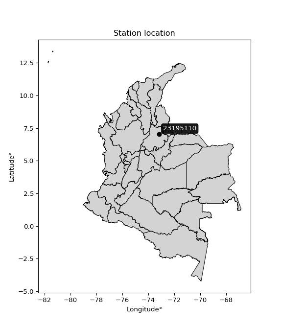</img>

</div>


## A. General information


### 1. General running parameters

• app_version: _v20260312_. • runtime: _2026-03-12 07:15:23.203550_. • Python version: _3.14.0_. • SciPy version: _1.16.3_. • Pandas version: _2.3.3_. • NumPy version: _2.3.5_. • Stations dataset (station_dataset_file): _dataset/pmax24h_in/automatic_colombia_2003_2025.csv_. • Stations catalog (station_catalog_file): _dataset/CNE.xls_. • Minimum year to eval til year_max (date_min): _1900_. • Maximum year to eval since year_min (date_max): _2025_. • Creates, save and include plots into reports (create_plot): _True_. • Plot only fit distributions with Δo > Δ (plot_only_fit): _True_. • Plot only simple graphs avoiding multiple CDFs and multiple Extreme values plots (plot_only_simple): _True_. • Eval low extreme values, if False, evaluates high extreme values (low_extreme): _False_. • Eval every SciPy distribution as logarithmic (pdist_logarithmic_on): _True_. • Standard deviation normalized (ddof): _1.0_. • Return periods to eval in years (Tr): _[2, 2.33, 5, 10, 15, 20, 25, 50, 75, 100, 200, 250, 500, 750, 1000]_. • Minimum data sample per station, 0 means any (minimum_sample): _5_. • Z-Score maximum threshold to adjust a value, 0 means disable (zscore_max): _3.5_. • Z-Score minimum threshold to adjust a value, 0 means disable (zscore_min): _-2.5_. • Avoid zeros, e.g. rain = 0 (avoid_zeros): _True_. • Avoid null values (avoid_nans): _True_. 

:file_folder:Table: [dataset.csv](../../dataset/pmax24h_in/automatic_colombia_2003_2025.csv)

> Delta Degrees of Freedom (DDOF): is a parameter used in the formulas for calculating variance and standard deviation. When ddof=0, the divisor is $N$ (the total number of observations) and this is used when your data set is the entire population. When ddof=1, the divisor is $N-1$ and this is used when your data set is a sample drawn from a larger population. Using $N-1$ provides an unbiased estimate of the population variance (known as Bessel´s correction).


### 2. Station info and location

|   id |   CODIGO | NOMBRE                         | CATEGORIA               | TECNOLOGIA                              | ESTADO   | FECHA_INSTALACION   |   FECHA_SUSPENSION |   ALTITUD |   LATITUD |   LONGITUD | DEPARTAMENTO   | MUNICIPIO   | AREA_OPERATIVA                         | ENTIDAD                                                     | AREA_HIDROGRAFICA   | ZONA_HIDROGRAFICA   | SUBZONA_HIDROGRAFICA                      |   CORRIENTE | Catalogo   |   Version |
|-----:|---------:|:-------------------------------|:------------------------|:----------------------------------------|:---------|:--------------------|-------------------:|----------:|----------:|-----------:|:---------------|:------------|:---------------------------------------|:------------------------------------------------------------|:--------------------|:--------------------|:------------------------------------------|------------:|:-----------|----------:|
|    0 | 23195110 | LLANO GRANDE  - AUT [23195110] | Climatológica Principal | Automática con Telemetría, Convencional | Activa   | 15/07/1971          |                nan |       777 |   7.02556 |   -73.1672 | Santander      | Girón       | Area Operativa 08 - Santanderes-Arauca | INSTITUTO DE HIDROLOGIA METEOROLOGIA Y ESTUDIOS AMBIENTALES | Magdalena Cauca     | Medio Magdalena     | Río Lebrija y otros directos al Magdalena |         nan | CNE_IDEAM  |  20251226 |

<div align="center">

Dynamic map: [:earth_americas:Google](http://maps.google.com/maps?q=7.025555556,-73.16722222) [:earth_americas:OSM](https://www.openstreetmap.org/#map=18/7.025555556/-73.16722222&layers=P) [:earth_americas:Bing](https://www.bing.com/maps?cp=7.025555556~-73.16722222&lvl=18) [:earth_americas:Apple](https://maps.apple.com/frame?center=7.025555556%2C-73.16722222&span=0.003%2C0.006)

</div>


<div align="center">

```geojson
{
  "type": "Feature",
  "geometry": {
    "type": "Point", 
    "coordinates": [-73.16722222, 7.025555556]
  }, 
  "properties": {
    "Name": "23195110"
  }
}
```

</div>


### 3. Discrete values table and plot

<div align="center">

|               |           0 |           1 |           2 |         3 |          4 |           5 |
|:--------------|------------:|------------:|------------:|----------:|-----------:|------------:|
| Date          | 2019        | 2020        | 2021        | 2023      | 2024       | 2025        |
| Value         |   67.2      |   34.1      |   47.1      |   23.5    |   81.4     |   56.2      |
| Value_initial |   67.2      |   34.1      |   47.1      |   23.5    |   81.4     |   56.2      |
| count         |    6        |    6        |    6        |    6      |    6       |    6        |
| mean          |   51.5833   |   51.5833   |   51.5833   |   51.5833 |   51.5833  |   51.5833   |
| std           |   21.301    |   21.301    |   21.301    |   21.301  |   21.301   |   21.301    |
| zscore        |    0.733142 |   -0.820774 |   -0.210475 |   -1.3184 |    1.39978 |    0.216734 |


</div>


<div align="center">

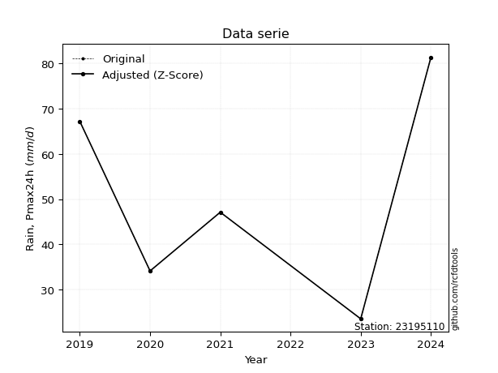</img>

</div>


> The initial value (value_initial) correspond to the initial obtained or null completed value, and value (value) is adjusted only when the initial value is outside the valid range (outlier) definite through the Z-Score value. If Z-Score is active, values out of range or outliers are replaced with the station mean value. A Z-Score (or standard score) measures how many standard deviations a data point is from the mean of a dataset, indicating its relative position; positive scores mean above the mean, negative mean below, and a score of zero is exactly at the mean, allowing for comparison of values from different distributions. It´s calculated using the formula $z=(x–μ)/σ$, where $x$ is the data point, $μ$ is the mean, and $σ$ is the standard deviation, helping identify outliers and understand probability.
>
> <sub>**Note**: In this study, "completing" (filling gaps in) and "extending" (forecasting or lengthening the historical record) rainfall data series are avoided for certain critical analyses because they introduce artificial bias and uncertainty, which can distort the statistics of rare events (extremes), alter day-to-day variability, and compromise the integrity and homogeneity of the original data. Some reasons against Completing/Extending rainfall data are: **Distortion of Extremes and Variability**: The primary issue is that most gap-filling or extension methods rely on averaging or regression with nearby stations, which inherently smooths the data. Rainfall is highly variable in space and time, with a large percentage of zero values and occasional large storms. Infilling methods often underestimate the highest values and overestimate the lowest (zero) values, which severely distorts analyses focused on flood frequency, drought severity, and intensity-duration-frequency (IDF) curves, **Loss of Data Homogeneity**: Infilled or extended data are synthetic estimates, not actual measurements. Combining these estimates with observed data can violate the assumption of data homogeneity, which requires that the data properties do not change over time. Inhomogeneity can lead to incorrect conclusions about long-term trends or changes in climate patterns, **Propagation of Errors**: Errors and biases from the original data (e.g., wind-induced undercatch, instrument errors, site changes) or the data used for imputation can propagate through the analysis, leading to unreliable hydrological models and inaccurate predictions, **Compromised Statistical Integrity**: For statistical analyses, especially those involving the frequency of events, using artificial data can introduce time bias or autocorrelation that doesn´t exist in reality, making it difficult to assess the true probability of events, **Difficulty in Validation**: It is difficult to accurately validate the quality of filled or extended data, especially for past periods where ground-truth measurements are unavailable. The reliability of imputation techniques heavily depends on the density of the surrounding station network and the complexity of the local topography.</sub>


### 4. Active continuous probability distributions from SciPy (80 of 104 available)

A Probability Density Function (PDF) describes the relative likelihood of a continuous random variable falling within a specific range, where the total area under its curve equals 1, and the area over any interval gives the actual probability for that range. Unlike discrete probabilities (like rolling a die), a PDF shows density, not direct probability for a single point (which is zero), with higher points indicating higher likelihood, often visualized as a bell curve for normal distributions.

A log of a probability density function (log-PDF) is simply the logarithm of the PDF´s value, denoted as $log(f(x))$, useful for converting multiplication of probabilities into addition, improving numerical stability with tiny numbers, and connecting to information theory concepts like entropy. Instead of dealing with very small probabilities (e.g., 0.000001), log-PDFs use negative numbers (e.g., $log(0.00001) ≈ -11.51$ that are easier for computers to handle, preventing underflow errors and simplifying complex calculations. In this study, each active probability distribution from SciPy is also evaluated in the $log$ form.

[scipy.stats](https://docs.scipy.org/doc/scipy/reference/stats.html) is a Python´s powerful submodule within the SciPy library for comprehensive statistical analysis, offering over 130 probability distributions (like Normal, Poisson, etc.), functions for descriptive stats (mean, variance), hypothesis testing (t-tests, chi-square), random variable generation, and statistical tests, making it essential for data science, modeling, and research. It provides tools to explore, model, and draw conclusions from data efficiently, working seamlessly with [NumPy](https://numpy.org/).

<div align="center">

|   id | p_dist           |   n_parameter | fit_method   | label                                                                       | active   | ref                                                                                                      |
|-----:|:-----------------|--------------:|:-------------|:----------------------------------------------------------------------------|:---------|:---------------------------------------------------------------------------------------------------------|
|    0 | alpha            |             3 | MLE          | Alpha                                                                       | True     | [:mortar_board:](https://docs.scipy.org/doc/scipy/reference/generated/scipy.stats.alpha.html)            |
|    1 | anglit           |             2 | MM           | Anglit                                                                      | True     | [:mortar_board:](https://docs.scipy.org/doc/scipy/reference/generated/scipy.stats.anglit.html)           |
|    2 | arcsine          |             2 | MM           | Arcsine                                                                     | True     | [:mortar_board:](https://docs.scipy.org/doc/scipy/reference/generated/scipy.stats.arcsine.html)          |
|    3 | argus            |             3 | MLE          | Argus                                                                       | True     | [:mortar_board:](https://docs.scipy.org/doc/scipy/reference/generated/scipy.stats.argus.html)            |
|    4 | beta             |             4 | MLE          | Beta                                                                        | True     | [:mortar_board:](https://docs.scipy.org/doc/scipy/reference/generated/scipy.stats.beta.html)             |
|    5 | betaprime        |             4 | MLE          | Beta prime                                                                  | True     | [:mortar_board:](https://docs.scipy.org/doc/scipy/reference/generated/scipy.stats.betaprime.html)        |
|    6 | bradford         |             3 | MLE          | Bradford                                                                    | True     | [:mortar_board:](https://docs.scipy.org/doc/scipy/reference/generated/scipy.stats.bradford.html)         |
|    7 | burr             |             4 | MLE          | Burr (Type III)                                                             | True     | [:mortar_board:](https://docs.scipy.org/doc/scipy/reference/generated/scipy.stats.burr.html)             |
|    8 | burr12           |             4 | MLE          | Burr (Type III) 12                                                          | True     | [:mortar_board:](https://docs.scipy.org/doc/scipy/reference/generated/scipy.stats.burr12.html)           |
|    9 | cosine           |             2 | MLE          | Cosine                                                                      | True     | [:mortar_board:](https://docs.scipy.org/doc/scipy/reference/generated/scipy.stats.cosine.html)           |
|   10 | crystalball      |             4 | MLE          | Crystalball                                                                 | True     | [:mortar_board:](https://docs.scipy.org/doc/scipy/reference/generated/scipy.stats.crystalball.html)      |
|   11 | dgamma           |             3 | MLE          | Double gamma                                                                | True     | [:mortar_board:](https://docs.scipy.org/doc/scipy/reference/generated/scipy.stats.dgamma.html)           |
|   12 | dweibull         |             3 | MLE          | Double Weibull                                                              | True     | [:mortar_board:](https://docs.scipy.org/doc/scipy/reference/generated/scipy.stats.dweibull.html)         |
|   13 | erlang           |             3 | MLE          | Erlang                                                                      | True     | [:mortar_board:](https://docs.scipy.org/doc/scipy/reference/generated/scipy.stats.erlang.html)           |
|   14 | exponnorm        |             3 | MLE          | Exponentially modified Normal                                               | True     | [:mortar_board:](https://docs.scipy.org/doc/scipy/reference/generated/scipy.stats.exponnorm.html)        |
|   15 | exponpow         |             3 | MLE          | Exponential power                                                           | True     | [:mortar_board:](https://docs.scipy.org/doc/scipy/reference/generated/scipy.stats.exponpow.html)         |
|   16 | exponweib        |             4 | MLE          | Exponentiated Weibull                                                       | True     | [:mortar_board:](https://docs.scipy.org/doc/scipy/reference/generated/scipy.stats.exponweib.html)        |
|   17 | f                |             4 | MLE          | F                                                                           | True     | [:mortar_board:](https://docs.scipy.org/doc/scipy/reference/generated/scipy.stats.f.html)                |
|   18 | fatiguelife      |             3 | MLE          | Fatigue-life (Birnbaum-Saunders)                                            | True     | [:mortar_board:](https://docs.scipy.org/doc/scipy/reference/generated/scipy.stats.fatiguelife.html)      |
|   19 | foldnorm         |             3 | MM           | Fold Normal                                                                 | True     | [:mortar_board:](https://docs.scipy.org/doc/scipy/reference/generated/scipy.stats.foldnorm.html)         |
|   20 | gamma            |             3 | MLE          | Gamma                                                                       | True     | [:mortar_board:](https://docs.scipy.org/doc/scipy/reference/generated/scipy.stats.gamma.html)            |
|   21 | gausshyper       |             6 | MLE          | Gauss hypergeometric                                                        | True     | [:mortar_board:](https://docs.scipy.org/doc/scipy/reference/generated/scipy.stats.gausshyper.html)       |
|   22 | genexpon         |             5 | MLE          | Generalized exponential                                                     | True     | [:mortar_board:](https://docs.scipy.org/doc/scipy/reference/generated/scipy.stats.genexpon.html)         |
|   23 | genextreme       |             3 | MLE          | Generalized exponential                                                     | True     | [:mortar_board:](https://docs.scipy.org/doc/scipy/reference/generated/scipy.stats.genextreme.html)       |
|   24 | gengamma         |             4 | MLE          | Generalized gamma                                                           | True     | [:mortar_board:](https://docs.scipy.org/doc/scipy/reference/generated/scipy.stats.gengamma.html)         |
|   25 | genhalflogistic  |             3 | MLE          | Generalized half-logistic                                                   | True     | [:mortar_board:](https://docs.scipy.org/doc/scipy/reference/generated/scipy.stats.genhalflogistic.html)  |
|   26 | genlogistic      |             3 | MLE          | Generalized logistic                                                        | True     | [:mortar_board:](https://docs.scipy.org/doc/scipy/reference/generated/scipy.stats.genlogistic.html)      |
|   27 | gennorm          |             3 | MLE          | Generalized Normal                                                          | True     | [:mortar_board:](https://docs.scipy.org/doc/scipy/reference/generated/scipy.stats.gennorm.html)          |
|   28 | genpareto        |             3 | MLE          | Generalized Pareto                                                          | True     | [:mortar_board:](https://docs.scipy.org/doc/scipy/reference/generated/scipy.stats.genpareto.html)        |
|   29 | gompertz         |             3 | MLE          | Gompertz (or truncated Gumbel)                                              | True     | [:mortar_board:](https://docs.scipy.org/doc/scipy/reference/generated/scipy.stats.gompertz.html)         |
|   30 | gumbel_l         |             2 | MM           | Gumbel Left Skew                                                            | True     | [:mortar_board:](https://docs.scipy.org/doc/scipy/reference/generated/scipy.stats.gumbel_l.html)         |
|   31 | gumbel_r         |             2 | MM           | Gumbel Right Skew                                                           | True     | [:mortar_board:](https://docs.scipy.org/doc/scipy/reference/generated/scipy.stats.gumbel_r.html)         |
|   32 | halfgennorm      |             3 | MLE          | Upper half of a generalized normal                                          | True     | [:mortar_board:](https://docs.scipy.org/doc/scipy/reference/generated/scipy.stats.halfgennorm.html)      |
|   33 | halflogistic     |             2 | MM           | Half-logistic                                                               | True     | [:mortar_board:](https://docs.scipy.org/doc/scipy/reference/generated/scipy.stats.halflogistic.html)     |
|   34 | halfnorm         |             2 | MM           | Half Normal                                                                 | True     | [:mortar_board:](https://docs.scipy.org/doc/scipy/reference/generated/scipy.stats.halfnorm.html)         |
|   35 | hypsecant        |             2 | MM           | hyperbolic secant                                                           | True     | [:mortar_board:](https://docs.scipy.org/doc/scipy/reference/generated/scipy.stats.hypsecant.html)        |
|   36 | invgamma         |             3 | MLE          | Inverted gamma                                                              | True     | [:mortar_board:](https://docs.scipy.org/doc/scipy/reference/generated/scipy.stats.invgamma.html)         |
|   37 | invgauss         |             3 | MLE          | Inverse Gaussian                                                            | True     | [:mortar_board:](https://docs.scipy.org/doc/scipy/reference/generated/scipy.stats.invgauss.html)         |
|   38 | invweibull       |             3 | MLE          | Inverted Weibull                                                            | True     | [:mortar_board:](https://docs.scipy.org/doc/scipy/reference/generated/scipy.stats.invweibull.html)       |
|   39 | johnsonsb        |             4 | MLE          | Johnson SB                                                                  | True     | [:mortar_board:](https://docs.scipy.org/doc/scipy/reference/generated/scipy.stats.johnsonsb.html)        |
|   40 | johnsonsu        |             4 | MLE          | Johnson Su                                                                  | True     | [:mortar_board:](https://docs.scipy.org/doc/scipy/reference/generated/scipy.stats.johnsonsu.html)        |
|   41 | kappa3           |             3 | MLE          | Kappa 3                                                                     | True     | [:mortar_board:](https://docs.scipy.org/doc/scipy/reference/generated/scipy.stats.kappa3.html)           |
|   42 | kappa4           |             4 | MLE          | Kappa 4                                                                     | True     | [:mortar_board:](https://docs.scipy.org/doc/scipy/reference/generated/scipy.stats.kappa4.html)           |
|   43 | ksone            |             3 | MLE          | Kolmogorov-Smirnov one-sided test statistic distribution                    | True     | [:mortar_board:](https://docs.scipy.org/doc/scipy/reference/generated/scipy.stats.ksone.html)            |
|   44 | kstwobign        |             2 | MLE          | Limiting distribution of scaled Kolmogorov-Smirnov two-sided test statistic | True     | [:mortar_board:](https://docs.scipy.org/doc/scipy/reference/generated/scipy.stats.kstwobign.html)        |
|   45 | laplace          |             2 | MM           | Laplace                                                                     | True     | [:mortar_board:](https://docs.scipy.org/doc/scipy/reference/generated/scipy.stats.laplace.html)          |
|   46 | levy_l           |             2 | MLE          | Left-skewed Levy                                                            | True     | [:mortar_board:](https://docs.scipy.org/doc/scipy/reference/generated/scipy.stats.levy_l.html)           |
|   47 | loggamma         |             3 | MLE          | Log gamma                                                                   | True     | [:mortar_board:](https://docs.scipy.org/doc/scipy/reference/generated/scipy.stats.loggamma.html)         |
|   48 | logistic         |             2 | MM           | Logistic (or Sech-squared)                                                  | True     | [:mortar_board:](https://docs.scipy.org/doc/scipy/reference/generated/scipy.stats.logistic.html)         |
|   49 | loglaplace       |             3 | MLE          | Log-Laplace                                                                 | True     | [:mortar_board:](https://docs.scipy.org/doc/scipy/reference/generated/scipy.stats.loglaplace.html)       |
|   50 | lomax            |             3 | MLE          | Lomax (Pareto of the second kind)                                           | True     | [:mortar_board:](https://docs.scipy.org/doc/scipy/reference/generated/scipy.stats.lomax.html)            |
|   51 | maxwell          |             2 | MM           | Maxwell                                                                     | True     | [:mortar_board:](https://docs.scipy.org/doc/scipy/reference/generated/scipy.stats.maxwell.html)          |
|   52 | mielke           |             4 | MLE          | Mielke Beta-Kappa / Dagum                                                   | True     | [:mortar_board:](https://docs.scipy.org/doc/scipy/reference/generated/scipy.stats.mielke.html)           |
|   53 | moyal            |             2 | MM           | Moyal                                                                       | True     | [:mortar_board:](https://docs.scipy.org/doc/scipy/reference/generated/scipy.stats.moyal.html)            |
|   54 | nakagami         |             3 | MLE          | Nakagami                                                                    | True     | [:mortar_board:](https://docs.scipy.org/doc/scipy/reference/generated/scipy.stats.nakagami.html)         |
|   55 | ncf              |             5 | MLE          | Non-central F distribution                                                  | True     | [:mortar_board:](https://docs.scipy.org/doc/scipy/reference/generated/scipy.stats.ncf.html)              |
|   56 | nct              |             4 | MLE          | Non-central Student’s t                                                     | True     | [:mortar_board:](https://docs.scipy.org/doc/scipy/reference/generated/scipy.stats.nct.html)              |
|   57 | norm             |             2 | MM           | Normal                                                                      | True     | [:mortar_board:](https://docs.scipy.org/doc/scipy/reference/generated/scipy.stats.norm.html)             |
|   58 | pearson3         |             3 | MM           | Pearson type III                                                            | True     | [:mortar_board:](https://docs.scipy.org/doc/scipy/reference/generated/scipy.stats.pearson3.html)         |
|   59 | powerlaw         |             3 | MLE          | Power-function                                                              | True     | [:mortar_board:](https://docs.scipy.org/doc/scipy/reference/generated/scipy.stats.powerlaw.html)         |
|   60 | rayleigh         |             2 | MM           | Rayleigh                                                                    | True     | [:mortar_board:](https://docs.scipy.org/doc/scipy/reference/generated/scipy.stats.rayleigh.html)         |
|   61 | rdist            |             3 | MLE          | R-distributed (symmetric beta)                                              | True     | [:mortar_board:](https://docs.scipy.org/doc/scipy/reference/generated/scipy.stats.rdist.html)            |
|   62 | rice             |             3 | MLE          | Rice                                                                        | True     | [:mortar_board:](https://docs.scipy.org/doc/scipy/reference/generated/scipy.stats.rice.html)             |
|   63 | semicircular     |             2 | MM           | Semicircular                                                                | True     | [:mortar_board:](https://docs.scipy.org/doc/scipy/reference/generated/scipy.stats.semicircular.html)     |
|   64 | skewnorm         |             3 | MLE          | Skew normal                                                                 | True     | [:mortar_board:](https://docs.scipy.org/doc/scipy/reference/generated/scipy.stats.skewnorm.html)         |
|   65 | t                |             3 | MLE          | Student’s t                                                                 | True     | [:mortar_board:](https://docs.scipy.org/doc/scipy/reference/generated/scipy.stats.t.html)                |
|   66 | trapezoid        |             4 | MLE          | Trapezoid                                                                   | True     | [:mortar_board:](https://docs.scipy.org/doc/scipy/reference/generated/scipy.stats.trapezoid.html)        |
|   67 | triang           |             3 | MLE          | Triangular                                                                  | True     | [:mortar_board:](https://docs.scipy.org/doc/scipy/reference/generated/scipy.stats.triang.html)           |
|   68 | truncexpon       |             3 | MLE          | Truncated exponential                                                       | True     | [:mortar_board:](https://docs.scipy.org/doc/scipy/reference/generated/scipy.stats.truncexpon.html)       |
|   69 | truncnorm        |             4 | MLE          | Truncated normal                                                            | True     | [:mortar_board:](https://docs.scipy.org/doc/scipy/reference/generated/scipy.stats.truncnorm.html)        |
|   70 | truncpareto      |             4 | MLE          | Upper truncated Pareto                                                      | True     | [:mortar_board:](https://docs.scipy.org/doc/scipy/reference/generated/scipy.stats.truncpareto.html)      |
|   71 | truncweibull_min |             5 | MLE          | Doubly truncated Weibull minimum                                            | True     | [:mortar_board:](https://docs.scipy.org/doc/scipy/reference/generated/scipy.stats.truncweibull_min.html) |
|   72 | tukeylambda      |             3 | MLE          | Tukey-Lamdba                                                                | True     | [:mortar_board:](https://docs.scipy.org/doc/scipy/reference/generated/scipy.stats.tukeylambda.html)      |
|   73 | uniform          |             2 | MLE          | Uniform                                                                     | True     | [:mortar_board:](https://docs.scipy.org/doc/scipy/reference/generated/scipy.stats.uniform.html)          |
|   74 | vonmises         |             3 | MLE          | Von Mises                                                                   | True     | [:mortar_board:](https://docs.scipy.org/doc/scipy/reference/generated/scipy.stats.vonmises.html)         |
|   75 | vonmises_line    |             3 | MLE          | Von Mises line                                                              | True     | [:mortar_board:](https://docs.scipy.org/doc/scipy/reference/generated/scipy.stats.vonmises_line.html)    |
|   76 | wald             |             2 | MM           | Wald                                                                        | True     | [:mortar_board:](https://docs.scipy.org/doc/scipy/reference/generated/scipy.stats.wald.html)             |
|   77 | weibull_max      |             3 | MLE          | Weibull maximum                                                             | True     | [:mortar_board:](https://docs.scipy.org/doc/scipy/reference/generated/scipy.stats.weibull_max.html)      |
|   78 | weibull_min      |             3 | MLE          | Weibull minimum                                                             | True     | [:mortar_board:](https://docs.scipy.org/doc/scipy/reference/generated/scipy.stats.weibull_min.html)      |
|   79 | wrapcauchy       |             3 | MLE          | Wrapped  Cauchy                                                             | True     | [:mortar_board:](https://docs.scipy.org/doc/scipy/reference/generated/scipy.stats.wrapcauchy.html)       |

</div>

> **n_parameter:** # arguments & localization & scale.
>
> **Fit methods:** (MLE) maximum likelihood, (MM) L-moments.
>
>**Inactive** (With the only purpose of prevent loops, zero divisions, infinite values, over high estimated values or horizontal trending for recurrence intervals estimations, the follow distributions were disabled.)**:** lognorm, norminvgauss, powernorm, powerlognorm, cauchy, halfcauchy, foldcauchy, skewcauchy, chi2, expon, fisk, genhyperbolic, geninvgauss, gibrat, kstwo, laplace_asymmetric, levy, levy_stable, ncx2, pareto, rel_breitwigner, recipinvgauss, studentized_range, loguniform, 


## B. Probability (PDF) vs. Empirical (EDF) distributions functions

A continuous probability distribution (CPD) describes probabilities for variables that can take any value within a range (like rain any time), unlike discrete variables with specific outcomes (like temperature). It uses a Probability Density Function (PDF), a curve where the total area under it equals 1, and the probability of the variable falling within an interval (a to b) is found by calculating the area under the curve between those points. A key feature is that the probability of hitting any single exact value is zero, so probabilities are always expressed for ranges, e.g., $P(a ≤ X ≤ b)$.

<div align="center">

Distributions parameters from station values
|     |   station | p_dist              |   n |             loc |          scale | shape                  | shape1                 | shape2                | shape3             |
|----:|----------:|:--------------------|----:|----------------:|---------------:|:-----------------------|:-----------------------|:----------------------|:-------------------|
|   0 |  23195110 | alpha               |   6 |  -224.419       | 3888.47        | 14.164927452569977     |                        |                       |                    |
|   1 |  23195110 | anglit              |   6 |    51.5833      |   56.8846      |                        |                        |                       |                    |
|   2 |  23195110 | arcsine             |   6 |    24.0839      |   54.999       |                        |                        |                       |                    |
|   3 |  23195110 | argus               |   6 |     8.49326     |   76.6689      | 2.352710932480658e-06  |                        |                       |                    |
|   4 |  23195110 | beta                |   6 |    23.5         |   58.919       | 0.8803331512491113     | 1.0795795204510439     |                       |                    |
|   5 |  23195110 | betaprime           |   6 |   -23.2762      | 5827.9         | 14.393521829258747     | 1121.519229138395      |                       |                    |
|   6 |  23195110 | bradford            |   6 |    23.5         |   57.9002      | 1.082453012223552      |                        |                       |                    |
|   7 |  23195110 | burr                |   6 |    -2.04089     |   84.1944      | 495.2696056528287      | 0.003779292734791837   |                       |                    |
|   8 |  23195110 | burr12              |   6 |     0.0191449   |   23.3081      | 567.6715633772039      | 0.00247001599762375    |                       |                    |
|   9 |  23195110 | cosine              |   6 |    51.81        |   15.8828      |                        |                        |                       |                    |
|  10 |  23195110 | crystalball         |   6 |    51.5833      |   19.4451      | 24779.969736209972     | 1624.7584719177098     |                       |                    |
|  11 |  23195110 | dgamma              |   6 |    51.5991      |    7.8332      | 2.1298179739880445     |                        |                       |                    |
|  12 |  23195110 | dweibull            |   6 |    51.5876      |   18.675       | 1.6789438698548724     |                        |                       |                    |
|  13 |  23195110 | erlang              |   6 |  -449.945       |    0.752832    | 666.163116606228       |                        |                       |                    |
|  14 |  23195110 | exponnorm           |   6 |    50.5144      |   19.4157      | 0.055054160093014747   |                        |                       |                    |
|  15 |  23195110 | exponpow            |   6 |    23.5         |    1.71633     | 0.09493624408772641    |                        |                       |                    |
|  16 |  23195110 | exponweib           |   6 |    23.5         |    1.03665     | 1.314018594708279      | 0.2256653484072323     |                       |                    |
|  17 |  23195110 | f                   |   6 |   -15.1513      |   66.7003      | 22.427206518137574     | 3675.7128590619486     |                       |                    |
|  18 |  23195110 | fatiguelife         |   6 |    23.4995      |    0.172169    | 11.259673477304283     |                        |                       |                    |
|  19 |  23195110 | foldnorm            |   6 |     2.01346     |   19.6318      | 2.5212201580551072     |                        |                       |                    |
|  20 |  23195110 | gamma               |   6 |  -443.774       |    0.762278    | 649.8330023415733      |                        |                       |                    |
|  21 |  23195110 | gausshyper          |   6 |    23.5         |   58.3799      | 0.8954694905407945     | 0.9757102539811036     | 1.0862620978474329    | 1.1011828013608898 |
|  22 |  23195110 | genexpon            |   6 |    23.5         |    3.67474     | 0.13083432604919293    | 4.637959648736951e-07  | 1.0472202644529873    |                    |
|  23 |  23195110 | genextreme          |   6 |    24.6718      |    8.39882     | -7.167321224338073     |                        |                       |                    |
|  24 |  23195110 | gengamma            |   6 |    23.5         |    1.09987     | 1.2680938440122693     | 0.2566587989219925     |                       |                    |
|  25 |  23195110 | genhalflogistic     |   6 |    17.9508      |   66.1873      | 1.043154445134892      |                        |                       |                    |
|  26 |  23195110 | genlogistic         |   6 |   -49.2038      |   17.2614      | 197.31919610872455     |                        |                       |                    |
|  27 |  23195110 | gennorm             |   6 |    52.45        |   28.95        | 12320290.453755055     |                        |                       |                    |
|  28 |  23195110 | genpareto           |   6 |    -0.375935    |  116.231       | -1.4213314426552803    |                        |                       |                    |
|  29 |  23195110 | gompertz            |   6 |   -75.5446      |   17.9092      | 0.0004799984595408742  |                        |                       |                    |
|  30 |  23195110 | gumbel_l            |   6 |    60.3347      |   15.1613      |                        |                        |                       |                    |
|  31 |  23195110 | gumbel_r            |   6 |    42.832       |   15.1613      |                        |                        |                       |                    |
|  32 |  23195110 | halfgennorm         |   6 |    23.5         |    1.11254     | 0.35823752119157837    |                        |                       |                    |
|  33 |  23195110 | halflogistic        |   6 |    28.5364      |   16.6249      |                        |                        |                       |                    |
|  34 |  23195110 | halfnorm            |   6 |    25.8456      |   32.2574      |                        |                        |                       |                    |
|  35 |  23195110 | hypsecant           |   6 |    51.5833      |   12.3791      |                        |                        |                       |                    |
|  36 |  23195110 | invgamma            |   6 |   -83.4217      | 6146.65        | 46.50784641907177      |                        |                       |                    |
|  37 |  23195110 | invgauss            |   6 |   -50.5392      | 2629.02        | 0.038768347276741146   |                        |                       |                    |
|  38 |  23195110 | invweibull          |   6 |    23.5         |    1.34761     | 0.04867888066798469    |                        |                       |                    |
|  39 |  23195110 | johnsonsb           |   6 |    23.5         |   57.9873      | 0.19139828364059275    | 0.13572103836934404    |                       |                    |
|  40 |  23195110 | johnsonsu           |   6 |  -193.351       |   53.3864      | -28.672732982645527    | 12.884831922760018     |                       |                    |
|  41 |  23195110 | kappa3              |   6 |    23.4992      |   49.3268      | 15.753836089536449     |                        |                       |                    |
|  42 |  23195110 | kappa4              |   6 |    16.6949      |   65.7053      | 1.1155892326318688     | 1.0077828326636797     |                       |                    |
|  43 |  23195110 | ksone               |   6 |    17.9035      |   67.3598      | 1.0                    |                        |                       |                    |
|  44 |  23195110 | kstwobign           |   6 |   -17.9292      |   79.3802      |                        |                        |                       |                    |
|  45 |  23195110 | laplace             |   6 |    51.5833      |   13.7498      |                        |                        |                       |                    |
|  46 |  23195110 | levy_l              |   6 |    84.2469      |   11.7901      |                        |                        |                       |                    |
|  47 |  23195110 | loggamma            |   6 | -3462.71        |  531.764       | 741.9930504141686      |                        |                       |                    |
|  48 |  23195110 | logistic            |   6 |    51.5833      |   10.7206      |                        |                        |                       |                    |
|  49 |  23195110 | loglaplace          |   6 |    -0.132997    |   47.233       | 2.8694323072146837     |                        |                       |                    |
|  50 |  23195110 | lomax               |   6 |    23.5         | 3064           | 109.25175413118137     |                        |                       |                    |
|  51 |  23195110 | maxwell             |   6 |     5.50664     |   28.8743      |                        |                        |                       |                    |
|  52 |  23195110 | mielke              |   6 |    -5.34346     |   87.3113      | 2.031388524573885      | 592.4098919041135      |                       |                    |
|  53 |  23195110 | moyal               |   6 |    40.4634      |    8.75336     |                        |                        |                       |                    |
|  54 |  23195110 | nakagami            |   6 |    34.1         |   10.3841      | 0.05087998022364483    |                        |                       |                    |
|  55 |  23195110 | ncf                 |   6 |    -0.207255    |    2.65081e-06 | 1.4284836934308357e-06 | 433.5123383103063      | 27.79216495174552     |                    |
|  56 |  23195110 | nct                 |   6 | -1124.6         |   19.3754      | 250189.9037929268      | 60.70457927926276      |                       |                    |
|  57 |  23195110 | norm                |   6 |    51.5833      |   19.4451      |                        |                        |                       |                    |
|  58 |  23195110 | pearson3            |   6 |    51.5833      |   19.4451      | 0.06415894742199985    |                        |                       |                    |
|  59 |  23195110 | powerlaw            |   6 |    23.5         |   57.9         | 0.14713878445510367    |                        |                       |                    |
|  60 |  23195110 | rayleigh            |   6 |    14.3837      |   29.681       |                        |                        |                       |                    |
|  61 |  23195110 | rdist               |   6 |    20.2551      |   26.8449      | 1.2009216404253538     |                        |                       |                    |
|  62 |  23195110 | rice                |   6 |    13.8419      |   23.8263      | 1.0840596474421358     |                        |                       |                    |
|  63 |  23195110 | semicircular        |   6 |    51.5833      |   38.8902      |                        |                        |                       |                    |
|  64 |  23195110 | skewnorm            |   6 |    46.5001      |   20.0985      | 0.33419635178194645    |                        |                       |                    |
|  65 |  23195110 | t                   |   6 |    51.5831      |   19.4444      | 96269459.45155075      |                        |                       |                    |
|  66 |  23195110 | trapezoid           |   6 |    17.71        |   69.48        | 1.0                    | 1.0                    |                       |                    |
|  67 |  23195110 | triang              |   6 |     3.82996     |   77.57        | 0.9999999995316925     |                        |                       |                    |
|  68 |  23195110 | truncexpon          |   6 |    23.5         |   56.4683      | 1.025353934242204      |                        |                       |                    |
|  69 |  23195110 | truncnorm           |   6 |    51.5833      |   19.4451      | -414.12525834642867    | 735.9897468150773      |                       |                    |
|  70 |  23195110 | truncpareto         |   6 |    23.4186      |    0.081386    | 0.20404592986042464    | 712.4246576050888      |                       |                    |
|  71 |  23195110 | truncweibull_min    |   6 |    23.4392      |   80.2197      | 0.9283270439740938     | 2.3696356075632733e-10 | 0.7225253196782473    |                    |
|  72 |  23195110 | tukeylambda         |   6 |    52.4554      |   33.3167      | 1.1506209201373552     |                        |                       |                    |
|  73 |  23195110 | uniform             |   6 |    23.5         |   57.9         |                        |                        |                       |                    |
|  74 |  23195110 | vonmises            |   6 |    -1.75766     |    1           | 0.7601812765598667     |                        |                       |                    |
|  75 |  23195110 | vonmises_line       |   6 |    52.4501      |    9.2151      | 0.3603441546300602     |                        |                       |                    |
|  76 |  23195110 | wald                |   6 |    32.1383      |   19.445       |                        |                        |                       |                    |
|  77 |  23195110 | weibull_max         |   6 |    81.4         |    1.533       | 0.253062130807339      |                        |                       |                    |
|  78 |  23195110 | weibull_min         |   6 |    18.3217      |   37.0752      | 1.6817935664882455     |                        |                       |                    |
|  79 |  23195110 | wrapcauchy          |   6 |    23.5         |    9.21507     | 0.15054076636082958    |                        |                       |                    |
|  80 |  23195110 | logalpha            |   6 |    -6.32586     |  242.673       | 23.87183543122011      |                        |                       |                    |
|  81 |  23195110 | loganglit           |   6 |     3.86242     |    1.22024     |                        |                        |                       |                    |
|  82 |  23195110 | logarcsine          |   6 |     3.27253     |    1.17978     |                        |                        |                       |                    |
|  83 |  23195110 | logargus            |   6 |     2.81332     |    1.64626     | 1.4092975817522384     |                        |                       |                    |
|  84 |  23195110 | logbeta             |   6 |     2.97068     |    1.4287      | 1.165162626751079      | 0.6723767321704918     |                       |                    |
|  85 |  23195110 | logbetaprime        |   6 |    -7.06523     |    8.82034     | 1446.6293381160117     | 1168.5586710488742     |                       |                    |
|  86 |  23195110 | logbradford         |   6 |     3.12727     |    1.27491     | 2.8342041275231165e-05 |                        |                       |                    |
|  87 |  23195110 | logburr             |   6 |  -838.6         |  843.02        | 92098.44036952808      | 0.01635832490933331    |                       |                    |
|  88 |  23195110 | logburr12           |   6 |   -16.6929      |   23.8452      | 61.13570675047443      | 4902.313632054155      |                       |                    |
|  89 |  23195110 | logcosine           |   6 |     3.83517     |    0.343467    |                        |                        |                       |                    |
|  90 |  23195110 | logcrystalball      |   6 |     3.86242     |    0.41712     | 539.8108945711559      | 81.56631619595522      |                       |                    |
|  91 |  23195110 | logdgamma           |   6 |     3.9328      |    0.189576    | 1.8439629064808383     |                        |                       |                    |
|  92 |  23195110 | logdweibull         |   6 |     3.92368     |    0.386909    | 1.480949362282829      |                        |                       |                    |
|  93 |  23195110 | logerlang           |   6 |    -3.31468     |    0.0245818   | 291.8523084795305      |                        |                       |                    |
|  94 |  23195110 | logexponnorm        |   6 |     3.86218     |    0.417116    | 0.0005890161475017876  |                        |                       |                    |
|  95 |  23195110 | logexponpow         |   6 |     3.157       |    1.10145     | 0.9450126693751437     |                        |                       |                    |
|  96 |  23195110 | logexponweib        |   6 |     3.157       |    1.28074     | 0.015413932490205638   | 42.524802200500645     |                       |                    |
|  97 |  23195110 | logf                |   6 |  -420.253       |  424.115       | 6909631.179750713      | 2950692.5879010577     |                       |                    |
|  98 |  23195110 | logfatiguelife      |   6 |   -66.4284      |   70.288       | 0.005938594995628807   |                        |                       |                    |
|  99 |  23195110 | logfoldnorm         |   6 |     3.32818     |    0.626687    | 0.3776330667553679     |                        |                       |                    |
| 100 |  23195110 | loggamma            |   6 |    -3.08165     |    0.0260776   | 266.2147088902417      |                        |                       |                    |
| 101 |  23195110 | loggausshyper       |   6 |     3.12071     |    1.27866     | 1.0369592406660402     | 0.9193058834670245     | 1.0430234860320158    | 1.1014238607910167 |
| 102 |  23195110 | loggenexpon         |   6 |     3.1226      |    0.00895493  | 0.0044661528139166365  | 2.664613274995272      | 5.265456802076328e-05 |                    |
| 103 |  23195110 | loggenextreme       |   6 |     3.90773     |    0.563401    | 1.1459472111543376     |                        |                       |                    |
| 104 |  23195110 | loggengamma         |   6 |     3.157       |    0.94306     | 0.6034065866930584     | 1.3517309395569261     |                       |                    |
| 105 |  23195110 | loggenhalflogistic  |   6 |     3.15674     |    1.36122     | 1.0954287794027127     |                        |                       |                    |
| 106 |  23195110 | loggenlogistic      |   6 |     4.39951     |    4.13826e-07 | 7.723180676880023e-07  |                        |                       |                    |
| 107 |  23195110 | loggennorm          |   6 |     3.77819     |    0.621188    | 11659864.61901138      |                        |                       |                    |
| 108 |  23195110 | loggenpareto        |   6 |    -0.00110621  |    7.16259     | -1.6276823621202818    |                        |                       |                    |
| 109 |  23195110 | loggompertz         |   6 |     3.157       |    0.458798    | 0.17981410174000464    |                        |                       |                    |
| 110 |  23195110 | loggumbel_l         |   6 |     4.05015     |    0.325227    |                        |                        |                       |                    |
| 111 |  23195110 | loggumbel_r         |   6 |     3.6747      |    0.325227    |                        |                        |                       |                    |
| 112 |  23195110 | loghalfgennorm      |   6 |     3.157       |    1.2424      | 704968.072036494       |                        |                       |                    |
| 113 |  23195110 | loghalflogistic     |   6 |     3.36807     |    0.3566      |                        |                        |                       |                    |
| 114 |  23195110 | loghalfnorm         |   6 |     3.31035     |    0.691928    |                        |                        |                       |                    |
| 115 |  23195110 | loghypsecant        |   6 |     3.86242     |    0.265547    |                        |                        |                       |                    |
| 116 |  23195110 | loginvgamma         |   6 |    -3.73927     | 2416.34        | 319.1709308472193      |                        |                       |                    |
| 117 |  23195110 | loginvgauss         |   6 |     0.376167    |  221.135       | 0.01575039093269668    |                        |                       |                    |
| 118 |  23195110 | loginvweibull       |   6 |    -1.5184e+07  |    1.5184e+07  | 36495962.586029604     |                        |                       |                    |
| 119 |  23195110 | logjohnsonsb        |   6 |     3.08891     |    1.31047     | -0.35203211681663      | 0.09290519404185715    |                       |                    |
| 120 |  23195110 | logjohnsonsu        |   6 |     4.76288     |    0.0223643   | 8.695985475391073      | 2.0344821475695216     |                       |                    |
| 121 |  23195110 | logkappa3           |   6 |     3.157       |    2.16805     | 42.79890113272212      |                        |                       |                    |
| 122 |  23195110 | logkappa4           |   6 |     3.08475     |    1.37848     | 1.0553761533408395     | 1.0413442499737435     |                       |                    |
| 123 |  23195110 | logksone            |   6 |     3.13995     |    1.44494     | 1.0                    |                        |                       |                    |
| 124 |  23195110 | logkstwobign        |   6 |     2.1977      |    1.899       |                        |                        |                       |                    |
| 125 |  23195110 | loglaplace          |   6 |     3.86242     |    0.294948    |                        |                        |                       |                    |
| 126 |  23195110 | loglevy_l           |   6 |     4.44377     |    0.183335    |                        |                        |                       |                    |
| 127 |  23195110 | logloggamma         |   6 |     4.39943     |    1.56979e-06 | 2.918598633551106e-06  |                        |                       |                    |
| 128 |  23195110 | loglogistic         |   6 |     3.86242     |    0.22997     |                        |                        |                       |                    |
| 129 |  23195110 | logloglaplace       |   6 |   -27.4335      |   31.4566      | 93.87979237403354      |                        |                       |                    |
| 130 |  23195110 | loglomax            |   6 |     3.157       |   24.7259      | 35.34389629359158      |                        |                       |                    |
| 131 |  23195110 | logmaxwell          |   6 |     2.87402     |    0.619387    |                        |                        |                       |                    |
| 132 |  23195110 | logmielke           |   6 |    -9.19237e+06 |    9.19237e+06 | 16885671.9797016       | 2485804530.350766      |                       |                    |
| 133 |  23195110 | logmoyal            |   6 |     3.62389     |    0.18777     |                        |                        |                       |                    |
| 134 |  23195110 | lognakagami         |   6 |     3.5293      |    0.438484    | 0.12713840957629916    |                        |                       |                    |
| 135 |  23195110 | logncf              |   6 |    -5.56668     |    9.41898     | 2201.5506808295013     | 1710.5459051317403     | 9.008404883159571e-08 |                    |
| 136 |  23195110 | lognct              |   6 |    -0.288078    |    0.0351303   | 46.04264033901711      | 116.19615105323754     |                       |                    |
| 137 |  23195110 | lognorm             |   6 |     3.86242     |    0.41712     |                        |                        |                       |                    |
| 138 |  23195110 | logpearson3         |   6 |     3.86242     |    0.41712     | -0.4304733723871035    |                        |                       |                    |
| 139 |  23195110 | logpowerlaw         |   6 |     3.157       |    1.24237     | 0.15841677938206192    |                        |                       |                    |
| 140 |  23195110 | lograyleigh         |   6 |     3.06445     |    0.636691    |                        |                        |                       |                    |
| 141 |  23195110 | logrdist            |   6 |     4.25498     |    0.725682    | 1.022053982297297      |                        |                       |                    |
| 142 |  23195110 | logrice             |   6 |     2.91061     |    0.466147    | 1.7233444987637911     |                        |                       |                    |
| 143 |  23195110 | logsemicircular     |   6 |     3.86242     |    0.834239    |                        |                        |                       |                    |
| 144 |  23195110 | logskewnorm         |   6 |     4.39938     |    0.679775    | -5543086.807296495     |                        |                       |                    |
| 145 |  23195110 | logt                |   6 |     3.86242     |    0.41712     | 1797448100.0097036     |                        |                       |                    |
| 146 |  23195110 | logtrapezoid        |   6 |     2.68263     |    1.76969     | 1.0                    | 1.0                    |                       |                    |
| 147 |  23195110 | logtriang           |   6 |     2.82803     |    1.57135     | 0.9999999933409149     |                        |                       |                    |
| 148 |  23195110 | logtruncexpon       |   6 |     3.157       |    1.67501     | 0.741714127088881      |                        |                       |                    |
| 149 |  23195110 | logtruncnorm        |   6 |    -0.110024    |    1.36452     | 2.6671140282391317     | 4.848654723824302      |                       |                    |
| 150 |  23195110 | logtruncpareto      |   6 |     3.15483     |    0.00216855  | 0.20365512800063204    | 573.9054998893027      |                       |                    |
| 151 |  23195110 | logtruncweibull_min |   6 |     3.157       |    1.77        | 0.5381114762475976     | 2.337589806520887e-16  | 0.7019294886883911    |                    |
| 152 |  23195110 | logtukeylambda      |   6 |     3.77795     |    0.654248    | 1.0528189258347416     |                        |                       |                    |
| 153 |  23195110 | loguniform          |   6 |     3.157       |    1.24237     |                        |                        |                       |                    |
| 154 |  23195110 | logvonmises         |   6 |    -2.41527     |    1           | 6.207749350103669      |                        |                       |                    |
| 155 |  23195110 | logvonmises_line    |   6 |     3.77817     |    0.197738    | 8.572986683672208e-05  |                        |                       |                    |
| 156 |  23195110 | logwald             |   6 |     3.4453      |    0.417121    |                        |                        |                       |                    |
| 157 |  23195110 | logweibull_max      |   6 |     4.39938     |    0.221803    | 0.3697949883600442     |                        |                       |                    |
| 158 |  23195110 | logweibull_min      |   6 |   -24.7985      |   28.8569      | 84.9936144394467       |                        |                       |                    |
| 159 |  23195110 | logwrapcauchy       |   6 |     3.157       |    0.19773     | 0.5                    |                        |                       |                    |

</div>

> **loc** (Location parameter): This shifts the distribution along the x-axis. For many common distributions, like the normal (Gaussian) distribution, loc represents the mean $μ$. For others, like the uniform distribution, it might represent the minimum value, or for the beta distribution, the left end of the support interval.
>
> **scale** (Scale parameter): This determines the width or spread of the distribution. For the normal distribution, scale represents the standard deviation $σ$. For a uniform distribution, it defines the length of the interval (from $loc$ to $loc + scale$).
>
> **shape** (Shape parameters): Refers to parameters that define the specific form of a probability distribution, distinct from its location (loc) and scale (scale). These parameters are required arguments for most distribution functions. For example, a normal (Gaussian) distribution is fully defined by its location (mean) and scale (standard deviation), so it has no specific shape parameters beyond loc and scale. However, other distributions have intrinsic properties that need specification, as Gamma distribution that takes a shape parameter, often named $a$ or $alpha$.


### 0. Cumulative distribution values - CDF (160 evaluated)

Cumulative Distribution Function (CDF), denoted as $F$<sub>$X$</sub>$(x)$, is a function that gives the probability that a random variable $X$ will take a value less than or equal to a specific value, $x$ (i.e., $(P(X≥x)$. It essentially "accumulates" probabilities from a given point up to the far right (positive infinity), providing a complete picture of the distribution´s probabilities for both discrete (like rain) and continuous (like temperature) variables, helping to find probabilities over ranges or above certain values. Each station is evaluated separately ordering the $x$ values ascending, calculating the CDF and PDF values for the activated distributions and their logarithmic forms.

<div align="center">

CDF ordered by x ascending and calculating $log(f(x))$ separately
|   id |   Station |   date |    x |   count |    mean |    std |    zscore |   Value_initial |   station |   m |    alpha |   alpha_pdf |    anglit |   anglit_pdf |   arcsine |   arcsine_pdf |     argus |   argus_pdf |        beta |   beta_pdf |   betaprime |   betaprime_pdf |    bradford |   bradford_pdf |     burr |   burr_pdf |    burr12 |   burr12_pdf |    cosine |   cosine_pdf |   crystalball |   crystalball_pdf |    dgamma |   dgamma_pdf |   dweibull |   dweibull_pdf |   erlang |   erlang_pdf |   exponnorm |   exponnorm_pdf |   exponpow |   exponpow_pdf |   exponweib |   exponweib_pdf |         f |      f_pdf |   fatiguelife |   fatiguelife_pdf |   foldnorm |   foldnorm_pdf |     gamma |   gamma_pdf |   gausshyper |   gausshyper_pdf |    genexpon |   genexpon_pdf |   genextreme |   genextreme_pdf |    gengamma |   gengamma_pdf |   genhalflogistic |   genhalflogistic_pdf |   genlogistic |   genlogistic_pdf |   gennorm |   gennorm_pdf |   genpareto |   genpareto_pdf |   gompertz |   gompertz_pdf |   gumbel_l |   gumbel_l_pdf |   gumbel_r |   gumbel_r_pdf |   halfgennorm |   halfgennorm_pdf |   halflogistic |   halflogistic_pdf |   halfnorm |   halfnorm_pdf |   hypsecant |   hypsecant_pdf |   invgamma |   invgamma_pdf |   invgauss |   invgauss_pdf |   invweibull |   invweibull_pdf |   johnsonsb |   johnsonsb_pdf |   johnsonsu |   johnsonsu_pdf |      kappa3 |   kappa3_pdf |      kappa4 |   kappa4_pdf |     ksone |   ksone_pdf |   kstwobign |   kstwobign_pdf |   laplace |   laplace_pdf |   levy_l |   levy_l_pdf |   loggamma |   loggamma_pdf |   logistic |   logistic_pdf |   loglaplace |   loglaplace_pdf |     lomax |   lomax_pdf |   maxwell |   maxwell_pdf |   mielke |   mielke_pdf |      moyal |   moyal_pdf |   nakagami |   nakagami_pdf |       ncf |    ncf_pdf |       nct |   nct_pdf |     norm |   norm_pdf |   pearson3 |   pearson3_pdf |   powerlaw |   powerlaw_pdf |   rayleigh |   rayleigh_pdf |    rdist |     rdist_pdf |      rice |   rice_pdf |   semicircular |   semicircular_pdf |   skewnorm |   skewnorm_pdf |         t |      t_pdf |   trapezoid |   trapezoid_pdf |    triang |   triang_pdf |   truncexpon |   truncexpon_pdf |   truncnorm |   truncnorm_pdf |   truncpareto |   truncpareto_pdf |   truncweibull_min |   truncweibull_min_pdf |   tukeylambda |   tukeylambda_pdf |   uniform |   uniform_pdf |   vonmises |   vonmises_pdf |   vonmises_line |   vonmises_line_pdf |       wald |   wald_pdf |   weibull_max |   weibull_max_pdf |   weibull_min |   weibull_min_pdf |   wrapcauchy |   wrapcauchy_pdf |   logalpha |   logalpha_pdf |   loganglit |   loganglit_pdf |   logarcsine |   logarcsine_pdf |   logargus |   logargus_pdf |   logbeta |   logbeta_pdf |   logbetaprime |   logbetaprime_pdf |   logbradford |   logbradford_pdf |   logburr |   logburr_pdf |   logburr12 |   logburr12_pdf |   logcosine |   logcosine_pdf |   logcrystalball |   logcrystalball_pdf |   logdgamma |   logdgamma_pdf |   logdweibull |   logdweibull_pdf |   logerlang |   logerlang_pdf |   logexponnorm |   logexponnorm_pdf |   logexponpow |   logexponpow_pdf |   logexponweib |   logexponweib_pdf |      logf |   logf_pdf |   logfatiguelife |   logfatiguelife_pdf |   logfoldnorm |   logfoldnorm_pdf |   loggausshyper |   loggausshyper_pdf |   loggenexpon |   loggenexpon_pdf |   loggenextreme |   loggenextreme_pdf |   loggengamma |   loggengamma_pdf |   loggenhalflogistic |   loggenhalflogistic_pdf |   loggenlogistic |   loggenlogistic_pdf |   loggennorm |   loggennorm_pdf |   loggenpareto |   loggenpareto_pdf |   loggompertz |   loggompertz_pdf |   loggumbel_l |   loggumbel_l_pdf |   loggumbel_r |   loggumbel_r_pdf |   loghalfgennorm |   loghalfgennorm_pdf |   loghalflogistic |   loghalflogistic_pdf |   loghalfnorm |   loghalfnorm_pdf |   loghypsecant |   loghypsecant_pdf |   loginvgamma |   loginvgamma_pdf |   loginvgauss |   loginvgauss_pdf |   loginvweibull |   loginvweibull_pdf |   logjohnsonsb |   logjohnsonsb_pdf |   logjohnsonsu |   logjohnsonsu_pdf |   logkappa3 |   logkappa3_pdf |   logkappa4 |   logkappa4_pdf |   logksone |   logksone_pdf |   logkstwobign |   logkstwobign_pdf |   loglevy_l |   loglevy_l_pdf |   logloggamma |   logloggamma_pdf |   loglogistic |   loglogistic_pdf |   logloglaplace |   logloglaplace_pdf |    loglomax |   loglomax_pdf |   logmaxwell |   logmaxwell_pdf |   logmielke |   logmielke_pdf |    logmoyal |   logmoyal_pdf |   lognakagami |   lognakagami_pdf |    logncf |   logncf_pdf |    lognct |   lognct_pdf |   lognorm |   lognorm_pdf |   logpearson3 |   logpearson3_pdf |   logpowerlaw |   logpowerlaw_pdf |   lograyleigh |   lograyleigh_pdf |   logrdist |   logrdist_pdf |   logrice |   logrice_pdf |   logsemicircular |   logsemicircular_pdf |   logskewnorm |   logskewnorm_pdf |     logt |   logt_pdf |   logtrapezoid |   logtrapezoid_pdf |   logtriang |   logtriang_pdf |   logtruncexpon |   logtruncexpon_pdf |   logtruncnorm |   logtruncnorm_pdf |   logtruncpareto |   logtruncpareto_pdf |   logtruncweibull_min |   logtruncweibull_min_pdf |   logtukeylambda |   logtukeylambda_pdf |   loguniform |   loguniform_pdf |   logvonmises |   logvonmises_pdf |   logvonmises_line |   logvonmises_line_pdf |   logwald |   logwald_pdf |   logweibull_max |   logweibull_max_pdf |   logweibull_min |   logweibull_min_pdf |   logwrapcauchy |   logwrapcauchy_pdf |
|-----:|----------:|-------:|-----:|--------:|--------:|-------:|----------:|----------------:|----------:|----:|---------:|------------:|----------:|-------------:|----------:|--------------:|----------:|------------:|------------:|-----------:|------------:|----------------:|------------:|---------------:|---------:|-----------:|----------:|-------------:|----------:|-------------:|--------------:|------------------:|----------:|-------------:|-----------:|---------------:|---------:|-------------:|------------:|----------------:|-----------:|---------------:|------------:|----------------:|----------:|-----------:|--------------:|------------------:|-----------:|---------------:|----------:|------------:|-------------:|-----------------:|------------:|---------------:|-------------:|-----------------:|------------:|---------------:|------------------:|----------------------:|--------------:|------------------:|----------:|--------------:|------------:|----------------:|-----------:|---------------:|-----------:|---------------:|-----------:|---------------:|--------------:|------------------:|---------------:|-------------------:|-----------:|---------------:|------------:|----------------:|-----------:|---------------:|-----------:|---------------:|-------------:|-----------------:|------------:|----------------:|------------:|----------------:|------------:|-------------:|------------:|-------------:|----------:|------------:|------------:|----------------:|----------:|--------------:|---------:|-------------:|-----------:|---------------:|-----------:|---------------:|-------------:|-----------------:|----------:|------------:|----------:|--------------:|---------:|-------------:|-----------:|------------:|-----------:|---------------:|----------:|-----------:|----------:|----------:|---------:|-----------:|-----------:|---------------:|-----------:|---------------:|-----------:|---------------:|---------:|--------------:|----------:|-----------:|---------------:|-------------------:|-----------:|---------------:|----------:|-----------:|------------:|----------------:|----------:|-------------:|-------------:|-----------------:|------------:|----------------:|--------------:|------------------:|-------------------:|-----------------------:|--------------:|------------------:|----------:|--------------:|-----------:|---------------:|----------------:|--------------------:|-----------:|-----------:|--------------:|------------------:|--------------:|------------------:|-------------:|-----------------:|-----------:|---------------:|------------:|----------------:|-------------:|-----------------:|-----------:|---------------:|----------:|--------------:|---------------:|-------------------:|--------------:|------------------:|----------:|--------------:|------------:|----------------:|------------:|----------------:|-----------------:|---------------------:|------------:|----------------:|--------------:|------------------:|------------:|----------------:|---------------:|-------------------:|--------------:|------------------:|---------------:|-------------------:|----------:|-----------:|-----------------:|---------------------:|--------------:|------------------:|----------------:|--------------------:|--------------:|------------------:|----------------:|--------------------:|--------------:|------------------:|---------------------:|-------------------------:|-----------------:|---------------------:|-------------:|-----------------:|---------------:|-------------------:|--------------:|------------------:|--------------:|------------------:|--------------:|------------------:|-----------------:|---------------------:|------------------:|----------------------:|--------------:|------------------:|---------------:|-------------------:|--------------:|------------------:|--------------:|------------------:|----------------:|--------------------:|---------------:|-------------------:|---------------:|-------------------:|------------:|----------------:|------------:|----------------:|-----------:|---------------:|---------------:|-------------------:|------------:|----------------:|--------------:|------------------:|--------------:|------------------:|----------------:|--------------------:|------------:|---------------:|-------------:|-----------------:|------------:|----------------:|------------:|---------------:|--------------:|------------------:|----------:|-------------:|----------:|-------------:|----------:|--------------:|--------------:|------------------:|--------------:|------------------:|--------------:|------------------:|-----------:|---------------:|----------:|--------------:|------------------:|----------------------:|--------------:|------------------:|---------:|-----------:|---------------:|-------------------:|------------:|----------------:|----------------:|--------------------:|---------------:|-------------------:|-----------------:|---------------------:|----------------------:|--------------------------:|-----------------:|---------------------:|-------------:|-----------------:|--------------:|------------------:|-------------------:|-----------------------:|----------:|--------------:|-----------------:|---------------------:|-----------------:|---------------------:|----------------:|--------------------:|
|    0 |  23195110 |   2023 | 23.5 |       6 | 51.5833 | 21.301 | -1.3184   |            23.5 |  23195110 |   1 | 0.064317 |  0.00795601 | 0.0827077 |   0.00968415 |  0        |     0         | 0.0569139 |   0.0075108 | 5.64698e-15 |  1.39927   |   0.0600606 |      0.00827672 | 1.04235e-06 |      0.025486  | 0.107235 | 0.00785871 | 0.0103393 |   0.0582181  | 0.0607137 |   0.00791571 |      0.074336 |        0.00723052 | 0.0730712 |   0.00704326 |   0.068741 |     0.00815336 | 0.072256 |   0.00735796 |   0.0743272 |      0.00723096 |  0.0403491 |    1.07762e+12 | 5.13498e-05 |     4.28476e+09 | 0.0583861 | 0.00846095 |     0.0421566 |      172.099      |  0.0766767 |     0.00737329 | 0.0721298 |  0.00735144 |  4.42386e-15 |        1.11516   | 1.81754e-07 |     0.0356037  |  0.000322574 |    949.654       | 1.67844e-05 |    1.53751e+09 |          0.04384  |            0.00826242 |     0.0548916 |        0.00916212 | 6.786e-07 |     0.0172711 |    0.215663 |      0.00953078 |   0.113607 |     0.00599247 |  0.0843113 |     0.00531966 |  0.0279028 |     0.00658684 |   1.37454e-15 |        0.193449   |       0        |          0         |   0        |     0          |    0.065629 |      0.0052641  |  0.0610145 |     0.00826706 |  0.0617026 |     0.00850211 |   0.00594652 |      4.17573e+11 | 5.43373e-07 |     1.05158e+08 |   0.0680335 |      0.00757833 | 1.31222e-05 |   0.0170181  | 4.99469e-15 |    0.68528   | 0.0830844 |   0.0148457 |   0.0518195 |      0.0100794  | 0.0648546 |    0.00471678 | 0.340462 |   0.00262566 |  0.0452815 |       0.240478 |  0.0678903 |     0.00590274 |    0.0457378 |         0.155071 | 4.304e-12 |  0.0356566  | 0.0573576 |    0.00883702 | 0.105404 |   0.00742337 | 0.00840847 |  0.00372911 |  0         |    0           | 0.0578734 | 0.00858453 | 0.0743384 | 0.0072326 | 0.074336 | 0.00723052 |  0.0726376 |     0.00733232 | 0.00411688 |    1.70504e+11 |  0.0460728 |     0.00987132 | 0.543675 |     0.0135123 | 0.0448777 | 0.00913329 |      0.0841599 |          0.011324  |  0.0741334 |     0.00724093 | 0.0743305 | 0.00723036 |  0.00694444 |      0.00239877 | 0.0643017 |   0.00653803 |  5.36998e-08 |       0.027613   |    0.074336 |      0.00723052 |      0        |        3.39612    |         0.00242456 |              0.037008  |   7.10543e-15 |         0.0297947 |  0        |     0.0172712 |    4.53691 |       0.294292 |     1.69913e-08 |           0.0116638 | 0          |  0         |     0.0815316 |       0.000893281 |     0.0358382 |        0.0114282  |  5.93145e-08 |        0.0233927 |   0.042823 |       0.245765 |   0.0423602 |        0.330114 |     0        |         0        |  0.0429006 |       0.252264 | 0.0618413 |      0.395169 |      0.0464727 |           0.242411 |     0.0233172 |          0.78438  |  0.104503 |      0.187039 |   0.0641214 |        0.191015 |   0.0393893 |        0.281357 |        0.0454016 |             0.228872 |   0.0348701 |        0.153295 |      0.031859 |          0.169438 |   0.0435123 |        0.235348 |      0.0454004 |           0.228869 |   2.83144e-15 |          6.02525  |    1.06135e-05 |         287.476    | 0.0452096 |   0.228526 |        0.0453547 |             0.230831 |      0        |          0        |        0.034649 |            0.975871 |     0.0180277 |          0.548844 |        0.105868 |            0.166983 |   3.52604e-13 |        647.616    |          9.64998e-05 |                 0.367395 |         0        |             0.183613 |  6.41061e-07 |         0.804909 |       0.540211 |           0.227372 |    1.0263e-08 |          0.391924 |     0.0621537 |          0.185043 |    0.00735344 |          0.111074 |         0        |             0.804896 |          0        |              0        |      0        |          0        |      0.0446137 |           0.167458 |     0.0434792 |          0.246424 |     0.0410387 |          0.254235 |       0.0390484 |            0.30437  |       0.26703  |        0.473222    |      0.0793273 |           0.187127 | 1.10565e-12 |        0.422486 | 7.63055e-16 |        4.99706  |  0.0117998 |       0.692068 |      0.0394535 |           0.356527 |    0.294169 |        0.108979 |     0.0992654 |          0.184557 |      0.04447  |          0.184773 |       0.0363569 |            0.111577 | 2.04277e-12 |       1.42943  |    0.0238314 |         0.242231 |   0.0998938 |        0.183497 | 0.000526626 |      0.0180858 |   0           |       0           | 0.0458412 |     0.242611 | 0.0371235 |     0.252078 | 0.0454017 |      0.228872 |     0.0558324 |          0.219723 |    0.00357249 |       1.27439e+12 |     0.0105097 |          0.225912 | 0          |    0           | 0.0326259 |      0.272145 |         0.0355634 |              0.407378 |     0.0676057 |          0.22093  | 0.045402 |   0.228873 |      0.0718523 |           0.302938 |   0.0438299 |        0.266467 |     7.13685e-09 |            1.13998  |    0           |           0        |         0        |          129.401     |           2.67598e-10 |               8.67961e+06 |      0.000444441 |             0.917914 |     0        |          0.80491 |       1.04519 |          0.216121 |        3.71698e-05 |               0.804808 | 0         |      0        |         0.150907 |            0.0849436 |        0.0651709 |             0.191538 |        0        |            2.41473  |
|    1 |  23195110 |   2020 | 34.1 |       6 | 51.5833 | 21.301 | -0.820774 |            34.1 |  23195110 |   2 | 0.190405 |  0.0158094  | 0.211646  |   0.0143615  |  0.280683 |     0.014996  | 0.162568  |   0.0123184 | 0.235317    |  0.0193747 |   0.192191  |      0.0164677  | 0.246467    |      0.0212708 | 0.205366 | 0.0106361  | 0.413     |   0.0241504  | 0.179626  |   0.0144311  |      0.184296 |        0.0136949  | 0.191091  |   0.0159621  |   0.204188 |     0.0175564  | 0.184998 |   0.0140658  |   0.184298  |      0.0136963  |  0.897998  |    0.00356485  | 0.76485     |     0.00818265  | 0.194055  | 0.0168614  |     0.753506  |        0.0105355  |  0.187575  |     0.0137181  | 0.184806  |  0.0140604  |  0.290249    |        0.0221758 | 0.314359    |     0.0244115  |  0.479288    |      0.00463969  | 0.758716    |    0.00937233  |          0.139866 |            0.00993528 |     0.206824  |        0.0188069  | 0.5       |     0.0172711 |    0.319674 |      0.0101195  |   0.196154 |     0.009822   |  0.162403  |     0.00979057 |  0.16884   |     0.0198092  |   0.440855    |        0.0205453  |       0.165784 |          0.0292488 |   0.201964 |     0.0239382  |    0.152104 |      0.0118248  |  0.193477  |     0.0165549  |  0.197092  |     0.0168071  |   0.404755   |      0.00168121  | 0.495275    |     0.00625017  |   0.186005  |      0.0147707  | 0.180405    |   0.0170181  | 0.215279    |    0.0182196 | 0.240448  |   0.0148457 |   0.216466  |      0.0197348  | 0.1402    |    0.0101965  | 0.372241 |   0.00342965 |  0.220395  |       0.71967  |  0.163719  |     0.0127712  |    0.161608  |         0.547919 | 0.314295  |  0.0243656  | 0.194063  |    0.0165957  | 0.199057 |   0.0102517  | 0.150341   |  0.0233003  |  0.0252856 |    3.62127e+11 | 0.194893  | 0.0169502  | 0.18433   | 0.0136983 | 0.184296 | 0.0136949  |  0.184811  |     0.0139888  | 0.77894    |    0.0108125   |  0.197986  |     0.0179494  | 0.69344  |     0.0151996 | 0.185964  | 0.0169075  |      0.223759  |          0.0146222 |  0.184339  |     0.0137287  | 0.184291  | 0.0136951  |  0.0556466  |      0.00679031 | 0.152278  |   0.0100613  |  0.266867    |       0.022887   |    0.184296 |      0.0136949  |      0.853832 |        0.00956577 |         0.272381   |              0.0219438 |   0.191404    |         0.0171705 |  0.183074 |     0.0172712 |    6.10398 |       0.112964 |     0.133463    |           0.0144361 | 0.00427348 |  0.0116498 |     0.0923917 |       0.00117731  |     0.211556  |        0.0199756  |  0.229354    |        0.0187604 |   0.225998 |       0.751237 |   0.240364  |        0.700361 |     0.308982 |         0.653852 |  0.192438  |       0.559147 | 0.235414  |      0.53238  |      0.220879  |           0.712838 |     0.315338  |          0.784373 |  0.203446 |      0.363967 |   0.186479  |        0.507576 |   0.234536  |        0.754836 |        0.212252  |             0.695264 |   0.164151  |        0.629232 |      0.178727 |          0.690431 |   0.2179    |        0.72355  |      0.21225   |           0.695268 |   0.350519    |          0.846757 |    0.44493     |           0.783353 | 0.21203   |   0.695469 |        0.213848  |             0.701118 |      0.234972 |          1.13433  |        0.3729   |            0.828107 |     0.293489  |          0.854494 |        0.192891 |            0.318362 |   0.472619    |          0.863865 |          0.16126     |                 0.510957 |         0        |             0.367839 |  0.5         |         0.804909 |       0.630581 |           0.26085  |    0.20147    |          0.704542 |     0.182573  |          0.506686 |    0.209355   |          1.0066   |         0        |             0.804896 |          0.222287 |              1.33285  |      0.24833  |          1.09682  |      0.176881  |           0.632346 |     0.226308  |          0.74965  |     0.232057  |          0.773664 |       0.265722  |            0.846449 |       0.338964 |        0.116287    |      0.191308  |           0.449362 | 0.15729     |        0.422486 | 0.306997    |        0.787149 |  0.269455  |       0.692068 |      0.290783  |           0.877442 |    0.345668 |        0.176702 |     0.19834   |          0.368759 |      0.190223 |          0.66982  |       0.113187  |            0.343185 | 0.410338    |       0.830377 |    0.227567  |         0.823873 |   0.197945  |        0.363609 | 0.198291    |      1.19484   |   0.000150087 |       4.29683e+10 | 0.221272  |     0.717417 | 0.234591  |     0.803163 | 0.212252  |      0.695264 |     0.203884  |          0.610459 |    0.82621    |       0.351562    |     0.233962  |          0.878424 | 3.1662e-09 |    2.00828e+07 | 0.223362  |      0.749262 |         0.252715  |              0.699633 |     0.200563  |          0.517402 | 0.212253 |   0.695266 |      0.228893  |           0.540691 |   0.19917   |        0.568029 |     0.380555    |            0.912787 |    3.81212e-08 |           2.18103  |         0.895286 |            0.262465  |           0.623867    |               0.720868    |      0.302615    |             0.796096 |     0.299666 |          0.80491 |       1.20583 |          0.683388 |        0.299678    |               0.804899 | 0.0649857 |      2.17202  |         0.190576 |            0.13427   |        0.187356  |             0.505838 |        0.424207 |            0.387717 |
|    2 |  23195110 |   2021 | 47.1 |       6 | 51.5833 | 21.301 | -0.210475 |            47.1 |  23195110 |   3 | 0.43792  |  0.0207868  | 0.421511  |   0.0173615  |  0.447872 |     0.0117321 | 0.355105  |   0.0170232 | 0.471233    |  0.0171714 |   0.444124  |      0.0207045  | 0.498238    |      0.0176838 | 0.36501  | 0.0139032  | 0.626863  |   0.0111127  | 0.406296  |   0.0196038  |      0.408827 |        0.0199782  | 0.453684  |   0.0180875  |   0.456387 |     0.0155838  | 0.413909 |   0.0201707  |   0.408846  |      0.0199791  |  0.926152  |    0.00137379  | 0.830163    |     0.00321331  | 0.448897  | 0.0206924  |     0.849018  |        0.0051964  |  0.411138  |     0.0198151  | 0.413669  |  0.0201687  |  0.539715    |        0.0167948 | 0.568398    |     0.0153667  |  0.518019    |      0.00201434  | 0.833167    |    0.00363261  |          0.286569 |            0.0128266  |     0.475379  |        0.0204413  | 0.5       |     0.0172711 |    0.457347 |      0.011131   |   0.363481 |     0.0160726  |  0.341459  |     0.0181443  |  0.470177  |     0.0234029  |   0.623337    |        0.00975729 |       0.506722 |          0.0223531 |   0.490039 |     0.0199084  |    0.387159 |      0.0241146  |  0.446586  |     0.0207313  |  0.451664  |     0.0207035  |   0.418989   |      0.000751806 | 0.555791    |     0.00383094  |   0.422881  |      0.0204784  | 0.40164     |   0.0170181  | 0.441583    |    0.0168089 | 0.433442  |   0.0148457 |   0.486776  |      0.0200358  | 0.360879  |    0.0262462  | 0.426821 |   0.00516255 |  0.500348  |       0.93827  |  0.396948  |     0.0223289  |    0.483087  |         1.63787  | 0.567542  |  0.0153021  | 0.44302   |    0.0203173  | 0.355053 |   0.0137529  | 0.493669   |  0.0246809  |  0.900169  |    0.00653088  | 0.44975   | 0.020623   | 0.40889   | 0.0199785 | 0.408827 | 0.0199782  |  0.412767  |     0.0201227  | 0.876295   |    0.00546343  |  0.455285  |     0.0202291  | 1        | 18285.8       | 0.436674  | 0.0203962  |      0.426772  |          0.0162605 |  0.40929   |     0.0199984  | 0.408828  | 0.0199789  |  0.178929   |      0.0121761  | 0.311162  |   0.0143823  |  0.532633    |       0.0181805  |    0.408827 |      0.0199782  |      0.928919 |        0.00366763 |         0.526613   |              0.017514  |   0.410723    |         0.0166936 |  0.407599 |     0.0172712 |    8.16187 |       0.156595 |     0.374219    |           0.0226041 | 0.557691   |  0.0293657 |     0.111282  |       0.00180272  |     0.479565  |        0.0198631  |  0.430902    |        0.0132451 |   0.511681 |       0.934133 |   0.491683  |        0.819397 |     0.494522 |         0.53969  |  0.421213  |       0.860288 | 0.427893  |      0.668285 |      0.497839  |           0.928953 |     0.568671  |          0.784368 |  0.362526 |      0.648314 |   0.419406  |        0.939283 |   0.515846  |        0.92618  |        0.490293  |             0.956139 |   0.45477   |        0.887183 |      0.46069  |          0.782334 |   0.500839  |        0.950533 |      0.490294  |           0.956148 |   0.597709    |          0.67634  |    0.670037    |           0.631684 | 0.490075  |   0.956168 |        0.493012  |             0.955705 |      0.564372 |          0.877729 |        0.622084 |            0.722653 |     0.563524  |          0.773724 |        0.333621 |            0.584149 |   0.693086    |          0.52777  |          0.357874    |                 0.72744  |         0        |             0.672102 |  0.5         |         0.804909 |       0.722202 |           0.311955 |    0.471959   |          0.94191  |     0.419699  |          0.971029 |    0.560314   |          0.997969 |         0        |             0.804896 |          0.590814 |              0.912702 |      0.566499 |          0.848547 |      0.487837  |           1.19782  |     0.512177  |          0.93746  |     0.518666  |          0.915263 |       0.54347   |            0.796539 |       0.374073 |        0.110456    |      0.399119  |           0.862405 | 0.293743    |        0.422486 | 0.558733    |        0.775443 |  0.492976  |       0.692068 |      0.566432  |           0.770374 |    0.422289 |        0.321586 |     0.361574  |          0.672249 |      0.488968 |          1.08657  |       0.299836  |            0.899725 | 0.624736    |       0.521742 |    0.523705  |         0.923188 |   0.358264  |        0.658102 | 0.586198    |      0.997288  |   0.750674    |       0.555857    | 0.499209  |     0.929101 | 0.526212  |     0.909865 | 0.490294  |      0.956139 |     0.461727  |          0.947493 |    0.912144   |       0.207831    |     0.53492   |          0.903856 | 0.310146   |    0.533122    | 0.505406  |      0.926702 |         0.492255  |              0.763058 |     0.420918  |          0.849019 | 0.490295 |   0.956138 |      0.43683   |           0.746947 |   0.424877  |        0.82964  |     0.648682    |            0.752712 |    0.518222    |           1.12805  |         0.952698 |            0.124156  |           0.806859    |               0.454549    |      0.558925    |             0.793012 |     0.559632 |          0.80491 |       1.4848  |          0.971473 |        0.559651    |               0.804942 | 0.658213  |      0.992127 |         0.247496 |            0.233592  |        0.419439  |             0.936493 |        0.520086 |            0.276839 |
|    3 |  23195110 |   2025 | 56.2 |       6 | 51.5833 | 21.301 |  0.216734 |            56.2 |  23195110 |   4 | 0.621023 |  0.0187859  | 0.580802  |   0.0173484  |  0.553693 |     0.0117418 | 0.520276  |   0.0190602 | 0.62262     |  0.0161272 |   0.624369  |      0.0183178  | 0.650349    |      0.0158167 | 0.501665 | 0.0161227  | 0.708754  |   0.00726891 | 0.587424  |   0.0196608  |      0.593835 |        0.0199462  | 0.548169  |   0.018311   |   0.545573 |     0.0158087  | 0.599002 |   0.0197736  |   0.593856  |      0.0199455  |  0.936336  |    0.000917912 | 0.854023    |     0.00215316  | 0.627721  | 0.0180546  |     0.888299  |        0.00357671 |  0.594414  |     0.0197494  | 0.598756  |  0.0197744  |  0.681412    |        0.0144751 | 0.687842    |     0.011114   |  0.533399    |      0.00143035  | 0.859998    |    0.00240653  |          0.415795 |            0.0157321  |     0.644498  |        0.0163835  | 0.5       |     0.0172711 |    0.563163 |      0.0121962  |   0.528193 |     0.0198022  |  0.532947  |     0.0234527  |  0.660955  |     0.0180514  |   0.697071    |        0.00673848 |       0.681546 |          0.0161052 |   0.653297 |     0.0158865  |    0.616051 |      0.0240234  |  0.626216  |     0.0181576  |  0.63055   |     0.0180459  |   0.424769   |      0.00054141  | 0.589511    |     0.00370101  |   0.607621  |      0.019405   | 0.556502    |   0.0170163  | 0.59201     |    0.0162869 | 0.568537  |   0.0148457 |   0.65228   |      0.0160992  | 0.642604  |    0.0259929  | 0.483248 |   0.00747411 |  0.660139  |       0.847308 |  0.606025  |     0.0222709  |    0.715674  |         0.963987 | 0.686449  |  0.0110621  | 0.620896  |    0.0182385  | 0.491423 |   0.0162206  | 0.683992   |  0.0170757  |  0.943675  |    0.00348754  | 0.627822  | 0.017973   | 0.593883  | 0.0199429 | 0.593835 | 0.0199462  |  0.597742  |     0.0197965  | 0.91937    |    0.00413685  |  0.629329  |     0.0175945  | 1        |     0         | 0.616052  | 0.0185068  |      0.575395  |          0.0162539 |  0.594323  |     0.019931   | 0.593843  | 0.0199468  |  0.306885   |      0.0159462  | 0.455804  |   0.017407   |  0.685433    |       0.0154746  |    0.593835 |      0.0199462  |      0.956245 |        0.00247942 |         0.675438   |              0.0152738 |   0.562403    |         0.0166758 |  0.564767 |     0.0172712 |    9.83831 |       0.156456 |     0.58904     |           0.0232836 | 0.748128   |  0.0145691 |     0.131218  |       0.00267613  |     0.645377  |        0.0163231  |  0.548119    |        0.0129929 |   0.668588 |       0.821046 |   0.634756  |        0.789186 |     0.591079 |         0.562479 |  0.587127  |       1.01254  | 0.555301  |      0.782596 |      0.656343  |           0.842551 |     0.707224  |          0.784365 |  0.497184 |      0.888939 |   0.600521  |        1.08136  |   0.674869  |        0.854967 |        0.655109  |             0.883188 |   0.559568  |        0.948778 |      0.567667 |          0.884705 |   0.662601  |        0.856443 |      0.655112  |           0.883194 |   0.707606    |          0.566578 |    0.777222    |           0.584287 | 0.654932  |   0.882976 |        0.657329  |             0.878316 |      0.703156 |          0.691904 |        0.746179 |            0.684924 |     0.689422  |          0.646076 |        0.457874 |            0.842524 |   0.774507    |          0.399342 |          0.502324    |                 0.921206 |         0        |             0.934562 |  0.5         |         0.804909 |       0.781376 |           0.362568 |    0.64046    |          0.942538 |     0.608121  |          1.12879  |    0.714264   |          0.739029 |         0        |             0.804896 |          0.729002 |              0.656978 |      0.700966 |          0.672491 |      0.687654  |           0.996357 |     0.669845  |          0.825852 |     0.670961  |          0.790808 |       0.671108  |            0.643329 |       0.395303 |        0.134647    |      0.57258   |           1.08697  | 0.368372    |        0.422486 | 0.695821    |        0.777788 |  0.615225  |       0.692068 |      0.689762  |           0.622991 |    0.493806 |        0.512537 |     0.502145  |          0.933601 |      0.673483 |          0.956227 |       0.508524  |            1.4665   | 0.706204    |       0.405655 |    0.676195  |         0.7874   |   0.495591  |        0.910361 | 0.733784    |      0.681976  |   0.830128    |       0.364705    | 0.657421  |     0.839371 | 0.675727  |     0.767118 | 0.655109  |      0.883188 |     0.632636  |          0.957789 |    0.945451   |       0.171777    |     0.682516  |          0.755356 | 0.397668   |    0.468096    | 0.662675  |      0.832781 |         0.626205  |              0.747762 |     0.585772  |          1.01177  | 0.65511  |   0.883187 |      0.578737  |           0.859753 |   0.584065  |        0.972722 |     0.774873    |            0.677374 |    0.683896    |           0.768125 |         0.971805 |            0.094614  |           0.880042    |               0.378563    |      0.699226    |             0.796165 |     0.701814 |          0.80491 |       1.65243 |          0.897211 |        0.701836    |               0.804898 | 0.789248  |      0.545919 |         0.298534 |            0.360243  |        0.600214  |             1.08067  |        0.576508 |            0.389937 |
|    4 |  23195110 |   2019 | 67.2 |       6 | 51.5833 | 21.301 |  0.733142 |            67.2 |  23195110 |   5 | 0.796971 |  0.0129169  | 0.760945  |   0.0149955  |  0.69224  |     0.0140628 | 0.733933  |   0.0192709 | 0.793468    |  0.0149173 |   0.795363  |      0.0125645  | 0.814094    |      0.0140266 | 0.693503 | 0.0187473  | 0.773341  |   0.00473069 | 0.785409  |   0.0156937  |      0.789046 |        0.0148608  | 0.776798  |   0.0178645  |   0.76151  |     0.0189859  | 0.79085  |   0.0144969  |   0.789053  |      0.0148592  |  0.94472   |    0.000636113 | 0.873695    |     0.00149255  | 0.795587  | 0.0123075  |     0.920637  |        0.00240169 |  0.787921  |     0.0147653  | 0.790634  |  0.0145015  |  0.829029    |        0.0124853 | 0.788998    |     0.00751248 |  0.546858    |      0.00105381  | 0.881843    |    0.00164551  |          0.61538  |            0.020972   |     0.792638  |        0.0106649  | 0.5       |     0.0172711 |    0.708222 |      0.0144567  |   0.750612 |     0.0193452  |  0.792525  |     0.0215223  |  0.818373  |     0.0108192  |   0.758748    |        0.00466616 |       0.821958 |          0.009756  |   0.800161 |     0.0108747  |    0.824298 |      0.0134835  |  0.794775  |     0.0123223  |  0.797965  |     0.0122367  |   0.429897   |      0.000404272 | 0.63425     |     0.00474123  |   0.793069  |      0.0138414  | 0.743262    |   0.0168493  | 0.768705    |    0.0158709 | 0.73184   |   0.0148457 |   0.799721  |      0.0107903  | 0.839414  |    0.0116792  | 0.594389 |   0.0137726  |  0.794708  |       0.646922 |  0.811026  |     0.014296   |    0.844901  |         0.525851 | 0.787154  |  0.00748265 | 0.793447  |    0.0128699  | 0.686325 |   0.0192187  | 0.8281     |  0.00966571 |  0.971815  |    0.00182182  | 0.795045  | 0.0122756  | 0.789049  | 0.0148566 | 0.789046 | 0.0148608  |  0.790164  |     0.0145652  | 0.959445   |    0.00323047  |  0.794693  |     0.0123088  | 1        |     0         | 0.792455  | 0.0132479  |      0.748593  |          0.0149919 |  0.78921   |     0.0148243  | 0.789058  | 0.0148608  |  0.507359   |      0.0205035  | 0.66739   |   0.0210633  |  0.840101    |       0.0127356  |    0.789046 |      0.0148608  |      0.979082 |        0.00175004 |         0.830961   |              0.0130805 |   0.74701     |         0.0169574 |  0.75475  |     0.0172712 |   11.4536  |       0.293273 |     0.810911    |           0.016545  | 0.861223   |  0.0070858 |     0.172649  |       0.00540443  |     0.796428  |        0.0111492  |  0.706998    |        0.016652  |   0.797783 |       0.616372 |   0.768076  |        0.691766 |     0.699015 |         0.665501 |  0.77685   |       1.08629  | 0.711739  |      0.996484 |      0.790597  |           0.648076 |     0.847434  |          0.784362 |  0.684394 |      1.2234   |   0.788017  |        0.961726 |   0.813316  |        0.679924 |        0.79608   |             0.679023 |   0.737693  |        0.896982 |      0.734386 |          0.876173 |   0.798222  |        0.649349 |      0.796083  |           0.679023 |   0.798559    |          0.45092  |    0.87828     |           0.547865 | 0.795863  |   0.678836 |        0.797257  |             0.672877 |      0.810046 |          0.506496 |        0.866589 |            0.666928 |     0.791741  |          0.497983 |        0.644288 |            1.2893   |   0.836461    |          0.298142 |          0.692692    |                 1.23854  |         0        |             1.30465  |  0.5         |         0.804909 |       0.854146 |           0.467437 |    0.797282   |          0.78461  |     0.802719  |          0.984581 |    0.82348    |          0.491758 |         0        |             0.804896 |          0.826577 |              0.444153 |      0.805318 |          0.497365 |      0.830639  |           0.608114 |     0.799802  |          0.619637 |     0.7951    |          0.592493 |       0.771415  |            0.481207 |       0.425382 |        0.222497    |      0.773509  |           1.1022   | 0.443894    |        0.422486 | 0.835707    |        0.789647 |  0.738937  |       0.692068 |      0.787465  |           0.472126 |    0.621792 |        1.00989  |     0.70011   |          1.30166  |      0.817766 |          0.648018 |       0.711258  |            0.856704 | 0.770265    |       0.315004 |    0.799539  |         0.588039 |   0.688222  |        1.26421  | 0.832662    |      0.439003  |   0.884563    |       0.252589    | 0.790981  |     0.64396  | 0.795205  |     0.566741 | 0.79608   |      0.679022 |     0.790957  |          0.785219 |    0.9738     |       0.146826    |     0.800519  |          0.562567 | 0.47892    |    0.446233    | 0.795203  |      0.639356 |         0.755739  |              0.694697 |     0.777937  |          1.12799  | 0.796081 |   0.679021 |      0.742627  |           0.973909 |   0.770886  |        1.11752  |     0.889721    |            0.608808 |    0.796912    |           0.511835 |         0.986905 |            0.0756291 |           0.942513    |               0.323153    |      0.842227    |             0.805289 |     0.845697 |          0.80491 |       1.79494 |          0.681783 |        0.845711    |               0.804838 | 0.864561  |      0.320922 |         0.387711 |            0.70863   |        0.787857  |             0.963817 |        0.679611 |            0.882191 |
|    5 |  23195110 |   2024 | 81.4 |       6 | 51.5833 | 21.301 |  1.39978  |            81.4 |  23195110 |   6 | 0.926469 |  0.00579716 | 0.933293  |   0.00877262 |  1        |     0         | 0.97038   |   0.0115128 | 0.989032    |  0.0116312 |   0.922717  |      0.00582006 | 0.999999    |      0.0122385 | 0.98327  | 0.021803   | 0.826777  |   0.00298456 | 0.948917  |   0.0071338  |      0.937409 |        0.00633189 | 0.938059  |   0.00605722 |   0.944214 |     0.00689    | 0.935609 |   0.00623339 |   0.9374    |      0.00633146 |  0.952233  |    0.000442068 | 0.89131     |     0.0010355   | 0.920756  | 0.00576972 |     0.947796  |        0.00150569 |  0.936063  |     0.00637634 | 0.935479  |  0.00624003 |  0.994432    |        0.0113522 | 0.872732    |     0.00453122 |  0.559714    |      0.000782718 | 0.901109    |    0.00112252  |          1        |            0.138129   |     0.902926  |        0.00534012 | 0.999999  |     0.0172711 |    1        |    461.495      |   0.953551 |     0.00796205 |  0.981912  |     0.00478705 |  0.924443  |     0.00479033 |   0.813162    |        0.00314346 |       0.920133 |          0.0046122 |   0.91497  |     0.00561362 |    0.942897 |      0.00458816 |  0.919651  |     0.00573795 |  0.921942  |     0.00568817 |   0.434863   |      0.00030445  | 0.858401    |     0.349152    |   0.931578  |      0.00607344 | 0.949519    |   0.00914773 | 0.992147    |    0.015819  | 0.942648  |   0.0148457 |   0.912707  |      0.00550278 | 0.942827  |    0.00415812 | 0.958154 |   0.0359599  |  0.895303  |       0.40576  |  0.941654  |     0.00512489 |    0.919028  |         0.274531 | 0.870652  |  0.00452656 | 0.925129  |    0.00603459 | 0.986763 |   0.0226341  | 0.923133   |  0.00437711 |  0.989279  |    0.000771424 | 0.920145  | 0.00578353 | 0.937377  | 0.0063315 | 0.937409 | 0.00633189 |  0.935692  |     0.00626314 | 1          |    0.00254126  |  0.921842  |     0.00594561 | 1        |     0         | 0.927951  | 0.00615321 |      0.934778  |          0.0105096 |  0.937204  |     0.00632187 | 0.937417  | 0.00633147 |  0.840278   |      0.0263865  | 1         |   0.0257832  |  1           |       0.00990393 |    0.937409 |      0.00633189 |      1        |        0.00124783 |         1          |              0.0108174 |   0.999742    |         0.0233035 |  1        |     0.0172712 |   13.8486  |       0.148722 |     0.999998    |           0.0116638 | 0.929944   |  0.003199  |     0.999719  |       5.00361e+09 |     0.913212  |        0.00565592 |  1           |        0.0233927 |   0.893528 |       0.387487 |   0.885394  |        0.522104 |     0.864117 |         1.30328  |  0.96768   |       0.767876 | 1         |  89147.6      |      0.891868  |           0.411086 |     0.997798  |          0.784358 |  0.96248  |      1.55404  |   0.933496  |        0.522335 |   0.920184  |        0.4301   |        0.901003  |             0.417651 |   0.871697  |        0.509978 |      0.8714   |          0.543653 |   0.898647  |        0.402117 |      0.901005  |           0.417647 |   0.873359    |          0.33098  |    0.978239    |           0.448548 | 0.900776  |   0.417757 |        0.90117   |             0.413668 |      0.890068 |          0.334423 |        1        |            9.68863  |     0.872456  |          0.347461 |        1        |          191.051    |   0.885304    |          0.215386 |          1           |                36.0573   |         0.999754 |             1.86583  |  0.999999    |         0.804908 |       1        |      198377        |    0.919296   |          0.474372 |     0.946414  |          0.482181 |    0.897879   |          0.29739  |         0.999983 |             0.804893 |          0.894904 |              0.27923  |      0.884491 |          0.334169 |      0.91621   |           0.311905 |     0.895854  |          0.387367 |     0.887759  |          0.379511 |       0.848988  |            0.334069 |       0.998635 |        1.42946e+12 |      0.946416  |           0.608734 | 0.524886    |        0.422486 | 0.991601    |        0.88436  |  0.871608  |       0.692068 |      0.864059  |           0.33167  |    0.957857 |        2.31634  |     0.9999    |          1.85904  |      0.911725 |          0.34997  |       0.836229  |            0.482985 | 0.823195    |       0.240638 |    0.8915    |         0.376567 |   0.978453  |        1.72457  | 0.899084    |      0.267285  |   0.92482     |       0.17241     | 0.891584  |     0.408541 | 0.883834  |     0.364468 | 0.901003  |      0.417651 |     0.912524  |          0.473993 |    1          |       0.127511    |     0.888975  |          0.365613 | 0.564723   |    0.454188    | 0.895107  |      0.405386 |         0.879376  |              0.584031 |     0.999999  |          1.17375  | 0.901003 |   0.417649 |      0.941061  |           1.09633  |   1         |        1.27279  |     1           |            0.542971 |    0.875893    |           0.324921 |         1        |            0.0618368 |           0.999988    |               0.278505    |      1           |             1.29649  |     1        |          0.80491 |       1.89951 |          0.412951 |        0.999997    |               0.804808 | 0.912522  |      0.192465 |         0.999995 |            1.974e+09 |        0.933733  |             0.523541 |        1        |            2.41473  |


</div>

An Empirical Distribution Function (EDF) is a step-function estimate of a true cumulative distribution function (CDF) based on observed sample data, representing the proportion of data points less than or equal to a given value. It is calculated by ordering your data and jumping up by $1/n$ (where $n$ is sample size) at each unique data point, allowing analysis without assuming an underlying population distribution, and it gets closer to the true CDF as the sample size grows. For the empirical probability calculations, the parameter $m$ correspond to the order number which means the position of the $x$ values in an ascending order list.

The Kolmogorov-Smirnov (K-S) test is a non-parametric statistical test used to determine if a sample data set comes from a specific theoretical distribution (one-sample) or if two different samples come from the same underlying distribution (two-sample), by comparing their cumulative distribution functions (CDFs). It calculates the maximum vertical difference (D statistic) between these functions, with a small p-value indicating a significant difference and rejection of the null hypothesis (that the data/samples match).


### 1. EDF California (1923)

California´s estimates the true probability distribution of water-related data (like rainfall, streamflow) using observed samples, crucial for risk assessment.

<div align="center">


$P=m/n$


</div>


**1.1. Empirical values**

<div align="center">

|                | 0                   | 1                  | 2              | 3                  | 4                  | 5              |
|:---------------|:--------------------|:-------------------|:---------------|:-------------------|:-------------------|:---------------|
| date           | 2023                | 2020               | 2021           | 2025               | 2019               | 2024           |
| x              | 23.5                | 34.1               | 47.1           | 56.2               | 67.2               | 81.4           |
| m              | 1                   | 2                  | 3              | 4                  | 5                  | 6              |
| empirical_dist | edf_california      | edf_california     | edf_california | edf_california     | edf_california     | edf_california |
| empirical      | 0.16666666666666666 | 0.3333333333333333 | 0.5            | 0.6666666666666666 | 0.8333333333333334 | 1.0            |
| empirical_tr   | 1.2                 | 1.4999999999999998 | 2.0            | 2.9999999999999996 | 6.000000000000002  | inf            |

</div>


**1.2. Kolmogorov-Smirnov fit test (sorted by Δ)**


<div align="center">

|                | 0                   | 1                   | 2                   | 3                   | 4                   | 5                   | 6                   | 7                   | 8                   | 9                   | 10                  | 11                  | 12                  | 13                  | 14                  | 15                  | 16                  | 17                 | 18                  | 19                  | 20                  | 21                  | 22                 | 23                 | 24                 | 25                  | 26                  | 27                 | 28                  | 29                  | 30                  | 31                  | 32                 | 33                  | 34                  | 35                  | 36                  | 37                  | 38                 | 39                  | 40                  | 41                  | 42                  | 43                 | 44                  | 45                 | 46                 | 47                  | 48                  | 49                  | 50                  | 51                  | 52                  | 53                  | 54                  | 55                 | 56                  | 57                  | 58                  | 59                  | 60                 | 61                 | 62                 | 63                  | 64                  | 65                  | 66                  | 67                 | 68                  | 69                  | 70                  | 71                  | 72                  | 73                 | 74                  | 75                 | 76                  | 77                  | 78                  | 79                  | 80                  | 81                 | 82                  | 83                  | 84                  | 85                  | 86                  | 87                  | 88                  | 89                  | 90                  | 91                  | 92                  | 93                 | 94                  | 95                  | 96                  | 97                  | 98                  | 99                  | 100                 | 101                 | 102                 | 103                 | 104                 | 105                 | 106                 | 107                | 108                 | 109                 | 110                 | 111                 | 112                 | 113                 | 114                 | 115                 | 116                 | 117                | 118                | 119                 | 120                 | 121                | 122                 | 123                 | 124                 | 125               | 126                 | 127                 | 128                 | 129                 | 130                | 131                 | 132                | 133                 | 134                 | 135                 | 136                 | 137                 | 138                 | 139                 | 140               | 141                 | 142                | 143                 | 144                 | 145                 | 146                | 147                 | 148                 | 149                 | 150                | 151                | 152                | 153                | 154                | 155                | 156                | 157                | 158                | 159                |
|:---------------|:--------------------|:--------------------|:--------------------|:--------------------|:--------------------|:--------------------|:--------------------|:--------------------|:--------------------|:--------------------|:--------------------|:--------------------|:--------------------|:--------------------|:--------------------|:--------------------|:--------------------|:-------------------|:--------------------|:--------------------|:--------------------|:--------------------|:-------------------|:-------------------|:-------------------|:--------------------|:--------------------|:-------------------|:--------------------|:--------------------|:--------------------|:--------------------|:-------------------|:--------------------|:--------------------|:--------------------|:--------------------|:--------------------|:-------------------|:--------------------|:--------------------|:--------------------|:--------------------|:-------------------|:--------------------|:-------------------|:-------------------|:--------------------|:--------------------|:--------------------|:--------------------|:--------------------|:--------------------|:--------------------|:--------------------|:-------------------|:--------------------|:--------------------|:--------------------|:--------------------|:-------------------|:-------------------|:-------------------|:--------------------|:--------------------|:--------------------|:--------------------|:-------------------|:--------------------|:--------------------|:--------------------|:--------------------|:--------------------|:-------------------|:--------------------|:-------------------|:--------------------|:--------------------|:--------------------|:--------------------|:--------------------|:-------------------|:--------------------|:--------------------|:--------------------|:--------------------|:--------------------|:--------------------|:--------------------|:--------------------|:--------------------|:--------------------|:--------------------|:-------------------|:--------------------|:--------------------|:--------------------|:--------------------|:--------------------|:--------------------|:--------------------|:--------------------|:--------------------|:--------------------|:--------------------|:--------------------|:--------------------|:-------------------|:--------------------|:--------------------|:--------------------|:--------------------|:--------------------|:--------------------|:--------------------|:--------------------|:--------------------|:-------------------|:-------------------|:--------------------|:--------------------|:-------------------|:--------------------|:--------------------|:--------------------|:------------------|:--------------------|:--------------------|:--------------------|:--------------------|:-------------------|:--------------------|:-------------------|:--------------------|:--------------------|:--------------------|:--------------------|:--------------------|:--------------------|:--------------------|:------------------|:--------------------|:-------------------|:--------------------|:--------------------|:--------------------|:-------------------|:--------------------|:--------------------|:--------------------|:-------------------|:-------------------|:-------------------|:-------------------|:-------------------|:-------------------|:-------------------|:-------------------|:-------------------|:-------------------|
| station        | 23195110            | 23195110            | 23195110            | 23195110            | 23195110            | 23195110            | 23195110            | 23195110            | 23195110            | 23195110            | 23195110            | 23195110            | 23195110            | 23195110            | 23195110            | 23195110            | 23195110            | 23195110           | 23195110            | 23195110            | 23195110            | 23195110            | 23195110           | 23195110           | 23195110           | 23195110            | 23195110            | 23195110           | 23195110            | 23195110            | 23195110            | 23195110            | 23195110           | 23195110            | 23195110            | 23195110            | 23195110            | 23195110            | 23195110           | 23195110            | 23195110            | 23195110            | 23195110            | 23195110           | 23195110            | 23195110           | 23195110           | 23195110            | 23195110            | 23195110            | 23195110            | 23195110            | 23195110            | 23195110            | 23195110            | 23195110           | 23195110            | 23195110            | 23195110            | 23195110            | 23195110           | 23195110           | 23195110           | 23195110            | 23195110            | 23195110            | 23195110            | 23195110           | 23195110            | 23195110            | 23195110            | 23195110            | 23195110            | 23195110           | 23195110            | 23195110           | 23195110            | 23195110            | 23195110            | 23195110            | 23195110            | 23195110           | 23195110            | 23195110            | 23195110            | 23195110            | 23195110            | 23195110            | 23195110            | 23195110            | 23195110            | 23195110            | 23195110            | 23195110           | 23195110            | 23195110            | 23195110            | 23195110            | 23195110            | 23195110            | 23195110            | 23195110            | 23195110            | 23195110            | 23195110            | 23195110            | 23195110            | 23195110           | 23195110            | 23195110            | 23195110            | 23195110            | 23195110            | 23195110            | 23195110            | 23195110            | 23195110            | 23195110           | 23195110           | 23195110            | 23195110            | 23195110           | 23195110            | 23195110            | 23195110            | 23195110          | 23195110            | 23195110            | 23195110            | 23195110            | 23195110           | 23195110            | 23195110           | 23195110            | 23195110            | 23195110            | 23195110            | 23195110            | 23195110            | 23195110            | 23195110          | 23195110            | 23195110           | 23195110            | 23195110            | 23195110            | 23195110           | 23195110            | 23195110            | 23195110            | 23195110           | 23195110           | 23195110           | 23195110           | 23195110           | 23195110           | 23195110           | 23195110           | 23195110           | 23195110           |
| empirical_dist | edf_california      | edf_california      | edf_california      | edf_california      | edf_california      | edf_california      | edf_california      | edf_california      | edf_california      | edf_california      | edf_california      | edf_california      | edf_california      | edf_california      | edf_california      | edf_california      | edf_california      | edf_california     | edf_california      | edf_california      | edf_california      | edf_california      | edf_california     | edf_california     | edf_california     | edf_california      | edf_california      | edf_california     | edf_california      | edf_california      | edf_california      | edf_california      | edf_california     | edf_california      | edf_california      | edf_california      | edf_california      | edf_california      | edf_california     | edf_california      | edf_california      | edf_california      | edf_california      | edf_california     | edf_california      | edf_california     | edf_california     | edf_california      | edf_california      | edf_california      | edf_california      | edf_california      | edf_california      | edf_california      | edf_california      | edf_california     | edf_california      | edf_california      | edf_california      | edf_california      | edf_california     | edf_california     | edf_california     | edf_california      | edf_california      | edf_california      | edf_california      | edf_california     | edf_california      | edf_california      | edf_california      | edf_california      | edf_california      | edf_california     | edf_california      | edf_california     | edf_california      | edf_california      | edf_california      | edf_california      | edf_california      | edf_california     | edf_california      | edf_california      | edf_california      | edf_california      | edf_california      | edf_california      | edf_california      | edf_california      | edf_california      | edf_california      | edf_california      | edf_california     | edf_california      | edf_california      | edf_california      | edf_california      | edf_california      | edf_california      | edf_california      | edf_california      | edf_california      | edf_california      | edf_california      | edf_california      | edf_california      | edf_california     | edf_california      | edf_california      | edf_california      | edf_california      | edf_california      | edf_california      | edf_california      | edf_california      | edf_california      | edf_california     | edf_california     | edf_california      | edf_california      | edf_california     | edf_california      | edf_california      | edf_california      | edf_california    | edf_california      | edf_california      | edf_california      | edf_california      | edf_california     | edf_california      | edf_california     | edf_california      | edf_california      | edf_california      | edf_california      | edf_california      | edf_california      | edf_california      | edf_california    | edf_california      | edf_california     | edf_california      | edf_california      | edf_california      | edf_california     | edf_california      | edf_california      | edf_california      | edf_california     | edf_california     | edf_california     | edf_california     | edf_california     | edf_california     | edf_california     | edf_california     | edf_california     | edf_california     |
| p_dist         | ksone               | logtrapezoid        | semicircular        | kstwobign           | logbetaprime        | logncf              | logt                | lognorm             | logcrystalball      | logexponnorm        | logfatiguelife      | loggamma            | loggamma            | logf                | logbeta             | anglit              | logerlang           | loginvgamma        | logalpha            | loganglit           | genpareto           | loginvgauss         | genlogistic        | logcosine          | dweibull           | logpearson3         | lognct              | weibull_min        | logsemicircular     | loggausshyper       | logskewnorm         | logrice             | logtriang          | rayleigh            | logkstwobign        | invgauss            | ncf                 | gompertz            | maxwell            | f                   | invgamma            | logargus            | betaprime           | logjohnsonsu       | dgamma              | logmaxwell         | alpha              | loglogistic         | logbradford         | foldnorm            | logweibull_min      | logburr12           | johnsonsu           | rice                | erlang              | pearson3           | gamma               | loggenexpon         | skewnorm            | nct                 | exponnorm          | norm               | crystalball        | truncnorm           | t                   | loggumbel_l         | loginvweibull       | cosine             | logdweibull         | logksone            | lograyleigh         | loghypsecant        | loggumbel_r         | truncweibull_min   | gumbel_r            | logloggamma        | burr                | logmoyal            | logtukeylambda      | logvonmises_line    | kappa3              | bradford           | genexpon            | wrapcauchy          | truncexpon          | loggompertz         | logtruncexpon       | lomax               | tukeylambda         | beta                | kappa4              | gausshyper          | logexponpow         | logkappa4          | logarcsine          | uniform             | halfnorm            | arcsine             | logfoldnorm         | loghalflogistic     | loguniform          | logwrapcauchy       | loghalfnorm         | halflogistic        | logdgamma           | logburr             | logistic            | logexponweib       | argus               | gumbel_l            | logmielke           | loglaplace          | loglaplace          | loggenhalflogistic  | burr12              | mielke              | loglomax            | hypsecant          | moyal              | halfgennorm         | loggengamma         | laplace            | johnsonsb           | vonmises_line       | loggenextreme       | triang            | loglevy_l           | logloglaplace       | levy_l              | genhalflogistic     | logwald            | logtruncweibull_min | wald               | lognakagami         | logtruncnorm        | loggennorm          | gennorm             | trapezoid           | loggenpareto        | nakagami            | logjohnsonsb      | fatiguelife         | gengamma           | exponweib           | logrdist            | genextreme          | powerlaw           | logweibull_max      | logkappa3           | logpowerlaw         | rdist              | truncpareto        | logtruncpareto     | exponpow           | invweibull         | weibull_max        | loggenlogistic     | loghalfgennorm     | logvonmises        | vonmises           |
| delta          | 0.10149361626445386 | 0.10444079797903474 | 0.10957415117131686 | 0.11686718493812184 | 0.12019401213316835 | 0.12082548927085934 | 0.12126465441402846 | 0.12126499481312228 | 0.12126506241267224 | 0.12126629127468158 | 0.12131196782754194 | 0.12138521379736715 | 0.12138521379736715 | 0.12145707592819749 | 0.12159472855496589 | 0.12168775896409276 | 0.12315440330070682 | 0.1231874783765975 | 0.12384363061581216 | 0.12430643874585622 | 0.12511155497648452 | 0.12562800236889485 | 0.1265091378137005 | 0.1272773673968875 | 0.1291453780112607 | 0.12944897619010395 | 0.12954311768022234 | 0.1308284587929039 | 0.13110326710949652 | 0.13201769974192767 | 0.13277056087679492 | 0.13404072027224156 | 0.1341632943592712 | 0.13534758101304692 | 0.13594132442878826 | 0.13624113052727121 | 0.13844055937411648 | 0.13847375571812526 | 0.1392706498555824 | 0.13927808096667993 | 0.13985598012935738 | 0.14089486266110723 | 0.14114270735509712 | 0.1420256732885012 | 0.14224207873514802 | 0.1428352465674511 | 0.1429283515676884 | 0.14310995562118342 | 0.14334950294324367 | 0.14575822407738598 | 0.14597751777812681 | 0.14685463164741516 | 0.14732866545135848 | 0.14736897635195703 | 0.14833551422630747 | 0.1485228072420453 | 0.14852689664737517 | 0.14863895591179038 | 0.14899478011420494 | 0.14900373154989074 | 0.1490355016765167 | 0.1490371410536283 | 0.1490371484401879 | 0.14903716318594845 | 0.14904253300385784 | 0.15076045163603932 | 0.15101224577190464 | 0.1537070141712394 | 0.15460594137725803 | 0.15486689873943166 | 0.15615697578788248 | 0.15645234841910205 | 0.15931323099577627 | 0.1642421036131951 | 0.16449353887143164 | 0.1645220511463118 | 0.16500207168981984 | 0.16614004078338784 | 0.16622222579191495 | 0.16662949686314507 | 0.16665354442631478 | 0.1666656243166671 | 0.16666648491278543 | 0.16666660735212205 | 0.16666661296684518 | 0.16666665640366243 | 0.16666665952981308 | 0.16666666666236266 | 0.16666666666665955 | 0.16666666666666102 | 0.16666666666666166 | 0.16666666666666224 | 0.16666666666666383 | 0.1666666666666659 | 0.16666666666666666 | 0.16666666666666666 | 0.16666666666666666 | 0.16666666666666666 | 0.16666666666666666 | 0.16666666666666666 | 0.16666666666666666 | 0.16666666666666666 | 0.16666666666666666 | 0.16754928972447813 | 0.16918189556211896 | 0.16948294366457595 | 0.16961402610878454 | 0.1700372512244177 | 0.17076507592243767 | 0.17093027030867425 | 0.17107609415685088 | 0.17172576435487655 | 0.17172576435487655 | 0.17207339736587302 | 0.17322314633362434 | 0.17524382485068607 | 0.17680454437965631 | 0.1812295485987346 | 0.1829926848301464 | 0.18683787229864268 | 0.19308596894534513 | 0.1931333211708184 | 0.19908324908099295 | 0.19987001481149175 | 0.20879249469430472 | 0.210863042976505 | 0.21154126078639368 | 0.22014662468736568 | 0.23894434504811313 | 0.25087119042144923 | 0.2683475952435523 | 0.30685885474725705 | 0.3290598528651575 | 0.33318324677726985 | 0.33333329521212524 | 0.33333333333333337 | 0.33333333333333337 | 0.35978128421046346 | 0.37354439436584685 | 0.40016907031368965 | 0.407951369294836 | 0.42017235326055297 | 0.4253827460418769 | 0.43151669063854564 | 0.43527749694693585 | 0.44028637081570887 | 0.4456064357010992 | 0.44562253516890316 | 0.47511422874058573 | 0.49287675588408547 | 0.4999999998184772 | 0.5204988349519406 | 0.5619529064406503 | 0.5646644228996631 | 0.5651374690291094 | 0.6606844111599679 | 0.8333333333333334 | 0.8333333333333334 | 0.9857665297268122 | 12.848573054550076 |
| deltao         | 0.530385761606      | 0.530385761606      | 0.530385761606      | 0.530385761606      | 0.530385761606      | 0.530385761606      | 0.530385761606      | 0.530385761606      | 0.530385761606      | 0.530385761606      | 0.530385761606      | 0.530385761606      | 0.530385761606      | 0.530385761606      | 0.530385761606      | 0.530385761606      | 0.530385761606      | 0.530385761606     | 0.530385761606      | 0.530385761606      | 0.530385761606      | 0.530385761606      | 0.530385761606     | 0.530385761606     | 0.530385761606     | 0.530385761606      | 0.530385761606      | 0.530385761606     | 0.530385761606      | 0.530385761606      | 0.530385761606      | 0.530385761606      | 0.530385761606     | 0.530385761606      | 0.530385761606      | 0.530385761606      | 0.530385761606      | 0.530385761606      | 0.530385761606     | 0.530385761606      | 0.530385761606      | 0.530385761606      | 0.530385761606      | 0.530385761606     | 0.530385761606      | 0.530385761606     | 0.530385761606     | 0.530385761606      | 0.530385761606      | 0.530385761606      | 0.530385761606      | 0.530385761606      | 0.530385761606      | 0.530385761606      | 0.530385761606      | 0.530385761606     | 0.530385761606      | 0.530385761606      | 0.530385761606      | 0.530385761606      | 0.530385761606     | 0.530385761606     | 0.530385761606     | 0.530385761606      | 0.530385761606      | 0.530385761606      | 0.530385761606      | 0.530385761606     | 0.530385761606      | 0.530385761606      | 0.530385761606      | 0.530385761606      | 0.530385761606      | 0.530385761606     | 0.530385761606      | 0.530385761606     | 0.530385761606      | 0.530385761606      | 0.530385761606      | 0.530385761606      | 0.530385761606      | 0.530385761606     | 0.530385761606      | 0.530385761606      | 0.530385761606      | 0.530385761606      | 0.530385761606      | 0.530385761606      | 0.530385761606      | 0.530385761606      | 0.530385761606      | 0.530385761606      | 0.530385761606      | 0.530385761606     | 0.530385761606      | 0.530385761606      | 0.530385761606      | 0.530385761606      | 0.530385761606      | 0.530385761606      | 0.530385761606      | 0.530385761606      | 0.530385761606      | 0.530385761606      | 0.530385761606      | 0.530385761606      | 0.530385761606      | 0.530385761606     | 0.530385761606      | 0.530385761606      | 0.530385761606      | 0.530385761606      | 0.530385761606      | 0.530385761606      | 0.530385761606      | 0.530385761606      | 0.530385761606      | 0.530385761606     | 0.530385761606     | 0.530385761606      | 0.530385761606      | 0.530385761606     | 0.530385761606      | 0.530385761606      | 0.530385761606      | 0.530385761606    | 0.530385761606      | 0.530385761606      | 0.530385761606      | 0.530385761606      | 0.530385761606     | 0.530385761606      | 0.530385761606     | 0.530385761606      | 0.530385761606      | 0.530385761606      | 0.530385761606      | 0.530385761606      | 0.530385761606      | 0.530385761606      | 0.530385761606    | 0.530385761606      | 0.530385761606     | 0.530385761606      | 0.530385761606      | 0.530385761606      | 0.530385761606     | 0.530385761606      | 0.530385761606      | 0.530385761606      | 0.530385761606     | 0.530385761606     | 0.530385761606     | 0.530385761606     | 0.530385761606     | 0.530385761606     | 0.530385761606     | 0.530385761606     | 0.530385761606     | 0.530385761606     |
| eval           | Δo > Δ              | Δo > Δ              | Δo > Δ              | Δo > Δ              | Δo > Δ              | Δo > Δ              | Δo > Δ              | Δo > Δ              | Δo > Δ              | Δo > Δ              | Δo > Δ              | Δo > Δ              | Δo > Δ              | Δo > Δ              | Δo > Δ              | Δo > Δ              | Δo > Δ              | Δo > Δ             | Δo > Δ              | Δo > Δ              | Δo > Δ              | Δo > Δ              | Δo > Δ             | Δo > Δ             | Δo > Δ             | Δo > Δ              | Δo > Δ              | Δo > Δ             | Δo > Δ              | Δo > Δ              | Δo > Δ              | Δo > Δ              | Δo > Δ             | Δo > Δ              | Δo > Δ              | Δo > Δ              | Δo > Δ              | Δo > Δ              | Δo > Δ             | Δo > Δ              | Δo > Δ              | Δo > Δ              | Δo > Δ              | Δo > Δ             | Δo > Δ              | Δo > Δ             | Δo > Δ             | Δo > Δ              | Δo > Δ              | Δo > Δ              | Δo > Δ              | Δo > Δ              | Δo > Δ              | Δo > Δ              | Δo > Δ              | Δo > Δ             | Δo > Δ              | Δo > Δ              | Δo > Δ              | Δo > Δ              | Δo > Δ             | Δo > Δ             | Δo > Δ             | Δo > Δ              | Δo > Δ              | Δo > Δ              | Δo > Δ              | Δo > Δ             | Δo > Δ              | Δo > Δ              | Δo > Δ              | Δo > Δ              | Δo > Δ              | Δo > Δ             | Δo > Δ              | Δo > Δ             | Δo > Δ              | Δo > Δ              | Δo > Δ              | Δo > Δ              | Δo > Δ              | Δo > Δ             | Δo > Δ              | Δo > Δ              | Δo > Δ              | Δo > Δ              | Δo > Δ              | Δo > Δ              | Δo > Δ              | Δo > Δ              | Δo > Δ              | Δo > Δ              | Δo > Δ              | Δo > Δ             | Δo > Δ              | Δo > Δ              | Δo > Δ              | Δo > Δ              | Δo > Δ              | Δo > Δ              | Δo > Δ              | Δo > Δ              | Δo > Δ              | Δo > Δ              | Δo > Δ              | Δo > Δ              | Δo > Δ              | Δo > Δ             | Δo > Δ              | Δo > Δ              | Δo > Δ              | Δo > Δ              | Δo > Δ              | Δo > Δ              | Δo > Δ              | Δo > Δ              | Δo > Δ              | Δo > Δ             | Δo > Δ             | Δo > Δ              | Δo > Δ              | Δo > Δ             | Δo > Δ              | Δo > Δ              | Δo > Δ              | Δo > Δ            | Δo > Δ              | Δo > Δ              | Δo > Δ              | Δo > Δ              | Δo > Δ             | Δo > Δ              | Δo > Δ             | Δo > Δ              | Δo > Δ              | Δo > Δ              | Δo > Δ              | Δo > Δ              | Δo > Δ              | Δo > Δ              | Δo > Δ            | Δo > Δ              | Δo > Δ             | Δo > Δ              | Δo > Δ              | Δo > Δ              | Δo > Δ             | Δo > Δ              | Δo > Δ              | Δo > Δ              | Δo > Δ             | Δo > Δ             | Δo <= Δ            | Δo <= Δ            | Δo <= Δ            | Δo <= Δ            | Δo <= Δ            | Δo <= Δ            | Δo <= Δ            | Δo <= Δ            |
| fit            | 1                   | 1                   | 1                   | 1                   | 1                   | 1                   | 1                   | 1                   | 1                   | 1                   | 1                   | 1                   | 1                   | 1                   | 1                   | 1                   | 1                   | 1                  | 1                   | 1                   | 1                   | 1                   | 1                  | 1                  | 1                  | 1                   | 1                   | 1                  | 1                   | 1                   | 1                   | 1                   | 1                  | 1                   | 1                   | 1                   | 1                   | 1                   | 1                  | 1                   | 1                   | 1                   | 1                   | 1                  | 1                   | 1                  | 1                  | 1                   | 1                   | 1                   | 1                   | 1                   | 1                   | 1                   | 1                   | 1                  | 1                   | 1                   | 1                   | 1                   | 1                  | 1                  | 1                  | 1                   | 1                   | 1                   | 1                   | 1                  | 1                   | 1                   | 1                   | 1                   | 1                   | 1                  | 1                   | 1                  | 1                   | 1                   | 1                   | 1                   | 1                   | 1                  | 1                   | 1                   | 1                   | 1                   | 1                   | 1                   | 1                   | 1                   | 1                   | 1                   | 1                   | 1                  | 1                   | 1                   | 1                   | 1                   | 1                   | 1                   | 1                   | 1                   | 1                   | 1                   | 1                   | 1                   | 1                   | 1                  | 1                   | 1                   | 1                   | 1                   | 1                   | 1                   | 1                   | 1                   | 1                   | 1                  | 1                  | 1                   | 1                   | 1                  | 1                   | 1                   | 1                   | 1                 | 1                   | 1                   | 1                   | 1                   | 1                  | 1                   | 1                  | 1                   | 1                   | 1                   | 1                   | 1                   | 1                   | 1                   | 1                 | 1                   | 1                  | 1                   | 1                   | 1                   | 1                  | 1                   | 1                   | 1                   | 1                  | 1                  | 0                  | 0                  | 0                  | 0                  | 0                  | 0                  | 0                  | 0                  |
| n              | 6                   | 6                   | 6                   | 6                   | 6                   | 6                   | 6                   | 6                   | 6                   | 6                   | 6                   | 6                   | 6                   | 6                   | 6                   | 6                   | 6                   | 6                  | 6                   | 6                   | 6                   | 6                   | 6                  | 6                  | 6                  | 6                   | 6                   | 6                  | 6                   | 6                   | 6                   | 6                   | 6                  | 6                   | 6                   | 6                   | 6                   | 6                   | 6                  | 6                   | 6                   | 6                   | 6                   | 6                  | 6                   | 6                  | 6                  | 6                   | 6                   | 6                   | 6                   | 6                   | 6                   | 6                   | 6                   | 6                  | 6                   | 6                   | 6                   | 6                   | 6                  | 6                  | 6                  | 6                   | 6                   | 6                   | 6                   | 6                  | 6                   | 6                   | 6                   | 6                   | 6                   | 6                  | 6                   | 6                  | 6                   | 6                   | 6                   | 6                   | 6                   | 6                  | 6                   | 6                   | 6                   | 6                   | 6                   | 6                   | 6                   | 6                   | 6                   | 6                   | 6                   | 6                  | 6                   | 6                   | 6                   | 6                   | 6                   | 6                   | 6                   | 6                   | 6                   | 6                   | 6                   | 6                   | 6                   | 6                  | 6                   | 6                   | 6                   | 6                   | 6                   | 6                   | 6                   | 6                   | 6                   | 6                  | 6                  | 6                   | 6                   | 6                  | 6                   | 6                   | 6                   | 6                 | 6                   | 6                   | 6                   | 6                   | 6                  | 6                   | 6                  | 6                   | 6                   | 6                   | 6                   | 6                   | 6                   | 6                   | 6                 | 6                   | 6                  | 6                   | 6                   | 6                   | 6                  | 6                   | 6                   | 6                   | 6                  | 6                  | 6                  | 6                  | 6                  | 6                  | 6                  | 6                  | 6                  | 6                  |
| best_fit       | 1                   | 0                   | 0                   | 0                   | 0                   | 0                   | 0                   | 0                   | 0                   | 0                   | 0                   | 0                   | 0                   | 0                   | 0                   | 0                   | 0                   | 0                  | 0                   | 0                   | 0                   | 0                   | 0                  | 0                  | 0                  | 0                   | 0                   | 0                  | 0                   | 0                   | 0                   | 0                   | 0                  | 0                   | 0                   | 0                   | 0                   | 0                   | 0                  | 0                   | 0                   | 0                   | 0                   | 0                  | 0                   | 0                  | 0                  | 0                   | 0                   | 0                   | 0                   | 0                   | 0                   | 0                   | 0                   | 0                  | 0                   | 0                   | 0                   | 0                   | 0                  | 0                  | 0                  | 0                   | 0                   | 0                   | 0                   | 0                  | 0                   | 0                   | 0                   | 0                   | 0                   | 0                  | 0                   | 0                  | 0                   | 0                   | 0                   | 0                   | 0                   | 0                  | 0                   | 0                   | 0                   | 0                   | 0                   | 0                   | 0                   | 0                   | 0                   | 0                   | 0                   | 0                  | 0                   | 0                   | 0                   | 0                   | 0                   | 0                   | 0                   | 0                   | 0                   | 0                   | 0                   | 0                   | 0                   | 0                  | 0                   | 0                   | 0                   | 0                   | 0                   | 0                   | 0                   | 0                   | 0                   | 0                  | 0                  | 0                   | 0                   | 0                  | 0                   | 0                   | 0                   | 0                 | 0                   | 0                   | 0                   | 0                   | 0                  | 0                   | 0                  | 0                   | 0                   | 0                   | 0                   | 0                   | 0                   | 0                   | 0                 | 0                   | 0                  | 0                   | 0                   | 0                   | 0                  | 0                   | 0                   | 0                   | 0                  | 0                  | 0                  | 0                  | 0                  | 0                  | 0                  | 0                  | 0                  | 0                  |
| best_fit_sort  | 1                   | 2                   | 3                   | 4                   | 5                   | 6                   | 7                   | 8                   | 9                   | 10                  | 11                  | 12                  | 13                  | 14                  | 15                  | 16                  | 17                  | 18                 | 19                  | 20                  | 21                  | 22                  | 23                 | 24                 | 25                 | 26                  | 27                  | 28                 | 29                  | 30                  | 31                  | 32                  | 33                 | 34                  | 35                  | 36                  | 37                  | 38                  | 39                 | 40                  | 41                  | 42                  | 43                  | 44                 | 45                  | 46                 | 47                 | 48                  | 49                  | 50                  | 51                  | 52                  | 53                  | 54                  | 55                  | 56                 | 57                  | 58                  | 59                  | 60                  | 61                 | 62                 | 63                 | 64                  | 65                  | 66                  | 67                  | 68                 | 69                  | 70                  | 71                  | 72                  | 73                  | 74                 | 75                  | 76                 | 77                  | 78                  | 79                  | 80                  | 81                  | 82                 | 83                  | 84                  | 85                  | 86                  | 87                  | 88                  | 89                  | 90                  | 91                  | 92                  | 93                  | 94                 | 95                  | 96                  | 97                  | 98                  | 99                  | 100                 | 101                 | 102                 | 103                 | 104                 | 105                 | 106                 | 107                 | 108                | 109                 | 110                 | 111                 | 112                 | 113                 | 114                 | 115                 | 116                 | 117                 | 118                | 119                | 120                 | 121                 | 122                | 123                 | 124                 | 125                 | 126               | 127                 | 128                 | 129                 | 130                 | 131                | 132                 | 133                | 134                 | 135                 | 136                 | 137                 | 138                 | 139                 | 140                 | 141               | 142                 | 143                | 144                 | 145                 | 146                 | 147                | 148                 | 149                 | 150                 | 151                | 152                | 153                | 154                | 155                | 156                | 157                | 158                | 159                | 160                |

</div>


**1.3. Best fit**

<div align="center">

|   id |   station | empirical_dist   | p_dist   |    delta |   deltao | eval   |   fit |   n |   best_fit |   best_fit_sort |
|-----:|----------:|:-----------------|:---------|---------:|---------:|:-------|------:|----:|-----------:|----------------:|
|    0 |  23195110 | edf_california   | ksone    | 0.101494 | 0.530386 | Δo > Δ |     1 |   6 |          1 |               1 |

</div>


<div align="center">

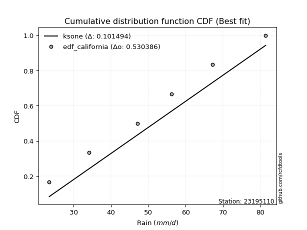</img>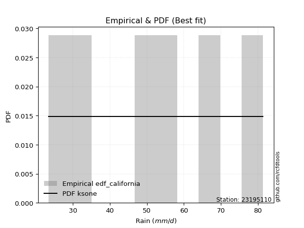</img>

</div>


### 2. EDF Hazen (1930)

Hazen method for plotting positions is a formula used to estimate the empirical cumulative probability distribution of flood events or other hydrological data. This formula often results in biased estimations, particularly when extrapolating to extreme events (high return periods).

<div align="center">


$P=(m-0.5)/n$


</div>


**2.1. Empirical values**

<div align="center">

|                | 0                   | 1                  | 2                  | 3                  | 4         | 5                  |
|:---------------|:--------------------|:-------------------|:-------------------|:-------------------|:----------|:-------------------|
| date           | 2023                | 2020               | 2021               | 2025               | 2019      | 2024               |
| x              | 23.5                | 34.1               | 47.1               | 56.2               | 67.2      | 81.4               |
| m              | 1                   | 2                  | 3                  | 4                  | 5         | 6                  |
| empirical_dist | edf_hazen           | edf_hazen          | edf_hazen          | edf_hazen          | edf_hazen | edf_hazen          |
| empirical      | 0.08333333333333333 | 0.25               | 0.4166666666666667 | 0.5833333333333334 | 0.75      | 0.9166666666666666 |
| empirical_tr   | 1.090909090909091   | 1.3333333333333333 | 1.7142857142857144 | 2.4000000000000004 | 4.0       | 11.999999999999995 |

</div>


**2.2. Kolmogorov-Smirnov fit test (sorted by Δ)**


<div align="center">

|                | 0                   | 1                   | 2                    | 3                   | 4                   | 5                   | 6                    | 7                  | 8                    | 9                 | 10                  | 11                   | 12                  | 13                  | 14                  | 15                  | 16                   | 17                  | 18                   | 19                   | 20                 | 21                  | 22                  | 23                  | 24                  | 25                  | 26                  | 27                  | 28                  | 29                  | 30                  | 31                | 32                  | 33                  | 34                  | 35                  | 36                  | 37                  | 38                  | 39                  | 40                 | 41                  | 42                 | 43                  | 44                  | 45                  | 46                  | 47                  | 48                  | 49                  | 50                  | 51                  | 52                  | 53                  | 54                  | 55                 | 56                  | 57                 | 58                 | 59                  | 60                  | 61                  | 62                  | 63                  | 64                  | 65                  | 66                  | 67                | 68                | 69                  | 70                  | 71                  | 72                  | 73                  | 74                  | 75                  | 76                  | 77                 | 78                  | 79                  | 80                  | 81                  | 82                  | 83                  | 84                  | 85                  | 86                  | 87                  | 88                  | 89                  | 90                 | 91                  | 92                  | 93                  | 94                  | 95                  | 96                  | 97                 | 98                  | 99                  | 100                 | 101                 | 102                 | 103                 | 104                 | 105                 | 106                 | 107                 | 108                | 109                 | 110                 | 111                 | 112                 | 113                 | 114                | 115                 | 116                 | 117                 | 118                 | 119                 | 120                | 121                 | 122                 | 123                 | 124                 | 125               | 126                 | 127                 | 128                 | 129                 | 130            | 131            | 132               | 133                | 134                 | 135                | 136                | 137                | 138                | 139                | 140                | 141                 | 142                 | 143                 | 144                 | 145                 | 146                | 147                | 148               | 149                | 150                | 151                | 152                | 153                | 154                | 155                | 156            | 157            | 158                | 159               |
|:---------------|:--------------------|:--------------------|:---------------------|:--------------------|:--------------------|:--------------------|:---------------------|:-------------------|:---------------------|:------------------|:--------------------|:---------------------|:--------------------|:--------------------|:--------------------|:--------------------|:---------------------|:--------------------|:---------------------|:---------------------|:-------------------|:--------------------|:--------------------|:--------------------|:--------------------|:--------------------|:--------------------|:--------------------|:--------------------|:--------------------|:--------------------|:------------------|:--------------------|:--------------------|:--------------------|:--------------------|:--------------------|:--------------------|:--------------------|:--------------------|:-------------------|:--------------------|:-------------------|:--------------------|:--------------------|:--------------------|:--------------------|:--------------------|:--------------------|:--------------------|:--------------------|:--------------------|:--------------------|:--------------------|:--------------------|:-------------------|:--------------------|:-------------------|:-------------------|:--------------------|:--------------------|:--------------------|:--------------------|:--------------------|:--------------------|:--------------------|:--------------------|:------------------|:------------------|:--------------------|:--------------------|:--------------------|:--------------------|:--------------------|:--------------------|:--------------------|:--------------------|:-------------------|:--------------------|:--------------------|:--------------------|:--------------------|:--------------------|:--------------------|:--------------------|:--------------------|:--------------------|:--------------------|:--------------------|:--------------------|:-------------------|:--------------------|:--------------------|:--------------------|:--------------------|:--------------------|:--------------------|:-------------------|:--------------------|:--------------------|:--------------------|:--------------------|:--------------------|:--------------------|:--------------------|:--------------------|:--------------------|:--------------------|:-------------------|:--------------------|:--------------------|:--------------------|:--------------------|:--------------------|:-------------------|:--------------------|:--------------------|:--------------------|:--------------------|:--------------------|:-------------------|:--------------------|:--------------------|:--------------------|:--------------------|:------------------|:--------------------|:--------------------|:--------------------|:--------------------|:---------------|:---------------|:------------------|:-------------------|:--------------------|:-------------------|:-------------------|:-------------------|:-------------------|:-------------------|:-------------------|:--------------------|:--------------------|:--------------------|:--------------------|:--------------------|:-------------------|:-------------------|:------------------|:-------------------|:-------------------|:-------------------|:-------------------|:-------------------|:-------------------|:-------------------|:---------------|:---------------|:-------------------|:------------------|
| station        | 23195110            | 23195110            | 23195110             | 23195110            | 23195110            | 23195110            | 23195110             | 23195110           | 23195110             | 23195110          | 23195110            | 23195110             | 23195110            | 23195110            | 23195110            | 23195110            | 23195110             | 23195110            | 23195110             | 23195110             | 23195110           | 23195110            | 23195110            | 23195110            | 23195110            | 23195110            | 23195110            | 23195110            | 23195110            | 23195110            | 23195110            | 23195110          | 23195110            | 23195110            | 23195110            | 23195110            | 23195110            | 23195110            | 23195110            | 23195110            | 23195110           | 23195110            | 23195110           | 23195110            | 23195110            | 23195110            | 23195110            | 23195110            | 23195110            | 23195110            | 23195110            | 23195110            | 23195110            | 23195110            | 23195110            | 23195110           | 23195110            | 23195110           | 23195110           | 23195110            | 23195110            | 23195110            | 23195110            | 23195110            | 23195110            | 23195110            | 23195110            | 23195110          | 23195110          | 23195110            | 23195110            | 23195110            | 23195110            | 23195110            | 23195110            | 23195110            | 23195110            | 23195110           | 23195110            | 23195110            | 23195110            | 23195110            | 23195110            | 23195110            | 23195110            | 23195110            | 23195110            | 23195110            | 23195110            | 23195110            | 23195110           | 23195110            | 23195110            | 23195110            | 23195110            | 23195110            | 23195110            | 23195110           | 23195110            | 23195110            | 23195110            | 23195110            | 23195110            | 23195110            | 23195110            | 23195110            | 23195110            | 23195110            | 23195110           | 23195110            | 23195110            | 23195110            | 23195110            | 23195110            | 23195110           | 23195110            | 23195110            | 23195110            | 23195110            | 23195110            | 23195110           | 23195110            | 23195110            | 23195110            | 23195110            | 23195110          | 23195110            | 23195110            | 23195110            | 23195110            | 23195110       | 23195110       | 23195110          | 23195110           | 23195110            | 23195110           | 23195110           | 23195110           | 23195110           | 23195110           | 23195110           | 23195110            | 23195110            | 23195110            | 23195110            | 23195110            | 23195110           | 23195110           | 23195110          | 23195110           | 23195110           | 23195110           | 23195110           | 23195110           | 23195110           | 23195110           | 23195110       | 23195110       | 23195110           | 23195110          |
| empirical_dist | edf_hazen           | edf_hazen           | edf_hazen            | edf_hazen           | edf_hazen           | edf_hazen           | edf_hazen            | edf_hazen          | edf_hazen            | edf_hazen         | edf_hazen           | edf_hazen            | edf_hazen           | edf_hazen           | edf_hazen           | edf_hazen           | edf_hazen            | edf_hazen           | edf_hazen            | edf_hazen            | edf_hazen          | edf_hazen           | edf_hazen           | edf_hazen           | edf_hazen           | edf_hazen           | edf_hazen           | edf_hazen           | edf_hazen           | edf_hazen           | edf_hazen           | edf_hazen         | edf_hazen           | edf_hazen           | edf_hazen           | edf_hazen           | edf_hazen           | edf_hazen           | edf_hazen           | edf_hazen           | edf_hazen          | edf_hazen           | edf_hazen          | edf_hazen           | edf_hazen           | edf_hazen           | edf_hazen           | edf_hazen           | edf_hazen           | edf_hazen           | edf_hazen           | edf_hazen           | edf_hazen           | edf_hazen           | edf_hazen           | edf_hazen          | edf_hazen           | edf_hazen          | edf_hazen          | edf_hazen           | edf_hazen           | edf_hazen           | edf_hazen           | edf_hazen           | edf_hazen           | edf_hazen           | edf_hazen           | edf_hazen         | edf_hazen         | edf_hazen           | edf_hazen           | edf_hazen           | edf_hazen           | edf_hazen           | edf_hazen           | edf_hazen           | edf_hazen           | edf_hazen          | edf_hazen           | edf_hazen           | edf_hazen           | edf_hazen           | edf_hazen           | edf_hazen           | edf_hazen           | edf_hazen           | edf_hazen           | edf_hazen           | edf_hazen           | edf_hazen           | edf_hazen          | edf_hazen           | edf_hazen           | edf_hazen           | edf_hazen           | edf_hazen           | edf_hazen           | edf_hazen          | edf_hazen           | edf_hazen           | edf_hazen           | edf_hazen           | edf_hazen           | edf_hazen           | edf_hazen           | edf_hazen           | edf_hazen           | edf_hazen           | edf_hazen          | edf_hazen           | edf_hazen           | edf_hazen           | edf_hazen           | edf_hazen           | edf_hazen          | edf_hazen           | edf_hazen           | edf_hazen           | edf_hazen           | edf_hazen           | edf_hazen          | edf_hazen           | edf_hazen           | edf_hazen           | edf_hazen           | edf_hazen         | edf_hazen           | edf_hazen           | edf_hazen           | edf_hazen           | edf_hazen      | edf_hazen      | edf_hazen         | edf_hazen          | edf_hazen           | edf_hazen          | edf_hazen          | edf_hazen          | edf_hazen          | edf_hazen          | edf_hazen          | edf_hazen           | edf_hazen           | edf_hazen           | edf_hazen           | edf_hazen           | edf_hazen          | edf_hazen          | edf_hazen         | edf_hazen          | edf_hazen          | edf_hazen          | edf_hazen          | edf_hazen          | edf_hazen          | edf_hazen          | edf_hazen      | edf_hazen      | edf_hazen          | edf_hazen         |
| p_dist         | logtrapezoid        | ksone               | semicircular         | anglit              | dweibull            | logpearson3         | rayleigh             | invgauss           | ncf                  | gompertz          | maxwell             | f                    | invgamma            | logargus            | betaprime           | logjohnsonsu        | dgamma               | alpha               | genlogistic          | foldnorm             | logweibull_min     | weibull_min         | logburr12           | johnsonsu           | rice                | erlang              | pearson3            | gamma               | skewnorm            | nct                 | exponnorm           | norm              | crystalball         | truncnorm           | t                   | loggumbel_l         | kstwobign           | cosine              | logdweibull         | logf                | logcrystalball     | lognorm             | logexponnorm       | logt                | loganglit           | logsemicircular     | logksone            | logfatiguelife      | gumbel_r            | logbetaprime        | burr                | logncf              | logloggamma         | kappa3              | bradford            | logskewnorm        | wrapcauchy          | loggompertz        | logtriang          | logbeta             | tukeylambda         | beta                | kappa4              | logarcsine          | halfnorm            | arcsine             | uniform             | loggamma          | loggamma          | logerlang           | logdgamma           | logburr             | logistic            | argus               | gumbel_l            | logmielke           | logrice             | loggenhalflogistic | loglogistic         | mielke              | logalpha            | loginvgamma         | hypsecant           | halflogistic        | logcosine           | moyal               | loginvgauss         | loghypsecant        | logmaxwell          | lognct              | laplace            | truncweibull_min    | truncexpon          | vonmises_line       | lograyleigh         | gausshyper          | loggenextreme       | loginvweibull      | triang              | genpareto           | loglaplace          | loglaplace          | logloglaplace       | logkappa4           | logtukeylambda      | loguniform          | logvonmises_line    | loggumbel_r         | loggenexpon        | logfoldnorm         | logkstwobign        | loghalfnorm         | lomax               | genexpon            | logbradford        | genhalflogistic     | logmoyal            | loghalflogistic     | logwrapcauchy       | logexponpow         | loggausshyper      | halfgennorm         | loglomax            | burr12              | loglevy_l           | logtruncexpon     | logwald             | johnsonsb           | wald                | logtruncnorm        | loggennorm     | gennorm        | logexponweib      | levy_l             | loggengamma         | trapezoid          | logjohnsonsb       | lognakagami        | logrdist           | genextreme         | logweibull_max     | logtruncweibull_min | logkappa3           | loggenpareto        | invweibull          | nakagami            | fatiguelife        | gengamma           | exponweib         | powerlaw           | logpowerlaw        | weibull_max        | rdist              | truncpareto        | logtruncpareto     | exponpow           | loggenlogistic | loghalfgennorm | logvonmises        | vonmises          |
| delta          | 0.02439460425786255 | 0.02598141640294438 | 0.026240817837983543 | 0.03835442563075944 | 0.04581204467792738 | 0.04930260076011461 | 0.052014247679713604 | 0.0529077971939379 | 0.055107226040783164 | 0.055140422384792 | 0.05593731652224909 | 0.055944747633346614 | 0.05652264679602406 | 0.05756152932777392 | 0.05780937402176381 | 0.05869233995516787 | 0.058908745401814705 | 0.05959501823435509 | 0.061164892096779666 | 0.062424890744052663 | 0.0626441844447935 | 0.06289818172069789 | 0.06352129831408185 | 0.06399533211802516 | 0.06403564301862372 | 0.06500218089297416 | 0.06518947390871199 | 0.06519356331404186 | 0.06566144678087163 | 0.06567039821655743 | 0.06570216834318338 | 0.065703807720295 | 0.06570381510685458 | 0.06570382985261514 | 0.06570919967052452 | 0.06742711830270601 | 0.07010902699948646 | 0.07037368083790607 | 0.07127260804392471 | 0.07340863589595187 | 0.0736266694324818 | 0.07362691533309196 | 0.0736276809835073 | 0.07362800190460345 | 0.07501595192793498 | 0.07558815910369421 | 0.07630906399269605 | 0.07634533391391407 | 0.08116020553809833 | 0.08117273910700673 | 0.08166873835648658 | 0.08254215951622113 | 0.08323283656702951 | 0.08332021109298146 | 0.08333229098333376 | 0.0833326217809045 | 0.08333327401878873 | 0.0833333230703291 | 0.0833333244935256 | 0.08333333331230297 | 0.08333333333332622 | 0.08333333333332768 | 0.08333333333332833 | 0.08333333333333333 | 0.08333333333333333 | 0.08333333333333337 | 0.08333333333333337 | 0.083681282623086 | 0.083681282623086 | 0.08417224337233181 | 0.08584856222878565 | 0.08614961033124269 | 0.08628069277545122 | 0.08743174258910436 | 0.08759693697534093 | 0.08774276082351762 | 0.08873909514804951 | 0.0887400640325397 | 0.09014983671994448 | 0.09191049151735281 | 0.09501422371875884 | 0.09551009231211077 | 0.09789621526540129 | 0.09821268807542005 | 0.09917954496953946 | 0.10065894857889468 | 0.10199929181382678 | 0.10432111799390698 | 0.10703821752303005 | 0.10954524619849698 | 0.1097999878374851 | 0.10994632524251208 | 0.11596643774874965 | 0.11653668147815843 | 0.11825330311308174 | 0.12304802584845936 | 0.12545916136097146 | 0.1268029410325197 | 0.12752970964317173 | 0.13233008180578848 | 0.13234050700129607 | 0.13234050700129607 | 0.13681329135403236 | 0.14206652653556245 | 0.14225813329993048 | 0.14296521805174117 | 0.14298462824113728 | 0.14364741345144444 | 0.1468570937974953 | 0.14770539174216885 | 0.14976537729956535 | 0.14983225462817612 | 0.15087582164509566 | 0.15173084209168636 | 0.1520040953816904 | 0.16753785708811597 | 0.16953084815057212 | 0.17414719703923626 | 0.17420666290909792 | 0.18104281532751237 | 0.2054168678402561 | 0.20667051028327538 | 0.20806940469284224 | 0.21019672167701425 | 0.21083572811200563 | 0.232015741782366 | 0.24154606926272543 | 0.24527501296935994 | 0.24572651953182417 | 0.24999996187879195 | 0.25           | 0.25           | 0.253370584557751 | 0.2571291652455591 | 0.27641930227867845 | 0.2764479508771302 | 0.3246180359615026 | 0.3340076204611226 | 0.3519441636136025 | 0.3569530374823755 | 0.3622892018355698 | 0.39019218808059036 | 0.39178089540725236 | 0.45687772769918017 | 0.48180413569577607 | 0.48350240364702296 | 0.5035056865938863 | 0.5087160793752102 | 0.514850023971879 | 0.5289397690344325 | 0.5762100892174188 | 0.5773510778266346 | 0.5833333331518105 | 0.6038321682852739 | 0.6452862397739837 | 0.6479977562329965 | 0.75           | 0.75           | 1.0690998630601456 | 12.93190638788341 |
| deltao         | 0.530385761606      | 0.530385761606      | 0.530385761606       | 0.530385761606      | 0.530385761606      | 0.530385761606      | 0.530385761606       | 0.530385761606     | 0.530385761606       | 0.530385761606    | 0.530385761606      | 0.530385761606       | 0.530385761606      | 0.530385761606      | 0.530385761606      | 0.530385761606      | 0.530385761606       | 0.530385761606      | 0.530385761606       | 0.530385761606       | 0.530385761606     | 0.530385761606      | 0.530385761606      | 0.530385761606      | 0.530385761606      | 0.530385761606      | 0.530385761606      | 0.530385761606      | 0.530385761606      | 0.530385761606      | 0.530385761606      | 0.530385761606    | 0.530385761606      | 0.530385761606      | 0.530385761606      | 0.530385761606      | 0.530385761606      | 0.530385761606      | 0.530385761606      | 0.530385761606      | 0.530385761606     | 0.530385761606      | 0.530385761606     | 0.530385761606      | 0.530385761606      | 0.530385761606      | 0.530385761606      | 0.530385761606      | 0.530385761606      | 0.530385761606      | 0.530385761606      | 0.530385761606      | 0.530385761606      | 0.530385761606      | 0.530385761606      | 0.530385761606     | 0.530385761606      | 0.530385761606     | 0.530385761606     | 0.530385761606      | 0.530385761606      | 0.530385761606      | 0.530385761606      | 0.530385761606      | 0.530385761606      | 0.530385761606      | 0.530385761606      | 0.530385761606    | 0.530385761606    | 0.530385761606      | 0.530385761606      | 0.530385761606      | 0.530385761606      | 0.530385761606      | 0.530385761606      | 0.530385761606      | 0.530385761606      | 0.530385761606     | 0.530385761606      | 0.530385761606      | 0.530385761606      | 0.530385761606      | 0.530385761606      | 0.530385761606      | 0.530385761606      | 0.530385761606      | 0.530385761606      | 0.530385761606      | 0.530385761606      | 0.530385761606      | 0.530385761606     | 0.530385761606      | 0.530385761606      | 0.530385761606      | 0.530385761606      | 0.530385761606      | 0.530385761606      | 0.530385761606     | 0.530385761606      | 0.530385761606      | 0.530385761606      | 0.530385761606      | 0.530385761606      | 0.530385761606      | 0.530385761606      | 0.530385761606      | 0.530385761606      | 0.530385761606      | 0.530385761606     | 0.530385761606      | 0.530385761606      | 0.530385761606      | 0.530385761606      | 0.530385761606      | 0.530385761606     | 0.530385761606      | 0.530385761606      | 0.530385761606      | 0.530385761606      | 0.530385761606      | 0.530385761606     | 0.530385761606      | 0.530385761606      | 0.530385761606      | 0.530385761606      | 0.530385761606    | 0.530385761606      | 0.530385761606      | 0.530385761606      | 0.530385761606      | 0.530385761606 | 0.530385761606 | 0.530385761606    | 0.530385761606     | 0.530385761606      | 0.530385761606     | 0.530385761606     | 0.530385761606     | 0.530385761606     | 0.530385761606     | 0.530385761606     | 0.530385761606      | 0.530385761606      | 0.530385761606      | 0.530385761606      | 0.530385761606      | 0.530385761606     | 0.530385761606     | 0.530385761606    | 0.530385761606     | 0.530385761606     | 0.530385761606     | 0.530385761606     | 0.530385761606     | 0.530385761606     | 0.530385761606     | 0.530385761606 | 0.530385761606 | 0.530385761606     | 0.530385761606    |
| eval           | Δo > Δ              | Δo > Δ              | Δo > Δ               | Δo > Δ              | Δo > Δ              | Δo > Δ              | Δo > Δ               | Δo > Δ             | Δo > Δ               | Δo > Δ            | Δo > Δ              | Δo > Δ               | Δo > Δ              | Δo > Δ              | Δo > Δ              | Δo > Δ              | Δo > Δ               | Δo > Δ              | Δo > Δ               | Δo > Δ               | Δo > Δ             | Δo > Δ              | Δo > Δ              | Δo > Δ              | Δo > Δ              | Δo > Δ              | Δo > Δ              | Δo > Δ              | Δo > Δ              | Δo > Δ              | Δo > Δ              | Δo > Δ            | Δo > Δ              | Δo > Δ              | Δo > Δ              | Δo > Δ              | Δo > Δ              | Δo > Δ              | Δo > Δ              | Δo > Δ              | Δo > Δ             | Δo > Δ              | Δo > Δ             | Δo > Δ              | Δo > Δ              | Δo > Δ              | Δo > Δ              | Δo > Δ              | Δo > Δ              | Δo > Δ              | Δo > Δ              | Δo > Δ              | Δo > Δ              | Δo > Δ              | Δo > Δ              | Δo > Δ             | Δo > Δ              | Δo > Δ             | Δo > Δ             | Δo > Δ              | Δo > Δ              | Δo > Δ              | Δo > Δ              | Δo > Δ              | Δo > Δ              | Δo > Δ              | Δo > Δ              | Δo > Δ            | Δo > Δ            | Δo > Δ              | Δo > Δ              | Δo > Δ              | Δo > Δ              | Δo > Δ              | Δo > Δ              | Δo > Δ              | Δo > Δ              | Δo > Δ             | Δo > Δ              | Δo > Δ              | Δo > Δ              | Δo > Δ              | Δo > Δ              | Δo > Δ              | Δo > Δ              | Δo > Δ              | Δo > Δ              | Δo > Δ              | Δo > Δ              | Δo > Δ              | Δo > Δ             | Δo > Δ              | Δo > Δ              | Δo > Δ              | Δo > Δ              | Δo > Δ              | Δo > Δ              | Δo > Δ             | Δo > Δ              | Δo > Δ              | Δo > Δ              | Δo > Δ              | Δo > Δ              | Δo > Δ              | Δo > Δ              | Δo > Δ              | Δo > Δ              | Δo > Δ              | Δo > Δ             | Δo > Δ              | Δo > Δ              | Δo > Δ              | Δo > Δ              | Δo > Δ              | Δo > Δ             | Δo > Δ              | Δo > Δ              | Δo > Δ              | Δo > Δ              | Δo > Δ              | Δo > Δ             | Δo > Δ              | Δo > Δ              | Δo > Δ              | Δo > Δ              | Δo > Δ            | Δo > Δ              | Δo > Δ              | Δo > Δ              | Δo > Δ              | Δo > Δ         | Δo > Δ         | Δo > Δ            | Δo > Δ             | Δo > Δ              | Δo > Δ             | Δo > Δ             | Δo > Δ             | Δo > Δ             | Δo > Δ             | Δo > Δ             | Δo > Δ              | Δo > Δ              | Δo > Δ              | Δo > Δ              | Δo > Δ              | Δo > Δ             | Δo > Δ             | Δo > Δ            | Δo > Δ             | Δo <= Δ            | Δo <= Δ            | Δo <= Δ            | Δo <= Δ            | Δo <= Δ            | Δo <= Δ            | Δo <= Δ        | Δo <= Δ        | Δo <= Δ            | Δo <= Δ           |
| fit            | 1                   | 1                   | 1                    | 1                   | 1                   | 1                   | 1                    | 1                  | 1                    | 1                 | 1                   | 1                    | 1                   | 1                   | 1                   | 1                   | 1                    | 1                   | 1                    | 1                    | 1                  | 1                   | 1                   | 1                   | 1                   | 1                   | 1                   | 1                   | 1                   | 1                   | 1                   | 1                 | 1                   | 1                   | 1                   | 1                   | 1                   | 1                   | 1                   | 1                   | 1                  | 1                   | 1                  | 1                   | 1                   | 1                   | 1                   | 1                   | 1                   | 1                   | 1                   | 1                   | 1                   | 1                   | 1                   | 1                  | 1                   | 1                  | 1                  | 1                   | 1                   | 1                   | 1                   | 1                   | 1                   | 1                   | 1                   | 1                 | 1                 | 1                   | 1                   | 1                   | 1                   | 1                   | 1                   | 1                   | 1                   | 1                  | 1                   | 1                   | 1                   | 1                   | 1                   | 1                   | 1                   | 1                   | 1                   | 1                   | 1                   | 1                   | 1                  | 1                   | 1                   | 1                   | 1                   | 1                   | 1                   | 1                  | 1                   | 1                   | 1                   | 1                   | 1                   | 1                   | 1                   | 1                   | 1                   | 1                   | 1                  | 1                   | 1                   | 1                   | 1                   | 1                   | 1                  | 1                   | 1                   | 1                   | 1                   | 1                   | 1                  | 1                   | 1                   | 1                   | 1                   | 1                 | 1                   | 1                   | 1                   | 1                   | 1              | 1              | 1                 | 1                  | 1                   | 1                  | 1                  | 1                  | 1                  | 1                  | 1                  | 1                   | 1                   | 1                   | 1                   | 1                   | 1                  | 1                  | 1                 | 1                  | 0                  | 0                  | 0                  | 0                  | 0                  | 0                  | 0              | 0              | 0                  | 0                 |
| n              | 6                   | 6                   | 6                    | 6                   | 6                   | 6                   | 6                    | 6                  | 6                    | 6                 | 6                   | 6                    | 6                   | 6                   | 6                   | 6                   | 6                    | 6                   | 6                    | 6                    | 6                  | 6                   | 6                   | 6                   | 6                   | 6                   | 6                   | 6                   | 6                   | 6                   | 6                   | 6                 | 6                   | 6                   | 6                   | 6                   | 6                   | 6                   | 6                   | 6                   | 6                  | 6                   | 6                  | 6                   | 6                   | 6                   | 6                   | 6                   | 6                   | 6                   | 6                   | 6                   | 6                   | 6                   | 6                   | 6                  | 6                   | 6                  | 6                  | 6                   | 6                   | 6                   | 6                   | 6                   | 6                   | 6                   | 6                   | 6                 | 6                 | 6                   | 6                   | 6                   | 6                   | 6                   | 6                   | 6                   | 6                   | 6                  | 6                   | 6                   | 6                   | 6                   | 6                   | 6                   | 6                   | 6                   | 6                   | 6                   | 6                   | 6                   | 6                  | 6                   | 6                   | 6                   | 6                   | 6                   | 6                   | 6                  | 6                   | 6                   | 6                   | 6                   | 6                   | 6                   | 6                   | 6                   | 6                   | 6                   | 6                  | 6                   | 6                   | 6                   | 6                   | 6                   | 6                  | 6                   | 6                   | 6                   | 6                   | 6                   | 6                  | 6                   | 6                   | 6                   | 6                   | 6                 | 6                   | 6                   | 6                   | 6                   | 6              | 6              | 6                 | 6                  | 6                   | 6                  | 6                  | 6                  | 6                  | 6                  | 6                  | 6                   | 6                   | 6                   | 6                   | 6                   | 6                  | 6                  | 6                 | 6                  | 6                  | 6                  | 6                  | 6                  | 6                  | 6                  | 6              | 6              | 6                  | 6                 |
| best_fit       | 1                   | 0                   | 0                    | 0                   | 0                   | 0                   | 0                    | 0                  | 0                    | 0                 | 0                   | 0                    | 0                   | 0                   | 0                   | 0                   | 0                    | 0                   | 0                    | 0                    | 0                  | 0                   | 0                   | 0                   | 0                   | 0                   | 0                   | 0                   | 0                   | 0                   | 0                   | 0                 | 0                   | 0                   | 0                   | 0                   | 0                   | 0                   | 0                   | 0                   | 0                  | 0                   | 0                  | 0                   | 0                   | 0                   | 0                   | 0                   | 0                   | 0                   | 0                   | 0                   | 0                   | 0                   | 0                   | 0                  | 0                   | 0                  | 0                  | 0                   | 0                   | 0                   | 0                   | 0                   | 0                   | 0                   | 0                   | 0                 | 0                 | 0                   | 0                   | 0                   | 0                   | 0                   | 0                   | 0                   | 0                   | 0                  | 0                   | 0                   | 0                   | 0                   | 0                   | 0                   | 0                   | 0                   | 0                   | 0                   | 0                   | 0                   | 0                  | 0                   | 0                   | 0                   | 0                   | 0                   | 0                   | 0                  | 0                   | 0                   | 0                   | 0                   | 0                   | 0                   | 0                   | 0                   | 0                   | 0                   | 0                  | 0                   | 0                   | 0                   | 0                   | 0                   | 0                  | 0                   | 0                   | 0                   | 0                   | 0                   | 0                  | 0                   | 0                   | 0                   | 0                   | 0                 | 0                   | 0                   | 0                   | 0                   | 0              | 0              | 0                 | 0                  | 0                   | 0                  | 0                  | 0                  | 0                  | 0                  | 0                  | 0                   | 0                   | 0                   | 0                   | 0                   | 0                  | 0                  | 0                 | 0                  | 0                  | 0                  | 0                  | 0                  | 0                  | 0                  | 0              | 0              | 0                  | 0                 |
| best_fit_sort  | 1                   | 2                   | 3                    | 4                   | 5                   | 6                   | 7                    | 8                  | 9                    | 10                | 11                  | 12                   | 13                  | 14                  | 15                  | 16                  | 17                   | 18                  | 19                   | 20                   | 21                 | 22                  | 23                  | 24                  | 25                  | 26                  | 27                  | 28                  | 29                  | 30                  | 31                  | 32                | 33                  | 34                  | 35                  | 36                  | 37                  | 38                  | 39                  | 40                  | 41                 | 42                  | 43                 | 44                  | 45                  | 46                  | 47                  | 48                  | 49                  | 50                  | 51                  | 52                  | 53                  | 54                  | 55                  | 56                 | 57                  | 58                 | 59                 | 60                  | 61                  | 62                  | 63                  | 64                  | 65                  | 66                  | 67                  | 68                | 69                | 70                  | 71                  | 72                  | 73                  | 74                  | 75                  | 76                  | 77                  | 78                 | 79                  | 80                  | 81                  | 82                  | 83                  | 84                  | 85                  | 86                  | 87                  | 88                  | 89                  | 90                  | 91                 | 92                  | 93                  | 94                  | 95                  | 96                  | 97                  | 98                 | 99                  | 100                 | 101                 | 102                 | 103                 | 104                 | 105                 | 106                 | 107                 | 108                 | 109                | 110                 | 111                 | 112                 | 113                 | 114                 | 115                | 116                 | 117                 | 118                 | 119                 | 120                 | 121                | 122                 | 123                 | 124                 | 125                 | 126               | 127                 | 128                 | 129                 | 130                 | 131            | 132            | 133               | 134                | 135                 | 136                | 137                | 138                | 139                | 140                | 141                | 142                 | 143                 | 144                 | 145                 | 146                 | 147                | 148                | 149               | 150                | 151                | 152                | 153                | 154                | 155                | 156                | 157            | 158            | 159                | 160               |

</div>


**2.3. Best fit**

<div align="center">

|   id |   station | empirical_dist   | p_dist       |     delta |   deltao | eval   |   fit |   n |   best_fit |   best_fit_sort |
|-----:|----------:|:-----------------|:-------------|----------:|---------:|:-------|------:|----:|-----------:|----------------:|
|    0 |  23195110 | edf_hazen        | logtrapezoid | 0.0243946 | 0.530386 | Δo > Δ |     1 |   6 |          1 |               1 |

</div>


<div align="center">

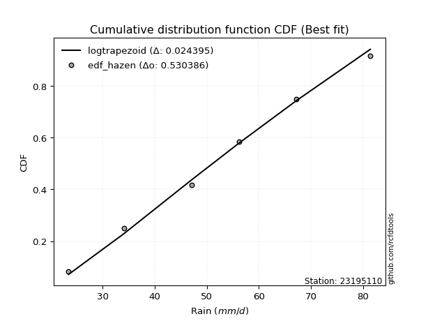</img></img>

</div>


### 3. EDF Weibull (1939)

Weibull plotting position formula is an empirical method used to estimate the non-exceedance probability or plotting position for a set of observed data, is often recommended or widely used in practice, particularly in flood frequency analysis.

<div align="center">


$P=m/(n+1)$


</div>


**3.1. Empirical values**

<div align="center">

|                | 0                   | 1                  | 2                   | 3                  | 4                  | 5                  |
|:---------------|:--------------------|:-------------------|:--------------------|:-------------------|:-------------------|:-------------------|
| date           | 2023                | 2020               | 2021                | 2025               | 2019               | 2024               |
| x              | 23.5                | 34.1               | 47.1                | 56.2               | 67.2               | 81.4               |
| m              | 1                   | 2                  | 3                   | 4                  | 5                  | 6                  |
| empirical_dist | edf_weibull         | edf_weibull        | edf_weibull         | edf_weibull        | edf_weibull        | edf_weibull        |
| empirical      | 0.14285714285714285 | 0.2857142857142857 | 0.42857142857142855 | 0.5714285714285714 | 0.7142857142857143 | 0.8571428571428571 |
| empirical_tr   | 1.1666666666666665  | 1.4                | 1.75                | 2.333333333333333  | 3.5                | 6.999999999999997  |

</div>


**3.2. Kolmogorov-Smirnov fit test (sorted by Δ)**


<div align="center">

|                | 0                   | 1                  | 2                   | 3                   | 4                   | 5                   | 6                   | 7                  | 8                   | 9                  | 10                  | 11                  | 12                  | 13                  | 14                  | 15                 | 16                  | 17                  | 18                  | 19                  | 20                  | 21                  | 22                  | 23                  | 24                  | 25                  | 26                  | 27                  | 28                  | 29                  | 30                 | 31                  | 32                  | 33                 | 34                  | 35                  | 36                  | 37                  | 38                  | 39                  | 40                  | 41                  | 42                  | 43                  | 44                  | 45                  | 46                  | 47                  | 48                  | 49                 | 50                  | 51                  | 52                  | 53                  | 54                  | 55                  | 56                  | 57                  | 58                  | 59                  | 60                  | 61                  | 62                  | 63                 | 64                  | 65                  | 66                  | 67                  | 68                  | 69                 | 70                 | 71                  | 72                  | 73                | 74                  | 75                 | 76                 | 77                 | 78                  | 79                  | 80                  | 81                 | 82                  | 83                  | 84                  | 85                  | 86                  | 87                  | 88                  | 89                  | 90                 | 91                 | 92                  | 93                  | 94                  | 95                  | 96                 | 97                  | 98                  | 99                  | 100                 | 101                | 102                 | 103                 | 104                 | 105                 | 106                 | 107                | 108                | 109                | 110                | 111                 | 112                 | 113                | 114                | 115                 | 116               | 117                | 118                | 119                | 120                 | 121                 | 122                 | 123                 | 124                | 125                | 126                 | 127                | 128                | 129                 | 130                 | 131                 | 132                | 133                | 134                 | 135                | 136                 | 137                 | 138                 | 139                | 140                | 141                | 142                 | 143                 | 144                 | 145                | 146                | 147                 | 148                 | 149                | 150                | 151                | 152                | 153                | 154               | 155                | 156                | 157                | 158                | 159                |
|:---------------|:--------------------|:-------------------|:--------------------|:--------------------|:--------------------|:--------------------|:--------------------|:-------------------|:--------------------|:-------------------|:--------------------|:--------------------|:--------------------|:--------------------|:--------------------|:-------------------|:--------------------|:--------------------|:--------------------|:--------------------|:--------------------|:--------------------|:--------------------|:--------------------|:--------------------|:--------------------|:--------------------|:--------------------|:--------------------|:--------------------|:-------------------|:--------------------|:--------------------|:-------------------|:--------------------|:--------------------|:--------------------|:--------------------|:--------------------|:--------------------|:--------------------|:--------------------|:--------------------|:--------------------|:--------------------|:--------------------|:--------------------|:--------------------|:--------------------|:-------------------|:--------------------|:--------------------|:--------------------|:--------------------|:--------------------|:--------------------|:--------------------|:--------------------|:--------------------|:--------------------|:--------------------|:--------------------|:--------------------|:-------------------|:--------------------|:--------------------|:--------------------|:--------------------|:--------------------|:-------------------|:-------------------|:--------------------|:--------------------|:------------------|:--------------------|:-------------------|:-------------------|:-------------------|:--------------------|:--------------------|:--------------------|:-------------------|:--------------------|:--------------------|:--------------------|:--------------------|:--------------------|:--------------------|:--------------------|:--------------------|:-------------------|:-------------------|:--------------------|:--------------------|:--------------------|:--------------------|:-------------------|:--------------------|:--------------------|:--------------------|:--------------------|:-------------------|:--------------------|:--------------------|:--------------------|:--------------------|:--------------------|:-------------------|:-------------------|:-------------------|:-------------------|:--------------------|:--------------------|:-------------------|:-------------------|:--------------------|:------------------|:-------------------|:-------------------|:-------------------|:--------------------|:--------------------|:--------------------|:--------------------|:-------------------|:-------------------|:--------------------|:-------------------|:-------------------|:--------------------|:--------------------|:--------------------|:-------------------|:-------------------|:--------------------|:-------------------|:--------------------|:--------------------|:--------------------|:-------------------|:-------------------|:-------------------|:--------------------|:--------------------|:--------------------|:-------------------|:-------------------|:--------------------|:--------------------|:-------------------|:-------------------|:-------------------|:-------------------|:-------------------|:------------------|:-------------------|:-------------------|:-------------------|:-------------------|:-------------------|
| station        | 23195110            | 23195110           | 23195110            | 23195110            | 23195110            | 23195110            | 23195110            | 23195110           | 23195110            | 23195110           | 23195110            | 23195110            | 23195110            | 23195110            | 23195110            | 23195110           | 23195110            | 23195110            | 23195110            | 23195110            | 23195110            | 23195110            | 23195110            | 23195110            | 23195110            | 23195110            | 23195110            | 23195110            | 23195110            | 23195110            | 23195110           | 23195110            | 23195110            | 23195110           | 23195110            | 23195110            | 23195110            | 23195110            | 23195110            | 23195110            | 23195110            | 23195110            | 23195110            | 23195110            | 23195110            | 23195110            | 23195110            | 23195110            | 23195110            | 23195110           | 23195110            | 23195110            | 23195110            | 23195110            | 23195110            | 23195110            | 23195110            | 23195110            | 23195110            | 23195110            | 23195110            | 23195110            | 23195110            | 23195110           | 23195110            | 23195110            | 23195110            | 23195110            | 23195110            | 23195110           | 23195110           | 23195110            | 23195110            | 23195110          | 23195110            | 23195110           | 23195110           | 23195110           | 23195110            | 23195110            | 23195110            | 23195110           | 23195110            | 23195110            | 23195110            | 23195110            | 23195110            | 23195110            | 23195110            | 23195110            | 23195110           | 23195110           | 23195110            | 23195110            | 23195110            | 23195110            | 23195110           | 23195110            | 23195110            | 23195110            | 23195110            | 23195110           | 23195110            | 23195110            | 23195110            | 23195110            | 23195110            | 23195110           | 23195110           | 23195110           | 23195110           | 23195110            | 23195110            | 23195110           | 23195110           | 23195110            | 23195110          | 23195110           | 23195110           | 23195110           | 23195110            | 23195110            | 23195110            | 23195110            | 23195110           | 23195110           | 23195110            | 23195110           | 23195110           | 23195110            | 23195110            | 23195110            | 23195110           | 23195110           | 23195110            | 23195110           | 23195110            | 23195110            | 23195110            | 23195110           | 23195110           | 23195110           | 23195110            | 23195110            | 23195110            | 23195110           | 23195110           | 23195110            | 23195110            | 23195110           | 23195110           | 23195110           | 23195110           | 23195110           | 23195110          | 23195110           | 23195110           | 23195110           | 23195110           | 23195110           |
| empirical_dist | edf_weibull         | edf_weibull        | edf_weibull         | edf_weibull         | edf_weibull         | edf_weibull         | edf_weibull         | edf_weibull        | edf_weibull         | edf_weibull        | edf_weibull         | edf_weibull         | edf_weibull         | edf_weibull         | edf_weibull         | edf_weibull        | edf_weibull         | edf_weibull         | edf_weibull         | edf_weibull         | edf_weibull         | edf_weibull         | edf_weibull         | edf_weibull         | edf_weibull         | edf_weibull         | edf_weibull         | edf_weibull         | edf_weibull         | edf_weibull         | edf_weibull        | edf_weibull         | edf_weibull         | edf_weibull        | edf_weibull         | edf_weibull         | edf_weibull         | edf_weibull         | edf_weibull         | edf_weibull         | edf_weibull         | edf_weibull         | edf_weibull         | edf_weibull         | edf_weibull         | edf_weibull         | edf_weibull         | edf_weibull         | edf_weibull         | edf_weibull        | edf_weibull         | edf_weibull         | edf_weibull         | edf_weibull         | edf_weibull         | edf_weibull         | edf_weibull         | edf_weibull         | edf_weibull         | edf_weibull         | edf_weibull         | edf_weibull         | edf_weibull         | edf_weibull        | edf_weibull         | edf_weibull         | edf_weibull         | edf_weibull         | edf_weibull         | edf_weibull        | edf_weibull        | edf_weibull         | edf_weibull         | edf_weibull       | edf_weibull         | edf_weibull        | edf_weibull        | edf_weibull        | edf_weibull         | edf_weibull         | edf_weibull         | edf_weibull        | edf_weibull         | edf_weibull         | edf_weibull         | edf_weibull         | edf_weibull         | edf_weibull         | edf_weibull         | edf_weibull         | edf_weibull        | edf_weibull        | edf_weibull         | edf_weibull         | edf_weibull         | edf_weibull         | edf_weibull        | edf_weibull         | edf_weibull         | edf_weibull         | edf_weibull         | edf_weibull        | edf_weibull         | edf_weibull         | edf_weibull         | edf_weibull         | edf_weibull         | edf_weibull        | edf_weibull        | edf_weibull        | edf_weibull        | edf_weibull         | edf_weibull         | edf_weibull        | edf_weibull        | edf_weibull         | edf_weibull       | edf_weibull        | edf_weibull        | edf_weibull        | edf_weibull         | edf_weibull         | edf_weibull         | edf_weibull         | edf_weibull        | edf_weibull        | edf_weibull         | edf_weibull        | edf_weibull        | edf_weibull         | edf_weibull         | edf_weibull         | edf_weibull        | edf_weibull        | edf_weibull         | edf_weibull        | edf_weibull         | edf_weibull         | edf_weibull         | edf_weibull        | edf_weibull        | edf_weibull        | edf_weibull         | edf_weibull         | edf_weibull         | edf_weibull        | edf_weibull        | edf_weibull         | edf_weibull         | edf_weibull        | edf_weibull        | edf_weibull        | edf_weibull        | edf_weibull        | edf_weibull       | edf_weibull        | edf_weibull        | edf_weibull        | edf_weibull        | edf_weibull        |
| p_dist         | anglit              | semicircular       | logtrapezoid        | ksone               | logpearson3         | dweibull            | genlogistic         | invgauss           | ncf                 | kstwobign          | maxwell             | f                   | invgamma            | betaprime           | logjohnsonsu        | dgamma             | alpha               | logbetaprime        | gompertz            | rayleigh            | logncf              | logt                | lognorm             | logcrystalball      | logexponnorm        | logfatiguelife      | loggamma            | loggamma            | logf                | foldnorm            | logweibull_min     | logburr12           | logerlang           | loginvgamma        | johnsonsu           | rice                | logalpha            | loganglit           | erlang              | pearson3            | gamma               | skewnorm            | nct                 | exponnorm           | norm                | crystalball         | truncnorm           | t                   | loginvgauss         | loggumbel_l        | logcosine           | loglogistic         | logburr             | lognct              | cosine              | weibull_min         | logsemicircular     | logrice             | logargus            | logdweibull         | loginvweibull       | loghypsecant        | gumbel_r            | logmaxwell         | logmielke           | logdgamma           | logistic            | argus               | gumbel_l            | burr               | mielke             | logksone            | lograyleigh         | hypsecant         | loggenexpon         | moyal              | logkstwobign       | logbradford        | logloggamma         | loggumbel_r         | kappa3              | logvonmises_line   | bradford            | logskewnorm         | genexpon            | wrapcauchy          | truncexpon          | loggompertz         | logtriang           | triang              | truncweibull_min   | logbeta            | genpareto           | lomax               | loggenextreme       | tukeylambda         | logtukeylambda     | beta                | loggenhalflogistic  | kappa4              | gausshyper          | logkappa4          | halflogistic        | logarcsine          | logfoldnorm         | loghalfnorm         | halfnorm            | uniform            | loguniform         | logwrapcauchy      | arcsine            | loglaplace          | loglaplace          | laplace            | loglevy_l          | vonmises_line       | genhalflogistic   | loghalflogistic    | logmoyal           | logexponpow        | logloglaplace       | loggausshyper       | halfgennorm         | loglomax            | levy_l             | burr12             | johnsonsb           | gennorm            | loggennorm         | logtruncexpon       | logwald             | logexponweib        | loggengamma        | trapezoid          | wald                | logtruncnorm       | logjohnsonsb        | logrdist            | genextreme          | lognakagami        | logweibull_max     | logkappa3          | logtruncweibull_min | loggenpareto        | invweibull          | fatiguelife        | nakagami           | gengamma            | exponweib           | powerlaw           | logpowerlaw        | weibull_max        | truncpareto        | rdist              | logtruncpareto    | exponpow           | loggenlogistic     | loghalfgennorm     | logvonmises        | vonmises           |
| delta          | 0.07615030735634487 | 0.0776355324102288 | 0.08391841378167209 | 0.08550522592675391 | 0.08702470405697228 | 0.08707121490026748 | 0.08796550528856827 | 0.0886220829082236 | 0.09082151175506886 | 0.0910376894895804 | 0.09165160223653479 | 0.09165903334763231 | 0.09223693251030976 | 0.09352365973604951 | 0.09440662566945357 | 0.0946230311161004 | 0.09530930394864079 | 0.09638448832364455 | 0.09640767705220543 | 0.09678438217850319 | 0.09701596546133553 | 0.09745513060450466 | 0.09745547100359847 | 0.09745553860314843 | 0.09745676746515777 | 0.09750244401801814 | 0.09757568998784334 | 0.09757568998784334 | 0.09764755211867368 | 0.09813917645833836 | 0.0983584701590792 | 0.09923558402836755 | 0.09934487949118301 | 0.0993779545670737 | 0.09970961783231086 | 0.09974992873290942 | 0.10003410680628835 | 0.10049691493633241 | 0.10071646660725986 | 0.10090375962299769 | 0.10090784902832756 | 0.10137573249515733 | 0.10138468393084313 | 0.10141645405746907 | 0.10141809343458069 | 0.10141810082114028 | 0.10141811556690083 | 0.10142348538481022 | 0.10181847855937104 | 0.1031414040169917 | 0.10346784358736368 | 0.10348030865326785 | 0.10533763482087655 | 0.10573359387069853 | 0.10608796655219177 | 0.10701893498338008 | 0.10729374329997271 | 0.11023119646271777 | 0.11053686674695073 | 0.11099810026276105 | 0.11489817912775785 | 0.11635315388814782 | 0.11687449125238403 | 0.1190257227579273 | 0.12131010878875104 | 0.12156284794307134 | 0.12199497848973692 | 0.12314602830339005 | 0.12476927579228247 | 0.1261273292453311 | 0.1296198333141988 | 0.13105737492990785 | 0.13234745197835868 | 0.133610500979687 | 0.13495233189273342 | 0.1353736372110988 | 0.1378606153948035 | 0.1406546692563243 | 0.14275664609083905 | 0.14283509422835028 | 0.14284402061679097 | 0.1428536510076046 | 0.14285610050714329 | 0.14285643130471404 | 0.14285696110326163 | 0.14285708354259824 | 0.14285708915732137 | 0.14285713259413862 | 0.14285713401733513 | 0.14285713662612864 | 0.1428571427124674 | 0.1428571428361125 | 0.14285714285118767 | 0.14285714285283885 | 0.14285714285713091 | 0.14285714285713574 | 0.1428571428571358 | 0.14285714285713721 | 0.14285714285713746 | 0.14285714285713785 | 0.14285714285713844 | 0.1428571428571421 | 0.14285714285714285 | 0.14285714285714285 | 0.14285714285714285 | 0.14285714285714285 | 0.14285714285714285 | 0.1428571428571429 | 0.1428571428571429 | 0.1428571428571429 | 0.1428571428571429 | 0.14424526890605804 | 0.14424526890605804 | 0.1455142735517708 | 0.1513119185881961 | 0.15225096719244413 | 0.155633095183354 | 0.1622424351344744 | 0.1623557641813569 | 0.1691380534227505 | 0.17252757706831806 | 0.19351210593549423 | 0.19476574837851351 | 0.19616464278808038 | 0.1976053557217496 | 0.1982919597722524 | 0.20956072725507424 | 0.2142857142857143 | 0.2142857142857143 | 0.22011097987760414 | 0.22964130735796356 | 0.24146582265298916 | 0.2645145403739166 | 0.2645431889723682 | 0.28144080524610987 | 0.2857142475930776 | 0.28890375024721693 | 0.29242035408979294 | 0.29742922795856597 | 0.3221028585563607 | 0.3265749161212841 | 0.3322570858834428 | 0.3782874261758285  | 0.39735391817537064 | 0.42228032617196654 | 0.4677914008796006 | 0.4715976417422611 | 0.47300179366092454 | 0.47913573825759326 | 0.4932254833201468 | 0.5404958035031331 | 0.5416367921123488 | 0.5681178825709882 | 0.5714285712470486 | 0.609571954059698 | 0.6122834705187108 | 0.7142857142857143 | 0.7142857142857143 | 1.0810046249649075 | 12.991430197407219 |
| deltao         | 0.530385761606      | 0.530385761606     | 0.530385761606      | 0.530385761606      | 0.530385761606      | 0.530385761606      | 0.530385761606      | 0.530385761606     | 0.530385761606      | 0.530385761606     | 0.530385761606      | 0.530385761606      | 0.530385761606      | 0.530385761606      | 0.530385761606      | 0.530385761606     | 0.530385761606      | 0.530385761606      | 0.530385761606      | 0.530385761606      | 0.530385761606      | 0.530385761606      | 0.530385761606      | 0.530385761606      | 0.530385761606      | 0.530385761606      | 0.530385761606      | 0.530385761606      | 0.530385761606      | 0.530385761606      | 0.530385761606     | 0.530385761606      | 0.530385761606      | 0.530385761606     | 0.530385761606      | 0.530385761606      | 0.530385761606      | 0.530385761606      | 0.530385761606      | 0.530385761606      | 0.530385761606      | 0.530385761606      | 0.530385761606      | 0.530385761606      | 0.530385761606      | 0.530385761606      | 0.530385761606      | 0.530385761606      | 0.530385761606      | 0.530385761606     | 0.530385761606      | 0.530385761606      | 0.530385761606      | 0.530385761606      | 0.530385761606      | 0.530385761606      | 0.530385761606      | 0.530385761606      | 0.530385761606      | 0.530385761606      | 0.530385761606      | 0.530385761606      | 0.530385761606      | 0.530385761606     | 0.530385761606      | 0.530385761606      | 0.530385761606      | 0.530385761606      | 0.530385761606      | 0.530385761606     | 0.530385761606     | 0.530385761606      | 0.530385761606      | 0.530385761606    | 0.530385761606      | 0.530385761606     | 0.530385761606     | 0.530385761606     | 0.530385761606      | 0.530385761606      | 0.530385761606      | 0.530385761606     | 0.530385761606      | 0.530385761606      | 0.530385761606      | 0.530385761606      | 0.530385761606      | 0.530385761606      | 0.530385761606      | 0.530385761606      | 0.530385761606     | 0.530385761606     | 0.530385761606      | 0.530385761606      | 0.530385761606      | 0.530385761606      | 0.530385761606     | 0.530385761606      | 0.530385761606      | 0.530385761606      | 0.530385761606      | 0.530385761606     | 0.530385761606      | 0.530385761606      | 0.530385761606      | 0.530385761606      | 0.530385761606      | 0.530385761606     | 0.530385761606     | 0.530385761606     | 0.530385761606     | 0.530385761606      | 0.530385761606      | 0.530385761606     | 0.530385761606     | 0.530385761606      | 0.530385761606    | 0.530385761606     | 0.530385761606     | 0.530385761606     | 0.530385761606      | 0.530385761606      | 0.530385761606      | 0.530385761606      | 0.530385761606     | 0.530385761606     | 0.530385761606      | 0.530385761606     | 0.530385761606     | 0.530385761606      | 0.530385761606      | 0.530385761606      | 0.530385761606     | 0.530385761606     | 0.530385761606      | 0.530385761606     | 0.530385761606      | 0.530385761606      | 0.530385761606      | 0.530385761606     | 0.530385761606     | 0.530385761606     | 0.530385761606      | 0.530385761606      | 0.530385761606      | 0.530385761606     | 0.530385761606     | 0.530385761606      | 0.530385761606      | 0.530385761606     | 0.530385761606     | 0.530385761606     | 0.530385761606     | 0.530385761606     | 0.530385761606    | 0.530385761606     | 0.530385761606     | 0.530385761606     | 0.530385761606     | 0.530385761606     |
| eval           | Δo > Δ              | Δo > Δ             | Δo > Δ              | Δo > Δ              | Δo > Δ              | Δo > Δ              | Δo > Δ              | Δo > Δ             | Δo > Δ              | Δo > Δ             | Δo > Δ              | Δo > Δ              | Δo > Δ              | Δo > Δ              | Δo > Δ              | Δo > Δ             | Δo > Δ              | Δo > Δ              | Δo > Δ              | Δo > Δ              | Δo > Δ              | Δo > Δ              | Δo > Δ              | Δo > Δ              | Δo > Δ              | Δo > Δ              | Δo > Δ              | Δo > Δ              | Δo > Δ              | Δo > Δ              | Δo > Δ             | Δo > Δ              | Δo > Δ              | Δo > Δ             | Δo > Δ              | Δo > Δ              | Δo > Δ              | Δo > Δ              | Δo > Δ              | Δo > Δ              | Δo > Δ              | Δo > Δ              | Δo > Δ              | Δo > Δ              | Δo > Δ              | Δo > Δ              | Δo > Δ              | Δo > Δ              | Δo > Δ              | Δo > Δ             | Δo > Δ              | Δo > Δ              | Δo > Δ              | Δo > Δ              | Δo > Δ              | Δo > Δ              | Δo > Δ              | Δo > Δ              | Δo > Δ              | Δo > Δ              | Δo > Δ              | Δo > Δ              | Δo > Δ              | Δo > Δ             | Δo > Δ              | Δo > Δ              | Δo > Δ              | Δo > Δ              | Δo > Δ              | Δo > Δ             | Δo > Δ             | Δo > Δ              | Δo > Δ              | Δo > Δ            | Δo > Δ              | Δo > Δ             | Δo > Δ             | Δo > Δ             | Δo > Δ              | Δo > Δ              | Δo > Δ              | Δo > Δ             | Δo > Δ              | Δo > Δ              | Δo > Δ              | Δo > Δ              | Δo > Δ              | Δo > Δ              | Δo > Δ              | Δo > Δ              | Δo > Δ             | Δo > Δ             | Δo > Δ              | Δo > Δ              | Δo > Δ              | Δo > Δ              | Δo > Δ             | Δo > Δ              | Δo > Δ              | Δo > Δ              | Δo > Δ              | Δo > Δ             | Δo > Δ              | Δo > Δ              | Δo > Δ              | Δo > Δ              | Δo > Δ              | Δo > Δ             | Δo > Δ             | Δo > Δ             | Δo > Δ             | Δo > Δ              | Δo > Δ              | Δo > Δ             | Δo > Δ             | Δo > Δ              | Δo > Δ            | Δo > Δ             | Δo > Δ             | Δo > Δ             | Δo > Δ              | Δo > Δ              | Δo > Δ              | Δo > Δ              | Δo > Δ             | Δo > Δ             | Δo > Δ              | Δo > Δ             | Δo > Δ             | Δo > Δ              | Δo > Δ              | Δo > Δ              | Δo > Δ             | Δo > Δ             | Δo > Δ              | Δo > Δ             | Δo > Δ              | Δo > Δ              | Δo > Δ              | Δo > Δ             | Δo > Δ             | Δo > Δ             | Δo > Δ              | Δo > Δ              | Δo > Δ              | Δo > Δ             | Δo > Δ             | Δo > Δ              | Δo > Δ              | Δo > Δ             | Δo <= Δ            | Δo <= Δ            | Δo <= Δ            | Δo <= Δ            | Δo <= Δ           | Δo <= Δ            | Δo <= Δ            | Δo <= Δ            | Δo <= Δ            | Δo <= Δ            |
| fit            | 1                   | 1                  | 1                   | 1                   | 1                   | 1                   | 1                   | 1                  | 1                   | 1                  | 1                   | 1                   | 1                   | 1                   | 1                   | 1                  | 1                   | 1                   | 1                   | 1                   | 1                   | 1                   | 1                   | 1                   | 1                   | 1                   | 1                   | 1                   | 1                   | 1                   | 1                  | 1                   | 1                   | 1                  | 1                   | 1                   | 1                   | 1                   | 1                   | 1                   | 1                   | 1                   | 1                   | 1                   | 1                   | 1                   | 1                   | 1                   | 1                   | 1                  | 1                   | 1                   | 1                   | 1                   | 1                   | 1                   | 1                   | 1                   | 1                   | 1                   | 1                   | 1                   | 1                   | 1                  | 1                   | 1                   | 1                   | 1                   | 1                   | 1                  | 1                  | 1                   | 1                   | 1                 | 1                   | 1                  | 1                  | 1                  | 1                   | 1                   | 1                   | 1                  | 1                   | 1                   | 1                   | 1                   | 1                   | 1                   | 1                   | 1                   | 1                  | 1                  | 1                   | 1                   | 1                   | 1                   | 1                  | 1                   | 1                   | 1                   | 1                   | 1                  | 1                   | 1                   | 1                   | 1                   | 1                   | 1                  | 1                  | 1                  | 1                  | 1                   | 1                   | 1                  | 1                  | 1                   | 1                 | 1                  | 1                  | 1                  | 1                   | 1                   | 1                   | 1                   | 1                  | 1                  | 1                   | 1                  | 1                  | 1                   | 1                   | 1                   | 1                  | 1                  | 1                   | 1                  | 1                   | 1                   | 1                   | 1                  | 1                  | 1                  | 1                   | 1                   | 1                   | 1                  | 1                  | 1                   | 1                   | 1                  | 0                  | 0                  | 0                  | 0                  | 0                 | 0                  | 0                  | 0                  | 0                  | 0                  |
| n              | 6                   | 6                  | 6                   | 6                   | 6                   | 6                   | 6                   | 6                  | 6                   | 6                  | 6                   | 6                   | 6                   | 6                   | 6                   | 6                  | 6                   | 6                   | 6                   | 6                   | 6                   | 6                   | 6                   | 6                   | 6                   | 6                   | 6                   | 6                   | 6                   | 6                   | 6                  | 6                   | 6                   | 6                  | 6                   | 6                   | 6                   | 6                   | 6                   | 6                   | 6                   | 6                   | 6                   | 6                   | 6                   | 6                   | 6                   | 6                   | 6                   | 6                  | 6                   | 6                   | 6                   | 6                   | 6                   | 6                   | 6                   | 6                   | 6                   | 6                   | 6                   | 6                   | 6                   | 6                  | 6                   | 6                   | 6                   | 6                   | 6                   | 6                  | 6                  | 6                   | 6                   | 6                 | 6                   | 6                  | 6                  | 6                  | 6                   | 6                   | 6                   | 6                  | 6                   | 6                   | 6                   | 6                   | 6                   | 6                   | 6                   | 6                   | 6                  | 6                  | 6                   | 6                   | 6                   | 6                   | 6                  | 6                   | 6                   | 6                   | 6                   | 6                  | 6                   | 6                   | 6                   | 6                   | 6                   | 6                  | 6                  | 6                  | 6                  | 6                   | 6                   | 6                  | 6                  | 6                   | 6                 | 6                  | 6                  | 6                  | 6                   | 6                   | 6                   | 6                   | 6                  | 6                  | 6                   | 6                  | 6                  | 6                   | 6                   | 6                   | 6                  | 6                  | 6                   | 6                  | 6                   | 6                   | 6                   | 6                  | 6                  | 6                  | 6                   | 6                   | 6                   | 6                  | 6                  | 6                   | 6                   | 6                  | 6                  | 6                  | 6                  | 6                  | 6                 | 6                  | 6                  | 6                  | 6                  | 6                  |
| best_fit       | 1                   | 0                  | 0                   | 0                   | 0                   | 0                   | 0                   | 0                  | 0                   | 0                  | 0                   | 0                   | 0                   | 0                   | 0                   | 0                  | 0                   | 0                   | 0                   | 0                   | 0                   | 0                   | 0                   | 0                   | 0                   | 0                   | 0                   | 0                   | 0                   | 0                   | 0                  | 0                   | 0                   | 0                  | 0                   | 0                   | 0                   | 0                   | 0                   | 0                   | 0                   | 0                   | 0                   | 0                   | 0                   | 0                   | 0                   | 0                   | 0                   | 0                  | 0                   | 0                   | 0                   | 0                   | 0                   | 0                   | 0                   | 0                   | 0                   | 0                   | 0                   | 0                   | 0                   | 0                  | 0                   | 0                   | 0                   | 0                   | 0                   | 0                  | 0                  | 0                   | 0                   | 0                 | 0                   | 0                  | 0                  | 0                  | 0                   | 0                   | 0                   | 0                  | 0                   | 0                   | 0                   | 0                   | 0                   | 0                   | 0                   | 0                   | 0                  | 0                  | 0                   | 0                   | 0                   | 0                   | 0                  | 0                   | 0                   | 0                   | 0                   | 0                  | 0                   | 0                   | 0                   | 0                   | 0                   | 0                  | 0                  | 0                  | 0                  | 0                   | 0                   | 0                  | 0                  | 0                   | 0                 | 0                  | 0                  | 0                  | 0                   | 0                   | 0                   | 0                   | 0                  | 0                  | 0                   | 0                  | 0                  | 0                   | 0                   | 0                   | 0                  | 0                  | 0                   | 0                  | 0                   | 0                   | 0                   | 0                  | 0                  | 0                  | 0                   | 0                   | 0                   | 0                  | 0                  | 0                   | 0                   | 0                  | 0                  | 0                  | 0                  | 0                  | 0                 | 0                  | 0                  | 0                  | 0                  | 0                  |
| best_fit_sort  | 1                   | 2                  | 3                   | 4                   | 5                   | 6                   | 7                   | 8                  | 9                   | 10                 | 11                  | 12                  | 13                  | 14                  | 15                  | 16                 | 17                  | 18                  | 19                  | 20                  | 21                  | 22                  | 23                  | 24                  | 25                  | 26                  | 27                  | 28                  | 29                  | 30                  | 31                 | 32                  | 33                  | 34                 | 35                  | 36                  | 37                  | 38                  | 39                  | 40                  | 41                  | 42                  | 43                  | 44                  | 45                  | 46                  | 47                  | 48                  | 49                  | 50                 | 51                  | 52                  | 53                  | 54                  | 55                  | 56                  | 57                  | 58                  | 59                  | 60                  | 61                  | 62                  | 63                  | 64                 | 65                  | 66                  | 67                  | 68                  | 69                  | 70                 | 71                 | 72                  | 73                  | 74                | 75                  | 76                 | 77                 | 78                 | 79                  | 80                  | 81                  | 82                 | 83                  | 84                  | 85                  | 86                  | 87                  | 88                  | 89                  | 90                  | 91                 | 92                 | 93                  | 94                  | 95                  | 96                  | 97                 | 98                  | 99                  | 100                 | 101                 | 102                | 103                 | 104                 | 105                 | 106                 | 107                 | 108                | 109                | 110                | 111                | 112                 | 113                 | 114                | 115                | 116                 | 117               | 118                | 119                | 120                | 121                 | 122                 | 123                 | 124                 | 125                | 126                | 127                 | 128                | 129                | 130                 | 131                 | 132                 | 133                | 134                | 135                 | 136                | 137                 | 138                 | 139                 | 140                | 141                | 142                | 143                 | 144                 | 145                 | 146                | 147                | 148                 | 149                 | 150                | 151                | 152                | 153                | 154                | 155               | 156                | 157                | 158                | 159                | 160                |

</div>


**3.3. Best fit**

<div align="center">

|   id |   station | empirical_dist   | p_dist   |     delta |   deltao | eval   |   fit |   n |   best_fit |   best_fit_sort |
|-----:|----------:|:-----------------|:---------|----------:|---------:|:-------|------:|----:|-----------:|----------------:|
|    0 |  23195110 | edf_weibull      | anglit   | 0.0761503 | 0.530386 | Δo > Δ |     1 |   6 |          1 |               1 |

</div>


<div align="center">

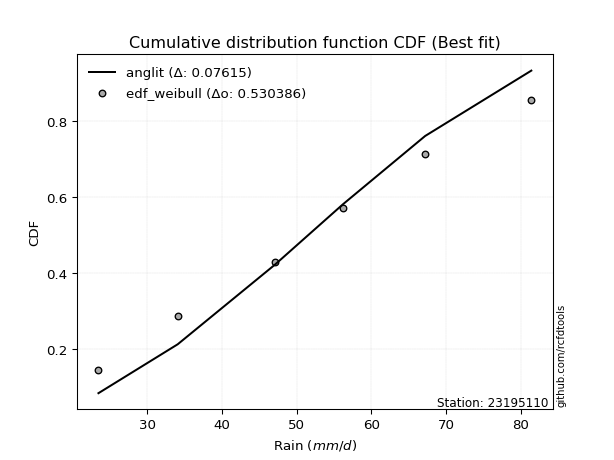</img>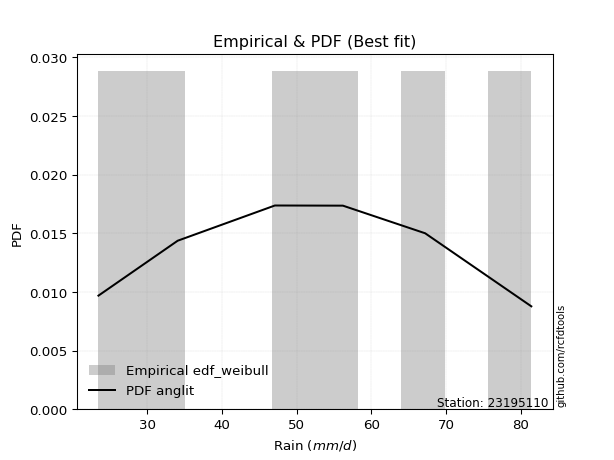</img>

</div>


### 4. EDF Beard (1943)

The Beard formula (or Beard´s plotting position formula) in hydrology is used to estimate the empirical non-exceedance probability _(P)_ of a flood event (or other extreme hydrological data point) within a given dataset.

<div align="center">


$P=(m-0.31)/(n+0.38)$


</div>


**4.1. Empirical values**

<div align="center">

|                | 0                   | 1                   | 2                  | 3                  | 4                  | 5                  |
|:---------------|:--------------------|:--------------------|:-------------------|:-------------------|:-------------------|:-------------------|
| date           | 2023                | 2020                | 2021               | 2025               | 2019               | 2024               |
| x              | 23.5                | 34.1                | 47.1               | 56.2               | 67.2               | 81.4               |
| m              | 1                   | 2                   | 3                  | 4                  | 5                  | 6                  |
| empirical_dist | edf_beard           | edf_beard           | edf_beard          | edf_beard          | edf_beard          | edf_beard          |
| empirical      | 0.10815047021943573 | 0.26489028213166144 | 0.4216300940438871 | 0.5783699059561128 | 0.7351097178683387 | 0.8918495297805643 |
| empirical_tr   | 1.1212653778558874  | 1.3603411513859276  | 1.7289972899728996 | 2.3717472118959106 | 3.7751479289940844 | 9.246376811594207  |

</div>


**4.2. Kolmogorov-Smirnov fit test (sorted by Δ)**


<div align="center">

|                | 0                   | 1                   | 2                  | 3                   | 4                    | 5                    | 6                   | 7                   | 8                   | 9                   | 10                 | 11                  | 12                  | 13                  | 14                 | 15                  | 16                 | 17                  | 18                  | 19                  | 20                  | 21                  | 22                  | 23                  | 24                 | 25                  | 26                  | 27                 | 28                 | 29                  | 30                  | 31                  | 32                 | 33                  | 34                  | 35                  | 36                 | 37                  | 38                 | 39                  | 40                  | 41                  | 42                  | 43                  | 44                  | 45                  | 46                  | 47                  | 48                  | 49                  | 50                  | 51                 | 52                  | 53                  | 54                  | 55                  | 56                  | 57                  | 58                  | 59                  | 60                  | 61                  | 62                  | 63                  | 64                  | 65                  | 66                  | 67                  | 68                  | 69                  | 70                  | 71                  | 72                  | 73                  | 74                  | 75                  | 76                  | 77                 | 78                  | 79                  | 80                  | 81                  | 82                  | 83                  | 84                  | 85                  | 86                  | 87                  | 88                  | 89                  | 90                  | 91                  | 92                 | 93                  | 94                  | 95                  | 96                  | 97                  | 98                  | 99                  | 100               | 101                 | 102                 | 103                 | 104                 | 105                 | 106               | 107                 | 108                | 109                | 110                 | 111                 | 112                 | 113                 | 114                | 115                 | 116                 | 117                 | 118                 | 119                 | 120                | 121                 | 122                 | 123                | 124                | 125                 | 126                | 127                | 128                 | 129                 | 130                 | 131                 | 132                | 133                 | 134               | 135                 | 136                | 137                 | 138                 | 139                | 140                 | 141                 | 142                 | 143                 | 144                 | 145                | 146                 | 147                | 148                | 149                | 150                | 151                | 152                | 153                | 154                | 155               | 156                | 157                | 158               | 159                |
|:---------------|:--------------------|:--------------------|:-------------------|:--------------------|:---------------------|:---------------------|:--------------------|:--------------------|:--------------------|:--------------------|:-------------------|:--------------------|:--------------------|:--------------------|:-------------------|:--------------------|:-------------------|:--------------------|:--------------------|:--------------------|:--------------------|:--------------------|:--------------------|:--------------------|:-------------------|:--------------------|:--------------------|:-------------------|:-------------------|:--------------------|:--------------------|:--------------------|:-------------------|:--------------------|:--------------------|:--------------------|:-------------------|:--------------------|:-------------------|:--------------------|:--------------------|:--------------------|:--------------------|:--------------------|:--------------------|:--------------------|:--------------------|:--------------------|:--------------------|:--------------------|:--------------------|:-------------------|:--------------------|:--------------------|:--------------------|:--------------------|:--------------------|:--------------------|:--------------------|:--------------------|:--------------------|:--------------------|:--------------------|:--------------------|:--------------------|:--------------------|:--------------------|:--------------------|:--------------------|:--------------------|:--------------------|:--------------------|:--------------------|:--------------------|:--------------------|:--------------------|:--------------------|:-------------------|:--------------------|:--------------------|:--------------------|:--------------------|:--------------------|:--------------------|:--------------------|:--------------------|:--------------------|:--------------------|:--------------------|:--------------------|:--------------------|:--------------------|:-------------------|:--------------------|:--------------------|:--------------------|:--------------------|:--------------------|:--------------------|:--------------------|:------------------|:--------------------|:--------------------|:--------------------|:--------------------|:--------------------|:------------------|:--------------------|:-------------------|:-------------------|:--------------------|:--------------------|:--------------------|:--------------------|:-------------------|:--------------------|:--------------------|:--------------------|:--------------------|:--------------------|:-------------------|:--------------------|:--------------------|:-------------------|:-------------------|:--------------------|:-------------------|:-------------------|:--------------------|:--------------------|:--------------------|:--------------------|:-------------------|:--------------------|:------------------|:--------------------|:-------------------|:--------------------|:--------------------|:-------------------|:--------------------|:--------------------|:--------------------|:--------------------|:--------------------|:-------------------|:--------------------|:-------------------|:-------------------|:-------------------|:-------------------|:-------------------|:-------------------|:-------------------|:-------------------|:------------------|:-------------------|:-------------------|:------------------|:-------------------|
| station        | 23195110            | 23195110            | 23195110           | 23195110            | 23195110             | 23195110             | 23195110            | 23195110            | 23195110            | 23195110            | 23195110           | 23195110            | 23195110            | 23195110            | 23195110           | 23195110            | 23195110           | 23195110            | 23195110            | 23195110            | 23195110            | 23195110            | 23195110            | 23195110            | 23195110           | 23195110            | 23195110            | 23195110           | 23195110           | 23195110            | 23195110            | 23195110            | 23195110           | 23195110            | 23195110            | 23195110            | 23195110           | 23195110            | 23195110           | 23195110            | 23195110            | 23195110            | 23195110            | 23195110            | 23195110            | 23195110            | 23195110            | 23195110            | 23195110            | 23195110            | 23195110            | 23195110           | 23195110            | 23195110            | 23195110            | 23195110            | 23195110            | 23195110            | 23195110            | 23195110            | 23195110            | 23195110            | 23195110            | 23195110            | 23195110            | 23195110            | 23195110            | 23195110            | 23195110            | 23195110            | 23195110            | 23195110            | 23195110            | 23195110            | 23195110            | 23195110            | 23195110            | 23195110           | 23195110            | 23195110            | 23195110            | 23195110            | 23195110            | 23195110            | 23195110            | 23195110            | 23195110            | 23195110            | 23195110            | 23195110            | 23195110            | 23195110            | 23195110           | 23195110            | 23195110            | 23195110            | 23195110            | 23195110            | 23195110            | 23195110            | 23195110          | 23195110            | 23195110            | 23195110            | 23195110            | 23195110            | 23195110          | 23195110            | 23195110           | 23195110           | 23195110            | 23195110            | 23195110            | 23195110            | 23195110           | 23195110            | 23195110            | 23195110            | 23195110            | 23195110            | 23195110           | 23195110            | 23195110            | 23195110           | 23195110           | 23195110            | 23195110           | 23195110           | 23195110            | 23195110            | 23195110            | 23195110            | 23195110           | 23195110            | 23195110          | 23195110            | 23195110           | 23195110            | 23195110            | 23195110           | 23195110            | 23195110            | 23195110            | 23195110            | 23195110            | 23195110           | 23195110            | 23195110           | 23195110           | 23195110           | 23195110           | 23195110           | 23195110           | 23195110           | 23195110           | 23195110          | 23195110           | 23195110           | 23195110          | 23195110           |
| empirical_dist | edf_beard           | edf_beard           | edf_beard          | edf_beard           | edf_beard            | edf_beard            | edf_beard           | edf_beard           | edf_beard           | edf_beard           | edf_beard          | edf_beard           | edf_beard           | edf_beard           | edf_beard          | edf_beard           | edf_beard          | edf_beard           | edf_beard           | edf_beard           | edf_beard           | edf_beard           | edf_beard           | edf_beard           | edf_beard          | edf_beard           | edf_beard           | edf_beard          | edf_beard          | edf_beard           | edf_beard           | edf_beard           | edf_beard          | edf_beard           | edf_beard           | edf_beard           | edf_beard          | edf_beard           | edf_beard          | edf_beard           | edf_beard           | edf_beard           | edf_beard           | edf_beard           | edf_beard           | edf_beard           | edf_beard           | edf_beard           | edf_beard           | edf_beard           | edf_beard           | edf_beard          | edf_beard           | edf_beard           | edf_beard           | edf_beard           | edf_beard           | edf_beard           | edf_beard           | edf_beard           | edf_beard           | edf_beard           | edf_beard           | edf_beard           | edf_beard           | edf_beard           | edf_beard           | edf_beard           | edf_beard           | edf_beard           | edf_beard           | edf_beard           | edf_beard           | edf_beard           | edf_beard           | edf_beard           | edf_beard           | edf_beard          | edf_beard           | edf_beard           | edf_beard           | edf_beard           | edf_beard           | edf_beard           | edf_beard           | edf_beard           | edf_beard           | edf_beard           | edf_beard           | edf_beard           | edf_beard           | edf_beard           | edf_beard          | edf_beard           | edf_beard           | edf_beard           | edf_beard           | edf_beard           | edf_beard           | edf_beard           | edf_beard         | edf_beard           | edf_beard           | edf_beard           | edf_beard           | edf_beard           | edf_beard         | edf_beard           | edf_beard          | edf_beard          | edf_beard           | edf_beard           | edf_beard           | edf_beard           | edf_beard          | edf_beard           | edf_beard           | edf_beard           | edf_beard           | edf_beard           | edf_beard          | edf_beard           | edf_beard           | edf_beard          | edf_beard          | edf_beard           | edf_beard          | edf_beard          | edf_beard           | edf_beard           | edf_beard           | edf_beard           | edf_beard          | edf_beard           | edf_beard         | edf_beard           | edf_beard          | edf_beard           | edf_beard           | edf_beard          | edf_beard           | edf_beard           | edf_beard           | edf_beard           | edf_beard           | edf_beard          | edf_beard           | edf_beard          | edf_beard          | edf_beard          | edf_beard          | edf_beard          | edf_beard          | edf_beard          | edf_beard          | edf_beard         | edf_beard          | edf_beard          | edf_beard         | edf_beard          |
| p_dist         | semicircular        | logtrapezoid        | ksone              | anglit              | dweibull             | logpearson3          | genlogistic         | rayleigh            | invgauss            | gompertz            | ncf                | loganglit           | maxwell             | f                   | invgamma           | weibull_min         | logsemicircular    | betaprime           | logjohnsonsu        | dgamma              | kstwobign           | alpha               | logargus            | logf                | logcrystalball     | lognorm             | logt                | logexponnorm       | foldnorm           | logweibull_min      | logbetaprime        | logburr12           | johnsonsu          | rice                | logfatiguelife      | logncf              | erlang             | pearson3            | gamma              | skewnorm            | nct                 | exponnorm           | norm                | crystalball         | truncnorm           | t                   | logburr             | loggamma            | loggamma            | loggumbel_l         | logerlang           | logrice            | cosine              | logdweibull         | logmielke           | logalpha            | burr                | loginvgamma         | mielke              | loglogistic         | gumbel_r            | logksone            | logcosine           | loginvgauss         | logdgamma           | logistic            | logmaxwell          | argus               | gumbel_l            | lognct              | logloggamma         | kappa3              | bradford            | logskewnorm         | wrapcauchy          | loggompertz         | logtriang           | truncweibull_min   | logbeta             | genpareto           | tukeylambda         | beta                | loggenhalflogistic  | kappa4              | halflogistic        | uniform             | logarcsine          | arcsine             | halfnorm            | loghypsecant        | truncexpon          | hypsecant           | lograyleigh        | moyal               | gausshyper          | loggenextreme       | loginvweibull       | triang              | laplace             | vonmises_line       | logkappa4         | logtukeylambda      | loglaplace          | loglaplace          | loguniform          | logvonmises_line    | loggumbel_r       | loggenexpon         | logfoldnorm        | logkstwobign       | loghalfnorm         | lomax               | genexpon            | logbradford         | logloglaplace      | logwrapcauchy       | genhalflogistic     | logmoyal            | loghalflogistic     | logexponpow         | loglevy_l          | loggausshyper       | halfgennorm         | loglomax           | burr12             | logtruncexpon       | johnsonsb          | levy_l             | gennorm             | loggennorm          | logwald             | logexponweib        | wald               | logtruncnorm        | loggengamma       | trapezoid           | logjohnsonsb       | logrdist            | lognakagami         | genextreme         | logweibull_max      | logkappa3           | logtruncweibull_min | loggenpareto        | invweibull          | nakagami           | fatiguelife         | gengamma           | exponweib          | powerlaw           | logpowerlaw        | weibull_max        | rdist              | truncpareto        | logtruncpareto     | exponpow          | loggenlogistic     | loghalfgennorm     | logvonmises       | vonmises           |
| delta          | 0.04292885977252159 | 0.04921174114396487 | 0.0507985532890467 | 0.05324470776242088 | 0.060702326809588814 | 0.061005924988432075 | 0.06612831947400022 | 0.06690452981137504 | 0.06779807932559934 | 0.06873581396815301 | 0.0699975081724446 | 0.07005252455071453 | 0.07082759865391053 | 0.07083502976500805 | 0.0714129289276855 | 0.07231226234567298 | 0.0725870706622656 | 0.07269965615342525 | 0.07358262208682931 | 0.07379902753347614 | 0.07391047345274349 | 0.07448530036601653 | 0.07583019410924352 | 0.07656226018866163 | 0.0767392444601519 | 0.07673946303235268 | 0.07674038802998451 | 0.0767416209906151 | 0.0773151728757141 | 0.07753446657645494 | 0.07797268941409186 | 0.07841158044574328 | 0.0788856142496866 | 0.07892592515028515 | 0.07895898609800567 | 0.07905077913310421 | 0.0798924630246356 | 0.08007975604037343 | 0.0800838454457033 | 0.08055172891253307 | 0.08056068034821887 | 0.08059245047484481 | 0.08059408985195643 | 0.08059409723851602 | 0.08059411198427657 | 0.08059948180218596 | 0.08118618295402213 | 0.08176932648183266 | 0.08176932648183266 | 0.08231740043436744 | 0.08423093474789412 | 0.0843054243603315 | 0.08526396296956751 | 0.08616289017558615 | 0.08660343615104382 | 0.09021820225275834 | 0.09142065660762388 | 0.09147485308103143 | 0.09491316067649158 | 0.09511326409716503 | 0.09605048766975977 | 0.09635070229220073 | 0.09649904827013078 | 0.09703586443660633 | 0.10073884436044708 | 0.10117097490711266 | 0.10207479014580961 | 0.10232202472076579 | 0.10248721910700237 | 0.10458181882127654 | 0.10804997345313183 | 0.10813734797908386 | 0.10814942786943617 | 0.10814975866700682 | 0.10815041090489114 | 0.10815045995643151 | 0.10815046137962792 | 0.1081504700747602 | 0.10815047019840529 | 0.10815047021348045 | 0.10815047021942863 | 0.10815047021943008 | 0.10815047021943025 | 0.10815047021943074 | 0.10815047021943573 | 0.10815047021943573 | 0.10815047021943573 | 0.10815047021943573 | 0.10815047021943573 | 0.10928454537112753 | 0.11100301037152921 | 0.11278649739706273 | 0.1132898757358613 | 0.11454963362847453 | 0.11808459847123892 | 0.12049573398375091 | 0.12183951365529927 | 0.12256628226595118 | 0.12469026996914653 | 0.13142696360981987 | 0.137103099158342 | 0.13729470592271004 | 0.13730393437851662 | 0.13730393437851662 | 0.13800179067452073 | 0.13802120086391684 | 0.138683986074224 | 0.14189366642027484 | 0.1427419643649484 | 0.1448019499223449 | 0.14486882725095568 | 0.14591239426787522 | 0.14676741471446592 | 0.14704066800446997 | 0.1517035734856938 | 0.15931638077743648 | 0.16257442971089542 | 0.16456742077335168 | 0.16918376966201581 | 0.17607938795029193 | 0.1860185912259032 | 0.20045344046303565 | 0.20170708290605494 | 0.2031059773156218 | 0.2052332942997938 | 0.22705231440514556 | 0.2303847308376985 | 0.2323120283594567 | 0.23510971786833867 | 0.23510971786833867 | 0.23658264188550499 | 0.24840715718053058 | 0.2606168016634856 | 0.26489024401045336 | 0.271455874901458 | 0.27148452349990965 | 0.3097277538298413 | 0.32712702672750016 | 0.32904419308390215 | 0.3321359005962732 | 0.34739891970390846 | 0.36696375852115004 | 0.3852287607033699  | 0.43206059081307774 | 0.45698699880967375 | 0.4785389762698025 | 0.48861540446222484 | 0.4938257972435488 | 0.4999597418402175 | 0.5140494869027711 | 0.5613198070857573 | 0.5624607956949732 | 0.5783699057745901 | 0.5889418861536124 | 0.6303959576423223 | 0.633107474101335 | 0.7351097178683387 | 0.7351097178683387 | 1.074063290437366 | 12.956723524769512 |
| deltao         | 0.530385761606      | 0.530385761606      | 0.530385761606     | 0.530385761606      | 0.530385761606       | 0.530385761606       | 0.530385761606      | 0.530385761606      | 0.530385761606      | 0.530385761606      | 0.530385761606     | 0.530385761606      | 0.530385761606      | 0.530385761606      | 0.530385761606     | 0.530385761606      | 0.530385761606     | 0.530385761606      | 0.530385761606      | 0.530385761606      | 0.530385761606      | 0.530385761606      | 0.530385761606      | 0.530385761606      | 0.530385761606     | 0.530385761606      | 0.530385761606      | 0.530385761606     | 0.530385761606     | 0.530385761606      | 0.530385761606      | 0.530385761606      | 0.530385761606     | 0.530385761606      | 0.530385761606      | 0.530385761606      | 0.530385761606     | 0.530385761606      | 0.530385761606     | 0.530385761606      | 0.530385761606      | 0.530385761606      | 0.530385761606      | 0.530385761606      | 0.530385761606      | 0.530385761606      | 0.530385761606      | 0.530385761606      | 0.530385761606      | 0.530385761606      | 0.530385761606      | 0.530385761606     | 0.530385761606      | 0.530385761606      | 0.530385761606      | 0.530385761606      | 0.530385761606      | 0.530385761606      | 0.530385761606      | 0.530385761606      | 0.530385761606      | 0.530385761606      | 0.530385761606      | 0.530385761606      | 0.530385761606      | 0.530385761606      | 0.530385761606      | 0.530385761606      | 0.530385761606      | 0.530385761606      | 0.530385761606      | 0.530385761606      | 0.530385761606      | 0.530385761606      | 0.530385761606      | 0.530385761606      | 0.530385761606      | 0.530385761606     | 0.530385761606      | 0.530385761606      | 0.530385761606      | 0.530385761606      | 0.530385761606      | 0.530385761606      | 0.530385761606      | 0.530385761606      | 0.530385761606      | 0.530385761606      | 0.530385761606      | 0.530385761606      | 0.530385761606      | 0.530385761606      | 0.530385761606     | 0.530385761606      | 0.530385761606      | 0.530385761606      | 0.530385761606      | 0.530385761606      | 0.530385761606      | 0.530385761606      | 0.530385761606    | 0.530385761606      | 0.530385761606      | 0.530385761606      | 0.530385761606      | 0.530385761606      | 0.530385761606    | 0.530385761606      | 0.530385761606     | 0.530385761606     | 0.530385761606      | 0.530385761606      | 0.530385761606      | 0.530385761606      | 0.530385761606     | 0.530385761606      | 0.530385761606      | 0.530385761606      | 0.530385761606      | 0.530385761606      | 0.530385761606     | 0.530385761606      | 0.530385761606      | 0.530385761606     | 0.530385761606     | 0.530385761606      | 0.530385761606     | 0.530385761606     | 0.530385761606      | 0.530385761606      | 0.530385761606      | 0.530385761606      | 0.530385761606     | 0.530385761606      | 0.530385761606    | 0.530385761606      | 0.530385761606     | 0.530385761606      | 0.530385761606      | 0.530385761606     | 0.530385761606      | 0.530385761606      | 0.530385761606      | 0.530385761606      | 0.530385761606      | 0.530385761606     | 0.530385761606      | 0.530385761606     | 0.530385761606     | 0.530385761606     | 0.530385761606     | 0.530385761606     | 0.530385761606     | 0.530385761606     | 0.530385761606     | 0.530385761606    | 0.530385761606     | 0.530385761606     | 0.530385761606    | 0.530385761606     |
| eval           | Δo > Δ              | Δo > Δ              | Δo > Δ             | Δo > Δ              | Δo > Δ               | Δo > Δ               | Δo > Δ              | Δo > Δ              | Δo > Δ              | Δo > Δ              | Δo > Δ             | Δo > Δ              | Δo > Δ              | Δo > Δ              | Δo > Δ             | Δo > Δ              | Δo > Δ             | Δo > Δ              | Δo > Δ              | Δo > Δ              | Δo > Δ              | Δo > Δ              | Δo > Δ              | Δo > Δ              | Δo > Δ             | Δo > Δ              | Δo > Δ              | Δo > Δ             | Δo > Δ             | Δo > Δ              | Δo > Δ              | Δo > Δ              | Δo > Δ             | Δo > Δ              | Δo > Δ              | Δo > Δ              | Δo > Δ             | Δo > Δ              | Δo > Δ             | Δo > Δ              | Δo > Δ              | Δo > Δ              | Δo > Δ              | Δo > Δ              | Δo > Δ              | Δo > Δ              | Δo > Δ              | Δo > Δ              | Δo > Δ              | Δo > Δ              | Δo > Δ              | Δo > Δ             | Δo > Δ              | Δo > Δ              | Δo > Δ              | Δo > Δ              | Δo > Δ              | Δo > Δ              | Δo > Δ              | Δo > Δ              | Δo > Δ              | Δo > Δ              | Δo > Δ              | Δo > Δ              | Δo > Δ              | Δo > Δ              | Δo > Δ              | Δo > Δ              | Δo > Δ              | Δo > Δ              | Δo > Δ              | Δo > Δ              | Δo > Δ              | Δo > Δ              | Δo > Δ              | Δo > Δ              | Δo > Δ              | Δo > Δ             | Δo > Δ              | Δo > Δ              | Δo > Δ              | Δo > Δ              | Δo > Δ              | Δo > Δ              | Δo > Δ              | Δo > Δ              | Δo > Δ              | Δo > Δ              | Δo > Δ              | Δo > Δ              | Δo > Δ              | Δo > Δ              | Δo > Δ             | Δo > Δ              | Δo > Δ              | Δo > Δ              | Δo > Δ              | Δo > Δ              | Δo > Δ              | Δo > Δ              | Δo > Δ            | Δo > Δ              | Δo > Δ              | Δo > Δ              | Δo > Δ              | Δo > Δ              | Δo > Δ            | Δo > Δ              | Δo > Δ             | Δo > Δ             | Δo > Δ              | Δo > Δ              | Δo > Δ              | Δo > Δ              | Δo > Δ             | Δo > Δ              | Δo > Δ              | Δo > Δ              | Δo > Δ              | Δo > Δ              | Δo > Δ             | Δo > Δ              | Δo > Δ              | Δo > Δ             | Δo > Δ             | Δo > Δ              | Δo > Δ             | Δo > Δ             | Δo > Δ              | Δo > Δ              | Δo > Δ              | Δo > Δ              | Δo > Δ             | Δo > Δ              | Δo > Δ            | Δo > Δ              | Δo > Δ             | Δo > Δ              | Δo > Δ              | Δo > Δ             | Δo > Δ              | Δo > Δ              | Δo > Δ              | Δo > Δ              | Δo > Δ              | Δo > Δ             | Δo > Δ              | Δo > Δ             | Δo > Δ             | Δo > Δ             | Δo <= Δ            | Δo <= Δ            | Δo <= Δ            | Δo <= Δ            | Δo <= Δ            | Δo <= Δ           | Δo <= Δ            | Δo <= Δ            | Δo <= Δ           | Δo <= Δ            |
| fit            | 1                   | 1                   | 1                  | 1                   | 1                    | 1                    | 1                   | 1                   | 1                   | 1                   | 1                  | 1                   | 1                   | 1                   | 1                  | 1                   | 1                  | 1                   | 1                   | 1                   | 1                   | 1                   | 1                   | 1                   | 1                  | 1                   | 1                   | 1                  | 1                  | 1                   | 1                   | 1                   | 1                  | 1                   | 1                   | 1                   | 1                  | 1                   | 1                  | 1                   | 1                   | 1                   | 1                   | 1                   | 1                   | 1                   | 1                   | 1                   | 1                   | 1                   | 1                   | 1                  | 1                   | 1                   | 1                   | 1                   | 1                   | 1                   | 1                   | 1                   | 1                   | 1                   | 1                   | 1                   | 1                   | 1                   | 1                   | 1                   | 1                   | 1                   | 1                   | 1                   | 1                   | 1                   | 1                   | 1                   | 1                   | 1                  | 1                   | 1                   | 1                   | 1                   | 1                   | 1                   | 1                   | 1                   | 1                   | 1                   | 1                   | 1                   | 1                   | 1                   | 1                  | 1                   | 1                   | 1                   | 1                   | 1                   | 1                   | 1                   | 1                 | 1                   | 1                   | 1                   | 1                   | 1                   | 1                 | 1                   | 1                  | 1                  | 1                   | 1                   | 1                   | 1                   | 1                  | 1                   | 1                   | 1                   | 1                   | 1                   | 1                  | 1                   | 1                   | 1                  | 1                  | 1                   | 1                  | 1                  | 1                   | 1                   | 1                   | 1                   | 1                  | 1                   | 1                 | 1                   | 1                  | 1                   | 1                   | 1                  | 1                   | 1                   | 1                   | 1                   | 1                   | 1                  | 1                   | 1                  | 1                  | 1                  | 0                  | 0                  | 0                  | 0                  | 0                  | 0                 | 0                  | 0                  | 0                 | 0                  |
| n              | 6                   | 6                   | 6                  | 6                   | 6                    | 6                    | 6                   | 6                   | 6                   | 6                   | 6                  | 6                   | 6                   | 6                   | 6                  | 6                   | 6                  | 6                   | 6                   | 6                   | 6                   | 6                   | 6                   | 6                   | 6                  | 6                   | 6                   | 6                  | 6                  | 6                   | 6                   | 6                   | 6                  | 6                   | 6                   | 6                   | 6                  | 6                   | 6                  | 6                   | 6                   | 6                   | 6                   | 6                   | 6                   | 6                   | 6                   | 6                   | 6                   | 6                   | 6                   | 6                  | 6                   | 6                   | 6                   | 6                   | 6                   | 6                   | 6                   | 6                   | 6                   | 6                   | 6                   | 6                   | 6                   | 6                   | 6                   | 6                   | 6                   | 6                   | 6                   | 6                   | 6                   | 6                   | 6                   | 6                   | 6                   | 6                  | 6                   | 6                   | 6                   | 6                   | 6                   | 6                   | 6                   | 6                   | 6                   | 6                   | 6                   | 6                   | 6                   | 6                   | 6                  | 6                   | 6                   | 6                   | 6                   | 6                   | 6                   | 6                   | 6                 | 6                   | 6                   | 6                   | 6                   | 6                   | 6                 | 6                   | 6                  | 6                  | 6                   | 6                   | 6                   | 6                   | 6                  | 6                   | 6                   | 6                   | 6                   | 6                   | 6                  | 6                   | 6                   | 6                  | 6                  | 6                   | 6                  | 6                  | 6                   | 6                   | 6                   | 6                   | 6                  | 6                   | 6                 | 6                   | 6                  | 6                   | 6                   | 6                  | 6                   | 6                   | 6                   | 6                   | 6                   | 6                  | 6                   | 6                  | 6                  | 6                  | 6                  | 6                  | 6                  | 6                  | 6                  | 6                 | 6                  | 6                  | 6                 | 6                  |
| best_fit       | 1                   | 0                   | 0                  | 0                   | 0                    | 0                    | 0                   | 0                   | 0                   | 0                   | 0                  | 0                   | 0                   | 0                   | 0                  | 0                   | 0                  | 0                   | 0                   | 0                   | 0                   | 0                   | 0                   | 0                   | 0                  | 0                   | 0                   | 0                  | 0                  | 0                   | 0                   | 0                   | 0                  | 0                   | 0                   | 0                   | 0                  | 0                   | 0                  | 0                   | 0                   | 0                   | 0                   | 0                   | 0                   | 0                   | 0                   | 0                   | 0                   | 0                   | 0                   | 0                  | 0                   | 0                   | 0                   | 0                   | 0                   | 0                   | 0                   | 0                   | 0                   | 0                   | 0                   | 0                   | 0                   | 0                   | 0                   | 0                   | 0                   | 0                   | 0                   | 0                   | 0                   | 0                   | 0                   | 0                   | 0                   | 0                  | 0                   | 0                   | 0                   | 0                   | 0                   | 0                   | 0                   | 0                   | 0                   | 0                   | 0                   | 0                   | 0                   | 0                   | 0                  | 0                   | 0                   | 0                   | 0                   | 0                   | 0                   | 0                   | 0                 | 0                   | 0                   | 0                   | 0                   | 0                   | 0                 | 0                   | 0                  | 0                  | 0                   | 0                   | 0                   | 0                   | 0                  | 0                   | 0                   | 0                   | 0                   | 0                   | 0                  | 0                   | 0                   | 0                  | 0                  | 0                   | 0                  | 0                  | 0                   | 0                   | 0                   | 0                   | 0                  | 0                   | 0                 | 0                   | 0                  | 0                   | 0                   | 0                  | 0                   | 0                   | 0                   | 0                   | 0                   | 0                  | 0                   | 0                  | 0                  | 0                  | 0                  | 0                  | 0                  | 0                  | 0                  | 0                 | 0                  | 0                  | 0                 | 0                  |
| best_fit_sort  | 1                   | 2                   | 3                  | 4                   | 5                    | 6                    | 7                   | 8                   | 9                   | 10                  | 11                 | 12                  | 13                  | 14                  | 15                 | 16                  | 17                 | 18                  | 19                  | 20                  | 21                  | 22                  | 23                  | 24                  | 25                 | 26                  | 27                  | 28                 | 29                 | 30                  | 31                  | 32                  | 33                 | 34                  | 35                  | 36                  | 37                 | 38                  | 39                 | 40                  | 41                  | 42                  | 43                  | 44                  | 45                  | 46                  | 47                  | 48                  | 49                  | 50                  | 51                  | 52                 | 53                  | 54                  | 55                  | 56                  | 57                  | 58                  | 59                  | 60                  | 61                  | 62                  | 63                  | 64                  | 65                  | 66                  | 67                  | 68                  | 69                  | 70                  | 71                  | 72                  | 73                  | 74                  | 75                  | 76                  | 77                  | 78                 | 79                  | 80                  | 81                  | 82                  | 83                  | 84                  | 85                  | 86                  | 87                  | 88                  | 89                  | 90                  | 91                  | 92                  | 93                 | 94                  | 95                  | 96                  | 97                  | 98                  | 99                  | 100                 | 101               | 102                 | 103                 | 104                 | 105                 | 106                 | 107               | 108                 | 109                | 110                | 111                 | 112                 | 113                 | 114                 | 115                | 116                 | 117                 | 118                 | 119                 | 120                 | 121                | 122                 | 123                 | 124                | 125                | 126                 | 127                | 128                | 129                 | 130                 | 131                 | 132                 | 133                | 134                 | 135               | 136                 | 137                | 138                 | 139                 | 140                | 141                 | 142                 | 143                 | 144                 | 145                 | 146                | 147                 | 148                | 149                | 150                | 151                | 152                | 153                | 154                | 155                | 156               | 157                | 158                | 159               | 160                |

</div>


**4.3. Best fit**

<div align="center">

|   id |   station | empirical_dist   | p_dist       |     delta |   deltao | eval   |   fit |   n |   best_fit |   best_fit_sort |
|-----:|----------:|:-----------------|:-------------|----------:|---------:|:-------|------:|----:|-----------:|----------------:|
|    0 |  23195110 | edf_beard        | semicircular | 0.0429289 | 0.530386 | Δo > Δ |     1 |   6 |          1 |               1 |

</div>


<div align="center">

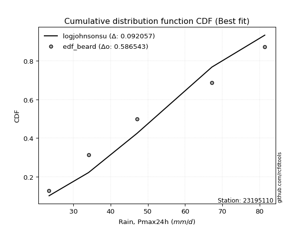</img>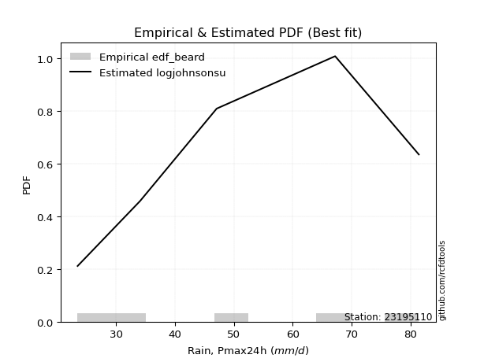</img>

</div>


### 5. EDF Chegodayev (1955)

The Chegodayev formula is an empirical plotting position formula used in hydrological frequency analysis to estimate the exceedance probability or return period of a specific event from a set of observed data. It is primarily used for plotting observed data points on probability paper to fit a theoretical distribution, particularly for analyzing extreme events like maximum flood flows or rainfall intensities. The constant _b_ value in the generalized plotting position formula is 0.3.

<div align="center">


$P=(m-b)/(n+1-2b)$


</div>


**5.1. Empirical values**

<div align="center">

|                | 0                   | 1                  | 2                  | 3                  | 4                 | 5                 |
|:---------------|:--------------------|:-------------------|:-------------------|:-------------------|:------------------|:------------------|
| date           | 2023                | 2020               | 2021               | 2025               | 2019              | 2024              |
| x              | 23.5                | 34.1               | 47.1               | 56.2               | 67.2              | 81.4              |
| m              | 1                   | 2                  | 3                  | 4                  | 5                 | 6                 |
| empirical_dist | edf_chegodayev      | edf_chegodayev     | edf_chegodayev     | edf_chegodayev     | edf_chegodayev    | edf_chegodayev    |
| empirical      | 0.10937499999999999 | 0.265625           | 0.421875           | 0.578125           | 0.734375          | 0.890625          |
| empirical_tr   | 1.1228070175438596  | 1.3617021276595744 | 1.7297297297297298 | 2.3703703703703702 | 3.764705882352941 | 9.142857142857142 |

</div>


**5.2. Kolmogorov-Smirnov fit test (sorted by Δ)**


<div align="center">

|                | 0                  | 1                   | 2                   | 3                   | 4                   | 5                   | 6                   | 7                  | 8                  | 9                   | 10                  | 11                  | 12                  | 13                  | 14                  | 15                  | 16                  | 17                  | 18                 | 19                  | 20                 | 21                  | 22                  | 23                  | 24                 | 25                  | 26                  | 27                  | 28                  | 29                  | 30                 | 31                  | 32                  | 33                  | 34                  | 35                  | 36                  | 37                  | 38                  | 39                  | 40                  | 41                  | 42                  | 43                | 44                  | 45                  | 46                  | 47                  | 48                  | 49                  | 50                  | 51                  | 52                  | 53                  | 54                  | 55                  | 56                  | 57                 | 58                  | 59                  | 60                 | 61                  | 62                  | 63                  | 64                  | 65                  | 66                  | 67                  | 68                  | 69                  | 70                  | 71                  | 72                  | 73                  | 74                  | 75                  | 76                  | 77                 | 78                 | 79                  | 80                  | 81                  | 82                  | 83                  | 84                  | 85                  | 86                  | 87             | 88             | 89                  | 90                  | 91                  | 92                  | 93                 | 94                  | 95                  | 96                 | 97                  | 98                 | 99                  | 100                 | 101                 | 102                 | 103                 | 104                 | 105                 | 106                 | 107                 | 108                 | 109                 | 110                | 111                 | 112                 | 113                | 114                 | 115                 | 116                | 117                | 118                 | 119                 | 120                 | 121                 | 122                 | 123                 | 124                 | 125                | 126                 | 127                 | 128            | 129            | 130                | 131                | 132                | 133                | 134                 | 135                 | 136                | 137                 | 138                | 139                 | 140                | 141                 | 142                 | 143                | 144                 | 145                 | 146                | 147                 | 148                 | 149                | 150                | 151                | 152                | 153                | 154                | 155                | 156            | 157            | 158                | 159                |
|:---------------|:-------------------|:--------------------|:--------------------|:--------------------|:--------------------|:--------------------|:--------------------|:-------------------|:-------------------|:--------------------|:--------------------|:--------------------|:--------------------|:--------------------|:--------------------|:--------------------|:--------------------|:--------------------|:-------------------|:--------------------|:-------------------|:--------------------|:--------------------|:--------------------|:-------------------|:--------------------|:--------------------|:--------------------|:--------------------|:--------------------|:-------------------|:--------------------|:--------------------|:--------------------|:--------------------|:--------------------|:--------------------|:--------------------|:--------------------|:--------------------|:--------------------|:--------------------|:--------------------|:------------------|:--------------------|:--------------------|:--------------------|:--------------------|:--------------------|:--------------------|:--------------------|:--------------------|:--------------------|:--------------------|:--------------------|:--------------------|:--------------------|:-------------------|:--------------------|:--------------------|:-------------------|:--------------------|:--------------------|:--------------------|:--------------------|:--------------------|:--------------------|:--------------------|:--------------------|:--------------------|:--------------------|:--------------------|:--------------------|:--------------------|:--------------------|:--------------------|:--------------------|:-------------------|:-------------------|:--------------------|:--------------------|:--------------------|:--------------------|:--------------------|:--------------------|:--------------------|:--------------------|:---------------|:---------------|:--------------------|:--------------------|:--------------------|:--------------------|:-------------------|:--------------------|:--------------------|:-------------------|:--------------------|:-------------------|:--------------------|:--------------------|:--------------------|:--------------------|:--------------------|:--------------------|:--------------------|:--------------------|:--------------------|:--------------------|:--------------------|:-------------------|:--------------------|:--------------------|:-------------------|:--------------------|:--------------------|:-------------------|:-------------------|:--------------------|:--------------------|:--------------------|:--------------------|:--------------------|:--------------------|:--------------------|:-------------------|:--------------------|:--------------------|:---------------|:---------------|:-------------------|:-------------------|:-------------------|:-------------------|:--------------------|:--------------------|:-------------------|:--------------------|:-------------------|:--------------------|:-------------------|:--------------------|:--------------------|:-------------------|:--------------------|:--------------------|:-------------------|:--------------------|:--------------------|:-------------------|:-------------------|:-------------------|:-------------------|:-------------------|:-------------------|:-------------------|:---------------|:---------------|:-------------------|:-------------------|
| station        | 23195110           | 23195110            | 23195110            | 23195110            | 23195110            | 23195110            | 23195110            | 23195110           | 23195110           | 23195110            | 23195110            | 23195110            | 23195110            | 23195110            | 23195110            | 23195110            | 23195110            | 23195110            | 23195110           | 23195110            | 23195110           | 23195110            | 23195110            | 23195110            | 23195110           | 23195110            | 23195110            | 23195110            | 23195110            | 23195110            | 23195110           | 23195110            | 23195110            | 23195110            | 23195110            | 23195110            | 23195110            | 23195110            | 23195110            | 23195110            | 23195110            | 23195110            | 23195110            | 23195110          | 23195110            | 23195110            | 23195110            | 23195110            | 23195110            | 23195110            | 23195110            | 23195110            | 23195110            | 23195110            | 23195110            | 23195110            | 23195110            | 23195110           | 23195110            | 23195110            | 23195110           | 23195110            | 23195110            | 23195110            | 23195110            | 23195110            | 23195110            | 23195110            | 23195110            | 23195110            | 23195110            | 23195110            | 23195110            | 23195110            | 23195110            | 23195110            | 23195110            | 23195110           | 23195110           | 23195110            | 23195110            | 23195110            | 23195110            | 23195110            | 23195110            | 23195110            | 23195110            | 23195110       | 23195110       | 23195110            | 23195110            | 23195110            | 23195110            | 23195110           | 23195110            | 23195110            | 23195110           | 23195110            | 23195110           | 23195110            | 23195110            | 23195110            | 23195110            | 23195110            | 23195110            | 23195110            | 23195110            | 23195110            | 23195110            | 23195110            | 23195110           | 23195110            | 23195110            | 23195110           | 23195110            | 23195110            | 23195110           | 23195110           | 23195110            | 23195110            | 23195110            | 23195110            | 23195110            | 23195110            | 23195110            | 23195110           | 23195110            | 23195110            | 23195110       | 23195110       | 23195110           | 23195110           | 23195110           | 23195110           | 23195110            | 23195110            | 23195110           | 23195110            | 23195110           | 23195110            | 23195110           | 23195110            | 23195110            | 23195110           | 23195110            | 23195110            | 23195110           | 23195110            | 23195110            | 23195110           | 23195110           | 23195110           | 23195110           | 23195110           | 23195110           | 23195110           | 23195110       | 23195110       | 23195110           | 23195110           |
| empirical_dist | edf_chegodayev     | edf_chegodayev      | edf_chegodayev      | edf_chegodayev      | edf_chegodayev      | edf_chegodayev      | edf_chegodayev      | edf_chegodayev     | edf_chegodayev     | edf_chegodayev      | edf_chegodayev      | edf_chegodayev      | edf_chegodayev      | edf_chegodayev      | edf_chegodayev      | edf_chegodayev      | edf_chegodayev      | edf_chegodayev      | edf_chegodayev     | edf_chegodayev      | edf_chegodayev     | edf_chegodayev      | edf_chegodayev      | edf_chegodayev      | edf_chegodayev     | edf_chegodayev      | edf_chegodayev      | edf_chegodayev      | edf_chegodayev      | edf_chegodayev      | edf_chegodayev     | edf_chegodayev      | edf_chegodayev      | edf_chegodayev      | edf_chegodayev      | edf_chegodayev      | edf_chegodayev      | edf_chegodayev      | edf_chegodayev      | edf_chegodayev      | edf_chegodayev      | edf_chegodayev      | edf_chegodayev      | edf_chegodayev    | edf_chegodayev      | edf_chegodayev      | edf_chegodayev      | edf_chegodayev      | edf_chegodayev      | edf_chegodayev      | edf_chegodayev      | edf_chegodayev      | edf_chegodayev      | edf_chegodayev      | edf_chegodayev      | edf_chegodayev      | edf_chegodayev      | edf_chegodayev     | edf_chegodayev      | edf_chegodayev      | edf_chegodayev     | edf_chegodayev      | edf_chegodayev      | edf_chegodayev      | edf_chegodayev      | edf_chegodayev      | edf_chegodayev      | edf_chegodayev      | edf_chegodayev      | edf_chegodayev      | edf_chegodayev      | edf_chegodayev      | edf_chegodayev      | edf_chegodayev      | edf_chegodayev      | edf_chegodayev      | edf_chegodayev      | edf_chegodayev     | edf_chegodayev     | edf_chegodayev      | edf_chegodayev      | edf_chegodayev      | edf_chegodayev      | edf_chegodayev      | edf_chegodayev      | edf_chegodayev      | edf_chegodayev      | edf_chegodayev | edf_chegodayev | edf_chegodayev      | edf_chegodayev      | edf_chegodayev      | edf_chegodayev      | edf_chegodayev     | edf_chegodayev      | edf_chegodayev      | edf_chegodayev     | edf_chegodayev      | edf_chegodayev     | edf_chegodayev      | edf_chegodayev      | edf_chegodayev      | edf_chegodayev      | edf_chegodayev      | edf_chegodayev      | edf_chegodayev      | edf_chegodayev      | edf_chegodayev      | edf_chegodayev      | edf_chegodayev      | edf_chegodayev     | edf_chegodayev      | edf_chegodayev      | edf_chegodayev     | edf_chegodayev      | edf_chegodayev      | edf_chegodayev     | edf_chegodayev     | edf_chegodayev      | edf_chegodayev      | edf_chegodayev      | edf_chegodayev      | edf_chegodayev      | edf_chegodayev      | edf_chegodayev      | edf_chegodayev     | edf_chegodayev      | edf_chegodayev      | edf_chegodayev | edf_chegodayev | edf_chegodayev     | edf_chegodayev     | edf_chegodayev     | edf_chegodayev     | edf_chegodayev      | edf_chegodayev      | edf_chegodayev     | edf_chegodayev      | edf_chegodayev     | edf_chegodayev      | edf_chegodayev     | edf_chegodayev      | edf_chegodayev      | edf_chegodayev     | edf_chegodayev      | edf_chegodayev      | edf_chegodayev     | edf_chegodayev      | edf_chegodayev      | edf_chegodayev     | edf_chegodayev     | edf_chegodayev     | edf_chegodayev     | edf_chegodayev     | edf_chegodayev     | edf_chegodayev     | edf_chegodayev | edf_chegodayev | edf_chegodayev     | edf_chegodayev     |
| p_dist         | semicircular       | logtrapezoid        | ksone               | anglit              | dweibull            | logpearson3         | genlogistic         | rayleigh           | invgauss           | gompertz            | loganglit           | ncf                 | maxwell             | f                   | invgamma            | betaprime           | weibull_min         | logsemicircular     | kstwobign          | logjohnsonsu        | dgamma             | alpha               | logf                | logcrystalball      | lognorm            | logt                | logexponnorm        | logargus            | foldnorm            | logbetaprime        | logweibull_min     | logburr12           | logfatiguelife      | logncf              | johnsonsu           | rice                | erlang              | pearson3            | gamma               | logburr             | skewnorm            | nct                 | exponnorm           | norm              | crystalball         | truncnorm           | t                   | loggamma            | loggamma            | loggumbel_l         | logerlang           | logrice             | cosine              | logdweibull         | logmielke           | logalpha            | loginvgamma         | burr               | loglogistic         | mielke              | logcosine          | gumbel_r            | loginvgauss         | logksone            | logdgamma           | logmaxwell          | logistic            | argus               | gumbel_l            | lognct              | logloggamma         | kappa3              | bradford            | logskewnorm         | wrapcauchy          | loggompertz         | logtriang           | truncweibull_min   | logbeta            | genpareto           | tukeylambda         | beta                | loggenhalflogistic  | kappa4              | logarcsine          | halfnorm            | halflogistic        | uniform        | arcsine        | loghypsecant        | truncexpon          | lograyleigh         | hypsecant           | moyal              | gausshyper          | loggenextreme       | loginvweibull      | triang              | laplace            | vonmises_line       | logkappa4           | logtukeylambda      | loglaplace          | loglaplace          | loguniform          | logvonmises_line    | loggumbel_r         | loggenexpon         | logfoldnorm         | logkstwobign        | loghalfnorm        | lomax               | genexpon            | logbradford        | logloglaplace       | logwrapcauchy       | genhalflogistic    | logmoyal           | loghalflogistic     | logexponpow         | loglevy_l           | loggausshyper       | halfgennorm         | loglomax            | burr12              | logtruncexpon      | johnsonsb           | levy_l              | gennorm        | loggennorm     | logwald            | logexponweib       | wald               | logtruncnorm       | loggengamma         | trapezoid           | logjohnsonsb       | logrdist            | lognakagami        | genextreme          | logweibull_max     | logkappa3           | logtruncweibull_min | loggenpareto       | invweibull          | nakagami            | fatiguelife        | gengamma            | exponweib           | powerlaw           | logpowerlaw        | weibull_max        | rdist              | truncpareto        | logtruncpareto     | exponpow           | loggenlogistic | loghalfgennorm | logvonmises        | vonmises           |
| delta          | 0.0441533895530859 | 0.05043627092452918 | 0.05202308306961101 | 0.05397942563075944 | 0.06143704467792738 | 0.06174064285677064 | 0.06637322543011304 | 0.0676392476797136 | 0.0685327971939379 | 0.06947053183649157 | 0.06980761859460166 | 0.07073222604078316 | 0.07156231652224909 | 0.07156974763334661 | 0.07214764679602406 | 0.07343437402176381 | 0.07353679212623723 | 0.07381160044282985 | 0.0741553794088563 | 0.07431733995516787 | 0.0745337454018147 | 0.07522001823435509 | 0.07680716614477445 | 0.07698415041626472 | 0.0769843689884655 | 0.07698529398609733 | 0.07698652694672792 | 0.07705472388980783 | 0.07804989074405266 | 0.07821759537020467 | 0.0782691844447935 | 0.07914629831408185 | 0.07920389205411849 | 0.07929568508921703 | 0.07962033211802516 | 0.07966064301862372 | 0.08062718089297416 | 0.08081447390871199 | 0.08081856331404186 | 0.08094127699790932 | 0.08128644678087163 | 0.08129539821655743 | 0.08132716834318338 | 0.081328807720295 | 0.08132881510685458 | 0.08132882985261514 | 0.08133419967052452 | 0.08201423243794548 | 0.08201423243794548 | 0.08305211830270601 | 0.08447584070400693 | 0.08455033031644432 | 0.08599868083790607 | 0.08689760804392471 | 0.08782796593160813 | 0.09046310820887116 | 0.09171975903714424 | 0.0926451863881882 | 0.09535817005327785 | 0.09613769045705589 | 0.0967439542262436 | 0.09678520553809833 | 0.09679095848049346 | 0.09757523207276499 | 0.10147356222878565 | 0.10182988418969674 | 0.10190569277545122 | 0.10305674258910436 | 0.10322193697534093 | 0.10433691286516367 | 0.10927450323369614 | 0.10936187775964812 | 0.10937395765000042 | 0.10937428844757113 | 0.10937494068545539 | 0.10937498973699576 | 0.10937499116019223 | 0.1093749998553245 | 0.1093749999789696 | 0.10937499999404476 | 0.10937499999999288 | 0.10937499999999434 | 0.10937499999999456 | 0.10937499999999499 | 0.10937499999999999 | 0.10937499999999999 | 0.10937499999999999 | 0.109375       | 0.109375       | 0.10952945132724035 | 0.11075810441541634 | 0.11304496977974843 | 0.11352121526540129 | 0.1152843514968131 | 0.11783969251512605 | 0.12025082802763809 | 0.1215946076991864 | 0.12232137630983836 | 0.1254249878374851 | 0.13216168147815843 | 0.13685819320222914 | 0.13704979996659716 | 0.13754884033462944 | 0.13754884033462944 | 0.13775688471840786 | 0.13777629490780396 | 0.13843908011811112 | 0.14164876046416197 | 0.14249705840883553 | 0.14455704396623204 | 0.1446239212948428 | 0.14566748831176235 | 0.14652250875835304 | 0.1467957620483571 | 0.15243829135403236 | 0.15858166290909792 | 0.1623295237547826 | 0.1643225148172388 | 0.16893886370590294 | 0.17583448199417906 | 0.18479406144533894 | 0.20020853450692278 | 0.20146217694994206 | 0.20286107135950893 | 0.20498838834368094 | 0.2268074084490327 | 0.22965001296935994 | 0.23108749857889244 | 0.234375       | 0.234375       | 0.2363377359293921 | 0.2481622512244177 | 0.2613515195318242 | 0.2656249618787919 | 0.27121096894534513 | 0.27123961754379683 | 0.3089930359615026 | 0.32590249694693585 | 0.3287992871277893 | 0.33091137081570887 | 0.3466642018355698 | 0.36573922874058573 | 0.38498385474725705 | 0.4308360610325135 | 0.45576246902910944 | 0.47829407031368965 | 0.4878806865938863 | 0.49309107937521024 | 0.49922502397187896 | 0.5133147690344325 | 0.5605850892174188 | 0.5617260778266346 | 0.5781249998184772 | 0.5882071682852739 | 0.6296612397739837 | 0.6323727562329965 | 0.734375       | 0.734375       | 1.0743081963934789 | 12.957948054550076 |
| deltao         | 0.530385761606     | 0.530385761606      | 0.530385761606      | 0.530385761606      | 0.530385761606      | 0.530385761606      | 0.530385761606      | 0.530385761606     | 0.530385761606     | 0.530385761606      | 0.530385761606      | 0.530385761606      | 0.530385761606      | 0.530385761606      | 0.530385761606      | 0.530385761606      | 0.530385761606      | 0.530385761606      | 0.530385761606     | 0.530385761606      | 0.530385761606     | 0.530385761606      | 0.530385761606      | 0.530385761606      | 0.530385761606     | 0.530385761606      | 0.530385761606      | 0.530385761606      | 0.530385761606      | 0.530385761606      | 0.530385761606     | 0.530385761606      | 0.530385761606      | 0.530385761606      | 0.530385761606      | 0.530385761606      | 0.530385761606      | 0.530385761606      | 0.530385761606      | 0.530385761606      | 0.530385761606      | 0.530385761606      | 0.530385761606      | 0.530385761606    | 0.530385761606      | 0.530385761606      | 0.530385761606      | 0.530385761606      | 0.530385761606      | 0.530385761606      | 0.530385761606      | 0.530385761606      | 0.530385761606      | 0.530385761606      | 0.530385761606      | 0.530385761606      | 0.530385761606      | 0.530385761606     | 0.530385761606      | 0.530385761606      | 0.530385761606     | 0.530385761606      | 0.530385761606      | 0.530385761606      | 0.530385761606      | 0.530385761606      | 0.530385761606      | 0.530385761606      | 0.530385761606      | 0.530385761606      | 0.530385761606      | 0.530385761606      | 0.530385761606      | 0.530385761606      | 0.530385761606      | 0.530385761606      | 0.530385761606      | 0.530385761606     | 0.530385761606     | 0.530385761606      | 0.530385761606      | 0.530385761606      | 0.530385761606      | 0.530385761606      | 0.530385761606      | 0.530385761606      | 0.530385761606      | 0.530385761606 | 0.530385761606 | 0.530385761606      | 0.530385761606      | 0.530385761606      | 0.530385761606      | 0.530385761606     | 0.530385761606      | 0.530385761606      | 0.530385761606     | 0.530385761606      | 0.530385761606     | 0.530385761606      | 0.530385761606      | 0.530385761606      | 0.530385761606      | 0.530385761606      | 0.530385761606      | 0.530385761606      | 0.530385761606      | 0.530385761606      | 0.530385761606      | 0.530385761606      | 0.530385761606     | 0.530385761606      | 0.530385761606      | 0.530385761606     | 0.530385761606      | 0.530385761606      | 0.530385761606     | 0.530385761606     | 0.530385761606      | 0.530385761606      | 0.530385761606      | 0.530385761606      | 0.530385761606      | 0.530385761606      | 0.530385761606      | 0.530385761606     | 0.530385761606      | 0.530385761606      | 0.530385761606 | 0.530385761606 | 0.530385761606     | 0.530385761606     | 0.530385761606     | 0.530385761606     | 0.530385761606      | 0.530385761606      | 0.530385761606     | 0.530385761606      | 0.530385761606     | 0.530385761606      | 0.530385761606     | 0.530385761606      | 0.530385761606      | 0.530385761606     | 0.530385761606      | 0.530385761606      | 0.530385761606     | 0.530385761606      | 0.530385761606      | 0.530385761606     | 0.530385761606     | 0.530385761606     | 0.530385761606     | 0.530385761606     | 0.530385761606     | 0.530385761606     | 0.530385761606 | 0.530385761606 | 0.530385761606     | 0.530385761606     |
| eval           | Δo > Δ             | Δo > Δ              | Δo > Δ              | Δo > Δ              | Δo > Δ              | Δo > Δ              | Δo > Δ              | Δo > Δ             | Δo > Δ             | Δo > Δ              | Δo > Δ              | Δo > Δ              | Δo > Δ              | Δo > Δ              | Δo > Δ              | Δo > Δ              | Δo > Δ              | Δo > Δ              | Δo > Δ             | Δo > Δ              | Δo > Δ             | Δo > Δ              | Δo > Δ              | Δo > Δ              | Δo > Δ             | Δo > Δ              | Δo > Δ              | Δo > Δ              | Δo > Δ              | Δo > Δ              | Δo > Δ             | Δo > Δ              | Δo > Δ              | Δo > Δ              | Δo > Δ              | Δo > Δ              | Δo > Δ              | Δo > Δ              | Δo > Δ              | Δo > Δ              | Δo > Δ              | Δo > Δ              | Δo > Δ              | Δo > Δ            | Δo > Δ              | Δo > Δ              | Δo > Δ              | Δo > Δ              | Δo > Δ              | Δo > Δ              | Δo > Δ              | Δo > Δ              | Δo > Δ              | Δo > Δ              | Δo > Δ              | Δo > Δ              | Δo > Δ              | Δo > Δ             | Δo > Δ              | Δo > Δ              | Δo > Δ             | Δo > Δ              | Δo > Δ              | Δo > Δ              | Δo > Δ              | Δo > Δ              | Δo > Δ              | Δo > Δ              | Δo > Δ              | Δo > Δ              | Δo > Δ              | Δo > Δ              | Δo > Δ              | Δo > Δ              | Δo > Δ              | Δo > Δ              | Δo > Δ              | Δo > Δ             | Δo > Δ             | Δo > Δ              | Δo > Δ              | Δo > Δ              | Δo > Δ              | Δo > Δ              | Δo > Δ              | Δo > Δ              | Δo > Δ              | Δo > Δ         | Δo > Δ         | Δo > Δ              | Δo > Δ              | Δo > Δ              | Δo > Δ              | Δo > Δ             | Δo > Δ              | Δo > Δ              | Δo > Δ             | Δo > Δ              | Δo > Δ             | Δo > Δ              | Δo > Δ              | Δo > Δ              | Δo > Δ              | Δo > Δ              | Δo > Δ              | Δo > Δ              | Δo > Δ              | Δo > Δ              | Δo > Δ              | Δo > Δ              | Δo > Δ             | Δo > Δ              | Δo > Δ              | Δo > Δ             | Δo > Δ              | Δo > Δ              | Δo > Δ             | Δo > Δ             | Δo > Δ              | Δo > Δ              | Δo > Δ              | Δo > Δ              | Δo > Δ              | Δo > Δ              | Δo > Δ              | Δo > Δ             | Δo > Δ              | Δo > Δ              | Δo > Δ         | Δo > Δ         | Δo > Δ             | Δo > Δ             | Δo > Δ             | Δo > Δ             | Δo > Δ              | Δo > Δ              | Δo > Δ             | Δo > Δ              | Δo > Δ             | Δo > Δ              | Δo > Δ             | Δo > Δ              | Δo > Δ              | Δo > Δ             | Δo > Δ              | Δo > Δ              | Δo > Δ             | Δo > Δ              | Δo > Δ              | Δo > Δ             | Δo <= Δ            | Δo <= Δ            | Δo <= Δ            | Δo <= Δ            | Δo <= Δ            | Δo <= Δ            | Δo <= Δ        | Δo <= Δ        | Δo <= Δ            | Δo <= Δ            |
| fit            | 1                  | 1                   | 1                   | 1                   | 1                   | 1                   | 1                   | 1                  | 1                  | 1                   | 1                   | 1                   | 1                   | 1                   | 1                   | 1                   | 1                   | 1                   | 1                  | 1                   | 1                  | 1                   | 1                   | 1                   | 1                  | 1                   | 1                   | 1                   | 1                   | 1                   | 1                  | 1                   | 1                   | 1                   | 1                   | 1                   | 1                   | 1                   | 1                   | 1                   | 1                   | 1                   | 1                   | 1                 | 1                   | 1                   | 1                   | 1                   | 1                   | 1                   | 1                   | 1                   | 1                   | 1                   | 1                   | 1                   | 1                   | 1                  | 1                   | 1                   | 1                  | 1                   | 1                   | 1                   | 1                   | 1                   | 1                   | 1                   | 1                   | 1                   | 1                   | 1                   | 1                   | 1                   | 1                   | 1                   | 1                   | 1                  | 1                  | 1                   | 1                   | 1                   | 1                   | 1                   | 1                   | 1                   | 1                   | 1              | 1              | 1                   | 1                   | 1                   | 1                   | 1                  | 1                   | 1                   | 1                  | 1                   | 1                  | 1                   | 1                   | 1                   | 1                   | 1                   | 1                   | 1                   | 1                   | 1                   | 1                   | 1                   | 1                  | 1                   | 1                   | 1                  | 1                   | 1                   | 1                  | 1                  | 1                   | 1                   | 1                   | 1                   | 1                   | 1                   | 1                   | 1                  | 1                   | 1                   | 1              | 1              | 1                  | 1                  | 1                  | 1                  | 1                   | 1                   | 1                  | 1                   | 1                  | 1                   | 1                  | 1                   | 1                   | 1                  | 1                   | 1                   | 1                  | 1                   | 1                   | 1                  | 0                  | 0                  | 0                  | 0                  | 0                  | 0                  | 0              | 0              | 0                  | 0                  |
| n              | 6                  | 6                   | 6                   | 6                   | 6                   | 6                   | 6                   | 6                  | 6                  | 6                   | 6                   | 6                   | 6                   | 6                   | 6                   | 6                   | 6                   | 6                   | 6                  | 6                   | 6                  | 6                   | 6                   | 6                   | 6                  | 6                   | 6                   | 6                   | 6                   | 6                   | 6                  | 6                   | 6                   | 6                   | 6                   | 6                   | 6                   | 6                   | 6                   | 6                   | 6                   | 6                   | 6                   | 6                 | 6                   | 6                   | 6                   | 6                   | 6                   | 6                   | 6                   | 6                   | 6                   | 6                   | 6                   | 6                   | 6                   | 6                  | 6                   | 6                   | 6                  | 6                   | 6                   | 6                   | 6                   | 6                   | 6                   | 6                   | 6                   | 6                   | 6                   | 6                   | 6                   | 6                   | 6                   | 6                   | 6                   | 6                  | 6                  | 6                   | 6                   | 6                   | 6                   | 6                   | 6                   | 6                   | 6                   | 6              | 6              | 6                   | 6                   | 6                   | 6                   | 6                  | 6                   | 6                   | 6                  | 6                   | 6                  | 6                   | 6                   | 6                   | 6                   | 6                   | 6                   | 6                   | 6                   | 6                   | 6                   | 6                   | 6                  | 6                   | 6                   | 6                  | 6                   | 6                   | 6                  | 6                  | 6                   | 6                   | 6                   | 6                   | 6                   | 6                   | 6                   | 6                  | 6                   | 6                   | 6              | 6              | 6                  | 6                  | 6                  | 6                  | 6                   | 6                   | 6                  | 6                   | 6                  | 6                   | 6                  | 6                   | 6                   | 6                  | 6                   | 6                   | 6                  | 6                   | 6                   | 6                  | 6                  | 6                  | 6                  | 6                  | 6                  | 6                  | 6              | 6              | 6                  | 6                  |
| best_fit       | 1                  | 0                   | 0                   | 0                   | 0                   | 0                   | 0                   | 0                  | 0                  | 0                   | 0                   | 0                   | 0                   | 0                   | 0                   | 0                   | 0                   | 0                   | 0                  | 0                   | 0                  | 0                   | 0                   | 0                   | 0                  | 0                   | 0                   | 0                   | 0                   | 0                   | 0                  | 0                   | 0                   | 0                   | 0                   | 0                   | 0                   | 0                   | 0                   | 0                   | 0                   | 0                   | 0                   | 0                 | 0                   | 0                   | 0                   | 0                   | 0                   | 0                   | 0                   | 0                   | 0                   | 0                   | 0                   | 0                   | 0                   | 0                  | 0                   | 0                   | 0                  | 0                   | 0                   | 0                   | 0                   | 0                   | 0                   | 0                   | 0                   | 0                   | 0                   | 0                   | 0                   | 0                   | 0                   | 0                   | 0                   | 0                  | 0                  | 0                   | 0                   | 0                   | 0                   | 0                   | 0                   | 0                   | 0                   | 0              | 0              | 0                   | 0                   | 0                   | 0                   | 0                  | 0                   | 0                   | 0                  | 0                   | 0                  | 0                   | 0                   | 0                   | 0                   | 0                   | 0                   | 0                   | 0                   | 0                   | 0                   | 0                   | 0                  | 0                   | 0                   | 0                  | 0                   | 0                   | 0                  | 0                  | 0                   | 0                   | 0                   | 0                   | 0                   | 0                   | 0                   | 0                  | 0                   | 0                   | 0              | 0              | 0                  | 0                  | 0                  | 0                  | 0                   | 0                   | 0                  | 0                   | 0                  | 0                   | 0                  | 0                   | 0                   | 0                  | 0                   | 0                   | 0                  | 0                   | 0                   | 0                  | 0                  | 0                  | 0                  | 0                  | 0                  | 0                  | 0              | 0              | 0                  | 0                  |
| best_fit_sort  | 1                  | 2                   | 3                   | 4                   | 5                   | 6                   | 7                   | 8                  | 9                  | 10                  | 11                  | 12                  | 13                  | 14                  | 15                  | 16                  | 17                  | 18                  | 19                 | 20                  | 21                 | 22                  | 23                  | 24                  | 25                 | 26                  | 27                  | 28                  | 29                  | 30                  | 31                 | 32                  | 33                  | 34                  | 35                  | 36                  | 37                  | 38                  | 39                  | 40                  | 41                  | 42                  | 43                  | 44                | 45                  | 46                  | 47                  | 48                  | 49                  | 50                  | 51                  | 52                  | 53                  | 54                  | 55                  | 56                  | 57                  | 58                 | 59                  | 60                  | 61                 | 62                  | 63                  | 64                  | 65                  | 66                  | 67                  | 68                  | 69                  | 70                  | 71                  | 72                  | 73                  | 74                  | 75                  | 76                  | 77                  | 78                 | 79                 | 80                  | 81                  | 82                  | 83                  | 84                  | 85                  | 86                  | 87                  | 88             | 89             | 90                  | 91                  | 92                  | 93                  | 94                 | 95                  | 96                  | 97                 | 98                  | 99                 | 100                 | 101                 | 102                 | 103                 | 104                 | 105                 | 106                 | 107                 | 108                 | 109                 | 110                 | 111                | 112                 | 113                 | 114                | 115                 | 116                 | 117                | 118                | 119                 | 120                 | 121                 | 122                 | 123                 | 124                 | 125                 | 126                | 127                 | 128                 | 129            | 130            | 131                | 132                | 133                | 134                | 135                 | 136                 | 137                | 138                 | 139                | 140                 | 141                | 142                 | 143                 | 144                | 145                 | 146                 | 147                | 148                 | 149                 | 150                | 151                | 152                | 153                | 154                | 155                | 156                | 157            | 158            | 159                | 160                |

</div>


**5.3. Best fit**

<div align="center">

|   id |   station | empirical_dist   | p_dist       |     delta |   deltao | eval   |   fit |   n |   best_fit |   best_fit_sort |
|-----:|----------:|:-----------------|:-------------|----------:|---------:|:-------|------:|----:|-----------:|----------------:|
|    0 |  23195110 | edf_chegodayev   | semicircular | 0.0441534 | 0.530386 | Δo > Δ |     1 |   6 |          1 |               1 |

</div>


<div align="center">

</img>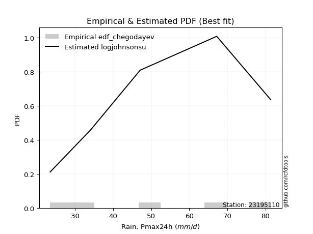</img>

</div>


### 6. EDF Blom (1958)

The Blom formula is a specific "plotting position" formula used in hydrology and statistical analysis to estimate the empirical cumulative probability (or non-exceedance probability) of a data series. It is particularly recommended for data that are approximately normally distributed. The constant _a_ is set to 0.375 (or 3/8).

<div align="center">


$P=(m-a)/(n+1-2a)$


</div>


**6.1. Empirical values**

<div align="center">

|                | 0                  | 1                  | 2                  | 3                 | 4                 | 5                  |
|:---------------|:-------------------|:-------------------|:-------------------|:------------------|:------------------|:-------------------|
| date           | 2023               | 2020               | 2021               | 2025              | 2019              | 2024               |
| x              | 23.5               | 34.1               | 47.1               | 56.2              | 67.2              | 81.4               |
| m              | 1                  | 2                  | 3                  | 4                 | 5                 | 6                  |
| empirical_dist | edf_blom           | edf_blom           | edf_blom           | edf_blom          | edf_blom          | edf_blom           |
| empirical      | 0.1                | 0.26               | 0.42               | 0.58              | 0.74              | 0.9                |
| empirical_tr   | 1.1111111111111112 | 1.3513513513513513 | 1.7241379310344827 | 2.380952380952381 | 3.846153846153846 | 10.000000000000002 |

</div>


**6.2. Kolmogorov-Smirnov fit test (sorted by Δ)**


<div align="center">

|                | 0                   | 1                   | 2                   | 3                   | 4                    | 5                   | 6                   | 7                   | 8                   | 9                   | 10                  | 11                  | 12                 | 13                  | 14                  | 15                  | 16                  | 17                  | 18                  | 19                 | 20                  | 21                  | 22                  | 23                  | 24                  | 25                  | 26                  | 27                  | 28                  | 29                  | 30                  | 31                  | 32                  | 33                  | 34                | 35                  | 36                  | 37                  | 38                  | 39                | 40                  | 41                  | 42                  | 43                  | 44                  | 45                  | 46                  | 47                 | 48                 | 49                  | 50                  | 51                  | 52                  | 53                  | 54                  | 55                  | 56                | 57                 | 58                  | 59                  | 60                  | 61                  | 62                  | 63                  | 64                  | 65                  | 66                  | 67                  | 68                  | 69                  | 70                  | 71                  | 72                  | 73                  | 74                 | 75                  | 76                 | 77                  | 78                  | 79                  | 80             | 81             | 82             | 83             | 84                  | 85                  | 86                  | 87                  | 88                  | 89                 | 90                 | 91                  | 92                  | 93                  | 94                  | 95                 | 96                  | 97                  | 98                  | 99                  | 100                 | 101                 | 102                 | 103                 | 104                 | 105                 | 106                 | 107               | 108                 | 109                 | 110                 | 111                 | 112                 | 113                 | 114                | 115                 | 116                | 117                 | 118                 | 119                 | 120                 | 121                | 122                 | 123                 | 124                 | 125                | 126                 | 127                 | 128            | 129            | 130                 | 131                | 132                | 133                 | 134                 | 135                | 136                | 137                | 138                 | 139                | 140                | 141                 | 142                 | 143                | 144                 | 145                 | 146                | 147                 | 148               | 149                | 150                | 151                | 152                | 153                | 154                | 155                | 156            | 157            | 158               | 159                |
|:---------------|:--------------------|:--------------------|:--------------------|:--------------------|:---------------------|:--------------------|:--------------------|:--------------------|:--------------------|:--------------------|:--------------------|:--------------------|:-------------------|:--------------------|:--------------------|:--------------------|:--------------------|:--------------------|:--------------------|:-------------------|:--------------------|:--------------------|:--------------------|:--------------------|:--------------------|:--------------------|:--------------------|:--------------------|:--------------------|:--------------------|:--------------------|:--------------------|:--------------------|:--------------------|:------------------|:--------------------|:--------------------|:--------------------|:--------------------|:------------------|:--------------------|:--------------------|:--------------------|:--------------------|:--------------------|:--------------------|:--------------------|:-------------------|:-------------------|:--------------------|:--------------------|:--------------------|:--------------------|:--------------------|:--------------------|:--------------------|:------------------|:-------------------|:--------------------|:--------------------|:--------------------|:--------------------|:--------------------|:--------------------|:--------------------|:--------------------|:--------------------|:--------------------|:--------------------|:--------------------|:--------------------|:--------------------|:--------------------|:--------------------|:-------------------|:--------------------|:-------------------|:--------------------|:--------------------|:--------------------|:---------------|:---------------|:---------------|:---------------|:--------------------|:--------------------|:--------------------|:--------------------|:--------------------|:-------------------|:-------------------|:--------------------|:--------------------|:--------------------|:--------------------|:-------------------|:--------------------|:--------------------|:--------------------|:--------------------|:--------------------|:--------------------|:--------------------|:--------------------|:--------------------|:--------------------|:--------------------|:------------------|:--------------------|:--------------------|:--------------------|:--------------------|:--------------------|:--------------------|:-------------------|:--------------------|:-------------------|:--------------------|:--------------------|:--------------------|:--------------------|:-------------------|:--------------------|:--------------------|:--------------------|:-------------------|:--------------------|:--------------------|:---------------|:---------------|:--------------------|:-------------------|:-------------------|:--------------------|:--------------------|:-------------------|:-------------------|:-------------------|:--------------------|:-------------------|:-------------------|:--------------------|:--------------------|:-------------------|:--------------------|:--------------------|:-------------------|:--------------------|:------------------|:-------------------|:-------------------|:-------------------|:-------------------|:-------------------|:-------------------|:-------------------|:---------------|:---------------|:------------------|:-------------------|
| station        | 23195110            | 23195110            | 23195110            | 23195110            | 23195110             | 23195110            | 23195110            | 23195110            | 23195110            | 23195110            | 23195110            | 23195110            | 23195110           | 23195110            | 23195110            | 23195110            | 23195110            | 23195110            | 23195110            | 23195110           | 23195110            | 23195110            | 23195110            | 23195110            | 23195110            | 23195110            | 23195110            | 23195110            | 23195110            | 23195110            | 23195110            | 23195110            | 23195110            | 23195110            | 23195110          | 23195110            | 23195110            | 23195110            | 23195110            | 23195110          | 23195110            | 23195110            | 23195110            | 23195110            | 23195110            | 23195110            | 23195110            | 23195110           | 23195110           | 23195110            | 23195110            | 23195110            | 23195110            | 23195110            | 23195110            | 23195110            | 23195110          | 23195110           | 23195110            | 23195110            | 23195110            | 23195110            | 23195110            | 23195110            | 23195110            | 23195110            | 23195110            | 23195110            | 23195110            | 23195110            | 23195110            | 23195110            | 23195110            | 23195110            | 23195110           | 23195110            | 23195110           | 23195110            | 23195110            | 23195110            | 23195110       | 23195110       | 23195110       | 23195110       | 23195110            | 23195110            | 23195110            | 23195110            | 23195110            | 23195110           | 23195110           | 23195110            | 23195110            | 23195110            | 23195110            | 23195110           | 23195110            | 23195110            | 23195110            | 23195110            | 23195110            | 23195110            | 23195110            | 23195110            | 23195110            | 23195110            | 23195110            | 23195110          | 23195110            | 23195110            | 23195110            | 23195110            | 23195110            | 23195110            | 23195110           | 23195110            | 23195110           | 23195110            | 23195110            | 23195110            | 23195110            | 23195110           | 23195110            | 23195110            | 23195110            | 23195110           | 23195110            | 23195110            | 23195110       | 23195110       | 23195110            | 23195110           | 23195110           | 23195110            | 23195110            | 23195110           | 23195110           | 23195110           | 23195110            | 23195110           | 23195110           | 23195110            | 23195110            | 23195110           | 23195110            | 23195110            | 23195110           | 23195110            | 23195110          | 23195110           | 23195110           | 23195110           | 23195110           | 23195110           | 23195110           | 23195110           | 23195110       | 23195110       | 23195110          | 23195110           |
| empirical_dist | edf_blom            | edf_blom            | edf_blom            | edf_blom            | edf_blom             | edf_blom            | edf_blom            | edf_blom            | edf_blom            | edf_blom            | edf_blom            | edf_blom            | edf_blom           | edf_blom            | edf_blom            | edf_blom            | edf_blom            | edf_blom            | edf_blom            | edf_blom           | edf_blom            | edf_blom            | edf_blom            | edf_blom            | edf_blom            | edf_blom            | edf_blom            | edf_blom            | edf_blom            | edf_blom            | edf_blom            | edf_blom            | edf_blom            | edf_blom            | edf_blom          | edf_blom            | edf_blom            | edf_blom            | edf_blom            | edf_blom          | edf_blom            | edf_blom            | edf_blom            | edf_blom            | edf_blom            | edf_blom            | edf_blom            | edf_blom           | edf_blom           | edf_blom            | edf_blom            | edf_blom            | edf_blom            | edf_blom            | edf_blom            | edf_blom            | edf_blom          | edf_blom           | edf_blom            | edf_blom            | edf_blom            | edf_blom            | edf_blom            | edf_blom            | edf_blom            | edf_blom            | edf_blom            | edf_blom            | edf_blom            | edf_blom            | edf_blom            | edf_blom            | edf_blom            | edf_blom            | edf_blom           | edf_blom            | edf_blom           | edf_blom            | edf_blom            | edf_blom            | edf_blom       | edf_blom       | edf_blom       | edf_blom       | edf_blom            | edf_blom            | edf_blom            | edf_blom            | edf_blom            | edf_blom           | edf_blom           | edf_blom            | edf_blom            | edf_blom            | edf_blom            | edf_blom           | edf_blom            | edf_blom            | edf_blom            | edf_blom            | edf_blom            | edf_blom            | edf_blom            | edf_blom            | edf_blom            | edf_blom            | edf_blom            | edf_blom          | edf_blom            | edf_blom            | edf_blom            | edf_blom            | edf_blom            | edf_blom            | edf_blom           | edf_blom            | edf_blom           | edf_blom            | edf_blom            | edf_blom            | edf_blom            | edf_blom           | edf_blom            | edf_blom            | edf_blom            | edf_blom           | edf_blom            | edf_blom            | edf_blom       | edf_blom       | edf_blom            | edf_blom           | edf_blom           | edf_blom            | edf_blom            | edf_blom           | edf_blom           | edf_blom           | edf_blom            | edf_blom           | edf_blom           | edf_blom            | edf_blom            | edf_blom           | edf_blom            | edf_blom            | edf_blom           | edf_blom            | edf_blom          | edf_blom           | edf_blom           | edf_blom           | edf_blom           | edf_blom           | edf_blom           | edf_blom           | edf_blom       | edf_blom       | edf_blom          | edf_blom           |
| p_dist         | semicircular        | logtrapezoid        | ksone               | anglit              | dweibull             | logpearson3         | rayleigh            | invgauss            | gompertz            | genlogistic         | ncf                 | weibull_min         | maxwell            | f                   | invgamma            | logargus            | betaprime           | logjohnsonsu        | dgamma              | alpha              | loganglit           | logsemicircular     | kstwobign           | foldnorm            | logweibull_min      | logburr12           | johnsonsu           | rice                | logf                | erlang              | logcrystalball      | lognorm             | logt                | logexponnorm        | pearson3          | gamma               | skewnorm            | nct                 | exponnorm           | norm              | crystalball         | truncnorm           | t                   | logfatiguelife      | loggumbel_l         | logbetaprime        | logncf              | loggamma           | loggamma           | cosine              | logdweibull         | logerlang           | logburr             | burr                | logmielke           | logrice             | logksone          | mielke             | gumbel_r            | logalpha            | loginvgamma         | loglogistic         | logcosine           | logdgamma           | logistic            | argus               | gumbel_l            | loginvgauss         | logloggamma         | kappa3              | bradford            | logskewnorm         | wrapcauchy          | loggompertz         | logtriang          | logbeta             | tukeylambda        | beta                | loggenhalflogistic  | kappa4              | arcsine        | halfnorm       | logarcsine     | uniform        | halflogistic        | logmaxwell          | lognct              | truncweibull_min    | loghypsecant        | hypsecant          | moyal              | truncexpon          | lograyleigh         | genpareto           | gausshyper          | laplace            | loggenextreme       | loginvweibull       | triang              | vonmises_line       | loglaplace          | loglaplace          | logkappa4           | logtukeylambda      | loguniform          | logvonmises_line    | loggumbel_r         | loggenexpon       | logfoldnorm         | logkstwobign        | loghalfnorm         | logloglaplace       | lomax               | genexpon            | logbradford        | genhalflogistic     | logwrapcauchy      | logmoyal            | loghalflogistic     | logexponpow         | loglevy_l           | loggausshyper      | halfgennorm         | loglomax            | burr12              | logtruncexpon      | johnsonsb           | logwald             | loggennorm     | gennorm        | levy_l              | logexponweib       | wald               | logtruncnorm        | loggengamma         | trapezoid          | logjohnsonsb       | lognakagami        | logrdist            | genextreme         | logweibull_max     | logkappa3           | logtruncweibull_min | loggenpareto       | invweibull          | nakagami            | fatiguelife        | gengamma            | exponweib         | powerlaw           | logpowerlaw        | weibull_max        | rdist              | truncpareto        | logtruncpareto     | exponpow           | loggenlogistic | loghalfgennorm | logvonmises       | vonmises           |
| delta          | 0.03624081783798355 | 0.04106127092452916 | 0.04264808306961099 | 0.04835442563075945 | 0.055812044677927386 | 0.05611564285677065 | 0.06201424767971361 | 0.06290779719393791 | 0.06384553183649158 | 0.06449822543011308 | 0.06510722604078317 | 0.06537720542034275 | 0.0659373165222491 | 0.06594474763334662 | 0.06652264679602407 | 0.06767972388980781 | 0.06780937402176382 | 0.06869233995516788 | 0.06890874540181471 | 0.0695950182343551 | 0.07168261859460168 | 0.07225482577036091 | 0.07228037940885634 | 0.07242489074405267 | 0.07264418444479351 | 0.07352129831408186 | 0.07399533211802517 | 0.07403564301862373 | 0.07493216614477449 | 0.07500218089297417 | 0.07510915041626476 | 0.07510936898846554 | 0.07511029398609737 | 0.07511152694672796 | 0.075189473908712 | 0.07519356331404187 | 0.07566144678087164 | 0.07567039821655744 | 0.07570216834318338 | 0.075703807720295 | 0.07570381510685459 | 0.07570382985261515 | 0.07570919967052453 | 0.07732889205411853 | 0.07742711830270602 | 0.07783940577367343 | 0.07920882618288783 | 0.0803479492897527 | 0.0803479492897527 | 0.08037368083790608 | 0.08127260804392472 | 0.08260084070400697 | 0.08281627699790928 | 0.08327018638818817 | 0.08440942749018421 | 0.08540576181471621 | 0.088200232072765 | 0.0885771581840194 | 0.09116020553809834 | 0.09168089038542554 | 0.09217675897877747 | 0.09348317005327789 | 0.09584621163620616 | 0.09584856222878566 | 0.09628069277545123 | 0.09743174258910436 | 0.09759693697534094 | 0.09866595848049348 | 0.09989950323369612 | 0.09998687775964814 | 0.09999895765000044 | 0.09999928844757111 | 0.09999994068545541 | 0.09999998973699578 | 0.0999999911601922 | 0.09999999997896958 | 0.0999999999999929 | 0.09999999999999436 | 0.09999999999999454 | 0.09999999999999501 | 0.1            | 0.1            | 0.1            | 0.1            | 0.10154602140875346 | 0.10370488418969676 | 0.10621191286516368 | 0.10661299190917878 | 0.10765445132724039 | 0.1078962152654013 | 0.1096593514968131 | 0.11263310441541635 | 0.11491996977974844 | 0.11566341513912179 | 0.11971469251512606 | 0.1197999878374851 | 0.12212582802763805 | 0.12346960769918641 | 0.12419637630983832 | 0.12653668147815844 | 0.13567384033462948 | 0.13567384033462948 | 0.13873319320222915 | 0.13892479996659718 | 0.13963188471840787 | 0.13965129490780398 | 0.14031408011811114 | 0.143523760464162 | 0.14437205840883555 | 0.14643204396623205 | 0.14649892129484282 | 0.14681329135403237 | 0.14754248831176237 | 0.14839750875835306 | 0.1486707620483571 | 0.16420452375478256 | 0.1642066629090979 | 0.16619751481723882 | 0.17081386370590296 | 0.17770948199417907 | 0.19416906144533894 | 0.2020835345069228 | 0.20333717694994208 | 0.20473607135950894 | 0.20686338834368095 | 0.2286824084490327 | 0.23527501296935993 | 0.23821273592939213 | 0.24           | 0.24           | 0.24046249857889243 | 0.2500372512244177 | 0.2557265195318242 | 0.25999996187879193 | 0.27308596894534515 | 0.2731146175437968 | 0.3146180359615026 | 0.3306742871277893 | 0.33527749694693587 | 0.3402863708157089 | 0.3522892018355698 | 0.37511422874058575 | 0.38685885474725706 | 0.4402110610325135 | 0.46513746902910946 | 0.48016907031368966 | 0.4935056865938863 | 0.49871607937521023 | 0.504850023971879 | 0.5189397690344325 | 0.5662100892174188 | 0.5673510778266346 | 0.5799999998184773 | 0.5938321682852739 | 0.6352862397739837 | 0.6379977562329965 | 0.74           | 0.74           | 1.072433196393479 | 12.948573054550076 |
| deltao         | 0.530385761606      | 0.530385761606      | 0.530385761606      | 0.530385761606      | 0.530385761606       | 0.530385761606      | 0.530385761606      | 0.530385761606      | 0.530385761606      | 0.530385761606      | 0.530385761606      | 0.530385761606      | 0.530385761606     | 0.530385761606      | 0.530385761606      | 0.530385761606      | 0.530385761606      | 0.530385761606      | 0.530385761606      | 0.530385761606     | 0.530385761606      | 0.530385761606      | 0.530385761606      | 0.530385761606      | 0.530385761606      | 0.530385761606      | 0.530385761606      | 0.530385761606      | 0.530385761606      | 0.530385761606      | 0.530385761606      | 0.530385761606      | 0.530385761606      | 0.530385761606      | 0.530385761606    | 0.530385761606      | 0.530385761606      | 0.530385761606      | 0.530385761606      | 0.530385761606    | 0.530385761606      | 0.530385761606      | 0.530385761606      | 0.530385761606      | 0.530385761606      | 0.530385761606      | 0.530385761606      | 0.530385761606     | 0.530385761606     | 0.530385761606      | 0.530385761606      | 0.530385761606      | 0.530385761606      | 0.530385761606      | 0.530385761606      | 0.530385761606      | 0.530385761606    | 0.530385761606     | 0.530385761606      | 0.530385761606      | 0.530385761606      | 0.530385761606      | 0.530385761606      | 0.530385761606      | 0.530385761606      | 0.530385761606      | 0.530385761606      | 0.530385761606      | 0.530385761606      | 0.530385761606      | 0.530385761606      | 0.530385761606      | 0.530385761606      | 0.530385761606      | 0.530385761606     | 0.530385761606      | 0.530385761606     | 0.530385761606      | 0.530385761606      | 0.530385761606      | 0.530385761606 | 0.530385761606 | 0.530385761606 | 0.530385761606 | 0.530385761606      | 0.530385761606      | 0.530385761606      | 0.530385761606      | 0.530385761606      | 0.530385761606     | 0.530385761606     | 0.530385761606      | 0.530385761606      | 0.530385761606      | 0.530385761606      | 0.530385761606     | 0.530385761606      | 0.530385761606      | 0.530385761606      | 0.530385761606      | 0.530385761606      | 0.530385761606      | 0.530385761606      | 0.530385761606      | 0.530385761606      | 0.530385761606      | 0.530385761606      | 0.530385761606    | 0.530385761606      | 0.530385761606      | 0.530385761606      | 0.530385761606      | 0.530385761606      | 0.530385761606      | 0.530385761606     | 0.530385761606      | 0.530385761606     | 0.530385761606      | 0.530385761606      | 0.530385761606      | 0.530385761606      | 0.530385761606     | 0.530385761606      | 0.530385761606      | 0.530385761606      | 0.530385761606     | 0.530385761606      | 0.530385761606      | 0.530385761606 | 0.530385761606 | 0.530385761606      | 0.530385761606     | 0.530385761606     | 0.530385761606      | 0.530385761606      | 0.530385761606     | 0.530385761606     | 0.530385761606     | 0.530385761606      | 0.530385761606     | 0.530385761606     | 0.530385761606      | 0.530385761606      | 0.530385761606     | 0.530385761606      | 0.530385761606      | 0.530385761606     | 0.530385761606      | 0.530385761606    | 0.530385761606     | 0.530385761606     | 0.530385761606     | 0.530385761606     | 0.530385761606     | 0.530385761606     | 0.530385761606     | 0.530385761606 | 0.530385761606 | 0.530385761606    | 0.530385761606     |
| eval           | Δo > Δ              | Δo > Δ              | Δo > Δ              | Δo > Δ              | Δo > Δ               | Δo > Δ              | Δo > Δ              | Δo > Δ              | Δo > Δ              | Δo > Δ              | Δo > Δ              | Δo > Δ              | Δo > Δ             | Δo > Δ              | Δo > Δ              | Δo > Δ              | Δo > Δ              | Δo > Δ              | Δo > Δ              | Δo > Δ             | Δo > Δ              | Δo > Δ              | Δo > Δ              | Δo > Δ              | Δo > Δ              | Δo > Δ              | Δo > Δ              | Δo > Δ              | Δo > Δ              | Δo > Δ              | Δo > Δ              | Δo > Δ              | Δo > Δ              | Δo > Δ              | Δo > Δ            | Δo > Δ              | Δo > Δ              | Δo > Δ              | Δo > Δ              | Δo > Δ            | Δo > Δ              | Δo > Δ              | Δo > Δ              | Δo > Δ              | Δo > Δ              | Δo > Δ              | Δo > Δ              | Δo > Δ             | Δo > Δ             | Δo > Δ              | Δo > Δ              | Δo > Δ              | Δo > Δ              | Δo > Δ              | Δo > Δ              | Δo > Δ              | Δo > Δ            | Δo > Δ             | Δo > Δ              | Δo > Δ              | Δo > Δ              | Δo > Δ              | Δo > Δ              | Δo > Δ              | Δo > Δ              | Δo > Δ              | Δo > Δ              | Δo > Δ              | Δo > Δ              | Δo > Δ              | Δo > Δ              | Δo > Δ              | Δo > Δ              | Δo > Δ              | Δo > Δ             | Δo > Δ              | Δo > Δ             | Δo > Δ              | Δo > Δ              | Δo > Δ              | Δo > Δ         | Δo > Δ         | Δo > Δ         | Δo > Δ         | Δo > Δ              | Δo > Δ              | Δo > Δ              | Δo > Δ              | Δo > Δ              | Δo > Δ             | Δo > Δ             | Δo > Δ              | Δo > Δ              | Δo > Δ              | Δo > Δ              | Δo > Δ             | Δo > Δ              | Δo > Δ              | Δo > Δ              | Δo > Δ              | Δo > Δ              | Δo > Δ              | Δo > Δ              | Δo > Δ              | Δo > Δ              | Δo > Δ              | Δo > Δ              | Δo > Δ            | Δo > Δ              | Δo > Δ              | Δo > Δ              | Δo > Δ              | Δo > Δ              | Δo > Δ              | Δo > Δ             | Δo > Δ              | Δo > Δ             | Δo > Δ              | Δo > Δ              | Δo > Δ              | Δo > Δ              | Δo > Δ             | Δo > Δ              | Δo > Δ              | Δo > Δ              | Δo > Δ             | Δo > Δ              | Δo > Δ              | Δo > Δ         | Δo > Δ         | Δo > Δ              | Δo > Δ             | Δo > Δ             | Δo > Δ              | Δo > Δ              | Δo > Δ             | Δo > Δ             | Δo > Δ             | Δo > Δ              | Δo > Δ             | Δo > Δ             | Δo > Δ              | Δo > Δ              | Δo > Δ             | Δo > Δ              | Δo > Δ              | Δo > Δ             | Δo > Δ              | Δo > Δ            | Δo > Δ             | Δo <= Δ            | Δo <= Δ            | Δo <= Δ            | Δo <= Δ            | Δo <= Δ            | Δo <= Δ            | Δo <= Δ        | Δo <= Δ        | Δo <= Δ           | Δo <= Δ            |
| fit            | 1                   | 1                   | 1                   | 1                   | 1                    | 1                   | 1                   | 1                   | 1                   | 1                   | 1                   | 1                   | 1                  | 1                   | 1                   | 1                   | 1                   | 1                   | 1                   | 1                  | 1                   | 1                   | 1                   | 1                   | 1                   | 1                   | 1                   | 1                   | 1                   | 1                   | 1                   | 1                   | 1                   | 1                   | 1                 | 1                   | 1                   | 1                   | 1                   | 1                 | 1                   | 1                   | 1                   | 1                   | 1                   | 1                   | 1                   | 1                  | 1                  | 1                   | 1                   | 1                   | 1                   | 1                   | 1                   | 1                   | 1                 | 1                  | 1                   | 1                   | 1                   | 1                   | 1                   | 1                   | 1                   | 1                   | 1                   | 1                   | 1                   | 1                   | 1                   | 1                   | 1                   | 1                   | 1                  | 1                   | 1                  | 1                   | 1                   | 1                   | 1              | 1              | 1              | 1              | 1                   | 1                   | 1                   | 1                   | 1                   | 1                  | 1                  | 1                   | 1                   | 1                   | 1                   | 1                  | 1                   | 1                   | 1                   | 1                   | 1                   | 1                   | 1                   | 1                   | 1                   | 1                   | 1                   | 1                 | 1                   | 1                   | 1                   | 1                   | 1                   | 1                   | 1                  | 1                   | 1                  | 1                   | 1                   | 1                   | 1                   | 1                  | 1                   | 1                   | 1                   | 1                  | 1                   | 1                   | 1              | 1              | 1                   | 1                  | 1                  | 1                   | 1                   | 1                  | 1                  | 1                  | 1                   | 1                  | 1                  | 1                   | 1                   | 1                  | 1                   | 1                   | 1                  | 1                   | 1                 | 1                  | 0                  | 0                  | 0                  | 0                  | 0                  | 0                  | 0              | 0              | 0                 | 0                  |
| n              | 6                   | 6                   | 6                   | 6                   | 6                    | 6                   | 6                   | 6                   | 6                   | 6                   | 6                   | 6                   | 6                  | 6                   | 6                   | 6                   | 6                   | 6                   | 6                   | 6                  | 6                   | 6                   | 6                   | 6                   | 6                   | 6                   | 6                   | 6                   | 6                   | 6                   | 6                   | 6                   | 6                   | 6                   | 6                 | 6                   | 6                   | 6                   | 6                   | 6                 | 6                   | 6                   | 6                   | 6                   | 6                   | 6                   | 6                   | 6                  | 6                  | 6                   | 6                   | 6                   | 6                   | 6                   | 6                   | 6                   | 6                 | 6                  | 6                   | 6                   | 6                   | 6                   | 6                   | 6                   | 6                   | 6                   | 6                   | 6                   | 6                   | 6                   | 6                   | 6                   | 6                   | 6                   | 6                  | 6                   | 6                  | 6                   | 6                   | 6                   | 6              | 6              | 6              | 6              | 6                   | 6                   | 6                   | 6                   | 6                   | 6                  | 6                  | 6                   | 6                   | 6                   | 6                   | 6                  | 6                   | 6                   | 6                   | 6                   | 6                   | 6                   | 6                   | 6                   | 6                   | 6                   | 6                   | 6                 | 6                   | 6                   | 6                   | 6                   | 6                   | 6                   | 6                  | 6                   | 6                  | 6                   | 6                   | 6                   | 6                   | 6                  | 6                   | 6                   | 6                   | 6                  | 6                   | 6                   | 6              | 6              | 6                   | 6                  | 6                  | 6                   | 6                   | 6                  | 6                  | 6                  | 6                   | 6                  | 6                  | 6                   | 6                   | 6                  | 6                   | 6                   | 6                  | 6                   | 6                 | 6                  | 6                  | 6                  | 6                  | 6                  | 6                  | 6                  | 6              | 6              | 6                 | 6                  |
| best_fit       | 1                   | 0                   | 0                   | 0                   | 0                    | 0                   | 0                   | 0                   | 0                   | 0                   | 0                   | 0                   | 0                  | 0                   | 0                   | 0                   | 0                   | 0                   | 0                   | 0                  | 0                   | 0                   | 0                   | 0                   | 0                   | 0                   | 0                   | 0                   | 0                   | 0                   | 0                   | 0                   | 0                   | 0                   | 0                 | 0                   | 0                   | 0                   | 0                   | 0                 | 0                   | 0                   | 0                   | 0                   | 0                   | 0                   | 0                   | 0                  | 0                  | 0                   | 0                   | 0                   | 0                   | 0                   | 0                   | 0                   | 0                 | 0                  | 0                   | 0                   | 0                   | 0                   | 0                   | 0                   | 0                   | 0                   | 0                   | 0                   | 0                   | 0                   | 0                   | 0                   | 0                   | 0                   | 0                  | 0                   | 0                  | 0                   | 0                   | 0                   | 0              | 0              | 0              | 0              | 0                   | 0                   | 0                   | 0                   | 0                   | 0                  | 0                  | 0                   | 0                   | 0                   | 0                   | 0                  | 0                   | 0                   | 0                   | 0                   | 0                   | 0                   | 0                   | 0                   | 0                   | 0                   | 0                   | 0                 | 0                   | 0                   | 0                   | 0                   | 0                   | 0                   | 0                  | 0                   | 0                  | 0                   | 0                   | 0                   | 0                   | 0                  | 0                   | 0                   | 0                   | 0                  | 0                   | 0                   | 0              | 0              | 0                   | 0                  | 0                  | 0                   | 0                   | 0                  | 0                  | 0                  | 0                   | 0                  | 0                  | 0                   | 0                   | 0                  | 0                   | 0                   | 0                  | 0                   | 0                 | 0                  | 0                  | 0                  | 0                  | 0                  | 0                  | 0                  | 0              | 0              | 0                 | 0                  |
| best_fit_sort  | 1                   | 2                   | 3                   | 4                   | 5                    | 6                   | 7                   | 8                   | 9                   | 10                  | 11                  | 12                  | 13                 | 14                  | 15                  | 16                  | 17                  | 18                  | 19                  | 20                 | 21                  | 22                  | 23                  | 24                  | 25                  | 26                  | 27                  | 28                  | 29                  | 30                  | 31                  | 32                  | 33                  | 34                  | 35                | 36                  | 37                  | 38                  | 39                  | 40                | 41                  | 42                  | 43                  | 44                  | 45                  | 46                  | 47                  | 48                 | 49                 | 50                  | 51                  | 52                  | 53                  | 54                  | 55                  | 56                  | 57                | 58                 | 59                  | 60                  | 61                  | 62                  | 63                  | 64                  | 65                  | 66                  | 67                  | 68                  | 69                  | 70                  | 71                  | 72                  | 73                  | 74                  | 75                 | 76                  | 77                 | 78                  | 79                  | 80                  | 81             | 82             | 83             | 84             | 85                  | 86                  | 87                  | 88                  | 89                  | 90                 | 91                 | 92                  | 93                  | 94                  | 95                  | 96                 | 97                  | 98                  | 99                  | 100                 | 101                 | 102                 | 103                 | 104                 | 105                 | 106                 | 107                 | 108               | 109                 | 110                 | 111                 | 112                 | 113                 | 114                 | 115                | 116                 | 117                | 118                 | 119                 | 120                 | 121                 | 122                | 123                 | 124                 | 125                 | 126                | 127                 | 128                 | 129            | 130            | 131                 | 132                | 133                | 134                 | 135                 | 136                | 137                | 138                | 139                 | 140                | 141                | 142                 | 143                 | 144                | 145                 | 146                 | 147                | 148                 | 149               | 150                | 151                | 152                | 153                | 154                | 155                | 156                | 157            | 158            | 159               | 160                |

</div>


**6.3. Best fit**

<div align="center">

|   id |   station | empirical_dist   | p_dist       |     delta |   deltao | eval   |   fit |   n |   best_fit |   best_fit_sort |
|-----:|----------:|:-----------------|:-------------|----------:|---------:|:-------|------:|----:|-----------:|----------------:|
|    0 |  23195110 | edf_blom         | semicircular | 0.0362408 | 0.530386 | Δo > Δ |     1 |   6 |          1 |               1 |

</div>


<div align="center">

</img>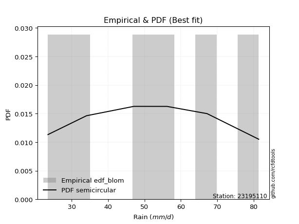</img>

</div>


### 7. EDF Tukey (1962)

In hydrology, the Tukey formula is used as a plotting position formula to estimate the empirical probability or frequency of a flood event (or other hydrological data). The formula parameter is given as _c=0.333_ (or 1/3).

<div align="center">


$P=(m-c)/(n+1-2c)$


</div>


**7.1. Empirical values**

<div align="center">

|                | 0                   | 1                  | 2                   | 3                  | 4                  | 5                  |
|:---------------|:--------------------|:-------------------|:--------------------|:-------------------|:-------------------|:-------------------|
| date           | 2023                | 2020               | 2021                | 2025               | 2019               | 2024               |
| x              | 23.5                | 34.1               | 47.1                | 56.2               | 67.2               | 81.4               |
| m              | 1                   | 2                  | 3                   | 4                  | 5                  | 6                  |
| empirical_dist | edf_tukey           | edf_tukey          | edf_tukey           | edf_tukey          | edf_tukey          | edf_tukey          |
| empirical      | 0.10526315789473684 | 0.2631578947368421 | 0.42105263157894735 | 0.5789473684210527 | 0.7368421052631579 | 0.8947368421052632 |
| empirical_tr   | 1.1176470588235294  | 1.357142857142857  | 1.7272727272727273  | 2.375              | 3.7999999999999994 | 9.5                |

</div>


**7.2. Kolmogorov-Smirnov fit test (sorted by Δ)**


<div align="center">

|                | 0                    | 1                   | 2                    | 3                   | 4                   | 5                   | 6                  | 7                   | 8                   | 9                   | 10                  | 11                  | 12                 | 13                  | 14                  | 15                  | 16                 | 17                  | 18                  | 19                 | 20                  | 21                  | 22                  | 23                  | 24                  | 25                 | 26                  | 27                  | 28                  | 29                  | 30                  | 31                  | 32                  | 33                  | 34                  | 35                  | 36                  | 37                  | 38                  | 39                  | 40                  | 41                  | 42                  | 43                  | 44                  | 45                  | 46                 | 47                  | 48                  | 49                  | 50                  | 51                  | 52                  | 53                  | 54                 | 55                  | 56                  | 57                  | 58                  | 59                  | 60                  | 61                  | 62                  | 63                  | 64                  | 65                  | 66                  | 67                  | 68                 | 69                  | 70                  | 71                  | 72                  | 73                  | 74                  | 75                  | 76                  | 77                  | 78                  | 79                  | 80                 | 81                  | 82                  | 83                  | 84                  | 85                  | 86                  | 87                  | 88                  | 89                  | 90                  | 91                  | 92                  | 93                  | 94                 | 95                  | 96                  | 97                  | 98                  | 99                  | 100                 | 101                 | 102                | 103                 | 104                | 105                 | 106                 | 107                 | 108                 | 109                | 110                 | 111               | 112                | 113                 | 114                 | 115                 | 116                 | 117                 | 118                | 119                 | 120                | 121                 | 122                 | 123                 | 124                | 125                 | 126                 | 127                | 128                | 129                | 130                 | 131                 | 132                 | 133               | 134                | 135                | 136                | 137                 | 138               | 139                 | 140                 | 141                | 142                 | 143                 | 144                | 145                | 146                | 147                 | 148                | 149                | 150                | 151                | 152                | 153                | 154                | 155                | 156                | 157                | 158                | 159                |
|:---------------|:---------------------|:--------------------|:---------------------|:--------------------|:--------------------|:--------------------|:-------------------|:--------------------|:--------------------|:--------------------|:--------------------|:--------------------|:-------------------|:--------------------|:--------------------|:--------------------|:-------------------|:--------------------|:--------------------|:-------------------|:--------------------|:--------------------|:--------------------|:--------------------|:--------------------|:-------------------|:--------------------|:--------------------|:--------------------|:--------------------|:--------------------|:--------------------|:--------------------|:--------------------|:--------------------|:--------------------|:--------------------|:--------------------|:--------------------|:--------------------|:--------------------|:--------------------|:--------------------|:--------------------|:--------------------|:--------------------|:-------------------|:--------------------|:--------------------|:--------------------|:--------------------|:--------------------|:--------------------|:--------------------|:-------------------|:--------------------|:--------------------|:--------------------|:--------------------|:--------------------|:--------------------|:--------------------|:--------------------|:--------------------|:--------------------|:--------------------|:--------------------|:--------------------|:-------------------|:--------------------|:--------------------|:--------------------|:--------------------|:--------------------|:--------------------|:--------------------|:--------------------|:--------------------|:--------------------|:--------------------|:-------------------|:--------------------|:--------------------|:--------------------|:--------------------|:--------------------|:--------------------|:--------------------|:--------------------|:--------------------|:--------------------|:--------------------|:--------------------|:--------------------|:-------------------|:--------------------|:--------------------|:--------------------|:--------------------|:--------------------|:--------------------|:--------------------|:-------------------|:--------------------|:-------------------|:--------------------|:--------------------|:--------------------|:--------------------|:-------------------|:--------------------|:------------------|:-------------------|:--------------------|:--------------------|:--------------------|:--------------------|:--------------------|:-------------------|:--------------------|:-------------------|:--------------------|:--------------------|:--------------------|:-------------------|:--------------------|:--------------------|:-------------------|:-------------------|:-------------------|:--------------------|:--------------------|:--------------------|:------------------|:-------------------|:-------------------|:-------------------|:--------------------|:------------------|:--------------------|:--------------------|:-------------------|:--------------------|:--------------------|:-------------------|:-------------------|:-------------------|:--------------------|:-------------------|:-------------------|:-------------------|:-------------------|:-------------------|:-------------------|:-------------------|:-------------------|:-------------------|:-------------------|:-------------------|:-------------------|
| station        | 23195110             | 23195110            | 23195110             | 23195110            | 23195110            | 23195110            | 23195110           | 23195110            | 23195110            | 23195110            | 23195110            | 23195110            | 23195110           | 23195110            | 23195110            | 23195110            | 23195110           | 23195110            | 23195110            | 23195110           | 23195110            | 23195110            | 23195110            | 23195110            | 23195110            | 23195110           | 23195110            | 23195110            | 23195110            | 23195110            | 23195110            | 23195110            | 23195110            | 23195110            | 23195110            | 23195110            | 23195110            | 23195110            | 23195110            | 23195110            | 23195110            | 23195110            | 23195110            | 23195110            | 23195110            | 23195110            | 23195110           | 23195110            | 23195110            | 23195110            | 23195110            | 23195110            | 23195110            | 23195110            | 23195110           | 23195110            | 23195110            | 23195110            | 23195110            | 23195110            | 23195110            | 23195110            | 23195110            | 23195110            | 23195110            | 23195110            | 23195110            | 23195110            | 23195110           | 23195110            | 23195110            | 23195110            | 23195110            | 23195110            | 23195110            | 23195110            | 23195110            | 23195110            | 23195110            | 23195110            | 23195110           | 23195110            | 23195110            | 23195110            | 23195110            | 23195110            | 23195110            | 23195110            | 23195110            | 23195110            | 23195110            | 23195110            | 23195110            | 23195110            | 23195110           | 23195110            | 23195110            | 23195110            | 23195110            | 23195110            | 23195110            | 23195110            | 23195110           | 23195110            | 23195110           | 23195110            | 23195110            | 23195110            | 23195110            | 23195110           | 23195110            | 23195110          | 23195110           | 23195110            | 23195110            | 23195110            | 23195110            | 23195110            | 23195110           | 23195110            | 23195110           | 23195110            | 23195110            | 23195110            | 23195110           | 23195110            | 23195110            | 23195110           | 23195110           | 23195110           | 23195110            | 23195110            | 23195110            | 23195110          | 23195110           | 23195110           | 23195110           | 23195110            | 23195110          | 23195110            | 23195110            | 23195110           | 23195110            | 23195110            | 23195110           | 23195110           | 23195110           | 23195110            | 23195110           | 23195110           | 23195110           | 23195110           | 23195110           | 23195110           | 23195110           | 23195110           | 23195110           | 23195110           | 23195110           | 23195110           |
| empirical_dist | edf_tukey            | edf_tukey           | edf_tukey            | edf_tukey           | edf_tukey           | edf_tukey           | edf_tukey          | edf_tukey           | edf_tukey           | edf_tukey           | edf_tukey           | edf_tukey           | edf_tukey          | edf_tukey           | edf_tukey           | edf_tukey           | edf_tukey          | edf_tukey           | edf_tukey           | edf_tukey          | edf_tukey           | edf_tukey           | edf_tukey           | edf_tukey           | edf_tukey           | edf_tukey          | edf_tukey           | edf_tukey           | edf_tukey           | edf_tukey           | edf_tukey           | edf_tukey           | edf_tukey           | edf_tukey           | edf_tukey           | edf_tukey           | edf_tukey           | edf_tukey           | edf_tukey           | edf_tukey           | edf_tukey           | edf_tukey           | edf_tukey           | edf_tukey           | edf_tukey           | edf_tukey           | edf_tukey          | edf_tukey           | edf_tukey           | edf_tukey           | edf_tukey           | edf_tukey           | edf_tukey           | edf_tukey           | edf_tukey          | edf_tukey           | edf_tukey           | edf_tukey           | edf_tukey           | edf_tukey           | edf_tukey           | edf_tukey           | edf_tukey           | edf_tukey           | edf_tukey           | edf_tukey           | edf_tukey           | edf_tukey           | edf_tukey          | edf_tukey           | edf_tukey           | edf_tukey           | edf_tukey           | edf_tukey           | edf_tukey           | edf_tukey           | edf_tukey           | edf_tukey           | edf_tukey           | edf_tukey           | edf_tukey          | edf_tukey           | edf_tukey           | edf_tukey           | edf_tukey           | edf_tukey           | edf_tukey           | edf_tukey           | edf_tukey           | edf_tukey           | edf_tukey           | edf_tukey           | edf_tukey           | edf_tukey           | edf_tukey          | edf_tukey           | edf_tukey           | edf_tukey           | edf_tukey           | edf_tukey           | edf_tukey           | edf_tukey           | edf_tukey          | edf_tukey           | edf_tukey          | edf_tukey           | edf_tukey           | edf_tukey           | edf_tukey           | edf_tukey          | edf_tukey           | edf_tukey         | edf_tukey          | edf_tukey           | edf_tukey           | edf_tukey           | edf_tukey           | edf_tukey           | edf_tukey          | edf_tukey           | edf_tukey          | edf_tukey           | edf_tukey           | edf_tukey           | edf_tukey          | edf_tukey           | edf_tukey           | edf_tukey          | edf_tukey          | edf_tukey          | edf_tukey           | edf_tukey           | edf_tukey           | edf_tukey         | edf_tukey          | edf_tukey          | edf_tukey          | edf_tukey           | edf_tukey         | edf_tukey           | edf_tukey           | edf_tukey          | edf_tukey           | edf_tukey           | edf_tukey          | edf_tukey          | edf_tukey          | edf_tukey           | edf_tukey          | edf_tukey          | edf_tukey          | edf_tukey          | edf_tukey          | edf_tukey          | edf_tukey          | edf_tukey          | edf_tukey          | edf_tukey          | edf_tukey          | edf_tukey          |
| p_dist         | semicircular         | logtrapezoid        | ksone                | anglit              | dweibull            | logpearson3         | rayleigh           | genlogistic         | invgauss            | gompertz            | ncf                 | maxwell             | f                  | weibull_min         | invgamma            | loganglit           | betaprime          | logsemicircular     | logjohnsonsu        | dgamma             | alpha               | logargus            | kstwobign           | foldnorm            | logweibull_min      | logf               | logcrystalball      | lognorm             | logt                | logexponnorm        | logburr12           | johnsonsu           | rice                | logbetaprime        | erlang              | pearson3            | gamma               | logfatiguelife      | logncf              | skewnorm            | nct                 | exponnorm           | norm                | crystalball         | truncnorm           | t                   | loggumbel_l        | loggamma            | loggamma            | logburr             | cosine              | logerlang           | logmielke           | logrice             | logdweibull        | burr                | logalpha            | loginvgamma         | mielke              | logksone            | gumbel_r            | loglogistic         | logcosine           | loginvgauss         | logdgamma           | logistic            | argus               | gumbel_l            | logmaxwell         | lognct              | logloggamma         | kappa3              | bradford            | logskewnorm         | wrapcauchy          | loggompertz         | logtriang           | logbeta             | tukeylambda         | beta                | loggenhalflogistic | kappa4              | uniform             | halflogistic        | halfnorm            | arcsine             | logarcsine          | truncweibull_min    | loghypsecant        | genpareto           | hypsecant           | truncexpon          | moyal               | lograyleigh         | gausshyper         | loggenextreme       | loginvweibull       | laplace             | triang              | vonmises_line       | loglaplace          | loglaplace          | logkappa4          | logtukeylambda      | loguniform         | logvonmises_line    | loggumbel_r         | loggenexpon         | logfoldnorm         | logkstwobign       | loghalfnorm         | lomax             | genexpon           | logbradford         | logloglaplace       | logwrapcauchy       | genhalflogistic     | logmoyal            | loghalflogistic    | logexponpow         | loglevy_l          | loggausshyper       | halfgennorm         | loglomax            | burr12             | logtruncexpon       | johnsonsb           | levy_l             | gennorm            | loggennorm         | logwald             | logexponweib        | wald                | logtruncnorm      | loggengamma        | trapezoid          | logjohnsonsb       | lognakagami         | logrdist          | genextreme          | logweibull_max      | logkappa3          | logtruncweibull_min | loggenpareto        | invweibull         | nakagami           | fatiguelife        | gengamma            | exponweib          | powerlaw           | logpowerlaw        | weibull_max        | rdist              | truncpareto        | logtruncpareto     | exponpow           | loggenlogistic     | loghalfgennorm     | logvonmises        | vonmises           |
| delta          | 0.040041547447822734 | 0.04632442881926602 | 0.047911240964347845 | 0.05151232036760153 | 0.05896993941476947 | 0.05927353759361273 | 0.0651721424165557 | 0.06555085700906038 | 0.06606569193077999 | 0.06700342657333366 | 0.06826512077762525 | 0.06909521125909118 | 0.0691026423701887 | 0.06942495002097407 | 0.06968054153286615 | 0.07062998701565432 | 0.0709672687586059 | 0.07120219419141355 | 0.07185023469200996 | 0.0720666401386568 | 0.07275291297119718 | 0.07294288178454467 | 0.07333301098780365 | 0.07558278548089475 | 0.07580207918163559 | 0.0759847977237218 | 0.07616178199521206 | 0.07616200056741285 | 0.07616292556504467 | 0.07616415852567526 | 0.07667919305092394 | 0.07715322685486725 | 0.07719353775546581 | 0.07739522694915202 | 0.07816007562981625 | 0.07834736864555408 | 0.07835145805088395 | 0.07838152363306583 | 0.07847331666816437 | 0.07881934151771372 | 0.07882829295339952 | 0.07886006308002547 | 0.07886170245713708 | 0.07886170984369667 | 0.07886172458945723 | 0.07886709440736661 | 0.0805850130395481 | 0.08119186401689282 | 0.08119186401689282 | 0.08176364541896197 | 0.08353157557474816 | 0.08365347228295428 | 0.08371612382634497 | 0.08435313023576885 | 0.0844305027807668 | 0.08853334428292503 | 0.09062825880647818 | 0.09112412739983011 | 0.09202584835179273 | 0.09346338996750184 | 0.09431810027494042 | 0.09453580163222519 | 0.09592158580519095 | 0.09761332690154612 | 0.09900645696562774 | 0.09943858751229331 | 0.10058963732594645 | 0.10075483171218302 | 0.1026522526107494 | 0.10515928128621632 | 0.10516266112843298 | 0.10525003565438497 | 0.10526211554473727 | 0.10526244634230797 | 0.10526309858019224 | 0.10526314763173261 | 0.10526314905492906 | 0.10526315787370644 | 0.10526315789472973 | 0.10526315789473119 | 0.1052631578947314 | 0.10526315789473184 | 0.10526315789473684 | 0.10526315789473684 | 0.10526315789473684 | 0.10526315789473684 | 0.10526315789473684 | 0.10556036033023142 | 0.10870708290618769 | 0.11040025724438496 | 0.11105411000224338 | 0.11158047283646899 | 0.11281724623365519 | 0.11386733820080108 | 0.1186620609361787 | 0.12107319644869075 | 0.12241697612023905 | 0.12295788257432719 | 0.12314374473089101 | 0.12969457621500052 | 0.13672647191357679 | 0.13672647191357679 | 0.1376805616232818 | 0.13787216838764982 | 0.1385792531394605 | 0.13859866332885662 | 0.13926144853916378 | 0.14247112888521463 | 0.14331942682988819 | 0.1453794123872847 | 0.14544628971589546 | 0.146489856732815 | 0.1473448771794057 | 0.14761813046940975 | 0.14997118609087445 | 0.16104876817225583 | 0.16315189217583526 | 0.16514488323829146 | 0.1697612321269556 | 0.17665685041523171 | 0.1889059035506021 | 0.20103090292797543 | 0.20228454537099472 | 0.20368343978056158 | 0.2058107567647336 | 0.22762977687008534 | 0.23211711823251785 | 0.2351993406841556 | 0.2368421052631579 | 0.2368421052631579 | 0.23716010435044477 | 0.24898461964547036 | 0.25888441426866626 | 0.263157856615634 | 0.2720333373663978 | 0.2720619859648495 | 0.3114601412246605 | 0.32962165554884193 | 0.330014339052199 | 0.33502321292097204 | 0.34913130709872764 | 0.3698510708458489 | 0.3858062231683097  | 0.43494790313777665 | 0.4598743111343726 | 0.4791164387347423 | 0.4903477918570442 | 0.49555818463836815 | 0.5016921292350369 | 0.5157818742975904 | 0.5630521944805766 | 0.5641931830897924 | 0.5789473682395299 | 0.5906742735484318 | 0.6321283450371415 | 0.6348398614961543 | 0.7368421052631579 | 0.7368421052631579 | 1.0734858279724262 | 12.953836212444813 |
| deltao         | 0.530385761606       | 0.530385761606      | 0.530385761606       | 0.530385761606      | 0.530385761606      | 0.530385761606      | 0.530385761606     | 0.530385761606      | 0.530385761606      | 0.530385761606      | 0.530385761606      | 0.530385761606      | 0.530385761606     | 0.530385761606      | 0.530385761606      | 0.530385761606      | 0.530385761606     | 0.530385761606      | 0.530385761606      | 0.530385761606     | 0.530385761606      | 0.530385761606      | 0.530385761606      | 0.530385761606      | 0.530385761606      | 0.530385761606     | 0.530385761606      | 0.530385761606      | 0.530385761606      | 0.530385761606      | 0.530385761606      | 0.530385761606      | 0.530385761606      | 0.530385761606      | 0.530385761606      | 0.530385761606      | 0.530385761606      | 0.530385761606      | 0.530385761606      | 0.530385761606      | 0.530385761606      | 0.530385761606      | 0.530385761606      | 0.530385761606      | 0.530385761606      | 0.530385761606      | 0.530385761606     | 0.530385761606      | 0.530385761606      | 0.530385761606      | 0.530385761606      | 0.530385761606      | 0.530385761606      | 0.530385761606      | 0.530385761606     | 0.530385761606      | 0.530385761606      | 0.530385761606      | 0.530385761606      | 0.530385761606      | 0.530385761606      | 0.530385761606      | 0.530385761606      | 0.530385761606      | 0.530385761606      | 0.530385761606      | 0.530385761606      | 0.530385761606      | 0.530385761606     | 0.530385761606      | 0.530385761606      | 0.530385761606      | 0.530385761606      | 0.530385761606      | 0.530385761606      | 0.530385761606      | 0.530385761606      | 0.530385761606      | 0.530385761606      | 0.530385761606      | 0.530385761606     | 0.530385761606      | 0.530385761606      | 0.530385761606      | 0.530385761606      | 0.530385761606      | 0.530385761606      | 0.530385761606      | 0.530385761606      | 0.530385761606      | 0.530385761606      | 0.530385761606      | 0.530385761606      | 0.530385761606      | 0.530385761606     | 0.530385761606      | 0.530385761606      | 0.530385761606      | 0.530385761606      | 0.530385761606      | 0.530385761606      | 0.530385761606      | 0.530385761606     | 0.530385761606      | 0.530385761606     | 0.530385761606      | 0.530385761606      | 0.530385761606      | 0.530385761606      | 0.530385761606     | 0.530385761606      | 0.530385761606    | 0.530385761606     | 0.530385761606      | 0.530385761606      | 0.530385761606      | 0.530385761606      | 0.530385761606      | 0.530385761606     | 0.530385761606      | 0.530385761606     | 0.530385761606      | 0.530385761606      | 0.530385761606      | 0.530385761606     | 0.530385761606      | 0.530385761606      | 0.530385761606     | 0.530385761606     | 0.530385761606     | 0.530385761606      | 0.530385761606      | 0.530385761606      | 0.530385761606    | 0.530385761606     | 0.530385761606     | 0.530385761606     | 0.530385761606      | 0.530385761606    | 0.530385761606      | 0.530385761606      | 0.530385761606     | 0.530385761606      | 0.530385761606      | 0.530385761606     | 0.530385761606     | 0.530385761606     | 0.530385761606      | 0.530385761606     | 0.530385761606     | 0.530385761606     | 0.530385761606     | 0.530385761606     | 0.530385761606     | 0.530385761606     | 0.530385761606     | 0.530385761606     | 0.530385761606     | 0.530385761606     | 0.530385761606     |
| eval           | Δo > Δ               | Δo > Δ              | Δo > Δ               | Δo > Δ              | Δo > Δ              | Δo > Δ              | Δo > Δ             | Δo > Δ              | Δo > Δ              | Δo > Δ              | Δo > Δ              | Δo > Δ              | Δo > Δ             | Δo > Δ              | Δo > Δ              | Δo > Δ              | Δo > Δ             | Δo > Δ              | Δo > Δ              | Δo > Δ             | Δo > Δ              | Δo > Δ              | Δo > Δ              | Δo > Δ              | Δo > Δ              | Δo > Δ             | Δo > Δ              | Δo > Δ              | Δo > Δ              | Δo > Δ              | Δo > Δ              | Δo > Δ              | Δo > Δ              | Δo > Δ              | Δo > Δ              | Δo > Δ              | Δo > Δ              | Δo > Δ              | Δo > Δ              | Δo > Δ              | Δo > Δ              | Δo > Δ              | Δo > Δ              | Δo > Δ              | Δo > Δ              | Δo > Δ              | Δo > Δ             | Δo > Δ              | Δo > Δ              | Δo > Δ              | Δo > Δ              | Δo > Δ              | Δo > Δ              | Δo > Δ              | Δo > Δ             | Δo > Δ              | Δo > Δ              | Δo > Δ              | Δo > Δ              | Δo > Δ              | Δo > Δ              | Δo > Δ              | Δo > Δ              | Δo > Δ              | Δo > Δ              | Δo > Δ              | Δo > Δ              | Δo > Δ              | Δo > Δ             | Δo > Δ              | Δo > Δ              | Δo > Δ              | Δo > Δ              | Δo > Δ              | Δo > Δ              | Δo > Δ              | Δo > Δ              | Δo > Δ              | Δo > Δ              | Δo > Δ              | Δo > Δ             | Δo > Δ              | Δo > Δ              | Δo > Δ              | Δo > Δ              | Δo > Δ              | Δo > Δ              | Δo > Δ              | Δo > Δ              | Δo > Δ              | Δo > Δ              | Δo > Δ              | Δo > Δ              | Δo > Δ              | Δo > Δ             | Δo > Δ              | Δo > Δ              | Δo > Δ              | Δo > Δ              | Δo > Δ              | Δo > Δ              | Δo > Δ              | Δo > Δ             | Δo > Δ              | Δo > Δ             | Δo > Δ              | Δo > Δ              | Δo > Δ              | Δo > Δ              | Δo > Δ             | Δo > Δ              | Δo > Δ            | Δo > Δ             | Δo > Δ              | Δo > Δ              | Δo > Δ              | Δo > Δ              | Δo > Δ              | Δo > Δ             | Δo > Δ              | Δo > Δ             | Δo > Δ              | Δo > Δ              | Δo > Δ              | Δo > Δ             | Δo > Δ              | Δo > Δ              | Δo > Δ             | Δo > Δ             | Δo > Δ             | Δo > Δ              | Δo > Δ              | Δo > Δ              | Δo > Δ            | Δo > Δ             | Δo > Δ             | Δo > Δ             | Δo > Δ              | Δo > Δ            | Δo > Δ              | Δo > Δ              | Δo > Δ             | Δo > Δ              | Δo > Δ              | Δo > Δ             | Δo > Δ             | Δo > Δ             | Δo > Δ              | Δo > Δ             | Δo > Δ             | Δo <= Δ            | Δo <= Δ            | Δo <= Δ            | Δo <= Δ            | Δo <= Δ            | Δo <= Δ            | Δo <= Δ            | Δo <= Δ            | Δo <= Δ            | Δo <= Δ            |
| fit            | 1                    | 1                   | 1                    | 1                   | 1                   | 1                   | 1                  | 1                   | 1                   | 1                   | 1                   | 1                   | 1                  | 1                   | 1                   | 1                   | 1                  | 1                   | 1                   | 1                  | 1                   | 1                   | 1                   | 1                   | 1                   | 1                  | 1                   | 1                   | 1                   | 1                   | 1                   | 1                   | 1                   | 1                   | 1                   | 1                   | 1                   | 1                   | 1                   | 1                   | 1                   | 1                   | 1                   | 1                   | 1                   | 1                   | 1                  | 1                   | 1                   | 1                   | 1                   | 1                   | 1                   | 1                   | 1                  | 1                   | 1                   | 1                   | 1                   | 1                   | 1                   | 1                   | 1                   | 1                   | 1                   | 1                   | 1                   | 1                   | 1                  | 1                   | 1                   | 1                   | 1                   | 1                   | 1                   | 1                   | 1                   | 1                   | 1                   | 1                   | 1                  | 1                   | 1                   | 1                   | 1                   | 1                   | 1                   | 1                   | 1                   | 1                   | 1                   | 1                   | 1                   | 1                   | 1                  | 1                   | 1                   | 1                   | 1                   | 1                   | 1                   | 1                   | 1                  | 1                   | 1                  | 1                   | 1                   | 1                   | 1                   | 1                  | 1                   | 1                 | 1                  | 1                   | 1                   | 1                   | 1                   | 1                   | 1                  | 1                   | 1                  | 1                   | 1                   | 1                   | 1                  | 1                   | 1                   | 1                  | 1                  | 1                  | 1                   | 1                   | 1                   | 1                 | 1                  | 1                  | 1                  | 1                   | 1                 | 1                   | 1                   | 1                  | 1                   | 1                   | 1                  | 1                  | 1                  | 1                   | 1                  | 1                  | 0                  | 0                  | 0                  | 0                  | 0                  | 0                  | 0                  | 0                  | 0                  | 0                  |
| n              | 6                    | 6                   | 6                    | 6                   | 6                   | 6                   | 6                  | 6                   | 6                   | 6                   | 6                   | 6                   | 6                  | 6                   | 6                   | 6                   | 6                  | 6                   | 6                   | 6                  | 6                   | 6                   | 6                   | 6                   | 6                   | 6                  | 6                   | 6                   | 6                   | 6                   | 6                   | 6                   | 6                   | 6                   | 6                   | 6                   | 6                   | 6                   | 6                   | 6                   | 6                   | 6                   | 6                   | 6                   | 6                   | 6                   | 6                  | 6                   | 6                   | 6                   | 6                   | 6                   | 6                   | 6                   | 6                  | 6                   | 6                   | 6                   | 6                   | 6                   | 6                   | 6                   | 6                   | 6                   | 6                   | 6                   | 6                   | 6                   | 6                  | 6                   | 6                   | 6                   | 6                   | 6                   | 6                   | 6                   | 6                   | 6                   | 6                   | 6                   | 6                  | 6                   | 6                   | 6                   | 6                   | 6                   | 6                   | 6                   | 6                   | 6                   | 6                   | 6                   | 6                   | 6                   | 6                  | 6                   | 6                   | 6                   | 6                   | 6                   | 6                   | 6                   | 6                  | 6                   | 6                  | 6                   | 6                   | 6                   | 6                   | 6                  | 6                   | 6                 | 6                  | 6                   | 6                   | 6                   | 6                   | 6                   | 6                  | 6                   | 6                  | 6                   | 6                   | 6                   | 6                  | 6                   | 6                   | 6                  | 6                  | 6                  | 6                   | 6                   | 6                   | 6                 | 6                  | 6                  | 6                  | 6                   | 6                 | 6                   | 6                   | 6                  | 6                   | 6                   | 6                  | 6                  | 6                  | 6                   | 6                  | 6                  | 6                  | 6                  | 6                  | 6                  | 6                  | 6                  | 6                  | 6                  | 6                  | 6                  |
| best_fit       | 1                    | 0                   | 0                    | 0                   | 0                   | 0                   | 0                  | 0                   | 0                   | 0                   | 0                   | 0                   | 0                  | 0                   | 0                   | 0                   | 0                  | 0                   | 0                   | 0                  | 0                   | 0                   | 0                   | 0                   | 0                   | 0                  | 0                   | 0                   | 0                   | 0                   | 0                   | 0                   | 0                   | 0                   | 0                   | 0                   | 0                   | 0                   | 0                   | 0                   | 0                   | 0                   | 0                   | 0                   | 0                   | 0                   | 0                  | 0                   | 0                   | 0                   | 0                   | 0                   | 0                   | 0                   | 0                  | 0                   | 0                   | 0                   | 0                   | 0                   | 0                   | 0                   | 0                   | 0                   | 0                   | 0                   | 0                   | 0                   | 0                  | 0                   | 0                   | 0                   | 0                   | 0                   | 0                   | 0                   | 0                   | 0                   | 0                   | 0                   | 0                  | 0                   | 0                   | 0                   | 0                   | 0                   | 0                   | 0                   | 0                   | 0                   | 0                   | 0                   | 0                   | 0                   | 0                  | 0                   | 0                   | 0                   | 0                   | 0                   | 0                   | 0                   | 0                  | 0                   | 0                  | 0                   | 0                   | 0                   | 0                   | 0                  | 0                   | 0                 | 0                  | 0                   | 0                   | 0                   | 0                   | 0                   | 0                  | 0                   | 0                  | 0                   | 0                   | 0                   | 0                  | 0                   | 0                   | 0                  | 0                  | 0                  | 0                   | 0                   | 0                   | 0                 | 0                  | 0                  | 0                  | 0                   | 0                 | 0                   | 0                   | 0                  | 0                   | 0                   | 0                  | 0                  | 0                  | 0                   | 0                  | 0                  | 0                  | 0                  | 0                  | 0                  | 0                  | 0                  | 0                  | 0                  | 0                  | 0                  |
| best_fit_sort  | 1                    | 2                   | 3                    | 4                   | 5                   | 6                   | 7                  | 8                   | 9                   | 10                  | 11                  | 12                  | 13                 | 14                  | 15                  | 16                  | 17                 | 18                  | 19                  | 20                 | 21                  | 22                  | 23                  | 24                  | 25                  | 26                 | 27                  | 28                  | 29                  | 30                  | 31                  | 32                  | 33                  | 34                  | 35                  | 36                  | 37                  | 38                  | 39                  | 40                  | 41                  | 42                  | 43                  | 44                  | 45                  | 46                  | 47                 | 48                  | 49                  | 50                  | 51                  | 52                  | 53                  | 54                  | 55                 | 56                  | 57                  | 58                  | 59                  | 60                  | 61                  | 62                  | 63                  | 64                  | 65                  | 66                  | 67                  | 68                  | 69                 | 70                  | 71                  | 72                  | 73                  | 74                  | 75                  | 76                  | 77                  | 78                  | 79                  | 80                  | 81                 | 82                  | 83                  | 84                  | 85                  | 86                  | 87                  | 88                  | 89                  | 90                  | 91                  | 92                  | 93                  | 94                  | 95                 | 96                  | 97                  | 98                  | 99                  | 100                 | 101                 | 102                 | 103                | 104                 | 105                | 106                 | 107                 | 108                 | 109                 | 110                | 111                 | 112               | 113                | 114                 | 115                 | 116                 | 117                 | 118                 | 119                | 120                 | 121                | 122                 | 123                 | 124                 | 125                | 126                 | 127                 | 128                | 129                | 130                | 131                 | 132                 | 133                 | 134               | 135                | 136                | 137                | 138                 | 139               | 140                 | 141                 | 142                | 143                 | 144                 | 145                | 146                | 147                | 148                 | 149                | 150                | 151                | 152                | 153                | 154                | 155                | 156                | 157                | 158                | 159                | 160                |

</div>


**7.3. Best fit**

<div align="center">

|   id |   station | empirical_dist   | p_dist       |     delta |   deltao | eval   |   fit |   n |   best_fit |   best_fit_sort |
|-----:|----------:|:-----------------|:-------------|----------:|---------:|:-------|------:|----:|-----------:|----------------:|
|    0 |  23195110 | edf_tukey        | semicircular | 0.0400415 | 0.530386 | Δo > Δ |     1 |   6 |          1 |               1 |

</div>


<div align="center">

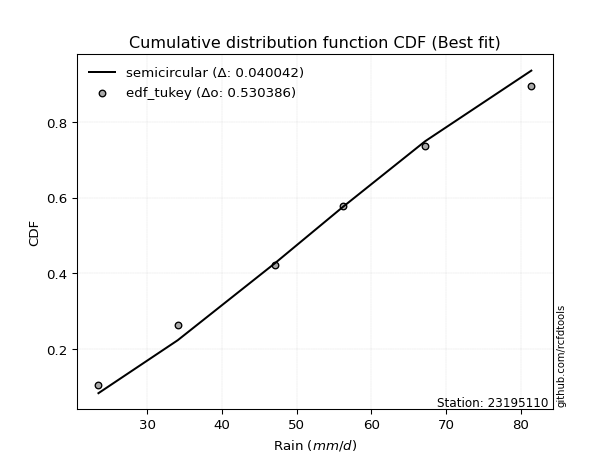</img>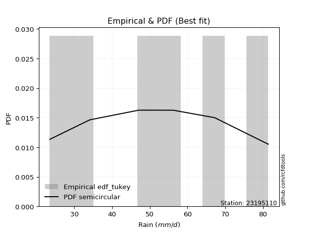</img>

</div>


### 8. EDF Gringorten (1963)

Gringorten plotting position formula is essential for estimating the probability and return periods of extreme events like floods and heavy rainfall. The constant _a=0.44_.

<div align="center">


$P=(m-a)/(n+1-2a)$


</div>


**8.1. Empirical values**

<div align="center">

|                | 0                   | 1                  | 2                   | 3                  | 4                  | 5                  |
|:---------------|:--------------------|:-------------------|:--------------------|:-------------------|:-------------------|:-------------------|
| date           | 2023                | 2020               | 2021                | 2025               | 2019               | 2024               |
| x              | 23.5                | 34.1               | 47.1                | 56.2               | 67.2               | 81.4               |
| m              | 1                   | 2                  | 3                   | 4                  | 5                  | 6                  |
| empirical_dist | edf_gringorten      | edf_gringorten     | edf_gringorten      | edf_gringorten     | edf_gringorten     | edf_gringorten     |
| empirical      | 0.09150326797385622 | 0.2549019607843137 | 0.41830065359477125 | 0.5816993464052288 | 0.7450980392156862 | 0.9084967320261437 |
| empirical_tr   | 1.1007194244604317  | 1.3421052631578947 | 1.7191011235955058  | 2.3906250000000004 | 3.9230769230769216 | 10.928571428571415 |

</div>


**8.2. Kolmogorov-Smirnov fit test (sorted by Δ)**


<div align="center">

|                | 0                   | 1                   | 2                   | 3                   | 4                    | 5                   | 6                   | 7                   | 8                   | 9                   | 10                 | 11                  | 12                  | 13                  | 14                  | 15                  | 16                  | 17                  | 18                  | 19                 | 20                  | 21                  | 22                  | 23                  | 24                  | 25                  | 26                 | 27                  | 28                  | 29                  | 30                 | 31                  | 32                 | 33                  | 34                  | 35                  | 36                  | 37                  | 38                 | 39                  | 40                 | 41                  | 42                  | 43                  | 44                  | 45                  | 46                  | 47                  | 48                  | 49                  | 50                  | 51                  | 52                  | 53                  | 54                  | 55                  | 56                  | 57                  | 58                  | 59                  | 60                  | 61                  | 62                  | 63                  | 64                  | 65                  | 66                  | 67                  | 68                  | 69                  | 70                  | 71                  | 72                  | 73                  | 74                  | 75                  | 76                  | 77                  | 78                  | 79                  | 80                  | 81                 | 82                  | 83                  | 84                 | 85                | 86                 | 87                  | 88                  | 89                  | 90                  | 91                  | 92                 | 93                  | 94                 | 95                  | 96                  | 97                  | 98                  | 99                  | 100                 | 101                 | 102                 | 103                | 104                | 105                | 106                 | 107                 | 108                 | 109                 | 110                 | 111                 | 112                | 113                | 114                 | 115                | 116                 | 117                | 118                | 119                | 120                 | 121                 | 122                | 123                 | 124                 | 125                 | 126                 | 127                 | 128                | 129                | 130                 | 131                | 132                 | 133                 | 134                | 135                 | 136                | 137               | 138                | 139                 | 140                 | 141                | 142                 | 143                 | 144                | 145                | 146                | 147                | 148                | 149                | 150                | 151                | 152                | 153                | 154              | 155                | 156                | 157                | 158                | 159                |
|:---------------|:--------------------|:--------------------|:--------------------|:--------------------|:---------------------|:--------------------|:--------------------|:--------------------|:--------------------|:--------------------|:-------------------|:--------------------|:--------------------|:--------------------|:--------------------|:--------------------|:--------------------|:--------------------|:--------------------|:-------------------|:--------------------|:--------------------|:--------------------|:--------------------|:--------------------|:--------------------|:-------------------|:--------------------|:--------------------|:--------------------|:-------------------|:--------------------|:-------------------|:--------------------|:--------------------|:--------------------|:--------------------|:--------------------|:-------------------|:--------------------|:-------------------|:--------------------|:--------------------|:--------------------|:--------------------|:--------------------|:--------------------|:--------------------|:--------------------|:--------------------|:--------------------|:--------------------|:--------------------|:--------------------|:--------------------|:--------------------|:--------------------|:--------------------|:--------------------|:--------------------|:--------------------|:--------------------|:--------------------|:--------------------|:--------------------|:--------------------|:--------------------|:--------------------|:--------------------|:--------------------|:--------------------|:--------------------|:--------------------|:--------------------|:--------------------|:--------------------|:--------------------|:--------------------|:--------------------|:--------------------|:--------------------|:-------------------|:--------------------|:--------------------|:-------------------|:------------------|:-------------------|:--------------------|:--------------------|:--------------------|:--------------------|:--------------------|:-------------------|:--------------------|:-------------------|:--------------------|:--------------------|:--------------------|:--------------------|:--------------------|:--------------------|:--------------------|:--------------------|:-------------------|:-------------------|:-------------------|:--------------------|:--------------------|:--------------------|:--------------------|:--------------------|:--------------------|:-------------------|:-------------------|:--------------------|:-------------------|:--------------------|:-------------------|:-------------------|:-------------------|:--------------------|:--------------------|:-------------------|:--------------------|:--------------------|:--------------------|:--------------------|:--------------------|:-------------------|:-------------------|:--------------------|:-------------------|:--------------------|:--------------------|:-------------------|:--------------------|:-------------------|:------------------|:-------------------|:--------------------|:--------------------|:-------------------|:--------------------|:--------------------|:-------------------|:-------------------|:-------------------|:-------------------|:-------------------|:-------------------|:-------------------|:-------------------|:-------------------|:-------------------|:-----------------|:-------------------|:-------------------|:-------------------|:-------------------|:-------------------|
| station        | 23195110            | 23195110            | 23195110            | 23195110            | 23195110             | 23195110            | 23195110            | 23195110            | 23195110            | 23195110            | 23195110           | 23195110            | 23195110            | 23195110            | 23195110            | 23195110            | 23195110            | 23195110            | 23195110            | 23195110           | 23195110            | 23195110            | 23195110            | 23195110            | 23195110            | 23195110            | 23195110           | 23195110            | 23195110            | 23195110            | 23195110           | 23195110            | 23195110           | 23195110            | 23195110            | 23195110            | 23195110            | 23195110            | 23195110           | 23195110            | 23195110           | 23195110            | 23195110            | 23195110            | 23195110            | 23195110            | 23195110            | 23195110            | 23195110            | 23195110            | 23195110            | 23195110            | 23195110            | 23195110            | 23195110            | 23195110            | 23195110            | 23195110            | 23195110            | 23195110            | 23195110            | 23195110            | 23195110            | 23195110            | 23195110            | 23195110            | 23195110            | 23195110            | 23195110            | 23195110            | 23195110            | 23195110            | 23195110            | 23195110            | 23195110            | 23195110            | 23195110            | 23195110            | 23195110            | 23195110            | 23195110            | 23195110           | 23195110            | 23195110            | 23195110           | 23195110          | 23195110           | 23195110            | 23195110            | 23195110            | 23195110            | 23195110            | 23195110           | 23195110            | 23195110           | 23195110            | 23195110            | 23195110            | 23195110            | 23195110            | 23195110            | 23195110            | 23195110            | 23195110           | 23195110           | 23195110           | 23195110            | 23195110            | 23195110            | 23195110            | 23195110            | 23195110            | 23195110           | 23195110           | 23195110            | 23195110           | 23195110            | 23195110           | 23195110           | 23195110           | 23195110            | 23195110            | 23195110           | 23195110            | 23195110            | 23195110            | 23195110            | 23195110            | 23195110           | 23195110           | 23195110            | 23195110           | 23195110            | 23195110            | 23195110           | 23195110            | 23195110           | 23195110          | 23195110           | 23195110            | 23195110            | 23195110           | 23195110            | 23195110            | 23195110           | 23195110           | 23195110           | 23195110           | 23195110           | 23195110           | 23195110           | 23195110           | 23195110           | 23195110           | 23195110         | 23195110           | 23195110           | 23195110           | 23195110           | 23195110           |
| empirical_dist | edf_gringorten      | edf_gringorten      | edf_gringorten      | edf_gringorten      | edf_gringorten       | edf_gringorten      | edf_gringorten      | edf_gringorten      | edf_gringorten      | edf_gringorten      | edf_gringorten     | edf_gringorten      | edf_gringorten      | edf_gringorten      | edf_gringorten      | edf_gringorten      | edf_gringorten      | edf_gringorten      | edf_gringorten      | edf_gringorten     | edf_gringorten      | edf_gringorten      | edf_gringorten      | edf_gringorten      | edf_gringorten      | edf_gringorten      | edf_gringorten     | edf_gringorten      | edf_gringorten      | edf_gringorten      | edf_gringorten     | edf_gringorten      | edf_gringorten     | edf_gringorten      | edf_gringorten      | edf_gringorten      | edf_gringorten      | edf_gringorten      | edf_gringorten     | edf_gringorten      | edf_gringorten     | edf_gringorten      | edf_gringorten      | edf_gringorten      | edf_gringorten      | edf_gringorten      | edf_gringorten      | edf_gringorten      | edf_gringorten      | edf_gringorten      | edf_gringorten      | edf_gringorten      | edf_gringorten      | edf_gringorten      | edf_gringorten      | edf_gringorten      | edf_gringorten      | edf_gringorten      | edf_gringorten      | edf_gringorten      | edf_gringorten      | edf_gringorten      | edf_gringorten      | edf_gringorten      | edf_gringorten      | edf_gringorten      | edf_gringorten      | edf_gringorten      | edf_gringorten      | edf_gringorten      | edf_gringorten      | edf_gringorten      | edf_gringorten      | edf_gringorten      | edf_gringorten      | edf_gringorten      | edf_gringorten      | edf_gringorten      | edf_gringorten      | edf_gringorten      | edf_gringorten      | edf_gringorten     | edf_gringorten      | edf_gringorten      | edf_gringorten     | edf_gringorten    | edf_gringorten     | edf_gringorten      | edf_gringorten      | edf_gringorten      | edf_gringorten      | edf_gringorten      | edf_gringorten     | edf_gringorten      | edf_gringorten     | edf_gringorten      | edf_gringorten      | edf_gringorten      | edf_gringorten      | edf_gringorten      | edf_gringorten      | edf_gringorten      | edf_gringorten      | edf_gringorten     | edf_gringorten     | edf_gringorten     | edf_gringorten      | edf_gringorten      | edf_gringorten      | edf_gringorten      | edf_gringorten      | edf_gringorten      | edf_gringorten     | edf_gringorten     | edf_gringorten      | edf_gringorten     | edf_gringorten      | edf_gringorten     | edf_gringorten     | edf_gringorten     | edf_gringorten      | edf_gringorten      | edf_gringorten     | edf_gringorten      | edf_gringorten      | edf_gringorten      | edf_gringorten      | edf_gringorten      | edf_gringorten     | edf_gringorten     | edf_gringorten      | edf_gringorten     | edf_gringorten      | edf_gringorten      | edf_gringorten     | edf_gringorten      | edf_gringorten     | edf_gringorten    | edf_gringorten     | edf_gringorten      | edf_gringorten      | edf_gringorten     | edf_gringorten      | edf_gringorten      | edf_gringorten     | edf_gringorten     | edf_gringorten     | edf_gringorten     | edf_gringorten     | edf_gringorten     | edf_gringorten     | edf_gringorten     | edf_gringorten     | edf_gringorten     | edf_gringorten   | edf_gringorten     | edf_gringorten     | edf_gringorten     | edf_gringorten     | edf_gringorten     |
| p_dist         | semicircular        | logtrapezoid        | ksone               | anglit              | dweibull             | logpearson3         | rayleigh            | invgauss            | gompertz            | ncf                 | maxwell            | f                   | invgamma            | logargus            | betaprime           | genlogistic         | logjohnsonsu        | weibull_min         | dgamma              | alpha              | foldnorm            | logweibull_min      | logburr12           | johnsonsu           | rice                | erlang              | pearson3           | gamma               | skewnorm            | nct                 | kstwobign          | exponnorm           | norm               | crystalball         | truncnorm           | t                   | loggumbel_l         | logf                | loganglit          | logcrystalball      | lognorm            | logt                | logexponnorm        | logsemicircular     | cosine              | logfatiguelife      | logdweibull         | logbetaprime        | logksone            | burr                | logncf              | loggamma            | loggamma            | logerlang           | logburr             | gumbel_r            | logmielke           | logrice             | mielke              | logdgamma           | logistic            | logloggamma         | kappa3              | bradford            | logskewnorm         | wrapcauchy          | loggompertz         | logtriang           | logbeta             | tukeylambda         | beta                | kappa4              | logarcsine          | halfnorm            | uniform             | arcsine             | loglogistic         | argus               | gumbel_l            | logalpha            | loggenhalflogistic  | loginvgamma        | logcosine           | halflogistic        | loginvgauss        | hypsecant         | moyal              | logmaxwell          | loghypsecant        | lognct              | truncweibull_min    | truncexpon          | laplace            | lograyleigh         | gausshyper         | vonmises_line       | loggenextreme       | genpareto           | loginvweibull       | triang              | loglaplace          | loglaplace          | logkappa4           | logtukeylambda     | loguniform         | logvonmises_line   | logloglaplace       | loggumbel_r         | loggenexpon         | logfoldnorm         | logkstwobign        | loghalfnorm         | lomax              | genexpon           | logbradford         | genhalflogistic    | logmoyal            | logwrapcauchy      | loghalflogistic    | logexponpow        | loglevy_l           | loggausshyper       | halfgennorm        | loglomax            | burr12              | logtruncexpon       | logwald             | johnsonsb           | loggennorm         | gennorm            | levy_l              | wald               | logexponweib        | logtruncnorm        | loggengamma        | trapezoid           | logjohnsonsb       | lognakagami       | logrdist           | genextreme          | logweibull_max      | logkappa3          | logtruncweibull_min | loggenpareto        | invweibull         | nakagami           | fatiguelife        | gengamma           | exponweib          | powerlaw           | logpowerlaw        | weibull_max        | rdist              | truncpareto        | logtruncpareto   | exponpow           | loggenlogistic     | loghalfgennorm     | logvonmises        | vonmises           |
| delta          | 0.03114277862229725 | 0.03256453889838551 | 0.03415135104346734 | 0.04325638641507315 | 0.050714005462241085 | 0.05101760364108435 | 0.05691620846402731 | 0.05780975797825161 | 0.05874749262080528 | 0.06000918682509687 | 0.0608392773065628 | 0.06084670841766032 | 0.06142460758033777 | 0.06246349011208763 | 0.06271133480607752 | 0.06279887902488424 | 0.06359430073948158 | 0.06367785901511391 | 0.06381070618612841 | 0.0644969790186688 | 0.06732685152836637 | 0.06754614522910721 | 0.06842325909839556 | 0.06889729290233887 | 0.06893760380293742 | 0.06990414167728787 | 0.0700914346930257 | 0.07009552409835557 | 0.07056340756518534 | 0.07057235900087114 | 0.0705810330036275 | 0.07060412912749708 | 0.0706057685046087 | 0.07060577589116829 | 0.07060579063692884 | 0.07061116045483823 | 0.07232907908701972 | 0.07323281973954565 | 0.0733819649998304 | 0.07340980401103592 | 0.0734100225832367 | 0.07341094758086852 | 0.07341218054149912 | 0.07395417217558964 | 0.07527564162221978 | 0.07562954564888968 | 0.07617456882823842 | 0.07953875217890216 | 0.07970350004662122 | 0.08003475142838201 | 0.08090817258811656 | 0.08204729569498143 | 0.08204729569498143 | 0.08253825644422724 | 0.08451562340313812 | 0.08606216632241204 | 0.08610877389541305 | 0.08710510821994494 | 0.09027650458924824 | 0.09075052301309935 | 0.09118265355976493 | 0.09140277120755247 | 0.09149014573350435 | 0.09150222562385665 | 0.09150255642142746 | 0.09150320865931162 | 0.09150325771085199 | 0.09150325913404855 | 0.09150326795282593 | 0.09150326797384911 | 0.09150326797385057 | 0.09150326797385122 | 0.09150326797385622 | 0.09150326797385622 | 0.09150326797385633 | 0.09150326797385633 | 0.09178382364804905 | 0.09233370337341806 | 0.09249889775965464 | 0.09338023679065427 | 0.09364202481685341 | 0.0938761053840062 | 0.09754555804143489 | 0.09984667500352462 | 0.1003653048857222 | 0.102798176049715 | 0.1045613122811268 | 0.10540423059492549 | 0.10595510492201154 | 0.10791125927039241 | 0.10831233831440751 | 0.11433245082064508 | 0.1147019486217988 | 0.11661931618497717 | 0.1214140389203548 | 0.12143864226247214 | 0.12382517443286689 | 0.12416014716526558 | 0.12516895410441514 | 0.12589572271506716 | 0.13397449392940064 | 0.13397449392940064 | 0.14043253960745788 | 0.1406241463718259 | 0.1413312311236366 | 0.1413506413130327 | 0.14171525213834607 | 0.14201342652333987 | 0.14522310686939072 | 0.14607140481406428 | 0.14813139037146078 | 0.14819826770007155 | 0.1492418347169911 | 0.1500968551635818 | 0.15037010845358584 | 0.1659038701600114 | 0.16789686122246755 | 0.1693047021247842 | 0.1725132101111317 | 0.1794088283994078 | 0.20266579347148272 | 0.20378288091215152 | 0.2050365233551708 | 0.20643541776473767 | 0.20856273474890968 | 0.23038175485426143 | 0.23991208233462086 | 0.24037305218504623 | 0.2450980392156863 | 0.2450980392156863 | 0.24895923060503622 | 0.2506284803161379 | 0.25173659762964645 | 0.25490192266310563 | 0.2747853153505739 | 0.27481396394902563 | 0.3197160751771888 | 0.332373633533018 | 0.3437742289730795 | 0.34878310284185254 | 0.35738724105125597 | 0.3836109607667294 | 0.3885582011524858  | 0.44870779305865727 | 0.4736342010552531 | 0.4818684167189184 | 0.4986037258095726 | 0.5038141185908965 | 0.5099480631875652 | 0.5240378082501188 | 0.5713081284331051 | 0.5724491170423207 | 0.5816993462237059 | 0.5989302075009602 | 0.64038427898967 | 0.6430957954486828 | 0.7450980392156862 | 0.7450980392156862 | 1.0707338499882502 | 12.940076322523932 |
| deltao         | 0.530385761606      | 0.530385761606      | 0.530385761606      | 0.530385761606      | 0.530385761606       | 0.530385761606      | 0.530385761606      | 0.530385761606      | 0.530385761606      | 0.530385761606      | 0.530385761606     | 0.530385761606      | 0.530385761606      | 0.530385761606      | 0.530385761606      | 0.530385761606      | 0.530385761606      | 0.530385761606      | 0.530385761606      | 0.530385761606     | 0.530385761606      | 0.530385761606      | 0.530385761606      | 0.530385761606      | 0.530385761606      | 0.530385761606      | 0.530385761606     | 0.530385761606      | 0.530385761606      | 0.530385761606      | 0.530385761606     | 0.530385761606      | 0.530385761606     | 0.530385761606      | 0.530385761606      | 0.530385761606      | 0.530385761606      | 0.530385761606      | 0.530385761606     | 0.530385761606      | 0.530385761606     | 0.530385761606      | 0.530385761606      | 0.530385761606      | 0.530385761606      | 0.530385761606      | 0.530385761606      | 0.530385761606      | 0.530385761606      | 0.530385761606      | 0.530385761606      | 0.530385761606      | 0.530385761606      | 0.530385761606      | 0.530385761606      | 0.530385761606      | 0.530385761606      | 0.530385761606      | 0.530385761606      | 0.530385761606      | 0.530385761606      | 0.530385761606      | 0.530385761606      | 0.530385761606      | 0.530385761606      | 0.530385761606      | 0.530385761606      | 0.530385761606      | 0.530385761606      | 0.530385761606      | 0.530385761606      | 0.530385761606      | 0.530385761606      | 0.530385761606      | 0.530385761606      | 0.530385761606      | 0.530385761606      | 0.530385761606      | 0.530385761606      | 0.530385761606      | 0.530385761606      | 0.530385761606     | 0.530385761606      | 0.530385761606      | 0.530385761606     | 0.530385761606    | 0.530385761606     | 0.530385761606      | 0.530385761606      | 0.530385761606      | 0.530385761606      | 0.530385761606      | 0.530385761606     | 0.530385761606      | 0.530385761606     | 0.530385761606      | 0.530385761606      | 0.530385761606      | 0.530385761606      | 0.530385761606      | 0.530385761606      | 0.530385761606      | 0.530385761606      | 0.530385761606     | 0.530385761606     | 0.530385761606     | 0.530385761606      | 0.530385761606      | 0.530385761606      | 0.530385761606      | 0.530385761606      | 0.530385761606      | 0.530385761606     | 0.530385761606     | 0.530385761606      | 0.530385761606     | 0.530385761606      | 0.530385761606     | 0.530385761606     | 0.530385761606     | 0.530385761606      | 0.530385761606      | 0.530385761606     | 0.530385761606      | 0.530385761606      | 0.530385761606      | 0.530385761606      | 0.530385761606      | 0.530385761606     | 0.530385761606     | 0.530385761606      | 0.530385761606     | 0.530385761606      | 0.530385761606      | 0.530385761606     | 0.530385761606      | 0.530385761606     | 0.530385761606    | 0.530385761606     | 0.530385761606      | 0.530385761606      | 0.530385761606     | 0.530385761606      | 0.530385761606      | 0.530385761606     | 0.530385761606     | 0.530385761606     | 0.530385761606     | 0.530385761606     | 0.530385761606     | 0.530385761606     | 0.530385761606     | 0.530385761606     | 0.530385761606     | 0.530385761606   | 0.530385761606     | 0.530385761606     | 0.530385761606     | 0.530385761606     | 0.530385761606     |
| eval           | Δo > Δ              | Δo > Δ              | Δo > Δ              | Δo > Δ              | Δo > Δ               | Δo > Δ              | Δo > Δ              | Δo > Δ              | Δo > Δ              | Δo > Δ              | Δo > Δ             | Δo > Δ              | Δo > Δ              | Δo > Δ              | Δo > Δ              | Δo > Δ              | Δo > Δ              | Δo > Δ              | Δo > Δ              | Δo > Δ             | Δo > Δ              | Δo > Δ              | Δo > Δ              | Δo > Δ              | Δo > Δ              | Δo > Δ              | Δo > Δ             | Δo > Δ              | Δo > Δ              | Δo > Δ              | Δo > Δ             | Δo > Δ              | Δo > Δ             | Δo > Δ              | Δo > Δ              | Δo > Δ              | Δo > Δ              | Δo > Δ              | Δo > Δ             | Δo > Δ              | Δo > Δ             | Δo > Δ              | Δo > Δ              | Δo > Δ              | Δo > Δ              | Δo > Δ              | Δo > Δ              | Δo > Δ              | Δo > Δ              | Δo > Δ              | Δo > Δ              | Δo > Δ              | Δo > Δ              | Δo > Δ              | Δo > Δ              | Δo > Δ              | Δo > Δ              | Δo > Δ              | Δo > Δ              | Δo > Δ              | Δo > Δ              | Δo > Δ              | Δo > Δ              | Δo > Δ              | Δo > Δ              | Δo > Δ              | Δo > Δ              | Δo > Δ              | Δo > Δ              | Δo > Δ              | Δo > Δ              | Δo > Δ              | Δo > Δ              | Δo > Δ              | Δo > Δ              | Δo > Δ              | Δo > Δ              | Δo > Δ              | Δo > Δ              | Δo > Δ              | Δo > Δ              | Δo > Δ             | Δo > Δ              | Δo > Δ              | Δo > Δ             | Δo > Δ            | Δo > Δ             | Δo > Δ              | Δo > Δ              | Δo > Δ              | Δo > Δ              | Δo > Δ              | Δo > Δ             | Δo > Δ              | Δo > Δ             | Δo > Δ              | Δo > Δ              | Δo > Δ              | Δo > Δ              | Δo > Δ              | Δo > Δ              | Δo > Δ              | Δo > Δ              | Δo > Δ             | Δo > Δ             | Δo > Δ             | Δo > Δ              | Δo > Δ              | Δo > Δ              | Δo > Δ              | Δo > Δ              | Δo > Δ              | Δo > Δ             | Δo > Δ             | Δo > Δ              | Δo > Δ             | Δo > Δ              | Δo > Δ             | Δo > Δ             | Δo > Δ             | Δo > Δ              | Δo > Δ              | Δo > Δ             | Δo > Δ              | Δo > Δ              | Δo > Δ              | Δo > Δ              | Δo > Δ              | Δo > Δ             | Δo > Δ             | Δo > Δ              | Δo > Δ             | Δo > Δ              | Δo > Δ              | Δo > Δ             | Δo > Δ              | Δo > Δ             | Δo > Δ            | Δo > Δ             | Δo > Δ              | Δo > Δ              | Δo > Δ             | Δo > Δ              | Δo > Δ              | Δo > Δ             | Δo > Δ             | Δo > Δ             | Δo > Δ             | Δo > Δ             | Δo > Δ             | Δo <= Δ            | Δo <= Δ            | Δo <= Δ            | Δo <= Δ            | Δo <= Δ          | Δo <= Δ            | Δo <= Δ            | Δo <= Δ            | Δo <= Δ            | Δo <= Δ            |
| fit            | 1                   | 1                   | 1                   | 1                   | 1                    | 1                   | 1                   | 1                   | 1                   | 1                   | 1                  | 1                   | 1                   | 1                   | 1                   | 1                   | 1                   | 1                   | 1                   | 1                  | 1                   | 1                   | 1                   | 1                   | 1                   | 1                   | 1                  | 1                   | 1                   | 1                   | 1                  | 1                   | 1                  | 1                   | 1                   | 1                   | 1                   | 1                   | 1                  | 1                   | 1                  | 1                   | 1                   | 1                   | 1                   | 1                   | 1                   | 1                   | 1                   | 1                   | 1                   | 1                   | 1                   | 1                   | 1                   | 1                   | 1                   | 1                   | 1                   | 1                   | 1                   | 1                   | 1                   | 1                   | 1                   | 1                   | 1                   | 1                   | 1                   | 1                   | 1                   | 1                   | 1                   | 1                   | 1                   | 1                   | 1                   | 1                   | 1                   | 1                   | 1                   | 1                  | 1                   | 1                   | 1                  | 1                 | 1                  | 1                   | 1                   | 1                   | 1                   | 1                   | 1                  | 1                   | 1                  | 1                   | 1                   | 1                   | 1                   | 1                   | 1                   | 1                   | 1                   | 1                  | 1                  | 1                  | 1                   | 1                   | 1                   | 1                   | 1                   | 1                   | 1                  | 1                  | 1                   | 1                  | 1                   | 1                  | 1                  | 1                  | 1                   | 1                   | 1                  | 1                   | 1                   | 1                   | 1                   | 1                   | 1                  | 1                  | 1                   | 1                  | 1                   | 1                   | 1                  | 1                   | 1                  | 1                 | 1                  | 1                   | 1                   | 1                  | 1                   | 1                   | 1                  | 1                  | 1                  | 1                  | 1                  | 1                  | 0                  | 0                  | 0                  | 0                  | 0                | 0                  | 0                  | 0                  | 0                  | 0                  |
| n              | 6                   | 6                   | 6                   | 6                   | 6                    | 6                   | 6                   | 6                   | 6                   | 6                   | 6                  | 6                   | 6                   | 6                   | 6                   | 6                   | 6                   | 6                   | 6                   | 6                  | 6                   | 6                   | 6                   | 6                   | 6                   | 6                   | 6                  | 6                   | 6                   | 6                   | 6                  | 6                   | 6                  | 6                   | 6                   | 6                   | 6                   | 6                   | 6                  | 6                   | 6                  | 6                   | 6                   | 6                   | 6                   | 6                   | 6                   | 6                   | 6                   | 6                   | 6                   | 6                   | 6                   | 6                   | 6                   | 6                   | 6                   | 6                   | 6                   | 6                   | 6                   | 6                   | 6                   | 6                   | 6                   | 6                   | 6                   | 6                   | 6                   | 6                   | 6                   | 6                   | 6                   | 6                   | 6                   | 6                   | 6                   | 6                   | 6                   | 6                   | 6                   | 6                  | 6                   | 6                   | 6                  | 6                 | 6                  | 6                   | 6                   | 6                   | 6                   | 6                   | 6                  | 6                   | 6                  | 6                   | 6                   | 6                   | 6                   | 6                   | 6                   | 6                   | 6                   | 6                  | 6                  | 6                  | 6                   | 6                   | 6                   | 6                   | 6                   | 6                   | 6                  | 6                  | 6                   | 6                  | 6                   | 6                  | 6                  | 6                  | 6                   | 6                   | 6                  | 6                   | 6                   | 6                   | 6                   | 6                   | 6                  | 6                  | 6                   | 6                  | 6                   | 6                   | 6                  | 6                   | 6                  | 6                 | 6                  | 6                   | 6                   | 6                  | 6                   | 6                   | 6                  | 6                  | 6                  | 6                  | 6                  | 6                  | 6                  | 6                  | 6                  | 6                  | 6                | 6                  | 6                  | 6                  | 6                  | 6                  |
| best_fit       | 1                   | 0                   | 0                   | 0                   | 0                    | 0                   | 0                   | 0                   | 0                   | 0                   | 0                  | 0                   | 0                   | 0                   | 0                   | 0                   | 0                   | 0                   | 0                   | 0                  | 0                   | 0                   | 0                   | 0                   | 0                   | 0                   | 0                  | 0                   | 0                   | 0                   | 0                  | 0                   | 0                  | 0                   | 0                   | 0                   | 0                   | 0                   | 0                  | 0                   | 0                  | 0                   | 0                   | 0                   | 0                   | 0                   | 0                   | 0                   | 0                   | 0                   | 0                   | 0                   | 0                   | 0                   | 0                   | 0                   | 0                   | 0                   | 0                   | 0                   | 0                   | 0                   | 0                   | 0                   | 0                   | 0                   | 0                   | 0                   | 0                   | 0                   | 0                   | 0                   | 0                   | 0                   | 0                   | 0                   | 0                   | 0                   | 0                   | 0                   | 0                   | 0                  | 0                   | 0                   | 0                  | 0                 | 0                  | 0                   | 0                   | 0                   | 0                   | 0                   | 0                  | 0                   | 0                  | 0                   | 0                   | 0                   | 0                   | 0                   | 0                   | 0                   | 0                   | 0                  | 0                  | 0                  | 0                   | 0                   | 0                   | 0                   | 0                   | 0                   | 0                  | 0                  | 0                   | 0                  | 0                   | 0                  | 0                  | 0                  | 0                   | 0                   | 0                  | 0                   | 0                   | 0                   | 0                   | 0                   | 0                  | 0                  | 0                   | 0                  | 0                   | 0                   | 0                  | 0                   | 0                  | 0                 | 0                  | 0                   | 0                   | 0                  | 0                   | 0                   | 0                  | 0                  | 0                  | 0                  | 0                  | 0                  | 0                  | 0                  | 0                  | 0                  | 0                | 0                  | 0                  | 0                  | 0                  | 0                  |
| best_fit_sort  | 1                   | 2                   | 3                   | 4                   | 5                    | 6                   | 7                   | 8                   | 9                   | 10                  | 11                 | 12                  | 13                  | 14                  | 15                  | 16                  | 17                  | 18                  | 19                  | 20                 | 21                  | 22                  | 23                  | 24                  | 25                  | 26                  | 27                 | 28                  | 29                  | 30                  | 31                 | 32                  | 33                 | 34                  | 35                  | 36                  | 37                  | 38                  | 39                 | 40                  | 41                 | 42                  | 43                  | 44                  | 45                  | 46                  | 47                  | 48                  | 49                  | 50                  | 51                  | 52                  | 53                  | 54                  | 55                  | 56                  | 57                  | 58                  | 59                  | 60                  | 61                  | 62                  | 63                  | 64                  | 65                  | 66                  | 67                  | 68                  | 69                  | 70                  | 71                  | 72                  | 73                  | 74                  | 75                  | 76                  | 77                  | 78                  | 79                  | 80                  | 81                  | 82                 | 83                  | 84                  | 85                 | 86                | 87                 | 88                  | 89                  | 90                  | 91                  | 92                  | 93                 | 94                  | 95                 | 96                  | 97                  | 98                  | 99                  | 100                 | 101                 | 102                 | 103                 | 104                | 105                | 106                | 107                 | 108                 | 109                 | 110                 | 111                 | 112                 | 113                | 114                | 115                 | 116                | 117                 | 118                | 119                | 120                | 121                 | 122                 | 123                | 124                 | 125                 | 126                 | 127                 | 128                 | 129                | 130                | 131                 | 132                | 133                 | 134                 | 135                | 136                 | 137                | 138               | 139                | 140                 | 141                 | 142                | 143                 | 144                 | 145                | 146                | 147                | 148                | 149                | 150                | 151                | 152                | 153                | 154                | 155              | 156                | 157                | 158                | 159                | 160                |

</div>


**8.3. Best fit**

<div align="center">

|   id |   station | empirical_dist   | p_dist       |     delta |   deltao | eval   |   fit |   n |   best_fit |   best_fit_sort |
|-----:|----------:|:-----------------|:-------------|----------:|---------:|:-------|------:|----:|-----------:|----------------:|
|    0 |  23195110 | edf_gringorten   | semicircular | 0.0311428 | 0.530386 | Δo > Δ |     1 |   6 |          1 |               1 |

</div>


<div align="center">

</img>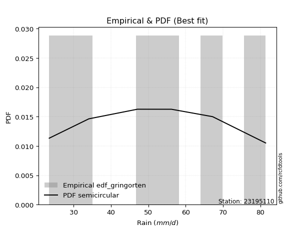</img>

</div>


### 9. EDF Filliben (1975)

The specific values of the constants (0.3175) (often denoted as $alpha$) and (0.365) are derived from a method proposed by James J. Filliben in a 1975 paper. This particular formula is the mean value of the $i$-th order statistic of the normal distribution and is considered a robust and effective plotting position formula for the normal probability plot correlation coefficient test for normality.

<div align="center">


$P=(m-0.3175)/(n+0.365)$


</div>


**9.1. Empirical values**

<div align="center">

|                | 0                   | 1                   | 2                  | 3                  | 4                  | 5                  |
|:---------------|:--------------------|:--------------------|:-------------------|:-------------------|:-------------------|:-------------------|
| date           | 2023                | 2020                | 2021               | 2025               | 2019               | 2024               |
| x              | 23.5                | 34.1                | 47.1               | 56.2               | 67.2               | 81.4               |
| m              | 1                   | 2                   | 3                  | 4                  | 5                  | 6                  |
| empirical_dist | edf_filliben        | edf_filliben        | edf_filliben       | edf_filliben       | edf_filliben       | edf_filliben       |
| empirical      | 0.10722702278083267 | 0.26433621366849963 | 0.4214454045561665 | 0.5785545954438335 | 0.7356637863315004 | 0.8927729772191673 |
| empirical_tr   | 1.1201055873295205  | 1.3593166043780034  | 1.7284453496266123 | 2.3727865796831313 | 3.783060921248143  | 9.326007326007321  |

</div>


**9.2. Kolmogorov-Smirnov fit test (sorted by Δ)**


<div align="center">

|                | 0                    | 1                   | 2                    | 3                   | 4                   | 5                   | 6                   | 7                   | 8                   | 9                  | 10                 | 11                  | 12                  | 13                  | 14                  | 15                  | 16                  | 17                  | 18                 | 19                  | 20                  | 21                  | 22                  | 23                  | 24                  | 25                  | 26                  | 27                  | 28                 | 29                  | 30                 | 31                  | 32                  | 33                  | 34                  | 35                  | 36                  | 37                  | 38                  | 39                  | 40                  | 41                | 42                  | 43                  | 44                  | 45                  | 46                  | 47                | 48                | 49                  | 50                  | 51                  | 52                 | 53                  | 54                  | 55                | 56                  | 57                  | 58                  | 59                  | 60                  | 61                  | 62                  | 63                  | 64                  | 65                  | 66                  | 67                  | 68                  | 69                  | 70                  | 71                 | 72                 | 73                  | 74                  | 75                  | 76                  | 77                  | 78                  | 79                  | 80                  | 81                 | 82                  | 83                  | 84                  | 85                  | 86                  | 87                  | 88                  | 89                  | 90                  | 91                  | 92                 | 93                  | 94                  | 95                  | 96                  | 97                  | 98                  | 99                  | 100                 | 101                 | 102                 | 103                 | 104                 | 105                 | 106                | 107                 | 108               | 109                | 110                 | 111                 | 112                 | 113                 | 114               | 115                | 116                 | 117                 | 118                 | 119                 | 120                 | 121                 | 122                 | 123                | 124                | 125                 | 126                | 127                 | 128                 | 129                 | 130                | 131                 | 132                | 133                 | 134                | 135                | 136                 | 137                | 138                 | 139                 | 140                | 141               | 142                 | 143                | 144                | 145                | 146                 | 147                | 148                | 149                | 150                | 151               | 152                | 153                | 154                | 155                | 156                | 157                | 158                | 159               |
|:---------------|:---------------------|:--------------------|:---------------------|:--------------------|:--------------------|:--------------------|:--------------------|:--------------------|:--------------------|:-------------------|:-------------------|:--------------------|:--------------------|:--------------------|:--------------------|:--------------------|:--------------------|:--------------------|:-------------------|:--------------------|:--------------------|:--------------------|:--------------------|:--------------------|:--------------------|:--------------------|:--------------------|:--------------------|:-------------------|:--------------------|:-------------------|:--------------------|:--------------------|:--------------------|:--------------------|:--------------------|:--------------------|:--------------------|:--------------------|:--------------------|:--------------------|:------------------|:--------------------|:--------------------|:--------------------|:--------------------|:--------------------|:------------------|:------------------|:--------------------|:--------------------|:--------------------|:-------------------|:--------------------|:--------------------|:------------------|:--------------------|:--------------------|:--------------------|:--------------------|:--------------------|:--------------------|:--------------------|:--------------------|:--------------------|:--------------------|:--------------------|:--------------------|:--------------------|:--------------------|:--------------------|:-------------------|:-------------------|:--------------------|:--------------------|:--------------------|:--------------------|:--------------------|:--------------------|:--------------------|:--------------------|:-------------------|:--------------------|:--------------------|:--------------------|:--------------------|:--------------------|:--------------------|:--------------------|:--------------------|:--------------------|:--------------------|:-------------------|:--------------------|:--------------------|:--------------------|:--------------------|:--------------------|:--------------------|:--------------------|:--------------------|:--------------------|:--------------------|:--------------------|:--------------------|:--------------------|:-------------------|:--------------------|:------------------|:-------------------|:--------------------|:--------------------|:--------------------|:--------------------|:------------------|:-------------------|:--------------------|:--------------------|:--------------------|:--------------------|:--------------------|:--------------------|:--------------------|:-------------------|:-------------------|:--------------------|:-------------------|:--------------------|:--------------------|:--------------------|:-------------------|:--------------------|:-------------------|:--------------------|:-------------------|:-------------------|:--------------------|:-------------------|:--------------------|:--------------------|:-------------------|:------------------|:--------------------|:-------------------|:-------------------|:-------------------|:--------------------|:-------------------|:-------------------|:-------------------|:-------------------|:------------------|:-------------------|:-------------------|:-------------------|:-------------------|:-------------------|:-------------------|:-------------------|:------------------|
| station        | 23195110             | 23195110            | 23195110             | 23195110            | 23195110            | 23195110            | 23195110            | 23195110            | 23195110            | 23195110           | 23195110           | 23195110            | 23195110            | 23195110            | 23195110            | 23195110            | 23195110            | 23195110            | 23195110           | 23195110            | 23195110            | 23195110            | 23195110            | 23195110            | 23195110            | 23195110            | 23195110            | 23195110            | 23195110           | 23195110            | 23195110           | 23195110            | 23195110            | 23195110            | 23195110            | 23195110            | 23195110            | 23195110            | 23195110            | 23195110            | 23195110            | 23195110          | 23195110            | 23195110            | 23195110            | 23195110            | 23195110            | 23195110          | 23195110          | 23195110            | 23195110            | 23195110            | 23195110           | 23195110            | 23195110            | 23195110          | 23195110            | 23195110            | 23195110            | 23195110            | 23195110            | 23195110            | 23195110            | 23195110            | 23195110            | 23195110            | 23195110            | 23195110            | 23195110            | 23195110            | 23195110            | 23195110           | 23195110           | 23195110            | 23195110            | 23195110            | 23195110            | 23195110            | 23195110            | 23195110            | 23195110            | 23195110           | 23195110            | 23195110            | 23195110            | 23195110            | 23195110            | 23195110            | 23195110            | 23195110            | 23195110            | 23195110            | 23195110           | 23195110            | 23195110            | 23195110            | 23195110            | 23195110            | 23195110            | 23195110            | 23195110            | 23195110            | 23195110            | 23195110            | 23195110            | 23195110            | 23195110           | 23195110            | 23195110          | 23195110           | 23195110            | 23195110            | 23195110            | 23195110            | 23195110          | 23195110           | 23195110            | 23195110            | 23195110            | 23195110            | 23195110            | 23195110            | 23195110            | 23195110           | 23195110           | 23195110            | 23195110           | 23195110            | 23195110            | 23195110            | 23195110           | 23195110            | 23195110           | 23195110            | 23195110           | 23195110           | 23195110            | 23195110           | 23195110            | 23195110            | 23195110           | 23195110          | 23195110            | 23195110           | 23195110           | 23195110           | 23195110            | 23195110           | 23195110           | 23195110           | 23195110           | 23195110          | 23195110           | 23195110           | 23195110           | 23195110           | 23195110           | 23195110           | 23195110           | 23195110          |
| empirical_dist | edf_filliben         | edf_filliben        | edf_filliben         | edf_filliben        | edf_filliben        | edf_filliben        | edf_filliben        | edf_filliben        | edf_filliben        | edf_filliben       | edf_filliben       | edf_filliben        | edf_filliben        | edf_filliben        | edf_filliben        | edf_filliben        | edf_filliben        | edf_filliben        | edf_filliben       | edf_filliben        | edf_filliben        | edf_filliben        | edf_filliben        | edf_filliben        | edf_filliben        | edf_filliben        | edf_filliben        | edf_filliben        | edf_filliben       | edf_filliben        | edf_filliben       | edf_filliben        | edf_filliben        | edf_filliben        | edf_filliben        | edf_filliben        | edf_filliben        | edf_filliben        | edf_filliben        | edf_filliben        | edf_filliben        | edf_filliben      | edf_filliben        | edf_filliben        | edf_filliben        | edf_filliben        | edf_filliben        | edf_filliben      | edf_filliben      | edf_filliben        | edf_filliben        | edf_filliben        | edf_filliben       | edf_filliben        | edf_filliben        | edf_filliben      | edf_filliben        | edf_filliben        | edf_filliben        | edf_filliben        | edf_filliben        | edf_filliben        | edf_filliben        | edf_filliben        | edf_filliben        | edf_filliben        | edf_filliben        | edf_filliben        | edf_filliben        | edf_filliben        | edf_filliben        | edf_filliben       | edf_filliben       | edf_filliben        | edf_filliben        | edf_filliben        | edf_filliben        | edf_filliben        | edf_filliben        | edf_filliben        | edf_filliben        | edf_filliben       | edf_filliben        | edf_filliben        | edf_filliben        | edf_filliben        | edf_filliben        | edf_filliben        | edf_filliben        | edf_filliben        | edf_filliben        | edf_filliben        | edf_filliben       | edf_filliben        | edf_filliben        | edf_filliben        | edf_filliben        | edf_filliben        | edf_filliben        | edf_filliben        | edf_filliben        | edf_filliben        | edf_filliben        | edf_filliben        | edf_filliben        | edf_filliben        | edf_filliben       | edf_filliben        | edf_filliben      | edf_filliben       | edf_filliben        | edf_filliben        | edf_filliben        | edf_filliben        | edf_filliben      | edf_filliben       | edf_filliben        | edf_filliben        | edf_filliben        | edf_filliben        | edf_filliben        | edf_filliben        | edf_filliben        | edf_filliben       | edf_filliben       | edf_filliben        | edf_filliben       | edf_filliben        | edf_filliben        | edf_filliben        | edf_filliben       | edf_filliben        | edf_filliben       | edf_filliben        | edf_filliben       | edf_filliben       | edf_filliben        | edf_filliben       | edf_filliben        | edf_filliben        | edf_filliben       | edf_filliben      | edf_filliben        | edf_filliben       | edf_filliben       | edf_filliben       | edf_filliben        | edf_filliben       | edf_filliben       | edf_filliben       | edf_filliben       | edf_filliben      | edf_filliben       | edf_filliben       | edf_filliben       | edf_filliben       | edf_filliben       | edf_filliben       | edf_filliben       | edf_filliben      |
| p_dist         | semicircular         | logtrapezoid        | ksone                | anglit              | dweibull            | logpearson3         | genlogistic         | rayleigh            | invgauss            | gompertz           | ncf                | loganglit           | maxwell             | f                   | invgamma            | weibull_min         | logsemicircular     | betaprime           | logjohnsonsu       | dgamma              | kstwobign           | alpha               | logargus            | logf                | logcrystalball      | lognorm             | logt                | logexponnorm        | foldnorm           | logweibull_min      | logbetaprime       | logburr12           | johnsonsu           | rice                | logfatiguelife      | logncf              | erlang              | pearson3            | gamma               | skewnorm            | nct                 | exponnorm         | norm                | crystalball         | truncnorm           | t                   | logburr             | loggamma          | loggamma          | loggumbel_l         | logerlang           | logrice             | cosine             | logdweibull         | logmielke           | logalpha          | burr                | loginvgamma         | mielke              | loglogistic         | logksone            | gumbel_r            | logcosine           | loginvgauss         | logdgamma           | logistic            | argus               | gumbel_l            | logmaxwell          | lognct              | logloggamma         | kappa3             | bradford           | logskewnorm         | wrapcauchy          | loggompertz         | logtriang           | truncweibull_min    | logbeta             | tukeylambda         | beta                | loggenhalflogistic | kappa4              | halflogistic        | halfnorm            | logarcsine          | uniform             | arcsine             | genpareto           | loghypsecant        | truncexpon          | hypsecant           | lograyleigh        | moyal               | gausshyper          | loggenextreme       | loginvweibull       | triang              | laplace             | vonmises_line       | loglaplace          | loglaplace          | logkappa4           | logtukeylambda      | loguniform          | logvonmises_line    | loggumbel_r        | loggenexpon         | logfoldnorm       | logkstwobign       | loghalfnorm         | lomax               | genexpon            | logbradford         | logloglaplace     | logwrapcauchy      | genhalflogistic     | logmoyal            | loghalflogistic     | logexponpow         | loglevy_l           | loggausshyper       | halfgennorm         | loglomax           | burr12             | logtruncexpon       | johnsonsb          | levy_l              | gennorm             | loggennorm          | logwald            | logexponweib        | wald               | logtruncnorm        | loggengamma        | trapezoid          | logjohnsonsb        | logrdist           | lognakagami         | genextreme          | logweibull_max     | logkappa3         | logtruncweibull_min | loggenpareto       | invweibull         | nakagami           | fatiguelife         | gengamma           | exponweib          | powerlaw           | logpowerlaw        | weibull_max       | rdist              | truncpareto        | logtruncpareto     | exponpow           | loggenlogistic     | loghalfgennorm     | logvonmises        | vonmises          |
| delta          | 0.042005412333918635 | 0.04828829370536192 | 0.049875105850443746 | 0.05269063929925907 | 0.06014825834642701 | 0.06045185652527027 | 0.06594362998627956 | 0.06635046134821324 | 0.06724401086243753 | 0.0681817455049912 | 0.0694434397092828 | 0.07023721403843514 | 0.07027353019074872 | 0.07028096130184625 | 0.07085886046452369 | 0.07138881490706991 | 0.07166362322366253 | 0.07214558769026344 | 0.0730285536236675 | 0.07324495907031434 | 0.07372578396502283 | 0.07393123190285472 | 0.07490674667064057 | 0.07637757070094098 | 0.07655455497243124 | 0.07655477354463203 | 0.07655569854226385 | 0.07655693150289444 | 0.0767611044125523 | 0.07698039811329313 | 0.0777879999263712 | 0.07785751198258148 | 0.07833154578652479 | 0.07837185668712335 | 0.07877429661028501 | 0.07886608964538355 | 0.07933839456147379 | 0.07952568757721162 | 0.07952977698254149 | 0.07999766044937126 | 0.08000661188505706 | 0.080038382011683 | 0.08004002138879462 | 0.08004002877535421 | 0.08004004352111477 | 0.08004541333902415 | 0.08137087244174279 | 0.081584636994112 | 0.081584636994112 | 0.08176333197120564 | 0.08404624526017346 | 0.08412073487261085 | 0.0847098945064057 | 0.08560882171242434 | 0.08567998871244087 | 0.090235485829259 | 0.09049720916902093 | 0.09129016359331077 | 0.09398971323788863 | 0.09492857460944437 | 0.09542725485359767 | 0.09549641920659796 | 0.09631435878241013 | 0.09722055392432694 | 0.10018477589728528 | 0.10061690644395085 | 0.10176795625760399 | 0.10193315064384056 | 0.10225947963353021 | 0.10476650830899714 | 0.10712652601452888 | 0.1072139005404808 | 0.1072259804308331 | 0.10722631122840387 | 0.10722696346628807 | 0.10722701251782844 | 0.10722701394102496 | 0.10722702263615724 | 0.10722702275980234 | 0.10722702278082556 | 0.10722702278082702 | 0.1072270227808273 | 0.10722702278082767 | 0.10722702278083267 | 0.10722702278083267 | 0.10722702278083267 | 0.10722702278083274 | 0.10722702278083274 | 0.10843639235828913 | 0.10909985588340687 | 0.11118769985924981 | 0.11223242893390092 | 0.1134745652235819 | 0.11399556516531273 | 0.11826928795895952 | 0.12068042347147157 | 0.12202420314301987 | 0.12275097175367183 | 0.12413620150598473 | 0.13087289514665806 | 0.13711924489079597 | 0.13711924489079597 | 0.13728778864606261 | 0.13747939541043064 | 0.13818648016224133 | 0.13820589035163744 | 0.1388686755619446 | 0.14207835590799545 | 0.142926653852669 | 0.1449866394100655 | 0.14505351673867628 | 0.14609708375559582 | 0.14695210420218652 | 0.14722535749219057 | 0.151149505022532 | 0.1598704492405983 | 0.16275911919861608 | 0.16475211026107228 | 0.16936845914973642 | 0.17626407743801253 | 0.18694203866450626 | 0.20063812995075625 | 0.20189177239377554 | 0.2032906668033424 | 0.2054179837875144 | 0.22723700389286616 | 0.2309387993008603 | 0.23323547579805975 | 0.23566378633150042 | 0.23566378633150042 | 0.2367673313732256 | 0.24859184666825118 | 0.2600627332003238 | 0.26433617554729155 | 0.2716405643891786 | 0.2716692129876303 | 0.31028182229300305 | 0.3280504741661031 | 0.32922888257162275 | 0.33305934803487613 | 0.3479529881670702 | 0.367887205959753 | 0.3854134501910905  | 0.4329840382516808 | 0.4579104462482767 | 0.4787236657575231 | 0.48916947292538665 | 0.4943798657067106 | 0.5005138103033793 | 0.5146035553659329 | 0.5618738755489192 | 0.563014864158135 | 0.5785545952623107 | 0.5894959546167742 | 0.6309500261054841 | 0.6336615425644969 | 0.7356637863315004 | 0.7356637863315004 | 1.0738786009496453 | 12.95580007733091 |
| deltao         | 0.530385761606       | 0.530385761606      | 0.530385761606       | 0.530385761606      | 0.530385761606      | 0.530385761606      | 0.530385761606      | 0.530385761606      | 0.530385761606      | 0.530385761606     | 0.530385761606     | 0.530385761606      | 0.530385761606      | 0.530385761606      | 0.530385761606      | 0.530385761606      | 0.530385761606      | 0.530385761606      | 0.530385761606     | 0.530385761606      | 0.530385761606      | 0.530385761606      | 0.530385761606      | 0.530385761606      | 0.530385761606      | 0.530385761606      | 0.530385761606      | 0.530385761606      | 0.530385761606     | 0.530385761606      | 0.530385761606     | 0.530385761606      | 0.530385761606      | 0.530385761606      | 0.530385761606      | 0.530385761606      | 0.530385761606      | 0.530385761606      | 0.530385761606      | 0.530385761606      | 0.530385761606      | 0.530385761606    | 0.530385761606      | 0.530385761606      | 0.530385761606      | 0.530385761606      | 0.530385761606      | 0.530385761606    | 0.530385761606    | 0.530385761606      | 0.530385761606      | 0.530385761606      | 0.530385761606     | 0.530385761606      | 0.530385761606      | 0.530385761606    | 0.530385761606      | 0.530385761606      | 0.530385761606      | 0.530385761606      | 0.530385761606      | 0.530385761606      | 0.530385761606      | 0.530385761606      | 0.530385761606      | 0.530385761606      | 0.530385761606      | 0.530385761606      | 0.530385761606      | 0.530385761606      | 0.530385761606      | 0.530385761606     | 0.530385761606     | 0.530385761606      | 0.530385761606      | 0.530385761606      | 0.530385761606      | 0.530385761606      | 0.530385761606      | 0.530385761606      | 0.530385761606      | 0.530385761606     | 0.530385761606      | 0.530385761606      | 0.530385761606      | 0.530385761606      | 0.530385761606      | 0.530385761606      | 0.530385761606      | 0.530385761606      | 0.530385761606      | 0.530385761606      | 0.530385761606     | 0.530385761606      | 0.530385761606      | 0.530385761606      | 0.530385761606      | 0.530385761606      | 0.530385761606      | 0.530385761606      | 0.530385761606      | 0.530385761606      | 0.530385761606      | 0.530385761606      | 0.530385761606      | 0.530385761606      | 0.530385761606     | 0.530385761606      | 0.530385761606    | 0.530385761606     | 0.530385761606      | 0.530385761606      | 0.530385761606      | 0.530385761606      | 0.530385761606    | 0.530385761606     | 0.530385761606      | 0.530385761606      | 0.530385761606      | 0.530385761606      | 0.530385761606      | 0.530385761606      | 0.530385761606      | 0.530385761606     | 0.530385761606     | 0.530385761606      | 0.530385761606     | 0.530385761606      | 0.530385761606      | 0.530385761606      | 0.530385761606     | 0.530385761606      | 0.530385761606     | 0.530385761606      | 0.530385761606     | 0.530385761606     | 0.530385761606      | 0.530385761606     | 0.530385761606      | 0.530385761606      | 0.530385761606     | 0.530385761606    | 0.530385761606      | 0.530385761606     | 0.530385761606     | 0.530385761606     | 0.530385761606      | 0.530385761606     | 0.530385761606     | 0.530385761606     | 0.530385761606     | 0.530385761606    | 0.530385761606     | 0.530385761606     | 0.530385761606     | 0.530385761606     | 0.530385761606     | 0.530385761606     | 0.530385761606     | 0.530385761606    |
| eval           | Δo > Δ               | Δo > Δ              | Δo > Δ               | Δo > Δ              | Δo > Δ              | Δo > Δ              | Δo > Δ              | Δo > Δ              | Δo > Δ              | Δo > Δ             | Δo > Δ             | Δo > Δ              | Δo > Δ              | Δo > Δ              | Δo > Δ              | Δo > Δ              | Δo > Δ              | Δo > Δ              | Δo > Δ             | Δo > Δ              | Δo > Δ              | Δo > Δ              | Δo > Δ              | Δo > Δ              | Δo > Δ              | Δo > Δ              | Δo > Δ              | Δo > Δ              | Δo > Δ             | Δo > Δ              | Δo > Δ             | Δo > Δ              | Δo > Δ              | Δo > Δ              | Δo > Δ              | Δo > Δ              | Δo > Δ              | Δo > Δ              | Δo > Δ              | Δo > Δ              | Δo > Δ              | Δo > Δ            | Δo > Δ              | Δo > Δ              | Δo > Δ              | Δo > Δ              | Δo > Δ              | Δo > Δ            | Δo > Δ            | Δo > Δ              | Δo > Δ              | Δo > Δ              | Δo > Δ             | Δo > Δ              | Δo > Δ              | Δo > Δ            | Δo > Δ              | Δo > Δ              | Δo > Δ              | Δo > Δ              | Δo > Δ              | Δo > Δ              | Δo > Δ              | Δo > Δ              | Δo > Δ              | Δo > Δ              | Δo > Δ              | Δo > Δ              | Δo > Δ              | Δo > Δ              | Δo > Δ              | Δo > Δ             | Δo > Δ             | Δo > Δ              | Δo > Δ              | Δo > Δ              | Δo > Δ              | Δo > Δ              | Δo > Δ              | Δo > Δ              | Δo > Δ              | Δo > Δ             | Δo > Δ              | Δo > Δ              | Δo > Δ              | Δo > Δ              | Δo > Δ              | Δo > Δ              | Δo > Δ              | Δo > Δ              | Δo > Δ              | Δo > Δ              | Δo > Δ             | Δo > Δ              | Δo > Δ              | Δo > Δ              | Δo > Δ              | Δo > Δ              | Δo > Δ              | Δo > Δ              | Δo > Δ              | Δo > Δ              | Δo > Δ              | Δo > Δ              | Δo > Δ              | Δo > Δ              | Δo > Δ             | Δo > Δ              | Δo > Δ            | Δo > Δ             | Δo > Δ              | Δo > Δ              | Δo > Δ              | Δo > Δ              | Δo > Δ            | Δo > Δ             | Δo > Δ              | Δo > Δ              | Δo > Δ              | Δo > Δ              | Δo > Δ              | Δo > Δ              | Δo > Δ              | Δo > Δ             | Δo > Δ             | Δo > Δ              | Δo > Δ             | Δo > Δ              | Δo > Δ              | Δo > Δ              | Δo > Δ             | Δo > Δ              | Δo > Δ             | Δo > Δ              | Δo > Δ             | Δo > Δ             | Δo > Δ              | Δo > Δ             | Δo > Δ              | Δo > Δ              | Δo > Δ             | Δo > Δ            | Δo > Δ              | Δo > Δ             | Δo > Δ             | Δo > Δ             | Δo > Δ              | Δo > Δ             | Δo > Δ             | Δo > Δ             | Δo <= Δ            | Δo <= Δ           | Δo <= Δ            | Δo <= Δ            | Δo <= Δ            | Δo <= Δ            | Δo <= Δ            | Δo <= Δ            | Δo <= Δ            | Δo <= Δ           |
| fit            | 1                    | 1                   | 1                    | 1                   | 1                   | 1                   | 1                   | 1                   | 1                   | 1                  | 1                  | 1                   | 1                   | 1                   | 1                   | 1                   | 1                   | 1                   | 1                  | 1                   | 1                   | 1                   | 1                   | 1                   | 1                   | 1                   | 1                   | 1                   | 1                  | 1                   | 1                  | 1                   | 1                   | 1                   | 1                   | 1                   | 1                   | 1                   | 1                   | 1                   | 1                   | 1                 | 1                   | 1                   | 1                   | 1                   | 1                   | 1                 | 1                 | 1                   | 1                   | 1                   | 1                  | 1                   | 1                   | 1                 | 1                   | 1                   | 1                   | 1                   | 1                   | 1                   | 1                   | 1                   | 1                   | 1                   | 1                   | 1                   | 1                   | 1                   | 1                   | 1                  | 1                  | 1                   | 1                   | 1                   | 1                   | 1                   | 1                   | 1                   | 1                   | 1                  | 1                   | 1                   | 1                   | 1                   | 1                   | 1                   | 1                   | 1                   | 1                   | 1                   | 1                  | 1                   | 1                   | 1                   | 1                   | 1                   | 1                   | 1                   | 1                   | 1                   | 1                   | 1                   | 1                   | 1                   | 1                  | 1                   | 1                 | 1                  | 1                   | 1                   | 1                   | 1                   | 1                 | 1                  | 1                   | 1                   | 1                   | 1                   | 1                   | 1                   | 1                   | 1                  | 1                  | 1                   | 1                  | 1                   | 1                   | 1                   | 1                  | 1                   | 1                  | 1                   | 1                  | 1                  | 1                   | 1                  | 1                   | 1                   | 1                  | 1                 | 1                   | 1                  | 1                  | 1                  | 1                   | 1                  | 1                  | 1                  | 0                  | 0                 | 0                  | 0                  | 0                  | 0                  | 0                  | 0                  | 0                  | 0                 |
| n              | 6                    | 6                   | 6                    | 6                   | 6                   | 6                   | 6                   | 6                   | 6                   | 6                  | 6                  | 6                   | 6                   | 6                   | 6                   | 6                   | 6                   | 6                   | 6                  | 6                   | 6                   | 6                   | 6                   | 6                   | 6                   | 6                   | 6                   | 6                   | 6                  | 6                   | 6                  | 6                   | 6                   | 6                   | 6                   | 6                   | 6                   | 6                   | 6                   | 6                   | 6                   | 6                 | 6                   | 6                   | 6                   | 6                   | 6                   | 6                 | 6                 | 6                   | 6                   | 6                   | 6                  | 6                   | 6                   | 6                 | 6                   | 6                   | 6                   | 6                   | 6                   | 6                   | 6                   | 6                   | 6                   | 6                   | 6                   | 6                   | 6                   | 6                   | 6                   | 6                  | 6                  | 6                   | 6                   | 6                   | 6                   | 6                   | 6                   | 6                   | 6                   | 6                  | 6                   | 6                   | 6                   | 6                   | 6                   | 6                   | 6                   | 6                   | 6                   | 6                   | 6                  | 6                   | 6                   | 6                   | 6                   | 6                   | 6                   | 6                   | 6                   | 6                   | 6                   | 6                   | 6                   | 6                   | 6                  | 6                   | 6                 | 6                  | 6                   | 6                   | 6                   | 6                   | 6                 | 6                  | 6                   | 6                   | 6                   | 6                   | 6                   | 6                   | 6                   | 6                  | 6                  | 6                   | 6                  | 6                   | 6                   | 6                   | 6                  | 6                   | 6                  | 6                   | 6                  | 6                  | 6                   | 6                  | 6                   | 6                   | 6                  | 6                 | 6                   | 6                  | 6                  | 6                  | 6                   | 6                  | 6                  | 6                  | 6                  | 6                 | 6                  | 6                  | 6                  | 6                  | 6                  | 6                  | 6                  | 6                 |
| best_fit       | 1                    | 0                   | 0                    | 0                   | 0                   | 0                   | 0                   | 0                   | 0                   | 0                  | 0                  | 0                   | 0                   | 0                   | 0                   | 0                   | 0                   | 0                   | 0                  | 0                   | 0                   | 0                   | 0                   | 0                   | 0                   | 0                   | 0                   | 0                   | 0                  | 0                   | 0                  | 0                   | 0                   | 0                   | 0                   | 0                   | 0                   | 0                   | 0                   | 0                   | 0                   | 0                 | 0                   | 0                   | 0                   | 0                   | 0                   | 0                 | 0                 | 0                   | 0                   | 0                   | 0                  | 0                   | 0                   | 0                 | 0                   | 0                   | 0                   | 0                   | 0                   | 0                   | 0                   | 0                   | 0                   | 0                   | 0                   | 0                   | 0                   | 0                   | 0                   | 0                  | 0                  | 0                   | 0                   | 0                   | 0                   | 0                   | 0                   | 0                   | 0                   | 0                  | 0                   | 0                   | 0                   | 0                   | 0                   | 0                   | 0                   | 0                   | 0                   | 0                   | 0                  | 0                   | 0                   | 0                   | 0                   | 0                   | 0                   | 0                   | 0                   | 0                   | 0                   | 0                   | 0                   | 0                   | 0                  | 0                   | 0                 | 0                  | 0                   | 0                   | 0                   | 0                   | 0                 | 0                  | 0                   | 0                   | 0                   | 0                   | 0                   | 0                   | 0                   | 0                  | 0                  | 0                   | 0                  | 0                   | 0                   | 0                   | 0                  | 0                   | 0                  | 0                   | 0                  | 0                  | 0                   | 0                  | 0                   | 0                   | 0                  | 0                 | 0                   | 0                  | 0                  | 0                  | 0                   | 0                  | 0                  | 0                  | 0                  | 0                 | 0                  | 0                  | 0                  | 0                  | 0                  | 0                  | 0                  | 0                 |
| best_fit_sort  | 1                    | 2                   | 3                    | 4                   | 5                   | 6                   | 7                   | 8                   | 9                   | 10                 | 11                 | 12                  | 13                  | 14                  | 15                  | 16                  | 17                  | 18                  | 19                 | 20                  | 21                  | 22                  | 23                  | 24                  | 25                  | 26                  | 27                  | 28                  | 29                 | 30                  | 31                 | 32                  | 33                  | 34                  | 35                  | 36                  | 37                  | 38                  | 39                  | 40                  | 41                  | 42                | 43                  | 44                  | 45                  | 46                  | 47                  | 48                | 49                | 50                  | 51                  | 52                  | 53                 | 54                  | 55                  | 56                | 57                  | 58                  | 59                  | 60                  | 61                  | 62                  | 63                  | 64                  | 65                  | 66                  | 67                  | 68                  | 69                  | 70                  | 71                  | 72                 | 73                 | 74                  | 75                  | 76                  | 77                  | 78                  | 79                  | 80                  | 81                  | 82                 | 83                  | 84                  | 85                  | 86                  | 87                  | 88                  | 89                  | 90                  | 91                  | 92                  | 93                 | 94                  | 95                  | 96                  | 97                  | 98                  | 99                  | 100                 | 101                 | 102                 | 103                 | 104                 | 105                 | 106                 | 107                | 108                 | 109               | 110                | 111                 | 112                 | 113                 | 114                 | 115               | 116                | 117                 | 118                 | 119                 | 120                 | 121                 | 122                 | 123                 | 124                | 125                | 126                 | 127                | 128                 | 129                 | 130                 | 131                | 132                 | 133                | 134                 | 135                | 136                | 137                 | 138                | 139                 | 140                 | 141                | 142               | 143                 | 144                | 145                | 146                | 147                 | 148                | 149                | 150                | 151                | 152               | 153                | 154                | 155                | 156                | 157                | 158                | 159                | 160               |

</div>


**9.3. Best fit**

<div align="center">

|   id |   station | empirical_dist   | p_dist       |     delta |   deltao | eval   |   fit |   n |   best_fit |   best_fit_sort |
|-----:|----------:|:-----------------|:-------------|----------:|---------:|:-------|------:|----:|-----------:|----------------:|
|    0 |  23195110 | edf_filliben     | semicircular | 0.0420054 | 0.530386 | Δo > Δ |     1 |   6 |          1 |               1 |

</div>


<div align="center">

</img></img>

</div>


### 10. EDF Jenkinson (1977)

The Jenkinson formula in hydrology is an empirical plotting position formula used to estimate the non-exceedance probability _(P)_ or return period _(T)_ of a given ordered observation within a sample. It is a widely used method in the frequency analysis of extreme events such as floods and rainfall, as it provides a distribution-free way to plot data. _a≈0.31_ and _b≈0.38_ are constants derived to approximate the median of the probability distribution for the given rank.

<div align="center">


$P=(m-a)/(n+b)$


</div>


**10.1. Empirical values**

<div align="center">

|                | 0                   | 1                   | 2                  | 3                  | 4                  | 5                  |
|:---------------|:--------------------|:--------------------|:-------------------|:-------------------|:-------------------|:-------------------|
| date           | 2023                | 2020                | 2021               | 2025               | 2019               | 2024               |
| x              | 23.5                | 34.1                | 47.1               | 56.2               | 67.2               | 81.4               |
| m              | 1                   | 2                   | 3                  | 4                  | 5                  | 6                  |
| empirical_dist | edf_jenkinson       | edf_jenkinson       | edf_jenkinson      | edf_jenkinson      | edf_jenkinson      | edf_jenkinson      |
| empirical      | 0.10815047021943573 | 0.26489028213166144 | 0.4216300940438871 | 0.5783699059561128 | 0.7351097178683387 | 0.8918495297805643 |
| empirical_tr   | 1.1212653778558874  | 1.3603411513859276  | 1.7289972899728996 | 2.3717472118959106 | 3.7751479289940844 | 9.246376811594207  |

</div>


**10.2. Kolmogorov-Smirnov fit test (sorted by Δ)**


<div align="center">

|                | 0                   | 1                   | 2                  | 3                   | 4                    | 5                    | 6                   | 7                   | 8                   | 9                   | 10                 | 11                  | 12                  | 13                  | 14                 | 15                  | 16                 | 17                  | 18                  | 19                  | 20                  | 21                  | 22                  | 23                  | 24                 | 25                  | 26                  | 27                 | 28                 | 29                  | 30                  | 31                  | 32                 | 33                  | 34                  | 35                  | 36                 | 37                  | 38                 | 39                  | 40                  | 41                  | 42                  | 43                  | 44                  | 45                  | 46                  | 47                  | 48                  | 49                  | 50                  | 51                 | 52                  | 53                  | 54                  | 55                  | 56                  | 57                  | 58                  | 59                  | 60                  | 61                  | 62                  | 63                  | 64                  | 65                  | 66                  | 67                  | 68                  | 69                  | 70                  | 71                  | 72                  | 73                  | 74                  | 75                  | 76                  | 77                 | 78                  | 79                  | 80                  | 81                  | 82                  | 83                  | 84                  | 85                  | 86                  | 87                  | 88                  | 89                  | 90                  | 91                  | 92                 | 93                  | 94                  | 95                  | 96                  | 97                  | 98                  | 99                  | 100               | 101                 | 102                 | 103                 | 104                 | 105                 | 106               | 107                 | 108                | 109                | 110                 | 111                 | 112                 | 113                 | 114                | 115                 | 116                 | 117                 | 118                 | 119                 | 120                | 121                 | 122                 | 123                | 124                | 125                 | 126                | 127                | 128                 | 129                 | 130                 | 131                 | 132                | 133                 | 134               | 135                 | 136                | 137                 | 138                 | 139                | 140                 | 141                 | 142                 | 143                 | 144                 | 145                | 146                 | 147                | 148                | 149                | 150                | 151                | 152                | 153                | 154                | 155               | 156                | 157                | 158               | 159                |
|:---------------|:--------------------|:--------------------|:-------------------|:--------------------|:---------------------|:---------------------|:--------------------|:--------------------|:--------------------|:--------------------|:-------------------|:--------------------|:--------------------|:--------------------|:-------------------|:--------------------|:-------------------|:--------------------|:--------------------|:--------------------|:--------------------|:--------------------|:--------------------|:--------------------|:-------------------|:--------------------|:--------------------|:-------------------|:-------------------|:--------------------|:--------------------|:--------------------|:-------------------|:--------------------|:--------------------|:--------------------|:-------------------|:--------------------|:-------------------|:--------------------|:--------------------|:--------------------|:--------------------|:--------------------|:--------------------|:--------------------|:--------------------|:--------------------|:--------------------|:--------------------|:--------------------|:-------------------|:--------------------|:--------------------|:--------------------|:--------------------|:--------------------|:--------------------|:--------------------|:--------------------|:--------------------|:--------------------|:--------------------|:--------------------|:--------------------|:--------------------|:--------------------|:--------------------|:--------------------|:--------------------|:--------------------|:--------------------|:--------------------|:--------------------|:--------------------|:--------------------|:--------------------|:-------------------|:--------------------|:--------------------|:--------------------|:--------------------|:--------------------|:--------------------|:--------------------|:--------------------|:--------------------|:--------------------|:--------------------|:--------------------|:--------------------|:--------------------|:-------------------|:--------------------|:--------------------|:--------------------|:--------------------|:--------------------|:--------------------|:--------------------|:------------------|:--------------------|:--------------------|:--------------------|:--------------------|:--------------------|:------------------|:--------------------|:-------------------|:-------------------|:--------------------|:--------------------|:--------------------|:--------------------|:-------------------|:--------------------|:--------------------|:--------------------|:--------------------|:--------------------|:-------------------|:--------------------|:--------------------|:-------------------|:-------------------|:--------------------|:-------------------|:-------------------|:--------------------|:--------------------|:--------------------|:--------------------|:-------------------|:--------------------|:------------------|:--------------------|:-------------------|:--------------------|:--------------------|:-------------------|:--------------------|:--------------------|:--------------------|:--------------------|:--------------------|:-------------------|:--------------------|:-------------------|:-------------------|:-------------------|:-------------------|:-------------------|:-------------------|:-------------------|:-------------------|:------------------|:-------------------|:-------------------|:------------------|:-------------------|
| station        | 23195110            | 23195110            | 23195110           | 23195110            | 23195110             | 23195110             | 23195110            | 23195110            | 23195110            | 23195110            | 23195110           | 23195110            | 23195110            | 23195110            | 23195110           | 23195110            | 23195110           | 23195110            | 23195110            | 23195110            | 23195110            | 23195110            | 23195110            | 23195110            | 23195110           | 23195110            | 23195110            | 23195110           | 23195110           | 23195110            | 23195110            | 23195110            | 23195110           | 23195110            | 23195110            | 23195110            | 23195110           | 23195110            | 23195110           | 23195110            | 23195110            | 23195110            | 23195110            | 23195110            | 23195110            | 23195110            | 23195110            | 23195110            | 23195110            | 23195110            | 23195110            | 23195110           | 23195110            | 23195110            | 23195110            | 23195110            | 23195110            | 23195110            | 23195110            | 23195110            | 23195110            | 23195110            | 23195110            | 23195110            | 23195110            | 23195110            | 23195110            | 23195110            | 23195110            | 23195110            | 23195110            | 23195110            | 23195110            | 23195110            | 23195110            | 23195110            | 23195110            | 23195110           | 23195110            | 23195110            | 23195110            | 23195110            | 23195110            | 23195110            | 23195110            | 23195110            | 23195110            | 23195110            | 23195110            | 23195110            | 23195110            | 23195110            | 23195110           | 23195110            | 23195110            | 23195110            | 23195110            | 23195110            | 23195110            | 23195110            | 23195110          | 23195110            | 23195110            | 23195110            | 23195110            | 23195110            | 23195110          | 23195110            | 23195110           | 23195110           | 23195110            | 23195110            | 23195110            | 23195110            | 23195110           | 23195110            | 23195110            | 23195110            | 23195110            | 23195110            | 23195110           | 23195110            | 23195110            | 23195110           | 23195110           | 23195110            | 23195110           | 23195110           | 23195110            | 23195110            | 23195110            | 23195110            | 23195110           | 23195110            | 23195110          | 23195110            | 23195110           | 23195110            | 23195110            | 23195110           | 23195110            | 23195110            | 23195110            | 23195110            | 23195110            | 23195110           | 23195110            | 23195110           | 23195110           | 23195110           | 23195110           | 23195110           | 23195110           | 23195110           | 23195110           | 23195110          | 23195110           | 23195110           | 23195110          | 23195110           |
| empirical_dist | edf_jenkinson       | edf_jenkinson       | edf_jenkinson      | edf_jenkinson       | edf_jenkinson        | edf_jenkinson        | edf_jenkinson       | edf_jenkinson       | edf_jenkinson       | edf_jenkinson       | edf_jenkinson      | edf_jenkinson       | edf_jenkinson       | edf_jenkinson       | edf_jenkinson      | edf_jenkinson       | edf_jenkinson      | edf_jenkinson       | edf_jenkinson       | edf_jenkinson       | edf_jenkinson       | edf_jenkinson       | edf_jenkinson       | edf_jenkinson       | edf_jenkinson      | edf_jenkinson       | edf_jenkinson       | edf_jenkinson      | edf_jenkinson      | edf_jenkinson       | edf_jenkinson       | edf_jenkinson       | edf_jenkinson      | edf_jenkinson       | edf_jenkinson       | edf_jenkinson       | edf_jenkinson      | edf_jenkinson       | edf_jenkinson      | edf_jenkinson       | edf_jenkinson       | edf_jenkinson       | edf_jenkinson       | edf_jenkinson       | edf_jenkinson       | edf_jenkinson       | edf_jenkinson       | edf_jenkinson       | edf_jenkinson       | edf_jenkinson       | edf_jenkinson       | edf_jenkinson      | edf_jenkinson       | edf_jenkinson       | edf_jenkinson       | edf_jenkinson       | edf_jenkinson       | edf_jenkinson       | edf_jenkinson       | edf_jenkinson       | edf_jenkinson       | edf_jenkinson       | edf_jenkinson       | edf_jenkinson       | edf_jenkinson       | edf_jenkinson       | edf_jenkinson       | edf_jenkinson       | edf_jenkinson       | edf_jenkinson       | edf_jenkinson       | edf_jenkinson       | edf_jenkinson       | edf_jenkinson       | edf_jenkinson       | edf_jenkinson       | edf_jenkinson       | edf_jenkinson      | edf_jenkinson       | edf_jenkinson       | edf_jenkinson       | edf_jenkinson       | edf_jenkinson       | edf_jenkinson       | edf_jenkinson       | edf_jenkinson       | edf_jenkinson       | edf_jenkinson       | edf_jenkinson       | edf_jenkinson       | edf_jenkinson       | edf_jenkinson       | edf_jenkinson      | edf_jenkinson       | edf_jenkinson       | edf_jenkinson       | edf_jenkinson       | edf_jenkinson       | edf_jenkinson       | edf_jenkinson       | edf_jenkinson     | edf_jenkinson       | edf_jenkinson       | edf_jenkinson       | edf_jenkinson       | edf_jenkinson       | edf_jenkinson     | edf_jenkinson       | edf_jenkinson      | edf_jenkinson      | edf_jenkinson       | edf_jenkinson       | edf_jenkinson       | edf_jenkinson       | edf_jenkinson      | edf_jenkinson       | edf_jenkinson       | edf_jenkinson       | edf_jenkinson       | edf_jenkinson       | edf_jenkinson      | edf_jenkinson       | edf_jenkinson       | edf_jenkinson      | edf_jenkinson      | edf_jenkinson       | edf_jenkinson      | edf_jenkinson      | edf_jenkinson       | edf_jenkinson       | edf_jenkinson       | edf_jenkinson       | edf_jenkinson      | edf_jenkinson       | edf_jenkinson     | edf_jenkinson       | edf_jenkinson      | edf_jenkinson       | edf_jenkinson       | edf_jenkinson      | edf_jenkinson       | edf_jenkinson       | edf_jenkinson       | edf_jenkinson       | edf_jenkinson       | edf_jenkinson      | edf_jenkinson       | edf_jenkinson      | edf_jenkinson      | edf_jenkinson      | edf_jenkinson      | edf_jenkinson      | edf_jenkinson      | edf_jenkinson      | edf_jenkinson      | edf_jenkinson     | edf_jenkinson      | edf_jenkinson      | edf_jenkinson     | edf_jenkinson      |
| p_dist         | semicircular        | logtrapezoid        | ksone              | anglit              | dweibull             | logpearson3          | genlogistic         | rayleigh            | invgauss            | gompertz            | ncf                | loganglit           | maxwell             | f                   | invgamma           | weibull_min         | logsemicircular    | betaprime           | logjohnsonsu        | dgamma              | kstwobign           | alpha               | logargus            | logf                | logcrystalball     | lognorm             | logt                | logexponnorm       | foldnorm           | logweibull_min      | logbetaprime        | logburr12           | johnsonsu          | rice                | logfatiguelife      | logncf              | erlang             | pearson3            | gamma              | skewnorm            | nct                 | exponnorm           | norm                | crystalball         | truncnorm           | t                   | logburr             | loggamma            | loggamma            | loggumbel_l         | logerlang           | logrice            | cosine              | logdweibull         | logmielke           | logalpha            | burr                | loginvgamma         | mielke              | loglogistic         | gumbel_r            | logksone            | logcosine           | loginvgauss         | logdgamma           | logistic            | logmaxwell          | argus               | gumbel_l            | lognct              | logloggamma         | kappa3              | bradford            | logskewnorm         | wrapcauchy          | loggompertz         | logtriang           | truncweibull_min   | logbeta             | genpareto           | tukeylambda         | beta                | loggenhalflogistic  | kappa4              | halflogistic        | uniform             | logarcsine          | arcsine             | halfnorm            | loghypsecant        | truncexpon          | hypsecant           | lograyleigh        | moyal               | gausshyper          | loggenextreme       | loginvweibull       | triang              | laplace             | vonmises_line       | logkappa4         | logtukeylambda      | loglaplace          | loglaplace          | loguniform          | logvonmises_line    | loggumbel_r       | loggenexpon         | logfoldnorm        | logkstwobign       | loghalfnorm         | lomax               | genexpon            | logbradford         | logloglaplace      | logwrapcauchy       | genhalflogistic     | logmoyal            | loghalflogistic     | logexponpow         | loglevy_l          | loggausshyper       | halfgennorm         | loglomax           | burr12             | logtruncexpon       | johnsonsb          | levy_l             | gennorm             | loggennorm          | logwald             | logexponweib        | wald               | logtruncnorm        | loggengamma       | trapezoid           | logjohnsonsb       | logrdist            | lognakagami         | genextreme         | logweibull_max      | logkappa3           | logtruncweibull_min | loggenpareto        | invweibull          | nakagami           | fatiguelife         | gengamma           | exponweib          | powerlaw           | logpowerlaw        | weibull_max        | rdist              | truncpareto        | logtruncpareto     | exponpow          | loggenlogistic     | loghalfgennorm     | logvonmises       | vonmises           |
| delta          | 0.04292885977252159 | 0.04921174114396487 | 0.0507985532890467 | 0.05324470776242088 | 0.060702326809588814 | 0.061005924988432075 | 0.06612831947400022 | 0.06690452981137504 | 0.06779807932559934 | 0.06873581396815301 | 0.0699975081724446 | 0.07005252455071453 | 0.07082759865391053 | 0.07083502976500805 | 0.0714129289276855 | 0.07231226234567298 | 0.0725870706622656 | 0.07269965615342525 | 0.07358262208682931 | 0.07379902753347614 | 0.07391047345274349 | 0.07448530036601653 | 0.07583019410924352 | 0.07656226018866163 | 0.0767392444601519 | 0.07673946303235268 | 0.07674038802998451 | 0.0767416209906151 | 0.0773151728757141 | 0.07753446657645494 | 0.07797268941409186 | 0.07841158044574328 | 0.0788856142496866 | 0.07892592515028515 | 0.07895898609800567 | 0.07905077913310421 | 0.0798924630246356 | 0.08007975604037343 | 0.0800838454457033 | 0.08055172891253307 | 0.08056068034821887 | 0.08059245047484481 | 0.08059408985195643 | 0.08059409723851602 | 0.08059411198427657 | 0.08059948180218596 | 0.08118618295402213 | 0.08176932648183266 | 0.08176932648183266 | 0.08231740043436744 | 0.08423093474789412 | 0.0843054243603315 | 0.08526396296956751 | 0.08616289017558615 | 0.08660343615104382 | 0.09021820225275834 | 0.09142065660762388 | 0.09147485308103143 | 0.09491316067649158 | 0.09511326409716503 | 0.09605048766975977 | 0.09635070229220073 | 0.09649904827013078 | 0.09703586443660633 | 0.10073884436044708 | 0.10117097490711266 | 0.10207479014580961 | 0.10232202472076579 | 0.10248721910700237 | 0.10458181882127654 | 0.10804997345313183 | 0.10813734797908386 | 0.10814942786943617 | 0.10814975866700682 | 0.10815041090489114 | 0.10815045995643151 | 0.10815046137962792 | 0.1081504700747602 | 0.10815047019840529 | 0.10815047021348045 | 0.10815047021942863 | 0.10815047021943008 | 0.10815047021943025 | 0.10815047021943074 | 0.10815047021943573 | 0.10815047021943573 | 0.10815047021943573 | 0.10815047021943573 | 0.10815047021943573 | 0.10928454537112753 | 0.11100301037152921 | 0.11278649739706273 | 0.1132898757358613 | 0.11454963362847453 | 0.11808459847123892 | 0.12049573398375091 | 0.12183951365529927 | 0.12256628226595118 | 0.12469026996914653 | 0.13142696360981987 | 0.137103099158342 | 0.13729470592271004 | 0.13730393437851662 | 0.13730393437851662 | 0.13800179067452073 | 0.13802120086391684 | 0.138683986074224 | 0.14189366642027484 | 0.1427419643649484 | 0.1448019499223449 | 0.14486882725095568 | 0.14591239426787522 | 0.14676741471446592 | 0.14704066800446997 | 0.1517035734856938 | 0.15931638077743648 | 0.16257442971089542 | 0.16456742077335168 | 0.16918376966201581 | 0.17607938795029193 | 0.1860185912259032 | 0.20045344046303565 | 0.20170708290605494 | 0.2031059773156218 | 0.2052332942997938 | 0.22705231440514556 | 0.2303847308376985 | 0.2323120283594567 | 0.23510971786833867 | 0.23510971786833867 | 0.23658264188550499 | 0.24840715718053058 | 0.2606168016634856 | 0.26489024401045336 | 0.271455874901458 | 0.27148452349990965 | 0.3097277538298413 | 0.32712702672750016 | 0.32904419308390215 | 0.3321359005962732 | 0.34739891970390846 | 0.36696375852115004 | 0.3852287607033699  | 0.43206059081307774 | 0.45698699880967375 | 0.4785389762698025 | 0.48861540446222484 | 0.4938257972435488 | 0.4999597418402175 | 0.5140494869027711 | 0.5613198070857573 | 0.5624607956949732 | 0.5783699057745901 | 0.5889418861536124 | 0.6303959576423223 | 0.633107474101335 | 0.7351097178683387 | 0.7351097178683387 | 1.074063290437366 | 12.956723524769512 |
| deltao         | 0.530385761606      | 0.530385761606      | 0.530385761606     | 0.530385761606      | 0.530385761606       | 0.530385761606       | 0.530385761606      | 0.530385761606      | 0.530385761606      | 0.530385761606      | 0.530385761606     | 0.530385761606      | 0.530385761606      | 0.530385761606      | 0.530385761606     | 0.530385761606      | 0.530385761606     | 0.530385761606      | 0.530385761606      | 0.530385761606      | 0.530385761606      | 0.530385761606      | 0.530385761606      | 0.530385761606      | 0.530385761606     | 0.530385761606      | 0.530385761606      | 0.530385761606     | 0.530385761606     | 0.530385761606      | 0.530385761606      | 0.530385761606      | 0.530385761606     | 0.530385761606      | 0.530385761606      | 0.530385761606      | 0.530385761606     | 0.530385761606      | 0.530385761606     | 0.530385761606      | 0.530385761606      | 0.530385761606      | 0.530385761606      | 0.530385761606      | 0.530385761606      | 0.530385761606      | 0.530385761606      | 0.530385761606      | 0.530385761606      | 0.530385761606      | 0.530385761606      | 0.530385761606     | 0.530385761606      | 0.530385761606      | 0.530385761606      | 0.530385761606      | 0.530385761606      | 0.530385761606      | 0.530385761606      | 0.530385761606      | 0.530385761606      | 0.530385761606      | 0.530385761606      | 0.530385761606      | 0.530385761606      | 0.530385761606      | 0.530385761606      | 0.530385761606      | 0.530385761606      | 0.530385761606      | 0.530385761606      | 0.530385761606      | 0.530385761606      | 0.530385761606      | 0.530385761606      | 0.530385761606      | 0.530385761606      | 0.530385761606     | 0.530385761606      | 0.530385761606      | 0.530385761606      | 0.530385761606      | 0.530385761606      | 0.530385761606      | 0.530385761606      | 0.530385761606      | 0.530385761606      | 0.530385761606      | 0.530385761606      | 0.530385761606      | 0.530385761606      | 0.530385761606      | 0.530385761606     | 0.530385761606      | 0.530385761606      | 0.530385761606      | 0.530385761606      | 0.530385761606      | 0.530385761606      | 0.530385761606      | 0.530385761606    | 0.530385761606      | 0.530385761606      | 0.530385761606      | 0.530385761606      | 0.530385761606      | 0.530385761606    | 0.530385761606      | 0.530385761606     | 0.530385761606     | 0.530385761606      | 0.530385761606      | 0.530385761606      | 0.530385761606      | 0.530385761606     | 0.530385761606      | 0.530385761606      | 0.530385761606      | 0.530385761606      | 0.530385761606      | 0.530385761606     | 0.530385761606      | 0.530385761606      | 0.530385761606     | 0.530385761606     | 0.530385761606      | 0.530385761606     | 0.530385761606     | 0.530385761606      | 0.530385761606      | 0.530385761606      | 0.530385761606      | 0.530385761606     | 0.530385761606      | 0.530385761606    | 0.530385761606      | 0.530385761606     | 0.530385761606      | 0.530385761606      | 0.530385761606     | 0.530385761606      | 0.530385761606      | 0.530385761606      | 0.530385761606      | 0.530385761606      | 0.530385761606     | 0.530385761606      | 0.530385761606     | 0.530385761606     | 0.530385761606     | 0.530385761606     | 0.530385761606     | 0.530385761606     | 0.530385761606     | 0.530385761606     | 0.530385761606    | 0.530385761606     | 0.530385761606     | 0.530385761606    | 0.530385761606     |
| eval           | Δo > Δ              | Δo > Δ              | Δo > Δ             | Δo > Δ              | Δo > Δ               | Δo > Δ               | Δo > Δ              | Δo > Δ              | Δo > Δ              | Δo > Δ              | Δo > Δ             | Δo > Δ              | Δo > Δ              | Δo > Δ              | Δo > Δ             | Δo > Δ              | Δo > Δ             | Δo > Δ              | Δo > Δ              | Δo > Δ              | Δo > Δ              | Δo > Δ              | Δo > Δ              | Δo > Δ              | Δo > Δ             | Δo > Δ              | Δo > Δ              | Δo > Δ             | Δo > Δ             | Δo > Δ              | Δo > Δ              | Δo > Δ              | Δo > Δ             | Δo > Δ              | Δo > Δ              | Δo > Δ              | Δo > Δ             | Δo > Δ              | Δo > Δ             | Δo > Δ              | Δo > Δ              | Δo > Δ              | Δo > Δ              | Δo > Δ              | Δo > Δ              | Δo > Δ              | Δo > Δ              | Δo > Δ              | Δo > Δ              | Δo > Δ              | Δo > Δ              | Δo > Δ             | Δo > Δ              | Δo > Δ              | Δo > Δ              | Δo > Δ              | Δo > Δ              | Δo > Δ              | Δo > Δ              | Δo > Δ              | Δo > Δ              | Δo > Δ              | Δo > Δ              | Δo > Δ              | Δo > Δ              | Δo > Δ              | Δo > Δ              | Δo > Δ              | Δo > Δ              | Δo > Δ              | Δo > Δ              | Δo > Δ              | Δo > Δ              | Δo > Δ              | Δo > Δ              | Δo > Δ              | Δo > Δ              | Δo > Δ             | Δo > Δ              | Δo > Δ              | Δo > Δ              | Δo > Δ              | Δo > Δ              | Δo > Δ              | Δo > Δ              | Δo > Δ              | Δo > Δ              | Δo > Δ              | Δo > Δ              | Δo > Δ              | Δo > Δ              | Δo > Δ              | Δo > Δ             | Δo > Δ              | Δo > Δ              | Δo > Δ              | Δo > Δ              | Δo > Δ              | Δo > Δ              | Δo > Δ              | Δo > Δ            | Δo > Δ              | Δo > Δ              | Δo > Δ              | Δo > Δ              | Δo > Δ              | Δo > Δ            | Δo > Δ              | Δo > Δ             | Δo > Δ             | Δo > Δ              | Δo > Δ              | Δo > Δ              | Δo > Δ              | Δo > Δ             | Δo > Δ              | Δo > Δ              | Δo > Δ              | Δo > Δ              | Δo > Δ              | Δo > Δ             | Δo > Δ              | Δo > Δ              | Δo > Δ             | Δo > Δ             | Δo > Δ              | Δo > Δ             | Δo > Δ             | Δo > Δ              | Δo > Δ              | Δo > Δ              | Δo > Δ              | Δo > Δ             | Δo > Δ              | Δo > Δ            | Δo > Δ              | Δo > Δ             | Δo > Δ              | Δo > Δ              | Δo > Δ             | Δo > Δ              | Δo > Δ              | Δo > Δ              | Δo > Δ              | Δo > Δ              | Δo > Δ             | Δo > Δ              | Δo > Δ             | Δo > Δ             | Δo > Δ             | Δo <= Δ            | Δo <= Δ            | Δo <= Δ            | Δo <= Δ            | Δo <= Δ            | Δo <= Δ           | Δo <= Δ            | Δo <= Δ            | Δo <= Δ           | Δo <= Δ            |
| fit            | 1                   | 1                   | 1                  | 1                   | 1                    | 1                    | 1                   | 1                   | 1                   | 1                   | 1                  | 1                   | 1                   | 1                   | 1                  | 1                   | 1                  | 1                   | 1                   | 1                   | 1                   | 1                   | 1                   | 1                   | 1                  | 1                   | 1                   | 1                  | 1                  | 1                   | 1                   | 1                   | 1                  | 1                   | 1                   | 1                   | 1                  | 1                   | 1                  | 1                   | 1                   | 1                   | 1                   | 1                   | 1                   | 1                   | 1                   | 1                   | 1                   | 1                   | 1                   | 1                  | 1                   | 1                   | 1                   | 1                   | 1                   | 1                   | 1                   | 1                   | 1                   | 1                   | 1                   | 1                   | 1                   | 1                   | 1                   | 1                   | 1                   | 1                   | 1                   | 1                   | 1                   | 1                   | 1                   | 1                   | 1                   | 1                  | 1                   | 1                   | 1                   | 1                   | 1                   | 1                   | 1                   | 1                   | 1                   | 1                   | 1                   | 1                   | 1                   | 1                   | 1                  | 1                   | 1                   | 1                   | 1                   | 1                   | 1                   | 1                   | 1                 | 1                   | 1                   | 1                   | 1                   | 1                   | 1                 | 1                   | 1                  | 1                  | 1                   | 1                   | 1                   | 1                   | 1                  | 1                   | 1                   | 1                   | 1                   | 1                   | 1                  | 1                   | 1                   | 1                  | 1                  | 1                   | 1                  | 1                  | 1                   | 1                   | 1                   | 1                   | 1                  | 1                   | 1                 | 1                   | 1                  | 1                   | 1                   | 1                  | 1                   | 1                   | 1                   | 1                   | 1                   | 1                  | 1                   | 1                  | 1                  | 1                  | 0                  | 0                  | 0                  | 0                  | 0                  | 0                 | 0                  | 0                  | 0                 | 0                  |
| n              | 6                   | 6                   | 6                  | 6                   | 6                    | 6                    | 6                   | 6                   | 6                   | 6                   | 6                  | 6                   | 6                   | 6                   | 6                  | 6                   | 6                  | 6                   | 6                   | 6                   | 6                   | 6                   | 6                   | 6                   | 6                  | 6                   | 6                   | 6                  | 6                  | 6                   | 6                   | 6                   | 6                  | 6                   | 6                   | 6                   | 6                  | 6                   | 6                  | 6                   | 6                   | 6                   | 6                   | 6                   | 6                   | 6                   | 6                   | 6                   | 6                   | 6                   | 6                   | 6                  | 6                   | 6                   | 6                   | 6                   | 6                   | 6                   | 6                   | 6                   | 6                   | 6                   | 6                   | 6                   | 6                   | 6                   | 6                   | 6                   | 6                   | 6                   | 6                   | 6                   | 6                   | 6                   | 6                   | 6                   | 6                   | 6                  | 6                   | 6                   | 6                   | 6                   | 6                   | 6                   | 6                   | 6                   | 6                   | 6                   | 6                   | 6                   | 6                   | 6                   | 6                  | 6                   | 6                   | 6                   | 6                   | 6                   | 6                   | 6                   | 6                 | 6                   | 6                   | 6                   | 6                   | 6                   | 6                 | 6                   | 6                  | 6                  | 6                   | 6                   | 6                   | 6                   | 6                  | 6                   | 6                   | 6                   | 6                   | 6                   | 6                  | 6                   | 6                   | 6                  | 6                  | 6                   | 6                  | 6                  | 6                   | 6                   | 6                   | 6                   | 6                  | 6                   | 6                 | 6                   | 6                  | 6                   | 6                   | 6                  | 6                   | 6                   | 6                   | 6                   | 6                   | 6                  | 6                   | 6                  | 6                  | 6                  | 6                  | 6                  | 6                  | 6                  | 6                  | 6                 | 6                  | 6                  | 6                 | 6                  |
| best_fit       | 1                   | 0                   | 0                  | 0                   | 0                    | 0                    | 0                   | 0                   | 0                   | 0                   | 0                  | 0                   | 0                   | 0                   | 0                  | 0                   | 0                  | 0                   | 0                   | 0                   | 0                   | 0                   | 0                   | 0                   | 0                  | 0                   | 0                   | 0                  | 0                  | 0                   | 0                   | 0                   | 0                  | 0                   | 0                   | 0                   | 0                  | 0                   | 0                  | 0                   | 0                   | 0                   | 0                   | 0                   | 0                   | 0                   | 0                   | 0                   | 0                   | 0                   | 0                   | 0                  | 0                   | 0                   | 0                   | 0                   | 0                   | 0                   | 0                   | 0                   | 0                   | 0                   | 0                   | 0                   | 0                   | 0                   | 0                   | 0                   | 0                   | 0                   | 0                   | 0                   | 0                   | 0                   | 0                   | 0                   | 0                   | 0                  | 0                   | 0                   | 0                   | 0                   | 0                   | 0                   | 0                   | 0                   | 0                   | 0                   | 0                   | 0                   | 0                   | 0                   | 0                  | 0                   | 0                   | 0                   | 0                   | 0                   | 0                   | 0                   | 0                 | 0                   | 0                   | 0                   | 0                   | 0                   | 0                 | 0                   | 0                  | 0                  | 0                   | 0                   | 0                   | 0                   | 0                  | 0                   | 0                   | 0                   | 0                   | 0                   | 0                  | 0                   | 0                   | 0                  | 0                  | 0                   | 0                  | 0                  | 0                   | 0                   | 0                   | 0                   | 0                  | 0                   | 0                 | 0                   | 0                  | 0                   | 0                   | 0                  | 0                   | 0                   | 0                   | 0                   | 0                   | 0                  | 0                   | 0                  | 0                  | 0                  | 0                  | 0                  | 0                  | 0                  | 0                  | 0                 | 0                  | 0                  | 0                 | 0                  |
| best_fit_sort  | 1                   | 2                   | 3                  | 4                   | 5                    | 6                    | 7                   | 8                   | 9                   | 10                  | 11                 | 12                  | 13                  | 14                  | 15                 | 16                  | 17                 | 18                  | 19                  | 20                  | 21                  | 22                  | 23                  | 24                  | 25                 | 26                  | 27                  | 28                 | 29                 | 30                  | 31                  | 32                  | 33                 | 34                  | 35                  | 36                  | 37                 | 38                  | 39                 | 40                  | 41                  | 42                  | 43                  | 44                  | 45                  | 46                  | 47                  | 48                  | 49                  | 50                  | 51                  | 52                 | 53                  | 54                  | 55                  | 56                  | 57                  | 58                  | 59                  | 60                  | 61                  | 62                  | 63                  | 64                  | 65                  | 66                  | 67                  | 68                  | 69                  | 70                  | 71                  | 72                  | 73                  | 74                  | 75                  | 76                  | 77                  | 78                 | 79                  | 80                  | 81                  | 82                  | 83                  | 84                  | 85                  | 86                  | 87                  | 88                  | 89                  | 90                  | 91                  | 92                  | 93                 | 94                  | 95                  | 96                  | 97                  | 98                  | 99                  | 100                 | 101               | 102                 | 103                 | 104                 | 105                 | 106                 | 107               | 108                 | 109                | 110                | 111                 | 112                 | 113                 | 114                 | 115                | 116                 | 117                 | 118                 | 119                 | 120                 | 121                | 122                 | 123                 | 124                | 125                | 126                 | 127                | 128                | 129                 | 130                 | 131                 | 132                 | 133                | 134                 | 135               | 136                 | 137                | 138                 | 139                 | 140                | 141                 | 142                 | 143                 | 144                 | 145                 | 146                | 147                 | 148                | 149                | 150                | 151                | 152                | 153                | 154                | 155                | 156               | 157                | 158                | 159               | 160                |

</div>


**10.3. Best fit**

<div align="center">

|   id |   station | empirical_dist   | p_dist       |     delta |   deltao | eval   |   fit |   n |   best_fit |   best_fit_sort |
|-----:|----------:|:-----------------|:-------------|----------:|---------:|:-------|------:|----:|-----------:|----------------:|
|    0 |  23195110 | edf_jenkinson    | semicircular | 0.0429289 | 0.530386 | Δo > Δ |     1 |   6 |          1 |               1 |

</div>


<div align="center">

</img>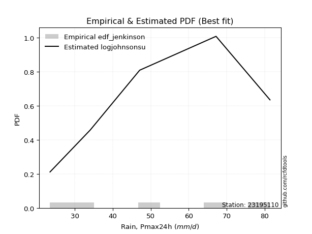</img>

</div>


### 11. EDF Cunnane (1978)

Cunnane´s work in statistical hydrology has focused on the performance and evaluation of different probability distributions (such as GEV, Gumbel, Lognormal) for flood frequency estimation. _b_ is a constant, typically set to 0.4.

<div align="center">


$P=(m-b)/(n+1-2b)$


</div>


**11.1. Empirical values**

<div align="center">

|                | 0                  | 1                   | 2                   | 3                  | 4                  | 5                  |
|:---------------|:-------------------|:--------------------|:--------------------|:-------------------|:-------------------|:-------------------|
| date           | 2023               | 2020                | 2021                | 2025               | 2019               | 2024               |
| x              | 23.5               | 34.1                | 47.1                | 56.2               | 67.2               | 81.4               |
| m              | 1                  | 2                   | 3                   | 4                  | 5                  | 6                  |
| empirical_dist | edf_cunnane        | edf_cunnane         | edf_cunnane         | edf_cunnane        | edf_cunnane        | edf_cunnane        |
| empirical      | 0.0967741935483871 | 0.25806451612903225 | 0.41935483870967744 | 0.5806451612903226 | 0.7419354838709676 | 0.9032258064516128 |
| empirical_tr   | 1.1071428571428572 | 1.3478260869565217  | 1.7222222222222225  | 2.384615384615385  | 3.8749999999999982 | 10.333333333333318 |

</div>


**11.2. Kolmogorov-Smirnov fit test (sorted by Δ)**


<div align="center">

|                | 0                    | 1                    | 2                   | 3                   | 4                   | 5                   | 6                    | 7                   | 8                   | 9                   | 10                  | 11                  | 12                  | 13                  | 14                 | 15                  | 16                  | 17                  | 18                  | 19                  | 20                  | 21                  | 22                 | 23                  | 24                  | 25                  | 26                  | 27                  | 28                  | 29                  | 30                  | 31                  | 32                  | 33                  | 34                  | 35                  | 36                  | 37                  | 38                  | 39                 | 40                  | 41                 | 42                 | 43                  | 44                  | 45                  | 46                  | 47                  | 48                  | 49                  | 50                  | 51                  | 52                  | 53                  | 54                 | 55                  | 56                  | 57                  | 58                  | 59                  | 60                  | 61                  | 62                 | 63                  | 64                 | 65                  | 66                 | 67                  | 68                  | 69                  | 70                  | 71                 | 72                  | 73                  | 74                  | 75                  | 76                  | 77                 | 78                 | 79                 | 80                  | 81                  | 82                  | 83                  | 84                 | 85                 | 86                  | 87                  | 88                  | 89                  | 90                  | 91                 | 92                  | 93                  | 94                 | 95                  | 96                  | 97                  | 98                  | 99                  | 100                 | 101                 | 102                | 103                 | 104                 | 105                 | 106                | 107                 | 108                | 109                | 110                | 111                 | 112                 | 113                | 114                 | 115                 | 116                 | 117                 | 118                | 119                 | 120                 | 121                 | 122                 | 123                | 124                | 125                 | 126                | 127                 | 128                 | 129                 | 130                 | 131                 | 132                | 133                 | 134                | 135                 | 136                 | 137                 | 138                | 139                 | 140                | 141                | 142                 | 143                 | 144                | 145                | 146                 | 147               | 148                | 149                | 150                | 151                | 152                | 153                | 154                | 155                | 156                | 157                | 158                | 159                |
|:---------------|:---------------------|:---------------------|:--------------------|:--------------------|:--------------------|:--------------------|:---------------------|:--------------------|:--------------------|:--------------------|:--------------------|:--------------------|:--------------------|:--------------------|:-------------------|:--------------------|:--------------------|:--------------------|:--------------------|:--------------------|:--------------------|:--------------------|:-------------------|:--------------------|:--------------------|:--------------------|:--------------------|:--------------------|:--------------------|:--------------------|:--------------------|:--------------------|:--------------------|:--------------------|:--------------------|:--------------------|:--------------------|:--------------------|:--------------------|:-------------------|:--------------------|:-------------------|:-------------------|:--------------------|:--------------------|:--------------------|:--------------------|:--------------------|:--------------------|:--------------------|:--------------------|:--------------------|:--------------------|:--------------------|:-------------------|:--------------------|:--------------------|:--------------------|:--------------------|:--------------------|:--------------------|:--------------------|:-------------------|:--------------------|:-------------------|:--------------------|:-------------------|:--------------------|:--------------------|:--------------------|:--------------------|:-------------------|:--------------------|:--------------------|:--------------------|:--------------------|:--------------------|:-------------------|:-------------------|:-------------------|:--------------------|:--------------------|:--------------------|:--------------------|:-------------------|:-------------------|:--------------------|:--------------------|:--------------------|:--------------------|:--------------------|:-------------------|:--------------------|:--------------------|:-------------------|:--------------------|:--------------------|:--------------------|:--------------------|:--------------------|:--------------------|:--------------------|:-------------------|:--------------------|:--------------------|:--------------------|:-------------------|:--------------------|:-------------------|:-------------------|:-------------------|:--------------------|:--------------------|:-------------------|:--------------------|:--------------------|:--------------------|:--------------------|:-------------------|:--------------------|:--------------------|:--------------------|:--------------------|:-------------------|:-------------------|:--------------------|:-------------------|:--------------------|:--------------------|:--------------------|:--------------------|:--------------------|:-------------------|:--------------------|:-------------------|:--------------------|:--------------------|:--------------------|:-------------------|:--------------------|:-------------------|:-------------------|:--------------------|:--------------------|:-------------------|:-------------------|:--------------------|:------------------|:-------------------|:-------------------|:-------------------|:-------------------|:-------------------|:-------------------|:-------------------|:-------------------|:-------------------|:-------------------|:-------------------|:-------------------|
| station        | 23195110             | 23195110             | 23195110            | 23195110            | 23195110            | 23195110            | 23195110             | 23195110            | 23195110            | 23195110            | 23195110            | 23195110            | 23195110            | 23195110            | 23195110           | 23195110            | 23195110            | 23195110            | 23195110            | 23195110            | 23195110            | 23195110            | 23195110           | 23195110            | 23195110            | 23195110            | 23195110            | 23195110            | 23195110            | 23195110            | 23195110            | 23195110            | 23195110            | 23195110            | 23195110            | 23195110            | 23195110            | 23195110            | 23195110            | 23195110           | 23195110            | 23195110           | 23195110           | 23195110            | 23195110            | 23195110            | 23195110            | 23195110            | 23195110            | 23195110            | 23195110            | 23195110            | 23195110            | 23195110            | 23195110           | 23195110            | 23195110            | 23195110            | 23195110            | 23195110            | 23195110            | 23195110            | 23195110           | 23195110            | 23195110           | 23195110            | 23195110           | 23195110            | 23195110            | 23195110            | 23195110            | 23195110           | 23195110            | 23195110            | 23195110            | 23195110            | 23195110            | 23195110           | 23195110           | 23195110           | 23195110            | 23195110            | 23195110            | 23195110            | 23195110           | 23195110           | 23195110            | 23195110            | 23195110            | 23195110            | 23195110            | 23195110           | 23195110            | 23195110            | 23195110           | 23195110            | 23195110            | 23195110            | 23195110            | 23195110            | 23195110            | 23195110            | 23195110           | 23195110            | 23195110            | 23195110            | 23195110           | 23195110            | 23195110           | 23195110           | 23195110           | 23195110            | 23195110            | 23195110           | 23195110            | 23195110            | 23195110            | 23195110            | 23195110           | 23195110            | 23195110            | 23195110            | 23195110            | 23195110           | 23195110           | 23195110            | 23195110           | 23195110            | 23195110            | 23195110            | 23195110            | 23195110            | 23195110           | 23195110            | 23195110           | 23195110            | 23195110            | 23195110            | 23195110           | 23195110            | 23195110           | 23195110           | 23195110            | 23195110            | 23195110           | 23195110           | 23195110            | 23195110          | 23195110           | 23195110           | 23195110           | 23195110           | 23195110           | 23195110           | 23195110           | 23195110           | 23195110           | 23195110           | 23195110           | 23195110           |
| empirical_dist | edf_cunnane          | edf_cunnane          | edf_cunnane         | edf_cunnane         | edf_cunnane         | edf_cunnane         | edf_cunnane          | edf_cunnane         | edf_cunnane         | edf_cunnane         | edf_cunnane         | edf_cunnane         | edf_cunnane         | edf_cunnane         | edf_cunnane        | edf_cunnane         | edf_cunnane         | edf_cunnane         | edf_cunnane         | edf_cunnane         | edf_cunnane         | edf_cunnane         | edf_cunnane        | edf_cunnane         | edf_cunnane         | edf_cunnane         | edf_cunnane         | edf_cunnane         | edf_cunnane         | edf_cunnane         | edf_cunnane         | edf_cunnane         | edf_cunnane         | edf_cunnane         | edf_cunnane         | edf_cunnane         | edf_cunnane         | edf_cunnane         | edf_cunnane         | edf_cunnane        | edf_cunnane         | edf_cunnane        | edf_cunnane        | edf_cunnane         | edf_cunnane         | edf_cunnane         | edf_cunnane         | edf_cunnane         | edf_cunnane         | edf_cunnane         | edf_cunnane         | edf_cunnane         | edf_cunnane         | edf_cunnane         | edf_cunnane        | edf_cunnane         | edf_cunnane         | edf_cunnane         | edf_cunnane         | edf_cunnane         | edf_cunnane         | edf_cunnane         | edf_cunnane        | edf_cunnane         | edf_cunnane        | edf_cunnane         | edf_cunnane        | edf_cunnane         | edf_cunnane         | edf_cunnane         | edf_cunnane         | edf_cunnane        | edf_cunnane         | edf_cunnane         | edf_cunnane         | edf_cunnane         | edf_cunnane         | edf_cunnane        | edf_cunnane        | edf_cunnane        | edf_cunnane         | edf_cunnane         | edf_cunnane         | edf_cunnane         | edf_cunnane        | edf_cunnane        | edf_cunnane         | edf_cunnane         | edf_cunnane         | edf_cunnane         | edf_cunnane         | edf_cunnane        | edf_cunnane         | edf_cunnane         | edf_cunnane        | edf_cunnane         | edf_cunnane         | edf_cunnane         | edf_cunnane         | edf_cunnane         | edf_cunnane         | edf_cunnane         | edf_cunnane        | edf_cunnane         | edf_cunnane         | edf_cunnane         | edf_cunnane        | edf_cunnane         | edf_cunnane        | edf_cunnane        | edf_cunnane        | edf_cunnane         | edf_cunnane         | edf_cunnane        | edf_cunnane         | edf_cunnane         | edf_cunnane         | edf_cunnane         | edf_cunnane        | edf_cunnane         | edf_cunnane         | edf_cunnane         | edf_cunnane         | edf_cunnane        | edf_cunnane        | edf_cunnane         | edf_cunnane        | edf_cunnane         | edf_cunnane         | edf_cunnane         | edf_cunnane         | edf_cunnane         | edf_cunnane        | edf_cunnane         | edf_cunnane        | edf_cunnane         | edf_cunnane         | edf_cunnane         | edf_cunnane        | edf_cunnane         | edf_cunnane        | edf_cunnane        | edf_cunnane         | edf_cunnane         | edf_cunnane        | edf_cunnane        | edf_cunnane         | edf_cunnane       | edf_cunnane        | edf_cunnane        | edf_cunnane        | edf_cunnane        | edf_cunnane        | edf_cunnane        | edf_cunnane        | edf_cunnane        | edf_cunnane        | edf_cunnane        | edf_cunnane        | edf_cunnane        |
| p_dist         | semicircular         | logtrapezoid         | ksone               | anglit              | dweibull            | logpearson3         | rayleigh             | invgauss            | gompertz            | ncf                 | genlogistic         | maxwell             | f                   | invgamma            | weibull_min        | logargus            | betaprime           | logjohnsonsu        | dgamma              | alpha               | foldnorm            | logweibull_min      | logburr12          | kstwobign           | johnsonsu           | rice                | loganglit           | logsemicircular     | erlang              | pearson3            | gamma               | skewnorm            | nct                 | exponnorm           | norm                | crystalball         | truncnorm           | t                   | logf                | logcrystalball     | lognorm             | logt               | logexponnorm       | loggumbel_l         | logfatiguelife      | cosine              | logbetaprime        | logdweibull         | logncf              | burr                | loggamma            | loggamma            | logerlang           | logburr             | logksone           | logmielke           | logrice             | mielke              | gumbel_r            | logalpha            | loginvgamma         | loglogistic         | logdgamma          | logistic            | argus              | gumbel_l            | logcosine          | logloggamma         | kappa3              | bradford            | logskewnorm         | wrapcauchy         | loggompertz         | logtriang           | logbeta             | tukeylambda         | beta                | kappa4             | logarcsine         | halfnorm           | arcsine             | uniform             | loggenhalflogistic  | loginvgauss         | halflogistic       | logmaxwell         | hypsecant           | lognct              | loghypsecant        | truncweibull_min    | moyal               | truncexpon         | lograyleigh         | laplace             | genpareto          | gausshyper          | loggenextreme       | loginvweibull       | vonmises_line       | triang              | loglaplace          | loglaplace          | logkappa4          | logtukeylambda      | loguniform          | logvonmises_line    | loggumbel_r        | loggenexpon         | logloglaplace      | logfoldnorm        | logkstwobign       | loghalfnorm         | lomax               | genexpon           | logbradford         | genhalflogistic     | logwrapcauchy       | logmoyal            | loghalflogistic    | logexponpow         | loglevy_l           | loggausshyper       | halfgennorm         | loglomax           | burr12             | logtruncexpon       | johnsonsb          | logwald             | loggennorm          | gennorm             | levy_l              | logexponweib        | wald               | logtruncnorm        | loggengamma        | trapezoid           | logjohnsonsb        | lognakagami         | logrdist           | genextreme          | logweibull_max     | logkappa3          | logtruncweibull_min | loggenpareto        | invweibull         | nakagami           | fatiguelife         | gengamma          | exponweib          | powerlaw           | logpowerlaw        | weibull_max        | rdist              | truncpareto        | logtruncpareto     | exponpow           | loggenlogistic     | loghalfgennorm     | logvonmises        | vonmises           |
| delta          | 0.034305333967015794 | 0.037835464472916414 | 0.03942227661799824 | 0.04641894175979169 | 0.05387656080695963 | 0.05418015898580289 | 0.060078763808745855 | 0.06097231332297015 | 0.06191004796552382 | 0.06317174216981541 | 0.06385306413979042 | 0.06400183265128134 | 0.06400926376237887 | 0.06458716292505631 | 0.0647320441300201 | 0.06562604545680617 | 0.06587389015079606 | 0.06675685608420012 | 0.06697326153084696 | 0.06765953436338734 | 0.07048940687308491 | 0.07070870057382575 | 0.0715858144431141 | 0.07163521811853368 | 0.07205984824705741 | 0.07210015914765597 | 0.07232777988492423 | 0.07289998706068346 | 0.07306669702200641 | 0.07325399003774424 | 0.07325807944307411 | 0.07372596290990388 | 0.07373491434558968 | 0.07376668447221563 | 0.07376832384932724 | 0.07376833123588683 | 0.07376834598164739 | 0.07377371579955677 | 0.07428700485445183 | 0.0744639891259421 | 0.07446420769814288 | 0.0744651326957747 | 0.0744663656564053 | 0.07549163443173826 | 0.07668373076379587 | 0.07843819696693832 | 0.07848456706399598 | 0.07933712417295696 | 0.07985398747321037 | 0.08004437993657543 | 0.08099311058007524 | 0.08099311058007524 | 0.08195567941368431 | 0.08346143828823194 | 0.0849744256211521 | 0.08505458878050687 | 0.08605092310503876 | 0.08922231947434206 | 0.08922472166713058 | 0.09232605167574809 | 0.09282192026910002 | 0.09283800876295523 | 0.0939130783578179 | 0.09434520890448347 | 0.0954962587181366 | 0.09566145310437318 | 0.0964913729265287 | 0.09667369678208337 | 0.09676107130803523 | 0.09677315119838753 | 0.09677348199595837 | 0.0967741342338425 | 0.09677418328538287 | 0.09677418470857946 | 0.09677419352735683 | 0.09677419354837999 | 0.09677419354838145 | 0.0967741935483821 | 0.0967741935483871 | 0.0967741935483871 | 0.09677419354838723 | 0.09677419354838723 | 0.09680458016157195 | 0.09931111977081603 | 0.1009008601184308 | 0.1043500454800193 | 0.10596073139443354 | 0.10685707415548623 | 0.10700929003691773 | 0.10725815319950133 | 0.10772386762584535 | 0.1132782657057389 | 0.11556513107007099 | 0.11786450396651735 | 0.1188892215907347 | 0.12035985380544861 | 0.12277098931796071 | 0.12411476898950896 | 0.12460119760719068 | 0.12484153760016098 | 0.13502867904430682 | 0.13502867904430682 | 0.1393783544925517 | 0.13956996125691973 | 0.14027704600873042 | 0.14029645619812653 | 0.1409592414084337 | 0.14416892175448454 | 0.1448778074830646 | 0.1450172196991581 | 0.1470772052565546 | 0.14714408258516537 | 0.14818764960208491 | 0.1490426700486756 | 0.14931592333867966 | 0.16484968504510522 | 0.16614214678006567 | 0.16684267610756137 | 0.1714590249962255 | 0.17835464328450162 | 0.19739486789695185 | 0.20272869579724534 | 0.20398233824026463 | 0.2053812326498315 | 0.2075085496340035 | 0.22932756973935525 | 0.2372104968403277 | 0.23885789721971468 | 0.24193548387096775 | 0.24193548387096775 | 0.24368830503050534 | 0.25068241251474027 | 0.2537910356608564 | 0.25806447800782417 | 0.2737311302356677 | 0.27375977883411945 | 0.31655351983247026 | 0.33131944841811184 | 0.3385033033985486 | 0.34351217726732164 | 0.3542246857065374 | 0.3783400351921985 | 0.3875040160375796  | 0.44343686748412636 | 0.4683632754807222 | 0.4808142316040122 | 0.49544117046485403 | 0.500651563246178 | 0.5067855078428467 | 0.5208752529054003 | 0.5681455730883865 | 0.5692865616976022 | 0.5806451611087997 | 0.5957676521562416 | 0.6372217236449514 | 0.6399332401039642 | 0.7419354838709676 | 0.7419354838709676 | 1.0717880351031561 | 12.945347248098464 |
| deltao         | 0.530385761606       | 0.530385761606       | 0.530385761606      | 0.530385761606      | 0.530385761606      | 0.530385761606      | 0.530385761606       | 0.530385761606      | 0.530385761606      | 0.530385761606      | 0.530385761606      | 0.530385761606      | 0.530385761606      | 0.530385761606      | 0.530385761606     | 0.530385761606      | 0.530385761606      | 0.530385761606      | 0.530385761606      | 0.530385761606      | 0.530385761606      | 0.530385761606      | 0.530385761606     | 0.530385761606      | 0.530385761606      | 0.530385761606      | 0.530385761606      | 0.530385761606      | 0.530385761606      | 0.530385761606      | 0.530385761606      | 0.530385761606      | 0.530385761606      | 0.530385761606      | 0.530385761606      | 0.530385761606      | 0.530385761606      | 0.530385761606      | 0.530385761606      | 0.530385761606     | 0.530385761606      | 0.530385761606     | 0.530385761606     | 0.530385761606      | 0.530385761606      | 0.530385761606      | 0.530385761606      | 0.530385761606      | 0.530385761606      | 0.530385761606      | 0.530385761606      | 0.530385761606      | 0.530385761606      | 0.530385761606      | 0.530385761606     | 0.530385761606      | 0.530385761606      | 0.530385761606      | 0.530385761606      | 0.530385761606      | 0.530385761606      | 0.530385761606      | 0.530385761606     | 0.530385761606      | 0.530385761606     | 0.530385761606      | 0.530385761606     | 0.530385761606      | 0.530385761606      | 0.530385761606      | 0.530385761606      | 0.530385761606     | 0.530385761606      | 0.530385761606      | 0.530385761606      | 0.530385761606      | 0.530385761606      | 0.530385761606     | 0.530385761606     | 0.530385761606     | 0.530385761606      | 0.530385761606      | 0.530385761606      | 0.530385761606      | 0.530385761606     | 0.530385761606     | 0.530385761606      | 0.530385761606      | 0.530385761606      | 0.530385761606      | 0.530385761606      | 0.530385761606     | 0.530385761606      | 0.530385761606      | 0.530385761606     | 0.530385761606      | 0.530385761606      | 0.530385761606      | 0.530385761606      | 0.530385761606      | 0.530385761606      | 0.530385761606      | 0.530385761606     | 0.530385761606      | 0.530385761606      | 0.530385761606      | 0.530385761606     | 0.530385761606      | 0.530385761606     | 0.530385761606     | 0.530385761606     | 0.530385761606      | 0.530385761606      | 0.530385761606     | 0.530385761606      | 0.530385761606      | 0.530385761606      | 0.530385761606      | 0.530385761606     | 0.530385761606      | 0.530385761606      | 0.530385761606      | 0.530385761606      | 0.530385761606     | 0.530385761606     | 0.530385761606      | 0.530385761606     | 0.530385761606      | 0.530385761606      | 0.530385761606      | 0.530385761606      | 0.530385761606      | 0.530385761606     | 0.530385761606      | 0.530385761606     | 0.530385761606      | 0.530385761606      | 0.530385761606      | 0.530385761606     | 0.530385761606      | 0.530385761606     | 0.530385761606     | 0.530385761606      | 0.530385761606      | 0.530385761606     | 0.530385761606     | 0.530385761606      | 0.530385761606    | 0.530385761606     | 0.530385761606     | 0.530385761606     | 0.530385761606     | 0.530385761606     | 0.530385761606     | 0.530385761606     | 0.530385761606     | 0.530385761606     | 0.530385761606     | 0.530385761606     | 0.530385761606     |
| eval           | Δo > Δ               | Δo > Δ               | Δo > Δ              | Δo > Δ              | Δo > Δ              | Δo > Δ              | Δo > Δ               | Δo > Δ              | Δo > Δ              | Δo > Δ              | Δo > Δ              | Δo > Δ              | Δo > Δ              | Δo > Δ              | Δo > Δ             | Δo > Δ              | Δo > Δ              | Δo > Δ              | Δo > Δ              | Δo > Δ              | Δo > Δ              | Δo > Δ              | Δo > Δ             | Δo > Δ              | Δo > Δ              | Δo > Δ              | Δo > Δ              | Δo > Δ              | Δo > Δ              | Δo > Δ              | Δo > Δ              | Δo > Δ              | Δo > Δ              | Δo > Δ              | Δo > Δ              | Δo > Δ              | Δo > Δ              | Δo > Δ              | Δo > Δ              | Δo > Δ             | Δo > Δ              | Δo > Δ             | Δo > Δ             | Δo > Δ              | Δo > Δ              | Δo > Δ              | Δo > Δ              | Δo > Δ              | Δo > Δ              | Δo > Δ              | Δo > Δ              | Δo > Δ              | Δo > Δ              | Δo > Δ              | Δo > Δ             | Δo > Δ              | Δo > Δ              | Δo > Δ              | Δo > Δ              | Δo > Δ              | Δo > Δ              | Δo > Δ              | Δo > Δ             | Δo > Δ              | Δo > Δ             | Δo > Δ              | Δo > Δ             | Δo > Δ              | Δo > Δ              | Δo > Δ              | Δo > Δ              | Δo > Δ             | Δo > Δ              | Δo > Δ              | Δo > Δ              | Δo > Δ              | Δo > Δ              | Δo > Δ             | Δo > Δ             | Δo > Δ             | Δo > Δ              | Δo > Δ              | Δo > Δ              | Δo > Δ              | Δo > Δ             | Δo > Δ             | Δo > Δ              | Δo > Δ              | Δo > Δ              | Δo > Δ              | Δo > Δ              | Δo > Δ             | Δo > Δ              | Δo > Δ              | Δo > Δ             | Δo > Δ              | Δo > Δ              | Δo > Δ              | Δo > Δ              | Δo > Δ              | Δo > Δ              | Δo > Δ              | Δo > Δ             | Δo > Δ              | Δo > Δ              | Δo > Δ              | Δo > Δ             | Δo > Δ              | Δo > Δ             | Δo > Δ             | Δo > Δ             | Δo > Δ              | Δo > Δ              | Δo > Δ             | Δo > Δ              | Δo > Δ              | Δo > Δ              | Δo > Δ              | Δo > Δ             | Δo > Δ              | Δo > Δ              | Δo > Δ              | Δo > Δ              | Δo > Δ             | Δo > Δ             | Δo > Δ              | Δo > Δ             | Δo > Δ              | Δo > Δ              | Δo > Δ              | Δo > Δ              | Δo > Δ              | Δo > Δ             | Δo > Δ              | Δo > Δ             | Δo > Δ              | Δo > Δ              | Δo > Δ              | Δo > Δ             | Δo > Δ              | Δo > Δ             | Δo > Δ             | Δo > Δ              | Δo > Δ              | Δo > Δ             | Δo > Δ             | Δo > Δ              | Δo > Δ            | Δo > Δ             | Δo > Δ             | Δo <= Δ            | Δo <= Δ            | Δo <= Δ            | Δo <= Δ            | Δo <= Δ            | Δo <= Δ            | Δo <= Δ            | Δo <= Δ            | Δo <= Δ            | Δo <= Δ            |
| fit            | 1                    | 1                    | 1                   | 1                   | 1                   | 1                   | 1                    | 1                   | 1                   | 1                   | 1                   | 1                   | 1                   | 1                   | 1                  | 1                   | 1                   | 1                   | 1                   | 1                   | 1                   | 1                   | 1                  | 1                   | 1                   | 1                   | 1                   | 1                   | 1                   | 1                   | 1                   | 1                   | 1                   | 1                   | 1                   | 1                   | 1                   | 1                   | 1                   | 1                  | 1                   | 1                  | 1                  | 1                   | 1                   | 1                   | 1                   | 1                   | 1                   | 1                   | 1                   | 1                   | 1                   | 1                   | 1                  | 1                   | 1                   | 1                   | 1                   | 1                   | 1                   | 1                   | 1                  | 1                   | 1                  | 1                   | 1                  | 1                   | 1                   | 1                   | 1                   | 1                  | 1                   | 1                   | 1                   | 1                   | 1                   | 1                  | 1                  | 1                  | 1                   | 1                   | 1                   | 1                   | 1                  | 1                  | 1                   | 1                   | 1                   | 1                   | 1                   | 1                  | 1                   | 1                   | 1                  | 1                   | 1                   | 1                   | 1                   | 1                   | 1                   | 1                   | 1                  | 1                   | 1                   | 1                   | 1                  | 1                   | 1                  | 1                  | 1                  | 1                   | 1                   | 1                  | 1                   | 1                   | 1                   | 1                   | 1                  | 1                   | 1                   | 1                   | 1                   | 1                  | 1                  | 1                   | 1                  | 1                   | 1                   | 1                   | 1                   | 1                   | 1                  | 1                   | 1                  | 1                   | 1                   | 1                   | 1                  | 1                   | 1                  | 1                  | 1                   | 1                   | 1                  | 1                  | 1                   | 1                 | 1                  | 1                  | 0                  | 0                  | 0                  | 0                  | 0                  | 0                  | 0                  | 0                  | 0                  | 0                  |
| n              | 6                    | 6                    | 6                   | 6                   | 6                   | 6                   | 6                    | 6                   | 6                   | 6                   | 6                   | 6                   | 6                   | 6                   | 6                  | 6                   | 6                   | 6                   | 6                   | 6                   | 6                   | 6                   | 6                  | 6                   | 6                   | 6                   | 6                   | 6                   | 6                   | 6                   | 6                   | 6                   | 6                   | 6                   | 6                   | 6                   | 6                   | 6                   | 6                   | 6                  | 6                   | 6                  | 6                  | 6                   | 6                   | 6                   | 6                   | 6                   | 6                   | 6                   | 6                   | 6                   | 6                   | 6                   | 6                  | 6                   | 6                   | 6                   | 6                   | 6                   | 6                   | 6                   | 6                  | 6                   | 6                  | 6                   | 6                  | 6                   | 6                   | 6                   | 6                   | 6                  | 6                   | 6                   | 6                   | 6                   | 6                   | 6                  | 6                  | 6                  | 6                   | 6                   | 6                   | 6                   | 6                  | 6                  | 6                   | 6                   | 6                   | 6                   | 6                   | 6                  | 6                   | 6                   | 6                  | 6                   | 6                   | 6                   | 6                   | 6                   | 6                   | 6                   | 6                  | 6                   | 6                   | 6                   | 6                  | 6                   | 6                  | 6                  | 6                  | 6                   | 6                   | 6                  | 6                   | 6                   | 6                   | 6                   | 6                  | 6                   | 6                   | 6                   | 6                   | 6                  | 6                  | 6                   | 6                  | 6                   | 6                   | 6                   | 6                   | 6                   | 6                  | 6                   | 6                  | 6                   | 6                   | 6                   | 6                  | 6                   | 6                  | 6                  | 6                   | 6                   | 6                  | 6                  | 6                   | 6                 | 6                  | 6                  | 6                  | 6                  | 6                  | 6                  | 6                  | 6                  | 6                  | 6                  | 6                  | 6                  |
| best_fit       | 1                    | 0                    | 0                   | 0                   | 0                   | 0                   | 0                    | 0                   | 0                   | 0                   | 0                   | 0                   | 0                   | 0                   | 0                  | 0                   | 0                   | 0                   | 0                   | 0                   | 0                   | 0                   | 0                  | 0                   | 0                   | 0                   | 0                   | 0                   | 0                   | 0                   | 0                   | 0                   | 0                   | 0                   | 0                   | 0                   | 0                   | 0                   | 0                   | 0                  | 0                   | 0                  | 0                  | 0                   | 0                   | 0                   | 0                   | 0                   | 0                   | 0                   | 0                   | 0                   | 0                   | 0                   | 0                  | 0                   | 0                   | 0                   | 0                   | 0                   | 0                   | 0                   | 0                  | 0                   | 0                  | 0                   | 0                  | 0                   | 0                   | 0                   | 0                   | 0                  | 0                   | 0                   | 0                   | 0                   | 0                   | 0                  | 0                  | 0                  | 0                   | 0                   | 0                   | 0                   | 0                  | 0                  | 0                   | 0                   | 0                   | 0                   | 0                   | 0                  | 0                   | 0                   | 0                  | 0                   | 0                   | 0                   | 0                   | 0                   | 0                   | 0                   | 0                  | 0                   | 0                   | 0                   | 0                  | 0                   | 0                  | 0                  | 0                  | 0                   | 0                   | 0                  | 0                   | 0                   | 0                   | 0                   | 0                  | 0                   | 0                   | 0                   | 0                   | 0                  | 0                  | 0                   | 0                  | 0                   | 0                   | 0                   | 0                   | 0                   | 0                  | 0                   | 0                  | 0                   | 0                   | 0                   | 0                  | 0                   | 0                  | 0                  | 0                   | 0                   | 0                  | 0                  | 0                   | 0                 | 0                  | 0                  | 0                  | 0                  | 0                  | 0                  | 0                  | 0                  | 0                  | 0                  | 0                  | 0                  |
| best_fit_sort  | 1                    | 2                    | 3                   | 4                   | 5                   | 6                   | 7                    | 8                   | 9                   | 10                  | 11                  | 12                  | 13                  | 14                  | 15                 | 16                  | 17                  | 18                  | 19                  | 20                  | 21                  | 22                  | 23                 | 24                  | 25                  | 26                  | 27                  | 28                  | 29                  | 30                  | 31                  | 32                  | 33                  | 34                  | 35                  | 36                  | 37                  | 38                  | 39                  | 40                 | 41                  | 42                 | 43                 | 44                  | 45                  | 46                  | 47                  | 48                  | 49                  | 50                  | 51                  | 52                  | 53                  | 54                  | 55                 | 56                  | 57                  | 58                  | 59                  | 60                  | 61                  | 62                  | 63                 | 64                  | 65                 | 66                  | 67                 | 68                  | 69                  | 70                  | 71                  | 72                 | 73                  | 74                  | 75                  | 76                  | 77                  | 78                 | 79                 | 80                 | 81                  | 82                  | 83                  | 84                  | 85                 | 86                 | 87                  | 88                  | 89                  | 90                  | 91                  | 92                 | 93                  | 94                  | 95                 | 96                  | 97                  | 98                  | 99                  | 100                 | 101                 | 102                 | 103                | 104                 | 105                 | 106                 | 107                | 108                 | 109                | 110                | 111                | 112                 | 113                 | 114                | 115                 | 116                 | 117                 | 118                 | 119                | 120                 | 121                 | 122                 | 123                 | 124                | 125                | 126                 | 127                | 128                 | 129                 | 130                 | 131                 | 132                 | 133                | 134                 | 135                | 136                 | 137                 | 138                 | 139                | 140                 | 141                | 142                | 143                 | 144                 | 145                | 146                | 147                 | 148               | 149                | 150                | 151                | 152                | 153                | 154                | 155                | 156                | 157                | 158                | 159                | 160                |

</div>


**11.3. Best fit**

<div align="center">

|   id |   station | empirical_dist   | p_dist       |     delta |   deltao | eval   |   fit |   n |   best_fit |   best_fit_sort |
|-----:|----------:|:-----------------|:-------------|----------:|---------:|:-------|------:|----:|-----------:|----------------:|
|    0 |  23195110 | edf_cunnane      | semicircular | 0.0343053 | 0.530386 | Δo > Δ |     1 |   6 |          1 |               1 |

</div>


<div align="center">

</img></img>

</div>


### 12. EDF Adamowski (1981)

The Adamowski formula in hydrology refers to a specific plotting position formula used for estimating the non-parametric empirical distribution of hydrological events (like flood peaks) to calculate their return periods. This formula provides an alternative to traditional parametric methods (like the Gumbel or Log Pearson Type III distributions). 

<div align="center">


$P=(m-0.25)/(n+0.5)$


</div>


**12.1. Empirical values**

<div align="center">

|                | 0                   | 1                  | 2                  | 3                  | 4                  | 5                  |
|:---------------|:--------------------|:-------------------|:-------------------|:-------------------|:-------------------|:-------------------|
| date           | 2023                | 2020               | 2021               | 2025               | 2019               | 2024               |
| x              | 23.5                | 34.1               | 47.1               | 56.2               | 67.2               | 81.4               |
| m              | 1                   | 2                  | 3                  | 4                  | 5                  | 6                  |
| empirical_dist | edf_adamowski       | edf_adamowski      | edf_adamowski      | edf_adamowski      | edf_adamowski      | edf_adamowski      |
| empirical      | 0.11538461538461539 | 0.2692307692307692 | 0.4230769230769231 | 0.5769230769230769 | 0.7307692307692307 | 0.8846153846153846 |
| empirical_tr   | 1.1304347826086958  | 1.3684210526315788 | 1.7333333333333334 | 2.3636363636363633 | 3.7142857142857135 | 8.666666666666664  |

</div>


**12.2. Kolmogorov-Smirnov fit test (sorted by Δ)**


<div align="center">

|                | 0                    | 1                  | 2                   | 3                   | 4                  | 5                   | 6                   | 7                   | 8                   | 9                   | 10                  | 11                  | 12                  | 13                  | 14                  | 15                  | 16                  | 17                  | 18                  | 19                  | 20                  | 21                  | 22                  | 23                  | 24                  | 25                 | 26                  | 27                  | 28                  | 29                  | 30                  | 31                  | 32                  | 33                  | 34                  | 35                 | 36                 | 37                  | 38                  | 39                  | 40                  | 41                  | 42                  | 43                  | 44                 | 45                  | 46                 | 47                  | 48                  | 49                  | 50                  | 51                  | 52                  | 53                  | 54                  | 55                  | 56                  | 57                  | 58                  | 59                  | 60                  | 61                  | 62                  | 63                  | 64                 | 65                  | 66                  | 67                  | 68                  | 69                  | 70                  | 71                  | 72                  | 73                  | 74                  | 75                  | 76                 | 77                  | 78                  | 79                  | 80                  | 81                  | 82                  | 83                  | 84                  | 85                  | 86                 | 87                  | 88                  | 89                  | 90                  | 91                  | 92                  | 93                  | 94                  | 95                  | 96                  | 97                  | 98                  | 99                  | 100                 | 101                | 102                 | 103                | 104                | 105                 | 106                 | 107                | 108                 | 109                 | 110                 | 111                 | 112                 | 113                 | 114                | 115                 | 116                 | 117                 | 118                 | 119               | 120                 | 121                | 122               | 123                 | 124                 | 125                 | 126                 | 127                 | 128                 | 129                 | 130                 | 131                 | 132                | 133                 | 134                 | 135                | 136                 | 137                 | 138                 | 139                | 140                | 141                | 142                 | 143                 | 144               | 145                | 146                 | 147               | 148                 | 149                | 150                | 151                | 152                | 153                | 154                | 155                | 156                | 157                | 158               | 159                |
|:---------------|:---------------------|:-------------------|:--------------------|:--------------------|:-------------------|:--------------------|:--------------------|:--------------------|:--------------------|:--------------------|:--------------------|:--------------------|:--------------------|:--------------------|:--------------------|:--------------------|:--------------------|:--------------------|:--------------------|:--------------------|:--------------------|:--------------------|:--------------------|:--------------------|:--------------------|:-------------------|:--------------------|:--------------------|:--------------------|:--------------------|:--------------------|:--------------------|:--------------------|:--------------------|:--------------------|:-------------------|:-------------------|:--------------------|:--------------------|:--------------------|:--------------------|:--------------------|:--------------------|:--------------------|:-------------------|:--------------------|:-------------------|:--------------------|:--------------------|:--------------------|:--------------------|:--------------------|:--------------------|:--------------------|:--------------------|:--------------------|:--------------------|:--------------------|:--------------------|:--------------------|:--------------------|:--------------------|:--------------------|:--------------------|:-------------------|:--------------------|:--------------------|:--------------------|:--------------------|:--------------------|:--------------------|:--------------------|:--------------------|:--------------------|:--------------------|:--------------------|:-------------------|:--------------------|:--------------------|:--------------------|:--------------------|:--------------------|:--------------------|:--------------------|:--------------------|:--------------------|:-------------------|:--------------------|:--------------------|:--------------------|:--------------------|:--------------------|:--------------------|:--------------------|:--------------------|:--------------------|:--------------------|:--------------------|:--------------------|:--------------------|:--------------------|:-------------------|:--------------------|:-------------------|:-------------------|:--------------------|:--------------------|:-------------------|:--------------------|:--------------------|:--------------------|:--------------------|:--------------------|:--------------------|:-------------------|:--------------------|:--------------------|:--------------------|:--------------------|:------------------|:--------------------|:-------------------|:------------------|:--------------------|:--------------------|:--------------------|:--------------------|:--------------------|:--------------------|:--------------------|:--------------------|:--------------------|:-------------------|:--------------------|:--------------------|:-------------------|:--------------------|:--------------------|:--------------------|:-------------------|:-------------------|:-------------------|:--------------------|:--------------------|:------------------|:-------------------|:--------------------|:------------------|:--------------------|:-------------------|:-------------------|:-------------------|:-------------------|:-------------------|:-------------------|:-------------------|:-------------------|:-------------------|:------------------|:-------------------|
| station        | 23195110             | 23195110           | 23195110            | 23195110            | 23195110           | 23195110            | 23195110            | 23195110            | 23195110            | 23195110            | 23195110            | 23195110            | 23195110            | 23195110            | 23195110            | 23195110            | 23195110            | 23195110            | 23195110            | 23195110            | 23195110            | 23195110            | 23195110            | 23195110            | 23195110            | 23195110           | 23195110            | 23195110            | 23195110            | 23195110            | 23195110            | 23195110            | 23195110            | 23195110            | 23195110            | 23195110           | 23195110           | 23195110            | 23195110            | 23195110            | 23195110            | 23195110            | 23195110            | 23195110            | 23195110           | 23195110            | 23195110           | 23195110            | 23195110            | 23195110            | 23195110            | 23195110            | 23195110            | 23195110            | 23195110            | 23195110            | 23195110            | 23195110            | 23195110            | 23195110            | 23195110            | 23195110            | 23195110            | 23195110            | 23195110           | 23195110            | 23195110            | 23195110            | 23195110            | 23195110            | 23195110            | 23195110            | 23195110            | 23195110            | 23195110            | 23195110            | 23195110           | 23195110            | 23195110            | 23195110            | 23195110            | 23195110            | 23195110            | 23195110            | 23195110            | 23195110            | 23195110           | 23195110            | 23195110            | 23195110            | 23195110            | 23195110            | 23195110            | 23195110            | 23195110            | 23195110            | 23195110            | 23195110            | 23195110            | 23195110            | 23195110            | 23195110           | 23195110            | 23195110           | 23195110           | 23195110            | 23195110            | 23195110           | 23195110            | 23195110            | 23195110            | 23195110            | 23195110            | 23195110            | 23195110           | 23195110            | 23195110            | 23195110            | 23195110            | 23195110          | 23195110            | 23195110           | 23195110          | 23195110            | 23195110            | 23195110            | 23195110            | 23195110            | 23195110            | 23195110            | 23195110            | 23195110            | 23195110           | 23195110            | 23195110            | 23195110           | 23195110            | 23195110            | 23195110            | 23195110           | 23195110           | 23195110           | 23195110            | 23195110            | 23195110          | 23195110           | 23195110            | 23195110          | 23195110            | 23195110           | 23195110           | 23195110           | 23195110           | 23195110           | 23195110           | 23195110           | 23195110           | 23195110           | 23195110          | 23195110           |
| empirical_dist | edf_adamowski        | edf_adamowski      | edf_adamowski       | edf_adamowski       | edf_adamowski      | edf_adamowski       | edf_adamowski       | edf_adamowski       | edf_adamowski       | edf_adamowski       | edf_adamowski       | edf_adamowski       | edf_adamowski       | edf_adamowski       | edf_adamowski       | edf_adamowski       | edf_adamowski       | edf_adamowski       | edf_adamowski       | edf_adamowski       | edf_adamowski       | edf_adamowski       | edf_adamowski       | edf_adamowski       | edf_adamowski       | edf_adamowski      | edf_adamowski       | edf_adamowski       | edf_adamowski       | edf_adamowski       | edf_adamowski       | edf_adamowski       | edf_adamowski       | edf_adamowski       | edf_adamowski       | edf_adamowski      | edf_adamowski      | edf_adamowski       | edf_adamowski       | edf_adamowski       | edf_adamowski       | edf_adamowski       | edf_adamowski       | edf_adamowski       | edf_adamowski      | edf_adamowski       | edf_adamowski      | edf_adamowski       | edf_adamowski       | edf_adamowski       | edf_adamowski       | edf_adamowski       | edf_adamowski       | edf_adamowski       | edf_adamowski       | edf_adamowski       | edf_adamowski       | edf_adamowski       | edf_adamowski       | edf_adamowski       | edf_adamowski       | edf_adamowski       | edf_adamowski       | edf_adamowski       | edf_adamowski      | edf_adamowski       | edf_adamowski       | edf_adamowski       | edf_adamowski       | edf_adamowski       | edf_adamowski       | edf_adamowski       | edf_adamowski       | edf_adamowski       | edf_adamowski       | edf_adamowski       | edf_adamowski      | edf_adamowski       | edf_adamowski       | edf_adamowski       | edf_adamowski       | edf_adamowski       | edf_adamowski       | edf_adamowski       | edf_adamowski       | edf_adamowski       | edf_adamowski      | edf_adamowski       | edf_adamowski       | edf_adamowski       | edf_adamowski       | edf_adamowski       | edf_adamowski       | edf_adamowski       | edf_adamowski       | edf_adamowski       | edf_adamowski       | edf_adamowski       | edf_adamowski       | edf_adamowski       | edf_adamowski       | edf_adamowski      | edf_adamowski       | edf_adamowski      | edf_adamowski      | edf_adamowski       | edf_adamowski       | edf_adamowski      | edf_adamowski       | edf_adamowski       | edf_adamowski       | edf_adamowski       | edf_adamowski       | edf_adamowski       | edf_adamowski      | edf_adamowski       | edf_adamowski       | edf_adamowski       | edf_adamowski       | edf_adamowski     | edf_adamowski       | edf_adamowski      | edf_adamowski     | edf_adamowski       | edf_adamowski       | edf_adamowski       | edf_adamowski       | edf_adamowski       | edf_adamowski       | edf_adamowski       | edf_adamowski       | edf_adamowski       | edf_adamowski      | edf_adamowski       | edf_adamowski       | edf_adamowski      | edf_adamowski       | edf_adamowski       | edf_adamowski       | edf_adamowski      | edf_adamowski      | edf_adamowski      | edf_adamowski       | edf_adamowski       | edf_adamowski     | edf_adamowski      | edf_adamowski       | edf_adamowski     | edf_adamowski       | edf_adamowski      | edf_adamowski      | edf_adamowski      | edf_adamowski      | edf_adamowski      | edf_adamowski      | edf_adamowski      | edf_adamowski      | edf_adamowski      | edf_adamowski     | edf_adamowski      |
| p_dist         | semicircular         | logtrapezoid       | anglit              | ksone               | dweibull           | logpearson3         | genlogistic         | rayleigh            | invgauss            | loganglit           | gompertz            | ncf                 | maxwell             | f                   | kstwobign           | invgamma            | betaprime           | logjohnsonsu        | logf                | dgamma              | logcrystalball      | lognorm             | logt                | logexponnorm        | alpha               | logbetaprime       | weibull_min         | logburr             | logsemicircular     | logfatiguelife      | logncf              | foldnorm            | logweibull_min      | logburr12           | logargus            | loggamma           | loggamma           | johnsonsu           | rice                | erlang              | pearson3            | gamma               | skewnorm            | nct                 | exponnorm          | norm                | crystalball        | truncnorm           | t                   | logerlang           | logrice             | loggumbel_l         | cosine              | logdweibull         | logalpha            | loginvgamma         | logmielke           | loginvgauss         | loglogistic         | logcosine           | burr                | gumbel_r            | logmaxwell          | mielke              | lognct             | logksone            | logdgamma           | logistic            | argus               | gumbel_l            | loghypsecant        | lograyleigh         | logloggamma         | kappa3              | bradford            | logskewnorm         | wrapcauchy         | truncexpon          | loggompertz         | logtriang           | truncweibull_min    | logbeta             | genpareto           | tukeylambda         | beta                | loggenhalflogistic  | kappa4             | halflogistic        | halfnorm            | logarcsine          | arcsine             | uniform             | gausshyper          | hypsecant           | moyal               | loggenextreme       | loginvweibull       | triang              | laplace             | logkappa4           | vonmises_line       | logtukeylambda     | loguniform          | logvonmises_line   | loggumbel_r        | loglaplace          | loglaplace          | loggenexpon        | logfoldnorm         | logkstwobign        | loghalfnorm         | lomax               | genexpon            | logbradford         | logwrapcauchy      | logloglaplace       | genhalflogistic     | logmoyal            | loghalflogistic     | logexponpow       | loglevy_l           | loggausshyper      | halfgennorm       | loglomax            | burr12              | levy_l              | logtruncexpon       | johnsonsb           | gennorm             | loggennorm          | logwald             | logexponweib        | wald               | logtruncnorm        | loggengamma         | trapezoid          | logjohnsonsb        | logrdist            | genextreme          | lognakagami        | logweibull_max     | logkappa3          | logtruncweibull_min | loggenpareto        | invweibull        | nakagami           | fatiguelife         | gengamma          | exponweib           | powerlaw           | logpowerlaw        | weibull_max        | rdist              | truncpareto        | logtruncpareto     | exponpow           | loggenlogistic     | loghalfgennorm     | logvonmises       | vonmises           |
| delta          | 0.050163004937701317 | 0.0564458863091446 | 0.05758519486152866 | 0.05803269845422643 | 0.0650428139086966 | 0.06534641208753986 | 0.06757514850703616 | 0.07124501691048282 | 0.07213856642470712 | 0.07302438746380495 | 0.07307630106726079 | 0.07433799527155238 | 0.07516808575301831 | 0.07517551686411583 | 0.07535730248577943 | 0.07575341602679328 | 0.07704014325253303 | 0.07792310918593709 | 0.07800908922169758 | 0.07813951463258392 | 0.07818607349318785 | 0.07818629206538863 | 0.07818721706302045 | 0.07818845002365105 | 0.07882578746512431 | 0.0794195184471278 | 0.07954640751085262 | 0.07973935392098619 | 0.07982121582744525 | 0.08040581513104161 | 0.08049760816614016 | 0.08165565997482188 | 0.08187495367556272 | 0.08275206754485107 | 0.08306433927442325 | 0.0832161555148686 | 0.0832161555148686 | 0.08322610134879438 | 0.08326641224939293 | 0.08423295012374338 | 0.08442024313948121 | 0.08442433254481108 | 0.08489221601164085 | 0.08490116744732665 | 0.0849329375739526 | 0.08493457695106421 | 0.0849345843376238 | 0.08493459908338435 | 0.08493996890129374 | 0.08567776378093006 | 0.08575225339336745 | 0.08665788753347523 | 0.08960445006867529 | 0.09050337727469393 | 0.09166503128579429 | 0.09292168211406737 | 0.09383758131622355 | 0.09558903540357039 | 0.09656009313020097 | 0.09794587730316673 | 0.09865480177280361 | 0.10039097476886755 | 0.10062796111277367 | 0.10214730584167131 | 0.1031349897882406 | 0.10358484745738039 | 0.10507933145955486 | 0.10551146200622044 | 0.10666251181987357 | 0.10682770620611015 | 0.11073137440416347 | 0.11184304670282535 | 0.11528411861831156 | 0.11537149314426352 | 0.11538357303461583 | 0.11538390383218655 | 0.1153845560700708 | 0.11538456168479391 | 0.11538460512161117 | 0.11538460654480764 | 0.11538461523993992 | 0.11538461536358502 | 0.11538461537866018 | 0.11538461538460829 | 0.11538461538460974 | 0.11538461538460998 | 0.1153846153846104 | 0.11538461538461539 | 0.11538461538461539 | 0.11538461538461539 | 0.11538461538461542 | 0.11538461538461542 | 0.11663776943820298 | 0.11712698449617051 | 0.11889012072758232 | 0.11904890495071496 | 0.12039268462226332 | 0.12111945323291523 | 0.12903075706825431 | 0.13565627012530607 | 0.13576745070892765 | 0.1358478768896741 | 0.13655496164148478 | 0.1365743718308809 | 0.1373405887338448 | 0.13875076341155257 | 0.13875076341155257 | 0.1404468373872389 | 0.14129513533191246 | 0.14335512088930896 | 0.14342199821791973 | 0.14446556523483928 | 0.14532058568142997 | 0.14559383897143402 | 0.1549758936783287 | 0.15604406058480158 | 0.16112760067785947 | 0.16312059174031573 | 0.16773694062897987 | 0.174632558917256 | 0.17878444606072355 | 0.1990066114299997 | 0.200260253873019 | 0.20165914828258585 | 0.20378646526675787 | 0.22507788319427705 | 0.22560548537210962 | 0.22604424373859072 | 0.23076923076923078 | 0.23076923076923078 | 0.23513581285246904 | 0.24696032814749463 | 0.2649572887625934 | 0.26923073110956114 | 0.27000904586842206 | 0.2700376944668737 | 0.30538726673073335 | 0.31989288156232043 | 0.32490175543109345 | 0.3275973640508662 | 0.3430584326048005 | 0.3597296133559703 | 0.383781931670334   | 0.42482644564789807 | 0.449752853644494 | 0.4770921472367666 | 0.48427491736311706 | 0.489485310144441 | 0.49561925474110974 | 0.5097089998036632 | 0.5569793199866495 | 0.5581203085958653 | 0.5769230767415541 | 0.5846013990545047 | 0.6260554705432144 | 0.6287669870022272 | 0.7307692307692307 | 0.7307692307692307 | 1.075510119470402 | 12.963957669934691 |
| deltao         | 0.530385761606       | 0.530385761606     | 0.530385761606      | 0.530385761606      | 0.530385761606     | 0.530385761606      | 0.530385761606      | 0.530385761606      | 0.530385761606      | 0.530385761606      | 0.530385761606      | 0.530385761606      | 0.530385761606      | 0.530385761606      | 0.530385761606      | 0.530385761606      | 0.530385761606      | 0.530385761606      | 0.530385761606      | 0.530385761606      | 0.530385761606      | 0.530385761606      | 0.530385761606      | 0.530385761606      | 0.530385761606      | 0.530385761606     | 0.530385761606      | 0.530385761606      | 0.530385761606      | 0.530385761606      | 0.530385761606      | 0.530385761606      | 0.530385761606      | 0.530385761606      | 0.530385761606      | 0.530385761606     | 0.530385761606     | 0.530385761606      | 0.530385761606      | 0.530385761606      | 0.530385761606      | 0.530385761606      | 0.530385761606      | 0.530385761606      | 0.530385761606     | 0.530385761606      | 0.530385761606     | 0.530385761606      | 0.530385761606      | 0.530385761606      | 0.530385761606      | 0.530385761606      | 0.530385761606      | 0.530385761606      | 0.530385761606      | 0.530385761606      | 0.530385761606      | 0.530385761606      | 0.530385761606      | 0.530385761606      | 0.530385761606      | 0.530385761606      | 0.530385761606      | 0.530385761606      | 0.530385761606     | 0.530385761606      | 0.530385761606      | 0.530385761606      | 0.530385761606      | 0.530385761606      | 0.530385761606      | 0.530385761606      | 0.530385761606      | 0.530385761606      | 0.530385761606      | 0.530385761606      | 0.530385761606     | 0.530385761606      | 0.530385761606      | 0.530385761606      | 0.530385761606      | 0.530385761606      | 0.530385761606      | 0.530385761606      | 0.530385761606      | 0.530385761606      | 0.530385761606     | 0.530385761606      | 0.530385761606      | 0.530385761606      | 0.530385761606      | 0.530385761606      | 0.530385761606      | 0.530385761606      | 0.530385761606      | 0.530385761606      | 0.530385761606      | 0.530385761606      | 0.530385761606      | 0.530385761606      | 0.530385761606      | 0.530385761606     | 0.530385761606      | 0.530385761606     | 0.530385761606     | 0.530385761606      | 0.530385761606      | 0.530385761606     | 0.530385761606      | 0.530385761606      | 0.530385761606      | 0.530385761606      | 0.530385761606      | 0.530385761606      | 0.530385761606     | 0.530385761606      | 0.530385761606      | 0.530385761606      | 0.530385761606      | 0.530385761606    | 0.530385761606      | 0.530385761606     | 0.530385761606    | 0.530385761606      | 0.530385761606      | 0.530385761606      | 0.530385761606      | 0.530385761606      | 0.530385761606      | 0.530385761606      | 0.530385761606      | 0.530385761606      | 0.530385761606     | 0.530385761606      | 0.530385761606      | 0.530385761606     | 0.530385761606      | 0.530385761606      | 0.530385761606      | 0.530385761606     | 0.530385761606     | 0.530385761606     | 0.530385761606      | 0.530385761606      | 0.530385761606    | 0.530385761606     | 0.530385761606      | 0.530385761606    | 0.530385761606      | 0.530385761606     | 0.530385761606     | 0.530385761606     | 0.530385761606     | 0.530385761606     | 0.530385761606     | 0.530385761606     | 0.530385761606     | 0.530385761606     | 0.530385761606    | 0.530385761606     |
| eval           | Δo > Δ               | Δo > Δ             | Δo > Δ              | Δo > Δ              | Δo > Δ             | Δo > Δ              | Δo > Δ              | Δo > Δ              | Δo > Δ              | Δo > Δ              | Δo > Δ              | Δo > Δ              | Δo > Δ              | Δo > Δ              | Δo > Δ              | Δo > Δ              | Δo > Δ              | Δo > Δ              | Δo > Δ              | Δo > Δ              | Δo > Δ              | Δo > Δ              | Δo > Δ              | Δo > Δ              | Δo > Δ              | Δo > Δ             | Δo > Δ              | Δo > Δ              | Δo > Δ              | Δo > Δ              | Δo > Δ              | Δo > Δ              | Δo > Δ              | Δo > Δ              | Δo > Δ              | Δo > Δ             | Δo > Δ             | Δo > Δ              | Δo > Δ              | Δo > Δ              | Δo > Δ              | Δo > Δ              | Δo > Δ              | Δo > Δ              | Δo > Δ             | Δo > Δ              | Δo > Δ             | Δo > Δ              | Δo > Δ              | Δo > Δ              | Δo > Δ              | Δo > Δ              | Δo > Δ              | Δo > Δ              | Δo > Δ              | Δo > Δ              | Δo > Δ              | Δo > Δ              | Δo > Δ              | Δo > Δ              | Δo > Δ              | Δo > Δ              | Δo > Δ              | Δo > Δ              | Δo > Δ             | Δo > Δ              | Δo > Δ              | Δo > Δ              | Δo > Δ              | Δo > Δ              | Δo > Δ              | Δo > Δ              | Δo > Δ              | Δo > Δ              | Δo > Δ              | Δo > Δ              | Δo > Δ             | Δo > Δ              | Δo > Δ              | Δo > Δ              | Δo > Δ              | Δo > Δ              | Δo > Δ              | Δo > Δ              | Δo > Δ              | Δo > Δ              | Δo > Δ             | Δo > Δ              | Δo > Δ              | Δo > Δ              | Δo > Δ              | Δo > Δ              | Δo > Δ              | Δo > Δ              | Δo > Δ              | Δo > Δ              | Δo > Δ              | Δo > Δ              | Δo > Δ              | Δo > Δ              | Δo > Δ              | Δo > Δ             | Δo > Δ              | Δo > Δ             | Δo > Δ             | Δo > Δ              | Δo > Δ              | Δo > Δ             | Δo > Δ              | Δo > Δ              | Δo > Δ              | Δo > Δ              | Δo > Δ              | Δo > Δ              | Δo > Δ             | Δo > Δ              | Δo > Δ              | Δo > Δ              | Δo > Δ              | Δo > Δ            | Δo > Δ              | Δo > Δ             | Δo > Δ            | Δo > Δ              | Δo > Δ              | Δo > Δ              | Δo > Δ              | Δo > Δ              | Δo > Δ              | Δo > Δ              | Δo > Δ              | Δo > Δ              | Δo > Δ             | Δo > Δ              | Δo > Δ              | Δo > Δ             | Δo > Δ              | Δo > Δ              | Δo > Δ              | Δo > Δ             | Δo > Δ             | Δo > Δ             | Δo > Δ              | Δo > Δ              | Δo > Δ            | Δo > Δ             | Δo > Δ              | Δo > Δ            | Δo > Δ              | Δo > Δ             | Δo <= Δ            | Δo <= Δ            | Δo <= Δ            | Δo <= Δ            | Δo <= Δ            | Δo <= Δ            | Δo <= Δ            | Δo <= Δ            | Δo <= Δ           | Δo <= Δ            |
| fit            | 1                    | 1                  | 1                   | 1                   | 1                  | 1                   | 1                   | 1                   | 1                   | 1                   | 1                   | 1                   | 1                   | 1                   | 1                   | 1                   | 1                   | 1                   | 1                   | 1                   | 1                   | 1                   | 1                   | 1                   | 1                   | 1                  | 1                   | 1                   | 1                   | 1                   | 1                   | 1                   | 1                   | 1                   | 1                   | 1                  | 1                  | 1                   | 1                   | 1                   | 1                   | 1                   | 1                   | 1                   | 1                  | 1                   | 1                  | 1                   | 1                   | 1                   | 1                   | 1                   | 1                   | 1                   | 1                   | 1                   | 1                   | 1                   | 1                   | 1                   | 1                   | 1                   | 1                   | 1                   | 1                  | 1                   | 1                   | 1                   | 1                   | 1                   | 1                   | 1                   | 1                   | 1                   | 1                   | 1                   | 1                  | 1                   | 1                   | 1                   | 1                   | 1                   | 1                   | 1                   | 1                   | 1                   | 1                  | 1                   | 1                   | 1                   | 1                   | 1                   | 1                   | 1                   | 1                   | 1                   | 1                   | 1                   | 1                   | 1                   | 1                   | 1                  | 1                   | 1                  | 1                  | 1                   | 1                   | 1                  | 1                   | 1                   | 1                   | 1                   | 1                   | 1                   | 1                  | 1                   | 1                   | 1                   | 1                   | 1                 | 1                   | 1                  | 1                 | 1                   | 1                   | 1                   | 1                   | 1                   | 1                   | 1                   | 1                   | 1                   | 1                  | 1                   | 1                   | 1                  | 1                   | 1                   | 1                   | 1                  | 1                  | 1                  | 1                   | 1                   | 1                 | 1                  | 1                   | 1                 | 1                   | 1                  | 0                  | 0                  | 0                  | 0                  | 0                  | 0                  | 0                  | 0                  | 0                 | 0                  |
| n              | 6                    | 6                  | 6                   | 6                   | 6                  | 6                   | 6                   | 6                   | 6                   | 6                   | 6                   | 6                   | 6                   | 6                   | 6                   | 6                   | 6                   | 6                   | 6                   | 6                   | 6                   | 6                   | 6                   | 6                   | 6                   | 6                  | 6                   | 6                   | 6                   | 6                   | 6                   | 6                   | 6                   | 6                   | 6                   | 6                  | 6                  | 6                   | 6                   | 6                   | 6                   | 6                   | 6                   | 6                   | 6                  | 6                   | 6                  | 6                   | 6                   | 6                   | 6                   | 6                   | 6                   | 6                   | 6                   | 6                   | 6                   | 6                   | 6                   | 6                   | 6                   | 6                   | 6                   | 6                   | 6                  | 6                   | 6                   | 6                   | 6                   | 6                   | 6                   | 6                   | 6                   | 6                   | 6                   | 6                   | 6                  | 6                   | 6                   | 6                   | 6                   | 6                   | 6                   | 6                   | 6                   | 6                   | 6                  | 6                   | 6                   | 6                   | 6                   | 6                   | 6                   | 6                   | 6                   | 6                   | 6                   | 6                   | 6                   | 6                   | 6                   | 6                  | 6                   | 6                  | 6                  | 6                   | 6                   | 6                  | 6                   | 6                   | 6                   | 6                   | 6                   | 6                   | 6                  | 6                   | 6                   | 6                   | 6                   | 6                 | 6                   | 6                  | 6                 | 6                   | 6                   | 6                   | 6                   | 6                   | 6                   | 6                   | 6                   | 6                   | 6                  | 6                   | 6                   | 6                  | 6                   | 6                   | 6                   | 6                  | 6                  | 6                  | 6                   | 6                   | 6                 | 6                  | 6                   | 6                 | 6                   | 6                  | 6                  | 6                  | 6                  | 6                  | 6                  | 6                  | 6                  | 6                  | 6                 | 6                  |
| best_fit       | 1                    | 0                  | 0                   | 0                   | 0                  | 0                   | 0                   | 0                   | 0                   | 0                   | 0                   | 0                   | 0                   | 0                   | 0                   | 0                   | 0                   | 0                   | 0                   | 0                   | 0                   | 0                   | 0                   | 0                   | 0                   | 0                  | 0                   | 0                   | 0                   | 0                   | 0                   | 0                   | 0                   | 0                   | 0                   | 0                  | 0                  | 0                   | 0                   | 0                   | 0                   | 0                   | 0                   | 0                   | 0                  | 0                   | 0                  | 0                   | 0                   | 0                   | 0                   | 0                   | 0                   | 0                   | 0                   | 0                   | 0                   | 0                   | 0                   | 0                   | 0                   | 0                   | 0                   | 0                   | 0                  | 0                   | 0                   | 0                   | 0                   | 0                   | 0                   | 0                   | 0                   | 0                   | 0                   | 0                   | 0                  | 0                   | 0                   | 0                   | 0                   | 0                   | 0                   | 0                   | 0                   | 0                   | 0                  | 0                   | 0                   | 0                   | 0                   | 0                   | 0                   | 0                   | 0                   | 0                   | 0                   | 0                   | 0                   | 0                   | 0                   | 0                  | 0                   | 0                  | 0                  | 0                   | 0                   | 0                  | 0                   | 0                   | 0                   | 0                   | 0                   | 0                   | 0                  | 0                   | 0                   | 0                   | 0                   | 0                 | 0                   | 0                  | 0                 | 0                   | 0                   | 0                   | 0                   | 0                   | 0                   | 0                   | 0                   | 0                   | 0                  | 0                   | 0                   | 0                  | 0                   | 0                   | 0                   | 0                  | 0                  | 0                  | 0                   | 0                   | 0                 | 0                  | 0                   | 0                 | 0                   | 0                  | 0                  | 0                  | 0                  | 0                  | 0                  | 0                  | 0                  | 0                  | 0                 | 0                  |
| best_fit_sort  | 1                    | 2                  | 3                   | 4                   | 5                  | 6                   | 7                   | 8                   | 9                   | 10                  | 11                  | 12                  | 13                  | 14                  | 15                  | 16                  | 17                  | 18                  | 19                  | 20                  | 21                  | 22                  | 23                  | 24                  | 25                  | 26                 | 27                  | 28                  | 29                  | 30                  | 31                  | 32                  | 33                  | 34                  | 35                  | 36                 | 37                 | 38                  | 39                  | 40                  | 41                  | 42                  | 43                  | 44                  | 45                 | 46                  | 47                 | 48                  | 49                  | 50                  | 51                  | 52                  | 53                  | 54                  | 55                  | 56                  | 57                  | 58                  | 59                  | 60                  | 61                  | 62                  | 63                  | 64                  | 65                 | 66                  | 67                  | 68                  | 69                  | 70                  | 71                  | 72                  | 73                  | 74                  | 75                  | 76                  | 77                 | 78                  | 79                  | 80                  | 81                  | 82                  | 83                  | 84                  | 85                  | 86                  | 87                 | 88                  | 89                  | 90                  | 91                  | 92                  | 93                  | 94                  | 95                  | 96                  | 97                  | 98                  | 99                  | 100                 | 101                 | 102                | 103                 | 104                | 105                | 106                 | 107                 | 108                | 109                 | 110                 | 111                 | 112                 | 113                 | 114                 | 115                | 116                 | 117                 | 118                 | 119                 | 120               | 121                 | 122                | 123               | 124                 | 125                 | 126                 | 127                 | 128                 | 129                 | 130                 | 131                 | 132                 | 133                | 134                 | 135                 | 136                | 137                 | 138                 | 139                 | 140                | 141                | 142                | 143                 | 144                 | 145               | 146                | 147                 | 148               | 149                 | 150                | 151                | 152                | 153                | 154                | 155                | 156                | 157                | 158                | 159               | 160                |

</div>


**12.3. Best fit**

<div align="center">

|   id |   station | empirical_dist   | p_dist       |    delta |   deltao | eval   |   fit |   n |   best_fit |   best_fit_sort |
|-----:|----------:|:-----------------|:-------------|---------:|---------:|:-------|------:|----:|-----------:|----------------:|
|    0 |  23195110 | edf_adamowski    | semicircular | 0.050163 | 0.530386 | Δo > Δ |     1 |   6 |          1 |               1 |

</div>


<div align="center">

</img></img>

</div>


## C. Best fit & Estimate extreme values for specific return periods - Tr

Best fit in probability distribution analysis means finding the theoretical distribution (like Normal, Poisson, Exponential, etc.) that most accurately mirrors your real-world data´s patterns (shape, center, spread) for better predictions, using methods like visual checks (Q-Q plots), goodness-of-fit tests (Kolmogorov-Smirnov, Chi-Squared), and information criteria (AIC) to score and select the simplest, most representative model.


### 1. Best fit (ordered by delta Δ)

:file_folder:Table: [bestfit_23195110.csv](table/bestfit_23195110.csv)

<div align="center">

|   id |   station | empirical_dist   | p_dist       |     delta |   deltao | eval   |   fit |   n |   best_fit |   best_fit_sort |
|-----:|----------:|:-----------------|:-------------|----------:|---------:|:-------|------:|----:|-----------:|----------------:|
|    0 |  23195110 | edf_hazen        | logtrapezoid | 0.0243946 | 0.530386 | Δo > Δ |     1 |   6 |          1 |               1 |
|    1 |  23195110 | edf_gringorten   | semicircular | 0.0311428 | 0.530386 | Δo > Δ |     1 |   6 |          1 |               2 |
|    2 |  23195110 | edf_cunnane      | semicircular | 0.0343053 | 0.530386 | Δo > Δ |     1 |   6 |          1 |               3 |
|    3 |  23195110 | edf_blom         | semicircular | 0.0362408 | 0.530386 | Δo > Δ |     1 |   6 |          1 |               4 |
|    4 |  23195110 | edf_tukey        | semicircular | 0.0400415 | 0.530386 | Δo > Δ |     1 |   6 |          1 |               5 |
|    5 |  23195110 | edf_filliben     | semicircular | 0.0420054 | 0.530386 | Δo > Δ |     1 |   6 |          1 |               6 |
|    6 |  23195110 | edf_beard        | semicircular | 0.0429289 | 0.530386 | Δo > Δ |     1 |   6 |          1 |               7 |
|    7 |  23195110 | edf_jenkinson    | semicircular | 0.0429289 | 0.530386 | Δo > Δ |     1 |   6 |          1 |               8 |
|    8 |  23195110 | edf_chegodayev   | semicircular | 0.0441534 | 0.530386 | Δo > Δ |     1 |   6 |          1 |               9 |
|    9 |  23195110 | edf_adamowski    | semicircular | 0.050163  | 0.530386 | Δo > Δ |     1 |   6 |          1 |              10 |
|   10 |  23195110 | edf_weibull      | anglit       | 0.0761503 | 0.530386 | Δo > Δ |     1 |   6 |          1 |              11 |
|   11 |  23195110 | edf_california   | ksone        | 0.101494  | 0.530386 | Δo > Δ |     1 |   6 |          1 |              12 |

</div>


### 2. Extreme values and % difference analysis

In hydrology, a return period (or recurrence interval $Tr$) is the statistical average time between extreme events like floods or droughts of a specific magnitude, indicating how rare an event is, with a 100-year flood, for example, having a 1% chance of occurring in any given year, not that it happens exactly every century. It is a key tool for infrastructure design (like bridges or dams) and risk assessment, calculated from historical data to determine the probability of future events, although it is important to remember it is statistical average, and events can cluster or be missed.

The extreme value porcentage difference is evaluated as $pdiff = 1 - (ETrBf / ETr) * 100$, where _ETrBf_ correspond to the bestfit extreme value for a specific recurrence interval and _ETr_ correspond to the extreme value for one of the most used PDFsused in hydrology.

> risk_rate: assuming the return period as the project useful life.

:file_folder:Table: [extreme_23195110.csv](table/extreme_23195110.csv), all PDFs.  
:file_folder:Table: [extremepdiff_23195110.csv](table/extremepdiff_23195110.csv), % difference between bestfit and most used PDFs in Hydrology.

<div align="center">

Extreme values table for only best fit PDFs
|   id |      tr |   prob_l |     prob_g |    alpha |   anglit |   arcsine |   argus |    beta |   betaprime |   bradford |    burr |   burr12 |   cosine |   crystalball |   dgamma |   dweibull |   erlang |   exponnorm |   exponpow |   exponweib |        f |   fatiguelife |   foldnorm |    gamma |   gausshyper |   genexpon |      genextreme |   gengamma |   genhalflogistic |   genlogistic |   gennorm |   genpareto |   gompertz |   gumbel_l |   gumbel_r |   halfgennorm |   halflogistic |   halfnorm |   hypsecant |   invgamma |   invgauss |       invweibull |   johnsonsb |   johnsonsu |   kappa3 |   kappa4 |   ksone |   kstwobign |   laplace |   levy_l |   loggamma |   logistic |   loglaplace |    lomax |   maxwell |   mielke |    moyal |   nakagami |      ncf |      nct |     norm |   pearson3 |   powerlaw |   rayleigh |   rdist |     rice |   semicircular |   skewnorm |        t |   trapezoid |   triang |   truncexpon |   truncnorm |   truncpareto |   truncweibull_min |   tukeylambda |   uniform |   vonmises |   vonmises_line |     wald |   weibull_max |   weibull_min |   wrapcauchy |   logalpha |   loganglit |   logarcsine |   logargus |   logbeta |   logbetaprime |   logbradford |   logburr |   logburr12 |   logcosine |   logcrystalball |   logdgamma |   logdweibull |   logerlang |   logexponnorm |   logexponpow |   logexponweib |     logf |   logfatiguelife |   logfoldnorm |   loggausshyper |   loggenexpon |   loggenextreme |   loggengamma |   loggenhalflogistic |   loggenlogistic |   loggennorm |   loggenpareto |   loggompertz |   loggumbel_l |   loggumbel_r |   loghalfgennorm |   loghalflogistic |   loghalfnorm |   loghypsecant |   loginvgamma |   loginvgauss |   loginvweibull |   logjohnsonsb |   logjohnsonsu |   logkappa3 |   logkappa4 |   logksone |   logkstwobign |   loglevy_l |   logloggamma |   loglogistic |   logloglaplace |   loglomax |   logmaxwell |   logmielke |   logmoyal |   lognakagami |   logncf |   lognct |   lognorm |   logpearson3 |   logpowerlaw |   lograyleigh |   logrdist |   logrice |   logsemicircular |   logskewnorm |     logt |   logtrapezoid |   logtriang |   logtruncexpon |   logtruncnorm |   logtruncpareto |   logtruncweibull_min |   logtukeylambda |   loguniform |   logvonmises |   logvonmises_line |   logwald |   logweibull_max |   logweibull_min |   logwrapcauchy |   station |   n |   risk_rate |
|-----:|--------:|---------:|-----------:|---------:|---------:|----------:|--------:|--------:|------------:|-----------:|--------:|---------:|---------:|--------------:|---------:|-----------:|---------:|------------:|-----------:|------------:|---------:|--------------:|-----------:|---------:|-------------:|-----------:|----------------:|-----------:|------------------:|--------------:|----------:|------------:|-----------:|-----------:|-----------:|--------------:|---------------:|-----------:|------------:|-----------:|-----------:|-----------------:|------------:|------------:|---------:|---------:|--------:|------------:|----------:|---------:|-----------:|-----------:|-------------:|---------:|----------:|---------:|---------:|-----------:|---------:|---------:|---------:|-----------:|-----------:|-----------:|--------:|---------:|---------------:|-----------:|---------:|------------:|---------:|-------------:|------------:|--------------:|-------------------:|--------------:|----------:|-----------:|----------------:|---------:|--------------:|--------------:|-------------:|-----------:|------------:|-------------:|-----------:|----------:|---------------:|--------------:|----------:|------------:|------------:|-----------------:|------------:|--------------:|------------:|---------------:|--------------:|---------------:|---------:|-----------------:|--------------:|----------------:|--------------:|----------------:|--------------:|---------------------:|-----------------:|-------------:|---------------:|--------------:|--------------:|--------------:|-----------------:|------------------:|--------------:|---------------:|--------------:|--------------:|----------------:|---------------:|---------------:|------------:|------------:|-----------:|---------------:|------------:|--------------:|--------------:|----------------:|-----------:|-------------:|------------:|-----------:|--------------:|---------:|---------:|----------:|--------------:|--------------:|--------------:|-----------:|----------:|------------------:|--------------:|---------:|---------------:|------------:|----------------:|---------------:|-----------------:|----------------------:|-----------------:|-------------:|--------------:|-------------------:|----------:|-----------------:|-----------------:|----------------:|----------:|----:|------------:|
|    0 |    2    | 0.5      | 0.5        |  50.0949 |  51.5833 |   51.5833 | 55.1316 | 48.7856 |     49.8158 |    47.1997 | 56.0967 |  38.2309 |  51.81   |       51.5833 |  51.5991 |    51.5876 |  51.3131 |     51.5823 |    23.502  |     24.1241 |  49.5889 |       23.6717 |    51.5097 |  51.3251 |      44.7848 |    42.9683 |    39.7075      |    24.418  |           61.2296 |       48.316  |     52.45 |     50.8675 |    54.7609 |    54.7779 |    48.3888 |       37.323  |        46.8007 |    47.6029 |     51.5833 |    49.6949 |    49.4514 |   2532.22        |     34.877  |     50.8461 |  52.8797 |  50.5995 | 51.5833 |     47.7637 |   51.5833 |  58.3309 |    47.0825 |    51.5833 |      47.5805 |  43.0013 |   49.9203 |  56.7265 |  47.3575 |    34.1388 |  49.5561 |  51.5804 |  51.5833 |    51.3754 |    24.0209 |    49.3304 | 20.2551 |  50.2216 |        51.5833 |    51.5582 |  51.5831 |     66.8398 |  58.6803 |      45.333  |     51.5833 |       24.1966 |            45.5984 |       52.4554 |   52.45   |  -1.75766  |         52.4501 |  45.2801 |       81.0398 |       48.1369 |      52.45   |    46.5156 |     47.5805 |      47.5805 |    51.4064 |   52.23   |        47.2097 |       43.1518 |   56.3778 |     51.1135 |     46.3013 |          47.5805 |     51.0497 |       50.5863 |     47.0585 |        47.5804 |       41.0901 |        36.6657 |  47.5879 |          47.4456 |       43.8922 |         39.9855 |       43.4884 |         58.9295 |       35.226  |              56.0582 |              inf |      43.7367 |        19.5964 |       48.5156 |       50.9553 |       44.4292 |          23.5    |           42.9414 |       43.6867 |        47.5805 |       46.493  |       46.1526 |         44.6547 |        79.0748 |        52.4483 |     76.7438 |     43.6658 |    47.5805 |        43.3479 |     56.8708 |       56.0708 |       47.5805 |         55.8771 |    38.3479 |      45.913  |     56.4717 |    43.4571 |       36.3343 |  47.1401 |  45.7719 |   47.5805 |       49.0218 |       23.8702 |       45.3357 |    70.4554 |   46.8262 |           47.5805 |       51.4636 |  47.5804 |        51.1105 |     51.3743 |         39.0776 |        46.3578 |          23.9189 |               29.4532 |          43.7263 |      43.7367 |     0.0893433 |            43.7358 |   41.563  |          74.9672 |          51.122  |         43.7367 |  23195110 |   6 |    0.75     |
|    1 |    2.33 | 0.570815 | 0.429185   |  53.5974 |  55.6252 |   57.6509 | 58.8281 | 53.0218 |     53.3656 |    51.3154 | 60.3599 |  42.628  |  55.3582 |       55.0533 |  57.3665 |    57.6855 |  54.7875 |     55.0523 |    23.5099 |     24.8278 |  53.1564 |       24.5096 |    55.013  |  54.7998 |      48.9828 |    47.2578 |    97.6054      |    25.2964 |           65.0081 |       51.9825 |     52.45 |     56.8251 |    58.3247 |    57.7968 |    51.6041 |       42.3071 |        50.1065 |    51.348  |     54.3604 |    53.2506 |    53.0098 | 195686           |     51.1117 |     54.3316 |  57.0412 |  54.9012 | 56.3534 |     51.4724 |   53.6832 |  65.3836 |    50.8079 |    54.6406 |      49.7727 |  47.3147 |   53.5253 |  60.9086 |  50.4012 |    34.2425 |  53.1377 |  55.0507 |  55.0533 |    54.8513 |    24.7816 |    52.9888 | 25.4997 |  53.8086 |        55.9183 |    55.0284 |  55.053  |     70.2038 |  62.4359 |      49.2402 |     55.0533 |       24.6074 |            49.6746 |       56.7044 |   56.5502 |  -1.5167   |         55.4217 |  47.5554 |       81.2442 |       51.8844 |      57.9296 |    50.2169 |     51.89   |      54.1944 |    55.2966 |   57.3135 |        50.985  |       47.229  |   60.7133 |     54.6716 |     49.9939 |          51.2573 |     56.8578 |       56.3995 |     50.7312 |        51.2572 |       45.2941 |        40.5065 |  51.2661 |          51.1167 |       47.4485 |         43.9139 |       47.5477 |         63.1831 |       38.6323 |              60.3039 |              inf |      43.7367 |        26.8097 |       52.2403 |       54.3643 |       47.6017 |          23.5    |           46.0969 |       47.3409 |        50.501  |       50.1763 |       49.9023 |         48.7738 |        81.0485 |        56.1088 |     90.7482 |     47.8396 |    52.7069 |        47.3695 |     63.4625 |       60.2112 |       50.8055 |         58.8133 |    42.7723 |      49.6045 |     60.6942 |    46.3891 |       37.9541 |  50.9111 |  49.5049 |   51.2573 |       52.7245 |       24.3631 |       49.0369 |    82.4972 |   50.5809 |           52.2173 |       55.3704 |  51.2572 |        55.6828 |     55.4354 |         42.6017 |        49.4709 |          24.1627 |               31.8352 |          47.8115 |      47.759  |     0.0961328 |            47.7578 |   43.642  |          77.7098 |          54.686  |         55.367  |  23195110 |   6 |    0.729209 |
|    2 |    5    | 0.8      | 0.2        |  67.4357 |  69.886  |   73.8309 | 70.6852 | 67.6386 |     67.5721 |    66.2004 | 72.6915 |  73.4709 |  68.1447 |       67.9487 |  68.5496 |    69.315  |  67.8398 |     67.9483 |    24.6059 |     39.5901 |  67.5614 |       39.3031 |    68.0322 |  67.8549 |      64.9073 |    68.7041 | 54695.7         |    39.7811 |           74.9878 |       67.9011 |     52.45 |     73.0985 |    69.8405 |    67.5497 |    65.573  |       77.4245 |        65.0649 |    67.1852 |     65.4997 |    67.6281 |    67.3669 |      3.24682e+13 |     81.0097 |     67.7063 |  70.5982 |  69.1753 | 71.7913 |     67.2258 |   64.1821 |  77.0682 |    67.7565 |    66.4453 |      62.3448 |  68.9713 |   67.7147 |  72.8849 |  64.5    |    38.0427 |  67.6073 |  67.9488 |  67.9487 |    67.8852 |    36.2072 |    67.6351 | 40.494  |  67.7763 |        70.7119 |    67.9392 |  67.9479 |     79.8548 |  73.2107 |      64.1359 |     67.9487 |       29.8945 |            64.8708 |       70.3096 |   69.82   |  -0.573771 |         66.5489 |  60.2925 |       81.3959 |       67.5225 |      72.3259 |    67.443  |     70.4594 |      76.681  |    68.6496 |   72.8742 |        68.1962 |       63.2565 |   73.3316 |     68.0517 |     65.918  |          67.5913 |     72.5168 |       72.8507 |     67.3848 |        67.591  |       67.4156 |        58.4517 |  67.6134 |          67.4756 |       65.9047 |         60.8367 |       68.3399 |         74.5326 |       60.1165 |              72.7785 |              inf |      43.7367 |        59.0802 |       67.4339 |       67.0152 |       64.233  |          23.5    |           63.5356 |       66.4923 |        64.132  |       67.2215 |       67.7628 |         71.5588 |        81.3997 |        68.8565 |    156.11   |     64.2203 |    73.3987 |        69.0511 |     76.1073 |       72.1978 |       65.4462 |         76.0722 |    74.3632 |      67.2528 |     72.9376 |    62.7715 |       52.0924 |  68.1611 |  67.7759 |   67.5913 |       67.9867 |       31.8408 |       67.138  |   126.142  |   67.7098 |           71.7188 |       68.5221 |  67.5912 |        71.1996 |     68.9571 |         58.3482 |        67.6096 |          27.3691 |               46.4006 |          63.7589 |      63.4911 |     0.126433  |            63.4897 |   57.3543 |          81.088  |          68.0614 |         74.0997 |  23195110 |   6 |    0.67232  |
|    3 |   10    | 0.9      | 0.1        |  77.4017 |  77.9578 |   77.7369 | 76.4029 | 74.5801 |     77.9049 |    73.5216 | 77.5452 | inf      |  75.8699 |       76.5032 |  76.3913 |    76.3822 |  76.6211 |     76.5038 |    34.6794 |     90.6659 |  78.146  |       59.6922 |    76.6689 |  76.6396 |      73.0764 |    88.1724 |     1.1848e+07  |    80.4233 |           78.459  |       80.8597 |     52.45 |     78.3005 |    76.253  |    72.9796 |    76.9504 |      124.65   |        77.4873 |    78.9044 |     74.3947 |    78.2894 |    77.9364 |      1.60874e+20 |     81.4685 |     76.9581 |  77.0969 |  75.5273 | 78.5272 |     79.2201 |   73.7127 |  79.8891 |    82.3643 |    75.139  |      76.4872 |  88.762  |   77.7004 |  77.5548 |  76.7752 |    47.0741 |  78.2383 |  76.5061 |  76.5032 |    76.633  |    51.7942 |    78.0781 | 44.9708 |  77.417  |        78.3028 |    76.5172 |  76.5021 |     83.6245 |  77.4194 |      72.1108 |     76.5032 |       40.5782 |            72.6774 |       76.058  |   75.61   |   0.119453 |         73.215  |  73.8097 |       81.3998 |       79.1993 |      77.0608 |    82.8048 |     83.7792 |      83.3828 |    75.5065 |   78.2658 |        83.0746 |       71.8579 |   78.328  |     76.9508 |     77.9033 |          81.2055 |     86.5883 |       86.2472 |     81.6757 |        81.205  |       88.819  |        69.9361 |  81.2495 |          81.1711 |       83.9474 |         70.6491 |       88.7899 |         78.4198 |       87.5314 |              77.478  |              inf |      43.7367 |        73.3811 |       78.3645 |       75.2938 |       81.9883 |          23.5    |           82.935  |       85.4956 |        77.6144 |       82.2898 |       84.1935 |         97.7812 |        81.4    |        76.3521 |    197.908  |     72.8573 |    84.8089 |        91.9995 |     79.5201 |       76.9196 |       78.8635 |         96.2629 |   124.148  |      83.3179 |     77.7675 |    81.6807 |       71.7249 |  83.1464 |  85.3294 |   81.2055 |       79.3679 |       44.5168 |       83.9958 |   140.168  |   82.4061 |           84.4015 |       74.7354 |  81.2054 |        78.3749 |     75.0939 |         68.3501 |        88.3416 |          34.7364 |               59.3222 |          72.1757 |      71.89   |     0.152189  |            71.8893 |   76.6468 |          81.3589 |          76.934  |         78.0001 |  23195110 |   6 |    0.651322 |
|    4 |   15    | 0.933333 | 0.0666667  |  82.634  |  81.4046 |   78.4819 | 78.5766 | 77.0206 |     83.3401 |    76.0838 | 79.1066 | inf      |  79.3888 |       80.7721 |  80.6459 |    79.9327 |  81.0399 |     80.7734 |    53.1231 |    153.071  |  83.744  |       73.0266 |    80.9788 |  81.0605 |      75.9641 |    99.5606 |     2.46334e+08 |   124.429  |           79.508  |       88.1695 |     52.45 |     79.6582 |    79.1572 |    75.4388 |    83.3695 |      159.442  |        84.5172 |    85.003  |     79.4711 |    83.9831 |    83.541  |      9.63305e+23 |     81.4836 |     81.6921 |  79.7937 |  77.6538 | 80.7726 |     85.5876 |   79.2878 |  80.7413 |    90.9089 |    79.8757 |      86.2038 | 100.397  |   82.8239 |  79.0522 |  83.8992 |    53.4793 |  83.8596 |  80.7768 |  80.7721 |    81.0288 |    59.7276 |    83.4588 | 46.0108 |  82.3017 |        81.2629 |    80.8019 |  80.7708 |     84.8341 |  78.7697 |      75.0406 |     80.7721 |       48.3414 |            75.4742 |       77.9172 |   77.54   |   0.459353 |         75.8083 |  82.4898 |       81.4    |       85.363  |      78.5311 |    92.0108 |     90.2084 |      84.726  |    78.1756 |   79.672  |        91.7953 |       74.9775 |   79.9479 |     81.3747 |     84.0629 |          88.9928 |     95.4446 |       94.1253 |     90.0121 |        88.9922 |      101.834  |        74.4361 |  89.0535 |          89.0283 |       95.1714 |         74.2371 |      101.673  |         79.5523 |      108.027  |              78.9095 |              inf |      43.7367 |        77.1515 |       83.9972 |       79.3723 |       94.0919 |          23.5    |           96.433  |       97.4444 |        86.5435 |       91.2623 |       94.2397 |        116.615  |        81.4    |        79.7702 |    214.63   |     75.9253 |    88.9937 |       107.137  |     80.5808 |       78.439  |       87.2979 |        110.564  |   168.337  |      92.9972 |     79.3225 |    95.1672 |       85.7457 |  91.9598 |  96.4201 |   88.9928 |       85.397  |       52.4957 |       94.2725 |   143.09   |   90.9479 |           89.9348 |       76.9004 |  88.9927 |        80.8271 |     77.1764 |         72.3044 |       102.66   |          41.0698 |               65.3394 |          75.1834 |      74.9297 |     0.167246  |            74.9293 |   92.3335 |          81.3869 |          81.338  |         79.1546 |  23195110 |   6 |    0.644736 |
|    5 |   20    | 0.95     | 0.05       |  86.1598 |  83.4322 |   78.7443 | 79.7697 | 78.2781 |     87.0018 |    77.3886 | 79.8776 | inf      |  81.5528 |       83.5677 |  83.5718 |    82.2778 |  83.9469 |     83.5695 |    76.6244 |    219.156  |  87.526  |       82.899  |    83.8012 |  83.9692 |      77.4349 |   107.641  |     2.06192e+09 |   167.922  |           80.011  |       93.2873 |     52.45 |     80.2427 |    80.9651 |    76.9694 |    87.8639 |      187.476  |        89.4426 |    89.069  |     83.0522 |    87.8559 |    87.3343 |      4.25125e+26 |     81.486  |     84.8354 |  81.4527 |  78.7175 | 81.8952 |     89.8769 |   83.2433 |  81.1777 |    97.0243 |    83.1496 |      93.8376 | 108.679  |   86.2242 |  79.7908 |  88.9445 |    58.1218 |  87.6568 |  83.5737 |  83.5677 |    83.9184 |    64.3584 |    87.0353 | 46.4241 |  85.5215 |        82.9048 |    83.6094 |  83.5663 |     85.4307 |  79.4359 |      76.5646 |     83.5677 |       53.7937 |            76.9127 |       78.8293 |   78.505  |   0.660884 |         77.1671 |  88.9582 |       81.4    |       89.5108 |      79.2546 |    98.6986 |     94.2186 |      85.2042 |    79.6544 |   80.2699 |        98.0446 |       76.5877 |   80.7655 |     84.2623 |     88.0904 |          94.4928 |    102.091  |       99.8017 |     95.9691 |        94.4921 |      111.27   |        76.8492 |  94.5672 |          94.5877 |      103.459  |         76.0707 |      111.273  |         80.0801 |      124.964  |              79.592  |              inf |      43.7367 |        78.7135 |       87.7377 |       82.0217 |      103.615  |          23.5    |          107.179  |      106.325  |        93.4537 |       97.7546 |      101.624  |        131.922  |        81.4    |        81.8899 |    224.036  |     77.4867 |    91.1629 |       118.715  |     81.1295 |       79.1893 |       93.6492 |        122.025  |   209.377  |     100.034  |     80.0906 |   106.045  |       96.7983 |  98.2885 | 104.746  |   94.4928 |       89.4638 |       57.7279 |      101.79   |   144.15   |   97.0333 |           93.1588 |       78.0032 |  94.4927 |        82.0648 |     78.2249 |         74.4205 |       113.913  |          46.1059 |               68.7904 |          76.7216 |      76.4974 |     0.178056  |            76.4971 |  106.077  |          81.3941 |          84.2101 |         79.7197 |  23195110 |   6 |    0.641514 |
|    6 |   25    | 0.96     | 0.04       |  88.8075 |  84.8063 |   78.866  | 80.5392 | 79.0487 |     89.7496 |    78.1792 | 80.3372 | inf      |  83.0704 |       85.6256 |  85.7997 |    84.0161 |  86.0936 |     85.6278 |   103.175  |    286.217  |  90.3692 |       90.743  |    85.8789 |  86.1171 |      78.3245 |   113.908  |     1.05932e+10 |   210.025  |           80.3053 |       97.2293 |     52.45 |     80.5573 |    82.2515 |    78.0587 |    91.3259 |      211.189  |        93.2374 |    92.0943 |     85.8237 |    90.7826 |    90.1901 |      4.63096e+28 |     81.4867 |     87.1715 |  82.6446 |  79.3554 | 82.5688 |     93.0898 |   86.3115 |  81.4516 |   101.811  |    85.6541 |     100.221  | 115.117  |   88.7486 |  80.2308 |  92.8552 |    61.6991 |  90.5113 |  85.6326 |  85.6256 |    86.0512 |    67.3721 |    89.6925 | 46.6334 |  87.9011 |        83.97   |    85.6769 |  85.6241 |     85.7862 |  79.8328 |      77.4991 |     85.6256 |       57.7576 |            77.7892 |       79.3689 |   79.084  |   0.792686 |         77.9986 |  94.1392 |       81.4    |       92.6178 |      79.686  |   103.991  |     97.037  |      85.4269 |    80.613  |   80.5877 |       102.941  |       77.5704 |   81.271  |     86.3824 |     91.0293 |          98.7576 |    107.477  |      104.27   |    100.627  |        98.7568 |      118.698  |        78.3701 |  98.8435 |          98.9041 |      110.079  |         77.1764 |      118.997  |         80.3821 |      139.644  |              79.9885 |              inf |      43.7367 |        79.5221 |       90.5144 |       83.9607 |      111.603  |          23.5    |          116.267  |      113.453  |        99.1782 |      102.877  |      107.516  |        145.07   |        81.4    |        83.3905 |    230.317  |     78.4295 |    92.4897 |       128.199  |     81.4758 |       79.6365 |       98.818  |        131.755  |   248.288  |     105.6    |     80.5491 |   115.325  |      106.008  | 103.254  | 111.494  |   98.7576 |       92.5149 |       61.3843 |      107.76   |   144.651  |  101.78   |           95.3118 |       78.6716 |  98.7575 |        82.8112 |     78.8563 |         75.738  |       123.31   |          50.1085 |               71.0239 |          77.654  |      77.4537 |     0.186549  |            77.4535 |  118.546  |          81.3968 |          86.3177 |         80.0565 |  23195110 |   6 |    0.639603 |
|    7 |   50    | 0.98     | 0.02       |  96.6455 |  88.1887 |   79.0286 | 82.2836 | 80.6427 |     97.8658 |    79.7778 | 81.2505 | inf      |  87.0443 |       91.5187 |  92.5411 |    89.0551 |  92.2726 |     91.5222 |   253.031  |    611.698  |  98.7917 |      115.91   |    91.8285 |  92.3001 |      80.1138 |   133.376  |     1.63884e+12 |   398.358  |           80.8744 |      109.372  |     52.45 |     81.0854 |    85.7437 |    81.0155 |   101.99   |      296.208  |       104.93   |   100.888  |     94.4165 |    99.5365 |    98.6717 |      8.73329e+34 |     81.4873 |     93.9663 |  86.0376 |  80.6294 | 83.916  |    102.524  |   95.8421 |  82.0683 |   116.996  |    93.3061 |     122.956  | 135.202  |   96.0698 |  81.1042 | 104.995  |    72.4154 |  98.9671 |  91.529  |  91.5187 |    92.1846 |    73.9717 |    97.4059 | 46.9527 |  94.7534 |        86.4033 |    91.6011 |  91.517  |     86.4917 |  80.6204 |      79.4159 |     91.5187 |       67.7284 |            79.5732 |       80.4242 |   80.242  |   1.07855  |         79.689  | 111.055  |       81.4    |      101.753  |      80.5445 |   121.108  |    104.339  |      85.7254 |    82.8005 |   81.1095 |       118.497  |       79.5738 |   82.4082 |     92.4243 |     99.1978 |         112.065  |    125.656  |      118.589  |    115.374  |       112.064  |      142.341  |        81.7237 | 112.193  |         112.403  |      131.77   |         79.373  |      144.64   |         80.9438 |      195.322  |              80.7436 |              inf |      43.7367 |        80.7875 |       98.5598 |       89.4586 |      140.29   |          23.5    |          149.409  |      137.004  |       119.253  |      119.357  |      126.846  |        194.389  |        81.4    |        87.41   |    246.27   |     80.3177 |    95.2015 |       160.66   |     82.2609 |       80.5246 |      116.446  |        167.405  |   424.529  |     123.558  |     81.4734 |   149.631  |      138.275  | 119.073  | 134.29   |  112.065  |      101.504  |       70.1491 |      127.15   |   145.333  |  116.736  |          100.419  |       80.0246 | 112.065  |        84.3127 |     80.1246 |         78.4876 |       156.573  |          61.6178 |               75.9022 |          79.5343 |      79.4023 |     0.213759  |            79.4024 |  170.404  |          81.3995 |          92.3183 |         80.7278 |  23195110 |   6 |    0.63583  |
|    8 |   75    | 0.986667 | 0.0133333  | 101.015  |  89.6773 |   79.0587 | 82.9755 | 81.1982 |    102.374  |    80.316  | 81.5568 | inf      |  88.942  |       94.6807 |  96.3869 |    91.7985 |  95.6074 |     94.6851 |   406.589  |    910.498  | 103.484  |      131.067  |    95.021  |  95.6373 |      80.7102 |   144.765  |     3.07015e+13 |   558.054  |           81.0569 |      116.429  |     52.45 |     81.2232 |    87.5097 |    82.5107 |   108.189  |      354.21   |       111.726  |   105.674  |     99.4381 |   104.473  |   103.412  |      3.87919e+38 |     81.4873 |     97.6774 |  87.9094 |  81.0529 | 84.3651 |    107.715  |  101.417  |  82.3218 |   126.143  |    97.7257 |     138.575  | 147.01   |  100.05   |  81.3958 | 112.095  |    78.3308 | 103.679  |  94.6929 |  94.6807 |    95.4916 |    76.3517 |   101.602  | 47.025  |  98.4502 |        87.3754 |    94.7821 |  94.679  |     86.7252 |  80.8811 |      80.0696 |     94.6807 |       71.8048 |            80.1773 |       80.7655 |   80.628  |   1.17902  |         80.2581 | 121.465  |       81.4    |      106.791  |      80.8299 |   131.658  |    107.725  |      85.7808 |    83.6734 |   81.2409 |       127.884  |       80.253  |   82.9007 |     95.6467 |    103.353  |         119.93   |    137.427  |      127.323  |    124.239  |       119.929  |      156.544  |        83.05   | 120.086  |         120.401  |      145.284  |         80.0876 |      160.869  |         81.1142 |      236.279  |              80.98   |              inf |      43.7367 |        81.0828 |      102.926  |       92.3744 |      160.241  |          23.5    |          172.859  |      151.819  |       132.816  |      129.449  |      138.953  |        230.434  |        81.4    |        89.4008 |    254.168  |     80.9425 |    96.123  |       181.902  |     82.5857 |       80.8188 |      128.025  |        192.736  |   583.86   |     134.571  |     81.8039 |   174.245  |      159.831  | 128.648  | 149.074  |  119.93   |      106.471  |       73.5851 |      139.127  |   145.463  |  125.671  |          102.535  |       80.4806 | 119.93   |        84.8158 |     80.5489 |         79.4396 |       179.147  |          66.989  |               77.662  |          80.1627 |      80.0627 |     0.230411  |            80.0629 |  213.038  |          81.3998 |          95.5154 |         80.9515 |  23195110 |   6 |    0.634587 |
|    9 |  100    | 0.99     | 0.01       | 104.038  |  90.5624 |   79.0693 | 83.3617 | 81.4835 |    105.484  |    80.586  | 81.7149 | inf      |  90.1315 |       96.8194 |  99.0812 |    93.6701 |  97.8706 |     96.8244 |   554.768  |   1185.21   | 106.727  |      141.972  |    97.1802 |  97.9022 |      81.0074 |   152.845  |     2.44273e+14 |   698.186  |           81.1463 |      121.424  |     52.45 |     81.2825 |    88.6648 |    83.4886 |   112.576  |      399.205  |       116.537  |   108.935  |    103      |   107.911  |   106.695  |      1.48029e+41 |     81.4873 |    100.214  |  89.2175 |  81.2641 | 84.5896 |    111.272  |  105.373  |  82.4699 |   132.766  |   100.846  |     150.847  | 155.414  |  102.761  |  81.545  | 117.132  |    82.3636 | 106.935  |  96.833  |  96.8194 |    97.7347 |    77.5772 |   104.461  | 47.0535 | 100.957  |        87.9197 |    96.9346 |  96.8175 |     86.8417 |  81.0112 |      80.3993 |     96.8194 |       74.0119 |            80.4811 |       80.9331 |   80.821  |   1.22989  |         80.5432 | 129.054  |       81.4    |      110.25   |      80.9725 |   139.409  |    109.79   |      85.8002 |    84.162  |   81.2963 |       134.691  |       80.5948 |   83.2083 |     97.818  |    106.046  |         125.561  |    146.344  |      133.698  |    130.65   |       125.559  |      166.779  |        83.8092 | 125.738  |         126.136  |      155.259  |         80.4373 |      172.967  |         81.1947 |      269.809  |              81.0939 |              inf |      43.7367 |        81.2013 |      105.896  |       94.3327 |      176.054  |          23.5    |          191.648  |      162.818  |       143.362  |      136.833  |      147.936  |        259.914  |        81.4    |        90.6835 |    259.441  |     81.2522 |    96.5871 |       198.057  |     82.7762 |       80.9655 |      136.888  |        213.079  |   733.623  |     142.63   |     81.9874 |   194.126  |      176.39   | 135.604  | 160.295  |  125.561  |      109.882  |       75.4149 |      147.926  |   145.509  |  132.107  |          103.739  |       80.7095 | 125.56   |        85.0678 |     80.7614 |         79.9226 |       196.675  |          70.0755 |               78.5689 |          80.4762 |      80.395  |     0.242625  |            80.3952 |  250.704  |          81.3999 |          97.6683 |         81.0635 |  23195110 |   6 |    0.633968 |
|   10 |  200    | 0.995    | 0.005      | 111.109  |  92.2347 |   79.0794 | 84.0329 | 81.9265 |    112.724  |    80.9923 | 81.9807 | inf      |  92.55   |      101.671  | 105.477  |    97.964  | 103.027  |    101.677  |  1082.1    |   2117.86   | 114.293  |      168.668  |   102.078  | 103.063  |      81.45   |   172.313  |     3.57507e+16 |  1144.68   |           81.2772 |      133.433  |     52.45 |     81.3561 |    91.1756 |    85.6144 |   123.123  |      521.191  |       128.102  |   116.393  |    111.581  |   116.022  |   114.374  |      2.38115e+47 |     81.4873 |    106.047  |  92.3612 |  81.5801 | 84.9264 |    119.464  |  114.903  |  82.7506 |   149.23   |   108.331  |     185.065  | 175.755  |  108.964  |  81.7914 | 129.267  |    91.5518 | 114.534  | 101.687  | 101.671  |   102.842  |    79.4608 |   111.003  | 47.0854 | 106.663  |        88.8687 |   101.82   | 101.669  |     87.0161 |  81.2058 |      80.8974 |    101.671  |       77.5545 |            80.9392 |       81.179  |   81.1105 |   1.30674  |         80.9715 | 147.959  |       81.4    |      118.243  |      81.1863 |   159.072  |    113.8    |      85.819  |    85.0132 |   81.363  |       151.636  |       81.1102 |   83.867  |    102.718  |    111.74   |         139.331  |    169.968  |      149.719  |    146.557  |       139.329  |      191.944  |        85.2197 | 139.568  |         140.193  |      180.664  |         80.945  |      204.215  |         81.3074 |      368.764  |              81.257  |              inf |      43.7367 |        81.3356 |      112.677  |       98.7339 |      220.751  |          23.5    |          245.607  |      191.064  |       172.337  |      155.459  |      171.031  |        347.158  |        81.4    |        93.4086 |    271.611  |     81.7104 |    97.2875 |       240.933  |     83.1382 |       81.1852 |      160.73   |        271.7    |  1281.57   |     162.928  |     82.3317 |   251.846  |      220.859  | 152.968  | 190.118  |  139.331  |      117.761  |       78.3104 |      170.21   |   145.555  |  147.981  |          105.873  |       81.054  | 139.331  |        85.4464 |     81.0805 |         80.6559 |       244.386  |          75.3079 |               79.9643 |          80.9439 |      80.8959 |     0.273661  |            80.8962 |  376.078  |          81.4    |         102.523  |         81.2316 |  23195110 |   6 |    0.633042 |
|   11 |  250    | 0.996    | 0.004      | 113.331  |  92.6603 |   79.0807 | 84.19   | 82.0185 |    114.988  |    81.0738 | 82.0456 | inf      |  93.213  |      103.153  | 107.512  |    99.2897 | 104.609  |    103.16   |  1313.14   |   2516.23   | 116.664  |      177.368  |   103.575  | 104.647  |      81.5377 |   178.581  |     1.77596e+17 |  1326.01   |           81.3027 |      137.293  |     52.45 |     81.3681 |    91.9144 |    86.2398 |   126.514  |      564.667  |       131.82   |   118.688  |    114.344  |   118.59   |   116.787  |      2.35541e+49 |     81.4873 |    107.851  |  93.3813 |  81.643  | 84.9938 |    121.999  |  117.971  |  82.8236 |   154.692  |   110.734  |     197.655  | 182.331  |  110.874  |  81.8505 | 133.173  |    94.3623 | 116.916  | 103.171  | 103.153  |   104.408  |    79.8441 |   113.016  | 47.0899 | 108.412  |        89.0913 |   103.314  | 103.151  |     87.0509 |  81.2447 |      80.9976 |    103.153  |       78.2984 |            81.0311 |       81.2271 |   81.1684 |   1.32216  |         81.0572 | 154.213  |       81.4    |      120.724  |      81.229  |   165.72   |    114.844  |      85.8212 |    85.2128 |   81.3734 |       157.267  |       81.2137 |   84.0636 |    104.208  |    113.354  |         143.833  |    178.273  |      155.087  |    151.826  |       143.831  |      200.191  |        85.5826 | 144.091  |         144.798  |      189.27   |         81.0428 |      214.935  |         81.3284 |      406.964  |              81.288  |              inf |      43.7367 |        81.3552 |      114.76   |      100.068  |      237.406  |          23.5    |          265.997  |      200.703  |       182.858  |      161.722  |      178.932  |        381.011  |        81.4    |        94.1918 |    275.467  |     81.8005 |    97.4281 |       255.997  |     83.2327 |       81.2291 |      169.232  |        293.924  |  1537.28   |     169.74   |     82.4249 |   273.86   |      236.622  | 158.752  | 200.642  |  143.833  |      120.205  |       78.9123 |      177.724  |   145.56   |  153.21   |          106.379  |       81.1231 | 143.833  |        85.5222 |     81.1443 |         80.8039 |       261.442  |          76.4521 |               80.2486 |          81.0367 |      80.9965 |     0.284203  |            80.9968 |  430.074  |          81.4    |         103.998  |         81.2653 |  23195110 |   6 |    0.632858 |
|   12 |  500    | 0.998    | 0.002      | 120.097  |  93.7156 |   79.0823 | 84.5512 | 82.2082 |    121.846  |    81.2368 | 82.2146 | inf      |  94.9773 |      107.549  | 113.768  |   103.257  | 109.319  |    107.558  |  2264.73   |   4137.02   | 123.856  |      204.66   |   108.013  | 109.361  |      81.7116 |   198.049  |     2.57117e+19 |  2027.62   |           81.3529 |      149.275  |     52.45 |     81.3881 |    94.0321 |    88.0328 |   137.038  |      713.276  |       143.36   |   125.529  |    122.925  |   126.466  |   124.124  |      3.67288e+55 |     81.4873 |    113.266  |  96.6032 |  81.7686 | 85.1285 |    129.596  |  127.502  |  83.0123 |   172.2    |   118.186  |     242.492  | 202.843  |  116.571  |  82.002  | 145.308  |   102.685  | 124.144  | 107.571  | 107.549  |   109.066  |    80.6175 |   119.024  | 47.0968 | 113.607  |        89.6039 |   107.745  | 107.547  |     87.1205 |  81.3224 |      81.1985 |    107.549  |       79.8235 |            81.2153 |       81.3214 |   81.2842 |   1.35303  |         81.2287 | 174.099  |       81.4    |      128.184  |      81.3145 |   187.441  |    117.473  |      85.8242 |    85.6723 |   81.3905 |       175.343  |       81.421  |   84.6484 |    108.606  |    117.762  |         158.058  |    206.501  |      172.466  |    168.691  |       158.056  |      226.236  |        86.5186 | 158.387  |         159.377  |      217.386  |         81.2317 |      250.41   |         81.3677 |      549.644  |              81.3476 |              inf |      43.7367 |        81.3855 |      120.963  |      103.991  |      297.534  |          23.5    |          340.706  |      232.424  |       219.812  |      182.071  |      205.053  |        508.582  |        81.4    |        96.3842 |    287.517  |     81.9779 |    97.7101 |       307.02   |     83.4772 |       81.3168 |      198.569  |        375.68   |  2725.12   |     191.807  |     82.6852 |   355.286  |      290.409  | 177.365  | 236.581  |  158.058  |      127.537  |       80.1399 |      202.17   |   145.568  |  169.846  |          107.556  |       81.2615 | 158.058  |        85.6739 |     81.2721 |         81.1011 |       319.6    |          78.8488 |               80.8224 |          81.2208 |      81.198  |     0.318981  |            81.1983 |  658.879  |          81.4    |         108.35   |         81.3326 |  23195110 |   6 |    0.632489 |
|   13 |  750    | 0.998667 | 0.00133333 | 123.974  |  94.1828 |   79.0826 | 84.6964 | 82.2742 |    125.749  |    81.2912 | 82.2998 | inf      |  95.8323 |      109.992  | 117.39   |   105.485  | 111.947  |    110.001  |  3011.25   |   5405.06   | 127.957  |      220.785  |   110.479  | 111.991  |      81.7688 |   209.437  |     4.71273e+20 |  2548.4    |           81.3691 |      156.28   |     52.45 |     81.3933 |    95.164  |    88.9911 |   143.191  |      810.005  |       150.107  |   129.35   |    127.944  |   131.014  |   128.32   |      1.53246e+59 |     81.4873 |    116.314  |  98.5359 |  81.8102 | 85.1734 |    133.864  |  133.077  |  83.1017 |   182.841  |   122.54   |     273.297  | 214.902  |  119.758  |  82.0774 | 152.406  |   107.294  | 128.268  | 110.015  | 109.992  |   111.663  |    80.8773 |   122.384  | 47.0984 | 116.5    |        89.8103 |   110.209  | 109.989  |     87.1437 |  81.3483 |      81.2656 |    109.992  |       80.3432 |            81.2768 |       81.3521 |   81.3228 |   1.36333  |         81.2858 | 186.022  |       81.4    |      132.392  |      81.343  |   200.946  |    118.656  |      85.8248 |    85.8572 |   81.3948 |       186.35   |       81.4902 |   84.9796 |    111.037  |    119.96   |         166.559  |    224.878  |      183.152  |    178.923  |       166.557  |      241.758  |        86.9654 | 166.934  |         168.111  |      234.838  |         81.2916 |      272.758  |         81.3797 |      652.903  |              81.3664 |              inf |      43.7367 |        81.3925 |      124.424  |      106.151  |      339.511  |          23.5    |          393.754  |      252.28   |       244.801  |      194.639  |      221.513  |        602.121  |        81.4    |        97.521  |    294.71   |     82.0358 |    97.8043 |       340.023  |     83.5935 |       81.346  |      218.009  |        434.041  |  3829.16   |     205.378  |     82.825  |   413.721  |      325.455  | 188.731  | 260.128  |  166.559  |      131.659  |       80.5562 |      217.278  |   145.57   |  179.868  |          108.033  |       81.3076 | 166.559  |        85.7245 |     81.3147 |         81.2005 |       356.885  |          79.6814 |               81.0153 |          81.2815 |      81.2653 |     0.340961  |            81.2656 |  850.911  |          81.4    |         110.753  |         81.3551 |  23195110 |   6 |    0.632366 |
|   14 | 1000    | 0.999    | 0.001      | 126.694  |  94.4613 |   79.0827 | 84.7779 | 82.3081 |    128.475  |    81.3184 | 82.3567 | inf      |  96.3716 |      111.673  | 119.945  |   107.028  | 113.761  |    111.683  |  3638.18   |   6474.21   | 130.824  |      232.287  |   112.177  | 113.807  |      81.7972 |   217.517  |     3.7091e+21  |  2973.9    |           81.3771 |      161.249  |     52.45 |     81.3955 |    95.9258 |    89.636  |   147.555  |      883.155  |       154.892  |   131.99   |    131.505  |   134.221  |   131.259  |      5.66851e+61 |     81.4873 |    118.43   |  99.9323 |  81.831  | 85.1959 |    136.82   |  137.033  |  83.158  |   190.579  |   125.628  |     297.499  | 223.486  |  121.961  |  82.1275 | 157.443  |   110.46   | 131.152  | 111.698  | 111.673  |   113.455  |    81.0076 |   124.706  | 47.099  | 118.495  |        89.9262 |   111.905  | 111.671  |     87.1553 |  81.3612 |      81.2992 |    111.673  |       80.6052 |            81.3076 |       81.3672 |   81.3421 |   1.36848  |         81.3144 | 194.599  |       81.4    |      135.314  |      81.3573 |   210.908  |    119.367  |      85.825  |    85.9611 |   81.3966 |       194.363  |       81.5249 |   85.2118 |    112.704  |    121.367  |         172.676  |    238.833  |      190.979  |    186.356  |       172.674  |      252.894  |        87.2487 | 173.087  |         174.404  |      247.687  |         81.3207 |      289.365  |         81.3854 |      736.618  |              81.3755 |              inf |      43.7367 |        81.3953 |      126.812  |      107.63   |      372.829  |          81.3006 |          436.319  |      266.974  |       264.234  |      203.871  |      233.756  |        678.725  |        81.4    |        98.2714 |    299.911  |     82.0643 |    97.8514 |       364.946  |     83.6666 |       81.3606 |      232.937  |        481.051  |  4885.88   |     215.314  |     82.921  |   460.922  |      352.023  | 197.021  | 278.091  |  172.676  |      134.515  |       80.7658 |      228.373  |   145.57   |  187.114  |          108.302  |       81.3307 | 172.676  |        85.7498 |     81.3361 |         81.2503 |       384.456  |          80.1043 |               81.112  |          81.3117 |      81.2989 |     0.357405  |            81.2993 | 1022.79   |          81.4    |         112.401  |         81.3663 |  23195110 |   6 |    0.632305 |


</div>


<div align="center">

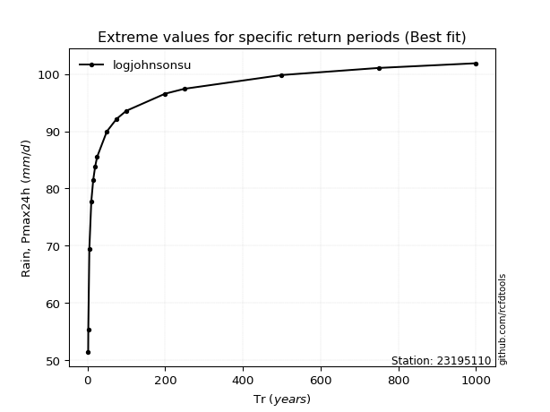</img>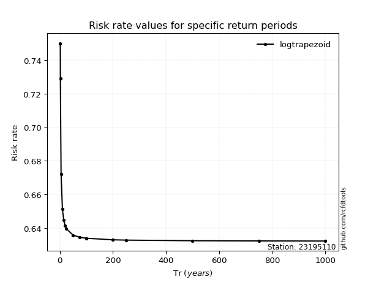</img>

</div>


<sub>**APP DISCLAIMER**: NO WARRANTY - This software is provided by [github.com/rcfdtools](https://github.com/rcfdtools) "as is", without any express or implied warranty, including warranties of merchantability, fitness for a particular purpose, or non-infringement. There is no guarantee that the software will be error-free or operate without interruption. LIMITATION OF LIABILITY - Neither the authors nor copyright holders will be liable for claims or damages arising from the software or its use. You are responsible for determining if the software is appropriate for your use and assume all associated risks, including errors, legal compliance, and data loss. NO PROFESSIONAL ADVICE - The software provides general information and does not offer professional advice. It should not replace consultation with professional advisors.</sub>