<div align="center">


</div>

# PMP Station (Rain, Pmax24h): 23195190

Probable Maximum Precipitation (PMP) is the greatest amount of rainfall for a specific duration that is meteorologically possible for a given location, acting as a "worst-case" scenario for extreme storms, crucial for designing safety-critical infrastructure like bridges, river deviations, dams, spillways, and nuclear plants to prevent catastrophic failure. PMP is calculated by hydrologists using meteorological data to determine the upper limit of extreme rainfall, often leading to the Probable Maximum Flood (PMF) for flood control design, and is increasingly being studied for climate change impacts. Probable Maximum Precipitation (PMP) is the theoretical upper limit of rainfall, a deterministic estimate for extreme events, while probability distributions (like GEV, Gumbel) describe the likelihood and frequency of various precipitation amounts, including rare ones, showing how often events occur, with PMP representing the extreme end of these distributions, used for critical infrastructure design to ensure safety against the worst conceivable weather, unlike standard statistical forecasts which cover typical probabilities.

The most common probability distributions in hydrology, used for analyzing floods, rainfall, and streamflow, include the Normal, Log-Normal, Gumbel, Gamma (including Log-Pearson Type III), and Generalized Extreme Value (GEV) distributions, often chosen based on the data´s skewness and whether modeling extremes or general conditions, with Gumbel and GEV popular for extreme events like floods, while the Normal distribution serves as a baseline, though often requiring transformations for skewed hydrological data. These distributions help in designing water infrastructure, managing water resources, and forecasting hydrologic events.

> Hydrological data often isn´t perfectly normal (it´s skewed), so different distributions are needed for different applications, such as: **Flood Frequency Analysis**: Using Gumbel, GEV, or Log-Pearson Type III for predicting extreme flood magnitudes and their return periods, **Rainfall Analysis**: Normal for annual totals, but Log-Normal, Weibull, or GEV for intensity or extreme daily rainfall, **Streamflow Modeling**: Gamma and Log-Normal for maximum flows, GEV for minimum flows, and Kappa for daily flows.

<div align="center">

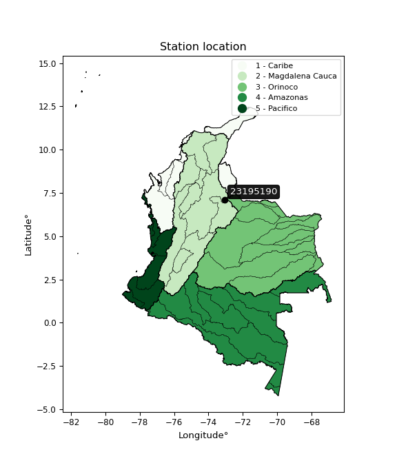</img>

</div>


## A. General information


### 1. General running parameters

• app_version: _v20260103_. • runtime: _2026-01-05 16:20:51.132608_. • Python version: _3.14.0_. • SciPy version: _1.16.3_. • Pandas version: _2.3.3_. • NumPy version: _2.3.5_. • Stations dataset (station_dataset_file): _dataset/pmax24h_in/automatic_colombia_2003_2024.csv_. • Stations catalog (station_catalog_file): _dataset/CNE.xls_. • Minimum year to eval til year_max (date_min): _1900_. • Maximum year to eval since year_min (date_max): _2024_. • Creates, save and include plots into reports (create_plot): _True_. • Plot only fit distributions with Δo > Δ (plot_only_fit): _True_. • Plot only simple graphs avoiding multiple CDFs and multiple Extreme values plots (plot_only_simple): _True_. • Eval low extreme values, if False, evaluates high extreme values (low_extreme): _False_. • Eval every SciPy distribution as logarithmic (pdist_logarithmic_on): _True_. • Standard deviation normalized (ddof): _1.0_. • Return periods to eval in years (Tr): _[2, 2.33, 5, 10, 15, 20, 25, 50, 75, 100, 200, 250, 500, 750, 1000]_. • Minimum data sample per station, 0 means any (minimum_sample): _5_. • Z-Score maximum threshold to adjust a value, 0 means disable (zscore_max): _3.5_. • Z-Score minimum threshold to adjust a value, 0 means disable (zscore_min): _-2.5_. • Avoid zeros, e.g. rain = 0 (avoid_zeros): _True_. • Avoid null values (avoid_nans): _True_. 

[:file_folder:Dataset file](../../dataset/pmax24h_in/automatic_colombia_2003_2024.csv)

> Delta Degrees of Freedom (DDOF): is a parameter used in the formulas for calculating variance and standard deviation. When ddof=0, the divisor is $N$ (the total number of observations) and this is used when your data set is the entire population. When ddof=1, the divisor is $N-1$ and this is used when your data set is a sample drawn from a larger population. Using $N-1$ provides an unbiased estimate of the population variance (known as Bessel´s correction).


### 2. Station info and location

|   id |   CODIGO | NOMBRE                           | CATEGORIA               | TECNOLOGIA                | ESTADO     | FECHA_INSTALACION   | FECHA_SUSPENSION   |   ALTITUD |   LATITUD |   LONGITUD | DEPARTAMENTO   | MUNICIPIO     | AREA_OPERATIVA                         | ENTIDAD                                                     | AREA_HIDROGRAFICA   | ZONA_HIDROGRAFICA   | SUBZONA_HIDROGRAFICA                      |   CORRIENTE | Catalogo   |   Version |
|-----:|---------:|:---------------------------------|:------------------------|:--------------------------|:-----------|:--------------------|:-------------------|----------:|----------:|-----------:|:---------------|:--------------|:---------------------------------------|:------------------------------------------------------------|:--------------------|:--------------------|:------------------------------------------|------------:|:-----------|----------:|
|    0 | 23195190 | SAN ANTONIO SANTANDER [23195190] | Climatológica Principal | Automática con Telemetría | Suspendida | 15/01/1991          | 15/01/1991         |      1480 |   7.09953 |   -73.0662 | Santander      | Floridablanca | Area Operativa 08 - Santanderes-Arauca | INSTITUTO DE HIDROLOGIA METEOROLOGIA Y ESTUDIOS AMBIENTALES | Magdalena Cauca     | Medio Magdalena     | Río Lebrija y otros directos al Magdalena |         nan | CNE_IDEAM  |  20251226 |

<div align="center">

Dynamic map: [:earth_americas:Google](http://maps.google.com/maps?q=7.099527778,-73.06619444) [:earth_americas:OSM](https://www.openstreetmap.org/#map=18/7.099527778/-73.06619444&layers=P) [:earth_americas:Bing](https://www.bing.com/maps?cp=7.099527778~-73.06619444&lvl=18) [:earth_americas:Apple](https://maps.apple.com/frame?center=7.099527778%2C-73.06619444&span=0.003%2C0.006)

</div>


<div align="center">

```geojson
{
  "type": "Feature",
  "geometry": {
    "type": "Point", 
    "coordinates": [-73.06619444, 7.099527778]
  }, 
  "properties": {
    "Name": "23195190"
  }
}
```

</div>


### 3. Discrete values table and plot

<div align="center">

|               |           0 |            1 |          2 |           3 |          4 |          5 |           6 |           7 |          8 |             9 |
|:--------------|------------:|-------------:|-----------:|------------:|-----------:|-----------:|------------:|------------:|-----------:|--------------:|
| Date          | 2005        | 2006         | 2007       | 2008        | 2009       | 2010       | 2011        | 2012        | 2013       | 2014          |
| Value         |   39        |   53.4       |   29.4     |   39.6      |   20.9     |   90.9     |   78.5      |   59.7      |   89.8     |   55.6        |
| Value_initial |   39        |   53.4       |   29.4     |   39.6      |   20.9     |   90.9     |   78.5      |   59.7      |   89.8     |   55.6        |
| count         |   10        |   10         |   10       |   10        |   10       |   10       |   10        |   10        |   10       |   10          |
| mean          |   55.68     |   55.68      |   55.68    |   55.68     |   55.68    |   55.68    |   55.68     |   55.68     |   55.68    |   55.68       |
| std           |   24.4582   |   24.4582    |   24.4582  |   24.4582   |   24.4582  |   24.4582  |   24.4582   |   24.4582   |   24.4582  |   24.4582     |
| zscore        |   -0.681981 |   -0.0932204 |   -1.07449 |   -0.657449 |   -1.42202 |    1.44001 |    0.933022 |    0.164362 |    1.39504 |   -0.00327089 |


</div>


<div align="center">

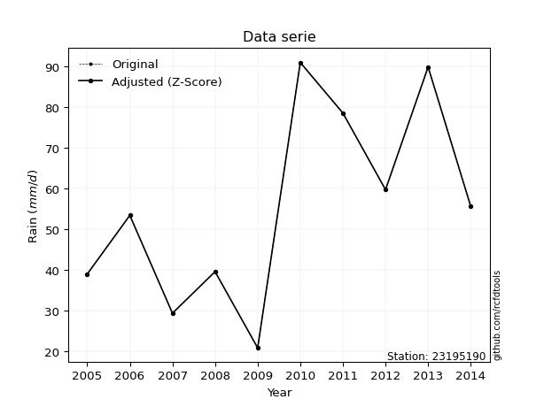</img>

</div>


> The initial value (value_initial) correspond to the initial obtained or null completed value, and value (value) is adjusted only when the initial value is outside the valid range (outlier) definite through the Z-Score value. If Z-Score is active, values out of range or outliers are replaced with the station mean value. A Z-Score (or standard score) measures how many standard deviations a data point is from the mean of a dataset, indicating its relative position; positive scores mean above the mean, negative mean below, and a score of zero is exactly at the mean, allowing for comparison of values from different distributions. It´s calculated using the formula $z=(x–μ)/σ$, where $x$ is the data point, $μ$ is the mean, and $σ$ is the standard deviation, helping identify outliers and understand probability.
>
> <sub>**Note**: In this study, "completing" (filling gaps in) and "extending" (forecasting or lengthening the historical record) rainfall data series are avoided for certain critical analyses because they introduce artificial bias and uncertainty, which can distort the statistics of rare events (extremes), alter day-to-day variability, and compromise the integrity and homogeneity of the original data. Some reasons against Completing/Extending rainfall data are: **Distortion of Extremes and Variability**: The primary issue is that most gap-filling or extension methods rely on averaging or regression with nearby stations, which inherently smooths the data. Rainfall is highly variable in space and time, with a large percentage of zero values and occasional large storms. Infilling methods often underestimate the highest values and overestimate the lowest (zero) values, which severely distorts analyses focused on flood frequency, drought severity, and intensity-duration-frequency (IDF) curves, **Loss of Data Homogeneity**: Infilled or extended data are synthetic estimates, not actual measurements. Combining these estimates with observed data can violate the assumption of data homogeneity, which requires that the data properties do not change over time. Inhomogeneity can lead to incorrect conclusions about long-term trends or changes in climate patterns, **Propagation of Errors**: Errors and biases from the original data (e.g., wind-induced undercatch, instrument errors, site changes) or the data used for imputation can propagate through the analysis, leading to unreliable hydrological models and inaccurate predictions, **Compromised Statistical Integrity**: For statistical analyses, especially those involving the frequency of events, using artificial data can introduce time bias or autocorrelation that doesn´t exist in reality, making it difficult to assess the true probability of events, **Difficulty in Validation**: It is difficult to accurately validate the quality of filled or extended data, especially for past periods where ground-truth measurements are unavailable. The reliability of imputation techniques heavily depends on the density of the surrounding station network and the complexity of the local topography.</sub>


### 4. Active continuous probability distributions from SciPy (44 of 104 available)

A Probability Density Function (PDF) describes the relative likelihood of a continuous random variable falling within a specific range, where the total area under its curve equals 1, and the area over any interval gives the actual probability for that range. Unlike discrete probabilities (like rolling a die), a PDF shows density, not direct probability for a single point (which is zero), with higher points indicating higher likelihood, often visualized as a bell curve for normal distributions.

A log of a probability density function (log-PDF) is simply the logarithm of the PDF´s value, denoted as $log(f(x))$, useful for converting multiplication of probabilities into addition, improving numerical stability with tiny numbers, and connecting to information theory concepts like entropy. Instead of dealing with very small probabilities (e.g., 0.000001), log-PDFs use negative numbers (e.g., $log(0.00001) ≈ -11.51$ that are easier for computers to handle, preventing underflow errors and simplifying complex calculations. In this study, each active probability distribution from SciPy is also evaluated in the $log$ form.

[scipy.stats](https://docs.scipy.org/doc/scipy/reference/stats.html) is a Python´s powerful submodule within the SciPy library for comprehensive statistical analysis, offering over 130 probability distributions (like Normal, Poisson), functions for descriptive stats (mean, variance), hypothesis testing (t-tests, chi-square), random variable generation, and statistical tests, making it essential for data science, modeling, and research. It provides tools to explore, model, and draw conclusions from data efficiently, working seamlessly with NumPy.

<div align="center">

|   id | p_dist             |   n_parameter | fit_method   | label                                                                       | active   | ref                                                                                                        |
|-----:|:-------------------|--------------:|:-------------|:----------------------------------------------------------------------------|:---------|:-----------------------------------------------------------------------------------------------------------|
|    0 | alpha              |             3 | MLE          | Alpha                                                                       | True     | [:mortar_board:](https://docs.scipy.org/doc/scipy/reference/generated/scipy.stats.alpha.html)              |
|    1 | betaprime          |             4 | MLE          | Beta prime                                                                  | True     | [:mortar_board:](https://docs.scipy.org/doc/scipy/reference/generated/scipy.stats.betaprime.html)          |
|    2 | chi2               |             3 | MLE          | Chi²                                                                        | True     | [:mortar_board:](https://docs.scipy.org/doc/scipy/reference/generated/scipy.stats.chi2.html)               |
|    3 | crystalball        |             4 | MLE          | Crystalball                                                                 | True     | [:mortar_board:](https://docs.scipy.org/doc/scipy/reference/generated/scipy.stats.crystalball.html)        |
|    4 | erlang             |             3 | MLE          | Erlang                                                                      | True     | [:mortar_board:](https://docs.scipy.org/doc/scipy/reference/generated/scipy.stats.erlang.html)             |
|    5 | expon              |             2 | MLE          | Exponential                                                                 | True     | [:mortar_board:](https://docs.scipy.org/doc/scipy/reference/generated/scipy.stats.expon.html)              |
|    6 | exponnorm          |             3 | MLE          | Exponentially modified Normal                                               | True     | [:mortar_board:](https://docs.scipy.org/doc/scipy/reference/generated/scipy.stats.exponnorm.html)          |
|    7 | f                  |             4 | MLE          | F                                                                           | True     | [:mortar_board:](https://docs.scipy.org/doc/scipy/reference/generated/scipy.stats.f.html)                  |
|    8 | fatiguelife        |             3 | MLE          | Fatigue-life (Birnbaum-Saunders)                                            | True     | [:mortar_board:](https://docs.scipy.org/doc/scipy/reference/generated/scipy.stats.fatiguelife.html)        |
|    9 | fisk               |             3 | MLE          | Fisk                                                                        | True     | [:mortar_board:](https://docs.scipy.org/doc/scipy/reference/generated/scipy.stats.fisk.html)               |
|   10 | gamma              |             3 | MLE          | Gamma                                                                       | True     | [:mortar_board:](https://docs.scipy.org/doc/scipy/reference/generated/scipy.stats.gamma.html)              |
|   11 | genexpon           |             5 | MLE          | Generalized exponential                                                     | True     | [:mortar_board:](https://docs.scipy.org/doc/scipy/reference/generated/scipy.stats.genexpon.html)           |
|   12 | genlogistic        |             3 | MLE          | Generalized logistic                                                        | True     | [:mortar_board:](https://docs.scipy.org/doc/scipy/reference/generated/scipy.stats.genlogistic.html)        |
|   13 | gibrat             |             2 | MM           | Gibrat                                                                      | True     | [:mortar_board:](https://docs.scipy.org/doc/scipy/reference/generated/scipy.stats.gibrat.html)             |
|   14 | gompertz           |             3 | MLE          | Gompertz (or truncated Gumbel)                                              | True     | [:mortar_board:](https://docs.scipy.org/doc/scipy/reference/generated/scipy.stats.gompertz.html)           |
|   15 | gumbel_l           |             2 | MM           | Gumbel Left Skew                                                            | True     | [:mortar_board:](https://docs.scipy.org/doc/scipy/reference/generated/scipy.stats.gumbel_l.html)           |
|   16 | gumbel_r           |             2 | MM           | Gumbel Right Skew                                                           | True     | [:mortar_board:](https://docs.scipy.org/doc/scipy/reference/generated/scipy.stats.gumbel_r.html)           |
|   17 | halflogistic       |             2 | MM           | Half-logistic                                                               | True     | [:mortar_board:](https://docs.scipy.org/doc/scipy/reference/generated/scipy.stats.halflogistic.html)       |
|   18 | halfnorm           |             2 | MM           | Half Normal                                                                 | True     | [:mortar_board:](https://docs.scipy.org/doc/scipy/reference/generated/scipy.stats.halfnorm.html)           |
|   19 | hypsecant          |             2 | MM           | hyperbolic secant                                                           | True     | [:mortar_board:](https://docs.scipy.org/doc/scipy/reference/generated/scipy.stats.hypsecant.html)          |
|   20 | invgamma           |             3 | MLE          | Inverted gamma                                                              | True     | [:mortar_board:](https://docs.scipy.org/doc/scipy/reference/generated/scipy.stats.invgamma.html)           |
|   21 | invgauss           |             3 | MLE          | Inverse Gaussian                                                            | True     | [:mortar_board:](https://docs.scipy.org/doc/scipy/reference/generated/scipy.stats.invgauss.html)           |
|   22 | invweibull         |             3 | MLE          | Inverted Weibull                                                            | True     | [:mortar_board:](https://docs.scipy.org/doc/scipy/reference/generated/scipy.stats.invweibull.html)         |
|   23 | johnsonsu          |             4 | MLE          | Johnson Su                                                                  | True     | [:mortar_board:](https://docs.scipy.org/doc/scipy/reference/generated/scipy.stats.johnsonsu.html)          |
|   24 | kstwobign          |             2 | MLE          | Limiting distribution of scaled Kolmogorov-Smirnov two-sided test statistic | True     | [:mortar_board:](https://docs.scipy.org/doc/scipy/reference/generated/scipy.stats.kstwobign.html)          |
|   25 | laplace            |             2 | MM           | Laplace                                                                     | True     | [:mortar_board:](https://docs.scipy.org/doc/scipy/reference/generated/scipy.stats.laplace.html)            |
|   26 | laplace_asymmetric |             3 | MLE          | Asymmetric Laplace                                                          | True     | [:mortar_board:](https://docs.scipy.org/doc/scipy/reference/generated/scipy.stats.laplace_asymmetric.html) |
|   27 | loggamma           |             3 | MLE          | Log gamma                                                                   | True     | [:mortar_board:](https://docs.scipy.org/doc/scipy/reference/generated/scipy.stats.loggamma.html)           |
|   28 | logistic           |             2 | MM           | Logistic (or Sech-squared)                                                  | True     | [:mortar_board:](https://docs.scipy.org/doc/scipy/reference/generated/scipy.stats.logistic.html)           |
|   29 | lognorm            |             3 | MLE          | Log Normal                                                                  | True     | [:mortar_board:](https://docs.scipy.org/doc/scipy/reference/generated/scipy.stats.lognorm.html)            |
|   30 | maxwell            |             2 | MM           | Maxwell                                                                     | True     | [:mortar_board:](https://docs.scipy.org/doc/scipy/reference/generated/scipy.stats.maxwell.html)            |
|   31 | mielke             |             4 | MLE          | Mielke Beta-Kappa / Dagum                                                   | True     | [:mortar_board:](https://docs.scipy.org/doc/scipy/reference/generated/scipy.stats.mielke.html)             |
|   32 | moyal              |             2 | MM           | Moyal                                                                       | True     | [:mortar_board:](https://docs.scipy.org/doc/scipy/reference/generated/scipy.stats.moyal.html)              |
|   33 | nakagami           |             3 | MLE          | Nakagami                                                                    | True     | [:mortar_board:](https://docs.scipy.org/doc/scipy/reference/generated/scipy.stats.nakagami.html)           |
|   34 | ncf                |             5 | MLE          | Non-central F distribution                                                  | True     | [:mortar_board:](https://docs.scipy.org/doc/scipy/reference/generated/scipy.stats.ncf.html)                |
|   35 | nct                |             4 | MLE          | Non-central Student’s t                                                     | True     | [:mortar_board:](https://docs.scipy.org/doc/scipy/reference/generated/scipy.stats.nct.html)                |
|   36 | norm               |             2 | MM           | Normal                                                                      | True     | [:mortar_board:](https://docs.scipy.org/doc/scipy/reference/generated/scipy.stats.norm.html)               |
|   37 | pearson3           |             3 | MM           | Pearson type III                                                            | True     | [:mortar_board:](https://docs.scipy.org/doc/scipy/reference/generated/scipy.stats.pearson3.html)           |
|   38 | rayleigh           |             2 | MM           | Rayleigh                                                                    | True     | [:mortar_board:](https://docs.scipy.org/doc/scipy/reference/generated/scipy.stats.rayleigh.html)           |
|   39 | rice               |             3 | MLE          | Rice                                                                        | True     | [:mortar_board:](https://docs.scipy.org/doc/scipy/reference/generated/scipy.stats.rice.html)               |
|   40 | t                  |             3 | MLE          | Student’s t                                                                 | True     | [:mortar_board:](https://docs.scipy.org/doc/scipy/reference/generated/scipy.stats.t.html)                  |
|   41 | truncnorm          |             4 | MLE          | Truncated normal                                                            | True     | [:mortar_board:](https://docs.scipy.org/doc/scipy/reference/generated/scipy.stats.truncnorm.html)          |
|   42 | wald               |             2 | MM           | Wald                                                                        | True     | [:mortar_board:](https://docs.scipy.org/doc/scipy/reference/generated/scipy.stats.wald.html)               |
|   43 | weibull_min        |             3 | MLE          | Weibull minimum                                                             | True     | [:mortar_board:](https://docs.scipy.org/doc/scipy/reference/generated/scipy.stats.weibull_min.html)        |

</div>

> **n_parameter:** # arguments & localization & scale.
>
> **Fit methods:** (MLE) maximum likelihood, (MM) L-moments.
>
>**Inactive** (With the only purpose of prevent loops, zero divisions, infinite values, over high estimated values or horizontal trending for recurrence intervals estimations, the follow distributions were disabled.)**:** foldnorm, gennorm, norminvgauss, powernorm, powerlognorm, skewnorm, genextreme, anglit, arcsine, argus, beta, bradford, burr, burr12, cauchy, cosine, halfcauchy, foldcauchy, skewcauchy, wrapcauchy, dgamma, gengamma, exponweib, exponpow, truncexpon, gausshyper, genhalflogistic, genhyperbolic, geninvgauss, halfgennorm, johnsonsb, kappa4, kappa3, ksone, kstwo, loglaplace, levy, levy_l, levy_stable, ncx2, pareto, genpareto, truncpareto, lomax, powerlaw, rdist, rel_breitwigner, recipinvgauss, semicircular, studentized_range, trapezoid, triang, truncweibull_min, tukeylambda, uniform, loguniform, vonmises, vonmises_line, weibull_max, dweibull, 


## B. Probability (PDF) vs. Empirical (EDF) distributions functions

A continuous probability distribution (CPD) describes probabilities for variables that can take any value within a range (like rain any time), unlike discrete variables with specific outcomes (like temperature). It uses a Probability Density Function (PDF), a curve where the total area under it equals 1, and the probability of the variable falling within an interval (a to b) is found by calculating the area under the curve between those points. A key feature is that the probability of hitting any single exact value is zero, so probabilities are always expressed for ranges, e.g., $P(a ≤ X ≤ b)$.

<div align="center">

Distributions parameters from station values
|    |   station | p_dist                |   n |               loc |            scale | shape                 | shape1                 | shape2             | shape3   |
|---:|----------:|:----------------------|----:|------------------:|-----------------:|:----------------------|:-----------------------|:-------------------|:---------|
|  0 |  23195190 | alpha                 |  10 |    -197.896       |   2768.8         | 11.009056327616957    |                        |                    |          |
|  1 |  23195190 | betaprime             |  10 |      -4.88834     |   1976.85        | 6.552872357782435     | 214.83770588546685     |                    |          |
|  2 |  23195190 | chi2                  |  10 |       8.84891     |      6.73353     | 6.954911675111002     |                        |                    |          |
|  3 |  23195190 | crystalball           |  10 |      55.68        |     23.2031      | 9816.376808888308     | 80.32044278110344      |                    |          |
|  4 |  23195190 | erlang                |  10 |       8.84598     |     13.4655      | 3.4781103108841815    |                        |                    |          |
|  5 |  23195190 | expon                 |  10 |      20.9         |     34.78        |                       |                        |                    |          |
|  6 |  23195190 | exponnorm             |  10 |      51.5115      |     22.8264      | 0.18261904339179555   |                        |                    |          |
|  7 |  23195190 | f                     |  10 |       8.79394     |     46.8976      | 6.9766978459833595    | 148988.93412320665     |                    |          |
|  8 |  23195190 | fatiguelife           |  10 |      20.9         |      2.6329e-05  | 1076.6832892498771    |                        |                    |          |
|  9 |  23195190 | fisk                  |  10 |     -20.7666      |     73.3651      | 5.295449647672244     |                        |                    |          |
| 10 |  23195190 | gamma                 |  10 |       5.2889      |     12.0721      | 4.158489511289757     |                        |                    |          |
| 11 |  23195190 | genexpon              |  10 |      20.9         |      2.77706     | 0.0797500359788102    | 1.6216797913973029e-06 | 0.9464637638610153 |          |
| 12 |  23195190 | genlogistic           |  10 |     -74.4182      |     19.9082      | 391.12912228563926    |                        |                    |          |
| 13 |  23195190 | gibrat                |  10 |      37.9791      |     10.7362      |                       |                        |                    |          |
| 14 |  23195190 | gompertz              |  10 |     -74.4066      |     21.9263      | 0.0015517800532534457 |                        |                    |          |
| 15 |  23195190 | gumbel_l              |  10 |      66.1226      |     18.0913      |                       |                        |                    |          |
| 16 |  23195190 | gumbel_r              |  10 |      45.2374      |     18.0913      |                       |                        |                    |          |
| 17 |  23195190 | halflogistic          |  10 |      28.179       |     19.8378      |                       |                        |                    |          |
| 18 |  23195190 | halfnorm              |  10 |      24.9683      |     38.4915      |                       |                        |                    |          |
| 19 |  23195190 | hypsecant             |  10 |      55.68        |     14.7715      |                       |                        |                    |          |
| 20 |  23195190 | invgamma              |  10 |     -93.4126      |   6047.21        | 41.553059387253114    |                        |                    |          |
| 21 |  23195190 | invgauss              |  10 |     -32.2106      |   1169.51        | 0.07515166312503269   |                        |                    |          |
| 22 |  23195190 | invweibull            |  10 |      -9.137e+08   |      9.137e+08   | 45440386.8430545      |                        |                    |          |
| 23 |  23195190 | johnsonsu             |  10 |       4.33979e+08 |      5.63063e+08 | 22314675.792769667    | 31444081.407305516     |                    |          |
| 24 |  23195190 | kstwobign             |  10 |     -25.2284      |     92.5459      |                       |                        |                    |          |
| 25 |  23195190 | laplace               |  10 |      55.68        |     16.407       |                       |                        |                    |          |
| 26 |  23195190 | laplace_asymmetric    |  10 |      53.4         |     19.1183      | 0.9421414340669179    |                        |                    |          |
| 27 |  23195190 | loggamma              |  10 |   -5398.11        |    778.604       | 1102.1814732019689    |                        |                    |          |
| 28 |  23195190 | logistic              |  10 |      55.68        |     12.7925      |                       |                        |                    |          |
| 29 |  23195190 | lognorm               |  10 |      20.9         |      0.811761    | 11.038794435098024    |                        |                    |          |
| 30 |  23195190 | maxwell               |  10 |       0.69851     |     34.4545      |                       |                        |                    |          |
| 31 |  23195190 | mielke                |  10 |      -4.85353     |     96.4282      | 1.8312351484498848    | 451.93212117252676     |                    |          |
| 32 |  23195190 | moyal                 |  10 |      42.411       |     10.445       |                       |                        |                    |          |
| 33 |  23195190 | nakagami              |  10 |      29.4         |     41.9488      | 0.3031311956443351    |                        |                    |          |
| 34 |  23195190 | ncf                   |  10 |      -1.82389     |     29.5534      | 9.031799235810492     | 775.8896918775527      | 8.499406254318405  |          |
| 35 |  23195190 | nct                   |  10 |    -725.157       |     23.156       | 140751.1863487017     | 33.72058550881212      |                    |          |
| 36 |  23195190 | norm                  |  10 |      55.68        |     23.2031      |                       |                        |                    |          |
| 37 |  23195190 | pearson3              |  10 |      55.68        |     23.203       | 0.2107676406088171    |                        |                    |          |
| 38 |  23195190 | rayleigh              |  10 |      11.2912      |     35.4171      |                       |                        |                    |          |
| 39 |  23195190 | rice                  |  10 |      11.81        |     29.7823      | 0.8813446768908675    |                        |                    |          |
| 40 |  23195190 | t                     |  10 |      55.6799      |     23.2027      | 74245279.1503442      |                        |                    |          |
| 41 |  23195190 | truncnorm             |  10 |      55.68        |     23.2031      | -226.02177124253365   | 1294.5512689567906     |                    |          |
| 42 |  23195190 | wald                  |  10 |      32.4769      |     23.2031      |                       |                        |                    |          |
| 43 |  23195190 | weibull_min           |  10 |      15.9969      |     44.3443      | 1.7082875240431417    |                        |                    |          |
| 44 |  23195190 | logalpha              |  10 |      -7.00157     |    250.041       | 22.943704506060733    |                        |                    |          |
| 45 |  23195190 | logbetaprime          |  10 |     -11.6122      |      8.2356      | 3144.1941688688185    | 1667.9384463824917     |                    |          |
| 46 |  23195190 | logchi2               |  10 |       3.03975     |      1.00235     | 1.0065532393459906    |                        |                    |          |
| 47 |  23195190 | logcrystalball        |  10 |       3.92189     |      0.459203    | 936.735492695239      | 5.659047945616336      |                    |          |
| 48 |  23195190 | logerlang             |  10 |      -2.84325     |      0.0327968   | 206.2197908939272     |                        |                    |          |
| 49 |  23195190 | logexpon              |  10 |       3.03975     |      0.882141    |                       |                        |                    |          |
| 50 |  23195190 | logexponnorm          |  10 |       3.92152     |      0.459203    | 0.000813317857539527  |                        |                    |          |
| 51 |  23195190 | logf                  |  10 |    -294.278       |    298.201       | 2241218.479543796     | 1342227.180209818      |                    |          |
| 52 |  23195190 | logfatiguelife        |  10 |    -116.828       |    120.751       | 0.0037958403000665428 |                        |                    |          |
| 53 |  23195190 | logfisk               |  10 | -295280           | 295284           | 1086055.6057935925    |                        |                    |          |
| 54 |  23195190 | loggamma              |  10 |      -3.36548     |      0.0301624   | 241.46257297211582    |                        |                    |          |
| 55 |  23195190 | loggenexpon           |  10 |       3.03973     |     33.9341      | 11.329121062875394    | 106.26287798020357     | 17.318689655412626 |          |
| 56 |  23195190 | loggenlogistic        |  10 |       4.50979     |      3.76702e-06 | 6.434482844328039e-06 |                        |                    |          |
| 57 |  23195190 | loggibrat             |  10 |       3.57155     |      0.212489    |                       |                        |                    |          |
| 58 |  23195190 | loggompertz           |  10 |       3.03975     |      0.474359    | 0.11775431819175644   |                        |                    |          |
| 59 |  23195190 | loggumbel_l           |  10 |       4.12856     |      0.358039    |                       |                        |                    |          |
| 60 |  23195190 | loggumbel_r           |  10 |       3.71522     |      0.358039    |                       |                        |                    |          |
| 61 |  23195190 | loghalflogistic       |  10 |       3.37758     |      0.392637    |                       |                        |                    |          |
| 62 |  23195190 | loghalfnorm           |  10 |       3.31408     |      0.761777    |                       |                        |                    |          |
| 63 |  23195190 | loghypsecant          |  10 |       3.92189     |      0.292337    |                       |                        |                    |          |
| 64 |  23195190 | loginvgamma           |  10 |      -8.35196     |   8474.02        | 691.4141622239647     |                        |                    |          |
| 65 |  23195190 | loginvgauss           |  10 |      -0.0694313   |    268.369       | 0.014883943054700519  |                        |                    |          |
| 66 |  23195190 | loginvweibull         |  10 |      -4.56445e+07 |      4.56445e+07 | 92024936.30844164     |                        |                    |          |
| 67 |  23195190 | logjohnsonsu          |  10 |       5.0465      |      0.0198529   | 10.826873109055718    | 2.3325628890409735     |                    |          |
| 68 |  23195190 | logkstwobign          |  10 |       2.03345     |      2.15966     |                       |                        |                    |          |
| 69 |  23195190 | loglaplace            |  10 |       3.92189     |      0.324705    |                       |                        |                    |          |
| 70 |  23195190 | loglaplace_asymmetric |  10 |       4.01818     |      0.364227    | 1.1408651485801582    |                        |                    |          |
| 71 |  23195190 | logloggamma           |  10 |       4.19405     |      0.352581    | 0.8912316199500223    |                        |                    |          |
| 72 |  23195190 | loglogistic           |  10 |       3.92189     |      0.253172    |                       |                        |                    |          |
| 73 |  23195190 | loglognorm            |  10 |       3.03975     |      0.0264097   | 10.580888153714106    |                        |                    |          |
| 74 |  23195190 | logmaxwell            |  10 |       2.83377     |      0.681876    |                       |                        |                    |          |
| 75 |  23195190 | logmielke             |  10 |       2.97396     |      1.5565      | 1.374261354296415     | 289.8913690267801      |                    |          |
| 76 |  23195190 | logmoyal              |  10 |       3.65929     |      0.206714    |                       |                        |                    |          |
| 77 |  23195190 | lognakagami           |  10 |       3.38099     |      0.735718    | 0.4635841341682113    |                        |                    |          |
| 78 |  23195190 | logncf                |  10 |      -0.654638    |      3.02613     | 186.42169098363462    | 1976.9809564785105     | 95.08345162222574  |          |
| 79 |  23195190 | lognct                |  10 |     -17.8395      |      0.384348    | 3614.498101439851     | 56.60754197859525      |                    |          |
| 80 |  23195190 | lognorm               |  10 |       3.92189     |      0.459203    |                       |                        |                    |          |
| 81 |  23195190 | logpearson3           |  10 |       3.92189     |      0.459202    | -0.40343213249313425  |                        |                    |          |
| 82 |  23195190 | lograyleigh           |  10 |       3.04339     |      0.700941    |                       |                        |                    |          |
| 83 |  23195190 | logrice               |  10 |       2.78659     |      0.500953    | 1.994044998749267     |                        |                    |          |
| 84 |  23195190 | logt                  |  10 |       3.92189     |      0.459202    | 1900233381.423004     |                        |                    |          |
| 85 |  23195190 | logtruncnorm          |  10 |      -0.0918876   |      1.63378     | 2.1256724998927847    | 4.695912745817537      |                    |          |
| 86 |  23195190 | logwald               |  10 |       3.46273     |      0.459168    |                       |                        |                    |          |
| 87 |  23195190 | logweibull_min        |  10 |      -0.581476    |      4.70548     | 11.961415294070978    |                        |                    |          |

</div>

> **loc** (Location parameter): This shifts the distribution along the x-axis. For many common distributions, like the normal (Gaussian) distribution, loc represents the mean $μ$. For others, like the uniform distribution, it might represent the minimum value, or for the beta distribution, the left end of the support interval.
>
> **scale** (Scale parameter): This determines the width or spread of the distribution. For the normal distribution, scale represents the standard deviation $σ$. For a uniform distribution, it defines the length of the interval (from $loc$ to $loc + scale$).
>
> **shape** (Shape parameters): Refers to parameters that define the specific form of a probability distribution, distinct from its location (loc) and scale (scale). These parameters are required arguments for most distribution functions. For example, a normal (Gaussian) distribution is fully defined by its location (mean) and scale (standard deviation), so it has no specific shape parameters beyond loc and scale. However, other distributions have intrinsic properties that need specification, as Gamma distribution that takes a shape parameter, often named $a$ or $alpha$.


### 0. Cumulative distribution values - CDF (88 evaluated)

Cumulative Distribution Function (CDF), denoted as $F$<sub>$X$</sub>$(x)$, is a function that gives the probability that a random variable $X$ will take a value less than or equal to a specific value, $x$ (i.e., $(P(X≥x)$. It essentially "accumulates" probabilities from a given point up to the far right (positive infinity), providing a complete picture of the distribution´s probabilities for both discrete (like rain) and continuous (like temperature) variables, helping to find probabilities over ranges or above certain values. Each station is evaluated separately ordering the $x$ values ascending, calculating the CDF and PDF values for the activated distributions and their logarithmic forms.

<div align="center">

CDF ordered by x ascending and calculating $log(f(x))$ separately
|   id |   Station |   date |    x |   count |   mean |     std |      zscore |   Value_initial |   station |   m |    alpha |   alpha_pdf |   betaprime |   betaprime_pdf |      chi2 |   chi2_pdf |   crystalball |   crystalball_pdf |    erlang |   erlang_pdf |    expon |   expon_pdf |   exponnorm |   exponnorm_pdf |         f |      f_pdf |   fatiguelife |   fatiguelife_pdf |      fisk |   fisk_pdf |     gamma |   gamma_pdf |    genexpon |   genexpon_pdf |   genlogistic |   genlogistic_pdf |     gibrat |   gibrat_pdf |   gompertz |   gompertz_pdf |   gumbel_l |   gumbel_l_pdf |   gumbel_r |   gumbel_r_pdf |   halflogistic |   halflogistic_pdf |   halfnorm |   halfnorm_pdf |   hypsecant |   hypsecant_pdf |   invgamma |   invgamma_pdf |   invgauss |   invgauss_pdf |   invweibull |   invweibull_pdf |   johnsonsu |   johnsonsu_pdf |   kstwobign |   kstwobign_pdf |   laplace |   laplace_pdf |   laplace_asymmetric |   laplace_asymmetric_pdf |   loggamma |   loggamma_pdf |   logistic |   logistic_pdf |   lognorm |   lognorm_pdf |   maxwell |   maxwell_pdf |    mielke |   mielke_pdf |      moyal |   moyal_pdf |   nakagami |   nakagami_pdf |       ncf |    ncf_pdf |      nct |    nct_pdf |      norm |   norm_pdf |   pearson3 |   pearson3_pdf |   rayleigh |   rayleigh_pdf |      rice |   rice_pdf |         t |      t_pdf |   truncnorm |   truncnorm_pdf |     wald |   wald_pdf |   weibull_min |   weibull_min_pdf |   logalpha |   logalpha_pdf |   logbetaprime |   logbetaprime_pdf |     logchi2 |   logchi2_pdf |   logcrystalball |   logcrystalball_pdf |   logerlang |   logerlang_pdf |   logexpon |   logexpon_pdf |   logexponnorm |   logexponnorm_pdf |      logf |   logf_pdf |   logfatiguelife |   logfatiguelife_pdf |   logfisk |   logfisk_pdf |   loggenexpon |   loggenexpon_pdf |   loggenlogistic |   loggenlogistic_pdf |   loggibrat |   loggibrat_pdf |   loggompertz |   loggompertz_pdf |   loggumbel_l |   loggumbel_l_pdf |   loggumbel_r |   loggumbel_r_pdf |   loghalflogistic |   loghalflogistic_pdf |   loghalfnorm |   loghalfnorm_pdf |   loghypsecant |   loghypsecant_pdf |   loginvgamma |   loginvgamma_pdf |   loginvgauss |   loginvgauss_pdf |   loginvweibull |   loginvweibull_pdf |   logjohnsonsu |   logjohnsonsu_pdf |   logkstwobign |   logkstwobign_pdf |   loglaplace |   loglaplace_pdf |   loglaplace_asymmetric |   loglaplace_asymmetric_pdf |   logloggamma |   logloggamma_pdf |   loglogistic |   loglogistic_pdf |   loglognorm |   loglognorm_pdf |   logmaxwell |   logmaxwell_pdf |   logmielke |   logmielke_pdf |    logmoyal |   logmoyal_pdf |   lognakagami |   lognakagami_pdf |    logncf |   logncf_pdf |    lognct |   lognct_pdf |   logpearson3 |   logpearson3_pdf |   lograyleigh |   lograyleigh_pdf |   logrice |   logrice_pdf |      logt |   logt_pdf |   logtruncnorm |   logtruncnorm_pdf |   logwald |   logwald_pdf |   logweibull_min |   logweibull_min_pdf |
|-----:|----------:|-------:|-----:|--------:|-------:|--------:|------------:|----------------:|----------:|----:|---------:|------------:|------------:|----------------:|----------:|-----------:|--------------:|------------------:|----------:|-------------:|---------:|------------:|------------:|----------------:|----------:|-----------:|--------------:|------------------:|----------:|-----------:|----------:|------------:|------------:|---------------:|--------------:|------------------:|-----------:|-------------:|-----------:|---------------:|-----------:|---------------:|-----------:|---------------:|---------------:|-------------------:|-----------:|---------------:|------------:|----------------:|-----------:|---------------:|-----------:|---------------:|-------------:|-----------------:|------------:|----------------:|------------:|----------------:|----------:|--------------:|---------------------:|-------------------------:|-----------:|---------------:|-----------:|---------------:|----------:|--------------:|----------:|--------------:|----------:|-------------:|-----------:|------------:|-----------:|---------------:|----------:|-----------:|---------:|-----------:|----------:|-----------:|-----------:|---------------:|-----------:|---------------:|----------:|-----------:|----------:|-----------:|------------:|----------------:|---------:|-----------:|--------------:|------------------:|-----------:|---------------:|---------------:|-------------------:|------------:|--------------:|-----------------:|---------------------:|------------:|----------------:|-----------:|---------------:|---------------:|-------------------:|----------:|-----------:|-----------------:|---------------------:|----------:|--------------:|--------------:|------------------:|-----------------:|---------------------:|------------:|----------------:|--------------:|------------------:|--------------:|------------------:|--------------:|------------------:|------------------:|----------------------:|--------------:|------------------:|---------------:|-------------------:|--------------:|------------------:|--------------:|------------------:|----------------:|--------------------:|---------------:|-------------------:|---------------:|-------------------:|-------------:|-----------------:|------------------------:|----------------------------:|--------------:|------------------:|--------------:|------------------:|-------------:|-----------------:|-------------:|-----------------:|------------:|----------------:|------------:|---------------:|--------------:|------------------:|----------:|-------------:|----------:|-------------:|--------------:|------------------:|--------------:|------------------:|----------:|--------------:|----------:|-----------:|---------------:|-------------------:|----------:|--------------:|-----------------:|---------------------:|
|    0 |  23195190 |   2009 | 20.9 |      10 |  55.68 | 24.4582 | -1.42202    |            20.9 |  23195190 |   1 | 0.049918 |  0.00595735 |   0.0396352 |      0.00647382 | 0.0304866 | 0.00710814 |     0.0669445 |        0.00559079 | 0.0304868 |   0.00710743 | 0        |  0.0287522  |   0.0666214 |      0.00559659 | 0.0305123 | 0.00709763 |     0.0100718 |       7.40755e+09 | 0.0476116 | 0.00576291 | 0.0343876 |  0.00696812 | 2.30064e-07 |     0.0287174  |     0.0389824 |        0.00632708 | 0          |   0          |   0.111552 |     0.00485554 |  0.0788304 |     0.00418091 |  0.0215119 |     0.00456502 |       0        |         0          |  0         |     0          |   0.0602588 |      0.00405507 |  0.0472345 |     0.00602866 |  0.0409513 |     0.00628587 |    0.0396631 |       0.00636603 |   0.0619777 |      0.00540426 |   0.0350645 |      0.00678932 | 0.0600265 |    0.00365858 |            0.0773927 |               0.0042967  |  0.0266585 |       0.143397 |  0.0618744 |     0.00453749 |  0.027364 |      0.137264 | 0.0484041 |    0.00670375 | 0.0891313 |   0.00633778 | 0.00510566 |  0.00212039 |   0        |     0          | 0.0408498 | 0.00652447 | 0.066919 | 0.00559115 | 0.0669445 | 0.00559079 |  0.0605196 |     0.00579946 |  0.0361338 |     0.00738344 | 0.0311402 | 0.00675407 | 0.0669417 | 0.0055907  |   0.0669445 |      0.00559079 | 0        | 0          |     0.0229728 |        0.00791128 |  0.0251431 |       0.145632 |      0.0275116 |           0.143468 | 1.49217e-08 |   1.69104e+07 |        0.0273641 |             0.137264 |   0.0265797 |        0.143408 |   0        |       1.13361  |      0.0273643 |           0.137265 | 0.0274107 |   0.137579 |         0.026573 |             0.135182 | 0.0344867 |      0.122468 |   7.07012e-06 |          0.333888 |         0        |             0.138676 |    0        |        0        |   2.24654e-08 |          0.248239 |     0.0466618 |          0.127237 |     0.0013646 |         0.0251428 |        0          |              0        |     0         |          0        |      0.0311194 |           0.106281 |     0.0250321 |          0.138398 |     0.0226395 |          0.143146 |       0.0228666 |            0.174176 |      0.0597439 |           0.137994 |      0.0183213 |           0.188704 |    0.0330448 |         0.101769 |               0.0536829 |                    0.12919  |     0.0553833 |          0.137211 |     0.0297605 |          0.114052 |   0.00136091 |      9.50201e+11 |   0.00713336 |         0.10201  |   0.0129353 |        0.270202 | 7.63494e-06 |    0.000386816 |   0           |          0        | 0.0238262 |     0.138779 | 0.0270044 |     0.138183 |     0.0373224 |          0.142831 |      0        |          0        |  0.018544 |      0.154479 | 0.0273635 |   0.137262 |    0           |           0        |  0        |      0        |        0.0426557 |             0.137849 |
|    1 |  23195190 |   2007 | 29.4 |      10 |  55.68 | 24.4582 | -1.07449    |            29.4 |  23195190 |   2 | 0.120516 |  0.0107532  |   0.119795  |      0.0123296  | 0.122733  | 0.0141885  |     0.128689  |        0.00905331 | 0.122724  |   0.0141875  | 0.21682  |  0.0225181  |   0.128502  |      0.00907996 | 0.12261   | 0.0141681  |     0.701153  |       0.0107744   | 0.117866  | 0.0109751  | 0.122923  |  0.0136019  | 0.216592    |     0.0224979  |     0.120014  |        0.0127464  | 0          |   0          |   0.160563 |     0.0067601  |  0.123094  |     0.00636696 |  0.0907302 |     0.0120356  |       0.030766 |         0.0251805  |  0.0916624 |     0.0205919  |   0.106452  |      0.00707297 |  0.119621  |     0.0110875  |  0.118975  |     0.0120754  |    0.120665  |       0.0126904  |   0.122534  |      0.00897904 |   0.12312   |      0.013706   | 0.100772  |    0.00614197 |            0.124064  |               0.0068878  |  0.124513  |       0.46096  |  0.113616  |     0.00787237 |  0.119418 |      0.434134 | 0.125369  |    0.0113586  | 0.150267  |   0.00803344 | 0.0622937  |  0.0125272  |   1.4e-10  | 23890.6        | 0.12052   | 0.0121622  | 0.128672 | 0.00905499 | 0.128689  | 0.00905331 |  0.125981  |     0.0097106  |  0.122531  |     0.0126676  | 0.112149  | 0.0120743  | 0.128686  | 0.00905329 |   0.128689  |      0.00905331 | 0        | 0          |     0.121478  |        0.0145019  |  0.127333  |       0.483681 |      0.12401   |           0.452293 | 0.437718    |   0.57571     |        0.119418  |             0.434134 |   0.124413  |        0.460476 |   0.320799 |       0.769946 |      0.119419  |           0.434136 | 0.119603  |   0.434449 |         0.118048 |             0.433356 | 0.111354  |      0.363955 |   0.18276     |          0.681909 |         0        |             0.248397 |    0        |        0        |   0.116633    |          0.45023  |     0.11657   |          0.305819 |     0.0785985 |         0.558341  |        0.00435384 |              1.27342  |     0.0699962 |          1.04337  |      0.0992635 |           0.334074 |     0.121402  |          0.458617 |     0.126626  |          0.495723 |       0.149748  |            0.573268 |      0.130891  |           0.297653 |      0.168946  |           0.669186 |    0.0945192 |         0.291092 |               0.122036  |                    0.293685 |     0.127498  |          0.305608 |     0.105602  |          0.373066 |   0.595548   |      0.107305    |   0.11372    |         0.546132 |   0.158296  |        0.53445  | 0.0499512   |    0.553814    |   6.12611e-15 |         12.7901   | 0.122512  |     0.471949 | 0.120248  |     0.440081 |     0.122659  |          0.383831 |      0.109516 |          0.611885 |  0.122507 |      0.476921 | 0.119416  |   0.434131 |    2.31171e-09 |           1.52112  |  0        |      0        |        0.120151  |             0.339978 |
|    2 |  23195190 |   2005 | 39   |      10 |  55.68 | 24.4582 | -0.681981   |            39   |  23195190 |   3 | 0.248642 |  0.0156329  |   0.262939  |      0.0169187  | 0.281137  | 0.0179791  |     0.23611   |        0.0132785  | 0.281122  |   0.0179787  | 0.405726 |  0.0170867  |   0.236274  |      0.0133219  | 0.280854  | 0.0179681  |     0.779373  |       0.00630906  | 0.252452  | 0.016721   | 0.276779  |  0.0177001  | 0.405357    |     0.0170769  |     0.26972   |        0.0177234  | 0.00931401 |   0.0245335  |   0.238164 |     0.00950548 |  0.200132  |     0.00987306 |  0.243736  |     0.0190188  |       0.266171 |         0.0234187  |  0.284546  |     0.0193963  |   0.199062  |      0.0126147  |  0.251441  |     0.0160069  |  0.260661  |     0.0168908  |    0.269299  |       0.0175705  |   0.23032   |      0.0134412  |   0.278828  |      0.0178975  | 0.180905  |    0.0110261  |            0.211404  |               0.0117368  |  0.299114  |       0.758521 |  0.213511  |     0.0131268  |  0.286867 |      0.741625 | 0.255562  |    0.0154272  | 0.23624   |   0.00986489 | 0.239048   |  0.0224855  |   0.316369 |     0.0197373  | 0.2614    | 0.016661   | 0.236115 | 0.013281   | 0.23611   | 0.0132785  |  0.241181  |     0.0141563  |  0.263643  |     0.0162659  | 0.24899   | 0.0160128  | 0.236107  | 0.0132786  |   0.23611   |      0.0132785  | 0.145517 | 0.046009   |     0.278104  |        0.0174702  |  0.308176  |       0.773533 |      0.295548  |           0.747471 | 0.567325    |   0.370556    |        0.286868  |             0.741625 |   0.29859   |        0.755833 |   0.506956 |       0.558917 |      0.286869  |           0.741626 | 0.286999  |   0.740751 |         0.285608 |             0.743049 | 0.261594  |      0.710452 |   0.386586    |          0.728566 |         0        |             0.402495 |    0.201294 |        3.05459  |   0.274489    |          0.670871 |     0.238815  |          0.580137 |     0.314987  |         1.01632   |        0.348896   |              1.11843  |     0.353602  |          0.942777 |      0.249484  |           0.768681 |     0.296116  |          0.761377 |     0.310264  |          0.776844 |       0.341587  |            0.739749 |      0.245549  |           0.530813 |      0.380911  |           0.778326 |    0.22566   |         0.694968 |               0.240886  |                    0.579703 |     0.246249  |          0.552309 |     0.264955  |          0.769257 |   0.617474   |      0.0578016   |   0.313313   |         0.826392 |   0.326685  |        0.651029 | 0.322312    |    1.17044     |   0.318671    |          0.997699 | 0.30122   |     0.772701 | 0.289333  |     0.745532 |     0.27117   |          0.671157 |      0.323895 |          0.853418 |  0.299131 |      0.75697  | 0.286865  |   0.741623 |    0.35804     |           1.03754  |  0.307383 |      2.09165  |        0.253068  |             0.614101 |
|    3 |  23195190 |   2008 | 39.6 |      10 |  55.68 | 24.4582 | -0.657449   |            39.6 |  23195190 |   4 | 0.258091 |  0.015862   |   0.27314   |      0.0170832  | 0.291949  | 0.0180559  |     0.244151  |        0.0135231  | 0.291933  |   0.0180556  | 0.41589  |  0.0167944  |   0.244341  |      0.0135669  | 0.291659  | 0.0180457  |     0.783109  |       0.0061463   | 0.262564  | 0.016985   | 0.287432  |  0.017807   | 0.415515    |     0.0167852  |     0.280402  |        0.0178801  | 0.0293381  |   0.0412068  |   0.243924 |     0.00969532 |  0.206132  |     0.0101294  |  0.255223  |     0.0192654  |       0.280165 |         0.0232261  |  0.296151  |     0.019284   |   0.206756  |      0.0130333  |  0.261112  |     0.0162265  |  0.270851  |     0.0170708  |    0.279888  |       0.0177246  |   0.238463  |      0.0137022  |   0.289597  |      0.0179951  | 0.187643  |    0.0114367  |            0.218565  |               0.0121343  |  0.310786  |       0.770413 |  0.221493  |     0.0134793  |  0.298295 |      0.75521  | 0.264873  |    0.0156069  | 0.242192  |   0.00997695 | 0.252609   |  0.0227108  |   0.328058 |     0.0192324  | 0.271448  | 0.0168291  | 0.244157 | 0.0135257  | 0.244151  | 0.0135231  |  0.249747  |     0.0143958  |  0.273442  |     0.016397   | 0.258646  | 0.0161724  | 0.244148  | 0.0135232  |   0.244151  |      0.0135231  | 0.173224 | 0.0462347  |     0.288605  |        0.017533   |  0.320066  |       0.783944 |      0.307054  |           0.759603 | 0.572927    |   0.363354    |        0.298295  |             0.755209 |   0.31022   |        0.767597 |   0.515416 |       0.549327 |      0.298296  |           0.755211 | 0.298412  |   0.754249 |         0.297057 |             0.756709 | 0.272585  |      0.729283 |   0.39769     |          0.726024 |         0        |             0.41313  |    0.24715  |        2.9442   |   0.284824    |          0.682945 |     0.24781   |          0.598256 |     0.330549  |         1.02201   |        0.365854   |              1.10299  |     0.367929  |          0.933961 |      0.261437  |           0.79709  |     0.307833  |          0.773455 |     0.322197  |          0.786137 |       0.352892  |            0.741066 |      0.253771  |           0.546209 |      0.392777  |           0.776029 |    0.236524  |         0.728426 |               0.249901  |                    0.601398 |     0.254804  |          0.568426 |     0.276865  |          0.790811 |   0.618345   |      0.0563821   |   0.325988   |         0.833835 |   0.336666  |        0.656387 | 0.340167    |    1.16803     |   0.333817    |          0.986368 | 0.313105  |     0.78406  | 0.300816  |     0.75871  |     0.281533  |          0.686355 |      0.336957 |          0.857534 |  0.310774 |      0.768121 | 0.298292  |   0.755208 |    0.373711    |           1.01544  |  0.338608 |      1.99808  |        0.26257   |             0.630624 |
|    4 |  23195190 |   2006 | 53.4 |      10 |  55.68 | 24.4582 | -0.0932204  |            53.4 |  23195190 |   5 | 0.496401 |  0.0174909  |   0.516057  |      0.0169796  | 0.535148  | 0.016235   |     0.460862  |        0.0171107  | 0.535134  |   0.0162355  | 0.607196 |  0.011294   |   0.461559  |      0.0171307  | 0.534838  | 0.0162405  |     0.84894   |       0.00371889  | 0.51438   | 0.0178351  | 0.531371  |  0.0165133  | 0.606759    |     0.0112931  |     0.529268  |        0.0169015  | 0.641364   |   0.0242285  |   0.40906  |     0.0142193  |  0.390415  |     0.0166782  |  0.528945  |     0.0186205  |       0.561952 |         0.0172451  |  0.539881  |     0.0157797  |   0.451062  |      0.0212947  |  0.501879  |     0.0174536  |  0.515265  |     0.0171445  |    0.526738  |       0.0167929  |   0.459831  |      0.0175562  |   0.534095  |      0.0164261  | 0.435129  |    0.0265209  |            0.470235  |               0.0261066  |  0.559432  |       0.837012 |  0.45556   |     0.0193883  |  0.548462 |      0.862354 | 0.495034  |    0.0168188  | 0.397353  |   0.012491   | 0.55456    |  0.0189546  |   0.54099  |     0.0126592  | 0.512343  | 0.0169728  | 0.460895 | 0.0171115  | 0.460862  | 0.0171107  |  0.474709  |     0.0172732  |  0.506774  |     0.0165574  | 0.493547  | 0.0169836  | 0.460862  | 0.017111   |   0.460862  |      0.0171107  | 0.625829 | 0.0199719  |     0.526528  |        0.0161679  |  0.567495  |       0.815624 |      0.553834  |           0.836663 | 0.664472    |   0.258682    |        0.548462  |             0.862354 |   0.557794  |        0.83331  |   0.654717 |       0.391414 |      0.548464  |           0.862353 | 0.548082  |   0.860268 |         0.54773  |             0.863757 | 0.529493  |      0.9163   |   0.600044    |          0.610019 |         0        |             0.688459 |    0.741539 |        0.795976 |   0.51954     |          0.861708 |     0.481269  |          0.950957 |     0.618615  |         0.829809  |        0.64364    |              0.745889 |     0.616406  |          0.71658  |      0.560521  |           1.06922  |     0.557566  |          0.840207 |     0.567002  |          0.798027 |       0.565497  |            0.649921 |      0.465192  |           0.867279 |      0.607698  |           0.638901 |    0.579102  |         1.29624  |               0.513155  |                    1.23493  |     0.473696  |          0.888026 |     0.554996  |          0.975526 |   0.632096   |      0.0379696   |   0.578954   |         0.806208 |   0.547308  |        0.749258 | 0.643502    |    0.802474    |   0.593611    |          0.745696 | 0.563265  |     0.832141 | 0.550517  |     0.855628 |     0.522069  |          0.880971 |      0.588756 |          0.782129 |  0.557837 |      0.832618 | 0.54846   |   0.862356 |    0.620112    |           0.65457  |  0.712558 |      0.726451 |        0.496192  |             0.906142 |
|    5 |  23195190 |   2014 | 55.6 |      10 |  55.68 | 24.4582 | -0.00327089 |            55.6 |  23195190 |   6 | 0.534505 |  0.017125   |   0.552816  |      0.0164207  | 0.570108  | 0.015537   |     0.498625  |        0.0171934  | 0.570096  |   0.0155376  | 0.631273 |  0.0106017  |   0.499357  |      0.017205   | 0.569812  | 0.0155438  |     0.856845  |       0.00347167  | 0.552884  | 0.0171417  | 0.566985  |  0.0158498  | 0.630835    |     0.0106017  |     0.565671  |        0.0161768  | 0.689865   |   0.020025   |   0.441066 |     0.0148686  |  0.428209  |     0.0176671  |  0.568959  |     0.0177357  |       0.598708 |         0.0161698  |  0.573855  |     0.0151027  |   0.498276  |      0.0215486  |  0.539831  |     0.0170259  |  0.552383  |     0.0165802  |    0.562921  |       0.0160866  |   0.498583  |      0.0176457  |   0.569496  |      0.0157451  | 0.497568  |    0.0303265  |            0.524666  |               0.0234243  |  0.592907  |       0.820363 |  0.498437  |     0.0195425  |  0.583047 |      0.849879 | 0.531729  |    0.0165202  | 0.425264  |   0.0128819  | 0.594814   |  0.0176351  |   0.568105 |     0.0119991  | 0.549137  | 0.0164583  | 0.498658 | 0.0171937  | 0.498625  | 0.0171934  |  0.51264   |     0.0171838  |  0.54277   |     0.0161509  | 0.530566  | 0.0166521  | 0.498625  | 0.0171937  |   0.498624  |      0.0171934  | 0.666723 | 0.0172827  |     0.561477  |        0.0155931  |  0.600034  |       0.795482 |      0.587329  |           0.821704 | 0.674703    |   0.248274    |        0.583047  |             0.849879 |   0.591124  |        0.816879 |   0.670163 |       0.373904 |      0.583049  |           0.849878 | 0.582583  |   0.847811 |         0.582368 |             0.851097 | 0.566257  |      0.903353 |   0.624231    |          0.587997 |         0        |             0.737611 |    0.771211 |        0.677856 |   0.554514    |          0.86996  |     0.520359  |          0.984252 |     0.651122  |         0.780277  |        0.672764   |              0.697067 |     0.644665  |          0.683283 |      0.603002  |           1.03233  |     0.591163  |          0.823202 |     0.598807  |          0.776796 |       0.591267  |            0.626417 |      0.500976  |           0.90476  |      0.632969  |           0.612862 |    0.628312  |         1.14469  |               0.565515  |                    1.36093  |     0.51023   |          0.9209   |     0.593957  |          0.952603 |   0.633595   |      0.0363537   |   0.611007   |         0.78103  |   0.577783  |        0.760397 | 0.674668    |    0.741776    |   0.623019    |          0.711149 | 0.596493  |     0.813059 | 0.584808  |     0.842076 |     0.557718  |          0.883848 |      0.619781 |          0.754366 |  0.59116  |      0.817209 | 0.583045  |   0.849881 |    0.645739    |           0.615306 |  0.740123 |      0.641247 |        0.533176  |             0.924811 |
|    6 |  23195190 |   2012 | 59.7 |      10 |  55.68 | 24.4582 |  0.164362   |            59.7 |  23195190 |   7 | 0.60274  |  0.0160914  |   0.617613  |      0.0151445  | 0.630931  | 0.0141123  |     0.568774  |        0.0169374  | 0.630921  |   0.0141128  | 0.672276 |  0.00942277 |   0.569519  |      0.0169323  | 0.630666  | 0.0141207  |     0.870231  |       0.00306985  | 0.619933  | 0.0155057  | 0.629164  |  0.014454   | 0.671841    |     0.00942407 |     0.628912  |        0.0146419  | 0.759488   |   0.0143288  |   0.504236 |     0.0158999  |  0.503994  |     0.0192237  |  0.63789   |     0.0158522  |       0.660933 |         0.0141943  |  0.633115  |     0.0137968  |   0.585577  |      0.0207748  |  0.607462  |     0.0159016  |  0.617788  |     0.0152786  |    0.625864  |       0.0145862  |   0.570559  |      0.0173691  |   0.631225  |      0.0143451  | 0.608654  |    0.0238523  |            0.611625  |               0.019139   |  0.649864  |       0.778126 |  0.577921  |     0.019068   |  0.642308 |      0.812894 | 0.597845  |    0.0156729  | 0.479563  |   0.0136041  | 0.662046   |  0.0151735  |   0.614977 |     0.0108882  | 0.614239  | 0.015252   | 0.568807 | 0.0169367  | 0.568774  | 0.0169374  |  0.58211   |     0.0166213  |  0.607059  |     0.0151644  | 0.597135  | 0.0157669  | 0.568776  | 0.0169377  |   0.568774  |      0.0169374  | 0.72911  | 0.0133574  |     0.622968  |        0.0143754  |  0.655052  |       0.748891 |      0.644481  |           0.78219  | 0.691757    |   0.231406    |        0.642308  |             0.812894 |   0.647852  |        0.775226 |   0.695722 |       0.344931 |      0.642309  |           0.812893 | 0.641702  |   0.810984 |         0.641703 |             0.813764 | 0.629082  |      0.858215 |   0.664636    |          0.547501 |         0        |             0.832927 |    0.813444 |        0.518214 |   0.616529    |          0.870035 |     0.591897  |          1.02156  |     0.703467  |         0.69108   |        0.71939    |              0.614407 |     0.691174  |          0.624044 |      0.673096  |           0.931778 |     0.648298  |          0.780281 |     0.652464  |          0.72963  |       0.634279  |            0.582188 |      0.56736   |           0.9581   |      0.674902  |           0.565684 |    0.701451  |         0.919448 |               0.652313  |                    1.08906  |     0.577369  |          0.962388 |     0.659569  |          0.886899 |   0.636089   |      0.0338119   |   0.664755   |         0.728217 |   0.632564  |        0.779389 | 0.723798    |    0.640728    |   0.671446    |          0.650136 | 0.6528    |     0.767343 | 0.643461  |     0.803751 |     0.620296  |          0.871451 |      0.671534 |          0.699253 |  0.647981 |      0.777504 | 0.642306  |   0.812897 |    0.687192    |           0.550935 |  0.781212 |      0.519092 |        0.599619  |             0.938525 |
|    7 |  23195190 |   2011 | 78.5 |      10 |  55.68 | 24.4582 |  0.933022   |            78.5 |  23195190 |   8 | 0.839291 |  0.00884394 |   0.836868  |      0.00822156 | 0.833046  | 0.00761746 |     0.837317  |        0.0106005  | 0.833046  |   0.00761781 | 0.809123 |  0.00548814 |   0.837455  |      0.0105575  | 0.832943  | 0.00762457 |     0.915239  |       0.00185169  | 0.832177  | 0.00745019 | 0.836434  |  0.00777598 | 0.808746    |     0.00549242 |     0.834902  |        0.00756551 | 0.907944   |   0.00407529 |   0.80909  |     0.0144317  |  0.862222  |     0.0150952  |  0.852961  |     0.00749839 |       0.853339 |         0.00685085 |  0.835697  |     0.00788092 |   0.866189  |      0.00879425 |  0.839528  |     0.00864818 |  0.83801   |     0.00820334 |    0.831952  |       0.00761218 |   0.843596  |      0.0106027  |   0.83796   |      0.00783737 | 0.87557   |    0.00758393 |            0.846221  |               0.00757816 |  0.829734  |       0.519469 |  0.856172  |     0.00962604 |  0.831677 |      0.547575 | 0.835309  |    0.00922461 | 0.765808  |   0.0168244  | 0.858946   |  0.00668143 |   0.780436 |     0.00696207 | 0.836671  | 0.00838637 | 0.837312 | 0.0105983  | 0.837317  | 0.0106005  |  0.838001  |     0.00989847 |  0.834785  |     0.00885213 | 0.836092  | 0.00930057 | 0.837322  | 0.0106005  |   0.837317  |      0.0106005  | 0.883645 | 0.00482311 |     0.83427   |        0.0081415  |  0.826924  |       0.495548 |      0.826362  |           0.528444 | 0.74764     |   0.179915    |        0.831677  |             0.547575 |   0.827389  |        0.520078 |   0.776905 |       0.252902 |      0.831678  |           0.547573 | 0.830752  |   0.547347 |         0.831172 |             0.547655 | 0.822765  |      0.536335 |   0.792568    |          0.388218 |         0        |             1.32952  |    0.905761 |        0.212267 |   0.834528    |          0.66861  |     0.854166  |          0.784194 |     0.848967  |         0.388241  |        0.849681   |              0.35407  |     0.831509  |          0.405819 |      0.861486  |           0.459003 |     0.82847   |          0.519913 |     0.820128  |          0.486542 |       0.769392  |            0.406652 |      0.830274  |           0.862456 |      0.805053  |           0.388406 |    0.871515  |         0.395697 |               0.852506  |                    0.461994 |     0.832365  |          0.803741 |     0.851033  |          0.500751 |   0.644283   |      0.0266071   |   0.830404   |         0.475905 |   0.855278  |        0.846118 | 0.855387    |    0.345935    |   0.818235    |          0.427103 | 0.829106  |     0.507323 | 0.830387  |     0.540689 |     0.832116  |          0.631206 |      0.830076 |          0.456426 |  0.828861 |      0.526058 | 0.831676  |   0.547578 |    0.809335    |           0.353802 |  0.881082 |      0.250045 |        0.836204  |             0.716849 |
|    8 |  23195190 |   2013 | 89.8 |      10 |  55.68 | 24.4582 |  1.39504    |            89.8 |  23195190 |   9 | 0.916975 |  0.00511434 |   0.910307  |      0.00496032 | 0.902153  | 0.00477711 |     0.929286  |        0.00583196 | 0.902155  |   0.00477725 | 0.862072 |  0.00396573 |   0.929043  |      0.00581081 | 0.902114  | 0.00478135 |     0.933511  |       0.00140695  | 0.897709  | 0.00439795 | 0.906512  |  0.00479875 | 0.861747    |     0.00397036 |     0.902759  |        0.00463825 | 0.942276   |   0.00223002 |   0.937558 |     0.00790286 |  0.975316  |     0.00505044 |  0.918364  |     0.00432304 |       0.914299 |         0.00413496 |  0.907879  |     0.00501819 |   0.937005  |      0.00423682 |  0.915713  |     0.00504265 |  0.911047  |     0.00491621 |    0.900429  |       0.00469675 |   0.934371  |      0.00565031 |   0.908983  |      0.0048882  | 0.93751   |    0.00380875 |            0.911884  |               0.00434233 |  0.890152  |       0.380851 |  0.935062  |     0.00474659 |  0.895021 |      0.395923 | 0.917453  |    0.00546706 | 0.966556  |   0.0186955  | 0.917591   |  0.00393081 |   0.848728 |     0.00518502 | 0.911532  | 0.00504407 | 0.929265 | 0.00583129 | 0.929286  | 0.00583196 |  0.92442   |     0.00557614 |  0.914296  |     0.00536404 | 0.91891   | 0.00550383 | 0.92929   | 0.00583183 |   0.929286  |      0.00583196 | 0.925904 | 0.00285842 |     0.908137  |        0.00507648 |  0.884813  |       0.367461 |      0.887946  |           0.38894  | 0.770486    |   0.160344    |        0.895021  |             0.395923 |   0.887996  |        0.382965 |   0.808451 |       0.217141 |      0.895022  |           0.395921 | 0.894129  |   0.396596 |         0.894531 |             0.396114 | 0.883894  |      0.377455 |   0.839881    |          0.316597 |         0        |             1.67286  |    0.929492 |        0.145801 |   0.911718    |          0.473639 |     0.939373  |          0.474637 |     0.89363   |         0.280698  |        0.890898   |              0.262711 |     0.879723  |          0.313316 |      0.911725  |           0.298106 |     0.888947  |          0.381375 |     0.877325  |          0.366096 |       0.818816  |            0.329994 |      0.928694  |           0.578345 |      0.852061  |           0.312256 |    0.915087  |         0.261509 |               0.903211  |                    0.303172 |     0.923163  |          0.53334  |     0.906695  |          0.334158 |   0.647685   |      0.02407     |   0.886122   |         0.354954 |   0.971081  |        0.874089 | 0.895268    |    0.251866    |   0.869157    |          0.332269 | 0.888174  |     0.373213 | 0.893056  |     0.392849 |     0.904821  |          0.448225 |      0.883754 |          0.344063 |  0.890175 |      0.387177 | 0.895021  |   0.395926 |    0.851909    |           0.281713 |  0.909783 |      0.181184 |        0.917411  |             0.485062 |
|    9 |  23195190 |   2010 | 90.9 |      10 |  55.68 | 24.4582 |  1.44001    |            90.9 |  23195190 |  10 | 0.922439 |  0.00482096 |   0.91562   |      0.00470242 | 0.907283  | 0.00455212 |     0.935481  |        0.00543314 | 0.907286  |   0.00455225 | 0.866366 |  0.00384226 |   0.935216  |      0.00541476 | 0.907248  | 0.0045561  |     0.935039  |       0.00137092  | 0.902424  | 0.00417574 | 0.91166   |  0.00456347 | 0.866046    |     0.00384689 |     0.907737  |        0.00441319 | 0.944664   |   0.00211218 |   0.945866 |     0.00720389 |  0.980428  |     0.00425557 |  0.922989  |     0.00408851 |       0.918734 |         0.00393007 |  0.913268  |     0.00478041 |   0.9415    |      0.0039381  |  0.921103  |     0.00475976 |  0.916312  |     0.0046582  |    0.905471  |       0.00447161 |   0.940362  |      0.00524408 |   0.914229  |      0.00465074 | 0.941562  |    0.00356177 |            0.916533  |               0.00411321 |  0.894717  |       0.369001 |  0.940092  |     0.00440248 |  0.899762 |      0.382844 | 0.923295  |    0.00515625 | 0.987062  |   0.0181182  | 0.921805   |  0.00373117 |   0.854347 |     0.00503075 | 0.916933  | 0.00477796 | 0.935458 | 0.00543263 | 0.935481  | 0.00543314 |  0.930358  |     0.00522253 |  0.920037  |     0.00507488 | 0.924789  | 0.00518766 | 0.935484  | 0.00543301 |   0.935481  |      0.00543314 | 0.928974 | 0.00272335 |     0.913582  |        0.00482586 |  0.889221  |       0.356614 |      0.892608  |           0.376939 | 0.772428    |   0.158716    |        0.899762  |             0.382845 |   0.892587  |        0.371222 |   0.811076 |       0.214165 |      0.899762  |           0.382843 | 0.898878  |   0.383585 |         0.899274 |             0.383056 | 0.888411  |      0.364624 |   0.843698    |          0.31049  |         0.999941 |             1.70783  |    0.931239 |        0.141156 |   0.91737     |          0.45484  |     0.944975  |          0.445679 |     0.896996  |         0.272335  |        0.894053   |              0.25554  |     0.88349   |          0.305593 |      0.915283  |           0.286383 |     0.893518  |          0.369554 |     0.88172   |          0.355892 |       0.822795  |            0.323557 |      0.935545  |           0.547055 |      0.855823  |           0.305846 |    0.918212  |         0.251885 |               0.906832  |                    0.291828 |     0.929491  |          0.50615  |     0.910684  |          0.321277 |   0.647977   |      0.0238635   |   0.890382   |         0.344758 |   0.981676  |        0.860662 | 0.89829     |    0.244679    |   0.873154    |          0.324324 | 0.892649  |     0.361832 | 0.897761  |     0.380125 |     0.910177  |          0.431538 |      0.887885 |          0.334613 |  0.894816 |      0.375189 | 0.899761  |   0.382847 |    0.855303    |           0.27587  |  0.911958 |      0.176142 |        0.923183  |             0.463158 |


</div>

An Empirical Distribution Function (EDF) is a step-function estimate of a true cumulative distribution function (CDF) based on observed sample data, representing the proportion of data points less than or equal to a given value. It is calculated by ordering your data and jumping up by $1/n$ (where $n$ is sample size) at each unique data point, allowing analysis without assuming an underlying population distribution, and it gets closer to the true CDF as the sample size grows. For the empirical probability calculations, the parameter $m$ correspond to the order number which means the position of the $x$ values in an ascending order list.

The Kolmogorov-Smirnov (K-S) test is a non-parametric statistical test used to determine if a sample data set comes from a specific theoretical distribution (one-sample) or if two different samples come from the same underlying distribution (two-sample), by comparing their cumulative distribution functions (CDFs). It calculates the maximum vertical difference (D statistic) between these functions, with a small p-value indicating a significant difference and rejection of the null hypothesis (that the data/samples match).


### 1. EDF California (1923)

California´s estimates the true probability distribution of water-related data (like rainfall, streamflow) using observed samples, crucial for risk assessment.

<div align="center">


$P=m/n$


</div>


**1.1. Empirical values**

<div align="center">

|                | 0                  | 1              | 2                  | 3                  | 4              | 5              | 6                 | 7                 | 8                  | 9              |
|:---------------|:-------------------|:---------------|:-------------------|:-------------------|:---------------|:---------------|:------------------|:------------------|:-------------------|:---------------|
| date           | 2009               | 2007           | 2005               | 2008               | 2006           | 2014           | 2012              | 2011              | 2013               | 2010           |
| x              | 20.9               | 29.4           | 39.0               | 39.6               | 53.4           | 55.6           | 59.7              | 78.5              | 89.8               | 90.9           |
| m              | 1                  | 2              | 3                  | 4                  | 5              | 6              | 7                 | 8                 | 9                  | 10             |
| empirical_dist | edf_california     | edf_california | edf_california     | edf_california     | edf_california | edf_california | edf_california    | edf_california    | edf_california     | edf_california |
| empirical      | 0.1                | 0.2            | 0.3                | 0.4                | 0.5            | 0.6            | 0.7               | 0.8               | 0.9                | 1.0            |
| empirical_tr   | 1.1111111111111112 | 1.25           | 1.4285714285714286 | 1.6666666666666667 | 2.0            | 2.5            | 3.333333333333333 | 5.000000000000001 | 10.000000000000002 | inf            |

</div>


**1.2. Kolmogorov-Smirnov fit test (sorted by Δ)**


<div align="center">

|                | 0                   | 1                   | 2                   | 3                   | 4                   | 5                   | 6                   | 7                   | 8                   | 9                   | 10                  | 11                  | 12                  | 13                  | 14                 | 15                  | 16                  | 17                  | 18                  | 19                 | 20                  | 21                  | 22                  | 23                  | 24                  | 25                  | 26                  | 27                  | 28                  | 29                  | 30                  | 31                  | 32                  | 33                  | 34                  | 35                 | 36                  | 37                 | 38                  | 39                  | 40                 | 41                  | 42                  | 43                  | 44                  | 45                 | 46                 | 47                  | 48                  | 49                  | 50                  | 51                 | 52                  | 53                  | 54                    | 55                  | 56                  | 57                  | 58                  | 59                 | 60                  | 61                  | 62                 | 63                  | 64                  | 65                  | 66                  | 67                  | 68                  | 69                  | 70                  | 71                 | 72                  | 73                  | 74                  | 75                 | 76                  | 77                 | 78                 | 79                  | 80                  | 81                  | 82                  | 83                 | 84                  | 85                 | 86                 | 87                 |
|:---------------|:--------------------|:--------------------|:--------------------|:--------------------|:--------------------|:--------------------|:--------------------|:--------------------|:--------------------|:--------------------|:--------------------|:--------------------|:--------------------|:--------------------|:-------------------|:--------------------|:--------------------|:--------------------|:--------------------|:-------------------|:--------------------|:--------------------|:--------------------|:--------------------|:--------------------|:--------------------|:--------------------|:--------------------|:--------------------|:--------------------|:--------------------|:--------------------|:--------------------|:--------------------|:--------------------|:-------------------|:--------------------|:-------------------|:--------------------|:--------------------|:-------------------|:--------------------|:--------------------|:--------------------|:--------------------|:-------------------|:-------------------|:--------------------|:--------------------|:--------------------|:--------------------|:-------------------|:--------------------|:--------------------|:----------------------|:--------------------|:--------------------|:--------------------|:--------------------|:-------------------|:--------------------|:--------------------|:-------------------|:--------------------|:--------------------|:--------------------|:--------------------|:--------------------|:--------------------|:--------------------|:--------------------|:-------------------|:--------------------|:--------------------|:--------------------|:-------------------|:--------------------|:-------------------|:-------------------|:--------------------|:--------------------|:--------------------|:--------------------|:-------------------|:--------------------|:-------------------|:-------------------|:-------------------|
| station        | 23195190            | 23195190            | 23195190            | 23195190            | 23195190            | 23195190            | 23195190            | 23195190            | 23195190            | 23195190            | 23195190            | 23195190            | 23195190            | 23195190            | 23195190           | 23195190            | 23195190            | 23195190            | 23195190            | 23195190           | 23195190            | 23195190            | 23195190            | 23195190            | 23195190            | 23195190            | 23195190            | 23195190            | 23195190            | 23195190            | 23195190            | 23195190            | 23195190            | 23195190            | 23195190            | 23195190           | 23195190            | 23195190           | 23195190            | 23195190            | 23195190           | 23195190            | 23195190            | 23195190            | 23195190            | 23195190           | 23195190           | 23195190            | 23195190            | 23195190            | 23195190            | 23195190           | 23195190            | 23195190            | 23195190              | 23195190            | 23195190            | 23195190            | 23195190            | 23195190           | 23195190            | 23195190            | 23195190           | 23195190            | 23195190            | 23195190            | 23195190            | 23195190            | 23195190            | 23195190            | 23195190            | 23195190           | 23195190            | 23195190            | 23195190            | 23195190           | 23195190            | 23195190           | 23195190           | 23195190            | 23195190            | 23195190            | 23195190            | 23195190           | 23195190            | 23195190           | 23195190           | 23195190           |
| empirical_dist | edf_california      | edf_california      | edf_california      | edf_california      | edf_california      | edf_california      | edf_california      | edf_california      | edf_california      | edf_california      | edf_california      | edf_california      | edf_california      | edf_california      | edf_california     | edf_california      | edf_california      | edf_california      | edf_california      | edf_california     | edf_california      | edf_california      | edf_california      | edf_california      | edf_california      | edf_california      | edf_california      | edf_california      | edf_california      | edf_california      | edf_california      | edf_california      | edf_california      | edf_california      | edf_california      | edf_california     | edf_california      | edf_california     | edf_california      | edf_california      | edf_california     | edf_california      | edf_california      | edf_california      | edf_california      | edf_california     | edf_california     | edf_california      | edf_california      | edf_california      | edf_california      | edf_california     | edf_california      | edf_california      | edf_california        | edf_california      | edf_california      | edf_california      | edf_california      | edf_california     | edf_california      | edf_california      | edf_california     | edf_california      | edf_california      | edf_california      | edf_california      | edf_california      | edf_california      | edf_california      | edf_california      | edf_california     | edf_california      | edf_california      | edf_california      | edf_california     | edf_california      | edf_california     | edf_california     | edf_california      | edf_california      | edf_california      | edf_california      | edf_california     | edf_california      | edf_california     | edf_california     | edf_california     |
| p_dist         | logmielke           | logf                | logexponnorm        | logcrystalball      | lognorm             | lognorm             | logt                | lognct              | logfatiguelife      | logrice             | loggamma            | loggamma            | loginvgamma         | logncf              | logbetaprime       | logerlang           | chi2                | erlang              | halfnorm            | f                  | logmaxwell          | kstwobign           | logalpha            | weibull_min         | lograyleigh         | gamma               | loggompertz         | loginvgauss         | logpearson3         | genlogistic         | invweibull          | loggumbel_r         | loglogistic         | rayleigh            | betaprime           | logfisk            | ncf                 | invgauss           | loghalfnorm         | expon               | genexpon           | maxwell             | logweibull_min      | fisk                | loghypsecant        | invgamma           | rice               | alpha               | logkstwobign        | gumbel_r            | logloggamma         | logjohnsonsu       | moyal               | logmoyal            | loglaplace_asymmetric | pearson3            | loggumbel_l         | exponnorm           | nct                 | norm               | crystalball         | truncnorm           | t                  | loggenexpon         | johnsonsu           | loglaplace          | halflogistic        | loginvweibull       | logistic            | laplace_asymmetric  | hypsecant           | loghalflogistic    | gompertz            | gumbel_l            | logtruncnorm        | nakagami           | lognakagami         | logexpon           | laplace            | logwald             | mielke              | wald                | loggibrat           | logchi2            | gibrat              | loglognorm         | fatiguelife        | loggenlogistic     |
| delta          | 0.08706467221420242 | 0.10158804589422898 | 0.10170411705566706 | 0.10170531082567646 | 0.10170540214827828 | 0.10170540214827828 | 0.10170781505230941 | 0.10223861396213663 | 0.10294259321202681 | 0.10518418351550896 | 0.10528336242828484 | 0.10528336242828484 | 0.10648190526013879 | 0.10735116157482139 | 0.1073922177823674 | 0.10741289962718736 | 0.10805140067809721 | 0.10806708366743328 | 0.10833758804995935 | 0.1083409984156738 | 0.10961838909198518 | 0.11040311032374944 | 0.11077914035673952 | 0.11139463617528544 | 0.11211491543846108 | 0.11256754554686249 | 0.11517584692295502 | 0.11827993184833374 | 0.11846716444621297 | 0.11959760258037133 | 0.12011161046826346 | 0.12140150123631671 | 0.12313488755718621 | 0.12655760693633727 | 0.12685980262217444 | 0.127415113462713  | 0.12855206398028612 | 0.1291493877398585 | 0.13000381097996355 | 0.13363394793858396 | 0.1339541511488599 | 0.13512731848693826 | 0.13742981118388287 | 0.13743553895450716 | 0.13856289025364715 | 0.138887979631596  | 0.1413542707587569 | 0.14190878735416124 | 0.14417684625635163 | 0.14477712268698012 | 0.14519560858049652 | 0.1462294084364294 | 0.14739098043293297 | 0.15004879900174867 | 0.15009859465523998   | 0.15025266802644371 | 0.15218958014227665 | 0.15565944423194414 | 0.15584304981983138 | 0.1558490823283848 | 0.15584908499117325 | 0.15584909175300432 | 0.155851845321545  | 0.15630151340046938 | 0.16153654572240533 | 0.16347634548285553 | 0.16923400876231498 | 0.17720535125656378 | 0.17850670073492145 | 0.18143521073537863 | 0.19324373644521328 | 0.1956461557950207 | 0.19576410654345766 | 0.19600639635570505 | 0.19999999768828738 | 0.1999999998600002 | 0.19999999999999388 | 0.2069561373807895 | 0.212357095740805  | 0.21255810472325054 | 0.22043744503168472 | 0.22677580248734558 | 0.24153911979507414 | 0.2673249058923695 | 0.37066187081873225 | 0.3955475613597312 | 0.5011529241052288 | 0.9                |
| deltao         | 0.3942745923300002  | 0.3942745923300002  | 0.3942745923300002  | 0.3942745923300002  | 0.3942745923300002  | 0.3942745923300002  | 0.3942745923300002  | 0.3942745923300002  | 0.3942745923300002  | 0.3942745923300002  | 0.3942745923300002  | 0.3942745923300002  | 0.3942745923300002  | 0.3942745923300002  | 0.3942745923300002 | 0.3942745923300002  | 0.3942745923300002  | 0.3942745923300002  | 0.3942745923300002  | 0.3942745923300002 | 0.3942745923300002  | 0.3942745923300002  | 0.3942745923300002  | 0.3942745923300002  | 0.3942745923300002  | 0.3942745923300002  | 0.3942745923300002  | 0.3942745923300002  | 0.3942745923300002  | 0.3942745923300002  | 0.3942745923300002  | 0.3942745923300002  | 0.3942745923300002  | 0.3942745923300002  | 0.3942745923300002  | 0.3942745923300002 | 0.3942745923300002  | 0.3942745923300002 | 0.3942745923300002  | 0.3942745923300002  | 0.3942745923300002 | 0.3942745923300002  | 0.3942745923300002  | 0.3942745923300002  | 0.3942745923300002  | 0.3942745923300002 | 0.3942745923300002 | 0.3942745923300002  | 0.3942745923300002  | 0.3942745923300002  | 0.3942745923300002  | 0.3942745923300002 | 0.3942745923300002  | 0.3942745923300002  | 0.3942745923300002    | 0.3942745923300002  | 0.3942745923300002  | 0.3942745923300002  | 0.3942745923300002  | 0.3942745923300002 | 0.3942745923300002  | 0.3942745923300002  | 0.3942745923300002 | 0.3942745923300002  | 0.3942745923300002  | 0.3942745923300002  | 0.3942745923300002  | 0.3942745923300002  | 0.3942745923300002  | 0.3942745923300002  | 0.3942745923300002  | 0.3942745923300002 | 0.3942745923300002  | 0.3942745923300002  | 0.3942745923300002  | 0.3942745923300002 | 0.3942745923300002  | 0.3942745923300002 | 0.3942745923300002 | 0.3942745923300002  | 0.3942745923300002  | 0.3942745923300002  | 0.3942745923300002  | 0.3942745923300002 | 0.3942745923300002  | 0.3942745923300002 | 0.3942745923300002 | 0.3942745923300002 |
| eval           | Δo > Δ              | Δo > Δ              | Δo > Δ              | Δo > Δ              | Δo > Δ              | Δo > Δ              | Δo > Δ              | Δo > Δ              | Δo > Δ              | Δo > Δ              | Δo > Δ              | Δo > Δ              | Δo > Δ              | Δo > Δ              | Δo > Δ             | Δo > Δ              | Δo > Δ              | Δo > Δ              | Δo > Δ              | Δo > Δ             | Δo > Δ              | Δo > Δ              | Δo > Δ              | Δo > Δ              | Δo > Δ              | Δo > Δ              | Δo > Δ              | Δo > Δ              | Δo > Δ              | Δo > Δ              | Δo > Δ              | Δo > Δ              | Δo > Δ              | Δo > Δ              | Δo > Δ              | Δo > Δ             | Δo > Δ              | Δo > Δ             | Δo > Δ              | Δo > Δ              | Δo > Δ             | Δo > Δ              | Δo > Δ              | Δo > Δ              | Δo > Δ              | Δo > Δ             | Δo > Δ             | Δo > Δ              | Δo > Δ              | Δo > Δ              | Δo > Δ              | Δo > Δ             | Δo > Δ              | Δo > Δ              | Δo > Δ                | Δo > Δ              | Δo > Δ              | Δo > Δ              | Δo > Δ              | Δo > Δ             | Δo > Δ              | Δo > Δ              | Δo > Δ             | Δo > Δ              | Δo > Δ              | Δo > Δ              | Δo > Δ              | Δo > Δ              | Δo > Δ              | Δo > Δ              | Δo > Δ              | Δo > Δ             | Δo > Δ              | Δo > Δ              | Δo > Δ              | Δo > Δ             | Δo > Δ              | Δo > Δ             | Δo > Δ             | Δo > Δ              | Δo > Δ              | Δo > Δ              | Δo > Δ              | Δo > Δ             | Δo > Δ              | Δo <= Δ            | Δo <= Δ            | Δo <= Δ            |
| fit            | 1                   | 1                   | 1                   | 1                   | 1                   | 1                   | 1                   | 1                   | 1                   | 1                   | 1                   | 1                   | 1                   | 1                   | 1                  | 1                   | 1                   | 1                   | 1                   | 1                  | 1                   | 1                   | 1                   | 1                   | 1                   | 1                   | 1                   | 1                   | 1                   | 1                   | 1                   | 1                   | 1                   | 1                   | 1                   | 1                  | 1                   | 1                  | 1                   | 1                   | 1                  | 1                   | 1                   | 1                   | 1                   | 1                  | 1                  | 1                   | 1                   | 1                   | 1                   | 1                  | 1                   | 1                   | 1                     | 1                   | 1                   | 1                   | 1                   | 1                  | 1                   | 1                   | 1                  | 1                   | 1                   | 1                   | 1                   | 1                   | 1                   | 1                   | 1                   | 1                  | 1                   | 1                   | 1                   | 1                  | 1                   | 1                  | 1                  | 1                   | 1                   | 1                   | 1                   | 1                  | 1                   | 0                  | 0                  | 0                  |
| n              | 10                  | 10                  | 10                  | 10                  | 10                  | 10                  | 10                  | 10                  | 10                  | 10                  | 10                  | 10                  | 10                  | 10                  | 10                 | 10                  | 10                  | 10                  | 10                  | 10                 | 10                  | 10                  | 10                  | 10                  | 10                  | 10                  | 10                  | 10                  | 10                  | 10                  | 10                  | 10                  | 10                  | 10                  | 10                  | 10                 | 10                  | 10                 | 10                  | 10                  | 10                 | 10                  | 10                  | 10                  | 10                  | 10                 | 10                 | 10                  | 10                  | 10                  | 10                  | 10                 | 10                  | 10                  | 10                    | 10                  | 10                  | 10                  | 10                  | 10                 | 10                  | 10                  | 10                 | 10                  | 10                  | 10                  | 10                  | 10                  | 10                  | 10                  | 10                  | 10                 | 10                  | 10                  | 10                  | 10                 | 10                  | 10                 | 10                 | 10                  | 10                  | 10                  | 10                  | 10                 | 10                  | 10                 | 10                 | 10                 |
| best_fit       | 1                   | 0                   | 0                   | 0                   | 0                   | 0                   | 0                   | 0                   | 0                   | 0                   | 0                   | 0                   | 0                   | 0                   | 0                  | 0                   | 0                   | 0                   | 0                   | 0                  | 0                   | 0                   | 0                   | 0                   | 0                   | 0                   | 0                   | 0                   | 0                   | 0                   | 0                   | 0                   | 0                   | 0                   | 0                   | 0                  | 0                   | 0                  | 0                   | 0                   | 0                  | 0                   | 0                   | 0                   | 0                   | 0                  | 0                  | 0                   | 0                   | 0                   | 0                   | 0                  | 0                   | 0                   | 0                     | 0                   | 0                   | 0                   | 0                   | 0                  | 0                   | 0                   | 0                  | 0                   | 0                   | 0                   | 0                   | 0                   | 0                   | 0                   | 0                   | 0                  | 0                   | 0                   | 0                   | 0                  | 0                   | 0                  | 0                  | 0                   | 0                   | 0                   | 0                   | 0                  | 0                   | 0                  | 0                  | 0                  |
| best_fit_sort  | 1                   | 2                   | 3                   | 4                   | 5                   | 6                   | 7                   | 8                   | 9                   | 10                  | 11                  | 12                  | 13                  | 14                  | 15                 | 16                  | 17                  | 18                  | 19                  | 20                 | 21                  | 22                  | 23                  | 24                  | 25                  | 26                  | 27                  | 28                  | 29                  | 30                  | 31                  | 32                  | 33                  | 34                  | 35                  | 36                 | 37                  | 38                 | 39                  | 40                  | 41                 | 42                  | 43                  | 44                  | 45                  | 46                 | 47                 | 48                  | 49                  | 50                  | 51                  | 52                 | 53                  | 54                  | 55                    | 56                  | 57                  | 58                  | 59                  | 60                 | 61                  | 62                  | 63                 | 64                  | 65                  | 66                  | 67                  | 68                  | 69                  | 70                  | 71                  | 72                 | 73                  | 74                  | 75                  | 76                 | 77                  | 78                 | 79                 | 80                  | 81                  | 82                  | 83                  | 84                 | 85                  | 86                 | 87                 | 88                 |

</div>


**1.3. Best fit**

<div align="center">

|   id |   station | empirical_dist   | p_dist    |     delta |   deltao | eval   |   fit |   n |   best_fit |   best_fit_sort |
|-----:|----------:|:-----------------|:----------|----------:|---------:|:-------|------:|----:|-----------:|----------------:|
|    0 |  23195190 | edf_california   | logmielke | 0.0870647 | 0.394275 | Δo > Δ |     1 |  10 |          1 |               1 |

</div>


<div align="center">

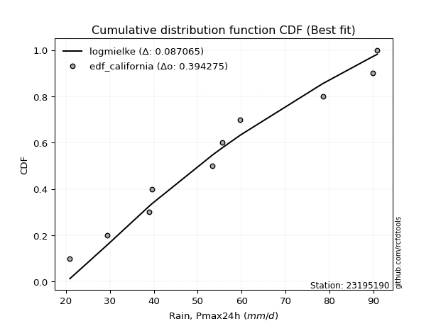</img>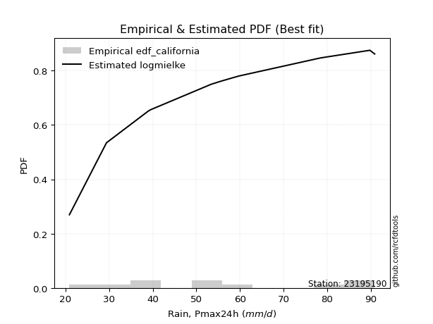</img>

</div>


### 2. EDF Hazen (1930)

Hazen method for plotting positions is a formula used to estimate the empirical cumulative probability distribution of flood events or other hydrological data. This formula often results in biased estimations, particularly when extrapolating to extreme events (high return periods).

<div align="center">


$P=(m-0.5)/n$


</div>


**2.1. Empirical values**

<div align="center">

|                | 0                  | 1                  | 2                  | 3                  | 4                  | 5                  | 6                 | 7         | 8                 | 9                  |
|:---------------|:-------------------|:-------------------|:-------------------|:-------------------|:-------------------|:-------------------|:------------------|:----------|:------------------|:-------------------|
| date           | 2009               | 2007               | 2005               | 2008               | 2006               | 2014               | 2012              | 2011      | 2013              | 2010               |
| x              | 20.9               | 29.4               | 39.0               | 39.6               | 53.4               | 55.6               | 59.7              | 78.5      | 89.8              | 90.9               |
| m              | 1                  | 2                  | 3                  | 4                  | 5                  | 6                  | 7                 | 8         | 9                 | 10                 |
| empirical_dist | edf_hazen          | edf_hazen          | edf_hazen          | edf_hazen          | edf_hazen          | edf_hazen          | edf_hazen         | edf_hazen | edf_hazen         | edf_hazen          |
| empirical      | 0.05               | 0.15               | 0.25               | 0.35               | 0.45               | 0.55               | 0.65              | 0.75      | 0.85              | 0.95               |
| empirical_tr   | 1.0526315789473684 | 1.1764705882352942 | 1.3333333333333333 | 1.5384615384615383 | 1.8181818181818181 | 2.2222222222222223 | 2.857142857142857 | 4.0       | 6.666666666666666 | 19.999999999999982 |

</div>


**2.2. Kolmogorov-Smirnov fit test (sorted by Δ)**


<div align="center">

|                | 0                   | 1                  | 2                   | 3                   | 4                   | 5                   | 6                   | 7                   | 8                   | 9                   | 10                  | 11                  | 12                 | 13                  | 14                  | 15                  | 16                  | 17                 | 18                  | 19                  | 20                  | 21                  | 22                  | 23                  | 24                  | 25                  | 26                  | 27                  | 28                  | 29                  | 30                  | 31                  | 32                  | 33                    | 34                  | 35                  | 36                  | 37                  | 38                 | 39                  | 40                  | 41                  | 42                  | 43                  | 44                  | 45                  | 46                  | 47                  | 48                  | 49                  | 50                  | 51                  | 52                 | 53                  | 54                  | 55                  | 56                 | 57                  | 58                 | 59                 | 60                  | 61                 | 62                 | 63                  | 64                  | 65                  | 66                  | 67                  | 68                 | 69                  | 70                  | 71                 | 72                  | 73                  | 74                  | 75                  | 76                 | 77                  | 78                  | 79                  | 80                 | 81                  | 82                  | 83                 | 84                 | 85                  | 86                 | 87                 |
|:---------------|:--------------------|:-------------------|:--------------------|:--------------------|:--------------------|:--------------------|:--------------------|:--------------------|:--------------------|:--------------------|:--------------------|:--------------------|:-------------------|:--------------------|:--------------------|:--------------------|:--------------------|:-------------------|:--------------------|:--------------------|:--------------------|:--------------------|:--------------------|:--------------------|:--------------------|:--------------------|:--------------------|:--------------------|:--------------------|:--------------------|:--------------------|:--------------------|:--------------------|:----------------------|:--------------------|:--------------------|:--------------------|:--------------------|:-------------------|:--------------------|:--------------------|:--------------------|:--------------------|:--------------------|:--------------------|:--------------------|:--------------------|:--------------------|:--------------------|:--------------------|:--------------------|:--------------------|:-------------------|:--------------------|:--------------------|:--------------------|:-------------------|:--------------------|:-------------------|:-------------------|:--------------------|:-------------------|:-------------------|:--------------------|:--------------------|:--------------------|:--------------------|:--------------------|:-------------------|:--------------------|:--------------------|:-------------------|:--------------------|:--------------------|:--------------------|:--------------------|:-------------------|:--------------------|:--------------------|:--------------------|:-------------------|:--------------------|:--------------------|:-------------------|:-------------------|:--------------------|:-------------------|:-------------------|
| station        | 23195190            | 23195190           | 23195190            | 23195190            | 23195190            | 23195190            | 23195190            | 23195190            | 23195190            | 23195190            | 23195190            | 23195190            | 23195190           | 23195190            | 23195190            | 23195190            | 23195190            | 23195190           | 23195190            | 23195190            | 23195190            | 23195190            | 23195190            | 23195190            | 23195190            | 23195190            | 23195190            | 23195190            | 23195190            | 23195190            | 23195190            | 23195190            | 23195190            | 23195190              | 23195190            | 23195190            | 23195190            | 23195190            | 23195190           | 23195190            | 23195190            | 23195190            | 23195190            | 23195190            | 23195190            | 23195190            | 23195190            | 23195190            | 23195190            | 23195190            | 23195190            | 23195190            | 23195190           | 23195190            | 23195190            | 23195190            | 23195190           | 23195190            | 23195190           | 23195190           | 23195190            | 23195190           | 23195190           | 23195190            | 23195190            | 23195190            | 23195190            | 23195190            | 23195190           | 23195190            | 23195190            | 23195190           | 23195190            | 23195190            | 23195190            | 23195190            | 23195190           | 23195190            | 23195190            | 23195190            | 23195190           | 23195190            | 23195190            | 23195190           | 23195190           | 23195190            | 23195190           | 23195190           |
| empirical_dist | edf_hazen           | edf_hazen          | edf_hazen           | edf_hazen           | edf_hazen           | edf_hazen           | edf_hazen           | edf_hazen           | edf_hazen           | edf_hazen           | edf_hazen           | edf_hazen           | edf_hazen          | edf_hazen           | edf_hazen           | edf_hazen           | edf_hazen           | edf_hazen          | edf_hazen           | edf_hazen           | edf_hazen           | edf_hazen           | edf_hazen           | edf_hazen           | edf_hazen           | edf_hazen           | edf_hazen           | edf_hazen           | edf_hazen           | edf_hazen           | edf_hazen           | edf_hazen           | edf_hazen           | edf_hazen             | edf_hazen           | edf_hazen           | edf_hazen           | edf_hazen           | edf_hazen          | edf_hazen           | edf_hazen           | edf_hazen           | edf_hazen           | edf_hazen           | edf_hazen           | edf_hazen           | edf_hazen           | edf_hazen           | edf_hazen           | edf_hazen           | edf_hazen           | edf_hazen           | edf_hazen          | edf_hazen           | edf_hazen           | edf_hazen           | edf_hazen          | edf_hazen           | edf_hazen          | edf_hazen          | edf_hazen           | edf_hazen          | edf_hazen          | edf_hazen           | edf_hazen           | edf_hazen           | edf_hazen           | edf_hazen           | edf_hazen          | edf_hazen           | edf_hazen           | edf_hazen          | edf_hazen           | edf_hazen           | edf_hazen           | edf_hazen           | edf_hazen          | edf_hazen           | edf_hazen           | edf_hazen           | edf_hazen          | edf_hazen           | edf_hazen           | edf_hazen          | edf_hazen          | edf_hazen           | edf_hazen          | edf_hazen          |
| p_dist         | logfisk             | invweibull         | logpearson3         | weibull_min         | loggompertz         | rayleigh            | f                   | genlogistic         | erlang              | chi2                | maxwell             | gamma               | ncf                | betaprime           | logweibull_min      | fisk                | kstwobign           | invgauss           | invgamma            | halfnorm            | rice                | alpha               | logloggamma         | logjohnsonsu        | logfatiguelife      | logf                | logt                | lognorm             | lognorm             | logcrystalball      | logexponnorm        | pearson3            | lognct              | loglaplace_asymmetric | gumbel_r            | logbetaprime        | loggumbel_l         | loglogistic         | exponnorm          | nct                 | norm                | crystalball         | truncnorm           | t                   | loginvgamma         | logerlang           | logrice             | moyal               | loggamma            | loggamma            | loghypsecant        | johnsonsu           | logncf             | loginvgauss         | logalpha            | halflogistic        | logmielke          | loginvweibull       | logistic           | logmaxwell         | loglaplace          | laplace_asymmetric | lograyleigh        | hypsecant           | gompertz            | gumbel_l            | nakagami            | lognakagami         | loggenexpon        | genexpon            | expon               | logkstwobign       | laplace             | loghalfnorm         | loggumbel_r         | logtruncnorm        | mielke             | wald                | logmoyal            | loghalflogistic     | logexpon           | logwald             | loggibrat           | logchi2            | gibrat             | loglognorm          | fatiguelife        | loggenlogistic     |
| delta          | 0.07949252370710919 | 0.0819518035368546 | 0.08211618388452657 | 0.08426959404921663 | 0.08452821442810454 | 0.08478530301107634 | 0.08483793927349254 | 0.08490169921325097 | 0.08513449972123904 | 0.08514783843232904 | 0.08530851786559002 | 0.08643396881603205 | 0.0866705532987242 | 0.08686837921395707 | 0.08742981118388282 | 0.08743553895450712 | 0.08796002343046605 | 0.0880097198622477 | 0.08952758284624807 | 0.08988077003310918 | 0.09135427075875685 | 0.09190878735416119 | 0.09519560858049647 | 0.09622940843642935 | 0.09772989445915997 | 0.09808225858008485 | 0.09845972685778975 | 0.09846220543776102 | 0.09846220543776102 | 0.09846220638434128 | 0.09846352027741218 | 0.10025266802644367 | 0.10051673934362654 | 0.1025060403811362    | 0.10296125859080174 | 0.10383396629870839 | 0.10416641336148935 | 0.10499637107671872 | 0.1056594442319441 | 0.10584304981983134 | 0.10584908232838475 | 0.10584908499117321 | 0.10584909175300428 | 0.10585184532154496 | 0.10756591163422896 | 0.10779393577393964 | 0.10783741809148634 | 0.10894561803186997 | 0.10943173787027333 | 0.10943173787027333 | 0.11148580262173757 | 0.11153654572240529 | 0.1132647671221228 | 0.11700198939665801 | 0.11749542723256784 | 0.11923400876231496 | 0.1210812996313092 | 0.12720535125656374 | 0.1285067007349214 | 0.1289537466983744 | 0.12910249794831813 | 0.1314352107353786 | 0.1387556339400739 | 0.14324373644521324 | 0.14576410654345773 | 0.14600639635570511 | 0.14999999986000018 | 0.14999999999999386 | 0.1500442240391308 | 0.15675920088648204 | 0.15719622159126673 | 0.1576980525637371 | 0.16235709574080495 | 0.16640561293910044 | 0.16861455073233728 | 0.17011231914171304 | 0.1704374450316848 | 0.17677580248734553 | 0.19350157202757629 | 0.19363963255419242 | 0.2569561373807895 | 0.26255810472325053 | 0.29153911979507413 | 0.3173249058923695 | 0.3206618708187322 | 0.44554756135973117 | 0.5511529241052289 | 0.85               |
| deltao         | 0.3942745923300002  | 0.3942745923300002 | 0.3942745923300002  | 0.3942745923300002  | 0.3942745923300002  | 0.3942745923300002  | 0.3942745923300002  | 0.3942745923300002  | 0.3942745923300002  | 0.3942745923300002  | 0.3942745923300002  | 0.3942745923300002  | 0.3942745923300002 | 0.3942745923300002  | 0.3942745923300002  | 0.3942745923300002  | 0.3942745923300002  | 0.3942745923300002 | 0.3942745923300002  | 0.3942745923300002  | 0.3942745923300002  | 0.3942745923300002  | 0.3942745923300002  | 0.3942745923300002  | 0.3942745923300002  | 0.3942745923300002  | 0.3942745923300002  | 0.3942745923300002  | 0.3942745923300002  | 0.3942745923300002  | 0.3942745923300002  | 0.3942745923300002  | 0.3942745923300002  | 0.3942745923300002    | 0.3942745923300002  | 0.3942745923300002  | 0.3942745923300002  | 0.3942745923300002  | 0.3942745923300002 | 0.3942745923300002  | 0.3942745923300002  | 0.3942745923300002  | 0.3942745923300002  | 0.3942745923300002  | 0.3942745923300002  | 0.3942745923300002  | 0.3942745923300002  | 0.3942745923300002  | 0.3942745923300002  | 0.3942745923300002  | 0.3942745923300002  | 0.3942745923300002  | 0.3942745923300002 | 0.3942745923300002  | 0.3942745923300002  | 0.3942745923300002  | 0.3942745923300002 | 0.3942745923300002  | 0.3942745923300002 | 0.3942745923300002 | 0.3942745923300002  | 0.3942745923300002 | 0.3942745923300002 | 0.3942745923300002  | 0.3942745923300002  | 0.3942745923300002  | 0.3942745923300002  | 0.3942745923300002  | 0.3942745923300002 | 0.3942745923300002  | 0.3942745923300002  | 0.3942745923300002 | 0.3942745923300002  | 0.3942745923300002  | 0.3942745923300002  | 0.3942745923300002  | 0.3942745923300002 | 0.3942745923300002  | 0.3942745923300002  | 0.3942745923300002  | 0.3942745923300002 | 0.3942745923300002  | 0.3942745923300002  | 0.3942745923300002 | 0.3942745923300002 | 0.3942745923300002  | 0.3942745923300002 | 0.3942745923300002 |
| eval           | Δo > Δ              | Δo > Δ             | Δo > Δ              | Δo > Δ              | Δo > Δ              | Δo > Δ              | Δo > Δ              | Δo > Δ              | Δo > Δ              | Δo > Δ              | Δo > Δ              | Δo > Δ              | Δo > Δ             | Δo > Δ              | Δo > Δ              | Δo > Δ              | Δo > Δ              | Δo > Δ             | Δo > Δ              | Δo > Δ              | Δo > Δ              | Δo > Δ              | Δo > Δ              | Δo > Δ              | Δo > Δ              | Δo > Δ              | Δo > Δ              | Δo > Δ              | Δo > Δ              | Δo > Δ              | Δo > Δ              | Δo > Δ              | Δo > Δ              | Δo > Δ                | Δo > Δ              | Δo > Δ              | Δo > Δ              | Δo > Δ              | Δo > Δ             | Δo > Δ              | Δo > Δ              | Δo > Δ              | Δo > Δ              | Δo > Δ              | Δo > Δ              | Δo > Δ              | Δo > Δ              | Δo > Δ              | Δo > Δ              | Δo > Δ              | Δo > Δ              | Δo > Δ              | Δo > Δ             | Δo > Δ              | Δo > Δ              | Δo > Δ              | Δo > Δ             | Δo > Δ              | Δo > Δ             | Δo > Δ             | Δo > Δ              | Δo > Δ             | Δo > Δ             | Δo > Δ              | Δo > Δ              | Δo > Δ              | Δo > Δ              | Δo > Δ              | Δo > Δ             | Δo > Δ              | Δo > Δ              | Δo > Δ             | Δo > Δ              | Δo > Δ              | Δo > Δ              | Δo > Δ              | Δo > Δ             | Δo > Δ              | Δo > Δ              | Δo > Δ              | Δo > Δ             | Δo > Δ              | Δo > Δ              | Δo > Δ             | Δo > Δ             | Δo <= Δ             | Δo <= Δ            | Δo <= Δ            |
| fit            | 1                   | 1                  | 1                   | 1                   | 1                   | 1                   | 1                   | 1                   | 1                   | 1                   | 1                   | 1                   | 1                  | 1                   | 1                   | 1                   | 1                   | 1                  | 1                   | 1                   | 1                   | 1                   | 1                   | 1                   | 1                   | 1                   | 1                   | 1                   | 1                   | 1                   | 1                   | 1                   | 1                   | 1                     | 1                   | 1                   | 1                   | 1                   | 1                  | 1                   | 1                   | 1                   | 1                   | 1                   | 1                   | 1                   | 1                   | 1                   | 1                   | 1                   | 1                   | 1                   | 1                  | 1                   | 1                   | 1                   | 1                  | 1                   | 1                  | 1                  | 1                   | 1                  | 1                  | 1                   | 1                   | 1                   | 1                   | 1                   | 1                  | 1                   | 1                   | 1                  | 1                   | 1                   | 1                   | 1                   | 1                  | 1                   | 1                   | 1                   | 1                  | 1                   | 1                   | 1                  | 1                  | 0                   | 0                  | 0                  |
| n              | 10                  | 10                 | 10                  | 10                  | 10                  | 10                  | 10                  | 10                  | 10                  | 10                  | 10                  | 10                  | 10                 | 10                  | 10                  | 10                  | 10                  | 10                 | 10                  | 10                  | 10                  | 10                  | 10                  | 10                  | 10                  | 10                  | 10                  | 10                  | 10                  | 10                  | 10                  | 10                  | 10                  | 10                    | 10                  | 10                  | 10                  | 10                  | 10                 | 10                  | 10                  | 10                  | 10                  | 10                  | 10                  | 10                  | 10                  | 10                  | 10                  | 10                  | 10                  | 10                  | 10                 | 10                  | 10                  | 10                  | 10                 | 10                  | 10                 | 10                 | 10                  | 10                 | 10                 | 10                  | 10                  | 10                  | 10                  | 10                  | 10                 | 10                  | 10                  | 10                 | 10                  | 10                  | 10                  | 10                  | 10                 | 10                  | 10                  | 10                  | 10                 | 10                  | 10                  | 10                 | 10                 | 10                  | 10                 | 10                 |
| best_fit       | 1                   | 0                  | 0                   | 0                   | 0                   | 0                   | 0                   | 0                   | 0                   | 0                   | 0                   | 0                   | 0                  | 0                   | 0                   | 0                   | 0                   | 0                  | 0                   | 0                   | 0                   | 0                   | 0                   | 0                   | 0                   | 0                   | 0                   | 0                   | 0                   | 0                   | 0                   | 0                   | 0                   | 0                     | 0                   | 0                   | 0                   | 0                   | 0                  | 0                   | 0                   | 0                   | 0                   | 0                   | 0                   | 0                   | 0                   | 0                   | 0                   | 0                   | 0                   | 0                   | 0                  | 0                   | 0                   | 0                   | 0                  | 0                   | 0                  | 0                  | 0                   | 0                  | 0                  | 0                   | 0                   | 0                   | 0                   | 0                   | 0                  | 0                   | 0                   | 0                  | 0                   | 0                   | 0                   | 0                   | 0                  | 0                   | 0                   | 0                   | 0                  | 0                   | 0                   | 0                  | 0                  | 0                   | 0                  | 0                  |
| best_fit_sort  | 1                   | 2                  | 3                   | 4                   | 5                   | 6                   | 7                   | 8                   | 9                   | 10                  | 11                  | 12                  | 13                 | 14                  | 15                  | 16                  | 17                  | 18                 | 19                  | 20                  | 21                  | 22                  | 23                  | 24                  | 25                  | 26                  | 27                  | 28                  | 29                  | 30                  | 31                  | 32                  | 33                  | 34                    | 35                  | 36                  | 37                  | 38                  | 39                 | 40                  | 41                  | 42                  | 43                  | 44                  | 45                  | 46                  | 47                  | 48                  | 49                  | 50                  | 51                  | 52                  | 53                 | 54                  | 55                  | 56                  | 57                 | 58                  | 59                 | 60                 | 61                  | 62                 | 63                 | 64                  | 65                  | 66                  | 67                  | 68                  | 69                 | 70                  | 71                  | 72                 | 73                  | 74                  | 75                  | 76                  | 77                 | 78                  | 79                  | 80                  | 81                 | 82                  | 83                  | 84                 | 85                 | 86                  | 87                 | 88                 |

</div>


**2.3. Best fit**

<div align="center">

|   id |   station | empirical_dist   | p_dist   |     delta |   deltao | eval   |   fit |   n |   best_fit |   best_fit_sort |
|-----:|----------:|:-----------------|:---------|----------:|---------:|:-------|------:|----:|-----------:|----------------:|
|    0 |  23195190 | edf_hazen        | logfisk  | 0.0794925 | 0.394275 | Δo > Δ |     1 |  10 |          1 |               1 |

</div>


<div align="center">

</img>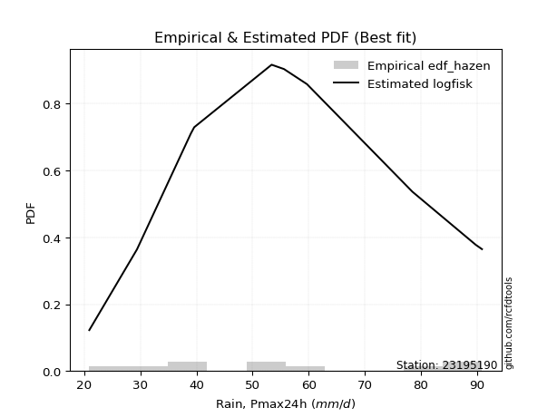</img>

</div>


### 3. EDF Weibull (1939)

Weibull plotting position formula is an empirical method used to estimate the non-exceedance probability or plotting position for a set of observed data, is often recommended or widely used in practice, particularly in flood frequency analysis.

<div align="center">


$P=m/(n+1)$


</div>


**3.1. Empirical values**

<div align="center">

|                | 0                   | 1                   | 2                  | 3                   | 4                   | 5                  | 6                  | 7                  | 8                  | 9                  |
|:---------------|:--------------------|:--------------------|:-------------------|:--------------------|:--------------------|:-------------------|:-------------------|:-------------------|:-------------------|:-------------------|
| date           | 2009                | 2007                | 2005               | 2008                | 2006                | 2014               | 2012               | 2011               | 2013               | 2010               |
| x              | 20.9                | 29.4                | 39.0               | 39.6                | 53.4                | 55.6               | 59.7               | 78.5               | 89.8               | 90.9               |
| m              | 1                   | 2                   | 3                  | 4                   | 5                   | 6                  | 7                  | 8                  | 9                  | 10                 |
| empirical_dist | edf_weibull         | edf_weibull         | edf_weibull        | edf_weibull         | edf_weibull         | edf_weibull        | edf_weibull        | edf_weibull        | edf_weibull        | edf_weibull        |
| empirical      | 0.09090909090909091 | 0.18181818181818182 | 0.2727272727272727 | 0.36363636363636365 | 0.45454545454545453 | 0.5454545454545454 | 0.6363636363636364 | 0.7272727272727273 | 0.8181818181818182 | 0.9090909090909091 |
| empirical_tr   | 1.1                 | 1.2222222222222223  | 1.375              | 1.5714285714285714  | 1.8333333333333335  | 2.1999999999999997 | 2.75               | 3.666666666666667  | 5.500000000000002  | 10.999999999999996 |

</div>


**3.2. Kolmogorov-Smirnov fit test (sorted by Δ)**


<div align="center">

|                | 0                   | 1                   | 2                   | 3                   | 4                   | 5                   | 6                   | 7                   | 8                   | 9                   | 10                 | 11                 | 12                 | 13                  | 14                  | 15                  | 16                  | 17                  | 18                  | 19                  | 20                  | 21                  | 22                  | 23                  | 24                  | 25                  | 26                  | 27                  | 28                  | 29                  | 30                  | 31                  | 32                 | 33                  | 34                  | 35                  | 36                  | 37                  | 38                  | 39                  | 40                 | 41                  | 42                  | 43                  | 44                 | 45                  | 46                  | 47                  | 48                  | 49                  | 50                  | 51                  | 52                    | 53                  | 54                  | 55                  | 56                  | 57                  | 58                  | 59                  | 60                  | 61                  | 62                 | 63                 | 64                  | 65                 | 66                  | 67                  | 68                  | 69                 | 70                 | 71                  | 72                  | 73                  | 74                 | 75                 | 76                 | 77                  | 78                 | 79                 | 80                  | 81                 | 82                 | 83                 | 84                 | 85                  | 86                 | 87                 |
|:---------------|:--------------------|:--------------------|:--------------------|:--------------------|:--------------------|:--------------------|:--------------------|:--------------------|:--------------------|:--------------------|:-------------------|:-------------------|:-------------------|:--------------------|:--------------------|:--------------------|:--------------------|:--------------------|:--------------------|:--------------------|:--------------------|:--------------------|:--------------------|:--------------------|:--------------------|:--------------------|:--------------------|:--------------------|:--------------------|:--------------------|:--------------------|:--------------------|:-------------------|:--------------------|:--------------------|:--------------------|:--------------------|:--------------------|:--------------------|:--------------------|:-------------------|:--------------------|:--------------------|:--------------------|:-------------------|:--------------------|:--------------------|:--------------------|:--------------------|:--------------------|:--------------------|:--------------------|:----------------------|:--------------------|:--------------------|:--------------------|:--------------------|:--------------------|:--------------------|:--------------------|:--------------------|:--------------------|:-------------------|:-------------------|:--------------------|:-------------------|:--------------------|:--------------------|:--------------------|:-------------------|:-------------------|:--------------------|:--------------------|:--------------------|:-------------------|:-------------------|:-------------------|:--------------------|:-------------------|:-------------------|:--------------------|:-------------------|:-------------------|:-------------------|:-------------------|:--------------------|:-------------------|:-------------------|
| station        | 23195190            | 23195190            | 23195190            | 23195190            | 23195190            | 23195190            | 23195190            | 23195190            | 23195190            | 23195190            | 23195190           | 23195190           | 23195190           | 23195190            | 23195190            | 23195190            | 23195190            | 23195190            | 23195190            | 23195190            | 23195190            | 23195190            | 23195190            | 23195190            | 23195190            | 23195190            | 23195190            | 23195190            | 23195190            | 23195190            | 23195190            | 23195190            | 23195190           | 23195190            | 23195190            | 23195190            | 23195190            | 23195190            | 23195190            | 23195190            | 23195190           | 23195190            | 23195190            | 23195190            | 23195190           | 23195190            | 23195190            | 23195190            | 23195190            | 23195190            | 23195190            | 23195190            | 23195190              | 23195190            | 23195190            | 23195190            | 23195190            | 23195190            | 23195190            | 23195190            | 23195190            | 23195190            | 23195190           | 23195190           | 23195190            | 23195190           | 23195190            | 23195190            | 23195190            | 23195190           | 23195190           | 23195190            | 23195190            | 23195190            | 23195190           | 23195190           | 23195190           | 23195190            | 23195190           | 23195190           | 23195190            | 23195190           | 23195190           | 23195190           | 23195190           | 23195190            | 23195190           | 23195190           |
| empirical_dist | edf_weibull         | edf_weibull         | edf_weibull         | edf_weibull         | edf_weibull         | edf_weibull         | edf_weibull         | edf_weibull         | edf_weibull         | edf_weibull         | edf_weibull        | edf_weibull        | edf_weibull        | edf_weibull         | edf_weibull         | edf_weibull         | edf_weibull         | edf_weibull         | edf_weibull         | edf_weibull         | edf_weibull         | edf_weibull         | edf_weibull         | edf_weibull         | edf_weibull         | edf_weibull         | edf_weibull         | edf_weibull         | edf_weibull         | edf_weibull         | edf_weibull         | edf_weibull         | edf_weibull        | edf_weibull         | edf_weibull         | edf_weibull         | edf_weibull         | edf_weibull         | edf_weibull         | edf_weibull         | edf_weibull        | edf_weibull         | edf_weibull         | edf_weibull         | edf_weibull        | edf_weibull         | edf_weibull         | edf_weibull         | edf_weibull         | edf_weibull         | edf_weibull         | edf_weibull         | edf_weibull           | edf_weibull         | edf_weibull         | edf_weibull         | edf_weibull         | edf_weibull         | edf_weibull         | edf_weibull         | edf_weibull         | edf_weibull         | edf_weibull        | edf_weibull        | edf_weibull         | edf_weibull        | edf_weibull         | edf_weibull         | edf_weibull         | edf_weibull        | edf_weibull        | edf_weibull         | edf_weibull         | edf_weibull         | edf_weibull        | edf_weibull        | edf_weibull        | edf_weibull         | edf_weibull        | edf_weibull        | edf_weibull         | edf_weibull        | edf_weibull        | edf_weibull        | edf_weibull        | edf_weibull         | edf_weibull        | edf_weibull        |
| p_dist         | logfisk             | logbetaprime        | loginvgamma         | lognct              | logerlang           | logrice             | logf                | logfatiguelife      | logt                | logcrystalball      | lognorm            | lognorm            | logexponnorm       | invweibull          | logpearson3         | loggamma            | loggamma            | fisk                | f                   | erlang              | chi2                | weibull_min         | loggompertz         | rayleigh            | genlogistic         | maxwell             | halfnorm            | logncf              | rice                | logloggamma         | logweibull_min      | gamma               | ncf                | betaprime           | logjohnsonsu        | kstwobign           | invgauss            | loginvweibull       | alpha               | invgamma            | loginvgauss        | logalpha            | pearson3            | exponnorm           | nct                | norm                | crystalball         | truncnorm           | t                   | loglogistic         | logmaxwell          | johnsonsu           | loglaplace_asymmetric | gumbel_r            | loggumbel_l         | moyal               | gompertz            | lograyleigh         | loghypsecant        | logistic            | loglaplace          | laplace_asymmetric  | loggenexpon        | halflogistic       | genexpon            | expon              | logmielke           | logkstwobign        | mielke              | hypsecant          | gumbel_l           | loghalfnorm         | loggumbel_r         | laplace             | logtruncnorm       | nakagami           | lognakagami        | logmoyal            | loghalflogistic    | wald               | logexpon            | logwald            | loggibrat          | logchi2            | gibrat             | loglognorm          | fatiguelife        | loggenlogistic     |
| delta          | 0.09549231561215155 | 0.09928851175325387 | 0.10302045708877444 | 0.10311451684501705 | 0.10324848122848512 | 0.10329196354603182 | 0.10347948174169219 | 0.10389895136464622 | 0.10440307301857099 | 0.10440433654978154 | 0.1044044205028567 | 0.1044044205028567 | 0.1044051304921938 | 0.10467907626412731 | 0.10484345661179928 | 0.10488628332481881 | 0.10488628332481881 | 0.10490392802001047 | 0.10566981789122598 | 0.10577285385343393 | 0.10577316686546323 | 0.10699686677648934 | 0.10725548715537725 | 0.10751257573834905 | 0.10762897194052368 | 0.10803579059286272 | 0.10842394921192366 | 0.10871931257666828 | 0.10881961408967511 | 0.10883197221686014 | 0.10893117614064429 | 0.10916124154330475 | 0.1093978260259969 | 0.10959565194122978 | 0.11051168747379037 | 0.11068729615773876 | 0.11073699258952041 | 0.11095176924375277 | 0.11201821725762828 | 0.11225485557352077 | 0.1124565348512035 | 0.11294997268711332 | 0.11388903166280734 | 0.11929580786830776 | 0.119479413456195  | 0.11948544596474842 | 0.11948544862753688 | 0.11948545538936794 | 0.11948820895790863 | 0.12375998093120355 | 0.12440829215291987 | 0.12517290935876896 | 0.1252333131084089    | 0.12568853131807445 | 0.12689368608876206 | 0.13167289075914268 | 0.13212774290709406 | 0.13421017939461938 | 0.13421307534901028 | 0.14214306437128507 | 0.14424230346318667 | 0.14507157437174226 | 0.1454987694936763 | 0.1510521905804968 | 0.15221374634102752 | 0.1526507670458122 | 0.15289948144949095 | 0.15315259801828257 | 0.15680108139532112 | 0.1568801000815769 | 0.1575043074380913 | 0.16186015839364593 | 0.16406909618688276 | 0.17599345937716862 | 0.1818181795064692 | 0.181818181678182  | 0.1818181818181757 | 0.18895611748212177 | 0.1890941780087379 | 0.1904121661237092 | 0.23422886465351678 | 0.258012650177796  | 0.2869936652496196 | 0.2945976331650968 | 0.3342982344550959 | 0.41372937954154937 | 0.5193347422870471 | 0.8181818181818182 |
| deltao         | 0.3942745923300002  | 0.3942745923300002  | 0.3942745923300002  | 0.3942745923300002  | 0.3942745923300002  | 0.3942745923300002  | 0.3942745923300002  | 0.3942745923300002  | 0.3942745923300002  | 0.3942745923300002  | 0.3942745923300002 | 0.3942745923300002 | 0.3942745923300002 | 0.3942745923300002  | 0.3942745923300002  | 0.3942745923300002  | 0.3942745923300002  | 0.3942745923300002  | 0.3942745923300002  | 0.3942745923300002  | 0.3942745923300002  | 0.3942745923300002  | 0.3942745923300002  | 0.3942745923300002  | 0.3942745923300002  | 0.3942745923300002  | 0.3942745923300002  | 0.3942745923300002  | 0.3942745923300002  | 0.3942745923300002  | 0.3942745923300002  | 0.3942745923300002  | 0.3942745923300002 | 0.3942745923300002  | 0.3942745923300002  | 0.3942745923300002  | 0.3942745923300002  | 0.3942745923300002  | 0.3942745923300002  | 0.3942745923300002  | 0.3942745923300002 | 0.3942745923300002  | 0.3942745923300002  | 0.3942745923300002  | 0.3942745923300002 | 0.3942745923300002  | 0.3942745923300002  | 0.3942745923300002  | 0.3942745923300002  | 0.3942745923300002  | 0.3942745923300002  | 0.3942745923300002  | 0.3942745923300002    | 0.3942745923300002  | 0.3942745923300002  | 0.3942745923300002  | 0.3942745923300002  | 0.3942745923300002  | 0.3942745923300002  | 0.3942745923300002  | 0.3942745923300002  | 0.3942745923300002  | 0.3942745923300002 | 0.3942745923300002 | 0.3942745923300002  | 0.3942745923300002 | 0.3942745923300002  | 0.3942745923300002  | 0.3942745923300002  | 0.3942745923300002 | 0.3942745923300002 | 0.3942745923300002  | 0.3942745923300002  | 0.3942745923300002  | 0.3942745923300002 | 0.3942745923300002 | 0.3942745923300002 | 0.3942745923300002  | 0.3942745923300002 | 0.3942745923300002 | 0.3942745923300002  | 0.3942745923300002 | 0.3942745923300002 | 0.3942745923300002 | 0.3942745923300002 | 0.3942745923300002  | 0.3942745923300002 | 0.3942745923300002 |
| eval           | Δo > Δ              | Δo > Δ              | Δo > Δ              | Δo > Δ              | Δo > Δ              | Δo > Δ              | Δo > Δ              | Δo > Δ              | Δo > Δ              | Δo > Δ              | Δo > Δ             | Δo > Δ             | Δo > Δ             | Δo > Δ              | Δo > Δ              | Δo > Δ              | Δo > Δ              | Δo > Δ              | Δo > Δ              | Δo > Δ              | Δo > Δ              | Δo > Δ              | Δo > Δ              | Δo > Δ              | Δo > Δ              | Δo > Δ              | Δo > Δ              | Δo > Δ              | Δo > Δ              | Δo > Δ              | Δo > Δ              | Δo > Δ              | Δo > Δ             | Δo > Δ              | Δo > Δ              | Δo > Δ              | Δo > Δ              | Δo > Δ              | Δo > Δ              | Δo > Δ              | Δo > Δ             | Δo > Δ              | Δo > Δ              | Δo > Δ              | Δo > Δ             | Δo > Δ              | Δo > Δ              | Δo > Δ              | Δo > Δ              | Δo > Δ              | Δo > Δ              | Δo > Δ              | Δo > Δ                | Δo > Δ              | Δo > Δ              | Δo > Δ              | Δo > Δ              | Δo > Δ              | Δo > Δ              | Δo > Δ              | Δo > Δ              | Δo > Δ              | Δo > Δ             | Δo > Δ             | Δo > Δ              | Δo > Δ             | Δo > Δ              | Δo > Δ              | Δo > Δ              | Δo > Δ             | Δo > Δ             | Δo > Δ              | Δo > Δ              | Δo > Δ              | Δo > Δ             | Δo > Δ             | Δo > Δ             | Δo > Δ              | Δo > Δ             | Δo > Δ             | Δo > Δ              | Δo > Δ             | Δo > Δ             | Δo > Δ             | Δo > Δ             | Δo <= Δ             | Δo <= Δ            | Δo <= Δ            |
| fit            | 1                   | 1                   | 1                   | 1                   | 1                   | 1                   | 1                   | 1                   | 1                   | 1                   | 1                  | 1                  | 1                  | 1                   | 1                   | 1                   | 1                   | 1                   | 1                   | 1                   | 1                   | 1                   | 1                   | 1                   | 1                   | 1                   | 1                   | 1                   | 1                   | 1                   | 1                   | 1                   | 1                  | 1                   | 1                   | 1                   | 1                   | 1                   | 1                   | 1                   | 1                  | 1                   | 1                   | 1                   | 1                  | 1                   | 1                   | 1                   | 1                   | 1                   | 1                   | 1                   | 1                     | 1                   | 1                   | 1                   | 1                   | 1                   | 1                   | 1                   | 1                   | 1                   | 1                  | 1                  | 1                   | 1                  | 1                   | 1                   | 1                   | 1                  | 1                  | 1                   | 1                   | 1                   | 1                  | 1                  | 1                  | 1                   | 1                  | 1                  | 1                   | 1                  | 1                  | 1                  | 1                  | 0                   | 0                  | 0                  |
| n              | 10                  | 10                  | 10                  | 10                  | 10                  | 10                  | 10                  | 10                  | 10                  | 10                  | 10                 | 10                 | 10                 | 10                  | 10                  | 10                  | 10                  | 10                  | 10                  | 10                  | 10                  | 10                  | 10                  | 10                  | 10                  | 10                  | 10                  | 10                  | 10                  | 10                  | 10                  | 10                  | 10                 | 10                  | 10                  | 10                  | 10                  | 10                  | 10                  | 10                  | 10                 | 10                  | 10                  | 10                  | 10                 | 10                  | 10                  | 10                  | 10                  | 10                  | 10                  | 10                  | 10                    | 10                  | 10                  | 10                  | 10                  | 10                  | 10                  | 10                  | 10                  | 10                  | 10                 | 10                 | 10                  | 10                 | 10                  | 10                  | 10                  | 10                 | 10                 | 10                  | 10                  | 10                  | 10                 | 10                 | 10                 | 10                  | 10                 | 10                 | 10                  | 10                 | 10                 | 10                 | 10                 | 10                  | 10                 | 10                 |
| best_fit       | 1                   | 0                   | 0                   | 0                   | 0                   | 0                   | 0                   | 0                   | 0                   | 0                   | 0                  | 0                  | 0                  | 0                   | 0                   | 0                   | 0                   | 0                   | 0                   | 0                   | 0                   | 0                   | 0                   | 0                   | 0                   | 0                   | 0                   | 0                   | 0                   | 0                   | 0                   | 0                   | 0                  | 0                   | 0                   | 0                   | 0                   | 0                   | 0                   | 0                   | 0                  | 0                   | 0                   | 0                   | 0                  | 0                   | 0                   | 0                   | 0                   | 0                   | 0                   | 0                   | 0                     | 0                   | 0                   | 0                   | 0                   | 0                   | 0                   | 0                   | 0                   | 0                   | 0                  | 0                  | 0                   | 0                  | 0                   | 0                   | 0                   | 0                  | 0                  | 0                   | 0                   | 0                   | 0                  | 0                  | 0                  | 0                   | 0                  | 0                  | 0                   | 0                  | 0                  | 0                  | 0                  | 0                   | 0                  | 0                  |
| best_fit_sort  | 1                   | 2                   | 3                   | 4                   | 5                   | 6                   | 7                   | 8                   | 9                   | 10                  | 11                 | 12                 | 13                 | 14                  | 15                  | 16                  | 17                  | 18                  | 19                  | 20                  | 21                  | 22                  | 23                  | 24                  | 25                  | 26                  | 27                  | 28                  | 29                  | 30                  | 31                  | 32                  | 33                 | 34                  | 35                  | 36                  | 37                  | 38                  | 39                  | 40                  | 41                 | 42                  | 43                  | 44                  | 45                 | 46                  | 47                  | 48                  | 49                  | 50                  | 51                  | 52                  | 53                    | 54                  | 55                  | 56                  | 57                  | 58                  | 59                  | 60                  | 61                  | 62                  | 63                 | 64                 | 65                  | 66                 | 67                  | 68                  | 69                  | 70                 | 71                 | 72                  | 73                  | 74                  | 75                 | 76                 | 77                 | 78                  | 79                 | 80                 | 81                  | 82                 | 83                 | 84                 | 85                 | 86                  | 87                 | 88                 |

</div>


**3.3. Best fit**

<div align="center">

|   id |   station | empirical_dist   | p_dist   |     delta |   deltao | eval   |   fit |   n |   best_fit |   best_fit_sort |
|-----:|----------:|:-----------------|:---------|----------:|---------:|:-------|------:|----:|-----------:|----------------:|
|    0 |  23195190 | edf_weibull      | logfisk  | 0.0954923 | 0.394275 | Δo > Δ |     1 |  10 |          1 |               1 |

</div>


<div align="center">

</img>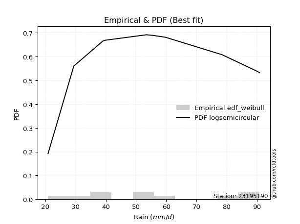</img>

</div>


### 4. EDF Beard (1943)

The Beard formula (or Beard´s plotting position formula) in hydrology is used to estimate the empirical non-exceedance probability _(P)_ of a flood event (or other extreme hydrological data point) within a given dataset.

<div align="center">


$P=(m-0.31)/(n+0.38)$


</div>


**4.1. Empirical values**

<div align="center">

|                | 0                   | 1                   | 2                  | 3                   | 4                   | 5                  | 6                  | 7                  | 8                  | 9                  |
|:---------------|:--------------------|:--------------------|:-------------------|:--------------------|:--------------------|:-------------------|:-------------------|:-------------------|:-------------------|:-------------------|
| date           | 2009                | 2007                | 2005               | 2008                | 2006                | 2014               | 2012               | 2011               | 2013               | 2010               |
| x              | 20.9                | 29.4                | 39.0               | 39.6                | 53.4                | 55.6               | 59.7               | 78.5               | 89.8               | 90.9               |
| m              | 1                   | 2                   | 3                  | 4                   | 5                   | 6                  | 7                  | 8                  | 9                  | 10                 |
| empirical_dist | edf_beard           | edf_beard           | edf_beard          | edf_beard           | edf_beard           | edf_beard          | edf_beard          | edf_beard          | edf_beard          | edf_beard          |
| empirical      | 0.06647398843930635 | 0.16281310211946048 | 0.2591522157996146 | 0.35549132947976875 | 0.45183044315992293 | 0.5481695568400771 | 0.6445086705202312 | 0.7408477842003853 | 0.8371868978805393 | 0.9335260115606935 |
| empirical_tr   | 1.0712074303405574  | 1.1944764096662832  | 1.3498049414824447 | 1.5515695067264574  | 1.8242530755711774  | 2.213219616204691  | 2.813008130081301  | 3.8587360594795537 | 6.142011834319521  | 15.043478260869529 |

</div>


**4.2. Kolmogorov-Smirnov fit test (sorted by Δ)**


<div align="center">

|                | 0                   | 1                   | 2                   | 3                   | 4                  | 5                  | 6                   | 7                  | 8                   | 9                   | 10                  | 11                  | 12                  | 13                  | 14                  | 15                  | 16                  | 17                  | 18                  | 19                  | 20                 | 21                 | 22                  | 23                  | 24                  | 25                  | 26                  | 27                  | 28                  | 29                  | 30                  | 31                  | 32                  | 33                  | 34                  | 35                  | 36                  | 37                 | 38                 | 39                  | 40                  | 41                 | 42                  | 43                  | 44                  | 45                  | 46                  | 47                    | 48                  | 49                  | 50                  | 51                  | 52                  | 53                  | 54                  | 55                  | 56                  | 57                  | 58                  | 59                  | 60                  | 61                  | 62                  | 63                 | 64                 | 65                 | 66                 | 67                  | 68                 | 69                  | 70                  | 71                  | 72                  | 73                  | 74                  | 75                  | 76                  | 77                 | 78                  | 79                 | 80                  | 81                 | 82                 | 83                 | 84                 | 85                 | 86                 | 87                 |
|:---------------|:--------------------|:--------------------|:--------------------|:--------------------|:-------------------|:-------------------|:--------------------|:-------------------|:--------------------|:--------------------|:--------------------|:--------------------|:--------------------|:--------------------|:--------------------|:--------------------|:--------------------|:--------------------|:--------------------|:--------------------|:-------------------|:-------------------|:--------------------|:--------------------|:--------------------|:--------------------|:--------------------|:--------------------|:--------------------|:--------------------|:--------------------|:--------------------|:--------------------|:--------------------|:--------------------|:--------------------|:--------------------|:-------------------|:-------------------|:--------------------|:--------------------|:-------------------|:--------------------|:--------------------|:--------------------|:--------------------|:--------------------|:----------------------|:--------------------|:--------------------|:--------------------|:--------------------|:--------------------|:--------------------|:--------------------|:--------------------|:--------------------|:--------------------|:--------------------|:--------------------|:--------------------|:--------------------|:--------------------|:-------------------|:-------------------|:-------------------|:-------------------|:--------------------|:-------------------|:--------------------|:--------------------|:--------------------|:--------------------|:--------------------|:--------------------|:--------------------|:--------------------|:-------------------|:--------------------|:-------------------|:--------------------|:-------------------|:-------------------|:-------------------|:-------------------|:-------------------|:-------------------|:-------------------|
| station        | 23195190            | 23195190            | 23195190            | 23195190            | 23195190           | 23195190           | 23195190            | 23195190           | 23195190            | 23195190            | 23195190            | 23195190            | 23195190            | 23195190            | 23195190            | 23195190            | 23195190            | 23195190            | 23195190            | 23195190            | 23195190           | 23195190           | 23195190            | 23195190            | 23195190            | 23195190            | 23195190            | 23195190            | 23195190            | 23195190            | 23195190            | 23195190            | 23195190            | 23195190            | 23195190            | 23195190            | 23195190            | 23195190           | 23195190           | 23195190            | 23195190            | 23195190           | 23195190            | 23195190            | 23195190            | 23195190            | 23195190            | 23195190              | 23195190            | 23195190            | 23195190            | 23195190            | 23195190            | 23195190            | 23195190            | 23195190            | 23195190            | 23195190            | 23195190            | 23195190            | 23195190            | 23195190            | 23195190            | 23195190           | 23195190           | 23195190           | 23195190           | 23195190            | 23195190           | 23195190            | 23195190            | 23195190            | 23195190            | 23195190            | 23195190            | 23195190            | 23195190            | 23195190           | 23195190            | 23195190           | 23195190            | 23195190           | 23195190           | 23195190           | 23195190           | 23195190           | 23195190           | 23195190           |
| empirical_dist | edf_beard           | edf_beard           | edf_beard           | edf_beard           | edf_beard          | edf_beard          | edf_beard           | edf_beard          | edf_beard           | edf_beard           | edf_beard           | edf_beard           | edf_beard           | edf_beard           | edf_beard           | edf_beard           | edf_beard           | edf_beard           | edf_beard           | edf_beard           | edf_beard          | edf_beard          | edf_beard           | edf_beard           | edf_beard           | edf_beard           | edf_beard           | edf_beard           | edf_beard           | edf_beard           | edf_beard           | edf_beard           | edf_beard           | edf_beard           | edf_beard           | edf_beard           | edf_beard           | edf_beard          | edf_beard          | edf_beard           | edf_beard           | edf_beard          | edf_beard           | edf_beard           | edf_beard           | edf_beard           | edf_beard           | edf_beard             | edf_beard           | edf_beard           | edf_beard           | edf_beard           | edf_beard           | edf_beard           | edf_beard           | edf_beard           | edf_beard           | edf_beard           | edf_beard           | edf_beard           | edf_beard           | edf_beard           | edf_beard           | edf_beard          | edf_beard          | edf_beard          | edf_beard          | edf_beard           | edf_beard          | edf_beard           | edf_beard           | edf_beard           | edf_beard           | edf_beard           | edf_beard           | edf_beard           | edf_beard           | edf_beard          | edf_beard           | edf_beard          | edf_beard           | edf_beard          | edf_beard          | edf_beard          | edf_beard          | edf_beard          | edf_beard          | edf_beard          |
| p_dist         | logfisk             | invweibull          | logpearson3         | f                   | erlang             | chi2               | fisk                | weibull_min        | loggompertz         | rayleigh            | genlogistic         | maxwell             | halfnorm            | logweibull_min      | gamma               | ncf                 | logfatiguelife      | betaprime           | logf                | logt                | lognorm            | lognorm            | logcrystalball      | logexponnorm        | rice                | kstwobign           | invgauss            | alpha               | invgamma            | lognct              | logloggamma         | logjohnsonsu        | logbetaprime        | loginvgamma         | pearson3            | logerlang           | logrice             | loggamma           | loggamma           | loglogistic         | exponnorm           | nct                | norm                | crystalball         | truncnorm           | t                   | logncf              | loglaplace_asymmetric | gumbel_r            | loggumbel_l         | loginvweibull       | loginvgauss         | logalpha            | johnsonsu           | moyal               | loghypsecant        | logmaxwell          | loglaplace          | halflogistic        | logmielke           | logistic            | lograyleigh         | laplace_asymmetric  | gompertz           | loggenexpon        | hypsecant          | gumbel_l           | genexpon            | expon              | logkstwobign        | nakagami            | lognakagami         | loghalfnorm         | mielke              | loggumbel_r         | laplace             | logtruncnorm        | wald               | logmoyal            | loghalflogistic    | logexpon            | logwald            | loggibrat          | logchi2            | gibrat             | loglognorm         | fatiguelife        | loggenlogistic     |
| delta          | 0.08290644294248173 | 0.09110401933646928 | 0.09126839968414124 | 0.09209476096356795 | 0.0921977969257759 | 0.0921981099378052 | 0.09292686843427589 | 0.0934218098488313 | 0.09368043022771921 | 0.09393751881069101 | 0.09405391501286564 | 0.09446073366520469 | 0.09484889228426563 | 0.09535611921298626 | 0.09558618461564672 | 0.09582276909833887 | 0.09589945129923705 | 0.09602059501357174 | 0.09625181542016192 | 0.09662928369786683 | 0.0966317622778381 | 0.0966317622778381 | 0.09663176322441835 | 0.09663307711748925 | 0.09684560023852562 | 0.09711223923008072 | 0.09716193566186238 | 0.09844316032997025 | 0.09867979864586274 | 0.09868629618370361 | 0.10068693806026524 | 0.10172073791619812 | 0.10200352313878547 | 0.10573546847430604 | 0.10574399750621244 | 0.10596349261401672 | 0.10600697493156341 | 0.1076012947103504 | 0.1076012947103504 | 0.11018492400354551 | 0.11115077371171286 | 0.1113343792996001 | 0.11134041180815352 | 0.11134041447094198 | 0.11134042123277305 | 0.11134317480131373 | 0.11143432396219988 | 0.11165825618075087   | 0.11211347439041641 | 0.11331862916110402 | 0.11366678062928437 | 0.11517154623673509 | 0.11566498407264492 | 0.11702787520217406 | 0.11809783383148464 | 0.12063801842135224 | 0.12712330353845147 | 0.13066724653552864 | 0.13204711088177545 | 0.13389440175076983 | 0.13399803021469017 | 0.13692519078015097 | 0.13692654021514736 | 0.1402727770636889 | 0.1482137808792079 | 0.148735065924982  | 0.1493592732814964 | 0.15492875772655912 | 0.1553657784313438 | 0.15586760940381417 | 0.16281310197946067 | 0.16281310211945435 | 0.16457516977917752 | 0.16494611555191596 | 0.16678410757241435 | 0.16784842522057372 | 0.16828187598179012 | 0.1822671319671143 | 0.19167112886765336 | 0.1918091893942695 | 0.24780392158117487 | 0.2607276615633276 | 0.2897086766351512 | 0.3081726900927549 | 0.326153200298501  | 0.4327344592402707 | 0.5383398219857685 | 0.8371868978805393 |
| deltao         | 0.3942745923300002  | 0.3942745923300002  | 0.3942745923300002  | 0.3942745923300002  | 0.3942745923300002 | 0.3942745923300002 | 0.3942745923300002  | 0.3942745923300002 | 0.3942745923300002  | 0.3942745923300002  | 0.3942745923300002  | 0.3942745923300002  | 0.3942745923300002  | 0.3942745923300002  | 0.3942745923300002  | 0.3942745923300002  | 0.3942745923300002  | 0.3942745923300002  | 0.3942745923300002  | 0.3942745923300002  | 0.3942745923300002 | 0.3942745923300002 | 0.3942745923300002  | 0.3942745923300002  | 0.3942745923300002  | 0.3942745923300002  | 0.3942745923300002  | 0.3942745923300002  | 0.3942745923300002  | 0.3942745923300002  | 0.3942745923300002  | 0.3942745923300002  | 0.3942745923300002  | 0.3942745923300002  | 0.3942745923300002  | 0.3942745923300002  | 0.3942745923300002  | 0.3942745923300002 | 0.3942745923300002 | 0.3942745923300002  | 0.3942745923300002  | 0.3942745923300002 | 0.3942745923300002  | 0.3942745923300002  | 0.3942745923300002  | 0.3942745923300002  | 0.3942745923300002  | 0.3942745923300002    | 0.3942745923300002  | 0.3942745923300002  | 0.3942745923300002  | 0.3942745923300002  | 0.3942745923300002  | 0.3942745923300002  | 0.3942745923300002  | 0.3942745923300002  | 0.3942745923300002  | 0.3942745923300002  | 0.3942745923300002  | 0.3942745923300002  | 0.3942745923300002  | 0.3942745923300002  | 0.3942745923300002  | 0.3942745923300002 | 0.3942745923300002 | 0.3942745923300002 | 0.3942745923300002 | 0.3942745923300002  | 0.3942745923300002 | 0.3942745923300002  | 0.3942745923300002  | 0.3942745923300002  | 0.3942745923300002  | 0.3942745923300002  | 0.3942745923300002  | 0.3942745923300002  | 0.3942745923300002  | 0.3942745923300002 | 0.3942745923300002  | 0.3942745923300002 | 0.3942745923300002  | 0.3942745923300002 | 0.3942745923300002 | 0.3942745923300002 | 0.3942745923300002 | 0.3942745923300002 | 0.3942745923300002 | 0.3942745923300002 |
| eval           | Δo > Δ              | Δo > Δ              | Δo > Δ              | Δo > Δ              | Δo > Δ             | Δo > Δ             | Δo > Δ              | Δo > Δ             | Δo > Δ              | Δo > Δ              | Δo > Δ              | Δo > Δ              | Δo > Δ              | Δo > Δ              | Δo > Δ              | Δo > Δ              | Δo > Δ              | Δo > Δ              | Δo > Δ              | Δo > Δ              | Δo > Δ             | Δo > Δ             | Δo > Δ              | Δo > Δ              | Δo > Δ              | Δo > Δ              | Δo > Δ              | Δo > Δ              | Δo > Δ              | Δo > Δ              | Δo > Δ              | Δo > Δ              | Δo > Δ              | Δo > Δ              | Δo > Δ              | Δo > Δ              | Δo > Δ              | Δo > Δ             | Δo > Δ             | Δo > Δ              | Δo > Δ              | Δo > Δ             | Δo > Δ              | Δo > Δ              | Δo > Δ              | Δo > Δ              | Δo > Δ              | Δo > Δ                | Δo > Δ              | Δo > Δ              | Δo > Δ              | Δo > Δ              | Δo > Δ              | Δo > Δ              | Δo > Δ              | Δo > Δ              | Δo > Δ              | Δo > Δ              | Δo > Δ              | Δo > Δ              | Δo > Δ              | Δo > Δ              | Δo > Δ              | Δo > Δ             | Δo > Δ             | Δo > Δ             | Δo > Δ             | Δo > Δ              | Δo > Δ             | Δo > Δ              | Δo > Δ              | Δo > Δ              | Δo > Δ              | Δo > Δ              | Δo > Δ              | Δo > Δ              | Δo > Δ              | Δo > Δ             | Δo > Δ              | Δo > Δ             | Δo > Δ              | Δo > Δ             | Δo > Δ             | Δo > Δ             | Δo > Δ             | Δo <= Δ            | Δo <= Δ            | Δo <= Δ            |
| fit            | 1                   | 1                   | 1                   | 1                   | 1                  | 1                  | 1                   | 1                  | 1                   | 1                   | 1                   | 1                   | 1                   | 1                   | 1                   | 1                   | 1                   | 1                   | 1                   | 1                   | 1                  | 1                  | 1                   | 1                   | 1                   | 1                   | 1                   | 1                   | 1                   | 1                   | 1                   | 1                   | 1                   | 1                   | 1                   | 1                   | 1                   | 1                  | 1                  | 1                   | 1                   | 1                  | 1                   | 1                   | 1                   | 1                   | 1                   | 1                     | 1                   | 1                   | 1                   | 1                   | 1                   | 1                   | 1                   | 1                   | 1                   | 1                   | 1                   | 1                   | 1                   | 1                   | 1                   | 1                  | 1                  | 1                  | 1                  | 1                   | 1                  | 1                   | 1                   | 1                   | 1                   | 1                   | 1                   | 1                   | 1                   | 1                  | 1                   | 1                  | 1                   | 1                  | 1                  | 1                  | 1                  | 0                  | 0                  | 0                  |
| n              | 10                  | 10                  | 10                  | 10                  | 10                 | 10                 | 10                  | 10                 | 10                  | 10                  | 10                  | 10                  | 10                  | 10                  | 10                  | 10                  | 10                  | 10                  | 10                  | 10                  | 10                 | 10                 | 10                  | 10                  | 10                  | 10                  | 10                  | 10                  | 10                  | 10                  | 10                  | 10                  | 10                  | 10                  | 10                  | 10                  | 10                  | 10                 | 10                 | 10                  | 10                  | 10                 | 10                  | 10                  | 10                  | 10                  | 10                  | 10                    | 10                  | 10                  | 10                  | 10                  | 10                  | 10                  | 10                  | 10                  | 10                  | 10                  | 10                  | 10                  | 10                  | 10                  | 10                  | 10                 | 10                 | 10                 | 10                 | 10                  | 10                 | 10                  | 10                  | 10                  | 10                  | 10                  | 10                  | 10                  | 10                  | 10                 | 10                  | 10                 | 10                  | 10                 | 10                 | 10                 | 10                 | 10                 | 10                 | 10                 |
| best_fit       | 1                   | 0                   | 0                   | 0                   | 0                  | 0                  | 0                   | 0                  | 0                   | 0                   | 0                   | 0                   | 0                   | 0                   | 0                   | 0                   | 0                   | 0                   | 0                   | 0                   | 0                  | 0                  | 0                   | 0                   | 0                   | 0                   | 0                   | 0                   | 0                   | 0                   | 0                   | 0                   | 0                   | 0                   | 0                   | 0                   | 0                   | 0                  | 0                  | 0                   | 0                   | 0                  | 0                   | 0                   | 0                   | 0                   | 0                   | 0                     | 0                   | 0                   | 0                   | 0                   | 0                   | 0                   | 0                   | 0                   | 0                   | 0                   | 0                   | 0                   | 0                   | 0                   | 0                   | 0                  | 0                  | 0                  | 0                  | 0                   | 0                  | 0                   | 0                   | 0                   | 0                   | 0                   | 0                   | 0                   | 0                   | 0                  | 0                   | 0                  | 0                   | 0                  | 0                  | 0                  | 0                  | 0                  | 0                  | 0                  |
| best_fit_sort  | 1                   | 2                   | 3                   | 4                   | 5                  | 6                  | 7                   | 8                  | 9                   | 10                  | 11                  | 12                  | 13                  | 14                  | 15                  | 16                  | 17                  | 18                  | 19                  | 20                  | 21                 | 22                 | 23                  | 24                  | 25                  | 26                  | 27                  | 28                  | 29                  | 30                  | 31                  | 32                  | 33                  | 34                  | 35                  | 36                  | 37                  | 38                 | 39                 | 40                  | 41                  | 42                 | 43                  | 44                  | 45                  | 46                  | 47                  | 48                    | 49                  | 50                  | 51                  | 52                  | 53                  | 54                  | 55                  | 56                  | 57                  | 58                  | 59                  | 60                  | 61                  | 62                  | 63                  | 64                 | 65                 | 66                 | 67                 | 68                  | 69                 | 70                  | 71                  | 72                  | 73                  | 74                  | 75                  | 76                  | 77                  | 78                 | 79                  | 80                 | 81                  | 82                 | 83                 | 84                 | 85                 | 86                 | 87                 | 88                 |

</div>


**4.3. Best fit**

<div align="center">

|   id |   station | empirical_dist   | p_dist   |     delta |   deltao | eval   |   fit |   n |   best_fit |   best_fit_sort |
|-----:|----------:|:-----------------|:---------|----------:|---------:|:-------|------:|----:|-----------:|----------------:|
|    0 |  23195190 | edf_beard        | logfisk  | 0.0829064 | 0.394275 | Δo > Δ |     1 |  10 |          1 |               1 |

</div>


<div align="center">

</img></img>

</div>


### 5. EDF Chegodayev (1955)

The Chegodayev formula is an empirical plotting position formula used in hydrological frequency analysis to estimate the exceedance probability or return period of a specific event from a set of observed data. It is primarily used for plotting observed data points on probability paper to fit a theoretical distribution, particularly for analyzing extreme events like maximum flood flows or rainfall intensities. The constant _b_ value in the generalized plotting position formula is 0.3.

<div align="center">


$P=(m-b)/(n+1-2b)$


</div>


**5.1. Empirical values**

<div align="center">

|                | 0                  | 1                   | 2                   | 3                  | 4                  | 5                  | 6                  | 7                  | 8                  | 9                  |
|:---------------|:-------------------|:--------------------|:--------------------|:-------------------|:-------------------|:-------------------|:-------------------|:-------------------|:-------------------|:-------------------|
| date           | 2009               | 2007                | 2005                | 2008               | 2006               | 2014               | 2012               | 2011               | 2013               | 2010               |
| x              | 20.9               | 29.4                | 39.0                | 39.6               | 53.4               | 55.6               | 59.7               | 78.5               | 89.8               | 90.9               |
| m              | 1                  | 2                   | 3                   | 4                  | 5                  | 6                  | 7                  | 8                  | 9                  | 10                 |
| empirical_dist | edf_chegodayev     | edf_chegodayev      | edf_chegodayev      | edf_chegodayev     | edf_chegodayev     | edf_chegodayev     | edf_chegodayev     | edf_chegodayev     | edf_chegodayev     | edf_chegodayev     |
| empirical      | 0.0673076923076923 | 0.16346153846153846 | 0.25961538461538464 | 0.3557692307692308 | 0.4519230769230769 | 0.5480769230769231 | 0.6442307692307693 | 0.7403846153846154 | 0.8365384615384615 | 0.9326923076923076 |
| empirical_tr   | 1.0721649484536082 | 1.1954022988505746  | 1.3506493506493507  | 1.5522388059701495 | 1.8245614035087718 | 2.2127659574468086 | 2.810810810810811  | 3.8518518518518525 | 6.117647058823526  | 14.857142857142836 |

</div>


**5.2. Kolmogorov-Smirnov fit test (sorted by Δ)**


<div align="center">

|                | 0                   | 1                   | 2                   | 3                   | 4                   | 5                  | 6                   | 7                   | 8                   | 9                   | 10                  | 11                 | 12                  | 13                  | 14                  | 15                  | 16                  | 17                  | 18                  | 19                  | 20                 | 21                 | 22                  | 23                  | 24                  | 25                  | 26                  | 27                  | 28                  | 29                  | 30                  | 31                  | 32                  | 33                  | 34                  | 35                  | 36                  | 37                  | 38                  | 39                  | 40                  | 41                 | 42                  | 43                  | 44                  | 45                  | 46                  | 47                    | 48                  | 49                  | 50                  | 51                 | 52                  | 53                 | 54                  | 55                  | 56                  | 57                  | 58                  | 59                 | 60                  | 61                  | 62                 | 63                  | 64                 | 65                  | 66                  | 67                  | 68                 | 69                  | 70                  | 71                  | 72                  | 73                  | 74                  | 75                  | 76                  | 77                  | 78                  | 79                 | 80                  | 81                 | 82                 | 83                  | 84                 | 85                  | 86                 | 87                 |
|:---------------|:--------------------|:--------------------|:--------------------|:--------------------|:--------------------|:-------------------|:--------------------|:--------------------|:--------------------|:--------------------|:--------------------|:-------------------|:--------------------|:--------------------|:--------------------|:--------------------|:--------------------|:--------------------|:--------------------|:--------------------|:-------------------|:-------------------|:--------------------|:--------------------|:--------------------|:--------------------|:--------------------|:--------------------|:--------------------|:--------------------|:--------------------|:--------------------|:--------------------|:--------------------|:--------------------|:--------------------|:--------------------|:--------------------|:--------------------|:--------------------|:--------------------|:-------------------|:--------------------|:--------------------|:--------------------|:--------------------|:--------------------|:----------------------|:--------------------|:--------------------|:--------------------|:-------------------|:--------------------|:-------------------|:--------------------|:--------------------|:--------------------|:--------------------|:--------------------|:-------------------|:--------------------|:--------------------|:-------------------|:--------------------|:-------------------|:--------------------|:--------------------|:--------------------|:-------------------|:--------------------|:--------------------|:--------------------|:--------------------|:--------------------|:--------------------|:--------------------|:--------------------|:--------------------|:--------------------|:-------------------|:--------------------|:-------------------|:-------------------|:--------------------|:-------------------|:--------------------|:-------------------|:-------------------|
| station        | 23195190            | 23195190            | 23195190            | 23195190            | 23195190            | 23195190           | 23195190            | 23195190            | 23195190            | 23195190            | 23195190            | 23195190           | 23195190            | 23195190            | 23195190            | 23195190            | 23195190            | 23195190            | 23195190            | 23195190            | 23195190           | 23195190           | 23195190            | 23195190            | 23195190            | 23195190            | 23195190            | 23195190            | 23195190            | 23195190            | 23195190            | 23195190            | 23195190            | 23195190            | 23195190            | 23195190            | 23195190            | 23195190            | 23195190            | 23195190            | 23195190            | 23195190           | 23195190            | 23195190            | 23195190            | 23195190            | 23195190            | 23195190              | 23195190            | 23195190            | 23195190            | 23195190           | 23195190            | 23195190           | 23195190            | 23195190            | 23195190            | 23195190            | 23195190            | 23195190           | 23195190            | 23195190            | 23195190           | 23195190            | 23195190           | 23195190            | 23195190            | 23195190            | 23195190           | 23195190            | 23195190            | 23195190            | 23195190            | 23195190            | 23195190            | 23195190            | 23195190            | 23195190            | 23195190            | 23195190           | 23195190            | 23195190           | 23195190           | 23195190            | 23195190           | 23195190            | 23195190           | 23195190           |
| empirical_dist | edf_chegodayev      | edf_chegodayev      | edf_chegodayev      | edf_chegodayev      | edf_chegodayev      | edf_chegodayev     | edf_chegodayev      | edf_chegodayev      | edf_chegodayev      | edf_chegodayev      | edf_chegodayev      | edf_chegodayev     | edf_chegodayev      | edf_chegodayev      | edf_chegodayev      | edf_chegodayev      | edf_chegodayev      | edf_chegodayev      | edf_chegodayev      | edf_chegodayev      | edf_chegodayev     | edf_chegodayev     | edf_chegodayev      | edf_chegodayev      | edf_chegodayev      | edf_chegodayev      | edf_chegodayev      | edf_chegodayev      | edf_chegodayev      | edf_chegodayev      | edf_chegodayev      | edf_chegodayev      | edf_chegodayev      | edf_chegodayev      | edf_chegodayev      | edf_chegodayev      | edf_chegodayev      | edf_chegodayev      | edf_chegodayev      | edf_chegodayev      | edf_chegodayev      | edf_chegodayev     | edf_chegodayev      | edf_chegodayev      | edf_chegodayev      | edf_chegodayev      | edf_chegodayev      | edf_chegodayev        | edf_chegodayev      | edf_chegodayev      | edf_chegodayev      | edf_chegodayev     | edf_chegodayev      | edf_chegodayev     | edf_chegodayev      | edf_chegodayev      | edf_chegodayev      | edf_chegodayev      | edf_chegodayev      | edf_chegodayev     | edf_chegodayev      | edf_chegodayev      | edf_chegodayev     | edf_chegodayev      | edf_chegodayev     | edf_chegodayev      | edf_chegodayev      | edf_chegodayev      | edf_chegodayev     | edf_chegodayev      | edf_chegodayev      | edf_chegodayev      | edf_chegodayev      | edf_chegodayev      | edf_chegodayev      | edf_chegodayev      | edf_chegodayev      | edf_chegodayev      | edf_chegodayev      | edf_chegodayev     | edf_chegodayev      | edf_chegodayev     | edf_chegodayev     | edf_chegodayev      | edf_chegodayev     | edf_chegodayev      | edf_chegodayev     | edf_chegodayev     |
| p_dist         | logfisk             | invweibull          | logpearson3         | f                   | erlang              | chi2               | fisk                | weibull_min         | loggompertz         | rayleigh            | genlogistic         | maxwell            | halfnorm            | logfatiguelife      | logweibull_min      | gamma               | logf                | ncf                 | betaprime           | logt                | lognorm            | lognorm            | logcrystalball      | logexponnorm        | rice                | kstwobign           | invgauss            | lognct              | alpha               | invgamma            | logloggamma         | logbetaprime        | logjohnsonsu        | loginvgamma         | logerlang           | logrice             | pearson3            | loggamma            | loggamma            | loglogistic         | logncf              | exponnorm          | nct                 | norm                | crystalball         | truncnorm           | t                   | loglaplace_asymmetric | gumbel_r            | loginvweibull       | loggumbel_l         | loginvgauss        | logalpha            | johnsonsu          | moyal               | loghypsecant        | logmaxwell          | loglaplace          | halflogistic        | logistic           | logmielke           | lograyleigh         | laplace_asymmetric | gompertz            | loggenexpon        | hypsecant           | gumbel_l            | genexpon            | expon              | logkstwobign        | nakagami            | lognakagami         | loghalfnorm         | mielke              | loggumbel_r         | laplace             | logtruncnorm        | wald                | logmoyal            | loghalflogistic    | logexpon            | logwald            | loggibrat          | logchi2             | gibrat             | loglognorm          | fatiguelife        | loggenlogistic     |
| delta          | 0.08318434423194376 | 0.09156718815223919 | 0.09173156849991115 | 0.09255792977933786 | 0.09266096574154581 | 0.0926612787535751 | 0.09320476972373792 | 0.09388497866460122 | 0.09414359904348912 | 0.09440068762646092 | 0.09451708382863555 | 0.0949239024809746 | 0.09531206110003554 | 0.09580681753608306 | 0.09581928802875617 | 0.09604935343141663 | 0.09615918165700793 | 0.09628593791410878 | 0.09648376382934165 | 0.09653664993471284 | 0.0965391285146841 | 0.0965391285146841 | 0.09653912946126436 | 0.09654044335433526 | 0.09712350152798765 | 0.09757540804585063 | 0.09762510447763229 | 0.09859366242054962 | 0.09890632914574016 | 0.09914296746163265 | 0.10096483934972728 | 0.10191088937563147 | 0.10199863920566016 | 0.10564283471115204 | 0.10587085885086273 | 0.10591434116840942 | 0.10602189879567447 | 0.10750866094719641 | 0.10750866094719641 | 0.11064809281931542 | 0.11134169019904588 | 0.1114286750011749 | 0.11161228058906214 | 0.11161831309761555 | 0.11161831576040401 | 0.11161832252223508 | 0.11162107609077576 | 0.11212142499652078   | 0.11257664320618632 | 0.11357414686613038 | 0.11378179797687393 | 0.1150789124735811 | 0.11557235030949092 | 0.1173057764916361 | 0.11856100264725455 | 0.12110118723712215 | 0.12703066977529748 | 0.13113041535129855 | 0.13269554722385343 | 0.1342759315041522 | 0.13454283809284773 | 0.13683255701699698 | 0.1372044415046094 | 0.13999487577422698 | 0.1481211471160539 | 0.14901296721444404 | 0.14963717457095843 | 0.15483612396340513 | 0.1552731446681898 | 0.15577497564066017 | 0.16346153832153865 | 0.16346153846153233 | 0.16448253601602353 | 0.16466821426245404 | 0.16669147380926036 | 0.16812632651003576 | 0.16818924221863613 | 0.18254503325657634 | 0.19157849510449937 | 0.1917165556311155 | 0.24734075276540485 | 0.2606350278001736 | 0.2896160428719972 | 0.30770952127698487 | 0.326431101587963  | 0.43208602289819276 | 0.5376913856436905 | 0.8365384615384615 |
| deltao         | 0.3942745923300002  | 0.3942745923300002  | 0.3942745923300002  | 0.3942745923300002  | 0.3942745923300002  | 0.3942745923300002 | 0.3942745923300002  | 0.3942745923300002  | 0.3942745923300002  | 0.3942745923300002  | 0.3942745923300002  | 0.3942745923300002 | 0.3942745923300002  | 0.3942745923300002  | 0.3942745923300002  | 0.3942745923300002  | 0.3942745923300002  | 0.3942745923300002  | 0.3942745923300002  | 0.3942745923300002  | 0.3942745923300002 | 0.3942745923300002 | 0.3942745923300002  | 0.3942745923300002  | 0.3942745923300002  | 0.3942745923300002  | 0.3942745923300002  | 0.3942745923300002  | 0.3942745923300002  | 0.3942745923300002  | 0.3942745923300002  | 0.3942745923300002  | 0.3942745923300002  | 0.3942745923300002  | 0.3942745923300002  | 0.3942745923300002  | 0.3942745923300002  | 0.3942745923300002  | 0.3942745923300002  | 0.3942745923300002  | 0.3942745923300002  | 0.3942745923300002 | 0.3942745923300002  | 0.3942745923300002  | 0.3942745923300002  | 0.3942745923300002  | 0.3942745923300002  | 0.3942745923300002    | 0.3942745923300002  | 0.3942745923300002  | 0.3942745923300002  | 0.3942745923300002 | 0.3942745923300002  | 0.3942745923300002 | 0.3942745923300002  | 0.3942745923300002  | 0.3942745923300002  | 0.3942745923300002  | 0.3942745923300002  | 0.3942745923300002 | 0.3942745923300002  | 0.3942745923300002  | 0.3942745923300002 | 0.3942745923300002  | 0.3942745923300002 | 0.3942745923300002  | 0.3942745923300002  | 0.3942745923300002  | 0.3942745923300002 | 0.3942745923300002  | 0.3942745923300002  | 0.3942745923300002  | 0.3942745923300002  | 0.3942745923300002  | 0.3942745923300002  | 0.3942745923300002  | 0.3942745923300002  | 0.3942745923300002  | 0.3942745923300002  | 0.3942745923300002 | 0.3942745923300002  | 0.3942745923300002 | 0.3942745923300002 | 0.3942745923300002  | 0.3942745923300002 | 0.3942745923300002  | 0.3942745923300002 | 0.3942745923300002 |
| eval           | Δo > Δ              | Δo > Δ              | Δo > Δ              | Δo > Δ              | Δo > Δ              | Δo > Δ             | Δo > Δ              | Δo > Δ              | Δo > Δ              | Δo > Δ              | Δo > Δ              | Δo > Δ             | Δo > Δ              | Δo > Δ              | Δo > Δ              | Δo > Δ              | Δo > Δ              | Δo > Δ              | Δo > Δ              | Δo > Δ              | Δo > Δ             | Δo > Δ             | Δo > Δ              | Δo > Δ              | Δo > Δ              | Δo > Δ              | Δo > Δ              | Δo > Δ              | Δo > Δ              | Δo > Δ              | Δo > Δ              | Δo > Δ              | Δo > Δ              | Δo > Δ              | Δo > Δ              | Δo > Δ              | Δo > Δ              | Δo > Δ              | Δo > Δ              | Δo > Δ              | Δo > Δ              | Δo > Δ             | Δo > Δ              | Δo > Δ              | Δo > Δ              | Δo > Δ              | Δo > Δ              | Δo > Δ                | Δo > Δ              | Δo > Δ              | Δo > Δ              | Δo > Δ             | Δo > Δ              | Δo > Δ             | Δo > Δ              | Δo > Δ              | Δo > Δ              | Δo > Δ              | Δo > Δ              | Δo > Δ             | Δo > Δ              | Δo > Δ              | Δo > Δ             | Δo > Δ              | Δo > Δ             | Δo > Δ              | Δo > Δ              | Δo > Δ              | Δo > Δ             | Δo > Δ              | Δo > Δ              | Δo > Δ              | Δo > Δ              | Δo > Δ              | Δo > Δ              | Δo > Δ              | Δo > Δ              | Δo > Δ              | Δo > Δ              | Δo > Δ             | Δo > Δ              | Δo > Δ             | Δo > Δ             | Δo > Δ              | Δo > Δ             | Δo <= Δ             | Δo <= Δ            | Δo <= Δ            |
| fit            | 1                   | 1                   | 1                   | 1                   | 1                   | 1                  | 1                   | 1                   | 1                   | 1                   | 1                   | 1                  | 1                   | 1                   | 1                   | 1                   | 1                   | 1                   | 1                   | 1                   | 1                  | 1                  | 1                   | 1                   | 1                   | 1                   | 1                   | 1                   | 1                   | 1                   | 1                   | 1                   | 1                   | 1                   | 1                   | 1                   | 1                   | 1                   | 1                   | 1                   | 1                   | 1                  | 1                   | 1                   | 1                   | 1                   | 1                   | 1                     | 1                   | 1                   | 1                   | 1                  | 1                   | 1                  | 1                   | 1                   | 1                   | 1                   | 1                   | 1                  | 1                   | 1                   | 1                  | 1                   | 1                  | 1                   | 1                   | 1                   | 1                  | 1                   | 1                   | 1                   | 1                   | 1                   | 1                   | 1                   | 1                   | 1                   | 1                   | 1                  | 1                   | 1                  | 1                  | 1                   | 1                  | 0                   | 0                  | 0                  |
| n              | 10                  | 10                  | 10                  | 10                  | 10                  | 10                 | 10                  | 10                  | 10                  | 10                  | 10                  | 10                 | 10                  | 10                  | 10                  | 10                  | 10                  | 10                  | 10                  | 10                  | 10                 | 10                 | 10                  | 10                  | 10                  | 10                  | 10                  | 10                  | 10                  | 10                  | 10                  | 10                  | 10                  | 10                  | 10                  | 10                  | 10                  | 10                  | 10                  | 10                  | 10                  | 10                 | 10                  | 10                  | 10                  | 10                  | 10                  | 10                    | 10                  | 10                  | 10                  | 10                 | 10                  | 10                 | 10                  | 10                  | 10                  | 10                  | 10                  | 10                 | 10                  | 10                  | 10                 | 10                  | 10                 | 10                  | 10                  | 10                  | 10                 | 10                  | 10                  | 10                  | 10                  | 10                  | 10                  | 10                  | 10                  | 10                  | 10                  | 10                 | 10                  | 10                 | 10                 | 10                  | 10                 | 10                  | 10                 | 10                 |
| best_fit       | 1                   | 0                   | 0                   | 0                   | 0                   | 0                  | 0                   | 0                   | 0                   | 0                   | 0                   | 0                  | 0                   | 0                   | 0                   | 0                   | 0                   | 0                   | 0                   | 0                   | 0                  | 0                  | 0                   | 0                   | 0                   | 0                   | 0                   | 0                   | 0                   | 0                   | 0                   | 0                   | 0                   | 0                   | 0                   | 0                   | 0                   | 0                   | 0                   | 0                   | 0                   | 0                  | 0                   | 0                   | 0                   | 0                   | 0                   | 0                     | 0                   | 0                   | 0                   | 0                  | 0                   | 0                  | 0                   | 0                   | 0                   | 0                   | 0                   | 0                  | 0                   | 0                   | 0                  | 0                   | 0                  | 0                   | 0                   | 0                   | 0                  | 0                   | 0                   | 0                   | 0                   | 0                   | 0                   | 0                   | 0                   | 0                   | 0                   | 0                  | 0                   | 0                  | 0                  | 0                   | 0                  | 0                   | 0                  | 0                  |
| best_fit_sort  | 1                   | 2                   | 3                   | 4                   | 5                   | 6                  | 7                   | 8                   | 9                   | 10                  | 11                  | 12                 | 13                  | 14                  | 15                  | 16                  | 17                  | 18                  | 19                  | 20                  | 21                 | 22                 | 23                  | 24                  | 25                  | 26                  | 27                  | 28                  | 29                  | 30                  | 31                  | 32                  | 33                  | 34                  | 35                  | 36                  | 37                  | 38                  | 39                  | 40                  | 41                  | 42                 | 43                  | 44                  | 45                  | 46                  | 47                  | 48                    | 49                  | 50                  | 51                  | 52                 | 53                  | 54                 | 55                  | 56                  | 57                  | 58                  | 59                  | 60                 | 61                  | 62                  | 63                 | 64                  | 65                 | 66                  | 67                  | 68                  | 69                 | 70                  | 71                  | 72                  | 73                  | 74                  | 75                  | 76                  | 77                  | 78                  | 79                  | 80                 | 81                  | 82                 | 83                 | 84                  | 85                 | 86                  | 87                 | 88                 |

</div>


**5.3. Best fit**

<div align="center">

|   id |   station | empirical_dist   | p_dist   |     delta |   deltao | eval   |   fit |   n |   best_fit |   best_fit_sort |
|-----:|----------:|:-----------------|:---------|----------:|---------:|:-------|------:|----:|-----------:|----------------:|
|    0 |  23195190 | edf_chegodayev   | logfisk  | 0.0831843 | 0.394275 | Δo > Δ |     1 |  10 |          1 |               1 |

</div>


<div align="center">

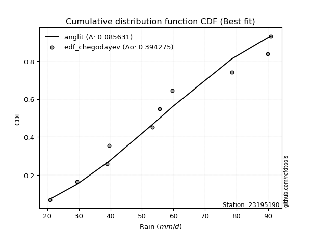</img>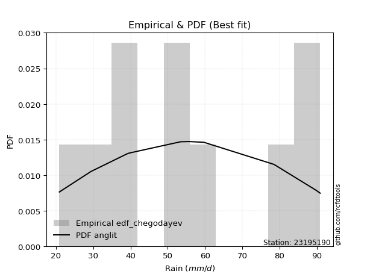</img>

</div>


### 6. EDF Blom (1958)

The Blom formula is a specific "plotting position" formula used in hydrology and statistical analysis to estimate the empirical cumulative probability (or non-exceedance probability) of a data series. It is particularly recommended for data that are approximately normally distributed. The constant _a_ is set to 0.375 (or 3/8).

<div align="center">


$P=(m-a)/(n+1-2a)$


</div>


**6.1. Empirical values**

<div align="center">

|                | 0                   | 1                   | 2                   | 3                   | 4                   | 5                  | 6                  | 7                  | 8                  | 9                  |
|:---------------|:--------------------|:--------------------|:--------------------|:--------------------|:--------------------|:-------------------|:-------------------|:-------------------|:-------------------|:-------------------|
| date           | 2009                | 2007                | 2005                | 2008                | 2006                | 2014               | 2012               | 2011               | 2013               | 2010               |
| x              | 20.9                | 29.4                | 39.0                | 39.6                | 53.4                | 55.6               | 59.7               | 78.5               | 89.8               | 90.9               |
| m              | 1                   | 2                   | 3                   | 4                   | 5                   | 6                  | 7                  | 8                  | 9                  | 10                 |
| empirical_dist | edf_blom            | edf_blom            | edf_blom            | edf_blom            | edf_blom            | edf_blom           | edf_blom           | edf_blom           | edf_blom           | edf_blom           |
| empirical      | 0.06097560975609756 | 0.15853658536585366 | 0.25609756097560976 | 0.35365853658536583 | 0.45121951219512196 | 0.5487804878048781 | 0.6463414634146342 | 0.7439024390243902 | 0.8414634146341463 | 0.9390243902439024 |
| empirical_tr   | 1.064935064935065   | 1.1884057971014492  | 1.3442622950819672  | 1.5471698113207546  | 1.8222222222222222  | 2.2162162162162162 | 2.827586206896552  | 3.9047619047619047 | 6.307692307692307  | 16.399999999999984 |

</div>


**6.2. Kolmogorov-Smirnov fit test (sorted by Δ)**


<div align="center">

|                | 0                   | 1                   | 2                   | 3                   | 4                   | 5                   | 6                  | 7                  | 8                  | 9                   | 10                  | 11                  | 12                  | 13                  | 14                  | 15                  | 16                  | 17                  | 18                  | 19                  | 20                  | 21                  | 22                  | 23                 | 24                 | 25                  | 26                  | 27                  | 28                  | 29                  | 30                  | 31                  | 32                  | 33                  | 34                  | 35                  | 36                  | 37                 | 38                  | 39                  | 40                    | 41                 | 42                  | 43                 | 44                 | 45                  | 46                  | 47                  | 48                  | 49                  | 50                  | 51                  | 52                  | 53                  | 54                  | 55                  | 56                  | 57                  | 58                  | 59                  | 60                  | 61                  | 62                  | 63                  | 64                 | 65                  | 66                  | 67                 | 68                  | 69                  | 70                  | 71                  | 72                 | 73                 | 74                  | 75                  | 76                 | 77                 | 78                  | 79                  | 80                 | 81                 | 82                 | 83                  | 84                  | 85                 | 86                 | 87                 |
|:---------------|:--------------------|:--------------------|:--------------------|:--------------------|:--------------------|:--------------------|:-------------------|:-------------------|:-------------------|:--------------------|:--------------------|:--------------------|:--------------------|:--------------------|:--------------------|:--------------------|:--------------------|:--------------------|:--------------------|:--------------------|:--------------------|:--------------------|:--------------------|:-------------------|:-------------------|:--------------------|:--------------------|:--------------------|:--------------------|:--------------------|:--------------------|:--------------------|:--------------------|:--------------------|:--------------------|:--------------------|:--------------------|:-------------------|:--------------------|:--------------------|:----------------------|:-------------------|:--------------------|:-------------------|:-------------------|:--------------------|:--------------------|:--------------------|:--------------------|:--------------------|:--------------------|:--------------------|:--------------------|:--------------------|:--------------------|:--------------------|:--------------------|:--------------------|:--------------------|:--------------------|:--------------------|:--------------------|:--------------------|:--------------------|:-------------------|:--------------------|:--------------------|:-------------------|:--------------------|:--------------------|:--------------------|:--------------------|:-------------------|:-------------------|:--------------------|:--------------------|:-------------------|:-------------------|:--------------------|:--------------------|:-------------------|:-------------------|:-------------------|:--------------------|:--------------------|:-------------------|:-------------------|:-------------------|
| station        | 23195190            | 23195190            | 23195190            | 23195190            | 23195190            | 23195190            | 23195190           | 23195190           | 23195190           | 23195190            | 23195190            | 23195190            | 23195190            | 23195190            | 23195190            | 23195190            | 23195190            | 23195190            | 23195190            | 23195190            | 23195190            | 23195190            | 23195190            | 23195190           | 23195190           | 23195190            | 23195190            | 23195190            | 23195190            | 23195190            | 23195190            | 23195190            | 23195190            | 23195190            | 23195190            | 23195190            | 23195190            | 23195190           | 23195190            | 23195190            | 23195190              | 23195190           | 23195190            | 23195190           | 23195190           | 23195190            | 23195190            | 23195190            | 23195190            | 23195190            | 23195190            | 23195190            | 23195190            | 23195190            | 23195190            | 23195190            | 23195190            | 23195190            | 23195190            | 23195190            | 23195190            | 23195190            | 23195190            | 23195190            | 23195190           | 23195190            | 23195190            | 23195190           | 23195190            | 23195190            | 23195190            | 23195190            | 23195190           | 23195190           | 23195190            | 23195190            | 23195190           | 23195190           | 23195190            | 23195190            | 23195190           | 23195190           | 23195190           | 23195190            | 23195190            | 23195190           | 23195190           | 23195190           |
| empirical_dist | edf_blom            | edf_blom            | edf_blom            | edf_blom            | edf_blom            | edf_blom            | edf_blom           | edf_blom           | edf_blom           | edf_blom            | edf_blom            | edf_blom            | edf_blom            | edf_blom            | edf_blom            | edf_blom            | edf_blom            | edf_blom            | edf_blom            | edf_blom            | edf_blom            | edf_blom            | edf_blom            | edf_blom           | edf_blom           | edf_blom            | edf_blom            | edf_blom            | edf_blom            | edf_blom            | edf_blom            | edf_blom            | edf_blom            | edf_blom            | edf_blom            | edf_blom            | edf_blom            | edf_blom           | edf_blom            | edf_blom            | edf_blom              | edf_blom           | edf_blom            | edf_blom           | edf_blom           | edf_blom            | edf_blom            | edf_blom            | edf_blom            | edf_blom            | edf_blom            | edf_blom            | edf_blom            | edf_blom            | edf_blom            | edf_blom            | edf_blom            | edf_blom            | edf_blom            | edf_blom            | edf_blom            | edf_blom            | edf_blom            | edf_blom            | edf_blom           | edf_blom            | edf_blom            | edf_blom           | edf_blom            | edf_blom            | edf_blom            | edf_blom            | edf_blom           | edf_blom           | edf_blom            | edf_blom            | edf_blom           | edf_blom           | edf_blom            | edf_blom            | edf_blom           | edf_blom           | edf_blom           | edf_blom            | edf_blom            | edf_blom           | edf_blom           | edf_blom           |
| p_dist         | logfisk             | invweibull          | logpearson3         | f                   | erlang              | chi2                | weibull_min        | loggompertz        | rayleigh           | genlogistic         | fisk                | maxwell             | halfnorm            | logweibull_min      | gamma               | ncf                 | betaprime           | kstwobign           | invgauss            | rice                | alpha               | invgamma            | logfatiguelife      | logf               | logt               | lognorm             | lognorm             | logcrystalball      | logexponnorm        | logloggamma         | lognct              | logjohnsonsu        | logbetaprime        | pearson3            | loginvgamma         | logerlang           | logrice             | loglogistic        | loggamma            | loggamma            | loglaplace_asymmetric | gumbel_r           | exponnorm           | nct                | norm               | crystalball         | truncnorm           | t                   | loggumbel_l         | logncf              | moyal               | johnsonsu           | loginvgauss         | loginvweibull       | logalpha            | loghypsecant        | logmaxwell          | halflogistic        | loglaplace          | logmielke           | logistic            | laplace_asymmetric  | lograyleigh         | gompertz            | hypsecant          | gumbel_l            | loggenexpon         | genexpon           | expon               | logkstwobign        | nakagami            | lognakagami         | loghalfnorm        | laplace            | mielke              | loggumbel_r         | logtruncnorm       | wald               | logmoyal            | loghalflogistic     | logexpon           | logwald            | loggibrat          | logchi2             | gibrat              | loglognorm         | fatiguelife        | loggenlogistic     |
| delta          | 0.08107365004807882 | 0.08804936451246437 | 0.08821374486013633 | 0.08904010613956304 | 0.08914314210177099 | 0.08914345511380029 | 0.0903671550248264 | 0.0906257754037143 | 0.0908828639866861 | 0.09099926018886073 | 0.09109407553987298 | 0.09140607884119978 | 0.09179423746026072 | 0.09230146438898135 | 0.09253152979164181 | 0.09276811427433396 | 0.09296594018956683 | 0.09405758440607581 | 0.09410728083785747 | 0.09501280734412271 | 0.09556732393952705 | 0.09562514382185783 | 0.09651038226403802 | 0.0968627463849629 | 0.0972402146626678 | 0.09724269324263907 | 0.09724269324263907 | 0.09724269418921933 | 0.09724400808229022 | 0.09885414516586233 | 0.09929722714850459 | 0.09988794502179521 | 0.10261445410358644 | 0.10391120461180953 | 0.10634639943910701 | 0.10657442357881769 | 0.10661790589636438 | 0.1071302691795406 | 0.10821222567515137 | 0.10821222567515137 | 0.10860360135674596   | 0.1090588195664115 | 0.10931798081730995 | 0.1095015864051972 | 0.1095076189137506 | 0.10950762157653907 | 0.10950762833837013 | 0.10951038190691081 | 0.11026397433709911 | 0.11204525492700085 | 0.11504317900747973 | 0.11519508230777115 | 0.11578247720153606 | 0.11622974150046617 | 0.11627591503744589 | 0.11758336359734733 | 0.12773423450325244 | 0.12777059412816863 | 0.12788298575319618 | 0.12961788499716287 | 0.13216523732028726 | 0.13509374732074445 | 0.13753612174495194 | 0.14210556995809187 | 0.1469022730305791 | 0.14752648038709348 | 0.14882471184400886 | 0.1555396886913601 | 0.15597670939614477 | 0.15647854036861514 | 0.15853658522585384 | 0.15853658536584753 | 0.1651861007439785 | 0.1660156323261708 | 0.16677890844631893 | 0.16739503853721532 | 0.1688928069465911 | 0.1804343390727114 | 0.19228205983245433 | 0.19242012035907047 | 0.2508585764051797 | 0.2613385925281286 | 0.2903196075999522 | 0.31122734491675974 | 0.32432040740409807 | 0.4370109759938775 | 0.5426163387393752 | 0.8414634146341463 |
| deltao         | 0.3942745923300002  | 0.3942745923300002  | 0.3942745923300002  | 0.3942745923300002  | 0.3942745923300002  | 0.3942745923300002  | 0.3942745923300002 | 0.3942745923300002 | 0.3942745923300002 | 0.3942745923300002  | 0.3942745923300002  | 0.3942745923300002  | 0.3942745923300002  | 0.3942745923300002  | 0.3942745923300002  | 0.3942745923300002  | 0.3942745923300002  | 0.3942745923300002  | 0.3942745923300002  | 0.3942745923300002  | 0.3942745923300002  | 0.3942745923300002  | 0.3942745923300002  | 0.3942745923300002 | 0.3942745923300002 | 0.3942745923300002  | 0.3942745923300002  | 0.3942745923300002  | 0.3942745923300002  | 0.3942745923300002  | 0.3942745923300002  | 0.3942745923300002  | 0.3942745923300002  | 0.3942745923300002  | 0.3942745923300002  | 0.3942745923300002  | 0.3942745923300002  | 0.3942745923300002 | 0.3942745923300002  | 0.3942745923300002  | 0.3942745923300002    | 0.3942745923300002 | 0.3942745923300002  | 0.3942745923300002 | 0.3942745923300002 | 0.3942745923300002  | 0.3942745923300002  | 0.3942745923300002  | 0.3942745923300002  | 0.3942745923300002  | 0.3942745923300002  | 0.3942745923300002  | 0.3942745923300002  | 0.3942745923300002  | 0.3942745923300002  | 0.3942745923300002  | 0.3942745923300002  | 0.3942745923300002  | 0.3942745923300002  | 0.3942745923300002  | 0.3942745923300002  | 0.3942745923300002  | 0.3942745923300002  | 0.3942745923300002  | 0.3942745923300002 | 0.3942745923300002  | 0.3942745923300002  | 0.3942745923300002 | 0.3942745923300002  | 0.3942745923300002  | 0.3942745923300002  | 0.3942745923300002  | 0.3942745923300002 | 0.3942745923300002 | 0.3942745923300002  | 0.3942745923300002  | 0.3942745923300002 | 0.3942745923300002 | 0.3942745923300002  | 0.3942745923300002  | 0.3942745923300002 | 0.3942745923300002 | 0.3942745923300002 | 0.3942745923300002  | 0.3942745923300002  | 0.3942745923300002 | 0.3942745923300002 | 0.3942745923300002 |
| eval           | Δo > Δ              | Δo > Δ              | Δo > Δ              | Δo > Δ              | Δo > Δ              | Δo > Δ              | Δo > Δ             | Δo > Δ             | Δo > Δ             | Δo > Δ              | Δo > Δ              | Δo > Δ              | Δo > Δ              | Δo > Δ              | Δo > Δ              | Δo > Δ              | Δo > Δ              | Δo > Δ              | Δo > Δ              | Δo > Δ              | Δo > Δ              | Δo > Δ              | Δo > Δ              | Δo > Δ             | Δo > Δ             | Δo > Δ              | Δo > Δ              | Δo > Δ              | Δo > Δ              | Δo > Δ              | Δo > Δ              | Δo > Δ              | Δo > Δ              | Δo > Δ              | Δo > Δ              | Δo > Δ              | Δo > Δ              | Δo > Δ             | Δo > Δ              | Δo > Δ              | Δo > Δ                | Δo > Δ             | Δo > Δ              | Δo > Δ             | Δo > Δ             | Δo > Δ              | Δo > Δ              | Δo > Δ              | Δo > Δ              | Δo > Δ              | Δo > Δ              | Δo > Δ              | Δo > Δ              | Δo > Δ              | Δo > Δ              | Δo > Δ              | Δo > Δ              | Δo > Δ              | Δo > Δ              | Δo > Δ              | Δo > Δ              | Δo > Δ              | Δo > Δ              | Δo > Δ              | Δo > Δ             | Δo > Δ              | Δo > Δ              | Δo > Δ             | Δo > Δ              | Δo > Δ              | Δo > Δ              | Δo > Δ              | Δo > Δ             | Δo > Δ             | Δo > Δ              | Δo > Δ              | Δo > Δ             | Δo > Δ             | Δo > Δ              | Δo > Δ              | Δo > Δ             | Δo > Δ             | Δo > Δ             | Δo > Δ              | Δo > Δ              | Δo <= Δ            | Δo <= Δ            | Δo <= Δ            |
| fit            | 1                   | 1                   | 1                   | 1                   | 1                   | 1                   | 1                  | 1                  | 1                  | 1                   | 1                   | 1                   | 1                   | 1                   | 1                   | 1                   | 1                   | 1                   | 1                   | 1                   | 1                   | 1                   | 1                   | 1                  | 1                  | 1                   | 1                   | 1                   | 1                   | 1                   | 1                   | 1                   | 1                   | 1                   | 1                   | 1                   | 1                   | 1                  | 1                   | 1                   | 1                     | 1                  | 1                   | 1                  | 1                  | 1                   | 1                   | 1                   | 1                   | 1                   | 1                   | 1                   | 1                   | 1                   | 1                   | 1                   | 1                   | 1                   | 1                   | 1                   | 1                   | 1                   | 1                   | 1                   | 1                  | 1                   | 1                   | 1                  | 1                   | 1                   | 1                   | 1                   | 1                  | 1                  | 1                   | 1                   | 1                  | 1                  | 1                   | 1                   | 1                  | 1                  | 1                  | 1                   | 1                   | 0                  | 0                  | 0                  |
| n              | 10                  | 10                  | 10                  | 10                  | 10                  | 10                  | 10                 | 10                 | 10                 | 10                  | 10                  | 10                  | 10                  | 10                  | 10                  | 10                  | 10                  | 10                  | 10                  | 10                  | 10                  | 10                  | 10                  | 10                 | 10                 | 10                  | 10                  | 10                  | 10                  | 10                  | 10                  | 10                  | 10                  | 10                  | 10                  | 10                  | 10                  | 10                 | 10                  | 10                  | 10                    | 10                 | 10                  | 10                 | 10                 | 10                  | 10                  | 10                  | 10                  | 10                  | 10                  | 10                  | 10                  | 10                  | 10                  | 10                  | 10                  | 10                  | 10                  | 10                  | 10                  | 10                  | 10                  | 10                  | 10                 | 10                  | 10                  | 10                 | 10                  | 10                  | 10                  | 10                  | 10                 | 10                 | 10                  | 10                  | 10                 | 10                 | 10                  | 10                  | 10                 | 10                 | 10                 | 10                  | 10                  | 10                 | 10                 | 10                 |
| best_fit       | 1                   | 0                   | 0                   | 0                   | 0                   | 0                   | 0                  | 0                  | 0                  | 0                   | 0                   | 0                   | 0                   | 0                   | 0                   | 0                   | 0                   | 0                   | 0                   | 0                   | 0                   | 0                   | 0                   | 0                  | 0                  | 0                   | 0                   | 0                   | 0                   | 0                   | 0                   | 0                   | 0                   | 0                   | 0                   | 0                   | 0                   | 0                  | 0                   | 0                   | 0                     | 0                  | 0                   | 0                  | 0                  | 0                   | 0                   | 0                   | 0                   | 0                   | 0                   | 0                   | 0                   | 0                   | 0                   | 0                   | 0                   | 0                   | 0                   | 0                   | 0                   | 0                   | 0                   | 0                   | 0                  | 0                   | 0                   | 0                  | 0                   | 0                   | 0                   | 0                   | 0                  | 0                  | 0                   | 0                   | 0                  | 0                  | 0                   | 0                   | 0                  | 0                  | 0                  | 0                   | 0                   | 0                  | 0                  | 0                  |
| best_fit_sort  | 1                   | 2                   | 3                   | 4                   | 5                   | 6                   | 7                  | 8                  | 9                  | 10                  | 11                  | 12                  | 13                  | 14                  | 15                  | 16                  | 17                  | 18                  | 19                  | 20                  | 21                  | 22                  | 23                  | 24                 | 25                 | 26                  | 27                  | 28                  | 29                  | 30                  | 31                  | 32                  | 33                  | 34                  | 35                  | 36                  | 37                  | 38                 | 39                  | 40                  | 41                    | 42                 | 43                  | 44                 | 45                 | 46                  | 47                  | 48                  | 49                  | 50                  | 51                  | 52                  | 53                  | 54                  | 55                  | 56                  | 57                  | 58                  | 59                  | 60                  | 61                  | 62                  | 63                  | 64                  | 65                 | 66                  | 67                  | 68                 | 69                  | 70                  | 71                  | 72                  | 73                 | 74                 | 75                  | 76                  | 77                 | 78                 | 79                  | 80                  | 81                 | 82                 | 83                 | 84                  | 85                  | 86                 | 87                 | 88                 |

</div>


**6.3. Best fit**

<div align="center">

|   id |   station | empirical_dist   | p_dist   |     delta |   deltao | eval   |   fit |   n |   best_fit |   best_fit_sort |
|-----:|----------:|:-----------------|:---------|----------:|---------:|:-------|------:|----:|-----------:|----------------:|
|    0 |  23195190 | edf_blom         | logfisk  | 0.0810737 | 0.394275 | Δo > Δ |     1 |  10 |          1 |               1 |

</div>


<div align="center">

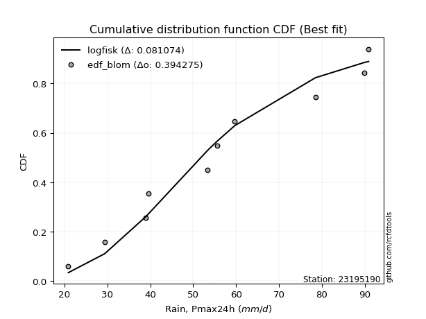</img>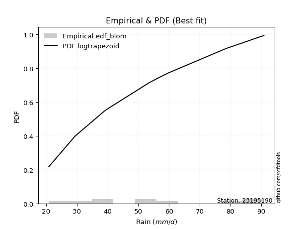</img>

</div>


### 7. EDF Tukey (1962)

In hydrology, the Tukey formula is used as a plotting position formula to estimate the empirical probability or frequency of a flood event (or other hydrological data). The formula parameter is given as _c=0.333_ (or 1/3).

<div align="center">


$P=(m-c)/(n+1-2c)$


</div>


**7.1. Empirical values**

<div align="center">

|                | 0                   | 1                   | 2                   | 3                  | 4                   | 5                  | 6                  | 7                  | 8                  | 9                  |
|:---------------|:--------------------|:--------------------|:--------------------|:-------------------|:--------------------|:-------------------|:-------------------|:-------------------|:-------------------|:-------------------|
| date           | 2009                | 2007                | 2005                | 2008               | 2006                | 2014               | 2012               | 2011               | 2013               | 2010               |
| x              | 20.9                | 29.4                | 39.0                | 39.6               | 53.4                | 55.6               | 59.7               | 78.5               | 89.8               | 90.9               |
| m              | 1                   | 2                   | 3                   | 4                  | 5                   | 6                  | 7                  | 8                  | 9                  | 10                 |
| empirical_dist | edf_tukey           | edf_tukey           | edf_tukey           | edf_tukey          | edf_tukey           | edf_tukey          | edf_tukey          | edf_tukey          | edf_tukey          | edf_tukey          |
| empirical      | 0.06451612903225806 | 0.16129032258064516 | 0.25806451612903225 | 0.3548387096774194 | 0.45161290322580644 | 0.5483870967741935 | 0.6451612903225806 | 0.7419354838709677 | 0.8387096774193549 | 0.9354838709677419 |
| empirical_tr   | 1.0689655172413792  | 1.1923076923076923  | 1.3478260869565217  | 1.55               | 1.823529411764706   | 2.214285714285714  | 2.818181818181818  | 3.875              | 6.200000000000001  | 15.499999999999988 |

</div>


**7.2. Kolmogorov-Smirnov fit test (sorted by Δ)**


<div align="center">

|                | 0                   | 1                   | 2                   | 3                   | 4                   | 5                   | 6                   | 7                   | 8                  | 9                   | 10                  | 11                  | 12                  | 13                  | 14                 | 15                  | 16                  | 17                 | 18                  | 19                  | 20                  | 21                  | 22                  | 23                  | 24                  | 25                  | 26                  | 27                  | 28                  | 29                  | 30                  | 31                  | 32                  | 33                  | 34                  | 35                  | 36                  | 37                 | 38                 | 39                 | 40                  | 41                    | 42                  | 43                  | 44                 | 45                  | 46                  | 47                  | 48                  | 49                 | 50                  | 51                  | 52                  | 53                  | 54                  | 55                  | 56                  | 57                  | 58                  | 59                 | 60                 | 61                  | 62                  | 63                  | 64                  | 65                  | 66                  | 67                  | 68                 | 69                  | 70                  | 71                  | 72                  | 73                 | 74                  | 75                  | 76                  | 77                  | 78                  | 79                 | 80                  | 81                 | 82                 | 83                  | 84                 | 85                  | 86                 | 87                 |
|:---------------|:--------------------|:--------------------|:--------------------|:--------------------|:--------------------|:--------------------|:--------------------|:--------------------|:-------------------|:--------------------|:--------------------|:--------------------|:--------------------|:--------------------|:-------------------|:--------------------|:--------------------|:-------------------|:--------------------|:--------------------|:--------------------|:--------------------|:--------------------|:--------------------|:--------------------|:--------------------|:--------------------|:--------------------|:--------------------|:--------------------|:--------------------|:--------------------|:--------------------|:--------------------|:--------------------|:--------------------|:--------------------|:-------------------|:-------------------|:-------------------|:--------------------|:----------------------|:--------------------|:--------------------|:-------------------|:--------------------|:--------------------|:--------------------|:--------------------|:-------------------|:--------------------|:--------------------|:--------------------|:--------------------|:--------------------|:--------------------|:--------------------|:--------------------|:--------------------|:-------------------|:-------------------|:--------------------|:--------------------|:--------------------|:--------------------|:--------------------|:--------------------|:--------------------|:-------------------|:--------------------|:--------------------|:--------------------|:--------------------|:-------------------|:--------------------|:--------------------|:--------------------|:--------------------|:--------------------|:-------------------|:--------------------|:-------------------|:-------------------|:--------------------|:-------------------|:--------------------|:-------------------|:-------------------|
| station        | 23195190            | 23195190            | 23195190            | 23195190            | 23195190            | 23195190            | 23195190            | 23195190            | 23195190           | 23195190            | 23195190            | 23195190            | 23195190            | 23195190            | 23195190           | 23195190            | 23195190            | 23195190           | 23195190            | 23195190            | 23195190            | 23195190            | 23195190            | 23195190            | 23195190            | 23195190            | 23195190            | 23195190            | 23195190            | 23195190            | 23195190            | 23195190            | 23195190            | 23195190            | 23195190            | 23195190            | 23195190            | 23195190           | 23195190           | 23195190           | 23195190            | 23195190              | 23195190            | 23195190            | 23195190           | 23195190            | 23195190            | 23195190            | 23195190            | 23195190           | 23195190            | 23195190            | 23195190            | 23195190            | 23195190            | 23195190            | 23195190            | 23195190            | 23195190            | 23195190           | 23195190           | 23195190            | 23195190            | 23195190            | 23195190            | 23195190            | 23195190            | 23195190            | 23195190           | 23195190            | 23195190            | 23195190            | 23195190            | 23195190           | 23195190            | 23195190            | 23195190            | 23195190            | 23195190            | 23195190           | 23195190            | 23195190           | 23195190           | 23195190            | 23195190           | 23195190            | 23195190           | 23195190           |
| empirical_dist | edf_tukey           | edf_tukey           | edf_tukey           | edf_tukey           | edf_tukey           | edf_tukey           | edf_tukey           | edf_tukey           | edf_tukey          | edf_tukey           | edf_tukey           | edf_tukey           | edf_tukey           | edf_tukey           | edf_tukey          | edf_tukey           | edf_tukey           | edf_tukey          | edf_tukey           | edf_tukey           | edf_tukey           | edf_tukey           | edf_tukey           | edf_tukey           | edf_tukey           | edf_tukey           | edf_tukey           | edf_tukey           | edf_tukey           | edf_tukey           | edf_tukey           | edf_tukey           | edf_tukey           | edf_tukey           | edf_tukey           | edf_tukey           | edf_tukey           | edf_tukey          | edf_tukey          | edf_tukey          | edf_tukey           | edf_tukey             | edf_tukey           | edf_tukey           | edf_tukey          | edf_tukey           | edf_tukey           | edf_tukey           | edf_tukey           | edf_tukey          | edf_tukey           | edf_tukey           | edf_tukey           | edf_tukey           | edf_tukey           | edf_tukey           | edf_tukey           | edf_tukey           | edf_tukey           | edf_tukey          | edf_tukey          | edf_tukey           | edf_tukey           | edf_tukey           | edf_tukey           | edf_tukey           | edf_tukey           | edf_tukey           | edf_tukey          | edf_tukey           | edf_tukey           | edf_tukey           | edf_tukey           | edf_tukey          | edf_tukey           | edf_tukey           | edf_tukey           | edf_tukey           | edf_tukey           | edf_tukey          | edf_tukey           | edf_tukey          | edf_tukey          | edf_tukey           | edf_tukey          | edf_tukey           | edf_tukey          | edf_tukey          |
| p_dist         | logfisk             | invweibull          | logpearson3         | f                   | erlang              | chi2                | fisk                | weibull_min         | loggompertz        | rayleigh            | genlogistic         | maxwell             | halfnorm            | logweibull_min      | gamma              | ncf                 | betaprime           | kstwobign          | invgauss            | logfatiguelife      | rice                | logf                | logt                | lognorm             | lognorm             | logcrystalball      | logexponnorm        | alpha               | invgamma            | lognct              | logloggamma         | logjohnsonsu        | logbetaprime        | pearson3            | loginvgamma         | logerlang           | logrice             | loggamma           | loggamma           | loglogistic        | exponnorm           | loglaplace_asymmetric | nct                 | norm                | crystalball        | truncnorm           | t                   | gumbel_r            | logncf              | loggumbel_l        | loginvweibull       | loginvgauss         | logalpha            | johnsonsu           | moyal               | loghypsecant        | logmaxwell          | loglaplace          | halflogistic        | logmielke          | logistic           | laplace_asymmetric  | lograyleigh         | gompertz            | hypsecant           | loggenexpon         | gumbel_l            | genexpon            | expon              | logkstwobign        | nakagami            | lognakagami         | loghalfnorm         | mielke             | loggumbel_r         | laplace             | logtruncnorm        | wald                | logmoyal            | loghalflogistic    | logexpon            | logwald            | loggibrat          | logchi2             | gibrat             | loglognorm          | fatiguelife        | loggenlogistic     |
| delta          | 0.08225382314013235 | 0.09001631966588686 | 0.09018070001355882 | 0.09100706129298552 | 0.09111009725519348 | 0.09111041026722277 | 0.09227424863192651 | 0.09233411017824888 | 0.0925927305571368 | 0.09284981914010859 | 0.09296621534228322 | 0.09337303399462227 | 0.09376119261368321 | 0.09426841954240384 | 0.0944984849450643 | 0.09473506942775645 | 0.09493289534298932 | 0.0960245395594983 | 0.09607423599127995 | 0.09611699123335354 | 0.09619298043617625 | 0.09646935535427842 | 0.09684682363198333 | 0.09684930221195459 | 0.09684930221195459 | 0.09684930315853485 | 0.09685061705160575 | 0.09735546065938783 | 0.09759209897528032 | 0.09890383611782011 | 0.10003431825791587 | 0.10106811811384875 | 0.10222106307290196 | 0.10509137770386306 | 0.10595300840842253 | 0.10618103254813321 | 0.10622451486567991 | 0.1078188346444669 | 0.1078188346444669 | 0.1090972243329631 | 0.11049815390936349 | 0.11057055651016845   | 0.11068175949725073 | 0.11068779200580414 | 0.1106877946685926 | 0.11068780143042367 | 0.11069055499896435 | 0.11102577471983399 | 0.11165186389631637 | 0.1122309294905216 | 0.11388432056340086 | 0.11538908617085158 | 0.11588252400676141 | 0.11637525539982468 | 0.11701013416090222 | 0.11955031875076982 | 0.12734084347256797 | 0.12957954686494622 | 0.13052433134296013 | 0.1323716222119543 | 0.1333454104123408 | 0.13627392041279798 | 0.13714273071426747 | 0.14092539686603833 | 0.14808244612263263 | 0.14843132081332439 | 0.14870665347914702 | 0.15514629766067561 | 0.1555833183654603 | 0.15608514933793066 | 0.16129032244064534 | 0.16129032258063902 | 0.16479270971329402 | 0.1655987353542654 | 0.16700164750653085 | 0.16719580541822435 | 0.16849941591590661 | 0.18161451216476493 | 0.19188866880176986 | 0.192026729328386  | 0.24889162125175723 | 0.2609452014974441 | 0.2899262165692677 | 0.30926038976333725 | 0.3255005804961516 | 0.43425723877908606 | 0.5398626015245838 | 0.8387096774193549 |
| deltao         | 0.3942745923300002  | 0.3942745923300002  | 0.3942745923300002  | 0.3942745923300002  | 0.3942745923300002  | 0.3942745923300002  | 0.3942745923300002  | 0.3942745923300002  | 0.3942745923300002 | 0.3942745923300002  | 0.3942745923300002  | 0.3942745923300002  | 0.3942745923300002  | 0.3942745923300002  | 0.3942745923300002 | 0.3942745923300002  | 0.3942745923300002  | 0.3942745923300002 | 0.3942745923300002  | 0.3942745923300002  | 0.3942745923300002  | 0.3942745923300002  | 0.3942745923300002  | 0.3942745923300002  | 0.3942745923300002  | 0.3942745923300002  | 0.3942745923300002  | 0.3942745923300002  | 0.3942745923300002  | 0.3942745923300002  | 0.3942745923300002  | 0.3942745923300002  | 0.3942745923300002  | 0.3942745923300002  | 0.3942745923300002  | 0.3942745923300002  | 0.3942745923300002  | 0.3942745923300002 | 0.3942745923300002 | 0.3942745923300002 | 0.3942745923300002  | 0.3942745923300002    | 0.3942745923300002  | 0.3942745923300002  | 0.3942745923300002 | 0.3942745923300002  | 0.3942745923300002  | 0.3942745923300002  | 0.3942745923300002  | 0.3942745923300002 | 0.3942745923300002  | 0.3942745923300002  | 0.3942745923300002  | 0.3942745923300002  | 0.3942745923300002  | 0.3942745923300002  | 0.3942745923300002  | 0.3942745923300002  | 0.3942745923300002  | 0.3942745923300002 | 0.3942745923300002 | 0.3942745923300002  | 0.3942745923300002  | 0.3942745923300002  | 0.3942745923300002  | 0.3942745923300002  | 0.3942745923300002  | 0.3942745923300002  | 0.3942745923300002 | 0.3942745923300002  | 0.3942745923300002  | 0.3942745923300002  | 0.3942745923300002  | 0.3942745923300002 | 0.3942745923300002  | 0.3942745923300002  | 0.3942745923300002  | 0.3942745923300002  | 0.3942745923300002  | 0.3942745923300002 | 0.3942745923300002  | 0.3942745923300002 | 0.3942745923300002 | 0.3942745923300002  | 0.3942745923300002 | 0.3942745923300002  | 0.3942745923300002 | 0.3942745923300002 |
| eval           | Δo > Δ              | Δo > Δ              | Δo > Δ              | Δo > Δ              | Δo > Δ              | Δo > Δ              | Δo > Δ              | Δo > Δ              | Δo > Δ             | Δo > Δ              | Δo > Δ              | Δo > Δ              | Δo > Δ              | Δo > Δ              | Δo > Δ             | Δo > Δ              | Δo > Δ              | Δo > Δ             | Δo > Δ              | Δo > Δ              | Δo > Δ              | Δo > Δ              | Δo > Δ              | Δo > Δ              | Δo > Δ              | Δo > Δ              | Δo > Δ              | Δo > Δ              | Δo > Δ              | Δo > Δ              | Δo > Δ              | Δo > Δ              | Δo > Δ              | Δo > Δ              | Δo > Δ              | Δo > Δ              | Δo > Δ              | Δo > Δ             | Δo > Δ             | Δo > Δ             | Δo > Δ              | Δo > Δ                | Δo > Δ              | Δo > Δ              | Δo > Δ             | Δo > Δ              | Δo > Δ              | Δo > Δ              | Δo > Δ              | Δo > Δ             | Δo > Δ              | Δo > Δ              | Δo > Δ              | Δo > Δ              | Δo > Δ              | Δo > Δ              | Δo > Δ              | Δo > Δ              | Δo > Δ              | Δo > Δ             | Δo > Δ             | Δo > Δ              | Δo > Δ              | Δo > Δ              | Δo > Δ              | Δo > Δ              | Δo > Δ              | Δo > Δ              | Δo > Δ             | Δo > Δ              | Δo > Δ              | Δo > Δ              | Δo > Δ              | Δo > Δ             | Δo > Δ              | Δo > Δ              | Δo > Δ              | Δo > Δ              | Δo > Δ              | Δo > Δ             | Δo > Δ              | Δo > Δ             | Δo > Δ             | Δo > Δ              | Δo > Δ             | Δo <= Δ             | Δo <= Δ            | Δo <= Δ            |
| fit            | 1                   | 1                   | 1                   | 1                   | 1                   | 1                   | 1                   | 1                   | 1                  | 1                   | 1                   | 1                   | 1                   | 1                   | 1                  | 1                   | 1                   | 1                  | 1                   | 1                   | 1                   | 1                   | 1                   | 1                   | 1                   | 1                   | 1                   | 1                   | 1                   | 1                   | 1                   | 1                   | 1                   | 1                   | 1                   | 1                   | 1                   | 1                  | 1                  | 1                  | 1                   | 1                     | 1                   | 1                   | 1                  | 1                   | 1                   | 1                   | 1                   | 1                  | 1                   | 1                   | 1                   | 1                   | 1                   | 1                   | 1                   | 1                   | 1                   | 1                  | 1                  | 1                   | 1                   | 1                   | 1                   | 1                   | 1                   | 1                   | 1                  | 1                   | 1                   | 1                   | 1                   | 1                  | 1                   | 1                   | 1                   | 1                   | 1                   | 1                  | 1                   | 1                  | 1                  | 1                   | 1                  | 0                   | 0                  | 0                  |
| n              | 10                  | 10                  | 10                  | 10                  | 10                  | 10                  | 10                  | 10                  | 10                 | 10                  | 10                  | 10                  | 10                  | 10                  | 10                 | 10                  | 10                  | 10                 | 10                  | 10                  | 10                  | 10                  | 10                  | 10                  | 10                  | 10                  | 10                  | 10                  | 10                  | 10                  | 10                  | 10                  | 10                  | 10                  | 10                  | 10                  | 10                  | 10                 | 10                 | 10                 | 10                  | 10                    | 10                  | 10                  | 10                 | 10                  | 10                  | 10                  | 10                  | 10                 | 10                  | 10                  | 10                  | 10                  | 10                  | 10                  | 10                  | 10                  | 10                  | 10                 | 10                 | 10                  | 10                  | 10                  | 10                  | 10                  | 10                  | 10                  | 10                 | 10                  | 10                  | 10                  | 10                  | 10                 | 10                  | 10                  | 10                  | 10                  | 10                  | 10                 | 10                  | 10                 | 10                 | 10                  | 10                 | 10                  | 10                 | 10                 |
| best_fit       | 1                   | 0                   | 0                   | 0                   | 0                   | 0                   | 0                   | 0                   | 0                  | 0                   | 0                   | 0                   | 0                   | 0                   | 0                  | 0                   | 0                   | 0                  | 0                   | 0                   | 0                   | 0                   | 0                   | 0                   | 0                   | 0                   | 0                   | 0                   | 0                   | 0                   | 0                   | 0                   | 0                   | 0                   | 0                   | 0                   | 0                   | 0                  | 0                  | 0                  | 0                   | 0                     | 0                   | 0                   | 0                  | 0                   | 0                   | 0                   | 0                   | 0                  | 0                   | 0                   | 0                   | 0                   | 0                   | 0                   | 0                   | 0                   | 0                   | 0                  | 0                  | 0                   | 0                   | 0                   | 0                   | 0                   | 0                   | 0                   | 0                  | 0                   | 0                   | 0                   | 0                   | 0                  | 0                   | 0                   | 0                   | 0                   | 0                   | 0                  | 0                   | 0                  | 0                  | 0                   | 0                  | 0                   | 0                  | 0                  |
| best_fit_sort  | 1                   | 2                   | 3                   | 4                   | 5                   | 6                   | 7                   | 8                   | 9                  | 10                  | 11                  | 12                  | 13                  | 14                  | 15                 | 16                  | 17                  | 18                 | 19                  | 20                  | 21                  | 22                  | 23                  | 24                  | 25                  | 26                  | 27                  | 28                  | 29                  | 30                  | 31                  | 32                  | 33                  | 34                  | 35                  | 36                  | 37                  | 38                 | 39                 | 40                 | 41                  | 42                    | 43                  | 44                  | 45                 | 46                  | 47                  | 48                  | 49                  | 50                 | 51                  | 52                  | 53                  | 54                  | 55                  | 56                  | 57                  | 58                  | 59                  | 60                 | 61                 | 62                  | 63                  | 64                  | 65                  | 66                  | 67                  | 68                  | 69                 | 70                  | 71                  | 72                  | 73                  | 74                 | 75                  | 76                  | 77                  | 78                  | 79                  | 80                 | 81                  | 82                 | 83                 | 84                  | 85                 | 86                  | 87                 | 88                 |

</div>


**7.3. Best fit**

<div align="center">

|   id |   station | empirical_dist   | p_dist   |     delta |   deltao | eval   |   fit |   n |   best_fit |   best_fit_sort |
|-----:|----------:|:-----------------|:---------|----------:|---------:|:-------|------:|----:|-----------:|----------------:|
|    0 |  23195190 | edf_tukey        | logfisk  | 0.0822538 | 0.394275 | Δo > Δ |     1 |  10 |          1 |               1 |

</div>


<div align="center">

</img></img>

</div>


### 8. EDF Gringorten (1963)

Gringorten plotting position formula is essential for estimating the probability and return periods of extreme events like floods and heavy rainfall. The constant _a=0.44_.

<div align="center">


$P=(m-a)/(n+1-2a)$


</div>


**8.1. Empirical values**

<div align="center">

|                | 0                   | 1                   | 2                  | 3                   | 4                  | 5                 | 6                  | 7                  | 8                  | 9                  |
|:---------------|:--------------------|:--------------------|:-------------------|:--------------------|:-------------------|:------------------|:-------------------|:-------------------|:-------------------|:-------------------|
| date           | 2009                | 2007                | 2005               | 2008                | 2006               | 2014              | 2012               | 2011               | 2013               | 2010               |
| x              | 20.9                | 29.4                | 39.0               | 39.6                | 53.4               | 55.6              | 59.7               | 78.5               | 89.8               | 90.9               |
| m              | 1                   | 2                   | 3                  | 4                   | 5                  | 6                 | 7                  | 8                  | 9                  | 10                 |
| empirical_dist | edf_gringorten      | edf_gringorten      | edf_gringorten     | edf_gringorten      | edf_gringorten     | edf_gringorten    | edf_gringorten     | edf_gringorten     | edf_gringorten     | edf_gringorten     |
| empirical      | 0.05533596837944665 | 0.15415019762845852 | 0.2529644268774704 | 0.35177865612648224 | 0.4505928853754941 | 0.549407114624506 | 0.6482213438735178 | 0.7470355731225297 | 0.8458498023715416 | 0.9446640316205535 |
| empirical_tr   | 1.0585774058577406  | 1.1822429906542056  | 1.3386243386243388 | 1.542682926829268   | 1.8201438848920866 | 2.219298245614035 | 2.842696629213483  | 3.9531250000000004 | 6.487179487179492  | 18.071428571428605 |

</div>


**8.2. Kolmogorov-Smirnov fit test (sorted by Δ)**


<div align="center">

|                | 0                   | 1                   | 2                   | 3                   | 4                   | 5                   | 6                   | 7                   | 8                   | 9                   | 10                  | 11                  | 12                  | 13                  | 14                  | 15                  | 16                  | 17                  | 18                  | 19                 | 20                  | 21                  | 22                  | 23                 | 24                  | 25                  | 26                  | 27                  | 28                  | 29                  | 30                  | 31                  | 32                  | 33                  | 34                  | 35                    | 36                  | 37                 | 38                  | 39                  | 40                  | 41                  | 42                 | 43                 | 44                  | 45                  | 46                  | 47                  | 48                  | 49                  | 50                  | 51                  | 52                  | 53                  | 54                  | 55                  | 56                 | 57                  | 58                  | 59                  | 60                  | 61                  | 62                  | 63                  | 64                 | 65                  | 66                  | 67                 | 68                 | 69                  | 70                  | 71                  | 72                 | 73                  | 74                 | 75                  | 76                  | 77                 | 78                  | 79                  | 80                 | 81                  | 82                  | 83                 | 84                  | 85                 | 86                 | 87                 |
|:---------------|:--------------------|:--------------------|:--------------------|:--------------------|:--------------------|:--------------------|:--------------------|:--------------------|:--------------------|:--------------------|:--------------------|:--------------------|:--------------------|:--------------------|:--------------------|:--------------------|:--------------------|:--------------------|:--------------------|:-------------------|:--------------------|:--------------------|:--------------------|:-------------------|:--------------------|:--------------------|:--------------------|:--------------------|:--------------------|:--------------------|:--------------------|:--------------------|:--------------------|:--------------------|:--------------------|:----------------------|:--------------------|:-------------------|:--------------------|:--------------------|:--------------------|:--------------------|:-------------------|:-------------------|:--------------------|:--------------------|:--------------------|:--------------------|:--------------------|:--------------------|:--------------------|:--------------------|:--------------------|:--------------------|:--------------------|:--------------------|:-------------------|:--------------------|:--------------------|:--------------------|:--------------------|:--------------------|:--------------------|:--------------------|:-------------------|:--------------------|:--------------------|:-------------------|:-------------------|:--------------------|:--------------------|:--------------------|:-------------------|:--------------------|:-------------------|:--------------------|:--------------------|:-------------------|:--------------------|:--------------------|:-------------------|:--------------------|:--------------------|:-------------------|:--------------------|:-------------------|:-------------------|:-------------------|
| station        | 23195190            | 23195190            | 23195190            | 23195190            | 23195190            | 23195190            | 23195190            | 23195190            | 23195190            | 23195190            | 23195190            | 23195190            | 23195190            | 23195190            | 23195190            | 23195190            | 23195190            | 23195190            | 23195190            | 23195190           | 23195190            | 23195190            | 23195190            | 23195190           | 23195190            | 23195190            | 23195190            | 23195190            | 23195190            | 23195190            | 23195190            | 23195190            | 23195190            | 23195190            | 23195190            | 23195190              | 23195190            | 23195190           | 23195190            | 23195190            | 23195190            | 23195190            | 23195190           | 23195190           | 23195190            | 23195190            | 23195190            | 23195190            | 23195190            | 23195190            | 23195190            | 23195190            | 23195190            | 23195190            | 23195190            | 23195190            | 23195190           | 23195190            | 23195190            | 23195190            | 23195190            | 23195190            | 23195190            | 23195190            | 23195190           | 23195190            | 23195190            | 23195190           | 23195190           | 23195190            | 23195190            | 23195190            | 23195190           | 23195190            | 23195190           | 23195190            | 23195190            | 23195190           | 23195190            | 23195190            | 23195190           | 23195190            | 23195190            | 23195190           | 23195190            | 23195190           | 23195190           | 23195190           |
| empirical_dist | edf_gringorten      | edf_gringorten      | edf_gringorten      | edf_gringorten      | edf_gringorten      | edf_gringorten      | edf_gringorten      | edf_gringorten      | edf_gringorten      | edf_gringorten      | edf_gringorten      | edf_gringorten      | edf_gringorten      | edf_gringorten      | edf_gringorten      | edf_gringorten      | edf_gringorten      | edf_gringorten      | edf_gringorten      | edf_gringorten     | edf_gringorten      | edf_gringorten      | edf_gringorten      | edf_gringorten     | edf_gringorten      | edf_gringorten      | edf_gringorten      | edf_gringorten      | edf_gringorten      | edf_gringorten      | edf_gringorten      | edf_gringorten      | edf_gringorten      | edf_gringorten      | edf_gringorten      | edf_gringorten        | edf_gringorten      | edf_gringorten     | edf_gringorten      | edf_gringorten      | edf_gringorten      | edf_gringorten      | edf_gringorten     | edf_gringorten     | edf_gringorten      | edf_gringorten      | edf_gringorten      | edf_gringorten      | edf_gringorten      | edf_gringorten      | edf_gringorten      | edf_gringorten      | edf_gringorten      | edf_gringorten      | edf_gringorten      | edf_gringorten      | edf_gringorten     | edf_gringorten      | edf_gringorten      | edf_gringorten      | edf_gringorten      | edf_gringorten      | edf_gringorten      | edf_gringorten      | edf_gringorten     | edf_gringorten      | edf_gringorten      | edf_gringorten     | edf_gringorten     | edf_gringorten      | edf_gringorten      | edf_gringorten      | edf_gringorten     | edf_gringorten      | edf_gringorten     | edf_gringorten      | edf_gringorten      | edf_gringorten     | edf_gringorten      | edf_gringorten      | edf_gringorten     | edf_gringorten      | edf_gringorten      | edf_gringorten     | edf_gringorten      | edf_gringorten     | edf_gringorten     | edf_gringorten     |
| p_dist         | logfisk             | invweibull          | logpearson3         | f                   | erlang              | chi2                | weibull_min         | loggompertz         | rayleigh            | genlogistic         | maxwell             | logweibull_min      | fisk                | halfnorm            | gamma               | ncf                 | betaprime           | kstwobign           | invgauss            | invgamma           | rice                | alpha               | logloggamma         | logfatiguelife     | logf                | logt                | lognorm             | lognorm             | logcrystalball      | logexponnorm        | logjohnsonsu        | lognct              | pearson3            | logbetaprime        | loglogistic         | loglaplace_asymmetric | gumbel_r            | loginvgamma        | loggumbel_l         | logerlang           | logrice             | exponnorm           | nct                | norm               | crystalball         | truncnorm           | t                   | loggamma            | loggamma            | moyal               | logncf              | johnsonsu           | loghypsecant        | loginvgauss         | logalpha            | loginvweibull       | halflogistic       | logmielke           | logmaxwell          | loglaplace          | logistic            | laplace_asymmetric  | lograyleigh         | gompertz            | hypsecant          | gumbel_l            | loggenexpon         | nakagami           | lognakagami        | genexpon            | expon               | logkstwobign        | laplace            | loghalfnorm         | loggumbel_r        | mielke              | logtruncnorm        | wald               | logmoyal            | loghalflogistic     | logexpon           | logwald             | loggibrat           | logchi2            | gibrat              | loglognorm         | fatiguelife        | loggenlogistic     |
| delta          | 0.07919376958919522 | 0.08491623041432494 | 0.08508061076199691 | 0.08590697204142361 | 0.08601000800363157 | 0.08601032101566086 | 0.08723402092668697 | 0.08749264130557488 | 0.08774972988854668 | 0.08786612609072131 | 0.08827294474306036 | 0.08920846731036508 | 0.08921419508098938 | 0.08928788465761511 | 0.08939839569350239 | 0.08963498017619453 | 0.08983280609142741 | 0.09092445030793639 | 0.09097414673971804 | 0.0924920097237184 | 0.09313292688523911 | 0.09368744348064345 | 0.09697426470697873 | 0.0971370090836659 | 0.09748937320459078 | 0.09786684148229569 | 0.09786932006226695 | 0.09786932006226695 | 0.09786932100884721 | 0.09787063490191811 | 0.09800806456291161 | 0.09992385396813247 | 0.10203132415292593 | 0.10324108092321432 | 0.10440348570122465 | 0.10547046725860654   | 0.10592568546827208 | 0.1069730262587349 | 0.10713084023895969 | 0.10720105039844557 | 0.10724453271599227 | 0.10743810035842635 | 0.1076217059463136 | 0.107627738454867  | 0.10762774111765547 | 0.10762774787948653 | 0.10763050144802722 | 0.10883885249477926 | 0.10883885249477926 | 0.11191004490934031 | 0.11267188174662873 | 0.11331520184888755 | 0.11445022949920791 | 0.11640910402116394 | 0.11690254185707377 | 0.12186938287711724 | 0.1233842063907735 | 0.12523149725976757 | 0.12836086132288033 | 0.12850961257282406 | 0.13028535686140366 | 0.13321386686186085 | 0.13816274856457983 | 0.14398545041697552 | 0.1450223925716955 | 0.14564659992820989 | 0.14945133866363675 | 0.1541501974884587 | 0.1541501976284524 | 0.15616631551098797 | 0.15660333621577266 | 0.15710516718824302 | 0.1641357518672872 | 0.16581272756360638 | 0.1680216653568432 | 0.16865878890520258 | 0.16951943376621897 | 0.1785544586138278 | 0.19290868665208222 | 0.19304674717869835 | 0.2539917105033191 | 0.26196521934775646 | 0.29094623441958006 | 0.3143604790148991 | 0.32244052694521447 | 0.4413973637312727 | 0.5470027264767704 | 0.8458498023715416 |
| deltao         | 0.3942745923300002  | 0.3942745923300002  | 0.3942745923300002  | 0.3942745923300002  | 0.3942745923300002  | 0.3942745923300002  | 0.3942745923300002  | 0.3942745923300002  | 0.3942745923300002  | 0.3942745923300002  | 0.3942745923300002  | 0.3942745923300002  | 0.3942745923300002  | 0.3942745923300002  | 0.3942745923300002  | 0.3942745923300002  | 0.3942745923300002  | 0.3942745923300002  | 0.3942745923300002  | 0.3942745923300002 | 0.3942745923300002  | 0.3942745923300002  | 0.3942745923300002  | 0.3942745923300002 | 0.3942745923300002  | 0.3942745923300002  | 0.3942745923300002  | 0.3942745923300002  | 0.3942745923300002  | 0.3942745923300002  | 0.3942745923300002  | 0.3942745923300002  | 0.3942745923300002  | 0.3942745923300002  | 0.3942745923300002  | 0.3942745923300002    | 0.3942745923300002  | 0.3942745923300002 | 0.3942745923300002  | 0.3942745923300002  | 0.3942745923300002  | 0.3942745923300002  | 0.3942745923300002 | 0.3942745923300002 | 0.3942745923300002  | 0.3942745923300002  | 0.3942745923300002  | 0.3942745923300002  | 0.3942745923300002  | 0.3942745923300002  | 0.3942745923300002  | 0.3942745923300002  | 0.3942745923300002  | 0.3942745923300002  | 0.3942745923300002  | 0.3942745923300002  | 0.3942745923300002 | 0.3942745923300002  | 0.3942745923300002  | 0.3942745923300002  | 0.3942745923300002  | 0.3942745923300002  | 0.3942745923300002  | 0.3942745923300002  | 0.3942745923300002 | 0.3942745923300002  | 0.3942745923300002  | 0.3942745923300002 | 0.3942745923300002 | 0.3942745923300002  | 0.3942745923300002  | 0.3942745923300002  | 0.3942745923300002 | 0.3942745923300002  | 0.3942745923300002 | 0.3942745923300002  | 0.3942745923300002  | 0.3942745923300002 | 0.3942745923300002  | 0.3942745923300002  | 0.3942745923300002 | 0.3942745923300002  | 0.3942745923300002  | 0.3942745923300002 | 0.3942745923300002  | 0.3942745923300002 | 0.3942745923300002 | 0.3942745923300002 |
| eval           | Δo > Δ              | Δo > Δ              | Δo > Δ              | Δo > Δ              | Δo > Δ              | Δo > Δ              | Δo > Δ              | Δo > Δ              | Δo > Δ              | Δo > Δ              | Δo > Δ              | Δo > Δ              | Δo > Δ              | Δo > Δ              | Δo > Δ              | Δo > Δ              | Δo > Δ              | Δo > Δ              | Δo > Δ              | Δo > Δ             | Δo > Δ              | Δo > Δ              | Δo > Δ              | Δo > Δ             | Δo > Δ              | Δo > Δ              | Δo > Δ              | Δo > Δ              | Δo > Δ              | Δo > Δ              | Δo > Δ              | Δo > Δ              | Δo > Δ              | Δo > Δ              | Δo > Δ              | Δo > Δ                | Δo > Δ              | Δo > Δ             | Δo > Δ              | Δo > Δ              | Δo > Δ              | Δo > Δ              | Δo > Δ             | Δo > Δ             | Δo > Δ              | Δo > Δ              | Δo > Δ              | Δo > Δ              | Δo > Δ              | Δo > Δ              | Δo > Δ              | Δo > Δ              | Δo > Δ              | Δo > Δ              | Δo > Δ              | Δo > Δ              | Δo > Δ             | Δo > Δ              | Δo > Δ              | Δo > Δ              | Δo > Δ              | Δo > Δ              | Δo > Δ              | Δo > Δ              | Δo > Δ             | Δo > Δ              | Δo > Δ              | Δo > Δ             | Δo > Δ             | Δo > Δ              | Δo > Δ              | Δo > Δ              | Δo > Δ             | Δo > Δ              | Δo > Δ             | Δo > Δ              | Δo > Δ              | Δo > Δ             | Δo > Δ              | Δo > Δ              | Δo > Δ             | Δo > Δ              | Δo > Δ              | Δo > Δ             | Δo > Δ              | Δo <= Δ            | Δo <= Δ            | Δo <= Δ            |
| fit            | 1                   | 1                   | 1                   | 1                   | 1                   | 1                   | 1                   | 1                   | 1                   | 1                   | 1                   | 1                   | 1                   | 1                   | 1                   | 1                   | 1                   | 1                   | 1                   | 1                  | 1                   | 1                   | 1                   | 1                  | 1                   | 1                   | 1                   | 1                   | 1                   | 1                   | 1                   | 1                   | 1                   | 1                   | 1                   | 1                     | 1                   | 1                  | 1                   | 1                   | 1                   | 1                   | 1                  | 1                  | 1                   | 1                   | 1                   | 1                   | 1                   | 1                   | 1                   | 1                   | 1                   | 1                   | 1                   | 1                   | 1                  | 1                   | 1                   | 1                   | 1                   | 1                   | 1                   | 1                   | 1                  | 1                   | 1                   | 1                  | 1                  | 1                   | 1                   | 1                   | 1                  | 1                   | 1                  | 1                   | 1                   | 1                  | 1                   | 1                   | 1                  | 1                   | 1                   | 1                  | 1                   | 0                  | 0                  | 0                  |
| n              | 10                  | 10                  | 10                  | 10                  | 10                  | 10                  | 10                  | 10                  | 10                  | 10                  | 10                  | 10                  | 10                  | 10                  | 10                  | 10                  | 10                  | 10                  | 10                  | 10                 | 10                  | 10                  | 10                  | 10                 | 10                  | 10                  | 10                  | 10                  | 10                  | 10                  | 10                  | 10                  | 10                  | 10                  | 10                  | 10                    | 10                  | 10                 | 10                  | 10                  | 10                  | 10                  | 10                 | 10                 | 10                  | 10                  | 10                  | 10                  | 10                  | 10                  | 10                  | 10                  | 10                  | 10                  | 10                  | 10                  | 10                 | 10                  | 10                  | 10                  | 10                  | 10                  | 10                  | 10                  | 10                 | 10                  | 10                  | 10                 | 10                 | 10                  | 10                  | 10                  | 10                 | 10                  | 10                 | 10                  | 10                  | 10                 | 10                  | 10                  | 10                 | 10                  | 10                  | 10                 | 10                  | 10                 | 10                 | 10                 |
| best_fit       | 1                   | 0                   | 0                   | 0                   | 0                   | 0                   | 0                   | 0                   | 0                   | 0                   | 0                   | 0                   | 0                   | 0                   | 0                   | 0                   | 0                   | 0                   | 0                   | 0                  | 0                   | 0                   | 0                   | 0                  | 0                   | 0                   | 0                   | 0                   | 0                   | 0                   | 0                   | 0                   | 0                   | 0                   | 0                   | 0                     | 0                   | 0                  | 0                   | 0                   | 0                   | 0                   | 0                  | 0                  | 0                   | 0                   | 0                   | 0                   | 0                   | 0                   | 0                   | 0                   | 0                   | 0                   | 0                   | 0                   | 0                  | 0                   | 0                   | 0                   | 0                   | 0                   | 0                   | 0                   | 0                  | 0                   | 0                   | 0                  | 0                  | 0                   | 0                   | 0                   | 0                  | 0                   | 0                  | 0                   | 0                   | 0                  | 0                   | 0                   | 0                  | 0                   | 0                   | 0                  | 0                   | 0                  | 0                  | 0                  |
| best_fit_sort  | 1                   | 2                   | 3                   | 4                   | 5                   | 6                   | 7                   | 8                   | 9                   | 10                  | 11                  | 12                  | 13                  | 14                  | 15                  | 16                  | 17                  | 18                  | 19                  | 20                 | 21                  | 22                  | 23                  | 24                 | 25                  | 26                  | 27                  | 28                  | 29                  | 30                  | 31                  | 32                  | 33                  | 34                  | 35                  | 36                    | 37                  | 38                 | 39                  | 40                  | 41                  | 42                  | 43                 | 44                 | 45                  | 46                  | 47                  | 48                  | 49                  | 50                  | 51                  | 52                  | 53                  | 54                  | 55                  | 56                  | 57                 | 58                  | 59                  | 60                  | 61                  | 62                  | 63                  | 64                  | 65                 | 66                  | 67                  | 68                 | 69                 | 70                  | 71                  | 72                  | 73                 | 74                  | 75                 | 76                  | 77                  | 78                 | 79                  | 80                  | 81                 | 82                  | 83                  | 84                 | 85                  | 86                 | 87                 | 88                 |

</div>


**8.3. Best fit**

<div align="center">

|   id |   station | empirical_dist   | p_dist   |     delta |   deltao | eval   |   fit |   n |   best_fit |   best_fit_sort |
|-----:|----------:|:-----------------|:---------|----------:|---------:|:-------|------:|----:|-----------:|----------------:|
|    0 |  23195190 | edf_gringorten   | logfisk  | 0.0791938 | 0.394275 | Δo > Δ |     1 |  10 |          1 |               1 |

</div>


<div align="center">

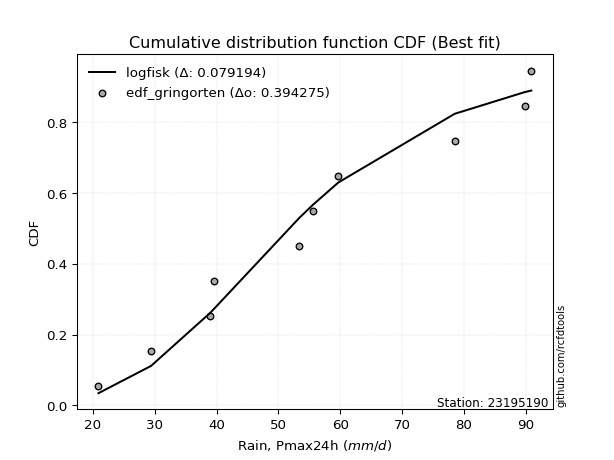</img></img>

</div>


### 9. EDF Filliben (1975)

The specific values of the constants (0.3175) (often denoted as $alpha$) and (0.365) are derived from a method proposed by James J. Filliben in a 1975 paper. This particular formula is the mean value of the $i$-th order statistic of the normal distribution and is considered a robust and effective plotting position formula for the normal probability plot correlation coefficient test for normality.

<div align="center">


$P=(m-0.3175)/(n+0.365)$


</div>


**9.1. Empirical values**

<div align="center">

|                | 0                   | 1                  | 2                   | 3                  | 4                  | 5                  | 6                  | 7                  | 8                  | 9                  |
|:---------------|:--------------------|:-------------------|:--------------------|:-------------------|:-------------------|:-------------------|:-------------------|:-------------------|:-------------------|:-------------------|
| date           | 2009                | 2007               | 2005                | 2008               | 2006               | 2014               | 2012               | 2011               | 2013               | 2010               |
| x              | 20.9                | 29.4               | 39.0                | 39.6               | 53.4               | 55.6               | 59.7               | 78.5               | 89.8               | 90.9               |
| m              | 1                   | 2                  | 3                   | 4                  | 5                  | 6                  | 7                  | 8                  | 9                  | 10                 |
| empirical_dist | edf_filliben        | edf_filliben       | edf_filliben        | edf_filliben       | edf_filliben       | edf_filliben       | edf_filliben       | edf_filliben       | edf_filliben       | edf_filliben       |
| empirical      | 0.06584659913169319 | 0.1623251326579836 | 0.25880366618427403 | 0.3552821997105644 | 0.4517607332368548 | 0.5482392667631452 | 0.6447178002894356 | 0.741196333815726  | 0.8376748673420163 | 0.9341534008683067 |
| empirical_tr   | 1.0704879938032532  | 1.193780593147135  | 1.3491701919947936  | 1.5510662177328844 | 1.8240211174659038 | 2.2135611318739987 | 2.814663951120163  | 3.8639328984156576 | 6.1604754829123305 | 15.186813186813156 |

</div>


**9.2. Kolmogorov-Smirnov fit test (sorted by Δ)**


<div align="center">

|                | 0                   | 1                   | 2                   | 3                   | 4                  | 5                  | 6                   | 7                  | 8                   | 9                   | 10                  | 11                  | 12                  | 13                  | 14                  | 15                  | 16                  | 17                 | 18                  | 19                  | 20                  | 21                  | 22                  | 23                 | 24                 | 25                  | 26                  | 27                  | 28                  | 29                  | 30                 | 31                  | 32                  | 33                 | 34                  | 35                  | 36                  | 37                  | 38                  | 39                  | 40                  | 41                  | 42                  | 43                  | 44                 | 45                  | 46                    | 47                  | 48                  | 49                  | 50                  | 51                  | 52                  | 53                  | 54                  | 55                  | 56                  | 57                  | 58                  | 59                  | 60                  | 61                  | 62                  | 63                 | 64                  | 65                  | 66                  | 67                  | 68                  | 69                  | 70                  | 71                  | 72                  | 73                  | 74                 | 75                  | 76                  | 77                  | 78                 | 79                  | 80                  | 81                  | 82                  | 83                 | 84                  | 85                 | 86                 | 87                 |
|:---------------|:--------------------|:--------------------|:--------------------|:--------------------|:-------------------|:-------------------|:--------------------|:-------------------|:--------------------|:--------------------|:--------------------|:--------------------|:--------------------|:--------------------|:--------------------|:--------------------|:--------------------|:-------------------|:--------------------|:--------------------|:--------------------|:--------------------|:--------------------|:-------------------|:-------------------|:--------------------|:--------------------|:--------------------|:--------------------|:--------------------|:-------------------|:--------------------|:--------------------|:-------------------|:--------------------|:--------------------|:--------------------|:--------------------|:--------------------|:--------------------|:--------------------|:--------------------|:--------------------|:--------------------|:-------------------|:--------------------|:----------------------|:--------------------|:--------------------|:--------------------|:--------------------|:--------------------|:--------------------|:--------------------|:--------------------|:--------------------|:--------------------|:--------------------|:--------------------|:--------------------|:--------------------|:--------------------|:--------------------|:-------------------|:--------------------|:--------------------|:--------------------|:--------------------|:--------------------|:--------------------|:--------------------|:--------------------|:--------------------|:--------------------|:-------------------|:--------------------|:--------------------|:--------------------|:-------------------|:--------------------|:--------------------|:--------------------|:--------------------|:-------------------|:--------------------|:-------------------|:-------------------|:-------------------|
| station        | 23195190            | 23195190            | 23195190            | 23195190            | 23195190           | 23195190           | 23195190            | 23195190           | 23195190            | 23195190            | 23195190            | 23195190            | 23195190            | 23195190            | 23195190            | 23195190            | 23195190            | 23195190           | 23195190            | 23195190            | 23195190            | 23195190            | 23195190            | 23195190           | 23195190           | 23195190            | 23195190            | 23195190            | 23195190            | 23195190            | 23195190           | 23195190            | 23195190            | 23195190           | 23195190            | 23195190            | 23195190            | 23195190            | 23195190            | 23195190            | 23195190            | 23195190            | 23195190            | 23195190            | 23195190           | 23195190            | 23195190              | 23195190            | 23195190            | 23195190            | 23195190            | 23195190            | 23195190            | 23195190            | 23195190            | 23195190            | 23195190            | 23195190            | 23195190            | 23195190            | 23195190            | 23195190            | 23195190            | 23195190           | 23195190            | 23195190            | 23195190            | 23195190            | 23195190            | 23195190            | 23195190            | 23195190            | 23195190            | 23195190            | 23195190           | 23195190            | 23195190            | 23195190            | 23195190           | 23195190            | 23195190            | 23195190            | 23195190            | 23195190           | 23195190            | 23195190           | 23195190           | 23195190           |
| empirical_dist | edf_filliben        | edf_filliben        | edf_filliben        | edf_filliben        | edf_filliben       | edf_filliben       | edf_filliben        | edf_filliben       | edf_filliben        | edf_filliben        | edf_filliben        | edf_filliben        | edf_filliben        | edf_filliben        | edf_filliben        | edf_filliben        | edf_filliben        | edf_filliben       | edf_filliben        | edf_filliben        | edf_filliben        | edf_filliben        | edf_filliben        | edf_filliben       | edf_filliben       | edf_filliben        | edf_filliben        | edf_filliben        | edf_filliben        | edf_filliben        | edf_filliben       | edf_filliben        | edf_filliben        | edf_filliben       | edf_filliben        | edf_filliben        | edf_filliben        | edf_filliben        | edf_filliben        | edf_filliben        | edf_filliben        | edf_filliben        | edf_filliben        | edf_filliben        | edf_filliben       | edf_filliben        | edf_filliben          | edf_filliben        | edf_filliben        | edf_filliben        | edf_filliben        | edf_filliben        | edf_filliben        | edf_filliben        | edf_filliben        | edf_filliben        | edf_filliben        | edf_filliben        | edf_filliben        | edf_filliben        | edf_filliben        | edf_filliben        | edf_filliben        | edf_filliben       | edf_filliben        | edf_filliben        | edf_filliben        | edf_filliben        | edf_filliben        | edf_filliben        | edf_filliben        | edf_filliben        | edf_filliben        | edf_filliben        | edf_filliben       | edf_filliben        | edf_filliben        | edf_filliben        | edf_filliben       | edf_filliben        | edf_filliben        | edf_filliben        | edf_filliben        | edf_filliben       | edf_filliben        | edf_filliben       | edf_filliben       | edf_filliben       |
| p_dist         | logfisk             | invweibull          | logpearson3         | f                   | erlang             | chi2               | fisk                | weibull_min        | loggompertz         | rayleigh            | genlogistic         | maxwell             | halfnorm            | logweibull_min      | gamma               | ncf                 | betaprime           | logfatiguelife     | logf                | rice                | logt                | lognorm             | lognorm             | logcrystalball     | logexponnorm       | kstwobign           | invgauss            | alpha               | invgamma            | lognct              | logloggamma        | logjohnsonsu        | logbetaprime        | pearson3           | loginvgamma         | logerlang           | logrice             | loggamma            | loggamma            | loglogistic         | exponnorm           | nct                 | norm                | crystalball         | truncnorm          | t                   | loglaplace_asymmetric | logncf              | gumbel_r            | loggumbel_l         | loginvweibull       | loginvgauss         | logalpha            | johnsonsu           | moyal               | loghypsecant        | logmaxwell          | loglaplace          | halflogistic        | logmielke           | logistic            | laplace_asymmetric  | lograyleigh         | gompertz           | loggenexpon         | hypsecant           | gumbel_l            | genexpon            | expon               | logkstwobign        | nakagami            | lognakagami         | loghalfnorm         | mielke              | loggumbel_r        | laplace             | logtruncnorm        | wald                | logmoyal           | loghalflogistic     | logexpon            | logwald             | loggibrat           | logchi2            | gibrat              | loglognorm         | fatiguelife        | loggenlogistic     |
| delta          | 0.08269731317327739 | 0.09075546972112858 | 0.09091985006880055 | 0.09174621134822725 | 0.0918492473104352 | 0.0918495603224645 | 0.09271773866507155 | 0.0930732602334906 | 0.09333188061237851 | 0.09358896919535031 | 0.09370536539752494 | 0.09411218404986399 | 0.09450034266892493 | 0.09500756959764556 | 0.09523763500030602 | 0.09547421948299817 | 0.09567204539823104 | 0.0959691612223052 | 0.09632152534323007 | 0.09663647046932128 | 0.09669899362093498 | 0.09670147220090625 | 0.09670147220090625 | 0.0967014731474865 | 0.0967027870405574 | 0.09676368961474002 | 0.09681338604652168 | 0.09809461071462955 | 0.09833124903052204 | 0.09875600610677177 | 0.1004778082910609 | 0.10151160814699378 | 0.10207323306185362 | 0.1055348677370081 | 0.10580517839737419 | 0.10603320253708487 | 0.10607668485463156 | 0.10767100463341855 | 0.10767100463341855 | 0.10983637438820482 | 0.11094164394250852 | 0.11112524953039576 | 0.11113128203894918 | 0.11113128470173764 | 0.1111312914635687 | 0.11113404503210939 | 0.11130970656541017   | 0.11150403388526803 | 0.11176492477507571 | 0.11297007954576332 | 0.11373649055235252 | 0.11524125615980324 | 0.11573469399571307 | 0.11681874543296972 | 0.11774928421614395 | 0.12028946880601155 | 0.12719301346151962 | 0.13031869692018794 | 0.13155914142029856 | 0.13340643228929283 | 0.13378890044548583 | 0.13671741044594302 | 0.13699490070321912 | 0.1404819068328933 | 0.14828349080227604 | 0.14852593615577767 | 0.14915014351229205 | 0.15499846764962727 | 0.15543548835441195 | 0.15593731932688232 | 0.16232513251798378 | 0.16232513265797746 | 0.16464487970224567 | 0.16515524532112036 | 0.1668538174954825 | 0.16763929545136938 | 0.16835158590485827 | 0.18205800219790996 | 0.1917408387907215 | 0.19187889931733765 | 0.24815247119651546 | 0.26079737148639576 | 0.28977838655821936 | 0.3085212397080955 | 0.32594407052929664 | 0.4332224287017476 | 0.5388277914472452 | 0.8376748673420163 |
| deltao         | 0.3942745923300002  | 0.3942745923300002  | 0.3942745923300002  | 0.3942745923300002  | 0.3942745923300002 | 0.3942745923300002 | 0.3942745923300002  | 0.3942745923300002 | 0.3942745923300002  | 0.3942745923300002  | 0.3942745923300002  | 0.3942745923300002  | 0.3942745923300002  | 0.3942745923300002  | 0.3942745923300002  | 0.3942745923300002  | 0.3942745923300002  | 0.3942745923300002 | 0.3942745923300002  | 0.3942745923300002  | 0.3942745923300002  | 0.3942745923300002  | 0.3942745923300002  | 0.3942745923300002 | 0.3942745923300002 | 0.3942745923300002  | 0.3942745923300002  | 0.3942745923300002  | 0.3942745923300002  | 0.3942745923300002  | 0.3942745923300002 | 0.3942745923300002  | 0.3942745923300002  | 0.3942745923300002 | 0.3942745923300002  | 0.3942745923300002  | 0.3942745923300002  | 0.3942745923300002  | 0.3942745923300002  | 0.3942745923300002  | 0.3942745923300002  | 0.3942745923300002  | 0.3942745923300002  | 0.3942745923300002  | 0.3942745923300002 | 0.3942745923300002  | 0.3942745923300002    | 0.3942745923300002  | 0.3942745923300002  | 0.3942745923300002  | 0.3942745923300002  | 0.3942745923300002  | 0.3942745923300002  | 0.3942745923300002  | 0.3942745923300002  | 0.3942745923300002  | 0.3942745923300002  | 0.3942745923300002  | 0.3942745923300002  | 0.3942745923300002  | 0.3942745923300002  | 0.3942745923300002  | 0.3942745923300002  | 0.3942745923300002 | 0.3942745923300002  | 0.3942745923300002  | 0.3942745923300002  | 0.3942745923300002  | 0.3942745923300002  | 0.3942745923300002  | 0.3942745923300002  | 0.3942745923300002  | 0.3942745923300002  | 0.3942745923300002  | 0.3942745923300002 | 0.3942745923300002  | 0.3942745923300002  | 0.3942745923300002  | 0.3942745923300002 | 0.3942745923300002  | 0.3942745923300002  | 0.3942745923300002  | 0.3942745923300002  | 0.3942745923300002 | 0.3942745923300002  | 0.3942745923300002 | 0.3942745923300002 | 0.3942745923300002 |
| eval           | Δo > Δ              | Δo > Δ              | Δo > Δ              | Δo > Δ              | Δo > Δ             | Δo > Δ             | Δo > Δ              | Δo > Δ             | Δo > Δ              | Δo > Δ              | Δo > Δ              | Δo > Δ              | Δo > Δ              | Δo > Δ              | Δo > Δ              | Δo > Δ              | Δo > Δ              | Δo > Δ             | Δo > Δ              | Δo > Δ              | Δo > Δ              | Δo > Δ              | Δo > Δ              | Δo > Δ             | Δo > Δ             | Δo > Δ              | Δo > Δ              | Δo > Δ              | Δo > Δ              | Δo > Δ              | Δo > Δ             | Δo > Δ              | Δo > Δ              | Δo > Δ             | Δo > Δ              | Δo > Δ              | Δo > Δ              | Δo > Δ              | Δo > Δ              | Δo > Δ              | Δo > Δ              | Δo > Δ              | Δo > Δ              | Δo > Δ              | Δo > Δ             | Δo > Δ              | Δo > Δ                | Δo > Δ              | Δo > Δ              | Δo > Δ              | Δo > Δ              | Δo > Δ              | Δo > Δ              | Δo > Δ              | Δo > Δ              | Δo > Δ              | Δo > Δ              | Δo > Δ              | Δo > Δ              | Δo > Δ              | Δo > Δ              | Δo > Δ              | Δo > Δ              | Δo > Δ             | Δo > Δ              | Δo > Δ              | Δo > Δ              | Δo > Δ              | Δo > Δ              | Δo > Δ              | Δo > Δ              | Δo > Δ              | Δo > Δ              | Δo > Δ              | Δo > Δ             | Δo > Δ              | Δo > Δ              | Δo > Δ              | Δo > Δ             | Δo > Δ              | Δo > Δ              | Δo > Δ              | Δo > Δ              | Δo > Δ             | Δo > Δ              | Δo <= Δ            | Δo <= Δ            | Δo <= Δ            |
| fit            | 1                   | 1                   | 1                   | 1                   | 1                  | 1                  | 1                   | 1                  | 1                   | 1                   | 1                   | 1                   | 1                   | 1                   | 1                   | 1                   | 1                   | 1                  | 1                   | 1                   | 1                   | 1                   | 1                   | 1                  | 1                  | 1                   | 1                   | 1                   | 1                   | 1                   | 1                  | 1                   | 1                   | 1                  | 1                   | 1                   | 1                   | 1                   | 1                   | 1                   | 1                   | 1                   | 1                   | 1                   | 1                  | 1                   | 1                     | 1                   | 1                   | 1                   | 1                   | 1                   | 1                   | 1                   | 1                   | 1                   | 1                   | 1                   | 1                   | 1                   | 1                   | 1                   | 1                   | 1                  | 1                   | 1                   | 1                   | 1                   | 1                   | 1                   | 1                   | 1                   | 1                   | 1                   | 1                  | 1                   | 1                   | 1                   | 1                  | 1                   | 1                   | 1                   | 1                   | 1                  | 1                   | 0                  | 0                  | 0                  |
| n              | 10                  | 10                  | 10                  | 10                  | 10                 | 10                 | 10                  | 10                 | 10                  | 10                  | 10                  | 10                  | 10                  | 10                  | 10                  | 10                  | 10                  | 10                 | 10                  | 10                  | 10                  | 10                  | 10                  | 10                 | 10                 | 10                  | 10                  | 10                  | 10                  | 10                  | 10                 | 10                  | 10                  | 10                 | 10                  | 10                  | 10                  | 10                  | 10                  | 10                  | 10                  | 10                  | 10                  | 10                  | 10                 | 10                  | 10                    | 10                  | 10                  | 10                  | 10                  | 10                  | 10                  | 10                  | 10                  | 10                  | 10                  | 10                  | 10                  | 10                  | 10                  | 10                  | 10                  | 10                 | 10                  | 10                  | 10                  | 10                  | 10                  | 10                  | 10                  | 10                  | 10                  | 10                  | 10                 | 10                  | 10                  | 10                  | 10                 | 10                  | 10                  | 10                  | 10                  | 10                 | 10                  | 10                 | 10                 | 10                 |
| best_fit       | 1                   | 0                   | 0                   | 0                   | 0                  | 0                  | 0                   | 0                  | 0                   | 0                   | 0                   | 0                   | 0                   | 0                   | 0                   | 0                   | 0                   | 0                  | 0                   | 0                   | 0                   | 0                   | 0                   | 0                  | 0                  | 0                   | 0                   | 0                   | 0                   | 0                   | 0                  | 0                   | 0                   | 0                  | 0                   | 0                   | 0                   | 0                   | 0                   | 0                   | 0                   | 0                   | 0                   | 0                   | 0                  | 0                   | 0                     | 0                   | 0                   | 0                   | 0                   | 0                   | 0                   | 0                   | 0                   | 0                   | 0                   | 0                   | 0                   | 0                   | 0                   | 0                   | 0                   | 0                  | 0                   | 0                   | 0                   | 0                   | 0                   | 0                   | 0                   | 0                   | 0                   | 0                   | 0                  | 0                   | 0                   | 0                   | 0                  | 0                   | 0                   | 0                   | 0                   | 0                  | 0                   | 0                  | 0                  | 0                  |
| best_fit_sort  | 1                   | 2                   | 3                   | 4                   | 5                  | 6                  | 7                   | 8                  | 9                   | 10                  | 11                  | 12                  | 13                  | 14                  | 15                  | 16                  | 17                  | 18                 | 19                  | 20                  | 21                  | 22                  | 23                  | 24                 | 25                 | 26                  | 27                  | 28                  | 29                  | 30                  | 31                 | 32                  | 33                  | 34                 | 35                  | 36                  | 37                  | 38                  | 39                  | 40                  | 41                  | 42                  | 43                  | 44                  | 45                 | 46                  | 47                    | 48                  | 49                  | 50                  | 51                  | 52                  | 53                  | 54                  | 55                  | 56                  | 57                  | 58                  | 59                  | 60                  | 61                  | 62                  | 63                  | 64                 | 65                  | 66                  | 67                  | 68                  | 69                  | 70                  | 71                  | 72                  | 73                  | 74                  | 75                 | 76                  | 77                  | 78                  | 79                 | 80                  | 81                  | 82                  | 83                  | 84                 | 85                  | 86                 | 87                 | 88                 |

</div>


**9.3. Best fit**

<div align="center">

|   id |   station | empirical_dist   | p_dist   |     delta |   deltao | eval   |   fit |   n |   best_fit |   best_fit_sort |
|-----:|----------:|:-----------------|:---------|----------:|---------:|:-------|------:|----:|-----------:|----------------:|
|    0 |  23195190 | edf_filliben     | logfisk  | 0.0826973 | 0.394275 | Δo > Δ |     1 |  10 |          1 |               1 |

</div>


<div align="center">

</img>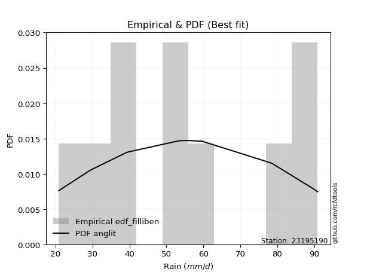</img>

</div>


### 10. EDF Jenkinson (1977)

The Jenkinson formula in hydrology is an empirical plotting position formula used to estimate the non-exceedance probability _(P)_ or return period _(T)_ of a given ordered observation within a sample. It is a widely used method in the frequency analysis of extreme events such as floods and rainfall, as it provides a distribution-free way to plot data. _a≈0.31_ and _b≈0.38_ are constants derived to approximate the median of the probability distribution for the given rank.

<div align="center">


$P=(m-a)/(n+b)$


</div>


**10.1. Empirical values**

<div align="center">

|                | 0                   | 1                   | 2                  | 3                   | 4                   | 5                  | 6                  | 7                  | 8                  | 9                  |
|:---------------|:--------------------|:--------------------|:-------------------|:--------------------|:--------------------|:-------------------|:-------------------|:-------------------|:-------------------|:-------------------|
| date           | 2009                | 2007                | 2005               | 2008                | 2006                | 2014               | 2012               | 2011               | 2013               | 2010               |
| x              | 20.9                | 29.4                | 39.0               | 39.6                | 53.4                | 55.6               | 59.7               | 78.5               | 89.8               | 90.9               |
| m              | 1                   | 2                   | 3                  | 4                   | 5                   | 6                  | 7                  | 8                  | 9                  | 10                 |
| empirical_dist | edf_jenkinson       | edf_jenkinson       | edf_jenkinson      | edf_jenkinson       | edf_jenkinson       | edf_jenkinson      | edf_jenkinson      | edf_jenkinson      | edf_jenkinson      | edf_jenkinson      |
| empirical      | 0.06647398843930635 | 0.16281310211946048 | 0.2591522157996146 | 0.35549132947976875 | 0.45183044315992293 | 0.5481695568400771 | 0.6445086705202312 | 0.7408477842003853 | 0.8371868978805393 | 0.9335260115606935 |
| empirical_tr   | 1.0712074303405574  | 1.1944764096662832  | 1.3498049414824447 | 1.5515695067264574  | 1.8242530755711774  | 2.213219616204691  | 2.813008130081301  | 3.8587360594795537 | 6.142011834319521  | 15.043478260869529 |

</div>


**10.2. Kolmogorov-Smirnov fit test (sorted by Δ)**


<div align="center">

|                | 0                   | 1                   | 2                   | 3                   | 4                  | 5                  | 6                   | 7                  | 8                   | 9                   | 10                  | 11                  | 12                  | 13                  | 14                  | 15                  | 16                  | 17                  | 18                  | 19                  | 20                 | 21                 | 22                  | 23                  | 24                  | 25                  | 26                  | 27                  | 28                  | 29                  | 30                  | 31                  | 32                  | 33                  | 34                  | 35                  | 36                  | 37                 | 38                 | 39                  | 40                  | 41                 | 42                  | 43                  | 44                  | 45                  | 46                  | 47                    | 48                  | 49                  | 50                  | 51                  | 52                  | 53                  | 54                  | 55                  | 56                  | 57                  | 58                  | 59                  | 60                  | 61                  | 62                  | 63                 | 64                 | 65                 | 66                 | 67                  | 68                 | 69                  | 70                  | 71                  | 72                  | 73                  | 74                  | 75                  | 76                  | 77                 | 78                  | 79                 | 80                  | 81                 | 82                 | 83                 | 84                 | 85                 | 86                 | 87                 |
|:---------------|:--------------------|:--------------------|:--------------------|:--------------------|:-------------------|:-------------------|:--------------------|:-------------------|:--------------------|:--------------------|:--------------------|:--------------------|:--------------------|:--------------------|:--------------------|:--------------------|:--------------------|:--------------------|:--------------------|:--------------------|:-------------------|:-------------------|:--------------------|:--------------------|:--------------------|:--------------------|:--------------------|:--------------------|:--------------------|:--------------------|:--------------------|:--------------------|:--------------------|:--------------------|:--------------------|:--------------------|:--------------------|:-------------------|:-------------------|:--------------------|:--------------------|:-------------------|:--------------------|:--------------------|:--------------------|:--------------------|:--------------------|:----------------------|:--------------------|:--------------------|:--------------------|:--------------------|:--------------------|:--------------------|:--------------------|:--------------------|:--------------------|:--------------------|:--------------------|:--------------------|:--------------------|:--------------------|:--------------------|:-------------------|:-------------------|:-------------------|:-------------------|:--------------------|:-------------------|:--------------------|:--------------------|:--------------------|:--------------------|:--------------------|:--------------------|:--------------------|:--------------------|:-------------------|:--------------------|:-------------------|:--------------------|:-------------------|:-------------------|:-------------------|:-------------------|:-------------------|:-------------------|:-------------------|
| station        | 23195190            | 23195190            | 23195190            | 23195190            | 23195190           | 23195190           | 23195190            | 23195190           | 23195190            | 23195190            | 23195190            | 23195190            | 23195190            | 23195190            | 23195190            | 23195190            | 23195190            | 23195190            | 23195190            | 23195190            | 23195190           | 23195190           | 23195190            | 23195190            | 23195190            | 23195190            | 23195190            | 23195190            | 23195190            | 23195190            | 23195190            | 23195190            | 23195190            | 23195190            | 23195190            | 23195190            | 23195190            | 23195190           | 23195190           | 23195190            | 23195190            | 23195190           | 23195190            | 23195190            | 23195190            | 23195190            | 23195190            | 23195190              | 23195190            | 23195190            | 23195190            | 23195190            | 23195190            | 23195190            | 23195190            | 23195190            | 23195190            | 23195190            | 23195190            | 23195190            | 23195190            | 23195190            | 23195190            | 23195190           | 23195190           | 23195190           | 23195190           | 23195190            | 23195190           | 23195190            | 23195190            | 23195190            | 23195190            | 23195190            | 23195190            | 23195190            | 23195190            | 23195190           | 23195190            | 23195190           | 23195190            | 23195190           | 23195190           | 23195190           | 23195190           | 23195190           | 23195190           | 23195190           |
| empirical_dist | edf_jenkinson       | edf_jenkinson       | edf_jenkinson       | edf_jenkinson       | edf_jenkinson      | edf_jenkinson      | edf_jenkinson       | edf_jenkinson      | edf_jenkinson       | edf_jenkinson       | edf_jenkinson       | edf_jenkinson       | edf_jenkinson       | edf_jenkinson       | edf_jenkinson       | edf_jenkinson       | edf_jenkinson       | edf_jenkinson       | edf_jenkinson       | edf_jenkinson       | edf_jenkinson      | edf_jenkinson      | edf_jenkinson       | edf_jenkinson       | edf_jenkinson       | edf_jenkinson       | edf_jenkinson       | edf_jenkinson       | edf_jenkinson       | edf_jenkinson       | edf_jenkinson       | edf_jenkinson       | edf_jenkinson       | edf_jenkinson       | edf_jenkinson       | edf_jenkinson       | edf_jenkinson       | edf_jenkinson      | edf_jenkinson      | edf_jenkinson       | edf_jenkinson       | edf_jenkinson      | edf_jenkinson       | edf_jenkinson       | edf_jenkinson       | edf_jenkinson       | edf_jenkinson       | edf_jenkinson         | edf_jenkinson       | edf_jenkinson       | edf_jenkinson       | edf_jenkinson       | edf_jenkinson       | edf_jenkinson       | edf_jenkinson       | edf_jenkinson       | edf_jenkinson       | edf_jenkinson       | edf_jenkinson       | edf_jenkinson       | edf_jenkinson       | edf_jenkinson       | edf_jenkinson       | edf_jenkinson      | edf_jenkinson      | edf_jenkinson      | edf_jenkinson      | edf_jenkinson       | edf_jenkinson      | edf_jenkinson       | edf_jenkinson       | edf_jenkinson       | edf_jenkinson       | edf_jenkinson       | edf_jenkinson       | edf_jenkinson       | edf_jenkinson       | edf_jenkinson      | edf_jenkinson       | edf_jenkinson      | edf_jenkinson       | edf_jenkinson      | edf_jenkinson      | edf_jenkinson      | edf_jenkinson      | edf_jenkinson      | edf_jenkinson      | edf_jenkinson      |
| p_dist         | logfisk             | invweibull          | logpearson3         | f                   | erlang             | chi2               | fisk                | weibull_min        | loggompertz         | rayleigh            | genlogistic         | maxwell             | halfnorm            | logweibull_min      | gamma               | ncf                 | logfatiguelife      | betaprime           | logf                | logt                | lognorm            | lognorm            | logcrystalball      | logexponnorm        | rice                | kstwobign           | invgauss            | alpha               | invgamma            | lognct              | logloggamma         | logjohnsonsu        | logbetaprime        | loginvgamma         | pearson3            | logerlang           | logrice             | loggamma           | loggamma           | loglogistic         | exponnorm           | nct                | norm                | crystalball         | truncnorm           | t                   | logncf              | loglaplace_asymmetric | gumbel_r            | loggumbel_l         | loginvweibull       | loginvgauss         | logalpha            | johnsonsu           | moyal               | loghypsecant        | logmaxwell          | loglaplace          | halflogistic        | logmielke           | logistic            | lograyleigh         | laplace_asymmetric  | gompertz           | loggenexpon        | hypsecant          | gumbel_l           | genexpon            | expon              | logkstwobign        | nakagami            | lognakagami         | loghalfnorm         | mielke              | loggumbel_r         | laplace             | logtruncnorm        | wald               | logmoyal            | loghalflogistic    | logexpon            | logwald            | loggibrat          | logchi2            | gibrat             | loglognorm         | fatiguelife        | loggenlogistic     |
| delta          | 0.08290644294248173 | 0.09110401933646928 | 0.09126839968414124 | 0.09209476096356795 | 0.0921977969257759 | 0.0921981099378052 | 0.09292686843427589 | 0.0934218098488313 | 0.09368043022771921 | 0.09393751881069101 | 0.09405391501286564 | 0.09446073366520469 | 0.09484889228426563 | 0.09535611921298626 | 0.09558618461564672 | 0.09582276909833887 | 0.09589945129923705 | 0.09602059501357174 | 0.09625181542016192 | 0.09662928369786683 | 0.0966317622778381 | 0.0966317622778381 | 0.09663176322441835 | 0.09663307711748925 | 0.09684560023852562 | 0.09711223923008072 | 0.09716193566186238 | 0.09844316032997025 | 0.09867979864586274 | 0.09868629618370361 | 0.10068693806026524 | 0.10172073791619812 | 0.10200352313878547 | 0.10573546847430604 | 0.10574399750621244 | 0.10596349261401672 | 0.10600697493156341 | 0.1076012947103504 | 0.1076012947103504 | 0.11018492400354551 | 0.11115077371171286 | 0.1113343792996001 | 0.11134041180815352 | 0.11134041447094198 | 0.11134042123277305 | 0.11134317480131373 | 0.11143432396219988 | 0.11165825618075087   | 0.11211347439041641 | 0.11331862916110402 | 0.11366678062928437 | 0.11517154623673509 | 0.11566498407264492 | 0.11702787520217406 | 0.11809783383148464 | 0.12063801842135224 | 0.12712330353845147 | 0.13066724653552864 | 0.13204711088177545 | 0.13389440175076983 | 0.13399803021469017 | 0.13692519078015097 | 0.13692654021514736 | 0.1402727770636889 | 0.1482137808792079 | 0.148735065924982  | 0.1493592732814964 | 0.15492875772655912 | 0.1553657784313438 | 0.15586760940381417 | 0.16281310197946067 | 0.16281310211945435 | 0.16457516977917752 | 0.16494611555191596 | 0.16678410757241435 | 0.16784842522057372 | 0.16828187598179012 | 0.1822671319671143 | 0.19167112886765336 | 0.1918091893942695 | 0.24780392158117487 | 0.2607276615633276 | 0.2897086766351512 | 0.3081726900927549 | 0.326153200298501  | 0.4327344592402707 | 0.5383398219857685 | 0.8371868978805393 |
| deltao         | 0.3942745923300002  | 0.3942745923300002  | 0.3942745923300002  | 0.3942745923300002  | 0.3942745923300002 | 0.3942745923300002 | 0.3942745923300002  | 0.3942745923300002 | 0.3942745923300002  | 0.3942745923300002  | 0.3942745923300002  | 0.3942745923300002  | 0.3942745923300002  | 0.3942745923300002  | 0.3942745923300002  | 0.3942745923300002  | 0.3942745923300002  | 0.3942745923300002  | 0.3942745923300002  | 0.3942745923300002  | 0.3942745923300002 | 0.3942745923300002 | 0.3942745923300002  | 0.3942745923300002  | 0.3942745923300002  | 0.3942745923300002  | 0.3942745923300002  | 0.3942745923300002  | 0.3942745923300002  | 0.3942745923300002  | 0.3942745923300002  | 0.3942745923300002  | 0.3942745923300002  | 0.3942745923300002  | 0.3942745923300002  | 0.3942745923300002  | 0.3942745923300002  | 0.3942745923300002 | 0.3942745923300002 | 0.3942745923300002  | 0.3942745923300002  | 0.3942745923300002 | 0.3942745923300002  | 0.3942745923300002  | 0.3942745923300002  | 0.3942745923300002  | 0.3942745923300002  | 0.3942745923300002    | 0.3942745923300002  | 0.3942745923300002  | 0.3942745923300002  | 0.3942745923300002  | 0.3942745923300002  | 0.3942745923300002  | 0.3942745923300002  | 0.3942745923300002  | 0.3942745923300002  | 0.3942745923300002  | 0.3942745923300002  | 0.3942745923300002  | 0.3942745923300002  | 0.3942745923300002  | 0.3942745923300002  | 0.3942745923300002 | 0.3942745923300002 | 0.3942745923300002 | 0.3942745923300002 | 0.3942745923300002  | 0.3942745923300002 | 0.3942745923300002  | 0.3942745923300002  | 0.3942745923300002  | 0.3942745923300002  | 0.3942745923300002  | 0.3942745923300002  | 0.3942745923300002  | 0.3942745923300002  | 0.3942745923300002 | 0.3942745923300002  | 0.3942745923300002 | 0.3942745923300002  | 0.3942745923300002 | 0.3942745923300002 | 0.3942745923300002 | 0.3942745923300002 | 0.3942745923300002 | 0.3942745923300002 | 0.3942745923300002 |
| eval           | Δo > Δ              | Δo > Δ              | Δo > Δ              | Δo > Δ              | Δo > Δ             | Δo > Δ             | Δo > Δ              | Δo > Δ             | Δo > Δ              | Δo > Δ              | Δo > Δ              | Δo > Δ              | Δo > Δ              | Δo > Δ              | Δo > Δ              | Δo > Δ              | Δo > Δ              | Δo > Δ              | Δo > Δ              | Δo > Δ              | Δo > Δ             | Δo > Δ             | Δo > Δ              | Δo > Δ              | Δo > Δ              | Δo > Δ              | Δo > Δ              | Δo > Δ              | Δo > Δ              | Δo > Δ              | Δo > Δ              | Δo > Δ              | Δo > Δ              | Δo > Δ              | Δo > Δ              | Δo > Δ              | Δo > Δ              | Δo > Δ             | Δo > Δ             | Δo > Δ              | Δo > Δ              | Δo > Δ             | Δo > Δ              | Δo > Δ              | Δo > Δ              | Δo > Δ              | Δo > Δ              | Δo > Δ                | Δo > Δ              | Δo > Δ              | Δo > Δ              | Δo > Δ              | Δo > Δ              | Δo > Δ              | Δo > Δ              | Δo > Δ              | Δo > Δ              | Δo > Δ              | Δo > Δ              | Δo > Δ              | Δo > Δ              | Δo > Δ              | Δo > Δ              | Δo > Δ             | Δo > Δ             | Δo > Δ             | Δo > Δ             | Δo > Δ              | Δo > Δ             | Δo > Δ              | Δo > Δ              | Δo > Δ              | Δo > Δ              | Δo > Δ              | Δo > Δ              | Δo > Δ              | Δo > Δ              | Δo > Δ             | Δo > Δ              | Δo > Δ             | Δo > Δ              | Δo > Δ             | Δo > Δ             | Δo > Δ             | Δo > Δ             | Δo <= Δ            | Δo <= Δ            | Δo <= Δ            |
| fit            | 1                   | 1                   | 1                   | 1                   | 1                  | 1                  | 1                   | 1                  | 1                   | 1                   | 1                   | 1                   | 1                   | 1                   | 1                   | 1                   | 1                   | 1                   | 1                   | 1                   | 1                  | 1                  | 1                   | 1                   | 1                   | 1                   | 1                   | 1                   | 1                   | 1                   | 1                   | 1                   | 1                   | 1                   | 1                   | 1                   | 1                   | 1                  | 1                  | 1                   | 1                   | 1                  | 1                   | 1                   | 1                   | 1                   | 1                   | 1                     | 1                   | 1                   | 1                   | 1                   | 1                   | 1                   | 1                   | 1                   | 1                   | 1                   | 1                   | 1                   | 1                   | 1                   | 1                   | 1                  | 1                  | 1                  | 1                  | 1                   | 1                  | 1                   | 1                   | 1                   | 1                   | 1                   | 1                   | 1                   | 1                   | 1                  | 1                   | 1                  | 1                   | 1                  | 1                  | 1                  | 1                  | 0                  | 0                  | 0                  |
| n              | 10                  | 10                  | 10                  | 10                  | 10                 | 10                 | 10                  | 10                 | 10                  | 10                  | 10                  | 10                  | 10                  | 10                  | 10                  | 10                  | 10                  | 10                  | 10                  | 10                  | 10                 | 10                 | 10                  | 10                  | 10                  | 10                  | 10                  | 10                  | 10                  | 10                  | 10                  | 10                  | 10                  | 10                  | 10                  | 10                  | 10                  | 10                 | 10                 | 10                  | 10                  | 10                 | 10                  | 10                  | 10                  | 10                  | 10                  | 10                    | 10                  | 10                  | 10                  | 10                  | 10                  | 10                  | 10                  | 10                  | 10                  | 10                  | 10                  | 10                  | 10                  | 10                  | 10                  | 10                 | 10                 | 10                 | 10                 | 10                  | 10                 | 10                  | 10                  | 10                  | 10                  | 10                  | 10                  | 10                  | 10                  | 10                 | 10                  | 10                 | 10                  | 10                 | 10                 | 10                 | 10                 | 10                 | 10                 | 10                 |
| best_fit       | 1                   | 0                   | 0                   | 0                   | 0                  | 0                  | 0                   | 0                  | 0                   | 0                   | 0                   | 0                   | 0                   | 0                   | 0                   | 0                   | 0                   | 0                   | 0                   | 0                   | 0                  | 0                  | 0                   | 0                   | 0                   | 0                   | 0                   | 0                   | 0                   | 0                   | 0                   | 0                   | 0                   | 0                   | 0                   | 0                   | 0                   | 0                  | 0                  | 0                   | 0                   | 0                  | 0                   | 0                   | 0                   | 0                   | 0                   | 0                     | 0                   | 0                   | 0                   | 0                   | 0                   | 0                   | 0                   | 0                   | 0                   | 0                   | 0                   | 0                   | 0                   | 0                   | 0                   | 0                  | 0                  | 0                  | 0                  | 0                   | 0                  | 0                   | 0                   | 0                   | 0                   | 0                   | 0                   | 0                   | 0                   | 0                  | 0                   | 0                  | 0                   | 0                  | 0                  | 0                  | 0                  | 0                  | 0                  | 0                  |
| best_fit_sort  | 1                   | 2                   | 3                   | 4                   | 5                  | 6                  | 7                   | 8                  | 9                   | 10                  | 11                  | 12                  | 13                  | 14                  | 15                  | 16                  | 17                  | 18                  | 19                  | 20                  | 21                 | 22                 | 23                  | 24                  | 25                  | 26                  | 27                  | 28                  | 29                  | 30                  | 31                  | 32                  | 33                  | 34                  | 35                  | 36                  | 37                  | 38                 | 39                 | 40                  | 41                  | 42                 | 43                  | 44                  | 45                  | 46                  | 47                  | 48                    | 49                  | 50                  | 51                  | 52                  | 53                  | 54                  | 55                  | 56                  | 57                  | 58                  | 59                  | 60                  | 61                  | 62                  | 63                  | 64                 | 65                 | 66                 | 67                 | 68                  | 69                 | 70                  | 71                  | 72                  | 73                  | 74                  | 75                  | 76                  | 77                  | 78                 | 79                  | 80                 | 81                  | 82                 | 83                 | 84                 | 85                 | 86                 | 87                 | 88                 |

</div>


**10.3. Best fit**

<div align="center">

|   id |   station | empirical_dist   | p_dist   |     delta |   deltao | eval   |   fit |   n |   best_fit |   best_fit_sort |
|-----:|----------:|:-----------------|:---------|----------:|---------:|:-------|------:|----:|-----------:|----------------:|
|    0 |  23195190 | edf_jenkinson    | logfisk  | 0.0829064 | 0.394275 | Δo > Δ |     1 |  10 |          1 |               1 |

</div>


<div align="center">

</img></img>

</div>


### 11. EDF Cunnane (1978)

Cunnane´s work in statistical hydrology has focused on the performance and evaluation of different probability distributions (such as GEV, Gumbel, Lognormal) for flood frequency estimation. _b_ is a constant, typically set to 0.4.

<div align="center">


$P=(m-b)/(n+1-2b)$


</div>


**11.1. Empirical values**

<div align="center">

|                | 0                    | 1                   | 2                   | 3                   | 4                   | 5                  | 6                  | 7                  | 8                  | 9                  |
|:---------------|:---------------------|:--------------------|:--------------------|:--------------------|:--------------------|:-------------------|:-------------------|:-------------------|:-------------------|:-------------------|
| date           | 2009                 | 2007                | 2005                | 2008                | 2006                | 2014               | 2012               | 2011               | 2013               | 2010               |
| x              | 20.9                 | 29.4                | 39.0                | 39.6                | 53.4                | 55.6               | 59.7               | 78.5               | 89.8               | 90.9               |
| m              | 1                    | 2                   | 3                   | 4                   | 5                   | 6                  | 7                  | 8                  | 9                  | 10                 |
| empirical_dist | edf_cunnane          | edf_cunnane         | edf_cunnane         | edf_cunnane         | edf_cunnane         | edf_cunnane        | edf_cunnane        | edf_cunnane        | edf_cunnane        | edf_cunnane        |
| empirical      | 0.058823529411764705 | 0.15686274509803924 | 0.25490196078431376 | 0.35294117647058826 | 0.45098039215686275 | 0.5490196078431373 | 0.6470588235294118 | 0.7450980392156863 | 0.8431372549019608 | 0.9411764705882353 |
| empirical_tr   | 1.0625               | 1.1860465116279069  | 1.3421052631578947  | 1.5454545454545456  | 1.8214285714285712  | 2.217391304347826  | 2.8333333333333335 | 3.9230769230769234 | 6.375              | 16.999999999999996 |

</div>


**11.2. Kolmogorov-Smirnov fit test (sorted by Δ)**


<div align="center">

|                | 0                   | 1                   | 2                   | 3                   | 4                   | 5                   | 6                   | 7                   | 8                   | 9                   | 10                  | 11                 | 12                  | 13                 | 14                  | 15                 | 16                  | 17                  | 18                  | 19                  | 20                  | 21                  | 22                  | 23                 | 24                  | 25                  | 26                  | 27                  | 28                  | 29                  | 30                  | 31                 | 32                  | 33                  | 34                  | 35                  | 36                 | 37                 | 38                    | 39                  | 40                  | 41                  | 42                  | 43                  | 44                  | 45                  | 46                  | 47                  | 48                  | 49                  | 50                  | 51                  | 52                  | 53                  | 54                 | 55                  | 56                 | 57                 | 58                  | 59                 | 60                  | 61                  | 62                  | 63                 | 64                  | 65                 | 66                  | 67                 | 68                  | 69                  | 70                  | 71                 | 72                  | 73                 | 74                  | 75                  | 76                 | 77                  | 78                  | 79                  | 80                 | 81                 | 82                 | 83                  | 84                 | 85                 | 86                 | 87                 |
|:---------------|:--------------------|:--------------------|:--------------------|:--------------------|:--------------------|:--------------------|:--------------------|:--------------------|:--------------------|:--------------------|:--------------------|:-------------------|:--------------------|:-------------------|:--------------------|:-------------------|:--------------------|:--------------------|:--------------------|:--------------------|:--------------------|:--------------------|:--------------------|:-------------------|:--------------------|:--------------------|:--------------------|:--------------------|:--------------------|:--------------------|:--------------------|:-------------------|:--------------------|:--------------------|:--------------------|:--------------------|:-------------------|:-------------------|:----------------------|:--------------------|:--------------------|:--------------------|:--------------------|:--------------------|:--------------------|:--------------------|:--------------------|:--------------------|:--------------------|:--------------------|:--------------------|:--------------------|:--------------------|:--------------------|:-------------------|:--------------------|:-------------------|:-------------------|:--------------------|:-------------------|:--------------------|:--------------------|:--------------------|:-------------------|:--------------------|:-------------------|:--------------------|:-------------------|:--------------------|:--------------------|:--------------------|:-------------------|:--------------------|:-------------------|:--------------------|:--------------------|:-------------------|:--------------------|:--------------------|:--------------------|:-------------------|:-------------------|:-------------------|:--------------------|:-------------------|:-------------------|:-------------------|:-------------------|
| station        | 23195190            | 23195190            | 23195190            | 23195190            | 23195190            | 23195190            | 23195190            | 23195190            | 23195190            | 23195190            | 23195190            | 23195190           | 23195190            | 23195190           | 23195190            | 23195190           | 23195190            | 23195190            | 23195190            | 23195190            | 23195190            | 23195190            | 23195190            | 23195190           | 23195190            | 23195190            | 23195190            | 23195190            | 23195190            | 23195190            | 23195190            | 23195190           | 23195190            | 23195190            | 23195190            | 23195190            | 23195190           | 23195190           | 23195190              | 23195190            | 23195190            | 23195190            | 23195190            | 23195190            | 23195190            | 23195190            | 23195190            | 23195190            | 23195190            | 23195190            | 23195190            | 23195190            | 23195190            | 23195190            | 23195190           | 23195190            | 23195190           | 23195190           | 23195190            | 23195190           | 23195190            | 23195190            | 23195190            | 23195190           | 23195190            | 23195190           | 23195190            | 23195190           | 23195190            | 23195190            | 23195190            | 23195190           | 23195190            | 23195190           | 23195190            | 23195190            | 23195190           | 23195190            | 23195190            | 23195190            | 23195190           | 23195190           | 23195190           | 23195190            | 23195190           | 23195190           | 23195190           | 23195190           |
| empirical_dist | edf_cunnane         | edf_cunnane         | edf_cunnane         | edf_cunnane         | edf_cunnane         | edf_cunnane         | edf_cunnane         | edf_cunnane         | edf_cunnane         | edf_cunnane         | edf_cunnane         | edf_cunnane        | edf_cunnane         | edf_cunnane        | edf_cunnane         | edf_cunnane        | edf_cunnane         | edf_cunnane         | edf_cunnane         | edf_cunnane         | edf_cunnane         | edf_cunnane         | edf_cunnane         | edf_cunnane        | edf_cunnane         | edf_cunnane         | edf_cunnane         | edf_cunnane         | edf_cunnane         | edf_cunnane         | edf_cunnane         | edf_cunnane        | edf_cunnane         | edf_cunnane         | edf_cunnane         | edf_cunnane         | edf_cunnane        | edf_cunnane        | edf_cunnane           | edf_cunnane         | edf_cunnane         | edf_cunnane         | edf_cunnane         | edf_cunnane         | edf_cunnane         | edf_cunnane         | edf_cunnane         | edf_cunnane         | edf_cunnane         | edf_cunnane         | edf_cunnane         | edf_cunnane         | edf_cunnane         | edf_cunnane         | edf_cunnane        | edf_cunnane         | edf_cunnane        | edf_cunnane        | edf_cunnane         | edf_cunnane        | edf_cunnane         | edf_cunnane         | edf_cunnane         | edf_cunnane        | edf_cunnane         | edf_cunnane        | edf_cunnane         | edf_cunnane        | edf_cunnane         | edf_cunnane         | edf_cunnane         | edf_cunnane        | edf_cunnane         | edf_cunnane        | edf_cunnane         | edf_cunnane         | edf_cunnane        | edf_cunnane         | edf_cunnane         | edf_cunnane         | edf_cunnane        | edf_cunnane        | edf_cunnane        | edf_cunnane         | edf_cunnane        | edf_cunnane        | edf_cunnane        | edf_cunnane        |
| p_dist         | logfisk             | invweibull          | logpearson3         | f                   | erlang              | chi2                | weibull_min         | loggompertz         | rayleigh            | genlogistic         | maxwell             | fisk               | halfnorm            | logweibull_min     | gamma               | ncf                | betaprime           | kstwobign           | invgauss            | rice                | invgamma            | alpha               | logfatiguelife      | logf               | logt                | lognorm             | lognorm             | logcrystalball      | logexponnorm        | logloggamma         | logjohnsonsu        | lognct             | logbetaprime        | pearson3            | loglogistic         | loginvgamma         | logerlang          | logrice            | loglaplace_asymmetric | gumbel_r            | loggamma            | loggamma            | exponnorm           | nct                 | norm                | crystalball         | truncnorm           | t                   | loggumbel_l         | logncf              | moyal               | johnsonsu           | loginvgauss         | loghypsecant        | logalpha           | loginvweibull       | halflogistic       | logmielke          | logmaxwell          | loglaplace         | logistic            | laplace_asymmetric  | lograyleigh         | gompertz           | hypsecant           | gumbel_l           | loggenexpon         | genexpon           | expon               | logkstwobign        | nakagami            | lognakagami        | laplace             | loghalfnorm        | mielke              | loggumbel_r         | logtruncnorm       | wald                | logmoyal            | loghalflogistic     | logexpon           | logwald            | loggibrat          | logchi2             | gibrat             | loglognorm         | fatiguelife        | loggenlogistic     |
| delta          | 0.08035628993330124 | 0.08685376432116831 | 0.08701814466884028 | 0.08784450594826698 | 0.08794754191047494 | 0.08794785492250423 | 0.08917155483353034 | 0.08943017521241825 | 0.08968726379539005 | 0.08980365999756468 | 0.09021047864990372 | 0.0903767154250954 | 0.09059863726896467 | 0.0911058641976853 | 0.09133592960034576 | 0.0915725140830379 | 0.09177033999827078 | 0.09286198421477976 | 0.09291168064656141 | 0.09429544722934513 | 0.09442954363056177 | 0.09484996382474947 | 0.09674950230229723 | 0.0971018664232221 | 0.09747933470092701 | 0.09748181328089828 | 0.09748181328089828 | 0.09748181422747854 | 0.09748312812054943 | 0.09813678505108475 | 0.09917058490701763 | 0.0995363471867638 | 0.10285357414184565 | 0.10319384449703195 | 0.10593466898824455 | 0.10658551947736622 | 0.1068135436170769 | 0.1068570259346236 | 0.1074080011654499    | 0.10786321937511545 | 0.10845134571341059 | 0.10845134571341059 | 0.10860062070253237 | 0.10878422629041962 | 0.10879025879897303 | 0.10879026146176149 | 0.10879026822359256 | 0.10879302179213324 | 0.10906837414580306 | 0.11228437496526006 | 0.11384757881618368 | 0.11447772219299357 | 0.11602159723979527 | 0.11638776340605128 | 0.1165150350757051 | 0.11838182184479906 | 0.1260967538603542 | 0.1279440447293484 | 0.12797335454151165 | 0.1281221057914554 | 0.13144787720550968 | 0.13437638720596687 | 0.13777524178321116 | 0.1428229300728695 | 0.14618491291580152 | 0.1468091202723159 | 0.14906383188226807 | 0.1557788087296193 | 0.15621582943440399 | 0.15671766040687435 | 0.15686274495803942 | 0.1568627450980331 | 0.16529827221139323 | 0.1654252207822377 | 0.16749626856109656 | 0.16763415857547453 | 0.1691319269848503 | 0.17971697895793382 | 0.19252117987071354 | 0.19265924039732968 | 0.2520541765964757 | 0.2615777125663878 | 0.2905587276382114 | 0.31242294510805574 | 0.3236030472893205 | 0.438684816261692  | 0.5442901790071897 | 0.8431372549019608 |
| deltao         | 0.3942745923300002  | 0.3942745923300002  | 0.3942745923300002  | 0.3942745923300002  | 0.3942745923300002  | 0.3942745923300002  | 0.3942745923300002  | 0.3942745923300002  | 0.3942745923300002  | 0.3942745923300002  | 0.3942745923300002  | 0.3942745923300002 | 0.3942745923300002  | 0.3942745923300002 | 0.3942745923300002  | 0.3942745923300002 | 0.3942745923300002  | 0.3942745923300002  | 0.3942745923300002  | 0.3942745923300002  | 0.3942745923300002  | 0.3942745923300002  | 0.3942745923300002  | 0.3942745923300002 | 0.3942745923300002  | 0.3942745923300002  | 0.3942745923300002  | 0.3942745923300002  | 0.3942745923300002  | 0.3942745923300002  | 0.3942745923300002  | 0.3942745923300002 | 0.3942745923300002  | 0.3942745923300002  | 0.3942745923300002  | 0.3942745923300002  | 0.3942745923300002 | 0.3942745923300002 | 0.3942745923300002    | 0.3942745923300002  | 0.3942745923300002  | 0.3942745923300002  | 0.3942745923300002  | 0.3942745923300002  | 0.3942745923300002  | 0.3942745923300002  | 0.3942745923300002  | 0.3942745923300002  | 0.3942745923300002  | 0.3942745923300002  | 0.3942745923300002  | 0.3942745923300002  | 0.3942745923300002  | 0.3942745923300002  | 0.3942745923300002 | 0.3942745923300002  | 0.3942745923300002 | 0.3942745923300002 | 0.3942745923300002  | 0.3942745923300002 | 0.3942745923300002  | 0.3942745923300002  | 0.3942745923300002  | 0.3942745923300002 | 0.3942745923300002  | 0.3942745923300002 | 0.3942745923300002  | 0.3942745923300002 | 0.3942745923300002  | 0.3942745923300002  | 0.3942745923300002  | 0.3942745923300002 | 0.3942745923300002  | 0.3942745923300002 | 0.3942745923300002  | 0.3942745923300002  | 0.3942745923300002 | 0.3942745923300002  | 0.3942745923300002  | 0.3942745923300002  | 0.3942745923300002 | 0.3942745923300002 | 0.3942745923300002 | 0.3942745923300002  | 0.3942745923300002 | 0.3942745923300002 | 0.3942745923300002 | 0.3942745923300002 |
| eval           | Δo > Δ              | Δo > Δ              | Δo > Δ              | Δo > Δ              | Δo > Δ              | Δo > Δ              | Δo > Δ              | Δo > Δ              | Δo > Δ              | Δo > Δ              | Δo > Δ              | Δo > Δ             | Δo > Δ              | Δo > Δ             | Δo > Δ              | Δo > Δ             | Δo > Δ              | Δo > Δ              | Δo > Δ              | Δo > Δ              | Δo > Δ              | Δo > Δ              | Δo > Δ              | Δo > Δ             | Δo > Δ              | Δo > Δ              | Δo > Δ              | Δo > Δ              | Δo > Δ              | Δo > Δ              | Δo > Δ              | Δo > Δ             | Δo > Δ              | Δo > Δ              | Δo > Δ              | Δo > Δ              | Δo > Δ             | Δo > Δ             | Δo > Δ                | Δo > Δ              | Δo > Δ              | Δo > Δ              | Δo > Δ              | Δo > Δ              | Δo > Δ              | Δo > Δ              | Δo > Δ              | Δo > Δ              | Δo > Δ              | Δo > Δ              | Δo > Δ              | Δo > Δ              | Δo > Δ              | Δo > Δ              | Δo > Δ             | Δo > Δ              | Δo > Δ             | Δo > Δ             | Δo > Δ              | Δo > Δ             | Δo > Δ              | Δo > Δ              | Δo > Δ              | Δo > Δ             | Δo > Δ              | Δo > Δ             | Δo > Δ              | Δo > Δ             | Δo > Δ              | Δo > Δ              | Δo > Δ              | Δo > Δ             | Δo > Δ              | Δo > Δ             | Δo > Δ              | Δo > Δ              | Δo > Δ             | Δo > Δ              | Δo > Δ              | Δo > Δ              | Δo > Δ             | Δo > Δ             | Δo > Δ             | Δo > Δ              | Δo > Δ             | Δo <= Δ            | Δo <= Δ            | Δo <= Δ            |
| fit            | 1                   | 1                   | 1                   | 1                   | 1                   | 1                   | 1                   | 1                   | 1                   | 1                   | 1                   | 1                  | 1                   | 1                  | 1                   | 1                  | 1                   | 1                   | 1                   | 1                   | 1                   | 1                   | 1                   | 1                  | 1                   | 1                   | 1                   | 1                   | 1                   | 1                   | 1                   | 1                  | 1                   | 1                   | 1                   | 1                   | 1                  | 1                  | 1                     | 1                   | 1                   | 1                   | 1                   | 1                   | 1                   | 1                   | 1                   | 1                   | 1                   | 1                   | 1                   | 1                   | 1                   | 1                   | 1                  | 1                   | 1                  | 1                  | 1                   | 1                  | 1                   | 1                   | 1                   | 1                  | 1                   | 1                  | 1                   | 1                  | 1                   | 1                   | 1                   | 1                  | 1                   | 1                  | 1                   | 1                   | 1                  | 1                   | 1                   | 1                   | 1                  | 1                  | 1                  | 1                   | 1                  | 0                  | 0                  | 0                  |
| n              | 10                  | 10                  | 10                  | 10                  | 10                  | 10                  | 10                  | 10                  | 10                  | 10                  | 10                  | 10                 | 10                  | 10                 | 10                  | 10                 | 10                  | 10                  | 10                  | 10                  | 10                  | 10                  | 10                  | 10                 | 10                  | 10                  | 10                  | 10                  | 10                  | 10                  | 10                  | 10                 | 10                  | 10                  | 10                  | 10                  | 10                 | 10                 | 10                    | 10                  | 10                  | 10                  | 10                  | 10                  | 10                  | 10                  | 10                  | 10                  | 10                  | 10                  | 10                  | 10                  | 10                  | 10                  | 10                 | 10                  | 10                 | 10                 | 10                  | 10                 | 10                  | 10                  | 10                  | 10                 | 10                  | 10                 | 10                  | 10                 | 10                  | 10                  | 10                  | 10                 | 10                  | 10                 | 10                  | 10                  | 10                 | 10                  | 10                  | 10                  | 10                 | 10                 | 10                 | 10                  | 10                 | 10                 | 10                 | 10                 |
| best_fit       | 1                   | 0                   | 0                   | 0                   | 0                   | 0                   | 0                   | 0                   | 0                   | 0                   | 0                   | 0                  | 0                   | 0                  | 0                   | 0                  | 0                   | 0                   | 0                   | 0                   | 0                   | 0                   | 0                   | 0                  | 0                   | 0                   | 0                   | 0                   | 0                   | 0                   | 0                   | 0                  | 0                   | 0                   | 0                   | 0                   | 0                  | 0                  | 0                     | 0                   | 0                   | 0                   | 0                   | 0                   | 0                   | 0                   | 0                   | 0                   | 0                   | 0                   | 0                   | 0                   | 0                   | 0                   | 0                  | 0                   | 0                  | 0                  | 0                   | 0                  | 0                   | 0                   | 0                   | 0                  | 0                   | 0                  | 0                   | 0                  | 0                   | 0                   | 0                   | 0                  | 0                   | 0                  | 0                   | 0                   | 0                  | 0                   | 0                   | 0                   | 0                  | 0                  | 0                  | 0                   | 0                  | 0                  | 0                  | 0                  |
| best_fit_sort  | 1                   | 2                   | 3                   | 4                   | 5                   | 6                   | 7                   | 8                   | 9                   | 10                  | 11                  | 12                 | 13                  | 14                 | 15                  | 16                 | 17                  | 18                  | 19                  | 20                  | 21                  | 22                  | 23                  | 24                 | 25                  | 26                  | 27                  | 28                  | 29                  | 30                  | 31                  | 32                 | 33                  | 34                  | 35                  | 36                  | 37                 | 38                 | 39                    | 40                  | 41                  | 42                  | 43                  | 44                  | 45                  | 46                  | 47                  | 48                  | 49                  | 50                  | 51                  | 52                  | 53                  | 54                  | 55                 | 56                  | 57                 | 58                 | 59                  | 60                 | 61                  | 62                  | 63                  | 64                 | 65                  | 66                 | 67                  | 68                 | 69                  | 70                  | 71                  | 72                 | 73                  | 74                 | 75                  | 76                  | 77                 | 78                  | 79                  | 80                  | 81                 | 82                 | 83                 | 84                  | 85                 | 86                 | 87                 | 88                 |

</div>


**11.3. Best fit**

<div align="center">

|   id |   station | empirical_dist   | p_dist   |     delta |   deltao | eval   |   fit |   n |   best_fit |   best_fit_sort |
|-----:|----------:|:-----------------|:---------|----------:|---------:|:-------|------:|----:|-----------:|----------------:|
|    0 |  23195190 | edf_cunnane      | logfisk  | 0.0803563 | 0.394275 | Δo > Δ |     1 |  10 |          1 |               1 |

</div>


<div align="center">

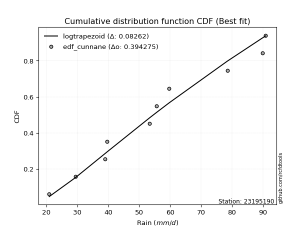</img>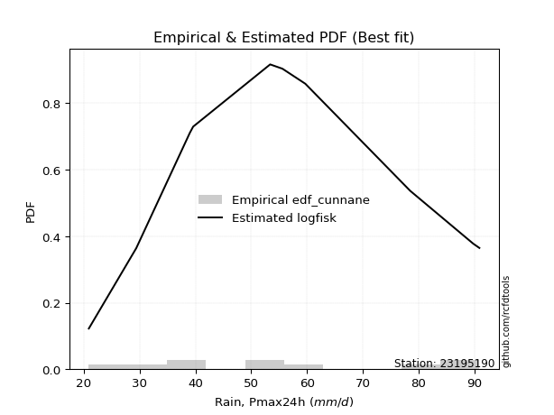</img>

</div>


### 12. EDF Adamowski (1981)

The Adamowski formula in hydrology refers to a specific plotting position formula used for estimating the non-parametric empirical distribution of hydrological events (like flood peaks) to calculate their return periods. This formula provides an alternative to traditional parametric methods (like the Gumbel or Log Pearson Type III distributions). 

<div align="center">


$P=(m-0.25)/(n+0.5)$


</div>


**12.1. Empirical values**

<div align="center">

|                | 0                   | 1                   | 2                  | 3                   | 4                  | 5                  | 6                  | 7                  | 8                  | 9                  |
|:---------------|:--------------------|:--------------------|:-------------------|:--------------------|:-------------------|:-------------------|:-------------------|:-------------------|:-------------------|:-------------------|
| date           | 2009                | 2007                | 2005               | 2008                | 2006               | 2014               | 2012               | 2011               | 2013               | 2010               |
| x              | 20.9                | 29.4                | 39.0               | 39.6                | 53.4               | 55.6               | 59.7               | 78.5               | 89.8               | 90.9               |
| m              | 1                   | 2                   | 3                  | 4                   | 5                  | 6                  | 7                  | 8                  | 9                  | 10                 |
| empirical_dist | edf_adamowski       | edf_adamowski       | edf_adamowski      | edf_adamowski       | edf_adamowski      | edf_adamowski      | edf_adamowski      | edf_adamowski      | edf_adamowski      | edf_adamowski      |
| empirical      | 0.07142857142857142 | 0.16666666666666666 | 0.2619047619047619 | 0.35714285714285715 | 0.4523809523809524 | 0.5476190476190477 | 0.6428571428571429 | 0.7380952380952381 | 0.8333333333333334 | 0.9285714285714286 |
| empirical_tr   | 1.0769230769230769  | 1.2                 | 1.3548387096774193 | 1.5555555555555558  | 1.826086956521739  | 2.210526315789474  | 2.8000000000000003 | 3.818181818181819  | 6.000000000000002  | 14.000000000000007 |

</div>


**12.2. Kolmogorov-Smirnov fit test (sorted by Δ)**


<div align="center">

|                | 0                  | 1                   | 2                   | 3                   | 4                   | 5                   | 6                   | 7                  | 8                   | 9                   | 10                  | 11                  | 12                 | 13                 | 14                 | 15                 | 16                 | 17                  | 18                  | 19                  | 20                  | 21                  | 22                  | 23                  | 24                  | 25                  | 26                  | 27                  | 28                  | 29                  | 30                  | 31                  | 32                  | 33                  | 34                  | 35                  | 36                  | 37                  | 38                  | 39                  | 40                  | 41                 | 42                  | 43                  | 44                  | 45                  | 46                  | 47                  | 48                    | 49                  | 50                 | 51                  | 52                  | 53                  | 54                  | 55                  | 56                  | 57                  | 58                  | 59                  | 60                  | 61                 | 62                  | 63                 | 64                  | 65                 | 66                 | 67                  | 68                  | 69                  | 70                  | 71                  | 72                 | 73                  | 74                  | 75                  | 76                  | 77                 | 78                 | 79                  | 80                  | 81                  | 82                  | 83                 | 84                 | 85                  | 86                 | 87                 |
|:---------------|:-------------------|:--------------------|:--------------------|:--------------------|:--------------------|:--------------------|:--------------------|:-------------------|:--------------------|:--------------------|:--------------------|:--------------------|:-------------------|:-------------------|:-------------------|:-------------------|:-------------------|:--------------------|:--------------------|:--------------------|:--------------------|:--------------------|:--------------------|:--------------------|:--------------------|:--------------------|:--------------------|:--------------------|:--------------------|:--------------------|:--------------------|:--------------------|:--------------------|:--------------------|:--------------------|:--------------------|:--------------------|:--------------------|:--------------------|:--------------------|:--------------------|:-------------------|:--------------------|:--------------------|:--------------------|:--------------------|:--------------------|:--------------------|:----------------------|:--------------------|:-------------------|:--------------------|:--------------------|:--------------------|:--------------------|:--------------------|:--------------------|:--------------------|:--------------------|:--------------------|:--------------------|:-------------------|:--------------------|:-------------------|:--------------------|:-------------------|:-------------------|:--------------------|:--------------------|:--------------------|:--------------------|:--------------------|:-------------------|:--------------------|:--------------------|:--------------------|:--------------------|:-------------------|:-------------------|:--------------------|:--------------------|:--------------------|:--------------------|:-------------------|:-------------------|:--------------------|:-------------------|:-------------------|
| station        | 23195190           | 23195190            | 23195190            | 23195190            | 23195190            | 23195190            | 23195190            | 23195190           | 23195190            | 23195190            | 23195190            | 23195190            | 23195190           | 23195190           | 23195190           | 23195190           | 23195190           | 23195190            | 23195190            | 23195190            | 23195190            | 23195190            | 23195190            | 23195190            | 23195190            | 23195190            | 23195190            | 23195190            | 23195190            | 23195190            | 23195190            | 23195190            | 23195190            | 23195190            | 23195190            | 23195190            | 23195190            | 23195190            | 23195190            | 23195190            | 23195190            | 23195190           | 23195190            | 23195190            | 23195190            | 23195190            | 23195190            | 23195190            | 23195190              | 23195190            | 23195190           | 23195190            | 23195190            | 23195190            | 23195190            | 23195190            | 23195190            | 23195190            | 23195190            | 23195190            | 23195190            | 23195190           | 23195190            | 23195190           | 23195190            | 23195190           | 23195190           | 23195190            | 23195190            | 23195190            | 23195190            | 23195190            | 23195190           | 23195190            | 23195190            | 23195190            | 23195190            | 23195190           | 23195190           | 23195190            | 23195190            | 23195190            | 23195190            | 23195190           | 23195190           | 23195190            | 23195190           | 23195190           |
| empirical_dist | edf_adamowski      | edf_adamowski       | edf_adamowski       | edf_adamowski       | edf_adamowski       | edf_adamowski       | edf_adamowski       | edf_adamowski      | edf_adamowski       | edf_adamowski       | edf_adamowski       | edf_adamowski       | edf_adamowski      | edf_adamowski      | edf_adamowski      | edf_adamowski      | edf_adamowski      | edf_adamowski       | edf_adamowski       | edf_adamowski       | edf_adamowski       | edf_adamowski       | edf_adamowski       | edf_adamowski       | edf_adamowski       | edf_adamowski       | edf_adamowski       | edf_adamowski       | edf_adamowski       | edf_adamowski       | edf_adamowski       | edf_adamowski       | edf_adamowski       | edf_adamowski       | edf_adamowski       | edf_adamowski       | edf_adamowski       | edf_adamowski       | edf_adamowski       | edf_adamowski       | edf_adamowski       | edf_adamowski      | edf_adamowski       | edf_adamowski       | edf_adamowski       | edf_adamowski       | edf_adamowski       | edf_adamowski       | edf_adamowski         | edf_adamowski       | edf_adamowski      | edf_adamowski       | edf_adamowski       | edf_adamowski       | edf_adamowski       | edf_adamowski       | edf_adamowski       | edf_adamowski       | edf_adamowski       | edf_adamowski       | edf_adamowski       | edf_adamowski      | edf_adamowski       | edf_adamowski      | edf_adamowski       | edf_adamowski      | edf_adamowski      | edf_adamowski       | edf_adamowski       | edf_adamowski       | edf_adamowski       | edf_adamowski       | edf_adamowski      | edf_adamowski       | edf_adamowski       | edf_adamowski       | edf_adamowski       | edf_adamowski      | edf_adamowski      | edf_adamowski       | edf_adamowski       | edf_adamowski       | edf_adamowski       | edf_adamowski      | edf_adamowski      | edf_adamowski       | edf_adamowski      | edf_adamowski      |
| p_dist         | logfisk            | invweibull          | logpearson3         | fisk                | f                   | erlang              | chi2                | logfatiguelife     | logf                | logt                | lognorm             | lognorm             | logcrystalball     | logexponnorm       | weibull_min        | loggompertz        | rayleigh           | genlogistic         | maxwell             | halfnorm            | logweibull_min      | lognct              | gamma               | rice                | ncf                 | betaprime           | kstwobign           | invgauss            | alpha               | invgamma            | logbetaprime        | logloggamma         | logjohnsonsu        | loginvgamma         | logerlang           | logrice             | loggamma            | loggamma            | pearson3            | logncf              | exponnorm           | loglogistic        | nct                 | norm                | crystalball         | truncnorm           | t                   | loginvweibull       | loglaplace_asymmetric | loginvgauss         | gumbel_r           | logalpha            | loggumbel_l         | johnsonsu           | moyal               | loghypsecant        | logmaxwell          | loglaplace          | logistic            | halflogistic        | lograyleigh         | logmielke          | laplace_asymmetric  | gompertz           | loggenexpon         | hypsecant          | gumbel_l           | genexpon            | expon               | logkstwobign        | mielke              | loghalfnorm         | loggumbel_r        | nakagami            | lognakagami         | logtruncnorm        | laplace             | wald               | logmoyal           | loghalflogistic     | logexpon            | logwald             | loggibrat           | logchi2            | gibrat             | loglognorm          | fatiguelife        | loggenlogistic     |
| delta          | 0.0846698047896407 | 0.09385656544161647 | 0.09402094578928843 | 0.09457839609736429 | 0.09484730706871514 | 0.09495034303092309 | 0.09495065604295239 | 0.0953489420782076 | 0.09570130619913247 | 0.09607877447683738 | 0.09608125305680865 | 0.09608125305680865 | 0.0960812540033889 | 0.0960825678964598 | 0.0961743559539785 | 0.0964329763328664 | 0.0966900649158382 | 0.09680646111801283 | 0.09721327977035188 | 0.09760143838941282 | 0.09810866531813345 | 0.09813578696267417 | 0.09833873072079391 | 0.09849712790161402 | 0.09857531520348606 | 0.09877314111871893 | 0.09986478533522791 | 0.09991448176700957 | 0.10119570643511744 | 0.10143234475100993 | 0.10145301391775602 | 0.10233846572335364 | 0.10337226557928653 | 0.10518495925327659 | 0.10541298339298727 | 0.10545646571053396 | 0.10705078548932095 | 0.10705078548932095 | 0.10739552516930084 | 0.11088381474117043 | 0.11280230137480127 | 0.1129374701086927 | 0.11298590696268851 | 0.11299193947124192 | 0.11299194213403038 | 0.11299194889586145 | 0.11299470246440213 | 0.11311627140825492 | 0.11441080228589806   | 0.11462103701570564 | 0.1148660204955636 | 0.11511447485161547 | 0.11607117526625121 | 0.11867940286526246 | 0.12085037993663184 | 0.12339056452649944 | 0.12657279431742202 | 0.13341979264067583 | 0.13564955787777858 | 0.13590067542898163 | 0.13637468155912152 | 0.1377479662979758 | 0.13857806787823576 | 0.1386212494006006 | 0.14766327165817844 | 0.1503865935880704 | 0.1510108009445848 | 0.15437824850552967 | 0.15481526921031435 | 0.15531710018278472 | 0.16329458788882767 | 0.16402466055814807 | 0.1662335983513849 | 0.16666666652666684 | 0.16666666666666052 | 0.16773136676076067 | 0.16949995288366212 | 0.1839186596302027 | 0.1911206196466239 | 0.19125868017324005 | 0.24505137547602757 | 0.26017715234229816 | 0.28915816741412176 | 0.3054201439876076 | 0.3278047279615894 | 0.42888089469306456 | 0.5344862574385623 | 0.8333333333333334 |
| deltao         | 0.3942745923300002 | 0.3942745923300002  | 0.3942745923300002  | 0.3942745923300002  | 0.3942745923300002  | 0.3942745923300002  | 0.3942745923300002  | 0.3942745923300002 | 0.3942745923300002  | 0.3942745923300002  | 0.3942745923300002  | 0.3942745923300002  | 0.3942745923300002 | 0.3942745923300002 | 0.3942745923300002 | 0.3942745923300002 | 0.3942745923300002 | 0.3942745923300002  | 0.3942745923300002  | 0.3942745923300002  | 0.3942745923300002  | 0.3942745923300002  | 0.3942745923300002  | 0.3942745923300002  | 0.3942745923300002  | 0.3942745923300002  | 0.3942745923300002  | 0.3942745923300002  | 0.3942745923300002  | 0.3942745923300002  | 0.3942745923300002  | 0.3942745923300002  | 0.3942745923300002  | 0.3942745923300002  | 0.3942745923300002  | 0.3942745923300002  | 0.3942745923300002  | 0.3942745923300002  | 0.3942745923300002  | 0.3942745923300002  | 0.3942745923300002  | 0.3942745923300002 | 0.3942745923300002  | 0.3942745923300002  | 0.3942745923300002  | 0.3942745923300002  | 0.3942745923300002  | 0.3942745923300002  | 0.3942745923300002    | 0.3942745923300002  | 0.3942745923300002 | 0.3942745923300002  | 0.3942745923300002  | 0.3942745923300002  | 0.3942745923300002  | 0.3942745923300002  | 0.3942745923300002  | 0.3942745923300002  | 0.3942745923300002  | 0.3942745923300002  | 0.3942745923300002  | 0.3942745923300002 | 0.3942745923300002  | 0.3942745923300002 | 0.3942745923300002  | 0.3942745923300002 | 0.3942745923300002 | 0.3942745923300002  | 0.3942745923300002  | 0.3942745923300002  | 0.3942745923300002  | 0.3942745923300002  | 0.3942745923300002 | 0.3942745923300002  | 0.3942745923300002  | 0.3942745923300002  | 0.3942745923300002  | 0.3942745923300002 | 0.3942745923300002 | 0.3942745923300002  | 0.3942745923300002  | 0.3942745923300002  | 0.3942745923300002  | 0.3942745923300002 | 0.3942745923300002 | 0.3942745923300002  | 0.3942745923300002 | 0.3942745923300002 |
| eval           | Δo > Δ             | Δo > Δ              | Δo > Δ              | Δo > Δ              | Δo > Δ              | Δo > Δ              | Δo > Δ              | Δo > Δ             | Δo > Δ              | Δo > Δ              | Δo > Δ              | Δo > Δ              | Δo > Δ             | Δo > Δ             | Δo > Δ             | Δo > Δ             | Δo > Δ             | Δo > Δ              | Δo > Δ              | Δo > Δ              | Δo > Δ              | Δo > Δ              | Δo > Δ              | Δo > Δ              | Δo > Δ              | Δo > Δ              | Δo > Δ              | Δo > Δ              | Δo > Δ              | Δo > Δ              | Δo > Δ              | Δo > Δ              | Δo > Δ              | Δo > Δ              | Δo > Δ              | Δo > Δ              | Δo > Δ              | Δo > Δ              | Δo > Δ              | Δo > Δ              | Δo > Δ              | Δo > Δ             | Δo > Δ              | Δo > Δ              | Δo > Δ              | Δo > Δ              | Δo > Δ              | Δo > Δ              | Δo > Δ                | Δo > Δ              | Δo > Δ             | Δo > Δ              | Δo > Δ              | Δo > Δ              | Δo > Δ              | Δo > Δ              | Δo > Δ              | Δo > Δ              | Δo > Δ              | Δo > Δ              | Δo > Δ              | Δo > Δ             | Δo > Δ              | Δo > Δ             | Δo > Δ              | Δo > Δ             | Δo > Δ             | Δo > Δ              | Δo > Δ              | Δo > Δ              | Δo > Δ              | Δo > Δ              | Δo > Δ             | Δo > Δ              | Δo > Δ              | Δo > Δ              | Δo > Δ              | Δo > Δ             | Δo > Δ             | Δo > Δ              | Δo > Δ              | Δo > Δ              | Δo > Δ              | Δo > Δ             | Δo > Δ             | Δo <= Δ             | Δo <= Δ            | Δo <= Δ            |
| fit            | 1                  | 1                   | 1                   | 1                   | 1                   | 1                   | 1                   | 1                  | 1                   | 1                   | 1                   | 1                   | 1                  | 1                  | 1                  | 1                  | 1                  | 1                   | 1                   | 1                   | 1                   | 1                   | 1                   | 1                   | 1                   | 1                   | 1                   | 1                   | 1                   | 1                   | 1                   | 1                   | 1                   | 1                   | 1                   | 1                   | 1                   | 1                   | 1                   | 1                   | 1                   | 1                  | 1                   | 1                   | 1                   | 1                   | 1                   | 1                   | 1                     | 1                   | 1                  | 1                   | 1                   | 1                   | 1                   | 1                   | 1                   | 1                   | 1                   | 1                   | 1                   | 1                  | 1                   | 1                  | 1                   | 1                  | 1                  | 1                   | 1                   | 1                   | 1                   | 1                   | 1                  | 1                   | 1                   | 1                   | 1                   | 1                  | 1                  | 1                   | 1                   | 1                   | 1                   | 1                  | 1                  | 0                   | 0                  | 0                  |
| n              | 10                 | 10                  | 10                  | 10                  | 10                  | 10                  | 10                  | 10                 | 10                  | 10                  | 10                  | 10                  | 10                 | 10                 | 10                 | 10                 | 10                 | 10                  | 10                  | 10                  | 10                  | 10                  | 10                  | 10                  | 10                  | 10                  | 10                  | 10                  | 10                  | 10                  | 10                  | 10                  | 10                  | 10                  | 10                  | 10                  | 10                  | 10                  | 10                  | 10                  | 10                  | 10                 | 10                  | 10                  | 10                  | 10                  | 10                  | 10                  | 10                    | 10                  | 10                 | 10                  | 10                  | 10                  | 10                  | 10                  | 10                  | 10                  | 10                  | 10                  | 10                  | 10                 | 10                  | 10                 | 10                  | 10                 | 10                 | 10                  | 10                  | 10                  | 10                  | 10                  | 10                 | 10                  | 10                  | 10                  | 10                  | 10                 | 10                 | 10                  | 10                  | 10                  | 10                  | 10                 | 10                 | 10                  | 10                 | 10                 |
| best_fit       | 1                  | 0                   | 0                   | 0                   | 0                   | 0                   | 0                   | 0                  | 0                   | 0                   | 0                   | 0                   | 0                  | 0                  | 0                  | 0                  | 0                  | 0                   | 0                   | 0                   | 0                   | 0                   | 0                   | 0                   | 0                   | 0                   | 0                   | 0                   | 0                   | 0                   | 0                   | 0                   | 0                   | 0                   | 0                   | 0                   | 0                   | 0                   | 0                   | 0                   | 0                   | 0                  | 0                   | 0                   | 0                   | 0                   | 0                   | 0                   | 0                     | 0                   | 0                  | 0                   | 0                   | 0                   | 0                   | 0                   | 0                   | 0                   | 0                   | 0                   | 0                   | 0                  | 0                   | 0                  | 0                   | 0                  | 0                  | 0                   | 0                   | 0                   | 0                   | 0                   | 0                  | 0                   | 0                   | 0                   | 0                   | 0                  | 0                  | 0                   | 0                   | 0                   | 0                   | 0                  | 0                  | 0                   | 0                  | 0                  |
| best_fit_sort  | 1                  | 2                   | 3                   | 4                   | 5                   | 6                   | 7                   | 8                  | 9                   | 10                  | 11                  | 12                  | 13                 | 14                 | 15                 | 16                 | 17                 | 18                  | 19                  | 20                  | 21                  | 22                  | 23                  | 24                  | 25                  | 26                  | 27                  | 28                  | 29                  | 30                  | 31                  | 32                  | 33                  | 34                  | 35                  | 36                  | 37                  | 38                  | 39                  | 40                  | 41                  | 42                 | 43                  | 44                  | 45                  | 46                  | 47                  | 48                  | 49                    | 50                  | 51                 | 52                  | 53                  | 54                  | 55                  | 56                  | 57                  | 58                  | 59                  | 60                  | 61                  | 62                 | 63                  | 64                 | 65                  | 66                 | 67                 | 68                  | 69                  | 70                  | 71                  | 72                  | 73                 | 74                  | 75                  | 76                  | 77                  | 78                 | 79                 | 80                  | 81                  | 82                  | 83                  | 84                 | 85                 | 86                  | 87                 | 88                 |

</div>


**12.3. Best fit**

<div align="center">

|   id |   station | empirical_dist   | p_dist   |     delta |   deltao | eval   |   fit |   n |   best_fit |   best_fit_sort |
|-----:|----------:|:-----------------|:---------|----------:|---------:|:-------|------:|----:|-----------:|----------------:|
|    0 |  23195190 | edf_adamowski    | logfisk  | 0.0846698 | 0.394275 | Δo > Δ |     1 |  10 |          1 |               1 |

</div>


<div align="center">

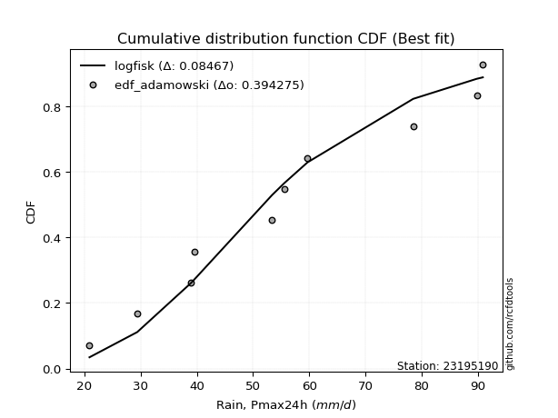</img>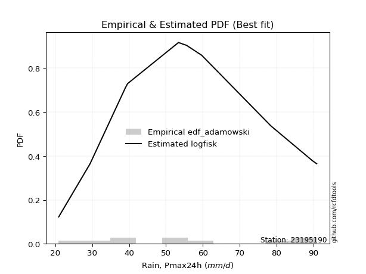</img>

</div>


## C. Best fit & Estimate extreme values for specific return periods - Tr

Best fit in probability distribution analysis means finding the theoretical distribution (like Normal, Poisson, Exponential) that most accurately mirrors your real-world data´s patterns (shape, center, spread) for better predictions, using methods like visual checks (Q-Q plots), goodness-of-fit tests (Kolmogorov-Smirnov, Chi-Squared), and information criteria (AIC) to score and select the simplest, most representative model.


### 1. Best fit (ordered by delta Δ)

<div align="center">

|   id |   station | empirical_dist   | p_dist    |     delta |   deltao | eval   |   fit |   n |   best_fit |   best_fit_sort |
|-----:|----------:|:-----------------|:----------|----------:|---------:|:-------|------:|----:|-----------:|----------------:|
|    0 |  23195190 | edf_gringorten   | logfisk   | 0.0791938 | 0.394275 | Δo > Δ |     1 |  10 |          1 |               1 |
|    1 |  23195190 | edf_hazen        | logfisk   | 0.0794925 | 0.394275 | Δo > Δ |     1 |  10 |          1 |               2 |
|    2 |  23195190 | edf_cunnane      | logfisk   | 0.0803563 | 0.394275 | Δo > Δ |     1 |  10 |          1 |               3 |
|    3 |  23195190 | edf_blom         | logfisk   | 0.0810737 | 0.394275 | Δo > Δ |     1 |  10 |          1 |               4 |
|    4 |  23195190 | edf_tukey        | logfisk   | 0.0822538 | 0.394275 | Δo > Δ |     1 |  10 |          1 |               5 |
|    5 |  23195190 | edf_filliben     | logfisk   | 0.0826973 | 0.394275 | Δo > Δ |     1 |  10 |          1 |               6 |
|    6 |  23195190 | edf_beard        | logfisk   | 0.0829064 | 0.394275 | Δo > Δ |     1 |  10 |          1 |               7 |
|    7 |  23195190 | edf_jenkinson    | logfisk   | 0.0829064 | 0.394275 | Δo > Δ |     1 |  10 |          1 |               8 |
|    8 |  23195190 | edf_chegodayev   | logfisk   | 0.0831843 | 0.394275 | Δo > Δ |     1 |  10 |          1 |               9 |
|    9 |  23195190 | edf_adamowski    | logfisk   | 0.0846698 | 0.394275 | Δo > Δ |     1 |  10 |          1 |              10 |
|   10 |  23195190 | edf_california   | logmielke | 0.0870647 | 0.394275 | Δo > Δ |     1 |  10 |          1 |              11 |
|   11 |  23195190 | edf_weibull      | logfisk   | 0.0954923 | 0.394275 | Δo > Δ |     1 |  10 |          1 |              12 |

</div>

:file_folder:Tables: [bestfit_23195190.csv](table/bestfit_23195190.csv) | [extreme_23195190.csv](table/extreme_23195190.csv)


### 2. Extreme values

In hydrology, a return period (or recurrence interval $Tr$) is the statistical average time between extreme events like floods or droughts of a specific magnitude, indicating how rare an event is, with a 100-year flood, for example, having a 1% chance of occurring in any given year, not that it happens exactly every century. It is a key tool for infrastructure design (like bridges or dams) and risk assessment, calculated from historical data to determine the probability of future events, although it is important to remember it is statistical average, and events can cluster or be missed.

> risk_rate: assuming the return period as the project useful life.

|   id |      tr |   prob_l |     prob_g |    alpha |   betaprime |     chi2 |   crystalball |   erlang |    expon |   exponnorm |        f |   fatiguelife |     fisk |    gamma |   genexpon |   genlogistic |   gibrat |   gompertz |   gumbel_l |   gumbel_r |   halflogistic |   halfnorm |   hypsecant |   invgamma |   invgauss |   invweibull |   johnsonsu |   kstwobign |   laplace |   laplace_asymmetric |   loggamma |   logistic |   lognorm |   maxwell |   mielke |    moyal |   nakagami |      ncf |      nct |     norm |   pearson3 |   rayleigh |     rice |        t |   truncnorm |     wald |   weibull_min |   logalpha |   logbetaprime |          logchi2 |   logcrystalball |   logerlang |   logexpon |   logexponnorm |     logf |   logfatiguelife |   logfisk |   loggenexpon |   loggenlogistic |   loggibrat |   loggompertz |   loggumbel_l |   loggumbel_r |   loghalflogistic |   loghalfnorm |   loghypsecant |   loginvgamma |   loginvgauss |   loginvweibull |   logjohnsonsu |   logkstwobign |   loglaplace |   loglaplace_asymmetric |   logloggamma |   loglogistic |    loglognorm |   logmaxwell |   logmielke |   logmoyal |   lognakagami |   logncf |   lognct |   logpearson3 |   lograyleigh |   logrice |     logt |   logtruncnorm |   logwald |   logweibull_min |   station |   n |   risk_rate |
|-----:|--------:|---------:|-----------:|---------:|------------:|---------:|--------------:|---------:|---------:|------------:|---------:|--------------:|---------:|---------:|-----------:|--------------:|---------:|-----------:|-----------:|-----------:|---------------:|-----------:|------------:|-----------:|-----------:|-------------:|------------:|------------:|----------:|---------------------:|-----------:|-----------:|----------:|----------:|---------:|---------:|-----------:|---------:|---------:|---------:|-----------:|-----------:|---------:|---------:|------------:|---------:|--------------:|-----------:|---------------:|-----------------:|-----------------:|------------:|-----------:|---------------:|---------:|-----------------:|----------:|--------------:|-----------------:|------------:|--------------:|--------------:|--------------:|------------------:|--------------:|---------------:|--------------:|--------------:|----------------:|---------------:|---------------:|-------------:|------------------------:|--------------:|--------------:|--------------:|-------------:|------------:|-----------:|--------------:|---------:|---------:|--------------:|--------------:|----------:|---------:|---------------:|----------:|-----------------:|----------:|----:|------------:|
|    0 |    2    | 0.5      | 0.5        |  53.6059 |     52.4601 |  51.2756 |       55.68   |  51.2764 |  45.0077 |     55.6374 |  51.2946 |       20.9    |  52.5986 |  51.5291 |    45.0364 |       51.6937 |  48.7152 |    59.4331 |    59.4919 |    51.8681 |        49.973  |    50.9304 |     55.68   |    53.2924 |    52.5147 |      51.829  |     55.6803 |     51.3602 |   55.68   |              54.5734 |    49.7773 |    55.68   |   50.4958 |   53.6955 |  61.1881 |  50.6375 |    50.2868 |  52.6759 |  55.678  |  55.68   |    54.8655 |    52.9917 |  53.7805 |  55.6799 |     55.68   |  48.1585 |       51.7786 |    49.2278 |        50.0991 |     33.1618      |          50.4958 |     49.8578 |    38.521  |        50.4957 |  50.5112 |          50.5432 |   51.7125 |       45.7641 |         inf      |     43.9935 |       52.1981 |       54.4526 |       46.8266 |           45.1022 |       45.9655 |        50.4958 |       49.9001 |       49.1803 |         48.4646 |        55.54   |        45.6372 |      50.4958 |                 52.8268 |       54.983  |       50.4958 |  21.4593      |      48.5511 |     50.0939 |    45.6999 |       47.4712 |  49.5435 |  50.3568 |       52.0753 |       47.8795 |   49.8495 |  50.496  |        45.4115 |   43.5126 |          53.6246 |  23195190 |  10 |    0.75     |
|    1 |    2.33 | 0.570815 | 0.429185   |  57.7498 |     56.7067 |  55.6455 |       59.8206 |  55.6463 |  50.3193 |     59.7766 |  55.6646 |       21.872  |  56.6579 |  55.8423 |    50.3544 |       55.9191 |  50.8127 |    63.7902 |    63.0943 |    55.7048 |        53.9178 |    55.3991 |     58.9937 |    57.4439 |    56.7227 |      56.0933 |     59.7148 |     55.6839 |   58.1857 |              57.6725 |    54.1334 |    59.3282 |   54.808  |   57.9973 |  66.142  |  54.2694 |    55.8265 |  56.9315 |  59.8187 |  59.8206 |    59.0231 |    57.3571 |  58.0517 |  59.8205 |     59.8206 |  50.8736 |       56.2021 |    53.618  |        54.4993 |     39.3714      |          54.808  |     54.2438 |    44.0764 |        54.8079 |  54.8359 |          54.8526 |   55.8816 |       50.95   |         inf      |     45.8582 |       56.6504 |       58.4764 |       50.5206 |           48.7648 |       50.2159 |        53.9184 |       54.2517 |       53.6562 |         53.8403 |        59.9154 |        50.4823 |      53.063  |                 55.8183 |       59.2943 |       54.2764 |  24.8845      |      52.8655 |     55.092  |    49.1057 |       51.819  |  53.8879 |  54.6872 |       56.4303 |       52.2    |   54.2415 |  54.8081 |        49.7244 |   45.9144 |          57.8939 |  23195190 |  10 |    0.729209 |
|    2 |    5    | 0.8      | 0.2        |  74.4243 |     74.3738 |  74.4842 |       75.2082 |  74.4844 |  76.8763 |     75.1847 |  74.4993 |       42.5195 |  74.5533 |  74.1951 |    76.9429 |       74.2702 |  62.8883 |    77.8759 |    74.732  |    72.3733 |        71.7671 |    74.2971 |     72.2858 |    74.3152 |    74.2531 |      74.6195 |     74.708  |     74.0502 |   70.7136 |              73.1671 |    74.3555 |    73.4142 |   74.3189 |   74.9289 |  80.5121 |  71.093  |    81.4142 |  74.4673 |  75.2079 |  75.2082 |    74.9328 |    74.8339 |  74.8814 |  75.2078 |     75.2082 |  66.0724 |       74.5866 |    74.548  |        74.8496 |    109.643       |          74.3189 |     74.6614 |    86.4443 |        74.3188 |  74.4291 |          74.3812 |   75.3855 |       80.0389 |         inf      |     58.2389 |       74.7173 |       73.6218 |       70.2641 |           69.4279 |       72.991  |        70.1425 |       74.5224 |       75.434  |         85.0309 |        75.8661 |        77.4954 |      67.9937 |                 71.2273 |       75.5118 |       71.7265 |   6.99438e+85 |      73.9092 |     73.492  |    68.5061 |       75.3324 |  74.3471 |  74.4275 |       74.7817 |       73.771  |   74.511  |  74.3191 |        76.499  |   62.0257 |          74.8125 |  23195190 |  10 |    0.67232  |
|    3 |   10    | 0.9      | 0.1        |  86.7401 |     87.8191 |  89.3537 |       85.4159 |  89.3532 | 100.984  |     85.4327 |  89.3621 |       71.0283 |  90.3273 |  88.4831 |   101.079  |       89.2129 |  76.6532 |    85.7223 |    81.2114 |    85.9496 |        86.5902 |    88.2811 |     82.8999 |    86.9097 |    87.6667 |      89.7089 |     84.6541 |     88.0337 |   82.0861 |              87.2327 |    92.2365 |    83.788  |   90.9566 |   86.8444 |  86.1832 |  85.7405 |   101.397  |  87.6317 |  85.4182 |  85.4159 |    85.8902 |    87.2952 |  86.6383 |  85.4154 |     85.4159 |  82.2019 |       88.2527 |    93.8029 |        92.7487 |    319.168       |          90.9566 |     92.7834 |   159.326  |        90.9565 |  91.1673 |          91.0728 |   93.9813 |      112.846  |         inf      |     76.4767 |       87.6863 |       83.6944 |       91.9223 |           93.0999 |       96.2637 |        86.5385 |       92.5471 |       96.02   |        123.375  |        85.8289 |       107.398  |      85.1559 |                 88.8693 |       86.2705 |       88.0729 | inf           |      93.5647 |     82.7303 |    91.5427 |       99.53   |  92.8171 |  91.4413 |       88.8546 |       94.4044 |   92.1884 |  90.9568 |       109.973  |   85.3481 |          86.8177 |  23195190 |  10 |    0.651322 |
|    4 |   15    | 0.933333 | 0.0666667  |  93.3122 |     95.0696 |  97.5125 |       90.5098 |  97.5116 | 115.086  |     90.5562 |  97.5164 |       89.6736 |  99.9943 |  96.2692 |   115.198  |       97.6427 |  86.1476 |    89.2765 |    84.1457 |    93.6092 |        94.9787 |    95.5583 |     88.9573 |    93.664  |    94.9348 |      98.2222 |     89.6174 |     95.4573 |   88.7386 |              95.4606 |   102.861  |    89.4402 |  100.604  |   92.9581 |  88.0092 |  94.2413 |   111.926  |  94.6687 |  90.5137 |  90.5098 |    91.4798 |    93.7158 |  92.6266 |  90.5092 |     90.5098 |  92.5595 |       95.4494 |   105.57   |       103.346  |    617.871       |         100.604  |    103.578  |   227.837  |       100.604  | 100.885  |         100.767  |  105.977  |      135.668  |         inf      |     92.2864 |       94.3713 |       88.6986 |      106.968  |          109.914  |      111.176  |        97.5601 |      103.302  |      108.822  |        152.205  |        90.5367 |       127.712  |      97.1387 |                101.151  |       91.6048 |       98.4969 | inf           |     105.599  |     85.9913 |   108.315  |      115.08   | 103.949  | 101.379  |       96.4355 |      107.196  |  102.571  | 100.604  |       134.572  |  104.764  |          93.0085 |  23195190 |  10 |    0.644736 |
|    5 |   20    | 0.95     | 0.05       |  97.7831 |    100.019  | 103.128  |       93.8456 | 103.127  | 125.092  |     93.9153 | 103.128  |      103.478  | 107.163  | 101.61   |   125.216  |      103.545  |  93.5952 |    91.489  |    85.9722 |    98.9722 |       100.856  |   100.41   |     93.2305 |    98.269  |    99.9107 |     104.183  |     92.8678 |    100.458  |   93.4586 |             101.298  |   110.532  |    93.3468 |  107.47   |   97.0156 |  88.9111 | 100.262  |   118.971  |  99.448  |  93.8508 |  93.8456 |    95.1844 |    97.9834 |  96.5833 |  93.845  |     93.8456 | 100.278  |      100.287  |   114.215  |       110.982  |    998.694       |         107.47   |    111.384  |   293.656  |       107.47   | 107.805  |         107.674  |  115.152  |      153.765  |         inf      |    106.943  |       98.8127 |       91.9635 |      118.946  |          123.474  |      122.381  |       106.17   |      111.09   |      118.323  |        176.314  |        93.513  |       143.52   |     106.65   |                110.881  |       95.0809 |      106.414  | inf           |     114.428  |     87.6572 |   122.02   |      126.78   | 112.058  | 108.482  |      101.597  |      116.643  |  110.011  | 107.47   |       154.647  |  122.052  |          97.1289 |  23195190 |  10 |    0.641514 |
|    6 |   25    | 0.96     | 0.04       | 101.163  |    103.765  | 107.401  |       96.3013 | 107.4    | 132.853  |     96.3901 | 107.399  |      114.446  | 112.933  | 105.665  |   132.986  |      108.091  |  99.8039 |    93.0634 |    87.272  |   103.103  |       105.384  |   104.02   |     96.5377 |   101.755  |   103.686  |     108.774  |     95.2605 |    104.204  |   97.1197 |             105.826  |   116.575  |    96.3353 |  112.822  |  100.028  |  89.4488 | 104.928  |   124.219  | 103.053  |  96.3075 |  96.3013 |    97.9339 |   101.154  |  99.5115 |  96.3006 |     96.3013 | 106.46   |      103.907  |   121.111  |       116.987  |   1457.31        |         112.822  |    117.538  |   357.542  |       112.822  | 113.202  |         113.061  |  122.704  |      169.004  |         inf      |    120.926  |      102.111  |       94.3598 |      129.079  |          135.051  |      131.444  |       113.351  |      117.235  |      125.956  |        197.457  |        95.6475 |       156.63   |     114.664  |                119.068  |       97.63   |      112.898  | inf           |     121.457  |     88.6684 |   133.826  |      136.253  | 118.484  | 114.035  |      105.494  |      124.197  |  115.839  | 112.822  |       171.876  |  137.936  |         100.194  |  23195190 |  10 |    0.639603 |
|    7 |   50    | 0.98     | 0.02       | 111.284  |    114.988  | 120.301  |      103.333  | 120.298  | 156.96   |    103.488  | 120.289  |      149.638  | 132.225  | 117.865  |   157.122  |      122.095  | 121.69   |    97.3377 |    90.8002 |   115.829  |       119.336  |   114.513  |    106.791  |   112.21   |   115.035  |     122.918  |    102.112  |    115.203  |  108.492  |             119.892  |   135.942  |   105.466  |  129.668  |  108.764  |  90.5181 | 119.415  |   139.491  | 113.79   | 103.343  | 103.333  |   105.913  |   110.358  | 107.96   | 103.332  |    103.333  | 126.646  |      114.538  |   143.721  |       136.185  |   4830.84        |         129.668  |    137.3    |   658.988  |       129.668  | 130.206  |         130.04   |  148.984  |      223.97   |         inf      |    186.484  |      111.675  |      101.184  |      166.047  |          178.001  |      161.78   |       138.852  |      137.005  |      151.291  |        279.894  |       101.486  |       202.466  |     143.606  |                148.56   |      104.88   |      135.259  | inf           |     144.381  |     90.7237 |   178.259  |      168.002  | 139.311  | 131.613  |      117.097  |      149.012  |  134.331  | 129.668  |       235.897  |  205.664  |         109.115  |  23195190 |  10 |    0.63583  |
|    8 |   75    | 0.986667 | 0.0133333  | 117.002  |    121.318  | 127.632  |      107.106  | 127.63   | 171.062  |    107.303  | 127.616  |      170.831  | 144.612  | 124.774  |   171.241  |      130.234  | 136.472  |    99.4992 |    92.5843 |   123.225  |       127.446  |   120.225  |    112.783  |   118.124  |   121.463  |     131.139  |    105.789  |    121.255  |  115.145  |             128.12   |   147.744  |   110.74   |  139.721  |  113.514  |  90.8782 | 127.886  |   147.806  | 119.806  | 107.118  | 107.106  |   110.259  |   115.366  | 112.527  | 107.106  |    107.106  | 139.067  |      120.395  |   157.871  |       147.849  |   9874.44        |         139.721  |    149.368  |   942.356  |       139.721  | 140.363  |         140.188  |  166.654  |      262.269  |         inf      |    249.861  |      116.871  |      104.821  |      192.222  |          208.995  |      181.142  |       156.334  |      149.104  |      167.366  |        342.817  |       104.446  |       233.176  |     163.814  |                169.091  |      108.737  |      150.138  | inf           |     158.611  |     91.4372 |   210.796  |      188.294  | 152.166  | 142.169  |      123.584  |      164.536  |  145.463  | 139.722  |       281.786  |  262.972  |         113.984  |  23195190 |  10 |    0.634587 |
|    9 |  100    | 0.99     | 0.01       | 120.991  |    125.723  | 132.755  |      109.658  | 132.752  | 181.068  |    109.887  | 132.735  |      186.081  | 153.956  | 129.593  |   181.258  |      135.995  | 147.923  |   100.913  |    93.7513 |   128.46   |       133.187  |   124.116  |    117.034  |   122.251  |   125.947  |     136.957  |    108.275  |    125.402  |  119.865  |             133.958  |   156.351  |   114.463  |  146.959  |  116.749  |  91.0654 | 133.896  |   153.468  | 123.977  | 109.671  | 109.658  |   113.224  |   118.777  | 115.628  | 109.657  |    109.658  | 148.123  |      124.412  |   168.365  |       156.339  |  16481.5         |         146.959  |    158.179  |  1214.59   |       146.959  | 147.68   |         147.5    |  180.378  |      292.611  |         inf      |    313.419  |      120.408  |      107.27   |      213.205  |          234.141  |      195.642  |       170.054  |      157.952  |      179.387  |        395.727  |       106.38   |       256.867  |     179.854  |                185.356  |      111.333  |      161.619  | inf           |     169.098  |     91.8171 |   237.421  |      203.503  | 161.616  | 149.798  |      128.071  |      176.028  |  153.519  | 146.959  |       318.663  |  314.588  |         117.309  |  23195190 |  10 |    0.633968 |
|   10 |  200    | 0.995    | 0.005      | 130.424  |    136.095  | 144.873  |      115.447  | 144.869  | 205.175  |    115.758  | 144.842  |      223.409  | 178.58   | 140.963  |   205.395  |      149.845  | 179.076  |   103.986  |    96.2879 |   141.046  |       146.987  |   133.015  |    127.273  |   132.012  |   136.539  |     150.946  |    113.916  |    134.952  |  131.237  |             148.023  |   177.944  |   123.395  |  164.798  |  124.15   |  91.384  | 148.376  |   166.407  | 133.744  | 115.463  | 115.447  |   120.028  |   126.583  | 122.691  | 115.446  |    115.447  | 170.681  |      133.686  |   195.328  |       177.586  |  57446.6         |         164.798  |    180.326  |  2238.62   |       164.797  | 165.728  |         165.546  |  218.085  |      378.181  |         inf      |    580.637  |      128.489  |      112.792  |      273.508  |          307.682  |      233.321  |       208.256  |      180.24   |      210.626  |        558.79   |       110.561  |       320.994  |     225.251  |                231.266  |      117.179  |      192.868  | inf           |     195.774  |     92.4877 |   316.21   |      243.064  | 185.592  | 168.703  |      138.531  |      205.435  |  173.513  | 164.798  |       424.204  |  491.601  |         124.942  |  23195190 |  10 |    0.633042 |
|   11 |  250    | 0.996    | 0.004      | 133.42   |    139.371  | 148.714  |      117.216  | 148.71   | 212.936  |    117.556  | 148.68   |      235.574  | 187.199  | 144.56   |   213.165  |      154.297  | 190.254  |   104.891  |    97.0342 |   145.092  |       151.423  |   135.753  |    130.57   |   135.11   |   139.894  |     155.443  |    115.639  |    137.907  |  134.898  |             152.551  |   185.168  |   126.262  |  170.669  |  126.429  |  91.4629 | 153.038  |   170.385  | 136.814  | 117.234  | 117.216  |   122.129  |   128.985  | 124.857  | 117.215  |    117.216  | 178.144  |      136.562  |   204.549  |       184.678  |  86187.1         |         170.669  |    187.746  |  2725.64   |       170.669  | 171.673  |         171.493  |  231.789  |      409.961  |          90.6901 |    724.412  |      130.974  |      114.47   |      296.309  |          335.922  |      246.312  |       222.294  |      187.723  |      221.416  |        624.344  |       111.782  |       343.915  |     242.177  |                248.343  |      118.954  |      204.129  | inf           |     204.804  |     92.6595 |   346.77   |      256.715  | 193.695  | 174.956  |      141.802  |      215.44   |  180.134  | 170.67   |       463.711  |  569.836  |         127.299  |  23195190 |  10 |    0.632858 |
|   12 |  500    | 0.998    | 0.002      | 142.632  |    149.383  | 160.491  |      122.462  | 160.486  | 237.044  |    122.895  | 160.447  |      273.737  | 216.372  | 155.569  |   237.301  |      168.117  | 228.885  |   107.483  |    99.1737 |   157.65   |       165.194  |   143.916  |    140.809  |   144.63   |   150.175  |     169.4    |    120.751  |    146.765  |  146.271  |             166.617  |   208.51   |   135.155  |  189.341  |  133.228  |  91.6702 | 167.518  |   182.231  | 146.158  | 122.483  | 122.462  |   128.418  |   136.155  | 131.3    | 122.461  |    122.462  | 201.874  |      145.204  |   235.015  |       207.542  | 306794           |         189.341  |    211.761  |  5023.65   |       189.341  | 190.593  |         190.426  |  280.011  |      524.148  |          90.7967 |   1556.1    |      138.378  |      119.421  |      379.911  |          441.168  |      289.498  |       272.227  |      211.995  |      257.42   |        880.95   |       115.248  |       422.879  |     303.305  |                309.854  |      124.186  |      243.41   | inf           |     234.301  |     93.1226 |   461.845  |      302.133  | 220.147  | 194.939  |      151.694  |      248.282  |  201.313  | 189.341  |       605.53   |  911.356  |         134.353  |  23195190 |  10 |    0.632489 |
|   13 |  750    | 0.998667 | 0.00133333 | 147.975  |    155.141  | 167.283  |      125.376  | 167.278  | 251.146  |    125.867  | 167.233  |      296.285  | 235.275  | 161.906  |   251.42   |      176.195  | 254.433  |   108.868  |   100.317  |   164.991  |       173.244  |   148.476  |    146.798  |   150.143  |   156.104  |     177.56   |    123.59   |    151.74   |  152.923  |             174.845  |   222.828  |   140.35   |  200.582  |  137.03   |  91.7758 | 175.988  |   188.841  | 151.503  | 125.4    | 125.376  |   131.95   |   140.164  | 134.889  | 125.375  |    125.376  | 216.101  |      150.074  |   254.205  |       221.531  | 648528           |         200.582  |    226.52   |  7183.84   |       200.582  | 201.994  |         201.84   |  312.703  |      603.337  |          90.8322 |   2580.09   |      142.512  |      122.155  |      439.32   |          517.37   |      316.841  |       306.486  |      226.951  |      280.35   |       1077.37   |       117.076  |       474.946  |     345.985  |                352.675  |      127.071  |      269.769  | inf           |     252.614  |     93.3638 |   546.132  |      330.914  | 236.57   | 207.039  |      157.306  |      268.784  |  214.148  | 200.582  |       702.62   | 1207.71   |         138.312  |  23195190 |  10 |    0.632366 |
|   14 | 1000    | 0.999    | 0.001      | 151.752  |    159.187  | 172.065  |      127.383  | 172.059  | 261.152  |    127.916  | 172.01   |      312.369  | 249.587  | 166.361  |   261.438  |      181.926  | 273.984  |   109.801  |   101.087  |   170.199  |       178.954  |   151.625  |    151.047  |   154.036  |   160.278  |     183.348  |    125.545  |    155.188  |  157.643  |             180.682  |   233.299  |   144.035  |  208.707  |  139.659  |  91.8466 | 181.998  |   193.402  | 155.248  | 127.408  | 127.383  |   134.397  |   142.934  | 137.365  | 127.382  |    127.383  | 226.335  |      153.455  |   268.475  |       231.744  |      1.10551e+06 |         208.707  |    237.324  |  9259.13   |       208.707  | 210.238  |         210.097  |  338.174  |      665.886  |          90.8499 |   3799.11   |      145.367  |      124.029  |      487.012  |          579.276  |      337.217  |       333.376  |      237.92   |      297.518  |       1242.71   |       118.294  |       514.731  |     379.861  |                386.6    |      129.048  |      290.175  | inf           |     266.101  |     93.5274 |   615.107  |      352.374  | 248.67   | 215.816  |      161.215  |      283.932  |  223.462  | 208.708  |       777.904  | 1478.84   |         141.055  |  23195190 |  10 |    0.632305 |

<div align="center">

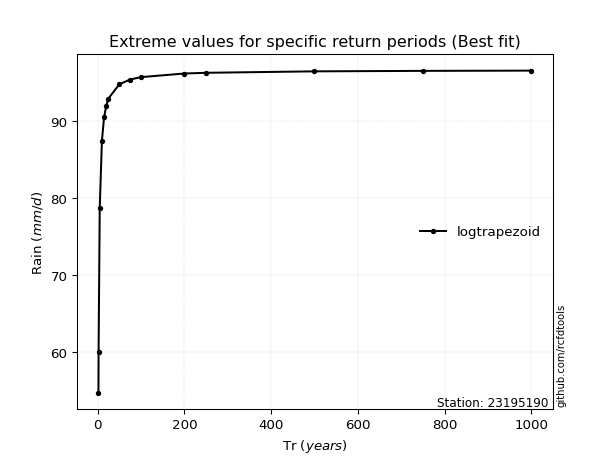</img>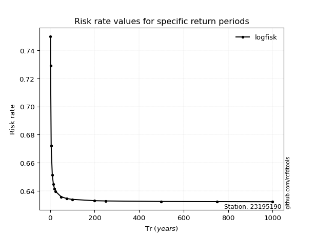</img>

</div>


<sub>**APP DISCLAIMER**: NO WARRANTY - This software is provided by [github.com/rcfdtools](https://github.com/rcfdtools) "as is", without any express or implied warranty, including warranties of merchantability, fitness for a particular purpose, or non-infringement. There is no guarantee that the software will be error-free or operate without interruption. LIMITATION OF LIABILITY - Neither the authors nor copyright holders will be liable for claims or damages arising from the software or its use. You are responsible for determining if the software is appropriate for your use and assume all associated risks, including errors, legal compliance, and data loss. NO PROFESSIONAL ADVICE - The software provides general information and does not offer professional advice. It should not replace consultation with professional advisors.</sub>