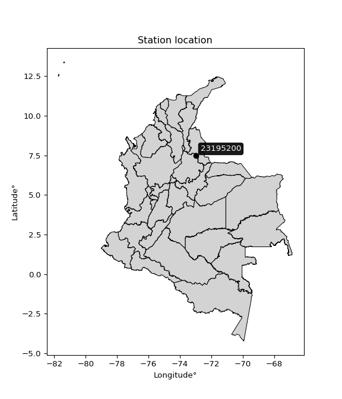

<div align="center">


</div>

# PMP Station (Rain, Pmax24h): 23195200

Probable Maximum Precipitation (PMP) is the greatest amount of rainfall for a specific duration that is meteorologically possible for a given location, acting as a "worst-case" scenario for extreme storms, crucial for designing safety-critical infrastructure like bridges, river deviations, dams, spillways, and nuclear plants to prevent catastrophic failure. PMP is calculated by hydrologists using meteorological data to determine the upper limit of extreme rainfall, often leading to the Probable Maximum Flood (PMF) for flood control design, and is increasingly being studied for climate change impacts.

<div align="center">

</img>

</div>


## A. General information


### 1. General running parameters

• app_version: _v20260103_. • runtime: _2026-01-03 07:24:50.581521_. • Python version: _3.14.0_. • SciPy version: _1.16.3_. • Pandas version: _2.3.3_. • NumPy version: _2.3.5_. • Stations dataset (station_dataset_file): _dataset/pmax24h_in/automatic_colombia_2003_2024.csv_. • Stations catalog (station_catalog_file): _dataset/CNE.xls_. • Minimum year to eval til year_max (date_min): _1900_. • Maximum year to eval since year_min (date_max): _2024_. • Creates, save and include plots into reports (create_plot): _False_. • Plot only fit distributions with Δo > Δ (plot_only_fit): _True_. • Eval low extreme values, if False, evaluates high extreme values (low_extreme): _False_. • Eval every SciPy distribution as logarithmic (pdist_logarithmic_on): _True_. • Standard deviation normalized (ddof): _1.0_. • Return periods to eval in years (Tr): _[2, 2.33, 5, 10, 15, 20, 25, 50, 75, 100, 200, 250, 500, 750, 1000]_. • Minimum data sample per station, 0 means any (minimum_sample): _5_. • Z-Score maximum threshold to adjust a value, 0 means disable (zscore_max): _3.5_. • Z-Score minimum threshold to adjust a value, 0 means disable (zscore_min): _-2.5_. • Avoid zeros, e.g. rain = 0 (avoid_zeros): _True_. • Avoid null values (avoid_nans): _True_. [:file_folder:Dataset file.](../../dataset/pmax24h_in/automatic_colombia_2003_2024.csv)

> Delta Degrees of Freedom (DDOF): is a parameter used in the formulas for calculating variance and standard deviation. When ddof=0, the divisor is $N$ (the total number of observations) and this is used when your data set is the entire population. When ddof=1, the divisor is $N-1$ and this is used when your data set is a sample drawn from a larger population. Using $N-1$ provides an unbiased estimate of the population variance (known as Bessel´s correction).


### 2. Station info and location

|   id |   CODIGO | NOMBRE                    | CATEGORIA               | TECNOLOGIA                              | ESTADO   | FECHA_INSTALACION   |   FECHA_SUSPENSION |   ALTITUD |   LATITUD |   LONGITUD | DEPARTAMENTO   | MUNICIPIO   | AREA_OPERATIVA                         | ENTIDAD                                                     | AREA_HIDROGRAFICA   | ZONA_HIDROGRAFICA   | SUBZONA_HIDROGRAFICA                      |   CORRIENTE | Catalogo   |   Version |
|-----:|---------:|:--------------------------|:------------------------|:----------------------------------------|:---------|:--------------------|-------------------:|----------:|----------:|-----------:|:---------------|:------------|:---------------------------------------|:------------------------------------------------------------|:--------------------|:--------------------|:------------------------------------------|------------:|:-----------|----------:|
|    0 | 23195200 | CACHIRI  - AUT [23195200] | Climatológica Principal | Automática con Telemetría, Convencional | Activa   | 15/06/1971          |                nan |      1885 |   7.47389 |   -72.9911 | Santander      | Suratá      | Area Operativa 08 - Santanderes-Arauca | INSTITUTO DE HIDROLOGIA METEOROLOGIA Y ESTUDIOS AMBIENTALES | Magdalena Cauca     | Medio Magdalena     | Río Lebrija y otros directos al Magdalena |         nan | CNE_IDEAM  |  20251226 |

<div align="center">

Dynamic map: [:earth_americas:Google](http://maps.google.com/maps?q=7.47389,-72.99111) [:earth_americas:OSM](https://www.openstreetmap.org/#map=18/7.47389/-72.99111&layers=P) [:earth_americas:Bing](https://www.bing.com/maps?cp=7.47389~-72.99111&lvl=18) [:earth_americas:Apple](https://maps.apple.com/frame?center=7.47389%2C-72.99111&span=0.003%2C0.006)

</div>


<div align="center">

```geojson
{
  "type": "Feature",
  "geometry": {
    "type": "Point", 
    "coordinates": [-72.99111, 7.47389]
  }, 
  "properties": {
    "Name": "23195200"
  }
}
```

</div>


### 3. Discrete values table and plot

<div align="center">

|               |           0 |            1 |           2 |           3 |           4 |          5 |
|:--------------|------------:|-------------:|------------:|------------:|------------:|-----------:|
| Date          | 2019        | 2020         | 2021        | 2022        | 2023        | 2024       |
| Value         |   34.1      |   48.2       |   40.4      |   30.8      |   19        |  104.2     |
| Value_initial |   34.1      |   48.2       |   40.4      |   30.8      |   19        |  104.2     |
| count         |    6        |    6         |    6        |    6        |    6        |    6       |
| mean          |   46.1167   |   46.1167    |   46.1167   |   46.1167   |   46.1167   |   46.1167  |
| std           |   30.0832   |   30.0832    |   30.0832   |   30.0832   |   30.0832   |   30.0832  |
| zscore        |   -0.399447 |    0.0692523 |   -0.190028 |   -0.509143 |   -0.901388 |    1.93075 |


</div>


> The initial value (value_initial) correspond to the initial obtained or null completed value, and value (value) is adjusted only when the initial value is outside the valid range definite through the Z-Score value. If Z-Score is active, values out of range or outliers are replaced with the station mean value


### 4. Active continuous probability distributions from SciPy (44 of 104 available)

A Probability Density Function (PDF) describes the relative likelihood of a continuous random variable falling within a specific range, where the total area under its curve equals 1, and the area over any interval gives the actual probability for that range. Unlike discrete probabilities (like rolling a die), a PDF shows density, not direct probability for a single point (which is zero), with higher points indicating higher likelihood, often visualized as a bell curve for normal distributions.

A log of a probability density function (log-PDF) is simply the logarithm of the PDF´s value, denoted as $log(f(x))$, useful for converting multiplication of probabilities into addition, improving numerical stability with tiny numbers, and connecting to information theory concepts like entropy. Instead of dealing with very small probabilities (e.g., 0.000001), log-PDFs use negative numbers (e.g., $log(0.00001) ≈ -11.51$ that are easier for computers to handle, preventing underflow errors and simplifying complex calculations. In this study, each active probability distribution from SciPy is also evaluated in the $log$ form.

[scipy.stats](https://docs.scipy.org/doc/scipy/reference/stats.html) is a Python´s powerful submodule within the SciPy library for comprehensive statistical analysis, offering over 130 probability distributions (like Normal, Poisson), functions for descriptive stats (mean, variance), hypothesis testing (t-tests, chi-square), random variable generation, and statistical tests, making it essential for data science, modeling, and research. It provides tools to explore, model, and draw conclusions from data efficiently, working seamlessly with NumPy.

<div align="center">

|   id | p_dist             |   n_parameter | fit_method   | label                                                                       | active   | ref                                                                                                        |
|-----:|:-------------------|--------------:|:-------------|:----------------------------------------------------------------------------|:---------|:-----------------------------------------------------------------------------------------------------------|
|    0 | alpha              |             3 | MLE          | Alpha                                                                       | True     | [:mortar_board:](https://docs.scipy.org/doc/scipy/reference/generated/scipy.stats.alpha.html)              |
|    1 | betaprime          |             4 | MLE          | Beta prime                                                                  | True     | [:mortar_board:](https://docs.scipy.org/doc/scipy/reference/generated/scipy.stats.betaprime.html)          |
|    2 | chi2               |             3 | MLE          | Chi²                                                                        | True     | [:mortar_board:](https://docs.scipy.org/doc/scipy/reference/generated/scipy.stats.chi2.html)               |
|    3 | crystalball        |             4 | MLE          | Crystalball                                                                 | True     | [:mortar_board:](https://docs.scipy.org/doc/scipy/reference/generated/scipy.stats.crystalball.html)        |
|    4 | erlang             |             3 | MLE          | Erlang                                                                      | True     | [:mortar_board:](https://docs.scipy.org/doc/scipy/reference/generated/scipy.stats.erlang.html)             |
|    5 | expon              |             2 | MLE          | Exponential                                                                 | True     | [:mortar_board:](https://docs.scipy.org/doc/scipy/reference/generated/scipy.stats.expon.html)              |
|    6 | exponnorm          |             3 | MLE          | Exponentially modified Normal                                               | True     | [:mortar_board:](https://docs.scipy.org/doc/scipy/reference/generated/scipy.stats.exponnorm.html)          |
|    7 | f                  |             4 | MLE          | F                                                                           | True     | [:mortar_board:](https://docs.scipy.org/doc/scipy/reference/generated/scipy.stats.f.html)                  |
|    8 | fatiguelife        |             3 | MLE          | Fatigue-life (Birnbaum-Saunders)                                            | True     | [:mortar_board:](https://docs.scipy.org/doc/scipy/reference/generated/scipy.stats.fatiguelife.html)        |
|    9 | fisk               |             3 | MLE          | Fisk                                                                        | True     | [:mortar_board:](https://docs.scipy.org/doc/scipy/reference/generated/scipy.stats.fisk.html)               |
|   10 | gamma              |             3 | MLE          | Gamma                                                                       | True     | [:mortar_board:](https://docs.scipy.org/doc/scipy/reference/generated/scipy.stats.gamma.html)              |
|   11 | genexpon           |             5 | MLE          | Generalized exponential                                                     | True     | [:mortar_board:](https://docs.scipy.org/doc/scipy/reference/generated/scipy.stats.genexpon.html)           |
|   12 | genlogistic        |             3 | MLE          | Generalized logistic                                                        | True     | [:mortar_board:](https://docs.scipy.org/doc/scipy/reference/generated/scipy.stats.genlogistic.html)        |
|   13 | gibrat             |             2 | MM           | Gibrat                                                                      | True     | [:mortar_board:](https://docs.scipy.org/doc/scipy/reference/generated/scipy.stats.gibrat.html)             |
|   14 | gompertz           |             3 | MLE          | Gompertz (or truncated Gumbel)                                              | True     | [:mortar_board:](https://docs.scipy.org/doc/scipy/reference/generated/scipy.stats.gompertz.html)           |
|   15 | gumbel_l           |             2 | MM           | Gumbel Left Skew                                                            | True     | [:mortar_board:](https://docs.scipy.org/doc/scipy/reference/generated/scipy.stats.gumbel_l.html)           |
|   16 | gumbel_r           |             2 | MM           | Gumbel Right Skew                                                           | True     | [:mortar_board:](https://docs.scipy.org/doc/scipy/reference/generated/scipy.stats.gumbel_r.html)           |
|   17 | halflogistic       |             2 | MM           | Half-logistic                                                               | True     | [:mortar_board:](https://docs.scipy.org/doc/scipy/reference/generated/scipy.stats.halflogistic.html)       |
|   18 | halfnorm           |             2 | MM           | Half Normal                                                                 | True     | [:mortar_board:](https://docs.scipy.org/doc/scipy/reference/generated/scipy.stats.halfnorm.html)           |
|   19 | hypsecant          |             2 | MM           | hyperbolic secant                                                           | True     | [:mortar_board:](https://docs.scipy.org/doc/scipy/reference/generated/scipy.stats.hypsecant.html)          |
|   20 | invgamma           |             3 | MLE          | Inverted gamma                                                              | True     | [:mortar_board:](https://docs.scipy.org/doc/scipy/reference/generated/scipy.stats.invgamma.html)           |
|   21 | invgauss           |             3 | MLE          | Inverse Gaussian                                                            | True     | [:mortar_board:](https://docs.scipy.org/doc/scipy/reference/generated/scipy.stats.invgauss.html)           |
|   22 | invweibull         |             3 | MLE          | Inverted Weibull                                                            | True     | [:mortar_board:](https://docs.scipy.org/doc/scipy/reference/generated/scipy.stats.invweibull.html)         |
|   23 | johnsonsu          |             4 | MLE          | Johnson Su                                                                  | True     | [:mortar_board:](https://docs.scipy.org/doc/scipy/reference/generated/scipy.stats.johnsonsu.html)          |
|   24 | kstwobign          |             2 | MLE          | Limiting distribution of scaled Kolmogorov-Smirnov two-sided test statistic | True     | [:mortar_board:](https://docs.scipy.org/doc/scipy/reference/generated/scipy.stats.kstwobign.html)          |
|   25 | laplace            |             2 | MM           | Laplace                                                                     | True     | [:mortar_board:](https://docs.scipy.org/doc/scipy/reference/generated/scipy.stats.laplace.html)            |
|   26 | laplace_asymmetric |             3 | MLE          | Asymmetric Laplace                                                          | True     | [:mortar_board:](https://docs.scipy.org/doc/scipy/reference/generated/scipy.stats.laplace_asymmetric.html) |
|   27 | loggamma           |             3 | MLE          | Log gamma                                                                   | True     | [:mortar_board:](https://docs.scipy.org/doc/scipy/reference/generated/scipy.stats.loggamma.html)           |
|   28 | logistic           |             2 | MM           | Logistic (or Sech-squared)                                                  | True     | [:mortar_board:](https://docs.scipy.org/doc/scipy/reference/generated/scipy.stats.logistic.html)           |
|   29 | lognorm            |             3 | MLE          | Log Normal                                                                  | True     | [:mortar_board:](https://docs.scipy.org/doc/scipy/reference/generated/scipy.stats.lognorm.html)            |
|   30 | maxwell            |             2 | MM           | Maxwell                                                                     | True     | [:mortar_board:](https://docs.scipy.org/doc/scipy/reference/generated/scipy.stats.maxwell.html)            |
|   31 | mielke             |             4 | MLE          | Mielke Beta-Kappa / Dagum                                                   | True     | [:mortar_board:](https://docs.scipy.org/doc/scipy/reference/generated/scipy.stats.mielke.html)             |
|   32 | moyal              |             2 | MM           | Moyal                                                                       | True     | [:mortar_board:](https://docs.scipy.org/doc/scipy/reference/generated/scipy.stats.moyal.html)              |
|   33 | nakagami           |             3 | MLE          | Nakagami                                                                    | True     | [:mortar_board:](https://docs.scipy.org/doc/scipy/reference/generated/scipy.stats.nakagami.html)           |
|   34 | ncf                |             5 | MLE          | Non-central F distribution                                                  | True     | [:mortar_board:](https://docs.scipy.org/doc/scipy/reference/generated/scipy.stats.ncf.html)                |
|   35 | nct                |             4 | MLE          | Non-central Student’s t                                                     | True     | [:mortar_board:](https://docs.scipy.org/doc/scipy/reference/generated/scipy.stats.nct.html)                |
|   36 | norm               |             2 | MM           | Normal                                                                      | True     | [:mortar_board:](https://docs.scipy.org/doc/scipy/reference/generated/scipy.stats.norm.html)               |
|   37 | pearson3           |             3 | MM           | Pearson type III                                                            | True     | [:mortar_board:](https://docs.scipy.org/doc/scipy/reference/generated/scipy.stats.pearson3.html)           |
|   38 | rayleigh           |             2 | MM           | Rayleigh                                                                    | True     | [:mortar_board:](https://docs.scipy.org/doc/scipy/reference/generated/scipy.stats.rayleigh.html)           |
|   39 | rice               |             3 | MLE          | Rice                                                                        | True     | [:mortar_board:](https://docs.scipy.org/doc/scipy/reference/generated/scipy.stats.rice.html)               |
|   40 | t                  |             3 | MLE          | Student’s t                                                                 | True     | [:mortar_board:](https://docs.scipy.org/doc/scipy/reference/generated/scipy.stats.t.html)                  |
|   41 | truncnorm          |             4 | MLE          | Truncated normal                                                            | True     | [:mortar_board:](https://docs.scipy.org/doc/scipy/reference/generated/scipy.stats.truncnorm.html)          |
|   42 | wald               |             2 | MM           | Wald                                                                        | True     | [:mortar_board:](https://docs.scipy.org/doc/scipy/reference/generated/scipy.stats.wald.html)               |
|   43 | weibull_min        |             3 | MLE          | Weibull minimum                                                             | True     | [:mortar_board:](https://docs.scipy.org/doc/scipy/reference/generated/scipy.stats.weibull_min.html)        |

</div>

> **n_parameter:** # arguments & localization & scale.
>
> **Fit methods:** (MLE) maximum likelihood, (MM) L-moments.
>
>**Inactive** (With the only purpose of prevent loops, zero divisions, infinite values, over high estimated values or horizontal trending for recurrence intervals estimations, the follow distributions were disabled.)**:** foldnorm, gennorm, norminvgauss, powernorm, powerlognorm, skewnorm, genextreme, anglit, arcsine, argus, beta, bradford, burr, burr12, cauchy, cosine, halfcauchy, foldcauchy, skewcauchy, wrapcauchy, dgamma, gengamma, exponweib, exponpow, truncexpon, gausshyper, genhalflogistic, genhyperbolic, geninvgauss, halfgennorm, johnsonsb, kappa4, kappa3, ksone, kstwo, loglaplace, levy, levy_l, levy_stable, ncx2, pareto, genpareto, truncpareto, lomax, powerlaw, rdist, rel_breitwigner, recipinvgauss, semicircular, studentized_range, trapezoid, triang, truncweibull_min, tukeylambda, uniform, loguniform, vonmises, vonmises_line, weibull_max, dweibull, 


## B. Probability distributions vs. Empirical distributions

A continuous probability distribution (CPD) describes probabilities for variables that can take any value within a range (like rain any time), unlike discrete variables with specific outcomes (like temperature). It uses a Probability Density Function (PDF), a curve where the total area under it equals 1, and the probability of the variable falling within an interval (a to b) is found by calculating the area under the curve between those points. A key feature is that the probability of hitting any single exact value is zero, so probabilities are always expressed for ranges, e.g., $P(a ≤ X ≤ b)$.

<div align="center">

Distributions parameters from station values
|    |   station | p_dist                |   n |             loc |          scale | shape                  | shape1             | shape2                 | shape3   |
|---:|----------:|:----------------------|----:|----------------:|---------------:|:-----------------------|:-------------------|:-----------------------|:---------|
|  0 |  23195200 | alpha                 |   6 |   -11.8907      |  137.771       | 2.7913664592851672     |                    |                        |          |
|  1 |  23195200 | betaprime             |   6 |    -0.517864    |    1.0529      | 155.53262651947432     | 4.519777443390778  |                        |          |
|  2 |  23195200 | chi2                  |   6 |    19           |   11.0245      | 1.7995005822536023     |                    |                        |          |
|  3 |  23195200 | crystalball           |   6 |    46.1167      |   27.4621      | 14789.784111892035     | 4169.698341102379  |                        |          |
|  4 |  23195200 | erlang                |   6 |    19           |   32.2625      | 0.4281315140953067     |                    |                        |          |
|  5 |  23195200 | expon                 |   6 |    19           |   27.1167      |                        |                    |                        |          |
|  6 |  23195200 | exponnorm             |   6 |    20.9962      |    5.92275     | 4.241347787275249      |                    |                        |          |
|  7 |  23195200 | f                     |   6 |    10.4974      |   24.9549      | 12.942491891061582     | 6.340852002884391  |                        |          |
|  8 |  23195200 | fatiguelife           |   6 |    13.3453      |   23.3496      | 0.8947054120265957     |                    |                        |          |
|  9 |  23195200 | fisk                  |   6 |    14.6186      |   22.5437      | 1.985260237481871      |                    |                        |          |
| 10 |  23195200 | gamma                 |   6 |    19           |   36.8952      | 0.389539062465479      |                    |                        |          |
| 11 |  23195200 | genexpon              |   6 |    19           |   44.0709      | 1.6252262117542084     | 0.4394033924056445 | 9.422215670096432e-09  |          |
| 12 |  23195200 | genlogistic           |   6 |   -87.5891      |   17.0379      | 1310.2999488104115     |                    |                        |          |
| 13 |  23195200 | gibrat                |   6 |    25.1665      |   12.7069      |                        |                    |                        |          |
| 14 |  23195200 | gompertz              |   6 |    19           |    8.98972e+11 | 33022271279.787872     |                    |                        |          |
| 15 |  23195200 | gumbel_l              |   6 |    58.4761      |   21.4121      |                        |                    |                        |          |
| 16 |  23195200 | gumbel_r              |   6 |    33.7573      |   21.4121      |                        |                    |                        |          |
| 17 |  23195200 | halflogistic          |   6 |    13.5677      |   23.4791      |                        |                    |                        |          |
| 18 |  23195200 | halfnorm              |   6 |     9.76758     |   45.5568      |                        |                    |                        |          |
| 19 |  23195200 | hypsecant             |   6 |    46.1167      |   17.4829      |                        |                    |                        |          |
| 20 |  23195200 | invgamma              |   6 |     5.28065     |   92.6552      | 3.2222020689924857     |                    |                        |          |
| 21 |  23195200 | invgauss              |   6 |    11.4346      |   47.0803      | 0.7366582655958969     |                    |                        |          |
| 22 |  23195200 | invweibull            |   6 |    19           |    1.69313     | 0.06407802976956244    |                    |                        |          |
| 23 |  23195200 | johnsonsu             |   6 |    13.5625      |    0.304376    | -5.9779816124385725    | 1.1879967716614028 |                        |          |
| 24 |  23195200 | kstwobign             |   6 |   -29.1949      |   87.5593      |                        |                    |                        |          |
| 25 |  23195200 | laplace               |   6 |    46.1167      |   19.4187      |                        |                    |                        |          |
| 26 |  23195200 | laplace_asymmetric    |   6 |    30.8         |   13.4244      | 0.5808001543941768     |                    |                        |          |
| 27 |  23195200 | loggamma              |   6 | -8491.99        | 1147           | 1709.7910429279154     |                    |                        |          |
| 28 |  23195200 | logistic              |   6 |    46.1167      |   15.1407      |                        |                    |                        |          |
| 29 |  23195200 | lognorm               |   6 |    19           |    0.0568341   | 13.611348436216048     |                    |                        |          |
| 30 |  23195200 | maxwell               |   6 |   -18.957       |   40.7789      |                        |                    |                        |          |
| 31 |  23195200 | mielke                |   6 |    -7.77399     |    3.27434     | 3514.7009568368467     | 2.8532479893209275 |                        |          |
| 32 |  23195200 | moyal                 |   6 |    30.4121      |   12.3623      |                        |                    |                        |          |
| 33 |  23195200 | nakagami              |   6 |    19           |   47.9846      | 0.30815201647809476    |                    |                        |          |
| 34 |  23195200 | ncf                   |   6 |    -0.173185    |    1.6622e-07  | 1.0799180804720943e-07 | 19.52803690409694  | 26.421820434304294     |          |
| 35 |  23195200 | nct                   |   6 |    -0.0424643   |    2.25625     | 2.6374140372444614     | 14.360315450056774 |                        |          |
| 36 |  23195200 | norm                  |   6 |    46.1167      |   27.4621      |                        |                    |                        |          |
| 37 |  23195200 | pearson3              |   6 |    46.1166      |   27.4622      | 1.3721121471431248     |                    |                        |          |
| 38 |  23195200 | rayleigh              |   6 |    -6.41997     |   41.9182      |                        |                    |                        |          |
| 39 |  23195200 | rice                  |   6 |     4.4022      |   35.3148      | 0.0005560653221528477  |                    |                        |          |
| 40 |  23195200 | t                     |   6 |    43.8095      |   12.8961      | 1.6881205397732604     |                    |                        |          |
| 41 |  23195200 | truncnorm             |   6 | -9976.49        |  526.08        | 18.99993245140502      | 108.82656178826375 |                        |          |
| 42 |  23195200 | wald                  |   6 |    18.6545      |   27.4621      |                        |                    |                        |          |
| 43 |  23195200 | weibull_min           |   6 |    19           |   23.7438      | 0.6352462471077878     |                    |                        |          |
| 44 |  23195200 | logalpha              |   6 |    -0.438908    |   33.6189      | 8.27204665502436       |                    |                        |          |
| 45 |  23195200 | logbetaprime          |   6 |     2.4644      |  220.875       | 5.366949358842011      | 970.6009348069372  |                        |          |
| 46 |  23195200 | logchi2               |   6 |     2.94444     |    0.993914    | 1.0625415703859389     |                    |                        |          |
| 47 |  23195200 | logcrystalball        |   6 |     3.68696     |    0.516317    | 7.76708367975275       | 13.122990665081058 |                        |          |
| 48 |  23195200 | logerlang             |   6 |     2.47154     |    0.230687    | 5.268676346118942      |                    |                        |          |
| 49 |  23195200 | logexpon              |   6 |     2.94444     |    0.74252     |                        |                    |                        |          |
| 50 |  23195200 | logexponnorm          |   6 |     3.25082     |    0.310721    | 1.4036567612387199     |                    |                        |          |
| 51 |  23195200 | logf                  |   6 |     1.32321     |    2.2814      | 183.01446166946664     | 57.14454294605372  |                        |          |
| 52 |  23195200 | logfatiguelife        |   6 |     1.76765     |    1.85142     | 0.27077605009019834    |                    |                        |          |
| 53 |  23195200 | logfisk               |   6 |     1.80798     |    1.8142      | 6.448849296265123      |                    |                        |          |
| 54 |  23195200 | loggamma              |   6 |     2.47154     |    0.230686    | 5.268720405273211      |                    |                        |          |
| 55 |  23195200 | loggenexpon           |   6 |     2.94433     |    0.0198774   | 0.014453148725184335   | 1.9139641681716384 | 0.00023183825884071465 |          |
| 56 |  23195200 | loggenlogistic        |   6 |     2.66135     |    0.40411     | 7.662711340038392      |                    |                        |          |
| 57 |  23195200 | loggibrat             |   6 |     3.29305     |    0.238917    |                        |                    |                        |          |
| 58 |  23195200 | loggompertz           |   6 |     2.94444     |    1.11198     | 0.8405018009736029     |                    |                        |          |
| 59 |  23195200 | loggumbel_l           |   6 |     3.91933     |    0.402571    |                        |                    |                        |          |
| 60 |  23195200 | loggumbel_r           |   6 |     3.45459     |    0.402571    |                        |                    |                        |          |
| 61 |  23195200 | loghalflogistic       |   6 |     3.07506     |    0.441394    |                        |                    |                        |          |
| 62 |  23195200 | loghalfnorm           |   6 |     3.00354     |    0.856536    |                        |                    |                        |          |
| 63 |  23195200 | loghypsecant          |   6 |     3.68696     |    0.328698    |                        |                    |                        |          |
| 64 |  23195200 | loginvgamma           |   6 |     0.166099    |  165.747       | 48.15553254351522      |                    |                        |          |
| 65 |  23195200 | loginvgauss           |   6 |     1.73715     |   27.0458      | 0.07209274073542085    |                    |                        |          |
| 66 |  23195200 | loginvweibull         |   6 |    -1.52157e+07 |    1.52157e+07 | 35032587.65030679      |                    |                        |          |
| 67 |  23195200 | logjohnsonsu          |   6 |     1.74868     |    0.271383    | -10.005532707933646    | 3.805127460522992  |                        |          |
| 68 |  23195200 | logkstwobign          |   6 |     1.89322     |    2.06088     |                        |                    |                        |          |
| 69 |  23195200 | loglaplace            |   6 |     3.68696     |    0.365091    |                        |                    |                        |          |
| 70 |  23195200 | loglaplace_asymmetric |   6 |     3.5293      |    0.361219    | 0.8051582360390079     |                    |                        |          |
| 71 |  23195200 | logloggamma           |   6 |  -143.084       |   20.1128      | 1477.1280058604937     |                    |                        |          |
| 72 |  23195200 | loglogistic           |   6 |     3.68696     |    0.28466     |                        |                    |                        |          |
| 73 |  23195200 | loglognorm            |   6 |     2.94444     |    0.00230495  | 13.099471455613497     |                    |                        |          |
| 74 |  23195200 | logmaxwell            |   6 |     2.4635      |    0.766686    |                        |                    |                        |          |
| 75 |  23195200 | logmielke             |   6 |  -586.728       |  589.793       | 5403.693135893907      | 1572.189505833393  |                        |          |
| 76 |  23195200 | logmoyal              |   6 |     3.3917      |    0.232424    |                        |                    |                        |          |
| 77 |  23195200 | lognakagami           |   6 |     3.42751     |    1.48122     | 0.11742411856149676    |                    |                        |          |
| 78 |  23195200 | logncf                |   6 |    -2.81984     |    6.48986     | 517.5484333250478      | 722.2435384323846  | 0.11462453594380273    |          |
| 79 |  23195200 | lognct                |   6 |     0.0395259   |    0.090941    | 27.88142791299542      | 38.998573334292885 |                        |          |
| 80 |  23195200 | lognorm               |   6 |     3.68696     |    0.516317    |                        |                    |                        |          |
| 81 |  23195200 | logpearson3           |   6 |     3.68696     |    0.516317    | 0.5556166035041925     |                    |                        |          |
| 82 |  23195200 | lograyleigh           |   6 |     2.69921     |    0.788106    |                        |                    |                        |          |
| 83 |  23195200 | logrice               |   6 |     2.72703     |    0.761854    | 0.21645667862562573    |                    |                        |          |
| 84 |  23195200 | logt                  |   6 |     3.68696     |    0.516316    | 2945901030.6192307     |                    |                        |          |
| 85 |  23195200 | logtruncnorm          |   6 |    -0.215682    |    1.25846     | 2.8949625825550203     | 3.8636995586220184 |                        |          |
| 86 |  23195200 | logwald               |   6 |     3.17067     |    0.51629     |                        |                    |                        |          |
| 87 |  23195200 | logweibull_min        |   6 |     2.8223      |    0.963007    | 1.6626310061045504     |                    |                        |          |

</div>

> **loc** (Location parameter): This shifts the distribution along the x-axis. For many common distributions, like the normal (Gaussian) distribution, loc represents the mean $μ$. For others, like the uniform distribution, it might represent the minimum value, or for the beta distribution, the left end of the support interval.
>
> **scale** (Scale parameter): This determines the width or spread of the distribution. For the normal distribution, scale represents the standard deviation $σ$. For a uniform distribution, it defines the length of the interval (from $loc$ to $loc + scale$).
>
> **shape** (Shape parameters): Refers to parameters that define the specific form of a probability distribution, distinct from its location (loc) and scale (scale). These parameters are required arguments for most distribution functions. For example, a normal (Gaussian) distribution is fully defined by its location (mean) and scale (standard deviation), so it has no specific shape parameters beyond loc and scale. However, other distributions have intrinsic properties that need specification, as Gamma distribution that takes a shape parameter, often named $a$ or $alpha$.


### 0. Cumulative distribution values - CDF (88 evaluated)

Cumulative Distribution Function (CDF), denoted as $F$<sub>$X$</sub>$(x)$, is a function that gives the probability that a random variable $X$ will take a value less than or equal to a specific value, $x$ (i.e., $(P(X≥x)$. It essentially "accumulates" probabilities from a given point up to the far right (positive infinity), providing a complete picture of the distribution´s probabilities for both discrete (like rain) and continuous (like temperature) variables, helping to find probabilities over ranges or above certain values. Each station is evaluated separately ordering the $x$ values ascending, calculating the CDF and PDF values for the activated distributions and their logarithmic forms.

<div align="center">

CDF ordered by x ascending and calculating $log(f(x))$ separately
|   id |   Station |   date |     x |   count |    mean |     std |     zscore |   Value_initial |   station |   m |     alpha |   alpha_pdf |   betaprime |   betaprime_pdf |       chi2 |    chi2_pdf |   crystalball |   crystalball_pdf |      erlang |   erlang_pdf |    expon |   expon_pdf |   exponnorm |   exponnorm_pdf |         f |      f_pdf |   fatiguelife |   fatiguelife_pdf |      fisk |   fisk_pdf |       gamma |   gamma_pdf |    genexpon |   genexpon_pdf |   genlogistic |   genlogistic_pdf |   gibrat |   gibrat_pdf |    gompertz |   gompertz_pdf |   gumbel_l |   gumbel_l_pdf |   gumbel_r |   gumbel_r_pdf |   halflogistic |   halflogistic_pdf |   halfnorm |   halfnorm_pdf |   hypsecant |   hypsecant_pdf |   invgamma |   invgamma_pdf |   invgauss |   invgauss_pdf |   invweibull |   invweibull_pdf |   johnsonsu |   johnsonsu_pdf |   kstwobign |   kstwobign_pdf |   laplace |   laplace_pdf |   laplace_asymmetric |   laplace_asymmetric_pdf |   loggamma |   loggamma_pdf |   logistic |   logistic_pdf |   lognorm |   lognorm_pdf |   maxwell |   maxwell_pdf |   mielke |   mielke_pdf |    moyal |   moyal_pdf |    nakagami |   nakagami_pdf |       ncf |   ncf_pdf |       nct |    nct_pdf |     norm |   norm_pdf |   pearson3 |   pearson3_pdf |   rayleigh |   rayleigh_pdf |      rice |   rice_pdf |        t |       t_pdf |   truncnorm |   truncnorm_pdf |        wald |    wald_pdf |   weibull_min |   weibull_min_pdf |   logalpha |   logalpha_pdf |   logbetaprime |   logbetaprime_pdf |     logchi2 |   logchi2_pdf |   logcrystalball |   logcrystalball_pdf |   logerlang |   logerlang_pdf |   logexpon |   logexpon_pdf |   logexponnorm |   logexponnorm_pdf |      logf |   logf_pdf |   logfatiguelife |   logfatiguelife_pdf |   logfisk |   logfisk_pdf |   loggenexpon |   loggenexpon_pdf |   loggenlogistic |   loggenlogistic_pdf |   loggibrat |   loggibrat_pdf |   loggompertz |   loggompertz_pdf |   loggumbel_l |   loggumbel_l_pdf |   loggumbel_r |   loggumbel_r_pdf |   loghalflogistic |   loghalflogistic_pdf |   loghalfnorm |   loghalfnorm_pdf |   loghypsecant |   loghypsecant_pdf |   loginvgamma |   loginvgamma_pdf |   loginvgauss |   loginvgauss_pdf |   loginvweibull |   loginvweibull_pdf |   logjohnsonsu |   logjohnsonsu_pdf |   logkstwobign |   logkstwobign_pdf |   loglaplace |   loglaplace_pdf |   loglaplace_asymmetric |   loglaplace_asymmetric_pdf |   logloggamma |   logloggamma_pdf |   loglogistic |   loglogistic_pdf |   loglognorm |   loglognorm_pdf |   logmaxwell |   logmaxwell_pdf |   logmielke |   logmielke_pdf |   logmoyal |   logmoyal_pdf |   lognakagami |   lognakagami_pdf |    logncf |   logncf_pdf |    lognct |   lognct_pdf |   logpearson3 |   logpearson3_pdf |   lograyleigh |   lograyleigh_pdf |   logrice |   logrice_pdf |      logt |   logt_pdf |   logtruncnorm |   logtruncnorm_pdf |   logwald |   logwald_pdf |   logweibull_min |   logweibull_min_pdf |
|-----:|----------:|-------:|------:|--------:|--------:|--------:|-----------:|----------------:|----------:|----:|----------:|------------:|------------:|----------------:|-----------:|------------:|--------------:|------------------:|------------:|-------------:|---------:|------------:|------------:|----------------:|----------:|-----------:|--------------:|------------------:|----------:|-----------:|------------:|------------:|------------:|---------------:|--------------:|------------------:|---------:|-------------:|------------:|---------------:|-----------:|---------------:|-----------:|---------------:|---------------:|-------------------:|-----------:|---------------:|------------:|----------------:|-----------:|---------------:|-----------:|---------------:|-------------:|-----------------:|------------:|----------------:|------------:|----------------:|----------:|--------------:|---------------------:|-------------------------:|-----------:|---------------:|-----------:|---------------:|----------:|--------------:|----------:|--------------:|---------:|-------------:|---------:|------------:|------------:|---------------:|----------:|----------:|----------:|-----------:|---------:|-----------:|-----------:|---------------:|-----------:|---------------:|----------:|-----------:|---------:|------------:|------------:|----------------:|------------:|------------:|--------------:|------------------:|-----------:|---------------:|---------------:|-------------------:|------------:|--------------:|-----------------:|---------------------:|------------:|----------------:|-----------:|---------------:|---------------:|-------------------:|----------:|-----------:|-----------------:|---------------------:|----------:|--------------:|--------------:|------------------:|-----------------:|---------------------:|------------:|----------------:|--------------:|------------------:|--------------:|------------------:|--------------:|------------------:|------------------:|----------------------:|--------------:|------------------:|---------------:|-------------------:|--------------:|------------------:|--------------:|------------------:|----------------:|--------------------:|---------------:|-------------------:|---------------:|-------------------:|-------------:|-----------------:|------------------------:|----------------------------:|--------------:|------------------:|--------------:|------------------:|-------------:|-----------------:|-------------:|-----------------:|------------:|----------------:|-----------:|---------------:|--------------:|------------------:|----------:|-------------:|----------:|-------------:|--------------:|------------------:|--------------:|------------------:|----------:|--------------:|----------:|-----------:|---------------:|-------------------:|----------:|--------------:|-----------------:|---------------------:|
|    0 |  23195200 |   2023 |  19   |       6 | 46.1167 | 30.0832 | -0.901388  |            19   |  23195200 |   1 | 0.0477244 |  0.014354   |   0.0576463 |      0.015037   | 6.4175e-15 | 1.62528     |      0.161718 |        0.0089219  | 1.66089e-07 |  2.00151e+07 | 0        |  0.0368777  |   0.0525717 |      0.0125583  | 0.0475895 | 0.0174868  |     0.0426109 |        0.0226271  | 0.0372535 | 0.0162512  | 6.49571e-07 | 7.12225e+07 | 1.36701e-12 |     0.0368775  |     0.0811145 |       0.0119473   | 0        |   0          | 1.04403e-15 |     0.0367334  |   0.146357 |    0.00630867  |   0.136406 |     0.0126908  |       0.115171 |         0.021013   |   0.160597 |     0.0171581  |    0.133011 |      0.00738858 |  0.0456322 |     0.0161565  |  0.0435009 |     0.0196336  |  0.000163191 |      2.5668e+10  |   0.0419201 |       0.0195267 |   0.0776112 |      0.0115046  |  0.12374  |    0.00637224 |            0.0555319 |               0.00712232 |  0.0428567 |       0.329661 |   0.142952 |     0.00809191 | 0.0752016 |      0.274726 |  0.16647  |    0.0109922  |      nan |          nan | 0.112613 |  0.0145436  | 8.88601e-11 | 15414.9        | 0.0897327 | 0.0139405 | 0.0445915 | 0.0156003  | 0.161718 | 0.0089219  |   0.126549 |     0.0165092  |   0.167958 |     0.0120369  | 0.0818866 | 0.0107466  | 0.108596 | 0.00564211  |    0        |      0.0362155  | 1.30557e-18 | 1.52041e-16 |   8.85595e-11 |    15835          |  0.0480029 |       0.293195 |      0.0429213 |           0.328877 | 7.88535e-09 |   4.71668e+06 |        0.0752016 |             0.274726 |    0.042857 |        0.329663 |   0        |       1.34677  |      0.0457255 |           0.266734 | 0.0471265 |   0.298336 |         0.045711 |             0.309009 | 0.0466953 |      0.252599 |   7.71434e-05 |          0.727178 |        0.0455842 |             0.286708 |    0        |        0        |   4.45563e-11 |          0.755863 |     0.0849476 |         0.201785  |     0.0286958 |          0.253121 |          0        |              0        |      0        |          0        |      0.0662594 |           0.200129 |     0.0560959 |          0.303301 |     0.0458282 |          0.308161 |       0.0426641 |            0.309855 |      0.0467802 |           0.303463 |      0.0428726 |           0.34598  |    0.0654192 |        0.179186  |                0.052649 |                    0.181025 |     0.0780176 |          0.275293 |     0.0685972 |          0.224449 |    0.0127074 |      5.64222e+12 |    0.0584165 |         0.336367 |    0.050737 |        0.269639 |   0.008862 |       0.146196 |   0           |       0           | 0.0737857 |     0.295473 | 0.0502145 |     0.295601 |      0.05525  |          0.305398 |     0.0472562 |          0.376159 |  0.038993 |      0.351628 | 0.0752011 |   0.274725 |    0           |          0         |  0        |     0         |        0.0317683 |             0.425512 |
|    1 |  23195200 |   2022 |  30.8 |       6 | 46.1167 | 30.0832 | -0.509143  |            30.8 |  23195200 |   2 | 0.332353  |  0.0274977  |   0.322308  |      0.0249594  | 0.465489   | 0.0264544   |      0.288512 |        0.0124345  | 0.661192    |  0.0184655   | 0.352837 |  0.0238659  |   0.309312  |      0.025547   | 0.353674  | 0.0265469  |     0.372076  |        0.0244776  | 0.341121  | 0.027575   | 0.663243    | 0.0173204   | 0.352835    |     0.0238658  |     0.28443   |       0.0209788   | 0.207989 |   0.0508696  | 0.351734    |     0.023813   |   0.240103 |    0.00974431  |   0.317238 |     0.0170101  |       0.35134  |         0.0186668  |   0.355685 |     0.0157436  |    0.251191 |      0.0129223  |  0.343217  |     0.0267017  |  0.359618  |     0.0253411  |  0.413533    |      0.00198293  |   0.359802  |       0.025775  |   0.264275  |      0.0187454  |  0.227204 |    0.0117003  |            0.252241  |               0.0323515  |  0.351445  |       0.819352 |   0.266662 |     0.0129158  | 0.307661  |      0.681028 |  0.315144 |    0.0138373  |      nan |          nan | 0.324903 |  0.0195685  | 0.325581    |     0.0167641  | 0.309001  | 0.0211314 | 0.344791  | 0.0273711  | 0.288512 | 0.0124345  |   0.340038 |     0.0183131  |   0.325781 |     0.0142814  | 0.243746  | 0.0160075  | 0.217781 | 0.0142435   |    0.347924 |      0.023643   | 0.312046    | 0.0347474   |   0.47342     |        0.0181811  |  0.336131  |       0.820375 |      0.351212  |           0.819616 | 0.489648    |   0.458278    |        0.307661  |             0.681028 |    0.351446 |        0.819351 |   0.478262 |       0.702659 |      0.334565  |           0.872743 | 0.338605  |   0.820541 |         0.343269 |             0.819428 | 0.324761  |      0.873197 |   0.382563    |          0.783049 |        0.342269  |             0.847418 |    0.282714 |        2.51507  |   0.367011    |          0.738771 |     0.25527   |         0.545238  |     0.343158  |          0.911715 |          0.379309 |              0.969797 |      0.37939  |          0.824121 |      0.271395  |           0.729206 |     0.335406  |          0.789189 |     0.342854  |          0.819362 |       0.354431  |            0.846432 |      0.341189  |           0.82093  |      0.363542  |           0.817865 |    0.245668  |        0.672894  |                0.277169 |                    0.953    |     0.307415  |          0.668693 |     0.28671   |          0.718426 |    0.658378  |      0.0580078   |    0.336291  |         0.746352 |    0.329721 |        0.832919 |   0.35453  |       1.03521  |   0.000186189 |       9.84628e+10 | 0.320927  |     0.701837 | 0.334829  |     0.809458 |      0.332109 |          0.776185 |     0.347533  |          0.765068 |  0.338287 |      0.780185 | 0.307661  |   0.681029 |    4.72001e-07 |          2.6082    |  0.362753 |     1.70856   |        0.369958  |             0.799594 |
|    2 |  23195200 |   2019 |  34.1 |       6 | 46.1167 | 30.0832 | -0.399447  |            34.1 |  23195200 |   3 | 0.420176  |  0.0255158  |   0.402698  |      0.0236014  | 0.54556    | 0.022221    |      0.330848 |        0.0132008  | 0.715125    |  0.0144775   | 0.426991 |  0.0211313  |   0.390926  |      0.02371    | 0.436965  | 0.023838   |     0.447593  |        0.0213352  | 0.428042  | 0.0249487  | 0.713902    | 0.013625    | 0.426989    |     0.0211312  |     0.354882  |       0.0215697   | 0.362292 |   0.0419693  | 0.425741    |     0.0210945  |   0.274086 |    0.0108596   |   0.373768 |     0.0171787  |       0.411359 |         0.017692   |   0.406736 |     0.0151859  |    0.296649 |      0.0146162  |  0.427436  |     0.024216   |  0.438402  |     0.0223942  |  0.419297    |      0.00154654  |   0.440019  |       0.0228131 |   0.327114  |      0.0192346  |  0.26929  |    0.0138676  |            0.35173   |               0.0280472  |  0.434756  |       0.811742 |   0.311381 |     0.0141621  | 0.380047  |      0.737473 |  0.361472 |    0.0142077  |      nan |          nan | 0.389001 |  0.019182   | 0.37797     |     0.0150705  | 0.378731  | 0.0210017 | 0.431024  | 0.0247483  | 0.330848 | 0.0132008  |   0.399537 |     0.0176975  |   0.373246 |     0.0144531  | 0.297841  | 0.0167204  | 0.27116  | 0.018197    |    0.42147  |      0.0209832  | 0.41729     | 0.0290504   |   0.527688    |        0.0149047  |  0.420732  |       0.834868 |      0.434566  |           0.812292 | 0.533095    |   0.39808     |        0.380047  |             0.737473 |    0.434757 |        0.811741 |   0.545095 |       0.61265  |      0.424986  |           0.894081 | 0.423002  |   0.83087  |         0.427168 |             0.822616 | 0.416073  |      0.910224 |   0.460463    |          0.745544 |        0.429092  |             0.850566 |    0.495521 |        1.68854  |   0.441053    |          0.714886 |     0.315809  |         0.645012  |     0.435778  |          0.899139 |          0.473482 |              0.878824 |      0.460663 |          0.771578 |      0.35286   |           0.866764 |     0.417171  |          0.811126 |     0.426778  |          0.82314  |       0.440189  |            0.83162  |      0.425454  |           0.828038 |      0.445857  |           0.7944   |    0.324656  |        0.889247  |                0.393307 |                    1.35232  |     0.378509  |          0.724692 |     0.36497   |          0.814187 |    0.66372   |      0.0476232   |    0.413457  |         0.765252 |    0.416194 |        0.857743 |   0.457012 |       0.968154 |   0.438933    |       1.01227     | 0.394694  |     0.74321  | 0.418475  |     0.827298 |      0.412542 |          0.798415 |     0.425745  |          0.767462 |  0.418213 |      0.785649 | 0.380046  |   0.737475 |    0.236439    |          2.057     |  0.512286 |     1.24808   |        0.450205  |             0.773452 |
|    3 |  23195200 |   2021 |  40.4 |       6 | 46.1167 | 30.0832 | -0.190028  |            40.4 |  23195200 |   4 | 0.563719  |  0.0199082  |   0.538838  |      0.0194425  | 0.665202   | 0.0161247   |      0.41755  |        0.0142156  | 0.79005     |  0.00975631  | 0.545784 |  0.0167504  |   0.525127  |      0.0188829  | 0.569334  | 0.0182462  |     0.565435  |        0.016303   | 0.566212  | 0.0189133  | 0.784754    | 0.00928396  | 0.545782    |     0.0167504  |     0.488783  |       0.0205303   | 0.571954 |   0.0257614  | 0.544379    |     0.0167365  |   0.349427 |    0.0130619   |   0.480333 |     0.0164494  |       0.516392 |         0.0156168  |   0.498671 |     0.0139704  |    0.397724 |      0.0172751  |  0.562613  |     0.0187089  |  0.562535  |     0.0171759  |  0.427428    |      0.00108783  |   0.566275  |       0.0174143 |   0.447425  |      0.0186803  |  0.372493 |    0.0191822  |            0.506392  |               0.0213557  |  0.566729  |       0.734253 |   0.406713 |     0.0159371  | 0.509172  |      0.772465 |  0.451865 |    0.0143716  |      nan |          nan | 0.504347 |  0.0172413  | 0.465251    |     0.0127837  | 0.5059    | 0.0190852 | 0.56837   | 0.0188704  | 0.41755  | 0.0142156  |   0.505721 |     0.0159137  |   0.464082 |     0.0142799  | 0.405199  | 0.0171686  | 0.410093 | 0.0254285   |    0.539682 |      0.0167062  | 0.570255    | 0.0200605   |   0.60785     |        0.010897   |  0.558473  |       0.774942 |      0.566648  |           0.734925 | 0.593972    |   0.324426    |        0.509172  |             0.772465 |    0.566729 |        0.734251 |   0.637955 |       0.487589 |      0.571353  |           0.811594 | 0.5597    |   0.76745  |         0.561893 |             0.753886 | 0.566323  |      0.837635 |   0.579927    |          0.659823 |        0.567463  |             0.766905 |    0.70184  |        0.854455 |   0.557773    |          0.658755 |     0.439128  |         0.805651  |     0.579758  |          0.785085 |          0.608535 |              0.713292 |      0.583062 |          0.670054 |      0.511493  |           0.967766 |     0.552421  |          0.769733 |     0.561645  |          0.754932 |       0.573856  |            0.733788 |      0.561386  |           0.76184  |      0.573489  |           0.703343 |    0.515996  |        1.32571   |                0.584229 |                    0.926756 |     0.505631  |          0.762283 |     0.510424  |          0.877858 |    0.67078   |      0.0366121   |    0.541833  |         0.737745 |    0.558043 |        0.797225 |   0.605519 |       0.775814 |   0.552386    |       0.476458    | 0.522386  |     0.750097 | 0.555569  |     0.774975 |      0.54604  |          0.762643 |     0.552639  |          0.719982 |  0.548322 |      0.738892 | 0.509171  |   0.772467 |    0.52296     |          1.36518   |  0.677116 |     0.746622  |        0.574795  |             0.689744 |
|    4 |  23195200 |   2020 |  48.2 |       6 | 46.1167 | 30.0832 |  0.0692523 |            48.2 |  23195200 |   5 | 0.692803  |  0.0134773  |   0.669272  |      0.0141331  | 0.769514   | 0.010973    |      0.530236 |        0.0144853  | 0.851919    |  0.00641362  | 0.659326 |  0.0125633  |   0.651856  |      0.0138589  | 0.688468  | 0.0126076  |     0.673917  |        0.0117897  | 0.688079  | 0.0126882  | 0.844115    | 0.00621622  | 0.659324    |     0.0125633  |     0.63576   |       0.0168981   | 0.724012 |   0.0145119  | 0.657887    |     0.012567   |   0.461428 |    0.0155653   |   0.600853 |     0.0142946  |       0.62764  |         0.0129065  |   0.601115 |     0.01227    |    0.537842 |      0.0180784  |  0.684969  |     0.0129569  |  0.676191  |     0.0122509  |  0.434651    |      0.000794735 |   0.680817  |       0.0122517 |   0.58468   |      0.0163037  |  0.550865 |    0.023129   |            0.647773  |               0.015239   |  0.685448  |       0.606244 |   0.534345 |     0.0164339  | 0.642404  |      0.722905 |  0.561832 |    0.0136736  |      nan |          nan | 0.626242 |  0.013959   | 0.556698    |     0.0107629  | 0.64047   | 0.0153055 | 0.690703  | 0.0128298  | 0.530236 | 0.0144853  |   0.619564 |     0.0132439  |   0.572124 |     0.0133004  | 0.536553  | 0.0162757  | 0.61444  | 0.0245607   |    0.653208 |      0.0125958  | 0.696721    | 0.0129831   |   0.680317    |        0.00793133 |  0.684227  |       0.642306 |      0.685471  |           0.606728 | 0.646107    |   0.268996    |        0.642404  |             0.722905 |    0.685448 |        0.606243 |   0.714562 |       0.384418 |      0.699873  |           0.637195 | 0.684163  |   0.635793 |         0.684077 |             0.624528 | 0.698983  |      0.656325 |   0.687122    |          0.552871 |        0.690176  |             0.618222 |    0.813505 |        0.46069  |   0.667435    |          0.580632 |     0.592018  |         0.908583  |     0.703549  |          0.614502 |          0.719477 |              0.546398 |      0.691247 |          0.554919 |      0.673206  |           0.828533 |     0.678802  |          0.653301 |     0.684017  |          0.62552  |       0.69081   |            0.588317 |      0.684858  |           0.630612 |      0.686775  |           0.577873 |    0.701559  |        0.817442  |                0.719479 |                    0.625284 |     0.637561  |          0.718677 |     0.659674  |          0.788674 |    0.676566  |      0.0294558   |    0.664841  |         0.647578 |    0.686599 |        0.650979 |   0.723874 |       0.569709 |   0.620939    |       0.322505    | 0.649655  |     0.680341 | 0.68193   |     0.648556 |      0.671934 |          0.654895 |     0.671619  |          0.621826 |  0.670378 |      0.637228 | 0.642404  |   0.722907 |    0.717689    |          0.87382   |  0.781271 |     0.461508  |        0.686589  |             0.574124 |
|    5 |  23195200 |   2024 | 104.2 |       6 | 46.1167 | 30.0832 |  1.93075   |           104.2 |  23195200 |   6 | 0.948199  |  0.00112852 |   0.959173  |      0.00127846 | 0.983216   | 0.000777479 |      0.982786 |        0.00155166 | 0.98311     |  0.000612804 | 0.956803 |  0.00159301 |   0.962537  |      0.00149134 | 0.948188  | 0.00130097 |     0.949301  |        0.00159047 | 0.939292  | 0.00126371 | 0.97828     | 0.00070868  | 0.956802    |     0.00159303 |     0.983212  |       0.000977011 | 0.966205 |   0.00094995 | 0.956268    |     0.00160641 |   0.999788 |    8.36267e-05 |   0.963426 |     0.00167646 |       0.958738 |         0.00172112 |   0.961814 |     0.00204348 |    0.977047 |      0.00131175 |  0.94958   |     0.00129474 |  0.950398  |     0.00150366 |  0.459344    |      0.000268759 |   0.946599  |       0.0014244 |   0.980723  |      0.00134164 |  0.974884 |    0.00129339 |            0.968768  |               0.00135126 |  0.947037  |       0.138909 |   0.978881 |     0.00136538 | 0.968421  |      0.137502 |  0.972277 |    0.00186607 |      nan |          nan | 0.959668 |  0.00162986 | 0.909228    |     0.00302784 | 0.9717    | 0.0012458 | 0.947459  | 0.00125549 | 0.982786 | 0.00155166 |   0.959648 |     0.00175488 |   0.969255 |     0.00193554 | 0.981556  | 0.00147595 | 0.970764 | 0.000774363 |    0.95489  |      0.00164755 | 0.957486    | 0.00128868  |   0.89477     |        0.00176659 |  0.951638  |       0.130563 |      0.947086  |           0.138751 | 0.795075    |   0.137561    |        0.968421  |             0.137502 |    0.947037 |        0.138909 |   0.898938 |       0.136106 |      0.947442  |           0.120497 | 0.950971  |   0.132569 |         0.949838 |             0.1359   | 0.947166  |      0.113699 |   0.942353    |          0.151017 |        0.94537   |             0.130943 |    0.958555 |        0.065539 |   0.952309    |          0.166559 |     0.997724  |         0.0344095 |     0.949515  |          0.122187 |          0.944682 |              0.12186  |      0.944879 |          0.148058 |      0.965652  |           0.104295 |     0.955762  |          0.132811 |     0.94998   |          0.135702 |       0.939237  |            0.135562 |      0.950661  |           0.133422 |      0.943642  |           0.146117 |    0.963878  |        0.0989393 |                0.949691 |                    0.11214  |     0.967045  |          0.142759 |     0.966759  |          0.112892 |    0.692931  |      0.0157591   |    0.956125  |         0.146544 |    0.950538 |        0.127249 |   0.946363 |       0.115211 |   0.779978    |       0.139952    | 0.957974  |     0.14841  | 0.95379   |     0.131464 |      0.955343 |          0.138609 |     0.952733  |          0.148176 |  0.954998 |      0.145481 | 0.968421  |   0.137501 |    0.999968    |          0.0988611 |  0.947202 |     0.0874108 |        0.944539  |             0.146206 |


</div>

An Empirical Distribution Function (EDF) is a step-function estimate of a true cumulative distribution function (CDF) based on observed sample data, representing the proportion of data points less than or equal to a given value. It is calculated by ordering your data and jumping up by $1/n$ (where $n$ is sample size) at each unique data point, allowing analysis without assuming an underlying population distribution, and it gets closer to the true CDF as the sample size grows. For the empirical probability calculations, the parameter $m$ correspond to the order number which means the position of the $x$ values in an ascending order list.


### 1. Empirical - EDF California (1923)

California´s estimates the true probability distribution of water-related data (like rainfall, streamflow) using observed samples, crucial for risk assessment.

<div align="center">


$P=m/n$


</div>


**1.1. Empirical values**

<div align="center">

|                | 0                   | 1                  | 2              | 3                  | 4                  | 5              |
|:---------------|:--------------------|:-------------------|:---------------|:-------------------|:-------------------|:---------------|
| date           | 2023                | 2022               | 2019           | 2021               | 2020               | 2024           |
| x              | 19.0                | 30.8               | 34.1           | 40.4               | 48.2               | 104.2          |
| m              | 1                   | 2                  | 3              | 4                  | 5                  | 6              |
| empirical_dist | edf_california      | edf_california     | edf_california | edf_california     | edf_california     | edf_california |
| empirical      | 0.16666666666666666 | 0.3333333333333333 | 0.5            | 0.6666666666666666 | 0.8333333333333334 | 1.0            |
| empirical_tr   | 1.2                 | 1.4999999999999998 | 2.0            | 2.9999999999999996 | 6.000000000000002  | inf            |

</div>


**1.2. Kolmogorov-Smirnov fit test (sorted by Δ)**


<div align="center">

|                | 0                     | 1                   | 2                   | 3                   | 4                 | 5                   | 6                   | 7                   | 8                   | 9                   | 10                  | 11                 | 12                  | 13                  | 14                  | 15                  | 16                  | 17                 | 18                 | 19                  | 20                  | 21                  | 22                 | 23                 | 24                  | 25                  | 26                  | 27                  | 28                  | 29                  | 30                  | 31               | 32                  | 33                  | 34                  | 35                 | 36                 | 37                  | 38                  | 39                  | 40                  | 41                  | 42                  | 43                  | 44                  | 45                 | 46                  | 47                  | 48                  | 49                  | 50                  | 51                  | 52                  | 53                  | 54                  | 55                  | 56                 | 57                 | 58                 | 59                  | 60                  | 61                 | 62                 | 63                  | 64                  | 65                  | 66                  | 67                 | 68                  | 69                  | 70                  | 71                  | 72                 | 73                  | 74                  | 75                  | 76                  | 77                  | 78                 | 79                 | 80                 | 81                 | 82                 | 83                  | 84                  | 85                  | 86                 | 87             |
|:---------------|:----------------------|:--------------------|:--------------------|:--------------------|:------------------|:--------------------|:--------------------|:--------------------|:--------------------|:--------------------|:--------------------|:-------------------|:--------------------|:--------------------|:--------------------|:--------------------|:--------------------|:-------------------|:-------------------|:--------------------|:--------------------|:--------------------|:-------------------|:-------------------|:--------------------|:--------------------|:--------------------|:--------------------|:--------------------|:--------------------|:--------------------|:-----------------|:--------------------|:--------------------|:--------------------|:-------------------|:-------------------|:--------------------|:--------------------|:--------------------|:--------------------|:--------------------|:--------------------|:--------------------|:--------------------|:-------------------|:--------------------|:--------------------|:--------------------|:--------------------|:--------------------|:--------------------|:--------------------|:--------------------|:--------------------|:--------------------|:-------------------|:-------------------|:-------------------|:--------------------|:--------------------|:-------------------|:-------------------|:--------------------|:--------------------|:--------------------|:--------------------|:-------------------|:--------------------|:--------------------|:--------------------|:--------------------|:-------------------|:--------------------|:--------------------|:--------------------|:--------------------|:--------------------|:-------------------|:-------------------|:-------------------|:-------------------|:-------------------|:--------------------|:--------------------|:--------------------|:-------------------|:---------------|
| station        | 23195200              | 23195200            | 23195200            | 23195200            | 23195200          | 23195200            | 23195200            | 23195200            | 23195200            | 23195200            | 23195200            | 23195200           | 23195200            | 23195200            | 23195200            | 23195200            | 23195200            | 23195200           | 23195200           | 23195200            | 23195200            | 23195200            | 23195200           | 23195200           | 23195200            | 23195200            | 23195200            | 23195200            | 23195200            | 23195200            | 23195200            | 23195200         | 23195200            | 23195200            | 23195200            | 23195200           | 23195200           | 23195200            | 23195200            | 23195200            | 23195200            | 23195200            | 23195200            | 23195200            | 23195200            | 23195200           | 23195200            | 23195200            | 23195200            | 23195200            | 23195200            | 23195200            | 23195200            | 23195200            | 23195200            | 23195200            | 23195200           | 23195200           | 23195200           | 23195200            | 23195200            | 23195200           | 23195200           | 23195200            | 23195200            | 23195200            | 23195200            | 23195200           | 23195200            | 23195200            | 23195200            | 23195200            | 23195200           | 23195200            | 23195200            | 23195200            | 23195200            | 23195200            | 23195200           | 23195200           | 23195200           | 23195200           | 23195200           | 23195200            | 23195200            | 23195200            | 23195200           | 23195200       |
| empirical_dist | edf_california        | edf_california      | edf_california      | edf_california      | edf_california    | edf_california      | edf_california      | edf_california      | edf_california      | edf_california      | edf_california      | edf_california     | edf_california      | edf_california      | edf_california      | edf_california      | edf_california      | edf_california     | edf_california     | edf_california      | edf_california      | edf_california      | edf_california     | edf_california     | edf_california      | edf_california      | edf_california      | edf_california      | edf_california      | edf_california      | edf_california      | edf_california   | edf_california      | edf_california      | edf_california      | edf_california     | edf_california     | edf_california      | edf_california      | edf_california      | edf_california      | edf_california      | edf_california      | edf_california      | edf_california      | edf_california     | edf_california      | edf_california      | edf_california      | edf_california      | edf_california      | edf_california      | edf_california      | edf_california      | edf_california      | edf_california      | edf_california     | edf_california     | edf_california     | edf_california      | edf_california      | edf_california     | edf_california     | edf_california      | edf_california      | edf_california      | edf_california      | edf_california     | edf_california      | edf_california      | edf_california      | edf_california      | edf_california     | edf_california      | edf_california      | edf_california      | edf_california      | edf_california      | edf_california     | edf_california     | edf_california     | edf_california     | edf_california     | edf_california      | edf_california      | edf_california      | edf_california     | edf_california |
| p_dist         | loglaplace_asymmetric | logexponnorm        | logfisk             | loggumbel_r         | alpha             | loginvweibull       | nct                 | loggenlogistic      | f                   | fisk                | logkstwobign        | logmielke          | logweibull_min      | logbetaprime        | logerlang           | loggamma            | loggamma            | invgamma           | logjohnsonsu       | logalpha            | logf                | logfatiguelife      | loginvgauss        | lognct             | johnsonsu           | loginvgamma         | invgauss            | logmoyal            | fatiguelife         | loghypsecant        | logpearson3         | lograyleigh      | logrice             | betaprime           | loggenexpon         | weibull_min        | loggompertz        | chi2                | gibrat              | logwald             | logexpon            | wald                | loggibrat           | loghalflogistic     | loghalfnorm         | logmaxwell         | loglogistic         | expon               | genexpon            | loglaplace          | gompertz            | truncnorm           | exponnorm           | logncf              | laplace_asymmetric  | logt                | lognorm            | lognorm            | logcrystalball     | ncf                 | logloggamma         | genlogistic        | logchi2            | halflogistic        | moyal               | pearson3            | halfnorm            | gumbel_r           | loggumbel_l         | kstwobign           | t                   | rayleigh            | maxwell            | nakagami            | laplace             | hypsecant           | rice                | logistic            | norm               | crystalball        | loglognorm         | erlang             | gamma              | lognakagami         | logtruncnorm        | gumbel_l            | invweibull         | mielke         |
| delta          | 0.11401764467773468   | 0.13346067809429163 | 0.13435065849328742 | 0.13797084371379947 | 0.140529840514651 | 0.14252292800291744 | 0.14263002998311902 | 0.14315746531939244 | 0.14486502971284476 | 0.14525390602358335 | 0.14655820102548534 | 0.1467341228036757 | 0.14674430338711508 | 0.14786189610631495 | 0.14788577584190243 | 0.14788581449503113 | 0.14788581449503113 | 0.1483643317211102 | 0.1484757672371173 | 0.14910613588760224 | 0.14917010686433274 | 0.14925595533159586 | 0.1493167464124937 | 0.1514034406515331 | 0.15251638191600458 | 0.15453103620690678 | 0.15714222214188733 | 0.15780466747729704 | 0.15941600378038434 | 0.16012713304208792 | 0.16139911383707772 | 0.16171383985818 | 0.16295508774268042 | 0.16406133433562486 | 0.16658952327830095 | 0.1666666665781072 | 0.1666666666221104 | 0.16666666666666025 | 0.16666666666666666 | 0.16666666666666666 | 0.16666666666666666 | 0.16666666666666666 | 0.16666666666666666 | 0.16666666666666666 | 0.16666666666666666 | 0.1684922588660085 | 0.17365916414594484 | 0.17400758950438244 | 0.17400939450126596 | 0.17534366023788112 | 0.17544615217485915 | 0.18012543620373445 | 0.18147768961514965 | 0.18367784822269562 | 0.18556068014295113 | 0.19092895589817116 | 0.1909290032599077 | 0.1909290032599077 | 0.1909290072800004 | 0.19286292348376233 | 0.19577206553643645 | 0.1975737199816715 | 0.2049249648023055 | 0.20569322516067678 | 0.20709162279056437 | 0.21376893929269436 | 0.23221791457570395 | 0.2324801542274073 | 0.24131579774759004 | 0.24865363176348831 | 0.25657386688129263 | 0.26120887149855776 | 0.2715014850239488 | 0.27663494065394945 | 0.29417391025352146 | 0.29549175060294874 | 0.29678035841746764 | 0.29898786170123426 | 0.3030977496359769 | 0.3030977548502254 | 0.3250446497264052 | 0.3278584046897786 | 0.3299092968843402 | 0.33314714387992883 | 0.33333286133264667 | 0.37190556711921874 | 0.5406562946850224 | nan            |
| deltao         | 0.530385761606        | 0.530385761606      | 0.530385761606      | 0.530385761606      | 0.530385761606    | 0.530385761606      | 0.530385761606      | 0.530385761606      | 0.530385761606      | 0.530385761606      | 0.530385761606      | 0.530385761606     | 0.530385761606      | 0.530385761606      | 0.530385761606      | 0.530385761606      | 0.530385761606      | 0.530385761606     | 0.530385761606     | 0.530385761606      | 0.530385761606      | 0.530385761606      | 0.530385761606     | 0.530385761606     | 0.530385761606      | 0.530385761606      | 0.530385761606      | 0.530385761606      | 0.530385761606      | 0.530385761606      | 0.530385761606      | 0.530385761606   | 0.530385761606      | 0.530385761606      | 0.530385761606      | 0.530385761606     | 0.530385761606     | 0.530385761606      | 0.530385761606      | 0.530385761606      | 0.530385761606      | 0.530385761606      | 0.530385761606      | 0.530385761606      | 0.530385761606      | 0.530385761606     | 0.530385761606      | 0.530385761606      | 0.530385761606      | 0.530385761606      | 0.530385761606      | 0.530385761606      | 0.530385761606      | 0.530385761606      | 0.530385761606      | 0.530385761606      | 0.530385761606     | 0.530385761606     | 0.530385761606     | 0.530385761606      | 0.530385761606      | 0.530385761606     | 0.530385761606     | 0.530385761606      | 0.530385761606      | 0.530385761606      | 0.530385761606      | 0.530385761606     | 0.530385761606      | 0.530385761606      | 0.530385761606      | 0.530385761606      | 0.530385761606     | 0.530385761606      | 0.530385761606      | 0.530385761606      | 0.530385761606      | 0.530385761606      | 0.530385761606     | 0.530385761606     | 0.530385761606     | 0.530385761606     | 0.530385761606     | 0.530385761606      | 0.530385761606      | 0.530385761606      | 0.530385761606     | 0.530385761606 |
| eval           | Δo > Δ                | Δo > Δ              | Δo > Δ              | Δo > Δ              | Δo > Δ            | Δo > Δ              | Δo > Δ              | Δo > Δ              | Δo > Δ              | Δo > Δ              | Δo > Δ              | Δo > Δ             | Δo > Δ              | Δo > Δ              | Δo > Δ              | Δo > Δ              | Δo > Δ              | Δo > Δ             | Δo > Δ             | Δo > Δ              | Δo > Δ              | Δo > Δ              | Δo > Δ             | Δo > Δ             | Δo > Δ              | Δo > Δ              | Δo > Δ              | Δo > Δ              | Δo > Δ              | Δo > Δ              | Δo > Δ              | Δo > Δ           | Δo > Δ              | Δo > Δ              | Δo > Δ              | Δo > Δ             | Δo > Δ             | Δo > Δ              | Δo > Δ              | Δo > Δ              | Δo > Δ              | Δo > Δ              | Δo > Δ              | Δo > Δ              | Δo > Δ              | Δo > Δ             | Δo > Δ              | Δo > Δ              | Δo > Δ              | Δo > Δ              | Δo > Δ              | Δo > Δ              | Δo > Δ              | Δo > Δ              | Δo > Δ              | Δo > Δ              | Δo > Δ             | Δo > Δ             | Δo > Δ             | Δo > Δ              | Δo > Δ              | Δo > Δ             | Δo > Δ             | Δo > Δ              | Δo > Δ              | Δo > Δ              | Δo > Δ              | Δo > Δ             | Δo > Δ              | Δo > Δ              | Δo > Δ              | Δo > Δ              | Δo > Δ             | Δo > Δ              | Δo > Δ              | Δo > Δ              | Δo > Δ              | Δo > Δ              | Δo > Δ             | Δo > Δ             | Δo > Δ             | Δo > Δ             | Δo > Δ             | Δo > Δ              | Δo > Δ              | Δo > Δ              | Δo <= Δ            | Δo <= Δ        |
| fit            | 1                     | 1                   | 1                   | 1                   | 1                 | 1                   | 1                   | 1                   | 1                   | 1                   | 1                   | 1                  | 1                   | 1                   | 1                   | 1                   | 1                   | 1                  | 1                  | 1                   | 1                   | 1                   | 1                  | 1                  | 1                   | 1                   | 1                   | 1                   | 1                   | 1                   | 1                   | 1                | 1                   | 1                   | 1                   | 1                  | 1                  | 1                   | 1                   | 1                   | 1                   | 1                   | 1                   | 1                   | 1                   | 1                  | 1                   | 1                   | 1                   | 1                   | 1                   | 1                   | 1                   | 1                   | 1                   | 1                   | 1                  | 1                  | 1                  | 1                   | 1                   | 1                  | 1                  | 1                   | 1                   | 1                   | 1                   | 1                  | 1                   | 1                   | 1                   | 1                   | 1                  | 1                   | 1                   | 1                   | 1                   | 1                   | 1                  | 1                  | 1                  | 1                  | 1                  | 1                   | 1                   | 1                   | 0                  | 0              |
| n              | 6                     | 6                   | 6                   | 6                   | 6                 | 6                   | 6                   | 6                   | 6                   | 6                   | 6                   | 6                  | 6                   | 6                   | 6                   | 6                   | 6                   | 6                  | 6                  | 6                   | 6                   | 6                   | 6                  | 6                  | 6                   | 6                   | 6                   | 6                   | 6                   | 6                   | 6                   | 6                | 6                   | 6                   | 6                   | 6                  | 6                  | 6                   | 6                   | 6                   | 6                   | 6                   | 6                   | 6                   | 6                   | 6                  | 6                   | 6                   | 6                   | 6                   | 6                   | 6                   | 6                   | 6                   | 6                   | 6                   | 6                  | 6                  | 6                  | 6                   | 6                   | 6                  | 6                  | 6                   | 6                   | 6                   | 6                   | 6                  | 6                   | 6                   | 6                   | 6                   | 6                  | 6                   | 6                   | 6                   | 6                   | 6                   | 6                  | 6                  | 6                  | 6                  | 6                  | 6                   | 6                   | 6                   | 6                  | 6              |
| best_fit       | 1                     | 0                   | 0                   | 0                   | 0                 | 0                   | 0                   | 0                   | 0                   | 0                   | 0                   | 0                  | 0                   | 0                   | 0                   | 0                   | 0                   | 0                  | 0                  | 0                   | 0                   | 0                   | 0                  | 0                  | 0                   | 0                   | 0                   | 0                   | 0                   | 0                   | 0                   | 0                | 0                   | 0                   | 0                   | 0                  | 0                  | 0                   | 0                   | 0                   | 0                   | 0                   | 0                   | 0                   | 0                   | 0                  | 0                   | 0                   | 0                   | 0                   | 0                   | 0                   | 0                   | 0                   | 0                   | 0                   | 0                  | 0                  | 0                  | 0                   | 0                   | 0                  | 0                  | 0                   | 0                   | 0                   | 0                   | 0                  | 0                   | 0                   | 0                   | 0                   | 0                  | 0                   | 0                   | 0                   | 0                   | 0                   | 0                  | 0                  | 0                  | 0                  | 0                  | 0                   | 0                   | 0                   | 0                  | 0              |
| best_fit_sort  | 1                     | 2                   | 3                   | 4                   | 5                 | 6                   | 7                   | 8                   | 9                   | 10                  | 11                  | 12                 | 13                  | 14                  | 15                  | 16                  | 17                  | 18                 | 19                 | 20                  | 21                  | 22                  | 23                 | 24                 | 25                  | 26                  | 27                  | 28                  | 29                  | 30                  | 31                  | 32               | 33                  | 34                  | 35                  | 36                 | 37                 | 38                  | 39                  | 40                  | 41                  | 42                  | 43                  | 44                  | 45                  | 46                 | 47                  | 48                  | 49                  | 50                  | 51                  | 52                  | 53                  | 54                  | 55                  | 56                  | 57                 | 58                 | 59                 | 60                  | 61                  | 62                 | 63                 | 64                  | 65                  | 66                  | 67                  | 68                 | 69                  | 70                  | 71                  | 72                  | 73                 | 74                  | 75                  | 76                  | 77                  | 78                  | 79                 | 80                 | 81                 | 82                 | 83                 | 84                  | 85                  | 86                  | 87                 | 88             |

</div>


**1.3. Best fit**

<div align="center">

|   id |   station | empirical_dist   | p_dist                |    delta |   deltao | eval   |   fit |   n |   best_fit |   best_fit_sort |
|-----:|----------:|:-----------------|:----------------------|---------:|---------:|:-------|------:|----:|-----------:|----------------:|
|    0 |  23195200 | edf_california   | loglaplace_asymmetric | 0.114018 | 0.530386 | Δo > Δ |     1 |   6 |          1 |               1 |

</div>


### 2. Empirical - EDF Hazen (1930)

Hazen method for plotting positions is a formula used to estimate the empirical cumulative probability distribution of flood events or other hydrological data. This formula often results in biased estimations, particularly when extrapolating to extreme events (high return periods).

<div align="center">


$P=(m-0.5)/n$


</div>


**2.1. Empirical values**

<div align="center">

|                | 0                   | 1                  | 2                  | 3                  | 4         | 5                  |
|:---------------|:--------------------|:-------------------|:-------------------|:-------------------|:----------|:-------------------|
| date           | 2023                | 2022               | 2019               | 2021               | 2020      | 2024               |
| x              | 19.0                | 30.8               | 34.1               | 40.4               | 48.2      | 104.2              |
| m              | 1                   | 2                  | 3                  | 4                  | 5         | 6                  |
| empirical_dist | edf_hazen           | edf_hazen          | edf_hazen          | edf_hazen          | edf_hazen | edf_hazen          |
| empirical      | 0.08333333333333333 | 0.25               | 0.4166666666666667 | 0.5833333333333334 | 0.75      | 0.9166666666666666 |
| empirical_tr   | 1.090909090909091   | 1.3333333333333333 | 1.7142857142857144 | 2.4000000000000004 | 4.0       | 11.999999999999995 |

</div>


**2.2. Kolmogorov-Smirnov fit test (sorted by Δ)**


<div align="center">

|                | 0                     | 1                   | 2                   | 3                   | 4                  | 5                   | 6                   | 7                   | 8                   | 9                   | 10                  | 11                  | 12                  | 13                  | 14                  | 15                  | 16                  | 17                  | 18                 | 19                 | 20                  | 21                 | 22                  | 23                  | 24                 | 25                 | 26                  | 27                  | 28                  | 29                  | 30                  | 31                  | 32                  | 33                  | 34                  | 35                  | 36                  | 37                  | 38                  | 39                  | 40                  | 41                  | 42                  | 43                  | 44                  | 45                  | 46                  | 47                  | 48                  | 49                  | 50                  | 51                  | 52                  | 53                  | 54                  | 55                  | 56                  | 57                | 58                  | 59                  | 60                | 61                  | 62                  | 63                  | 64                  | 65                  | 66                  | 67                 | 68                 | 69                  | 70                 | 71                  | 72                  | 73                  | 74                 | 75                  | 76                  | 77                  | 78                 | 79                | 80                  | 81                  | 82                  | 83                 | 84                  | 85                 | 86                  | 87             |
|:---------------|:----------------------|:--------------------|:--------------------|:--------------------|:-------------------|:--------------------|:--------------------|:--------------------|:--------------------|:--------------------|:--------------------|:--------------------|:--------------------|:--------------------|:--------------------|:--------------------|:--------------------|:--------------------|:-------------------|:-------------------|:--------------------|:-------------------|:--------------------|:--------------------|:-------------------|:-------------------|:--------------------|:--------------------|:--------------------|:--------------------|:--------------------|:--------------------|:--------------------|:--------------------|:--------------------|:--------------------|:--------------------|:--------------------|:--------------------|:--------------------|:--------------------|:--------------------|:--------------------|:--------------------|:--------------------|:--------------------|:--------------------|:--------------------|:--------------------|:--------------------|:--------------------|:--------------------|:--------------------|:--------------------|:--------------------|:--------------------|:--------------------|:------------------|:--------------------|:--------------------|:------------------|:--------------------|:--------------------|:--------------------|:--------------------|:--------------------|:--------------------|:-------------------|:-------------------|:--------------------|:-------------------|:--------------------|:--------------------|:--------------------|:-------------------|:--------------------|:--------------------|:--------------------|:-------------------|:------------------|:--------------------|:--------------------|:--------------------|:-------------------|:--------------------|:-------------------|:--------------------|:---------------|
| station        | 23195200              | 23195200            | 23195200            | 23195200            | 23195200           | 23195200            | 23195200            | 23195200            | 23195200            | 23195200            | 23195200            | 23195200            | 23195200            | 23195200            | 23195200            | 23195200            | 23195200            | 23195200            | 23195200           | 23195200           | 23195200            | 23195200           | 23195200            | 23195200            | 23195200           | 23195200           | 23195200            | 23195200            | 23195200            | 23195200            | 23195200            | 23195200            | 23195200            | 23195200            | 23195200            | 23195200            | 23195200            | 23195200            | 23195200            | 23195200            | 23195200            | 23195200            | 23195200            | 23195200            | 23195200            | 23195200            | 23195200            | 23195200            | 23195200            | 23195200            | 23195200            | 23195200            | 23195200            | 23195200            | 23195200            | 23195200            | 23195200            | 23195200          | 23195200            | 23195200            | 23195200          | 23195200            | 23195200            | 23195200            | 23195200            | 23195200            | 23195200            | 23195200           | 23195200           | 23195200            | 23195200           | 23195200            | 23195200            | 23195200            | 23195200           | 23195200            | 23195200            | 23195200            | 23195200           | 23195200          | 23195200            | 23195200            | 23195200            | 23195200           | 23195200            | 23195200           | 23195200            | 23195200       |
| empirical_dist | edf_hazen             | edf_hazen           | edf_hazen           | edf_hazen           | edf_hazen          | edf_hazen           | edf_hazen           | edf_hazen           | edf_hazen           | edf_hazen           | edf_hazen           | edf_hazen           | edf_hazen           | edf_hazen           | edf_hazen           | edf_hazen           | edf_hazen           | edf_hazen           | edf_hazen          | edf_hazen          | edf_hazen           | edf_hazen          | edf_hazen           | edf_hazen           | edf_hazen          | edf_hazen          | edf_hazen           | edf_hazen           | edf_hazen           | edf_hazen           | edf_hazen           | edf_hazen           | edf_hazen           | edf_hazen           | edf_hazen           | edf_hazen           | edf_hazen           | edf_hazen           | edf_hazen           | edf_hazen           | edf_hazen           | edf_hazen           | edf_hazen           | edf_hazen           | edf_hazen           | edf_hazen           | edf_hazen           | edf_hazen           | edf_hazen           | edf_hazen           | edf_hazen           | edf_hazen           | edf_hazen           | edf_hazen           | edf_hazen           | edf_hazen           | edf_hazen           | edf_hazen         | edf_hazen           | edf_hazen           | edf_hazen         | edf_hazen           | edf_hazen           | edf_hazen           | edf_hazen           | edf_hazen           | edf_hazen           | edf_hazen          | edf_hazen          | edf_hazen           | edf_hazen          | edf_hazen           | edf_hazen           | edf_hazen           | edf_hazen          | edf_hazen           | edf_hazen           | edf_hazen           | edf_hazen          | edf_hazen         | edf_hazen           | edf_hazen           | edf_hazen           | edf_hazen          | edf_hazen           | edf_hazen          | edf_hazen           | edf_hazen      |
| p_dist         | loglaplace_asymmetric | logfisk             | loghypsecant        | logmielke           | betaprime          | logpearson3         | alpha               | gibrat              | wald                | logexponnorm        | lognct              | loginvgamma         | logalpha            | logmaxwell          | logrice             | logf                | loglogistic         | fisk                | logjohnsonsu       | loglaplace         | loggenlogistic      | loginvgauss        | loggumbel_r         | invgamma            | logfatiguelife     | nct                | lograyleigh         | truncnorm           | exponnorm           | logncf              | logbetaprime        | loggamma            | loggamma            | logerlang           | gompertz            | laplace_asymmetric  | genexpon            | expon               | f                   | loginvweibull       | logmoyal            | logt                | lognorm             | lognorm             | logcrystalball      | ncf                 | invgauss            | johnsonsu           | logloggamma         | logwald             | logkstwobign        | genlogistic         | loggompertz         | loggibrat           | logweibull_min      | fatiguelife         | halflogistic        | moyal             | loghalflogistic     | loghalfnorm         | pearson3          | loggenexpon         | halfnorm            | gumbel_r            | loggumbel_l         | kstwobign           | t                   | rayleigh           | maxwell            | nakagami            | laplace            | hypsecant           | rice                | chi2                | logistic           | norm                | crystalball         | weibull_min         | logexpon           | logchi2           | lognakagami         | logtruncnorm        | gumbel_l            | loglognorm         | erlang              | gamma              | invweibull          | mielke         |
| delta          | 0.03302397280929292   | 0.07476085175477448 | 0.07679379970875455 | 0.07972069059137704 | 0.0807280010022915 | 0.08210895943011942 | 0.08235267930026152 | 0.08333333333333333 | 0.08333333333333333 | 0.08456493565420065 | 0.08482923467969616 | 0.08540643384064245 | 0.08613114844219882 | 0.08629117421138238 | 0.08828718358226056 | 0.08860534263514153 | 0.09032583081261147 | 0.09112064348927124 | 0.0911891745492277 | 0.0920103269045478 | 0.09226946382328849 | 0.0928543162000629 | 0.09315753789912079 | 0.09321727121740264 | 0.0932688905216083 | 0.0947907964424663 | 0.09753255496281737 | 0.09792400894298603 | 0.09814435628181628 | 0.10034451488936225 | 0.10121234779258065 | 0.10144549930196128 | 0.10144549930196128 | 0.10144618244088743 | 0.10173381804091064 | 0.10222734680961776 | 0.10283538510119933 | 0.10283677087920423 | 0.10367416184857559 | 0.10443079155482782 | 0.10452993810846278 | 0.10759562256483779 | 0.10759566992657432 | 0.10759566992657432 | 0.10759567394666703 | 0.10952959015042896 | 0.10961766824726993 | 0.10980157006631563 | 0.11243873220310308 | 0.11275275702188564 | 0.11354233027286398 | 0.11424038664833813 | 0.11701108870780191 | 0.11850652190928324 | 0.11995784575642171 | 0.12207606752658406 | 0.12235989182734341 | 0.123758289457231 | 0.12930893354679018 | 0.12938975194738472 | 0.130435605959361 | 0.13256347864173273 | 0.14888458124237058 | 0.14914682089407394 | 0.15798246441425667 | 0.16532029843015494 | 0.17324053354795937 | 0.1778755381652244 | 0.1881681516906154 | 0.19330160732061608 | 0.2108405769201882 | 0.21215841726961537 | 0.21344702508413427 | 0.21548900009596733 | 0.2156545283679009 | 0.21976441630264354 | 0.21976442151689202 | 0.22341994177256574 | 0.2282620189245762 | 0.239647504036609 | 0.24981381054659552 | 0.24999952799931333 | 0.28857223378588537 | 0.4083779830597385 | 0.41119173802311193 | 0.4132426302176735 | 0.45732296135168904 | nan            |
| deltao         | 0.530385761606        | 0.530385761606      | 0.530385761606      | 0.530385761606      | 0.530385761606     | 0.530385761606      | 0.530385761606      | 0.530385761606      | 0.530385761606      | 0.530385761606      | 0.530385761606      | 0.530385761606      | 0.530385761606      | 0.530385761606      | 0.530385761606      | 0.530385761606      | 0.530385761606      | 0.530385761606      | 0.530385761606     | 0.530385761606     | 0.530385761606      | 0.530385761606     | 0.530385761606      | 0.530385761606      | 0.530385761606     | 0.530385761606     | 0.530385761606      | 0.530385761606      | 0.530385761606      | 0.530385761606      | 0.530385761606      | 0.530385761606      | 0.530385761606      | 0.530385761606      | 0.530385761606      | 0.530385761606      | 0.530385761606      | 0.530385761606      | 0.530385761606      | 0.530385761606      | 0.530385761606      | 0.530385761606      | 0.530385761606      | 0.530385761606      | 0.530385761606      | 0.530385761606      | 0.530385761606      | 0.530385761606      | 0.530385761606      | 0.530385761606      | 0.530385761606      | 0.530385761606      | 0.530385761606      | 0.530385761606      | 0.530385761606      | 0.530385761606      | 0.530385761606      | 0.530385761606    | 0.530385761606      | 0.530385761606      | 0.530385761606    | 0.530385761606      | 0.530385761606      | 0.530385761606      | 0.530385761606      | 0.530385761606      | 0.530385761606      | 0.530385761606     | 0.530385761606     | 0.530385761606      | 0.530385761606     | 0.530385761606      | 0.530385761606      | 0.530385761606      | 0.530385761606     | 0.530385761606      | 0.530385761606      | 0.530385761606      | 0.530385761606     | 0.530385761606    | 0.530385761606      | 0.530385761606      | 0.530385761606      | 0.530385761606     | 0.530385761606      | 0.530385761606     | 0.530385761606      | 0.530385761606 |
| eval           | Δo > Δ                | Δo > Δ              | Δo > Δ              | Δo > Δ              | Δo > Δ             | Δo > Δ              | Δo > Δ              | Δo > Δ              | Δo > Δ              | Δo > Δ              | Δo > Δ              | Δo > Δ              | Δo > Δ              | Δo > Δ              | Δo > Δ              | Δo > Δ              | Δo > Δ              | Δo > Δ              | Δo > Δ             | Δo > Δ             | Δo > Δ              | Δo > Δ             | Δo > Δ              | Δo > Δ              | Δo > Δ             | Δo > Δ             | Δo > Δ              | Δo > Δ              | Δo > Δ              | Δo > Δ              | Δo > Δ              | Δo > Δ              | Δo > Δ              | Δo > Δ              | Δo > Δ              | Δo > Δ              | Δo > Δ              | Δo > Δ              | Δo > Δ              | Δo > Δ              | Δo > Δ              | Δo > Δ              | Δo > Δ              | Δo > Δ              | Δo > Δ              | Δo > Δ              | Δo > Δ              | Δo > Δ              | Δo > Δ              | Δo > Δ              | Δo > Δ              | Δo > Δ              | Δo > Δ              | Δo > Δ              | Δo > Δ              | Δo > Δ              | Δo > Δ              | Δo > Δ            | Δo > Δ              | Δo > Δ              | Δo > Δ            | Δo > Δ              | Δo > Δ              | Δo > Δ              | Δo > Δ              | Δo > Δ              | Δo > Δ              | Δo > Δ             | Δo > Δ             | Δo > Δ              | Δo > Δ             | Δo > Δ              | Δo > Δ              | Δo > Δ              | Δo > Δ             | Δo > Δ              | Δo > Δ              | Δo > Δ              | Δo > Δ             | Δo > Δ            | Δo > Δ              | Δo > Δ              | Δo > Δ              | Δo > Δ             | Δo > Δ              | Δo > Δ             | Δo > Δ              | Δo <= Δ        |
| fit            | 1                     | 1                   | 1                   | 1                   | 1                  | 1                   | 1                   | 1                   | 1                   | 1                   | 1                   | 1                   | 1                   | 1                   | 1                   | 1                   | 1                   | 1                   | 1                  | 1                  | 1                   | 1                  | 1                   | 1                   | 1                  | 1                  | 1                   | 1                   | 1                   | 1                   | 1                   | 1                   | 1                   | 1                   | 1                   | 1                   | 1                   | 1                   | 1                   | 1                   | 1                   | 1                   | 1                   | 1                   | 1                   | 1                   | 1                   | 1                   | 1                   | 1                   | 1                   | 1                   | 1                   | 1                   | 1                   | 1                   | 1                   | 1                 | 1                   | 1                   | 1                 | 1                   | 1                   | 1                   | 1                   | 1                   | 1                   | 1                  | 1                  | 1                   | 1                  | 1                   | 1                   | 1                   | 1                  | 1                   | 1                   | 1                   | 1                  | 1                 | 1                   | 1                   | 1                   | 1                  | 1                   | 1                  | 1                   | 0              |
| n              | 6                     | 6                   | 6                   | 6                   | 6                  | 6                   | 6                   | 6                   | 6                   | 6                   | 6                   | 6                   | 6                   | 6                   | 6                   | 6                   | 6                   | 6                   | 6                  | 6                  | 6                   | 6                  | 6                   | 6                   | 6                  | 6                  | 6                   | 6                   | 6                   | 6                   | 6                   | 6                   | 6                   | 6                   | 6                   | 6                   | 6                   | 6                   | 6                   | 6                   | 6                   | 6                   | 6                   | 6                   | 6                   | 6                   | 6                   | 6                   | 6                   | 6                   | 6                   | 6                   | 6                   | 6                   | 6                   | 6                   | 6                   | 6                 | 6                   | 6                   | 6                 | 6                   | 6                   | 6                   | 6                   | 6                   | 6                   | 6                  | 6                  | 6                   | 6                  | 6                   | 6                   | 6                   | 6                  | 6                   | 6                   | 6                   | 6                  | 6                 | 6                   | 6                   | 6                   | 6                  | 6                   | 6                  | 6                   | 6              |
| best_fit       | 1                     | 0                   | 0                   | 0                   | 0                  | 0                   | 0                   | 0                   | 0                   | 0                   | 0                   | 0                   | 0                   | 0                   | 0                   | 0                   | 0                   | 0                   | 0                  | 0                  | 0                   | 0                  | 0                   | 0                   | 0                  | 0                  | 0                   | 0                   | 0                   | 0                   | 0                   | 0                   | 0                   | 0                   | 0                   | 0                   | 0                   | 0                   | 0                   | 0                   | 0                   | 0                   | 0                   | 0                   | 0                   | 0                   | 0                   | 0                   | 0                   | 0                   | 0                   | 0                   | 0                   | 0                   | 0                   | 0                   | 0                   | 0                 | 0                   | 0                   | 0                 | 0                   | 0                   | 0                   | 0                   | 0                   | 0                   | 0                  | 0                  | 0                   | 0                  | 0                   | 0                   | 0                   | 0                  | 0                   | 0                   | 0                   | 0                  | 0                 | 0                   | 0                   | 0                   | 0                  | 0                   | 0                  | 0                   | 0              |
| best_fit_sort  | 1                     | 2                   | 3                   | 4                   | 5                  | 6                   | 7                   | 8                   | 9                   | 10                  | 11                  | 12                  | 13                  | 14                  | 15                  | 16                  | 17                  | 18                  | 19                 | 20                 | 21                  | 22                 | 23                  | 24                  | 25                 | 26                 | 27                  | 28                  | 29                  | 30                  | 31                  | 32                  | 33                  | 34                  | 35                  | 36                  | 37                  | 38                  | 39                  | 40                  | 41                  | 42                  | 43                  | 44                  | 45                  | 46                  | 47                  | 48                  | 49                  | 50                  | 51                  | 52                  | 53                  | 54                  | 55                  | 56                  | 57                  | 58                | 59                  | 60                  | 61                | 62                  | 63                  | 64                  | 65                  | 66                  | 67                  | 68                 | 69                 | 70                  | 71                 | 72                  | 73                  | 74                  | 75                 | 76                  | 77                  | 78                  | 79                 | 80                | 81                  | 82                  | 83                  | 84                 | 85                  | 86                 | 87                  | 88             |

</div>


**2.3. Best fit**

<div align="center">

|   id |   station | empirical_dist   | p_dist                |    delta |   deltao | eval   |   fit |   n |   best_fit |   best_fit_sort |
|-----:|----------:|:-----------------|:----------------------|---------:|---------:|:-------|------:|----:|-----------:|----------------:|
|    0 |  23195200 | edf_hazen        | loglaplace_asymmetric | 0.033024 | 0.530386 | Δo > Δ |     1 |   6 |          1 |               1 |

</div>


### 3. Empirical - EDF Weibull (1939)

Weibull plotting position formula is an empirical method used to estimate the non-exceedance probability or plotting position for a set of observed data, is often recommended or widely used in practice, particularly in flood frequency analysis.

<div align="center">


$P=m/(n+1)$


</div>


**3.1. Empirical values**

<div align="center">

|                | 0                   | 1                  | 2                   | 3                  | 4                  | 5                  |
|:---------------|:--------------------|:-------------------|:--------------------|:-------------------|:-------------------|:-------------------|
| date           | 2023                | 2022               | 2019                | 2021               | 2020               | 2024               |
| x              | 19.0                | 30.8               | 34.1                | 40.4               | 48.2               | 104.2              |
| m              | 1                   | 2                  | 3                   | 4                  | 5                  | 6                  |
| empirical_dist | edf_weibull         | edf_weibull        | edf_weibull         | edf_weibull        | edf_weibull        | edf_weibull        |
| empirical      | 0.14285714285714285 | 0.2857142857142857 | 0.42857142857142855 | 0.5714285714285714 | 0.7142857142857143 | 0.8571428571428571 |
| empirical_tr   | 1.1666666666666665  | 1.4                | 1.75                | 2.333333333333333  | 3.5                | 6.999999999999997  |

</div>


**3.2. Kolmogorov-Smirnov fit test (sorted by Δ)**


<div align="center">

|                | 0                     | 1                   | 2                   | 3                   | 4                   | 5                  | 6                   | 7                   | 8                   | 9                   | 10                  | 11                  | 12                 | 13                  | 14                 | 15                  | 16                  | 17                  | 18                  | 19                  | 20                  | 21                  | 22                 | 23                  | 24                  | 25                  | 26                  | 27                  | 28                  | 29                  | 30                  | 31                  | 32                  | 33                  | 34                  | 35                  | 36                  | 37                  | 38                  | 39                 | 40                 | 41                  | 42                  | 43                  | 44                 | 45                  | 46                  | 47                  | 48                  | 49                  | 50                  | 51                  | 52                  | 53                 | 54                 | 55                  | 56                 | 57                  | 58                 | 59                  | 60                  | 61                  | 62                  | 63                  | 64                  | 65                  | 66                  | 67                 | 68                  | 69                 | 70                  | 71                  | 72                  | 73                 | 74                  | 75                  | 76                  | 77                 | 78                  | 79                 | 80                  | 81                 | 82                  | 83                 | 84                  | 85                 | 86                 | 87             |
|:---------------|:----------------------|:--------------------|:--------------------|:--------------------|:--------------------|:-------------------|:--------------------|:--------------------|:--------------------|:--------------------|:--------------------|:--------------------|:-------------------|:--------------------|:-------------------|:--------------------|:--------------------|:--------------------|:--------------------|:--------------------|:--------------------|:--------------------|:-------------------|:--------------------|:--------------------|:--------------------|:--------------------|:--------------------|:--------------------|:--------------------|:--------------------|:--------------------|:--------------------|:--------------------|:--------------------|:--------------------|:--------------------|:--------------------|:--------------------|:-------------------|:-------------------|:--------------------|:--------------------|:--------------------|:-------------------|:--------------------|:--------------------|:--------------------|:--------------------|:--------------------|:--------------------|:--------------------|:--------------------|:-------------------|:-------------------|:--------------------|:-------------------|:--------------------|:-------------------|:--------------------|:--------------------|:--------------------|:--------------------|:--------------------|:--------------------|:--------------------|:--------------------|:-------------------|:--------------------|:-------------------|:--------------------|:--------------------|:--------------------|:-------------------|:--------------------|:--------------------|:--------------------|:-------------------|:--------------------|:-------------------|:--------------------|:-------------------|:--------------------|:-------------------|:--------------------|:-------------------|:-------------------|:---------------|
| station        | 23195200              | 23195200            | 23195200            | 23195200            | 23195200            | 23195200           | 23195200            | 23195200            | 23195200            | 23195200            | 23195200            | 23195200            | 23195200           | 23195200            | 23195200           | 23195200            | 23195200            | 23195200            | 23195200            | 23195200            | 23195200            | 23195200            | 23195200           | 23195200            | 23195200            | 23195200            | 23195200            | 23195200            | 23195200            | 23195200            | 23195200            | 23195200            | 23195200            | 23195200            | 23195200            | 23195200            | 23195200            | 23195200            | 23195200            | 23195200           | 23195200           | 23195200            | 23195200            | 23195200            | 23195200           | 23195200            | 23195200            | 23195200            | 23195200            | 23195200            | 23195200            | 23195200            | 23195200            | 23195200           | 23195200           | 23195200            | 23195200           | 23195200            | 23195200           | 23195200            | 23195200            | 23195200            | 23195200            | 23195200            | 23195200            | 23195200            | 23195200            | 23195200           | 23195200            | 23195200           | 23195200            | 23195200            | 23195200            | 23195200           | 23195200            | 23195200            | 23195200            | 23195200           | 23195200            | 23195200           | 23195200            | 23195200           | 23195200            | 23195200           | 23195200            | 23195200           | 23195200           | 23195200       |
| empirical_dist | edf_weibull           | edf_weibull         | edf_weibull         | edf_weibull         | edf_weibull         | edf_weibull        | edf_weibull         | edf_weibull         | edf_weibull         | edf_weibull         | edf_weibull         | edf_weibull         | edf_weibull        | edf_weibull         | edf_weibull        | edf_weibull         | edf_weibull         | edf_weibull         | edf_weibull         | edf_weibull         | edf_weibull         | edf_weibull         | edf_weibull        | edf_weibull         | edf_weibull         | edf_weibull         | edf_weibull         | edf_weibull         | edf_weibull         | edf_weibull         | edf_weibull         | edf_weibull         | edf_weibull         | edf_weibull         | edf_weibull         | edf_weibull         | edf_weibull         | edf_weibull         | edf_weibull         | edf_weibull        | edf_weibull        | edf_weibull         | edf_weibull         | edf_weibull         | edf_weibull        | edf_weibull         | edf_weibull         | edf_weibull         | edf_weibull         | edf_weibull         | edf_weibull         | edf_weibull         | edf_weibull         | edf_weibull        | edf_weibull        | edf_weibull         | edf_weibull        | edf_weibull         | edf_weibull        | edf_weibull         | edf_weibull         | edf_weibull         | edf_weibull         | edf_weibull         | edf_weibull         | edf_weibull         | edf_weibull         | edf_weibull        | edf_weibull         | edf_weibull        | edf_weibull         | edf_weibull         | edf_weibull         | edf_weibull        | edf_weibull         | edf_weibull         | edf_weibull         | edf_weibull        | edf_weibull         | edf_weibull        | edf_weibull         | edf_weibull        | edf_weibull         | edf_weibull        | edf_weibull         | edf_weibull        | edf_weibull        | edf_weibull    |
| p_dist         | loglaplace_asymmetric | logmielke           | logalpha            | alpha               | f                   | lograyleigh        | logf                | logjohnsonsu        | logfisk             | lognct              | loginvgauss         | logexponnorm        | logfatiguelife     | invgamma            | loggenlogistic     | logpearson3         | nct                 | loginvgamma         | logmaxwell          | invgauss            | logbetaprime        | logkstwobign        | logerlang          | loggamma            | loggamma            | loginvweibull       | fatiguelife         | logncf              | johnsonsu           | halflogistic        | betaprime           | pearson3            | moyal               | logrice             | exponnorm           | fisk                | loglaplace          | loghypsecant        | loglogistic         | logloggamma        | logweibull_min     | logcrystalball      | lognorm             | lognorm             | logt               | laplace_asymmetric  | halfnorm            | gumbel_r            | loggumbel_r         | ncf                 | genlogistic         | kstwobign           | logmoyal            | loggumbel_l        | rayleigh           | loggenexpon         | loggompertz        | genexpon            | gompertz           | loghalflogistic     | loghalfnorm         | loggibrat           | expon               | gibrat              | truncnorm           | wald                | logwald             | maxwell            | nakagami            | t                  | hypsecant           | rice                | chi2                | logistic           | norm                | crystalball         | weibull_min         | logexpon           | laplace             | logchi2            | gumbel_l            | lognakagami        | logtruncnorm        | loglognorm         | erlang              | gamma              | invweibull         | mielke         |
| delta          | 0.09254778233310246   | 0.09339492334498412 | 0.09485426699795985 | 0.09513274108901175 | 0.09526764828505631 | 0.0956008940469853 | 0.09573067451674566 | 0.09607697064530701 | 0.09616188982736384 | 0.09664705807928375 | 0.09702896789290841 | 0.09713159658823414 | 0.0971460979807488 | 0.09722490389243071 | 0.0972729349451448 | 0.09820045040291514 | 0.09826564493562544 | 0.09861872379178238 | 0.09898205456247466 | 0.09935624907002882 | 0.09993582840354784 | 0.09998453466783386 | 0.1000001646943871 | 0.10000043638038864 | 0.10000043638038864 | 0.10019304471264939 | 0.10024622383270781 | 0.10083095999646874 | 0.10093700388563315 | 0.10159547373287192 | 0.10203028438701778 | 0.10250470461192307 | 0.10252520622213546 | 0.10386415323307865 | 0.10539394846529326 | 0.10560364390890589 | 0.10673527178298325 | 0.10850892744613916 | 0.10961624813449689 | 0.1099021690041172 | 0.1110888547470717 | 0.11127769330182036 | 0.11127769479747673 | 0.11127769479747673 | 0.1112779345796635 | 0.11162466178987318 | 0.11317029552808489 | 0.11343253517978824 | 0.11416131990427567 | 0.11455667098986022 | 0.12606914602320507 | 0.12960601271586925 | 0.13399514366777324 | 0.1405807467783876 | 0.1421612524509387 | 0.14277999946877715 | 0.1428571428125866 | 0.14285714285577583 | 0.1428571428571418 | 0.14285714285714285 | 0.14285714285714285 | 0.14285714285714285 | 0.14285714285714285 | 0.14285714285714285 | 0.14285714285714285 | 0.14285714285714285 | 0.14285714285714285 | 0.1524538659763297 | 0.15758732160633038 | 0.1613357716431974 | 0.17644413155532968 | 0.17773273936984857 | 0.17977471438168163 | 0.1799402426536152 | 0.18405013058835784 | 0.18405013580260632 | 0.18770565605828005 | 0.1925477332102905 | 0.19893581501542623 | 0.2039332183223233 | 0.25285794807159967 | 0.2855280962608812 | 0.28571381371359905 | 0.3726636973454528 | 0.37547745230882623 | 0.3775283445033878 | 0.3977991518278795 | nan            |
| deltao         | 0.530385761606        | 0.530385761606      | 0.530385761606      | 0.530385761606      | 0.530385761606      | 0.530385761606     | 0.530385761606      | 0.530385761606      | 0.530385761606      | 0.530385761606      | 0.530385761606      | 0.530385761606      | 0.530385761606     | 0.530385761606      | 0.530385761606     | 0.530385761606      | 0.530385761606      | 0.530385761606      | 0.530385761606      | 0.530385761606      | 0.530385761606      | 0.530385761606      | 0.530385761606     | 0.530385761606      | 0.530385761606      | 0.530385761606      | 0.530385761606      | 0.530385761606      | 0.530385761606      | 0.530385761606      | 0.530385761606      | 0.530385761606      | 0.530385761606      | 0.530385761606      | 0.530385761606      | 0.530385761606      | 0.530385761606      | 0.530385761606      | 0.530385761606      | 0.530385761606     | 0.530385761606     | 0.530385761606      | 0.530385761606      | 0.530385761606      | 0.530385761606     | 0.530385761606      | 0.530385761606      | 0.530385761606      | 0.530385761606      | 0.530385761606      | 0.530385761606      | 0.530385761606      | 0.530385761606      | 0.530385761606     | 0.530385761606     | 0.530385761606      | 0.530385761606     | 0.530385761606      | 0.530385761606     | 0.530385761606      | 0.530385761606      | 0.530385761606      | 0.530385761606      | 0.530385761606      | 0.530385761606      | 0.530385761606      | 0.530385761606      | 0.530385761606     | 0.530385761606      | 0.530385761606     | 0.530385761606      | 0.530385761606      | 0.530385761606      | 0.530385761606     | 0.530385761606      | 0.530385761606      | 0.530385761606      | 0.530385761606     | 0.530385761606      | 0.530385761606     | 0.530385761606      | 0.530385761606     | 0.530385761606      | 0.530385761606     | 0.530385761606      | 0.530385761606     | 0.530385761606     | 0.530385761606 |
| eval           | Δo > Δ                | Δo > Δ              | Δo > Δ              | Δo > Δ              | Δo > Δ              | Δo > Δ             | Δo > Δ              | Δo > Δ              | Δo > Δ              | Δo > Δ              | Δo > Δ              | Δo > Δ              | Δo > Δ             | Δo > Δ              | Δo > Δ             | Δo > Δ              | Δo > Δ              | Δo > Δ              | Δo > Δ              | Δo > Δ              | Δo > Δ              | Δo > Δ              | Δo > Δ             | Δo > Δ              | Δo > Δ              | Δo > Δ              | Δo > Δ              | Δo > Δ              | Δo > Δ              | Δo > Δ              | Δo > Δ              | Δo > Δ              | Δo > Δ              | Δo > Δ              | Δo > Δ              | Δo > Δ              | Δo > Δ              | Δo > Δ              | Δo > Δ              | Δo > Δ             | Δo > Δ             | Δo > Δ              | Δo > Δ              | Δo > Δ              | Δo > Δ             | Δo > Δ              | Δo > Δ              | Δo > Δ              | Δo > Δ              | Δo > Δ              | Δo > Δ              | Δo > Δ              | Δo > Δ              | Δo > Δ             | Δo > Δ             | Δo > Δ              | Δo > Δ             | Δo > Δ              | Δo > Δ             | Δo > Δ              | Δo > Δ              | Δo > Δ              | Δo > Δ              | Δo > Δ              | Δo > Δ              | Δo > Δ              | Δo > Δ              | Δo > Δ             | Δo > Δ              | Δo > Δ             | Δo > Δ              | Δo > Δ              | Δo > Δ              | Δo > Δ             | Δo > Δ              | Δo > Δ              | Δo > Δ              | Δo > Δ             | Δo > Δ              | Δo > Δ             | Δo > Δ              | Δo > Δ             | Δo > Δ              | Δo > Δ             | Δo > Δ              | Δo > Δ             | Δo > Δ             | Δo <= Δ        |
| fit            | 1                     | 1                   | 1                   | 1                   | 1                   | 1                  | 1                   | 1                   | 1                   | 1                   | 1                   | 1                   | 1                  | 1                   | 1                  | 1                   | 1                   | 1                   | 1                   | 1                   | 1                   | 1                   | 1                  | 1                   | 1                   | 1                   | 1                   | 1                   | 1                   | 1                   | 1                   | 1                   | 1                   | 1                   | 1                   | 1                   | 1                   | 1                   | 1                   | 1                  | 1                  | 1                   | 1                   | 1                   | 1                  | 1                   | 1                   | 1                   | 1                   | 1                   | 1                   | 1                   | 1                   | 1                  | 1                  | 1                   | 1                  | 1                   | 1                  | 1                   | 1                   | 1                   | 1                   | 1                   | 1                   | 1                   | 1                   | 1                  | 1                   | 1                  | 1                   | 1                   | 1                   | 1                  | 1                   | 1                   | 1                   | 1                  | 1                   | 1                  | 1                   | 1                  | 1                   | 1                  | 1                   | 1                  | 1                  | 0              |
| n              | 6                     | 6                   | 6                   | 6                   | 6                   | 6                  | 6                   | 6                   | 6                   | 6                   | 6                   | 6                   | 6                  | 6                   | 6                  | 6                   | 6                   | 6                   | 6                   | 6                   | 6                   | 6                   | 6                  | 6                   | 6                   | 6                   | 6                   | 6                   | 6                   | 6                   | 6                   | 6                   | 6                   | 6                   | 6                   | 6                   | 6                   | 6                   | 6                   | 6                  | 6                  | 6                   | 6                   | 6                   | 6                  | 6                   | 6                   | 6                   | 6                   | 6                   | 6                   | 6                   | 6                   | 6                  | 6                  | 6                   | 6                  | 6                   | 6                  | 6                   | 6                   | 6                   | 6                   | 6                   | 6                   | 6                   | 6                   | 6                  | 6                   | 6                  | 6                   | 6                   | 6                   | 6                  | 6                   | 6                   | 6                   | 6                  | 6                   | 6                  | 6                   | 6                  | 6                   | 6                  | 6                   | 6                  | 6                  | 6              |
| best_fit       | 1                     | 0                   | 0                   | 0                   | 0                   | 0                  | 0                   | 0                   | 0                   | 0                   | 0                   | 0                   | 0                  | 0                   | 0                  | 0                   | 0                   | 0                   | 0                   | 0                   | 0                   | 0                   | 0                  | 0                   | 0                   | 0                   | 0                   | 0                   | 0                   | 0                   | 0                   | 0                   | 0                   | 0                   | 0                   | 0                   | 0                   | 0                   | 0                   | 0                  | 0                  | 0                   | 0                   | 0                   | 0                  | 0                   | 0                   | 0                   | 0                   | 0                   | 0                   | 0                   | 0                   | 0                  | 0                  | 0                   | 0                  | 0                   | 0                  | 0                   | 0                   | 0                   | 0                   | 0                   | 0                   | 0                   | 0                   | 0                  | 0                   | 0                  | 0                   | 0                   | 0                   | 0                  | 0                   | 0                   | 0                   | 0                  | 0                   | 0                  | 0                   | 0                  | 0                   | 0                  | 0                   | 0                  | 0                  | 0              |
| best_fit_sort  | 1                     | 2                   | 3                   | 4                   | 5                   | 6                  | 7                   | 8                   | 9                   | 10                  | 11                  | 12                  | 13                 | 14                  | 15                 | 16                  | 17                  | 18                  | 19                  | 20                  | 21                  | 22                  | 23                 | 24                  | 25                  | 26                  | 27                  | 28                  | 29                  | 30                  | 31                  | 32                  | 33                  | 34                  | 35                  | 36                  | 37                  | 38                  | 39                  | 40                 | 41                 | 42                  | 43                  | 44                  | 45                 | 46                  | 47                  | 48                  | 49                  | 50                  | 51                  | 52                  | 53                  | 54                 | 55                 | 56                  | 57                 | 58                  | 59                 | 60                  | 61                  | 62                  | 63                  | 64                  | 65                  | 66                  | 67                  | 68                 | 69                  | 70                 | 71                  | 72                  | 73                  | 74                 | 75                  | 76                  | 77                  | 78                 | 79                  | 80                 | 81                  | 82                 | 83                  | 84                 | 85                  | 86                 | 87                 | 88             |

</div>


**3.3. Best fit**

<div align="center">

|   id |   station | empirical_dist   | p_dist                |     delta |   deltao | eval   |   fit |   n |   best_fit |   best_fit_sort |
|-----:|----------:|:-----------------|:----------------------|----------:|---------:|:-------|------:|----:|-----------:|----------------:|
|    0 |  23195200 | edf_weibull      | loglaplace_asymmetric | 0.0925478 | 0.530386 | Δo > Δ |     1 |   6 |          1 |               1 |

</div>


### 4. Empirical - EDF Beard (1943)

The Beard formula (or Beard´s plotting position formula) in hydrology is used to estimate the empirical non-exceedance probability _(P)_ of a flood event (or other extreme hydrological data point) within a given dataset.

<div align="center">


$P=(m-0.31)/(n+0.38)$


</div>


**4.1. Empirical values**

<div align="center">

|                | 0                   | 1                   | 2                  | 3                  | 4                  | 5                  |
|:---------------|:--------------------|:--------------------|:-------------------|:-------------------|:-------------------|:-------------------|
| date           | 2023                | 2022                | 2019               | 2021               | 2020               | 2024               |
| x              | 19.0                | 30.8                | 34.1               | 40.4               | 48.2               | 104.2              |
| m              | 1                   | 2                   | 3                  | 4                  | 5                  | 6                  |
| empirical_dist | edf_beard           | edf_beard           | edf_beard          | edf_beard          | edf_beard          | edf_beard          |
| empirical      | 0.10815047021943573 | 0.26489028213166144 | 0.4216300940438871 | 0.5783699059561128 | 0.7351097178683387 | 0.8918495297805643 |
| empirical_tr   | 1.1212653778558874  | 1.3603411513859276  | 1.7289972899728996 | 2.3717472118959106 | 3.7751479289940844 | 9.246376811594207  |

</div>


**4.2. Kolmogorov-Smirnov fit test (sorted by Δ)**


<div align="center">

|                | 0                     | 1                   | 2                  | 3                   | 4                   | 5                   | 6                   | 7                   | 8                   | 9                   | 10                  | 11                  | 12                  | 13                  | 14                  | 15                 | 16                  | 17                  | 18                  | 19                 | 20                  | 21                  | 22                  | 23                  | 24                  | 25                  | 26                  | 27                  | 28                  | 29                | 30                  | 31                  | 32                  | 33                  | 34                | 35                | 36                 | 37                  | 38                  | 39                 | 40                  | 41                  | 42                  | 43                  | 44                  | 45                  | 46                  | 47                  | 48                  | 49                  | 50                  | 51                  | 52                  | 53                  | 54                  | 55                  | 56                  | 57                  | 58                  | 59                  | 60                 | 61                  | 62                  | 63                 | 64                  | 65                  | 66                  | 67                  | 68                  | 69                  | 70                  | 71                  | 72                 | 73                  | 74                  | 75                 | 76                  | 77                 | 78                  | 79                  | 80                  | 81                 | 82                  | 83                  | 84                 | 85                  | 86                 | 87             |
|:---------------|:----------------------|:--------------------|:-------------------|:--------------------|:--------------------|:--------------------|:--------------------|:--------------------|:--------------------|:--------------------|:--------------------|:--------------------|:--------------------|:--------------------|:--------------------|:-------------------|:--------------------|:--------------------|:--------------------|:-------------------|:--------------------|:--------------------|:--------------------|:--------------------|:--------------------|:--------------------|:--------------------|:--------------------|:--------------------|:------------------|:--------------------|:--------------------|:--------------------|:--------------------|:------------------|:------------------|:-------------------|:--------------------|:--------------------|:-------------------|:--------------------|:--------------------|:--------------------|:--------------------|:--------------------|:--------------------|:--------------------|:--------------------|:--------------------|:--------------------|:--------------------|:--------------------|:--------------------|:--------------------|:--------------------|:--------------------|:--------------------|:--------------------|:--------------------|:--------------------|:-------------------|:--------------------|:--------------------|:-------------------|:--------------------|:--------------------|:--------------------|:--------------------|:--------------------|:--------------------|:--------------------|:--------------------|:-------------------|:--------------------|:--------------------|:-------------------|:--------------------|:-------------------|:--------------------|:--------------------|:--------------------|:-------------------|:--------------------|:--------------------|:-------------------|:--------------------|:-------------------|:---------------|
| station        | 23195200              | 23195200            | 23195200           | 23195200            | 23195200            | 23195200            | 23195200            | 23195200            | 23195200            | 23195200            | 23195200            | 23195200            | 23195200            | 23195200            | 23195200            | 23195200           | 23195200            | 23195200            | 23195200            | 23195200           | 23195200            | 23195200            | 23195200            | 23195200            | 23195200            | 23195200            | 23195200            | 23195200            | 23195200            | 23195200          | 23195200            | 23195200            | 23195200            | 23195200            | 23195200          | 23195200          | 23195200           | 23195200            | 23195200            | 23195200           | 23195200            | 23195200            | 23195200            | 23195200            | 23195200            | 23195200            | 23195200            | 23195200            | 23195200            | 23195200            | 23195200            | 23195200            | 23195200            | 23195200            | 23195200            | 23195200            | 23195200            | 23195200            | 23195200            | 23195200            | 23195200           | 23195200            | 23195200            | 23195200           | 23195200            | 23195200            | 23195200            | 23195200            | 23195200            | 23195200            | 23195200            | 23195200            | 23195200           | 23195200            | 23195200            | 23195200           | 23195200            | 23195200           | 23195200            | 23195200            | 23195200            | 23195200           | 23195200            | 23195200            | 23195200           | 23195200            | 23195200           | 23195200       |
| empirical_dist | edf_beard             | edf_beard           | edf_beard          | edf_beard           | edf_beard           | edf_beard           | edf_beard           | edf_beard           | edf_beard           | edf_beard           | edf_beard           | edf_beard           | edf_beard           | edf_beard           | edf_beard           | edf_beard          | edf_beard           | edf_beard           | edf_beard           | edf_beard          | edf_beard           | edf_beard           | edf_beard           | edf_beard           | edf_beard           | edf_beard           | edf_beard           | edf_beard           | edf_beard           | edf_beard         | edf_beard           | edf_beard           | edf_beard           | edf_beard           | edf_beard         | edf_beard         | edf_beard          | edf_beard           | edf_beard           | edf_beard          | edf_beard           | edf_beard           | edf_beard           | edf_beard           | edf_beard           | edf_beard           | edf_beard           | edf_beard           | edf_beard           | edf_beard           | edf_beard           | edf_beard           | edf_beard           | edf_beard           | edf_beard           | edf_beard           | edf_beard           | edf_beard           | edf_beard           | edf_beard           | edf_beard          | edf_beard           | edf_beard           | edf_beard          | edf_beard           | edf_beard           | edf_beard           | edf_beard           | edf_beard           | edf_beard           | edf_beard           | edf_beard           | edf_beard          | edf_beard           | edf_beard           | edf_beard          | edf_beard           | edf_beard          | edf_beard           | edf_beard           | edf_beard           | edf_beard          | edf_beard           | edf_beard           | edf_beard          | edf_beard           | edf_beard          | edf_beard      |
| p_dist         | loglaplace_asymmetric | logfisk             | logmielke          | logpearson3         | betaprime           | alpha               | logexponnorm        | lognct              | loginvgamma         | logalpha            | logmaxwell          | logrice             | logf                | loghypsecant        | loglogistic         | fisk               | logjohnsonsu        | loggenlogistic      | loginvgauss         | invgamma           | logfatiguelife      | loggumbel_r         | nct                 | lograyleigh         | exponnorm           | logncf              | logbetaprime        | loggamma            | loggamma            | logerlang         | laplace_asymmetric  | f                   | loginvweibull       | logt                | lognorm           | lognorm           | logcrystalball     | ncf                 | invgauss            | johnsonsu          | loglaplace          | logloggamma         | logkstwobign        | logmoyal            | genlogistic         | logweibull_min      | fatiguelife         | halflogistic        | loggompertz         | genexpon            | gompertz            | truncnorm           | logwald             | wald                | expon               | gibrat              | moyal               | loghalflogistic     | loghalfnorm         | pearson3            | loggenexpon        | loggibrat           | halfnorm            | gumbel_r           | loggumbel_l         | kstwobign           | rayleigh            | t                   | maxwell             | nakagami            | hypsecant           | rice                | chi2               | logistic            | norm                | crystalball        | laplace             | weibull_min        | logexpon            | logchi2             | lognakagami         | logtruncnorm       | gumbel_l            | loglognorm          | erlang             | gamma               | invweibull         | mielke         |
| delta          | 0.05784110969539524   | 0.06145521718965672 | 0.0648304084597156 | 0.06721867729845799 | 0.06732361174931056 | 0.06746239716860009 | 0.06967465352253921 | 0.06993895254803473 | 0.07051615170898101 | 0.07124086631053739 | 0.07140089207972095 | 0.07339690145059913 | 0.07371506050348009 | 0.07380225480843194 | 0.07543554868095015 | 0.0762303613576098 | 0.07629889241756627 | 0.07737918169162705 | 0.07796403406840147 | 0.0783269890857412 | 0.07837860838994687 | 0.07945464726656853 | 0.07990051431080486 | 0.08264227283115594 | 0.08325407415015496 | 0.08545423275770092 | 0.08632206566091921 | 0.08655521717029985 | 0.08655521717029985 | 0.086555900309226 | 0.08733706467795643 | 0.08878387971691415 | 0.08954050942316638 | 0.09270534043317646 | 0.092705387794913 | 0.092705387794913 | 0.0927053918150057 | 0.09463930801876763 | 0.09472738611560849 | 0.0949112879346542 | 0.09697375428176824 | 0.09754845007144175 | 0.09865204814120254 | 0.09928847103006612 | 0.09935010451667681 | 0.10506756362476027 | 0.10718578539492263 | 0.10746960969568209 | 0.10815047017487948 | 0.10815047021806871 | 0.10815047021943469 | 0.10815047021943573 | 0.10815047021943573 | 0.10815047021943573 | 0.10815047021943573 | 0.10815047021943573 | 0.10886800732556967 | 0.11441865141512875 | 0.11449946981572329 | 0.11554532382769966 | 0.1176731965100713 | 0.12346994928650379 | 0.13399429911070926 | 0.1342565387624126 | 0.14309218228259535 | 0.15043001629849362 | 0.16298525603356306 | 0.16827710617073882 | 0.17327786955895408 | 0.17841132518895475 | 0.19726813513795405 | 0.19855674295247294 | 0.2005987179643059 | 0.20076424623623956 | 0.20487413417098221 | 0.2048741393852307 | 0.20587714954296765 | 0.2085296596409043 | 0.21337173679291477 | 0.22475722190494757 | 0.26470409267825695 | 0.2648898101309748 | 0.27368195165422404 | 0.39348770092807706 | 0.3963014558914505 | 0.39835234808601205 | 0.4325058244655867 | nan            |
| deltao         | 0.530385761606        | 0.530385761606      | 0.530385761606     | 0.530385761606      | 0.530385761606      | 0.530385761606      | 0.530385761606      | 0.530385761606      | 0.530385761606      | 0.530385761606      | 0.530385761606      | 0.530385761606      | 0.530385761606      | 0.530385761606      | 0.530385761606      | 0.530385761606     | 0.530385761606      | 0.530385761606      | 0.530385761606      | 0.530385761606     | 0.530385761606      | 0.530385761606      | 0.530385761606      | 0.530385761606      | 0.530385761606      | 0.530385761606      | 0.530385761606      | 0.530385761606      | 0.530385761606      | 0.530385761606    | 0.530385761606      | 0.530385761606      | 0.530385761606      | 0.530385761606      | 0.530385761606    | 0.530385761606    | 0.530385761606     | 0.530385761606      | 0.530385761606      | 0.530385761606     | 0.530385761606      | 0.530385761606      | 0.530385761606      | 0.530385761606      | 0.530385761606      | 0.530385761606      | 0.530385761606      | 0.530385761606      | 0.530385761606      | 0.530385761606      | 0.530385761606      | 0.530385761606      | 0.530385761606      | 0.530385761606      | 0.530385761606      | 0.530385761606      | 0.530385761606      | 0.530385761606      | 0.530385761606      | 0.530385761606      | 0.530385761606     | 0.530385761606      | 0.530385761606      | 0.530385761606     | 0.530385761606      | 0.530385761606      | 0.530385761606      | 0.530385761606      | 0.530385761606      | 0.530385761606      | 0.530385761606      | 0.530385761606      | 0.530385761606     | 0.530385761606      | 0.530385761606      | 0.530385761606     | 0.530385761606      | 0.530385761606     | 0.530385761606      | 0.530385761606      | 0.530385761606      | 0.530385761606     | 0.530385761606      | 0.530385761606      | 0.530385761606     | 0.530385761606      | 0.530385761606     | 0.530385761606 |
| eval           | Δo > Δ                | Δo > Δ              | Δo > Δ             | Δo > Δ              | Δo > Δ              | Δo > Δ              | Δo > Δ              | Δo > Δ              | Δo > Δ              | Δo > Δ              | Δo > Δ              | Δo > Δ              | Δo > Δ              | Δo > Δ              | Δo > Δ              | Δo > Δ             | Δo > Δ              | Δo > Δ              | Δo > Δ              | Δo > Δ             | Δo > Δ              | Δo > Δ              | Δo > Δ              | Δo > Δ              | Δo > Δ              | Δo > Δ              | Δo > Δ              | Δo > Δ              | Δo > Δ              | Δo > Δ            | Δo > Δ              | Δo > Δ              | Δo > Δ              | Δo > Δ              | Δo > Δ            | Δo > Δ            | Δo > Δ             | Δo > Δ              | Δo > Δ              | Δo > Δ             | Δo > Δ              | Δo > Δ              | Δo > Δ              | Δo > Δ              | Δo > Δ              | Δo > Δ              | Δo > Δ              | Δo > Δ              | Δo > Δ              | Δo > Δ              | Δo > Δ              | Δo > Δ              | Δo > Δ              | Δo > Δ              | Δo > Δ              | Δo > Δ              | Δo > Δ              | Δo > Δ              | Δo > Δ              | Δo > Δ              | Δo > Δ             | Δo > Δ              | Δo > Δ              | Δo > Δ             | Δo > Δ              | Δo > Δ              | Δo > Δ              | Δo > Δ              | Δo > Δ              | Δo > Δ              | Δo > Δ              | Δo > Δ              | Δo > Δ             | Δo > Δ              | Δo > Δ              | Δo > Δ             | Δo > Δ              | Δo > Δ             | Δo > Δ              | Δo > Δ              | Δo > Δ              | Δo > Δ             | Δo > Δ              | Δo > Δ              | Δo > Δ             | Δo > Δ              | Δo > Δ             | Δo <= Δ        |
| fit            | 1                     | 1                   | 1                  | 1                   | 1                   | 1                   | 1                   | 1                   | 1                   | 1                   | 1                   | 1                   | 1                   | 1                   | 1                   | 1                  | 1                   | 1                   | 1                   | 1                  | 1                   | 1                   | 1                   | 1                   | 1                   | 1                   | 1                   | 1                   | 1                   | 1                 | 1                   | 1                   | 1                   | 1                   | 1                 | 1                 | 1                  | 1                   | 1                   | 1                  | 1                   | 1                   | 1                   | 1                   | 1                   | 1                   | 1                   | 1                   | 1                   | 1                   | 1                   | 1                   | 1                   | 1                   | 1                   | 1                   | 1                   | 1                   | 1                   | 1                   | 1                  | 1                   | 1                   | 1                  | 1                   | 1                   | 1                   | 1                   | 1                   | 1                   | 1                   | 1                   | 1                  | 1                   | 1                   | 1                  | 1                   | 1                  | 1                   | 1                   | 1                   | 1                  | 1                   | 1                   | 1                  | 1                   | 1                  | 0              |
| n              | 6                     | 6                   | 6                  | 6                   | 6                   | 6                   | 6                   | 6                   | 6                   | 6                   | 6                   | 6                   | 6                   | 6                   | 6                   | 6                  | 6                   | 6                   | 6                   | 6                  | 6                   | 6                   | 6                   | 6                   | 6                   | 6                   | 6                   | 6                   | 6                   | 6                 | 6                   | 6                   | 6                   | 6                   | 6                 | 6                 | 6                  | 6                   | 6                   | 6                  | 6                   | 6                   | 6                   | 6                   | 6                   | 6                   | 6                   | 6                   | 6                   | 6                   | 6                   | 6                   | 6                   | 6                   | 6                   | 6                   | 6                   | 6                   | 6                   | 6                   | 6                  | 6                   | 6                   | 6                  | 6                   | 6                   | 6                   | 6                   | 6                   | 6                   | 6                   | 6                   | 6                  | 6                   | 6                   | 6                  | 6                   | 6                  | 6                   | 6                   | 6                   | 6                  | 6                   | 6                   | 6                  | 6                   | 6                  | 6              |
| best_fit       | 1                     | 0                   | 0                  | 0                   | 0                   | 0                   | 0                   | 0                   | 0                   | 0                   | 0                   | 0                   | 0                   | 0                   | 0                   | 0                  | 0                   | 0                   | 0                   | 0                  | 0                   | 0                   | 0                   | 0                   | 0                   | 0                   | 0                   | 0                   | 0                   | 0                 | 0                   | 0                   | 0                   | 0                   | 0                 | 0                 | 0                  | 0                   | 0                   | 0                  | 0                   | 0                   | 0                   | 0                   | 0                   | 0                   | 0                   | 0                   | 0                   | 0                   | 0                   | 0                   | 0                   | 0                   | 0                   | 0                   | 0                   | 0                   | 0                   | 0                   | 0                  | 0                   | 0                   | 0                  | 0                   | 0                   | 0                   | 0                   | 0                   | 0                   | 0                   | 0                   | 0                  | 0                   | 0                   | 0                  | 0                   | 0                  | 0                   | 0                   | 0                   | 0                  | 0                   | 0                   | 0                  | 0                   | 0                  | 0              |
| best_fit_sort  | 1                     | 2                   | 3                  | 4                   | 5                   | 6                   | 7                   | 8                   | 9                   | 10                  | 11                  | 12                  | 13                  | 14                  | 15                  | 16                 | 17                  | 18                  | 19                  | 20                 | 21                  | 22                  | 23                  | 24                  | 25                  | 26                  | 27                  | 28                  | 29                  | 30                | 31                  | 32                  | 33                  | 34                  | 35                | 36                | 37                 | 38                  | 39                  | 40                 | 41                  | 42                  | 43                  | 44                  | 45                  | 46                  | 47                  | 48                  | 49                  | 50                  | 51                  | 52                  | 53                  | 54                  | 55                  | 56                  | 57                  | 58                  | 59                  | 60                  | 61                 | 62                  | 63                  | 64                 | 65                  | 66                  | 67                  | 68                  | 69                  | 70                  | 71                  | 72                  | 73                 | 74                  | 75                  | 76                 | 77                  | 78                 | 79                  | 80                  | 81                  | 82                 | 83                  | 84                  | 85                 | 86                  | 87                 | 88             |

</div>


**4.3. Best fit**

<div align="center">

|   id |   station | empirical_dist   | p_dist                |     delta |   deltao | eval   |   fit |   n |   best_fit |   best_fit_sort |
|-----:|----------:|:-----------------|:----------------------|----------:|---------:|:-------|------:|----:|-----------:|----------------:|
|    0 |  23195200 | edf_beard        | loglaplace_asymmetric | 0.0578411 | 0.530386 | Δo > Δ |     1 |   6 |          1 |               1 |

</div>


### 5. Empirical - EDF Chegodayev (1955)

The Chegodayev formula is an empirical plotting position formula used in hydrological frequency analysis to estimate the exceedance probability or return period of a specific event from a set of observed data. It is primarily used for plotting observed data points on probability paper to fit a theoretical distribution, particularly for analyzing extreme events like maximum flood flows or rainfall intensities. The constant _b_ value in the generalized plotting position formula is 0.3.

<div align="center">


$P=(m-b)/(n+1-2b)$


</div>


**5.1. Empirical values**

<div align="center">

|                | 0                   | 1                  | 2                  | 3                  | 4                 | 5                 |
|:---------------|:--------------------|:-------------------|:-------------------|:-------------------|:------------------|:------------------|
| date           | 2023                | 2022               | 2019               | 2021               | 2020              | 2024              |
| x              | 19.0                | 30.8               | 34.1               | 40.4               | 48.2              | 104.2             |
| m              | 1                   | 2                  | 3                  | 4                  | 5                 | 6                 |
| empirical_dist | edf_chegodayev      | edf_chegodayev     | edf_chegodayev     | edf_chegodayev     | edf_chegodayev    | edf_chegodayev    |
| empirical      | 0.10937499999999999 | 0.265625           | 0.421875           | 0.578125           | 0.734375          | 0.890625          |
| empirical_tr   | 1.1228070175438596  | 1.3617021276595744 | 1.7297297297297298 | 2.3703703703703702 | 3.764705882352941 | 9.142857142857142 |

</div>


**5.2. Kolmogorov-Smirnov fit test (sorted by Δ)**


<div align="center">

|                | 0                     | 1                   | 2                   | 3                   | 4                   | 5                   | 6                   | 7                   | 8                   | 9                   | 10                  | 11                  | 12                  | 13                  | 14                  | 15                 | 16                  | 17                  | 18                 | 19                  | 20                 | 21                 | 22                  | 23                  | 24                  | 25                  | 26                  | 27                  | 28                  | 29                  | 30                  | 31                  | 32                  | 33                  | 34                  | 35                  | 36                  | 37                  | 38                  | 39                  | 40                  | 41                  | 42                  | 43                  | 44                  | 45                  | 46                  | 47                  | 48                | 49                  | 50                  | 51                  | 52                  | 53                  | 54                  | 55                  | 56                  | 57                  | 58                  | 59                  | 60                  | 61                 | 62                  | 63                  | 64                  | 65                  | 66                 | 67                | 68                 | 69                  | 70                  | 71                  | 72                  | 73                 | 74                  | 75                  | 76                  | 77                  | 78                 | 79                | 80                 | 81                  | 82                  | 83                 | 84                  | 85                 | 86                 | 87             |
|:---------------|:----------------------|:--------------------|:--------------------|:--------------------|:--------------------|:--------------------|:--------------------|:--------------------|:--------------------|:--------------------|:--------------------|:--------------------|:--------------------|:--------------------|:--------------------|:-------------------|:--------------------|:--------------------|:-------------------|:--------------------|:-------------------|:-------------------|:--------------------|:--------------------|:--------------------|:--------------------|:--------------------|:--------------------|:--------------------|:--------------------|:--------------------|:--------------------|:--------------------|:--------------------|:--------------------|:--------------------|:--------------------|:--------------------|:--------------------|:--------------------|:--------------------|:--------------------|:--------------------|:--------------------|:--------------------|:--------------------|:--------------------|:--------------------|:------------------|:--------------------|:--------------------|:--------------------|:--------------------|:--------------------|:--------------------|:--------------------|:--------------------|:--------------------|:--------------------|:--------------------|:--------------------|:-------------------|:--------------------|:--------------------|:--------------------|:--------------------|:-------------------|:------------------|:-------------------|:--------------------|:--------------------|:--------------------|:--------------------|:-------------------|:--------------------|:--------------------|:--------------------|:--------------------|:-------------------|:------------------|:-------------------|:--------------------|:--------------------|:-------------------|:--------------------|:-------------------|:-------------------|:---------------|
| station        | 23195200              | 23195200            | 23195200            | 23195200            | 23195200            | 23195200            | 23195200            | 23195200            | 23195200            | 23195200            | 23195200            | 23195200            | 23195200            | 23195200            | 23195200            | 23195200           | 23195200            | 23195200            | 23195200           | 23195200            | 23195200           | 23195200           | 23195200            | 23195200            | 23195200            | 23195200            | 23195200            | 23195200            | 23195200            | 23195200            | 23195200            | 23195200            | 23195200            | 23195200            | 23195200            | 23195200            | 23195200            | 23195200            | 23195200            | 23195200            | 23195200            | 23195200            | 23195200            | 23195200            | 23195200            | 23195200            | 23195200            | 23195200            | 23195200          | 23195200            | 23195200            | 23195200            | 23195200            | 23195200            | 23195200            | 23195200            | 23195200            | 23195200            | 23195200            | 23195200            | 23195200            | 23195200           | 23195200            | 23195200            | 23195200            | 23195200            | 23195200           | 23195200          | 23195200           | 23195200            | 23195200            | 23195200            | 23195200            | 23195200           | 23195200            | 23195200            | 23195200            | 23195200            | 23195200           | 23195200          | 23195200           | 23195200            | 23195200            | 23195200           | 23195200            | 23195200           | 23195200           | 23195200       |
| empirical_dist | edf_chegodayev        | edf_chegodayev      | edf_chegodayev      | edf_chegodayev      | edf_chegodayev      | edf_chegodayev      | edf_chegodayev      | edf_chegodayev      | edf_chegodayev      | edf_chegodayev      | edf_chegodayev      | edf_chegodayev      | edf_chegodayev      | edf_chegodayev      | edf_chegodayev      | edf_chegodayev     | edf_chegodayev      | edf_chegodayev      | edf_chegodayev     | edf_chegodayev      | edf_chegodayev     | edf_chegodayev     | edf_chegodayev      | edf_chegodayev      | edf_chegodayev      | edf_chegodayev      | edf_chegodayev      | edf_chegodayev      | edf_chegodayev      | edf_chegodayev      | edf_chegodayev      | edf_chegodayev      | edf_chegodayev      | edf_chegodayev      | edf_chegodayev      | edf_chegodayev      | edf_chegodayev      | edf_chegodayev      | edf_chegodayev      | edf_chegodayev      | edf_chegodayev      | edf_chegodayev      | edf_chegodayev      | edf_chegodayev      | edf_chegodayev      | edf_chegodayev      | edf_chegodayev      | edf_chegodayev      | edf_chegodayev    | edf_chegodayev      | edf_chegodayev      | edf_chegodayev      | edf_chegodayev      | edf_chegodayev      | edf_chegodayev      | edf_chegodayev      | edf_chegodayev      | edf_chegodayev      | edf_chegodayev      | edf_chegodayev      | edf_chegodayev      | edf_chegodayev     | edf_chegodayev      | edf_chegodayev      | edf_chegodayev      | edf_chegodayev      | edf_chegodayev     | edf_chegodayev    | edf_chegodayev     | edf_chegodayev      | edf_chegodayev      | edf_chegodayev      | edf_chegodayev      | edf_chegodayev     | edf_chegodayev      | edf_chegodayev      | edf_chegodayev      | edf_chegodayev      | edf_chegodayev     | edf_chegodayev    | edf_chegodayev     | edf_chegodayev      | edf_chegodayev      | edf_chegodayev     | edf_chegodayev      | edf_chegodayev     | edf_chegodayev     | edf_chegodayev |
| p_dist         | loglaplace_asymmetric | logfisk             | logmielke           | logpearson3         | alpha               | betaprime           | logexponnorm        | lognct              | loginvgamma         | logalpha            | logmaxwell          | logrice             | logf                | loghypsecant        | fisk                | logjohnsonsu       | loglogistic         | loggenlogistic      | loginvgauss        | invgamma            | logfatiguelife     | nct                | loggumbel_r         | lograyleigh         | exponnorm           | logncf              | logbetaprime        | loggamma            | loggamma            | logerlang           | laplace_asymmetric  | f                   | loginvweibull       | logt                | lognorm             | lognorm             | logcrystalball      | ncf                 | invgauss            | johnsonsu           | logloggamma         | loglaplace          | logkstwobign        | genlogistic         | logmoyal            | logweibull_min      | fatiguelife         | halflogistic        | moyal             | loggompertz         | genexpon            | gompertz            | expon               | truncnorm           | gibrat              | wald                | logwald             | loghalflogistic     | loghalfnorm         | pearson3            | loggenexpon         | loggibrat          | halfnorm            | gumbel_r            | loggumbel_l         | kstwobign           | rayleigh           | t                 | maxwell            | nakagami            | hypsecant           | rice                | chi2                | logistic           | norm                | crystalball         | laplace             | weibull_min         | logexpon           | logchi2           | lognakagami        | logtruncnorm        | gumbel_l            | loglognorm         | erlang              | gamma              | invweibull         | mielke         |
| delta          | 0.05906563947595955   | 0.06267974697022097 | 0.06409569059137704 | 0.06648395943011942 | 0.06672767930026152 | 0.06854814152987487 | 0.06893993565420065 | 0.06920423467969616 | 0.06978143384064245 | 0.07050614844219882 | 0.07066617421138238 | 0.07266218358226056 | 0.07298034263514153 | 0.07502678458899625 | 0.07549564348927124 | 0.0755641745492277 | 0.07613410527735398 | 0.07664446382328849 | 0.0772293162000629 | 0.07759227121740264 | 0.0776438905216083 | 0.0791657964424663 | 0.08067917704713279 | 0.08190755496281737 | 0.08251935628181628 | 0.08471951488936225 | 0.08558734779258065 | 0.08582049930196128 | 0.08582049930196128 | 0.08582118244088743 | 0.08660234680961776 | 0.08804916184857559 | 0.08880579155482782 | 0.09197062256483779 | 0.09197066992657432 | 0.09197066992657432 | 0.09197067394666703 | 0.09390459015042896 | 0.09399266824726993 | 0.09417657006631563 | 0.09681373220310308 | 0.09721866023788112 | 0.09791733027286398 | 0.09861538664833813 | 0.10051300081063037 | 0.10433284575642171 | 0.10645106752658406 | 0.10673489182734341 | 0.108133289457231 | 0.10937499995544374 | 0.10937499999863297 | 0.10937499999999895 | 0.10937499999999999 | 0.10937499999999999 | 0.10937499999999999 | 0.10937499999999999 | 0.10937499999999999 | 0.11368393354679018 | 0.11376475194738472 | 0.11481060595936099 | 0.11693847864173273 | 0.1237148552426166 | 0.13325958124237058 | 0.13352182089407394 | 0.14235746441425667 | 0.14969529843015494 | 0.1622505381652244 | 0.168032200214626 | 0.1725431516906154 | 0.17767660732061608 | 0.19653341726961537 | 0.19782202508413427 | 0.19986400009596733 | 0.2000295283679009 | 0.20413941630264354 | 0.20413942151689202 | 0.20563224358685483 | 0.20779494177256574 | 0.2126370189245762 | 0.224022504036609 | 0.2654388105465955 | 0.26562452799931335 | 0.27294723378588537 | 0.3927529830597385 | 0.39556673802311193 | 0.3976176302176735 | 0.4312812946850224 | nan            |
| deltao         | 0.530385761606        | 0.530385761606      | 0.530385761606      | 0.530385761606      | 0.530385761606      | 0.530385761606      | 0.530385761606      | 0.530385761606      | 0.530385761606      | 0.530385761606      | 0.530385761606      | 0.530385761606      | 0.530385761606      | 0.530385761606      | 0.530385761606      | 0.530385761606     | 0.530385761606      | 0.530385761606      | 0.530385761606     | 0.530385761606      | 0.530385761606     | 0.530385761606     | 0.530385761606      | 0.530385761606      | 0.530385761606      | 0.530385761606      | 0.530385761606      | 0.530385761606      | 0.530385761606      | 0.530385761606      | 0.530385761606      | 0.530385761606      | 0.530385761606      | 0.530385761606      | 0.530385761606      | 0.530385761606      | 0.530385761606      | 0.530385761606      | 0.530385761606      | 0.530385761606      | 0.530385761606      | 0.530385761606      | 0.530385761606      | 0.530385761606      | 0.530385761606      | 0.530385761606      | 0.530385761606      | 0.530385761606      | 0.530385761606    | 0.530385761606      | 0.530385761606      | 0.530385761606      | 0.530385761606      | 0.530385761606      | 0.530385761606      | 0.530385761606      | 0.530385761606      | 0.530385761606      | 0.530385761606      | 0.530385761606      | 0.530385761606      | 0.530385761606     | 0.530385761606      | 0.530385761606      | 0.530385761606      | 0.530385761606      | 0.530385761606     | 0.530385761606    | 0.530385761606     | 0.530385761606      | 0.530385761606      | 0.530385761606      | 0.530385761606      | 0.530385761606     | 0.530385761606      | 0.530385761606      | 0.530385761606      | 0.530385761606      | 0.530385761606     | 0.530385761606    | 0.530385761606     | 0.530385761606      | 0.530385761606      | 0.530385761606     | 0.530385761606      | 0.530385761606     | 0.530385761606     | 0.530385761606 |
| eval           | Δo > Δ                | Δo > Δ              | Δo > Δ              | Δo > Δ              | Δo > Δ              | Δo > Δ              | Δo > Δ              | Δo > Δ              | Δo > Δ              | Δo > Δ              | Δo > Δ              | Δo > Δ              | Δo > Δ              | Δo > Δ              | Δo > Δ              | Δo > Δ             | Δo > Δ              | Δo > Δ              | Δo > Δ             | Δo > Δ              | Δo > Δ             | Δo > Δ             | Δo > Δ              | Δo > Δ              | Δo > Δ              | Δo > Δ              | Δo > Δ              | Δo > Δ              | Δo > Δ              | Δo > Δ              | Δo > Δ              | Δo > Δ              | Δo > Δ              | Δo > Δ              | Δo > Δ              | Δo > Δ              | Δo > Δ              | Δo > Δ              | Δo > Δ              | Δo > Δ              | Δo > Δ              | Δo > Δ              | Δo > Δ              | Δo > Δ              | Δo > Δ              | Δo > Δ              | Δo > Δ              | Δo > Δ              | Δo > Δ            | Δo > Δ              | Δo > Δ              | Δo > Δ              | Δo > Δ              | Δo > Δ              | Δo > Δ              | Δo > Δ              | Δo > Δ              | Δo > Δ              | Δo > Δ              | Δo > Δ              | Δo > Δ              | Δo > Δ             | Δo > Δ              | Δo > Δ              | Δo > Δ              | Δo > Δ              | Δo > Δ             | Δo > Δ            | Δo > Δ             | Δo > Δ              | Δo > Δ              | Δo > Δ              | Δo > Δ              | Δo > Δ             | Δo > Δ              | Δo > Δ              | Δo > Δ              | Δo > Δ              | Δo > Δ             | Δo > Δ            | Δo > Δ             | Δo > Δ              | Δo > Δ              | Δo > Δ             | Δo > Δ              | Δo > Δ             | Δo > Δ             | Δo <= Δ        |
| fit            | 1                     | 1                   | 1                   | 1                   | 1                   | 1                   | 1                   | 1                   | 1                   | 1                   | 1                   | 1                   | 1                   | 1                   | 1                   | 1                  | 1                   | 1                   | 1                  | 1                   | 1                  | 1                  | 1                   | 1                   | 1                   | 1                   | 1                   | 1                   | 1                   | 1                   | 1                   | 1                   | 1                   | 1                   | 1                   | 1                   | 1                   | 1                   | 1                   | 1                   | 1                   | 1                   | 1                   | 1                   | 1                   | 1                   | 1                   | 1                   | 1                 | 1                   | 1                   | 1                   | 1                   | 1                   | 1                   | 1                   | 1                   | 1                   | 1                   | 1                   | 1                   | 1                  | 1                   | 1                   | 1                   | 1                   | 1                  | 1                 | 1                  | 1                   | 1                   | 1                   | 1                   | 1                  | 1                   | 1                   | 1                   | 1                   | 1                  | 1                 | 1                  | 1                   | 1                   | 1                  | 1                   | 1                  | 1                  | 0              |
| n              | 6                     | 6                   | 6                   | 6                   | 6                   | 6                   | 6                   | 6                   | 6                   | 6                   | 6                   | 6                   | 6                   | 6                   | 6                   | 6                  | 6                   | 6                   | 6                  | 6                   | 6                  | 6                  | 6                   | 6                   | 6                   | 6                   | 6                   | 6                   | 6                   | 6                   | 6                   | 6                   | 6                   | 6                   | 6                   | 6                   | 6                   | 6                   | 6                   | 6                   | 6                   | 6                   | 6                   | 6                   | 6                   | 6                   | 6                   | 6                   | 6                 | 6                   | 6                   | 6                   | 6                   | 6                   | 6                   | 6                   | 6                   | 6                   | 6                   | 6                   | 6                   | 6                  | 6                   | 6                   | 6                   | 6                   | 6                  | 6                 | 6                  | 6                   | 6                   | 6                   | 6                   | 6                  | 6                   | 6                   | 6                   | 6                   | 6                  | 6                 | 6                  | 6                   | 6                   | 6                  | 6                   | 6                  | 6                  | 6              |
| best_fit       | 1                     | 0                   | 0                   | 0                   | 0                   | 0                   | 0                   | 0                   | 0                   | 0                   | 0                   | 0                   | 0                   | 0                   | 0                   | 0                  | 0                   | 0                   | 0                  | 0                   | 0                  | 0                  | 0                   | 0                   | 0                   | 0                   | 0                   | 0                   | 0                   | 0                   | 0                   | 0                   | 0                   | 0                   | 0                   | 0                   | 0                   | 0                   | 0                   | 0                   | 0                   | 0                   | 0                   | 0                   | 0                   | 0                   | 0                   | 0                   | 0                 | 0                   | 0                   | 0                   | 0                   | 0                   | 0                   | 0                   | 0                   | 0                   | 0                   | 0                   | 0                   | 0                  | 0                   | 0                   | 0                   | 0                   | 0                  | 0                 | 0                  | 0                   | 0                   | 0                   | 0                   | 0                  | 0                   | 0                   | 0                   | 0                   | 0                  | 0                 | 0                  | 0                   | 0                   | 0                  | 0                   | 0                  | 0                  | 0              |
| best_fit_sort  | 1                     | 2                   | 3                   | 4                   | 5                   | 6                   | 7                   | 8                   | 9                   | 10                  | 11                  | 12                  | 13                  | 14                  | 15                  | 16                 | 17                  | 18                  | 19                 | 20                  | 21                 | 22                 | 23                  | 24                  | 25                  | 26                  | 27                  | 28                  | 29                  | 30                  | 31                  | 32                  | 33                  | 34                  | 35                  | 36                  | 37                  | 38                  | 39                  | 40                  | 41                  | 42                  | 43                  | 44                  | 45                  | 46                  | 47                  | 48                  | 49                | 50                  | 51                  | 52                  | 53                  | 54                  | 55                  | 56                  | 57                  | 58                  | 59                  | 60                  | 61                  | 62                 | 63                  | 64                  | 65                  | 66                  | 67                 | 68                | 69                 | 70                  | 71                  | 72                  | 73                  | 74                 | 75                  | 76                  | 77                  | 78                  | 79                 | 80                | 81                 | 82                  | 83                  | 84                 | 85                  | 86                 | 87                 | 88             |

</div>


**5.3. Best fit**

<div align="center">

|   id |   station | empirical_dist   | p_dist                |     delta |   deltao | eval   |   fit |   n |   best_fit |   best_fit_sort |
|-----:|----------:|:-----------------|:----------------------|----------:|---------:|:-------|------:|----:|-----------:|----------------:|
|    0 |  23195200 | edf_chegodayev   | loglaplace_asymmetric | 0.0590656 | 0.530386 | Δo > Δ |     1 |   6 |          1 |               1 |

</div>


### 6. Empirical - EDF Blom (1958)

The Blom formula is a specific "plotting position" formula used in hydrology and statistical analysis to estimate the empirical cumulative probability (or non-exceedance probability) of a data series. It is particularly recommended for data that are approximately normally distributed. The constant _a_ is set to 0.375 (or 3/8).

<div align="center">


$P=(m-a)/(n+1-2a)$


</div>


**6.1. Empirical values**

<div align="center">

|                | 0                  | 1                  | 2                  | 3                 | 4                 | 5                  |
|:---------------|:-------------------|:-------------------|:-------------------|:------------------|:------------------|:-------------------|
| date           | 2023               | 2022               | 2019               | 2021              | 2020              | 2024               |
| x              | 19.0               | 30.8               | 34.1               | 40.4              | 48.2              | 104.2              |
| m              | 1                  | 2                  | 3                  | 4                 | 5                 | 6                  |
| empirical_dist | edf_blom           | edf_blom           | edf_blom           | edf_blom          | edf_blom          | edf_blom           |
| empirical      | 0.1                | 0.26               | 0.42               | 0.58              | 0.74              | 0.9                |
| empirical_tr   | 1.1111111111111112 | 1.3513513513513513 | 1.7241379310344827 | 2.380952380952381 | 3.846153846153846 | 10.000000000000002 |

</div>


**6.2. Kolmogorov-Smirnov fit test (sorted by Δ)**


<div align="center">

|                | 0                     | 1                   | 2                   | 3                   | 4                   | 5                   | 6                   | 7                   | 8                   | 9                   | 10                  | 11                  | 12                  | 13                  | 14                  | 15                  | 16                 | 17                  | 18                 | 19                  | 20                  | 21                 | 22                  | 23                  | 24                  | 25                  | 26                  | 27                  | 28                  | 29                  | 30                  | 31                  | 32                  | 33                  | 34                 | 35                  | 36                  | 37                  | 38                  | 39                  | 40                  | 41                  | 42                  | 43                  | 44             | 45             | 46             | 47             | 48                  | 49                  | 50                  | 51                  | 52                 | 53                 | 54                  | 55                 | 56                  | 57                  | 58                  | 59                  | 60                  | 61                  | 62                  | 63                  | 64                  | 65                  | 66                  | 67                  | 68                 | 69                  | 70                  | 71                  | 72                  | 73                  | 74                 | 75                  | 76                | 77                  | 78                 | 79                | 80                 | 81                  | 82                  | 83                 | 84                 | 85                 | 86                  | 87             |
|:---------------|:----------------------|:--------------------|:--------------------|:--------------------|:--------------------|:--------------------|:--------------------|:--------------------|:--------------------|:--------------------|:--------------------|:--------------------|:--------------------|:--------------------|:--------------------|:--------------------|:-------------------|:--------------------|:-------------------|:--------------------|:--------------------|:-------------------|:--------------------|:--------------------|:--------------------|:--------------------|:--------------------|:--------------------|:--------------------|:--------------------|:--------------------|:--------------------|:--------------------|:--------------------|:-------------------|:--------------------|:--------------------|:--------------------|:--------------------|:--------------------|:--------------------|:--------------------|:--------------------|:--------------------|:---------------|:---------------|:---------------|:---------------|:--------------------|:--------------------|:--------------------|:--------------------|:-------------------|:-------------------|:--------------------|:-------------------|:--------------------|:--------------------|:--------------------|:--------------------|:--------------------|:--------------------|:--------------------|:--------------------|:--------------------|:--------------------|:--------------------|:--------------------|:-------------------|:--------------------|:--------------------|:--------------------|:--------------------|:--------------------|:-------------------|:--------------------|:------------------|:--------------------|:-------------------|:------------------|:-------------------|:--------------------|:--------------------|:-------------------|:-------------------|:-------------------|:--------------------|:---------------|
| station        | 23195200              | 23195200            | 23195200            | 23195200            | 23195200            | 23195200            | 23195200            | 23195200            | 23195200            | 23195200            | 23195200            | 23195200            | 23195200            | 23195200            | 23195200            | 23195200            | 23195200           | 23195200            | 23195200           | 23195200            | 23195200            | 23195200           | 23195200            | 23195200            | 23195200            | 23195200            | 23195200            | 23195200            | 23195200            | 23195200            | 23195200            | 23195200            | 23195200            | 23195200            | 23195200           | 23195200            | 23195200            | 23195200            | 23195200            | 23195200            | 23195200            | 23195200            | 23195200            | 23195200            | 23195200       | 23195200       | 23195200       | 23195200       | 23195200            | 23195200            | 23195200            | 23195200            | 23195200           | 23195200           | 23195200            | 23195200           | 23195200            | 23195200            | 23195200            | 23195200            | 23195200            | 23195200            | 23195200            | 23195200            | 23195200            | 23195200            | 23195200            | 23195200            | 23195200           | 23195200            | 23195200            | 23195200            | 23195200            | 23195200            | 23195200           | 23195200            | 23195200          | 23195200            | 23195200           | 23195200          | 23195200           | 23195200            | 23195200            | 23195200           | 23195200           | 23195200           | 23195200            | 23195200       |
| empirical_dist | edf_blom              | edf_blom            | edf_blom            | edf_blom            | edf_blom            | edf_blom            | edf_blom            | edf_blom            | edf_blom            | edf_blom            | edf_blom            | edf_blom            | edf_blom            | edf_blom            | edf_blom            | edf_blom            | edf_blom           | edf_blom            | edf_blom           | edf_blom            | edf_blom            | edf_blom           | edf_blom            | edf_blom            | edf_blom            | edf_blom            | edf_blom            | edf_blom            | edf_blom            | edf_blom            | edf_blom            | edf_blom            | edf_blom            | edf_blom            | edf_blom           | edf_blom            | edf_blom            | edf_blom            | edf_blom            | edf_blom            | edf_blom            | edf_blom            | edf_blom            | edf_blom            | edf_blom       | edf_blom       | edf_blom       | edf_blom       | edf_blom            | edf_blom            | edf_blom            | edf_blom            | edf_blom           | edf_blom           | edf_blom            | edf_blom           | edf_blom            | edf_blom            | edf_blom            | edf_blom            | edf_blom            | edf_blom            | edf_blom            | edf_blom            | edf_blom            | edf_blom            | edf_blom            | edf_blom            | edf_blom           | edf_blom            | edf_blom            | edf_blom            | edf_blom            | edf_blom            | edf_blom           | edf_blom            | edf_blom          | edf_blom            | edf_blom           | edf_blom          | edf_blom           | edf_blom            | edf_blom            | edf_blom           | edf_blom           | edf_blom           | edf_blom            | edf_blom       |
| p_dist         | loglaplace_asymmetric | logfisk             | loghypsecant        | logmielke           | betaprime           | logpearson3         | alpha               | logexponnorm        | lognct              | loginvgamma         | logalpha            | logmaxwell          | logrice             | logf                | loglogistic         | fisk                | logjohnsonsu       | loggenlogistic      | loginvgauss        | loggumbel_r         | invgamma            | logfatiguelife     | nct                 | lograyleigh         | exponnorm           | logncf              | logbetaprime        | loggamma            | loggamma            | logerlang           | laplace_asymmetric  | f                   | loginvweibull       | logmoyal            | loglaplace         | logt                | lognorm             | lognorm             | logcrystalball      | ncf                 | invgauss            | johnsonsu           | genexpon            | gompertz            | wald           | expon          | gibrat         | truncnorm      | logloggamma         | logwald             | logkstwobign        | genlogistic         | loggompertz        | logweibull_min     | fatiguelife         | halflogistic       | moyal               | loghalflogistic     | loghalfnorm         | pearson3            | loggibrat           | loggenexpon         | halfnorm            | gumbel_r            | loggumbel_l         | kstwobign           | rayleigh            | t                   | maxwell            | nakagami            | hypsecant           | rice                | chi2                | logistic            | laplace            | norm                | crystalball       | weibull_min         | logexpon           | logchi2           | lognakagami        | logtruncnorm        | gumbel_l            | loglognorm         | erlang             | gamma              | invweibull          | mielke         |
| delta          | 0.04969063947595953   | 0.06476085175477447 | 0.06850653357327696 | 0.06972069059137703 | 0.07072800100229149 | 0.07210895943011941 | 0.07235267930026151 | 0.07456493565420064 | 0.07482923467969615 | 0.07540643384064244 | 0.07613114844219881 | 0.07629117421138237 | 0.07828718358226056 | 0.07860534263514152 | 0.08032583081261147 | 0.08112064348927123 | 0.0811891745492277 | 0.08226946382328848 | 0.0828543162000629 | 0.08315753789912078 | 0.08321727121740263 | 0.0832688905216083 | 0.08479079644246629 | 0.08753255496281737 | 0.08814435628181627 | 0.09034451488936224 | 0.09121234779258064 | 0.09144549930196127 | 0.09144549930196127 | 0.09144618244088742 | 0.09222734680961775 | 0.09367416184857558 | 0.09443079155482781 | 0.09452993810846277 | 0.0953436602378811 | 0.09759562256483778 | 0.09759566992657431 | 0.09759566992657431 | 0.09759567394666702 | 0.09952959015042895 | 0.09961766824726992 | 0.09980157006631563 | 0.09999999999863299 | 0.09999999999999896 | 0.1            | 0.1            | 0.1            | 0.1            | 0.10243873220310307 | 0.10275275702188563 | 0.10354233027286397 | 0.10424038664833812 | 0.1070110887078019 | 0.1099578457564217 | 0.11207606752658406 | 0.1123598918273434 | 0.11375828945723099 | 0.11930893354679017 | 0.11938975194738471 | 0.12043560595936098 | 0.12183985524261665 | 0.12256347864173273 | 0.13888458124237058 | 0.13914682089407393 | 0.14798246441425666 | 0.15532029843015493 | 0.16787553816522438 | 0.16990720021462596 | 0.1781681516906154 | 0.18330160732061607 | 0.20215841726961536 | 0.20344702508413426 | 0.20548900009596732 | 0.20565452836790088 | 0.2075072435868548 | 0.20976441630264353 | 0.209764421516892 | 0.21341994177256574 | 0.2182620189245762 | 0.229647504036609 | 0.2598138105465955 | 0.25999952799931336 | 0.27857223378588536 | 0.3983779830597385 | 0.4011917380231119 | 0.4032426302176735 | 0.44065629468502243 | nan            |
| deltao         | 0.530385761606        | 0.530385761606      | 0.530385761606      | 0.530385761606      | 0.530385761606      | 0.530385761606      | 0.530385761606      | 0.530385761606      | 0.530385761606      | 0.530385761606      | 0.530385761606      | 0.530385761606      | 0.530385761606      | 0.530385761606      | 0.530385761606      | 0.530385761606      | 0.530385761606     | 0.530385761606      | 0.530385761606     | 0.530385761606      | 0.530385761606      | 0.530385761606     | 0.530385761606      | 0.530385761606      | 0.530385761606      | 0.530385761606      | 0.530385761606      | 0.530385761606      | 0.530385761606      | 0.530385761606      | 0.530385761606      | 0.530385761606      | 0.530385761606      | 0.530385761606      | 0.530385761606     | 0.530385761606      | 0.530385761606      | 0.530385761606      | 0.530385761606      | 0.530385761606      | 0.530385761606      | 0.530385761606      | 0.530385761606      | 0.530385761606      | 0.530385761606 | 0.530385761606 | 0.530385761606 | 0.530385761606 | 0.530385761606      | 0.530385761606      | 0.530385761606      | 0.530385761606      | 0.530385761606     | 0.530385761606     | 0.530385761606      | 0.530385761606     | 0.530385761606      | 0.530385761606      | 0.530385761606      | 0.530385761606      | 0.530385761606      | 0.530385761606      | 0.530385761606      | 0.530385761606      | 0.530385761606      | 0.530385761606      | 0.530385761606      | 0.530385761606      | 0.530385761606     | 0.530385761606      | 0.530385761606      | 0.530385761606      | 0.530385761606      | 0.530385761606      | 0.530385761606     | 0.530385761606      | 0.530385761606    | 0.530385761606      | 0.530385761606     | 0.530385761606    | 0.530385761606     | 0.530385761606      | 0.530385761606      | 0.530385761606     | 0.530385761606     | 0.530385761606     | 0.530385761606      | 0.530385761606 |
| eval           | Δo > Δ                | Δo > Δ              | Δo > Δ              | Δo > Δ              | Δo > Δ              | Δo > Δ              | Δo > Δ              | Δo > Δ              | Δo > Δ              | Δo > Δ              | Δo > Δ              | Δo > Δ              | Δo > Δ              | Δo > Δ              | Δo > Δ              | Δo > Δ              | Δo > Δ             | Δo > Δ              | Δo > Δ             | Δo > Δ              | Δo > Δ              | Δo > Δ             | Δo > Δ              | Δo > Δ              | Δo > Δ              | Δo > Δ              | Δo > Δ              | Δo > Δ              | Δo > Δ              | Δo > Δ              | Δo > Δ              | Δo > Δ              | Δo > Δ              | Δo > Δ              | Δo > Δ             | Δo > Δ              | Δo > Δ              | Δo > Δ              | Δo > Δ              | Δo > Δ              | Δo > Δ              | Δo > Δ              | Δo > Δ              | Δo > Δ              | Δo > Δ         | Δo > Δ         | Δo > Δ         | Δo > Δ         | Δo > Δ              | Δo > Δ              | Δo > Δ              | Δo > Δ              | Δo > Δ             | Δo > Δ             | Δo > Δ              | Δo > Δ             | Δo > Δ              | Δo > Δ              | Δo > Δ              | Δo > Δ              | Δo > Δ              | Δo > Δ              | Δo > Δ              | Δo > Δ              | Δo > Δ              | Δo > Δ              | Δo > Δ              | Δo > Δ              | Δo > Δ             | Δo > Δ              | Δo > Δ              | Δo > Δ              | Δo > Δ              | Δo > Δ              | Δo > Δ             | Δo > Δ              | Δo > Δ            | Δo > Δ              | Δo > Δ             | Δo > Δ            | Δo > Δ             | Δo > Δ              | Δo > Δ              | Δo > Δ             | Δo > Δ             | Δo > Δ             | Δo > Δ              | Δo <= Δ        |
| fit            | 1                     | 1                   | 1                   | 1                   | 1                   | 1                   | 1                   | 1                   | 1                   | 1                   | 1                   | 1                   | 1                   | 1                   | 1                   | 1                   | 1                  | 1                   | 1                  | 1                   | 1                   | 1                  | 1                   | 1                   | 1                   | 1                   | 1                   | 1                   | 1                   | 1                   | 1                   | 1                   | 1                   | 1                   | 1                  | 1                   | 1                   | 1                   | 1                   | 1                   | 1                   | 1                   | 1                   | 1                   | 1              | 1              | 1              | 1              | 1                   | 1                   | 1                   | 1                   | 1                  | 1                  | 1                   | 1                  | 1                   | 1                   | 1                   | 1                   | 1                   | 1                   | 1                   | 1                   | 1                   | 1                   | 1                   | 1                   | 1                  | 1                   | 1                   | 1                   | 1                   | 1                   | 1                  | 1                   | 1                 | 1                   | 1                  | 1                 | 1                  | 1                   | 1                   | 1                  | 1                  | 1                  | 1                   | 0              |
| n              | 6                     | 6                   | 6                   | 6                   | 6                   | 6                   | 6                   | 6                   | 6                   | 6                   | 6                   | 6                   | 6                   | 6                   | 6                   | 6                   | 6                  | 6                   | 6                  | 6                   | 6                   | 6                  | 6                   | 6                   | 6                   | 6                   | 6                   | 6                   | 6                   | 6                   | 6                   | 6                   | 6                   | 6                   | 6                  | 6                   | 6                   | 6                   | 6                   | 6                   | 6                   | 6                   | 6                   | 6                   | 6              | 6              | 6              | 6              | 6                   | 6                   | 6                   | 6                   | 6                  | 6                  | 6                   | 6                  | 6                   | 6                   | 6                   | 6                   | 6                   | 6                   | 6                   | 6                   | 6                   | 6                   | 6                   | 6                   | 6                  | 6                   | 6                   | 6                   | 6                   | 6                   | 6                  | 6                   | 6                 | 6                   | 6                  | 6                 | 6                  | 6                   | 6                   | 6                  | 6                  | 6                  | 6                   | 6              |
| best_fit       | 1                     | 0                   | 0                   | 0                   | 0                   | 0                   | 0                   | 0                   | 0                   | 0                   | 0                   | 0                   | 0                   | 0                   | 0                   | 0                   | 0                  | 0                   | 0                  | 0                   | 0                   | 0                  | 0                   | 0                   | 0                   | 0                   | 0                   | 0                   | 0                   | 0                   | 0                   | 0                   | 0                   | 0                   | 0                  | 0                   | 0                   | 0                   | 0                   | 0                   | 0                   | 0                   | 0                   | 0                   | 0              | 0              | 0              | 0              | 0                   | 0                   | 0                   | 0                   | 0                  | 0                  | 0                   | 0                  | 0                   | 0                   | 0                   | 0                   | 0                   | 0                   | 0                   | 0                   | 0                   | 0                   | 0                   | 0                   | 0                  | 0                   | 0                   | 0                   | 0                   | 0                   | 0                  | 0                   | 0                 | 0                   | 0                  | 0                 | 0                  | 0                   | 0                   | 0                  | 0                  | 0                  | 0                   | 0              |
| best_fit_sort  | 1                     | 2                   | 3                   | 4                   | 5                   | 6                   | 7                   | 8                   | 9                   | 10                  | 11                  | 12                  | 13                  | 14                  | 15                  | 16                  | 17                 | 18                  | 19                 | 20                  | 21                  | 22                 | 23                  | 24                  | 25                  | 26                  | 27                  | 28                  | 29                  | 30                  | 31                  | 32                  | 33                  | 34                  | 35                 | 36                  | 37                  | 38                  | 39                  | 40                  | 41                  | 42                  | 43                  | 44                  | 45             | 46             | 47             | 48             | 49                  | 50                  | 51                  | 52                  | 53                 | 54                 | 55                  | 56                 | 57                  | 58                  | 59                  | 60                  | 61                  | 62                  | 63                  | 64                  | 65                  | 66                  | 67                  | 68                  | 69                 | 70                  | 71                  | 72                  | 73                  | 74                  | 75                 | 76                  | 77                | 78                  | 79                 | 80                | 81                 | 82                  | 83                  | 84                 | 85                 | 86                 | 87                  | 88             |

</div>


**6.3. Best fit**

<div align="center">

|   id |   station | empirical_dist   | p_dist                |     delta |   deltao | eval   |   fit |   n |   best_fit |   best_fit_sort |
|-----:|----------:|:-----------------|:----------------------|----------:|---------:|:-------|------:|----:|-----------:|----------------:|
|    0 |  23195200 | edf_blom         | loglaplace_asymmetric | 0.0496906 | 0.530386 | Δo > Δ |     1 |   6 |          1 |               1 |

</div>


### 7. Empirical - EDF Tukey (1962)

In hydrology, the Tukey formula is used as a plotting position formula to estimate the empirical probability or frequency of a flood event (or other hydrological data). The formula parameter is given as _c=0.333_ (or 1/3).

<div align="center">


$P=(m-c)/(n+1-2c)$


</div>


**7.1. Empirical values**

<div align="center">

|                | 0                   | 1                  | 2                   | 3                  | 4                  | 5                  |
|:---------------|:--------------------|:-------------------|:--------------------|:-------------------|:-------------------|:-------------------|
| date           | 2023                | 2022               | 2019                | 2021               | 2020               | 2024               |
| x              | 19.0                | 30.8               | 34.1                | 40.4               | 48.2               | 104.2              |
| m              | 1                   | 2                  | 3                   | 4                  | 5                  | 6                  |
| empirical_dist | edf_tukey           | edf_tukey          | edf_tukey           | edf_tukey          | edf_tukey          | edf_tukey          |
| empirical      | 0.10526315789473684 | 0.2631578947368421 | 0.42105263157894735 | 0.5789473684210527 | 0.7368421052631579 | 0.8947368421052632 |
| empirical_tr   | 1.1176470588235294  | 1.357142857142857  | 1.7272727272727273  | 2.375              | 3.7999999999999994 | 9.5                |

</div>


**7.2. Kolmogorov-Smirnov fit test (sorted by Δ)**


<div align="center">

|                | 0                     | 1                   | 2                   | 3                   | 4                   | 5                   | 6                   | 7                   | 8                   | 9                   | 10                  | 11                  | 12                  | 13                  | 14                  | 15                  | 16                  | 17                 | 18                  | 19                 | 20                  | 21                  | 22                 | 23                  | 24                  | 25                 | 26                  | 27                 | 28                 | 29                  | 30                  | 31                 | 32                  | 33                  | 34                  | 35                  | 36                  | 37                  | 38                  | 39                  | 40                  | 41                  | 42                  | 43                  | 44                  | 45                  | 46                  | 47                 | 48                  | 49                  | 50                  | 51                  | 52                  | 53                  | 54                  | 55                  | 56                  | 57                  | 58                  | 59                  | 60                  | 61                  | 62                  | 63                 | 64                  | 65                 | 66                  | 67                  | 68                  | 69                  | 70                  | 71                  | 72                  | 73                  | 74                 | 75                 | 76                  | 77                  | 78                 | 79                  | 80                 | 81                  | 82                 | 83                 | 84                  | 85                 | 86                 | 87             |
|:---------------|:----------------------|:--------------------|:--------------------|:--------------------|:--------------------|:--------------------|:--------------------|:--------------------|:--------------------|:--------------------|:--------------------|:--------------------|:--------------------|:--------------------|:--------------------|:--------------------|:--------------------|:-------------------|:--------------------|:-------------------|:--------------------|:--------------------|:-------------------|:--------------------|:--------------------|:-------------------|:--------------------|:-------------------|:-------------------|:--------------------|:--------------------|:-------------------|:--------------------|:--------------------|:--------------------|:--------------------|:--------------------|:--------------------|:--------------------|:--------------------|:--------------------|:--------------------|:--------------------|:--------------------|:--------------------|:--------------------|:--------------------|:-------------------|:--------------------|:--------------------|:--------------------|:--------------------|:--------------------|:--------------------|:--------------------|:--------------------|:--------------------|:--------------------|:--------------------|:--------------------|:--------------------|:--------------------|:--------------------|:-------------------|:--------------------|:-------------------|:--------------------|:--------------------|:--------------------|:--------------------|:--------------------|:--------------------|:--------------------|:--------------------|:-------------------|:-------------------|:--------------------|:--------------------|:-------------------|:--------------------|:-------------------|:--------------------|:-------------------|:-------------------|:--------------------|:-------------------|:-------------------|:---------------|
| station        | 23195200              | 23195200            | 23195200            | 23195200            | 23195200            | 23195200            | 23195200            | 23195200            | 23195200            | 23195200            | 23195200            | 23195200            | 23195200            | 23195200            | 23195200            | 23195200            | 23195200            | 23195200           | 23195200            | 23195200           | 23195200            | 23195200            | 23195200           | 23195200            | 23195200            | 23195200           | 23195200            | 23195200           | 23195200           | 23195200            | 23195200            | 23195200           | 23195200            | 23195200            | 23195200            | 23195200            | 23195200            | 23195200            | 23195200            | 23195200            | 23195200            | 23195200            | 23195200            | 23195200            | 23195200            | 23195200            | 23195200            | 23195200           | 23195200            | 23195200            | 23195200            | 23195200            | 23195200            | 23195200            | 23195200            | 23195200            | 23195200            | 23195200            | 23195200            | 23195200            | 23195200            | 23195200            | 23195200            | 23195200           | 23195200            | 23195200           | 23195200            | 23195200            | 23195200            | 23195200            | 23195200            | 23195200            | 23195200            | 23195200            | 23195200           | 23195200           | 23195200            | 23195200            | 23195200           | 23195200            | 23195200           | 23195200            | 23195200           | 23195200           | 23195200            | 23195200           | 23195200           | 23195200       |
| empirical_dist | edf_tukey             | edf_tukey           | edf_tukey           | edf_tukey           | edf_tukey           | edf_tukey           | edf_tukey           | edf_tukey           | edf_tukey           | edf_tukey           | edf_tukey           | edf_tukey           | edf_tukey           | edf_tukey           | edf_tukey           | edf_tukey           | edf_tukey           | edf_tukey          | edf_tukey           | edf_tukey          | edf_tukey           | edf_tukey           | edf_tukey          | edf_tukey           | edf_tukey           | edf_tukey          | edf_tukey           | edf_tukey          | edf_tukey          | edf_tukey           | edf_tukey           | edf_tukey          | edf_tukey           | edf_tukey           | edf_tukey           | edf_tukey           | edf_tukey           | edf_tukey           | edf_tukey           | edf_tukey           | edf_tukey           | edf_tukey           | edf_tukey           | edf_tukey           | edf_tukey           | edf_tukey           | edf_tukey           | edf_tukey          | edf_tukey           | edf_tukey           | edf_tukey           | edf_tukey           | edf_tukey           | edf_tukey           | edf_tukey           | edf_tukey           | edf_tukey           | edf_tukey           | edf_tukey           | edf_tukey           | edf_tukey           | edf_tukey           | edf_tukey           | edf_tukey          | edf_tukey           | edf_tukey          | edf_tukey           | edf_tukey           | edf_tukey           | edf_tukey           | edf_tukey           | edf_tukey           | edf_tukey           | edf_tukey           | edf_tukey          | edf_tukey          | edf_tukey           | edf_tukey           | edf_tukey          | edf_tukey           | edf_tukey          | edf_tukey           | edf_tukey          | edf_tukey          | edf_tukey           | edf_tukey          | edf_tukey          | edf_tukey      |
| p_dist         | loglaplace_asymmetric | logfisk             | logmielke           | betaprime           | logpearson3         | alpha               | loghypsecant        | logexponnorm        | lognct              | loginvgamma         | logalpha            | logmaxwell          | logrice             | logf                | loglogistic         | fisk                | logjohnsonsu        | loggenlogistic     | loginvgauss         | loggumbel_r        | invgamma            | logfatiguelife      | nct                | lograyleigh         | exponnorm           | logncf             | logbetaprime        | loggamma           | loggamma           | logerlang           | laplace_asymmetric  | f                  | loginvweibull       | logt                | lognorm             | lognorm             | logcrystalball      | ncf                 | loglaplace          | logmoyal            | invgauss            | johnsonsu           | logloggamma         | logkstwobign        | genlogistic         | loggompertz         | genexpon            | gompertz           | truncnorm           | wald                | gibrat              | expon               | logwald             | logweibull_min      | fatiguelife         | halflogistic        | moyal               | loghalflogistic     | loghalfnorm         | pearson3            | loggenexpon         | loggibrat           | halfnorm            | gumbel_r           | loggumbel_l         | kstwobign          | rayleigh            | t                   | maxwell             | nakagami            | hypsecant           | rice                | chi2                | logistic            | laplace            | norm               | crystalball         | weibull_min         | logexpon           | logchi2             | lognakagami        | logtruncnorm        | gumbel_l           | loglognorm         | erlang              | gamma              | invweibull         | mielke         |
| delta          | 0.05495379737069639   | 0.06160295701793239 | 0.06656279585453495 | 0.06757010626544935 | 0.06895106469327733 | 0.06919478456341943 | 0.07091494248373309 | 0.07140704091735856 | 0.07167133994285407 | 0.07224853910380036 | 0.07297325370535673 | 0.07313327947454029 | 0.07512928884541847 | 0.07544744789829944 | 0.07716793607576933 | 0.07796274875242915 | 0.07803127981238561 | 0.0791115690864464 | 0.07969642146322081 | 0.0799996431622787 | 0.08005937648056055 | 0.08011099578476621 | 0.0816329017056242 | 0.08437466022597528 | 0.08498646154497413 | 0.0871866201525201 | 0.08805445305573856 | 0.0882876045651192 | 0.0882876045651192 | 0.08828828770404534 | 0.08906945207277561 | 0.0905162671117335 | 0.09127289681798573 | 0.09443772782799564 | 0.09443777518973218 | 0.09443777518973218 | 0.09443777920982488 | 0.09637169541358681 | 0.09639629181682846 | 0.09640115870536722 | 0.09645977351042784 | 0.09664367532947354 | 0.09928083746626093 | 0.10038443553602189 | 0.10108249191149599 | 0.10526315785018059 | 0.10526315789336982 | 0.1052631578947358 | 0.10526315789473684 | 0.10526315789473684 | 0.10526315789473684 | 0.10526315789473684 | 0.10526315789473684 | 0.10679995101957962 | 0.10891817278974197 | 0.10920199709050127 | 0.11060039472038885 | 0.11615103880994809 | 0.11623185721054263 | 0.11727771122251884 | 0.11940558390489064 | 0.12289248682156395 | 0.13572668650552844 | 0.1359889261572318 | 0.14482456967741453 | 0.1521624036933128 | 0.16471764342838224 | 0.16885456863567866 | 0.17501025695377326 | 0.18014371258377393 | 0.19900052253277323 | 0.20028913034729212 | 0.20233110535912524 | 0.20249663363105874 | 0.2064546120079075 | 0.2066065215658014 | 0.20660652678004987 | 0.21026204703572365 | 0.2151041241877341 | 0.22648960929976691 | 0.2629717052834376 | 0.26315742273615544 | 0.2754143390490432 | 0.3952200883228964 | 0.39803384328626984 | 0.4000847354808314 | 0.4353931367902856 | nan            |
| deltao         | 0.530385761606        | 0.530385761606      | 0.530385761606      | 0.530385761606      | 0.530385761606      | 0.530385761606      | 0.530385761606      | 0.530385761606      | 0.530385761606      | 0.530385761606      | 0.530385761606      | 0.530385761606      | 0.530385761606      | 0.530385761606      | 0.530385761606      | 0.530385761606      | 0.530385761606      | 0.530385761606     | 0.530385761606      | 0.530385761606     | 0.530385761606      | 0.530385761606      | 0.530385761606     | 0.530385761606      | 0.530385761606      | 0.530385761606     | 0.530385761606      | 0.530385761606     | 0.530385761606     | 0.530385761606      | 0.530385761606      | 0.530385761606     | 0.530385761606      | 0.530385761606      | 0.530385761606      | 0.530385761606      | 0.530385761606      | 0.530385761606      | 0.530385761606      | 0.530385761606      | 0.530385761606      | 0.530385761606      | 0.530385761606      | 0.530385761606      | 0.530385761606      | 0.530385761606      | 0.530385761606      | 0.530385761606     | 0.530385761606      | 0.530385761606      | 0.530385761606      | 0.530385761606      | 0.530385761606      | 0.530385761606      | 0.530385761606      | 0.530385761606      | 0.530385761606      | 0.530385761606      | 0.530385761606      | 0.530385761606      | 0.530385761606      | 0.530385761606      | 0.530385761606      | 0.530385761606     | 0.530385761606      | 0.530385761606     | 0.530385761606      | 0.530385761606      | 0.530385761606      | 0.530385761606      | 0.530385761606      | 0.530385761606      | 0.530385761606      | 0.530385761606      | 0.530385761606     | 0.530385761606     | 0.530385761606      | 0.530385761606      | 0.530385761606     | 0.530385761606      | 0.530385761606     | 0.530385761606      | 0.530385761606     | 0.530385761606     | 0.530385761606      | 0.530385761606     | 0.530385761606     | 0.530385761606 |
| eval           | Δo > Δ                | Δo > Δ              | Δo > Δ              | Δo > Δ              | Δo > Δ              | Δo > Δ              | Δo > Δ              | Δo > Δ              | Δo > Δ              | Δo > Δ              | Δo > Δ              | Δo > Δ              | Δo > Δ              | Δo > Δ              | Δo > Δ              | Δo > Δ              | Δo > Δ              | Δo > Δ             | Δo > Δ              | Δo > Δ             | Δo > Δ              | Δo > Δ              | Δo > Δ             | Δo > Δ              | Δo > Δ              | Δo > Δ             | Δo > Δ              | Δo > Δ             | Δo > Δ             | Δo > Δ              | Δo > Δ              | Δo > Δ             | Δo > Δ              | Δo > Δ              | Δo > Δ              | Δo > Δ              | Δo > Δ              | Δo > Δ              | Δo > Δ              | Δo > Δ              | Δo > Δ              | Δo > Δ              | Δo > Δ              | Δo > Δ              | Δo > Δ              | Δo > Δ              | Δo > Δ              | Δo > Δ             | Δo > Δ              | Δo > Δ              | Δo > Δ              | Δo > Δ              | Δo > Δ              | Δo > Δ              | Δo > Δ              | Δo > Δ              | Δo > Δ              | Δo > Δ              | Δo > Δ              | Δo > Δ              | Δo > Δ              | Δo > Δ              | Δo > Δ              | Δo > Δ             | Δo > Δ              | Δo > Δ             | Δo > Δ              | Δo > Δ              | Δo > Δ              | Δo > Δ              | Δo > Δ              | Δo > Δ              | Δo > Δ              | Δo > Δ              | Δo > Δ             | Δo > Δ             | Δo > Δ              | Δo > Δ              | Δo > Δ             | Δo > Δ              | Δo > Δ             | Δo > Δ              | Δo > Δ             | Δo > Δ             | Δo > Δ              | Δo > Δ             | Δo > Δ             | Δo <= Δ        |
| fit            | 1                     | 1                   | 1                   | 1                   | 1                   | 1                   | 1                   | 1                   | 1                   | 1                   | 1                   | 1                   | 1                   | 1                   | 1                   | 1                   | 1                   | 1                  | 1                   | 1                  | 1                   | 1                   | 1                  | 1                   | 1                   | 1                  | 1                   | 1                  | 1                  | 1                   | 1                   | 1                  | 1                   | 1                   | 1                   | 1                   | 1                   | 1                   | 1                   | 1                   | 1                   | 1                   | 1                   | 1                   | 1                   | 1                   | 1                   | 1                  | 1                   | 1                   | 1                   | 1                   | 1                   | 1                   | 1                   | 1                   | 1                   | 1                   | 1                   | 1                   | 1                   | 1                   | 1                   | 1                  | 1                   | 1                  | 1                   | 1                   | 1                   | 1                   | 1                   | 1                   | 1                   | 1                   | 1                  | 1                  | 1                   | 1                   | 1                  | 1                   | 1                  | 1                   | 1                  | 1                  | 1                   | 1                  | 1                  | 0              |
| n              | 6                     | 6                   | 6                   | 6                   | 6                   | 6                   | 6                   | 6                   | 6                   | 6                   | 6                   | 6                   | 6                   | 6                   | 6                   | 6                   | 6                   | 6                  | 6                   | 6                  | 6                   | 6                   | 6                  | 6                   | 6                   | 6                  | 6                   | 6                  | 6                  | 6                   | 6                   | 6                  | 6                   | 6                   | 6                   | 6                   | 6                   | 6                   | 6                   | 6                   | 6                   | 6                   | 6                   | 6                   | 6                   | 6                   | 6                   | 6                  | 6                   | 6                   | 6                   | 6                   | 6                   | 6                   | 6                   | 6                   | 6                   | 6                   | 6                   | 6                   | 6                   | 6                   | 6                   | 6                  | 6                   | 6                  | 6                   | 6                   | 6                   | 6                   | 6                   | 6                   | 6                   | 6                   | 6                  | 6                  | 6                   | 6                   | 6                  | 6                   | 6                  | 6                   | 6                  | 6                  | 6                   | 6                  | 6                  | 6              |
| best_fit       | 1                     | 0                   | 0                   | 0                   | 0                   | 0                   | 0                   | 0                   | 0                   | 0                   | 0                   | 0                   | 0                   | 0                   | 0                   | 0                   | 0                   | 0                  | 0                   | 0                  | 0                   | 0                   | 0                  | 0                   | 0                   | 0                  | 0                   | 0                  | 0                  | 0                   | 0                   | 0                  | 0                   | 0                   | 0                   | 0                   | 0                   | 0                   | 0                   | 0                   | 0                   | 0                   | 0                   | 0                   | 0                   | 0                   | 0                   | 0                  | 0                   | 0                   | 0                   | 0                   | 0                   | 0                   | 0                   | 0                   | 0                   | 0                   | 0                   | 0                   | 0                   | 0                   | 0                   | 0                  | 0                   | 0                  | 0                   | 0                   | 0                   | 0                   | 0                   | 0                   | 0                   | 0                   | 0                  | 0                  | 0                   | 0                   | 0                  | 0                   | 0                  | 0                   | 0                  | 0                  | 0                   | 0                  | 0                  | 0              |
| best_fit_sort  | 1                     | 2                   | 3                   | 4                   | 5                   | 6                   | 7                   | 8                   | 9                   | 10                  | 11                  | 12                  | 13                  | 14                  | 15                  | 16                  | 17                  | 18                 | 19                  | 20                 | 21                  | 22                  | 23                 | 24                  | 25                  | 26                 | 27                  | 28                 | 29                 | 30                  | 31                  | 32                 | 33                  | 34                  | 35                  | 36                  | 37                  | 38                  | 39                  | 40                  | 41                  | 42                  | 43                  | 44                  | 45                  | 46                  | 47                  | 48                 | 49                  | 50                  | 51                  | 52                  | 53                  | 54                  | 55                  | 56                  | 57                  | 58                  | 59                  | 60                  | 61                  | 62                  | 63                  | 64                 | 65                  | 66                 | 67                  | 68                  | 69                  | 70                  | 71                  | 72                  | 73                  | 74                  | 75                 | 76                 | 77                  | 78                  | 79                 | 80                  | 81                 | 82                  | 83                 | 84                 | 85                  | 86                 | 87                 | 88             |

</div>


**7.3. Best fit**

<div align="center">

|   id |   station | empirical_dist   | p_dist                |     delta |   deltao | eval   |   fit |   n |   best_fit |   best_fit_sort |
|-----:|----------:|:-----------------|:----------------------|----------:|---------:|:-------|------:|----:|-----------:|----------------:|
|    0 |  23195200 | edf_tukey        | loglaplace_asymmetric | 0.0549538 | 0.530386 | Δo > Δ |     1 |   6 |          1 |               1 |

</div>


### 8. Empirical - EDF Gringorten (1963)

Gringorten plotting position formula is essential for estimating the probability and return periods of extreme events like floods and heavy rainfall. The constant _a=0.44_.

<div align="center">


$P=(m-a)/(n+1-2a)$


</div>


**8.1. Empirical values**

<div align="center">

|                | 0                   | 1                  | 2                   | 3                  | 4                  | 5                  |
|:---------------|:--------------------|:-------------------|:--------------------|:-------------------|:-------------------|:-------------------|
| date           | 2023                | 2022               | 2019                | 2021               | 2020               | 2024               |
| x              | 19.0                | 30.8               | 34.1                | 40.4               | 48.2               | 104.2              |
| m              | 1                   | 2                  | 3                   | 4                  | 5                  | 6                  |
| empirical_dist | edf_gringorten      | edf_gringorten     | edf_gringorten      | edf_gringorten     | edf_gringorten     | edf_gringorten     |
| empirical      | 0.09150326797385622 | 0.2549019607843137 | 0.41830065359477125 | 0.5816993464052288 | 0.7450980392156862 | 0.9084967320261437 |
| empirical_tr   | 1.1007194244604317  | 1.3421052631578947 | 1.7191011235955058  | 2.3906250000000004 | 3.9230769230769216 | 10.928571428571415 |

</div>


**8.2. Kolmogorov-Smirnov fit test (sorted by Δ)**


<div align="center">

|                | 0                     | 1                   | 2                   | 3                   | 4                   | 5                   | 6                   | 7                   | 8                   | 9                   | 10                  | 11                  | 12                  | 13                  | 14                  | 15                  | 16                | 17                  | 18                 | 19                  | 20                  | 21                 | 22                  | 23                  | 24                  | 25                  | 26                  | 27                  | 28                  | 29                  | 30                  | 31                  | 32                  | 33                  | 34                  | 35                  | 36                  | 37                  | 38                  | 39                  | 40                  | 41                  | 42                 | 43                 | 44                 | 45                  | 46                  | 47                  | 48                  | 49                  | 50                  | 51                  | 52                 | 53                | 54                  | 55                 | 56                  | 57                 | 58                  | 59                  | 60                  | 61                  | 62                  | 63                  | 64                  | 65                  | 66                 | 67                  | 68                  | 69                  | 70                  | 71                  | 72                  | 73                  | 74                  | 75                  | 76                 | 77                  | 78                 | 79                 | 80                 | 81                  | 82                  | 83                 | 84                 | 85                 | 86                 | 87             |
|:---------------|:----------------------|:--------------------|:--------------------|:--------------------|:--------------------|:--------------------|:--------------------|:--------------------|:--------------------|:--------------------|:--------------------|:--------------------|:--------------------|:--------------------|:--------------------|:--------------------|:------------------|:--------------------|:-------------------|:--------------------|:--------------------|:-------------------|:--------------------|:--------------------|:--------------------|:--------------------|:--------------------|:--------------------|:--------------------|:--------------------|:--------------------|:--------------------|:--------------------|:--------------------|:--------------------|:--------------------|:--------------------|:--------------------|:--------------------|:--------------------|:--------------------|:--------------------|:-------------------|:-------------------|:-------------------|:--------------------|:--------------------|:--------------------|:--------------------|:--------------------|:--------------------|:--------------------|:-------------------|:------------------|:--------------------|:-------------------|:--------------------|:-------------------|:--------------------|:--------------------|:--------------------|:--------------------|:--------------------|:--------------------|:--------------------|:--------------------|:-------------------|:--------------------|:--------------------|:--------------------|:--------------------|:--------------------|:--------------------|:--------------------|:--------------------|:--------------------|:-------------------|:--------------------|:-------------------|:-------------------|:-------------------|:--------------------|:--------------------|:-------------------|:-------------------|:-------------------|:-------------------|:---------------|
| station        | 23195200              | 23195200            | 23195200            | 23195200            | 23195200            | 23195200            | 23195200            | 23195200            | 23195200            | 23195200            | 23195200            | 23195200            | 23195200            | 23195200            | 23195200            | 23195200            | 23195200          | 23195200            | 23195200           | 23195200            | 23195200            | 23195200           | 23195200            | 23195200            | 23195200            | 23195200            | 23195200            | 23195200            | 23195200            | 23195200            | 23195200            | 23195200            | 23195200            | 23195200            | 23195200            | 23195200            | 23195200            | 23195200            | 23195200            | 23195200            | 23195200            | 23195200            | 23195200           | 23195200           | 23195200           | 23195200            | 23195200            | 23195200            | 23195200            | 23195200            | 23195200            | 23195200            | 23195200           | 23195200          | 23195200            | 23195200           | 23195200            | 23195200           | 23195200            | 23195200            | 23195200            | 23195200            | 23195200            | 23195200            | 23195200            | 23195200            | 23195200           | 23195200            | 23195200            | 23195200            | 23195200            | 23195200            | 23195200            | 23195200            | 23195200            | 23195200            | 23195200           | 23195200            | 23195200           | 23195200           | 23195200           | 23195200            | 23195200            | 23195200           | 23195200           | 23195200           | 23195200           | 23195200       |
| empirical_dist | edf_gringorten        | edf_gringorten      | edf_gringorten      | edf_gringorten      | edf_gringorten      | edf_gringorten      | edf_gringorten      | edf_gringorten      | edf_gringorten      | edf_gringorten      | edf_gringorten      | edf_gringorten      | edf_gringorten      | edf_gringorten      | edf_gringorten      | edf_gringorten      | edf_gringorten    | edf_gringorten      | edf_gringorten     | edf_gringorten      | edf_gringorten      | edf_gringorten     | edf_gringorten      | edf_gringorten      | edf_gringorten      | edf_gringorten      | edf_gringorten      | edf_gringorten      | edf_gringorten      | edf_gringorten      | edf_gringorten      | edf_gringorten      | edf_gringorten      | edf_gringorten      | edf_gringorten      | edf_gringorten      | edf_gringorten      | edf_gringorten      | edf_gringorten      | edf_gringorten      | edf_gringorten      | edf_gringorten      | edf_gringorten     | edf_gringorten     | edf_gringorten     | edf_gringorten      | edf_gringorten      | edf_gringorten      | edf_gringorten      | edf_gringorten      | edf_gringorten      | edf_gringorten      | edf_gringorten     | edf_gringorten    | edf_gringorten      | edf_gringorten     | edf_gringorten      | edf_gringorten     | edf_gringorten      | edf_gringorten      | edf_gringorten      | edf_gringorten      | edf_gringorten      | edf_gringorten      | edf_gringorten      | edf_gringorten      | edf_gringorten     | edf_gringorten      | edf_gringorten      | edf_gringorten      | edf_gringorten      | edf_gringorten      | edf_gringorten      | edf_gringorten      | edf_gringorten      | edf_gringorten      | edf_gringorten     | edf_gringorten      | edf_gringorten     | edf_gringorten     | edf_gringorten     | edf_gringorten      | edf_gringorten      | edf_gringorten     | edf_gringorten     | edf_gringorten     | edf_gringorten     | edf_gringorten |
| p_dist         | loglaplace_asymmetric | logfisk             | loghypsecant        | logmielke           | betaprime           | logpearson3         | alpha               | logexponnorm        | lognct              | loginvgamma         | logalpha            | logmaxwell          | logrice             | logf                | loglogistic         | fisk                | logjohnsonsu      | loggenlogistic      | loginvgauss        | loggumbel_r         | invgamma            | logfatiguelife     | nct                 | gibrat              | wald                | lograyleigh         | truncnorm           | exponnorm           | loglaplace          | logncf              | logbetaprime        | loggamma            | loggamma            | logerlang           | gompertz            | laplace_asymmetric  | genexpon            | expon               | f                   | loginvweibull       | logmoyal            | logt                | lognorm            | lognorm            | logcrystalball     | ncf                 | invgauss            | johnsonsu           | logloggamma         | logwald             | logkstwobign        | genlogistic         | loggompertz        | logweibull_min    | fatiguelife         | halflogistic       | moyal               | loggibrat          | loghalflogistic     | loghalfnorm         | pearson3            | loggenexpon         | halfnorm            | gumbel_r            | loggumbel_l         | kstwobign           | t                  | rayleigh            | maxwell             | nakagami            | hypsecant           | rice                | laplace             | chi2                | logistic            | norm                | crystalball        | weibull_min         | logexpon           | logchi2            | lognakagami        | logtruncnorm        | gumbel_l            | loglognorm         | erlang             | gamma              | invweibull         | mielke         |
| delta          | 0.04119390744981588   | 0.06985889097046077 | 0.07189183892444073 | 0.07481872980706333 | 0.07582604021797767 | 0.07720699864580571 | 0.07745071851594781 | 0.07966297486988694 | 0.07992727389538246 | 0.08050447305632874 | 0.08122918765788512 | 0.08138921342706867 | 0.08338522279794686 | 0.08370338185082782 | 0.08542387002829765 | 0.08621868270495753 | 0.086287213764914 | 0.08736750303897478 | 0.0879523554157492 | 0.08825557711480708 | 0.08831531043308893 | 0.0883669297372946 | 0.08988883565815259 | 0.09150326797385622 | 0.09150326797385622 | 0.09263059417850367 | 0.09302204815867232 | 0.09324239549750246 | 0.09364431383265237 | 0.09544255410504843 | 0.09631038700826694 | 0.09654353851764758 | 0.09654353851764758 | 0.09654422165657373 | 0.09683185725659693 | 0.09732538602530394 | 0.09793342431688562 | 0.09793481009489052 | 0.09877220106426188 | 0.09952883077051411 | 0.09962797732414908 | 0.10269366178052397 | 0.1026937091422605 | 0.1026937091422605 | 0.1026937131623532 | 0.10462762936611514 | 0.10471570746295622 | 0.10489960928200193 | 0.10753677141878926 | 0.10785079623757193 | 0.10864036948855027 | 0.10933842586402431 | 0.1121091279234882 | 0.115055884972108 | 0.11717410674227036 | 0.1174579310430296 | 0.11885632867291718 | 0.1201405088373878 | 0.12440697276247648 | 0.12448779116307102 | 0.12553364517504717 | 0.12766151785741903 | 0.14398262045805676 | 0.14424486010976012 | 0.15308050362994285 | 0.16041833764584112 | 0.1716065466198548 | 0.17297357738091057 | 0.18326619090630158 | 0.18839964653630226 | 0.20725645648530155 | 0.20854506429982045 | 0.20920658999208364 | 0.21058703931165362 | 0.21075256758358707 | 0.21486245551832972 | 0.2148624607325782 | 0.21851798098825204 | 0.2233600581402625 | 0.2347455432522953 | 0.2547157713309092 | 0.25490148878362706 | 0.28367027300157155 | 0.4034760222754248 | 0.4062897772387982 | 0.4083406694333598 | 0.4491530267111661 | nan            |
| deltao         | 0.530385761606        | 0.530385761606      | 0.530385761606      | 0.530385761606      | 0.530385761606      | 0.530385761606      | 0.530385761606      | 0.530385761606      | 0.530385761606      | 0.530385761606      | 0.530385761606      | 0.530385761606      | 0.530385761606      | 0.530385761606      | 0.530385761606      | 0.530385761606      | 0.530385761606    | 0.530385761606      | 0.530385761606     | 0.530385761606      | 0.530385761606      | 0.530385761606     | 0.530385761606      | 0.530385761606      | 0.530385761606      | 0.530385761606      | 0.530385761606      | 0.530385761606      | 0.530385761606      | 0.530385761606      | 0.530385761606      | 0.530385761606      | 0.530385761606      | 0.530385761606      | 0.530385761606      | 0.530385761606      | 0.530385761606      | 0.530385761606      | 0.530385761606      | 0.530385761606      | 0.530385761606      | 0.530385761606      | 0.530385761606     | 0.530385761606     | 0.530385761606     | 0.530385761606      | 0.530385761606      | 0.530385761606      | 0.530385761606      | 0.530385761606      | 0.530385761606      | 0.530385761606      | 0.530385761606     | 0.530385761606    | 0.530385761606      | 0.530385761606     | 0.530385761606      | 0.530385761606     | 0.530385761606      | 0.530385761606      | 0.530385761606      | 0.530385761606      | 0.530385761606      | 0.530385761606      | 0.530385761606      | 0.530385761606      | 0.530385761606     | 0.530385761606      | 0.530385761606      | 0.530385761606      | 0.530385761606      | 0.530385761606      | 0.530385761606      | 0.530385761606      | 0.530385761606      | 0.530385761606      | 0.530385761606     | 0.530385761606      | 0.530385761606     | 0.530385761606     | 0.530385761606     | 0.530385761606      | 0.530385761606      | 0.530385761606     | 0.530385761606     | 0.530385761606     | 0.530385761606     | 0.530385761606 |
| eval           | Δo > Δ                | Δo > Δ              | Δo > Δ              | Δo > Δ              | Δo > Δ              | Δo > Δ              | Δo > Δ              | Δo > Δ              | Δo > Δ              | Δo > Δ              | Δo > Δ              | Δo > Δ              | Δo > Δ              | Δo > Δ              | Δo > Δ              | Δo > Δ              | Δo > Δ            | Δo > Δ              | Δo > Δ             | Δo > Δ              | Δo > Δ              | Δo > Δ             | Δo > Δ              | Δo > Δ              | Δo > Δ              | Δo > Δ              | Δo > Δ              | Δo > Δ              | Δo > Δ              | Δo > Δ              | Δo > Δ              | Δo > Δ              | Δo > Δ              | Δo > Δ              | Δo > Δ              | Δo > Δ              | Δo > Δ              | Δo > Δ              | Δo > Δ              | Δo > Δ              | Δo > Δ              | Δo > Δ              | Δo > Δ             | Δo > Δ             | Δo > Δ             | Δo > Δ              | Δo > Δ              | Δo > Δ              | Δo > Δ              | Δo > Δ              | Δo > Δ              | Δo > Δ              | Δo > Δ             | Δo > Δ            | Δo > Δ              | Δo > Δ             | Δo > Δ              | Δo > Δ             | Δo > Δ              | Δo > Δ              | Δo > Δ              | Δo > Δ              | Δo > Δ              | Δo > Δ              | Δo > Δ              | Δo > Δ              | Δo > Δ             | Δo > Δ              | Δo > Δ              | Δo > Δ              | Δo > Δ              | Δo > Δ              | Δo > Δ              | Δo > Δ              | Δo > Δ              | Δo > Δ              | Δo > Δ             | Δo > Δ              | Δo > Δ             | Δo > Δ             | Δo > Δ             | Δo > Δ              | Δo > Δ              | Δo > Δ             | Δo > Δ             | Δo > Δ             | Δo > Δ             | Δo <= Δ        |
| fit            | 1                     | 1                   | 1                   | 1                   | 1                   | 1                   | 1                   | 1                   | 1                   | 1                   | 1                   | 1                   | 1                   | 1                   | 1                   | 1                   | 1                 | 1                   | 1                  | 1                   | 1                   | 1                  | 1                   | 1                   | 1                   | 1                   | 1                   | 1                   | 1                   | 1                   | 1                   | 1                   | 1                   | 1                   | 1                   | 1                   | 1                   | 1                   | 1                   | 1                   | 1                   | 1                   | 1                  | 1                  | 1                  | 1                   | 1                   | 1                   | 1                   | 1                   | 1                   | 1                   | 1                  | 1                 | 1                   | 1                  | 1                   | 1                  | 1                   | 1                   | 1                   | 1                   | 1                   | 1                   | 1                   | 1                   | 1                  | 1                   | 1                   | 1                   | 1                   | 1                   | 1                   | 1                   | 1                   | 1                   | 1                  | 1                   | 1                  | 1                  | 1                  | 1                   | 1                   | 1                  | 1                  | 1                  | 1                  | 0              |
| n              | 6                     | 6                   | 6                   | 6                   | 6                   | 6                   | 6                   | 6                   | 6                   | 6                   | 6                   | 6                   | 6                   | 6                   | 6                   | 6                   | 6                 | 6                   | 6                  | 6                   | 6                   | 6                  | 6                   | 6                   | 6                   | 6                   | 6                   | 6                   | 6                   | 6                   | 6                   | 6                   | 6                   | 6                   | 6                   | 6                   | 6                   | 6                   | 6                   | 6                   | 6                   | 6                   | 6                  | 6                  | 6                  | 6                   | 6                   | 6                   | 6                   | 6                   | 6                   | 6                   | 6                  | 6                 | 6                   | 6                  | 6                   | 6                  | 6                   | 6                   | 6                   | 6                   | 6                   | 6                   | 6                   | 6                   | 6                  | 6                   | 6                   | 6                   | 6                   | 6                   | 6                   | 6                   | 6                   | 6                   | 6                  | 6                   | 6                  | 6                  | 6                  | 6                   | 6                   | 6                  | 6                  | 6                  | 6                  | 6              |
| best_fit       | 1                     | 0                   | 0                   | 0                   | 0                   | 0                   | 0                   | 0                   | 0                   | 0                   | 0                   | 0                   | 0                   | 0                   | 0                   | 0                   | 0                 | 0                   | 0                  | 0                   | 0                   | 0                  | 0                   | 0                   | 0                   | 0                   | 0                   | 0                   | 0                   | 0                   | 0                   | 0                   | 0                   | 0                   | 0                   | 0                   | 0                   | 0                   | 0                   | 0                   | 0                   | 0                   | 0                  | 0                  | 0                  | 0                   | 0                   | 0                   | 0                   | 0                   | 0                   | 0                   | 0                  | 0                 | 0                   | 0                  | 0                   | 0                  | 0                   | 0                   | 0                   | 0                   | 0                   | 0                   | 0                   | 0                   | 0                  | 0                   | 0                   | 0                   | 0                   | 0                   | 0                   | 0                   | 0                   | 0                   | 0                  | 0                   | 0                  | 0                  | 0                  | 0                   | 0                   | 0                  | 0                  | 0                  | 0                  | 0              |
| best_fit_sort  | 1                     | 2                   | 3                   | 4                   | 5                   | 6                   | 7                   | 8                   | 9                   | 10                  | 11                  | 12                  | 13                  | 14                  | 15                  | 16                  | 17                | 18                  | 19                 | 20                  | 21                  | 22                 | 23                  | 24                  | 25                  | 26                  | 27                  | 28                  | 29                  | 30                  | 31                  | 32                  | 33                  | 34                  | 35                  | 36                  | 37                  | 38                  | 39                  | 40                  | 41                  | 42                  | 43                 | 44                 | 45                 | 46                  | 47                  | 48                  | 49                  | 50                  | 51                  | 52                  | 53                 | 54                | 55                  | 56                 | 57                  | 58                 | 59                  | 60                  | 61                  | 62                  | 63                  | 64                  | 65                  | 66                  | 67                 | 68                  | 69                  | 70                  | 71                  | 72                  | 73                  | 74                  | 75                  | 76                  | 77                 | 78                  | 79                 | 80                 | 81                 | 82                  | 83                  | 84                 | 85                 | 86                 | 87                 | 88             |

</div>


**8.3. Best fit**

<div align="center">

|   id |   station | empirical_dist   | p_dist                |     delta |   deltao | eval   |   fit |   n |   best_fit |   best_fit_sort |
|-----:|----------:|:-----------------|:----------------------|----------:|---------:|:-------|------:|----:|-----------:|----------------:|
|    0 |  23195200 | edf_gringorten   | loglaplace_asymmetric | 0.0411939 | 0.530386 | Δo > Δ |     1 |   6 |          1 |               1 |

</div>


### 9. Empirical - EDF Filliben (1975)

The specific values of the constants (0.3175) (often denoted as $alpha$) and (0.365) are derived from a method proposed by James J. Filliben in a 1975 paper. This particular formula is the mean value of the $i$-th order statistic of the normal distribution and is considered a robust and effective plotting position formula for the normal probability plot correlation coefficient test for normality.

<div align="center">


$P=(m-0.3175)/(n+0.365)$


</div>


**9.1. Empirical values**

<div align="center">

|                | 0                   | 1                   | 2                  | 3                  | 4                  | 5                  |
|:---------------|:--------------------|:--------------------|:-------------------|:-------------------|:-------------------|:-------------------|
| date           | 2023                | 2022                | 2019               | 2021               | 2020               | 2024               |
| x              | 19.0                | 30.8                | 34.1               | 40.4               | 48.2               | 104.2              |
| m              | 1                   | 2                   | 3                  | 4                  | 5                  | 6                  |
| empirical_dist | edf_filliben        | edf_filliben        | edf_filliben       | edf_filliben       | edf_filliben       | edf_filliben       |
| empirical      | 0.10722702278083267 | 0.26433621366849963 | 0.4214454045561665 | 0.5785545954438335 | 0.7356637863315004 | 0.8927729772191673 |
| empirical_tr   | 1.1201055873295205  | 1.3593166043780034  | 1.7284453496266123 | 2.3727865796831313 | 3.783060921248143  | 9.326007326007321  |

</div>


**9.2. Kolmogorov-Smirnov fit test (sorted by Δ)**


<div align="center">

|                | 0                     | 1                    | 2                   | 3                   | 4                   | 5                   | 6                   | 7                   | 8                   | 9                   | 10                  | 11                  | 12                  | 13                 | 14                 | 15                 | 16                  | 17                  | 18                  | 19                  | 20                  | 21                  | 22                  | 23                  | 24                 | 25                  | 26                  | 27                  | 28                  | 29                 | 30                  | 31                  | 32                  | 33                  | 34                  | 35                  | 36                  | 37                  | 38                 | 39                | 40                  | 41                 | 42                  | 43                  | 44                  | 45                  | 46                  | 47                  | 48                  | 49                  | 50                  | 51                  | 52                  | 53                  | 54                  | 55                  | 56                  | 57                  | 58                  | 59                  | 60                 | 61                  | 62                | 63                  | 64                 | 65                  | 66                 | 67                  | 68                  | 69                 | 70                 | 71                 | 72                 | 73                 | 74                  | 75                  | 76                 | 77                 | 78                  | 79                  | 80                  | 81                | 82                 | 83                  | 84                 | 85                  | 86                 | 87             |
|:---------------|:----------------------|:---------------------|:--------------------|:--------------------|:--------------------|:--------------------|:--------------------|:--------------------|:--------------------|:--------------------|:--------------------|:--------------------|:--------------------|:-------------------|:-------------------|:-------------------|:--------------------|:--------------------|:--------------------|:--------------------|:--------------------|:--------------------|:--------------------|:--------------------|:-------------------|:--------------------|:--------------------|:--------------------|:--------------------|:-------------------|:--------------------|:--------------------|:--------------------|:--------------------|:--------------------|:--------------------|:--------------------|:--------------------|:-------------------|:------------------|:--------------------|:-------------------|:--------------------|:--------------------|:--------------------|:--------------------|:--------------------|:--------------------|:--------------------|:--------------------|:--------------------|:--------------------|:--------------------|:--------------------|:--------------------|:--------------------|:--------------------|:--------------------|:--------------------|:--------------------|:-------------------|:--------------------|:------------------|:--------------------|:-------------------|:--------------------|:-------------------|:--------------------|:--------------------|:-------------------|:-------------------|:-------------------|:-------------------|:-------------------|:--------------------|:--------------------|:-------------------|:-------------------|:--------------------|:--------------------|:--------------------|:------------------|:-------------------|:--------------------|:-------------------|:--------------------|:-------------------|:---------------|
| station        | 23195200              | 23195200             | 23195200            | 23195200            | 23195200            | 23195200            | 23195200            | 23195200            | 23195200            | 23195200            | 23195200            | 23195200            | 23195200            | 23195200           | 23195200           | 23195200           | 23195200            | 23195200            | 23195200            | 23195200            | 23195200            | 23195200            | 23195200            | 23195200            | 23195200           | 23195200            | 23195200            | 23195200            | 23195200            | 23195200           | 23195200            | 23195200            | 23195200            | 23195200            | 23195200            | 23195200            | 23195200            | 23195200            | 23195200           | 23195200          | 23195200            | 23195200           | 23195200            | 23195200            | 23195200            | 23195200            | 23195200            | 23195200            | 23195200            | 23195200            | 23195200            | 23195200            | 23195200            | 23195200            | 23195200            | 23195200            | 23195200            | 23195200            | 23195200            | 23195200            | 23195200           | 23195200            | 23195200          | 23195200            | 23195200           | 23195200            | 23195200           | 23195200            | 23195200            | 23195200           | 23195200           | 23195200           | 23195200           | 23195200           | 23195200            | 23195200            | 23195200           | 23195200           | 23195200            | 23195200            | 23195200            | 23195200          | 23195200           | 23195200            | 23195200           | 23195200            | 23195200           | 23195200       |
| empirical_dist | edf_filliben          | edf_filliben         | edf_filliben        | edf_filliben        | edf_filliben        | edf_filliben        | edf_filliben        | edf_filliben        | edf_filliben        | edf_filliben        | edf_filliben        | edf_filliben        | edf_filliben        | edf_filliben       | edf_filliben       | edf_filliben       | edf_filliben        | edf_filliben        | edf_filliben        | edf_filliben        | edf_filliben        | edf_filliben        | edf_filliben        | edf_filliben        | edf_filliben       | edf_filliben        | edf_filliben        | edf_filliben        | edf_filliben        | edf_filliben       | edf_filliben        | edf_filliben        | edf_filliben        | edf_filliben        | edf_filliben        | edf_filliben        | edf_filliben        | edf_filliben        | edf_filliben       | edf_filliben      | edf_filliben        | edf_filliben       | edf_filliben        | edf_filliben        | edf_filliben        | edf_filliben        | edf_filliben        | edf_filliben        | edf_filliben        | edf_filliben        | edf_filliben        | edf_filliben        | edf_filliben        | edf_filliben        | edf_filliben        | edf_filliben        | edf_filliben        | edf_filliben        | edf_filliben        | edf_filliben        | edf_filliben       | edf_filliben        | edf_filliben      | edf_filliben        | edf_filliben       | edf_filliben        | edf_filliben       | edf_filliben        | edf_filliben        | edf_filliben       | edf_filliben       | edf_filliben       | edf_filliben       | edf_filliben       | edf_filliben        | edf_filliben        | edf_filliben       | edf_filliben       | edf_filliben        | edf_filliben        | edf_filliben        | edf_filliben      | edf_filliben       | edf_filliben        | edf_filliben       | edf_filliben        | edf_filliben       | edf_filliben   |
| p_dist         | loglaplace_asymmetric | logfisk              | logmielke           | betaprime           | logpearson3         | alpha               | logexponnorm        | lognct              | loginvgamma         | logalpha            | logmaxwell          | loghypsecant        | logrice             | logf               | loglogistic        | fisk               | logjohnsonsu        | loggenlogistic      | loginvgauss         | loggumbel_r         | invgamma            | logfatiguelife      | nct                 | lograyleigh         | exponnorm          | logncf              | logbetaprime        | loggamma            | loggamma            | logerlang          | laplace_asymmetric  | f                   | loginvweibull       | logt                | lognorm             | lognorm             | logcrystalball      | ncf                 | invgauss           | johnsonsu         | loglaplace          | logloggamma        | logmoyal            | logkstwobign        | genlogistic         | logweibull_min      | loggompertz         | genexpon            | gompertz            | truncnorm           | gibrat              | expon               | logwald             | wald                | fatiguelife         | halflogistic        | moyal               | loghalflogistic     | loghalfnorm         | pearson3            | loggenexpon        | loggibrat           | halfnorm          | gumbel_r            | loggumbel_l        | kstwobign           | rayleigh           | t                   | maxwell             | nakagami           | hypsecant          | rice               | chi2               | logistic           | norm                | crystalball         | laplace            | weibull_min        | logexpon            | logchi2             | lognakagami         | logtruncnorm      | gumbel_l           | loglognorm          | erlang             | gamma               | invweibull         | mielke         |
| delta          | 0.05691766225679229   | 0.060531769751053656 | 0.06538447692287741 | 0.06640016431070761 | 0.06777274576161979 | 0.06801646563176189 | 0.07022872198570101 | 0.07049302101119653 | 0.07107022017214282 | 0.07179493477369919 | 0.07195496054288275 | 0.07287880736982899 | 0.07395096991376093 | 0.0742691289666419 | 0.0759896171441119 | 0.0767844298207716 | 0.07685296088072807 | 0.07793325015478886 | 0.07851810253156327 | 0.07882132423062116 | 0.07888105754890301 | 0.07893267685310867 | 0.08045458277396667 | 0.08319634129431774 | 0.0838081426133167 | 0.08600830122086267 | 0.08687613412408102 | 0.08710928563346165 | 0.08710928563346165 | 0.0871099687723878 | 0.08789113314111818 | 0.08933794818007595 | 0.09009457788632819 | 0.09325940889633821 | 0.09325945625807475 | 0.09325945625807475 | 0.09325946027816745 | 0.09519337648192938 | 0.0952814545787703 | 0.095465356397816 | 0.09678906479404764 | 0.0981025185346035 | 0.09836502359146305 | 0.09920611660436435 | 0.09990417297983856 | 0.10562163208792208 | 0.10722702273627642 | 0.10722702277946565 | 0.10722702278083163 | 0.10722702278083267 | 0.10722702278083267 | 0.10722702278083267 | 0.10722702278083267 | 0.10722702278083267 | 0.10773985385808443 | 0.10802367815884384 | 0.10942207578873142 | 0.11497271987829055 | 0.11505353827888509 | 0.11609939229086141 | 0.1182272649732331 | 0.12328525979878313 | 0.134548367573871 | 0.13481060722557436 | 0.1436462507457571 | 0.15098408476165537 | 0.1635393244967248 | 0.16846179565845948 | 0.17383193802211583 | 0.1789653936521165 | 0.1978222036011158 | 0.1991108114156347 | 0.2011527864274677 | 0.2013183146994013 | 0.20542820263414396 | 0.20542820784839244 | 0.2060618390306883 | 0.2090837281040661 | 0.21392580525607657 | 0.22531129036810937 | 0.26415002421509515 | 0.264335741667813 | 0.2742360201173858 | 0.39404176939123886 | 0.3968555243546123 | 0.39890641654917386 | 0.4334292719041897 | nan            |
| deltao         | 0.530385761606        | 0.530385761606       | 0.530385761606      | 0.530385761606      | 0.530385761606      | 0.530385761606      | 0.530385761606      | 0.530385761606      | 0.530385761606      | 0.530385761606      | 0.530385761606      | 0.530385761606      | 0.530385761606      | 0.530385761606     | 0.530385761606     | 0.530385761606     | 0.530385761606      | 0.530385761606      | 0.530385761606      | 0.530385761606      | 0.530385761606      | 0.530385761606      | 0.530385761606      | 0.530385761606      | 0.530385761606     | 0.530385761606      | 0.530385761606      | 0.530385761606      | 0.530385761606      | 0.530385761606     | 0.530385761606      | 0.530385761606      | 0.530385761606      | 0.530385761606      | 0.530385761606      | 0.530385761606      | 0.530385761606      | 0.530385761606      | 0.530385761606     | 0.530385761606    | 0.530385761606      | 0.530385761606     | 0.530385761606      | 0.530385761606      | 0.530385761606      | 0.530385761606      | 0.530385761606      | 0.530385761606      | 0.530385761606      | 0.530385761606      | 0.530385761606      | 0.530385761606      | 0.530385761606      | 0.530385761606      | 0.530385761606      | 0.530385761606      | 0.530385761606      | 0.530385761606      | 0.530385761606      | 0.530385761606      | 0.530385761606     | 0.530385761606      | 0.530385761606    | 0.530385761606      | 0.530385761606     | 0.530385761606      | 0.530385761606     | 0.530385761606      | 0.530385761606      | 0.530385761606     | 0.530385761606     | 0.530385761606     | 0.530385761606     | 0.530385761606     | 0.530385761606      | 0.530385761606      | 0.530385761606     | 0.530385761606     | 0.530385761606      | 0.530385761606      | 0.530385761606      | 0.530385761606    | 0.530385761606     | 0.530385761606      | 0.530385761606     | 0.530385761606      | 0.530385761606     | 0.530385761606 |
| eval           | Δo > Δ                | Δo > Δ               | Δo > Δ              | Δo > Δ              | Δo > Δ              | Δo > Δ              | Δo > Δ              | Δo > Δ              | Δo > Δ              | Δo > Δ              | Δo > Δ              | Δo > Δ              | Δo > Δ              | Δo > Δ             | Δo > Δ             | Δo > Δ             | Δo > Δ              | Δo > Δ              | Δo > Δ              | Δo > Δ              | Δo > Δ              | Δo > Δ              | Δo > Δ              | Δo > Δ              | Δo > Δ             | Δo > Δ              | Δo > Δ              | Δo > Δ              | Δo > Δ              | Δo > Δ             | Δo > Δ              | Δo > Δ              | Δo > Δ              | Δo > Δ              | Δo > Δ              | Δo > Δ              | Δo > Δ              | Δo > Δ              | Δo > Δ             | Δo > Δ            | Δo > Δ              | Δo > Δ             | Δo > Δ              | Δo > Δ              | Δo > Δ              | Δo > Δ              | Δo > Δ              | Δo > Δ              | Δo > Δ              | Δo > Δ              | Δo > Δ              | Δo > Δ              | Δo > Δ              | Δo > Δ              | Δo > Δ              | Δo > Δ              | Δo > Δ              | Δo > Δ              | Δo > Δ              | Δo > Δ              | Δo > Δ             | Δo > Δ              | Δo > Δ            | Δo > Δ              | Δo > Δ             | Δo > Δ              | Δo > Δ             | Δo > Δ              | Δo > Δ              | Δo > Δ             | Δo > Δ             | Δo > Δ             | Δo > Δ             | Δo > Δ             | Δo > Δ              | Δo > Δ              | Δo > Δ             | Δo > Δ             | Δo > Δ              | Δo > Δ              | Δo > Δ              | Δo > Δ            | Δo > Δ             | Δo > Δ              | Δo > Δ             | Δo > Δ              | Δo > Δ             | Δo <= Δ        |
| fit            | 1                     | 1                    | 1                   | 1                   | 1                   | 1                   | 1                   | 1                   | 1                   | 1                   | 1                   | 1                   | 1                   | 1                  | 1                  | 1                  | 1                   | 1                   | 1                   | 1                   | 1                   | 1                   | 1                   | 1                   | 1                  | 1                   | 1                   | 1                   | 1                   | 1                  | 1                   | 1                   | 1                   | 1                   | 1                   | 1                   | 1                   | 1                   | 1                  | 1                 | 1                   | 1                  | 1                   | 1                   | 1                   | 1                   | 1                   | 1                   | 1                   | 1                   | 1                   | 1                   | 1                   | 1                   | 1                   | 1                   | 1                   | 1                   | 1                   | 1                   | 1                  | 1                   | 1                 | 1                   | 1                  | 1                   | 1                  | 1                   | 1                   | 1                  | 1                  | 1                  | 1                  | 1                  | 1                   | 1                   | 1                  | 1                  | 1                   | 1                   | 1                   | 1                 | 1                  | 1                   | 1                  | 1                   | 1                  | 0              |
| n              | 6                     | 6                    | 6                   | 6                   | 6                   | 6                   | 6                   | 6                   | 6                   | 6                   | 6                   | 6                   | 6                   | 6                  | 6                  | 6                  | 6                   | 6                   | 6                   | 6                   | 6                   | 6                   | 6                   | 6                   | 6                  | 6                   | 6                   | 6                   | 6                   | 6                  | 6                   | 6                   | 6                   | 6                   | 6                   | 6                   | 6                   | 6                   | 6                  | 6                 | 6                   | 6                  | 6                   | 6                   | 6                   | 6                   | 6                   | 6                   | 6                   | 6                   | 6                   | 6                   | 6                   | 6                   | 6                   | 6                   | 6                   | 6                   | 6                   | 6                   | 6                  | 6                   | 6                 | 6                   | 6                  | 6                   | 6                  | 6                   | 6                   | 6                  | 6                  | 6                  | 6                  | 6                  | 6                   | 6                   | 6                  | 6                  | 6                   | 6                   | 6                   | 6                 | 6                  | 6                   | 6                  | 6                   | 6                  | 6              |
| best_fit       | 1                     | 0                    | 0                   | 0                   | 0                   | 0                   | 0                   | 0                   | 0                   | 0                   | 0                   | 0                   | 0                   | 0                  | 0                  | 0                  | 0                   | 0                   | 0                   | 0                   | 0                   | 0                   | 0                   | 0                   | 0                  | 0                   | 0                   | 0                   | 0                   | 0                  | 0                   | 0                   | 0                   | 0                   | 0                   | 0                   | 0                   | 0                   | 0                  | 0                 | 0                   | 0                  | 0                   | 0                   | 0                   | 0                   | 0                   | 0                   | 0                   | 0                   | 0                   | 0                   | 0                   | 0                   | 0                   | 0                   | 0                   | 0                   | 0                   | 0                   | 0                  | 0                   | 0                 | 0                   | 0                  | 0                   | 0                  | 0                   | 0                   | 0                  | 0                  | 0                  | 0                  | 0                  | 0                   | 0                   | 0                  | 0                  | 0                   | 0                   | 0                   | 0                 | 0                  | 0                   | 0                  | 0                   | 0                  | 0              |
| best_fit_sort  | 1                     | 2                    | 3                   | 4                   | 5                   | 6                   | 7                   | 8                   | 9                   | 10                  | 11                  | 12                  | 13                  | 14                 | 15                 | 16                 | 17                  | 18                  | 19                  | 20                  | 21                  | 22                  | 23                  | 24                  | 25                 | 26                  | 27                  | 28                  | 29                  | 30                 | 31                  | 32                  | 33                  | 34                  | 35                  | 36                  | 37                  | 38                  | 39                 | 40                | 41                  | 42                 | 43                  | 44                  | 45                  | 46                  | 47                  | 48                  | 49                  | 50                  | 51                  | 52                  | 53                  | 54                  | 55                  | 56                  | 57                  | 58                  | 59                  | 60                  | 61                 | 62                  | 63                | 64                  | 65                 | 66                  | 67                 | 68                  | 69                  | 70                 | 71                 | 72                 | 73                 | 74                 | 75                  | 76                  | 77                 | 78                 | 79                  | 80                  | 81                  | 82                | 83                 | 84                  | 85                 | 86                  | 87                 | 88             |

</div>


**9.3. Best fit**

<div align="center">

|   id |   station | empirical_dist   | p_dist                |     delta |   deltao | eval   |   fit |   n |   best_fit |   best_fit_sort |
|-----:|----------:|:-----------------|:----------------------|----------:|---------:|:-------|------:|----:|-----------:|----------------:|
|    0 |  23195200 | edf_filliben     | loglaplace_asymmetric | 0.0569177 | 0.530386 | Δo > Δ |     1 |   6 |          1 |               1 |

</div>


### 10. Empirical - EDF Jenkinson (1977)

The Jenkinson formula in hydrology is an empirical plotting position formula used to estimate the non-exceedance probability _(P)_ or return period _(T)_ of a given ordered observation within a sample. It is a widely used method in the frequency analysis of extreme events such as floods and rainfall, as it provides a distribution-free way to plot data. _a≈0.31_ and _b≈0.38_ are constants derived to approximate the median of the probability distribution for the given rank.

<div align="center">


$P=(m-a)/(n+b)$


</div>


**10.1. Empirical values**

<div align="center">

|                | 0                   | 1                   | 2                  | 3                  | 4                  | 5                  |
|:---------------|:--------------------|:--------------------|:-------------------|:-------------------|:-------------------|:-------------------|
| date           | 2023                | 2022                | 2019               | 2021               | 2020               | 2024               |
| x              | 19.0                | 30.8                | 34.1               | 40.4               | 48.2               | 104.2              |
| m              | 1                   | 2                   | 3                  | 4                  | 5                  | 6                  |
| empirical_dist | edf_jenkinson       | edf_jenkinson       | edf_jenkinson      | edf_jenkinson      | edf_jenkinson      | edf_jenkinson      |
| empirical      | 0.10815047021943573 | 0.26489028213166144 | 0.4216300940438871 | 0.5783699059561128 | 0.7351097178683387 | 0.8918495297805643 |
| empirical_tr   | 1.1212653778558874  | 1.3603411513859276  | 1.7289972899728996 | 2.3717472118959106 | 3.7751479289940844 | 9.246376811594207  |

</div>


**10.2. Kolmogorov-Smirnov fit test (sorted by Δ)**


<div align="center">

|                | 0                     | 1                   | 2                  | 3                   | 4                   | 5                   | 6                   | 7                   | 8                   | 9                   | 10                  | 11                  | 12                  | 13                  | 14                  | 15                 | 16                  | 17                  | 18                  | 19                 | 20                  | 21                  | 22                  | 23                  | 24                  | 25                  | 26                  | 27                  | 28                  | 29                | 30                  | 31                  | 32                  | 33                  | 34                | 35                | 36                 | 37                  | 38                  | 39                 | 40                  | 41                  | 42                  | 43                  | 44                  | 45                  | 46                  | 47                  | 48                  | 49                  | 50                  | 51                  | 52                  | 53                  | 54                  | 55                  | 56                  | 57                  | 58                  | 59                  | 60                 | 61                  | 62                  | 63                 | 64                  | 65                  | 66                  | 67                  | 68                  | 69                  | 70                  | 71                  | 72                 | 73                  | 74                  | 75                 | 76                  | 77                 | 78                  | 79                  | 80                  | 81                 | 82                  | 83                  | 84                 | 85                  | 86                 | 87             |
|:---------------|:----------------------|:--------------------|:-------------------|:--------------------|:--------------------|:--------------------|:--------------------|:--------------------|:--------------------|:--------------------|:--------------------|:--------------------|:--------------------|:--------------------|:--------------------|:-------------------|:--------------------|:--------------------|:--------------------|:-------------------|:--------------------|:--------------------|:--------------------|:--------------------|:--------------------|:--------------------|:--------------------|:--------------------|:--------------------|:------------------|:--------------------|:--------------------|:--------------------|:--------------------|:------------------|:------------------|:-------------------|:--------------------|:--------------------|:-------------------|:--------------------|:--------------------|:--------------------|:--------------------|:--------------------|:--------------------|:--------------------|:--------------------|:--------------------|:--------------------|:--------------------|:--------------------|:--------------------|:--------------------|:--------------------|:--------------------|:--------------------|:--------------------|:--------------------|:--------------------|:-------------------|:--------------------|:--------------------|:-------------------|:--------------------|:--------------------|:--------------------|:--------------------|:--------------------|:--------------------|:--------------------|:--------------------|:-------------------|:--------------------|:--------------------|:-------------------|:--------------------|:-------------------|:--------------------|:--------------------|:--------------------|:-------------------|:--------------------|:--------------------|:-------------------|:--------------------|:-------------------|:---------------|
| station        | 23195200              | 23195200            | 23195200           | 23195200            | 23195200            | 23195200            | 23195200            | 23195200            | 23195200            | 23195200            | 23195200            | 23195200            | 23195200            | 23195200            | 23195200            | 23195200           | 23195200            | 23195200            | 23195200            | 23195200           | 23195200            | 23195200            | 23195200            | 23195200            | 23195200            | 23195200            | 23195200            | 23195200            | 23195200            | 23195200          | 23195200            | 23195200            | 23195200            | 23195200            | 23195200          | 23195200          | 23195200           | 23195200            | 23195200            | 23195200           | 23195200            | 23195200            | 23195200            | 23195200            | 23195200            | 23195200            | 23195200            | 23195200            | 23195200            | 23195200            | 23195200            | 23195200            | 23195200            | 23195200            | 23195200            | 23195200            | 23195200            | 23195200            | 23195200            | 23195200            | 23195200           | 23195200            | 23195200            | 23195200           | 23195200            | 23195200            | 23195200            | 23195200            | 23195200            | 23195200            | 23195200            | 23195200            | 23195200           | 23195200            | 23195200            | 23195200           | 23195200            | 23195200           | 23195200            | 23195200            | 23195200            | 23195200           | 23195200            | 23195200            | 23195200           | 23195200            | 23195200           | 23195200       |
| empirical_dist | edf_jenkinson         | edf_jenkinson       | edf_jenkinson      | edf_jenkinson       | edf_jenkinson       | edf_jenkinson       | edf_jenkinson       | edf_jenkinson       | edf_jenkinson       | edf_jenkinson       | edf_jenkinson       | edf_jenkinson       | edf_jenkinson       | edf_jenkinson       | edf_jenkinson       | edf_jenkinson      | edf_jenkinson       | edf_jenkinson       | edf_jenkinson       | edf_jenkinson      | edf_jenkinson       | edf_jenkinson       | edf_jenkinson       | edf_jenkinson       | edf_jenkinson       | edf_jenkinson       | edf_jenkinson       | edf_jenkinson       | edf_jenkinson       | edf_jenkinson     | edf_jenkinson       | edf_jenkinson       | edf_jenkinson       | edf_jenkinson       | edf_jenkinson     | edf_jenkinson     | edf_jenkinson      | edf_jenkinson       | edf_jenkinson       | edf_jenkinson      | edf_jenkinson       | edf_jenkinson       | edf_jenkinson       | edf_jenkinson       | edf_jenkinson       | edf_jenkinson       | edf_jenkinson       | edf_jenkinson       | edf_jenkinson       | edf_jenkinson       | edf_jenkinson       | edf_jenkinson       | edf_jenkinson       | edf_jenkinson       | edf_jenkinson       | edf_jenkinson       | edf_jenkinson       | edf_jenkinson       | edf_jenkinson       | edf_jenkinson       | edf_jenkinson      | edf_jenkinson       | edf_jenkinson       | edf_jenkinson      | edf_jenkinson       | edf_jenkinson       | edf_jenkinson       | edf_jenkinson       | edf_jenkinson       | edf_jenkinson       | edf_jenkinson       | edf_jenkinson       | edf_jenkinson      | edf_jenkinson       | edf_jenkinson       | edf_jenkinson      | edf_jenkinson       | edf_jenkinson      | edf_jenkinson       | edf_jenkinson       | edf_jenkinson       | edf_jenkinson      | edf_jenkinson       | edf_jenkinson       | edf_jenkinson      | edf_jenkinson       | edf_jenkinson      | edf_jenkinson  |
| p_dist         | loglaplace_asymmetric | logfisk             | logmielke          | logpearson3         | betaprime           | alpha               | logexponnorm        | lognct              | loginvgamma         | logalpha            | logmaxwell          | logrice             | logf                | loghypsecant        | loglogistic         | fisk               | logjohnsonsu        | loggenlogistic      | loginvgauss         | invgamma           | logfatiguelife      | loggumbel_r         | nct                 | lograyleigh         | exponnorm           | logncf              | logbetaprime        | loggamma            | loggamma            | logerlang         | laplace_asymmetric  | f                   | loginvweibull       | logt                | lognorm           | lognorm           | logcrystalball     | ncf                 | invgauss            | johnsonsu          | loglaplace          | logloggamma         | logkstwobign        | logmoyal            | genlogistic         | logweibull_min      | fatiguelife         | halflogistic        | loggompertz         | genexpon            | gompertz            | truncnorm           | logwald             | wald                | expon               | gibrat              | moyal               | loghalflogistic     | loghalfnorm         | pearson3            | loggenexpon        | loggibrat           | halfnorm            | gumbel_r           | loggumbel_l         | kstwobign           | rayleigh            | t                   | maxwell             | nakagami            | hypsecant           | rice                | chi2               | logistic            | norm                | crystalball        | laplace             | weibull_min        | logexpon            | logchi2             | lognakagami         | logtruncnorm       | gumbel_l            | loglognorm          | erlang             | gamma               | invweibull         | mielke         |
| delta          | 0.05784110969539524   | 0.06145521718965672 | 0.0648304084597156 | 0.06721867729845799 | 0.06732361174931056 | 0.06746239716860009 | 0.06967465352253921 | 0.06993895254803473 | 0.07051615170898101 | 0.07124086631053739 | 0.07140089207972095 | 0.07339690145059913 | 0.07371506050348009 | 0.07380225480843194 | 0.07543554868095015 | 0.0762303613576098 | 0.07629889241756627 | 0.07737918169162705 | 0.07796403406840147 | 0.0783269890857412 | 0.07837860838994687 | 0.07945464726656853 | 0.07990051431080486 | 0.08264227283115594 | 0.08325407415015496 | 0.08545423275770092 | 0.08632206566091921 | 0.08655521717029985 | 0.08655521717029985 | 0.086555900309226 | 0.08733706467795643 | 0.08878387971691415 | 0.08954050942316638 | 0.09270534043317646 | 0.092705387794913 | 0.092705387794913 | 0.0927053918150057 | 0.09463930801876763 | 0.09472738611560849 | 0.0949112879346542 | 0.09697375428176824 | 0.09754845007144175 | 0.09865204814120254 | 0.09928847103006612 | 0.09935010451667681 | 0.10506756362476027 | 0.10718578539492263 | 0.10746960969568209 | 0.10815047017487948 | 0.10815047021806871 | 0.10815047021943469 | 0.10815047021943573 | 0.10815047021943573 | 0.10815047021943573 | 0.10815047021943573 | 0.10815047021943573 | 0.10886800732556967 | 0.11441865141512875 | 0.11449946981572329 | 0.11554532382769966 | 0.1176731965100713 | 0.12346994928650379 | 0.13399429911070926 | 0.1342565387624126 | 0.14309218228259535 | 0.15043001629849362 | 0.16298525603356306 | 0.16827710617073882 | 0.17327786955895408 | 0.17841132518895475 | 0.19726813513795405 | 0.19855674295247294 | 0.2005987179643059 | 0.20076424623623956 | 0.20487413417098221 | 0.2048741393852307 | 0.20587714954296765 | 0.2085296596409043 | 0.21337173679291477 | 0.22475722190494757 | 0.26470409267825695 | 0.2648898101309748 | 0.27368195165422404 | 0.39348770092807706 | 0.3963014558914505 | 0.39835234808601205 | 0.4325058244655867 | nan            |
| deltao         | 0.530385761606        | 0.530385761606      | 0.530385761606     | 0.530385761606      | 0.530385761606      | 0.530385761606      | 0.530385761606      | 0.530385761606      | 0.530385761606      | 0.530385761606      | 0.530385761606      | 0.530385761606      | 0.530385761606      | 0.530385761606      | 0.530385761606      | 0.530385761606     | 0.530385761606      | 0.530385761606      | 0.530385761606      | 0.530385761606     | 0.530385761606      | 0.530385761606      | 0.530385761606      | 0.530385761606      | 0.530385761606      | 0.530385761606      | 0.530385761606      | 0.530385761606      | 0.530385761606      | 0.530385761606    | 0.530385761606      | 0.530385761606      | 0.530385761606      | 0.530385761606      | 0.530385761606    | 0.530385761606    | 0.530385761606     | 0.530385761606      | 0.530385761606      | 0.530385761606     | 0.530385761606      | 0.530385761606      | 0.530385761606      | 0.530385761606      | 0.530385761606      | 0.530385761606      | 0.530385761606      | 0.530385761606      | 0.530385761606      | 0.530385761606      | 0.530385761606      | 0.530385761606      | 0.530385761606      | 0.530385761606      | 0.530385761606      | 0.530385761606      | 0.530385761606      | 0.530385761606      | 0.530385761606      | 0.530385761606      | 0.530385761606     | 0.530385761606      | 0.530385761606      | 0.530385761606     | 0.530385761606      | 0.530385761606      | 0.530385761606      | 0.530385761606      | 0.530385761606      | 0.530385761606      | 0.530385761606      | 0.530385761606      | 0.530385761606     | 0.530385761606      | 0.530385761606      | 0.530385761606     | 0.530385761606      | 0.530385761606     | 0.530385761606      | 0.530385761606      | 0.530385761606      | 0.530385761606     | 0.530385761606      | 0.530385761606      | 0.530385761606     | 0.530385761606      | 0.530385761606     | 0.530385761606 |
| eval           | Δo > Δ                | Δo > Δ              | Δo > Δ             | Δo > Δ              | Δo > Δ              | Δo > Δ              | Δo > Δ              | Δo > Δ              | Δo > Δ              | Δo > Δ              | Δo > Δ              | Δo > Δ              | Δo > Δ              | Δo > Δ              | Δo > Δ              | Δo > Δ             | Δo > Δ              | Δo > Δ              | Δo > Δ              | Δo > Δ             | Δo > Δ              | Δo > Δ              | Δo > Δ              | Δo > Δ              | Δo > Δ              | Δo > Δ              | Δo > Δ              | Δo > Δ              | Δo > Δ              | Δo > Δ            | Δo > Δ              | Δo > Δ              | Δo > Δ              | Δo > Δ              | Δo > Δ            | Δo > Δ            | Δo > Δ             | Δo > Δ              | Δo > Δ              | Δo > Δ             | Δo > Δ              | Δo > Δ              | Δo > Δ              | Δo > Δ              | Δo > Δ              | Δo > Δ              | Δo > Δ              | Δo > Δ              | Δo > Δ              | Δo > Δ              | Δo > Δ              | Δo > Δ              | Δo > Δ              | Δo > Δ              | Δo > Δ              | Δo > Δ              | Δo > Δ              | Δo > Δ              | Δo > Δ              | Δo > Δ              | Δo > Δ             | Δo > Δ              | Δo > Δ              | Δo > Δ             | Δo > Δ              | Δo > Δ              | Δo > Δ              | Δo > Δ              | Δo > Δ              | Δo > Δ              | Δo > Δ              | Δo > Δ              | Δo > Δ             | Δo > Δ              | Δo > Δ              | Δo > Δ             | Δo > Δ              | Δo > Δ             | Δo > Δ              | Δo > Δ              | Δo > Δ              | Δo > Δ             | Δo > Δ              | Δo > Δ              | Δo > Δ             | Δo > Δ              | Δo > Δ             | Δo <= Δ        |
| fit            | 1                     | 1                   | 1                  | 1                   | 1                   | 1                   | 1                   | 1                   | 1                   | 1                   | 1                   | 1                   | 1                   | 1                   | 1                   | 1                  | 1                   | 1                   | 1                   | 1                  | 1                   | 1                   | 1                   | 1                   | 1                   | 1                   | 1                   | 1                   | 1                   | 1                 | 1                   | 1                   | 1                   | 1                   | 1                 | 1                 | 1                  | 1                   | 1                   | 1                  | 1                   | 1                   | 1                   | 1                   | 1                   | 1                   | 1                   | 1                   | 1                   | 1                   | 1                   | 1                   | 1                   | 1                   | 1                   | 1                   | 1                   | 1                   | 1                   | 1                   | 1                  | 1                   | 1                   | 1                  | 1                   | 1                   | 1                   | 1                   | 1                   | 1                   | 1                   | 1                   | 1                  | 1                   | 1                   | 1                  | 1                   | 1                  | 1                   | 1                   | 1                   | 1                  | 1                   | 1                   | 1                  | 1                   | 1                  | 0              |
| n              | 6                     | 6                   | 6                  | 6                   | 6                   | 6                   | 6                   | 6                   | 6                   | 6                   | 6                   | 6                   | 6                   | 6                   | 6                   | 6                  | 6                   | 6                   | 6                   | 6                  | 6                   | 6                   | 6                   | 6                   | 6                   | 6                   | 6                   | 6                   | 6                   | 6                 | 6                   | 6                   | 6                   | 6                   | 6                 | 6                 | 6                  | 6                   | 6                   | 6                  | 6                   | 6                   | 6                   | 6                   | 6                   | 6                   | 6                   | 6                   | 6                   | 6                   | 6                   | 6                   | 6                   | 6                   | 6                   | 6                   | 6                   | 6                   | 6                   | 6                   | 6                  | 6                   | 6                   | 6                  | 6                   | 6                   | 6                   | 6                   | 6                   | 6                   | 6                   | 6                   | 6                  | 6                   | 6                   | 6                  | 6                   | 6                  | 6                   | 6                   | 6                   | 6                  | 6                   | 6                   | 6                  | 6                   | 6                  | 6              |
| best_fit       | 1                     | 0                   | 0                  | 0                   | 0                   | 0                   | 0                   | 0                   | 0                   | 0                   | 0                   | 0                   | 0                   | 0                   | 0                   | 0                  | 0                   | 0                   | 0                   | 0                  | 0                   | 0                   | 0                   | 0                   | 0                   | 0                   | 0                   | 0                   | 0                   | 0                 | 0                   | 0                   | 0                   | 0                   | 0                 | 0                 | 0                  | 0                   | 0                   | 0                  | 0                   | 0                   | 0                   | 0                   | 0                   | 0                   | 0                   | 0                   | 0                   | 0                   | 0                   | 0                   | 0                   | 0                   | 0                   | 0                   | 0                   | 0                   | 0                   | 0                   | 0                  | 0                   | 0                   | 0                  | 0                   | 0                   | 0                   | 0                   | 0                   | 0                   | 0                   | 0                   | 0                  | 0                   | 0                   | 0                  | 0                   | 0                  | 0                   | 0                   | 0                   | 0                  | 0                   | 0                   | 0                  | 0                   | 0                  | 0              |
| best_fit_sort  | 1                     | 2                   | 3                  | 4                   | 5                   | 6                   | 7                   | 8                   | 9                   | 10                  | 11                  | 12                  | 13                  | 14                  | 15                  | 16                 | 17                  | 18                  | 19                  | 20                 | 21                  | 22                  | 23                  | 24                  | 25                  | 26                  | 27                  | 28                  | 29                  | 30                | 31                  | 32                  | 33                  | 34                  | 35                | 36                | 37                 | 38                  | 39                  | 40                 | 41                  | 42                  | 43                  | 44                  | 45                  | 46                  | 47                  | 48                  | 49                  | 50                  | 51                  | 52                  | 53                  | 54                  | 55                  | 56                  | 57                  | 58                  | 59                  | 60                  | 61                 | 62                  | 63                  | 64                 | 65                  | 66                  | 67                  | 68                  | 69                  | 70                  | 71                  | 72                  | 73                 | 74                  | 75                  | 76                 | 77                  | 78                 | 79                  | 80                  | 81                  | 82                 | 83                  | 84                  | 85                 | 86                  | 87                 | 88             |

</div>


**10.3. Best fit**

<div align="center">

|   id |   station | empirical_dist   | p_dist                |     delta |   deltao | eval   |   fit |   n |   best_fit |   best_fit_sort |
|-----:|----------:|:-----------------|:----------------------|----------:|---------:|:-------|------:|----:|-----------:|----------------:|
|    0 |  23195200 | edf_jenkinson    | loglaplace_asymmetric | 0.0578411 | 0.530386 | Δo > Δ |     1 |   6 |          1 |               1 |

</div>


### 11. Empirical - EDF Cunnane (1978)

Cunnane´s work in statistical hydrology has focused on the performance and evaluation of different probability distributions (such as GEV, Gumbel, Lognormal) for flood frequency estimation. _b_ is a constant, typically set to 0.4.

<div align="center">


$P=(m-b)/(n+1-2b)$


</div>


**11.1. Empirical values**

<div align="center">

|                | 0                  | 1                   | 2                   | 3                  | 4                  | 5                  |
|:---------------|:-------------------|:--------------------|:--------------------|:-------------------|:-------------------|:-------------------|
| date           | 2023               | 2022                | 2019                | 2021               | 2020               | 2024               |
| x              | 19.0               | 30.8                | 34.1                | 40.4               | 48.2               | 104.2              |
| m              | 1                  | 2                   | 3                   | 4                  | 5                  | 6                  |
| empirical_dist | edf_cunnane        | edf_cunnane         | edf_cunnane         | edf_cunnane        | edf_cunnane        | edf_cunnane        |
| empirical      | 0.0967741935483871 | 0.25806451612903225 | 0.41935483870967744 | 0.5806451612903226 | 0.7419354838709676 | 0.9032258064516128 |
| empirical_tr   | 1.1071428571428572 | 1.3478260869565217  | 1.7222222222222225  | 2.384615384615385  | 3.8749999999999982 | 10.333333333333318 |

</div>


**11.2. Kolmogorov-Smirnov fit test (sorted by Δ)**


<div align="center">

|                | 0                     | 1                   | 2                   | 3                   | 4                   | 5                   | 6                   | 7                  | 8                   | 9                  | 10                  | 11                  | 12                  | 13                  | 14                  | 15                  | 16                  | 17                  | 18                  | 19                  | 20                  | 21                  | 22                  | 23                  | 24                  | 25                  | 26                 | 27                  | 28                  | 29                  | 30                 | 31                  | 32                  | 33                  | 34                  | 35                  | 36                  | 37                 | 38                 | 39                 | 40                 | 41                  | 42                  | 43                  | 44                  | 45                 | 46                  | 47                  | 48                  | 49                  | 50                  | 51                  | 52                  | 53                  | 54                  | 55                  | 56                  | 57                  | 58                  | 59                  | 60                  | 61                  | 62                  | 63                  | 64                 | 65                  | 66                  | 67                  | 68                  | 69                 | 70                | 71                 | 72                  | 73                  | 74                  | 75                  | 76                  | 77                 | 78                  | 79                  | 80                  | 81                 | 82                | 83                  | 84                 | 85                  | 86                 | 87             |
|:---------------|:----------------------|:--------------------|:--------------------|:--------------------|:--------------------|:--------------------|:--------------------|:-------------------|:--------------------|:-------------------|:--------------------|:--------------------|:--------------------|:--------------------|:--------------------|:--------------------|:--------------------|:--------------------|:--------------------|:--------------------|:--------------------|:--------------------|:--------------------|:--------------------|:--------------------|:--------------------|:-------------------|:--------------------|:--------------------|:--------------------|:-------------------|:--------------------|:--------------------|:--------------------|:--------------------|:--------------------|:--------------------|:-------------------|:-------------------|:-------------------|:-------------------|:--------------------|:--------------------|:--------------------|:--------------------|:-------------------|:--------------------|:--------------------|:--------------------|:--------------------|:--------------------|:--------------------|:--------------------|:--------------------|:--------------------|:--------------------|:--------------------|:--------------------|:--------------------|:--------------------|:--------------------|:--------------------|:--------------------|:--------------------|:-------------------|:--------------------|:--------------------|:--------------------|:--------------------|:-------------------|:------------------|:-------------------|:--------------------|:--------------------|:--------------------|:--------------------|:--------------------|:-------------------|:--------------------|:--------------------|:--------------------|:-------------------|:------------------|:--------------------|:-------------------|:--------------------|:-------------------|:---------------|
| station        | 23195200              | 23195200            | 23195200            | 23195200            | 23195200            | 23195200            | 23195200            | 23195200           | 23195200            | 23195200           | 23195200            | 23195200            | 23195200            | 23195200            | 23195200            | 23195200            | 23195200            | 23195200            | 23195200            | 23195200            | 23195200            | 23195200            | 23195200            | 23195200            | 23195200            | 23195200            | 23195200           | 23195200            | 23195200            | 23195200            | 23195200           | 23195200            | 23195200            | 23195200            | 23195200            | 23195200            | 23195200            | 23195200           | 23195200           | 23195200           | 23195200           | 23195200            | 23195200            | 23195200            | 23195200            | 23195200           | 23195200            | 23195200            | 23195200            | 23195200            | 23195200            | 23195200            | 23195200            | 23195200            | 23195200            | 23195200            | 23195200            | 23195200            | 23195200            | 23195200            | 23195200            | 23195200            | 23195200            | 23195200            | 23195200           | 23195200            | 23195200            | 23195200            | 23195200            | 23195200           | 23195200          | 23195200           | 23195200            | 23195200            | 23195200            | 23195200            | 23195200            | 23195200           | 23195200            | 23195200            | 23195200            | 23195200           | 23195200          | 23195200            | 23195200           | 23195200            | 23195200           | 23195200       |
| empirical_dist | edf_cunnane           | edf_cunnane         | edf_cunnane         | edf_cunnane         | edf_cunnane         | edf_cunnane         | edf_cunnane         | edf_cunnane        | edf_cunnane         | edf_cunnane        | edf_cunnane         | edf_cunnane         | edf_cunnane         | edf_cunnane         | edf_cunnane         | edf_cunnane         | edf_cunnane         | edf_cunnane         | edf_cunnane         | edf_cunnane         | edf_cunnane         | edf_cunnane         | edf_cunnane         | edf_cunnane         | edf_cunnane         | edf_cunnane         | edf_cunnane        | edf_cunnane         | edf_cunnane         | edf_cunnane         | edf_cunnane        | edf_cunnane         | edf_cunnane         | edf_cunnane         | edf_cunnane         | edf_cunnane         | edf_cunnane         | edf_cunnane        | edf_cunnane        | edf_cunnane        | edf_cunnane        | edf_cunnane         | edf_cunnane         | edf_cunnane         | edf_cunnane         | edf_cunnane        | edf_cunnane         | edf_cunnane         | edf_cunnane         | edf_cunnane         | edf_cunnane         | edf_cunnane         | edf_cunnane         | edf_cunnane         | edf_cunnane         | edf_cunnane         | edf_cunnane         | edf_cunnane         | edf_cunnane         | edf_cunnane         | edf_cunnane         | edf_cunnane         | edf_cunnane         | edf_cunnane         | edf_cunnane        | edf_cunnane         | edf_cunnane         | edf_cunnane         | edf_cunnane         | edf_cunnane        | edf_cunnane       | edf_cunnane        | edf_cunnane         | edf_cunnane         | edf_cunnane         | edf_cunnane         | edf_cunnane         | edf_cunnane        | edf_cunnane         | edf_cunnane         | edf_cunnane         | edf_cunnane        | edf_cunnane       | edf_cunnane         | edf_cunnane        | edf_cunnane         | edf_cunnane        | edf_cunnane    |
| p_dist         | loglaplace_asymmetric | logfisk             | loghypsecant        | logmielke           | betaprime           | logpearson3         | alpha               | logexponnorm       | lognct              | loginvgamma        | logalpha            | logmaxwell          | logrice             | logf                | loglogistic         | fisk                | logjohnsonsu        | loggenlogistic      | loginvgauss         | loggumbel_r         | invgamma            | logfatiguelife      | nct                 | lograyleigh         | exponnorm           | logncf              | logbetaprime       | loggamma            | loggamma            | logerlang           | laplace_asymmetric | loglaplace          | f                   | loginvweibull       | logmoyal            | genexpon            | gompertz            | wald               | gibrat             | truncnorm          | expon              | logt                | lognorm             | lognorm             | logcrystalball      | ncf                | invgauss            | johnsonsu           | logloggamma         | logwald             | logkstwobign        | genlogistic         | loggompertz         | logweibull_min      | fatiguelife         | halflogistic        | moyal               | loggibrat           | loghalflogistic     | loghalfnorm         | pearson3            | loggenexpon         | halfnorm            | gumbel_r            | loggumbel_l        | kstwobign           | rayleigh            | t                   | maxwell             | nakagami           | hypsecant         | rice               | chi2                | logistic            | laplace             | norm                | crystalball         | weibull_min        | logexpon            | logchi2             | lognakagami         | logtruncnorm       | gumbel_l          | loglognorm          | erlang             | gamma               | invweibull         | mielke         |
| delta          | 0.046464833024346786  | 0.06669633562574223 | 0.06915169486359962 | 0.07165617446234479 | 0.07266348487325913 | 0.07404444330108717 | 0.07428816317122927 | 0.0765004195251684 | 0.07676471855066391 | 0.0773419177116102 | 0.07806663231316657 | 0.07822665808235013 | 0.08022266745322831 | 0.08054082650610928 | 0.08226131468357911 | 0.08305612736023898 | 0.08312465842019545 | 0.08420494769425624 | 0.08478980007103065 | 0.08509302177008854 | 0.08515275508837039 | 0.08520437439257605 | 0.08672628031343405 | 0.08946803883378512 | 0.09007984015278392 | 0.09227999876032988 | 0.0931478316635484 | 0.09338098317292903 | 0.09338098317292903 | 0.09338166631185518 | 0.0941628306805854 | 0.09469849894755855 | 0.09560964571954333 | 0.09636627542579557 | 0.09646542197943053 | 0.09677419354702008 | 0.09677419354838605 | 0.0967741935483871 | 0.0967741935483871 | 0.0967741935483871 | 0.0967741935483871 | 0.09953110643580543 | 0.09953115379754196 | 0.09953115379754196 | 0.09953115781763466 | 0.1014650740213966 | 0.10155315211823768 | 0.10173705393728338 | 0.10437421607407071 | 0.10468824089285339 | 0.10547781414383173 | 0.10617587051930577 | 0.10894657257876966 | 0.11189332962738946 | 0.11401155139755181 | 0.11429537569831105 | 0.11569377332819863 | 0.12119469395229399 | 0.12124441741775793 | 0.12132523581835247 | 0.12237108983032863 | 0.12449896251270048 | 0.14082006511333822 | 0.14108230476504158 | 0.1499179482852243 | 0.15725578230112258 | 0.16981102203619203 | 0.17055236150494862 | 0.18010363556158304 | 0.1852370911915837 | 0.204093901140583 | 0.2053825089551019 | 0.20742448396693508 | 0.20759001223886853 | 0.20815240487717745 | 0.21169990017361118 | 0.21169990538785965 | 0.2153554256435335 | 0.22019750279554395 | 0.23158298790757675 | 0.25787832667562777 | 0.2580640441283456 | 0.280507717656853 | 0.40031346693070624 | 0.4031272218940797 | 0.40517811408864124 | 0.4438821011366352 | nan            |
| deltao         | 0.530385761606        | 0.530385761606      | 0.530385761606      | 0.530385761606      | 0.530385761606      | 0.530385761606      | 0.530385761606      | 0.530385761606     | 0.530385761606      | 0.530385761606     | 0.530385761606      | 0.530385761606      | 0.530385761606      | 0.530385761606      | 0.530385761606      | 0.530385761606      | 0.530385761606      | 0.530385761606      | 0.530385761606      | 0.530385761606      | 0.530385761606      | 0.530385761606      | 0.530385761606      | 0.530385761606      | 0.530385761606      | 0.530385761606      | 0.530385761606     | 0.530385761606      | 0.530385761606      | 0.530385761606      | 0.530385761606     | 0.530385761606      | 0.530385761606      | 0.530385761606      | 0.530385761606      | 0.530385761606      | 0.530385761606      | 0.530385761606     | 0.530385761606     | 0.530385761606     | 0.530385761606     | 0.530385761606      | 0.530385761606      | 0.530385761606      | 0.530385761606      | 0.530385761606     | 0.530385761606      | 0.530385761606      | 0.530385761606      | 0.530385761606      | 0.530385761606      | 0.530385761606      | 0.530385761606      | 0.530385761606      | 0.530385761606      | 0.530385761606      | 0.530385761606      | 0.530385761606      | 0.530385761606      | 0.530385761606      | 0.530385761606      | 0.530385761606      | 0.530385761606      | 0.530385761606      | 0.530385761606     | 0.530385761606      | 0.530385761606      | 0.530385761606      | 0.530385761606      | 0.530385761606     | 0.530385761606    | 0.530385761606     | 0.530385761606      | 0.530385761606      | 0.530385761606      | 0.530385761606      | 0.530385761606      | 0.530385761606     | 0.530385761606      | 0.530385761606      | 0.530385761606      | 0.530385761606     | 0.530385761606    | 0.530385761606      | 0.530385761606     | 0.530385761606      | 0.530385761606     | 0.530385761606 |
| eval           | Δo > Δ                | Δo > Δ              | Δo > Δ              | Δo > Δ              | Δo > Δ              | Δo > Δ              | Δo > Δ              | Δo > Δ             | Δo > Δ              | Δo > Δ             | Δo > Δ              | Δo > Δ              | Δo > Δ              | Δo > Δ              | Δo > Δ              | Δo > Δ              | Δo > Δ              | Δo > Δ              | Δo > Δ              | Δo > Δ              | Δo > Δ              | Δo > Δ              | Δo > Δ              | Δo > Δ              | Δo > Δ              | Δo > Δ              | Δo > Δ             | Δo > Δ              | Δo > Δ              | Δo > Δ              | Δo > Δ             | Δo > Δ              | Δo > Δ              | Δo > Δ              | Δo > Δ              | Δo > Δ              | Δo > Δ              | Δo > Δ             | Δo > Δ             | Δo > Δ             | Δo > Δ             | Δo > Δ              | Δo > Δ              | Δo > Δ              | Δo > Δ              | Δo > Δ             | Δo > Δ              | Δo > Δ              | Δo > Δ              | Δo > Δ              | Δo > Δ              | Δo > Δ              | Δo > Δ              | Δo > Δ              | Δo > Δ              | Δo > Δ              | Δo > Δ              | Δo > Δ              | Δo > Δ              | Δo > Δ              | Δo > Δ              | Δo > Δ              | Δo > Δ              | Δo > Δ              | Δo > Δ             | Δo > Δ              | Δo > Δ              | Δo > Δ              | Δo > Δ              | Δo > Δ             | Δo > Δ            | Δo > Δ             | Δo > Δ              | Δo > Δ              | Δo > Δ              | Δo > Δ              | Δo > Δ              | Δo > Δ             | Δo > Δ              | Δo > Δ              | Δo > Δ              | Δo > Δ             | Δo > Δ            | Δo > Δ              | Δo > Δ             | Δo > Δ              | Δo > Δ             | Δo <= Δ        |
| fit            | 1                     | 1                   | 1                   | 1                   | 1                   | 1                   | 1                   | 1                  | 1                   | 1                  | 1                   | 1                   | 1                   | 1                   | 1                   | 1                   | 1                   | 1                   | 1                   | 1                   | 1                   | 1                   | 1                   | 1                   | 1                   | 1                   | 1                  | 1                   | 1                   | 1                   | 1                  | 1                   | 1                   | 1                   | 1                   | 1                   | 1                   | 1                  | 1                  | 1                  | 1                  | 1                   | 1                   | 1                   | 1                   | 1                  | 1                   | 1                   | 1                   | 1                   | 1                   | 1                   | 1                   | 1                   | 1                   | 1                   | 1                   | 1                   | 1                   | 1                   | 1                   | 1                   | 1                   | 1                   | 1                  | 1                   | 1                   | 1                   | 1                   | 1                  | 1                 | 1                  | 1                   | 1                   | 1                   | 1                   | 1                   | 1                  | 1                   | 1                   | 1                   | 1                  | 1                 | 1                   | 1                  | 1                   | 1                  | 0              |
| n              | 6                     | 6                   | 6                   | 6                   | 6                   | 6                   | 6                   | 6                  | 6                   | 6                  | 6                   | 6                   | 6                   | 6                   | 6                   | 6                   | 6                   | 6                   | 6                   | 6                   | 6                   | 6                   | 6                   | 6                   | 6                   | 6                   | 6                  | 6                   | 6                   | 6                   | 6                  | 6                   | 6                   | 6                   | 6                   | 6                   | 6                   | 6                  | 6                  | 6                  | 6                  | 6                   | 6                   | 6                   | 6                   | 6                  | 6                   | 6                   | 6                   | 6                   | 6                   | 6                   | 6                   | 6                   | 6                   | 6                   | 6                   | 6                   | 6                   | 6                   | 6                   | 6                   | 6                   | 6                   | 6                  | 6                   | 6                   | 6                   | 6                   | 6                  | 6                 | 6                  | 6                   | 6                   | 6                   | 6                   | 6                   | 6                  | 6                   | 6                   | 6                   | 6                  | 6                 | 6                   | 6                  | 6                   | 6                  | 6              |
| best_fit       | 1                     | 0                   | 0                   | 0                   | 0                   | 0                   | 0                   | 0                  | 0                   | 0                  | 0                   | 0                   | 0                   | 0                   | 0                   | 0                   | 0                   | 0                   | 0                   | 0                   | 0                   | 0                   | 0                   | 0                   | 0                   | 0                   | 0                  | 0                   | 0                   | 0                   | 0                  | 0                   | 0                   | 0                   | 0                   | 0                   | 0                   | 0                  | 0                  | 0                  | 0                  | 0                   | 0                   | 0                   | 0                   | 0                  | 0                   | 0                   | 0                   | 0                   | 0                   | 0                   | 0                   | 0                   | 0                   | 0                   | 0                   | 0                   | 0                   | 0                   | 0                   | 0                   | 0                   | 0                   | 0                  | 0                   | 0                   | 0                   | 0                   | 0                  | 0                 | 0                  | 0                   | 0                   | 0                   | 0                   | 0                   | 0                  | 0                   | 0                   | 0                   | 0                  | 0                 | 0                   | 0                  | 0                   | 0                  | 0              |
| best_fit_sort  | 1                     | 2                   | 3                   | 4                   | 5                   | 6                   | 7                   | 8                  | 9                   | 10                 | 11                  | 12                  | 13                  | 14                  | 15                  | 16                  | 17                  | 18                  | 19                  | 20                  | 21                  | 22                  | 23                  | 24                  | 25                  | 26                  | 27                 | 28                  | 29                  | 30                  | 31                 | 32                  | 33                  | 34                  | 35                  | 36                  | 37                  | 38                 | 39                 | 40                 | 41                 | 42                  | 43                  | 44                  | 45                  | 46                 | 47                  | 48                  | 49                  | 50                  | 51                  | 52                  | 53                  | 54                  | 55                  | 56                  | 57                  | 58                  | 59                  | 60                  | 61                  | 62                  | 63                  | 64                  | 65                 | 66                  | 67                  | 68                  | 69                  | 70                 | 71                | 72                 | 73                  | 74                  | 75                  | 76                  | 77                  | 78                 | 79                  | 80                  | 81                  | 82                 | 83                | 84                  | 85                 | 86                  | 87                 | 88             |

</div>


**11.3. Best fit**

<div align="center">

|   id |   station | empirical_dist   | p_dist                |     delta |   deltao | eval   |   fit |   n |   best_fit |   best_fit_sort |
|-----:|----------:|:-----------------|:----------------------|----------:|---------:|:-------|------:|----:|-----------:|----------------:|
|    0 |  23195200 | edf_cunnane      | loglaplace_asymmetric | 0.0464648 | 0.530386 | Δo > Δ |     1 |   6 |          1 |               1 |

</div>


### 12. Empirical - EDF Adamowski (1981)

The Adamowski formula in hydrology refers to a specific plotting position formula used for estimating the non-parametric empirical distribution of hydrological events (like flood peaks) to calculate their return periods. This formula provides an alternative to traditional parametric methods (like the Gumbel or Log Pearson Type III distributions). 

<div align="center">


$P=(m-0.25)/(n+0.5)$


</div>


**12.1. Empirical values**

<div align="center">

|                | 0                   | 1                  | 2                  | 3                  | 4                  | 5                  |
|:---------------|:--------------------|:-------------------|:-------------------|:-------------------|:-------------------|:-------------------|
| date           | 2023                | 2022               | 2019               | 2021               | 2020               | 2024               |
| x              | 19.0                | 30.8               | 34.1               | 40.4               | 48.2               | 104.2              |
| m              | 1                   | 2                  | 3                  | 4                  | 5                  | 6                  |
| empirical_dist | edf_adamowski       | edf_adamowski      | edf_adamowski      | edf_adamowski      | edf_adamowski      | edf_adamowski      |
| empirical      | 0.11538461538461539 | 0.2692307692307692 | 0.4230769230769231 | 0.5769230769230769 | 0.7307692307692307 | 0.8846153846153846 |
| empirical_tr   | 1.1304347826086958  | 1.3684210526315788 | 1.7333333333333334 | 2.3636363636363633 | 3.7142857142857135 | 8.666666666666664  |

</div>


**12.2. Kolmogorov-Smirnov fit test (sorted by Δ)**


<div align="center">

|                | 0                     | 1                   | 2                   | 3                   | 4                   | 5                   | 6                   | 7                   | 8                   | 9                  | 10                  | 11                  | 12                  | 13                  | 14                  | 15                  | 16                  | 17                  | 18                 | 19                  | 20                  | 21                  | 22                  | 23                  | 24                  | 25                 | 26                  | 27                  | 28                  | 29                 | 30                  | 31                 | 32                  | 33                  | 34                  | 35                  | 36                  | 37                  | 38                  | 39                  | 40                 | 41                  | 42                  | 43                  | 44                  | 45                  | 46                  | 47                  | 48                  | 49                  | 50                 | 51                  | 52                  | 53                  | 54                  | 55                  | 56                  | 57                  | 58                  | 59                  | 60                  | 61                  | 62                 | 63                  | 64                 | 65                  | 66                  | 67                  | 68                  | 69                 | 70                 | 71                | 72                 | 73                  | 74                  | 75                  | 76                  | 77                 | 78                | 79                 | 80                  | 81                  | 82                 | 83                 | 84                 | 85                  | 86                | 87             |
|:---------------|:----------------------|:--------------------|:--------------------|:--------------------|:--------------------|:--------------------|:--------------------|:--------------------|:--------------------|:-------------------|:--------------------|:--------------------|:--------------------|:--------------------|:--------------------|:--------------------|:--------------------|:--------------------|:-------------------|:--------------------|:--------------------|:--------------------|:--------------------|:--------------------|:--------------------|:-------------------|:--------------------|:--------------------|:--------------------|:-------------------|:--------------------|:-------------------|:--------------------|:--------------------|:--------------------|:--------------------|:--------------------|:--------------------|:--------------------|:--------------------|:-------------------|:--------------------|:--------------------|:--------------------|:--------------------|:--------------------|:--------------------|:--------------------|:--------------------|:--------------------|:-------------------|:--------------------|:--------------------|:--------------------|:--------------------|:--------------------|:--------------------|:--------------------|:--------------------|:--------------------|:--------------------|:--------------------|:-------------------|:--------------------|:-------------------|:--------------------|:--------------------|:--------------------|:--------------------|:-------------------|:-------------------|:------------------|:-------------------|:--------------------|:--------------------|:--------------------|:--------------------|:-------------------|:------------------|:-------------------|:--------------------|:--------------------|:-------------------|:-------------------|:-------------------|:--------------------|:------------------|:---------------|
| station        | 23195200              | 23195200            | 23195200            | 23195200            | 23195200            | 23195200            | 23195200            | 23195200            | 23195200            | 23195200           | 23195200            | 23195200            | 23195200            | 23195200            | 23195200            | 23195200            | 23195200            | 23195200            | 23195200           | 23195200            | 23195200            | 23195200            | 23195200            | 23195200            | 23195200            | 23195200           | 23195200            | 23195200            | 23195200            | 23195200           | 23195200            | 23195200           | 23195200            | 23195200            | 23195200            | 23195200            | 23195200            | 23195200            | 23195200            | 23195200            | 23195200           | 23195200            | 23195200            | 23195200            | 23195200            | 23195200            | 23195200            | 23195200            | 23195200            | 23195200            | 23195200           | 23195200            | 23195200            | 23195200            | 23195200            | 23195200            | 23195200            | 23195200            | 23195200            | 23195200            | 23195200            | 23195200            | 23195200           | 23195200            | 23195200           | 23195200            | 23195200            | 23195200            | 23195200            | 23195200           | 23195200           | 23195200          | 23195200           | 23195200            | 23195200            | 23195200            | 23195200            | 23195200           | 23195200          | 23195200           | 23195200            | 23195200            | 23195200           | 23195200           | 23195200           | 23195200            | 23195200          | 23195200       |
| empirical_dist | edf_adamowski         | edf_adamowski       | edf_adamowski       | edf_adamowski       | edf_adamowski       | edf_adamowski       | edf_adamowski       | edf_adamowski       | edf_adamowski       | edf_adamowski      | edf_adamowski       | edf_adamowski       | edf_adamowski       | edf_adamowski       | edf_adamowski       | edf_adamowski       | edf_adamowski       | edf_adamowski       | edf_adamowski      | edf_adamowski       | edf_adamowski       | edf_adamowski       | edf_adamowski       | edf_adamowski       | edf_adamowski       | edf_adamowski      | edf_adamowski       | edf_adamowski       | edf_adamowski       | edf_adamowski      | edf_adamowski       | edf_adamowski      | edf_adamowski       | edf_adamowski       | edf_adamowski       | edf_adamowski       | edf_adamowski       | edf_adamowski       | edf_adamowski       | edf_adamowski       | edf_adamowski      | edf_adamowski       | edf_adamowski       | edf_adamowski       | edf_adamowski       | edf_adamowski       | edf_adamowski       | edf_adamowski       | edf_adamowski       | edf_adamowski       | edf_adamowski      | edf_adamowski       | edf_adamowski       | edf_adamowski       | edf_adamowski       | edf_adamowski       | edf_adamowski       | edf_adamowski       | edf_adamowski       | edf_adamowski       | edf_adamowski       | edf_adamowski       | edf_adamowski      | edf_adamowski       | edf_adamowski      | edf_adamowski       | edf_adamowski       | edf_adamowski       | edf_adamowski       | edf_adamowski      | edf_adamowski      | edf_adamowski     | edf_adamowski      | edf_adamowski       | edf_adamowski       | edf_adamowski       | edf_adamowski       | edf_adamowski      | edf_adamowski     | edf_adamowski      | edf_adamowski       | edf_adamowski       | edf_adamowski      | edf_adamowski      | edf_adamowski      | edf_adamowski       | edf_adamowski     | edf_adamowski  |
| p_dist         | loglaplace_asymmetric | logmielke           | logalpha            | alpha               | logfisk             | lognct              | logf                | logexponnorm        | logpearson3         | loginvgamma        | logmaxwell          | logjohnsonsu        | loggenlogistic      | loginvgauss         | invgamma            | logfatiguelife      | betaprime           | nct                 | logrice            | fisk                | lograyleigh         | exponnorm           | loghypsecant        | logncf              | logbetaprime        | loglogistic        | loggamma            | loggamma            | logerlang           | laplace_asymmetric | f                   | loginvweibull      | loggumbel_r         | logt                | lognorm             | lognorm             | logcrystalball      | ncf                 | invgauss            | johnsonsu           | logloggamma        | logkstwobign        | loglaplace          | genlogistic         | logweibull_min      | fatiguelife         | halflogistic        | moyal               | logmoyal            | pearson3            | loggenexpon        | loggompertz         | genexpon            | gompertz            | loghalflogistic     | truncnorm           | expon               | wald                | gibrat              | loghalfnorm         | logwald             | loggibrat           | halfnorm           | gumbel_r            | loggumbel_l        | kstwobign           | rayleigh            | t                   | maxwell             | nakagami           | hypsecant          | rice              | chi2               | logistic            | norm                | crystalball         | weibull_min         | laplace            | logexpon          | logchi2            | lognakagami         | logtruncnorm        | gumbel_l           | loglognorm         | erlang             | gamma               | invweibull        | mielke         |
| delta          | 0.06507525486057497   | 0.06592239587245663 | 0.06738173952543239 | 0.06766021361648429 | 0.06868936235483639 | 0.06917453060675627 | 0.06937457340437231 | 0.06965906911570668 | 0.07072792293038765 | 0.0711461963192549 | 0.07150952708994718 | 0.07195840531845848 | 0.07303869459251927 | 0.07362354696929369 | 0.07398650198663342 | 0.07403812129083909 | 0.07455775691449029 | 0.07556002721169708 | 0.0763916257605512 | 0.07813111643637843 | 0.07830178573204816 | 0.07891358705104701 | 0.08103639997361167 | 0.08111374565859297 | 0.08198157856181143 | 0.0821437206619694 | 0.08221473007119207 | 0.08221473007119207 | 0.08221541321011822 | 0.0841521343173457 | 0.08444339261780637 | 0.0852000223240586 | 0.08668879243174821 | 0.08836485333406852 | 0.08836490069580505 | 0.08836490069580505 | 0.08836490471589775 | 0.09029882091965968 | 0.09038689901650071 | 0.09057080083554642 | 0.0932079629723338 | 0.09431156104209476 | 0.09842058331480419 | 0.09859661855067758 | 0.10072707652565249 | 0.10284529829581485 | 0.10312912259657414 | 0.10452752022646172 | 0.10652261619524578 | 0.11120483672859172 | 0.1153074719962497 | 0.11538461534005914 | 0.11538461538324837 | 0.11538461538461435 | 0.11538461538461539 | 0.11538461538461539 | 0.11538461538461539 | 0.11538461538461539 | 0.11538461538461539 | 0.11538461538461539 | 0.11538461538461539 | 0.12491677831953973 | 0.1296538120116013 | 0.12991605166330467 | 0.1387516951834874 | 0.14608952919938567 | 0.15864476893445512 | 0.16683027713770288 | 0.16893738245984613 | 0.1740708380898468 | 0.1929276480388461 | 0.194216255853365 | 0.1962582308651981 | 0.19642375913713161 | 0.20053364707187427 | 0.20053365228612274 | 0.20418917254179653 | 0.2044303205099317 | 0.209031249693807 | 0.2204167348058398 | 0.26904457977736473 | 0.26923029723008257 | 0.2693414645551161 | 0.3891472138289693 | 0.3919609687923427 | 0.39401186098690427 | 0.425271679300407 | nan            |
| deltao         | 0.530385761606        | 0.530385761606      | 0.530385761606      | 0.530385761606      | 0.530385761606      | 0.530385761606      | 0.530385761606      | 0.530385761606      | 0.530385761606      | 0.530385761606     | 0.530385761606      | 0.530385761606      | 0.530385761606      | 0.530385761606      | 0.530385761606      | 0.530385761606      | 0.530385761606      | 0.530385761606      | 0.530385761606     | 0.530385761606      | 0.530385761606      | 0.530385761606      | 0.530385761606      | 0.530385761606      | 0.530385761606      | 0.530385761606     | 0.530385761606      | 0.530385761606      | 0.530385761606      | 0.530385761606     | 0.530385761606      | 0.530385761606     | 0.530385761606      | 0.530385761606      | 0.530385761606      | 0.530385761606      | 0.530385761606      | 0.530385761606      | 0.530385761606      | 0.530385761606      | 0.530385761606     | 0.530385761606      | 0.530385761606      | 0.530385761606      | 0.530385761606      | 0.530385761606      | 0.530385761606      | 0.530385761606      | 0.530385761606      | 0.530385761606      | 0.530385761606     | 0.530385761606      | 0.530385761606      | 0.530385761606      | 0.530385761606      | 0.530385761606      | 0.530385761606      | 0.530385761606      | 0.530385761606      | 0.530385761606      | 0.530385761606      | 0.530385761606      | 0.530385761606     | 0.530385761606      | 0.530385761606     | 0.530385761606      | 0.530385761606      | 0.530385761606      | 0.530385761606      | 0.530385761606     | 0.530385761606     | 0.530385761606    | 0.530385761606     | 0.530385761606      | 0.530385761606      | 0.530385761606      | 0.530385761606      | 0.530385761606     | 0.530385761606    | 0.530385761606     | 0.530385761606      | 0.530385761606      | 0.530385761606     | 0.530385761606     | 0.530385761606     | 0.530385761606      | 0.530385761606    | 0.530385761606 |
| eval           | Δo > Δ                | Δo > Δ              | Δo > Δ              | Δo > Δ              | Δo > Δ              | Δo > Δ              | Δo > Δ              | Δo > Δ              | Δo > Δ              | Δo > Δ             | Δo > Δ              | Δo > Δ              | Δo > Δ              | Δo > Δ              | Δo > Δ              | Δo > Δ              | Δo > Δ              | Δo > Δ              | Δo > Δ             | Δo > Δ              | Δo > Δ              | Δo > Δ              | Δo > Δ              | Δo > Δ              | Δo > Δ              | Δo > Δ             | Δo > Δ              | Δo > Δ              | Δo > Δ              | Δo > Δ             | Δo > Δ              | Δo > Δ             | Δo > Δ              | Δo > Δ              | Δo > Δ              | Δo > Δ              | Δo > Δ              | Δo > Δ              | Δo > Δ              | Δo > Δ              | Δo > Δ             | Δo > Δ              | Δo > Δ              | Δo > Δ              | Δo > Δ              | Δo > Δ              | Δo > Δ              | Δo > Δ              | Δo > Δ              | Δo > Δ              | Δo > Δ             | Δo > Δ              | Δo > Δ              | Δo > Δ              | Δo > Δ              | Δo > Δ              | Δo > Δ              | Δo > Δ              | Δo > Δ              | Δo > Δ              | Δo > Δ              | Δo > Δ              | Δo > Δ             | Δo > Δ              | Δo > Δ             | Δo > Δ              | Δo > Δ              | Δo > Δ              | Δo > Δ              | Δo > Δ             | Δo > Δ             | Δo > Δ            | Δo > Δ             | Δo > Δ              | Δo > Δ              | Δo > Δ              | Δo > Δ              | Δo > Δ             | Δo > Δ            | Δo > Δ             | Δo > Δ              | Δo > Δ              | Δo > Δ             | Δo > Δ             | Δo > Δ             | Δo > Δ              | Δo > Δ            | Δo <= Δ        |
| fit            | 1                     | 1                   | 1                   | 1                   | 1                   | 1                   | 1                   | 1                   | 1                   | 1                  | 1                   | 1                   | 1                   | 1                   | 1                   | 1                   | 1                   | 1                   | 1                  | 1                   | 1                   | 1                   | 1                   | 1                   | 1                   | 1                  | 1                   | 1                   | 1                   | 1                  | 1                   | 1                  | 1                   | 1                   | 1                   | 1                   | 1                   | 1                   | 1                   | 1                   | 1                  | 1                   | 1                   | 1                   | 1                   | 1                   | 1                   | 1                   | 1                   | 1                   | 1                  | 1                   | 1                   | 1                   | 1                   | 1                   | 1                   | 1                   | 1                   | 1                   | 1                   | 1                   | 1                  | 1                   | 1                  | 1                   | 1                   | 1                   | 1                   | 1                  | 1                  | 1                 | 1                  | 1                   | 1                   | 1                   | 1                   | 1                  | 1                 | 1                  | 1                   | 1                   | 1                  | 1                  | 1                  | 1                   | 1                 | 0              |
| n              | 6                     | 6                   | 6                   | 6                   | 6                   | 6                   | 6                   | 6                   | 6                   | 6                  | 6                   | 6                   | 6                   | 6                   | 6                   | 6                   | 6                   | 6                   | 6                  | 6                   | 6                   | 6                   | 6                   | 6                   | 6                   | 6                  | 6                   | 6                   | 6                   | 6                  | 6                   | 6                  | 6                   | 6                   | 6                   | 6                   | 6                   | 6                   | 6                   | 6                   | 6                  | 6                   | 6                   | 6                   | 6                   | 6                   | 6                   | 6                   | 6                   | 6                   | 6                  | 6                   | 6                   | 6                   | 6                   | 6                   | 6                   | 6                   | 6                   | 6                   | 6                   | 6                   | 6                  | 6                   | 6                  | 6                   | 6                   | 6                   | 6                   | 6                  | 6                  | 6                 | 6                  | 6                   | 6                   | 6                   | 6                   | 6                  | 6                 | 6                  | 6                   | 6                   | 6                  | 6                  | 6                  | 6                   | 6                 | 6              |
| best_fit       | 1                     | 0                   | 0                   | 0                   | 0                   | 0                   | 0                   | 0                   | 0                   | 0                  | 0                   | 0                   | 0                   | 0                   | 0                   | 0                   | 0                   | 0                   | 0                  | 0                   | 0                   | 0                   | 0                   | 0                   | 0                   | 0                  | 0                   | 0                   | 0                   | 0                  | 0                   | 0                  | 0                   | 0                   | 0                   | 0                   | 0                   | 0                   | 0                   | 0                   | 0                  | 0                   | 0                   | 0                   | 0                   | 0                   | 0                   | 0                   | 0                   | 0                   | 0                  | 0                   | 0                   | 0                   | 0                   | 0                   | 0                   | 0                   | 0                   | 0                   | 0                   | 0                   | 0                  | 0                   | 0                  | 0                   | 0                   | 0                   | 0                   | 0                  | 0                  | 0                 | 0                  | 0                   | 0                   | 0                   | 0                   | 0                  | 0                 | 0                  | 0                   | 0                   | 0                  | 0                  | 0                  | 0                   | 0                 | 0              |
| best_fit_sort  | 1                     | 2                   | 3                   | 4                   | 5                   | 6                   | 7                   | 8                   | 9                   | 10                 | 11                  | 12                  | 13                  | 14                  | 15                  | 16                  | 17                  | 18                  | 19                 | 20                  | 21                  | 22                  | 23                  | 24                  | 25                  | 26                 | 27                  | 28                  | 29                  | 30                 | 31                  | 32                 | 33                  | 34                  | 35                  | 36                  | 37                  | 38                  | 39                  | 40                  | 41                 | 42                  | 43                  | 44                  | 45                  | 46                  | 47                  | 48                  | 49                  | 50                  | 51                 | 52                  | 53                  | 54                  | 55                  | 56                  | 57                  | 58                  | 59                  | 60                  | 61                  | 62                  | 63                 | 64                  | 65                 | 66                  | 67                  | 68                  | 69                  | 70                 | 71                 | 72                | 73                 | 74                  | 75                  | 76                  | 77                  | 78                 | 79                | 80                 | 81                  | 82                  | 83                 | 84                 | 85                 | 86                  | 87                | 88             |

</div>


**12.3. Best fit**

<div align="center">

|   id |   station | empirical_dist   | p_dist                |     delta |   deltao | eval   |   fit |   n |   best_fit |   best_fit_sort |
|-----:|----------:|:-----------------|:----------------------|----------:|---------:|:-------|------:|----:|-----------:|----------------:|
|    0 |  23195200 | edf_adamowski    | loglaplace_asymmetric | 0.0650753 | 0.530386 | Δo > Δ |     1 |   6 |          1 |               1 |

</div>


## C. Best fit & Estimate extreme values for specific return periods - Tr

Best fit in probability distribution analysis means finding the theoretical distribution (like Normal, Poisson, Exponential) that most accurately mirrors your real-world data´s patterns (shape, center, spread) for better predictions, using methods like visual checks (Q-Q plots), goodness-of-fit tests (Kolmogorov-Smirnov, Chi-Squared), and information criteria (AIC) to score and select the simplest, most representative model.


### 1. Best fit (ordered by delta Δ)

<div align="center">

|   id |   station | empirical_dist   | p_dist                |     delta |   deltao | eval   |   fit |   n |   best_fit |   best_fit_sort |
|-----:|----------:|:-----------------|:----------------------|----------:|---------:|:-------|------:|----:|-----------:|----------------:|
|    0 |  23195200 | edf_hazen        | loglaplace_asymmetric | 0.033024  | 0.530386 | Δo > Δ |     1 |   6 |          1 |               1 |
|    1 |  23195200 | edf_gringorten   | loglaplace_asymmetric | 0.0411939 | 0.530386 | Δo > Δ |     1 |   6 |          1 |               2 |
|    2 |  23195200 | edf_cunnane      | loglaplace_asymmetric | 0.0464648 | 0.530386 | Δo > Δ |     1 |   6 |          1 |               3 |
|    3 |  23195200 | edf_blom         | loglaplace_asymmetric | 0.0496906 | 0.530386 | Δo > Δ |     1 |   6 |          1 |               4 |
|    4 |  23195200 | edf_tukey        | loglaplace_asymmetric | 0.0549538 | 0.530386 | Δo > Δ |     1 |   6 |          1 |               5 |
|    5 |  23195200 | edf_filliben     | loglaplace_asymmetric | 0.0569177 | 0.530386 | Δo > Δ |     1 |   6 |          1 |               6 |
|    6 |  23195200 | edf_beard        | loglaplace_asymmetric | 0.0578411 | 0.530386 | Δo > Δ |     1 |   6 |          1 |               7 |
|    7 |  23195200 | edf_jenkinson    | loglaplace_asymmetric | 0.0578411 | 0.530386 | Δo > Δ |     1 |   6 |          1 |               8 |
|    8 |  23195200 | edf_chegodayev   | loglaplace_asymmetric | 0.0590656 | 0.530386 | Δo > Δ |     1 |   6 |          1 |               9 |
|    9 |  23195200 | edf_adamowski    | loglaplace_asymmetric | 0.0650753 | 0.530386 | Δo > Δ |     1 |   6 |          1 |              10 |
|   10 |  23195200 | edf_weibull      | loglaplace_asymmetric | 0.0925478 | 0.530386 | Δo > Δ |     1 |   6 |          1 |              11 |
|   11 |  23195200 | edf_california   | loglaplace_asymmetric | 0.114018  | 0.530386 | Δo > Δ |     1 |   6 |          1 |              12 |

</div>

:file_folder:Tables: [bestfit_23195200.csv](table/bestfit_23195200.csv) | [extreme_23195200.csv](table/extreme_23195200.csv)


### 2. Extreme values

In hydrology, a return period (or recurrence interval $Tr$) is the statistical average time between extreme events like floods or droughts of a specific magnitude, indicating how rare an event is, with a 100-year flood, for example, having a 1% chance of occurring in any given year, not that it happens exactly every century. It is a key tool for infrastructure design (like bridges or dams) and risk assessment, calculated from historical data to determine the probability of future events, although it is important to remember it is statistical average, and events can cluster or be missed.

> risk_rate: assuming the return period as the project useful life.

|   id |      tr |   prob_l |     prob_g |     alpha |   betaprime |     chi2 |   crystalball |   erlang |    expon |   exponnorm |        f |   fatiguelife |     fisk |    gamma |   genexpon |   genlogistic |   gibrat |   gompertz |   gumbel_l |   gumbel_r |   halflogistic |   halfnorm |   hypsecant |   invgamma |   invgauss |      invweibull |   johnsonsu |   kstwobign |   laplace |   laplace_asymmetric |   loggamma |   logistic |   lognorm |   maxwell |   mielke |    moyal |   nakagami |      ncf |      nct |     norm |   pearson3 |   rayleigh |     rice |        t |   truncnorm |     wald |   weibull_min |   logalpha |   logbetaprime |          logchi2 |   logcrystalball |   logerlang |   logexpon |   logexponnorm |     logf |   logfatiguelife |   logfisk |   loggenexpon |   loggenlogistic |   loggibrat |   loggompertz |   loggumbel_l |   loggumbel_r |   loghalflogistic |   loghalfnorm |   loghypsecant |   loginvgamma |   loginvgauss |   loginvweibull |   logjohnsonsu |   logkstwobign |   loglaplace |   loglaplace_asymmetric |   logloggamma |   loglogistic |    loglognorm |   logmaxwell |   logmielke |   logmoyal |   lognakagami |   logncf |   lognct |   logpearson3 |   lograyleigh |   logrice |     logt |   logtruncnorm |   logwald |   logweibull_min |   station |   n |   risk_rate |
|-----:|--------:|---------:|-----------:|----------:|------------:|---------:|--------------:|---------:|---------:|------------:|---------:|--------------:|---------:|---------:|-----------:|--------------:|---------:|-----------:|-----------:|-----------:|---------------:|-----------:|------------:|-----------:|-----------:|----------------:|------------:|------------:|----------:|---------------------:|-----------:|-----------:|----------:|----------:|---------:|---------:|-----------:|---------:|---------:|---------:|-----------:|-----------:|---------:|---------:|------------:|---------:|--------------:|-----------:|---------------:|-----------------:|-----------------:|------------:|-----------:|---------------:|---------:|-----------------:|----------:|--------------:|-----------------:|------------:|--------------:|--------------:|--------------:|------------------:|--------------:|---------------:|--------------:|--------------:|----------------:|---------------:|---------------:|-------------:|------------------------:|--------------:|--------------:|--------------:|-------------:|------------:|-----------:|--------------:|---------:|---------:|--------------:|--------------:|----------:|---------:|---------------:|----------:|-----------------:|----------:|----:|------------:|
|    0 |    2    | 0.5      | 0.5        |   37.4074 |     38.4706 |  32.1523 |       46.1167 |  24.4026 |  37.7958 |     39.1027 |  36.8916 |       36.6949 |  37.1624 |  24.0529 |    37.7959 |       40.9489 |  37.8734 |    37.8697 |    50.6283 |    41.6051 |        39.3621 |    40.4952 |     46.1167 |    37.2781 |    37.0177 |   535.137       |     36.8823 |     43.2669 |   46.1167 |              40.1026 |    37.0026 |    46.1167 |   39.9232 |   43.7679 |  37.3115 |  40.1486 |    43.2076 |  40.0919 |  37.0505 |  46.1167 |    40.0418 |    42.9349 |  45.9822 |  43.8095 |     38.1213 |  37.2146 |       32.3345 |    37.5341 |        37.0093 |     31.5157      |          39.9232 |     37.0026 |    31.7888 |        37.1187 |  37.4527 |          37.303  |   37.419  |       35.9885 |          37.113  |     34.1911 |       37.0841 |       43.4574 |       36.6765 |           35.1625 |       35.919  |        39.9232 |       37.7874 |       37.3183 |         36.6929 |        37.3554 |        36.5525 |      39.9232 |                 37.1911 |       40.1027 |       39.9232 |  19.0438      |      38.1986 |     37.6323 |    35.6858 |       36.7759 |  39.2159 |  37.6636 |       38.0679 |       37.605  |   37.8857 |  39.9233 |        39.7397 |   33.771  |          36.4081 |  23195200 |   6 |    0.75     |
|    1 |    2.33 | 0.570815 | 0.429185   |   40.7595 |     42.0977 |  35.2714 |       51.0173 |  26.7189 |  41.9371 |     42.9427 |  40.4814 |       40.7323 |  40.6449 |  26.4174 |    41.9372 |       44.5631 |  40.3559 |    42.0272 |    54.8919 |    46.1461 |        44.031  |    45.7843 |     50.0386 |    40.8428 |    40.8872 | 14148.4         |     40.6623 |     47.3577 |   49.0823 |              43.6325 |    40.626  |    50.4345 |   43.7764 |   48.8594 |  40.7912 |  44.4472 |    49.5299 |  43.9494 |  40.53   |  51.0173 |    44.6823 |    48.1016 |  50.335  |  46.4763 |     42.3294 |  40.428  |       37.2436 |    41.0527 |        40.6303 |     37.721       |          43.7764 |     40.626  |    35.606  |        40.3732 |  40.9929 |          40.8834 |   40.6178 |       39.8492 |          40.5773 |     35.8248 |       41.2127 |       47.0844 |       39.9453 |           38.3883 |       39.6745 |        42.9783 |       41.385  |       40.8962 |         40.2333 |        40.9057 |        40.247  |      42.2125 |                 39.8286 |       44.0253 |       43.2994 |  19.459       |      42.0359 |     41.0569 |    38.6896 |       42.0854 |  43.1242 |  41.2086 |       41.7477 |       41.4413 |   41.6612 |  43.7764 |        41.909  |   35.8741 |          40.1682 |  23195200 |   6 |    0.729209 |
|    2 |    5    | 0.8      | 0.2        |   58.5006 |     60.1629 |  51.185  |       69.2294 |  41.4508 |  62.6426 |     62.1243 |  59.6793 |       62.1018 |  59.9387 |  42.121  |    62.6428 |       60.2632 |  54.6481 |    62.814  |    68.6658 |    65.8742 |        65.1566 |    68.151  |     65.7706 |    59.756  |    61.3677 |     2.48123e+10 |     60.9222 |     64.7343 |   63.9098 |              61.2813 |    60.0902 |    67.1061 |   61.6518 |   68.8988 |  59.3048 |  64.3588 |    78.6137 |  61.3943 |  59.2849 |  69.2294 |    65.59   |    68.7864 |  67.7612 |  58.1327 |     63.3427 |  58.4166 |       69.2221 |    59.4767 |        60.0774 |    108.053       |          61.6518 |     60.0902 |    62.7701 |        58.0124 |  59.6128 |          59.8477 |   57.816  |       61.0165 |          59.4131 |     46.8694 |       62.4304 |       61.002  |       57.8828 |           57.1055 |       60.4149 |        57.7702 |       59.7456 |       59.8333 |         60.0312 |        59.6327 |        60.5839 |      55.7841 |                 56.1005 |       62.1975 |       59.2391 |   5.23649e+62 |      61.2698 |     59.1385 |    56.257  |      121.21   |  62.1052 |  59.5604 |       60.4498 |       61.1404 |   60.9373 |  61.6517 |        53.7015 |   50.31   |          60.6088 |  23195200 |   6 |    0.67232  |
|    3 |   10    | 0.9      | 0.1        |   78.5603 |     77.9033 |  65.8811 |       81.3108 |  57.535  |  81.4384 |     79.5365 |  80.4012 |       82.9046 |  82.8037 |  59.7841 |    81.4387 |       73.0496 |  70.9396 |    81.6837 |    76.3345 |    81.9424 |        82.7006 |    84.7019 |     78.333  |    80.0074 |    81.8313 |     3.0252e+15  |     82.1486 |     77.9644 |   77.3698 |              77.3025 |    81.0923 |    79.3841 |   77.3736 |   83.0015 |  79.4861 |  81.6949 |   101.272  |  76.388  |  80.0829 |  81.3108 |    82.845  |    83.535  |  80.1865 |  70.2352 |     82.3802 |  77.5068 |      107.257  |    79.0691 |        81.0635 |    319.076       |          77.3736 |     81.0925 |   105.02   |        78.6975 |  79.432  |          80.047  |   78.1525 |       83.5814 |          80.7119 |     63.6679 |       82.3594 |       70.4629 |       78.2979 |           79.4173 |       82.4686 |        73.1608 |       78.4002 |       79.9913 |         83.1626 |        79.58   |        82.717  |      71.8478 |                 76.5629 |       78.1362 |       74.621  | inf           |      79.8726 |     78.9206 |    77.9344 |      369.849  |  79.9437 |  78.6603 |       79.1789 |       80.6778 |   79.914  |  77.3735 |        65.2778 |   72.0312 |          82.486  |  23195200 |   6 |    0.651322 |
|    4 |   15    | 0.933333 | 0.0666667  |   93.3618 |     89.2628 |  74.5399 |       87.3397 |  67.6473 |  92.4333 |     89.7219 |  94.5287 |       95.5266 |  99.8    |  71.0092 |    92.4337 |       80.2634 |  82.1768 |    92.7218 |    79.8075 |    91.008  |        92.6289 |    93.3149 |     85.5023 |    93.7542 |    94.5775 |     2.24017e+18 |     96.0697 |     84.988  |   85.2434 |              86.6742 |    95.351  |    86.0737 |   86.6602 |   90.2374 |  93.4449 |  91.7561 |   113.205  |  85.1732 |  94.6429 |  87.3397 |    92.5186 |    91.1342 |  86.5885 |  79.1506 |     93.4998 |  89.7657 |      132.929  |    92.4115 |        95.3161 |    621.016       |          86.6602 |     95.3512 |   141.914  |        93.9335 |  92.8862 |          93.6831 |   93.6481 |       98.5102 |          95.865  |     78.6466 |       94.2559 |       75.2173 |       92.8479 |           95.7139 |       96.9655 |        83.7176 |       90.6285 |       93.5976 |         99.9517 |        93.0982 |        97.5865 |      83.3111 |                 91.8371 |       87.5295 |       84.622  | inf           |      91.5125 |     92.7254 |    94.1631 |      693.83   |  90.9749 |  91.4237 |       91.2718 |       93.0684 |   91.8927 |  86.6601 |        72.0218 |   90.7009 |          97.0854 |  23195200 |   6 |    0.644736 |
|    5 |   20    | 0.95     | 0.05       |  105.84   |     97.8544 |  80.7035 |       91.2878 |  75.0499 | 100.234  |     96.9486 | 105.625  |      104.643  | 113.964  |  79.263  |   100.235  |       85.3143 |  90.9915 |   100.553  |    81.9692 |    97.3555 |        99.5849 |    99.0573 |     90.5599 |   104.526  |   103.936  |     2.28797e+20 |    106.684  |     89.7193 |   90.8298 |              93.3236 |   106.506  |    90.6974 |   93.3377 |   95.0397 | 104.527  |  98.8815 |   121.187  |  91.4749 | 106.293  |  91.2878 |    99.247  |    96.1851 |  90.8438 |  86.6671 |    101.382  |  98.9009 |      152.554  |   102.921  |       106.47   |   1006.62        |          93.3377 |    106.506  |   175.709  |       106.492  | 103.446  |         104.324  |  106.912  |      109.951  |         108.116  |     92.8234 |      102.791  |       78.3374 |      104.617  |          109.086  |      108.02   |        92.0689 |      100.012  |      104.216  |        113.686  |       103.688  |       109.082  |      92.5373 |                104.489  |       94.2737 |       92.3074 | inf           |     100.159  |    103.763  |   107.662  |     1064.82   |  99.1304 | 101.344  |      100.449  |      102.34   |  100.831  |  93.3376 |        76.6106 |  107.696  |         108.349  |  23195200 |   6 |    0.641514 |
|    6 |   25    | 0.96     | 0.04       |  116.964  |    104.855  |  85.4939 |       94.1942 |  80.8999 | 106.285  |    102.554  | 114.916  |      111.793  | 126.371  |  85.8025 |   106.286  |       89.2048 |  98.3399 |   106.628  |    83.5075 |   102.245  |       104.944  |   103.33   |     94.474  |   113.53   |   111.364  |     8.07307e+21 |    115.36   |     93.2633 |   95.1629 |              98.4812 |   115.813  |    94.2345 |   98.5799 |   98.6048 | 113.884  | 104.405  |   127.134  |  96.4183 | 116.187  |  94.1942 |   104.402  |    99.9379 |  94.0054 |  93.3386 |    107.492  | 106.218  |      168.546  |   111.753  |       115.778  |   1471.41        |          98.5799 |    115.813  |   207.373  |       117.378  | 112.291  |         113.19   |  118.826  |      119.337  |         118.6    |    106.577  |      109.46   |       80.6361 |      114.689  |          120.649  |      117.056  |        99.0999 |      107.738  |      113.062  |        125.539  |       112.542  |       118.571  |     100.392  |                115.491  |       99.5624 |       98.6546 | inf           |     107.103  |    113.134  |   119.442  |     1468.53   | 105.663  | 109.593  |      107.938  |      109.821  |  108.031  |  98.5797 |        79.9855 |  123.578  |         117.639  |  23195200 |   6 |    0.639603 |
|    7 |   50    | 0.98     | 0.02       |  162.934  |    128.705  | 100.417  |      102.517  |  99.558  | 125.081  |    119.966  | 148.15   |      134.378  | 174.721  | 106.733  |   125.082  |      101.189  | 124.243  |   125.498  |    87.6834 |   117.306  |       121.457  |   115.749  |    106.61   |   145.644  |   135.287  |     4.72524e+26 |    144.942  |    103.67   |  108.623  |             114.502  |   148.85   |   105.041  |  115.278  |  108.945  | 147.897  | 121.55   |   144.437  | 112.173  | 152.558  | 102.517  |   120.122  |   110.831  | 103.183  | 120.187  |    126.446  | 130.109  |      222.284  |   143.673  |       148.839  |   4893.62        |         115.278  |    148.851  |   346.954  |       158.811  | 144.005  |         144.604  |  168.213  |      151.557  |         157.678  |    173.453  |      130.433  |       87.222  |      152.23   |          164.567  |      147.842  |       124.498  |      134.571  |      144.415  |        170.396  |       144.16   |       151.481  |     129.301  |                157.615  |      116.374  |      120.881  | inf           |     130.085  |    147.582  |   164.875  |     3761.87   | 127.222  | 138.782  |      133.496  |      134.783  |  131.973  | 115.277  |        89.0133 |  193.643  |         149.864  |  23195200 |   6 |    0.63583  |
|    8 |   75    | 0.986667 | 0.0133333  |  201.702  |    144.318  | 109.171  |      106.983  | 110.747  | 136.076  |    130.152  | 171.142  |      147.806  | 211.671  | 119.325  |   136.076  |      108.155  | 141.738  |   136.536  |    89.795  |   126.06   |       131.056  |   122.509  |    113.701  |   167.793  |   149.818  |     2.78875e+29 |    164.215  |    109.396  |  116.496  |             123.874  |   171.476  |   111.283  |  125.374  |  114.566  | 171.881  | 131.576  |   153.857  | 121.726  | 178.548  | 106.983  |   129.151  |   116.758  | 108.176  | 141.566  |    137.518  | 144.81   |      256.425  |   166.121  |       171.497  |  10010.3         |         125.374  |    171.477  |   468.839  |       189.532  | 166.057  |         166.091  |  209.393  |      172.714  |         186.038  |    241.013  |      142.865  |       90.7545 |      179.466  |          197.112  |      167.879  |       142.255  |      152.534  |      165.866  |        203.507  |       166.018  |       173.335  |     149.931  |                189.059  |      126.515  |      135.932  | inf           |     144.587  |    172.2    |   199.077  |     6283.6    | 140.807  | 158.77   |      150.228  |      150.67   |  147.156  | 125.374  |        93.0882 |  255.29   |         171.297  |  23195200 |   6 |    0.634587 |
|    9 |  100    | 0.99     | 0.01       |  237.251  |    156.229  | 115.391  |      110.003  | 118.785  | 143.877  |    137.378  | 189.302  |      157.415  | 242.785  | 128.385  |   143.877  |      113.085  | 155.291  |   144.367  |    91.1762 |   132.256  |       137.85   |   127.114  |    118.732  |   185.252  |   160.343  |     2.55039e+31 |    178.828  |    113.319  |  122.083  |             130.523  |   189.216  |   115.69   |  132.7    |  118.395  | 191.057  | 138.69   |   160.273  | 128.678  | 199.511  | 110.003  |   135.496  |   120.796  | 111.577  | 160.085  |    145.366  | 155.528  |      281.8    |   184.088  |       189.273  |  16710.1         |         132.7    |    189.217  |   580.488  |       214.869  | 183.553  |         182.933  |  246.526  |      188.838  |         209.134  |    310.963  |      151.753  |       93.1421 |      201.638  |          223.965  |      183.063  |       156.367  |      166.435  |      182.683  |        230.76   |       183.287  |       190.102  |     166.535  |                215.104  |      133.862  |      147.674  | inf           |     155.379  |    192.056  |   227.564  |     8908.82   | 150.919  | 174.475  |      162.982  |      162.552  |  158.488  | 132.7    |        95.4306 |  312.283  |         187.771  |  23195200 |   6 |    0.633968 |
|   10 |  200    | 0.995    | 0.005      |  366.268  |    188.11   | 130.404  |      116.854  | 138.434  | 162.673  |    154.791  | 240.368  |      180.803  | 338.948  | 150.571  |   162.673  |      124.938  | 192.163  |   163.237  |    94.1784 |   147.152  |       154.183  |   137.647  |    130.851  |   234.212  |   186.359  |     1.32289e+36 |    217.448  |    122.354  |  135.543  |             146.545  |   238.522  |   126.261  |  150.943  |  127.155  | 245.955  | 155.828  |   174.934  | 146.087  | 260.319  | 116.854  |   150.609  |   130.034  | 119.36   | 219.861  |    164.25   | 182.227  |      346.704  |   235.818  |       238.72   |  58189.7         |         150.943  |    238.523  |   971.211  |       290.714  | 233.181  |         229.75   |  376.335  |      231.765  |         277.059  |    622.006  |      173.379  |       98.5506 |      266.807  |          304.463  |      223.155  |       196.382  |      204.425  |      229.453  |        312.163  |       231.913  |       235.152  |     214.491  |                293.562  |      152.116  |      180.143  | inf           |     183.198  |    249.651  |   314.08   |    19748      | 177.026  | 218.383  |      197.029  |      193.387  |  187.804  | 150.943  |        99.441  |  515.866  |         232.184  |  23195200 |   6 |    0.633042 |
|   11 |  250    | 0.996    | 0.004      |  427.172  |    199.424  | 135.243  |      118.948  | 144.832  | 168.724  |    160.396  | 259.306  |      188.395  | 377.714  | 157.805  |   168.724  |      128.749  | 205.393  |   169.312  |    95.0618 |   151.941  |       159.434  |   140.887  |    134.753  |   252.327  |   194.915  |     4.33811e+37 |    230.961  |    125.151  |  139.876  |             151.702  |   256.604  |   129.655  |  157.003  |  129.852  | 266.644  | 161.345  |   179.44   | 151.906  | 283.507  | 118.948  |   155.428  |   132.878  | 121.756  | 244.894  |    170.322  | 191.06   |      368.692  |   255.476  |       256.87   |  87249.4         |         157.003  |    256.606  |  1146.23   |       320.43   | 251.756  |         246.929  |  435.41   |      246.888  |         303.274  |    797.673  |      180.401  |      100.201  |      291.943  |          336.052  |      237.173  |       211.328  |      218.167  |      246.623  |        344.007  |       249.984  |       251.15   |     232.696  |                324.472  |      158.168  |      192.012  | inf           |     192.726  |    271.611  |   348.409  |    25205.8    | 185.988  | 234.607  |      209.074  |      204.008  |  197.876  | 157.003  |       100.329  |  609.051  |         248.013  |  23195200 |   6 |    0.632858 |
|   12 |  500    | 0.998    | 0.002      |  719.955  |    238.266  | 150.293  |      125.157  | 164.893  | 187.519  |    177.808  | 327.346  |      212.137  | 529.957  | 180.512  |   187.52   |      140.575  | 251.115  |   188.181  |    97.594  |   166.804  |       175.732  |   150.549  |    146.871  |   317.244  |   221.988  |     2.19766e+42 |    276.534  |    133.531  |  153.336  |             167.723  |   320.744  |   140.18   |  176.444  |  137.899  | 342.227  | 178.483  |   192.864  | 170.714  | 369.316  | 125.157  |   170.278  |   141.363  | 128.905  | 347.418  |    189.16   | 219.145  |      440.246  |   328.282  |       321.311  | 309753           |         176.444  |    320.747  |  1917.75   |       433.537  | 319.283  |         307.931  |  707.759  |      298.249  |         401.498  |   1884.41   |      202.386  |      105.087  |      386.064  |          456.532  |      284.415  |       265.403  |      266.3    |      307.624  |        465.053  |       315.115  |       305.909  |     299.704  |                442.821  |      177.541  |      234.028  | inf           |     224.204  |    352.857  |   480.865  |    52033.3    | 215.697  | 292.774  |      250.241  |      239.293  |  231.25   | 176.443  |       102.205  | 1032.67   |         302.436  |  23195200 |   6 |    0.632489 |
|   13 |  750    | 0.998667 | 0.00133333 | 1005.58   |    263.854  | 159.108  |      128.606  | 176.743  | 198.514  |    187.994  | 374.58   |      226.126  | 646.939  | 193.938  |   198.515  |      147.489  | 281.353  |   199.22   |    98.9473 |   175.493  |       185.26   |   155.946  |    153.96   |   362.184  |   238.141  |     1.2368e+45  |    305.859  |    138.238  |  161.21   |             177.095  |   364.582  |   146.329  |  188.265  |  142.399  | 395.719  | 188.508  |   200.354  | 182.264  | 430.955  | 128.606  |   178.89   |   146.108  | 132.902  | 430.008  |    200.164  | 235.984  |      484.314  |   380.872  |       365.407  | 653460           |         188.265  |    364.585  |  2591.45   |       517.402  | 366.899  |         349.696  |  964.044  |      331.573  |         473.053  |   3327.25   |      215.361  |      107.795  |      454.577  |          546.085  |      314.792  |       303.24   |      298.774  |      349.416  |        554.686  |       360.545  |       341.755  |     347.522  |                531.163  |      189.291  |      262.71   | inf           |     244.002  |    411.198  |   580.603  |    77860.6    | 234.474  | 333.135  |      277.194  |      261.621  |  252.307  | 188.264  |       102.864  | 1417.26   |         338.265  |  23195200 |   6 |    0.632366 |
|   14 | 1000    | 0.999    | 0.001      | 1288.79   |    283.433  | 165.366  |      130.981  | 185.194  | 206.315  |    195.22   | 411.94   |      236.09   | 745.663  | 203.52   |   206.316  |      152.394  | 304.492  |   207.051  |    99.8581 |   181.656  |       192.019  |   159.674  |    158.989  |   397.665  |   249.73   |     1.10464e+47 |    327.928  |    141.5    |  166.796  |             183.744  |   398.894  |   150.689  |  196.861  |  145.51   | 438.549  | 195.621  |   205.523  | 190.721  | 480.783  | 130.981  |   184.972  |   149.387  | 135.664  | 501.853  |    207.964  | 248.097  |      516.539  |   423.67   |       399.948  |      1.11212e+06 |         196.861  |    398.897  |  3208.58   |       586.57   | 404.988  |         382.431  | 1214.87   |      356.786  |         531.412  |   5140.84   |      224.615  |      109.657  |      510.426  |          620.068  |      337.645  |       333.314  |      324.008  |      382.187  |        628.555  |       396.611  |       369.022  |     386.008  |                604.337  |      197.823  |      285.157  | inf           |     258.697  |    458.348  |   663.677  |   102767      | 248.463  | 365.085  |      297.726  |      278.256  |  267.968  | 196.86   |       103.199  | 1779.71   |         365.628  |  23195200 |   6 |    0.632305 |

<sub>**APP DISCLAIMER**: NO WARRANTY - This software is provided by [github.com/rcfdtools](https://github.com/rcfdtools) "as is", without any express or implied warranty, including warranties of merchantability, fitness for a particular purpose, or non-infringement. There is no guarantee that the software will be error-free or operate without interruption. LIMITATION OF LIABILITY - Neither the authors nor copyright holders will be liable for claims or damages arising from the software or its use. You are responsible for determining if the software is appropriate for your use and assume all associated risks, including errors, legal compliance, and data loss. NO PROFESSIONAL ADVICE - The software provides general information and does not offer professional advice. It should not replace consultation with professional advisors.</sub>