<div align="center">


</div>

# PMax24h Station (Rain): 23195230

Maximum Precipitation in 24 hours (PMax24h) is the greatest amount of rainfall for a specific duration that is meteorologically possible for a given location, acting as a "worst-case" scenario for extreme storms, crucial for designing safety-critical infrastructure like bridges, river deviations, dams, spillways, and nuclear plants to prevent catastrophic failure. The PMax24h is related with the Probable Maximum Precipitation (PMP) and it is calculated by hydrologists using meteorological data to determine the upper limit of extreme rainfall, often leading to the Probable Maximum Flood (PMF) for flood control design, and is increasingly being studied for climate change impacts. Probable Maximum Precipitation (PMP) is the theoretical upper limit of rainfall, a deterministic estimate for extreme events, while probability distributions (like GEV, Gumbel) describe the likelihood and frequency of various precipitation amounts, including rare ones, showing how often events occur, with PMP representing the extreme end of these distributions, used for critical infrastructure design to ensure safety against the worst conceivable weather, unlike standard statistical forecasts which cover typical probabilities.

The most common probability distributions in hydrology, used for analyzing floods, rainfall, and streamflow, include the Normal, Log-Normal, Gumbel, Gamma (including Log-Pearson Type III), and Generalized Extreme Value (GEV) distributions, often chosen based on the data´s skewness and whether modeling extremes or general conditions, with Gumbel and GEV popular for extreme events like floods, while the Normal distribution serves as a baseline, though often requiring transformations for skewed hydrological data. These distributions help in designing water infrastructure, managing water resources, and forecasting hydrologic events.

> Hydrological data often isn´t perfectly normal (it´s skewed), so different distributions are needed for different applications, such as: **Flood Frequency Analysis**: Using Gumbel, GEV, or Log-Pearson Type III for predicting extreme flood magnitudes and their return periods, **Rainfall Analysis**: Normal for annual totals, but Log-Normal, Weibull, or GEV for intensity or extreme daily rainfall, **Streamflow Modeling**: Gamma and Log-Normal for maximum flows, GEV for minimum flows, and Kappa for daily flows.

<div align="center">

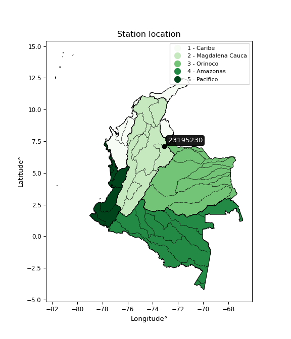</img>

</div>


## A. General information


### 1. General running parameters

• app_version: _v20260312_. • runtime: _2026-03-12 07:15:23.203550_. • Python version: _3.14.0_. • SciPy version: _1.16.3_. • Pandas version: _2.3.3_. • NumPy version: _2.3.5_. • Stations dataset (station_dataset_file): _dataset/pmax24h_in/automatic_colombia_2003_2025.csv_. • Stations catalog (station_catalog_file): _dataset/CNE.xls_. • Minimum year to eval til year_max (date_min): _1900_. • Maximum year to eval since year_min (date_max): _2025_. • Creates, save and include plots into reports (create_plot): _True_. • Plot only fit distributions with Δo > Δ (plot_only_fit): _True_. • Plot only simple graphs avoiding multiple CDFs and multiple Extreme values plots (plot_only_simple): _True_. • Eval low extreme values, if False, evaluates high extreme values (low_extreme): _False_. • Eval every SciPy distribution as logarithmic (pdist_logarithmic_on): _True_. • Standard deviation normalized (ddof): _1.0_. • Return periods to eval in years (Tr): _[2, 2.33, 5, 10, 15, 20, 25, 50, 75, 100, 200, 250, 500, 750, 1000]_. • Minimum data sample per station, 0 means any (minimum_sample): _5_. • Z-Score maximum threshold to adjust a value, 0 means disable (zscore_max): _3.5_. • Z-Score minimum threshold to adjust a value, 0 means disable (zscore_min): _-2.5_. • Avoid zeros, e.g. rain = 0 (avoid_zeros): _True_. • Avoid null values (avoid_nans): _True_. 

:file_folder:Table: [dataset.csv](../../dataset/pmax24h_in/automatic_colombia_2003_2025.csv)

> Delta Degrees of Freedom (DDOF): is a parameter used in the formulas for calculating variance and standard deviation. When ddof=0, the divisor is $N$ (the total number of observations) and this is used when your data set is the entire population. When ddof=1, the divisor is $N-1$ and this is used when your data set is a sample drawn from a larger population. Using $N-1$ provides an unbiased estimate of the population variance (known as Bessel´s correction).


### 2. Station info and location

|   id |   CODIGO | NOMBRE                  | CATEGORIA               | TECNOLOGIA                              | ESTADO     | FECHA_INSTALACION   | FECHA_SUSPENSION   |   ALTITUD |   LATITUD |   LONGITUD | DEPARTAMENTO   | MUNICIPIO   | AREA_OPERATIVA                         | ENTIDAD                                                     | AREA_HIDROGRAFICA   | ZONA_HIDROGRAFICA   | SUBZONA_HIDROGRAFICA                      |   CORRIENTE | Catalogo   |   Version |
|-----:|---------:|:------------------------|:------------------------|:----------------------------------------|:-----------|:--------------------|:-------------------|----------:|----------:|-----------:|:---------------|:------------|:---------------------------------------|:------------------------------------------------------------|:--------------------|:--------------------|:------------------------------------------|------------:|:-----------|----------:|
|    0 | 23195230 | NEOMUNDO AUT [23195230] | Climatológica Principal | Automática con Telemetría, Convencional | Suspendida | 17/08/2005          | 28/02/2020         |       970 |       7.1 |     -73.11 | Santander      | Bucaramanga | Area Operativa 08 - Santanderes-Arauca | INSTITUTO DE HIDROLOGIA METEOROLOGIA Y ESTUDIOS AMBIENTALES | Magdalena Cauca     | Medio Magdalena     | Río Lebrija y otros directos al Magdalena |         nan | CNE_IDEAM  |  20251226 |

<div align="center">

Dynamic map: [:earth_americas:Google](http://maps.google.com/maps?q=7.099997222,-73.11) [:earth_americas:OSM](https://www.openstreetmap.org/#map=18/7.099997222/-73.11&layers=P) [:earth_americas:Bing](https://www.bing.com/maps?cp=7.099997222~-73.11&lvl=18) [:earth_americas:Apple](https://maps.apple.com/frame?center=7.099997222%2C-73.11&span=0.003%2C0.006)

</div>


<div align="center">

```geojson
{
  "type": "Feature",
  "geometry": {
    "type": "Point", 
    "coordinates": [-73.11, 7.099997222]
  }, 
  "properties": {
    "Name": "23195230"
  }
}
```

</div>


### 3. Discrete values table and plot

<div align="center">

|               |          0 |           1 |           2 |           3 |           4 |           5 |          6 |           7 |           8 |           9 |        10 |          11 |          12 |          13 |         14 |          15 |         16 |         17 |
|:--------------|-----------:|------------:|------------:|------------:|------------:|------------:|-----------:|------------:|------------:|------------:|----------:|------------:|------------:|------------:|-----------:|------------:|-----------:|-----------:|
| Date          | 2005       | 2006        | 2007        | 2008        | 2009        | 2010        | 2012       | 2013        | 2014        | 2015        | 2016      | 2017        | 2018        | 2019        | 2020       | 2021        | 2022       | 2023       |
| Value         |   80.7     |   48.4      |   27.7      |    8.3      |   23.6      |   42.3      |   74.8     |   53        |   18.5      |   55.1      |   73.7    |   53.506    |    7.9      |   14        |    8.8     |   11.4      |    4.1     |    5.3     |
| Value_initial |   80.7     |   48.4      |   27.7      |    8.3      |   23.6      |   42.3      |   74.8     |   53        |   18.5      |   55.1      |   73.7    |   53.506    |    7.9      |   14        |    8.8     |   11.4      |    4.1     |    5.3     |
| count         |   18       |   18        |   18        |   18        |   18        |   18        |   18       |   18        |   18        |   18        |   18      |   18        |   18        |   18        |   18       |   18        |   18       |   18       |
| mean          |   33.9503  |   33.9503   |   33.9503   |   33.9503   |   33.9503   |   33.9503   |   33.9503  |   33.9503   |   33.9503   |   33.9503   |   33.9503 |   33.9503   |   33.9503   |   33.9503   |   33.9503  |   33.9503   |   33.9503  |   33.9503  |
| std           |   26.4328  |   26.4328   |   26.4328   |   26.4328   |   26.4328   |   26.4328   |   26.4328  |   26.4328   |   26.4328   |   26.4328   |   26.4328 |   26.4328   |   26.4328   |   26.4328   |   26.4328  |   26.4328   |   26.4328  |   26.4328  |
| zscore        |    1.76862 |    0.546656 |   -0.236461 |   -0.970396 |   -0.391571 |    0.315882 |    1.54541 |    0.720682 |   -0.584513 |    0.800128 |    1.5038 |    0.739825 |   -0.985529 |   -0.754755 |   -0.95148 |   -0.853118 |   -1.12929 |   -1.08389 |


</div>


<div align="center">

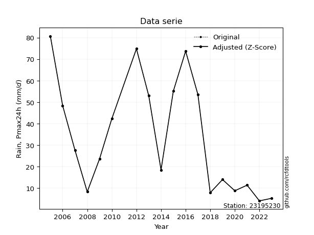</img>

</div>


> The initial value (value_initial) correspond to the initial obtained or null completed value, and value (value) is adjusted only when the initial value is outside the valid range (outlier) definite through the Z-Score value. If Z-Score is active, values out of range or outliers are replaced with the station mean value. A Z-Score (or standard score) measures how many standard deviations a data point is from the mean of a dataset, indicating its relative position; positive scores mean above the mean, negative mean below, and a score of zero is exactly at the mean, allowing for comparison of values from different distributions. It´s calculated using the formula $z=(x–μ)/σ$, where $x$ is the data point, $μ$ is the mean, and $σ$ is the standard deviation, helping identify outliers and understand probability.
>
> <sub>**Note**: In this study, "completing" (filling gaps in) and "extending" (forecasting or lengthening the historical record) rainfall data series are avoided for certain critical analyses because they introduce artificial bias and uncertainty, which can distort the statistics of rare events (extremes), alter day-to-day variability, and compromise the integrity and homogeneity of the original data. Some reasons against Completing/Extending rainfall data are: **Distortion of Extremes and Variability**: The primary issue is that most gap-filling or extension methods rely on averaging or regression with nearby stations, which inherently smooths the data. Rainfall is highly variable in space and time, with a large percentage of zero values and occasional large storms. Infilling methods often underestimate the highest values and overestimate the lowest (zero) values, which severely distorts analyses focused on flood frequency, drought severity, and intensity-duration-frequency (IDF) curves, **Loss of Data Homogeneity**: Infilled or extended data are synthetic estimates, not actual measurements. Combining these estimates with observed data can violate the assumption of data homogeneity, which requires that the data properties do not change over time. Inhomogeneity can lead to incorrect conclusions about long-term trends or changes in climate patterns, **Propagation of Errors**: Errors and biases from the original data (e.g., wind-induced undercatch, instrument errors, site changes) or the data used for imputation can propagate through the analysis, leading to unreliable hydrological models and inaccurate predictions, **Compromised Statistical Integrity**: For statistical analyses, especially those involving the frequency of events, using artificial data can introduce time bias or autocorrelation that doesn´t exist in reality, making it difficult to assess the true probability of events, **Difficulty in Validation**: It is difficult to accurately validate the quality of filled or extended data, especially for past periods where ground-truth measurements are unavailable. The reliability of imputation techniques heavily depends on the density of the surrounding station network and the complexity of the local topography.</sub>


### 4. Active continuous probability distributions from SciPy (80 of 104 available)

A Probability Density Function (PDF) describes the relative likelihood of a continuous random variable falling within a specific range, where the total area under its curve equals 1, and the area over any interval gives the actual probability for that range. Unlike discrete probabilities (like rolling a die), a PDF shows density, not direct probability for a single point (which is zero), with higher points indicating higher likelihood, often visualized as a bell curve for normal distributions.

A log of a probability density function (log-PDF) is simply the logarithm of the PDF´s value, denoted as $log(f(x))$, useful for converting multiplication of probabilities into addition, improving numerical stability with tiny numbers, and connecting to information theory concepts like entropy. Instead of dealing with very small probabilities (e.g., 0.000001), log-PDFs use negative numbers (e.g., $log(0.00001) ≈ -11.51$ that are easier for computers to handle, preventing underflow errors and simplifying complex calculations. In this study, each active probability distribution from SciPy is also evaluated in the $log$ form.

[scipy.stats](https://docs.scipy.org/doc/scipy/reference/stats.html) is a Python´s powerful submodule within the SciPy library for comprehensive statistical analysis, offering over 130 probability distributions (like Normal, Poisson, etc.), functions for descriptive stats (mean, variance), hypothesis testing (t-tests, chi-square), random variable generation, and statistical tests, making it essential for data science, modeling, and research. It provides tools to explore, model, and draw conclusions from data efficiently, working seamlessly with [NumPy](https://numpy.org/).

<div align="center">

|   id | p_dist           |   n_parameter | fit_method   | label                                                                       | active   | ref                                                                                                      |
|-----:|:-----------------|--------------:|:-------------|:----------------------------------------------------------------------------|:---------|:---------------------------------------------------------------------------------------------------------|
|    0 | alpha            |             3 | MLE          | Alpha                                                                       | True     | [:mortar_board:](https://docs.scipy.org/doc/scipy/reference/generated/scipy.stats.alpha.html)            |
|    1 | anglit           |             2 | MM           | Anglit                                                                      | True     | [:mortar_board:](https://docs.scipy.org/doc/scipy/reference/generated/scipy.stats.anglit.html)           |
|    2 | arcsine          |             2 | MM           | Arcsine                                                                     | True     | [:mortar_board:](https://docs.scipy.org/doc/scipy/reference/generated/scipy.stats.arcsine.html)          |
|    3 | argus            |             3 | MLE          | Argus                                                                       | True     | [:mortar_board:](https://docs.scipy.org/doc/scipy/reference/generated/scipy.stats.argus.html)            |
|    4 | beta             |             4 | MLE          | Beta                                                                        | True     | [:mortar_board:](https://docs.scipy.org/doc/scipy/reference/generated/scipy.stats.beta.html)             |
|    5 | betaprime        |             4 | MLE          | Beta prime                                                                  | True     | [:mortar_board:](https://docs.scipy.org/doc/scipy/reference/generated/scipy.stats.betaprime.html)        |
|    6 | bradford         |             3 | MLE          | Bradford                                                                    | True     | [:mortar_board:](https://docs.scipy.org/doc/scipy/reference/generated/scipy.stats.bradford.html)         |
|    7 | burr             |             4 | MLE          | Burr (Type III)                                                             | True     | [:mortar_board:](https://docs.scipy.org/doc/scipy/reference/generated/scipy.stats.burr.html)             |
|    8 | burr12           |             4 | MLE          | Burr (Type III) 12                                                          | True     | [:mortar_board:](https://docs.scipy.org/doc/scipy/reference/generated/scipy.stats.burr12.html)           |
|    9 | cosine           |             2 | MLE          | Cosine                                                                      | True     | [:mortar_board:](https://docs.scipy.org/doc/scipy/reference/generated/scipy.stats.cosine.html)           |
|   10 | crystalball      |             4 | MLE          | Crystalball                                                                 | True     | [:mortar_board:](https://docs.scipy.org/doc/scipy/reference/generated/scipy.stats.crystalball.html)      |
|   11 | dgamma           |             3 | MLE          | Double gamma                                                                | True     | [:mortar_board:](https://docs.scipy.org/doc/scipy/reference/generated/scipy.stats.dgamma.html)           |
|   12 | dweibull         |             3 | MLE          | Double Weibull                                                              | True     | [:mortar_board:](https://docs.scipy.org/doc/scipy/reference/generated/scipy.stats.dweibull.html)         |
|   13 | erlang           |             3 | MLE          | Erlang                                                                      | True     | [:mortar_board:](https://docs.scipy.org/doc/scipy/reference/generated/scipy.stats.erlang.html)           |
|   14 | exponnorm        |             3 | MLE          | Exponentially modified Normal                                               | True     | [:mortar_board:](https://docs.scipy.org/doc/scipy/reference/generated/scipy.stats.exponnorm.html)        |
|   15 | exponpow         |             3 | MLE          | Exponential power                                                           | True     | [:mortar_board:](https://docs.scipy.org/doc/scipy/reference/generated/scipy.stats.exponpow.html)         |
|   16 | exponweib        |             4 | MLE          | Exponentiated Weibull                                                       | True     | [:mortar_board:](https://docs.scipy.org/doc/scipy/reference/generated/scipy.stats.exponweib.html)        |
|   17 | f                |             4 | MLE          | F                                                                           | True     | [:mortar_board:](https://docs.scipy.org/doc/scipy/reference/generated/scipy.stats.f.html)                |
|   18 | fatiguelife      |             3 | MLE          | Fatigue-life (Birnbaum-Saunders)                                            | True     | [:mortar_board:](https://docs.scipy.org/doc/scipy/reference/generated/scipy.stats.fatiguelife.html)      |
|   19 | foldnorm         |             3 | MM           | Fold Normal                                                                 | True     | [:mortar_board:](https://docs.scipy.org/doc/scipy/reference/generated/scipy.stats.foldnorm.html)         |
|   20 | gamma            |             3 | MLE          | Gamma                                                                       | True     | [:mortar_board:](https://docs.scipy.org/doc/scipy/reference/generated/scipy.stats.gamma.html)            |
|   21 | gausshyper       |             6 | MLE          | Gauss hypergeometric                                                        | True     | [:mortar_board:](https://docs.scipy.org/doc/scipy/reference/generated/scipy.stats.gausshyper.html)       |
|   22 | genexpon         |             5 | MLE          | Generalized exponential                                                     | True     | [:mortar_board:](https://docs.scipy.org/doc/scipy/reference/generated/scipy.stats.genexpon.html)         |
|   23 | genextreme       |             3 | MLE          | Generalized exponential                                                     | True     | [:mortar_board:](https://docs.scipy.org/doc/scipy/reference/generated/scipy.stats.genextreme.html)       |
|   24 | gengamma         |             4 | MLE          | Generalized gamma                                                           | True     | [:mortar_board:](https://docs.scipy.org/doc/scipy/reference/generated/scipy.stats.gengamma.html)         |
|   25 | genhalflogistic  |             3 | MLE          | Generalized half-logistic                                                   | True     | [:mortar_board:](https://docs.scipy.org/doc/scipy/reference/generated/scipy.stats.genhalflogistic.html)  |
|   26 | genlogistic      |             3 | MLE          | Generalized logistic                                                        | True     | [:mortar_board:](https://docs.scipy.org/doc/scipy/reference/generated/scipy.stats.genlogistic.html)      |
|   27 | gennorm          |             3 | MLE          | Generalized Normal                                                          | True     | [:mortar_board:](https://docs.scipy.org/doc/scipy/reference/generated/scipy.stats.gennorm.html)          |
|   28 | genpareto        |             3 | MLE          | Generalized Pareto                                                          | True     | [:mortar_board:](https://docs.scipy.org/doc/scipy/reference/generated/scipy.stats.genpareto.html)        |
|   29 | gompertz         |             3 | MLE          | Gompertz (or truncated Gumbel)                                              | True     | [:mortar_board:](https://docs.scipy.org/doc/scipy/reference/generated/scipy.stats.gompertz.html)         |
|   30 | gumbel_l         |             2 | MM           | Gumbel Left Skew                                                            | True     | [:mortar_board:](https://docs.scipy.org/doc/scipy/reference/generated/scipy.stats.gumbel_l.html)         |
|   31 | gumbel_r         |             2 | MM           | Gumbel Right Skew                                                           | True     | [:mortar_board:](https://docs.scipy.org/doc/scipy/reference/generated/scipy.stats.gumbel_r.html)         |
|   32 | halfgennorm      |             3 | MLE          | Upper half of a generalized normal                                          | True     | [:mortar_board:](https://docs.scipy.org/doc/scipy/reference/generated/scipy.stats.halfgennorm.html)      |
|   33 | halflogistic     |             2 | MM           | Half-logistic                                                               | True     | [:mortar_board:](https://docs.scipy.org/doc/scipy/reference/generated/scipy.stats.halflogistic.html)     |
|   34 | halfnorm         |             2 | MM           | Half Normal                                                                 | True     | [:mortar_board:](https://docs.scipy.org/doc/scipy/reference/generated/scipy.stats.halfnorm.html)         |
|   35 | hypsecant        |             2 | MM           | hyperbolic secant                                                           | True     | [:mortar_board:](https://docs.scipy.org/doc/scipy/reference/generated/scipy.stats.hypsecant.html)        |
|   36 | invgamma         |             3 | MLE          | Inverted gamma                                                              | True     | [:mortar_board:](https://docs.scipy.org/doc/scipy/reference/generated/scipy.stats.invgamma.html)         |
|   37 | invgauss         |             3 | MLE          | Inverse Gaussian                                                            | True     | [:mortar_board:](https://docs.scipy.org/doc/scipy/reference/generated/scipy.stats.invgauss.html)         |
|   38 | invweibull       |             3 | MLE          | Inverted Weibull                                                            | True     | [:mortar_board:](https://docs.scipy.org/doc/scipy/reference/generated/scipy.stats.invweibull.html)       |
|   39 | johnsonsb        |             4 | MLE          | Johnson SB                                                                  | True     | [:mortar_board:](https://docs.scipy.org/doc/scipy/reference/generated/scipy.stats.johnsonsb.html)        |
|   40 | johnsonsu        |             4 | MLE          | Johnson Su                                                                  | True     | [:mortar_board:](https://docs.scipy.org/doc/scipy/reference/generated/scipy.stats.johnsonsu.html)        |
|   41 | kappa3           |             3 | MLE          | Kappa 3                                                                     | True     | [:mortar_board:](https://docs.scipy.org/doc/scipy/reference/generated/scipy.stats.kappa3.html)           |
|   42 | kappa4           |             4 | MLE          | Kappa 4                                                                     | True     | [:mortar_board:](https://docs.scipy.org/doc/scipy/reference/generated/scipy.stats.kappa4.html)           |
|   43 | ksone            |             3 | MLE          | Kolmogorov-Smirnov one-sided test statistic distribution                    | True     | [:mortar_board:](https://docs.scipy.org/doc/scipy/reference/generated/scipy.stats.ksone.html)            |
|   44 | kstwobign        |             2 | MLE          | Limiting distribution of scaled Kolmogorov-Smirnov two-sided test statistic | True     | [:mortar_board:](https://docs.scipy.org/doc/scipy/reference/generated/scipy.stats.kstwobign.html)        |
|   45 | laplace          |             2 | MM           | Laplace                                                                     | True     | [:mortar_board:](https://docs.scipy.org/doc/scipy/reference/generated/scipy.stats.laplace.html)          |
|   46 | levy_l           |             2 | MLE          | Left-skewed Levy                                                            | True     | [:mortar_board:](https://docs.scipy.org/doc/scipy/reference/generated/scipy.stats.levy_l.html)           |
|   47 | loggamma         |             3 | MLE          | Log gamma                                                                   | True     | [:mortar_board:](https://docs.scipy.org/doc/scipy/reference/generated/scipy.stats.loggamma.html)         |
|   48 | logistic         |             2 | MM           | Logistic (or Sech-squared)                                                  | True     | [:mortar_board:](https://docs.scipy.org/doc/scipy/reference/generated/scipy.stats.logistic.html)         |
|   49 | loglaplace       |             3 | MLE          | Log-Laplace                                                                 | True     | [:mortar_board:](https://docs.scipy.org/doc/scipy/reference/generated/scipy.stats.loglaplace.html)       |
|   50 | lomax            |             3 | MLE          | Lomax (Pareto of the second kind)                                           | True     | [:mortar_board:](https://docs.scipy.org/doc/scipy/reference/generated/scipy.stats.lomax.html)            |
|   51 | maxwell          |             2 | MM           | Maxwell                                                                     | True     | [:mortar_board:](https://docs.scipy.org/doc/scipy/reference/generated/scipy.stats.maxwell.html)          |
|   52 | mielke           |             4 | MLE          | Mielke Beta-Kappa / Dagum                                                   | True     | [:mortar_board:](https://docs.scipy.org/doc/scipy/reference/generated/scipy.stats.mielke.html)           |
|   53 | moyal            |             2 | MM           | Moyal                                                                       | True     | [:mortar_board:](https://docs.scipy.org/doc/scipy/reference/generated/scipy.stats.moyal.html)            |
|   54 | nakagami         |             3 | MLE          | Nakagami                                                                    | True     | [:mortar_board:](https://docs.scipy.org/doc/scipy/reference/generated/scipy.stats.nakagami.html)         |
|   55 | ncf              |             5 | MLE          | Non-central F distribution                                                  | True     | [:mortar_board:](https://docs.scipy.org/doc/scipy/reference/generated/scipy.stats.ncf.html)              |
|   56 | nct              |             4 | MLE          | Non-central Student’s t                                                     | True     | [:mortar_board:](https://docs.scipy.org/doc/scipy/reference/generated/scipy.stats.nct.html)              |
|   57 | norm             |             2 | MM           | Normal                                                                      | True     | [:mortar_board:](https://docs.scipy.org/doc/scipy/reference/generated/scipy.stats.norm.html)             |
|   58 | pearson3         |             3 | MM           | Pearson type III                                                            | True     | [:mortar_board:](https://docs.scipy.org/doc/scipy/reference/generated/scipy.stats.pearson3.html)         |
|   59 | powerlaw         |             3 | MLE          | Power-function                                                              | True     | [:mortar_board:](https://docs.scipy.org/doc/scipy/reference/generated/scipy.stats.powerlaw.html)         |
|   60 | rayleigh         |             2 | MM           | Rayleigh                                                                    | True     | [:mortar_board:](https://docs.scipy.org/doc/scipy/reference/generated/scipy.stats.rayleigh.html)         |
|   61 | rdist            |             3 | MLE          | R-distributed (symmetric beta)                                              | True     | [:mortar_board:](https://docs.scipy.org/doc/scipy/reference/generated/scipy.stats.rdist.html)            |
|   62 | rice             |             3 | MLE          | Rice                                                                        | True     | [:mortar_board:](https://docs.scipy.org/doc/scipy/reference/generated/scipy.stats.rice.html)             |
|   63 | semicircular     |             2 | MM           | Semicircular                                                                | True     | [:mortar_board:](https://docs.scipy.org/doc/scipy/reference/generated/scipy.stats.semicircular.html)     |
|   64 | skewnorm         |             3 | MLE          | Skew normal                                                                 | True     | [:mortar_board:](https://docs.scipy.org/doc/scipy/reference/generated/scipy.stats.skewnorm.html)         |
|   65 | t                |             3 | MLE          | Student’s t                                                                 | True     | [:mortar_board:](https://docs.scipy.org/doc/scipy/reference/generated/scipy.stats.t.html)                |
|   66 | trapezoid        |             4 | MLE          | Trapezoid                                                                   | True     | [:mortar_board:](https://docs.scipy.org/doc/scipy/reference/generated/scipy.stats.trapezoid.html)        |
|   67 | triang           |             3 | MLE          | Triangular                                                                  | True     | [:mortar_board:](https://docs.scipy.org/doc/scipy/reference/generated/scipy.stats.triang.html)           |
|   68 | truncexpon       |             3 | MLE          | Truncated exponential                                                       | True     | [:mortar_board:](https://docs.scipy.org/doc/scipy/reference/generated/scipy.stats.truncexpon.html)       |
|   69 | truncnorm        |             4 | MLE          | Truncated normal                                                            | True     | [:mortar_board:](https://docs.scipy.org/doc/scipy/reference/generated/scipy.stats.truncnorm.html)        |
|   70 | truncpareto      |             4 | MLE          | Upper truncated Pareto                                                      | True     | [:mortar_board:](https://docs.scipy.org/doc/scipy/reference/generated/scipy.stats.truncpareto.html)      |
|   71 | truncweibull_min |             5 | MLE          | Doubly truncated Weibull minimum                                            | True     | [:mortar_board:](https://docs.scipy.org/doc/scipy/reference/generated/scipy.stats.truncweibull_min.html) |
|   72 | tukeylambda      |             3 | MLE          | Tukey-Lamdba                                                                | True     | [:mortar_board:](https://docs.scipy.org/doc/scipy/reference/generated/scipy.stats.tukeylambda.html)      |
|   73 | uniform          |             2 | MLE          | Uniform                                                                     | True     | [:mortar_board:](https://docs.scipy.org/doc/scipy/reference/generated/scipy.stats.uniform.html)          |
|   74 | vonmises         |             3 | MLE          | Von Mises                                                                   | True     | [:mortar_board:](https://docs.scipy.org/doc/scipy/reference/generated/scipy.stats.vonmises.html)         |
|   75 | vonmises_line    |             3 | MLE          | Von Mises line                                                              | True     | [:mortar_board:](https://docs.scipy.org/doc/scipy/reference/generated/scipy.stats.vonmises_line.html)    |
|   76 | wald             |             2 | MM           | Wald                                                                        | True     | [:mortar_board:](https://docs.scipy.org/doc/scipy/reference/generated/scipy.stats.wald.html)             |
|   77 | weibull_max      |             3 | MLE          | Weibull maximum                                                             | True     | [:mortar_board:](https://docs.scipy.org/doc/scipy/reference/generated/scipy.stats.weibull_max.html)      |
|   78 | weibull_min      |             3 | MLE          | Weibull minimum                                                             | True     | [:mortar_board:](https://docs.scipy.org/doc/scipy/reference/generated/scipy.stats.weibull_min.html)      |
|   79 | wrapcauchy       |             3 | MLE          | Wrapped  Cauchy                                                             | True     | [:mortar_board:](https://docs.scipy.org/doc/scipy/reference/generated/scipy.stats.wrapcauchy.html)       |

</div>

> **n_parameter:** # arguments & localization & scale.
>
> **Fit methods:** (MLE) maximum likelihood, (MM) L-moments.
>
>**Inactive** (With the only purpose of prevent loops, zero divisions, infinite values, over high estimated values or horizontal trending for recurrence intervals estimations, the follow distributions were disabled.)**:** lognorm, norminvgauss, powernorm, powerlognorm, cauchy, halfcauchy, foldcauchy, skewcauchy, chi2, expon, fisk, genhyperbolic, geninvgauss, gibrat, kstwo, laplace_asymmetric, levy, levy_stable, ncx2, pareto, rel_breitwigner, recipinvgauss, studentized_range, loguniform, 


## B. Probability (PDF) vs. Empirical (EDF) distributions functions

A continuous probability distribution (CPD) describes probabilities for variables that can take any value within a range (like rain any time), unlike discrete variables with specific outcomes (like temperature). It uses a Probability Density Function (PDF), a curve where the total area under it equals 1, and the probability of the variable falling within an interval (a to b) is found by calculating the area under the curve between those points. A key feature is that the probability of hitting any single exact value is zero, so probabilities are always expressed for ranges, e.g., $P(a ≤ X ≤ b)$.

<div align="center">

Distributions parameters from station values
|     |   station | p_dist              |   n |             loc |          scale | shape                  | shape1                | shape2                | shape3             |
|----:|----------:|:--------------------|----:|----------------:|---------------:|:-----------------------|:----------------------|:----------------------|:-------------------|
|   0 |  23195230 | alpha               |  18 |    -0.0263159   |   10.6647      | 5.886535078785768e-11  |                       |                       |                    |
|   1 |  23195230 | anglit              |  18 |    33.9503      |   75.148       |                        |                       |                       |                    |
|   2 |  23195230 | arcsine             |  18 |    -2.37813     |   72.6569      |                        |                       |                       |                    |
|   3 |  23195230 | argus               |  18 |   -10.2385      |   91.9822      | 2.00406518924001e-09   |                       |                       |                    |
|   4 |  23195230 | beta                |  18 |    -3.44325     |   84.1433      | 0.49306232690680735    | 0.7036965004560951    |                       |                    |
|   5 |  23195230 | betaprime           |  18 |     4.09318     |  194.199       | 0.8532433924249223     | 6.746301883861088     |                       |                    |
|   6 |  23195230 | bradford            |  18 |     4.1         |   78.1553      | 1.09244812199942       |                       |                       |                    |
|   7 |  23195230 | burr                |  18 |    -0.942718    |   82.9471      | 128.8355939937704      | 0.006368140863999197  |                       |                    |
|   8 |  23195230 | burr12              |  18 |    -1.32281     |  158.197       | 1.4249593374385503     | 8.180428327974326     |                       |                    |
|   9 |  23195230 | cosine              |  18 |    35.7957      |   20.9028      |                        |                       |                       |                    |
|  10 |  23195230 | crystalball         |  18 |    33.9503      |   25.6881      | 2244.5139801691475     | 3476.2965146578217    |                       |                    |
|  11 |  23195230 | dgamma              |  18 |    26.173       |   11.997       | 1.8861598497580827     |                       |                       |                    |
|  12 |  23195230 | dweibull            |  18 |    35.8716      |   26.5946      | 2.4276972674041897     |                       |                       |                    |
|  13 |  23195230 | erlang              |  18 |     4.1         |   34.1875      | 0.8196572176933392     |                       |                       |                    |
|  14 |  23195230 | exponnorm           |  18 |     4.06452     |    0.0128613   | 2319.192089182976      |                       |                       |                    |
|  15 |  23195230 | exponpow            |  18 |     4.1         |   60.0829      | 0.7455657061203407     |                       |                       |                    |
|  16 |  23195230 | exponweib           |  18 |     4.1         |   14.4285      | 1.3570211164492014     | 0.6397703509169539    |                       |                    |
|  17 |  23195230 | f                   |  18 |     4.1         |   26.594       | 1.3825343742433378     | 24.579888512542755    |                       |                    |
|  18 |  23195230 | fatiguelife         |  18 |     1.86015     |   18.1582      | 1.208445093157054      |                       |                       |                    |
|  19 |  23195230 | foldnorm            |  18 |    -9.0387      |   28.7664      | 1.4250321088252198     |                       |                       |                    |
|  20 |  23195230 | gamma               |  18 |     4.1         |   32.4708      | 0.56287045425202       |                       |                       |                    |
|  21 |  23195230 | gausshyper          |  18 |    -5.56288     |   86.2629      | 1.1004084241885677     | 0.9496294489355008    | 1.0434288023857938    | 0.9971727050732403 |
|  22 |  23195230 | genexpon            |  18 |     4.0998      |    0.17669     | 0.00494474954801041    | 1.4983236032683935    | 4.417978947245809e-06 |                    |
|  23 |  23195230 | genextreme          |  18 |    16.214       |   14.4569      | -0.6087098411762767    |                       |                       |                    |
|  24 |  23195230 | gengamma            |  18 |     3.21264     |    0.00280241  | 10.086898549906739     | 0.2593150524280644    |                       |                    |
|  25 |  23195230 | genhalflogistic     |  18 |    -3.69068     |   85.7049      | 1.015573197856362      |                       |                       |                    |
|  26 |  23195230 | genlogistic         |  18 |  -114.561       |   20.057       | 897.010413230716       |                       |                       |                    |
|  27 |  23195230 | gennorm             |  18 |    42.4         |   38.3         | 51141156.24410024      |                       |                       |                    |
|  28 |  23195230 | genpareto           |  18 |    -0.204042    |   85.3351      | -1.0547689397257447    |                       |                       |                    |
|  29 |  23195230 | gompertz            |  18 |     4.1         |   79.6085      | 1.8607380212495919     |                       |                       |                    |
|  30 |  23195230 | gumbel_l            |  18 |    45.5113      |   20.0289      |                        |                       |                       |                    |
|  31 |  23195230 | gumbel_r            |  18 |    22.3893      |   20.0289      |                        |                       |                       |                    |
|  32 |  23195230 | halfgennorm         |  18 |     4.1         |    3.69174     | 0.4539839469374367     |                       |                       |                    |
|  33 |  23195230 | halflogistic        |  18 |     3.50396     |   21.9624      |                        |                       |                       |                    |
|  34 |  23195230 | halfnorm            |  18 |    -0.0506538   |   42.6139      |                        |                       |                       |                    |
|  35 |  23195230 | hypsecant           |  18 |    33.9503      |   16.3536      |                        |                       |                       |                    |
|  36 |  23195230 | invgamma            |  18 |    -5.87714     |   52.1349      | 2.1427011706822565     |                       |                       |                    |
|  37 |  23195230 | invgauss            |  18 |    -0.5127      |   28.7235      | 1.199818772840229      |                       |                       |                    |
|  38 |  23195230 | invweibull          |  18 |    -7.53622     |   23.7502      | 1.6428258231403778     |                       |                       |                    |
|  39 |  23195230 | johnsonsb           |  18 |     4.1         |   76.6         | -0.5550997137908364    | 0.17611723635798648   |                       |                    |
|  40 |  23195230 | johnsonsu           |  18 |     2.31265     |    0.10688     | -5.112712216616959     | 0.8698949087760526    |                       |                    |
|  41 |  23195230 | kappa3              |  18 |     4.02495     |   76.6213      | 4071.4921335390945     |                       |                       |                    |
|  42 |  23195230 | kappa4              |  18 |    -3.57492     |   85.7324      | 1.0984102896238443     | 1.017292766415511     |                       |                    |
|  43 |  23195230 | ksone               |  18 |    -3.56        |   91.92        | 1.0                    |                       |                       |                    |
|  44 |  23195230 | kstwobign           |  18 |   -46.9772      |   92.5467      |                        |                       |                       |                    |
|  45 |  23195230 | laplace             |  18 |    33.9503      |   18.1642      |                        |                       |                       |                    |
|  46 |  23195230 | levy_l              |  18 |    84.5822      |   24.256       |                        |                       |                       |                    |
|  47 |  23195230 | loggamma            |  18 | -5861.17        |  845.932       | 1063.2434926489514     |                       |                       |                    |
|  48 |  23195230 | logistic            |  18 |    33.9503      |   14.1626      |                        |                       |                       |                    |
|  49 |  23195230 | loglaplace          |  18 |     4.1         |   34.1177      | 0.8296323767356426     |                       |                       |                    |
|  50 |  23195230 | lomax               |  18 |     4.1         |    1.45528e+09 | 49417922.54880457      |                       |                       |                    |
|  51 |  23195230 | maxwell             |  18 |   -26.9197      |   38.1446      |                        |                       |                       |                    |
|  52 |  23195230 | mielke              |  18 |     4.1         |   77.0934      | 0.5668820333399127     | 1097.5568470066755    |                       |                    |
|  53 |  23195230 | moyal               |  18 |    19.2602      |   11.5637      |                        |                       |                       |                    |
|  54 |  23195230 | nakagami            |  18 |     4.1         |   51.4327      | 0.31092880808092827    |                       |                       |                    |
|  55 |  23195230 | ncf                 |  18 |     4.1         |    4.20295     | 0.8001866980396084     | 724.4068874134175     | 4.596518490760788     |                    |
|  56 |  23195230 | nct                 |  18 |   -14.1326      |    1.51226     | 2.129267948973606      | 20.80920522454103     |                       |                    |
|  57 |  23195230 | norm                |  18 |    33.9503      |   25.6881      |                        |                       |                       |                    |
|  58 |  23195230 | pearson3            |  18 |    33.9503      |   25.6881      | 0.44431116608892907    |                       |                       |                    |
|  59 |  23195230 | powerlaw            |  18 |     4.1         |   76.6         | 0.28491139658337994    |                       |                       |                    |
|  60 |  23195230 | rayleigh            |  18 |   -15.1925      |   39.2103      |                        |                       |                       |                    |
|  61 |  23195230 | rdist               |  18 |    -2.35732     |   44.6573      | 1.249008439008028      |                       |                       |                    |
|  62 |  23195230 | rice                |  18 |    -9.38679     |   35.6229      | 0.0016243557561474178  |                       |                       |                    |
|  63 |  23195230 | semicircular        |  18 |    33.9503      |   51.3762      |                        |                       |                       |                    |
|  64 |  23195230 | skewnorm            |  18 |     4.1         |   39.3823      | 100605561.78105855     |                       |                       |                    |
|  65 |  23195230 | t                   |  18 |    33.9503      |   25.6892      | 12345057.59774087      |                       |                       |                    |
|  66 |  23195230 | trapezoid           |  18 |    -3.738       |   91.92        | 1.0                    | 1.0                   |                       |                    |
|  67 |  23195230 | triang              |  18 |   -30.419       |  114.98        | 0.9151064864323659     |                       |                       |                    |
|  68 |  23195230 | truncexpon          |  18 |     3.89995     |   85.8609      | 0.8944701919347502     |                       |                       |                    |
|  69 |  23195230 | truncnorm           |  18 |    33.9503      |   25.6881      | -58.801857176533524    | 22.221002035491527    |                       |                    |
|  70 |  23195230 | truncpareto         |  18 |     4.1         |    2.81302e-07 | 0.058823567180422344   | 272305263.305327      |                       |                    |
|  71 |  23195230 | truncweibull_min    |  18 |    -0.908794    |   77.4693      | 0.9922882655865879     | 0.01147436347270724   | 1.0534344171011365    |                    |
|  72 |  23195230 | tukeylambda         |  18 |     1.9478      |   96.2797      | 1.2225655478784292     |                       |                       |                    |
|  73 |  23195230 | uniform             |  18 |     4.1         |   76.6         |                        |                       |                       |                    |
|  74 |  23195230 | vonmises            |  18 |    -1.88107     |    1           | 0.600042267759228      |                       |                       |                    |
|  75 |  23195230 | vonmises_line       |  18 |    42.3683      |   12.2014      | 4.745351366137444e-06  |                       |                       |                    |
|  76 |  23195230 | wald                |  18 |     8.26219     |   25.6881      |                        |                       |                       |                    |
|  77 |  23195230 | weibull_max         |  18 |    80.7         |    1.65355     | 0.20801311352130897    |                       |                       |                    |
|  78 |  23195230 | weibull_min         |  18 |     4.1         |   32.6152      | 0.93637753028683       |                       |                       |                    |
|  79 |  23195230 | wrapcauchy          |  18 |     4.09999     |   12.1913      | 0.37750897721938864    |                       |                       |                    |
|  80 |  23195230 | logalpha            |  18 |   -19.4956      |  526.811       | 23.31894563240463      |                       |                       |                    |
|  81 |  23195230 | loganglit           |  18 |     3.13882     |    2.79865     |                        |                       |                       |                    |
|  82 |  23195230 | logarcsine          |  18 |     1.78587     |    2.7059      |                        |                       |                       |                    |
|  83 |  23195230 | logargus            |  18 |     0.809958    |    3.681       | 1.3846504325901026     |                       |                       |                    |
|  84 |  23195230 | logbeta             |  18 |     1.21065     |    3.18009     | 0.7455994485404991     | 0.5865303590194807    |                       |                    |
|  85 |  23195230 | logbetaprime        |  18 |   -11.5517      |  315.031       | 239.08085020877093     | 5128.899843012801     |                       |                    |
|  86 |  23195230 | logbradford         |  18 |     1.41099     |    2.97977     | 0.9624029518817264     |                       |                       |                    |
|  87 |  23195230 | logburr             |  18 |    -1.13066     |    5.55277     | 215.37954451101996     | 0.016111279197069985  |                       |                    |
|  88 |  23195230 | logburr12           |  18 |    -9.07114     |   20.7969      | 15.58660692721449      | 2337.129936296943     |                       |                    |
|  89 |  23195230 | logcosine           |  18 |     3.09273     |    0.776248    |                        |                       |                       |                    |
|  90 |  23195230 | logcrystalball      |  18 |     3.13882     |    0.956673    | 836.0765742144102      | 4.841250782774059     |                       |                    |
|  91 |  23195230 | logdgamma           |  18 |     3.45162     |    0.332499    | 2.603624958887793      |                       |                       |                    |
|  92 |  23195230 | logdweibull         |  18 |     3.04309     |    0.968066    | 2.0857822871108884     |                       |                       |                    |
|  93 |  23195230 | logerlang           |  18 |   -12.3588      |    0.0602873   | 257.0489733190708      |                       |                       |                    |
|  94 |  23195230 | logexponnorm        |  18 |     3.13793     |    0.956671    | 0.0009292931224411261  |                       |                       |                    |
|  95 |  23195230 | logexponpow         |  18 |     1.41099     |    1.28085     | 0.5027680357444809     |                       |                       |                    |
|  96 |  23195230 | logexponweib        |  18 |     1.41099     |    2.7452      | 0.4705721587260878     | 1.4288457999469224    |                       |                    |
|  97 |  23195230 | logf                |  18 |  -304.735       |  307.875       | 869964.2533588373      | 269726.4252125124     |                       |                    |
|  98 |  23195230 | logfatiguelife      |  18 |  -150.725       |  153.86        | 0.0062140567338446594  |                       |                       |                    |
|  99 |  23195230 | logfoldnorm         |  18 |    -9.69271     |    0.937872    | 13.685192499769723     |                       |                       |                    |
| 100 |  23195230 | loggamma            |  18 |   -12.9342      |    0.0584669   | 274.94187430551995     |                       |                       |                    |
| 101 |  23195230 | loggausshyper       |  18 |     1.33646     |    3.05428     | 1.2852754621775666     | 0.8180834461269975    | 0.7796666460784922    | 1.1406949312008912 |
| 102 |  23195230 | loggenexpon         |  18 |     1.40519     |    0.00518679  | 0.0008627187833201574  | 0.6007604527936417    | 1.623873267711209e-05 |                    |
| 103 |  23195230 | loggenextreme       |  18 |     3.21262     |    1.23572     | 1.0488899005576067     |                       |                       |                    |
| 104 |  23195230 | loggengamma         |  18 |   -47.6146      |   34.9485      | 33.00235666255898      | 9.336123070595637     |                       |                    |
| 105 |  23195230 | loggenhalflogistic  |  18 |     1.10017     |    3.42155     | 1.0398041225143135     |                       |                       |                    |
| 106 |  23195230 | loggenlogistic      |  18 |     4.39082     |    8.32655e-06 | 6.670057152918298e-06  |                       |                       |                    |
| 107 |  23195230 | loggennorm          |  18 |     2.90086     |    1.48988     | 28179351.24341284      |                       |                       |                    |
| 108 |  23195230 | loggenpareto        |  18 |    -0.0022163   |    8.92233     | -2.031054387767269     |                       |                       |                    |
| 109 |  23195230 | loggompertz         |  18 |     1.41099     |    1.03128     | 0.1493023782257435     |                       |                       |                    |
| 110 |  23195230 | loggumbel_l         |  18 |     3.56937     |    0.745915    |                        |                       |                       |                    |
| 111 |  23195230 | loggumbel_r         |  18 |     2.70827     |    0.745915    |                        |                       |                       |                    |
| 112 |  23195230 | loghalfgennorm      |  18 |     1.41095     |    2.98208     | 9125.250012382916      |                       |                       |                    |
| 113 |  23195230 | loghalflogistic     |  18 |     2.0049      |    0.817944    |                        |                       |                       |                    |
| 114 |  23195230 | loghalfnorm         |  18 |     1.87256     |    1.58702     |                        |                       |                       |                    |
| 115 |  23195230 | loghypsecant        |  18 |     3.13882     |    0.609037    |                        |                       |                       |                    |
| 116 |  23195230 | loginvgamma         |  18 |   -10.6132      | 2677.28        | 195.73671165163535     |                       |                       |                    |
| 117 |  23195230 | loginvgauss         |  18 |    -3.47369     |  291.367       | 0.022643027961657444   |                       |                       |                    |
| 118 |  23195230 | loginvweibull       |  18 |    -1.30917e+08 |    1.30917e+08 | 145471609.88575846     |                       |                       |                    |
| 119 |  23195230 | logjohnsonsb        |  18 |     1.41099     |    2.97975     | 0.3561872413020162     | 0.12037051272756803   |                       |                    |
| 120 |  23195230 | logjohnsonsu        |  18 |     4.81941     |    0.0242433   | 7.191029013111642      | 1.5186080200152694    |                       |                    |
| 121 |  23195230 | logkappa3           |  18 |     1.41099     |    2.91735     | 136.26894427541617     |                       |                       |                    |
| 122 |  23195230 | logkappa4           |  18 |     1.10159     |    3.36447     | 1.1013872182548896     | 1.0217516840893155    |                       |                    |
| 123 |  23195230 | logksone            |  18 |     1.11301     |    3.5757      | 1.0                    |                       |                       |                    |
| 124 |  23195230 | logkstwobign        |  18 |    -0.533488    |    4.19017     |                        |                       |                       |                    |
| 125 |  23195230 | loglaplace          |  18 |     3.13882     |    0.67647     |                        |                       |                       |                    |
| 126 |  23195230 | loglevy_l           |  18 |     4.4677      |    0.448809    |                        |                       |                       |                    |
| 127 |  23195230 | logloggamma         |  18 |     4.39076     |    1.75157e-06 | 1.3991457168388372e-06 |                       |                       |                    |
| 128 |  23195230 | loglogistic         |  18 |     3.13882     |    0.527441    |                        |                       |                       |                    |
| 129 |  23195230 | logloglaplace       |  18 |    -0.00329944  |    3.32473     | 3.4426319092911344     |                       |                       |                    |
| 130 |  23195230 | loglomax            |  18 |     1.40549     |  104.976       | 60.83821405092408      |                       |                       |                    |
| 131 |  23195230 | logmaxwell          |  18 |     0.871908    |    1.42058     |                        |                       |                       |                    |
| 132 |  23195230 | logmielke           |  18 |     1.41099     |    2.99275     | 0.854010378233196      | 177.28491999510928    |                       |                    |
| 133 |  23195230 | logmoyal            |  18 |     2.59173     |    0.430654    |                        |                       |                       |                    |
| 134 |  23195230 | lognakagami         |  18 |     0.980559    |    2.36078     | 1.2354568348157646     |                       |                       |                    |
| 135 |  23195230 | logncf              |  18 |   -15.2483      |   11.2985      | 1134.6138297977575     | 1566.5118944704172    | 711.271268814823      |                    |
| 136 |  23195230 | lognct              |  18 |   -35.4604      |    0.951428    | 63918.06496647437      | 40.56898729493162     |                       |                    |
| 137 |  23195230 | lognorm             |  18 |     3.13882     |    0.956673    |                        |                       |                       |                    |
| 138 |  23195230 | logpearson3         |  18 |     3.13882     |    0.956675    | -0.27964717719605237   |                       |                       |                    |
| 139 |  23195230 | logpowerlaw         |  18 |     1.41099     |    2.97975     | 0.3715613580174317     |                       |                       |                    |
| 140 |  23195230 | lograyleigh         |  18 |     1.30865     |    1.46026     |                        |                       |                       |                    |
| 141 |  23195230 | logrdist            |  18 |     2.27031     |    1.73884     | 1.0234197723467684     |                       |                       |                    |
| 142 |  23195230 | logrice             |  18 |     1.03865     |    1.09396     | 1.565351309756596      |                       |                       |                    |
| 143 |  23195230 | logsemicircular     |  18 |     3.13882     |    1.91335     |                        |                       |                       |                    |
| 144 |  23195230 | logskewnorm         |  18 |     4.39074     |    1.57557     | -13223306.790349424    |                       |                       |                    |
| 145 |  23195230 | logt                |  18 |     3.13882     |    0.956675    | 16355143429.659142     |                       |                       |                    |
| 146 |  23195230 | logtrapezoid        |  18 |     0.432941    |    4.05882     | 1.0                    | 1.0                   |                       |                    |
| 147 |  23195230 | logtriang           |  18 |     0.450258    |    3.94049     | 0.9999980833517417     |                       |                       |                    |
| 148 |  23195230 | logtruncexpon       |  18 |     1.41003     |    3.94751     | 0.7550849529265182     |                       |                       |                    |
| 149 |  23195230 | logtruncnorm        |  18 |     1.1276      |    2.09524     | 0.13525049011073279    | 18.01413551028058     |                       |                    |
| 150 |  23195230 | logtruncpareto      |  18 |     1.41099     |    2.33335e-08 | 0.058823544293648306   | 127702592.68336155    |                       |                    |
| 151 |  23195230 | logtruncweibull_min |  18 |     0.870257    |    5.63506     | 1.6118331572083218     | 1.050250239643166e-08 | 0.6247460696863238    |                    |
| 152 |  23195230 | logtukeylambda      |  18 |     2.90133     |    1.80914     | 1.2139089032326404     |                       |                       |                    |
| 153 |  23195230 | loguniform          |  18 |     1.41099     |    2.97975     |                        |                       |                       |                    |
| 154 |  23195230 | logvonmises         |  18 |    -3.0882      |    1           | 1.5087685183006307     |                       |                       |                    |
| 155 |  23195230 | logvonmises_line    |  18 |     2.90086     |    0.474243    | 0.04789676363980969    |                       |                       |                    |
| 156 |  23195230 | logwald             |  18 |     2.18215     |    0.956672    |                        |                       |                       |                    |
| 157 |  23195230 | logweibull_max      |  18 |     4.39074     |    1.17497     | 0.9715011949651096     |                       |                       |                    |
| 158 |  23195230 | logweibull_min      |  18 |    -8.23395     |   11.8046      | 14.515682142027543     |                       |                       |                    |
| 159 |  23195230 | logwrapcauchy       |  18 |     1.41099     |    0.474242    | 0.21340565112679372    |                       |                       |                    |

</div>

> **loc** (Location parameter): This shifts the distribution along the x-axis. For many common distributions, like the normal (Gaussian) distribution, loc represents the mean $μ$. For others, like the uniform distribution, it might represent the minimum value, or for the beta distribution, the left end of the support interval.
>
> **scale** (Scale parameter): This determines the width or spread of the distribution. For the normal distribution, scale represents the standard deviation $σ$. For a uniform distribution, it defines the length of the interval (from $loc$ to $loc + scale$).
>
> **shape** (Shape parameters): Refers to parameters that define the specific form of a probability distribution, distinct from its location (loc) and scale (scale). These parameters are required arguments for most distribution functions. For example, a normal (Gaussian) distribution is fully defined by its location (mean) and scale (standard deviation), so it has no specific shape parameters beyond loc and scale. However, other distributions have intrinsic properties that need specification, as Gamma distribution that takes a shape parameter, often named $a$ or $alpha$.


### 0. Cumulative distribution values - CDF (160 evaluated)

Cumulative Distribution Function (CDF), denoted as $F$<sub>$X$</sub>$(x)$, is a function that gives the probability that a random variable $X$ will take a value less than or equal to a specific value, $x$ (i.e., $(P(X≥x)$. It essentially "accumulates" probabilities from a given point up to the far right (positive infinity), providing a complete picture of the distribution´s probabilities for both discrete (like rain) and continuous (like temperature) variables, helping to find probabilities over ranges or above certain values. Each station is evaluated separately ordering the $x$ values ascending, calculating the CDF and PDF values for the activated distributions and their logarithmic forms.

<div align="center">

CDF ordered by x ascending and calculating $log(f(x))$ separately
|   id |   Station |   date |      x |   count |    mean |     std |    zscore |   Value_initial |   station |   m |      alpha |   alpha_pdf |   anglit |   anglit_pdf |   arcsine |   arcsine_pdf |     argus |   argus_pdf |     beta |     beta_pdf |   betaprime |   betaprime_pdf |    bradford |   bradford_pdf |     burr |   burr_pdf |    burr12 |   burr12_pdf |    cosine |   cosine_pdf |   crystalball |   crystalball_pdf |   dgamma |   dgamma_pdf |   dweibull |   dweibull_pdf |      erlang |   erlang_pdf |   exponnorm |   exponnorm_pdf |    exponpow |   exponpow_pdf |   exponweib |   exponweib_pdf |           f |      f_pdf |   fatiguelife |   fatiguelife_pdf |   foldnorm |   foldnorm_pdf |       gamma |       gamma_pdf |   gausshyper |   gausshyper_pdf |    genexpon |   genexpon_pdf |   genextreme |   genextreme_pdf |   gengamma |   gengamma_pdf |   genhalflogistic |   genhalflogistic_pdf |   genlogistic |   genlogistic_pdf |     gennorm |   gennorm_pdf |   genpareto |   genpareto_pdf |    gompertz |   gompertz_pdf |   gumbel_l |   gumbel_l_pdf |   gumbel_r |   gumbel_r_pdf |   halfgennorm |   halfgennorm_pdf |   halflogistic |   halflogistic_pdf |   halfnorm |   halfnorm_pdf |   hypsecant |   hypsecant_pdf |   invgamma |   invgamma_pdf |   invgauss |   invgauss_pdf |   invweibull |   invweibull_pdf |   johnsonsb |   johnsonsb_pdf |   johnsonsu |   johnsonsu_pdf |      kappa3 |   kappa3_pdf |      kappa4 |   kappa4_pdf |     ksone |   ksone_pdf |   kstwobign |   kstwobign_pdf |   laplace |   laplace_pdf |   levy_l |   levy_l_pdf |   loggamma |   loggamma_pdf |   logistic |   logistic_pdf |   loglaplace |   loglaplace_pdf |      lomax |   lomax_pdf |   maxwell |   maxwell_pdf |      mielke |   mielke_pdf |     moyal |   moyal_pdf |    nakagami |   nakagami_pdf |         ncf |     ncf_pdf |       nct |    nct_pdf |     norm |   norm_pdf |   pearson3 |   pearson3_pdf |    powerlaw |   powerlaw_pdf |   rayleigh |   rayleigh_pdf |    rdist |     rdist_pdf |      rice |   rice_pdf |   semicircular |   semicircular_pdf |   skewnorm |   skewnorm_pdf |        t |      t_pdf |   trapezoid |   trapezoid_pdf |    triang |   triang_pdf |   truncexpon |   truncexpon_pdf |   truncnorm |   truncnorm_pdf |   truncpareto |   truncpareto_pdf |   truncweibull_min |   truncweibull_min_pdf |   tukeylambda |   tukeylambda_pdf |   uniform |   uniform_pdf |   vonmises |   vonmises_pdf |   vonmises_line |   vonmises_line_pdf |         wald |     wald_pdf |   weibull_max |   weibull_max_pdf |   weibull_min |   weibull_min_pdf |   wrapcauchy |   wrapcauchy_pdf |   logalpha |   logalpha_pdf |   loganglit |   loganglit_pdf |   logarcsine |   logarcsine_pdf |   logargus |   logargus_pdf |   logbeta |   logbeta_pdf |   logbetaprime |   logbetaprime_pdf |   logbradford |   logbradford_pdf |   logburr |   logburr_pdf |   logburr12 |   logburr12_pdf |   logcosine |   logcosine_pdf |   logcrystalball |   logcrystalball_pdf |   logdgamma |   logdgamma_pdf |   logdweibull |   logdweibull_pdf |   logerlang |   logerlang_pdf |   logexponnorm |   logexponnorm_pdf |   logexponpow |   logexponpow_pdf |   logexponweib |   logexponweib_pdf |      logf |   logf_pdf |   logfatiguelife |   logfatiguelife_pdf |   logfoldnorm |   logfoldnorm_pdf |   loggausshyper |   loggausshyper_pdf |   loggenexpon |   loggenexpon_pdf |   loggenextreme |   loggenextreme_pdf |   loggengamma |   loggengamma_pdf |   loggenhalflogistic |   loggenhalflogistic_pdf |   loggenlogistic |   loggenlogistic_pdf |   loggennorm |   loggennorm_pdf |   loggenpareto |   loggenpareto_pdf |   loggompertz |   loggompertz_pdf |   loggumbel_l |   loggumbel_l_pdf |   loggumbel_r |   loggumbel_r_pdf |   loghalfgennorm |   loghalfgennorm_pdf |   loghalflogistic |   loghalflogistic_pdf |   loghalfnorm |   loghalfnorm_pdf |   loghypsecant |   loghypsecant_pdf |   loginvgamma |   loginvgamma_pdf |   loginvgauss |   loginvgauss_pdf |   loginvweibull |   loginvweibull_pdf |   logjohnsonsb |   logjohnsonsb_pdf |   logjohnsonsu |   logjohnsonsu_pdf |   logkappa3 |   logkappa3_pdf |   logkappa4 |   logkappa4_pdf |   logksone |   logksone_pdf |   logkstwobign |   logkstwobign_pdf |   loglevy_l |   loglevy_l_pdf |   logloggamma |   logloggamma_pdf |   loglogistic |   loglogistic_pdf |   logloglaplace |   logloglaplace_pdf |   loglomax |   loglomax_pdf |   logmaxwell |   logmaxwell_pdf |   logmielke |   logmielke_pdf |    logmoyal |   logmoyal_pdf |   lognakagami |   lognakagami_pdf |    logncf |   logncf_pdf |    lognct |   lognct_pdf |   lognorm |   lognorm_pdf |   logpearson3 |   logpearson3_pdf |   logpowerlaw |   logpowerlaw_pdf |   lograyleigh |   lograyleigh_pdf |   logrdist |   logrdist_pdf |   logrice |   logrice_pdf |   logsemicircular |   logsemicircular_pdf |   logskewnorm |   logskewnorm_pdf |      logt |   logt_pdf |   logtrapezoid |   logtrapezoid_pdf |   logtriang |   logtriang_pdf |   logtruncexpon |   logtruncexpon_pdf |   logtruncnorm |   logtruncnorm_pdf |   logtruncpareto |   logtruncpareto_pdf |   logtruncweibull_min |   logtruncweibull_min_pdf |   logtukeylambda |   logtukeylambda_pdf |   loguniform |   loguniform_pdf |   logvonmises |   logvonmises_pdf |   logvonmises_line |   logvonmises_line_pdf |   logwald |   logwald_pdf |   logweibull_max |   logweibull_max_pdf |   logweibull_min |   logweibull_min_pdf |   logwrapcauchy |   logwrapcauchy_pdf |
|-----:|----------:|-------:|-------:|--------:|--------:|--------:|----------:|----------------:|----------:|----:|-----------:|------------:|---------:|-------------:|----------:|--------------:|----------:|------------:|---------:|-------------:|------------:|----------------:|------------:|---------------:|---------:|-----------:|----------:|-------------:|----------:|-------------:|--------------:|------------------:|---------:|-------------:|-----------:|---------------:|------------:|-------------:|------------:|----------------:|------------:|---------------:|------------:|----------------:|------------:|-----------:|--------------:|------------------:|-----------:|---------------:|------------:|----------------:|-------------:|-----------------:|------------:|---------------:|-------------:|-----------------:|-----------:|---------------:|------------------:|----------------------:|--------------:|------------------:|------------:|--------------:|------------:|----------------:|------------:|---------------:|-----------:|---------------:|-----------:|---------------:|--------------:|------------------:|---------------:|-------------------:|-----------:|---------------:|------------:|----------------:|-----------:|---------------:|-----------:|---------------:|-------------:|-----------------:|------------:|----------------:|------------:|----------------:|------------:|-------------:|------------:|-------------:|----------:|------------:|------------:|----------------:|----------:|--------------:|---------:|-------------:|-----------:|---------------:|-----------:|---------------:|-------------:|-----------------:|-----------:|------------:|----------:|--------------:|------------:|-------------:|----------:|------------:|------------:|---------------:|------------:|------------:|----------:|-----------:|---------:|-----------:|-----------:|---------------:|------------:|---------------:|-----------:|---------------:|---------:|--------------:|----------:|-----------:|---------------:|-------------------:|-----------:|---------------:|---------:|-----------:|------------:|----------------:|----------:|-------------:|-------------:|-----------------:|------------:|----------------:|--------------:|------------------:|-------------------:|-----------------------:|--------------:|------------------:|----------:|--------------:|-----------:|---------------:|----------------:|--------------------:|-------------:|-------------:|--------------:|------------------:|--------------:|------------------:|-------------:|-----------------:|-----------:|---------------:|------------:|----------------:|-------------:|-----------------:|-----------:|---------------:|----------:|--------------:|---------------:|-------------------:|--------------:|------------------:|----------:|--------------:|------------:|----------------:|------------:|----------------:|-----------------:|---------------------:|------------:|----------------:|--------------:|------------------:|------------:|----------------:|---------------:|-------------------:|--------------:|------------------:|---------------:|-------------------:|----------:|-----------:|-----------------:|---------------------:|--------------:|------------------:|----------------:|--------------------:|--------------:|------------------:|----------------:|--------------------:|--------------:|------------------:|---------------------:|-------------------------:|-----------------:|---------------------:|-------------:|-----------------:|---------------:|-------------------:|--------------:|------------------:|--------------:|------------------:|--------------:|------------------:|-----------------:|---------------------:|------------------:|----------------------:|--------------:|------------------:|---------------:|-------------------:|--------------:|------------------:|--------------:|------------------:|----------------:|--------------------:|---------------:|-------------------:|---------------:|-------------------:|------------:|----------------:|------------:|----------------:|-----------:|---------------:|---------------:|-------------------:|------------:|----------------:|--------------:|------------------:|--------------:|------------------:|----------------:|--------------------:|-----------:|---------------:|-------------:|-----------------:|------------:|----------------:|------------:|---------------:|--------------:|------------------:|----------:|-------------:|----------:|-------------:|----------:|--------------:|--------------:|------------------:|--------------:|------------------:|--------------:|------------------:|-----------:|---------------:|----------:|--------------:|------------------:|----------------------:|--------------:|------------------:|----------:|-----------:|---------------:|-------------------:|------------:|----------------:|----------------:|--------------------:|---------------:|-------------------:|-----------------:|---------------------:|----------------------:|--------------------------:|-----------------:|---------------------:|-------------:|-----------------:|--------------:|------------------:|-------------------:|-----------------------:|----------:|--------------:|-----------------:|---------------------:|-----------------:|---------------------:|----------------:|--------------------:|
|    0 |  23195230 |   2022 |  4.1   |      18 | 33.9503 | 26.4328 | -1.12929  |           4.1   |  23195230 |   1 | 0.00975009 |  0.0177102  | 0.143264 |   0.00932405 |  0.193038 |    0.0153733  | 0.0362273 |  0.005022   | 0.246611 |   0.0164252  | 0.000843869 |      0.105618   | 9.00142e-13 |     0.0189317  | 0.100515 | 0.0163536  | 0.0644315 |   0.0163067  | 0.0997486 |   0.0080285  |      0.122612 |        0.00790608 | 0.208129 |   0.0118724  |   0.107188 |     0.0126133  | 2.71682e-14 |  25.0722     |  0.00118907 |      0.0333886  | 2.83102e-13 |   237.645      | 8.43618e-15 |      8.24625    | 3.85055e-06 | 5.35312    |     0.0194381 |        0.0279233  |   0.136515 |     0.0110392  | 5.34382e-10 | 338657          |     0.121077 |        0.013127  | 5.70649e-06 |     0.0279854  |    0.0396054 |       0.0180541  |  0.0147602 |     0.0268267  |         0.0476512 |            0.00641273 |     0.0894058 |        0.0107487  | 1.38195e-07 |     0.0130548 |   0.050508  |       0.0117518 | 2.57544e-12 |     0.0233736  |   0.118819 |     0.00556507 |  0.0827321 |     0.0102941  |   8.19581e-14 |        0.111445   |      0.0135688 |         0.022762   |  0.0775923 |     0.018635   |    0.101728 |      0.00611517 |  0.0407378 |     0.0174327  |  0.0276804 |     0.0208762  |    0.0396055 |       0.0180541  | 6.60574e-09 |    393.081      |   0.0197633 |      0.0232864  | 0.000977543 |    0.0130246 | 2.98425e-15 |    0.314041  | 0.0833333 |    0.010879 |   0.0791115 |      0.0109976  | 0.0966649 |    0.00532172 | 0.416983 |   0.00234059 |  0.0334521 |      0.0828722 |   0.108352 |     0.00682161 |    0.0388775 |        0.0574712 | 1.9988e-10 |  0.0339576  |  0.117737 |    0.0099383  | 2.99887e-06 | 121.976      | 0.0540892 |  0.0103966  | 2.92395e-11 | 20472          | 0.000320038 | 28.5556     | 0.0493058 | 0.0164334  | 0.122612 | 0.00790608 |   0.114181 |     0.00918439 | 1.49561e-05 |    4.79764e+09 |   0.114006 |     0.0111178  | 0.553669 |    0.00835555 | 0.0691606 | 0.00989292 |       0.152132 |         0.0100852  |  0         |     0.02026    | 0.122623 | 0.00790623 |  0.00727094 |      0.0018553  | 0.0984916 |   0.00570652 |   0.00393664 |       0.0196551  |    0.122612 |      0.00790608 |      0        |  307076           |          0.0814878 |             0.0191554  |      0.513041 |        0.00605982 | 0         |     0.0130548 |    1.42049 |      0.258444  |     0.000826292 |           0.013044  | 0            | 0            |      0.108522 |       0.000654469 |   3.08306e-16 |        0.325037   |  1.87035e-07 |       0.028889   |  0.0300962 |      0.0822277 |   0.0279651 |        0.117823 |     0        |         0        |  0.0265492 |      0.0888763 | 0.0823472 |      0.311266 |      0.0336294 |           0.083948 |   1.22073e-07 |          0.479076 | 0.0664179 |     0.0906786 |   0.0523905 |       0.0758249 |   0.0234496 |       0.0899898 |        0.0354524 |            0.0816251 |   0.017779  |       0.0415919 |     0.0255839 |         0.0971923 |   0.0331173 |       0.0826732 |      0.0354523 |           0.081625 |    1.6873e-08 |       1.91024e+07 |    1.51374e-11 |       45837.6      | 0.035291  |  0.0816142 |        0.0348751 |             0.081496 |     0.03245   |         0.0774165 |      0.00975397 |            0.166985 |    0.00096926 |          0.168268 |       0.0887277 |           0.0687632 |     0.0382406 |         0.0814294 |            0.0476749 |                 0.161009 |         0        |            0.0736194 |  2.28089e-07 |         0.335598 |       0.173961 |         0.136489   |   1.12724e-08 |          0.144774 |     0.0538705 |         0.0702396 |    0.00337057 |         0.0257235 |         0        |             0.335358 |         0         |              0        |     0         |          0        |      0.0372643 |          0.061046  |     0.0310163 |         0.0849839 |     0.026434  |          0.084509 |       0.0195205 |           0.0853806 |      0.0625864 |    32682.6         |      0.0849635 |          0.0693068 | 4.53709e-13 |        0.330635 |  3.2666e-15 |        8.76356  |  0.0833333 |       0.279665 |      0.0175594 |          0.0944374 |    0.298414 |       0.0464704 |     0.0925305 |         0.0739127 |     0.036408  |         0.0665145 |       0.0263634 |           0.0641732 | 0.00317797 |       0.577674 |    0.0139219 |        0.0752629 | 1.28248e-10 |       14.0082   | 8.18903e-05 |      0.0015606 |     0.0168496 |         0.0949599 | 0.0313908 |    0.0800542 | 0.035553  |    0.0818309 | 0.0354524 |     0.0816251 |     0.0428199 |         0.0819911 |   1.01755e-06 |       1.70273e+09 |    0.00245268 |         0.0478745 |   0.332986 |     0.213268   | 0.0171161 |     0.0924654 |         0.0178547 |              0.142922 |     0.0585946 |         0.0846889 | 0.0354529 |  0.0816258 |      0.0580656 |           0.118738 |   0.0594432 |        0.123746 |     0.000455051 |            0.477829 |    2.26764e-10 |           0.422831 |         0        |          3.78273e+06 |              0.060449 |                  0.178137 |      7.10543e-15 |             0.552228 |    0         |         0.335598 |       1.04721 |         0.0698681 |        1.69798e-06 |               0.319719 |  0        |     0         |        0.0846147 |            0.0681309 |        0.0518439 |            0.0759669 |     1.36929e-07 |            0.517696 |
|    1 |  23195230 |   2023 |  5.3   |      18 | 33.9503 | 26.4328 | -1.08389  |           5.3   |  23195230 |   2 | 0.0452552  |  0.0404084  | 0.154633 |   0.00962246 |  0.210782 |    0.0142507  | 0.0424991 |  0.00543046 | 0.265628 |   0.0153123  | 0.0684095   |      0.0471502  | 0.0225296   |     0.0186194  | 0.119754 | 0.0157386  | 0.0846351 |   0.0173229  | 0.109644  |   0.00846404 |      0.132358 |        0.00833801 | 0.222745 |   0.0124872  |   0.122978 |     0.0136974  | 0.0674823   |   0.0452106  |  0.0405742  |      0.0321655  | 0.0540313   |     0.0335365  | 0.100767    |      0.0657296  | 0.0981286   | 0.055436   |     0.0616488 |        0.0399957  |   0.149863 |     0.0112089  | 0.173265    |      0.0793674  |     0.136827 |        0.0131218 | 0.0331781   |     0.027303   |    0.0640571 |       0.0225288  |  0.0533407 |     0.0353795  |         0.0554044 |            0.00650957 |     0.102846  |        0.0116483  | 0.5         |     0.0130548 |   0.0646159 |       0.0117615 | 0.0278652   |     0.0230674  |   0.125674 |     0.00586271 |  0.0956347 |     0.0112076  |   0.0893352   |        0.0611386  |      0.0408662 |         0.0227281  |  0.0999207 |     0.0185766  |    0.109327 |      0.00655453 |  0.064113  |     0.0213795  |  0.0571373 |     0.027661   |    0.0640572 |       0.0225287  | 0.0995166   |      0.0260744  |   0.0534443 |      0.0316453  | 0.016607    |    0.0130246 | 0.0223844   |    0.0169847 | 0.0963882 |    0.010879 |   0.0928926 |      0.0119637  | 0.103267  |    0.00568516 | 0.419821 |   0.00238848 |  0.0607802 |      0.132358  |   0.116813 |     0.00728455 |    0.0568216 |        0.0839972 | 0.0399301  |  0.0326017  |  0.129969 |    0.0104461  | 0.0944431   |   0.0446151  | 0.06744   |  0.0118513  | 0.0750036   |     0.0388629  | 0.0548077   |  0.0243089  | 0.0709538 | 0.0195652  | 0.132358 | 0.00833801 |   0.125528 |     0.00972619 | 0.306       |    0.0726524   |   0.127656 |     0.0116274  | 0.563712 |    0.00838293 | 0.081478  | 0.0106306  |       0.164356 |         0.0102857  |  0.0243082 |     0.0202506  | 0.132369 | 0.00833813 |  0.00966773 |      0.00213935 | 0.105458  |   0.0059049  |   0.0273587  |       0.0193823  |    0.132358 |      0.00833801 |      0.870248 |       0.0293249   |          0.104275  |             0.0188261  |      0.520313 |        0.00606033 | 0.0156658 |     0.0130548 |    1.72118 |      0.211833  |     0.0164791   |           0.013044  | 0            | 0            |      0.109315 |       0.000667548 |   0.0443804   |        0.0338506  |  0.0345586   |       0.0286191  |  0.0577766 |      0.136024  |   0.0659647 |        0.177386 |     0        |         0        |  0.0544074 |      0.128381  | 0.154678  |      0.261927 |      0.0613306 |           0.134198 |   0.118155    |          0.442395 | 0.0927462 |     0.115008  |   0.0754647 |       0.105289  |   0.0542264 |       0.151334  |        0.0620561 |            0.127841  |   0.032099  |       0.0725582 |     0.0624483 |         0.197009  |   0.0604306 |       0.132473  |      0.062056  |           0.127841 |    0.429699   |       0.777369    |    0.201651    |           0.519255 | 0.0619054 |  0.127934  |        0.0615121 |             0.128267 |     0.0579498 |         0.123596  |      0.064339   |            0.242332 |    0.0546076  |          0.247205 |       0.108304  |           0.0842877 |     0.0644364 |         0.124706  |            0.0907831 |                 0.175134 |         0        |            0.0904282 |  0.5         |         0.335598 |       0.209802 |         0.142877   |   0.0413231   |          0.178021 |     0.0751513 |         0.0968662 |    0.0176853  |         0.0956684 |         0        |             0.335358 |         0         |              0        |     0         |          0        |      0.0567154 |          0.0926312 |     0.0595529 |         0.139872  |     0.0557661 |          0.146933 |       0.0518512 |           0.170506  |      0.528671  |        0.204162    |      0.105008  |          0.0876172 | 0.0848806   |        0.330635 |  0.105849   |        0.374724 |  0.155129  |       0.279665 |      0.054595  |          0.196956  |    0.31111  |       0.0526502 |     0.113591  |         0.0907357 |     0.0579132 |         0.103441  |       0.0468153 |           0.0964495 | 0.140818   |       0.496695 |    0.0425909 |        0.150664  | 0.122773    |        0.40842  | 0.00346002  |      0.0377259 |     0.0516945 |         0.177311  | 0.0579854 |    0.129537  | 0.0622175 |    0.128105  | 0.0620561 |     0.127841  |     0.0687168 |         0.121577  |   0.402153    |       0.582052    |    0.0297774  |         0.16337   |   0.385589 |     0.198006   | 0.0493133 |     0.158736  |         0.0643321 |              0.212747 |     0.0839371 |         0.113734  | 0.0620568 |  0.127842  |      0.0925486 |           0.149905 |   0.0954557 |        0.156813 |     0.11922     |            0.447743 |    0.107387    |           0.412772 |         0.922359 |          0.132471    |              0.111955 |                  0.221481 |      0.0953735   |             0.349024 |    0.0861548 |         0.335598 |       1.06907 |         0.102667  |        0.0822695   |               0.321916 |  0        |     0         |        0.104071  |            0.0840127 |        0.074988  |            0.105702  |     0.128736    |            0.471222 |
|    2 |  23195230 |   2018 |  7.9   |      18 | 33.9503 | 26.4328 | -0.985529 |           7.9   |  23195230 |   3 | 0.178468   |  0.0547822  | 0.180458 |   0.010235   |  0.245479 |    0.0125711  | 0.0577587 |  0.00630526 | 0.303007 |   0.0135594  | 0.174185    |      0.0360279  | 0.0700949   |     0.0179768  | 0.15935  | 0.0147848  | 0.131772  |   0.018792   | 0.132867  |   0.00939621 |      0.155267 |        0.00928675 | 0.256915 |   0.0137844  |   0.161456 |     0.01584    | 0.167821    |   0.0340354  |  0.120663   |      0.0294804  | 0.127313    |     0.024837   | 0.237625    |      0.0435475  | 0.211546    | 0.0361744  |     0.169143  |        0.0399255  |   0.179511 |     0.011602   | 0.322256    |      0.0442629  |     0.170884 |        0.0130671 | 0.102266    |     0.0258469  |    0.131384  |       0.02838    |  0.147969  |     0.035743   |         0.0726097 |            0.00672716 |     0.135567  |        0.0134915  | 0.5         |     0.0130548 |   0.0952234 |       0.0117829 | 0.0869582   |     0.0223845  |   0.1418   |     0.00655225 |  0.127267  |     0.0130989  |   0.216833    |        0.0404605  |      0.0997482 |         0.0225396  |  0.148005  |     0.0184005  |    0.1277   |      0.00760094 |  0.12759   |     0.0267205  |  0.138215  |     0.0330374  |    0.131384  |       0.0283799  | 0.14116     |      0.0109151  |   0.142787  |      0.0351127  | 0.050471    |    0.0130246 | 0.0639462   |    0.015327  | 0.124674  |    0.010879 |   0.126545  |      0.013876   | 0.119158  |    0.00656005 | 0.426171 |   0.00249799 |  0.132815  |      0.231915  |   0.137125 |     0.00835453 |    0.102511  |        0.151539  | 0.12106    |  0.0298467  |  0.158505 |    0.0114908  | 0.181532    |   0.0270808  | 0.1022    |  0.0148309  | 0.153542    |     0.0250942  | 0.111255    |  0.0208405  | 0.128719  | 0.0243937  | 0.155267 | 0.00928675 |   0.15232  |     0.010876   | 0.424961    |    0.0318621   |   0.15922  |     0.0126285  | 0.585602 |    0.00845995 | 0.111077  | 0.0121093  |       0.191623 |         0.0106803  |  0.0768686 |     0.0201659  | 0.155279 | 0.00928679 |  0.0160301  |      0.00275479 | 0.12137   |   0.00633472 |   0.0769974  |       0.0188042  |    0.155267 |      0.00928675 |      0.909466 |       0.00865339  |          0.152334  |             0.0181494  |      0.536073 |        0.0060622  | 0.0496084 |     0.0130548 |    2.02886 |      0.0830512 |     0.0503934   |           0.013044  | 0            | 0            |      0.111089 |       0.000697499 |   0.125049    |        0.0288015  |  0.106514    |       0.0264095  |  0.132873  |      0.243341  |   0.153352  |        0.2575   |     0.208878 |         0.385616 |  0.118404  |      0.193011  | 0.253546  |      0.238392 |      0.134306  |           0.234657 |   0.284995    |          0.395331 | 0.147314  |     0.159869  |   0.129408  |       0.168832  |   0.135428  |       0.255603  |        0.131249  |            0.222593  |   0.0767032 |       0.160564  |     0.18072   |         0.392941  |   0.132659  |       0.232806  |      0.131249  |           0.222593 |    0.647489   |       0.394252    |    0.370577    |           0.355867 | 0.131152  |  0.222722  |        0.131092  |             0.2241   |     0.125769  |         0.220432  |      0.170489   |            0.283609 |    0.172528   |          0.335969 |       0.147925  |           0.115977  |     0.131326  |         0.214346  |            0.165712  |                 0.201239 |         0        |            0.1245    |  0.5         |         0.335598 |       0.269126 |         0.154849   |   0.124282    |          0.239473 |     0.124895  |         0.156517  |    0.0941469  |         0.298237  |         0        |             0.335358 |         0.0378562 |              0.610413 |     0.0974445 |          0.499003 |      0.108456  |          0.174652  |     0.136298  |         0.247305  |     0.137822  |          0.265918 |       0.149684  |           0.315888  |      0.580791  |        0.0919488   |      0.147345  |          0.127105  | 0.216855    |        0.330635 |  0.248415   |        0.344835 |  0.266759  |       0.279665 |      0.164089  |          0.341181  |    0.334523 |       0.0654341 |     0.156248  |         0.12481   |     0.115846  |         0.194193  |       0.0978685 |           0.162753  | 0.317567   |       0.393025 |    0.12858   |        0.278998  | 0.273524    |        0.356153 | 0.0658703   |      0.313918  |     0.147301  |         0.297271  | 0.129032  |    0.229929  | 0.131522  |    0.222865  | 0.131249  |     0.222593  |     0.132884  |         0.203749  |   0.569837    |       0.32282     |    0.126109   |         0.310731  |   0.462071 |     0.18727    | 0.13355   |     0.262659  |         0.162986  |              0.275604 |     0.140227  |         0.17065   | 0.13125   |  0.222593  |      0.162055  |           0.198364 |   0.168309  |        0.208226 |     0.2892      |            0.404683 |    0.267212    |           0.385924 |         0.953394 |          0.0490678   |              0.211172 |                  0.272907 |      0.230127    |             0.329817 |    0.220111  |         0.335598 |       1.1249  |         0.183487  |        0.212642    |               0.33242  |  0        |     0         |        0.143741  |            0.116561  |        0.129198  |            0.16976   |     0.288541    |            0.331637 |
|    3 |  23195230 |   2008 |  8.3   |      18 | 33.9503 | 26.4328 | -0.970396 |           8.3   |  23195230 |   4 | 0.200247   |  0.054043   | 0.18457  |   0.0103249  |  0.250468 |    0.0123732  | 0.0603075 |  0.00643849 | 0.308387 |   0.013345   | 0.188381    |      0.0349631  | 0.0772666   |     0.0178819  | 0.16524  | 0.0146678  | 0.13932   |   0.0189475  | 0.136654  |   0.00953753 |      0.159011 |        0.00943341 | 0.262467 |   0.0139749  |   0.167851 |     0.0161322  | 0.181233    |   0.0330378  |  0.132377   |      0.0290877  | 0.137114    |     0.0241786  | 0.254646    |      0.0415891  | 0.225714    | 0.0346938  |     0.18493   |        0.0390021  |   0.184164 |     0.0116648  | 0.339467    |      0.0418494  |     0.176108 |        0.0130547 | 0.112561    |     0.0256257  |    0.142831  |       0.0288355  |  0.162164  |     0.0352189  |         0.0753075 |            0.00676161 |     0.141017  |        0.0137574  | 0.5         |     0.0130548 |   0.0999373 |       0.0117863 | 0.0958906   |     0.0222771  |   0.144443 |     0.00666383 |  0.132562  |     0.0133741  |   0.232638    |        0.038599   |      0.108756  |         0.0224969  |  0.155359  |     0.0183675  |    0.130775 |      0.00777367 |  0.138372  |     0.0271739  |  0.151454  |     0.0331358  |    0.142831  |       0.0288354  | 0.145364    |      0.0101289  |   0.156789  |      0.0348779  | 0.0556808   |    0.0130246 | 0.0700494   |    0.0151915 | 0.129025  |    0.010879 |   0.132149  |      0.0141437  | 0.121811  |    0.00670611 | 0.427174 |   0.00251557 |  0.144598  |      0.2452    |   0.140501 |     0.00852674 |    0.110276  |        0.163017  | 0.132918   |  0.029444   |  0.163132 |    0.0116436  | 0.192129    |   0.025932   | 0.108218  |  0.0152537  | 0.163387    |     0.0241531  | 0.119584    |  0.0208098  | 0.138577  | 0.0248839  | 0.159011 | 0.00943341 |   0.156705 |     0.0110484  | 0.437253    |    0.0296615   |   0.1643   |     0.0127697  | 0.588989 |    0.00847406 | 0.115963  | 0.0123214  |       0.195907 |         0.0107365  |  0.0849309 |     0.0201451  | 0.159023 | 0.00943344 |  0.017151   |      0.00284947 | 0.123917  |   0.00640085 |   0.0845016  |       0.0187168  |    0.159011 |      0.00943341 |      0.912748 |       0.0077833   |          0.159574  |             0.0180489  |      0.538498 |        0.00606258 | 0.0548303 |     0.0130548 |    2.06402 |      0.0941937 |     0.055611    |           0.013044  | 2.35105e-149 | 2.11589e-145 |      0.111369 |       0.000702315 |   0.136457    |        0.0282456  |  0.116981    |       0.0259213  |  0.145239  |      0.257359  |   0.166284  |        0.266082 |     0.227247 |         0.359303 |  0.128143  |      0.201328  | 0.265288  |      0.237111 |      0.146225  |           0.247982 |   0.304394    |          0.390195 | 0.155362  |     0.166038  |   0.13798   |       0.178314  |   0.148363  |       0.268135  |        0.142563  |            0.235536  |   0.0850045 |       0.175738  |     0.200617  |         0.412293  |   0.144488  |       0.246194  |      0.142563  |           0.235536 |    0.666344   |       0.369619    |    0.387855    |           0.34388  | 0.142471  |  0.235647  |        0.142483  |             0.23716  |     0.136987  |         0.233828  |      0.184578   |            0.286848 |    0.189315   |          0.343642 |       0.153769  |           0.120679  |     0.14222   |         0.2268    |            0.175742  |                 0.204885 |         0        |            0.129524  |  0.5         |         0.335598 |       0.276817 |         0.156547   |   0.136314    |          0.24777  |     0.132851  |         0.165712  |    0.109536   |         0.324755  |         0        |             0.335358 |         0.0679626 |              0.608465 |     0.122041  |          0.496865 |      0.11742   |          0.188453  |     0.148855  |         0.261133  |     0.15132   |          0.280589 |       0.165663  |           0.330939  |      0.585211  |        0.0871591   |      0.153772  |          0.13316   | 0.233186    |        0.330635 |  0.265394   |        0.342688 |  0.280573  |       0.279665 |      0.181255  |          0.353662  |    0.337803 |       0.0673742 |     0.162536  |         0.129833  |     0.125788  |         0.208488  |       0.106144  |           0.172402  | 0.336702   |       0.381827 |    0.142724  |        0.293641  | 0.291021    |        0.352397 | 0.0824233   |      0.356053  |     0.162295  |         0.309735  | 0.14072   |    0.243365  | 0.142849  |    0.235798  | 0.142563  |     0.235536  |     0.143233  |         0.215328  |   0.58542     |       0.308421    |    0.141814   |         0.325026  |   0.471307 |     0.186731   | 0.146828  |     0.274943  |         0.176739  |              0.281223 |     0.148853  |         0.178638  | 0.142564  |  0.235536  |      0.172001  |           0.20436  |   0.178751  |        0.214588 |     0.309064    |            0.399651 |    0.286172    |           0.381761 |         0.955725 |          0.0454369   |              0.224783 |                  0.278198 |      0.246386    |             0.328555 |    0.236687  |         0.335598 |       1.13427 |         0.196108  |        0.229102    |               0.334066 |  0        |     0         |        0.149617  |            0.121401  |        0.137817  |            0.179306  |     0.30456     |            0.31718  |
|    4 |  23195230 |   2020 |  8.8   |      18 | 33.9503 | 26.4328 | -0.95148  |           8.8   |  23195230 |   5 | 0.226936   |  0.0526386  | 0.18976  |   0.0104357  |  0.256596 |    0.0121424  | 0.0635683 |  0.00660449 | 0.314996 |   0.0130927  | 0.205552    |      0.03374    | 0.0861781   |     0.0177646  | 0.172539 | 0.0145297  | 0.148838  |   0.0191197  | 0.141467  |   0.00971318 |      0.163774 |        0.00961673 | 0.269513 |   0.0142079  |   0.176004 |     0.0164796  | 0.197463    |   0.0319044  |  0.146799   |      0.0286042  | 0.149018    |     0.0234528  | 0.274881    |      0.0393918  | 0.242643    | 0.0330571  |     0.204127  |        0.0377771  |   0.190016 |     0.0117439  | 0.359721    |      0.0392327  |     0.182631 |        0.013038  | 0.125305    |     0.0253505  |    0.157362  |       0.0292635  |  0.179595  |     0.0344943  |         0.0786991 |            0.00680506 |     0.147977  |        0.0140818  | 0.5         |     0.0130548 |   0.105831  |       0.0117905 | 0.106995    |     0.0221421  |   0.147811 |     0.00680539 |  0.139333  |     0.0137107  |   0.251406    |        0.0365134  |      0.11999   |         0.0224384  |  0.164532  |     0.0183241  |    0.134717 |      0.00799404 |  0.152076  |     0.0276218  |  0.168018  |     0.0330918  |    0.157362  |       0.0292634  | 0.150218    |      0.00931702 |   0.174127  |      0.034451   | 0.0621931   |    0.0130246 | 0.0776067   |    0.0150409 | 0.134465  |    0.010879 |   0.139302  |      0.0144674  | 0.125211  |    0.00689327 | 0.428437 |   0.00253785 |  0.159401  |      0.260924  |   0.144819 |     0.00874462 |    0.120237  |        0.177741  | 0.147516   |  0.0289483  |  0.169001 |    0.0118315  | 0.204778    |   0.024699   | 0.115973  |  0.015765   | 0.175203    |     0.0231353  | 0.129987    |  0.0208073  | 0.151154  | 0.0254064  | 0.163774 | 0.00961673 |   0.162283 |     0.0112617  | 0.451492    |    0.0273692   |   0.170727 |     0.0129411  | 0.593231 |    0.00849259 | 0.122189  | 0.0125805  |       0.201292 |         0.0108051  |  0.0949963 |     0.0201162  | 0.163785 | 0.00961674 |  0.0186053  |      0.00296782 | 0.127138  |   0.0064835  |   0.0938328  |       0.0186081  |    0.163774 |      0.00961673 |      0.916412 |       0.00690942  |          0.168567  |             0.0179245  |      0.541529 |        0.00606309 | 0.0613577 |     0.0130548 |    2.1172  |      0.121049  |     0.062133    |           0.013044  | 1.29321e-11  | 5.85607e-10  |      0.111721 |       0.000708417 |   0.150414    |        0.0275909  |  0.129781    |       0.0252744  |  0.160776  |      0.273816  |   0.182135  |        0.275816 |     0.247532 |         0.335333 |  0.14021   |      0.211274  | 0.279121  |      0.235893 |      0.161192  |           0.263724 |   0.327045    |          0.384281 | 0.165292  |     0.173525  |   0.14875   |       0.190003  |   0.164475  |       0.282643  |        0.156792  |            0.250974  |   0.0958415 |       0.195018  |     0.225316  |         0.431408  |   0.159354  |       0.262037  |      0.156792  |           0.250975 |    0.687182   |       0.343313    |    0.407581    |           0.330746 | 0.156706  |  0.251055  |        0.156811  |             0.252724 |     0.151133  |         0.249853  |      0.201463   |            0.290396 |    0.209659   |          0.351745 |       0.160997  |           0.126505  |     0.155923  |         0.241745  |            0.187856  |                 0.209338 |         0        |            0.135738  |  0.5         |         0.335598 |       0.286035 |         0.158631   |   0.151099    |          0.257741 |     0.142876  |         0.177159  |    0.129419   |         0.354764  |         0        |             0.335358 |         0.103454  |              0.604746 |     0.151017  |          0.493725 |      0.12895   |          0.205984  |     0.164605  |         0.277302  |     0.16823   |          0.297492 |       0.185507  |           0.34726   |      0.590165  |        0.0823755   |      0.16178   |          0.140721  | 0.252527    |        0.330635 |  0.285371   |        0.340364 |  0.296932  |       0.279665 |      0.20233   |          0.366558  |    0.341814 |       0.0697986 |     0.170311  |         0.136043  |     0.138498  |         0.226217  |       0.116574  |           0.184256  | 0.358659   |       0.368983 |    0.16039   |        0.310231  | 0.311514    |        0.348322 | 0.104641    |      0.402914  |     0.180822  |         0.323559  | 0.155422  |    0.259274  | 0.157093  |    0.25122   | 0.156792  |     0.250974  |     0.156236  |         0.229308  |   0.603011    |       0.293357    |    0.161291   |         0.340657  |   0.482216 |     0.186289   | 0.163328  |     0.289135  |         0.193373  |              0.287403 |     0.159585  |         0.188344  | 0.156793  |  0.250975  |      0.184163  |           0.211462 |   0.191524  |        0.222122 |     0.33227     |            0.393772 |    0.308354    |           0.376619 |         0.958273 |          0.0417607   |              0.241233 |                  0.284196 |      0.265566    |             0.327232 |    0.256318  |         0.335598 |       1.1462  |         0.211704  |        0.248701    |               0.336044 |  0        |     0         |        0.156892  |            0.127398  |        0.148647  |            0.191067  |     0.322647    |            0.301478 |
|    5 |  23195230 |   2021 | 11.4   |      18 | 33.9503 | 26.4328 | -0.853118 |          11.4   |  23195230 |   6 | 0.35064    |  0.0421611  | 0.217613 |   0.0109816  |  0.286834 |    0.0111757  | 0.0818524 |  0.00745725 | 0.347551 |   0.0120053  | 0.286291    |      0.0286584  | 0.131596    |     0.0171788  | 0.209495 | 0.0139255  | 0.199382  |   0.0196714  | 0.167889  |   0.010605   |      0.190012 |        0.0105643  | 0.307911 |   0.0152848  |   0.220852 |     0.0179026  | 0.274065    |   0.0273109  |  0.218021   |      0.0262164  | 0.206161    |     0.0207299  | 0.365409    |      0.0309101  | 0.319912    | 0.0268914  |     0.293957  |        0.031441   |   0.221092 |     0.012162   | 0.44838     |      0.0298733  |     0.216401 |        0.0129342 | 0.189375    |     0.0239404  |    0.23438   |       0.0295006  |  0.263879  |     0.0302984  |         0.0966925 |            0.00703795 |     0.186632  |        0.0156051  | 0.5         |     0.0130548 |   0.136516  |       0.0118131 | 0.163639    |     0.0214261  |   0.166497 |     0.00757881 |  0.177116  |     0.0153068  |   0.335115    |        0.0285247  |      0.177851  |         0.022046   |  0.211845  |     0.0180597  |    0.157066 |      0.00921935 |  0.225239  |     0.0282361  |  0.251874  |     0.0310343  |    0.234379  |       0.0295005  | 0.170684    |      0.00676558 |   0.259518  |      0.0310183  | 0.096057    |    0.0130246 | 0.115908    |    0.0144677 | 0.16275   |    0.010879 |   0.17891   |      0.0159403  | 0.14448   |    0.00795408 | 0.435191 |   0.00265913 |  0.235694  |      0.32715   |   0.169068 |     0.00991938 |    0.176289  |        0.260602  | 0.219555   |  0.0265021  |  0.200974 |    0.012745   | 0.262837    |   0.0204106  | 0.160093  |  0.0180679  | 0.230186    |     0.0195151  | 0.184293    |  0.0209789  | 0.21937   | 0.0267007  | 0.190012 | 0.0105643  |   0.192962 |     0.0123236  | 0.511838    |    0.0199765   |   0.20545  |     0.013743   | 0.615452 |    0.00860578 | 0.156546  | 0.0138162  |       0.229823 |         0.0111339  |  0.147055  |     0.0199149  | 0.190024 | 0.0105642  |  0.0271217  |      0.00358326 | 0.144554  |   0.00691332 |   0.141489   |       0.0180531  |    0.190012 |      0.0105643  |      0.930528 |       0.00433479  |          0.214348  |             0.017297   |      0.557297 |        0.00606639 | 0.0953003 |     0.0130548 |    2.68075 |      0.229297  |     0.0960474   |           0.013044  | 0.0108984    | 0.0155202    |      0.113606 |       0.000741689 |   0.218223    |        0.0246874  |  0.190753    |       0.0215751  |  0.240621  |      0.341039  |   0.25855   |        0.312892 |     0.325471 |         0.275683 |  0.200717  |      0.256549  | 0.339801  |      0.233746 |      0.238181  |           0.329606 |   0.423327    |          0.36013  | 0.214724  |     0.209047  |   0.205162  |       0.247249  |   0.245385  |       0.340486  |        0.230517  |            0.317799  |   0.15885   |       0.295392  |     0.341607  |         0.445353  |   0.235995  |       0.328694  |      0.230517  |           0.3178   |    0.763635   |       0.253446    |    0.486665    |           0.282543 | 0.230424  |  0.317629  |        0.231038  |             0.319851 |     0.224951  |         0.319741  |      0.278402   |            0.303452 |    0.304146   |          0.374829 |       0.197427  |           0.156031  |     0.227112  |         0.307894  |            0.244775  |                 0.230976 |         0        |            0.167016  |  0.5         |         0.335598 |       0.328393 |         0.168957   |   0.22365     |          0.302968 |     0.195983  |         0.235126  |    0.235712   |         0.456671  |         0        |             0.335358 |         0.256226  |              0.571156 |     0.276307  |          0.472301 |      0.193775  |          0.298876  |     0.245116  |         0.342516  |     0.25403   |          0.362117 |       0.282649  |           0.396845  |      0.609515  |        0.0687838   |      0.203059  |          0.17982   | 0.338116    |        0.330635 |  0.372356   |        0.332181 |  0.369327  |       0.279665 |      0.302306  |          0.399476  |    0.361451 |       0.082504  |     0.209433  |         0.167294  |     0.207998  |         0.312329  |       0.171595  |           0.242412  | 0.447302   |       0.317207 |    0.249048  |        0.370944  | 0.399696    |        0.333792 | 0.229552    |      0.540791  |     0.271221  |         0.370949  | 0.231393  |    0.326303  | 0.230868  |    0.317928  | 0.230517  |     0.317799  |     0.223783  |         0.292665  |   0.672084    |       0.244195    |    0.256767   |         0.392103  |   0.53042  |     0.18682    | 0.245705  |     0.345186  |         0.270786  |              0.309302 |     0.214173  |         0.234125  | 0.230518  |  0.317799  |      0.24297   |           0.242888 |   0.253339  |        0.255465 |     0.430932    |            0.368779 |    0.402661    |           0.351375 |         0.967503 |          0.0306587   |              0.317924 |                  0.30747  |      0.349685    |             0.323098 |    0.343192  |         0.335598 |       1.21054 |         0.286585  |        0.336799    |               0.344402 |  0.126119 |     1.10072   |        0.193663  |            0.157815  |        0.205369  |            0.248562  |     0.393412    |            0.249969 |
|    6 |  23195230 |   2019 | 14     |      18 | 33.9503 | 26.4328 | -0.754755 |          14     |  23195230 |   7 | 0.447052   |  0.0323942  | 0.246819 |   0.011475   |  0.314946 |    0.0104844  | 0.102329  |  0.00829072 | 0.377656 |   0.0111882  | 0.355665    |      0.0248621  | 0.17554     |     0.0166304  | 0.245067 | 0.0134556  | 0.250732  |   0.0197627  | 0.196572  |   0.0114506  |      0.218686 |        0.0114869  | 0.348675 |   0.0159912  |   0.26841  |     0.0185339  | 0.340527    |   0.0239577  |  0.283298   |      0.024028   | 0.257576    |     0.0189173  | 0.438021    |      0.0252758  | 0.384237    | 0.0228201  |     0.36865   |        0.0262288  |   0.253257 |     0.0125783  | 0.518091    |      0.0241363  |     0.249872 |        0.01281   | 0.249828    |     0.0225685  |    0.309004  |       0.0276824  |  0.337354  |     0.0263005  |         0.115307  |            0.00728316 |     0.228848  |        0.0168123  | 0.5         |     0.0130548 |   0.16726   |       0.0118366 | 0.218392    |     0.0206882  |   0.187274 |     0.00841423 |  0.218662  |     0.0165968  |   0.402076    |        0.023304   |      0.234508  |         0.0215142  |  0.258388  |     0.017733   |    0.182768 |      0.010572   |  0.297288  |     0.0269706  |  0.328394  |     0.0277576  |    0.309003  |       0.0276823  | 0.186445    |      0.00547977 |   0.33507   |      0.0271171  | 0.129921    |    0.0130246 | 0.153001    |    0.0140869 | 0.191036  |    0.010879 |   0.221869  |      0.0170417  | 0.166714  |    0.00917813 | 0.442273 |   0.00279031 |  0.30754   |      0.37036   |   0.196445 |     0.0111459  |    0.238848  |        0.35308   | 0.285506   |  0.0242625  |  0.235172 |    0.0135398  | 0.312386    |   0.0178875  | 0.209338  |  0.0196955  | 0.277855    |     0.0173004  | 0.238954    |  0.0210271  | 0.288448  | 0.0262048  | 0.218686 | 0.0114869  |   0.226277 |     0.0132843  | 0.558251    |    0.0160659   |   0.242058 |     0.0143915  | 0.638008 |    0.00875028 | 0.193864  | 0.0148566  |       0.25915  |         0.0114189  |  0.198481  |     0.0196298  | 0.218697 | 0.0114867  |  0.0372383  |      0.0041987  | 0.163087  |   0.00734314 |   0.187723   |       0.0175146  |    0.218687 |      0.0114869  |      0.940082 |       0.00313959  |          0.258536  |             0.0166982  |      0.573075 |        0.00607078 | 0.129243  |     0.0130548 |    3.01389 |      0.0807001 |     0.129962    |           0.013044  | 0.0857756    | 0.0381313    |      0.115581 |       0.000777783 |   0.279248    |        0.0223234  |  0.242068    |       0.0179669  |  0.31514   |      0.382041  |   0.325199  |        0.334768 |     0.379568 |         0.253177 |  0.257236  |      0.293843  | 0.387931  |      0.235235 |      0.31046   |           0.372051 |   0.495527    |          0.34302  | 0.260816  |     0.240082  |   0.261074  |       0.297556  |   0.319172  |       0.376031  |        0.300697  |            0.363821  |   0.228498  |       0.381729  |     0.425387  |         0.354898  |   0.308178  |       0.372057  |      0.300697  |           0.363822 |    0.810234   |       0.202477    |    0.541482    |           0.251975 | 0.300538  |  0.363335  |        0.301631  |             0.365729 |     0.295798  |         0.368349  |      0.34164    |            0.312013 |    0.381777   |          0.378906 |       0.232327  |           0.184566  |     0.295389  |         0.355533  |            0.294215  |                 0.250751 |         0        |            0.196894  |  0.5         |         0.335598 |       0.364081 |         0.178741   |   0.289558    |          0.338363 |     0.249716  |         0.288986  |    0.333796   |         0.491007  |         0        |             0.335358 |         0.369333  |              0.527905 |     0.370891  |          0.447409 |      0.263977  |          0.385432  |     0.31972   |         0.381352  |     0.33223   |          0.396197 |       0.365804  |           0.408771  |      0.623027  |        0.0633284   |      0.243839  |          0.218381  | 0.406043    |        0.330635 |  0.440086   |        0.327371 |  0.426782  |       0.279665 |      0.384841  |          0.400804  |    0.379691 |       0.095599  |     0.246784  |         0.197129  |     0.279383  |         0.381707  |       0.226734  |           0.295404  | 0.508719   |       0.281413 |    0.328637  |        0.400929  | 0.467335    |        0.324989 | 0.343874    |      0.560235  |     0.349769  |         0.391067  | 0.303121  |    0.370016  | 0.301061  |    0.363809  | 0.300697  |     0.363821  |     0.28892   |         0.340642  |   0.719391    |       0.217657    |    0.339677   |         0.411981  |   0.569104 |     0.19024    | 0.320236  |     0.378372  |         0.335626  |              0.321175 |     0.266234  |         0.272959  | 0.300698  |  0.36382   |      0.295432  |           0.26783  |   0.30854   |        0.281927 |     0.504757    |            0.350077 |    0.472577    |           0.328958 |         0.973211 |          0.0252564   |              0.382683 |                  0.32248  |      0.415862    |             0.32132  |    0.412139  |         0.335598 |       1.27564 |         0.346339  |        0.408102    |               0.349366 |  0.344958 |     0.949453  |        0.229017  |            0.187215  |        0.26156   |            0.29892   |     0.442195    |            0.227343 |
|    7 |  23195230 |   2014 | 18.5   |      18 | 33.9503 | 26.4328 | -0.584513 |          18.5   |  23195230 |   8 | 0.564849   |  0.0210066  | 0.300146 |   0.0121978  |  0.36017  |    0.00968118 | 0.142791  |  0.00967997 | 0.425557 |   0.0101676  | 0.455857    |      0.0199386  | 0.248382    |     0.0157596  | 0.304148 | 0.0128344  | 0.338619  |   0.0191672  | 0.25114   |   0.012767   |      0.273767 |        0.0129606  | 0.420549 |   0.0154585  |   0.350369 |     0.0174128  | 0.438071    |   0.0196306  |  0.383663   |      0.0206632  | 0.337402    |     0.0166933  | 0.536102    |      0.0188244  | 0.475365    | 0.0180204  |     0.471189  |        0.0198067  |   0.311395 |     0.0132435  | 0.611343    |      0.0178382  |     0.306982 |        0.0125683 | 0.346216    |     0.0202923  |    0.423217  |       0.022962   |  0.442395  |     0.0206558  |         0.149092  |            0.00773937 |     0.307735  |        0.0180701  | 0.5         |     0.0130548 |   0.220621  |       0.0118796 | 0.308535    |     0.0193666  |   0.228639 |     0.00999777 |  0.296912  |     0.0180013  |   0.492651    |        0.0174344  |      0.328729  |         0.020306   |  0.336669  |     0.0170309  |    0.236051 |      0.0131471  |  0.410225  |     0.0230479  |  0.440391  |     0.0221579  |    0.423216  |       0.022962   | 0.208172    |      0.00431854 |   0.443295  |      0.0212214  | 0.188532    |    0.0130246 | 0.215309    |    0.0136374 | 0.239991  |    0.010879 |   0.301291  |      0.0180803  | 0.213581  |    0.0117583  | 0.455388 |   0.0030443  |  0.41646   |      0.40618   |   0.251444 |     0.0132899  |    0.360625  |        0.533099  | 0.386754   |  0.0208244  |  0.298637 |    0.0145966  | 0.386313    |   0.0152079  | 0.301409  |  0.0209019  | 0.3497      |     0.0148231  | 0.332678    |  0.0205021  | 0.400237  | 0.0232003  | 0.273767 | 0.0129606  |   0.289256 |     0.0146334  | 0.621144    |    0.0122897   |   0.308698 |     0.0151496  | 0.678104 |    0.00909198 | 0.263918  | 0.0161758  |       0.311476 |         0.0118177  |  0.285371  |     0.0189499  | 0.273777 | 0.0129602  |  0.058529   |      0.00526388 | 0.197805  |   0.00808706 |   0.264509   |       0.0166203  |    0.273767 |      0.0129606  |      0.951601 |       0.00211141  |          0.331452  |             0.0157203  |      0.600415 |        0.00608104 | 0.18799   |     0.0130548 |    3.83521 |      0.149213  |     0.18866     |           0.013044  | 0.269147     | 0.0392071    |      0.119235 |       0.000848011 |   0.371918    |        0.0189949  |  0.311208    |       0.0130817  |  0.426468  |      0.411234  |   0.421344  |        0.352866 |     0.44776  |         0.238476 |  0.346342  |      0.345717  | 0.454251  |      0.241505 |      0.419646  |           0.406343 |   0.588177    |          0.32225  | 0.334063  |     0.286337  |   0.35373   |       0.366747  |   0.428559  |       0.404876  |        0.408634  |            0.406026  |   0.346911  |       0.450025  |     0.493018  |         0.11539   |   0.417559  |       0.407727  |      0.408634  |           0.406026 |    0.859106   |       0.150986    |    0.606733    |           0.217346 | 0.408272  |  0.405062  |        0.410007  |             0.407175 |     0.405418  |         0.413358  |      0.430113   |            0.322826 |    0.486114   |          0.366673 |       0.29016   |           0.232379  |     0.401664  |         0.402873  |            0.368344  |                 0.282164 |         0        |            0.246148  |  0.5         |         0.335598 |       0.41609  |         0.195178   |   0.389991    |          0.380683 |     0.341283  |         0.36866   |    0.469951   |         0.475755  |         0        |             0.335358 |         0.50651   |              0.454461 |     0.489848  |          0.404734 |      0.386926  |          0.490014  |     0.430437  |         0.407617  |     0.445713  |          0.412175 |       0.478156  |           0.392013  |      0.640172  |        0.0604495   |      0.31337   |          0.283032  | 0.498195    |        0.330635 |  0.530601   |        0.322406 |  0.504729  |       0.279665 |      0.493824  |          0.377322  |    0.409503 |       0.119838  |     0.308323  |         0.246286  |     0.396733  |         0.453768  |       0.320218  |           0.377393  | 0.581124   |       0.23931  |    0.442824  |        0.412972  | 0.55653     |        0.315428 | 0.493431    |      0.501805  |     0.45975   |         0.393551  | 0.412005  |    0.406219  | 0.408964  |    0.405797  | 0.408634  |     0.406026  |     0.391611  |         0.392898  |   0.776193    |       0.191403    |    0.455089   |         0.411198  |   0.623338 |     0.200076   | 0.429573  |     0.401675  |         0.426615  |              0.330498 |     0.34985   |         0.327126  | 0.408635  |  0.406025  |      0.374795  |           0.301667 |   0.39212   |        0.317826 |     0.598964    |            0.326212 |    0.559749    |           0.296226 |         0.979517 |          0.0203385   |              0.474904 |                  0.338483 |      0.505269    |             0.320549 |    0.505674  |         0.335598 |       1.38178 |         0.410354  |        0.50595     |               0.35185  |  0.557405 |     0.597359  |        0.287777  |            0.236414  |        0.354568  |            0.367839  |     0.503679    |            0.217593 |
|    8 |  23195230 |   2009 | 23.6   |      18 | 33.9503 | 26.4328 | -0.391571 |          23.6   |  23195230 |   9 | 0.651707   |  0.0137675  | 0.364003 |   0.0128054  |  0.408036 |    0.00914084 | 0.195973  |  0.011157   | 0.475277 |   0.00938036 | 0.546647    |      0.015873   | 0.326462    |     0.0148767  | 0.368201 | 0.0123087  | 0.433049  |   0.0177716  | 0.319462  |   0.0139685  |      0.343502 |        0.0143194  | 0.486787 |   0.00898011 |   0.429086 |     0.0129835  | 0.528517    |   0.0160103  |  0.480528   |      0.0174157  | 0.417578    |     0.0148251  | 0.619358    |      0.0141558  | 0.557311    | 0.0143353  |     0.559293  |        0.0150783  |   0.380508 |     0.0138196  | 0.690066    |      0.0133531  |     0.370341 |        0.0122771 | 0.443468    |     0.0178754  |    0.526806  |       0.0178148  |  0.535156  |     0.0159811  |         0.189994  |            0.00831104 |     0.400898  |        0.0182606  | 0.5         |     0.0130548 |   0.281339  |       0.0119325 | 0.40337     |     0.017816   |   0.284576 |     0.0119617  |  0.390103  |     0.0183345  |   0.570142    |        0.0132593  |      0.428052  |         0.0185947  |  0.421104  |     0.016051   |    0.310781 |      0.0161253  |  0.515622  |     0.0183675  |  0.539906  |     0.0171131  |    0.526805  |       0.0178149  | 0.228342    |      0.00366411 |   0.538091  |      0.016228   | 0.254957    |    0.0130246 | 0.283924    |    0.0132904 | 0.295474  |    0.010879 |   0.394018  |      0.0181028  | 0.282814  |    0.0155698  | 0.471749 |   0.00338177 |  0.516442  |      0.410769  |   0.325014 |     0.0154901  |    0.516304  |        0.715029  | 0.484271   |  0.0175129  |  0.375026 |    0.0152638  | 0.458756    |   0.0133364  | 0.407157  |  0.0202824  | 0.42025     |     0.0129516  | 0.434032    |  0.0191332  | 0.50766   | 0.0189223  | 0.343502 | 0.0143194  |   0.366584 |     0.0155815  | 0.677185    |    0.00989424  |   0.387007 |     0.0154669  | 0.725855 |    0.00967746 | 0.348669  | 0.016931   |       0.372619 |         0.0121373  |  0.379503  |     0.0179226  | 0.34351  | 0.0143189  |  0.0884532  |      0.00647108 | 0.241199  |   0.00893017 |   0.346804   |       0.0156618  |    0.343502 |      0.0143194  |      0.960738 |       0.00153164  |          0.408965  |             0.0146903  |      0.631467 |        0.00609701 | 0.254569  |     0.0130548 |    4.5914  |      0.256164  |     0.255184    |           0.013044  | 0.444183     | 0.0293825    |      0.123792 |       0.000942145 |   0.460855    |        0.0159937  |  0.368297    |       0.0096156  |  0.526793  |      0.408494  |   0.508013  |        0.357269 |     0.505277 |         0.235304 |  0.436034  |      0.39083   | 0.514177  |      0.251559 |      0.519492  |           0.409503 |   0.664632    |          0.306061 | 0.409111  |     0.33077   |   0.449635  |       0.418732  |   0.528079  |       0.409264  |        0.509351  |            0.416896  |   0.449029  |       0.352498  |     0.506181  |         0.108427  |   0.517868  |       0.41187   |      0.509352  |           0.416896 |    0.891599   |       0.117379    |    0.656453    |           0.191681 | 0.508713  |  0.415624  |        0.510885  |             0.417035 |     0.508081  |         0.425282  |      0.509903   |            0.332783 |    0.572661   |          0.342457 |       0.352914  |           0.285027  |     0.502337  |         0.419761  |            0.440932  |                 0.315066 |         0        |            0.299157  |  0.5         |         0.335598 |       0.46579  |         0.213927   |   0.486066    |          0.406132 |     0.439315  |         0.434916  |    0.57994    |         0.423599  |         0        |             0.335358 |         0.608703  |              0.384794 |     0.583219  |          0.361557 |      0.511718  |          0.522291  |     0.529642  |         0.403082  |     0.544851  |          0.398169 |       0.569538  |           0.356253  |      0.654942  |        0.0614136   |      0.390398  |          0.351453  | 0.578697    |        0.330635 |  0.608687   |        0.319171 |  0.57282   |       0.279665 |      0.581603  |          0.342149  |    0.442203 |       0.150732  |     0.374516  |         0.29916   |     0.510628  |         0.473772  |       0.421836  |           0.458906  | 0.635462   |       0.207791 |    0.542004  |        0.398117  | 0.632474    |        0.308605 | 0.6057      |      0.418554  |     0.553668  |         0.375065  | 0.512014  |    0.41093   | 0.509605  |    0.416507  | 0.509351  |     0.416896  |     0.490756  |         0.417585  |   0.820617    |       0.174208    |    0.552807   |         0.38852   |   0.673795 |     0.215836   | 0.52748   |     0.398928  |         0.507462  |              0.332703 |     0.435186  |         0.373484  | 0.509352  |  0.416895  |      0.451842  |           0.331225 |   0.473321  |        0.349187 |     0.675989    |            0.3067   |    0.628258    |           0.266424 |         0.984088 |          0.0173556   |              0.558634 |                  0.348762 |      0.58338     |             0.321306 |    0.587384  |         0.335598 |       1.48534 |         0.434312  |        0.591403    |               0.349393 |  0.67729  |     0.40266   |        0.351674  |            0.290399  |        0.45067   |            0.419195  |     0.557482    |            0.227235 |
|    9 |  23195230 |   2007 | 27.7   |      18 | 33.9503 | 26.4328 | -0.236461 |          27.7   |  23195230 |  10 | 0.700502   |  0.0102797  | 0.417209 |   0.0131234  |  0.444961 |    0.00889463 | 0.243997  |  0.0122547  | 0.512764 |   0.00892751 | 0.606385    |      0.0133592  | 0.386123    |     0.0142356  | 0.417955 | 0.0119719  | 0.503063  |   0.0163528  | 0.378248  |   0.0146641  |      0.40388  |        0.0150773  | 0.505224 |   0.00617088 |   0.472299 |     0.00799728 | 0.589312    |   0.0137205  |  0.547242   |      0.0151791  | 0.475751    |     0.0135802  | 0.671761    |      0.011534   | 0.611396    | 0.0121357  |     0.615415  |        0.0124284  |   0.437769 |     0.0140776  | 0.739389    |      0.0108272  |     0.420193 |        0.0120414 | 0.513004    |     0.016065   |    0.592707  |       0.014454   |  0.594707  |     0.0131868  |         0.225094  |            0.00881863 |     0.474672  |        0.0176271  | 0.5         |     0.0130548 |   0.330356  |       0.0119787 | 0.473812    |     0.016543   |   0.336981 |     0.0136037  |  0.464362  |     0.0177847  |   0.619507    |        0.0109359  |      0.501158  |         0.0170482  |  0.48509   |     0.0151461  |    0.3812   |      0.0181243  |  0.584114  |     0.015139   |  0.60349   |     0.014031   |    0.592706  |       0.0144541  | 0.242718    |      0.00337352 |   0.598259  |      0.0132528  | 0.308358    |    0.0130246 | 0.337969    |    0.013081  | 0.340078  |    0.010879 |   0.467064  |      0.017447   | 0.354429  |    0.0195124  | 0.486252 |   0.00370048 |  0.581509  |      0.39986   |   0.391425 |     0.0168198  |    0.618291  |        0.564267  | 0.5513     |  0.0152368  |  0.437981 |    0.0153853  | 0.511167    |   0.0122785  | 0.487526  |  0.0188221  | 0.470917    |     0.0118022  | 0.509526    |  0.0176524  | 0.578581  | 0.0157432  | 0.40388  | 0.0150773  |   0.43118  |     0.0158558  | 0.715023    |    0.00863213  |   0.450265 |     0.0153368  | 0.766908 |    0.0103973  | 0.41838   | 0.0169981  |       0.422742 |         0.0122993  |  0.450996  |     0.0169301  | 0.403886 | 0.0150766  |  0.116974   |      0.00744158 | 0.279203  |   0.00960797 |   0.409509   |       0.0149315  |    0.40388  |      0.0150773  |      0.966405 |       0.00125142  |          0.467593  |             0.0139161  |      0.656498 |        0.0061135  | 0.308094  |     0.0130548 |    5.1234  |      0.124612  |     0.308665    |           0.0130441 | 0.550335     | 0.022689     |      0.127834 |       0.00103205  |   0.522236    |        0.0140018  |  0.404001    |       0.00792785 |  0.591128  |      0.393111  |   0.565065  |        0.354277 |     0.543095 |         0.237444 |  0.500931  |      0.419143  | 0.555208  |      0.261208 |      0.58429   |           0.397797 |   0.712866    |          0.296268 | 0.464583  |     0.362105  |   0.518767  |       0.442624  |   0.593107  |       0.401228  |        0.575691  |            0.409482  |   0.491182  |       0.157654  |     0.535798  |         0.258412  |   0.58308   |       0.400561  |      0.575692  |           0.409482 |    0.908931   |       0.0995147   |    0.685933    |           0.176602 | 0.574842  |  0.408136  |        0.577192  |             0.408931 |     0.575759  |         0.417677  |      0.563793   |            0.340233 |    0.625877   |          0.321418 |       0.401821  |           0.326645  |     0.569448  |         0.416155  |            0.493374  |                 0.34023  |         0        |            0.340116  |  0.5         |         0.335598 |       0.501272 |         0.229636   |   0.55184     |          0.413666 |     0.511883  |         0.469327  |    0.644334   |         0.37968   |         0        |             0.335358 |         0.6667    |              0.339578 |     0.638733  |          0.331413 |      0.594043  |          0.5       |     0.593058  |         0.38714   |     0.607054  |          0.377116 |       0.624288  |           0.326828  |      0.664961  |        0.0639674   |      0.450651  |          0.401286  | 0.63166     |        0.330635 |  0.659676   |        0.317517 |  0.617619  |       0.279665 |      0.634275  |          0.315157  |    0.468509 |       0.179057  |     0.425638  |         0.339996  |     0.585701  |         0.460061  |       0.500002  |           0.517728  | 0.66725    |       0.189388 |    0.604235  |        0.377635  | 0.681589    |        0.304685 | 0.668204    |      0.362206  |     0.61218   |         0.354535  | 0.577111  |    0.400075  | 0.575877  |    0.409026  | 0.575691  |     0.409482  |     0.55799   |         0.419886  |   0.847758    |       0.16488     |    0.613239   |         0.36507   |   0.7096   |     0.232267   | 0.59043   |     0.38559   |         0.560667  |              0.331207 |     0.497341  |         0.402238  | 0.575692  |  0.409481  |      0.506457  |           0.350673 |   0.530908  |        0.369819 |     0.724134    |            0.294503 |    0.669351    |           0.246648 |         0.986741 |          0.0158187   |              0.614922 |                  0.353811 |      0.634942    |             0.322584 |    0.641143  |         0.335598 |       1.55474 |         0.429481  |        0.647094    |               0.345711 |  0.734506 |     0.316011  |        0.401512  |            0.332875  |        0.51983   |            0.442503  |     0.595073    |            0.243542 |
|   10 |  23195230 |   2010 | 42.3   |      18 | 33.9503 | 26.4328 |  0.315882 |          42.3   |  23195230 |  11 | 0.801068   |  0.00460133 | 0.610197 |   0.0129799  |  0.57382  |    0.00900302 | 0.446969  |  0.0152912  | 0.635751 |   0.0080827  | 0.754662    |      0.0076025  | 0.57948     |     0.0123417  | 0.586012 | 0.0111184  | 0.701984  |   0.0109545  | 0.598253  |   0.0148624  |      0.627425 |        0.0147311  | 0.712437 |   0.0147569  |   0.515665 |     0.00582232 | 0.745405    |   0.00820698 |  0.722483   |      0.00930396 | 0.646898    |     0.0100351  | 0.795688    |      0.00618427 | 0.7483      | 0.00717915 |     0.751883  |        0.00700247 |   0.639779 |     0.0130802  | 0.854128    |      0.0055952  |     0.590136 |        0.0112583 | 0.705863    |     0.0106129  |    0.743828  |       0.00725654 |  0.738037  |     0.00723057 |         0.369343  |            0.0110722  |     0.69774   |        0.0125179  | 0.5         |     0.0130548 |   0.506638  |       0.0121808 | 0.682061    |     0.0120078  |   0.573378 |     0.0181448  |  0.690694  |     0.0127614  |   0.739857    |        0.00620114 |      0.708037  |         0.0113531  |  0.679691  |     0.0114266  |    0.655887 |      0.0171764  |  0.744695  |     0.00779261 |  0.754115  |     0.00748373 |    0.743828  |       0.00725656 | 0.289099    |      0.0031435  |   0.740227  |      0.00705312 | 0.498517    |    0.0130246 | 0.525031    |    0.0125949 | 0.498912  |    0.010879 |   0.690192  |      0.0127711  | 0.684256  |    0.0173827  | 0.551195 |   0.0053643  |  0.737436  |      0.328085  |   0.643264 |     0.0162029  |    0.795855  |        0.30178   | 0.726699   |  0.00928065 |  0.651383 |    0.0132749  | 0.671626    |   0.00996682 | 0.711922  |  0.0119002  | 0.620157    |     0.00884742 | 0.72351     |  0.0116596  | 0.746104  | 0.00811026 | 0.627425 | 0.0147311  |   0.652188 |     0.0137157  | 0.820181    |    0.00611725  |   0.658688 |     0.0127633  | 1        | 3717.95       | 0.650977  | 0.0142159  |       0.603006 |         0.0122266  |  0.667943  |     0.0126571  | 0.62742  | 0.0147305  |  0.250849   |      0.0108975  | 0.437098  |   0.0120216  |   0.609982   |       0.0125967  |    0.627425 |      0.0147311  |      0.980429 |       0.000751535 |          0.652485  |             0.0114929  |      0.746353 |        0.0062051  | 0.498695  |     0.0130548 |    7.55258 |      0.262445  |     0.499109    |           0.0130441 | 0.771515     | 0.00978408   |      0.146072 |       0.00152213  |   0.686362    |        0.00891442 |  0.49941     |       0.00589951 |  0.742488  |      0.314805  |   0.709817  |        0.324333 |     0.647823 |         0.26314  |  0.691778  |      0.476032  | 0.67412   |      0.307114 |      0.739071  |           0.325045 |   0.833271    |          0.27317  | 0.636733  |     0.453187  |   0.709024  |       0.436757  |   0.752207  |       0.34188   |        0.736767  |            0.341213  |   0.551959  |       0.354956  |     0.700081  |         0.455643  |   0.739064  |       0.327684  |      0.736768  |           0.341213 |    0.943044   |       0.0641287   |    0.753164    |           0.14221  | 0.735408  |  0.340295  |        0.737732  |             0.339434 |     0.739711  |         0.346051  |      0.713166   |            0.368232 |    0.748213   |          0.254713 |       0.569005  |           0.473546  |     0.734799  |         0.353289  |            0.654359  |                 0.425671 |         0        |            0.477431  |  0.5         |         0.335598 |       0.610877 |         0.296596   |   0.723567    |          0.384673 |     0.717794  |         0.478639  |    0.779443   |         0.260376  |         0        |             0.335358 |         0.787026  |              0.23265  |     0.761887  |          0.250697 |      0.774541  |          0.340003  |     0.741975  |         0.309748  |     0.750035  |          0.293626 |       0.745022  |           0.24367   |      0.695257  |        0.0833082   |      0.648135  |          0.524308  | 0.771636    |        0.330635 |  0.79346    |        0.314975 |  0.736016  |       0.279665 |      0.751862  |          0.240461  |    0.569263 |       0.318787  |     0.596907  |         0.476805  |     0.759306  |         0.346503  |       0.669045  |           0.303983  | 0.738375   |       0.148319 |    0.748074  |        0.297225  | 0.808651    |        0.295911 | 0.793183    |      0.234669  |     0.747315  |         0.280404  | 0.733194  |    0.3287    | 0.736754  |    0.340776  | 0.736767  |     0.341213  |     0.727795  |         0.369045  |   0.913211    |       0.145391    |    0.75132    |         0.284106  |   0.825901 |     0.345757   | 0.740307  |     0.315403  |         0.698198  |              0.315599 |     0.68182   |         0.46559   | 0.736767  |  0.341212  |      0.665796  |           0.402069 |   0.699016  |        0.424349 |     0.84236     |            0.264554 |    0.762861    |           0.195583 |         0.992754 |          0.0127976   |              0.766579 |                  0.3613   |      0.772837    |             0.330062 |    0.78322   |         0.335598 |       1.72223 |         0.348025  |        0.790656    |               0.332093 |  0.835299 |     0.176673  |        0.571659  |            0.480792  |        0.70969   |            0.435101  |     0.714765    |            0.334672 |
|   11 |  23195230 |   2006 | 48.4   |      18 | 33.9503 | 26.4328 |  0.546656 |          48.4   |  23195230 |  12 | 0.825695   |  0.00354157 | 0.687578 |   0.0123351  |  0.630209 |    0.00954992 | 0.542663  |  0.0160192  | 0.684687 |   0.00798468 | 0.796289    |      0.0061095  | 0.652747    |     0.0116918  | 0.653019 | 0.010858   | 0.762629  |   0.00897134 | 0.686229  |   0.0138853  |      0.713114 |        0.0132578  | 0.793694 |   0.0117934  |   0.574285 |     0.013268   | 0.790652    |   0.00668482 |  0.77381    |      0.00758318 | 0.704279    |     0.00879668 | 0.829382    |      0.00492441 | 0.787967    | 0.00587909 |     0.790429  |        0.00569553 |   0.715925 |     0.0118173  | 0.884265    |      0.00434614 |     0.657929 |        0.0109741 | 0.7649      |     0.00878649 |    0.782854  |       0.00562866 |  0.777563  |     0.00579764 |         0.440484  |            0.0122851  |     0.766791  |        0.0101503  | 0.5         |     0.0130548 |   0.581266  |       0.0122908 | 0.74976     |     0.0102036  |   0.684987 |     0.0181679  |  0.76117   |     0.0103711  |   0.774079    |        0.00507211 |      0.770725  |         0.00924268 |  0.744448  |     0.00981032 |    0.750496 |      0.0137418  |  0.786637  |     0.00605041 |  0.79481   |     0.0059358  |    0.782854  |       0.00562868 | 0.308727    |      0.0033202  |   0.778622  |      0.00560874 | 0.577967    |    0.0130246 | 0.601445    |    0.0124642 | 0.565274  |    0.010879 |   0.761353  |      0.0105756  | 0.774322  |    0.0124243  | 0.587082 |   0.00645662 |  0.779549  |      0.296743  |   0.735025 |     0.0137519  |    0.832717  |        0.247289  | 0.777832   |  0.00754429 |  0.727418 |    0.0116093  | 0.730467    |   0.00934737 | 0.776668  |  0.00940034 | 0.671136    |     0.00788492 | 0.787573    |  0.00939023 | 0.789635  | 0.00625857 | 0.713114 | 0.0132578  |   0.730407 |     0.0118791  | 0.855541    |    0.00550234  |   0.731571 |     0.0111029  | 1        |    0          | 0.731723  | 0.0122167  |       0.676661 |         0.0118911  |  0.739356  |     0.0107616  | 0.713106 | 0.0132573  |  0.321728   |      0.0123414  | 0.513505  |   0.01303    |   0.684156   |       0.0117328  |    0.713114 |      0.0132578  |      0.984664 |       0.000642427 |          0.719878  |             0.010615   |      0.784376 |        0.006264   | 0.578329  |     0.0130548 |    8.50414 |      0.265545  |     0.578678    |           0.0130441 | 0.822773     | 0.00718577   |      0.156348 |       0.00186845  |   0.736067    |        0.0074313  |  0.535975    |       0.00619183 |  0.782796  |      0.283386  |   0.75247   |        0.308418 |     0.684404 |         0.281144 |  0.756417  |      0.482082  | 0.717186  |      0.333869 |      0.780777  |           0.293772 |   0.869621    |          0.266557 | 0.699895  |     0.484748  |   0.766126  |       0.408851  |   0.79639   |       0.313461  |        0.780601  |            0.309018  |   0.605943  |       0.434055  |     0.760774  |         0.439787  |   0.781104  |       0.296066  |      0.780602  |           0.309018 |    0.951099   |       0.0556559   |    0.771672    |           0.132669 | 0.779138  |  0.308395  |        0.781317  |             0.307138 |     0.784093  |         0.312308  |      0.763678   |            0.382377 |    0.781007   |          0.232155 |       0.636887  |           0.535849  |     0.780254  |         0.32085   |            0.714027  |                 0.461039 |         0        |            0.531835  |  0.5         |         0.335598 |       0.653203 |         0.333987   |   0.773733    |          0.3588   |     0.780309  |         0.446364  |    0.812204   |         0.226489  |         0        |             0.335358 |         0.816397  |              0.203862 |     0.793985  |          0.225992 |      0.816576  |          0.284778  |     0.781655  |         0.279148  |     0.787554  |          0.263334 |       0.776141  |           0.218557  |      0.707369  |        0.0976975   |      0.720267  |          0.54345   | 0.816177    |        0.330635 |  0.835879   |        0.31487  |  0.773691  |       0.279665 |      0.782706  |          0.217618  |    0.617616 |       0.404545  |     0.664722  |         0.530975  |     0.802863  |         0.300078  |       0.706928  |           0.259849  | 0.7576     |       0.137248 |    0.786132  |        0.2677    | 0.84835     |        0.293496 | 0.822586    |      0.202553  |     0.783312  |         0.253942  | 0.775406  |    0.297598  | 0.780533  |    0.308642  | 0.780601  |     0.309018  |     0.775477  |         0.337913  |   0.932453    |       0.140353    |    0.787698   |         0.255957  |   0.879896 |     0.479902   | 0.780846  |     0.28613   |         0.740142  |              0.306784 |     0.745575  |         0.480441  | 0.780601  |  0.309017  |      0.721061  |           0.418424 |   0.75735   |        0.441701 |     0.877398    |            0.255678 |    0.788161    |           0.180117 |         0.994428 |          0.0120593   |              0.815311 |                  0.362071 |      0.81758     |             0.33444  |    0.828429  |         0.335598 |       1.76655 |         0.309432  |        0.835105    |               0.327891 |  0.857173 |     0.14903   |        0.640472  |            0.54227   |        0.766551  |            0.40697   |     0.762807    |            0.379688 |
|   12 |  23195230 |   2013 | 53     |      18 | 33.9503 | 26.4328 |  0.720682 |          53     |  23195230 |  13 | 0.840603   |  0.00296568 | 0.742774 |   0.0116332  |  0.6757   |    0.0102902  | 0.617064  |  0.0162831  | 0.721429 |   0.00800409 | 0.822255    |      0.00520788 | 0.705489    |     0.0112453  | 0.702563 | 0.0106856  | 0.800801  |   0.00765135 | 0.747692  |   0.0127914  |      0.770828 |        0.0117967  | 0.842594 |   0.00949528 |   0.645413 |     0.0172712  | 0.81917     |   0.00574007 |  0.806136   |      0.00649943 | 0.742732    |     0.00793149 | 0.850274    |      0.00418468 | 0.813127    | 0.00508317 |     0.814776  |        0.00491487 |   0.767625 |     0.0106347  | 0.902512    |      0.00361263 |     0.70796  |        0.0107819 | 0.802478    |     0.00757452 |    0.80654   |       0.0047059  |  0.802225  |     0.00495361 |         0.499373  |            0.0133414  |     0.809672  |        0.00852184 | 0.5         |     0.0130548 |   0.638024  |       0.0123892 | 0.793701    |     0.00891232 |   0.766221 |     0.0169639  |  0.805011  |     0.0087177  |   0.795819    |        0.00440185 |      0.809933  |         0.00783174 |  0.786837  |     0.00862684 |    0.807488 |      0.0110673  |  0.812082  |     0.00505063 |  0.819962  |     0.00503189 |    0.80654   |       0.00470591 | 0.324553    |      0.00358258 |   0.802423  |      0.00476951 | 0.63788     |    0.0130246 | 0.658594    |    0.0123857 | 0.615318  |    0.010879 |   0.806371  |      0.00901614 | 0.824812  |    0.00964469 | 0.619172 |   0.00754018 |  0.805489  |      0.274585  |   0.793322 |     0.0115771  |    0.853727  |        0.21623   | 0.809961   |  0.00645326 |  0.777663 |    0.0102264  | 0.772543    |   0.00895585 | 0.81615   |  0.00780725 | 0.705865    |     0.00722252 | 0.827215    |  0.00787541 | 0.815886  | 0.00519587 | 0.770828 | 0.0117967  |   0.78158  |     0.0103616  | 0.879964    |    0.00512703  |   0.779601 |     0.00977564 | 1        |    0          | 0.78423   | 0.0106078  |       0.730524 |         0.011508   |  0.785643  |     0.00937241 | 0.770819 | 0.0117965  |  0.381003   |      0.0134302  | 0.575192  |   0.0137904  |   0.736706   |       0.0111207  |    0.770828 |      0.0117967  |      0.987467 |       0.000578622 |          0.767275  |             0.0099989  |      0.813315 |        0.00632028 | 0.638381  |     0.0130548 |    9.1453  |      0.137527  |     0.638681    |           0.0130441 | 0.852427     | 0.00577027   |      0.165745 |       0.00223704  |   0.768034    |        0.00649031 |  0.565841    |       0.00686908 |  0.807541  |      0.261673  |   0.779921  |        0.296071 |     0.710668 |         0.298239 |  0.800134  |      0.479907  | 0.748579  |      0.358913 |      0.806453  |           0.271747 |   0.893627    |          0.262277 | 0.7449    |     0.506736  |   0.802114  |       0.383021  |   0.823905  |       0.292413  |        0.807612  |            0.285836  |   0.646259  |       0.449752  |     0.799536  |         0.412158  |   0.806975  |       0.273756  |      0.807612  |           0.285836 |    0.955917   |       0.0505515   |    0.783438    |           0.126572 | 0.806102  |  0.285435  |        0.808157  |             0.283971 |     0.811354  |         0.28807   |      0.798938   |            0.394863 |    0.801397   |          0.217027 |       0.687676  |           0.583878  |     0.808311  |         0.296989  |            0.757093  |                 0.488138 |         0        |            0.571957  |  0.5         |         0.335598 |       0.685031 |         0.368838   |   0.805348    |          0.337074 |     0.819441  |         0.41434   |    0.831798   |         0.205371  |         0        |             0.335358 |         0.834087  |              0.186015 |     0.813768  |          0.209876 |      0.840856  |          0.250553  |     0.806043  |         0.258057  |     0.810535  |          0.242931 |       0.795247  |           0.202447  |      0.71688   |        0.112806    |      0.769696  |          0.543242  | 0.846196    |        0.330635 |  0.864475   |        0.315096 |  0.799082  |       0.279665 |      0.801787  |          0.202783  |    0.657834 |       0.485225  |     0.714721  |         0.570914  |     0.828698  |         0.269144  |       0.729345  |           0.23449   | 0.769741   |       0.130263 |    0.809527  |        0.247644  | 0.874926    |        0.291953 | 0.840083    |      0.183161  |     0.805554  |         0.236028  | 0.801432  |    0.275624  | 0.807511  |    0.28551   | 0.807612  |     0.285836  |     0.80509   |         0.314085  |   0.945051    |       0.137203    |    0.810078   |         0.237062  |   0.935453 |     0.853095   | 0.805893  |     0.265536  |         0.76768   |              0.299667 |     0.789581  |         0.488697  | 0.807611  |  0.285836  |      0.759551  |           0.429446 |   0.797984  |        0.453395 |     0.900347    |            0.249864 |    0.804053    |           0.169993 |         0.995502 |          0.0116068   |              0.848192 |                  0.362192 |      0.848115    |             0.338363 |    0.858899  |         0.335598 |       1.79342 |         0.28243   |        0.864759    |               0.325403 |  0.869975 |     0.133332  |        0.691791  |            0.588994  |        0.802367  |            0.38112   |     0.798778    |            0.412902 |
|   13 |  23195230 |   2017 | 53.506 |      18 | 33.9503 | 26.4328 |  0.739825 |          53.506 |  23195230 |  14 | 0.84209    |  0.00291099 | 0.748639 |   0.0115451  |  0.680934 |    0.0103969  | 0.625306  |  0.0162948  | 0.725481 |   0.0080116  | 0.824867    |      0.0051185  | 0.711167    |     0.0111982  | 0.707965 | 0.0106677  | 0.804639  |   0.00751569 | 0.75413   |   0.0126548  |      0.776753 |        0.0116234  | 0.847338 |   0.00925511 |   0.654226 |     0.0175567  | 0.82205     |   0.00564525 |  0.809397   |      0.0063901  | 0.746722    |     0.00783969 | 0.852373    |      0.00411214 | 0.815679    | 0.00500368 |     0.817243  |        0.00483761 |   0.772971 |     0.010496   | 0.904322    |      0.0035408  |     0.713411 |        0.0107621 | 0.806279    |     0.00744952 |    0.808899  |       0.00461697 |  0.80471   |     0.00487075 |         0.506156  |            0.0134662  |     0.813941  |        0.00835341 | 0.5         |     0.0130548 |   0.644296  |       0.0124011 | 0.798176    |     0.00877461 |   0.774755 |     0.0167629  |  0.809379  |     0.00854634 |   0.798029    |        0.00433572 |      0.813859  |         0.00768661 |  0.79117   |     0.00849965 |    0.813017 |      0.0107875  |  0.814613  |     0.00495385 |  0.822486  |     0.0049435  |    0.808899  |       0.00461698 | 0.326375    |      0.00362015 |   0.804816  |      0.00468762 | 0.64447     |    0.0130246 | 0.664859    |    0.012378  | 0.620822  |    0.010879 |   0.810892  |      0.00885188 | 0.829624  |    0.00937973 | 0.623022 |   0.00767693 |  0.808087  |      0.272239  |   0.799119 |     0.0113346  |    0.855767  |        0.213214  | 0.813199   |  0.00634332 |  0.782799 |    0.0100716  | 0.777065    |   0.008916   | 0.820059  |  0.00764713 | 0.709501    |     0.00715251 | 0.83116     |  0.00771986 | 0.818489  | 0.00509311 | 0.776753 | 0.0116234  |   0.786781 |     0.0101927  | 0.882549    |    0.00508943  |   0.78451  |     0.00962881 | 1        |    0          | 0.789553  | 0.01043    |       0.736335 |         0.0114586  |  0.790348  |     0.00922331 | 0.776744 | 0.0116232  |  0.387829   |      0.01355    | 0.582192  |   0.0138741  |   0.742317   |       0.0110554  |    0.776753 |      0.0116234  |      0.987758 |       0.000572349 |          0.772318  |             0.00993341 |      0.816515 |        0.00632724 | 0.644987  |     0.0130548 |    9.22647 |      0.185037  |     0.645281    |           0.0130441 | 0.855313     | 0.0056362    |      0.16689  |       0.00228561  |   0.771294    |        0.00639491 |  0.569342    |       0.00697329 |  0.810017  |      0.259394  |   0.782728  |        0.294706 |     0.713512 |         0.300342 |  0.804691  |      0.479304  | 0.752004  |      0.362004 |      0.809024  |           0.269419 |   0.896117    |          0.261837 | 0.749726  |     0.50907   |   0.80574   |       0.380017  |   0.826673  |       0.290136  |        0.810316  |            0.283365  |   0.650534  |       0.449993  |     0.803436  |         0.408639  |   0.809565  |       0.271396  |      0.810317  |           0.283365 |    0.956395   |       0.0500435   |    0.784638    |           0.125949 | 0.808802  |  0.282988  |        0.810844  |             0.281506 |     0.814079  |         0.285491  |      0.802697   |            0.396363 |    0.803452   |          0.215454 |       0.693249  |           0.589238  |     0.811121  |         0.294426  |            0.761745  |                 0.491156 |         0        |            0.576327  |  0.5         |         0.335598 |       0.688556 |         0.373143   |   0.808539    |          0.334617 |     0.82336   |         0.410544  |    0.833739   |         0.203244  |         0        |             0.335358 |         0.835846  |              0.184219 |     0.815755  |          0.208218 |      0.843221  |          0.247139  |     0.808485  |         0.255846  |     0.812833  |          0.24081  |       0.797163  |           0.200804  |      0.717961  |        0.114776    |      0.774854  |          0.542424  | 0.849337    |        0.330635 |  0.867469   |        0.315138 |  0.80174   |       0.279665 |      0.803707  |          0.20126   |    0.662492 |       0.495099  |     0.720167  |         0.575264  |     0.83124   |         0.265964  |       0.731561  |           0.232015  | 0.770975   |       0.129553 |    0.81187   |        0.245551  | 0.8777      |        0.291795 | 0.841814    |      0.181232  |     0.807788  |         0.23416   | 0.80404   |    0.273298  | 0.810213  |    0.283045  | 0.810316  |     0.283365  |     0.808062  |         0.311487  |   0.946353    |       0.136884    |    0.812321   |         0.235099  |   0.944107 |     0.976962   | 0.808406  |     0.263357  |         0.770523  |              0.298864 |     0.794229  |         0.489475  | 0.810316  |  0.283365  |      0.763637  |           0.4306   |   0.802297  |        0.454619 |     0.902718    |            0.249264 |    0.805663    |           0.168948 |         0.995612 |          0.0115614   |              0.851634 |                  0.362186 |      0.851333    |             0.338834 |    0.862088  |         0.335598 |       1.79609 |         0.279596  |        0.86785     |               0.325163 |  0.871235 |     0.131807  |        0.697412  |            0.594167  |        0.805974  |            0.37812   |     0.802718    |            0.41643  |
|   14 |  23195230 |   2015 | 55.1   |      18 | 33.9503 | 26.4328 |  0.800128 |          55.1   |  23195230 |  15 | 0.846599   |  0.00274818 | 0.766812 |   0.0112541  |  0.6978   |    0.0107766  | 0.651295  |  0.0163068  | 0.738275 |   0.00804294 | 0.832809    |      0.00484835 | 0.728901    |     0.0110526  | 0.724925 | 0.0106126  | 0.816285  |   0.00710068 | 0.773947  |   0.0122054  |      0.794838 |        0.0110658  | 0.861501 |   0.00852103 |   0.682791 |     0.0182244  | 0.830817    |   0.00535731 |  0.819316   |      0.00605758 | 0.758991    |     0.00755473 | 0.858752    |      0.0038937  | 0.823461    | 0.00476266 |     0.824766  |        0.00460412 |   0.789348 |     0.0100508  | 0.909791    |      0.00332471 |     0.730517 |        0.0107015 | 0.817846    |     0.0070662  |    0.816044  |       0.004351   |  0.812273  |     0.00462117 |         0.527941  |            0.0138714  |     0.826843  |        0.00783765 | 0.5         |     0.0130548 |   0.664094  |       0.01244   | 0.81182     |     0.00834686 |   0.800918 |     0.0160431  |  0.82258   |     0.00802127 |   0.80478     |        0.00413607 |      0.825755  |         0.00724256 |  0.804401  |     0.00810365 |    0.829525 |      0.00993308 |  0.822276  |     0.00466398 |  0.830152  |     0.00467766 |    0.816043  |       0.00435101 | 0.332248    |      0.00375218 |   0.812089  |      0.00444152 | 0.665231    |    0.0130246 | 0.684571    |    0.0123551 | 0.638164  |    0.010879 |   0.824596  |      0.00834498 | 0.843938  |    0.00859169 | 0.635618 |   0.00813441 |  0.815972  |      0.264972  |   0.81658  |     0.0105755  |    0.861892  |        0.204159  | 0.823041   |  0.0060091  |  0.798463 |    0.00958295 | 0.791179    |   0.00879422 | 0.831858  |  0.00716164 | 0.720729    |     0.00693544 | 0.843084    |  0.00724434 | 0.82636   | 0.00478551 | 0.794838 | 0.0110658  |   0.802604 |     0.00966151 | 0.89057     |    0.00497517  |   0.799491 |     0.00916733 | 1        |    0          | 0.805733  | 0.00987212 |       0.75447  |         0.0112927  |  0.804679  |     0.00875949 | 0.794829 | 0.0110656  |  0.409728   |      0.0139273  | 0.604517  |   0.0141376  |   0.759776   |       0.0108521  |    0.794838 |      0.0110658  |      0.988655 |       0.000553426 |          0.787989  |             0.00972997 |      0.826619 |        0.00635033 | 0.665796  |     0.0130548 |    9.61274 |      0.251295  |     0.666073    |           0.0130441 | 0.863975     | 0.00523784   |      0.170663 |       0.00245182  |   0.781253    |        0.00610408 |  0.580746    |       0.00734734 |  0.817528  |      0.252358  |   0.791316  |        0.290403 |     0.722429 |         0.307292 |  0.818729  |      0.47692   | 0.762779  |      0.372269 |      0.816828  |           0.262211 |   0.903784    |          0.260488 | 0.764777  |     0.516324  |   0.816756  |       0.370401  |   0.835086  |       0.283023  |        0.818522  |            0.275694  |   0.663739  |       0.449297  |     0.815265  |         0.397133  |   0.817425  |       0.264088  |      0.818523  |           0.275694 |    0.957841   |       0.0485036   |    0.788307    |           0.124041 | 0.816998  |  0.275391  |        0.818996  |             0.273854 |     0.822342  |         0.277485  |      0.814404   |            0.401286 |    0.809706   |          0.210608 |       0.710795  |           0.606242  |     0.819647  |         0.286444  |            0.776303  |                 0.500726 |         0        |            0.59004   |  0.5         |         0.335598 |       0.699716 |         0.387449   |   0.818248    |          0.32682  |     0.835234  |         0.398317  |    0.83961    |         0.196777  |         0        |             0.335358 |         0.841173  |              0.178758 |     0.821792  |          0.203132 |      0.850323  |          0.236803  |     0.815895  |         0.24902   |     0.819806  |          0.234285 |       0.802984  |           0.195779  |      0.721426  |        0.12148     |      0.790729  |          0.538811  | 0.859043    |        0.330635 |  0.876722   |        0.315292 |  0.809949  |       0.279665 |      0.809546  |          0.196591  |    0.677495 |       0.527629  |     0.737254  |         0.588913  |     0.838904  |         0.256226  |       0.738262  |           0.224568  | 0.774746   |       0.127385 |    0.818983  |        0.239101  | 0.886258    |        0.291311 | 0.847048    |      0.175389  |     0.814577  |         0.228401  | 0.811957  |    0.266094  | 0.818409  |    0.275392  | 0.818522  |     0.275694  |     0.817087  |         0.303351  |   0.950357    |       0.13591     |    0.819133   |         0.229055  |   1        |     5.8349e+06 | 0.816038  |     0.25661   |         0.77926   |              0.296311 |     0.808632  |         0.491774  | 0.818522  |  0.275694  |      0.77633   |           0.434164 |   0.815699  |        0.4584   |     0.910008    |            0.247417 |    0.810576    |           0.16574  |         0.995949 |          0.0114231   |              0.862265 |                  0.362149 |      0.861302    |             0.340377 |    0.871939  |         0.335598 |       1.80417 |         0.270857  |        0.877385    |               0.324449 |  0.875036 |     0.127227  |        0.715093  |            0.610518  |        0.816935  |            0.368526  |     0.815103    |            0.427314 |
|   15 |  23195230 |   2016 | 73.7   |      18 | 33.9503 | 26.4328 |  1.5038   |          73.7   |  23195230 |  16 | 0.884985   |  0.00154918 | 0.935664 |   0.00652978 |  1        |    0          | 0.931602  |  0.0121719  | 0.900475 |   0.0102691  | 0.900275    |      0.00265745 | 0.920295    |     0.00959604 | 0.917091 | 0.0100803  | 0.911698  |   0.00352222 | 0.943101  |   0.00578521 |      0.939116 |        0.00469065 | 0.958965 |   0.00280708 |   0.952426 |     0.007182   | 0.905636    |   0.00293976 |  0.903149   |      0.003247   | 0.871548    |     0.00468642 | 0.91311     |      0.00215941 | 0.891374    | 0.0027507  |     0.890639  |        0.0026873  |   0.926629 |     0.00483993 | 0.953937    |      0.00163663 |     0.924951 |        0.0103643 | 0.914656    |     0.00364677 |    0.875801  |       0.00234878 |  0.877549  |     0.00263444 |         0.841323  |            0.0205496  |     0.927536  |        0.00347859 | 0.5         |     0.0130548 |   0.901753  |       0.0133064 | 0.925706    |     0.00416271 |   0.983182 |     0.00343037 |  0.925738  |     0.0035665  |   0.864912    |        0.00251023 |      0.921381  |         0.00343898 |  0.916489  |     0.00418779 |    0.944134 |      0.00339863 |  0.885824  |     0.00246708 |  0.895309  |     0.00258525 |    0.875801  |       0.00234879 | 0.440152    |      0.0109222  |   0.874557  |      0.00251465 | 0.907489    |    0.0130246 | 0.912966    |    0.0122777 | 0.840513  |    0.010879 |   0.933298  |      0.00375886 | 0.943949  |    0.00308578 | 0.864555 |   0.017957   |  0.882614  |      0.193948  |   0.943035 |     0.00379309 |    0.910156  |        0.132813  | 0.905905   |  0.00319524 |  0.926759 |    0.00448791 | 0.943683    |   0.00768616 | 0.924317  |  0.00326261 | 0.828386    |     0.00473701 | 0.936283    |  0.00321832 | 0.890875  | 0.00247222 | 0.939116 | 0.00469065 |   0.929369 |     0.00432652 | 0.973066    |    0.0039833   |   0.923449 |     0.00442602 | 1        |    0          | 0.934128  | 0.00431296 |       0.937624 |         0.00785059 |  0.92282   |     0.0042503  | 0.939108 | 0.00469092 |  0.709722   |      0.0183301  | 0.896073  |   0.0172125  |   0.941258   |       0.00873838 |    0.939116 |      0.00469065 |      0.997352 |       0.000398178 |          0.948812  |             0.00764793 |      0.948676 |        0.00690258 | 0.908616  |     0.0130548 |   12.5484  |      0.262921  |     0.908692    |           0.013044  | 0.93081      | 0.0023874    |      0.259221 |       0.0103997   |   0.869124    |        0.00358052 |  0.815785    |       0.0220113  |  0.880988  |      0.185032  |   0.868904  |        0.241192 |     0.828455 |         0.458429 |  0.947811  |      0.383741  | 0.898765  |      0.657449 |      0.882776  |           0.191994 |   0.977676    |          0.247829 | 0.925616  |     0.586564  |   0.908407  |       0.25509   |   0.906665  |       0.208214  |        0.887583  |            0.199635  |   0.784918  |       0.367294  |     0.910822  |         0.255125  |   0.883768  |       0.192827  |      0.887583  |           0.199634 |    0.969959   |       0.0354527   |    0.821775    |           0.106486 | 0.886077  |  0.200047  |        0.887579  |             0.19826  |     0.891482  |         0.198547  |      0.943      |            0.515004 |    0.864162   |          0.164542 |       0.916867  |           0.83615   |     0.891231  |         0.205893  |            0.938665  |                 0.63016  |         0        |            0.744849  |  0.5         |         0.335598 |       0.851955 |         0.803327   |   0.900671    |          0.236804 |     0.930271  |         0.248953  |    0.888367   |         0.140976  |         0.968865 |             0.335358 |         0.885991  |              0.131439 |     0.873875  |          0.156073 |      0.906094  |          0.151961  |     0.878686  |         0.183749  |     0.878876  |          0.173171 |       0.853146  |           0.150565  |      0.780167  |        0.40496     |      0.931062  |          0.387551  | 0.955196    |        0.32999  |  0.969019   |        0.321592 |  0.891291  |       0.279665 |      0.860329  |          0.153645  |    0.898151 |       1.02094   |     0.930074  |         0.742936  |     0.900388  |         0.170047  |       0.794298  |           0.164561  | 0.808868   |       0.107798 |    0.879474  |        0.177876  | 0.970314    |        0.28628  | 0.89055     |      0.126274  |     0.872915  |         0.173591  | 0.879017  |    0.195693  | 0.887409  |    0.199518  | 0.887583  |     0.199635  |     0.893035  |         0.218157  |   0.988576    |       0.127142    |    0.87732    |         0.172099  |   1        |     0          | 0.880979  |     0.190474  |         0.861117  |              0.264447 |     0.954076  |         0.505571  | 0.887582  |  0.199635  |      0.907743  |           0.469474 |   0.954474  |        0.495863 |     0.979383    |            0.229843 |    0.854326    |           0.135623 |         0.999089 |          0.0102092   |              0.967375 |                  0.360137 |      0.963833    |             0.372534 |    0.969549  |         0.335598 |       1.87079 |         0.189327  |        0.970981    |               0.319999 |  0.906383 |     0.0907696 |        0.920286  |            0.818534  |        0.908133  |            0.254003  |     0.953222    |            0.511261 |
|   16 |  23195230 |   2012 | 74.8   |      18 | 33.9503 | 26.4328 |  1.54541  |          74.8   |  23195230 |  17 | 0.886664   |  0.00150443 | 0.942659 |   0.00618758 |  1        |    0          | 0.944626  |  0.011493   | 0.912012 |   0.0107255  | 0.903149    |      0.00256881 | 0.93081     |     0.00952184 | 0.928165 | 0.0100538  | 0.91549   |   0.00337372 | 0.949252  |   0.00539897 |      0.944107 |        0.00438589 | 0.961946 |   0.0026136  |   0.959844 |     0.00631534 | 0.908813    |   0.00283864 |  0.906656   |      0.00312944 | 0.876624    |     0.00454254 | 0.915447    |      0.00209022 | 0.894353    | 0.00266636 |     0.893551  |        0.00260767 |   0.931806 |     0.00457519 | 0.955702    |      0.00157131 |     0.936368 |        0.0103964 | 0.918585    |     0.00349784 |    0.878343  |       0.00227334 |  0.880403  |     0.00255487 |         0.864238  |            0.0211196  |     0.931266  |        0.00330621 | 0.5         |     0.0130548 |   0.916454  |       0.0134251 | 0.930176    |     0.00396665 |   0.986646 |     0.00287757 |  0.929564  |     0.00338986 |   0.867636    |        0.00244311 |      0.925078  |         0.00328358 |  0.920994  |     0.00400349 |    0.947751 |      0.00318062 |  0.888492  |     0.00238411 |  0.898107  |     0.00250247 |    0.878343  |       0.00227334 | 0.453147    |      0.0128133  |   0.877281  |      0.00243873 | 0.921816    |    0.0130246 | 0.926481    |    0.0122956 | 0.85248   |    0.010879 |   0.937325  |      0.0035642  | 0.947243  |    0.00290446 | 0.884669 |   0.0185877  |  0.885461  |      0.190487  |   0.947067 |     0.00353971 |    0.912102  |        0.129936  | 0.909355   |  0.00307809 |  0.931564 |    0.00424885 | 0.952109    |   0.00763414 | 0.927822  |  0.00311234 | 0.833535    |     0.00462436 | 0.939734    |  0.00305709 | 0.893547  | 0.00238588 | 0.944107 | 0.00438589 |   0.933996 |     0.00408733 | 0.977423    |    0.00393888  |   0.928195 |     0.00420303 | 1        |    0          | 0.938734  | 0.00406445 |       0.946077 |         0.00751494 |  0.927382  |     0.00404401 | 0.9441   | 0.00438617 |  0.730028   |      0.0185904  | 0.915106  |   0.0173943  |   0.950809   |       0.00862714 |    0.944107 |      0.00438589 |      0.997786 |       0.000391621 |          0.957165  |             0.00754006 |      0.956309 |        0.00697871 | 0.922977  |     0.0130548 |   12.7952  |      0.172814  |     0.92304     |           0.013044  | 0.93338      | 0.00228653   |      0.27174  |       0.0124826   |   0.873002    |        0.00347096 |  0.840877    |       0.0236068  |  0.883705  |      0.181805  |   0.872456  |        0.238387 |     0.835373 |         0.475834 |  0.953419  |      0.373228  | 0.908856  |      0.706877 |      0.885595  |           0.188581 |   0.981343    |          0.247217 | 0.934309  |     0.586599  |   0.912139  |       0.248678  |   0.90972   |       0.204301  |        0.890512  |            0.195894  |   0.790314  |       0.361177  |     0.914546  |         0.247601  |   0.886599  |       0.189362  |      0.890513  |           0.195893 |    0.97048    |       0.0348842   |    0.823346    |           0.105654 | 0.889013  |  0.196338  |        0.890489  |             0.194552 |     0.894395  |         0.194689  |      0.950748   |            0.531648 |    0.866583   |          0.16232  |       0.929389  |           0.854642  |     0.894251  |         0.201882  |            0.948077  |                 0.640651 |         0        |            0.753741  |  0.5         |         0.335598 |       0.864395 |         0.879414   |   0.904143    |          0.231835 |     0.933899  |         0.240736  |    0.890438   |         0.138526  |         0.973833 |             0.335358 |         0.887923  |              0.129344 |     0.876171  |          0.153854 |      0.908319  |          0.148461  |     0.881386  |         0.180619  |     0.88142   |          0.170287 |       0.855361  |           0.148491  |      0.786644  |        0.473255    |      0.936699  |          0.373391  | 0.960081    |        0.329342 |  0.97379    |        0.322601 |  0.895434  |       0.279665 |      0.86259   |          0.151629  |    0.913359 |       1.03024   |     0.941146  |         0.75178   |     0.902879  |         0.166253  |       0.796718  |           0.162067  | 0.810458   |       0.106886 |    0.882088  |        0.174948  | 0.974548    |        0.285254 | 0.892405    |      0.124161  |     0.875467  |         0.170955  | 0.881891  |    0.192261  | 0.890337  |    0.195787  | 0.890512  |     0.195894  |     0.896234  |         0.213794  |   0.990456    |       0.126734    |    0.87985    |         0.169385  |   1        |     0          | 0.883777  |     0.187232  |         0.86502   |              0.26246  |     0.961568  |         0.505823  | 0.890512  |  0.195894  |      0.914712  |           0.471273 |   0.961834  |        0.497772 |     0.982782    |            0.228982 |    0.856324    |           0.134175 |         0.99924  |          0.010154    |              0.972709 |                  0.359959 |      0.969381    |             0.376592 |    0.974521  |         0.335598 |       1.87357 |         0.185569  |        0.975721    |               0.319915 |  0.907717 |     0.0892725 |        0.932523  |            0.833642  |        0.911849  |            0.247651  |     0.960811    |            0.51317  |
|   17 |  23195230 |   2005 | 80.7   |      18 | 33.9503 | 26.4328 |  1.76862  |          80.7   |  23195230 |  18 | 0.894897   |  0.00129441 | 0.97357  |   0.00426915 |  1        |    0          | 0.99661   |  0.00484366 | 1        | 204.471      | 0.91702     |      0.00214745 | 0.985855    |     0.00914261 | 0.986313 | 0.00877327 | 0.933251  |   0.0026724  | 0.975253  |   0.00345764 |      0.965613 |        0.00296471 | 0.974725 |   0.00176901 |   0.98567  |     0.00275675 | 0.924087    |   0.00235441 |  0.923408   |      0.0025678  | 0.90125     |     0.00381891 | 0.926776    |      0.00176154 | 0.908851    | 0.00226101 |     0.907772  |        0.0022248  |   0.954915 |     0.00330033 | 0.964035    |      0.00126512 |     1        |        0.0561292 | 0.937047    |     0.00278328 |    0.890673  |       0.00191993 |  0.894322  |     0.00217632 |         1         |            0.04099    |     0.94832   |        0.00250881 | 1           |     0.0130548 |   1         |       0.0789433 | 0.950693    |     0.00301659 |   0.996955 |     0.0008808  |  0.94705   |     0.00257243 |   0.88107     |        0.00212061 |      0.942218  |         0.00255492 |  0.941899  |     0.00310928 |    0.963534 |      0.00222501 |  0.901369  |     0.00199581 |  0.911673  |     0.00210993 |    0.890673  |       0.00191994 | 1           | 213078          |   0.890571  |      0.00207892 | 0.99866     |    0.0129692 | 0.999999    |    0.0147253 | 0.916667  |    0.010879 |   0.955552  |      0.00265025 | 0.961874  |    0.00209894 | 0.987567 |   0.011297   |  0.899261  |      0.173149  |   0.964461 |     0.00242021 |    0.921434  |        0.116142  | 0.925812   |  0.00251924 |  0.953156 |    0.00311112 | 0.996367    |   0.00736725 | 0.944044  |  0.0024155  | 0.859101    |     0.00405066 | 0.955469    |  0.00230794 | 0.906389  | 0.00198339 | 0.965613 | 0.00296471 |   0.954669 |     0.00296518 | 1           |    0.00371947  |   0.949736 |     0.00313503 | 1        |    0          | 0.959143  | 0.0029005  |       0.984001 |         0.00513897 |  0.948229  |     0.00305588 | 0.965607 | 0.00296499 |  0.843832   |      0.019987   | 0.986717  |   0.00688045 |   1          |       0.00805423 |    0.965613 |      0.00296471 |      1        |       0.000359757 |          1         |             0.00698726 |      1        |        0.010379   | 1         |     0.0130548 |   13.7216  |      0.211656  |     1           |           0.013044  | 0.945443     | 0.00182299   |      0.998815 |       1.73414e+10 |   0.89187     |        0.00294026 |  1           |       0.028889   |  0.896892  |      0.165695  |   0.889998  |        0.223602 |     0.876209 |         0.62049  |  0.979225  |      0.30036   | 1         | 592560        |      0.899259  |           0.171491 |   0.999994    |          0.244128 | 0.976452  |     0.473849  |   0.929771  |       0.215846  |   0.924471  |       0.184284  |        0.904668  |            0.177128  |   0.816521  |       0.329052  |     0.931908  |         0.210116  |   0.900312  |       0.172015  |      0.904669  |           0.177127 |    0.973021   |       0.032101    |    0.831208    |           0.101478 | 0.903209  |  0.17773   |        0.904549  |             0.175963 |     0.908438  |         0.175373  |      1          |          216.141    |    0.878481   |          0.15116  |       1         |           4.48479   |     0.908808  |         0.181717  |            1         |                 2.38537  |         0.999931 |            0.800979  |  1           |         0.335598 |       1        |         1.4086e+07 |   0.920773    |          0.206252 |     0.950591  |         0.199223  |    0.900493   |         0.126533  |         0.999294 |             0.335059 |         0.897348  |              0.119059 |     0.887428  |          0.142771 |      0.918941  |          0.13166   |     0.8945    |         0.164987  |     0.893799  |          0.155928 |       0.866241  |           0.138214  |      0.999999  |        1.59985e+09 |      0.962045  |          0.292043  | 0.984319    |        0.292003 |  0.998701   |        0.343496 |  0.916667  |       0.279665 |      0.873717  |          0.141564  |    0.984261 |       0.677943  |     0.999987  |         0.798724  |     0.914789  |         0.147788  |       0.808557  |           0.149992  | 0.818399   |       0.102336 |    0.894811  |        0.160318  | 0.994468    |        0.194919 | 0.901435    |      0.113853  |     0.887942  |         0.15775   | 0.89583   |    0.175064  | 0.904487  |    0.177066  | 0.904668  |     0.177128  |     0.911625  |         0.191727  |   1           |       0.124695    |    0.892191   |         0.155825  |   1        |     0          | 0.89737   |     0.170951  |         0.884542  |              0.251617 |     1         |         0.50641   | 0.904668  |  0.177128  |      0.950841  |           0.48049  |   0.999997  |        0.507551 |     1           |            0.22462  |    0.866233    |           0.126896 |         1        |          0.0098803   |              1        |                  0.358939 |      0.999552    |             0.463692 |    1         |         0.335598 |       1.88695 |         0.167091  |        1           |               0.319719 |  0.914215 |     0.0820439 |        1         |            2.23029   |        0.929415  |            0.215144  |     1           |            0.517696 |


</div>

An Empirical Distribution Function (EDF) is a step-function estimate of a true cumulative distribution function (CDF) based on observed sample data, representing the proportion of data points less than or equal to a given value. It is calculated by ordering your data and jumping up by $1/n$ (where $n$ is sample size) at each unique data point, allowing analysis without assuming an underlying population distribution, and it gets closer to the true CDF as the sample size grows. For the empirical probability calculations, the parameter $m$ correspond to the order number which means the position of the $x$ values in an ascending order list.

The Kolmogorov-Smirnov (K-S) test is a non-parametric statistical test used to determine if a sample data set comes from a specific theoretical distribution (one-sample) or if two different samples come from the same underlying distribution (two-sample), by comparing their cumulative distribution functions (CDFs). It calculates the maximum vertical difference (D statistic) between these functions, with a small p-value indicating a significant difference and rejection of the null hypothesis (that the data/samples match).


### 1. EDF California (1923)

California´s estimates the true probability distribution of water-related data (like rainfall, streamflow) using observed samples, crucial for risk assessment.

<div align="center">


$P=m/n$


</div>


**1.1. Empirical values**

<div align="center">

|                | 0                   | 1                  | 2                   | 3                  | 4                  | 5                  | 6                  | 7                  | 8              | 9                  | 10                 | 11                 | 12                 | 13                 | 14                 | 15                 | 16                 | 17             |
|:---------------|:--------------------|:-------------------|:--------------------|:-------------------|:-------------------|:-------------------|:-------------------|:-------------------|:---------------|:-------------------|:-------------------|:-------------------|:-------------------|:-------------------|:-------------------|:-------------------|:-------------------|:---------------|
| date           | 2022                | 2023               | 2018                | 2008               | 2020               | 2021               | 2019               | 2014               | 2009           | 2007               | 2010               | 2006               | 2013               | 2017               | 2015               | 2016               | 2012               | 2005           |
| x              | 4.1                 | 5.3                | 7.9                 | 8.3                | 8.8                | 11.4               | 14.0               | 18.5               | 23.6           | 27.7               | 42.3               | 48.4               | 53.0               | 53.506             | 55.1               | 73.7               | 74.8               | 80.7           |
| m              | 1                   | 2                  | 3                   | 4                  | 5                  | 6                  | 7                  | 8                  | 9              | 10                 | 11                 | 12                 | 13                 | 14                 | 15                 | 16                 | 17                 | 18             |
| empirical_dist | edf_california      | edf_california     | edf_california      | edf_california     | edf_california     | edf_california     | edf_california     | edf_california     | edf_california | edf_california     | edf_california     | edf_california     | edf_california     | edf_california     | edf_california     | edf_california     | edf_california     | edf_california |
| empirical      | 0.05555555555555555 | 0.1111111111111111 | 0.16666666666666666 | 0.2222222222222222 | 0.2777777777777778 | 0.3333333333333333 | 0.3888888888888889 | 0.4444444444444444 | 0.5            | 0.5555555555555556 | 0.6111111111111112 | 0.6666666666666666 | 0.7222222222222222 | 0.7777777777777778 | 0.8333333333333334 | 0.8888888888888888 | 0.9444444444444444 | 1.0            |
| empirical_tr   | 1.0588235294117647  | 1.125              | 1.2                 | 1.2857142857142856 | 1.3846153846153846 | 1.4999999999999998 | 1.6363636363636362 | 1.7999999999999998 | 2.0            | 2.25               | 2.5714285714285716 | 2.9999999999999996 | 3.5999999999999996 | 4.5                | 6.000000000000002  | 8.999999999999996  | 17.999999999999993 | inf            |

</div>


**1.2. Kolmogorov-Smirnov fit test (sorted by Δ)**


<div align="center">

|                | 0                   | 1                   | 2                   | 3                   | 4                   | 5                   | 6                   | 7                   | 8                   | 9                   | 10                  | 11                  | 12                  | 13                  | 14                  | 15                  | 16                  | 17                  | 18                  | 19                  | 20                  | 21                  | 22                  | 23                  | 24                  | 25                  | 26                  | 27                  | 28                  | 29                  | 30                  | 31                  | 32                  | 33                  | 34                  | 35                  | 36                  | 37                  | 38                  | 39                  | 40                  | 41                  | 42                  | 43                  | 44                  | 45                  | 46                  | 47                  | 48                  | 49                  | 50                  | 51                  | 52                  | 53                  | 54                  | 55                  | 56                  | 57                  | 58                  | 59                  | 60                  | 61                  | 62                  | 63                  | 64                  | 65                  | 66                  | 67                  | 68                  | 69                  | 70                  | 71                  | 72                  | 73                  | 74                  | 75                  | 76                  | 77                  | 78                  | 79                  | 80                  | 81                  | 82                  | 83                  | 84                  | 85                  | 86                  | 87                  | 88                  | 89                  | 90                  | 91                  | 92                  | 93                  | 94                  | 95                  | 96                  | 97                  | 98                  | 99                  | 100                 | 101                 | 102                 | 103                 | 104                 | 105                 | 106                 | 107                 | 108                 | 109                 | 110                 | 111                 | 112                 | 113                 | 114                 | 115                 | 116                 | 117                 | 118                 | 119                 | 120                 | 121                 | 122                 | 123                 | 124                 | 125                 | 126                 | 127                 | 128                 | 129                 | 130                 | 131                 | 132                 | 133                 | 134                 | 135                 | 136                 | 137                 | 138                 | 139                 | 140                 | 141                 | 142                 | 143                 | 144                 | 145                 | 146                 | 147                 | 148                 | 149                 | 150                 | 151                 | 152                 | 153                 | 154                 | 155                 | 156                 | 157                 | 158                 | 159                 |
|:---------------|:--------------------|:--------------------|:--------------------|:--------------------|:--------------------|:--------------------|:--------------------|:--------------------|:--------------------|:--------------------|:--------------------|:--------------------|:--------------------|:--------------------|:--------------------|:--------------------|:--------------------|:--------------------|:--------------------|:--------------------|:--------------------|:--------------------|:--------------------|:--------------------|:--------------------|:--------------------|:--------------------|:--------------------|:--------------------|:--------------------|:--------------------|:--------------------|:--------------------|:--------------------|:--------------------|:--------------------|:--------------------|:--------------------|:--------------------|:--------------------|:--------------------|:--------------------|:--------------------|:--------------------|:--------------------|:--------------------|:--------------------|:--------------------|:--------------------|:--------------------|:--------------------|:--------------------|:--------------------|:--------------------|:--------------------|:--------------------|:--------------------|:--------------------|:--------------------|:--------------------|:--------------------|:--------------------|:--------------------|:--------------------|:--------------------|:--------------------|:--------------------|:--------------------|:--------------------|:--------------------|:--------------------|:--------------------|:--------------------|:--------------------|:--------------------|:--------------------|:--------------------|:--------------------|:--------------------|:--------------------|:--------------------|:--------------------|:--------------------|:--------------------|:--------------------|:--------------------|:--------------------|:--------------------|:--------------------|:--------------------|:--------------------|:--------------------|:--------------------|:--------------------|:--------------------|:--------------------|:--------------------|:--------------------|:--------------------|:--------------------|:--------------------|:--------------------|:--------------------|:--------------------|:--------------------|:--------------------|:--------------------|:--------------------|:--------------------|:--------------------|:--------------------|:--------------------|:--------------------|:--------------------|:--------------------|:--------------------|:--------------------|:--------------------|:--------------------|:--------------------|:--------------------|:--------------------|:--------------------|:--------------------|:--------------------|:--------------------|:--------------------|:--------------------|:--------------------|:--------------------|:--------------------|:--------------------|:--------------------|:--------------------|:--------------------|:--------------------|:--------------------|:--------------------|:--------------------|:--------------------|:--------------------|:--------------------|:--------------------|:--------------------|:--------------------|:--------------------|:--------------------|:--------------------|:--------------------|:--------------------|:--------------------|:--------------------|:--------------------|:--------------------|:--------------------|:--------------------|:--------------------|:--------------------|:--------------------|:--------------------|
| station        | 23195230            | 23195230            | 23195230            | 23195230            | 23195230            | 23195230            | 23195230            | 23195230            | 23195230            | 23195230            | 23195230            | 23195230            | 23195230            | 23195230            | 23195230            | 23195230            | 23195230            | 23195230            | 23195230            | 23195230            | 23195230            | 23195230            | 23195230            | 23195230            | 23195230            | 23195230            | 23195230            | 23195230            | 23195230            | 23195230            | 23195230            | 23195230            | 23195230            | 23195230            | 23195230            | 23195230            | 23195230            | 23195230            | 23195230            | 23195230            | 23195230            | 23195230            | 23195230            | 23195230            | 23195230            | 23195230            | 23195230            | 23195230            | 23195230            | 23195230            | 23195230            | 23195230            | 23195230            | 23195230            | 23195230            | 23195230            | 23195230            | 23195230            | 23195230            | 23195230            | 23195230            | 23195230            | 23195230            | 23195230            | 23195230            | 23195230            | 23195230            | 23195230            | 23195230            | 23195230            | 23195230            | 23195230            | 23195230            | 23195230            | 23195230            | 23195230            | 23195230            | 23195230            | 23195230            | 23195230            | 23195230            | 23195230            | 23195230            | 23195230            | 23195230            | 23195230            | 23195230            | 23195230            | 23195230            | 23195230            | 23195230            | 23195230            | 23195230            | 23195230            | 23195230            | 23195230            | 23195230            | 23195230            | 23195230            | 23195230            | 23195230            | 23195230            | 23195230            | 23195230            | 23195230            | 23195230            | 23195230            | 23195230            | 23195230            | 23195230            | 23195230            | 23195230            | 23195230            | 23195230            | 23195230            | 23195230            | 23195230            | 23195230            | 23195230            | 23195230            | 23195230            | 23195230            | 23195230            | 23195230            | 23195230            | 23195230            | 23195230            | 23195230            | 23195230            | 23195230            | 23195230            | 23195230            | 23195230            | 23195230            | 23195230            | 23195230            | 23195230            | 23195230            | 23195230            | 23195230            | 23195230            | 23195230            | 23195230            | 23195230            | 23195230            | 23195230            | 23195230            | 23195230            | 23195230            | 23195230            | 23195230            | 23195230            | 23195230            | 23195230            | 23195230            | 23195230            | 23195230            | 23195230            | 23195230            | 23195230            |
| empirical_dist | edf_california      | edf_california      | edf_california      | edf_california      | edf_california      | edf_california      | edf_california      | edf_california      | edf_california      | edf_california      | edf_california      | edf_california      | edf_california      | edf_california      | edf_california      | edf_california      | edf_california      | edf_california      | edf_california      | edf_california      | edf_california      | edf_california      | edf_california      | edf_california      | edf_california      | edf_california      | edf_california      | edf_california      | edf_california      | edf_california      | edf_california      | edf_california      | edf_california      | edf_california      | edf_california      | edf_california      | edf_california      | edf_california      | edf_california      | edf_california      | edf_california      | edf_california      | edf_california      | edf_california      | edf_california      | edf_california      | edf_california      | edf_california      | edf_california      | edf_california      | edf_california      | edf_california      | edf_california      | edf_california      | edf_california      | edf_california      | edf_california      | edf_california      | edf_california      | edf_california      | edf_california      | edf_california      | edf_california      | edf_california      | edf_california      | edf_california      | edf_california      | edf_california      | edf_california      | edf_california      | edf_california      | edf_california      | edf_california      | edf_california      | edf_california      | edf_california      | edf_california      | edf_california      | edf_california      | edf_california      | edf_california      | edf_california      | edf_california      | edf_california      | edf_california      | edf_california      | edf_california      | edf_california      | edf_california      | edf_california      | edf_california      | edf_california      | edf_california      | edf_california      | edf_california      | edf_california      | edf_california      | edf_california      | edf_california      | edf_california      | edf_california      | edf_california      | edf_california      | edf_california      | edf_california      | edf_california      | edf_california      | edf_california      | edf_california      | edf_california      | edf_california      | edf_california      | edf_california      | edf_california      | edf_california      | edf_california      | edf_california      | edf_california      | edf_california      | edf_california      | edf_california      | edf_california      | edf_california      | edf_california      | edf_california      | edf_california      | edf_california      | edf_california      | edf_california      | edf_california      | edf_california      | edf_california      | edf_california      | edf_california      | edf_california      | edf_california      | edf_california      | edf_california      | edf_california      | edf_california      | edf_california      | edf_california      | edf_california      | edf_california      | edf_california      | edf_california      | edf_california      | edf_california      | edf_california      | edf_california      | edf_california      | edf_california      | edf_california      | edf_california      | edf_california      | edf_california      | edf_california      | edf_california      | edf_california      | edf_california      |
| p_dist         | mielke              | logbeta             | logtriang           | logtrapezoid        | logdweibull         | loggenhalflogistic  | loggausshyper       | loganglit           | logsemicircular     | logpearson3         | logwrapcauchy       | logncf              | logskewnorm         | loggengamma         | logarcsine          | logf                | logksone            | lognct              | logcrystalball      | lognorm             | logt                | logexponnorm        | loggamma            | loggamma            | logfatiguelife      | loggompertz         | gengamma            | weibull_min         | logerlang           | logbetaprime        | logburr             | logfoldnorm         | halfgennorm         | logburr12           | johnsonsu           | logweibull_min      | logrice             | lomax               | truncweibull_min    | halfnorm            | loginvgamma         | exponnorm           | exponpow            | logalpha            | invweibull          | genextreme          | semicircular        | invgamma            | loggenpareto        | loginvweibull       | erlang              | nct                 | foldnorm            | lognakagami         | logmaxwell          | loggenexpon         | f                   | arcsine             | logargus            | burr12              | loginvgauss         | gausshyper          | loggumbel_l         | lograyleigh         | logkstwobign        | fatiguelife         | nakagami            | logcosine           | logloggamma         | invgauss            | betaprime           | burr                | anglit              | logjohnsonsu        | rayleigh            | loglogistic         | ncf                 | dweibull            | loghalfnorm         | logtruncnorm        | genexpon            | dgamma              | maxwell             | logtruncweibull_min | loggenextreme       | halflogistic        | logweibull_max      | genlogistic         | logkappa3           | logtukeylambda      | pearson3            | loghypsecant        | kstwobign           | loggumbel_r         | gumbel_r            | t                   | truncnorm           | norm                | crystalball         | gompertz            | loguniform          | loghalflogistic     | logvonmises_line    | moyal               | loglomax            | logmoyal            | logkappa4           | logdgamma           | exponweib           | loglaplace          | loglaplace          | alpha               | skewnorm            | beta                | logloglaplace       | logistic            | cosine              | rice                | logmielke           | truncexpon          | logexponweib        | hypsecant           | bradford            | ksone               | gumbel_l            | logbradford         | genpareto           | laplace             | logtruncexpon       | kappa4              | loglevy_l           | gamma               | wrapcauchy          | powerlaw            | vonmises_line       | kappa3              | uniform             | triang              | logwald             | logrdist            | argus               | wald                | genhalflogistic     | levy_l              | logpowerlaw         | logjohnsonsb        | trapezoid           | loggennorm          | gennorm             | tukeylambda         | logexponpow         | rdist               | johnsonsb           | weibull_max         | truncpareto         | logtruncpareto      | loghalfgennorm      | loggenlogistic      | logvonmises         | vonmises            |
| delta          | 0.07650283578878264 | 0.0868792413885088  | 0.09068301540572632 | 0.0936147352758186  | 0.0941071757082329  | 0.09467383351928027 | 0.10205511010345258 | 0.11000217761082742 | 0.11545804398443282 | 0.12154164046520455 | 0.12187419999809065 | 0.12235586074893878 | 0.12265503929818705 | 0.12368787545983939 | 0.12379052576075578 | 0.1242970426057951  | 0.12490529349896018 | 0.12564287651737438 | 0.12565610574320307 | 0.1256561662991551  | 0.12565617960331643 | 0.1256570215445999  | 0.1263244189667002  | 0.1263244189667002  | 0.1266206112864241  | 0.12667877391936644 | 0.12692547654027986 | 0.12736336231794496 | 0.12795287164962332 | 0.12795999201229713 | 0.12807295079487058 | 0.12859959940084786 | 0.12874609205880472 | 0.1290273931197488  | 0.12911600309513038 | 0.12913031281399526 | 0.129195723316067   | 0.1302617577146204  | 0.13035277661008376 | 0.13050055689944096 | 0.13086352395424117 | 0.13097840272694206 | 0.1313131984138105  | 0.13137689098060223 | 0.13271687613730188 | 0.1327172790340141  | 0.1329684618056356  | 0.1335834885752063  | 0.13361715560643106 | 0.13391071007766608 | 0.13429422090140009 | 0.1349928334000463  | 0.13563174024619423 | 0.13620437875610691 | 0.13696290848947745 | 0.13710210961600755 | 0.13718839060536236 | 0.13748210152453177 | 0.1375677349907145  | 0.1381572816606209  | 0.13892381400149545 | 0.1390171749994669  | 0.13917282998353717 | 0.14020847664571123 | 0.1407508740954685  | 0.14077148420316243 | 0.1408991901177168  | 0.1410963618734743  | 0.14210521970502604 | 0.1430036090315826  | 0.143551040290541   | 0.14382159473996517 | 0.14429815339431046 | 0.1450500494100851  | 0.14683095079860975 | 0.14819517747382616 | 0.14993528831788674 | 0.1505427078811029  | 0.1507754229451479  | 0.15175006534103697 | 0.15247322101224886 | 0.1525733241597013  | 0.15371717753880526 | 0.15546813668709747 | 0.1565616554865937  | 0.15778806716379934 | 0.15987180919448887 | 0.16004069484362818 | 0.16052484642365494 | 0.16172634129064134 | 0.16261159723351765 | 0.1634300684150366  | 0.16702017712661008 | 0.16833180674147796 | 0.17022672702174058 | 0.17066737940447446 | 0.17067713446024635 | 0.17067715713178588 | 0.17067716761402563 | 0.1707823376791938  | 0.1721085744209745  | 0.1759153561153195  | 0.1795452795056236  | 0.1795512398028199  | 0.181601063752733   | 0.18207153870908865 | 0.1823490006037788  | 0.18347888411847535 | 0.1845765561014795  | 0.18474399175474465 | 0.18474399175474465 | 0.18995708130692102 | 0.1904077914915947  | 0.19105535864222728 | 0.19144346059500283 | 0.1930003540235089  | 0.19330395883810092 | 0.19502517101194572 | 0.19753989277313033 | 0.20116566463923033 | 0.20391041619106617 | 0.20839380709315256 | 0.2133486932623461  | 0.2154772265738324  | 0.21857485279501632 | 0.222159936020089   | 0.22519956571880123 | 0.2308632245562219  | 0.23124935045824246 | 0.23588811322238892 | 0.24285872450852966 | 0.24301720447588893 | 0.25258687324507956 | 0.2582939699870851  | 0.25892712116476063 | 0.2589679618677253  | 0.2596460690455469  | 0.276353004512724   | 0.2777777777777778  | 0.29540419278518804 | 0.3115585737570976  | 0.3224349058269361  | 0.33046111723920946 | 0.36142782647848115 | 0.40317079433616754 | 0.41756031670002597 | 0.43858143523221094 | 0.4444444444444444  | 0.4444444444444444  | 0.4574858705606404  | 0.48082276665818036 | 0.49811383143264976 | 0.5010852105223165  | 0.6727039565141769  | 0.7591372270492216  | 0.8112475567604875  | 0.8333333333333334  | 0.9444444444444444  | 1.1111230715946523  | 12.721559924100651  |
| deltao         | 0.32102346734599996 | 0.32102346734599996 | 0.32102346734599996 | 0.32102346734599996 | 0.32102346734599996 | 0.32102346734599996 | 0.32102346734599996 | 0.32102346734599996 | 0.32102346734599996 | 0.32102346734599996 | 0.32102346734599996 | 0.32102346734599996 | 0.32102346734599996 | 0.32102346734599996 | 0.32102346734599996 | 0.32102346734599996 | 0.32102346734599996 | 0.32102346734599996 | 0.32102346734599996 | 0.32102346734599996 | 0.32102346734599996 | 0.32102346734599996 | 0.32102346734599996 | 0.32102346734599996 | 0.32102346734599996 | 0.32102346734599996 | 0.32102346734599996 | 0.32102346734599996 | 0.32102346734599996 | 0.32102346734599996 | 0.32102346734599996 | 0.32102346734599996 | 0.32102346734599996 | 0.32102346734599996 | 0.32102346734599996 | 0.32102346734599996 | 0.32102346734599996 | 0.32102346734599996 | 0.32102346734599996 | 0.32102346734599996 | 0.32102346734599996 | 0.32102346734599996 | 0.32102346734599996 | 0.32102346734599996 | 0.32102346734599996 | 0.32102346734599996 | 0.32102346734599996 | 0.32102346734599996 | 0.32102346734599996 | 0.32102346734599996 | 0.32102346734599996 | 0.32102346734599996 | 0.32102346734599996 | 0.32102346734599996 | 0.32102346734599996 | 0.32102346734599996 | 0.32102346734599996 | 0.32102346734599996 | 0.32102346734599996 | 0.32102346734599996 | 0.32102346734599996 | 0.32102346734599996 | 0.32102346734599996 | 0.32102346734599996 | 0.32102346734599996 | 0.32102346734599996 | 0.32102346734599996 | 0.32102346734599996 | 0.32102346734599996 | 0.32102346734599996 | 0.32102346734599996 | 0.32102346734599996 | 0.32102346734599996 | 0.32102346734599996 | 0.32102346734599996 | 0.32102346734599996 | 0.32102346734599996 | 0.32102346734599996 | 0.32102346734599996 | 0.32102346734599996 | 0.32102346734599996 | 0.32102346734599996 | 0.32102346734599996 | 0.32102346734599996 | 0.32102346734599996 | 0.32102346734599996 | 0.32102346734599996 | 0.32102346734599996 | 0.32102346734599996 | 0.32102346734599996 | 0.32102346734599996 | 0.32102346734599996 | 0.32102346734599996 | 0.32102346734599996 | 0.32102346734599996 | 0.32102346734599996 | 0.32102346734599996 | 0.32102346734599996 | 0.32102346734599996 | 0.32102346734599996 | 0.32102346734599996 | 0.32102346734599996 | 0.32102346734599996 | 0.32102346734599996 | 0.32102346734599996 | 0.32102346734599996 | 0.32102346734599996 | 0.32102346734599996 | 0.32102346734599996 | 0.32102346734599996 | 0.32102346734599996 | 0.32102346734599996 | 0.32102346734599996 | 0.32102346734599996 | 0.32102346734599996 | 0.32102346734599996 | 0.32102346734599996 | 0.32102346734599996 | 0.32102346734599996 | 0.32102346734599996 | 0.32102346734599996 | 0.32102346734599996 | 0.32102346734599996 | 0.32102346734599996 | 0.32102346734599996 | 0.32102346734599996 | 0.32102346734599996 | 0.32102346734599996 | 0.32102346734599996 | 0.32102346734599996 | 0.32102346734599996 | 0.32102346734599996 | 0.32102346734599996 | 0.32102346734599996 | 0.32102346734599996 | 0.32102346734599996 | 0.32102346734599996 | 0.32102346734599996 | 0.32102346734599996 | 0.32102346734599996 | 0.32102346734599996 | 0.32102346734599996 | 0.32102346734599996 | 0.32102346734599996 | 0.32102346734599996 | 0.32102346734599996 | 0.32102346734599996 | 0.32102346734599996 | 0.32102346734599996 | 0.32102346734599996 | 0.32102346734599996 | 0.32102346734599996 | 0.32102346734599996 | 0.32102346734599996 | 0.32102346734599996 | 0.32102346734599996 | 0.32102346734599996 | 0.32102346734599996 | 0.32102346734599996 | 0.32102346734599996 |
| eval           | Δo > Δ              | Δo > Δ              | Δo > Δ              | Δo > Δ              | Δo > Δ              | Δo > Δ              | Δo > Δ              | Δo > Δ              | Δo > Δ              | Δo > Δ              | Δo > Δ              | Δo > Δ              | Δo > Δ              | Δo > Δ              | Δo > Δ              | Δo > Δ              | Δo > Δ              | Δo > Δ              | Δo > Δ              | Δo > Δ              | Δo > Δ              | Δo > Δ              | Δo > Δ              | Δo > Δ              | Δo > Δ              | Δo > Δ              | Δo > Δ              | Δo > Δ              | Δo > Δ              | Δo > Δ              | Δo > Δ              | Δo > Δ              | Δo > Δ              | Δo > Δ              | Δo > Δ              | Δo > Δ              | Δo > Δ              | Δo > Δ              | Δo > Δ              | Δo > Δ              | Δo > Δ              | Δo > Δ              | Δo > Δ              | Δo > Δ              | Δo > Δ              | Δo > Δ              | Δo > Δ              | Δo > Δ              | Δo > Δ              | Δo > Δ              | Δo > Δ              | Δo > Δ              | Δo > Δ              | Δo > Δ              | Δo > Δ              | Δo > Δ              | Δo > Δ              | Δo > Δ              | Δo > Δ              | Δo > Δ              | Δo > Δ              | Δo > Δ              | Δo > Δ              | Δo > Δ              | Δo > Δ              | Δo > Δ              | Δo > Δ              | Δo > Δ              | Δo > Δ              | Δo > Δ              | Δo > Δ              | Δo > Δ              | Δo > Δ              | Δo > Δ              | Δo > Δ              | Δo > Δ              | Δo > Δ              | Δo > Δ              | Δo > Δ              | Δo > Δ              | Δo > Δ              | Δo > Δ              | Δo > Δ              | Δo > Δ              | Δo > Δ              | Δo > Δ              | Δo > Δ              | Δo > Δ              | Δo > Δ              | Δo > Δ              | Δo > Δ              | Δo > Δ              | Δo > Δ              | Δo > Δ              | Δo > Δ              | Δo > Δ              | Δo > Δ              | Δo > Δ              | Δo > Δ              | Δo > Δ              | Δo > Δ              | Δo > Δ              | Δo > Δ              | Δo > Δ              | Δo > Δ              | Δo > Δ              | Δo > Δ              | Δo > Δ              | Δo > Δ              | Δo > Δ              | Δo > Δ              | Δo > Δ              | Δo > Δ              | Δo > Δ              | Δo > Δ              | Δo > Δ              | Δo > Δ              | Δo > Δ              | Δo > Δ              | Δo > Δ              | Δo > Δ              | Δo > Δ              | Δo > Δ              | Δo > Δ              | Δo > Δ              | Δo > Δ              | Δo > Δ              | Δo > Δ              | Δo > Δ              | Δo > Δ              | Δo > Δ              | Δo > Δ              | Δo > Δ              | Δo > Δ              | Δo > Δ              | Δo > Δ              | Δo > Δ              | Δo > Δ              | Δo > Δ              | Δo > Δ              | Δo > Δ              | Δo <= Δ             | Δo <= Δ             | Δo <= Δ             | Δo <= Δ             | Δo <= Δ             | Δo <= Δ             | Δo <= Δ             | Δo <= Δ             | Δo <= Δ             | Δo <= Δ             | Δo <= Δ             | Δo <= Δ             | Δo <= Δ             | Δo <= Δ             | Δo <= Δ             | Δo <= Δ             | Δo <= Δ             | Δo <= Δ             | Δo <= Δ             |
| fit            | 1                   | 1                   | 1                   | 1                   | 1                   | 1                   | 1                   | 1                   | 1                   | 1                   | 1                   | 1                   | 1                   | 1                   | 1                   | 1                   | 1                   | 1                   | 1                   | 1                   | 1                   | 1                   | 1                   | 1                   | 1                   | 1                   | 1                   | 1                   | 1                   | 1                   | 1                   | 1                   | 1                   | 1                   | 1                   | 1                   | 1                   | 1                   | 1                   | 1                   | 1                   | 1                   | 1                   | 1                   | 1                   | 1                   | 1                   | 1                   | 1                   | 1                   | 1                   | 1                   | 1                   | 1                   | 1                   | 1                   | 1                   | 1                   | 1                   | 1                   | 1                   | 1                   | 1                   | 1                   | 1                   | 1                   | 1                   | 1                   | 1                   | 1                   | 1                   | 1                   | 1                   | 1                   | 1                   | 1                   | 1                   | 1                   | 1                   | 1                   | 1                   | 1                   | 1                   | 1                   | 1                   | 1                   | 1                   | 1                   | 1                   | 1                   | 1                   | 1                   | 1                   | 1                   | 1                   | 1                   | 1                   | 1                   | 1                   | 1                   | 1                   | 1                   | 1                   | 1                   | 1                   | 1                   | 1                   | 1                   | 1                   | 1                   | 1                   | 1                   | 1                   | 1                   | 1                   | 1                   | 1                   | 1                   | 1                   | 1                   | 1                   | 1                   | 1                   | 1                   | 1                   | 1                   | 1                   | 1                   | 1                   | 1                   | 1                   | 1                   | 1                   | 1                   | 1                   | 1                   | 1                   | 1                   | 1                   | 1                   | 1                   | 0                   | 0                   | 0                   | 0                   | 0                   | 0                   | 0                   | 0                   | 0                   | 0                   | 0                   | 0                   | 0                   | 0                   | 0                   | 0                   | 0                   | 0                   | 0                   |
| n              | 18                  | 18                  | 18                  | 18                  | 18                  | 18                  | 18                  | 18                  | 18                  | 18                  | 18                  | 18                  | 18                  | 18                  | 18                  | 18                  | 18                  | 18                  | 18                  | 18                  | 18                  | 18                  | 18                  | 18                  | 18                  | 18                  | 18                  | 18                  | 18                  | 18                  | 18                  | 18                  | 18                  | 18                  | 18                  | 18                  | 18                  | 18                  | 18                  | 18                  | 18                  | 18                  | 18                  | 18                  | 18                  | 18                  | 18                  | 18                  | 18                  | 18                  | 18                  | 18                  | 18                  | 18                  | 18                  | 18                  | 18                  | 18                  | 18                  | 18                  | 18                  | 18                  | 18                  | 18                  | 18                  | 18                  | 18                  | 18                  | 18                  | 18                  | 18                  | 18                  | 18                  | 18                  | 18                  | 18                  | 18                  | 18                  | 18                  | 18                  | 18                  | 18                  | 18                  | 18                  | 18                  | 18                  | 18                  | 18                  | 18                  | 18                  | 18                  | 18                  | 18                  | 18                  | 18                  | 18                  | 18                  | 18                  | 18                  | 18                  | 18                  | 18                  | 18                  | 18                  | 18                  | 18                  | 18                  | 18                  | 18                  | 18                  | 18                  | 18                  | 18                  | 18                  | 18                  | 18                  | 18                  | 18                  | 18                  | 18                  | 18                  | 18                  | 18                  | 18                  | 18                  | 18                  | 18                  | 18                  | 18                  | 18                  | 18                  | 18                  | 18                  | 18                  | 18                  | 18                  | 18                  | 18                  | 18                  | 18                  | 18                  | 18                  | 18                  | 18                  | 18                  | 18                  | 18                  | 18                  | 18                  | 18                  | 18                  | 18                  | 18                  | 18                  | 18                  | 18                  | 18                  | 18                  | 18                  | 18                  |
| best_fit       | 1                   | 0                   | 0                   | 0                   | 0                   | 0                   | 0                   | 0                   | 0                   | 0                   | 0                   | 0                   | 0                   | 0                   | 0                   | 0                   | 0                   | 0                   | 0                   | 0                   | 0                   | 0                   | 0                   | 0                   | 0                   | 0                   | 0                   | 0                   | 0                   | 0                   | 0                   | 0                   | 0                   | 0                   | 0                   | 0                   | 0                   | 0                   | 0                   | 0                   | 0                   | 0                   | 0                   | 0                   | 0                   | 0                   | 0                   | 0                   | 0                   | 0                   | 0                   | 0                   | 0                   | 0                   | 0                   | 0                   | 0                   | 0                   | 0                   | 0                   | 0                   | 0                   | 0                   | 0                   | 0                   | 0                   | 0                   | 0                   | 0                   | 0                   | 0                   | 0                   | 0                   | 0                   | 0                   | 0                   | 0                   | 0                   | 0                   | 0                   | 0                   | 0                   | 0                   | 0                   | 0                   | 0                   | 0                   | 0                   | 0                   | 0                   | 0                   | 0                   | 0                   | 0                   | 0                   | 0                   | 0                   | 0                   | 0                   | 0                   | 0                   | 0                   | 0                   | 0                   | 0                   | 0                   | 0                   | 0                   | 0                   | 0                   | 0                   | 0                   | 0                   | 0                   | 0                   | 0                   | 0                   | 0                   | 0                   | 0                   | 0                   | 0                   | 0                   | 0                   | 0                   | 0                   | 0                   | 0                   | 0                   | 0                   | 0                   | 0                   | 0                   | 0                   | 0                   | 0                   | 0                   | 0                   | 0                   | 0                   | 0                   | 0                   | 0                   | 0                   | 0                   | 0                   | 0                   | 0                   | 0                   | 0                   | 0                   | 0                   | 0                   | 0                   | 0                   | 0                   | 0                   | 0                   | 0                   | 0                   |
| best_fit_sort  | 1                   | 2                   | 3                   | 4                   | 5                   | 6                   | 7                   | 8                   | 9                   | 10                  | 11                  | 12                  | 13                  | 14                  | 15                  | 16                  | 17                  | 18                  | 19                  | 20                  | 21                  | 22                  | 23                  | 24                  | 25                  | 26                  | 27                  | 28                  | 29                  | 30                  | 31                  | 32                  | 33                  | 34                  | 35                  | 36                  | 37                  | 38                  | 39                  | 40                  | 41                  | 42                  | 43                  | 44                  | 45                  | 46                  | 47                  | 48                  | 49                  | 50                  | 51                  | 52                  | 53                  | 54                  | 55                  | 56                  | 57                  | 58                  | 59                  | 60                  | 61                  | 62                  | 63                  | 64                  | 65                  | 66                  | 67                  | 68                  | 69                  | 70                  | 71                  | 72                  | 73                  | 74                  | 75                  | 76                  | 77                  | 78                  | 79                  | 80                  | 81                  | 82                  | 83                  | 84                  | 85                  | 86                  | 87                  | 88                  | 89                  | 90                  | 91                  | 92                  | 93                  | 94                  | 95                  | 96                  | 97                  | 98                  | 99                  | 100                 | 101                 | 102                 | 103                 | 104                 | 105                 | 106                 | 107                 | 108                 | 109                 | 110                 | 111                 | 112                 | 113                 | 114                 | 115                 | 116                 | 117                 | 118                 | 119                 | 120                 | 121                 | 122                 | 123                 | 124                 | 125                 | 126                 | 127                 | 128                 | 129                 | 130                 | 131                 | 132                 | 133                 | 134                 | 135                 | 136                 | 137                 | 138                 | 139                 | 140                 | 141                 | 142                 | 143                 | 144                 | 145                 | 146                 | 147                 | 148                 | 149                 | 150                 | 151                 | 152                 | 153                 | 154                 | 155                 | 156                 | 157                 | 158                 | 159                 | 160                 |

</div>


**1.3. Best fit**

<div align="center">

|   id |   station | empirical_dist   | p_dist   |     delta |   deltao | eval   |   fit |   n |   best_fit |   best_fit_sort |
|-----:|----------:|:-----------------|:---------|----------:|---------:|:-------|------:|----:|-----------:|----------------:|
|    0 |  23195230 | edf_california   | mielke   | 0.0765028 | 0.321023 | Δo > Δ |     1 |  18 |          1 |               1 |

</div>


<div align="center">

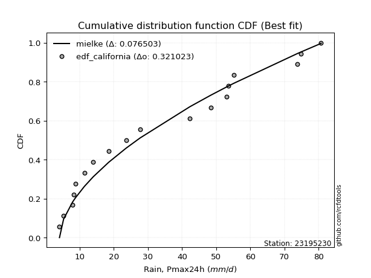</img>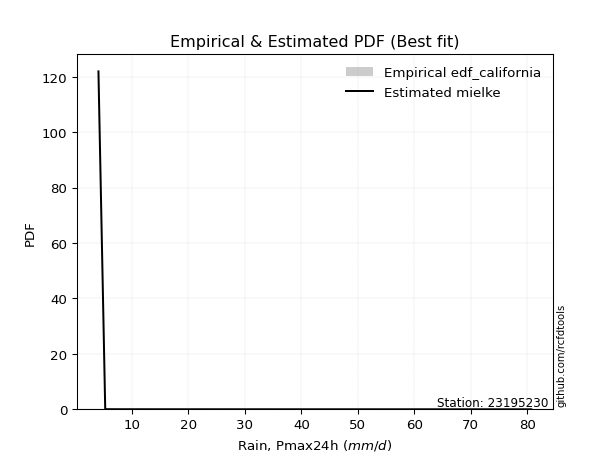</img>

</div>


### 2. EDF Hazen (1930)

Hazen method for plotting positions is a formula used to estimate the empirical cumulative probability distribution of flood events or other hydrological data. This formula often results in biased estimations, particularly when extrapolating to extreme events (high return periods).

<div align="center">


$P=(m-0.5)/n$


</div>


**2.1. Empirical values**

<div align="center">

|                | 0                    | 1                   | 2                  | 3                   | 4                  | 5                  | 6                  | 7                  | 8                  | 9                  | 10                 | 11                 | 12                 | 13        | 14                 | 15                 | 16                 | 17                 |
|:---------------|:---------------------|:--------------------|:-------------------|:--------------------|:-------------------|:-------------------|:-------------------|:-------------------|:-------------------|:-------------------|:-------------------|:-------------------|:-------------------|:----------|:-------------------|:-------------------|:-------------------|:-------------------|
| date           | 2022                 | 2023                | 2018               | 2008                | 2020               | 2021               | 2019               | 2014               | 2009               | 2007               | 2010               | 2006               | 2013               | 2017      | 2015               | 2016               | 2012               | 2005               |
| x              | 4.1                  | 5.3                 | 7.9                | 8.3                 | 8.8                | 11.4               | 14.0               | 18.5               | 23.6               | 27.7               | 42.3               | 48.4               | 53.0               | 53.506    | 55.1               | 73.7               | 74.8               | 80.7               |
| m              | 1                    | 2                   | 3                  | 4                   | 5                  | 6                  | 7                  | 8                  | 9                  | 10                 | 11                 | 12                 | 13                 | 14        | 15                 | 16                 | 17                 | 18                 |
| empirical_dist | edf_hazen            | edf_hazen           | edf_hazen          | edf_hazen           | edf_hazen          | edf_hazen          | edf_hazen          | edf_hazen          | edf_hazen          | edf_hazen          | edf_hazen          | edf_hazen          | edf_hazen          | edf_hazen | edf_hazen          | edf_hazen          | edf_hazen          | edf_hazen          |
| empirical      | 0.027777777777777776 | 0.08333333333333333 | 0.1388888888888889 | 0.19444444444444445 | 0.25               | 0.3055555555555556 | 0.3611111111111111 | 0.4166666666666667 | 0.4722222222222222 | 0.5277777777777778 | 0.5833333333333334 | 0.6388888888888888 | 0.6944444444444444 | 0.75      | 0.8055555555555556 | 0.8611111111111112 | 0.9166666666666666 | 0.9722222222222222 |
| empirical_tr   | 1.0285714285714287   | 1.090909090909091   | 1.161290322580645  | 1.2413793103448276  | 1.3333333333333333 | 1.44               | 1.565217391304348  | 1.7142857142857144 | 1.894736842105263  | 2.1176470588235294 | 2.4000000000000004 | 2.7692307692307687 | 3.2727272727272725 | 4.0       | 5.142857142857143  | 7.200000000000003  | 11.999999999999995 | 35.999999999999986 |

</div>


**2.2. Kolmogorov-Smirnov fit test (sorted by Δ)**


<div align="center">

|                | 0                   | 1                   | 2                   | 3                   | 4                   | 5                   | 6                   | 7                   | 8                   | 9                   | 10                  | 11                  | 12                  | 13                  | 14                  | 15                  | 16                  | 17                  | 18                  | 19                  | 20                  | 21                  | 22                  | 23                  | 24                  | 25                  | 26                  | 27                  | 28                  | 29                  | 30                  | 31                  | 32                  | 33                  | 34                  | 35                  | 36                  | 37                  | 38                  | 39                  | 40                  | 41                  | 42                  | 43                  | 44                  | 45                  | 46                  | 47                  | 48                  | 49                  | 50                  | 51                  | 52                  | 53                  | 54                  | 55                  | 56                  | 57                  | 58                  | 59                  | 60                  | 61                  | 62                  | 63                  | 64                  | 65                  | 66                  | 67                  | 68                  | 69                  | 70                  | 71                  | 72                  | 73                  | 74                  | 75                  | 76                  | 77                  | 78                  | 79                  | 80                  | 81                  | 82                  | 83                  | 84                  | 85                  | 86                  | 87                  | 88                  | 89                  | 90                  | 91                  | 92                  | 93                  | 94                  | 95                  | 96                  | 97                  | 98                  | 99                  | 100                 | 101                 | 102                 | 103                 | 104                 | 105                 | 106                 | 107                 | 108                 | 109                 | 110                 | 111                 | 112                 | 113                 | 114                 | 115                 | 116                 | 117                 | 118                 | 119                 | 120                 | 121                 | 122                 | 123                 | 124                 | 125                 | 126                 | 127                 | 128                 | 129                 | 130                 | 131                 | 132                 | 133                 | 134                 | 135                 | 136                 | 137                 | 138                 | 139                 | 140                 | 141                 | 142                 | 143                 | 144                 | 145                 | 146                 | 147                 | 148                 | 149                 | 150                 | 151                 | 152                 | 153                 | 154                 | 155                 | 156                 | 157                 | 158                 | 159                 |
|:---------------|:--------------------|:--------------------|:--------------------|:--------------------|:--------------------|:--------------------|:--------------------|:--------------------|:--------------------|:--------------------|:--------------------|:--------------------|:--------------------|:--------------------|:--------------------|:--------------------|:--------------------|:--------------------|:--------------------|:--------------------|:--------------------|:--------------------|:--------------------|:--------------------|:--------------------|:--------------------|:--------------------|:--------------------|:--------------------|:--------------------|:--------------------|:--------------------|:--------------------|:--------------------|:--------------------|:--------------------|:--------------------|:--------------------|:--------------------|:--------------------|:--------------------|:--------------------|:--------------------|:--------------------|:--------------------|:--------------------|:--------------------|:--------------------|:--------------------|:--------------------|:--------------------|:--------------------|:--------------------|:--------------------|:--------------------|:--------------------|:--------------------|:--------------------|:--------------------|:--------------------|:--------------------|:--------------------|:--------------------|:--------------------|:--------------------|:--------------------|:--------------------|:--------------------|:--------------------|:--------------------|:--------------------|:--------------------|:--------------------|:--------------------|:--------------------|:--------------------|:--------------------|:--------------------|:--------------------|:--------------------|:--------------------|:--------------------|:--------------------|:--------------------|:--------------------|:--------------------|:--------------------|:--------------------|:--------------------|:--------------------|:--------------------|:--------------------|:--------------------|:--------------------|:--------------------|:--------------------|:--------------------|:--------------------|:--------------------|:--------------------|:--------------------|:--------------------|:--------------------|:--------------------|:--------------------|:--------------------|:--------------------|:--------------------|:--------------------|:--------------------|:--------------------|:--------------------|:--------------------|:--------------------|:--------------------|:--------------------|:--------------------|:--------------------|:--------------------|:--------------------|:--------------------|:--------------------|:--------------------|:--------------------|:--------------------|:--------------------|:--------------------|:--------------------|:--------------------|:--------------------|:--------------------|:--------------------|:--------------------|:--------------------|:--------------------|:--------------------|:--------------------|:--------------------|:--------------------|:--------------------|:--------------------|:--------------------|:--------------------|:--------------------|:--------------------|:--------------------|:--------------------|:--------------------|:--------------------|:--------------------|:--------------------|:--------------------|:--------------------|:--------------------|:--------------------|:--------------------|:--------------------|:--------------------|:--------------------|:--------------------|
| station        | 23195230            | 23195230            | 23195230            | 23195230            | 23195230            | 23195230            | 23195230            | 23195230            | 23195230            | 23195230            | 23195230            | 23195230            | 23195230            | 23195230            | 23195230            | 23195230            | 23195230            | 23195230            | 23195230            | 23195230            | 23195230            | 23195230            | 23195230            | 23195230            | 23195230            | 23195230            | 23195230            | 23195230            | 23195230            | 23195230            | 23195230            | 23195230            | 23195230            | 23195230            | 23195230            | 23195230            | 23195230            | 23195230            | 23195230            | 23195230            | 23195230            | 23195230            | 23195230            | 23195230            | 23195230            | 23195230            | 23195230            | 23195230            | 23195230            | 23195230            | 23195230            | 23195230            | 23195230            | 23195230            | 23195230            | 23195230            | 23195230            | 23195230            | 23195230            | 23195230            | 23195230            | 23195230            | 23195230            | 23195230            | 23195230            | 23195230            | 23195230            | 23195230            | 23195230            | 23195230            | 23195230            | 23195230            | 23195230            | 23195230            | 23195230            | 23195230            | 23195230            | 23195230            | 23195230            | 23195230            | 23195230            | 23195230            | 23195230            | 23195230            | 23195230            | 23195230            | 23195230            | 23195230            | 23195230            | 23195230            | 23195230            | 23195230            | 23195230            | 23195230            | 23195230            | 23195230            | 23195230            | 23195230            | 23195230            | 23195230            | 23195230            | 23195230            | 23195230            | 23195230            | 23195230            | 23195230            | 23195230            | 23195230            | 23195230            | 23195230            | 23195230            | 23195230            | 23195230            | 23195230            | 23195230            | 23195230            | 23195230            | 23195230            | 23195230            | 23195230            | 23195230            | 23195230            | 23195230            | 23195230            | 23195230            | 23195230            | 23195230            | 23195230            | 23195230            | 23195230            | 23195230            | 23195230            | 23195230            | 23195230            | 23195230            | 23195230            | 23195230            | 23195230            | 23195230            | 23195230            | 23195230            | 23195230            | 23195230            | 23195230            | 23195230            | 23195230            | 23195230            | 23195230            | 23195230            | 23195230            | 23195230            | 23195230            | 23195230            | 23195230            | 23195230            | 23195230            | 23195230            | 23195230            | 23195230            | 23195230            |
| empirical_dist | edf_hazen           | edf_hazen           | edf_hazen           | edf_hazen           | edf_hazen           | edf_hazen           | edf_hazen           | edf_hazen           | edf_hazen           | edf_hazen           | edf_hazen           | edf_hazen           | edf_hazen           | edf_hazen           | edf_hazen           | edf_hazen           | edf_hazen           | edf_hazen           | edf_hazen           | edf_hazen           | edf_hazen           | edf_hazen           | edf_hazen           | edf_hazen           | edf_hazen           | edf_hazen           | edf_hazen           | edf_hazen           | edf_hazen           | edf_hazen           | edf_hazen           | edf_hazen           | edf_hazen           | edf_hazen           | edf_hazen           | edf_hazen           | edf_hazen           | edf_hazen           | edf_hazen           | edf_hazen           | edf_hazen           | edf_hazen           | edf_hazen           | edf_hazen           | edf_hazen           | edf_hazen           | edf_hazen           | edf_hazen           | edf_hazen           | edf_hazen           | edf_hazen           | edf_hazen           | edf_hazen           | edf_hazen           | edf_hazen           | edf_hazen           | edf_hazen           | edf_hazen           | edf_hazen           | edf_hazen           | edf_hazen           | edf_hazen           | edf_hazen           | edf_hazen           | edf_hazen           | edf_hazen           | edf_hazen           | edf_hazen           | edf_hazen           | edf_hazen           | edf_hazen           | edf_hazen           | edf_hazen           | edf_hazen           | edf_hazen           | edf_hazen           | edf_hazen           | edf_hazen           | edf_hazen           | edf_hazen           | edf_hazen           | edf_hazen           | edf_hazen           | edf_hazen           | edf_hazen           | edf_hazen           | edf_hazen           | edf_hazen           | edf_hazen           | edf_hazen           | edf_hazen           | edf_hazen           | edf_hazen           | edf_hazen           | edf_hazen           | edf_hazen           | edf_hazen           | edf_hazen           | edf_hazen           | edf_hazen           | edf_hazen           | edf_hazen           | edf_hazen           | edf_hazen           | edf_hazen           | edf_hazen           | edf_hazen           | edf_hazen           | edf_hazen           | edf_hazen           | edf_hazen           | edf_hazen           | edf_hazen           | edf_hazen           | edf_hazen           | edf_hazen           | edf_hazen           | edf_hazen           | edf_hazen           | edf_hazen           | edf_hazen           | edf_hazen           | edf_hazen           | edf_hazen           | edf_hazen           | edf_hazen           | edf_hazen           | edf_hazen           | edf_hazen           | edf_hazen           | edf_hazen           | edf_hazen           | edf_hazen           | edf_hazen           | edf_hazen           | edf_hazen           | edf_hazen           | edf_hazen           | edf_hazen           | edf_hazen           | edf_hazen           | edf_hazen           | edf_hazen           | edf_hazen           | edf_hazen           | edf_hazen           | edf_hazen           | edf_hazen           | edf_hazen           | edf_hazen           | edf_hazen           | edf_hazen           | edf_hazen           | edf_hazen           | edf_hazen           | edf_hazen           | edf_hazen           | edf_hazen           | edf_hazen           | edf_hazen           |
| p_dist         | loggenhalflogistic  | logtrapezoid        | mielke              | logarcsine          | logburr             | truncweibull_min    | weibull_min         | exponpow            | halfnorm            | logskewnorm         | foldnorm            | gausshyper          | nakagami            | logloggamma         | logbeta             | logsemicircular     | burr                | anglit              | logjohnsonsu        | logargus            | logtriang           | rayleigh            | logdweibull         | dweibull            | burr12              | semicircular        | maxwell             | genexpon            | loganglit           | logburr12           | logweibull_min      | loggenextreme       | loggausshyper       | halflogistic        | logweibull_max      | genlogistic         | pearson3            | exponnorm           | kstwobign           | loggompertz         | loggumbel_l         | gumbel_r            | t                   | truncnorm           | norm                | crystalball         | gompertz            | lomax               | logpearson3         | loggenpareto        | ncf                 | logwrapcauchy       | logncf              | loggengamma         | moyal               | logf                | logksone            | lognct              | logcrystalball      | lognorm             | logt                | logexponnorm        | loggamma            | loggamma            | logfatiguelife      | gengamma            | logdgamma           | logerlang           | logbetaprime        | logfoldnorm         | halfgennorm         | johnsonsu           | logrice             | loginvgamma         | logalpha            | invweibull          | genextreme          | invgamma            | loginvweibull       | erlang              | skewnorm            | nct                 | logloglaplace       | lognakagami         | logmaxwell          | loggenexpon         | f                   | logistic            | arcsine             | cosine              | loginvgauss         | rice                | lograyleigh         | logkstwobign        | fatiguelife         | logcosine           | invgauss            | betaprime           | truncexpon          | loglogistic         | loghalfnorm         | loglomax            | logtruncnorm        | dgamma              | hypsecant           | logtruncweibull_min | bradford            | ksone               | logkappa3           | logtukeylambda      | gumbel_l            | loghypsecant        | loggumbel_r         | genpareto           | loguniform          | laplace             | loghalflogistic     | logvonmises_line    | kappa4              | logmoyal            | logkappa4           | exponweib           | loglaplace          | loglaplace          | alpha               | beta                | wrapcauchy          | logmielke           | vonmises_line       | kappa3              | logexponweib        | uniform             | triang              | logbradford         | logwald             | logtruncexpon       | loglevy_l           | gamma               | argus               | powerlaw            | wald                | genhalflogistic     | logrdist            | levy_l              | trapezoid           | gennorm             | loggennorm          | logpowerlaw         | logjohnsonsb        | johnsonsb           | tukeylambda         | logexponpow         | rdist               | weibull_max         | truncpareto         | loghalfgennorm      | logtruncpareto      | loggenlogistic      | logvonmises         | vonmises            |
| delta          | 0.07755388368731786 | 0.08246230488029782 | 0.09157815041603024 | 0.09601274798297799 | 0.10029517301709279 | 0.10257499883230597 | 0.10302845772255498 | 0.10353542063603272 | 0.10555937772828883 | 0.10668635473423538 | 0.10873727335295737 | 0.1112393972216891  | 0.113121412339939   | 0.11432744192724825 | 0.11465701916628657 | 0.11486444359376813 | 0.11604381696218738 | 0.11652037561653272 | 0.1172722716323073  | 0.11752857081280521 | 0.11846079318350411 | 0.11905317302083196 | 0.1218849534860107  | 0.12276493010332512 | 0.12374007344864368 | 0.12435452424521039 | 0.12593939976102747 | 0.1260113914105616  | 0.1264837634961805  | 0.12723736128031327 | 0.12766237587266638 | 0.1287838777088159  | 0.12983288788123037 | 0.13183593021214446 | 0.13209403141671108 | 0.1322629170658504  | 0.13483381945573986 | 0.13914996053838957 | 0.13924239934883229 | 0.14023338724540568 | 0.14141962959808618 | 0.14244894924396279 | 0.14288960162669673 | 0.14289935668246861 | 0.14289937935400815 | 0.1428993898362479  | 0.143004559901416   | 0.14336564742494173 | 0.14446147632522355 | 0.14618349138932696 | 0.1486838942236801  | 0.14965197777586842 | 0.1498610592497598  | 0.15146565323761718 | 0.1517734620250421  | 0.1520748203835729  | 0.15268307127673797 | 0.15342065429515217 | 0.15343388352098086 | 0.1534339440769329  | 0.15343395738109422 | 0.1534347993223777  | 0.154102196744478   | 0.154102196744478   | 0.1543983890642019  | 0.15470325431805765 | 0.15570110634069756 | 0.1557306494274011  | 0.15573776979007492 | 0.15637737717862565 | 0.1565238698365825  | 0.15689378087290817 | 0.15697350109384478 | 0.15864130173201896 | 0.15915466875838002 | 0.16049465391507967 | 0.16049505681179188 | 0.1613612663529841  | 0.16168848785544387 | 0.16207199867917788 | 0.1626300137138169  | 0.1627706111778241  | 0.16366568281722504 | 0.1639821565338847  | 0.16474068626725524 | 0.16487988739378534 | 0.16496616838314015 | 0.16522257624573117 | 0.16525987930230956 | 0.16552618106032319 | 0.16670159177927324 | 0.16724739323416793 | 0.16798625442348902 | 0.16852865187324628 | 0.16854926198094022 | 0.1688741396512521  | 0.1707813868093604  | 0.1713288180683188  | 0.17338788686145254 | 0.17597295525160395 | 0.1785532007229257  | 0.17867807792166024 | 0.17952784311881476 | 0.18035110193747905 | 0.18061602931537482 | 0.18324591446487526 | 0.1855709154845683  | 0.1876994487960546  | 0.18830262420143273 | 0.18950411906841913 | 0.19079707501723853 | 0.1912078461928144  | 0.19610958451925575 | 0.19742178794102344 | 0.19988635219875228 | 0.20308544677844417 | 0.2036931338930973  | 0.2073230572834014  | 0.20811033544461113 | 0.20984931648686644 | 0.21012677838155658 | 0.21235433387925728 | 0.21252176953252244 | 0.21252176953252244 | 0.2177348590846988  | 0.21883313642000507 | 0.22480909546730177 | 0.22531767055090812 | 0.23114934338698284 | 0.2311901840899475  | 0.23168819396884394 | 0.2318682912677691  | 0.2485752267349462  | 0.24993771379786678 | 0.2519655548795743  | 0.25902712823602025 | 0.2706365022863074  | 0.2707949822536667  | 0.2837807959793198  | 0.2860717477648629  | 0.2946571280491584  | 0.30268333946143167 | 0.3231819705629658  | 0.38920560425625894 | 0.41080365745443315 | 0.4166666666666667  | 0.4166666666666667  | 0.43094857211394527 | 0.44533809447780376 | 0.4733074327445387  | 0.4852636483384182  | 0.508600544435958   | 0.5258916092104275  | 0.6449261787363991  | 0.7869150048269993  | 0.8055555555555556  | 0.8390253345382653  | 0.9166666666666666  | 1.1389008493724302  | 12.74933770187843   |
| deltao         | 0.32102346734599996 | 0.32102346734599996 | 0.32102346734599996 | 0.32102346734599996 | 0.32102346734599996 | 0.32102346734599996 | 0.32102346734599996 | 0.32102346734599996 | 0.32102346734599996 | 0.32102346734599996 | 0.32102346734599996 | 0.32102346734599996 | 0.32102346734599996 | 0.32102346734599996 | 0.32102346734599996 | 0.32102346734599996 | 0.32102346734599996 | 0.32102346734599996 | 0.32102346734599996 | 0.32102346734599996 | 0.32102346734599996 | 0.32102346734599996 | 0.32102346734599996 | 0.32102346734599996 | 0.32102346734599996 | 0.32102346734599996 | 0.32102346734599996 | 0.32102346734599996 | 0.32102346734599996 | 0.32102346734599996 | 0.32102346734599996 | 0.32102346734599996 | 0.32102346734599996 | 0.32102346734599996 | 0.32102346734599996 | 0.32102346734599996 | 0.32102346734599996 | 0.32102346734599996 | 0.32102346734599996 | 0.32102346734599996 | 0.32102346734599996 | 0.32102346734599996 | 0.32102346734599996 | 0.32102346734599996 | 0.32102346734599996 | 0.32102346734599996 | 0.32102346734599996 | 0.32102346734599996 | 0.32102346734599996 | 0.32102346734599996 | 0.32102346734599996 | 0.32102346734599996 | 0.32102346734599996 | 0.32102346734599996 | 0.32102346734599996 | 0.32102346734599996 | 0.32102346734599996 | 0.32102346734599996 | 0.32102346734599996 | 0.32102346734599996 | 0.32102346734599996 | 0.32102346734599996 | 0.32102346734599996 | 0.32102346734599996 | 0.32102346734599996 | 0.32102346734599996 | 0.32102346734599996 | 0.32102346734599996 | 0.32102346734599996 | 0.32102346734599996 | 0.32102346734599996 | 0.32102346734599996 | 0.32102346734599996 | 0.32102346734599996 | 0.32102346734599996 | 0.32102346734599996 | 0.32102346734599996 | 0.32102346734599996 | 0.32102346734599996 | 0.32102346734599996 | 0.32102346734599996 | 0.32102346734599996 | 0.32102346734599996 | 0.32102346734599996 | 0.32102346734599996 | 0.32102346734599996 | 0.32102346734599996 | 0.32102346734599996 | 0.32102346734599996 | 0.32102346734599996 | 0.32102346734599996 | 0.32102346734599996 | 0.32102346734599996 | 0.32102346734599996 | 0.32102346734599996 | 0.32102346734599996 | 0.32102346734599996 | 0.32102346734599996 | 0.32102346734599996 | 0.32102346734599996 | 0.32102346734599996 | 0.32102346734599996 | 0.32102346734599996 | 0.32102346734599996 | 0.32102346734599996 | 0.32102346734599996 | 0.32102346734599996 | 0.32102346734599996 | 0.32102346734599996 | 0.32102346734599996 | 0.32102346734599996 | 0.32102346734599996 | 0.32102346734599996 | 0.32102346734599996 | 0.32102346734599996 | 0.32102346734599996 | 0.32102346734599996 | 0.32102346734599996 | 0.32102346734599996 | 0.32102346734599996 | 0.32102346734599996 | 0.32102346734599996 | 0.32102346734599996 | 0.32102346734599996 | 0.32102346734599996 | 0.32102346734599996 | 0.32102346734599996 | 0.32102346734599996 | 0.32102346734599996 | 0.32102346734599996 | 0.32102346734599996 | 0.32102346734599996 | 0.32102346734599996 | 0.32102346734599996 | 0.32102346734599996 | 0.32102346734599996 | 0.32102346734599996 | 0.32102346734599996 | 0.32102346734599996 | 0.32102346734599996 | 0.32102346734599996 | 0.32102346734599996 | 0.32102346734599996 | 0.32102346734599996 | 0.32102346734599996 | 0.32102346734599996 | 0.32102346734599996 | 0.32102346734599996 | 0.32102346734599996 | 0.32102346734599996 | 0.32102346734599996 | 0.32102346734599996 | 0.32102346734599996 | 0.32102346734599996 | 0.32102346734599996 | 0.32102346734599996 | 0.32102346734599996 | 0.32102346734599996 | 0.32102346734599996 | 0.32102346734599996 |
| eval           | Δo > Δ              | Δo > Δ              | Δo > Δ              | Δo > Δ              | Δo > Δ              | Δo > Δ              | Δo > Δ              | Δo > Δ              | Δo > Δ              | Δo > Δ              | Δo > Δ              | Δo > Δ              | Δo > Δ              | Δo > Δ              | Δo > Δ              | Δo > Δ              | Δo > Δ              | Δo > Δ              | Δo > Δ              | Δo > Δ              | Δo > Δ              | Δo > Δ              | Δo > Δ              | Δo > Δ              | Δo > Δ              | Δo > Δ              | Δo > Δ              | Δo > Δ              | Δo > Δ              | Δo > Δ              | Δo > Δ              | Δo > Δ              | Δo > Δ              | Δo > Δ              | Δo > Δ              | Δo > Δ              | Δo > Δ              | Δo > Δ              | Δo > Δ              | Δo > Δ              | Δo > Δ              | Δo > Δ              | Δo > Δ              | Δo > Δ              | Δo > Δ              | Δo > Δ              | Δo > Δ              | Δo > Δ              | Δo > Δ              | Δo > Δ              | Δo > Δ              | Δo > Δ              | Δo > Δ              | Δo > Δ              | Δo > Δ              | Δo > Δ              | Δo > Δ              | Δo > Δ              | Δo > Δ              | Δo > Δ              | Δo > Δ              | Δo > Δ              | Δo > Δ              | Δo > Δ              | Δo > Δ              | Δo > Δ              | Δo > Δ              | Δo > Δ              | Δo > Δ              | Δo > Δ              | Δo > Δ              | Δo > Δ              | Δo > Δ              | Δo > Δ              | Δo > Δ              | Δo > Δ              | Δo > Δ              | Δo > Δ              | Δo > Δ              | Δo > Δ              | Δo > Δ              | Δo > Δ              | Δo > Δ              | Δo > Δ              | Δo > Δ              | Δo > Δ              | Δo > Δ              | Δo > Δ              | Δo > Δ              | Δo > Δ              | Δo > Δ              | Δo > Δ              | Δo > Δ              | Δo > Δ              | Δo > Δ              | Δo > Δ              | Δo > Δ              | Δo > Δ              | Δo > Δ              | Δo > Δ              | Δo > Δ              | Δo > Δ              | Δo > Δ              | Δo > Δ              | Δo > Δ              | Δo > Δ              | Δo > Δ              | Δo > Δ              | Δo > Δ              | Δo > Δ              | Δo > Δ              | Δo > Δ              | Δo > Δ              | Δo > Δ              | Δo > Δ              | Δo > Δ              | Δo > Δ              | Δo > Δ              | Δo > Δ              | Δo > Δ              | Δo > Δ              | Δo > Δ              | Δo > Δ              | Δo > Δ              | Δo > Δ              | Δo > Δ              | Δo > Δ              | Δo > Δ              | Δo > Δ              | Δo > Δ              | Δo > Δ              | Δo > Δ              | Δo > Δ              | Δo > Δ              | Δo > Δ              | Δo > Δ              | Δo > Δ              | Δo > Δ              | Δo > Δ              | Δo > Δ              | Δo > Δ              | Δo > Δ              | Δo <= Δ             | Δo <= Δ             | Δo <= Δ             | Δo <= Δ             | Δo <= Δ             | Δo <= Δ             | Δo <= Δ             | Δo <= Δ             | Δo <= Δ             | Δo <= Δ             | Δo <= Δ             | Δo <= Δ             | Δo <= Δ             | Δo <= Δ             | Δo <= Δ             | Δo <= Δ             | Δo <= Δ             | Δo <= Δ             |
| fit            | 1                   | 1                   | 1                   | 1                   | 1                   | 1                   | 1                   | 1                   | 1                   | 1                   | 1                   | 1                   | 1                   | 1                   | 1                   | 1                   | 1                   | 1                   | 1                   | 1                   | 1                   | 1                   | 1                   | 1                   | 1                   | 1                   | 1                   | 1                   | 1                   | 1                   | 1                   | 1                   | 1                   | 1                   | 1                   | 1                   | 1                   | 1                   | 1                   | 1                   | 1                   | 1                   | 1                   | 1                   | 1                   | 1                   | 1                   | 1                   | 1                   | 1                   | 1                   | 1                   | 1                   | 1                   | 1                   | 1                   | 1                   | 1                   | 1                   | 1                   | 1                   | 1                   | 1                   | 1                   | 1                   | 1                   | 1                   | 1                   | 1                   | 1                   | 1                   | 1                   | 1                   | 1                   | 1                   | 1                   | 1                   | 1                   | 1                   | 1                   | 1                   | 1                   | 1                   | 1                   | 1                   | 1                   | 1                   | 1                   | 1                   | 1                   | 1                   | 1                   | 1                   | 1                   | 1                   | 1                   | 1                   | 1                   | 1                   | 1                   | 1                   | 1                   | 1                   | 1                   | 1                   | 1                   | 1                   | 1                   | 1                   | 1                   | 1                   | 1                   | 1                   | 1                   | 1                   | 1                   | 1                   | 1                   | 1                   | 1                   | 1                   | 1                   | 1                   | 1                   | 1                   | 1                   | 1                   | 1                   | 1                   | 1                   | 1                   | 1                   | 1                   | 1                   | 1                   | 1                   | 1                   | 1                   | 1                   | 1                   | 1                   | 1                   | 0                   | 0                   | 0                   | 0                   | 0                   | 0                   | 0                   | 0                   | 0                   | 0                   | 0                   | 0                   | 0                   | 0                   | 0                   | 0                   | 0                   | 0                   |
| n              | 18                  | 18                  | 18                  | 18                  | 18                  | 18                  | 18                  | 18                  | 18                  | 18                  | 18                  | 18                  | 18                  | 18                  | 18                  | 18                  | 18                  | 18                  | 18                  | 18                  | 18                  | 18                  | 18                  | 18                  | 18                  | 18                  | 18                  | 18                  | 18                  | 18                  | 18                  | 18                  | 18                  | 18                  | 18                  | 18                  | 18                  | 18                  | 18                  | 18                  | 18                  | 18                  | 18                  | 18                  | 18                  | 18                  | 18                  | 18                  | 18                  | 18                  | 18                  | 18                  | 18                  | 18                  | 18                  | 18                  | 18                  | 18                  | 18                  | 18                  | 18                  | 18                  | 18                  | 18                  | 18                  | 18                  | 18                  | 18                  | 18                  | 18                  | 18                  | 18                  | 18                  | 18                  | 18                  | 18                  | 18                  | 18                  | 18                  | 18                  | 18                  | 18                  | 18                  | 18                  | 18                  | 18                  | 18                  | 18                  | 18                  | 18                  | 18                  | 18                  | 18                  | 18                  | 18                  | 18                  | 18                  | 18                  | 18                  | 18                  | 18                  | 18                  | 18                  | 18                  | 18                  | 18                  | 18                  | 18                  | 18                  | 18                  | 18                  | 18                  | 18                  | 18                  | 18                  | 18                  | 18                  | 18                  | 18                  | 18                  | 18                  | 18                  | 18                  | 18                  | 18                  | 18                  | 18                  | 18                  | 18                  | 18                  | 18                  | 18                  | 18                  | 18                  | 18                  | 18                  | 18                  | 18                  | 18                  | 18                  | 18                  | 18                  | 18                  | 18                  | 18                  | 18                  | 18                  | 18                  | 18                  | 18                  | 18                  | 18                  | 18                  | 18                  | 18                  | 18                  | 18                  | 18                  | 18                  | 18                  |
| best_fit       | 1                   | 0                   | 0                   | 0                   | 0                   | 0                   | 0                   | 0                   | 0                   | 0                   | 0                   | 0                   | 0                   | 0                   | 0                   | 0                   | 0                   | 0                   | 0                   | 0                   | 0                   | 0                   | 0                   | 0                   | 0                   | 0                   | 0                   | 0                   | 0                   | 0                   | 0                   | 0                   | 0                   | 0                   | 0                   | 0                   | 0                   | 0                   | 0                   | 0                   | 0                   | 0                   | 0                   | 0                   | 0                   | 0                   | 0                   | 0                   | 0                   | 0                   | 0                   | 0                   | 0                   | 0                   | 0                   | 0                   | 0                   | 0                   | 0                   | 0                   | 0                   | 0                   | 0                   | 0                   | 0                   | 0                   | 0                   | 0                   | 0                   | 0                   | 0                   | 0                   | 0                   | 0                   | 0                   | 0                   | 0                   | 0                   | 0                   | 0                   | 0                   | 0                   | 0                   | 0                   | 0                   | 0                   | 0                   | 0                   | 0                   | 0                   | 0                   | 0                   | 0                   | 0                   | 0                   | 0                   | 0                   | 0                   | 0                   | 0                   | 0                   | 0                   | 0                   | 0                   | 0                   | 0                   | 0                   | 0                   | 0                   | 0                   | 0                   | 0                   | 0                   | 0                   | 0                   | 0                   | 0                   | 0                   | 0                   | 0                   | 0                   | 0                   | 0                   | 0                   | 0                   | 0                   | 0                   | 0                   | 0                   | 0                   | 0                   | 0                   | 0                   | 0                   | 0                   | 0                   | 0                   | 0                   | 0                   | 0                   | 0                   | 0                   | 0                   | 0                   | 0                   | 0                   | 0                   | 0                   | 0                   | 0                   | 0                   | 0                   | 0                   | 0                   | 0                   | 0                   | 0                   | 0                   | 0                   | 0                   |
| best_fit_sort  | 1                   | 2                   | 3                   | 4                   | 5                   | 6                   | 7                   | 8                   | 9                   | 10                  | 11                  | 12                  | 13                  | 14                  | 15                  | 16                  | 17                  | 18                  | 19                  | 20                  | 21                  | 22                  | 23                  | 24                  | 25                  | 26                  | 27                  | 28                  | 29                  | 30                  | 31                  | 32                  | 33                  | 34                  | 35                  | 36                  | 37                  | 38                  | 39                  | 40                  | 41                  | 42                  | 43                  | 44                  | 45                  | 46                  | 47                  | 48                  | 49                  | 50                  | 51                  | 52                  | 53                  | 54                  | 55                  | 56                  | 57                  | 58                  | 59                  | 60                  | 61                  | 62                  | 63                  | 64                  | 65                  | 66                  | 67                  | 68                  | 69                  | 70                  | 71                  | 72                  | 73                  | 74                  | 75                  | 76                  | 77                  | 78                  | 79                  | 80                  | 81                  | 82                  | 83                  | 84                  | 85                  | 86                  | 87                  | 88                  | 89                  | 90                  | 91                  | 92                  | 93                  | 94                  | 95                  | 96                  | 97                  | 98                  | 99                  | 100                 | 101                 | 102                 | 103                 | 104                 | 105                 | 106                 | 107                 | 108                 | 109                 | 110                 | 111                 | 112                 | 113                 | 114                 | 115                 | 116                 | 117                 | 118                 | 119                 | 120                 | 121                 | 122                 | 123                 | 124                 | 125                 | 126                 | 127                 | 128                 | 129                 | 130                 | 131                 | 132                 | 133                 | 134                 | 135                 | 136                 | 137                 | 138                 | 139                 | 140                 | 141                 | 142                 | 143                 | 144                 | 145                 | 146                 | 147                 | 148                 | 149                 | 150                 | 151                 | 152                 | 153                 | 154                 | 155                 | 156                 | 157                 | 158                 | 159                 | 160                 |

</div>


**2.3. Best fit**

<div align="center">

|   id |   station | empirical_dist   | p_dist             |     delta |   deltao | eval   |   fit |   n |   best_fit |   best_fit_sort |
|-----:|----------:|:-----------------|:-------------------|----------:|---------:|:-------|------:|----:|-----------:|----------------:|
|    0 |  23195230 | edf_hazen        | loggenhalflogistic | 0.0775539 | 0.321023 | Δo > Δ |     1 |  18 |          1 |               1 |

</div>


<div align="center">

</img></img>

</div>


### 3. EDF Weibull (1939)

Weibull plotting position formula is an empirical method used to estimate the non-exceedance probability or plotting position for a set of observed data, is often recommended or widely used in practice, particularly in flood frequency analysis.

<div align="center">


$P=m/(n+1)$


</div>


**3.1. Empirical values**

<div align="center">

|                | 0                   | 1                   | 2                   | 3                   | 4                  | 5                  | 6                  | 7                   | 8                   | 9                  | 10                 | 11                | 12                 | 13                 | 14                 | 15                 | 16                 | 17                 |
|:---------------|:--------------------|:--------------------|:--------------------|:--------------------|:-------------------|:-------------------|:-------------------|:--------------------|:--------------------|:-------------------|:-------------------|:------------------|:-------------------|:-------------------|:-------------------|:-------------------|:-------------------|:-------------------|
| date           | 2022                | 2023                | 2018                | 2008                | 2020               | 2021               | 2019               | 2014                | 2009                | 2007               | 2010               | 2006              | 2013               | 2017               | 2015               | 2016               | 2012               | 2005               |
| x              | 4.1                 | 5.3                 | 7.9                 | 8.3                 | 8.8                | 11.4               | 14.0               | 18.5                | 23.6                | 27.7               | 42.3               | 48.4              | 53.0               | 53.506             | 55.1               | 73.7               | 74.8               | 80.7               |
| m              | 1                   | 2                   | 3                   | 4                   | 5                  | 6                  | 7                  | 8                   | 9                   | 10                 | 11                 | 12                | 13                 | 14                 | 15                 | 16                 | 17                 | 18                 |
| empirical_dist | edf_weibull         | edf_weibull         | edf_weibull         | edf_weibull         | edf_weibull        | edf_weibull        | edf_weibull        | edf_weibull         | edf_weibull         | edf_weibull        | edf_weibull        | edf_weibull       | edf_weibull        | edf_weibull        | edf_weibull        | edf_weibull        | edf_weibull        | edf_weibull        |
| empirical      | 0.05263157894736842 | 0.10526315789473684 | 0.15789473684210525 | 0.21052631578947367 | 0.2631578947368421 | 0.3157894736842105 | 0.3684210526315789 | 0.42105263157894735 | 0.47368421052631576 | 0.5263157894736842 | 0.5789473684210527 | 0.631578947368421 | 0.6842105263157895 | 0.7368421052631579 | 0.7894736842105263 | 0.8421052631578947 | 0.8947368421052632 | 0.9473684210526315 |
| empirical_tr   | 1.0555555555555556  | 1.1176470588235294  | 1.1875              | 1.2666666666666666  | 1.357142857142857  | 1.4615384615384615 | 1.5833333333333335 | 1.7272727272727273  | 1.8999999999999997  | 2.111111111111111  | 2.375              | 2.714285714285714 | 3.166666666666667  | 3.7999999999999994 | 4.75               | 6.333333333333331  | 9.5                | 18.999999999999982 |

</div>


**3.2. Kolmogorov-Smirnov fit test (sorted by Δ)**


<div align="center">

|                | 0                   | 1                   | 2                   | 3                   | 4                   | 5                   | 6                   | 7                   | 8                   | 9                   | 10                  | 11                  | 12                  | 13                  | 14                  | 15                  | 16                  | 17                  | 18                  | 19                  | 20                  | 21                  | 22                  | 23                  | 24                  | 25                  | 26                  | 27                  | 28                  | 29                  | 30                  | 31                  | 32                  | 33                  | 34                  | 35                  | 36                  | 37                  | 38                  | 39                  | 40                  | 41                  | 42                  | 43                  | 44                  | 45                  | 46                  | 47                  | 48                  | 49                  | 50                  | 51                  | 52                  | 53                  | 54                  | 55                  | 56                  | 57                  | 58                  | 59                  | 60                  | 61                  | 62                  | 63                  | 64                  | 65                  | 66                  | 67                  | 68                  | 69                  | 70                  | 71                  | 72                  | 73                  | 74                  | 75                  | 76                  | 77                  | 78                  | 79                  | 80                  | 81                  | 82                  | 83                  | 84                  | 85                  | 86                  | 87                  | 88                  | 89                  | 90                  | 91                  | 92                  | 93                  | 94                  | 95                  | 96                  | 97                  | 98                  | 99                  | 100                 | 101                 | 102                 | 103                 | 104                 | 105                 | 106                 | 107                 | 108                 | 109                 | 110                 | 111                 | 112                 | 113                 | 114                 | 115                 | 116                 | 117                 | 118                 | 119                 | 120                 | 121                 | 122                 | 123                 | 124                 | 125                 | 126                 | 127                 | 128                 | 129                 | 130                 | 131                 | 132                 | 133                 | 134                 | 135                 | 136                 | 137                 | 138                 | 139                 | 140                 | 141                 | 142                 | 143                 | 144                 | 145                 | 146                 | 147                 | 148                 | 149                 | 150                 | 151                 | 152                 | 153                 | 154                 | 155                 | 156                 | 157                 | 158                 | 159                 |
|:---------------|:--------------------|:--------------------|:--------------------|:--------------------|:--------------------|:--------------------|:--------------------|:--------------------|:--------------------|:--------------------|:--------------------|:--------------------|:--------------------|:--------------------|:--------------------|:--------------------|:--------------------|:--------------------|:--------------------|:--------------------|:--------------------|:--------------------|:--------------------|:--------------------|:--------------------|:--------------------|:--------------------|:--------------------|:--------------------|:--------------------|:--------------------|:--------------------|:--------------------|:--------------------|:--------------------|:--------------------|:--------------------|:--------------------|:--------------------|:--------------------|:--------------------|:--------------------|:--------------------|:--------------------|:--------------------|:--------------------|:--------------------|:--------------------|:--------------------|:--------------------|:--------------------|:--------------------|:--------------------|:--------------------|:--------------------|:--------------------|:--------------------|:--------------------|:--------------------|:--------------------|:--------------------|:--------------------|:--------------------|:--------------------|:--------------------|:--------------------|:--------------------|:--------------------|:--------------------|:--------------------|:--------------------|:--------------------|:--------------------|:--------------------|:--------------------|:--------------------|:--------------------|:--------------------|:--------------------|:--------------------|:--------------------|:--------------------|:--------------------|:--------------------|:--------------------|:--------------------|:--------------------|:--------------------|:--------------------|:--------------------|:--------------------|:--------------------|:--------------------|:--------------------|:--------------------|:--------------------|:--------------------|:--------------------|:--------------------|:--------------------|:--------------------|:--------------------|:--------------------|:--------------------|:--------------------|:--------------------|:--------------------|:--------------------|:--------------------|:--------------------|:--------------------|:--------------------|:--------------------|:--------------------|:--------------------|:--------------------|:--------------------|:--------------------|:--------------------|:--------------------|:--------------------|:--------------------|:--------------------|:--------------------|:--------------------|:--------------------|:--------------------|:--------------------|:--------------------|:--------------------|:--------------------|:--------------------|:--------------------|:--------------------|:--------------------|:--------------------|:--------------------|:--------------------|:--------------------|:--------------------|:--------------------|:--------------------|:--------------------|:--------------------|:--------------------|:--------------------|:--------------------|:--------------------|:--------------------|:--------------------|:--------------------|:--------------------|:--------------------|:--------------------|:--------------------|:--------------------|:--------------------|:--------------------|:--------------------|:--------------------|
| station        | 23195230            | 23195230            | 23195230            | 23195230            | 23195230            | 23195230            | 23195230            | 23195230            | 23195230            | 23195230            | 23195230            | 23195230            | 23195230            | 23195230            | 23195230            | 23195230            | 23195230            | 23195230            | 23195230            | 23195230            | 23195230            | 23195230            | 23195230            | 23195230            | 23195230            | 23195230            | 23195230            | 23195230            | 23195230            | 23195230            | 23195230            | 23195230            | 23195230            | 23195230            | 23195230            | 23195230            | 23195230            | 23195230            | 23195230            | 23195230            | 23195230            | 23195230            | 23195230            | 23195230            | 23195230            | 23195230            | 23195230            | 23195230            | 23195230            | 23195230            | 23195230            | 23195230            | 23195230            | 23195230            | 23195230            | 23195230            | 23195230            | 23195230            | 23195230            | 23195230            | 23195230            | 23195230            | 23195230            | 23195230            | 23195230            | 23195230            | 23195230            | 23195230            | 23195230            | 23195230            | 23195230            | 23195230            | 23195230            | 23195230            | 23195230            | 23195230            | 23195230            | 23195230            | 23195230            | 23195230            | 23195230            | 23195230            | 23195230            | 23195230            | 23195230            | 23195230            | 23195230            | 23195230            | 23195230            | 23195230            | 23195230            | 23195230            | 23195230            | 23195230            | 23195230            | 23195230            | 23195230            | 23195230            | 23195230            | 23195230            | 23195230            | 23195230            | 23195230            | 23195230            | 23195230            | 23195230            | 23195230            | 23195230            | 23195230            | 23195230            | 23195230            | 23195230            | 23195230            | 23195230            | 23195230            | 23195230            | 23195230            | 23195230            | 23195230            | 23195230            | 23195230            | 23195230            | 23195230            | 23195230            | 23195230            | 23195230            | 23195230            | 23195230            | 23195230            | 23195230            | 23195230            | 23195230            | 23195230            | 23195230            | 23195230            | 23195230            | 23195230            | 23195230            | 23195230            | 23195230            | 23195230            | 23195230            | 23195230            | 23195230            | 23195230            | 23195230            | 23195230            | 23195230            | 23195230            | 23195230            | 23195230            | 23195230            | 23195230            | 23195230            | 23195230            | 23195230            | 23195230            | 23195230            | 23195230            | 23195230            |
| empirical_dist | edf_weibull         | edf_weibull         | edf_weibull         | edf_weibull         | edf_weibull         | edf_weibull         | edf_weibull         | edf_weibull         | edf_weibull         | edf_weibull         | edf_weibull         | edf_weibull         | edf_weibull         | edf_weibull         | edf_weibull         | edf_weibull         | edf_weibull         | edf_weibull         | edf_weibull         | edf_weibull         | edf_weibull         | edf_weibull         | edf_weibull         | edf_weibull         | edf_weibull         | edf_weibull         | edf_weibull         | edf_weibull         | edf_weibull         | edf_weibull         | edf_weibull         | edf_weibull         | edf_weibull         | edf_weibull         | edf_weibull         | edf_weibull         | edf_weibull         | edf_weibull         | edf_weibull         | edf_weibull         | edf_weibull         | edf_weibull         | edf_weibull         | edf_weibull         | edf_weibull         | edf_weibull         | edf_weibull         | edf_weibull         | edf_weibull         | edf_weibull         | edf_weibull         | edf_weibull         | edf_weibull         | edf_weibull         | edf_weibull         | edf_weibull         | edf_weibull         | edf_weibull         | edf_weibull         | edf_weibull         | edf_weibull         | edf_weibull         | edf_weibull         | edf_weibull         | edf_weibull         | edf_weibull         | edf_weibull         | edf_weibull         | edf_weibull         | edf_weibull         | edf_weibull         | edf_weibull         | edf_weibull         | edf_weibull         | edf_weibull         | edf_weibull         | edf_weibull         | edf_weibull         | edf_weibull         | edf_weibull         | edf_weibull         | edf_weibull         | edf_weibull         | edf_weibull         | edf_weibull         | edf_weibull         | edf_weibull         | edf_weibull         | edf_weibull         | edf_weibull         | edf_weibull         | edf_weibull         | edf_weibull         | edf_weibull         | edf_weibull         | edf_weibull         | edf_weibull         | edf_weibull         | edf_weibull         | edf_weibull         | edf_weibull         | edf_weibull         | edf_weibull         | edf_weibull         | edf_weibull         | edf_weibull         | edf_weibull         | edf_weibull         | edf_weibull         | edf_weibull         | edf_weibull         | edf_weibull         | edf_weibull         | edf_weibull         | edf_weibull         | edf_weibull         | edf_weibull         | edf_weibull         | edf_weibull         | edf_weibull         | edf_weibull         | edf_weibull         | edf_weibull         | edf_weibull         | edf_weibull         | edf_weibull         | edf_weibull         | edf_weibull         | edf_weibull         | edf_weibull         | edf_weibull         | edf_weibull         | edf_weibull         | edf_weibull         | edf_weibull         | edf_weibull         | edf_weibull         | edf_weibull         | edf_weibull         | edf_weibull         | edf_weibull         | edf_weibull         | edf_weibull         | edf_weibull         | edf_weibull         | edf_weibull         | edf_weibull         | edf_weibull         | edf_weibull         | edf_weibull         | edf_weibull         | edf_weibull         | edf_weibull         | edf_weibull         | edf_weibull         | edf_weibull         | edf_weibull         | edf_weibull         | edf_weibull         | edf_weibull         |
| p_dist         | logtrapezoid        | nakagami            | logbeta             | loggenhalflogistic  | mielke              | logarcsine          | logburr             | semicircular        | truncweibull_min    | dweibull            | weibull_min         | halfnorm            | logskewnorm         | exponpow            | foldnorm            | gausshyper          | logsemicircular     | loggenpareto        | anglit              | logloggamma         | burr                | logjohnsonsu        | logargus            | logtriang           | rayleigh            | logdweibull         | loganglit           | burr12              | maxwell             | loggausshyper       | logburr12           | logweibull_min      | logwrapcauchy       | loggenextreme       | genexpon            | logweibull_max      | genlogistic         | pearson3            | halflogistic        | exponnorm           | loggompertz         | kstwobign           | logloglaplace       | lomax               | loggumbel_l         | logpearson3         | t                   | truncnorm           | norm                | crystalball         | gumbel_r            | logncf              | loggengamma         | ncf                 | gompertz            | logf                | logksone            | lognct              | logcrystalball      | lognorm             | logt                | logexponnorm        | arcsine             | loggamma            | loggamma            | logfatiguelife      | moyal               | gengamma            | logerlang           | logbetaprime        | logfoldnorm         | halfgennorm         | johnsonsu           | logrice             | loglomax            | dgamma              | loginvgamma         | logalpha            | invweibull          | genextreme          | invgamma            | loginvweibull       | erlang              | nct                 | logdgamma           | lognakagami         | logmaxwell          | loggenexpon         | f                   | skewnorm            | loginvgauss         | cosine              | logistic            | lograyleigh         | logkstwobign        | fatiguelife         | logcosine           | rice                | invgauss            | betaprime           | loglogistic         | truncexpon          | loghalfnorm         | logtruncnorm        | hypsecant           | ksone               | logtruncweibull_min | gumbel_l            | logkappa3           | bradford            | logtukeylambda      | beta                | loghypsecant        | loggumbel_r         | genpareto           | loguniform          | laplace             | loghalflogistic     | wrapcauchy          | logvonmises_line    | logexponweib        | logmoyal            | logkappa4           | kappa4              | exponweib           | loglaplace          | loglaplace          | alpha               | logmielke           | vonmises_line       | kappa3              | uniform             | loglevy_l           | triang              | logbradford         | logwald             | logtruncexpon       | powerlaw            | gamma               | argus               | genhalflogistic     | logrdist            | wald                | levy_l              | gennorm             | loggennorm          | trapezoid           | logpowerlaw         | logjohnsonsb        | johnsonsb           | tukeylambda         | logexponpow         | rdist               | weibull_max         | truncpareto         | loghalfgennorm      | logtruncpareto      | loggenlogistic      | logvonmises         | vonmises            |
| delta          | 0.08948211970555586 | 0.09056569748944265 | 0.09565117121307021 | 0.09655973164053433 | 0.10157746085180175 | 0.10526315789473684 | 0.10760511453756061 | 0.10957664894013852 | 0.1098849403527738  | 0.11032025071243035 | 0.11274347927700926 | 0.11286931924875665 | 0.1139962962547032  | 0.11414012144923169 | 0.11516390398888426 | 0.11854933874215692 | 0.11925040850604884 | 0.1213296902197363  | 0.12160233728891381 | 0.12163738344771607 | 0.1233537584826552  | 0.12458221315277512 | 0.12483851233327303 | 0.12577073470397193 | 0.12636311454129978 | 0.12919489500647852 | 0.13086972840846123 | 0.1310500149691115  | 0.1332493412814953  | 0.1342188527935111  | 0.1345473028007811  | 0.1349723173931342  | 0.13581810327397037 | 0.13609381922928374 | 0.13785333797131316 | 0.1394039729371789  | 0.1395728585863182  | 0.14214376097620768 | 0.14316818412286364 | 0.1435359254506703  | 0.1446193521576864  | 0.1465523408693001  | 0.14658436267843236 | 0.14775161233722245 | 0.148729571118554   | 0.14884744123750426 | 0.1497236260422497  | 0.14973452599293574 | 0.14973455334898522 | 0.1497345635125944  | 0.1497588907644306  | 0.1542470241620405  | 0.1558516181498979  | 0.15599383574414794 | 0.1561624546382581  | 0.1564607852958536  | 0.15706903618901868 | 0.15780661920743289 | 0.15781984843326158 | 0.1578199089892136  | 0.15781992229337494 | 0.1578207642346584  | 0.1578947368421053  | 0.15848816165675872 | 0.15848816165675872 | 0.1587843539764826  | 0.15908340354550993 | 0.15908921923033836 | 0.16011661433968183 | 0.16012373470235564 | 0.16076334209090637 | 0.16090983474886322 | 0.1612797457851889  | 0.1613594660061255  | 0.16177737891380545 | 0.1621147736695593  | 0.16302726664429967 | 0.16354063367066074 | 0.16488061882736038 | 0.1648810217240726  | 0.1657472312652648  | 0.1660744527677246  | 0.1664579635914586  | 0.1671565760901048  | 0.16731637989588016 | 0.16836812144616542 | 0.16912665117953596 | 0.16926585230606606 | 0.16935213329542087 | 0.16993995523428473 | 0.17108755669155395 | 0.1718485900550485  | 0.17197612461574047 | 0.17237221933576974 | 0.172914616785527   | 0.17293522689322094 | 0.1732601045635328  | 0.17455733475463575 | 0.1751673517216411  | 0.1757147829805995  | 0.18035892016388466 | 0.18069782838192036 | 0.1829391656352064  | 0.18391380803109547 | 0.1856527432334837  | 0.186237460491961   | 0.18763187937715597 | 0.1924133010554177  | 0.19268858911371345 | 0.19288085700503613 | 0.19389008398069985 | 0.19397933525041441 | 0.1955938111050951  | 0.20049554943153647 | 0.2011606909226901  | 0.204272317111033   | 0.20747141169072483 | 0.208079098805378   | 0.20872722412227251 | 0.2117090221956821  | 0.21268234601562758 | 0.21423528139914716 | 0.2145127432938373  | 0.21542027696507896 | 0.216740298791538   | 0.21690773444480316 | 0.21690773444480316 | 0.22212082399697952 | 0.22970363546318884 | 0.23845928490745066 | 0.2385001256104153  | 0.2391782327882369  | 0.2457827011167168  | 0.2471132384308526  | 0.2543236787101475  | 0.2631578947368421  | 0.26341309314830097 | 0.2670658998116465  | 0.27518094716594743 | 0.2823188076752262  | 0.30122135115733806 | 0.30417612260974947 | 0.3048910461778133  | 0.3643518030866683  | 0.39473684210526316 | 0.39473684210526316 | 0.40934166915033954 | 0.4119427241607289  | 0.42340826991640024 | 0.45722556139950943 | 0.46040984716882755 | 0.48959469648274173 | 0.5010378080408369  | 0.6229963541749957  | 0.7649851802655958  | 0.7894736842105263  | 0.8170955099768619  | 0.8947368421052632  | 1.1432868142847108  | 12.77419150304802   |
| deltao         | 0.32102346734599996 | 0.32102346734599996 | 0.32102346734599996 | 0.32102346734599996 | 0.32102346734599996 | 0.32102346734599996 | 0.32102346734599996 | 0.32102346734599996 | 0.32102346734599996 | 0.32102346734599996 | 0.32102346734599996 | 0.32102346734599996 | 0.32102346734599996 | 0.32102346734599996 | 0.32102346734599996 | 0.32102346734599996 | 0.32102346734599996 | 0.32102346734599996 | 0.32102346734599996 | 0.32102346734599996 | 0.32102346734599996 | 0.32102346734599996 | 0.32102346734599996 | 0.32102346734599996 | 0.32102346734599996 | 0.32102346734599996 | 0.32102346734599996 | 0.32102346734599996 | 0.32102346734599996 | 0.32102346734599996 | 0.32102346734599996 | 0.32102346734599996 | 0.32102346734599996 | 0.32102346734599996 | 0.32102346734599996 | 0.32102346734599996 | 0.32102346734599996 | 0.32102346734599996 | 0.32102346734599996 | 0.32102346734599996 | 0.32102346734599996 | 0.32102346734599996 | 0.32102346734599996 | 0.32102346734599996 | 0.32102346734599996 | 0.32102346734599996 | 0.32102346734599996 | 0.32102346734599996 | 0.32102346734599996 | 0.32102346734599996 | 0.32102346734599996 | 0.32102346734599996 | 0.32102346734599996 | 0.32102346734599996 | 0.32102346734599996 | 0.32102346734599996 | 0.32102346734599996 | 0.32102346734599996 | 0.32102346734599996 | 0.32102346734599996 | 0.32102346734599996 | 0.32102346734599996 | 0.32102346734599996 | 0.32102346734599996 | 0.32102346734599996 | 0.32102346734599996 | 0.32102346734599996 | 0.32102346734599996 | 0.32102346734599996 | 0.32102346734599996 | 0.32102346734599996 | 0.32102346734599996 | 0.32102346734599996 | 0.32102346734599996 | 0.32102346734599996 | 0.32102346734599996 | 0.32102346734599996 | 0.32102346734599996 | 0.32102346734599996 | 0.32102346734599996 | 0.32102346734599996 | 0.32102346734599996 | 0.32102346734599996 | 0.32102346734599996 | 0.32102346734599996 | 0.32102346734599996 | 0.32102346734599996 | 0.32102346734599996 | 0.32102346734599996 | 0.32102346734599996 | 0.32102346734599996 | 0.32102346734599996 | 0.32102346734599996 | 0.32102346734599996 | 0.32102346734599996 | 0.32102346734599996 | 0.32102346734599996 | 0.32102346734599996 | 0.32102346734599996 | 0.32102346734599996 | 0.32102346734599996 | 0.32102346734599996 | 0.32102346734599996 | 0.32102346734599996 | 0.32102346734599996 | 0.32102346734599996 | 0.32102346734599996 | 0.32102346734599996 | 0.32102346734599996 | 0.32102346734599996 | 0.32102346734599996 | 0.32102346734599996 | 0.32102346734599996 | 0.32102346734599996 | 0.32102346734599996 | 0.32102346734599996 | 0.32102346734599996 | 0.32102346734599996 | 0.32102346734599996 | 0.32102346734599996 | 0.32102346734599996 | 0.32102346734599996 | 0.32102346734599996 | 0.32102346734599996 | 0.32102346734599996 | 0.32102346734599996 | 0.32102346734599996 | 0.32102346734599996 | 0.32102346734599996 | 0.32102346734599996 | 0.32102346734599996 | 0.32102346734599996 | 0.32102346734599996 | 0.32102346734599996 | 0.32102346734599996 | 0.32102346734599996 | 0.32102346734599996 | 0.32102346734599996 | 0.32102346734599996 | 0.32102346734599996 | 0.32102346734599996 | 0.32102346734599996 | 0.32102346734599996 | 0.32102346734599996 | 0.32102346734599996 | 0.32102346734599996 | 0.32102346734599996 | 0.32102346734599996 | 0.32102346734599996 | 0.32102346734599996 | 0.32102346734599996 | 0.32102346734599996 | 0.32102346734599996 | 0.32102346734599996 | 0.32102346734599996 | 0.32102346734599996 | 0.32102346734599996 | 0.32102346734599996 | 0.32102346734599996 | 0.32102346734599996 |
| eval           | Δo > Δ              | Δo > Δ              | Δo > Δ              | Δo > Δ              | Δo > Δ              | Δo > Δ              | Δo > Δ              | Δo > Δ              | Δo > Δ              | Δo > Δ              | Δo > Δ              | Δo > Δ              | Δo > Δ              | Δo > Δ              | Δo > Δ              | Δo > Δ              | Δo > Δ              | Δo > Δ              | Δo > Δ              | Δo > Δ              | Δo > Δ              | Δo > Δ              | Δo > Δ              | Δo > Δ              | Δo > Δ              | Δo > Δ              | Δo > Δ              | Δo > Δ              | Δo > Δ              | Δo > Δ              | Δo > Δ              | Δo > Δ              | Δo > Δ              | Δo > Δ              | Δo > Δ              | Δo > Δ              | Δo > Δ              | Δo > Δ              | Δo > Δ              | Δo > Δ              | Δo > Δ              | Δo > Δ              | Δo > Δ              | Δo > Δ              | Δo > Δ              | Δo > Δ              | Δo > Δ              | Δo > Δ              | Δo > Δ              | Δo > Δ              | Δo > Δ              | Δo > Δ              | Δo > Δ              | Δo > Δ              | Δo > Δ              | Δo > Δ              | Δo > Δ              | Δo > Δ              | Δo > Δ              | Δo > Δ              | Δo > Δ              | Δo > Δ              | Δo > Δ              | Δo > Δ              | Δo > Δ              | Δo > Δ              | Δo > Δ              | Δo > Δ              | Δo > Δ              | Δo > Δ              | Δo > Δ              | Δo > Δ              | Δo > Δ              | Δo > Δ              | Δo > Δ              | Δo > Δ              | Δo > Δ              | Δo > Δ              | Δo > Δ              | Δo > Δ              | Δo > Δ              | Δo > Δ              | Δo > Δ              | Δo > Δ              | Δo > Δ              | Δo > Δ              | Δo > Δ              | Δo > Δ              | Δo > Δ              | Δo > Δ              | Δo > Δ              | Δo > Δ              | Δo > Δ              | Δo > Δ              | Δo > Δ              | Δo > Δ              | Δo > Δ              | Δo > Δ              | Δo > Δ              | Δo > Δ              | Δo > Δ              | Δo > Δ              | Δo > Δ              | Δo > Δ              | Δo > Δ              | Δo > Δ              | Δo > Δ              | Δo > Δ              | Δo > Δ              | Δo > Δ              | Δo > Δ              | Δo > Δ              | Δo > Δ              | Δo > Δ              | Δo > Δ              | Δo > Δ              | Δo > Δ              | Δo > Δ              | Δo > Δ              | Δo > Δ              | Δo > Δ              | Δo > Δ              | Δo > Δ              | Δo > Δ              | Δo > Δ              | Δo > Δ              | Δo > Δ              | Δo > Δ              | Δo > Δ              | Δo > Δ              | Δo > Δ              | Δo > Δ              | Δo > Δ              | Δo > Δ              | Δo > Δ              | Δo > Δ              | Δo > Δ              | Δo > Δ              | Δo > Δ              | Δo > Δ              | Δo > Δ              | Δo > Δ              | Δo > Δ              | Δo <= Δ             | Δo <= Δ             | Δo <= Δ             | Δo <= Δ             | Δo <= Δ             | Δo <= Δ             | Δo <= Δ             | Δo <= Δ             | Δo <= Δ             | Δo <= Δ             | Δo <= Δ             | Δo <= Δ             | Δo <= Δ             | Δo <= Δ             | Δo <= Δ             | Δo <= Δ             | Δo <= Δ             |
| fit            | 1                   | 1                   | 1                   | 1                   | 1                   | 1                   | 1                   | 1                   | 1                   | 1                   | 1                   | 1                   | 1                   | 1                   | 1                   | 1                   | 1                   | 1                   | 1                   | 1                   | 1                   | 1                   | 1                   | 1                   | 1                   | 1                   | 1                   | 1                   | 1                   | 1                   | 1                   | 1                   | 1                   | 1                   | 1                   | 1                   | 1                   | 1                   | 1                   | 1                   | 1                   | 1                   | 1                   | 1                   | 1                   | 1                   | 1                   | 1                   | 1                   | 1                   | 1                   | 1                   | 1                   | 1                   | 1                   | 1                   | 1                   | 1                   | 1                   | 1                   | 1                   | 1                   | 1                   | 1                   | 1                   | 1                   | 1                   | 1                   | 1                   | 1                   | 1                   | 1                   | 1                   | 1                   | 1                   | 1                   | 1                   | 1                   | 1                   | 1                   | 1                   | 1                   | 1                   | 1                   | 1                   | 1                   | 1                   | 1                   | 1                   | 1                   | 1                   | 1                   | 1                   | 1                   | 1                   | 1                   | 1                   | 1                   | 1                   | 1                   | 1                   | 1                   | 1                   | 1                   | 1                   | 1                   | 1                   | 1                   | 1                   | 1                   | 1                   | 1                   | 1                   | 1                   | 1                   | 1                   | 1                   | 1                   | 1                   | 1                   | 1                   | 1                   | 1                   | 1                   | 1                   | 1                   | 1                   | 1                   | 1                   | 1                   | 1                   | 1                   | 1                   | 1                   | 1                   | 1                   | 1                   | 1                   | 1                   | 1                   | 1                   | 1                   | 1                   | 0                   | 0                   | 0                   | 0                   | 0                   | 0                   | 0                   | 0                   | 0                   | 0                   | 0                   | 0                   | 0                   | 0                   | 0                   | 0                   | 0                   |
| n              | 18                  | 18                  | 18                  | 18                  | 18                  | 18                  | 18                  | 18                  | 18                  | 18                  | 18                  | 18                  | 18                  | 18                  | 18                  | 18                  | 18                  | 18                  | 18                  | 18                  | 18                  | 18                  | 18                  | 18                  | 18                  | 18                  | 18                  | 18                  | 18                  | 18                  | 18                  | 18                  | 18                  | 18                  | 18                  | 18                  | 18                  | 18                  | 18                  | 18                  | 18                  | 18                  | 18                  | 18                  | 18                  | 18                  | 18                  | 18                  | 18                  | 18                  | 18                  | 18                  | 18                  | 18                  | 18                  | 18                  | 18                  | 18                  | 18                  | 18                  | 18                  | 18                  | 18                  | 18                  | 18                  | 18                  | 18                  | 18                  | 18                  | 18                  | 18                  | 18                  | 18                  | 18                  | 18                  | 18                  | 18                  | 18                  | 18                  | 18                  | 18                  | 18                  | 18                  | 18                  | 18                  | 18                  | 18                  | 18                  | 18                  | 18                  | 18                  | 18                  | 18                  | 18                  | 18                  | 18                  | 18                  | 18                  | 18                  | 18                  | 18                  | 18                  | 18                  | 18                  | 18                  | 18                  | 18                  | 18                  | 18                  | 18                  | 18                  | 18                  | 18                  | 18                  | 18                  | 18                  | 18                  | 18                  | 18                  | 18                  | 18                  | 18                  | 18                  | 18                  | 18                  | 18                  | 18                  | 18                  | 18                  | 18                  | 18                  | 18                  | 18                  | 18                  | 18                  | 18                  | 18                  | 18                  | 18                  | 18                  | 18                  | 18                  | 18                  | 18                  | 18                  | 18                  | 18                  | 18                  | 18                  | 18                  | 18                  | 18                  | 18                  | 18                  | 18                  | 18                  | 18                  | 18                  | 18                  | 18                  |
| best_fit       | 1                   | 0                   | 0                   | 0                   | 0                   | 0                   | 0                   | 0                   | 0                   | 0                   | 0                   | 0                   | 0                   | 0                   | 0                   | 0                   | 0                   | 0                   | 0                   | 0                   | 0                   | 0                   | 0                   | 0                   | 0                   | 0                   | 0                   | 0                   | 0                   | 0                   | 0                   | 0                   | 0                   | 0                   | 0                   | 0                   | 0                   | 0                   | 0                   | 0                   | 0                   | 0                   | 0                   | 0                   | 0                   | 0                   | 0                   | 0                   | 0                   | 0                   | 0                   | 0                   | 0                   | 0                   | 0                   | 0                   | 0                   | 0                   | 0                   | 0                   | 0                   | 0                   | 0                   | 0                   | 0                   | 0                   | 0                   | 0                   | 0                   | 0                   | 0                   | 0                   | 0                   | 0                   | 0                   | 0                   | 0                   | 0                   | 0                   | 0                   | 0                   | 0                   | 0                   | 0                   | 0                   | 0                   | 0                   | 0                   | 0                   | 0                   | 0                   | 0                   | 0                   | 0                   | 0                   | 0                   | 0                   | 0                   | 0                   | 0                   | 0                   | 0                   | 0                   | 0                   | 0                   | 0                   | 0                   | 0                   | 0                   | 0                   | 0                   | 0                   | 0                   | 0                   | 0                   | 0                   | 0                   | 0                   | 0                   | 0                   | 0                   | 0                   | 0                   | 0                   | 0                   | 0                   | 0                   | 0                   | 0                   | 0                   | 0                   | 0                   | 0                   | 0                   | 0                   | 0                   | 0                   | 0                   | 0                   | 0                   | 0                   | 0                   | 0                   | 0                   | 0                   | 0                   | 0                   | 0                   | 0                   | 0                   | 0                   | 0                   | 0                   | 0                   | 0                   | 0                   | 0                   | 0                   | 0                   | 0                   |
| best_fit_sort  | 1                   | 2                   | 3                   | 4                   | 5                   | 6                   | 7                   | 8                   | 9                   | 10                  | 11                  | 12                  | 13                  | 14                  | 15                  | 16                  | 17                  | 18                  | 19                  | 20                  | 21                  | 22                  | 23                  | 24                  | 25                  | 26                  | 27                  | 28                  | 29                  | 30                  | 31                  | 32                  | 33                  | 34                  | 35                  | 36                  | 37                  | 38                  | 39                  | 40                  | 41                  | 42                  | 43                  | 44                  | 45                  | 46                  | 47                  | 48                  | 49                  | 50                  | 51                  | 52                  | 53                  | 54                  | 55                  | 56                  | 57                  | 58                  | 59                  | 60                  | 61                  | 62                  | 63                  | 64                  | 65                  | 66                  | 67                  | 68                  | 69                  | 70                  | 71                  | 72                  | 73                  | 74                  | 75                  | 76                  | 77                  | 78                  | 79                  | 80                  | 81                  | 82                  | 83                  | 84                  | 85                  | 86                  | 87                  | 88                  | 89                  | 90                  | 91                  | 92                  | 93                  | 94                  | 95                  | 96                  | 97                  | 98                  | 99                  | 100                 | 101                 | 102                 | 103                 | 104                 | 105                 | 106                 | 107                 | 108                 | 109                 | 110                 | 111                 | 112                 | 113                 | 114                 | 115                 | 116                 | 117                 | 118                 | 119                 | 120                 | 121                 | 122                 | 123                 | 124                 | 125                 | 126                 | 127                 | 128                 | 129                 | 130                 | 131                 | 132                 | 133                 | 134                 | 135                 | 136                 | 137                 | 138                 | 139                 | 140                 | 141                 | 142                 | 143                 | 144                 | 145                 | 146                 | 147                 | 148                 | 149                 | 150                 | 151                 | 152                 | 153                 | 154                 | 155                 | 156                 | 157                 | 158                 | 159                 | 160                 |

</div>


**3.3. Best fit**

<div align="center">

|   id |   station | empirical_dist   | p_dist       |     delta |   deltao | eval   |   fit |   n |   best_fit |   best_fit_sort |
|-----:|----------:|:-----------------|:-------------|----------:|---------:|:-------|------:|----:|-----------:|----------------:|
|    0 |  23195230 | edf_weibull      | logtrapezoid | 0.0894821 | 0.321023 | Δo > Δ |     1 |  18 |          1 |               1 |

</div>


<div align="center">

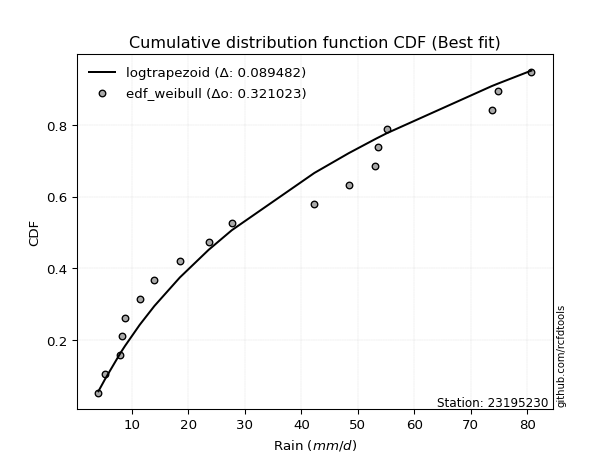</img>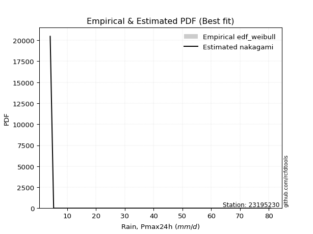</img>

</div>


### 4. EDF Beard (1943)

The Beard formula (or Beard´s plotting position formula) in hydrology is used to estimate the empirical non-exceedance probability _(P)_ of a flood event (or other extreme hydrological data point) within a given dataset.

<div align="center">


$P=(m-0.31)/(n+0.38)$


</div>


**4.1. Empirical values**

<div align="center">

|                | 0                   | 1                   | 2                   | 3                   | 4                  | 5                   | 6                  | 7                  | 8                   | 9                  | 10                 | 11                 | 12                | 13                 | 14                 | 15                 | 16                 | 17                 |
|:---------------|:--------------------|:--------------------|:--------------------|:--------------------|:-------------------|:--------------------|:-------------------|:-------------------|:--------------------|:-------------------|:-------------------|:-------------------|:------------------|:-------------------|:-------------------|:-------------------|:-------------------|:-------------------|
| date           | 2022                | 2023                | 2018                | 2008                | 2020               | 2021                | 2019               | 2014               | 2009                | 2007               | 2010               | 2006               | 2013              | 2017               | 2015               | 2016               | 2012               | 2005               |
| x              | 4.1                 | 5.3                 | 7.9                 | 8.3                 | 8.8                | 11.4                | 14.0               | 18.5               | 23.6                | 27.7               | 42.3               | 48.4               | 53.0              | 53.506             | 55.1               | 73.7               | 74.8               | 80.7               |
| m              | 1                   | 2                   | 3                   | 4                   | 5                  | 6                   | 7                  | 8                  | 9                   | 10                 | 11                 | 12                 | 13                | 14                 | 15                 | 16                 | 17                 | 18                 |
| empirical_dist | edf_beard           | edf_beard           | edf_beard           | edf_beard           | edf_beard          | edf_beard           | edf_beard          | edf_beard          | edf_beard           | edf_beard          | edf_beard          | edf_beard          | edf_beard         | edf_beard          | edf_beard          | edf_beard          | edf_beard          | edf_beard          |
| empirical      | 0.03754080522306855 | 0.09194776931447225 | 0.14635473340587596 | 0.20076169749727965 | 0.2551686615886834 | 0.30957562568008706 | 0.3639825897714908 | 0.4183895538628945 | 0.47279651795429817 | 0.5272034820457019 | 0.5816104461371056 | 0.6360174102285092 | 0.690424374319913 | 0.7448313384113167 | 0.7992383025027203 | 0.8536452665941241 | 0.9080522306855279 | 0.9624591947769315 |
| empirical_tr   | 1.0390050876201244  | 1.1012582384661473  | 1.17144678138942    | 1.2511912865895167  | 1.3425858290723158 | 1.4483845547675334  | 1.572284003421728  | 1.7193638914873717 | 1.896800825593395   | 2.1150747986191027 | 2.390117035110533  | 2.747384155455904  | 3.230228471001758 | 3.9189765458422174 | 4.981029810298102  | 6.832713754646843  | 10.875739644970428 | 26.637681159420353 |

</div>


**4.2. Kolmogorov-Smirnov fit test (sorted by Δ)**


<div align="center">

|                | 0                   | 1                   | 2                   | 3                   | 4                   | 5                   | 6                   | 7                   | 8                   | 9                   | 10                  | 11                  | 12                  | 13                  | 14                  | 15                  | 16                  | 17                  | 18                  | 19                  | 20                  | 21                  | 22                  | 23                  | 24                  | 25                  | 26                  | 27                  | 28                  | 29                  | 30                  | 31                  | 32                  | 33                  | 34                  | 35                  | 36                  | 37                  | 38                  | 39                  | 40                  | 41                  | 42                  | 43                  | 44                  | 45                  | 46                  | 47                  | 48                  | 49                  | 50                  | 51                  | 52                  | 53                  | 54                  | 55                  | 56                  | 57                  | 58                  | 59                  | 60                  | 61                  | 62                  | 63                  | 64                  | 65                  | 66                  | 67                  | 68                  | 69                  | 70                  | 71                  | 72                  | 73                  | 74                  | 75                  | 76                  | 77                  | 78                  | 79                  | 80                  | 81                  | 82                  | 83                  | 84                  | 85                  | 86                  | 87                  | 88                  | 89                  | 90                  | 91                  | 92                  | 93                  | 94                  | 95                  | 96                  | 97                  | 98                  | 99                  | 100                 | 101                 | 102                 | 103                 | 104                 | 105                 | 106                 | 107                 | 108                 | 109                 | 110                 | 111                 | 112                 | 113                 | 114                 | 115                 | 116                 | 117                 | 118                 | 119                 | 120                 | 121                 | 122                 | 123                 | 124                 | 125                 | 126                 | 127                 | 128                 | 129                 | 130                 | 131                 | 132                 | 133                 | 134                 | 135                 | 136                 | 137                 | 138                 | 139                 | 140                 | 141                 | 142                 | 143                 | 144                 | 145                 | 146                 | 147                 | 148                 | 149                 | 150                 | 151                 | 152                 | 153                 | 154                 | 155                 | 156                 | 157                 | 158                 | 159                 |
|:---------------|:--------------------|:--------------------|:--------------------|:--------------------|:--------------------|:--------------------|:--------------------|:--------------------|:--------------------|:--------------------|:--------------------|:--------------------|:--------------------|:--------------------|:--------------------|:--------------------|:--------------------|:--------------------|:--------------------|:--------------------|:--------------------|:--------------------|:--------------------|:--------------------|:--------------------|:--------------------|:--------------------|:--------------------|:--------------------|:--------------------|:--------------------|:--------------------|:--------------------|:--------------------|:--------------------|:--------------------|:--------------------|:--------------------|:--------------------|:--------------------|:--------------------|:--------------------|:--------------------|:--------------------|:--------------------|:--------------------|:--------------------|:--------------------|:--------------------|:--------------------|:--------------------|:--------------------|:--------------------|:--------------------|:--------------------|:--------------------|:--------------------|:--------------------|:--------------------|:--------------------|:--------------------|:--------------------|:--------------------|:--------------------|:--------------------|:--------------------|:--------------------|:--------------------|:--------------------|:--------------------|:--------------------|:--------------------|:--------------------|:--------------------|:--------------------|:--------------------|:--------------------|:--------------------|:--------------------|:--------------------|:--------------------|:--------------------|:--------------------|:--------------------|:--------------------|:--------------------|:--------------------|:--------------------|:--------------------|:--------------------|:--------------------|:--------------------|:--------------------|:--------------------|:--------------------|:--------------------|:--------------------|:--------------------|:--------------------|:--------------------|:--------------------|:--------------------|:--------------------|:--------------------|:--------------------|:--------------------|:--------------------|:--------------------|:--------------------|:--------------------|:--------------------|:--------------------|:--------------------|:--------------------|:--------------------|:--------------------|:--------------------|:--------------------|:--------------------|:--------------------|:--------------------|:--------------------|:--------------------|:--------------------|:--------------------|:--------------------|:--------------------|:--------------------|:--------------------|:--------------------|:--------------------|:--------------------|:--------------------|:--------------------|:--------------------|:--------------------|:--------------------|:--------------------|:--------------------|:--------------------|:--------------------|:--------------------|:--------------------|:--------------------|:--------------------|:--------------------|:--------------------|:--------------------|:--------------------|:--------------------|:--------------------|:--------------------|:--------------------|:--------------------|:--------------------|:--------------------|:--------------------|:--------------------|:--------------------|:--------------------|
| station        | 23195230            | 23195230            | 23195230            | 23195230            | 23195230            | 23195230            | 23195230            | 23195230            | 23195230            | 23195230            | 23195230            | 23195230            | 23195230            | 23195230            | 23195230            | 23195230            | 23195230            | 23195230            | 23195230            | 23195230            | 23195230            | 23195230            | 23195230            | 23195230            | 23195230            | 23195230            | 23195230            | 23195230            | 23195230            | 23195230            | 23195230            | 23195230            | 23195230            | 23195230            | 23195230            | 23195230            | 23195230            | 23195230            | 23195230            | 23195230            | 23195230            | 23195230            | 23195230            | 23195230            | 23195230            | 23195230            | 23195230            | 23195230            | 23195230            | 23195230            | 23195230            | 23195230            | 23195230            | 23195230            | 23195230            | 23195230            | 23195230            | 23195230            | 23195230            | 23195230            | 23195230            | 23195230            | 23195230            | 23195230            | 23195230            | 23195230            | 23195230            | 23195230            | 23195230            | 23195230            | 23195230            | 23195230            | 23195230            | 23195230            | 23195230            | 23195230            | 23195230            | 23195230            | 23195230            | 23195230            | 23195230            | 23195230            | 23195230            | 23195230            | 23195230            | 23195230            | 23195230            | 23195230            | 23195230            | 23195230            | 23195230            | 23195230            | 23195230            | 23195230            | 23195230            | 23195230            | 23195230            | 23195230            | 23195230            | 23195230            | 23195230            | 23195230            | 23195230            | 23195230            | 23195230            | 23195230            | 23195230            | 23195230            | 23195230            | 23195230            | 23195230            | 23195230            | 23195230            | 23195230            | 23195230            | 23195230            | 23195230            | 23195230            | 23195230            | 23195230            | 23195230            | 23195230            | 23195230            | 23195230            | 23195230            | 23195230            | 23195230            | 23195230            | 23195230            | 23195230            | 23195230            | 23195230            | 23195230            | 23195230            | 23195230            | 23195230            | 23195230            | 23195230            | 23195230            | 23195230            | 23195230            | 23195230            | 23195230            | 23195230            | 23195230            | 23195230            | 23195230            | 23195230            | 23195230            | 23195230            | 23195230            | 23195230            | 23195230            | 23195230            | 23195230            | 23195230            | 23195230            | 23195230            | 23195230            | 23195230            |
| empirical_dist | edf_beard           | edf_beard           | edf_beard           | edf_beard           | edf_beard           | edf_beard           | edf_beard           | edf_beard           | edf_beard           | edf_beard           | edf_beard           | edf_beard           | edf_beard           | edf_beard           | edf_beard           | edf_beard           | edf_beard           | edf_beard           | edf_beard           | edf_beard           | edf_beard           | edf_beard           | edf_beard           | edf_beard           | edf_beard           | edf_beard           | edf_beard           | edf_beard           | edf_beard           | edf_beard           | edf_beard           | edf_beard           | edf_beard           | edf_beard           | edf_beard           | edf_beard           | edf_beard           | edf_beard           | edf_beard           | edf_beard           | edf_beard           | edf_beard           | edf_beard           | edf_beard           | edf_beard           | edf_beard           | edf_beard           | edf_beard           | edf_beard           | edf_beard           | edf_beard           | edf_beard           | edf_beard           | edf_beard           | edf_beard           | edf_beard           | edf_beard           | edf_beard           | edf_beard           | edf_beard           | edf_beard           | edf_beard           | edf_beard           | edf_beard           | edf_beard           | edf_beard           | edf_beard           | edf_beard           | edf_beard           | edf_beard           | edf_beard           | edf_beard           | edf_beard           | edf_beard           | edf_beard           | edf_beard           | edf_beard           | edf_beard           | edf_beard           | edf_beard           | edf_beard           | edf_beard           | edf_beard           | edf_beard           | edf_beard           | edf_beard           | edf_beard           | edf_beard           | edf_beard           | edf_beard           | edf_beard           | edf_beard           | edf_beard           | edf_beard           | edf_beard           | edf_beard           | edf_beard           | edf_beard           | edf_beard           | edf_beard           | edf_beard           | edf_beard           | edf_beard           | edf_beard           | edf_beard           | edf_beard           | edf_beard           | edf_beard           | edf_beard           | edf_beard           | edf_beard           | edf_beard           | edf_beard           | edf_beard           | edf_beard           | edf_beard           | edf_beard           | edf_beard           | edf_beard           | edf_beard           | edf_beard           | edf_beard           | edf_beard           | edf_beard           | edf_beard           | edf_beard           | edf_beard           | edf_beard           | edf_beard           | edf_beard           | edf_beard           | edf_beard           | edf_beard           | edf_beard           | edf_beard           | edf_beard           | edf_beard           | edf_beard           | edf_beard           | edf_beard           | edf_beard           | edf_beard           | edf_beard           | edf_beard           | edf_beard           | edf_beard           | edf_beard           | edf_beard           | edf_beard           | edf_beard           | edf_beard           | edf_beard           | edf_beard           | edf_beard           | edf_beard           | edf_beard           | edf_beard           | edf_beard           | edf_beard           | edf_beard           |
| p_dist         | loggenhalflogistic  | logtrapezoid        | logarcsine          | mielke              | logburr             | nakagami            | weibull_min         | truncweibull_min    | exponpow            | logbeta             | halfnorm            | logskewnorm         | foldnorm            | gausshyper          | semicircular        | dweibull            | logsemicircular     | logloggamma         | anglit              | burr                | logjohnsonsu        | logargus            | logtriang           | rayleigh            | logdweibull         | burr12              | loganglit           | maxwell             | genexpon            | logburr12           | logweibull_min      | loggausshyper       | loggenextreme       | logweibull_max      | genlogistic         | halflogistic        | loggenpareto        | pearson3            | exponnorm           | loggompertz         | kstwobign           | logwrapcauchy       | loggumbel_l         | lomax               | t                   | truncnorm           | norm                | crystalball         | gumbel_r            | logpearson3         | gompertz            | ncf                 | logncf              | loggengamma         | logf                | logloglaplace       | logksone            | moyal               | lognct              | logcrystalball      | lognorm             | logt                | logexponnorm        | arcsine             | loggamma            | loggamma            | logfatiguelife      | gengamma            | logerlang           | logbetaprime        | logfoldnorm         | halfgennorm         | johnsonsu           | logrice             | logdgamma           | loginvgamma         | logalpha            | invweibull          | genextreme          | invgamma            | loginvweibull       | erlang              | nct                 | skewnorm            | lognakagami         | logmaxwell          | loggenexpon         | f                   | cosine              | logistic            | loginvgauss         | lograyleigh         | rice                | logkstwobign        | fatiguelife         | dgamma              | logcosine           | loglomax            | invgauss            | betaprime           | truncexpon          | loglogistic         | loghalfnorm         | logtruncnorm        | hypsecant           | logtruncweibull_min | ksone               | bradford            | logkappa3           | gumbel_l            | logtukeylambda      | loghypsecant        | genpareto           | loggumbel_r         | loguniform          | laplace             | loghalflogistic     | logvonmises_line    | beta                | kappa4              | logmoyal            | logkappa4           | exponweib           | loglaplace          | loglaplace          | wrapcauchy          | alpha               | logexponweib        | logmielke           | vonmises_line       | kappa3              | uniform             | triang              | logbradford         | logwald             | logtruncexpon       | loglevy_l           | gamma               | powerlaw            | argus               | wald                | genhalflogistic     | logrdist            | levy_l              | gennorm             | loggennorm          | trapezoid           | logpowerlaw         | logjohnsonsb        | johnsonsb           | tukeylambda         | logexponpow         | rdist               | weibull_max         | truncpareto         | loghalfgennorm      | logtruncpareto      | loggenlogistic      | logvonmises         | vonmises            |
| delta          | 0.08501972820430492 | 0.08504365684546766 | 0.09194776931447225 | 0.09444962907640986 | 0.10316665167747247 | 0.10335838489464833 | 0.10475424612885056 | 0.10544647749268565 | 0.1064068992964124  | 0.1071911746492995  | 0.10843085638866845 | 0.109557833394615   | 0.11072544112879612 | 0.11411087588206878 | 0.11459149679991962 | 0.11644767705048986 | 0.11658733078999595 | 0.11719892058762793 | 0.11824326281276054 | 0.11891529562256706 | 0.12014375029268698 | 0.12040004947318483 | 0.12133227184388373 | 0.12192465168121164 | 0.12475643214639032 | 0.1266115521090233  | 0.12820665069240833 | 0.12881087842140715 | 0.12986410482315447 | 0.1301088399406929  | 0.130533854533046   | 0.1315557750774582  | 0.1316553563691956  | 0.13496551007709076 | 0.13513439572623007 | 0.13517895097470495 | 0.13642046394403617 | 0.13770529811611953 | 0.1408728477346174  | 0.1419562744416335  | 0.14211387800921196 | 0.14218613325888135 | 0.1442911082584658  | 0.14508853462116955 | 0.14528516318216156 | 0.1452960631328476  | 0.14529609048889708 | 0.14529610065250625 | 0.14532042790434246 | 0.14618436352145137 | 0.1481732214900994  | 0.15155537288405974 | 0.1515839464459876  | 0.153188540433845   | 0.1537977075798007  | 0.15390265537193437 | 0.1544059584729658  | 0.15464494068542178 | 0.15514354149138    | 0.15515677071720868 | 0.1551568312731607  | 0.15515684457732204 | 0.1551576865186055  | 0.15549685185701878 | 0.15582508394070582 | 0.15582508394070582 | 0.1561212762604297  | 0.15642614151428547 | 0.15745353662362893 | 0.15746065698630274 | 0.15810026437485347 | 0.15824675703281033 | 0.158616668069136   | 0.1586963882900726  | 0.15932714674772147 | 0.16036418892824678 | 0.16087755595460784 | 0.16221754111130748 | 0.1622179440080197  | 0.1630841535492119  | 0.1634113750516717  | 0.1637948858754057  | 0.16449349837405192 | 0.1655014923741966  | 0.16570504373011252 | 0.16646357346348306 | 0.16660277459001316 | 0.16668905557936797 | 0.16741012719496035 | 0.16753766175565232 | 0.16842447897550106 | 0.16970914161971684 | 0.1701188718945476  | 0.1702515390694741  | 0.17027214917716804 | 0.1705880744921883  | 0.1705970268474799  | 0.17121223340467318 | 0.1725042740055882  | 0.1730517052645466  | 0.17625936552183222 | 0.17769584244783176 | 0.1802760879191535  | 0.18125073031504257 | 0.18233891651160264 | 0.18496880166110308 | 0.1871251530639787  | 0.18844239414494798 | 0.19002551139766055 | 0.19022277928516262 | 0.19122700626464695 | 0.1929307333890422  | 0.19776901781198494 | 0.19783247171548357 | 0.2016092393949801  | 0.204808333974672   | 0.2054160210893251  | 0.2090459444796292  | 0.20907010897471429 | 0.2109818141049908  | 0.21157220368309426 | 0.2118496655777844  | 0.2140772210754851  | 0.21424465672875026 | 0.21424465672875026 | 0.2184918424144665  | 0.21945774628092662 | 0.22422234945185687 | 0.22704055774713594 | 0.23402082204736252 | 0.23406166275032717 | 0.23473976992814877 | 0.2480009310028703  | 0.2516606009940946  | 0.2551686615886834  | 0.2607500154322481  | 0.26087347484101664 | 0.27251786944989453 | 0.2786059032478758  | 0.2832065002472439  | 0.2986771981736899  | 0.30210904372935576 | 0.31571612604597876 | 0.37944257681096816 | 0.4080522306855279  | 0.4080522306855279  | 0.41022936172235724 | 0.4234827275969582  | 0.43672365849666483 | 0.4669901796917034  | 0.4755006208931274  | 0.501134699918971   | 0.5161285817651368  | 0.6363117427552604  | 0.7783005688458604  | 0.7992383025027203  | 0.8304108985571265  | 0.9080522306855279  | 1.1406237365686578  | 12.75910072932372   |
| deltao         | 0.32102346734599996 | 0.32102346734599996 | 0.32102346734599996 | 0.32102346734599996 | 0.32102346734599996 | 0.32102346734599996 | 0.32102346734599996 | 0.32102346734599996 | 0.32102346734599996 | 0.32102346734599996 | 0.32102346734599996 | 0.32102346734599996 | 0.32102346734599996 | 0.32102346734599996 | 0.32102346734599996 | 0.32102346734599996 | 0.32102346734599996 | 0.32102346734599996 | 0.32102346734599996 | 0.32102346734599996 | 0.32102346734599996 | 0.32102346734599996 | 0.32102346734599996 | 0.32102346734599996 | 0.32102346734599996 | 0.32102346734599996 | 0.32102346734599996 | 0.32102346734599996 | 0.32102346734599996 | 0.32102346734599996 | 0.32102346734599996 | 0.32102346734599996 | 0.32102346734599996 | 0.32102346734599996 | 0.32102346734599996 | 0.32102346734599996 | 0.32102346734599996 | 0.32102346734599996 | 0.32102346734599996 | 0.32102346734599996 | 0.32102346734599996 | 0.32102346734599996 | 0.32102346734599996 | 0.32102346734599996 | 0.32102346734599996 | 0.32102346734599996 | 0.32102346734599996 | 0.32102346734599996 | 0.32102346734599996 | 0.32102346734599996 | 0.32102346734599996 | 0.32102346734599996 | 0.32102346734599996 | 0.32102346734599996 | 0.32102346734599996 | 0.32102346734599996 | 0.32102346734599996 | 0.32102346734599996 | 0.32102346734599996 | 0.32102346734599996 | 0.32102346734599996 | 0.32102346734599996 | 0.32102346734599996 | 0.32102346734599996 | 0.32102346734599996 | 0.32102346734599996 | 0.32102346734599996 | 0.32102346734599996 | 0.32102346734599996 | 0.32102346734599996 | 0.32102346734599996 | 0.32102346734599996 | 0.32102346734599996 | 0.32102346734599996 | 0.32102346734599996 | 0.32102346734599996 | 0.32102346734599996 | 0.32102346734599996 | 0.32102346734599996 | 0.32102346734599996 | 0.32102346734599996 | 0.32102346734599996 | 0.32102346734599996 | 0.32102346734599996 | 0.32102346734599996 | 0.32102346734599996 | 0.32102346734599996 | 0.32102346734599996 | 0.32102346734599996 | 0.32102346734599996 | 0.32102346734599996 | 0.32102346734599996 | 0.32102346734599996 | 0.32102346734599996 | 0.32102346734599996 | 0.32102346734599996 | 0.32102346734599996 | 0.32102346734599996 | 0.32102346734599996 | 0.32102346734599996 | 0.32102346734599996 | 0.32102346734599996 | 0.32102346734599996 | 0.32102346734599996 | 0.32102346734599996 | 0.32102346734599996 | 0.32102346734599996 | 0.32102346734599996 | 0.32102346734599996 | 0.32102346734599996 | 0.32102346734599996 | 0.32102346734599996 | 0.32102346734599996 | 0.32102346734599996 | 0.32102346734599996 | 0.32102346734599996 | 0.32102346734599996 | 0.32102346734599996 | 0.32102346734599996 | 0.32102346734599996 | 0.32102346734599996 | 0.32102346734599996 | 0.32102346734599996 | 0.32102346734599996 | 0.32102346734599996 | 0.32102346734599996 | 0.32102346734599996 | 0.32102346734599996 | 0.32102346734599996 | 0.32102346734599996 | 0.32102346734599996 | 0.32102346734599996 | 0.32102346734599996 | 0.32102346734599996 | 0.32102346734599996 | 0.32102346734599996 | 0.32102346734599996 | 0.32102346734599996 | 0.32102346734599996 | 0.32102346734599996 | 0.32102346734599996 | 0.32102346734599996 | 0.32102346734599996 | 0.32102346734599996 | 0.32102346734599996 | 0.32102346734599996 | 0.32102346734599996 | 0.32102346734599996 | 0.32102346734599996 | 0.32102346734599996 | 0.32102346734599996 | 0.32102346734599996 | 0.32102346734599996 | 0.32102346734599996 | 0.32102346734599996 | 0.32102346734599996 | 0.32102346734599996 | 0.32102346734599996 | 0.32102346734599996 | 0.32102346734599996 |
| eval           | Δo > Δ              | Δo > Δ              | Δo > Δ              | Δo > Δ              | Δo > Δ              | Δo > Δ              | Δo > Δ              | Δo > Δ              | Δo > Δ              | Δo > Δ              | Δo > Δ              | Δo > Δ              | Δo > Δ              | Δo > Δ              | Δo > Δ              | Δo > Δ              | Δo > Δ              | Δo > Δ              | Δo > Δ              | Δo > Δ              | Δo > Δ              | Δo > Δ              | Δo > Δ              | Δo > Δ              | Δo > Δ              | Δo > Δ              | Δo > Δ              | Δo > Δ              | Δo > Δ              | Δo > Δ              | Δo > Δ              | Δo > Δ              | Δo > Δ              | Δo > Δ              | Δo > Δ              | Δo > Δ              | Δo > Δ              | Δo > Δ              | Δo > Δ              | Δo > Δ              | Δo > Δ              | Δo > Δ              | Δo > Δ              | Δo > Δ              | Δo > Δ              | Δo > Δ              | Δo > Δ              | Δo > Δ              | Δo > Δ              | Δo > Δ              | Δo > Δ              | Δo > Δ              | Δo > Δ              | Δo > Δ              | Δo > Δ              | Δo > Δ              | Δo > Δ              | Δo > Δ              | Δo > Δ              | Δo > Δ              | Δo > Δ              | Δo > Δ              | Δo > Δ              | Δo > Δ              | Δo > Δ              | Δo > Δ              | Δo > Δ              | Δo > Δ              | Δo > Δ              | Δo > Δ              | Δo > Δ              | Δo > Δ              | Δo > Δ              | Δo > Δ              | Δo > Δ              | Δo > Δ              | Δo > Δ              | Δo > Δ              | Δo > Δ              | Δo > Δ              | Δo > Δ              | Δo > Δ              | Δo > Δ              | Δo > Δ              | Δo > Δ              | Δo > Δ              | Δo > Δ              | Δo > Δ              | Δo > Δ              | Δo > Δ              | Δo > Δ              | Δo > Δ              | Δo > Δ              | Δo > Δ              | Δo > Δ              | Δo > Δ              | Δo > Δ              | Δo > Δ              | Δo > Δ              | Δo > Δ              | Δo > Δ              | Δo > Δ              | Δo > Δ              | Δo > Δ              | Δo > Δ              | Δo > Δ              | Δo > Δ              | Δo > Δ              | Δo > Δ              | Δo > Δ              | Δo > Δ              | Δo > Δ              | Δo > Δ              | Δo > Δ              | Δo > Δ              | Δo > Δ              | Δo > Δ              | Δo > Δ              | Δo > Δ              | Δo > Δ              | Δo > Δ              | Δo > Δ              | Δo > Δ              | Δo > Δ              | Δo > Δ              | Δo > Δ              | Δo > Δ              | Δo > Δ              | Δo > Δ              | Δo > Δ              | Δo > Δ              | Δo > Δ              | Δo > Δ              | Δo > Δ              | Δo > Δ              | Δo > Δ              | Δo > Δ              | Δo > Δ              | Δo > Δ              | Δo > Δ              | Δo > Δ              | Δo > Δ              | Δo > Δ              | Δo <= Δ             | Δo <= Δ             | Δo <= Δ             | Δo <= Δ             | Δo <= Δ             | Δo <= Δ             | Δo <= Δ             | Δo <= Δ             | Δo <= Δ             | Δo <= Δ             | Δo <= Δ             | Δo <= Δ             | Δo <= Δ             | Δo <= Δ             | Δo <= Δ             | Δo <= Δ             | Δo <= Δ             |
| fit            | 1                   | 1                   | 1                   | 1                   | 1                   | 1                   | 1                   | 1                   | 1                   | 1                   | 1                   | 1                   | 1                   | 1                   | 1                   | 1                   | 1                   | 1                   | 1                   | 1                   | 1                   | 1                   | 1                   | 1                   | 1                   | 1                   | 1                   | 1                   | 1                   | 1                   | 1                   | 1                   | 1                   | 1                   | 1                   | 1                   | 1                   | 1                   | 1                   | 1                   | 1                   | 1                   | 1                   | 1                   | 1                   | 1                   | 1                   | 1                   | 1                   | 1                   | 1                   | 1                   | 1                   | 1                   | 1                   | 1                   | 1                   | 1                   | 1                   | 1                   | 1                   | 1                   | 1                   | 1                   | 1                   | 1                   | 1                   | 1                   | 1                   | 1                   | 1                   | 1                   | 1                   | 1                   | 1                   | 1                   | 1                   | 1                   | 1                   | 1                   | 1                   | 1                   | 1                   | 1                   | 1                   | 1                   | 1                   | 1                   | 1                   | 1                   | 1                   | 1                   | 1                   | 1                   | 1                   | 1                   | 1                   | 1                   | 1                   | 1                   | 1                   | 1                   | 1                   | 1                   | 1                   | 1                   | 1                   | 1                   | 1                   | 1                   | 1                   | 1                   | 1                   | 1                   | 1                   | 1                   | 1                   | 1                   | 1                   | 1                   | 1                   | 1                   | 1                   | 1                   | 1                   | 1                   | 1                   | 1                   | 1                   | 1                   | 1                   | 1                   | 1                   | 1                   | 1                   | 1                   | 1                   | 1                   | 1                   | 1                   | 1                   | 1                   | 1                   | 0                   | 0                   | 0                   | 0                   | 0                   | 0                   | 0                   | 0                   | 0                   | 0                   | 0                   | 0                   | 0                   | 0                   | 0                   | 0                   | 0                   |
| n              | 18                  | 18                  | 18                  | 18                  | 18                  | 18                  | 18                  | 18                  | 18                  | 18                  | 18                  | 18                  | 18                  | 18                  | 18                  | 18                  | 18                  | 18                  | 18                  | 18                  | 18                  | 18                  | 18                  | 18                  | 18                  | 18                  | 18                  | 18                  | 18                  | 18                  | 18                  | 18                  | 18                  | 18                  | 18                  | 18                  | 18                  | 18                  | 18                  | 18                  | 18                  | 18                  | 18                  | 18                  | 18                  | 18                  | 18                  | 18                  | 18                  | 18                  | 18                  | 18                  | 18                  | 18                  | 18                  | 18                  | 18                  | 18                  | 18                  | 18                  | 18                  | 18                  | 18                  | 18                  | 18                  | 18                  | 18                  | 18                  | 18                  | 18                  | 18                  | 18                  | 18                  | 18                  | 18                  | 18                  | 18                  | 18                  | 18                  | 18                  | 18                  | 18                  | 18                  | 18                  | 18                  | 18                  | 18                  | 18                  | 18                  | 18                  | 18                  | 18                  | 18                  | 18                  | 18                  | 18                  | 18                  | 18                  | 18                  | 18                  | 18                  | 18                  | 18                  | 18                  | 18                  | 18                  | 18                  | 18                  | 18                  | 18                  | 18                  | 18                  | 18                  | 18                  | 18                  | 18                  | 18                  | 18                  | 18                  | 18                  | 18                  | 18                  | 18                  | 18                  | 18                  | 18                  | 18                  | 18                  | 18                  | 18                  | 18                  | 18                  | 18                  | 18                  | 18                  | 18                  | 18                  | 18                  | 18                  | 18                  | 18                  | 18                  | 18                  | 18                  | 18                  | 18                  | 18                  | 18                  | 18                  | 18                  | 18                  | 18                  | 18                  | 18                  | 18                  | 18                  | 18                  | 18                  | 18                  | 18                  |
| best_fit       | 1                   | 0                   | 0                   | 0                   | 0                   | 0                   | 0                   | 0                   | 0                   | 0                   | 0                   | 0                   | 0                   | 0                   | 0                   | 0                   | 0                   | 0                   | 0                   | 0                   | 0                   | 0                   | 0                   | 0                   | 0                   | 0                   | 0                   | 0                   | 0                   | 0                   | 0                   | 0                   | 0                   | 0                   | 0                   | 0                   | 0                   | 0                   | 0                   | 0                   | 0                   | 0                   | 0                   | 0                   | 0                   | 0                   | 0                   | 0                   | 0                   | 0                   | 0                   | 0                   | 0                   | 0                   | 0                   | 0                   | 0                   | 0                   | 0                   | 0                   | 0                   | 0                   | 0                   | 0                   | 0                   | 0                   | 0                   | 0                   | 0                   | 0                   | 0                   | 0                   | 0                   | 0                   | 0                   | 0                   | 0                   | 0                   | 0                   | 0                   | 0                   | 0                   | 0                   | 0                   | 0                   | 0                   | 0                   | 0                   | 0                   | 0                   | 0                   | 0                   | 0                   | 0                   | 0                   | 0                   | 0                   | 0                   | 0                   | 0                   | 0                   | 0                   | 0                   | 0                   | 0                   | 0                   | 0                   | 0                   | 0                   | 0                   | 0                   | 0                   | 0                   | 0                   | 0                   | 0                   | 0                   | 0                   | 0                   | 0                   | 0                   | 0                   | 0                   | 0                   | 0                   | 0                   | 0                   | 0                   | 0                   | 0                   | 0                   | 0                   | 0                   | 0                   | 0                   | 0                   | 0                   | 0                   | 0                   | 0                   | 0                   | 0                   | 0                   | 0                   | 0                   | 0                   | 0                   | 0                   | 0                   | 0                   | 0                   | 0                   | 0                   | 0                   | 0                   | 0                   | 0                   | 0                   | 0                   | 0                   |
| best_fit_sort  | 1                   | 2                   | 3                   | 4                   | 5                   | 6                   | 7                   | 8                   | 9                   | 10                  | 11                  | 12                  | 13                  | 14                  | 15                  | 16                  | 17                  | 18                  | 19                  | 20                  | 21                  | 22                  | 23                  | 24                  | 25                  | 26                  | 27                  | 28                  | 29                  | 30                  | 31                  | 32                  | 33                  | 34                  | 35                  | 36                  | 37                  | 38                  | 39                  | 40                  | 41                  | 42                  | 43                  | 44                  | 45                  | 46                  | 47                  | 48                  | 49                  | 50                  | 51                  | 52                  | 53                  | 54                  | 55                  | 56                  | 57                  | 58                  | 59                  | 60                  | 61                  | 62                  | 63                  | 64                  | 65                  | 66                  | 67                  | 68                  | 69                  | 70                  | 71                  | 72                  | 73                  | 74                  | 75                  | 76                  | 77                  | 78                  | 79                  | 80                  | 81                  | 82                  | 83                  | 84                  | 85                  | 86                  | 87                  | 88                  | 89                  | 90                  | 91                  | 92                  | 93                  | 94                  | 95                  | 96                  | 97                  | 98                  | 99                  | 100                 | 101                 | 102                 | 103                 | 104                 | 105                 | 106                 | 107                 | 108                 | 109                 | 110                 | 111                 | 112                 | 113                 | 114                 | 115                 | 116                 | 117                 | 118                 | 119                 | 120                 | 121                 | 122                 | 123                 | 124                 | 125                 | 126                 | 127                 | 128                 | 129                 | 130                 | 131                 | 132                 | 133                 | 134                 | 135                 | 136                 | 137                 | 138                 | 139                 | 140                 | 141                 | 142                 | 143                 | 144                 | 145                 | 146                 | 147                 | 148                 | 149                 | 150                 | 151                 | 152                 | 153                 | 154                 | 155                 | 156                 | 157                 | 158                 | 159                 | 160                 |

</div>


**4.3. Best fit**

<div align="center">

|   id |   station | empirical_dist   | p_dist             |     delta |   deltao | eval   |   fit |   n |   best_fit |   best_fit_sort |
|-----:|----------:|:-----------------|:-------------------|----------:|---------:|:-------|------:|----:|-----------:|----------------:|
|    0 |  23195230 | edf_beard        | loggenhalflogistic | 0.0850197 | 0.321023 | Δo > Δ |     1 |  18 |          1 |               1 |

</div>


<div align="center">

</img></img>

</div>


### 5. EDF Chegodayev (1955)

The Chegodayev formula is an empirical plotting position formula used in hydrological frequency analysis to estimate the exceedance probability or return period of a specific event from a set of observed data. It is primarily used for plotting observed data points on probability paper to fit a theoretical distribution, particularly for analyzing extreme events like maximum flood flows or rainfall intensities. The constant _b_ value in the generalized plotting position formula is 0.3.

<div align="center">


$P=(m-b)/(n+1-2b)$


</div>


**5.1. Empirical values**

<div align="center">

|                | 0                   | 1                  | 2                   | 3                   | 4                  | 5                  | 6                   | 7                   | 8                   | 9                  | 10                 | 11                 | 12                 | 13                 | 14                 | 15                 | 16                | 17                 |
|:---------------|:--------------------|:-------------------|:--------------------|:--------------------|:-------------------|:-------------------|:--------------------|:--------------------|:--------------------|:-------------------|:-------------------|:-------------------|:-------------------|:-------------------|:-------------------|:-------------------|:------------------|:-------------------|
| date           | 2022                | 2023               | 2018                | 2008                | 2020               | 2021               | 2019                | 2014                | 2009                | 2007               | 2010               | 2006               | 2013               | 2017               | 2015               | 2016               | 2012              | 2005               |
| x              | 4.1                 | 5.3                | 7.9                 | 8.3                 | 8.8                | 11.4               | 14.0                | 18.5                | 23.6                | 27.7               | 42.3               | 48.4               | 53.0               | 53.506             | 55.1               | 73.7               | 74.8              | 80.7               |
| m              | 1                   | 2                  | 3                   | 4                   | 5                  | 6                  | 7                   | 8                   | 9                   | 10                 | 11                 | 12                 | 13                 | 14                 | 15                 | 16                 | 17                | 18                 |
| empirical_dist | edf_chegodayev      | edf_chegodayev     | edf_chegodayev      | edf_chegodayev      | edf_chegodayev     | edf_chegodayev     | edf_chegodayev      | edf_chegodayev      | edf_chegodayev      | edf_chegodayev     | edf_chegodayev     | edf_chegodayev     | edf_chegodayev     | edf_chegodayev     | edf_chegodayev     | edf_chegodayev     | edf_chegodayev    | edf_chegodayev     |
| empirical      | 0.03804347826086957 | 0.0923913043478261 | 0.14673913043478262 | 0.20108695652173916 | 0.2554347826086957 | 0.3097826086956522 | 0.36413043478260876 | 0.41847826086956524 | 0.47282608695652173 | 0.5271739130434783 | 0.5815217391304348 | 0.6358695652173914 | 0.6902173913043479 | 0.7445652173913043 | 0.7989130434782609 | 0.8532608695652174 | 0.907608695652174 | 0.9619565217391305 |
| empirical_tr   | 1.03954802259887    | 1.1017964071856288 | 1.1719745222929936  | 1.251700680272109   | 1.343065693430657  | 1.4488188976377954 | 1.5726495726495728  | 1.719626168224299   | 1.8969072164948453  | 2.1149425287356323 | 2.38961038961039   | 2.7462686567164183 | 3.228070175438597  | 3.914893617021276  | 4.972972972972973  | 6.814814814814816  | 10.82352941176471 | 26.285714285714324 |

</div>


**5.2. Kolmogorov-Smirnov fit test (sorted by Δ)**


<div align="center">

|                | 0                   | 1                   | 2                   | 3                   | 4                   | 5                   | 6                   | 7                   | 8                   | 9                   | 10                  | 11                  | 12                  | 13                  | 14                  | 15                  | 16                  | 17                  | 18                  | 19                  | 20                  | 21                  | 22                  | 23                  | 24                  | 25                  | 26                  | 27                  | 28                  | 29                  | 30                  | 31                  | 32                  | 33                  | 34                  | 35                  | 36                  | 37                  | 38                  | 39                  | 40                  | 41                  | 42                  | 43                  | 44                  | 45                  | 46                  | 47                  | 48                  | 49                  | 50                  | 51                  | 52                  | 53                  | 54                  | 55                  | 56                  | 57                  | 58                  | 59                  | 60                  | 61                  | 62                  | 63                  | 64                  | 65                  | 66                  | 67                  | 68                  | 69                  | 70                  | 71                  | 72                  | 73                  | 74                  | 75                  | 76                  | 77                  | 78                  | 79                  | 80                  | 81                  | 82                  | 83                  | 84                  | 85                  | 86                  | 87                  | 88                  | 89                  | 90                  | 91                  | 92                  | 93                  | 94                  | 95                  | 96                  | 97                  | 98                  | 99                  | 100                 | 101                 | 102                 | 103                 | 104                 | 105                 | 106                 | 107                 | 108                 | 109                 | 110                 | 111                 | 112                 | 113                 | 114                 | 115                 | 116                 | 117                 | 118                 | 119                 | 120                 | 121                 | 122                 | 123                 | 124                 | 125                 | 126                 | 127                 | 128                 | 129                 | 130                 | 131                 | 132                 | 133                 | 134                 | 135                 | 136                 | 137                 | 138                 | 139                 | 140                 | 141                 | 142                 | 143                 | 144                 | 145                 | 146                 | 147                 | 148                 | 149                 | 150                 | 151                 | 152                 | 153                 | 154                 | 155                 | 156                 | 157                 | 158                 | 159                 |
|:---------------|:--------------------|:--------------------|:--------------------|:--------------------|:--------------------|:--------------------|:--------------------|:--------------------|:--------------------|:--------------------|:--------------------|:--------------------|:--------------------|:--------------------|:--------------------|:--------------------|:--------------------|:--------------------|:--------------------|:--------------------|:--------------------|:--------------------|:--------------------|:--------------------|:--------------------|:--------------------|:--------------------|:--------------------|:--------------------|:--------------------|:--------------------|:--------------------|:--------------------|:--------------------|:--------------------|:--------------------|:--------------------|:--------------------|:--------------------|:--------------------|:--------------------|:--------------------|:--------------------|:--------------------|:--------------------|:--------------------|:--------------------|:--------------------|:--------------------|:--------------------|:--------------------|:--------------------|:--------------------|:--------------------|:--------------------|:--------------------|:--------------------|:--------------------|:--------------------|:--------------------|:--------------------|:--------------------|:--------------------|:--------------------|:--------------------|:--------------------|:--------------------|:--------------------|:--------------------|:--------------------|:--------------------|:--------------------|:--------------------|:--------------------|:--------------------|:--------------------|:--------------------|:--------------------|:--------------------|:--------------------|:--------------------|:--------------------|:--------------------|:--------------------|:--------------------|:--------------------|:--------------------|:--------------------|:--------------------|:--------------------|:--------------------|:--------------------|:--------------------|:--------------------|:--------------------|:--------------------|:--------------------|:--------------------|:--------------------|:--------------------|:--------------------|:--------------------|:--------------------|:--------------------|:--------------------|:--------------------|:--------------------|:--------------------|:--------------------|:--------------------|:--------------------|:--------------------|:--------------------|:--------------------|:--------------------|:--------------------|:--------------------|:--------------------|:--------------------|:--------------------|:--------------------|:--------------------|:--------------------|:--------------------|:--------------------|:--------------------|:--------------------|:--------------------|:--------------------|:--------------------|:--------------------|:--------------------|:--------------------|:--------------------|:--------------------|:--------------------|:--------------------|:--------------------|:--------------------|:--------------------|:--------------------|:--------------------|:--------------------|:--------------------|:--------------------|:--------------------|:--------------------|:--------------------|:--------------------|:--------------------|:--------------------|:--------------------|:--------------------|:--------------------|:--------------------|:--------------------|:--------------------|:--------------------|:--------------------|:--------------------|
| station        | 23195230            | 23195230            | 23195230            | 23195230            | 23195230            | 23195230            | 23195230            | 23195230            | 23195230            | 23195230            | 23195230            | 23195230            | 23195230            | 23195230            | 23195230            | 23195230            | 23195230            | 23195230            | 23195230            | 23195230            | 23195230            | 23195230            | 23195230            | 23195230            | 23195230            | 23195230            | 23195230            | 23195230            | 23195230            | 23195230            | 23195230            | 23195230            | 23195230            | 23195230            | 23195230            | 23195230            | 23195230            | 23195230            | 23195230            | 23195230            | 23195230            | 23195230            | 23195230            | 23195230            | 23195230            | 23195230            | 23195230            | 23195230            | 23195230            | 23195230            | 23195230            | 23195230            | 23195230            | 23195230            | 23195230            | 23195230            | 23195230            | 23195230            | 23195230            | 23195230            | 23195230            | 23195230            | 23195230            | 23195230            | 23195230            | 23195230            | 23195230            | 23195230            | 23195230            | 23195230            | 23195230            | 23195230            | 23195230            | 23195230            | 23195230            | 23195230            | 23195230            | 23195230            | 23195230            | 23195230            | 23195230            | 23195230            | 23195230            | 23195230            | 23195230            | 23195230            | 23195230            | 23195230            | 23195230            | 23195230            | 23195230            | 23195230            | 23195230            | 23195230            | 23195230            | 23195230            | 23195230            | 23195230            | 23195230            | 23195230            | 23195230            | 23195230            | 23195230            | 23195230            | 23195230            | 23195230            | 23195230            | 23195230            | 23195230            | 23195230            | 23195230            | 23195230            | 23195230            | 23195230            | 23195230            | 23195230            | 23195230            | 23195230            | 23195230            | 23195230            | 23195230            | 23195230            | 23195230            | 23195230            | 23195230            | 23195230            | 23195230            | 23195230            | 23195230            | 23195230            | 23195230            | 23195230            | 23195230            | 23195230            | 23195230            | 23195230            | 23195230            | 23195230            | 23195230            | 23195230            | 23195230            | 23195230            | 23195230            | 23195230            | 23195230            | 23195230            | 23195230            | 23195230            | 23195230            | 23195230            | 23195230            | 23195230            | 23195230            | 23195230            | 23195230            | 23195230            | 23195230            | 23195230            | 23195230            | 23195230            |
| empirical_dist | edf_chegodayev      | edf_chegodayev      | edf_chegodayev      | edf_chegodayev      | edf_chegodayev      | edf_chegodayev      | edf_chegodayev      | edf_chegodayev      | edf_chegodayev      | edf_chegodayev      | edf_chegodayev      | edf_chegodayev      | edf_chegodayev      | edf_chegodayev      | edf_chegodayev      | edf_chegodayev      | edf_chegodayev      | edf_chegodayev      | edf_chegodayev      | edf_chegodayev      | edf_chegodayev      | edf_chegodayev      | edf_chegodayev      | edf_chegodayev      | edf_chegodayev      | edf_chegodayev      | edf_chegodayev      | edf_chegodayev      | edf_chegodayev      | edf_chegodayev      | edf_chegodayev      | edf_chegodayev      | edf_chegodayev      | edf_chegodayev      | edf_chegodayev      | edf_chegodayev      | edf_chegodayev      | edf_chegodayev      | edf_chegodayev      | edf_chegodayev      | edf_chegodayev      | edf_chegodayev      | edf_chegodayev      | edf_chegodayev      | edf_chegodayev      | edf_chegodayev      | edf_chegodayev      | edf_chegodayev      | edf_chegodayev      | edf_chegodayev      | edf_chegodayev      | edf_chegodayev      | edf_chegodayev      | edf_chegodayev      | edf_chegodayev      | edf_chegodayev      | edf_chegodayev      | edf_chegodayev      | edf_chegodayev      | edf_chegodayev      | edf_chegodayev      | edf_chegodayev      | edf_chegodayev      | edf_chegodayev      | edf_chegodayev      | edf_chegodayev      | edf_chegodayev      | edf_chegodayev      | edf_chegodayev      | edf_chegodayev      | edf_chegodayev      | edf_chegodayev      | edf_chegodayev      | edf_chegodayev      | edf_chegodayev      | edf_chegodayev      | edf_chegodayev      | edf_chegodayev      | edf_chegodayev      | edf_chegodayev      | edf_chegodayev      | edf_chegodayev      | edf_chegodayev      | edf_chegodayev      | edf_chegodayev      | edf_chegodayev      | edf_chegodayev      | edf_chegodayev      | edf_chegodayev      | edf_chegodayev      | edf_chegodayev      | edf_chegodayev      | edf_chegodayev      | edf_chegodayev      | edf_chegodayev      | edf_chegodayev      | edf_chegodayev      | edf_chegodayev      | edf_chegodayev      | edf_chegodayev      | edf_chegodayev      | edf_chegodayev      | edf_chegodayev      | edf_chegodayev      | edf_chegodayev      | edf_chegodayev      | edf_chegodayev      | edf_chegodayev      | edf_chegodayev      | edf_chegodayev      | edf_chegodayev      | edf_chegodayev      | edf_chegodayev      | edf_chegodayev      | edf_chegodayev      | edf_chegodayev      | edf_chegodayev      | edf_chegodayev      | edf_chegodayev      | edf_chegodayev      | edf_chegodayev      | edf_chegodayev      | edf_chegodayev      | edf_chegodayev      | edf_chegodayev      | edf_chegodayev      | edf_chegodayev      | edf_chegodayev      | edf_chegodayev      | edf_chegodayev      | edf_chegodayev      | edf_chegodayev      | edf_chegodayev      | edf_chegodayev      | edf_chegodayev      | edf_chegodayev      | edf_chegodayev      | edf_chegodayev      | edf_chegodayev      | edf_chegodayev      | edf_chegodayev      | edf_chegodayev      | edf_chegodayev      | edf_chegodayev      | edf_chegodayev      | edf_chegodayev      | edf_chegodayev      | edf_chegodayev      | edf_chegodayev      | edf_chegodayev      | edf_chegodayev      | edf_chegodayev      | edf_chegodayev      | edf_chegodayev      | edf_chegodayev      | edf_chegodayev      | edf_chegodayev      | edf_chegodayev      | edf_chegodayev      | edf_chegodayev      |
| p_dist         | logtrapezoid        | loggenhalflogistic  | logarcsine          | mielke              | nakagami            | logburr             | weibull_min         | truncweibull_min    | exponpow            | logbeta             | halfnorm            | logskewnorm         | foldnorm            | semicircular        | gausshyper          | dweibull            | logsemicircular     | logloggamma         | anglit              | burr                | logjohnsonsu        | logargus            | logtriang           | rayleigh            | logdweibull         | burr12              | loganglit           | maxwell             | genexpon            | logburr12           | logweibull_min      | loggausshyper       | loggenextreme       | logweibull_max      | genlogistic         | halflogistic        | loggenpareto        | pearson3            | exponnorm           | logwrapcauchy       | loggompertz         | kstwobign           | loggumbel_l         | lomax               | t                   | truncnorm           | norm                | crystalball         | gumbel_r            | logpearson3         | gompertz            | logncf              | ncf                 | loggengamma         | logloglaplace       | logf                | logksone            | moyal               | arcsine             | lognct              | logcrystalball      | lognorm             | logt                | logexponnorm        | loggamma            | loggamma            | logfatiguelife      | gengamma            | logerlang           | logbetaprime        | logfoldnorm         | halfgennorm         | johnsonsu           | logrice             | logdgamma           | loginvgamma         | logalpha            | invweibull          | genextreme          | invgamma            | loginvweibull       | erlang              | nct                 | skewnorm            | lognakagami         | logmaxwell          | loggenexpon         | f                   | cosine              | logistic            | loginvgauss         | lograyleigh         | dgamma              | rice                | logkstwobign        | fatiguelife         | logcosine           | loglomax            | invgauss            | betaprime           | truncexpon          | loglogistic         | loghalfnorm         | logtruncnorm        | hypsecant           | logtruncweibull_min | ksone               | bradford            | logkappa3           | gumbel_l            | logtukeylambda      | loghypsecant        | genpareto           | loggumbel_r         | loguniform          | laplace             | loghalflogistic     | beta                | logvonmises_line    | kappa4              | logmoyal            | logkappa4           | exponweib           | loglaplace          | loglaplace          | wrapcauchy          | alpha               | logexponweib        | logmielke           | vonmises_line       | kappa3              | uniform             | triang              | logbradford         | logwald             | loglevy_l           | logtruncexpon       | gamma               | powerlaw            | argus               | wald                | genhalflogistic     | logrdist            | levy_l              | gennorm             | loggennorm          | trapezoid           | logpowerlaw         | logjohnsonsb        | johnsonsb           | tukeylambda         | logexponpow         | rdist               | weibull_max         | truncpareto         | loghalfgennorm      | logtruncpareto      | loggenlogistic      | logvonmises         | vonmises            |
| delta          | 0.08519150185658553 | 0.08540412523321161 | 0.0923913043478261  | 0.09459747408752772 | 0.10285571185684728 | 0.10331449668859044 | 0.10502036714886284 | 0.10559432250380363 | 0.10655474430753037 | 0.10680677762039284 | 0.10857870139978631 | 0.10970567840573286 | 0.1108732861399141  | 0.1140888237621186  | 0.11425872089318675 | 0.1161224180260304  | 0.11667603779666669 | 0.1173467655987459  | 0.11833196981943128 | 0.11906314063368503 | 0.12029159530380495 | 0.1205478944843027  | 0.1214801168550016  | 0.12207249669232961 | 0.12490427715750818 | 0.12675939712014117 | 0.12829535769907907 | 0.12895872343252512 | 0.13013022584316675 | 0.13025668495181075 | 0.13068169954416387 | 0.13164448208412893 | 0.13180320138031357 | 0.13511335508820874 | 0.13528224073734804 | 0.13544507199471723 | 0.13591779090623515 | 0.1378531431272375  | 0.14096155474128813 | 0.1418017362299747  | 0.14204498144830424 | 0.14226172302032994 | 0.14443895326958367 | 0.1451772416278403  | 0.14543300819327953 | 0.14544390814396557 | 0.14544393550001505 | 0.14544394566362423 | 0.14546827291546044 | 0.1462730705281221  | 0.14843934251011168 | 0.15167265345265835 | 0.1517032178951776  | 0.15327724744051574 | 0.15339998233413332 | 0.15388641458647145 | 0.15449466547963653 | 0.15479278569653976 | 0.15499417881921776 | 0.15523224849805073 | 0.15524547772387942 | 0.15524553827983145 | 0.15524555158399278 | 0.15524639352527625 | 0.15591379094737656 | 0.15591379094737656 | 0.15620998326710045 | 0.1565148485209562  | 0.15754224363029967 | 0.15754936399297348 | 0.1581889713815242  | 0.15833546403948107 | 0.15870537507580673 | 0.15878509529674334 | 0.15959326776773375 | 0.16045289593491752 | 0.16096626296127858 | 0.16230624811797822 | 0.16230665101469044 | 0.16317286055588265 | 0.16350008205834243 | 0.16388359288207643 | 0.16458220538072266 | 0.16564933738531457 | 0.16579375073678326 | 0.1665522804701538  | 0.1666914815966839  | 0.1667777625860387  | 0.16755797220607832 | 0.1676855067667703  | 0.1685131859821718  | 0.16979784862638758 | 0.17008540145438727 | 0.17026671690566558 | 0.17034024607614484 | 0.17036085618383878 | 0.17068573385415065 | 0.1708278363757665  | 0.17259298101225895 | 0.17314041227121735 | 0.1764072105329502  | 0.1777845494545025  | 0.18036479492582425 | 0.18133943732171331 | 0.18242762351827338 | 0.18505750866777382 | 0.18709558406175508 | 0.18859023915606596 | 0.1901142184043313  | 0.190193210282939   | 0.1913157132713177  | 0.19301944039571295 | 0.19785772481865568 | 0.1979211787221543  | 0.20169794640165084 | 0.20489704098134273 | 0.20550472809599585 | 0.20856743593691326 | 0.20913465148629995 | 0.2111296591161088  | 0.211660910689765   | 0.21193837258445514 | 0.21416592808215584 | 0.214333363735421   | 0.214333363735421   | 0.21816658339000705 | 0.21954645328759737 | 0.2238379524229502  | 0.22712926475380668 | 0.2341686670584805  | 0.23420950776144514 | 0.23488761493926674 | 0.24797136200064668 | 0.25174930800076534 | 0.2554347826086957  | 0.26037080180321565 | 0.2608387224389188  | 0.2726065764565653  | 0.27822150621896913 | 0.2831769312450203  | 0.298884181189255   | 0.30207947472713215 | 0.31533172901707207 | 0.37893990377316716 | 0.40760869565217395 | 0.40760869565217395 | 0.4101997927201336  | 0.4230983305680516  | 0.43628012346331096 | 0.46666492066724397 | 0.4749979478553264  | 0.5007503028900644  | 0.5156259087273358  | 0.6358682077219064  | 0.7778570338125066  | 0.7989130434782609  | 0.8299673635237726  | 0.907608695652174   | 1.1407124435753286  | 12.75960340236152   |
| deltao         | 0.32102346734599996 | 0.32102346734599996 | 0.32102346734599996 | 0.32102346734599996 | 0.32102346734599996 | 0.32102346734599996 | 0.32102346734599996 | 0.32102346734599996 | 0.32102346734599996 | 0.32102346734599996 | 0.32102346734599996 | 0.32102346734599996 | 0.32102346734599996 | 0.32102346734599996 | 0.32102346734599996 | 0.32102346734599996 | 0.32102346734599996 | 0.32102346734599996 | 0.32102346734599996 | 0.32102346734599996 | 0.32102346734599996 | 0.32102346734599996 | 0.32102346734599996 | 0.32102346734599996 | 0.32102346734599996 | 0.32102346734599996 | 0.32102346734599996 | 0.32102346734599996 | 0.32102346734599996 | 0.32102346734599996 | 0.32102346734599996 | 0.32102346734599996 | 0.32102346734599996 | 0.32102346734599996 | 0.32102346734599996 | 0.32102346734599996 | 0.32102346734599996 | 0.32102346734599996 | 0.32102346734599996 | 0.32102346734599996 | 0.32102346734599996 | 0.32102346734599996 | 0.32102346734599996 | 0.32102346734599996 | 0.32102346734599996 | 0.32102346734599996 | 0.32102346734599996 | 0.32102346734599996 | 0.32102346734599996 | 0.32102346734599996 | 0.32102346734599996 | 0.32102346734599996 | 0.32102346734599996 | 0.32102346734599996 | 0.32102346734599996 | 0.32102346734599996 | 0.32102346734599996 | 0.32102346734599996 | 0.32102346734599996 | 0.32102346734599996 | 0.32102346734599996 | 0.32102346734599996 | 0.32102346734599996 | 0.32102346734599996 | 0.32102346734599996 | 0.32102346734599996 | 0.32102346734599996 | 0.32102346734599996 | 0.32102346734599996 | 0.32102346734599996 | 0.32102346734599996 | 0.32102346734599996 | 0.32102346734599996 | 0.32102346734599996 | 0.32102346734599996 | 0.32102346734599996 | 0.32102346734599996 | 0.32102346734599996 | 0.32102346734599996 | 0.32102346734599996 | 0.32102346734599996 | 0.32102346734599996 | 0.32102346734599996 | 0.32102346734599996 | 0.32102346734599996 | 0.32102346734599996 | 0.32102346734599996 | 0.32102346734599996 | 0.32102346734599996 | 0.32102346734599996 | 0.32102346734599996 | 0.32102346734599996 | 0.32102346734599996 | 0.32102346734599996 | 0.32102346734599996 | 0.32102346734599996 | 0.32102346734599996 | 0.32102346734599996 | 0.32102346734599996 | 0.32102346734599996 | 0.32102346734599996 | 0.32102346734599996 | 0.32102346734599996 | 0.32102346734599996 | 0.32102346734599996 | 0.32102346734599996 | 0.32102346734599996 | 0.32102346734599996 | 0.32102346734599996 | 0.32102346734599996 | 0.32102346734599996 | 0.32102346734599996 | 0.32102346734599996 | 0.32102346734599996 | 0.32102346734599996 | 0.32102346734599996 | 0.32102346734599996 | 0.32102346734599996 | 0.32102346734599996 | 0.32102346734599996 | 0.32102346734599996 | 0.32102346734599996 | 0.32102346734599996 | 0.32102346734599996 | 0.32102346734599996 | 0.32102346734599996 | 0.32102346734599996 | 0.32102346734599996 | 0.32102346734599996 | 0.32102346734599996 | 0.32102346734599996 | 0.32102346734599996 | 0.32102346734599996 | 0.32102346734599996 | 0.32102346734599996 | 0.32102346734599996 | 0.32102346734599996 | 0.32102346734599996 | 0.32102346734599996 | 0.32102346734599996 | 0.32102346734599996 | 0.32102346734599996 | 0.32102346734599996 | 0.32102346734599996 | 0.32102346734599996 | 0.32102346734599996 | 0.32102346734599996 | 0.32102346734599996 | 0.32102346734599996 | 0.32102346734599996 | 0.32102346734599996 | 0.32102346734599996 | 0.32102346734599996 | 0.32102346734599996 | 0.32102346734599996 | 0.32102346734599996 | 0.32102346734599996 | 0.32102346734599996 | 0.32102346734599996 | 0.32102346734599996 |
| eval           | Δo > Δ              | Δo > Δ              | Δo > Δ              | Δo > Δ              | Δo > Δ              | Δo > Δ              | Δo > Δ              | Δo > Δ              | Δo > Δ              | Δo > Δ              | Δo > Δ              | Δo > Δ              | Δo > Δ              | Δo > Δ              | Δo > Δ              | Δo > Δ              | Δo > Δ              | Δo > Δ              | Δo > Δ              | Δo > Δ              | Δo > Δ              | Δo > Δ              | Δo > Δ              | Δo > Δ              | Δo > Δ              | Δo > Δ              | Δo > Δ              | Δo > Δ              | Δo > Δ              | Δo > Δ              | Δo > Δ              | Δo > Δ              | Δo > Δ              | Δo > Δ              | Δo > Δ              | Δo > Δ              | Δo > Δ              | Δo > Δ              | Δo > Δ              | Δo > Δ              | Δo > Δ              | Δo > Δ              | Δo > Δ              | Δo > Δ              | Δo > Δ              | Δo > Δ              | Δo > Δ              | Δo > Δ              | Δo > Δ              | Δo > Δ              | Δo > Δ              | Δo > Δ              | Δo > Δ              | Δo > Δ              | Δo > Δ              | Δo > Δ              | Δo > Δ              | Δo > Δ              | Δo > Δ              | Δo > Δ              | Δo > Δ              | Δo > Δ              | Δo > Δ              | Δo > Δ              | Δo > Δ              | Δo > Δ              | Δo > Δ              | Δo > Δ              | Δo > Δ              | Δo > Δ              | Δo > Δ              | Δo > Δ              | Δo > Δ              | Δo > Δ              | Δo > Δ              | Δo > Δ              | Δo > Δ              | Δo > Δ              | Δo > Δ              | Δo > Δ              | Δo > Δ              | Δo > Δ              | Δo > Δ              | Δo > Δ              | Δo > Δ              | Δo > Δ              | Δo > Δ              | Δo > Δ              | Δo > Δ              | Δo > Δ              | Δo > Δ              | Δo > Δ              | Δo > Δ              | Δo > Δ              | Δo > Δ              | Δo > Δ              | Δo > Δ              | Δo > Δ              | Δo > Δ              | Δo > Δ              | Δo > Δ              | Δo > Δ              | Δo > Δ              | Δo > Δ              | Δo > Δ              | Δo > Δ              | Δo > Δ              | Δo > Δ              | Δo > Δ              | Δo > Δ              | Δo > Δ              | Δo > Δ              | Δo > Δ              | Δo > Δ              | Δo > Δ              | Δo > Δ              | Δo > Δ              | Δo > Δ              | Δo > Δ              | Δo > Δ              | Δo > Δ              | Δo > Δ              | Δo > Δ              | Δo > Δ              | Δo > Δ              | Δo > Δ              | Δo > Δ              | Δo > Δ              | Δo > Δ              | Δo > Δ              | Δo > Δ              | Δo > Δ              | Δo > Δ              | Δo > Δ              | Δo > Δ              | Δo > Δ              | Δo > Δ              | Δo > Δ              | Δo > Δ              | Δo > Δ              | Δo > Δ              | Δo > Δ              | Δo > Δ              | Δo <= Δ             | Δo <= Δ             | Δo <= Δ             | Δo <= Δ             | Δo <= Δ             | Δo <= Δ             | Δo <= Δ             | Δo <= Δ             | Δo <= Δ             | Δo <= Δ             | Δo <= Δ             | Δo <= Δ             | Δo <= Δ             | Δo <= Δ             | Δo <= Δ             | Δo <= Δ             | Δo <= Δ             |
| fit            | 1                   | 1                   | 1                   | 1                   | 1                   | 1                   | 1                   | 1                   | 1                   | 1                   | 1                   | 1                   | 1                   | 1                   | 1                   | 1                   | 1                   | 1                   | 1                   | 1                   | 1                   | 1                   | 1                   | 1                   | 1                   | 1                   | 1                   | 1                   | 1                   | 1                   | 1                   | 1                   | 1                   | 1                   | 1                   | 1                   | 1                   | 1                   | 1                   | 1                   | 1                   | 1                   | 1                   | 1                   | 1                   | 1                   | 1                   | 1                   | 1                   | 1                   | 1                   | 1                   | 1                   | 1                   | 1                   | 1                   | 1                   | 1                   | 1                   | 1                   | 1                   | 1                   | 1                   | 1                   | 1                   | 1                   | 1                   | 1                   | 1                   | 1                   | 1                   | 1                   | 1                   | 1                   | 1                   | 1                   | 1                   | 1                   | 1                   | 1                   | 1                   | 1                   | 1                   | 1                   | 1                   | 1                   | 1                   | 1                   | 1                   | 1                   | 1                   | 1                   | 1                   | 1                   | 1                   | 1                   | 1                   | 1                   | 1                   | 1                   | 1                   | 1                   | 1                   | 1                   | 1                   | 1                   | 1                   | 1                   | 1                   | 1                   | 1                   | 1                   | 1                   | 1                   | 1                   | 1                   | 1                   | 1                   | 1                   | 1                   | 1                   | 1                   | 1                   | 1                   | 1                   | 1                   | 1                   | 1                   | 1                   | 1                   | 1                   | 1                   | 1                   | 1                   | 1                   | 1                   | 1                   | 1                   | 1                   | 1                   | 1                   | 1                   | 1                   | 0                   | 0                   | 0                   | 0                   | 0                   | 0                   | 0                   | 0                   | 0                   | 0                   | 0                   | 0                   | 0                   | 0                   | 0                   | 0                   | 0                   |
| n              | 18                  | 18                  | 18                  | 18                  | 18                  | 18                  | 18                  | 18                  | 18                  | 18                  | 18                  | 18                  | 18                  | 18                  | 18                  | 18                  | 18                  | 18                  | 18                  | 18                  | 18                  | 18                  | 18                  | 18                  | 18                  | 18                  | 18                  | 18                  | 18                  | 18                  | 18                  | 18                  | 18                  | 18                  | 18                  | 18                  | 18                  | 18                  | 18                  | 18                  | 18                  | 18                  | 18                  | 18                  | 18                  | 18                  | 18                  | 18                  | 18                  | 18                  | 18                  | 18                  | 18                  | 18                  | 18                  | 18                  | 18                  | 18                  | 18                  | 18                  | 18                  | 18                  | 18                  | 18                  | 18                  | 18                  | 18                  | 18                  | 18                  | 18                  | 18                  | 18                  | 18                  | 18                  | 18                  | 18                  | 18                  | 18                  | 18                  | 18                  | 18                  | 18                  | 18                  | 18                  | 18                  | 18                  | 18                  | 18                  | 18                  | 18                  | 18                  | 18                  | 18                  | 18                  | 18                  | 18                  | 18                  | 18                  | 18                  | 18                  | 18                  | 18                  | 18                  | 18                  | 18                  | 18                  | 18                  | 18                  | 18                  | 18                  | 18                  | 18                  | 18                  | 18                  | 18                  | 18                  | 18                  | 18                  | 18                  | 18                  | 18                  | 18                  | 18                  | 18                  | 18                  | 18                  | 18                  | 18                  | 18                  | 18                  | 18                  | 18                  | 18                  | 18                  | 18                  | 18                  | 18                  | 18                  | 18                  | 18                  | 18                  | 18                  | 18                  | 18                  | 18                  | 18                  | 18                  | 18                  | 18                  | 18                  | 18                  | 18                  | 18                  | 18                  | 18                  | 18                  | 18                  | 18                  | 18                  | 18                  |
| best_fit       | 1                   | 0                   | 0                   | 0                   | 0                   | 0                   | 0                   | 0                   | 0                   | 0                   | 0                   | 0                   | 0                   | 0                   | 0                   | 0                   | 0                   | 0                   | 0                   | 0                   | 0                   | 0                   | 0                   | 0                   | 0                   | 0                   | 0                   | 0                   | 0                   | 0                   | 0                   | 0                   | 0                   | 0                   | 0                   | 0                   | 0                   | 0                   | 0                   | 0                   | 0                   | 0                   | 0                   | 0                   | 0                   | 0                   | 0                   | 0                   | 0                   | 0                   | 0                   | 0                   | 0                   | 0                   | 0                   | 0                   | 0                   | 0                   | 0                   | 0                   | 0                   | 0                   | 0                   | 0                   | 0                   | 0                   | 0                   | 0                   | 0                   | 0                   | 0                   | 0                   | 0                   | 0                   | 0                   | 0                   | 0                   | 0                   | 0                   | 0                   | 0                   | 0                   | 0                   | 0                   | 0                   | 0                   | 0                   | 0                   | 0                   | 0                   | 0                   | 0                   | 0                   | 0                   | 0                   | 0                   | 0                   | 0                   | 0                   | 0                   | 0                   | 0                   | 0                   | 0                   | 0                   | 0                   | 0                   | 0                   | 0                   | 0                   | 0                   | 0                   | 0                   | 0                   | 0                   | 0                   | 0                   | 0                   | 0                   | 0                   | 0                   | 0                   | 0                   | 0                   | 0                   | 0                   | 0                   | 0                   | 0                   | 0                   | 0                   | 0                   | 0                   | 0                   | 0                   | 0                   | 0                   | 0                   | 0                   | 0                   | 0                   | 0                   | 0                   | 0                   | 0                   | 0                   | 0                   | 0                   | 0                   | 0                   | 0                   | 0                   | 0                   | 0                   | 0                   | 0                   | 0                   | 0                   | 0                   | 0                   |
| best_fit_sort  | 1                   | 2                   | 3                   | 4                   | 5                   | 6                   | 7                   | 8                   | 9                   | 10                  | 11                  | 12                  | 13                  | 14                  | 15                  | 16                  | 17                  | 18                  | 19                  | 20                  | 21                  | 22                  | 23                  | 24                  | 25                  | 26                  | 27                  | 28                  | 29                  | 30                  | 31                  | 32                  | 33                  | 34                  | 35                  | 36                  | 37                  | 38                  | 39                  | 40                  | 41                  | 42                  | 43                  | 44                  | 45                  | 46                  | 47                  | 48                  | 49                  | 50                  | 51                  | 52                  | 53                  | 54                  | 55                  | 56                  | 57                  | 58                  | 59                  | 60                  | 61                  | 62                  | 63                  | 64                  | 65                  | 66                  | 67                  | 68                  | 69                  | 70                  | 71                  | 72                  | 73                  | 74                  | 75                  | 76                  | 77                  | 78                  | 79                  | 80                  | 81                  | 82                  | 83                  | 84                  | 85                  | 86                  | 87                  | 88                  | 89                  | 90                  | 91                  | 92                  | 93                  | 94                  | 95                  | 96                  | 97                  | 98                  | 99                  | 100                 | 101                 | 102                 | 103                 | 104                 | 105                 | 106                 | 107                 | 108                 | 109                 | 110                 | 111                 | 112                 | 113                 | 114                 | 115                 | 116                 | 117                 | 118                 | 119                 | 120                 | 121                 | 122                 | 123                 | 124                 | 125                 | 126                 | 127                 | 128                 | 129                 | 130                 | 131                 | 132                 | 133                 | 134                 | 135                 | 136                 | 137                 | 138                 | 139                 | 140                 | 141                 | 142                 | 143                 | 144                 | 145                 | 146                 | 147                 | 148                 | 149                 | 150                 | 151                 | 152                 | 153                 | 154                 | 155                 | 156                 | 157                 | 158                 | 159                 | 160                 |

</div>


**5.3. Best fit**

<div align="center">

|   id |   station | empirical_dist   | p_dist       |     delta |   deltao | eval   |   fit |   n |   best_fit |   best_fit_sort |
|-----:|----------:|:-----------------|:-------------|----------:|---------:|:-------|------:|----:|-----------:|----------------:|
|    0 |  23195230 | edf_chegodayev   | logtrapezoid | 0.0851915 | 0.321023 | Δo > Δ |     1 |  18 |          1 |               1 |

</div>


<div align="center">

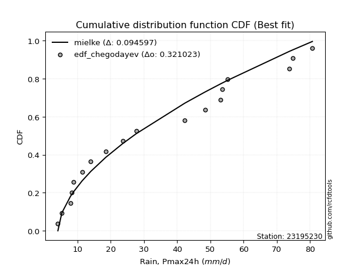</img>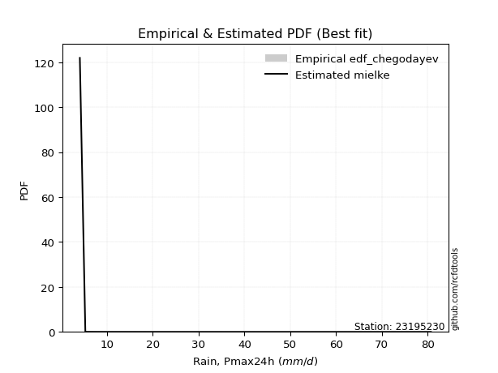</img>

</div>


### 6. EDF Blom (1958)

The Blom formula is a specific "plotting position" formula used in hydrology and statistical analysis to estimate the empirical cumulative probability (or non-exceedance probability) of a data series. It is particularly recommended for data that are approximately normally distributed. The constant _a_ is set to 0.375 (or 3/8).

<div align="center">


$P=(m-a)/(n+1-2a)$


</div>


**6.1. Empirical values**

<div align="center">

|                | 0                   | 1                   | 2                   | 3                   | 4                  | 5                  | 6                  | 7                  | 8                  | 9                  | 10                 | 11                 | 12                 | 13                 | 14                 | 15                 | 16                 | 17                 |
|:---------------|:--------------------|:--------------------|:--------------------|:--------------------|:-------------------|:-------------------|:-------------------|:-------------------|:-------------------|:-------------------|:-------------------|:-------------------|:-------------------|:-------------------|:-------------------|:-------------------|:-------------------|:-------------------|
| date           | 2022                | 2023                | 2018                | 2008                | 2020               | 2021               | 2019               | 2014               | 2009               | 2007               | 2010               | 2006               | 2013               | 2017               | 2015               | 2016               | 2012               | 2005               |
| x              | 4.1                 | 5.3                 | 7.9                 | 8.3                 | 8.8                | 11.4               | 14.0               | 18.5               | 23.6               | 27.7               | 42.3               | 48.4               | 53.0               | 53.506             | 55.1               | 73.7               | 74.8               | 80.7               |
| m              | 1                   | 2                   | 3                   | 4                   | 5                  | 6                  | 7                  | 8                  | 9                  | 10                 | 11                 | 12                 | 13                 | 14                 | 15                 | 16                 | 17                 | 18                 |
| empirical_dist | edf_blom            | edf_blom            | edf_blom            | edf_blom            | edf_blom           | edf_blom           | edf_blom           | edf_blom           | edf_blom           | edf_blom           | edf_blom           | edf_blom           | edf_blom           | edf_blom           | edf_blom           | edf_blom           | edf_blom           | edf_blom           |
| empirical      | 0.03424657534246575 | 0.08904109589041095 | 0.14383561643835616 | 0.19863013698630136 | 0.2534246575342466 | 0.3082191780821918 | 0.363013698630137  | 0.4178082191780822 | 0.4726027397260274 | 0.5273972602739726 | 0.5821917808219178 | 0.636986301369863  | 0.6917808219178082 | 0.7465753424657534 | 0.8013698630136986 | 0.8561643835616438 | 0.910958904109589  | 0.9657534246575342 |
| empirical_tr   | 1.0354609929078014  | 1.0977443609022557  | 1.168               | 1.2478632478632479  | 1.3394495412844036 | 1.4455445544554455 | 1.5698924731182795 | 1.7176470588235295 | 1.896103896103896  | 2.1159420289855073 | 2.3934426229508197 | 2.7547169811320753 | 3.2444444444444445 | 3.9459459459459456 | 5.0344827586206895 | 6.952380952380952  | 11.230769230769228 | 29.199999999999978 |

</div>


**6.2. Kolmogorov-Smirnov fit test (sorted by Δ)**


<div align="center">

|                | 0                   | 1                   | 2                   | 3                   | 4                   | 5                   | 6                   | 7                   | 8                   | 9                   | 10                  | 11                  | 12                  | 13                  | 14                  | 15                  | 16                  | 17                  | 18                  | 19                  | 20                  | 21                  | 22                  | 23                  | 24                  | 25                  | 26                  | 27                  | 28                  | 29                  | 30                  | 31                  | 32                  | 33                  | 34                  | 35                  | 36                  | 37                  | 38                  | 39                  | 40                  | 41                  | 42                  | 43                  | 44                  | 45                  | 46                  | 47                  | 48                  | 49                  | 50                  | 51                  | 52                  | 53                  | 54                  | 55                  | 56                  | 57                  | 58                  | 59                  | 60                  | 61                  | 62                  | 63                  | 64                  | 65                  | 66                  | 67                  | 68                  | 69                  | 70                  | 71                  | 72                  | 73                  | 74                  | 75                  | 76                  | 77                  | 78                  | 79                  | 80                  | 81                  | 82                  | 83                  | 84                  | 85                  | 86                  | 87                  | 88                  | 89                  | 90                  | 91                  | 92                  | 93                  | 94                  | 95                  | 96                  | 97                  | 98                  | 99                  | 100                 | 101                 | 102                 | 103                 | 104                 | 105                 | 106                 | 107                 | 108                 | 109                 | 110                 | 111                 | 112                 | 113                 | 114                 | 115                 | 116                 | 117                 | 118                 | 119                 | 120                 | 121                 | 122                 | 123                 | 124                 | 125                 | 126                 | 127                 | 128                 | 129                 | 130                 | 131                 | 132                 | 133                 | 134                 | 135                 | 136                 | 137                 | 138                 | 139                 | 140                 | 141                 | 142                 | 143                 | 144                 | 145                 | 146                 | 147                 | 148                 | 149                 | 150                 | 151                 | 152                 | 153                 | 154                 | 155                 | 156                 | 157                 | 158                 | 159                 |
|:---------------|:--------------------|:--------------------|:--------------------|:--------------------|:--------------------|:--------------------|:--------------------|:--------------------|:--------------------|:--------------------|:--------------------|:--------------------|:--------------------|:--------------------|:--------------------|:--------------------|:--------------------|:--------------------|:--------------------|:--------------------|:--------------------|:--------------------|:--------------------|:--------------------|:--------------------|:--------------------|:--------------------|:--------------------|:--------------------|:--------------------|:--------------------|:--------------------|:--------------------|:--------------------|:--------------------|:--------------------|:--------------------|:--------------------|:--------------------|:--------------------|:--------------------|:--------------------|:--------------------|:--------------------|:--------------------|:--------------------|:--------------------|:--------------------|:--------------------|:--------------------|:--------------------|:--------------------|:--------------------|:--------------------|:--------------------|:--------------------|:--------------------|:--------------------|:--------------------|:--------------------|:--------------------|:--------------------|:--------------------|:--------------------|:--------------------|:--------------------|:--------------------|:--------------------|:--------------------|:--------------------|:--------------------|:--------------------|:--------------------|:--------------------|:--------------------|:--------------------|:--------------------|:--------------------|:--------------------|:--------------------|:--------------------|:--------------------|:--------------------|:--------------------|:--------------------|:--------------------|:--------------------|:--------------------|:--------------------|:--------------------|:--------------------|:--------------------|:--------------------|:--------------------|:--------------------|:--------------------|:--------------------|:--------------------|:--------------------|:--------------------|:--------------------|:--------------------|:--------------------|:--------------------|:--------------------|:--------------------|:--------------------|:--------------------|:--------------------|:--------------------|:--------------------|:--------------------|:--------------------|:--------------------|:--------------------|:--------------------|:--------------------|:--------------------|:--------------------|:--------------------|:--------------------|:--------------------|:--------------------|:--------------------|:--------------------|:--------------------|:--------------------|:--------------------|:--------------------|:--------------------|:--------------------|:--------------------|:--------------------|:--------------------|:--------------------|:--------------------|:--------------------|:--------------------|:--------------------|:--------------------|:--------------------|:--------------------|:--------------------|:--------------------|:--------------------|:--------------------|:--------------------|:--------------------|:--------------------|:--------------------|:--------------------|:--------------------|:--------------------|:--------------------|:--------------------|:--------------------|:--------------------|:--------------------|:--------------------|:--------------------|
| station        | 23195230            | 23195230            | 23195230            | 23195230            | 23195230            | 23195230            | 23195230            | 23195230            | 23195230            | 23195230            | 23195230            | 23195230            | 23195230            | 23195230            | 23195230            | 23195230            | 23195230            | 23195230            | 23195230            | 23195230            | 23195230            | 23195230            | 23195230            | 23195230            | 23195230            | 23195230            | 23195230            | 23195230            | 23195230            | 23195230            | 23195230            | 23195230            | 23195230            | 23195230            | 23195230            | 23195230            | 23195230            | 23195230            | 23195230            | 23195230            | 23195230            | 23195230            | 23195230            | 23195230            | 23195230            | 23195230            | 23195230            | 23195230            | 23195230            | 23195230            | 23195230            | 23195230            | 23195230            | 23195230            | 23195230            | 23195230            | 23195230            | 23195230            | 23195230            | 23195230            | 23195230            | 23195230            | 23195230            | 23195230            | 23195230            | 23195230            | 23195230            | 23195230            | 23195230            | 23195230            | 23195230            | 23195230            | 23195230            | 23195230            | 23195230            | 23195230            | 23195230            | 23195230            | 23195230            | 23195230            | 23195230            | 23195230            | 23195230            | 23195230            | 23195230            | 23195230            | 23195230            | 23195230            | 23195230            | 23195230            | 23195230            | 23195230            | 23195230            | 23195230            | 23195230            | 23195230            | 23195230            | 23195230            | 23195230            | 23195230            | 23195230            | 23195230            | 23195230            | 23195230            | 23195230            | 23195230            | 23195230            | 23195230            | 23195230            | 23195230            | 23195230            | 23195230            | 23195230            | 23195230            | 23195230            | 23195230            | 23195230            | 23195230            | 23195230            | 23195230            | 23195230            | 23195230            | 23195230            | 23195230            | 23195230            | 23195230            | 23195230            | 23195230            | 23195230            | 23195230            | 23195230            | 23195230            | 23195230            | 23195230            | 23195230            | 23195230            | 23195230            | 23195230            | 23195230            | 23195230            | 23195230            | 23195230            | 23195230            | 23195230            | 23195230            | 23195230            | 23195230            | 23195230            | 23195230            | 23195230            | 23195230            | 23195230            | 23195230            | 23195230            | 23195230            | 23195230            | 23195230            | 23195230            | 23195230            | 23195230            |
| empirical_dist | edf_blom            | edf_blom            | edf_blom            | edf_blom            | edf_blom            | edf_blom            | edf_blom            | edf_blom            | edf_blom            | edf_blom            | edf_blom            | edf_blom            | edf_blom            | edf_blom            | edf_blom            | edf_blom            | edf_blom            | edf_blom            | edf_blom            | edf_blom            | edf_blom            | edf_blom            | edf_blom            | edf_blom            | edf_blom            | edf_blom            | edf_blom            | edf_blom            | edf_blom            | edf_blom            | edf_blom            | edf_blom            | edf_blom            | edf_blom            | edf_blom            | edf_blom            | edf_blom            | edf_blom            | edf_blom            | edf_blom            | edf_blom            | edf_blom            | edf_blom            | edf_blom            | edf_blom            | edf_blom            | edf_blom            | edf_blom            | edf_blom            | edf_blom            | edf_blom            | edf_blom            | edf_blom            | edf_blom            | edf_blom            | edf_blom            | edf_blom            | edf_blom            | edf_blom            | edf_blom            | edf_blom            | edf_blom            | edf_blom            | edf_blom            | edf_blom            | edf_blom            | edf_blom            | edf_blom            | edf_blom            | edf_blom            | edf_blom            | edf_blom            | edf_blom            | edf_blom            | edf_blom            | edf_blom            | edf_blom            | edf_blom            | edf_blom            | edf_blom            | edf_blom            | edf_blom            | edf_blom            | edf_blom            | edf_blom            | edf_blom            | edf_blom            | edf_blom            | edf_blom            | edf_blom            | edf_blom            | edf_blom            | edf_blom            | edf_blom            | edf_blom            | edf_blom            | edf_blom            | edf_blom            | edf_blom            | edf_blom            | edf_blom            | edf_blom            | edf_blom            | edf_blom            | edf_blom            | edf_blom            | edf_blom            | edf_blom            | edf_blom            | edf_blom            | edf_blom            | edf_blom            | edf_blom            | edf_blom            | edf_blom            | edf_blom            | edf_blom            | edf_blom            | edf_blom            | edf_blom            | edf_blom            | edf_blom            | edf_blom            | edf_blom            | edf_blom            | edf_blom            | edf_blom            | edf_blom            | edf_blom            | edf_blom            | edf_blom            | edf_blom            | edf_blom            | edf_blom            | edf_blom            | edf_blom            | edf_blom            | edf_blom            | edf_blom            | edf_blom            | edf_blom            | edf_blom            | edf_blom            | edf_blom            | edf_blom            | edf_blom            | edf_blom            | edf_blom            | edf_blom            | edf_blom            | edf_blom            | edf_blom            | edf_blom            | edf_blom            | edf_blom            | edf_blom            | edf_blom            | edf_blom            | edf_blom            | edf_blom            |
| p_dist         | loggenhalflogistic  | logtrapezoid        | logarcsine          | mielke              | logburr             | weibull_min         | truncweibull_min    | exponpow            | nakagami            | halfnorm            | logskewnorm         | logbeta             | foldnorm            | gausshyper          | logsemicircular     | logloggamma         | anglit              | semicircular        | burr                | dweibull            | logjohnsonsu        | logargus            | logtriang           | rayleigh            | logdweibull         | burr12              | loganglit           | maxwell             | genexpon            | logburr12           | logweibull_min      | loggenextreme       | loggausshyper       | halflogistic        | logweibull_max      | genlogistic         | pearson3            | loggenpareto        | exponnorm           | kstwobign           | loggompertz         | loggumbel_l         | t                   | truncnorm           | norm                | crystalball         | gumbel_r            | lomax               | logwrapcauchy       | logpearson3         | gompertz            | ncf                 | logncf              | loggengamma         | logf                | moyal               | logksone            | lognct              | logcrystalball      | lognorm             | logt                | logexponnorm        | loggamma            | loggamma            | logfatiguelife      | gengamma            | logerlang           | logbetaprime        | logloglaplace       | logfoldnorm         | logdgamma           | halfgennorm         | johnsonsu           | logrice             | arcsine             | loginvgamma         | logalpha            | invweibull          | genextreme          | invgamma            | loginvweibull       | erlang              | nct                 | skewnorm            | lognakagami         | logmaxwell          | loggenexpon         | f                   | logistic            | cosine              | loginvgauss         | lograyleigh         | rice                | logkstwobign        | fatiguelife         | logcosine           | invgauss            | betaprime           | loglomax            | dgamma              | truncexpon          | loglogistic         | loghalfnorm         | logtruncnorm        | hypsecant           | logtruncweibull_min | ksone               | bradford            | logkappa3           | gumbel_l            | logtukeylambda      | loghypsecant        | genpareto           | loggumbel_r         | loguniform          | laplace             | loghalflogistic     | logvonmises_line    | kappa4              | logmoyal            | logkappa4           | beta                | exponweib           | loglaplace          | loglaplace          | alpha               | wrapcauchy          | logmielke           | logexponweib        | vonmises_line       | kappa3              | uniform             | triang              | logbradford         | logwald             | logtruncexpon       | loglevy_l           | gamma               | powerlaw            | argus               | wald                | genhalflogistic     | logrdist            | levy_l              | trapezoid           | gennorm             | loggennorm          | logpowerlaw         | logjohnsonsb        | johnsonsb           | tukeylambda         | logexponpow         | rdist               | weibull_max         | truncpareto         | loghalfgennorm      | logtruncpareto      | loggenlogistic      | logvonmises         | vonmises            |
| delta          | 0.0825006112367852  | 0.08407476570411387 | 0.08954395041829    | 0.09348073793505607 | 0.10219776053611868 | 0.10417001023397054 | 0.10447758635133186 | 0.1054380081550586  | 0.10665261477525101 | 0.10746196524731466 | 0.10858894225326121 | 0.1097102916168193  | 0.10975654998744233 | 0.11314198474071499 | 0.1160059961051837  | 0.11623002944627414 | 0.11766192812794823 | 0.11788572668052241 | 0.11794640448121327 | 0.11857923756146815 | 0.11917485915133319 | 0.11943115833183104 | 0.12036338070252994 | 0.12095576053985785 | 0.12378754100503653 | 0.12564266096766952 | 0.12762531600759608 | 0.12784198728005336 | 0.12812010076871766 | 0.1291399487993391  | 0.1295649633916922  | 0.1306864652278418  | 0.13097444039264594 | 0.1337385177311703  | 0.13399661893573697 | 0.13416550458487628 | 0.13673640697476575 | 0.13971469382463897 | 0.14029151304980514 | 0.14114498686785817 | 0.14137493975682125 | 0.14332221711711202 | 0.14431627204080777 | 0.1443271719914938  | 0.1443271993475433  | 0.14432720951115247 | 0.14435153676298867 | 0.1445071999363573  | 0.14470525022640116 | 0.14560302883663911 | 0.1464292174356626  | 0.15058648174270595 | 0.15100261176117535 | 0.15260720574903275 | 0.15321637289498846 | 0.153676049544068   | 0.15382462378815354 | 0.15456220680656774 | 0.15457543603239643 | 0.15457549658834846 | 0.1545755098925098  | 0.15457635183379326 | 0.15524374925589357 | 0.15524374925589357 | 0.15553994157561746 | 0.15584480682947321 | 0.15687220193881668 | 0.1568793223014905  | 0.15719688525253706 | 0.15751892969004122 | 0.15758314269328466 | 0.15766542234799807 | 0.15803533338432374 | 0.15811505360526035 | 0.15879108173762158 | 0.15978285424343452 | 0.1602962212697956  | 0.16163620642649523 | 0.16163660932320745 | 0.16250281886439966 | 0.16283004036685944 | 0.16321355119059344 | 0.16391216368923966 | 0.1645326012328428  | 0.16512370904530027 | 0.1658822387786708  | 0.1660214399052009  | 0.16610772089455572 | 0.16656877061429853 | 0.1666677335717387  | 0.1678431442906888  | 0.1691278069349046  | 0.16914998075319382 | 0.16967020438466185 | 0.1696908144923558  | 0.17001569216266765 | 0.17192293932077596 | 0.17247037057973436 | 0.17373135037219298 | 0.1738823043727911  | 0.17529047438047843 | 0.1771145077630195  | 0.17969475323434125 | 0.18066939563023032 | 0.18175758182679033 | 0.18438746697629083 | 0.1873189312922494  | 0.1874735030035942  | 0.1894441767128483  | 0.19041655751343334 | 0.1906456715798347  | 0.19234939870422996 | 0.19718768312717264 | 0.19725113703067132 | 0.20102790471016785 | 0.20422699928985968 | 0.20483468640451286 | 0.20846460979481696 | 0.21001292296363702 | 0.210990868998282   | 0.21126833089297214 | 0.21236433885531708 | 0.21349588639067285 | 0.213663322043938   | 0.213663322043938   | 0.21887641159611437 | 0.2206234029254448  | 0.2264592230623237  | 0.22674146641937667 | 0.23305193090600873 | 0.23309277160897338 | 0.23377087878679498 | 0.248194709231141   | 0.25107926630928235 | 0.2534246575342466  | 0.2601686807474358  | 0.26416770472161943 | 0.2719365347650823  | 0.28112502021539565 | 0.28340027847551463 | 0.2973207505757946  | 0.3023028219576265  | 0.3182352430134986  | 0.38273680669157095 | 0.41042313995062796 | 0.410958904109589   | 0.410958904109589   | 0.426001844564478   | 0.4396303319207261  | 0.4691217402026817  | 0.4787948507737302  | 0.5036538168864908  | 0.5194228116457396  | 0.6392184161793215  | 0.7812072422699217  | 0.8013698630136986  | 0.8333175719811877  | 0.910958904109589   | 1.1400424018838455  | 12.755806499443118  |
| deltao         | 0.32102346734599996 | 0.32102346734599996 | 0.32102346734599996 | 0.32102346734599996 | 0.32102346734599996 | 0.32102346734599996 | 0.32102346734599996 | 0.32102346734599996 | 0.32102346734599996 | 0.32102346734599996 | 0.32102346734599996 | 0.32102346734599996 | 0.32102346734599996 | 0.32102346734599996 | 0.32102346734599996 | 0.32102346734599996 | 0.32102346734599996 | 0.32102346734599996 | 0.32102346734599996 | 0.32102346734599996 | 0.32102346734599996 | 0.32102346734599996 | 0.32102346734599996 | 0.32102346734599996 | 0.32102346734599996 | 0.32102346734599996 | 0.32102346734599996 | 0.32102346734599996 | 0.32102346734599996 | 0.32102346734599996 | 0.32102346734599996 | 0.32102346734599996 | 0.32102346734599996 | 0.32102346734599996 | 0.32102346734599996 | 0.32102346734599996 | 0.32102346734599996 | 0.32102346734599996 | 0.32102346734599996 | 0.32102346734599996 | 0.32102346734599996 | 0.32102346734599996 | 0.32102346734599996 | 0.32102346734599996 | 0.32102346734599996 | 0.32102346734599996 | 0.32102346734599996 | 0.32102346734599996 | 0.32102346734599996 | 0.32102346734599996 | 0.32102346734599996 | 0.32102346734599996 | 0.32102346734599996 | 0.32102346734599996 | 0.32102346734599996 | 0.32102346734599996 | 0.32102346734599996 | 0.32102346734599996 | 0.32102346734599996 | 0.32102346734599996 | 0.32102346734599996 | 0.32102346734599996 | 0.32102346734599996 | 0.32102346734599996 | 0.32102346734599996 | 0.32102346734599996 | 0.32102346734599996 | 0.32102346734599996 | 0.32102346734599996 | 0.32102346734599996 | 0.32102346734599996 | 0.32102346734599996 | 0.32102346734599996 | 0.32102346734599996 | 0.32102346734599996 | 0.32102346734599996 | 0.32102346734599996 | 0.32102346734599996 | 0.32102346734599996 | 0.32102346734599996 | 0.32102346734599996 | 0.32102346734599996 | 0.32102346734599996 | 0.32102346734599996 | 0.32102346734599996 | 0.32102346734599996 | 0.32102346734599996 | 0.32102346734599996 | 0.32102346734599996 | 0.32102346734599996 | 0.32102346734599996 | 0.32102346734599996 | 0.32102346734599996 | 0.32102346734599996 | 0.32102346734599996 | 0.32102346734599996 | 0.32102346734599996 | 0.32102346734599996 | 0.32102346734599996 | 0.32102346734599996 | 0.32102346734599996 | 0.32102346734599996 | 0.32102346734599996 | 0.32102346734599996 | 0.32102346734599996 | 0.32102346734599996 | 0.32102346734599996 | 0.32102346734599996 | 0.32102346734599996 | 0.32102346734599996 | 0.32102346734599996 | 0.32102346734599996 | 0.32102346734599996 | 0.32102346734599996 | 0.32102346734599996 | 0.32102346734599996 | 0.32102346734599996 | 0.32102346734599996 | 0.32102346734599996 | 0.32102346734599996 | 0.32102346734599996 | 0.32102346734599996 | 0.32102346734599996 | 0.32102346734599996 | 0.32102346734599996 | 0.32102346734599996 | 0.32102346734599996 | 0.32102346734599996 | 0.32102346734599996 | 0.32102346734599996 | 0.32102346734599996 | 0.32102346734599996 | 0.32102346734599996 | 0.32102346734599996 | 0.32102346734599996 | 0.32102346734599996 | 0.32102346734599996 | 0.32102346734599996 | 0.32102346734599996 | 0.32102346734599996 | 0.32102346734599996 | 0.32102346734599996 | 0.32102346734599996 | 0.32102346734599996 | 0.32102346734599996 | 0.32102346734599996 | 0.32102346734599996 | 0.32102346734599996 | 0.32102346734599996 | 0.32102346734599996 | 0.32102346734599996 | 0.32102346734599996 | 0.32102346734599996 | 0.32102346734599996 | 0.32102346734599996 | 0.32102346734599996 | 0.32102346734599996 | 0.32102346734599996 | 0.32102346734599996 | 0.32102346734599996 |
| eval           | Δo > Δ              | Δo > Δ              | Δo > Δ              | Δo > Δ              | Δo > Δ              | Δo > Δ              | Δo > Δ              | Δo > Δ              | Δo > Δ              | Δo > Δ              | Δo > Δ              | Δo > Δ              | Δo > Δ              | Δo > Δ              | Δo > Δ              | Δo > Δ              | Δo > Δ              | Δo > Δ              | Δo > Δ              | Δo > Δ              | Δo > Δ              | Δo > Δ              | Δo > Δ              | Δo > Δ              | Δo > Δ              | Δo > Δ              | Δo > Δ              | Δo > Δ              | Δo > Δ              | Δo > Δ              | Δo > Δ              | Δo > Δ              | Δo > Δ              | Δo > Δ              | Δo > Δ              | Δo > Δ              | Δo > Δ              | Δo > Δ              | Δo > Δ              | Δo > Δ              | Δo > Δ              | Δo > Δ              | Δo > Δ              | Δo > Δ              | Δo > Δ              | Δo > Δ              | Δo > Δ              | Δo > Δ              | Δo > Δ              | Δo > Δ              | Δo > Δ              | Δo > Δ              | Δo > Δ              | Δo > Δ              | Δo > Δ              | Δo > Δ              | Δo > Δ              | Δo > Δ              | Δo > Δ              | Δo > Δ              | Δo > Δ              | Δo > Δ              | Δo > Δ              | Δo > Δ              | Δo > Δ              | Δo > Δ              | Δo > Δ              | Δo > Δ              | Δo > Δ              | Δo > Δ              | Δo > Δ              | Δo > Δ              | Δo > Δ              | Δo > Δ              | Δo > Δ              | Δo > Δ              | Δo > Δ              | Δo > Δ              | Δo > Δ              | Δo > Δ              | Δo > Δ              | Δo > Δ              | Δo > Δ              | Δo > Δ              | Δo > Δ              | Δo > Δ              | Δo > Δ              | Δo > Δ              | Δo > Δ              | Δo > Δ              | Δo > Δ              | Δo > Δ              | Δo > Δ              | Δo > Δ              | Δo > Δ              | Δo > Δ              | Δo > Δ              | Δo > Δ              | Δo > Δ              | Δo > Δ              | Δo > Δ              | Δo > Δ              | Δo > Δ              | Δo > Δ              | Δo > Δ              | Δo > Δ              | Δo > Δ              | Δo > Δ              | Δo > Δ              | Δo > Δ              | Δo > Δ              | Δo > Δ              | Δo > Δ              | Δo > Δ              | Δo > Δ              | Δo > Δ              | Δo > Δ              | Δo > Δ              | Δo > Δ              | Δo > Δ              | Δo > Δ              | Δo > Δ              | Δo > Δ              | Δo > Δ              | Δo > Δ              | Δo > Δ              | Δo > Δ              | Δo > Δ              | Δo > Δ              | Δo > Δ              | Δo > Δ              | Δo > Δ              | Δo > Δ              | Δo > Δ              | Δo > Δ              | Δo > Δ              | Δo > Δ              | Δo > Δ              | Δo > Δ              | Δo > Δ              | Δo > Δ              | Δo > Δ              | Δo > Δ              | Δo <= Δ             | Δo <= Δ             | Δo <= Δ             | Δo <= Δ             | Δo <= Δ             | Δo <= Δ             | Δo <= Δ             | Δo <= Δ             | Δo <= Δ             | Δo <= Δ             | Δo <= Δ             | Δo <= Δ             | Δo <= Δ             | Δo <= Δ             | Δo <= Δ             | Δo <= Δ             | Δo <= Δ             |
| fit            | 1                   | 1                   | 1                   | 1                   | 1                   | 1                   | 1                   | 1                   | 1                   | 1                   | 1                   | 1                   | 1                   | 1                   | 1                   | 1                   | 1                   | 1                   | 1                   | 1                   | 1                   | 1                   | 1                   | 1                   | 1                   | 1                   | 1                   | 1                   | 1                   | 1                   | 1                   | 1                   | 1                   | 1                   | 1                   | 1                   | 1                   | 1                   | 1                   | 1                   | 1                   | 1                   | 1                   | 1                   | 1                   | 1                   | 1                   | 1                   | 1                   | 1                   | 1                   | 1                   | 1                   | 1                   | 1                   | 1                   | 1                   | 1                   | 1                   | 1                   | 1                   | 1                   | 1                   | 1                   | 1                   | 1                   | 1                   | 1                   | 1                   | 1                   | 1                   | 1                   | 1                   | 1                   | 1                   | 1                   | 1                   | 1                   | 1                   | 1                   | 1                   | 1                   | 1                   | 1                   | 1                   | 1                   | 1                   | 1                   | 1                   | 1                   | 1                   | 1                   | 1                   | 1                   | 1                   | 1                   | 1                   | 1                   | 1                   | 1                   | 1                   | 1                   | 1                   | 1                   | 1                   | 1                   | 1                   | 1                   | 1                   | 1                   | 1                   | 1                   | 1                   | 1                   | 1                   | 1                   | 1                   | 1                   | 1                   | 1                   | 1                   | 1                   | 1                   | 1                   | 1                   | 1                   | 1                   | 1                   | 1                   | 1                   | 1                   | 1                   | 1                   | 1                   | 1                   | 1                   | 1                   | 1                   | 1                   | 1                   | 1                   | 1                   | 1                   | 0                   | 0                   | 0                   | 0                   | 0                   | 0                   | 0                   | 0                   | 0                   | 0                   | 0                   | 0                   | 0                   | 0                   | 0                   | 0                   | 0                   |
| n              | 18                  | 18                  | 18                  | 18                  | 18                  | 18                  | 18                  | 18                  | 18                  | 18                  | 18                  | 18                  | 18                  | 18                  | 18                  | 18                  | 18                  | 18                  | 18                  | 18                  | 18                  | 18                  | 18                  | 18                  | 18                  | 18                  | 18                  | 18                  | 18                  | 18                  | 18                  | 18                  | 18                  | 18                  | 18                  | 18                  | 18                  | 18                  | 18                  | 18                  | 18                  | 18                  | 18                  | 18                  | 18                  | 18                  | 18                  | 18                  | 18                  | 18                  | 18                  | 18                  | 18                  | 18                  | 18                  | 18                  | 18                  | 18                  | 18                  | 18                  | 18                  | 18                  | 18                  | 18                  | 18                  | 18                  | 18                  | 18                  | 18                  | 18                  | 18                  | 18                  | 18                  | 18                  | 18                  | 18                  | 18                  | 18                  | 18                  | 18                  | 18                  | 18                  | 18                  | 18                  | 18                  | 18                  | 18                  | 18                  | 18                  | 18                  | 18                  | 18                  | 18                  | 18                  | 18                  | 18                  | 18                  | 18                  | 18                  | 18                  | 18                  | 18                  | 18                  | 18                  | 18                  | 18                  | 18                  | 18                  | 18                  | 18                  | 18                  | 18                  | 18                  | 18                  | 18                  | 18                  | 18                  | 18                  | 18                  | 18                  | 18                  | 18                  | 18                  | 18                  | 18                  | 18                  | 18                  | 18                  | 18                  | 18                  | 18                  | 18                  | 18                  | 18                  | 18                  | 18                  | 18                  | 18                  | 18                  | 18                  | 18                  | 18                  | 18                  | 18                  | 18                  | 18                  | 18                  | 18                  | 18                  | 18                  | 18                  | 18                  | 18                  | 18                  | 18                  | 18                  | 18                  | 18                  | 18                  | 18                  |
| best_fit       | 1                   | 0                   | 0                   | 0                   | 0                   | 0                   | 0                   | 0                   | 0                   | 0                   | 0                   | 0                   | 0                   | 0                   | 0                   | 0                   | 0                   | 0                   | 0                   | 0                   | 0                   | 0                   | 0                   | 0                   | 0                   | 0                   | 0                   | 0                   | 0                   | 0                   | 0                   | 0                   | 0                   | 0                   | 0                   | 0                   | 0                   | 0                   | 0                   | 0                   | 0                   | 0                   | 0                   | 0                   | 0                   | 0                   | 0                   | 0                   | 0                   | 0                   | 0                   | 0                   | 0                   | 0                   | 0                   | 0                   | 0                   | 0                   | 0                   | 0                   | 0                   | 0                   | 0                   | 0                   | 0                   | 0                   | 0                   | 0                   | 0                   | 0                   | 0                   | 0                   | 0                   | 0                   | 0                   | 0                   | 0                   | 0                   | 0                   | 0                   | 0                   | 0                   | 0                   | 0                   | 0                   | 0                   | 0                   | 0                   | 0                   | 0                   | 0                   | 0                   | 0                   | 0                   | 0                   | 0                   | 0                   | 0                   | 0                   | 0                   | 0                   | 0                   | 0                   | 0                   | 0                   | 0                   | 0                   | 0                   | 0                   | 0                   | 0                   | 0                   | 0                   | 0                   | 0                   | 0                   | 0                   | 0                   | 0                   | 0                   | 0                   | 0                   | 0                   | 0                   | 0                   | 0                   | 0                   | 0                   | 0                   | 0                   | 0                   | 0                   | 0                   | 0                   | 0                   | 0                   | 0                   | 0                   | 0                   | 0                   | 0                   | 0                   | 0                   | 0                   | 0                   | 0                   | 0                   | 0                   | 0                   | 0                   | 0                   | 0                   | 0                   | 0                   | 0                   | 0                   | 0                   | 0                   | 0                   | 0                   |
| best_fit_sort  | 1                   | 2                   | 3                   | 4                   | 5                   | 6                   | 7                   | 8                   | 9                   | 10                  | 11                  | 12                  | 13                  | 14                  | 15                  | 16                  | 17                  | 18                  | 19                  | 20                  | 21                  | 22                  | 23                  | 24                  | 25                  | 26                  | 27                  | 28                  | 29                  | 30                  | 31                  | 32                  | 33                  | 34                  | 35                  | 36                  | 37                  | 38                  | 39                  | 40                  | 41                  | 42                  | 43                  | 44                  | 45                  | 46                  | 47                  | 48                  | 49                  | 50                  | 51                  | 52                  | 53                  | 54                  | 55                  | 56                  | 57                  | 58                  | 59                  | 60                  | 61                  | 62                  | 63                  | 64                  | 65                  | 66                  | 67                  | 68                  | 69                  | 70                  | 71                  | 72                  | 73                  | 74                  | 75                  | 76                  | 77                  | 78                  | 79                  | 80                  | 81                  | 82                  | 83                  | 84                  | 85                  | 86                  | 87                  | 88                  | 89                  | 90                  | 91                  | 92                  | 93                  | 94                  | 95                  | 96                  | 97                  | 98                  | 99                  | 100                 | 101                 | 102                 | 103                 | 104                 | 105                 | 106                 | 107                 | 108                 | 109                 | 110                 | 111                 | 112                 | 113                 | 114                 | 115                 | 116                 | 117                 | 118                 | 119                 | 120                 | 121                 | 122                 | 123                 | 124                 | 125                 | 126                 | 127                 | 128                 | 129                 | 130                 | 131                 | 132                 | 133                 | 134                 | 135                 | 136                 | 137                 | 138                 | 139                 | 140                 | 141                 | 142                 | 143                 | 144                 | 145                 | 146                 | 147                 | 148                 | 149                 | 150                 | 151                 | 152                 | 153                 | 154                 | 155                 | 156                 | 157                 | 158                 | 159                 | 160                 |

</div>


**6.3. Best fit**

<div align="center">

|   id |   station | empirical_dist   | p_dist             |     delta |   deltao | eval   |   fit |   n |   best_fit |   best_fit_sort |
|-----:|----------:|:-----------------|:-------------------|----------:|---------:|:-------|------:|----:|-----------:|----------------:|
|    0 |  23195230 | edf_blom         | loggenhalflogistic | 0.0825006 | 0.321023 | Δo > Δ |     1 |  18 |          1 |               1 |

</div>


<div align="center">

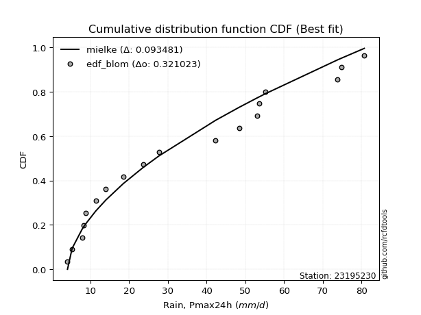</img>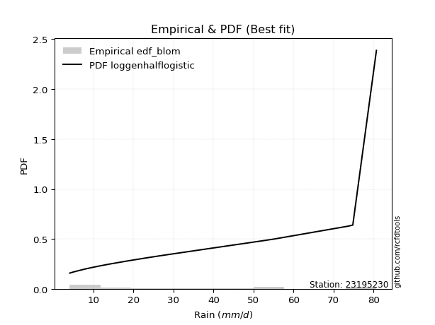</img>

</div>


### 7. EDF Tukey (1962)

In hydrology, the Tukey formula is used as a plotting position formula to estimate the empirical probability or frequency of a flood event (or other hydrological data). The formula parameter is given as _c=0.333_ (or 1/3).

<div align="center">


$P=(m-c)/(n+1-2c)$


</div>


**7.1. Empirical values**

<div align="center">

|                | 0                   | 1                   | 2                   | 3         | 4                  | 5                  | 6                   | 7                   | 8                  | 9                  | 10                 | 11                 | 12                 | 13                 | 14                | 15                 | 16                 | 17                 |
|:---------------|:--------------------|:--------------------|:--------------------|:----------|:-------------------|:-------------------|:--------------------|:--------------------|:-------------------|:-------------------|:-------------------|:-------------------|:-------------------|:-------------------|:------------------|:-------------------|:-------------------|:-------------------|
| date           | 2022                | 2023                | 2018                | 2008      | 2020               | 2021               | 2019                | 2014                | 2009               | 2007               | 2010               | 2006               | 2013               | 2017               | 2015              | 2016               | 2012               | 2005               |
| x              | 4.1                 | 5.3                 | 7.9                 | 8.3       | 8.8                | 11.4               | 14.0                | 18.5                | 23.6               | 27.7               | 42.3               | 48.4               | 53.0               | 53.506             | 55.1              | 73.7               | 74.8               | 80.7               |
| m              | 1                   | 2                   | 3                   | 4         | 5                  | 6                  | 7                   | 8                   | 9                  | 10                 | 11                 | 12                 | 13                 | 14                 | 15                | 16                 | 17                 | 18                 |
| empirical_dist | edf_tukey           | edf_tukey           | edf_tukey           | edf_tukey | edf_tukey          | edf_tukey          | edf_tukey           | edf_tukey           | edf_tukey          | edf_tukey          | edf_tukey          | edf_tukey          | edf_tukey          | edf_tukey          | edf_tukey         | edf_tukey          | edf_tukey          | edf_tukey          |
| empirical      | 0.03636363636363636 | 0.09090909090909091 | 0.14545454545454545 | 0.2       | 0.2545454545454545 | 0.3090909090909091 | 0.36363636363636365 | 0.41818181818181815 | 0.4727272727272727 | 0.5272727272727272 | 0.5818181818181818 | 0.6363636363636364 | 0.6909090909090909 | 0.7454545454545455 | 0.8               | 0.8545454545454545 | 0.9090909090909091 | 0.9636363636363636 |
| empirical_tr   | 1.0377358490566038  | 1.1                 | 1.1702127659574468  | 1.25      | 1.3414634146341462 | 1.4473684210526316 | 1.5714285714285714  | 1.71875             | 1.8965517241379308 | 2.115384615384615  | 2.391304347826087  | 2.75               | 3.235294117647059  | 3.928571428571429  | 5.000000000000001 | 6.874999999999997  | 10.999999999999996 | 27.49999999999999  |

</div>


**7.2. Kolmogorov-Smirnov fit test (sorted by Δ)**


<div align="center">

|                | 0                   | 1                   | 2                   | 3                   | 4                   | 5                   | 6                   | 7                   | 8                   | 9                   | 10                  | 11                  | 12                  | 13                  | 14                  | 15                  | 16                  | 17                  | 18                  | 19                  | 20                  | 21                  | 22                  | 23                  | 24                  | 25                  | 26                  | 27                  | 28                  | 29                  | 30                  | 31                  | 32                  | 33                  | 34                  | 35                  | 36                  | 37                  | 38                  | 39                  | 40                  | 41                  | 42                  | 43                  | 44                  | 45                  | 46                  | 47                  | 48                  | 49                  | 50                  | 51                  | 52                  | 53                  | 54                  | 55                  | 56                  | 57                  | 58                  | 59                  | 60                  | 61                  | 62                  | 63                  | 64                  | 65                  | 66                  | 67                  | 68                  | 69                  | 70                  | 71                  | 72                  | 73                  | 74                  | 75                  | 76                  | 77                  | 78                  | 79                  | 80                  | 81                  | 82                  | 83                  | 84                  | 85                  | 86                  | 87                  | 88                  | 89                  | 90                  | 91                  | 92                  | 93                  | 94                  | 95                  | 96                  | 97                  | 98                  | 99                  | 100                 | 101                 | 102                 | 103                 | 104                 | 105                 | 106                 | 107                 | 108                 | 109                 | 110                 | 111                 | 112                 | 113                 | 114                 | 115                 | 116                 | 117                 | 118                 | 119                 | 120                 | 121                 | 122                 | 123                 | 124                 | 125                 | 126                 | 127                 | 128                 | 129                 | 130                 | 131                 | 132                 | 133                 | 134                 | 135                 | 136                 | 137                 | 138                 | 139                 | 140                 | 141                 | 142                 | 143                 | 144                 | 145                 | 146                 | 147                 | 148                 | 149                 | 150                 | 151                 | 152                 | 153                 | 154                 | 155                 | 156                 | 157                 | 158                 | 159                 |
|:---------------|:--------------------|:--------------------|:--------------------|:--------------------|:--------------------|:--------------------|:--------------------|:--------------------|:--------------------|:--------------------|:--------------------|:--------------------|:--------------------|:--------------------|:--------------------|:--------------------|:--------------------|:--------------------|:--------------------|:--------------------|:--------------------|:--------------------|:--------------------|:--------------------|:--------------------|:--------------------|:--------------------|:--------------------|:--------------------|:--------------------|:--------------------|:--------------------|:--------------------|:--------------------|:--------------------|:--------------------|:--------------------|:--------------------|:--------------------|:--------------------|:--------------------|:--------------------|:--------------------|:--------------------|:--------------------|:--------------------|:--------------------|:--------------------|:--------------------|:--------------------|:--------------------|:--------------------|:--------------------|:--------------------|:--------------------|:--------------------|:--------------------|:--------------------|:--------------------|:--------------------|:--------------------|:--------------------|:--------------------|:--------------------|:--------------------|:--------------------|:--------------------|:--------------------|:--------------------|:--------------------|:--------------------|:--------------------|:--------------------|:--------------------|:--------------------|:--------------------|:--------------------|:--------------------|:--------------------|:--------------------|:--------------------|:--------------------|:--------------------|:--------------------|:--------------------|:--------------------|:--------------------|:--------------------|:--------------------|:--------------------|:--------------------|:--------------------|:--------------------|:--------------------|:--------------------|:--------------------|:--------------------|:--------------------|:--------------------|:--------------------|:--------------------|:--------------------|:--------------------|:--------------------|:--------------------|:--------------------|:--------------------|:--------------------|:--------------------|:--------------------|:--------------------|:--------------------|:--------------------|:--------------------|:--------------------|:--------------------|:--------------------|:--------------------|:--------------------|:--------------------|:--------------------|:--------------------|:--------------------|:--------------------|:--------------------|:--------------------|:--------------------|:--------------------|:--------------------|:--------------------|:--------------------|:--------------------|:--------------------|:--------------------|:--------------------|:--------------------|:--------------------|:--------------------|:--------------------|:--------------------|:--------------------|:--------------------|:--------------------|:--------------------|:--------------------|:--------------------|:--------------------|:--------------------|:--------------------|:--------------------|:--------------------|:--------------------|:--------------------|:--------------------|:--------------------|:--------------------|:--------------------|:--------------------|:--------------------|:--------------------|
| station        | 23195230            | 23195230            | 23195230            | 23195230            | 23195230            | 23195230            | 23195230            | 23195230            | 23195230            | 23195230            | 23195230            | 23195230            | 23195230            | 23195230            | 23195230            | 23195230            | 23195230            | 23195230            | 23195230            | 23195230            | 23195230            | 23195230            | 23195230            | 23195230            | 23195230            | 23195230            | 23195230            | 23195230            | 23195230            | 23195230            | 23195230            | 23195230            | 23195230            | 23195230            | 23195230            | 23195230            | 23195230            | 23195230            | 23195230            | 23195230            | 23195230            | 23195230            | 23195230            | 23195230            | 23195230            | 23195230            | 23195230            | 23195230            | 23195230            | 23195230            | 23195230            | 23195230            | 23195230            | 23195230            | 23195230            | 23195230            | 23195230            | 23195230            | 23195230            | 23195230            | 23195230            | 23195230            | 23195230            | 23195230            | 23195230            | 23195230            | 23195230            | 23195230            | 23195230            | 23195230            | 23195230            | 23195230            | 23195230            | 23195230            | 23195230            | 23195230            | 23195230            | 23195230            | 23195230            | 23195230            | 23195230            | 23195230            | 23195230            | 23195230            | 23195230            | 23195230            | 23195230            | 23195230            | 23195230            | 23195230            | 23195230            | 23195230            | 23195230            | 23195230            | 23195230            | 23195230            | 23195230            | 23195230            | 23195230            | 23195230            | 23195230            | 23195230            | 23195230            | 23195230            | 23195230            | 23195230            | 23195230            | 23195230            | 23195230            | 23195230            | 23195230            | 23195230            | 23195230            | 23195230            | 23195230            | 23195230            | 23195230            | 23195230            | 23195230            | 23195230            | 23195230            | 23195230            | 23195230            | 23195230            | 23195230            | 23195230            | 23195230            | 23195230            | 23195230            | 23195230            | 23195230            | 23195230            | 23195230            | 23195230            | 23195230            | 23195230            | 23195230            | 23195230            | 23195230            | 23195230            | 23195230            | 23195230            | 23195230            | 23195230            | 23195230            | 23195230            | 23195230            | 23195230            | 23195230            | 23195230            | 23195230            | 23195230            | 23195230            | 23195230            | 23195230            | 23195230            | 23195230            | 23195230            | 23195230            | 23195230            |
| empirical_dist | edf_tukey           | edf_tukey           | edf_tukey           | edf_tukey           | edf_tukey           | edf_tukey           | edf_tukey           | edf_tukey           | edf_tukey           | edf_tukey           | edf_tukey           | edf_tukey           | edf_tukey           | edf_tukey           | edf_tukey           | edf_tukey           | edf_tukey           | edf_tukey           | edf_tukey           | edf_tukey           | edf_tukey           | edf_tukey           | edf_tukey           | edf_tukey           | edf_tukey           | edf_tukey           | edf_tukey           | edf_tukey           | edf_tukey           | edf_tukey           | edf_tukey           | edf_tukey           | edf_tukey           | edf_tukey           | edf_tukey           | edf_tukey           | edf_tukey           | edf_tukey           | edf_tukey           | edf_tukey           | edf_tukey           | edf_tukey           | edf_tukey           | edf_tukey           | edf_tukey           | edf_tukey           | edf_tukey           | edf_tukey           | edf_tukey           | edf_tukey           | edf_tukey           | edf_tukey           | edf_tukey           | edf_tukey           | edf_tukey           | edf_tukey           | edf_tukey           | edf_tukey           | edf_tukey           | edf_tukey           | edf_tukey           | edf_tukey           | edf_tukey           | edf_tukey           | edf_tukey           | edf_tukey           | edf_tukey           | edf_tukey           | edf_tukey           | edf_tukey           | edf_tukey           | edf_tukey           | edf_tukey           | edf_tukey           | edf_tukey           | edf_tukey           | edf_tukey           | edf_tukey           | edf_tukey           | edf_tukey           | edf_tukey           | edf_tukey           | edf_tukey           | edf_tukey           | edf_tukey           | edf_tukey           | edf_tukey           | edf_tukey           | edf_tukey           | edf_tukey           | edf_tukey           | edf_tukey           | edf_tukey           | edf_tukey           | edf_tukey           | edf_tukey           | edf_tukey           | edf_tukey           | edf_tukey           | edf_tukey           | edf_tukey           | edf_tukey           | edf_tukey           | edf_tukey           | edf_tukey           | edf_tukey           | edf_tukey           | edf_tukey           | edf_tukey           | edf_tukey           | edf_tukey           | edf_tukey           | edf_tukey           | edf_tukey           | edf_tukey           | edf_tukey           | edf_tukey           | edf_tukey           | edf_tukey           | edf_tukey           | edf_tukey           | edf_tukey           | edf_tukey           | edf_tukey           | edf_tukey           | edf_tukey           | edf_tukey           | edf_tukey           | edf_tukey           | edf_tukey           | edf_tukey           | edf_tukey           | edf_tukey           | edf_tukey           | edf_tukey           | edf_tukey           | edf_tukey           | edf_tukey           | edf_tukey           | edf_tukey           | edf_tukey           | edf_tukey           | edf_tukey           | edf_tukey           | edf_tukey           | edf_tukey           | edf_tukey           | edf_tukey           | edf_tukey           | edf_tukey           | edf_tukey           | edf_tukey           | edf_tukey           | edf_tukey           | edf_tukey           | edf_tukey           | edf_tukey           | edf_tukey           | edf_tukey           | edf_tukey           |
| p_dist         | loggenhalflogistic  | logtrapezoid        | logarcsine          | mielke              | logburr             | nakagami            | weibull_min         | truncweibull_min    | exponpow            | halfnorm            | logbeta             | logskewnorm         | foldnorm            | gausshyper          | semicircular        | logsemicircular     | logloggamma         | dweibull            | anglit              | burr                | logjohnsonsu        | logargus            | logtriang           | rayleigh            | logdweibull         | burr12              | loganglit           | maxwell             | genexpon            | logburr12           | logweibull_min      | loggenextreme       | loggausshyper       | halflogistic        | logweibull_max      | genlogistic         | pearson3            | loggenpareto        | exponnorm           | loggompertz         | kstwobign           | logwrapcauchy       | loggumbel_l         | lomax               | t                   | truncnorm           | norm                | crystalball         | gumbel_r            | logpearson3         | gompertz            | ncf                 | logncf              | loggengamma         | logf                | logksone            | moyal               | lognct              | logcrystalball      | lognorm             | logt                | logexponnorm        | logloglaplace       | loggamma            | loggamma            | logfatiguelife      | gengamma            | arcsine             | logerlang           | logbetaprime        | logfoldnorm         | halfgennorm         | johnsonsu           | logrice             | logdgamma           | loginvgamma         | logalpha            | invweibull          | genextreme          | invgamma            | loginvweibull       | erlang              | nct                 | skewnorm            | lognakagami         | logmaxwell          | loggenexpon         | f                   | cosine              | logistic            | loginvgauss         | lograyleigh         | rice                | logkstwobign        | fatiguelife         | logcosine           | dgamma              | loglomax            | invgauss            | betaprime           | truncexpon          | loglogistic         | loghalfnorm         | logtruncnorm        | hypsecant           | logtruncweibull_min | ksone               | bradford            | logkappa3           | gumbel_l            | logtukeylambda      | loghypsecant        | genpareto           | loggumbel_r         | loguniform          | laplace             | loghalflogistic     | logvonmises_line    | beta                | kappa4              | logmoyal            | logkappa4           | exponweib           | loglaplace          | loglaplace          | alpha               | wrapcauchy          | logexponweib        | logmielke           | vonmises_line       | kappa3              | uniform             | triang              | logbradford         | logwald             | logtruncexpon       | loglevy_l           | gamma               | powerlaw            | argus               | wald                | genhalflogistic     | logrdist            | levy_l              | gennorm             | loggennorm          | trapezoid           | logpowerlaw         | logjohnsonsb        | johnsonsb           | tukeylambda         | logexponpow         | rdist               | weibull_max         | truncpareto         | loghalfgennorm      | logtruncpareto      | loggenlogistic      | logvonmises         | vonmises            |
| delta          | 0.08411954025297452 | 0.08469743071034053 | 0.09090909090909091 | 0.09410340294128272 | 0.10282042554234533 | 0.10453555375408041 | 0.10454360923770656 | 0.10510025135755852 | 0.10606067316128526 | 0.10808463025354131 | 0.10809136260063001 | 0.10921160725948786 | 0.11037921499366898 | 0.11376464974694164 | 0.1157686656593518  | 0.11637959510891971 | 0.1168526944525008  | 0.11720937454776958 | 0.11803552713168419 | 0.11856906948743992 | 0.11979752415755984 | 0.1200538233380577  | 0.1209860457087566  | 0.1215784255460845  | 0.12441020601126318 | 0.12626532597389617 | 0.1279989150113321  | 0.12846465228628    | 0.1292408977799256  | 0.12976261380556575 | 0.13018762839791886 | 0.13130913023406846 | 0.13134803939638195 | 0.13455574393147607 | 0.13461928394196362 | 0.13478816959110293 | 0.1373590719809924  | 0.13759763280346837 | 0.14066511205354115 | 0.14174853876055726 | 0.14176765187408483 | 0.14308632121021186 | 0.14394488212333867 | 0.1448807989400933  | 0.14493893704703442 | 0.14494983699772046 | 0.14494986435376994 | 0.14494987451737912 | 0.14497420176921533 | 0.14597662784037513 | 0.14755001444687052 | 0.1512091467489326  | 0.15137621076491137 | 0.15298080475276876 | 0.15358997189872448 | 0.15419822279188955 | 0.15429871455029465 | 0.15493580581030375 | 0.15494903503613244 | 0.15494909559208447 | 0.1549491088962458  | 0.15494995083752927 | 0.15507982423136646 | 0.15561734825962958 | 0.15561734825962958 | 0.15591354057935347 | 0.15621840583320923 | 0.15667402071645098 | 0.1572458009425527  | 0.1572529213052265  | 0.15789252869377723 | 0.1580390213517341  | 0.15840893238805975 | 0.15848865260899636 | 0.1587039397044926  | 0.16015645324717054 | 0.1606698202735316  | 0.16200980543023125 | 0.16201020832694346 | 0.16287641786813567 | 0.16320363937059545 | 0.16358715019432946 | 0.16428576269297568 | 0.16515526623906945 | 0.16549730804903628 | 0.16625583778240682 | 0.16639503890893692 | 0.16648131989829174 | 0.1670639010598332  | 0.1671914356205252  | 0.16821674329442482 | 0.1695014059386406  | 0.16977264575942047 | 0.17004380338839786 | 0.1700644134960918  | 0.17038929116640367 | 0.17176524335162047 | 0.1721124213560037  | 0.17229653832451197 | 0.17284396958347037 | 0.17591313938670508 | 0.17748810676675553 | 0.18006835223807727 | 0.18104299463396634 | 0.1821311808305263  | 0.18476106598002684 | 0.18719439829100404 | 0.18809616800982085 | 0.1898177757165843  | 0.19029202451218796 | 0.1910192705835707  | 0.19272299770796597 | 0.1975612821309086  | 0.19762473603440733 | 0.20140150371390386 | 0.20460059829359564 | 0.20520828540824887 | 0.20883820879855297 | 0.21024727783414648 | 0.21063558796986367 | 0.21136446800201802 | 0.21164192989670816 | 0.21386948539440886 | 0.21403692104767402 | 0.21403692104767402 | 0.2192500105998504  | 0.21925353991174623 | 0.22512253740318738 | 0.2268328220660597  | 0.23367459591223538 | 0.23371543661520003 | 0.23439354379302163 | 0.24807017622989563 | 0.25145286531301836 | 0.2545454545454545  | 0.26054227975117183 | 0.26205064370044884 | 0.2723101337688183  | 0.27950609119920633 | 0.28327574547426926 | 0.2981924815845119  | 0.3021782889563811  | 0.3166163139973093  | 0.38061974567040036 | 0.40909090909090906 | 0.40909090909090906 | 0.4102986069493826  | 0.4243829155482887  | 0.43776233690204613 | 0.46775187718898315 | 0.4766777897525596  | 0.5020348878703016  | 0.517305750624569   | 0.6373504211606416  | 0.7793392472512417  | 0.8                 | 0.8314495769625078  | 0.9090909090909091  | 1.1404160008875817  | 12.757923560464288  |
| deltao         | 0.32102346734599996 | 0.32102346734599996 | 0.32102346734599996 | 0.32102346734599996 | 0.32102346734599996 | 0.32102346734599996 | 0.32102346734599996 | 0.32102346734599996 | 0.32102346734599996 | 0.32102346734599996 | 0.32102346734599996 | 0.32102346734599996 | 0.32102346734599996 | 0.32102346734599996 | 0.32102346734599996 | 0.32102346734599996 | 0.32102346734599996 | 0.32102346734599996 | 0.32102346734599996 | 0.32102346734599996 | 0.32102346734599996 | 0.32102346734599996 | 0.32102346734599996 | 0.32102346734599996 | 0.32102346734599996 | 0.32102346734599996 | 0.32102346734599996 | 0.32102346734599996 | 0.32102346734599996 | 0.32102346734599996 | 0.32102346734599996 | 0.32102346734599996 | 0.32102346734599996 | 0.32102346734599996 | 0.32102346734599996 | 0.32102346734599996 | 0.32102346734599996 | 0.32102346734599996 | 0.32102346734599996 | 0.32102346734599996 | 0.32102346734599996 | 0.32102346734599996 | 0.32102346734599996 | 0.32102346734599996 | 0.32102346734599996 | 0.32102346734599996 | 0.32102346734599996 | 0.32102346734599996 | 0.32102346734599996 | 0.32102346734599996 | 0.32102346734599996 | 0.32102346734599996 | 0.32102346734599996 | 0.32102346734599996 | 0.32102346734599996 | 0.32102346734599996 | 0.32102346734599996 | 0.32102346734599996 | 0.32102346734599996 | 0.32102346734599996 | 0.32102346734599996 | 0.32102346734599996 | 0.32102346734599996 | 0.32102346734599996 | 0.32102346734599996 | 0.32102346734599996 | 0.32102346734599996 | 0.32102346734599996 | 0.32102346734599996 | 0.32102346734599996 | 0.32102346734599996 | 0.32102346734599996 | 0.32102346734599996 | 0.32102346734599996 | 0.32102346734599996 | 0.32102346734599996 | 0.32102346734599996 | 0.32102346734599996 | 0.32102346734599996 | 0.32102346734599996 | 0.32102346734599996 | 0.32102346734599996 | 0.32102346734599996 | 0.32102346734599996 | 0.32102346734599996 | 0.32102346734599996 | 0.32102346734599996 | 0.32102346734599996 | 0.32102346734599996 | 0.32102346734599996 | 0.32102346734599996 | 0.32102346734599996 | 0.32102346734599996 | 0.32102346734599996 | 0.32102346734599996 | 0.32102346734599996 | 0.32102346734599996 | 0.32102346734599996 | 0.32102346734599996 | 0.32102346734599996 | 0.32102346734599996 | 0.32102346734599996 | 0.32102346734599996 | 0.32102346734599996 | 0.32102346734599996 | 0.32102346734599996 | 0.32102346734599996 | 0.32102346734599996 | 0.32102346734599996 | 0.32102346734599996 | 0.32102346734599996 | 0.32102346734599996 | 0.32102346734599996 | 0.32102346734599996 | 0.32102346734599996 | 0.32102346734599996 | 0.32102346734599996 | 0.32102346734599996 | 0.32102346734599996 | 0.32102346734599996 | 0.32102346734599996 | 0.32102346734599996 | 0.32102346734599996 | 0.32102346734599996 | 0.32102346734599996 | 0.32102346734599996 | 0.32102346734599996 | 0.32102346734599996 | 0.32102346734599996 | 0.32102346734599996 | 0.32102346734599996 | 0.32102346734599996 | 0.32102346734599996 | 0.32102346734599996 | 0.32102346734599996 | 0.32102346734599996 | 0.32102346734599996 | 0.32102346734599996 | 0.32102346734599996 | 0.32102346734599996 | 0.32102346734599996 | 0.32102346734599996 | 0.32102346734599996 | 0.32102346734599996 | 0.32102346734599996 | 0.32102346734599996 | 0.32102346734599996 | 0.32102346734599996 | 0.32102346734599996 | 0.32102346734599996 | 0.32102346734599996 | 0.32102346734599996 | 0.32102346734599996 | 0.32102346734599996 | 0.32102346734599996 | 0.32102346734599996 | 0.32102346734599996 | 0.32102346734599996 | 0.32102346734599996 | 0.32102346734599996 |
| eval           | Δo > Δ              | Δo > Δ              | Δo > Δ              | Δo > Δ              | Δo > Δ              | Δo > Δ              | Δo > Δ              | Δo > Δ              | Δo > Δ              | Δo > Δ              | Δo > Δ              | Δo > Δ              | Δo > Δ              | Δo > Δ              | Δo > Δ              | Δo > Δ              | Δo > Δ              | Δo > Δ              | Δo > Δ              | Δo > Δ              | Δo > Δ              | Δo > Δ              | Δo > Δ              | Δo > Δ              | Δo > Δ              | Δo > Δ              | Δo > Δ              | Δo > Δ              | Δo > Δ              | Δo > Δ              | Δo > Δ              | Δo > Δ              | Δo > Δ              | Δo > Δ              | Δo > Δ              | Δo > Δ              | Δo > Δ              | Δo > Δ              | Δo > Δ              | Δo > Δ              | Δo > Δ              | Δo > Δ              | Δo > Δ              | Δo > Δ              | Δo > Δ              | Δo > Δ              | Δo > Δ              | Δo > Δ              | Δo > Δ              | Δo > Δ              | Δo > Δ              | Δo > Δ              | Δo > Δ              | Δo > Δ              | Δo > Δ              | Δo > Δ              | Δo > Δ              | Δo > Δ              | Δo > Δ              | Δo > Δ              | Δo > Δ              | Δo > Δ              | Δo > Δ              | Δo > Δ              | Δo > Δ              | Δo > Δ              | Δo > Δ              | Δo > Δ              | Δo > Δ              | Δo > Δ              | Δo > Δ              | Δo > Δ              | Δo > Δ              | Δo > Δ              | Δo > Δ              | Δo > Δ              | Δo > Δ              | Δo > Δ              | Δo > Δ              | Δo > Δ              | Δo > Δ              | Δo > Δ              | Δo > Δ              | Δo > Δ              | Δo > Δ              | Δo > Δ              | Δo > Δ              | Δo > Δ              | Δo > Δ              | Δo > Δ              | Δo > Δ              | Δo > Δ              | Δo > Δ              | Δo > Δ              | Δo > Δ              | Δo > Δ              | Δo > Δ              | Δo > Δ              | Δo > Δ              | Δo > Δ              | Δo > Δ              | Δo > Δ              | Δo > Δ              | Δo > Δ              | Δo > Δ              | Δo > Δ              | Δo > Δ              | Δo > Δ              | Δo > Δ              | Δo > Δ              | Δo > Δ              | Δo > Δ              | Δo > Δ              | Δo > Δ              | Δo > Δ              | Δo > Δ              | Δo > Δ              | Δo > Δ              | Δo > Δ              | Δo > Δ              | Δo > Δ              | Δo > Δ              | Δo > Δ              | Δo > Δ              | Δo > Δ              | Δo > Δ              | Δo > Δ              | Δo > Δ              | Δo > Δ              | Δo > Δ              | Δo > Δ              | Δo > Δ              | Δo > Δ              | Δo > Δ              | Δo > Δ              | Δo > Δ              | Δo > Δ              | Δo > Δ              | Δo > Δ              | Δo > Δ              | Δo > Δ              | Δo > Δ              | Δo > Δ              | Δo <= Δ             | Δo <= Δ             | Δo <= Δ             | Δo <= Δ             | Δo <= Δ             | Δo <= Δ             | Δo <= Δ             | Δo <= Δ             | Δo <= Δ             | Δo <= Δ             | Δo <= Δ             | Δo <= Δ             | Δo <= Δ             | Δo <= Δ             | Δo <= Δ             | Δo <= Δ             | Δo <= Δ             |
| fit            | 1                   | 1                   | 1                   | 1                   | 1                   | 1                   | 1                   | 1                   | 1                   | 1                   | 1                   | 1                   | 1                   | 1                   | 1                   | 1                   | 1                   | 1                   | 1                   | 1                   | 1                   | 1                   | 1                   | 1                   | 1                   | 1                   | 1                   | 1                   | 1                   | 1                   | 1                   | 1                   | 1                   | 1                   | 1                   | 1                   | 1                   | 1                   | 1                   | 1                   | 1                   | 1                   | 1                   | 1                   | 1                   | 1                   | 1                   | 1                   | 1                   | 1                   | 1                   | 1                   | 1                   | 1                   | 1                   | 1                   | 1                   | 1                   | 1                   | 1                   | 1                   | 1                   | 1                   | 1                   | 1                   | 1                   | 1                   | 1                   | 1                   | 1                   | 1                   | 1                   | 1                   | 1                   | 1                   | 1                   | 1                   | 1                   | 1                   | 1                   | 1                   | 1                   | 1                   | 1                   | 1                   | 1                   | 1                   | 1                   | 1                   | 1                   | 1                   | 1                   | 1                   | 1                   | 1                   | 1                   | 1                   | 1                   | 1                   | 1                   | 1                   | 1                   | 1                   | 1                   | 1                   | 1                   | 1                   | 1                   | 1                   | 1                   | 1                   | 1                   | 1                   | 1                   | 1                   | 1                   | 1                   | 1                   | 1                   | 1                   | 1                   | 1                   | 1                   | 1                   | 1                   | 1                   | 1                   | 1                   | 1                   | 1                   | 1                   | 1                   | 1                   | 1                   | 1                   | 1                   | 1                   | 1                   | 1                   | 1                   | 1                   | 1                   | 1                   | 0                   | 0                   | 0                   | 0                   | 0                   | 0                   | 0                   | 0                   | 0                   | 0                   | 0                   | 0                   | 0                   | 0                   | 0                   | 0                   | 0                   |
| n              | 18                  | 18                  | 18                  | 18                  | 18                  | 18                  | 18                  | 18                  | 18                  | 18                  | 18                  | 18                  | 18                  | 18                  | 18                  | 18                  | 18                  | 18                  | 18                  | 18                  | 18                  | 18                  | 18                  | 18                  | 18                  | 18                  | 18                  | 18                  | 18                  | 18                  | 18                  | 18                  | 18                  | 18                  | 18                  | 18                  | 18                  | 18                  | 18                  | 18                  | 18                  | 18                  | 18                  | 18                  | 18                  | 18                  | 18                  | 18                  | 18                  | 18                  | 18                  | 18                  | 18                  | 18                  | 18                  | 18                  | 18                  | 18                  | 18                  | 18                  | 18                  | 18                  | 18                  | 18                  | 18                  | 18                  | 18                  | 18                  | 18                  | 18                  | 18                  | 18                  | 18                  | 18                  | 18                  | 18                  | 18                  | 18                  | 18                  | 18                  | 18                  | 18                  | 18                  | 18                  | 18                  | 18                  | 18                  | 18                  | 18                  | 18                  | 18                  | 18                  | 18                  | 18                  | 18                  | 18                  | 18                  | 18                  | 18                  | 18                  | 18                  | 18                  | 18                  | 18                  | 18                  | 18                  | 18                  | 18                  | 18                  | 18                  | 18                  | 18                  | 18                  | 18                  | 18                  | 18                  | 18                  | 18                  | 18                  | 18                  | 18                  | 18                  | 18                  | 18                  | 18                  | 18                  | 18                  | 18                  | 18                  | 18                  | 18                  | 18                  | 18                  | 18                  | 18                  | 18                  | 18                  | 18                  | 18                  | 18                  | 18                  | 18                  | 18                  | 18                  | 18                  | 18                  | 18                  | 18                  | 18                  | 18                  | 18                  | 18                  | 18                  | 18                  | 18                  | 18                  | 18                  | 18                  | 18                  | 18                  |
| best_fit       | 1                   | 0                   | 0                   | 0                   | 0                   | 0                   | 0                   | 0                   | 0                   | 0                   | 0                   | 0                   | 0                   | 0                   | 0                   | 0                   | 0                   | 0                   | 0                   | 0                   | 0                   | 0                   | 0                   | 0                   | 0                   | 0                   | 0                   | 0                   | 0                   | 0                   | 0                   | 0                   | 0                   | 0                   | 0                   | 0                   | 0                   | 0                   | 0                   | 0                   | 0                   | 0                   | 0                   | 0                   | 0                   | 0                   | 0                   | 0                   | 0                   | 0                   | 0                   | 0                   | 0                   | 0                   | 0                   | 0                   | 0                   | 0                   | 0                   | 0                   | 0                   | 0                   | 0                   | 0                   | 0                   | 0                   | 0                   | 0                   | 0                   | 0                   | 0                   | 0                   | 0                   | 0                   | 0                   | 0                   | 0                   | 0                   | 0                   | 0                   | 0                   | 0                   | 0                   | 0                   | 0                   | 0                   | 0                   | 0                   | 0                   | 0                   | 0                   | 0                   | 0                   | 0                   | 0                   | 0                   | 0                   | 0                   | 0                   | 0                   | 0                   | 0                   | 0                   | 0                   | 0                   | 0                   | 0                   | 0                   | 0                   | 0                   | 0                   | 0                   | 0                   | 0                   | 0                   | 0                   | 0                   | 0                   | 0                   | 0                   | 0                   | 0                   | 0                   | 0                   | 0                   | 0                   | 0                   | 0                   | 0                   | 0                   | 0                   | 0                   | 0                   | 0                   | 0                   | 0                   | 0                   | 0                   | 0                   | 0                   | 0                   | 0                   | 0                   | 0                   | 0                   | 0                   | 0                   | 0                   | 0                   | 0                   | 0                   | 0                   | 0                   | 0                   | 0                   | 0                   | 0                   | 0                   | 0                   | 0                   |
| best_fit_sort  | 1                   | 2                   | 3                   | 4                   | 5                   | 6                   | 7                   | 8                   | 9                   | 10                  | 11                  | 12                  | 13                  | 14                  | 15                  | 16                  | 17                  | 18                  | 19                  | 20                  | 21                  | 22                  | 23                  | 24                  | 25                  | 26                  | 27                  | 28                  | 29                  | 30                  | 31                  | 32                  | 33                  | 34                  | 35                  | 36                  | 37                  | 38                  | 39                  | 40                  | 41                  | 42                  | 43                  | 44                  | 45                  | 46                  | 47                  | 48                  | 49                  | 50                  | 51                  | 52                  | 53                  | 54                  | 55                  | 56                  | 57                  | 58                  | 59                  | 60                  | 61                  | 62                  | 63                  | 64                  | 65                  | 66                  | 67                  | 68                  | 69                  | 70                  | 71                  | 72                  | 73                  | 74                  | 75                  | 76                  | 77                  | 78                  | 79                  | 80                  | 81                  | 82                  | 83                  | 84                  | 85                  | 86                  | 87                  | 88                  | 89                  | 90                  | 91                  | 92                  | 93                  | 94                  | 95                  | 96                  | 97                  | 98                  | 99                  | 100                 | 101                 | 102                 | 103                 | 104                 | 105                 | 106                 | 107                 | 108                 | 109                 | 110                 | 111                 | 112                 | 113                 | 114                 | 115                 | 116                 | 117                 | 118                 | 119                 | 120                 | 121                 | 122                 | 123                 | 124                 | 125                 | 126                 | 127                 | 128                 | 129                 | 130                 | 131                 | 132                 | 133                 | 134                 | 135                 | 136                 | 137                 | 138                 | 139                 | 140                 | 141                 | 142                 | 143                 | 144                 | 145                 | 146                 | 147                 | 148                 | 149                 | 150                 | 151                 | 152                 | 153                 | 154                 | 155                 | 156                 | 157                 | 158                 | 159                 | 160                 |

</div>


**7.3. Best fit**

<div align="center">

|   id |   station | empirical_dist   | p_dist             |     delta |   deltao | eval   |   fit |   n |   best_fit |   best_fit_sort |
|-----:|----------:|:-----------------|:-------------------|----------:|---------:|:-------|------:|----:|-----------:|----------------:|
|    0 |  23195230 | edf_tukey        | loggenhalflogistic | 0.0841195 | 0.321023 | Δo > Δ |     1 |  18 |          1 |               1 |

</div>


<div align="center">

</img></img>

</div>


### 8. EDF Gringorten (1963)

Gringorten plotting position formula is essential for estimating the probability and return periods of extreme events like floods and heavy rainfall. The constant _a=0.44_.

<div align="center">


$P=(m-a)/(n+1-2a)$


</div>


**8.1. Empirical values**

<div align="center">

|                | 0                   | 1                   | 2                  | 3                   | 4                  | 5                  | 6                   | 7                  | 8                   | 9                  | 10                 | 11                 | 12                 | 13                 | 14                 | 15                 | 16                 | 17                 |
|:---------------|:--------------------|:--------------------|:-------------------|:--------------------|:-------------------|:-------------------|:--------------------|:-------------------|:--------------------|:-------------------|:-------------------|:-------------------|:-------------------|:-------------------|:-------------------|:-------------------|:-------------------|:-------------------|
| date           | 2022                | 2023                | 2018               | 2008                | 2020               | 2021               | 2019                | 2014               | 2009                | 2007               | 2010               | 2006               | 2013               | 2017               | 2015               | 2016               | 2012               | 2005               |
| x              | 4.1                 | 5.3                 | 7.9                | 8.3                 | 8.8                | 11.4               | 14.0                | 18.5               | 23.6                | 27.7               | 42.3               | 48.4               | 53.0               | 53.506             | 55.1               | 73.7               | 74.8               | 80.7               |
| m              | 1                   | 2                   | 3                  | 4                   | 5                  | 6                  | 7                   | 8                  | 9                   | 10                 | 11                 | 12                 | 13                 | 14                 | 15                 | 16                 | 17                 | 18                 |
| empirical_dist | edf_gringorten      | edf_gringorten      | edf_gringorten     | edf_gringorten      | edf_gringorten     | edf_gringorten     | edf_gringorten      | edf_gringorten     | edf_gringorten      | edf_gringorten     | edf_gringorten     | edf_gringorten     | edf_gringorten     | edf_gringorten     | edf_gringorten     | edf_gringorten     | edf_gringorten     | edf_gringorten     |
| empirical      | 0.03090507726269316 | 0.08609271523178808 | 0.141280353200883  | 0.19646799116997793 | 0.2516556291390728 | 0.3068432671081677 | 0.36203090507726265 | 0.4172185430463576 | 0.47240618101545256 | 0.5275938189845475 | 0.5827814569536424 | 0.6379690949227373 | 0.6931567328918322 | 0.7483443708609271 | 0.8035320088300221 | 0.8587196467991169 | 0.9139072847682118 | 0.9690949227373067 |
| empirical_tr   | 1.031890660592255   | 1.0942028985507246  | 1.1645244215938304 | 1.2445054945054945  | 1.3362831858407078 | 1.4426751592356688 | 1.5674740484429064  | 1.7159090909090906 | 1.8953974895397487  | 2.1168224299065423 | 2.3968253968253967 | 2.76219512195122   | 3.2589928057553954 | 3.9736842105263146 | 5.089887640449438  | 7.078124999999997  | 11.6153846153846   | 32.35714285714269  |

</div>


**8.2. Kolmogorov-Smirnov fit test (sorted by Δ)**


<div align="center">

|                | 0                   | 1                   | 2                   | 3                   | 4                   | 5                   | 6                   | 7                   | 8                   | 9                   | 10                  | 11                  | 12                  | 13                  | 14                  | 15                  | 16                  | 17                  | 18                  | 19                  | 20                  | 21                  | 22                  | 23                  | 24                  | 25                  | 26                  | 27                  | 28                  | 29                  | 30                  | 31                  | 32                  | 33                  | 34                  | 35                  | 36                  | 37                  | 38                  | 39                  | 40                  | 41                  | 42                  | 43                  | 44                  | 45                  | 46                  | 47                  | 48                  | 49                  | 50                  | 51                  | 52                  | 53                  | 54                  | 55                  | 56                  | 57                  | 58                  | 59                  | 60                  | 61                  | 62                  | 63                  | 64                  | 65                  | 66                  | 67                  | 68                  | 69                  | 70                  | 71                  | 72                  | 73                  | 74                  | 75                  | 76                  | 77                  | 78                  | 79                  | 80                  | 81                  | 82                  | 83                  | 84                  | 85                  | 86                  | 87                  | 88                  | 89                  | 90                  | 91                  | 92                  | 93                  | 94                  | 95                  | 96                  | 97                  | 98                  | 99                  | 100                 | 101                 | 102                 | 103                 | 104                 | 105                 | 106                 | 107                 | 108                 | 109                 | 110                 | 111                 | 112                 | 113                 | 114                 | 115                 | 116                 | 117                 | 118                 | 119                 | 120                 | 121                 | 122                 | 123                 | 124                 | 125                 | 126                 | 127                 | 128                 | 129                 | 130                 | 131                 | 132                 | 133                 | 134                 | 135                 | 136                 | 137                 | 138                 | 139                 | 140                 | 141                 | 142                 | 143                 | 144                 | 145                 | 146                 | 147                 | 148                 | 149                 | 150                 | 151                 | 152                 | 153                 | 154                 | 155                 | 156                 | 157                 | 158                 | 159                 |
|:---------------|:--------------------|:--------------------|:--------------------|:--------------------|:--------------------|:--------------------|:--------------------|:--------------------|:--------------------|:--------------------|:--------------------|:--------------------|:--------------------|:--------------------|:--------------------|:--------------------|:--------------------|:--------------------|:--------------------|:--------------------|:--------------------|:--------------------|:--------------------|:--------------------|:--------------------|:--------------------|:--------------------|:--------------------|:--------------------|:--------------------|:--------------------|:--------------------|:--------------------|:--------------------|:--------------------|:--------------------|:--------------------|:--------------------|:--------------------|:--------------------|:--------------------|:--------------------|:--------------------|:--------------------|:--------------------|:--------------------|:--------------------|:--------------------|:--------------------|:--------------------|:--------------------|:--------------------|:--------------------|:--------------------|:--------------------|:--------------------|:--------------------|:--------------------|:--------------------|:--------------------|:--------------------|:--------------------|:--------------------|:--------------------|:--------------------|:--------------------|:--------------------|:--------------------|:--------------------|:--------------------|:--------------------|:--------------------|:--------------------|:--------------------|:--------------------|:--------------------|:--------------------|:--------------------|:--------------------|:--------------------|:--------------------|:--------------------|:--------------------|:--------------------|:--------------------|:--------------------|:--------------------|:--------------------|:--------------------|:--------------------|:--------------------|:--------------------|:--------------------|:--------------------|:--------------------|:--------------------|:--------------------|:--------------------|:--------------------|:--------------------|:--------------------|:--------------------|:--------------------|:--------------------|:--------------------|:--------------------|:--------------------|:--------------------|:--------------------|:--------------------|:--------------------|:--------------------|:--------------------|:--------------------|:--------------------|:--------------------|:--------------------|:--------------------|:--------------------|:--------------------|:--------------------|:--------------------|:--------------------|:--------------------|:--------------------|:--------------------|:--------------------|:--------------------|:--------------------|:--------------------|:--------------------|:--------------------|:--------------------|:--------------------|:--------------------|:--------------------|:--------------------|:--------------------|:--------------------|:--------------------|:--------------------|:--------------------|:--------------------|:--------------------|:--------------------|:--------------------|:--------------------|:--------------------|:--------------------|:--------------------|:--------------------|:--------------------|:--------------------|:--------------------|:--------------------|:--------------------|:--------------------|:--------------------|:--------------------|:--------------------|
| station        | 23195230            | 23195230            | 23195230            | 23195230            | 23195230            | 23195230            | 23195230            | 23195230            | 23195230            | 23195230            | 23195230            | 23195230            | 23195230            | 23195230            | 23195230            | 23195230            | 23195230            | 23195230            | 23195230            | 23195230            | 23195230            | 23195230            | 23195230            | 23195230            | 23195230            | 23195230            | 23195230            | 23195230            | 23195230            | 23195230            | 23195230            | 23195230            | 23195230            | 23195230            | 23195230            | 23195230            | 23195230            | 23195230            | 23195230            | 23195230            | 23195230            | 23195230            | 23195230            | 23195230            | 23195230            | 23195230            | 23195230            | 23195230            | 23195230            | 23195230            | 23195230            | 23195230            | 23195230            | 23195230            | 23195230            | 23195230            | 23195230            | 23195230            | 23195230            | 23195230            | 23195230            | 23195230            | 23195230            | 23195230            | 23195230            | 23195230            | 23195230            | 23195230            | 23195230            | 23195230            | 23195230            | 23195230            | 23195230            | 23195230            | 23195230            | 23195230            | 23195230            | 23195230            | 23195230            | 23195230            | 23195230            | 23195230            | 23195230            | 23195230            | 23195230            | 23195230            | 23195230            | 23195230            | 23195230            | 23195230            | 23195230            | 23195230            | 23195230            | 23195230            | 23195230            | 23195230            | 23195230            | 23195230            | 23195230            | 23195230            | 23195230            | 23195230            | 23195230            | 23195230            | 23195230            | 23195230            | 23195230            | 23195230            | 23195230            | 23195230            | 23195230            | 23195230            | 23195230            | 23195230            | 23195230            | 23195230            | 23195230            | 23195230            | 23195230            | 23195230            | 23195230            | 23195230            | 23195230            | 23195230            | 23195230            | 23195230            | 23195230            | 23195230            | 23195230            | 23195230            | 23195230            | 23195230            | 23195230            | 23195230            | 23195230            | 23195230            | 23195230            | 23195230            | 23195230            | 23195230            | 23195230            | 23195230            | 23195230            | 23195230            | 23195230            | 23195230            | 23195230            | 23195230            | 23195230            | 23195230            | 23195230            | 23195230            | 23195230            | 23195230            | 23195230            | 23195230            | 23195230            | 23195230            | 23195230            | 23195230            |
| empirical_dist | edf_gringorten      | edf_gringorten      | edf_gringorten      | edf_gringorten      | edf_gringorten      | edf_gringorten      | edf_gringorten      | edf_gringorten      | edf_gringorten      | edf_gringorten      | edf_gringorten      | edf_gringorten      | edf_gringorten      | edf_gringorten      | edf_gringorten      | edf_gringorten      | edf_gringorten      | edf_gringorten      | edf_gringorten      | edf_gringorten      | edf_gringorten      | edf_gringorten      | edf_gringorten      | edf_gringorten      | edf_gringorten      | edf_gringorten      | edf_gringorten      | edf_gringorten      | edf_gringorten      | edf_gringorten      | edf_gringorten      | edf_gringorten      | edf_gringorten      | edf_gringorten      | edf_gringorten      | edf_gringorten      | edf_gringorten      | edf_gringorten      | edf_gringorten      | edf_gringorten      | edf_gringorten      | edf_gringorten      | edf_gringorten      | edf_gringorten      | edf_gringorten      | edf_gringorten      | edf_gringorten      | edf_gringorten      | edf_gringorten      | edf_gringorten      | edf_gringorten      | edf_gringorten      | edf_gringorten      | edf_gringorten      | edf_gringorten      | edf_gringorten      | edf_gringorten      | edf_gringorten      | edf_gringorten      | edf_gringorten      | edf_gringorten      | edf_gringorten      | edf_gringorten      | edf_gringorten      | edf_gringorten      | edf_gringorten      | edf_gringorten      | edf_gringorten      | edf_gringorten      | edf_gringorten      | edf_gringorten      | edf_gringorten      | edf_gringorten      | edf_gringorten      | edf_gringorten      | edf_gringorten      | edf_gringorten      | edf_gringorten      | edf_gringorten      | edf_gringorten      | edf_gringorten      | edf_gringorten      | edf_gringorten      | edf_gringorten      | edf_gringorten      | edf_gringorten      | edf_gringorten      | edf_gringorten      | edf_gringorten      | edf_gringorten      | edf_gringorten      | edf_gringorten      | edf_gringorten      | edf_gringorten      | edf_gringorten      | edf_gringorten      | edf_gringorten      | edf_gringorten      | edf_gringorten      | edf_gringorten      | edf_gringorten      | edf_gringorten      | edf_gringorten      | edf_gringorten      | edf_gringorten      | edf_gringorten      | edf_gringorten      | edf_gringorten      | edf_gringorten      | edf_gringorten      | edf_gringorten      | edf_gringorten      | edf_gringorten      | edf_gringorten      | edf_gringorten      | edf_gringorten      | edf_gringorten      | edf_gringorten      | edf_gringorten      | edf_gringorten      | edf_gringorten      | edf_gringorten      | edf_gringorten      | edf_gringorten      | edf_gringorten      | edf_gringorten      | edf_gringorten      | edf_gringorten      | edf_gringorten      | edf_gringorten      | edf_gringorten      | edf_gringorten      | edf_gringorten      | edf_gringorten      | edf_gringorten      | edf_gringorten      | edf_gringorten      | edf_gringorten      | edf_gringorten      | edf_gringorten      | edf_gringorten      | edf_gringorten      | edf_gringorten      | edf_gringorten      | edf_gringorten      | edf_gringorten      | edf_gringorten      | edf_gringorten      | edf_gringorten      | edf_gringorten      | edf_gringorten      | edf_gringorten      | edf_gringorten      | edf_gringorten      | edf_gringorten      | edf_gringorten      | edf_gringorten      | edf_gringorten      | edf_gringorten      | edf_gringorten      |
| p_dist         | loggenhalflogistic  | logtrapezoid        | mielke              | logarcsine          | logburr             | truncweibull_min    | weibull_min         | exponpow            | halfnorm            | logskewnorm         | foldnorm            | nakagami            | gausshyper          | logbeta             | logloggamma         | logsemicircular     | burr                | anglit              | logjohnsonsu        | logargus            | logtriang           | rayleigh            | dweibull            | semicircular        | logdweibull         | burr12              | maxwell             | genexpon            | loganglit           | logburr12           | logweibull_min      | loggenextreme       | loggausshyper       | halflogistic        | logweibull_max      | genlogistic         | pearson3            | exponnorm           | kstwobign           | loggompertz         | loggumbel_l         | loggenpareto        | gumbel_r            | t                   | truncnorm           | norm                | crystalball         | lomax               | gompertz            | logpearson3         | logwrapcauchy       | ncf                 | logncf              | loggengamma         | logf                | moyal               | logksone            | lognct              | logcrystalball      | lognorm             | logt                | logexponnorm        | loggamma            | loggamma            | logfatiguelife      | gengamma            | logdgamma           | logerlang           | logbetaprime        | logfoldnorm         | halfgennorm         | johnsonsu           | logrice             | loginvgamma         | logalpha            | logloglaplace       | invweibull          | genextreme          | invgamma            | arcsine             | loginvweibull       | erlang              | nct                 | skewnorm            | lognakagami         | logmaxwell          | loggenexpon         | f                   | logistic            | cosine              | loginvgauss         | rice                | lograyleigh         | logkstwobign        | fatiguelife         | logcosine           | invgauss            | betaprime           | truncexpon          | loglomax            | loglogistic         | dgamma              | loghalfnorm         | logtruncnorm        | hypsecant           | logtruncweibull_min | bradford            | ksone               | logkappa3           | logtukeylambda      | gumbel_l            | loghypsecant        | loggumbel_r         | genpareto           | loguniform          | laplace             | loghalflogistic     | logvonmises_line    | kappa4              | logmoyal            | logkappa4           | exponweib           | loglaplace          | loglaplace          | beta                | alpha               | wrapcauchy          | logmielke           | logexponweib        | vonmises_line       | kappa3              | uniform             | triang              | logbradford         | logwald             | logtruncexpon       | loglevy_l           | gamma               | argus               | powerlaw            | wald                | genhalflogistic     | logrdist            | levy_l              | trapezoid           | gennorm             | loggennorm          | logpowerlaw         | logjohnsonsb        | johnsonsb           | tukeylambda         | logexponpow         | rdist               | weibull_max         | truncpareto         | loghalfgennorm      | logtruncpareto      | loggenlogistic      | logvonmises         | vonmises            |
| delta          | 0.07994534799931208 | 0.08309197215123953 | 0.09249794438218173 | 0.09288544849806246 | 0.10121496698324434 | 0.10349479279845752 | 0.10358033410224599 | 0.10445521460218427 | 0.10647917169444032 | 0.10760614870038687 | 0.10877375643456799 | 0.10999411285502347 | 0.11215919118784065 | 0.11226555485429246 | 0.1152472358933998  | 0.11541631997345914 | 0.11696361092833893 | 0.11707225199622362 | 0.11819206559845885 | 0.1184483647789567  | 0.1193805871496556  | 0.11997296698698351 | 0.12074138337779161 | 0.121227224760295   | 0.12280474745216219 | 0.12465986741479518 | 0.12685919372717902 | 0.1269311853767131  | 0.12703563987587152 | 0.12815715524646476 | 0.12858216983881787 | 0.12970367167496746 | 0.13038476426092138 | 0.13275572417829595 | 0.13301382538286263 | 0.13318271103200194 | 0.1357536134218914  | 0.13970183691808058 | 0.14016219331498384 | 0.1407852636250967  | 0.14233942356423768 | 0.14305619190441157 | 0.14336874321011434 | 0.14344147800638762 | 0.1434512330621595  | 0.14345125573369905 | 0.1434512662159388  | 0.14391752380463274 | 0.1446601890404888  | 0.14501335270491456 | 0.1472605134638743  | 0.1496036881898316  | 0.1504129356294508  | 0.1520175296173082  | 0.1526266967632639  | 0.15269325599119365 | 0.15323494765642898 | 0.15397253067484318 | 0.15398575990067187 | 0.1539858204566239  | 0.15398583376078523 | 0.1539866757020687  | 0.154654073124169   | 0.154654073124169   | 0.1549502654438929  | 0.15525513069774866 | 0.15581411429811087 | 0.15628252580709212 | 0.15628964616976593 | 0.15692925355831666 | 0.15707574621627352 | 0.15744565725259918 | 0.1575253774735358  | 0.15919317811170997 | 0.15970654513807103 | 0.16053838333230952 | 0.16104653029477067 | 0.1610469331914829  | 0.1619131427326751  | 0.16213257981739418 | 0.16224036423513488 | 0.16262387505886888 | 0.1633224875575151  | 0.16354980767996846 | 0.1645340329135757  | 0.16529256264694625 | 0.16543176377347635 | 0.16551804476283116 | 0.16577445262542206 | 0.16607805744001408 | 0.16725346815896425 | 0.16816718720031948 | 0.16853813080318003 | 0.1690805282529373  | 0.16910113836063123 | 0.1694260160309431  | 0.1713332631890514  | 0.1718806944480098  | 0.1743076808276041  | 0.17628661360966613 | 0.17652483163129495 | 0.1772238024525637  | 0.1791050771026167  | 0.18007971949850576 | 0.18116790569506572 | 0.18379779084456627 | 0.18649070945071985 | 0.1875154900028243  | 0.18885450058112374 | 0.19005599544811014 | 0.19061311622400823 | 0.1917597225725054  | 0.19666146089894676 | 0.19723782914779314 | 0.2004382285784433  | 0.20363732315813507 | 0.2042450102727883  | 0.2078749336630924  | 0.20903012941076268 | 0.21040119286655745 | 0.21067865476124759 | 0.2129062102589483  | 0.21307364591221345 | 0.21307364591221345 | 0.21570583693508968 | 0.21828673546438981 | 0.22278554874176826 | 0.22586954693059913 | 0.22929672965684983 | 0.2320691373531344  | 0.23210997805609904 | 0.23278808523392064 | 0.2483912679417159  | 0.2504895901775578  | 0.2525174312592653  | 0.25957900461571126 | 0.26750920280139207 | 0.2713468586333577  | 0.2835968371860895  | 0.2836802834528688  | 0.29594483960177054 | 0.30249938066820137 | 0.3207905062509717  | 0.3860783047713436  | 0.41061969866120285 | 0.4139072847682119  | 0.4139072847682119  | 0.42855710780195116 | 0.442578712579349   | 0.47128388601900517 | 0.4821363488535028  | 0.506209080123964   | 0.5227643097255121  | 0.6421667968379443  | 0.7841556229285446  | 0.8035320088300221  | 0.8362659526398106  | 0.9139072847682118  | 1.139452725752121   | 12.752465001363344  |
| deltao         | 0.32102346734599996 | 0.32102346734599996 | 0.32102346734599996 | 0.32102346734599996 | 0.32102346734599996 | 0.32102346734599996 | 0.32102346734599996 | 0.32102346734599996 | 0.32102346734599996 | 0.32102346734599996 | 0.32102346734599996 | 0.32102346734599996 | 0.32102346734599996 | 0.32102346734599996 | 0.32102346734599996 | 0.32102346734599996 | 0.32102346734599996 | 0.32102346734599996 | 0.32102346734599996 | 0.32102346734599996 | 0.32102346734599996 | 0.32102346734599996 | 0.32102346734599996 | 0.32102346734599996 | 0.32102346734599996 | 0.32102346734599996 | 0.32102346734599996 | 0.32102346734599996 | 0.32102346734599996 | 0.32102346734599996 | 0.32102346734599996 | 0.32102346734599996 | 0.32102346734599996 | 0.32102346734599996 | 0.32102346734599996 | 0.32102346734599996 | 0.32102346734599996 | 0.32102346734599996 | 0.32102346734599996 | 0.32102346734599996 | 0.32102346734599996 | 0.32102346734599996 | 0.32102346734599996 | 0.32102346734599996 | 0.32102346734599996 | 0.32102346734599996 | 0.32102346734599996 | 0.32102346734599996 | 0.32102346734599996 | 0.32102346734599996 | 0.32102346734599996 | 0.32102346734599996 | 0.32102346734599996 | 0.32102346734599996 | 0.32102346734599996 | 0.32102346734599996 | 0.32102346734599996 | 0.32102346734599996 | 0.32102346734599996 | 0.32102346734599996 | 0.32102346734599996 | 0.32102346734599996 | 0.32102346734599996 | 0.32102346734599996 | 0.32102346734599996 | 0.32102346734599996 | 0.32102346734599996 | 0.32102346734599996 | 0.32102346734599996 | 0.32102346734599996 | 0.32102346734599996 | 0.32102346734599996 | 0.32102346734599996 | 0.32102346734599996 | 0.32102346734599996 | 0.32102346734599996 | 0.32102346734599996 | 0.32102346734599996 | 0.32102346734599996 | 0.32102346734599996 | 0.32102346734599996 | 0.32102346734599996 | 0.32102346734599996 | 0.32102346734599996 | 0.32102346734599996 | 0.32102346734599996 | 0.32102346734599996 | 0.32102346734599996 | 0.32102346734599996 | 0.32102346734599996 | 0.32102346734599996 | 0.32102346734599996 | 0.32102346734599996 | 0.32102346734599996 | 0.32102346734599996 | 0.32102346734599996 | 0.32102346734599996 | 0.32102346734599996 | 0.32102346734599996 | 0.32102346734599996 | 0.32102346734599996 | 0.32102346734599996 | 0.32102346734599996 | 0.32102346734599996 | 0.32102346734599996 | 0.32102346734599996 | 0.32102346734599996 | 0.32102346734599996 | 0.32102346734599996 | 0.32102346734599996 | 0.32102346734599996 | 0.32102346734599996 | 0.32102346734599996 | 0.32102346734599996 | 0.32102346734599996 | 0.32102346734599996 | 0.32102346734599996 | 0.32102346734599996 | 0.32102346734599996 | 0.32102346734599996 | 0.32102346734599996 | 0.32102346734599996 | 0.32102346734599996 | 0.32102346734599996 | 0.32102346734599996 | 0.32102346734599996 | 0.32102346734599996 | 0.32102346734599996 | 0.32102346734599996 | 0.32102346734599996 | 0.32102346734599996 | 0.32102346734599996 | 0.32102346734599996 | 0.32102346734599996 | 0.32102346734599996 | 0.32102346734599996 | 0.32102346734599996 | 0.32102346734599996 | 0.32102346734599996 | 0.32102346734599996 | 0.32102346734599996 | 0.32102346734599996 | 0.32102346734599996 | 0.32102346734599996 | 0.32102346734599996 | 0.32102346734599996 | 0.32102346734599996 | 0.32102346734599996 | 0.32102346734599996 | 0.32102346734599996 | 0.32102346734599996 | 0.32102346734599996 | 0.32102346734599996 | 0.32102346734599996 | 0.32102346734599996 | 0.32102346734599996 | 0.32102346734599996 | 0.32102346734599996 | 0.32102346734599996 | 0.32102346734599996 |
| eval           | Δo > Δ              | Δo > Δ              | Δo > Δ              | Δo > Δ              | Δo > Δ              | Δo > Δ              | Δo > Δ              | Δo > Δ              | Δo > Δ              | Δo > Δ              | Δo > Δ              | Δo > Δ              | Δo > Δ              | Δo > Δ              | Δo > Δ              | Δo > Δ              | Δo > Δ              | Δo > Δ              | Δo > Δ              | Δo > Δ              | Δo > Δ              | Δo > Δ              | Δo > Δ              | Δo > Δ              | Δo > Δ              | Δo > Δ              | Δo > Δ              | Δo > Δ              | Δo > Δ              | Δo > Δ              | Δo > Δ              | Δo > Δ              | Δo > Δ              | Δo > Δ              | Δo > Δ              | Δo > Δ              | Δo > Δ              | Δo > Δ              | Δo > Δ              | Δo > Δ              | Δo > Δ              | Δo > Δ              | Δo > Δ              | Δo > Δ              | Δo > Δ              | Δo > Δ              | Δo > Δ              | Δo > Δ              | Δo > Δ              | Δo > Δ              | Δo > Δ              | Δo > Δ              | Δo > Δ              | Δo > Δ              | Δo > Δ              | Δo > Δ              | Δo > Δ              | Δo > Δ              | Δo > Δ              | Δo > Δ              | Δo > Δ              | Δo > Δ              | Δo > Δ              | Δo > Δ              | Δo > Δ              | Δo > Δ              | Δo > Δ              | Δo > Δ              | Δo > Δ              | Δo > Δ              | Δo > Δ              | Δo > Δ              | Δo > Δ              | Δo > Δ              | Δo > Δ              | Δo > Δ              | Δo > Δ              | Δo > Δ              | Δo > Δ              | Δo > Δ              | Δo > Δ              | Δo > Δ              | Δo > Δ              | Δo > Δ              | Δo > Δ              | Δo > Δ              | Δo > Δ              | Δo > Δ              | Δo > Δ              | Δo > Δ              | Δo > Δ              | Δo > Δ              | Δo > Δ              | Δo > Δ              | Δo > Δ              | Δo > Δ              | Δo > Δ              | Δo > Δ              | Δo > Δ              | Δo > Δ              | Δo > Δ              | Δo > Δ              | Δo > Δ              | Δo > Δ              | Δo > Δ              | Δo > Δ              | Δo > Δ              | Δo > Δ              | Δo > Δ              | Δo > Δ              | Δo > Δ              | Δo > Δ              | Δo > Δ              | Δo > Δ              | Δo > Δ              | Δo > Δ              | Δo > Δ              | Δo > Δ              | Δo > Δ              | Δo > Δ              | Δo > Δ              | Δo > Δ              | Δo > Δ              | Δo > Δ              | Δo > Δ              | Δo > Δ              | Δo > Δ              | Δo > Δ              | Δo > Δ              | Δo > Δ              | Δo > Δ              | Δo > Δ              | Δo > Δ              | Δo > Δ              | Δo > Δ              | Δo > Δ              | Δo > Δ              | Δo > Δ              | Δo > Δ              | Δo > Δ              | Δo > Δ              | Δo > Δ              | Δo > Δ              | Δo <= Δ             | Δo <= Δ             | Δo <= Δ             | Δo <= Δ             | Δo <= Δ             | Δo <= Δ             | Δo <= Δ             | Δo <= Δ             | Δo <= Δ             | Δo <= Δ             | Δo <= Δ             | Δo <= Δ             | Δo <= Δ             | Δo <= Δ             | Δo <= Δ             | Δo <= Δ             | Δo <= Δ             |
| fit            | 1                   | 1                   | 1                   | 1                   | 1                   | 1                   | 1                   | 1                   | 1                   | 1                   | 1                   | 1                   | 1                   | 1                   | 1                   | 1                   | 1                   | 1                   | 1                   | 1                   | 1                   | 1                   | 1                   | 1                   | 1                   | 1                   | 1                   | 1                   | 1                   | 1                   | 1                   | 1                   | 1                   | 1                   | 1                   | 1                   | 1                   | 1                   | 1                   | 1                   | 1                   | 1                   | 1                   | 1                   | 1                   | 1                   | 1                   | 1                   | 1                   | 1                   | 1                   | 1                   | 1                   | 1                   | 1                   | 1                   | 1                   | 1                   | 1                   | 1                   | 1                   | 1                   | 1                   | 1                   | 1                   | 1                   | 1                   | 1                   | 1                   | 1                   | 1                   | 1                   | 1                   | 1                   | 1                   | 1                   | 1                   | 1                   | 1                   | 1                   | 1                   | 1                   | 1                   | 1                   | 1                   | 1                   | 1                   | 1                   | 1                   | 1                   | 1                   | 1                   | 1                   | 1                   | 1                   | 1                   | 1                   | 1                   | 1                   | 1                   | 1                   | 1                   | 1                   | 1                   | 1                   | 1                   | 1                   | 1                   | 1                   | 1                   | 1                   | 1                   | 1                   | 1                   | 1                   | 1                   | 1                   | 1                   | 1                   | 1                   | 1                   | 1                   | 1                   | 1                   | 1                   | 1                   | 1                   | 1                   | 1                   | 1                   | 1                   | 1                   | 1                   | 1                   | 1                   | 1                   | 1                   | 1                   | 1                   | 1                   | 1                   | 1                   | 1                   | 0                   | 0                   | 0                   | 0                   | 0                   | 0                   | 0                   | 0                   | 0                   | 0                   | 0                   | 0                   | 0                   | 0                   | 0                   | 0                   | 0                   |
| n              | 18                  | 18                  | 18                  | 18                  | 18                  | 18                  | 18                  | 18                  | 18                  | 18                  | 18                  | 18                  | 18                  | 18                  | 18                  | 18                  | 18                  | 18                  | 18                  | 18                  | 18                  | 18                  | 18                  | 18                  | 18                  | 18                  | 18                  | 18                  | 18                  | 18                  | 18                  | 18                  | 18                  | 18                  | 18                  | 18                  | 18                  | 18                  | 18                  | 18                  | 18                  | 18                  | 18                  | 18                  | 18                  | 18                  | 18                  | 18                  | 18                  | 18                  | 18                  | 18                  | 18                  | 18                  | 18                  | 18                  | 18                  | 18                  | 18                  | 18                  | 18                  | 18                  | 18                  | 18                  | 18                  | 18                  | 18                  | 18                  | 18                  | 18                  | 18                  | 18                  | 18                  | 18                  | 18                  | 18                  | 18                  | 18                  | 18                  | 18                  | 18                  | 18                  | 18                  | 18                  | 18                  | 18                  | 18                  | 18                  | 18                  | 18                  | 18                  | 18                  | 18                  | 18                  | 18                  | 18                  | 18                  | 18                  | 18                  | 18                  | 18                  | 18                  | 18                  | 18                  | 18                  | 18                  | 18                  | 18                  | 18                  | 18                  | 18                  | 18                  | 18                  | 18                  | 18                  | 18                  | 18                  | 18                  | 18                  | 18                  | 18                  | 18                  | 18                  | 18                  | 18                  | 18                  | 18                  | 18                  | 18                  | 18                  | 18                  | 18                  | 18                  | 18                  | 18                  | 18                  | 18                  | 18                  | 18                  | 18                  | 18                  | 18                  | 18                  | 18                  | 18                  | 18                  | 18                  | 18                  | 18                  | 18                  | 18                  | 18                  | 18                  | 18                  | 18                  | 18                  | 18                  | 18                  | 18                  | 18                  |
| best_fit       | 1                   | 0                   | 0                   | 0                   | 0                   | 0                   | 0                   | 0                   | 0                   | 0                   | 0                   | 0                   | 0                   | 0                   | 0                   | 0                   | 0                   | 0                   | 0                   | 0                   | 0                   | 0                   | 0                   | 0                   | 0                   | 0                   | 0                   | 0                   | 0                   | 0                   | 0                   | 0                   | 0                   | 0                   | 0                   | 0                   | 0                   | 0                   | 0                   | 0                   | 0                   | 0                   | 0                   | 0                   | 0                   | 0                   | 0                   | 0                   | 0                   | 0                   | 0                   | 0                   | 0                   | 0                   | 0                   | 0                   | 0                   | 0                   | 0                   | 0                   | 0                   | 0                   | 0                   | 0                   | 0                   | 0                   | 0                   | 0                   | 0                   | 0                   | 0                   | 0                   | 0                   | 0                   | 0                   | 0                   | 0                   | 0                   | 0                   | 0                   | 0                   | 0                   | 0                   | 0                   | 0                   | 0                   | 0                   | 0                   | 0                   | 0                   | 0                   | 0                   | 0                   | 0                   | 0                   | 0                   | 0                   | 0                   | 0                   | 0                   | 0                   | 0                   | 0                   | 0                   | 0                   | 0                   | 0                   | 0                   | 0                   | 0                   | 0                   | 0                   | 0                   | 0                   | 0                   | 0                   | 0                   | 0                   | 0                   | 0                   | 0                   | 0                   | 0                   | 0                   | 0                   | 0                   | 0                   | 0                   | 0                   | 0                   | 0                   | 0                   | 0                   | 0                   | 0                   | 0                   | 0                   | 0                   | 0                   | 0                   | 0                   | 0                   | 0                   | 0                   | 0                   | 0                   | 0                   | 0                   | 0                   | 0                   | 0                   | 0                   | 0                   | 0                   | 0                   | 0                   | 0                   | 0                   | 0                   | 0                   |
| best_fit_sort  | 1                   | 2                   | 3                   | 4                   | 5                   | 6                   | 7                   | 8                   | 9                   | 10                  | 11                  | 12                  | 13                  | 14                  | 15                  | 16                  | 17                  | 18                  | 19                  | 20                  | 21                  | 22                  | 23                  | 24                  | 25                  | 26                  | 27                  | 28                  | 29                  | 30                  | 31                  | 32                  | 33                  | 34                  | 35                  | 36                  | 37                  | 38                  | 39                  | 40                  | 41                  | 42                  | 43                  | 44                  | 45                  | 46                  | 47                  | 48                  | 49                  | 50                  | 51                  | 52                  | 53                  | 54                  | 55                  | 56                  | 57                  | 58                  | 59                  | 60                  | 61                  | 62                  | 63                  | 64                  | 65                  | 66                  | 67                  | 68                  | 69                  | 70                  | 71                  | 72                  | 73                  | 74                  | 75                  | 76                  | 77                  | 78                  | 79                  | 80                  | 81                  | 82                  | 83                  | 84                  | 85                  | 86                  | 87                  | 88                  | 89                  | 90                  | 91                  | 92                  | 93                  | 94                  | 95                  | 96                  | 97                  | 98                  | 99                  | 100                 | 101                 | 102                 | 103                 | 104                 | 105                 | 106                 | 107                 | 108                 | 109                 | 110                 | 111                 | 112                 | 113                 | 114                 | 115                 | 116                 | 117                 | 118                 | 119                 | 120                 | 121                 | 122                 | 123                 | 124                 | 125                 | 126                 | 127                 | 128                 | 129                 | 130                 | 131                 | 132                 | 133                 | 134                 | 135                 | 136                 | 137                 | 138                 | 139                 | 140                 | 141                 | 142                 | 143                 | 144                 | 145                 | 146                 | 147                 | 148                 | 149                 | 150                 | 151                 | 152                 | 153                 | 154                 | 155                 | 156                 | 157                 | 158                 | 159                 | 160                 |

</div>


**8.3. Best fit**

<div align="center">

|   id |   station | empirical_dist   | p_dist             |     delta |   deltao | eval   |   fit |   n |   best_fit |   best_fit_sort |
|-----:|----------:|:-----------------|:-------------------|----------:|---------:|:-------|------:|----:|-----------:|----------------:|
|    0 |  23195230 | edf_gringorten   | loggenhalflogistic | 0.0799453 | 0.321023 | Δo > Δ |     1 |  18 |          1 |               1 |

</div>


<div align="center">

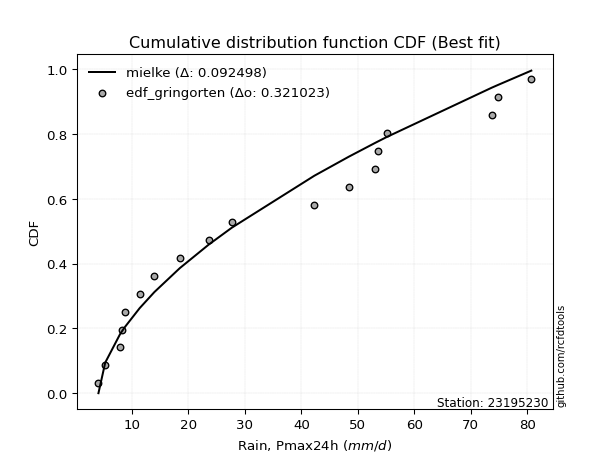</img>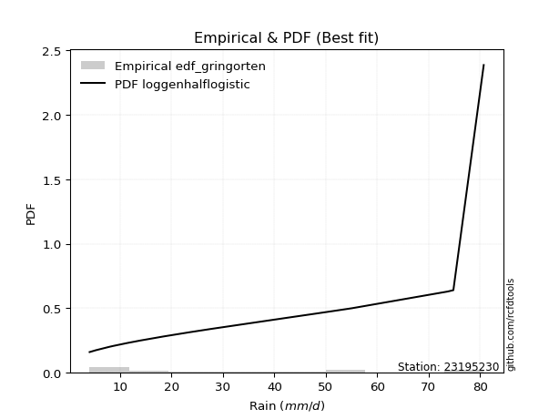</img>

</div>


### 9. EDF Filliben (1975)

The specific values of the constants (0.3175) (often denoted as $alpha$) and (0.365) are derived from a method proposed by James J. Filliben in a 1975 paper. This particular formula is the mean value of the $i$-th order statistic of the normal distribution and is considered a robust and effective plotting position formula for the normal probability plot correlation coefficient test for normality.

<div align="center">


$P=(m-0.3175)/(n+0.365)$


</div>


**9.1. Empirical values**

<div align="center">

|                | 0                  | 1                  | 2                   | 3                   | 4                   | 5                  | 6                   | 7                  | 8                   | 9                  | 10                | 11                 | 12                 | 13                 | 14                 | 15                 | 16                 | 17                 |
|:---------------|:-------------------|:-------------------|:--------------------|:--------------------|:--------------------|:-------------------|:--------------------|:-------------------|:--------------------|:-------------------|:------------------|:-------------------|:-------------------|:-------------------|:-------------------|:-------------------|:-------------------|:-------------------|
| date           | 2022               | 2023               | 2018                | 2008                | 2020                | 2021               | 2019                | 2014               | 2009                | 2007               | 2010              | 2006               | 2013               | 2017               | 2015               | 2016               | 2012               | 2005               |
| x              | 4.1                | 5.3                | 7.9                 | 8.3                 | 8.8                 | 11.4               | 14.0                | 18.5               | 23.6                | 27.7               | 42.3              | 48.4               | 53.0               | 53.506             | 55.1               | 73.7               | 74.8               | 80.7               |
| m              | 1                  | 2                  | 3                   | 4                   | 5                   | 6                  | 7                   | 8                  | 9                   | 10                 | 11                | 12                 | 13                 | 14                 | 15                 | 16                 | 17                 | 18                 |
| empirical_dist | edf_filliben       | edf_filliben       | edf_filliben        | edf_filliben        | edf_filliben        | edf_filliben       | edf_filliben        | edf_filliben       | edf_filliben        | edf_filliben       | edf_filliben      | edf_filliben       | edf_filliben       | edf_filliben       | edf_filliben       | edf_filliben       | edf_filliben       | edf_filliben       |
| empirical      | 0.0371630819493602 | 0.0916144840729649 | 0.14606588619656957 | 0.20051728832017426 | 0.25496869044377896 | 0.3094200925673836 | 0.36387149469098834 | 0.418322896814593  | 0.47277429893819767 | 0.5272257010618023 | 0.581677103185407 | 0.6361285053090118 | 0.6905799074326164 | 0.7450313095562211 | 0.7994827116798258 | 0.8539341138034304 | 0.9083855159270352 | 0.96283691805064   |
| empirical_tr   | 1.03859748338753   | 1.100854188520905  | 1.1710505340347521  | 1.2508087859696917  | 1.3422254704915038  | 1.4480583481174847 | 1.5720094157928526  | 1.7191668616896794 | 1.8967208882003614  | 2.1151742009789807 | 2.390497884803124 | 2.7482229704451933 | 3.2318521777386717 | 3.9220501868659907 | 4.987101154107265  | 6.846225535880707  | 10.915304606240722 | 26.908424908425033 |

</div>


**9.2. Kolmogorov-Smirnov fit test (sorted by Δ)**


<div align="center">

|                | 0                   | 1                   | 2                   | 3                   | 4                   | 5                   | 6                   | 7                   | 8                   | 9                   | 10                  | 11                  | 12                  | 13                  | 14                  | 15                  | 16                  | 17                  | 18                  | 19                  | 20                  | 21                  | 22                  | 23                  | 24                  | 25                  | 26                  | 27                  | 28                  | 29                  | 30                  | 31                  | 32                  | 33                  | 34                  | 35                  | 36                  | 37                  | 38                  | 39                  | 40                  | 41                  | 42                  | 43                  | 44                  | 45                  | 46                  | 47                  | 48                  | 49                  | 50                  | 51                  | 52                  | 53                  | 54                  | 55                  | 56                  | 57                  | 58                  | 59                  | 60                  | 61                  | 62                  | 63                  | 64                  | 65                  | 66                  | 67                  | 68                  | 69                  | 70                  | 71                  | 72                  | 73                  | 74                  | 75                  | 76                  | 77                  | 78                  | 79                  | 80                  | 81                  | 82                  | 83                  | 84                  | 85                  | 86                  | 87                  | 88                  | 89                  | 90                  | 91                  | 92                  | 93                  | 94                  | 95                  | 96                  | 97                  | 98                  | 99                  | 100                 | 101                 | 102                 | 103                 | 104                 | 105                 | 106                 | 107                 | 108                 | 109                 | 110                 | 111                 | 112                 | 113                 | 114                 | 115                 | 116                 | 117                 | 118                 | 119                 | 120                 | 121                 | 122                 | 123                 | 124                 | 125                 | 126                 | 127                 | 128                 | 129                 | 130                 | 131                 | 132                 | 133                 | 134                 | 135                 | 136                 | 137                 | 138                 | 139                 | 140                 | 141                 | 142                 | 143                 | 144                 | 145                 | 146                 | 147                 | 148                 | 149                 | 150                 | 151                 | 152                 | 153                 | 154                 | 155                 | 156                 | 157                 | 158                 | 159                 |
|:---------------|:--------------------|:--------------------|:--------------------|:--------------------|:--------------------|:--------------------|:--------------------|:--------------------|:--------------------|:--------------------|:--------------------|:--------------------|:--------------------|:--------------------|:--------------------|:--------------------|:--------------------|:--------------------|:--------------------|:--------------------|:--------------------|:--------------------|:--------------------|:--------------------|:--------------------|:--------------------|:--------------------|:--------------------|:--------------------|:--------------------|:--------------------|:--------------------|:--------------------|:--------------------|:--------------------|:--------------------|:--------------------|:--------------------|:--------------------|:--------------------|:--------------------|:--------------------|:--------------------|:--------------------|:--------------------|:--------------------|:--------------------|:--------------------|:--------------------|:--------------------|:--------------------|:--------------------|:--------------------|:--------------------|:--------------------|:--------------------|:--------------------|:--------------------|:--------------------|:--------------------|:--------------------|:--------------------|:--------------------|:--------------------|:--------------------|:--------------------|:--------------------|:--------------------|:--------------------|:--------------------|:--------------------|:--------------------|:--------------------|:--------------------|:--------------------|:--------------------|:--------------------|:--------------------|:--------------------|:--------------------|:--------------------|:--------------------|:--------------------|:--------------------|:--------------------|:--------------------|:--------------------|:--------------------|:--------------------|:--------------------|:--------------------|:--------------------|:--------------------|:--------------------|:--------------------|:--------------------|:--------------------|:--------------------|:--------------------|:--------------------|:--------------------|:--------------------|:--------------------|:--------------------|:--------------------|:--------------------|:--------------------|:--------------------|:--------------------|:--------------------|:--------------------|:--------------------|:--------------------|:--------------------|:--------------------|:--------------------|:--------------------|:--------------------|:--------------------|:--------------------|:--------------------|:--------------------|:--------------------|:--------------------|:--------------------|:--------------------|:--------------------|:--------------------|:--------------------|:--------------------|:--------------------|:--------------------|:--------------------|:--------------------|:--------------------|:--------------------|:--------------------|:--------------------|:--------------------|:--------------------|:--------------------|:--------------------|:--------------------|:--------------------|:--------------------|:--------------------|:--------------------|:--------------------|:--------------------|:--------------------|:--------------------|:--------------------|:--------------------|:--------------------|:--------------------|:--------------------|:--------------------|:--------------------|:--------------------|:--------------------|
| station        | 23195230            | 23195230            | 23195230            | 23195230            | 23195230            | 23195230            | 23195230            | 23195230            | 23195230            | 23195230            | 23195230            | 23195230            | 23195230            | 23195230            | 23195230            | 23195230            | 23195230            | 23195230            | 23195230            | 23195230            | 23195230            | 23195230            | 23195230            | 23195230            | 23195230            | 23195230            | 23195230            | 23195230            | 23195230            | 23195230            | 23195230            | 23195230            | 23195230            | 23195230            | 23195230            | 23195230            | 23195230            | 23195230            | 23195230            | 23195230            | 23195230            | 23195230            | 23195230            | 23195230            | 23195230            | 23195230            | 23195230            | 23195230            | 23195230            | 23195230            | 23195230            | 23195230            | 23195230            | 23195230            | 23195230            | 23195230            | 23195230            | 23195230            | 23195230            | 23195230            | 23195230            | 23195230            | 23195230            | 23195230            | 23195230            | 23195230            | 23195230            | 23195230            | 23195230            | 23195230            | 23195230            | 23195230            | 23195230            | 23195230            | 23195230            | 23195230            | 23195230            | 23195230            | 23195230            | 23195230            | 23195230            | 23195230            | 23195230            | 23195230            | 23195230            | 23195230            | 23195230            | 23195230            | 23195230            | 23195230            | 23195230            | 23195230            | 23195230            | 23195230            | 23195230            | 23195230            | 23195230            | 23195230            | 23195230            | 23195230            | 23195230            | 23195230            | 23195230            | 23195230            | 23195230            | 23195230            | 23195230            | 23195230            | 23195230            | 23195230            | 23195230            | 23195230            | 23195230            | 23195230            | 23195230            | 23195230            | 23195230            | 23195230            | 23195230            | 23195230            | 23195230            | 23195230            | 23195230            | 23195230            | 23195230            | 23195230            | 23195230            | 23195230            | 23195230            | 23195230            | 23195230            | 23195230            | 23195230            | 23195230            | 23195230            | 23195230            | 23195230            | 23195230            | 23195230            | 23195230            | 23195230            | 23195230            | 23195230            | 23195230            | 23195230            | 23195230            | 23195230            | 23195230            | 23195230            | 23195230            | 23195230            | 23195230            | 23195230            | 23195230            | 23195230            | 23195230            | 23195230            | 23195230            | 23195230            | 23195230            |
| empirical_dist | edf_filliben        | edf_filliben        | edf_filliben        | edf_filliben        | edf_filliben        | edf_filliben        | edf_filliben        | edf_filliben        | edf_filliben        | edf_filliben        | edf_filliben        | edf_filliben        | edf_filliben        | edf_filliben        | edf_filliben        | edf_filliben        | edf_filliben        | edf_filliben        | edf_filliben        | edf_filliben        | edf_filliben        | edf_filliben        | edf_filliben        | edf_filliben        | edf_filliben        | edf_filliben        | edf_filliben        | edf_filliben        | edf_filliben        | edf_filliben        | edf_filliben        | edf_filliben        | edf_filliben        | edf_filliben        | edf_filliben        | edf_filliben        | edf_filliben        | edf_filliben        | edf_filliben        | edf_filliben        | edf_filliben        | edf_filliben        | edf_filliben        | edf_filliben        | edf_filliben        | edf_filliben        | edf_filliben        | edf_filliben        | edf_filliben        | edf_filliben        | edf_filliben        | edf_filliben        | edf_filliben        | edf_filliben        | edf_filliben        | edf_filliben        | edf_filliben        | edf_filliben        | edf_filliben        | edf_filliben        | edf_filliben        | edf_filliben        | edf_filliben        | edf_filliben        | edf_filliben        | edf_filliben        | edf_filliben        | edf_filliben        | edf_filliben        | edf_filliben        | edf_filliben        | edf_filliben        | edf_filliben        | edf_filliben        | edf_filliben        | edf_filliben        | edf_filliben        | edf_filliben        | edf_filliben        | edf_filliben        | edf_filliben        | edf_filliben        | edf_filliben        | edf_filliben        | edf_filliben        | edf_filliben        | edf_filliben        | edf_filliben        | edf_filliben        | edf_filliben        | edf_filliben        | edf_filliben        | edf_filliben        | edf_filliben        | edf_filliben        | edf_filliben        | edf_filliben        | edf_filliben        | edf_filliben        | edf_filliben        | edf_filliben        | edf_filliben        | edf_filliben        | edf_filliben        | edf_filliben        | edf_filliben        | edf_filliben        | edf_filliben        | edf_filliben        | edf_filliben        | edf_filliben        | edf_filliben        | edf_filliben        | edf_filliben        | edf_filliben        | edf_filliben        | edf_filliben        | edf_filliben        | edf_filliben        | edf_filliben        | edf_filliben        | edf_filliben        | edf_filliben        | edf_filliben        | edf_filliben        | edf_filliben        | edf_filliben        | edf_filliben        | edf_filliben        | edf_filliben        | edf_filliben        | edf_filliben        | edf_filliben        | edf_filliben        | edf_filliben        | edf_filliben        | edf_filliben        | edf_filliben        | edf_filliben        | edf_filliben        | edf_filliben        | edf_filliben        | edf_filliben        | edf_filliben        | edf_filliben        | edf_filliben        | edf_filliben        | edf_filliben        | edf_filliben        | edf_filliben        | edf_filliben        | edf_filliben        | edf_filliben        | edf_filliben        | edf_filliben        | edf_filliben        | edf_filliben        | edf_filliben        | edf_filliben        | edf_filliben        |
| p_dist         | loggenhalflogistic  | logtrapezoid        | logarcsine          | mielke              | logburr             | nakagami            | weibull_min         | truncweibull_min    | exponpow            | logbeta             | halfnorm            | logskewnorm         | foldnorm            | gausshyper          | semicircular        | logsemicircular     | dweibull            | logloggamma         | anglit              | burr                | logjohnsonsu        | logargus            | logtriang           | rayleigh            | logdweibull         | burr12              | loganglit           | maxwell             | genexpon            | logburr12           | logweibull_min      | loggausshyper       | loggenextreme       | logweibull_max      | halflogistic        | genlogistic         | loggenpareto        | pearson3            | exponnorm           | loggompertz         | kstwobign           | logwrapcauchy       | loggumbel_l         | lomax               | t                   | truncnorm           | norm                | crystalball         | gumbel_r            | logpearson3         | gompertz            | ncf                 | logncf              | loggengamma         | logf                | logloglaplace       | logksone            | moyal               | lognct              | logcrystalball      | lognorm             | logt                | logexponnorm        | loggamma            | loggamma            | arcsine             | logfatiguelife      | gengamma            | logerlang           | logbetaprime        | logfoldnorm         | halfgennorm         | johnsonsu           | logrice             | logdgamma           | loginvgamma         | logalpha            | invweibull          | genextreme          | invgamma            | loginvweibull       | erlang              | nct                 | skewnorm            | lognakagami         | logmaxwell          | loggenexpon         | f                   | cosine              | logistic            | loginvgauss         | lograyleigh         | rice                | logkstwobign        | fatiguelife         | logcosine           | dgamma              | loglomax            | invgauss            | betaprime           | truncexpon          | loglogistic         | loghalfnorm         | logtruncnorm        | hypsecant           | logtruncweibull_min | ksone               | bradford            | logkappa3           | gumbel_l            | logtukeylambda      | loghypsecant        | genpareto           | loggumbel_r         | loguniform          | laplace             | loghalflogistic     | logvonmises_line    | beta                | kappa4              | logmoyal            | logkappa4           | exponweib           | loglaplace          | loglaplace          | wrapcauchy          | alpha               | logexponweib        | logmielke           | vonmises_line       | kappa3              | uniform             | triang              | logbradford         | logwald             | logtruncexpon       | loglevy_l           | gamma               | powerlaw            | argus               | wald                | genhalflogistic     | logrdist            | levy_l              | gennorm             | loggennorm          | trapezoid           | logpowerlaw         | logjohnsonsb        | johnsonsb           | tukeylambda         | logexponpow         | rdist               | weibull_max         | truncpareto         | loghalfgennorm      | logtruncpareto      | loggenlogistic      | logvonmises         | vonmises            |
| delta          | 0.08473088099499859 | 0.08493256176496511 | 0.0916144840729649  | 0.0943385339959073  | 0.10305555659697002 | 0.10373610816835677 | 0.10468468787048135 | 0.10533538241218321 | 0.10629580421590995 | 0.10748002185860589 | 0.1083197613081659  | 0.10944673831411245 | 0.11061434604829368 | 0.11399978080156634 | 0.11496922007362796 | 0.1165206737416945  | 0.1166920862275953  | 0.11708782550712549 | 0.11817660576445904 | 0.11880420054206461 | 0.12003265521218454 | 0.12028895439268228 | 0.12122117676338118 | 0.1218135566007092  | 0.12464533706588776 | 0.12650045702852075 | 0.1281399936441069  | 0.1286997833409047  | 0.12966413367825003 | 0.12999774486019033 | 0.13042275945254345 | 0.13148911802915675 | 0.13154426128869315 | 0.13485441499658832 | 0.1349789798298005  | 0.13502330064572762 | 0.1367981872177445  | 0.1375942030356171  | 0.14080619068631595 | 0.14188961739333206 | 0.14200278292870952 | 0.14247498046818774 | 0.14418001317796325 | 0.1450218775728681  | 0.14517406810165912 | 0.14518496805234515 | 0.14518499540839463 | 0.1451850055720038  | 0.14520933282384002 | 0.14611770647314992 | 0.14797325034519496 | 0.15144427780355718 | 0.15151728939768616 | 0.15312188338554356 | 0.15373105053149927 | 0.1542803786456428  | 0.15433930142466434 | 0.15453384560491934 | 0.15507688444307854 | 0.15509011366890724 | 0.15509017422485927 | 0.1550901875290206  | 0.15509102947030406 | 0.15575842689240438 | 0.15575842689240438 | 0.1558745751307271  | 0.15605461921212826 | 0.15635948446598402 | 0.1573868795753275  | 0.1573939999380013  | 0.15803360732655203 | 0.15818009998450888 | 0.15855001102083455 | 0.15862973124177115 | 0.15912717560281703 | 0.16029753187994533 | 0.1608108989063064  | 0.16215088406300604 | 0.16215128695971825 | 0.16301749650091046 | 0.16334471800337025 | 0.16372822882710425 | 0.16442684132575047 | 0.16539039729369415 | 0.16563838668181108 | 0.16639691641518162 | 0.16653611754171171 | 0.16662239853106653 | 0.1672990321144579  | 0.16742656667514988 | 0.1683578219271996  | 0.1696424845714154  | 0.17000777681404516 | 0.17018488202117266 | 0.1702054921288666  | 0.17053036979917846 | 0.17096579776589665 | 0.17150108061397956 | 0.17243761695728677 | 0.17298504821624516 | 0.17614827044132977 | 0.17762918539953032 | 0.18020943087085206 | 0.18118407326674113 | 0.18227225946330114 | 0.18490214461280163 | 0.18714737208007914 | 0.18833129906444554 | 0.1899588543493591  | 0.19024499830126307 | 0.1911603492163455  | 0.19286407634074076 | 0.19770236076368344 | 0.19776581466718213 | 0.20154258234667866 | 0.2047416769263705  | 0.20534936404102366 | 0.20897928743132776 | 0.20944783224842262 | 0.21087071902448837 | 0.21150554663479282 | 0.21178300852948295 | 0.21401056402718366 | 0.21417799968044882 | 0.21417799968044882 | 0.21873625159157195 | 0.21939108923262518 | 0.22451119666116326 | 0.2269739006988345  | 0.23390972696686008 | 0.23395056766982472 | 0.23462867484764632 | 0.24802315001897074 | 0.25159394394579315 | 0.25496869044377896 | 0.26068335838394663 | 0.261251198114725   | 0.2724512124015931  | 0.2788947504571822  | 0.28322871926334436 | 0.29852166506098643 | 0.3021312627454562  | 0.31600497325528515 | 0.37982030008467654 | 0.4083855159270352  | 0.4083855159270352  | 0.4102515807384577  | 0.4237715748062646  | 0.43705694373817217 | 0.46723458886880886 | 0.4758783441668358  | 0.5014235471282774  | 0.5165063050388451  | 0.6366450279967677  | 0.7786338540873677  | 0.7994827116798258  | 0.8307441837986338  | 0.9083855159270352  | 1.1405570795203563  | 12.758723006050012  |
| deltao         | 0.32102346734599996 | 0.32102346734599996 | 0.32102346734599996 | 0.32102346734599996 | 0.32102346734599996 | 0.32102346734599996 | 0.32102346734599996 | 0.32102346734599996 | 0.32102346734599996 | 0.32102346734599996 | 0.32102346734599996 | 0.32102346734599996 | 0.32102346734599996 | 0.32102346734599996 | 0.32102346734599996 | 0.32102346734599996 | 0.32102346734599996 | 0.32102346734599996 | 0.32102346734599996 | 0.32102346734599996 | 0.32102346734599996 | 0.32102346734599996 | 0.32102346734599996 | 0.32102346734599996 | 0.32102346734599996 | 0.32102346734599996 | 0.32102346734599996 | 0.32102346734599996 | 0.32102346734599996 | 0.32102346734599996 | 0.32102346734599996 | 0.32102346734599996 | 0.32102346734599996 | 0.32102346734599996 | 0.32102346734599996 | 0.32102346734599996 | 0.32102346734599996 | 0.32102346734599996 | 0.32102346734599996 | 0.32102346734599996 | 0.32102346734599996 | 0.32102346734599996 | 0.32102346734599996 | 0.32102346734599996 | 0.32102346734599996 | 0.32102346734599996 | 0.32102346734599996 | 0.32102346734599996 | 0.32102346734599996 | 0.32102346734599996 | 0.32102346734599996 | 0.32102346734599996 | 0.32102346734599996 | 0.32102346734599996 | 0.32102346734599996 | 0.32102346734599996 | 0.32102346734599996 | 0.32102346734599996 | 0.32102346734599996 | 0.32102346734599996 | 0.32102346734599996 | 0.32102346734599996 | 0.32102346734599996 | 0.32102346734599996 | 0.32102346734599996 | 0.32102346734599996 | 0.32102346734599996 | 0.32102346734599996 | 0.32102346734599996 | 0.32102346734599996 | 0.32102346734599996 | 0.32102346734599996 | 0.32102346734599996 | 0.32102346734599996 | 0.32102346734599996 | 0.32102346734599996 | 0.32102346734599996 | 0.32102346734599996 | 0.32102346734599996 | 0.32102346734599996 | 0.32102346734599996 | 0.32102346734599996 | 0.32102346734599996 | 0.32102346734599996 | 0.32102346734599996 | 0.32102346734599996 | 0.32102346734599996 | 0.32102346734599996 | 0.32102346734599996 | 0.32102346734599996 | 0.32102346734599996 | 0.32102346734599996 | 0.32102346734599996 | 0.32102346734599996 | 0.32102346734599996 | 0.32102346734599996 | 0.32102346734599996 | 0.32102346734599996 | 0.32102346734599996 | 0.32102346734599996 | 0.32102346734599996 | 0.32102346734599996 | 0.32102346734599996 | 0.32102346734599996 | 0.32102346734599996 | 0.32102346734599996 | 0.32102346734599996 | 0.32102346734599996 | 0.32102346734599996 | 0.32102346734599996 | 0.32102346734599996 | 0.32102346734599996 | 0.32102346734599996 | 0.32102346734599996 | 0.32102346734599996 | 0.32102346734599996 | 0.32102346734599996 | 0.32102346734599996 | 0.32102346734599996 | 0.32102346734599996 | 0.32102346734599996 | 0.32102346734599996 | 0.32102346734599996 | 0.32102346734599996 | 0.32102346734599996 | 0.32102346734599996 | 0.32102346734599996 | 0.32102346734599996 | 0.32102346734599996 | 0.32102346734599996 | 0.32102346734599996 | 0.32102346734599996 | 0.32102346734599996 | 0.32102346734599996 | 0.32102346734599996 | 0.32102346734599996 | 0.32102346734599996 | 0.32102346734599996 | 0.32102346734599996 | 0.32102346734599996 | 0.32102346734599996 | 0.32102346734599996 | 0.32102346734599996 | 0.32102346734599996 | 0.32102346734599996 | 0.32102346734599996 | 0.32102346734599996 | 0.32102346734599996 | 0.32102346734599996 | 0.32102346734599996 | 0.32102346734599996 | 0.32102346734599996 | 0.32102346734599996 | 0.32102346734599996 | 0.32102346734599996 | 0.32102346734599996 | 0.32102346734599996 | 0.32102346734599996 | 0.32102346734599996 | 0.32102346734599996 |
| eval           | Δo > Δ              | Δo > Δ              | Δo > Δ              | Δo > Δ              | Δo > Δ              | Δo > Δ              | Δo > Δ              | Δo > Δ              | Δo > Δ              | Δo > Δ              | Δo > Δ              | Δo > Δ              | Δo > Δ              | Δo > Δ              | Δo > Δ              | Δo > Δ              | Δo > Δ              | Δo > Δ              | Δo > Δ              | Δo > Δ              | Δo > Δ              | Δo > Δ              | Δo > Δ              | Δo > Δ              | Δo > Δ              | Δo > Δ              | Δo > Δ              | Δo > Δ              | Δo > Δ              | Δo > Δ              | Δo > Δ              | Δo > Δ              | Δo > Δ              | Δo > Δ              | Δo > Δ              | Δo > Δ              | Δo > Δ              | Δo > Δ              | Δo > Δ              | Δo > Δ              | Δo > Δ              | Δo > Δ              | Δo > Δ              | Δo > Δ              | Δo > Δ              | Δo > Δ              | Δo > Δ              | Δo > Δ              | Δo > Δ              | Δo > Δ              | Δo > Δ              | Δo > Δ              | Δo > Δ              | Δo > Δ              | Δo > Δ              | Δo > Δ              | Δo > Δ              | Δo > Δ              | Δo > Δ              | Δo > Δ              | Δo > Δ              | Δo > Δ              | Δo > Δ              | Δo > Δ              | Δo > Δ              | Δo > Δ              | Δo > Δ              | Δo > Δ              | Δo > Δ              | Δo > Δ              | Δo > Δ              | Δo > Δ              | Δo > Δ              | Δo > Δ              | Δo > Δ              | Δo > Δ              | Δo > Δ              | Δo > Δ              | Δo > Δ              | Δo > Δ              | Δo > Δ              | Δo > Δ              | Δo > Δ              | Δo > Δ              | Δo > Δ              | Δo > Δ              | Δo > Δ              | Δo > Δ              | Δo > Δ              | Δo > Δ              | Δo > Δ              | Δo > Δ              | Δo > Δ              | Δo > Δ              | Δo > Δ              | Δo > Δ              | Δo > Δ              | Δo > Δ              | Δo > Δ              | Δo > Δ              | Δo > Δ              | Δo > Δ              | Δo > Δ              | Δo > Δ              | Δo > Δ              | Δo > Δ              | Δo > Δ              | Δo > Δ              | Δo > Δ              | Δo > Δ              | Δo > Δ              | Δo > Δ              | Δo > Δ              | Δo > Δ              | Δo > Δ              | Δo > Δ              | Δo > Δ              | Δo > Δ              | Δo > Δ              | Δo > Δ              | Δo > Δ              | Δo > Δ              | Δo > Δ              | Δo > Δ              | Δo > Δ              | Δo > Δ              | Δo > Δ              | Δo > Δ              | Δo > Δ              | Δo > Δ              | Δo > Δ              | Δo > Δ              | Δo > Δ              | Δo > Δ              | Δo > Δ              | Δo > Δ              | Δo > Δ              | Δo > Δ              | Δo > Δ              | Δo > Δ              | Δo > Δ              | Δo > Δ              | Δo > Δ              | Δo <= Δ             | Δo <= Δ             | Δo <= Δ             | Δo <= Δ             | Δo <= Δ             | Δo <= Δ             | Δo <= Δ             | Δo <= Δ             | Δo <= Δ             | Δo <= Δ             | Δo <= Δ             | Δo <= Δ             | Δo <= Δ             | Δo <= Δ             | Δo <= Δ             | Δo <= Δ             | Δo <= Δ             |
| fit            | 1                   | 1                   | 1                   | 1                   | 1                   | 1                   | 1                   | 1                   | 1                   | 1                   | 1                   | 1                   | 1                   | 1                   | 1                   | 1                   | 1                   | 1                   | 1                   | 1                   | 1                   | 1                   | 1                   | 1                   | 1                   | 1                   | 1                   | 1                   | 1                   | 1                   | 1                   | 1                   | 1                   | 1                   | 1                   | 1                   | 1                   | 1                   | 1                   | 1                   | 1                   | 1                   | 1                   | 1                   | 1                   | 1                   | 1                   | 1                   | 1                   | 1                   | 1                   | 1                   | 1                   | 1                   | 1                   | 1                   | 1                   | 1                   | 1                   | 1                   | 1                   | 1                   | 1                   | 1                   | 1                   | 1                   | 1                   | 1                   | 1                   | 1                   | 1                   | 1                   | 1                   | 1                   | 1                   | 1                   | 1                   | 1                   | 1                   | 1                   | 1                   | 1                   | 1                   | 1                   | 1                   | 1                   | 1                   | 1                   | 1                   | 1                   | 1                   | 1                   | 1                   | 1                   | 1                   | 1                   | 1                   | 1                   | 1                   | 1                   | 1                   | 1                   | 1                   | 1                   | 1                   | 1                   | 1                   | 1                   | 1                   | 1                   | 1                   | 1                   | 1                   | 1                   | 1                   | 1                   | 1                   | 1                   | 1                   | 1                   | 1                   | 1                   | 1                   | 1                   | 1                   | 1                   | 1                   | 1                   | 1                   | 1                   | 1                   | 1                   | 1                   | 1                   | 1                   | 1                   | 1                   | 1                   | 1                   | 1                   | 1                   | 1                   | 1                   | 0                   | 0                   | 0                   | 0                   | 0                   | 0                   | 0                   | 0                   | 0                   | 0                   | 0                   | 0                   | 0                   | 0                   | 0                   | 0                   | 0                   |
| n              | 18                  | 18                  | 18                  | 18                  | 18                  | 18                  | 18                  | 18                  | 18                  | 18                  | 18                  | 18                  | 18                  | 18                  | 18                  | 18                  | 18                  | 18                  | 18                  | 18                  | 18                  | 18                  | 18                  | 18                  | 18                  | 18                  | 18                  | 18                  | 18                  | 18                  | 18                  | 18                  | 18                  | 18                  | 18                  | 18                  | 18                  | 18                  | 18                  | 18                  | 18                  | 18                  | 18                  | 18                  | 18                  | 18                  | 18                  | 18                  | 18                  | 18                  | 18                  | 18                  | 18                  | 18                  | 18                  | 18                  | 18                  | 18                  | 18                  | 18                  | 18                  | 18                  | 18                  | 18                  | 18                  | 18                  | 18                  | 18                  | 18                  | 18                  | 18                  | 18                  | 18                  | 18                  | 18                  | 18                  | 18                  | 18                  | 18                  | 18                  | 18                  | 18                  | 18                  | 18                  | 18                  | 18                  | 18                  | 18                  | 18                  | 18                  | 18                  | 18                  | 18                  | 18                  | 18                  | 18                  | 18                  | 18                  | 18                  | 18                  | 18                  | 18                  | 18                  | 18                  | 18                  | 18                  | 18                  | 18                  | 18                  | 18                  | 18                  | 18                  | 18                  | 18                  | 18                  | 18                  | 18                  | 18                  | 18                  | 18                  | 18                  | 18                  | 18                  | 18                  | 18                  | 18                  | 18                  | 18                  | 18                  | 18                  | 18                  | 18                  | 18                  | 18                  | 18                  | 18                  | 18                  | 18                  | 18                  | 18                  | 18                  | 18                  | 18                  | 18                  | 18                  | 18                  | 18                  | 18                  | 18                  | 18                  | 18                  | 18                  | 18                  | 18                  | 18                  | 18                  | 18                  | 18                  | 18                  | 18                  |
| best_fit       | 1                   | 0                   | 0                   | 0                   | 0                   | 0                   | 0                   | 0                   | 0                   | 0                   | 0                   | 0                   | 0                   | 0                   | 0                   | 0                   | 0                   | 0                   | 0                   | 0                   | 0                   | 0                   | 0                   | 0                   | 0                   | 0                   | 0                   | 0                   | 0                   | 0                   | 0                   | 0                   | 0                   | 0                   | 0                   | 0                   | 0                   | 0                   | 0                   | 0                   | 0                   | 0                   | 0                   | 0                   | 0                   | 0                   | 0                   | 0                   | 0                   | 0                   | 0                   | 0                   | 0                   | 0                   | 0                   | 0                   | 0                   | 0                   | 0                   | 0                   | 0                   | 0                   | 0                   | 0                   | 0                   | 0                   | 0                   | 0                   | 0                   | 0                   | 0                   | 0                   | 0                   | 0                   | 0                   | 0                   | 0                   | 0                   | 0                   | 0                   | 0                   | 0                   | 0                   | 0                   | 0                   | 0                   | 0                   | 0                   | 0                   | 0                   | 0                   | 0                   | 0                   | 0                   | 0                   | 0                   | 0                   | 0                   | 0                   | 0                   | 0                   | 0                   | 0                   | 0                   | 0                   | 0                   | 0                   | 0                   | 0                   | 0                   | 0                   | 0                   | 0                   | 0                   | 0                   | 0                   | 0                   | 0                   | 0                   | 0                   | 0                   | 0                   | 0                   | 0                   | 0                   | 0                   | 0                   | 0                   | 0                   | 0                   | 0                   | 0                   | 0                   | 0                   | 0                   | 0                   | 0                   | 0                   | 0                   | 0                   | 0                   | 0                   | 0                   | 0                   | 0                   | 0                   | 0                   | 0                   | 0                   | 0                   | 0                   | 0                   | 0                   | 0                   | 0                   | 0                   | 0                   | 0                   | 0                   | 0                   |
| best_fit_sort  | 1                   | 2                   | 3                   | 4                   | 5                   | 6                   | 7                   | 8                   | 9                   | 10                  | 11                  | 12                  | 13                  | 14                  | 15                  | 16                  | 17                  | 18                  | 19                  | 20                  | 21                  | 22                  | 23                  | 24                  | 25                  | 26                  | 27                  | 28                  | 29                  | 30                  | 31                  | 32                  | 33                  | 34                  | 35                  | 36                  | 37                  | 38                  | 39                  | 40                  | 41                  | 42                  | 43                  | 44                  | 45                  | 46                  | 47                  | 48                  | 49                  | 50                  | 51                  | 52                  | 53                  | 54                  | 55                  | 56                  | 57                  | 58                  | 59                  | 60                  | 61                  | 62                  | 63                  | 64                  | 65                  | 66                  | 67                  | 68                  | 69                  | 70                  | 71                  | 72                  | 73                  | 74                  | 75                  | 76                  | 77                  | 78                  | 79                  | 80                  | 81                  | 82                  | 83                  | 84                  | 85                  | 86                  | 87                  | 88                  | 89                  | 90                  | 91                  | 92                  | 93                  | 94                  | 95                  | 96                  | 97                  | 98                  | 99                  | 100                 | 101                 | 102                 | 103                 | 104                 | 105                 | 106                 | 107                 | 108                 | 109                 | 110                 | 111                 | 112                 | 113                 | 114                 | 115                 | 116                 | 117                 | 118                 | 119                 | 120                 | 121                 | 122                 | 123                 | 124                 | 125                 | 126                 | 127                 | 128                 | 129                 | 130                 | 131                 | 132                 | 133                 | 134                 | 135                 | 136                 | 137                 | 138                 | 139                 | 140                 | 141                 | 142                 | 143                 | 144                 | 145                 | 146                 | 147                 | 148                 | 149                 | 150                 | 151                 | 152                 | 153                 | 154                 | 155                 | 156                 | 157                 | 158                 | 159                 | 160                 |

</div>


**9.3. Best fit**

<div align="center">

|   id |   station | empirical_dist   | p_dist             |     delta |   deltao | eval   |   fit |   n |   best_fit |   best_fit_sort |
|-----:|----------:|:-----------------|:-------------------|----------:|---------:|:-------|------:|----:|-----------:|----------------:|
|    0 |  23195230 | edf_filliben     | loggenhalflogistic | 0.0847309 | 0.321023 | Δo > Δ |     1 |  18 |          1 |               1 |

</div>


<div align="center">

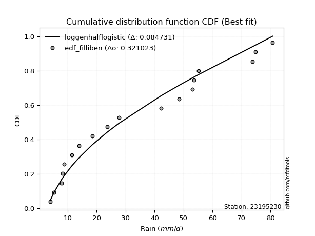</img>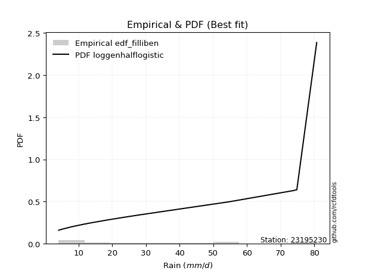</img>

</div>


### 10. EDF Jenkinson (1977)

The Jenkinson formula in hydrology is an empirical plotting position formula used to estimate the non-exceedance probability _(P)_ or return period _(T)_ of a given ordered observation within a sample. It is a widely used method in the frequency analysis of extreme events such as floods and rainfall, as it provides a distribution-free way to plot data. _a≈0.31_ and _b≈0.38_ are constants derived to approximate the median of the probability distribution for the given rank.

<div align="center">


$P=(m-a)/(n+b)$


</div>


**10.1. Empirical values**

<div align="center">

|                | 0                   | 1                   | 2                   | 3                   | 4                  | 5                   | 6                  | 7                  | 8                   | 9                  | 10                 | 11                 | 12                | 13                 | 14                 | 15                 | 16                 | 17                 |
|:---------------|:--------------------|:--------------------|:--------------------|:--------------------|:-------------------|:--------------------|:-------------------|:-------------------|:--------------------|:-------------------|:-------------------|:-------------------|:------------------|:-------------------|:-------------------|:-------------------|:-------------------|:-------------------|
| date           | 2022                | 2023                | 2018                | 2008                | 2020               | 2021                | 2019               | 2014               | 2009                | 2007               | 2010               | 2006               | 2013              | 2017               | 2015               | 2016               | 2012               | 2005               |
| x              | 4.1                 | 5.3                 | 7.9                 | 8.3                 | 8.8                | 11.4                | 14.0               | 18.5               | 23.6                | 27.7               | 42.3               | 48.4               | 53.0              | 53.506             | 55.1               | 73.7               | 74.8               | 80.7               |
| m              | 1                   | 2                   | 3                   | 4                   | 5                  | 6                   | 7                  | 8                  | 9                   | 10                 | 11                 | 12                 | 13                | 14                 | 15                 | 16                 | 17                 | 18                 |
| empirical_dist | edf_jenkinson       | edf_jenkinson       | edf_jenkinson       | edf_jenkinson       | edf_jenkinson      | edf_jenkinson       | edf_jenkinson      | edf_jenkinson      | edf_jenkinson       | edf_jenkinson      | edf_jenkinson      | edf_jenkinson      | edf_jenkinson     | edf_jenkinson      | edf_jenkinson      | edf_jenkinson      | edf_jenkinson      | edf_jenkinson      |
| empirical      | 0.03754080522306855 | 0.09194776931447225 | 0.14635473340587596 | 0.20076169749727965 | 0.2551686615886834 | 0.30957562568008706 | 0.3639825897714908 | 0.4183895538628945 | 0.47279651795429817 | 0.5272034820457019 | 0.5816104461371056 | 0.6360174102285092 | 0.690424374319913 | 0.7448313384113167 | 0.7992383025027203 | 0.8536452665941241 | 0.9080522306855279 | 0.9624591947769315 |
| empirical_tr   | 1.0390050876201244  | 1.1012582384661473  | 1.17144678138942    | 1.2511912865895167  | 1.3425858290723158 | 1.4483845547675334  | 1.572284003421728  | 1.7193638914873717 | 1.896800825593395   | 2.1150747986191027 | 2.390117035110533  | 2.747384155455904  | 3.230228471001758 | 3.9189765458422174 | 4.981029810298102  | 6.832713754646843  | 10.875739644970428 | 26.637681159420353 |

</div>


**10.2. Kolmogorov-Smirnov fit test (sorted by Δ)**


<div align="center">

|                | 0                   | 1                   | 2                   | 3                   | 4                   | 5                   | 6                   | 7                   | 8                   | 9                   | 10                  | 11                  | 12                  | 13                  | 14                  | 15                  | 16                  | 17                  | 18                  | 19                  | 20                  | 21                  | 22                  | 23                  | 24                  | 25                  | 26                  | 27                  | 28                  | 29                  | 30                  | 31                  | 32                  | 33                  | 34                  | 35                  | 36                  | 37                  | 38                  | 39                  | 40                  | 41                  | 42                  | 43                  | 44                  | 45                  | 46                  | 47                  | 48                  | 49                  | 50                  | 51                  | 52                  | 53                  | 54                  | 55                  | 56                  | 57                  | 58                  | 59                  | 60                  | 61                  | 62                  | 63                  | 64                  | 65                  | 66                  | 67                  | 68                  | 69                  | 70                  | 71                  | 72                  | 73                  | 74                  | 75                  | 76                  | 77                  | 78                  | 79                  | 80                  | 81                  | 82                  | 83                  | 84                  | 85                  | 86                  | 87                  | 88                  | 89                  | 90                  | 91                  | 92                  | 93                  | 94                  | 95                  | 96                  | 97                  | 98                  | 99                  | 100                 | 101                 | 102                 | 103                 | 104                 | 105                 | 106                 | 107                 | 108                 | 109                 | 110                 | 111                 | 112                 | 113                 | 114                 | 115                 | 116                 | 117                 | 118                 | 119                 | 120                 | 121                 | 122                 | 123                 | 124                 | 125                 | 126                 | 127                 | 128                 | 129                 | 130                 | 131                 | 132                 | 133                 | 134                 | 135                 | 136                 | 137                 | 138                 | 139                 | 140                 | 141                 | 142                 | 143                 | 144                 | 145                 | 146                 | 147                 | 148                 | 149                 | 150                 | 151                 | 152                 | 153                 | 154                 | 155                 | 156                 | 157                 | 158                 | 159                 |
|:---------------|:--------------------|:--------------------|:--------------------|:--------------------|:--------------------|:--------------------|:--------------------|:--------------------|:--------------------|:--------------------|:--------------------|:--------------------|:--------------------|:--------------------|:--------------------|:--------------------|:--------------------|:--------------------|:--------------------|:--------------------|:--------------------|:--------------------|:--------------------|:--------------------|:--------------------|:--------------------|:--------------------|:--------------------|:--------------------|:--------------------|:--------------------|:--------------------|:--------------------|:--------------------|:--------------------|:--------------------|:--------------------|:--------------------|:--------------------|:--------------------|:--------------------|:--------------------|:--------------------|:--------------------|:--------------------|:--------------------|:--------------------|:--------------------|:--------------------|:--------------------|:--------------------|:--------------------|:--------------------|:--------------------|:--------------------|:--------------------|:--------------------|:--------------------|:--------------------|:--------------------|:--------------------|:--------------------|:--------------------|:--------------------|:--------------------|:--------------------|:--------------------|:--------------------|:--------------------|:--------------------|:--------------------|:--------------------|:--------------------|:--------------------|:--------------------|:--------------------|:--------------------|:--------------------|:--------------------|:--------------------|:--------------------|:--------------------|:--------------------|:--------------------|:--------------------|:--------------------|:--------------------|:--------------------|:--------------------|:--------------------|:--------------------|:--------------------|:--------------------|:--------------------|:--------------------|:--------------------|:--------------------|:--------------------|:--------------------|:--------------------|:--------------------|:--------------------|:--------------------|:--------------------|:--------------------|:--------------------|:--------------------|:--------------------|:--------------------|:--------------------|:--------------------|:--------------------|:--------------------|:--------------------|:--------------------|:--------------------|:--------------------|:--------------------|:--------------------|:--------------------|:--------------------|:--------------------|:--------------------|:--------------------|:--------------------|:--------------------|:--------------------|:--------------------|:--------------------|:--------------------|:--------------------|:--------------------|:--------------------|:--------------------|:--------------------|:--------------------|:--------------------|:--------------------|:--------------------|:--------------------|:--------------------|:--------------------|:--------------------|:--------------------|:--------------------|:--------------------|:--------------------|:--------------------|:--------------------|:--------------------|:--------------------|:--------------------|:--------------------|:--------------------|:--------------------|:--------------------|:--------------------|:--------------------|:--------------------|:--------------------|
| station        | 23195230            | 23195230            | 23195230            | 23195230            | 23195230            | 23195230            | 23195230            | 23195230            | 23195230            | 23195230            | 23195230            | 23195230            | 23195230            | 23195230            | 23195230            | 23195230            | 23195230            | 23195230            | 23195230            | 23195230            | 23195230            | 23195230            | 23195230            | 23195230            | 23195230            | 23195230            | 23195230            | 23195230            | 23195230            | 23195230            | 23195230            | 23195230            | 23195230            | 23195230            | 23195230            | 23195230            | 23195230            | 23195230            | 23195230            | 23195230            | 23195230            | 23195230            | 23195230            | 23195230            | 23195230            | 23195230            | 23195230            | 23195230            | 23195230            | 23195230            | 23195230            | 23195230            | 23195230            | 23195230            | 23195230            | 23195230            | 23195230            | 23195230            | 23195230            | 23195230            | 23195230            | 23195230            | 23195230            | 23195230            | 23195230            | 23195230            | 23195230            | 23195230            | 23195230            | 23195230            | 23195230            | 23195230            | 23195230            | 23195230            | 23195230            | 23195230            | 23195230            | 23195230            | 23195230            | 23195230            | 23195230            | 23195230            | 23195230            | 23195230            | 23195230            | 23195230            | 23195230            | 23195230            | 23195230            | 23195230            | 23195230            | 23195230            | 23195230            | 23195230            | 23195230            | 23195230            | 23195230            | 23195230            | 23195230            | 23195230            | 23195230            | 23195230            | 23195230            | 23195230            | 23195230            | 23195230            | 23195230            | 23195230            | 23195230            | 23195230            | 23195230            | 23195230            | 23195230            | 23195230            | 23195230            | 23195230            | 23195230            | 23195230            | 23195230            | 23195230            | 23195230            | 23195230            | 23195230            | 23195230            | 23195230            | 23195230            | 23195230            | 23195230            | 23195230            | 23195230            | 23195230            | 23195230            | 23195230            | 23195230            | 23195230            | 23195230            | 23195230            | 23195230            | 23195230            | 23195230            | 23195230            | 23195230            | 23195230            | 23195230            | 23195230            | 23195230            | 23195230            | 23195230            | 23195230            | 23195230            | 23195230            | 23195230            | 23195230            | 23195230            | 23195230            | 23195230            | 23195230            | 23195230            | 23195230            | 23195230            |
| empirical_dist | edf_jenkinson       | edf_jenkinson       | edf_jenkinson       | edf_jenkinson       | edf_jenkinson       | edf_jenkinson       | edf_jenkinson       | edf_jenkinson       | edf_jenkinson       | edf_jenkinson       | edf_jenkinson       | edf_jenkinson       | edf_jenkinson       | edf_jenkinson       | edf_jenkinson       | edf_jenkinson       | edf_jenkinson       | edf_jenkinson       | edf_jenkinson       | edf_jenkinson       | edf_jenkinson       | edf_jenkinson       | edf_jenkinson       | edf_jenkinson       | edf_jenkinson       | edf_jenkinson       | edf_jenkinson       | edf_jenkinson       | edf_jenkinson       | edf_jenkinson       | edf_jenkinson       | edf_jenkinson       | edf_jenkinson       | edf_jenkinson       | edf_jenkinson       | edf_jenkinson       | edf_jenkinson       | edf_jenkinson       | edf_jenkinson       | edf_jenkinson       | edf_jenkinson       | edf_jenkinson       | edf_jenkinson       | edf_jenkinson       | edf_jenkinson       | edf_jenkinson       | edf_jenkinson       | edf_jenkinson       | edf_jenkinson       | edf_jenkinson       | edf_jenkinson       | edf_jenkinson       | edf_jenkinson       | edf_jenkinson       | edf_jenkinson       | edf_jenkinson       | edf_jenkinson       | edf_jenkinson       | edf_jenkinson       | edf_jenkinson       | edf_jenkinson       | edf_jenkinson       | edf_jenkinson       | edf_jenkinson       | edf_jenkinson       | edf_jenkinson       | edf_jenkinson       | edf_jenkinson       | edf_jenkinson       | edf_jenkinson       | edf_jenkinson       | edf_jenkinson       | edf_jenkinson       | edf_jenkinson       | edf_jenkinson       | edf_jenkinson       | edf_jenkinson       | edf_jenkinson       | edf_jenkinson       | edf_jenkinson       | edf_jenkinson       | edf_jenkinson       | edf_jenkinson       | edf_jenkinson       | edf_jenkinson       | edf_jenkinson       | edf_jenkinson       | edf_jenkinson       | edf_jenkinson       | edf_jenkinson       | edf_jenkinson       | edf_jenkinson       | edf_jenkinson       | edf_jenkinson       | edf_jenkinson       | edf_jenkinson       | edf_jenkinson       | edf_jenkinson       | edf_jenkinson       | edf_jenkinson       | edf_jenkinson       | edf_jenkinson       | edf_jenkinson       | edf_jenkinson       | edf_jenkinson       | edf_jenkinson       | edf_jenkinson       | edf_jenkinson       | edf_jenkinson       | edf_jenkinson       | edf_jenkinson       | edf_jenkinson       | edf_jenkinson       | edf_jenkinson       | edf_jenkinson       | edf_jenkinson       | edf_jenkinson       | edf_jenkinson       | edf_jenkinson       | edf_jenkinson       | edf_jenkinson       | edf_jenkinson       | edf_jenkinson       | edf_jenkinson       | edf_jenkinson       | edf_jenkinson       | edf_jenkinson       | edf_jenkinson       | edf_jenkinson       | edf_jenkinson       | edf_jenkinson       | edf_jenkinson       | edf_jenkinson       | edf_jenkinson       | edf_jenkinson       | edf_jenkinson       | edf_jenkinson       | edf_jenkinson       | edf_jenkinson       | edf_jenkinson       | edf_jenkinson       | edf_jenkinson       | edf_jenkinson       | edf_jenkinson       | edf_jenkinson       | edf_jenkinson       | edf_jenkinson       | edf_jenkinson       | edf_jenkinson       | edf_jenkinson       | edf_jenkinson       | edf_jenkinson       | edf_jenkinson       | edf_jenkinson       | edf_jenkinson       | edf_jenkinson       | edf_jenkinson       | edf_jenkinson       | edf_jenkinson       | edf_jenkinson       |
| p_dist         | loggenhalflogistic  | logtrapezoid        | logarcsine          | mielke              | logburr             | nakagami            | weibull_min         | truncweibull_min    | exponpow            | logbeta             | halfnorm            | logskewnorm         | foldnorm            | gausshyper          | semicircular        | dweibull            | logsemicircular     | logloggamma         | anglit              | burr                | logjohnsonsu        | logargus            | logtriang           | rayleigh            | logdweibull         | burr12              | loganglit           | maxwell             | genexpon            | logburr12           | logweibull_min      | loggausshyper       | loggenextreme       | logweibull_max      | genlogistic         | halflogistic        | loggenpareto        | pearson3            | exponnorm           | loggompertz         | kstwobign           | logwrapcauchy       | loggumbel_l         | lomax               | t                   | truncnorm           | norm                | crystalball         | gumbel_r            | logpearson3         | gompertz            | ncf                 | logncf              | loggengamma         | logf                | logloglaplace       | logksone            | moyal               | lognct              | logcrystalball      | lognorm             | logt                | logexponnorm        | arcsine             | loggamma            | loggamma            | logfatiguelife      | gengamma            | logerlang           | logbetaprime        | logfoldnorm         | halfgennorm         | johnsonsu           | logrice             | logdgamma           | loginvgamma         | logalpha            | invweibull          | genextreme          | invgamma            | loginvweibull       | erlang              | nct                 | skewnorm            | lognakagami         | logmaxwell          | loggenexpon         | f                   | cosine              | logistic            | loginvgauss         | lograyleigh         | rice                | logkstwobign        | fatiguelife         | dgamma              | logcosine           | loglomax            | invgauss            | betaprime           | truncexpon          | loglogistic         | loghalfnorm         | logtruncnorm        | hypsecant           | logtruncweibull_min | ksone               | bradford            | logkappa3           | gumbel_l            | logtukeylambda      | loghypsecant        | genpareto           | loggumbel_r         | loguniform          | laplace             | loghalflogistic     | logvonmises_line    | beta                | kappa4              | logmoyal            | logkappa4           | exponweib           | loglaplace          | loglaplace          | wrapcauchy          | alpha               | logexponweib        | logmielke           | vonmises_line       | kappa3              | uniform             | triang              | logbradford         | logwald             | logtruncexpon       | loglevy_l           | gamma               | powerlaw            | argus               | wald                | genhalflogistic     | logrdist            | levy_l              | gennorm             | loggennorm          | trapezoid           | logpowerlaw         | logjohnsonsb        | johnsonsb           | tukeylambda         | logexponpow         | rdist               | weibull_max         | truncpareto         | loghalfgennorm      | logtruncpareto      | loggenlogistic      | logvonmises         | vonmises            |
| delta          | 0.08501972820430492 | 0.08504365684546766 | 0.09194776931447225 | 0.09444962907640986 | 0.10316665167747247 | 0.10335838489464833 | 0.10475424612885056 | 0.10544647749268565 | 0.1064068992964124  | 0.1071911746492995  | 0.10843085638866845 | 0.109557833394615   | 0.11072544112879612 | 0.11411087588206878 | 0.11459149679991962 | 0.11644767705048986 | 0.11658733078999595 | 0.11719892058762793 | 0.11824326281276054 | 0.11891529562256706 | 0.12014375029268698 | 0.12040004947318483 | 0.12133227184388373 | 0.12192465168121164 | 0.12475643214639032 | 0.1266115521090233  | 0.12820665069240833 | 0.12881087842140715 | 0.12986410482315447 | 0.1301088399406929  | 0.130533854533046   | 0.1315557750774582  | 0.1316553563691956  | 0.13496551007709076 | 0.13513439572623007 | 0.13517895097470495 | 0.13642046394403617 | 0.13770529811611953 | 0.1408728477346174  | 0.1419562744416335  | 0.14211387800921196 | 0.14218613325888135 | 0.1442911082584658  | 0.14508853462116955 | 0.14528516318216156 | 0.1452960631328476  | 0.14529609048889708 | 0.14529610065250625 | 0.14532042790434246 | 0.14618436352145137 | 0.1481732214900994  | 0.15155537288405974 | 0.1515839464459876  | 0.153188540433845   | 0.1537977075798007  | 0.15390265537193437 | 0.1544059584729658  | 0.15464494068542178 | 0.15514354149138    | 0.15515677071720868 | 0.1551568312731607  | 0.15515684457732204 | 0.1551576865186055  | 0.15549685185701878 | 0.15582508394070582 | 0.15582508394070582 | 0.1561212762604297  | 0.15642614151428547 | 0.15745353662362893 | 0.15746065698630274 | 0.15810026437485347 | 0.15824675703281033 | 0.158616668069136   | 0.1586963882900726  | 0.15932714674772147 | 0.16036418892824678 | 0.16087755595460784 | 0.16221754111130748 | 0.1622179440080197  | 0.1630841535492119  | 0.1634113750516717  | 0.1637948858754057  | 0.16449349837405192 | 0.1655014923741966  | 0.16570504373011252 | 0.16646357346348306 | 0.16660277459001316 | 0.16668905557936797 | 0.16741012719496035 | 0.16753766175565232 | 0.16842447897550106 | 0.16970914161971684 | 0.1701188718945476  | 0.1702515390694741  | 0.17027214917716804 | 0.1705880744921883  | 0.1705970268474799  | 0.17121223340467318 | 0.1725042740055882  | 0.1730517052645466  | 0.17625936552183222 | 0.17769584244783176 | 0.1802760879191535  | 0.18125073031504257 | 0.18233891651160264 | 0.18496880166110308 | 0.1871251530639787  | 0.18844239414494798 | 0.19002551139766055 | 0.19022277928516262 | 0.19122700626464695 | 0.1929307333890422  | 0.19776901781198494 | 0.19783247171548357 | 0.2016092393949801  | 0.204808333974672   | 0.2054160210893251  | 0.2090459444796292  | 0.20907010897471429 | 0.2109818141049908  | 0.21157220368309426 | 0.2118496655777844  | 0.2140772210754851  | 0.21424465672875026 | 0.21424465672875026 | 0.2184918424144665  | 0.21945774628092662 | 0.22422234945185687 | 0.22704055774713594 | 0.23402082204736252 | 0.23406166275032717 | 0.23473976992814877 | 0.2480009310028703  | 0.2516606009940946  | 0.2551686615886834  | 0.2607500154322481  | 0.26087347484101664 | 0.27251786944989453 | 0.2786059032478758  | 0.2832065002472439  | 0.2986771981736899  | 0.30210904372935576 | 0.31571612604597876 | 0.37944257681096816 | 0.4080522306855279  | 0.4080522306855279  | 0.41022936172235724 | 0.4234827275969582  | 0.43672365849666483 | 0.4669901796917034  | 0.4755006208931274  | 0.501134699918971   | 0.5161285817651368  | 0.6363117427552604  | 0.7783005688458604  | 0.7992383025027203  | 0.8304108985571265  | 0.9080522306855279  | 1.1406237365686578  | 12.75910072932372   |
| deltao         | 0.32102346734599996 | 0.32102346734599996 | 0.32102346734599996 | 0.32102346734599996 | 0.32102346734599996 | 0.32102346734599996 | 0.32102346734599996 | 0.32102346734599996 | 0.32102346734599996 | 0.32102346734599996 | 0.32102346734599996 | 0.32102346734599996 | 0.32102346734599996 | 0.32102346734599996 | 0.32102346734599996 | 0.32102346734599996 | 0.32102346734599996 | 0.32102346734599996 | 0.32102346734599996 | 0.32102346734599996 | 0.32102346734599996 | 0.32102346734599996 | 0.32102346734599996 | 0.32102346734599996 | 0.32102346734599996 | 0.32102346734599996 | 0.32102346734599996 | 0.32102346734599996 | 0.32102346734599996 | 0.32102346734599996 | 0.32102346734599996 | 0.32102346734599996 | 0.32102346734599996 | 0.32102346734599996 | 0.32102346734599996 | 0.32102346734599996 | 0.32102346734599996 | 0.32102346734599996 | 0.32102346734599996 | 0.32102346734599996 | 0.32102346734599996 | 0.32102346734599996 | 0.32102346734599996 | 0.32102346734599996 | 0.32102346734599996 | 0.32102346734599996 | 0.32102346734599996 | 0.32102346734599996 | 0.32102346734599996 | 0.32102346734599996 | 0.32102346734599996 | 0.32102346734599996 | 0.32102346734599996 | 0.32102346734599996 | 0.32102346734599996 | 0.32102346734599996 | 0.32102346734599996 | 0.32102346734599996 | 0.32102346734599996 | 0.32102346734599996 | 0.32102346734599996 | 0.32102346734599996 | 0.32102346734599996 | 0.32102346734599996 | 0.32102346734599996 | 0.32102346734599996 | 0.32102346734599996 | 0.32102346734599996 | 0.32102346734599996 | 0.32102346734599996 | 0.32102346734599996 | 0.32102346734599996 | 0.32102346734599996 | 0.32102346734599996 | 0.32102346734599996 | 0.32102346734599996 | 0.32102346734599996 | 0.32102346734599996 | 0.32102346734599996 | 0.32102346734599996 | 0.32102346734599996 | 0.32102346734599996 | 0.32102346734599996 | 0.32102346734599996 | 0.32102346734599996 | 0.32102346734599996 | 0.32102346734599996 | 0.32102346734599996 | 0.32102346734599996 | 0.32102346734599996 | 0.32102346734599996 | 0.32102346734599996 | 0.32102346734599996 | 0.32102346734599996 | 0.32102346734599996 | 0.32102346734599996 | 0.32102346734599996 | 0.32102346734599996 | 0.32102346734599996 | 0.32102346734599996 | 0.32102346734599996 | 0.32102346734599996 | 0.32102346734599996 | 0.32102346734599996 | 0.32102346734599996 | 0.32102346734599996 | 0.32102346734599996 | 0.32102346734599996 | 0.32102346734599996 | 0.32102346734599996 | 0.32102346734599996 | 0.32102346734599996 | 0.32102346734599996 | 0.32102346734599996 | 0.32102346734599996 | 0.32102346734599996 | 0.32102346734599996 | 0.32102346734599996 | 0.32102346734599996 | 0.32102346734599996 | 0.32102346734599996 | 0.32102346734599996 | 0.32102346734599996 | 0.32102346734599996 | 0.32102346734599996 | 0.32102346734599996 | 0.32102346734599996 | 0.32102346734599996 | 0.32102346734599996 | 0.32102346734599996 | 0.32102346734599996 | 0.32102346734599996 | 0.32102346734599996 | 0.32102346734599996 | 0.32102346734599996 | 0.32102346734599996 | 0.32102346734599996 | 0.32102346734599996 | 0.32102346734599996 | 0.32102346734599996 | 0.32102346734599996 | 0.32102346734599996 | 0.32102346734599996 | 0.32102346734599996 | 0.32102346734599996 | 0.32102346734599996 | 0.32102346734599996 | 0.32102346734599996 | 0.32102346734599996 | 0.32102346734599996 | 0.32102346734599996 | 0.32102346734599996 | 0.32102346734599996 | 0.32102346734599996 | 0.32102346734599996 | 0.32102346734599996 | 0.32102346734599996 | 0.32102346734599996 | 0.32102346734599996 | 0.32102346734599996 |
| eval           | Δo > Δ              | Δo > Δ              | Δo > Δ              | Δo > Δ              | Δo > Δ              | Δo > Δ              | Δo > Δ              | Δo > Δ              | Δo > Δ              | Δo > Δ              | Δo > Δ              | Δo > Δ              | Δo > Δ              | Δo > Δ              | Δo > Δ              | Δo > Δ              | Δo > Δ              | Δo > Δ              | Δo > Δ              | Δo > Δ              | Δo > Δ              | Δo > Δ              | Δo > Δ              | Δo > Δ              | Δo > Δ              | Δo > Δ              | Δo > Δ              | Δo > Δ              | Δo > Δ              | Δo > Δ              | Δo > Δ              | Δo > Δ              | Δo > Δ              | Δo > Δ              | Δo > Δ              | Δo > Δ              | Δo > Δ              | Δo > Δ              | Δo > Δ              | Δo > Δ              | Δo > Δ              | Δo > Δ              | Δo > Δ              | Δo > Δ              | Δo > Δ              | Δo > Δ              | Δo > Δ              | Δo > Δ              | Δo > Δ              | Δo > Δ              | Δo > Δ              | Δo > Δ              | Δo > Δ              | Δo > Δ              | Δo > Δ              | Δo > Δ              | Δo > Δ              | Δo > Δ              | Δo > Δ              | Δo > Δ              | Δo > Δ              | Δo > Δ              | Δo > Δ              | Δo > Δ              | Δo > Δ              | Δo > Δ              | Δo > Δ              | Δo > Δ              | Δo > Δ              | Δo > Δ              | Δo > Δ              | Δo > Δ              | Δo > Δ              | Δo > Δ              | Δo > Δ              | Δo > Δ              | Δo > Δ              | Δo > Δ              | Δo > Δ              | Δo > Δ              | Δo > Δ              | Δo > Δ              | Δo > Δ              | Δo > Δ              | Δo > Δ              | Δo > Δ              | Δo > Δ              | Δo > Δ              | Δo > Δ              | Δo > Δ              | Δo > Δ              | Δo > Δ              | Δo > Δ              | Δo > Δ              | Δo > Δ              | Δo > Δ              | Δo > Δ              | Δo > Δ              | Δo > Δ              | Δo > Δ              | Δo > Δ              | Δo > Δ              | Δo > Δ              | Δo > Δ              | Δo > Δ              | Δo > Δ              | Δo > Δ              | Δo > Δ              | Δo > Δ              | Δo > Δ              | Δo > Δ              | Δo > Δ              | Δo > Δ              | Δo > Δ              | Δo > Δ              | Δo > Δ              | Δo > Δ              | Δo > Δ              | Δo > Δ              | Δo > Δ              | Δo > Δ              | Δo > Δ              | Δo > Δ              | Δo > Δ              | Δo > Δ              | Δo > Δ              | Δo > Δ              | Δo > Δ              | Δo > Δ              | Δo > Δ              | Δo > Δ              | Δo > Δ              | Δo > Δ              | Δo > Δ              | Δo > Δ              | Δo > Δ              | Δo > Δ              | Δo > Δ              | Δo > Δ              | Δo > Δ              | Δo > Δ              | Δo > Δ              | Δo > Δ              | Δo <= Δ             | Δo <= Δ             | Δo <= Δ             | Δo <= Δ             | Δo <= Δ             | Δo <= Δ             | Δo <= Δ             | Δo <= Δ             | Δo <= Δ             | Δo <= Δ             | Δo <= Δ             | Δo <= Δ             | Δo <= Δ             | Δo <= Δ             | Δo <= Δ             | Δo <= Δ             | Δo <= Δ             |
| fit            | 1                   | 1                   | 1                   | 1                   | 1                   | 1                   | 1                   | 1                   | 1                   | 1                   | 1                   | 1                   | 1                   | 1                   | 1                   | 1                   | 1                   | 1                   | 1                   | 1                   | 1                   | 1                   | 1                   | 1                   | 1                   | 1                   | 1                   | 1                   | 1                   | 1                   | 1                   | 1                   | 1                   | 1                   | 1                   | 1                   | 1                   | 1                   | 1                   | 1                   | 1                   | 1                   | 1                   | 1                   | 1                   | 1                   | 1                   | 1                   | 1                   | 1                   | 1                   | 1                   | 1                   | 1                   | 1                   | 1                   | 1                   | 1                   | 1                   | 1                   | 1                   | 1                   | 1                   | 1                   | 1                   | 1                   | 1                   | 1                   | 1                   | 1                   | 1                   | 1                   | 1                   | 1                   | 1                   | 1                   | 1                   | 1                   | 1                   | 1                   | 1                   | 1                   | 1                   | 1                   | 1                   | 1                   | 1                   | 1                   | 1                   | 1                   | 1                   | 1                   | 1                   | 1                   | 1                   | 1                   | 1                   | 1                   | 1                   | 1                   | 1                   | 1                   | 1                   | 1                   | 1                   | 1                   | 1                   | 1                   | 1                   | 1                   | 1                   | 1                   | 1                   | 1                   | 1                   | 1                   | 1                   | 1                   | 1                   | 1                   | 1                   | 1                   | 1                   | 1                   | 1                   | 1                   | 1                   | 1                   | 1                   | 1                   | 1                   | 1                   | 1                   | 1                   | 1                   | 1                   | 1                   | 1                   | 1                   | 1                   | 1                   | 1                   | 1                   | 0                   | 0                   | 0                   | 0                   | 0                   | 0                   | 0                   | 0                   | 0                   | 0                   | 0                   | 0                   | 0                   | 0                   | 0                   | 0                   | 0                   |
| n              | 18                  | 18                  | 18                  | 18                  | 18                  | 18                  | 18                  | 18                  | 18                  | 18                  | 18                  | 18                  | 18                  | 18                  | 18                  | 18                  | 18                  | 18                  | 18                  | 18                  | 18                  | 18                  | 18                  | 18                  | 18                  | 18                  | 18                  | 18                  | 18                  | 18                  | 18                  | 18                  | 18                  | 18                  | 18                  | 18                  | 18                  | 18                  | 18                  | 18                  | 18                  | 18                  | 18                  | 18                  | 18                  | 18                  | 18                  | 18                  | 18                  | 18                  | 18                  | 18                  | 18                  | 18                  | 18                  | 18                  | 18                  | 18                  | 18                  | 18                  | 18                  | 18                  | 18                  | 18                  | 18                  | 18                  | 18                  | 18                  | 18                  | 18                  | 18                  | 18                  | 18                  | 18                  | 18                  | 18                  | 18                  | 18                  | 18                  | 18                  | 18                  | 18                  | 18                  | 18                  | 18                  | 18                  | 18                  | 18                  | 18                  | 18                  | 18                  | 18                  | 18                  | 18                  | 18                  | 18                  | 18                  | 18                  | 18                  | 18                  | 18                  | 18                  | 18                  | 18                  | 18                  | 18                  | 18                  | 18                  | 18                  | 18                  | 18                  | 18                  | 18                  | 18                  | 18                  | 18                  | 18                  | 18                  | 18                  | 18                  | 18                  | 18                  | 18                  | 18                  | 18                  | 18                  | 18                  | 18                  | 18                  | 18                  | 18                  | 18                  | 18                  | 18                  | 18                  | 18                  | 18                  | 18                  | 18                  | 18                  | 18                  | 18                  | 18                  | 18                  | 18                  | 18                  | 18                  | 18                  | 18                  | 18                  | 18                  | 18                  | 18                  | 18                  | 18                  | 18                  | 18                  | 18                  | 18                  | 18                  |
| best_fit       | 1                   | 0                   | 0                   | 0                   | 0                   | 0                   | 0                   | 0                   | 0                   | 0                   | 0                   | 0                   | 0                   | 0                   | 0                   | 0                   | 0                   | 0                   | 0                   | 0                   | 0                   | 0                   | 0                   | 0                   | 0                   | 0                   | 0                   | 0                   | 0                   | 0                   | 0                   | 0                   | 0                   | 0                   | 0                   | 0                   | 0                   | 0                   | 0                   | 0                   | 0                   | 0                   | 0                   | 0                   | 0                   | 0                   | 0                   | 0                   | 0                   | 0                   | 0                   | 0                   | 0                   | 0                   | 0                   | 0                   | 0                   | 0                   | 0                   | 0                   | 0                   | 0                   | 0                   | 0                   | 0                   | 0                   | 0                   | 0                   | 0                   | 0                   | 0                   | 0                   | 0                   | 0                   | 0                   | 0                   | 0                   | 0                   | 0                   | 0                   | 0                   | 0                   | 0                   | 0                   | 0                   | 0                   | 0                   | 0                   | 0                   | 0                   | 0                   | 0                   | 0                   | 0                   | 0                   | 0                   | 0                   | 0                   | 0                   | 0                   | 0                   | 0                   | 0                   | 0                   | 0                   | 0                   | 0                   | 0                   | 0                   | 0                   | 0                   | 0                   | 0                   | 0                   | 0                   | 0                   | 0                   | 0                   | 0                   | 0                   | 0                   | 0                   | 0                   | 0                   | 0                   | 0                   | 0                   | 0                   | 0                   | 0                   | 0                   | 0                   | 0                   | 0                   | 0                   | 0                   | 0                   | 0                   | 0                   | 0                   | 0                   | 0                   | 0                   | 0                   | 0                   | 0                   | 0                   | 0                   | 0                   | 0                   | 0                   | 0                   | 0                   | 0                   | 0                   | 0                   | 0                   | 0                   | 0                   | 0                   |
| best_fit_sort  | 1                   | 2                   | 3                   | 4                   | 5                   | 6                   | 7                   | 8                   | 9                   | 10                  | 11                  | 12                  | 13                  | 14                  | 15                  | 16                  | 17                  | 18                  | 19                  | 20                  | 21                  | 22                  | 23                  | 24                  | 25                  | 26                  | 27                  | 28                  | 29                  | 30                  | 31                  | 32                  | 33                  | 34                  | 35                  | 36                  | 37                  | 38                  | 39                  | 40                  | 41                  | 42                  | 43                  | 44                  | 45                  | 46                  | 47                  | 48                  | 49                  | 50                  | 51                  | 52                  | 53                  | 54                  | 55                  | 56                  | 57                  | 58                  | 59                  | 60                  | 61                  | 62                  | 63                  | 64                  | 65                  | 66                  | 67                  | 68                  | 69                  | 70                  | 71                  | 72                  | 73                  | 74                  | 75                  | 76                  | 77                  | 78                  | 79                  | 80                  | 81                  | 82                  | 83                  | 84                  | 85                  | 86                  | 87                  | 88                  | 89                  | 90                  | 91                  | 92                  | 93                  | 94                  | 95                  | 96                  | 97                  | 98                  | 99                  | 100                 | 101                 | 102                 | 103                 | 104                 | 105                 | 106                 | 107                 | 108                 | 109                 | 110                 | 111                 | 112                 | 113                 | 114                 | 115                 | 116                 | 117                 | 118                 | 119                 | 120                 | 121                 | 122                 | 123                 | 124                 | 125                 | 126                 | 127                 | 128                 | 129                 | 130                 | 131                 | 132                 | 133                 | 134                 | 135                 | 136                 | 137                 | 138                 | 139                 | 140                 | 141                 | 142                 | 143                 | 144                 | 145                 | 146                 | 147                 | 148                 | 149                 | 150                 | 151                 | 152                 | 153                 | 154                 | 155                 | 156                 | 157                 | 158                 | 159                 | 160                 |

</div>


**10.3. Best fit**

<div align="center">

|   id |   station | empirical_dist   | p_dist             |     delta |   deltao | eval   |   fit |   n |   best_fit |   best_fit_sort |
|-----:|----------:|:-----------------|:-------------------|----------:|---------:|:-------|------:|----:|-----------:|----------------:|
|    0 |  23195230 | edf_jenkinson    | loggenhalflogistic | 0.0850197 | 0.321023 | Δo > Δ |     1 |  18 |          1 |               1 |

</div>


<div align="center">

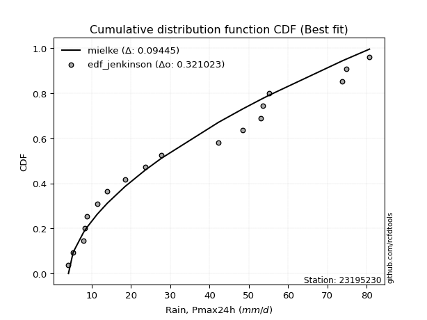</img>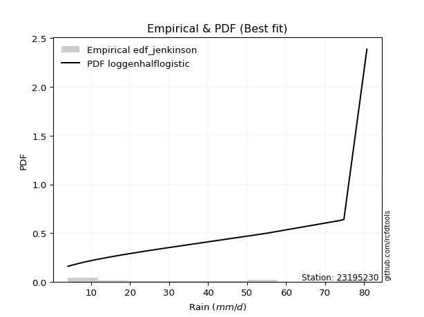</img>

</div>


### 11. EDF Cunnane (1978)

Cunnane´s work in statistical hydrology has focused on the performance and evaluation of different probability distributions (such as GEV, Gumbel, Lognormal) for flood frequency estimation. _b_ is a constant, typically set to 0.4.

<div align="center">


$P=(m-b)/(n+1-2b)$


</div>


**11.1. Empirical values**

<div align="center">

|                | 0                   | 1                   | 2                   | 3                   | 4                   | 5                  | 6                  | 7                  | 8                  | 9                  | 10                 | 11                 | 12                 | 13                 | 14                 | 15                 | 16                 | 17                 |
|:---------------|:--------------------|:--------------------|:--------------------|:--------------------|:--------------------|:-------------------|:-------------------|:-------------------|:-------------------|:-------------------|:-------------------|:-------------------|:-------------------|:-------------------|:-------------------|:-------------------|:-------------------|:-------------------|
| date           | 2022                | 2023                | 2018                | 2008                | 2020                | 2021               | 2019               | 2014               | 2009               | 2007               | 2010               | 2006               | 2013               | 2017               | 2015               | 2016               | 2012               | 2005               |
| x              | 4.1                 | 5.3                 | 7.9                 | 8.3                 | 8.8                 | 11.4               | 14.0               | 18.5               | 23.6               | 27.7               | 42.3               | 48.4               | 53.0               | 53.506             | 55.1               | 73.7               | 74.8               | 80.7               |
| m              | 1                   | 2                   | 3                   | 4                   | 5                   | 6                  | 7                  | 8                  | 9                  | 10                 | 11                 | 12                 | 13                 | 14                 | 15                 | 16                 | 17                 | 18                 |
| empirical_dist | edf_cunnane         | edf_cunnane         | edf_cunnane         | edf_cunnane         | edf_cunnane         | edf_cunnane        | edf_cunnane        | edf_cunnane        | edf_cunnane        | edf_cunnane        | edf_cunnane        | edf_cunnane        | edf_cunnane        | edf_cunnane        | edf_cunnane        | edf_cunnane        | edf_cunnane        | edf_cunnane        |
| empirical      | 0.03296703296703297 | 0.08791208791208792 | 0.14285714285714288 | 0.19780219780219782 | 0.25274725274725274 | 0.3076923076923077 | 0.3626373626373626 | 0.4175824175824176 | 0.4725274725274725 | 0.5274725274725275 | 0.5824175824175825 | 0.6373626373626373 | 0.6923076923076923 | 0.7472527472527473 | 0.8021978021978022 | 0.8571428571428572 | 0.9120879120879122 | 0.9670329670329672 |
| empirical_tr   | 1.0340909090909092  | 1.0963855421686748  | 1.1666666666666667  | 1.2465753424657533  | 1.338235294117647   | 1.4444444444444444 | 1.5689655172413794 | 1.716981132075472  | 1.8958333333333333 | 2.116279069767442  | 2.3947368421052633 | 2.7575757575757573 | 3.25               | 3.956521739130435  | 5.055555555555556  | 7.0000000000000036 | 11.375000000000012 | 30.333333333333442 |

</div>


**11.2. Kolmogorov-Smirnov fit test (sorted by Δ)**


<div align="center">

|                | 0                   | 1                   | 2                   | 3                   | 4                   | 5                   | 6                   | 7                   | 8                   | 9                   | 10                  | 11                  | 12                  | 13                  | 14                  | 15                  | 16                  | 17                  | 18                  | 19                  | 20                  | 21                  | 22                  | 23                  | 24                  | 25                  | 26                  | 27                  | 28                  | 29                  | 30                  | 31                  | 32                  | 33                  | 34                  | 35                  | 36                  | 37                  | 38                  | 39                  | 40                  | 41                  | 42                  | 43                  | 44                  | 45                  | 46                  | 47                  | 48                  | 49                  | 50                  | 51                  | 52                  | 53                  | 54                  | 55                  | 56                  | 57                  | 58                  | 59                  | 60                  | 61                  | 62                  | 63                  | 64                  | 65                  | 66                  | 67                  | 68                  | 69                  | 70                  | 71                  | 72                  | 73                  | 74                  | 75                  | 76                  | 77                  | 78                  | 79                  | 80                  | 81                  | 82                  | 83                  | 84                  | 85                  | 86                  | 87                  | 88                  | 89                  | 90                  | 91                  | 92                  | 93                  | 94                  | 95                  | 96                  | 97                  | 98                  | 99                  | 100                 | 101                 | 102                 | 103                 | 104                 | 105                 | 106                 | 107                 | 108                 | 109                 | 110                 | 111                 | 112                 | 113                 | 114                 | 115                 | 116                 | 117                 | 118                 | 119                 | 120                 | 121                 | 122                 | 123                 | 124                 | 125                 | 126                 | 127                 | 128                 | 129                 | 130                 | 131                 | 132                 | 133                 | 134                 | 135                 | 136                 | 137                 | 138                 | 139                 | 140                 | 141                 | 142                 | 143                 | 144                 | 145                 | 146                 | 147                 | 148                 | 149                 | 150                 | 151                 | 152                 | 153                 | 154                 | 155                 | 156                 | 157                 | 158                 | 159                 |
|:---------------|:--------------------|:--------------------|:--------------------|:--------------------|:--------------------|:--------------------|:--------------------|:--------------------|:--------------------|:--------------------|:--------------------|:--------------------|:--------------------|:--------------------|:--------------------|:--------------------|:--------------------|:--------------------|:--------------------|:--------------------|:--------------------|:--------------------|:--------------------|:--------------------|:--------------------|:--------------------|:--------------------|:--------------------|:--------------------|:--------------------|:--------------------|:--------------------|:--------------------|:--------------------|:--------------------|:--------------------|:--------------------|:--------------------|:--------------------|:--------------------|:--------------------|:--------------------|:--------------------|:--------------------|:--------------------|:--------------------|:--------------------|:--------------------|:--------------------|:--------------------|:--------------------|:--------------------|:--------------------|:--------------------|:--------------------|:--------------------|:--------------------|:--------------------|:--------------------|:--------------------|:--------------------|:--------------------|:--------------------|:--------------------|:--------------------|:--------------------|:--------------------|:--------------------|:--------------------|:--------------------|:--------------------|:--------------------|:--------------------|:--------------------|:--------------------|:--------------------|:--------------------|:--------------------|:--------------------|:--------------------|:--------------------|:--------------------|:--------------------|:--------------------|:--------------------|:--------------------|:--------------------|:--------------------|:--------------------|:--------------------|:--------------------|:--------------------|:--------------------|:--------------------|:--------------------|:--------------------|:--------------------|:--------------------|:--------------------|:--------------------|:--------------------|:--------------------|:--------------------|:--------------------|:--------------------|:--------------------|:--------------------|:--------------------|:--------------------|:--------------------|:--------------------|:--------------------|:--------------------|:--------------------|:--------------------|:--------------------|:--------------------|:--------------------|:--------------------|:--------------------|:--------------------|:--------------------|:--------------------|:--------------------|:--------------------|:--------------------|:--------------------|:--------------------|:--------------------|:--------------------|:--------------------|:--------------------|:--------------------|:--------------------|:--------------------|:--------------------|:--------------------|:--------------------|:--------------------|:--------------------|:--------------------|:--------------------|:--------------------|:--------------------|:--------------------|:--------------------|:--------------------|:--------------------|:--------------------|:--------------------|:--------------------|:--------------------|:--------------------|:--------------------|:--------------------|:--------------------|:--------------------|:--------------------|:--------------------|:--------------------|
| station        | 23195230            | 23195230            | 23195230            | 23195230            | 23195230            | 23195230            | 23195230            | 23195230            | 23195230            | 23195230            | 23195230            | 23195230            | 23195230            | 23195230            | 23195230            | 23195230            | 23195230            | 23195230            | 23195230            | 23195230            | 23195230            | 23195230            | 23195230            | 23195230            | 23195230            | 23195230            | 23195230            | 23195230            | 23195230            | 23195230            | 23195230            | 23195230            | 23195230            | 23195230            | 23195230            | 23195230            | 23195230            | 23195230            | 23195230            | 23195230            | 23195230            | 23195230            | 23195230            | 23195230            | 23195230            | 23195230            | 23195230            | 23195230            | 23195230            | 23195230            | 23195230            | 23195230            | 23195230            | 23195230            | 23195230            | 23195230            | 23195230            | 23195230            | 23195230            | 23195230            | 23195230            | 23195230            | 23195230            | 23195230            | 23195230            | 23195230            | 23195230            | 23195230            | 23195230            | 23195230            | 23195230            | 23195230            | 23195230            | 23195230            | 23195230            | 23195230            | 23195230            | 23195230            | 23195230            | 23195230            | 23195230            | 23195230            | 23195230            | 23195230            | 23195230            | 23195230            | 23195230            | 23195230            | 23195230            | 23195230            | 23195230            | 23195230            | 23195230            | 23195230            | 23195230            | 23195230            | 23195230            | 23195230            | 23195230            | 23195230            | 23195230            | 23195230            | 23195230            | 23195230            | 23195230            | 23195230            | 23195230            | 23195230            | 23195230            | 23195230            | 23195230            | 23195230            | 23195230            | 23195230            | 23195230            | 23195230            | 23195230            | 23195230            | 23195230            | 23195230            | 23195230            | 23195230            | 23195230            | 23195230            | 23195230            | 23195230            | 23195230            | 23195230            | 23195230            | 23195230            | 23195230            | 23195230            | 23195230            | 23195230            | 23195230            | 23195230            | 23195230            | 23195230            | 23195230            | 23195230            | 23195230            | 23195230            | 23195230            | 23195230            | 23195230            | 23195230            | 23195230            | 23195230            | 23195230            | 23195230            | 23195230            | 23195230            | 23195230            | 23195230            | 23195230            | 23195230            | 23195230            | 23195230            | 23195230            | 23195230            |
| empirical_dist | edf_cunnane         | edf_cunnane         | edf_cunnane         | edf_cunnane         | edf_cunnane         | edf_cunnane         | edf_cunnane         | edf_cunnane         | edf_cunnane         | edf_cunnane         | edf_cunnane         | edf_cunnane         | edf_cunnane         | edf_cunnane         | edf_cunnane         | edf_cunnane         | edf_cunnane         | edf_cunnane         | edf_cunnane         | edf_cunnane         | edf_cunnane         | edf_cunnane         | edf_cunnane         | edf_cunnane         | edf_cunnane         | edf_cunnane         | edf_cunnane         | edf_cunnane         | edf_cunnane         | edf_cunnane         | edf_cunnane         | edf_cunnane         | edf_cunnane         | edf_cunnane         | edf_cunnane         | edf_cunnane         | edf_cunnane         | edf_cunnane         | edf_cunnane         | edf_cunnane         | edf_cunnane         | edf_cunnane         | edf_cunnane         | edf_cunnane         | edf_cunnane         | edf_cunnane         | edf_cunnane         | edf_cunnane         | edf_cunnane         | edf_cunnane         | edf_cunnane         | edf_cunnane         | edf_cunnane         | edf_cunnane         | edf_cunnane         | edf_cunnane         | edf_cunnane         | edf_cunnane         | edf_cunnane         | edf_cunnane         | edf_cunnane         | edf_cunnane         | edf_cunnane         | edf_cunnane         | edf_cunnane         | edf_cunnane         | edf_cunnane         | edf_cunnane         | edf_cunnane         | edf_cunnane         | edf_cunnane         | edf_cunnane         | edf_cunnane         | edf_cunnane         | edf_cunnane         | edf_cunnane         | edf_cunnane         | edf_cunnane         | edf_cunnane         | edf_cunnane         | edf_cunnane         | edf_cunnane         | edf_cunnane         | edf_cunnane         | edf_cunnane         | edf_cunnane         | edf_cunnane         | edf_cunnane         | edf_cunnane         | edf_cunnane         | edf_cunnane         | edf_cunnane         | edf_cunnane         | edf_cunnane         | edf_cunnane         | edf_cunnane         | edf_cunnane         | edf_cunnane         | edf_cunnane         | edf_cunnane         | edf_cunnane         | edf_cunnane         | edf_cunnane         | edf_cunnane         | edf_cunnane         | edf_cunnane         | edf_cunnane         | edf_cunnane         | edf_cunnane         | edf_cunnane         | edf_cunnane         | edf_cunnane         | edf_cunnane         | edf_cunnane         | edf_cunnane         | edf_cunnane         | edf_cunnane         | edf_cunnane         | edf_cunnane         | edf_cunnane         | edf_cunnane         | edf_cunnane         | edf_cunnane         | edf_cunnane         | edf_cunnane         | edf_cunnane         | edf_cunnane         | edf_cunnane         | edf_cunnane         | edf_cunnane         | edf_cunnane         | edf_cunnane         | edf_cunnane         | edf_cunnane         | edf_cunnane         | edf_cunnane         | edf_cunnane         | edf_cunnane         | edf_cunnane         | edf_cunnane         | edf_cunnane         | edf_cunnane         | edf_cunnane         | edf_cunnane         | edf_cunnane         | edf_cunnane         | edf_cunnane         | edf_cunnane         | edf_cunnane         | edf_cunnane         | edf_cunnane         | edf_cunnane         | edf_cunnane         | edf_cunnane         | edf_cunnane         | edf_cunnane         | edf_cunnane         | edf_cunnane         | edf_cunnane         | edf_cunnane         |
| p_dist         | loggenhalflogistic  | logtrapezoid        | logarcsine          | mielke              | logburr             | weibull_min         | truncweibull_min    | exponpow            | halfnorm            | nakagami            | logskewnorm         | foldnorm            | logbeta             | gausshyper          | logsemicircular     | logloggamma         | anglit              | burr                | logjohnsonsu        | logargus            | semicircular        | dweibull            | logtriang           | rayleigh            | logdweibull         | burr12              | loganglit           | maxwell             | genexpon            | logburr12           | logweibull_min      | loggenextreme       | loggausshyper       | halflogistic        | logweibull_max      | genlogistic         | pearson3            | exponnorm           | kstwobign           | loggenpareto        | loggompertz         | loggumbel_l         | t                   | truncnorm           | norm                | crystalball         | gumbel_r            | lomax               | logpearson3         | logwrapcauchy       | gompertz            | ncf                 | logncf              | loggengamma         | logf                | moyal               | logksone            | lognct              | logcrystalball      | lognorm             | logt                | logexponnorm        | loggamma            | loggamma            | logfatiguelife      | gengamma            | logerlang           | logbetaprime        | logdgamma           | logfoldnorm         | halfgennorm         | johnsonsu           | logrice             | logloglaplace       | loginvgamma         | logalpha            | arcsine             | invweibull          | genextreme          | invgamma            | loginvweibull       | erlang              | nct                 | skewnorm            | lognakagami         | logmaxwell          | loggenexpon         | f                   | logistic            | cosine              | loginvgauss         | rice                | lograyleigh         | logkstwobign        | fatiguelife         | logcosine           | invgauss            | betaprime           | loglomax            | truncexpon          | dgamma              | loglogistic         | loghalfnorm         | logtruncnorm        | hypsecant           | logtruncweibull_min | bradford            | ksone               | logkappa3           | logtukeylambda      | gumbel_l            | loghypsecant        | loggumbel_r         | genpareto           | loguniform          | laplace             | loghalflogistic     | logvonmises_line    | kappa4              | logmoyal            | logkappa4           | exponweib           | loglaplace          | loglaplace          | beta                | alpha               | wrapcauchy          | logmielke           | logexponweib        | vonmises_line       | kappa3              | uniform             | triang              | logbradford         | logwald             | logtruncexpon       | loglevy_l           | gamma               | powerlaw            | argus               | wald                | genhalflogistic     | logrdist            | levy_l              | trapezoid           | gennorm             | loggennorm          | logpowerlaw         | logjohnsonsb        | johnsonsb           | tukeylambda         | logexponpow         | rdist               | weibull_max         | truncpareto         | loghalfgennorm      | logtruncpareto      | loggenlogistic      | logvonmises         | vonmises            |
| delta          | 0.08152213765557181 | 0.08369842971133956 | 0.09082349279372293 | 0.09310440194228176 | 0.10182142454334431 | 0.10394420863830589 | 0.1041012503585575  | 0.10506167216228424 | 0.10708562925454035 | 0.10793215715068394 | 0.1082126062604869  | 0.10938021399466796 | 0.11068876519803258 | 0.11276564874794062 | 0.11578019450951904 | 0.11585369345349977 | 0.11743612653228364 | 0.1175700684884389  | 0.11879852315855882 | 0.11905482233905673 | 0.1191652690559552  | 0.11940717674557177 | 0.11998704470975563 | 0.12057942454708348 | 0.12341120501226222 | 0.1252663249748952  | 0.12739951441193142 | 0.127465651287279   | 0.12753764293681313 | 0.1287636128065648  | 0.1291886273989179  | 0.13031012923506743 | 0.1307486387969813  | 0.13336218173839598 | 0.1336202829429626  | 0.1337891685921019  | 0.13636007098199138 | 0.14006571145414048 | 0.1407686508750838  | 0.14099423620007176 | 0.1411491381611566  | 0.1429458811243377  | 0.1439399360480334  | 0.14395083599871944 | 0.14395086335476892 | 0.1439508735183781  | 0.1439752007702143  | 0.14428139834069265 | 0.14537722724097446 | 0.14568372380761443 | 0.14575181264866874 | 0.15021014574993163 | 0.1507768101655107  | 0.1523814041533681  | 0.1529905712993238  | 0.15329971355129363 | 0.15359882219248888 | 0.15433640521090308 | 0.15434963443673178 | 0.1543496949926838  | 0.15434970829684513 | 0.1543505502381286  | 0.15501794766022892 | 0.15501794766022892 | 0.1553141399799528  | 0.15561900523380856 | 0.15664640034315203 | 0.15665352070582583 | 0.1569057379062908  | 0.15729312809437657 | 0.15743962075233342 | 0.15780953178865909 | 0.1578892520095957  | 0.15847642762796998 | 0.15955705264776987 | 0.16007041967413094 | 0.16007062411305437 | 0.16141040483083058 | 0.1614108077275428  | 0.162277017268735   | 0.1626042387711948  | 0.1629877495949288  | 0.163686362093575   | 0.16415626524006843 | 0.16489790744963562 | 0.16565643718300616 | 0.16579563830953625 | 0.16588191929889107 | 0.16619243462152417 | 0.1664419319760741  | 0.16761734269502415 | 0.16877364476041945 | 0.16890200533923994 | 0.1694444027889972  | 0.16946501289669114 | 0.169789890567003   | 0.1716971377251113  | 0.1722445689840697  | 0.17470982395340626 | 0.17491413838770406 | 0.17516184674822388 | 0.17688870616735486 | 0.1794689516386766  | 0.18044359403456567 | 0.18153178023112573 | 0.18416166538062617 | 0.18709716701081983 | 0.1873941984908043  | 0.18921837511718365 | 0.19041986998417004 | 0.19049182471198822 | 0.1921235971085653  | 0.19702533543500667 | 0.19711653763577314 | 0.2008021031145032  | 0.20400119769419509 | 0.2046088848088482  | 0.2082388081991523  | 0.20963658697086265 | 0.21076506740261736 | 0.2110425292973075  | 0.2132700847950082  | 0.21343752044827335 | 0.21343752044827335 | 0.21364388123074987 | 0.21865061000044972 | 0.22145134210954842 | 0.22623342146665903 | 0.22771994000058995 | 0.23267559491323436 | 0.232716435616199   | 0.2333945427940206  | 0.2482699764296959  | 0.2508534647136177  | 0.2528813057953252  | 0.25994287915177117 | 0.26544724709705225 | 0.27171073316941763 | 0.28210349379660893 | 0.2834755456740695  | 0.2967938801859105  | 0.30237808915618136 | 0.31921371659471187 | 0.38401634906700377 | 0.41049840714918284 | 0.4120879120879122  | 0.4120879120879122  | 0.42698031814569126 | 0.44075933989904914 | 0.46994967938678534 | 0.480074393149163   | 0.5046322904677041  | 0.5207023540211724  | 0.6403474241576447  | 0.7823362502482447  | 0.8021978021978022  | 0.8344465799595108  | 0.9120879120879122  | 1.139816600288181   | 12.754526957067684  |
| deltao         | 0.32102346734599996 | 0.32102346734599996 | 0.32102346734599996 | 0.32102346734599996 | 0.32102346734599996 | 0.32102346734599996 | 0.32102346734599996 | 0.32102346734599996 | 0.32102346734599996 | 0.32102346734599996 | 0.32102346734599996 | 0.32102346734599996 | 0.32102346734599996 | 0.32102346734599996 | 0.32102346734599996 | 0.32102346734599996 | 0.32102346734599996 | 0.32102346734599996 | 0.32102346734599996 | 0.32102346734599996 | 0.32102346734599996 | 0.32102346734599996 | 0.32102346734599996 | 0.32102346734599996 | 0.32102346734599996 | 0.32102346734599996 | 0.32102346734599996 | 0.32102346734599996 | 0.32102346734599996 | 0.32102346734599996 | 0.32102346734599996 | 0.32102346734599996 | 0.32102346734599996 | 0.32102346734599996 | 0.32102346734599996 | 0.32102346734599996 | 0.32102346734599996 | 0.32102346734599996 | 0.32102346734599996 | 0.32102346734599996 | 0.32102346734599996 | 0.32102346734599996 | 0.32102346734599996 | 0.32102346734599996 | 0.32102346734599996 | 0.32102346734599996 | 0.32102346734599996 | 0.32102346734599996 | 0.32102346734599996 | 0.32102346734599996 | 0.32102346734599996 | 0.32102346734599996 | 0.32102346734599996 | 0.32102346734599996 | 0.32102346734599996 | 0.32102346734599996 | 0.32102346734599996 | 0.32102346734599996 | 0.32102346734599996 | 0.32102346734599996 | 0.32102346734599996 | 0.32102346734599996 | 0.32102346734599996 | 0.32102346734599996 | 0.32102346734599996 | 0.32102346734599996 | 0.32102346734599996 | 0.32102346734599996 | 0.32102346734599996 | 0.32102346734599996 | 0.32102346734599996 | 0.32102346734599996 | 0.32102346734599996 | 0.32102346734599996 | 0.32102346734599996 | 0.32102346734599996 | 0.32102346734599996 | 0.32102346734599996 | 0.32102346734599996 | 0.32102346734599996 | 0.32102346734599996 | 0.32102346734599996 | 0.32102346734599996 | 0.32102346734599996 | 0.32102346734599996 | 0.32102346734599996 | 0.32102346734599996 | 0.32102346734599996 | 0.32102346734599996 | 0.32102346734599996 | 0.32102346734599996 | 0.32102346734599996 | 0.32102346734599996 | 0.32102346734599996 | 0.32102346734599996 | 0.32102346734599996 | 0.32102346734599996 | 0.32102346734599996 | 0.32102346734599996 | 0.32102346734599996 | 0.32102346734599996 | 0.32102346734599996 | 0.32102346734599996 | 0.32102346734599996 | 0.32102346734599996 | 0.32102346734599996 | 0.32102346734599996 | 0.32102346734599996 | 0.32102346734599996 | 0.32102346734599996 | 0.32102346734599996 | 0.32102346734599996 | 0.32102346734599996 | 0.32102346734599996 | 0.32102346734599996 | 0.32102346734599996 | 0.32102346734599996 | 0.32102346734599996 | 0.32102346734599996 | 0.32102346734599996 | 0.32102346734599996 | 0.32102346734599996 | 0.32102346734599996 | 0.32102346734599996 | 0.32102346734599996 | 0.32102346734599996 | 0.32102346734599996 | 0.32102346734599996 | 0.32102346734599996 | 0.32102346734599996 | 0.32102346734599996 | 0.32102346734599996 | 0.32102346734599996 | 0.32102346734599996 | 0.32102346734599996 | 0.32102346734599996 | 0.32102346734599996 | 0.32102346734599996 | 0.32102346734599996 | 0.32102346734599996 | 0.32102346734599996 | 0.32102346734599996 | 0.32102346734599996 | 0.32102346734599996 | 0.32102346734599996 | 0.32102346734599996 | 0.32102346734599996 | 0.32102346734599996 | 0.32102346734599996 | 0.32102346734599996 | 0.32102346734599996 | 0.32102346734599996 | 0.32102346734599996 | 0.32102346734599996 | 0.32102346734599996 | 0.32102346734599996 | 0.32102346734599996 | 0.32102346734599996 | 0.32102346734599996 | 0.32102346734599996 |
| eval           | Δo > Δ              | Δo > Δ              | Δo > Δ              | Δo > Δ              | Δo > Δ              | Δo > Δ              | Δo > Δ              | Δo > Δ              | Δo > Δ              | Δo > Δ              | Δo > Δ              | Δo > Δ              | Δo > Δ              | Δo > Δ              | Δo > Δ              | Δo > Δ              | Δo > Δ              | Δo > Δ              | Δo > Δ              | Δo > Δ              | Δo > Δ              | Δo > Δ              | Δo > Δ              | Δo > Δ              | Δo > Δ              | Δo > Δ              | Δo > Δ              | Δo > Δ              | Δo > Δ              | Δo > Δ              | Δo > Δ              | Δo > Δ              | Δo > Δ              | Δo > Δ              | Δo > Δ              | Δo > Δ              | Δo > Δ              | Δo > Δ              | Δo > Δ              | Δo > Δ              | Δo > Δ              | Δo > Δ              | Δo > Δ              | Δo > Δ              | Δo > Δ              | Δo > Δ              | Δo > Δ              | Δo > Δ              | Δo > Δ              | Δo > Δ              | Δo > Δ              | Δo > Δ              | Δo > Δ              | Δo > Δ              | Δo > Δ              | Δo > Δ              | Δo > Δ              | Δo > Δ              | Δo > Δ              | Δo > Δ              | Δo > Δ              | Δo > Δ              | Δo > Δ              | Δo > Δ              | Δo > Δ              | Δo > Δ              | Δo > Δ              | Δo > Δ              | Δo > Δ              | Δo > Δ              | Δo > Δ              | Δo > Δ              | Δo > Δ              | Δo > Δ              | Δo > Δ              | Δo > Δ              | Δo > Δ              | Δo > Δ              | Δo > Δ              | Δo > Δ              | Δo > Δ              | Δo > Δ              | Δo > Δ              | Δo > Δ              | Δo > Δ              | Δo > Δ              | Δo > Δ              | Δo > Δ              | Δo > Δ              | Δo > Δ              | Δo > Δ              | Δo > Δ              | Δo > Δ              | Δo > Δ              | Δo > Δ              | Δo > Δ              | Δo > Δ              | Δo > Δ              | Δo > Δ              | Δo > Δ              | Δo > Δ              | Δo > Δ              | Δo > Δ              | Δo > Δ              | Δo > Δ              | Δo > Δ              | Δo > Δ              | Δo > Δ              | Δo > Δ              | Δo > Δ              | Δo > Δ              | Δo > Δ              | Δo > Δ              | Δo > Δ              | Δo > Δ              | Δo > Δ              | Δo > Δ              | Δo > Δ              | Δo > Δ              | Δo > Δ              | Δo > Δ              | Δo > Δ              | Δo > Δ              | Δo > Δ              | Δo > Δ              | Δo > Δ              | Δo > Δ              | Δo > Δ              | Δo > Δ              | Δo > Δ              | Δo > Δ              | Δo > Δ              | Δo > Δ              | Δo > Δ              | Δo > Δ              | Δo > Δ              | Δo > Δ              | Δo > Δ              | Δo > Δ              | Δo > Δ              | Δo > Δ              | Δo > Δ              | Δo > Δ              | Δo <= Δ             | Δo <= Δ             | Δo <= Δ             | Δo <= Δ             | Δo <= Δ             | Δo <= Δ             | Δo <= Δ             | Δo <= Δ             | Δo <= Δ             | Δo <= Δ             | Δo <= Δ             | Δo <= Δ             | Δo <= Δ             | Δo <= Δ             | Δo <= Δ             | Δo <= Δ             | Δo <= Δ             |
| fit            | 1                   | 1                   | 1                   | 1                   | 1                   | 1                   | 1                   | 1                   | 1                   | 1                   | 1                   | 1                   | 1                   | 1                   | 1                   | 1                   | 1                   | 1                   | 1                   | 1                   | 1                   | 1                   | 1                   | 1                   | 1                   | 1                   | 1                   | 1                   | 1                   | 1                   | 1                   | 1                   | 1                   | 1                   | 1                   | 1                   | 1                   | 1                   | 1                   | 1                   | 1                   | 1                   | 1                   | 1                   | 1                   | 1                   | 1                   | 1                   | 1                   | 1                   | 1                   | 1                   | 1                   | 1                   | 1                   | 1                   | 1                   | 1                   | 1                   | 1                   | 1                   | 1                   | 1                   | 1                   | 1                   | 1                   | 1                   | 1                   | 1                   | 1                   | 1                   | 1                   | 1                   | 1                   | 1                   | 1                   | 1                   | 1                   | 1                   | 1                   | 1                   | 1                   | 1                   | 1                   | 1                   | 1                   | 1                   | 1                   | 1                   | 1                   | 1                   | 1                   | 1                   | 1                   | 1                   | 1                   | 1                   | 1                   | 1                   | 1                   | 1                   | 1                   | 1                   | 1                   | 1                   | 1                   | 1                   | 1                   | 1                   | 1                   | 1                   | 1                   | 1                   | 1                   | 1                   | 1                   | 1                   | 1                   | 1                   | 1                   | 1                   | 1                   | 1                   | 1                   | 1                   | 1                   | 1                   | 1                   | 1                   | 1                   | 1                   | 1                   | 1                   | 1                   | 1                   | 1                   | 1                   | 1                   | 1                   | 1                   | 1                   | 1                   | 1                   | 0                   | 0                   | 0                   | 0                   | 0                   | 0                   | 0                   | 0                   | 0                   | 0                   | 0                   | 0                   | 0                   | 0                   | 0                   | 0                   | 0                   |
| n              | 18                  | 18                  | 18                  | 18                  | 18                  | 18                  | 18                  | 18                  | 18                  | 18                  | 18                  | 18                  | 18                  | 18                  | 18                  | 18                  | 18                  | 18                  | 18                  | 18                  | 18                  | 18                  | 18                  | 18                  | 18                  | 18                  | 18                  | 18                  | 18                  | 18                  | 18                  | 18                  | 18                  | 18                  | 18                  | 18                  | 18                  | 18                  | 18                  | 18                  | 18                  | 18                  | 18                  | 18                  | 18                  | 18                  | 18                  | 18                  | 18                  | 18                  | 18                  | 18                  | 18                  | 18                  | 18                  | 18                  | 18                  | 18                  | 18                  | 18                  | 18                  | 18                  | 18                  | 18                  | 18                  | 18                  | 18                  | 18                  | 18                  | 18                  | 18                  | 18                  | 18                  | 18                  | 18                  | 18                  | 18                  | 18                  | 18                  | 18                  | 18                  | 18                  | 18                  | 18                  | 18                  | 18                  | 18                  | 18                  | 18                  | 18                  | 18                  | 18                  | 18                  | 18                  | 18                  | 18                  | 18                  | 18                  | 18                  | 18                  | 18                  | 18                  | 18                  | 18                  | 18                  | 18                  | 18                  | 18                  | 18                  | 18                  | 18                  | 18                  | 18                  | 18                  | 18                  | 18                  | 18                  | 18                  | 18                  | 18                  | 18                  | 18                  | 18                  | 18                  | 18                  | 18                  | 18                  | 18                  | 18                  | 18                  | 18                  | 18                  | 18                  | 18                  | 18                  | 18                  | 18                  | 18                  | 18                  | 18                  | 18                  | 18                  | 18                  | 18                  | 18                  | 18                  | 18                  | 18                  | 18                  | 18                  | 18                  | 18                  | 18                  | 18                  | 18                  | 18                  | 18                  | 18                  | 18                  | 18                  |
| best_fit       | 1                   | 0                   | 0                   | 0                   | 0                   | 0                   | 0                   | 0                   | 0                   | 0                   | 0                   | 0                   | 0                   | 0                   | 0                   | 0                   | 0                   | 0                   | 0                   | 0                   | 0                   | 0                   | 0                   | 0                   | 0                   | 0                   | 0                   | 0                   | 0                   | 0                   | 0                   | 0                   | 0                   | 0                   | 0                   | 0                   | 0                   | 0                   | 0                   | 0                   | 0                   | 0                   | 0                   | 0                   | 0                   | 0                   | 0                   | 0                   | 0                   | 0                   | 0                   | 0                   | 0                   | 0                   | 0                   | 0                   | 0                   | 0                   | 0                   | 0                   | 0                   | 0                   | 0                   | 0                   | 0                   | 0                   | 0                   | 0                   | 0                   | 0                   | 0                   | 0                   | 0                   | 0                   | 0                   | 0                   | 0                   | 0                   | 0                   | 0                   | 0                   | 0                   | 0                   | 0                   | 0                   | 0                   | 0                   | 0                   | 0                   | 0                   | 0                   | 0                   | 0                   | 0                   | 0                   | 0                   | 0                   | 0                   | 0                   | 0                   | 0                   | 0                   | 0                   | 0                   | 0                   | 0                   | 0                   | 0                   | 0                   | 0                   | 0                   | 0                   | 0                   | 0                   | 0                   | 0                   | 0                   | 0                   | 0                   | 0                   | 0                   | 0                   | 0                   | 0                   | 0                   | 0                   | 0                   | 0                   | 0                   | 0                   | 0                   | 0                   | 0                   | 0                   | 0                   | 0                   | 0                   | 0                   | 0                   | 0                   | 0                   | 0                   | 0                   | 0                   | 0                   | 0                   | 0                   | 0                   | 0                   | 0                   | 0                   | 0                   | 0                   | 0                   | 0                   | 0                   | 0                   | 0                   | 0                   | 0                   |
| best_fit_sort  | 1                   | 2                   | 3                   | 4                   | 5                   | 6                   | 7                   | 8                   | 9                   | 10                  | 11                  | 12                  | 13                  | 14                  | 15                  | 16                  | 17                  | 18                  | 19                  | 20                  | 21                  | 22                  | 23                  | 24                  | 25                  | 26                  | 27                  | 28                  | 29                  | 30                  | 31                  | 32                  | 33                  | 34                  | 35                  | 36                  | 37                  | 38                  | 39                  | 40                  | 41                  | 42                  | 43                  | 44                  | 45                  | 46                  | 47                  | 48                  | 49                  | 50                  | 51                  | 52                  | 53                  | 54                  | 55                  | 56                  | 57                  | 58                  | 59                  | 60                  | 61                  | 62                  | 63                  | 64                  | 65                  | 66                  | 67                  | 68                  | 69                  | 70                  | 71                  | 72                  | 73                  | 74                  | 75                  | 76                  | 77                  | 78                  | 79                  | 80                  | 81                  | 82                  | 83                  | 84                  | 85                  | 86                  | 87                  | 88                  | 89                  | 90                  | 91                  | 92                  | 93                  | 94                  | 95                  | 96                  | 97                  | 98                  | 99                  | 100                 | 101                 | 102                 | 103                 | 104                 | 105                 | 106                 | 107                 | 108                 | 109                 | 110                 | 111                 | 112                 | 113                 | 114                 | 115                 | 116                 | 117                 | 118                 | 119                 | 120                 | 121                 | 122                 | 123                 | 124                 | 125                 | 126                 | 127                 | 128                 | 129                 | 130                 | 131                 | 132                 | 133                 | 134                 | 135                 | 136                 | 137                 | 138                 | 139                 | 140                 | 141                 | 142                 | 143                 | 144                 | 145                 | 146                 | 147                 | 148                 | 149                 | 150                 | 151                 | 152                 | 153                 | 154                 | 155                 | 156                 | 157                 | 158                 | 159                 | 160                 |

</div>


**11.3. Best fit**

<div align="center">

|   id |   station | empirical_dist   | p_dist             |     delta |   deltao | eval   |   fit |   n |   best_fit |   best_fit_sort |
|-----:|----------:|:-----------------|:-------------------|----------:|---------:|:-------|------:|----:|-----------:|----------------:|
|    0 |  23195230 | edf_cunnane      | loggenhalflogistic | 0.0815221 | 0.321023 | Δo > Δ |     1 |  18 |          1 |               1 |

</div>


<div align="center">

</img>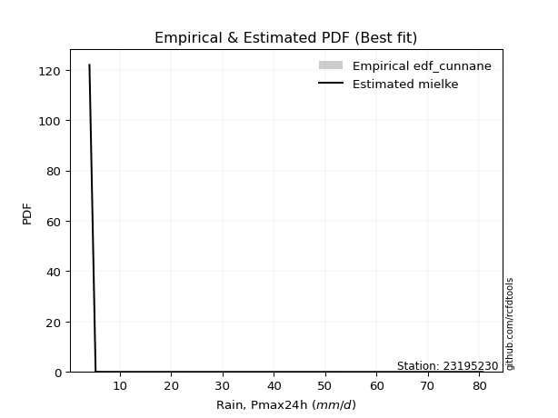</img>

</div>


### 12. EDF Adamowski (1981)

The Adamowski formula in hydrology refers to a specific plotting position formula used for estimating the non-parametric empirical distribution of hydrological events (like flood peaks) to calculate their return periods. This formula provides an alternative to traditional parametric methods (like the Gumbel or Log Pearson Type III distributions). 

<div align="center">


$P=(m-0.25)/(n+0.5)$


</div>


**12.1. Empirical values**

<div align="center">

|                | 0                   | 1                  | 2                   | 3                   | 4                   | 5                  | 6                   | 7                  | 8                   | 9                 | 10                | 11                 | 12                 | 13                 | 14                 | 15                 | 16                 | 17                 |
|:---------------|:--------------------|:-------------------|:--------------------|:--------------------|:--------------------|:-------------------|:--------------------|:-------------------|:--------------------|:------------------|:------------------|:-------------------|:-------------------|:-------------------|:-------------------|:-------------------|:-------------------|:-------------------|
| date           | 2022                | 2023               | 2018                | 2008                | 2020                | 2021               | 2019                | 2014               | 2009                | 2007              | 2010              | 2006               | 2013               | 2017               | 2015               | 2016               | 2012               | 2005               |
| x              | 4.1                 | 5.3                | 7.9                 | 8.3                 | 8.8                 | 11.4               | 14.0                | 18.5               | 23.6                | 27.7              | 42.3              | 48.4               | 53.0               | 53.506             | 55.1               | 73.7               | 74.8               | 80.7               |
| m              | 1                   | 2                  | 3                   | 4                   | 5                   | 6                  | 7                   | 8                  | 9                   | 10                | 11                | 12                 | 13                 | 14                 | 15                 | 16                 | 17                 | 18                 |
| empirical_dist | edf_adamowski       | edf_adamowski      | edf_adamowski       | edf_adamowski       | edf_adamowski       | edf_adamowski      | edf_adamowski       | edf_adamowski      | edf_adamowski       | edf_adamowski     | edf_adamowski     | edf_adamowski      | edf_adamowski      | edf_adamowski      | edf_adamowski      | edf_adamowski      | edf_adamowski      | edf_adamowski      |
| empirical      | 0.04054054054054054 | 0.0945945945945946 | 0.14864864864864866 | 0.20270270270270271 | 0.25675675675675674 | 0.3108108108108108 | 0.36486486486486486 | 0.4189189189189189 | 0.47297297297297297 | 0.527027027027027 | 0.581081081081081 | 0.6351351351351351 | 0.6891891891891891 | 0.7432432432432432 | 0.7972972972972973 | 0.8513513513513513 | 0.9054054054054054 | 0.9594594594594594 |
| empirical_tr   | 1.0422535211267605  | 1.1044776119402986 | 1.1746031746031746  | 1.2542372881355932  | 1.3454545454545455  | 1.4509803921568627 | 1.574468085106383   | 1.7209302325581393 | 1.8974358974358976  | 2.114285714285714 | 2.387096774193548 | 2.7407407407407405 | 3.2173913043478257 | 3.8947368421052624 | 4.933333333333333  | 6.727272727272726  | 10.571428571428568 | 24.66666666666665  |

</div>


**12.2. Kolmogorov-Smirnov fit test (sorted by Δ)**


<div align="center">

|                | 0                   | 1                   | 2                   | 3                   | 4                   | 5                   | 6                   | 7                   | 8                   | 9                   | 10                  | 11                  | 12                  | 13                  | 14                  | 15                  | 16                  | 17                  | 18                  | 19                  | 20                  | 21                  | 22                  | 23                  | 24                  | 25                  | 26                  | 27                  | 28                  | 29                  | 30                  | 31                  | 32                  | 33                  | 34                  | 35                  | 36                  | 37                  | 38                  | 39                  | 40                  | 41                  | 42                  | 43                  | 44                  | 45                  | 46                  | 47                  | 48                  | 49                  | 50                  | 51                  | 52                  | 53                  | 54                  | 55                  | 56                  | 57                  | 58                  | 59                  | 60                  | 61                  | 62                  | 63                  | 64                  | 65                  | 66                  | 67                  | 68                  | 69                  | 70                  | 71                  | 72                  | 73                  | 74                  | 75                  | 76                  | 77                  | 78                  | 79                  | 80                  | 81                  | 82                  | 83                  | 84                  | 85                  | 86                  | 87                  | 88                  | 89                  | 90                  | 91                  | 92                  | 93                  | 94                  | 95                  | 96                  | 97                  | 98                  | 99                  | 100                 | 101                 | 102                 | 103                 | 104                 | 105                 | 106                 | 107                 | 108                 | 109                 | 110                 | 111                 | 112                 | 113                 | 114                 | 115                 | 116                 | 117                 | 118                 | 119                 | 120                 | 121                 | 122                 | 123                 | 124                 | 125                 | 126                 | 127                 | 128                 | 129                 | 130                 | 131                 | 132                 | 133                 | 134                 | 135                 | 136                 | 137                 | 138                 | 139                 | 140                 | 141                 | 142                 | 143                 | 144                 | 145                 | 146                 | 147                 | 148                 | 149                 | 150                 | 151                 | 152                 | 153                 | 154                 | 155                 | 156                 | 157                 | 158                 | 159                 |
|:---------------|:--------------------|:--------------------|:--------------------|:--------------------|:--------------------|:--------------------|:--------------------|:--------------------|:--------------------|:--------------------|:--------------------|:--------------------|:--------------------|:--------------------|:--------------------|:--------------------|:--------------------|:--------------------|:--------------------|:--------------------|:--------------------|:--------------------|:--------------------|:--------------------|:--------------------|:--------------------|:--------------------|:--------------------|:--------------------|:--------------------|:--------------------|:--------------------|:--------------------|:--------------------|:--------------------|:--------------------|:--------------------|:--------------------|:--------------------|:--------------------|:--------------------|:--------------------|:--------------------|:--------------------|:--------------------|:--------------------|:--------------------|:--------------------|:--------------------|:--------------------|:--------------------|:--------------------|:--------------------|:--------------------|:--------------------|:--------------------|:--------------------|:--------------------|:--------------------|:--------------------|:--------------------|:--------------------|:--------------------|:--------------------|:--------------------|:--------------------|:--------------------|:--------------------|:--------------------|:--------------------|:--------------------|:--------------------|:--------------------|:--------------------|:--------------------|:--------------------|:--------------------|:--------------------|:--------------------|:--------------------|:--------------------|:--------------------|:--------------------|:--------------------|:--------------------|:--------------------|:--------------------|:--------------------|:--------------------|:--------------------|:--------------------|:--------------------|:--------------------|:--------------------|:--------------------|:--------------------|:--------------------|:--------------------|:--------------------|:--------------------|:--------------------|:--------------------|:--------------------|:--------------------|:--------------------|:--------------------|:--------------------|:--------------------|:--------------------|:--------------------|:--------------------|:--------------------|:--------------------|:--------------------|:--------------------|:--------------------|:--------------------|:--------------------|:--------------------|:--------------------|:--------------------|:--------------------|:--------------------|:--------------------|:--------------------|:--------------------|:--------------------|:--------------------|:--------------------|:--------------------|:--------------------|:--------------------|:--------------------|:--------------------|:--------------------|:--------------------|:--------------------|:--------------------|:--------------------|:--------------------|:--------------------|:--------------------|:--------------------|:--------------------|:--------------------|:--------------------|:--------------------|:--------------------|:--------------------|:--------------------|:--------------------|:--------------------|:--------------------|:--------------------|:--------------------|:--------------------|:--------------------|:--------------------|:--------------------|:--------------------|
| station        | 23195230            | 23195230            | 23195230            | 23195230            | 23195230            | 23195230            | 23195230            | 23195230            | 23195230            | 23195230            | 23195230            | 23195230            | 23195230            | 23195230            | 23195230            | 23195230            | 23195230            | 23195230            | 23195230            | 23195230            | 23195230            | 23195230            | 23195230            | 23195230            | 23195230            | 23195230            | 23195230            | 23195230            | 23195230            | 23195230            | 23195230            | 23195230            | 23195230            | 23195230            | 23195230            | 23195230            | 23195230            | 23195230            | 23195230            | 23195230            | 23195230            | 23195230            | 23195230            | 23195230            | 23195230            | 23195230            | 23195230            | 23195230            | 23195230            | 23195230            | 23195230            | 23195230            | 23195230            | 23195230            | 23195230            | 23195230            | 23195230            | 23195230            | 23195230            | 23195230            | 23195230            | 23195230            | 23195230            | 23195230            | 23195230            | 23195230            | 23195230            | 23195230            | 23195230            | 23195230            | 23195230            | 23195230            | 23195230            | 23195230            | 23195230            | 23195230            | 23195230            | 23195230            | 23195230            | 23195230            | 23195230            | 23195230            | 23195230            | 23195230            | 23195230            | 23195230            | 23195230            | 23195230            | 23195230            | 23195230            | 23195230            | 23195230            | 23195230            | 23195230            | 23195230            | 23195230            | 23195230            | 23195230            | 23195230            | 23195230            | 23195230            | 23195230            | 23195230            | 23195230            | 23195230            | 23195230            | 23195230            | 23195230            | 23195230            | 23195230            | 23195230            | 23195230            | 23195230            | 23195230            | 23195230            | 23195230            | 23195230            | 23195230            | 23195230            | 23195230            | 23195230            | 23195230            | 23195230            | 23195230            | 23195230            | 23195230            | 23195230            | 23195230            | 23195230            | 23195230            | 23195230            | 23195230            | 23195230            | 23195230            | 23195230            | 23195230            | 23195230            | 23195230            | 23195230            | 23195230            | 23195230            | 23195230            | 23195230            | 23195230            | 23195230            | 23195230            | 23195230            | 23195230            | 23195230            | 23195230            | 23195230            | 23195230            | 23195230            | 23195230            | 23195230            | 23195230            | 23195230            | 23195230            | 23195230            | 23195230            |
| empirical_dist | edf_adamowski       | edf_adamowski       | edf_adamowski       | edf_adamowski       | edf_adamowski       | edf_adamowski       | edf_adamowski       | edf_adamowski       | edf_adamowski       | edf_adamowski       | edf_adamowski       | edf_adamowski       | edf_adamowski       | edf_adamowski       | edf_adamowski       | edf_adamowski       | edf_adamowski       | edf_adamowski       | edf_adamowski       | edf_adamowski       | edf_adamowski       | edf_adamowski       | edf_adamowski       | edf_adamowski       | edf_adamowski       | edf_adamowski       | edf_adamowski       | edf_adamowski       | edf_adamowski       | edf_adamowski       | edf_adamowski       | edf_adamowski       | edf_adamowski       | edf_adamowski       | edf_adamowski       | edf_adamowski       | edf_adamowski       | edf_adamowski       | edf_adamowski       | edf_adamowski       | edf_adamowski       | edf_adamowski       | edf_adamowski       | edf_adamowski       | edf_adamowski       | edf_adamowski       | edf_adamowski       | edf_adamowski       | edf_adamowski       | edf_adamowski       | edf_adamowski       | edf_adamowski       | edf_adamowski       | edf_adamowski       | edf_adamowski       | edf_adamowski       | edf_adamowski       | edf_adamowski       | edf_adamowski       | edf_adamowski       | edf_adamowski       | edf_adamowski       | edf_adamowski       | edf_adamowski       | edf_adamowski       | edf_adamowski       | edf_adamowski       | edf_adamowski       | edf_adamowski       | edf_adamowski       | edf_adamowski       | edf_adamowski       | edf_adamowski       | edf_adamowski       | edf_adamowski       | edf_adamowski       | edf_adamowski       | edf_adamowski       | edf_adamowski       | edf_adamowski       | edf_adamowski       | edf_adamowski       | edf_adamowski       | edf_adamowski       | edf_adamowski       | edf_adamowski       | edf_adamowski       | edf_adamowski       | edf_adamowski       | edf_adamowski       | edf_adamowski       | edf_adamowski       | edf_adamowski       | edf_adamowski       | edf_adamowski       | edf_adamowski       | edf_adamowski       | edf_adamowski       | edf_adamowski       | edf_adamowski       | edf_adamowski       | edf_adamowski       | edf_adamowski       | edf_adamowski       | edf_adamowski       | edf_adamowski       | edf_adamowski       | edf_adamowski       | edf_adamowski       | edf_adamowski       | edf_adamowski       | edf_adamowski       | edf_adamowski       | edf_adamowski       | edf_adamowski       | edf_adamowski       | edf_adamowski       | edf_adamowski       | edf_adamowski       | edf_adamowski       | edf_adamowski       | edf_adamowski       | edf_adamowski       | edf_adamowski       | edf_adamowski       | edf_adamowski       | edf_adamowski       | edf_adamowski       | edf_adamowski       | edf_adamowski       | edf_adamowski       | edf_adamowski       | edf_adamowski       | edf_adamowski       | edf_adamowski       | edf_adamowski       | edf_adamowski       | edf_adamowski       | edf_adamowski       | edf_adamowski       | edf_adamowski       | edf_adamowski       | edf_adamowski       | edf_adamowski       | edf_adamowski       | edf_adamowski       | edf_adamowski       | edf_adamowski       | edf_adamowski       | edf_adamowski       | edf_adamowski       | edf_adamowski       | edf_adamowski       | edf_adamowski       | edf_adamowski       | edf_adamowski       | edf_adamowski       | edf_adamowski       | edf_adamowski       | edf_adamowski       |
| p_dist         | logtrapezoid        | loggenhalflogistic  | logarcsine          | mielke              | nakagami            | logburr             | logbeta             | truncweibull_min    | weibull_min         | exponpow            | halfnorm            | logskewnorm         | semicircular        | foldnorm            | dweibull            | gausshyper          | logsemicircular     | logloggamma         | anglit              | burr                | logjohnsonsu        | logargus            | logtriang           | rayleigh            | logdweibull         | burr12              | loganglit           | maxwell             | logburr12           | logweibull_min      | genexpon            | loggausshyper       | loggenextreme       | loggenpareto        | logweibull_max      | genlogistic         | halflogistic        | pearson3            | logwrapcauchy       | exponnorm           | loggompertz         | kstwobign           | loggumbel_l         | lomax               | t                   | truncnorm           | norm                | crystalball         | gumbel_r            | logpearson3         | gompertz            | logloglaplace       | logncf              | ncf                 | arcsine             | loggengamma         | logf                | logksone            | moyal               | lognct              | logcrystalball      | lognorm             | logt                | logexponnorm        | loggamma            | loggamma            | logfatiguelife      | gengamma            | logerlang           | logbetaprime        | logfoldnorm         | halfgennorm         | johnsonsu           | logrice             | loginvgamma         | logdgamma           | logalpha            | invweibull          | genextreme          | invgamma            | loginvweibull       | erlang              | nct                 | lognakagami         | skewnorm            | logmaxwell          | loggenexpon         | f                   | dgamma              | cosine              | logistic            | loglomax            | loginvgauss         | lograyleigh         | logkstwobign        | fatiguelife         | rice                | logcosine           | invgauss            | betaprime           | truncexpon          | loglogistic         | loghalfnorm         | logtruncnorm        | hypsecant           | logtruncweibull_min | ksone               | bradford            | gumbel_l            | logkappa3           | logtukeylambda      | loghypsecant        | genpareto           | loggumbel_r         | loguniform          | laplace             | loghalflogistic     | beta                | logvonmises_line    | kappa4              | logmoyal            | logkappa4           | exponweib           | loglaplace          | loglaplace          | wrapcauchy          | alpha               | logexponweib        | logmielke           | vonmises_line       | kappa3              | uniform             | triang              | logbradford         | logwald             | loglevy_l           | logtruncexpon       | gamma               | powerlaw            | argus               | wald                | genhalflogistic     | logrdist            | levy_l              | gennorm             | loggennorm          | trapezoid           | logpowerlaw         | logjohnsonsb        | johnsonsb           | tukeylambda         | logexponpow         | rdist               | weibull_max         | truncpareto         | loghalfgennorm      | logtruncpareto      | loggenlogistic      | logvonmises         | vonmises            |
| delta          | 0.08592593193884179 | 0.0873136434470777  | 0.0945945945945946  | 0.09533190416978399 | 0.10035864957717622 | 0.10404892677084654 | 0.1048972594065268  | 0.10632875258605973 | 0.10634234129692391 | 0.10773898346914634 | 0.10931313148204258 | 0.11044010848798913 | 0.11159176148244762 | 0.1116077162221702  | 0.1145066718450668  | 0.11499315097544285 | 0.11711669584602047 | 0.118081195681002   | 0.11877262786878495 | 0.11979757071594113 | 0.12102602538606105 | 0.12128232456655896 | 0.12221454693725786 | 0.12280692677458571 | 0.12563870723976445 | 0.12749382720239744 | 0.12873601574843285 | 0.12969315351478122 | 0.13099111503406702 | 0.13141612962642013 | 0.1314521999912278  | 0.13208514013348271 | 0.13253763146256967 | 0.13342072862656418 | 0.13584778517046484 | 0.13601667081960414 | 0.1367670461427783  | 0.1385875732094936  | 0.13989221801610865 | 0.1414022127906419  | 0.14248563949765802 | 0.14299615310258604 | 0.14517338335183994 | 0.14561789967719407 | 0.14616743827553563 | 0.14617833822622167 | 0.14617836558227115 | 0.14617837574588033 | 0.14620270299771654 | 0.1467137285774759  | 0.14976131665817274 | 0.15090292005446226 | 0.15211331150201213 | 0.15243764797743387 | 0.15249711653954678 | 0.15371790548986952 | 0.15432707263582524 | 0.1549353235289903  | 0.15552721577879586 | 0.1556729065474045  | 0.1556861357732332  | 0.15568619632918523 | 0.15568620963334656 | 0.15568705157463003 | 0.15635444899673034 | 0.15635444899673034 | 0.15665064131645423 | 0.15695550657031    | 0.15798290167965345 | 0.15799002204232726 | 0.158629629430878   | 0.15877612208883485 | 0.1591460331251605  | 0.15922575334609712 | 0.1608935539842713  | 0.16091524191579482 | 0.16140692101063236 | 0.162746906167332   | 0.16274730906404422 | 0.16361351860523643 | 0.16394074010769621 | 0.16432425093143022 | 0.16502286343007644 | 0.16623440878613704 | 0.16638376746757066 | 0.16699293851950758 | 0.16713213964603768 | 0.1672184206353925  | 0.1675883391747163  | 0.16829240228833442 | 0.1684199368490264  | 0.16891831816190048 | 0.16895384403152558 | 0.17023850667574136 | 0.17078090412549862 | 0.17080151423319256 | 0.17100114698792168 | 0.17112639190350443 | 0.17303363906161273 | 0.17358107032057113 | 0.1771416406152063  | 0.1782252075038563  | 0.18080545297517803 | 0.1817800953710671  | 0.18286828156762705 | 0.1854981667171276  | 0.18694869804530378 | 0.18932466923832206 | 0.19027958839538928 | 0.19055487645368507 | 0.19175637132067147 | 0.19346009844506673 | 0.19829838286800935 | 0.1983618367715081  | 0.20213860445100462 | 0.2053376990306964  | 0.20594538614534963 | 0.2060703736572423  | 0.20957530953565373 | 0.21186408919836489 | 0.21210156873911878 | 0.21237903063380892 | 0.21460658613150962 | 0.21477402178477478 | 0.21477402178477478 | 0.21655083720904345 | 0.21998711133695115 | 0.22192843420908417 | 0.22756992280316046 | 0.2349030971407366  | 0.23494393784370124 | 0.23562204502152284 | 0.24782447598419538 | 0.2521899660501191  | 0.25675675675675674 | 0.25787373952354464 | 0.2612793804882726  | 0.27304723450591906 | 0.27631198800510315 | 0.283030045228569   | 0.2999123833044136  | 0.30193258871068085 | 0.3134222108032061  | 0.37644284149349616 | 0.4054054054054054  | 0.4054054054054054  | 0.41005290670368233 | 0.4211888123541855  | 0.43407683321654245 | 0.46504917448628036 | 0.4725008855756554  | 0.4988407846761983  | 0.5131288464476648  | 0.6336649174751379  | 0.775653743565738   | 0.7972972972972973  | 0.8277640732770041  | 0.9054054054054054  | 1.1411531016246825  | 12.762100464641192  |
| deltao         | 0.32102346734599996 | 0.32102346734599996 | 0.32102346734599996 | 0.32102346734599996 | 0.32102346734599996 | 0.32102346734599996 | 0.32102346734599996 | 0.32102346734599996 | 0.32102346734599996 | 0.32102346734599996 | 0.32102346734599996 | 0.32102346734599996 | 0.32102346734599996 | 0.32102346734599996 | 0.32102346734599996 | 0.32102346734599996 | 0.32102346734599996 | 0.32102346734599996 | 0.32102346734599996 | 0.32102346734599996 | 0.32102346734599996 | 0.32102346734599996 | 0.32102346734599996 | 0.32102346734599996 | 0.32102346734599996 | 0.32102346734599996 | 0.32102346734599996 | 0.32102346734599996 | 0.32102346734599996 | 0.32102346734599996 | 0.32102346734599996 | 0.32102346734599996 | 0.32102346734599996 | 0.32102346734599996 | 0.32102346734599996 | 0.32102346734599996 | 0.32102346734599996 | 0.32102346734599996 | 0.32102346734599996 | 0.32102346734599996 | 0.32102346734599996 | 0.32102346734599996 | 0.32102346734599996 | 0.32102346734599996 | 0.32102346734599996 | 0.32102346734599996 | 0.32102346734599996 | 0.32102346734599996 | 0.32102346734599996 | 0.32102346734599996 | 0.32102346734599996 | 0.32102346734599996 | 0.32102346734599996 | 0.32102346734599996 | 0.32102346734599996 | 0.32102346734599996 | 0.32102346734599996 | 0.32102346734599996 | 0.32102346734599996 | 0.32102346734599996 | 0.32102346734599996 | 0.32102346734599996 | 0.32102346734599996 | 0.32102346734599996 | 0.32102346734599996 | 0.32102346734599996 | 0.32102346734599996 | 0.32102346734599996 | 0.32102346734599996 | 0.32102346734599996 | 0.32102346734599996 | 0.32102346734599996 | 0.32102346734599996 | 0.32102346734599996 | 0.32102346734599996 | 0.32102346734599996 | 0.32102346734599996 | 0.32102346734599996 | 0.32102346734599996 | 0.32102346734599996 | 0.32102346734599996 | 0.32102346734599996 | 0.32102346734599996 | 0.32102346734599996 | 0.32102346734599996 | 0.32102346734599996 | 0.32102346734599996 | 0.32102346734599996 | 0.32102346734599996 | 0.32102346734599996 | 0.32102346734599996 | 0.32102346734599996 | 0.32102346734599996 | 0.32102346734599996 | 0.32102346734599996 | 0.32102346734599996 | 0.32102346734599996 | 0.32102346734599996 | 0.32102346734599996 | 0.32102346734599996 | 0.32102346734599996 | 0.32102346734599996 | 0.32102346734599996 | 0.32102346734599996 | 0.32102346734599996 | 0.32102346734599996 | 0.32102346734599996 | 0.32102346734599996 | 0.32102346734599996 | 0.32102346734599996 | 0.32102346734599996 | 0.32102346734599996 | 0.32102346734599996 | 0.32102346734599996 | 0.32102346734599996 | 0.32102346734599996 | 0.32102346734599996 | 0.32102346734599996 | 0.32102346734599996 | 0.32102346734599996 | 0.32102346734599996 | 0.32102346734599996 | 0.32102346734599996 | 0.32102346734599996 | 0.32102346734599996 | 0.32102346734599996 | 0.32102346734599996 | 0.32102346734599996 | 0.32102346734599996 | 0.32102346734599996 | 0.32102346734599996 | 0.32102346734599996 | 0.32102346734599996 | 0.32102346734599996 | 0.32102346734599996 | 0.32102346734599996 | 0.32102346734599996 | 0.32102346734599996 | 0.32102346734599996 | 0.32102346734599996 | 0.32102346734599996 | 0.32102346734599996 | 0.32102346734599996 | 0.32102346734599996 | 0.32102346734599996 | 0.32102346734599996 | 0.32102346734599996 | 0.32102346734599996 | 0.32102346734599996 | 0.32102346734599996 | 0.32102346734599996 | 0.32102346734599996 | 0.32102346734599996 | 0.32102346734599996 | 0.32102346734599996 | 0.32102346734599996 | 0.32102346734599996 | 0.32102346734599996 | 0.32102346734599996 | 0.32102346734599996 |
| eval           | Δo > Δ              | Δo > Δ              | Δo > Δ              | Δo > Δ              | Δo > Δ              | Δo > Δ              | Δo > Δ              | Δo > Δ              | Δo > Δ              | Δo > Δ              | Δo > Δ              | Δo > Δ              | Δo > Δ              | Δo > Δ              | Δo > Δ              | Δo > Δ              | Δo > Δ              | Δo > Δ              | Δo > Δ              | Δo > Δ              | Δo > Δ              | Δo > Δ              | Δo > Δ              | Δo > Δ              | Δo > Δ              | Δo > Δ              | Δo > Δ              | Δo > Δ              | Δo > Δ              | Δo > Δ              | Δo > Δ              | Δo > Δ              | Δo > Δ              | Δo > Δ              | Δo > Δ              | Δo > Δ              | Δo > Δ              | Δo > Δ              | Δo > Δ              | Δo > Δ              | Δo > Δ              | Δo > Δ              | Δo > Δ              | Δo > Δ              | Δo > Δ              | Δo > Δ              | Δo > Δ              | Δo > Δ              | Δo > Δ              | Δo > Δ              | Δo > Δ              | Δo > Δ              | Δo > Δ              | Δo > Δ              | Δo > Δ              | Δo > Δ              | Δo > Δ              | Δo > Δ              | Δo > Δ              | Δo > Δ              | Δo > Δ              | Δo > Δ              | Δo > Δ              | Δo > Δ              | Δo > Δ              | Δo > Δ              | Δo > Δ              | Δo > Δ              | Δo > Δ              | Δo > Δ              | Δo > Δ              | Δo > Δ              | Δo > Δ              | Δo > Δ              | Δo > Δ              | Δo > Δ              | Δo > Δ              | Δo > Δ              | Δo > Δ              | Δo > Δ              | Δo > Δ              | Δo > Δ              | Δo > Δ              | Δo > Δ              | Δo > Δ              | Δo > Δ              | Δo > Δ              | Δo > Δ              | Δo > Δ              | Δo > Δ              | Δo > Δ              | Δo > Δ              | Δo > Δ              | Δo > Δ              | Δo > Δ              | Δo > Δ              | Δo > Δ              | Δo > Δ              | Δo > Δ              | Δo > Δ              | Δo > Δ              | Δo > Δ              | Δo > Δ              | Δo > Δ              | Δo > Δ              | Δo > Δ              | Δo > Δ              | Δo > Δ              | Δo > Δ              | Δo > Δ              | Δo > Δ              | Δo > Δ              | Δo > Δ              | Δo > Δ              | Δo > Δ              | Δo > Δ              | Δo > Δ              | Δo > Δ              | Δo > Δ              | Δo > Δ              | Δo > Δ              | Δo > Δ              | Δo > Δ              | Δo > Δ              | Δo > Δ              | Δo > Δ              | Δo > Δ              | Δo > Δ              | Δo > Δ              | Δo > Δ              | Δo > Δ              | Δo > Δ              | Δo > Δ              | Δo > Δ              | Δo > Δ              | Δo > Δ              | Δo > Δ              | Δo > Δ              | Δo > Δ              | Δo > Δ              | Δo > Δ              | Δo > Δ              | Δo > Δ              | Δo <= Δ             | Δo <= Δ             | Δo <= Δ             | Δo <= Δ             | Δo <= Δ             | Δo <= Δ             | Δo <= Δ             | Δo <= Δ             | Δo <= Δ             | Δo <= Δ             | Δo <= Δ             | Δo <= Δ             | Δo <= Δ             | Δo <= Δ             | Δo <= Δ             | Δo <= Δ             | Δo <= Δ             |
| fit            | 1                   | 1                   | 1                   | 1                   | 1                   | 1                   | 1                   | 1                   | 1                   | 1                   | 1                   | 1                   | 1                   | 1                   | 1                   | 1                   | 1                   | 1                   | 1                   | 1                   | 1                   | 1                   | 1                   | 1                   | 1                   | 1                   | 1                   | 1                   | 1                   | 1                   | 1                   | 1                   | 1                   | 1                   | 1                   | 1                   | 1                   | 1                   | 1                   | 1                   | 1                   | 1                   | 1                   | 1                   | 1                   | 1                   | 1                   | 1                   | 1                   | 1                   | 1                   | 1                   | 1                   | 1                   | 1                   | 1                   | 1                   | 1                   | 1                   | 1                   | 1                   | 1                   | 1                   | 1                   | 1                   | 1                   | 1                   | 1                   | 1                   | 1                   | 1                   | 1                   | 1                   | 1                   | 1                   | 1                   | 1                   | 1                   | 1                   | 1                   | 1                   | 1                   | 1                   | 1                   | 1                   | 1                   | 1                   | 1                   | 1                   | 1                   | 1                   | 1                   | 1                   | 1                   | 1                   | 1                   | 1                   | 1                   | 1                   | 1                   | 1                   | 1                   | 1                   | 1                   | 1                   | 1                   | 1                   | 1                   | 1                   | 1                   | 1                   | 1                   | 1                   | 1                   | 1                   | 1                   | 1                   | 1                   | 1                   | 1                   | 1                   | 1                   | 1                   | 1                   | 1                   | 1                   | 1                   | 1                   | 1                   | 1                   | 1                   | 1                   | 1                   | 1                   | 1                   | 1                   | 1                   | 1                   | 1                   | 1                   | 1                   | 1                   | 1                   | 0                   | 0                   | 0                   | 0                   | 0                   | 0                   | 0                   | 0                   | 0                   | 0                   | 0                   | 0                   | 0                   | 0                   | 0                   | 0                   | 0                   |
| n              | 18                  | 18                  | 18                  | 18                  | 18                  | 18                  | 18                  | 18                  | 18                  | 18                  | 18                  | 18                  | 18                  | 18                  | 18                  | 18                  | 18                  | 18                  | 18                  | 18                  | 18                  | 18                  | 18                  | 18                  | 18                  | 18                  | 18                  | 18                  | 18                  | 18                  | 18                  | 18                  | 18                  | 18                  | 18                  | 18                  | 18                  | 18                  | 18                  | 18                  | 18                  | 18                  | 18                  | 18                  | 18                  | 18                  | 18                  | 18                  | 18                  | 18                  | 18                  | 18                  | 18                  | 18                  | 18                  | 18                  | 18                  | 18                  | 18                  | 18                  | 18                  | 18                  | 18                  | 18                  | 18                  | 18                  | 18                  | 18                  | 18                  | 18                  | 18                  | 18                  | 18                  | 18                  | 18                  | 18                  | 18                  | 18                  | 18                  | 18                  | 18                  | 18                  | 18                  | 18                  | 18                  | 18                  | 18                  | 18                  | 18                  | 18                  | 18                  | 18                  | 18                  | 18                  | 18                  | 18                  | 18                  | 18                  | 18                  | 18                  | 18                  | 18                  | 18                  | 18                  | 18                  | 18                  | 18                  | 18                  | 18                  | 18                  | 18                  | 18                  | 18                  | 18                  | 18                  | 18                  | 18                  | 18                  | 18                  | 18                  | 18                  | 18                  | 18                  | 18                  | 18                  | 18                  | 18                  | 18                  | 18                  | 18                  | 18                  | 18                  | 18                  | 18                  | 18                  | 18                  | 18                  | 18                  | 18                  | 18                  | 18                  | 18                  | 18                  | 18                  | 18                  | 18                  | 18                  | 18                  | 18                  | 18                  | 18                  | 18                  | 18                  | 18                  | 18                  | 18                  | 18                  | 18                  | 18                  | 18                  |
| best_fit       | 1                   | 0                   | 0                   | 0                   | 0                   | 0                   | 0                   | 0                   | 0                   | 0                   | 0                   | 0                   | 0                   | 0                   | 0                   | 0                   | 0                   | 0                   | 0                   | 0                   | 0                   | 0                   | 0                   | 0                   | 0                   | 0                   | 0                   | 0                   | 0                   | 0                   | 0                   | 0                   | 0                   | 0                   | 0                   | 0                   | 0                   | 0                   | 0                   | 0                   | 0                   | 0                   | 0                   | 0                   | 0                   | 0                   | 0                   | 0                   | 0                   | 0                   | 0                   | 0                   | 0                   | 0                   | 0                   | 0                   | 0                   | 0                   | 0                   | 0                   | 0                   | 0                   | 0                   | 0                   | 0                   | 0                   | 0                   | 0                   | 0                   | 0                   | 0                   | 0                   | 0                   | 0                   | 0                   | 0                   | 0                   | 0                   | 0                   | 0                   | 0                   | 0                   | 0                   | 0                   | 0                   | 0                   | 0                   | 0                   | 0                   | 0                   | 0                   | 0                   | 0                   | 0                   | 0                   | 0                   | 0                   | 0                   | 0                   | 0                   | 0                   | 0                   | 0                   | 0                   | 0                   | 0                   | 0                   | 0                   | 0                   | 0                   | 0                   | 0                   | 0                   | 0                   | 0                   | 0                   | 0                   | 0                   | 0                   | 0                   | 0                   | 0                   | 0                   | 0                   | 0                   | 0                   | 0                   | 0                   | 0                   | 0                   | 0                   | 0                   | 0                   | 0                   | 0                   | 0                   | 0                   | 0                   | 0                   | 0                   | 0                   | 0                   | 0                   | 0                   | 0                   | 0                   | 0                   | 0                   | 0                   | 0                   | 0                   | 0                   | 0                   | 0                   | 0                   | 0                   | 0                   | 0                   | 0                   | 0                   |
| best_fit_sort  | 1                   | 2                   | 3                   | 4                   | 5                   | 6                   | 7                   | 8                   | 9                   | 10                  | 11                  | 12                  | 13                  | 14                  | 15                  | 16                  | 17                  | 18                  | 19                  | 20                  | 21                  | 22                  | 23                  | 24                  | 25                  | 26                  | 27                  | 28                  | 29                  | 30                  | 31                  | 32                  | 33                  | 34                  | 35                  | 36                  | 37                  | 38                  | 39                  | 40                  | 41                  | 42                  | 43                  | 44                  | 45                  | 46                  | 47                  | 48                  | 49                  | 50                  | 51                  | 52                  | 53                  | 54                  | 55                  | 56                  | 57                  | 58                  | 59                  | 60                  | 61                  | 62                  | 63                  | 64                  | 65                  | 66                  | 67                  | 68                  | 69                  | 70                  | 71                  | 72                  | 73                  | 74                  | 75                  | 76                  | 77                  | 78                  | 79                  | 80                  | 81                  | 82                  | 83                  | 84                  | 85                  | 86                  | 87                  | 88                  | 89                  | 90                  | 91                  | 92                  | 93                  | 94                  | 95                  | 96                  | 97                  | 98                  | 99                  | 100                 | 101                 | 102                 | 103                 | 104                 | 105                 | 106                 | 107                 | 108                 | 109                 | 110                 | 111                 | 112                 | 113                 | 114                 | 115                 | 116                 | 117                 | 118                 | 119                 | 120                 | 121                 | 122                 | 123                 | 124                 | 125                 | 126                 | 127                 | 128                 | 129                 | 130                 | 131                 | 132                 | 133                 | 134                 | 135                 | 136                 | 137                 | 138                 | 139                 | 140                 | 141                 | 142                 | 143                 | 144                 | 145                 | 146                 | 147                 | 148                 | 149                 | 150                 | 151                 | 152                 | 153                 | 154                 | 155                 | 156                 | 157                 | 158                 | 159                 | 160                 |

</div>


**12.3. Best fit**

<div align="center">

|   id |   station | empirical_dist   | p_dist       |     delta |   deltao | eval   |   fit |   n |   best_fit |   best_fit_sort |
|-----:|----------:|:-----------------|:-------------|----------:|---------:|:-------|------:|----:|-----------:|----------------:|
|    0 |  23195230 | edf_adamowski    | logtrapezoid | 0.0859259 | 0.321023 | Δo > Δ |     1 |  18 |          1 |               1 |

</div>


<div align="center">

</img>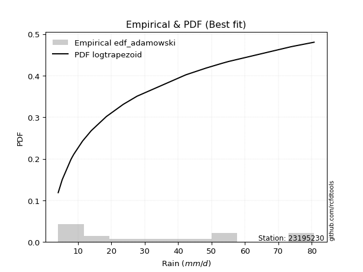</img>

</div>


## C. Best fit & Estimate extreme values for specific return periods - Tr

Best fit in probability distribution analysis means finding the theoretical distribution (like Normal, Poisson, Exponential, etc.) that most accurately mirrors your real-world data´s patterns (shape, center, spread) for better predictions, using methods like visual checks (Q-Q plots), goodness-of-fit tests (Kolmogorov-Smirnov, Chi-Squared), and information criteria (AIC) to score and select the simplest, most representative model.


### 1. Best fit (ordered by delta Δ)

:file_folder:Table: [bestfit_23195230.csv](table/bestfit_23195230.csv)

<div align="center">

|   id |   station | empirical_dist   | p_dist             |     delta |   deltao | eval   |   fit |   n |   best_fit |   best_fit_sort |
|-----:|----------:|:-----------------|:-------------------|----------:|---------:|:-------|------:|----:|-----------:|----------------:|
|    0 |  23195230 | edf_california   | mielke             | 0.0765028 | 0.321023 | Δo > Δ |     1 |  18 |          1 |               1 |
|    1 |  23195230 | edf_hazen        | loggenhalflogistic | 0.0775539 | 0.321023 | Δo > Δ |     1 |  18 |          1 |               2 |
|    2 |  23195230 | edf_gringorten   | loggenhalflogistic | 0.0799453 | 0.321023 | Δo > Δ |     1 |  18 |          1 |               3 |
|    3 |  23195230 | edf_cunnane      | loggenhalflogistic | 0.0815221 | 0.321023 | Δo > Δ |     1 |  18 |          1 |               4 |
|    4 |  23195230 | edf_blom         | loggenhalflogistic | 0.0825006 | 0.321023 | Δo > Δ |     1 |  18 |          1 |               5 |
|    5 |  23195230 | edf_tukey        | loggenhalflogistic | 0.0841195 | 0.321023 | Δo > Δ |     1 |  18 |          1 |               6 |
|    6 |  23195230 | edf_filliben     | loggenhalflogistic | 0.0847309 | 0.321023 | Δo > Δ |     1 |  18 |          1 |               7 |
|    7 |  23195230 | edf_jenkinson    | loggenhalflogistic | 0.0850197 | 0.321023 | Δo > Δ |     1 |  18 |          1 |               8 |
|    8 |  23195230 | edf_beard        | loggenhalflogistic | 0.0850197 | 0.321023 | Δo > Δ |     1 |  18 |          1 |               9 |
|    9 |  23195230 | edf_chegodayev   | logtrapezoid       | 0.0851915 | 0.321023 | Δo > Δ |     1 |  18 |          1 |              10 |
|   10 |  23195230 | edf_adamowski    | logtrapezoid       | 0.0859259 | 0.321023 | Δo > Δ |     1 |  18 |          1 |              11 |
|   11 |  23195230 | edf_weibull      | logtrapezoid       | 0.0894821 | 0.321023 | Δo > Δ |     1 |  18 |          1 |              12 |

</div>


### 2. Extreme values and % difference analysis

In hydrology, a return period (or recurrence interval $Tr$) is the statistical average time between extreme events like floods or droughts of a specific magnitude, indicating how rare an event is, with a 100-year flood, for example, having a 1% chance of occurring in any given year, not that it happens exactly every century. It is a key tool for infrastructure design (like bridges or dams) and risk assessment, calculated from historical data to determine the probability of future events, although it is important to remember it is statistical average, and events can cluster or be missed.

The extreme value porcentage difference is evaluated as $pdiff = 1 - (ETrBf / ETr) * 100$, where _ETrBf_ correspond to the bestfit extreme value for a specific recurrence interval and _ETr_ correspond to the extreme value for one of the most used PDFsused in hydrology.

> risk_rate: assuming the return period as the project useful life.

:file_folder:Table: [extreme_23195230.csv](table/extreme_23195230.csv), all PDFs.  
:file_folder:Table: [extremepdiff_23195230.csv](table/extremepdiff_23195230.csv), % difference between bestfit and most used PDFs in Hydrology.

<div align="center">

Extreme values table for only best fit PDFs
|   id |      tr |   prob_l |     prob_g |     alpha |   anglit |   arcsine |   argus |    beta |   betaprime |   bradford |    burr |   burr12 |   cosine |   crystalball |   dgamma |   dweibull |   erlang |   exponnorm |   exponpow |   exponweib |        f |   fatiguelife |   foldnorm |    gamma |   gausshyper |   genexpon |   genextreme |   gengamma |   genhalflogistic |   genlogistic |   gennorm |   genpareto |   gompertz |   gumbel_l |   gumbel_r |   halfgennorm |   halflogistic |   halfnorm |   hypsecant |   invgamma |   invgauss |   invweibull |   johnsonsb |   johnsonsu |   kappa3 |   kappa4 |   ksone |   kstwobign |   laplace |   levy_l |   loggamma |   logistic |   loglaplace |    lomax |   maxwell |   mielke |    moyal |   nakagami |      ncf |      nct |     norm |   pearson3 |   powerlaw |   rayleigh |    rdist |     rice |   semicircular |   skewnorm |        t |   trapezoid |   triang |   truncexpon |   truncnorm |   truncpareto |   truncweibull_min |   tukeylambda |   uniform |   vonmises |   vonmises_line |     wald |   weibull_max |   weibull_min |   wrapcauchy |   logalpha |   loganglit |   logarcsine |   logargus |   logbeta |   logbetaprime |   logbradford |   logburr |   logburr12 |   logcosine |   logcrystalball |   logdgamma |   logdweibull |   logerlang |   logexponnorm |   logexponpow |   logexponweib |     logf |   logfatiguelife |   logfoldnorm |   loggausshyper |   loggenexpon |   loggenextreme |   loggengamma |   loggenhalflogistic |   loggenlogistic |   loggennorm |   loggenpareto |   loggompertz |   loggumbel_l |   loggumbel_r |   loghalfgennorm |   loghalflogistic |   loghalfnorm |   loghypsecant |   loginvgamma |   loginvgauss |   loginvweibull |   logjohnsonsb |   logjohnsonsu |   logkappa3 |   logkappa4 |   logksone |   logkstwobign |   loglevy_l |   logloggamma |   loglogistic |    logloglaplace |         loglomax |   logmaxwell |   logmielke |   logmoyal |   lognakagami |   logncf |   lognct |   lognorm |   logpearson3 |   logpowerlaw |   lograyleigh |   logrdist |   logrice |   logsemicircular |   logskewnorm |     logt |   logtrapezoid |   logtriang |   logtruncexpon |   logtruncnorm |   logtruncpareto |   logtruncweibull_min |   logtukeylambda |   loguniform |   logvonmises |   logvonmises_line |    logwald |   logweibull_max |   logweibull_min |   logwrapcauchy |   station |   n |   risk_rate |
|-----:|--------:|---------:|-----------:|----------:|---------:|----------:|--------:|--------:|------------:|-----------:|--------:|---------:|---------:|--------------:|---------:|-----------:|---------:|------------:|-----------:|------------:|---------:|--------------:|-----------:|---------:|-------------:|-----------:|-------------:|-----------:|------------------:|--------------:|----------:|------------:|-----------:|-----------:|-----------:|--------------:|---------------:|-----------:|------------:|-----------:|-----------:|-------------:|------------:|------------:|---------:|---------:|--------:|------------:|----------:|---------:|-----------:|-----------:|-------------:|---------:|----------:|---------:|---------:|-----------:|---------:|---------:|---------:|-----------:|-----------:|-----------:|---------:|---------:|---------------:|-----------:|---------:|------------:|---------:|-------------:|------------:|--------------:|-------------------:|--------------:|----------:|-----------:|----------------:|---------:|--------------:|--------------:|-------------:|-----------:|------------:|-------------:|-----------:|----------:|---------------:|--------------:|----------:|------------:|------------:|-----------------:|------------:|--------------:|------------:|---------------:|--------------:|---------------:|---------:|-----------------:|--------------:|----------------:|--------------:|----------------:|--------------:|---------------------:|-----------------:|-------------:|---------------:|--------------:|--------------:|--------------:|-----------------:|------------------:|--------------:|---------------:|--------------:|--------------:|----------------:|---------------:|---------------:|------------:|------------:|-----------:|---------------:|------------:|--------------:|--------------:|-----------------:|-----------------:|-------------:|------------:|-----------:|--------------:|---------:|---------:|----------:|--------------:|--------------:|--------------:|-----------:|----------:|------------------:|--------------:|---------:|---------------:|------------:|----------------:|---------------:|-----------------:|----------------------:|-----------------:|-------------:|--------------:|-------------------:|-----------:|-----------------:|-----------------:|----------------:|----------:|----:|------------:|
|    0 |    2    | 0.5      | 0.5        |   15.7853 |  33.9503 |   33.9503 | 45.715  | 26.2814 |     20.8349 |    36.0454 | 34.6934 |  27.5131 |  35.7957 |       33.9503 |  26.173  |    35.8716 |  21.8776 |     24.7396 |    29.5197 |     16.687  |  19.9134 |       20.0183 |    32.1093 |  13.271  |      34.4337 |    26.8991 |      22.1502 |    21.5106 |           53.047  |       29.1511 |      42.4 |     41.7549 |    29.3075 |    38.1705 |    29.7302 |       18.9268 |        27.6321 |    28.692  |     33.9503 |    22.7659 |    21.3943 |      22.1502 |     77.5581 |     21.384  |  4.02495 |  40.3165 | 42.4    |     29.612  |   33.9503 |  31.2649 |    22.6753 |    33.9503 |      23.0766 |  24.5121 |   31.7533 |   4.1    |  28.3678 |    30.231  |  27.1635 |  23.1987 |  33.9503 |    32.0538 |    10.8244 |    30.9741 | -2.35732 |  32.556  |        33.9503 |    30.663  |  33.9503 |     61.2593 |  47.3566 |      33.9849 |     33.9503 |       4.10033 |            30.0652 |        1.9478 |   42.4    |  -1.88107  |         42.3683 |  25.6233 |       80.4161 |       26.1511 |      42.4    |    22.1081 |     23.0766 |      23.0766 |    27.6385 |   22.2996 |        22.5051 |       14.184  |   30.4686 |     26.5435 |     22.0371 |          23.0766 |     31.5515 |       20.9699 |     22.5996 |        23.0766 |       5.86311 |        11.9587 |  23.1105 |          22.9922 |       23.1559 |         22.9067 |       19.217  |         36.1845 |       23.469  |              28.2421 |         inf      |      18.1898 |        27.5468 |       24.4213 |       27.004  |       19.7204 |          4.09987 |           18.238  |       18.9724 |        23.0766 |       21.9354 |       21.1158 |         19.5696 |        4.7489  |        31.1533 |     18.6012 |     16.8285 |    18.1898 |        18.8061 |     32.4976 |       33.8863 |       23.0766 |     27.6999      |     13.5767      |      21.2637 |     15.4894 |    18.7448 |       20.506  |  22.9208 |  23.0621 |   23.0766 |       24.1276 |        6.5033 |       20.6555 |    9.68242 |   22.0352 |           23.0766 |       27.8835 |  23.0766 |        27.193  |     25.4471 |         13.8114 |        15.236  |          4.10009 |               19.9162 |          18.1984 |      18.1898 |     0.045584  |            18.1898 |    16.9236 |          36.0541 |          26.4789 |         18.1898 |  23195230 |  18 |    0.75     |
|    1 |    2.33 | 0.570815 | 0.429185   |   18.7877 |  39.2899 |   41.9659 | 50.1498 | 34.4094 |     25.1745 |    41.6002 | 40.9371 |  32.059  |  40.4654 |       38.5344 |  33.2818 |    48.1356 |  26.3845 |     29.2949 |    35.2624 |     20.4522 |  24.5612 |       24.379  |    37.1769 |  16.3762 |      40.5903 |    31.4847 |      26.2408 |    25.9595 |           58.1037 |       33.4062 |      42.4 |     47.5492 |    33.9311 |    42.1587 |    33.9778 |       23.6508 |        31.9994 |    33.6394 |     37.619  |    26.8393 |    25.4917 |      26.2409 |     79.5288 |     25.7265 |  4.02495 |  45.9473 | 48.9094 |     33.9358 |   36.7244 |  45.7744 |    26.9714 |    37.9892 |      25.5882 |  29.0095 |   36.5158 |   4.1    |  32.3887 |    36.9986 |  31.3199 |  27.2122 |  38.5344 |    36.6544 |    14.8044 |    35.8071 |  6.14627 |  36.9468 |        39.6771 |    35.2352 |  38.5345 |     65.7097 |  52.682  |      39.2457 |     38.5344 |       4.10121 |            35.5046 |       13.6278 |   47.8245 |  -1.6125   |         47.7973 |  28.6291 |       80.5976 |       31.3761 |      53.7165 |    26.3156 |     28.1536 |      31.104  |    32.5586 |   29.3913 |        26.7813 |       17.5352 |   36.366  |     31.1121 |     26.21   |          27.3725 |     44.4811 |       31.072  |     26.8678 |        27.3725 |       6.65131 |        15.7885 |  27.4283 |          27.2721 |       27.3745 |         28.2768 |       23.4733 |         42.4617 |       27.7912 |              34.3612 |         inf      |      18.1898 |        36.6912 |       28.9992 |       31.3281 |       23.1003 |          4.09987 |           21.4593 |       22.8108 |        26.455  |       26.1667 |       25.2057 |         23.6849 |        7.13531 |        36.3065 |     23.0441 |     20.965  |    23.4314 |        22.8728 |     42.5056 |       39.9982 |       26.8223 |     32.2088      |     17.7294      |      25.3902 |     19.359  |    21.7728 |       24.7119 |  27.2684 |  27.3597 |   27.3725 |       28.5601 |        7.924  |       24.7288 |   14.1264  |   26.3353 |           28.5626 |       33.0369 |  27.3725 |        33.098  |     30.7961 |         16.9864 |        19.2097 |          4.10033 |               24.4374 |          22.6946 |      22.4631 |     0.0537085 |            22.2515 |    18.9282 |          42.2258 |          31.0417 |         25.0111 |  23195230 |  18 |    0.729209 |
|    2 |    5    | 0.8      | 0.2        |   42.0691 |  58.1292 |   63.3407 | 64.3751 | 62.6418 |     49.014  |    61.7047 | 62.2522 |  52.8955 |  57.2932 |       55.57   |  48.9411 |    61.5256 |  49.832  |     52.0705 |    60.9128 |     43.0068 |  50.5167 |       50.1282 |    56.1762 |  34.2161 |      61.6619 |    52.6746 |      51.6457 |    52.5543 |           71.6387 |       51.8895 |      42.4 |     65.8844 |    53.7146 |    55.0428 |    52.4315 |       53.9636 |        51.7603 |    54.5613 |     52.3346 |    50.712  |    49.2887 |      51.6457 |     80.6725 |     52.4963 |  4.02495 |  64.4827 | 69.976  |     52.3022 |   50.5941 |  69.8133 |    51.9602 |    53.5839 |      42.8911 |  51.4955 |   55.2608 |  56.1073 |  51.0141 |    68.0634 |  49.7573 |  50.1153 |  55.57   |    54.8317 |    39.1016 |    55.1556 | 30.7726  |  54.5251 |        59.2203 |    54.5705 |  55.5709 |     78.4777 |  67.9602 |      58.8889 |     55.57   |       4.28174 |            56.3444 |       50.8886 |   65.38   |  -0.570335 |         65.3673 |  45.4557 |       80.6988 |       58.3171 |      72.965  |    51.5135 |     56.7859 |      68.9497 |    52.9852 |   60.5832 |        51.7691 |       37.5002 |   58.9258 |     52.7089 |     48.9629 |          51.6235 |     76.8662 |       53.0597 |     51.6815 |        51.6233 |      13.3276  |        60.6918 |  51.8895 |          51.518  |       50.9875 |         53.1426 |       52.6607 |         63.2084 |       51.5552 |              57.7277 |         inf      |      18.1898 |        68.278  |       52.1707 |       50.6198 |       45.9289 |          4.09987 |           44.7957 |       49.7198 |        45.7634 |       51.7858 |       50.7931 |         54.2719 |       76.619   |        56.0588 |     46.089  |     43.1875 |    53.1742 |        52.5365 |     66.3159 |       61.0323 |       47.9428 |     76.3465      |     68.0077      |      51.0324 |     41.0824 |    43.5672 |       51.7792 |  52.726  |  51.6396 |   51.6235 |       52.1539 |       21.0184 |       50.8329 |   39.0644  |   51.8475 |           59.1408 |       54.14   |  51.6235 |        58.1636 |     53.2361 |         36.1555 |        51.7607 |          4.14046 |               46.3955 |          45.9146 |      44.4688 |     0.101337  |            43.5087 |    35.4211 |          62.7926 |          52.6727 |         53.1569 |  23195230 |  18 |    0.67232  |
|    3 |   10    | 0.9      | 0.1        |   84.8426 |  68.7925 |   68.5008 | 71.2349 | 73.6537 |     73.5966 |    71.6008 | 72.008  |  70.5769 |  67.4601 |       66.871  |  60.2847 |    68.2255 |  71.8392 |     72.7456 |    80.3742 |     68.1237 |  76.9838 |       77.3603 |    68.8229 |  52.3142 |      71.2885 |    69.9564 |      85.912  |    83.4033 |           76.4575 |       66.9422 |      42.4 |     73.5682 |    68.212  |    62.2161 |    67.4618 |       90.6897 |        68.171  |    70.043  |     64.0855 |    80.0209 |    75.565  |      85.912  |     80.6977 |     85.5269 | 73.125   |  72.6434 | 79.168  |     66.2859 |   63.1845 |  75.6169 |    81.0463 |    65.0687 |      68.5495 |  71.9076 |   68.4525 |  68.1176 |  67.2303 |    92.2334 |  64.6055 |  77.6285 |  66.871  |    67.8499 |    57.0208 |    68.9515 | 38.4197  |  67.0588 |        69.2483 |    68.8782 |  66.8723 |     83.465  |  73.9279 |      69.1037 |     66.871  |       6.95631 |            67.5672 |       66.4647 |   73.04   |   0.152302 |         73.0336 |  63.3127 |       80.7    |       83.5779 |      77.1453 |    82.2467 |     84.4709 |      83.5587 |    65.6864 |   73.8379 |        81.0506 |       54.3064 |   70.5335 |     71.3728 |     71.4229 |          78.6373 |    110.781  |       70.757  |     80.5538 |        78.637  |      25.4216  |       187.943  |  79.2733 |          78.6753 |       77.0288 |         67.4058 |       94.0692 |         72.2075 |       77.0038 |              69.1795 |         inf      |      18.1898 |        77.4661 |       73.4919 |       66.1213 |       80.3867 |          4.09987 |           82.5407 |       88.4971 |        70.8887 |       83.4939 |       84.0557 |        106.629  |       80.5899  |        68.44   |     62.3661 |     59.3182 |    76.0312 |        98.9523 |     73.8335 |       70.7289 |       73.5325 |    200.934       |    233.86        |      83.408  |     57.765  |    79.6967 |       87.4064 |  82.6757 |  78.7144 |   78.6373 |       76.1458 |       38.6686 |       84.9726 |   50.3088  |   81.9634 |           85.917  |       66.2047 |  78.6374 |        72.4919 |     65.9259 |         52.9266 |       108.667  |          4.69111 |               61.1538 |          61.6628 |      59.9052 |     0.163711  |            59.0876 |    68.8778 |          71.8695 |          71.4362 |         66.2766 |  23195230 |  18 |    0.651322 |
|    4 |   15    | 0.933333 | 0.0666667  |  127.464  |  73.346  |   69.4849 | 73.8428 | 76.6947 |     89.3062 |    75.0653 | 75.3144 |  80.731  |  72.0912 |       72.5104 |  66.5015 |    71.3628 |  84.8928 |     84.8397 |    90.451  |     84.6333 |  93.5336 |       94.3618 |    75.1367 |  63.3847 |      74.508  |    79.3996 |     113.383  |   104.6    |           77.9386 |       75.4344 |      42.4 |     76.0499 |    75.6103 |    65.4648 |    75.9417 |      116.127  |        77.4579 |    78.0996 |     70.7917 |   101.878  |    92.7822 |     113.383  |     80.6993 |    109.415  | 75.6843  |  75.3571 | 82.232  |     73.7095 |   70.5495 |  77.3701 |   101.466  |    71.3262 |      90.183  |  83.8479 |   75.221  |  72.3591 |  76.6415 |   104.959  |  72.8025 |  97.9876 |  72.5104 |    74.6386 |    64.226  |    76.0598 | 40.2629  |  73.5167 |        73.1589 |    76.3238 |  72.512  |     85.0652 |  75.9111 |      72.7978 |     72.5104 |      12.0787  |            71.7021 |       71.4563 |   75.5933 |   0.476327 |         75.5891 |  74.7797 |       80.7    |       98.609  |      78.3651 |   104.612  |    100.082  |      86.6782 |    71.0497 |   77.1786 |       101.708  |       61.789  |   74.6757 |     82.0661 |     84.8258 |          97.0153 |    134.673  |       81.2538 |    100.823  |        97.0149 |      36.753   |       350.106  |  97.9674 |          97.2267 |       94.6394 |         72.3056 |      126.946  |         75.1448 |       93.8338 |              73.0763 |         inf      |      18.1898 |        79.2644 |       86.0561 |       74.625  |      110.24   |         66.2909  |          116.649  |      119.464  |        91      |      106.797  |      109.397  |        156.082  |       80.6822  |        74.1364 |     68.9816 |     65.9044 |    85.6555 |       138.484  |     76.2679 |       74.0235 |       92.8298 |    390.031       |    484.812       |     107.32   |     64.8107 |   113.151  |      114.403  | 103.875  |  97.1472 |   97.0153 |       91.4086 |       48.7049 |      110.725  |   52.8664  |  103.186  |           99.3867 |       70.735  |  97.0154 |        77.7993 |     70.6071 |         60.6166 |       160.154  |          5.85083 |               67.0616 |          67.7804 |      66.1608 |     0.215014  |            65.5322 |   105.571  |          74.8727 |          82.2113 |         70.8712 |  23195230 |  18 |    0.644736 |
|    5 |   20    | 0.95     | 0.05       |  170.047  |  76.0245 |   69.8315 | 75.2742 | 78.0258 |    101.075  |    76.8297 | 76.9776 |  87.9129 |  74.9392 |       76.2035 |  70.7952 |    73.3685 |  94.2126 |     93.4206 |    97.1181 |     97.1083 | 105.726  |      106.777  |    79.2718 |  71.3957 |      76.1076 |    85.8472 |     137.296  |   121.112  |           78.6561 |       81.3804 |      42.4 |     77.2669 |    80.4715 |    67.4869 |    81.8792 |      135.928  |        83.9646 |    83.4711 |     75.5226 |   120.028  |   105.738  |     137.295  |     80.6997 |    128.663  | 76.9639  |  76.7092 | 83.764  |     78.7103 |   75.775  |  78.2679 |   117.675  |    75.6512 |     109.557  |  92.3197 |   79.713  |  74.524  |  83.3067 |   113.471  |  78.4563 | 114.845  |  76.2035 |    79.1912 |    68.0796 |    80.7844 | 41.0123  |  77.8091 |        75.3279 |    81.2879 |  76.2053 |     85.8545 |  77.07   |      74.7063 |     76.2035 |      17.7624  |            73.8555 |       73.8917 |   76.87   |   0.657588 |         76.8668 |  83.3249 |       80.7    |      109.369  |      78.9578 |   122.784  |    110.58   |      87.8043 |    74.1238 |   78.5232 |       118.155  |       65.9808 |   76.8392 |     89.5832 |     94.289  |         111.32   |    153.893  |       88.8615 |    116.912  |       111.319  |      47.4632  |       535.928  | 112.549  |         111.704  |      108.3    |         74.6946 |      154.968  |         76.5908 |      106.706  |              75.0244 |         inf      |      18.1898 |        79.8965 |       95.005  |       80.4618 |      137.521  |         69.6686  |          148.635  |      145.92   |       108.532  |      125.844  |      130.587  |        203.805  |       80.6946  |        77.6603 |     72.5492 |     69.4489 |    90.9153 |       173.672  |     77.5455 |       75.682  |      109.054  |    656.225       |    815.644       |     126.863  |     68.6677 |   145.03   |      136.795  | 120.791  | 111.501  |  111.32   |      102.799  |       54.9553 |      132.027  |   53.8135  |  120.04   |          107.748  |       73.1082 | 111.32   |        80.5589 |     73.0372 |         64.9872 |       207.535  |          7.39952 |               70.2312 |          70.9837 |      69.5295 |     0.261067  |            69.0263 |   145.129  |          76.3631 |          89.7955 |         73.2366 |  23195230 |  18 |    0.641514 |
|    6 |   25    | 0.96     | 0.04       |  212.615  |  77.8398 |   69.9923 | 76.1973 | 78.7474 |    110.572  |    77.8989 | 77.9793 |  93.4872 |  76.9365 |       78.9221 |  74.073  |    74.8248 | 101.469  |    100.076  |   102.045  |    107.204  | 115.437  |      116.574  |    82.316  |  77.6837 |      77.0605 |    90.7176 |     158.892  |   134.787  |           79.079  |       85.9603 |      42.4 |     77.9869 |    84.0478 |    68.9258 |    86.4526 |      152.286  |        88.9777 |    87.4676 |     79.1839 |   135.854  |   116.179  |     158.892  |     80.6998 |    145.009  | 77.7317  |  77.5181 | 84.6832 |     82.4561 |   79.8283 |  78.8314 |   131.307  |    78.9598 |     127.409  |  98.8909 |   83.0479 |  75.8369 |  88.4729 |   119.812  |  82.7633 | 129.524  |  78.9221 |    82.5968 |    70.4748 |    84.2948 | 41.3983  |  80.9983 |        76.735  |    84.9814 |  78.924  |     86.3248 |  77.8608 |      75.872  |     78.9222 |      23.1246  |            75.1769 |       75.3273 |   77.636  |   0.772148 |         77.6335 |  90.1693 |       80.7    |      117.763  |      79.3096 |   138.337  |    118.314  |      88.3317 |    76.1559 |   79.205  |       132.019  |       68.6556 |   78.201  |     95.3815 |    101.548  |         123.181  |    170.278  |       94.8746 |    130.445  |       123.18   |      57.6706  |       739.556  | 124.658  |         123.731  |      119.602  |         76.0844 |      179.742  |         77.4481 |      117.243  |              76.1893 |         inf      |      18.1898 |        80.1884 |      101.964  |       84.8913 |      163.057  |         71.7774  |          179.145  |      169.337  |       124.387  |      142.215  |      149.11   |        250.3    |       80.6978  |        80.1444 |     74.7817 |     71.657  |    94.225  |       205.772  |     78.3583 |       76.6807 |      123.354  |   1013.42        |   1223.15        |     143.639  |     71.0974 |   175.799  |      156.217  | 135.075  | 123.406  |  123.181  |      111.958  |       59.1873 |      150.466  |   54.2641  |  134.213  |          113.545  |       74.5685 | 123.181  |        82.2493 |     74.5247 |         67.7998 |       251.737  |          9.18272 |               72.2066 |          72.9431 |      71.6325 |     0.303517  |            71.2147 |   187.265  |          77.2518 |          95.6508 |         74.6818 |  23195230 |  18 |    0.639603 |
|    7 |   50    | 0.98     | 0.02       |  425.391  |  82.3081 |   70.2071 | 78.2902 | 79.9676 |    142.236  |    80.061  | 80.0137 | 110.915  |  82.1663 |       86.7073 |  84.029  |    78.9168 | 124.135  |    120.752  |   116.171  |    140.798  | 146.995  |      147.763  |    91.0336 |  97.5504 |      78.9376 |   105.199  |     247.839  |   182.277  |           79.9064 |      100.069  |      42.4 |     79.394  |    94.231  |    72.8319 |   100.541  |      208.655  |       104.424  |    99.0841 |     90.5355 |   196.831  |   150.572  |     247.838  |     80.7    |    204.483  | 79.2673  |  79.1264 | 86.5216 |     93.4556 |   92.4188 |  80.1002 |   180.175  |    89.0686 |     203.628  | 119.303  |   92.7196 |  78.4943 | 104.511  |   138.262  |  95.7807 | 186.001  |  86.7073 |    92.6063 |    75.4565 |    94.4846 | 42.0023  |  90.2559 |        79.9496 |    95.717  |  86.7095 |     87.2582 |  79.8233 |      78.2521 |     86.7073 |      41.7338  |            77.8892 |       78.1193 |   79.168  |   1.01199  |         79.1667 | 112.517  |       80.7    |      144.082  |      80.007  |   195.936  |    139.736  |      89.0411 |    80.9096 |   80.2382 |       181.92   |       74.3949 |   81.3288 |    113.252  |    123.316  |         164.611  |    230.854  |      114.281  |    178.961  |       164.61   |     103.484   |      1930.68   | 167.07   |         165.887  |      158.92   |         78.687  |      276.572  |         79.1283 |      153.215  |              78.4967 |         inf      |      18.1898 |        80.5745 |      123.67   |       98.1839 |      275.553  |         76.1882  |          318.447  |      260.998  |       189.835  |      203.313  |      220.418  |        471.391  |       80.6998  |        86.7272 |     79.5522 |     76.2502 |   101.21   |       338.588  |     80.2196 |       78.6858 |      179.743  |   4748.23        |   4347.68        |     205.922  |     76.2503 |   319.457  |      229.625  | 186.656  | 165.015  |  164.611  |      142.22   |       68.927  |      219.912  |   54.8828  |  184.927  |          127.986  |       77.5747 | 164.612  |        85.7098 |     77.5669 |         73.8982 |       441.736  |         18.948   |               76.331  |          76.9121 |      76.0312 |     0.475041  |            75.8072 |   430.426  |          79.0095 |         113.723  |         77.6395 |  23195230 |  18 |    0.63583  |
|    8 |   75    | 0.986667 | 0.0133333  |  638.137  |  84.2747 |   70.2469 | 79.1202 | 80.2879 |    162.367  |    80.7888 | 80.7404 | 121.246  |  84.6639 |       90.8845 |  89.7297 |    81.0726 | 137.465  |    132.846  |   123.725  |    161.951  | 166.438  |      166.432  |    95.7113 | 109.361  |      79.5483 |   113.269  |     320.001  |   213.712  |           80.1761 |      108.269  |      42.4 |     79.8484 |    99.6348 |    74.8071 |   108.73   |      245.522  |       113.403  |   105.408  |     97.1692 |   242.719  |   171.914  |     320      |     80.7    |    246.039  | 79.7791  |  79.658  | 87.1344 |     99.5075 |   99.7837 |  80.6216 |   213.836  |    94.9071 |     267.89   | 131.243  |   97.9779 |  79.3893 | 113.89   |   148.307  | 103.186  | 228.48   |  90.8845 |    98.1353 |    77.1748 |   100.028  | 42.1444  |  95.2923 |        81.2337 |   101.561  |  90.8869 |     87.5671 |  80.6927 |      79.0603 |     90.8845 |      51.6373  |            78.8149 |       79.0165 |   79.6787 |   1.09427  |         79.6778 | 126.268  |       80.7    |      159.629  |      80.2383 |   237.15   |    150.354  |      89.1732 |    82.852  |   80.4683 |       216.453  |       76.4311 |   82.7104 |    123.63   |    135.301  |         192.319  |    274.351  |      126.204  |    212.386  |       192.318  |     143.636   |      3299.98   | 195.523  |         194.193  |      185.103  |         79.4674 |      349.735  |         79.6729 |      176.647  |              79.2528 |         inf      |      18.1898 |        80.6449 |      136.422  |      105.679  |      373.808  |         77.7179  |          444.902  |      330.304  |       243.036  |      247.4    |      273.714  |        681.045  |       80.7     |        89.9336 |     81.3677 |     77.8279 |   103.652  |       445.318  |     80.9972 |       79.3565 |      223.4    |  13685.3         |   9191.01        |     250.467  |     78.1104 |   453.006  |      283.142  | 222.491  | 192.859  |  192.319  |      161.197  |       72.6035 |      270.342  |   55.0015  |  219.743  |          134.255  |       78.6029 | 192.319  |        86.8872 |     78.6012 |         76.0827 |       600.29   |         27.5706  |               77.7594 |          78.2336 |      77.5566 |     0.592951  |            77.4041 |   718.313  |          79.5862 |         124.234  |         78.6474 |  23195230 |  18 |    0.634587 |
|    9 |  100    | 0.99     | 0.01       |  850.875  |  85.444  |   70.2609 | 79.5836 | 80.4261 |    177.418  |    81.1541 | 81.1416 | 128.659  |  86.2293 |       93.7098 |  93.7309 |    82.5174 | 146.948  |    141.427  |   128.811  |    177.602  | 180.676  |      179.831  |    98.8751 | 117.81   |      79.8487 |   118.834  |     383.086  |   237.721  |           80.3095 |      114.073  |      42.4 |     80.0713 |   103.258  |    76.0991 |   114.525  |      273.425  |       119.758  |   109.716  |    101.875  |   280.941  |   187.54   |     383.084  |     80.7    |    278.887  | 80.0351  |  79.9222 | 87.4408 |    103.654  |  105.009  |  80.9263 |   240.245  |    99.0292 |     325.442  | 139.715  |  101.56   |  79.8386 | 120.543  |   155.147  | 108.361  | 263.867  |  93.7098 |   101.938  |    78.045  |   103.805  | 42.2018  |  98.7236 |        81.9528 |   105.542  |  93.7123 |     87.7212 |  81.2109 |      79.4673 |     93.7098 |      57.5922  |            79.2819 |       79.4557 |   79.934  |   1.13568  |         79.9334 | 136.294  |       80.7    |      170.721  |      80.3538 |   270.287  |    157.046  |      89.2195 |    83.9505 |   80.558  |       243.626  |       77.4736 |   83.5818 |    130.967  |    143.399  |         213.657  |    309.507  |      134.942  |    238.614  |       213.656  |     180.15    |      4779.34   | 217.478  |         216.048  |      205.216  |         79.8307 |      410.414  |         79.9405 |      194.399  |              79.6263 |         inf      |      18.1898 |        80.6693 |      145.492  |      110.888  |      463.861  |         78.4943  |          563.706  |      387.782  |       289.588  |      283.034  |      317.764  |        883.635  |       80.7     |        91.9751 |     82.4076 |     78.6232 |   104.895  |       537.283  |     81.4552 |       79.6922 |      260.467  |  31396.2         |  15680           |     286.207  |     79.1176 |   580.393  |      326.576  | 250.762  | 214.312  |  213.657  |      175.234  |       74.5313 |      311.17   |   55.0439  |  246.98   |          137.899  |       79.1221 | 213.658  |        87.4804 |     79.1222 |         77.2053 |       739.928  |         34.4571  |               78.484  |          78.8889 |      78.3308 |     0.674631  |            78.2152 |  1043.46   |          79.8716 |         131.672  |         79.1558 |  23195230 |  18 |    0.633968 |
|   10 |  200    | 0.995    | 0.005      | 1701.81   |  87.6532 |   70.2743 | 80.3889 | 80.5976 |    216.473  |    81.7037 | 81.8887 | 146.869  |  89.4122 |      100.119  | 103.251  |    85.7593 | 169.871  |    162.102  |   140.254  |    217.425  | 216.528  |      212.549  |   106.052  | 138.362  |      80.2892 |   131.755  |     589.035  |   301.611  |           80.5073 |      128.026  |      42.4 |     80.3974 |   111.365  |    78.9074 |   128.459  |      346.613  |       135.036  |   119.568  |    113.211  |   397.071  |   226.652  |     589.031  |     80.7    |    370.751  | 80.4189  |  80.3157 | 87.9004 |    113.204  |  117.6    |  81.5038 |   313.441  |   108.917  |     520.13   | 160.127  |  109.754  |  80.5147 | 136.575  |   170.781  | 120.604  | 371.45   | 100.119  |   110.754  |    79.3641 |   112.447  | 42.2676  | 106.575  |        83.2065 |   114.648  | 100.121  |     87.9519 |  82.1922 |      80.0814 |    100.119  |      68.0511  |            79.9877 |       80.0978 |   80.317  |   1.19803  |         80.3167 | 161.268  |       80.7    |      197.635  |      80.5269 |   365.515  |    170.514  |      89.2642 |    85.884  |   80.6564 |       319.262  |       79.0685 |   85.4699 |    148.576  |    161.391  |         271.251  |    411.644  |      157.008  |    311.326  |       271.25   |     304.827   |     11321.5    | 276.898  |         275.251  |      259.316  |         80.3262 |      591.99   |         80.333  |      241.206  |              80.1773 |         inf      |      18.1898 |        80.6925 |      167.414  |      123.113  |      779.374  |         79.6734  |          995.795  |      559.683  |       441.707  |      386.198  |      449.513  |       1652.6    |       80.7     |        96.2366 |     84.4298 |     79.8199 |   106.787  |       827.93   |     82.3302 |       80.1964 |      376.428  | 316370           |  57387.7         |     388.342  |     80.9268 |  1054.41   |      452.687  | 329.752  | 272.246  |  271.251  |      211.004  |       77.5413 |      429.307  |   55.0855  |  322.093  |          144.49   |       79.9072 | 271.252  |        88.376  |     79.9084 |         78.9284 |      1194.44   |         50.7768  |               79.584  |          79.857  |      79.5066 |     0.836474  |            79.4479 |  2644.87   |          80.2941 |         149.546  |         79.9243 |  23195230 |  18 |    0.633042 |
|   11 |  250    | 0.996    | 0.004      | 2127.27   |  88.2155 |   70.2759 | 80.5774 | 80.6254 |    229.936  |    81.8138 | 82.0893 | 152.85   |  90.2847 |      102.077  | 106.284  |    86.7412 | 177.27   |    168.758  |   143.72   |    230.861  | 228.543  |      223.194  |   108.245  | 145.028  |      80.3752 |   135.781  |     676.037  |   324.059  |           80.5465 |      132.511  |      42.4 |     80.4608 |   113.808  |    79.7336 |   132.938  |      371.971  |       139.948  |   122.599  |    116.861  |   443.173  |   239.639  |     676.032  |     80.7    |    404.5    | 80.4957  |  80.3938 | 87.9923 |    116.16   |  121.653  |  81.654  |   340.15   |   112.092  |     604.879  | 166.699  |  112.276  |  80.6503 | 141.735  |   175.586  | 124.485  | 414.192  | 102.077  |   113.501  |    79.63   |   115.107  | 42.2774  | 108.991  |        83.5006 |   117.449  | 102.08   |     87.998  |  82.4423 |      80.2048 |    102.077  |      70.3915  |            80.1296 |       80.2229 |   80.3936 |   1.21052  |         80.3933 | 169.53   |       80.7    |      206.352  |      80.5615 |   401.416  |    174.122  |      89.2696 |    86.341  |   80.6702 |       346.966  |       79.3921 |   86.0395 |    154.228  |    166.707  |         291.775  |    450.611  |      164.431  |    337.864  |       291.773  |     359.026   |     14823      | 298.125  |         296.417  |      278.537  |         80.4153 |      662.697  |         80.4096 |      257.541  |              80.2855 |          80.3042 |      18.1898 |        80.6952 |      174.49   |      126.96   |      920.863  |         79.9113  |         1195.68   |      626.564  |       506.009  |      425.341  |      500.95   |       2021.06   |       80.7     |        97.44   |     84.9928 |     80.0589 |   107.169  |       946.477  |     82.5594 |       80.2974 |      423.669  | 738940           |  87415.1         |     426.592  |     81.3969 |  1277.85   |      500.556  | 358.786  | 292.901  |  291.775  |      223.106  |       78.1608 |      474.016  |   55.0906  |  349.362  |          146.081  |       80.0651 | 291.776  |        88.5559 |     80.0664 |         79.2788 |      1384.22   |         55.3455  |               79.8059 |          80.047  |      79.7438 |     0.87541   |            79.6968 |  3597.78   |          80.3774 |         155.289  |         80.0789 |  23195230 |  18 |    0.632858 |
|   12 |  500    | 0.998    | 0.002      | 4254.59   |  89.6096 |   70.2781 | 81.0107 | 80.6722 |    274.739  |    82.0344 | 82.648  | 171.856  |  92.6067 |      107.885  | 115.629  |    89.6312 | 200.302  |    189.433  |   153.9    |    274.435  | 267.384  |      256.544  |   114.749  | 165.868  |      80.5434 |   147.911  |    1035.48   |   399.889  |           80.6241 |      146.434  |      42.4 |     80.5849 |   120.953  |    82.1023 |   146.841  |      456.336  |       155.193  |   131.636  |    128.196  |   621.178  |   281.061  |    1035.47   |     80.7    |    523.873  | 80.6493  |  80.5487 | 88.1762 |    125.017  |  134.243  |  82.0421 |   434.102  |   121.937  |     966.732  | 187.111  |  119.803  |  80.9231 | 157.766  |   189.9    | 136.382  | 579.398  | 107.885  |   121.794  |    80.1636 |   123.044  | 42.2925  | 116.202  |        84.1778 |   125.801  | 107.888  |     88.09   |  83.0628 |      80.452  |    107.885  |      75.3486  |            80.4143 |       80.468  |   80.5468 |   1.23551  |         80.5467 | 195.801  |       80.7    |      233.579  |      80.6308 |   532.16   |    183.401  |      89.2767 |    87.3982 |   80.6909 |       444.803  |       80.0439 |   87.7513 |    171.748  |    181.72   |         362.23   |    594.7    |      188.537  |    431.238  |       362.228  |     587.192   |     33481.9    | 371.174  |         369.323  |      344.328  |         80.5779 |      928.095  |         80.5596 |      312.436  |              80.4983 |          80.5055 |      18.1898 |        80.6988 |      196.526  |      138.669  |     1545.48   |         80.3893  |         2109.58   |      877.267  |       771.79   |      568.834  |      695.3    |       3774.7    |       80.7     |       100.75   |     86.6013 |     80.5348 |   107.939  |      1413.43   |     83.1544 |       80.4993 |      611.311  |      1.5062e+07  | 326294           |     564.617  |     82.6778 |  2321.45   |      675.642  | 461.703  | 363.843  |  362.23   |      262.512  |       79.4181 |      637.037  |   55.0976  |  444.71   |          149.813  |       80.382  | 362.232  |        88.9166 |     80.383  |         79.9854 |      2149.29   |         66.3813  |               80.2516 |          80.4206 |      80.2205 |     0.960361  |            80.1969 |  9570.55   |          80.542  |         173.108  |         80.3888 |  23195230 |  18 |    0.632489 |
|   13 |  750    | 0.998667 | 0.00133333 | 6381.9    |  90.2268 |   70.2785 | 81.1848 | 80.6843 |    303.18   |    82.108  | 82.9473 | 183.301  |  93.7319 |      111.111  | 121.047  |    91.2235 | 213.806  |    201.527  |   159.485  |    301.176  | 291.199  |      276.227  |   118.362  | 178.139  |      80.5978 |   154.766  |    1327.73   |   448.677  |           80.6498 |      154.573  |      42.4 |     80.6249 |   124.853  |    83.3682 |   154.969  |      509.626  |       164.105  |   136.685  |    134.827  |   755.326  |   305.971  |    1327.71   |     80.7    |    604.884  | 80.7005  |  80.5999 | 88.2374 |    129.993  |  141.608  |  82.2263 |   497.532  |   127.689  |    1271.82   | 199.051  |  124.013  |  81.0176 | 167.143  |   197.888  | 143.242  | 704.066  | 111.111  |   126.496  |    80.3421 |   127.482  | 42.2961  | 120.234  |        84.4504 |   130.466  | 111.115  |     88.1207 |  83.3378 |      80.5346 |    111.111  |      77.087   |            80.5094 |       80.5476 |   80.5979 |   1.24385  |         80.5978 | 211.553  |       80.7    |      249.603  |      80.6538 |   624.082  |    187.665  |      89.278  |    87.8257 |   80.6954 |       511.157  |       80.2625 |   88.7326 |    181.976  |    189.474  |         408.477  |    698.01   |      203.403  |    494.3    |       408.474  |     774.565   |     53171.5    | 419.262  |         417.366  |      387.373  |         80.6256 |     1120.56   |         80.6083 |      347.593  |              80.5677 |          80.5727 |      18.1898 |        80.6995 |      209.452  |      145.363  |     2091.8    |         80.5493  |         2940      |     1058.74   |       987.974  |      670.467  |      837.769  |       5438.59   |       80.7     |       102.429  |     87.4854 |     80.692  |   108.196  |      1770.57   |     83.4382 |       80.5666 |      757.343  |      1.1892e+08  | 709994           |     660.458  |     83.3526 |  3291.77   |      799.042  | 531.814  | 410.436  |  408.476  |      286.833  |       79.8427 |      751.535  |   55.0989  |  508.598  |          151.341  |       80.4879 | 408.479  |        89.0371 |     80.4887 |         80.2227 |      2748.75   |         70.7372  |               80.4008 |          80.5423 |      80.38   |     0.9908    |            80.3643 | 17206.7    |          80.5959 |         183.522  |         80.4924 |  23195230 |  18 |    0.632366 |
|   14 | 1000    | 0.999    | 0.001      | 8509.21   |  90.5946 |   70.2786 | 81.2826 | 80.6896 |    324.428  |    82.1448 | 83.1526 | 191.581  |  94.4417 |      113.333  | 124.873  |    92.3148 | 223.399  |    210.108  |   163.3    |    320.692  | 308.601  |      290.259  |   120.849  | 186.876  |      80.6245 |   159.531  |    1583.43   |   485.348  |           80.6625 |      160.347  |      42.4 |     80.6446 |   127.508  |    84.2202 |   160.734  |      549.205  |       170.427  |   140.172  |    139.532  |   867.125  |   323.918  |    1583.42   |     80.7    |    667.862  | 80.7264  |  80.6253 | 88.2681 |    133.44   |  146.834  |  82.342  |   546.717  |   131.768  |    1545.05   | 207.523  |  126.923  |  81.0683 | 173.797  |   203.4    | 148.071  | 808.059  | 113.333  |   129.773  |    80.4315 |   130.549  | 42.2975  | 123.021  |        84.6035 |   133.689  | 113.336  |     88.136  |  83.5017 |      80.5759 |    113.333  |      77.973   |            80.557  |       80.5868 |   80.6234 |   1.24801  |         80.6233 | 222.883  |       80.7    |      261.013  |      80.6654 |   697.243  |    190.254  |      89.2785 |    88.0663 |   80.6972 |       562.759  |       80.3721 |   89.426  |    189.226  |    194.535  |         443.706  |    781.377  |      214.307  |    543.209  |       443.703  |     938.472   |     73402.9    | 455.96   |         454.055  |      420.099  |         80.6476 |     1276.47   |         80.6322 |      373.963  |              80.6019 |          80.6062 |      18.1898 |        80.6997 |      218.638  |      150.049  |     2592.79   |         80.6294  |         3720.49   |     1205.54   |      1177.17   |      751.732  |      954.202  |       7046.78   |       80.7     |       103.522  |     88.0997 |     80.7702 |   108.325  |      2069.65   |     83.617  |       80.6002 |      881.591  |      6.01423e+08 |      1.23648e+06 |     736.048  |     83.8129 |  4217.35   |      897.262  | 586.492  | 445.943  |  443.706  |      304.656  |       80.056  |      842.472  |   55.0994  |  557.884  |          152.206  |       80.5408 | 443.708  |        89.0974 |     80.5416 |         80.3417 |      3258.02   |         73.0632  |               80.4755 |          80.6024 |      80.4599 |     1.00642   |            80.4481 | 26239.5    |          80.6226 |         190.909  |         80.5443 |  23195230 |  18 |    0.632305 |


</div>


<div align="center">

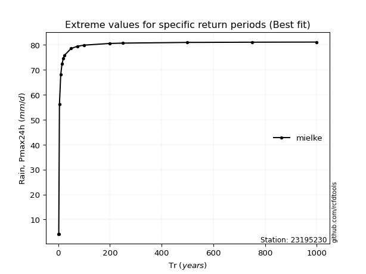</img>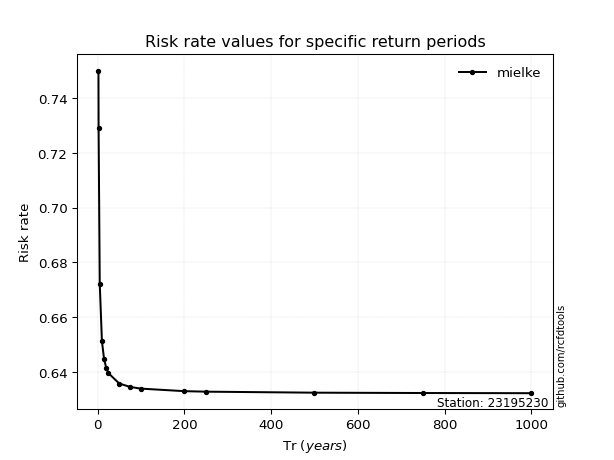</img>

</div>


<sub>**APP DISCLAIMER**: NO WARRANTY - This software is provided by [github.com/rcfdtools](https://github.com/rcfdtools) "as is", without any express or implied warranty, including warranties of merchantability, fitness for a particular purpose, or non-infringement. There is no guarantee that the software will be error-free or operate without interruption. LIMITATION OF LIABILITY - Neither the authors nor copyright holders will be liable for claims or damages arising from the software or its use. You are responsible for determining if the software is appropriate for your use and assume all associated risks, including errors, legal compliance, and data loss. NO PROFESSIONAL ADVICE - The software provides general information and does not offer professional advice. It should not replace consultation with professional advisors.</sub>