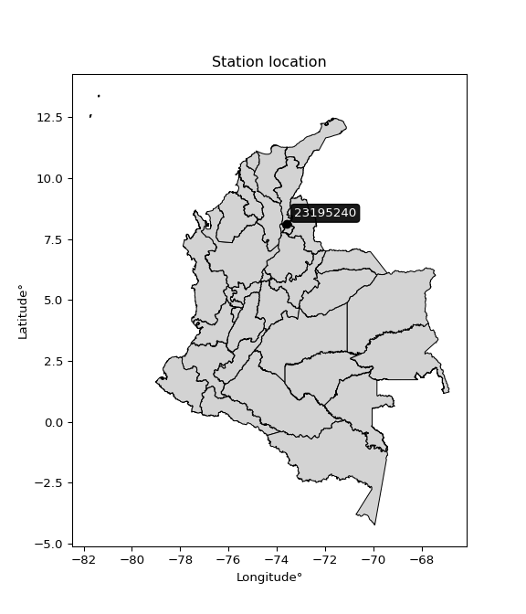

<div align="center">


</div>

# PMP Station (Rain, Pmax24h): 23195240

Probable Maximum Precipitation (PMP) is the greatest amount of rainfall for a specific duration that is meteorologically possible for a given location, acting as a "worst-case" scenario for extreme storms, crucial for designing safety-critical infrastructure like bridges, river deviations, dams, spillways, and nuclear plants to prevent catastrophic failure. PMP is calculated by hydrologists using meteorological data to determine the upper limit of extreme rainfall, often leading to the Probable Maximum Flood (PMF) for flood control design, and is increasingly being studied for climate change impacts. Probable Maximum Precipitation (PMP) is the theoretical upper limit of rainfall, a deterministic estimate for extreme events, while probability distributions (like GEV, Gumbel) describe the likelihood and frequency of various precipitation amounts, including rare ones, showing how often events occur, with PMP representing the extreme end of these distributions, used for critical infrastructure design to ensure safety against the worst conceivable weather, unlike standard statistical forecasts which cover typical probabilities.

The most common probability distributions in hydrology, used for analyzing floods, rainfall, and streamflow, include the Normal, Log-Normal, Gumbel, Gamma (including Log-Pearson Type III), and Generalized Extreme Value (GEV) distributions, often chosen based on the data´s skewness and whether modeling extremes or general conditions, with Gumbel and GEV popular for extreme events like floods, while the Normal distribution serves as a baseline, though often requiring transformations for skewed hydrological data. These distributions help in designing water infrastructure, managing water resources, and forecasting hydrologic events.

> Hydrological data often isn´t perfectly normal (it´s skewed), so different distributions are needed for different applications, such as: **Flood Frequency Analysis**: Using Gumbel, GEV, or Log-Pearson Type III for predicting extreme flood magnitudes and their return periods, **Rainfall Analysis**: Normal for annual totals, but Log-Normal, Weibull, or GEV for intensity or extreme daily rainfall, **Streamflow Modeling**: Gamma and Log-Normal for maximum flows, GEV for minimum flows, and Kappa for daily flows.

<div align="center">

</img>

</div>


## A. General information


### 1. General running parameters

• app_version: _v20260113_. • runtime: _2026-01-17 18:24:04.630693_. • Python version: _3.14.0_. • SciPy version: _1.16.3_. • Pandas version: _2.3.3_. • NumPy version: _2.3.5_. • Stations dataset (station_dataset_file): _dataset/pmax24h_in/automatic_colombia_2003_2025.csv_. • Stations catalog (station_catalog_file): _dataset/CNE.xls_. • Minimum year to eval til year_max (date_min): _1900_. • Maximum year to eval since year_min (date_max): _2025_. • Creates, save and include plots into reports (create_plot): _False_. • Plot only fit distributions with Δo > Δ (plot_only_fit): _True_. • Plot only simple graphs avoiding multiple CDFs and multiple Extreme values plots (plot_only_simple): _True_. • Eval low extreme values, if False, evaluates high extreme values (low_extreme): _False_. • Eval every SciPy distribution as logarithmic (pdist_logarithmic_on): _True_. • Standard deviation normalized (ddof): _1.0_. • Return periods to eval in years (Tr): _[2, 2.33, 5, 10, 15, 20, 25, 50, 75, 100, 200, 250, 500, 750, 1000]_. • Minimum data sample per station, 0 means any (minimum_sample): _5_. • Z-Score maximum threshold to adjust a value, 0 means disable (zscore_max): _3.5_. • Z-Score minimum threshold to adjust a value, 0 means disable (zscore_min): _-2.5_. • Avoid zeros, e.g. rain = 0 (avoid_zeros): _True_. • Avoid null values (avoid_nans): _True_. 

:file_folder:Table: [dataset.csv](../../dataset/pmax24h_in/automatic_colombia_2003_2025.csv)

> Delta Degrees of Freedom (DDOF): is a parameter used in the formulas for calculating variance and standard deviation. When ddof=0, the divisor is $N$ (the total number of observations) and this is used when your data set is the entire population. When ddof=1, the divisor is $N-1$ and this is used when your data set is a sample drawn from a larger population. Using $N-1$ provides an unbiased estimate of the population variance (known as Bessel´s correction).


### 2. Station info and location

|   id |   CODIGO | NOMBRE                     | CATEGORIA         | TECNOLOGIA                | ESTADO   | FECHA_INSTALACION   |   FECHA_SUSPENSION |   ALTITUD |   LATITUD |   LONGITUD | DEPARTAMENTO   | MUNICIPIO   | AREA_OPERATIVA                         | ENTIDAD                                                     | AREA_HIDROGRAFICA   | ZONA_HIDROGRAFICA   | SUBZONA_HIDROGRAFICA                             |   CORRIENTE | Catalogo   |   Version |
|-----:|---------:|:---------------------------|:------------------|:--------------------------|:---------|:--------------------|-------------------:|----------:|----------:|-----------:|:---------------|:------------|:---------------------------------------|:------------------------------------------------------------|:--------------------|:--------------------|:-------------------------------------------------|------------:|:-----------|----------:|
|    0 | 23195240 | AGUACHICA - AUT [23195240] | Agrometeorológica | Automática con Telemetría | Activa   | 19/08/2005          |                nan |       103 |   8.12342 |   -73.5799 | Cesar          | Aguachica   | Area Operativa 08 - Santanderes-Arauca | INSTITUTO DE HIDROLOGIA METEOROLOGIA Y ESTUDIOS AMBIENTALES | Magdalena Cauca     | Medio Magdalena     | Quebrada El Carmen y Otros Directos al Magdalena |         nan | CNE_IDEAM  |  20251226 |

<div align="center">

Dynamic map: [:earth_americas:Google](http://maps.google.com/maps?q=8.123416667,-73.57986111) [:earth_americas:OSM](https://www.openstreetmap.org/#map=18/8.123416667/-73.57986111&layers=P) [:earth_americas:Bing](https://www.bing.com/maps?cp=8.123416667~-73.57986111&lvl=18) [:earth_americas:Apple](https://maps.apple.com/frame?center=8.123416667%2C-73.57986111&span=0.003%2C0.006)

</div>


<div align="center">

```geojson
{
  "type": "Feature",
  "geometry": {
    "type": "Point", 
    "coordinates": [-73.57986111, 8.123416667]
  }, 
  "properties": {
    "Name": "23195240"
  }
}
```

</div>


### 3. Discrete values table and plot

<div align="center">

|               |          0 |           1 |           2 |           3 |           4 |           5 |           6 |           7 |            8 |           9 |         10 |          11 |         12 |           13 |
|:--------------|-----------:|------------:|------------:|------------:|------------:|------------:|------------:|------------:|-------------:|------------:|-----------:|------------:|-----------:|-------------:|
| Date          | 2005       | 2006        | 2007        | 2008        | 2009        | 2016        | 2017        | 2018        | 2019         | 2020        | 2021       | 2023        | 2024       | 2025         |
| Value         |  164.8     |   80.5      |   47.5      |   31.7      |   26.2      |   24.9      |   38.1      |   34.3      |   52.8       |   22        |    0.3     |   25.2      |  129.6     |   54.1       |
| Value_initial |  164.8     |   80.5      |   47.5      |   31.7      |   26.2      |   24.9      |   38.1      |   34.3      |   52.8       |   22        |    0.3     |   25.2      |  129.6     |   54.1       |
| count         |   14       |   14        |   14        |   14        |   14        |   14        |   14        |   14        |   14         |   14        |   14       |   14        |   14       |   14         |
| mean          |   52.2857  |   52.2857   |   52.2857   |   52.2857   |   52.2857   |   52.2857   |   52.2857   |   52.2857   |   52.2857    |   52.2857   |   52.2857  |   52.2857   |   52.2857  |   52.2857    |
| std           |   44.886   |   44.886    |   44.886    |   44.886    |   44.886    |   44.886    |   44.886    |   44.886    |   44.886     |   44.886    |   44.886   |   44.886    |   44.886   |   44.886     |
| zscore        |    2.50667 |    0.628577 |   -0.106619 |   -0.458622 |   -0.581155 |   -0.610117 |   -0.316039 |   -0.400698 |    0.0114576 |   -0.674725 |   -1.15817 |   -0.603434 |    1.72246 |    0.0404199 |


</div>


> The initial value (value_initial) correspond to the initial obtained or null completed value, and value (value) is adjusted only when the initial value is outside the valid range (outlier) definite through the Z-Score value. If Z-Score is active, values out of range or outliers are replaced with the station mean value. A Z-Score (or standard score) measures how many standard deviations a data point is from the mean of a dataset, indicating its relative position; positive scores mean above the mean, negative mean below, and a score of zero is exactly at the mean, allowing for comparison of values from different distributions. It´s calculated using the formula $z=(x–μ)/σ$, where $x$ is the data point, $μ$ is the mean, and $σ$ is the standard deviation, helping identify outliers and understand probability.
>
> <sub>**Note**: In this study, "completing" (filling gaps in) and "extending" (forecasting or lengthening the historical record) rainfall data series are avoided for certain critical analyses because they introduce artificial bias and uncertainty, which can distort the statistics of rare events (extremes), alter day-to-day variability, and compromise the integrity and homogeneity of the original data. Some reasons against Completing/Extending rainfall data are: **Distortion of Extremes and Variability**: The primary issue is that most gap-filling or extension methods rely on averaging or regression with nearby stations, which inherently smooths the data. Rainfall is highly variable in space and time, with a large percentage of zero values and occasional large storms. Infilling methods often underestimate the highest values and overestimate the lowest (zero) values, which severely distorts analyses focused on flood frequency, drought severity, and intensity-duration-frequency (IDF) curves, **Loss of Data Homogeneity**: Infilled or extended data are synthetic estimates, not actual measurements. Combining these estimates with observed data can violate the assumption of data homogeneity, which requires that the data properties do not change over time. Inhomogeneity can lead to incorrect conclusions about long-term trends or changes in climate patterns, **Propagation of Errors**: Errors and biases from the original data (e.g., wind-induced undercatch, instrument errors, site changes) or the data used for imputation can propagate through the analysis, leading to unreliable hydrological models and inaccurate predictions, **Compromised Statistical Integrity**: For statistical analyses, especially those involving the frequency of events, using artificial data can introduce time bias or autocorrelation that doesn´t exist in reality, making it difficult to assess the true probability of events, **Difficulty in Validation**: It is difficult to accurately validate the quality of filled or extended data, especially for past periods where ground-truth measurements are unavailable. The reliability of imputation techniques heavily depends on the density of the surrounding station network and the complexity of the local topography.</sub>


### 4. Active continuous probability distributions from SciPy (80 of 104 available)

A Probability Density Function (PDF) describes the relative likelihood of a continuous random variable falling within a specific range, where the total area under its curve equals 1, and the area over any interval gives the actual probability for that range. Unlike discrete probabilities (like rolling a die), a PDF shows density, not direct probability for a single point (which is zero), with higher points indicating higher likelihood, often visualized as a bell curve for normal distributions.

A log of a probability density function (log-PDF) is simply the logarithm of the PDF´s value, denoted as $log(f(x))$, useful for converting multiplication of probabilities into addition, improving numerical stability with tiny numbers, and connecting to information theory concepts like entropy. Instead of dealing with very small probabilities (e.g., 0.000001), log-PDFs use negative numbers (e.g., $log(0.00001) ≈ -11.51$ that are easier for computers to handle, preventing underflow errors and simplifying complex calculations. In this study, each active probability distribution from SciPy is also evaluated in the $log$ form.

[scipy.stats](https://docs.scipy.org/doc/scipy/reference/stats.html) is a Python´s powerful submodule within the SciPy library for comprehensive statistical analysis, offering over 130 probability distributions (like Normal, Poisson), functions for descriptive stats (mean, variance), hypothesis testing (t-tests, chi-square), random variable generation, and statistical tests, making it essential for data science, modeling, and research. It provides tools to explore, model, and draw conclusions from data efficiently, working seamlessly with NumPy.

<div align="center">

|   id | p_dist           |   n_parameter | fit_method   | label                                                                       | active   | ref                                                                                                      |
|-----:|:-----------------|--------------:|:-------------|:----------------------------------------------------------------------------|:---------|:---------------------------------------------------------------------------------------------------------|
|    0 | alpha            |             3 | MLE          | Alpha                                                                       | True     | [:mortar_board:](https://docs.scipy.org/doc/scipy/reference/generated/scipy.stats.alpha.html)            |
|    1 | anglit           |             2 | MM           | Anglit                                                                      | True     | [:mortar_board:](https://docs.scipy.org/doc/scipy/reference/generated/scipy.stats.anglit.html)           |
|    2 | arcsine          |             2 | MM           | Arcsine                                                                     | True     | [:mortar_board:](https://docs.scipy.org/doc/scipy/reference/generated/scipy.stats.arcsine.html)          |
|    3 | argus            |             3 | MLE          | Argus                                                                       | True     | [:mortar_board:](https://docs.scipy.org/doc/scipy/reference/generated/scipy.stats.argus.html)            |
|    4 | beta             |             4 | MLE          | Beta                                                                        | True     | [:mortar_board:](https://docs.scipy.org/doc/scipy/reference/generated/scipy.stats.beta.html)             |
|    5 | betaprime        |             4 | MLE          | Beta prime                                                                  | True     | [:mortar_board:](https://docs.scipy.org/doc/scipy/reference/generated/scipy.stats.betaprime.html)        |
|    6 | bradford         |             3 | MLE          | Bradford                                                                    | True     | [:mortar_board:](https://docs.scipy.org/doc/scipy/reference/generated/scipy.stats.bradford.html)         |
|    7 | burr             |             4 | MLE          | Burr (Type III)                                                             | True     | [:mortar_board:](https://docs.scipy.org/doc/scipy/reference/generated/scipy.stats.burr.html)             |
|    8 | burr12           |             4 | MLE          | Burr (Type III) 12                                                          | True     | [:mortar_board:](https://docs.scipy.org/doc/scipy/reference/generated/scipy.stats.burr12.html)           |
|    9 | cosine           |             2 | MLE          | Cosine                                                                      | True     | [:mortar_board:](https://docs.scipy.org/doc/scipy/reference/generated/scipy.stats.cosine.html)           |
|   10 | crystalball      |             4 | MLE          | Crystalball                                                                 | True     | [:mortar_board:](https://docs.scipy.org/doc/scipy/reference/generated/scipy.stats.crystalball.html)      |
|   11 | dgamma           |             3 | MLE          | Double gamma                                                                | True     | [:mortar_board:](https://docs.scipy.org/doc/scipy/reference/generated/scipy.stats.dgamma.html)           |
|   12 | dweibull         |             3 | MLE          | Double Weibull                                                              | True     | [:mortar_board:](https://docs.scipy.org/doc/scipy/reference/generated/scipy.stats.dweibull.html)         |
|   13 | erlang           |             3 | MLE          | Erlang                                                                      | True     | [:mortar_board:](https://docs.scipy.org/doc/scipy/reference/generated/scipy.stats.erlang.html)           |
|   14 | exponnorm        |             3 | MLE          | Exponentially modified Normal                                               | True     | [:mortar_board:](https://docs.scipy.org/doc/scipy/reference/generated/scipy.stats.exponnorm.html)        |
|   15 | exponpow         |             3 | MLE          | Exponential power                                                           | True     | [:mortar_board:](https://docs.scipy.org/doc/scipy/reference/generated/scipy.stats.exponpow.html)         |
|   16 | exponweib        |             4 | MLE          | Exponentiated Weibull                                                       | True     | [:mortar_board:](https://docs.scipy.org/doc/scipy/reference/generated/scipy.stats.exponweib.html)        |
|   17 | f                |             4 | MLE          | F                                                                           | True     | [:mortar_board:](https://docs.scipy.org/doc/scipy/reference/generated/scipy.stats.f.html)                |
|   18 | fatiguelife      |             3 | MLE          | Fatigue-life (Birnbaum-Saunders)                                            | True     | [:mortar_board:](https://docs.scipy.org/doc/scipy/reference/generated/scipy.stats.fatiguelife.html)      |
|   19 | foldnorm         |             3 | MM           | Fold Normal                                                                 | True     | [:mortar_board:](https://docs.scipy.org/doc/scipy/reference/generated/scipy.stats.foldnorm.html)         |
|   20 | gamma            |             3 | MLE          | Gamma                                                                       | True     | [:mortar_board:](https://docs.scipy.org/doc/scipy/reference/generated/scipy.stats.gamma.html)            |
|   21 | gausshyper       |             6 | MLE          | Gauss hypergeometric                                                        | True     | [:mortar_board:](https://docs.scipy.org/doc/scipy/reference/generated/scipy.stats.gausshyper.html)       |
|   22 | genexpon         |             5 | MLE          | Generalized exponential                                                     | True     | [:mortar_board:](https://docs.scipy.org/doc/scipy/reference/generated/scipy.stats.genexpon.html)         |
|   23 | genextreme       |             3 | MLE          | Generalized exponential                                                     | True     | [:mortar_board:](https://docs.scipy.org/doc/scipy/reference/generated/scipy.stats.genextreme.html)       |
|   24 | gengamma         |             4 | MLE          | Generalized gamma                                                           | True     | [:mortar_board:](https://docs.scipy.org/doc/scipy/reference/generated/scipy.stats.gengamma.html)         |
|   25 | genhalflogistic  |             3 | MLE          | Generalized half-logistic                                                   | True     | [:mortar_board:](https://docs.scipy.org/doc/scipy/reference/generated/scipy.stats.genhalflogistic.html)  |
|   26 | genlogistic      |             3 | MLE          | Generalized logistic                                                        | True     | [:mortar_board:](https://docs.scipy.org/doc/scipy/reference/generated/scipy.stats.genlogistic.html)      |
|   27 | gennorm          |             3 | MLE          | Generalized Normal                                                          | True     | [:mortar_board:](https://docs.scipy.org/doc/scipy/reference/generated/scipy.stats.gennorm.html)          |
|   28 | genpareto        |             3 | MLE          | Generalized Pareto                                                          | True     | [:mortar_board:](https://docs.scipy.org/doc/scipy/reference/generated/scipy.stats.genpareto.html)        |
|   29 | gompertz         |             3 | MLE          | Gompertz (or truncated Gumbel)                                              | True     | [:mortar_board:](https://docs.scipy.org/doc/scipy/reference/generated/scipy.stats.gompertz.html)         |
|   30 | gumbel_l         |             2 | MM           | Gumbel Left Skew                                                            | True     | [:mortar_board:](https://docs.scipy.org/doc/scipy/reference/generated/scipy.stats.gumbel_l.html)         |
|   31 | gumbel_r         |             2 | MM           | Gumbel Right Skew                                                           | True     | [:mortar_board:](https://docs.scipy.org/doc/scipy/reference/generated/scipy.stats.gumbel_r.html)         |
|   32 | halfgennorm      |             3 | MLE          | Upper half of a generalized normal                                          | True     | [:mortar_board:](https://docs.scipy.org/doc/scipy/reference/generated/scipy.stats.halfgennorm.html)      |
|   33 | halflogistic     |             2 | MM           | Half-logistic                                                               | True     | [:mortar_board:](https://docs.scipy.org/doc/scipy/reference/generated/scipy.stats.halflogistic.html)     |
|   34 | halfnorm         |             2 | MM           | Half Normal                                                                 | True     | [:mortar_board:](https://docs.scipy.org/doc/scipy/reference/generated/scipy.stats.halfnorm.html)         |
|   35 | hypsecant        |             2 | MM           | hyperbolic secant                                                           | True     | [:mortar_board:](https://docs.scipy.org/doc/scipy/reference/generated/scipy.stats.hypsecant.html)        |
|   36 | invgamma         |             3 | MLE          | Inverted gamma                                                              | True     | [:mortar_board:](https://docs.scipy.org/doc/scipy/reference/generated/scipy.stats.invgamma.html)         |
|   37 | invgauss         |             3 | MLE          | Inverse Gaussian                                                            | True     | [:mortar_board:](https://docs.scipy.org/doc/scipy/reference/generated/scipy.stats.invgauss.html)         |
|   38 | invweibull       |             3 | MLE          | Inverted Weibull                                                            | True     | [:mortar_board:](https://docs.scipy.org/doc/scipy/reference/generated/scipy.stats.invweibull.html)       |
|   39 | johnsonsb        |             4 | MLE          | Johnson SB                                                                  | True     | [:mortar_board:](https://docs.scipy.org/doc/scipy/reference/generated/scipy.stats.johnsonsb.html)        |
|   40 | johnsonsu        |             4 | MLE          | Johnson Su                                                                  | True     | [:mortar_board:](https://docs.scipy.org/doc/scipy/reference/generated/scipy.stats.johnsonsu.html)        |
|   41 | kappa3           |             3 | MLE          | Kappa 3                                                                     | True     | [:mortar_board:](https://docs.scipy.org/doc/scipy/reference/generated/scipy.stats.kappa3.html)           |
|   42 | kappa4           |             4 | MLE          | Kappa 4                                                                     | True     | [:mortar_board:](https://docs.scipy.org/doc/scipy/reference/generated/scipy.stats.kappa4.html)           |
|   43 | ksone            |             3 | MLE          | Kolmogorov-Smirnov one-sided test statistic distribution                    | True     | [:mortar_board:](https://docs.scipy.org/doc/scipy/reference/generated/scipy.stats.ksone.html)            |
|   44 | kstwobign        |             2 | MLE          | Limiting distribution of scaled Kolmogorov-Smirnov two-sided test statistic | True     | [:mortar_board:](https://docs.scipy.org/doc/scipy/reference/generated/scipy.stats.kstwobign.html)        |
|   45 | laplace          |             2 | MM           | Laplace                                                                     | True     | [:mortar_board:](https://docs.scipy.org/doc/scipy/reference/generated/scipy.stats.laplace.html)          |
|   46 | levy_l           |             2 | MLE          | Left-skewed Levy                                                            | True     | [:mortar_board:](https://docs.scipy.org/doc/scipy/reference/generated/scipy.stats.levy_l.html)           |
|   47 | loggamma         |             3 | MLE          | Log gamma                                                                   | True     | [:mortar_board:](https://docs.scipy.org/doc/scipy/reference/generated/scipy.stats.loggamma.html)         |
|   48 | logistic         |             2 | MM           | Logistic (or Sech-squared)                                                  | True     | [:mortar_board:](https://docs.scipy.org/doc/scipy/reference/generated/scipy.stats.logistic.html)         |
|   49 | loglaplace       |             3 | MLE          | Log-Laplace                                                                 | True     | [:mortar_board:](https://docs.scipy.org/doc/scipy/reference/generated/scipy.stats.loglaplace.html)       |
|   50 | lomax            |             3 | MLE          | Lomax (Pareto of the second kind)                                           | True     | [:mortar_board:](https://docs.scipy.org/doc/scipy/reference/generated/scipy.stats.lomax.html)            |
|   51 | maxwell          |             2 | MM           | Maxwell                                                                     | True     | [:mortar_board:](https://docs.scipy.org/doc/scipy/reference/generated/scipy.stats.maxwell.html)          |
|   52 | mielke           |             4 | MLE          | Mielke Beta-Kappa / Dagum                                                   | True     | [:mortar_board:](https://docs.scipy.org/doc/scipy/reference/generated/scipy.stats.mielke.html)           |
|   53 | moyal            |             2 | MM           | Moyal                                                                       | True     | [:mortar_board:](https://docs.scipy.org/doc/scipy/reference/generated/scipy.stats.moyal.html)            |
|   54 | nakagami         |             3 | MLE          | Nakagami                                                                    | True     | [:mortar_board:](https://docs.scipy.org/doc/scipy/reference/generated/scipy.stats.nakagami.html)         |
|   55 | ncf              |             5 | MLE          | Non-central F distribution                                                  | True     | [:mortar_board:](https://docs.scipy.org/doc/scipy/reference/generated/scipy.stats.ncf.html)              |
|   56 | nct              |             4 | MLE          | Non-central Student’s t                                                     | True     | [:mortar_board:](https://docs.scipy.org/doc/scipy/reference/generated/scipy.stats.nct.html)              |
|   57 | norm             |             2 | MM           | Normal                                                                      | True     | [:mortar_board:](https://docs.scipy.org/doc/scipy/reference/generated/scipy.stats.norm.html)             |
|   58 | pearson3         |             3 | MM           | Pearson type III                                                            | True     | [:mortar_board:](https://docs.scipy.org/doc/scipy/reference/generated/scipy.stats.pearson3.html)         |
|   59 | powerlaw         |             3 | MLE          | Power-function                                                              | True     | [:mortar_board:](https://docs.scipy.org/doc/scipy/reference/generated/scipy.stats.powerlaw.html)         |
|   60 | rayleigh         |             2 | MM           | Rayleigh                                                                    | True     | [:mortar_board:](https://docs.scipy.org/doc/scipy/reference/generated/scipy.stats.rayleigh.html)         |
|   61 | rdist            |             3 | MLE          | R-distributed (symmetric beta)                                              | True     | [:mortar_board:](https://docs.scipy.org/doc/scipy/reference/generated/scipy.stats.rdist.html)            |
|   62 | rice             |             3 | MLE          | Rice                                                                        | True     | [:mortar_board:](https://docs.scipy.org/doc/scipy/reference/generated/scipy.stats.rice.html)             |
|   63 | semicircular     |             2 | MM           | Semicircular                                                                | True     | [:mortar_board:](https://docs.scipy.org/doc/scipy/reference/generated/scipy.stats.semicircular.html)     |
|   64 | skewnorm         |             3 | MLE          | Skew normal                                                                 | True     | [:mortar_board:](https://docs.scipy.org/doc/scipy/reference/generated/scipy.stats.skewnorm.html)         |
|   65 | t                |             3 | MLE          | Student’s t                                                                 | True     | [:mortar_board:](https://docs.scipy.org/doc/scipy/reference/generated/scipy.stats.t.html)                |
|   66 | trapezoid        |             4 | MLE          | Trapezoid                                                                   | True     | [:mortar_board:](https://docs.scipy.org/doc/scipy/reference/generated/scipy.stats.trapezoid.html)        |
|   67 | triang           |             3 | MLE          | Triangular                                                                  | True     | [:mortar_board:](https://docs.scipy.org/doc/scipy/reference/generated/scipy.stats.triang.html)           |
|   68 | truncexpon       |             3 | MLE          | Truncated exponential                                                       | True     | [:mortar_board:](https://docs.scipy.org/doc/scipy/reference/generated/scipy.stats.truncexpon.html)       |
|   69 | truncnorm        |             4 | MLE          | Truncated normal                                                            | True     | [:mortar_board:](https://docs.scipy.org/doc/scipy/reference/generated/scipy.stats.truncnorm.html)        |
|   70 | truncpareto      |             4 | MLE          | Upper truncated Pareto                                                      | True     | [:mortar_board:](https://docs.scipy.org/doc/scipy/reference/generated/scipy.stats.truncpareto.html)      |
|   71 | truncweibull_min |             5 | MLE          | Doubly truncated Weibull minimum                                            | True     | [:mortar_board:](https://docs.scipy.org/doc/scipy/reference/generated/scipy.stats.truncweibull_min.html) |
|   72 | tukeylambda      |             3 | MLE          | Tukey-Lamdba                                                                | True     | [:mortar_board:](https://docs.scipy.org/doc/scipy/reference/generated/scipy.stats.tukeylambda.html)      |
|   73 | uniform          |             2 | MLE          | Uniform                                                                     | True     | [:mortar_board:](https://docs.scipy.org/doc/scipy/reference/generated/scipy.stats.uniform.html)          |
|   74 | vonmises         |             3 | MLE          | Von Mises                                                                   | True     | [:mortar_board:](https://docs.scipy.org/doc/scipy/reference/generated/scipy.stats.vonmises.html)         |
|   75 | vonmises_line    |             3 | MLE          | Von Mises line                                                              | True     | [:mortar_board:](https://docs.scipy.org/doc/scipy/reference/generated/scipy.stats.vonmises_line.html)    |
|   76 | wald             |             2 | MM           | Wald                                                                        | True     | [:mortar_board:](https://docs.scipy.org/doc/scipy/reference/generated/scipy.stats.wald.html)             |
|   77 | weibull_max      |             3 | MLE          | Weibull maximum                                                             | True     | [:mortar_board:](https://docs.scipy.org/doc/scipy/reference/generated/scipy.stats.weibull_max.html)      |
|   78 | weibull_min      |             3 | MLE          | Weibull minimum                                                             | True     | [:mortar_board:](https://docs.scipy.org/doc/scipy/reference/generated/scipy.stats.weibull_min.html)      |
|   79 | wrapcauchy       |             3 | MLE          | Wrapped  Cauchy                                                             | True     | [:mortar_board:](https://docs.scipy.org/doc/scipy/reference/generated/scipy.stats.wrapcauchy.html)       |

</div>

> **n_parameter:** # arguments & localization & scale.
>
> **Fit methods:** (MLE) maximum likelihood, (MM) L-moments.
>
>**Inactive** (With the only purpose of prevent loops, zero divisions, infinite values, over high estimated values or horizontal trending for recurrence intervals estimations, the follow distributions were disabled.)**:** lognorm, norminvgauss, powernorm, powerlognorm, cauchy, halfcauchy, foldcauchy, skewcauchy, chi2, expon, fisk, genhyperbolic, geninvgauss, gibrat, kstwo, laplace_asymmetric, levy, levy_stable, ncx2, pareto, rel_breitwigner, recipinvgauss, studentized_range, loguniform, 


## B. Probability (PDF) vs. Empirical (EDF) distributions functions

A continuous probability distribution (CPD) describes probabilities for variables that can take any value within a range (like rain any time), unlike discrete variables with specific outcomes (like temperature). It uses a Probability Density Function (PDF), a curve where the total area under it equals 1, and the probability of the variable falling within an interval (a to b) is found by calculating the area under the curve between those points. A key feature is that the probability of hitting any single exact value is zero, so probabilities are always expressed for ranges, e.g., $P(a ≤ X ≤ b)$.

<div align="center">

Distributions parameters from station values
|     |   station | p_dist              |   n |               loc |            scale | shape                  | shape1                 | shape2                | shape3             |
|----:|----------:|:--------------------|----:|------------------:|-----------------:|:-----------------------|:-----------------------|:----------------------|:-------------------|
|   0 |  23195240 | alpha               |  14 |     -62.9152      |    356.871       | 3.443036911277016      |                        |                       |                    |
|   1 |  23195240 | anglit              |  14 |      52.2857      |    126.533       |                        |                        |                       |                    |
|   2 |  23195240 | arcsine             |  14 |      -8.88359     |    122.339       |                        |                        |                       |                    |
|   3 |  23195240 | argus               |  14 |     -57.9302      |    227.497       | 1.0993789194186684e-06 |                        |                       |                    |
|   4 |  23195240 | beta                |  14 |       0.3         |    171.73        | 0.5907859714538464     | 1.0700470000865        |                       |                    |
|   5 |  23195240 | betaprime           |  14 |     -10.3207      |     91.7808      | 4.024405013202458      | 6.940611282479869      |                       |                    |
|   6 |  23195240 | bradford            |  14 |       0.3         |    164.5         | 1.9593720377642687     |                        |                       |                    |
|   7 |  23195240 | burr                |  14 |     -17.665       |     50.195       | 2.9937750239370224     | 1.379904981778218      |                       |                    |
|   8 |  23195240 | burr12              |  14 |     -83.4972      |    104.764       | 14.501277077139912     | 0.2800741079199437     |                       |                    |
|   9 |  23195240 | cosine              |  14 |      62.3947      |     40.5875      |                        |                        |                       |                    |
|  10 |  23195240 | crystalball         |  14 |      52.2857      |     43.2532      | 15159.899418802801     | 13558.429289977472     |                       |                    |
|  11 |  23195240 | dgamma              |  14 |      34.3         |     30.8583      | 0.8780190880376852     |                        |                       |                    |
|  12 |  23195240 | dweibull            |  14 |      34.3         |     31.1825      | 0.8714704381181946     |                        |                       |                    |
|  13 |  23195240 | erlang              |  14 |      -3.4512      |     31.1291      | 1.7905058161955252     |                        |                       |                    |
|  14 |  23195240 | exponnorm           |  14 |      13.9139      |     11.2131      | 3.422051722210334      |                        |                       |                    |
|  15 |  23195240 | exponpow            |  14 |       0.3         |    110.254       | 0.8420955774363804     |                        |                       |                    |
|  16 |  23195240 | exponweib           |  14 |     -29.7586      |      2.04353     | 151.09780394042076     | 0.4745434724031179     |                       |                    |
|  17 |  23195240 | f                   |  14 |      -6.41269     |     51.9601      | 5.364282921509538      | 19.54276952013359      |                       |                    |
|  18 |  23195240 | fatiguelife         |  14 |     -18.126       |     60.3895      | 0.5770982551177939     |                        |                       |                    |
|  19 |  23195240 | foldnorm            |  14 |      -8.19029     |     75.0557      | 0.0041887179662479495  |                        |                       |                    |
|  20 |  23195240 | gamma               |  14 |      -3.45124     |     31.1292      | 1.790506860207466      |                        |                       |                    |
|  21 |  23195240 | gausshyper          |  14 |       0.3         |    212.134       | 0.9360372025569639     | 3.1209993911249345     | 0.4293949878268058    | 1.0029424419088486 |
|  22 |  23195240 | genexpon            |  14 |       0.3         |      2.65376     | 0.051056187381912324   | 2.3846310353884595e-08 | 2.36781227808409      |                    |
|  23 |  23195240 | genextreme          |  14 |      31.4596      |     24.8308      | -0.21128251077476784   |                        |                       |                    |
|  24 |  23195240 | gengamma            |  14 |      -9.69113     |      0.242263    | 11.436119730592015     | 0.44922950517956683    |                       |                    |
|  25 |  23195240 | genhalflogistic     |  14 |     -16.427       |    186.708       | 1.0302425030439788     |                        |                       |                    |
|  26 |  23195240 | genlogistic         |  14 |    -163.153       |     27.4483      | 1333.9580466055504     |                        |                       |                    |
|  27 |  23195240 | gennorm             |  14 |      31.7         |      5.47107     | 0.5200908687731145     |                        |                       |                    |
|  28 |  23195240 | genpareto           |  14 |       0.3         |     64.0884      | -0.22890200030745128   |                        |                       |                    |
|  29 |  23195240 | gompertz            |  14 |       0.3         |    126.633       | 1.6050537586992908     |                        |                       |                    |
|  30 |  23195240 | gumbel_l            |  14 |      71.752       |     33.7244      |                        |                        |                       |                    |
|  31 |  23195240 | gumbel_r            |  14 |      32.8195      |     33.7244      |                        |                        |                       |                    |
|  32 |  23195240 | halfgennorm         |  14 |       0.3         |      2.80272     | 0.37815629186552346    |                        |                       |                    |
|  33 |  23195240 | halflogistic        |  14 |       1.02062     |     36.98        |                        |                        |                       |                    |
|  34 |  23195240 | halfnorm            |  14 |      -4.9646      |     71.7526      |                        |                        |                       |                    |
|  35 |  23195240 | hypsecant           |  14 |      52.2857      |     27.5359      |                        |                        |                       |                    |
|  36 |  23195240 | invgamma            |  14 |     -30.4987      |    357.968       | 5.325242795309428      |                        |                       |                    |
|  37 |  23195240 | invgauss            |  14 |     -19.2147      |    207.781       | 0.34411416064429073    |                        |                       |                    |
|  38 |  23195240 | invweibull          |  14 |     -86.0646      |    117.524       | 4.732998353534579      |                        |                       |                    |
|  39 |  23195240 | johnsonsb           |  14 |     -15.5207      |   8878.72        | 8.568571371494855      | 1.699934832397143      |                       |                    |
|  40 |  23195240 | johnsonsu           |  14 |      24.4466      |      6.17076     | -0.845196999122064     | 0.6368594496824327     |                       |                    |
|  41 |  23195240 | kappa3              |  14 |       0.3         |     50.1579      | 2.8590291426049115     |                        |                       |                    |
|  42 |  23195240 | kappa4              |  14 |     -15.8483      |    184.894       | 1.0956548796150227     | 0.9912483031158059     |                       |                    |
|  43 |  23195240 | ksone               |  14 |     -16.15        |    197.4         | 1.0                    |                        |                       |                    |
|  44 |  23195240 | kstwobign           |  14 |     -69.259       |    141.349       |                        |                        |                       |                    |
|  45 |  23195240 | laplace             |  14 |      52.2857      |     30.5846      |                        |                        |                       |                    |
|  46 |  23195240 | levy_l              |  14 |     177.106       |     73.8765      |                        |                        |                       |                    |
|  47 |  23195240 | loggamma            |  14 |  -16505.6         |   2138.31        | 2306.8049993672685     |                        |                       |                    |
|  48 |  23195240 | logistic            |  14 |      52.2857      |     23.8468      |                        |                        |                       |                    |
|  49 |  23195240 | loglaplace          |  14 |      -0.0801157   |     38.1801      | 1.2753678313004682     |                        |                       |                    |
|  50 |  23195240 | lomax               |  14 |       0.3         |      1.32331e+10 | 271039688.01827663     |                        |                       |                    |
|  51 |  23195240 | maxwell             |  14 |     -50.2063      |     64.2273      |                        |                        |                       |                    |
|  52 |  23195240 | mielke              |  14 |      -0.208522    |     68.9381      | 1.0935430477795716     | 2.8253013962233737     |                       |                    |
|  53 |  23195240 | moyal               |  14 |      27.5507      |     19.4708      |                        |                        |                       |                    |
|  54 |  23195240 | nakagami            |  14 |      22           |     65.7318      | 0.3198939611061975     |                        |                       |                    |
|  55 |  23195240 | ncf                 |  14 |       0.3         |     10.0129      | 1.1157086022727343     | 21.856374265799413     | 3.578470345615762     |                    |
|  56 |  23195240 | nct                 |  14 |      -0.0448282   |     16.4544      | 2.512403167294409      | 2.160370491527673      |                       |                    |
|  57 |  23195240 | norm                |  14 |      52.2857      |     43.2532      |                        |                        |                       |                    |
|  58 |  23195240 | pearson3            |  14 |      52.2857      |     43.2532      | 1.4697528955027592     |                        |                       |                    |
|  59 |  23195240 | powerlaw            |  14 |       0.3         |    164.5         | 0.23582522444235757    |                        |                       |                    |
|  60 |  23195240 | rayleigh            |  14 |     -30.4602      |     66.0217      |                        |                        |                       |                    |
|  61 |  23195240 | rdist               |  14 |     -15.0796      |     95.5796      | 1.0914003933663308     |                        |                       |                    |
|  62 |  23195240 | rice                |  14 |     -15.1186      |     56.6312      | 0.001027890529237158   |                        |                       |                    |
|  63 |  23195240 | semicircular        |  14 |      52.2857      |     86.5065      |                        |                        |                       |                    |
|  64 |  23195240 | skewnorm            |  14 |       0.299989    |     67.623       | 32290449.31864205      |                        |                       |                    |
|  65 |  23195240 | t                   |  14 |      34.6993      |     15.3966      | 1.2982301343578402     |                        |                       |                    |
|  66 |  23195240 | trapezoid           |  14 |     -16.9575      |    197.4         | 1.0                    | 1.0                    |                       |                    |
|  67 |  23195240 | triang              |  14 |      -9.78171     |    191.848       | 0.18077714882178975    |                        |                       |                    |
|  68 |  23195240 | truncexpon          |  14 |       0.181388    |    217.711       | 0.7561332286679523     |                        |                       |                    |
|  69 |  23195240 | truncnorm           |  14 |     -27.1205      |     77.4516      | 0.3540338691584906     | 582.7711699347831      |                       |                    |
|  70 |  23195240 | truncpareto         |  14 |       0.299963    |      3.74781e-05 | 0.07692412730499316    | 4389232.973092395      |                       |                    |
|  71 |  23195240 | truncweibull_min    |  14 |      -0.680071    |    156.207       | 1.0870994523489772     | 1.4125240410139392e-12 | 1.0593632577620147    |                    |
|  72 |  23195240 | tukeylambda         |  14 |      34.3924      |    189.004       | 4.099196611998515      |                        |                       |                    |
|  73 |  23195240 | uniform             |  14 |       0.3         |    164.5         |                        |                        |                       |                    |
|  74 |  23195240 | vonmises            |  14 |       0.940274    |      1           | 0.1491497075802782     |                        |                       |                    |
|  75 |  23195240 | vonmises_line       |  14 |      38.9287      |     13.2326      | 0.7074725303567573     |                        |                       |                    |
|  76 |  23195240 | wald                |  14 |       9.03245     |     43.2532      |                        |                        |                       |                    |
|  77 |  23195240 | weibull_max         |  14 |     164.8         |      1.68711     | 0.16774536923894187    |                        |                       |                    |
|  78 |  23195240 | weibull_min         |  14 |      -0.945076    |     57.0762      | 1.2500284862142876     |                        |                       |                    |
|  79 |  23195240 | wrapcauchy          |  14 |       0.217131    |     26.1942      | 0.17631815761927308    |                        |                       |                    |
|  80 |  23195240 | logalpha            |  14 |     -71.5679      |   3709.15        | 49.44278100070531      |                        |                       |                    |
|  81 |  23195240 | loganglit           |  14 |       3.45726     |      4.16052     |                        |                        |                       |                    |
|  82 |  23195240 | logarcsine          |  14 |       1.44599     |      4.02256     |                        |                        |                       |                    |
|  83 |  23195240 | logargus            |  14 |      -3.62113     |      8.79118     | 2.868823445180459      |                        |                       |                    |
|  84 |  23195240 | logbeta             |  14 |  -13584.8         |  13590           | 14368.818258553438     | 1.9008274025877425     |                       |                    |
|  85 |  23195240 | logbetaprime        |  14 |      -2.54184     |      6.28067e+13 | 4.72107022323994       | 46913226256360.44      |                       |                    |
|  86 |  23195240 | logbradford         |  14 |      -1.21376     |      6.31853     | 4.415652780041931e-05  |                        |                       |                    |
|  87 |  23195240 | logburr             |  14 |   -4539.69        |   4519.09        | 2229.2854343977942     | 90691.61976654339      |                       |                    |
|  88 |  23195240 | logburr12           |  14 | -103531           | 103540           | 119141.80014304142     | 296.4559708159644      |                       |                    |
|  89 |  23195240 | logcosine           |  14 |       2.93409     |      1.56179     |                        |                        |                       |                    |
|  90 |  23195240 | logcrystalball      |  14 |       3.78283     |      0.738976    | 0.7619634665575302     | 3383.3858694578703     |                       |                    |
|  91 |  23195240 | logdgamma           |  14 |       3.53515     |      1.09274     | 0.7391606692419218     |                        |                       |                    |
|  92 |  23195240 | logdweibull         |  14 |       3.64021     |      1.0132      | 0.8604372140355099     |                        |                       |                    |
|  93 |  23195240 | logerlang           |  14 |      -1.20397     |    168.784       | 0.2332161061330682     |                        |                       |                    |
|  94 |  23195240 | logexponnorm        |  14 |       3.45649     |      1.4222      | 0.0005388085506548462  |                        |                       |                    |
|  95 |  23195240 | logexponpow         |  14 |      -1.20397     |      1.71892     | 0.31331962596235274    |                        |                       |                    |
|  96 |  23195240 | logexponweib        |  14 |      -1.20397     |      5.89801     | 0.233693778651318      | 1.2916198503277982     |                       |                    |
|  97 |  23195240 | logf                |  14 |      -1.20397     |      1.14612     | 1.0798840760876007     | 1.1232588247992217     |                       |                    |
|  98 |  23195240 | logfatiguelife      |  14 |   -1024.96        |   1028.42        | 0.0013771201561896132  |                        |                       |                    |
|  99 |  23195240 | logfoldnorm         |  14 |      -5.26892     |      1.07676     | 8.170448045566554      |                        |                       |                    |
| 100 |  23195240 | loggamma            |  14 |     -24.3201      |      0.0828883   | 335.0081973391473      |                        |                       |                    |
| 101 |  23195240 | loggausshyper       |  14 |      -1.78802     |      6.89275     | 1.2694292201784625     | 0.5740793816293752     | 1.2001318544130404    | 0.995439548843779  |
| 102 |  23195240 | loggenexpon         |  14 |      -1.23847     |      0.0372919   | 0.001059813074584861   | 4.454997838966703      | 2.250220338413885e-05 |                    |
| 103 |  23195240 | loggenextreme       |  14 |       3.34337     |      1.45957     | 0.8113326163857117     |                        |                       |                    |
| 104 |  23195240 | loggengamma         |  14 |      -1.27555e+06 |      1.27555e+06 | 8.580256363557261      | 354426.03323044383     |                       |                    |
| 105 |  23195240 | loggenhalflogistic  |  14 |      -1.86721     |      7.42385     | 1.0648183783796719     |                        |                       |                    |
| 106 |  23195240 | loggenlogistic      |  14 |       4.28602     |      0.348076    | 0.35060380416441916    |                        |                       |                    |
| 107 |  23195240 | loggennorm          |  14 |       3.53515     |      0.153084    | 0.5164792481760552     |                        |                       |                    |
| 108 |  23195240 | loggenpareto        |  14 |      -2.48635     |      8.7998      | -1.1592283728008903    |                        |                       |                    |
| 109 |  23195240 | loggompertz         |  14 |      -2.63574     |      0.874351    | 0.0005066366531208974  |                        |                       |                    |
| 110 |  23195240 | loggumbel_l         |  14 |       4.09733     |      1.10889     |                        |                        |                       |                    |
| 111 |  23195240 | loggumbel_r         |  14 |       2.8172      |      1.10889     |                        |                        |                       |                    |
| 112 |  23195240 | loghalfgennorm      |  14 |      -1.20404     |      6.31001     | 40627.20812349414      |                        |                       |                    |
| 113 |  23195240 | loghalflogistic     |  14 |       1.77163     |      1.21593     |                        |                        |                       |                    |
| 114 |  23195240 | loghalfnorm         |  14 |       1.57486     |      2.35926     |                        |                        |                       |                    |
| 115 |  23195240 | loghypsecant        |  14 |       3.45727     |      0.905402    |                        |                        |                       |                    |
| 116 |  23195240 | loginvgamma         |  14 |     -41.9365      |  39025.8         | 860.7500676483864      |                        |                       |                    |
| 117 |  23195240 | loginvgauss         |  14 |     -16.0899      |   2661.91        | 0.007344033516202993   |                        |                       |                    |
| 118 |  23195240 | loginvweibull       |  14 |      -3.97475e+08 |      3.97475e+08 | 194261732.77138954     |                        |                       |                    |
| 119 |  23195240 | logjohnsonsb        |  14 |    -703.196       |    709.053       | -11.582258468333443    | 1.9910357206329339     |                       |                    |
| 120 |  23195240 | logjohnsonsu        |  14 |       3.57715     |      0.380354    | -0.05728087567817877   | 0.732174997475358      |                       |                    |
| 121 |  23195240 | logkappa3           |  14 |      -1.20397     |      6.30871     | 5950330.384185988      |                        |                       |                    |
| 122 |  23195240 | logkappa4           |  14 |      -1.73043     |      7.25253     | 1.0784639636719386     | 1.0610199041369737     |                       |                    |
| 123 |  23195240 | logksone            |  14 |      -1.83484     |      7.57045     | 1.0                    |                        |                       |                    |
| 124 |  23195240 | logkstwobign        |  14 |       2.00087     |      2.06603     |                        |                        |                       |                    |
| 125 |  23195240 | loglaplace          |  14 |       3.45727     |      1.00565     |                        |                        |                       |                    |
| 126 |  23195240 | loglevy_l           |  14 |       5.24561     |      0.820217    |                        |                        |                       |                    |
| 127 |  23195240 | logloggamma         |  14 |       4.46958     |      0.617642    | 0.573923871086893      |                        |                       |                    |
| 128 |  23195240 | loglogistic         |  14 |       3.45727     |      0.784101    |                        |                        |                       |                    |
| 129 |  23195240 | logloglaplace       |  14 |      -1.20397     |      1.66694     | 0.6985973833831342     |                        |                       |                    |
| 130 |  23195240 | loglomax            |  14 |      -1.20397     |      1.24322e+12 | 235564778139.88977     |                        |                       |                    |
| 131 |  23195240 | logmaxwell          |  14 |       0.0872318   |      2.11185     |                        |                        |                       |                    |
| 132 |  23195240 | logmielke           |  14 |      -1.20397     |      9.3096      | 0.31824817258701754    | 8.6048102595226        |                       |                    |
| 133 |  23195240 | logmoyal            |  14 |       2.64396     |      0.640216    |                        |                        |                       |                    |
| 134 |  23195240 | lognakagami         |  14 |   -1820.45        |   1823.91        | 411719.8457725153      |                        |                       |                    |
| 135 |  23195240 | logncf              |  14 |      -1.20397     |      1.07614     | 1.0562401582793663     | 1.1519999072987164     | 1.1254798576916993    |                    |
| 136 |  23195240 | lognct              |  14 |     -88.375       |      1.38262     | 31082.168765595423     | 66.4166308042655       |                       |                    |
| 137 |  23195240 | lognorm             |  14 |       3.45727     |      1.4222      |                        |                        |                       |                    |
| 138 |  23195240 | logpearson3         |  14 |       3.45727     |      1.42221     | -2.3077205376293186    |                        |                       |                    |
| 139 |  23195240 | logpowerlaw         |  14 |      -1.20397     |      6.30871     | 0.34188536545830855    |                        |                       |                    |
| 140 |  23195240 | lograyleigh         |  14 |       0.736521    |      2.17084     |                        |                        |                       |                    |
| 141 |  23195240 | logrdist            |  14 |      -0.281723    |      5.38646     | 1.2766576319834915     |                        |                       |                    |
| 142 |  23195240 | logrice             |  14 |    -942.126       |      1.4224      | 664.7796756038961      |                        |                       |                    |
| 143 |  23195240 | logsemicircular     |  14 |       3.45726     |      2.84444     |                        |                        |                       |                    |
| 144 |  23195240 | logskewnorm         |  14 |       5.10473     |      2.17639     | -71759271.1324329      |                        |                       |                    |
| 145 |  23195240 | logt                |  14 |       3.63016     |      0.464022    | 1.532708992814352      |                        |                       |                    |
| 146 |  23195240 | logtrapezoid        |  14 |      -1.92659     |      7.57045     | 1.0                    | 1.0                    |                       |                    |
| 147 |  23195240 | logtriang           |  14 |      -1.95944     |      7.06417     | 0.9999998502606546     |                        |                       |                    |
| 148 |  23195240 | logtruncexpon       |  14 |      -1.204       |      9.11007     | 0.6925010196879342     |                        |                       |                    |
| 149 |  23195240 | logtruncnorm        |  14 |       1.47031     |      5.86631     | -0.4558747656093206    | 0.6195496052737266     |                       |                    |
| 150 |  23195240 | logtruncpareto      |  14 |      -1.20398     |      4.1451e-06  | 0.000649327733177324   | 1521966.376466722      |                       |                    |
| 151 |  23195240 | logtruncweibull_min |  14 |     -18.1223      |     37.9447      | 12.700094849845435     | 0.020115693879030186   | 0.6121267279523095    |                    |
| 152 |  23195240 | logtukeylambda      |  14 |       3.58779     |     21.516       | 4.490199141597979      |                        |                       |                    |
| 153 |  23195240 | loguniform          |  14 |      -1.20397     |      6.30871     |                        |                        |                       |                    |
| 154 |  23195240 | logvonmises         |  14 |      -2.41474     |      1           | 2.743252980683207      |                        |                       |                    |
| 155 |  23195240 | logvonmises_line    |  14 |       1.918       |      1.01438     | 3.73343979830733e-06   |                        |                       |                    |
| 156 |  23195240 | logwald             |  14 |       2.03508     |      1.42218     |                        |                        |                       |                    |
| 157 |  23195240 | logweibull_max      |  14 |       5.10473     |      1.30067     | 0.7985804809418301     |                        |                       |                    |
| 158 |  23195240 | logweibull_min      |  14 |      -1.62011e+08 |      1.62011e+08 | 185842215.51050535     |                        |                       |                    |
| 159 |  23195240 | logwrapcauchy       |  14 |      -1.20397     |      1.0053      | 0.19484804461446792    |                        |                       |                    |

</div>

> **loc** (Location parameter): This shifts the distribution along the x-axis. For many common distributions, like the normal (Gaussian) distribution, loc represents the mean $μ$. For others, like the uniform distribution, it might represent the minimum value, or for the beta distribution, the left end of the support interval.
>
> **scale** (Scale parameter): This determines the width or spread of the distribution. For the normal distribution, scale represents the standard deviation $σ$. For a uniform distribution, it defines the length of the interval (from $loc$ to $loc + scale$).
>
> **shape** (Shape parameters): Refers to parameters that define the specific form of a probability distribution, distinct from its location (loc) and scale (scale). These parameters are required arguments for most distribution functions. For example, a normal (Gaussian) distribution is fully defined by its location (mean) and scale (standard deviation), so it has no specific shape parameters beyond loc and scale. However, other distributions have intrinsic properties that need specification, as Gamma distribution that takes a shape parameter, often named $a$ or $alpha$.


### 0. Cumulative distribution values - CDF (160 evaluated)

Cumulative Distribution Function (CDF), denoted as $F$<sub>$X$</sub>$(x)$, is a function that gives the probability that a random variable $X$ will take a value less than or equal to a specific value, $x$ (i.e., $(P(X≥x)$. It essentially "accumulates" probabilities from a given point up to the far right (positive infinity), providing a complete picture of the distribution´s probabilities for both discrete (like rain) and continuous (like temperature) variables, helping to find probabilities over ranges or above certain values. Each station is evaluated separately ordering the $x$ values ascending, calculating the CDF and PDF values for the activated distributions and their logarithmic forms.

<div align="center">

CDF ordered by x ascending and calculating $log(f(x))$ separately
|   id |   Station |   date |     x |   count |    mean |    std |     zscore |   Value_initial |   station |   m |     alpha |   alpha_pdf |   anglit |   anglit_pdf |   arcsine |   arcsine_pdf |     argus |   argus_pdf |        beta |        beta_pdf |   betaprime |   betaprime_pdf |    bradford |   bradford_pdf |      burr |    burr_pdf |   burr12 |   burr12_pdf |    cosine |   cosine_pdf |   crystalball |   crystalball_pdf |   dgamma |   dgamma_pdf |   dweibull |   dweibull_pdf |    erlang |   erlang_pdf |   exponnorm |   exponnorm_pdf |    exponpow |   exponpow_pdf |   exponweib |   exponweib_pdf |         f |       f_pdf |   fatiguelife |   fatiguelife_pdf |   foldnorm |   foldnorm_pdf |     gamma |   gamma_pdf |   gausshyper |   gausshyper_pdf |    genexpon |   genexpon_pdf |   genextreme |   genextreme_pdf |   gengamma |   gengamma_pdf |   genhalflogistic |   genhalflogistic_pdf |   genlogistic |   genlogistic_pdf |   gennorm |   gennorm_pdf |   genpareto |   genpareto_pdf |    gompertz |   gompertz_pdf |   gumbel_l |   gumbel_l_pdf |   gumbel_r |   gumbel_r_pdf |   halfgennorm |   halfgennorm_pdf |   halflogistic |   halflogistic_pdf |   halfnorm |   halfnorm_pdf |   hypsecant |   hypsecant_pdf |   invgamma |   invgamma_pdf |   invgauss |   invgauss_pdf |   invweibull |   invweibull_pdf |   johnsonsb |   johnsonsb_pdf |   johnsonsu |   johnsonsu_pdf |      kappa3 |   kappa3_pdf |      kappa4 |   kappa4_pdf |     ksone |   ksone_pdf |   kstwobign |   kstwobign_pdf |   laplace |   laplace_pdf |   levy_l |   levy_l_pdf |    loggamma |   loggamma_pdf |   logistic |   logistic_pdf |   loglaplace |   loglaplace_pdf |       lomax |   lomax_pdf |   maxwell |   maxwell_pdf |     mielke |   mielke_pdf |     moyal |   moyal_pdf |    nakagami |   nakagami_pdf |        ncf |      ncf_pdf |      nct |     nct_pdf |     norm |   norm_pdf |   pearson3 |   pearson3_pdf |   powerlaw |   powerlaw_pdf |   rayleigh |   rayleigh_pdf |    rdist |      rdist_pdf |      rice |    rice_pdf |   semicircular |   semicircular_pdf |   skewnorm |   skewnorm_pdf |        t |       t_pdf |   trapezoid |   trapezoid_pdf |    triang |   triang_pdf |   truncexpon |   truncexpon_pdf |   truncnorm |   truncnorm_pdf |   truncpareto |   truncpareto_pdf |   truncweibull_min |   truncweibull_min_pdf |   tukeylambda |   tukeylambda_pdf |   uniform |   uniform_pdf |   vonmises |   vonmises_pdf |   vonmises_line |   vonmises_line_pdf |     wald |    wald_pdf |   weibull_max |   weibull_max_pdf |   weibull_min |   weibull_min_pdf |   wrapcauchy |   wrapcauchy_pdf |    logalpha |   logalpha_pdf |   loganglit |   loganglit_pdf |   logarcsine |   logarcsine_pdf |   logargus |   logargus_pdf |    logbeta |   logbeta_pdf |   logbetaprime |   logbetaprime_pdf |   logbradford |   logbradford_pdf |    logburr |   logburr_pdf |   logburr12 |   logburr12_pdf |   logcosine |   logcosine_pdf |   logcrystalball |   logcrystalball_pdf |   logdgamma |   logdgamma_pdf |   logdweibull |   logdweibull_pdf |   logerlang |   logerlang_pdf |   logexponnorm |   logexponnorm_pdf |   logexponpow |   logexponpow_pdf |   logexponweib |   logexponweib_pdf |        logf |    logf_pdf |   logfatiguelife |   logfatiguelife_pdf |   logfoldnorm |   logfoldnorm_pdf |   loggausshyper |   loggausshyper_pdf |   loggenexpon |   loggenexpon_pdf |   loggenextreme |   loggenextreme_pdf |   loggengamma |   loggengamma_pdf |   loggenhalflogistic |   loggenhalflogistic_pdf |   loggenlogistic |   loggenlogistic_pdf |   loggennorm |   loggennorm_pdf |   loggenpareto |   loggenpareto_pdf |   loggompertz |   loggompertz_pdf |   loggumbel_l |   loggumbel_l_pdf |   loggumbel_r |   loggumbel_r_pdf |   loghalfgennorm |   loghalfgennorm_pdf |   loghalflogistic |   loghalflogistic_pdf |   loghalfnorm |   loghalfnorm_pdf |   loghypsecant |   loghypsecant_pdf |   loginvgamma |   loginvgamma_pdf |   loginvgauss |   loginvgauss_pdf |   loginvweibull |   loginvweibull_pdf |   logjohnsonsb |   logjohnsonsb_pdf |   logjohnsonsu |   logjohnsonsu_pdf |   logkappa3 |   logkappa3_pdf |   logkappa4 |   logkappa4_pdf |   logksone |   logksone_pdf |   logkstwobign |   logkstwobign_pdf |   loglevy_l |   loglevy_l_pdf |   logloggamma |   logloggamma_pdf |   loglogistic |   loglogistic_pdf |   logloglaplace |   logloglaplace_pdf |    loglomax |   loglomax_pdf |   logmaxwell |   logmaxwell_pdf |   logmielke |   logmielke_pdf |    logmoyal |   logmoyal_pdf |   lognakagami |   lognakagami_pdf |      logncf |   logncf_pdf |      lognct |   lognct_pdf |     lognorm |   lognorm_pdf |   logpearson3 |   logpearson3_pdf |   logpowerlaw |   logpowerlaw_pdf |   lograyleigh |   lograyleigh_pdf |   logrdist |   logrdist_pdf |     logrice |   logrice_pdf |   logsemicircular |   logsemicircular_pdf |   logskewnorm |   logskewnorm_pdf |      logt |   logt_pdf |   logtrapezoid |   logtrapezoid_pdf |   logtriang |   logtriang_pdf |   logtruncexpon |   logtruncexpon_pdf |   logtruncnorm |   logtruncnorm_pdf |   logtruncpareto |   logtruncpareto_pdf |   logtruncweibull_min |   logtruncweibull_min_pdf |   logtukeylambda |   logtukeylambda_pdf |   loguniform |   loguniform_pdf |   logvonmises |   logvonmises_pdf |   logvonmises_line |   logvonmises_line_pdf |   logwald |   logwald_pdf |   logweibull_max |   logweibull_max_pdf |   logweibull_min |   logweibull_min_pdf |   logwrapcauchy |   logwrapcauchy_pdf |
|-----:|----------:|-------:|------:|--------:|--------:|-------:|-----------:|----------------:|----------:|----:|----------:|------------:|---------:|-------------:|----------:|--------------:|----------:|------------:|------------:|----------------:|------------:|----------------:|------------:|---------------:|----------:|------------:|---------:|-------------:|----------:|-------------:|--------------:|------------------:|---------:|-------------:|-----------:|---------------:|----------:|-------------:|------------:|----------------:|------------:|---------------:|------------:|----------------:|----------:|------------:|--------------:|------------------:|-----------:|---------------:|----------:|------------:|-------------:|-----------------:|------------:|---------------:|-------------:|-----------------:|-----------:|---------------:|------------------:|----------------------:|--------------:|------------------:|----------:|--------------:|------------:|----------------:|------------:|---------------:|-----------:|---------------:|-----------:|---------------:|--------------:|------------------:|---------------:|-------------------:|-----------:|---------------:|------------:|----------------:|-----------:|---------------:|-----------:|---------------:|-------------:|-----------------:|------------:|----------------:|------------:|----------------:|------------:|-------------:|------------:|-------------:|----------:|------------:|------------:|----------------:|----------:|--------------:|---------:|-------------:|------------:|---------------:|-----------:|---------------:|-------------:|-----------------:|------------:|------------:|----------:|--------------:|-----------:|-------------:|----------:|------------:|------------:|---------------:|-----------:|-------------:|---------:|------------:|---------:|-----------:|-----------:|---------------:|-----------:|---------------:|-----------:|---------------:|---------:|---------------:|----------:|------------:|---------------:|-------------------:|-----------:|---------------:|---------:|------------:|------------:|----------------:|----------:|-------------:|-------------:|-----------------:|------------:|----------------:|--------------:|------------------:|-------------------:|-----------------------:|--------------:|------------------:|----------:|--------------:|-----------:|---------------:|----------------:|--------------------:|---------:|------------:|--------------:|------------------:|--------------:|------------------:|-------------:|-----------------:|------------:|---------------:|------------:|----------------:|-------------:|-----------------:|-----------:|---------------:|-----------:|--------------:|---------------:|-------------------:|--------------:|------------------:|-----------:|--------------:|------------:|----------------:|------------:|----------------:|-----------------:|---------------------:|------------:|----------------:|--------------:|------------------:|------------:|----------------:|---------------:|-------------------:|--------------:|------------------:|---------------:|-------------------:|------------:|------------:|-----------------:|---------------------:|--------------:|------------------:|----------------:|--------------------:|--------------:|------------------:|----------------:|--------------------:|--------------:|------------------:|---------------------:|-------------------------:|-----------------:|---------------------:|-------------:|-----------------:|---------------:|-------------------:|--------------:|------------------:|--------------:|------------------:|--------------:|------------------:|-----------------:|---------------------:|------------------:|----------------------:|--------------:|------------------:|---------------:|-------------------:|--------------:|------------------:|--------------:|------------------:|----------------:|--------------------:|---------------:|-------------------:|---------------:|-------------------:|------------:|----------------:|------------:|----------------:|-----------:|---------------:|---------------:|-------------------:|------------:|----------------:|--------------:|------------------:|--------------:|------------------:|----------------:|--------------------:|------------:|---------------:|-------------:|-----------------:|------------:|----------------:|------------:|---------------:|--------------:|------------------:|------------:|-------------:|------------:|-------------:|------------:|--------------:|--------------:|------------------:|--------------:|------------------:|--------------:|------------------:|-----------:|---------------:|------------:|--------------:|------------------:|----------------------:|--------------:|------------------:|----------:|-----------:|---------------:|-------------------:|------------:|----------------:|----------------:|--------------------:|---------------:|-------------------:|-----------------:|---------------------:|----------------------:|--------------------------:|-----------------:|---------------------:|-------------:|-----------------:|--------------:|------------------:|-------------------:|-----------------------:|----------:|--------------:|-----------------:|---------------------:|-----------------:|---------------------:|----------------:|--------------------:|
|    0 |  23195240 |   2021 |   0.3 |      14 | 52.2857 | 44.886 | -1.15817   |             0.3 |  23195240 |   1 | 0.0138258 |  0.00315287 | 0.13385  |   0.00538185 |  0.176683 |    0.00987431 | 0.0966457 |  0.0032629  | 1.24869e-11 | 132893          |   0.0136941 |     0.00404176  | 2.35575e-09 |     0.0109782  | 0.0134747 | 0.00296192  | 0.010719 |  0.00180992  | 0.0974875 |  0.00408161  |      0.114703 |        0.00447933 | 0.141263 |  0.00489456  |   0.170087 |    0.00470093  | 0.0125951 |  0.00575518  |   0.0141532 |     0.00255919  | 3.90232e-16 |     5.91976    |    0.014051 |     0.0034368   | 0.0129336 | 0.00458014  |     0.0146344 |       0.00411898  |  0.0900637 |    0.0105627   | 0.0125952 | 0.00575519  |  1.29464e-17 |      0.218314    | 2.75193e-09 |    0.0192392   |    0.0135998 |      0.00320309  |  0.0141324 |    0.00429897  |         0.0469639 |            0.00294378 |      0.031602 |       0.00397216  |  0.135978 |   0.0040993   | 9.74948e-13 |      0.0156034  | 9.24644e-11 |     0.0126748  |   0.113246 |    0.00316023  |  0.0725938 |    0.0056459   |   5.86962e-13 |       0.0912364   |       0        |        0           |  0.0584895 |    0.01109     |   0.0956485 |     0.00342156  |  0.0137677 |    0.00345827  |  0.0143052 |    0.00399899  |    0.0135999 |      0.0032031   |   0.0142931 |     0.0039106   |   0.0151683 |     0.000977042 | 4.08047e-13 |  0.0138067   | 2.74351e-15 |   0.133545   | 0.0833333 |  0.00506586 |   0.0312309 |     0.00412557  | 0.0913662 |   0.00298732  | 0.481982 |   0.00118354 | 0.000601631 |     0.00157213 |   0.101562 |    0.00382639  |   0.00485277 |       0.00482551 | 1.31471e-10 | 0.020482    |  0.107786 |   0.00563888  | 0.00466017 |  0.0100214   | 0.0440809 | 0.00543553  | 0           |     0          | 3.8702e-06 | 29.6235      | 0.016126 | 0.00224153  | 0.114703 | 0.00447933 |  0.0291385 |    0.00726804  | 4.4044e-05 |     1.8711e+11 |   0.102854 |    0.0063311   | 0.554609 |     0.00357912 | 0.0363851 | 0.00463272  |       0.141897 |         0.00588214 |   0        |    0.011799    | 0.10978  | 0.00353155  |  0.00764296 |     0.000885755 | 0.0152761 |   0.00303045 |   0.00102666 |       0.00865326 | 7.19426e-14 |     0.0133772   |      0        |    2967.54        |         0.00614465 |             0.00680193 |     0.0709967 |        0.00664507 |  0        |    0.00607903 |   0.383526 |       0.178383 |       0.0155406 |          0.00534268 | 0        | 0           |      0.115787 |       0.000254562 |    0.00834757 |       0.0083457   |  0.000719073 |       0.0086772  | 0.000535734 |     0.00141923 |    0        |        0        |     0        |         0        |  0.0139397 |      0.0131689 | 0.00711532 |    0.00666061 |      0.0058851 |          0.0172425 |    0.00154938 |          0.158268 | 0.00154276 |    0.00490594 |  0.00250791 |      0.00288245 |  0.00312159 |       0.0120883 |       nan        |          nan         |  0.00342281 |      0.00329071 |     0.0107127 |        0.00731289 | 7.42738e-05 |     7.80106e+10 |    0.000523704 |         0.00130434 |   1.05129e-05 |       1.48344e+10 |    1.10266e-05 |        1.49894e+10 | 2.17018e-09 | 5.27718e+06 |      0.000478594 |           0.00121052 |   5.53185e-06 |       2.36517e-05 |       0.0401181 |           0.0850116 |    0.00102267 |         0.0308743 |      0.00883139 |          0.00811182 |   0.000907666 |        0.00167662 |            0.0469045 |                0.0742673 |        0.0039665 |           0.00399531 |    0.0086583 |       0.00479965 |       0.147538 |           0.116564 |     0.0020965 |        0.00297349 |    0.00835462 |        0.00750268 |    4.8054e-17 |       1.62829e-15 |         0        |             0.158481 |          0        |             0         |      0        |          0        |     0.00369842 |         0.00408475 |   0.000659236 |        0.00171335 |   0.000816209 |        0.00221256 |      0.00155612 |          0.00491729 |      0.0076621 |         0.00601096 |     0.00777483 |         0.00326318 | 3.20824e-08 |        0.158511 | 1.60765e-15 |        2.00583  |  0.0833333 |       0.132093 |      0         |          0         |    0.278619 |       0.0206996 |    0.00576228 |        0.00535406 |    0.00261286 |        0.00332359 |     4.05884e-12 |       12769.9       | 7.15784e-13 |      0.189479  |     0        |         0        |  5.1277e-06 |     7.34934e+09 | 1.19965e-90 |    3.82851e-88 |   0.000517489 |        0.00129197 | 1.95828e-09 |  4.65765e+06 | 0.000544243 |    0.0013521 | 0.000523688 |     0.0013043 |     0.0154987 |        0.00997974 |   2.37022e-06 |       3.64947e+09 |      0        |          0        |   0.43546  |      0.0704864 | 0.000524569 |    0.00130615 |          0        |              0        |    0.00374716 |        0.00549079 | 0.0104675 | 0.00328563 |     0.00911105 |           0.025217 |   0.0114368 |       0.0302776 |      5.7533e-06 |            0.219679 |    3.32594e-06 |           0.150237 |      1.65912e-08 |        17025.4       |             0.0178822 |                 0.0134234 |      8.14993e-12 |            0.0464771 |     0        |         0.158511 |      0.959584 |         0.105254  |          0.0101639 |               0.156899 |  0        |     0         |        0.0293358 |            0.0131045 |       0.00255233 |           0.00292402 |     2.20528e-08 |            0.234941 |
|    1 |  23195240 |   2020 |  22   |      14 | 52.2857 | 44.886 | -0.674725  |            22   |  23195240 |   2 | 0.223798  |  0.0148003  | 0.269687 |   0.00701473 |  0.335127 |    0.00598939 | 0.179328  |  0.0043378  | 0.307696    |      0.0083266  |   0.241568  |     0.0142262   | 0.211891    |     0.00872343 | 0.217232  | 0.015142    | 0.188316 |  0.016413    | 0.208087  |  0.00605561  |      0.241903 |        0.00721822 | 0.30478  |  0.0111939   |   0.320556 |    0.0100965   | 0.253333  |  0.0130211   |   0.201595  |     0.014672    | 0.251513    |     0.00953038 |    0.229141 |     0.0144182   | 0.250382  | 0.0140298   |     0.237831  |       0.0136383   |  0.312489  |    0.00980437  | 0.253333  | 0.0130211   |  0.334371    |      0.0124804   | 0.341303    |    0.0126728   |    0.225912  |      0.0147191   |  0.241141  |    0.0137495   |         0.115142  |            0.00335356 |      0.208456 |       0.0119014   |  0.292981 |   0.0127452   | 0.297026    |      0.0118904  | 0.259193    |     0.0111447  |   0.20445  |    0.00539548  |  0.252017  |    0.0102995   |   0.459053    |       0.0104344   |       0.276288 |        0.0124887   |  0.292934  |    0.0103618   |   0.204594  |     0.00692895  |  0.23058   |    0.0144637   |  0.237777  |    0.0138269   |    0.225912  |      0.0147191   |   0.2367    |     0.0140375   |   0.137523  |     0.021096    | 0.296335    |  0.0132342   | 0.153614    |   0.00645698 | 0.193262  |  0.00506586 |   0.201251  |     0.0108485   | 0.185746  |   0.00607319  | 0.509895 |   0.00139892 | 0.413662    |     0.258982   |   0.219255 |    0.00717843  |   0.347387   |       0.345436   | 0.358829    | 0.0131324   |  0.262275 |   0.00834602  | 0.285318   |  0.0134989   | 0.248828  | 0.0121522   | 3.03691e-11 |  5468.99       | 0.351198   |  0.0131702   | 0.204139 | 0.0157738   | 0.241903 | 0.00721822 |  0.267913  |    0.0123596   | 0.620216   |     0.00674021 |   0.270712 |    0.00877719  | 0.634344 |     0.00380874 | 0.1933    | 0.00933667  |       0.281762 |         0.00689347 |   0.251712 |    0.0112069   | 0.266778 | 0.0133403   |  0.0389482  |     0.00199952  | 0.151809  |   0.00955322 |   0.179748   |       0.00783235 | 0.272868    |     0.0116477   |      0.92483  |       0.00184682  |         0.176286   |             0.00794183 |     0.271125  |        0.0134707  |  0.131915 |    0.00607903 |   3.87034  |       0.144796 |       0.190212  |          0.0130538  | 0.165518 | 0.0248045   |      0.121792 |       0.00030122  |    0.273922   |       0.0126618   |  0.17908     |       0.00741897 | 0.405744    |     0.258029   |    0.412431 |        0.23664  |     0.441715 |         0.160953 |  0.300625  |      0.198147  | 0.305386   |    0.234003   |      0.464132  |          0.146708  |    0.681303   |          0.158263 | 0.455679   |    0.175754   |  0.296486   |      0.284529   |  0.531962   |       0.203297  |       nan        |          nan         |  0.262382   |      0.310804   |     0.277057  |        0.25628    | 0.464553    |     0.0247091   |    0.398398    |         0.271363   |   0.938569    |       0.0226277   |    0.844484    |        0.0418121   | 0.713408    | 0.0315716   |      0.396387    |           0.272231   |   0.342217    |       0.341134    |       0.529985  |           0.142337  |    0.549797   |         0.153116  |      0.308634   |          0.218009   |   0.365382    |        0.289328   |            0.52496   |                0.168924  |        0.296769  |           0.289575   |    0.231552  |       0.305791   |       0.681691 |           0.13636  |     0.297893  |        0.284405   |    0.332049   |        0.243077   |    0.457866   |       0.322554    |         0        |             0.158481 |          0.494916 |             0.310486  |      0.47955  |          0.275095 |     0.374621   |         0.324646   |   0.415276    |        0.254631   |   0.428855    |        0.239063   |      0.452744   |          0.175344   |      0.292462  |         0.248404   |     0.201285   |         0.333379   | 0.680806    |        0.158511 | 0.679409    |        0.152477 |  0.650673  |       0.132093 |      0.0565482 |          0.407796  |    0.462765 |       0.094443  |    0.299993   |        0.26025    |    0.385312   |        0.302061   |     0.741884    |           0.0419833 | 0.556836    |      0.0839692 |     0.432374 |         0.27796  |  0.781733   |     0.0578498   | 0.480638    |    0.342713    |   0.398408    |        0.271563   | 0.602196    |  0.0397835   | 0.399623    |    0.270082  | 0.398394    |     0.271363  |     0.268348  |        0.189155   |   0.876826    |       0.0697958   |      0.44467  |          0.277459 |   0.74862  |      0.0834846 | 0.398416    |    0.271329   |          0.418264 |              0.221949 |    0.35484    |        0.238951   | 0.197392  | 0.330996   |     0.439293   |           0.1751   |   0.511143  |       0.202414  |      0.752307   |            0.1371   |    0.697561    |           0.160446 |      0.973113    |            0.016284  |             0.316302  |                 0.189307  |      0.380252    |            0.208885  |     0.680808 |         0.158511 |      1.12011  |         0.282917  |          0.68405   |               0.1569   |  0.541969 |     0.419298  |        0.242265  |            0.13621   |       0.297076   |           0.284233   |     0.628605    |            0.126503 |
|    2 |  23195240 |   2016 |  24.9 |      14 | 52.2857 | 44.886 | -0.610117  |            24.9 |  23195240 |   3 | 0.267424  |  0.0152302  | 0.290264 |   0.00717417 |  0.352242 |    0.00581957 | 0.192103  |  0.00447174 | 0.331206    |      0.00789918 |   0.283017  |     0.0143203   | 0.236848    |     0.00849039 | 0.262196  | 0.0158018   | 0.238012 |  0.0177332   | 0.225983  |  0.006285    |      0.263318 |        0.00754818 | 0.339365 |  0.0127069   |   0.351751 |    0.0114687   | 0.290975  |  0.0129192   |   0.245317  |     0.015404    | 0.278756    |     0.00926222 |    0.271405 |     0.0146805   | 0.291088  | 0.0140115   |     0.277509  |       0.0136925   |  0.340695  |    0.00964597  | 0.290975  | 0.0129192   |  0.369745    |      0.0119207   | 0.377047    |    0.0119851   |    0.269182  |      0.0150679   |  0.281142  |    0.0138047   |         0.124956  |            0.0034149  |      0.243925 |       0.0125316   |  0.334344 |   0.0159962   | 0.330862    |      0.0114466  | 0.291175    |     0.0109106  |   0.220622 |    0.00576044  |  0.282326  |    0.0105875   |   0.487754    |       0.00939126  |       0.312099 |        0.0122038   |  0.322748  |    0.0101973   |   0.225544  |     0.00752253  |  0.272951  |    0.0147095   |  0.278023  |    0.0138931   |    0.269183  |      0.0150679   |   0.277648  |     0.0141636   |   0.212305  |     0.0298546   | 0.334386    |  0.0129998   | 0.172233    |   0.00638559 | 0.207953  |  0.00506586 |   0.233404  |     0.0113043   | 0.204221  |   0.00667723  | 0.514    |   0.00143257 | 0.445935    |     0.261989   |   0.240781 |    0.00766584  |   0.392906   |       0.390699   | 0.395804    | 0.0123751   |  0.286819 |   0.00857421  | 0.324273   |  0.0133533   | 0.284421  | 0.0123672   | 0.105385    |     0.0232387  | 0.388678   |  0.0126731   | 0.251391 | 0.0167199   | 0.263318 | 0.00754818 |  0.30362   |    0.0122501   | 0.638837   |     0.00612414 |   0.296406 |    0.00893607  | 0.645462 |     0.00385964 | 0.220949  | 0.00972112  |       0.301882 |         0.00698071 |   0.283979 |    0.0110436   | 0.309059 | 0.015846    |  0.0449627  |     0.00214837  | 0.180777  |   0.0104249  |   0.202311   |       0.00772871 | 0.30624     |     0.0113664   |      0.929833 |       0.00161346  |         0.199244   |             0.00788903 |     0.313132  |        0.0155813  |  0.149544 |    0.00607903 |   4.29117  |       0.167687 |       0.230943  |          0.0150525  | 0.236697 | 0.0240363   |      0.122676 |       0.000308632 |    0.310263   |       0.0123914   |  0.200201    |       0.00714656 | 0.43792     |     0.261385   |    0.441871 |        0.238725 |     0.461543 |         0.159424 |  0.326181  |      0.214838  | 0.33553    |    0.252994   |      0.482196  |          0.145019  |    0.7009     |          0.158263 | 0.47729    |    0.173232   |  0.333348   |      0.310855   |  0.557072   |       0.202169  |       nan        |          nan         |  0.304856   |      0.379077   |     0.311295  |        0.298404   | 0.467578    |     0.0241587   |    0.432336    |         0.276466   |   0.941298    |       0.0214589   |    0.849569    |        0.0403248   | 0.717244    | 0.0304048   |      0.430441    |           0.277462   |   0.385365    |       0.355101    |       0.547796  |           0.145395  |    0.568601   |         0.150561  |      0.336635   |          0.23437    |   0.401953    |        0.301004   |            0.546209  |                0.174336  |        0.334629  |           0.322212   |    0.274851  |       0.400281   |       0.698648 |           0.137554 |     0.334724  |        0.310484   |    0.363146   |        0.259141   |    0.497261   |       0.313293    |         0        |             0.158481 |          0.532386 |             0.294657  |      0.513031 |          0.265605 |     0.415781   |         0.339334   |   0.446987    |        0.257281   |   0.458533    |        0.240066   |      0.47431    |          0.172909   |      0.324683  |         0.272193   |     0.248978   |         0.441979   | 0.700433    |        0.158511 | 0.698303    |        0.152705 |  0.66703   |       0.132093 |      0.119737  |          0.6062    |    0.474919 |       0.10202   |    0.333747   |        0.285112   |    0.423324   |        0.311339   |     0.746959    |           0.0400046 | 0.567112    |      0.0820245 |     0.466737 |         0.276761 |  0.788826   |     0.0567187   | 0.521999    |    0.325033    |   0.432371    |        0.276666   | 0.60704     |  0.0384661   | 0.433392    |    0.275014  | 0.432332    |     0.276465  |     0.292922  |        0.208115   |   0.885388    |       0.0685024   |      0.478834 |          0.274083 |   0.759049 |      0.0849904 | 0.43235     |    0.276429   |          0.445816 |              0.222998 |    0.385204   |        0.251459   | 0.244434  | 0.432505   |     0.461242   |           0.179421 |   0.536514  |       0.207376  |      0.769168   |            0.135249 |    0.717369    |           0.159477 |      0.975101    |            0.0158274 |             0.34056   |                 0.202637  |      0.407246    |            0.2271    |     0.700435 |         0.158511 |      1.15946  |         0.353485  |          0.703478  |               0.1569   |  0.590426 |     0.36482   |        0.259847  |            0.147974  |       0.333894   |           0.310453   |     0.644564    |            0.131367 |
|    3 |  23195240 |   2023 |  25.2 |      14 | 52.2857 | 44.886 | -0.603434  |            25.2 |  23195240 |   4 | 0.271997  |  0.0152557  | 0.292419 |   0.0071898  |  0.353986 |    0.00580374 | 0.193446  |  0.00448545 | 0.333569    |      0.00785897 |   0.287313  |     0.0143172   | 0.239392    |     0.00846699 | 0.266943  | 0.0158476   | 0.243346 |  0.0178258   | 0.227872  |  0.00630806  |      0.265588 |        0.00758122 | 0.343203 |  0.0128819   |   0.355216 |    0.01163     | 0.294848  |  0.0129022   |   0.249946  |     0.0154533   | 0.281531    |     0.0092357  |    0.27581  |     0.0146915   | 0.29529   | 0.0139991   |     0.281616  |       0.0136872   |  0.343586  |    0.00962891  | 0.294848  | 0.0129022   |  0.373312    |      0.0118646   | 0.380633    |    0.0119161   |    0.273705  |      0.0150858   |  0.285283  |    0.0137995   |         0.125981  |            0.00342135 |      0.247693 |       0.012587    |  0.339206 |   0.0164171   | 0.334289    |      0.0114013  | 0.294444    |     0.010886   |   0.222356 |    0.00579898  |  0.285506  |    0.0106119   |   0.490557    |       0.00929367  |       0.315756 |        0.0121728   |  0.325805  |    0.0101795   |   0.22781   |     0.00758482  |  0.277365  |    0.0147189   |  0.28219   |    0.0138881   |    0.273706  |      0.0150858   |   0.281897  |     0.0141637   |   0.221352  |     0.03044     | 0.338282    |  0.0129729   | 0.174148    |   0.00637873 | 0.209473  |  0.00506586 |   0.236802  |     0.011344    | 0.206234  |   0.00674304  | 0.514431 |   0.00143613 | 0.449074    |     0.262188   |   0.243088 |    0.00771578  |   0.397613   |       0.39538    | 0.399505    | 0.0122993   |  0.289394 |   0.00859567  | 0.328276   |  0.0133337   | 0.288133  | 0.0123803   | 0.112232    |     0.0224261  | 0.392472   |  0.0126201   | 0.256417 | 0.0167858   | 0.265588 | 0.00758122 |  0.307293  |    0.0122335   | 0.640665   |     0.00606767 |   0.299089 |    0.00895023  | 0.646621 |     0.00386525 | 0.223871  | 0.00975726  |       0.303977 |         0.00698918 |   0.28729  |    0.0110256   | 0.313853 | 0.0161112   |  0.0456095  |     0.00216377  | 0.183902  |   0.010405   |   0.204628   |       0.00771807 | 0.309646    |     0.0113368   |      0.930314 |       0.00159254  |         0.20161    |             0.00788297 |     0.317843  |        0.015828   |  0.151368 |    0.00607903 |   4.34248  |       0.174192 |       0.23549   |          0.0152632  | 0.243886 | 0.023886    |      0.122769 |       0.000309418 |    0.313976   |       0.0123603   |  0.202341    |       0.00711821 | 0.441051    |     0.261618   |    0.444731 |        0.238882 |     0.463452 |         0.159311 |  0.328764  |      0.216518  | 0.338571   |    0.254867   |      0.483932  |          0.144843  |    0.702796   |          0.158263 | 0.479363   |    0.172964   |  0.337086   |      0.313395   |  0.559492   |       0.202026  |         0.337668 |            0.348054  |  0.309443   |      0.387084   |     0.314896  |        0.303062   | 0.467867    |     0.0241069   |    0.435649    |         0.276853   |   0.941554    |       0.0213499   |    0.850051    |        0.0401846   | 0.717608    | 0.0302958   |      0.433766    |           0.27786    |   0.389624    |       0.356231    |       0.54954   |           0.145708  |    0.570402   |         0.150302  |      0.339451   |          0.235988   |   0.405564    |        0.302016   |            0.5483    |                0.174876  |        0.338508  |           0.325445   |    0.279714  |       0.411869   |       0.700297 |           0.137674 |     0.338457  |        0.313      |    0.366258   |        0.260675   |    0.501007   |       0.312263    |         0        |             0.158481 |          0.535905 |             0.293111  |      0.516206 |          0.264666 |     0.419851   |         0.340482   |   0.45007     |        0.25745    |   0.461408    |        0.240092   |      0.476379   |          0.172649   |      0.327957  |         0.274548   |     0.254344   |         0.454062   | 0.702332    |        0.158511 | 0.700132    |        0.15273  |  0.668611  |       0.132093 |      0.127097  |          0.622771  |    0.476145 |       0.102806  |    0.337177   |        0.287563   |    0.427057   |        0.312051   |     0.747437    |           0.0398211 | 0.568094    |      0.0818359 |     0.47005  |         0.276547 |  0.789505   |     0.0566119   | 0.525881    |    0.323232    |   0.435687    |        0.277053   | 0.6075      |  0.0383425   | 0.436688    |    0.275386  | 0.435646    |     0.276853  |     0.295426  |        0.210065   |   0.886208    |       0.0683805   |      0.482114 |          0.273674 |   0.760068 |      0.0851445 | 0.435662    |    0.276816   |          0.448487 |              0.223077 |    0.388223   |        0.25266    | 0.249679  | 0.443433   |     0.463393   |           0.179839 |   0.539001  |       0.207856  |      0.770787   |            0.135071 |    0.719279    |           0.15938  |      0.97529     |            0.0157846 |             0.342995  |                 0.203971  |      0.409976    |            0.228834  |     0.702334 |         0.158511 |      1.16373  |         0.360561  |          0.705357  |               0.1569   |  0.594766 |     0.359998  |        0.261627  |            0.149179  |       0.337627   |           0.312983   |     0.64614     |            0.13187  |
|    4 |  23195240 |   2009 |  26.2 |      14 | 52.2857 | 44.886 | -0.581155  |            26.2 |  23195240 |   5 | 0.287287  |  0.0153166  | 0.299634 |   0.00724077 |  0.359764 |    0.00575311 | 0.197954  |  0.00453093 | 0.341363    |      0.00772965 |   0.301619  |     0.014291    | 0.24782     |     0.00838992 | 0.282856  | 0.0159712   | 0.261303 |  0.0180746   | 0.234219  |  0.00638398  |      0.273223 |        0.00768972 | 0.356388 |  0.0134965   |   0.367127 |    0.0122012   | 0.307719  |  0.0128378   |   0.265469  |     0.0155824   | 0.290723    |     0.00914871 |    0.290513 |     0.0147081   | 0.309264  | 0.0139452   |     0.295289  |       0.0136559   |  0.353186  |    0.00957116  | 0.307719  | 0.0128378   |  0.385084    |      0.0116799   | 0.392435    |    0.0116891   |    0.288812  |      0.0151225   |  0.299069  |    0.0137691   |         0.129413  |            0.00344296 |      0.260367 |       0.0127582   |  0.356383 |   0.0179815   | 0.345616    |      0.0112515  | 0.305289    |     0.0108037  |   0.22822  |    0.00592847  |  0.296156  |    0.0106861   |   0.499692    |       0.00898061  |       0.327876 |        0.0120673   |  0.335954  |    0.010119    |   0.235499  |     0.00779331  |  0.292093  |    0.0147306   |  0.296065  |    0.0138574   |    0.288813  |      0.0151225   |   0.296055  |     0.0141482   |   0.252518  |     0.0317152   | 0.351209    |  0.0128794   | 0.180515    |   0.00635646 | 0.214539  |  0.00506586 |   0.248208  |     0.0114665   | 0.213088  |   0.00696716  | 0.515873 |   0.00144809 | 0.459288    |     0.262719   |   0.250887 |    0.00788126  |   0.413301   |       0.41098    | 0.411679    | 0.01205     |  0.298025 |   0.00866426  | 0.341575   |  0.0132625   | 0.300531  | 0.0124121   | 0.133542    |     0.0203224  | 0.405003   |  0.0124416   | 0.273297 | 0.0169636   | 0.273223 | 0.00768972 |  0.319496  |    0.0121716   | 0.646642   |     0.00588782 |   0.308062 |    0.0089944   | 0.650495 |     0.00388446 | 0.233687  | 0.00987281  |       0.31098  |         0.00701665 |   0.298285 |    0.0109646   | 0.330405 | 0.0169911   |  0.0477989  |     0.00221509  | 0.194274  |   0.0103387  |   0.212328   |       0.0076827  | 0.320933    |     0.0112374   |      0.931873 |       0.00152642  |         0.209482   |             0.00786204 |     0.334096  |        0.0166875  |  0.157447 |    0.00607903 |   4.52332  |       0.183511 |       0.251104  |          0.0159652  | 0.267499 | 0.0233274   |      0.12308  |       0.000312062 |    0.326283   |       0.012253    |  0.209412    |       0.00702372 | 0.451245    |     0.26226    |    0.454036 |        0.239337 |     0.469645 |         0.158985 |  0.337298  |      0.222056  | 0.348609   |    0.260994   |      0.489557  |          0.144258  |    0.708955   |          0.158263 | 0.486077   |    0.172068   |  0.349442   |      0.321619   |  0.567345   |       0.201522  |         0.351478 |            0.361619  |  0.325047   |      0.415486   |     0.326997  |        0.319081   | 0.468802    |     0.0239403   |    0.446445    |         0.277979   |   0.942378    |       0.0210002   |    0.851606    |        0.0397333   | 0.71878     | 0.0299457   |      0.444602    |           0.279021   |   0.403555    |       0.359624    |       0.55523   |           0.146745  |    0.576235   |         0.149447  |      0.348738   |          0.24129    |   0.417379    |        0.30515    |            0.55514   |                0.176649  |        0.351378  |           0.336009   |    0.296533  |       0.453659   |       0.705662 |           0.138071 |     0.350797  |        0.321142   |    0.376499   |        0.265622   |    0.513091   |       0.308766    |         0        |             0.158481 |          0.547214 |             0.288074  |      0.526446 |          0.261591 |     0.433169   |         0.343847   |   0.460098    |        0.257889   |   0.470752    |        0.240087   |      0.483081   |          0.17178    |      0.338791  |         0.282256   |     0.272803   |         0.495033   | 0.7085      |        0.158511 | 0.706077    |        0.152812 |  0.673752  |       0.132093 |      0.152317  |          0.672269  |    0.480197 |       0.105431  |    0.348523   |        0.29557    |    0.439242   |        0.314129   |     0.748975    |           0.039234  | 0.571267    |      0.0812346 |     0.480797 |         0.275739 |  0.791701   |     0.0562678   | 0.538345    |    0.317298    |   0.446491    |        0.278178   | 0.608984    |  0.0379453   | 0.447426    |    0.276465  | 0.446442    |     0.277979  |     0.303727  |        0.216554   |   0.888861    |       0.0679881   |      0.492736 |          0.27225  |   0.763391 |      0.0856565 | 0.446457    |    0.277942   |          0.457173 |              0.223304 |    0.398131   |        0.256547   | 0.267641  | 0.47999    |     0.470418   |           0.181197 |   0.54712   |       0.209416  |      0.776032   |            0.134495 |    0.725475    |           0.159061 |      0.975902    |            0.0156471 |             0.351017  |                 0.208361  |      0.418989    |            0.234356  |     0.708502 |         0.158511 |      1.17821  |         0.383704  |          0.711463  |               0.1569   |  0.608479 |     0.344842  |        0.267509  |            0.153178  |       0.349966   |           0.321174   |     0.651304    |            0.133543 |
|    5 |  23195240 |   2008 |  31.7 |      14 | 52.2857 | 44.886 | -0.458622  |            31.7 |  23195240 |   6 | 0.371267  |  0.0150713  | 0.340165 |   0.0074884  |  0.390744 |    0.00552609 | 0.223551  |  0.00477523 | 0.382139    |      0.00712472 |   0.379081  |     0.013786    | 0.292847    |     0.0079899  | 0.371076  | 0.0159143   | 0.361476 |  0.0179747   | 0.270424  |  0.00677365  |      0.31706  |        0.00823578 | 0.4426   |  0.0185278   |   0.445796 |    0.0171456   | 0.376991  |  0.0123076   |   0.351378  |     0.0154352   | 0.33979     |     0.00870155 |    0.370699 |     0.0143312   | 0.384555  | 0.0133617   |     0.369305  |       0.0131834   |  0.404908  |    0.00923032  | 0.376991  | 0.0123076   |  0.446644    |      0.0107203   | 0.45344     |    0.0105154   |    0.371437  |      0.0147845   |  0.373716  |    0.0132988   |         0.148684  |            0.00356569 |      0.332398 |       0.0133327   |  0.5      |   0.049013    | 0.405281    |      0.0104518  | 0.36344     |     0.0103388  |   0.262836 |    0.00666562  |  0.35567   |    0.0109023   |   0.544923    |       0.00753789  |       0.39255  |        0.0114373   |  0.390639  |    0.00975896  |   0.28153   |     0.00894232  |  0.372342  |    0.0143335   |  0.371151  |    0.0133657   |    0.371437  |      0.0147845   |   0.37289   |     0.0136994   |   0.417522  |     0.0261071   | 0.420432    |  0.0122652   | 0.215169    |   0.00624844 | 0.242401  |  0.00506586 |   0.312605  |     0.0118793   | 0.255069  |   0.00833978  | 0.524024 |   0.00151692 | 0.509426    |     0.262813   |   0.296661 |    0.00874975  |   0.499528   |       0.496722   | 0.474357    | 0.0107662   |  0.346554 |   0.00895928  | 0.413132   |  0.012716    | 0.36869   | 0.0122965   | 0.227825    |     0.0149476  | 0.470656   |  0.0114245   | 0.367183 | 0.0169089   | 0.31706  | 0.00823578 |  0.385202  |    0.0116839   | 0.676684   |     0.00508214 |   0.358036 |    0.00915483  | 0.67218  |     0.00400523 | 0.289467  | 0.0103727   |       0.349948 |         0.00714781 |   0.357595 |    0.0105932   | 0.43578  | 0.0209445   |  0.0607583  |     0.00249738  | 0.250133  |   0.00997388 |   0.254054   |       0.00749104 | 0.381203    |     0.0106743   |      0.93943  |       0.00124054  |         0.252373   |             0.0077303  |     0.439905  |        0.0216523  |  0.190881 |    0.00607903 |   5.38069  |       0.178127 |       0.349026  |          0.0194975  | 0.385743 | 0.0195865   |      0.124837 |       0.000327368 |    0.391884   |       0.0115821   |  0.246627    |       0.00651273 | 0.501348    |     0.262893   |    0.499772 |        0.240355 |     0.499849 |         0.158262 |  0.382318  |      0.250944  | 0.401251   |    0.291667   |      0.516752  |          0.14109   |    0.739113   |          0.158263 | 0.518409   |    0.167124   |  0.414471   |      0.360315   |  0.60545    |       0.198167  |         0.42613  |            0.418961  |  0.424219   |      0.681551   |     0.397143  |        0.427962   | 0.473289    |     0.0231599   |    0.499737    |         0.28051    |   0.946224    |       0.0193862   |    0.858973    |        0.0376146   | 0.72433     | 0.0283242   |      0.498106    |           0.281686   |   0.473218    |       0.369669    |       0.583714  |           0.152371  |    0.604294   |         0.144972  |      0.397251   |          0.268096   |   0.476739    |        0.316791   |            0.589662  |                0.185812  |        0.420354  |           0.387661   |    0.413291  |       0.85109    |       0.732167 |           0.140161 |     0.415695  |        0.359423   |    0.42935    |        0.288688   |    0.570102   |       0.288906    |         0        |             0.158481 |          0.599749 |             0.263297  |      0.574826 |          0.246074 |     0.499666   |         0.351567   |   0.509281    |        0.257667   |   0.51637     |        0.238183   |      0.51537    |          0.166965   |      0.396234  |         0.320784   |     0.387386   |         0.702553   | 0.738706    |        0.158511 | 0.73524     |        0.153289 |  0.698923  |       0.132093 |      0.296212  |          0.80835   |    0.501629 |       0.120036  |    0.408615   |        0.335127   |    0.499697   |        0.318836   |     0.756191    |           0.0365481 | 0.586471    |      0.078355  |     0.532795 |         0.269353 |  0.802267   |     0.0546445   | 0.595951    |    0.287078    |   0.499819    |        0.280697   | 0.616036    |  0.0360946   | 0.50041     |    0.278814  | 0.499733    |     0.28051   |     0.348272  |        0.252073   |   0.901639    |       0.0661455   |      0.543812 |          0.263284 |   0.779971 |      0.0884357 | 0.499742    |    0.280471   |          0.499789 |              0.223812 |    0.448806   |        0.27519    | 0.376612  | 0.659208   |     0.50558    |           0.187847 |   0.587753  |       0.217053  |      0.801395   |            0.131711 |    0.755629    |           0.157404 |      0.978822    |            0.0150069 |             0.392857  |                 0.231127  |      0.465897    |            0.255958  |     0.738708 |         0.158511 |      1.26205  |         0.494474  |          0.741362  |               0.1569   |  0.667836 |     0.280794  |        0.298705  |            0.174851  |       0.414896   |           0.359724   |     0.677594    |            0.142632 |
|    6 |  23195240 |   2018 |  34.3 |      14 | 52.2857 | 44.886 | -0.400698  |            34.3 |  23195240 |   7 | 0.409977  |  0.0146825  | 0.359765 |   0.00758587 |  0.405003 |    0.00544442 | 0.236112  |  0.00488711 | 0.400349    |      0.00688749 |   0.414422  |     0.0133858   | 0.31339     |     0.00781378 | 0.411992  | 0.0155276   | 0.407369 |  0.0172774   | 0.288255  |  0.00694005  |      0.33877  |        0.0084595  | 0.5      |  1.20468     |   0.5      |    1.43157     | 0.408571  |  0.0119784   |   0.390949  |     0.0149726   | 0.362156    |     0.008504   |    0.407475 |     0.0139402   | 0.418786  | 0.0129595   |     0.403133  |       0.0128274   |  0.428682  |    0.00905651  | 0.408571  | 0.0119784   |  0.473961    |      0.0102959   | 0.480108    |    0.0100023   |    0.409374  |      0.0143771   |  0.407842  |    0.0129407   |         0.158033  |            0.00362607 |      0.367175 |       0.0133976   |  0.582634 |   0.0248523   | 0.431981    |      0.0100881  | 0.390027    |     0.0101125  |   0.280633 |    0.00702601  |  0.384025  |    0.0108981   |   0.563788    |       0.00698516  |       0.42187  |        0.0111145   |  0.415774  |    0.00957364  |   0.305468  |     0.00946743  |  0.409116  |    0.0139363   |  0.40543   |    0.0129914   |    0.409375  |      0.0143771   |   0.408038  |     0.0133238   |   0.47972   |     0.0218251   | 0.451879    |  0.0119189   | 0.231356    |   0.0062042  | 0.255572  |  0.00506586 |   0.343579  |     0.0119329   | 0.277701  |   0.00907975  | 0.528013 |   0.00155134 | 0.530101    |     0.261643   |   0.319902 |    0.00912346  |   0.537259   |       0.460142   | 0.501617    | 0.0102079   |  0.369972 |   0.00904984  | 0.44576    |  0.0123742   | 0.40042   | 0.0120981   | 0.264935    |     0.0136642  | 0.499721   |  0.0109328   | 0.41054  | 0.0164028   | 0.33877  | 0.0084595  |  0.415201  |    0.0113861   | 0.689499   |     0.00478239 |   0.381882 |    0.00918346  | 0.682679 |     0.00407248 | 0.316651  | 0.0105298   |       0.368599 |         0.0071984  |   0.384887 |    0.0103981   | 0.491357 | 0.0216366   |  0.0674249  |     0.00263083  | 0.275841  |   0.00980142 |   0.273415   |       0.00740211 | 0.4086      |     0.0103998   |      0.942519 |       0.00113869  |         0.272381   |             0.00766025 |     0.497905  |        0.0226686  |  0.206687 |    0.00607903 |   5.83111  |       0.149901 |       0.401381  |          0.0207057  | 0.434344 | 0.0178157   |      0.125698 |       0.000335082 |    0.421544   |       0.0112303   |  0.263258    |       0.00628187 | 0.522038    |     0.261943   |    0.518715 |        0.240186 |     0.512327 |         0.158381 |  0.402601  |      0.263745  | 0.424749   |    0.304525   |      0.527818  |          0.139645  |    0.751588   |          0.158263 | 0.531494   |    0.164839   |  0.443458   |      0.374932   |  0.621001   |       0.196357  |         0.459882 |            0.436688  |  0.5        |   3815.78       |     0.43369   |        0.505318   | 0.475102    |     0.0228533   |    0.521838    |         0.28009    |   0.947727    |       0.0187631   |    0.861905    |        0.03678     | 0.726537    | 0.0276952   |      0.520302    |           0.281303   |   0.502404    |       0.370497    |       0.595828  |           0.155006  |    0.615645   |         0.142992  |      0.418834   |          0.279532   |   0.501831    |        0.319632   |            0.604468  |                0.189855  |        0.451717  |           0.407833   |    0.5       |       1.73026    |       0.743253 |           0.141108 |     0.444605  |        0.373872   |    0.452454   |        0.297408   |    0.592514   |       0.279659    |         0        |             0.158481 |          0.620101 |             0.253088  |      0.593964 |          0.23947  |     0.527346   |         0.350271   |   0.529549    |        0.256436   |   0.535083    |        0.236508   |      0.528445   |          0.16473    |      0.422152  |         0.336763   |     0.445129   |         0.756086   | 0.751201    |        0.158511 | 0.747333    |        0.153525 |  0.709336  |       0.132093 |      0.360399  |          0.81606   |    0.511365 |       0.12708   |    0.435669   |        0.351203   |    0.52481    |        0.318052   |     0.759031    |           0.0355215 | 0.592601    |      0.0771916 |     0.553884 |         0.265611 |  0.806549   |     0.0540007   | 0.61808     |    0.274369    |   0.521935    |        0.280268   | 0.618853    |  0.035372    | 0.522376    |    0.278345  | 0.521835    |     0.28009   |     0.368795  |        0.26886    |   0.906824    |       0.0654193   |      0.564388 |          0.258695 |   0.786993 |      0.0897374 | 0.52184     |    0.280051   |          0.51743  |              0.223728 |    0.470794   |        0.282658   | 0.430806  | 0.71182    |     0.520496   |           0.190598 |   0.604988  |       0.220213  |      0.811733   |            0.130576 |    0.768009    |           0.156675 |      0.979995    |            0.0147571 |             0.41147   |                 0.241193  |      0.486267    |            0.260281  |     0.751203 |         0.158511 |      1.30265  |         0.534975  |          0.75373   |               0.156899 |  0.689081 |     0.258586  |        0.312883  |            0.184967  |       0.443834   |           0.374292   |     0.689002    |            0.14683  |
|    7 |  23195240 |   2017 |  38.1 |      14 | 52.2857 | 44.886 | -0.316039  |            38.1 |  23195240 |   8 | 0.464352  |  0.0139002  | 0.388826 |   0.00770524 |  0.425503 |    0.0053496  | 0.254987  |  0.0050462  | 0.425928    |      0.00658235 |   0.463986  |     0.0126807   | 0.342614    |     0.00756991 | 0.469463  | 0.0146725   | 0.470435 |  0.01586     | 0.315055  |  0.0071608   |      0.371468 |        0.00874046 | 0.578682 |  0.017015    |   0.57381  |    0.0156112   | 0.45308   |  0.011437    |   0.44613   |     0.0140303   | 0.39394     |     0.00822637 |    0.459107 |     0.0132079   | 0.466768  | 0.0122787   |     0.450733  |       0.0122088   |  0.462594  |    0.00878935  | 0.453079  | 0.011437    |  0.511952    |      0.00970496  | 0.51676     |    0.00929716  |    0.462577  |      0.0135939   |  0.455859  |    0.0123145   |         0.171984  |            0.00371719 |      0.417937 |       0.0132795   |  0.659145 |   0.016562    | 0.46933     |      0.00957267 | 0.427816    |     0.00977495 |   0.308347 |    0.00756106  |  0.425256  |    0.0107821   |   0.588971    |       0.00628863  |       0.463174 |        0.0106202   |  0.451615  |    0.00928714  |   0.342822  |     0.0101789   |  0.46072   |    0.0131978   |  0.453592  |    0.0123403   |    0.462577  |      0.0135939   |   0.45743   |     0.012652    |   0.552624  |     0.0168094   | 0.496121    |  0.0113557   | 0.254819    |   0.00614561 | 0.274823  |  0.00506586 |   0.388854  |     0.0118696   | 0.314439  |   0.0102809   | 0.534007 |   0.001604   | 0.557464    |     0.259013   |   0.355518 |    0.00960823  |   0.583166   |       0.414493   | 0.538936    | 0.0094435   |  0.404527 |   0.00912595  | 0.491706   |  0.0117936   | 0.445646  | 0.0116832   | 0.314129    |     0.0123026  | 0.5399     |  0.010215    | 0.470908 | 0.0153154   | 0.371468 | 0.00874046 |  0.457557  |    0.0108978   | 0.706943   |     0.00441045 |   0.416779 |    0.00917343  | 0.698363 |     0.00418493 | 0.356965  | 0.0106706   |       0.396074 |         0.00725959 |   0.423826 |    0.0100924   | 0.572588 | 0.020751    |  0.0777927  |     0.00282587  | 0.312607  |   0.00954936 |   0.301299   |       0.00727404 | 0.447345    |     0.00999088  |      0.946604 |       0.0010159   |         0.301285   |             0.0075512  |     0.581687  |        0.0208585  |  0.229787 |    0.00607903 |   6.4016   |       0.179882 |       0.482099  |          0.0215821  | 0.497461 | 0.0154544   |      0.126994 |       0.000346965 |    0.463203   |       0.0106917   |  0.286515    |       0.00596295 | 0.549448    |     0.259599   |    0.543916 |        0.239426 |     0.528993 |         0.158921 |  0.43124   |      0.281544  | 0.457644   |    0.321597   |      0.542384  |          0.137608  |    0.768217   |          0.158263 | 0.548645   |    0.161604   |  0.48379    |      0.392355   |  0.641489   |       0.193572  |         0.506715 |            0.453397  |  0.592778   |      0.617333   |     0.5       |       53.6314     | 0.477482    |     0.0224582   |    0.551181    |         0.278199   |   0.949656    |       0.0179699   |    0.865713    |        0.0357031   | 0.729405    | 0.026892    |      0.549774    |           0.279444   |   0.541259    |       0.368521    |       0.612313  |           0.158854  |    0.630525   |         0.140246  |      0.449015   |          0.295001   |   0.535531    |        0.321466   |            0.624709  |                0.195498  |        0.495868  |           0.431919   |    0.607793  |       0.759731   |       0.758149 |           0.142457 |     0.484815  |        0.391086   |    0.484269   |        0.307968   |    0.621222   |       0.266703    |         0        |             0.158481 |          0.645983 |             0.239613  |      0.618657 |          0.230542 |     0.563885   |         0.344511   |   0.556363    |        0.253789   |   0.559783    |        0.233507   |      0.545588   |          0.161561   |      0.458637  |         0.35761    |     0.525342   |         0.756086   | 0.767855    |        0.158511 | 0.763481    |        0.153879 |  0.723215  |       0.132093 |      0.445207  |          0.792723  |    0.525257 |       0.137581  |    0.47366    |        0.371724   |    0.558067   |        0.314536   |     0.762694    |           0.0342227 | 0.600632    |      0.0756724 |     0.581491 |         0.25972  |  0.812179   |     0.0531652   | 0.646022    |    0.257554    |   0.551295    |        0.278364   | 0.62252     |  0.0344451   | 0.551533    |    0.276413  | 0.551177    |     0.278199  |     0.398316  |        0.293526   |   0.913648    |       0.064482    |      0.591218 |          0.251876 |   0.79652  |      0.0916375 | 0.551178    |    0.27816    |          0.54092  |              0.223349 |    0.501004   |        0.292332   | 0.507402  | 0.736284   |     0.540715   |           0.194264 |   0.628347  |       0.224424  |      0.825373   |            0.129079 |    0.784418    |           0.155666 |      0.981528    |            0.0144368 |             0.437543  |                 0.255231  |      0.513674    |            0.260288  |     0.767858 |         0.158511 |      1.36131  |         0.579432  |          0.770215  |               0.156899 |  0.714836 |     0.23224   |        0.333076  |            0.199672  |       0.484097   |           0.391668   |     0.70474     |            0.152819 |
|    8 |  23195240 |   2007 |  47.5 |      14 | 52.2857 | 44.886 | -0.106619  |            47.5 |  23195240 |   9 | 0.583705  |  0.0114242  | 0.462214 |   0.00788048 |  0.475071 |    0.00521975 | 0.304185  |  0.00541542 | 0.484828    |      0.00597996 |   0.573787  |     0.0106452   | 0.411158    |     0.00702737 | 0.594465  | 0.0118341   | 0.600814 |  0.0119101   | 0.38449   |  0.00758147  |      0.455949 |        0.00916713 | 0.705106 |  0.0107788   |   0.688362 |    0.00972693  | 0.553639  |  0.00993536  |   0.5652    |     0.0112955   | 0.468182    |     0.00757678 |    0.573135 |     0.0110047   | 0.573359  | 0.0103737   |     0.557304  |       0.0104339   |  0.5419    |    0.00807246  | 0.553639  | 0.00993535  |  0.596783    |      0.00837271  | 0.596707    |    0.00775905  |    0.579391  |      0.0112055   |  0.563261  |    0.0105009   |         0.208041  |            0.00395837 |      0.538214 |       0.0121445   |  0.770941 |   0.00863743  | 0.553608    |      0.00837755 | 0.515671    |     0.00891163 |   0.385643 |    0.00887494  |  0.52358   |    0.0100459   |   0.641527    |       0.00497491  |       0.556977 |        0.00932635  |  0.535335  |    0.00851153  |   0.444954  |     0.0113874   |  0.57461   |    0.0109864   |  0.560993  |    0.0104798   |    0.579391  |      0.0112055   |   0.567294  |     0.0106835   |   0.672464  |     0.00963513  | 0.595502    |  0.00975024  | 0.311993    |   0.00602384 | 0.322442  |  0.00506586 |   0.497576  |     0.0111489   | 0.427577  |   0.0139801   | 0.549744 |   0.00174762 | 0.613647    |     0.249729   |   0.449996 |    0.0103788   |   0.665241   |       0.332879   | 0.619682    | 0.00778965  |  0.490198 |   0.00903854  | 0.594711   |  0.0100717   | 0.54909   | 0.0102588   | 0.418666    |     0.0101271  | 0.627785   |  0.0085062   | 0.599272 | 0.011942    | 0.455949 | 0.00916713 |  0.553721  |    0.00953987  | 0.744955   |     0.00372202 |   0.502011 |    0.00890676  | 0.739339 |     0.0045609  | 0.457363  | 0.010595    |       0.464799 |         0.00734794 |   0.514815 |    0.00924814  | 0.73457  | 0.0132564   |  0.106623   |     0.00330833  | 0.399441  |   0.00892585 |   0.368219   |       0.00696665 | 0.536406    |     0.00895407  |      0.95506  |       0.000799802 |         0.37091    |             0.00725795 |     0.738347  |        0.0130232  |  0.28693  |    0.00607903 |   7.92248  |       0.139531 |       0.676645  |          0.0187267  | 0.620036 | 0.0109217   |      0.130406 |       0.000379895 |    0.557223   |       0.0093078   |  0.339266    |       0.00528959 | 0.605823    |     0.250879   |    0.596368 |        0.235848 |     0.564288 |         0.161546 |  0.497653  |      0.321278  | 0.532405   |    0.355956   |      0.572226  |          0.132969  |    0.803116   |          0.158263 | 0.583481   |    0.154233   |  0.573427   |      0.41761    |  0.683416   |       0.186394  |         0.608102 |            0.45936   |  0.697147   |      0.375627   |     0.618028  |        0.401313   | 0.482347    |     0.0216762   |    0.611679    |         0.269446   |   0.953447    |       0.016433    |    0.873347    |        0.0335666   | 0.735159    | 0.0253258   |      0.610549    |           0.270698   |   0.621112    |       0.353297    |       0.648363  |           0.168509  |    0.660786   |         0.134135  |      0.517682   |          0.327787   |   0.606195    |        0.317687   |            0.669215  |                0.208416  |        0.595155  |           0.463029   |    0.72726   |       0.395317   |       0.789908 |           0.145686 |     0.574133  |        0.41602    |    0.554188   |        0.324788   |    0.676912   |       0.238203    |         0        |             0.158481 |          0.695769 |             0.212144  |      0.667402 |          0.211503 |     0.63737    |         0.319334   |   0.611411    |        0.24471    |   0.610352    |        0.224569   |      0.580429   |          0.154318   |      0.541984  |         0.396937   |     0.672788   |         0.556982   | 0.802809    |        0.158511 | 0.797511    |        0.1548   |  0.752343  |       0.132093 |      0.607559  |          0.667998  |    0.558456 |       0.164873  |    0.559844   |        0.407899   |    0.625874   |        0.29863    |     0.76996     |           0.0317304 | 0.616975    |      0.0725751 |     0.637144 |         0.244426 |  0.823716   |     0.051486    | 0.699028    |    0.223574    |   0.611826    |        0.269576   | 0.629912    |  0.0326246   | 0.611636    |    0.267671  | 0.611676    |     0.269447  |     0.469631  |        0.35604    |   0.92766     |       0.0626203   |      0.644989 |          0.235357 |   0.81723  |      0.0963892 | 0.611668    |    0.269411   |          0.589998 |              0.221549 |    0.5676     |        0.311356   | 0.659405  | 0.60964    |     0.584401   |           0.201959 |   0.67881   |       0.233261  |      0.853496   |            0.125992 |    0.818499    |           0.153408 |      0.984641    |            0.0138078 |             0.497282  |                 0.287152  |      0.56934     |            0.240971  |     0.802812 |         0.158511 |      1.4952   |         0.622102  |          0.804814  |               0.156899 |  0.760828 |     0.186916  |        0.380963  |            0.23601   |       0.573579   |           0.416912   |     0.739943    |            0.166762 |
|    9 |  23195240 |   2019 |  52.8 |      14 | 52.2857 | 44.886 |  0.0114576 |            52.8 |  23195240 |  10 | 0.640382  |  0.00997199 | 0.504065 |   0.00790282 |  0.502676 |    0.00520394 | 0.3334    |  0.00560691 | 0.515783    |      0.00570772 |   0.627088  |     0.00947456  | 0.44767     |     0.00675443 | 0.652754  | 0.0101759   | 0.65862  |  0.00995335  | 0.425102  |  0.0077335   |      0.504743 |        0.00922276 | 0.756502 |  0.00871162  |   0.734889 |    0.00792341  | 0.603979  |  0.00906181  |   0.621206  |     0.00986485  | 0.507403    |     0.00722511 |    0.628059 |     0.00972851  | 0.625444  | 0.00928631  |     0.609868  |       0.00940498  |  0.583549  |    0.00764132  | 0.603978  | 0.00906181  |  0.639334    |      0.00769205  | 0.635803    |    0.00700688  |    0.635102  |      0.00982688  |  0.616104  |    0.00944301  |         0.229406  |            0.00410519 |      0.600051 |       0.0111632   |  0.810704 |   0.00651605  | 0.596337    |      0.00775215 | 0.561581    |     0.00841168 |   0.434524 |    0.00955898  |  0.575243  |    0.00943198  |   0.666363    |       0.00441474  |       0.604432 |        0.00858117  |  0.57921   |    0.00804206  |   0.505945  |     0.0115578   |  0.629428  |    0.00970692  |  0.613686  |    0.00940912  |    0.635102  |      0.00982687  |   0.620875  |     0.00954059  |   0.717291  |     0.00742253  | 0.644613    |  0.00877953  | 0.343763    |   0.00596591 | 0.349291  |  0.00506586 |   0.554999  |     0.0104988   | 0.508337  |   0.0160755   | 0.559243 |   0.0018381  | 0.639749    |     0.243615   |   0.505391 |    0.0104824   |   0.698665   |       0.299643   | 0.658806    | 0.00698833  |  0.537598 |   0.00883047  | 0.645309   |  0.00901936  | 0.601052  | 0.00934468  | 0.469955    |     0.00925439 | 0.67048    |  0.00761552  | 0.657605 | 0.0100998   | 0.504743 | 0.00922276 |  0.602173  |    0.00874409  | 0.763887   |     0.00343131 |   0.548505 |    0.00862416  | 0.76428  |     0.00486507 | 0.512847  | 0.0103167   |       0.503785 |         0.00735908 |   0.562466 |    0.00872896  | 0.794139 | 0.00941164  |  0.124878   |     0.00358036  | 0.445816  |   0.0085743  |   0.404697   |       0.0067991  | 0.582297    |     0.00836318  |      0.959061 |       0.000713197 |         0.408916   |             0.0070833  |     0.799982  |        0.0104238  |  0.319149 |    0.00607903 |   8.77737  |       0.157721 |       0.766681  |          0.0151629  | 0.672804 | 0.00906068  |      0.132475 |       0.000401061 |    0.604493   |       0.00853277  |  0.366477    |       0.00498814 | 0.63206     |     0.245012   |    0.621181 |        0.233189 |     0.58148  |         0.163593 |  0.532687  |      0.341157  | 0.570862   |    0.370905   |      0.586166  |          0.130592  |    0.819858   |          0.158262 | 0.599599   |    0.150474   |  0.617902   |      0.422334   |  0.702922   |       0.182344  |         0.656166 |            0.447868  |  0.733621   |      0.316844   |     0.657118  |        0.341072   | 0.484622    |     0.021322    |    0.639857    |         0.263091   |   0.955149    |       0.015752    |    0.876846    |        0.0325971   | 0.737801    | 0.0246271   |      0.638858    |           0.264318   |   0.657865    |       0.341103    |       0.666478  |           0.174127  |    0.674813   |         0.13106   |      0.55318    |          0.343317   |   0.639529    |        0.312144   |            0.691617  |                0.215209  |        0.64427   |           0.463754   |    0.764502  |       0.313801   |       0.805412 |           0.147476 |     0.618435  |        0.420679   |    0.588817   |        0.329543   |    0.701377   |       0.224356    |         0        |             0.158481 |          0.717537 |             0.199493  |      0.689288 |          0.202308 |     0.670278   |         0.302452   |   0.636992    |        0.238803   |   0.633826    |        0.219139   |      0.596558   |          0.150614   |      0.584792  |         0.411873   |     0.725822   |         0.448176   | 0.819577    |        0.158511 | 0.813914    |        0.155344 |  0.766316  |       0.132093 |      0.674242  |          0.592132  |    0.576741 |       0.181249  |    0.603658   |        0.419728   |    0.656889   |        0.287445   |     0.773258    |           0.0306356 | 0.624575    |      0.0711356 |     0.662555 |         0.23591  |  0.829121   |     0.0507115   | 0.721859    |    0.208203    |   0.640017    |        0.263201   | 0.63332     |  0.0318066   | 0.639628    |    0.261367  | 0.639854    |     0.263092  |     0.509194  |        0.392869   |   0.934239    |       0.0617742   |      0.669425 |          0.226577 |   0.827568 |      0.0991409 | 0.639843    |    0.263058   |          0.613365 |              0.220196 |    0.600985   |        0.31975    | 0.718512  | 0.507116   |     0.60596    |           0.205651 |   0.703709  |       0.237501  |      0.866746   |            0.124538 |    0.834666    |           0.15226  |      0.986087    |            0.0135252 |             0.528527  |                 0.303723  |      0.594067    |            0.226258  |     0.819579 |         0.158511 |      1.56075  |         0.614006  |          0.821411  |               0.156899 |  0.779637 |     0.169071  |        0.407001  |            0.256695  |       0.617982   |           0.421684   |     0.757965    |            0.174019 |
|   10 |  23195240 |   2025 |  54.1 |      14 | 52.2857 | 44.886 |  0.0404199 |            54.1 |  23195240 |  11 | 0.65312   |  0.00962679 | 0.514337 |   0.00789983 |  0.509443 |    0.00520604 | 0.340718  |  0.0056519  | 0.523163    |      0.00564653 |   0.639223  |     0.00919471  | 0.456409    |     0.00669068 | 0.665728  | 0.00978607  | 0.671276 |  0.00952019  | 0.435174  |  0.00776096  |      0.516729 |        0.0092153  | 0.767546 |  0.00828333  |   0.744948 |    0.00755652  | 0.615621  |  0.00884957  |   0.633817  |     0.00953862  | 0.516741    |     0.00713994 |    0.640508 |     0.00942437  | 0.637346  | 0.00902588  |     0.621933  |       0.00915715  |  0.593412  |    0.0075334   | 0.615621  | 0.00884957  |  0.649229    |      0.00753208  | 0.644799    |    0.0068338   |    0.647664  |      0.00949995  |  0.628214  |    0.00918787  |         0.234767  |            0.00414249 |      0.614394 |       0.0109015   |  0.818909 |   0.00611374  | 0.606318    |      0.00760392 | 0.572436    |     0.00828806 |   0.447052 |    0.00971454  |  0.587398  |    0.00926708  |   0.672022    |       0.00429223  |       0.615469 |        0.00839912  |  0.589589  |    0.00792431  |   0.520958  |     0.0115348   |  0.641848  |    0.00940201  |  0.625751  |    0.0091523   |    0.647664  |      0.00949995  |   0.633099  |     0.00926638  |   0.726659  |     0.00699497  | 0.655871    |  0.00854073  | 0.35151     |   0.00595262 | 0.355876  |  0.00506586 |   0.568533  |     0.0103218   | 0.528797  |   0.0154065   | 0.561647 |   0.00186146 | 0.645656    |     0.24207    |   0.519011 |    0.0104685   |   0.705865   |       0.292483   | 0.667771    | 0.00680471  |  0.549035 |   0.00876376  | 0.656866   |  0.00876095  | 0.613053  | 0.00911803  | 0.481861    |     0.00906256 | 0.680244   |  0.00740686  | 0.670459 | 0.00967811  | 0.516729 | 0.0092153  |  0.613414  |    0.00854996  | 0.768306   |     0.00336777 |   0.559664 |    0.00854234  | 0.770662 |     0.00495462 | 0.526201  | 0.010226    |       0.513351 |         0.0073576  |   0.573728 |    0.00859806  | 0.805869 | 0.00864513  |  0.129576   |     0.00364708  | 0.456907  |   0.00848807 |   0.413509   |       0.00675862 | 0.593075    |     0.00821842  |      0.959976 |       0.000694656 |         0.418096   |             0.00703982 |     0.813212  |        0.00993803 |  0.327052 |    0.00607903 |   8.96622  |       0.136963 |       0.7858    |          0.0142537  | 0.684323 | 0.00866477  |      0.133    |       0.000406581 |    0.615464   |       0.0083458   |  0.372919    |       0.00492279 | 0.638002    |     0.243522   |    0.626845 |        0.232492 |     0.585466 |         0.164143 |  0.541041  |      0.345766  | 0.579923   |    0.374125   |      0.589336  |          0.130033  |    0.823707   |          0.158262 | 0.603248   |    0.149593   |  0.628178   |      0.422602   |  0.707345   |       0.18136   |         0.667013 |            0.443978  |  0.741188   |      0.305467   |     0.665273  |        0.329636   | 0.485139    |     0.0212424   |    0.646236    |         0.261447   |   0.95553     |       0.0156002   |    0.877637    |        0.0323789   | 0.738398    | 0.0244709   |      0.645267    |           0.262665   |   0.666123    |       0.337898    |       0.67073   |           0.175532  |    0.677992   |         0.130342  |      0.561573   |          0.346836   |   0.647102    |        0.310533   |            0.696872  |                0.216833  |        0.655534  |           0.462313   |    0.77195   |       0.298775   |       0.809004 |           0.147914 |     0.628671  |        0.420942   |    0.596842   |        0.330277   |    0.706795   |       0.221184    |         0        |             0.158481 |          0.722355 |             0.196641  |      0.694183 |          0.200194 |     0.677584   |         0.29826    |   0.642783    |        0.237316   |   0.63914     |        0.217796   |      0.600211   |          0.149746   |      0.594846  |         0.414785   |     0.736446   |         0.425565   | 0.823432    |        0.158511 | 0.817694    |        0.155481 |  0.769529  |       0.132093 |      0.688428  |          0.574327  |    0.581199 |       0.185388  |    0.613892   |        0.421753   |    0.663847   |        0.284599   |     0.774001    |           0.0303924 | 0.626302    |      0.070809  |     0.668268 |         0.233861 |  0.830352   |     0.0505359   | 0.726882    |    0.204768    |   0.646399    |        0.261552   | 0.634091    |  0.0316233   | 0.645966    |    0.259738  | 0.646233    |     0.261448  |     0.518862  |        0.402145   |   0.935739    |       0.0615837   |      0.67491  |          0.224495 |   0.829988 |      0.0998274 | 0.646221    |    0.261415   |          0.618717 |              0.219839 |    0.608784   |        0.321604   | 0.730559  | 0.48357    |     0.610973   |           0.2065   |   0.709498  |       0.238476  |      0.869771   |            0.124206 |    0.838367    |           0.15199  |      0.986415    |            0.0134618 |             0.535962  |                 0.307654  |      0.599527    |            0.222696  |     0.823435 |         0.158511 |      1.57563  |         0.609515  |          0.825227  |               0.156899 |  0.783702 |     0.165269  |        0.413307  |            0.261809  |       0.628242   |           0.421969   |     0.762218    |            0.175729 |
|   11 |  23195240 |   2006 |  80.5 |      14 | 52.2857 | 44.886 |  0.628577  |            80.5 |  23195240 |  12 | 0.830363  |  0.0043899  | 0.715662 |   0.00713013 |  0.652599 |    0.0058649  | 0.500265  |  0.00636766 | 0.658823    |      0.00471105 |   0.81718   |     0.00468833  | 0.618011    |     0.00561467 | 0.840437  | 0.00418631  | 0.838054 |  0.00400461  | 0.639661  |  0.00745884  |      0.742898 |        0.00745581 | 0.907162 |  0.00317519  |   0.877757 |    0.00324804  | 0.797052  |  0.00510771  |   0.815958  |     0.00479628  | 0.682977    |     0.0054711  |    0.820077 |     0.00464917  | 0.814582  | 0.00474944  |     0.804698  |       0.00499518  |  0.762655  |    0.00528872  | 0.797051  | 0.00510772  |  0.80987     |      0.00478755  | 0.786258    |    0.00411223  |    0.825358  |      0.00450151  |  0.810116  |    0.00491573  |         0.35526   |            0.00503049 |      0.830109 |       0.00563073  |  0.916128 |   0.00216254  | 0.771089    |      0.00500564 | 0.757959    |     0.00577936 |   0.726417 |    0.0105148   |  0.784107  |    0.00565474  |   0.760357    |       0.00260818  |       0.791198 |        0.00505686  |  0.766386  |    0.00547055  |   0.780618  |     0.00735121  |  0.820649  |    0.00461532  |  0.806946  |    0.00491041  |    0.825358  |      0.00450151  |   0.813725  |     0.00479774  |   0.842161  |     0.00272344  | 0.822687    |  0.00438693  | 0.505613    |   0.00573616 | 0.489615  |  0.00506586 |   0.788413  |     0.00632128  | 0.801238  |   0.00649876  | 0.618143 |   0.00246376 | 0.73598     |     0.210749   |   0.765514 |    0.00752733  |   0.801885   |       0.197002   | 0.806534    | 0.00396256  |  0.753411 |   0.00648735  | 0.825626   |  0.00436797  | 0.797383  | 0.00508978  | 0.679232    |     0.0061158  | 0.827947   |  0.00406301  | 0.839828 | 0.00400384  | 0.742898 | 0.00745581 |  0.790828  |    0.00506851  | 0.84416    |     0.00248222 |   0.756421 |    0.0062006   | 1        | 24349.7        | 0.759593  | 0.00716768  |       0.703893 |         0.00695679 |   0.764373 |    0.00584001  | 0.920926 | 0.00203842  |  0.243745   |     0.00500208  | 0.657877  |   0.00673694 |   0.581543   |       0.0059868  | 0.772332    |     0.00542404  |      0.97467  |       0.000451897 |         0.592097   |             0.00614135 |     1         |        0.00529089 |  0.487538 |    0.00607903 |  13.1425   |       0.146387 |       1         |          0.0052504  | 0.838456 | 0.003818    |      0.145543 |       0.000558161 |    0.789783   |       0.005032    |  0.491452    |       0.0042577  | 0.72906     |     0.212944   |    0.716373 |        0.216683 |     0.653184 |         0.178541 |  0.693107  |      0.417247  | 0.736556   |    0.406289   |      0.639126  |          0.120385  |    0.886604   |          0.158262 | 0.659752   |    0.134611   |  0.790178   |      0.37603    |  0.775873   |       0.162739  |         0.823472 |            0.330227  |  0.834736   |      0.180293   |     0.768547  |        0.205058   | 0.493335    |     0.0200277   |    0.743644    |         0.22641    |   0.961269    |       0.0133502   |    0.889829    |        0.0290488   | 0.747646    | 0.0221331   |      0.743118    |           0.227398   |   0.787659    |       0.269402    |       0.746206  |           0.207829  |    0.727392   |         0.11813   |      0.710034   |          0.397416   |   0.763012    |        0.267971   |            0.788858  |                0.247539  |        0.822588  |           0.353876   |    0.85697   |       0.152602   |       0.869472 |           0.157157 |     0.79008   |        0.374904   |    0.727466   |        0.319503   |    0.78467    |       0.171592    |         0        |             0.158481 |          0.791702 |             0.153466  |      0.766932 |          0.166101 |     0.78135    |         0.222946   |   0.731462    |        0.207341   |   0.720758    |        0.191789   |      0.656813   |          0.134939   |      0.763667  |         0.418934   |     0.851291   |         0.189462   | 0.886428    |        0.158511 | 0.880036    |        0.158559 |  0.822026  |       0.132093 |      0.861619  |          0.309281  |    0.671978 |       0.282095  |    0.781328   |        0.402514   |    0.766264   |        0.228419   |     0.785345    |           0.0268153 | 0.653409    |      0.0656715 |     0.754058 |         0.196976 |  0.849881   |     0.0477709   | 0.797891    |    0.154425    |   0.743832    |        0.226435   | 0.646096    |  0.0288572   | 0.742771    |    0.225138  | 0.743641    |     0.226411  |     0.71793   |        0.631585   |   0.959623    |       0.0586673   |      0.75704  |          0.188269 |   0.872431 |      0.115406  | 0.743619    |    0.22639    |          0.704586 |              0.211484 |    0.742002   |        0.347272   | 0.860161  | 0.205389   |     0.695796   |           0.220369 |   0.807438  |       0.254404  |      0.918072   |            0.118904 |    0.897855    |           0.147292 |      0.99157     |            0.0125045 |             0.671929  |                 0.378842  |      0.676839    |            0.168719  |     0.886431 |         0.158511 |      1.78794  |         0.433042  |          0.887582  |               0.156899 |  0.838838 |     0.115789  |        0.537327  |            0.372007  |       0.790078   |           0.375894   |     0.837758    |            0.204407 |
|   12 |  23195240 |   2024 | 129.6 |      14 | 52.2857 | 44.886 |  1.72246   |           129.6 |  23195240 |  13 | 0.944276  |  0.00108674 | 0.9699   |   0.0027007  |  1        |    0          | 0.818557  |  0.00615394 | 0.862662    |      0.00367155 |   0.945226  |     0.00127244  | 0.859193    |     0.00432194 | 0.947487  | 0.00101896  | 0.944076 |  0.00106582  | 0.922111  |  0.00358831  |      0.96307  |        0.00186676 | 0.982285 |  0.000592088 |   0.964583 |    0.000857423 | 0.944347  |  0.00151813  |   0.948808  |     0.0013341   | 0.882117    |     0.0027552  |    0.94571  |     0.00124266  | 0.945966  | 0.00131489  |     0.945453  |       0.0014282   |  0.933616  |    0.00197111  | 0.944346  | 0.00151813  |  0.958434    |      0.00161837  | 0.916893    |    0.00159891  |    0.945056  |      0.00117207  |  0.946679  |    0.00136398  |         0.661401  |            0.00775618 |      0.969353 |       0.00109923  |  0.972011 |   0.000554083 | 0.933239    |      0.00193559 | 0.942201    |     0.00203376 |   0.996145 |    0.000635345 |  0.944865  |    0.00158895  |   0.850725    |       0.00129042  |       0.940053 |        0.00157249  |  0.939262  |    0.00191589  |   0.961633  |     0.00138997  |  0.944857  |    0.00122345  |  0.944725  |    0.00140037  |    0.945056  |      0.00117207  |   0.945567  |     0.00131392  |   0.919642  |     0.000901889 | 0.940769    |  0.00116543  | 0.780214    |   0.00546494 | 0.738349  |  0.00506586 |   0.961819  |     0.00152007  | 0.960086  |   0.00130504  | 0.787613 |   0.00481229 | 0.82544     |     0.164103   |   0.962389 |    0.00151786  |   0.876613   |       0.122694   | 0.92923     | 0.00144951  |  0.950505 |   0.00193432  | 0.941884   |  0.00113719  | 0.941996  | 0.00148688  | 0.887635    |     0.00268464 | 0.945262   |  0.00124973  | 0.943086 | 0.00100934  | 0.96307  | 0.00186676 |  0.939969  |    0.0015828   | 0.944801   |     0.00172319 |   0.947068 |    0.00194368  | 1        |     0          | 0.96181   | 0.00172331  |       0.979544 |         0.00330124 |   0.944133 |    0.00189649  | 0.967807 | 0.00043022  |  0.551216   |     0.00752218  | 0.908706  |   0.00348011 |   0.844705   |       0.00477804 | 0.940516    |     0.00183863  |      0.991666 |       0.000270184 |         0.854716   |             0.00460066 |     1         |        0          |  0.786018 |    0.00607903 |  20.9801   |       0.136558 |       1         |          0          | 0.943901 | 0.00111731  |      0.189257 |       0.00150135  |    0.939965   |       0.00161699  |  0.729778    |       0.00618566 | 0.819698    |     0.166779   |    0.813014 |        0.187429 |     0.746658 |         0.221503 |  0.90091   |      0.425803  | 0.919643   |    0.330679   |      0.69353   |          0.108017  |    0.961968   |          0.158261 | 0.719463   |    0.116201   |  0.932513   |      0.208406   |  0.847033   |       0.13539   |         0.938702 |            0.158256  |  0.900449   |      0.103867   |     0.845869  |        0.127482   | 0.502562    |     0.0187582   |    0.838779    |         0.171933   |   0.967081    |       0.011138    |    0.902813    |        0.025569    | 0.757609    | 0.0197816   |      0.83863     |           0.172523   |   0.892619    |       0.171632    |       0.865582  |           0.323505  |    0.78002    |         0.102849  |      0.90479    |          0.401511   |   0.872644    |        0.189545   |            0.918823  |                0.3044    |        0.940889  |           0.151183   |    0.910404  |       0.0816689  |       0.949138 |           0.182602 |     0.932223  |        0.208679   |    0.864298   |        0.244423   |    0.853993   |       0.121552    |         0        |             0.158481 |          0.854282 |             0.111109  |      0.836783 |          0.127936 |     0.867398   |         0.142257   |   0.819808    |        0.162871   |   0.803362    |        0.154548   |      0.716717   |          0.116672   |      0.933215  |         0.260278   |     0.912828   |         0.0864956  | 0.96191     |        0.158511 | 0.957267    |        0.167724 |  0.884927  |       0.132093 |      0.957106  |          0.115101  |    0.857609 |       0.523525  |    0.936721   |        0.226254   |    0.857496   |        0.155843   |     0.797256    |           0.0233399 | 0.683312    |      0.0600056 |     0.836578 |         0.149671 |  0.871872   |     0.0446016   | 0.859865    |    0.108311    |   0.838958    |        0.171878   | 0.659146    |  0.0260315   | 0.837481    |    0.17144   | 0.838777    |     0.171934  |     1         |        0          |   0.986812    |       0.0555954   |      0.836005 |          0.14365  |   0.936893 |      0.168488  | 0.838748    |    0.17193    |          0.801582 |              0.194505 |    0.91209    |        0.364381   | 0.92332   | 0.0828212  |     0.804691   |           0.236986 |   0.933128  |       0.273489  |      0.973239   |            0.112848 |    0.966523    |           0.140998 |      0.997285    |            0.0115227 |             0.87639   |                 0.483787  |      0.746172    |            0.12621   |     0.961913 |         0.158511 |      1.92972  |         0.177917  |          0.962297  |               0.156899 |  0.88431  |     0.0781616 |        0.771371  |            0.665497  |       0.932491   |           0.208737   |     0.942068    |            0.230739 |
|   13 |  23195240 |   2005 | 164.8 |      14 | 52.2857 | 44.886 |  2.50667   |           164.8 |  23195240 |  14 | 0.969941  |  0.00047278 | 1        |   0          |  1        |    0          | 0.991555  |  0.00262913 | 0.98031     |      0.00293918 |   0.974949  |     0.000531972 | 1           |     0.00370963 | 0.971748  | 0.000452225 | 0.969943 |  0.000491645 | 0.993842  |  0.000726461 |      0.995356 |        0.00031298 | 0.994513 |  0.00018211  |   0.984623 |    0.000357534 | 0.979037  |  0.000589933 |   0.979545  |     0.000533079 | 0.953012    |     0.00136714 |    0.974867 |     0.000525931 | 0.976478  | 0.000538711 |     0.978319  |       0.000568422 |  0.978823  |    0.000746515 | 0.979037  | 0.000589936 |  0.992911    |      0.000472497 | 0.95778     |    0.000812287 |    0.972749  |      0.000507066 |  0.978051  |    0.000544891 |         1         |            0.0314928  |      0.991404 |       0.000311832 |  0.985447 |   0.0002549   | 0.97912     |      0.0007899  | 0.986138    |     0.00064404 |   1        |    6.52962e-08 |  0.980228  |    0.000580457 |   0.887871    |       0.000859871 |       0.976425 |        0.000629986 |  0.982017  |    0.000676943 |   0.989303  |     0.000388408 |  0.973603  |    0.000520792 |  0.977195  |    0.000569207 |    0.972749  |      0.000507066 |   0.976112  |     0.000541324 |   0.943666  |     0.000513906 | 0.968502    |  0.000514814 | 0.969388    |   0.00526153 | 0.916667  |  0.00506586 |   0.991694  |     0.000389196 | 0.987373  |   0.000412849 | 0.985719 |   0.00394835 | 0.861943    |     0.139815   |   0.991148 |    0.000367917 |   0.902836   |       0.0966178  | 0.965586    | 0.000704873 |  0.989339 |   0.000513173 | 0.968941   |  0.000502692 | 0.976492  | 0.000603491 | 0.954837    |     0.00126241 | 0.975068   |  0.000544149 | 0.967565 | 0.000467721 | 0.995356 | 0.00031298 |  0.976661  |    0.000636103 | 1          |     0.00143359 |   0.987392 |    0.000564775 | 1        |     0          | 0.99357   | 0.000360739 |       1        |         0          |   0.985009 |    0.000612155 | 0.978474 | 0.000212122 |  0.847794   |     0.00932885  | 0.990113  |   0.00114528 |   1          |       0.00406473 | 0.981731    |     0.000661087 |      1        |       0.000208472 |         1          |             0.00368133 |     1         |        0          |  1        |    0.00607903 |  26.5907   |       0.180447 |       1         |          0          | 0.971385 | 0.000527462 |      0.995119 |       2.87366e+10 |    0.977425   |       0.000645424 |  1           |       0.00867722 | 0.856855    |     0.142564   |    0.855863 |        0.168839 |     0.805532 |         0.275892 |  0.988623  |      0.254033  | 0.983789   |    0.184888   |      0.71872   |          0.101658  |    0.999995   |          0.158261 | 0.746288   |    0.107126   |  0.971256   |      0.1167     |  0.877757   |       0.120245  |         0.968495 |            0.0932636 |  0.922378   |      0.0798287  |     0.873327  |        0.102183   | 0.507       |     0.018182    |    0.876649    |         0.143404   |   0.969641    |       0.010185    |    0.908765    |        0.0239937   | 0.762236    | 0.0187468   |      0.87662     |           0.143801   |   0.928366    |       0.126928    |       1         |      477995         |    0.803802   |         0.0951156 |      0.99153    |          0.276368   |   0.913077    |        0.147248   |            1         |                2.52116   |        0.96863   |           0.0847845  |    0.92754   |       0.0621191  |       1        |          17.6606   |     0.971073  |        0.117234   |    0.916303   |        0.187229   |    0.88066    |       0.100928    |         0.999819 |             0.158424 |          0.878828 |             0.0936162 |      0.865393 |          0.110426 |     0.897699   |         0.111054   |   0.856147    |        0.139666   |   0.838166    |        0.135189   |      0.743661   |          0.107645   |      0.979971  |         0.128555   |     0.930468   |         0.0621264  | 0.999997    |        0.158511 | 0.99993     |        0.247271 |  0.916667  |       0.132093 |      0.978091  |          0.0637254 |    0.984176 |       0.371811  |    0.977358   |        0.114856   |    0.891009   |        0.123851   |     0.802682    |           0.0218501 | 0.697407    |      0.0573362 |     0.869769 |         0.126816 |  0.882397   |     0.043002    | 0.883654    |    0.090218    |   0.876813    |        0.143323   | 0.665247    |  0.0247736   | 0.875281    |    0.1433    | 0.876648    |     0.143405  |     1         |        0          |   1           |       0.0541926   |      0.867942 |          0.122408 |   1        |  19369.8       | 0.876619    |    0.143409   |          0.846922 |              0.18245  |    1          |        0.366609   | 0.939803  | 0.0565741  |     0.862642   |           0.245371 |   0.999999  |       0.283119  |      1          |            0.109911 |    0.999994    |           0.13758  |      1           |            0.0110835 |             1         |                 0.546245  |      0.774694    |            0.11179   |     1        |         0.158511 |      1.96218  |         0.0985489 |          0.999997  |               0.156899 |  0.901429 |     0.0648263 |        1         |          696.327     |       0.971301   |           0.116896   |     0.998169    |            0.234937 |


</div>

An Empirical Distribution Function (EDF) is a step-function estimate of a true cumulative distribution function (CDF) based on observed sample data, representing the proportion of data points less than or equal to a given value. It is calculated by ordering your data and jumping up by $1/n$ (where $n$ is sample size) at each unique data point, allowing analysis without assuming an underlying population distribution, and it gets closer to the true CDF as the sample size grows. For the empirical probability calculations, the parameter $m$ correspond to the order number which means the position of the $x$ values in an ascending order list.

The Kolmogorov-Smirnov (K-S) test is a non-parametric statistical test used to determine if a sample data set comes from a specific theoretical distribution (one-sample) or if two different samples come from the same underlying distribution (two-sample), by comparing their cumulative distribution functions (CDFs). It calculates the maximum vertical difference (D statistic) between these functions, with a small p-value indicating a significant difference and rejection of the null hypothesis (that the data/samples match).


### 1. EDF California (1923)

California´s estimates the true probability distribution of water-related data (like rainfall, streamflow) using observed samples, crucial for risk assessment.

<div align="center">


$P=m/n$


</div>


**1.1. Empirical values**

<div align="center">

|                | 0                   | 1                   | 2                   | 3                  | 4                   | 5                   | 6              | 7                  | 8                  | 9                  | 10                 | 11                 | 12                 | 13             |
|:---------------|:--------------------|:--------------------|:--------------------|:-------------------|:--------------------|:--------------------|:---------------|:-------------------|:-------------------|:-------------------|:-------------------|:-------------------|:-------------------|:---------------|
| date           | 2021                | 2020                | 2016                | 2023               | 2009                | 2008                | 2018           | 2017               | 2007               | 2019               | 2025               | 2006               | 2024               | 2005           |
| x              | 0.3                 | 22.0                | 24.9                | 25.2               | 26.2                | 31.7                | 34.3           | 38.1               | 47.5               | 52.8               | 54.1               | 80.5               | 129.6              | 164.8          |
| m              | 1                   | 2                   | 3                   | 4                  | 5                   | 6                   | 7              | 8                  | 9                  | 10                 | 11                 | 12                 | 13                 | 14             |
| empirical_dist | edf_california      | edf_california      | edf_california      | edf_california     | edf_california      | edf_california      | edf_california | edf_california     | edf_california     | edf_california     | edf_california     | edf_california     | edf_california     | edf_california |
| empirical      | 0.07142857142857142 | 0.14285714285714285 | 0.21428571428571427 | 0.2857142857142857 | 0.35714285714285715 | 0.42857142857142855 | 0.5            | 0.5714285714285714 | 0.6428571428571429 | 0.7142857142857143 | 0.7857142857142857 | 0.8571428571428571 | 0.9285714285714286 | 1.0            |
| empirical_tr   | 1.0769230769230769  | 1.1666666666666665  | 1.2727272727272727  | 1.4                | 1.5555555555555558  | 1.75                | 2.0            | 2.333333333333333  | 2.8000000000000003 | 3.5                | 4.666666666666666  | 6.999999999999997  | 14.000000000000007 | inf            |

</div>


**1.2. Kolmogorov-Smirnov fit test (sorted by Δ)**


<div align="center">

|                | 0                   | 1                   | 2                   | 3                   | 4                   | 5                   | 6                   | 7                   | 8                  | 9                  | 10                 | 11                  | 12                  | 13                  | 14                  | 15                  | 16                  | 17                  | 18                  | 19                 | 20                 | 21                  | 22                  | 23                  | 24                  | 25                  | 26                  | 27                  | 28                  | 29                  | 30                  | 31                | 32                  | 33                  | 34                  | 35                  | 36                  | 37                  | 38                  | 39                  | 40                  | 41                 | 42                 | 43                 | 44                  | 45                  | 46                  | 47                  | 48                  | 49                 | 50                  | 51                  | 52                  | 53                  | 54                  | 55                  | 56                  | 57                  | 58                  | 59                  | 60                 | 61                  | 62                  | 63                 | 64                  | 65                  | 66                 | 67                  | 68                 | 69                  | 70                 | 71                  | 72                  | 73                | 74                 | 75                 | 76                  | 77                 | 78                 | 79                  | 80                 | 81                  | 82                 | 83                  | 84                  | 85                  | 86                  | 87                 | 88                  | 89                 | 90                 | 91                 | 92                 | 93                 | 94                 | 95                  | 96                  | 97                 | 98                 | 99                 | 100                | 101                | 102                 | 103                 | 104                 | 105                | 106                 | 107                 | 108                | 109                 | 110                | 111                 | 112                | 113                 | 114                | 115                | 116                 | 117                | 118                 | 119                | 120                | 121                | 122                 | 123                | 124                 | 125                 | 126                | 127              | 128                | 129                 | 130                | 131                 | 132                | 133                 | 134                | 135                 | 136                | 137                | 138               | 139                | 140                | 141               | 142                | 143                | 144                | 145                | 146                | 147               | 148                | 149                | 150                | 151                | 152                | 153                | 154                | 155                | 156                | 157                | 158                | 159              |
|:---------------|:--------------------|:--------------------|:--------------------|:--------------------|:--------------------|:--------------------|:--------------------|:--------------------|:-------------------|:-------------------|:-------------------|:--------------------|:--------------------|:--------------------|:--------------------|:--------------------|:--------------------|:--------------------|:--------------------|:-------------------|:-------------------|:--------------------|:--------------------|:--------------------|:--------------------|:--------------------|:--------------------|:--------------------|:--------------------|:--------------------|:--------------------|:------------------|:--------------------|:--------------------|:--------------------|:--------------------|:--------------------|:--------------------|:--------------------|:--------------------|:--------------------|:-------------------|:-------------------|:-------------------|:--------------------|:--------------------|:--------------------|:--------------------|:--------------------|:-------------------|:--------------------|:--------------------|:--------------------|:--------------------|:--------------------|:--------------------|:--------------------|:--------------------|:--------------------|:--------------------|:-------------------|:--------------------|:--------------------|:-------------------|:--------------------|:--------------------|:-------------------|:--------------------|:-------------------|:--------------------|:-------------------|:--------------------|:--------------------|:------------------|:-------------------|:-------------------|:--------------------|:-------------------|:-------------------|:--------------------|:-------------------|:--------------------|:-------------------|:--------------------|:--------------------|:--------------------|:--------------------|:-------------------|:--------------------|:-------------------|:-------------------|:-------------------|:-------------------|:-------------------|:-------------------|:--------------------|:--------------------|:-------------------|:-------------------|:-------------------|:-------------------|:-------------------|:--------------------|:--------------------|:--------------------|:-------------------|:--------------------|:--------------------|:-------------------|:--------------------|:-------------------|:--------------------|:-------------------|:--------------------|:-------------------|:-------------------|:--------------------|:-------------------|:--------------------|:-------------------|:-------------------|:-------------------|:--------------------|:-------------------|:--------------------|:--------------------|:-------------------|:-----------------|:-------------------|:--------------------|:-------------------|:--------------------|:-------------------|:--------------------|:-------------------|:--------------------|:-------------------|:-------------------|:------------------|:-------------------|:-------------------|:------------------|:-------------------|:-------------------|:-------------------|:-------------------|:-------------------|:------------------|:-------------------|:-------------------|:-------------------|:-------------------|:-------------------|:-------------------|:-------------------|:-------------------|:-------------------|:-------------------|:-------------------|:-----------------|
| station        | 23195240            | 23195240            | 23195240            | 23195240            | 23195240            | 23195240            | 23195240            | 23195240            | 23195240           | 23195240           | 23195240           | 23195240            | 23195240            | 23195240            | 23195240            | 23195240            | 23195240            | 23195240            | 23195240            | 23195240           | 23195240           | 23195240            | 23195240            | 23195240            | 23195240            | 23195240            | 23195240            | 23195240            | 23195240            | 23195240            | 23195240            | 23195240          | 23195240            | 23195240            | 23195240            | 23195240            | 23195240            | 23195240            | 23195240            | 23195240            | 23195240            | 23195240           | 23195240           | 23195240           | 23195240            | 23195240            | 23195240            | 23195240            | 23195240            | 23195240           | 23195240            | 23195240            | 23195240            | 23195240            | 23195240            | 23195240            | 23195240            | 23195240            | 23195240            | 23195240            | 23195240           | 23195240            | 23195240            | 23195240           | 23195240            | 23195240            | 23195240           | 23195240            | 23195240           | 23195240            | 23195240           | 23195240            | 23195240            | 23195240          | 23195240           | 23195240           | 23195240            | 23195240           | 23195240           | 23195240            | 23195240           | 23195240            | 23195240           | 23195240            | 23195240            | 23195240            | 23195240            | 23195240           | 23195240            | 23195240           | 23195240           | 23195240           | 23195240           | 23195240           | 23195240           | 23195240            | 23195240            | 23195240           | 23195240           | 23195240           | 23195240           | 23195240           | 23195240            | 23195240            | 23195240            | 23195240           | 23195240            | 23195240            | 23195240           | 23195240            | 23195240           | 23195240            | 23195240           | 23195240            | 23195240           | 23195240           | 23195240            | 23195240           | 23195240            | 23195240           | 23195240           | 23195240           | 23195240            | 23195240           | 23195240            | 23195240            | 23195240           | 23195240         | 23195240           | 23195240            | 23195240           | 23195240            | 23195240           | 23195240            | 23195240           | 23195240            | 23195240           | 23195240           | 23195240          | 23195240           | 23195240           | 23195240          | 23195240           | 23195240           | 23195240           | 23195240           | 23195240           | 23195240          | 23195240           | 23195240           | 23195240           | 23195240           | 23195240           | 23195240           | 23195240           | 23195240           | 23195240           | 23195240           | 23195240           | 23195240         |
| empirical_dist | edf_california      | edf_california      | edf_california      | edf_california      | edf_california      | edf_california      | edf_california      | edf_california      | edf_california     | edf_california     | edf_california     | edf_california      | edf_california      | edf_california      | edf_california      | edf_california      | edf_california      | edf_california      | edf_california      | edf_california     | edf_california     | edf_california      | edf_california      | edf_california      | edf_california      | edf_california      | edf_california      | edf_california      | edf_california      | edf_california      | edf_california      | edf_california    | edf_california      | edf_california      | edf_california      | edf_california      | edf_california      | edf_california      | edf_california      | edf_california      | edf_california      | edf_california     | edf_california     | edf_california     | edf_california      | edf_california      | edf_california      | edf_california      | edf_california      | edf_california     | edf_california      | edf_california      | edf_california      | edf_california      | edf_california      | edf_california      | edf_california      | edf_california      | edf_california      | edf_california      | edf_california     | edf_california      | edf_california      | edf_california     | edf_california      | edf_california      | edf_california     | edf_california      | edf_california     | edf_california      | edf_california     | edf_california      | edf_california      | edf_california    | edf_california     | edf_california     | edf_california      | edf_california     | edf_california     | edf_california      | edf_california     | edf_california      | edf_california     | edf_california      | edf_california      | edf_california      | edf_california      | edf_california     | edf_california      | edf_california     | edf_california     | edf_california     | edf_california     | edf_california     | edf_california     | edf_california      | edf_california      | edf_california     | edf_california     | edf_california     | edf_california     | edf_california     | edf_california      | edf_california      | edf_california      | edf_california     | edf_california      | edf_california      | edf_california     | edf_california      | edf_california     | edf_california      | edf_california     | edf_california      | edf_california     | edf_california     | edf_california      | edf_california     | edf_california      | edf_california     | edf_california     | edf_california     | edf_california      | edf_california     | edf_california      | edf_california      | edf_california     | edf_california   | edf_california     | edf_california      | edf_california     | edf_california      | edf_california     | edf_california      | edf_california     | edf_california      | edf_california     | edf_california     | edf_california    | edf_california     | edf_california     | edf_california    | edf_california     | edf_california     | edf_california     | edf_california     | edf_california     | edf_california    | edf_california     | edf_california     | edf_california     | edf_california     | edf_california     | edf_california     | edf_california     | edf_california     | edf_california     | edf_california     | edf_california     | edf_california   |
| p_dist         | logjohnsonsu        | loggennorm          | logt                | wald                | johnsonsu           | burr12              | nct                 | logcrystalball      | logdgamma          | burr               | t                  | alpha               | logdweibull         | invweibull          | genextreme          | mielke              | tukeylambda         | vonmises_line       | invgamma            | exponweib          | betaprime          | f                   | gennorm             | exponnorm           | johnsonsb           | kappa3              | loggenlogistic      | loggompertz         | logweibull_min      | gengamma            | logburr12           | invgauss          | dgamma              | fatiguelife         | erlang              | gamma               | halflogistic        | weibull_min         | genlogistic         | logloggamma         | pearson3            | moyal              | dweibull           | genpareto          | loggumbel_l         | logjohnsonsb        | gausshyper          | foldnorm            | truncnorm           | halfnorm           | gumbel_r            | genexpon            | logfoldnorm         | loglaplace          | loglaplace          | logkstwobign        | logbeta             | ncf                 | logskewnorm         | skewnorm            | gompertz           | lomax               | kstwobign           | loggengamma        | loggenextreme       | rayleigh            | loghypsecant       | maxwell             | logtukeylambda     | loglogistic         | logargus           | logtruncweibull_min | logfatiguelife      | lognorm           | logexponnorm       | lognakagami        | logrice             | lognct             | laplace            | rice                | beta               | logalpha            | hypsecant          | logistic            | logpearson3         | exponpow            | norm                | crystalball        | loganglit           | loggamma           | loggamma           | anglit             | semicircular       | loginvgamma        | logsemicircular    | arcsine             | loginvgauss         | logmaxwell         | logtrapezoid       | logarcsine         | lograyleigh        | nakagami           | loginvweibull       | logburr             | loggumbel_r         | halfgennorm        | loglevy_l           | logbetaprime        | triang             | bradford            | loghalfnorm        | logmoyal            | gumbel_l           | cosine              | loghalflogistic    | truncweibull_min   | logtriang           | truncexpon         | logweibull_max      | loggenhalflogistic | loggausshyper      | logcosine          | logwald             | loggenexpon        | levy_l              | wrapcauchy          | loglomax           | ksone            | kappa4             | argus               | uniform            | logncf              | powerlaw           | logwrapcauchy       | rdist              | logerlang           | logksone           | logkappa4          | logkappa3         | loguniform         | logbradford        | loggenpareto      | logvonmises_line   | genhalflogistic    | logtruncnorm       | logf               | logloglaplace      | logrdist          | logtruncexpon      | logmielke          | trapezoid          | logexponweib       | logpowerlaw        | weibull_max        | truncpareto        | logexponpow        | logtruncpareto     | loghalfgennorm     | logvonmises        | vonmises         |
| delta          | 0.08434012329312252 | 0.08869516628223606 | 0.08950141308725268 | 0.10139147969378859 | 0.10462522783665562 | 0.11443862574385211 | 0.11525492933528658 | 0.11870164999328237 | 0.1195245769842469 | 0.1199860724909374 | 0.1239204526600498 | 0.13259395837086396 | 0.13419960244212203 | 0.13805062959607883 | 0.13805069374948975 | 0.14246052884400107 | 0.14285713235598207 | 0.14285714282719197 | 0.14386579887653383 | 0.1452065479865864 | 0.1464916215964156 | 0.14836795237751288 | 0.15012366729275523 | 0.15189726078719434 | 0.15261512617415185 | 0.15347813075006017 | 0.15391159463492066 | 0.15704297598911365 | 0.15747201305668135 | 0.15750052162706407 | 0.15753639500458083 | 0.159963749356402 | 0.16192310681409366 | 0.16378155314890752 | 0.17009321200255456 | 0.17009378294453825 | 0.17024549474109196 | 0.17025062608694486 | 0.17132007481519862 | 0.17182199213840588 | 0.17230002777146247 | 0.1726613316047455 | 0.1776992321629835 | 0.1793959867383097 | 0.18919174663389787 | 0.19086811751925092 | 0.19151387305428802 | 0.19230188430223294 | 0.19263914529235393 | 0.1961256994778745 | 0.19831619613656792 | 0.19844558106055477 | 0.19936023341105563 | 0.20453031004110417 | 0.20453031004110417 | 0.20482556563621024 | 0.20579161818425107 | 0.20834079074034978 | 0.21198295104738563 | 0.21198582536422228 | 0.2132785698283115 | 0.21597146236732673 | 0.21718101301190595 | 0.2225251086919437 | 0.22414093943777635 | 0.22605038152235346 | 0.2317640223612466 | 0.23667941167985496 | 0.2373944759218775 | 0.24245453443022047 | 0.2446733863413505 | 0.24975258606370054 | 0.25352989655158426 | 0.255537253522123 | 0.2555404483316128 | 0.2555508864474801 | 0.25555880433332445 | 0.2567660522424179 | 0.2569896191476901 | 0.25951343323054166 | 0.2625512589906933 | 0.26288639068279507 | 0.2647566051240864 | 0.26670319414820176 | 0.26685204021419184 | 0.26897371327027375 | 0.26898528716016834 | 0.2689852913794044 | 0.26957397231190133 | 0.2708049679911298 | 0.2708049679911298 | 0.2713777009881593 | 0.2723634962509388 | 0.2724193234312431 | 0.2754065157404486 | 0.27627176351603444 | 0.28599782907747484 | 0.2895165018095755 | 0.2964354946998652 | 0.2988573594918534 | 0.3018126556002814 | 0.3038537208798529 | 0.30988673099761443 | 0.31282191385002406 | 0.31500924043678935 | 0.3161955963395052 | 0.31990776830463113 | 0.32127468541333387 | 0.3288073602165387 | 0.32930505604381827 | 0.3366929848060325 | 0.33778090335792527 | 0.3386620163608831 | 0.35054001877607754 | 0.3520592267764651 | 0.3676182998565224 | 0.36828610139182877 | 0.3722049557503424 | 0.37240748670703405 | 0.3821030950740622 | 0.3871282248191403 | 0.3891047045548413 | 0.39911171541311535 | 0.4069399186768214 | 0.41055380575653966 | 0.41279568072522294 | 0.4139786499450275 | 0.42983789260385 | 0.4342042138159504 | 0.44499586518201095 | 0.4586626139817629 | 0.45933894543063997 | 0.4773590422857474 | 0.48574768632820325 | 0.4914870946352203 | 0.49300035171033363 | 0.5078159443716244 | 0.5365514716960298 | 0.537948619377993 | 0.5379505618173779 | 0.5384462024576004 | 0.538833437381045 | 0.5411930602757968 | 0.5509475857030167 | 0.5547041832315165 | 0.5705508953045724 | 0.5990270687027772 | 0.605763018326607 | 0.6094493631939293 | 0.6388763127582546 | 0.6561379928367151 | 0.7016269781108924 | 0.7339690347319923 | 0.7393145352907861 | 0.7819732886512956 | 0.7957118574478712 | 0.8302559702700867 | 0.9285714285714286 | 1.0011441294591277 | 25.5907470141266 |
| deltao         | 0.343224222286      | 0.343224222286      | 0.343224222286      | 0.343224222286      | 0.343224222286      | 0.343224222286      | 0.343224222286      | 0.343224222286      | 0.343224222286     | 0.343224222286     | 0.343224222286     | 0.343224222286      | 0.343224222286      | 0.343224222286      | 0.343224222286      | 0.343224222286      | 0.343224222286      | 0.343224222286      | 0.343224222286      | 0.343224222286     | 0.343224222286     | 0.343224222286      | 0.343224222286      | 0.343224222286      | 0.343224222286      | 0.343224222286      | 0.343224222286      | 0.343224222286      | 0.343224222286      | 0.343224222286      | 0.343224222286      | 0.343224222286    | 0.343224222286      | 0.343224222286      | 0.343224222286      | 0.343224222286      | 0.343224222286      | 0.343224222286      | 0.343224222286      | 0.343224222286      | 0.343224222286      | 0.343224222286     | 0.343224222286     | 0.343224222286     | 0.343224222286      | 0.343224222286      | 0.343224222286      | 0.343224222286      | 0.343224222286      | 0.343224222286     | 0.343224222286      | 0.343224222286      | 0.343224222286      | 0.343224222286      | 0.343224222286      | 0.343224222286      | 0.343224222286      | 0.343224222286      | 0.343224222286      | 0.343224222286      | 0.343224222286     | 0.343224222286      | 0.343224222286      | 0.343224222286     | 0.343224222286      | 0.343224222286      | 0.343224222286     | 0.343224222286      | 0.343224222286     | 0.343224222286      | 0.343224222286     | 0.343224222286      | 0.343224222286      | 0.343224222286    | 0.343224222286     | 0.343224222286     | 0.343224222286      | 0.343224222286     | 0.343224222286     | 0.343224222286      | 0.343224222286     | 0.343224222286      | 0.343224222286     | 0.343224222286      | 0.343224222286      | 0.343224222286      | 0.343224222286      | 0.343224222286     | 0.343224222286      | 0.343224222286     | 0.343224222286     | 0.343224222286     | 0.343224222286     | 0.343224222286     | 0.343224222286     | 0.343224222286      | 0.343224222286      | 0.343224222286     | 0.343224222286     | 0.343224222286     | 0.343224222286     | 0.343224222286     | 0.343224222286      | 0.343224222286      | 0.343224222286      | 0.343224222286     | 0.343224222286      | 0.343224222286      | 0.343224222286     | 0.343224222286      | 0.343224222286     | 0.343224222286      | 0.343224222286     | 0.343224222286      | 0.343224222286     | 0.343224222286     | 0.343224222286      | 0.343224222286     | 0.343224222286      | 0.343224222286     | 0.343224222286     | 0.343224222286     | 0.343224222286      | 0.343224222286     | 0.343224222286      | 0.343224222286      | 0.343224222286     | 0.343224222286   | 0.343224222286     | 0.343224222286      | 0.343224222286     | 0.343224222286      | 0.343224222286     | 0.343224222286      | 0.343224222286     | 0.343224222286      | 0.343224222286     | 0.343224222286     | 0.343224222286    | 0.343224222286     | 0.343224222286     | 0.343224222286    | 0.343224222286     | 0.343224222286     | 0.343224222286     | 0.343224222286     | 0.343224222286     | 0.343224222286    | 0.343224222286     | 0.343224222286     | 0.343224222286     | 0.343224222286     | 0.343224222286     | 0.343224222286     | 0.343224222286     | 0.343224222286     | 0.343224222286     | 0.343224222286     | 0.343224222286     | 0.343224222286   |
| eval           | Δo > Δ              | Δo > Δ              | Δo > Δ              | Δo > Δ              | Δo > Δ              | Δo > Δ              | Δo > Δ              | Δo > Δ              | Δo > Δ             | Δo > Δ             | Δo > Δ             | Δo > Δ              | Δo > Δ              | Δo > Δ              | Δo > Δ              | Δo > Δ              | Δo > Δ              | Δo > Δ              | Δo > Δ              | Δo > Δ             | Δo > Δ             | Δo > Δ              | Δo > Δ              | Δo > Δ              | Δo > Δ              | Δo > Δ              | Δo > Δ              | Δo > Δ              | Δo > Δ              | Δo > Δ              | Δo > Δ              | Δo > Δ            | Δo > Δ              | Δo > Δ              | Δo > Δ              | Δo > Δ              | Δo > Δ              | Δo > Δ              | Δo > Δ              | Δo > Δ              | Δo > Δ              | Δo > Δ             | Δo > Δ             | Δo > Δ             | Δo > Δ              | Δo > Δ              | Δo > Δ              | Δo > Δ              | Δo > Δ              | Δo > Δ             | Δo > Δ              | Δo > Δ              | Δo > Δ              | Δo > Δ              | Δo > Δ              | Δo > Δ              | Δo > Δ              | Δo > Δ              | Δo > Δ              | Δo > Δ              | Δo > Δ             | Δo > Δ              | Δo > Δ              | Δo > Δ             | Δo > Δ              | Δo > Δ              | Δo > Δ             | Δo > Δ              | Δo > Δ             | Δo > Δ              | Δo > Δ             | Δo > Δ              | Δo > Δ              | Δo > Δ            | Δo > Δ             | Δo > Δ             | Δo > Δ              | Δo > Δ             | Δo > Δ             | Δo > Δ              | Δo > Δ             | Δo > Δ              | Δo > Δ             | Δo > Δ              | Δo > Δ              | Δo > Δ              | Δo > Δ              | Δo > Δ             | Δo > Δ              | Δo > Δ             | Δo > Δ             | Δo > Δ             | Δo > Δ             | Δo > Δ             | Δo > Δ             | Δo > Δ              | Δo > Δ              | Δo > Δ             | Δo > Δ             | Δo > Δ             | Δo > Δ             | Δo > Δ             | Δo > Δ              | Δo > Δ              | Δo > Δ              | Δo > Δ             | Δo > Δ              | Δo > Δ              | Δo > Δ             | Δo > Δ              | Δo > Δ             | Δo > Δ              | Δo > Δ             | Δo <= Δ             | Δo <= Δ            | Δo <= Δ            | Δo <= Δ             | Δo <= Δ            | Δo <= Δ             | Δo <= Δ            | Δo <= Δ            | Δo <= Δ            | Δo <= Δ             | Δo <= Δ            | Δo <= Δ             | Δo <= Δ             | Δo <= Δ            | Δo <= Δ          | Δo <= Δ            | Δo <= Δ             | Δo <= Δ            | Δo <= Δ             | Δo <= Δ            | Δo <= Δ             | Δo <= Δ            | Δo <= Δ             | Δo <= Δ            | Δo <= Δ            | Δo <= Δ           | Δo <= Δ            | Δo <= Δ            | Δo <= Δ           | Δo <= Δ            | Δo <= Δ            | Δo <= Δ            | Δo <= Δ            | Δo <= Δ            | Δo <= Δ           | Δo <= Δ            | Δo <= Δ            | Δo <= Δ            | Δo <= Δ            | Δo <= Δ            | Δo <= Δ            | Δo <= Δ            | Δo <= Δ            | Δo <= Δ            | Δo <= Δ            | Δo <= Δ            | Δo <= Δ          |
| fit            | 1                   | 1                   | 1                   | 1                   | 1                   | 1                   | 1                   | 1                   | 1                  | 1                  | 1                  | 1                   | 1                   | 1                   | 1                   | 1                   | 1                   | 1                   | 1                   | 1                  | 1                  | 1                   | 1                   | 1                   | 1                   | 1                   | 1                   | 1                   | 1                   | 1                   | 1                   | 1                 | 1                   | 1                   | 1                   | 1                   | 1                   | 1                   | 1                   | 1                   | 1                   | 1                  | 1                  | 1                  | 1                   | 1                   | 1                   | 1                   | 1                   | 1                  | 1                   | 1                   | 1                   | 1                   | 1                   | 1                   | 1                   | 1                   | 1                   | 1                   | 1                  | 1                   | 1                   | 1                  | 1                   | 1                   | 1                  | 1                   | 1                  | 1                   | 1                  | 1                   | 1                   | 1                 | 1                  | 1                  | 1                   | 1                  | 1                  | 1                   | 1                  | 1                   | 1                  | 1                   | 1                   | 1                   | 1                   | 1                  | 1                   | 1                  | 1                  | 1                  | 1                  | 1                  | 1                  | 1                   | 1                   | 1                  | 1                  | 1                  | 1                  | 1                  | 1                   | 1                   | 1                   | 1                  | 1                   | 1                   | 1                  | 1                   | 1                  | 1                   | 1                  | 0                   | 0                  | 0                  | 0                   | 0                  | 0                   | 0                  | 0                  | 0                  | 0                   | 0                  | 0                   | 0                   | 0                  | 0                | 0                  | 0                   | 0                  | 0                   | 0                  | 0                   | 0                  | 0                   | 0                  | 0                  | 0                 | 0                  | 0                  | 0                 | 0                  | 0                  | 0                  | 0                  | 0                  | 0                 | 0                  | 0                  | 0                  | 0                  | 0                  | 0                  | 0                  | 0                  | 0                  | 0                  | 0                  | 0                |
| n              | 14                  | 14                  | 14                  | 14                  | 14                  | 14                  | 14                  | 14                  | 14                 | 14                 | 14                 | 14                  | 14                  | 14                  | 14                  | 14                  | 14                  | 14                  | 14                  | 14                 | 14                 | 14                  | 14                  | 14                  | 14                  | 14                  | 14                  | 14                  | 14                  | 14                  | 14                  | 14                | 14                  | 14                  | 14                  | 14                  | 14                  | 14                  | 14                  | 14                  | 14                  | 14                 | 14                 | 14                 | 14                  | 14                  | 14                  | 14                  | 14                  | 14                 | 14                  | 14                  | 14                  | 14                  | 14                  | 14                  | 14                  | 14                  | 14                  | 14                  | 14                 | 14                  | 14                  | 14                 | 14                  | 14                  | 14                 | 14                  | 14                 | 14                  | 14                 | 14                  | 14                  | 14                | 14                 | 14                 | 14                  | 14                 | 14                 | 14                  | 14                 | 14                  | 14                 | 14                  | 14                  | 14                  | 14                  | 14                 | 14                  | 14                 | 14                 | 14                 | 14                 | 14                 | 14                 | 14                  | 14                  | 14                 | 14                 | 14                 | 14                 | 14                 | 14                  | 14                  | 14                  | 14                 | 14                  | 14                  | 14                 | 14                  | 14                 | 14                  | 14                 | 14                  | 14                 | 14                 | 14                  | 14                 | 14                  | 14                 | 14                 | 14                 | 14                  | 14                 | 14                  | 14                  | 14                 | 14               | 14                 | 14                  | 14                 | 14                  | 14                 | 14                  | 14                 | 14                  | 14                 | 14                 | 14                | 14                 | 14                 | 14                | 14                 | 14                 | 14                 | 14                 | 14                 | 14                | 14                 | 14                 | 14                 | 14                 | 14                 | 14                 | 14                 | 14                 | 14                 | 14                 | 14                 | 14               |
| best_fit       | 1                   | 0                   | 0                   | 0                   | 0                   | 0                   | 0                   | 0                   | 0                  | 0                  | 0                  | 0                   | 0                   | 0                   | 0                   | 0                   | 0                   | 0                   | 0                   | 0                  | 0                  | 0                   | 0                   | 0                   | 0                   | 0                   | 0                   | 0                   | 0                   | 0                   | 0                   | 0                 | 0                   | 0                   | 0                   | 0                   | 0                   | 0                   | 0                   | 0                   | 0                   | 0                  | 0                  | 0                  | 0                   | 0                   | 0                   | 0                   | 0                   | 0                  | 0                   | 0                   | 0                   | 0                   | 0                   | 0                   | 0                   | 0                   | 0                   | 0                   | 0                  | 0                   | 0                   | 0                  | 0                   | 0                   | 0                  | 0                   | 0                  | 0                   | 0                  | 0                   | 0                   | 0                 | 0                  | 0                  | 0                   | 0                  | 0                  | 0                   | 0                  | 0                   | 0                  | 0                   | 0                   | 0                   | 0                   | 0                  | 0                   | 0                  | 0                  | 0                  | 0                  | 0                  | 0                  | 0                   | 0                   | 0                  | 0                  | 0                  | 0                  | 0                  | 0                   | 0                   | 0                   | 0                  | 0                   | 0                   | 0                  | 0                   | 0                  | 0                   | 0                  | 0                   | 0                  | 0                  | 0                   | 0                  | 0                   | 0                  | 0                  | 0                  | 0                   | 0                  | 0                   | 0                   | 0                  | 0                | 0                  | 0                   | 0                  | 0                   | 0                  | 0                   | 0                  | 0                   | 0                  | 0                  | 0                 | 0                  | 0                  | 0                 | 0                  | 0                  | 0                  | 0                  | 0                  | 0                 | 0                  | 0                  | 0                  | 0                  | 0                  | 0                  | 0                  | 0                  | 0                  | 0                  | 0                  | 0                |
| best_fit_sort  | 1                   | 2                   | 3                   | 4                   | 5                   | 6                   | 7                   | 8                   | 9                  | 10                 | 11                 | 12                  | 13                  | 14                  | 15                  | 16                  | 17                  | 18                  | 19                  | 20                 | 21                 | 22                  | 23                  | 24                  | 25                  | 26                  | 27                  | 28                  | 29                  | 30                  | 31                  | 32                | 33                  | 34                  | 35                  | 36                  | 37                  | 38                  | 39                  | 40                  | 41                  | 42                 | 43                 | 44                 | 45                  | 46                  | 47                  | 48                  | 49                  | 50                 | 51                  | 52                  | 53                  | 54                  | 55                  | 56                  | 57                  | 58                  | 59                  | 60                  | 61                 | 62                  | 63                  | 64                 | 65                  | 66                  | 67                 | 68                  | 69                 | 70                  | 71                 | 72                  | 73                  | 74                | 75                 | 76                 | 77                  | 78                 | 79                 | 80                  | 81                 | 82                  | 83                 | 84                  | 85                  | 86                  | 87                  | 88                 | 89                  | 90                 | 91                 | 92                 | 93                 | 94                 | 95                 | 96                  | 97                  | 98                 | 99                 | 100                | 101                | 102                | 103                 | 104                 | 105                 | 106                | 107                 | 108                 | 109                | 110                 | 111                | 112                 | 113                | 114                 | 115                | 116                | 117                 | 118                | 119                 | 120                | 121                | 122                | 123                 | 124                | 125                 | 126                 | 127                | 128              | 129                | 130                 | 131                | 132                 | 133                | 134                 | 135                | 136                 | 137                | 138                | 139               | 140                | 141                | 142               | 143                | 144                | 145                | 146                | 147                | 148               | 149                | 150                | 151                | 152                | 153                | 154                | 155                | 156                | 157                | 158                | 159                | 160              |

</div>


**1.3. Best fit**

<div align="center">

|   id |   station | empirical_dist   | p_dist       |     delta |   deltao | eval   |   fit |   n |   best_fit |   best_fit_sort |
|-----:|----------:|:-----------------|:-------------|----------:|---------:|:-------|------:|----:|-----------:|----------------:|
|    0 |  23195240 | edf_california   | logjohnsonsu | 0.0843401 | 0.343224 | Δo > Δ |     1 |  14 |          1 |               1 |

</div>


### 2. EDF Hazen (1930)

Hazen method for plotting positions is a formula used to estimate the empirical cumulative probability distribution of flood events or other hydrological data. This formula often results in biased estimations, particularly when extrapolating to extreme events (high return periods).

<div align="center">


$P=(m-0.5)/n$


</div>


**2.1. Empirical values**

<div align="center">

|                | 0                   | 1                   | 2                   | 3                  | 4                   | 5                   | 6                  | 7                  | 8                  | 9                  | 10        | 11                 | 12                 | 13                 |
|:---------------|:--------------------|:--------------------|:--------------------|:-------------------|:--------------------|:--------------------|:-------------------|:-------------------|:-------------------|:-------------------|:----------|:-------------------|:-------------------|:-------------------|
| date           | 2021                | 2020                | 2016                | 2023               | 2009                | 2008                | 2018               | 2017               | 2007               | 2019               | 2025      | 2006               | 2024               | 2005               |
| x              | 0.3                 | 22.0                | 24.9                | 25.2               | 26.2                | 31.7                | 34.3               | 38.1               | 47.5               | 52.8               | 54.1      | 80.5               | 129.6              | 164.8              |
| m              | 1                   | 2                   | 3                   | 4                  | 5                   | 6                   | 7                  | 8                  | 9                  | 10                 | 11        | 12                 | 13                 | 14                 |
| empirical_dist | edf_hazen           | edf_hazen           | edf_hazen           | edf_hazen          | edf_hazen           | edf_hazen           | edf_hazen          | edf_hazen          | edf_hazen          | edf_hazen          | edf_hazen | edf_hazen          | edf_hazen          | edf_hazen          |
| empirical      | 0.03571428571428571 | 0.10714285714285714 | 0.17857142857142858 | 0.25               | 0.32142857142857145 | 0.39285714285714285 | 0.4642857142857143 | 0.5357142857142857 | 0.6071428571428571 | 0.6785714285714286 | 0.75      | 0.8214285714285714 | 0.8928571428571429 | 0.9642857142857143 |
| empirical_tr   | 1.037037037037037   | 1.1199999999999999  | 1.2173913043478262  | 1.3333333333333333 | 1.4736842105263157  | 1.6470588235294117  | 1.8666666666666667 | 2.1538461538461537 | 2.545454545454545  | 3.1111111111111116 | 4.0       | 5.599999999999999  | 9.333333333333337  | 28.000000000000014 |

</div>


**2.2. Kolmogorov-Smirnov fit test (sorted by Δ)**


<div align="center">

|                | 0                   | 1                   | 2                   | 3                   | 4                   | 5                   | 6                   | 7                   | 8                   | 9                   | 10                  | 11                  | 12                  | 13                  | 14                  | 15                  | 16                 | 17                  | 18                  | 19                | 20                  | 21                  | 22                  | 23                  | 24                  | 25                 | 26                 | 27                  | 28                  | 29                  | 30                  | 31                  | 32                  | 33                  | 34                  | 35                 | 36                  | 37                  | 38                  | 39                  | 40                  | 41                  | 42                  | 43                  | 44                  | 45                  | 46                 | 47                  | 48                  | 49                  | 50                  | 51                  | 52                  | 53                  | 54                  | 55                 | 56                 | 57                 | 58                  | 59                 | 60                  | 61                  | 62                  | 63                  | 64                 | 65                  | 66                  | 67                  | 68                  | 69                 | 70                  | 71                  | 72                  | 73                 | 74                  | 75                  | 76                  | 77                  | 78                  | 79                 | 80                 | 81                 | 82                 | 83                 | 84                  | 85                  | 86                 | 87                 | 88                 | 89                  | 90                 | 91                | 92                  | 93                  | 94                 | 95                  | 96                 | 97                 | 98                 | 99                 | 100                 | 101                 | 102                | 103                | 104                | 105                | 106                | 107                 | 108                | 109                 | 110                 | 111                 | 112                | 113                 | 114                 | 115                | 116                 | 117                 | 118                | 119                | 120                | 121                 | 122                 | 123                | 124               | 125                | 126               | 127                 | 128                | 129                 | 130                | 131                 | 132                 | 133                | 134               | 135               | 136               | 137                | 138                | 139                | 140                | 141                | 142                | 143                | 144                | 145                | 146                | 147                | 148                | 149               | 150                | 151                | 152                | 153                | 154                | 155               | 156                | 157                | 158                | 159                |
|:---------------|:--------------------|:--------------------|:--------------------|:--------------------|:--------------------|:--------------------|:--------------------|:--------------------|:--------------------|:--------------------|:--------------------|:--------------------|:--------------------|:--------------------|:--------------------|:--------------------|:-------------------|:--------------------|:--------------------|:------------------|:--------------------|:--------------------|:--------------------|:--------------------|:--------------------|:-------------------|:-------------------|:--------------------|:--------------------|:--------------------|:--------------------|:--------------------|:--------------------|:--------------------|:--------------------|:-------------------|:--------------------|:--------------------|:--------------------|:--------------------|:--------------------|:--------------------|:--------------------|:--------------------|:--------------------|:--------------------|:-------------------|:--------------------|:--------------------|:--------------------|:--------------------|:--------------------|:--------------------|:--------------------|:--------------------|:-------------------|:-------------------|:-------------------|:--------------------|:-------------------|:--------------------|:--------------------|:--------------------|:--------------------|:-------------------|:--------------------|:--------------------|:--------------------|:--------------------|:-------------------|:--------------------|:--------------------|:--------------------|:-------------------|:--------------------|:--------------------|:--------------------|:--------------------|:--------------------|:-------------------|:-------------------|:-------------------|:-------------------|:-------------------|:--------------------|:--------------------|:-------------------|:-------------------|:-------------------|:--------------------|:-------------------|:------------------|:--------------------|:--------------------|:-------------------|:--------------------|:-------------------|:-------------------|:-------------------|:-------------------|:--------------------|:--------------------|:-------------------|:-------------------|:-------------------|:-------------------|:-------------------|:--------------------|:-------------------|:--------------------|:--------------------|:--------------------|:-------------------|:--------------------|:--------------------|:-------------------|:--------------------|:--------------------|:-------------------|:-------------------|:-------------------|:--------------------|:--------------------|:-------------------|:------------------|:-------------------|:------------------|:--------------------|:-------------------|:--------------------|:-------------------|:--------------------|:--------------------|:-------------------|:------------------|:------------------|:------------------|:-------------------|:-------------------|:-------------------|:-------------------|:-------------------|:-------------------|:-------------------|:-------------------|:-------------------|:-------------------|:-------------------|:-------------------|:------------------|:-------------------|:-------------------|:-------------------|:-------------------|:-------------------|:------------------|:-------------------|:-------------------|:-------------------|:-------------------|
| station        | 23195240            | 23195240            | 23195240            | 23195240            | 23195240            | 23195240            | 23195240            | 23195240            | 23195240            | 23195240            | 23195240            | 23195240            | 23195240            | 23195240            | 23195240            | 23195240            | 23195240           | 23195240            | 23195240            | 23195240          | 23195240            | 23195240            | 23195240            | 23195240            | 23195240            | 23195240           | 23195240           | 23195240            | 23195240            | 23195240            | 23195240            | 23195240            | 23195240            | 23195240            | 23195240            | 23195240           | 23195240            | 23195240            | 23195240            | 23195240            | 23195240            | 23195240            | 23195240            | 23195240            | 23195240            | 23195240            | 23195240           | 23195240            | 23195240            | 23195240            | 23195240            | 23195240            | 23195240            | 23195240            | 23195240            | 23195240           | 23195240           | 23195240           | 23195240            | 23195240           | 23195240            | 23195240            | 23195240            | 23195240            | 23195240           | 23195240            | 23195240            | 23195240            | 23195240            | 23195240           | 23195240            | 23195240            | 23195240            | 23195240           | 23195240            | 23195240            | 23195240            | 23195240            | 23195240            | 23195240           | 23195240           | 23195240           | 23195240           | 23195240           | 23195240            | 23195240            | 23195240           | 23195240           | 23195240           | 23195240            | 23195240           | 23195240          | 23195240            | 23195240            | 23195240           | 23195240            | 23195240           | 23195240           | 23195240           | 23195240           | 23195240            | 23195240            | 23195240           | 23195240           | 23195240           | 23195240           | 23195240           | 23195240            | 23195240           | 23195240            | 23195240            | 23195240            | 23195240           | 23195240            | 23195240            | 23195240           | 23195240            | 23195240            | 23195240           | 23195240           | 23195240           | 23195240            | 23195240            | 23195240           | 23195240          | 23195240           | 23195240          | 23195240            | 23195240           | 23195240            | 23195240           | 23195240            | 23195240            | 23195240           | 23195240          | 23195240          | 23195240          | 23195240           | 23195240           | 23195240           | 23195240           | 23195240           | 23195240           | 23195240           | 23195240           | 23195240           | 23195240           | 23195240           | 23195240           | 23195240          | 23195240           | 23195240           | 23195240           | 23195240           | 23195240           | 23195240          | 23195240           | 23195240           | 23195240           | 23195240           |
| empirical_dist | edf_hazen           | edf_hazen           | edf_hazen           | edf_hazen           | edf_hazen           | edf_hazen           | edf_hazen           | edf_hazen           | edf_hazen           | edf_hazen           | edf_hazen           | edf_hazen           | edf_hazen           | edf_hazen           | edf_hazen           | edf_hazen           | edf_hazen          | edf_hazen           | edf_hazen           | edf_hazen         | edf_hazen           | edf_hazen           | edf_hazen           | edf_hazen           | edf_hazen           | edf_hazen          | edf_hazen          | edf_hazen           | edf_hazen           | edf_hazen           | edf_hazen           | edf_hazen           | edf_hazen           | edf_hazen           | edf_hazen           | edf_hazen          | edf_hazen           | edf_hazen           | edf_hazen           | edf_hazen           | edf_hazen           | edf_hazen           | edf_hazen           | edf_hazen           | edf_hazen           | edf_hazen           | edf_hazen          | edf_hazen           | edf_hazen           | edf_hazen           | edf_hazen           | edf_hazen           | edf_hazen           | edf_hazen           | edf_hazen           | edf_hazen          | edf_hazen          | edf_hazen          | edf_hazen           | edf_hazen          | edf_hazen           | edf_hazen           | edf_hazen           | edf_hazen           | edf_hazen          | edf_hazen           | edf_hazen           | edf_hazen           | edf_hazen           | edf_hazen          | edf_hazen           | edf_hazen           | edf_hazen           | edf_hazen          | edf_hazen           | edf_hazen           | edf_hazen           | edf_hazen           | edf_hazen           | edf_hazen          | edf_hazen          | edf_hazen          | edf_hazen          | edf_hazen          | edf_hazen           | edf_hazen           | edf_hazen          | edf_hazen          | edf_hazen          | edf_hazen           | edf_hazen          | edf_hazen         | edf_hazen           | edf_hazen           | edf_hazen          | edf_hazen           | edf_hazen          | edf_hazen          | edf_hazen          | edf_hazen          | edf_hazen           | edf_hazen           | edf_hazen          | edf_hazen          | edf_hazen          | edf_hazen          | edf_hazen          | edf_hazen           | edf_hazen          | edf_hazen           | edf_hazen           | edf_hazen           | edf_hazen          | edf_hazen           | edf_hazen           | edf_hazen          | edf_hazen           | edf_hazen           | edf_hazen          | edf_hazen          | edf_hazen          | edf_hazen           | edf_hazen           | edf_hazen          | edf_hazen         | edf_hazen          | edf_hazen         | edf_hazen           | edf_hazen          | edf_hazen           | edf_hazen          | edf_hazen           | edf_hazen           | edf_hazen          | edf_hazen         | edf_hazen         | edf_hazen         | edf_hazen          | edf_hazen          | edf_hazen          | edf_hazen          | edf_hazen          | edf_hazen          | edf_hazen          | edf_hazen          | edf_hazen          | edf_hazen          | edf_hazen          | edf_hazen          | edf_hazen         | edf_hazen          | edf_hazen          | edf_hazen          | edf_hazen          | edf_hazen          | edf_hazen         | edf_hazen          | edf_hazen          | edf_hazen          | edf_hazen          |
| p_dist         | wald                | johnsonsu           | burr12              | logcrystalball      | logt                | logjohnsonsu        | nct                 | burr                | exponnorm           | alpha               | genextreme          | invweibull          | exponweib           | invgamma            | loggennorm          | johnsonsb           | invgauss           | fatiguelife         | gengamma            | betaprime         | genlogistic         | moyal               | f                   | gamma               | erlang              | logdgamma          | t                  | pearson3            | gumbel_r            | truncnorm           | weibull_min         | logkstwobign        | halflogistic        | logdweibull         | skewnorm            | gompertz           | mielke              | tukeylambda         | vonmises_line       | kstwobign           | logjohnsonsb        | halfnorm            | gennorm             | kappa3              | logburr12           | loggenlogistic      | genpareto          | logweibull_min      | rayleigh            | loggompertz         | logloggamma         | dgamma              | logbeta             | maxwell             | loggenextreme       | foldnorm           | logargus           | dweibull           | logtruncweibull_min | laplace            | rice                | loggumbel_l         | beta                | gausshyper          | hypsecant          | logistic            | logpearson3         | exponpow            | norm                | crystalball        | genexpon            | logfoldnorm         | anglit              | semicircular       | loglaplace          | loglaplace          | arcsine             | ncf                 | logskewnorm         | lomax              | loggengamma        | loghypsecant       | nakagami           | logtukeylambda     | loglogistic         | logfatiguelife      | lognorm            | logexponnorm       | lognakagami        | logrice             | lognct             | triang            | bradford            | logalpha            | gumbel_l           | loganglit           | loggamma           | loggamma           | loginvgamma        | logsemicircular    | cosine              | loginvgauss         | logmaxwell         | truncweibull_min   | logtrapezoid       | logarcsine         | truncexpon         | logweibull_max      | lograyleigh        | loginvweibull       | logburr             | loggumbel_r         | halfgennorm        | loglevy_l           | logbetaprime        | loghalfnorm        | logmoyal            | wrapcauchy          | loghalflogistic    | ksone              | kappa4             | logtriang           | argus               | loggenhalflogistic | loggausshyper     | uniform            | logcosine         | logwald             | loggenexpon        | levy_l              | loglomax           | logerlang           | logncf              | powerlaw           | genhalflogistic   | logwrapcauchy     | rdist             | logksone           | logkappa4          | logkappa3          | loguniform         | logbradford        | loggenpareto       | logvonmises_line   | logtruncnorm       | logf               | trapezoid          | logloglaplace      | logrdist           | logtruncexpon     | logmielke          | weibull_max        | logexponweib       | logpowerlaw        | truncpareto        | logexponpow       | logtruncpareto     | loghalfgennorm     | logvonmises        | vonmises           |
| delta          | 0.06567719397950289 | 0.06891094212236992 | 0.08117297384506218 | 0.08766823856877792 | 0.09024868693262468 | 0.09414184871175514 | 0.09699610492913917 | 0.11008907571182726 | 0.11618297507290865 | 0.11665523320991746 | 0.11876880061448848 | 0.11876913887247666 | 0.12199806897144462 | 0.12343710386610764 | 0.12440945199652177 | 0.12955693372995664 | 0.1306343266879565 | 0.13068777171272783 | 0.13399799114389654 | 0.134425167111962 | 0.13560578910091292 | 0.14168562515472677 | 0.14323920831769393 | 0.14618985221783876 | 0.14619004715813194 | 0.1552388626985326 | 0.1596347383743355 | 0.16077006607031719 | 0.16260191042228223 | 0.16572480228678893 | 0.16677889143168417 | 0.16911127992192454 | 0.16914518320100386 | 0.16991388815640773 | 0.17627153964993658 | 0.1775642841140258 | 0.17817481455828676 | 0.17857141807026777 | 0.17857142854147767 | 0.18146672729762026 | 0.18531943422638658 | 0.18579116844400012 | 0.18583795300704092 | 0.18919241646434587 | 0.18934344525914804 | 0.18962588034920635 | 0.1898835690382899 | 0.18993272958643953 | 0.19033609580806776 | 0.19075006397363603 | 0.19284974221167195 | 0.19763739252837936 | 0.19824352003310658 | 0.20096512596556926 | 0.20149130843733815 | 0.2053460338222151 | 0.2089591006270648 | 0.2134135178772692 | 0.21403830034941485 | 0.2212753334334044 | 0.22379914751625596 | 0.22490603234818357 | 0.22683697327640762 | 0.22722815876857372 | 0.2290423194098007 | 0.23098890843391606 | 0.23113775449990615 | 0.23325942755598805 | 0.23327100144588264 | 0.2332710056651187 | 0.23415986677484046 | 0.23507451912534133 | 0.23566341527387358 | 0.2366492105366531 | 0.24024459575538987 | 0.24024459575538987 | 0.24055747780174874 | 0.24405507645463548 | 0.24769723676167132 | 0.2516857480816124 | 0.2582393944062294 | 0.2674783080755323 | 0.2681394351655672 | 0.2731087616361632 | 0.27816882014450617 | 0.28924418226586995 | 0.2912515392364087 | 0.2912547340458985 | 0.2912651721617658 | 0.29127309004761015 | 0.2924803379567036 | 0.293093074502253 | 0.29359077032953257 | 0.29860067639708077 | 0.3029477306465974 | 0.30528825802618703 | 0.3065192537054155 | 0.3065192537054155 | 0.3081336091455288 | 0.3111208014547343 | 0.31482573306179185 | 0.32171211479176054 | 0.3252307875238612 | 0.3319040141422367 | 0.3321497804141509 | 0.3345716452061391 | 0.3364906700360567 | 0.33669320099274835 | 0.3375269413145671 | 0.34560101671190013 | 0.34853619956430976 | 0.35072352615107505 | 0.3519098820537909 | 0.35562205401891683 | 0.35698897112761957 | 0.3724072705203182 | 0.37349518907221096 | 0.37708139501093724 | 0.3877735124907508 | 0.3941236068895643 | 0.3984899281016647 | 0.40400038710611447 | 0.40928157946772525 | 0.4178173807883479 | 0.422842510533426 | 0.4229483282674772 | 0.424818990269127 | 0.43482600112740105 | 0.4426542043911071 | 0.44626809147082536 | 0.4496929356593132 | 0.45728606599604793 | 0.49505323114492567 | 0.5130733280000331 | 0.515233299988731 | 0.521461972042489 | 0.527201380349506 | 0.5435302300859102 | 0.5722657574103155 | 0.5736629050922788 | 0.5736648475316636 | 0.5741604881718863 | 0.5745477230953308 | 0.5769073459900825 | 0.5904184689458023 | 0.6062651810188582 | 0.6204237071224294 | 0.6347413544170629 | 0.6414773040408928 | 0.645163648908215 | 0.6745905984725404 | 0.7036002495765004 | 0.7373412638251781 | 0.7696833204462781 | 0.8176875743655814 | 0.831426143162157 | 0.8659702559843725 | 0.8928571428571429 | 1.0368584151734135 | 25.626461299840884 |
| deltao         | 0.343224222286      | 0.343224222286      | 0.343224222286      | 0.343224222286      | 0.343224222286      | 0.343224222286      | 0.343224222286      | 0.343224222286      | 0.343224222286      | 0.343224222286      | 0.343224222286      | 0.343224222286      | 0.343224222286      | 0.343224222286      | 0.343224222286      | 0.343224222286      | 0.343224222286     | 0.343224222286      | 0.343224222286      | 0.343224222286    | 0.343224222286      | 0.343224222286      | 0.343224222286      | 0.343224222286      | 0.343224222286      | 0.343224222286     | 0.343224222286     | 0.343224222286      | 0.343224222286      | 0.343224222286      | 0.343224222286      | 0.343224222286      | 0.343224222286      | 0.343224222286      | 0.343224222286      | 0.343224222286     | 0.343224222286      | 0.343224222286      | 0.343224222286      | 0.343224222286      | 0.343224222286      | 0.343224222286      | 0.343224222286      | 0.343224222286      | 0.343224222286      | 0.343224222286      | 0.343224222286     | 0.343224222286      | 0.343224222286      | 0.343224222286      | 0.343224222286      | 0.343224222286      | 0.343224222286      | 0.343224222286      | 0.343224222286      | 0.343224222286     | 0.343224222286     | 0.343224222286     | 0.343224222286      | 0.343224222286     | 0.343224222286      | 0.343224222286      | 0.343224222286      | 0.343224222286      | 0.343224222286     | 0.343224222286      | 0.343224222286      | 0.343224222286      | 0.343224222286      | 0.343224222286     | 0.343224222286      | 0.343224222286      | 0.343224222286      | 0.343224222286     | 0.343224222286      | 0.343224222286      | 0.343224222286      | 0.343224222286      | 0.343224222286      | 0.343224222286     | 0.343224222286     | 0.343224222286     | 0.343224222286     | 0.343224222286     | 0.343224222286      | 0.343224222286      | 0.343224222286     | 0.343224222286     | 0.343224222286     | 0.343224222286      | 0.343224222286     | 0.343224222286    | 0.343224222286      | 0.343224222286      | 0.343224222286     | 0.343224222286      | 0.343224222286     | 0.343224222286     | 0.343224222286     | 0.343224222286     | 0.343224222286      | 0.343224222286      | 0.343224222286     | 0.343224222286     | 0.343224222286     | 0.343224222286     | 0.343224222286     | 0.343224222286      | 0.343224222286     | 0.343224222286      | 0.343224222286      | 0.343224222286      | 0.343224222286     | 0.343224222286      | 0.343224222286      | 0.343224222286     | 0.343224222286      | 0.343224222286      | 0.343224222286     | 0.343224222286     | 0.343224222286     | 0.343224222286      | 0.343224222286      | 0.343224222286     | 0.343224222286    | 0.343224222286     | 0.343224222286    | 0.343224222286      | 0.343224222286     | 0.343224222286      | 0.343224222286     | 0.343224222286      | 0.343224222286      | 0.343224222286     | 0.343224222286    | 0.343224222286    | 0.343224222286    | 0.343224222286     | 0.343224222286     | 0.343224222286     | 0.343224222286     | 0.343224222286     | 0.343224222286     | 0.343224222286     | 0.343224222286     | 0.343224222286     | 0.343224222286     | 0.343224222286     | 0.343224222286     | 0.343224222286    | 0.343224222286     | 0.343224222286     | 0.343224222286     | 0.343224222286     | 0.343224222286     | 0.343224222286    | 0.343224222286     | 0.343224222286     | 0.343224222286     | 0.343224222286     |
| eval           | Δo > Δ              | Δo > Δ              | Δo > Δ              | Δo > Δ              | Δo > Δ              | Δo > Δ              | Δo > Δ              | Δo > Δ              | Δo > Δ              | Δo > Δ              | Δo > Δ              | Δo > Δ              | Δo > Δ              | Δo > Δ              | Δo > Δ              | Δo > Δ              | Δo > Δ             | Δo > Δ              | Δo > Δ              | Δo > Δ            | Δo > Δ              | Δo > Δ              | Δo > Δ              | Δo > Δ              | Δo > Δ              | Δo > Δ             | Δo > Δ             | Δo > Δ              | Δo > Δ              | Δo > Δ              | Δo > Δ              | Δo > Δ              | Δo > Δ              | Δo > Δ              | Δo > Δ              | Δo > Δ             | Δo > Δ              | Δo > Δ              | Δo > Δ              | Δo > Δ              | Δo > Δ              | Δo > Δ              | Δo > Δ              | Δo > Δ              | Δo > Δ              | Δo > Δ              | Δo > Δ             | Δo > Δ              | Δo > Δ              | Δo > Δ              | Δo > Δ              | Δo > Δ              | Δo > Δ              | Δo > Δ              | Δo > Δ              | Δo > Δ             | Δo > Δ             | Δo > Δ             | Δo > Δ              | Δo > Δ             | Δo > Δ              | Δo > Δ              | Δo > Δ              | Δo > Δ              | Δo > Δ             | Δo > Δ              | Δo > Δ              | Δo > Δ              | Δo > Δ              | Δo > Δ             | Δo > Δ              | Δo > Δ              | Δo > Δ              | Δo > Δ             | Δo > Δ              | Δo > Δ              | Δo > Δ              | Δo > Δ              | Δo > Δ              | Δo > Δ             | Δo > Δ             | Δo > Δ             | Δo > Δ             | Δo > Δ             | Δo > Δ              | Δo > Δ              | Δo > Δ             | Δo > Δ             | Δo > Δ             | Δo > Δ              | Δo > Δ             | Δo > Δ            | Δo > Δ              | Δo > Δ              | Δo > Δ             | Δo > Δ              | Δo > Δ             | Δo > Δ             | Δo > Δ             | Δo > Δ             | Δo > Δ              | Δo > Δ              | Δo > Δ             | Δo > Δ             | Δo > Δ             | Δo > Δ             | Δo > Δ             | Δo > Δ              | Δo > Δ             | Δo <= Δ             | Δo <= Δ             | Δo <= Δ             | Δo <= Δ            | Δo <= Δ             | Δo <= Δ             | Δo <= Δ            | Δo <= Δ             | Δo <= Δ             | Δo <= Δ            | Δo <= Δ            | Δo <= Δ            | Δo <= Δ             | Δo <= Δ             | Δo <= Δ            | Δo <= Δ           | Δo <= Δ            | Δo <= Δ           | Δo <= Δ             | Δo <= Δ            | Δo <= Δ             | Δo <= Δ            | Δo <= Δ             | Δo <= Δ             | Δo <= Δ            | Δo <= Δ           | Δo <= Δ           | Δo <= Δ           | Δo <= Δ            | Δo <= Δ            | Δo <= Δ            | Δo <= Δ            | Δo <= Δ            | Δo <= Δ            | Δo <= Δ            | Δo <= Δ            | Δo <= Δ            | Δo <= Δ            | Δo <= Δ            | Δo <= Δ            | Δo <= Δ           | Δo <= Δ            | Δo <= Δ            | Δo <= Δ            | Δo <= Δ            | Δo <= Δ            | Δo <= Δ           | Δo <= Δ            | Δo <= Δ            | Δo <= Δ            | Δo <= Δ            |
| fit            | 1                   | 1                   | 1                   | 1                   | 1                   | 1                   | 1                   | 1                   | 1                   | 1                   | 1                   | 1                   | 1                   | 1                   | 1                   | 1                   | 1                  | 1                   | 1                   | 1                 | 1                   | 1                   | 1                   | 1                   | 1                   | 1                  | 1                  | 1                   | 1                   | 1                   | 1                   | 1                   | 1                   | 1                   | 1                   | 1                  | 1                   | 1                   | 1                   | 1                   | 1                   | 1                   | 1                   | 1                   | 1                   | 1                   | 1                  | 1                   | 1                   | 1                   | 1                   | 1                   | 1                   | 1                   | 1                   | 1                  | 1                  | 1                  | 1                   | 1                  | 1                   | 1                   | 1                   | 1                   | 1                  | 1                   | 1                   | 1                   | 1                   | 1                  | 1                   | 1                   | 1                   | 1                  | 1                   | 1                   | 1                   | 1                   | 1                   | 1                  | 1                  | 1                  | 1                  | 1                  | 1                   | 1                   | 1                  | 1                  | 1                  | 1                   | 1                  | 1                 | 1                   | 1                   | 1                  | 1                   | 1                  | 1                  | 1                  | 1                  | 1                   | 1                   | 1                  | 1                  | 1                  | 1                  | 1                  | 1                   | 1                  | 0                   | 0                   | 0                   | 0                  | 0                   | 0                   | 0                  | 0                   | 0                   | 0                  | 0                  | 0                  | 0                   | 0                   | 0                  | 0                 | 0                  | 0                 | 0                   | 0                  | 0                   | 0                  | 0                   | 0                   | 0                  | 0                 | 0                 | 0                 | 0                  | 0                  | 0                  | 0                  | 0                  | 0                  | 0                  | 0                  | 0                  | 0                  | 0                  | 0                  | 0                 | 0                  | 0                  | 0                  | 0                  | 0                  | 0                 | 0                  | 0                  | 0                  | 0                  |
| n              | 14                  | 14                  | 14                  | 14                  | 14                  | 14                  | 14                  | 14                  | 14                  | 14                  | 14                  | 14                  | 14                  | 14                  | 14                  | 14                  | 14                 | 14                  | 14                  | 14                | 14                  | 14                  | 14                  | 14                  | 14                  | 14                 | 14                 | 14                  | 14                  | 14                  | 14                  | 14                  | 14                  | 14                  | 14                  | 14                 | 14                  | 14                  | 14                  | 14                  | 14                  | 14                  | 14                  | 14                  | 14                  | 14                  | 14                 | 14                  | 14                  | 14                  | 14                  | 14                  | 14                  | 14                  | 14                  | 14                 | 14                 | 14                 | 14                  | 14                 | 14                  | 14                  | 14                  | 14                  | 14                 | 14                  | 14                  | 14                  | 14                  | 14                 | 14                  | 14                  | 14                  | 14                 | 14                  | 14                  | 14                  | 14                  | 14                  | 14                 | 14                 | 14                 | 14                 | 14                 | 14                  | 14                  | 14                 | 14                 | 14                 | 14                  | 14                 | 14                | 14                  | 14                  | 14                 | 14                  | 14                 | 14                 | 14                 | 14                 | 14                  | 14                  | 14                 | 14                 | 14                 | 14                 | 14                 | 14                  | 14                 | 14                  | 14                  | 14                  | 14                 | 14                  | 14                  | 14                 | 14                  | 14                  | 14                 | 14                 | 14                 | 14                  | 14                  | 14                 | 14                | 14                 | 14                | 14                  | 14                 | 14                  | 14                 | 14                  | 14                  | 14                 | 14                | 14                | 14                | 14                 | 14                 | 14                 | 14                 | 14                 | 14                 | 14                 | 14                 | 14                 | 14                 | 14                 | 14                 | 14                | 14                 | 14                 | 14                 | 14                 | 14                 | 14                | 14                 | 14                 | 14                 | 14                 |
| best_fit       | 1                   | 0                   | 0                   | 0                   | 0                   | 0                   | 0                   | 0                   | 0                   | 0                   | 0                   | 0                   | 0                   | 0                   | 0                   | 0                   | 0                  | 0                   | 0                   | 0                 | 0                   | 0                   | 0                   | 0                   | 0                   | 0                  | 0                  | 0                   | 0                   | 0                   | 0                   | 0                   | 0                   | 0                   | 0                   | 0                  | 0                   | 0                   | 0                   | 0                   | 0                   | 0                   | 0                   | 0                   | 0                   | 0                   | 0                  | 0                   | 0                   | 0                   | 0                   | 0                   | 0                   | 0                   | 0                   | 0                  | 0                  | 0                  | 0                   | 0                  | 0                   | 0                   | 0                   | 0                   | 0                  | 0                   | 0                   | 0                   | 0                   | 0                  | 0                   | 0                   | 0                   | 0                  | 0                   | 0                   | 0                   | 0                   | 0                   | 0                  | 0                  | 0                  | 0                  | 0                  | 0                   | 0                   | 0                  | 0                  | 0                  | 0                   | 0                  | 0                 | 0                   | 0                   | 0                  | 0                   | 0                  | 0                  | 0                  | 0                  | 0                   | 0                   | 0                  | 0                  | 0                  | 0                  | 0                  | 0                   | 0                  | 0                   | 0                   | 0                   | 0                  | 0                   | 0                   | 0                  | 0                   | 0                   | 0                  | 0                  | 0                  | 0                   | 0                   | 0                  | 0                 | 0                  | 0                 | 0                   | 0                  | 0                   | 0                  | 0                   | 0                   | 0                  | 0                 | 0                 | 0                 | 0                  | 0                  | 0                  | 0                  | 0                  | 0                  | 0                  | 0                  | 0                  | 0                  | 0                  | 0                  | 0                 | 0                  | 0                  | 0                  | 0                  | 0                  | 0                 | 0                  | 0                  | 0                  | 0                  |
| best_fit_sort  | 1                   | 2                   | 3                   | 4                   | 5                   | 6                   | 7                   | 8                   | 9                   | 10                  | 11                  | 12                  | 13                  | 14                  | 15                  | 16                  | 17                 | 18                  | 19                  | 20                | 21                  | 22                  | 23                  | 24                  | 25                  | 26                 | 27                 | 28                  | 29                  | 30                  | 31                  | 32                  | 33                  | 34                  | 35                  | 36                 | 37                  | 38                  | 39                  | 40                  | 41                  | 42                  | 43                  | 44                  | 45                  | 46                  | 47                 | 48                  | 49                  | 50                  | 51                  | 52                  | 53                  | 54                  | 55                  | 56                 | 57                 | 58                 | 59                  | 60                 | 61                  | 62                  | 63                  | 64                  | 65                 | 66                  | 67                  | 68                  | 69                  | 70                 | 71                  | 72                  | 73                  | 74                 | 75                  | 76                  | 77                  | 78                  | 79                  | 80                 | 81                 | 82                 | 83                 | 84                 | 85                  | 86                  | 87                 | 88                 | 89                 | 90                  | 91                 | 92                | 93                  | 94                  | 95                 | 96                  | 97                 | 98                 | 99                 | 100                | 101                 | 102                 | 103                | 104                | 105                | 106                | 107                | 108                 | 109                | 110                 | 111                 | 112                 | 113                | 114                 | 115                 | 116                | 117                 | 118                 | 119                | 120                | 121                | 122                 | 123                 | 124                | 125               | 126                | 127               | 128                 | 129                | 130                 | 131                | 132                 | 133                 | 134                | 135               | 136               | 137               | 138                | 139                | 140                | 141                | 142                | 143                | 144                | 145                | 146                | 147                | 148                | 149                | 150               | 151                | 152                | 153                | 154                | 155                | 156               | 157                | 158                | 159                | 160                |

</div>


**2.3. Best fit**

<div align="center">

|   id |   station | empirical_dist   | p_dist   |     delta |   deltao | eval   |   fit |   n |   best_fit |   best_fit_sort |
|-----:|----------:|:-----------------|:---------|----------:|---------:|:-------|------:|----:|-----------:|----------------:|
|    0 |  23195240 | edf_hazen        | wald     | 0.0656772 | 0.343224 | Δo > Δ |     1 |  14 |          1 |               1 |

</div>


### 3. EDF Weibull (1939)

Weibull plotting position formula is an empirical method used to estimate the non-exceedance probability or plotting position for a set of observed data, is often recommended or widely used in practice, particularly in flood frequency analysis.

<div align="center">


$P=m/(n+1)$


</div>


**3.1. Empirical values**

<div align="center">

|                | 0                   | 1                   | 2           | 3                   | 4                  | 5                  | 6                  | 7                  | 8           | 9                  | 10                 | 11                | 12                 | 13                 |
|:---------------|:--------------------|:--------------------|:------------|:--------------------|:-------------------|:-------------------|:-------------------|:-------------------|:------------|:-------------------|:-------------------|:------------------|:-------------------|:-------------------|
| date           | 2021                | 2020                | 2016        | 2023                | 2009               | 2008               | 2018               | 2017               | 2007        | 2019               | 2025               | 2006              | 2024               | 2005               |
| x              | 0.3                 | 22.0                | 24.9        | 25.2                | 26.2               | 31.7               | 34.3               | 38.1               | 47.5        | 52.8               | 54.1               | 80.5              | 129.6              | 164.8              |
| m              | 1                   | 2                   | 3           | 4                   | 5                  | 6                  | 7                  | 8                  | 9           | 10                 | 11                 | 12                | 13                 | 14                 |
| empirical_dist | edf_weibull         | edf_weibull         | edf_weibull | edf_weibull         | edf_weibull        | edf_weibull        | edf_weibull        | edf_weibull        | edf_weibull | edf_weibull        | edf_weibull        | edf_weibull       | edf_weibull        | edf_weibull        |
| empirical      | 0.06666666666666667 | 0.13333333333333333 | 0.2         | 0.26666666666666666 | 0.3333333333333333 | 0.4                | 0.4666666666666667 | 0.5333333333333333 | 0.6         | 0.6666666666666666 | 0.7333333333333333 | 0.8               | 0.8666666666666667 | 0.9333333333333333 |
| empirical_tr   | 1.0714285714285714  | 1.1538461538461537  | 1.25        | 1.3636363636363635  | 1.4999999999999998 | 1.6666666666666667 | 1.875              | 2.142857142857143  | 2.5         | 2.9999999999999996 | 3.749999999999999  | 5.000000000000001 | 7.500000000000002  | 15.000000000000004 |

</div>


**3.2. Kolmogorov-Smirnov fit test (sorted by Δ)**


<div align="center">

|                | 0                   | 1                   | 2                  | 3                   | 4                   | 5                   | 6                   | 7                   | 8                   | 9                   | 10                  | 11                  | 12                  | 13                  | 14                  | 15                  | 16                  | 17                 | 18                 | 19                  | 20                 | 21                  | 22                  | 23                  | 24                  | 25                  | 26                  | 27                | 28                 | 29                | 30                  | 31                  | 32                 | 33                  | 34                 | 35                  | 36                  | 37                 | 38                 | 39                  | 40                  | 41                  | 42                  | 43                  | 44                  | 45                  | 46                 | 47                  | 48                 | 49                  | 50                  | 51                  | 52                 | 53                  | 54                  | 55                  | 56                  | 57                 | 58                  | 59                  | 60                  | 61                  | 62                  | 63                  | 64                 | 65                  | 66                 | 67                 | 68                  | 69                  | 70                  | 71                  | 72                | 73                 | 74                  | 75                  | 76                 | 77                  | 78                  | 79                  | 80                 | 81                  | 82                  | 83                 | 84                  | 85                 | 86                  | 87                 | 88                  | 89                  | 90                 | 91                  | 92                 | 93                  | 94                 | 95                  | 96                  | 97                 | 98                 | 99                 | 100                 | 101                | 102                 | 103                | 104                | 105                 | 106              | 107                | 108              | 109                 | 110                | 111                 | 112                | 113                | 114                | 115               | 116                | 117                | 118                 | 119                | 120                | 121               | 122                 | 123                 | 124                | 125                 | 126                | 127                | 128                | 129                 | 130               | 131               | 132                | 133                | 134                | 135                | 136                | 137               | 138                | 139                | 140                | 141              | 142                | 143                | 144                | 145               | 146                | 147                | 148                | 149                | 150                | 151                | 152                | 153                | 154                | 155                | 156                | 157                | 158                | 159                |
|:---------------|:--------------------|:--------------------|:-------------------|:--------------------|:--------------------|:--------------------|:--------------------|:--------------------|:--------------------|:--------------------|:--------------------|:--------------------|:--------------------|:--------------------|:--------------------|:--------------------|:--------------------|:-------------------|:-------------------|:--------------------|:-------------------|:--------------------|:--------------------|:--------------------|:--------------------|:--------------------|:--------------------|:------------------|:-------------------|:------------------|:--------------------|:--------------------|:-------------------|:--------------------|:-------------------|:--------------------|:--------------------|:-------------------|:-------------------|:--------------------|:--------------------|:--------------------|:--------------------|:--------------------|:--------------------|:--------------------|:-------------------|:--------------------|:-------------------|:--------------------|:--------------------|:--------------------|:-------------------|:--------------------|:--------------------|:--------------------|:--------------------|:-------------------|:--------------------|:--------------------|:--------------------|:--------------------|:--------------------|:--------------------|:-------------------|:--------------------|:-------------------|:-------------------|:--------------------|:--------------------|:--------------------|:--------------------|:------------------|:-------------------|:--------------------|:--------------------|:-------------------|:--------------------|:--------------------|:--------------------|:-------------------|:--------------------|:--------------------|:-------------------|:--------------------|:-------------------|:--------------------|:-------------------|:--------------------|:--------------------|:-------------------|:--------------------|:-------------------|:--------------------|:-------------------|:--------------------|:--------------------|:-------------------|:-------------------|:-------------------|:--------------------|:-------------------|:--------------------|:-------------------|:-------------------|:--------------------|:-----------------|:-------------------|:-----------------|:--------------------|:-------------------|:--------------------|:-------------------|:-------------------|:-------------------|:------------------|:-------------------|:-------------------|:--------------------|:-------------------|:-------------------|:------------------|:--------------------|:--------------------|:-------------------|:--------------------|:-------------------|:-------------------|:-------------------|:--------------------|:------------------|:------------------|:-------------------|:-------------------|:-------------------|:-------------------|:-------------------|:------------------|:-------------------|:-------------------|:-------------------|:-----------------|:-------------------|:-------------------|:-------------------|:------------------|:-------------------|:-------------------|:-------------------|:-------------------|:-------------------|:-------------------|:-------------------|:-------------------|:-------------------|:-------------------|:-------------------|:-------------------|:-------------------|:-------------------|
| station        | 23195240            | 23195240            | 23195240           | 23195240            | 23195240            | 23195240            | 23195240            | 23195240            | 23195240            | 23195240            | 23195240            | 23195240            | 23195240            | 23195240            | 23195240            | 23195240            | 23195240            | 23195240           | 23195240           | 23195240            | 23195240           | 23195240            | 23195240            | 23195240            | 23195240            | 23195240            | 23195240            | 23195240          | 23195240           | 23195240          | 23195240            | 23195240            | 23195240           | 23195240            | 23195240           | 23195240            | 23195240            | 23195240           | 23195240           | 23195240            | 23195240            | 23195240            | 23195240            | 23195240            | 23195240            | 23195240            | 23195240           | 23195240            | 23195240           | 23195240            | 23195240            | 23195240            | 23195240           | 23195240            | 23195240            | 23195240            | 23195240            | 23195240           | 23195240            | 23195240            | 23195240            | 23195240            | 23195240            | 23195240            | 23195240           | 23195240            | 23195240           | 23195240           | 23195240            | 23195240            | 23195240            | 23195240            | 23195240          | 23195240           | 23195240            | 23195240            | 23195240           | 23195240            | 23195240            | 23195240            | 23195240           | 23195240            | 23195240            | 23195240           | 23195240            | 23195240           | 23195240            | 23195240           | 23195240            | 23195240            | 23195240           | 23195240            | 23195240           | 23195240            | 23195240           | 23195240            | 23195240            | 23195240           | 23195240           | 23195240           | 23195240            | 23195240           | 23195240            | 23195240           | 23195240           | 23195240            | 23195240         | 23195240           | 23195240         | 23195240            | 23195240           | 23195240            | 23195240           | 23195240           | 23195240           | 23195240          | 23195240           | 23195240           | 23195240            | 23195240           | 23195240           | 23195240          | 23195240            | 23195240            | 23195240           | 23195240            | 23195240           | 23195240           | 23195240           | 23195240            | 23195240          | 23195240          | 23195240           | 23195240           | 23195240           | 23195240           | 23195240           | 23195240          | 23195240           | 23195240           | 23195240           | 23195240         | 23195240           | 23195240           | 23195240           | 23195240          | 23195240           | 23195240           | 23195240           | 23195240           | 23195240           | 23195240           | 23195240           | 23195240           | 23195240           | 23195240           | 23195240           | 23195240           | 23195240           | 23195240           |
| empirical_dist | edf_weibull         | edf_weibull         | edf_weibull        | edf_weibull         | edf_weibull         | edf_weibull         | edf_weibull         | edf_weibull         | edf_weibull         | edf_weibull         | edf_weibull         | edf_weibull         | edf_weibull         | edf_weibull         | edf_weibull         | edf_weibull         | edf_weibull         | edf_weibull        | edf_weibull        | edf_weibull         | edf_weibull        | edf_weibull         | edf_weibull         | edf_weibull         | edf_weibull         | edf_weibull         | edf_weibull         | edf_weibull       | edf_weibull        | edf_weibull       | edf_weibull         | edf_weibull         | edf_weibull        | edf_weibull         | edf_weibull        | edf_weibull         | edf_weibull         | edf_weibull        | edf_weibull        | edf_weibull         | edf_weibull         | edf_weibull         | edf_weibull         | edf_weibull         | edf_weibull         | edf_weibull         | edf_weibull        | edf_weibull         | edf_weibull        | edf_weibull         | edf_weibull         | edf_weibull         | edf_weibull        | edf_weibull         | edf_weibull         | edf_weibull         | edf_weibull         | edf_weibull        | edf_weibull         | edf_weibull         | edf_weibull         | edf_weibull         | edf_weibull         | edf_weibull         | edf_weibull        | edf_weibull         | edf_weibull        | edf_weibull        | edf_weibull         | edf_weibull         | edf_weibull         | edf_weibull         | edf_weibull       | edf_weibull        | edf_weibull         | edf_weibull         | edf_weibull        | edf_weibull         | edf_weibull         | edf_weibull         | edf_weibull        | edf_weibull         | edf_weibull         | edf_weibull        | edf_weibull         | edf_weibull        | edf_weibull         | edf_weibull        | edf_weibull         | edf_weibull         | edf_weibull        | edf_weibull         | edf_weibull        | edf_weibull         | edf_weibull        | edf_weibull         | edf_weibull         | edf_weibull        | edf_weibull        | edf_weibull        | edf_weibull         | edf_weibull        | edf_weibull         | edf_weibull        | edf_weibull        | edf_weibull         | edf_weibull      | edf_weibull        | edf_weibull      | edf_weibull         | edf_weibull        | edf_weibull         | edf_weibull        | edf_weibull        | edf_weibull        | edf_weibull       | edf_weibull        | edf_weibull        | edf_weibull         | edf_weibull        | edf_weibull        | edf_weibull       | edf_weibull         | edf_weibull         | edf_weibull        | edf_weibull         | edf_weibull        | edf_weibull        | edf_weibull        | edf_weibull         | edf_weibull       | edf_weibull       | edf_weibull        | edf_weibull        | edf_weibull        | edf_weibull        | edf_weibull        | edf_weibull       | edf_weibull        | edf_weibull        | edf_weibull        | edf_weibull      | edf_weibull        | edf_weibull        | edf_weibull        | edf_weibull       | edf_weibull        | edf_weibull        | edf_weibull        | edf_weibull        | edf_weibull        | edf_weibull        | edf_weibull        | edf_weibull        | edf_weibull        | edf_weibull        | edf_weibull        | edf_weibull        | edf_weibull        | edf_weibull        |
| p_dist         | logt                | logcrystalball      | logjohnsonsu       | nct                 | wald                | burr12              | johnsonsu           | burr                | alpha               | genextreme          | invweibull          | exponweib           | invgamma            | exponnorm           | johnsonsb           | invgauss            | gengamma            | betaprime          | fatiguelife        | f                   | genlogistic        | gamma               | erlang              | moyal               | loggennorm          | logdgamma           | t                   | pearson3          | truncnorm          | weibull_min       | halflogistic        | logdweibull         | gumbel_r           | mielke              | logjohnsonsb       | halfnorm            | skewnorm            | gompertz           | kappa3             | logburr12           | loggenlogistic      | genpareto           | logweibull_min      | loggompertz         | kstwobign           | logloggamma         | gennorm            | dgamma              | logbeta            | rayleigh            | loggenextreme       | foldnorm            | logkstwobign       | maxwell             | dweibull            | logargus            | logtruncweibull_min | loggumbel_l        | tukeylambda         | vonmises_line       | gausshyper          | rice                | genexpon            | logfoldnorm         | beta               | hypsecant           | loglaplace         | loglaplace         | logistic            | logpearson3         | exponpow            | norm                | crystalball       | ncf                | laplace             | anglit              | semicircular       | logskewnorm         | arcsine             | lomax               | loggengamma        | loghypsecant        | logtukeylambda      | nakagami           | loglogistic         | logfatiguelife     | lognorm             | logexponnorm       | lognakagami         | logrice             | lognct             | logalpha            | triang             | bradford            | loganglit          | loggamma            | loggamma            | loginvgamma        | logsemicircular    | gumbel_l           | loginvgauss         | cosine             | logmaxwell          | logtrapezoid       | logarcsine         | lograyleigh         | truncweibull_min | loginvweibull      | truncexpon       | logweibull_max      | logburr            | loggumbel_r         | halfgennorm        | loglevy_l          | logbetaprime       | loghalfnorm       | logmoyal           | wrapcauchy         | loghalflogistic     | ksone              | logtriang          | kappa4            | loggenhalflogistic  | argus               | loggausshyper      | logcosine           | uniform            | logwald            | levy_l             | loggenexpon         | loglomax          | logerlang         | logncf             | powerlaw           | logwrapcauchy      | genhalflogistic    | rdist              | logksone          | logkappa4          | logkappa3          | loguniform         | logbradford      | loggenpareto       | logvonmises_line   | logtruncnorm       | logf              | trapezoid          | logloglaplace      | logrdist           | logtruncexpon      | logmielke          | weibull_max        | logexponweib       | logpowerlaw        | truncpareto        | logexponpow        | logtruncpareto     | loghalfgennorm     | logvonmises        | vonmises           |
| delta          | 0.06569188927772884 | 0.07203531530466789 | 0.0727880553524648 | 0.07641924860454974 | 0.07723434078247382 | 0.07740945289156176 | 0.08081570402713179 | 0.08389859952135106 | 0.09046475701944126 | 0.09257832442401229 | 0.09257866268200046 | 0.09580759278096843 | 0.09724662767563144 | 0.09951630840624193 | 0.10336645753948046 | 0.10758279697544959 | 0.10780751495342034 | 0.1082346909214858 | 0.1114006007679551 | 0.11704873212721775 | 0.1189391224342462 | 0.11999937602736258 | 0.11999957096765576 | 0.12028037922379309 | 0.12725964192713446 | 0.12904838650805642 | 0.13457022284778597 | 0.134579589879841 | 0.1402581929114015 | 0.140588415241208 | 0.14295470701052768 | 0.14372341196593155 | 0.1459352437556155 | 0.15198433836781058 | 0.1591289580359104 | 0.15960069225352394 | 0.15960487298326986 | 0.1608976174473591 | 0.1630019402738697 | 0.16315296906867185 | 0.16343540415873017 | 0.16369309284781372 | 0.16374225339596335 | 0.16455958778315985 | 0.16480006063095354 | 0.16665926602119577 | 0.1709405793149953 | 0.17144691633790318 | 0.1720530438426304 | 0.17366942914140104 | 0.17530083224686197 | 0.17915555763173893 | 0.1810160418266864 | 0.18429845929890254 | 0.18722304168679302 | 0.19229243396039808 | 0.19737163368274813 | 0.1987155561577074 | 0.19999998949883913 | 0.19999999997004902 | 0.20103768257809754 | 0.20713248084958924 | 0.20796939058436428 | 0.20888404293486515 | 0.2101703066097409 | 0.21237565274313397 | 0.2140541195649137 | 0.2140541195649137 | 0.21432224176724934 | 0.21447108783323943 | 0.21659276088932133 | 0.21660433477921592 | 0.216604338998452 | 0.2178646002641593 | 0.21889438105245201 | 0.21899674860720686 | 0.2199825438699864 | 0.22150676057119514 | 0.22389081113508202 | 0.22549527189113625 | 0.2320489182157532 | 0.24128783188505612 | 0.24691828544568703 | 0.2514727684989005 | 0.25197834395402996 | 0.2630537060753938 | 0.26506106304593247 | 0.2650642578554223 | 0.26507469597128963 | 0.26508261385713394 | 0.2662898617662274 | 0.27241020020660456 | 0.2764264078355863 | 0.27692410366286585 | 0.2790977818357109 | 0.28032877751493934 | 0.28032877751493934 | 0.2819431329550526 | 0.2849303252642581 | 0.2862810639799307 | 0.29552163860128433 | 0.2981590663951251 | 0.29904031133338504 | 0.3059593042236747 | 0.3083811690156629 | 0.31133646512409097 | 0.31523734747557 | 0.3194105405214239 | 0.31982400336939 | 0.32002653432608164 | 0.3223457233738336 | 0.32453304996059884 | 0.3257194058633147 | 0.3294315778284407 | 0.3307984949371434 | 0.346216794329842 | 0.3473047128817348 | 0.3604147283442705 | 0.36158303630027466 | 0.3774569402228976 | 0.3778099109156383 | 0.381823261434998 | 0.39162690459787175 | 0.39261491280105854 | 0.3966520343429498 | 0.39862851407865085 | 0.4062816616008105 | 0.4086355249369249 | 0.4153157105184444 | 0.41646372820063093 | 0.423502459468837 | 0.426333685043667 | 0.4688627549544495 | 0.4868828518095569 | 0.4952714958520128 | 0.4985666333220643 | 0.5010109041590298 | 0.517339753895434 | 0.5460752812198393 | 0.5474724289018026 | 0.5474743713411874 | 0.54797001198141 | 0.5483572469048545 | 0.5507168697996063 | 0.5642279927553261 | 0.580074704828382 | 0.6037570404557627 | 0.6085508782265867 | 0.6152868278504166 | 0.6189731727177388 | 0.6484001222820642 | 0.6774097733860241 | 0.7111507876347019 | 0.7434928442558019 | 0.7914970981751052 | 0.8052356669716808 | 0.8397797797938963 | 0.8666666666666667 | 1.0630488913638896 | 25.657413680793265 |
| deltao         | 0.343224222286      | 0.343224222286      | 0.343224222286     | 0.343224222286      | 0.343224222286      | 0.343224222286      | 0.343224222286      | 0.343224222286      | 0.343224222286      | 0.343224222286      | 0.343224222286      | 0.343224222286      | 0.343224222286      | 0.343224222286      | 0.343224222286      | 0.343224222286      | 0.343224222286      | 0.343224222286     | 0.343224222286     | 0.343224222286      | 0.343224222286     | 0.343224222286      | 0.343224222286      | 0.343224222286      | 0.343224222286      | 0.343224222286      | 0.343224222286      | 0.343224222286    | 0.343224222286     | 0.343224222286    | 0.343224222286      | 0.343224222286      | 0.343224222286     | 0.343224222286      | 0.343224222286     | 0.343224222286      | 0.343224222286      | 0.343224222286     | 0.343224222286     | 0.343224222286      | 0.343224222286      | 0.343224222286      | 0.343224222286      | 0.343224222286      | 0.343224222286      | 0.343224222286      | 0.343224222286     | 0.343224222286      | 0.343224222286     | 0.343224222286      | 0.343224222286      | 0.343224222286      | 0.343224222286     | 0.343224222286      | 0.343224222286      | 0.343224222286      | 0.343224222286      | 0.343224222286     | 0.343224222286      | 0.343224222286      | 0.343224222286      | 0.343224222286      | 0.343224222286      | 0.343224222286      | 0.343224222286     | 0.343224222286      | 0.343224222286     | 0.343224222286     | 0.343224222286      | 0.343224222286      | 0.343224222286      | 0.343224222286      | 0.343224222286    | 0.343224222286     | 0.343224222286      | 0.343224222286      | 0.343224222286     | 0.343224222286      | 0.343224222286      | 0.343224222286      | 0.343224222286     | 0.343224222286      | 0.343224222286      | 0.343224222286     | 0.343224222286      | 0.343224222286     | 0.343224222286      | 0.343224222286     | 0.343224222286      | 0.343224222286      | 0.343224222286     | 0.343224222286      | 0.343224222286     | 0.343224222286      | 0.343224222286     | 0.343224222286      | 0.343224222286      | 0.343224222286     | 0.343224222286     | 0.343224222286     | 0.343224222286      | 0.343224222286     | 0.343224222286      | 0.343224222286     | 0.343224222286     | 0.343224222286      | 0.343224222286   | 0.343224222286     | 0.343224222286   | 0.343224222286      | 0.343224222286     | 0.343224222286      | 0.343224222286     | 0.343224222286     | 0.343224222286     | 0.343224222286    | 0.343224222286     | 0.343224222286     | 0.343224222286      | 0.343224222286     | 0.343224222286     | 0.343224222286    | 0.343224222286      | 0.343224222286      | 0.343224222286     | 0.343224222286      | 0.343224222286     | 0.343224222286     | 0.343224222286     | 0.343224222286      | 0.343224222286    | 0.343224222286    | 0.343224222286     | 0.343224222286     | 0.343224222286     | 0.343224222286     | 0.343224222286     | 0.343224222286    | 0.343224222286     | 0.343224222286     | 0.343224222286     | 0.343224222286   | 0.343224222286     | 0.343224222286     | 0.343224222286     | 0.343224222286    | 0.343224222286     | 0.343224222286     | 0.343224222286     | 0.343224222286     | 0.343224222286     | 0.343224222286     | 0.343224222286     | 0.343224222286     | 0.343224222286     | 0.343224222286     | 0.343224222286     | 0.343224222286     | 0.343224222286     | 0.343224222286     |
| eval           | Δo > Δ              | Δo > Δ              | Δo > Δ             | Δo > Δ              | Δo > Δ              | Δo > Δ              | Δo > Δ              | Δo > Δ              | Δo > Δ              | Δo > Δ              | Δo > Δ              | Δo > Δ              | Δo > Δ              | Δo > Δ              | Δo > Δ              | Δo > Δ              | Δo > Δ              | Δo > Δ             | Δo > Δ             | Δo > Δ              | Δo > Δ             | Δo > Δ              | Δo > Δ              | Δo > Δ              | Δo > Δ              | Δo > Δ              | Δo > Δ              | Δo > Δ            | Δo > Δ             | Δo > Δ            | Δo > Δ              | Δo > Δ              | Δo > Δ             | Δo > Δ              | Δo > Δ             | Δo > Δ              | Δo > Δ              | Δo > Δ             | Δo > Δ             | Δo > Δ              | Δo > Δ              | Δo > Δ              | Δo > Δ              | Δo > Δ              | Δo > Δ              | Δo > Δ              | Δo > Δ             | Δo > Δ              | Δo > Δ             | Δo > Δ              | Δo > Δ              | Δo > Δ              | Δo > Δ             | Δo > Δ              | Δo > Δ              | Δo > Δ              | Δo > Δ              | Δo > Δ             | Δo > Δ              | Δo > Δ              | Δo > Δ              | Δo > Δ              | Δo > Δ              | Δo > Δ              | Δo > Δ             | Δo > Δ              | Δo > Δ             | Δo > Δ             | Δo > Δ              | Δo > Δ              | Δo > Δ              | Δo > Δ              | Δo > Δ            | Δo > Δ             | Δo > Δ              | Δo > Δ              | Δo > Δ             | Δo > Δ              | Δo > Δ              | Δo > Δ              | Δo > Δ             | Δo > Δ              | Δo > Δ              | Δo > Δ             | Δo > Δ              | Δo > Δ             | Δo > Δ              | Δo > Δ             | Δo > Δ              | Δo > Δ              | Δo > Δ             | Δo > Δ              | Δo > Δ             | Δo > Δ              | Δo > Δ             | Δo > Δ              | Δo > Δ              | Δo > Δ             | Δo > Δ             | Δo > Δ             | Δo > Δ              | Δo > Δ             | Δo > Δ              | Δo > Δ             | Δo > Δ             | Δo > Δ              | Δo > Δ           | Δo > Δ             | Δo > Δ           | Δo > Δ              | Δo > Δ             | Δo > Δ              | Δo > Δ             | Δo > Δ             | Δo > Δ             | Δo <= Δ           | Δo <= Δ            | Δo <= Δ            | Δo <= Δ             | Δo <= Δ            | Δo <= Δ            | Δo <= Δ           | Δo <= Δ             | Δo <= Δ             | Δo <= Δ            | Δo <= Δ             | Δo <= Δ            | Δo <= Δ            | Δo <= Δ            | Δo <= Δ             | Δo <= Δ           | Δo <= Δ           | Δo <= Δ            | Δo <= Δ            | Δo <= Δ            | Δo <= Δ            | Δo <= Δ            | Δo <= Δ           | Δo <= Δ            | Δo <= Δ            | Δo <= Δ            | Δo <= Δ          | Δo <= Δ            | Δo <= Δ            | Δo <= Δ            | Δo <= Δ           | Δo <= Δ            | Δo <= Δ            | Δo <= Δ            | Δo <= Δ            | Δo <= Δ            | Δo <= Δ            | Δo <= Δ            | Δo <= Δ            | Δo <= Δ            | Δo <= Δ            | Δo <= Δ            | Δo <= Δ            | Δo <= Δ            | Δo <= Δ            |
| fit            | 1                   | 1                   | 1                  | 1                   | 1                   | 1                   | 1                   | 1                   | 1                   | 1                   | 1                   | 1                   | 1                   | 1                   | 1                   | 1                   | 1                   | 1                  | 1                  | 1                   | 1                  | 1                   | 1                   | 1                   | 1                   | 1                   | 1                   | 1                 | 1                  | 1                 | 1                   | 1                   | 1                  | 1                   | 1                  | 1                   | 1                   | 1                  | 1                  | 1                   | 1                   | 1                   | 1                   | 1                   | 1                   | 1                   | 1                  | 1                   | 1                  | 1                   | 1                   | 1                   | 1                  | 1                   | 1                   | 1                   | 1                   | 1                  | 1                   | 1                   | 1                   | 1                   | 1                   | 1                   | 1                  | 1                   | 1                  | 1                  | 1                   | 1                   | 1                   | 1                   | 1                 | 1                  | 1                   | 1                   | 1                  | 1                   | 1                   | 1                   | 1                  | 1                   | 1                   | 1                  | 1                   | 1                  | 1                   | 1                  | 1                   | 1                   | 1                  | 1                   | 1                  | 1                   | 1                  | 1                   | 1                   | 1                  | 1                  | 1                  | 1                   | 1                  | 1                   | 1                  | 1                  | 1                   | 1                | 1                  | 1                | 1                   | 1                  | 1                   | 1                  | 1                  | 1                  | 0                 | 0                  | 0                  | 0                   | 0                  | 0                  | 0                 | 0                   | 0                   | 0                  | 0                   | 0                  | 0                  | 0                  | 0                   | 0                 | 0                 | 0                  | 0                  | 0                  | 0                  | 0                  | 0                 | 0                  | 0                  | 0                  | 0                | 0                  | 0                  | 0                  | 0                 | 0                  | 0                  | 0                  | 0                  | 0                  | 0                  | 0                  | 0                  | 0                  | 0                  | 0                  | 0                  | 0                  | 0                  |
| n              | 14                  | 14                  | 14                 | 14                  | 14                  | 14                  | 14                  | 14                  | 14                  | 14                  | 14                  | 14                  | 14                  | 14                  | 14                  | 14                  | 14                  | 14                 | 14                 | 14                  | 14                 | 14                  | 14                  | 14                  | 14                  | 14                  | 14                  | 14                | 14                 | 14                | 14                  | 14                  | 14                 | 14                  | 14                 | 14                  | 14                  | 14                 | 14                 | 14                  | 14                  | 14                  | 14                  | 14                  | 14                  | 14                  | 14                 | 14                  | 14                 | 14                  | 14                  | 14                  | 14                 | 14                  | 14                  | 14                  | 14                  | 14                 | 14                  | 14                  | 14                  | 14                  | 14                  | 14                  | 14                 | 14                  | 14                 | 14                 | 14                  | 14                  | 14                  | 14                  | 14                | 14                 | 14                  | 14                  | 14                 | 14                  | 14                  | 14                  | 14                 | 14                  | 14                  | 14                 | 14                  | 14                 | 14                  | 14                 | 14                  | 14                  | 14                 | 14                  | 14                 | 14                  | 14                 | 14                  | 14                  | 14                 | 14                 | 14                 | 14                  | 14                 | 14                  | 14                 | 14                 | 14                  | 14               | 14                 | 14               | 14                  | 14                 | 14                  | 14                 | 14                 | 14                 | 14                | 14                 | 14                 | 14                  | 14                 | 14                 | 14                | 14                  | 14                  | 14                 | 14                  | 14                 | 14                 | 14                 | 14                  | 14                | 14                | 14                 | 14                 | 14                 | 14                 | 14                 | 14                | 14                 | 14                 | 14                 | 14               | 14                 | 14                 | 14                 | 14                | 14                 | 14                 | 14                 | 14                 | 14                 | 14                 | 14                 | 14                 | 14                 | 14                 | 14                 | 14                 | 14                 | 14                 |
| best_fit       | 1                   | 0                   | 0                  | 0                   | 0                   | 0                   | 0                   | 0                   | 0                   | 0                   | 0                   | 0                   | 0                   | 0                   | 0                   | 0                   | 0                   | 0                  | 0                  | 0                   | 0                  | 0                   | 0                   | 0                   | 0                   | 0                   | 0                   | 0                 | 0                  | 0                 | 0                   | 0                   | 0                  | 0                   | 0                  | 0                   | 0                   | 0                  | 0                  | 0                   | 0                   | 0                   | 0                   | 0                   | 0                   | 0                   | 0                  | 0                   | 0                  | 0                   | 0                   | 0                   | 0                  | 0                   | 0                   | 0                   | 0                   | 0                  | 0                   | 0                   | 0                   | 0                   | 0                   | 0                   | 0                  | 0                   | 0                  | 0                  | 0                   | 0                   | 0                   | 0                   | 0                 | 0                  | 0                   | 0                   | 0                  | 0                   | 0                   | 0                   | 0                  | 0                   | 0                   | 0                  | 0                   | 0                  | 0                   | 0                  | 0                   | 0                   | 0                  | 0                   | 0                  | 0                   | 0                  | 0                   | 0                   | 0                  | 0                  | 0                  | 0                   | 0                  | 0                   | 0                  | 0                  | 0                   | 0                | 0                  | 0                | 0                   | 0                  | 0                   | 0                  | 0                  | 0                  | 0                 | 0                  | 0                  | 0                   | 0                  | 0                  | 0                 | 0                   | 0                   | 0                  | 0                   | 0                  | 0                  | 0                  | 0                   | 0                 | 0                 | 0                  | 0                  | 0                  | 0                  | 0                  | 0                 | 0                  | 0                  | 0                  | 0                | 0                  | 0                  | 0                  | 0                 | 0                  | 0                  | 0                  | 0                  | 0                  | 0                  | 0                  | 0                  | 0                  | 0                  | 0                  | 0                  | 0                  | 0                  |
| best_fit_sort  | 1                   | 2                   | 3                  | 4                   | 5                   | 6                   | 7                   | 8                   | 9                   | 10                  | 11                  | 12                  | 13                  | 14                  | 15                  | 16                  | 17                  | 18                 | 19                 | 20                  | 21                 | 22                  | 23                  | 24                  | 25                  | 26                  | 27                  | 28                | 29                 | 30                | 31                  | 32                  | 33                 | 34                  | 35                 | 36                  | 37                  | 38                 | 39                 | 40                  | 41                  | 42                  | 43                  | 44                  | 45                  | 46                  | 47                 | 48                  | 49                 | 50                  | 51                  | 52                  | 53                 | 54                  | 55                  | 56                  | 57                  | 58                 | 59                  | 60                  | 61                  | 62                  | 63                  | 64                  | 65                 | 66                  | 67                 | 68                 | 69                  | 70                  | 71                  | 72                  | 73                | 74                 | 75                  | 76                  | 77                 | 78                  | 79                  | 80                  | 81                 | 82                  | 83                  | 84                 | 85                  | 86                 | 87                  | 88                 | 89                  | 90                  | 91                 | 92                  | 93                 | 94                  | 95                 | 96                  | 97                  | 98                 | 99                 | 100                | 101                 | 102                | 103                 | 104                | 105                | 106                 | 107              | 108                | 109              | 110                 | 111                | 112                 | 113                | 114                | 115                | 116               | 117                | 118                | 119                 | 120                | 121                | 122               | 123                 | 124                 | 125                | 126                 | 127                | 128                | 129                | 130                 | 131               | 132               | 133                | 134                | 135                | 136                | 137                | 138               | 139                | 140                | 141                | 142              | 143                | 144                | 145                | 146               | 147                | 148                | 149                | 150                | 151                | 152                | 153                | 154                | 155                | 156                | 157                | 158                | 159                | 160                |

</div>


**3.3. Best fit**

<div align="center">

|   id |   station | empirical_dist   | p_dist   |     delta |   deltao | eval   |   fit |   n |   best_fit |   best_fit_sort |
|-----:|----------:|:-----------------|:---------|----------:|---------:|:-------|------:|----:|-----------:|----------------:|
|    0 |  23195240 | edf_weibull      | logt     | 0.0656919 | 0.343224 | Δo > Δ |     1 |  14 |          1 |               1 |

</div>


### 4. EDF Beard (1943)

The Beard formula (or Beard´s plotting position formula) in hydrology is used to estimate the empirical non-exceedance probability _(P)_ of a flood event (or other extreme hydrological data point) within a given dataset.

<div align="center">


$P=(m-0.31)/(n+0.38)$


</div>


**4.1. Empirical values**

<div align="center">

|                | 0                   | 1                   | 2                  | 3                  | 4                   | 5                  | 6                   | 7                  | 8                  | 9                  | 10                 | 11                 | 12                 | 13                 |
|:---------------|:--------------------|:--------------------|:-------------------|:-------------------|:--------------------|:-------------------|:--------------------|:-------------------|:-------------------|:-------------------|:-------------------|:-------------------|:-------------------|:-------------------|
| date           | 2021                | 2020                | 2016               | 2023               | 2009                | 2008               | 2018                | 2017               | 2007               | 2019               | 2025               | 2006               | 2024               | 2005               |
| x              | 0.3                 | 22.0                | 24.9               | 25.2               | 26.2                | 31.7               | 34.3                | 38.1               | 47.5               | 52.8               | 54.1               | 80.5               | 129.6              | 164.8              |
| m              | 1                   | 2                   | 3                  | 4                  | 5                   | 6                  | 7                   | 8                  | 9                  | 10                 | 11                 | 12                 | 13                 | 14                 |
| empirical_dist | edf_beard           | edf_beard           | edf_beard          | edf_beard          | edf_beard           | edf_beard          | edf_beard           | edf_beard          | edf_beard          | edf_beard          | edf_beard          | edf_beard          | edf_beard          | edf_beard          |
| empirical      | 0.04798331015299026 | 0.11752433936022252 | 0.1870653685674548 | 0.256606397774687  | 0.32614742698191934 | 0.3956884561891516 | 0.46522948539638387 | 0.5347705146036161 | 0.6043115438108483 | 0.6738525730180805 | 0.7433936022253128 | 0.8129346314325451 | 0.8824756606397773 | 0.9520166898470096 |
| empirical_tr   | 1.0504017531044558  | 1.1331757289204099  | 1.2301112061591104 | 1.3451824134705332 | 1.4840041279669762  | 1.6547756041426929 | 1.869960988296489   | 2.1494768310911807 | 2.527240773286467  | 3.066098081023453  | 3.8970189701897002 | 5.345724907063193  | 8.50887573964496   | 20.84057971014487  |

</div>


**4.2. Kolmogorov-Smirnov fit test (sorted by Δ)**


<div align="center">

|                | 0                   | 1                   | 2                   | 3                  | 4                  | 5                   | 6                   | 7                   | 8                   | 9                  | 10                  | 11                  | 12                  | 13                  | 14                  | 15                  | 16                  | 17                  | 18                  | 19                 | 20                  | 21                 | 22                  | 23                  | 24                  | 25                  | 26                  | 27                 | 28                  | 29                  | 30                 | 31                  | 32                  | 33                 | 34                 | 35                  | 36                  | 37                  | 38                 | 39                  | 40                  | 41                 | 42                  | 43                  | 44                  | 45                  | 46                  | 47                  | 48                  | 49                 | 50                | 51                | 52                 | 53                  | 54                  | 55                  | 56                 | 57                  | 58                  | 59                 | 60                  | 61                  | 62                  | 63                  | 64                 | 65                 | 66                  | 67                  | 68                  | 69                  | 70                  | 71                  | 72                 | 73                 | 74                 | 75                  | 76                 | 77                  | 78                  | 79                  | 80                  | 81                  | 82               | 83                 | 84                 | 85                  | 86                  | 87                 | 88                 | 89                 | 90                  | 91                  | 92                 | 93                 | 94                  | 95                 | 96                 | 97                 | 98                  | 99                  | 100                 | 101                | 102                | 103                 | 104                | 105                | 106                | 107                | 108                 | 109                | 110                 | 111                | 112                | 113                 | 114                 | 115                 | 116                 | 117                 | 118                | 119                 | 120                 | 121                 | 122                 | 123                | 124                | 125                | 126              | 127                 | 128                | 129                 | 130                | 131                 | 132                 | 133                | 134                | 135                | 136                | 137                | 138              | 139                | 140                | 141                | 142                | 143                | 144                | 145                | 146                | 147                | 148                | 149                | 150               | 151                | 152                | 153                | 154                | 155                | 156               | 157                | 158                | 159               |
|:---------------|:--------------------|:--------------------|:--------------------|:-------------------|:-------------------|:--------------------|:--------------------|:--------------------|:--------------------|:-------------------|:--------------------|:--------------------|:--------------------|:--------------------|:--------------------|:--------------------|:--------------------|:--------------------|:--------------------|:-------------------|:--------------------|:-------------------|:--------------------|:--------------------|:--------------------|:--------------------|:--------------------|:-------------------|:--------------------|:--------------------|:-------------------|:--------------------|:--------------------|:-------------------|:-------------------|:--------------------|:--------------------|:--------------------|:-------------------|:--------------------|:--------------------|:-------------------|:--------------------|:--------------------|:--------------------|:--------------------|:--------------------|:--------------------|:--------------------|:-------------------|:------------------|:------------------|:-------------------|:--------------------|:--------------------|:--------------------|:-------------------|:--------------------|:--------------------|:-------------------|:--------------------|:--------------------|:--------------------|:--------------------|:-------------------|:-------------------|:--------------------|:--------------------|:--------------------|:--------------------|:--------------------|:--------------------|:-------------------|:-------------------|:-------------------|:--------------------|:-------------------|:--------------------|:--------------------|:--------------------|:--------------------|:--------------------|:-----------------|:-------------------|:-------------------|:--------------------|:--------------------|:-------------------|:-------------------|:-------------------|:--------------------|:--------------------|:-------------------|:-------------------|:--------------------|:-------------------|:-------------------|:-------------------|:--------------------|:--------------------|:--------------------|:-------------------|:-------------------|:--------------------|:-------------------|:-------------------|:-------------------|:-------------------|:--------------------|:-------------------|:--------------------|:-------------------|:-------------------|:--------------------|:--------------------|:--------------------|:--------------------|:--------------------|:-------------------|:--------------------|:--------------------|:--------------------|:--------------------|:-------------------|:-------------------|:-------------------|:-----------------|:--------------------|:-------------------|:--------------------|:-------------------|:--------------------|:--------------------|:-------------------|:-------------------|:-------------------|:-------------------|:-------------------|:-----------------|:-------------------|:-------------------|:-------------------|:-------------------|:-------------------|:-------------------|:-------------------|:-------------------|:-------------------|:-------------------|:-------------------|:------------------|:-------------------|:-------------------|:-------------------|:-------------------|:-------------------|:------------------|:-------------------|:-------------------|:------------------|
| station        | 23195240            | 23195240            | 23195240            | 23195240           | 23195240           | 23195240            | 23195240            | 23195240            | 23195240            | 23195240           | 23195240            | 23195240            | 23195240            | 23195240            | 23195240            | 23195240            | 23195240            | 23195240            | 23195240            | 23195240           | 23195240            | 23195240           | 23195240            | 23195240            | 23195240            | 23195240            | 23195240            | 23195240           | 23195240            | 23195240            | 23195240           | 23195240            | 23195240            | 23195240           | 23195240           | 23195240            | 23195240            | 23195240            | 23195240           | 23195240            | 23195240            | 23195240           | 23195240            | 23195240            | 23195240            | 23195240            | 23195240            | 23195240            | 23195240            | 23195240           | 23195240          | 23195240          | 23195240           | 23195240            | 23195240            | 23195240            | 23195240           | 23195240            | 23195240            | 23195240           | 23195240            | 23195240            | 23195240            | 23195240            | 23195240           | 23195240           | 23195240            | 23195240            | 23195240            | 23195240            | 23195240            | 23195240            | 23195240           | 23195240           | 23195240           | 23195240            | 23195240           | 23195240            | 23195240            | 23195240            | 23195240            | 23195240            | 23195240         | 23195240           | 23195240           | 23195240            | 23195240            | 23195240           | 23195240           | 23195240           | 23195240            | 23195240            | 23195240           | 23195240           | 23195240            | 23195240           | 23195240           | 23195240           | 23195240            | 23195240            | 23195240            | 23195240           | 23195240           | 23195240            | 23195240           | 23195240           | 23195240           | 23195240           | 23195240            | 23195240           | 23195240            | 23195240           | 23195240           | 23195240            | 23195240            | 23195240            | 23195240            | 23195240            | 23195240           | 23195240            | 23195240            | 23195240            | 23195240            | 23195240           | 23195240           | 23195240           | 23195240         | 23195240            | 23195240           | 23195240            | 23195240           | 23195240            | 23195240            | 23195240           | 23195240           | 23195240           | 23195240           | 23195240           | 23195240         | 23195240           | 23195240           | 23195240           | 23195240           | 23195240           | 23195240           | 23195240           | 23195240           | 23195240           | 23195240           | 23195240           | 23195240          | 23195240           | 23195240           | 23195240           | 23195240           | 23195240           | 23195240          | 23195240           | 23195240           | 23195240          |
| empirical_dist | edf_beard           | edf_beard           | edf_beard           | edf_beard          | edf_beard          | edf_beard           | edf_beard           | edf_beard           | edf_beard           | edf_beard          | edf_beard           | edf_beard           | edf_beard           | edf_beard           | edf_beard           | edf_beard           | edf_beard           | edf_beard           | edf_beard           | edf_beard          | edf_beard           | edf_beard          | edf_beard           | edf_beard           | edf_beard           | edf_beard           | edf_beard           | edf_beard          | edf_beard           | edf_beard           | edf_beard          | edf_beard           | edf_beard           | edf_beard          | edf_beard          | edf_beard           | edf_beard           | edf_beard           | edf_beard          | edf_beard           | edf_beard           | edf_beard          | edf_beard           | edf_beard           | edf_beard           | edf_beard           | edf_beard           | edf_beard           | edf_beard           | edf_beard          | edf_beard         | edf_beard         | edf_beard          | edf_beard           | edf_beard           | edf_beard           | edf_beard          | edf_beard           | edf_beard           | edf_beard          | edf_beard           | edf_beard           | edf_beard           | edf_beard           | edf_beard          | edf_beard          | edf_beard           | edf_beard           | edf_beard           | edf_beard           | edf_beard           | edf_beard           | edf_beard          | edf_beard          | edf_beard          | edf_beard           | edf_beard          | edf_beard           | edf_beard           | edf_beard           | edf_beard           | edf_beard           | edf_beard        | edf_beard          | edf_beard          | edf_beard           | edf_beard           | edf_beard          | edf_beard          | edf_beard          | edf_beard           | edf_beard           | edf_beard          | edf_beard          | edf_beard           | edf_beard          | edf_beard          | edf_beard          | edf_beard           | edf_beard           | edf_beard           | edf_beard          | edf_beard          | edf_beard           | edf_beard          | edf_beard          | edf_beard          | edf_beard          | edf_beard           | edf_beard          | edf_beard           | edf_beard          | edf_beard          | edf_beard           | edf_beard           | edf_beard           | edf_beard           | edf_beard           | edf_beard          | edf_beard           | edf_beard           | edf_beard           | edf_beard           | edf_beard          | edf_beard          | edf_beard          | edf_beard        | edf_beard           | edf_beard          | edf_beard           | edf_beard          | edf_beard           | edf_beard           | edf_beard          | edf_beard          | edf_beard          | edf_beard          | edf_beard          | edf_beard        | edf_beard          | edf_beard          | edf_beard          | edf_beard          | edf_beard          | edf_beard          | edf_beard          | edf_beard          | edf_beard          | edf_beard          | edf_beard          | edf_beard         | edf_beard          | edf_beard          | edf_beard          | edf_beard          | edf_beard          | edf_beard         | edf_beard          | edf_beard          | edf_beard         |
| p_dist         | wald                | burr12              | johnsonsu           | logt               | logcrystalball     | logjohnsonsu        | nct                 | burr                | alpha               | genextreme         | invweibull          | exponnorm           | exponweib           | invgamma            | johnsonsb           | invgauss            | fatiguelife         | loggennorm          | gengamma            | betaprime          | genlogistic         | moyal              | f                   | gamma               | erlang              | logdgamma           | t                   | pearson3           | truncnorm           | gumbel_r            | weibull_min        | halflogistic        | logdweibull         | mielke             | skewnorm           | gompertz            | logkstwobign        | kstwobign           | logjohnsonsb       | halfnorm            | gennorm             | kappa3             | logburr12           | loggenlogistic      | genpareto           | logweibull_min      | loggompertz         | logloggamma         | rayleigh            | tukeylambda        | vonmises_line     | dgamma            | logbeta            | loggenextreme       | maxwell             | foldnorm            | logargus           | dweibull            | logtruncweibull_min | loggumbel_l        | gausshyper          | rice                | beta                | laplace             | hypsecant          | genexpon           | logistic            | logpearson3         | logfoldnorm         | exponpow            | norm                | crystalball         | anglit             | loglaplace         | loglaplace         | semicircular        | ncf                | arcsine             | logskewnorm         | lomax               | loggengamma         | loghypsecant        | nakagami         | logtukeylambda     | loglogistic        | logfatiguelife      | lognorm             | logexponnorm       | lognakagami        | logrice            | lognct              | triang              | bradford           | logalpha           | loganglit           | loggamma           | loggamma           | gumbel_l           | loginvgamma         | logsemicircular     | cosine              | loginvgauss        | logmaxwell         | logtrapezoid        | logarcsine         | truncweibull_min   | lograyleigh        | truncexpon         | logweibull_max      | loginvweibull      | logburr             | loggumbel_r        | halfgennorm        | loglevy_l           | logbetaprime        | loghalfnorm         | logmoyal            | wrapcauchy          | loghalflogistic    | ksone               | kappa4              | logtriang           | argus               | loggenhalflogistic | loggausshyper      | logcosine          | uniform          | logwald             | loggenexpon        | levy_l              | loglomax           | logerlang           | logncf              | powerlaw           | genhalflogistic    | logwrapcauchy      | rdist              | logksone           | logkappa4        | logkappa3          | loguniform         | logbradford        | loggenpareto       | logvonmises_line   | logtruncnorm       | logf               | trapezoid          | logloglaplace      | logrdist           | logtruncexpon      | logmielke         | weibull_max        | logexponweib       | logpowerlaw        | truncpareto        | logexponpow        | logtruncpareto    | loghalfgennorm     | logvonmises        | vonmises          |
| delta          | 0.06142534680936318 | 0.07211794225487922 | 0.07362979767571781 | 0.0798672047152593 | 0.0810618407940909 | 0.08376036649438975 | 0.08661462271177378 | 0.09970759349446187 | 0.10627375099255207 | 0.1083873183971231 | 0.10838765665511127 | 0.10957657729822146 | 0.11161658675407923 | 0.11305562164874225 | 0.11917545151259126 | 0.12025284447059112 | 0.12146086965993463 | 0.12294809811628615 | 0.12361650892653114 | 0.1240436848945966 | 0.12899939132622573 | 0.1313041429373614 | 0.13285772610032856 | 0.13580837000047338 | 0.13580856494076657 | 0.14485738048116722 | 0.14925325615697013 | 0.1503885838529518 | 0.15534332006942356 | 0.15599551264759504 | 0.1563974092143188 | 0.15876370098363848 | 0.15953240593904236 | 0.1677933323409214 | 0.1696651418752494 | 0.17095788633933862 | 0.17383013547527243 | 0.17486032952293307 | 0.1749379520090212 | 0.17540968622663475 | 0.17545647078967555 | 0.1788109342469805 | 0.17896196304178266 | 0.17924439813184098 | 0.17950208682092453 | 0.17955124736907416 | 0.18036858175627066 | 0.18246825999430658 | 0.18372969803338057 | 0.1870653580662941 | 0.187065368537504 | 0.187255910311014 | 0.1878620378157412 | 0.19110982621997277 | 0.19435872819088207 | 0.19496455160484974 | 0.2023527028523776 | 0.20303203565990383 | 0.20743190257472766 | 0.2145245501308182 | 0.21684667655120834 | 0.21719274974156877 | 0.22023057550172043 | 0.22033156232273482 | 0.2224359216351135 | 0.2237783845574751 | 0.22438251065922887 | 0.22453135672521896 | 0.22469303690797596 | 0.22665302978130086 | 0.22666460367119545 | 0.22666460789043152 | 0.2290570174991864 | 0.2298631135380245 | 0.2298631135380245 | 0.23004281276196592 | 0.2336735942372701 | 0.23395108002706155 | 0.23731575454430595 | 0.24130426586424705 | 0.24785791218886402 | 0.25709682585816696 | 0.26153303739088 | 0.2627272794187978 | 0.2677873379271408 | 0.27886270004850455 | 0.28087005701904333 | 0.2808732518285332 | 0.2808836899444004 | 0.2808916078302448 | 0.28209885573933824 | 0.28648667672756584 | 0.2869843725548454 | 0.2882191941797154 | 0.29490677580882163 | 0.2961377714880501 | 0.2961377714880501 | 0.2963413328719102 | 0.29775212692816344 | 0.30073931923736896 | 0.30821933528710466 | 0.3113306325743952 | 0.3148493053064958 | 0.32176829819678554 | 0.3241901629887737 | 0.3252976163675495 | 0.3271454590972017 | 0.3298842722613695 | 0.33008680321806116 | 0.3352195344945348 | 0.33815471734694436 | 0.3403420439337097 | 0.3415283998364256 | 0.34524057180155143 | 0.34660748891025417 | 0.36202578830295284 | 0.36311370685484556 | 0.37047499723625005 | 0.3773920302733854 | 0.38751720911487714 | 0.39188353032697754 | 0.39361890488874907 | 0.40267518169303806 | 0.4074358985709825 | 0.4124610283160606 | 0.4144375080517616 | 0.41634193049279 | 0.42444451891003565 | 0.4322727221737417 | 0.43399906703212077 | 0.4393114534419478 | 0.44501704155734323 | 0.48467174892756026 | 0.5026918457826677 | 0.5086269022140438 | 0.5110804898251236 | 0.5168198981321406 | 0.5331487478685447 | 0.56188427519295 | 0.5632814228749133 | 0.5632833653142981 | 0.5637790059545208 | 0.5641662408779653 | 0.5665258637727171 | 0.5800369867284368 | 0.5958836988014927 | 0.6138173093477423 | 0.6243598721996975 | 0.6310958218235273 | 0.6347821666908495 | 0.664209116255175 | 0.6932187673591348 | 0.7269597816078126 | 0.7593018382289126 | 0.8073060921482159 | 0.8210446609447916 | 0.855588773767007 | 0.8824756606397773 | 1.0472398973907788 | 25.63873032427959 |
| deltao         | 0.343224222286      | 0.343224222286      | 0.343224222286      | 0.343224222286     | 0.343224222286     | 0.343224222286      | 0.343224222286      | 0.343224222286      | 0.343224222286      | 0.343224222286     | 0.343224222286      | 0.343224222286      | 0.343224222286      | 0.343224222286      | 0.343224222286      | 0.343224222286      | 0.343224222286      | 0.343224222286      | 0.343224222286      | 0.343224222286     | 0.343224222286      | 0.343224222286     | 0.343224222286      | 0.343224222286      | 0.343224222286      | 0.343224222286      | 0.343224222286      | 0.343224222286     | 0.343224222286      | 0.343224222286      | 0.343224222286     | 0.343224222286      | 0.343224222286      | 0.343224222286     | 0.343224222286     | 0.343224222286      | 0.343224222286      | 0.343224222286      | 0.343224222286     | 0.343224222286      | 0.343224222286      | 0.343224222286     | 0.343224222286      | 0.343224222286      | 0.343224222286      | 0.343224222286      | 0.343224222286      | 0.343224222286      | 0.343224222286      | 0.343224222286     | 0.343224222286    | 0.343224222286    | 0.343224222286     | 0.343224222286      | 0.343224222286      | 0.343224222286      | 0.343224222286     | 0.343224222286      | 0.343224222286      | 0.343224222286     | 0.343224222286      | 0.343224222286      | 0.343224222286      | 0.343224222286      | 0.343224222286     | 0.343224222286     | 0.343224222286      | 0.343224222286      | 0.343224222286      | 0.343224222286      | 0.343224222286      | 0.343224222286      | 0.343224222286     | 0.343224222286     | 0.343224222286     | 0.343224222286      | 0.343224222286     | 0.343224222286      | 0.343224222286      | 0.343224222286      | 0.343224222286      | 0.343224222286      | 0.343224222286   | 0.343224222286     | 0.343224222286     | 0.343224222286      | 0.343224222286      | 0.343224222286     | 0.343224222286     | 0.343224222286     | 0.343224222286      | 0.343224222286      | 0.343224222286     | 0.343224222286     | 0.343224222286      | 0.343224222286     | 0.343224222286     | 0.343224222286     | 0.343224222286      | 0.343224222286      | 0.343224222286      | 0.343224222286     | 0.343224222286     | 0.343224222286      | 0.343224222286     | 0.343224222286     | 0.343224222286     | 0.343224222286     | 0.343224222286      | 0.343224222286     | 0.343224222286      | 0.343224222286     | 0.343224222286     | 0.343224222286      | 0.343224222286      | 0.343224222286      | 0.343224222286      | 0.343224222286      | 0.343224222286     | 0.343224222286      | 0.343224222286      | 0.343224222286      | 0.343224222286      | 0.343224222286     | 0.343224222286     | 0.343224222286     | 0.343224222286   | 0.343224222286      | 0.343224222286     | 0.343224222286      | 0.343224222286     | 0.343224222286      | 0.343224222286      | 0.343224222286     | 0.343224222286     | 0.343224222286     | 0.343224222286     | 0.343224222286     | 0.343224222286   | 0.343224222286     | 0.343224222286     | 0.343224222286     | 0.343224222286     | 0.343224222286     | 0.343224222286     | 0.343224222286     | 0.343224222286     | 0.343224222286     | 0.343224222286     | 0.343224222286     | 0.343224222286    | 0.343224222286     | 0.343224222286     | 0.343224222286     | 0.343224222286     | 0.343224222286     | 0.343224222286    | 0.343224222286     | 0.343224222286     | 0.343224222286    |
| eval           | Δo > Δ              | Δo > Δ              | Δo > Δ              | Δo > Δ             | Δo > Δ             | Δo > Δ              | Δo > Δ              | Δo > Δ              | Δo > Δ              | Δo > Δ             | Δo > Δ              | Δo > Δ              | Δo > Δ              | Δo > Δ              | Δo > Δ              | Δo > Δ              | Δo > Δ              | Δo > Δ              | Δo > Δ              | Δo > Δ             | Δo > Δ              | Δo > Δ             | Δo > Δ              | Δo > Δ              | Δo > Δ              | Δo > Δ              | Δo > Δ              | Δo > Δ             | Δo > Δ              | Δo > Δ              | Δo > Δ             | Δo > Δ              | Δo > Δ              | Δo > Δ             | Δo > Δ             | Δo > Δ              | Δo > Δ              | Δo > Δ              | Δo > Δ             | Δo > Δ              | Δo > Δ              | Δo > Δ             | Δo > Δ              | Δo > Δ              | Δo > Δ              | Δo > Δ              | Δo > Δ              | Δo > Δ              | Δo > Δ              | Δo > Δ             | Δo > Δ            | Δo > Δ            | Δo > Δ             | Δo > Δ              | Δo > Δ              | Δo > Δ              | Δo > Δ             | Δo > Δ              | Δo > Δ              | Δo > Δ             | Δo > Δ              | Δo > Δ              | Δo > Δ              | Δo > Δ              | Δo > Δ             | Δo > Δ             | Δo > Δ              | Δo > Δ              | Δo > Δ              | Δo > Δ              | Δo > Δ              | Δo > Δ              | Δo > Δ             | Δo > Δ             | Δo > Δ             | Δo > Δ              | Δo > Δ             | Δo > Δ              | Δo > Δ              | Δo > Δ              | Δo > Δ              | Δo > Δ              | Δo > Δ           | Δo > Δ             | Δo > Δ             | Δo > Δ              | Δo > Δ              | Δo > Δ             | Δo > Δ             | Δo > Δ             | Δo > Δ              | Δo > Δ              | Δo > Δ             | Δo > Δ             | Δo > Δ              | Δo > Δ             | Δo > Δ             | Δo > Δ             | Δo > Δ              | Δo > Δ              | Δo > Δ              | Δo > Δ             | Δo > Δ             | Δo > Δ              | Δo > Δ             | Δo > Δ             | Δo > Δ             | Δo > Δ             | Δo > Δ              | Δo > Δ             | Δo > Δ              | Δo > Δ             | Δo > Δ             | Δo <= Δ             | Δo <= Δ             | Δo <= Δ             | Δo <= Δ             | Δo <= Δ             | Δo <= Δ            | Δo <= Δ             | Δo <= Δ             | Δo <= Δ             | Δo <= Δ             | Δo <= Δ            | Δo <= Δ            | Δo <= Δ            | Δo <= Δ          | Δo <= Δ             | Δo <= Δ            | Δo <= Δ             | Δo <= Δ            | Δo <= Δ             | Δo <= Δ             | Δo <= Δ            | Δo <= Δ            | Δo <= Δ            | Δo <= Δ            | Δo <= Δ            | Δo <= Δ          | Δo <= Δ            | Δo <= Δ            | Δo <= Δ            | Δo <= Δ            | Δo <= Δ            | Δo <= Δ            | Δo <= Δ            | Δo <= Δ            | Δo <= Δ            | Δo <= Δ            | Δo <= Δ            | Δo <= Δ           | Δo <= Δ            | Δo <= Δ            | Δo <= Δ            | Δo <= Δ            | Δo <= Δ            | Δo <= Δ           | Δo <= Δ            | Δo <= Δ            | Δo <= Δ           |
| fit            | 1                   | 1                   | 1                   | 1                  | 1                  | 1                   | 1                   | 1                   | 1                   | 1                  | 1                   | 1                   | 1                   | 1                   | 1                   | 1                   | 1                   | 1                   | 1                   | 1                  | 1                   | 1                  | 1                   | 1                   | 1                   | 1                   | 1                   | 1                  | 1                   | 1                   | 1                  | 1                   | 1                   | 1                  | 1                  | 1                   | 1                   | 1                   | 1                  | 1                   | 1                   | 1                  | 1                   | 1                   | 1                   | 1                   | 1                   | 1                   | 1                   | 1                  | 1                 | 1                 | 1                  | 1                   | 1                   | 1                   | 1                  | 1                   | 1                   | 1                  | 1                   | 1                   | 1                   | 1                   | 1                  | 1                  | 1                   | 1                   | 1                   | 1                   | 1                   | 1                   | 1                  | 1                  | 1                  | 1                   | 1                  | 1                   | 1                   | 1                   | 1                   | 1                   | 1                | 1                  | 1                  | 1                   | 1                   | 1                  | 1                  | 1                  | 1                   | 1                   | 1                  | 1                  | 1                   | 1                  | 1                  | 1                  | 1                   | 1                   | 1                   | 1                  | 1                  | 1                   | 1                  | 1                  | 1                  | 1                  | 1                   | 1                  | 1                   | 1                  | 1                  | 0                   | 0                   | 0                   | 0                   | 0                   | 0                  | 0                   | 0                   | 0                   | 0                   | 0                  | 0                  | 0                  | 0                | 0                   | 0                  | 0                   | 0                  | 0                   | 0                   | 0                  | 0                  | 0                  | 0                  | 0                  | 0                | 0                  | 0                  | 0                  | 0                  | 0                  | 0                  | 0                  | 0                  | 0                  | 0                  | 0                  | 0                 | 0                  | 0                  | 0                  | 0                  | 0                  | 0                 | 0                  | 0                  | 0                 |
| n              | 14                  | 14                  | 14                  | 14                 | 14                 | 14                  | 14                  | 14                  | 14                  | 14                 | 14                  | 14                  | 14                  | 14                  | 14                  | 14                  | 14                  | 14                  | 14                  | 14                 | 14                  | 14                 | 14                  | 14                  | 14                  | 14                  | 14                  | 14                 | 14                  | 14                  | 14                 | 14                  | 14                  | 14                 | 14                 | 14                  | 14                  | 14                  | 14                 | 14                  | 14                  | 14                 | 14                  | 14                  | 14                  | 14                  | 14                  | 14                  | 14                  | 14                 | 14                | 14                | 14                 | 14                  | 14                  | 14                  | 14                 | 14                  | 14                  | 14                 | 14                  | 14                  | 14                  | 14                  | 14                 | 14                 | 14                  | 14                  | 14                  | 14                  | 14                  | 14                  | 14                 | 14                 | 14                 | 14                  | 14                 | 14                  | 14                  | 14                  | 14                  | 14                  | 14               | 14                 | 14                 | 14                  | 14                  | 14                 | 14                 | 14                 | 14                  | 14                  | 14                 | 14                 | 14                  | 14                 | 14                 | 14                 | 14                  | 14                  | 14                  | 14                 | 14                 | 14                  | 14                 | 14                 | 14                 | 14                 | 14                  | 14                 | 14                  | 14                 | 14                 | 14                  | 14                  | 14                  | 14                  | 14                  | 14                 | 14                  | 14                  | 14                  | 14                  | 14                 | 14                 | 14                 | 14               | 14                  | 14                 | 14                  | 14                 | 14                  | 14                  | 14                 | 14                 | 14                 | 14                 | 14                 | 14               | 14                 | 14                 | 14                 | 14                 | 14                 | 14                 | 14                 | 14                 | 14                 | 14                 | 14                 | 14                | 14                 | 14                 | 14                 | 14                 | 14                 | 14                | 14                 | 14                 | 14                |
| best_fit       | 1                   | 0                   | 0                   | 0                  | 0                  | 0                   | 0                   | 0                   | 0                   | 0                  | 0                   | 0                   | 0                   | 0                   | 0                   | 0                   | 0                   | 0                   | 0                   | 0                  | 0                   | 0                  | 0                   | 0                   | 0                   | 0                   | 0                   | 0                  | 0                   | 0                   | 0                  | 0                   | 0                   | 0                  | 0                  | 0                   | 0                   | 0                   | 0                  | 0                   | 0                   | 0                  | 0                   | 0                   | 0                   | 0                   | 0                   | 0                   | 0                   | 0                  | 0                 | 0                 | 0                  | 0                   | 0                   | 0                   | 0                  | 0                   | 0                   | 0                  | 0                   | 0                   | 0                   | 0                   | 0                  | 0                  | 0                   | 0                   | 0                   | 0                   | 0                   | 0                   | 0                  | 0                  | 0                  | 0                   | 0                  | 0                   | 0                   | 0                   | 0                   | 0                   | 0                | 0                  | 0                  | 0                   | 0                   | 0                  | 0                  | 0                  | 0                   | 0                   | 0                  | 0                  | 0                   | 0                  | 0                  | 0                  | 0                   | 0                   | 0                   | 0                  | 0                  | 0                   | 0                  | 0                  | 0                  | 0                  | 0                   | 0                  | 0                   | 0                  | 0                  | 0                   | 0                   | 0                   | 0                   | 0                   | 0                  | 0                   | 0                   | 0                   | 0                   | 0                  | 0                  | 0                  | 0                | 0                   | 0                  | 0                   | 0                  | 0                   | 0                   | 0                  | 0                  | 0                  | 0                  | 0                  | 0                | 0                  | 0                  | 0                  | 0                  | 0                  | 0                  | 0                  | 0                  | 0                  | 0                  | 0                  | 0                 | 0                  | 0                  | 0                  | 0                  | 0                  | 0                 | 0                  | 0                  | 0                 |
| best_fit_sort  | 1                   | 2                   | 3                   | 4                  | 5                  | 6                   | 7                   | 8                   | 9                   | 10                 | 11                  | 12                  | 13                  | 14                  | 15                  | 16                  | 17                  | 18                  | 19                  | 20                 | 21                  | 22                 | 23                  | 24                  | 25                  | 26                  | 27                  | 28                 | 29                  | 30                  | 31                 | 32                  | 33                  | 34                 | 35                 | 36                  | 37                  | 38                  | 39                 | 40                  | 41                  | 42                 | 43                  | 44                  | 45                  | 46                  | 47                  | 48                  | 49                  | 50                 | 51                | 52                | 53                 | 54                  | 55                  | 56                  | 57                 | 58                  | 59                  | 60                 | 61                  | 62                  | 63                  | 64                  | 65                 | 66                 | 67                  | 68                  | 69                  | 70                  | 71                  | 72                  | 73                 | 74                 | 75                 | 76                  | 77                 | 78                  | 79                  | 80                  | 81                  | 82                  | 83               | 84                 | 85                 | 86                  | 87                  | 88                 | 89                 | 90                 | 91                  | 92                  | 93                 | 94                 | 95                  | 96                 | 97                 | 98                 | 99                  | 100                 | 101                 | 102                | 103                | 104                 | 105                | 106                | 107                | 108                | 109                 | 110                | 111                 | 112                | 113                | 114                 | 115                 | 116                 | 117                 | 118                 | 119                | 120                 | 121                 | 122                 | 123                 | 124                | 125                | 126                | 127              | 128                 | 129                | 130                 | 131                | 132                 | 133                 | 134                | 135                | 136                | 137                | 138                | 139              | 140                | 141                | 142                | 143                | 144                | 145                | 146                | 147                | 148                | 149                | 150                | 151               | 152                | 153                | 154                | 155                | 156                | 157               | 158                | 159                | 160               |

</div>


**4.3. Best fit**

<div align="center">

|   id |   station | empirical_dist   | p_dist   |     delta |   deltao | eval   |   fit |   n |   best_fit |   best_fit_sort |
|-----:|----------:|:-----------------|:---------|----------:|---------:|:-------|------:|----:|-----------:|----------------:|
|    0 |  23195240 | edf_beard        | wald     | 0.0614253 | 0.343224 | Δo > Δ |     1 |  14 |          1 |               1 |

</div>


### 5. EDF Chegodayev (1955)

The Chegodayev formula is an empirical plotting position formula used in hydrological frequency analysis to estimate the exceedance probability or return period of a specific event from a set of observed data. It is primarily used for plotting observed data points on probability paper to fit a theoretical distribution, particularly for analyzing extreme events like maximum flood flows or rainfall intensities. The constant _b_ value in the generalized plotting position formula is 0.3.

<div align="center">


$P=(m-b)/(n+1-2b)$


</div>


**5.1. Empirical values**

<div align="center">

|                | 0                    | 1                   | 2                  | 3                  | 4                  | 5                  | 6                  | 7                  | 8                  | 9                 | 10                 | 11                 | 12                 | 13                 |
|:---------------|:---------------------|:--------------------|:-------------------|:-------------------|:-------------------|:-------------------|:-------------------|:-------------------|:-------------------|:------------------|:-------------------|:-------------------|:-------------------|:-------------------|
| date           | 2021                 | 2020                | 2016               | 2023               | 2009               | 2008               | 2018               | 2017               | 2007               | 2019              | 2025               | 2006               | 2024               | 2005               |
| x              | 0.3                  | 22.0                | 24.9               | 25.2               | 26.2               | 31.7               | 34.3               | 38.1               | 47.5               | 52.8              | 54.1               | 80.5               | 129.6              | 164.8              |
| m              | 1                    | 2                   | 3                  | 4                  | 5                  | 6                  | 7                  | 8                  | 9                  | 10                | 11                 | 12                 | 13                 | 14                 |
| empirical_dist | edf_chegodayev       | edf_chegodayev      | edf_chegodayev     | edf_chegodayev     | edf_chegodayev     | edf_chegodayev     | edf_chegodayev     | edf_chegodayev     | edf_chegodayev     | edf_chegodayev    | edf_chegodayev     | edf_chegodayev     | edf_chegodayev     | edf_chegodayev     |
| empirical      | 0.048611111111111105 | 0.11805555555555555 | 0.1875             | 0.2569444444444445 | 0.3263888888888889 | 0.3958333333333333 | 0.4652777777777778 | 0.5347222222222222 | 0.6041666666666666 | 0.673611111111111 | 0.7430555555555555 | 0.8124999999999999 | 0.8819444444444444 | 0.9513888888888888 |
| empirical_tr   | 1.051094890510949    | 1.1338582677165354  | 1.2307692307692308 | 1.3457943925233644 | 1.4845360824742266 | 1.6551724137931032 | 1.87012987012987   | 2.1492537313432836 | 2.526315789473684  | 3.063829787234042 | 3.8918918918918908 | 5.33333333333333   | 8.470588235294116  | 20.57142857142855  |

</div>


**5.2. Kolmogorov-Smirnov fit test (sorted by Δ)**


<div align="center">

|                | 0                  | 1                   | 2                   | 3                   | 4                   | 5                   | 6                   | 7                   | 8                   | 9                   | 10                  | 11                  | 12                 | 13                  | 14                  | 15                  | 16                  | 17                  | 18                  | 19                  | 20                 | 21                  | 22                  | 23                  | 24                  | 25                 | 26                 | 27                  | 28                  | 29                 | 30                  | 31                  | 32                  | 33                  | 34                  | 35                  | 36                  | 37                  | 38                  | 39                  | 40                  | 41                  | 42                  | 43                  | 44                 | 45                  | 46                  | 47                  | 48                  | 49                  | 50                  | 51                  | 52                  | 53                  | 54                  | 55                 | 56                  | 57                 | 58                  | 59                  | 60                  | 61                  | 62                  | 63                 | 64                  | 65                  | 66                  | 67                  | 68                  | 69                  | 70                 | 71                  | 72                  | 73                  | 74                  | 75                  | 76                  | 77                 | 78                  | 79                  | 80                | 81                 | 82                 | 83                 | 84                 | 85                 | 86                 | 87                  | 88                  | 89                 | 90                 | 91                 | 92                  | 93                 | 94                 | 95                  | 96                  | 97                 | 98                 | 99                  | 100                | 101                 | 102                 | 103                | 104                 | 105                 | 106                | 107                | 108                | 109                 | 110                | 111                | 112                 | 113                | 114                 | 115                | 116                 | 117                | 118                | 119                | 120                | 121                 | 122                | 123                | 124                 | 125                | 126                 | 127                | 128                 | 129                 | 130                 | 131                 | 132                 | 133                | 134                | 135                | 136                | 137                | 138               | 139                | 140                | 141                | 142                | 143               | 144                | 145                | 146                | 147                | 148                | 149                | 150               | 151                | 152                | 153                | 154                | 155                | 156               | 157                | 158                | 159               |
|:---------------|:-------------------|:--------------------|:--------------------|:--------------------|:--------------------|:--------------------|:--------------------|:--------------------|:--------------------|:--------------------|:--------------------|:--------------------|:-------------------|:--------------------|:--------------------|:--------------------|:--------------------|:--------------------|:--------------------|:--------------------|:-------------------|:--------------------|:--------------------|:--------------------|:--------------------|:-------------------|:-------------------|:--------------------|:--------------------|:-------------------|:--------------------|:--------------------|:--------------------|:--------------------|:--------------------|:--------------------|:--------------------|:--------------------|:--------------------|:--------------------|:--------------------|:--------------------|:--------------------|:--------------------|:-------------------|:--------------------|:--------------------|:--------------------|:--------------------|:--------------------|:--------------------|:--------------------|:--------------------|:--------------------|:--------------------|:-------------------|:--------------------|:-------------------|:--------------------|:--------------------|:--------------------|:--------------------|:--------------------|:-------------------|:--------------------|:--------------------|:--------------------|:--------------------|:--------------------|:--------------------|:-------------------|:--------------------|:--------------------|:--------------------|:--------------------|:--------------------|:--------------------|:-------------------|:--------------------|:--------------------|:------------------|:-------------------|:-------------------|:-------------------|:-------------------|:-------------------|:-------------------|:--------------------|:--------------------|:-------------------|:-------------------|:-------------------|:--------------------|:-------------------|:-------------------|:--------------------|:--------------------|:-------------------|:-------------------|:--------------------|:-------------------|:--------------------|:--------------------|:-------------------|:--------------------|:--------------------|:-------------------|:-------------------|:-------------------|:--------------------|:-------------------|:-------------------|:--------------------|:-------------------|:--------------------|:-------------------|:--------------------|:-------------------|:-------------------|:-------------------|:-------------------|:--------------------|:-------------------|:-------------------|:--------------------|:-------------------|:--------------------|:-------------------|:--------------------|:--------------------|:--------------------|:--------------------|:--------------------|:-------------------|:-------------------|:-------------------|:-------------------|:-------------------|:------------------|:-------------------|:-------------------|:-------------------|:-------------------|:------------------|:-------------------|:-------------------|:-------------------|:-------------------|:-------------------|:-------------------|:------------------|:-------------------|:-------------------|:-------------------|:-------------------|:-------------------|:------------------|:-------------------|:-------------------|:------------------|
| station        | 23195240           | 23195240            | 23195240            | 23195240            | 23195240            | 23195240            | 23195240            | 23195240            | 23195240            | 23195240            | 23195240            | 23195240            | 23195240           | 23195240            | 23195240            | 23195240            | 23195240            | 23195240            | 23195240            | 23195240            | 23195240           | 23195240            | 23195240            | 23195240            | 23195240            | 23195240           | 23195240           | 23195240            | 23195240            | 23195240           | 23195240            | 23195240            | 23195240            | 23195240            | 23195240            | 23195240            | 23195240            | 23195240            | 23195240            | 23195240            | 23195240            | 23195240            | 23195240            | 23195240            | 23195240           | 23195240            | 23195240            | 23195240            | 23195240            | 23195240            | 23195240            | 23195240            | 23195240            | 23195240            | 23195240            | 23195240           | 23195240            | 23195240           | 23195240            | 23195240            | 23195240            | 23195240            | 23195240            | 23195240           | 23195240            | 23195240            | 23195240            | 23195240            | 23195240            | 23195240            | 23195240           | 23195240            | 23195240            | 23195240            | 23195240            | 23195240            | 23195240            | 23195240           | 23195240            | 23195240            | 23195240          | 23195240           | 23195240           | 23195240           | 23195240           | 23195240           | 23195240           | 23195240            | 23195240            | 23195240           | 23195240           | 23195240           | 23195240            | 23195240           | 23195240           | 23195240            | 23195240            | 23195240           | 23195240           | 23195240            | 23195240           | 23195240            | 23195240            | 23195240           | 23195240            | 23195240            | 23195240           | 23195240           | 23195240           | 23195240            | 23195240           | 23195240           | 23195240            | 23195240           | 23195240            | 23195240           | 23195240            | 23195240           | 23195240           | 23195240           | 23195240           | 23195240            | 23195240           | 23195240           | 23195240            | 23195240           | 23195240            | 23195240           | 23195240            | 23195240            | 23195240            | 23195240            | 23195240            | 23195240           | 23195240           | 23195240           | 23195240           | 23195240           | 23195240          | 23195240           | 23195240           | 23195240           | 23195240           | 23195240          | 23195240           | 23195240           | 23195240           | 23195240           | 23195240           | 23195240           | 23195240          | 23195240           | 23195240           | 23195240           | 23195240           | 23195240           | 23195240          | 23195240           | 23195240           | 23195240          |
| empirical_dist | edf_chegodayev     | edf_chegodayev      | edf_chegodayev      | edf_chegodayev      | edf_chegodayev      | edf_chegodayev      | edf_chegodayev      | edf_chegodayev      | edf_chegodayev      | edf_chegodayev      | edf_chegodayev      | edf_chegodayev      | edf_chegodayev     | edf_chegodayev      | edf_chegodayev      | edf_chegodayev      | edf_chegodayev      | edf_chegodayev      | edf_chegodayev      | edf_chegodayev      | edf_chegodayev     | edf_chegodayev      | edf_chegodayev      | edf_chegodayev      | edf_chegodayev      | edf_chegodayev     | edf_chegodayev     | edf_chegodayev      | edf_chegodayev      | edf_chegodayev     | edf_chegodayev      | edf_chegodayev      | edf_chegodayev      | edf_chegodayev      | edf_chegodayev      | edf_chegodayev      | edf_chegodayev      | edf_chegodayev      | edf_chegodayev      | edf_chegodayev      | edf_chegodayev      | edf_chegodayev      | edf_chegodayev      | edf_chegodayev      | edf_chegodayev     | edf_chegodayev      | edf_chegodayev      | edf_chegodayev      | edf_chegodayev      | edf_chegodayev      | edf_chegodayev      | edf_chegodayev      | edf_chegodayev      | edf_chegodayev      | edf_chegodayev      | edf_chegodayev     | edf_chegodayev      | edf_chegodayev     | edf_chegodayev      | edf_chegodayev      | edf_chegodayev      | edf_chegodayev      | edf_chegodayev      | edf_chegodayev     | edf_chegodayev      | edf_chegodayev      | edf_chegodayev      | edf_chegodayev      | edf_chegodayev      | edf_chegodayev      | edf_chegodayev     | edf_chegodayev      | edf_chegodayev      | edf_chegodayev      | edf_chegodayev      | edf_chegodayev      | edf_chegodayev      | edf_chegodayev     | edf_chegodayev      | edf_chegodayev      | edf_chegodayev    | edf_chegodayev     | edf_chegodayev     | edf_chegodayev     | edf_chegodayev     | edf_chegodayev     | edf_chegodayev     | edf_chegodayev      | edf_chegodayev      | edf_chegodayev     | edf_chegodayev     | edf_chegodayev     | edf_chegodayev      | edf_chegodayev     | edf_chegodayev     | edf_chegodayev      | edf_chegodayev      | edf_chegodayev     | edf_chegodayev     | edf_chegodayev      | edf_chegodayev     | edf_chegodayev      | edf_chegodayev      | edf_chegodayev     | edf_chegodayev      | edf_chegodayev      | edf_chegodayev     | edf_chegodayev     | edf_chegodayev     | edf_chegodayev      | edf_chegodayev     | edf_chegodayev     | edf_chegodayev      | edf_chegodayev     | edf_chegodayev      | edf_chegodayev     | edf_chegodayev      | edf_chegodayev     | edf_chegodayev     | edf_chegodayev     | edf_chegodayev     | edf_chegodayev      | edf_chegodayev     | edf_chegodayev     | edf_chegodayev      | edf_chegodayev     | edf_chegodayev      | edf_chegodayev     | edf_chegodayev      | edf_chegodayev      | edf_chegodayev      | edf_chegodayev      | edf_chegodayev      | edf_chegodayev     | edf_chegodayev     | edf_chegodayev     | edf_chegodayev     | edf_chegodayev     | edf_chegodayev    | edf_chegodayev     | edf_chegodayev     | edf_chegodayev     | edf_chegodayev     | edf_chegodayev    | edf_chegodayev     | edf_chegodayev     | edf_chegodayev     | edf_chegodayev     | edf_chegodayev     | edf_chegodayev     | edf_chegodayev    | edf_chegodayev     | edf_chegodayev     | edf_chegodayev     | edf_chegodayev     | edf_chegodayev     | edf_chegodayev    | edf_chegodayev     | edf_chegodayev     | edf_chegodayev    |
| p_dist         | wald               | burr12              | johnsonsu           | logt                | logcrystalball      | logjohnsonsu        | nct                 | burr                | alpha               | genextreme          | invweibull          | exponnorm           | exponweib          | invgamma            | johnsonsb           | invgauss            | fatiguelife         | gengamma            | loggennorm          | betaprime           | genlogistic        | moyal               | f                   | gamma               | erlang              | logdgamma          | t                  | pearson3            | truncnorm           | gumbel_r           | weibull_min         | halflogistic        | logdweibull         | mielke              | skewnorm            | gompertz            | logkstwobign        | logjohnsonsb        | kstwobign           | halfnorm            | gennorm             | kappa3              | logburr12           | loggenlogistic      | genpareto          | logweibull_min      | loggompertz         | logloggamma         | rayleigh            | dgamma              | logbeta             | tukeylambda         | vonmises_line       | loggenextreme       | maxwell             | foldnorm           | logargus            | dweibull           | logtruncweibull_min | loggumbel_l         | gausshyper          | rice                | beta                | laplace            | hypsecant           | genexpon            | logistic            | logfoldnorm         | logpearson3         | exponpow            | norm               | crystalball         | anglit              | loglaplace          | loglaplace          | semicircular        | ncf                 | arcsine            | logskewnorm         | lomax               | loggengamma       | loghypsecant       | nakagami           | logtukeylambda     | loglogistic        | logfatiguelife     | lognorm            | logexponnorm        | lognakagami         | logrice            | lognct             | triang             | bradford            | logalpha           | loganglit          | loggamma            | loggamma            | gumbel_l           | loginvgamma        | logsemicircular     | cosine             | loginvgauss         | logmaxwell          | logtrapezoid       | logarcsine          | truncweibull_min    | lograyleigh        | truncexpon         | logweibull_max     | loginvweibull       | logburr            | loggumbel_r        | halfgennorm         | loglevy_l          | logbetaprime        | loghalfnorm        | logmoyal            | wrapcauchy         | loghalflogistic    | ksone              | kappa4             | logtriang           | argus              | loggenhalflogistic | loggausshyper       | logcosine          | uniform             | logwald            | loggenexpon         | levy_l              | loglomax            | logerlang           | logncf              | powerlaw           | genhalflogistic    | logwrapcauchy      | rdist              | logksone           | logkappa4         | logkappa3          | loguniform         | logbradford        | loggenpareto       | logvonmises_line  | logtruncnorm       | logf               | trapezoid          | logloglaplace      | logrdist           | logtruncexpon      | logmielke         | weibull_max        | logexponweib       | logpowerlaw        | truncpareto        | logexponpow        | logtruncpareto    | loghalfgennorm     | logvonmises        | vonmises          |
| delta          | 0.0619565630046961 | 0.07177989558512188 | 0.07387125958268737 | 0.07933598851992626 | 0.08072379412433345 | 0.08322915029905673 | 0.08608340651644075 | 0.09917637729912884 | 0.10574253479721904 | 0.10785610220179007 | 0.10785644045977824 | 0.10923853062846411 | 0.1110853705587462 | 0.11252440545340922 | 0.11864423531725823 | 0.11972162827525809 | 0.12112282299017729 | 0.12308529273119811 | 0.12309297526046781 | 0.12351246869926358 | 0.1286613446564684 | 0.13077292674202837 | 0.13232650990499553 | 0.13527715380514035 | 0.13527734874543354 | 0.1443261642858342 | 0.1487220399616371 | 0.14985736765761878 | 0.15481210387409053 | 0.1556574659778377 | 0.15586619301898577 | 0.15823248478830546 | 0.15900118974370933 | 0.16726211614558836 | 0.16932709520549205 | 0.17061983966958127 | 0.17407159738224198 | 0.17440673581368818 | 0.17452228285317573 | 0.17487847003130172 | 0.17492525459434252 | 0.17827971805164747 | 0.17843074684644963 | 0.17871318193650795 | 0.1789708706255915 | 0.17902003117374113 | 0.17983736556093763 | 0.18193704379897355 | 0.18339165136362323 | 0.18672469411568096 | 0.18733082162040818 | 0.18749998949883928 | 0.18749999997004918 | 0.19057861002463974 | 0.19402068152112473 | 0.1944333354095167 | 0.20201465618262027 | 0.2025008194645708 | 0.20709385590497031 | 0.21399333393548517 | 0.21631546035587532 | 0.21685470307181143 | 0.21989252883196309 | 0.2202832699413409 | 0.22209787496535616 | 0.22324716836214206 | 0.22404446398947153 | 0.22416182071264293 | 0.22419331005546161 | 0.22631498311154352 | 0.2263265570014381 | 0.22632656122067418 | 0.22871897082942905 | 0.22933189734269147 | 0.22933189734269147 | 0.22970476609220858 | 0.23314237804193708 | 0.2336130333573042 | 0.23678453834897292 | 0.24077304966891402 | 0.247326695993531 | 0.2565656096628339 | 0.2611949907211227 | 0.2621960632234648 | 0.2672561217318078 | 0.2783314838531715 | 0.2803388408237103 | 0.28034203563320015 | 0.28035247374906735 | 0.2803603916349118 | 0.2815676395440052 | 0.2861486300578085 | 0.28664632588508804 | 0.2876879779843824 | 0.2943755596134886 | 0.29560655529271707 | 0.29560655529271707 | 0.2960032862021529 | 0.2972209107328304 | 0.30020810304203593 | 0.3078812886173473 | 0.31079941637906217 | 0.31431808911116277 | 0.3212370820014525 | 0.32365894679344065 | 0.32495956969779216 | 0.3266142429018687 | 0.3295462255916122 | 0.3297487565483038 | 0.33468831829920176 | 0.3376235011516113 | 0.3398108277383767 | 0.34099718364109255 | 0.3447093556062184 | 0.34607627271492114 | 0.3614945721076198 | 0.36258249065951254 | 0.3701369505664927 | 0.3768608140780524 | 0.3871791624451198 | 0.3915454836572202 | 0.39308768869341604 | 0.4023371350232807 | 0.4069046823756495 | 0.41192981212072755 | 0.4139062918564286 | 0.41600388382303266 | 0.4239133027147026 | 0.43174150597840866 | 0.43337126607399995 | 0.43878023724661475 | 0.44438924059922247 | 0.48414053273222724 | 0.5021606295873347 | 0.5082888555442865 | 0.5105492736297905 | 0.5162886819368075 | 0.5326175316732117 | 0.561353058997617 | 0.5627502066795803 | 0.5627521491189651 | 0.5632477897591878 | 0.5636350246826323 | 0.565994647577384 | 0.5795057705331038 | 0.5953524826061597 | 0.6134792626779849 | 0.6238286560043644 | 0.6305646056281943 | 0.6342509504955165 | 0.663677900059842 | 0.6926875511638019 | 0.7264285654124796 | 0.7587706220335796 | 0.8067748759528829 | 0.8205134447494585 | 0.855057557571674 | 0.8819444444444444 | 1.0477711135861119 | 25.63935812523771 |
| deltao         | 0.343224222286     | 0.343224222286      | 0.343224222286      | 0.343224222286      | 0.343224222286      | 0.343224222286      | 0.343224222286      | 0.343224222286      | 0.343224222286      | 0.343224222286      | 0.343224222286      | 0.343224222286      | 0.343224222286     | 0.343224222286      | 0.343224222286      | 0.343224222286      | 0.343224222286      | 0.343224222286      | 0.343224222286      | 0.343224222286      | 0.343224222286     | 0.343224222286      | 0.343224222286      | 0.343224222286      | 0.343224222286      | 0.343224222286     | 0.343224222286     | 0.343224222286      | 0.343224222286      | 0.343224222286     | 0.343224222286      | 0.343224222286      | 0.343224222286      | 0.343224222286      | 0.343224222286      | 0.343224222286      | 0.343224222286      | 0.343224222286      | 0.343224222286      | 0.343224222286      | 0.343224222286      | 0.343224222286      | 0.343224222286      | 0.343224222286      | 0.343224222286     | 0.343224222286      | 0.343224222286      | 0.343224222286      | 0.343224222286      | 0.343224222286      | 0.343224222286      | 0.343224222286      | 0.343224222286      | 0.343224222286      | 0.343224222286      | 0.343224222286     | 0.343224222286      | 0.343224222286     | 0.343224222286      | 0.343224222286      | 0.343224222286      | 0.343224222286      | 0.343224222286      | 0.343224222286     | 0.343224222286      | 0.343224222286      | 0.343224222286      | 0.343224222286      | 0.343224222286      | 0.343224222286      | 0.343224222286     | 0.343224222286      | 0.343224222286      | 0.343224222286      | 0.343224222286      | 0.343224222286      | 0.343224222286      | 0.343224222286     | 0.343224222286      | 0.343224222286      | 0.343224222286    | 0.343224222286     | 0.343224222286     | 0.343224222286     | 0.343224222286     | 0.343224222286     | 0.343224222286     | 0.343224222286      | 0.343224222286      | 0.343224222286     | 0.343224222286     | 0.343224222286     | 0.343224222286      | 0.343224222286     | 0.343224222286     | 0.343224222286      | 0.343224222286      | 0.343224222286     | 0.343224222286     | 0.343224222286      | 0.343224222286     | 0.343224222286      | 0.343224222286      | 0.343224222286     | 0.343224222286      | 0.343224222286      | 0.343224222286     | 0.343224222286     | 0.343224222286     | 0.343224222286      | 0.343224222286     | 0.343224222286     | 0.343224222286      | 0.343224222286     | 0.343224222286      | 0.343224222286     | 0.343224222286      | 0.343224222286     | 0.343224222286     | 0.343224222286     | 0.343224222286     | 0.343224222286      | 0.343224222286     | 0.343224222286     | 0.343224222286      | 0.343224222286     | 0.343224222286      | 0.343224222286     | 0.343224222286      | 0.343224222286      | 0.343224222286      | 0.343224222286      | 0.343224222286      | 0.343224222286     | 0.343224222286     | 0.343224222286     | 0.343224222286     | 0.343224222286     | 0.343224222286    | 0.343224222286     | 0.343224222286     | 0.343224222286     | 0.343224222286     | 0.343224222286    | 0.343224222286     | 0.343224222286     | 0.343224222286     | 0.343224222286     | 0.343224222286     | 0.343224222286     | 0.343224222286    | 0.343224222286     | 0.343224222286     | 0.343224222286     | 0.343224222286     | 0.343224222286     | 0.343224222286    | 0.343224222286     | 0.343224222286     | 0.343224222286    |
| eval           | Δo > Δ             | Δo > Δ              | Δo > Δ              | Δo > Δ              | Δo > Δ              | Δo > Δ              | Δo > Δ              | Δo > Δ              | Δo > Δ              | Δo > Δ              | Δo > Δ              | Δo > Δ              | Δo > Δ             | Δo > Δ              | Δo > Δ              | Δo > Δ              | Δo > Δ              | Δo > Δ              | Δo > Δ              | Δo > Δ              | Δo > Δ             | Δo > Δ              | Δo > Δ              | Δo > Δ              | Δo > Δ              | Δo > Δ             | Δo > Δ             | Δo > Δ              | Δo > Δ              | Δo > Δ             | Δo > Δ              | Δo > Δ              | Δo > Δ              | Δo > Δ              | Δo > Δ              | Δo > Δ              | Δo > Δ              | Δo > Δ              | Δo > Δ              | Δo > Δ              | Δo > Δ              | Δo > Δ              | Δo > Δ              | Δo > Δ              | Δo > Δ             | Δo > Δ              | Δo > Δ              | Δo > Δ              | Δo > Δ              | Δo > Δ              | Δo > Δ              | Δo > Δ              | Δo > Δ              | Δo > Δ              | Δo > Δ              | Δo > Δ             | Δo > Δ              | Δo > Δ             | Δo > Δ              | Δo > Δ              | Δo > Δ              | Δo > Δ              | Δo > Δ              | Δo > Δ             | Δo > Δ              | Δo > Δ              | Δo > Δ              | Δo > Δ              | Δo > Δ              | Δo > Δ              | Δo > Δ             | Δo > Δ              | Δo > Δ              | Δo > Δ              | Δo > Δ              | Δo > Δ              | Δo > Δ              | Δo > Δ             | Δo > Δ              | Δo > Δ              | Δo > Δ            | Δo > Δ             | Δo > Δ             | Δo > Δ             | Δo > Δ             | Δo > Δ             | Δo > Δ             | Δo > Δ              | Δo > Δ              | Δo > Δ             | Δo > Δ             | Δo > Δ             | Δo > Δ              | Δo > Δ             | Δo > Δ             | Δo > Δ              | Δo > Δ              | Δo > Δ             | Δo > Δ             | Δo > Δ              | Δo > Δ             | Δo > Δ              | Δo > Δ              | Δo > Δ             | Δo > Δ              | Δo > Δ              | Δo > Δ             | Δo > Δ             | Δo > Δ             | Δo > Δ              | Δo > Δ             | Δo > Δ             | Δo > Δ              | Δo <= Δ            | Δo <= Δ             | Δo <= Δ            | Δo <= Δ             | Δo <= Δ            | Δo <= Δ            | Δo <= Δ            | Δo <= Δ            | Δo <= Δ             | Δo <= Δ            | Δo <= Δ            | Δo <= Δ             | Δo <= Δ            | Δo <= Δ             | Δo <= Δ            | Δo <= Δ             | Δo <= Δ             | Δo <= Δ             | Δo <= Δ             | Δo <= Δ             | Δo <= Δ            | Δo <= Δ            | Δo <= Δ            | Δo <= Δ            | Δo <= Δ            | Δo <= Δ           | Δo <= Δ            | Δo <= Δ            | Δo <= Δ            | Δo <= Δ            | Δo <= Δ           | Δo <= Δ            | Δo <= Δ            | Δo <= Δ            | Δo <= Δ            | Δo <= Δ            | Δo <= Δ            | Δo <= Δ           | Δo <= Δ            | Δo <= Δ            | Δo <= Δ            | Δo <= Δ            | Δo <= Δ            | Δo <= Δ           | Δo <= Δ            | Δo <= Δ            | Δo <= Δ           |
| fit            | 1                  | 1                   | 1                   | 1                   | 1                   | 1                   | 1                   | 1                   | 1                   | 1                   | 1                   | 1                   | 1                  | 1                   | 1                   | 1                   | 1                   | 1                   | 1                   | 1                   | 1                  | 1                   | 1                   | 1                   | 1                   | 1                  | 1                  | 1                   | 1                   | 1                  | 1                   | 1                   | 1                   | 1                   | 1                   | 1                   | 1                   | 1                   | 1                   | 1                   | 1                   | 1                   | 1                   | 1                   | 1                  | 1                   | 1                   | 1                   | 1                   | 1                   | 1                   | 1                   | 1                   | 1                   | 1                   | 1                  | 1                   | 1                  | 1                   | 1                   | 1                   | 1                   | 1                   | 1                  | 1                   | 1                   | 1                   | 1                   | 1                   | 1                   | 1                  | 1                   | 1                   | 1                   | 1                   | 1                   | 1                   | 1                  | 1                   | 1                   | 1                 | 1                  | 1                  | 1                  | 1                  | 1                  | 1                  | 1                   | 1                   | 1                  | 1                  | 1                  | 1                   | 1                  | 1                  | 1                   | 1                   | 1                  | 1                  | 1                   | 1                  | 1                   | 1                   | 1                  | 1                   | 1                   | 1                  | 1                  | 1                  | 1                   | 1                  | 1                  | 1                   | 0                  | 0                   | 0                  | 0                   | 0                  | 0                  | 0                  | 0                  | 0                   | 0                  | 0                  | 0                   | 0                  | 0                   | 0                  | 0                   | 0                   | 0                   | 0                   | 0                   | 0                  | 0                  | 0                  | 0                  | 0                  | 0                 | 0                  | 0                  | 0                  | 0                  | 0                 | 0                  | 0                  | 0                  | 0                  | 0                  | 0                  | 0                 | 0                  | 0                  | 0                  | 0                  | 0                  | 0                 | 0                  | 0                  | 0                 |
| n              | 14                 | 14                  | 14                  | 14                  | 14                  | 14                  | 14                  | 14                  | 14                  | 14                  | 14                  | 14                  | 14                 | 14                  | 14                  | 14                  | 14                  | 14                  | 14                  | 14                  | 14                 | 14                  | 14                  | 14                  | 14                  | 14                 | 14                 | 14                  | 14                  | 14                 | 14                  | 14                  | 14                  | 14                  | 14                  | 14                  | 14                  | 14                  | 14                  | 14                  | 14                  | 14                  | 14                  | 14                  | 14                 | 14                  | 14                  | 14                  | 14                  | 14                  | 14                  | 14                  | 14                  | 14                  | 14                  | 14                 | 14                  | 14                 | 14                  | 14                  | 14                  | 14                  | 14                  | 14                 | 14                  | 14                  | 14                  | 14                  | 14                  | 14                  | 14                 | 14                  | 14                  | 14                  | 14                  | 14                  | 14                  | 14                 | 14                  | 14                  | 14                | 14                 | 14                 | 14                 | 14                 | 14                 | 14                 | 14                  | 14                  | 14                 | 14                 | 14                 | 14                  | 14                 | 14                 | 14                  | 14                  | 14                 | 14                 | 14                  | 14                 | 14                  | 14                  | 14                 | 14                  | 14                  | 14                 | 14                 | 14                 | 14                  | 14                 | 14                 | 14                  | 14                 | 14                  | 14                 | 14                  | 14                 | 14                 | 14                 | 14                 | 14                  | 14                 | 14                 | 14                  | 14                 | 14                  | 14                 | 14                  | 14                  | 14                  | 14                  | 14                  | 14                 | 14                 | 14                 | 14                 | 14                 | 14                | 14                 | 14                 | 14                 | 14                 | 14                | 14                 | 14                 | 14                 | 14                 | 14                 | 14                 | 14                | 14                 | 14                 | 14                 | 14                 | 14                 | 14                | 14                 | 14                 | 14                |
| best_fit       | 1                  | 0                   | 0                   | 0                   | 0                   | 0                   | 0                   | 0                   | 0                   | 0                   | 0                   | 0                   | 0                  | 0                   | 0                   | 0                   | 0                   | 0                   | 0                   | 0                   | 0                  | 0                   | 0                   | 0                   | 0                   | 0                  | 0                  | 0                   | 0                   | 0                  | 0                   | 0                   | 0                   | 0                   | 0                   | 0                   | 0                   | 0                   | 0                   | 0                   | 0                   | 0                   | 0                   | 0                   | 0                  | 0                   | 0                   | 0                   | 0                   | 0                   | 0                   | 0                   | 0                   | 0                   | 0                   | 0                  | 0                   | 0                  | 0                   | 0                   | 0                   | 0                   | 0                   | 0                  | 0                   | 0                   | 0                   | 0                   | 0                   | 0                   | 0                  | 0                   | 0                   | 0                   | 0                   | 0                   | 0                   | 0                  | 0                   | 0                   | 0                 | 0                  | 0                  | 0                  | 0                  | 0                  | 0                  | 0                   | 0                   | 0                  | 0                  | 0                  | 0                   | 0                  | 0                  | 0                   | 0                   | 0                  | 0                  | 0                   | 0                  | 0                   | 0                   | 0                  | 0                   | 0                   | 0                  | 0                  | 0                  | 0                   | 0                  | 0                  | 0                   | 0                  | 0                   | 0                  | 0                   | 0                  | 0                  | 0                  | 0                  | 0                   | 0                  | 0                  | 0                   | 0                  | 0                   | 0                  | 0                   | 0                   | 0                   | 0                   | 0                   | 0                  | 0                  | 0                  | 0                  | 0                  | 0                 | 0                  | 0                  | 0                  | 0                  | 0                 | 0                  | 0                  | 0                  | 0                  | 0                  | 0                  | 0                 | 0                  | 0                  | 0                  | 0                  | 0                  | 0                 | 0                  | 0                  | 0                 |
| best_fit_sort  | 1                  | 2                   | 3                   | 4                   | 5                   | 6                   | 7                   | 8                   | 9                   | 10                  | 11                  | 12                  | 13                 | 14                  | 15                  | 16                  | 17                  | 18                  | 19                  | 20                  | 21                 | 22                  | 23                  | 24                  | 25                  | 26                 | 27                 | 28                  | 29                  | 30                 | 31                  | 32                  | 33                  | 34                  | 35                  | 36                  | 37                  | 38                  | 39                  | 40                  | 41                  | 42                  | 43                  | 44                  | 45                 | 46                  | 47                  | 48                  | 49                  | 50                  | 51                  | 52                  | 53                  | 54                  | 55                  | 56                 | 57                  | 58                 | 59                  | 60                  | 61                  | 62                  | 63                  | 64                 | 65                  | 66                  | 67                  | 68                  | 69                  | 70                  | 71                 | 72                  | 73                  | 74                  | 75                  | 76                  | 77                  | 78                 | 79                  | 80                  | 81                | 82                 | 83                 | 84                 | 85                 | 86                 | 87                 | 88                  | 89                  | 90                 | 91                 | 92                 | 93                  | 94                 | 95                 | 96                  | 97                  | 98                 | 99                 | 100                 | 101                | 102                 | 103                 | 104                | 105                 | 106                 | 107                | 108                | 109                | 110                 | 111                | 112                | 113                 | 114                | 115                 | 116                | 117                 | 118                | 119                | 120                | 121                | 122                 | 123                | 124                | 125                 | 126                | 127                 | 128                | 129                 | 130                 | 131                 | 132                 | 133                 | 134                | 135                | 136                | 137                | 138                | 139               | 140                | 141                | 142                | 143                | 144               | 145                | 146                | 147                | 148                | 149                | 150                | 151               | 152                | 153                | 154                | 155                | 156                | 157               | 158                | 159                | 160               |

</div>


**5.3. Best fit**

<div align="center">

|   id |   station | empirical_dist   | p_dist   |     delta |   deltao | eval   |   fit |   n |   best_fit |   best_fit_sort |
|-----:|----------:|:-----------------|:---------|----------:|---------:|:-------|------:|----:|-----------:|----------------:|
|    0 |  23195240 | edf_chegodayev   | wald     | 0.0619566 | 0.343224 | Δo > Δ |     1 |  14 |          1 |               1 |

</div>


### 6. EDF Blom (1958)

The Blom formula is a specific "plotting position" formula used in hydrology and statistical analysis to estimate the empirical cumulative probability (or non-exceedance probability) of a data series. It is particularly recommended for data that are approximately normally distributed. The constant _a_ is set to 0.375 (or 3/8).

<div align="center">


$P=(m-a)/(n+1-2a)$


</div>


**6.1. Empirical values**

<div align="center">

|                | 0                    | 1                   | 2                   | 3                  | 4                   | 5                   | 6                  | 7                  | 8                  | 9                  | 10                 | 11                 | 12                 | 13                 |
|:---------------|:---------------------|:--------------------|:--------------------|:-------------------|:--------------------|:--------------------|:-------------------|:-------------------|:-------------------|:-------------------|:-------------------|:-------------------|:-------------------|:-------------------|
| date           | 2021                 | 2020                | 2016                | 2023               | 2009                | 2008                | 2018               | 2017               | 2007               | 2019               | 2025               | 2006               | 2024               | 2005               |
| x              | 0.3                  | 22.0                | 24.9                | 25.2               | 26.2                | 31.7                | 34.3               | 38.1               | 47.5               | 52.8               | 54.1               | 80.5               | 129.6              | 164.8              |
| m              | 1                    | 2                   | 3                   | 4                  | 5                   | 6                   | 7                  | 8                  | 9                  | 10                 | 11                 | 12                 | 13                 | 14                 |
| empirical_dist | edf_blom             | edf_blom            | edf_blom            | edf_blom           | edf_blom            | edf_blom            | edf_blom           | edf_blom           | edf_blom           | edf_blom           | edf_blom           | edf_blom           | edf_blom           | edf_blom           |
| empirical      | 0.043859649122807015 | 0.11403508771929824 | 0.18421052631578946 | 0.2543859649122807 | 0.32456140350877194 | 0.39473684210526316 | 0.4649122807017544 | 0.5350877192982456 | 0.6052631578947368 | 0.6754385964912281 | 0.7456140350877193 | 0.8157894736842105 | 0.8859649122807017 | 0.956140350877193  |
| empirical_tr   | 1.0458715596330275   | 1.1287128712871288  | 1.2258064516129032  | 1.3411764705882354 | 1.4805194805194806  | 1.6521739130434783  | 1.8688524590163935 | 2.150943396226415  | 2.533333333333333  | 3.081081081081081  | 3.9310344827586206 | 5.428571428571428  | 8.769230769230768  | 22.799999999999986 |

</div>


**6.2. Kolmogorov-Smirnov fit test (sorted by Δ)**


<div align="center">

|                | 0                    | 1                   | 2                  | 3                   | 4                   | 5                   | 6                   | 7                   | 8                   | 9                   | 10                  | 11                  | 12                  | 13                  | 14                 | 15                  | 16                 | 17                  | 18                  | 19                 | 20                 | 21                  | 22                  | 23                  | 24                  | 25                 | 26                  | 27                 | 28                 | 29                  | 30                  | 31                  | 32                  | 33                  | 34                  | 35                  | 36                 | 37                  | 38                 | 39                  | 40                  | 41                  | 42                  | 43                  | 44                 | 45                  | 46                  | 47                  | 48                  | 49                  | 50                  | 51                  | 52                 | 53                  | 54                  | 55                  | 56                  | 57                 | 58                  | 59                  | 60                  | 61                  | 62                 | 63                 | 64                  | 65                  | 66                  | 67                  | 68                  | 69                  | 70                  | 71                | 72                  | 73                 | 74                  | 75                  | 76                  | 77                 | 78                  | 79                  | 80                 | 81                  | 82                 | 83                 | 84                 | 85                  | 86                 | 87                  | 88                  | 89                 | 90                 | 91                 | 92                  | 93                 | 94                 | 95                 | 96                 | 97                 | 98                 | 99                  | 100                 | 101                | 102                | 103                | 104               | 105                 | 106               | 107               | 108                 | 109                | 110                 | 111               | 112                 | 113                | 114                 | 115                 | 116                 | 117                | 118                | 119                | 120               | 121                 | 122                 | 123                | 124                 | 125                | 126                | 127                 | 128                 | 129               | 130                 | 131                | 132                 | 133               | 134                | 135                | 136                | 137               | 138                | 139                | 140                | 141                | 142                | 143                | 144                | 145               | 146                | 147                | 148                | 149                | 150                | 151                | 152                | 153                | 154                | 155                | 156                | 157                | 158                | 159                |
|:---------------|:---------------------|:--------------------|:-------------------|:--------------------|:--------------------|:--------------------|:--------------------|:--------------------|:--------------------|:--------------------|:--------------------|:--------------------|:--------------------|:--------------------|:-------------------|:--------------------|:-------------------|:--------------------|:--------------------|:-------------------|:-------------------|:--------------------|:--------------------|:--------------------|:--------------------|:-------------------|:--------------------|:-------------------|:-------------------|:--------------------|:--------------------|:--------------------|:--------------------|:--------------------|:--------------------|:--------------------|:-------------------|:--------------------|:-------------------|:--------------------|:--------------------|:--------------------|:--------------------|:--------------------|:-------------------|:--------------------|:--------------------|:--------------------|:--------------------|:--------------------|:--------------------|:--------------------|:-------------------|:--------------------|:--------------------|:--------------------|:--------------------|:-------------------|:--------------------|:--------------------|:--------------------|:--------------------|:-------------------|:-------------------|:--------------------|:--------------------|:--------------------|:--------------------|:--------------------|:--------------------|:--------------------|:------------------|:--------------------|:-------------------|:--------------------|:--------------------|:--------------------|:-------------------|:--------------------|:--------------------|:-------------------|:--------------------|:-------------------|:-------------------|:-------------------|:--------------------|:-------------------|:--------------------|:--------------------|:-------------------|:-------------------|:-------------------|:--------------------|:-------------------|:-------------------|:-------------------|:-------------------|:-------------------|:-------------------|:--------------------|:--------------------|:-------------------|:-------------------|:-------------------|:------------------|:--------------------|:------------------|:------------------|:--------------------|:-------------------|:--------------------|:------------------|:--------------------|:-------------------|:--------------------|:--------------------|:--------------------|:-------------------|:-------------------|:-------------------|:------------------|:--------------------|:--------------------|:-------------------|:--------------------|:-------------------|:-------------------|:--------------------|:--------------------|:------------------|:--------------------|:-------------------|:--------------------|:------------------|:-------------------|:-------------------|:-------------------|:------------------|:-------------------|:-------------------|:-------------------|:-------------------|:-------------------|:-------------------|:-------------------|:------------------|:-------------------|:-------------------|:-------------------|:-------------------|:-------------------|:-------------------|:-------------------|:-------------------|:-------------------|:-------------------|:-------------------|:-------------------|:-------------------|:-------------------|
| station        | 23195240             | 23195240            | 23195240           | 23195240            | 23195240            | 23195240            | 23195240            | 23195240            | 23195240            | 23195240            | 23195240            | 23195240            | 23195240            | 23195240            | 23195240           | 23195240            | 23195240           | 23195240            | 23195240            | 23195240           | 23195240           | 23195240            | 23195240            | 23195240            | 23195240            | 23195240           | 23195240            | 23195240           | 23195240           | 23195240            | 23195240            | 23195240            | 23195240            | 23195240            | 23195240            | 23195240            | 23195240           | 23195240            | 23195240           | 23195240            | 23195240            | 23195240            | 23195240            | 23195240            | 23195240           | 23195240            | 23195240            | 23195240            | 23195240            | 23195240            | 23195240            | 23195240            | 23195240           | 23195240            | 23195240            | 23195240            | 23195240            | 23195240           | 23195240            | 23195240            | 23195240            | 23195240            | 23195240           | 23195240           | 23195240            | 23195240            | 23195240            | 23195240            | 23195240            | 23195240            | 23195240            | 23195240          | 23195240            | 23195240           | 23195240            | 23195240            | 23195240            | 23195240           | 23195240            | 23195240            | 23195240           | 23195240            | 23195240           | 23195240           | 23195240           | 23195240            | 23195240           | 23195240            | 23195240            | 23195240           | 23195240           | 23195240           | 23195240            | 23195240           | 23195240           | 23195240           | 23195240           | 23195240           | 23195240           | 23195240            | 23195240            | 23195240           | 23195240           | 23195240           | 23195240          | 23195240            | 23195240          | 23195240          | 23195240            | 23195240           | 23195240            | 23195240          | 23195240            | 23195240           | 23195240            | 23195240            | 23195240            | 23195240           | 23195240           | 23195240           | 23195240          | 23195240            | 23195240            | 23195240           | 23195240            | 23195240           | 23195240           | 23195240            | 23195240            | 23195240          | 23195240            | 23195240           | 23195240            | 23195240          | 23195240           | 23195240           | 23195240           | 23195240          | 23195240           | 23195240           | 23195240           | 23195240           | 23195240           | 23195240           | 23195240           | 23195240          | 23195240           | 23195240           | 23195240           | 23195240           | 23195240           | 23195240           | 23195240           | 23195240           | 23195240           | 23195240           | 23195240           | 23195240           | 23195240           | 23195240           |
| empirical_dist | edf_blom             | edf_blom            | edf_blom           | edf_blom            | edf_blom            | edf_blom            | edf_blom            | edf_blom            | edf_blom            | edf_blom            | edf_blom            | edf_blom            | edf_blom            | edf_blom            | edf_blom           | edf_blom            | edf_blom           | edf_blom            | edf_blom            | edf_blom           | edf_blom           | edf_blom            | edf_blom            | edf_blom            | edf_blom            | edf_blom           | edf_blom            | edf_blom           | edf_blom           | edf_blom            | edf_blom            | edf_blom            | edf_blom            | edf_blom            | edf_blom            | edf_blom            | edf_blom           | edf_blom            | edf_blom           | edf_blom            | edf_blom            | edf_blom            | edf_blom            | edf_blom            | edf_blom           | edf_blom            | edf_blom            | edf_blom            | edf_blom            | edf_blom            | edf_blom            | edf_blom            | edf_blom           | edf_blom            | edf_blom            | edf_blom            | edf_blom            | edf_blom           | edf_blom            | edf_blom            | edf_blom            | edf_blom            | edf_blom           | edf_blom           | edf_blom            | edf_blom            | edf_blom            | edf_blom            | edf_blom            | edf_blom            | edf_blom            | edf_blom          | edf_blom            | edf_blom           | edf_blom            | edf_blom            | edf_blom            | edf_blom           | edf_blom            | edf_blom            | edf_blom           | edf_blom            | edf_blom           | edf_blom           | edf_blom           | edf_blom            | edf_blom           | edf_blom            | edf_blom            | edf_blom           | edf_blom           | edf_blom           | edf_blom            | edf_blom           | edf_blom           | edf_blom           | edf_blom           | edf_blom           | edf_blom           | edf_blom            | edf_blom            | edf_blom           | edf_blom           | edf_blom           | edf_blom          | edf_blom            | edf_blom          | edf_blom          | edf_blom            | edf_blom           | edf_blom            | edf_blom          | edf_blom            | edf_blom           | edf_blom            | edf_blom            | edf_blom            | edf_blom           | edf_blom           | edf_blom           | edf_blom          | edf_blom            | edf_blom            | edf_blom           | edf_blom            | edf_blom           | edf_blom           | edf_blom            | edf_blom            | edf_blom          | edf_blom            | edf_blom           | edf_blom            | edf_blom          | edf_blom           | edf_blom           | edf_blom           | edf_blom          | edf_blom           | edf_blom           | edf_blom           | edf_blom           | edf_blom           | edf_blom           | edf_blom           | edf_blom          | edf_blom           | edf_blom           | edf_blom           | edf_blom           | edf_blom           | edf_blom           | edf_blom           | edf_blom           | edf_blom           | edf_blom           | edf_blom           | edf_blom           | edf_blom           | edf_blom           |
| p_dist         | wald                 | johnsonsu           | burr12             | logcrystalball      | logt                | logjohnsonsu        | nct                 | burr                | alpha               | exponnorm           | genextreme          | invweibull          | exponweib           | invgamma            | loggennorm         | johnsonsb           | invgauss           | fatiguelife         | gengamma            | betaprime          | genlogistic        | moyal               | f                   | gamma               | erlang              | logdgamma          | t                   | pearson3           | gumbel_r           | truncnorm           | weibull_min         | halflogistic        | logdweibull         | mielke              | skewnorm            | logkstwobign        | gompertz           | kstwobign           | logjohnsonsb       | halfnorm            | gennorm             | kappa3              | logburr12           | loggenlogistic      | genpareto          | logweibull_min      | loggompertz         | tukeylambda         | vonmises_line       | rayleigh            | logloggamma         | dgamma              | logbeta            | loggenextreme       | maxwell             | foldnorm            | logargus            | dweibull           | logtruncweibull_min | loggumbel_l         | rice                | gausshyper          | laplace            | beta               | hypsecant           | logistic            | logpearson3         | genexpon            | logfoldnorm         | exponpow            | norm                | crystalball       | anglit              | semicircular       | loglaplace          | loglaplace          | arcsine             | ncf                | logskewnorm         | lomax               | loggengamma        | loghypsecant        | nakagami           | logtukeylambda     | loglogistic        | logfatiguelife      | lognorm            | logexponnorm        | lognakagami         | logrice            | lognct             | triang             | bradford            | logalpha           | loganglit          | gumbel_l           | loggamma           | loggamma           | loginvgamma        | logsemicircular     | cosine              | loginvgauss        | logmaxwell         | logtrapezoid       | truncweibull_min  | logarcsine          | lograyleigh       | truncexpon        | logweibull_max      | loginvweibull      | logburr             | loggumbel_r       | halfgennorm         | loglevy_l          | logbetaprime        | loghalfnorm         | logmoyal            | wrapcauchy         | loghalflogistic    | ksone              | kappa4            | logtriang           | argus               | loggenhalflogistic | loggausshyper       | logcosine          | uniform            | logwald             | loggenexpon         | levy_l            | loglomax            | logerlang          | logncf              | powerlaw          | genhalflogistic    | logwrapcauchy      | rdist              | logksone          | logkappa4          | logkappa3          | loguniform         | logbradford        | loggenpareto       | logvonmises_line   | logtruncnorm       | logf              | trapezoid          | logloglaplace      | logrdist           | logtruncexpon      | logmielke          | weibull_max        | logexponweib       | logpowerlaw        | truncpareto        | logexponpow        | logtruncpareto     | loghalfgennorm     | logvonmises        | vonmises           |
| delta          | 0.061291229067222175 | 0.07204377420257041 | 0.0743383751172857 | 0.08328227365649721 | 0.08335645635618358 | 0.08724961813531404 | 0.09010387435269807 | 0.10319684513538616 | 0.10976300263347635 | 0.11179701016062793 | 0.11187657003804738 | 0.11187690829603555 | 0.11510583839500352 | 0.11654487328966653 | 0.1219964840323976 | 0.12266470315351555 | 0.1237420961115154 | 0.12379554113628674 | 0.12710576056745543 | 0.1275329365355209 | 0.1312198241886322 | 0.13479339457828568 | 0.13634697774125284 | 0.13929762164139767 | 0.13929781658169085 | 0.1483466321220915 | 0.15274250779789442 | 0.1538778354938761 | 0.1582159455100015 | 0.15883257171034784 | 0.15988666085524308 | 0.16225295262456277 | 0.16302165757996664 | 0.17128258398184568 | 0.17188557473765587 | 0.17224411200212503 | 0.1731783192017451 | 0.17708076238533954 | 0.1784272036499455 | 0.17889893786755903 | 0.17894572243059984 | 0.18230018588790478 | 0.18245121468270695 | 0.18273364977276527 | 0.1829913384618488 | 0.18304049900999844 | 0.18385783339719494 | 0.18421051581462866 | 0.18421052628583856 | 0.18595013089578705 | 0.18595751163523086 | 0.19074516195193827 | 0.1913512894566655 | 0.19459907786089706 | 0.19657916105328854 | 0.19845380324577402 | 0.20457313571478408 | 0.2065212873008281 | 0.20965233543713413 | 0.21801380177174248 | 0.21941318260397524 | 0.22033592819213263 | 0.2206487670173643 | 0.2224510083641269 | 0.22465635449751997 | 0.22660294352163535 | 0.22675178958762543 | 0.22726763619839938 | 0.22818228854890024 | 0.22887346264370734 | 0.22888503653360193 | 0.228885040752838 | 0.23127745036159286 | 0.2322632456243724 | 0.23335236517894878 | 0.23335236517894878 | 0.23617151288946803 | 0.2371628458781944 | 0.24080500618523024 | 0.24479351750517134 | 0.2513471638297883 | 0.26058607749909124 | 0.2637534702532865 | 0.2662165310597221 | 0.2712765895680651 | 0.28235195168942884 | 0.2843593086599676 | 0.28436250346945746 | 0.28437294158532467 | 0.2843808594711691 | 0.2855881073802625 | 0.2887071095899723 | 0.28920480541725185 | 0.2917084458206397 | 0.2983960274497459 | 0.2985617657343167 | 0.2996270231289744 | 0.2996270231289744 | 0.3012413785690877 | 0.30422857087829325 | 0.31043976814951113 | 0.3148198842153195 | 0.3183385569474201 | 0.3252575498377098 | 0.327518049229956 | 0.32767941462969796 | 0.330634710738126 | 0.332104705123776 | 0.33230723608046764 | 0.3387087861354591 | 0.34164396898786864 | 0.343831295574634 | 0.34501765147734986 | 0.3487298234424757 | 0.35009674055117845 | 0.36551503994387713 | 0.36660295849576985 | 0.3726954300986565 | 0.3808812819143097 | 0.3897376419772836 | 0.394103963189384 | 0.39710815652967335 | 0.40489561455544454 | 0.4109251502119068 | 0.41595027995698486 | 0.4179267596926859 | 0.4185623633551965 | 0.42793377055095994 | 0.43576197381466597 | 0.438122728062304 | 0.44280070508287206 | 0.4491407025875266 | 0.48816100056848455 | 0.506181097423592 | 0.5108473350764503 | 0.5145697414660478 | 0.5203091497730649 | 0.536637999509469 | 0.5653735268338743 | 0.5667706745158376 | 0.5667726169552224 | 0.5672682575954451 | 0.5676554925188896 | 0.5700151154136414 | 0.5835262383693611 | 0.599372950442417 | 0.6160377422101487 | 0.6278491238406217 | 0.6345850734644516 | 0.6382714183317738 | 0.6676983678960993 | 0.6967080190000592 | 0.7304490332487369 | 0.7627910898698369 | 0.8107953437891402 | 0.8245339125857158 | 0.8590780254079313 | 0.8859649122807017 | 1.0437506457498547 | 25.634606663249407 |
| deltao         | 0.343224222286       | 0.343224222286      | 0.343224222286     | 0.343224222286      | 0.343224222286      | 0.343224222286      | 0.343224222286      | 0.343224222286      | 0.343224222286      | 0.343224222286      | 0.343224222286      | 0.343224222286      | 0.343224222286      | 0.343224222286      | 0.343224222286     | 0.343224222286      | 0.343224222286     | 0.343224222286      | 0.343224222286      | 0.343224222286     | 0.343224222286     | 0.343224222286      | 0.343224222286      | 0.343224222286      | 0.343224222286      | 0.343224222286     | 0.343224222286      | 0.343224222286     | 0.343224222286     | 0.343224222286      | 0.343224222286      | 0.343224222286      | 0.343224222286      | 0.343224222286      | 0.343224222286      | 0.343224222286      | 0.343224222286     | 0.343224222286      | 0.343224222286     | 0.343224222286      | 0.343224222286      | 0.343224222286      | 0.343224222286      | 0.343224222286      | 0.343224222286     | 0.343224222286      | 0.343224222286      | 0.343224222286      | 0.343224222286      | 0.343224222286      | 0.343224222286      | 0.343224222286      | 0.343224222286     | 0.343224222286      | 0.343224222286      | 0.343224222286      | 0.343224222286      | 0.343224222286     | 0.343224222286      | 0.343224222286      | 0.343224222286      | 0.343224222286      | 0.343224222286     | 0.343224222286     | 0.343224222286      | 0.343224222286      | 0.343224222286      | 0.343224222286      | 0.343224222286      | 0.343224222286      | 0.343224222286      | 0.343224222286    | 0.343224222286      | 0.343224222286     | 0.343224222286      | 0.343224222286      | 0.343224222286      | 0.343224222286     | 0.343224222286      | 0.343224222286      | 0.343224222286     | 0.343224222286      | 0.343224222286     | 0.343224222286     | 0.343224222286     | 0.343224222286      | 0.343224222286     | 0.343224222286      | 0.343224222286      | 0.343224222286     | 0.343224222286     | 0.343224222286     | 0.343224222286      | 0.343224222286     | 0.343224222286     | 0.343224222286     | 0.343224222286     | 0.343224222286     | 0.343224222286     | 0.343224222286      | 0.343224222286      | 0.343224222286     | 0.343224222286     | 0.343224222286     | 0.343224222286    | 0.343224222286      | 0.343224222286    | 0.343224222286    | 0.343224222286      | 0.343224222286     | 0.343224222286      | 0.343224222286    | 0.343224222286      | 0.343224222286     | 0.343224222286      | 0.343224222286      | 0.343224222286      | 0.343224222286     | 0.343224222286     | 0.343224222286     | 0.343224222286    | 0.343224222286      | 0.343224222286      | 0.343224222286     | 0.343224222286      | 0.343224222286     | 0.343224222286     | 0.343224222286      | 0.343224222286      | 0.343224222286    | 0.343224222286      | 0.343224222286     | 0.343224222286      | 0.343224222286    | 0.343224222286     | 0.343224222286     | 0.343224222286     | 0.343224222286    | 0.343224222286     | 0.343224222286     | 0.343224222286     | 0.343224222286     | 0.343224222286     | 0.343224222286     | 0.343224222286     | 0.343224222286    | 0.343224222286     | 0.343224222286     | 0.343224222286     | 0.343224222286     | 0.343224222286     | 0.343224222286     | 0.343224222286     | 0.343224222286     | 0.343224222286     | 0.343224222286     | 0.343224222286     | 0.343224222286     | 0.343224222286     | 0.343224222286     |
| eval           | Δo > Δ               | Δo > Δ              | Δo > Δ             | Δo > Δ              | Δo > Δ              | Δo > Δ              | Δo > Δ              | Δo > Δ              | Δo > Δ              | Δo > Δ              | Δo > Δ              | Δo > Δ              | Δo > Δ              | Δo > Δ              | Δo > Δ             | Δo > Δ              | Δo > Δ             | Δo > Δ              | Δo > Δ              | Δo > Δ             | Δo > Δ             | Δo > Δ              | Δo > Δ              | Δo > Δ              | Δo > Δ              | Δo > Δ             | Δo > Δ              | Δo > Δ             | Δo > Δ             | Δo > Δ              | Δo > Δ              | Δo > Δ              | Δo > Δ              | Δo > Δ              | Δo > Δ              | Δo > Δ              | Δo > Δ             | Δo > Δ              | Δo > Δ             | Δo > Δ              | Δo > Δ              | Δo > Δ              | Δo > Δ              | Δo > Δ              | Δo > Δ             | Δo > Δ              | Δo > Δ              | Δo > Δ              | Δo > Δ              | Δo > Δ              | Δo > Δ              | Δo > Δ              | Δo > Δ             | Δo > Δ              | Δo > Δ              | Δo > Δ              | Δo > Δ              | Δo > Δ             | Δo > Δ              | Δo > Δ              | Δo > Δ              | Δo > Δ              | Δo > Δ             | Δo > Δ             | Δo > Δ              | Δo > Δ              | Δo > Δ              | Δo > Δ              | Δo > Δ              | Δo > Δ              | Δo > Δ              | Δo > Δ            | Δo > Δ              | Δo > Δ             | Δo > Δ              | Δo > Δ              | Δo > Δ              | Δo > Δ             | Δo > Δ              | Δo > Δ              | Δo > Δ             | Δo > Δ              | Δo > Δ             | Δo > Δ             | Δo > Δ             | Δo > Δ              | Δo > Δ             | Δo > Δ              | Δo > Δ              | Δo > Δ             | Δo > Δ             | Δo > Δ             | Δo > Δ              | Δo > Δ             | Δo > Δ             | Δo > Δ             | Δo > Δ             | Δo > Δ             | Δo > Δ             | Δo > Δ              | Δo > Δ              | Δo > Δ             | Δo > Δ             | Δo > Δ             | Δo > Δ            | Δo > Δ              | Δo > Δ            | Δo > Δ            | Δo > Δ              | Δo > Δ             | Δo > Δ              | Δo <= Δ           | Δo <= Δ             | Δo <= Δ            | Δo <= Δ             | Δo <= Δ             | Δo <= Δ             | Δo <= Δ            | Δo <= Δ            | Δo <= Δ            | Δo <= Δ           | Δo <= Δ             | Δo <= Δ             | Δo <= Δ            | Δo <= Δ             | Δo <= Δ            | Δo <= Δ            | Δo <= Δ             | Δo <= Δ             | Δo <= Δ           | Δo <= Δ             | Δo <= Δ            | Δo <= Δ             | Δo <= Δ           | Δo <= Δ            | Δo <= Δ            | Δo <= Δ            | Δo <= Δ           | Δo <= Δ            | Δo <= Δ            | Δo <= Δ            | Δo <= Δ            | Δo <= Δ            | Δo <= Δ            | Δo <= Δ            | Δo <= Δ           | Δo <= Δ            | Δo <= Δ            | Δo <= Δ            | Δo <= Δ            | Δo <= Δ            | Δo <= Δ            | Δo <= Δ            | Δo <= Δ            | Δo <= Δ            | Δo <= Δ            | Δo <= Δ            | Δo <= Δ            | Δo <= Δ            | Δo <= Δ            |
| fit            | 1                    | 1                   | 1                  | 1                   | 1                   | 1                   | 1                   | 1                   | 1                   | 1                   | 1                   | 1                   | 1                   | 1                   | 1                  | 1                   | 1                  | 1                   | 1                   | 1                  | 1                  | 1                   | 1                   | 1                   | 1                   | 1                  | 1                   | 1                  | 1                  | 1                   | 1                   | 1                   | 1                   | 1                   | 1                   | 1                   | 1                  | 1                   | 1                  | 1                   | 1                   | 1                   | 1                   | 1                   | 1                  | 1                   | 1                   | 1                   | 1                   | 1                   | 1                   | 1                   | 1                  | 1                   | 1                   | 1                   | 1                   | 1                  | 1                   | 1                   | 1                   | 1                   | 1                  | 1                  | 1                   | 1                   | 1                   | 1                   | 1                   | 1                   | 1                   | 1                 | 1                   | 1                  | 1                   | 1                   | 1                   | 1                  | 1                   | 1                   | 1                  | 1                   | 1                  | 1                  | 1                  | 1                   | 1                  | 1                   | 1                   | 1                  | 1                  | 1                  | 1                   | 1                  | 1                  | 1                  | 1                  | 1                  | 1                  | 1                   | 1                   | 1                  | 1                  | 1                  | 1                 | 1                   | 1                 | 1                 | 1                   | 1                  | 1                   | 0                 | 0                   | 0                  | 0                   | 0                   | 0                   | 0                  | 0                  | 0                  | 0                 | 0                   | 0                   | 0                  | 0                   | 0                  | 0                  | 0                   | 0                   | 0                 | 0                   | 0                  | 0                   | 0                 | 0                  | 0                  | 0                  | 0                 | 0                  | 0                  | 0                  | 0                  | 0                  | 0                  | 0                  | 0                 | 0                  | 0                  | 0                  | 0                  | 0                  | 0                  | 0                  | 0                  | 0                  | 0                  | 0                  | 0                  | 0                  | 0                  |
| n              | 14                   | 14                  | 14                 | 14                  | 14                  | 14                  | 14                  | 14                  | 14                  | 14                  | 14                  | 14                  | 14                  | 14                  | 14                 | 14                  | 14                 | 14                  | 14                  | 14                 | 14                 | 14                  | 14                  | 14                  | 14                  | 14                 | 14                  | 14                 | 14                 | 14                  | 14                  | 14                  | 14                  | 14                  | 14                  | 14                  | 14                 | 14                  | 14                 | 14                  | 14                  | 14                  | 14                  | 14                  | 14                 | 14                  | 14                  | 14                  | 14                  | 14                  | 14                  | 14                  | 14                 | 14                  | 14                  | 14                  | 14                  | 14                 | 14                  | 14                  | 14                  | 14                  | 14                 | 14                 | 14                  | 14                  | 14                  | 14                  | 14                  | 14                  | 14                  | 14                | 14                  | 14                 | 14                  | 14                  | 14                  | 14                 | 14                  | 14                  | 14                 | 14                  | 14                 | 14                 | 14                 | 14                  | 14                 | 14                  | 14                  | 14                 | 14                 | 14                 | 14                  | 14                 | 14                 | 14                 | 14                 | 14                 | 14                 | 14                  | 14                  | 14                 | 14                 | 14                 | 14                | 14                  | 14                | 14                | 14                  | 14                 | 14                  | 14                | 14                  | 14                 | 14                  | 14                  | 14                  | 14                 | 14                 | 14                 | 14                | 14                  | 14                  | 14                 | 14                  | 14                 | 14                 | 14                  | 14                  | 14                | 14                  | 14                 | 14                  | 14                | 14                 | 14                 | 14                 | 14                | 14                 | 14                 | 14                 | 14                 | 14                 | 14                 | 14                 | 14                | 14                 | 14                 | 14                 | 14                 | 14                 | 14                 | 14                 | 14                 | 14                 | 14                 | 14                 | 14                 | 14                 | 14                 |
| best_fit       | 1                    | 0                   | 0                  | 0                   | 0                   | 0                   | 0                   | 0                   | 0                   | 0                   | 0                   | 0                   | 0                   | 0                   | 0                  | 0                   | 0                  | 0                   | 0                   | 0                  | 0                  | 0                   | 0                   | 0                   | 0                   | 0                  | 0                   | 0                  | 0                  | 0                   | 0                   | 0                   | 0                   | 0                   | 0                   | 0                   | 0                  | 0                   | 0                  | 0                   | 0                   | 0                   | 0                   | 0                   | 0                  | 0                   | 0                   | 0                   | 0                   | 0                   | 0                   | 0                   | 0                  | 0                   | 0                   | 0                   | 0                   | 0                  | 0                   | 0                   | 0                   | 0                   | 0                  | 0                  | 0                   | 0                   | 0                   | 0                   | 0                   | 0                   | 0                   | 0                 | 0                   | 0                  | 0                   | 0                   | 0                   | 0                  | 0                   | 0                   | 0                  | 0                   | 0                  | 0                  | 0                  | 0                   | 0                  | 0                   | 0                   | 0                  | 0                  | 0                  | 0                   | 0                  | 0                  | 0                  | 0                  | 0                  | 0                  | 0                   | 0                   | 0                  | 0                  | 0                  | 0                 | 0                   | 0                 | 0                 | 0                   | 0                  | 0                   | 0                 | 0                   | 0                  | 0                   | 0                   | 0                   | 0                  | 0                  | 0                  | 0                 | 0                   | 0                   | 0                  | 0                   | 0                  | 0                  | 0                   | 0                   | 0                 | 0                   | 0                  | 0                   | 0                 | 0                  | 0                  | 0                  | 0                 | 0                  | 0                  | 0                  | 0                  | 0                  | 0                  | 0                  | 0                 | 0                  | 0                  | 0                  | 0                  | 0                  | 0                  | 0                  | 0                  | 0                  | 0                  | 0                  | 0                  | 0                  | 0                  |
| best_fit_sort  | 1                    | 2                   | 3                  | 4                   | 5                   | 6                   | 7                   | 8                   | 9                   | 10                  | 11                  | 12                  | 13                  | 14                  | 15                 | 16                  | 17                 | 18                  | 19                  | 20                 | 21                 | 22                  | 23                  | 24                  | 25                  | 26                 | 27                  | 28                 | 29                 | 30                  | 31                  | 32                  | 33                  | 34                  | 35                  | 36                  | 37                 | 38                  | 39                 | 40                  | 41                  | 42                  | 43                  | 44                  | 45                 | 46                  | 47                  | 48                  | 49                  | 50                  | 51                  | 52                  | 53                 | 54                  | 55                  | 56                  | 57                  | 58                 | 59                  | 60                  | 61                  | 62                  | 63                 | 64                 | 65                  | 66                  | 67                  | 68                  | 69                  | 70                  | 71                  | 72                | 73                  | 74                 | 75                  | 76                  | 77                  | 78                 | 79                  | 80                  | 81                 | 82                  | 83                 | 84                 | 85                 | 86                  | 87                 | 88                  | 89                  | 90                 | 91                 | 92                 | 93                  | 94                 | 95                 | 96                 | 97                 | 98                 | 99                 | 100                 | 101                 | 102                | 103                | 104                | 105               | 106                 | 107               | 108               | 109                 | 110                | 111                 | 112               | 113                 | 114                | 115                 | 116                 | 117                 | 118                | 119                | 120                | 121               | 122                 | 123                 | 124                | 125                 | 126                | 127                | 128                 | 129                 | 130               | 131                 | 132                | 133                 | 134               | 135                | 136                | 137                | 138               | 139                | 140                | 141                | 142                | 143                | 144                | 145                | 146               | 147                | 148                | 149                | 150                | 151                | 152                | 153                | 154                | 155                | 156                | 157                | 158                | 159                | 160                |

</div>


**6.3. Best fit**

<div align="center">

|   id |   station | empirical_dist   | p_dist   |     delta |   deltao | eval   |   fit |   n |   best_fit |   best_fit_sort |
|-----:|----------:|:-----------------|:---------|----------:|---------:|:-------|------:|----:|-----------:|----------------:|
|    0 |  23195240 | edf_blom         | wald     | 0.0612912 | 0.343224 | Δo > Δ |     1 |  14 |          1 |               1 |

</div>


### 7. EDF Tukey (1962)

In hydrology, the Tukey formula is used as a plotting position formula to estimate the empirical probability or frequency of a flood event (or other hydrological data). The formula parameter is given as _c=0.333_ (or 1/3).

<div align="center">


$P=(m-c)/(n+1-2c)$


</div>


**7.1. Empirical values**

<div align="center">

|                | 0                    | 1                   | 2                   | 3                  | 4                   | 5                  | 6                   | 7                  | 8                  | 9                  | 10                 | 11                | 12                 | 13                 |
|:---------------|:---------------------|:--------------------|:--------------------|:-------------------|:--------------------|:-------------------|:--------------------|:-------------------|:-------------------|:-------------------|:-------------------|:------------------|:-------------------|:-------------------|
| date           | 2021                 | 2020                | 2016                | 2023               | 2009                | 2008               | 2018                | 2017               | 2007               | 2019               | 2025               | 2006              | 2024               | 2005               |
| x              | 0.3                  | 22.0                | 24.9                | 25.2               | 26.2                | 31.7               | 34.3                | 38.1               | 47.5               | 52.8               | 54.1               | 80.5              | 129.6              | 164.8              |
| m              | 1                    | 2                   | 3                   | 4                  | 5                   | 6                  | 7                   | 8                  | 9                  | 10                 | 11                 | 12                | 13                 | 14                 |
| empirical_dist | edf_tukey            | edf_tukey           | edf_tukey           | edf_tukey          | edf_tukey           | edf_tukey          | edf_tukey           | edf_tukey          | edf_tukey          | edf_tukey          | edf_tukey          | edf_tukey         | edf_tukey          | edf_tukey          |
| empirical      | 0.046511627906976744 | 0.11627906976744186 | 0.18604651162790697 | 0.2558139534883721 | 0.32558139534883723 | 0.3953488372093023 | 0.46511627906976744 | 0.5348837209302325 | 0.6046511627906976 | 0.6744186046511628 | 0.7441860465116279 | 0.813953488372093 | 0.8837209302325582 | 0.9534883720930233 |
| empirical_tr   | 1.048780487804878    | 1.131578947368421   | 1.2285714285714286  | 1.34375            | 1.4827586206896552  | 1.653846153846154  | 1.8695652173913042  | 2.15               | 2.5294117647058822 | 3.071428571428571  | 3.9090909090909087 | 5.375             | 8.600000000000001  | 21.500000000000014 |

</div>


**7.2. Kolmogorov-Smirnov fit test (sorted by Δ)**


<div align="center">

|                | 0                   | 1                  | 2                  | 3                   | 4                   | 5                   | 6                   | 7                   | 8                   | 9                   | 10                  | 11                  | 12                 | 13                  | 14                  | 15                  | 16                  | 17                 | 18                  | 19                  | 20                  | 21                  | 22                  | 23                  | 24                  | 25                 | 26                 | 27                 | 28                  | 29                  | 30                  | 31                  | 32                  | 33                  | 34                  | 35                 | 36                  | 37                  | 38                 | 39                  | 40                  | 41                  | 42                  | 43                  | 44                 | 45                  | 46                  | 47                  | 48                  | 49                  | 50                  | 51                  | 52                  | 53                  | 54                  | 55                  | 56                 | 57                 | 58                  | 59                  | 60                  | 61                  | 62                 | 63                 | 64                  | 65                  | 66                  | 67                  | 68                  | 69                  | 70                  | 71                 | 72                  | 73                | 74                  | 75                  | 76                  | 77                  | 78                  | 79                  | 80                 | 81                 | 82                 | 83                 | 84                 | 85                  | 86                | 87                  | 88                 | 89                  | 90                 | 91                 | 92                  | 93                 | 94                  | 95                 | 96                 | 97                 | 98                 | 99                 | 100                 | 101                 | 102                | 103                | 104                | 105                | 106                | 107                | 108                 | 109                 | 110                 | 111                 | 112                 | 113                 | 114                | 115                | 116                 | 117                 | 118                | 119                | 120                | 121                | 122                 | 123                | 124                | 125                | 126                | 127                 | 128                | 129                 | 130                | 131                | 132                 | 133                | 134                | 135                | 136                | 137                | 138                | 139               | 140                | 141                | 142               | 143                | 144                | 145                | 146                | 147                | 148               | 149                | 150                | 151                | 152                | 153                | 154                | 155                | 156                | 157                | 158                | 159                |
|:---------------|:--------------------|:-------------------|:-------------------|:--------------------|:--------------------|:--------------------|:--------------------|:--------------------|:--------------------|:--------------------|:--------------------|:--------------------|:-------------------|:--------------------|:--------------------|:--------------------|:--------------------|:-------------------|:--------------------|:--------------------|:--------------------|:--------------------|:--------------------|:--------------------|:--------------------|:-------------------|:-------------------|:-------------------|:--------------------|:--------------------|:--------------------|:--------------------|:--------------------|:--------------------|:--------------------|:-------------------|:--------------------|:--------------------|:-------------------|:--------------------|:--------------------|:--------------------|:--------------------|:--------------------|:-------------------|:--------------------|:--------------------|:--------------------|:--------------------|:--------------------|:--------------------|:--------------------|:--------------------|:--------------------|:--------------------|:--------------------|:-------------------|:-------------------|:--------------------|:--------------------|:--------------------|:--------------------|:-------------------|:-------------------|:--------------------|:--------------------|:--------------------|:--------------------|:--------------------|:--------------------|:--------------------|:-------------------|:--------------------|:------------------|:--------------------|:--------------------|:--------------------|:--------------------|:--------------------|:--------------------|:-------------------|:-------------------|:-------------------|:-------------------|:-------------------|:--------------------|:------------------|:--------------------|:-------------------|:--------------------|:-------------------|:-------------------|:--------------------|:-------------------|:--------------------|:-------------------|:-------------------|:-------------------|:-------------------|:-------------------|:--------------------|:--------------------|:-------------------|:-------------------|:-------------------|:-------------------|:-------------------|:-------------------|:--------------------|:--------------------|:--------------------|:--------------------|:--------------------|:--------------------|:-------------------|:-------------------|:--------------------|:--------------------|:-------------------|:-------------------|:-------------------|:-------------------|:--------------------|:-------------------|:-------------------|:-------------------|:-------------------|:--------------------|:-------------------|:--------------------|:-------------------|:-------------------|:--------------------|:-------------------|:-------------------|:-------------------|:-------------------|:-------------------|:-------------------|:------------------|:-------------------|:-------------------|:------------------|:-------------------|:-------------------|:-------------------|:-------------------|:-------------------|:------------------|:-------------------|:-------------------|:-------------------|:-------------------|:-------------------|:-------------------|:-------------------|:-------------------|:-------------------|:-------------------|:-------------------|
| station        | 23195240            | 23195240           | 23195240           | 23195240            | 23195240            | 23195240            | 23195240            | 23195240            | 23195240            | 23195240            | 23195240            | 23195240            | 23195240           | 23195240            | 23195240            | 23195240            | 23195240            | 23195240           | 23195240            | 23195240            | 23195240            | 23195240            | 23195240            | 23195240            | 23195240            | 23195240           | 23195240           | 23195240           | 23195240            | 23195240            | 23195240            | 23195240            | 23195240            | 23195240            | 23195240            | 23195240           | 23195240            | 23195240            | 23195240           | 23195240            | 23195240            | 23195240            | 23195240            | 23195240            | 23195240           | 23195240            | 23195240            | 23195240            | 23195240            | 23195240            | 23195240            | 23195240            | 23195240            | 23195240            | 23195240            | 23195240            | 23195240           | 23195240           | 23195240            | 23195240            | 23195240            | 23195240            | 23195240           | 23195240           | 23195240            | 23195240            | 23195240            | 23195240            | 23195240            | 23195240            | 23195240            | 23195240           | 23195240            | 23195240          | 23195240            | 23195240            | 23195240            | 23195240            | 23195240            | 23195240            | 23195240           | 23195240           | 23195240           | 23195240           | 23195240           | 23195240            | 23195240          | 23195240            | 23195240           | 23195240            | 23195240           | 23195240           | 23195240            | 23195240           | 23195240            | 23195240           | 23195240           | 23195240           | 23195240           | 23195240           | 23195240            | 23195240            | 23195240           | 23195240           | 23195240           | 23195240           | 23195240           | 23195240           | 23195240            | 23195240            | 23195240            | 23195240            | 23195240            | 23195240            | 23195240           | 23195240           | 23195240            | 23195240            | 23195240           | 23195240           | 23195240           | 23195240           | 23195240            | 23195240           | 23195240           | 23195240           | 23195240           | 23195240            | 23195240           | 23195240            | 23195240           | 23195240           | 23195240            | 23195240           | 23195240           | 23195240           | 23195240           | 23195240           | 23195240           | 23195240          | 23195240           | 23195240           | 23195240          | 23195240           | 23195240           | 23195240           | 23195240           | 23195240           | 23195240          | 23195240           | 23195240           | 23195240           | 23195240           | 23195240           | 23195240           | 23195240           | 23195240           | 23195240           | 23195240           | 23195240           |
| empirical_dist | edf_tukey           | edf_tukey          | edf_tukey          | edf_tukey           | edf_tukey           | edf_tukey           | edf_tukey           | edf_tukey           | edf_tukey           | edf_tukey           | edf_tukey           | edf_tukey           | edf_tukey          | edf_tukey           | edf_tukey           | edf_tukey           | edf_tukey           | edf_tukey          | edf_tukey           | edf_tukey           | edf_tukey           | edf_tukey           | edf_tukey           | edf_tukey           | edf_tukey           | edf_tukey          | edf_tukey          | edf_tukey          | edf_tukey           | edf_tukey           | edf_tukey           | edf_tukey           | edf_tukey           | edf_tukey           | edf_tukey           | edf_tukey          | edf_tukey           | edf_tukey           | edf_tukey          | edf_tukey           | edf_tukey           | edf_tukey           | edf_tukey           | edf_tukey           | edf_tukey          | edf_tukey           | edf_tukey           | edf_tukey           | edf_tukey           | edf_tukey           | edf_tukey           | edf_tukey           | edf_tukey           | edf_tukey           | edf_tukey           | edf_tukey           | edf_tukey          | edf_tukey          | edf_tukey           | edf_tukey           | edf_tukey           | edf_tukey           | edf_tukey          | edf_tukey          | edf_tukey           | edf_tukey           | edf_tukey           | edf_tukey           | edf_tukey           | edf_tukey           | edf_tukey           | edf_tukey          | edf_tukey           | edf_tukey         | edf_tukey           | edf_tukey           | edf_tukey           | edf_tukey           | edf_tukey           | edf_tukey           | edf_tukey          | edf_tukey          | edf_tukey          | edf_tukey          | edf_tukey          | edf_tukey           | edf_tukey         | edf_tukey           | edf_tukey          | edf_tukey           | edf_tukey          | edf_tukey          | edf_tukey           | edf_tukey          | edf_tukey           | edf_tukey          | edf_tukey          | edf_tukey          | edf_tukey          | edf_tukey          | edf_tukey           | edf_tukey           | edf_tukey          | edf_tukey          | edf_tukey          | edf_tukey          | edf_tukey          | edf_tukey          | edf_tukey           | edf_tukey           | edf_tukey           | edf_tukey           | edf_tukey           | edf_tukey           | edf_tukey          | edf_tukey          | edf_tukey           | edf_tukey           | edf_tukey          | edf_tukey          | edf_tukey          | edf_tukey          | edf_tukey           | edf_tukey          | edf_tukey          | edf_tukey          | edf_tukey          | edf_tukey           | edf_tukey          | edf_tukey           | edf_tukey          | edf_tukey          | edf_tukey           | edf_tukey          | edf_tukey          | edf_tukey          | edf_tukey          | edf_tukey          | edf_tukey          | edf_tukey         | edf_tukey          | edf_tukey          | edf_tukey         | edf_tukey          | edf_tukey          | edf_tukey          | edf_tukey          | edf_tukey          | edf_tukey         | edf_tukey          | edf_tukey          | edf_tukey          | edf_tukey          | edf_tukey          | edf_tukey          | edf_tukey          | edf_tukey          | edf_tukey          | edf_tukey          | edf_tukey          |
| p_dist         | wald                | burr12             | johnsonsu          | logt                | logcrystalball      | logjohnsonsu        | nct                 | burr                | alpha               | genextreme          | invweibull          | exponnorm           | exponweib          | invgamma            | johnsonsb           | invgauss            | fatiguelife         | loggennorm         | gengamma            | betaprime           | genlogistic         | moyal               | f                   | gamma               | erlang              | logdgamma          | t                  | pearson3           | truncnorm           | gumbel_r            | weibull_min         | halflogistic        | logdweibull         | mielke              | skewnorm            | gompertz           | logkstwobign        | kstwobign           | logjohnsonsb       | halfnorm            | gennorm             | kappa3              | logburr12           | loggenlogistic      | genpareto          | logweibull_min      | loggompertz         | logloggamma         | rayleigh            | tukeylambda         | vonmises_line       | dgamma              | logbeta             | loggenextreme       | maxwell             | foldnorm            | logargus           | dweibull           | logtruncweibull_min | loggumbel_l         | rice                | gausshyper          | laplace            | beta               | hypsecant           | genexpon            | logistic            | logpearson3         | logfoldnorm         | exponpow            | norm                | crystalball        | anglit              | semicircular      | loglaplace          | loglaplace          | arcsine             | ncf                 | logskewnorm         | lomax               | loggengamma        | loghypsecant       | nakagami           | logtukeylambda     | loglogistic        | logfatiguelife      | lognorm           | logexponnorm        | lognakagami        | logrice             | lognct             | triang             | bradford            | logalpha           | loganglit           | gumbel_l           | loggamma           | loggamma           | loginvgamma        | logsemicircular    | cosine              | loginvgauss         | logmaxwell         | logtrapezoid       | logarcsine         | truncweibull_min   | lograyleigh        | truncexpon         | logweibull_max      | loginvweibull       | logburr             | loggumbel_r         | halfgennorm         | loglevy_l           | logbetaprime       | loghalfnorm        | logmoyal            | wrapcauchy          | loghalflogistic    | ksone              | kappa4             | logtriang          | argus               | loggenhalflogistic | loggausshyper      | logcosine          | uniform            | logwald             | loggenexpon        | levy_l              | loglomax           | logerlang          | logncf              | powerlaw           | genhalflogistic    | logwrapcauchy      | rdist              | logksone           | logkappa4          | logkappa3         | loguniform         | logbradford        | loggenpareto      | logvonmises_line   | logtruncnorm       | logf               | trapezoid          | logloglaplace      | logrdist          | logtruncexpon      | logmielke          | weibull_max        | logexponweib       | logpowerlaw        | truncpareto        | logexponpow        | logtruncpareto     | loghalfgennorm     | logvonmises        | vonmises           |
| delta          | 0.06018007721658236 | 0.0729103865411943 | 0.0730637660426357 | 0.08111247430803996 | 0.08185428508040582 | 0.08500563608717042 | 0.08785989230455445 | 0.10095286308724254 | 0.10751902058533273 | 0.10963258798990376 | 0.10963292624789193 | 0.11036902158453654 | 0.1128618563468599 | 0.11430089124152291 | 0.12042072110537193 | 0.12149811406337178 | 0.12225331394624972 | 0.1226084791364368 | 0.12486177851931181 | 0.12528895448737726 | 0.12979183561254082 | 0.13254941253014207 | 0.13410299569310924 | 0.13705363959325406 | 0.13705383453354725 | 0.1461026500739479 | 0.1504985257497508 | 0.1516338534457325 | 0.15658858966220424 | 0.15678795693391012 | 0.15764267880709948 | 0.16000897057641916 | 0.16077767553182304 | 0.16903860193370207 | 0.17045758616156448 | 0.1717503306256537 | 0.17326410384219032 | 0.17565277380924815 | 0.1761832216018019 | 0.17665495581941543 | 0.17670174038245623 | 0.18005620383976118 | 0.18020723263456334 | 0.18048966772462166 | 0.1807473564137052 | 0.18079651696185484 | 0.18161385134905134 | 0.18371352958708725 | 0.18452214231969566 | 0.18604650112674614 | 0.18604651159795604 | 0.18850117990379467 | 0.18910730740852189 | 0.19235509581275345 | 0.19515117247719715 | 0.19620982119763042 | 0.2031451471386927 | 0.2042773052526845 | 0.20822434686104274 | 0.21576981972359888 | 0.21798519402788386 | 0.21809194614398902 | 0.2204447686493512 | 0.2210230197880355 | 0.22322836592142858 | 0.22502365415025577 | 0.22517495494554396 | 0.22532380101153404 | 0.22593830650075664 | 0.22744547406761595 | 0.22745704795751054 | 0.2274570521767466 | 0.22984946178550147 | 0.230835257048281 | 0.23110838313080517 | 0.23110838313080517 | 0.23474352431337664 | 0.23491886383005078 | 0.23856102413708663 | 0.24254953545702773 | 0.2491031817816447 | 0.2583420954509476 | 0.2623254816771951 | 0.2639725490115785 | 0.2690326075199215 | 0.28010796964128526 | 0.282115326611824 | 0.28211852142131383 | 0.2821289595371811 | 0.28213687742302546 | 0.2833441253321189 | 0.2872791210138809 | 0.28777681684116047 | 0.2894644637724961 | 0.29615204540160234 | 0.2971337771582253 | 0.2973830410808308 | 0.2973830410808308 | 0.2989973965209441 | 0.3019845888301496 | 0.30901177957341974 | 0.31257590216717585 | 0.3160945748992765 | 0.3230135677895662 | 0.3254354325815544 | 0.3260900606538646 | 0.3283907286899824 | 0.3306767165476846 | 0.33087924750437625 | 0.33646480408731544 | 0.33939998693972506 | 0.34158731352649035 | 0.34277366942920623 | 0.34648584139433214 | 0.3478527585030349 | 0.3632710578957335 | 0.36435897644762627 | 0.37126744152256513 | 0.3786372998661661 | 0.3883096534011922 | 0.3926759746132926 | 0.3948641744815298 | 0.40346762597935315 | 0.4086811681637632 | 0.4137062979088413 | 0.4156827776445423 | 0.4171343747791051 | 0.42568978850281636 | 0.4335179917665224 | 0.43547074927813434 | 0.4405567230347285 | 0.4464887238033569 | 0.48591701852034097 | 0.5039371153754484 | 0.5094193465003589 | 0.5123257594179043 | 0.5180651677249213 | 0.5343940174613254 | 0.5631295447857307 | 0.564526692467694 | 0.5645286349070788 | 0.5650242755473015 | 0.565411510470746 | 0.5677711333654978 | 0.5812822563212175 | 0.5971289683942734 | 0.6146097536340573 | 0.6256051417924782 | 0.632341091416308 | 0.6360274362836302 | 0.6654543858479557 | 0.6944640369519156 | 0.7282050512005933 | 0.7605471078216933 | 0.8085513617409966 | 0.8222899305375723 | 0.8568340433597877 | 0.8837209302325582 | 1.0459946277979981 | 25.637258642033576 |
| deltao         | 0.343224222286      | 0.343224222286     | 0.343224222286     | 0.343224222286      | 0.343224222286      | 0.343224222286      | 0.343224222286      | 0.343224222286      | 0.343224222286      | 0.343224222286      | 0.343224222286      | 0.343224222286      | 0.343224222286     | 0.343224222286      | 0.343224222286      | 0.343224222286      | 0.343224222286      | 0.343224222286     | 0.343224222286      | 0.343224222286      | 0.343224222286      | 0.343224222286      | 0.343224222286      | 0.343224222286      | 0.343224222286      | 0.343224222286     | 0.343224222286     | 0.343224222286     | 0.343224222286      | 0.343224222286      | 0.343224222286      | 0.343224222286      | 0.343224222286      | 0.343224222286      | 0.343224222286      | 0.343224222286     | 0.343224222286      | 0.343224222286      | 0.343224222286     | 0.343224222286      | 0.343224222286      | 0.343224222286      | 0.343224222286      | 0.343224222286      | 0.343224222286     | 0.343224222286      | 0.343224222286      | 0.343224222286      | 0.343224222286      | 0.343224222286      | 0.343224222286      | 0.343224222286      | 0.343224222286      | 0.343224222286      | 0.343224222286      | 0.343224222286      | 0.343224222286     | 0.343224222286     | 0.343224222286      | 0.343224222286      | 0.343224222286      | 0.343224222286      | 0.343224222286     | 0.343224222286     | 0.343224222286      | 0.343224222286      | 0.343224222286      | 0.343224222286      | 0.343224222286      | 0.343224222286      | 0.343224222286      | 0.343224222286     | 0.343224222286      | 0.343224222286    | 0.343224222286      | 0.343224222286      | 0.343224222286      | 0.343224222286      | 0.343224222286      | 0.343224222286      | 0.343224222286     | 0.343224222286     | 0.343224222286     | 0.343224222286     | 0.343224222286     | 0.343224222286      | 0.343224222286    | 0.343224222286      | 0.343224222286     | 0.343224222286      | 0.343224222286     | 0.343224222286     | 0.343224222286      | 0.343224222286     | 0.343224222286      | 0.343224222286     | 0.343224222286     | 0.343224222286     | 0.343224222286     | 0.343224222286     | 0.343224222286      | 0.343224222286      | 0.343224222286     | 0.343224222286     | 0.343224222286     | 0.343224222286     | 0.343224222286     | 0.343224222286     | 0.343224222286      | 0.343224222286      | 0.343224222286      | 0.343224222286      | 0.343224222286      | 0.343224222286      | 0.343224222286     | 0.343224222286     | 0.343224222286      | 0.343224222286      | 0.343224222286     | 0.343224222286     | 0.343224222286     | 0.343224222286     | 0.343224222286      | 0.343224222286     | 0.343224222286     | 0.343224222286     | 0.343224222286     | 0.343224222286      | 0.343224222286     | 0.343224222286      | 0.343224222286     | 0.343224222286     | 0.343224222286      | 0.343224222286     | 0.343224222286     | 0.343224222286     | 0.343224222286     | 0.343224222286     | 0.343224222286     | 0.343224222286    | 0.343224222286     | 0.343224222286     | 0.343224222286    | 0.343224222286     | 0.343224222286     | 0.343224222286     | 0.343224222286     | 0.343224222286     | 0.343224222286    | 0.343224222286     | 0.343224222286     | 0.343224222286     | 0.343224222286     | 0.343224222286     | 0.343224222286     | 0.343224222286     | 0.343224222286     | 0.343224222286     | 0.343224222286     | 0.343224222286     |
| eval           | Δo > Δ              | Δo > Δ             | Δo > Δ             | Δo > Δ              | Δo > Δ              | Δo > Δ              | Δo > Δ              | Δo > Δ              | Δo > Δ              | Δo > Δ              | Δo > Δ              | Δo > Δ              | Δo > Δ             | Δo > Δ              | Δo > Δ              | Δo > Δ              | Δo > Δ              | Δo > Δ             | Δo > Δ              | Δo > Δ              | Δo > Δ              | Δo > Δ              | Δo > Δ              | Δo > Δ              | Δo > Δ              | Δo > Δ             | Δo > Δ             | Δo > Δ             | Δo > Δ              | Δo > Δ              | Δo > Δ              | Δo > Δ              | Δo > Δ              | Δo > Δ              | Δo > Δ              | Δo > Δ             | Δo > Δ              | Δo > Δ              | Δo > Δ             | Δo > Δ              | Δo > Δ              | Δo > Δ              | Δo > Δ              | Δo > Δ              | Δo > Δ             | Δo > Δ              | Δo > Δ              | Δo > Δ              | Δo > Δ              | Δo > Δ              | Δo > Δ              | Δo > Δ              | Δo > Δ              | Δo > Δ              | Δo > Δ              | Δo > Δ              | Δo > Δ             | Δo > Δ             | Δo > Δ              | Δo > Δ              | Δo > Δ              | Δo > Δ              | Δo > Δ             | Δo > Δ             | Δo > Δ              | Δo > Δ              | Δo > Δ              | Δo > Δ              | Δo > Δ              | Δo > Δ              | Δo > Δ              | Δo > Δ             | Δo > Δ              | Δo > Δ            | Δo > Δ              | Δo > Δ              | Δo > Δ              | Δo > Δ              | Δo > Δ              | Δo > Δ              | Δo > Δ             | Δo > Δ             | Δo > Δ             | Δo > Δ             | Δo > Δ             | Δo > Δ              | Δo > Δ            | Δo > Δ              | Δo > Δ             | Δo > Δ              | Δo > Δ             | Δo > Δ             | Δo > Δ              | Δo > Δ             | Δo > Δ              | Δo > Δ             | Δo > Δ             | Δo > Δ             | Δo > Δ             | Δo > Δ             | Δo > Δ              | Δo > Δ              | Δo > Δ             | Δo > Δ             | Δo > Δ             | Δo > Δ             | Δo > Δ             | Δo > Δ             | Δo > Δ              | Δo > Δ              | Δo > Δ              | Δo > Δ              | Δo > Δ              | Δo <= Δ             | Δo <= Δ            | Δo <= Δ            | Δo <= Δ             | Δo <= Δ             | Δo <= Δ            | Δo <= Δ            | Δo <= Δ            | Δo <= Δ            | Δo <= Δ             | Δo <= Δ            | Δo <= Δ            | Δo <= Δ            | Δo <= Δ            | Δo <= Δ             | Δo <= Δ            | Δo <= Δ             | Δo <= Δ            | Δo <= Δ            | Δo <= Δ             | Δo <= Δ            | Δo <= Δ            | Δo <= Δ            | Δo <= Δ            | Δo <= Δ            | Δo <= Δ            | Δo <= Δ           | Δo <= Δ            | Δo <= Δ            | Δo <= Δ           | Δo <= Δ            | Δo <= Δ            | Δo <= Δ            | Δo <= Δ            | Δo <= Δ            | Δo <= Δ           | Δo <= Δ            | Δo <= Δ            | Δo <= Δ            | Δo <= Δ            | Δo <= Δ            | Δo <= Δ            | Δo <= Δ            | Δo <= Δ            | Δo <= Δ            | Δo <= Δ            | Δo <= Δ            |
| fit            | 1                   | 1                  | 1                  | 1                   | 1                   | 1                   | 1                   | 1                   | 1                   | 1                   | 1                   | 1                   | 1                  | 1                   | 1                   | 1                   | 1                   | 1                  | 1                   | 1                   | 1                   | 1                   | 1                   | 1                   | 1                   | 1                  | 1                  | 1                  | 1                   | 1                   | 1                   | 1                   | 1                   | 1                   | 1                   | 1                  | 1                   | 1                   | 1                  | 1                   | 1                   | 1                   | 1                   | 1                   | 1                  | 1                   | 1                   | 1                   | 1                   | 1                   | 1                   | 1                   | 1                   | 1                   | 1                   | 1                   | 1                  | 1                  | 1                   | 1                   | 1                   | 1                   | 1                  | 1                  | 1                   | 1                   | 1                   | 1                   | 1                   | 1                   | 1                   | 1                  | 1                   | 1                 | 1                   | 1                   | 1                   | 1                   | 1                   | 1                   | 1                  | 1                  | 1                  | 1                  | 1                  | 1                   | 1                 | 1                   | 1                  | 1                   | 1                  | 1                  | 1                   | 1                  | 1                   | 1                  | 1                  | 1                  | 1                  | 1                  | 1                   | 1                   | 1                  | 1                  | 1                  | 1                  | 1                  | 1                  | 1                   | 1                   | 1                   | 1                   | 1                   | 0                   | 0                  | 0                  | 0                   | 0                   | 0                  | 0                  | 0                  | 0                  | 0                   | 0                  | 0                  | 0                  | 0                  | 0                   | 0                  | 0                   | 0                  | 0                  | 0                   | 0                  | 0                  | 0                  | 0                  | 0                  | 0                  | 0                 | 0                  | 0                  | 0                 | 0                  | 0                  | 0                  | 0                  | 0                  | 0                 | 0                  | 0                  | 0                  | 0                  | 0                  | 0                  | 0                  | 0                  | 0                  | 0                  | 0                  |
| n              | 14                  | 14                 | 14                 | 14                  | 14                  | 14                  | 14                  | 14                  | 14                  | 14                  | 14                  | 14                  | 14                 | 14                  | 14                  | 14                  | 14                  | 14                 | 14                  | 14                  | 14                  | 14                  | 14                  | 14                  | 14                  | 14                 | 14                 | 14                 | 14                  | 14                  | 14                  | 14                  | 14                  | 14                  | 14                  | 14                 | 14                  | 14                  | 14                 | 14                  | 14                  | 14                  | 14                  | 14                  | 14                 | 14                  | 14                  | 14                  | 14                  | 14                  | 14                  | 14                  | 14                  | 14                  | 14                  | 14                  | 14                 | 14                 | 14                  | 14                  | 14                  | 14                  | 14                 | 14                 | 14                  | 14                  | 14                  | 14                  | 14                  | 14                  | 14                  | 14                 | 14                  | 14                | 14                  | 14                  | 14                  | 14                  | 14                  | 14                  | 14                 | 14                 | 14                 | 14                 | 14                 | 14                  | 14                | 14                  | 14                 | 14                  | 14                 | 14                 | 14                  | 14                 | 14                  | 14                 | 14                 | 14                 | 14                 | 14                 | 14                  | 14                  | 14                 | 14                 | 14                 | 14                 | 14                 | 14                 | 14                  | 14                  | 14                  | 14                  | 14                  | 14                  | 14                 | 14                 | 14                  | 14                  | 14                 | 14                 | 14                 | 14                 | 14                  | 14                 | 14                 | 14                 | 14                 | 14                  | 14                 | 14                  | 14                 | 14                 | 14                  | 14                 | 14                 | 14                 | 14                 | 14                 | 14                 | 14                | 14                 | 14                 | 14                | 14                 | 14                 | 14                 | 14                 | 14                 | 14                | 14                 | 14                 | 14                 | 14                 | 14                 | 14                 | 14                 | 14                 | 14                 | 14                 | 14                 |
| best_fit       | 1                   | 0                  | 0                  | 0                   | 0                   | 0                   | 0                   | 0                   | 0                   | 0                   | 0                   | 0                   | 0                  | 0                   | 0                   | 0                   | 0                   | 0                  | 0                   | 0                   | 0                   | 0                   | 0                   | 0                   | 0                   | 0                  | 0                  | 0                  | 0                   | 0                   | 0                   | 0                   | 0                   | 0                   | 0                   | 0                  | 0                   | 0                   | 0                  | 0                   | 0                   | 0                   | 0                   | 0                   | 0                  | 0                   | 0                   | 0                   | 0                   | 0                   | 0                   | 0                   | 0                   | 0                   | 0                   | 0                   | 0                  | 0                  | 0                   | 0                   | 0                   | 0                   | 0                  | 0                  | 0                   | 0                   | 0                   | 0                   | 0                   | 0                   | 0                   | 0                  | 0                   | 0                 | 0                   | 0                   | 0                   | 0                   | 0                   | 0                   | 0                  | 0                  | 0                  | 0                  | 0                  | 0                   | 0                 | 0                   | 0                  | 0                   | 0                  | 0                  | 0                   | 0                  | 0                   | 0                  | 0                  | 0                  | 0                  | 0                  | 0                   | 0                   | 0                  | 0                  | 0                  | 0                  | 0                  | 0                  | 0                   | 0                   | 0                   | 0                   | 0                   | 0                   | 0                  | 0                  | 0                   | 0                   | 0                  | 0                  | 0                  | 0                  | 0                   | 0                  | 0                  | 0                  | 0                  | 0                   | 0                  | 0                   | 0                  | 0                  | 0                   | 0                  | 0                  | 0                  | 0                  | 0                  | 0                  | 0                 | 0                  | 0                  | 0                 | 0                  | 0                  | 0                  | 0                  | 0                  | 0                 | 0                  | 0                  | 0                  | 0                  | 0                  | 0                  | 0                  | 0                  | 0                  | 0                  | 0                  |
| best_fit_sort  | 1                   | 2                  | 3                  | 4                   | 5                   | 6                   | 7                   | 8                   | 9                   | 10                  | 11                  | 12                  | 13                 | 14                  | 15                  | 16                  | 17                  | 18                 | 19                  | 20                  | 21                  | 22                  | 23                  | 24                  | 25                  | 26                 | 27                 | 28                 | 29                  | 30                  | 31                  | 32                  | 33                  | 34                  | 35                  | 36                 | 37                  | 38                  | 39                 | 40                  | 41                  | 42                  | 43                  | 44                  | 45                 | 46                  | 47                  | 48                  | 49                  | 50                  | 51                  | 52                  | 53                  | 54                  | 55                  | 56                  | 57                 | 58                 | 59                  | 60                  | 61                  | 62                  | 63                 | 64                 | 65                  | 66                  | 67                  | 68                  | 69                  | 70                  | 71                  | 72                 | 73                  | 74                | 75                  | 76                  | 77                  | 78                  | 79                  | 80                  | 81                 | 82                 | 83                 | 84                 | 85                 | 86                  | 87                | 88                  | 89                 | 90                  | 91                 | 92                 | 93                  | 94                 | 95                  | 96                 | 97                 | 98                 | 99                 | 100                | 101                 | 102                 | 103                | 104                | 105                | 106                | 107                | 108                | 109                 | 110                 | 111                 | 112                 | 113                 | 114                 | 115                | 116                | 117                 | 118                 | 119                | 120                | 121                | 122                | 123                 | 124                | 125                | 126                | 127                | 128                 | 129                | 130                 | 131                | 132                | 133                 | 134                | 135                | 136                | 137                | 138                | 139                | 140               | 141                | 142                | 143               | 144                | 145                | 146                | 147                | 148                | 149               | 150                | 151                | 152                | 153                | 154                | 155                | 156                | 157                | 158                | 159                | 160                |

</div>


**7.3. Best fit**

<div align="center">

|   id |   station | empirical_dist   | p_dist   |     delta |   deltao | eval   |   fit |   n |   best_fit |   best_fit_sort |
|-----:|----------:|:-----------------|:---------|----------:|---------:|:-------|------:|----:|-----------:|----------------:|
|    0 |  23195240 | edf_tukey        | wald     | 0.0601801 | 0.343224 | Δo > Δ |     1 |  14 |          1 |               1 |

</div>


### 8. EDF Gringorten (1963)

Gringorten plotting position formula is essential for estimating the probability and return periods of extreme events like floods and heavy rainfall. The constant _a=0.44_.

<div align="center">


$P=(m-a)/(n+1-2a)$


</div>


**8.1. Empirical values**

<div align="center">

|                | 0                  | 1                  | 2                  | 3                  | 4                   | 5                  | 6                   | 7                  | 8                  | 9                  | 10                 | 11                 | 12                 | 13                 |
|:---------------|:-------------------|:-------------------|:-------------------|:-------------------|:--------------------|:-------------------|:--------------------|:-------------------|:-------------------|:-------------------|:-------------------|:-------------------|:-------------------|:-------------------|
| date           | 2021               | 2020               | 2016               | 2023               | 2009                | 2008               | 2018                | 2017               | 2007               | 2019               | 2025               | 2006               | 2024               | 2005               |
| x              | 0.3                | 22.0               | 24.9               | 25.2               | 26.2                | 31.7               | 34.3                | 38.1               | 47.5               | 52.8               | 54.1               | 80.5               | 129.6              | 164.8              |
| m              | 1                  | 2                  | 3                  | 4                  | 5                   | 6                  | 7                   | 8                  | 9                  | 10                 | 11                 | 12                 | 13                 | 14                 |
| empirical_dist | edf_gringorten     | edf_gringorten     | edf_gringorten     | edf_gringorten     | edf_gringorten      | edf_gringorten     | edf_gringorten      | edf_gringorten     | edf_gringorten     | edf_gringorten     | edf_gringorten     | edf_gringorten     | edf_gringorten     | edf_gringorten     |
| empirical      | 0.0396600566572238 | 0.1104815864022663 | 0.1813031161473088 | 0.2521246458923513 | 0.32294617563739375 | 0.3937677053824363 | 0.46458923512747874 | 0.5354107648725213 | 0.6062322946175638 | 0.6770538243626063 | 0.7478753541076488 | 0.8186968838526913 | 0.8895184135977338 | 0.9603399433427763 |
| empirical_tr   | 1.041297935103245  | 1.124203821656051  | 1.221453287197232  | 1.3371212121212122 | 1.4769874476987446  | 1.6495327102803736 | 1.8677248677248677  | 2.152439024390244  | 2.539568345323741  | 3.096491228070176  | 3.966292134831462  | 5.5156250000000036 | 9.051282051282055  | 25.214285714285765 |

</div>


**8.2. Kolmogorov-Smirnov fit test (sorted by Δ)**


<div align="center">

|                | 0                   | 1                   | 2                   | 3                   | 4                   | 5                   | 6                   | 7                  | 8                  | 9                   | 10                  | 11                 | 12                  | 13                  | 14                  | 15                 | 16                  | 17                  | 18                  | 19                  | 20                  | 21                  | 22                 | 23                 | 24                 | 25                  | 26                  | 27                  | 28                  | 29                  | 30                  | 31                 | 32                 | 33                  | 34                 | 35                  | 36                  | 37                  | 38                  | 39                  | 40                  | 41                  | 42                  | 43                  | 44                 | 45                 | 46                  | 47                  | 48                  | 49                 | 50                 | 51                  | 52                  | 53                | 54                  | 55                  | 56                  | 57                  | 58                  | 59                  | 60                  | 61                  | 62                  | 63                  | 64                  | 65                 | 66                  | 67                  | 68                  | 69                  | 70                  | 71                  | 72                 | 73                  | 74                  | 75                  | 76                  | 77                  | 78                  | 79                  | 80                  | 81                  | 82                  | 83                  | 84                | 85                 | 86                  | 87                 | 88                  | 89                | 90                  | 91                  | 92                 | 93                 | 94                  | 95                 | 96                  | 97                  | 98                  | 99                  | 100                | 101                | 102                 | 103                 | 104                | 105                 | 106               | 107                 | 108                | 109               | 110                | 111                | 112                | 113                | 114                | 115                 | 116                | 117                 | 118                 | 119                 | 120                 | 121                | 122                | 123                 | 124                 | 125               | 126                 | 127                | 128                 | 129                | 130                 | 131                | 132                | 133                | 134                | 135                | 136                | 137               | 138                | 139                | 140                | 141                | 142                | 143                | 144                | 145               | 146                | 147                | 148                | 149                | 150                | 151                | 152                | 153                | 154                | 155                | 156                | 157                | 158                | 159               |
|:---------------|:--------------------|:--------------------|:--------------------|:--------------------|:--------------------|:--------------------|:--------------------|:-------------------|:-------------------|:--------------------|:--------------------|:-------------------|:--------------------|:--------------------|:--------------------|:-------------------|:--------------------|:--------------------|:--------------------|:--------------------|:--------------------|:--------------------|:-------------------|:-------------------|:-------------------|:--------------------|:--------------------|:--------------------|:--------------------|:--------------------|:--------------------|:-------------------|:-------------------|:--------------------|:-------------------|:--------------------|:--------------------|:--------------------|:--------------------|:--------------------|:--------------------|:--------------------|:--------------------|:--------------------|:-------------------|:-------------------|:--------------------|:--------------------|:--------------------|:-------------------|:-------------------|:--------------------|:--------------------|:------------------|:--------------------|:--------------------|:--------------------|:--------------------|:--------------------|:--------------------|:--------------------|:--------------------|:--------------------|:--------------------|:--------------------|:-------------------|:--------------------|:--------------------|:--------------------|:--------------------|:--------------------|:--------------------|:-------------------|:--------------------|:--------------------|:--------------------|:--------------------|:--------------------|:--------------------|:--------------------|:--------------------|:--------------------|:--------------------|:--------------------|:------------------|:-------------------|:--------------------|:-------------------|:--------------------|:------------------|:--------------------|:--------------------|:-------------------|:-------------------|:--------------------|:-------------------|:--------------------|:--------------------|:--------------------|:--------------------|:-------------------|:-------------------|:--------------------|:--------------------|:-------------------|:--------------------|:------------------|:--------------------|:-------------------|:------------------|:-------------------|:-------------------|:-------------------|:-------------------|:-------------------|:--------------------|:-------------------|:--------------------|:--------------------|:--------------------|:--------------------|:-------------------|:-------------------|:--------------------|:--------------------|:------------------|:--------------------|:-------------------|:--------------------|:-------------------|:--------------------|:-------------------|:-------------------|:-------------------|:-------------------|:-------------------|:-------------------|:------------------|:-------------------|:-------------------|:-------------------|:-------------------|:-------------------|:-------------------|:-------------------|:------------------|:-------------------|:-------------------|:-------------------|:-------------------|:-------------------|:-------------------|:-------------------|:-------------------|:-------------------|:-------------------|:-------------------|:-------------------|:-------------------|:------------------|
| station        | 23195240            | 23195240            | 23195240            | 23195240            | 23195240            | 23195240            | 23195240            | 23195240           | 23195240           | 23195240            | 23195240            | 23195240           | 23195240            | 23195240            | 23195240            | 23195240           | 23195240            | 23195240            | 23195240            | 23195240            | 23195240            | 23195240            | 23195240           | 23195240           | 23195240           | 23195240            | 23195240            | 23195240            | 23195240            | 23195240            | 23195240            | 23195240           | 23195240           | 23195240            | 23195240           | 23195240            | 23195240            | 23195240            | 23195240            | 23195240            | 23195240            | 23195240            | 23195240            | 23195240            | 23195240           | 23195240           | 23195240            | 23195240            | 23195240            | 23195240           | 23195240           | 23195240            | 23195240            | 23195240          | 23195240            | 23195240            | 23195240            | 23195240            | 23195240            | 23195240            | 23195240            | 23195240            | 23195240            | 23195240            | 23195240            | 23195240           | 23195240            | 23195240            | 23195240            | 23195240            | 23195240            | 23195240            | 23195240           | 23195240            | 23195240            | 23195240            | 23195240            | 23195240            | 23195240            | 23195240            | 23195240            | 23195240            | 23195240            | 23195240            | 23195240          | 23195240           | 23195240            | 23195240           | 23195240            | 23195240          | 23195240            | 23195240            | 23195240           | 23195240           | 23195240            | 23195240           | 23195240            | 23195240            | 23195240            | 23195240            | 23195240           | 23195240           | 23195240            | 23195240            | 23195240           | 23195240            | 23195240          | 23195240            | 23195240           | 23195240          | 23195240           | 23195240           | 23195240           | 23195240           | 23195240           | 23195240            | 23195240           | 23195240            | 23195240            | 23195240            | 23195240            | 23195240           | 23195240           | 23195240            | 23195240            | 23195240          | 23195240            | 23195240           | 23195240            | 23195240           | 23195240            | 23195240           | 23195240           | 23195240           | 23195240           | 23195240           | 23195240           | 23195240          | 23195240           | 23195240           | 23195240           | 23195240           | 23195240           | 23195240           | 23195240           | 23195240          | 23195240           | 23195240           | 23195240           | 23195240           | 23195240           | 23195240           | 23195240           | 23195240           | 23195240           | 23195240           | 23195240           | 23195240           | 23195240           | 23195240          |
| empirical_dist | edf_gringorten      | edf_gringorten      | edf_gringorten      | edf_gringorten      | edf_gringorten      | edf_gringorten      | edf_gringorten      | edf_gringorten     | edf_gringorten     | edf_gringorten      | edf_gringorten      | edf_gringorten     | edf_gringorten      | edf_gringorten      | edf_gringorten      | edf_gringorten     | edf_gringorten      | edf_gringorten      | edf_gringorten      | edf_gringorten      | edf_gringorten      | edf_gringorten      | edf_gringorten     | edf_gringorten     | edf_gringorten     | edf_gringorten      | edf_gringorten      | edf_gringorten      | edf_gringorten      | edf_gringorten      | edf_gringorten      | edf_gringorten     | edf_gringorten     | edf_gringorten      | edf_gringorten     | edf_gringorten      | edf_gringorten      | edf_gringorten      | edf_gringorten      | edf_gringorten      | edf_gringorten      | edf_gringorten      | edf_gringorten      | edf_gringorten      | edf_gringorten     | edf_gringorten     | edf_gringorten      | edf_gringorten      | edf_gringorten      | edf_gringorten     | edf_gringorten     | edf_gringorten      | edf_gringorten      | edf_gringorten    | edf_gringorten      | edf_gringorten      | edf_gringorten      | edf_gringorten      | edf_gringorten      | edf_gringorten      | edf_gringorten      | edf_gringorten      | edf_gringorten      | edf_gringorten      | edf_gringorten      | edf_gringorten     | edf_gringorten      | edf_gringorten      | edf_gringorten      | edf_gringorten      | edf_gringorten      | edf_gringorten      | edf_gringorten     | edf_gringorten      | edf_gringorten      | edf_gringorten      | edf_gringorten      | edf_gringorten      | edf_gringorten      | edf_gringorten      | edf_gringorten      | edf_gringorten      | edf_gringorten      | edf_gringorten      | edf_gringorten    | edf_gringorten     | edf_gringorten      | edf_gringorten     | edf_gringorten      | edf_gringorten    | edf_gringorten      | edf_gringorten      | edf_gringorten     | edf_gringorten     | edf_gringorten      | edf_gringorten     | edf_gringorten      | edf_gringorten      | edf_gringorten      | edf_gringorten      | edf_gringorten     | edf_gringorten     | edf_gringorten      | edf_gringorten      | edf_gringorten     | edf_gringorten      | edf_gringorten    | edf_gringorten      | edf_gringorten     | edf_gringorten    | edf_gringorten     | edf_gringorten     | edf_gringorten     | edf_gringorten     | edf_gringorten     | edf_gringorten      | edf_gringorten     | edf_gringorten      | edf_gringorten      | edf_gringorten      | edf_gringorten      | edf_gringorten     | edf_gringorten     | edf_gringorten      | edf_gringorten      | edf_gringorten    | edf_gringorten      | edf_gringorten     | edf_gringorten      | edf_gringorten     | edf_gringorten      | edf_gringorten     | edf_gringorten     | edf_gringorten     | edf_gringorten     | edf_gringorten     | edf_gringorten     | edf_gringorten    | edf_gringorten     | edf_gringorten     | edf_gringorten     | edf_gringorten     | edf_gringorten     | edf_gringorten     | edf_gringorten     | edf_gringorten    | edf_gringorten     | edf_gringorten     | edf_gringorten     | edf_gringorten     | edf_gringorten     | edf_gringorten     | edf_gringorten     | edf_gringorten     | edf_gringorten     | edf_gringorten     | edf_gringorten     | edf_gringorten     | edf_gringorten     | edf_gringorten    |
| p_dist         | wald                | johnsonsu           | burr12              | logcrystalball      | logt                | logjohnsonsu        | nct                 | burr               | alpha              | exponnorm           | genextreme          | invweibull         | exponweib           | invgamma            | loggennorm          | johnsonsb          | invgauss            | fatiguelife         | gengamma            | betaprime           | genlogistic         | moyal               | f                  | gamma              | erlang             | logdgamma           | t                   | pearson3            | gumbel_r            | truncnorm           | weibull_min         | halflogistic       | logdweibull        | logkstwobign        | skewnorm           | mielke              | gompertz            | kstwobign           | tukeylambda         | vonmises_line       | logjohnsonsb        | halfnorm            | gennorm             | kappa3              | logburr12          | loggenlogistic     | genpareto           | logweibull_min      | loggompertz         | rayleigh           | logloggamma        | dgamma              | logbeta             | loggenextreme     | maxwell             | foldnorm            | logargus            | dweibull            | logtruncweibull_min | laplace             | loggumbel_l         | rice                | gausshyper          | beta                | hypsecant           | logistic           | logpearson3         | genexpon            | exponpow            | norm                | crystalball         | logfoldnorm         | anglit             | semicircular        | loglaplace          | loglaplace          | arcsine             | ncf                 | logskewnorm         | lomax               | loggengamma         | loghypsecant        | nakagami            | logtukeylambda      | loglogistic       | logfatiguelife     | lognorm             | logexponnorm       | lognakagami         | logrice           | lognct              | triang              | bradford           | logalpha           | gumbel_l            | loganglit          | loggamma            | loggamma            | loginvgamma         | logsemicircular     | cosine             | loginvgauss        | logmaxwell          | logtrapezoid        | truncweibull_min   | logarcsine          | lograyleigh       | truncexpon          | logweibull_max     | loginvweibull     | logburr            | loggumbel_r        | halfgennorm        | loglevy_l          | logbetaprime       | loghalfnorm         | logmoyal           | wrapcauchy          | loghalflogistic     | ksone               | kappa4              | logtriang          | argus              | loggenhalflogistic  | loggausshyper       | uniform           | logcosine           | logwald            | loggenexpon         | levy_l             | loglomax            | logerlang          | logncf             | powerlaw           | genhalflogistic    | logwrapcauchy      | rdist              | logksone          | logkappa4          | logkappa3          | loguniform         | logbradford        | loggenpareto       | logvonmises_line   | logtruncnorm       | logf              | trapezoid          | logloglaplace      | logrdist           | logtruncexpon      | logmielke          | weibull_max        | logexponweib       | logpowerlaw        | truncpareto        | logexponpow        | logtruncpareto     | loghalfgennorm     | logvonmises        | vonmises          |
| delta          | 0.06355254808715172 | 0.07042854633119222 | 0.07783424458565302 | 0.08554359267642664 | 0.08690995767321552 | 0.09080311945234598 | 0.09365737566973001 | 0.1067503464524181 | 0.1133165039505083 | 0.11405832918055747 | 0.11543007135507932 | 0.1154304096130675 | 0.11865933971203546 | 0.12009837460669848 | 0.12107072273711261 | 0.1262182044705475 | 0.12729559742854735 | 0.12734904245331868 | 0.13065926188448737 | 0.13108643785255283 | 0.13348114320856175 | 0.13834689589531762 | 0.1399004790582848 | 0.1428511229584296 | 0.1428513178987228 | 0.15190013343912345 | 0.15629600911492636 | 0.15743133681090804 | 0.16047726452993105 | 0.16238607302737978 | 0.16344016217227503 | 0.1658064539415947 | 0.1665751588969986 | 0.17062888413074684 | 0.1741468937575854 | 0.17483608529887762 | 0.17543963822167463 | 0.17934208140526908 | 0.18130310564614782 | 0.18130311611735772 | 0.18198070496697744 | 0.18245243918459098 | 0.18249922374763178 | 0.18585368720493672 | 0.1860047159997389 | 0.1862871510897972 | 0.18654483977888076 | 0.18659400032703038 | 0.18741133471422688 | 0.1882114499157166 | 0.1895110129522628 | 0.19429866326897022 | 0.19490479077369743 | 0.198152579177929 | 0.19884048007321808 | 0.20200730456280597 | 0.20683445473471362 | 0.21007478861786005 | 0.21191365445706367 | 0.22097181259163995 | 0.22156730308877443 | 0.22167450162390478 | 0.22388942950916457 | 0.22471232738405644 | 0.22691767351744951 | 0.2288642625415649 | 0.22901310860755497 | 0.23082113751543132 | 0.23113478166363688 | 0.23114635555353147 | 0.23114635977276754 | 0.23173578986593218 | 0.2335387693815224 | 0.23452456464430194 | 0.23690586649598072 | 0.23690586649598072 | 0.23843283190939757 | 0.24071634719522633 | 0.24435850750226218 | 0.24834701882220328 | 0.25490066514682025 | 0.26413957881612316 | 0.26601478927321603 | 0.26977003237675407 | 0.274830090885097 | 0.2859054530064608 | 0.28791280997699953 | 0.2879160047864894 | 0.28792644290235664 | 0.287934360788201 | 0.28914160869729444 | 0.29096842860990185 | 0.2914661244371814 | 0.2952619471376716 | 0.30082308475424624 | 0.3019495287667779 | 0.30318052444600635 | 0.30318052444600635 | 0.30479487988611964 | 0.30778207219532516 | 0.3127010871694407 | 0.3183733855323514 | 0.32189205826445205 | 0.32881105115474174 | 0.3297793682498855 | 0.33123291594672993 | 0.334188212055158 | 0.33436602414370553 | 0.3345685551003972 | 0.342262287452491 | 0.3451974703049006 | 0.3473847968916659 | 0.3485711527943818 | 0.3522833247595077 | 0.3536502418682104 | 0.36906854126090904 | 0.3701564598128018 | 0.37495674911858606 | 0.38443478323134167 | 0.39199896099721315 | 0.39636528220931355 | 0.4006616578467053 | 0.4071569335753741 | 0.41447865152893876 | 0.41950378127401683 | 0.420823682375126 | 0.42148026100971786 | 0.4314872718679919 | 0.43931547513169794 | 0.4423223205278872 | 0.44635420639990403 | 0.4533402950531099 | 0.4917145018855165 | 0.5097345987406239 | 0.5131086540963798 | 0.5181232427830798 | 0.5238626510900968 | 0.540191500826501 | 0.5689270281509062 | 0.5703241758328697 | 0.5703261182722543 | 0.5708217589124771 | 0.5712089938359215 | 0.5735686167306733 | 0.5870797396863932 | 0.602926451759449 | 0.6182990612300783 | 0.6314026251576537 | 0.6381385747814836 | 0.6418249196488057 | 0.6712518692131313 | 0.7002615203170912 | 0.7340025345657688 | 0.7663445911868689 | 0.8143488451061722 | 0.8280874139027479 | 0.8626315267249633 | 0.8895184135977338 | 1.0401971444328226 | 25.63040707078382 |
| deltao         | 0.343224222286      | 0.343224222286      | 0.343224222286      | 0.343224222286      | 0.343224222286      | 0.343224222286      | 0.343224222286      | 0.343224222286     | 0.343224222286     | 0.343224222286      | 0.343224222286      | 0.343224222286     | 0.343224222286      | 0.343224222286      | 0.343224222286      | 0.343224222286     | 0.343224222286      | 0.343224222286      | 0.343224222286      | 0.343224222286      | 0.343224222286      | 0.343224222286      | 0.343224222286     | 0.343224222286     | 0.343224222286     | 0.343224222286      | 0.343224222286      | 0.343224222286      | 0.343224222286      | 0.343224222286      | 0.343224222286      | 0.343224222286     | 0.343224222286     | 0.343224222286      | 0.343224222286     | 0.343224222286      | 0.343224222286      | 0.343224222286      | 0.343224222286      | 0.343224222286      | 0.343224222286      | 0.343224222286      | 0.343224222286      | 0.343224222286      | 0.343224222286     | 0.343224222286     | 0.343224222286      | 0.343224222286      | 0.343224222286      | 0.343224222286     | 0.343224222286     | 0.343224222286      | 0.343224222286      | 0.343224222286    | 0.343224222286      | 0.343224222286      | 0.343224222286      | 0.343224222286      | 0.343224222286      | 0.343224222286      | 0.343224222286      | 0.343224222286      | 0.343224222286      | 0.343224222286      | 0.343224222286      | 0.343224222286     | 0.343224222286      | 0.343224222286      | 0.343224222286      | 0.343224222286      | 0.343224222286      | 0.343224222286      | 0.343224222286     | 0.343224222286      | 0.343224222286      | 0.343224222286      | 0.343224222286      | 0.343224222286      | 0.343224222286      | 0.343224222286      | 0.343224222286      | 0.343224222286      | 0.343224222286      | 0.343224222286      | 0.343224222286    | 0.343224222286     | 0.343224222286      | 0.343224222286     | 0.343224222286      | 0.343224222286    | 0.343224222286      | 0.343224222286      | 0.343224222286     | 0.343224222286     | 0.343224222286      | 0.343224222286     | 0.343224222286      | 0.343224222286      | 0.343224222286      | 0.343224222286      | 0.343224222286     | 0.343224222286     | 0.343224222286      | 0.343224222286      | 0.343224222286     | 0.343224222286      | 0.343224222286    | 0.343224222286      | 0.343224222286     | 0.343224222286    | 0.343224222286     | 0.343224222286     | 0.343224222286     | 0.343224222286     | 0.343224222286     | 0.343224222286      | 0.343224222286     | 0.343224222286      | 0.343224222286      | 0.343224222286      | 0.343224222286      | 0.343224222286     | 0.343224222286     | 0.343224222286      | 0.343224222286      | 0.343224222286    | 0.343224222286      | 0.343224222286     | 0.343224222286      | 0.343224222286     | 0.343224222286      | 0.343224222286     | 0.343224222286     | 0.343224222286     | 0.343224222286     | 0.343224222286     | 0.343224222286     | 0.343224222286    | 0.343224222286     | 0.343224222286     | 0.343224222286     | 0.343224222286     | 0.343224222286     | 0.343224222286     | 0.343224222286     | 0.343224222286    | 0.343224222286     | 0.343224222286     | 0.343224222286     | 0.343224222286     | 0.343224222286     | 0.343224222286     | 0.343224222286     | 0.343224222286     | 0.343224222286     | 0.343224222286     | 0.343224222286     | 0.343224222286     | 0.343224222286     | 0.343224222286    |
| eval           | Δo > Δ              | Δo > Δ              | Δo > Δ              | Δo > Δ              | Δo > Δ              | Δo > Δ              | Δo > Δ              | Δo > Δ             | Δo > Δ             | Δo > Δ              | Δo > Δ              | Δo > Δ             | Δo > Δ              | Δo > Δ              | Δo > Δ              | Δo > Δ             | Δo > Δ              | Δo > Δ              | Δo > Δ              | Δo > Δ              | Δo > Δ              | Δo > Δ              | Δo > Δ             | Δo > Δ             | Δo > Δ             | Δo > Δ              | Δo > Δ              | Δo > Δ              | Δo > Δ              | Δo > Δ              | Δo > Δ              | Δo > Δ             | Δo > Δ             | Δo > Δ              | Δo > Δ             | Δo > Δ              | Δo > Δ              | Δo > Δ              | Δo > Δ              | Δo > Δ              | Δo > Δ              | Δo > Δ              | Δo > Δ              | Δo > Δ              | Δo > Δ             | Δo > Δ             | Δo > Δ              | Δo > Δ              | Δo > Δ              | Δo > Δ             | Δo > Δ             | Δo > Δ              | Δo > Δ              | Δo > Δ            | Δo > Δ              | Δo > Δ              | Δo > Δ              | Δo > Δ              | Δo > Δ              | Δo > Δ              | Δo > Δ              | Δo > Δ              | Δo > Δ              | Δo > Δ              | Δo > Δ              | Δo > Δ             | Δo > Δ              | Δo > Δ              | Δo > Δ              | Δo > Δ              | Δo > Δ              | Δo > Δ              | Δo > Δ             | Δo > Δ              | Δo > Δ              | Δo > Δ              | Δo > Δ              | Δo > Δ              | Δo > Δ              | Δo > Δ              | Δo > Δ              | Δo > Δ              | Δo > Δ              | Δo > Δ              | Δo > Δ            | Δo > Δ             | Δo > Δ              | Δo > Δ             | Δo > Δ              | Δo > Δ            | Δo > Δ              | Δo > Δ              | Δo > Δ             | Δo > Δ             | Δo > Δ              | Δo > Δ             | Δo > Δ              | Δo > Δ              | Δo > Δ              | Δo > Δ              | Δo > Δ             | Δo > Δ             | Δo > Δ              | Δo > Δ              | Δo > Δ             | Δo > Δ              | Δo > Δ            | Δo > Δ              | Δo > Δ             | Δo > Δ            | Δo <= Δ            | Δo <= Δ            | Δo <= Δ            | Δo <= Δ            | Δo <= Δ            | Δo <= Δ             | Δo <= Δ            | Δo <= Δ             | Δo <= Δ             | Δo <= Δ             | Δo <= Δ             | Δo <= Δ            | Δo <= Δ            | Δo <= Δ             | Δo <= Δ             | Δo <= Δ           | Δo <= Δ             | Δo <= Δ            | Δo <= Δ             | Δo <= Δ            | Δo <= Δ             | Δo <= Δ            | Δo <= Δ            | Δo <= Δ            | Δo <= Δ            | Δo <= Δ            | Δo <= Δ            | Δo <= Δ           | Δo <= Δ            | Δo <= Δ            | Δo <= Δ            | Δo <= Δ            | Δo <= Δ            | Δo <= Δ            | Δo <= Δ            | Δo <= Δ           | Δo <= Δ            | Δo <= Δ            | Δo <= Δ            | Δo <= Δ            | Δo <= Δ            | Δo <= Δ            | Δo <= Δ            | Δo <= Δ            | Δo <= Δ            | Δo <= Δ            | Δo <= Δ            | Δo <= Δ            | Δo <= Δ            | Δo <= Δ           |
| fit            | 1                   | 1                   | 1                   | 1                   | 1                   | 1                   | 1                   | 1                  | 1                  | 1                   | 1                   | 1                  | 1                   | 1                   | 1                   | 1                  | 1                   | 1                   | 1                   | 1                   | 1                   | 1                   | 1                  | 1                  | 1                  | 1                   | 1                   | 1                   | 1                   | 1                   | 1                   | 1                  | 1                  | 1                   | 1                  | 1                   | 1                   | 1                   | 1                   | 1                   | 1                   | 1                   | 1                   | 1                   | 1                  | 1                  | 1                   | 1                   | 1                   | 1                  | 1                  | 1                   | 1                   | 1                 | 1                   | 1                   | 1                   | 1                   | 1                   | 1                   | 1                   | 1                   | 1                   | 1                   | 1                   | 1                  | 1                   | 1                   | 1                   | 1                   | 1                   | 1                   | 1                  | 1                   | 1                   | 1                   | 1                   | 1                   | 1                   | 1                   | 1                   | 1                   | 1                   | 1                   | 1                 | 1                  | 1                   | 1                  | 1                   | 1                 | 1                   | 1                   | 1                  | 1                  | 1                   | 1                  | 1                   | 1                   | 1                   | 1                   | 1                  | 1                  | 1                   | 1                   | 1                  | 1                   | 1                 | 1                   | 1                  | 1                 | 0                  | 0                  | 0                  | 0                  | 0                  | 0                   | 0                  | 0                   | 0                   | 0                   | 0                   | 0                  | 0                  | 0                   | 0                   | 0                 | 0                   | 0                  | 0                   | 0                  | 0                   | 0                  | 0                  | 0                  | 0                  | 0                  | 0                  | 0                 | 0                  | 0                  | 0                  | 0                  | 0                  | 0                  | 0                  | 0                 | 0                  | 0                  | 0                  | 0                  | 0                  | 0                  | 0                  | 0                  | 0                  | 0                  | 0                  | 0                  | 0                  | 0                 |
| n              | 14                  | 14                  | 14                  | 14                  | 14                  | 14                  | 14                  | 14                 | 14                 | 14                  | 14                  | 14                 | 14                  | 14                  | 14                  | 14                 | 14                  | 14                  | 14                  | 14                  | 14                  | 14                  | 14                 | 14                 | 14                 | 14                  | 14                  | 14                  | 14                  | 14                  | 14                  | 14                 | 14                 | 14                  | 14                 | 14                  | 14                  | 14                  | 14                  | 14                  | 14                  | 14                  | 14                  | 14                  | 14                 | 14                 | 14                  | 14                  | 14                  | 14                 | 14                 | 14                  | 14                  | 14                | 14                  | 14                  | 14                  | 14                  | 14                  | 14                  | 14                  | 14                  | 14                  | 14                  | 14                  | 14                 | 14                  | 14                  | 14                  | 14                  | 14                  | 14                  | 14                 | 14                  | 14                  | 14                  | 14                  | 14                  | 14                  | 14                  | 14                  | 14                  | 14                  | 14                  | 14                | 14                 | 14                  | 14                 | 14                  | 14                | 14                  | 14                  | 14                 | 14                 | 14                  | 14                 | 14                  | 14                  | 14                  | 14                  | 14                 | 14                 | 14                  | 14                  | 14                 | 14                  | 14                | 14                  | 14                 | 14                | 14                 | 14                 | 14                 | 14                 | 14                 | 14                  | 14                 | 14                  | 14                  | 14                  | 14                  | 14                 | 14                 | 14                  | 14                  | 14                | 14                  | 14                 | 14                  | 14                 | 14                  | 14                 | 14                 | 14                 | 14                 | 14                 | 14                 | 14                | 14                 | 14                 | 14                 | 14                 | 14                 | 14                 | 14                 | 14                | 14                 | 14                 | 14                 | 14                 | 14                 | 14                 | 14                 | 14                 | 14                 | 14                 | 14                 | 14                 | 14                 | 14                |
| best_fit       | 1                   | 0                   | 0                   | 0                   | 0                   | 0                   | 0                   | 0                  | 0                  | 0                   | 0                   | 0                  | 0                   | 0                   | 0                   | 0                  | 0                   | 0                   | 0                   | 0                   | 0                   | 0                   | 0                  | 0                  | 0                  | 0                   | 0                   | 0                   | 0                   | 0                   | 0                   | 0                  | 0                  | 0                   | 0                  | 0                   | 0                   | 0                   | 0                   | 0                   | 0                   | 0                   | 0                   | 0                   | 0                  | 0                  | 0                   | 0                   | 0                   | 0                  | 0                  | 0                   | 0                   | 0                 | 0                   | 0                   | 0                   | 0                   | 0                   | 0                   | 0                   | 0                   | 0                   | 0                   | 0                   | 0                  | 0                   | 0                   | 0                   | 0                   | 0                   | 0                   | 0                  | 0                   | 0                   | 0                   | 0                   | 0                   | 0                   | 0                   | 0                   | 0                   | 0                   | 0                   | 0                 | 0                  | 0                   | 0                  | 0                   | 0                 | 0                   | 0                   | 0                  | 0                  | 0                   | 0                  | 0                   | 0                   | 0                   | 0                   | 0                  | 0                  | 0                   | 0                   | 0                  | 0                   | 0                 | 0                   | 0                  | 0                 | 0                  | 0                  | 0                  | 0                  | 0                  | 0                   | 0                  | 0                   | 0                   | 0                   | 0                   | 0                  | 0                  | 0                   | 0                   | 0                 | 0                   | 0                  | 0                   | 0                  | 0                   | 0                  | 0                  | 0                  | 0                  | 0                  | 0                  | 0                 | 0                  | 0                  | 0                  | 0                  | 0                  | 0                  | 0                  | 0                 | 0                  | 0                  | 0                  | 0                  | 0                  | 0                  | 0                  | 0                  | 0                  | 0                  | 0                  | 0                  | 0                  | 0                 |
| best_fit_sort  | 1                   | 2                   | 3                   | 4                   | 5                   | 6                   | 7                   | 8                  | 9                  | 10                  | 11                  | 12                 | 13                  | 14                  | 15                  | 16                 | 17                  | 18                  | 19                  | 20                  | 21                  | 22                  | 23                 | 24                 | 25                 | 26                  | 27                  | 28                  | 29                  | 30                  | 31                  | 32                 | 33                 | 34                  | 35                 | 36                  | 37                  | 38                  | 39                  | 40                  | 41                  | 42                  | 43                  | 44                  | 45                 | 46                 | 47                  | 48                  | 49                  | 50                 | 51                 | 52                  | 53                  | 54                | 55                  | 56                  | 57                  | 58                  | 59                  | 60                  | 61                  | 62                  | 63                  | 64                  | 65                  | 66                 | 67                  | 68                  | 69                  | 70                  | 71                  | 72                  | 73                 | 74                  | 75                  | 76                  | 77                  | 78                  | 79                  | 80                  | 81                  | 82                  | 83                  | 84                  | 85                | 86                 | 87                  | 88                 | 89                  | 90                | 91                  | 92                  | 93                 | 94                 | 95                  | 96                 | 97                  | 98                  | 99                  | 100                 | 101                | 102                | 103                 | 104                 | 105                | 106                 | 107               | 108                 | 109                | 110               | 111                | 112                | 113                | 114                | 115                | 116                 | 117                | 118                 | 119                 | 120                 | 121                 | 122                | 123                | 124                 | 125                 | 126               | 127                 | 128                | 129                 | 130                | 131                 | 132                | 133                | 134                | 135                | 136                | 137                | 138               | 139                | 140                | 141                | 142                | 143                | 144                | 145                | 146               | 147                | 148                | 149                | 150                | 151                | 152                | 153                | 154                | 155                | 156                | 157                | 158                | 159                | 160               |

</div>


**8.3. Best fit**

<div align="center">

|   id |   station | empirical_dist   | p_dist   |     delta |   deltao | eval   |   fit |   n |   best_fit |   best_fit_sort |
|-----:|----------:|:-----------------|:---------|----------:|---------:|:-------|------:|----:|-----------:|----------------:|
|    0 |  23195240 | edf_gringorten   | wald     | 0.0635525 | 0.343224 | Δo > Δ |     1 |  14 |          1 |               1 |

</div>


### 9. EDF Filliben (1975)

The specific values of the constants (0.3175) (often denoted as $alpha$) and (0.365) are derived from a method proposed by James J. Filliben in a 1975 paper. This particular formula is the mean value of the $i$-th order statistic of the normal distribution and is considered a robust and effective plotting position formula for the normal probability plot correlation coefficient test for normality.

<div align="center">


$P=(m-0.3175)/(n+0.365)$


</div>


**9.1. Empirical values**

<div align="center">

|                | 0                   | 1                   | 2                   | 3                   | 4                  | 5                  | 6                   | 7                  | 8                  | 9                  | 10                | 11                 | 12                 | 13                 |
|:---------------|:--------------------|:--------------------|:--------------------|:--------------------|:-------------------|:-------------------|:--------------------|:-------------------|:-------------------|:-------------------|:------------------|:-------------------|:-------------------|:-------------------|
| date           | 2021                | 2020                | 2016                | 2023                | 2009               | 2008               | 2018                | 2017               | 2007               | 2019               | 2025              | 2006               | 2024               | 2005               |
| x              | 0.3                 | 22.0                | 24.9                | 25.2                | 26.2               | 31.7               | 34.3                | 38.1               | 47.5               | 52.8               | 54.1              | 80.5               | 129.6              | 164.8              |
| m              | 1                   | 2                   | 3                   | 4                   | 5                  | 6                  | 7                   | 8                  | 9                  | 10                 | 11                | 12                 | 13                 | 14                 |
| empirical_dist | edf_filliben        | edf_filliben        | edf_filliben        | edf_filliben        | edf_filliben       | edf_filliben       | edf_filliben        | edf_filliben       | edf_filliben       | edf_filliben       | edf_filliben      | edf_filliben       | edf_filliben       | edf_filliben       |
| empirical      | 0.04751131221719457 | 0.11712495649147234 | 0.18673860076575008 | 0.25635224504002785 | 0.3259658893143056 | 0.3955795335885834 | 0.46519317786286113 | 0.5348068221371389 | 0.6044204664114166 | 0.6740341106856943 | 0.743647754959972 | 0.8132613992342499 | 0.8828750435085276 | 0.9524886877828054 |
| empirical_tr   | 1.0498812351543945  | 1.132663118470333   | 1.2296169484271346  | 1.3447226772759187  | 1.4836044410018074 | 1.6544773970630582 | 1.8698340383989585  | 2.1496445940890387 | 2.5279366476022873 | 3.0678056593699936 | 3.900882552613712 | 5.355079217148182  | 8.537890044576521  | 21.047619047619023 |

</div>


**9.2. Kolmogorov-Smirnov fit test (sorted by Δ)**


<div align="center">

|                | 0                   | 1                   | 2                   | 3                   | 4                   | 5                   | 6                   | 7                   | 8                   | 9                   | 10                  | 11                  | 12                  | 13                  | 14                  | 15                 | 16                  | 17                  | 18                  | 19                  | 20                  | 21                  | 22                  | 23                  | 24                  | 25                 | 26                  | 27                | 28                  | 29                  | 30                | 31                  | 32                  | 33                  | 34                  | 35                  | 36                  | 37                 | 38                 | 39                  | 40                  | 41                  | 42                  | 43                  | 44                  | 45                  | 46                  | 47                  | 48                 | 49                  | 50                  | 51                  | 52                 | 53                  | 54                 | 55                  | 56                  | 57                | 58                  | 59                  | 60                  | 61                | 62                  | 63                  | 64                  | 65                  | 66                 | 67                  | 68                  | 69                 | 70                  | 71                  | 72                  | 73                  | 74                  | 75                  | 76                 | 77                  | 78                  | 79                  | 80                 | 81                  | 82                  | 83                | 84                | 85                  | 86                 | 87                  | 88                  | 89                | 90                 | 91                  | 92                 | 93                 | 94                 | 95                 | 96                 | 97                  | 98                 | 99                  | 100                | 101                | 102               | 103                | 104                 | 105                 | 106                | 107                 | 108                | 109               | 110                 | 111                | 112                 | 113                | 114                 | 115                 | 116                 | 117                | 118                | 119                 | 120                 | 121                 | 122                | 123                | 124                 | 125                | 126                 | 127                 | 128                | 129                | 130                 | 131               | 132                 | 133                | 134                | 135                | 136                | 137                | 138                | 139                | 140                | 141               | 142                | 143                | 144               | 145                | 146                | 147                | 148                | 149                | 150                | 151                | 152                | 153                | 154                | 155                | 156                | 157                | 158                | 159                |
|:---------------|:--------------------|:--------------------|:--------------------|:--------------------|:--------------------|:--------------------|:--------------------|:--------------------|:--------------------|:--------------------|:--------------------|:--------------------|:--------------------|:--------------------|:--------------------|:-------------------|:--------------------|:--------------------|:--------------------|:--------------------|:--------------------|:--------------------|:--------------------|:--------------------|:--------------------|:-------------------|:--------------------|:------------------|:--------------------|:--------------------|:------------------|:--------------------|:--------------------|:--------------------|:--------------------|:--------------------|:--------------------|:-------------------|:-------------------|:--------------------|:--------------------|:--------------------|:--------------------|:--------------------|:--------------------|:--------------------|:--------------------|:--------------------|:-------------------|:--------------------|:--------------------|:--------------------|:-------------------|:--------------------|:-------------------|:--------------------|:--------------------|:------------------|:--------------------|:--------------------|:--------------------|:------------------|:--------------------|:--------------------|:--------------------|:--------------------|:-------------------|:--------------------|:--------------------|:-------------------|:--------------------|:--------------------|:--------------------|:--------------------|:--------------------|:--------------------|:-------------------|:--------------------|:--------------------|:--------------------|:-------------------|:--------------------|:--------------------|:------------------|:------------------|:--------------------|:-------------------|:--------------------|:--------------------|:------------------|:-------------------|:--------------------|:-------------------|:-------------------|:-------------------|:-------------------|:-------------------|:--------------------|:-------------------|:--------------------|:-------------------|:-------------------|:------------------|:-------------------|:--------------------|:--------------------|:-------------------|:--------------------|:-------------------|:------------------|:--------------------|:-------------------|:--------------------|:-------------------|:--------------------|:--------------------|:--------------------|:-------------------|:-------------------|:--------------------|:--------------------|:--------------------|:-------------------|:-------------------|:--------------------|:-------------------|:--------------------|:--------------------|:-------------------|:-------------------|:--------------------|:------------------|:--------------------|:-------------------|:-------------------|:-------------------|:-------------------|:-------------------|:-------------------|:-------------------|:-------------------|:------------------|:-------------------|:-------------------|:------------------|:-------------------|:-------------------|:-------------------|:-------------------|:-------------------|:-------------------|:-------------------|:-------------------|:-------------------|:-------------------|:-------------------|:-------------------|:-------------------|:-------------------|:-------------------|
| station        | 23195240            | 23195240            | 23195240            | 23195240            | 23195240            | 23195240            | 23195240            | 23195240            | 23195240            | 23195240            | 23195240            | 23195240            | 23195240            | 23195240            | 23195240            | 23195240           | 23195240            | 23195240            | 23195240            | 23195240            | 23195240            | 23195240            | 23195240            | 23195240            | 23195240            | 23195240           | 23195240            | 23195240          | 23195240            | 23195240            | 23195240          | 23195240            | 23195240            | 23195240            | 23195240            | 23195240            | 23195240            | 23195240           | 23195240           | 23195240            | 23195240            | 23195240            | 23195240            | 23195240            | 23195240            | 23195240            | 23195240            | 23195240            | 23195240           | 23195240            | 23195240            | 23195240            | 23195240           | 23195240            | 23195240           | 23195240            | 23195240            | 23195240          | 23195240            | 23195240            | 23195240            | 23195240          | 23195240            | 23195240            | 23195240            | 23195240            | 23195240           | 23195240            | 23195240            | 23195240           | 23195240            | 23195240            | 23195240            | 23195240            | 23195240            | 23195240            | 23195240           | 23195240            | 23195240            | 23195240            | 23195240           | 23195240            | 23195240            | 23195240          | 23195240          | 23195240            | 23195240           | 23195240            | 23195240            | 23195240          | 23195240           | 23195240            | 23195240           | 23195240           | 23195240           | 23195240           | 23195240           | 23195240            | 23195240           | 23195240            | 23195240           | 23195240           | 23195240          | 23195240           | 23195240            | 23195240            | 23195240           | 23195240            | 23195240           | 23195240          | 23195240            | 23195240           | 23195240            | 23195240           | 23195240            | 23195240            | 23195240            | 23195240           | 23195240           | 23195240            | 23195240            | 23195240            | 23195240           | 23195240           | 23195240            | 23195240           | 23195240            | 23195240            | 23195240           | 23195240           | 23195240            | 23195240          | 23195240            | 23195240           | 23195240           | 23195240           | 23195240           | 23195240           | 23195240           | 23195240           | 23195240           | 23195240          | 23195240           | 23195240           | 23195240          | 23195240           | 23195240           | 23195240           | 23195240           | 23195240           | 23195240           | 23195240           | 23195240           | 23195240           | 23195240           | 23195240           | 23195240           | 23195240           | 23195240           | 23195240           |
| empirical_dist | edf_filliben        | edf_filliben        | edf_filliben        | edf_filliben        | edf_filliben        | edf_filliben        | edf_filliben        | edf_filliben        | edf_filliben        | edf_filliben        | edf_filliben        | edf_filliben        | edf_filliben        | edf_filliben        | edf_filliben        | edf_filliben       | edf_filliben        | edf_filliben        | edf_filliben        | edf_filliben        | edf_filliben        | edf_filliben        | edf_filliben        | edf_filliben        | edf_filliben        | edf_filliben       | edf_filliben        | edf_filliben      | edf_filliben        | edf_filliben        | edf_filliben      | edf_filliben        | edf_filliben        | edf_filliben        | edf_filliben        | edf_filliben        | edf_filliben        | edf_filliben       | edf_filliben       | edf_filliben        | edf_filliben        | edf_filliben        | edf_filliben        | edf_filliben        | edf_filliben        | edf_filliben        | edf_filliben        | edf_filliben        | edf_filliben       | edf_filliben        | edf_filliben        | edf_filliben        | edf_filliben       | edf_filliben        | edf_filliben       | edf_filliben        | edf_filliben        | edf_filliben      | edf_filliben        | edf_filliben        | edf_filliben        | edf_filliben      | edf_filliben        | edf_filliben        | edf_filliben        | edf_filliben        | edf_filliben       | edf_filliben        | edf_filliben        | edf_filliben       | edf_filliben        | edf_filliben        | edf_filliben        | edf_filliben        | edf_filliben        | edf_filliben        | edf_filliben       | edf_filliben        | edf_filliben        | edf_filliben        | edf_filliben       | edf_filliben        | edf_filliben        | edf_filliben      | edf_filliben      | edf_filliben        | edf_filliben       | edf_filliben        | edf_filliben        | edf_filliben      | edf_filliben       | edf_filliben        | edf_filliben       | edf_filliben       | edf_filliben       | edf_filliben       | edf_filliben       | edf_filliben        | edf_filliben       | edf_filliben        | edf_filliben       | edf_filliben       | edf_filliben      | edf_filliben       | edf_filliben        | edf_filliben        | edf_filliben       | edf_filliben        | edf_filliben       | edf_filliben      | edf_filliben        | edf_filliben       | edf_filliben        | edf_filliben       | edf_filliben        | edf_filliben        | edf_filliben        | edf_filliben       | edf_filliben       | edf_filliben        | edf_filliben        | edf_filliben        | edf_filliben       | edf_filliben       | edf_filliben        | edf_filliben       | edf_filliben        | edf_filliben        | edf_filliben       | edf_filliben       | edf_filliben        | edf_filliben      | edf_filliben        | edf_filliben       | edf_filliben       | edf_filliben       | edf_filliben       | edf_filliben       | edf_filliben       | edf_filliben       | edf_filliben       | edf_filliben      | edf_filliben       | edf_filliben       | edf_filliben      | edf_filliben       | edf_filliben       | edf_filliben       | edf_filliben       | edf_filliben       | edf_filliben       | edf_filliben       | edf_filliben       | edf_filliben       | edf_filliben       | edf_filliben       | edf_filliben       | edf_filliben       | edf_filliben       | edf_filliben       |
| p_dist         | wald                | burr12              | johnsonsu           | logt                | logcrystalball      | logjohnsonsu        | nct                 | burr                | alpha               | genextreme          | invweibull          | exponnorm           | exponweib           | invgamma            | johnsonsb           | invgauss           | fatiguelife         | loggennorm          | gengamma            | betaprime           | genlogistic         | moyal               | f                   | gamma               | erlang              | logdgamma          | t                   | pearson3          | truncnorm           | gumbel_r            | weibull_min       | halflogistic        | logdweibull         | mielke              | skewnorm            | gompertz            | logkstwobign        | kstwobign          | logjohnsonsb       | halfnorm            | gennorm             | kappa3              | logburr12           | loggenlogistic      | genpareto           | logweibull_min      | loggompertz         | logloggamma         | rayleigh           | tukeylambda         | vonmises_line       | dgamma              | logbeta            | loggenextreme       | maxwell            | foldnorm            | logargus            | dweibull          | logtruncweibull_min | loggumbel_l         | gausshyper          | rice              | laplace             | beta                | hypsecant           | genexpon            | logistic           | logpearson3         | logfoldnorm         | exponpow           | norm                | crystalball         | anglit              | loglaplace          | loglaplace          | semicircular        | ncf                | arcsine             | logskewnorm         | lomax               | loggengamma        | loghypsecant        | nakagami            | logtukeylambda    | loglogistic       | logfatiguelife      | lognorm            | logexponnorm        | lognakagami         | logrice           | lognct             | triang              | bradford           | logalpha           | loganglit          | loggamma           | loggamma           | gumbel_l            | loginvgamma        | logsemicircular     | cosine             | loginvgauss        | logmaxwell        | logtrapezoid       | logarcsine          | truncweibull_min    | lograyleigh        | truncexpon          | logweibull_max     | loginvweibull     | logburr             | loggumbel_r        | halfgennorm         | loglevy_l          | logbetaprime        | loghalfnorm         | logmoyal            | wrapcauchy         | loghalflogistic    | ksone               | kappa4              | logtriang           | argus              | loggenhalflogistic | loggausshyper       | logcosine          | uniform             | logwald             | loggenexpon        | levy_l             | loglomax            | logerlang         | logncf              | powerlaw           | genhalflogistic    | logwrapcauchy      | rdist              | logksone           | logkappa4          | logkappa3          | loguniform         | logbradford       | loggenpareto       | logvonmises_line   | logtruncnorm      | logf               | trapezoid          | logloglaplace      | logrdist           | logtruncexpon      | logmielke          | weibull_max        | logexponweib       | logpowerlaw        | truncpareto        | logexponpow        | logtruncpareto     | loghalfgennorm     | logvonmises        | vonmises           |
| delta          | 0.06102596394061288 | 0.07237209498953845 | 0.07344826000810406 | 0.08026658758400948 | 0.08131599352875007 | 0.08415974936313994 | 0.08701400558052397 | 0.10010697636321206 | 0.10667313386130226 | 0.10878670126587328 | 0.10878703952386146 | 0.10983073003288069 | 0.11201596962282942 | 0.11345500451749244 | 0.11957483438134145 | 0.1206522273393413 | 0.12171502239459386 | 0.12283917551571788 | 0.12401589179528133 | 0.12444306776334679 | 0.12925354406088496 | 0.13170352580611158 | 0.13325710896907875 | 0.13620775286922357 | 0.13620794780951676 | 0.1452567633499174 | 0.14965263902572032 | 0.150787966721702 | 0.15574270293817374 | 0.15624966538225427 | 0.156796792083069 | 0.15916308385238867 | 0.15993178880779255 | 0.16819271520967158 | 0.16991929460990862 | 0.17121203907399785 | 0.17364859780765868 | 0.1751144822575923 | 0.1753373348777714 | 0.17580906909538493 | 0.17585585365842574 | 0.17921031711573068 | 0.17936134591053285 | 0.17964378100059117 | 0.17990146968967471 | 0.17995063023782434 | 0.18076796462502084 | 0.18286764286305676 | 0.1839838507680398 | 0.18673859026458928 | 0.18673860073579918 | 0.18765529317976418 | 0.1882614206844914 | 0.19150920908872296 | 0.1946128809255413 | 0.19536393447359993 | 0.20260685558703684 | 0.203431418528654 | 0.20768605530938689 | 0.21492393299956838 | 0.21724605941995853 | 0.217446902476228 | 0.22036786985625761 | 0.22048472823637966 | 0.22269007436977273 | 0.22417776742622528 | 0.2246366633938881 | 0.22478550945987819 | 0.22509241977672614 | 0.2269071825159601 | 0.22691875640585468 | 0.22691876062509075 | 0.22931117023384562 | 0.23026249640677468 | 0.23026249640677468 | 0.23029696549662515 | 0.2340729771060203 | 0.23420523276172078 | 0.23771513741305614 | 0.24170364873299724 | 0.2482572950576142 | 0.25749620872691714 | 0.26178719012553925 | 0.263126662287548 | 0.268186720795891 | 0.27926208291725474 | 0.2812694398877935 | 0.28127263469728336 | 0.28128307281315057 | 0.281290990698995 | 0.2824982386080884 | 0.28674082946222507 | 0.2872385252895046 | 0.2886185770484656 | 0.2953061586775718 | 0.2965371543568003 | 0.2965371543568003 | 0.29659548560656945 | 0.2981515097969136 | 0.30113870210611915 | 0.3084734880217639 | 0.3117300154431454 | 0.315248688175246 | 0.3221676810655357 | 0.32458954585752386 | 0.32555176910220873 | 0.3275448419659519 | 0.33013842499602875 | 0.3303409559527204 | 0.335618917363285 | 0.33855410021569454 | 0.3407414268024599 | 0.34192778270517576 | 0.3456399546703016 | 0.34700687177900436 | 0.36242517117170303 | 0.36351308972359575 | 0.3707291499709093 | 0.3777914131421356 | 0.38777136184953637 | 0.39213768306163677 | 0.39401828775749925 | 0.4029293344276973 | 0.4078352814397327 | 0.41286041118481076 | 0.4148368909205118 | 0.41659608322744923 | 0.42484390177878584 | 0.4326721050424919 | 0.4344710649679165 | 0.43971083631069796 | 0.445489039493139 | 0.48507113179631045 | 0.5030912286514179 | 0.5088810549487031 | 0.5114798726938737 | 0.5172192810008908 | 0.5335481307372949 | 0.5622836580617002 | 0.5636808057436635 | 0.5636827481830483 | 0.564178388823271 | 0.5645656237467155 | 0.5669252466414673 | 0.580436369597187 | 0.5962830816702429 | 0.6140714620824015 | 0.6247592550684476 | 0.6314952046922775 | 0.6351815495595997 | 0.6646084991239252 | 0.6936181502278851 | 0.7273591644765628 | 0.7597012210976628 | 0.8077054750169661 | 0.8214440438135417 | 0.8559881566357572 | 0.8828750435085276 | 1.0468405145220285 | 25.638258326343795 |
| deltao         | 0.343224222286      | 0.343224222286      | 0.343224222286      | 0.343224222286      | 0.343224222286      | 0.343224222286      | 0.343224222286      | 0.343224222286      | 0.343224222286      | 0.343224222286      | 0.343224222286      | 0.343224222286      | 0.343224222286      | 0.343224222286      | 0.343224222286      | 0.343224222286     | 0.343224222286      | 0.343224222286      | 0.343224222286      | 0.343224222286      | 0.343224222286      | 0.343224222286      | 0.343224222286      | 0.343224222286      | 0.343224222286      | 0.343224222286     | 0.343224222286      | 0.343224222286    | 0.343224222286      | 0.343224222286      | 0.343224222286    | 0.343224222286      | 0.343224222286      | 0.343224222286      | 0.343224222286      | 0.343224222286      | 0.343224222286      | 0.343224222286     | 0.343224222286     | 0.343224222286      | 0.343224222286      | 0.343224222286      | 0.343224222286      | 0.343224222286      | 0.343224222286      | 0.343224222286      | 0.343224222286      | 0.343224222286      | 0.343224222286     | 0.343224222286      | 0.343224222286      | 0.343224222286      | 0.343224222286     | 0.343224222286      | 0.343224222286     | 0.343224222286      | 0.343224222286      | 0.343224222286    | 0.343224222286      | 0.343224222286      | 0.343224222286      | 0.343224222286    | 0.343224222286      | 0.343224222286      | 0.343224222286      | 0.343224222286      | 0.343224222286     | 0.343224222286      | 0.343224222286      | 0.343224222286     | 0.343224222286      | 0.343224222286      | 0.343224222286      | 0.343224222286      | 0.343224222286      | 0.343224222286      | 0.343224222286     | 0.343224222286      | 0.343224222286      | 0.343224222286      | 0.343224222286     | 0.343224222286      | 0.343224222286      | 0.343224222286    | 0.343224222286    | 0.343224222286      | 0.343224222286     | 0.343224222286      | 0.343224222286      | 0.343224222286    | 0.343224222286     | 0.343224222286      | 0.343224222286     | 0.343224222286     | 0.343224222286     | 0.343224222286     | 0.343224222286     | 0.343224222286      | 0.343224222286     | 0.343224222286      | 0.343224222286     | 0.343224222286     | 0.343224222286    | 0.343224222286     | 0.343224222286      | 0.343224222286      | 0.343224222286     | 0.343224222286      | 0.343224222286     | 0.343224222286    | 0.343224222286      | 0.343224222286     | 0.343224222286      | 0.343224222286     | 0.343224222286      | 0.343224222286      | 0.343224222286      | 0.343224222286     | 0.343224222286     | 0.343224222286      | 0.343224222286      | 0.343224222286      | 0.343224222286     | 0.343224222286     | 0.343224222286      | 0.343224222286     | 0.343224222286      | 0.343224222286      | 0.343224222286     | 0.343224222286     | 0.343224222286      | 0.343224222286    | 0.343224222286      | 0.343224222286     | 0.343224222286     | 0.343224222286     | 0.343224222286     | 0.343224222286     | 0.343224222286     | 0.343224222286     | 0.343224222286     | 0.343224222286    | 0.343224222286     | 0.343224222286     | 0.343224222286    | 0.343224222286     | 0.343224222286     | 0.343224222286     | 0.343224222286     | 0.343224222286     | 0.343224222286     | 0.343224222286     | 0.343224222286     | 0.343224222286     | 0.343224222286     | 0.343224222286     | 0.343224222286     | 0.343224222286     | 0.343224222286     | 0.343224222286     |
| eval           | Δo > Δ              | Δo > Δ              | Δo > Δ              | Δo > Δ              | Δo > Δ              | Δo > Δ              | Δo > Δ              | Δo > Δ              | Δo > Δ              | Δo > Δ              | Δo > Δ              | Δo > Δ              | Δo > Δ              | Δo > Δ              | Δo > Δ              | Δo > Δ             | Δo > Δ              | Δo > Δ              | Δo > Δ              | Δo > Δ              | Δo > Δ              | Δo > Δ              | Δo > Δ              | Δo > Δ              | Δo > Δ              | Δo > Δ             | Δo > Δ              | Δo > Δ            | Δo > Δ              | Δo > Δ              | Δo > Δ            | Δo > Δ              | Δo > Δ              | Δo > Δ              | Δo > Δ              | Δo > Δ              | Δo > Δ              | Δo > Δ             | Δo > Δ             | Δo > Δ              | Δo > Δ              | Δo > Δ              | Δo > Δ              | Δo > Δ              | Δo > Δ              | Δo > Δ              | Δo > Δ              | Δo > Δ              | Δo > Δ             | Δo > Δ              | Δo > Δ              | Δo > Δ              | Δo > Δ             | Δo > Δ              | Δo > Δ             | Δo > Δ              | Δo > Δ              | Δo > Δ            | Δo > Δ              | Δo > Δ              | Δo > Δ              | Δo > Δ            | Δo > Δ              | Δo > Δ              | Δo > Δ              | Δo > Δ              | Δo > Δ             | Δo > Δ              | Δo > Δ              | Δo > Δ             | Δo > Δ              | Δo > Δ              | Δo > Δ              | Δo > Δ              | Δo > Δ              | Δo > Δ              | Δo > Δ             | Δo > Δ              | Δo > Δ              | Δo > Δ              | Δo > Δ             | Δo > Δ              | Δo > Δ              | Δo > Δ            | Δo > Δ            | Δo > Δ              | Δo > Δ             | Δo > Δ              | Δo > Δ              | Δo > Δ            | Δo > Δ             | Δo > Δ              | Δo > Δ             | Δo > Δ             | Δo > Δ             | Δo > Δ             | Δo > Δ             | Δo > Δ              | Δo > Δ             | Δo > Δ              | Δo > Δ             | Δo > Δ             | Δo > Δ            | Δo > Δ             | Δo > Δ              | Δo > Δ              | Δo > Δ             | Δo > Δ              | Δo > Δ             | Δo > Δ            | Δo > Δ              | Δo > Δ             | Δo > Δ              | Δo <= Δ            | Δo <= Δ             | Δo <= Δ             | Δo <= Δ             | Δo <= Δ            | Δo <= Δ            | Δo <= Δ             | Δo <= Δ             | Δo <= Δ             | Δo <= Δ            | Δo <= Δ            | Δo <= Δ             | Δo <= Δ            | Δo <= Δ             | Δo <= Δ             | Δo <= Δ            | Δo <= Δ            | Δo <= Δ             | Δo <= Δ           | Δo <= Δ             | Δo <= Δ            | Δo <= Δ            | Δo <= Δ            | Δo <= Δ            | Δo <= Δ            | Δo <= Δ            | Δo <= Δ            | Δo <= Δ            | Δo <= Δ           | Δo <= Δ            | Δo <= Δ            | Δo <= Δ           | Δo <= Δ            | Δo <= Δ            | Δo <= Δ            | Δo <= Δ            | Δo <= Δ            | Δo <= Δ            | Δo <= Δ            | Δo <= Δ            | Δo <= Δ            | Δo <= Δ            | Δo <= Δ            | Δo <= Δ            | Δo <= Δ            | Δo <= Δ            | Δo <= Δ            |
| fit            | 1                   | 1                   | 1                   | 1                   | 1                   | 1                   | 1                   | 1                   | 1                   | 1                   | 1                   | 1                   | 1                   | 1                   | 1                   | 1                  | 1                   | 1                   | 1                   | 1                   | 1                   | 1                   | 1                   | 1                   | 1                   | 1                  | 1                   | 1                 | 1                   | 1                   | 1                 | 1                   | 1                   | 1                   | 1                   | 1                   | 1                   | 1                  | 1                  | 1                   | 1                   | 1                   | 1                   | 1                   | 1                   | 1                   | 1                   | 1                   | 1                  | 1                   | 1                   | 1                   | 1                  | 1                   | 1                  | 1                   | 1                   | 1                 | 1                   | 1                   | 1                   | 1                 | 1                   | 1                   | 1                   | 1                   | 1                  | 1                   | 1                   | 1                  | 1                   | 1                   | 1                   | 1                   | 1                   | 1                   | 1                  | 1                   | 1                   | 1                   | 1                  | 1                   | 1                   | 1                 | 1                 | 1                   | 1                  | 1                   | 1                   | 1                 | 1                  | 1                   | 1                  | 1                  | 1                  | 1                  | 1                  | 1                   | 1                  | 1                   | 1                  | 1                  | 1                 | 1                  | 1                   | 1                   | 1                  | 1                   | 1                  | 1                 | 1                   | 1                  | 1                   | 0                  | 0                   | 0                   | 0                   | 0                  | 0                  | 0                   | 0                   | 0                   | 0                  | 0                  | 0                   | 0                  | 0                   | 0                   | 0                  | 0                  | 0                   | 0                 | 0                   | 0                  | 0                  | 0                  | 0                  | 0                  | 0                  | 0                  | 0                  | 0                 | 0                  | 0                  | 0                 | 0                  | 0                  | 0                  | 0                  | 0                  | 0                  | 0                  | 0                  | 0                  | 0                  | 0                  | 0                  | 0                  | 0                  | 0                  |
| n              | 14                  | 14                  | 14                  | 14                  | 14                  | 14                  | 14                  | 14                  | 14                  | 14                  | 14                  | 14                  | 14                  | 14                  | 14                  | 14                 | 14                  | 14                  | 14                  | 14                  | 14                  | 14                  | 14                  | 14                  | 14                  | 14                 | 14                  | 14                | 14                  | 14                  | 14                | 14                  | 14                  | 14                  | 14                  | 14                  | 14                  | 14                 | 14                 | 14                  | 14                  | 14                  | 14                  | 14                  | 14                  | 14                  | 14                  | 14                  | 14                 | 14                  | 14                  | 14                  | 14                 | 14                  | 14                 | 14                  | 14                  | 14                | 14                  | 14                  | 14                  | 14                | 14                  | 14                  | 14                  | 14                  | 14                 | 14                  | 14                  | 14                 | 14                  | 14                  | 14                  | 14                  | 14                  | 14                  | 14                 | 14                  | 14                  | 14                  | 14                 | 14                  | 14                  | 14                | 14                | 14                  | 14                 | 14                  | 14                  | 14                | 14                 | 14                  | 14                 | 14                 | 14                 | 14                 | 14                 | 14                  | 14                 | 14                  | 14                 | 14                 | 14                | 14                 | 14                  | 14                  | 14                 | 14                  | 14                 | 14                | 14                  | 14                 | 14                  | 14                 | 14                  | 14                  | 14                  | 14                 | 14                 | 14                  | 14                  | 14                  | 14                 | 14                 | 14                  | 14                 | 14                  | 14                  | 14                 | 14                 | 14                  | 14                | 14                  | 14                 | 14                 | 14                 | 14                 | 14                 | 14                 | 14                 | 14                 | 14                | 14                 | 14                 | 14                | 14                 | 14                 | 14                 | 14                 | 14                 | 14                 | 14                 | 14                 | 14                 | 14                 | 14                 | 14                 | 14                 | 14                 | 14                 |
| best_fit       | 1                   | 0                   | 0                   | 0                   | 0                   | 0                   | 0                   | 0                   | 0                   | 0                   | 0                   | 0                   | 0                   | 0                   | 0                   | 0                  | 0                   | 0                   | 0                   | 0                   | 0                   | 0                   | 0                   | 0                   | 0                   | 0                  | 0                   | 0                 | 0                   | 0                   | 0                 | 0                   | 0                   | 0                   | 0                   | 0                   | 0                   | 0                  | 0                  | 0                   | 0                   | 0                   | 0                   | 0                   | 0                   | 0                   | 0                   | 0                   | 0                  | 0                   | 0                   | 0                   | 0                  | 0                   | 0                  | 0                   | 0                   | 0                 | 0                   | 0                   | 0                   | 0                 | 0                   | 0                   | 0                   | 0                   | 0                  | 0                   | 0                   | 0                  | 0                   | 0                   | 0                   | 0                   | 0                   | 0                   | 0                  | 0                   | 0                   | 0                   | 0                  | 0                   | 0                   | 0                 | 0                 | 0                   | 0                  | 0                   | 0                   | 0                 | 0                  | 0                   | 0                  | 0                  | 0                  | 0                  | 0                  | 0                   | 0                  | 0                   | 0                  | 0                  | 0                 | 0                  | 0                   | 0                   | 0                  | 0                   | 0                  | 0                 | 0                   | 0                  | 0                   | 0                  | 0                   | 0                   | 0                   | 0                  | 0                  | 0                   | 0                   | 0                   | 0                  | 0                  | 0                   | 0                  | 0                   | 0                   | 0                  | 0                  | 0                   | 0                 | 0                   | 0                  | 0                  | 0                  | 0                  | 0                  | 0                  | 0                  | 0                  | 0                 | 0                  | 0                  | 0                 | 0                  | 0                  | 0                  | 0                  | 0                  | 0                  | 0                  | 0                  | 0                  | 0                  | 0                  | 0                  | 0                  | 0                  | 0                  |
| best_fit_sort  | 1                   | 2                   | 3                   | 4                   | 5                   | 6                   | 7                   | 8                   | 9                   | 10                  | 11                  | 12                  | 13                  | 14                  | 15                  | 16                 | 17                  | 18                  | 19                  | 20                  | 21                  | 22                  | 23                  | 24                  | 25                  | 26                 | 27                  | 28                | 29                  | 30                  | 31                | 32                  | 33                  | 34                  | 35                  | 36                  | 37                  | 38                 | 39                 | 40                  | 41                  | 42                  | 43                  | 44                  | 45                  | 46                  | 47                  | 48                  | 49                 | 50                  | 51                  | 52                  | 53                 | 54                  | 55                 | 56                  | 57                  | 58                | 59                  | 60                  | 61                  | 62                | 63                  | 64                  | 65                  | 66                  | 67                 | 68                  | 69                  | 70                 | 71                  | 72                  | 73                  | 74                  | 75                  | 76                  | 77                 | 78                  | 79                  | 80                  | 81                 | 82                  | 83                  | 84                | 85                | 86                  | 87                 | 88                  | 89                  | 90                | 91                 | 92                  | 93                 | 94                 | 95                 | 96                 | 97                 | 98                  | 99                 | 100                 | 101                | 102                | 103               | 104                | 105                 | 106                 | 107                | 108                 | 109                | 110               | 111                 | 112                | 113                 | 114                | 115                 | 116                 | 117                 | 118                | 119                | 120                 | 121                 | 122                 | 123                | 124                | 125                 | 126                | 127                 | 128                 | 129                | 130                | 131                 | 132               | 133                 | 134                | 135                | 136                | 137                | 138                | 139                | 140                | 141                | 142               | 143                | 144                | 145               | 146                | 147                | 148                | 149                | 150                | 151                | 152                | 153                | 154                | 155                | 156                | 157                | 158                | 159                | 160                |

</div>


**9.3. Best fit**

<div align="center">

|   id |   station | empirical_dist   | p_dist   |    delta |   deltao | eval   |   fit |   n |   best_fit |   best_fit_sort |
|-----:|----------:|:-----------------|:---------|---------:|---------:|:-------|------:|----:|-----------:|----------------:|
|    0 |  23195240 | edf_filliben     | wald     | 0.061026 | 0.343224 | Δo > Δ |     1 |  14 |          1 |               1 |

</div>


### 10. EDF Jenkinson (1977)

The Jenkinson formula in hydrology is an empirical plotting position formula used to estimate the non-exceedance probability _(P)_ or return period _(T)_ of a given ordered observation within a sample. It is a widely used method in the frequency analysis of extreme events such as floods and rainfall, as it provides a distribution-free way to plot data. _a≈0.31_ and _b≈0.38_ are constants derived to approximate the median of the probability distribution for the given rank.

<div align="center">


$P=(m-a)/(n+b)$


</div>


**10.1. Empirical values**

<div align="center">

|                | 0                   | 1                   | 2                  | 3                  | 4                   | 5                  | 6                   | 7                  | 8                  | 9                  | 10                 | 11                 | 12                 | 13                 |
|:---------------|:--------------------|:--------------------|:-------------------|:-------------------|:--------------------|:-------------------|:--------------------|:-------------------|:-------------------|:-------------------|:-------------------|:-------------------|:-------------------|:-------------------|
| date           | 2021                | 2020                | 2016               | 2023               | 2009                | 2008               | 2018                | 2017               | 2007               | 2019               | 2025               | 2006               | 2024               | 2005               |
| x              | 0.3                 | 22.0                | 24.9               | 25.2               | 26.2                | 31.7               | 34.3                | 38.1               | 47.5               | 52.8               | 54.1               | 80.5               | 129.6              | 164.8              |
| m              | 1                   | 2                   | 3                  | 4                  | 5                   | 6                  | 7                   | 8                  | 9                  | 10                 | 11                 | 12                 | 13                 | 14                 |
| empirical_dist | edf_jenkinson       | edf_jenkinson       | edf_jenkinson      | edf_jenkinson      | edf_jenkinson       | edf_jenkinson      | edf_jenkinson       | edf_jenkinson      | edf_jenkinson      | edf_jenkinson      | edf_jenkinson      | edf_jenkinson      | edf_jenkinson      | edf_jenkinson      |
| empirical      | 0.04798331015299026 | 0.11752433936022252 | 0.1870653685674548 | 0.256606397774687  | 0.32614742698191934 | 0.3956884561891516 | 0.46522948539638387 | 0.5347705146036161 | 0.6043115438108483 | 0.6738525730180805 | 0.7433936022253128 | 0.8129346314325451 | 0.8824756606397773 | 0.9520166898470096 |
| empirical_tr   | 1.0504017531044558  | 1.1331757289204099  | 1.2301112061591104 | 1.3451824134705332 | 1.4840041279669762  | 1.6547756041426929 | 1.869960988296489   | 2.1494768310911807 | 2.527240773286467  | 3.066098081023453  | 3.8970189701897002 | 5.345724907063193  | 8.50887573964496   | 20.84057971014487  |

</div>


**10.2. Kolmogorov-Smirnov fit test (sorted by Δ)**


<div align="center">

|                | 0                   | 1                   | 2                   | 3                  | 4                  | 5                   | 6                   | 7                   | 8                   | 9                  | 10                  | 11                  | 12                  | 13                  | 14                  | 15                  | 16                  | 17                  | 18                  | 19                 | 20                  | 21                 | 22                  | 23                  | 24                  | 25                  | 26                  | 27                 | 28                  | 29                  | 30                 | 31                  | 32                  | 33                 | 34                 | 35                  | 36                  | 37                  | 38                 | 39                  | 40                  | 41                 | 42                  | 43                  | 44                  | 45                  | 46                  | 47                  | 48                  | 49                 | 50                | 51                | 52                 | 53                  | 54                  | 55                  | 56                 | 57                  | 58                  | 59                 | 60                  | 61                  | 62                  | 63                  | 64                 | 65                 | 66                  | 67                  | 68                  | 69                  | 70                  | 71                  | 72                 | 73                 | 74                 | 75                  | 76                 | 77                  | 78                  | 79                  | 80                  | 81                  | 82               | 83                 | 84                 | 85                  | 86                  | 87                 | 88                 | 89                 | 90                  | 91                  | 92                 | 93                 | 94                  | 95                 | 96                 | 97                 | 98                  | 99                  | 100                 | 101                | 102                | 103                 | 104                | 105                | 106                | 107                | 108                 | 109                | 110                 | 111                | 112                | 113                 | 114                 | 115                 | 116                 | 117                 | 118                | 119                 | 120                 | 121                 | 122                 | 123                | 124                | 125                | 126              | 127                 | 128                | 129                 | 130                | 131                 | 132                 | 133                | 134                | 135                | 136                | 137                | 138              | 139                | 140                | 141                | 142                | 143                | 144                | 145                | 146                | 147                | 148                | 149                | 150               | 151                | 152                | 153                | 154                | 155                | 156               | 157                | 158                | 159               |
|:---------------|:--------------------|:--------------------|:--------------------|:-------------------|:-------------------|:--------------------|:--------------------|:--------------------|:--------------------|:-------------------|:--------------------|:--------------------|:--------------------|:--------------------|:--------------------|:--------------------|:--------------------|:--------------------|:--------------------|:-------------------|:--------------------|:-------------------|:--------------------|:--------------------|:--------------------|:--------------------|:--------------------|:-------------------|:--------------------|:--------------------|:-------------------|:--------------------|:--------------------|:-------------------|:-------------------|:--------------------|:--------------------|:--------------------|:-------------------|:--------------------|:--------------------|:-------------------|:--------------------|:--------------------|:--------------------|:--------------------|:--------------------|:--------------------|:--------------------|:-------------------|:------------------|:------------------|:-------------------|:--------------------|:--------------------|:--------------------|:-------------------|:--------------------|:--------------------|:-------------------|:--------------------|:--------------------|:--------------------|:--------------------|:-------------------|:-------------------|:--------------------|:--------------------|:--------------------|:--------------------|:--------------------|:--------------------|:-------------------|:-------------------|:-------------------|:--------------------|:-------------------|:--------------------|:--------------------|:--------------------|:--------------------|:--------------------|:-----------------|:-------------------|:-------------------|:--------------------|:--------------------|:-------------------|:-------------------|:-------------------|:--------------------|:--------------------|:-------------------|:-------------------|:--------------------|:-------------------|:-------------------|:-------------------|:--------------------|:--------------------|:--------------------|:-------------------|:-------------------|:--------------------|:-------------------|:-------------------|:-------------------|:-------------------|:--------------------|:-------------------|:--------------------|:-------------------|:-------------------|:--------------------|:--------------------|:--------------------|:--------------------|:--------------------|:-------------------|:--------------------|:--------------------|:--------------------|:--------------------|:-------------------|:-------------------|:-------------------|:-----------------|:--------------------|:-------------------|:--------------------|:-------------------|:--------------------|:--------------------|:-------------------|:-------------------|:-------------------|:-------------------|:-------------------|:-----------------|:-------------------|:-------------------|:-------------------|:-------------------|:-------------------|:-------------------|:-------------------|:-------------------|:-------------------|:-------------------|:-------------------|:------------------|:-------------------|:-------------------|:-------------------|:-------------------|:-------------------|:------------------|:-------------------|:-------------------|:------------------|
| station        | 23195240            | 23195240            | 23195240            | 23195240           | 23195240           | 23195240            | 23195240            | 23195240            | 23195240            | 23195240           | 23195240            | 23195240            | 23195240            | 23195240            | 23195240            | 23195240            | 23195240            | 23195240            | 23195240            | 23195240           | 23195240            | 23195240           | 23195240            | 23195240            | 23195240            | 23195240            | 23195240            | 23195240           | 23195240            | 23195240            | 23195240           | 23195240            | 23195240            | 23195240           | 23195240           | 23195240            | 23195240            | 23195240            | 23195240           | 23195240            | 23195240            | 23195240           | 23195240            | 23195240            | 23195240            | 23195240            | 23195240            | 23195240            | 23195240            | 23195240           | 23195240          | 23195240          | 23195240           | 23195240            | 23195240            | 23195240            | 23195240           | 23195240            | 23195240            | 23195240           | 23195240            | 23195240            | 23195240            | 23195240            | 23195240           | 23195240           | 23195240            | 23195240            | 23195240            | 23195240            | 23195240            | 23195240            | 23195240           | 23195240           | 23195240           | 23195240            | 23195240           | 23195240            | 23195240            | 23195240            | 23195240            | 23195240            | 23195240         | 23195240           | 23195240           | 23195240            | 23195240            | 23195240           | 23195240           | 23195240           | 23195240            | 23195240            | 23195240           | 23195240           | 23195240            | 23195240           | 23195240           | 23195240           | 23195240            | 23195240            | 23195240            | 23195240           | 23195240           | 23195240            | 23195240           | 23195240           | 23195240           | 23195240           | 23195240            | 23195240           | 23195240            | 23195240           | 23195240           | 23195240            | 23195240            | 23195240            | 23195240            | 23195240            | 23195240           | 23195240            | 23195240            | 23195240            | 23195240            | 23195240           | 23195240           | 23195240           | 23195240         | 23195240            | 23195240           | 23195240            | 23195240           | 23195240            | 23195240            | 23195240           | 23195240           | 23195240           | 23195240           | 23195240           | 23195240         | 23195240           | 23195240           | 23195240           | 23195240           | 23195240           | 23195240           | 23195240           | 23195240           | 23195240           | 23195240           | 23195240           | 23195240          | 23195240           | 23195240           | 23195240           | 23195240           | 23195240           | 23195240          | 23195240           | 23195240           | 23195240          |
| empirical_dist | edf_jenkinson       | edf_jenkinson       | edf_jenkinson       | edf_jenkinson      | edf_jenkinson      | edf_jenkinson       | edf_jenkinson       | edf_jenkinson       | edf_jenkinson       | edf_jenkinson      | edf_jenkinson       | edf_jenkinson       | edf_jenkinson       | edf_jenkinson       | edf_jenkinson       | edf_jenkinson       | edf_jenkinson       | edf_jenkinson       | edf_jenkinson       | edf_jenkinson      | edf_jenkinson       | edf_jenkinson      | edf_jenkinson       | edf_jenkinson       | edf_jenkinson       | edf_jenkinson       | edf_jenkinson       | edf_jenkinson      | edf_jenkinson       | edf_jenkinson       | edf_jenkinson      | edf_jenkinson       | edf_jenkinson       | edf_jenkinson      | edf_jenkinson      | edf_jenkinson       | edf_jenkinson       | edf_jenkinson       | edf_jenkinson      | edf_jenkinson       | edf_jenkinson       | edf_jenkinson      | edf_jenkinson       | edf_jenkinson       | edf_jenkinson       | edf_jenkinson       | edf_jenkinson       | edf_jenkinson       | edf_jenkinson       | edf_jenkinson      | edf_jenkinson     | edf_jenkinson     | edf_jenkinson      | edf_jenkinson       | edf_jenkinson       | edf_jenkinson       | edf_jenkinson      | edf_jenkinson       | edf_jenkinson       | edf_jenkinson      | edf_jenkinson       | edf_jenkinson       | edf_jenkinson       | edf_jenkinson       | edf_jenkinson      | edf_jenkinson      | edf_jenkinson       | edf_jenkinson       | edf_jenkinson       | edf_jenkinson       | edf_jenkinson       | edf_jenkinson       | edf_jenkinson      | edf_jenkinson      | edf_jenkinson      | edf_jenkinson       | edf_jenkinson      | edf_jenkinson       | edf_jenkinson       | edf_jenkinson       | edf_jenkinson       | edf_jenkinson       | edf_jenkinson    | edf_jenkinson      | edf_jenkinson      | edf_jenkinson       | edf_jenkinson       | edf_jenkinson      | edf_jenkinson      | edf_jenkinson      | edf_jenkinson       | edf_jenkinson       | edf_jenkinson      | edf_jenkinson      | edf_jenkinson       | edf_jenkinson      | edf_jenkinson      | edf_jenkinson      | edf_jenkinson       | edf_jenkinson       | edf_jenkinson       | edf_jenkinson      | edf_jenkinson      | edf_jenkinson       | edf_jenkinson      | edf_jenkinson      | edf_jenkinson      | edf_jenkinson      | edf_jenkinson       | edf_jenkinson      | edf_jenkinson       | edf_jenkinson      | edf_jenkinson      | edf_jenkinson       | edf_jenkinson       | edf_jenkinson       | edf_jenkinson       | edf_jenkinson       | edf_jenkinson      | edf_jenkinson       | edf_jenkinson       | edf_jenkinson       | edf_jenkinson       | edf_jenkinson      | edf_jenkinson      | edf_jenkinson      | edf_jenkinson    | edf_jenkinson       | edf_jenkinson      | edf_jenkinson       | edf_jenkinson      | edf_jenkinson       | edf_jenkinson       | edf_jenkinson      | edf_jenkinson      | edf_jenkinson      | edf_jenkinson      | edf_jenkinson      | edf_jenkinson    | edf_jenkinson      | edf_jenkinson      | edf_jenkinson      | edf_jenkinson      | edf_jenkinson      | edf_jenkinson      | edf_jenkinson      | edf_jenkinson      | edf_jenkinson      | edf_jenkinson      | edf_jenkinson      | edf_jenkinson     | edf_jenkinson      | edf_jenkinson      | edf_jenkinson      | edf_jenkinson      | edf_jenkinson      | edf_jenkinson     | edf_jenkinson      | edf_jenkinson      | edf_jenkinson     |
| p_dist         | wald                | burr12              | johnsonsu           | logt               | logcrystalball     | logjohnsonsu        | nct                 | burr                | alpha               | genextreme         | invweibull          | exponnorm           | exponweib           | invgamma            | johnsonsb           | invgauss            | fatiguelife         | loggennorm          | gengamma            | betaprime          | genlogistic         | moyal              | f                   | gamma               | erlang              | logdgamma           | t                   | pearson3           | truncnorm           | gumbel_r            | weibull_min        | halflogistic        | logdweibull         | mielke             | skewnorm           | gompertz            | logkstwobign        | kstwobign           | logjohnsonsb       | halfnorm            | gennorm             | kappa3             | logburr12           | loggenlogistic      | genpareto           | logweibull_min      | loggompertz         | logloggamma         | rayleigh            | tukeylambda        | vonmises_line     | dgamma            | logbeta            | loggenextreme       | maxwell             | foldnorm            | logargus           | dweibull            | logtruncweibull_min | loggumbel_l        | gausshyper          | rice                | beta                | laplace             | hypsecant          | genexpon           | logistic            | logpearson3         | logfoldnorm         | exponpow            | norm                | crystalball         | anglit             | loglaplace         | loglaplace         | semicircular        | ncf                | arcsine             | logskewnorm         | lomax               | loggengamma         | loghypsecant        | nakagami         | logtukeylambda     | loglogistic        | logfatiguelife      | lognorm             | logexponnorm       | lognakagami        | logrice            | lognct              | triang              | bradford           | logalpha           | loganglit           | loggamma           | loggamma           | gumbel_l           | loginvgamma         | logsemicircular     | cosine              | loginvgauss        | logmaxwell         | logtrapezoid        | logarcsine         | truncweibull_min   | lograyleigh        | truncexpon         | logweibull_max      | loginvweibull      | logburr             | loggumbel_r        | halfgennorm        | loglevy_l           | logbetaprime        | loghalfnorm         | logmoyal            | wrapcauchy          | loghalflogistic    | ksone               | kappa4              | logtriang           | argus               | loggenhalflogistic | loggausshyper      | logcosine          | uniform          | logwald             | loggenexpon        | levy_l              | loglomax           | logerlang           | logncf              | powerlaw           | genhalflogistic    | logwrapcauchy      | rdist              | logksone           | logkappa4        | logkappa3          | loguniform         | logbradford        | loggenpareto       | logvonmises_line   | logtruncnorm       | logf               | trapezoid          | logloglaplace      | logrdist           | logtruncexpon      | logmielke         | weibull_max        | logexponweib       | logpowerlaw        | truncpareto        | logexponpow        | logtruncpareto    | loghalfgennorm     | logvonmises        | vonmises          |
| delta          | 0.06142534680936318 | 0.07211794225487922 | 0.07362979767571781 | 0.0798672047152593 | 0.0810618407940909 | 0.08376036649438975 | 0.08661462271177378 | 0.09970759349446187 | 0.10627375099255207 | 0.1083873183971231 | 0.10838765665511127 | 0.10957657729822146 | 0.11161658675407923 | 0.11305562164874225 | 0.11917545151259126 | 0.12025284447059112 | 0.12146086965993463 | 0.12294809811628615 | 0.12361650892653114 | 0.1240436848945966 | 0.12899939132622573 | 0.1313041429373614 | 0.13285772610032856 | 0.13580837000047338 | 0.13580856494076657 | 0.14485738048116722 | 0.14925325615697013 | 0.1503885838529518 | 0.15534332006942356 | 0.15599551264759504 | 0.1563974092143188 | 0.15876370098363848 | 0.15953240593904236 | 0.1677933323409214 | 0.1696651418752494 | 0.17095788633933862 | 0.17383013547527243 | 0.17486032952293307 | 0.1749379520090212 | 0.17540968622663475 | 0.17545647078967555 | 0.1788109342469805 | 0.17896196304178266 | 0.17924439813184098 | 0.17950208682092453 | 0.17955124736907416 | 0.18036858175627066 | 0.18246825999430658 | 0.18372969803338057 | 0.1870653580662941 | 0.187065368537504 | 0.187255910311014 | 0.1878620378157412 | 0.19110982621997277 | 0.19435872819088207 | 0.19496455160484974 | 0.2023527028523776 | 0.20303203565990383 | 0.20743190257472766 | 0.2145245501308182 | 0.21684667655120834 | 0.21719274974156877 | 0.22023057550172043 | 0.22033156232273482 | 0.2224359216351135 | 0.2237783845574751 | 0.22438251065922887 | 0.22453135672521896 | 0.22469303690797596 | 0.22665302978130086 | 0.22666460367119545 | 0.22666460789043152 | 0.2290570174991864 | 0.2298631135380245 | 0.2298631135380245 | 0.23004281276196592 | 0.2336735942372701 | 0.23395108002706155 | 0.23731575454430595 | 0.24130426586424705 | 0.24785791218886402 | 0.25709682585816696 | 0.26153303739088 | 0.2627272794187978 | 0.2677873379271408 | 0.27886270004850455 | 0.28087005701904333 | 0.2808732518285332 | 0.2808836899444004 | 0.2808916078302448 | 0.28209885573933824 | 0.28648667672756584 | 0.2869843725548454 | 0.2882191941797154 | 0.29490677580882163 | 0.2961377714880501 | 0.2961377714880501 | 0.2963413328719102 | 0.29775212692816344 | 0.30073931923736896 | 0.30821933528710466 | 0.3113306325743952 | 0.3148493053064958 | 0.32176829819678554 | 0.3241901629887737 | 0.3252976163675495 | 0.3271454590972017 | 0.3298842722613695 | 0.33008680321806116 | 0.3352195344945348 | 0.33815471734694436 | 0.3403420439337097 | 0.3415283998364256 | 0.34524057180155143 | 0.34660748891025417 | 0.36202578830295284 | 0.36311370685484556 | 0.37047499723625005 | 0.3773920302733854 | 0.38751720911487714 | 0.39188353032697754 | 0.39361890488874907 | 0.40267518169303806 | 0.4074358985709825 | 0.4124610283160606 | 0.4144375080517616 | 0.41634193049279 | 0.42444451891003565 | 0.4322727221737417 | 0.43399906703212077 | 0.4393114534419478 | 0.44501704155734323 | 0.48467174892756026 | 0.5026918457826677 | 0.5086269022140438 | 0.5110804898251236 | 0.5168198981321406 | 0.5331487478685447 | 0.56188427519295 | 0.5632814228749133 | 0.5632833653142981 | 0.5637790059545208 | 0.5641662408779653 | 0.5665258637727171 | 0.5800369867284368 | 0.5958836988014927 | 0.6138173093477423 | 0.6243598721996975 | 0.6310958218235273 | 0.6347821666908495 | 0.664209116255175 | 0.6932187673591348 | 0.7269597816078126 | 0.7593018382289126 | 0.8073060921482159 | 0.8210446609447916 | 0.855588773767007 | 0.8824756606397773 | 1.0472398973907788 | 25.63873032427959 |
| deltao         | 0.343224222286      | 0.343224222286      | 0.343224222286      | 0.343224222286     | 0.343224222286     | 0.343224222286      | 0.343224222286      | 0.343224222286      | 0.343224222286      | 0.343224222286     | 0.343224222286      | 0.343224222286      | 0.343224222286      | 0.343224222286      | 0.343224222286      | 0.343224222286      | 0.343224222286      | 0.343224222286      | 0.343224222286      | 0.343224222286     | 0.343224222286      | 0.343224222286     | 0.343224222286      | 0.343224222286      | 0.343224222286      | 0.343224222286      | 0.343224222286      | 0.343224222286     | 0.343224222286      | 0.343224222286      | 0.343224222286     | 0.343224222286      | 0.343224222286      | 0.343224222286     | 0.343224222286     | 0.343224222286      | 0.343224222286      | 0.343224222286      | 0.343224222286     | 0.343224222286      | 0.343224222286      | 0.343224222286     | 0.343224222286      | 0.343224222286      | 0.343224222286      | 0.343224222286      | 0.343224222286      | 0.343224222286      | 0.343224222286      | 0.343224222286     | 0.343224222286    | 0.343224222286    | 0.343224222286     | 0.343224222286      | 0.343224222286      | 0.343224222286      | 0.343224222286     | 0.343224222286      | 0.343224222286      | 0.343224222286     | 0.343224222286      | 0.343224222286      | 0.343224222286      | 0.343224222286      | 0.343224222286     | 0.343224222286     | 0.343224222286      | 0.343224222286      | 0.343224222286      | 0.343224222286      | 0.343224222286      | 0.343224222286      | 0.343224222286     | 0.343224222286     | 0.343224222286     | 0.343224222286      | 0.343224222286     | 0.343224222286      | 0.343224222286      | 0.343224222286      | 0.343224222286      | 0.343224222286      | 0.343224222286   | 0.343224222286     | 0.343224222286     | 0.343224222286      | 0.343224222286      | 0.343224222286     | 0.343224222286     | 0.343224222286     | 0.343224222286      | 0.343224222286      | 0.343224222286     | 0.343224222286     | 0.343224222286      | 0.343224222286     | 0.343224222286     | 0.343224222286     | 0.343224222286      | 0.343224222286      | 0.343224222286      | 0.343224222286     | 0.343224222286     | 0.343224222286      | 0.343224222286     | 0.343224222286     | 0.343224222286     | 0.343224222286     | 0.343224222286      | 0.343224222286     | 0.343224222286      | 0.343224222286     | 0.343224222286     | 0.343224222286      | 0.343224222286      | 0.343224222286      | 0.343224222286      | 0.343224222286      | 0.343224222286     | 0.343224222286      | 0.343224222286      | 0.343224222286      | 0.343224222286      | 0.343224222286     | 0.343224222286     | 0.343224222286     | 0.343224222286   | 0.343224222286      | 0.343224222286     | 0.343224222286      | 0.343224222286     | 0.343224222286      | 0.343224222286      | 0.343224222286     | 0.343224222286     | 0.343224222286     | 0.343224222286     | 0.343224222286     | 0.343224222286   | 0.343224222286     | 0.343224222286     | 0.343224222286     | 0.343224222286     | 0.343224222286     | 0.343224222286     | 0.343224222286     | 0.343224222286     | 0.343224222286     | 0.343224222286     | 0.343224222286     | 0.343224222286    | 0.343224222286     | 0.343224222286     | 0.343224222286     | 0.343224222286     | 0.343224222286     | 0.343224222286    | 0.343224222286     | 0.343224222286     | 0.343224222286    |
| eval           | Δo > Δ              | Δo > Δ              | Δo > Δ              | Δo > Δ             | Δo > Δ             | Δo > Δ              | Δo > Δ              | Δo > Δ              | Δo > Δ              | Δo > Δ             | Δo > Δ              | Δo > Δ              | Δo > Δ              | Δo > Δ              | Δo > Δ              | Δo > Δ              | Δo > Δ              | Δo > Δ              | Δo > Δ              | Δo > Δ             | Δo > Δ              | Δo > Δ             | Δo > Δ              | Δo > Δ              | Δo > Δ              | Δo > Δ              | Δo > Δ              | Δo > Δ             | Δo > Δ              | Δo > Δ              | Δo > Δ             | Δo > Δ              | Δo > Δ              | Δo > Δ             | Δo > Δ             | Δo > Δ              | Δo > Δ              | Δo > Δ              | Δo > Δ             | Δo > Δ              | Δo > Δ              | Δo > Δ             | Δo > Δ              | Δo > Δ              | Δo > Δ              | Δo > Δ              | Δo > Δ              | Δo > Δ              | Δo > Δ              | Δo > Δ             | Δo > Δ            | Δo > Δ            | Δo > Δ             | Δo > Δ              | Δo > Δ              | Δo > Δ              | Δo > Δ             | Δo > Δ              | Δo > Δ              | Δo > Δ             | Δo > Δ              | Δo > Δ              | Δo > Δ              | Δo > Δ              | Δo > Δ             | Δo > Δ             | Δo > Δ              | Δo > Δ              | Δo > Δ              | Δo > Δ              | Δo > Δ              | Δo > Δ              | Δo > Δ             | Δo > Δ             | Δo > Δ             | Δo > Δ              | Δo > Δ             | Δo > Δ              | Δo > Δ              | Δo > Δ              | Δo > Δ              | Δo > Δ              | Δo > Δ           | Δo > Δ             | Δo > Δ             | Δo > Δ              | Δo > Δ              | Δo > Δ             | Δo > Δ             | Δo > Δ             | Δo > Δ              | Δo > Δ              | Δo > Δ             | Δo > Δ             | Δo > Δ              | Δo > Δ             | Δo > Δ             | Δo > Δ             | Δo > Δ              | Δo > Δ              | Δo > Δ              | Δo > Δ             | Δo > Δ             | Δo > Δ              | Δo > Δ             | Δo > Δ             | Δo > Δ             | Δo > Δ             | Δo > Δ              | Δo > Δ             | Δo > Δ              | Δo > Δ             | Δo > Δ             | Δo <= Δ             | Δo <= Δ             | Δo <= Δ             | Δo <= Δ             | Δo <= Δ             | Δo <= Δ            | Δo <= Δ             | Δo <= Δ             | Δo <= Δ             | Δo <= Δ             | Δo <= Δ            | Δo <= Δ            | Δo <= Δ            | Δo <= Δ          | Δo <= Δ             | Δo <= Δ            | Δo <= Δ             | Δo <= Δ            | Δo <= Δ             | Δo <= Δ             | Δo <= Δ            | Δo <= Δ            | Δo <= Δ            | Δo <= Δ            | Δo <= Δ            | Δo <= Δ          | Δo <= Δ            | Δo <= Δ            | Δo <= Δ            | Δo <= Δ            | Δo <= Δ            | Δo <= Δ            | Δo <= Δ            | Δo <= Δ            | Δo <= Δ            | Δo <= Δ            | Δo <= Δ            | Δo <= Δ           | Δo <= Δ            | Δo <= Δ            | Δo <= Δ            | Δo <= Δ            | Δo <= Δ            | Δo <= Δ           | Δo <= Δ            | Δo <= Δ            | Δo <= Δ           |
| fit            | 1                   | 1                   | 1                   | 1                  | 1                  | 1                   | 1                   | 1                   | 1                   | 1                  | 1                   | 1                   | 1                   | 1                   | 1                   | 1                   | 1                   | 1                   | 1                   | 1                  | 1                   | 1                  | 1                   | 1                   | 1                   | 1                   | 1                   | 1                  | 1                   | 1                   | 1                  | 1                   | 1                   | 1                  | 1                  | 1                   | 1                   | 1                   | 1                  | 1                   | 1                   | 1                  | 1                   | 1                   | 1                   | 1                   | 1                   | 1                   | 1                   | 1                  | 1                 | 1                 | 1                  | 1                   | 1                   | 1                   | 1                  | 1                   | 1                   | 1                  | 1                   | 1                   | 1                   | 1                   | 1                  | 1                  | 1                   | 1                   | 1                   | 1                   | 1                   | 1                   | 1                  | 1                  | 1                  | 1                   | 1                  | 1                   | 1                   | 1                   | 1                   | 1                   | 1                | 1                  | 1                  | 1                   | 1                   | 1                  | 1                  | 1                  | 1                   | 1                   | 1                  | 1                  | 1                   | 1                  | 1                  | 1                  | 1                   | 1                   | 1                   | 1                  | 1                  | 1                   | 1                  | 1                  | 1                  | 1                  | 1                   | 1                  | 1                   | 1                  | 1                  | 0                   | 0                   | 0                   | 0                   | 0                   | 0                  | 0                   | 0                   | 0                   | 0                   | 0                  | 0                  | 0                  | 0                | 0                   | 0                  | 0                   | 0                  | 0                   | 0                   | 0                  | 0                  | 0                  | 0                  | 0                  | 0                | 0                  | 0                  | 0                  | 0                  | 0                  | 0                  | 0                  | 0                  | 0                  | 0                  | 0                  | 0                 | 0                  | 0                  | 0                  | 0                  | 0                  | 0                 | 0                  | 0                  | 0                 |
| n              | 14                  | 14                  | 14                  | 14                 | 14                 | 14                  | 14                  | 14                  | 14                  | 14                 | 14                  | 14                  | 14                  | 14                  | 14                  | 14                  | 14                  | 14                  | 14                  | 14                 | 14                  | 14                 | 14                  | 14                  | 14                  | 14                  | 14                  | 14                 | 14                  | 14                  | 14                 | 14                  | 14                  | 14                 | 14                 | 14                  | 14                  | 14                  | 14                 | 14                  | 14                  | 14                 | 14                  | 14                  | 14                  | 14                  | 14                  | 14                  | 14                  | 14                 | 14                | 14                | 14                 | 14                  | 14                  | 14                  | 14                 | 14                  | 14                  | 14                 | 14                  | 14                  | 14                  | 14                  | 14                 | 14                 | 14                  | 14                  | 14                  | 14                  | 14                  | 14                  | 14                 | 14                 | 14                 | 14                  | 14                 | 14                  | 14                  | 14                  | 14                  | 14                  | 14               | 14                 | 14                 | 14                  | 14                  | 14                 | 14                 | 14                 | 14                  | 14                  | 14                 | 14                 | 14                  | 14                 | 14                 | 14                 | 14                  | 14                  | 14                  | 14                 | 14                 | 14                  | 14                 | 14                 | 14                 | 14                 | 14                  | 14                 | 14                  | 14                 | 14                 | 14                  | 14                  | 14                  | 14                  | 14                  | 14                 | 14                  | 14                  | 14                  | 14                  | 14                 | 14                 | 14                 | 14               | 14                  | 14                 | 14                  | 14                 | 14                  | 14                  | 14                 | 14                 | 14                 | 14                 | 14                 | 14               | 14                 | 14                 | 14                 | 14                 | 14                 | 14                 | 14                 | 14                 | 14                 | 14                 | 14                 | 14                | 14                 | 14                 | 14                 | 14                 | 14                 | 14                | 14                 | 14                 | 14                |
| best_fit       | 1                   | 0                   | 0                   | 0                  | 0                  | 0                   | 0                   | 0                   | 0                   | 0                  | 0                   | 0                   | 0                   | 0                   | 0                   | 0                   | 0                   | 0                   | 0                   | 0                  | 0                   | 0                  | 0                   | 0                   | 0                   | 0                   | 0                   | 0                  | 0                   | 0                   | 0                  | 0                   | 0                   | 0                  | 0                  | 0                   | 0                   | 0                   | 0                  | 0                   | 0                   | 0                  | 0                   | 0                   | 0                   | 0                   | 0                   | 0                   | 0                   | 0                  | 0                 | 0                 | 0                  | 0                   | 0                   | 0                   | 0                  | 0                   | 0                   | 0                  | 0                   | 0                   | 0                   | 0                   | 0                  | 0                  | 0                   | 0                   | 0                   | 0                   | 0                   | 0                   | 0                  | 0                  | 0                  | 0                   | 0                  | 0                   | 0                   | 0                   | 0                   | 0                   | 0                | 0                  | 0                  | 0                   | 0                   | 0                  | 0                  | 0                  | 0                   | 0                   | 0                  | 0                  | 0                   | 0                  | 0                  | 0                  | 0                   | 0                   | 0                   | 0                  | 0                  | 0                   | 0                  | 0                  | 0                  | 0                  | 0                   | 0                  | 0                   | 0                  | 0                  | 0                   | 0                   | 0                   | 0                   | 0                   | 0                  | 0                   | 0                   | 0                   | 0                   | 0                  | 0                  | 0                  | 0                | 0                   | 0                  | 0                   | 0                  | 0                   | 0                   | 0                  | 0                  | 0                  | 0                  | 0                  | 0                | 0                  | 0                  | 0                  | 0                  | 0                  | 0                  | 0                  | 0                  | 0                  | 0                  | 0                  | 0                 | 0                  | 0                  | 0                  | 0                  | 0                  | 0                 | 0                  | 0                  | 0                 |
| best_fit_sort  | 1                   | 2                   | 3                   | 4                  | 5                  | 6                   | 7                   | 8                   | 9                   | 10                 | 11                  | 12                  | 13                  | 14                  | 15                  | 16                  | 17                  | 18                  | 19                  | 20                 | 21                  | 22                 | 23                  | 24                  | 25                  | 26                  | 27                  | 28                 | 29                  | 30                  | 31                 | 32                  | 33                  | 34                 | 35                 | 36                  | 37                  | 38                  | 39                 | 40                  | 41                  | 42                 | 43                  | 44                  | 45                  | 46                  | 47                  | 48                  | 49                  | 50                 | 51                | 52                | 53                 | 54                  | 55                  | 56                  | 57                 | 58                  | 59                  | 60                 | 61                  | 62                  | 63                  | 64                  | 65                 | 66                 | 67                  | 68                  | 69                  | 70                  | 71                  | 72                  | 73                 | 74                 | 75                 | 76                  | 77                 | 78                  | 79                  | 80                  | 81                  | 82                  | 83               | 84                 | 85                 | 86                  | 87                  | 88                 | 89                 | 90                 | 91                  | 92                  | 93                 | 94                 | 95                  | 96                 | 97                 | 98                 | 99                  | 100                 | 101                 | 102                | 103                | 104                 | 105                | 106                | 107                | 108                | 109                 | 110                | 111                 | 112                | 113                | 114                 | 115                 | 116                 | 117                 | 118                 | 119                | 120                 | 121                 | 122                 | 123                 | 124                | 125                | 126                | 127              | 128                 | 129                | 130                 | 131                | 132                 | 133                 | 134                | 135                | 136                | 137                | 138                | 139              | 140                | 141                | 142                | 143                | 144                | 145                | 146                | 147                | 148                | 149                | 150                | 151               | 152                | 153                | 154                | 155                | 156                | 157               | 158                | 159                | 160               |

</div>


**10.3. Best fit**

<div align="center">

|   id |   station | empirical_dist   | p_dist   |     delta |   deltao | eval   |   fit |   n |   best_fit |   best_fit_sort |
|-----:|----------:|:-----------------|:---------|----------:|---------:|:-------|------:|----:|-----------:|----------------:|
|    0 |  23195240 | edf_jenkinson    | wald     | 0.0614253 | 0.343224 | Δo > Δ |     1 |  14 |          1 |               1 |

</div>


### 11. EDF Cunnane (1978)

Cunnane´s work in statistical hydrology has focused on the performance and evaluation of different probability distributions (such as GEV, Gumbel, Lognormal) for flood frequency estimation. _b_ is a constant, typically set to 0.4.

<div align="center">


$P=(m-b)/(n+1-2b)$


</div>


**11.1. Empirical values**

<div align="center">

|                | 0                   | 1                   | 2                   | 3                  | 4                  | 5                   | 6                  | 7                  | 8                  | 9                  | 10                 | 11                 | 12                 | 13                 |
|:---------------|:--------------------|:--------------------|:--------------------|:-------------------|:-------------------|:--------------------|:-------------------|:-------------------|:-------------------|:-------------------|:-------------------|:-------------------|:-------------------|:-------------------|
| date           | 2021                | 2020                | 2016                | 2023               | 2009               | 2008                | 2018               | 2017               | 2007               | 2019               | 2025               | 2006               | 2024               | 2005               |
| x              | 0.3                 | 22.0                | 24.9                | 25.2               | 26.2               | 31.7                | 34.3               | 38.1               | 47.5               | 52.8               | 54.1               | 80.5               | 129.6              | 164.8              |
| m              | 1                   | 2                   | 3                   | 4                  | 5                  | 6                   | 7                  | 8                  | 9                  | 10                 | 11                 | 12                 | 13                 | 14                 |
| empirical_dist | edf_cunnane         | edf_cunnane         | edf_cunnane         | edf_cunnane        | edf_cunnane        | edf_cunnane         | edf_cunnane        | edf_cunnane        | edf_cunnane        | edf_cunnane        | edf_cunnane        | edf_cunnane        | edf_cunnane        | edf_cunnane        |
| empirical      | 0.04225352112676056 | 0.11267605633802819 | 0.18309859154929578 | 0.2535211267605634 | 0.323943661971831  | 0.39436619718309857 | 0.4647887323943662 | 0.5352112676056338 | 0.6056338028169014 | 0.676056338028169  | 0.7464788732394366 | 0.8169014084507042 | 0.8873239436619719 | 0.9577464788732395 |
| empirical_tr   | 1.0441176470588234  | 1.126984126984127   | 1.2241379310344827  | 1.3396226415094339 | 1.4791666666666667 | 1.6511627906976742  | 1.8684210526315792 | 2.1515151515151514 | 2.5357142857142856 | 3.0869565217391304 | 3.9444444444444446 | 5.461538461538463  | 8.875000000000004  | 23.6666666666667   |

</div>


**11.2. Kolmogorov-Smirnov fit test (sorted by Δ)**


<div align="center">

|                | 0                    | 1                   | 2                   | 3                   | 4                   | 5                   | 6                   | 7                   | 8                   | 9                   | 10                  | 11                  | 12                  | 13                  | 14                  | 15                 | 16                  | 17                 | 18                  | 19                  | 20                  | 21                  | 22                 | 23                  | 24                 | 25                  | 26                  | 27                  | 28                  | 29                 | 30                  | 31                  | 32                 | 33                  | 34                  | 35                 | 36                  | 37                  | 38                  | 39                 | 40                 | 41                  | 42                  | 43                  | 44                | 45                  | 46                  | 47                 | 48                | 49                 | 50                 | 51                  | 52                  | 53                 | 54                  | 55                  | 56                  | 57                  | 58                  | 59                  | 60                  | 61                  | 62                  | 63                  | 64                 | 65                 | 66                  | 67                  | 68                 | 69                  | 70                  | 71                  | 72                 | 73                  | 74                  | 75                  | 76                  | 77                  | 78                 | 79                 | 80                  | 81                  | 82                  | 83                 | 84                  | 85                 | 86                  | 87                 | 88                  | 89                 | 90                  | 91                  | 92                 | 93                  | 94                  | 95                | 96                  | 97                  | 98                  | 99                 | 100                 | 101                | 102                 | 103                 | 104                | 105                 | 106                | 107                 | 108               | 109                | 110                | 111               | 112                | 113                | 114                 | 115                 | 116                 | 117                 | 118                | 119                 | 120                 | 121                 | 122                | 123                 | 124                 | 125                 | 126                | 127              | 128                 | 129                | 130                 | 131                | 132                 | 133               | 134                | 135                | 136                | 137                | 138                | 139                | 140                | 141                | 142                | 143                | 144                | 145                | 146                | 147                | 148                | 149                | 150                | 151                | 152                | 153               | 154                | 155               | 156                | 157                | 158                | 159               |
|:---------------|:---------------------|:--------------------|:--------------------|:--------------------|:--------------------|:--------------------|:--------------------|:--------------------|:--------------------|:--------------------|:--------------------|:--------------------|:--------------------|:--------------------|:--------------------|:-------------------|:--------------------|:-------------------|:--------------------|:--------------------|:--------------------|:--------------------|:-------------------|:--------------------|:-------------------|:--------------------|:--------------------|:--------------------|:--------------------|:-------------------|:--------------------|:--------------------|:-------------------|:--------------------|:--------------------|:-------------------|:--------------------|:--------------------|:--------------------|:-------------------|:-------------------|:--------------------|:--------------------|:--------------------|:------------------|:--------------------|:--------------------|:-------------------|:------------------|:-------------------|:-------------------|:--------------------|:--------------------|:-------------------|:--------------------|:--------------------|:--------------------|:--------------------|:--------------------|:--------------------|:--------------------|:--------------------|:--------------------|:--------------------|:-------------------|:-------------------|:--------------------|:--------------------|:-------------------|:--------------------|:--------------------|:--------------------|:-------------------|:--------------------|:--------------------|:--------------------|:--------------------|:--------------------|:-------------------|:-------------------|:--------------------|:--------------------|:--------------------|:-------------------|:--------------------|:-------------------|:--------------------|:-------------------|:--------------------|:-------------------|:--------------------|:--------------------|:-------------------|:--------------------|:--------------------|:------------------|:--------------------|:--------------------|:--------------------|:-------------------|:--------------------|:-------------------|:--------------------|:--------------------|:-------------------|:--------------------|:-------------------|:--------------------|:------------------|:-------------------|:-------------------|:------------------|:-------------------|:-------------------|:--------------------|:--------------------|:--------------------|:--------------------|:-------------------|:--------------------|:--------------------|:--------------------|:-------------------|:--------------------|:--------------------|:--------------------|:-------------------|:-----------------|:--------------------|:-------------------|:--------------------|:-------------------|:--------------------|:------------------|:-------------------|:-------------------|:-------------------|:-------------------|:-------------------|:-------------------|:-------------------|:-------------------|:-------------------|:-------------------|:-------------------|:-------------------|:-------------------|:-------------------|:-------------------|:-------------------|:-------------------|:-------------------|:-------------------|:------------------|:-------------------|:------------------|:-------------------|:-------------------|:-------------------|:------------------|
| station        | 23195240             | 23195240            | 23195240            | 23195240            | 23195240            | 23195240            | 23195240            | 23195240            | 23195240            | 23195240            | 23195240            | 23195240            | 23195240            | 23195240            | 23195240            | 23195240           | 23195240            | 23195240           | 23195240            | 23195240            | 23195240            | 23195240            | 23195240           | 23195240            | 23195240           | 23195240            | 23195240            | 23195240            | 23195240            | 23195240           | 23195240            | 23195240            | 23195240           | 23195240            | 23195240            | 23195240           | 23195240            | 23195240            | 23195240            | 23195240           | 23195240           | 23195240            | 23195240            | 23195240            | 23195240          | 23195240            | 23195240            | 23195240           | 23195240          | 23195240           | 23195240           | 23195240            | 23195240            | 23195240           | 23195240            | 23195240            | 23195240            | 23195240            | 23195240            | 23195240            | 23195240            | 23195240            | 23195240            | 23195240            | 23195240           | 23195240           | 23195240            | 23195240            | 23195240           | 23195240            | 23195240            | 23195240            | 23195240           | 23195240            | 23195240            | 23195240            | 23195240            | 23195240            | 23195240           | 23195240           | 23195240            | 23195240            | 23195240            | 23195240           | 23195240            | 23195240           | 23195240            | 23195240           | 23195240            | 23195240           | 23195240            | 23195240            | 23195240           | 23195240            | 23195240            | 23195240          | 23195240            | 23195240            | 23195240            | 23195240           | 23195240            | 23195240           | 23195240            | 23195240            | 23195240           | 23195240            | 23195240           | 23195240            | 23195240          | 23195240           | 23195240           | 23195240          | 23195240           | 23195240           | 23195240            | 23195240            | 23195240            | 23195240            | 23195240           | 23195240            | 23195240            | 23195240            | 23195240           | 23195240            | 23195240            | 23195240            | 23195240           | 23195240         | 23195240            | 23195240           | 23195240            | 23195240           | 23195240            | 23195240          | 23195240           | 23195240           | 23195240           | 23195240           | 23195240           | 23195240           | 23195240           | 23195240           | 23195240           | 23195240           | 23195240           | 23195240           | 23195240           | 23195240           | 23195240           | 23195240           | 23195240           | 23195240           | 23195240           | 23195240          | 23195240           | 23195240          | 23195240           | 23195240           | 23195240           | 23195240          |
| empirical_dist | edf_cunnane          | edf_cunnane         | edf_cunnane         | edf_cunnane         | edf_cunnane         | edf_cunnane         | edf_cunnane         | edf_cunnane         | edf_cunnane         | edf_cunnane         | edf_cunnane         | edf_cunnane         | edf_cunnane         | edf_cunnane         | edf_cunnane         | edf_cunnane        | edf_cunnane         | edf_cunnane        | edf_cunnane         | edf_cunnane         | edf_cunnane         | edf_cunnane         | edf_cunnane        | edf_cunnane         | edf_cunnane        | edf_cunnane         | edf_cunnane         | edf_cunnane         | edf_cunnane         | edf_cunnane        | edf_cunnane         | edf_cunnane         | edf_cunnane        | edf_cunnane         | edf_cunnane         | edf_cunnane        | edf_cunnane         | edf_cunnane         | edf_cunnane         | edf_cunnane        | edf_cunnane        | edf_cunnane         | edf_cunnane         | edf_cunnane         | edf_cunnane       | edf_cunnane         | edf_cunnane         | edf_cunnane        | edf_cunnane       | edf_cunnane        | edf_cunnane        | edf_cunnane         | edf_cunnane         | edf_cunnane        | edf_cunnane         | edf_cunnane         | edf_cunnane         | edf_cunnane         | edf_cunnane         | edf_cunnane         | edf_cunnane         | edf_cunnane         | edf_cunnane         | edf_cunnane         | edf_cunnane        | edf_cunnane        | edf_cunnane         | edf_cunnane         | edf_cunnane        | edf_cunnane         | edf_cunnane         | edf_cunnane         | edf_cunnane        | edf_cunnane         | edf_cunnane         | edf_cunnane         | edf_cunnane         | edf_cunnane         | edf_cunnane        | edf_cunnane        | edf_cunnane         | edf_cunnane         | edf_cunnane         | edf_cunnane        | edf_cunnane         | edf_cunnane        | edf_cunnane         | edf_cunnane        | edf_cunnane         | edf_cunnane        | edf_cunnane         | edf_cunnane         | edf_cunnane        | edf_cunnane         | edf_cunnane         | edf_cunnane       | edf_cunnane         | edf_cunnane         | edf_cunnane         | edf_cunnane        | edf_cunnane         | edf_cunnane        | edf_cunnane         | edf_cunnane         | edf_cunnane        | edf_cunnane         | edf_cunnane        | edf_cunnane         | edf_cunnane       | edf_cunnane        | edf_cunnane        | edf_cunnane       | edf_cunnane        | edf_cunnane        | edf_cunnane         | edf_cunnane         | edf_cunnane         | edf_cunnane         | edf_cunnane        | edf_cunnane         | edf_cunnane         | edf_cunnane         | edf_cunnane        | edf_cunnane         | edf_cunnane         | edf_cunnane         | edf_cunnane        | edf_cunnane      | edf_cunnane         | edf_cunnane        | edf_cunnane         | edf_cunnane        | edf_cunnane         | edf_cunnane       | edf_cunnane        | edf_cunnane        | edf_cunnane        | edf_cunnane        | edf_cunnane        | edf_cunnane        | edf_cunnane        | edf_cunnane        | edf_cunnane        | edf_cunnane        | edf_cunnane        | edf_cunnane        | edf_cunnane        | edf_cunnane        | edf_cunnane        | edf_cunnane        | edf_cunnane        | edf_cunnane        | edf_cunnane        | edf_cunnane       | edf_cunnane        | edf_cunnane       | edf_cunnane        | edf_cunnane        | edf_cunnane        | edf_cunnane       |
| p_dist         | wald                 | johnsonsu           | burr12              | logcrystalball      | logt                | logjohnsonsu        | nct                 | burr                | alpha               | exponnorm           | genextreme          | invweibull          | exponweib           | invgamma            | loggennorm          | johnsonsb          | invgauss            | fatiguelife        | gengamma            | betaprime           | genlogistic         | moyal               | f                  | gamma               | erlang             | logdgamma           | t                   | pearson3            | gumbel_r            | truncnorm          | weibull_min         | halflogistic        | logdweibull        | logkstwobign        | mielke              | skewnorm           | gompertz            | kstwobign           | logjohnsonsb        | halfnorm           | gennorm            | tukeylambda         | vonmises_line       | kappa3              | logburr12         | loggenlogistic      | genpareto           | logweibull_min     | loggompertz       | rayleigh           | logloggamma        | dgamma              | logbeta             | loggenextreme      | maxwell             | foldnorm            | logargus            | dweibull            | logtruncweibull_min | loggumbel_l         | rice                | laplace             | gausshyper          | beta                | hypsecant          | logistic           | logpearson3         | genexpon            | logfoldnorm        | exponpow            | norm                | crystalball         | anglit             | semicircular        | loglaplace          | loglaplace          | arcsine             | ncf                 | logskewnorm        | lomax              | loggengamma         | loghypsecant        | nakagami            | logtukeylambda     | loglogistic         | logfatiguelife     | lognorm             | logexponnorm       | lognakagami         | logrice            | lognct              | triang              | bradford           | logalpha            | gumbel_l            | loganglit         | loggamma            | loggamma            | loginvgamma         | logsemicircular    | cosine              | loginvgauss        | logmaxwell          | logtrapezoid        | truncweibull_min   | logarcsine          | lograyleigh        | truncexpon          | logweibull_max    | loginvweibull      | logburr            | loggumbel_r       | halfgennorm        | loglevy_l          | logbetaprime        | loghalfnorm         | logmoyal            | wrapcauchy          | loghalflogistic    | ksone               | kappa4              | logtriang           | argus              | loggenhalflogistic  | loggausshyper       | logcosine           | uniform            | logwald          | loggenexpon         | levy_l             | loglomax            | logerlang          | logncf              | powerlaw          | genhalflogistic    | logwrapcauchy      | rdist              | logksone           | logkappa4          | logkappa3          | loguniform         | logbradford        | loggenpareto       | logvonmises_line   | logtruncnorm       | logf               | trapezoid          | logloglaplace      | logrdist           | logtruncexpon      | logmielke          | weibull_max        | logexponweib       | logpowerlaw       | truncpareto        | logexponpow       | logtruncpareto     | loghalfgennorm     | logvonmises        | vonmises          |
| delta          | 0.062156067218939515 | 0.07142603266562947 | 0.07563977464989113 | 0.08414711180821455 | 0.08471548773745363 | 0.08860864951658409 | 0.09146290573396812 | 0.10455587651665621 | 0.11112203401474641 | 0.11266184831234527 | 0.11323560141931743 | 0.11323593967730561 | 0.11646486977627357 | 0.11790390467093659 | 0.12162583911023306 | 0.1240237345347856 | 0.12510112749278546 | 0.1251545725175568 | 0.12846479194872548 | 0.12889196791679094 | 0.13208466234034955 | 0.13615242595955573 | 0.1377060091225229 | 0.14065665302266772 | 0.1406568479629609 | 0.14970566350336156 | 0.15410153917916447 | 0.15523686687514615 | 0.15908078366171885 | 0.1601916030916179 | 0.16124569223651314 | 0.16361198400583282 | 0.1643806889612367 | 0.17162637046518409 | 0.17264161536311573 | 0.1727504128893732 | 0.17404315735346243 | 0.17794560053705688 | 0.17978623503121555 | 0.1802579692488291 | 0.1803047538118699 | 0.18309858104813492 | 0.18309859151934482 | 0.18365921726917483 | 0.183810246063977 | 0.18409268115403532 | 0.18435036984311887 | 0.1843995303912685 | 0.185216864778465 | 0.1868149690475044 | 0.1873165430165009 | 0.19210419333320833 | 0.19271032083793554 | 0.1959581092421671 | 0.19744399920500588 | 0.19981283462704408 | 0.20543797386650142 | 0.20788031868209816 | 0.21051717358885147 | 0.21937283315301254 | 0.22027802075569258 | 0.22077231532475244 | 0.22169495957340268 | 0.22331584651584424 | 0.2255211926492373 | 0.2274677816733527 | 0.22761662773934277 | 0.22862666757966943 | 0.2295413199301703 | 0.22973830079542468 | 0.22974987468531927 | 0.22974987890455534 | 0.2321422885133102 | 0.23312808377608973 | 0.23471139656021883 | 0.23471139656021883 | 0.23703635104118537 | 0.23852187725946444 | 0.2421640375665003 | 0.2461525488864414 | 0.25270619521105836 | 0.26194510888036127 | 0.26461830840500383 | 0.2675755624409922 | 0.27263562094933513 | 0.2837109830706989 | 0.28571834004123764 | 0.2857215348507275 | 0.28573197296659475 | 0.2857398908524391 | 0.28694713876153255 | 0.28957194774168965 | 0.2900696435689692 | 0.29306747720190973 | 0.29942660388603404 | 0.299755058831016 | 0.30098605451024446 | 0.30098605451024446 | 0.30260040995035775 | 0.3055876022595633 | 0.31130460630122847 | 0.3161789155965895 | 0.31969758832869016 | 0.32661658121897985 | 0.3283828873816733 | 0.32903844601096804 | 0.3319937421193961 | 0.33296954327549333 | 0.333172074232185 | 0.3400678175167291 | 0.3430030003691387 | 0.345190326955904 | 0.3463766828586199 | 0.3500888548237458 | 0.35145577193244854 | 0.36687407132514716 | 0.36796198987703993 | 0.37356026825037386 | 0.3822403132955798 | 0.39060248012900095 | 0.39496880134110135 | 0.39846718791094343 | 0.4057604527071619 | 0.41228418159317687 | 0.41730931133825494 | 0.41928579107395597 | 0.4194272015069138 | 0.42929280193223 | 0.43712100519593605 | 0.4397288560583505 | 0.44415973646414214 | 0.4507468305835731 | 0.48952003194975463 | 0.507540128804862 | 0.5117121732281676 | 0.5159287728473179 | 0.5216681811543349 | 0.5379970308907391 | 0.5667325582151443 | 0.5681297058971078 | 0.5681316483364924 | 0.5686272889767152 | 0.5690145239001596 | 0.5713741467949114 | 0.5848852697506313 | 0.6007319818236871 | 0.6169025803618661 | 0.6292081552218918 | 0.6359441048457217 | 0.6396304497130438 | 0.6690573992773694 | 0.6980670503813293 | 0.7318080646300069 | 0.764150121251107 | 0.8121543751704103 | 0.825892943966986 | 0.8604370567892015 | 0.8873239436619719 | 1.0423916143685843 | 25.63300053525336 |
| deltao         | 0.343224222286       | 0.343224222286      | 0.343224222286      | 0.343224222286      | 0.343224222286      | 0.343224222286      | 0.343224222286      | 0.343224222286      | 0.343224222286      | 0.343224222286      | 0.343224222286      | 0.343224222286      | 0.343224222286      | 0.343224222286      | 0.343224222286      | 0.343224222286     | 0.343224222286      | 0.343224222286     | 0.343224222286      | 0.343224222286      | 0.343224222286      | 0.343224222286      | 0.343224222286     | 0.343224222286      | 0.343224222286     | 0.343224222286      | 0.343224222286      | 0.343224222286      | 0.343224222286      | 0.343224222286     | 0.343224222286      | 0.343224222286      | 0.343224222286     | 0.343224222286      | 0.343224222286      | 0.343224222286     | 0.343224222286      | 0.343224222286      | 0.343224222286      | 0.343224222286     | 0.343224222286     | 0.343224222286      | 0.343224222286      | 0.343224222286      | 0.343224222286    | 0.343224222286      | 0.343224222286      | 0.343224222286     | 0.343224222286    | 0.343224222286     | 0.343224222286     | 0.343224222286      | 0.343224222286      | 0.343224222286     | 0.343224222286      | 0.343224222286      | 0.343224222286      | 0.343224222286      | 0.343224222286      | 0.343224222286      | 0.343224222286      | 0.343224222286      | 0.343224222286      | 0.343224222286      | 0.343224222286     | 0.343224222286     | 0.343224222286      | 0.343224222286      | 0.343224222286     | 0.343224222286      | 0.343224222286      | 0.343224222286      | 0.343224222286     | 0.343224222286      | 0.343224222286      | 0.343224222286      | 0.343224222286      | 0.343224222286      | 0.343224222286     | 0.343224222286     | 0.343224222286      | 0.343224222286      | 0.343224222286      | 0.343224222286     | 0.343224222286      | 0.343224222286     | 0.343224222286      | 0.343224222286     | 0.343224222286      | 0.343224222286     | 0.343224222286      | 0.343224222286      | 0.343224222286     | 0.343224222286      | 0.343224222286      | 0.343224222286    | 0.343224222286      | 0.343224222286      | 0.343224222286      | 0.343224222286     | 0.343224222286      | 0.343224222286     | 0.343224222286      | 0.343224222286      | 0.343224222286     | 0.343224222286      | 0.343224222286     | 0.343224222286      | 0.343224222286    | 0.343224222286     | 0.343224222286     | 0.343224222286    | 0.343224222286     | 0.343224222286     | 0.343224222286      | 0.343224222286      | 0.343224222286      | 0.343224222286      | 0.343224222286     | 0.343224222286      | 0.343224222286      | 0.343224222286      | 0.343224222286     | 0.343224222286      | 0.343224222286      | 0.343224222286      | 0.343224222286     | 0.343224222286   | 0.343224222286      | 0.343224222286     | 0.343224222286      | 0.343224222286     | 0.343224222286      | 0.343224222286    | 0.343224222286     | 0.343224222286     | 0.343224222286     | 0.343224222286     | 0.343224222286     | 0.343224222286     | 0.343224222286     | 0.343224222286     | 0.343224222286     | 0.343224222286     | 0.343224222286     | 0.343224222286     | 0.343224222286     | 0.343224222286     | 0.343224222286     | 0.343224222286     | 0.343224222286     | 0.343224222286     | 0.343224222286     | 0.343224222286    | 0.343224222286     | 0.343224222286    | 0.343224222286     | 0.343224222286     | 0.343224222286     | 0.343224222286    |
| eval           | Δo > Δ               | Δo > Δ              | Δo > Δ              | Δo > Δ              | Δo > Δ              | Δo > Δ              | Δo > Δ              | Δo > Δ              | Δo > Δ              | Δo > Δ              | Δo > Δ              | Δo > Δ              | Δo > Δ              | Δo > Δ              | Δo > Δ              | Δo > Δ             | Δo > Δ              | Δo > Δ             | Δo > Δ              | Δo > Δ              | Δo > Δ              | Δo > Δ              | Δo > Δ             | Δo > Δ              | Δo > Δ             | Δo > Δ              | Δo > Δ              | Δo > Δ              | Δo > Δ              | Δo > Δ             | Δo > Δ              | Δo > Δ              | Δo > Δ             | Δo > Δ              | Δo > Δ              | Δo > Δ             | Δo > Δ              | Δo > Δ              | Δo > Δ              | Δo > Δ             | Δo > Δ             | Δo > Δ              | Δo > Δ              | Δo > Δ              | Δo > Δ            | Δo > Δ              | Δo > Δ              | Δo > Δ             | Δo > Δ            | Δo > Δ             | Δo > Δ             | Δo > Δ              | Δo > Δ              | Δo > Δ             | Δo > Δ              | Δo > Δ              | Δo > Δ              | Δo > Δ              | Δo > Δ              | Δo > Δ              | Δo > Δ              | Δo > Δ              | Δo > Δ              | Δo > Δ              | Δo > Δ             | Δo > Δ             | Δo > Δ              | Δo > Δ              | Δo > Δ             | Δo > Δ              | Δo > Δ              | Δo > Δ              | Δo > Δ             | Δo > Δ              | Δo > Δ              | Δo > Δ              | Δo > Δ              | Δo > Δ              | Δo > Δ             | Δo > Δ             | Δo > Δ              | Δo > Δ              | Δo > Δ              | Δo > Δ             | Δo > Δ              | Δo > Δ             | Δo > Δ              | Δo > Δ             | Δo > Δ              | Δo > Δ             | Δo > Δ              | Δo > Δ              | Δo > Δ             | Δo > Δ              | Δo > Δ              | Δo > Δ            | Δo > Δ              | Δo > Δ              | Δo > Δ              | Δo > Δ             | Δo > Δ              | Δo > Δ             | Δo > Δ              | Δo > Δ              | Δo > Δ             | Δo > Δ              | Δo > Δ             | Δo > Δ              | Δo > Δ            | Δo > Δ             | Δo > Δ             | Δo <= Δ           | Δo <= Δ            | Δo <= Δ            | Δo <= Δ             | Δo <= Δ             | Δo <= Δ             | Δo <= Δ             | Δo <= Δ            | Δo <= Δ             | Δo <= Δ             | Δo <= Δ             | Δo <= Δ            | Δo <= Δ             | Δo <= Δ             | Δo <= Δ             | Δo <= Δ            | Δo <= Δ          | Δo <= Δ             | Δo <= Δ            | Δo <= Δ             | Δo <= Δ            | Δo <= Δ             | Δo <= Δ           | Δo <= Δ            | Δo <= Δ            | Δo <= Δ            | Δo <= Δ            | Δo <= Δ            | Δo <= Δ            | Δo <= Δ            | Δo <= Δ            | Δo <= Δ            | Δo <= Δ            | Δo <= Δ            | Δo <= Δ            | Δo <= Δ            | Δo <= Δ            | Δo <= Δ            | Δo <= Δ            | Δo <= Δ            | Δo <= Δ            | Δo <= Δ            | Δo <= Δ           | Δo <= Δ            | Δo <= Δ           | Δo <= Δ            | Δo <= Δ            | Δo <= Δ            | Δo <= Δ           |
| fit            | 1                    | 1                   | 1                   | 1                   | 1                   | 1                   | 1                   | 1                   | 1                   | 1                   | 1                   | 1                   | 1                   | 1                   | 1                   | 1                  | 1                   | 1                  | 1                   | 1                   | 1                   | 1                   | 1                  | 1                   | 1                  | 1                   | 1                   | 1                   | 1                   | 1                  | 1                   | 1                   | 1                  | 1                   | 1                   | 1                  | 1                   | 1                   | 1                   | 1                  | 1                  | 1                   | 1                   | 1                   | 1                 | 1                   | 1                   | 1                  | 1                 | 1                  | 1                  | 1                   | 1                   | 1                  | 1                   | 1                   | 1                   | 1                   | 1                   | 1                   | 1                   | 1                   | 1                   | 1                   | 1                  | 1                  | 1                   | 1                   | 1                  | 1                   | 1                   | 1                   | 1                  | 1                   | 1                   | 1                   | 1                   | 1                   | 1                  | 1                  | 1                   | 1                   | 1                   | 1                  | 1                   | 1                  | 1                   | 1                  | 1                   | 1                  | 1                   | 1                   | 1                  | 1                   | 1                   | 1                 | 1                   | 1                   | 1                   | 1                  | 1                   | 1                  | 1                   | 1                   | 1                  | 1                   | 1                  | 1                   | 1                 | 1                  | 1                  | 0                 | 0                  | 0                  | 0                   | 0                   | 0                   | 0                   | 0                  | 0                   | 0                   | 0                   | 0                  | 0                   | 0                   | 0                   | 0                  | 0                | 0                   | 0                  | 0                   | 0                  | 0                   | 0                 | 0                  | 0                  | 0                  | 0                  | 0                  | 0                  | 0                  | 0                  | 0                  | 0                  | 0                  | 0                  | 0                  | 0                  | 0                  | 0                  | 0                  | 0                  | 0                  | 0                 | 0                  | 0                 | 0                  | 0                  | 0                  | 0                 |
| n              | 14                   | 14                  | 14                  | 14                  | 14                  | 14                  | 14                  | 14                  | 14                  | 14                  | 14                  | 14                  | 14                  | 14                  | 14                  | 14                 | 14                  | 14                 | 14                  | 14                  | 14                  | 14                  | 14                 | 14                  | 14                 | 14                  | 14                  | 14                  | 14                  | 14                 | 14                  | 14                  | 14                 | 14                  | 14                  | 14                 | 14                  | 14                  | 14                  | 14                 | 14                 | 14                  | 14                  | 14                  | 14                | 14                  | 14                  | 14                 | 14                | 14                 | 14                 | 14                  | 14                  | 14                 | 14                  | 14                  | 14                  | 14                  | 14                  | 14                  | 14                  | 14                  | 14                  | 14                  | 14                 | 14                 | 14                  | 14                  | 14                 | 14                  | 14                  | 14                  | 14                 | 14                  | 14                  | 14                  | 14                  | 14                  | 14                 | 14                 | 14                  | 14                  | 14                  | 14                 | 14                  | 14                 | 14                  | 14                 | 14                  | 14                 | 14                  | 14                  | 14                 | 14                  | 14                  | 14                | 14                  | 14                  | 14                  | 14                 | 14                  | 14                 | 14                  | 14                  | 14                 | 14                  | 14                 | 14                  | 14                | 14                 | 14                 | 14                | 14                 | 14                 | 14                  | 14                  | 14                  | 14                  | 14                 | 14                  | 14                  | 14                  | 14                 | 14                  | 14                  | 14                  | 14                 | 14               | 14                  | 14                 | 14                  | 14                 | 14                  | 14                | 14                 | 14                 | 14                 | 14                 | 14                 | 14                 | 14                 | 14                 | 14                 | 14                 | 14                 | 14                 | 14                 | 14                 | 14                 | 14                 | 14                 | 14                 | 14                 | 14                | 14                 | 14                | 14                 | 14                 | 14                 | 14                |
| best_fit       | 1                    | 0                   | 0                   | 0                   | 0                   | 0                   | 0                   | 0                   | 0                   | 0                   | 0                   | 0                   | 0                   | 0                   | 0                   | 0                  | 0                   | 0                  | 0                   | 0                   | 0                   | 0                   | 0                  | 0                   | 0                  | 0                   | 0                   | 0                   | 0                   | 0                  | 0                   | 0                   | 0                  | 0                   | 0                   | 0                  | 0                   | 0                   | 0                   | 0                  | 0                  | 0                   | 0                   | 0                   | 0                 | 0                   | 0                   | 0                  | 0                 | 0                  | 0                  | 0                   | 0                   | 0                  | 0                   | 0                   | 0                   | 0                   | 0                   | 0                   | 0                   | 0                   | 0                   | 0                   | 0                  | 0                  | 0                   | 0                   | 0                  | 0                   | 0                   | 0                   | 0                  | 0                   | 0                   | 0                   | 0                   | 0                   | 0                  | 0                  | 0                   | 0                   | 0                   | 0                  | 0                   | 0                  | 0                   | 0                  | 0                   | 0                  | 0                   | 0                   | 0                  | 0                   | 0                   | 0                 | 0                   | 0                   | 0                   | 0                  | 0                   | 0                  | 0                   | 0                   | 0                  | 0                   | 0                  | 0                   | 0                 | 0                  | 0                  | 0                 | 0                  | 0                  | 0                   | 0                   | 0                   | 0                   | 0                  | 0                   | 0                   | 0                   | 0                  | 0                   | 0                   | 0                   | 0                  | 0                | 0                   | 0                  | 0                   | 0                  | 0                   | 0                 | 0                  | 0                  | 0                  | 0                  | 0                  | 0                  | 0                  | 0                  | 0                  | 0                  | 0                  | 0                  | 0                  | 0                  | 0                  | 0                  | 0                  | 0                  | 0                  | 0                 | 0                  | 0                 | 0                  | 0                  | 0                  | 0                 |
| best_fit_sort  | 1                    | 2                   | 3                   | 4                   | 5                   | 6                   | 7                   | 8                   | 9                   | 10                  | 11                  | 12                  | 13                  | 14                  | 15                  | 16                 | 17                  | 18                 | 19                  | 20                  | 21                  | 22                  | 23                 | 24                  | 25                 | 26                  | 27                  | 28                  | 29                  | 30                 | 31                  | 32                  | 33                 | 34                  | 35                  | 36                 | 37                  | 38                  | 39                  | 40                 | 41                 | 42                  | 43                  | 44                  | 45                | 46                  | 47                  | 48                 | 49                | 50                 | 51                 | 52                  | 53                  | 54                 | 55                  | 56                  | 57                  | 58                  | 59                  | 60                  | 61                  | 62                  | 63                  | 64                  | 65                 | 66                 | 67                  | 68                  | 69                 | 70                  | 71                  | 72                  | 73                 | 74                  | 75                  | 76                  | 77                  | 78                  | 79                 | 80                 | 81                  | 82                  | 83                  | 84                 | 85                  | 86                 | 87                  | 88                 | 89                  | 90                 | 91                  | 92                  | 93                 | 94                  | 95                  | 96                | 97                  | 98                  | 99                  | 100                | 101                 | 102                | 103                 | 104                 | 105                | 106                 | 107                | 108                 | 109               | 110                | 111                | 112               | 113                | 114                | 115                 | 116                 | 117                 | 118                 | 119                | 120                 | 121                 | 122                 | 123                | 124                 | 125                 | 126                 | 127                | 128              | 129                 | 130                | 131                 | 132                | 133                 | 134               | 135                | 136                | 137                | 138                | 139                | 140                | 141                | 142                | 143                | 144                | 145                | 146                | 147                | 148                | 149                | 150                | 151                | 152                | 153                | 154               | 155                | 156               | 157                | 158                | 159                | 160               |

</div>


**11.3. Best fit**

<div align="center">

|   id |   station | empirical_dist   | p_dist   |     delta |   deltao | eval   |   fit |   n |   best_fit |   best_fit_sort |
|-----:|----------:|:-----------------|:---------|----------:|---------:|:-------|------:|----:|-----------:|----------------:|
|    0 |  23195240 | edf_cunnane      | wald     | 0.0621561 | 0.343224 | Δo > Δ |     1 |  14 |          1 |               1 |

</div>


### 12. EDF Adamowski (1981)

The Adamowski formula in hydrology refers to a specific plotting position formula used for estimating the non-parametric empirical distribution of hydrological events (like flood peaks) to calculate their return periods. This formula provides an alternative to traditional parametric methods (like the Gumbel or Log Pearson Type III distributions). 

<div align="center">


$P=(m-0.25)/(n+0.5)$


</div>


**12.1. Empirical values**

<div align="center">

|                | 0                   | 1                  | 2                  | 3                   | 4                  | 5                   | 6                   | 7                  | 8                  | 9                  | 10                 | 11                 | 12                 | 13                 |
|:---------------|:--------------------|:-------------------|:-------------------|:--------------------|:-------------------|:--------------------|:--------------------|:-------------------|:-------------------|:-------------------|:-------------------|:-------------------|:-------------------|:-------------------|
| date           | 2021                | 2020               | 2016               | 2023                | 2009               | 2008                | 2018                | 2017               | 2007               | 2019               | 2025               | 2006               | 2024               | 2005               |
| x              | 0.3                 | 22.0               | 24.9               | 25.2                | 26.2               | 31.7                | 34.3                | 38.1               | 47.5               | 52.8               | 54.1               | 80.5               | 129.6              | 164.8              |
| m              | 1                   | 2                  | 3                  | 4                   | 5                  | 6                   | 7                   | 8                  | 9                  | 10                 | 11                 | 12                 | 13                 | 14                 |
| empirical_dist | edf_adamowski       | edf_adamowski      | edf_adamowski      | edf_adamowski       | edf_adamowski      | edf_adamowski       | edf_adamowski       | edf_adamowski      | edf_adamowski      | edf_adamowski      | edf_adamowski      | edf_adamowski      | edf_adamowski      | edf_adamowski      |
| empirical      | 0.05172413793103448 | 0.1206896551724138 | 0.1896551724137931 | 0.25862068965517243 | 0.3275862068965517 | 0.39655172413793105 | 0.46551724137931033 | 0.5344827586206896 | 0.603448275862069  | 0.6724137931034483 | 0.7413793103448276 | 0.8103448275862069 | 0.8793103448275862 | 0.9482758620689655 |
| empirical_tr   | 1.0545454545454545  | 1.1372549019607843 | 1.2340425531914894 | 1.3488372093023255  | 1.4871794871794872 | 1.6571428571428573  | 1.8709677419354835  | 2.148148148148148  | 2.5217391304347827 | 3.0526315789473686 | 3.866666666666667  | 5.272727272727272  | 8.285714285714285  | 19.333333333333336 |

</div>


**12.2. Kolmogorov-Smirnov fit test (sorted by Δ)**


<div align="center">

|                | 0                   | 1                   | 2                   | 3                   | 4                   | 5                   | 6                  | 7                  | 8                  | 9                   | 10               | 11                  | 12                  | 13                  | 14                  | 15                  | 16                  | 17                  | 18                  | 19                  | 20                  | 21                  | 22                  | 23                 | 24                  | 25                  | 26                  | 27                  | 28                  | 29                 | 30                  | 31                 | 32                  | 33                 | 34                 | 35                  | 36                  | 37                  | 38                  | 39                  | 40                 | 41                 | 42                  | 43                 | 44                  | 45                  | 46                  | 47                 | 48                 | 49                 | 50                  | 51                  | 52                  | 53                  | 54                  | 55                  | 56                  | 57                  | 58                  | 59                 | 60                  | 61                  | 62                  | 63                 | 64                 | 65                 | 66                  | 67                 | 68                  | 69                  | 70                  | 71                  | 72                 | 73                 | 74                 | 75                  | 76                  | 77                  | 78                  | 79                  | 80                  | 81                  | 82                  | 83                  | 84                 | 85                 | 86                | 87                  | 88                 | 89                 | 90                 | 91                  | 92                 | 93                 | 94                  | 95                  | 96                  | 97                  | 98                 | 99                  | 100                 | 101                | 102                 | 103                | 104                | 105                | 106                 | 107                 | 108               | 109                 | 110                | 111                | 112                 | 113                 | 114                | 115                 | 116                | 117                 | 118                 | 119                 | 120                 | 121                | 122                | 123                 | 124                | 125                 | 126                | 127                | 128                | 129                | 130                | 131                 | 132               | 133                | 134                | 135                | 136                | 137                | 138                | 139                | 140                | 141                | 142               | 143                | 144                | 145                | 146                | 147                | 148               | 149                | 150                | 151                | 152                | 153                | 154                | 155                | 156                | 157                | 158              | 159                |
|:---------------|:--------------------|:--------------------|:--------------------|:--------------------|:--------------------|:--------------------|:-------------------|:-------------------|:-------------------|:--------------------|:-----------------|:--------------------|:--------------------|:--------------------|:--------------------|:--------------------|:--------------------|:--------------------|:--------------------|:--------------------|:--------------------|:--------------------|:--------------------|:-------------------|:--------------------|:--------------------|:--------------------|:--------------------|:--------------------|:-------------------|:--------------------|:-------------------|:--------------------|:-------------------|:-------------------|:--------------------|:--------------------|:--------------------|:--------------------|:--------------------|:-------------------|:-------------------|:--------------------|:-------------------|:--------------------|:--------------------|:--------------------|:-------------------|:-------------------|:-------------------|:--------------------|:--------------------|:--------------------|:--------------------|:--------------------|:--------------------|:--------------------|:--------------------|:--------------------|:-------------------|:--------------------|:--------------------|:--------------------|:-------------------|:-------------------|:-------------------|:--------------------|:-------------------|:--------------------|:--------------------|:--------------------|:--------------------|:-------------------|:-------------------|:-------------------|:--------------------|:--------------------|:--------------------|:--------------------|:--------------------|:--------------------|:--------------------|:--------------------|:--------------------|:-------------------|:-------------------|:------------------|:--------------------|:-------------------|:-------------------|:-------------------|:--------------------|:-------------------|:-------------------|:--------------------|:--------------------|:--------------------|:--------------------|:-------------------|:--------------------|:--------------------|:-------------------|:--------------------|:-------------------|:-------------------|:-------------------|:--------------------|:--------------------|:------------------|:--------------------|:-------------------|:-------------------|:--------------------|:--------------------|:-------------------|:--------------------|:-------------------|:--------------------|:--------------------|:--------------------|:--------------------|:-------------------|:-------------------|:--------------------|:-------------------|:--------------------|:-------------------|:-------------------|:-------------------|:-------------------|:-------------------|:--------------------|:------------------|:-------------------|:-------------------|:-------------------|:-------------------|:-------------------|:-------------------|:-------------------|:-------------------|:-------------------|:------------------|:-------------------|:-------------------|:-------------------|:-------------------|:-------------------|:------------------|:-------------------|:-------------------|:-------------------|:-------------------|:-------------------|:-------------------|:-------------------|:-------------------|:-------------------|:-----------------|:-------------------|
| station        | 23195240            | 23195240            | 23195240            | 23195240            | 23195240            | 23195240            | 23195240           | 23195240           | 23195240           | 23195240            | 23195240         | 23195240            | 23195240            | 23195240            | 23195240            | 23195240            | 23195240            | 23195240            | 23195240            | 23195240            | 23195240            | 23195240            | 23195240            | 23195240           | 23195240            | 23195240            | 23195240            | 23195240            | 23195240            | 23195240           | 23195240            | 23195240           | 23195240            | 23195240           | 23195240           | 23195240            | 23195240            | 23195240            | 23195240            | 23195240            | 23195240           | 23195240           | 23195240            | 23195240           | 23195240            | 23195240            | 23195240            | 23195240           | 23195240           | 23195240           | 23195240            | 23195240            | 23195240            | 23195240            | 23195240            | 23195240            | 23195240            | 23195240            | 23195240            | 23195240           | 23195240            | 23195240            | 23195240            | 23195240           | 23195240           | 23195240           | 23195240            | 23195240           | 23195240            | 23195240            | 23195240            | 23195240            | 23195240           | 23195240           | 23195240           | 23195240            | 23195240            | 23195240            | 23195240            | 23195240            | 23195240            | 23195240            | 23195240            | 23195240            | 23195240           | 23195240           | 23195240          | 23195240            | 23195240           | 23195240           | 23195240           | 23195240            | 23195240           | 23195240           | 23195240            | 23195240            | 23195240            | 23195240            | 23195240           | 23195240            | 23195240            | 23195240           | 23195240            | 23195240           | 23195240           | 23195240           | 23195240            | 23195240            | 23195240          | 23195240            | 23195240           | 23195240           | 23195240            | 23195240            | 23195240           | 23195240            | 23195240           | 23195240            | 23195240            | 23195240            | 23195240            | 23195240           | 23195240           | 23195240            | 23195240           | 23195240            | 23195240           | 23195240           | 23195240           | 23195240           | 23195240           | 23195240            | 23195240          | 23195240           | 23195240           | 23195240           | 23195240           | 23195240           | 23195240           | 23195240           | 23195240           | 23195240           | 23195240          | 23195240           | 23195240           | 23195240           | 23195240           | 23195240           | 23195240          | 23195240           | 23195240           | 23195240           | 23195240           | 23195240           | 23195240           | 23195240           | 23195240           | 23195240           | 23195240         | 23195240           |
| empirical_dist | edf_adamowski       | edf_adamowski       | edf_adamowski       | edf_adamowski       | edf_adamowski       | edf_adamowski       | edf_adamowski      | edf_adamowski      | edf_adamowski      | edf_adamowski       | edf_adamowski    | edf_adamowski       | edf_adamowski       | edf_adamowski       | edf_adamowski       | edf_adamowski       | edf_adamowski       | edf_adamowski       | edf_adamowski       | edf_adamowski       | edf_adamowski       | edf_adamowski       | edf_adamowski       | edf_adamowski      | edf_adamowski       | edf_adamowski       | edf_adamowski       | edf_adamowski       | edf_adamowski       | edf_adamowski      | edf_adamowski       | edf_adamowski      | edf_adamowski       | edf_adamowski      | edf_adamowski      | edf_adamowski       | edf_adamowski       | edf_adamowski       | edf_adamowski       | edf_adamowski       | edf_adamowski      | edf_adamowski      | edf_adamowski       | edf_adamowski      | edf_adamowski       | edf_adamowski       | edf_adamowski       | edf_adamowski      | edf_adamowski      | edf_adamowski      | edf_adamowski       | edf_adamowski       | edf_adamowski       | edf_adamowski       | edf_adamowski       | edf_adamowski       | edf_adamowski       | edf_adamowski       | edf_adamowski       | edf_adamowski      | edf_adamowski       | edf_adamowski       | edf_adamowski       | edf_adamowski      | edf_adamowski      | edf_adamowski      | edf_adamowski       | edf_adamowski      | edf_adamowski       | edf_adamowski       | edf_adamowski       | edf_adamowski       | edf_adamowski      | edf_adamowski      | edf_adamowski      | edf_adamowski       | edf_adamowski       | edf_adamowski       | edf_adamowski       | edf_adamowski       | edf_adamowski       | edf_adamowski       | edf_adamowski       | edf_adamowski       | edf_adamowski      | edf_adamowski      | edf_adamowski     | edf_adamowski       | edf_adamowski      | edf_adamowski      | edf_adamowski      | edf_adamowski       | edf_adamowski      | edf_adamowski      | edf_adamowski       | edf_adamowski       | edf_adamowski       | edf_adamowski       | edf_adamowski      | edf_adamowski       | edf_adamowski       | edf_adamowski      | edf_adamowski       | edf_adamowski      | edf_adamowski      | edf_adamowski      | edf_adamowski       | edf_adamowski       | edf_adamowski     | edf_adamowski       | edf_adamowski      | edf_adamowski      | edf_adamowski       | edf_adamowski       | edf_adamowski      | edf_adamowski       | edf_adamowski      | edf_adamowski       | edf_adamowski       | edf_adamowski       | edf_adamowski       | edf_adamowski      | edf_adamowski      | edf_adamowski       | edf_adamowski      | edf_adamowski       | edf_adamowski      | edf_adamowski      | edf_adamowski      | edf_adamowski      | edf_adamowski      | edf_adamowski       | edf_adamowski     | edf_adamowski      | edf_adamowski      | edf_adamowski      | edf_adamowski      | edf_adamowski      | edf_adamowski      | edf_adamowski      | edf_adamowski      | edf_adamowski      | edf_adamowski     | edf_adamowski      | edf_adamowski      | edf_adamowski      | edf_adamowski      | edf_adamowski      | edf_adamowski     | edf_adamowski      | edf_adamowski      | edf_adamowski      | edf_adamowski      | edf_adamowski      | edf_adamowski      | edf_adamowski      | edf_adamowski      | edf_adamowski      | edf_adamowski    | edf_adamowski      |
| p_dist         | wald                | burr12              | johnsonsu           | logt                | logcrystalball      | logjohnsonsu        | nct                | burr               | alpha              | genextreme          | invweibull       | exponnorm           | exponweib           | invgamma            | johnsonsb           | invgauss            | fatiguelife         | gengamma            | betaprime           | loggennorm          | genlogistic         | moyal               | f                   | gamma              | erlang              | logdgamma           | t                   | pearson3            | truncnorm           | weibull_min        | gumbel_r            | halflogistic       | logdweibull         | mielke             | skewnorm           | gompertz            | logjohnsonsb        | halfnorm            | gennorm             | kstwobign           | logkstwobign       | kappa3             | logburr12           | loggenlogistic     | genpareto           | logweibull_min      | loggompertz         | logloggamma        | rayleigh           | dgamma             | logbeta             | loggenextreme       | tukeylambda         | vonmises_line       | foldnorm            | maxwell             | dweibull            | logargus            | logtruncweibull_min | loggumbel_l        | gausshyper          | rice                | beta                | laplace            | hypsecant          | genexpon           | logfoldnorm         | logistic           | logpearson3         | exponpow            | norm                | crystalball         | loglaplace         | loglaplace         | anglit             | semicircular        | ncf                 | arcsine             | logskewnorm         | lomax               | loggengamma         | loghypsecant        | nakagami            | logtukeylambda      | loglogistic        | logfatiguelife     | lognorm           | logexponnorm        | lognakagami        | logrice            | lognct             | triang              | bradford           | logalpha           | loganglit           | loggamma            | loggamma            | gumbel_l            | loginvgamma        | logsemicircular     | cosine              | loginvgauss        | logmaxwell          | logtrapezoid       | logarcsine         | truncweibull_min   | lograyleigh         | truncexpon          | logweibull_max    | loginvweibull       | logburr            | loggumbel_r        | halfgennorm         | loglevy_l           | logbetaprime       | loghalfnorm         | logmoyal           | wrapcauchy          | loghalflogistic     | ksone               | kappa4              | logtriang          | argus              | loggenhalflogistic  | loggausshyper      | logcosine           | uniform            | logwald            | loggenexpon        | levy_l             | loglomax           | logerlang           | logncf            | powerlaw           | genhalflogistic    | logwrapcauchy      | rdist              | logksone           | logkappa4          | logkappa3          | loguniform         | logbradford        | loggenpareto      | logvonmises_line   | logtruncnorm       | logf               | trapezoid          | logloglaplace      | logrdist          | logtruncexpon      | logmielke          | weibull_max        | logexponweib       | logpowerlaw        | truncpareto        | logexponpow        | logtruncpareto     | loghalfgennorm     | logvonmises      | vonmises           |
| delta          | 0.06459066262155433 | 0.07010365037439403 | 0.07506857759035018 | 0.07670188890306802 | 0.07904754891360549 | 0.08059505068219848 | 0.0834493068995825 | 0.0965422776822706 | 0.1031084351803608 | 0.10522200258493182 | 0.10522234084292 | 0.10756228541773627 | 0.10845127094188796 | 0.10989030583655097 | 0.11601013570039999 | 0.11708752865839984 | 0.11944657777944945 | 0.12045119311433987 | 0.12087836908240533 | 0.12381136606506549 | 0.12698509944574055 | 0.12832635623528743 | 0.12969241028813727 | 0.1326430541882821 | 0.13264324912857528 | 0.14169206466897594 | 0.14608794034477884 | 0.14722326804076052 | 0.15217800425723227 | 0.1532320934021275 | 0.15398122076710985 | 0.1555983851714472 | 0.15636709012685107 | 0.1646280165287301 | 0.1676508499947642 | 0.16894359445885343 | 0.17177263619682992 | 0.17224437041444346 | 0.17229115497748426 | 0.17284603764244788 | 0.1752689153899048 | 0.1756456184347892 | 0.17579664722959137 | 0.1760790823196497 | 0.17633677100873324 | 0.17638593155688287 | 0.17720326594407937 | 0.1793029441821153 | 0.1817154061528954 | 0.1840905944988227 | 0.18469672200354992 | 0.18794451040778148 | 0.18965516191263232 | 0.18965517238384222 | 0.19179923579265845 | 0.19234443631039688 | 0.19986671984771254 | 0.20033841097189242 | 0.20541761069424247 | 0.2113592343186269 | 0.21368136073901706 | 0.21517845786108358 | 0.21821628362123524 | 0.2200438063398083 | 0.2204216297546283 | 0.2206130687452838 | 0.22152772109578467 | 0.2223682187787437 | 0.22251706484473377 | 0.22463873790081568 | 0.22465031179071027 | 0.22465031600994634 | 0.2266977977258332 | 0.2266977977258332 | 0.2270427256187012 | 0.22802852088148073 | 0.23050827842507882 | 0.23193678814657637 | 0.23415043873211466 | 0.23813895005205576 | 0.24469259637667273 | 0.25393151004597564 | 0.25951874551039483 | 0.25956196360660655 | 0.2646220221149495 | 0.2756973842363133 | 0.277704741206852 | 0.27770793601634186 | 0.2777183741322091 | 0.2777262920180535 | 0.2789335399271469 | 0.28447238484708065 | 0.2849700806743602 | 0.2850538783675241 | 0.29174145999663037 | 0.29297245567585883 | 0.29297245567585883 | 0.29432704099142504 | 0.2945868111159721 | 0.29757400342517765 | 0.30620504340661947 | 0.3081653167622039 | 0.31168398949430454 | 0.3186029823845942 | 0.3210248471765824 | 0.3232833244870643 | 0.32398014328501046 | 0.32786998038088433 | 0.328072511337576 | 0.33205421868234347 | 0.3349894015347531 | 0.3371767281215184 | 0.33836308402423426 | 0.34207525598936017 | 0.3434421730980629 | 0.35886047249076153 | 0.3599483910426543 | 0.36846070535576486 | 0.37422671446119415 | 0.38550291723439195 | 0.38986923844649235 | 0.3904535890765578 | 0.4006608898125529 | 0.40427058275879124 | 0.4092957125038693 | 0.41127219223957034 | 0.4143276386123048 | 0.4212792030978444 | 0.4291074063615504 | 0.4302582392540766 | 0.4361461376297565 | 0.44127621377929915 | 0.481506433115369 | 0.4995265299704764 | 0.5066126103335586 | 0.5079151740129323 | 0.5136545823199493 | 0.5299834320563535 | 0.5587189593807588 | 0.5601161070627221 | 0.5601180495021069 | 0.5606136901423295 | 0.561000925065774 | 0.5633605479605258 | 0.5768716709162456 | 0.5927183829893015 | 0.6118030174672571 | 0.6211945563875062 | 0.627930506011336 | 0.6316168508786583 | 0.6610438004429837 | 0.6900534515469436 | 0.7237944657956213 | 0.7561365224167214 | 0.8041407763360247 | 0.8178793451326003 | 0.8524234579548158 | 0.8793103448275862 | 1.05040521320297 | 25.642471152057634 |
| deltao         | 0.343224222286      | 0.343224222286      | 0.343224222286      | 0.343224222286      | 0.343224222286      | 0.343224222286      | 0.343224222286     | 0.343224222286     | 0.343224222286     | 0.343224222286      | 0.343224222286   | 0.343224222286      | 0.343224222286      | 0.343224222286      | 0.343224222286      | 0.343224222286      | 0.343224222286      | 0.343224222286      | 0.343224222286      | 0.343224222286      | 0.343224222286      | 0.343224222286      | 0.343224222286      | 0.343224222286     | 0.343224222286      | 0.343224222286      | 0.343224222286      | 0.343224222286      | 0.343224222286      | 0.343224222286     | 0.343224222286      | 0.343224222286     | 0.343224222286      | 0.343224222286     | 0.343224222286     | 0.343224222286      | 0.343224222286      | 0.343224222286      | 0.343224222286      | 0.343224222286      | 0.343224222286     | 0.343224222286     | 0.343224222286      | 0.343224222286     | 0.343224222286      | 0.343224222286      | 0.343224222286      | 0.343224222286     | 0.343224222286     | 0.343224222286     | 0.343224222286      | 0.343224222286      | 0.343224222286      | 0.343224222286      | 0.343224222286      | 0.343224222286      | 0.343224222286      | 0.343224222286      | 0.343224222286      | 0.343224222286     | 0.343224222286      | 0.343224222286      | 0.343224222286      | 0.343224222286     | 0.343224222286     | 0.343224222286     | 0.343224222286      | 0.343224222286     | 0.343224222286      | 0.343224222286      | 0.343224222286      | 0.343224222286      | 0.343224222286     | 0.343224222286     | 0.343224222286     | 0.343224222286      | 0.343224222286      | 0.343224222286      | 0.343224222286      | 0.343224222286      | 0.343224222286      | 0.343224222286      | 0.343224222286      | 0.343224222286      | 0.343224222286     | 0.343224222286     | 0.343224222286    | 0.343224222286      | 0.343224222286     | 0.343224222286     | 0.343224222286     | 0.343224222286      | 0.343224222286     | 0.343224222286     | 0.343224222286      | 0.343224222286      | 0.343224222286      | 0.343224222286      | 0.343224222286     | 0.343224222286      | 0.343224222286      | 0.343224222286     | 0.343224222286      | 0.343224222286     | 0.343224222286     | 0.343224222286     | 0.343224222286      | 0.343224222286      | 0.343224222286    | 0.343224222286      | 0.343224222286     | 0.343224222286     | 0.343224222286      | 0.343224222286      | 0.343224222286     | 0.343224222286      | 0.343224222286     | 0.343224222286      | 0.343224222286      | 0.343224222286      | 0.343224222286      | 0.343224222286     | 0.343224222286     | 0.343224222286      | 0.343224222286     | 0.343224222286      | 0.343224222286     | 0.343224222286     | 0.343224222286     | 0.343224222286     | 0.343224222286     | 0.343224222286      | 0.343224222286    | 0.343224222286     | 0.343224222286     | 0.343224222286     | 0.343224222286     | 0.343224222286     | 0.343224222286     | 0.343224222286     | 0.343224222286     | 0.343224222286     | 0.343224222286    | 0.343224222286     | 0.343224222286     | 0.343224222286     | 0.343224222286     | 0.343224222286     | 0.343224222286    | 0.343224222286     | 0.343224222286     | 0.343224222286     | 0.343224222286     | 0.343224222286     | 0.343224222286     | 0.343224222286     | 0.343224222286     | 0.343224222286     | 0.343224222286   | 0.343224222286     |
| eval           | Δo > Δ              | Δo > Δ              | Δo > Δ              | Δo > Δ              | Δo > Δ              | Δo > Δ              | Δo > Δ             | Δo > Δ             | Δo > Δ             | Δo > Δ              | Δo > Δ           | Δo > Δ              | Δo > Δ              | Δo > Δ              | Δo > Δ              | Δo > Δ              | Δo > Δ              | Δo > Δ              | Δo > Δ              | Δo > Δ              | Δo > Δ              | Δo > Δ              | Δo > Δ              | Δo > Δ             | Δo > Δ              | Δo > Δ              | Δo > Δ              | Δo > Δ              | Δo > Δ              | Δo > Δ             | Δo > Δ              | Δo > Δ             | Δo > Δ              | Δo > Δ             | Δo > Δ             | Δo > Δ              | Δo > Δ              | Δo > Δ              | Δo > Δ              | Δo > Δ              | Δo > Δ             | Δo > Δ             | Δo > Δ              | Δo > Δ             | Δo > Δ              | Δo > Δ              | Δo > Δ              | Δo > Δ             | Δo > Δ             | Δo > Δ             | Δo > Δ              | Δo > Δ              | Δo > Δ              | Δo > Δ              | Δo > Δ              | Δo > Δ              | Δo > Δ              | Δo > Δ              | Δo > Δ              | Δo > Δ             | Δo > Δ              | Δo > Δ              | Δo > Δ              | Δo > Δ             | Δo > Δ             | Δo > Δ             | Δo > Δ              | Δo > Δ             | Δo > Δ              | Δo > Δ              | Δo > Δ              | Δo > Δ              | Δo > Δ             | Δo > Δ             | Δo > Δ             | Δo > Δ              | Δo > Δ              | Δo > Δ              | Δo > Δ              | Δo > Δ              | Δo > Δ              | Δo > Δ              | Δo > Δ              | Δo > Δ              | Δo > Δ             | Δo > Δ             | Δo > Δ            | Δo > Δ              | Δo > Δ             | Δo > Δ             | Δo > Δ             | Δo > Δ              | Δo > Δ             | Δo > Δ             | Δo > Δ              | Δo > Δ              | Δo > Δ              | Δo > Δ              | Δo > Δ             | Δo > Δ              | Δo > Δ              | Δo > Δ             | Δo > Δ              | Δo > Δ             | Δo > Δ             | Δo > Δ             | Δo > Δ              | Δo > Δ              | Δo > Δ            | Δo > Δ              | Δo > Δ             | Δo > Δ             | Δo > Δ              | Δo > Δ              | Δo <= Δ            | Δo <= Δ             | Δo <= Δ            | Δo <= Δ             | Δo <= Δ             | Δo <= Δ             | Δo <= Δ             | Δo <= Δ            | Δo <= Δ            | Δo <= Δ             | Δo <= Δ            | Δo <= Δ             | Δo <= Δ            | Δo <= Δ            | Δo <= Δ            | Δo <= Δ            | Δo <= Δ            | Δo <= Δ             | Δo <= Δ           | Δo <= Δ            | Δo <= Δ            | Δo <= Δ            | Δo <= Δ            | Δo <= Δ            | Δo <= Δ            | Δo <= Δ            | Δo <= Δ            | Δo <= Δ            | Δo <= Δ           | Δo <= Δ            | Δo <= Δ            | Δo <= Δ            | Δo <= Δ            | Δo <= Δ            | Δo <= Δ           | Δo <= Δ            | Δo <= Δ            | Δo <= Δ            | Δo <= Δ            | Δo <= Δ            | Δo <= Δ            | Δo <= Δ            | Δo <= Δ            | Δo <= Δ            | Δo <= Δ          | Δo <= Δ            |
| fit            | 1                   | 1                   | 1                   | 1                   | 1                   | 1                   | 1                  | 1                  | 1                  | 1                   | 1                | 1                   | 1                   | 1                   | 1                   | 1                   | 1                   | 1                   | 1                   | 1                   | 1                   | 1                   | 1                   | 1                  | 1                   | 1                   | 1                   | 1                   | 1                   | 1                  | 1                   | 1                  | 1                   | 1                  | 1                  | 1                   | 1                   | 1                   | 1                   | 1                   | 1                  | 1                  | 1                   | 1                  | 1                   | 1                   | 1                   | 1                  | 1                  | 1                  | 1                   | 1                   | 1                   | 1                   | 1                   | 1                   | 1                   | 1                   | 1                   | 1                  | 1                   | 1                   | 1                   | 1                  | 1                  | 1                  | 1                   | 1                  | 1                   | 1                   | 1                   | 1                   | 1                  | 1                  | 1                  | 1                   | 1                   | 1                   | 1                   | 1                   | 1                   | 1                   | 1                   | 1                   | 1                  | 1                  | 1                 | 1                   | 1                  | 1                  | 1                  | 1                   | 1                  | 1                  | 1                   | 1                   | 1                   | 1                   | 1                  | 1                   | 1                   | 1                  | 1                   | 1                  | 1                  | 1                  | 1                   | 1                   | 1                 | 1                   | 1                  | 1                  | 1                   | 1                   | 0                  | 0                   | 0                  | 0                   | 0                   | 0                   | 0                   | 0                  | 0                  | 0                   | 0                  | 0                   | 0                  | 0                  | 0                  | 0                  | 0                  | 0                   | 0                 | 0                  | 0                  | 0                  | 0                  | 0                  | 0                  | 0                  | 0                  | 0                  | 0                 | 0                  | 0                  | 0                  | 0                  | 0                  | 0                 | 0                  | 0                  | 0                  | 0                  | 0                  | 0                  | 0                  | 0                  | 0                  | 0                | 0                  |
| n              | 14                  | 14                  | 14                  | 14                  | 14                  | 14                  | 14                 | 14                 | 14                 | 14                  | 14               | 14                  | 14                  | 14                  | 14                  | 14                  | 14                  | 14                  | 14                  | 14                  | 14                  | 14                  | 14                  | 14                 | 14                  | 14                  | 14                  | 14                  | 14                  | 14                 | 14                  | 14                 | 14                  | 14                 | 14                 | 14                  | 14                  | 14                  | 14                  | 14                  | 14                 | 14                 | 14                  | 14                 | 14                  | 14                  | 14                  | 14                 | 14                 | 14                 | 14                  | 14                  | 14                  | 14                  | 14                  | 14                  | 14                  | 14                  | 14                  | 14                 | 14                  | 14                  | 14                  | 14                 | 14                 | 14                 | 14                  | 14                 | 14                  | 14                  | 14                  | 14                  | 14                 | 14                 | 14                 | 14                  | 14                  | 14                  | 14                  | 14                  | 14                  | 14                  | 14                  | 14                  | 14                 | 14                 | 14                | 14                  | 14                 | 14                 | 14                 | 14                  | 14                 | 14                 | 14                  | 14                  | 14                  | 14                  | 14                 | 14                  | 14                  | 14                 | 14                  | 14                 | 14                 | 14                 | 14                  | 14                  | 14                | 14                  | 14                 | 14                 | 14                  | 14                  | 14                 | 14                  | 14                 | 14                  | 14                  | 14                  | 14                  | 14                 | 14                 | 14                  | 14                 | 14                  | 14                 | 14                 | 14                 | 14                 | 14                 | 14                  | 14                | 14                 | 14                 | 14                 | 14                 | 14                 | 14                 | 14                 | 14                 | 14                 | 14                | 14                 | 14                 | 14                 | 14                 | 14                 | 14                | 14                 | 14                 | 14                 | 14                 | 14                 | 14                 | 14                 | 14                 | 14                 | 14               | 14                 |
| best_fit       | 1                   | 0                   | 0                   | 0                   | 0                   | 0                   | 0                  | 0                  | 0                  | 0                   | 0                | 0                   | 0                   | 0                   | 0                   | 0                   | 0                   | 0                   | 0                   | 0                   | 0                   | 0                   | 0                   | 0                  | 0                   | 0                   | 0                   | 0                   | 0                   | 0                  | 0                   | 0                  | 0                   | 0                  | 0                  | 0                   | 0                   | 0                   | 0                   | 0                   | 0                  | 0                  | 0                   | 0                  | 0                   | 0                   | 0                   | 0                  | 0                  | 0                  | 0                   | 0                   | 0                   | 0                   | 0                   | 0                   | 0                   | 0                   | 0                   | 0                  | 0                   | 0                   | 0                   | 0                  | 0                  | 0                  | 0                   | 0                  | 0                   | 0                   | 0                   | 0                   | 0                  | 0                  | 0                  | 0                   | 0                   | 0                   | 0                   | 0                   | 0                   | 0                   | 0                   | 0                   | 0                  | 0                  | 0                 | 0                   | 0                  | 0                  | 0                  | 0                   | 0                  | 0                  | 0                   | 0                   | 0                   | 0                   | 0                  | 0                   | 0                   | 0                  | 0                   | 0                  | 0                  | 0                  | 0                   | 0                   | 0                 | 0                   | 0                  | 0                  | 0                   | 0                   | 0                  | 0                   | 0                  | 0                   | 0                   | 0                   | 0                   | 0                  | 0                  | 0                   | 0                  | 0                   | 0                  | 0                  | 0                  | 0                  | 0                  | 0                   | 0                 | 0                  | 0                  | 0                  | 0                  | 0                  | 0                  | 0                  | 0                  | 0                  | 0                 | 0                  | 0                  | 0                  | 0                  | 0                  | 0                 | 0                  | 0                  | 0                  | 0                  | 0                  | 0                  | 0                  | 0                  | 0                  | 0                | 0                  |
| best_fit_sort  | 1                   | 2                   | 3                   | 4                   | 5                   | 6                   | 7                  | 8                  | 9                  | 10                  | 11               | 12                  | 13                  | 14                  | 15                  | 16                  | 17                  | 18                  | 19                  | 20                  | 21                  | 22                  | 23                  | 24                 | 25                  | 26                  | 27                  | 28                  | 29                  | 30                 | 31                  | 32                 | 33                  | 34                 | 35                 | 36                  | 37                  | 38                  | 39                  | 40                  | 41                 | 42                 | 43                  | 44                 | 45                  | 46                  | 47                  | 48                 | 49                 | 50                 | 51                  | 52                  | 53                  | 54                  | 55                  | 56                  | 57                  | 58                  | 59                  | 60                 | 61                  | 62                  | 63                  | 64                 | 65                 | 66                 | 67                  | 68                 | 69                  | 70                  | 71                  | 72                  | 73                 | 74                 | 75                 | 76                  | 77                  | 78                  | 79                  | 80                  | 81                  | 82                  | 83                  | 84                  | 85                 | 86                 | 87                | 88                  | 89                 | 90                 | 91                 | 92                  | 93                 | 94                 | 95                  | 96                  | 97                  | 98                  | 99                 | 100                 | 101                 | 102                | 103                 | 104                | 105                | 106                | 107                 | 108                 | 109               | 110                 | 111                | 112                | 113                 | 114                 | 115                | 116                 | 117                | 118                 | 119                 | 120                 | 121                 | 122                | 123                | 124                 | 125                | 126                 | 127                | 128                | 129                | 130                | 131                | 132                 | 133               | 134                | 135                | 136                | 137                | 138                | 139                | 140                | 141                | 142                | 143               | 144                | 145                | 146                | 147                | 148                | 149               | 150                | 151                | 152                | 153                | 154                | 155                | 156                | 157                | 158                | 159              | 160                |

</div>


**12.3. Best fit**

<div align="center">

|   id |   station | empirical_dist   | p_dist   |     delta |   deltao | eval   |   fit |   n |   best_fit |   best_fit_sort |
|-----:|----------:|:-----------------|:---------|----------:|---------:|:-------|------:|----:|-----------:|----------------:|
|    0 |  23195240 | edf_adamowski    | wald     | 0.0645907 | 0.343224 | Δo > Δ |     1 |  14 |          1 |               1 |

</div>


## C. Best fit & Estimate extreme values for specific return periods - Tr

Best fit in probability distribution analysis means finding the theoretical distribution (like Normal, Poisson, Exponential) that most accurately mirrors your real-world data´s patterns (shape, center, spread) for better predictions, using methods like visual checks (Q-Q plots), goodness-of-fit tests (Kolmogorov-Smirnov, Chi-Squared), and information criteria (AIC) to score and select the simplest, most representative model.


### 1. Best fit (ordered by delta Δ)

:file_folder:Table: [bestfit_23195240.csv](table/bestfit_23195240.csv)

<div align="center">

|   id |   station | empirical_dist   | p_dist       |     delta |   deltao | eval   |   fit |   n |   best_fit |   best_fit_sort |
|-----:|----------:|:-----------------|:-------------|----------:|---------:|:-------|------:|----:|-----------:|----------------:|
|    0 |  23195240 | edf_tukey        | wald         | 0.0601801 | 0.343224 | Δo > Δ |     1 |  14 |          1 |               1 |
|    1 |  23195240 | edf_filliben     | wald         | 0.061026  | 0.343224 | Δo > Δ |     1 |  14 |          1 |               2 |
|    2 |  23195240 | edf_blom         | wald         | 0.0612912 | 0.343224 | Δo > Δ |     1 |  14 |          1 |               3 |
|    3 |  23195240 | edf_jenkinson    | wald         | 0.0614253 | 0.343224 | Δo > Δ |     1 |  14 |          1 |               4 |
|    4 |  23195240 | edf_beard        | wald         | 0.0614253 | 0.343224 | Δo > Δ |     1 |  14 |          1 |               5 |
|    5 |  23195240 | edf_chegodayev   | wald         | 0.0619566 | 0.343224 | Δo > Δ |     1 |  14 |          1 |               6 |
|    6 |  23195240 | edf_cunnane      | wald         | 0.0621561 | 0.343224 | Δo > Δ |     1 |  14 |          1 |               7 |
|    7 |  23195240 | edf_gringorten   | wald         | 0.0635525 | 0.343224 | Δo > Δ |     1 |  14 |          1 |               8 |
|    8 |  23195240 | edf_adamowski    | wald         | 0.0645907 | 0.343224 | Δo > Δ |     1 |  14 |          1 |               9 |
|    9 |  23195240 | edf_hazen        | wald         | 0.0656772 | 0.343224 | Δo > Δ |     1 |  14 |          1 |              10 |
|   10 |  23195240 | edf_weibull      | logt         | 0.0656919 | 0.343224 | Δo > Δ |     1 |  14 |          1 |              11 |
|   11 |  23195240 | edf_california   | logjohnsonsu | 0.0843401 | 0.343224 | Δo > Δ |     1 |  14 |          1 |              12 |

</div>


### 2. Extreme values and % difference analysis

In hydrology, a return period (or recurrence interval $Tr$) is the statistical average time between extreme events like floods or droughts of a specific magnitude, indicating how rare an event is, with a 100-year flood, for example, having a 1% chance of occurring in any given year, not that it happens exactly every century. It is a key tool for infrastructure design (like bridges or dams) and risk assessment, calculated from historical data to determine the probability of future events, although it is important to remember it is statistical average, and events can cluster or be missed.

The extreme value porcentage difference is evaluated as $pdiff = 1 - (ETrBf / ETr) * 100$, where _ETrBf_ correspond to the bestfit extreme value for a specific recurrence interval and _ETr_ correspond to the extreme value for one of the most used PDFsused in hydrology.

> risk_rate: assuming the return period as the project useful life.

:file_folder:Table: [extreme_23195240.csv](table/extreme_23195240.csv), all PDFs.  
:file_folder:Table: [extremepdiff_23195240.csv](table/extremepdiff_23195240.csv), % difference between bestfit and most used PDFs in Hydrology.

<div align="center">

Extreme values table for only best fit PDFs
|   id |      tr |   prob_l |     prob_g |    alpha |   anglit |   arcsine |    argus |     beta |   betaprime |   bradford |     burr |   burr12 |   cosine |   crystalball |   dgamma |   dweibull |   erlang |   exponnorm |   exponpow |   exponweib |        f |   fatiguelife |   foldnorm |    gamma |   gausshyper |   genexpon |   genextreme |   gengamma |   genhalflogistic |   genlogistic |   gennorm |   genpareto |   gompertz |   gumbel_l |   gumbel_r |   halfgennorm |   halflogistic |   halfnorm |   hypsecant |   invgamma |   invgauss |   invweibull |   johnsonsb |   johnsonsu |   kappa3 |   kappa4 |   ksone |   kstwobign |   laplace |   levy_l |   loggamma |   logistic |   loglaplace |    lomax |   maxwell |   mielke |    moyal |   nakagami |      ncf |      nct |     norm |   pearson3 |   powerlaw |   rayleigh |     rdist |     rice |   semicircular |   skewnorm |         t |   trapezoid |   triang |   truncexpon |   truncnorm |   truncpareto |   truncweibull_min |   tukeylambda |   uniform |   vonmises |   vonmises_line |     wald |   weibull_max |   weibull_min |   wrapcauchy |   logalpha |   loganglit |   logarcsine |   logargus |   logbeta |     logbetaprime |   logbradford |          logburr |   logburr12 |   logcosine |   logcrystalball |   logdgamma |   logdweibull |        logerlang |   logexponnorm |      logexponpow |     logexponweib |            logf |   logfatiguelife |   logfoldnorm |   loggausshyper |   loggenexpon |   loggenextreme |   loggengamma |   loggenhalflogistic |   loggenlogistic |   loggennorm |   loggenpareto |   loggompertz |   loggumbel_l |   loggumbel_r |   loghalfgennorm |   loghalflogistic |   loghalfnorm |   loghypsecant |   loginvgamma |   loginvgauss |    loginvweibull |   logjohnsonsb |    logjohnsonsu |   logkappa3 |   logkappa4 |   logksone |   logkstwobign |   loglevy_l |   logloggamma |   loglogistic |   logloglaplace |         loglomax |   logmaxwell |     logmielke |   logmoyal |   lognakagami |         logncf |    lognct |   lognorm |   logpearson3 |   logpowerlaw |   lograyleigh |   logrdist |   logrice |   logsemicircular |   logskewnorm |             logt |   logtrapezoid |   logtriang |   logtruncexpon |   logtruncnorm |   logtruncpareto |   logtruncweibull_min |   logtukeylambda |   loguniform |   logvonmises |   logvonmises_line |          logwald |   logweibull_max |   logweibull_min |   logwrapcauchy |   station |   n |   risk_rate |
|-----:|--------:|---------:|-----------:|---------:|---------:|----------:|---------:|---------:|------------:|-----------:|---------:|---------:|---------:|--------------:|---------:|-----------:|---------:|------------:|-----------:|------------:|---------:|--------------:|-----------:|---------:|-------------:|-----------:|-------------:|-----------:|------------------:|--------------:|----------:|------------:|-----------:|-----------:|-----------:|--------------:|---------------:|-----------:|------------:|-----------:|-----------:|-------------:|------------:|------------:|---------:|---------:|--------:|------------:|----------:|---------:|-----------:|-----------:|-------------:|---------:|----------:|---------:|---------:|-----------:|---------:|---------:|---------:|-----------:|-----------:|-----------:|----------:|---------:|---------------:|-----------:|----------:|------------:|---------:|-------------:|------------:|--------------:|-------------------:|--------------:|----------:|-----------:|----------------:|---------:|--------------:|--------------:|-------------:|-----------:|------------:|-------------:|-----------:|----------:|-----------------:|--------------:|-----------------:|------------:|------------:|-----------------:|------------:|--------------:|-----------------:|---------------:|-----------------:|-----------------:|----------------:|-----------------:|--------------:|----------------:|--------------:|----------------:|--------------:|---------------------:|-----------------:|-------------:|---------------:|--------------:|--------------:|--------------:|-----------------:|------------------:|--------------:|---------------:|--------------:|--------------:|-----------------:|---------------:|----------------:|------------:|------------:|-----------:|---------------:|------------:|--------------:|--------------:|----------------:|-----------------:|-------------:|--------------:|-----------:|--------------:|---------------:|----------:|----------:|--------------:|--------------:|--------------:|-----------:|----------:|------------------:|--------------:|-----------------:|---------------:|------------:|----------------:|---------------:|-----------------:|----------------------:|-----------------:|-------------:|--------------:|-------------------:|-----------------:|-----------------:|-----------------:|----------------:|----------:|----:|------------:|
|    0 |    2    | 0.5      | 0.5        |  40.7241 |  52.2857 |   52.2857 |  80.4583 |  50.0669 |     41.0084 |    60.7717 |  40.2227 |  40.0121 |  62.3947 |       52.2857 |  34.3    |    34.3    |  42.3224 |     42.1024 |    51.7801 |     41.2801 |  40.8669 |       42.2635 |    42.4344 |  42.3224 |      36.8801 |    36.3278 |      40.9221 |    41.7853 |           106.365 |       44.4159 |   31.7    |     41.3778 |    45.7574 |    59.3915 |    45.1799 |       26.2343 |        41.6473 |    43.4318 |     52.2857 |    41.1541 |    41.9758 |      40.9221 |     41.5582 |     35.2608 |  38.4424 |  79.522  |  82.55  |     47.7176 |   52.2857 |  14.7178 |    30.5839 |    52.2857 |      31.7301 |  34.1418 |   48.5864 |  38.8067 |  42.8859 |    56.134  |  34.3255 |  40.0405 |  52.2857 |    42.0962 |    9.00302 |    47.2744 | -15.0796  |  51.5595 |        52.2857 |    45.911  |   34.6993 |     122.625 |  59.2818 |      67.2886 |     43.5319 |      0.309289 |            66.0795 |       34.3924 |   82.55   |   0.940274 |         38.9287 |  38.2648 |       164.61  |       41.6263 |      82.5086 |    31.5379 |      31.73  |      31.7303 |    47.8475 |   43.2878 |     28.1751      |        6.9969 |     28.4214      |     39.6944 |     18.8044 |          37.5388 |     34.3    |       38.1    |   113.191        |        31.7298 |      0.374561    |      0.549756    |    0.91292      |          31.9139 |       34.0782 |         17.7572 |       15.9875 |         44.9752 |        34.104 |              18.9251 |          38.4654 |      34.3    |        5.50585 |       39.5974 |       40.0814 |       25.1189 |         0.299979 |           22.3644 |       23.7161 |        31.7301 |       30.5792 |       29.5992 |     28.9315      |        42.6287 |    36.853       |         0.3 |     6.76018 |    7.03136 |        40.8808 |     31.2706 |       40.8486 |       31.7301 |    1.58878      |     11.6372      |      28.096  |      0.861136 |    23.2939 |       31.7204 |   3.34655      |   31.6534 |   31.7301 |       51.565  |      0.688472 |       26.9098 |   0.754483 |   31.7292 |           31.7298 |       37.9693 |     37.719       |        30.7696 |     20.8153 |         4.11584 |        6.59154 |         0.301512 |               47.9506 |          36.1542 |      7.03136 |     0.0893904 |            6.80733 |     20.0104      |          72.4418 |          39.6666 |         7.05881 |  23195240 |  14 |    0.75     |
|    1 |    2.33 | 0.570815 | 0.429185   |  46.3868 |  61.2764 |   65.7823 |  91.4267 |  62.8312 |     47.2217 |    72.3059 |  45.5527 |  45.0805 |  71.462  |       60.0043 |  37.6446 |    37.9095 |  49.2544 |     48.0003 |    61.9537 |     47.2897 |  47.2554 |       48.8111 |    51.1483 |  49.2544 |      44.4723 |    44.2658 |      46.7415 |    48.2245 |           117.19  |       50.2384 |   33.8396 |     49.5852 |    53.9047 |    66.1068 |    52.332  |       35.3207 |        49.0007 |    51.7622 |     58.4629 |    47.1559 |    48.446  |      46.7415 |     47.8308 |     39.2228 |  45.0246 |  91.9411 |  96.529 |     54.3214 |   56.9566 |  58.9095 |    40.1222 |    59.0863 |      36.9975 |  41.5982 |   56.6055 |  45.1795 |  49.6563 |    64.7442 |  41.2152 |  45.1981 |  60.0043 |    49.3179 |   15.5617  |    55.4121 |   4.81039 |  58.5398 |        61.9284 |    53.7619 |   38.0147 |     132.183 |  68.3087 |      78.7154 |     51.4395 |      0.325614 |            77.0672 |       37.5841 |   94.1991 |   1.32713  |         42.2293 |  43.3259 |       164.746 |       48.9776 |      98.879  |    41.3856 |      42.644 |      49.4542 |    58.8506 |   52.7934 |     46.9993      |       10.9454 |     43.7876      |     47.2037 |     26.6554 |          43.8101 |     36.848  |       42.7042 | 13420.1          |        40.8966 |      0.430175    |      0.779348    |    1.62959      |          41.0916 |       41.2976 |         29.1051 |       25.2694 |         55.5529 |        42.521 |              28.6021 |          45.0577 |      36.4556 |        9.5572  |       47.1225 |       49.9846 |       31.7785 |         0.299979 |           28.4816 |       31.1889 |        38.876  |       40.341  |       39.9499 |     44.65        |        51.0291 |    40.5176      |         0.3 |    10.773   |   12.0189  |        45.0236 |     51.0763 |       48.7895 |       39.6811 |    2.38757      |     26.055       |      36.5727 |      1.48411  |    29.1021 |       40.878  |  10.8062       |   40.8631 |   40.8971 |       61.0942 |      1.02     |       35.1654 |   2.07395  |   40.8974 |           43.5679 |       47.9924 |     41.5735      |        44.3922 |     29.3036 |         6.39186 |       10.1064  |         0.304164 |               60.3926 |          47.7923 |     10.9916  |     0.100235  |           10.6904  |     23.6335      |          87.7494 |          47.186  |        13.5378  |  23195240 |  14 |    0.729209 |
|    2 |    5    | 0.8      | 0.2        |  74.225  |  92.9978 |  101.773  | 126.61   | 113.193  |     77.0039 |   116.335  |  72.0937 |  72.1773 | 104.137  |       88.6885 |  58.344  |    62.5062 |  81.081  |     77.3092 |   105.225  |     76.4208 |  77.5448 |       79.5701 |    87.9983 |  81.0811 |      78.4762 |    83.954  |      75.2821 |    78.4937 |           145.958 |       75.5314 |   51.2217 |     86.5798 |    88.2483 |    87.8009 |    83.404  |       97.9291 |        82.2739 |    86.9901 |     83.2409 |    76.2841 |    79.1097 |      75.2821 |     77.7414 |     67.84   |  75.6636 | 133.226  | 141.77  |     82.3729 |   80.3101 | 132.125  |   111.745  |    85.3443 |      79.7369 |  78.8783 |   88.1679 |  75.0725 |  81.0173 |   104.002  |  74.1244 |  71.8868 |  88.6885 |    82.3462 |   64.1596  |    87.9908 |  59.7594  |  86.4847 |        94.8349 |    86.9623 |   53.4357 |     159.602 | 104.411  |     120.439  |     85.854  |      1.62977  |           118.121  |       52.8017 |  131.9    |   2.67956  |         55.1215 |  71.6583 |       164.8   |       82.5749 |     140.145  |   115.618  |     121.015 |     161.489  |   103.053  |   94.153  |    407.073       |       46.5738 |    286.442       |     82.6493 |     93.7205 |          75.1694 |     67.7316 |       95.1568 |     4.57539e+23  |       105.026  |      1.35071     |      8.75112     | 2153.91         |         105.181  |       84.3418 |        102.319  |      158.385  |        100.445  |        92.941 |              84.1755 |          75.6924 |      60.0024 |       50.8934  |       82.6778 |      102.006  |       88.2755 |         0.299979 |           85.0557 |       99.3225 |        87.8033 |      115.232  |      126.827  |    294.128       |        87.9144 |    64.7536      |         0.3 |    48.2697  |   68.1366  |        67.8434 |    115.146  |       84.3708 |       94.0909 |  146.053        |   1465.64        |     103.245  |     30.4156   |    81.6128 |      104.926  |   1.2795e+07   |  105.649  |  105.027  |       90.6033 |      8.0095   |      102.645  |  39.5689   |  105.042  |          128.551  |       94.9499 |     64.1659      |       127.056  |     78.1751 |        31.3663  |       42.1248  |         0.430919 |              109.93   |         209.276  |     46.6649  |     0.15466   |           46.0648  |     59.9939      |         135.087  |          82.6724 |        66.4958  |  23195240 |  14 |    0.67232  |
|    3 |   10    | 0.9      | 0.1        | 102.077  | 110.952  |  110.461  | 143.576  | 140.031  |    104.458  |   139.254  |  99.3528 | 101.185  | 123.878  |      107.717  |  78.3291 |    88.1353 | 107.831  |    103.907  |   136.489  |    103.812  | 104.76   |      106.398  |   115.266  | 107.831  |     103.877  |   119.982  |     103.004  |   105.203  |           156.074 |       96.1306 |   73.8539 |    114.999  |   112.975  |    99.8792 |   108.712  |      180.07   |       109.906  |   113.058  |    103.027  |   103.897  |   106.288  |     103.004  |    104.914  |    111.354  | 104.706  | 151.739  | 161.51  |    103.731  |  101.51   | 149.801  |   223.465  |   104.682  |     160.099  | 112.72   |  110.38   | 103.802  | 108.322  |   134.426  | 103.552  | 100.773  | 107.717  |   110.003  |  105.529   |   111.22   |  74.5354  | 106.41   |       111.72   |   111.53   |   72.0895 |     170.313 | 127.155  |     141.492  |    112.062  |     12.1466   |           139.757  |       64.3254 |  148.35   |   3.35772  |         64.4496 | 101.726  |       164.8   |      110.285  |     153.08   |   232.158  |     218.389 |     214.888  |   129.323  |  122.354  |   2152.74        |       87.6105 |   1323.27        |    112.94   |    200.326  |         105.93   |    129.043  |      221.794  |     1.00968e+51  |       196.346  |      6.22661     |    116.281       |    3.99391e+13  |         196.301  |      135.446  |        142.705  |      587.205  |        128.067  |       151.431 |             121.698  |         104.679  |     115.116  |       97.3803  |      113.071  |      151.742  |      202.877  |         0.299979 |          211.002  |      234.041  |       168.288  |      235.333  |      283.031  |   1365.74        |       115.528  |   113.346       |         0.3 |    91.2502  |  145.265   |        92.7008 |    140.112  |      112.518  |      177.703  |    5.31411e+06  |  56852.9         |     214.317  |    251.721    |   200.294  |      196.111  |   2.53018e+26  |  198.537  |  196.349  |      101.468  |     30.9255   |      220.318  | 100.798    |  196.393  |          223.973  |      125.367  |    103.101       |       191.592  |    114.689  |        69.236   |       81.6815  |         1.3587   |              136.001  |         715.703  |     87.6948  |     0.20998   |           87.13    |    161.236       |         152.482  |         112.968  |       107.678   |  23195240 |  14 |    0.651322 |
|    4 |   15    | 0.933333 | 0.0666667  | 120.658  | 118.619  |  112.118  | 150.026  | 149.841  |    121.229  |   147.463  | 117.73   | 120.577  | 132.871  |      117.213  |  90.2183 |   103.969  | 122.956  |    119.465  |   152.304  |    120.733  | 121.023  |      121.933  |   129.457  | 122.956  |     116.579  |   141.057  |     120.696  |   120.894  |           159.156 |      107.752  |   89.6982 |    129.649  |   125.477  |   105.349  |   122.99   |      239.705  |       125.543  |   126.624  |    114.319  |   121.167  |   122.214  |     120.696  |    121.261  |    147.201  | 123.685  | 157.986  | 168.09  |    115.069  |  113.911  | 155.141  |   317.081  |   115.219  |     240.7    | 132.516  |  121.777  | 122.719  | 124.168  |   150.43   | 121.005  | 120.929  | 117.213  |   125.614  |  123.075   |   123.189  |  77.6489  | 116.676  |       118.304  |   124.315  |   87.5347 |     173.749 | 137.232  |     148.987  |    125.879  |     27.176    |           147.669  |       69.1411 |  153.833  |   3.59574  |         68.8979 | 121.034  |       164.8   |      125.695  |     157.06   |   330.328  |     281.006 |     226.921  |   140.168  |  135.234  |   5313.13        |      108.15   |   3138.45        |    130.113  |    283.148  |         125.413  |    191.182  |      375.171  |     5.44782e+69  |       268.299  |     17.647       |    542.589       |    8.62334e+28  |         268.047  |      171.565  |        153.475  |     1153.88   |        139.324  |       191.573 |             135.838  |         123.602  |     181.826  |      118.62    |      130.295  |      181.642  |      324.435  |         0.299979 |          352.846  |      365.6    |       243.949  |      337.908  |      427.215  |   3247.79        |       129.659  |   172.825       |         0.3 |   112.146   |  186.962   |       109.41   |    148.67   |      127.703  |      251.276  |    2.67945e+12  | 483167           |     311.746  |    625.872    |   337.252  |      267.952  |   3.76005e+54  |  272.055  |  268.302  |      104.522  |     52.0322   |      326.56   | 126.849    |  268.374  |          278.115  |      137.369  |    148.308       |       218.582  |    129.697  |        91.608   |      102.688   |         3.41512  |              145.296  |        1215.62   |    108.218   |     0.247114  |          107.754   |    304.21        |         157.435  |         130.126  |       124.772   |  23195240 |  14 |    0.644736 |
|    5 |   20    | 0.95     | 0.05       | 135.256  | 123.13   |  112.702  | 153.566  | 154.962  |    133.545  |   151.681  | 132.146  | 135.557  | 138.401  |      123.431  |  98.7103 |   115.499  | 133.519  |    130.504  |   162.65   |    133.213  | 132.796  |      132.924  |   138.917  | 133.519  |     124.723  |   156.01   |     134.06   |   132.116  |           160.641 |      115.889  |  102.039  |    139.249  |   133.654  |   108.754  |   132.988  |      287.363  |       136.499  |   135.668  |    122.284  |   134.046  |   133.562  |     134.06   |    133.13   |    178.325  | 138.417  | 161.127  | 171.38  |    122.707  |  122.709  | 157.875  |   399.323  |   122.501  |     321.455  | 146.562  |  129.34   | 137.456  | 135.391  |   161.131  | 133.574  | 137.077  | 123.431  |   136.508  |  132.644   |   131.144  |  78.8141  | 123.5    |       121.957  |   132.839  |  101.527  |     175.444 | 143.238  |     152.834  |    135.145  |     41.6072   |           151.779  |       71.7565 |  156.575  |   3.71635  |         71.4832 | 135.422  |       164.8   |      136.348  |     159.014  |   416.879  |     325.928 |     231.318  |   146.322  |  142.996  |   9859.64        |      120.161  |   5746.05        |    142.105  |    350.291  |         139.99   |    253.842  |      550.67   |     8.44068e+83  |       329.168  |     38.8385      |   1606.66        |    7.71459e+48  |         328.723  |      200.289  |        157.837  |     1808.02   |        145.582  |       222.814 |             143.13   |         138.281  |     259.69   |      130.212   |      142.318  |      203.159  |      450.703  |         0.299979 |          505.865  |      492.218  |       316.993  |      429.097  |      561.724  |   5956.72        |       138.918  |   245.42        |         0.3 |   124.08    |  212.105   |       122.333  |    153.253  |      138.018  |      319.259  |    1.06403e+19  |      2.20535e+06 |     399.769  |   1084.69     |   487.768  |      328.725  |   4.87883e+90  |  334.416  |  329.172  |      105.888  |     68.4302   |      424.193  | 139.439    |  329.269  |          313.601  |      143.776  |    203.055       |       233.265  |    137.809  |       105.722   |      115.345   |         6.56973  |              150.058  |        1625.87   |    120.217   |     0.276405  |          119.83    |    488.241       |         159.683  |         142.098  |       134.122   |  23195240 |  14 |    0.641514 |
|    6 |   25    | 0.96     | 0.04       | 147.561  | 126.186  |  112.973  | 155.849  | 158.121  |    143.366  |   154.248  | 144.225  | 147.929  | 142.279  |      128.009  | 105.323  |   124.591  | 141.632  |    139.066  |   170.241  |    143.184  | 142.084  |      141.44   |   145.957  | 141.632  |     130.581  |   167.608  |     144.94   |   140.886  |           161.512 |      122.157  |  112.222  |    146.272  |   139.651  |   111.177  |   140.688  |      327.45   |       144.94   |   142.397  |    128.449  |   144.434  |   142.399  |     144.94   |    142.508  |    206.164  | 150.702  | 163.019  | 173.354 |    128.428  |  129.534  | 159.591  |   473.561  |   128.072  |     402.326  | 157.457  |  134.955  | 149.775  | 144.09   |   169.103  | 143.451  | 150.817  | 128.009  |   144.87   |  138.653   |   137.055  |  79.3789  | 128.57   |       124.326  |   139.181  |  114.607  |     176.454 | 147.338  |     155.175  |    142.065  |     54.1342   |           154.298  |       73.3954 |  158.22   |   3.78911  |         73.1531 | 146.946  |       164.8   |      144.47   |     160.178  |   495.218  |     360.386 |     233.386  |   150.366  |  148.321  |  15755.6         |      127.999  |   9156.01        |    151.309  |    406.666  |         151.754  |    316.928  |      745.654  |     2.29192e+95  |       382.636  |     73.3265      |   3700.41        |    1.47458e+73  |         382.012  |      224.465  |        160.045  |     2524.3    |        149.616  |       248.665 |             147.551  |         150.517  |     348.562  |      137.395   |      151.543  |      220.006  |      580.57   |         0.299979 |          667.685  |      614.117  |       388.225  |      512.125  |      688.553  |   9504.08        |       145.704  |   332.905       |         0.3 |   131.725   |  228.786   |       133.002  |    156.201  |      145.787  |      383.439  |    2.42121e+26  |      7.16034e+06 |     480.832  |   1599.49     |   649.279  |      382.108  |   1.41756e+134 |  389.301  |  382.64   |      106.643  |     81.0196   |      515.19   | 146.468    |  382.761  |          339.01   |      147.758  |    269.713       |       242.477  |    142.881  |       115.34    |      123.754   |        10.557    |              152.952  |        1952.82   |    128.045   |     0.301193  |          127.716   |    713.186       |         160.941  |         151.283  |       140.019   |  23195240 |  14 |    0.639603 |
|    7 |   50    | 0.98     | 0.02       | 192.893  | 133.71   |  113.334  | 161.026  | 164.695  |    175.552  |   159.467  | 187.616  | 190.996  | 152.434  |      141.117  | 125.972  |   153.56   | 166.47   |    165.664  |   191.771  |    175.862  | 171.928  |      167.878  |   166.417  | 166.47   |     146.474  |   203.636  |     181.954  |   168.552  |           163.207 |      141.464  |  147.152  |    165.933  |   156.653  |   117.754  |   164.41   |      469.818  |       170.948  |   161.957  |    147.563  |   179.197  |   170.065  |     181.954  |    172.695  |    316.958  | 194.678  | 166.821  | 177.302 |    145.228  |  150.734  | 163.456  |   774.376  |   145.093  |     807.808  | 191.298  |  151.24   | 194.021  | 171.094  |   192.296  | 174.971  | 201.588  | 141.117  |   170.453  |  151.294   |   154.212  |  80.1848  | 143.287  |       129.739  |   157.615  |  172.474  |     178.459 | 157.509  |     159.934  |    162.285  |     93.283    |           159.46   |       76.8354 |  161.51   |   3.93526  |         76.7271 | 184.574  |       164.8   |      169.022  |     162.494  |   814.335  |     461.537 |     236.178  |   159.756  |  161.599  |  64337.3         |      145.241  |  38471.6         |    179.436  |    601.094  |         191.011  |    637.173  |     1963.53   |     6.15987e+132 |       588.808  |    585.96        |  46744.4         |    3.43211e+253 |         587.451  |      311.078  |        163.363  |     6652.26   |        158.612  |       338.285 |             156.405  |         194.28   |     957.855  |      151.911   |      179.713  |      273.121  |     1266.49   |         0.299979 |         1570.23   |     1168.31   |       727.823  |      853.99   |     1245.71   |  40082.6         |       164.838  |  1059.27        |         0.3 |   148.029   |  266.186   |       170.021  |    163.049  |      168.807  |      671.052  |    1.12019e+72  |      2.77753e+08 |     821.382  |   4709.91     |  1577.81   |      587.953  | inf            |  601.672  |  588.815  |      107.962  |    114.748    |      905.681  | 158.358    |  589.036  |          405.046  |      156.049  |    877.814       |       261.851  |    153.506  |       137.629   |      142.664   |        34.3123   |              158.821  |        2875.59   |    145.265   |     0.393606  |          145.08    |   2457.66        |         163.189  |         179.319  |       152.526   |  23195240 |  14 |    0.63583  |
|    8 |   75    | 0.986667 | 0.0133333  | 226.075  | 137.021  |  113.401  | 163.079  | 166.995  |    195.69   |   161.232  | 217.848  | 219.814  | 157.283  |      148.151  | 138.111  |   170.953  | 180.792  |    181.222  |   203.154  |    196.227  | 190.167  |      183.349  |   177.555  | 180.792  |     154.338  |   224.711  |     206.135  |   185.073  |           163.755 |      152.686  |  169.837  |    176.068  |   165.633  |   121.08   |   178.198  |      565.973  |       186.066  |   172.604  |    158.733  |   201.491  |   186.407  |     206.135  |    191.149  |    402.065  | 225.327  | 168.097  | 178.618 |    154.471  |  163.135  | 165.044  |  1010.38   |   154.924  |    1214.49   | 211.095  |  160.094  | 224.965  | 186.886  |   204.923  | 194.078  | 238.135  | 148.151  |   185.193  |  155.698   |   163.547  |  80.35    | 151.294  |       131.901  |   167.649  |  223.474  |     179.122 | 162.016  |     161.544  |    173.35   |    112.447    |           161.22   |       78.0315 |  162.607  |   3.9841   |         77.9714 | 207.729  |       164.8   |      182.975  |     163.263  |  1066.22   |     514.625 |     236.699  |   163.566  |  167.49   | 142456           |      151.49   |  88632.8         |    195.609  |    724.411  |         216.001  |    963.331  |     3516.89   |     5.71969e+155 |       742.015  |   2091.12        | 197562           |  inf            |         740.092  |      370.606  |        164.089  |    11271.3    |        162.047  |       397.485 |             159.318  |         224.753  |    1848.35   |      156.622   |      195.895  |      304.683  |     1992.94   |       151.675    |         2581.39   |     1658.07   |      1050.83   |     1126.95   |     1722.77   |  92524.6         |       174.833  |  2471.84        |         0.3 |   153.701   |  279.965   |       194.615  |    165.949  |      181.599  |      927.124  |    1.39802e+129 |      2.3605e+09  |    1098.95   |   8469.98     |  2651.92   |      740.919  | inf            |  760.083  |  742.024  |      108.326  |    129.262    |     1231.03   | 161.353    |  742.327  |          434.892  |      158.914  |   2322.76        |       268.6    |    157.194  |       146.09    |      149.657   |        55.1219   |              160.802  |        3292.11   |    151.505   |     0.462703  |          151.377   |   5262.15        |         163.833  |         195.417  |       156.923   |  23195240 |  14 |    0.634587 |
|    9 |  100    | 0.99     | 0.01       | 253.673  | 138.99   |  113.425  | 164.225  | 168.176  |    210.624  |   162.119  | 241.854  | 242.078  | 160.323  |      152.908  | 146.744  |   183.471  | 190.878  |    192.261  |   210.772  |    211.251  | 203.493  |      194.333  |   185.142  | 190.878  |     159.355  |   239.664  |     224.557  |   196.957  |           164.024 |      160.629  |  186.917  |    182.71   |   171.64   |   123.255  |   187.957  |      640.127  |       196.767  |   179.858  |    166.656  |   218.285  |   198.073  |     224.557  |    204.62   |    473.258  | 249.717  | 168.737  | 179.276 |    160.804  |  171.934  | 165.972  |  1210.58   |   161.864  |    1621.95   | 225.14   |  166.125  | 249.636  | 198.09   |   213.522  | 207.969  | 267.769  | 152.908  |   195.568  |  157.937   |   169.906  |  80.4115  | 156.749  |       133.112  |   174.485  |  270.556  |     179.453 | 164.702  |     162.354  |    180.908  |    123.589    |           162.107  |       78.639  |  163.155  |   4.00853  |         78.6    | 224.611  |       164.8   |      192.715  |     163.647  |  1280.77   |     549.045 |     236.882  |   165.713  |  170.995  | 247813           |      154.714  | 160017           |    206.975  |    814.293  |         234.693  |   1293.84   |     5352.95   |     2.7429e+172  |       867.652  |   5256.28        | 539006           |  inf            |         865.259  |      417.2    |        164.369  |    16144.1    |        163.904  |       442.635 |             160.754  |         248.989  |    3033.07   |      158.899   |      207.26   |      327.275  |     2746.94   |       154.899    |         3669.91   |     2104.66   |      1363.56   |     1361.1    |     2150.44   | 167258           |       181.456  |  4923.7         |         0.3 |   156.556   |  287.12    |       213.49   |    167.668  |      190.414  |     1164.8    |    1.64317e+195 |      1.07742e+10 |    1339.98   |  12759.9      |  3833.07   |      866.36   | inf            |  890.292  |  867.662  |      108.488  |    137.274    |     1517.33   | 162.595    |  868.035  |          452.556  |      160.365  |   5497.33        |       272.03   |    159.067  |       150.536   |      153.295   |        71.0992   |              161.797  |        3526.73   |    154.724   |     0.521268  |          154.627   |   9167.11        |         164.126  |         206.721  |       159.167   |  23195240 |  14 |    0.633968 |
|   10 |  200    | 0.995    | 0.005      | 339.642  | 142.71   |  113.447  | 166.216  | 170.01   |    249.009  |   163.456  | 309.941  | 302.665  | 166.503  |      163.699  | 167.604  |   214.177  | 214.96   |    218.858  |   227.783  |    249.459  | 237.025  |      220.834  |   202.495  | 214.96   |     169.766  |   275.691  |     273.738  |   226.177  |           164.421 |      179.724  |  231.36   |    197.025  |   185.039  |   127.984  |   211.418  |      839.58   |       222.492  |   196.447  |    185.744  |   262.429  |   226.42   |     273.739  |    238.424  |    688.502  | 319.232  | 169.701  | 180.263 |    175.39   |  193.133  | 167.731  |  1828.9    |   178.514  |    3256.63   | 258.982  |  179.923  | 320.13   | 225.083  |   233.176  | 242.678  | 354.45   | 163.699  |   220.33   |  161.34    |   184.457  |  80.4751  | 169.23   |       135.223  |   190.12   |  437.485  |     179.948 | 169.788  |     163.573  |    198.249  |    142.598    |           163.448  |       79.5623 |  163.978  |   4.0452   |         79.5483 | 266.662  |       164.8   |      215.702  |     164.224  |  1947.45   |     620.478 |     237.058  |   169.481  |  177.602  | 913092           |      159.68   | 662407           |    234.033  |   1032.91   |         283.19   |   2645.96   |    15028.4    |     5.11283e+213 |      1237.2    |  50879.5         |      5.68931e+06 |  inf            |        1233.43   |      545.769  |        164.671  |    36737.7    |        166.977  |       562.538 |             162.858  |         318.003  |   11018.5    |      162.131   |      234.288  |      382.328  |     5941.12   |       159.864    |         8550.91   |     3631.42   |      2554.19   |     2096.17   |     3582.38   | 694312           |       196.003  | 36543.7         |         0.3 |   160.817   |  298.196   |       264.224  |    170.974  |      210.87   |     2013.75   |  inf            |      4.17936e+11 |    2109.25   |  34422.4      |  9311.2    |     1235.34   | inf            | 1274.56   | 1237.21   |      108.697  |    150.342    |     2448.29   | 164.052    | 1237.8    |          485.083  |      162.568  |  97043           |       277.248  |    161.912  |       157.489   |      158.936   |       106.631    |              163.295  |        3916.35   |    159.683   |     0.708913  |          159.634   |  36535           |         164.518  |         233.598  |       162.592   |  23195240 |  14 |    0.633042 |
|   11 |  250    | 0.996    | 0.004      | 375.284  | 143.656  |  113.45   | 166.682  | 170.389  |    262.142  |   163.724  | 335.394  | 324.476  | 168.197  |      166.996  | 174.334  |   224.214  | 222.656  |    227.421  |   232.903  |    262.371  | 248.275  |      229.377  |   207.834  | 222.656  |     172.669  |   287.29   |     291.148  |   235.765  |           164.499 |      185.863  |  246.642  |    201.171  |   189.068  |   129.375  |   218.96   |      910.186  |       230.763  |   201.551  |    191.889  |   277.845  |   235.615  |     291.148  |    249.724  |    772.956  | 345.355  | 169.895  | 180.46  |    179.904  |  199.958  | 168.188  |  2076.15   |   183.859  |    4075.92   | 269.877  |  184.17   | 346.677  | 233.772  |   239.217  | 254.25   | 387.759  | 166.996  |   228.24   |  162.028   |   188.936  |  80.4835  | 173.072  |       135.718  |   194.93   |  513.114  |     180.047 | 171.084  |     163.818  |    203.597  |    146.766    |           163.717  |       79.7487 |  164.142  |   4.05253  |         79.7385 | 280.573  |       164.8   |      222.971  |     164.339  |  2215.49   |     640.096 |     237.08   |   170.369  |  179.276  |      1.37866e+06 |      160.692  |      1.04595e+06 |    242.655  |   1102.49   |         299.891  |   3335.22   |    21070.3    |     1.86806e+227 |      1378.89   | 106881           |      1.19387e+07 |  inf            |        1374.6    |      592.463  |        164.713  |    47320.8    |        167.657  |       604.585 |             163.268  |         343.919  |   17176.1    |      162.736   |      242.893  |      400.223  |     7613.28   |       160.876    |        11223.1    |     4294.92   |      3126.07   |     2394.26   |     4195.66   |      1.0972e+06  |       200.304  | 78258.8         |         0.3 |   161.658   |  300.462   |       282.246  |    171.845  |      217.243  |     2400.68   |  inf            |      1.35695e+12 |    2425.37   |  47691.4      | 12390.6    |     1376.82   | inf            | 1422.32   | 1378.9    |      108.732  |    153.118    |     2836.76   | 164.272    | 1379.59   |          493.047  |      163.012  | 333695           |       278.301  |    162.486  |       158.922   |      160.091   |       116.044    |              163.595  |        4000.19   |    160.693   |     0.787418  |          160.655   |  57724.9         |         164.587  |         242.152  |       163.285   |  23195240 |  14 |    0.632858 |
|   12 |  500    | 0.998    | 0.002      | 524.582  | 146.004  |  113.454  | 167.754  | 171.171  |    305.571  |   164.261  | 427.633  | 400.397  | 172.706  |      176.775  | 195.277  |   255.817  | 246.412  |    254.018  |   247.856  |    304.406  | 284.745  |      255.953  |   223.751  | 246.413  |     180.501  |   323.318  |     350.733  |   266.129  |           164.653 |      204.916  |  297.089  |    212.778  |   200.822  |   133.363  |   242.37   |     1149.97   |       256.432  |   216.768  |    210.975  |   329.901  |   264.381  |     350.734  |    286.174  |   1091.98   | 440.62   | 170.284  | 180.855 |    193.432  |  221.158  | 169.37   |  3029.83   |   200.436  |    8183.83   | 303.719  |  196.844  | 443.694  | 260.765  |   257.215  | 291.529  | 512.067  | 176.775  |   252.648  |  163.409   |   202.3    |  80.4954  | 184.535  |       136.858  |   209.271  |  850.935  |     180.245 | 174.301  |     164.309  |    219.577  |    155.501    |           164.258  |       80.1232 |  164.471  |   4.0672   |         80.1191 | 324.808  |       164.8   |      245.189  |     164.57   |  3255.57   |     691.458 |     237.108  |   172.421  |  183.4    |      4.85713e+06 |      162.736  |      4.31897e+06 |    269.194  |   1311.36   |         355.353  |   6866.68   |    61151.6    |     1.27743e+270 |      1901.85   |      1.09893e+06 |      1.13607e+08 |  inf            |        1895.7    |      755.768  |        164.774  |   100722      |        169.138  |       746.34  |             164.067  |         438.351  |   74448.4    |      163.873   |      269.35   |      456.304  |    16438.5    |       162.919    |        26102      |     7083.47   |      5855.38   |     3561.49   |     6742.3    |      4.54055e+06 |       212.626  |     1.26814e+06 |         0.3 |   163.309   |  305.046   |       343.955  |    174.115  |      236.457  |     4140.52   |  inf            |      5.26369e+13 |    3679.26   | 135975        | 30098.4    |     1899.03   | inf            | 1969.31   | 1901.87   |      108.794  |    158.84     |     4402.11   | 164.622    | 1902.9    |          511.883  |      163.903  |      6.10243e+07 |       280.42   |    163.64   |       161.831   |      162.43    |       137.943    |              164.197  |        4174.21   |    162.734   |     1.09289   |          162.716   | 247184           |         164.71   |         268.449  |       164.681   |  23195240 |  14 |    0.632489 |
|   13 |  750    | 0.998667 | 0.00133333 | 652.052  | 147.043  |  113.454  | 168.185  | 171.442  |    332.961  |   164.441  | 492.315  | 451.199  | 174.891  |      182.208  | 207.55   |   274.583  | 260.217  |    269.576  |   256.012  |    330.358  | 307.211  |      271.527  |   232.644  | 260.217  |     184.354  |   344.392  |     389.836  |   284.307  |           164.703 |      216.054  |  328.66   |    218.761  |   207.223  |   135.495  |   256.055  |     1304.93   |       271.439  |   225.269  |    222.14   |   363.546  |   281.344  |     389.836  |    308.464  |   1324.71   | 507.939  | 170.415  | 180.987 |    201.032  |  233.559  | 169.931  |  3742.49   |   210.121  |   12303.9    | 323.515  |  203.932  | 512.414  | 276.554  |   267.258  | 314.328  | 602.241  | 182.208  |   266.826  |  163.872   |   209.773  |  80.4978  | 190.945  |       137.317  |   217.282  | 1150.25   |     180.311 | 175.726  |     164.472  |    228.525  |    158.536    |           164.438  |       80.2485 |  164.581  |   4.07209  |         80.2461 | 351.33   |       164.8   |      257.954  |     164.646  |  4038.22   |     715.495 |     237.113  |   173.25   |  185.208  |      1.00181e+07 |      163.423  |      9.89707e+06 |    284.562  |   1426.38   |         390.426  |  10495.3    |   115233      |     3.8849e+295  |      2273.8    |      4.34909e+06 |      4.11055e+08 |  inf            |        2266.39   |      865.21   |        164.787  |   153678      |        169.691  |       837.33  |             164.324  |         505.021  |  186551      |      164.22    |      284.652  |      489.432  |    25780.3    |       163.606    |        42752.7    |     9367.77   |      8452.58   |     4448.64   |     8807.8    |      1.0416e+07  |       219.178  |     9.01702e+06 |         0.3 |   163.844   |  306.589   |       384.365  |    175.202  |      247.327  |     5693.19   |  inf            |      4.47338e+14 |    4645      | 258743        | 50584.4    |     2270.47   | inf            | 2359.64   | 2273.82   |      108.811  |    160.8      |     5628.29   | 164.705    | 2275.1    |          519.666  |      164.202  |      4.65266e+09 |       281.129  |    164.026  |       162.814   |      163.218   |       146.288    |              164.398  |        4234.16   |    163.42    |     1.2968    |          163.409   | 591218           |         164.746  |         283.655  |       165.149   |  23195240 |  14 |    0.632366 |
|   14 | 1000    | 0.999    | 0.001      | 769.711  | 147.662  |  113.455  | 168.427  | 171.58   |    353.349  |   164.531  | 543.807  | 490.447  | 176.269  |      185.948  | 216.267  |   288.013  | 269.975  |    280.615  |   261.562  |    349.385  | 323.688  |      282.588  |   238.785  | 269.975  |     186.805  |   359.345  |     419.677  |   297.392  |           164.728 |      223.955  |  351.971  |    222.682  |   211.577  |   136.929  |   265.762  |     1421.61   |       282.083  |   231.139  |    230.062  |   388.982  |   293.437  |     419.677  |    324.723  |   1513.81   | 561.804  | 170.48   | 181.053 |    206.297  |  242.357  | 170.283  |  4330.66   |   216.989  |   16431.9    | 337.561  |  208.832  | 567.482  | 287.757  |   274.19   | 330.973  | 675.6    | 185.948  |   276.846  |  164.104   |   214.937  |  80.4987  | 195.375  |       137.575  |   222.815  | 1427.02   |     180.344 | 176.575  |     164.554  |    234.711  |    160.078    |           164.529  |       80.3113 |  164.636  |   4.07453  |         80.3095 | 370.407  |       164.8   |      266.916  |     164.685  |  4687.07   |     730.215 |     237.115  |   173.716  |  186.278  |      1.66599e+07 |      163.768  |      1.78237e+07 |    295.404  |   1504.07   |         416.545  |  14191.4    |   181421      |   inf            |      2571.36   |      1.15846e+07 |      1.01036e+09 |  inf            |        2562.98   |      949.64   |        164.792  |   205789      |        169.987  |       905.619 |             164.449  |         558.335  |  367722      |      164.384   |      295.438  |      513.072  |    35474.1    |       163.951    |        60669.3    |    11362.4    |     10967.5    |     5188.76   |    10603.6    |      1.87709e+07 |       223.564  |     4.29052e+07 |         0.3 |   164.106   |  307.364   |       415.112  |    175.889  |      254.889  |     7135.65   |  inf            |      2.04181e+15 |    5456.93   | 414980        | 73112.6    |     2567.63   | inf            | 2672.56   | 2571.39   |      108.818  |    161.79     |     6669.94   | 164.74     | 2572.88   |          524.091  |      164.351  |      2.18417e+11 |       281.484  |    164.219  |       163.308   |      163.614   |       150.679    |              164.498  |        4264.51   |    163.764   |     1.43636   |          163.757   |      1.10707e+06 |         164.762  |         294.372  |       165.384   |  23195240 |  14 |    0.632305 |


</div>


<sub>**APP DISCLAIMER**: NO WARRANTY - This software is provided by [github.com/rcfdtools](https://github.com/rcfdtools) "as is", without any express or implied warranty, including warranties of merchantability, fitness for a particular purpose, or non-infringement. There is no guarantee that the software will be error-free or operate without interruption. LIMITATION OF LIABILITY - Neither the authors nor copyright holders will be liable for claims or damages arising from the software or its use. You are responsible for determining if the software is appropriate for your use and assume all associated risks, including errors, legal compliance, and data loss. NO PROFESSIONAL ADVICE - The software provides general information and does not offer professional advice. It should not replace consultation with professional advisors.</sub>