<div align="center">


</div>

# Station (rain, Pmax24h): 23195240

Probable Maximum Precipitation (PMP) is the greatest amount of rainfall for a specific duration that is meteorologically possible for a given location, acting as a "worst-case" scenario for extreme storms, crucial for designing safety-critical infrastructure like bridges, river deviations, dams, spillways, and nuclear plants to prevent catastrophic failure. PMP is calculated by hydrologists using meteorological data to determine the upper limit of extreme rainfall, often leading to the Probable Maximum Flood (PMF) for flood control design, and is increasingly being studied for climate change impacts.

<div align="center">

</img>

</div>


## A. General information


### 1. General running parameters

• app_version: _v20251225_. • runtime: _2025-12-26 14:29:50.888910_. • Python version: _3.14.0_. • SciPy version: _1.16.3_. • Pandas version: _2.3.3_. • NumPy version: _2.3.5_. • Stations dataset (station_dataset_file): _dataset/pmax24h_in/automatic_colombia.csv_. • Stations catalog (station_catalog_file): _dataset/CNE_IDEAM.xls_. • Plot only fit distributions with Δo > Δ (plot_only_fit): _True_. • Eval low extreme values, if False, evaluates high extreme values (low_extreme): _False_. • Eval every SciPy distribution as logarithmic (pdist_logarithmic_on): _True_. • Standard deviation normalized (ddof): _1.0_. • Return periods to eval in years (Tr): _[2, 2.33, 5, 10, 15, 20, 25, 50, 75, 100, 200, 250, 500, 750, 1000]_. • Minimum data sample per station, 0 means any (minimum_sample): _5_. • Z-Score threshold to adjust a value, 0 means disable (zscore): _3.5_. • Avoid zeros, e.g. rain = 0 (avoid_zeros): _True_. • Avoid null values (avoid_nans): _True_. [:file_folder:Dataset file.](../../dataset/pmax24h_in/automatic_colombia.csv)


### 2. Station info and location

|   id |   CODIGO | NOMBRE                     | CATEGORIA         | TECNOLOGIA                | ESTADO   | FECHA_INSTALACION   |   FECHA_SUSPENSION |   ALTITUD |   LATITUD |   LONGITUD | DEPARTAMENTO   | MUNICIPIO   | AREA_OPERATIVA                         | ENTIDAD                                                     | AREA_HIDROGRAFICA   | ZONA_HIDROGRAFICA   | SUBZONA_HIDROGRAFICA                             |   CORRIENTE | OBSERVACION                                                                                                                                   | SUBRED                                                   | Catalogo   |
|-----:|---------:|:---------------------------|:------------------|:--------------------------|:---------|:--------------------|-------------------:|----------:|----------:|-----------:|:---------------|:------------|:---------------------------------------|:------------------------------------------------------------|:--------------------|:--------------------|:-------------------------------------------------|------------:|:----------------------------------------------------------------------------------------------------------------------------------------------|:---------------------------------------------------------|:-----------|
|    0 | 23195240 | AGUACHICA - AUT [23195240] | Agrometeorológica | Automática con Telemetría | Activa   | 19/08/2005          |                nan |       103 |   8.12342 |   -73.5799 | Cesar          | Aguachica   | Area Operativa 08 - Santanderes-Arauca | INSTITUTO DE HIDROLOGIA METEOROLOGIA Y ESTUDIOS AMBIENTALES | Magdalena Cauca     | Medio Magdalena     | Quebrada El Carmen y Otros Directos al Magdalena |         nan | 22/08/2022$Migracion$Se Cambia Estado por orden de la Coordinación de Planeacion Operativa Decisión tomada en la Reunión de la RED 19/08/2022 | Radición Global,Radiación Visible,Radiación Ultravioleta | CNE_IDEAM  |

<div align="center">

Map location in: [:earth_americas:Google](http://maps.google.com/maps?q=8.123416667,-73.57986111) [:earth_americas:OSM](https://www.openstreetmap.org/#map=18/8.123416667/-73.57986111&layers=P) [:earth_americas:Bing](https://www.bing.com/maps?cp=8.123416667~-73.57986111&lvl=18) [:earth_americas:Apple](https://maps.apple.com/frame?center=8.123416667%2C-73.57986111&span=0.003%2C0.006)

</div>


<div align="center">

```geojson
{
  "type": "Feature",
  "geometry": {
    "type": "Point", 
    "coordinates": [-73.57986111, 8.123416667]
  }, 
  "properties": {
    "Name": "23195240"
  }
}
```

</div>


### 3. Discrete values table and plot

|               |          0 |           1 |            2 |          3 |           4 |           5 |           6 |           7 |            8 |           9 |         10 |          11 |         12 |         13 |
|:--------------|-----------:|------------:|-------------:|-----------:|------------:|------------:|------------:|------------:|-------------:|------------:|-----------:|------------:|-----------:|-----------:|
| Date          | 2005       | 2006        | 2007         | 2008       | 2009        | 2016        | 2017        | 2018        | 2019         | 2020        | 2021       | 2023        | 2024       | 2025       |
| Value         |  164.8     |   80.5      |   47.5       |   31.7     |   26.2      |   24.9      |   38.1      |   34.3      |   52.8       |   22        |    0.3     |   25.2      |  129.6     |    0.6     |
| Value_initial |  164.8     |   80.5      |   47.5       |   31.7     |   26.2      |   24.9      |   38.1      |   34.3      |   52.8       |   22        |    0.3     |   25.2      |  129.6     |    0.6     |
| count         |   14       |   14        |   14         |   14       |   14        |   14        |   14        |   14        |   14         |   14        |   14       |   14        |   14       |   14       |
| mean          |   48.4643  |   48.4643   |   48.4643    |   48.4643  |   48.4643   |   48.4643   |   48.4643   |   48.4643   |   48.4643    |   48.4643   |   48.4643  |   48.4643   |   48.4643  |   48.4643  |
| std           |   46.9496  |   46.9496   |   46.9496    |   46.9496  |   46.9496   |   46.9496   |   46.9496   |   46.9496   |   46.9496    |   46.9496   |   46.9496  |   46.9496   |   46.9496  |   46.9496  |
| zscore        |    2.47788 |    0.682343 |   -0.0205387 |   -0.35707 |   -0.474217 |   -0.501906 |   -0.220753 |   -0.301691 |    0.0923483 |   -0.563674 |   -1.02587 |   -0.495516 |    1.72814 |   -1.01948 |

<div align="center">

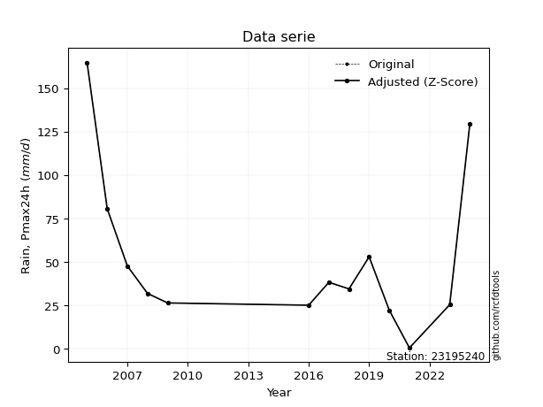</img>

</div>

> If Z-Score is active, values out of range or outliers are replaced with the station mean value.


### 4. Active continuous probability distributions from SciPy (45 of 104 available)

[scipy.stats](https://docs.scipy.org/doc/scipy/reference/stats.html) is a Python´s powerful submodule within the SciPy library for comprehensive statistical analysis, offering over 130 probability distributions (like Normal, Poisson), functions for descriptive stats (mean, variance), hypothesis testing (t-tests, chi-square), random variable generation, and statistical tests, making it essential for data science, modeling, and research. It provides tools to explore, model, and draw conclusions from data efficiently, working seamlessly with NumPy.

<div align="center">

|   id | p_dist             |   n_parameter | fit_method   | label                                                                       | active   | ref                                                                                                        |
|-----:|:-------------------|--------------:|:-------------|:----------------------------------------------------------------------------|:---------|:-----------------------------------------------------------------------------------------------------------|
|    0 | alpha              |             3 | MLE          | Alpha                                                                       | True     | [:mortar_board:](https://docs.scipy.org/doc/scipy/reference/generated/scipy.stats.alpha.html)              |
|    1 | betaprime          |             4 | MLE          | Beta prime                                                                  | True     | [:mortar_board:](https://docs.scipy.org/doc/scipy/reference/generated/scipy.stats.betaprime.html)          |
|    2 | chi2               |             3 | MLE          | Chi²                                                                        | True     | [:mortar_board:](https://docs.scipy.org/doc/scipy/reference/generated/scipy.stats.chi2.html)               |
|    3 | crystalball        |             4 | MLE          | Crystalball                                                                 | True     | [:mortar_board:](https://docs.scipy.org/doc/scipy/reference/generated/scipy.stats.crystalball.html)        |
|    4 | erlang             |             3 | MLE          | Erlang                                                                      | True     | [:mortar_board:](https://docs.scipy.org/doc/scipy/reference/generated/scipy.stats.erlang.html)             |
|    5 | expon              |             2 | MLE          | Exponential                                                                 | True     | [:mortar_board:](https://docs.scipy.org/doc/scipy/reference/generated/scipy.stats.expon.html)              |
|    6 | exponnorm          |             3 | MLE          | Exponentially modified Normal                                               | True     | [:mortar_board:](https://docs.scipy.org/doc/scipy/reference/generated/scipy.stats.exponnorm.html)          |
|    7 | f                  |             4 | MLE          | F                                                                           | True     | [:mortar_board:](https://docs.scipy.org/doc/scipy/reference/generated/scipy.stats.f.html)                  |
|    8 | fatiguelife        |             3 | MLE          | Fatigue-life (Birnbaum-Saunders)                                            | True     | [:mortar_board:](https://docs.scipy.org/doc/scipy/reference/generated/scipy.stats.fatiguelife.html)        |
|    9 | fisk               |             3 | MLE          | Fisk                                                                        | True     | [:mortar_board:](https://docs.scipy.org/doc/scipy/reference/generated/scipy.stats.fisk.html)               |
|   10 | gamma              |             3 | MLE          | Gamma                                                                       | True     | [:mortar_board:](https://docs.scipy.org/doc/scipy/reference/generated/scipy.stats.gamma.html)              |
|   11 | genexpon           |             5 | MLE          | Generalized exponential                                                     | True     | [:mortar_board:](https://docs.scipy.org/doc/scipy/reference/generated/scipy.stats.genexpon.html)           |
|   12 | genlogistic        |             3 | MLE          | Generalized logistic                                                        | True     | [:mortar_board:](https://docs.scipy.org/doc/scipy/reference/generated/scipy.stats.genlogistic.html)        |
|   13 | gibrat             |             2 | MM           | Gibrat                                                                      | True     | [:mortar_board:](https://docs.scipy.org/doc/scipy/reference/generated/scipy.stats.gibrat.html)             |
|   14 | gompertz           |             3 | MLE          | Gompertz (or truncated Gumbel)                                              | True     | [:mortar_board:](https://docs.scipy.org/doc/scipy/reference/generated/scipy.stats.gompertz.html)           |
|   15 | gumbel_l           |             2 | MM           | Gumbel Left Skew                                                            | True     | [:mortar_board:](https://docs.scipy.org/doc/scipy/reference/generated/scipy.stats.gumbel_l.html)           |
|   16 | gumbel_r           |             2 | MM           | Gumbel Right Skew                                                           | True     | [:mortar_board:](https://docs.scipy.org/doc/scipy/reference/generated/scipy.stats.gumbel_r.html)           |
|   17 | halflogistic       |             2 | MM           | Half-logistic                                                               | True     | [:mortar_board:](https://docs.scipy.org/doc/scipy/reference/generated/scipy.stats.halflogistic.html)       |
|   18 | halfnorm           |             2 | MM           | Half Normal                                                                 | True     | [:mortar_board:](https://docs.scipy.org/doc/scipy/reference/generated/scipy.stats.halfnorm.html)           |
|   19 | hypsecant          |             2 | MM           | hyperbolic secant                                                           | True     | [:mortar_board:](https://docs.scipy.org/doc/scipy/reference/generated/scipy.stats.hypsecant.html)          |
|   20 | invgamma           |             3 | MLE          | Inverted gamma                                                              | True     | [:mortar_board:](https://docs.scipy.org/doc/scipy/reference/generated/scipy.stats.invgamma.html)           |
|   21 | invgauss           |             3 | MLE          | Inverse Gaussian                                                            | True     | [:mortar_board:](https://docs.scipy.org/doc/scipy/reference/generated/scipy.stats.invgauss.html)           |
|   22 | invweibull         |             3 | MLE          | Inverted Weibull                                                            | True     | [:mortar_board:](https://docs.scipy.org/doc/scipy/reference/generated/scipy.stats.invweibull.html)         |
|   23 | johnsonsu          |             4 | MLE          | Johnson Su                                                                  | True     | [:mortar_board:](https://docs.scipy.org/doc/scipy/reference/generated/scipy.stats.johnsonsu.html)          |
|   24 | kstwobign          |             2 | MLE          | Limiting distribution of scaled Kolmogorov-Smirnov two-sided test statistic | True     | [:mortar_board:](https://docs.scipy.org/doc/scipy/reference/generated/scipy.stats.kstwobign.html)          |
|   25 | laplace            |             2 | MM           | Laplace                                                                     | True     | [:mortar_board:](https://docs.scipy.org/doc/scipy/reference/generated/scipy.stats.laplace.html)            |
|   26 | laplace_asymmetric |             3 | MLE          | Asymmetric Laplace                                                          | True     | [:mortar_board:](https://docs.scipy.org/doc/scipy/reference/generated/scipy.stats.laplace_asymmetric.html) |
|   27 | loggamma           |             3 | MLE          | Log gamma                                                                   | True     | [:mortar_board:](https://docs.scipy.org/doc/scipy/reference/generated/scipy.stats.loggamma.html)           |
|   28 | logistic           |             2 | MM           | Logistic (or Sech-squared)                                                  | True     | [:mortar_board:](https://docs.scipy.org/doc/scipy/reference/generated/scipy.stats.logistic.html)           |
|   29 | lognorm            |             3 | MLE          | Log Normal                                                                  | True     | [:mortar_board:](https://docs.scipy.org/doc/scipy/reference/generated/scipy.stats.lognorm.html)            |
|   30 | maxwell            |             2 | MM           | Maxwell                                                                     | True     | [:mortar_board:](https://docs.scipy.org/doc/scipy/reference/generated/scipy.stats.maxwell.html)            |
|   31 | mielke             |             4 | MLE          | Mielke Beta-Kappa / Dagum                                                   | True     | [:mortar_board:](https://docs.scipy.org/doc/scipy/reference/generated/scipy.stats.mielke.html)             |
|   32 | moyal              |             2 | MM           | Moyal                                                                       | True     | [:mortar_board:](https://docs.scipy.org/doc/scipy/reference/generated/scipy.stats.moyal.html)              |
|   33 | nakagami           |             3 | MLE          | Nakagami                                                                    | True     | [:mortar_board:](https://docs.scipy.org/doc/scipy/reference/generated/scipy.stats.nakagami.html)           |
|   34 | ncf                |             5 | MLE          | Non-central F distribution                                                  | True     | [:mortar_board:](https://docs.scipy.org/doc/scipy/reference/generated/scipy.stats.ncf.html)                |
|   35 | nct                |             4 | MLE          | Non-central Student’s t                                                     | True     | [:mortar_board:](https://docs.scipy.org/doc/scipy/reference/generated/scipy.stats.nct.html)                |
|   36 | norm               |             2 | MM           | Normal                                                                      | True     | [:mortar_board:](https://docs.scipy.org/doc/scipy/reference/generated/scipy.stats.norm.html)               |
|   37 | pareto             |             3 | MLE          | Pareto                                                                      | True     | [:mortar_board:](https://docs.scipy.org/doc/scipy/reference/generated/scipy.stats.pareto.html)             |
|   38 | pearson3           |             3 | MM           | Pearson type III                                                            | True     | [:mortar_board:](https://docs.scipy.org/doc/scipy/reference/generated/scipy.stats.pearson3.html)           |
|   39 | rayleigh           |             2 | MM           | Rayleigh                                                                    | True     | [:mortar_board:](https://docs.scipy.org/doc/scipy/reference/generated/scipy.stats.rayleigh.html)           |
|   40 | rice               |             3 | MLE          | Rice                                                                        | True     | [:mortar_board:](https://docs.scipy.org/doc/scipy/reference/generated/scipy.stats.rice.html)               |
|   41 | t                  |             3 | MLE          | Student’s t                                                                 | True     | [:mortar_board:](https://docs.scipy.org/doc/scipy/reference/generated/scipy.stats.t.html)                  |
|   42 | truncnorm          |             4 | MLE          | Truncated normal                                                            | True     | [:mortar_board:](https://docs.scipy.org/doc/scipy/reference/generated/scipy.stats.truncnorm.html)          |
|   43 | wald               |             2 | MM           | Wald                                                                        | True     | [:mortar_board:](https://docs.scipy.org/doc/scipy/reference/generated/scipy.stats.wald.html)               |
|   44 | weibull_min        |             3 | MLE          | Weibull minimum                                                             | True     | [:mortar_board:](https://docs.scipy.org/doc/scipy/reference/generated/scipy.stats.weibull_min.html)        |

</div>

> **n_parameter:** # arguments & localization & scale.
>
> **Fit methods:** (MLE) maximum likelihood, (MM) L-moments.
>
>**Inactive:** foldnorm, gennorm, norminvgauss, powernorm, powerlognorm, skewnorm, genextreme, anglit, arcsine, argus, beta, bradford, burr, burr12, cauchy, cosine, halfcauchy, foldcauchy, skewcauchy, wrapcauchy, dgamma, gengamma, exponweib, exponpow, truncexpon, gausshyper, genhalflogistic, genhyperbolic, geninvgauss, halfgennorm, johnsonsb, kappa4, kappa3, ksone, kstwo, loglaplace, levy, levy_l, levy_stable, ncx2, genpareto, truncpareto, lomax, powerlaw, rdist, rel_breitwigner, recipinvgauss, semicircular, studentized_range, trapezoid, triang, truncweibull_min, tukeylambda, uniform, loguniform, vonmises, vonmises_line, weibull_max, dweibull, 


## B. Probability distributions vs. Empirical distributions

A continuous probability distribution (CPD) describes probabilities for variables that can take any value within a range (like rain any time), unlike discrete variables with specific outcomes (like temperature). It uses a Probability Density Function (PDF), a curve where the total area under it equals 1, and the probability of the variable falling within an interval (a to b) is found by calculating the area under the curve between those points. A key feature is that the probability of hitting any single exact value is zero, so probabilities are always expressed for ranges, e.g., $P(a ≤ X ≤ b)$.

<div align="center">

Distributions parameters
|    |   station | p_dist                |   n |              loc |           scale | shape                 | shape1             | shape2                 | shape3   |
|---:|----------:|:----------------------|----:|-----------------:|----------------:|:----------------------|:-------------------|:-----------------------|:---------|
|  0 |  23195240 | alpha                 |  14 |      0.00244956  |     0.998091    | 4.441140906360745e-08 |                    |                        |          |
|  1 |  23195240 | betaprime             |  14 |      0.3         |   260.972       | 0.7517391301123992    | 4.716539948902575  |                        |          |
|  2 |  23195240 | chi2                  |  14 |      0.3         |    20.6253      | 1.7942283567345343    |                    |                        |          |
|  3 |  23195240 | crystalball           |  14 |     48.4643      |    45.2418      | 9395.093151293235     | 955.3202022674859  |                        |          |
|  4 |  23195240 | erlang                |  14 |      0.3         |    40.9992      | 0.9635967129443896    |                    |                        |          |
|  5 |  23195240 | expon                 |  14 |      0.3         |    48.1643      |                       |                    |                        |          |
|  6 |  23195240 | exponnorm             |  14 |      7.77157     |    11.8621      | 3.430470399958954     |                    |                        |          |
|  7 |  23195240 | f                     |  14 |      0.3         |    51.8302      | 1.2136266334161028    | 6324.544942809884  |                        |          |
|  8 |  23195240 | fatiguelife           |  14 |    -14.068       |    49.475       | 0.7260965384640476    |                    |                        |          |
|  9 |  23195240 | fisk                  |  14 |    -10.7624      |    45.8908      | 2.3977611437453312    |                    |                        |          |
| 10 |  23195240 | gamma                 |  14 |      0.3         |    43.5619      | 0.7767406029815254    |                    |                        |          |
| 11 |  23195240 | genexpon              |  14 |      0.3         |    64.9019      | 1.1630331398819527    | 0.2877088345304807 | 2.486662926854601      |          |
| 12 |  23195240 | genlogistic           |  14 |   -177.801       |    28.857       | 1324.257183438864     |                    |                        |          |
| 13 |  23195240 | gibrat                |  14 |     13.9505      |    20.9336      |                       |                    |                        |          |
| 14 |  23195240 | gompertz              |  14 |      0.3         |   615.47        | 11.844244260447503    |                    |                        |          |
| 15 |  23195240 | gumbel_l              |  14 |     68.8255      |    35.2749      |                       |                    |                        |          |
| 16 |  23195240 | gumbel_r              |  14 |     28.1031      |    35.2749      |                       |                    |                        |          |
| 17 |  23195240 | halflogistic          |  14 |     -5.15773     |    38.6801      |                       |                    |                        |          |
| 18 |  23195240 | halfnorm              |  14 |    -11.4181      |    75.0514      |                       |                    |                        |          |
| 19 |  23195240 | hypsecant             |  14 |     48.4643      |    28.8018      |                       |                    |                        |          |
| 20 |  23195240 | invgamma              |  14 |    -28.9262      |   247.497       | 4.173390414879496     |                    |                        |          |
| 21 |  23195240 | invgauss              |  14 |    -16.5419      |   125.929       | 0.5162119243447594    |                    |                        |          |
| 22 |  23195240 | invweibull            |  14 |    -67.5633      |    93.3584      | 3.730824448265952     |                    |                        |          |
| 23 |  23195240 | johnsonsu             |  14 |     25.0078      |     8.12997     | -0.5444169669547373   | 0.6236889594118592 |                        |          |
| 24 |  23195240 | kstwobign             |  14 |    -78.1737      |   147.148       |                       |                    |                        |          |
| 25 |  23195240 | laplace               |  14 |     48.4643      |    31.9908      |                       |                    |                        |          |
| 26 |  23195240 | laplace_asymmetric    |  14 |     24.9         |    22.6442      | 0.6069484173115902    |                    |                        |          |
| 27 |  23195240 | loggamma              |  14 | -14782.1         |  1975.18        | 1823.702668584021     |                    |                        |          |
| 28 |  23195240 | logistic              |  14 |     48.4643      |    24.9431      |                       |                    |                        |          |
| 29 |  23195240 | lognorm               |  14 |      0.3         |     1.63529     | 10.61223981940288     |                    |                        |          |
| 30 |  23195240 | maxwell               |  14 |    -58.7397      |    67.1801      |                       |                    |                        |          |
| 31 |  23195240 | mielke                |  14 |      0.3         |    70.909       | 0.7163491459599137    | 3.0618766489475036 |                        |          |
| 32 |  23195240 | moyal                 |  14 |     22.5921      |    20.366       |                       |                    |                        |          |
| 33 |  23195240 | nakagami              |  14 |      0.3         |    93.351       | 0.10684143773117737   |                    |                        |          |
| 34 |  23195240 | ncf                   |  14 |      0.3         |     4.9128      | 0.4084634843730941    | 51.68229484780953  | 3.072472699157921      |          |
| 35 |  23195240 | nct                   |  14 |    -40.6842      |     7.14389     | 3.534049129536438     | 9.667887851382464  |                        |          |
| 36 |  23195240 | norm                  |  14 |     48.4643      |    45.2418      |                       |                    |                        |          |
| 37 |  23195240 | pareto                |  14 |      0.299975    |     2.51733e-05 | 0.07693069436699272   |                    |                        |          |
| 38 |  23195240 | pearson3              |  14 |     48.4643      |    45.2418      | 1.4318368616774828    |                    |                        |          |
| 39 |  23195240 | rayleigh              |  14 |    -38.0859      |    69.057       |                       |                    |                        |          |
| 40 |  23195240 | rice                  |  14 |    -21.3442      |    58.8219      | 0.000717014402733547  |                    |                        |          |
| 41 |  23195240 | t                     |  14 |     30.7556      |    14.0345      | 1.1225107545015385    |                    |                        |          |
| 42 |  23195240 | truncnorm             |  14 |    -51.2176      |    79.7913      | 0.6456549255743934    | 244.958597424735   |                        |          |
| 43 |  23195240 | wald                  |  14 |      3.22251     |    45.2418      |                       |                    |                        |          |
| 44 |  23195240 | weibull_min           |  14 |      0.3         |    48.3449      | 0.9346378158260995    |                    |                        |          |
| 45 |  23195240 | logalpha              |  14 |    -48.8652      |  1466.15        | 28.252775064605316    |                    |                        |          |
| 46 |  23195240 | logbetaprime          |  14 |   -182.801       |  2220.28        | 12182.344035434806    | 145458.7165026617  |                        |          |
| 47 |  23195240 | logchi2               |  14 |    -16.7848      |     0.0922213   | 214.74023643744562    |                    |                        |          |
| 48 |  23195240 | logcrystalball        |  14 |      3.13572     |     1.73886     | 200.33359896399287    | 98.20100096095508  |                        |          |
| 49 |  23195240 | logerlang             |  14 |    -26.7109      |     0.114269    | 260.56630523300566    |                    |                        |          |
| 50 |  23195240 | logexpon              |  14 |     -1.20397     |     4.33969     |                       |                    |                        |          |
| 51 |  23195240 | logexponnorm          |  14 |      3.13478     |     1.73887     | 0.0005454349555674659 |                    |                        |          |
| 52 |  23195240 | logf                  |  14 |     -1.20397     |     1.14565     | 1.0807726212829074    | 1.1234838420399096 |                        |          |
| 53 |  23195240 | logfatiguelife        |  14 |   -954.92        |   958.063       | 0.0018155422973162322 |                    |                        |          |
| 54 |  23195240 | logfisk               |  14 |     -1.20397     |     0.945424    | 0.3396169380842933    |                    |                        |          |
| 55 |  23195240 | loggamma              |  14 |    -29.1412      |     0.104115    | 309.7167343638755     |                    |                        |          |
| 56 |  23195240 | loggenexpon           |  14 |     -1.25428     |     0.229312    | 0.00988192376817612   | 19.76093812845265  | 0.00019359256041747398 |          |
| 57 |  23195240 | loggenlogistic        |  14 |      4.46349     |     0.349001    | 0.24154035651905478   |                    |                        |          |
| 58 |  23195240 | loggibrat             |  14 |      1.80917     |     0.804586    |                       |                    |                        |          |
| 59 |  23195240 | loggompertz           |  14 |     -1.20397     |     1.13926     | 0.01219382644518327   |                    |                        |          |
| 60 |  23195240 | loggumbel_l           |  14 |      3.9183      |     1.35578     |                       |                    |                        |          |
| 61 |  23195240 | loggumbel_r           |  14 |      2.35314     |     1.35578     |                       |                    |                        |          |
| 62 |  23195240 | loghalflogistic       |  14 |      1.07475     |     1.48667     |                       |                    |                        |          |
| 63 |  23195240 | loghalfnorm           |  14 |      0.834166    |     2.88457     |                       |                    |                        |          |
| 64 |  23195240 | loghypsecant          |  14 |      3.13572     |     1.10699     |                       |                    |                        |          |
| 65 |  23195240 | loginvgamma           |  14 |    -45.7869      | 33796.1         | 692.4773140050065     |                    |                        |          |
| 66 |  23195240 | loginvgauss           |  14 |    -16.2954      |  1941.76        | 0.00998241428809045   |                    |                        |          |
| 67 |  23195240 | loginvweibull         |  14 |     -2.62308e+08 |     2.62308e+08 | 121610057.79706651    |                    |                        |          |
| 68 |  23195240 | logjohnsonsu          |  14 |      3.55535     |     0.333207    | 0.10846074833741393   | 0.6035429188812227 |                        |          |
| 69 |  23195240 | logkstwobign          |  14 |     -5.68493     |    10.1032      |                       |                    |                        |          |
| 70 |  23195240 | loglaplace            |  14 |      3.13572     |     1.22956     |                       |                    |                        |          |
| 71 |  23195240 | loglaplace_asymmetric |  14 |      3.64021     |     0.978574    | 1.2904451961663992    |                    |                        |          |
| 72 |  23195240 | logloggamma           |  14 |      4.72568     |     0.530413    | 0.34715815084731794   |                    |                        |          |
| 73 |  23195240 | loglogistic           |  14 |      3.13572     |     0.958683    |                       |                    |                        |          |
| 74 |  23195240 | loglognorm            |  14 |  -1262.64        |  1265.78        | 0.0013682405912787796 |                    |                        |          |
| 75 |  23195240 | logmaxwell            |  14 |     -0.984696    |     2.58208     |                       |                    |                        |          |
| 76 |  23195240 | logmielke             |  14 |     -2.4985e+08  |     2.4985e+08  | 2809151154.6457467    | 121277059.30693099 |                        |          |
| 77 |  23195240 | logmoyal              |  14 |      2.14133     |     0.782761    |                       |                    |                        |          |
| 78 |  23195240 | lognakagami           |  14 |  -2099.85        |  2102.98        | 364034.3426493262     |                    |                        |          |
| 79 |  23195240 | logncf                |  14 |     -1.20397     |     1.07614     | 1.0562401582793663    | 1.1519999072987164 | 1.1254798576916993     |          |
| 80 |  23195240 | lognct                |  14 |    -95.3034      |     1.6781      | 20676.422439354792    | 58.659534301524616 |                        |          |
| 81 |  23195240 | lognorm               |  14 |      3.13572     |     1.73886     |                       |                    |                        |          |
| 82 |  23195240 | logpareto             |  14 |     -1.20398     |     3.55031e-06 | 0.07692421717166438   |                    |                        |          |
| 83 |  23195240 | logpearson3           |  14 |      3.13572     |     1.73886     | -1.5524478916497784   |                    |                        |          |
| 84 |  23195240 | lograyleigh           |  14 |     -0.190816    |     2.65419     |                       |                    |                        |          |
| 85 |  23195240 | logrice               |  14 |   -758.732       |     1.73672     | 438.6798215077098     |                    |                        |          |
| 86 |  23195240 | logt                  |  14 |      3.52849     |     0.448939    | 1.063067257495228     |                    |                        |          |
| 87 |  23195240 | logtruncnorm          |  14 |      1.50464     |     5.91587     | -0.45826406962858557  | 0.6085493718368078 |                        |          |
| 88 |  23195240 | logwald               |  14 |      1.3968      |     1.7389      |                       |                    |                        |          |
| 89 |  23195240 | logweibull_min        |  14 |     -1.20397     |     1.86507     | 0.33189430497488903   |                    |                        |          |

</div>

> **loc** (Location parameter): This shifts the distribution along the x-axis. For many common distributions, like the normal (Gaussian) distribution, loc represents the mean $μ$. For others, like the uniform distribution, it might represent the minimum value, or for the beta distribution, the left end of the support interval.
>
> **scale** (Scale parameter): This determines the width or spread of the distribution. For the normal distribution, scale represents the standard deviation $σ$. For a uniform distribution, it defines the length of the interval (from $loc$ to $loc + scale$).
>
> **shape** (Shape parameters): Refers to parameters that define the specific form of a probability distribution, distinct from its location (loc) and scale (scale). These parameters are required arguments for most distribution functions. For example, a normal (Gaussian) distribution is fully defined by its location (mean) and scale (standard deviation), so it has no specific shape parameters beyond loc and scale. However, other distributions have intrinsic properties that need specification, as Gamma distribution that takes a shape parameter, often named $a$ or $alpha$.


### 0. Cumulative distribution values - CDF (90 evaluated)

> Ordered by x ascending and calculating $log(f(x))$ separately. 

|   id |   Station |   date |     x |   count |    mean |     std |     zscore |   Value_initial |   station |   m |       alpha |   alpha_pdf |   betaprime |   betaprime_pdf |        chi2 |    chi2_pdf |   crystalball |   crystalball_pdf |      erlang |   erlang_pdf |      expon |   expon_pdf |   exponnorm |   exponnorm_pdf |           f |            f_pdf |   fatiguelife |   fatiguelife_pdf |      fisk |    fisk_pdf |       gamma |     gamma_pdf |    genexpon |   genexpon_pdf |   genlogistic |   genlogistic_pdf |   gibrat |   gibrat_pdf |    gompertz |   gompertz_pdf |   gumbel_l |   gumbel_l_pdf |   gumbel_r |   gumbel_r_pdf |   halflogistic |   halflogistic_pdf |   halfnorm |   halfnorm_pdf |   hypsecant |   hypsecant_pdf |   invgamma |   invgamma_pdf |   invgauss |   invgauss_pdf |   invweibull |   invweibull_pdf |   johnsonsu |   johnsonsu_pdf |   kstwobign |   kstwobign_pdf |   laplace |   laplace_pdf |   laplace_asymmetric |   laplace_asymmetric_pdf |   loggamma |   loggamma_pdf |   logistic |   logistic_pdf |    lognorm |   lognorm_pdf |   maxwell |   maxwell_pdf |      mielke |    mielke_pdf |     moyal |   moyal_pdf |    nakagami |   nakagami_pdf |         ncf |     ncf_pdf |       nct |     nct_pdf |     norm |    norm_pdf |   pareto |     pareto_pdf |   pearson3 |   pearson3_pdf |   rayleigh |   rayleigh_pdf |      rice |    rice_pdf |        t |       t_pdf |   truncnorm |   truncnorm_pdf |     wald |    wald_pdf |   weibull_min |   weibull_min_pdf |   logalpha |   logalpha_pdf |   logbetaprime |   logbetaprime_pdf |    logchi2 |   logchi2_pdf |   logcrystalball |   logcrystalball_pdf |   logerlang |   logerlang_pdf |   logexpon |   logexpon_pdf |   logexponnorm |   logexponnorm_pdf |        logf |    logf_pdf |   logfatiguelife |   logfatiguelife_pdf |     logfisk |   logfisk_pdf |   loggenexpon |   loggenexpon_pdf |   loggenlogistic |   loggenlogistic_pdf |   loggibrat |   loggibrat_pdf |   loggompertz |   loggompertz_pdf |   loggumbel_l |   loggumbel_l_pdf |   loggumbel_r |   loggumbel_r_pdf |   loghalflogistic |   loghalflogistic_pdf |   loghalfnorm |   loghalfnorm_pdf |   loghypsecant |   loghypsecant_pdf |   loginvgamma |   loginvgamma_pdf |   loginvgauss |   loginvgauss_pdf |   loginvweibull |   loginvweibull_pdf |   logjohnsonsu |   logjohnsonsu_pdf |   logkstwobign |   logkstwobign_pdf |   loglaplace |   loglaplace_pdf |   loglaplace_asymmetric |   loglaplace_asymmetric_pdf |   logloggamma |   logloggamma_pdf |   loglogistic |   loglogistic_pdf |   loglognorm |   loglognorm_pdf |   logmaxwell |   logmaxwell_pdf |   logmielke |   logmielke_pdf |    logmoyal |   logmoyal_pdf |   lognakagami |   lognakagami_pdf |      logncf |   logncf_pdf |     lognct |   lognct_pdf |   logpareto |   logpareto_pdf |   logpearson3 |   logpearson3_pdf |   lograyleigh |   lograyleigh_pdf |    logrice |   logrice_pdf |      logt |   logt_pdf |   logtruncnorm |   logtruncnorm_pdf |   logwald |   logwald_pdf |   logweibull_min |   logweibull_min_pdf |
|-----:|----------:|-------:|------:|--------:|--------:|--------:|-----------:|----------------:|----------:|----:|------------:|------------:|------------:|----------------:|------------:|------------:|--------------:|------------------:|------------:|-------------:|-----------:|------------:|------------:|----------------:|------------:|-----------------:|--------------:|------------------:|----------:|------------:|------------:|--------------:|------------:|---------------:|--------------:|------------------:|---------:|-------------:|------------:|---------------:|-----------:|---------------:|-----------:|---------------:|---------------:|-------------------:|-----------:|---------------:|------------:|----------------:|-----------:|---------------:|-----------:|---------------:|-------------:|-----------------:|------------:|----------------:|------------:|----------------:|----------:|--------------:|---------------------:|-------------------------:|-----------:|---------------:|-----------:|---------------:|-----------:|--------------:|----------:|--------------:|------------:|--------------:|----------:|------------:|------------:|---------------:|------------:|------------:|----------:|------------:|---------:|------------:|---------:|---------------:|-----------:|---------------:|-----------:|---------------:|----------:|------------:|---------:|------------:|------------:|----------------:|---------:|------------:|--------------:|------------------:|-----------:|---------------:|---------------:|-------------------:|-----------:|--------------:|-----------------:|---------------------:|------------:|----------------:|-----------:|---------------:|---------------:|-------------------:|------------:|------------:|-----------------:|---------------------:|------------:|--------------:|--------------:|------------------:|-----------------:|---------------------:|------------:|----------------:|--------------:|------------------:|--------------:|------------------:|--------------:|------------------:|------------------:|----------------------:|--------------:|------------------:|---------------:|-------------------:|--------------:|------------------:|--------------:|------------------:|----------------:|--------------------:|---------------:|-------------------:|---------------:|-------------------:|-------------:|-----------------:|------------------------:|----------------------------:|--------------:|------------------:|--------------:|------------------:|-------------:|-----------------:|-------------:|-----------------:|------------:|----------------:|------------:|---------------:|--------------:|------------------:|------------:|-------------:|-----------:|-------------:|------------:|----------------:|--------------:|------------------:|--------------:|------------------:|-----------:|--------------:|----------:|-----------:|---------------:|-------------------:|----------:|--------------:|-----------------:|---------------------:|
|    0 |  23195240 |   2021 |   0.3 |      14 | 48.4643 | 46.9496 | -1.02587   |             0.3 |  23195240 |   1 | 0.000795488 | 0.0324121   | 3.14626e-14 |   426.071       | 2.96996e-14 | 0.809401    |      0.143529 |       0.00500337  | 3.21915e-11 |  0.0594627   | 0          |  0.0207623  |   0.040696  |      0.00549717 | 1.02872e-11 | 112453           |     0.0348805 |       0.00884286  | 0.0319435 | 0.00670253  | 1.36177e-14 | 190.545       | 1.24607e-13 |    0.0179199   |     0.0632095 |       0.00604216  | 0        |  0           | 2.13654e-16 |     0.0192442  |   0.133531 |    0.00352063  |   0.11087  |    0.00691277  |      0.0704327 |        0.0128624   |   0.124073 |    0.0105024   |    0.118194 |     0.00401003  |  0.0366044 |    0.00714463  |  0.0352403 |    0.00831906  |    0.037369  |      0.00675258  |   0.0458757 |     0.00230829  |   0.0614087 |     0.00600649  |  0.110946 |   0.00346805  |            0.0449525 |              0.00327074  | 0.00721609 |      0.0120265 |   0.126644 |    0.00443429  | 0.00628519 |     0.0101888 |  0.143928 |   0.0062344   | 1.73909e-12 | 458.006       | 0.0838877 | 0.007601    | 0.000105829 |    4.07375e+11 | 5.84863e-05 | 2.15178e+11 | 0.0386756 | 0.00686835  | 0.143529 | 0.00500337  | 0        | 3056.04        |  0.0865466 |    0.00954068  |   0.143147 |    0.00689703  | 0.065457  | 0.00584604  | 0.126374 | 0.00403217  | 1.02203e-10 |     0.0156571   | 0        | 0           |   1.70854e-17 |        0.287666   | 0.00605339 |      0.0110606 |      0.0061865 |           0.010132 | 0.00921705 |     0.0152582 |        0.0062852 |            0.0101889 |  0.00789662 |       0.0130321 |   0        |      0.230431  |     0.00628531 |          0.010189  | 2.13656e-09 | 5.19971e+06 |       0.00612305 |           0.00999797 | 4.92109e-06 |   7.52677e+09 |    0.00225765 |         0.0466484 |        0.0197935 |            0.0136989 |    0        |       0         |   2.79189e-09 |         0.0107033 |     0.0226068 |         0.0164844 |   1.02983e-06 |       1.04717e-05 |          0        |             0         |      0        |         0         |      0.0126263 |          0.011403  |    0.00755249 |         0.0126779 |    0.00685055 |         0.0127962 |      0.00871621 |           0.0191646 |      0.0277144 |         0.00805874 |      0.010676  |          0.0275024 |    0.0146602 |        0.0119231 |               0.0134819 |                   0.0106763 |     0.0231427 |         0.0151468 |     0.0107003 |         0.011042  |   0.00592467 |        0.0097416 |   0          |        0         |  0.00806509 |       0.0170361 | 2.39576e-17 |    1.1135e-15  |    0.00640049 |         0.0103381 | 1.95828e-09 |  4.65765e+06 | 0.00634925 |    0.0103023 |    0        |  21666.9        |     0.0271566 |         0.0178415 |      0        |          0        | 0.00623009 |     0.0101222 | 0.0262918 | 0.00586827 |    0.000362718 |           0.149863 |  0        |     0         |      5.18596e-06 |          7.75154e+09 |
|    1 |  23195240 |   2025 |   0.6 |      14 | 48.4643 | 46.9496 | -1.01948   |             0.6 |  23195240 |   2 | 0.0948591   | 0.552762    | 0.021064    |     0.0525932   | 0.0125192   | 0.0372938   |      0.145035 |       0.00503871  | 0.00885174  |  0.0283259   | 0.00620932 |  0.0206334  |   0.0423697 |      0.00566097 | 0.0361874   |      0.0730368   |     0.0375805 |       0.00915539  | 0.0339882 | 0.0069286   | 0.0225452   |   0.0581467   | 0.00536911  |    0.017874    |     0.0650387 |       0.00615285  | 0        |  0           | 0.00575803  |     0.0191427  |   0.134591 |    0.00354636  |   0.112954 |    0.00698309  |      0.0742904 |        0.0128552   |   0.127222 |    0.0104957   |    0.119402 |     0.00404912  |  0.038784  |    0.00738588  |  0.03778   |    0.00861086  |    0.0394285 |      0.00697761  |   0.0465763 |     0.00236242  |   0.0632259 |     0.00610774  |  0.111991 |   0.00350073  |            0.0459445 |              0.00334292  | 0.021011   |      0.0298349 |   0.12798  |    0.00447423  | 0.0179927  |     0.0254494 |  0.145805 |   0.00627319  | 0.0199383   |   0.0476092   | 0.0861846 | 0.00771187  | 0.243457    |    0.173408    | 0.0968638   | 0.0703485   | 0.0407694 | 0.00709077  | 0.145035 | 0.00503871  | 0.514249 |    0.124553    |  0.0894226 |    0.00963209  |   0.145222 |    0.0069341   | 0.0672213 | 0.00591588  | 0.127594 | 0.00410104  | 0.00469142  |     0.015619    | 0        | 0           |   0.00861317  |        0.0267181  | 0.0193174  |      0.0294787 |      0.0178696 |           0.025445 | 0.0263769  |     0.036486  |        0.0179927 |            0.0254494 |  0.0227189  |       0.0318502 |   0.14762  |      0.196415  |     0.0179929  |          0.0254495 | 0.420424    | 0.237132    |       0.0176542  |           0.0251284  | 0.473671    |   0.122151    |    0.0508043  |         0.0922282 |        0.0319789 |            0.0221323 |    0        |       0         |   0.0101607   |         0.0194678 |     0.037409  |         0.0270695 |   0.000256562 |       0.00156462  |          0        |             0         |      0        |         0         |      0.0236086 |          0.0213072 |    0.0220861  |         0.0313849 |    0.0221086  |         0.0336392 |      0.0320918  |           0.0511687 |      0.0343206 |         0.0112483  |      0.0443443 |          0.0720583 |    0.0257613 |        0.0209516 |               0.0233419 |                   0.0184843 |     0.036428  |         0.0238414 |     0.0218021 |         0.0222459 |   0.0172105  |        0.0246717 |   0.00162743 |        0.0102338 |  0.0289465  |       0.0461527 | 5.27569e-08 |    1.02966e-06 |    0.0182517  |         0.0257187 | 0.292024    |  0.205015    | 0.0181808  |    0.0257037 |    0.608233 |      0.0434774  |     0.0427025 |         0.0277055 |      0        |          0        | 0.0178766  |     0.0253404 | 0.0310734 | 0.00810639 |    0.10683     |           0.15704  |  0        |     0         |      0.513245    |          0.167808    |
|    2 |  23195240 |   2020 |  22   |      14 | 48.4643 | 46.9496 | -0.563674  |            22   |  23195240 |   3 | 0.96381     | 0.00164405  | 0.440075    |     0.0118132   | 0.461535    | 0.0142901   |      0.27929  |       0.00743138  | 0.42909     |  0.0143818   | 0.362717   |  0.0132314  |   0.283128  |      0.0147865  | 0.443586    |      0.0105596   |     0.331019  |       0.0140186   | 0.308316  | 0.0156075   | 0.511351    |   0.0136792   | 0.342779    |    0.0134221   |     0.271857  |       0.0122644   | 0.169598 |  0.0313897   | 0.346262    |     0.0130322  |   0.232912 |    0.00576604  |   0.304561 |    0.0102647   |      0.337311  |        0.0114558   |   0.343875 |    0.00962783  |    0.241679 |     0.00760781  |  0.315208  |    0.0149084   |  0.326869  |    0.0142721   |    0.311156  |      0.015132    |   0.220591  |     0.0213363   |   0.257033  |     0.011095    |  0.218626 |   0.00683402  |            0.218     |              0.0158617   | 0.504498   |      0.217757  |   0.257121 |    0.00765782  | 0.489751   |     0.229352  |  0.304843 |   0.00833183  | 0.425552    |   0.0136836   | 0.310276  | 0.0118786   | 0.60742     |    0.00595023  | 0.419311    | 0.0109416   | 0.31174   | 0.0150057   | 0.27929  | 0.00743138  | 0.650557 |    0.00123884  |  0.327992  |    0.0114207   |   0.315132 |    0.00862906  | 0.237757  | 0.00954873  | 0.317719 | 0.0168957   | 0.307968    |     0.0126588   | 0.285613 | 0.0218376   |   0.376861    |        0.0126945  | 0.513536   |      0.216551  |      0.487516  |           0.227404 | 0.527864   |     0.207673  |        0.489751  |            0.229352  |  0.514121   |       0.215993  |   0.628314 |      0.0856481 |     0.489749   |          0.229351  | 0.71345     | 0.0315758   |       0.488018   |           0.229265   | 0.625752    |   0.0185177   |    0.582412   |         0.149765  |        0.384986  |            0.261325  |    0.679303 |       0.279229  |   0.403563    |         0.276935  |     0.419148  |         0.232746  |   0.559747    |       0.23957     |          0.590299 |             0.21913   |      0.566018 |         0.203673  |      0.487157  |          0.287311  |    0.510696   |         0.21459   |    0.520511   |         0.205948  |      0.523359   |           0.157105  |      0.282287  |         0.356898   |      0.562536  |          0.145519  |    0.482158  |        0.392139  |               0.404458  |                   0.320287  |     0.380336  |         0.240577  |     0.488351  |         0.260633  |   0.487106   |        0.23024   |   0.523183   |        0.221516  |  0.518497   |       0.162986  | 0.585631    |    0.239485    |    0.490468   |         0.228852  | 0.602196    |  0.0397835   | 0.490109   |    0.228363  |    0.659519 |      0.00609805 |     0.387248  |         0.213976  |      0.534407 |          0.216901 | 0.489718   |     0.229634  | 0.250215  | 0.371333   |    0.696758    |           0.160546 |  0.657657 |     0.238471  |      0.73259     |          0.0272551   |
|    3 |  23195240 |   2016 |  24.9 |      14 | 48.4643 | 46.9496 | -0.501906  |            24.9 |  23195240 |   4 | 0.968023    | 0.00128365  | 0.472874    |     0.0108294   | 0.501294    | 0.0131491   |      0.301235 |       0.00769948  | 0.469264    |  0.0133386   | 0.399956   |  0.0124583  |   0.326011  |      0.0147351  | 0.472954    |      0.00971587  |     0.370865  |       0.0134496   | 0.353283  | 0.0153615   | 0.549191    |   0.0124448   | 0.380759    |    0.0127722   |     0.307893  |       0.0125633   | 0.25847  |  0.0295337   | 0.383068    |     0.0123565  |   0.250143 |    0.00611948  |   0.334522 |    0.0103847   |      0.370103  |        0.0111559   |   0.37155  |    0.00945654  |    0.264547 |     0.00816362  |  0.35796   |    0.014545    |  0.367516  |    0.0137439   |    0.35466   |      0.014834    |   0.290238  |     0.0262676   |   0.289557  |     0.0113174   |  0.23937  |   0.00748248  |            0.269212  |              0.0195878   | 0.531397   |      0.216542  |   0.279948 |    0.00808147  | 0.518153   |     0.22919   |  0.32923  |   0.00848116  | 0.464247    |   0.01301     | 0.344702  | 0.0118445   | 0.623822    |    0.0053825   | 0.450352    | 0.0104686   | 0.354884  | 0.0147135   | 0.301235 | 0.00769948  | 0.653913 |    0.0010823   |  0.360843  |    0.0112253   |   0.340286 |    0.0087133   | 0.265844  | 0.00981221  | 0.371111 | 0.0198851   | 0.344065    |     0.0122355   | 0.346364 | 0.0200318   |   0.412464    |        0.0118715  | 0.540236   |      0.214549  |      0.515675  |           0.227231 | 0.55345    |     0.205458  |        0.518153  |            0.22919   |  0.540778   |       0.214405  |   0.638769 |      0.0832388 |     0.51815    |          0.229189  | 0.717287    | 0.0304087   |       0.516412   |           0.229145   | 0.62801     |   0.0179547   |    0.600773   |         0.146763  |        0.418609  |            0.281841  |    0.711565 |       0.242893  |   0.438709    |         0.290539  |     0.448554  |         0.242094  |   0.588828    |       0.230019    |          0.616767 |             0.208385  |      0.590811 |         0.196765  |      0.522739  |          0.286812  |    0.53718    |         0.213014  |    0.545873   |         0.203556  |      0.542611   |           0.153796  |      0.332596  |         0.460236   |      0.580348  |          0.142147  |    0.531172  |        0.381298  |               0.446127  |                   0.353285  |     0.411184  |         0.257758  |     0.520628  |         0.260331  |   0.515623   |        0.230161  |   0.55039    |        0.217785  |  0.538475   |       0.159653  | 0.614459    |    0.226137    |    0.518805   |         0.228658  | 0.60704     |  0.0384661   | 0.518384   |    0.228147  |    0.660262 |      0.00591423 |     0.41449   |         0.22607   |      0.560982 |          0.212237 | 0.518154   |     0.229472  | 0.303048  | 0.485775   |    0.71658     |           0.159612 |  0.685662 |     0.214388  |      0.735912    |          0.0264103   |
|    4 |  23195240 |   2023 |  25.2 |      14 | 48.4643 | 46.9496 | -0.495516  |            25.2 |  23195240 |   5 | 0.968404    | 0.00125329  | 0.476109    |     0.010735    | 0.505222    | 0.0130376   |      0.303549 |       0.00772594  | 0.47325     |  0.0132355   | 0.403682   |  0.0123809  |   0.330429  |      0.0147124  | 0.475857    |      0.00963577  |     0.374891  |       0.0133869   | 0.357886  | 0.0153219   | 0.552907    |   0.012326    | 0.384581    |    0.0127055   |     0.311666  |       0.0125858   | 0.267287 |  0.0292434   | 0.386764    |     0.0122885  |   0.251985 |    0.00615659  |   0.337638 |    0.0103927   |      0.373445  |        0.0111238   |   0.374384 |    0.00943819  |    0.267005 |     0.0082209   |  0.362316  |    0.0144975   |  0.371631  |    0.0136839   |    0.359103  |      0.0147914   |   0.298168  |     0.0265917   |   0.292954  |     0.0113344   |  0.241626 |   0.00755298  |            0.275065  |              0.019431    | 0.533989   |      0.216373  |   0.282378 |    0.00812413  | 0.520897   |     0.229113  |  0.331776 |   0.00849466  | 0.46814     |   0.0129426   | 0.348254  | 0.0118345   | 0.625429    |    0.00533047  | 0.453485    | 0.0104205   | 0.359292  | 0.014672    | 0.303549 | 0.00772594  | 0.654235 |    0.00106827  |  0.364207  |    0.0112018   |   0.342901 |    0.0087201   | 0.268791  | 0.00983622  | 0.37712  | 0.0201719   | 0.347729    |     0.0121916   | 0.352345 | 0.0198387   |   0.416013    |        0.0117904  | 0.542804   |      0.214306  |      0.518396  |           0.227154 | 0.555909   |     0.2052    |        0.520897  |            0.229113  |  0.543344   |       0.214201  |   0.639765 |      0.0830094 |     0.520895   |          0.229112  | 0.717651    | 0.0302996   |       0.519156   |           0.229071   | 0.628225    |   0.017902    |    0.602529   |         0.146463  |        0.421997  |            0.283852  |    0.714455 |       0.239695  |   0.442196    |         0.291785  |     0.451459  |         0.242956  |   0.591577    |       0.229061    |          0.619256 |             0.20735   |      0.593164 |         0.19609   |      0.526173  |          0.286574  |    0.53973    |         0.212813  |    0.548309   |         0.203284  |      0.544451   |           0.153463  |      0.338176  |         0.47164    |      0.582048  |          0.141814  |    0.535716  |        0.377602  |               0.450378  |                   0.356651  |     0.414281  |         0.259443  |     0.523745  |         0.260186  |   0.518379   |        0.230091  |   0.552996   |        0.21738   |  0.540385   |       0.159315  | 0.61716     |    0.224846    |    0.521543   |         0.228578  | 0.6075      |  0.0383425   | 0.521116   |    0.228065  |    0.660333 |      0.00589701 |     0.417205  |         0.22725   |      0.563521 |          0.211752 | 0.520902   |     0.229395  | 0.308938  | 0.497876   |    0.718491    |           0.159519 |  0.688217 |     0.21222   |      0.736228    |          0.026331    |
|    5 |  23195240 |   2009 |  26.2 |      14 | 48.4643 | 46.9496 | -0.474217  |            26.2 |  23195240 |   6 | 0.969609    | 0.00115951  | 0.48669     |     0.0104295   | 0.518076    | 0.0126739   |      0.311318 |       0.00781235  | 0.486316    |  0.0128981   | 0.415935   |  0.0121265  |   0.345095  |      0.0146158  | 0.485362    |      0.0093773   |     0.388172  |       0.0131743   | 0.373136  | 0.0151735   | 0.565039    |   0.0119408   | 0.397175    |    0.0124842   |     0.324285  |       0.0126497   | 0.296022 |  0.0282122   | 0.39894     |     0.0120641  |   0.258204 |    0.00628096  |   0.348042 |    0.0104135   |      0.384515  |        0.0110153   |   0.383791 |    0.0093762   |    0.275321 |     0.00841104  |  0.37673   |    0.014328    |  0.385213  |    0.0134786   |    0.373819  |      0.014636    |   0.325172  |     0.0273245   |   0.304314  |     0.0113831   |  0.249298 |   0.00779281  |            0.294238  |              0.0189171   | 0.542398   |      0.215761  |   0.290573 |    0.00826442  | 0.529807   |     0.228787  |  0.340293 |   0.00853704  | 0.480971    |   0.0127204   | 0.360069  | 0.0117935   | 0.630676    |    0.00516474  | 0.463826    | 0.0102612   | 0.37389   | 0.0145203   | 0.311318 | 0.00781235  | 0.655281 |    0.00102392  |  0.375368  |    0.0111198   |   0.351632 |    0.0087402   | 0.278666  | 0.00991186  | 0.397748 | 0.0210681   | 0.359847    |     0.0120452   | 0.371861 | 0.0191947   |   0.427671    |        0.0115254  | 0.551128   |      0.213456  |      0.52723   |           0.226832 | 0.563878   |     0.204312  |        0.529807  |            0.228787  |  0.551666   |       0.21348   |   0.642981 |      0.0822684 |     0.529805   |          0.228786  | 0.718823    | 0.0299495   |       0.528064   |           0.228759   | 0.628918    |   0.0177326   |    0.608209   |         0.145475  |        0.43317   |            0.290406  |    0.723586 |       0.229655  |   0.453628    |         0.295736  |     0.460967  |         0.245697  |   0.60043     |       0.22591     |          0.62726  |             0.203995  |      0.600752 |         0.19389   |      0.537307  |          0.285572  |    0.547998   |         0.2121    |    0.556202   |         0.202349  |      0.550401   |           0.152367  |      0.357273  |         0.51012    |      0.587546  |          0.140726  |    0.55018   |        0.365838  |               0.464473  |                   0.367813  |     0.424484  |         0.264938  |     0.533859  |         0.259579  |   0.527328   |        0.229788  |   0.561429   |        0.216015  |  0.546563   |       0.158198  | 0.625828    |    0.220659    |    0.530432   |         0.228244  | 0.608984    |  0.0379453   | 0.529985   |    0.227726  |    0.660562 |      0.00584174 |     0.426123  |         0.231095  |      0.57173  |          0.210135 | 0.529823   |     0.229068  | 0.329087  | 0.537741   |    0.724693    |           0.15921  |  0.696341 |     0.20536   |      0.737247    |          0.0260764   |
|    6 |  23195240 |   2008 |  31.7 |      14 | 48.4643 | 46.9496 | -0.35707   |            31.7 |  23195240 |   7 | 0.97488     | 0.000792216 | 0.539865    |     0.00896196  | 0.582687    | 0.0108743   |      0.355487 |       0.00823294  | 0.552469    |  0.0112001   | 0.478964   |  0.0108179  |   0.42309   |      0.0136406  | 0.533429    |      0.00815132  |     0.45728   |       0.0119449   | 0.45359   | 0.0139953   | 0.625415    |   0.0100816   | 0.46255     |    0.0112981   |     0.394246  |       0.0127119   | 0.434471 |  0.0221724   | 0.462028    |     0.0108947  |   0.294661 |    0.00697997  |   0.405328 |    0.0103767   |      0.44339   |        0.0103852   |   0.43438  |    0.0090138   |    0.32438  |     0.00941188  |  0.452483  |    0.0131644   |  0.456023  |    0.0122501   |    0.451365  |      0.013495    |   0.46961   |     0.0235606   |   0.367254  |     0.0114498   |  0.296063 |   0.00925465  |            0.390976  |              0.0163241   | 0.583134   |      0.211432  |   0.338027 |    0.008971    | 0.573139   |     0.225561  |  0.387744 |   0.00869749  | 0.547665    |   0.0115413   | 0.423925  | 0.0113776   | 0.656924    |    0.00442192  | 0.517902    | 0.00940936  | 0.450875  | 0.0134082   | 0.355487 | 0.00823294  | 0.66035  |    0.000832149 |  0.435102  |    0.0105786   |   0.399871 |    0.00878207  | 0.334089  | 0.0102088   | 0.521852 | 0.0230739   | 0.423879    |     0.0112392   | 0.467991 | 0.0158329   |   0.487309    |        0.0101953  | 0.59132    |      0.208039  |      0.570195  |           0.223669 | 0.60232    |     0.198869  |        0.573139  |            0.225561  |  0.591921   |       0.208665  |   0.658318 |      0.0787341 |     0.573137   |          0.22556   | 0.724373    | 0.0283275   |       0.571397   |           0.225599   | 0.632221    |   0.0169446   |    0.635453   |         0.140393  |        0.491559  |            0.322222  |    0.76315  |       0.187373  |   0.511652    |         0.312455  |     0.508964  |         0.257595  |   0.641964    |       0.209867    |          0.664581 |             0.187779  |      0.636664 |         0.182988  |      0.590924  |          0.275894  |    0.587996   |         0.207355  |    0.594253   |         0.196739  |      0.578904   |           0.146706  |      0.472741  |         0.691045   |      0.613844  |          0.135254  |    0.61476   |        0.313316  |               0.540127  |                   0.427723  |     0.477547  |         0.291969  |     0.582833  |         0.253618  |   0.57086    |        0.226651  |   0.601881   |        0.208274  |  0.576164   |       0.152379  | 0.665942    |    0.200454    |    0.573658   |         0.224991  | 0.616036    |  0.0360946   | 0.573111   |    0.22446   |    0.66165  |      0.00558491 |     0.471963  |         0.250028  |      0.610962 |          0.201409 | 0.573208   |     0.225831  | 0.448656  | 0.699722   |    0.754881    |           0.157609 |  0.732532 |     0.175455  |      0.742102    |          0.0248906   |
|    7 |  23195240 |   2018 |  34.3 |      14 | 48.4643 | 46.9496 | -0.301691  |            34.3 |  23195240 |   8 | 0.976784    | 0.000676706 | 0.562386    |     0.00837144  | 0.609975    | 0.0101268   |      0.37711  |       0.00839626  | 0.580644    |  0.0104815   | 0.506344   |  0.0102494  |   0.457755  |      0.0130142  | 0.553977    |      0.00766342  |     0.487569  |       0.0113547   | 0.489082  | 0.0132961   | 0.650634    |   0.00933029  | 0.491222    |    0.0107596   |     0.427154  |       0.0125871   | 0.48871  |  0.0195967   | 0.489678    |     0.0103785  |   0.313245 |    0.0073159   |   0.43219  |    0.0102781   |      0.469986  |        0.0100712   |   0.45758  |    0.00883088  |    0.349413 |     0.0098379   |  0.485893  |    0.0125303   |  0.487086  |    0.0116441   |    0.48562   |      0.0128475   |   0.526364  |     0.0201084   |   0.39694   |     0.0113755   |  0.32113  |   0.0100382   |            0.431974  |              0.0152252   | 0.599709   |      0.209019  |   0.36173  |    0.00925632  | 0.59084    |     0.223454  |  0.410407 |   0.00873091  | 0.576965    |   0.0109977   | 0.453144  | 0.0110909   | 0.668053    |    0.00414514  | 0.541858    | 0.00902023  | 0.484924  | 0.0127764   | 0.37711  | 0.00839626  | 0.662423 |    0.000763825 |  0.462225  |    0.0102819   |   0.422684 |    0.00876297  | 0.360735  | 0.0102807   | 0.580537 | 0.0218528   | 0.452607    |     0.0108593   | 0.507294 | 0.014422    |   0.513077    |        0.00963264 | 0.60761    |      0.205222  |      0.587748  |           0.221609 | 0.61789    |     0.196117  |        0.59084   |            0.223454  |  0.60827    |       0.206078  |   0.664469 |      0.0773168 |     0.590837   |          0.223453  | 0.726581    | 0.0276984   |       0.589102   |           0.22352    | 0.633545    |   0.0166376   |    0.646433   |         0.138184  |        0.517456  |            0.334714  |    0.777334 |       0.172737  |   0.5365      |         0.317803  |     0.529433  |         0.261636  |   0.658239    |       0.203032    |          0.679124 |             0.181207  |      0.650909 |         0.178432  |      0.612439  |          0.269791  |    0.604243   |         0.204812  |    0.609654   |         0.193949  |      0.590372   |           0.144244  |      0.528653  |         0.719424   |      0.624415  |          0.132933  |    0.638683  |        0.293859  |               0.574919  |                   0.455275  |     0.500998  |         0.302962  |     0.602679  |         0.249777  |   0.588647   |        0.22457   |   0.618156   |        0.204602  |  0.588075   |       0.149823  | 0.681421    |    0.19232     |    0.591314   |         0.222878  | 0.618853    |  0.035372    | 0.590724   |    0.222348  |    0.662086 |      0.00548493 |     0.49198   |         0.257833  |      0.626684 |          0.197447 | 0.59093    |     0.223717  | 0.504771  | 0.717126   |    0.767278    |           0.156904 |  0.745932 |     0.164669  |      0.744045    |          0.0244277   |
|    8 |  23195240 |   2017 |  38.1 |      14 | 48.4643 | 46.9496 | -0.220753  |            38.1 |  23195240 |   9 | 0.979099    | 0.000548488 | 0.592704    |     0.00760288  | 0.646538    | 0.00913547  |      0.409401 |       0.00858963  | 0.61861     |  0.0095169   | 0.543795   |  0.00947184 |   0.505346  |      0.012026   | 0.581869    |      0.00703086  |     0.529099  |       0.0105077   | 0.53754   | 0.0121988   | 0.684187    |   0.00835099  | 0.530658    |    0.0100022   |     0.474407  |       0.0122556   | 0.556817 |  0.0163519   | 0.527744    |     0.00966386 |   0.34198  |    0.0078071   |   0.470849 |    0.010054    |      0.507363  |        0.00959902  |   0.490611 |    0.0085517   |    0.387852 |     0.0103729   |  0.531685  |    0.0115668   |  0.529655  |    0.0107637   |    0.532553  |      0.0118477   |   0.59405   |     0.0156945   |   0.439802  |     0.0111648   |  0.361633 |   0.0113043   |            0.486981  |              0.0137508   | 0.621478   |      0.205272  |   0.39759  |    0.00960234  | 0.614142   |     0.219972  |  0.443604 |   0.00873199  | 0.617257    |   0.01021     | 0.494378  | 0.0105987   | 0.68313     |    0.00380106  | 0.575079    | 0.00846738  | 0.53163   | 0.0117991   | 0.409401 | 0.00858963  | 0.665163 |    0.000681461 |  0.500422  |    0.0098164   |   0.455866 |    0.0086929   | 0.399885  | 0.0103102   | 0.657386 | 0.0183807   | 0.492822    |     0.0103072   | 0.558534 | 0.0125916   |   0.548219    |        0.00887575 | 0.628955   |      0.200984  |      0.61086   |           0.21821  | 0.638286   |     0.192029  |        0.614142  |            0.219972  |  0.629719   |       0.202126  |   0.672495 |      0.0754674 |     0.614139   |          0.219971  | 0.729449    | 0.026895    |       0.612413   |           0.220075   | 0.635272    |   0.0162442   |    0.660793   |         0.135154  |        0.553442  |            0.349955  |    0.794551 |       0.155373  |   0.570192    |         0.323174  |     0.557165  |         0.266057  |   0.679089    |       0.193844    |          0.697709 |             0.172601  |      0.669336 |         0.172335  |      0.640289  |          0.260067  |    0.625563   |         0.20093   |    0.62982    |         0.189843  |      0.605351   |           0.140871  |      0.602784  |         0.676884   |      0.638218  |          0.1298    |    0.668276  |        0.269791  |               0.624801  |                   0.494776  |     0.533578  |         0.317081  |     0.628605  |         0.243522  |   0.612068   |        0.221114  |   0.63938    |        0.199332  |  0.603633   |       0.146305  | 0.70107     |    0.181749    |    0.614555   |         0.219394  | 0.62252     |  0.0344451   | 0.61391    |    0.218871  |    0.662656 |      0.00535692 |     0.519611  |         0.268106  |      0.64714  |          0.19189  | 0.614259   |     0.220223  | 0.578585  | 0.676585   |    0.783712    |           0.155926 |  0.762532 |     0.151535  |      0.746581    |          0.023834    |
|    9 |  23195240 |   2007 |  47.5 |      14 | 48.4643 | 46.9496 | -0.0205387 |            47.5 |  23195240 |  10 | 0.983235    | 0.000352917 | 0.656623    |     0.00607389  | 0.72246     | 0.00710955  |      0.491498 |       0.008816    | 0.698232    |  0.00750607  | 0.624681   |  0.00779247 |   0.606982  |      0.00964823 | 0.641748    |      0.0057715   |     0.618584  |       0.00857783  | 0.6393    | 0.00949004  | 0.753071    |   0.00640457  | 0.616463    |    0.00829447  |     0.583668  |       0.0108881   | 0.681416 |  0.0106394   | 0.610957    |     0.00808359 |   0.420923 |    0.00896846  |   0.56157  |    0.00918605  |      0.591963  |        0.00839682  |   0.567568 |    0.00781191  |    0.489345 |     0.0110455   |  0.629302  |    0.00923805  |  0.621081  |    0.00873339  |    0.632256  |      0.00939861  |   0.706092  |     0.00898239  |   0.540831  |     0.0102539   |  0.485154 |   0.0151654   |            0.601241  |              0.0106882   | 0.66572    |      0.195602  |   0.490336 |    0.0100191   | 0.661641   |     0.210328  |  0.524867 |   0.00850615  | 0.704198    |   0.00830037  | 0.587452  | 0.00917309  | 0.71566     |    0.0031609   | 0.648555    | 0.0071875   | 0.631098  | 0.00939384  | 0.491498 | 0.008816    | 0.670835 |    0.000536502 |  0.586944  |    0.00858127  |   0.536058 |    0.00832627  | 0.495858  | 0.0100309   | 0.786506 | 0.0097169   | 0.58339     |     0.00897129  | 0.659461 | 0.00910552  |   0.623881    |        0.00728281 | 0.672155   |      0.190489  |      0.657996  |           0.20881  | 0.679564   |     0.182058  |        0.661641  |            0.210328  |  0.673229   |       0.192127  |   0.688721 |      0.0717284 |     0.661638   |          0.210327  | 0.735204    | 0.0253284   |       0.659944   |           0.210509   | 0.638768    |   0.0154727   |    0.689872   |         0.128522  |        0.633374  |            0.37218   |    0.825371 |       0.125479  |   0.642049    |         0.326624  |     0.616505  |         0.2711    |   0.719707    |       0.1746      |          0.733835 |             0.155208  |      0.705925 |         0.159517  |      0.694992  |          0.235259  |    0.668829   |         0.191123  |    0.670622   |         0.179948  |      0.635612   |           0.133539  |      0.727081  |         0.443896   |      0.666106  |          0.123122  |    0.72274   |        0.225496  |               0.719475  |                   0.369929  |     0.606456  |         0.342711  |     0.68054   |         0.226775  |   0.659822   |        0.211489  |   0.682012   |        0.187075  |  0.635053   |       0.138599  | 0.738802    |    0.160752    |    0.661928   |         0.209765  | 0.629912    |  0.0326246   | 0.661171   |    0.209278  |    0.663809 |      0.00510617 |     0.58103   |         0.288623  |      0.688095 |          0.179382 | 0.66181    |     0.210546  | 0.70582   | 0.467233   |    0.817858    |           0.153735 |  0.793255 |     0.127927  |      0.751706    |          0.0226677   |
|   10 |  23195240 |   2019 |  52.8 |      14 | 48.4643 | 46.9496 |  0.0923483 |            52.8 |  23195240 |  11 | 0.984918    | 0.000285631 | 0.686952    |     0.00538887  | 0.757628    | 0.00618426  |      0.538174 |       0.00877761  | 0.735479    |  0.00657035  | 0.66379    |  0.00698048 |   0.654953  |      0.00847752 | 0.670791    |      0.00520197  |     0.661465  |       0.00761979  | 0.685915  | 0.00812687  | 0.784656    |   0.00553774  | 0.658123    |    0.00743917  |     0.638842  |       0.00991842  | 0.731823 |  0.00848206  | 0.65169     |     0.0072998  |   0.470006 |    0.00953902  |   0.608644 |    0.00856715  |      0.634667  |        0.0077197   |   0.607811 |    0.00737221  |    0.547737 |     0.0109277   |  0.67508   |    0.00805643  |  0.664641  |    0.00772192  |    0.678711  |      0.00815331  |   0.747761  |     0.0068768   |   0.593428  |     0.00958079  |  0.563374 |   0.0136485   |            0.654049  |              0.0092728   | 0.686129   |      0.190191  |   0.543347 |    0.00994748  | 0.683597   |     0.204681  |  0.569309 |   0.00825056  | 0.745446    |   0.00727373  | 0.633833  | 0.00833011  | 0.731669    |    0.00288839  | 0.684874    | 0.00652543  | 0.677572  | 0.00816411  | 0.538174 | 0.00877761  | 0.673519 |    0.000478408 |  0.63055   |    0.00787493  |   0.579394 |    0.00801598  | 0.548153  | 0.00968255  | 0.829571 | 0.00674812  | 0.629004    |     0.00824531  | 0.70374  | 0.00765479  |   0.660442    |        0.00652929 | 0.692007   |      0.184788  |      0.679799  |           0.20331  | 0.698542   |     0.176695  |        0.683597  |            0.204681  |  0.693264   |       0.186609  |   0.696217 |      0.0700011 |     0.683594   |          0.204681  | 0.737846    | 0.0246295   |       0.68192    |           0.204899   | 0.640386    |   0.0151264   |    0.703294   |         0.125233  |        0.672967  |            0.375382  |    0.838008 |       0.113697  |   0.676483    |         0.323926  |     0.6452    |         0.271168  |   0.737696    |       0.165531    |          0.749829 |             0.147227  |      0.722475 |         0.153393  |      0.719183  |          0.222027  |    0.688764   |         0.185717  |    0.689381   |         0.174677  |      0.649548   |           0.129936  |      0.768724  |         0.347361   |      0.678959  |          0.119889  |    0.745596  |        0.206907  |               0.756     |                   0.321763  |     0.643211  |         0.351746  |     0.704037  |         0.217349  |   0.6819     |        0.205836  |   0.701467   |        0.180727  |  0.649513   |       0.134791  | 0.755303    |    0.151308    |    0.683825   |         0.204134  | 0.63332     |  0.0318066   | 0.683018   |    0.203675  |    0.664343 |      0.00499376 |     0.612042  |         0.2976    |      0.706737 |          0.173064 | 0.683788   |     0.20488   | 0.749995  | 0.370865   |    0.834062    |           0.152619 |  0.806265 |     0.118216  |      0.754076    |          0.0221434   |
|   11 |  23195240 |   2006 |  80.5 |      14 | 48.4643 | 46.9496 |  0.682343  |            80.5 |  23195240 |  12 | 0.990107    | 0.000122889 | 0.800034    |     0.00305295  | 0.879817    | 0.00302499  |      0.760559 |       0.00686264  | 0.866814    |  0.00329208  | 0.810835   |  0.0039275  |   0.825315  |      0.00429278 | 0.783992    |      0.00318405  |     0.818041  |       0.00405106  | 0.838674  | 0.00355476  | 0.893138    |   0.00266742  | 0.814064    |    0.00411804  |     0.84231   |       0.00500875  | 0.87628  |  0.00307106  | 0.807654    |     0.00421673 |   0.751497 |    0.00980842  |   0.797388 |    0.00511809  |      0.803091  |        0.0045895   |   0.779325 |    0.00502187  |    0.797764 |     0.0065587   |  0.832635  |    0.00383083  |  0.821452  |    0.00400036  |    0.836146  |      0.00377031  |   0.86195   |     0.00245165  |   0.804728  |     0.00570791  |  0.816319 |   0.0057417   |            0.835348  |              0.00441329  | 0.76118    |      0.164854  |   0.78319  |    0.00680764  | 0.764337   |     0.177001  |  0.768757 |   0.00595555  | 0.884973    |   0.003216    | 0.809317  | 0.00459126  | 0.797611    |    0.00197874  | 0.825002    | 0.00379158  | 0.835678  | 0.00379562  | 0.760559 | 0.00686264  | 0.683989 |    0.000303129 |  0.801595  |    0.00464305  |   0.771088 |    0.00569228  | 0.776617  | 0.00657517  | 0.92342  | 0.00163071  | 0.809482    |     0.00493734  | 0.847364 | 0.00341081  |   0.799096    |        0.00375762 | 0.764645   |      0.159004  |      0.760109  |           0.176363 | 0.768112   |     0.152627  |        0.764337  |            0.177001  |  0.766763   |       0.161154  |   0.72435  |      0.0635183 |     0.764334   |          0.177001  | 0.747692    | 0.022135    |       0.762782   |           0.177357   | 0.646495    |   0.0138792   |    0.753271   |         0.111675  |        0.822951  |            0.315356  |    0.877963 |       0.0784865 |   0.805934    |         0.281366  |     0.756904  |         0.253588  |   0.800201    |       0.131554    |          0.805615 |             0.118044  |      0.78209  |         0.129483  |      0.801362  |          0.168018  |    0.761996   |         0.160804  |    0.758229   |         0.151297  |      0.70128    |           0.11537   |      0.864891  |         0.146155   |      0.726801  |          0.107009  |    0.819466  |        0.146828  |               0.860088  |                   0.184502  |     0.793339  |         0.346756  |     0.78693   |         0.174897  |   0.763109   |        0.178047  |   0.772034   |        0.153537  |  0.703104   |       0.119309  | 0.811839    |    0.117937    |    0.764355   |         0.176563  | 0.646096    |  0.0288572   | 0.763387   |    0.176269  |    0.666362 |      0.00458938 |     0.74348   |         0.321703  |      0.77422  |          0.146756 | 0.764594   |     0.177112  | 0.852598  | 0.153773   |    0.89743     |           0.147782 |  0.849235 |     0.087444  |      0.763005    |          0.0202503   |
|   12 |  23195240 |   2024 | 129.6 |      14 | 48.4643 | 46.9496 |  1.72814   |           129.6 |  23195240 |  13 | 0.993855    | 4.74137e-05 | 0.899557    |     0.0012999   | 0.964789    | 0.000875885 |      0.963544 |       0.00176595  | 0.960315    |  0.000976823 | 0.931749   |  0.00141705 |   0.947732  |      0.00128445 | 0.892562    |      0.00148532  |     0.93806   |       0.00134098  | 0.935873  | 0.00102522  | 0.968066    |   0.00077674  | 0.937672    |    0.00139127  |     0.96918   |       0.00105138  | 0.956294 |  0.000800563 | 0.937273    |     0.00148935 |   0.996305 |    0.00058673  |   0.945269 |    0.0015083   |      0.940453  |        0.00149365  |   0.939749 |    0.00181949  |    0.961986 |     0.0013167   |  0.939744  |    0.00113428  |  0.938532  |    0.00129516  |    0.940376  |      0.00109391  |   0.930837  |     0.000790882 |   0.962908  |     0.00142366  |  0.960418 |   0.00123731  |            0.955842  |              0.0011836   | 0.832006   |      0.132287  |   0.962775 |    0.00143685  | 0.839932   |     0.139965  |  0.950996 |   0.00183402  | 0.966083    |   0.000733931 | 0.942374  | 0.00141229  | 0.873246    |    0.00119817  | 0.940845    | 0.00132242  | 0.940575  | 0.00109814  | 0.963544 | 0.00176595  | 0.69539  |    0.000181236 |  0.940583  |    0.00151423  |   0.947563 |    0.00184384  | 0.962839  | 0.00162117  | 0.963699 | 0.000406029 | 0.954787    |     0.00147946  | 0.944185 | 0.00106208  |   0.918567    |        0.00147628 | 0.832811   |      0.127147  |      0.835623  |           0.14026  | 0.833767   |     0.122979  |        0.839932  |            0.139965  |  0.835896   |       0.128953  |   0.752997 |      0.0569172 |     0.839929   |          0.139966  | 0.757656    | 0.019783    |       0.838577   |           0.140441   | 0.652812    |   0.0126843   |    0.802735   |         0.0960864 |        0.935655  |            0.155863  |    0.908947 |       0.0536116 |   0.91764     |         0.181372  |     0.865939  |         0.198697  |   0.85481     |       0.0989093   |          0.855029 |             0.0904455 |      0.837643 |         0.104222  |      0.868353  |          0.115562  |    0.831128   |         0.129298  |    0.823523   |         0.122846  |      0.752351   |           0.0992524 |      0.913432  |         0.0704822  |      0.774366  |          0.0928723 |    0.877437  |        0.0996809 |               0.925332  |                   0.098465  |     0.933525  |         0.219328  |     0.858543  |         0.126681  |   0.839151   |        0.140784  |   0.837583   |        0.121877  |  0.75579    |       0.1021    | 0.860593    |    0.0881367   |    0.839782   |         0.1397    | 0.659146    |  0.0260315   | 0.838731   |    0.139654  |    0.668452 |      0.00420274 |     0.89413   |         0.296572  |      0.836969 |          0.11699  | 0.840217   |     0.139974  | 0.902841  | 0.0716502  |    0.966366    |           0.141636 |  0.884832 |     0.0635871 |      0.772203    |          0.0184301   |
|   13 |  23195240 |   2005 | 164.8 |      14 | 48.4643 | 46.9496 |  2.47788   |           164.8 |  23195240 |  14 | 0.995168    | 2.93225e-05 | 0.934879    |     0.000763606 | 0.985299    | 0.000363995 |      0.994936 |       0.000323256 | 0.983302    |  0.000410341 | 0.967137   |  0.00068232 |   0.977993  |      0.00054081 | 0.933503    |      0.000894931 |     0.97091   |       0.000619793 | 0.961474  | 0.000505895 | 0.986371    |   0.000328096 | 0.971605    |    0.000634471 |     0.990799  |       0.000317388 | 0.975862 |  0.000376202 | 0.973459    |     0.00066725 |   1        |    1.08741e-07 |   0.979463 |    0.000576166 |      0.975597  |        0.000623188 |   0.981124 |    0.000675246 |    0.988789 |     0.000389163 |  0.967569  |    0.000533805 |  0.970312  |    0.000602947 |    0.967241  |      0.000517264 |   0.9518    |     0.00044611  |   0.991433  |     0.000384515 |  0.986828 |   0.000411733 |            0.982811  |              0.000460734 | 0.86179    |      0.115681  |   0.99066  |    0.000370962 | 0.871258   |     0.12084   |  0.988657 |   0.000518399 | 0.983002    |   0.00030247  | 0.9757    | 0.000596411 | 0.909359    |    0.00087343  | 0.973116    | 0.000602522 | 0.967485  | 0.000516598 | 0.994936 | 0.000323256 | 0.70098  |    0.000139841 |  0.976174  |    0.000628572 |   0.986644 |    0.000568229 | 0.99331   | 0.000359911 | 0.974112 | 0.000214997 | 0.986917    |     0.000493943 | 0.970694 | 0.000517699 |   0.956756    |        0.00077171 | 0.861441   |      0.111249  |      0.867073  |           0.121568 | 0.861524   |     0.108132  |        0.871258  |            0.12084   |  0.864917   |       0.112669  |   0.766301 |      0.0538515 |     0.871256   |          0.120841  | 0.762283    | 0.018748    |       0.870023   |           0.121356   | 0.655795    |   0.0121516   |    0.824889   |         0.0883404 |        0.964939  |            0.0917351 |    0.920731 |       0.0447988 |   0.954303    |         0.124261  |     0.9092    |         0.160673  |   0.876869    |       0.0849833   |          0.875316 |             0.0786397 |      0.861256 |         0.0924501 |      0.893507  |          0.0944156 |    0.860272   |         0.113346  |    0.851329   |         0.108665  |      0.775261   |           0.0914932 |      0.928022  |         0.0522395  |      0.795856  |          0.0860384 |    0.899193  |        0.0819865 |               0.945609  |                   0.0717253 |     0.974509  |         0.121928  |     0.886338  |         0.105084  |   0.870659   |        0.12153   |   0.86501    |        0.106527  |  0.77932    |       0.0938126 | 0.880266    |    0.075905    |    0.871055   |         0.120664  | 0.665247    |  0.0247736   | 0.870009   |    0.120744  |    0.669441 |      0.00403061 |     0.958869  |         0.233153  |      0.863351 |          0.10272  | 0.87154    |     0.120805  | 0.917596  | 0.0525728  |    1           |           0.138292 |  0.898992 |     0.0545476 |      0.776532    |          0.0176168   |

An Empirical Distribution Function (EDF) is a step-function estimate of a true cumulative distribution function (CDF) based on observed sample data, representing the proportion of data points less than or equal to a given value. It is calculated by ordering your data and jumping up by $1/n$ (where $n$ is sample size) at each unique data point, allowing analysis without assuming an underlying population distribution, and it gets closer to the true CDF as the sample size grows.


### 1. Empirical - EDF California (1923)

California´s estimates the true probability distribution of water-related data (like rainfall, streamflow) using observed samples, crucial for risk assessment.

<div align="center">


$P=m/n$


</div>


**1.1. Empirical values**

<div align="center">

|                | 0                   | 1                   | 2                   | 3                  | 4                   | 5                   | 6              | 7                  | 8                  | 9                  | 10                 | 11                 | 12                 | 13             |
|:---------------|:--------------------|:--------------------|:--------------------|:-------------------|:--------------------|:--------------------|:---------------|:-------------------|:-------------------|:-------------------|:-------------------|:-------------------|:-------------------|:---------------|
| date           | 2021                | 2025                | 2020                | 2016               | 2023                | 2009                | 2008           | 2018               | 2017               | 2007               | 2019               | 2006               | 2024               | 2005           |
| x              | 0.3                 | 0.6                 | 22.0                | 24.9               | 25.2                | 26.2                | 31.7           | 34.3               | 38.1               | 47.5               | 52.8               | 80.5               | 129.6              | 164.8          |
| m              | 1                   | 2                   | 3                   | 4                  | 5                   | 6                   | 7              | 8                  | 9                  | 10                 | 11                 | 12                 | 13                 | 14             |
| empirical_dist | edf_california      | edf_california      | edf_california      | edf_california     | edf_california      | edf_california      | edf_california | edf_california     | edf_california     | edf_california     | edf_california     | edf_california     | edf_california     | edf_california |
| empirical      | 0.07142857142857142 | 0.14285714285714285 | 0.21428571428571427 | 0.2857142857142857 | 0.35714285714285715 | 0.42857142857142855 | 0.5            | 0.5714285714285714 | 0.6428571428571429 | 0.7142857142857143 | 0.7857142857142857 | 0.8571428571428571 | 0.9285714285714286 | 1.0            |
| empirical_tr   | 1.0769230769230769  | 1.1666666666666665  | 1.2727272727272727  | 1.4                | 1.5555555555555558  | 1.75                | 2.0            | 2.333333333333333  | 2.8000000000000003 | 3.5                | 4.666666666666666  | 6.999999999999997  | 14.000000000000007 | inf            |

</div>


**1.2. Kolmogorov-Smirnov fit test (sorted by Δ)**


<div align="center">

|                | 0                   | 1                   | 2                   | 3                   | 4                   | 5                   | 6                   | 7                   | 8                   | 9                   | 10                  | 11                  | 12                  | 13                  | 14                  | 15                  | 16                 | 17                  | 18                  | 19                  | 20                  | 21                  | 22                 | 23                  | 24                 | 25                  | 26                  | 27                 | 28                  | 29                    | 30                  | 31                  | 32                  | 33                 | 34                  | 35                  | 36                  | 37                  | 38                 | 39                  | 40                  | 41                  | 42                 | 43                  | 44                  | 45                 | 46                 | 47                | 48                  | 49                  | 50                 | 51                 | 52                  | 53                 | 54                 | 55                  | 56                  | 57                  | 58                 | 59                 | 60                 | 61                 | 62                 | 63                  | 64                 | 65                  | 66                 | 67                  | 68                 | 69                  | 70                 | 71                  | 72                 | 73                  | 74                 | 75                  | 76                 | 77                 | 78                 | 79               | 80                 | 81                  | 82                  | 83                 | 84                  | 85                 | 86                 | 87                 | 88               | 89                |
|:---------------|:--------------------|:--------------------|:--------------------|:--------------------|:--------------------|:--------------------|:--------------------|:--------------------|:--------------------|:--------------------|:--------------------|:--------------------|:--------------------|:--------------------|:--------------------|:--------------------|:-------------------|:--------------------|:--------------------|:--------------------|:--------------------|:--------------------|:-------------------|:--------------------|:-------------------|:--------------------|:--------------------|:-------------------|:--------------------|:----------------------|:--------------------|:--------------------|:--------------------|:-------------------|:--------------------|:--------------------|:--------------------|:--------------------|:-------------------|:--------------------|:--------------------|:--------------------|:-------------------|:--------------------|:--------------------|:-------------------|:-------------------|:------------------|:--------------------|:--------------------|:-------------------|:-------------------|:--------------------|:-------------------|:-------------------|:--------------------|:--------------------|:--------------------|:-------------------|:-------------------|:-------------------|:-------------------|:-------------------|:--------------------|:-------------------|:--------------------|:-------------------|:--------------------|:-------------------|:--------------------|:-------------------|:--------------------|:-------------------|:--------------------|:-------------------|:--------------------|:-------------------|:-------------------|:-------------------|:-----------------|:-------------------|:--------------------|:--------------------|:-------------------|:--------------------|:-------------------|:-------------------|:-------------------|:-----------------|:------------------|
| station        | 23195240            | 23195240            | 23195240            | 23195240            | 23195240            | 23195240            | 23195240            | 23195240            | 23195240            | 23195240            | 23195240            | 23195240            | 23195240            | 23195240            | 23195240            | 23195240            | 23195240           | 23195240            | 23195240            | 23195240            | 23195240            | 23195240            | 23195240           | 23195240            | 23195240           | 23195240            | 23195240            | 23195240           | 23195240            | 23195240              | 23195240            | 23195240            | 23195240            | 23195240           | 23195240            | 23195240            | 23195240            | 23195240            | 23195240           | 23195240            | 23195240            | 23195240            | 23195240           | 23195240            | 23195240            | 23195240           | 23195240           | 23195240          | 23195240            | 23195240            | 23195240           | 23195240           | 23195240            | 23195240           | 23195240           | 23195240            | 23195240            | 23195240            | 23195240           | 23195240           | 23195240           | 23195240           | 23195240           | 23195240            | 23195240           | 23195240            | 23195240           | 23195240            | 23195240           | 23195240            | 23195240           | 23195240            | 23195240           | 23195240            | 23195240           | 23195240            | 23195240           | 23195240           | 23195240           | 23195240         | 23195240           | 23195240            | 23195240            | 23195240           | 23195240            | 23195240           | 23195240           | 23195240           | 23195240         | 23195240          |
| empirical_dist | edf_california      | edf_california      | edf_california      | edf_california      | edf_california      | edf_california      | edf_california      | edf_california      | edf_california      | edf_california      | edf_california      | edf_california      | edf_california      | edf_california      | edf_california      | edf_california      | edf_california     | edf_california      | edf_california      | edf_california      | edf_california      | edf_california      | edf_california     | edf_california      | edf_california     | edf_california      | edf_california      | edf_california     | edf_california      | edf_california        | edf_california      | edf_california      | edf_california      | edf_california     | edf_california      | edf_california      | edf_california      | edf_california      | edf_california     | edf_california      | edf_california      | edf_california      | edf_california     | edf_california      | edf_california      | edf_california     | edf_california     | edf_california    | edf_california      | edf_california      | edf_california     | edf_california     | edf_california      | edf_california     | edf_california     | edf_california      | edf_california      | edf_california      | edf_california     | edf_california     | edf_california     | edf_california     | edf_california     | edf_california      | edf_california     | edf_california      | edf_california     | edf_california      | edf_california     | edf_california      | edf_california     | edf_california      | edf_california     | edf_california      | edf_california     | edf_california      | edf_california     | edf_california     | edf_california     | edf_california   | edf_california     | edf_california      | edf_california      | edf_california     | edf_california      | edf_california     | edf_california     | edf_california     | edf_california   | edf_california    |
| p_dist         | johnsonsu           | t                   | logjohnsonsu        | fisk                | invweibull          | invgamma            | nct                 | logt                | invgauss            | fatiguelife         | gompertz            | genexpon            | exponnorm           | gibrat              | wald                | expon               | halflogistic       | moyal               | pearson3            | laplace_asymmetric  | truncnorm           | weibull_min         | logloggamma        | genlogistic         | loggenlogistic     | logpearson3         | gumbel_r            | halfnorm           | loggompertz         | loglaplace_asymmetric | kstwobign           | loggumbel_l         | ncf                 | rayleigh           | mielke              | erlang              | maxwell             | betaprime           | f                  | rice                | logistic            | chi2                | crystalball        | norm                | hypsecant           | loglaplace         | loglognorm         | loghypsecant      | logbetaprime        | logfatiguelife      | loglogistic        | logrice            | logexponnorm        | lognorm            | lognorm            | logcrystalball      | lognct              | lognakagami         | laplace            | loggamma           | loggamma           | loginvgamma        | gamma              | logalpha            | logerlang          | logmielke           | loginvgauss        | logmaxwell          | loginvweibull      | logchi2             | gumbel_l           | lograyleigh         | loggumbel_r        | logkstwobign        | loghalfnorm        | loggenexpon         | logmoyal           | loghalflogistic    | logncf             | nakagami         | logfisk            | logexpon            | pareto              | logwald            | loggibrat           | logpareto          | logtruncnorm       | logf               | logweibull_min   | alpha             |
| delta          | 0.10339986407077845 | 0.10343364633282506 | 0.10853650552506428 | 0.10886895474833351 | 0.11030405253985787 | 0.11117255721065111 | 0.11122694918423714 | 0.11178372223744575 | 0.12107307591790384 | 0.12424942094057712 | 0.13709911175490347 | 0.13748803617985422 | 0.13751112463319004 | 0.14285714285714285 | 0.14285714285714285 | 0.14843119014609532 | 0.1510470424773417 | 0.15188103102967399 | 0.15516473297801814 | 0.15587651331019825 | 0.15671045683374774 | 0.16257552268079636 | 0.1660499530833953 | 0.16845021463706294 | 0.1707007153854935 | 0.17367233583438269 | 0.17707029994736712 | 0.1779032168385356 | 0.18927693259325953 | 0.19017181305174005   | 0.20305476057103522 | 0.20486222748007324 | 0.20502507139617135 | 0.2063206553698096 | 0.21126601945330795 | 0.21480431960657256 | 0.21640489438310317 | 0.22578947966684884 | 0.2293007825936985 | 0.24297184716336634 | 0.24526720234024996 | 0.24724940879874732 | 0.2475403670620383 | 0.24754036760192344 | 0.25500554442740925 | 0.2678724128390708 | 0.2728207060091318 | 0.272871065206326 | 0.27323037599996525 | 0.27373270518080073 | 0.2740657196533419 | 0.2754321882637283 | 0.27546303962022123 | 0.2754652244759518 | 0.2754652244759518 | 0.27546531268035335 | 0.27582292036055067 | 0.27618188087843387 | 0.2812238607058709 | 0.2902120677244818 | 0.2902120677244818 | 0.2964104323064626 | 0.2970649794457567 | 0.29925034129454386 | 0.2998350409418624 | 0.30421103518683623 | 0.3062257612044078 | 0.30889731596748626 | 0.3090735965112741 | 0.31357800692260396 | 0.3157080222671199 | 0.32012079760802215 | 0.3454617649972762 | 0.34825047909736695 | 0.3517322080393753 | 0.36812631186312206 | 0.3713454929289616 | 0.3760130035372895 | 0.3879103740020685 | 0.39313437177914 | 0.4114665260029575 | 0.41402795838844886 | 0.43627128639798674 | 0.4433710079481409 | 0.46501748771222784 | 0.4653759784650137 | 0.4824718315729698 | 0.4991646746749526 | 0.51830389109065 | 0.749524418962442 |
| deltao         | 0.343224222286      | 0.343224222286      | 0.343224222286      | 0.343224222286      | 0.343224222286      | 0.343224222286      | 0.343224222286      | 0.343224222286      | 0.343224222286      | 0.343224222286      | 0.343224222286      | 0.343224222286      | 0.343224222286      | 0.343224222286      | 0.343224222286      | 0.343224222286      | 0.343224222286     | 0.343224222286      | 0.343224222286      | 0.343224222286      | 0.343224222286      | 0.343224222286      | 0.343224222286     | 0.343224222286      | 0.343224222286     | 0.343224222286      | 0.343224222286      | 0.343224222286     | 0.343224222286      | 0.343224222286        | 0.343224222286      | 0.343224222286      | 0.343224222286      | 0.343224222286     | 0.343224222286      | 0.343224222286      | 0.343224222286      | 0.343224222286      | 0.343224222286     | 0.343224222286      | 0.343224222286      | 0.343224222286      | 0.343224222286     | 0.343224222286      | 0.343224222286      | 0.343224222286     | 0.343224222286     | 0.343224222286    | 0.343224222286      | 0.343224222286      | 0.343224222286     | 0.343224222286     | 0.343224222286      | 0.343224222286     | 0.343224222286     | 0.343224222286      | 0.343224222286      | 0.343224222286      | 0.343224222286     | 0.343224222286     | 0.343224222286     | 0.343224222286     | 0.343224222286     | 0.343224222286      | 0.343224222286     | 0.343224222286      | 0.343224222286     | 0.343224222286      | 0.343224222286     | 0.343224222286      | 0.343224222286     | 0.343224222286      | 0.343224222286     | 0.343224222286      | 0.343224222286     | 0.343224222286      | 0.343224222286     | 0.343224222286     | 0.343224222286     | 0.343224222286   | 0.343224222286     | 0.343224222286      | 0.343224222286      | 0.343224222286     | 0.343224222286      | 0.343224222286     | 0.343224222286     | 0.343224222286     | 0.343224222286   | 0.343224222286    |
| eval           | Δo > Δ              | Δo > Δ              | Δo > Δ              | Δo > Δ              | Δo > Δ              | Δo > Δ              | Δo > Δ              | Δo > Δ              | Δo > Δ              | Δo > Δ              | Δo > Δ              | Δo > Δ              | Δo > Δ              | Δo > Δ              | Δo > Δ              | Δo > Δ              | Δo > Δ             | Δo > Δ              | Δo > Δ              | Δo > Δ              | Δo > Δ              | Δo > Δ              | Δo > Δ             | Δo > Δ              | Δo > Δ             | Δo > Δ              | Δo > Δ              | Δo > Δ             | Δo > Δ              | Δo > Δ                | Δo > Δ              | Δo > Δ              | Δo > Δ              | Δo > Δ             | Δo > Δ              | Δo > Δ              | Δo > Δ              | Δo > Δ              | Δo > Δ             | Δo > Δ              | Δo > Δ              | Δo > Δ              | Δo > Δ             | Δo > Δ              | Δo > Δ              | Δo > Δ             | Δo > Δ             | Δo > Δ            | Δo > Δ              | Δo > Δ              | Δo > Δ             | Δo > Δ             | Δo > Δ              | Δo > Δ             | Δo > Δ             | Δo > Δ              | Δo > Δ              | Δo > Δ              | Δo > Δ             | Δo > Δ             | Δo > Δ             | Δo > Δ             | Δo > Δ             | Δo > Δ              | Δo > Δ             | Δo > Δ              | Δo > Δ             | Δo > Δ              | Δo > Δ             | Δo > Δ              | Δo > Δ             | Δo > Δ              | Δo <= Δ            | Δo <= Δ             | Δo <= Δ            | Δo <= Δ             | Δo <= Δ            | Δo <= Δ            | Δo <= Δ            | Δo <= Δ          | Δo <= Δ            | Δo <= Δ             | Δo <= Δ             | Δo <= Δ            | Δo <= Δ             | Δo <= Δ            | Δo <= Δ            | Δo <= Δ            | Δo <= Δ          | Δo <= Δ           |
| fit            | 1                   | 1                   | 1                   | 1                   | 1                   | 1                   | 1                   | 1                   | 1                   | 1                   | 1                   | 1                   | 1                   | 1                   | 1                   | 1                   | 1                  | 1                   | 1                   | 1                   | 1                   | 1                   | 1                  | 1                   | 1                  | 1                   | 1                   | 1                  | 1                   | 1                     | 1                   | 1                   | 1                   | 1                  | 1                   | 1                   | 1                   | 1                   | 1                  | 1                   | 1                   | 1                   | 1                  | 1                   | 1                   | 1                  | 1                  | 1                 | 1                   | 1                   | 1                  | 1                  | 1                   | 1                  | 1                  | 1                   | 1                   | 1                   | 1                  | 1                  | 1                  | 1                  | 1                  | 1                   | 1                  | 1                   | 1                  | 1                   | 1                  | 1                   | 1                  | 1                   | 0                  | 0                   | 0                  | 0                   | 0                  | 0                  | 0                  | 0                | 0                  | 0                   | 0                   | 0                  | 0                   | 0                  | 0                  | 0                  | 0                | 0                 |
| n              | 14                  | 14                  | 14                  | 14                  | 14                  | 14                  | 14                  | 14                  | 14                  | 14                  | 14                  | 14                  | 14                  | 14                  | 14                  | 14                  | 14                 | 14                  | 14                  | 14                  | 14                  | 14                  | 14                 | 14                  | 14                 | 14                  | 14                  | 14                 | 14                  | 14                    | 14                  | 14                  | 14                  | 14                 | 14                  | 14                  | 14                  | 14                  | 14                 | 14                  | 14                  | 14                  | 14                 | 14                  | 14                  | 14                 | 14                 | 14                | 14                  | 14                  | 14                 | 14                 | 14                  | 14                 | 14                 | 14                  | 14                  | 14                  | 14                 | 14                 | 14                 | 14                 | 14                 | 14                  | 14                 | 14                  | 14                 | 14                  | 14                 | 14                  | 14                 | 14                  | 14                 | 14                  | 14                 | 14                  | 14                 | 14                 | 14                 | 14               | 14                 | 14                  | 14                  | 14                 | 14                  | 14                 | 14                 | 14                 | 14               | 14                |
| best_fit       | 1                   | 0                   | 0                   | 0                   | 0                   | 0                   | 0                   | 0                   | 0                   | 0                   | 0                   | 0                   | 0                   | 0                   | 0                   | 0                   | 0                  | 0                   | 0                   | 0                   | 0                   | 0                   | 0                  | 0                   | 0                  | 0                   | 0                   | 0                  | 0                   | 0                     | 0                   | 0                   | 0                   | 0                  | 0                   | 0                   | 0                   | 0                   | 0                  | 0                   | 0                   | 0                   | 0                  | 0                   | 0                   | 0                  | 0                  | 0                 | 0                   | 0                   | 0                  | 0                  | 0                   | 0                  | 0                  | 0                   | 0                   | 0                   | 0                  | 0                  | 0                  | 0                  | 0                  | 0                   | 0                  | 0                   | 0                  | 0                   | 0                  | 0                   | 0                  | 0                   | 0                  | 0                   | 0                  | 0                   | 0                  | 0                  | 0                  | 0                | 0                  | 0                   | 0                   | 0                  | 0                   | 0                  | 0                  | 0                  | 0                | 0                 |
| best_fit_sort  | 1                   | 2                   | 3                   | 4                   | 5                   | 6                   | 7                   | 8                   | 9                   | 10                  | 11                  | 12                  | 13                  | 14                  | 15                  | 16                  | 17                 | 18                  | 19                  | 20                  | 21                  | 22                  | 23                 | 24                  | 25                 | 26                  | 27                  | 28                 | 29                  | 30                    | 31                  | 32                  | 33                  | 34                 | 35                  | 36                  | 37                  | 38                  | 39                 | 40                  | 41                  | 42                  | 43                 | 44                  | 45                  | 46                 | 47                 | 48                | 49                  | 50                  | 51                 | 52                 | 53                  | 54                 | 55                 | 56                  | 57                  | 58                  | 59                 | 60                 | 61                 | 62                 | 63                 | 64                  | 65                 | 66                  | 67                 | 68                  | 69                 | 70                  | 71                 | 72                  | 73                 | 74                  | 75                 | 76                  | 77                 | 78                 | 79                 | 80               | 81                 | 82                  | 83                  | 84                 | 85                  | 86                 | 87                 | 88                 | 89               | 90                |

</div>


<div align="center">

</img>

</div>


**1.3. Best fit**

<div align="center">

|   id |   station | empirical_dist   | p_dist    |   delta |   deltao | eval   |   fit |   n |   best_fit |   best_fit_sort |
|-----:|----------:|:-----------------|:----------|--------:|---------:|:-------|------:|----:|-----------:|----------------:|
|    0 |  23195240 | edf_california   | johnsonsu |  0.1034 | 0.343224 | Δo > Δ |     1 |  14 |          1 |               1 |

</div>


<div align="center">

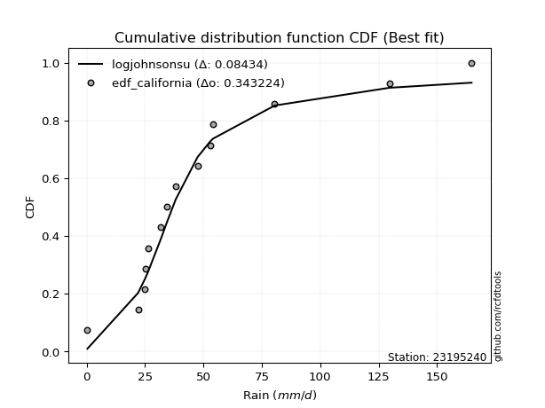</img></img>

</div>


### 2. Empirical - EDF Hazen (1930)

Hazen method for plotting positions is a formula used to estimate the empirical cumulative probability distribution of flood events or other hydrological data. This formula often results in biased estimations, particularly when extrapolating to extreme events (high return periods).

<div align="center">


$P=(m-0.5)/n$


</div>


**2.1. Empirical values**

<div align="center">

|                | 0                   | 1                   | 2                   | 3                  | 4                   | 5                   | 6                  | 7                  | 8                  | 9                  | 10        | 11                 | 12                 | 13                 |
|:---------------|:--------------------|:--------------------|:--------------------|:-------------------|:--------------------|:--------------------|:-------------------|:-------------------|:-------------------|:-------------------|:----------|:-------------------|:-------------------|:-------------------|
| date           | 2021                | 2025                | 2020                | 2016               | 2023                | 2009                | 2008               | 2018               | 2017               | 2007               | 2019      | 2006               | 2024               | 2005               |
| x              | 0.3                 | 0.6                 | 22.0                | 24.9               | 25.2                | 26.2                | 31.7               | 34.3               | 38.1               | 47.5               | 52.8      | 80.5               | 129.6              | 164.8              |
| m              | 1                   | 2                   | 3                   | 4                  | 5                   | 6                   | 7                  | 8                  | 9                  | 10                 | 11        | 12                 | 13                 | 14                 |
| empirical_dist | edf_hazen           | edf_hazen           | edf_hazen           | edf_hazen          | edf_hazen           | edf_hazen           | edf_hazen          | edf_hazen          | edf_hazen          | edf_hazen          | edf_hazen | edf_hazen          | edf_hazen          | edf_hazen          |
| empirical      | 0.03571428571428571 | 0.10714285714285714 | 0.17857142857142858 | 0.25               | 0.32142857142857145 | 0.39285714285714285 | 0.4642857142857143 | 0.5357142857142857 | 0.6071428571428571 | 0.6785714285714286 | 0.75      | 0.8214285714285714 | 0.8928571428571429 | 0.9642857142857143 |
| empirical_tr   | 1.037037037037037   | 1.1199999999999999  | 1.2173913043478262  | 1.3333333333333333 | 1.4736842105263157  | 1.6470588235294117  | 1.8666666666666667 | 2.1538461538461537 | 2.545454545454545  | 3.1111111111111116 | 4.0       | 5.599999999999999  | 9.333333333333337  | 28.000000000000014 |

</div>


**2.2. Kolmogorov-Smirnov fit test (sorted by Δ)**


<div align="center">

|                | 0                   | 1                   | 2                   | 3                 | 4                   | 5                   | 6                   | 7                   | 8                  | 9                   | 10                  | 11                  | 12                  | 13                  | 14                  | 15                  | 16                  | 17                  | 18                  | 19                  | 20                  | 21                  | 22                 | 23                  | 24                 | 25                  | 26                  | 27                  | 28                | 29                 | 30                  | 31                  | 32                  | 33                 | 34                  | 35                  | 36                  | 37                    | 38                  | 39                  | 40                 | 41                  | 42                  | 43                 | 44                  | 45                 | 46                  | 47                 | 48                 | 49                 | 50                  | 51                 | 52                 | 53                | 54                 | 55                 | 56                 | 57                  | 58                  | 59                  | 60                 | 61                 | 62                 | 63                 | 64                  | 65                 | 66                  | 67                 | 68                  | 69                 | 70                  | 71                  | 72                 | 73                  | 74                | 75                  | 76                  | 77                 | 78                 | 79                 | 80                 | 81                  | 82                  | 83                 | 84                 | 85                 | 86                 | 87                 | 88                 | 89                 |
|:---------------|:--------------------|:--------------------|:--------------------|:------------------|:--------------------|:--------------------|:--------------------|:--------------------|:-------------------|:--------------------|:--------------------|:--------------------|:--------------------|:--------------------|:--------------------|:--------------------|:--------------------|:--------------------|:--------------------|:--------------------|:--------------------|:--------------------|:-------------------|:--------------------|:-------------------|:--------------------|:--------------------|:--------------------|:------------------|:-------------------|:--------------------|:--------------------|:--------------------|:-------------------|:--------------------|:--------------------|:--------------------|:----------------------|:--------------------|:--------------------|:-------------------|:--------------------|:--------------------|:-------------------|:--------------------|:-------------------|:--------------------|:-------------------|:-------------------|:-------------------|:--------------------|:-------------------|:-------------------|:------------------|:-------------------|:-------------------|:-------------------|:--------------------|:--------------------|:--------------------|:-------------------|:-------------------|:-------------------|:-------------------|:--------------------|:-------------------|:--------------------|:-------------------|:--------------------|:-------------------|:--------------------|:--------------------|:-------------------|:--------------------|:------------------|:--------------------|:--------------------|:-------------------|:-------------------|:-------------------|:-------------------|:--------------------|:--------------------|:-------------------|:-------------------|:-------------------|:-------------------|:-------------------|:-------------------|:-------------------|
| station        | 23195240            | 23195240            | 23195240            | 23195240          | 23195240            | 23195240            | 23195240            | 23195240            | 23195240           | 23195240            | 23195240            | 23195240            | 23195240            | 23195240            | 23195240            | 23195240            | 23195240            | 23195240            | 23195240            | 23195240            | 23195240            | 23195240            | 23195240           | 23195240            | 23195240           | 23195240            | 23195240            | 23195240            | 23195240          | 23195240           | 23195240            | 23195240            | 23195240            | 23195240           | 23195240            | 23195240            | 23195240            | 23195240              | 23195240            | 23195240            | 23195240           | 23195240            | 23195240            | 23195240           | 23195240            | 23195240           | 23195240            | 23195240           | 23195240           | 23195240           | 23195240            | 23195240           | 23195240           | 23195240          | 23195240           | 23195240           | 23195240           | 23195240            | 23195240            | 23195240            | 23195240           | 23195240           | 23195240           | 23195240           | 23195240            | 23195240           | 23195240            | 23195240           | 23195240            | 23195240           | 23195240            | 23195240            | 23195240           | 23195240            | 23195240          | 23195240            | 23195240            | 23195240           | 23195240           | 23195240           | 23195240           | 23195240            | 23195240            | 23195240           | 23195240           | 23195240           | 23195240           | 23195240           | 23195240           | 23195240           |
| empirical_dist | edf_hazen           | edf_hazen           | edf_hazen           | edf_hazen         | edf_hazen           | edf_hazen           | edf_hazen           | edf_hazen           | edf_hazen          | edf_hazen           | edf_hazen           | edf_hazen           | edf_hazen           | edf_hazen           | edf_hazen           | edf_hazen           | edf_hazen           | edf_hazen           | edf_hazen           | edf_hazen           | edf_hazen           | edf_hazen           | edf_hazen          | edf_hazen           | edf_hazen          | edf_hazen           | edf_hazen           | edf_hazen           | edf_hazen         | edf_hazen          | edf_hazen           | edf_hazen           | edf_hazen           | edf_hazen          | edf_hazen           | edf_hazen           | edf_hazen           | edf_hazen             | edf_hazen           | edf_hazen           | edf_hazen          | edf_hazen           | edf_hazen           | edf_hazen          | edf_hazen           | edf_hazen          | edf_hazen           | edf_hazen          | edf_hazen          | edf_hazen          | edf_hazen           | edf_hazen          | edf_hazen          | edf_hazen         | edf_hazen          | edf_hazen          | edf_hazen          | edf_hazen           | edf_hazen           | edf_hazen           | edf_hazen          | edf_hazen          | edf_hazen          | edf_hazen          | edf_hazen           | edf_hazen          | edf_hazen           | edf_hazen          | edf_hazen           | edf_hazen          | edf_hazen           | edf_hazen           | edf_hazen          | edf_hazen           | edf_hazen         | edf_hazen           | edf_hazen           | edf_hazen          | edf_hazen          | edf_hazen          | edf_hazen          | edf_hazen           | edf_hazen           | edf_hazen          | edf_hazen          | edf_hazen          | edf_hazen          | edf_hazen          | edf_hazen          | edf_hazen          |
| p_dist         | johnsonsu           | logt                | logjohnsonsu        | exponnorm         | gibrat              | wald                | laplace_asymmetric  | truncnorm           | fisk               | moyal               | invweibull          | genlogistic         | nct                 | invgamma            | t                   | gumbel_r            | invgauss            | pearson3            | fatiguelife         | halflogistic        | genexpon            | halfnorm            | kstwobign          | gompertz            | rayleigh           | maxwell             | expon               | weibull_min         | logloggamma       | loggenlogistic     | rice                | logpearson3         | logistic            | crystalball        | norm                | hypsecant           | loggompertz         | loglaplace_asymmetric | loggumbel_l         | ncf                 | laplace            | mielke              | erlang              | betaprime          | f                   | gumbel_l           | chi2                | loglaplace         | loglognorm         | loghypsecant       | logbetaprime        | logfatiguelife     | loglogistic        | logrice           | logexponnorm       | lognorm            | lognorm            | logcrystalball      | lognct              | lognakagami         | loggamma           | loggamma           | loginvgamma        | gamma              | logalpha            | logerlang          | logmielke           | loginvgauss        | logmaxwell          | loginvweibull      | logchi2             | lograyleigh         | loggumbel_r        | logkstwobign        | loghalfnorm       | loggenexpon         | logmoyal            | loghalflogistic    | logncf             | nakagami           | logfisk            | logexpon            | pareto              | logwald            | loggibrat          | logpareto          | logtruncnorm       | logf               | logweibull_min     | alpha              |
| delta          | 0.06768557835649275 | 0.07606943652316003 | 0.10371569362644875 | 0.104556621556155 | 0.10714285714285714 | 0.10714285714285714 | 0.12016222759591244 | 0.12939632837931545 | 0.1297444560469536 | 0.13170433366400505 | 0.13258494339495622 | 0.13273592892277714 | 0.13316878379826477 | 0.13663649518684792 | 0.13914793204711076 | 0.14135601423308142 | 0.14829724943006226 | 0.14942055222442732 | 0.15244718181013547 | 0.15873985248994396 | 0.16420802960863626 | 0.16530335945114308 | 0.1673404748567494 | 0.16769054614609122 | 0.1706063696555239 | 0.18069060866881748 | 0.18414547586038102 | 0.19828980839508206 | 0.201764238797681 | 0.2064150010997792 | 0.20725756144908053 | 0.20867646827799505 | 0.20955291662596415 | 0.2118260813477526 | 0.21182608188763774 | 0.21929125871312344 | 0.22499121830754523 | 0.22588609876602575   | 0.24057651319435894 | 0.24073935711045705 | 0.2455095749915851 | 0.24698030516759364 | 0.25051860532085823 | 0.2615037653811345 | 0.26501506830798416 | 0.2799937365528342 | 0.28296369451303305 | 0.3035866985533565 | 0.3085349917234175 | 0.3085853509206117 | 0.30894466171425095 | 0.3094469908950864 | 0.3097800053676276 | 0.311146473978014 | 0.3111773253345069 | 0.3111795101902375 | 0.3111795101902375 | 0.31117959839463905 | 0.31153720607483637 | 0.31189616659271957 | 0.3259263534387675 | 0.3259263534387675 | 0.3321247180207483 | 0.3327792651600424 | 0.33496462700882956 | 0.3355493266561481 | 0.33992532090112193 | 0.3419400469186935 | 0.34461160168177196 | 0.3447878822255598 | 0.34929229263688966 | 0.35583508332230784 | 0.3811760507115619 | 0.38396476481165265 | 0.387446493753661 | 0.40384059757740776 | 0.40705977864324727 | 0.4117272892515752 | 0.4236246597163542 | 0.4288486574934257 | 0.4471808117172432 | 0.44974224410273456 | 0.47198557211227243 | 0.4790852936624266 | 0.5007317734265135 | 0.5010902641792995 | 0.5181861172872555 | 0.5348789603892383 | 0.5540181768049357 | 0.7852387046767277 |
| deltao         | 0.343224222286      | 0.343224222286      | 0.343224222286      | 0.343224222286    | 0.343224222286      | 0.343224222286      | 0.343224222286      | 0.343224222286      | 0.343224222286     | 0.343224222286      | 0.343224222286      | 0.343224222286      | 0.343224222286      | 0.343224222286      | 0.343224222286      | 0.343224222286      | 0.343224222286      | 0.343224222286      | 0.343224222286      | 0.343224222286      | 0.343224222286      | 0.343224222286      | 0.343224222286     | 0.343224222286      | 0.343224222286     | 0.343224222286      | 0.343224222286      | 0.343224222286      | 0.343224222286    | 0.343224222286     | 0.343224222286      | 0.343224222286      | 0.343224222286      | 0.343224222286     | 0.343224222286      | 0.343224222286      | 0.343224222286      | 0.343224222286        | 0.343224222286      | 0.343224222286      | 0.343224222286     | 0.343224222286      | 0.343224222286      | 0.343224222286     | 0.343224222286      | 0.343224222286     | 0.343224222286      | 0.343224222286     | 0.343224222286     | 0.343224222286     | 0.343224222286      | 0.343224222286     | 0.343224222286     | 0.343224222286    | 0.343224222286     | 0.343224222286     | 0.343224222286     | 0.343224222286      | 0.343224222286      | 0.343224222286      | 0.343224222286     | 0.343224222286     | 0.343224222286     | 0.343224222286     | 0.343224222286      | 0.343224222286     | 0.343224222286      | 0.343224222286     | 0.343224222286      | 0.343224222286     | 0.343224222286      | 0.343224222286      | 0.343224222286     | 0.343224222286      | 0.343224222286    | 0.343224222286      | 0.343224222286      | 0.343224222286     | 0.343224222286     | 0.343224222286     | 0.343224222286     | 0.343224222286      | 0.343224222286      | 0.343224222286     | 0.343224222286     | 0.343224222286     | 0.343224222286     | 0.343224222286     | 0.343224222286     | 0.343224222286     |
| eval           | Δo > Δ              | Δo > Δ              | Δo > Δ              | Δo > Δ            | Δo > Δ              | Δo > Δ              | Δo > Δ              | Δo > Δ              | Δo > Δ             | Δo > Δ              | Δo > Δ              | Δo > Δ              | Δo > Δ              | Δo > Δ              | Δo > Δ              | Δo > Δ              | Δo > Δ              | Δo > Δ              | Δo > Δ              | Δo > Δ              | Δo > Δ              | Δo > Δ              | Δo > Δ             | Δo > Δ              | Δo > Δ             | Δo > Δ              | Δo > Δ              | Δo > Δ              | Δo > Δ            | Δo > Δ             | Δo > Δ              | Δo > Δ              | Δo > Δ              | Δo > Δ             | Δo > Δ              | Δo > Δ              | Δo > Δ              | Δo > Δ                | Δo > Δ              | Δo > Δ              | Δo > Δ             | Δo > Δ              | Δo > Δ              | Δo > Δ             | Δo > Δ              | Δo > Δ             | Δo > Δ              | Δo > Δ             | Δo > Δ             | Δo > Δ             | Δo > Δ              | Δo > Δ             | Δo > Δ             | Δo > Δ            | Δo > Δ             | Δo > Δ             | Δo > Δ             | Δo > Δ              | Δo > Δ              | Δo > Δ              | Δo > Δ             | Δo > Δ             | Δo > Δ             | Δo > Δ             | Δo > Δ              | Δo > Δ             | Δo > Δ              | Δo > Δ             | Δo <= Δ             | Δo <= Δ            | Δo <= Δ             | Δo <= Δ             | Δo <= Δ            | Δo <= Δ             | Δo <= Δ           | Δo <= Δ             | Δo <= Δ             | Δo <= Δ            | Δo <= Δ            | Δo <= Δ            | Δo <= Δ            | Δo <= Δ             | Δo <= Δ             | Δo <= Δ            | Δo <= Δ            | Δo <= Δ            | Δo <= Δ            | Δo <= Δ            | Δo <= Δ            | Δo <= Δ            |
| fit            | 1                   | 1                   | 1                   | 1                 | 1                   | 1                   | 1                   | 1                   | 1                  | 1                   | 1                   | 1                   | 1                   | 1                   | 1                   | 1                   | 1                   | 1                   | 1                   | 1                   | 1                   | 1                   | 1                  | 1                   | 1                  | 1                   | 1                   | 1                   | 1                 | 1                  | 1                   | 1                   | 1                   | 1                  | 1                   | 1                   | 1                   | 1                     | 1                   | 1                   | 1                  | 1                   | 1                   | 1                  | 1                   | 1                  | 1                   | 1                  | 1                  | 1                  | 1                   | 1                  | 1                  | 1                 | 1                  | 1                  | 1                  | 1                   | 1                   | 1                   | 1                  | 1                  | 1                  | 1                  | 1                   | 1                  | 1                   | 1                  | 0                   | 0                  | 0                   | 0                   | 0                  | 0                   | 0                 | 0                   | 0                   | 0                  | 0                  | 0                  | 0                  | 0                   | 0                   | 0                  | 0                  | 0                  | 0                  | 0                  | 0                  | 0                  |
| n              | 14                  | 14                  | 14                  | 14                | 14                  | 14                  | 14                  | 14                  | 14                 | 14                  | 14                  | 14                  | 14                  | 14                  | 14                  | 14                  | 14                  | 14                  | 14                  | 14                  | 14                  | 14                  | 14                 | 14                  | 14                 | 14                  | 14                  | 14                  | 14                | 14                 | 14                  | 14                  | 14                  | 14                 | 14                  | 14                  | 14                  | 14                    | 14                  | 14                  | 14                 | 14                  | 14                  | 14                 | 14                  | 14                 | 14                  | 14                 | 14                 | 14                 | 14                  | 14                 | 14                 | 14                | 14                 | 14                 | 14                 | 14                  | 14                  | 14                  | 14                 | 14                 | 14                 | 14                 | 14                  | 14                 | 14                  | 14                 | 14                  | 14                 | 14                  | 14                  | 14                 | 14                  | 14                | 14                  | 14                  | 14                 | 14                 | 14                 | 14                 | 14                  | 14                  | 14                 | 14                 | 14                 | 14                 | 14                 | 14                 | 14                 |
| best_fit       | 1                   | 0                   | 0                   | 0                 | 0                   | 0                   | 0                   | 0                   | 0                  | 0                   | 0                   | 0                   | 0                   | 0                   | 0                   | 0                   | 0                   | 0                   | 0                   | 0                   | 0                   | 0                   | 0                  | 0                   | 0                  | 0                   | 0                   | 0                   | 0                 | 0                  | 0                   | 0                   | 0                   | 0                  | 0                   | 0                   | 0                   | 0                     | 0                   | 0                   | 0                  | 0                   | 0                   | 0                  | 0                   | 0                  | 0                   | 0                  | 0                  | 0                  | 0                   | 0                  | 0                  | 0                 | 0                  | 0                  | 0                  | 0                   | 0                   | 0                   | 0                  | 0                  | 0                  | 0                  | 0                   | 0                  | 0                   | 0                  | 0                   | 0                  | 0                   | 0                   | 0                  | 0                   | 0                 | 0                   | 0                   | 0                  | 0                  | 0                  | 0                  | 0                   | 0                   | 0                  | 0                  | 0                  | 0                  | 0                  | 0                  | 0                  |
| best_fit_sort  | 1                   | 2                   | 3                   | 4                 | 5                   | 6                   | 7                   | 8                   | 9                  | 10                  | 11                  | 12                  | 13                  | 14                  | 15                  | 16                  | 17                  | 18                  | 19                  | 20                  | 21                  | 22                  | 23                 | 24                  | 25                 | 26                  | 27                  | 28                  | 29                | 30                 | 31                  | 32                  | 33                  | 34                 | 35                  | 36                  | 37                  | 38                    | 39                  | 40                  | 41                 | 42                  | 43                  | 44                 | 45                  | 46                 | 47                  | 48                 | 49                 | 50                 | 51                  | 52                 | 53                 | 54                | 55                 | 56                 | 57                 | 58                  | 59                  | 60                  | 61                 | 62                 | 63                 | 64                 | 65                  | 66                 | 67                  | 68                 | 69                  | 70                 | 71                  | 72                  | 73                 | 74                  | 75                | 76                  | 77                  | 78                 | 79                 | 80                 | 81                 | 82                  | 83                  | 84                 | 85                 | 86                 | 87                 | 88                 | 89                 | 90                 |

</div>


<div align="center">

</img>

</div>


**2.3. Best fit**

<div align="center">

|   id |   station | empirical_dist   | p_dist    |     delta |   deltao | eval   |   fit |   n |   best_fit |   best_fit_sort |
|-----:|----------:|:-----------------|:----------|----------:|---------:|:-------|------:|----:|-----------:|----------------:|
|    0 |  23195240 | edf_hazen        | johnsonsu | 0.0676856 | 0.343224 | Δo > Δ |     1 |  14 |          1 |               1 |

</div>


<div align="center">

</img></img>

</div>


### 3. Empirical - EDF Weibull (1939)

Weibull plotting position formula is an empirical method used to estimate the non-exceedance probability or plotting position for a set of observed data, is often recommended or widely used in practice, particularly in flood frequency analysis.

<div align="center">


$P=m/(n+1)$


</div>


**3.1. Empirical values**

<div align="center">

|                | 0                   | 1                   | 2           | 3                   | 4                  | 5                  | 6                  | 7                  | 8           | 9                  | 10                 | 11                | 12                 | 13                 |
|:---------------|:--------------------|:--------------------|:------------|:--------------------|:-------------------|:-------------------|:-------------------|:-------------------|:------------|:-------------------|:-------------------|:------------------|:-------------------|:-------------------|
| date           | 2021                | 2025                | 2020        | 2016                | 2023               | 2009               | 2008               | 2018               | 2017        | 2007               | 2019               | 2006              | 2024               | 2005               |
| x              | 0.3                 | 0.6                 | 22.0        | 24.9                | 25.2               | 26.2               | 31.7               | 34.3               | 38.1        | 47.5               | 52.8               | 80.5              | 129.6              | 164.8              |
| m              | 1                   | 2                   | 3           | 4                   | 5                  | 6                  | 7                  | 8                  | 9           | 10                 | 11                 | 12                | 13                 | 14                 |
| empirical_dist | edf_weibull         | edf_weibull         | edf_weibull | edf_weibull         | edf_weibull        | edf_weibull        | edf_weibull        | edf_weibull        | edf_weibull | edf_weibull        | edf_weibull        | edf_weibull       | edf_weibull        | edf_weibull        |
| empirical      | 0.06666666666666667 | 0.13333333333333333 | 0.2         | 0.26666666666666666 | 0.3333333333333333 | 0.4                | 0.4666666666666667 | 0.5333333333333333 | 0.6         | 0.6666666666666666 | 0.7333333333333333 | 0.8               | 0.8666666666666667 | 0.9333333333333333 |
| empirical_tr   | 1.0714285714285714  | 1.1538461538461537  | 1.25        | 1.3636363636363635  | 1.4999999999999998 | 1.6666666666666667 | 1.875              | 2.142857142857143  | 2.5         | 2.9999999999999996 | 3.749999999999999  | 5.000000000000001 | 7.500000000000002  | 15.000000000000004 |

</div>


**3.2. Kolmogorov-Smirnov fit test (sorted by Δ)**


<div align="center">

|                | 0                   | 1                   | 2                   | 3                   | 4                   | 5                   | 6                   | 7                   | 8                   | 9                   | 10                  | 11                  | 12                  | 13                 | 14                  | 15                 | 16                  | 17                  | 18                  | 19                  | 20                  | 21                  | 22                  | 23                  | 24                 | 25                  | 26                  | 27                  | 28                  | 29                  | 30                 | 31                  | 32                  | 33                 | 34                  | 35                 | 36                    | 37                  | 38                 | 39                 | 40                 | 41                  | 42                  | 43                 | 44                  | 45                 | 46                 | 47                 | 48                | 49                 | 50                 | 51                  | 52                  | 53                 | 54                  | 55                | 56                | 57                 | 58                 | 59                  | 60                 | 61                 | 62                  | 63                | 64                  | 65                 | 66                 | 67                 | 68                  | 69                 | 70                  | 71                  | 72                 | 73                  | 74                 | 75                  | 76                  | 77                 | 78                 | 79                 | 80                 | 81                  | 82                | 83                 | 84                  | 85                  | 86                 | 87                | 88                 | 89                 |
|:---------------|:--------------------|:--------------------|:--------------------|:--------------------|:--------------------|:--------------------|:--------------------|:--------------------|:--------------------|:--------------------|:--------------------|:--------------------|:--------------------|:-------------------|:--------------------|:-------------------|:--------------------|:--------------------|:--------------------|:--------------------|:--------------------|:--------------------|:--------------------|:--------------------|:-------------------|:--------------------|:--------------------|:--------------------|:--------------------|:--------------------|:-------------------|:--------------------|:--------------------|:-------------------|:--------------------|:-------------------|:----------------------|:--------------------|:-------------------|:-------------------|:-------------------|:--------------------|:--------------------|:-------------------|:--------------------|:-------------------|:-------------------|:-------------------|:------------------|:-------------------|:-------------------|:--------------------|:--------------------|:-------------------|:--------------------|:------------------|:------------------|:-------------------|:-------------------|:--------------------|:-------------------|:-------------------|:--------------------|:------------------|:--------------------|:-------------------|:-------------------|:-------------------|:--------------------|:-------------------|:--------------------|:--------------------|:-------------------|:--------------------|:-------------------|:--------------------|:--------------------|:-------------------|:-------------------|:-------------------|:-------------------|:--------------------|:------------------|:-------------------|:--------------------|:--------------------|:-------------------|:------------------|:-------------------|:-------------------|
| station        | 23195240            | 23195240            | 23195240            | 23195240            | 23195240            | 23195240            | 23195240            | 23195240            | 23195240            | 23195240            | 23195240            | 23195240            | 23195240            | 23195240           | 23195240            | 23195240           | 23195240            | 23195240            | 23195240            | 23195240            | 23195240            | 23195240            | 23195240            | 23195240            | 23195240           | 23195240            | 23195240            | 23195240            | 23195240            | 23195240            | 23195240           | 23195240            | 23195240            | 23195240           | 23195240            | 23195240           | 23195240              | 23195240            | 23195240           | 23195240           | 23195240           | 23195240            | 23195240            | 23195240           | 23195240            | 23195240           | 23195240           | 23195240           | 23195240          | 23195240           | 23195240           | 23195240            | 23195240            | 23195240           | 23195240            | 23195240          | 23195240          | 23195240           | 23195240           | 23195240            | 23195240           | 23195240           | 23195240            | 23195240          | 23195240            | 23195240           | 23195240           | 23195240           | 23195240            | 23195240           | 23195240            | 23195240            | 23195240           | 23195240            | 23195240           | 23195240            | 23195240            | 23195240           | 23195240           | 23195240           | 23195240           | 23195240            | 23195240          | 23195240           | 23195240            | 23195240            | 23195240           | 23195240          | 23195240           | 23195240           |
| empirical_dist | edf_weibull         | edf_weibull         | edf_weibull         | edf_weibull         | edf_weibull         | edf_weibull         | edf_weibull         | edf_weibull         | edf_weibull         | edf_weibull         | edf_weibull         | edf_weibull         | edf_weibull         | edf_weibull        | edf_weibull         | edf_weibull        | edf_weibull         | edf_weibull         | edf_weibull         | edf_weibull         | edf_weibull         | edf_weibull         | edf_weibull         | edf_weibull         | edf_weibull        | edf_weibull         | edf_weibull         | edf_weibull         | edf_weibull         | edf_weibull         | edf_weibull        | edf_weibull         | edf_weibull         | edf_weibull        | edf_weibull         | edf_weibull        | edf_weibull           | edf_weibull         | edf_weibull        | edf_weibull        | edf_weibull        | edf_weibull         | edf_weibull         | edf_weibull        | edf_weibull         | edf_weibull        | edf_weibull        | edf_weibull        | edf_weibull       | edf_weibull        | edf_weibull        | edf_weibull         | edf_weibull         | edf_weibull        | edf_weibull         | edf_weibull       | edf_weibull       | edf_weibull        | edf_weibull        | edf_weibull         | edf_weibull        | edf_weibull        | edf_weibull         | edf_weibull       | edf_weibull         | edf_weibull        | edf_weibull        | edf_weibull        | edf_weibull         | edf_weibull        | edf_weibull         | edf_weibull         | edf_weibull        | edf_weibull         | edf_weibull        | edf_weibull         | edf_weibull         | edf_weibull        | edf_weibull        | edf_weibull        | edf_weibull        | edf_weibull         | edf_weibull       | edf_weibull        | edf_weibull         | edf_weibull         | edf_weibull        | edf_weibull       | edf_weibull        | edf_weibull        |
| p_dist         | johnsonsu           | exponnorm           | logjohnsonsu        | logt                | fisk                | moyal               | invweibull          | nct                 | laplace_asymmetric  | invgamma            | t                   | genlogistic         | invgauss            | pearson3           | truncnorm           | gumbel_r           | fatiguelife         | gibrat              | wald                | halflogistic        | genexpon            | halfnorm            | gompertz            | rayleigh            | kstwobign          | expon               | maxwell             | weibull_min         | logloggamma         | loggenlogistic      | logpearson3        | crystalball         | norm                | rice               | logistic            | loggompertz        | loglaplace_asymmetric | hypsecant           | loggumbel_l        | ncf                | mielke             | erlang              | laplace             | betaprime          | f                   | chi2               | gumbel_l           | loglaplace         | loglognorm        | loghypsecant       | logbetaprime       | logfatiguelife      | loglogistic         | logrice            | logexponnorm        | lognorm           | lognorm           | logcrystalball     | lognct             | lognakagami         | loggamma           | loggamma           | loginvgamma         | gamma             | logalpha            | logerlang          | logmielke          | loginvgauss        | logmaxwell          | loginvweibull      | logchi2             | lograyleigh         | loggumbel_r        | logkstwobign        | loghalfnorm        | loggenexpon         | logmoyal            | loghalflogistic    | logncf             | nakagami           | logfisk            | logexpon            | pareto            | logwald            | logpareto           | loggibrat           | logtruncnorm       | logf              | logweibull_min     | alpha              |
| delta          | 0.08675703415346375 | 0.09465398177604711 | 0.09901269600125476 | 0.10225991271363623 | 0.10831588461838215 | 0.11027576223543362 | 0.11115637196638478 | 0.11174021236969334 | 0.11301937045305532 | 0.11520792375827649 | 0.12341952891987595 | 0.12559307177992002 | 0.12686867800149082 | 0.1279919807958559 | 0.12864191031127184 | 0.1291510620407787 | 0.13101861038156404 | 0.13333333333333333 | 0.13333333333333333 | 0.13731128106137253 | 0.14277945818006482 | 0.14387478802257164 | 0.14626197471751978 | 0.15393970298885717 | 0.1601976177138923 | 0.16271690443180958 | 0.16402394200215076 | 0.17686123696651063 | 0.18033566736910955 | 0.18498642967120776 | 0.1872478968494236 | 0.19515941468108589 | 0.19515941522097102 | 0.2001147043062234 | 0.20241005948310703 | 0.2035626468789738 | 0.20445752733745431   | 0.21214840157026632 | 0.2191479417657875 | 0.2193107856818856 | 0.2255517337390222 | 0.22909003389228683 | 0.23836671784872798 | 0.2400751939525631 | 0.24358649687941275 | 0.2615351230844616 | 0.2633270698861675 | 0.2821581271247851 | 0.287106420294846 | 0.2871567794920402 | 0.2875160902856795 | 0.28801841946651496 | 0.28835143393905616 | 0.2897179025494425 | 0.28974875390593546 | 0.289750938761666 | 0.289750938761666 | 0.2897510269660676 | 0.2901086346462649 | 0.29046759516414816 | 0.3044977820101961 | 0.3044977820101961 | 0.31069614659217687 | 0.311350693731471 | 0.31353605558025816 | 0.3141207552275767 | 0.3184967494725505 | 0.3205114754901221 | 0.32318303025320055 | 0.3233593107969884 | 0.32786372120831825 | 0.33440651189373644 | 0.3597474792829905 | 0.36253619338308124 | 0.3660179223250896 | 0.38241202614883635 | 0.38563120721467586 | 0.3902987178230038 | 0.4021960882877828 | 0.4074200860648543 | 0.4257522402886718 | 0.42831367267416315 | 0.450557000683701 | 0.4576567222338552 | 0.47489978798882326 | 0.47930320199794213 | 0.4967575458586841 | 0.513450388960667 | 0.5325896053763644 | 0.7638101332481564 |
| deltao         | 0.343224222286      | 0.343224222286      | 0.343224222286      | 0.343224222286      | 0.343224222286      | 0.343224222286      | 0.343224222286      | 0.343224222286      | 0.343224222286      | 0.343224222286      | 0.343224222286      | 0.343224222286      | 0.343224222286      | 0.343224222286     | 0.343224222286      | 0.343224222286     | 0.343224222286      | 0.343224222286      | 0.343224222286      | 0.343224222286      | 0.343224222286      | 0.343224222286      | 0.343224222286      | 0.343224222286      | 0.343224222286     | 0.343224222286      | 0.343224222286      | 0.343224222286      | 0.343224222286      | 0.343224222286      | 0.343224222286     | 0.343224222286      | 0.343224222286      | 0.343224222286     | 0.343224222286      | 0.343224222286     | 0.343224222286        | 0.343224222286      | 0.343224222286     | 0.343224222286     | 0.343224222286     | 0.343224222286      | 0.343224222286      | 0.343224222286     | 0.343224222286      | 0.343224222286     | 0.343224222286     | 0.343224222286     | 0.343224222286    | 0.343224222286     | 0.343224222286     | 0.343224222286      | 0.343224222286      | 0.343224222286     | 0.343224222286      | 0.343224222286    | 0.343224222286    | 0.343224222286     | 0.343224222286     | 0.343224222286      | 0.343224222286     | 0.343224222286     | 0.343224222286      | 0.343224222286    | 0.343224222286      | 0.343224222286     | 0.343224222286     | 0.343224222286     | 0.343224222286      | 0.343224222286     | 0.343224222286      | 0.343224222286      | 0.343224222286     | 0.343224222286      | 0.343224222286     | 0.343224222286      | 0.343224222286      | 0.343224222286     | 0.343224222286     | 0.343224222286     | 0.343224222286     | 0.343224222286      | 0.343224222286    | 0.343224222286     | 0.343224222286      | 0.343224222286      | 0.343224222286     | 0.343224222286    | 0.343224222286     | 0.343224222286     |
| eval           | Δo > Δ              | Δo > Δ              | Δo > Δ              | Δo > Δ              | Δo > Δ              | Δo > Δ              | Δo > Δ              | Δo > Δ              | Δo > Δ              | Δo > Δ              | Δo > Δ              | Δo > Δ              | Δo > Δ              | Δo > Δ             | Δo > Δ              | Δo > Δ             | Δo > Δ              | Δo > Δ              | Δo > Δ              | Δo > Δ              | Δo > Δ              | Δo > Δ              | Δo > Δ              | Δo > Δ              | Δo > Δ             | Δo > Δ              | Δo > Δ              | Δo > Δ              | Δo > Δ              | Δo > Δ              | Δo > Δ             | Δo > Δ              | Δo > Δ              | Δo > Δ             | Δo > Δ              | Δo > Δ             | Δo > Δ                | Δo > Δ              | Δo > Δ             | Δo > Δ             | Δo > Δ             | Δo > Δ              | Δo > Δ              | Δo > Δ             | Δo > Δ              | Δo > Δ             | Δo > Δ             | Δo > Δ             | Δo > Δ            | Δo > Δ             | Δo > Δ             | Δo > Δ              | Δo > Δ              | Δo > Δ             | Δo > Δ              | Δo > Δ            | Δo > Δ            | Δo > Δ             | Δo > Δ             | Δo > Δ              | Δo > Δ             | Δo > Δ             | Δo > Δ              | Δo > Δ            | Δo > Δ              | Δo > Δ             | Δo > Δ             | Δo > Δ             | Δo > Δ              | Δo > Δ             | Δo > Δ              | Δo > Δ              | Δo <= Δ            | Δo <= Δ             | Δo <= Δ            | Δo <= Δ             | Δo <= Δ             | Δo <= Δ            | Δo <= Δ            | Δo <= Δ            | Δo <= Δ            | Δo <= Δ             | Δo <= Δ           | Δo <= Δ            | Δo <= Δ             | Δo <= Δ             | Δo <= Δ            | Δo <= Δ           | Δo <= Δ            | Δo <= Δ            |
| fit            | 1                   | 1                   | 1                   | 1                   | 1                   | 1                   | 1                   | 1                   | 1                   | 1                   | 1                   | 1                   | 1                   | 1                  | 1                   | 1                  | 1                   | 1                   | 1                   | 1                   | 1                   | 1                   | 1                   | 1                   | 1                  | 1                   | 1                   | 1                   | 1                   | 1                   | 1                  | 1                   | 1                   | 1                  | 1                   | 1                  | 1                     | 1                   | 1                  | 1                  | 1                  | 1                   | 1                   | 1                  | 1                   | 1                  | 1                  | 1                  | 1                 | 1                  | 1                  | 1                   | 1                   | 1                  | 1                   | 1                 | 1                 | 1                  | 1                  | 1                   | 1                  | 1                  | 1                   | 1                 | 1                   | 1                  | 1                  | 1                  | 1                   | 1                  | 1                   | 1                   | 0                  | 0                   | 0                  | 0                   | 0                   | 0                  | 0                  | 0                  | 0                  | 0                   | 0                 | 0                  | 0                   | 0                   | 0                  | 0                 | 0                  | 0                  |
| n              | 14                  | 14                  | 14                  | 14                  | 14                  | 14                  | 14                  | 14                  | 14                  | 14                  | 14                  | 14                  | 14                  | 14                 | 14                  | 14                 | 14                  | 14                  | 14                  | 14                  | 14                  | 14                  | 14                  | 14                  | 14                 | 14                  | 14                  | 14                  | 14                  | 14                  | 14                 | 14                  | 14                  | 14                 | 14                  | 14                 | 14                    | 14                  | 14                 | 14                 | 14                 | 14                  | 14                  | 14                 | 14                  | 14                 | 14                 | 14                 | 14                | 14                 | 14                 | 14                  | 14                  | 14                 | 14                  | 14                | 14                | 14                 | 14                 | 14                  | 14                 | 14                 | 14                  | 14                | 14                  | 14                 | 14                 | 14                 | 14                  | 14                 | 14                  | 14                  | 14                 | 14                  | 14                 | 14                  | 14                  | 14                 | 14                 | 14                 | 14                 | 14                  | 14                | 14                 | 14                  | 14                  | 14                 | 14                | 14                 | 14                 |
| best_fit       | 1                   | 0                   | 0                   | 0                   | 0                   | 0                   | 0                   | 0                   | 0                   | 0                   | 0                   | 0                   | 0                   | 0                  | 0                   | 0                  | 0                   | 0                   | 0                   | 0                   | 0                   | 0                   | 0                   | 0                   | 0                  | 0                   | 0                   | 0                   | 0                   | 0                   | 0                  | 0                   | 0                   | 0                  | 0                   | 0                  | 0                     | 0                   | 0                  | 0                  | 0                  | 0                   | 0                   | 0                  | 0                   | 0                  | 0                  | 0                  | 0                 | 0                  | 0                  | 0                   | 0                   | 0                  | 0                   | 0                 | 0                 | 0                  | 0                  | 0                   | 0                  | 0                  | 0                   | 0                 | 0                   | 0                  | 0                  | 0                  | 0                   | 0                  | 0                   | 0                   | 0                  | 0                   | 0                  | 0                   | 0                   | 0                  | 0                  | 0                  | 0                  | 0                   | 0                 | 0                  | 0                   | 0                   | 0                  | 0                 | 0                  | 0                  |
| best_fit_sort  | 1                   | 2                   | 3                   | 4                   | 5                   | 6                   | 7                   | 8                   | 9                   | 10                  | 11                  | 12                  | 13                  | 14                 | 15                  | 16                 | 17                  | 18                  | 19                  | 20                  | 21                  | 22                  | 23                  | 24                  | 25                 | 26                  | 27                  | 28                  | 29                  | 30                  | 31                 | 32                  | 33                  | 34                 | 35                  | 36                 | 37                    | 38                  | 39                 | 40                 | 41                 | 42                  | 43                  | 44                 | 45                  | 46                 | 47                 | 48                 | 49                | 50                 | 51                 | 52                  | 53                  | 54                 | 55                  | 56                | 57                | 58                 | 59                 | 60                  | 61                 | 62                 | 63                  | 64                | 65                  | 66                 | 67                 | 68                 | 69                  | 70                 | 71                  | 72                  | 73                 | 74                  | 75                 | 76                  | 77                  | 78                 | 79                 | 80                 | 81                 | 82                  | 83                | 84                 | 85                  | 86                  | 87                 | 88                | 89                 | 90                 |

</div>


<div align="center">

</img>

</div>


**3.3. Best fit**

<div align="center">

|   id |   station | empirical_dist   | p_dist    |    delta |   deltao | eval   |   fit |   n |   best_fit |   best_fit_sort |
|-----:|----------:|:-----------------|:----------|---------:|---------:|:-------|------:|----:|-----------:|----------------:|
|    0 |  23195240 | edf_weibull      | johnsonsu | 0.086757 | 0.343224 | Δo > Δ |     1 |  14 |          1 |               1 |

</div>


<div align="center">

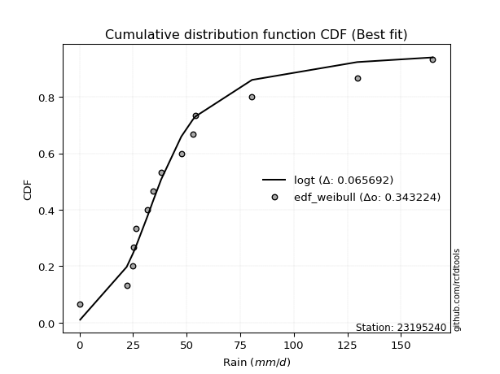</img>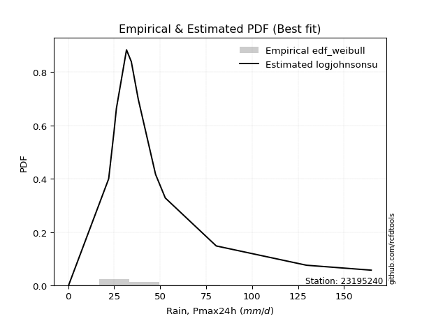</img>

</div>


### 4. Empirical - EDF Beard (1943)

The Beard formula (or Beard´s plotting position formula) in hydrology is used to estimate the empirical non-exceedance probability _(P)_ of a flood event (or other extreme hydrological data point) within a given dataset.

<div align="center">


$P=(m-0.31)/(n+0.38)$


</div>


**4.1. Empirical values**

<div align="center">

|                | 0                   | 1                   | 2                  | 3                  | 4                   | 5                  | 6                   | 7                  | 8                  | 9                  | 10                 | 11                 | 12                 | 13                 |
|:---------------|:--------------------|:--------------------|:-------------------|:-------------------|:--------------------|:-------------------|:--------------------|:-------------------|:-------------------|:-------------------|:-------------------|:-------------------|:-------------------|:-------------------|
| date           | 2021                | 2025                | 2020               | 2016               | 2023                | 2009               | 2008                | 2018               | 2017               | 2007               | 2019               | 2006               | 2024               | 2005               |
| x              | 0.3                 | 0.6                 | 22.0               | 24.9               | 25.2                | 26.2               | 31.7                | 34.3               | 38.1               | 47.5               | 52.8               | 80.5               | 129.6              | 164.8              |
| m              | 1                   | 2                   | 3                  | 4                  | 5                   | 6                  | 7                   | 8                  | 9                  | 10                 | 11                 | 12                 | 13                 | 14                 |
| empirical_dist | edf_beard           | edf_beard           | edf_beard          | edf_beard          | edf_beard           | edf_beard          | edf_beard           | edf_beard          | edf_beard          | edf_beard          | edf_beard          | edf_beard          | edf_beard          | edf_beard          |
| empirical      | 0.04798331015299026 | 0.11752433936022252 | 0.1870653685674548 | 0.256606397774687  | 0.32614742698191934 | 0.3956884561891516 | 0.46522948539638387 | 0.5347705146036161 | 0.6043115438108483 | 0.6738525730180805 | 0.7433936022253128 | 0.8129346314325451 | 0.8824756606397773 | 0.9520166898470096 |
| empirical_tr   | 1.0504017531044558  | 1.1331757289204099  | 1.2301112061591104 | 1.3451824134705332 | 1.4840041279669762  | 1.6547756041426929 | 1.869960988296489   | 2.1494768310911807 | 2.527240773286467  | 3.066098081023453  | 3.8970189701897002 | 5.345724907063193  | 8.50887573964496   | 20.84057971014487  |

</div>


**4.2. Kolmogorov-Smirnov fit test (sorted by Δ)**


<div align="center">

|                | 0                   | 1                   | 2                   | 3                   | 4                   | 5                   | 6                   | 7                   | 8                   | 9                   | 10               | 11                  | 12                 | 13                  | 14                  | 15                  | 16                  | 17                 | 18                  | 19                  | 20                  | 21                  | 22                | 23                 | 24                 | 25                 | 26                 | 27                  | 28                  | 29                | 30                  | 31                  | 32                  | 33                  | 34                  | 35                  | 36                  | 37                    | 38                  | 39                  | 40                  | 41                  | 42                 | 43                 | 44                  | 45                | 46                  | 47                 | 48                  | 49                  | 50                  | 51                 | 52                 | 53                  | 54                 | 55                 | 56                 | 57                  | 58                  | 59                  | 60                 | 61                 | 62                  | 63                 | 64                  | 65                 | 66                 | 67                 | 68                  | 69                  | 70                  | 71                  | 72                 | 73                  | 74                 | 75                  | 76                  | 77                | 78                | 79                 | 80                | 81                  | 82                 | 83                  | 84                | 85                 | 86                 | 87                 | 88                 | 89                 |
|:---------------|:--------------------|:--------------------|:--------------------|:--------------------|:--------------------|:--------------------|:--------------------|:--------------------|:--------------------|:--------------------|:-----------------|:--------------------|:-------------------|:--------------------|:--------------------|:--------------------|:--------------------|:-------------------|:--------------------|:--------------------|:--------------------|:--------------------|:------------------|:-------------------|:-------------------|:-------------------|:-------------------|:--------------------|:--------------------|:------------------|:--------------------|:--------------------|:--------------------|:--------------------|:--------------------|:--------------------|:--------------------|:----------------------|:--------------------|:--------------------|:--------------------|:--------------------|:-------------------|:-------------------|:--------------------|:------------------|:--------------------|:-------------------|:--------------------|:--------------------|:--------------------|:-------------------|:-------------------|:--------------------|:-------------------|:-------------------|:-------------------|:--------------------|:--------------------|:--------------------|:-------------------|:-------------------|:--------------------|:-------------------|:--------------------|:-------------------|:-------------------|:-------------------|:--------------------|:--------------------|:--------------------|:--------------------|:-------------------|:--------------------|:-------------------|:--------------------|:--------------------|:------------------|:------------------|:-------------------|:------------------|:--------------------|:-------------------|:--------------------|:------------------|:-------------------|:-------------------|:-------------------|:-------------------|:-------------------|
| station        | 23195240            | 23195240            | 23195240            | 23195240            | 23195240            | 23195240            | 23195240            | 23195240            | 23195240            | 23195240            | 23195240         | 23195240            | 23195240           | 23195240            | 23195240            | 23195240            | 23195240            | 23195240           | 23195240            | 23195240            | 23195240            | 23195240            | 23195240          | 23195240           | 23195240           | 23195240           | 23195240           | 23195240            | 23195240            | 23195240          | 23195240            | 23195240            | 23195240            | 23195240            | 23195240            | 23195240            | 23195240            | 23195240              | 23195240            | 23195240            | 23195240            | 23195240            | 23195240           | 23195240           | 23195240            | 23195240          | 23195240            | 23195240           | 23195240            | 23195240            | 23195240            | 23195240           | 23195240           | 23195240            | 23195240           | 23195240           | 23195240           | 23195240            | 23195240            | 23195240            | 23195240           | 23195240           | 23195240            | 23195240           | 23195240            | 23195240           | 23195240           | 23195240           | 23195240            | 23195240            | 23195240            | 23195240            | 23195240           | 23195240            | 23195240           | 23195240            | 23195240            | 23195240          | 23195240          | 23195240           | 23195240          | 23195240            | 23195240           | 23195240            | 23195240          | 23195240           | 23195240           | 23195240           | 23195240           | 23195240           |
| empirical_dist | edf_beard           | edf_beard           | edf_beard           | edf_beard           | edf_beard           | edf_beard           | edf_beard           | edf_beard           | edf_beard           | edf_beard           | edf_beard        | edf_beard           | edf_beard          | edf_beard           | edf_beard           | edf_beard           | edf_beard           | edf_beard          | edf_beard           | edf_beard           | edf_beard           | edf_beard           | edf_beard         | edf_beard          | edf_beard          | edf_beard          | edf_beard          | edf_beard           | edf_beard           | edf_beard         | edf_beard           | edf_beard           | edf_beard           | edf_beard           | edf_beard           | edf_beard           | edf_beard           | edf_beard             | edf_beard           | edf_beard           | edf_beard           | edf_beard           | edf_beard          | edf_beard          | edf_beard           | edf_beard         | edf_beard           | edf_beard          | edf_beard           | edf_beard           | edf_beard           | edf_beard          | edf_beard          | edf_beard           | edf_beard          | edf_beard          | edf_beard          | edf_beard           | edf_beard           | edf_beard           | edf_beard          | edf_beard          | edf_beard           | edf_beard          | edf_beard           | edf_beard          | edf_beard          | edf_beard          | edf_beard           | edf_beard           | edf_beard           | edf_beard           | edf_beard          | edf_beard           | edf_beard          | edf_beard           | edf_beard           | edf_beard         | edf_beard         | edf_beard          | edf_beard         | edf_beard           | edf_beard          | edf_beard           | edf_beard         | edf_beard          | edf_beard          | edf_beard          | edf_beard          | edf_beard          |
| p_dist         | johnsonsu           | logt                | logjohnsonsu        | exponnorm           | laplace_asymmetric  | gibrat              | wald                | truncnorm           | fisk                | moyal               | invweibull       | nct                 | invgamma           | genlogistic         | t                   | gumbel_r            | invgauss            | pearson3           | fatiguelife         | halflogistic        | genexpon            | halfnorm            | gompertz          | rayleigh           | kstwobign          | maxwell            | expon              | weibull_min         | logloggamma         | loggenlogistic    | logpearson3         | rice                | crystalball         | norm                | logistic            | hypsecant           | loggompertz         | loglaplace_asymmetric | loggumbel_l         | ncf                 | mielke              | erlang              | laplace            | betaprime          | f                   | gumbel_l          | chi2                | loglaplace         | loglognorm          | loghypsecant        | logbetaprime        | logfatiguelife     | loglogistic        | logrice             | logexponnorm       | lognorm            | lognorm            | logcrystalball      | lognct              | lognakagami         | loggamma           | loggamma           | loginvgamma         | gamma              | logalpha            | logerlang          | logmielke          | loginvgauss        | logmaxwell          | loginvweibull       | logchi2             | lograyleigh         | loggumbel_r        | logkstwobign        | loghalfnorm        | loggenexpon         | logmoyal            | loghalflogistic   | logncf            | nakagami           | logfisk           | logexpon            | pareto             | logwald             | logpareto         | loggibrat          | logtruncnorm       | logf               | logweibull_min     | alpha              |
| delta          | 0.07094804018035294 | 0.08645091874052542 | 0.09522175363042254 | 0.09896552558689542 | 0.11733091426390363 | 0.11752433936022252 | 0.11752433936022252 | 0.12090238838328923 | 0.12125051605092738 | 0.12321039366797884 | 0.12409100339893 | 0.12467484380223856 | 0.1281425551908217 | 0.12990461559076832 | 0.13065399205108455 | 0.13474961645839423 | 0.13980330943403604 | 0.1409266122284011 | 0.14395324181410926 | 0.15024591249391775 | 0.15571408961261005 | 0.15680941945511687 | 0.159196606150065 | 0.1639999718808367 | 0.1645091615247406 | 0.1740842108941303 | 0.1756515358643548 | 0.18979586839905585 | 0.19327029880165478 | 0.197921061103753 | 0.20018252828196884 | 0.20442624811707172 | 0.20521968357306541 | 0.20521968411295055 | 0.20672160329395534 | 0.21645994538111463 | 0.21649727831151902 | 0.21739215876999954   | 0.23208257319833273 | 0.23224541711443084 | 0.23848636517156743 | 0.24202466532483205 | 0.2426782616595763 | 0.2530098253851083 | 0.25652112831195795 | 0.273387338778147 | 0.27446975451700684 | 0.2950927585573303 | 0.30004105172739126 | 0.30009141092458547 | 0.30045072171822473 | 0.3009530508990602 | 0.3012860653716014 | 0.30265253398198777 | 0.3026833853384807 | 0.3026855701942113 | 0.3026855701942113 | 0.30268565839861283 | 0.30304326607881016 | 0.30340222659669336 | 0.3174324134427413 | 0.3174324134427413 | 0.32363077802472207 | 0.3242853251640162 | 0.32647068701280335 | 0.3270553866601219 | 0.3314313809050957 | 0.3334461069226673 | 0.33611766168574575 | 0.33629394222953357 | 0.34079835264086344 | 0.34734114332628163 | 0.3726821107155357 | 0.37547082481562644 | 0.3789525537576348 | 0.39534665758138154 | 0.39856583864722106 | 0.403233349255549 | 0.415130719720328 | 0.4203547174973995 | 0.438686871721217 | 0.44124830410670834 | 0.4634916321162462 | 0.47059135366640037 | 0.490708781961934 | 0.4922378334304873 | 0.5096921772912293 | 0.5263850203932121 | 0.5455242368089095 | 0.7767447646807015 |
| deltao         | 0.343224222286      | 0.343224222286      | 0.343224222286      | 0.343224222286      | 0.343224222286      | 0.343224222286      | 0.343224222286      | 0.343224222286      | 0.343224222286      | 0.343224222286      | 0.343224222286   | 0.343224222286      | 0.343224222286     | 0.343224222286      | 0.343224222286      | 0.343224222286      | 0.343224222286      | 0.343224222286     | 0.343224222286      | 0.343224222286      | 0.343224222286      | 0.343224222286      | 0.343224222286    | 0.343224222286     | 0.343224222286     | 0.343224222286     | 0.343224222286     | 0.343224222286      | 0.343224222286      | 0.343224222286    | 0.343224222286      | 0.343224222286      | 0.343224222286      | 0.343224222286      | 0.343224222286      | 0.343224222286      | 0.343224222286      | 0.343224222286        | 0.343224222286      | 0.343224222286      | 0.343224222286      | 0.343224222286      | 0.343224222286     | 0.343224222286     | 0.343224222286      | 0.343224222286    | 0.343224222286      | 0.343224222286     | 0.343224222286      | 0.343224222286      | 0.343224222286      | 0.343224222286     | 0.343224222286     | 0.343224222286      | 0.343224222286     | 0.343224222286     | 0.343224222286     | 0.343224222286      | 0.343224222286      | 0.343224222286      | 0.343224222286     | 0.343224222286     | 0.343224222286      | 0.343224222286     | 0.343224222286      | 0.343224222286     | 0.343224222286     | 0.343224222286     | 0.343224222286      | 0.343224222286      | 0.343224222286      | 0.343224222286      | 0.343224222286     | 0.343224222286      | 0.343224222286     | 0.343224222286      | 0.343224222286      | 0.343224222286    | 0.343224222286    | 0.343224222286     | 0.343224222286    | 0.343224222286      | 0.343224222286     | 0.343224222286      | 0.343224222286    | 0.343224222286     | 0.343224222286     | 0.343224222286     | 0.343224222286     | 0.343224222286     |
| eval           | Δo > Δ              | Δo > Δ              | Δo > Δ              | Δo > Δ              | Δo > Δ              | Δo > Δ              | Δo > Δ              | Δo > Δ              | Δo > Δ              | Δo > Δ              | Δo > Δ           | Δo > Δ              | Δo > Δ             | Δo > Δ              | Δo > Δ              | Δo > Δ              | Δo > Δ              | Δo > Δ             | Δo > Δ              | Δo > Δ              | Δo > Δ              | Δo > Δ              | Δo > Δ            | Δo > Δ             | Δo > Δ             | Δo > Δ             | Δo > Δ             | Δo > Δ              | Δo > Δ              | Δo > Δ            | Δo > Δ              | Δo > Δ              | Δo > Δ              | Δo > Δ              | Δo > Δ              | Δo > Δ              | Δo > Δ              | Δo > Δ                | Δo > Δ              | Δo > Δ              | Δo > Δ              | Δo > Δ              | Δo > Δ             | Δo > Δ             | Δo > Δ              | Δo > Δ            | Δo > Δ              | Δo > Δ             | Δo > Δ              | Δo > Δ              | Δo > Δ              | Δo > Δ             | Δo > Δ             | Δo > Δ              | Δo > Δ             | Δo > Δ             | Δo > Δ             | Δo > Δ              | Δo > Δ              | Δo > Δ              | Δo > Δ             | Δo > Δ             | Δo > Δ              | Δo > Δ             | Δo > Δ              | Δo > Δ             | Δo > Δ             | Δo > Δ             | Δo > Δ              | Δo > Δ              | Δo > Δ              | Δo <= Δ             | Δo <= Δ            | Δo <= Δ             | Δo <= Δ            | Δo <= Δ             | Δo <= Δ             | Δo <= Δ           | Δo <= Δ           | Δo <= Δ            | Δo <= Δ           | Δo <= Δ             | Δo <= Δ            | Δo <= Δ             | Δo <= Δ           | Δo <= Δ            | Δo <= Δ            | Δo <= Δ            | Δo <= Δ            | Δo <= Δ            |
| fit            | 1                   | 1                   | 1                   | 1                   | 1                   | 1                   | 1                   | 1                   | 1                   | 1                   | 1                | 1                   | 1                  | 1                   | 1                   | 1                   | 1                   | 1                  | 1                   | 1                   | 1                   | 1                   | 1                 | 1                  | 1                  | 1                  | 1                  | 1                   | 1                   | 1                 | 1                   | 1                   | 1                   | 1                   | 1                   | 1                   | 1                   | 1                     | 1                   | 1                   | 1                   | 1                   | 1                  | 1                  | 1                   | 1                 | 1                   | 1                  | 1                   | 1                   | 1                   | 1                  | 1                  | 1                   | 1                  | 1                  | 1                  | 1                   | 1                   | 1                   | 1                  | 1                  | 1                   | 1                  | 1                   | 1                  | 1                  | 1                  | 1                   | 1                   | 1                   | 0                   | 0                  | 0                   | 0                  | 0                   | 0                   | 0                 | 0                 | 0                  | 0                 | 0                   | 0                  | 0                   | 0                 | 0                  | 0                  | 0                  | 0                  | 0                  |
| n              | 14                  | 14                  | 14                  | 14                  | 14                  | 14                  | 14                  | 14                  | 14                  | 14                  | 14               | 14                  | 14                 | 14                  | 14                  | 14                  | 14                  | 14                 | 14                  | 14                  | 14                  | 14                  | 14                | 14                 | 14                 | 14                 | 14                 | 14                  | 14                  | 14                | 14                  | 14                  | 14                  | 14                  | 14                  | 14                  | 14                  | 14                    | 14                  | 14                  | 14                  | 14                  | 14                 | 14                 | 14                  | 14                | 14                  | 14                 | 14                  | 14                  | 14                  | 14                 | 14                 | 14                  | 14                 | 14                 | 14                 | 14                  | 14                  | 14                  | 14                 | 14                 | 14                  | 14                 | 14                  | 14                 | 14                 | 14                 | 14                  | 14                  | 14                  | 14                  | 14                 | 14                  | 14                 | 14                  | 14                  | 14                | 14                | 14                 | 14                | 14                  | 14                 | 14                  | 14                | 14                 | 14                 | 14                 | 14                 | 14                 |
| best_fit       | 1                   | 0                   | 0                   | 0                   | 0                   | 0                   | 0                   | 0                   | 0                   | 0                   | 0                | 0                   | 0                  | 0                   | 0                   | 0                   | 0                   | 0                  | 0                   | 0                   | 0                   | 0                   | 0                 | 0                  | 0                  | 0                  | 0                  | 0                   | 0                   | 0                 | 0                   | 0                   | 0                   | 0                   | 0                   | 0                   | 0                   | 0                     | 0                   | 0                   | 0                   | 0                   | 0                  | 0                  | 0                   | 0                 | 0                   | 0                  | 0                   | 0                   | 0                   | 0                  | 0                  | 0                   | 0                  | 0                  | 0                  | 0                   | 0                   | 0                   | 0                  | 0                  | 0                   | 0                  | 0                   | 0                  | 0                  | 0                  | 0                   | 0                   | 0                   | 0                   | 0                  | 0                   | 0                  | 0                   | 0                   | 0                 | 0                 | 0                  | 0                 | 0                   | 0                  | 0                   | 0                 | 0                  | 0                  | 0                  | 0                  | 0                  |
| best_fit_sort  | 1                   | 2                   | 3                   | 4                   | 5                   | 6                   | 7                   | 8                   | 9                   | 10                  | 11               | 12                  | 13                 | 14                  | 15                  | 16                  | 17                  | 18                 | 19                  | 20                  | 21                  | 22                  | 23                | 24                 | 25                 | 26                 | 27                 | 28                  | 29                  | 30                | 31                  | 32                  | 33                  | 34                  | 35                  | 36                  | 37                  | 38                    | 39                  | 40                  | 41                  | 42                  | 43                 | 44                 | 45                  | 46                | 47                  | 48                 | 49                  | 50                  | 51                  | 52                 | 53                 | 54                  | 55                 | 56                 | 57                 | 58                  | 59                  | 60                  | 61                 | 62                 | 63                  | 64                 | 65                  | 66                 | 67                 | 68                 | 69                  | 70                  | 71                  | 72                  | 73                 | 74                  | 75                 | 76                  | 77                  | 78                | 79                | 80                 | 81                | 82                  | 83                 | 84                  | 85                | 86                 | 87                 | 88                 | 89                 | 90                 |

</div>


<div align="center">

</img>

</div>


**4.3. Best fit**

<div align="center">

|   id |   station | empirical_dist   | p_dist    |    delta |   deltao | eval   |   fit |   n |   best_fit |   best_fit_sort |
|-----:|----------:|:-----------------|:----------|---------:|---------:|:-------|------:|----:|-----------:|----------------:|
|    0 |  23195240 | edf_beard        | johnsonsu | 0.070948 | 0.343224 | Δo > Δ |     1 |  14 |          1 |               1 |

</div>


<div align="center">

</img></img>

</div>


### 5. Empirical - EDF Chegodayev (1955)

The Chegodayev formula is an empirical plotting position formula used in hydrological frequency analysis to estimate the exceedance probability or return period of a specific event from a set of observed data. It is primarily used for plotting observed data points on probability paper to fit a theoretical distribution, particularly for analyzing extreme events like maximum flood flows or rainfall intensities. The constant _b_ value in the generalized plotting position formula is 0.3.

<div align="center">


$P=(m-b)/(n+1-2b)$


</div>


**5.1. Empirical values**

<div align="center">

|                | 0                    | 1                   | 2                  | 3                  | 4                  | 5                  | 6                  | 7                  | 8                  | 9                 | 10                 | 11                 | 12                 | 13                 |
|:---------------|:---------------------|:--------------------|:-------------------|:-------------------|:-------------------|:-------------------|:-------------------|:-------------------|:-------------------|:------------------|:-------------------|:-------------------|:-------------------|:-------------------|
| date           | 2021                 | 2025                | 2020               | 2016               | 2023               | 2009               | 2008               | 2018               | 2017               | 2007              | 2019               | 2006               | 2024               | 2005               |
| x              | 0.3                  | 0.6                 | 22.0               | 24.9               | 25.2               | 26.2               | 31.7               | 34.3               | 38.1               | 47.5              | 52.8               | 80.5               | 129.6              | 164.8              |
| m              | 1                    | 2                   | 3                  | 4                  | 5                  | 6                  | 7                  | 8                  | 9                  | 10                | 11                 | 12                 | 13                 | 14                 |
| empirical_dist | edf_chegodayev       | edf_chegodayev      | edf_chegodayev     | edf_chegodayev     | edf_chegodayev     | edf_chegodayev     | edf_chegodayev     | edf_chegodayev     | edf_chegodayev     | edf_chegodayev    | edf_chegodayev     | edf_chegodayev     | edf_chegodayev     | edf_chegodayev     |
| empirical      | 0.048611111111111105 | 0.11805555555555555 | 0.1875             | 0.2569444444444445 | 0.3263888888888889 | 0.3958333333333333 | 0.4652777777777778 | 0.5347222222222222 | 0.6041666666666666 | 0.673611111111111 | 0.7430555555555555 | 0.8124999999999999 | 0.8819444444444444 | 0.9513888888888888 |
| empirical_tr   | 1.051094890510949    | 1.1338582677165354  | 1.2307692307692308 | 1.3457943925233644 | 1.4845360824742266 | 1.6551724137931032 | 1.87012987012987   | 2.1492537313432836 | 2.526315789473684  | 3.063829787234042 | 3.8918918918918908 | 5.33333333333333   | 8.470588235294116  | 20.57142857142855  |

</div>


**5.2. Kolmogorov-Smirnov fit test (sorted by Δ)**


<div align="center">

|                | 0                   | 1                   | 2                   | 3                   | 4                   | 5                   | 6                   | 7                   | 8                   | 9                   | 10                  | 11                  | 12                 | 13                  | 14                  | 15                 | 16                  | 17                 | 18                  | 19                  | 20                  | 21                  | 22                 | 23                  | 24                  | 25                  | 26                 | 27                  | 28                  | 29                  | 30                  | 31                  | 32                  | 33                 | 34                  | 35                 | 36                  | 37                    | 38                 | 39                  | 40                  | 41                  | 42                  | 43                 | 44                  | 45                 | 46                 | 47                 | 48                | 49                 | 50                 | 51                | 52                  | 53                  | 54                 | 55                  | 56                  | 57                 | 58                 | 59                 | 60                 | 61                 | 62                 | 63                | 64                  | 65                 | 66                  | 67                 | 68                  | 69                 | 70                  | 71                  | 72                 | 73                  | 74                  | 75                  | 76                 | 77                 | 78                 | 79                 | 80                 | 81                  | 82                  | 83                 | 84                | 85                  | 86                 | 87                 | 88                 | 89                 |
|:---------------|:--------------------|:--------------------|:--------------------|:--------------------|:--------------------|:--------------------|:--------------------|:--------------------|:--------------------|:--------------------|:--------------------|:--------------------|:-------------------|:--------------------|:--------------------|:-------------------|:--------------------|:-------------------|:--------------------|:--------------------|:--------------------|:--------------------|:-------------------|:--------------------|:--------------------|:--------------------|:-------------------|:--------------------|:--------------------|:--------------------|:--------------------|:--------------------|:--------------------|:-------------------|:--------------------|:-------------------|:--------------------|:----------------------|:-------------------|:--------------------|:--------------------|:--------------------|:--------------------|:-------------------|:--------------------|:-------------------|:-------------------|:-------------------|:------------------|:-------------------|:-------------------|:------------------|:--------------------|:--------------------|:-------------------|:--------------------|:--------------------|:-------------------|:-------------------|:-------------------|:-------------------|:-------------------|:-------------------|:------------------|:--------------------|:-------------------|:--------------------|:-------------------|:--------------------|:-------------------|:--------------------|:--------------------|:-------------------|:--------------------|:--------------------|:--------------------|:-------------------|:-------------------|:-------------------|:-------------------|:-------------------|:--------------------|:--------------------|:-------------------|:------------------|:--------------------|:-------------------|:-------------------|:-------------------|:-------------------|
| station        | 23195240            | 23195240            | 23195240            | 23195240            | 23195240            | 23195240            | 23195240            | 23195240            | 23195240            | 23195240            | 23195240            | 23195240            | 23195240           | 23195240            | 23195240            | 23195240           | 23195240            | 23195240           | 23195240            | 23195240            | 23195240            | 23195240            | 23195240           | 23195240            | 23195240            | 23195240            | 23195240           | 23195240            | 23195240            | 23195240            | 23195240            | 23195240            | 23195240            | 23195240           | 23195240            | 23195240           | 23195240            | 23195240              | 23195240           | 23195240            | 23195240            | 23195240            | 23195240            | 23195240           | 23195240            | 23195240           | 23195240           | 23195240           | 23195240          | 23195240           | 23195240           | 23195240          | 23195240            | 23195240            | 23195240           | 23195240            | 23195240            | 23195240           | 23195240           | 23195240           | 23195240           | 23195240           | 23195240           | 23195240          | 23195240            | 23195240           | 23195240            | 23195240           | 23195240            | 23195240           | 23195240            | 23195240            | 23195240           | 23195240            | 23195240            | 23195240            | 23195240           | 23195240           | 23195240           | 23195240           | 23195240           | 23195240            | 23195240            | 23195240           | 23195240          | 23195240            | 23195240           | 23195240           | 23195240           | 23195240           |
| empirical_dist | edf_chegodayev      | edf_chegodayev      | edf_chegodayev      | edf_chegodayev      | edf_chegodayev      | edf_chegodayev      | edf_chegodayev      | edf_chegodayev      | edf_chegodayev      | edf_chegodayev      | edf_chegodayev      | edf_chegodayev      | edf_chegodayev     | edf_chegodayev      | edf_chegodayev      | edf_chegodayev     | edf_chegodayev      | edf_chegodayev     | edf_chegodayev      | edf_chegodayev      | edf_chegodayev      | edf_chegodayev      | edf_chegodayev     | edf_chegodayev      | edf_chegodayev      | edf_chegodayev      | edf_chegodayev     | edf_chegodayev      | edf_chegodayev      | edf_chegodayev      | edf_chegodayev      | edf_chegodayev      | edf_chegodayev      | edf_chegodayev     | edf_chegodayev      | edf_chegodayev     | edf_chegodayev      | edf_chegodayev        | edf_chegodayev     | edf_chegodayev      | edf_chegodayev      | edf_chegodayev      | edf_chegodayev      | edf_chegodayev     | edf_chegodayev      | edf_chegodayev     | edf_chegodayev     | edf_chegodayev     | edf_chegodayev    | edf_chegodayev     | edf_chegodayev     | edf_chegodayev    | edf_chegodayev      | edf_chegodayev      | edf_chegodayev     | edf_chegodayev      | edf_chegodayev      | edf_chegodayev     | edf_chegodayev     | edf_chegodayev     | edf_chegodayev     | edf_chegodayev     | edf_chegodayev     | edf_chegodayev    | edf_chegodayev      | edf_chegodayev     | edf_chegodayev      | edf_chegodayev     | edf_chegodayev      | edf_chegodayev     | edf_chegodayev      | edf_chegodayev      | edf_chegodayev     | edf_chegodayev      | edf_chegodayev      | edf_chegodayev      | edf_chegodayev     | edf_chegodayev     | edf_chegodayev     | edf_chegodayev     | edf_chegodayev     | edf_chegodayev      | edf_chegodayev      | edf_chegodayev     | edf_chegodayev    | edf_chegodayev      | edf_chegodayev     | edf_chegodayev     | edf_chegodayev     | edf_chegodayev     |
| p_dist         | johnsonsu           | logt                | logjohnsonsu        | exponnorm           | laplace_asymmetric  | gibrat              | wald                | truncnorm           | fisk                | moyal               | invweibull          | nct                 | invgamma           | genlogistic         | t                   | gumbel_r           | invgauss            | pearson3           | fatiguelife         | halflogistic        | genexpon            | halfnorm            | gompertz           | rayleigh            | kstwobign           | maxwell             | expon              | weibull_min         | logloggamma         | loggenlogistic      | logpearson3         | rice                | crystalball         | norm               | logistic            | loggompertz        | hypsecant           | loglaplace_asymmetric | loggumbel_l        | ncf                 | mielke              | erlang              | laplace             | betaprime          | f                   | gumbel_l           | chi2               | loglaplace         | loglognorm        | loghypsecant       | logbetaprime       | logfatiguelife    | loglogistic         | logrice             | logexponnorm       | lognorm             | lognorm             | logcrystalball     | lognct             | lognakagami        | loggamma           | loggamma           | loginvgamma        | gamma             | logalpha            | logerlang          | logmielke           | loginvgauss        | logmaxwell          | loginvweibull      | logchi2             | lograyleigh         | loggumbel_r        | logkstwobign        | loghalfnorm         | loggenexpon         | logmoyal           | loghalflogistic    | logncf             | nakagami           | logfisk            | logexpon            | pareto              | logwald            | logpareto         | loggibrat           | logtruncnorm       | logf               | logweibull_min     | alpha              |
| delta          | 0.07147925637568597 | 0.08698213493585845 | 0.09478712219787733 | 0.09882064844271377 | 0.11718603711972198 | 0.11805555555555555 | 0.11805555555555555 | 0.12046775695074402 | 0.12081588461838216 | 0.12277576223543363 | 0.12365637196638479 | 0.12424021236969335 | 0.1277079237582765 | 0.12975973844658667 | 0.13021936061853934 | 0.1344115697886369 | 0.13936867800149083 | 0.1404919807958559 | 0.14351861038156405 | 0.14981128106137254 | 0.15527945818006483 | 0.15637478802257165 | 0.1587619747175198 | 0.16366192521107936 | 0.16436428438055894 | 0.17374616422437295 | 0.1752169044318096 | 0.18936123696651064 | 0.19283566736910956 | 0.19748642967120777 | 0.19974789684942362 | 0.20428137097289006 | 0.20488163690330807 | 0.2048816374431932 | 0.20657672614977368 | 0.2160626468789738 | 0.21631506823693297 | 0.21695752733745433   | 0.2316479417657875 | 0.23181078568188562 | 0.23805173373902222 | 0.24159003389228684 | 0.24253338451539463 | 0.2525751939525631 | 0.25608649687941276 | 0.2730492921083897 | 0.2740351230844616 | 0.2946581271247851 | 0.299606420294846 | 0.2996567794920402 | 0.3000160902856795 | 0.300518419466515 | 0.30085143393905617 | 0.30221790254944253 | 0.3022487539059355 | 0.30225093876166603 | 0.30225093876166603 | 0.3022510269660676 | 0.3026086346462649 | 0.3029675951641482 | 0.3169977820101961 | 0.3169977820101961 | 0.3231961465921769 | 0.323850693731471 | 0.32603605558025817 | 0.3266207552275767 | 0.33099674947255053 | 0.3330114754901221 | 0.33568303025320056 | 0.3358593107969884 | 0.34036372120831826 | 0.34690651189373645 | 0.3722474792829905 | 0.37503619338308125 | 0.37851792232508963 | 0.39491202614883636 | 0.3981312072146759 | 0.4027987178230038 | 0.4146960882877828 | 0.4199200860648543 | 0.4382522402886718 | 0.44081367267416316 | 0.46305700068370104 | 0.4701567222338552 | 0.490177565766601 | 0.49180320199794214 | 0.5092575458586841 | 0.5259503889606669 | 0.5450896053763643 | 0.7763101332481563 |
| deltao         | 0.343224222286      | 0.343224222286      | 0.343224222286      | 0.343224222286      | 0.343224222286      | 0.343224222286      | 0.343224222286      | 0.343224222286      | 0.343224222286      | 0.343224222286      | 0.343224222286      | 0.343224222286      | 0.343224222286     | 0.343224222286      | 0.343224222286      | 0.343224222286     | 0.343224222286      | 0.343224222286     | 0.343224222286      | 0.343224222286      | 0.343224222286      | 0.343224222286      | 0.343224222286     | 0.343224222286      | 0.343224222286      | 0.343224222286      | 0.343224222286     | 0.343224222286      | 0.343224222286      | 0.343224222286      | 0.343224222286      | 0.343224222286      | 0.343224222286      | 0.343224222286     | 0.343224222286      | 0.343224222286     | 0.343224222286      | 0.343224222286        | 0.343224222286     | 0.343224222286      | 0.343224222286      | 0.343224222286      | 0.343224222286      | 0.343224222286     | 0.343224222286      | 0.343224222286     | 0.343224222286     | 0.343224222286     | 0.343224222286    | 0.343224222286     | 0.343224222286     | 0.343224222286    | 0.343224222286      | 0.343224222286      | 0.343224222286     | 0.343224222286      | 0.343224222286      | 0.343224222286     | 0.343224222286     | 0.343224222286     | 0.343224222286     | 0.343224222286     | 0.343224222286     | 0.343224222286    | 0.343224222286      | 0.343224222286     | 0.343224222286      | 0.343224222286     | 0.343224222286      | 0.343224222286     | 0.343224222286      | 0.343224222286      | 0.343224222286     | 0.343224222286      | 0.343224222286      | 0.343224222286      | 0.343224222286     | 0.343224222286     | 0.343224222286     | 0.343224222286     | 0.343224222286     | 0.343224222286      | 0.343224222286      | 0.343224222286     | 0.343224222286    | 0.343224222286      | 0.343224222286     | 0.343224222286     | 0.343224222286     | 0.343224222286     |
| eval           | Δo > Δ              | Δo > Δ              | Δo > Δ              | Δo > Δ              | Δo > Δ              | Δo > Δ              | Δo > Δ              | Δo > Δ              | Δo > Δ              | Δo > Δ              | Δo > Δ              | Δo > Δ              | Δo > Δ             | Δo > Δ              | Δo > Δ              | Δo > Δ             | Δo > Δ              | Δo > Δ             | Δo > Δ              | Δo > Δ              | Δo > Δ              | Δo > Δ              | Δo > Δ             | Δo > Δ              | Δo > Δ              | Δo > Δ              | Δo > Δ             | Δo > Δ              | Δo > Δ              | Δo > Δ              | Δo > Δ              | Δo > Δ              | Δo > Δ              | Δo > Δ             | Δo > Δ              | Δo > Δ             | Δo > Δ              | Δo > Δ                | Δo > Δ             | Δo > Δ              | Δo > Δ              | Δo > Δ              | Δo > Δ              | Δo > Δ             | Δo > Δ              | Δo > Δ             | Δo > Δ             | Δo > Δ             | Δo > Δ            | Δo > Δ             | Δo > Δ             | Δo > Δ            | Δo > Δ              | Δo > Δ              | Δo > Δ             | Δo > Δ              | Δo > Δ              | Δo > Δ             | Δo > Δ             | Δo > Δ             | Δo > Δ             | Δo > Δ             | Δo > Δ             | Δo > Δ            | Δo > Δ              | Δo > Δ             | Δo > Δ              | Δo > Δ             | Δo > Δ              | Δo > Δ             | Δo > Δ              | Δo <= Δ             | Δo <= Δ            | Δo <= Δ             | Δo <= Δ             | Δo <= Δ             | Δo <= Δ            | Δo <= Δ            | Δo <= Δ            | Δo <= Δ            | Δo <= Δ            | Δo <= Δ             | Δo <= Δ             | Δo <= Δ            | Δo <= Δ           | Δo <= Δ             | Δo <= Δ            | Δo <= Δ            | Δo <= Δ            | Δo <= Δ            |
| fit            | 1                   | 1                   | 1                   | 1                   | 1                   | 1                   | 1                   | 1                   | 1                   | 1                   | 1                   | 1                   | 1                  | 1                   | 1                   | 1                  | 1                   | 1                  | 1                   | 1                   | 1                   | 1                   | 1                  | 1                   | 1                   | 1                   | 1                  | 1                   | 1                   | 1                   | 1                   | 1                   | 1                   | 1                  | 1                   | 1                  | 1                   | 1                     | 1                  | 1                   | 1                   | 1                   | 1                   | 1                  | 1                   | 1                  | 1                  | 1                  | 1                 | 1                  | 1                  | 1                 | 1                   | 1                   | 1                  | 1                   | 1                   | 1                  | 1                  | 1                  | 1                  | 1                  | 1                  | 1                 | 1                   | 1                  | 1                   | 1                  | 1                   | 1                  | 1                   | 0                   | 0                  | 0                   | 0                   | 0                   | 0                  | 0                  | 0                  | 0                  | 0                  | 0                   | 0                   | 0                  | 0                 | 0                   | 0                  | 0                  | 0                  | 0                  |
| n              | 14                  | 14                  | 14                  | 14                  | 14                  | 14                  | 14                  | 14                  | 14                  | 14                  | 14                  | 14                  | 14                 | 14                  | 14                  | 14                 | 14                  | 14                 | 14                  | 14                  | 14                  | 14                  | 14                 | 14                  | 14                  | 14                  | 14                 | 14                  | 14                  | 14                  | 14                  | 14                  | 14                  | 14                 | 14                  | 14                 | 14                  | 14                    | 14                 | 14                  | 14                  | 14                  | 14                  | 14                 | 14                  | 14                 | 14                 | 14                 | 14                | 14                 | 14                 | 14                | 14                  | 14                  | 14                 | 14                  | 14                  | 14                 | 14                 | 14                 | 14                 | 14                 | 14                 | 14                | 14                  | 14                 | 14                  | 14                 | 14                  | 14                 | 14                  | 14                  | 14                 | 14                  | 14                  | 14                  | 14                 | 14                 | 14                 | 14                 | 14                 | 14                  | 14                  | 14                 | 14                | 14                  | 14                 | 14                 | 14                 | 14                 |
| best_fit       | 1                   | 0                   | 0                   | 0                   | 0                   | 0                   | 0                   | 0                   | 0                   | 0                   | 0                   | 0                   | 0                  | 0                   | 0                   | 0                  | 0                   | 0                  | 0                   | 0                   | 0                   | 0                   | 0                  | 0                   | 0                   | 0                   | 0                  | 0                   | 0                   | 0                   | 0                   | 0                   | 0                   | 0                  | 0                   | 0                  | 0                   | 0                     | 0                  | 0                   | 0                   | 0                   | 0                   | 0                  | 0                   | 0                  | 0                  | 0                  | 0                 | 0                  | 0                  | 0                 | 0                   | 0                   | 0                  | 0                   | 0                   | 0                  | 0                  | 0                  | 0                  | 0                  | 0                  | 0                 | 0                   | 0                  | 0                   | 0                  | 0                   | 0                  | 0                   | 0                   | 0                  | 0                   | 0                   | 0                   | 0                  | 0                  | 0                  | 0                  | 0                  | 0                   | 0                   | 0                  | 0                 | 0                   | 0                  | 0                  | 0                  | 0                  |
| best_fit_sort  | 1                   | 2                   | 3                   | 4                   | 5                   | 6                   | 7                   | 8                   | 9                   | 10                  | 11                  | 12                  | 13                 | 14                  | 15                  | 16                 | 17                  | 18                 | 19                  | 20                  | 21                  | 22                  | 23                 | 24                  | 25                  | 26                  | 27                 | 28                  | 29                  | 30                  | 31                  | 32                  | 33                  | 34                 | 35                  | 36                 | 37                  | 38                    | 39                 | 40                  | 41                  | 42                  | 43                  | 44                 | 45                  | 46                 | 47                 | 48                 | 49                | 50                 | 51                 | 52                | 53                  | 54                  | 55                 | 56                  | 57                  | 58                 | 59                 | 60                 | 61                 | 62                 | 63                 | 64                | 65                  | 66                 | 67                  | 68                 | 69                  | 70                 | 71                  | 72                  | 73                 | 74                  | 75                  | 76                  | 77                 | 78                 | 79                 | 80                 | 81                 | 82                  | 83                  | 84                 | 85                | 86                  | 87                 | 88                 | 89                 | 90                 |

</div>


<div align="center">

</img>

</div>


**5.3. Best fit**

<div align="center">

|   id |   station | empirical_dist   | p_dist    |     delta |   deltao | eval   |   fit |   n |   best_fit |   best_fit_sort |
|-----:|----------:|:-----------------|:----------|----------:|---------:|:-------|------:|----:|-----------:|----------------:|
|    0 |  23195240 | edf_chegodayev   | johnsonsu | 0.0714793 | 0.343224 | Δo > Δ |     1 |  14 |          1 |               1 |

</div>


<div align="center">

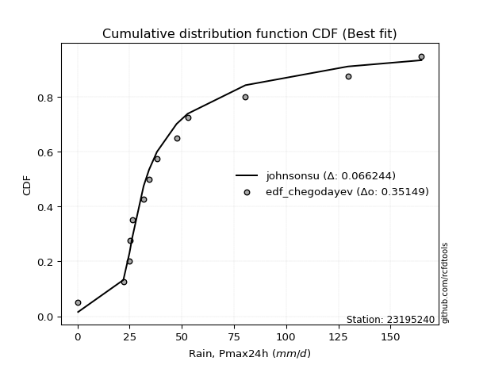</img>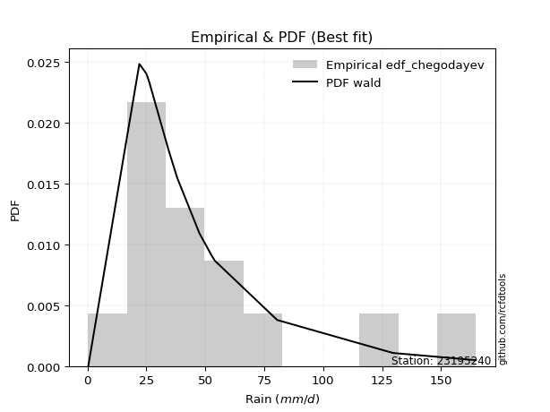</img>

</div>


### 6. Empirical - EDF Blom (1958)

The Blom formula is a specific "plotting position" formula used in hydrology and statistical analysis to estimate the empirical cumulative probability (or non-exceedance probability) of a data series. It is particularly recommended for data that are approximately normally distributed. The constant _a_ is set to 0.375 (or 3/8).

<div align="center">


$P=(m-a)/(n+1-2a)$


</div>


**6.1. Empirical values**

<div align="center">

|                | 0                    | 1                   | 2                   | 3                  | 4                   | 5                   | 6                  | 7                  | 8                  | 9                  | 10                 | 11                 | 12                 | 13                 |
|:---------------|:---------------------|:--------------------|:--------------------|:-------------------|:--------------------|:--------------------|:-------------------|:-------------------|:-------------------|:-------------------|:-------------------|:-------------------|:-------------------|:-------------------|
| date           | 2021                 | 2025                | 2020                | 2016               | 2023                | 2009                | 2008               | 2018               | 2017               | 2007               | 2019               | 2006               | 2024               | 2005               |
| x              | 0.3                  | 0.6                 | 22.0                | 24.9               | 25.2                | 26.2                | 31.7               | 34.3               | 38.1               | 47.5               | 52.8               | 80.5               | 129.6              | 164.8              |
| m              | 1                    | 2                   | 3                   | 4                  | 5                   | 6                   | 7                  | 8                  | 9                  | 10                 | 11                 | 12                 | 13                 | 14                 |
| empirical_dist | edf_blom             | edf_blom            | edf_blom            | edf_blom           | edf_blom            | edf_blom            | edf_blom           | edf_blom           | edf_blom           | edf_blom           | edf_blom           | edf_blom           | edf_blom           | edf_blom           |
| empirical      | 0.043859649122807015 | 0.11403508771929824 | 0.18421052631578946 | 0.2543859649122807 | 0.32456140350877194 | 0.39473684210526316 | 0.4649122807017544 | 0.5350877192982456 | 0.6052631578947368 | 0.6754385964912281 | 0.7456140350877193 | 0.8157894736842105 | 0.8859649122807017 | 0.956140350877193  |
| empirical_tr   | 1.0458715596330275   | 1.1287128712871288  | 1.2258064516129032  | 1.3411764705882354 | 1.4805194805194806  | 1.6521739130434783  | 1.8688524590163935 | 2.150943396226415  | 2.533333333333333  | 3.081081081081081  | 3.9310344827586206 | 5.428571428571428  | 8.769230769230768  | 22.799999999999986 |

</div>


**6.2. Kolmogorov-Smirnov fit test (sorted by Δ)**


<div align="center">

|                | 0                   | 1                   | 2                   | 3                   | 4                   | 5                   | 6                   | 7                   | 8                  | 9                   | 10                  | 11                  | 12                  | 13                  | 14                  | 15                 | 16                  | 17                  | 18                  | 19                  | 20                  | 21                 | 22                  | 23                  | 24                  | 25                  | 26                  | 27                  | 28                 | 29                 | 30                  | 31                  | 32                 | 33                  | 34                 | 35                  | 36                  | 37                    | 38                  | 39                  | 40                  | 41                  | 42                  | 43                 | 44                  | 45                 | 46                  | 47                 | 48                 | 49                 | 50                  | 51                  | 52                  | 53                 | 54                  | 55                 | 56                 | 57                  | 58                 | 59                 | 60                  | 61                  | 62                 | 63                 | 64                 | 65                  | 66                  | 67                 | 68                 | 69                 | 70                  | 71                  | 72                | 73                  | 74                  | 75                  | 76                 | 77                 | 78                 | 79                 | 80                  | 81                  | 82                  | 83                 | 84                 | 85                  | 86                 | 87                 | 88                 | 89                 |
|:---------------|:--------------------|:--------------------|:--------------------|:--------------------|:--------------------|:--------------------|:--------------------|:--------------------|:-------------------|:--------------------|:--------------------|:--------------------|:--------------------|:--------------------|:--------------------|:-------------------|:--------------------|:--------------------|:--------------------|:--------------------|:--------------------|:-------------------|:--------------------|:--------------------|:--------------------|:--------------------|:--------------------|:--------------------|:-------------------|:-------------------|:--------------------|:--------------------|:-------------------|:--------------------|:-------------------|:--------------------|:--------------------|:----------------------|:--------------------|:--------------------|:--------------------|:--------------------|:--------------------|:-------------------|:--------------------|:-------------------|:--------------------|:-------------------|:-------------------|:-------------------|:--------------------|:--------------------|:--------------------|:-------------------|:--------------------|:-------------------|:-------------------|:--------------------|:-------------------|:-------------------|:--------------------|:--------------------|:-------------------|:-------------------|:-------------------|:--------------------|:--------------------|:-------------------|:-------------------|:-------------------|:--------------------|:--------------------|:------------------|:--------------------|:--------------------|:--------------------|:-------------------|:-------------------|:-------------------|:-------------------|:--------------------|:--------------------|:--------------------|:-------------------|:-------------------|:--------------------|:-------------------|:-------------------|:-------------------|:-------------------|
| station        | 23195240            | 23195240            | 23195240            | 23195240            | 23195240            | 23195240            | 23195240            | 23195240            | 23195240           | 23195240            | 23195240            | 23195240            | 23195240            | 23195240            | 23195240            | 23195240           | 23195240            | 23195240            | 23195240            | 23195240            | 23195240            | 23195240           | 23195240            | 23195240            | 23195240            | 23195240            | 23195240            | 23195240            | 23195240           | 23195240           | 23195240            | 23195240            | 23195240           | 23195240            | 23195240           | 23195240            | 23195240            | 23195240              | 23195240            | 23195240            | 23195240            | 23195240            | 23195240            | 23195240           | 23195240            | 23195240           | 23195240            | 23195240           | 23195240           | 23195240           | 23195240            | 23195240            | 23195240            | 23195240           | 23195240            | 23195240           | 23195240           | 23195240            | 23195240           | 23195240           | 23195240            | 23195240            | 23195240           | 23195240           | 23195240           | 23195240            | 23195240            | 23195240           | 23195240           | 23195240           | 23195240            | 23195240            | 23195240          | 23195240            | 23195240            | 23195240            | 23195240           | 23195240           | 23195240           | 23195240           | 23195240            | 23195240            | 23195240            | 23195240           | 23195240           | 23195240            | 23195240           | 23195240           | 23195240           | 23195240           |
| empirical_dist | edf_blom            | edf_blom            | edf_blom            | edf_blom            | edf_blom            | edf_blom            | edf_blom            | edf_blom            | edf_blom           | edf_blom            | edf_blom            | edf_blom            | edf_blom            | edf_blom            | edf_blom            | edf_blom           | edf_blom            | edf_blom            | edf_blom            | edf_blom            | edf_blom            | edf_blom           | edf_blom            | edf_blom            | edf_blom            | edf_blom            | edf_blom            | edf_blom            | edf_blom           | edf_blom           | edf_blom            | edf_blom            | edf_blom           | edf_blom            | edf_blom           | edf_blom            | edf_blom            | edf_blom              | edf_blom            | edf_blom            | edf_blom            | edf_blom            | edf_blom            | edf_blom           | edf_blom            | edf_blom           | edf_blom            | edf_blom           | edf_blom           | edf_blom           | edf_blom            | edf_blom            | edf_blom            | edf_blom           | edf_blom            | edf_blom           | edf_blom           | edf_blom            | edf_blom           | edf_blom           | edf_blom            | edf_blom            | edf_blom           | edf_blom           | edf_blom           | edf_blom            | edf_blom            | edf_blom           | edf_blom           | edf_blom           | edf_blom            | edf_blom            | edf_blom          | edf_blom            | edf_blom            | edf_blom            | edf_blom           | edf_blom           | edf_blom           | edf_blom           | edf_blom            | edf_blom            | edf_blom            | edf_blom           | edf_blom           | edf_blom            | edf_blom           | edf_blom           | edf_blom           | edf_blom           |
| p_dist         | johnsonsu           | logt                | logjohnsonsu        | exponnorm           | gibrat              | wald                | laplace_asymmetric  | truncnorm           | fisk               | moyal               | invweibull          | nct                 | genlogistic         | invgamma            | t                   | gumbel_r           | invgauss            | pearson3            | fatiguelife         | halflogistic        | genexpon            | halfnorm           | gompertz            | kstwobign           | rayleigh            | maxwell             | expon               | weibull_min         | logloggamma        | loggenlogistic     | logpearson3         | rice                | crystalball        | norm                | logistic           | hypsecant           | loggompertz         | loglaplace_asymmetric | loggumbel_l         | ncf                 | mielke              | laplace             | erlang              | betaprime          | f                   | gumbel_l           | chi2                | loglaplace         | loglognorm         | loghypsecant       | logbetaprime        | logfatiguelife      | loglogistic         | logrice            | logexponnorm        | lognorm            | lognorm            | logcrystalball      | lognct             | lognakagami        | loggamma            | loggamma            | loginvgamma        | gamma              | logalpha           | logerlang           | logmielke           | loginvgauss        | logmaxwell         | loginvweibull      | logchi2             | lograyleigh         | loggumbel_r       | logkstwobign        | loghalfnorm         | loggenexpon         | logmoyal           | loghalflogistic    | logncf             | nakagami           | logfisk             | logexpon            | pareto              | logwald            | logpareto          | loggibrat           | logtruncnorm       | logf               | logweibull_min     | alpha              |
| delta          | 0.06956527760461306 | 0.08296166709960114 | 0.09807659588208786 | 0.09991713967078397 | 0.11403508771929824 | 0.11403508771929824 | 0.11828252834779218 | 0.12375723063495456 | 0.1241053583025927 | 0.12606523591964416 | 0.12694584565059533 | 0.12752968605390388 | 0.13085622967465688 | 0.13099739744248703 | 0.13350883430274987 | 0.1369700493208007 | 0.14265815168570137 | 0.14378145448006643 | 0.14680808406577459 | 0.15310075474558307 | 0.15856893186427537 | 0.1596642617067822 | 0.16205144840173033 | 0.16546077560862915 | 0.16622040474324318 | 0.17630464375653676 | 0.17850637811602013 | 0.19265071065072117 | 0.1961251410533201 | 0.2007759033554183 | 0.20303737053363416 | 0.20537786220096027 | 0.2074401164354719 | 0.20744011697535703 | 0.2076732173778439 | 0.21741155946500318 | 0.21935212056318434 | 0.22024700102166486   | 0.23493741544999805 | 0.23510025936609616 | 0.24134120742323276 | 0.24362987574346484 | 0.24487950757649737 | 0.2558646676367736 | 0.25937597056362327 | 0.2756077716405535 | 0.27732459676867216 | 0.2979476008089956 | 0.3028958939790566 | 0.3029462531762508 | 0.30330556396989006 | 0.30380789315072554 | 0.30414090762326673 | 0.3055073762336531 | 0.30553822759014604 | 0.3055404124458766 | 0.3055404124458766 | 0.30554050065027816 | 0.3058981083304755 | 0.3062570688483587 | 0.32028725569440664 | 0.32028725569440664 | 0.3264856202763874 | 0.3271401674156815 | 0.3293255292644687 | 0.32991022891178723 | 0.33428622315676104 | 0.3363009491743326 | 0.3389725039374111 | 0.3391487844811989 | 0.34365319489252877 | 0.35019598557794696 | 0.375536952967201 | 0.37832566706729176 | 0.38180739600930014 | 0.39820149983304687 | 0.4014206808988864 | 0.4060881915072143 | 0.4179855619719933 | 0.4232095597490648 | 0.44154171397288233 | 0.44410314635837367 | 0.46634647436791155 | 0.4734461959180657 | 0.4941980336028583 | 0.49509267568215265 | 0.5125470195428946 | 0.5292398626448774 | 0.5483790790605748 | 0.7795996069323669 |
| deltao         | 0.343224222286      | 0.343224222286      | 0.343224222286      | 0.343224222286      | 0.343224222286      | 0.343224222286      | 0.343224222286      | 0.343224222286      | 0.343224222286     | 0.343224222286      | 0.343224222286      | 0.343224222286      | 0.343224222286      | 0.343224222286      | 0.343224222286      | 0.343224222286     | 0.343224222286      | 0.343224222286      | 0.343224222286      | 0.343224222286      | 0.343224222286      | 0.343224222286     | 0.343224222286      | 0.343224222286      | 0.343224222286      | 0.343224222286      | 0.343224222286      | 0.343224222286      | 0.343224222286     | 0.343224222286     | 0.343224222286      | 0.343224222286      | 0.343224222286     | 0.343224222286      | 0.343224222286     | 0.343224222286      | 0.343224222286      | 0.343224222286        | 0.343224222286      | 0.343224222286      | 0.343224222286      | 0.343224222286      | 0.343224222286      | 0.343224222286     | 0.343224222286      | 0.343224222286     | 0.343224222286      | 0.343224222286     | 0.343224222286     | 0.343224222286     | 0.343224222286      | 0.343224222286      | 0.343224222286      | 0.343224222286     | 0.343224222286      | 0.343224222286     | 0.343224222286     | 0.343224222286      | 0.343224222286     | 0.343224222286     | 0.343224222286      | 0.343224222286      | 0.343224222286     | 0.343224222286     | 0.343224222286     | 0.343224222286      | 0.343224222286      | 0.343224222286     | 0.343224222286     | 0.343224222286     | 0.343224222286      | 0.343224222286      | 0.343224222286    | 0.343224222286      | 0.343224222286      | 0.343224222286      | 0.343224222286     | 0.343224222286     | 0.343224222286     | 0.343224222286     | 0.343224222286      | 0.343224222286      | 0.343224222286      | 0.343224222286     | 0.343224222286     | 0.343224222286      | 0.343224222286     | 0.343224222286     | 0.343224222286     | 0.343224222286     |
| eval           | Δo > Δ              | Δo > Δ              | Δo > Δ              | Δo > Δ              | Δo > Δ              | Δo > Δ              | Δo > Δ              | Δo > Δ              | Δo > Δ             | Δo > Δ              | Δo > Δ              | Δo > Δ              | Δo > Δ              | Δo > Δ              | Δo > Δ              | Δo > Δ             | Δo > Δ              | Δo > Δ              | Δo > Δ              | Δo > Δ              | Δo > Δ              | Δo > Δ             | Δo > Δ              | Δo > Δ              | Δo > Δ              | Δo > Δ              | Δo > Δ              | Δo > Δ              | Δo > Δ             | Δo > Δ             | Δo > Δ              | Δo > Δ              | Δo > Δ             | Δo > Δ              | Δo > Δ             | Δo > Δ              | Δo > Δ              | Δo > Δ                | Δo > Δ              | Δo > Δ              | Δo > Δ              | Δo > Δ              | Δo > Δ              | Δo > Δ             | Δo > Δ              | Δo > Δ             | Δo > Δ              | Δo > Δ             | Δo > Δ             | Δo > Δ             | Δo > Δ              | Δo > Δ              | Δo > Δ              | Δo > Δ             | Δo > Δ              | Δo > Δ             | Δo > Δ             | Δo > Δ              | Δo > Δ             | Δo > Δ             | Δo > Δ              | Δo > Δ              | Δo > Δ             | Δo > Δ             | Δo > Δ             | Δo > Δ              | Δo > Δ              | Δo > Δ             | Δo > Δ             | Δo > Δ             | Δo <= Δ             | Δo <= Δ             | Δo <= Δ           | Δo <= Δ             | Δo <= Δ             | Δo <= Δ             | Δo <= Δ            | Δo <= Δ            | Δo <= Δ            | Δo <= Δ            | Δo <= Δ             | Δo <= Δ             | Δo <= Δ             | Δo <= Δ            | Δo <= Δ            | Δo <= Δ             | Δo <= Δ            | Δo <= Δ            | Δo <= Δ            | Δo <= Δ            |
| fit            | 1                   | 1                   | 1                   | 1                   | 1                   | 1                   | 1                   | 1                   | 1                  | 1                   | 1                   | 1                   | 1                   | 1                   | 1                   | 1                  | 1                   | 1                   | 1                   | 1                   | 1                   | 1                  | 1                   | 1                   | 1                   | 1                   | 1                   | 1                   | 1                  | 1                  | 1                   | 1                   | 1                  | 1                   | 1                  | 1                   | 1                   | 1                     | 1                   | 1                   | 1                   | 1                   | 1                   | 1                  | 1                   | 1                  | 1                   | 1                  | 1                  | 1                  | 1                   | 1                   | 1                   | 1                  | 1                   | 1                  | 1                  | 1                   | 1                  | 1                  | 1                   | 1                   | 1                  | 1                  | 1                  | 1                   | 1                   | 1                  | 1                  | 1                  | 0                   | 0                   | 0                 | 0                   | 0                   | 0                   | 0                  | 0                  | 0                  | 0                  | 0                   | 0                   | 0                   | 0                  | 0                  | 0                   | 0                  | 0                  | 0                  | 0                  |
| n              | 14                  | 14                  | 14                  | 14                  | 14                  | 14                  | 14                  | 14                  | 14                 | 14                  | 14                  | 14                  | 14                  | 14                  | 14                  | 14                 | 14                  | 14                  | 14                  | 14                  | 14                  | 14                 | 14                  | 14                  | 14                  | 14                  | 14                  | 14                  | 14                 | 14                 | 14                  | 14                  | 14                 | 14                  | 14                 | 14                  | 14                  | 14                    | 14                  | 14                  | 14                  | 14                  | 14                  | 14                 | 14                  | 14                 | 14                  | 14                 | 14                 | 14                 | 14                  | 14                  | 14                  | 14                 | 14                  | 14                 | 14                 | 14                  | 14                 | 14                 | 14                  | 14                  | 14                 | 14                 | 14                 | 14                  | 14                  | 14                 | 14                 | 14                 | 14                  | 14                  | 14                | 14                  | 14                  | 14                  | 14                 | 14                 | 14                 | 14                 | 14                  | 14                  | 14                  | 14                 | 14                 | 14                  | 14                 | 14                 | 14                 | 14                 |
| best_fit       | 1                   | 0                   | 0                   | 0                   | 0                   | 0                   | 0                   | 0                   | 0                  | 0                   | 0                   | 0                   | 0                   | 0                   | 0                   | 0                  | 0                   | 0                   | 0                   | 0                   | 0                   | 0                  | 0                   | 0                   | 0                   | 0                   | 0                   | 0                   | 0                  | 0                  | 0                   | 0                   | 0                  | 0                   | 0                  | 0                   | 0                   | 0                     | 0                   | 0                   | 0                   | 0                   | 0                   | 0                  | 0                   | 0                  | 0                   | 0                  | 0                  | 0                  | 0                   | 0                   | 0                   | 0                  | 0                   | 0                  | 0                  | 0                   | 0                  | 0                  | 0                   | 0                   | 0                  | 0                  | 0                  | 0                   | 0                   | 0                  | 0                  | 0                  | 0                   | 0                   | 0                 | 0                   | 0                   | 0                   | 0                  | 0                  | 0                  | 0                  | 0                   | 0                   | 0                   | 0                  | 0                  | 0                   | 0                  | 0                  | 0                  | 0                  |
| best_fit_sort  | 1                   | 2                   | 3                   | 4                   | 5                   | 6                   | 7                   | 8                   | 9                  | 10                  | 11                  | 12                  | 13                  | 14                  | 15                  | 16                 | 17                  | 18                  | 19                  | 20                  | 21                  | 22                 | 23                  | 24                  | 25                  | 26                  | 27                  | 28                  | 29                 | 30                 | 31                  | 32                  | 33                 | 34                  | 35                 | 36                  | 37                  | 38                    | 39                  | 40                  | 41                  | 42                  | 43                  | 44                 | 45                  | 46                 | 47                  | 48                 | 49                 | 50                 | 51                  | 52                  | 53                  | 54                 | 55                  | 56                 | 57                 | 58                  | 59                 | 60                 | 61                  | 62                  | 63                 | 64                 | 65                 | 66                  | 67                  | 68                 | 69                 | 70                 | 71                  | 72                  | 73                | 74                  | 75                  | 76                  | 77                 | 78                 | 79                 | 80                 | 81                  | 82                  | 83                  | 84                 | 85                 | 86                  | 87                 | 88                 | 89                 | 90                 |

</div>


<div align="center">

</img>

</div>


**6.3. Best fit**

<div align="center">

|   id |   station | empirical_dist   | p_dist    |     delta |   deltao | eval   |   fit |   n |   best_fit |   best_fit_sort |
|-----:|----------:|:-----------------|:----------|----------:|---------:|:-------|------:|----:|-----------:|----------------:|
|    0 |  23195240 | edf_blom         | johnsonsu | 0.0695653 | 0.343224 | Δo > Δ |     1 |  14 |          1 |               1 |

</div>


<div align="center">

</img>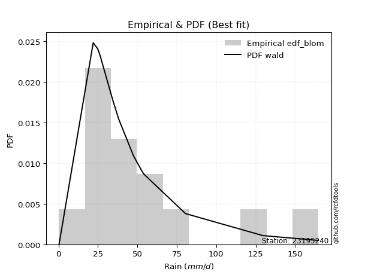</img>

</div>


### 7. Empirical - EDF Tukey (1962)

In hydrology, the Tukey formula is used as a plotting position formula to estimate the empirical probability or frequency of a flood event (or other hydrological data). The formula parameter is given as _c=0.333_ (or 1/3).

<div align="center">


$P=(m-c)/(n+1-2c)$


</div>


**7.1. Empirical values**

<div align="center">

|                | 0                    | 1                   | 2                   | 3                  | 4                   | 5                  | 6                   | 7                  | 8                  | 9                  | 10                 | 11                | 12                 | 13                 |
|:---------------|:---------------------|:--------------------|:--------------------|:-------------------|:--------------------|:-------------------|:--------------------|:-------------------|:-------------------|:-------------------|:-------------------|:------------------|:-------------------|:-------------------|
| date           | 2021                 | 2025                | 2020                | 2016               | 2023                | 2009               | 2008                | 2018               | 2017               | 2007               | 2019               | 2006              | 2024               | 2005               |
| x              | 0.3                  | 0.6                 | 22.0                | 24.9               | 25.2                | 26.2               | 31.7                | 34.3               | 38.1               | 47.5               | 52.8               | 80.5              | 129.6              | 164.8              |
| m              | 1                    | 2                   | 3                   | 4                  | 5                   | 6                  | 7                   | 8                  | 9                  | 10                 | 11                 | 12                | 13                 | 14                 |
| empirical_dist | edf_tukey            | edf_tukey           | edf_tukey           | edf_tukey          | edf_tukey           | edf_tukey          | edf_tukey           | edf_tukey          | edf_tukey          | edf_tukey          | edf_tukey          | edf_tukey         | edf_tukey          | edf_tukey          |
| empirical      | 0.046511627906976744 | 0.11627906976744186 | 0.18604651162790697 | 0.2558139534883721 | 0.32558139534883723 | 0.3953488372093023 | 0.46511627906976744 | 0.5348837209302325 | 0.6046511627906976 | 0.6744186046511628 | 0.7441860465116279 | 0.813953488372093 | 0.8837209302325582 | 0.9534883720930233 |
| empirical_tr   | 1.048780487804878    | 1.131578947368421   | 1.2285714285714286  | 1.34375            | 1.4827586206896552  | 1.653846153846154  | 1.8695652173913042  | 2.15               | 2.5294117647058822 | 3.071428571428571  | 3.9090909090909087 | 5.375             | 8.600000000000001  | 21.500000000000014 |

</div>


**7.2. Kolmogorov-Smirnov fit test (sorted by Δ)**


<div align="center">

|                | 0                  | 1                   | 2                   | 3                   | 4                   | 5                   | 6                   | 7                   | 8                   | 9                   | 10                  | 11                  | 12                  | 13                  | 14                  | 15                  | 16                  | 17                  | 18                  | 19                  | 20                  | 21                  | 22                  | 23                 | 24                  | 25                  | 26                  | 27                  | 28                 | 29                 | 30                  | 31                  | 32                 | 33                  | 34                 | 35                  | 36                  | 37                    | 38                  | 39                  | 40                  | 41                  | 42                  | 43                  | 44                 | 45                 | 46                 | 47                  | 48                  | 49                  | 50                 | 51                | 52                 | 53                  | 54                 | 55                  | 56                  | 57                 | 58                  | 59                 | 60                  | 61                  | 62                 | 63                  | 64                 | 65                  | 66                  | 67                  | 68                 | 69                 | 70                 | 71                 | 72                  | 73                 | 74                  | 75                 | 76                 | 77                  | 78                  | 79                  | 80                  | 81                 | 82                  | 83                 | 84                 | 85                  | 86                 | 87               | 88                 | 89                 |
|:---------------|:-------------------|:--------------------|:--------------------|:--------------------|:--------------------|:--------------------|:--------------------|:--------------------|:--------------------|:--------------------|:--------------------|:--------------------|:--------------------|:--------------------|:--------------------|:--------------------|:--------------------|:--------------------|:--------------------|:--------------------|:--------------------|:--------------------|:--------------------|:-------------------|:--------------------|:--------------------|:--------------------|:--------------------|:-------------------|:-------------------|:--------------------|:--------------------|:-------------------|:--------------------|:-------------------|:--------------------|:--------------------|:----------------------|:--------------------|:--------------------|:--------------------|:--------------------|:--------------------|:--------------------|:-------------------|:-------------------|:-------------------|:--------------------|:--------------------|:--------------------|:-------------------|:------------------|:-------------------|:--------------------|:-------------------|:--------------------|:--------------------|:-------------------|:--------------------|:-------------------|:--------------------|:--------------------|:-------------------|:--------------------|:-------------------|:--------------------|:--------------------|:--------------------|:-------------------|:-------------------|:-------------------|:-------------------|:--------------------|:-------------------|:--------------------|:-------------------|:-------------------|:--------------------|:--------------------|:--------------------|:--------------------|:-------------------|:--------------------|:-------------------|:-------------------|:--------------------|:-------------------|:-----------------|:-------------------|:-------------------|
| station        | 23195240           | 23195240            | 23195240            | 23195240            | 23195240            | 23195240            | 23195240            | 23195240            | 23195240            | 23195240            | 23195240            | 23195240            | 23195240            | 23195240            | 23195240            | 23195240            | 23195240            | 23195240            | 23195240            | 23195240            | 23195240            | 23195240            | 23195240            | 23195240           | 23195240            | 23195240            | 23195240            | 23195240            | 23195240           | 23195240           | 23195240            | 23195240            | 23195240           | 23195240            | 23195240           | 23195240            | 23195240            | 23195240              | 23195240            | 23195240            | 23195240            | 23195240            | 23195240            | 23195240            | 23195240           | 23195240           | 23195240           | 23195240            | 23195240            | 23195240            | 23195240           | 23195240          | 23195240           | 23195240            | 23195240           | 23195240            | 23195240            | 23195240           | 23195240            | 23195240           | 23195240            | 23195240            | 23195240           | 23195240            | 23195240           | 23195240            | 23195240            | 23195240            | 23195240           | 23195240           | 23195240           | 23195240           | 23195240            | 23195240           | 23195240            | 23195240           | 23195240           | 23195240            | 23195240            | 23195240            | 23195240            | 23195240           | 23195240            | 23195240           | 23195240           | 23195240            | 23195240           | 23195240         | 23195240           | 23195240           |
| empirical_dist | edf_tukey          | edf_tukey           | edf_tukey           | edf_tukey           | edf_tukey           | edf_tukey           | edf_tukey           | edf_tukey           | edf_tukey           | edf_tukey           | edf_tukey           | edf_tukey           | edf_tukey           | edf_tukey           | edf_tukey           | edf_tukey           | edf_tukey           | edf_tukey           | edf_tukey           | edf_tukey           | edf_tukey           | edf_tukey           | edf_tukey           | edf_tukey          | edf_tukey           | edf_tukey           | edf_tukey           | edf_tukey           | edf_tukey          | edf_tukey          | edf_tukey           | edf_tukey           | edf_tukey          | edf_tukey           | edf_tukey          | edf_tukey           | edf_tukey           | edf_tukey             | edf_tukey           | edf_tukey           | edf_tukey           | edf_tukey           | edf_tukey           | edf_tukey           | edf_tukey          | edf_tukey          | edf_tukey          | edf_tukey           | edf_tukey           | edf_tukey           | edf_tukey          | edf_tukey         | edf_tukey          | edf_tukey           | edf_tukey          | edf_tukey           | edf_tukey           | edf_tukey          | edf_tukey           | edf_tukey          | edf_tukey           | edf_tukey           | edf_tukey          | edf_tukey           | edf_tukey          | edf_tukey           | edf_tukey           | edf_tukey           | edf_tukey          | edf_tukey          | edf_tukey          | edf_tukey          | edf_tukey           | edf_tukey          | edf_tukey           | edf_tukey          | edf_tukey          | edf_tukey           | edf_tukey           | edf_tukey           | edf_tukey           | edf_tukey          | edf_tukey           | edf_tukey          | edf_tukey          | edf_tukey           | edf_tukey          | edf_tukey        | edf_tukey          | edf_tukey          |
| p_dist         | johnsonsu          | logt                | logjohnsonsu        | exponnorm           | gibrat              | wald                | laplace_asymmetric  | truncnorm           | fisk                | moyal               | invweibull          | nct                 | invgamma            | genlogistic         | t                   | gumbel_r            | invgauss            | pearson3            | fatiguelife         | halflogistic        | genexpon            | halfnorm            | gompertz            | rayleigh           | kstwobign           | maxwell             | expon               | weibull_min         | logloggamma        | loggenlogistic     | logpearson3         | rice                | crystalball        | norm                | logistic           | hypsecant           | loggompertz         | loglaplace_asymmetric | loggumbel_l         | ncf                 | mielke              | laplace             | erlang              | betaprime           | f                  | gumbel_l           | chi2               | loglaplace          | loglognorm          | loghypsecant        | logbetaprime       | logfatiguelife    | loglogistic        | logrice             | logexponnorm       | lognorm             | lognorm             | logcrystalball     | lognct              | lognakagami        | loggamma            | loggamma            | loginvgamma        | gamma               | logalpha           | logerlang           | logmielke           | loginvgauss         | logmaxwell         | loginvweibull      | logchi2            | lograyleigh        | loggumbel_r         | logkstwobign       | loghalfnorm         | loggenexpon        | logmoyal           | loghalflogistic     | logncf              | nakagami            | logfisk             | logexpon           | pareto              | logwald            | logpareto          | loggibrat           | logtruncnorm       | logf             | logweibull_min     | alpha              |
| delta          | 0.0701772727086522 | 0.08520564914774476 | 0.09624061056997035 | 0.09930514456674477 | 0.11627906976744186 | 0.11627906976744186 | 0.11767053324375298 | 0.12192124532283705 | 0.12226937299047519 | 0.12422925060752665 | 0.12510986033847782 | 0.12569370074178637 | 0.12916141213036952 | 0.13024423457061768 | 0.13167284899063236 | 0.13554206074470931 | 0.14082216637358386 | 0.14194546916794892 | 0.14497209875365707 | 0.15126476943346556 | 0.15673294655215786 | 0.15782827639466468 | 0.16021546308961282 | 0.1647924161671518 | 0.16484878050458995 | 0.17487665518044537 | 0.17667039280390262 | 0.19081472533860366 | 0.1942891557412026 | 0.1989399180433008 | 0.20120138522151665 | 0.20476586709692107 | 0.2060121278593805 | 0.20601212839926564 | 0.2070612222738047 | 0.21679956436096398 | 0.21751613525106683 | 0.21841101570954735   | 0.23310143013788054 | 0.23326427405397865 | 0.23950522211111525 | 0.24301788063942564 | 0.24304352226437986 | 0.25402868232465614 | 0.2575399852515058 | 0.2741797830644621 | 0.2754886114565546 | 0.29611161549687814 | 0.30105990866693905 | 0.30111026786413325 | 0.3014695786577725 | 0.301971907838608 | 0.3023049223111492 | 0.30367139092153556 | 0.3037022422780285 | 0.30370442713375906 | 0.30370442713375906 | 0.3037045153381606 | 0.30406212301835794 | 0.3044210835362412 | 0.31845127038228915 | 0.31845127038228915 | 0.3246496349642699 | 0.32530418210356404 | 0.3274895439523512 | 0.32807424359966975 | 0.33245023784464356 | 0.33446496386221514 | 0.3371365186252936 | 0.3373127991690814 | 0.3418172095804113 | 0.3483600002658295 | 0.37370096765508354 | 0.3764896817551743 | 0.37997141069718265 | 0.3963655145209294 | 0.3995846955867689 | 0.40425220619509683 | 0.41614957665987584 | 0.42137357443694734 | 0.43970572866076485 | 0.4422671610462562 | 0.46451048905579406 | 0.4716102106059482 | 0.4919540515547147 | 0.49325669037003517 | 0.5107110342307771 | 0.52740387733276 | 0.5465430937484573 | 0.7777636216202494 |
| deltao         | 0.343224222286     | 0.343224222286      | 0.343224222286      | 0.343224222286      | 0.343224222286      | 0.343224222286      | 0.343224222286      | 0.343224222286      | 0.343224222286      | 0.343224222286      | 0.343224222286      | 0.343224222286      | 0.343224222286      | 0.343224222286      | 0.343224222286      | 0.343224222286      | 0.343224222286      | 0.343224222286      | 0.343224222286      | 0.343224222286      | 0.343224222286      | 0.343224222286      | 0.343224222286      | 0.343224222286     | 0.343224222286      | 0.343224222286      | 0.343224222286      | 0.343224222286      | 0.343224222286     | 0.343224222286     | 0.343224222286      | 0.343224222286      | 0.343224222286     | 0.343224222286      | 0.343224222286     | 0.343224222286      | 0.343224222286      | 0.343224222286        | 0.343224222286      | 0.343224222286      | 0.343224222286      | 0.343224222286      | 0.343224222286      | 0.343224222286      | 0.343224222286     | 0.343224222286     | 0.343224222286     | 0.343224222286      | 0.343224222286      | 0.343224222286      | 0.343224222286     | 0.343224222286    | 0.343224222286     | 0.343224222286      | 0.343224222286     | 0.343224222286      | 0.343224222286      | 0.343224222286     | 0.343224222286      | 0.343224222286     | 0.343224222286      | 0.343224222286      | 0.343224222286     | 0.343224222286      | 0.343224222286     | 0.343224222286      | 0.343224222286      | 0.343224222286      | 0.343224222286     | 0.343224222286     | 0.343224222286     | 0.343224222286     | 0.343224222286      | 0.343224222286     | 0.343224222286      | 0.343224222286     | 0.343224222286     | 0.343224222286      | 0.343224222286      | 0.343224222286      | 0.343224222286      | 0.343224222286     | 0.343224222286      | 0.343224222286     | 0.343224222286     | 0.343224222286      | 0.343224222286     | 0.343224222286   | 0.343224222286     | 0.343224222286     |
| eval           | Δo > Δ             | Δo > Δ              | Δo > Δ              | Δo > Δ              | Δo > Δ              | Δo > Δ              | Δo > Δ              | Δo > Δ              | Δo > Δ              | Δo > Δ              | Δo > Δ              | Δo > Δ              | Δo > Δ              | Δo > Δ              | Δo > Δ              | Δo > Δ              | Δo > Δ              | Δo > Δ              | Δo > Δ              | Δo > Δ              | Δo > Δ              | Δo > Δ              | Δo > Δ              | Δo > Δ             | Δo > Δ              | Δo > Δ              | Δo > Δ              | Δo > Δ              | Δo > Δ             | Δo > Δ             | Δo > Δ              | Δo > Δ              | Δo > Δ             | Δo > Δ              | Δo > Δ             | Δo > Δ              | Δo > Δ              | Δo > Δ                | Δo > Δ              | Δo > Δ              | Δo > Δ              | Δo > Δ              | Δo > Δ              | Δo > Δ              | Δo > Δ             | Δo > Δ             | Δo > Δ             | Δo > Δ              | Δo > Δ              | Δo > Δ              | Δo > Δ             | Δo > Δ            | Δo > Δ             | Δo > Δ              | Δo > Δ             | Δo > Δ              | Δo > Δ              | Δo > Δ             | Δo > Δ              | Δo > Δ             | Δo > Δ              | Δo > Δ              | Δo > Δ             | Δo > Δ              | Δo > Δ             | Δo > Δ              | Δo > Δ              | Δo > Δ              | Δo > Δ             | Δo > Δ             | Δo > Δ             | Δo <= Δ            | Δo <= Δ             | Δo <= Δ            | Δo <= Δ             | Δo <= Δ            | Δo <= Δ            | Δo <= Δ             | Δo <= Δ             | Δo <= Δ             | Δo <= Δ             | Δo <= Δ            | Δo <= Δ             | Δo <= Δ            | Δo <= Δ            | Δo <= Δ             | Δo <= Δ            | Δo <= Δ          | Δo <= Δ            | Δo <= Δ            |
| fit            | 1                  | 1                   | 1                   | 1                   | 1                   | 1                   | 1                   | 1                   | 1                   | 1                   | 1                   | 1                   | 1                   | 1                   | 1                   | 1                   | 1                   | 1                   | 1                   | 1                   | 1                   | 1                   | 1                   | 1                  | 1                   | 1                   | 1                   | 1                   | 1                  | 1                  | 1                   | 1                   | 1                  | 1                   | 1                  | 1                   | 1                   | 1                     | 1                   | 1                   | 1                   | 1                   | 1                   | 1                   | 1                  | 1                  | 1                  | 1                   | 1                   | 1                   | 1                  | 1                 | 1                  | 1                   | 1                  | 1                   | 1                   | 1                  | 1                   | 1                  | 1                   | 1                   | 1                  | 1                   | 1                  | 1                   | 1                   | 1                   | 1                  | 1                  | 1                  | 0                  | 0                   | 0                  | 0                   | 0                  | 0                  | 0                   | 0                   | 0                   | 0                   | 0                  | 0                   | 0                  | 0                  | 0                   | 0                  | 0                | 0                  | 0                  |
| n              | 14                 | 14                  | 14                  | 14                  | 14                  | 14                  | 14                  | 14                  | 14                  | 14                  | 14                  | 14                  | 14                  | 14                  | 14                  | 14                  | 14                  | 14                  | 14                  | 14                  | 14                  | 14                  | 14                  | 14                 | 14                  | 14                  | 14                  | 14                  | 14                 | 14                 | 14                  | 14                  | 14                 | 14                  | 14                 | 14                  | 14                  | 14                    | 14                  | 14                  | 14                  | 14                  | 14                  | 14                  | 14                 | 14                 | 14                 | 14                  | 14                  | 14                  | 14                 | 14                | 14                 | 14                  | 14                 | 14                  | 14                  | 14                 | 14                  | 14                 | 14                  | 14                  | 14                 | 14                  | 14                 | 14                  | 14                  | 14                  | 14                 | 14                 | 14                 | 14                 | 14                  | 14                 | 14                  | 14                 | 14                 | 14                  | 14                  | 14                  | 14                  | 14                 | 14                  | 14                 | 14                 | 14                  | 14                 | 14               | 14                 | 14                 |
| best_fit       | 1                  | 0                   | 0                   | 0                   | 0                   | 0                   | 0                   | 0                   | 0                   | 0                   | 0                   | 0                   | 0                   | 0                   | 0                   | 0                   | 0                   | 0                   | 0                   | 0                   | 0                   | 0                   | 0                   | 0                  | 0                   | 0                   | 0                   | 0                   | 0                  | 0                  | 0                   | 0                   | 0                  | 0                   | 0                  | 0                   | 0                   | 0                     | 0                   | 0                   | 0                   | 0                   | 0                   | 0                   | 0                  | 0                  | 0                  | 0                   | 0                   | 0                   | 0                  | 0                 | 0                  | 0                   | 0                  | 0                   | 0                   | 0                  | 0                   | 0                  | 0                   | 0                   | 0                  | 0                   | 0                  | 0                   | 0                   | 0                   | 0                  | 0                  | 0                  | 0                  | 0                   | 0                  | 0                   | 0                  | 0                  | 0                   | 0                   | 0                   | 0                   | 0                  | 0                   | 0                  | 0                  | 0                   | 0                  | 0                | 0                  | 0                  |
| best_fit_sort  | 1                  | 2                   | 3                   | 4                   | 5                   | 6                   | 7                   | 8                   | 9                   | 10                  | 11                  | 12                  | 13                  | 14                  | 15                  | 16                  | 17                  | 18                  | 19                  | 20                  | 21                  | 22                  | 23                  | 24                 | 25                  | 26                  | 27                  | 28                  | 29                 | 30                 | 31                  | 32                  | 33                 | 34                  | 35                 | 36                  | 37                  | 38                    | 39                  | 40                  | 41                  | 42                  | 43                  | 44                  | 45                 | 46                 | 47                 | 48                  | 49                  | 50                  | 51                 | 52                | 53                 | 54                  | 55                 | 56                  | 57                  | 58                 | 59                  | 60                 | 61                  | 62                  | 63                 | 64                  | 65                 | 66                  | 67                  | 68                  | 69                 | 70                 | 71                 | 72                 | 73                  | 74                 | 75                  | 76                 | 77                 | 78                  | 79                  | 80                  | 81                  | 82                 | 83                  | 84                 | 85                 | 86                  | 87                 | 88               | 89                 | 90                 |

</div>


<div align="center">

</img>

</div>


**7.3. Best fit**

<div align="center">

|   id |   station | empirical_dist   | p_dist    |     delta |   deltao | eval   |   fit |   n |   best_fit |   best_fit_sort |
|-----:|----------:|:-----------------|:----------|----------:|---------:|:-------|------:|----:|-----------:|----------------:|
|    0 |  23195240 | edf_tukey        | johnsonsu | 0.0701773 | 0.343224 | Δo > Δ |     1 |  14 |          1 |               1 |

</div>


<div align="center">

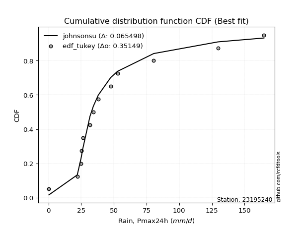</img></img>

</div>


### 8. Empirical - EDF Gringorten (1963)

Gringorten plotting position formula is essential for estimating the probability and return periods of extreme events like floods and heavy rainfall. The constant _a=0.44_.

<div align="center">


$P=(m-a)/(n+1-2a)$


</div>


**8.1. Empirical values**

<div align="center">

|                | 0                  | 1                  | 2                  | 3                  | 4                   | 5                  | 6                   | 7                  | 8                  | 9                  | 10                 | 11                 | 12                 | 13                 |
|:---------------|:-------------------|:-------------------|:-------------------|:-------------------|:--------------------|:-------------------|:--------------------|:-------------------|:-------------------|:-------------------|:-------------------|:-------------------|:-------------------|:-------------------|
| date           | 2021               | 2025               | 2020               | 2016               | 2023                | 2009               | 2008                | 2018               | 2017               | 2007               | 2019               | 2006               | 2024               | 2005               |
| x              | 0.3                | 0.6                | 22.0               | 24.9               | 25.2                | 26.2               | 31.7                | 34.3               | 38.1               | 47.5               | 52.8               | 80.5               | 129.6              | 164.8              |
| m              | 1                  | 2                  | 3                  | 4                  | 5                   | 6                  | 7                   | 8                  | 9                  | 10                 | 11                 | 12                 | 13                 | 14                 |
| empirical_dist | edf_gringorten     | edf_gringorten     | edf_gringorten     | edf_gringorten     | edf_gringorten      | edf_gringorten     | edf_gringorten      | edf_gringorten     | edf_gringorten     | edf_gringorten     | edf_gringorten     | edf_gringorten     | edf_gringorten     | edf_gringorten     |
| empirical      | 0.0396600566572238 | 0.1104815864022663 | 0.1813031161473088 | 0.2521246458923513 | 0.32294617563739375 | 0.3937677053824363 | 0.46458923512747874 | 0.5354107648725213 | 0.6062322946175638 | 0.6770538243626063 | 0.7478753541076488 | 0.8186968838526913 | 0.8895184135977338 | 0.9603399433427763 |
| empirical_tr   | 1.041297935103245  | 1.124203821656051  | 1.221453287197232  | 1.3371212121212122 | 1.4769874476987446  | 1.6495327102803736 | 1.8677248677248677  | 2.152439024390244  | 2.539568345323741  | 3.096491228070176  | 3.966292134831462  | 5.5156250000000036 | 9.051282051282055  | 25.214285714285765 |

</div>


**8.2. Kolmogorov-Smirnov fit test (sorted by Δ)**


<div align="center">

|                | 0                   | 1                   | 2                   | 3                   | 4                  | 5                  | 6                   | 7                   | 8                   | 9                   | 10                | 11                  | 12                  | 13                 | 14                  | 15                  | 16                  | 17                 | 18                  | 19                  | 20                  | 21                  | 22                | 23                 | 24                  | 25                 | 26                 | 27                  | 28                  | 29                  | 30                  | 31                  | 32                  | 33                  | 34                  | 35                  | 36                  | 37                    | 38                  | 39                  | 40                  | 41                 | 42                  | 43                  | 44                | 45                  | 46                 | 47                  | 48                 | 49                 | 50                 | 51                  | 52                  | 53                 | 54                  | 55                 | 56                 | 57                 | 58                 | 59                 | 60                  | 61                  | 62                 | 63                  | 64                 | 65                  | 66                  | 67                  | 68                 | 69                 | 70                 | 71                 | 72                  | 73                 | 74                  | 75                 | 76                 | 77                  | 78                  | 79                  | 80                  | 81                 | 82                 | 83                 | 84                  | 85                 | 86                 | 87                 | 88                 | 89                 |
|:---------------|:--------------------|:--------------------|:--------------------|:--------------------|:-------------------|:-------------------|:--------------------|:--------------------|:--------------------|:--------------------|:------------------|:--------------------|:--------------------|:-------------------|:--------------------|:--------------------|:--------------------|:-------------------|:--------------------|:--------------------|:--------------------|:--------------------|:------------------|:-------------------|:--------------------|:-------------------|:-------------------|:--------------------|:--------------------|:--------------------|:--------------------|:--------------------|:--------------------|:--------------------|:--------------------|:--------------------|:--------------------|:----------------------|:--------------------|:--------------------|:--------------------|:-------------------|:--------------------|:--------------------|:------------------|:--------------------|:-------------------|:--------------------|:-------------------|:-------------------|:-------------------|:--------------------|:--------------------|:-------------------|:--------------------|:-------------------|:-------------------|:-------------------|:-------------------|:-------------------|:--------------------|:--------------------|:-------------------|:--------------------|:-------------------|:--------------------|:--------------------|:--------------------|:-------------------|:-------------------|:-------------------|:-------------------|:--------------------|:-------------------|:--------------------|:-------------------|:-------------------|:--------------------|:--------------------|:--------------------|:--------------------|:-------------------|:-------------------|:-------------------|:--------------------|:-------------------|:-------------------|:-------------------|:-------------------|:-------------------|
| station        | 23195240            | 23195240            | 23195240            | 23195240            | 23195240           | 23195240           | 23195240            | 23195240            | 23195240            | 23195240            | 23195240          | 23195240            | 23195240            | 23195240           | 23195240            | 23195240            | 23195240            | 23195240           | 23195240            | 23195240            | 23195240            | 23195240            | 23195240          | 23195240           | 23195240            | 23195240           | 23195240           | 23195240            | 23195240            | 23195240            | 23195240            | 23195240            | 23195240            | 23195240            | 23195240            | 23195240            | 23195240            | 23195240              | 23195240            | 23195240            | 23195240            | 23195240           | 23195240            | 23195240            | 23195240          | 23195240            | 23195240           | 23195240            | 23195240           | 23195240           | 23195240           | 23195240            | 23195240            | 23195240           | 23195240            | 23195240           | 23195240           | 23195240           | 23195240           | 23195240           | 23195240            | 23195240            | 23195240           | 23195240            | 23195240           | 23195240            | 23195240            | 23195240            | 23195240           | 23195240           | 23195240           | 23195240           | 23195240            | 23195240           | 23195240            | 23195240           | 23195240           | 23195240            | 23195240            | 23195240            | 23195240            | 23195240           | 23195240           | 23195240           | 23195240            | 23195240           | 23195240           | 23195240           | 23195240           | 23195240           |
| empirical_dist | edf_gringorten      | edf_gringorten      | edf_gringorten      | edf_gringorten      | edf_gringorten     | edf_gringorten     | edf_gringorten      | edf_gringorten      | edf_gringorten      | edf_gringorten      | edf_gringorten    | edf_gringorten      | edf_gringorten      | edf_gringorten     | edf_gringorten      | edf_gringorten      | edf_gringorten      | edf_gringorten     | edf_gringorten      | edf_gringorten      | edf_gringorten      | edf_gringorten      | edf_gringorten    | edf_gringorten     | edf_gringorten      | edf_gringorten     | edf_gringorten     | edf_gringorten      | edf_gringorten      | edf_gringorten      | edf_gringorten      | edf_gringorten      | edf_gringorten      | edf_gringorten      | edf_gringorten      | edf_gringorten      | edf_gringorten      | edf_gringorten        | edf_gringorten      | edf_gringorten      | edf_gringorten      | edf_gringorten     | edf_gringorten      | edf_gringorten      | edf_gringorten    | edf_gringorten      | edf_gringorten     | edf_gringorten      | edf_gringorten     | edf_gringorten     | edf_gringorten     | edf_gringorten      | edf_gringorten      | edf_gringorten     | edf_gringorten      | edf_gringorten     | edf_gringorten     | edf_gringorten     | edf_gringorten     | edf_gringorten     | edf_gringorten      | edf_gringorten      | edf_gringorten     | edf_gringorten      | edf_gringorten     | edf_gringorten      | edf_gringorten      | edf_gringorten      | edf_gringorten     | edf_gringorten     | edf_gringorten     | edf_gringorten     | edf_gringorten      | edf_gringorten     | edf_gringorten      | edf_gringorten     | edf_gringorten     | edf_gringorten      | edf_gringorten      | edf_gringorten      | edf_gringorten      | edf_gringorten     | edf_gringorten     | edf_gringorten     | edf_gringorten      | edf_gringorten     | edf_gringorten     | edf_gringorten     | edf_gringorten     | edf_gringorten     |
| p_dist         | johnsonsu           | logt                | logjohnsonsu        | exponnorm           | gibrat             | wald               | laplace_asymmetric  | truncnorm           | fisk                | moyal               | invweibull        | nct                 | genlogistic         | invgamma           | t                   | gumbel_r            | invgauss            | pearson3           | fatiguelife         | halflogistic        | genexpon            | halfnorm            | gompertz          | kstwobign          | rayleigh            | maxwell            | expon              | weibull_min         | logloggamma         | loggenlogistic      | logpearson3         | rice                | logistic            | crystalball         | norm                | hypsecant           | loggompertz         | loglaplace_asymmetric | loggumbel_l         | ncf                 | mielke              | laplace            | erlang              | betaprime           | f                 | gumbel_l            | chi2               | loglaplace          | loglognorm         | loghypsecant       | logbetaprime       | logfatiguelife      | loglogistic         | logrice            | logexponnorm        | lognorm            | lognorm            | logcrystalball     | lognct             | lognakagami        | loggamma            | loggamma            | loginvgamma        | gamma               | logalpha           | logerlang           | logmielke           | loginvgauss         | logmaxwell         | loginvweibull      | logchi2            | lograyleigh        | loggumbel_r         | logkstwobign       | loghalfnorm         | loggenexpon        | logmoyal           | loghalflogistic     | logncf              | nakagami            | logfisk             | logexpon           | pareto             | logwald            | logpareto           | loggibrat          | logtruncnorm       | logf               | logweibull_min     | alpha              |
| delta          | 0.06859614088178617 | 0.07940816578256919 | 0.10098400605056854 | 0.10182493398027478 | 0.1104815864022663 | 0.1104815864022663 | 0.11925166507061913 | 0.12666464080343523 | 0.12701276847107337 | 0.12897264608812484 | 0.129853255819076 | 0.13043709622238456 | 0.13182536639748382 | 0.1339048076109677 | 0.13641624447123055 | 0.13923136834073024 | 0.14556556185418204 | 0.1466888646485471 | 0.14971549423425526 | 0.15600816491406375 | 0.16147634203275604 | 0.16257167187526286 | 0.164958858570211 | 0.1664299123314561 | 0.16848172376317272 | 0.1785659627764663 | 0.1814137882845008 | 0.19555812081920185 | 0.19903255122180077 | 0.20368331352389898 | 0.20594478070211483 | 0.20634699892378722 | 0.20864235410067083 | 0.20970143545540143 | 0.20970143599528657 | 0.21838069618783013 | 0.22225953073166502 | 0.22315441119014554   | 0.23784482561847872 | 0.23800766953457683 | 0.24424861759171343 | 0.2445990124662918 | 0.24778691774497805 | 0.25877207780525435 | 0.262283380732104 | 0.27786909066048304 | 0.2802320069371528 | 0.30085501097747636 | 0.3058033041475372 | 0.3058536633447314 | 0.3062129741383707 | 0.30671530331920616 | 0.30704831779174735 | 0.3084147864021337 | 0.30844563775862666 | 0.3084478226143572 | 0.3084478226143572 | 0.3084479108187588 | 0.3088055184989561 | 0.3091644790168394 | 0.32319466586288736 | 0.32319466586288736 | 0.3293930304448681 | 0.33004757758416225 | 0.3322329394329494 | 0.33281763908026796 | 0.33719363332524177 | 0.33920835934281335 | 0.3418799141058918 | 0.3420561946496796 | 0.3465606050610095 | 0.3531033957464277 | 0.37844436313568175 | 0.3812330772357725 | 0.38471480617778087 | 0.4011089100015276 | 0.4043280910673671 | 0.40899560167569504 | 0.42089297214047405 | 0.42611696991754555 | 0.44444912414136306 | 0.4470105565268544 | 0.4692538845363923 | 0.4763536060865464 | 0.49775153491989027 | 0.4980000858506334 | 0.5154544297113753 | 0.5321472728133582 | 0.5512864892290555 | 0.7825070171008476 |
| deltao         | 0.343224222286      | 0.343224222286      | 0.343224222286      | 0.343224222286      | 0.343224222286     | 0.343224222286     | 0.343224222286      | 0.343224222286      | 0.343224222286      | 0.343224222286      | 0.343224222286    | 0.343224222286      | 0.343224222286      | 0.343224222286     | 0.343224222286      | 0.343224222286      | 0.343224222286      | 0.343224222286     | 0.343224222286      | 0.343224222286      | 0.343224222286      | 0.343224222286      | 0.343224222286    | 0.343224222286     | 0.343224222286      | 0.343224222286     | 0.343224222286     | 0.343224222286      | 0.343224222286      | 0.343224222286      | 0.343224222286      | 0.343224222286      | 0.343224222286      | 0.343224222286      | 0.343224222286      | 0.343224222286      | 0.343224222286      | 0.343224222286        | 0.343224222286      | 0.343224222286      | 0.343224222286      | 0.343224222286     | 0.343224222286      | 0.343224222286      | 0.343224222286    | 0.343224222286      | 0.343224222286     | 0.343224222286      | 0.343224222286     | 0.343224222286     | 0.343224222286     | 0.343224222286      | 0.343224222286      | 0.343224222286     | 0.343224222286      | 0.343224222286     | 0.343224222286     | 0.343224222286     | 0.343224222286     | 0.343224222286     | 0.343224222286      | 0.343224222286      | 0.343224222286     | 0.343224222286      | 0.343224222286     | 0.343224222286      | 0.343224222286      | 0.343224222286      | 0.343224222286     | 0.343224222286     | 0.343224222286     | 0.343224222286     | 0.343224222286      | 0.343224222286     | 0.343224222286      | 0.343224222286     | 0.343224222286     | 0.343224222286      | 0.343224222286      | 0.343224222286      | 0.343224222286      | 0.343224222286     | 0.343224222286     | 0.343224222286     | 0.343224222286      | 0.343224222286     | 0.343224222286     | 0.343224222286     | 0.343224222286     | 0.343224222286     |
| eval           | Δo > Δ              | Δo > Δ              | Δo > Δ              | Δo > Δ              | Δo > Δ             | Δo > Δ             | Δo > Δ              | Δo > Δ              | Δo > Δ              | Δo > Δ              | Δo > Δ            | Δo > Δ              | Δo > Δ              | Δo > Δ             | Δo > Δ              | Δo > Δ              | Δo > Δ              | Δo > Δ             | Δo > Δ              | Δo > Δ              | Δo > Δ              | Δo > Δ              | Δo > Δ            | Δo > Δ             | Δo > Δ              | Δo > Δ             | Δo > Δ             | Δo > Δ              | Δo > Δ              | Δo > Δ              | Δo > Δ              | Δo > Δ              | Δo > Δ              | Δo > Δ              | Δo > Δ              | Δo > Δ              | Δo > Δ              | Δo > Δ                | Δo > Δ              | Δo > Δ              | Δo > Δ              | Δo > Δ             | Δo > Δ              | Δo > Δ              | Δo > Δ            | Δo > Δ              | Δo > Δ             | Δo > Δ              | Δo > Δ             | Δo > Δ             | Δo > Δ             | Δo > Δ              | Δo > Δ              | Δo > Δ             | Δo > Δ              | Δo > Δ             | Δo > Δ             | Δo > Δ             | Δo > Δ             | Δo > Δ             | Δo > Δ              | Δo > Δ              | Δo > Δ             | Δo > Δ              | Δo > Δ             | Δo > Δ              | Δo > Δ              | Δo > Δ              | Δo > Δ             | Δo > Δ             | Δo <= Δ            | Δo <= Δ            | Δo <= Δ             | Δo <= Δ            | Δo <= Δ             | Δo <= Δ            | Δo <= Δ            | Δo <= Δ             | Δo <= Δ             | Δo <= Δ             | Δo <= Δ             | Δo <= Δ            | Δo <= Δ            | Δo <= Δ            | Δo <= Δ             | Δo <= Δ            | Δo <= Δ            | Δo <= Δ            | Δo <= Δ            | Δo <= Δ            |
| fit            | 1                   | 1                   | 1                   | 1                   | 1                  | 1                  | 1                   | 1                   | 1                   | 1                   | 1                 | 1                   | 1                   | 1                  | 1                   | 1                   | 1                   | 1                  | 1                   | 1                   | 1                   | 1                   | 1                 | 1                  | 1                   | 1                  | 1                  | 1                   | 1                   | 1                   | 1                   | 1                   | 1                   | 1                   | 1                   | 1                   | 1                   | 1                     | 1                   | 1                   | 1                   | 1                  | 1                   | 1                   | 1                 | 1                   | 1                  | 1                   | 1                  | 1                  | 1                  | 1                   | 1                   | 1                  | 1                   | 1                  | 1                  | 1                  | 1                  | 1                  | 1                   | 1                   | 1                  | 1                   | 1                  | 1                   | 1                   | 1                   | 1                  | 1                  | 0                  | 0                  | 0                   | 0                  | 0                   | 0                  | 0                  | 0                   | 0                   | 0                   | 0                   | 0                  | 0                  | 0                  | 0                   | 0                  | 0                  | 0                  | 0                  | 0                  |
| n              | 14                  | 14                  | 14                  | 14                  | 14                 | 14                 | 14                  | 14                  | 14                  | 14                  | 14                | 14                  | 14                  | 14                 | 14                  | 14                  | 14                  | 14                 | 14                  | 14                  | 14                  | 14                  | 14                | 14                 | 14                  | 14                 | 14                 | 14                  | 14                  | 14                  | 14                  | 14                  | 14                  | 14                  | 14                  | 14                  | 14                  | 14                    | 14                  | 14                  | 14                  | 14                 | 14                  | 14                  | 14                | 14                  | 14                 | 14                  | 14                 | 14                 | 14                 | 14                  | 14                  | 14                 | 14                  | 14                 | 14                 | 14                 | 14                 | 14                 | 14                  | 14                  | 14                 | 14                  | 14                 | 14                  | 14                  | 14                  | 14                 | 14                 | 14                 | 14                 | 14                  | 14                 | 14                  | 14                 | 14                 | 14                  | 14                  | 14                  | 14                  | 14                 | 14                 | 14                 | 14                  | 14                 | 14                 | 14                 | 14                 | 14                 |
| best_fit       | 1                   | 0                   | 0                   | 0                   | 0                  | 0                  | 0                   | 0                   | 0                   | 0                   | 0                 | 0                   | 0                   | 0                  | 0                   | 0                   | 0                   | 0                  | 0                   | 0                   | 0                   | 0                   | 0                 | 0                  | 0                   | 0                  | 0                  | 0                   | 0                   | 0                   | 0                   | 0                   | 0                   | 0                   | 0                   | 0                   | 0                   | 0                     | 0                   | 0                   | 0                   | 0                  | 0                   | 0                   | 0                 | 0                   | 0                  | 0                   | 0                  | 0                  | 0                  | 0                   | 0                   | 0                  | 0                   | 0                  | 0                  | 0                  | 0                  | 0                  | 0                   | 0                   | 0                  | 0                   | 0                  | 0                   | 0                   | 0                   | 0                  | 0                  | 0                  | 0                  | 0                   | 0                  | 0                   | 0                  | 0                  | 0                   | 0                   | 0                   | 0                   | 0                  | 0                  | 0                  | 0                   | 0                  | 0                  | 0                  | 0                  | 0                  |
| best_fit_sort  | 1                   | 2                   | 3                   | 4                   | 5                  | 6                  | 7                   | 8                   | 9                   | 10                  | 11                | 12                  | 13                  | 14                 | 15                  | 16                  | 17                  | 18                 | 19                  | 20                  | 21                  | 22                  | 23                | 24                 | 25                  | 26                 | 27                 | 28                  | 29                  | 30                  | 31                  | 32                  | 33                  | 34                  | 35                  | 36                  | 37                  | 38                    | 39                  | 40                  | 41                  | 42                 | 43                  | 44                  | 45                | 46                  | 47                 | 48                  | 49                 | 50                 | 51                 | 52                  | 53                  | 54                 | 55                  | 56                 | 57                 | 58                 | 59                 | 60                 | 61                  | 62                  | 63                 | 64                  | 65                 | 66                  | 67                  | 68                  | 69                 | 70                 | 71                 | 72                 | 73                  | 74                 | 75                  | 76                 | 77                 | 78                  | 79                  | 80                  | 81                  | 82                 | 83                 | 84                 | 85                  | 86                 | 87                 | 88                 | 89                 | 90                 |

</div>


<div align="center">

</img>

</div>


**8.3. Best fit**

<div align="center">

|   id |   station | empirical_dist   | p_dist    |     delta |   deltao | eval   |   fit |   n |   best_fit |   best_fit_sort |
|-----:|----------:|:-----------------|:----------|----------:|---------:|:-------|------:|----:|-----------:|----------------:|
|    0 |  23195240 | edf_gringorten   | johnsonsu | 0.0685961 | 0.343224 | Δo > Δ |     1 |  14 |          1 |               1 |

</div>


<div align="center">

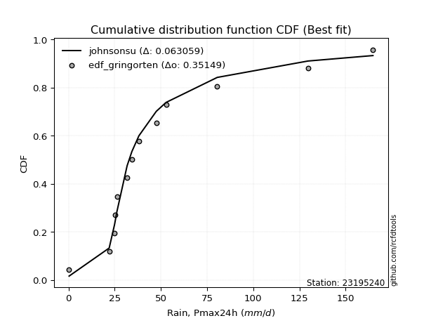</img></img>

</div>


### 9. Empirical - EDF Filliben (1975)

The specific values of the constants (0.3175) (often denoted as $alpha$) and (0.365) are derived from a method proposed by James J. Filliben in a 1975 paper. This particular formula is the mean value of the $i$-th order statistic of the normal distribution and is considered a robust and effective plotting position formula for the normal probability plot correlation coefficient test for normality.

<div align="center">


$P=(m-0.3175)/(n+0.365)$


</div>


**9.1. Empirical values**

<div align="center">

|                | 0                   | 1                   | 2                   | 3                   | 4                  | 5                  | 6                   | 7                  | 8                  | 9                  | 10                | 11                 | 12                 | 13                 |
|:---------------|:--------------------|:--------------------|:--------------------|:--------------------|:-------------------|:-------------------|:--------------------|:-------------------|:-------------------|:-------------------|:------------------|:-------------------|:-------------------|:-------------------|
| date           | 2021                | 2025                | 2020                | 2016                | 2023               | 2009               | 2008                | 2018               | 2017               | 2007               | 2019              | 2006               | 2024               | 2005               |
| x              | 0.3                 | 0.6                 | 22.0                | 24.9                | 25.2               | 26.2               | 31.7                | 34.3               | 38.1               | 47.5               | 52.8              | 80.5               | 129.6              | 164.8              |
| m              | 1                   | 2                   | 3                   | 4                   | 5                  | 6                  | 7                   | 8                  | 9                  | 10                 | 11                | 12                 | 13                 | 14                 |
| empirical_dist | edf_filliben        | edf_filliben        | edf_filliben        | edf_filliben        | edf_filliben       | edf_filliben       | edf_filliben        | edf_filliben       | edf_filliben       | edf_filliben       | edf_filliben      | edf_filliben       | edf_filliben       | edf_filliben       |
| empirical      | 0.04751131221719457 | 0.11712495649147234 | 0.18673860076575008 | 0.25635224504002785 | 0.3259658893143056 | 0.3955795335885834 | 0.46519317786286113 | 0.5348068221371389 | 0.6044204664114166 | 0.6740341106856943 | 0.743647754959972 | 0.8132613992342499 | 0.8828750435085276 | 0.9524886877828054 |
| empirical_tr   | 1.0498812351543945  | 1.132663118470333   | 1.2296169484271346  | 1.3447226772759187  | 1.4836044410018074 | 1.6544773970630582 | 1.8698340383989585  | 2.1496445940890387 | 2.5279366476022873 | 3.0678056593699936 | 3.900882552613712 | 5.355079217148182  | 8.537890044576521  | 21.047619047619023 |

</div>


**9.2. Kolmogorov-Smirnov fit test (sorted by Δ)**


<div align="center">

|                | 0                   | 1                   | 2                   | 3                   | 4                   | 5                   | 6                  | 7                   | 8                   | 9                   | 10                  | 11                  | 12                  | 13                 | 14                  | 15                  | 16                  | 17                  | 18                  | 19                  | 20                  | 21                  | 22                  | 23                  | 24                  | 25                  | 26                  | 27                  | 28                  | 29                 | 30                  | 31               | 32                  | 33                  | 34                 | 35                 | 36                  | 37                    | 38                  | 39                  | 40                  | 41                  | 42                  | 43                | 44                  | 45                  | 46                  | 47                | 48                  | 49                 | 50                  | 51                 | 52                 | 53                 | 54                 | 55                | 56                | 57                  | 58                  | 59                  | 60                | 61                | 62                 | 63                 | 64                  | 65                 | 66                 | 67                | 68                  | 69                 | 70                  | 71                  | 72                 | 73                  | 74                 | 75                  | 76                  | 77                 | 78                 | 79                 | 80                 | 81                  | 82                  | 83                 | 84                 | 85                  | 86                | 87                 | 88                 | 89                 |
|:---------------|:--------------------|:--------------------|:--------------------|:--------------------|:--------------------|:--------------------|:-------------------|:--------------------|:--------------------|:--------------------|:--------------------|:--------------------|:--------------------|:-------------------|:--------------------|:--------------------|:--------------------|:--------------------|:--------------------|:--------------------|:--------------------|:--------------------|:--------------------|:--------------------|:--------------------|:--------------------|:--------------------|:--------------------|:--------------------|:-------------------|:--------------------|:-----------------|:--------------------|:--------------------|:-------------------|:-------------------|:--------------------|:----------------------|:--------------------|:--------------------|:--------------------|:--------------------|:--------------------|:------------------|:--------------------|:--------------------|:--------------------|:------------------|:--------------------|:-------------------|:--------------------|:-------------------|:-------------------|:-------------------|:-------------------|:------------------|:------------------|:--------------------|:--------------------|:--------------------|:------------------|:------------------|:-------------------|:-------------------|:--------------------|:-------------------|:-------------------|:------------------|:--------------------|:-------------------|:--------------------|:--------------------|:-------------------|:--------------------|:-------------------|:--------------------|:--------------------|:-------------------|:-------------------|:-------------------|:-------------------|:--------------------|:--------------------|:-------------------|:-------------------|:--------------------|:------------------|:-------------------|:-------------------|:-------------------|
| station        | 23195240            | 23195240            | 23195240            | 23195240            | 23195240            | 23195240            | 23195240           | 23195240            | 23195240            | 23195240            | 23195240            | 23195240            | 23195240            | 23195240           | 23195240            | 23195240            | 23195240            | 23195240            | 23195240            | 23195240            | 23195240            | 23195240            | 23195240            | 23195240            | 23195240            | 23195240            | 23195240            | 23195240            | 23195240            | 23195240           | 23195240            | 23195240         | 23195240            | 23195240            | 23195240           | 23195240           | 23195240            | 23195240              | 23195240            | 23195240            | 23195240            | 23195240            | 23195240            | 23195240          | 23195240            | 23195240            | 23195240            | 23195240          | 23195240            | 23195240           | 23195240            | 23195240           | 23195240           | 23195240           | 23195240           | 23195240          | 23195240          | 23195240            | 23195240            | 23195240            | 23195240          | 23195240          | 23195240           | 23195240           | 23195240            | 23195240           | 23195240           | 23195240          | 23195240            | 23195240           | 23195240            | 23195240            | 23195240           | 23195240            | 23195240           | 23195240            | 23195240            | 23195240           | 23195240           | 23195240           | 23195240           | 23195240            | 23195240            | 23195240           | 23195240           | 23195240            | 23195240          | 23195240           | 23195240           | 23195240           |
| empirical_dist | edf_filliben        | edf_filliben        | edf_filliben        | edf_filliben        | edf_filliben        | edf_filliben        | edf_filliben       | edf_filliben        | edf_filliben        | edf_filliben        | edf_filliben        | edf_filliben        | edf_filliben        | edf_filliben       | edf_filliben        | edf_filliben        | edf_filliben        | edf_filliben        | edf_filliben        | edf_filliben        | edf_filliben        | edf_filliben        | edf_filliben        | edf_filliben        | edf_filliben        | edf_filliben        | edf_filliben        | edf_filliben        | edf_filliben        | edf_filliben       | edf_filliben        | edf_filliben     | edf_filliben        | edf_filliben        | edf_filliben       | edf_filliben       | edf_filliben        | edf_filliben          | edf_filliben        | edf_filliben        | edf_filliben        | edf_filliben        | edf_filliben        | edf_filliben      | edf_filliben        | edf_filliben        | edf_filliben        | edf_filliben      | edf_filliben        | edf_filliben       | edf_filliben        | edf_filliben       | edf_filliben       | edf_filliben       | edf_filliben       | edf_filliben      | edf_filliben      | edf_filliben        | edf_filliben        | edf_filliben        | edf_filliben      | edf_filliben      | edf_filliben       | edf_filliben       | edf_filliben        | edf_filliben       | edf_filliben       | edf_filliben      | edf_filliben        | edf_filliben       | edf_filliben        | edf_filliben        | edf_filliben       | edf_filliben        | edf_filliben       | edf_filliben        | edf_filliben        | edf_filliben       | edf_filliben       | edf_filliben       | edf_filliben       | edf_filliben        | edf_filliben        | edf_filliben       | edf_filliben       | edf_filliben        | edf_filliben      | edf_filliben       | edf_filliben       | edf_filliben       |
| p_dist         | johnsonsu           | logt                | logjohnsonsu        | exponnorm           | gibrat              | wald                | laplace_asymmetric | truncnorm           | fisk                | moyal               | invweibull          | nct                 | invgamma            | genlogistic        | t                   | gumbel_r            | invgauss            | pearson3            | fatiguelife         | halflogistic        | genexpon            | halfnorm            | gompertz            | rayleigh            | kstwobign           | maxwell             | expon               | weibull_min         | logloggamma         | loggenlogistic     | logpearson3         | rice             | crystalball         | norm                | logistic           | hypsecant          | loggompertz         | loglaplace_asymmetric | loggumbel_l         | ncf                 | mielke              | erlang              | laplace             | betaprime         | f                   | gumbel_l            | chi2                | loglaplace        | loglognorm          | loghypsecant       | logbetaprime        | logfatiguelife     | loglogistic        | logrice            | logexponnorm       | lognorm           | lognorm           | logcrystalball      | lognct              | lognakagami         | loggamma          | loggamma          | loginvgamma        | gamma              | logalpha            | logerlang          | logmielke          | loginvgauss       | logmaxwell          | loginvweibull      | logchi2             | lograyleigh         | loggumbel_r        | logkstwobign        | loghalfnorm        | loggenexpon         | logmoyal            | loghalflogistic    | logncf             | nakagami           | logfisk            | logexpon            | pareto              | logwald            | logpareto          | loggibrat           | logtruncnorm      | logf               | logweibull_min     | alpha              |
| delta          | 0.07054865731160276 | 0.08605153587177523 | 0.09554852143212725 | 0.09907444818746369 | 0.11712495649147234 | 0.11712495649147234 | 0.1174398368644719 | 0.12122915618499394 | 0.12157728385263208 | 0.12353716146968355 | 0.12441777120063471 | 0.12500161160394327 | 0.12846932299252642 | 0.1300135381913366 | 0.13098075985278926 | 0.13500376919305346 | 0.14013007723574075 | 0.14125338003010582 | 0.14428000961581397 | 0.15057268029562246 | 0.15604085741431475 | 0.15713618725682157 | 0.15952337395176971 | 0.16425412461549593 | 0.16461808412530887 | 0.17433836362878952 | 0.17597830366605952 | 0.19012263620076056 | 0.19359706660335949 | 0.1982478289054577 | 0.20050929608367354 | 0.20453517071764 | 0.20547383630772464 | 0.20547383684760978 | 0.2068305258945236 | 0.2165688679816829 | 0.21682404611322373 | 0.21771892657170425   | 0.23240934100003743 | 0.23257218491613554 | 0.23881313297327214 | 0.24235143312653676 | 0.24278718426014456 | 0.253336593186813 | 0.25684789611366265 | 0.27364149151280626 | 0.27479652231871154 | 0.295419526359035 | 0.30036781952909597 | 0.3004181787262902 | 0.30077748951992944 | 0.3012798187007649 | 0.3016128331733061 | 0.3029793017836925 | 0.3030101531401854 | 0.303012337995916 | 0.303012337995916 | 0.30301242620031754 | 0.30337003388051487 | 0.30372899439839807 | 0.317759181244446 | 0.317759181244446 | 0.3239575458264268 | 0.3246120929657209 | 0.32679745481450806 | 0.3273821544618266 | 0.3317581487068004 | 0.333772874724372 | 0.33644442948745046 | 0.3366207100312383 | 0.34112512044256815 | 0.34766791112798634 | 0.3730088785172404 | 0.37579759261733114 | 0.3792793215593395 | 0.39567342538308625 | 0.39889260644892577 | 0.4035601170572537 | 0.4154574875220327 | 0.4206814852991042 | 0.4390136395229217 | 0.44157507190841305 | 0.46381839991795093 | 0.4709181214681051 | 0.4911081648306842 | 0.49256460123219203 | 0.510018945092934 | 0.5267117881949168 | 0.5458510046106142 | 0.7770715324824062 |
| deltao         | 0.343224222286      | 0.343224222286      | 0.343224222286      | 0.343224222286      | 0.343224222286      | 0.343224222286      | 0.343224222286     | 0.343224222286      | 0.343224222286      | 0.343224222286      | 0.343224222286      | 0.343224222286      | 0.343224222286      | 0.343224222286     | 0.343224222286      | 0.343224222286      | 0.343224222286      | 0.343224222286      | 0.343224222286      | 0.343224222286      | 0.343224222286      | 0.343224222286      | 0.343224222286      | 0.343224222286      | 0.343224222286      | 0.343224222286      | 0.343224222286      | 0.343224222286      | 0.343224222286      | 0.343224222286     | 0.343224222286      | 0.343224222286   | 0.343224222286      | 0.343224222286      | 0.343224222286     | 0.343224222286     | 0.343224222286      | 0.343224222286        | 0.343224222286      | 0.343224222286      | 0.343224222286      | 0.343224222286      | 0.343224222286      | 0.343224222286    | 0.343224222286      | 0.343224222286      | 0.343224222286      | 0.343224222286    | 0.343224222286      | 0.343224222286     | 0.343224222286      | 0.343224222286     | 0.343224222286     | 0.343224222286     | 0.343224222286     | 0.343224222286    | 0.343224222286    | 0.343224222286      | 0.343224222286      | 0.343224222286      | 0.343224222286    | 0.343224222286    | 0.343224222286     | 0.343224222286     | 0.343224222286      | 0.343224222286     | 0.343224222286     | 0.343224222286    | 0.343224222286      | 0.343224222286     | 0.343224222286      | 0.343224222286      | 0.343224222286     | 0.343224222286      | 0.343224222286     | 0.343224222286      | 0.343224222286      | 0.343224222286     | 0.343224222286     | 0.343224222286     | 0.343224222286     | 0.343224222286      | 0.343224222286      | 0.343224222286     | 0.343224222286     | 0.343224222286      | 0.343224222286    | 0.343224222286     | 0.343224222286     | 0.343224222286     |
| eval           | Δo > Δ              | Δo > Δ              | Δo > Δ              | Δo > Δ              | Δo > Δ              | Δo > Δ              | Δo > Δ             | Δo > Δ              | Δo > Δ              | Δo > Δ              | Δo > Δ              | Δo > Δ              | Δo > Δ              | Δo > Δ             | Δo > Δ              | Δo > Δ              | Δo > Δ              | Δo > Δ              | Δo > Δ              | Δo > Δ              | Δo > Δ              | Δo > Δ              | Δo > Δ              | Δo > Δ              | Δo > Δ              | Δo > Δ              | Δo > Δ              | Δo > Δ              | Δo > Δ              | Δo > Δ             | Δo > Δ              | Δo > Δ           | Δo > Δ              | Δo > Δ              | Δo > Δ             | Δo > Δ             | Δo > Δ              | Δo > Δ                | Δo > Δ              | Δo > Δ              | Δo > Δ              | Δo > Δ              | Δo > Δ              | Δo > Δ            | Δo > Δ              | Δo > Δ              | Δo > Δ              | Δo > Δ            | Δo > Δ              | Δo > Δ             | Δo > Δ              | Δo > Δ             | Δo > Δ             | Δo > Δ             | Δo > Δ             | Δo > Δ            | Δo > Δ            | Δo > Δ              | Δo > Δ              | Δo > Δ              | Δo > Δ            | Δo > Δ            | Δo > Δ             | Δo > Δ             | Δo > Δ              | Δo > Δ             | Δo > Δ             | Δo > Δ            | Δo > Δ              | Δo > Δ             | Δo > Δ              | Δo <= Δ             | Δo <= Δ            | Δo <= Δ             | Δo <= Δ            | Δo <= Δ             | Δo <= Δ             | Δo <= Δ            | Δo <= Δ            | Δo <= Δ            | Δo <= Δ            | Δo <= Δ             | Δo <= Δ             | Δo <= Δ            | Δo <= Δ            | Δo <= Δ             | Δo <= Δ           | Δo <= Δ            | Δo <= Δ            | Δo <= Δ            |
| fit            | 1                   | 1                   | 1                   | 1                   | 1                   | 1                   | 1                  | 1                   | 1                   | 1                   | 1                   | 1                   | 1                   | 1                  | 1                   | 1                   | 1                   | 1                   | 1                   | 1                   | 1                   | 1                   | 1                   | 1                   | 1                   | 1                   | 1                   | 1                   | 1                   | 1                  | 1                   | 1                | 1                   | 1                   | 1                  | 1                  | 1                   | 1                     | 1                   | 1                   | 1                   | 1                   | 1                   | 1                 | 1                   | 1                   | 1                   | 1                 | 1                   | 1                  | 1                   | 1                  | 1                  | 1                  | 1                  | 1                 | 1                 | 1                   | 1                   | 1                   | 1                 | 1                 | 1                  | 1                  | 1                   | 1                  | 1                  | 1                 | 1                   | 1                  | 1                   | 0                   | 0                  | 0                   | 0                  | 0                   | 0                   | 0                  | 0                  | 0                  | 0                  | 0                   | 0                   | 0                  | 0                  | 0                   | 0                 | 0                  | 0                  | 0                  |
| n              | 14                  | 14                  | 14                  | 14                  | 14                  | 14                  | 14                 | 14                  | 14                  | 14                  | 14                  | 14                  | 14                  | 14                 | 14                  | 14                  | 14                  | 14                  | 14                  | 14                  | 14                  | 14                  | 14                  | 14                  | 14                  | 14                  | 14                  | 14                  | 14                  | 14                 | 14                  | 14               | 14                  | 14                  | 14                 | 14                 | 14                  | 14                    | 14                  | 14                  | 14                  | 14                  | 14                  | 14                | 14                  | 14                  | 14                  | 14                | 14                  | 14                 | 14                  | 14                 | 14                 | 14                 | 14                 | 14                | 14                | 14                  | 14                  | 14                  | 14                | 14                | 14                 | 14                 | 14                  | 14                 | 14                 | 14                | 14                  | 14                 | 14                  | 14                  | 14                 | 14                  | 14                 | 14                  | 14                  | 14                 | 14                 | 14                 | 14                 | 14                  | 14                  | 14                 | 14                 | 14                  | 14                | 14                 | 14                 | 14                 |
| best_fit       | 1                   | 0                   | 0                   | 0                   | 0                   | 0                   | 0                  | 0                   | 0                   | 0                   | 0                   | 0                   | 0                   | 0                  | 0                   | 0                   | 0                   | 0                   | 0                   | 0                   | 0                   | 0                   | 0                   | 0                   | 0                   | 0                   | 0                   | 0                   | 0                   | 0                  | 0                   | 0                | 0                   | 0                   | 0                  | 0                  | 0                   | 0                     | 0                   | 0                   | 0                   | 0                   | 0                   | 0                 | 0                   | 0                   | 0                   | 0                 | 0                   | 0                  | 0                   | 0                  | 0                  | 0                  | 0                  | 0                 | 0                 | 0                   | 0                   | 0                   | 0                 | 0                 | 0                  | 0                  | 0                   | 0                  | 0                  | 0                 | 0                   | 0                  | 0                   | 0                   | 0                  | 0                   | 0                  | 0                   | 0                   | 0                  | 0                  | 0                  | 0                  | 0                   | 0                   | 0                  | 0                  | 0                   | 0                 | 0                  | 0                  | 0                  |
| best_fit_sort  | 1                   | 2                   | 3                   | 4                   | 5                   | 6                   | 7                  | 8                   | 9                   | 10                  | 11                  | 12                  | 13                  | 14                 | 15                  | 16                  | 17                  | 18                  | 19                  | 20                  | 21                  | 22                  | 23                  | 24                  | 25                  | 26                  | 27                  | 28                  | 29                  | 30                 | 31                  | 32               | 33                  | 34                  | 35                 | 36                 | 37                  | 38                    | 39                  | 40                  | 41                  | 42                  | 43                  | 44                | 45                  | 46                  | 47                  | 48                | 49                  | 50                 | 51                  | 52                 | 53                 | 54                 | 55                 | 56                | 57                | 58                  | 59                  | 60                  | 61                | 62                | 63                 | 64                 | 65                  | 66                 | 67                 | 68                | 69                  | 70                 | 71                  | 72                  | 73                 | 74                  | 75                 | 76                  | 77                  | 78                 | 79                 | 80                 | 81                 | 82                  | 83                  | 84                 | 85                 | 86                  | 87                | 88                 | 89                 | 90                 |

</div>


<div align="center">

</img>

</div>


**9.3. Best fit**

<div align="center">

|   id |   station | empirical_dist   | p_dist    |     delta |   deltao | eval   |   fit |   n |   best_fit |   best_fit_sort |
|-----:|----------:|:-----------------|:----------|----------:|---------:|:-------|------:|----:|-----------:|----------------:|
|    0 |  23195240 | edf_filliben     | johnsonsu | 0.0705487 | 0.343224 | Δo > Δ |     1 |  14 |          1 |               1 |

</div>


<div align="center">

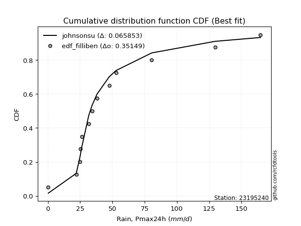</img>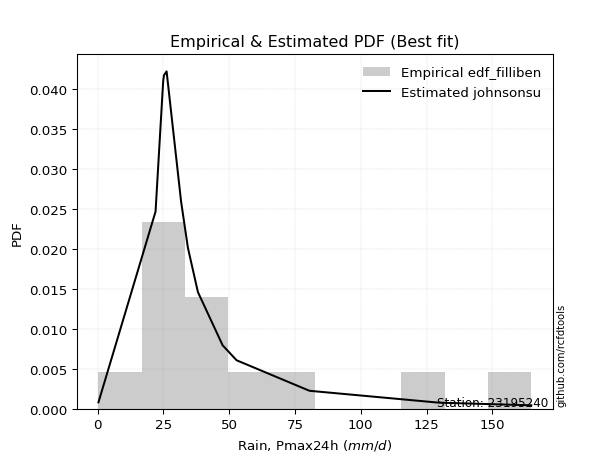</img>

</div>


### 10. Empirical - EDF Jenkinson (1977)

The Jenkinson formula in hydrology is an empirical plotting position formula used to estimate the non-exceedance probability _(P)_ or return period _(T)_ of a given ordered observation within a sample. It is a widely used method in the frequency analysis of extreme events such as floods and rainfall, as it provides a distribution-free way to plot data. _a≈0.31_ and _b≈0.38_ are constants derived to approximate the median of the probability distribution for the given rank.

<div align="center">


$P=(m-a)/(n+b)$


</div>


**10.1. Empirical values**

<div align="center">

|                | 0                   | 1                   | 2                  | 3                  | 4                   | 5                  | 6                   | 7                  | 8                  | 9                  | 10                 | 11                 | 12                 | 13                 |
|:---------------|:--------------------|:--------------------|:-------------------|:-------------------|:--------------------|:-------------------|:--------------------|:-------------------|:-------------------|:-------------------|:-------------------|:-------------------|:-------------------|:-------------------|
| date           | 2021                | 2025                | 2020               | 2016               | 2023                | 2009               | 2008                | 2018               | 2017               | 2007               | 2019               | 2006               | 2024               | 2005               |
| x              | 0.3                 | 0.6                 | 22.0               | 24.9               | 25.2                | 26.2               | 31.7                | 34.3               | 38.1               | 47.5               | 52.8               | 80.5               | 129.6              | 164.8              |
| m              | 1                   | 2                   | 3                  | 4                  | 5                   | 6                  | 7                   | 8                  | 9                  | 10                 | 11                 | 12                 | 13                 | 14                 |
| empirical_dist | edf_jenkinson       | edf_jenkinson       | edf_jenkinson      | edf_jenkinson      | edf_jenkinson       | edf_jenkinson      | edf_jenkinson       | edf_jenkinson      | edf_jenkinson      | edf_jenkinson      | edf_jenkinson      | edf_jenkinson      | edf_jenkinson      | edf_jenkinson      |
| empirical      | 0.04798331015299026 | 0.11752433936022252 | 0.1870653685674548 | 0.256606397774687  | 0.32614742698191934 | 0.3956884561891516 | 0.46522948539638387 | 0.5347705146036161 | 0.6043115438108483 | 0.6738525730180805 | 0.7433936022253128 | 0.8129346314325451 | 0.8824756606397773 | 0.9520166898470096 |
| empirical_tr   | 1.0504017531044558  | 1.1331757289204099  | 1.2301112061591104 | 1.3451824134705332 | 1.4840041279669762  | 1.6547756041426929 | 1.869960988296489   | 2.1494768310911807 | 2.527240773286467  | 3.066098081023453  | 3.8970189701897002 | 5.345724907063193  | 8.50887573964496   | 20.84057971014487  |

</div>


**10.2. Kolmogorov-Smirnov fit test (sorted by Δ)**


<div align="center">

|                | 0                   | 1                   | 2                   | 3                   | 4                   | 5                   | 6                   | 7                   | 8                   | 9                   | 10               | 11                  | 12                 | 13                  | 14                  | 15                  | 16                  | 17                 | 18                  | 19                  | 20                  | 21                  | 22                | 23                 | 24                 | 25                 | 26                 | 27                  | 28                  | 29                | 30                  | 31                  | 32                  | 33                  | 34                  | 35                  | 36                  | 37                    | 38                  | 39                  | 40                  | 41                  | 42                 | 43                 | 44                  | 45                | 46                  | 47                 | 48                  | 49                  | 50                  | 51                 | 52                 | 53                  | 54                 | 55                 | 56                 | 57                  | 58                  | 59                  | 60                 | 61                 | 62                  | 63                 | 64                  | 65                 | 66                 | 67                 | 68                  | 69                  | 70                  | 71                  | 72                 | 73                  | 74                 | 75                  | 76                  | 77                | 78                | 79                 | 80                | 81                  | 82                 | 83                  | 84                | 85                 | 86                 | 87                 | 88                 | 89                 |
|:---------------|:--------------------|:--------------------|:--------------------|:--------------------|:--------------------|:--------------------|:--------------------|:--------------------|:--------------------|:--------------------|:-----------------|:--------------------|:-------------------|:--------------------|:--------------------|:--------------------|:--------------------|:-------------------|:--------------------|:--------------------|:--------------------|:--------------------|:------------------|:-------------------|:-------------------|:-------------------|:-------------------|:--------------------|:--------------------|:------------------|:--------------------|:--------------------|:--------------------|:--------------------|:--------------------|:--------------------|:--------------------|:----------------------|:--------------------|:--------------------|:--------------------|:--------------------|:-------------------|:-------------------|:--------------------|:------------------|:--------------------|:-------------------|:--------------------|:--------------------|:--------------------|:-------------------|:-------------------|:--------------------|:-------------------|:-------------------|:-------------------|:--------------------|:--------------------|:--------------------|:-------------------|:-------------------|:--------------------|:-------------------|:--------------------|:-------------------|:-------------------|:-------------------|:--------------------|:--------------------|:--------------------|:--------------------|:-------------------|:--------------------|:-------------------|:--------------------|:--------------------|:------------------|:------------------|:-------------------|:------------------|:--------------------|:-------------------|:--------------------|:------------------|:-------------------|:-------------------|:-------------------|:-------------------|:-------------------|
| station        | 23195240            | 23195240            | 23195240            | 23195240            | 23195240            | 23195240            | 23195240            | 23195240            | 23195240            | 23195240            | 23195240         | 23195240            | 23195240           | 23195240            | 23195240            | 23195240            | 23195240            | 23195240           | 23195240            | 23195240            | 23195240            | 23195240            | 23195240          | 23195240           | 23195240           | 23195240           | 23195240           | 23195240            | 23195240            | 23195240          | 23195240            | 23195240            | 23195240            | 23195240            | 23195240            | 23195240            | 23195240            | 23195240              | 23195240            | 23195240            | 23195240            | 23195240            | 23195240           | 23195240           | 23195240            | 23195240          | 23195240            | 23195240           | 23195240            | 23195240            | 23195240            | 23195240           | 23195240           | 23195240            | 23195240           | 23195240           | 23195240           | 23195240            | 23195240            | 23195240            | 23195240           | 23195240           | 23195240            | 23195240           | 23195240            | 23195240           | 23195240           | 23195240           | 23195240            | 23195240            | 23195240            | 23195240            | 23195240           | 23195240            | 23195240           | 23195240            | 23195240            | 23195240          | 23195240          | 23195240           | 23195240          | 23195240            | 23195240           | 23195240            | 23195240          | 23195240           | 23195240           | 23195240           | 23195240           | 23195240           |
| empirical_dist | edf_jenkinson       | edf_jenkinson       | edf_jenkinson       | edf_jenkinson       | edf_jenkinson       | edf_jenkinson       | edf_jenkinson       | edf_jenkinson       | edf_jenkinson       | edf_jenkinson       | edf_jenkinson    | edf_jenkinson       | edf_jenkinson      | edf_jenkinson       | edf_jenkinson       | edf_jenkinson       | edf_jenkinson       | edf_jenkinson      | edf_jenkinson       | edf_jenkinson       | edf_jenkinson       | edf_jenkinson       | edf_jenkinson     | edf_jenkinson      | edf_jenkinson      | edf_jenkinson      | edf_jenkinson      | edf_jenkinson       | edf_jenkinson       | edf_jenkinson     | edf_jenkinson       | edf_jenkinson       | edf_jenkinson       | edf_jenkinson       | edf_jenkinson       | edf_jenkinson       | edf_jenkinson       | edf_jenkinson         | edf_jenkinson       | edf_jenkinson       | edf_jenkinson       | edf_jenkinson       | edf_jenkinson      | edf_jenkinson      | edf_jenkinson       | edf_jenkinson     | edf_jenkinson       | edf_jenkinson      | edf_jenkinson       | edf_jenkinson       | edf_jenkinson       | edf_jenkinson      | edf_jenkinson      | edf_jenkinson       | edf_jenkinson      | edf_jenkinson      | edf_jenkinson      | edf_jenkinson       | edf_jenkinson       | edf_jenkinson       | edf_jenkinson      | edf_jenkinson      | edf_jenkinson       | edf_jenkinson      | edf_jenkinson       | edf_jenkinson      | edf_jenkinson      | edf_jenkinson      | edf_jenkinson       | edf_jenkinson       | edf_jenkinson       | edf_jenkinson       | edf_jenkinson      | edf_jenkinson       | edf_jenkinson      | edf_jenkinson       | edf_jenkinson       | edf_jenkinson     | edf_jenkinson     | edf_jenkinson      | edf_jenkinson     | edf_jenkinson       | edf_jenkinson      | edf_jenkinson       | edf_jenkinson     | edf_jenkinson      | edf_jenkinson      | edf_jenkinson      | edf_jenkinson      | edf_jenkinson      |
| p_dist         | johnsonsu           | logt                | logjohnsonsu        | exponnorm           | laplace_asymmetric  | gibrat              | wald                | truncnorm           | fisk                | moyal               | invweibull       | nct                 | invgamma           | genlogistic         | t                   | gumbel_r            | invgauss            | pearson3           | fatiguelife         | halflogistic        | genexpon            | halfnorm            | gompertz          | rayleigh           | kstwobign          | maxwell            | expon              | weibull_min         | logloggamma         | loggenlogistic    | logpearson3         | rice                | crystalball         | norm                | logistic            | hypsecant           | loggompertz         | loglaplace_asymmetric | loggumbel_l         | ncf                 | mielke              | erlang              | laplace            | betaprime          | f                   | gumbel_l          | chi2                | loglaplace         | loglognorm          | loghypsecant        | logbetaprime        | logfatiguelife     | loglogistic        | logrice             | logexponnorm       | lognorm            | lognorm            | logcrystalball      | lognct              | lognakagami         | loggamma           | loggamma           | loginvgamma         | gamma              | logalpha            | logerlang          | logmielke          | loginvgauss        | logmaxwell          | loginvweibull       | logchi2             | lograyleigh         | loggumbel_r        | logkstwobign        | loghalfnorm        | loggenexpon         | logmoyal            | loghalflogistic   | logncf            | nakagami           | logfisk           | logexpon            | pareto             | logwald             | logpareto         | loggibrat          | logtruncnorm       | logf               | logweibull_min     | alpha              |
| delta          | 0.07094804018035294 | 0.08645091874052542 | 0.09522175363042254 | 0.09896552558689542 | 0.11733091426390363 | 0.11752433936022252 | 0.11752433936022252 | 0.12090238838328923 | 0.12125051605092738 | 0.12321039366797884 | 0.12409100339893 | 0.12467484380223856 | 0.1281425551908217 | 0.12990461559076832 | 0.13065399205108455 | 0.13474961645839423 | 0.13980330943403604 | 0.1409266122284011 | 0.14395324181410926 | 0.15024591249391775 | 0.15571408961261005 | 0.15680941945511687 | 0.159196606150065 | 0.1639999718808367 | 0.1645091615247406 | 0.1740842108941303 | 0.1756515358643548 | 0.18979586839905585 | 0.19327029880165478 | 0.197921061103753 | 0.20018252828196884 | 0.20442624811707172 | 0.20521968357306541 | 0.20521968411295055 | 0.20672160329395534 | 0.21645994538111463 | 0.21649727831151902 | 0.21739215876999954   | 0.23208257319833273 | 0.23224541711443084 | 0.23848636517156743 | 0.24202466532483205 | 0.2426782616595763 | 0.2530098253851083 | 0.25652112831195795 | 0.273387338778147 | 0.27446975451700684 | 0.2950927585573303 | 0.30004105172739126 | 0.30009141092458547 | 0.30045072171822473 | 0.3009530508990602 | 0.3012860653716014 | 0.30265253398198777 | 0.3026833853384807 | 0.3026855701942113 | 0.3026855701942113 | 0.30268565839861283 | 0.30304326607881016 | 0.30340222659669336 | 0.3174324134427413 | 0.3174324134427413 | 0.32363077802472207 | 0.3242853251640162 | 0.32647068701280335 | 0.3270553866601219 | 0.3314313809050957 | 0.3334461069226673 | 0.33611766168574575 | 0.33629394222953357 | 0.34079835264086344 | 0.34734114332628163 | 0.3726821107155357 | 0.37547082481562644 | 0.3789525537576348 | 0.39534665758138154 | 0.39856583864722106 | 0.403233349255549 | 0.415130719720328 | 0.4203547174973995 | 0.438686871721217 | 0.44124830410670834 | 0.4634916321162462 | 0.47059135366640037 | 0.490708781961934 | 0.4922378334304873 | 0.5096921772912293 | 0.5263850203932121 | 0.5455242368089095 | 0.7767447646807015 |
| deltao         | 0.343224222286      | 0.343224222286      | 0.343224222286      | 0.343224222286      | 0.343224222286      | 0.343224222286      | 0.343224222286      | 0.343224222286      | 0.343224222286      | 0.343224222286      | 0.343224222286   | 0.343224222286      | 0.343224222286     | 0.343224222286      | 0.343224222286      | 0.343224222286      | 0.343224222286      | 0.343224222286     | 0.343224222286      | 0.343224222286      | 0.343224222286      | 0.343224222286      | 0.343224222286    | 0.343224222286     | 0.343224222286     | 0.343224222286     | 0.343224222286     | 0.343224222286      | 0.343224222286      | 0.343224222286    | 0.343224222286      | 0.343224222286      | 0.343224222286      | 0.343224222286      | 0.343224222286      | 0.343224222286      | 0.343224222286      | 0.343224222286        | 0.343224222286      | 0.343224222286      | 0.343224222286      | 0.343224222286      | 0.343224222286     | 0.343224222286     | 0.343224222286      | 0.343224222286    | 0.343224222286      | 0.343224222286     | 0.343224222286      | 0.343224222286      | 0.343224222286      | 0.343224222286     | 0.343224222286     | 0.343224222286      | 0.343224222286     | 0.343224222286     | 0.343224222286     | 0.343224222286      | 0.343224222286      | 0.343224222286      | 0.343224222286     | 0.343224222286     | 0.343224222286      | 0.343224222286     | 0.343224222286      | 0.343224222286     | 0.343224222286     | 0.343224222286     | 0.343224222286      | 0.343224222286      | 0.343224222286      | 0.343224222286      | 0.343224222286     | 0.343224222286      | 0.343224222286     | 0.343224222286      | 0.343224222286      | 0.343224222286    | 0.343224222286    | 0.343224222286     | 0.343224222286    | 0.343224222286      | 0.343224222286     | 0.343224222286      | 0.343224222286    | 0.343224222286     | 0.343224222286     | 0.343224222286     | 0.343224222286     | 0.343224222286     |
| eval           | Δo > Δ              | Δo > Δ              | Δo > Δ              | Δo > Δ              | Δo > Δ              | Δo > Δ              | Δo > Δ              | Δo > Δ              | Δo > Δ              | Δo > Δ              | Δo > Δ           | Δo > Δ              | Δo > Δ             | Δo > Δ              | Δo > Δ              | Δo > Δ              | Δo > Δ              | Δo > Δ             | Δo > Δ              | Δo > Δ              | Δo > Δ              | Δo > Δ              | Δo > Δ            | Δo > Δ             | Δo > Δ             | Δo > Δ             | Δo > Δ             | Δo > Δ              | Δo > Δ              | Δo > Δ            | Δo > Δ              | Δo > Δ              | Δo > Δ              | Δo > Δ              | Δo > Δ              | Δo > Δ              | Δo > Δ              | Δo > Δ                | Δo > Δ              | Δo > Δ              | Δo > Δ              | Δo > Δ              | Δo > Δ             | Δo > Δ             | Δo > Δ              | Δo > Δ            | Δo > Δ              | Δo > Δ             | Δo > Δ              | Δo > Δ              | Δo > Δ              | Δo > Δ             | Δo > Δ             | Δo > Δ              | Δo > Δ             | Δo > Δ             | Δo > Δ             | Δo > Δ              | Δo > Δ              | Δo > Δ              | Δo > Δ             | Δo > Δ             | Δo > Δ              | Δo > Δ             | Δo > Δ              | Δo > Δ             | Δo > Δ             | Δo > Δ             | Δo > Δ              | Δo > Δ              | Δo > Δ              | Δo <= Δ             | Δo <= Δ            | Δo <= Δ             | Δo <= Δ            | Δo <= Δ             | Δo <= Δ             | Δo <= Δ           | Δo <= Δ           | Δo <= Δ            | Δo <= Δ           | Δo <= Δ             | Δo <= Δ            | Δo <= Δ             | Δo <= Δ           | Δo <= Δ            | Δo <= Δ            | Δo <= Δ            | Δo <= Δ            | Δo <= Δ            |
| fit            | 1                   | 1                   | 1                   | 1                   | 1                   | 1                   | 1                   | 1                   | 1                   | 1                   | 1                | 1                   | 1                  | 1                   | 1                   | 1                   | 1                   | 1                  | 1                   | 1                   | 1                   | 1                   | 1                 | 1                  | 1                  | 1                  | 1                  | 1                   | 1                   | 1                 | 1                   | 1                   | 1                   | 1                   | 1                   | 1                   | 1                   | 1                     | 1                   | 1                   | 1                   | 1                   | 1                  | 1                  | 1                   | 1                 | 1                   | 1                  | 1                   | 1                   | 1                   | 1                  | 1                  | 1                   | 1                  | 1                  | 1                  | 1                   | 1                   | 1                   | 1                  | 1                  | 1                   | 1                  | 1                   | 1                  | 1                  | 1                  | 1                   | 1                   | 1                   | 0                   | 0                  | 0                   | 0                  | 0                   | 0                   | 0                 | 0                 | 0                  | 0                 | 0                   | 0                  | 0                   | 0                 | 0                  | 0                  | 0                  | 0                  | 0                  |
| n              | 14                  | 14                  | 14                  | 14                  | 14                  | 14                  | 14                  | 14                  | 14                  | 14                  | 14               | 14                  | 14                 | 14                  | 14                  | 14                  | 14                  | 14                 | 14                  | 14                  | 14                  | 14                  | 14                | 14                 | 14                 | 14                 | 14                 | 14                  | 14                  | 14                | 14                  | 14                  | 14                  | 14                  | 14                  | 14                  | 14                  | 14                    | 14                  | 14                  | 14                  | 14                  | 14                 | 14                 | 14                  | 14                | 14                  | 14                 | 14                  | 14                  | 14                  | 14                 | 14                 | 14                  | 14                 | 14                 | 14                 | 14                  | 14                  | 14                  | 14                 | 14                 | 14                  | 14                 | 14                  | 14                 | 14                 | 14                 | 14                  | 14                  | 14                  | 14                  | 14                 | 14                  | 14                 | 14                  | 14                  | 14                | 14                | 14                 | 14                | 14                  | 14                 | 14                  | 14                | 14                 | 14                 | 14                 | 14                 | 14                 |
| best_fit       | 1                   | 0                   | 0                   | 0                   | 0                   | 0                   | 0                   | 0                   | 0                   | 0                   | 0                | 0                   | 0                  | 0                   | 0                   | 0                   | 0                   | 0                  | 0                   | 0                   | 0                   | 0                   | 0                 | 0                  | 0                  | 0                  | 0                  | 0                   | 0                   | 0                 | 0                   | 0                   | 0                   | 0                   | 0                   | 0                   | 0                   | 0                     | 0                   | 0                   | 0                   | 0                   | 0                  | 0                  | 0                   | 0                 | 0                   | 0                  | 0                   | 0                   | 0                   | 0                  | 0                  | 0                   | 0                  | 0                  | 0                  | 0                   | 0                   | 0                   | 0                  | 0                  | 0                   | 0                  | 0                   | 0                  | 0                  | 0                  | 0                   | 0                   | 0                   | 0                   | 0                  | 0                   | 0                  | 0                   | 0                   | 0                 | 0                 | 0                  | 0                 | 0                   | 0                  | 0                   | 0                 | 0                  | 0                  | 0                  | 0                  | 0                  |
| best_fit_sort  | 1                   | 2                   | 3                   | 4                   | 5                   | 6                   | 7                   | 8                   | 9                   | 10                  | 11               | 12                  | 13                 | 14                  | 15                  | 16                  | 17                  | 18                 | 19                  | 20                  | 21                  | 22                  | 23                | 24                 | 25                 | 26                 | 27                 | 28                  | 29                  | 30                | 31                  | 32                  | 33                  | 34                  | 35                  | 36                  | 37                  | 38                    | 39                  | 40                  | 41                  | 42                  | 43                 | 44                 | 45                  | 46                | 47                  | 48                 | 49                  | 50                  | 51                  | 52                 | 53                 | 54                  | 55                 | 56                 | 57                 | 58                  | 59                  | 60                  | 61                 | 62                 | 63                  | 64                 | 65                  | 66                 | 67                 | 68                 | 69                  | 70                  | 71                  | 72                  | 73                 | 74                  | 75                 | 76                  | 77                  | 78                | 79                | 80                 | 81                | 82                  | 83                 | 84                  | 85                | 86                 | 87                 | 88                 | 89                 | 90                 |

</div>


<div align="center">

</img>

</div>


**10.3. Best fit**

<div align="center">

|   id |   station | empirical_dist   | p_dist    |    delta |   deltao | eval   |   fit |   n |   best_fit |   best_fit_sort |
|-----:|----------:|:-----------------|:----------|---------:|---------:|:-------|------:|----:|-----------:|----------------:|
|    0 |  23195240 | edf_jenkinson    | johnsonsu | 0.070948 | 0.343224 | Δo > Δ |     1 |  14 |          1 |               1 |

</div>


<div align="center">

</img></img>

</div>


### 11. Empirical - EDF Cunnane (1978)

Cunnane´s work in statistical hydrology has focused on the performance and evaluation of different probability distributions (such as GEV, Gumbel, Lognormal) for flood frequency estimation. _b_ is a constant, typically set to 0.4.

<div align="center">


$P=(m-b)/(n+1-2b)$


</div>


**11.1. Empirical values**

<div align="center">

|                | 0                   | 1                   | 2                   | 3                  | 4                  | 5                   | 6                  | 7                  | 8                  | 9                  | 10                 | 11                 | 12                 | 13                 |
|:---------------|:--------------------|:--------------------|:--------------------|:-------------------|:-------------------|:--------------------|:-------------------|:-------------------|:-------------------|:-------------------|:-------------------|:-------------------|:-------------------|:-------------------|
| date           | 2021                | 2025                | 2020                | 2016               | 2023               | 2009                | 2008               | 2018               | 2017               | 2007               | 2019               | 2006               | 2024               | 2005               |
| x              | 0.3                 | 0.6                 | 22.0                | 24.9               | 25.2               | 26.2                | 31.7               | 34.3               | 38.1               | 47.5               | 52.8               | 80.5               | 129.6              | 164.8              |
| m              | 1                   | 2                   | 3                   | 4                  | 5                  | 6                   | 7                  | 8                  | 9                  | 10                 | 11                 | 12                 | 13                 | 14                 |
| empirical_dist | edf_cunnane         | edf_cunnane         | edf_cunnane         | edf_cunnane        | edf_cunnane        | edf_cunnane         | edf_cunnane        | edf_cunnane        | edf_cunnane        | edf_cunnane        | edf_cunnane        | edf_cunnane        | edf_cunnane        | edf_cunnane        |
| empirical      | 0.04225352112676056 | 0.11267605633802819 | 0.18309859154929578 | 0.2535211267605634 | 0.323943661971831  | 0.39436619718309857 | 0.4647887323943662 | 0.5352112676056338 | 0.6056338028169014 | 0.676056338028169  | 0.7464788732394366 | 0.8169014084507042 | 0.8873239436619719 | 0.9577464788732395 |
| empirical_tr   | 1.0441176470588234  | 1.126984126984127   | 1.2241379310344827  | 1.3396226415094339 | 1.4791666666666667 | 1.6511627906976742  | 1.8684210526315792 | 2.1515151515151514 | 2.5357142857142856 | 3.0869565217391304 | 3.9444444444444446 | 5.461538461538463  | 8.875000000000004  | 23.6666666666667   |

</div>


**11.2. Kolmogorov-Smirnov fit test (sorted by Δ)**


<div align="center">

|                | 0                   | 1                   | 2                   | 3                   | 4                   | 5                   | 6                   | 7                   | 8                   | 9                   | 10                | 11                  | 12                  | 13                  | 14                  | 15                  | 16                  | 17                  | 18                  | 19                  | 20                  | 21                  | 22                | 23                 | 24                  | 25                 | 26                  | 27                  | 28                  | 29                | 30                  | 31                 | 32                  | 33                  | 34                  | 35                  | 36                  | 37                    | 38                  | 39                  | 40                  | 41                  | 42                  | 43                  | 44                | 45                  | 46                 | 47                  | 48                 | 49                 | 50                 | 51                  | 52                  | 53                 | 54                  | 55                 | 56                 | 57                 | 58                 | 59                 | 60                 | 61                 | 62                  | 63                  | 64                 | 65                  | 66                 | 67                  | 68                 | 69                  | 70                 | 71                 | 72                  | 73                 | 74                 | 75                 | 76                 | 77                  | 78                  | 79                  | 80                  | 81                 | 82                 | 83                  | 84                 | 85                 | 86                 | 87                 | 88                 | 89                 |
|:---------------|:--------------------|:--------------------|:--------------------|:--------------------|:--------------------|:--------------------|:--------------------|:--------------------|:--------------------|:--------------------|:------------------|:--------------------|:--------------------|:--------------------|:--------------------|:--------------------|:--------------------|:--------------------|:--------------------|:--------------------|:--------------------|:--------------------|:------------------|:-------------------|:--------------------|:-------------------|:--------------------|:--------------------|:--------------------|:------------------|:--------------------|:-------------------|:--------------------|:--------------------|:--------------------|:--------------------|:--------------------|:----------------------|:--------------------|:--------------------|:--------------------|:--------------------|:--------------------|:--------------------|:------------------|:--------------------|:-------------------|:--------------------|:-------------------|:-------------------|:-------------------|:--------------------|:--------------------|:-------------------|:--------------------|:-------------------|:-------------------|:-------------------|:-------------------|:-------------------|:-------------------|:-------------------|:--------------------|:--------------------|:-------------------|:--------------------|:-------------------|:--------------------|:-------------------|:--------------------|:-------------------|:-------------------|:--------------------|:-------------------|:-------------------|:-------------------|:-------------------|:--------------------|:--------------------|:--------------------|:--------------------|:-------------------|:-------------------|:--------------------|:-------------------|:-------------------|:-------------------|:-------------------|:-------------------|:-------------------|
| station        | 23195240            | 23195240            | 23195240            | 23195240            | 23195240            | 23195240            | 23195240            | 23195240            | 23195240            | 23195240            | 23195240          | 23195240            | 23195240            | 23195240            | 23195240            | 23195240            | 23195240            | 23195240            | 23195240            | 23195240            | 23195240            | 23195240            | 23195240          | 23195240           | 23195240            | 23195240           | 23195240            | 23195240            | 23195240            | 23195240          | 23195240            | 23195240           | 23195240            | 23195240            | 23195240            | 23195240            | 23195240            | 23195240              | 23195240            | 23195240            | 23195240            | 23195240            | 23195240            | 23195240            | 23195240          | 23195240            | 23195240           | 23195240            | 23195240           | 23195240           | 23195240           | 23195240            | 23195240            | 23195240           | 23195240            | 23195240           | 23195240           | 23195240           | 23195240           | 23195240           | 23195240           | 23195240           | 23195240            | 23195240            | 23195240           | 23195240            | 23195240           | 23195240            | 23195240           | 23195240            | 23195240           | 23195240           | 23195240            | 23195240           | 23195240           | 23195240           | 23195240           | 23195240            | 23195240            | 23195240            | 23195240            | 23195240           | 23195240           | 23195240            | 23195240           | 23195240           | 23195240           | 23195240           | 23195240           | 23195240           |
| empirical_dist | edf_cunnane         | edf_cunnane         | edf_cunnane         | edf_cunnane         | edf_cunnane         | edf_cunnane         | edf_cunnane         | edf_cunnane         | edf_cunnane         | edf_cunnane         | edf_cunnane       | edf_cunnane         | edf_cunnane         | edf_cunnane         | edf_cunnane         | edf_cunnane         | edf_cunnane         | edf_cunnane         | edf_cunnane         | edf_cunnane         | edf_cunnane         | edf_cunnane         | edf_cunnane       | edf_cunnane        | edf_cunnane         | edf_cunnane        | edf_cunnane         | edf_cunnane         | edf_cunnane         | edf_cunnane       | edf_cunnane         | edf_cunnane        | edf_cunnane         | edf_cunnane         | edf_cunnane         | edf_cunnane         | edf_cunnane         | edf_cunnane           | edf_cunnane         | edf_cunnane         | edf_cunnane         | edf_cunnane         | edf_cunnane         | edf_cunnane         | edf_cunnane       | edf_cunnane         | edf_cunnane        | edf_cunnane         | edf_cunnane        | edf_cunnane        | edf_cunnane        | edf_cunnane         | edf_cunnane         | edf_cunnane        | edf_cunnane         | edf_cunnane        | edf_cunnane        | edf_cunnane        | edf_cunnane        | edf_cunnane        | edf_cunnane        | edf_cunnane        | edf_cunnane         | edf_cunnane         | edf_cunnane        | edf_cunnane         | edf_cunnane        | edf_cunnane         | edf_cunnane        | edf_cunnane         | edf_cunnane        | edf_cunnane        | edf_cunnane         | edf_cunnane        | edf_cunnane        | edf_cunnane        | edf_cunnane        | edf_cunnane         | edf_cunnane         | edf_cunnane         | edf_cunnane         | edf_cunnane        | edf_cunnane        | edf_cunnane         | edf_cunnane        | edf_cunnane        | edf_cunnane        | edf_cunnane        | edf_cunnane        | edf_cunnane        |
| p_dist         | johnsonsu           | logt                | logjohnsonsu        | exponnorm           | gibrat              | wald                | laplace_asymmetric  | truncnorm           | fisk                | moyal               | invweibull        | nct                 | genlogistic         | invgamma            | t                   | gumbel_r            | invgauss            | pearson3            | fatiguelife         | halflogistic        | genexpon            | halfnorm            | gompertz          | kstwobign          | rayleigh            | maxwell            | expon               | weibull_min         | logloggamma         | loggenlogistic    | logpearson3         | rice               | logistic            | crystalball         | norm                | hypsecant           | loggompertz         | loglaplace_asymmetric | loggumbel_l         | ncf                 | mielke              | laplace             | erlang              | betaprime           | f                 | gumbel_l            | chi2               | loglaplace          | loglognorm         | loghypsecant       | logbetaprime       | logfatiguelife      | loglogistic         | logrice            | logexponnorm        | lognorm            | lognorm            | logcrystalball     | lognct             | lognakagami        | loggamma           | loggamma           | loginvgamma         | gamma               | logalpha           | logerlang           | logmielke          | loginvgauss         | logmaxwell         | loginvweibull       | logchi2            | lograyleigh        | loggumbel_r         | logkstwobign       | loghalfnorm        | loggenexpon        | logmoyal           | loghalflogistic     | logncf              | nakagami            | logfisk             | logexpon           | pareto             | logwald             | logpareto          | loggibrat          | logtruncnorm       | logf               | logweibull_min     | alpha              |
| delta          | 0.06919463268244846 | 0.08160263571833108 | 0.09918853064858155 | 0.10028778459294851 | 0.11267605633802819 | 0.11267605633802819 | 0.11865317326995672 | 0.12486916540144824 | 0.12521729306908638 | 0.12717717068613785 | 0.128057780417089 | 0.12864162082039757 | 0.13122687459682142 | 0.13210933220898072 | 0.13462076906924356 | 0.13783488747251804 | 0.14377008645219505 | 0.14489338924656012 | 0.14792001883226827 | 0.15421268951207676 | 0.15968086663076905 | 0.16077619647327587 | 0.163163383168224 | 0.1658314205307937 | 0.16708524289496052 | 0.1771694819082541 | 0.17961831288251381 | 0.19376264541721486 | 0.19723707581981378 | 0.201887838121912 | 0.20414930530012784 | 0.2057485071231248 | 0.20804386230000843 | 0.20830495458718923 | 0.20830495512707436 | 0.21778220438716772 | 0.22046405532967803 | 0.22135893578815855   | 0.23604935021649173 | 0.23621219413258984 | 0.24245314218972644 | 0.24400052066562938 | 0.24599144234299106 | 0.25697660240326736 | 0.260487905330117 | 0.27647260979227084 | 0.2784365315351658 | 0.29905953557548937 | 0.3040078287455502 | 0.3040581879427444 | 0.3044174987363837 | 0.30491982791721917 | 0.30525284238976036 | 0.3066193110001467 | 0.30665016235663967 | 0.3066523472123702 | 0.3066523472123702 | 0.3066524354167718 | 0.3070100430969691 | 0.3073690036148524 | 0.3213991904609004 | 0.3213991904609004 | 0.32759755504288113 | 0.32825210218217526 | 0.3304374640309624 | 0.33102216367828097 | 0.3353981579232548 | 0.33741288394082636 | 0.3400844387039048 | 0.34026071924769263 | 0.3447651296590225 | 0.3513079203444407 | 0.37664888773369476 | 0.3794376018337855 | 0.3829193307757939 | 0.3993134345995406 | 0.4025326156653801 | 0.40720012627370805 | 0.41909749673848706 | 0.42432149451555856 | 0.44265364873937607 | 0.4452150811248674 | 0.4674584091344053 | 0.47455813068455943 | 0.4955570649841284 | 0.4962046104486464 | 0.5136589543093883 | 0.5303517974113712 | 0.5494910138270686 | 0.7807115416988606 |
| deltao         | 0.343224222286      | 0.343224222286      | 0.343224222286      | 0.343224222286      | 0.343224222286      | 0.343224222286      | 0.343224222286      | 0.343224222286      | 0.343224222286      | 0.343224222286      | 0.343224222286    | 0.343224222286      | 0.343224222286      | 0.343224222286      | 0.343224222286      | 0.343224222286      | 0.343224222286      | 0.343224222286      | 0.343224222286      | 0.343224222286      | 0.343224222286      | 0.343224222286      | 0.343224222286    | 0.343224222286     | 0.343224222286      | 0.343224222286     | 0.343224222286      | 0.343224222286      | 0.343224222286      | 0.343224222286    | 0.343224222286      | 0.343224222286     | 0.343224222286      | 0.343224222286      | 0.343224222286      | 0.343224222286      | 0.343224222286      | 0.343224222286        | 0.343224222286      | 0.343224222286      | 0.343224222286      | 0.343224222286      | 0.343224222286      | 0.343224222286      | 0.343224222286    | 0.343224222286      | 0.343224222286     | 0.343224222286      | 0.343224222286     | 0.343224222286     | 0.343224222286     | 0.343224222286      | 0.343224222286      | 0.343224222286     | 0.343224222286      | 0.343224222286     | 0.343224222286     | 0.343224222286     | 0.343224222286     | 0.343224222286     | 0.343224222286     | 0.343224222286     | 0.343224222286      | 0.343224222286      | 0.343224222286     | 0.343224222286      | 0.343224222286     | 0.343224222286      | 0.343224222286     | 0.343224222286      | 0.343224222286     | 0.343224222286     | 0.343224222286      | 0.343224222286     | 0.343224222286     | 0.343224222286     | 0.343224222286     | 0.343224222286      | 0.343224222286      | 0.343224222286      | 0.343224222286      | 0.343224222286     | 0.343224222286     | 0.343224222286      | 0.343224222286     | 0.343224222286     | 0.343224222286     | 0.343224222286     | 0.343224222286     | 0.343224222286     |
| eval           | Δo > Δ              | Δo > Δ              | Δo > Δ              | Δo > Δ              | Δo > Δ              | Δo > Δ              | Δo > Δ              | Δo > Δ              | Δo > Δ              | Δo > Δ              | Δo > Δ            | Δo > Δ              | Δo > Δ              | Δo > Δ              | Δo > Δ              | Δo > Δ              | Δo > Δ              | Δo > Δ              | Δo > Δ              | Δo > Δ              | Δo > Δ              | Δo > Δ              | Δo > Δ            | Δo > Δ             | Δo > Δ              | Δo > Δ             | Δo > Δ              | Δo > Δ              | Δo > Δ              | Δo > Δ            | Δo > Δ              | Δo > Δ             | Δo > Δ              | Δo > Δ              | Δo > Δ              | Δo > Δ              | Δo > Δ              | Δo > Δ                | Δo > Δ              | Δo > Δ              | Δo > Δ              | Δo > Δ              | Δo > Δ              | Δo > Δ              | Δo > Δ            | Δo > Δ              | Δo > Δ             | Δo > Δ              | Δo > Δ             | Δo > Δ             | Δo > Δ             | Δo > Δ              | Δo > Δ              | Δo > Δ             | Δo > Δ              | Δo > Δ             | Δo > Δ             | Δo > Δ             | Δo > Δ             | Δo > Δ             | Δo > Δ             | Δo > Δ             | Δo > Δ              | Δo > Δ              | Δo > Δ             | Δo > Δ              | Δo > Δ             | Δo > Δ              | Δo > Δ             | Δo > Δ              | Δo <= Δ            | Δo <= Δ            | Δo <= Δ             | Δo <= Δ            | Δo <= Δ            | Δo <= Δ            | Δo <= Δ            | Δo <= Δ             | Δo <= Δ             | Δo <= Δ             | Δo <= Δ             | Δo <= Δ            | Δo <= Δ            | Δo <= Δ             | Δo <= Δ            | Δo <= Δ            | Δo <= Δ            | Δo <= Δ            | Δo <= Δ            | Δo <= Δ            |
| fit            | 1                   | 1                   | 1                   | 1                   | 1                   | 1                   | 1                   | 1                   | 1                   | 1                   | 1                 | 1                   | 1                   | 1                   | 1                   | 1                   | 1                   | 1                   | 1                   | 1                   | 1                   | 1                   | 1                 | 1                  | 1                   | 1                  | 1                   | 1                   | 1                   | 1                 | 1                   | 1                  | 1                   | 1                   | 1                   | 1                   | 1                   | 1                     | 1                   | 1                   | 1                   | 1                   | 1                   | 1                   | 1                 | 1                   | 1                  | 1                   | 1                  | 1                  | 1                  | 1                   | 1                   | 1                  | 1                   | 1                  | 1                  | 1                  | 1                  | 1                  | 1                  | 1                  | 1                   | 1                   | 1                  | 1                   | 1                  | 1                   | 1                  | 1                   | 0                  | 0                  | 0                   | 0                  | 0                  | 0                  | 0                  | 0                   | 0                   | 0                   | 0                   | 0                  | 0                  | 0                   | 0                  | 0                  | 0                  | 0                  | 0                  | 0                  |
| n              | 14                  | 14                  | 14                  | 14                  | 14                  | 14                  | 14                  | 14                  | 14                  | 14                  | 14                | 14                  | 14                  | 14                  | 14                  | 14                  | 14                  | 14                  | 14                  | 14                  | 14                  | 14                  | 14                | 14                 | 14                  | 14                 | 14                  | 14                  | 14                  | 14                | 14                  | 14                 | 14                  | 14                  | 14                  | 14                  | 14                  | 14                    | 14                  | 14                  | 14                  | 14                  | 14                  | 14                  | 14                | 14                  | 14                 | 14                  | 14                 | 14                 | 14                 | 14                  | 14                  | 14                 | 14                  | 14                 | 14                 | 14                 | 14                 | 14                 | 14                 | 14                 | 14                  | 14                  | 14                 | 14                  | 14                 | 14                  | 14                 | 14                  | 14                 | 14                 | 14                  | 14                 | 14                 | 14                 | 14                 | 14                  | 14                  | 14                  | 14                  | 14                 | 14                 | 14                  | 14                 | 14                 | 14                 | 14                 | 14                 | 14                 |
| best_fit       | 1                   | 0                   | 0                   | 0                   | 0                   | 0                   | 0                   | 0                   | 0                   | 0                   | 0                 | 0                   | 0                   | 0                   | 0                   | 0                   | 0                   | 0                   | 0                   | 0                   | 0                   | 0                   | 0                 | 0                  | 0                   | 0                  | 0                   | 0                   | 0                   | 0                 | 0                   | 0                  | 0                   | 0                   | 0                   | 0                   | 0                   | 0                     | 0                   | 0                   | 0                   | 0                   | 0                   | 0                   | 0                 | 0                   | 0                  | 0                   | 0                  | 0                  | 0                  | 0                   | 0                   | 0                  | 0                   | 0                  | 0                  | 0                  | 0                  | 0                  | 0                  | 0                  | 0                   | 0                   | 0                  | 0                   | 0                  | 0                   | 0                  | 0                   | 0                  | 0                  | 0                   | 0                  | 0                  | 0                  | 0                  | 0                   | 0                   | 0                   | 0                   | 0                  | 0                  | 0                   | 0                  | 0                  | 0                  | 0                  | 0                  | 0                  |
| best_fit_sort  | 1                   | 2                   | 3                   | 4                   | 5                   | 6                   | 7                   | 8                   | 9                   | 10                  | 11                | 12                  | 13                  | 14                  | 15                  | 16                  | 17                  | 18                  | 19                  | 20                  | 21                  | 22                  | 23                | 24                 | 25                  | 26                 | 27                  | 28                  | 29                  | 30                | 31                  | 32                 | 33                  | 34                  | 35                  | 36                  | 37                  | 38                    | 39                  | 40                  | 41                  | 42                  | 43                  | 44                  | 45                | 46                  | 47                 | 48                  | 49                 | 50                 | 51                 | 52                  | 53                  | 54                 | 55                  | 56                 | 57                 | 58                 | 59                 | 60                 | 61                 | 62                 | 63                  | 64                  | 65                 | 66                  | 67                 | 68                  | 69                 | 70                  | 71                 | 72                 | 73                  | 74                 | 75                 | 76                 | 77                 | 78                  | 79                  | 80                  | 81                  | 82                 | 83                 | 84                  | 85                 | 86                 | 87                 | 88                 | 89                 | 90                 |

</div>


<div align="center">

</img>

</div>


**11.3. Best fit**

<div align="center">

|   id |   station | empirical_dist   | p_dist    |     delta |   deltao | eval   |   fit |   n |   best_fit |   best_fit_sort |
|-----:|----------:|:-----------------|:----------|----------:|---------:|:-------|------:|----:|-----------:|----------------:|
|    0 |  23195240 | edf_cunnane      | johnsonsu | 0.0691946 | 0.343224 | Δo > Δ |     1 |  14 |          1 |               1 |

</div>


<div align="center">

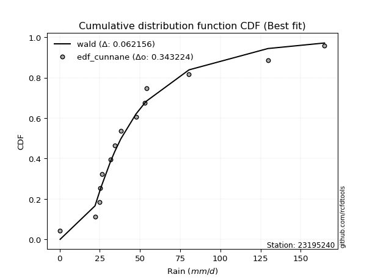</img></img>

</div>


### 12. Empirical - EDF Adamowski (1981)

The Adamowski formula in hydrology refers to a specific plotting position formula used for estimating the non-parametric empirical distribution of hydrological events (like flood peaks) to calculate their return periods. This formula provides an alternative to traditional parametric methods (like the Gumbel or Log Pearson Type III distributions). 

<div align="center">


$P=(m-0.25)/(n+0.5)$


</div>


**12.1. Empirical values**

<div align="center">

|                | 0                   | 1                  | 2                  | 3                   | 4                  | 5                   | 6                   | 7                  | 8                  | 9                  | 10                 | 11                 | 12                 | 13                 |
|:---------------|:--------------------|:-------------------|:-------------------|:--------------------|:-------------------|:--------------------|:--------------------|:-------------------|:-------------------|:-------------------|:-------------------|:-------------------|:-------------------|:-------------------|
| date           | 2021                | 2025               | 2020               | 2016                | 2023               | 2009                | 2008                | 2018               | 2017               | 2007               | 2019               | 2006               | 2024               | 2005               |
| x              | 0.3                 | 0.6                | 22.0               | 24.9                | 25.2               | 26.2                | 31.7                | 34.3               | 38.1               | 47.5               | 52.8               | 80.5               | 129.6              | 164.8              |
| m              | 1                   | 2                  | 3                  | 4                   | 5                  | 6                   | 7                   | 8                  | 9                  | 10                 | 11                 | 12                 | 13                 | 14                 |
| empirical_dist | edf_adamowski       | edf_adamowski      | edf_adamowski      | edf_adamowski       | edf_adamowski      | edf_adamowski       | edf_adamowski       | edf_adamowski      | edf_adamowski      | edf_adamowski      | edf_adamowski      | edf_adamowski      | edf_adamowski      | edf_adamowski      |
| empirical      | 0.05172413793103448 | 0.1206896551724138 | 0.1896551724137931 | 0.25862068965517243 | 0.3275862068965517 | 0.39655172413793105 | 0.46551724137931033 | 0.5344827586206896 | 0.603448275862069  | 0.6724137931034483 | 0.7413793103448276 | 0.8103448275862069 | 0.8793103448275862 | 0.9482758620689655 |
| empirical_tr   | 1.0545454545454545  | 1.1372549019607843 | 1.2340425531914894 | 1.3488372093023255  | 1.4871794871794872 | 1.6571428571428573  | 1.8709677419354835  | 2.148148148148148  | 2.5217391304347827 | 3.0526315789473686 | 3.866666666666667  | 5.272727272727272  | 8.285714285714285  | 19.333333333333336 |

</div>


**12.2. Kolmogorov-Smirnov fit test (sorted by Δ)**


<div align="center">

|                | 0                   | 1                  | 2                   | 3                   | 4                  | 5                   | 6                   | 7                   | 8                  | 9                  | 10                 | 11                  | 12                 | 13                  | 14                | 15                  | 16                  | 17                 | 18                  | 19                  | 20                  | 21                  | 22                 | 23                  | 24                  | 25                 | 26                 | 27                  | 28                  | 29                  | 30                  | 31                  | 32                  | 33                  | 34                | 35                 | 36                    | 37                 | 38                  | 39                  | 40                  | 41                  | 42                  | 43               | 44                  | 45                  | 46                 | 47                | 48                 | 49                  | 50                 | 51                 | 52                 | 53                  | 54                 | 55                  | 56                  | 57                 | 58                 | 59                 | 60                  | 61                  | 62                 | 63                 | 64                 | 65                 | 66                  | 67                | 68                  | 69                 | 70                  | 71                  | 72                 | 73                  | 74                  | 75                  | 76                 | 77                 | 78                 | 79                 | 80                  | 81                  | 82                  | 83                 | 84                  | 85                  | 86                | 87                 | 88                 | 89                 |
|:---------------|:--------------------|:-------------------|:--------------------|:--------------------|:-------------------|:--------------------|:--------------------|:--------------------|:-------------------|:-------------------|:-------------------|:--------------------|:-------------------|:--------------------|:------------------|:--------------------|:--------------------|:-------------------|:--------------------|:--------------------|:--------------------|:--------------------|:-------------------|:--------------------|:--------------------|:-------------------|:-------------------|:--------------------|:--------------------|:--------------------|:--------------------|:--------------------|:--------------------|:--------------------|:------------------|:-------------------|:----------------------|:-------------------|:--------------------|:--------------------|:--------------------|:--------------------|:--------------------|:-----------------|:--------------------|:--------------------|:-------------------|:------------------|:-------------------|:--------------------|:-------------------|:-------------------|:-------------------|:--------------------|:-------------------|:--------------------|:--------------------|:-------------------|:-------------------|:-------------------|:--------------------|:--------------------|:-------------------|:-------------------|:-------------------|:-------------------|:--------------------|:------------------|:--------------------|:-------------------|:--------------------|:--------------------|:-------------------|:--------------------|:--------------------|:--------------------|:-------------------|:-------------------|:-------------------|:-------------------|:--------------------|:--------------------|:--------------------|:-------------------|:--------------------|:--------------------|:------------------|:-------------------|:-------------------|:-------------------|
| station        | 23195240            | 23195240           | 23195240            | 23195240            | 23195240           | 23195240            | 23195240            | 23195240            | 23195240           | 23195240           | 23195240           | 23195240            | 23195240           | 23195240            | 23195240          | 23195240            | 23195240            | 23195240           | 23195240            | 23195240            | 23195240            | 23195240            | 23195240           | 23195240            | 23195240            | 23195240           | 23195240           | 23195240            | 23195240            | 23195240            | 23195240            | 23195240            | 23195240            | 23195240            | 23195240          | 23195240           | 23195240              | 23195240           | 23195240            | 23195240            | 23195240            | 23195240            | 23195240            | 23195240         | 23195240            | 23195240            | 23195240           | 23195240          | 23195240           | 23195240            | 23195240           | 23195240           | 23195240           | 23195240            | 23195240           | 23195240            | 23195240            | 23195240           | 23195240           | 23195240           | 23195240            | 23195240            | 23195240           | 23195240           | 23195240           | 23195240           | 23195240            | 23195240          | 23195240            | 23195240           | 23195240            | 23195240            | 23195240           | 23195240            | 23195240            | 23195240            | 23195240           | 23195240           | 23195240           | 23195240           | 23195240            | 23195240            | 23195240            | 23195240           | 23195240            | 23195240            | 23195240          | 23195240           | 23195240           | 23195240           |
| empirical_dist | edf_adamowski       | edf_adamowski      | edf_adamowski       | edf_adamowski       | edf_adamowski      | edf_adamowski       | edf_adamowski       | edf_adamowski       | edf_adamowski      | edf_adamowski      | edf_adamowski      | edf_adamowski       | edf_adamowski      | edf_adamowski       | edf_adamowski     | edf_adamowski       | edf_adamowski       | edf_adamowski      | edf_adamowski       | edf_adamowski       | edf_adamowski       | edf_adamowski       | edf_adamowski      | edf_adamowski       | edf_adamowski       | edf_adamowski      | edf_adamowski      | edf_adamowski       | edf_adamowski       | edf_adamowski       | edf_adamowski       | edf_adamowski       | edf_adamowski       | edf_adamowski       | edf_adamowski     | edf_adamowski      | edf_adamowski         | edf_adamowski      | edf_adamowski       | edf_adamowski       | edf_adamowski       | edf_adamowski       | edf_adamowski       | edf_adamowski    | edf_adamowski       | edf_adamowski       | edf_adamowski      | edf_adamowski     | edf_adamowski      | edf_adamowski       | edf_adamowski      | edf_adamowski      | edf_adamowski      | edf_adamowski       | edf_adamowski      | edf_adamowski       | edf_adamowski       | edf_adamowski      | edf_adamowski      | edf_adamowski      | edf_adamowski       | edf_adamowski       | edf_adamowski      | edf_adamowski      | edf_adamowski      | edf_adamowski      | edf_adamowski       | edf_adamowski     | edf_adamowski       | edf_adamowski      | edf_adamowski       | edf_adamowski       | edf_adamowski      | edf_adamowski       | edf_adamowski       | edf_adamowski       | edf_adamowski      | edf_adamowski      | edf_adamowski      | edf_adamowski      | edf_adamowski       | edf_adamowski       | edf_adamowski       | edf_adamowski      | edf_adamowski       | edf_adamowski       | edf_adamowski     | edf_adamowski      | edf_adamowski      | edf_adamowski      |
| p_dist         | johnsonsu           | logt               | logjohnsonsu        | exponnorm           | laplace_asymmetric | truncnorm           | fisk                | moyal               | gibrat             | wald               | invweibull         | nct                 | invgamma           | t                   | genlogistic       | gumbel_r            | invgauss            | pearson3           | fatiguelife         | halflogistic        | genexpon            | halfnorm            | gompertz           | rayleigh            | kstwobign           | maxwell            | expon              | weibull_min         | logloggamma         | loggenlogistic      | logpearson3         | crystalball         | norm                | rice                | logistic          | loggompertz        | loglaplace_asymmetric | hypsecant          | loggumbel_l         | ncf                 | mielke              | erlang              | laplace             | betaprime        | f                   | gumbel_l            | chi2               | loglaplace        | loglognorm         | loghypsecant        | logbetaprime       | logfatiguelife     | loglogistic        | logrice             | logexponnorm       | lognorm             | lognorm             | logcrystalball     | lognct             | lognakagami        | loggamma            | loggamma            | loginvgamma        | gamma              | logalpha           | logerlang          | logmielke           | loginvgauss       | logmaxwell          | loginvweibull      | logchi2             | lograyleigh         | loggumbel_r        | logkstwobign        | loghalfnorm         | loggenexpon         | logmoyal           | loghalflogistic    | logncf             | nakagami           | logfisk             | logexpon            | pareto              | logwald            | logpareto           | loggibrat           | logtruncnorm      | logf               | logweibull_min     | alpha              |
| delta          | 0.07411335599254422 | 0.0896162345527167 | 0.09263194978408423 | 0.09810225763811609 | 0.1164676463151243 | 0.11831258453695093 | 0.11866071220458907 | 0.12062058982164053 | 0.1206896551724138 | 0.1206896551724138 | 0.1215011995525917 | 0.12208503995590025 | 0.1255527513444834 | 0.12806418820474624 | 0.129041347641989 | 0.13273532457790904 | 0.13721350558769774 | 0.1383368083820628 | 0.14136343796777096 | 0.14765610864757944 | 0.15312428576627174 | 0.15421961560877856 | 0.1566068023037267 | 0.16198568000035152 | 0.16364589357596127 | 0.1720699190136451 | 0.1730617320180165 | 0.18720606455271754 | 0.19068049495531647 | 0.19533125725741468 | 0.19759272443563053 | 0.20320539169258023 | 0.20320539223246536 | 0.20356298016829238 | 0.205858335345176 | 0.2139074744651807 | 0.21480235492366123   | 0.2155966774323353 | 0.22949276935199442 | 0.22965561326809253 | 0.23589656132522913 | 0.23943486147849374 | 0.24181499371079695 | 0.25042002153877 | 0.25393132446561967 | 0.27137304689766184 | 0.2718799506706685 | 0.292502954710992 | 0.2974512478810529 | 0.29750160707824713 | 0.2978609178718864 | 0.2983632470527219 | 0.2986962615252631 | 0.30006273013564944 | 0.3000935814921424 | 0.30009576634787294 | 0.30009576634787294 | 0.3000958545522745 | 0.3004534622324718 | 0.3008124227503551 | 0.31484260959640303 | 0.31484260959640303 | 0.3210409741783838 | 0.3216955213176779 | 0.3238808831664651 | 0.3244655828137836 | 0.32884157705875744 | 0.330856303076329 | 0.33352785783940747 | 0.3337041383831953 | 0.33820854879452517 | 0.34475133947994335 | 0.3700923068691974 | 0.37288102096928816 | 0.37636274991129653 | 0.39275685373504327 | 0.3959760348008828 | 0.4006435454092107 | 0.4125409158739897 | 0.4177649136510612 | 0.43609706787487873 | 0.43865850026037007 | 0.46090182826990794 | 0.4680015498200621 | 0.48754346614974275 | 0.48964802958414905 | 0.507102373444891 | 0.5237952165468738 | 0.5429344329625712 | 0.7741549608343632 |
| deltao         | 0.343224222286      | 0.343224222286     | 0.343224222286      | 0.343224222286      | 0.343224222286     | 0.343224222286      | 0.343224222286      | 0.343224222286      | 0.343224222286     | 0.343224222286     | 0.343224222286     | 0.343224222286      | 0.343224222286     | 0.343224222286      | 0.343224222286    | 0.343224222286      | 0.343224222286      | 0.343224222286     | 0.343224222286      | 0.343224222286      | 0.343224222286      | 0.343224222286      | 0.343224222286     | 0.343224222286      | 0.343224222286      | 0.343224222286     | 0.343224222286     | 0.343224222286      | 0.343224222286      | 0.343224222286      | 0.343224222286      | 0.343224222286      | 0.343224222286      | 0.343224222286      | 0.343224222286    | 0.343224222286     | 0.343224222286        | 0.343224222286     | 0.343224222286      | 0.343224222286      | 0.343224222286      | 0.343224222286      | 0.343224222286      | 0.343224222286   | 0.343224222286      | 0.343224222286      | 0.343224222286     | 0.343224222286    | 0.343224222286     | 0.343224222286      | 0.343224222286     | 0.343224222286     | 0.343224222286     | 0.343224222286      | 0.343224222286     | 0.343224222286      | 0.343224222286      | 0.343224222286     | 0.343224222286     | 0.343224222286     | 0.343224222286      | 0.343224222286      | 0.343224222286     | 0.343224222286     | 0.343224222286     | 0.343224222286     | 0.343224222286      | 0.343224222286    | 0.343224222286      | 0.343224222286     | 0.343224222286      | 0.343224222286      | 0.343224222286     | 0.343224222286      | 0.343224222286      | 0.343224222286      | 0.343224222286     | 0.343224222286     | 0.343224222286     | 0.343224222286     | 0.343224222286      | 0.343224222286      | 0.343224222286      | 0.343224222286     | 0.343224222286      | 0.343224222286      | 0.343224222286    | 0.343224222286     | 0.343224222286     | 0.343224222286     |
| eval           | Δo > Δ              | Δo > Δ             | Δo > Δ              | Δo > Δ              | Δo > Δ             | Δo > Δ              | Δo > Δ              | Δo > Δ              | Δo > Δ             | Δo > Δ             | Δo > Δ             | Δo > Δ              | Δo > Δ             | Δo > Δ              | Δo > Δ            | Δo > Δ              | Δo > Δ              | Δo > Δ             | Δo > Δ              | Δo > Δ              | Δo > Δ              | Δo > Δ              | Δo > Δ             | Δo > Δ              | Δo > Δ              | Δo > Δ             | Δo > Δ             | Δo > Δ              | Δo > Δ              | Δo > Δ              | Δo > Δ              | Δo > Δ              | Δo > Δ              | Δo > Δ              | Δo > Δ            | Δo > Δ             | Δo > Δ                | Δo > Δ             | Δo > Δ              | Δo > Δ              | Δo > Δ              | Δo > Δ              | Δo > Δ              | Δo > Δ           | Δo > Δ              | Δo > Δ              | Δo > Δ             | Δo > Δ            | Δo > Δ             | Δo > Δ              | Δo > Δ             | Δo > Δ             | Δo > Δ             | Δo > Δ              | Δo > Δ             | Δo > Δ              | Δo > Δ              | Δo > Δ             | Δo > Δ             | Δo > Δ             | Δo > Δ              | Δo > Δ              | Δo > Δ             | Δo > Δ             | Δo > Δ             | Δo > Δ             | Δo > Δ              | Δo > Δ            | Δo > Δ              | Δo > Δ             | Δo > Δ              | Δo <= Δ             | Δo <= Δ            | Δo <= Δ             | Δo <= Δ             | Δo <= Δ             | Δo <= Δ            | Δo <= Δ            | Δo <= Δ            | Δo <= Δ            | Δo <= Δ             | Δo <= Δ             | Δo <= Δ             | Δo <= Δ            | Δo <= Δ             | Δo <= Δ             | Δo <= Δ           | Δo <= Δ            | Δo <= Δ            | Δo <= Δ            |
| fit            | 1                   | 1                  | 1                   | 1                   | 1                  | 1                   | 1                   | 1                   | 1                  | 1                  | 1                  | 1                   | 1                  | 1                   | 1                 | 1                   | 1                   | 1                  | 1                   | 1                   | 1                   | 1                   | 1                  | 1                   | 1                   | 1                  | 1                  | 1                   | 1                   | 1                   | 1                   | 1                   | 1                   | 1                   | 1                 | 1                  | 1                     | 1                  | 1                   | 1                   | 1                   | 1                   | 1                   | 1                | 1                   | 1                   | 1                  | 1                 | 1                  | 1                   | 1                  | 1                  | 1                  | 1                   | 1                  | 1                   | 1                   | 1                  | 1                  | 1                  | 1                   | 1                   | 1                  | 1                  | 1                  | 1                  | 1                   | 1                 | 1                   | 1                  | 1                   | 0                   | 0                  | 0                   | 0                   | 0                   | 0                  | 0                  | 0                  | 0                  | 0                   | 0                   | 0                   | 0                  | 0                   | 0                   | 0                 | 0                  | 0                  | 0                  |
| n              | 14                  | 14                 | 14                  | 14                  | 14                 | 14                  | 14                  | 14                  | 14                 | 14                 | 14                 | 14                  | 14                 | 14                  | 14                | 14                  | 14                  | 14                 | 14                  | 14                  | 14                  | 14                  | 14                 | 14                  | 14                  | 14                 | 14                 | 14                  | 14                  | 14                  | 14                  | 14                  | 14                  | 14                  | 14                | 14                 | 14                    | 14                 | 14                  | 14                  | 14                  | 14                  | 14                  | 14               | 14                  | 14                  | 14                 | 14                | 14                 | 14                  | 14                 | 14                 | 14                 | 14                  | 14                 | 14                  | 14                  | 14                 | 14                 | 14                 | 14                  | 14                  | 14                 | 14                 | 14                 | 14                 | 14                  | 14                | 14                  | 14                 | 14                  | 14                  | 14                 | 14                  | 14                  | 14                  | 14                 | 14                 | 14                 | 14                 | 14                  | 14                  | 14                  | 14                 | 14                  | 14                  | 14                | 14                 | 14                 | 14                 |
| best_fit       | 1                   | 0                  | 0                   | 0                   | 0                  | 0                   | 0                   | 0                   | 0                  | 0                  | 0                  | 0                   | 0                  | 0                   | 0                 | 0                   | 0                   | 0                  | 0                   | 0                   | 0                   | 0                   | 0                  | 0                   | 0                   | 0                  | 0                  | 0                   | 0                   | 0                   | 0                   | 0                   | 0                   | 0                   | 0                 | 0                  | 0                     | 0                  | 0                   | 0                   | 0                   | 0                   | 0                   | 0                | 0                   | 0                   | 0                  | 0                 | 0                  | 0                   | 0                  | 0                  | 0                  | 0                   | 0                  | 0                   | 0                   | 0                  | 0                  | 0                  | 0                   | 0                   | 0                  | 0                  | 0                  | 0                  | 0                   | 0                 | 0                   | 0                  | 0                   | 0                   | 0                  | 0                   | 0                   | 0                   | 0                  | 0                  | 0                  | 0                  | 0                   | 0                   | 0                   | 0                  | 0                   | 0                   | 0                 | 0                  | 0                  | 0                  |
| best_fit_sort  | 1                   | 2                  | 3                   | 4                   | 5                  | 6                   | 7                   | 8                   | 9                  | 10                 | 11                 | 12                  | 13                 | 14                  | 15                | 16                  | 17                  | 18                 | 19                  | 20                  | 21                  | 22                  | 23                 | 24                  | 25                  | 26                 | 27                 | 28                  | 29                  | 30                  | 31                  | 32                  | 33                  | 34                  | 35                | 36                 | 37                    | 38                 | 39                  | 40                  | 41                  | 42                  | 43                  | 44               | 45                  | 46                  | 47                 | 48                | 49                 | 50                  | 51                 | 52                 | 53                 | 54                  | 55                 | 56                  | 57                  | 58                 | 59                 | 60                 | 61                  | 62                  | 63                 | 64                 | 65                 | 66                 | 67                  | 68                | 69                  | 70                 | 71                  | 72                  | 73                 | 74                  | 75                  | 76                  | 77                 | 78                 | 79                 | 80                 | 81                  | 82                  | 83                  | 84                 | 85                  | 86                  | 87                | 88                 | 89                 | 90                 |

</div>


<div align="center">

</img>

</div>


**12.3. Best fit**

<div align="center">

|   id |   station | empirical_dist   | p_dist    |     delta |   deltao | eval   |   fit |   n |   best_fit |   best_fit_sort |
|-----:|----------:|:-----------------|:----------|----------:|---------:|:-------|------:|----:|-----------:|----------------:|
|    0 |  23195240 | edf_adamowski    | johnsonsu | 0.0741134 | 0.343224 | Δo > Δ |     1 |  14 |          1 |               1 |

</div>


<div align="center">

</img>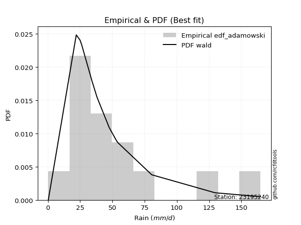</img>

</div>


## C. Best fit & Estimate extreme values for specific return periods - Tr


### 1. Best fit (ordered by delta Δ)

<div align="center">

|   id |   station | empirical_dist   | p_dist    |     delta |   deltao | eval   |   fit |   n |   best_fit |   best_fit_sort |
|-----:|----------:|:-----------------|:----------|----------:|---------:|:-------|------:|----:|-----------:|----------------:|
|    0 |  23195240 | edf_hazen        | johnsonsu | 0.0676856 | 0.343224 | Δo > Δ |     1 |  14 |          1 |               1 |
|    1 |  23195240 | edf_gringorten   | johnsonsu | 0.0685961 | 0.343224 | Δo > Δ |     1 |  14 |          1 |               2 |
|    2 |  23195240 | edf_cunnane      | johnsonsu | 0.0691946 | 0.343224 | Δo > Δ |     1 |  14 |          1 |               3 |
|    3 |  23195240 | edf_blom         | johnsonsu | 0.0695653 | 0.343224 | Δo > Δ |     1 |  14 |          1 |               4 |
|    4 |  23195240 | edf_tukey        | johnsonsu | 0.0701773 | 0.343224 | Δo > Δ |     1 |  14 |          1 |               5 |
|    5 |  23195240 | edf_filliben     | johnsonsu | 0.0705487 | 0.343224 | Δo > Δ |     1 |  14 |          1 |               6 |
|    6 |  23195240 | edf_beard        | johnsonsu | 0.070948  | 0.343224 | Δo > Δ |     1 |  14 |          1 |               7 |
|    7 |  23195240 | edf_jenkinson    | johnsonsu | 0.070948  | 0.343224 | Δo > Δ |     1 |  14 |          1 |               8 |
|    8 |  23195240 | edf_chegodayev   | johnsonsu | 0.0714793 | 0.343224 | Δo > Δ |     1 |  14 |          1 |               9 |
|    9 |  23195240 | edf_adamowski    | johnsonsu | 0.0741134 | 0.343224 | Δo > Δ |     1 |  14 |          1 |              10 |
|   10 |  23195240 | edf_weibull      | johnsonsu | 0.086757  | 0.343224 | Δo > Δ |     1 |  14 |          1 |              11 |
|   11 |  23195240 | edf_california   | johnsonsu | 0.1034    | 0.343224 | Δo > Δ |     1 |  14 |          1 |              12 |

</div>

:file_folder:Tables: [bestfit_23195240.csv](table/bestfit_23195240.csv) | [extreme_23195240.csv](table/extreme_23195240.csv)


### 2. Extreme values

In hydrology, a return period (or recurrence interval $Tr$) is the statistical average time between extreme events like floods or droughts of a specific magnitude, indicating how rare an event is, with a 100-year flood, for example, having a 1% chance of occurring in any given year, not that it happens exactly every century. It is a key tool for infrastructure design (like bridges or dams) and risk assessment, calculated from historical data to determine the probability of future events, although it is important to remember it is statistical average, and events can cluster or be missed.

> risk_rate: assuming the return period as the project useful life.

|   id |      tr |   prob_l |     prob_g |     alpha |   betaprime |     chi2 |   crystalball |   erlang |    expon |   exponnorm |        f |   fatiguelife |     fisk |    gamma |   genexpon |   genlogistic |   gibrat |   gompertz |   gumbel_l |   gumbel_r |   halflogistic |   halfnorm |   hypsecant |   invgamma |   invgauss |   invweibull |   johnsonsu |   kstwobign |   laplace |   laplace_asymmetric |   loggamma |   logistic |   lognorm |   maxwell |   mielke |    moyal |   nakagami |      ncf |      nct |     norm |          pareto |   pearson3 |   rayleigh |     rice |         t |   truncnorm |     wald |   weibull_min |   logalpha |   logbetaprime |    logchi2 |   logcrystalball |   logerlang |         logexpon |   logexponnorm |            logf |   logfatiguelife |        logfisk |   loggenexpon |   loggenlogistic |        loggibrat |   loggompertz |   loggumbel_l |   loggumbel_r |   loghalflogistic |   loghalfnorm |   loghypsecant |   loginvgamma |   loginvgauss |    loginvweibull |     logjohnsonsu |     logkstwobign |   loglaplace |   loglaplace_asymmetric |   logloggamma |   loglogistic |   loglognorm |   logmaxwell |        logmielke |    logmoyal |   lognakagami |         logncf |    lognct |   logpareto |   logpearson3 |   lograyleigh |   logrice |             logt |   logtruncnorm |          logwald |   logweibull_min |   station |   n |   risk_rate |
|-----:|--------:|---------:|-----------:|----------:|------------:|---------:|--------------:|---------:|---------:|------------:|---------:|--------------:|---------:|---------:|-----------:|--------------:|---------:|-----------:|-----------:|-----------:|---------------:|-----------:|------------:|-----------:|-----------:|-------------:|------------:|------------:|----------:|---------------------:|-----------:|-----------:|----------:|----------:|---------:|---------:|-----------:|---------:|---------:|---------:|----------------:|-----------:|-----------:|---------:|----------:|------------:|---------:|--------------:|-----------:|---------------:|-----------:|-----------------:|------------:|-----------------:|---------------:|----------------:|-----------------:|---------------:|--------------:|-----------------:|-----------------:|--------------:|--------------:|--------------:|------------------:|--------------:|---------------:|--------------:|--------------:|-----------------:|-----------------:|-----------------:|-------------:|------------------------:|--------------:|--------------:|-------------:|-------------:|-----------------:|------------:|--------------:|---------------:|----------:|------------:|--------------:|--------------:|----------:|-----------------:|---------------:|-----------------:|-----------------:|----------:|----:|------------:|
|    0 |    2    | 0.5      | 0.5        |   1.48222 |     27.5    |  24.8018 |       48.4643 |  27.2757 |  33.6849 |     37.6576 |  27.7943 |       35.407  |  35.1284 |  21.1815 |    35.1222 |       40.2091 |  34.8842 |    35.3039 |    55.8968 |    41.0318 |        37.3367 |    39.2033 |     48.4643 |    35.4388 |    35.4217 |      35.4322 |     33.0407 |     43.6022 |   48.4643 |              39.059  |    21.5504 |    48.4643 |   23.0052 |   44.5949 |  27.7157 |  38.6323 |    9.00914 |  29.8258 |  35.4941 |  48.4643 |     0.506011    |    38.0571 |    43.2226 |  47.9134 |   30.7556 |     38.7999 |  33.7988 |       32.9621 |    20.669  |        23.2412 |    19.2477 |          23.0052 |     20.6093 |      6.07434     |        23.0054 |    0.912994     |          23.18   |   0.772171     |       12.9407 |          32.5359 |     13.6502      |       30.5344 |       30.6118 |       17.2887 |           14.9996 |       16.1155 |        23.0052 |       20.9313 |       19.9213 |     18.9928      |     32.9552      |     14.53        |      23.0052 |                 28.7556 |       34.1871 |       23.0052 |      23.2667 |      19.8259 |     19.6587      |     15.7656 |       22.9355 |   3.34655      |   22.9737 |    0.308851 |       35.3772 |       18.8075 |   23.0072 |     34.0726      |        6.62093 |     13.0922      |     0.556653     |  23195240 |  14 |    0.75     |
|    1 |    2.33 | 0.570815 | 0.429185   |   1.76321 |     35.3202 |  30.6244 |       56.5377 |  33.3733 |  41.0406 |     43.9115 |  36.5548 |       42.2464 |  40.9243 |  26.6875 |    42.2816 |       46.3304 |  38.9739 |    42.7558 |    62.9208 |    48.5127 |        45.0283 |    47.9167 |     54.9254 |    41.6196 |    42.0911 |      41.4564 |     36.6866 |     50.477  |   53.35   |              44.7568 |    29.9123 |    55.5775 |   31.3753 |   52.9827 |  33.7438 |  45.714  |   16.5045  |  37.5986 |  41.5532 |  56.5377 |     1.79999     |    45.6472 |    51.7344 |  55.1636 |   33.8582 |     46.1133 |  39.0926 |       40.7175 |    28.7458 |        31.7881 |    27.1068 |          31.3753 |     28.6705 |     11.7851      |        31.3756 |    1.62941      |          31.6183 |   2.67871      |       20.3701 |          40.0211 |     15.9736      |       38.1735 |       40.099  |       23.048  |           20.1589 |       22.5261 |        29.49   |       29.1931 |       28.1717 |     30.009       |     36.3822      |     23.295       |      27.7573 |                 33.9911 |       42.7354 |       30.2385 |      31.6938 |      27.368  |     30.6106      |     20.6975 |       31.3023 |  10.8062       |   31.3777 |    0.37075  |       45.8395 |       26.0862 |   31.3661 |     37.6674      |       10.1557  |     16.0465      |     0.925276     |  23195240 |  14 |    0.729209 |
|    2 |    5    | 0.8      | 0.2        |   3.94207 |     80.4889 |  60.3492 |       86.5407 |  64.0709 |  77.8174 |     74.9929 |  85.7484 |       76.259  |  71.0498 |  55.6805 |    77.2058 |       72.9215 |  62.5192 |    78.7176 |    85.6123 |    81.0133 |        79.8312 |    84.7642 |     80.8426 |    72.8252 |    75.452  |      71.9954 |     62.0821 |     79.6794 |   77.7771 |              73.2442 |   103.152  |    83.0428 |   99.4027 |   85.9961 |  61.1746 |  78.5168 |   81.7161  |  74.3132 |  72.1405 |  86.5407 | 30665.9         |    80.1577 |    85.8109 |  84.1896 |   48.9616 |     78.6165 |  68.7275 |       80.7411 |   101.693  |       102.127  |   100.163  |          99.4027 |     99.8912 |    323.919       |        99.4044 | 2144.92         |         100.316  |   6.43928e+23  |      125.98   |          75.0089 |     39.4845      |       78.83   |       95.9181 |       80.3774 |           76.807  |       92.8415 |        79.8519 |      103.245  |      107.896  |    218.944       |     58.3977      |    172.998       |      70.9768 |                 61.3936 |       82.0666 |       86.8981 |     100.03   |      97.3442 |    207.375       |     73.0236 |       99.4438 |   1.2795e+07   |  100.079  |  inf        |       95.9179 |       96.6534 |   99.2329 |     61.975       |       42.3095  |     50.1255      |   749.66         |  23195240 |  14 |    0.67232  |
|    3 |   10    | 0.9      | 0.1        |   7.94516 |    129.942  |  87.8133 |      106.444  |  92.1019 | 111.202  |    103.199  | 134.802  |      107.604  | 103.973  |  83.1615 |   108.405  |       94.5778 |  89.3582 |   109.637  |    98.2459 |   107.484  |       108.733  |   112.031  |    101.538  |   104.045  |   106.815  |     103.089  |    100.742  |    101.913  |   99.9514 |              99.1043 |   238.518  |   103.27   |  213.611  |  109.229  |  85.555  | 107.077  |  154.562   | 106.018  | 103.101  | 106.444  |     2.50988e+08 |   108.893  |   110.108  | 104.886  |   69.2603 |    103.926  | 100.177  |      118.304  |   243.325  |       222.149  |   245.725  |         213.611  |    232.947  |   6558.64        |       213.615  |    3.90011e+13  |         215.944  |   2.70431e+264 |      463.419  |         107.143  |    110.771       |      118.242  |      155.877  |      222.327  |          233.261  |      264.771  |       176.904  |      244.446  |      276.261  |   1104.84        |    109.412       |    796.21        |     166.437  |                103.849  |      113.03   |      189.078  |     214.538  |     237.751  |    978.252       |    218.87   |      214.113  |   2.53018e+26  |  216.273  |  inf        |      132.205  |      245.916  |  213.046  |    124.693       |       81.9134  |    167.892       |     2.97437e+09  |  23195240 |  14 |    0.651322 |
|    4 |   15    | 0.933333 | 0.0666667  |  11.934   |    162.804  | 103.998  |      116.376  | 108.54   | 130.731  |    119.698  | 164.611  |      126.206  | 127.189  |  99.5275 |   126.585  |      106.796  | 107.871  |   127.029  |   103.967  |   122.419  |       125.09   |   126.22   |    113.349  |   124.286  |   125.756  |     123.597  |    132.851  |    113.717  |  112.923  |             114.231  |   364.254  |   114.291  |  312.903  |  121.15   | 100.873  | 123.652  |  196.213   | 124.249  | 123.463  | 116.376  |     4.88217e+10 |   125.07   |   122.627  | 115.549  |   87.4065 |    117.413  | 120.373  |      140.667  |   380.123  |       327.673  |   388.071  |         312.904  |    357.439  |  38106.2         |       312.91   |    8.12628e+28  |         316.665  | inf            |      907.267  |         127.711  |    225.651       |      142.112  |      194.215  |      394.716  |          437.381  |      456.79   |       278.537  |      378.582  |      448.409  |   2753.65        |    183.622       |   1790.58        |     274.009  |                141.233  |      129.487  |      288.801  |     314.01   |     375.928  |   2344.02        |    413.863  |      313.954  |   3.76005e+54  |  317.803  |  inf        |      148.858  |      397.883  |  311.929  |    237.584       |      102.898   |    364.874       |     5.92909e+15  |  23195240 |  14 |    0.644736 |
|    5 |   20    | 0.95     | 0.05       |  15.9192  |    188.013  | 115.52   |      122.88   | 120.216  | 144.587  |    131.405  | 186.122  |      139.516  | 145.926  | 111.233  |   139.471  |      115.35   | 122.392  |   139.078  |   107.529  |   132.876  |       136.549  |   135.68   |    121.681  |   139.71   |   139.455  |     139.406  |    160.88   |    121.668  |  122.126  |             124.964  |   481.536  |   121.908  |  401.773  |  129.061  | 112.533  | 135.39   |  224.673   | 137.115  | 139.145  | 122.88   |     2.05426e+12 |   136.345  |   130.948  | 122.637  |  104.632  |    126.504  | 135.422  |      156.678  |   511.128  |       422.782  |   525.196  |         401.773  |    474.084  | 132798           |       401.782  |    6.90293e+48  |         406.925  | inf            |     1418.25   |         143.531  |    394.306       |      159.357  |      222.705  |      589.974  |          679.43   |      657.091  |       383.673  |      505.524  |      619.232  |   5219.19        |    289.073       |   3090.93        |     390.287  |                175.662  |      140.552  |      387.03   |     403.006  |     509.521  |   4320.52        |    649.828  |      403.391  |   4.87883e+90  |  408.958  |  inf        |      158.824  |      547.836  |  400.399  |    443.256       |      115.53    |    650.667       |     3.68689e+21  |  23195240 |  14 |    0.641514 |
|    6 |   25    | 0.96     | 0.04       |  19.9031  |    208.707  | 124.476  |      127.668  | 129.279  | 155.335  |    140.485  | 202.978  |      149.899  | 161.961  | 120.357  |   149.462  |      121.94   | 134.498  |   148.264  |   110.063  |   140.931  |       145.378  |   142.719  |    128.129  |   152.346  |   150.224  |     152.468  |    186.049  |    127.624  |  129.264  |             133.289  |   591.933  |   127.735  |  482.95   |  134.935  | 122.139  | 144.489  |  246.063   | 147.075  | 152.1    | 127.668  |     3.73561e+13 |   144.993  |   137.131  | 127.903  |  121.283  |    133.314  | 147.477  |      169.173  |   636.931  |       510.104  |   657.339  |         482.95   |    584.241  | 349745           |       482.962  |    1.23266e+73  |         489.45   | inf            |     1976.72   |         156.655  |    627.924       |      172.893  |      245.489  |      804.046  |          953.938  |      861.222  |       491.583  |      626.302  |      787.559  |   8540.84        |    435.264       |   4652.46        |     513.5    |                208.05   |      148.826  |      484.184  |     484.282  |     638.559  |   6918.89        |    921.878  |      485.137  |   1.41756e+134 |  492.413  |  inf        |      165.605  |      694.779  |  481.19   |    816.636       |      123.916   |   1034.13        |     8.03988e+26  |  23195240 |  14 |    0.639603 |
|    7 |   50    | 0.98     | 0.02       |  39.8164  |    279.856  | 152.377  |      141.38   | 157.459  | 188.72   |    168.691  | 256.114  |      182.445  | 221.849  | 148.9    |   180.483  |      142.238  | 177.172  |   175.953  |   116.942  |   165.743  |       172.582  |   163.178  |    148.122  |   195.814  |   184.425  |     198.121  |    286.91   |    145.113  |  151.439  |             159.15   |  1073.73   |   145.538  |  818.028  |  151.968  | 155.876  | 172.735  |  308.734   | 178.007  | 197.403  | 141.38   |     3.05748e+17 |   171.418  |   155.077  | 143.19   |  199.704  |    153.306  | 186.835  |      208.356  |  1207.86   |       873.943  |  1259.93   |         818.029  |   1067.91   |      7.08155e+06 |       818.051  |    1.60269e+253 |         830.688  | inf            |     5184.35   |         203.312  |   3237.6         |      215.744  |      319.788  |     2086.66   |         2713.98   |     1890.67   |      1060.01   |     1164.27   |     1589.31   |  38942.1         |   2279.02        |  15459.1         |    1204.13   |                351.922  |      173.037  |      959.814  |     819.676  |    1228.94   |  29497.2         |   2729.96   |      822.93   | inf            |  838.329  |  inf        |      182.186  |     1384.87   |  814.519  |  15639.1         |      142.76    |   4694.14        |     6.89827e+48  |  23195240 |  14 |    0.63583  |
|    8 |   75    | 0.986667 | 0.0133333  |  59.7268  |    326.728  | 168.745  |      148.736  | 173.96   | 208.249  |    185.191  | 287.637  |      201.668  | 265.486  | 165.711  |   198.625  |      154.036  | 205.994  |   191.591  |   120.421  |   180.165  |       188.395  |   174.315  |    159.805  |   224.582  |   204.915  |     228.892  |    364.958  |    154.735  |  164.41   |             174.277  |  1481.95   |   155.821  | 1085.35   |  161.229  | 178.954  | 189.253  |  342.934   | 196.158  | 227.995  | 148.736  |     5.94735e+19 |   186.625  |   164.84   | 151.506  |  273.536  |    164.298  | 211.054  |      231.509  |  1713.21   |      1167.19   |  1795.03   |        1085.35   |   1480.38   |      4.11444e+07 |      1085.38   |  inf            |        1103.46   | inf            |     8762.21   |         235.659  |   9802.21        |      241.318  |      365.536  |     3632.31   |         4983.87   |     2900.77   |      1660.84   |     1630.38   |     2335.93   |  94060.5         |   8320.45        |  29930.4         |    1982.39   |                478.608  |      186.303  |     1425.04   |    1087.2    |    1754.36   |  68503.2         |   5150.75   |     1092.73   | inf            | 1115.55   |  inf        |      189.325  |     2015.49   | 1080.32   | 271775           |      149.723   |  11907.8         |     8.28054e+65  |  23195240 |  14 |    0.634587 |
|    9 |  100    | 0.99     | 0.01       |  79.6365  |    362.563  | 180.376  |      153.712  | 185.673  | 222.105  |    196.897  | 310.164  |      215.378  | 301.139  | 177.68   |   211.496  |      162.386  | 228.321  |   202.45   |   122.697  |   190.373  |       199.588  |   181.902  |    168.093  |   246.682  |   219.652  |     252.8    |    430.535  |    161.328  |  173.613  |             185.01   |  1844.8    |   163.081  | 1314.1    |  167.537  | 197.129  | 200.972  |  366.206   | 209.086  | 251.81   | 153.712  |     2.50245e+21 |   197.322  |   171.492  | 157.172  |  344.617  |    171.824  | 228.712  |      248.03   |  2175.49   |      1419.75   |  2284.99   |        1314.1    |   1848.5    |      1.43386e+08 |      1314.14   |  inf            |        1337.16   | inf            |    12529.3    |         261.342  |  23121.3         |      259.668  |      398.944  |     5377.29   |         7662.88   |     3882.88   |      2283.84   |     2050.68   |     3041.17   | 175579           |  24883.7         |  47065.5         |    2823.63   |                595.283  |      195.369  |     1883.68   |    1316.12   |    2235.7    | 124358           |   8081.25   |     1323.76   | inf            | 1353.44   |  inf        |      193.486  |     2602.62   | 1307.7    |      4.45332e+06 |      153.345   |  23473.9         |     1.48452e+80  |  23195240 |  14 |    0.633968 |
|   10 |  200    | 0.995    | 0.005      | 159.274   |    458.578  | 208.448  |      164.999  | 213.912  | 255.49   |    225.104  | 364.898  |      248.629  | 406.564  | 206.638  |   242.507  |      182.461  | 289.065  |   227.853  |   127.642  |   214.912  |       226.496  |   199.254  |    188.058  |   306.411  |   255.779  |     318.469  |    630.023  |    176.513  |  195.787  |             210.87   |  3041.57   |   180.496  | 2027.83   |  181.969  | 248.211  | 229.206  |  419.258   | 240.464  | 317.463  | 164.999  |     2.04818e+25 |   222.833  |   186.712  | 170.136  |  613.058  |    189.14   | 272.696  |      288.126  |  3768.61   |      2215.18   |  3973.37   |        2027.83   |   3069.92   |      2.90325e+09 |      2027.89   |  inf            |        2067.69   | inf            |    28406.1    |         334.379  | 238759           |      304.522  |      482.468  |    13809.4    |        21554.8    |     7564.77   |      4919.64   |     3467.11   |     5589.25   | 787296           | 719963           | 133505           |    6621.28   |               1006.94   |      216.182  |     3678.71   |    2030.36   |    3893.25   | 521425           |  23920      |     2045.32   | inf            | 2098.77   |  inf        |      201.091  |     4671.51   | 2016.88   |      2.27215e+11 |      158.959   | 127288           |     3.9138e+122  |  23195240 |  14 |    0.633042 |
|   11 |  250    | 0.996    | 0.004      | 199.092   |    492.649  | 217.498  |      168.449  | 223.007  | 266.237  |    234.184  | 382.637  |      259.392  | 447.458  | 215.991  |   252.49   |      188.915  | 310.86   |   235.813  |   129.098  |   222.801  |       235.147  |   204.592  |    194.486  |   327.794  |   267.581  |     342.317  |    708.697  |    181.212  |  202.926  |             219.195  |  3546.86   |   186.087  | 2315.29   |  186.412  | 267.184  | 238.295  |  435.517   | 250.648  | 341.398  | 168.449  |     3.72455e+26 |   230.976  |   191.397  | 174.126  |  741.172  |    194.494  | 287.247  |      301.114  |  4467.16   |      2538.13   |  4712.88   |        2315.3    |   3588.22   |      7.64616e+09 |      2315.37   |  inf            |        2362.39   | inf            |    36548.3    |         361.787  | 551782           |      319.142  |      510.221  |    18700.8    |        30056.7    |     9287.56   |      6298.18   |     4076.23   |     6750.84   |      1.27538e+06 |      2.74399e+06 | 184343           |    8711.61   |               1192.59   |      222.605  |     4560.58   |    2318.05   |    4618.14   | 826628           |  33921.7    |     2336.18   | inf            | 2400.02   |  inf        |      202.956  |     5593.18   | 2302.42   |      4.48268e+13 |      160.108   | 222680           |     7.71044e+138 |  23195240 |  14 |    0.632858 |
|   12 |  500    | 0.998    | 0.002      | 398.183   |    609.462  | 245.643  |      178.677  | 251.271  | 299.622  |    262.39   | 438.05   |      292.986  | 601.566  | 245.124  |   283.499  |      208.946  | 386.183  |   259.902  |   133.269  |   247.287  |       261.996  |   220.508  |    214.45   |   401.861  |   304.726  |     426.135  |   1007.44   |    195.295  |  225.1    |             245.055  |  5608.55   |   203.426  | 3430.41   |  199.668  | 335.566  | 266.528  |  483.794   | 282.586  | 425.918  | 178.677  |     3.04843e+30 |   256.092  |   205.375  | 186.033  | 1348.21   |    210.521  | 333.515  |      341.689  |  7441.23   |      3801.63   |  7853.24   |        3430.41   |   5714.41   |      1.54818e+11 |      3430.52   |  inf            |        3507.55   | inf            |    77539.4    |         461.632  |      9.97869e+06 |      365.068  |      598.951  |    47927.1    |        84356.8    |    17122.8    |     13566.2    |     6612.43   |    11911.7    |      5.70017e+06 |      4.60555e+08 | 484802           |   20428.3    |               2017.29   |      241.803  |     8880.71   |    3434.18   |    7686.85   |      3.45473e+06 | 100403      |     3465.44   | inf            | 3573.01   |  inf        |      207.412  |     9571.7    | 3409.68   |      6.24801e+24 |      162.436   |      1.31828e+06 |     3.65838e+198 |  23195240 |  14 |    0.632489 |
|   13 |  750    | 0.998667 | 0.00133333 | 597.273   |    686.241  | 262.127  |      184.36   | 267.811  | 319.151  |    278.889  | 470.655  |      312.737  | 714.583  | 262.215  |   301.639  |      220.656  | 435.997  |   273.568  |   135.499  |   261.602  |       277.693  |   229.4    |    226.128  |   451.162  |   326.766  |     482.863  |   1226.61   |    203.207  |  238.071  |             260.182  |  7245.9    |   213.556  | 4267.69   |  207.083  | 383.258  | 283.043  |  510.628   | 301.504  | 483.465  | 184.36   |     5.92975e+32 |   270.672  |   213.192  | 192.691  | 1921.43   |    219.513  | 361.256  |      365.574  |  9919.01   |      4759.4    | 10459.1    |        4267.7    |   7413.06   |      8.99504e+11 |      4267.85   |  inf            |        4369.07   | inf            |   118095      |         532.123  |      6.76983e+07 |      392.271  |      652.539  |    83084.4    |       154214      |    24098.7    |     21251.5    |     8672.69   |    16413.6    |      1.3678e+07  |      2.04418e+10 | 834593           |   33631.5    |               2743.48   |      252.559  |    13108.1    |    4272.4    |   10221.4    |      7.97078e+06 | 189419      |     4314.15   | inf            | 4457.44   |  inf        |      209.287  |    12926      | 4240.77   |      3.96735e+35 |      163.22    |      3.82892e+06 |     2.12008e+240 |  23195240 |  14 |    0.632366 |
|   14 | 1000    | 0.999    | 0.001      | 796.364   |    744.882  | 273.83   |      188.272  | 279.549  | 333.007  |    290.596  | 493.862  |      326.791  | 807.159  | 274.361  |   314.509  |      228.963  | 474.118  |   283.083  |   136.999  |   271.756  |       288.827  |   235.541  |    234.414  |   489.132  |   342.532  |     527.012  |   1405.32   |    208.688  |  247.274  |             270.915  |  8649.08   |   220.74   | 4960.16   |  212.207  | 421.105  | 294.761  |  529.101   | 315.041  | 528.434  | 188.272  |     2.49505e+34 |   280.973  |   218.594  | 197.292  | 2473.76   |    225.739  | 381.212  |      382.583  | 12109.7    |      5556.3    | 12755.5    |        4960.17   |   8874.28   |      3.13472e+12 |      4960.34   |  inf            |        5082.46   | inf            |   157948      |         588.499  |      2.93014e+08 |      411.714  |      691.279  |   122746      |       236578      |    30513.6    |     29221.1    |    10464.2    |    20511.7    |      2.54487e+07 |      4.58302e+11 |      1.21594e+06 |   47903.4    |               3412.29   |      259.998  |    17276.5    |    4965.76   |   12446.6    |      1.44228e+07 | 297179      |     5016.48   | inf            | 5190.83   |  inf        |      210.369  |    15908.6    | 4927.96   |      1.53269e+46 |      163.613   |      8.2447e+06  |     1.82428e+273 |  23195240 |  14 |    0.632305 |

<div align="center">

</img>

</div>


<div align="center">

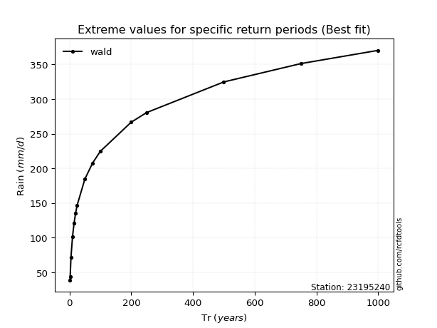</img>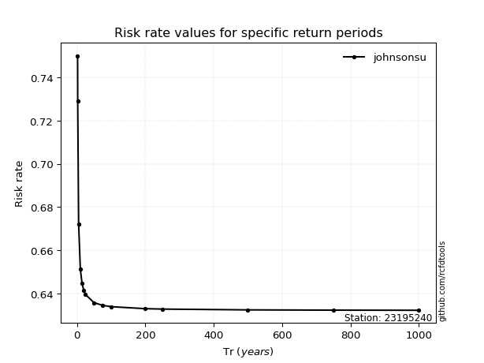</img>

</div>


<sub>**APP DISCLAIMER**: NO WARRANTY - This software is provided by [github.com/rcfdtools](https://github.com/rcfdtools) "as is", without any express or implied warranty, including warranties of merchantability, fitness for a particular purpose, or non-infringement. There is no guarantee that the software will be error-free or operate without interruption. LIMITATION OF LIABILITY - Neither the authors nor copyright holders will be liable for claims or damages arising from the software or its use. You are responsible for determining if the software is appropriate for your use and assume all associated risks, including errors, legal compliance, and data loss. NO PROFESSIONAL ADVICE - The software provides general information and does not offer professional advice. It should not replace consultation with professional advisors.</sub>