<div align="center">


</div>

# PMax24h Station (Rain): 23195502

Maximum Precipitation in 24 hours (PMax24h) is the greatest amount of rainfall for a specific duration that is meteorologically possible for a given location, acting as a "worst-case" scenario for extreme storms, crucial for designing safety-critical infrastructure like bridges, river deviations, dams, spillways, and nuclear plants to prevent catastrophic failure. The PMax24h is related with the Probable Maximum Precipitation (PMP) and it is calculated by hydrologists using meteorological data to determine the upper limit of extreme rainfall, often leading to the Probable Maximum Flood (PMF) for flood control design, and is increasingly being studied for climate change impacts. Probable Maximum Precipitation (PMP) is the theoretical upper limit of rainfall, a deterministic estimate for extreme events, while probability distributions (like GEV, Gumbel) describe the likelihood and frequency of various precipitation amounts, including rare ones, showing how often events occur, with PMP representing the extreme end of these distributions, used for critical infrastructure design to ensure safety against the worst conceivable weather, unlike standard statistical forecasts which cover typical probabilities.

The most common probability distributions in hydrology, used for analyzing floods, rainfall, and streamflow, include the Normal, Log-Normal, Gumbel, Gamma (including Log-Pearson Type III), and Generalized Extreme Value (GEV) distributions, often chosen based on the data´s skewness and whether modeling extremes or general conditions, with Gumbel and GEV popular for extreme events like floods, while the Normal distribution serves as a baseline, though often requiring transformations for skewed hydrological data. These distributions help in designing water infrastructure, managing water resources, and forecasting hydrologic events.

> Hydrological data often isn´t perfectly normal (it´s skewed), so different distributions are needed for different applications, such as: **Flood Frequency Analysis**: Using Gumbel, GEV, or Log-Pearson Type III for predicting extreme flood magnitudes and their return periods, **Rainfall Analysis**: Normal for annual totals, but Log-Normal, Weibull, or GEV for intensity or extreme daily rainfall, **Streamflow Modeling**: Gamma and Log-Normal for maximum flows, GEV for minimum flows, and Kappa for daily flows.

<div align="center">

</img>

</div>


## A. General information


### 1. General running parameters

• app_version: _v20260312_. • runtime: _2026-03-12 07:15:23.203550_. • Python version: _3.14.0_. • SciPy version: _1.16.3_. • Pandas version: _2.3.3_. • NumPy version: _2.3.5_. • Stations dataset (station_dataset_file): _dataset/pmax24h_in/automatic_colombia_2003_2025.csv_. • Stations catalog (station_catalog_file): _dataset/CNE.xls_. • Minimum year to eval til year_max (date_min): _1900_. • Maximum year to eval since year_min (date_max): _2025_. • Creates, save and include plots into reports (create_plot): _True_. • Plot only fit distributions with Δo > Δ (plot_only_fit): _True_. • Plot only simple graphs avoiding multiple CDFs and multiple Extreme values plots (plot_only_simple): _True_. • Eval low extreme values, if False, evaluates high extreme values (low_extreme): _False_. • Eval every SciPy distribution as logarithmic (pdist_logarithmic_on): _True_. • Standard deviation normalized (ddof): _1.0_. • Return periods to eval in years (Tr): _[2, 2.33, 5, 10, 15, 20, 25, 50, 75, 100, 200, 250, 500, 750, 1000]_. • Minimum data sample per station, 0 means any (minimum_sample): _5_. • Z-Score maximum threshold to adjust a value, 0 means disable (zscore_max): _3.5_. • Z-Score minimum threshold to adjust a value, 0 means disable (zscore_min): _-2.5_. • Avoid zeros, e.g. rain = 0 (avoid_zeros): _True_. • Avoid null values (avoid_nans): _True_. 

:file_folder:Table: [dataset.csv](../../dataset/pmax24h_in/automatic_colombia_2003_2025.csv)

> Delta Degrees of Freedom (DDOF): is a parameter used in the formulas for calculating variance and standard deviation. When ddof=0, the divisor is $N$ (the total number of observations) and this is used when your data set is the entire population. When ddof=1, the divisor is $N-1$ and this is used when your data set is a sample drawn from a larger population. Using $N-1$ provides an unbiased estimate of the population variance (known as Bessel´s correction).


### 2. Station info and location

|   id |   CODIGO | NOMBRE                              | CATEGORIA           | TECNOLOGIA                              | ESTADO   | FECHA_INSTALACION   |   FECHA_SUSPENSION |   ALTITUD |   LATITUD |   LONGITUD | DEPARTAMENTO   | MUNICIPIO   | AREA_OPERATIVA                         | ENTIDAD                                                     | AREA_HIDROGRAFICA   | ZONA_HIDROGRAFICA   | SUBZONA_HIDROGRAFICA                      |   CORRIENTE | Catalogo   |   Version |
|-----:|---------:|:------------------------------------|:--------------------|:----------------------------------------|:---------|:--------------------|-------------------:|----------:|----------:|-----------:|:---------------|:------------|:---------------------------------------|:------------------------------------------------------------|:--------------------|:--------------------|:------------------------------------------|------------:|:-----------|----------:|
|    0 | 23195502 | AEROPUERTO PALONEGRO AUT [23195502] | Sinóptica Principal | Automática con Telemetría, Convencional | Activa   | 05/05/2005          |                nan |      1189 |   7.12147 |   -73.1845 | Santander      | Lebrija     | Area Operativa 08 - Santanderes-Arauca | INSTITUTO DE HIDROLOGIA METEOROLOGIA Y ESTUDIOS AMBIENTALES | Magdalena Cauca     | Medio Magdalena     | Río Lebrija y otros directos al Magdalena |         nan | CNE_IDEAM  |  20251226 |

<div align="center">

Dynamic map: [:earth_americas:Google](http://maps.google.com/maps?q=7.121472222,-73.18452778) [:earth_americas:OSM](https://www.openstreetmap.org/#map=18/7.121472222/-73.18452778&layers=P) [:earth_americas:Bing](https://www.bing.com/maps?cp=7.121472222~-73.18452778&lvl=18) [:earth_americas:Apple](https://maps.apple.com/frame?center=7.121472222%2C-73.18452778&span=0.003%2C0.006)

</div>


<div align="center">

```geojson
{
  "type": "Feature",
  "geometry": {
    "type": "Point", 
    "coordinates": [-73.18452778, 7.121472222]
  }, 
  "properties": {
    "Name": "23195502"
  }
}
```

</div>


### 3. Discrete values table and plot

<div align="center">

|               |           0 |           1 |           2 |           3 |           4 |          5 |           6 |           7 |           8 |           9 |          10 |
|:--------------|------------:|------------:|------------:|------------:|------------:|-----------:|------------:|------------:|------------:|------------:|------------:|
| Date          | 2015        | 2016        | 2017        | 2018        | 2019        | 2020       | 2021        | 2022        | 2023        | 2024        | 2025        |
| Value         |   35.75     |   63.2      |   44.13     |   72.39     |   65.57     |  437.61    |   27.36     |    2.55     |   19.62     |  185.3      |  136.7      |
| Value_initial |   35.75     |   63.2      |   44.13     |   72.39     |   65.57     |  437.61    |   27.36     |    2.55     |   19.62     |  185.3      |  136.7      |
| count         |   11        |   11        |   11        |   11        |   11        |   11       |   11        |   11        |   11        |   11        |   11        |
| mean          |   99.1073   |   99.1073   |   99.1073   |   99.1073   |   99.1073   |   99.1073  |   99.1073   |   99.1073   |   99.1073   |   99.1073   |   99.1073   |
| std           |  124.25     |  124.25     |  124.25     |  124.25     |  124.25     |  124.25    |  124.25     |  124.25     |  124.25     |  124.25     |  124.25     |
| zscore        |   -0.509918 |   -0.288992 |   -0.442474 |   -0.215029 |   -0.269918 |    2.72437 |   -0.577444 |   -0.777122 |   -0.639737 |    0.693705 |    0.302558 |


</div>


<div align="center">

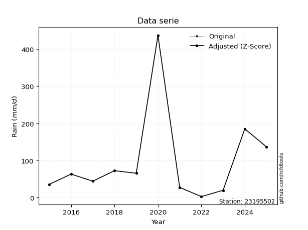</img>

</div>


> The initial value (value_initial) correspond to the initial obtained or null completed value, and value (value) is adjusted only when the initial value is outside the valid range (outlier) definite through the Z-Score value. If Z-Score is active, values out of range or outliers are replaced with the station mean value. A Z-Score (or standard score) measures how many standard deviations a data point is from the mean of a dataset, indicating its relative position; positive scores mean above the mean, negative mean below, and a score of zero is exactly at the mean, allowing for comparison of values from different distributions. It´s calculated using the formula $z=(x–μ)/σ$, where $x$ is the data point, $μ$ is the mean, and $σ$ is the standard deviation, helping identify outliers and understand probability.
>
> <sub>**Note**: In this study, "completing" (filling gaps in) and "extending" (forecasting or lengthening the historical record) rainfall data series are avoided for certain critical analyses because they introduce artificial bias and uncertainty, which can distort the statistics of rare events (extremes), alter day-to-day variability, and compromise the integrity and homogeneity of the original data. Some reasons against Completing/Extending rainfall data are: **Distortion of Extremes and Variability**: The primary issue is that most gap-filling or extension methods rely on averaging or regression with nearby stations, which inherently smooths the data. Rainfall is highly variable in space and time, with a large percentage of zero values and occasional large storms. Infilling methods often underestimate the highest values and overestimate the lowest (zero) values, which severely distorts analyses focused on flood frequency, drought severity, and intensity-duration-frequency (IDF) curves, **Loss of Data Homogeneity**: Infilled or extended data are synthetic estimates, not actual measurements. Combining these estimates with observed data can violate the assumption of data homogeneity, which requires that the data properties do not change over time. Inhomogeneity can lead to incorrect conclusions about long-term trends or changes in climate patterns, **Propagation of Errors**: Errors and biases from the original data (e.g., wind-induced undercatch, instrument errors, site changes) or the data used for imputation can propagate through the analysis, leading to unreliable hydrological models and inaccurate predictions, **Compromised Statistical Integrity**: For statistical analyses, especially those involving the frequency of events, using artificial data can introduce time bias or autocorrelation that doesn´t exist in reality, making it difficult to assess the true probability of events, **Difficulty in Validation**: It is difficult to accurately validate the quality of filled or extended data, especially for past periods where ground-truth measurements are unavailable. The reliability of imputation techniques heavily depends on the density of the surrounding station network and the complexity of the local topography.</sub>


### 4. Active continuous probability distributions from SciPy (80 of 104 available)

A Probability Density Function (PDF) describes the relative likelihood of a continuous random variable falling within a specific range, where the total area under its curve equals 1, and the area over any interval gives the actual probability for that range. Unlike discrete probabilities (like rolling a die), a PDF shows density, not direct probability for a single point (which is zero), with higher points indicating higher likelihood, often visualized as a bell curve for normal distributions.

A log of a probability density function (log-PDF) is simply the logarithm of the PDF´s value, denoted as $log(f(x))$, useful for converting multiplication of probabilities into addition, improving numerical stability with tiny numbers, and connecting to information theory concepts like entropy. Instead of dealing with very small probabilities (e.g., 0.000001), log-PDFs use negative numbers (e.g., $log(0.00001) ≈ -11.51$ that are easier for computers to handle, preventing underflow errors and simplifying complex calculations. In this study, each active probability distribution from SciPy is also evaluated in the $log$ form.

[scipy.stats](https://docs.scipy.org/doc/scipy/reference/stats.html) is a Python´s powerful submodule within the SciPy library for comprehensive statistical analysis, offering over 130 probability distributions (like Normal, Poisson, etc.), functions for descriptive stats (mean, variance), hypothesis testing (t-tests, chi-square), random variable generation, and statistical tests, making it essential for data science, modeling, and research. It provides tools to explore, model, and draw conclusions from data efficiently, working seamlessly with [NumPy](https://numpy.org/).

<div align="center">

|   id | p_dist           |   n_parameter | fit_method   | label                                                                       | active   | ref                                                                                                      |
|-----:|:-----------------|--------------:|:-------------|:----------------------------------------------------------------------------|:---------|:---------------------------------------------------------------------------------------------------------|
|    0 | alpha            |             3 | MLE          | Alpha                                                                       | True     | [:mortar_board:](https://docs.scipy.org/doc/scipy/reference/generated/scipy.stats.alpha.html)            |
|    1 | anglit           |             2 | MM           | Anglit                                                                      | True     | [:mortar_board:](https://docs.scipy.org/doc/scipy/reference/generated/scipy.stats.anglit.html)           |
|    2 | arcsine          |             2 | MM           | Arcsine                                                                     | True     | [:mortar_board:](https://docs.scipy.org/doc/scipy/reference/generated/scipy.stats.arcsine.html)          |
|    3 | argus            |             3 | MLE          | Argus                                                                       | True     | [:mortar_board:](https://docs.scipy.org/doc/scipy/reference/generated/scipy.stats.argus.html)            |
|    4 | beta             |             4 | MLE          | Beta                                                                        | True     | [:mortar_board:](https://docs.scipy.org/doc/scipy/reference/generated/scipy.stats.beta.html)             |
|    5 | betaprime        |             4 | MLE          | Beta prime                                                                  | True     | [:mortar_board:](https://docs.scipy.org/doc/scipy/reference/generated/scipy.stats.betaprime.html)        |
|    6 | bradford         |             3 | MLE          | Bradford                                                                    | True     | [:mortar_board:](https://docs.scipy.org/doc/scipy/reference/generated/scipy.stats.bradford.html)         |
|    7 | burr             |             4 | MLE          | Burr (Type III)                                                             | True     | [:mortar_board:](https://docs.scipy.org/doc/scipy/reference/generated/scipy.stats.burr.html)             |
|    8 | burr12           |             4 | MLE          | Burr (Type III) 12                                                          | True     | [:mortar_board:](https://docs.scipy.org/doc/scipy/reference/generated/scipy.stats.burr12.html)           |
|    9 | cosine           |             2 | MLE          | Cosine                                                                      | True     | [:mortar_board:](https://docs.scipy.org/doc/scipy/reference/generated/scipy.stats.cosine.html)           |
|   10 | crystalball      |             4 | MLE          | Crystalball                                                                 | True     | [:mortar_board:](https://docs.scipy.org/doc/scipy/reference/generated/scipy.stats.crystalball.html)      |
|   11 | dgamma           |             3 | MLE          | Double gamma                                                                | True     | [:mortar_board:](https://docs.scipy.org/doc/scipy/reference/generated/scipy.stats.dgamma.html)           |
|   12 | dweibull         |             3 | MLE          | Double Weibull                                                              | True     | [:mortar_board:](https://docs.scipy.org/doc/scipy/reference/generated/scipy.stats.dweibull.html)         |
|   13 | erlang           |             3 | MLE          | Erlang                                                                      | True     | [:mortar_board:](https://docs.scipy.org/doc/scipy/reference/generated/scipy.stats.erlang.html)           |
|   14 | exponnorm        |             3 | MLE          | Exponentially modified Normal                                               | True     | [:mortar_board:](https://docs.scipy.org/doc/scipy/reference/generated/scipy.stats.exponnorm.html)        |
|   15 | exponpow         |             3 | MLE          | Exponential power                                                           | True     | [:mortar_board:](https://docs.scipy.org/doc/scipy/reference/generated/scipy.stats.exponpow.html)         |
|   16 | exponweib        |             4 | MLE          | Exponentiated Weibull                                                       | True     | [:mortar_board:](https://docs.scipy.org/doc/scipy/reference/generated/scipy.stats.exponweib.html)        |
|   17 | f                |             4 | MLE          | F                                                                           | True     | [:mortar_board:](https://docs.scipy.org/doc/scipy/reference/generated/scipy.stats.f.html)                |
|   18 | fatiguelife      |             3 | MLE          | Fatigue-life (Birnbaum-Saunders)                                            | True     | [:mortar_board:](https://docs.scipy.org/doc/scipy/reference/generated/scipy.stats.fatiguelife.html)      |
|   19 | foldnorm         |             3 | MM           | Fold Normal                                                                 | True     | [:mortar_board:](https://docs.scipy.org/doc/scipy/reference/generated/scipy.stats.foldnorm.html)         |
|   20 | gamma            |             3 | MLE          | Gamma                                                                       | True     | [:mortar_board:](https://docs.scipy.org/doc/scipy/reference/generated/scipy.stats.gamma.html)            |
|   21 | gausshyper       |             6 | MLE          | Gauss hypergeometric                                                        | True     | [:mortar_board:](https://docs.scipy.org/doc/scipy/reference/generated/scipy.stats.gausshyper.html)       |
|   22 | genexpon         |             5 | MLE          | Generalized exponential                                                     | True     | [:mortar_board:](https://docs.scipy.org/doc/scipy/reference/generated/scipy.stats.genexpon.html)         |
|   23 | genextreme       |             3 | MLE          | Generalized exponential                                                     | True     | [:mortar_board:](https://docs.scipy.org/doc/scipy/reference/generated/scipy.stats.genextreme.html)       |
|   24 | gengamma         |             4 | MLE          | Generalized gamma                                                           | True     | [:mortar_board:](https://docs.scipy.org/doc/scipy/reference/generated/scipy.stats.gengamma.html)         |
|   25 | genhalflogistic  |             3 | MLE          | Generalized half-logistic                                                   | True     | [:mortar_board:](https://docs.scipy.org/doc/scipy/reference/generated/scipy.stats.genhalflogistic.html)  |
|   26 | genlogistic      |             3 | MLE          | Generalized logistic                                                        | True     | [:mortar_board:](https://docs.scipy.org/doc/scipy/reference/generated/scipy.stats.genlogistic.html)      |
|   27 | gennorm          |             3 | MLE          | Generalized Normal                                                          | True     | [:mortar_board:](https://docs.scipy.org/doc/scipy/reference/generated/scipy.stats.gennorm.html)          |
|   28 | genpareto        |             3 | MLE          | Generalized Pareto                                                          | True     | [:mortar_board:](https://docs.scipy.org/doc/scipy/reference/generated/scipy.stats.genpareto.html)        |
|   29 | gompertz         |             3 | MLE          | Gompertz (or truncated Gumbel)                                              | True     | [:mortar_board:](https://docs.scipy.org/doc/scipy/reference/generated/scipy.stats.gompertz.html)         |
|   30 | gumbel_l         |             2 | MM           | Gumbel Left Skew                                                            | True     | [:mortar_board:](https://docs.scipy.org/doc/scipy/reference/generated/scipy.stats.gumbel_l.html)         |
|   31 | gumbel_r         |             2 | MM           | Gumbel Right Skew                                                           | True     | [:mortar_board:](https://docs.scipy.org/doc/scipy/reference/generated/scipy.stats.gumbel_r.html)         |
|   32 | halfgennorm      |             3 | MLE          | Upper half of a generalized normal                                          | True     | [:mortar_board:](https://docs.scipy.org/doc/scipy/reference/generated/scipy.stats.halfgennorm.html)      |
|   33 | halflogistic     |             2 | MM           | Half-logistic                                                               | True     | [:mortar_board:](https://docs.scipy.org/doc/scipy/reference/generated/scipy.stats.halflogistic.html)     |
|   34 | halfnorm         |             2 | MM           | Half Normal                                                                 | True     | [:mortar_board:](https://docs.scipy.org/doc/scipy/reference/generated/scipy.stats.halfnorm.html)         |
|   35 | hypsecant        |             2 | MM           | hyperbolic secant                                                           | True     | [:mortar_board:](https://docs.scipy.org/doc/scipy/reference/generated/scipy.stats.hypsecant.html)        |
|   36 | invgamma         |             3 | MLE          | Inverted gamma                                                              | True     | [:mortar_board:](https://docs.scipy.org/doc/scipy/reference/generated/scipy.stats.invgamma.html)         |
|   37 | invgauss         |             3 | MLE          | Inverse Gaussian                                                            | True     | [:mortar_board:](https://docs.scipy.org/doc/scipy/reference/generated/scipy.stats.invgauss.html)         |
|   38 | invweibull       |             3 | MLE          | Inverted Weibull                                                            | True     | [:mortar_board:](https://docs.scipy.org/doc/scipy/reference/generated/scipy.stats.invweibull.html)       |
|   39 | johnsonsb        |             4 | MLE          | Johnson SB                                                                  | True     | [:mortar_board:](https://docs.scipy.org/doc/scipy/reference/generated/scipy.stats.johnsonsb.html)        |
|   40 | johnsonsu        |             4 | MLE          | Johnson Su                                                                  | True     | [:mortar_board:](https://docs.scipy.org/doc/scipy/reference/generated/scipy.stats.johnsonsu.html)        |
|   41 | kappa3           |             3 | MLE          | Kappa 3                                                                     | True     | [:mortar_board:](https://docs.scipy.org/doc/scipy/reference/generated/scipy.stats.kappa3.html)           |
|   42 | kappa4           |             4 | MLE          | Kappa 4                                                                     | True     | [:mortar_board:](https://docs.scipy.org/doc/scipy/reference/generated/scipy.stats.kappa4.html)           |
|   43 | ksone            |             3 | MLE          | Kolmogorov-Smirnov one-sided test statistic distribution                    | True     | [:mortar_board:](https://docs.scipy.org/doc/scipy/reference/generated/scipy.stats.ksone.html)            |
|   44 | kstwobign        |             2 | MLE          | Limiting distribution of scaled Kolmogorov-Smirnov two-sided test statistic | True     | [:mortar_board:](https://docs.scipy.org/doc/scipy/reference/generated/scipy.stats.kstwobign.html)        |
|   45 | laplace          |             2 | MM           | Laplace                                                                     | True     | [:mortar_board:](https://docs.scipy.org/doc/scipy/reference/generated/scipy.stats.laplace.html)          |
|   46 | levy_l           |             2 | MLE          | Left-skewed Levy                                                            | True     | [:mortar_board:](https://docs.scipy.org/doc/scipy/reference/generated/scipy.stats.levy_l.html)           |
|   47 | loggamma         |             3 | MLE          | Log gamma                                                                   | True     | [:mortar_board:](https://docs.scipy.org/doc/scipy/reference/generated/scipy.stats.loggamma.html)         |
|   48 | logistic         |             2 | MM           | Logistic (or Sech-squared)                                                  | True     | [:mortar_board:](https://docs.scipy.org/doc/scipy/reference/generated/scipy.stats.logistic.html)         |
|   49 | loglaplace       |             3 | MLE          | Log-Laplace                                                                 | True     | [:mortar_board:](https://docs.scipy.org/doc/scipy/reference/generated/scipy.stats.loglaplace.html)       |
|   50 | lomax            |             3 | MLE          | Lomax (Pareto of the second kind)                                           | True     | [:mortar_board:](https://docs.scipy.org/doc/scipy/reference/generated/scipy.stats.lomax.html)            |
|   51 | maxwell          |             2 | MM           | Maxwell                                                                     | True     | [:mortar_board:](https://docs.scipy.org/doc/scipy/reference/generated/scipy.stats.maxwell.html)          |
|   52 | mielke           |             4 | MLE          | Mielke Beta-Kappa / Dagum                                                   | True     | [:mortar_board:](https://docs.scipy.org/doc/scipy/reference/generated/scipy.stats.mielke.html)           |
|   53 | moyal            |             2 | MM           | Moyal                                                                       | True     | [:mortar_board:](https://docs.scipy.org/doc/scipy/reference/generated/scipy.stats.moyal.html)            |
|   54 | nakagami         |             3 | MLE          | Nakagami                                                                    | True     | [:mortar_board:](https://docs.scipy.org/doc/scipy/reference/generated/scipy.stats.nakagami.html)         |
|   55 | ncf              |             5 | MLE          | Non-central F distribution                                                  | True     | [:mortar_board:](https://docs.scipy.org/doc/scipy/reference/generated/scipy.stats.ncf.html)              |
|   56 | nct              |             4 | MLE          | Non-central Student’s t                                                     | True     | [:mortar_board:](https://docs.scipy.org/doc/scipy/reference/generated/scipy.stats.nct.html)              |
|   57 | norm             |             2 | MM           | Normal                                                                      | True     | [:mortar_board:](https://docs.scipy.org/doc/scipy/reference/generated/scipy.stats.norm.html)             |
|   58 | pearson3         |             3 | MM           | Pearson type III                                                            | True     | [:mortar_board:](https://docs.scipy.org/doc/scipy/reference/generated/scipy.stats.pearson3.html)         |
|   59 | powerlaw         |             3 | MLE          | Power-function                                                              | True     | [:mortar_board:](https://docs.scipy.org/doc/scipy/reference/generated/scipy.stats.powerlaw.html)         |
|   60 | rayleigh         |             2 | MM           | Rayleigh                                                                    | True     | [:mortar_board:](https://docs.scipy.org/doc/scipy/reference/generated/scipy.stats.rayleigh.html)         |
|   61 | rdist            |             3 | MLE          | R-distributed (symmetric beta)                                              | True     | [:mortar_board:](https://docs.scipy.org/doc/scipy/reference/generated/scipy.stats.rdist.html)            |
|   62 | rice             |             3 | MLE          | Rice                                                                        | True     | [:mortar_board:](https://docs.scipy.org/doc/scipy/reference/generated/scipy.stats.rice.html)             |
|   63 | semicircular     |             2 | MM           | Semicircular                                                                | True     | [:mortar_board:](https://docs.scipy.org/doc/scipy/reference/generated/scipy.stats.semicircular.html)     |
|   64 | skewnorm         |             3 | MLE          | Skew normal                                                                 | True     | [:mortar_board:](https://docs.scipy.org/doc/scipy/reference/generated/scipy.stats.skewnorm.html)         |
|   65 | t                |             3 | MLE          | Student’s t                                                                 | True     | [:mortar_board:](https://docs.scipy.org/doc/scipy/reference/generated/scipy.stats.t.html)                |
|   66 | trapezoid        |             4 | MLE          | Trapezoid                                                                   | True     | [:mortar_board:](https://docs.scipy.org/doc/scipy/reference/generated/scipy.stats.trapezoid.html)        |
|   67 | triang           |             3 | MLE          | Triangular                                                                  | True     | [:mortar_board:](https://docs.scipy.org/doc/scipy/reference/generated/scipy.stats.triang.html)           |
|   68 | truncexpon       |             3 | MLE          | Truncated exponential                                                       | True     | [:mortar_board:](https://docs.scipy.org/doc/scipy/reference/generated/scipy.stats.truncexpon.html)       |
|   69 | truncnorm        |             4 | MLE          | Truncated normal                                                            | True     | [:mortar_board:](https://docs.scipy.org/doc/scipy/reference/generated/scipy.stats.truncnorm.html)        |
|   70 | truncpareto      |             4 | MLE          | Upper truncated Pareto                                                      | True     | [:mortar_board:](https://docs.scipy.org/doc/scipy/reference/generated/scipy.stats.truncpareto.html)      |
|   71 | truncweibull_min |             5 | MLE          | Doubly truncated Weibull minimum                                            | True     | [:mortar_board:](https://docs.scipy.org/doc/scipy/reference/generated/scipy.stats.truncweibull_min.html) |
|   72 | tukeylambda      |             3 | MLE          | Tukey-Lamdba                                                                | True     | [:mortar_board:](https://docs.scipy.org/doc/scipy/reference/generated/scipy.stats.tukeylambda.html)      |
|   73 | uniform          |             2 | MLE          | Uniform                                                                     | True     | [:mortar_board:](https://docs.scipy.org/doc/scipy/reference/generated/scipy.stats.uniform.html)          |
|   74 | vonmises         |             3 | MLE          | Von Mises                                                                   | True     | [:mortar_board:](https://docs.scipy.org/doc/scipy/reference/generated/scipy.stats.vonmises.html)         |
|   75 | vonmises_line    |             3 | MLE          | Von Mises line                                                              | True     | [:mortar_board:](https://docs.scipy.org/doc/scipy/reference/generated/scipy.stats.vonmises_line.html)    |
|   76 | wald             |             2 | MM           | Wald                                                                        | True     | [:mortar_board:](https://docs.scipy.org/doc/scipy/reference/generated/scipy.stats.wald.html)             |
|   77 | weibull_max      |             3 | MLE          | Weibull maximum                                                             | True     | [:mortar_board:](https://docs.scipy.org/doc/scipy/reference/generated/scipy.stats.weibull_max.html)      |
|   78 | weibull_min      |             3 | MLE          | Weibull minimum                                                             | True     | [:mortar_board:](https://docs.scipy.org/doc/scipy/reference/generated/scipy.stats.weibull_min.html)      |
|   79 | wrapcauchy       |             3 | MLE          | Wrapped  Cauchy                                                             | True     | [:mortar_board:](https://docs.scipy.org/doc/scipy/reference/generated/scipy.stats.wrapcauchy.html)       |

</div>

> **n_parameter:** # arguments & localization & scale.
>
> **Fit methods:** (MLE) maximum likelihood, (MM) L-moments.
>
>**Inactive** (With the only purpose of prevent loops, zero divisions, infinite values, over high estimated values or horizontal trending for recurrence intervals estimations, the follow distributions were disabled.)**:** lognorm, norminvgauss, powernorm, powerlognorm, cauchy, halfcauchy, foldcauchy, skewcauchy, chi2, expon, fisk, genhyperbolic, geninvgauss, gibrat, kstwo, laplace_asymmetric, levy, levy_stable, ncx2, pareto, rel_breitwigner, recipinvgauss, studentized_range, loguniform, 


## B. Probability (PDF) vs. Empirical (EDF) distributions functions

A continuous probability distribution (CPD) describes probabilities for variables that can take any value within a range (like rain any time), unlike discrete variables with specific outcomes (like temperature). It uses a Probability Density Function (PDF), a curve where the total area under it equals 1, and the probability of the variable falling within an interval (a to b) is found by calculating the area under the curve between those points. A key feature is that the probability of hitting any single exact value is zero, so probabilities are always expressed for ranges, e.g., $P(a ≤ X ≤ b)$.

<div align="center">

Distributions parameters from station values
|     |   station | p_dist              |   n |               loc |            scale | shape                 | shape1                | shape2                | shape3             |
|----:|----------:|:--------------------|----:|------------------:|-----------------:|:----------------------|:----------------------|:----------------------|:-------------------|
|   0 |  23195502 | alpha               |  11 |      -0.0195071   |      8.39108     | 3.746196314429069e-10 |                       |                       |                    |
|   1 |  23195502 | anglit              |  11 |      99.1073      |    346.565       |                       |                       |                       |                    |
|   2 |  23195502 | arcsine             |  11 |     -68.4312      |    335.077       |                       |                       |                       |                    |
|   3 |  23195502 | argus               |  11 |    -218.882       |    673.014       | 5.399161000913886e-07 |                       |                       |                    |
|   4 |  23195502 | beta                |  11 |       1.76689     |    435.843       | 0.3365120436296456    | 0.5433995711995514    |                       |                    |
|   5 |  23195502 | betaprime           |  11 |       2.55        |    255.566       | 0.8032478901149402    | 3.0739300739018507    |                       |                    |
|   6 |  23195502 | bradford            |  11 |       2.55        |    435.06        | 2.620889439999596     |                       |                       |                    |
|   7 |  23195502 | burr                |  11 |       2.55        |    107.379       | 1.6343283246124076    | 0.3726008355780911    |                       |                    |
|   8 |  23195502 | burr12              |  11 |       2.55        |    182.228       | 0.8558861062852823    | 2.6039600936485563    |                       |                    |
|   9 |  23195502 | cosine              |  11 |      75.2573      |     45.8312      |                       |                       |                       |                    |
|  10 |  23195502 | crystalball         |  11 |      99.1073      |    118.468       | 8526.824899474865     | 5196.672759965421     |                       |                    |
|  11 |  23195502 | dgamma              |  11 |      65.57        |     93.0626      | 0.6334542792953743    |                       |                       |                    |
|  12 |  23195502 | dweibull            |  11 |      65.57        |     89.3095      | 0.7426134340135611    |                       |                       |                    |
|  13 |  23195502 | erlang              |  11 |       2.55        |    133.873       | 0.8477088836574163    |                       |                       |                    |
|  14 |  23195502 | exponnorm           |  11 |       2.43533     |      0.0377967   | 2529.718557148246     |                       |                       |                    |
|  15 |  23195502 | exponpow            |  11 |       2.55        |    228.209       | 0.6644101150449262    |                       |                       |                    |
|  16 |  23195502 | exponweib           |  11 |       2.55        |     34.1149      | 1.790295599529144     | 0.5095048713842897    |                       |                    |
|  17 |  23195502 | f                   |  11 |       2.55        |     67.1327      | 1.2392491264636178    | 10.238195148610721    |                       |                    |
|  18 |  23195502 | fatiguelife         |  11 |      -7.93369     |     67.9766      | 1.0770896044268885    |                       |                       |                    |
|  19 |  23195502 | foldnorm            |  11 |     -72.6978      |    213.643       | 0.0014896201002574166 |                       |                       |                    |
|  20 |  23195502 | gamma               |  11 |       2.55        |    155.494       | 0.5377313586692246    |                       |                       |                    |
|  21 |  23195502 | gausshyper          |  11 |       2.55        |    528.821       | 0.724651805320353     | 2.3609733185133903    | 2.0004486384596745    | 1.1992609082603725 |
|  22 |  23195502 | genexpon            |  11 |       2.55        |    158.799       | 1.6446121466599362    | 6.760238077085769e-13 | 1.9506265444995243    |                    |
|  23 |  23195502 | genextreme          |  11 |      40.0063      |     40.4148      | -0.5534452944374506   |                       |                       |                    |
|  24 |  23195502 | gengamma            |  11 |       2.55        |    101.626       | 0.8771726273319618    | 0.8187392375892804    |                       |                    |
|  25 |  23195502 | genhalflogistic     |  11 |     -42.3268      |    495.553       | 1.0325387818598135    |                       |                       |                    |
|  26 |  23195502 | genlogistic         |  11 |    -419.405       |     62.0211      | 2082.4089774766535    |                       |                       |                    |
|  27 |  23195502 | gennorm             |  11 |      63.2         |      3.65361     | 0.3977642378492787    |                       |                       |                    |
|  28 |  23195502 | genpareto           |  11 |       2.55        |     72.6619      | 0.25649276084880607   |                       |                       |                    |
|  29 |  23195502 | gompertz            |  11 |       2.5498      |      2.29849e+06 | 23960.52908024125     |                       |                       |                    |
|  30 |  23195502 | gumbel_l            |  11 |     152.424       |     92.3688      |                       |                       |                       |                    |
|  31 |  23195502 | gumbel_r            |  11 |      45.7906      |     92.3688      |                       |                       |                       |                    |
|  32 |  23195502 | halfgennorm         |  11 |       2.55        |    151.578       | 1.2549516836136054    |                       |                       |                    |
|  33 |  23195502 | halflogistic        |  11 |     -41.3043      |    101.286       |                       |                       |                       |                    |
|  34 |  23195502 | halfnorm            |  11 |     -57.6974      |    196.525       |                       |                       |                       |                    |
|  35 |  23195502 | hypsecant           |  11 |      99.1073      |     75.4188      |                       |                       |                       |                    |
|  36 |  23195502 | invgamma            |  11 |     -21.0696      |    133.335       | 2.036050518942523     |                       |                       |                    |
|  37 |  23195502 | invgauss            |  11 |     -10.9933      |     88.1208      | 1.2494279210279586    |                       |                       |                    |
|  38 |  23195502 | invweibull          |  11 |     -33.0176      |     73.0239      | 1.8068635962027568    |                       |                       |                    |
|  39 |  23195502 | johnsonsb           |  11 |       2.54962     |    435.06        | 0.3188953314800803    | 0.15033981485293577   |                       |                    |
|  40 |  23195502 | johnsonsu           |  11 |      -5.22852     |      0.46466     | -5.4377262245959805   | 0.97189342875201      |                       |                    |
|  41 |  23195502 | kappa3              |  11 |       2.55        |     65.1967      | 1.8002465081396943    |                       |                       |                    |
|  42 |  23195502 | kappa4              |  11 |     -40.0598      |    487.065       | 1.0959466462198626    | 1.0162209256619033    |                       |                    |
|  43 |  23195502 | ksone               |  11 |     -40.956       |    522.072       | 1.0                   |                       |                       |                    |
|  44 |  23195502 | kstwobign           |  11 |    -194.684       |    345.34        |                       |                       |                       |                    |
|  45 |  23195502 | laplace             |  11 |      99.1073      |     83.7692      |                       |                       |                       |                    |
|  46 |  23195502 | levy_l              |  11 |     478.659       |    224.318       |                       |                       |                       |                    |
|  47 |  23195502 | loggamma            |  11 |  -34587.9         |   4723.43        | 1546.5144315365837    |                       |                       |                    |
|  48 |  23195502 | logistic            |  11 |      99.1073      |     65.3146      |                       |                       |                       |                    |
|  49 |  23195502 | loglaplace          |  11 |      -0.193134    |     63.3931      | 1.0977187104637904    |                       |                       |                    |
|  50 |  23195502 | lomax               |  11 |       2.55        |    283.288       | 3.898726521935825     |                       |                       |                    |
|  51 |  23195502 | maxwell             |  11 |    -181.611       |    175.914       |                       |                       |                       |                    |
|  52 |  23195502 | mielke              |  11 |       2.55        |    143.949       | 0.6471894960546574    | 2.0508036090313517    |                       |                    |
|  53 |  23195502 | moyal               |  11 |      31.3599      |     53.3291      |                       |                       |                       |                    |
|  54 |  23195502 | nakagami            |  11 |       2.55        |    211.801       | 0.18459578717315397   |                       |                       |                    |
|  55 |  23195502 | ncf                 |  11 |      -0.0493968   |     18.7649      | 1.7273515017683998    | 5.135519038166315     | 4.033885677551341     |                    |
|  56 |  23195502 | nct                 |  11 |     -34.2313      |      6.96918     | 1.7974347906000103    | 10.624564906513859    |                       |                    |
|  57 |  23195502 | norm                |  11 |      99.1073      |    118.468       |                       |                       |                       |                    |
|  58 |  23195502 | pearson3            |  11 |      99.1073      |    118.468       | 2.0331845784709293    |                       |                       |                    |
|  59 |  23195502 | powerlaw            |  11 |       2.55        |    435.06        | 0.1826491573432872    |                       |                       |                    |
|  60 |  23195502 | rayleigh            |  11 |    -127.528       |    180.829       |                       |                       |                       |                    |
|  61 |  23195502 | rdist               |  11 |     -40.5839      |    225.884       | 1.1153323581666719    |                       |                       |                    |
|  62 |  23195502 | rice                |  11 |     -68.0867      |    144.894       | 0.0005458484848390274 |                       |                       |                    |
|  63 |  23195502 | semicircular        |  11 |      99.1073      |    236.935       |                       |                       |                       |                    |
|  64 |  23195502 | skewnorm            |  11 |       2.54994     |    152.818       | 12088154.070586339    |                       |                       |                    |
|  65 |  23195502 | t                   |  11 |      48.3838      |     29.9226      | 1.1181355324340263    |                       |                       |                    |
|  66 |  23195502 | trapezoid           |  11 |     -43.0038      |    522.072       | 1.0                   | 1.0                   |                       |                    |
|  67 |  23195502 | triang              |  11 |    -285.477       |    723.097       | 0.9999980233582425    |                       |                       |                    |
|  68 |  23195502 | truncexpon          |  11 |       2.55        |    343.072       | 1.2681288694703463    |                       |                       |                    |
|  69 |  23195502 | truncnorm           |  11 |   -1482.27        |    408.307       | 3.6365158949842833    | 249.86542251620642    |                       |                    |
|  70 |  23195502 | truncpareto         |  11 |    -280.738       |    283.288       | 3.3345765209451814    | 2.5357540229070987    |                       |                    |
|  71 |  23195502 | truncweibull_min    |  11 |       0.159298    |    537.512       | 0.38323817079159206   | 0.004447721455429498  | 0.8138442729440475    |                    |
|  72 |  23195502 | tukeylambda         |  11 |     -40.1317      |    245.494       | 1.088996801174523     |                       |                       |                    |
|  73 |  23195502 | uniform             |  11 |       2.55        |    435.06        |                       |                       |                       |                    |
|  74 |  23195502 | vonmises            |  11 |       3.08945     |      1           | 0.4947678709279251    |                       |                       |                    |
|  75 |  23195502 | vonmises_line       |  11 |      75.6281      |    115.222       | 2.155991574906267     |                       |                       |                    |
|  76 |  23195502 | wald                |  11 |     -19.3603      |    118.468       |                       |                       |                       |                    |
|  77 |  23195502 | weibull_max         |  11 |     437.61        |      1.75908     | 0.14575593973015571   |                       |                       |                    |
|  78 |  23195502 | weibull_min         |  11 |       2.55        |     65.0705      | 0.7038782123132661    |                       |                       |                    |
|  79 |  23195502 | wrapcauchy          |  11 |       2.55        |     69.242       | 0.5399766590663355    |                       |                       |                    |
|  80 |  23195502 | logalpha            |  11 |     -34.1551      |   1100.13        | 28.9058011028577      |                       |                       |                    |
|  81 |  23195502 | loganglit           |  11 |       3.94709     |      3.73261     |                       |                       |                       |                    |
|  82 |  23195502 | logarcsine          |  11 |       2.14268     |      3.60885     |                       |                       |                       |                    |
|  83 |  23195502 | logargus            |  11 |       0.254329    |      5.98857     | 0.8582966248864639    |                       |                       |                    |
|  84 |  23195502 | logbeta             |  11 | -410464           | 410472           | 1054546.3098476995    | 10.708067471695163    |                       |                    |
|  85 |  23195502 | logbetaprime        |  11 |     -27.746       |    317.635       | 642.7285393639709     | 6440.651897222058     |                       |                    |
|  86 |  23195502 | logbradford         |  11 |       0.93608     |      5.14525     | 0.9031802564708016    |                       |                       |                    |
|  87 |  23195502 | logburr             |  11 |   -8963.97        |   8968.46        | 16561.79647623973     | 0.585123054312884     |                       |                    |
|  88 |  23195502 | logburr12           |  11 |      -5.58003     |     21.4492      | 8.95808979702947      | 883.3285897959158     |                       |                    |
|  89 |  23195502 | logcosine           |  11 |       3.78013     |      1.18192     |                       |                       |                       |                    |
|  90 |  23195502 | logcrystalball      |  11 |       3.94709     |      1.27594     | 7.508737517058378     | 4294.503183665829     |                       |                    |
|  91 |  23195502 | logdgamma           |  11 |       4.18312     |      1.47637     | 0.5854044596379737    |                       |                       |                    |
|  92 |  23195502 | logdweibull         |  11 |       4.18312     |      0.893031    | 0.9491064798573123    |                       |                       |                    |
|  93 |  23195502 | logerlang           |  11 |     -17.2179      |      0.0822724   | 257.3156057071176     |                       |                       |                    |
|  94 |  23195502 | logexponnorm        |  11 |       3.946       |      1.27594     | 0.0008490606629094435 |                       |                       |                    |
|  95 |  23195502 | logexponpow         |  11 |      -0.73492     |      5.89912     | 3.1310197362901624    |                       |                       |                    |
|  96 |  23195502 | logexponweib        |  11 | -115447           | 115451           | 2.2317613550793487    | 70872.52512901917     |                       |                    |
|  97 |  23195502 | logf                |  11 |    -345.273       |    349.224       | 239248.4924537487     | 386663.3764287915     |                       |                    |
|  98 |  23195502 | logfatiguelife      |  11 |    -475.465       |    479.414       | 0.0026625738371061887 |                       |                       |                    |
|  99 |  23195502 | logfoldnorm         |  11 |       0.513362    |      1.21118     | 2.844561120683796     |                       |                       |                    |
| 100 |  23195502 | loggamma            |  11 |     -15.4003      |      0.088161    | 219.34215894595       |                       |                       |                    |
| 101 |  23195502 | loggausshyper       |  11 |       0.549438    |      5.53189     | 1.3053837160641193    | 0.7913075996275016    | 0.8874676662436809    | 0.7238237381262197 |
| 102 |  23195502 | loggenexpon         |  11 |       0.936093    |      0.082471    | 0.0058299373896550065 | 7.373902654821386     | 0.0001360777961546869 |                    |
| 103 |  23195502 | loggenextreme       |  11 |       3.62281     |      1.38455     | 0.4788831070976635    |                       |                       |                    |
| 104 |  23195502 | loggengamma         |  11 |     -34.8891      |     38.0651      | 2.0658254897929265    | 23.776934663471522    |                       |                    |
| 105 |  23195502 | loggenhalflogistic  |  11 |       0.428524    |      5.89824     | 1.0434178713270872    |                       |                       |                    |
| 106 |  23195502 | loggenlogistic      |  11 |       4.48782     |      0.545973    | 0.5915096438288938    |                       |                       |                    |
| 107 |  23195502 | loggennorm          |  11 |       4.1463      |      0.377421    | 0.6427820410826861    |                       |                       |                    |
| 108 |  23195502 | loggenpareto        |  11 |      -0.00160966  |      9.1672      | -1.507034527197273    |                       |                       |                    |
| 109 |  23195502 | loggompertz         |  11 |       0.936093    |      1.97572     | 0.23554578397410986   |                       |                       |                    |
| 110 |  23195502 | loggumbel_l         |  11 |       4.52133     |      0.994844    |                       |                       |                       |                    |
| 111 |  23195502 | loggumbel_r         |  11 |       3.37285     |      0.994844    |                       |                       |                       |                    |
| 112 |  23195502 | loghalfgennorm      |  11 |       0.936093    |      0.895313    | 0.5700703898167215    |                       |                       |                    |
| 113 |  23195502 | loghalflogistic     |  11 |       2.43478     |      1.09089     |                       |                       |                       |                    |
| 114 |  23195502 | loghalfnorm         |  11 |       2.25826     |      2.11664     |                       |                       |                       |                    |
| 115 |  23195502 | loghypsecant        |  11 |       3.94709     |      0.812286    |                       |                       |                       |                    |
| 116 |  23195502 | loginvgamma         |  11 |     -26.303       |  16267.9         | 539.2215507691194     |                       |                       |                    |
| 117 |  23195502 | loginvgauss         |  11 |      -9.4212      |   1263.42        | 0.010591455575943633  |                       |                       |                    |
| 118 |  23195502 | loginvweibull       |  11 |      -1.59319e+08 |      1.59319e+08 | 106564323.05026263    |                       |                       |                    |
| 119 |  23195502 | logjohnsonsb        |  11 |     -79.4161      |     89.0827      | -11.471631268158582   | 4.243716122885971     |                       |                    |
| 120 |  23195502 | logjohnsonsu        |  11 |       4.41895     |      1.47334     | 0.3698527781056527    | 1.4890286680160174    |                       |                    |
| 121 |  23195502 | logkappa3           |  11 |       0.936082    |      5.14521     | 353028.2348123966     |                       |                       |                    |
| 122 |  23195502 | logkappa4           |  11 |       0.429282    |      5.76597     | 1.0964369459573367    | 1.0145251417790355    |                       |                    |
| 123 |  23195502 | logksone            |  11 |       0.42157     |      6.17428     | 1.0                   |                       |                       |                    |
| 124 |  23195502 | logkstwobign        |  11 |      -2.09428     |      6.94388     |                       |                       |                       |                    |
| 125 |  23195502 | loglaplace          |  11 |       3.94709     |      0.902223    |                       |                       |                       |                    |
| 126 |  23195502 | loglevy_l           |  11 |       6.30283     |      1.19862     |                       |                       |                       |                    |
| 127 |  23195502 | logloggamma         |  11 |       2.40015     |      1.91322     | 2.726479229739084     |                       |                       |                    |
| 128 |  23195502 | loglogistic         |  11 |       3.94709     |      0.703461    |                       |                       |                       |                    |
| 129 |  23195502 | logloglaplace       |  11 |      -0.0189864   |      4.16529     | 3.566774945613483     |                       |                       |                    |
| 130 |  23195502 | loglomax            |  11 |       0.936093    |      4.81358e+11 | 186816949076.94476    |                       |                       |                    |
| 131 |  23195502 | logmaxwell          |  11 |       0.923657    |      1.89466     |                       |                       |                       |                    |
| 132 |  23195502 | logmielke           |  11 |      -2.14804e+07 |      2.14804e+07 | 22248240.116611276    | 40061486.88101915     |                       |                    |
| 133 |  23195502 | logmoyal            |  11 |       3.21743     |      0.574373    |                       |                       |                       |                    |
| 134 |  23195502 | lognakagami         |  11 |       2.97655     |      1.36162     | 0.4072675559188732    |                       |                       |                    |
| 135 |  23195502 | logncf              |  11 |      -0.649526    |      2.12182e-06 | 2.153482696205927e-05 | 161.0477666584245     | 46.27218865156825     |                    |
| 136 |  23195502 | lognct              |  11 |     -59.1017      |      1.18667     | 8585.029483780752     | 53.12592072347172     |                       |                    |
| 137 |  23195502 | lognorm             |  11 |       3.94709     |      1.27594     |                       |                       |                       |                    |
| 138 |  23195502 | logpearson3         |  11 |       3.94709     |      1.27594     | -0.6897352738399692   |                       |                       |                    |
| 139 |  23195502 | logpowerlaw         |  11 |       0.936093    |      5.14523     | 0.25502704264866777   |                       |                       |                    |
| 140 |  23195502 | lograyleigh         |  11 |       1.50619     |      1.94756     |                       |                       |                       |                    |
| 141 |  23195502 | logrdist            |  11 |       1.55478     |      2.72729     | 1.0678073091811329    |                       |                       |                    |
| 142 |  23195502 | logrice             |  11 |    -469.399       |      1.27812     | 370.3442872796121     |                       |                       |                    |
| 143 |  23195502 | logsemicircular     |  11 |       3.94709     |      2.55188     |                       |                       |                       |                    |
| 144 |  23195502 | logskewnorm         |  11 |       5.23458     |      1.8126      | -2.0668399299417732   |                       |                       |                    |
| 145 |  23195502 | logt                |  11 |       4.0457      |      0.898664    | 3.3019792036475923    |                       |                       |                    |
| 146 |  23195502 | logtrapezoid        |  11 |       0.42157     |      6.17428     | 0.9999999999999999    | 1.0                   |                       |                    |
| 147 |  23195502 | logtriang           |  11 |       0.455388    |      5.62596     | 0.9999991232957162    |                       |                       |                    |
| 148 |  23195502 | logtruncexpon       |  11 |       0.544935    |      7.54838     | 0.733454505868292     |                       |                       |                    |
| 149 |  23195502 | logtruncnorm        |  11 |       1.17887     |      3.15646     | -0.07691381402392494  | 18.093162459209253    |                       |                    |
| 150 |  23195502 | logtruncpareto      |  11 |       0.93604     |      5.35124e-05 | 0.10001906087391713   | 96151.24402699874     |                       |                    |
| 151 |  23195502 | logtruncweibull_min |  11 |       0.612734    |      4.83033     | 2.006427488507363     | 0.0005810994105778147 | 1.1321372495433368    |                    |
| 152 |  23195502 | logtukeylambda      |  11 |       4.03742     |      0.53114     | -0.16892470075332633  |                       |                       |                    |
| 153 |  23195502 | loguniform          |  11 |       0.936093    |      5.14523     |                       |                       |                       |                    |
| 154 |  23195502 | logvonmises         |  11 |      -2.10198     |      1           | 1.208608982180779     |                       |                       |                    |
| 155 |  23195502 | logvonmises_line    |  11 |       3.94177     |      0.956737    | 1.0914869004893148    |                       |                       |                    |
| 156 |  23195502 | logwald             |  11 |       2.67111     |      1.27597     |                       |                       |                       |                    |
| 157 |  23195502 | logweibull_max      |  11 |       6.08133     |      2.19266     | 0.3064069030501545    |                       |                       |                    |
| 158 |  23195502 | logweibull_min      |  11 |      -5.57114     |     10.0504      | 8.944998502531002     |                       |                       |                    |
| 159 |  23195502 | logwrapcauchy       |  11 |       0.892474    |      0.825842    | 4.094643344574803e-06 |                       |                       |                    |

</div>

> **loc** (Location parameter): This shifts the distribution along the x-axis. For many common distributions, like the normal (Gaussian) distribution, loc represents the mean $μ$. For others, like the uniform distribution, it might represent the minimum value, or for the beta distribution, the left end of the support interval.
>
> **scale** (Scale parameter): This determines the width or spread of the distribution. For the normal distribution, scale represents the standard deviation $σ$. For a uniform distribution, it defines the length of the interval (from $loc$ to $loc + scale$).
>
> **shape** (Shape parameters): Refers to parameters that define the specific form of a probability distribution, distinct from its location (loc) and scale (scale). These parameters are required arguments for most distribution functions. For example, a normal (Gaussian) distribution is fully defined by its location (mean) and scale (standard deviation), so it has no specific shape parameters beyond loc and scale. However, other distributions have intrinsic properties that need specification, as Gamma distribution that takes a shape parameter, often named $a$ or $alpha$.


### 0. Cumulative distribution values - CDF (160 evaluated)

Cumulative Distribution Function (CDF), denoted as $F$<sub>$X$</sub>$(x)$, is a function that gives the probability that a random variable $X$ will take a value less than or equal to a specific value, $x$ (i.e., $(P(X≥x)$. It essentially "accumulates" probabilities from a given point up to the far right (positive infinity), providing a complete picture of the distribution´s probabilities for both discrete (like rain) and continuous (like temperature) variables, helping to find probabilities over ranges or above certain values. Each station is evaluated separately ordering the $x$ values ascending, calculating the CDF and PDF values for the activated distributions and their logarithmic forms.

<div align="center">

CDF ordered by x ascending and calculating $log(f(x))$ separately
|   id |   Station |   date |      x |   count |    mean |    std |    zscore |   Value_initial |   station |   m |      alpha |   alpha_pdf |   anglit |   anglit_pdf |   arcsine |   arcsine_pdf |    argus |   argus_pdf |      beta |       beta_pdf |   betaprime |   betaprime_pdf |    bradford |   bradford_pdf |        burr |     burr_pdf |     burr12 |   burr12_pdf |    cosine |   cosine_pdf |   crystalball |   crystalball_pdf |   dgamma |     dgamma_pdf |   dweibull |   dweibull_pdf |      erlang |   erlang_pdf |   exponnorm |   exponnorm_pdf |    exponpow |   exponpow_pdf |   exponweib |   exponweib_pdf |          f |           f_pdf |   fatiguelife |   fatiguelife_pdf |   foldnorm |   foldnorm_pdf |       gamma |        gamma_pdf |   gausshyper |   gausshyper_pdf |    genexpon |   genexpon_pdf |   genextreme |   genextreme_pdf |    gengamma |   gengamma_pdf |   genhalflogistic |   genhalflogistic_pdf |   genlogistic |   genlogistic_pdf |   gennorm |   gennorm_pdf |   genpareto |   genpareto_pdf |    gompertz |   gompertz_pdf |   gumbel_l |   gumbel_l_pdf |   gumbel_r |   gumbel_r_pdf |   halfgennorm |   halfgennorm_pdf |   halflogistic |   halflogistic_pdf |   halfnorm |   halfnorm_pdf |   hypsecant |   hypsecant_pdf |   invgamma |   invgamma_pdf |   invgauss |   invgauss_pdf |   invweibull |   invweibull_pdf |   johnsonsb |   johnsonsb_pdf |   johnsonsu |   johnsonsu_pdf |      kappa3 |   kappa3_pdf |      kappa4 |   kappa4_pdf |     ksone |   ksone_pdf |   kstwobign |   kstwobign_pdf |   laplace |   laplace_pdf |   levy_l |   levy_l_pdf |   loggamma |   loggamma_pdf |   logistic |   logistic_pdf |   loglaplace |   loglaplace_pdf |       lomax |   lomax_pdf |   maxwell |   maxwell_pdf |      mielke |   mielke_pdf |    moyal |   moyal_pdf |    nakagami |   nakagami_pdf |       ncf |     ncf_pdf |       nct |     nct_pdf |     norm |    norm_pdf |   pearson3 |   pearson3_pdf |    powerlaw |   powerlaw_pdf |   rayleigh |   rayleigh_pdf |    rdist |     rdist_pdf |     rice |    rice_pdf |   semicircular |   semicircular_pdf |   skewnorm |   skewnorm_pdf |        t |       t_pdf |   trapezoid |   trapezoid_pdf |   triang |   triang_pdf |   truncexpon |   truncexpon_pdf |   truncnorm |   truncnorm_pdf |   truncpareto |   truncpareto_pdf |   truncweibull_min |   truncweibull_min_pdf |   tukeylambda |   tukeylambda_pdf |   uniform |   uniform_pdf |   vonmises |   vonmises_pdf |   vonmises_line |   vonmises_line_pdf |      wald |    wald_pdf |   weibull_max |   weibull_max_pdf |   weibull_min |   weibull_min_pdf |   wrapcauchy |   wrapcauchy_pdf |   logalpha |   logalpha_pdf |   loganglit |   loganglit_pdf |   logarcsine |   logarcsine_pdf |   logargus |   logargus_pdf |   logbeta |   logbeta_pdf |   logbetaprime |   logbetaprime_pdf |   logbradford |   logbradford_pdf |   logburr |   logburr_pdf |   logburr12 |   logburr12_pdf |   logcosine |   logcosine_pdf |   logcrystalball |   logcrystalball_pdf |   logdgamma |   logdgamma_pdf |   logdweibull |   logdweibull_pdf |   logerlang |   logerlang_pdf |   logexponnorm |   logexponnorm_pdf |   logexponpow |   logexponpow_pdf |   logexponweib |   logexponweib_pdf |       logf |   logf_pdf |   logfatiguelife |   logfatiguelife_pdf |   logfoldnorm |   logfoldnorm_pdf |   loggausshyper |   loggausshyper_pdf |   loggenexpon |   loggenexpon_pdf |   loggenextreme |   loggenextreme_pdf |   loggengamma |   loggengamma_pdf |   loggenhalflogistic |   loggenhalflogistic_pdf |   loggenlogistic |   loggenlogistic_pdf |   loggennorm |   loggennorm_pdf |   loggenpareto |   loggenpareto_pdf |   loggompertz |   loggompertz_pdf |   loggumbel_l |   loggumbel_l_pdf |   loggumbel_r |   loggumbel_r_pdf |   loghalfgennorm |   loghalfgennorm_pdf |   loghalflogistic |   loghalflogistic_pdf |   loghalfnorm |   loghalfnorm_pdf |   loghypsecant |   loghypsecant_pdf |   loginvgamma |   loginvgamma_pdf |   loginvgauss |   loginvgauss_pdf |   loginvweibull |   loginvweibull_pdf |   logjohnsonsb |   logjohnsonsb_pdf |   logjohnsonsu |   logjohnsonsu_pdf |   logkappa3 |   logkappa3_pdf |   logkappa4 |   logkappa4_pdf |   logksone |   logksone_pdf |   logkstwobign |   logkstwobign_pdf |   loglevy_l |   loglevy_l_pdf |   logloggamma |   logloggamma_pdf |   loglogistic |   loglogistic_pdf |   logloglaplace |   logloglaplace_pdf |    loglomax |   loglomax_pdf |   logmaxwell |   logmaxwell_pdf |   logmielke |   logmielke_pdf |    logmoyal |   logmoyal_pdf |   lognakagami |   lognakagami_pdf |    logncf |   logncf_pdf |     lognct |   lognct_pdf |    lognorm |   lognorm_pdf |   logpearson3 |   logpearson3_pdf |   logpowerlaw |   logpowerlaw_pdf |   lograyleigh |   lograyleigh_pdf |   logrdist |   logrdist_pdf |    logrice |   logrice_pdf |   logsemicircular |   logsemicircular_pdf |   logskewnorm |   logskewnorm_pdf |      logt |   logt_pdf |   logtrapezoid |   logtrapezoid_pdf |   logtriang |   logtriang_pdf |   logtruncexpon |   logtruncexpon_pdf |   logtruncnorm |   logtruncnorm_pdf |   logtruncpareto |   logtruncpareto_pdf |   logtruncweibull_min |   logtruncweibull_min_pdf |   logtukeylambda |   logtukeylambda_pdf |   loguniform |   loguniform_pdf |   logvonmises |   logvonmises_pdf |   logvonmises_line |   logvonmises_line_pdf |   logwald |   logwald_pdf |   logweibull_max |   logweibull_max_pdf |   logweibull_min |   logweibull_min_pdf |   logwrapcauchy |   logwrapcauchy_pdf |
|-----:|----------:|-------:|-------:|--------:|--------:|-------:|----------:|----------------:|----------:|----:|-----------:|------------:|---------:|-------------:|----------:|--------------:|---------:|------------:|----------:|---------------:|------------:|----------------:|------------:|---------------:|------------:|-------------:|-----------:|-------------:|----------:|-------------:|--------------:|------------------:|---------:|---------------:|-----------:|---------------:|------------:|-------------:|------------:|----------------:|------------:|---------------:|------------:|----------------:|-----------:|----------------:|--------------:|------------------:|-----------:|---------------:|------------:|-----------------:|-------------:|-----------------:|------------:|---------------:|-------------:|-----------------:|------------:|---------------:|------------------:|----------------------:|--------------:|------------------:|----------:|--------------:|------------:|----------------:|------------:|---------------:|-----------:|---------------:|-----------:|---------------:|--------------:|------------------:|---------------:|-------------------:|-----------:|---------------:|------------:|----------------:|-----------:|---------------:|-----------:|---------------:|-------------:|-----------------:|------------:|----------------:|------------:|----------------:|------------:|-------------:|------------:|-------------:|----------:|------------:|------------:|----------------:|----------:|--------------:|---------:|-------------:|-----------:|---------------:|-----------:|---------------:|-------------:|-----------------:|------------:|------------:|----------:|--------------:|------------:|-------------:|---------:|------------:|------------:|---------------:|----------:|------------:|----------:|------------:|---------:|------------:|-----------:|---------------:|------------:|---------------:|-----------:|---------------:|---------:|--------------:|---------:|------------:|---------------:|-------------------:|-----------:|---------------:|---------:|------------:|------------:|----------------:|---------:|-------------:|-------------:|-----------------:|------------:|----------------:|--------------:|------------------:|-------------------:|-----------------------:|--------------:|------------------:|----------:|--------------:|-----------:|---------------:|----------------:|--------------------:|----------:|------------:|--------------:|------------------:|--------------:|------------------:|-------------:|-----------------:|-----------:|---------------:|------------:|----------------:|-------------:|-----------------:|-----------:|---------------:|----------:|--------------:|---------------:|-------------------:|--------------:|------------------:|----------:|--------------:|------------:|----------------:|------------:|----------------:|-----------------:|---------------------:|------------:|----------------:|--------------:|------------------:|------------:|----------------:|---------------:|-------------------:|--------------:|------------------:|---------------:|-------------------:|-----------:|-----------:|-----------------:|---------------------:|--------------:|------------------:|----------------:|--------------------:|--------------:|------------------:|----------------:|--------------------:|--------------:|------------------:|---------------------:|-------------------------:|-----------------:|---------------------:|-------------:|-----------------:|---------------:|-------------------:|--------------:|------------------:|--------------:|------------------:|--------------:|------------------:|-----------------:|---------------------:|------------------:|----------------------:|--------------:|------------------:|---------------:|-------------------:|--------------:|------------------:|--------------:|------------------:|----------------:|--------------------:|---------------:|-------------------:|---------------:|-------------------:|------------:|----------------:|------------:|----------------:|-----------:|---------------:|---------------:|-------------------:|------------:|----------------:|--------------:|------------------:|--------------:|------------------:|----------------:|--------------------:|------------:|---------------:|-------------:|-----------------:|------------:|----------------:|------------:|---------------:|--------------:|------------------:|----------:|-------------:|-----------:|-------------:|-----------:|--------------:|--------------:|------------------:|--------------:|------------------:|--------------:|------------------:|-----------:|---------------:|-----------:|--------------:|------------------:|----------------------:|--------------:|------------------:|----------:|-----------:|---------------:|-------------------:|------------:|----------------:|----------------:|--------------------:|---------------:|-------------------:|-----------------:|---------------------:|----------------------:|--------------------------:|-----------------:|---------------------:|-------------:|-----------------:|--------------:|------------------:|-------------------:|-----------------------:|----------:|--------------:|-----------------:|---------------------:|-----------------:|---------------------:|----------------:|--------------------:|
|    0 |  23195502 |   2022 |   2.55 |      11 | 99.1073 | 124.25 | -0.777122 |            2.55 |  23195502 |   1 | 0.00109218 | 0.00490134  | 0.235584 |   0.00244897 |  0.304485 |    0.00232487 | 0.1579   | 0.00138495  | 0.0886388 |     0.0381127  | 1.35861e-10 |     2.66942     | 3.53217e-09 |     0.00468183 | 9.99981e-07 | 40.4261      | 1.2078e-10 |  0.672064    | 0.0883787 |  0.0034184   |      0.207521 |       0.00241578  | 0.158623 |    0.00222193  |   0.23107  |    0.00210175  | 1.61181e-15 |   3.07674    |  0.00119864 |     0.0104334   | 1.70893e-12 | 2556.76        |  3.9598e-16 |     0.813347    | 1.8375e-11 | 25638.1         |     0.0227761 |       0.00703325  |   0.275321 |    0.00351004  | 4.14459e-10 | 501853           |  2.32301e-13 |    379.477       | 3.77367e-13 |    0.0103565   |    0.0255159 |      0.00475515  | 3.57429e-13 |  578.029       |         0.0475027 |            0.00111054 |     0.0992459 |       0.00369465  |  0.149198 |   0.00190645  | 1.05344e-12 |     0.0137624   | 2.10006e-06 |    0.0104244   |   0.179132 |    0.0017542   |   0.202502 |     0.00350115 |   1.21006e-11 |       0.00708964  |       0.213169 |        0.00471222  |   0.240824 |    0.00387359  |    0.172597 |     0.00217801  |   0.024768 |    0.00499731  |  0.0229909 |    0.00615445  |    0.0255158 |      0.00475515  |   0.0376482 |    32.4914      |   0.0214553 |     0.00640898  | 6.19629e-13 |  0.0110648   | 2.76811e-15 |   0.0512663  | 0.0833333 |  0.00191544 |   0.0999514 |     0.00332655  |  0.157898 |   0.00188492  | 0.507541 |  0.000454438 | 0.00805038 |      0.0189021 |   0.185678 |    0.00231498  |    0.0177662 |        0.0196916 | 1.06662e-13 |  0.0137624  |  0.22195  |   0.00287375  | 2.29768e-07 | 18.7011      | 0.190157 | 0.00415473  | 2.35987e-07 |    1.96187e+08 | 0.0239479 | 0.00869667  | 0.0256696 | 0.00462719  | 0.207521 | 0.00241578  |   0.164404 |    0.00731105  | 0.000517541 |    2.12859e+11 |   0.227967 |    0.00307118  | 0.565868 |    0.00154393 | 0.112043 | 0.00298761  |       0.247932 |         0.00245365 |  0         |    0.00522113  | 0.174516 | 0.00327891  |  0.00761357 |     0.000334267 | 0.158663 |   0.00110172 |  1.16422e-08 |       0.00405603 | 8.41361e-10 |     0.0095035   |   3.61775e-10 |       0.0123247   |        3.84505e-11 |            0.0365788   |      0.592505 |        0.00216936 | 0         |    0.00229853 |   0.370494 |      0.229086  |        0.200596 |         0.00308011  | 0.0506929 | 0.007027    |      0.107237 |       8.0215e-05  |   8.26584e-13 |    1310.13        |  3.04987e-08 |      0.00769458  | 0.00724613 |      0.0179487 |    0        |        0        |     0        |         0        |  0.0166844 |      0.0489015 | 0.0200341 |     0.0266416 |     0.00883369 |          0.0196107 |   3.69919e-06 |          0.272772 | 0.0213054 |     0.0229983 |   0.0202563 |       0.0275632 |   0.0102643 |       0.0347924 |       0.00914158 |            0.0193121 |   0.0229679 |       0.0177754 |     0.0166073 |         0.0165278 |   0.0085902 |       0.0195989 |     0.00914169 |          0.0193123 |     0.0192653 |         0.0360935 |      0.0204393 |          0.0253963 | 0.00923558 |  0.0195088 |       0.00893104 |            0.0190337 |    0.00558574 |         0.0166435 |       0.0317126 |            0.105767 |   3.16481e-09 |         0.0706908 |        0.019367 |           0.0285968 |     0.0204162 |         0.0258748 |            0.0450525 |                0.0929446 |        0.0213043 |            0.0230467 |    0.0260045 |        0.0182697 |       0.105142 |           0.115405 |   7.66085e-09 |         0.119221  |     0.0268525 |         0.0266259 |   9.33952e-06 |       0.000108724 |      2.43265e-10 |            0.692079  |          0        |             0         |      0        |         0         |      0.0156294 |          0.0192335 |    0.00759606 |         0.0184764 |    0.00717998 |         0.0188759 |       0.0079528 |           0.0257153 |      0.0200693 |          0.0261688 |       0.022436 |          0.0210112 | 2.29138e-06 |        0.194349 | 2.80992e-15 |        4.39533  |  0.0833333 |       0.161962 |     0.00883005 |          0.0348362 |    0.363495 |       0.0314187 |      0.020625 |         0.0258233 |     0.0136501 |         0.0191394 |      0.00261602 |           0.0097696 | 1.34845e-12 |      0.388104  |   7.5219e-08 |      1.81444e-05 |   0.0239256 |       0.0247509 | 3.19648e-13 |    1.50396e-11 |   0           |          0        | 0.0041758 |    0.0154997 | 0.00905383 |    0.0193273 | 0.00914158 |     0.0193121 |     0.0214152 |         0.0272095 |    5.6198e-05 |       1.29091e+11 |      0        |         0         |   0.423834 |    0.125154    | 0.00924373 |     0.0194676 |          0        |              0        |     0.0177187 |         0.0264518 | 0.0174933 |  0.0152761 |     0.00694444 |          0.0269937 |  0.00730071 |        0.030375 |       0.0971624 |            0.242016 |    7.29139e-11 |          0.237473  |         0        |        2738.19       |            0.00608005 |                 0.0376461 |        0.0170532 |            0.0160001 |     0        |         0.194355 |      0.996478 |         0.0341695 |        3.86159e-10 |              0.0422841 |  0        |     0         |         0.272891 |          0.021105    |        0.0202708 |            0.0275803 |      0.00840629 |            0.19272  |
|    1 |  23195502 |   2023 |  19.62 |      11 | 99.1073 | 124.25 | -0.639737 |           19.62 |  23195502 |   2 | 0.669193   | 0.0158437   | 0.278602 |   0.00258717 |  0.34265  |    0.0021583  | 0.182333 | 0.00147715  | 0.25501   |     0.00487598 | 0.262752    |     0.0107435   | 0.0760713   |     0.00424527 | 0.320494    |  0.0108939   | 0.27554    |  0.0110127   | 0.157663  |  0.00468566  |      0.251122 |       0.00268877  | 0.202702 |    0.00299694  |   0.271545 |    0.00267911  | 0.174287    |   0.00807238 |  0.164502   |     0.00873814  | 0.177582    |    0.00683369  |  0.294066   |     0.010834    | 0.325142   |     0.0105901   |     0.192924  |       0.0101866   |   0.334339 |    0.00340177  | 0.330514    |      0.00968911  |  0.230635    |      0.00912452  | 0.162041    |    0.00867836  |    0.164199  |      0.0101831   | 0.26174     |    0.00970873  |         0.0668213 |            0.00115333 |     0.172983  |       0.00489159  |  0.188471 |   0.00277837  | 0.20397     |     0.0103327   | 0.163014    |    0.00872519  |   0.211371 |    0.00202739  |   0.265129 |     0.00381048 |   0.117627    |       0.00664656  |       0.292004 |        0.00451562  |   0.305992 |    0.0037576   |    0.213517 |     0.0026235   |   0.167629 |    0.0102351   |  0.184986  |    0.0104422   |    0.164199  |      0.0101831   |   0.435689  |     0.00360938  |   0.184974  |     0.0104376   | 0.183848    |  0.0102597   | 0.0511774   |   0.00273649 | 0.11603   |  0.00191544 |   0.164055  |     0.00413937  |  0.193586 |   0.00231095  | 0.515479 |  0.000475834 | 0.234027   |      0.242918  |   0.228466 |    0.00269878  |    0.170526  |        0.189006  | 0.20397     |  0.0103327  |  0.272895 |   0.00308518  | 0.250611    |  0.00938324  | 0.26427  | 0.00447845  | 0.313157    |    0.00676613  | 0.184858  | 0.00968085  | 0.161763  | 0.0101015   | 0.251122 | 0.00268877  |   0.279516 |    0.00621927  | 0.553526    |    0.00592273  |   0.281858 |    0.00323169  | 0.592424 |    0.00156908 | 0.167402 | 0.00347831  |       0.290503 |         0.00253118 |  0.0889401 |    0.00518866  | 0.249306 | 0.00573876  |  0.0143886  |     0.000459524 | 0.178026 |   0.00116701 |  0.0675422   |       0.00385916 | 0.150453    |     0.00815601  |   0.185593    |       0.00956376  |        0.260764    |            0.00859705  |      0.62956  |        0.00217241 | 0.039236  |    0.00229853 |   3.07941  |      0.107017  |        0.258086 |         0.00364924  | 0.196825  | 0.00900203  |      0.108639 |       8.40903e-05 |   0.322868    |       0.0108862   |  0.125143    |      0.00666606  | 0.235133   |      0.245277  |    0.251546 |        0.232492 |     0.319228 |         0.209252 |  0.261611  |      0.188002  | 0.209044  |     0.196011  |     0.229433   |          0.236559  |   0.475728    |          0.200838 | 0.186956  |     0.190543  |   0.209307  |       0.194379  |   0.291728  |       0.239373  |       0.223433   |            0.234122  |   0.120902  |       0.106732  |     0.132165  |         0.138329  |   0.232691  |       0.238968  |     0.223434   |          0.234123  |     0.232116  |         0.191925  |      0.203379  |          0.195307  | 0.223839   |  0.233374  |       0.222649   |            0.23403   |    0.208723   |         0.237101  |       0.326869  |            0.168455 |   0.36302     |         0.236456  |        0.217862 |           0.195981  |     0.20482   |         0.194923  |            0.279498  |                0.142284  |        0.187619  |            0.191259  |    0.130982  |        0.120939  |       0.359989 |           0.136783 |   0.346925    |         0.218696  |     0.190758  |         0.17217   |   0.225514    |       0.337615    |      0.553845    |            0.13982   |          0.243332 |             0.431201  |      0.265658 |         0.355866  |      0.187156  |          0.217358  |    0.237973   |         0.247862  |    0.24454    |         0.246647  |       0.290891  |           0.240256  |      0.207187  |          0.196093  |       0.178704 |          0.188641  | 0.396562    |        0.194349 | 0.423482    |        0.190025 |  0.41381   |       0.161962 |     0.33955    |          0.24286   |    0.451688 |       0.0601263 |      0.204762 |         0.194947  |     0.201063  |         0.228352  |      0.154281   |           0.183702  | 0.547021    |      0.1758    |   0.240756   |      0.274883    |   0.192422  |       0.189051  | 0.217466    |    0.400404    |   3.34255e-13 |        306.541    | 0.263497  |    0.259736  | 0.224735   |    0.235037  | 0.223433   |     0.234122  |     0.207327  |         0.191586  |    0.78988    |       0.0987234   |      0.24798  |         0.291522  |   0.68199  |    0.141561    | 0.22385    |     0.233971  |          0.26385  |              0.230724 |     0.212624  |         0.201591  | 0.156309  |  0.191267  |     0.171239   |          0.134043  |  0.200821   |        0.159308 |       0.52987   |            0.184691 |    0.463869    |          0.202519  |         0.954933 |           0.0250013  |            0.293472   |                 0.220589  |        0.157316  |            0.189997  |     0.396572 |         0.194355 |      1.14116  |         0.175242  |        0.192798    |              0.225307  |  0.101783 |     0.797311  |         0.328748 |          0.0360925   |        0.209342  |            0.19435   |      0.401641   |            0.192717 |
|    2 |  23195502 |   2021 |  27.36 |      11 | 99.1073 | 124.25 | -0.577444 |           27.36 |  23195502 |   3 | 0.759244   | 0.0085214   | 0.298841 |   0.00264164 |  0.359133 |    0.00210247 | 0.193924 | 0.00151785  | 0.288477  |     0.00387251 | 0.338582    |     0.00895484  | 0.108254    |     0.00407307 | 0.396646    |  0.00892168  | 0.352244   |  0.00893765  | 0.196007  |  0.00521531  |      0.272381 |       0.00280327  | 0.227713 |    0.00348467  |   0.293617 |    0.00303773  | 0.233211    |   0.00719717 |  0.22947    |     0.00805866  | 0.226829    |    0.00595953  |  0.368625   |     0.00859819  | 0.398408   |     0.00850378  |     0.267794  |       0.00913149  |   0.360458 |    0.00334673  | 0.397385    |      0.00775527  |  0.295777    |      0.00779702  | 0.22659     |    0.00800986  |    0.244137  |      0.0103017   | 0.329971    |    0.00804067  |         0.075826  |            0.00117357 |     0.212506  |       0.0053047   |  0.212238 |   0.00339548  | 0.279141    |     0.00912185  | 0.227895    |    0.00804887  |   0.227571 |    0.00215931  |   0.294985 |     0.00389879 |   0.168106    |       0.00639461  |       0.326552 |        0.00441012  |   0.334844 |    0.00369696  |    0.234646 |     0.00283702  |   0.247248 |    0.0101842   |  0.263178  |    0.00968008  |    0.244137  |      0.0103017   |   0.459028  |     0.00255008  |   0.263345  |     0.00973628  | 0.260683    |  0.00957316  | 0.0719967   |   0.00264912 | 0.130856  |  0.00191544 |   0.197191  |     0.00441224  |  0.212326 |   0.00253465  | 0.519201 |  0.000486086 | 0.32141    |      0.280471  |   0.250023 |    0.0028709   |    0.246523  |        0.27324   | 0.279142    |  0.00912186 |  0.297075 |   0.00316071  | 0.317793    |  0.00807065  | 0.29917  | 0.00453077  | 0.359439    |    0.00533731  | 0.25833   | 0.00924567  | 0.241416  | 0.0103047   | 0.272381 | 0.00280327  |   0.325993 |    0.00579642  | 0.59265     |    0.00436304  |   0.307076 |    0.00328222  | 0.604625 |    0.00158383 | 0.195043 | 0.00365961  |       0.310211 |         0.00256074 |  0.12897   |    0.00515278  | 0.299866 | 0.00737353  |  0.0181651  |     0.000516319 | 0.187174 |   0.00119662 |  0.0970777   |       0.00377307 | 0.211426    |     0.00760532  |   0.255665    |       0.00856511  |        0.319406    |            0.0067296   |      0.646381 |        0.00217417 | 0.0570266 |    0.00229853 |   4.29999  |      0.206763  |        0.287265 |         0.00388773  | 0.264937  | 0.00854071  |      0.109297 |       8.59613e-05 |   0.397867    |       0.0086658   |  0.173477    |      0.00581118  | 0.323093   |      0.281423  |    0.332382 |        0.252406 |     0.384962 |         0.188587 |  0.327458  |      0.20778   | 0.28164   |     0.240553  |     0.314793   |          0.274895  |   0.541118    |          0.192562 | 0.260512  |     0.253269  |   0.281391  |       0.239254  |   0.374804  |       0.258762  |       0.308526   |            0.275923  |   0.163446  |       0.152816  |     0.187693  |         0.199697  |   0.318669  |       0.276095  |     0.308528   |          0.275923  |     0.301495  |         0.225316  |      0.276333  |          0.243585  | 0.308577   |  0.274536  |       0.307718   |            0.275857  |    0.295874   |         0.285262  |       0.383856  |            0.174284 |   0.441547    |         0.234603  |        0.28938  |           0.233801  |     0.277468  |         0.242108  |            0.328747  |                0.154173  |        0.261407  |            0.253898  |    0.180241  |        0.180466  |       0.406336 |           0.142097 |   0.421512    |         0.229228  |     0.255963  |         0.221125  |   0.344315    |       0.369011    |      0.597119    |            0.121098  |          0.38057  |             0.391957  |      0.38043  |         0.333252  |      0.272322  |          0.295828  |    0.326904   |         0.284662  |    0.332105   |         0.277581  |       0.372113  |           0.246049  |      0.280024  |          0.241977  |       0.252643 |          0.257952  | 0.461189    |        0.194349 | 0.486291    |        0.187809 |  0.467668  |       0.161962 |     0.41993    |          0.23897   |    0.473104 |       0.0690221 |      0.277442 |         0.242269  |     0.287623  |         0.291269  |      0.224583   |           0.240691  | 0.601866    |      0.154516  |   0.337239   |      0.302182    |   0.265097  |       0.24943   | 0.355844    |    0.418741    |   0.246336    |          0.593058 | 0.353819  |    0.280633  | 0.310049   |    0.276285  | 0.308526   |     0.275923  |     0.278404  |         0.236007  |    0.820886   |       0.0882213   |      0.348499 |         0.309673  |   0.731348 |    0.15662     | 0.308862   |     0.275583  |          0.342511 |              0.241548 |     0.287192  |         0.246859  | 0.2337    |  0.276609  |     0.218713   |          0.151489  |  0.25729    |        0.18032  |       0.589952  |            0.176732 |    0.529114    |          0.18967   |         0.962577 |           0.0211757  |            0.369256   |                 0.234328  |        0.234321  |            0.276087  |     0.461201 |         0.194355 |      1.21113  |         0.247361  |        0.279892    |              0.29806   |  0.364968 |     0.688725  |         0.341465 |          0.040553    |        0.281412  |            0.239202  |      0.465725   |            0.192717 |
|    3 |  23195502 |   2015 |  35.75 |      11 | 99.1073 | 124.25 | -0.509918 |           35.75 |  23195502 |   4 | 0.814529   | 0.00509075  | 0.321231 |   0.00269473 |  0.376555 |    0.00205233 | 0.206841 | 0.00156113  | 0.318097  |     0.00323883 | 0.407503    |     0.00754255  | 0.141697    |     0.00390151 | 0.46494     |  0.00743598  | 0.420216   |  0.00735117  | 0.241982  |  0.00573299  |      0.296392 |       0.00291879  | 0.259702 |    0.0041762   |   0.321112 |    0.0035411   | 0.290415    |   0.00646662 |  0.294201   |     0.00738167  | 0.274029    |    0.00532882  |  0.433591   |     0.00698867  | 0.463102   |     0.00700909  |     0.339476  |       0.00797387  |   0.388274 |    0.00328321  | 0.45649     |      0.00642216  |  0.356738    |      0.00678675  | 0.290956    |    0.00734325  |    0.328041  |      0.00960716  | 0.391954    |    0.006804    |         0.0857665 |            0.00119614 |     0.258492  |       0.00563676  |  0.244488 |   0.00435816  | 0.35083     |     0.00799692  | 0.292556    |    0.00737483  |   0.246305 |    0.00230727  |   0.327971 |     0.00395839 |   0.220568    |       0.00610994  |       0.363039 |        0.00428592  |   0.365568 |    0.00362597  |    0.259432 |     0.0030715   |   0.329783 |    0.00941493  |  0.339817  |    0.00857653  |    0.328041  |      0.00960716  |   0.477678  |     0.0019527   |   0.340743  |     0.0086969   | 0.3375      |  0.00872715  | 0.0939316   |   0.00258322 | 0.146926  |  0.00191544 |   0.235199  |     0.00463556  |  0.234693 |   0.00280166  | 0.523328 |  0.000497615 | 0.399221   |      0.299441  |   0.274874 |    0.00305167  |    0.331594  |        0.36753   | 0.350831    |  0.00799693 |  0.323885 |   0.00322757  | 0.381145    |  0.00708033  | 0.337219 | 0.00452983  | 0.400127    |    0.00443249  | 0.332903  | 0.00850193  | 0.32559   | 0.00966166  | 0.296392 | 0.00291879  |   0.372837 |    0.00537639  | 0.625037    |    0.00343863  |   0.33479  |    0.00332163  | 0.617989 |    0.00160246 | 0.226467 | 0.00382587  |       0.331817 |         0.00258905 |  0.171988  |    0.00509936  | 0.369825 | 0.00928604  |  0.0227553  |     0.000577884 | 0.197348 |   0.00122871 |  0.12835     |       0.00368191 | 0.272867    |     0.00704744  |   0.323481    |       0.00762352  |        0.370355    |            0.00550753  |      0.664632 |        0.00217638 | 0.0763113 |    0.00229853 |   5.77317  |      0.175585  |        0.320887 |         0.00412229  | 0.33359   | 0.00780459  |      0.110027 |       8.80764e-05 |   0.463518    |       0.00708286  |  0.218295    |      0.00488402  | 0.400942   |      0.298726  |    0.40138  |        0.262646 |     0.434164 |         0.180247 |  0.385023  |      0.222452  | 0.350575  |     0.274281  |     0.391304   |          0.29542   |   0.591787    |          0.186384 | 0.3354    |     0.306418  |   0.350091  |       0.273923  |   0.445307  |       0.267323  |       0.385753   |            0.299756  |   0.211714  |       0.213119  |     0.250105  |         0.271094  |   0.395329  |       0.295298  |     0.385754   |          0.299756  |     0.365262  |         0.251221  |      0.346534  |          0.280702  | 0.385371   |  0.297931  |       0.384925   |            0.299673  |    0.376201   |         0.313393  |       0.431104  |            0.179035 |   0.503515    |         0.228081  |        0.355687 |           0.261374  |     0.34716   |         0.278402  |            0.371396  |                0.164924  |        0.336423  |            0.306695  |    0.238276  |        0.260161  |       0.444987 |           0.147032 |   0.483578    |         0.234299  |     0.320818  |         0.264114  |   0.442707    |       0.362608    |      0.627787    |            0.108546  |          0.480256 |             0.352626  |      0.4666   |         0.310499  |      0.359585  |          0.354356  |    0.40567    |         0.302289  |    0.408362   |         0.290753  |       0.437526  |           0.24191   |      0.3495    |          0.276898  |       0.329654 |          0.317602  | 0.513171    |        0.194349 | 0.536319    |        0.186311 |  0.510987  |       0.161962 |     0.48272    |          0.229797  |    0.492711 |       0.07788   |      0.347187 |         0.278639  |     0.371278  |         0.331832  |      0.295882   |           0.293516  | 0.641122    |      0.139283  |   0.419366   |      0.309784    |   0.338718  |       0.300881  | 0.464457    |    0.388816    |   0.392217    |          0.503227 | 0.429693  |    0.284878  | 0.387292   |    0.299505  | 0.385753   |     0.299756  |     0.346205  |         0.270489  |    0.843552   |       0.081474    |      0.431663 |         0.31022   |   0.775735 |    0.177084    | 0.38598    |     0.299296  |          0.407888 |              0.246827 |     0.357898  |         0.281199  | 0.317326  |  0.347377  |     0.261108   |          0.165521  |  0.30778    |        0.197221 |       0.636395  |            0.170579 |    0.578363    |          0.178485  |         0.967916 |           0.0188286  |            0.432972   |                 0.24154   |        0.31819   |            0.350069  |     0.513185 |         0.194355 |      1.28541  |         0.307289  |        0.366502    |              0.346824  |  0.52183  |     0.492872  |         0.352882 |          0.0449644   |        0.350097  |            0.273858  |      0.517271   |            0.192717 |
|    4 |  23195502 |   2017 |  44.13 |      11 | 99.1073 | 124.25 | -0.442474 |           44.13 |  23195502 |   5 | 0.849262   | 0.00337336  | 0.344013 |   0.00274145 |  0.393576 |    0.00201129 | 0.220101 | 0.00160347  | 0.343398  |     0.00282524 | 0.465985    |     0.00645828  | 0.173723    |     0.00374401 | 0.522349    |  0.00631118  | 0.476669   |  0.00617582  | 0.291933  |  0.00617466  |      0.321299 |       0.00302375  | 0.298535 |    0.00515712  |   0.353546 |    0.0042443   | 0.34203     |   0.00586957 |  0.353426   |     0.00676226  | 0.316653    |    0.0048642   |  0.487116   |     0.00584415  | 0.517108   |     0.00593201  |     0.401935  |       0.00695955  |   0.415508 |    0.00321601  | 0.506176    |      0.00548392  |  0.410262    |      0.00601794  | 0.349897    |    0.00673282  |    0.404336  |      0.00857508  | 0.444968    |    0.00588918  |         0.095887  |            0.00121935 |     0.306679  |       0.00584281  |  0.286865 |   0.00588776  | 0.413714    |     0.00703597  | 0.351735    |    0.00675794  |   0.266274 |    0.00245945  |   0.361266 |     0.00398208 |   0.270558    |       0.00582046  |       0.398404 |        0.00415298  |   0.395638 |    0.00354997  |    0.286146 |     0.00330334  |   0.404432 |    0.0083832   |  0.4071    |    0.00749709  |    0.404336  |      0.00857508  |   0.492429  |     0.00159457  |   0.409196  |     0.00765066  | 0.40695     |  0.00784746  | 0.115363    |   0.00253363 | 0.162978  |  0.00191544 |   0.274721  |     0.00478497  |  0.259385 |   0.00309642  | 0.527547 |  0.000509584 | 0.463087   |      0.30578   |   0.301171 |    0.00322236  |    0.41877   |        0.464154  | 0.413715    |  0.00703598 |  0.351157 |   0.00327852  | 0.437139    |  0.00630976  | 0.374992 | 0.00447756  | 0.434621    |    0.00383591  | 0.400651  | 0.00766157  | 0.402433  | 0.00864703  | 0.321299 | 0.00302375  |   0.416256 |    0.0049913   | 0.651267    |    0.00286083  |   0.362736 |    0.0033454   | 0.631506 |    0.00162409 | 0.259112 | 0.00396014  |       0.353618 |         0.00261356 |  0.214446  |    0.0050314   | 0.454091 | 0.0106569   |  0.0278556  |     0.000639375 | 0.207779 |   0.00126077 |  0.15883     |       0.00359307 | 0.329724    |     0.00652832  |   0.383866    |       0.00680706  |        0.412889    |            0.00469214  |      0.68288  |        0.00217892 | 0.095573  |    0.00229853 |   7.01832  |      0.0922655 |        0.356303 |         0.00432405  | 0.395703  | 0.00702084  |      0.110775 |       9.02854e-05 |   0.517907    |       0.00595442  |  0.255698    |      0.00406518  | 0.464509   |      0.303659  |    0.4572   |        0.266926 |     0.471745 |         0.177102 |  0.432997  |      0.233001  | 0.410811  |     0.297049  |     0.454491   |          0.303402  |   0.63055     |          0.181792 | 0.403993  |     0.343809  |   0.410363  |       0.297783  |   0.501887  |       0.269313  |       0.450119   |            0.310219  |   0.264261  |       0.29333   |     0.314965  |         0.348888  |   0.458374  |       0.302182  |     0.450121   |          0.310219  |     0.420165  |         0.26984   |      0.408379  |          0.305807  | 0.449328   |  0.308171  |       0.449272   |            0.310109  |    0.443697   |         0.326097  |       0.469214  |            0.182929 |   0.550762    |         0.22027   |        0.412724 |           0.279703  |     0.40847   |         0.303078  |            0.407095  |                0.174257  |        0.405026  |            0.343596  |    0.303041  |        0.363486  |       0.476406 |           0.151441 |   0.533106    |         0.235654  |     0.380022  |         0.29793   |   0.517165    |       0.342783    |      0.64972     |            0.0999173 |          0.551016 |             0.319179  |      0.5299   |         0.290402  |      0.437721  |          0.384392  |    0.469994   |         0.307253  |    0.469959   |         0.293045  |       0.487721  |           0.234233  |      0.410377  |          0.300484  |       0.40107  |          0.359103  | 0.554099    |        0.194349 | 0.575443    |        0.18528  |  0.545095  |       0.161962 |     0.530102   |          0.219867  |    0.509969 |       0.0862589 |      0.40855  |         0.303332  |     0.443399  |         0.350832  |      0.362483   |           0.339688  | 0.669287    |      0.128354  |   0.48444    |      0.306999    |   0.406059  |       0.33758   | 0.542526    |    0.351395    |   0.492051    |          0.445855 | 0.489363  |    0.280787  | 0.451552   |    0.309454  | 0.450119   |     0.310219  |     0.405762  |         0.294496  |    0.860223   |       0.0769472   |      0.49633  |         0.302887  |   0.815669 |    0.20472     | 0.450243   |     0.309702  |          0.460124 |              0.24898  |     0.419623  |         0.304198  | 0.395344  |  0.390623  |     0.297129   |          0.17657   |  0.350714   |        0.210528 |       0.671821  |            0.165886 |    0.614987    |          0.169288  |         0.971716 |           0.0173045  |            0.484223   |                 0.244864  |        0.397108  |            0.396362  |     0.554114 |         0.194355 |      1.3545   |         0.347042  |        0.442261    |              0.369873  |  0.613011 |     0.378804  |         0.362778 |          0.0491284   |        0.410354  |            0.297715  |      0.557855   |            0.192717 |
|    5 |  23195502 |   2016 |  63.2  |      11 | 99.1073 | 124.25 | -0.288992 |           63.2  |  23195502 |   6 | 0.894407   | 0.00166047  | 0.397131 |   0.00282373 |  0.431246 |    0.00194512 | 0.251573 | 0.00169628  | 0.391298  |     0.00225844 | 0.571233    |     0.0047111   | 0.242029    |     0.00342899 | 0.624129    |  0.00449814  | 0.57578    |  0.00437386  | 0.41674   |  0.00682578  |      0.380908 |       0.00321634  | 0.446072 |    0.0141904   |   0.467347 |    0.00988973  | 0.443299    |   0.00480589 |  0.470337   |     0.00553954  | 0.401762    |    0.00411309  |  0.580933   |     0.00415143  | 0.613241   |     0.00428915  |     0.516811  |       0.00520366  |   0.475286 |    0.00305062  | 0.596153    |      0.00407419  |  0.512155    |      0.00475372  | 0.466408    |    0.00552617  |    0.544703  |      0.00621423  | 0.54247     |    0.00444817  |         0.119663  |            0.00127483 |     0.419305  |       0.00587487  |  0.5      |   0.0405288   | 0.530619    |     0.00532068  | 0.468607    |    0.00553963  |   0.316562 |    0.00281621  |   0.436827 |     0.00391678 |   0.375277    |       0.00516468  |       0.474521 |        0.00382497  |   0.46156  |    0.00336004  |    0.353872 |     0.00378358  |   0.541924 |    0.00611082  |  0.529955  |    0.00550136  |    0.544703  |      0.00621423  |   0.518043  |     0.00114791  |   0.535012  |     0.00564423  | 0.538202    |  0.00596486  | 0.162858    |   0.00245312 | 0.199505  |  0.00191544 |   0.367368  |     0.00487863  |  0.325696 |   0.00388801  | 0.537538 |  0.00053865  | 0.572251   |      0.298334  |   0.36592  |    0.00355239  |    0.599063  |        0.444388  | 0.53062     |  0.00532068 |  0.41435  |   0.00333543  | 0.543945    |  0.00496146  | 0.458141 | 0.00421476  | 0.498996    |    0.00299893  | 0.528934  | 0.00584145  | 0.544098  | 0.0062721   | 0.380908 | 0.00321634  |   0.503896 |    0.00422329  | 0.697756    |    0.00210131  |   0.42664  |    0.00334431  | 0.663042 |    0.00168672 | 0.336681 | 0.00414805  |       0.403892 |         0.00265586 |  0.308542  |    0.00482571  | 0.64992  | 0.00880409  |  0.0413827  |     0.000779308 | 0.232517 |   0.00133371 |  0.225481    |       0.00339879 | 0.443917    |     0.00547646  |   0.498738    |       0.00531591  |        0.490374    |            0.0035501   |      0.724497 |        0.00218609 | 0.139406  |    0.00229853 |  10.039    |      0.0953812 |        0.442024 |         0.00462613  | 0.513755  | 0.00541911  |      0.112547 |       9.57067e-05 |   0.613911    |       0.00426431  |  0.319256    |      0.00271351  | 0.572528   |      0.294217  |    0.55327  |        0.266384 |     0.535212 |         0.17749  |  0.519547  |      0.248317  | 0.522652  |     0.322306  |     0.563358   |          0.299058  |   0.694509    |          0.174462 | 0.53531   |     0.379633  |   0.522834  |       0.325029  |   0.59783   |       0.262905  |       0.562035   |            0.308878  |   0.436007  |       1.00168   |     0.476335  |         0.595444  |   0.566499  |       0.29624   |     0.562037   |          0.308878  |     0.521856  |         0.294559  |      0.523796  |          0.332863  | 0.56049    |  0.306811  |       0.56114    |            0.30873   |    0.561565   |         0.325452  |       0.536188  |            0.190173 |   0.626851    |         0.202636  |        0.517397 |           0.300687  |     0.522889  |         0.330234  |            0.472832  |                0.192277  |        0.536078  |            0.378369  |    0.5       |        0.957545  |       0.53234  |           0.160369 |   0.617282    |         0.231679  |     0.496382  |         0.347241  |   0.631554    |       0.291749    |      0.683263    |            0.0872613 |          0.655258 |             0.261546  |      0.627609 |         0.253231  |      0.577295  |          0.380372  |    0.579232   |         0.297288  |    0.573646   |         0.281208  |       0.568545  |           0.214737  |      0.523603  |          0.326371  |       0.53818  |          0.394643  | 0.623902    |        0.194349 | 0.641711    |        0.183783 |  0.603266  |       0.161962 |     0.605496   |          0.199387  |    0.544047 |       0.104454  |      0.523049 |         0.330401  |     0.570328  |         0.348355  |      0.5        |           0.428154  | 0.712317    |      0.11165   |   0.591599   |      0.286777    |   0.53524   |       0.374481  | 0.655972    |    0.280189    |   0.635879    |          0.356282 | 0.587118  |    0.261227  | 0.563052   |    0.307371  | 0.562035   |     0.308878  |     0.517246  |         0.323091  |    0.88665    |       0.0704377   |      0.601013 |         0.277715  |   0.908625 |    0.36211     | 0.561969   |     0.308359  |          0.549648 |              0.248709 |     0.533884  |         0.32814   | 0.541334  |  0.408649  |     0.36393    |          0.195413  |  0.430404   |        0.233223 |       0.730006  |            0.158178 |    0.672896    |          0.153102  |         0.977535 |           0.0151872  |            0.572536   |                 0.245975  |        0.545429  |            0.414302  |     0.623919 |         0.194355 |      1.48671  |         0.380446  |        0.576103    |              0.365965  |  0.723741 |     0.248872  |         0.381966 |          0.0582108   |        0.522804  |            0.324979  |      0.627072   |            0.192717 |
|    6 |  23195502 |   2019 |  65.57 |      11 | 99.1073 | 124.25 | -0.269918 |           65.57 |  23195502 |   7 | 0.898202   | 0.0015436   | 0.403832 |   0.00283159 |  0.435848 |    0.00193917 | 0.255606 | 0.00170746  | 0.396591  |     0.00220882 | 0.582197    |     0.00454228  | 0.250114    |     0.0033935  | 0.63458     |  0.0043226   | 0.585946   |  0.00420617  | 0.432969  |  0.00686798  |      0.388553 |       0.00323525  | 0.5      | 2377.46        |   0.5      |   48.4283      | 0.454556    |   0.00469408 |  0.483304   |     0.00540392  | 0.41142     |    0.00403792  |  0.590587   |     0.00399676  | 0.623222   |     0.00413483  |     0.528936  |       0.00502963  |   0.48249  |    0.00302899  | 0.605651    |      0.00394209  |  0.523271    |      0.00462759  | 0.479346    |    0.00539218  |    0.559124  |      0.00595764  | 0.552846    |    0.00430939  |         0.122693  |            0.001282   |     0.433191  |       0.00584196  |  0.553499 |   0.017471    | 0.543019    |     0.00514467  | 0.481575    |    0.00540444  |   0.32329  |    0.00286096  |   0.446088 |     0.0038985  |   0.387422    |       0.00508468  |       0.483536 |        0.00378234  |   0.469494 |    0.00333496  |    0.362901 |     0.0038351   |   0.556114 |    0.00586578  |  0.542752  |    0.00529943  |    0.559124  |      0.00595764  |   0.52072   |     0.00111142  |   0.54814   |     0.00543648  | 0.552088    |  0.00575388  | 0.168662    |   0.00244514 | 0.204045  |  0.00191544 |   0.37892   |     0.00486943  |  0.335042 |   0.00399958  | 0.538819 |  0.000542451 | 0.583197   |      0.296331  |   0.37438  |    0.00358602  |    0.615093  |        0.42662   | 0.54302     |  0.00514467 |  0.422257 |   0.00333687  | 0.555534    |  0.00481936  | 0.468079 | 0.00417175  | 0.506014    |    0.00292375  | 0.542537  | 0.00563949  | 0.558652  | 0.00601217  | 0.388553 | 0.00323525  |   0.513802 |    0.00413711  | 0.702659    |    0.0020365   |   0.43456  |    0.00333909  | 0.667051 |    0.00169602 | 0.346527 | 0.00416025  |       0.410191 |         0.00265984 |  0.319943  |    0.00479553  | 0.670143 | 0.00825959  |  0.0432503  |     0.000796699 | 0.235689 |   0.00134277 |  0.233508    |       0.00337539 | 0.456754    |     0.00535737  |   0.511151    |       0.00516001  |        0.498666    |            0.00344853  |      0.729679 |        0.00218713 | 0.144854  |    0.00229853 |  10.4145   |      0.238445  |        0.453012 |         0.00464616  | 0.526392  | 0.00524616  |      0.112775 |       9.64219e-05 |   0.62383     |       0.00410786  |  0.325538    |      0.00258927  | 0.58332    |      0.292064  |    0.563066 |        0.265769 |     0.541754 |         0.177934 |  0.528714  |      0.249655  | 0.534543  |     0.32363   |     0.574337   |          0.297363  |   0.700918    |          0.173744 | 0.549301  |     0.380357  |   0.534828  |       0.32652   |   0.607484  |       0.261564  |       0.573379   |            0.307362  |   0.5       |  454276         |     0.5       |         3.08277   |   0.577372  |       0.294417  |     0.573381   |          0.307362  |     0.532734  |         0.296378  |      0.536075  |          0.334144  | 0.571758   |  0.305321  |       0.572479   |            0.307212  |    0.573516   |         0.323774  |       0.543203  |            0.190977 |   0.634273    |         0.200581  |        0.52849  |           0.301941  |     0.535072  |         0.331598  |            0.479948  |                0.194295  |        0.55002   |            0.378996  |    0.53081   |        0.765373  |       0.538263 |           0.161409 |   0.625795    |         0.230786  |     0.509238  |         0.351133  |   0.642187    |       0.285883    |      0.686454    |            0.0860908 |          0.66478  |             0.255784  |      0.636859 |         0.249295  |      0.591217  |          0.375889  |    0.590136   |         0.295039  |    0.583958   |         0.278983  |       0.576408  |           0.212412  |      0.535643  |          0.32768   |       0.552711 |          0.394643  | 0.631057    |        0.194349 | 0.648474    |        0.183647 |  0.609229  |       0.161962 |     0.612795   |          0.197121  |    0.547933 |       0.106671  |      0.535238 |         0.331748  |     0.583103  |         0.345569  |      0.515449   |           0.41129   | 0.716398    |      0.110068  |   0.602102   |      0.283775    |   0.549047  |       0.375481  | 0.666155    |    0.273029    |   0.648833    |          0.347498 | 0.596685  |    0.258493  | 0.574339   |    0.305798  | 0.573379   |     0.307362  |     0.529173  |         0.324821  |    0.889232   |       0.0698418   |      0.611176 |         0.274415  |   0.922909 |    0.418284    | 0.573294   |     0.30685   |          0.558799 |              0.248401 |     0.545984  |         0.329137  | 0.556328  |  0.405787  |     0.371159   |          0.197344  |  0.439032   |        0.235549 |       0.735815  |            0.157408 |    0.678501    |          0.151422  |         0.978091 |           0.0149979  |            0.581588   |                 0.24578   |        0.560621  |            0.410895  |     0.631074 |         0.194355 |      1.50073  |         0.380725  |        0.589512    |              0.362433  |  0.732718 |     0.238906  |         0.384129 |          0.0593256   |        0.534796  |            0.326474  |      0.634167   |            0.192717 |
|    7 |  23195502 |   2018 |  72.39 |      11 | 99.1073 | 124.25 | -0.215029 |           72.39 |  23195502 |   8 | 0.907745   | 0.00126838  | 0.423213 |   0.00285123 |  0.449022 |    0.00192455 | 0.267359 | 0.00173915  | 0.411211  |     0.00208241 | 0.611633    |     0.00410042  | 0.27292     |     0.00329537 | 0.662457    |  0.0038634   | 0.613115   |  0.00377277  | 0.480092  |  0.00693847  |      0.410786 |       0.00328296  | 0.603425 |    0.00918267  |   0.568807 |    0.00695131  | 0.485523    |   0.00439167 |  0.518875   |     0.0050319   | 0.438261    |    0.00383673  |  0.61645    |     0.00359852  | 0.650019   |     0.00373348  |     0.561643  |       0.00457192  |   0.502933 |    0.00296554  | 0.631334    |      0.0035979   |  0.553666    |      0.00429212  | 0.514852    |    0.00502446  |    0.597383  |      0.00527569  | 0.580966    |    0.00394514  |         0.131507  |            0.00130296 |     0.472613  |       0.00571014  |  0.639535 |   0.0095748   | 0.576477    |     0.00467592  | 0.517154    |    0.00503356  |   0.34324  |    0.00298939  |   0.472469 |     0.00383516 |   0.421322    |       0.00485729  |       0.508909 |        0.00365803  |   0.491988 |    0.00326119  |    0.389525 |     0.00396891  |   0.593852 |    0.00521422  |  0.577041  |    0.00476779  |    0.597383  |      0.0052757   |   0.527979  |     0.00102048  |   0.583301  |     0.00488594  | 0.589347    |  0.00518108  | 0.185264    |   0.00242393 | 0.217108  |  0.00191544 |   0.411983  |     0.00482122  |  0.36346  |   0.00433882  | 0.542557 |  0.000553638 | 0.612213   |      0.289903  |   0.399139 |    0.00367187  |    0.655075  |        0.382306  | 0.576477    |  0.00467592 |  0.445011 |   0.00333422  | 0.587069    |  0.00443412  | 0.496084 | 0.00403899  | 0.525276    |    0.00273005  | 0.579108  | 0.00509373  | 0.59725   | 0.00532069  | 0.410786 | 0.00328296  |   0.541198 |    0.00389936  | 0.715971    |    0.00187244  |   0.457267 |    0.0033182   | 0.678714 |    0.00172501 | 0.374985 | 0.00418211  |       0.428366 |         0.00266976 |  0.352339  |    0.00470339  | 0.721128 | 0.00671041  |  0.0488545  |     0.000846743 | 0.244935 |   0.00136886 |  0.256301    |       0.00330896 | 0.492157    |     0.00502796  |   0.544891    |       0.00474175  |        0.521272    |            0.00318833  |      0.744606 |        0.00219035 | 0.16053   |    0.00229853 |  11.5455   |      0.243683  |        0.484836 |         0.00468047  | 0.560558  | 0.00478121  |      0.11344  |       9.85353e-05 |   0.650429    |       0.00370298  |  0.342089    |      0.00227439  | 0.611897   |      0.285302  |    0.589263 |        0.263605 |     0.559435 |         0.179525 |  0.553586  |      0.253     | 0.566691  |     0.325822  |     0.603495   |          0.291733  |   0.718016    |          0.171842 | 0.586914  |     0.379096  |   0.567283  |       0.329092  |   0.633165  |       0.257354  |       0.603545   |            0.302075  |   0.612417  |       0.637417  |     0.558279  |         0.525077  |   0.606223  |       0.28849   |     0.603547   |          0.302074  |     0.562272  |         0.300425  |      0.569249  |          0.335979  | 0.601727   |  0.300132  |       0.60263    |            0.301925  |    0.605277   |         0.317846  |       0.56221   |            0.19321  |   0.65384     |         0.194876  |        0.558499 |           0.304374  |     0.568008  |         0.33372   |            0.499448  |                0.199893  |        0.587487  |            0.37751   |    0.595695  |        0.570251  |       0.554378 |           0.164342 |   0.648495    |         0.22792   |     0.544442  |         0.360031  |   0.669686    |       0.2699      |      0.694821    |            0.0830487 |          0.689333 |             0.240546  |      0.661001 |         0.238657  |      0.627697  |          0.360756  |    0.618993   |         0.287984  |    0.611237   |         0.27219   |       0.597109  |           0.205948  |      0.568187  |          0.329744  |       0.591618 |          0.390828  | 0.650288    |        0.194349 | 0.666629    |        0.183297 |  0.625255  |       0.161962 |     0.631995   |          0.190933  |    0.558798 |       0.113026  |      0.568186 |         0.333818  |     0.616847  |         0.335977  |      0.55405    |           0.369817  | 0.727083    |      0.105921  |   0.629755   |      0.275004    |   0.586218  |       0.375077  | 0.692234    |    0.254212    |   0.682064    |          0.324257 | 0.621879  |    0.250614  | 0.604344   |    0.300379  | 0.603545   |     0.302075  |     0.561494  |         0.328139  |    0.896066   |       0.0682973   |      0.637871 |         0.265022  |   1        |    1.26531e+06 | 0.603411   |     0.301587  |          0.583327 |              0.247312 |     0.578625  |         0.330233  | 0.595946  |  0.394022  |     0.390943   |          0.202535  |  0.462649   |        0.241802 |       0.751289  |            0.155358 |    0.693261    |          0.146899  |         0.97955  |           0.0145107  |            0.605872   |                 0.244987  |        0.600658  |            0.397314  |     0.650306 |         0.194355 |      1.53832  |         0.378395  |        0.624809    |              0.350397  |  0.755121 |     0.214461  |         0.390156 |          0.0625358   |        0.567246  |            0.329058  |      0.653236   |            0.192718 |
|    8 |  23195502 |   2025 | 136.7  |      11 | 99.1073 | 124.25 |  0.302558 |          136.7  |  23195502 |   9 | 0.951061   | 0.000357502 | 0.607624 |   0.00281783 |  0.572037 |    0.00194963 | 0.387973 | 0.00199957  | 0.521934  |     0.00148054 | 0.787894    |     0.00179217  | 0.46032     |     0.0025893  | 0.821501    |  0.00152907  | 0.773703   |  0.00163478  | 0.868326  |  0.00426488  |      0.624502 |       0.00320217  | 0.858254 |    0.0019481   |   0.785113 |    0.0018946   | 0.698693    |   0.00245941 |  0.754442   |     0.0025682   | 0.639024    |    0.00253595  |  0.772726   |     0.00163509  | 0.811579   |     0.00165954  |     0.763551  |       0.00212205  |   0.672976 |    0.00231019  | 0.793926    |      0.00175948  |  0.757201    |      0.00230338  | 0.750758    |    0.00258129  |    0.804223  |      0.00186548  | 0.760413    |    0.001952    |         0.222292  |            0.00152974 |     0.766624  |       0.00328475  |  0.872501 |   0.00149541  | 0.779404    |     0.00206029  | 0.753029    |    0.00257469  |   0.569785 |    0.00392853  |   0.688157 |     0.00278439 |   0.671066    |       0.00300641  |       0.70578  |        0.00247752  |   0.677421 |    0.00248915  |    0.652473 |     0.00374555  |   0.801267 |    0.00190261  |  0.778765  |    0.00201513  |    0.804223  |      0.00186548  |   0.57826   |     0.000633928 |   0.787244  |     0.00198865  | 0.800969    |  0.00196656  | 0.336523    |   0.00229606 | 0.34029   |  0.00191544 |   0.684143  |     0.00346851  |  0.680792 |   0.00381056  | 0.582018 |  0.000680672 | 0.776714   |      0.22127   |   0.640046 |    0.00352734  |    0.829504  |        0.188973  | 0.779405    |  0.00206028 |  0.648747 |   0.0028891   | 0.784759    |  0.00202959  | 0.709555 | 0.00259953  | 0.662919    |    0.00171357  | 0.791592  | 0.0020408   | 0.805148  | 0.00186629  | 0.624502 | 0.00320217  |   0.733804 |    0.00224642  | 0.806629    |    0.00109825  |   0.656154 |    0.00277848  | 0.804365 |    0.00231925 | 0.631675 | 0.0035928   |       0.600582 |         0.00265286 |  0.61997   |    0.00355165  | 0.906869 | 0.00108661  |  0.118482   |     0.00131864  | 0.340877 |   0.00161485 |  0.450345    |       0.00274335 | 0.734485    |     0.00272619  |   0.759602    |       0.00229609  |        0.67716     |            0.00189401  |      0.886948 |        0.00224674 | 0.308348  |    0.00229853 |  21.8398   |      0.143124  |        0.75998  |         0.00348485  | 0.769566  | 0.00214374  |      0.120525 |       0.000123527 |   0.810627    |       0.00165344  |  0.435551    |      0.000970006 | 0.773355   |      0.217009  |    0.748491 |        0.232481 |     0.6808   |         0.209264 |  0.718787  |      0.262834  | 0.766413  |     0.28682   |     0.770391   |          0.226348  |   0.82359     |          0.160555 | 0.801559  |     0.272632  |   0.769009  |       0.288603  |   0.783804  |       0.211605  |       0.776604   |            0.2341    |   0.813407  |       0.180484  |     0.782168  |         0.233821  |   0.770832  |       0.222877  |     0.776605   |          0.234099  |     0.753092  |         0.28703   |      0.772869  |          0.287151  | 0.773924   |  0.233494  |       0.775629   |            0.234108  |    0.785792   |         0.240727  |       0.690412  |            0.211561 |   0.76505     |         0.154172  |        0.748822 |           0.283357  |     0.771161  |         0.288143  |            0.639576  |                0.243375  |        0.801069  |            0.271388  |    0.807377  |        0.196565  |       0.666307 |           0.190302 |   0.78385     |         0.193352  |     0.774539  |         0.337589  |   0.809269    |       0.172148    |      0.742124    |            0.0665794 |          0.81376  |             0.154825  |      0.791061 |         0.171186  |      0.812878  |          0.217324  |    0.781341   |         0.216958  |    0.76543    |         0.208423  |       0.713875  |           0.160938  |      0.769448  |          0.287013  |       0.806435 |          0.262743  | 0.773839    |        0.194349 | 0.78256     |        0.18159  |  0.728217  |       0.161962 |     0.740379   |          0.150023  |    0.64777  |       0.173835  |      0.77128  |         0.28788   |     0.798973  |         0.228321  |      0.72726    |           0.197052  | 0.786755    |      0.082761  |   0.782669   |      0.202847    |   0.800218  |       0.273976  | 0.819961    |    0.154039    |   0.844276    |          0.191436 | 0.762214  |    0.188713  | 0.77626    |    0.232463  | 0.776604   |     0.2341    |     0.764806  |         0.294975  |    0.936712   |       0.0599963   |      0.784389 |         0.193931  |   1        |    0           | 0.776245   |     0.233914  |          0.736188 |              0.230717 |     0.777326  |         0.277898  | 0.801286  |  0.240157  |     0.5303     |          0.235887  |  0.629136   |        0.281972 |       0.846008  |            0.14281  |    0.777442    |          0.118091  |         0.987923 |           0.0119836  |            0.758035   |                 0.231437  |        0.804462  |            0.234549  |     0.773861 |         0.194355 |      1.75323  |         0.278321  |        0.809621    |              0.222962  |  0.855239 |     0.113538  |         0.43888  |          0.0951793   |        0.768984  |            0.288674  |      0.775751   |            0.192719 |
|    9 |  23195502 |   2024 | 185.3  |      11 | 99.1073 | 124.25 |  0.693705 |          185.3  |  23195502 |  10 | 0.963885   | 0.000194747 | 0.738576 |   0.0025358  |  0.67201  |    0.00221562 | 0.4888   | 0.00214049  | 0.589185  |     0.00130832 | 0.855514    |     0.00106924  | 0.576953    |     0.00222846 | 0.877672    |  0.000864053 | 0.836037   |  0.00100101  | 0.989519  |  0.000909492 |      0.76656  |       0.00258442  | 0.925393 |    0.000954809 |   0.855769 |    0.00111213  | 0.796625    |   0.001632   |  0.852291   |     0.00154483  | 0.745827    |    0.00188934  |  0.83601    |     0.00103258  | 0.87446    |     0.000997672 |     0.844871  |       0.0013054   |   0.772802 |    0.00180128  | 0.862359    |      0.00111578  |  0.848222    |      0.00150399  | 0.849329    |    0.00156043  |    0.870895  |      0.000996359 | 0.836553    |    0.00124628  |         0.30168   |            0.00174457 |     0.885687  |       0.00173347  |  0.922943 |   0.00071474  | 0.85641     |     0.00120123  | 0.851199    |    0.00155129  |   0.760091 |    0.00370763  |   0.801851 |     0.00191704 |   0.791438    |       0.00200192  |       0.807096 |        0.00172086  |   0.783715 |    0.00189032  |    0.803468 |     0.00244344  |   0.869655 |    0.00102734  |  0.854302  |    0.00118672  |    0.870895  |      0.000996359 |   0.606576  |     0.000545586 |   0.860617  |     0.00113197  | 0.871292    |  0.0010473   | 0.446682    |   0.00224077 | 0.433381  |  0.00191544 |   0.822531  |     0.00225705  |  0.821306 |   0.00213318  | 0.618125 |  0.000811337 | 0.837794   |      0.180126  |   0.789124 |    0.00254778  |    0.8783    |        0.134889  | 0.856411    |  0.00120122 |  0.773963 |   0.00224131  | 0.85996     |  0.00115734  | 0.813319 | 0.00171798  | 0.736059    |    0.00132337  | 0.865809  | 0.00112497  | 0.871717  | 0.000992745 | 0.76656  | 0.00258442  |   0.823249 |    0.00148724  | 0.853488    |    0.000853017 |   0.776064 |    0.00214237  | 1        | 9385          | 0.783271 | 0.00261578  |       0.726376 |         0.0025028  |  0.768251  |    0.00255402  | 0.941434 | 0.000461705 |  0.191234   |     0.00167526  | 0.423876 |   0.00180075 |  0.574659    |       0.002381   | 0.839881    |     0.00168854  |   0.847947    |       0.00142452  |        0.7577      |            0.00145891  |      1        |        0.00386083 | 0.420057  |    0.00229853 |  29.4996   |      0.245761  |        0.889821 |         0.00189488  | 0.850333  | 0.0012724   |      0.127166 |       0.000151498 |   0.873634    |       0.0010068   |  0.475652    |      0.000727544 | 0.833339   |      0.177267  |    0.815603 |        0.207794 |     0.749739 |         0.24927  |  0.798064  |      0.256848  | 0.846548  |     0.237379  |     0.833062   |          0.185365  |   0.871677    |          0.155663 | 0.872716  |     0.195742  |   0.849264  |       0.236285  |   0.843612  |       0.180943  |       0.841145   |            0.189798  |   0.859545  |       0.127226  |     0.842373  |         0.166241  |   0.832553  |       0.182654  |     0.841146   |          0.189797  |     0.835332  |         0.250194  |      0.852158  |          0.23175   | 0.838404   |  0.189993  |       0.840195   |            0.189956  |    0.851539   |         0.191184  |       0.756688  |            0.225004 |   0.808863    |         0.133941  |        0.830263 |           0.249606  |     0.850951  |         0.233891  |            0.717596  |                0.270478  |        0.871971  |            0.19531   |    0.857002  |        0.134808  |       0.727092 |           0.210728 |   0.838935    |         0.168058  |     0.867661  |         0.269029  |   0.855667    |       0.134067    |      0.761388    |            0.0602224 |          0.855812 |             0.122645  |      0.838547 |         0.141437  |      0.869354  |          0.15636   |    0.841094   |         0.175824  |    0.823369   |         0.172455  |       0.759574  |           0.139715  |      0.849253  |          0.235084  |       0.874067 |          0.183626  | 0.832958    |        0.194349 | 0.837725    |        0.181162 |  0.777484  |       0.161962 |     0.783116   |          0.131129  |    0.707692 |       0.223251  |      0.85098  |         0.233588  |     0.85964   |         0.171522  |      0.779643   |           0.149966  | 0.810501    |      0.0735451 |   0.838641   |      0.165324    |   0.871888  |       0.197543  | 0.861357    |    0.119469    |   0.894578    |          0.140865 | 0.814831  |    0.157411  | 0.840373   |    0.188649  | 0.841145   |     0.189798  |     0.847465  |         0.245358  |    0.954465   |       0.0567944   |      0.837987 |         0.158716  |   1        |    0           | 0.840756   |     0.189778  |          0.804272 |              0.216107 |     0.853771  |         0.222612  | 0.862895  |  0.167668  |     0.604482   |          0.251846  |  0.717832   |        0.301193 |       0.888586  |            0.137169 |    0.811338    |          0.104863  |         0.991423 |           0.0110515  |            0.826851   |                 0.22063   |        0.864499  |            0.163295  |     0.832981 |         0.194355 |      1.82736  |         0.209452  |        0.867883    |              0.162001  |  0.885383 |     0.0861711 |         0.472128 |          0.12634     |        0.849266  |            0.236385  |      0.834374   |            0.192719 |
|   10 |  23195502 |   2020 | 437.61 |      11 | 99.1073 | 124.25 |  2.72437  |          437.61 |  23195502 |  11 | 0.984702   | 3.49514e-05 | 1        |   0          |  1        |    0          | 0.989321 | 0.000957528 | 1         | 11065.6        | 0.966124    |     0.000154664 | 1           |     0.00129301 | 0.964585    |  0.000124531 | 0.947723   |  0.000181581 | 1         |  0           |      0.997864 |       5.68106e-05 | 0.996379 |    4.18776e-05 |   0.972081 |    0.000160792 | 0.971977    |   0.00021719 |  0.989447   |     0.000110372 | 0.973812    |    0.000285042 |  0.954336   |     0.000193633 | 0.97604    |     0.000132509 |     0.978009  |       0.000161303 |   0.983087 |    0.000215448 | 0.979719    |      0.000147484 |  0.996269    |      0.000101514 | 0.988954    |    0.000114395 |    0.966085  |      0.000127976 | 0.971245    |    0.000183319 |         1         |            0.0128447  |     0.997925  |       3.34188e-05 |  0.986099 |   7.40046e-05 | 0.973423    |     0.000144241 | 0.989281    |    0.000111766 |   1        |    7.16021e-11 |   0.985723 |     0.00015346 |   0.985344    |       0.000165831 |       0.982473 |        0.000171529 |   0.988275 |    0.000169511 |    0.992845 |     9.48634e-05 |   0.967768 |    0.000129709 |  0.974243  |    0.000155762 |    0.966085  |      0.000127976 |   0.999999  | 11538           |   0.971466  |     0.000143244 | 0.968625    |  0.000124173 | 0.996296    |   0.00224909 | 0.916667  |  0.00191544 |   0.99755   |     5.19677e-05 |  0.991209 |   0.000104941 | 0.980596 |  0.00147826  | 0.946022   |      0.0782741 |   0.994418 |    8.49829e-05 |    0.95305   |        0.0520378 | 0.973423    |  0.00014424 |  0.993842 |   0.000114593 | 0.969399    |  0.000135247 | 0.98231  | 0.000165828 | 0.932024    |    0.000403169 | 0.971767  | 0.000131585 | 0.966287  | 0.000126875 | 0.997864 | 5.68106e-05 |   0.978676 |    0.000178303 | 1           |    0.000419825 |   0.992431 |    0.000130822 | 1        |    0          | 0.997736 | 5.45421e-05 |       1        |         0          |  0.995585  |    9.07419e-05 | 0.981472 | 5.29867e-05 |  0.847484   |     0.00352667  | 0.999975 |   0.00276585 |  1           |       0.0011412  | 0.990679    |     0.000111828 |   1           |       0.000218344 |        1           |            0.000662285 |      1        |        0          | 1         |    0.00229853 |  69.724    |      0.19733   |        1        |         6.28042e-05 | 0.976621  | 0.000154265 |      0.989252 |       2.74105e+10 |   0.977831    |       0.000136622 |  0.999996    |      0.00769458  | 0.941108   |      0.0797732 |    0.955058 |        0.111009 |     1        |         0        |  0.98493   |      0.136909  | 0.976766  |     0.0704743 |     0.944898   |          0.0810341 |   0.999999    |          0.143325 | 0.969912  |     0.0533049 |   0.976542  |       0.0674783 |   0.957898  |       0.0851865 |       0.952805   |            0.0771848 |   0.932844  |       0.055367  |     0.935346  |         0.066127  |   0.943273  |       0.0810381 |     0.952805   |          0.0771843 |     0.978007  |         0.0765066 |      0.976024  |          0.0661795 | 0.950923   |  0.0786555 |       0.952154   |            0.0776592 |    0.960162   |         0.0709141 |       1         |          323.158    |   0.900841    |         0.0819608 |        0.981236 |           0.0897034 |     0.976284  |         0.0666327 |            1         |                1.56386   |        0.969366  |            0.0538123 |    0.932244  |        0.0548665 |       1        |       20152.5      |   0.947621    |         0.0844332 |     0.991749  |         0.0397879 |   0.936403    |       0.0618493   |      0.806704    |            0.0460606 |          0.931731 |             0.0604448 |      0.929113 |         0.0737703 |      0.954076  |          0.056341  |    0.946484   |         0.0762433 |    0.93111    |         0.0834566 |       0.856609  |           0.0886796 |      0.976589  |          0.0682109 |       0.965092 |          0.0516855 | 0.999971    |        0.19434  | 0.994051    |        0.186941 |  0.916667  |       0.161962 |     0.875015   |          0.0847063 |    0.979994 |       0.279979  |      0.976194 |         0.0666879 |     0.954083  |         0.0622761 |      0.871787   |           0.0749642 | 0.864243    |      0.0526879 |   0.940096   |      0.0767521   |   0.97      |       0.0536185 | 0.934125    |    0.0572147   |   0.970784    |          0.048314 | 0.916148  |    0.0829002 | 0.951746   |    0.0775466 | 0.952805   |     0.0771848 |     0.98031   |         0.067643  |    1          |       0.0495657   |      0.936663 |         0.0763977 |   1        |    0           | 0.952533   |     0.0774088 |          0.961251 |              0.136763 |     0.973101  |         0.065969  | 0.949853  |  0.0548269 |     0.840278   |          0.296931  |  0.999995   |        0.355494 |       1         |            0.122409 |    0.886568    |          0.0712981 |         1        |           0.00903894 |            1          |                 0.180561  |        0.950003  |            0.0549881 |     1        |         0.194355 |      1.94199  |         0.0769077 |        0.957399    |              0.0641964 |  0.938027 |     0.042398  |         0.999981 |          6.62873e+09 |        0.976595  |            0.0674628 |      0.999988   |            0.19272  |


</div>

An Empirical Distribution Function (EDF) is a step-function estimate of a true cumulative distribution function (CDF) based on observed sample data, representing the proportion of data points less than or equal to a given value. It is calculated by ordering your data and jumping up by $1/n$ (where $n$ is sample size) at each unique data point, allowing analysis without assuming an underlying population distribution, and it gets closer to the true CDF as the sample size grows. For the empirical probability calculations, the parameter $m$ correspond to the order number which means the position of the $x$ values in an ascending order list.

The Kolmogorov-Smirnov (K-S) test is a non-parametric statistical test used to determine if a sample data set comes from a specific theoretical distribution (one-sample) or if two different samples come from the same underlying distribution (two-sample), by comparing their cumulative distribution functions (CDFs). It calculates the maximum vertical difference (D statistic) between these functions, with a small p-value indicating a significant difference and rejection of the null hypothesis (that the data/samples match).


### 1. EDF California (1923)

California´s estimates the true probability distribution of water-related data (like rainfall, streamflow) using observed samples, crucial for risk assessment.

<div align="center">


$P=m/n$


</div>


**1.1. Empirical values**

<div align="center">

|                | 0                   | 1                   | 2                  | 3                   | 4                   | 5                  | 6                  | 7                  | 8                  | 9                  | 10             |
|:---------------|:--------------------|:--------------------|:-------------------|:--------------------|:--------------------|:-------------------|:-------------------|:-------------------|:-------------------|:-------------------|:---------------|
| date           | 2022                | 2023                | 2021               | 2015                | 2017                | 2016               | 2019               | 2018               | 2025               | 2024               | 2020           |
| x              | 2.55                | 19.62               | 27.36              | 35.75               | 44.13               | 63.2               | 65.57              | 72.39              | 136.7              | 185.3              | 437.61         |
| m              | 1                   | 2                   | 3                  | 4                   | 5                   | 6                  | 7                  | 8                  | 9                  | 10                 | 11             |
| empirical_dist | edf_california      | edf_california      | edf_california     | edf_california      | edf_california      | edf_california     | edf_california     | edf_california     | edf_california     | edf_california     | edf_california |
| empirical      | 0.09090909090909091 | 0.18181818181818182 | 0.2727272727272727 | 0.36363636363636365 | 0.45454545454545453 | 0.5454545454545454 | 0.6363636363636364 | 0.7272727272727273 | 0.8181818181818182 | 0.9090909090909091 | 1.0            |
| empirical_tr   | 1.1                 | 1.2222222222222223  | 1.375              | 1.5714285714285714  | 1.8333333333333335  | 2.1999999999999997 | 2.75               | 3.666666666666667  | 5.500000000000002  | 10.999999999999996 | inf            |

</div>


**1.2. Kolmogorov-Smirnov fit test (sorted by Δ)**


<div align="center">

|                | 0                   | 1                   | 2                   | 3                   | 4                   | 5                   | 6                   | 7                   | 8                   | 9                   | 10                  | 11                  | 12                  | 13                  | 14                  | 15                  | 16                  | 17                  | 18                  | 19                  | 20                  | 21                  | 22                  | 23                  | 24                  | 25                  | 26                  | 27                  | 28                  | 29                  | 30                  | 31                  | 32                  | 33                  | 34                  | 35                  | 36                  | 37                  | 38                  | 39                  | 40                  | 41                  | 42                  | 43                  | 44                  | 45                  | 46                  | 47                  | 48                  | 49                  | 50                  | 51                  | 52                  | 53                  | 54                  | 55                  | 56                  | 57                  | 58                  | 59                  | 60                  | 61                  | 62                  | 63                  | 64                  | 65                  | 66                  | 67                  | 68                  | 69                  | 70                  | 71                  | 72                  | 73                  | 74                  | 75                  | 76                  | 77                  | 78                  | 79                  | 80                  | 81                  | 82                  | 83                  | 84                  | 85                  | 86                  | 87                  | 88                  | 89                  | 90                  | 91                  | 92                  | 93                  | 94                  | 95                  | 96                  | 97                  | 98                  | 99                  | 100                 | 101                 | 102                 | 103                 | 104                 | 105                 | 106                 | 107                 | 108                 | 109                 | 110                 | 111                 | 112                 | 113                 | 114                 | 115                 | 116                 | 117                 | 118                 | 119                 | 120                 | 121                 | 122                 | 123                 | 124                 | 125                 | 126                 | 127                 | 128                 | 129                 | 130                 | 131                 | 132                 | 133                 | 134                 | 135                 | 136                 | 137                 | 138                 | 139                 | 140                 | 141                 | 142                 | 143                 | 144                 | 145                 | 146                 | 147                 | 148                 | 149                 | 150                 | 151                 | 152                 | 153                 | 154                 | 155                 | 156                 | 157                 | 158                 | 159                 |
|:---------------|:--------------------|:--------------------|:--------------------|:--------------------|:--------------------|:--------------------|:--------------------|:--------------------|:--------------------|:--------------------|:--------------------|:--------------------|:--------------------|:--------------------|:--------------------|:--------------------|:--------------------|:--------------------|:--------------------|:--------------------|:--------------------|:--------------------|:--------------------|:--------------------|:--------------------|:--------------------|:--------------------|:--------------------|:--------------------|:--------------------|:--------------------|:--------------------|:--------------------|:--------------------|:--------------------|:--------------------|:--------------------|:--------------------|:--------------------|:--------------------|:--------------------|:--------------------|:--------------------|:--------------------|:--------------------|:--------------------|:--------------------|:--------------------|:--------------------|:--------------------|:--------------------|:--------------------|:--------------------|:--------------------|:--------------------|:--------------------|:--------------------|:--------------------|:--------------------|:--------------------|:--------------------|:--------------------|:--------------------|:--------------------|:--------------------|:--------------------|:--------------------|:--------------------|:--------------------|:--------------------|:--------------------|:--------------------|:--------------------|:--------------------|:--------------------|:--------------------|:--------------------|:--------------------|:--------------------|:--------------------|:--------------------|:--------------------|:--------------------|:--------------------|:--------------------|:--------------------|:--------------------|:--------------------|:--------------------|:--------------------|:--------------------|:--------------------|:--------------------|:--------------------|:--------------------|:--------------------|:--------------------|:--------------------|:--------------------|:--------------------|:--------------------|:--------------------|:--------------------|:--------------------|:--------------------|:--------------------|:--------------------|:--------------------|:--------------------|:--------------------|:--------------------|:--------------------|:--------------------|:--------------------|:--------------------|:--------------------|:--------------------|:--------------------|:--------------------|:--------------------|:--------------------|:--------------------|:--------------------|:--------------------|:--------------------|:--------------------|:--------------------|:--------------------|:--------------------|:--------------------|:--------------------|:--------------------|:--------------------|:--------------------|:--------------------|:--------------------|:--------------------|:--------------------|:--------------------|:--------------------|:--------------------|:--------------------|:--------------------|:--------------------|:--------------------|:--------------------|:--------------------|:--------------------|:--------------------|:--------------------|:--------------------|:--------------------|:--------------------|:--------------------|:--------------------|:--------------------|:--------------------|:--------------------|:--------------------|:--------------------|
| station        | 23195502            | 23195502            | 23195502            | 23195502            | 23195502            | 23195502            | 23195502            | 23195502            | 23195502            | 23195502            | 23195502            | 23195502            | 23195502            | 23195502            | 23195502            | 23195502            | 23195502            | 23195502            | 23195502            | 23195502            | 23195502            | 23195502            | 23195502            | 23195502            | 23195502            | 23195502            | 23195502            | 23195502            | 23195502            | 23195502            | 23195502            | 23195502            | 23195502            | 23195502            | 23195502            | 23195502            | 23195502            | 23195502            | 23195502            | 23195502            | 23195502            | 23195502            | 23195502            | 23195502            | 23195502            | 23195502            | 23195502            | 23195502            | 23195502            | 23195502            | 23195502            | 23195502            | 23195502            | 23195502            | 23195502            | 23195502            | 23195502            | 23195502            | 23195502            | 23195502            | 23195502            | 23195502            | 23195502            | 23195502            | 23195502            | 23195502            | 23195502            | 23195502            | 23195502            | 23195502            | 23195502            | 23195502            | 23195502            | 23195502            | 23195502            | 23195502            | 23195502            | 23195502            | 23195502            | 23195502            | 23195502            | 23195502            | 23195502            | 23195502            | 23195502            | 23195502            | 23195502            | 23195502            | 23195502            | 23195502            | 23195502            | 23195502            | 23195502            | 23195502            | 23195502            | 23195502            | 23195502            | 23195502            | 23195502            | 23195502            | 23195502            | 23195502            | 23195502            | 23195502            | 23195502            | 23195502            | 23195502            | 23195502            | 23195502            | 23195502            | 23195502            | 23195502            | 23195502            | 23195502            | 23195502            | 23195502            | 23195502            | 23195502            | 23195502            | 23195502            | 23195502            | 23195502            | 23195502            | 23195502            | 23195502            | 23195502            | 23195502            | 23195502            | 23195502            | 23195502            | 23195502            | 23195502            | 23195502            | 23195502            | 23195502            | 23195502            | 23195502            | 23195502            | 23195502            | 23195502            | 23195502            | 23195502            | 23195502            | 23195502            | 23195502            | 23195502            | 23195502            | 23195502            | 23195502            | 23195502            | 23195502            | 23195502            | 23195502            | 23195502            | 23195502            | 23195502            | 23195502            | 23195502            | 23195502            | 23195502            |
| empirical_dist | edf_california      | edf_california      | edf_california      | edf_california      | edf_california      | edf_california      | edf_california      | edf_california      | edf_california      | edf_california      | edf_california      | edf_california      | edf_california      | edf_california      | edf_california      | edf_california      | edf_california      | edf_california      | edf_california      | edf_california      | edf_california      | edf_california      | edf_california      | edf_california      | edf_california      | edf_california      | edf_california      | edf_california      | edf_california      | edf_california      | edf_california      | edf_california      | edf_california      | edf_california      | edf_california      | edf_california      | edf_california      | edf_california      | edf_california      | edf_california      | edf_california      | edf_california      | edf_california      | edf_california      | edf_california      | edf_california      | edf_california      | edf_california      | edf_california      | edf_california      | edf_california      | edf_california      | edf_california      | edf_california      | edf_california      | edf_california      | edf_california      | edf_california      | edf_california      | edf_california      | edf_california      | edf_california      | edf_california      | edf_california      | edf_california      | edf_california      | edf_california      | edf_california      | edf_california      | edf_california      | edf_california      | edf_california      | edf_california      | edf_california      | edf_california      | edf_california      | edf_california      | edf_california      | edf_california      | edf_california      | edf_california      | edf_california      | edf_california      | edf_california      | edf_california      | edf_california      | edf_california      | edf_california      | edf_california      | edf_california      | edf_california      | edf_california      | edf_california      | edf_california      | edf_california      | edf_california      | edf_california      | edf_california      | edf_california      | edf_california      | edf_california      | edf_california      | edf_california      | edf_california      | edf_california      | edf_california      | edf_california      | edf_california      | edf_california      | edf_california      | edf_california      | edf_california      | edf_california      | edf_california      | edf_california      | edf_california      | edf_california      | edf_california      | edf_california      | edf_california      | edf_california      | edf_california      | edf_california      | edf_california      | edf_california      | edf_california      | edf_california      | edf_california      | edf_california      | edf_california      | edf_california      | edf_california      | edf_california      | edf_california      | edf_california      | edf_california      | edf_california      | edf_california      | edf_california      | edf_california      | edf_california      | edf_california      | edf_california      | edf_california      | edf_california      | edf_california      | edf_california      | edf_california      | edf_california      | edf_california      | edf_california      | edf_california      | edf_california      | edf_california      | edf_california      | edf_california      | edf_california      | edf_california      | edf_california      | edf_california      |
| p_dist         | loglaplace          | loglaplace          | loggumbel_r         | lograyleigh         | logmaxwell          | loghypsecant        | logvonmises_line    | t                   | logncf              | loghalfnorm         | loginvgamma         | logcosine           | loglogistic         | logmoyal            | exponweib           | burr12              | loggamma            | loggamma            | logalpha            | betaprime           | loginvgauss         | loghalflogistic     | logerlang           | logtruncweibull_min | logfoldnorm         | lognct              | logexponnorm        | logcrystalball      | lognorm             | logbetaprime        | logrice             | logfatiguelife      | logf                | logtukeylambda      | invweibull          | genextreme          | nct                 | logt                | invgamma            | logjohnsonsu        | kappa3              | loganglit           | burr                | loggenlogistic      | mielke              | logburr             | weibull_min         | logmielke           | f                   | logsemicircular     | johnsonsu           | gengamma            | ncf                 | logskewnorm         | gamma               | loginvweibull       | invgauss            | lomax               | genpareto           | loggennorm          | dgamma              | logkstwobign        | logexponweib        | dweibull            | logjohnsonsb        | logloggamma         | loggengamma         | logburr12           | logweibull_min      | logbeta             | logexponpow         | loggausshyper       | loggompertz         | fatiguelife         | logpearson3         | wald                | gennorm             | logarcsine          | loggenextreme       | logdweibull         | logloglaplace       | gausshyper          | logargus            | logwald             | loggenexpon         | lognakagami         | loggenpareto        | truncpareto         | loggumbel_l         | pearson3            | logdgamma           | nakagami            | truncweibull_min    | exponnorm           | gompertz            | genexpon            | logkappa3           | loguniform          | halflogistic        | logwrapcauchy       | foldnorm            | loggenhalflogistic  | moyal               | logksone            | truncnorm           | halfnorm            | logkappa4           | erlang              | vonmises_line       | cosine              | genlogistic         | gumbel_r            | logtriang           | rayleigh            | loglevy_l           | arcsine             | logtruncnorm        | maxwell             | exponpow            | logbradford         | semicircular        | johnsonsb           | anglit              | halfgennorm         | kstwobign           | crystalball         | norm                | beta                | logistic            | logtrapezoid        | hypsecant           | logtruncexpon       | rice                | laplace             | loglomax            | powerlaw            | loghalfgennorm      | skewnorm            | gumbel_l            | levy_l              | wrapcauchy          | logweibull_max      | bradford            | argus               | truncexpon          | rdist               | triang              | alpha               | logrdist            | tukeylambda         | ksone               | kappa4              | uniform             | genhalflogistic     | logpowerlaw         | trapezoid           | logtruncpareto      | weibull_max         | logvonmises         | vonmises            |
| delta          | 0.0731428488897676  | 0.0731428488897676  | 0.09089975138452648 | 0.09090909090909091 | 0.09751744197552226 | 0.09957534993806794 | 0.10246365655674095 | 0.10446536515076121 | 0.10539369093136763 | 0.1077024111162464  | 0.10827999598552385 | 0.10991023607587697 | 0.11042613608554952 | 0.11051728700933883 | 0.11224781776459752 | 0.11415765152043233 | 0.11505935788841681 | 0.11505935788841681 | 0.1153761762850678  | 0.1156394490385535  | 0.11603606577463332 | 0.11661965371991384 | 0.12104966231257008 | 0.12140072439738181 | 0.12199564500591431 | 0.12292920223541348 | 0.12372593921484443 | 0.12372742219529098 | 0.12372742411854343 | 0.1237779916584909  | 0.12386210150567722 | 0.12464279881340823 | 0.12554608460738015 | 0.12661455616965678 | 0.12989010750275343 | 0.12989022279882467 | 0.1300229854577868  | 0.13132664326820498 | 0.13342039890699464 | 0.13565462751366497 | 0.1379260682174266  | 0.13801002051286138 | 0.13867566174418838 | 0.1397856083712421  | 0.14020344109749716 | 0.1403585969687532  | 0.14104950095617663 | 0.14105450783311613 | 0.14332334377764272 | 0.14394539054348376 | 0.14397155063083622 | 0.14630669076258984 | 0.1481649288170277  | 0.14864747349210106 | 0.14869554255799883 | 0.149516521101149   | 0.15023196370339242 | 0.1507952870321827  | 0.15079599927516307 | 0.1515047346616623  | 0.15601002541215886 | 0.15773224426351984 | 0.15802363670575925 | 0.15846550827254324 | 0.1590859037569946  | 0.1590866210516667  | 0.15926501073191723 | 0.15999021081914955 | 0.16002650875693702 | 0.16058178673258494 | 0.16500118294690735 | 0.16506267260782548 | 0.16510632164826955 | 0.1656298001753035  | 0.16577826929366535 | 0.16671479246926768 | 0.16768072935487532 | 0.16783821246331365 | 0.1687737694191228  | 0.16899374314232296 | 0.17322234878648501 | 0.17360718676488462 | 0.17368708395436339 | 0.1782861589826924  | 0.18120131993542438 | 0.18181818181784756 | 0.18199918533278114 | 0.18238131648925804 | 0.18283037956314008 | 0.18607456583328208 | 0.19028453033630105 | 0.20199700902362683 | 0.20600042614383263 | 0.20839770799354262 | 0.2101188223720334  | 0.21242075882917555 | 0.21474390266472115 | 0.21475383027642098 | 0.21836372113839475 | 0.21982243205476226 | 0.22434004904569027 | 0.22782473566079403 | 0.2311882443180303  | 0.2319918282606539  | 0.23511569781416702 | 0.23528469421300502 | 0.24166405533892643 | 0.24174995759415552 | 0.24243698635715888 | 0.24718054356475883 | 0.25465925782462495 | 0.2548041730518766  | 0.26462336449937235 | 0.27000603803469614 | 0.27258630336323997 | 0.2782510644178971  | 0.28205096676528507 | 0.2822615501059897  | 0.28901167421810703 | 0.29390980630434776 | 0.2989067398344885  | 0.30251520554095135 | 0.30405934156375447 | 0.30595103876491736 | 0.31529008068125985 | 0.3164868583025463  | 0.31648686788175423 | 0.31990630844318524 | 0.32813402565183913 | 0.33632936107274314 | 0.33774758494567875 | 0.34805149570478694 | 0.3522875635247814  | 0.36381277750608354 | 0.3652028916345173  | 0.37170732011671365 | 0.37202719820582303 | 0.37493391727406533 | 0.3840326731948925  | 0.41663215316736324 | 0.43343919750331505 | 0.43696265083382524 | 0.45435320049106404 | 0.45991344472686957 | 0.470971819497203   | 0.4749592118535809  | 0.48521524425243856 | 0.4873752967790242  | 0.500171377459288   | 0.5015955695869491  | 0.5101647421672246  | 0.5420085162446426  | 0.566743145146124   | 0.6074111402382801  | 0.6080620829404288  | 0.7178567470351968  | 0.7731151253477979  | 0.7819251854246454  | 0.9593445619114322  | 68.72396840956453   |
| deltao         | 0.37613735880099997 | 0.37613735880099997 | 0.37613735880099997 | 0.37613735880099997 | 0.37613735880099997 | 0.37613735880099997 | 0.37613735880099997 | 0.37613735880099997 | 0.37613735880099997 | 0.37613735880099997 | 0.37613735880099997 | 0.37613735880099997 | 0.37613735880099997 | 0.37613735880099997 | 0.37613735880099997 | 0.37613735880099997 | 0.37613735880099997 | 0.37613735880099997 | 0.37613735880099997 | 0.37613735880099997 | 0.37613735880099997 | 0.37613735880099997 | 0.37613735880099997 | 0.37613735880099997 | 0.37613735880099997 | 0.37613735880099997 | 0.37613735880099997 | 0.37613735880099997 | 0.37613735880099997 | 0.37613735880099997 | 0.37613735880099997 | 0.37613735880099997 | 0.37613735880099997 | 0.37613735880099997 | 0.37613735880099997 | 0.37613735880099997 | 0.37613735880099997 | 0.37613735880099997 | 0.37613735880099997 | 0.37613735880099997 | 0.37613735880099997 | 0.37613735880099997 | 0.37613735880099997 | 0.37613735880099997 | 0.37613735880099997 | 0.37613735880099997 | 0.37613735880099997 | 0.37613735880099997 | 0.37613735880099997 | 0.37613735880099997 | 0.37613735880099997 | 0.37613735880099997 | 0.37613735880099997 | 0.37613735880099997 | 0.37613735880099997 | 0.37613735880099997 | 0.37613735880099997 | 0.37613735880099997 | 0.37613735880099997 | 0.37613735880099997 | 0.37613735880099997 | 0.37613735880099997 | 0.37613735880099997 | 0.37613735880099997 | 0.37613735880099997 | 0.37613735880099997 | 0.37613735880099997 | 0.37613735880099997 | 0.37613735880099997 | 0.37613735880099997 | 0.37613735880099997 | 0.37613735880099997 | 0.37613735880099997 | 0.37613735880099997 | 0.37613735880099997 | 0.37613735880099997 | 0.37613735880099997 | 0.37613735880099997 | 0.37613735880099997 | 0.37613735880099997 | 0.37613735880099997 | 0.37613735880099997 | 0.37613735880099997 | 0.37613735880099997 | 0.37613735880099997 | 0.37613735880099997 | 0.37613735880099997 | 0.37613735880099997 | 0.37613735880099997 | 0.37613735880099997 | 0.37613735880099997 | 0.37613735880099997 | 0.37613735880099997 | 0.37613735880099997 | 0.37613735880099997 | 0.37613735880099997 | 0.37613735880099997 | 0.37613735880099997 | 0.37613735880099997 | 0.37613735880099997 | 0.37613735880099997 | 0.37613735880099997 | 0.37613735880099997 | 0.37613735880099997 | 0.37613735880099997 | 0.37613735880099997 | 0.37613735880099997 | 0.37613735880099997 | 0.37613735880099997 | 0.37613735880099997 | 0.37613735880099997 | 0.37613735880099997 | 0.37613735880099997 | 0.37613735880099997 | 0.37613735880099997 | 0.37613735880099997 | 0.37613735880099997 | 0.37613735880099997 | 0.37613735880099997 | 0.37613735880099997 | 0.37613735880099997 | 0.37613735880099997 | 0.37613735880099997 | 0.37613735880099997 | 0.37613735880099997 | 0.37613735880099997 | 0.37613735880099997 | 0.37613735880099997 | 0.37613735880099997 | 0.37613735880099997 | 0.37613735880099997 | 0.37613735880099997 | 0.37613735880099997 | 0.37613735880099997 | 0.37613735880099997 | 0.37613735880099997 | 0.37613735880099997 | 0.37613735880099997 | 0.37613735880099997 | 0.37613735880099997 | 0.37613735880099997 | 0.37613735880099997 | 0.37613735880099997 | 0.37613735880099997 | 0.37613735880099997 | 0.37613735880099997 | 0.37613735880099997 | 0.37613735880099997 | 0.37613735880099997 | 0.37613735880099997 | 0.37613735880099997 | 0.37613735880099997 | 0.37613735880099997 | 0.37613735880099997 | 0.37613735880099997 | 0.37613735880099997 | 0.37613735880099997 | 0.37613735880099997 | 0.37613735880099997 | 0.37613735880099997 |
| eval           | Δo > Δ              | Δo > Δ              | Δo > Δ              | Δo > Δ              | Δo > Δ              | Δo > Δ              | Δo > Δ              | Δo > Δ              | Δo > Δ              | Δo > Δ              | Δo > Δ              | Δo > Δ              | Δo > Δ              | Δo > Δ              | Δo > Δ              | Δo > Δ              | Δo > Δ              | Δo > Δ              | Δo > Δ              | Δo > Δ              | Δo > Δ              | Δo > Δ              | Δo > Δ              | Δo > Δ              | Δo > Δ              | Δo > Δ              | Δo > Δ              | Δo > Δ              | Δo > Δ              | Δo > Δ              | Δo > Δ              | Δo > Δ              | Δo > Δ              | Δo > Δ              | Δo > Δ              | Δo > Δ              | Δo > Δ              | Δo > Δ              | Δo > Δ              | Δo > Δ              | Δo > Δ              | Δo > Δ              | Δo > Δ              | Δo > Δ              | Δo > Δ              | Δo > Δ              | Δo > Δ              | Δo > Δ              | Δo > Δ              | Δo > Δ              | Δo > Δ              | Δo > Δ              | Δo > Δ              | Δo > Δ              | Δo > Δ              | Δo > Δ              | Δo > Δ              | Δo > Δ              | Δo > Δ              | Δo > Δ              | Δo > Δ              | Δo > Δ              | Δo > Δ              | Δo > Δ              | Δo > Δ              | Δo > Δ              | Δo > Δ              | Δo > Δ              | Δo > Δ              | Δo > Δ              | Δo > Δ              | Δo > Δ              | Δo > Δ              | Δo > Δ              | Δo > Δ              | Δo > Δ              | Δo > Δ              | Δo > Δ              | Δo > Δ              | Δo > Δ              | Δo > Δ              | Δo > Δ              | Δo > Δ              | Δo > Δ              | Δo > Δ              | Δo > Δ              | Δo > Δ              | Δo > Δ              | Δo > Δ              | Δo > Δ              | Δo > Δ              | Δo > Δ              | Δo > Δ              | Δo > Δ              | Δo > Δ              | Δo > Δ              | Δo > Δ              | Δo > Δ              | Δo > Δ              | Δo > Δ              | Δo > Δ              | Δo > Δ              | Δo > Δ              | Δo > Δ              | Δo > Δ              | Δo > Δ              | Δo > Δ              | Δo > Δ              | Δo > Δ              | Δo > Δ              | Δo > Δ              | Δo > Δ              | Δo > Δ              | Δo > Δ              | Δo > Δ              | Δo > Δ              | Δo > Δ              | Δo > Δ              | Δo > Δ              | Δo > Δ              | Δo > Δ              | Δo > Δ              | Δo > Δ              | Δo > Δ              | Δo > Δ              | Δo > Δ              | Δo > Δ              | Δo > Δ              | Δo > Δ              | Δo > Δ              | Δo > Δ              | Δo > Δ              | Δo > Δ              | Δo > Δ              | Δo > Δ              | Δo > Δ              | Δo > Δ              | Δo > Δ              | Δo <= Δ             | Δo <= Δ             | Δo <= Δ             | Δo <= Δ             | Δo <= Δ             | Δo <= Δ             | Δo <= Δ             | Δo <= Δ             | Δo <= Δ             | Δo <= Δ             | Δo <= Δ             | Δo <= Δ             | Δo <= Δ             | Δo <= Δ             | Δo <= Δ             | Δo <= Δ             | Δo <= Δ             | Δo <= Δ             | Δo <= Δ             | Δo <= Δ             | Δo <= Δ             | Δo <= Δ             |
| fit            | 1                   | 1                   | 1                   | 1                   | 1                   | 1                   | 1                   | 1                   | 1                   | 1                   | 1                   | 1                   | 1                   | 1                   | 1                   | 1                   | 1                   | 1                   | 1                   | 1                   | 1                   | 1                   | 1                   | 1                   | 1                   | 1                   | 1                   | 1                   | 1                   | 1                   | 1                   | 1                   | 1                   | 1                   | 1                   | 1                   | 1                   | 1                   | 1                   | 1                   | 1                   | 1                   | 1                   | 1                   | 1                   | 1                   | 1                   | 1                   | 1                   | 1                   | 1                   | 1                   | 1                   | 1                   | 1                   | 1                   | 1                   | 1                   | 1                   | 1                   | 1                   | 1                   | 1                   | 1                   | 1                   | 1                   | 1                   | 1                   | 1                   | 1                   | 1                   | 1                   | 1                   | 1                   | 1                   | 1                   | 1                   | 1                   | 1                   | 1                   | 1                   | 1                   | 1                   | 1                   | 1                   | 1                   | 1                   | 1                   | 1                   | 1                   | 1                   | 1                   | 1                   | 1                   | 1                   | 1                   | 1                   | 1                   | 1                   | 1                   | 1                   | 1                   | 1                   | 1                   | 1                   | 1                   | 1                   | 1                   | 1                   | 1                   | 1                   | 1                   | 1                   | 1                   | 1                   | 1                   | 1                   | 1                   | 1                   | 1                   | 1                   | 1                   | 1                   | 1                   | 1                   | 1                   | 1                   | 1                   | 1                   | 1                   | 1                   | 1                   | 1                   | 1                   | 1                   | 1                   | 1                   | 1                   | 0                   | 0                   | 0                   | 0                   | 0                   | 0                   | 0                   | 0                   | 0                   | 0                   | 0                   | 0                   | 0                   | 0                   | 0                   | 0                   | 0                   | 0                   | 0                   | 0                   | 0                   | 0                   |
| n              | 11                  | 11                  | 11                  | 11                  | 11                  | 11                  | 11                  | 11                  | 11                  | 11                  | 11                  | 11                  | 11                  | 11                  | 11                  | 11                  | 11                  | 11                  | 11                  | 11                  | 11                  | 11                  | 11                  | 11                  | 11                  | 11                  | 11                  | 11                  | 11                  | 11                  | 11                  | 11                  | 11                  | 11                  | 11                  | 11                  | 11                  | 11                  | 11                  | 11                  | 11                  | 11                  | 11                  | 11                  | 11                  | 11                  | 11                  | 11                  | 11                  | 11                  | 11                  | 11                  | 11                  | 11                  | 11                  | 11                  | 11                  | 11                  | 11                  | 11                  | 11                  | 11                  | 11                  | 11                  | 11                  | 11                  | 11                  | 11                  | 11                  | 11                  | 11                  | 11                  | 11                  | 11                  | 11                  | 11                  | 11                  | 11                  | 11                  | 11                  | 11                  | 11                  | 11                  | 11                  | 11                  | 11                  | 11                  | 11                  | 11                  | 11                  | 11                  | 11                  | 11                  | 11                  | 11                  | 11                  | 11                  | 11                  | 11                  | 11                  | 11                  | 11                  | 11                  | 11                  | 11                  | 11                  | 11                  | 11                  | 11                  | 11                  | 11                  | 11                  | 11                  | 11                  | 11                  | 11                  | 11                  | 11                  | 11                  | 11                  | 11                  | 11                  | 11                  | 11                  | 11                  | 11                  | 11                  | 11                  | 11                  | 11                  | 11                  | 11                  | 11                  | 11                  | 11                  | 11                  | 11                  | 11                  | 11                  | 11                  | 11                  | 11                  | 11                  | 11                  | 11                  | 11                  | 11                  | 11                  | 11                  | 11                  | 11                  | 11                  | 11                  | 11                  | 11                  | 11                  | 11                  | 11                  | 11                  | 11                  |
| best_fit       | 1                   | 1                   | 0                   | 0                   | 0                   | 0                   | 0                   | 0                   | 0                   | 0                   | 0                   | 0                   | 0                   | 0                   | 0                   | 0                   | 0                   | 0                   | 0                   | 0                   | 0                   | 0                   | 0                   | 0                   | 0                   | 0                   | 0                   | 0                   | 0                   | 0                   | 0                   | 0                   | 0                   | 0                   | 0                   | 0                   | 0                   | 0                   | 0                   | 0                   | 0                   | 0                   | 0                   | 0                   | 0                   | 0                   | 0                   | 0                   | 0                   | 0                   | 0                   | 0                   | 0                   | 0                   | 0                   | 0                   | 0                   | 0                   | 0                   | 0                   | 0                   | 0                   | 0                   | 0                   | 0                   | 0                   | 0                   | 0                   | 0                   | 0                   | 0                   | 0                   | 0                   | 0                   | 0                   | 0                   | 0                   | 0                   | 0                   | 0                   | 0                   | 0                   | 0                   | 0                   | 0                   | 0                   | 0                   | 0                   | 0                   | 0                   | 0                   | 0                   | 0                   | 0                   | 0                   | 0                   | 0                   | 0                   | 0                   | 0                   | 0                   | 0                   | 0                   | 0                   | 0                   | 0                   | 0                   | 0                   | 0                   | 0                   | 0                   | 0                   | 0                   | 0                   | 0                   | 0                   | 0                   | 0                   | 0                   | 0                   | 0                   | 0                   | 0                   | 0                   | 0                   | 0                   | 0                   | 0                   | 0                   | 0                   | 0                   | 0                   | 0                   | 0                   | 0                   | 0                   | 0                   | 0                   | 0                   | 0                   | 0                   | 0                   | 0                   | 0                   | 0                   | 0                   | 0                   | 0                   | 0                   | 0                   | 0                   | 0                   | 0                   | 0                   | 0                   | 0                   | 0                   | 0                   | 0                   | 0                   |
| best_fit_sort  | 1                   | 2                   | 3                   | 4                   | 5                   | 6                   | 7                   | 8                   | 9                   | 10                  | 11                  | 12                  | 13                  | 14                  | 15                  | 16                  | 17                  | 18                  | 19                  | 20                  | 21                  | 22                  | 23                  | 24                  | 25                  | 26                  | 27                  | 28                  | 29                  | 30                  | 31                  | 32                  | 33                  | 34                  | 35                  | 36                  | 37                  | 38                  | 39                  | 40                  | 41                  | 42                  | 43                  | 44                  | 45                  | 46                  | 47                  | 48                  | 49                  | 50                  | 51                  | 52                  | 53                  | 54                  | 55                  | 56                  | 57                  | 58                  | 59                  | 60                  | 61                  | 62                  | 63                  | 64                  | 65                  | 66                  | 67                  | 68                  | 69                  | 70                  | 71                  | 72                  | 73                  | 74                  | 75                  | 76                  | 77                  | 78                  | 79                  | 80                  | 81                  | 82                  | 83                  | 84                  | 85                  | 86                  | 87                  | 88                  | 89                  | 90                  | 91                  | 92                  | 93                  | 94                  | 95                  | 96                  | 97                  | 98                  | 99                  | 100                 | 101                 | 102                 | 103                 | 104                 | 105                 | 106                 | 107                 | 108                 | 109                 | 110                 | 111                 | 112                 | 113                 | 114                 | 115                 | 116                 | 117                 | 118                 | 119                 | 120                 | 121                 | 122                 | 123                 | 124                 | 125                 | 126                 | 127                 | 128                 | 129                 | 130                 | 131                 | 132                 | 133                 | 134                 | 135                 | 136                 | 137                 | 138                 | 139                 | 140                 | 141                 | 142                 | 143                 | 144                 | 145                 | 146                 | 147                 | 148                 | 149                 | 150                 | 151                 | 152                 | 153                 | 154                 | 155                 | 156                 | 157                 | 158                 | 159                 | 160                 |

</div>


**1.3. Best fit**

<div align="center">

|   id |   station | empirical_dist   | p_dist     |     delta |   deltao | eval   |   fit |   n |   best_fit |   best_fit_sort |
|-----:|----------:|:-----------------|:-----------|----------:|---------:|:-------|------:|----:|-----------:|----------------:|
|    0 |  23195502 | edf_california   | loglaplace | 0.0731428 | 0.376137 | Δo > Δ |     1 |  11 |          1 |               1 |
|    1 |  23195502 | edf_california   | loglaplace | 0.0731428 | 0.376137 | Δo > Δ |     1 |  11 |          1 |               2 |

</div>


<div align="center">

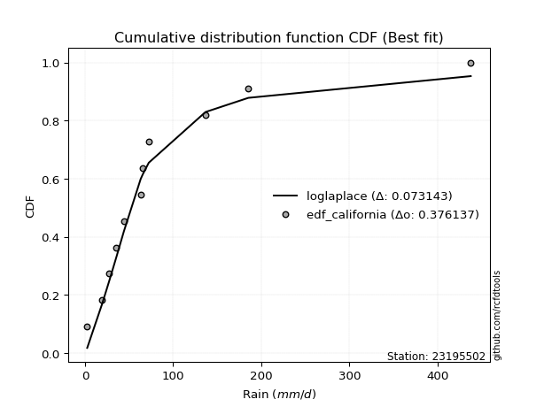</img>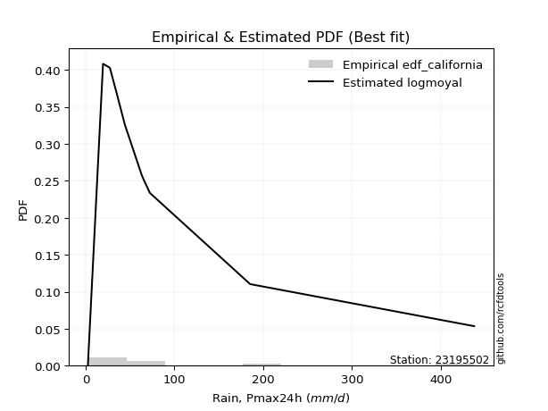</img>

</div>


### 2. EDF Hazen (1930)

Hazen method for plotting positions is a formula used to estimate the empirical cumulative probability distribution of flood events or other hydrological data. This formula often results in biased estimations, particularly when extrapolating to extreme events (high return periods).

<div align="center">


$P=(m-0.5)/n$


</div>


**2.1. Empirical values**

<div align="center">

|                | 0                    | 1                   | 2                   | 3                  | 4                  | 5         | 6                  | 7                  | 8                  | 9                  | 10                 |
|:---------------|:---------------------|:--------------------|:--------------------|:-------------------|:-------------------|:----------|:-------------------|:-------------------|:-------------------|:-------------------|:-------------------|
| date           | 2022                 | 2023                | 2021                | 2015               | 2017               | 2016      | 2019               | 2018               | 2025               | 2024               | 2020               |
| x              | 2.55                 | 19.62               | 27.36               | 35.75              | 44.13              | 63.2      | 65.57              | 72.39              | 136.7              | 185.3              | 437.61             |
| m              | 1                    | 2                   | 3                   | 4                  | 5                  | 6         | 7                  | 8                  | 9                  | 10                 | 11                 |
| empirical_dist | edf_hazen            | edf_hazen           | edf_hazen           | edf_hazen          | edf_hazen          | edf_hazen | edf_hazen          | edf_hazen          | edf_hazen          | edf_hazen          | edf_hazen          |
| empirical      | 0.045454545454545456 | 0.13636363636363635 | 0.22727272727272727 | 0.3181818181818182 | 0.4090909090909091 | 0.5       | 0.5909090909090909 | 0.6818181818181818 | 0.7727272727272727 | 0.8636363636363636 | 0.9545454545454546 |
| empirical_tr   | 1.0476190476190477   | 1.1578947368421053  | 1.2941176470588236  | 1.4666666666666666 | 1.6923076923076925 | 2.0       | 2.4444444444444446 | 3.1428571428571423 | 4.3999999999999995 | 7.333333333333334  | 22.00000000000002  |

</div>


**2.2. Kolmogorov-Smirnov fit test (sorted by Δ)**


<div align="center">

|                | 0                   | 1                   | 2                   | 3                   | 4                   | 5                   | 6                   | 7                   | 8                   | 9                   | 10                  | 11                  | 12                  | 13                  | 14                  | 15                  | 16                  | 17                  | 18                  | 19                  | 20                  | 21                  | 22                  | 23                  | 24                  | 25                  | 26                  | 27                  | 28                  | 29                  | 30                  | 31                  | 32                  | 33                  | 34                  | 35                  | 36                  | 37                  | 38                  | 39                  | 40                  | 41                  | 42                  | 43                  | 44                  | 45                  | 46                  | 47                  | 48                  | 49                  | 50                  | 51                  | 52                  | 53                  | 54                  | 55                  | 56                  | 57                  | 58                  | 59                  | 60                  | 61                  | 62                  | 63                  | 64                  | 65                  | 66                  | 67                  | 68                  | 69                  | 70                  | 71                  | 72                  | 73                  | 74                  | 75                  | 76                  | 77                  | 78                  | 79                  | 80                  | 81                  | 82                  | 83                  | 84                  | 85                  | 86                  | 87                  | 88                  | 89                  | 90                  | 91                  | 92                  | 93                  | 94                  | 95                  | 96                  | 97                  | 98                  | 99                  | 100                 | 101                 | 102                 | 103                 | 104                 | 105                 | 106                 | 107                 | 108                 | 109                 | 110                 | 111                 | 112                 | 113                 | 114                 | 115                 | 116                 | 117                 | 118                 | 119                 | 120                 | 121                 | 122                 | 123                 | 124                 | 125                 | 126                 | 127                 | 128                 | 129                 | 130                 | 131                 | 132                 | 133                 | 134                 | 135                 | 136                 | 137                 | 138                 | 139                 | 140                 | 141                 | 142                 | 143                 | 144                 | 145                 | 146                 | 147                 | 148                 | 149                 | 150                 | 151                 | 152                 | 153                 | 154                 | 155                 | 156                 | 157                 | 158                 | 159                 |
|:---------------|:--------------------|:--------------------|:--------------------|:--------------------|:--------------------|:--------------------|:--------------------|:--------------------|:--------------------|:--------------------|:--------------------|:--------------------|:--------------------|:--------------------|:--------------------|:--------------------|:--------------------|:--------------------|:--------------------|:--------------------|:--------------------|:--------------------|:--------------------|:--------------------|:--------------------|:--------------------|:--------------------|:--------------------|:--------------------|:--------------------|:--------------------|:--------------------|:--------------------|:--------------------|:--------------------|:--------------------|:--------------------|:--------------------|:--------------------|:--------------------|:--------------------|:--------------------|:--------------------|:--------------------|:--------------------|:--------------------|:--------------------|:--------------------|:--------------------|:--------------------|:--------------------|:--------------------|:--------------------|:--------------------|:--------------------|:--------------------|:--------------------|:--------------------|:--------------------|:--------------------|:--------------------|:--------------------|:--------------------|:--------------------|:--------------------|:--------------------|:--------------------|:--------------------|:--------------------|:--------------------|:--------------------|:--------------------|:--------------------|:--------------------|:--------------------|:--------------------|:--------------------|:--------------------|:--------------------|:--------------------|:--------------------|:--------------------|:--------------------|:--------------------|:--------------------|:--------------------|:--------------------|:--------------------|:--------------------|:--------------------|:--------------------|:--------------------|:--------------------|:--------------------|:--------------------|:--------------------|:--------------------|:--------------------|:--------------------|:--------------------|:--------------------|:--------------------|:--------------------|:--------------------|:--------------------|:--------------------|:--------------------|:--------------------|:--------------------|:--------------------|:--------------------|:--------------------|:--------------------|:--------------------|:--------------------|:--------------------|:--------------------|:--------------------|:--------------------|:--------------------|:--------------------|:--------------------|:--------------------|:--------------------|:--------------------|:--------------------|:--------------------|:--------------------|:--------------------|:--------------------|:--------------------|:--------------------|:--------------------|:--------------------|:--------------------|:--------------------|:--------------------|:--------------------|:--------------------|:--------------------|:--------------------|:--------------------|:--------------------|:--------------------|:--------------------|:--------------------|:--------------------|:--------------------|:--------------------|:--------------------|:--------------------|:--------------------|:--------------------|:--------------------|:--------------------|:--------------------|:--------------------|:--------------------|:--------------------|:--------------------|
| station        | 23195502            | 23195502            | 23195502            | 23195502            | 23195502            | 23195502            | 23195502            | 23195502            | 23195502            | 23195502            | 23195502            | 23195502            | 23195502            | 23195502            | 23195502            | 23195502            | 23195502            | 23195502            | 23195502            | 23195502            | 23195502            | 23195502            | 23195502            | 23195502            | 23195502            | 23195502            | 23195502            | 23195502            | 23195502            | 23195502            | 23195502            | 23195502            | 23195502            | 23195502            | 23195502            | 23195502            | 23195502            | 23195502            | 23195502            | 23195502            | 23195502            | 23195502            | 23195502            | 23195502            | 23195502            | 23195502            | 23195502            | 23195502            | 23195502            | 23195502            | 23195502            | 23195502            | 23195502            | 23195502            | 23195502            | 23195502            | 23195502            | 23195502            | 23195502            | 23195502            | 23195502            | 23195502            | 23195502            | 23195502            | 23195502            | 23195502            | 23195502            | 23195502            | 23195502            | 23195502            | 23195502            | 23195502            | 23195502            | 23195502            | 23195502            | 23195502            | 23195502            | 23195502            | 23195502            | 23195502            | 23195502            | 23195502            | 23195502            | 23195502            | 23195502            | 23195502            | 23195502            | 23195502            | 23195502            | 23195502            | 23195502            | 23195502            | 23195502            | 23195502            | 23195502            | 23195502            | 23195502            | 23195502            | 23195502            | 23195502            | 23195502            | 23195502            | 23195502            | 23195502            | 23195502            | 23195502            | 23195502            | 23195502            | 23195502            | 23195502            | 23195502            | 23195502            | 23195502            | 23195502            | 23195502            | 23195502            | 23195502            | 23195502            | 23195502            | 23195502            | 23195502            | 23195502            | 23195502            | 23195502            | 23195502            | 23195502            | 23195502            | 23195502            | 23195502            | 23195502            | 23195502            | 23195502            | 23195502            | 23195502            | 23195502            | 23195502            | 23195502            | 23195502            | 23195502            | 23195502            | 23195502            | 23195502            | 23195502            | 23195502            | 23195502            | 23195502            | 23195502            | 23195502            | 23195502            | 23195502            | 23195502            | 23195502            | 23195502            | 23195502            | 23195502            | 23195502            | 23195502            | 23195502            | 23195502            | 23195502            |
| empirical_dist | edf_hazen           | edf_hazen           | edf_hazen           | edf_hazen           | edf_hazen           | edf_hazen           | edf_hazen           | edf_hazen           | edf_hazen           | edf_hazen           | edf_hazen           | edf_hazen           | edf_hazen           | edf_hazen           | edf_hazen           | edf_hazen           | edf_hazen           | edf_hazen           | edf_hazen           | edf_hazen           | edf_hazen           | edf_hazen           | edf_hazen           | edf_hazen           | edf_hazen           | edf_hazen           | edf_hazen           | edf_hazen           | edf_hazen           | edf_hazen           | edf_hazen           | edf_hazen           | edf_hazen           | edf_hazen           | edf_hazen           | edf_hazen           | edf_hazen           | edf_hazen           | edf_hazen           | edf_hazen           | edf_hazen           | edf_hazen           | edf_hazen           | edf_hazen           | edf_hazen           | edf_hazen           | edf_hazen           | edf_hazen           | edf_hazen           | edf_hazen           | edf_hazen           | edf_hazen           | edf_hazen           | edf_hazen           | edf_hazen           | edf_hazen           | edf_hazen           | edf_hazen           | edf_hazen           | edf_hazen           | edf_hazen           | edf_hazen           | edf_hazen           | edf_hazen           | edf_hazen           | edf_hazen           | edf_hazen           | edf_hazen           | edf_hazen           | edf_hazen           | edf_hazen           | edf_hazen           | edf_hazen           | edf_hazen           | edf_hazen           | edf_hazen           | edf_hazen           | edf_hazen           | edf_hazen           | edf_hazen           | edf_hazen           | edf_hazen           | edf_hazen           | edf_hazen           | edf_hazen           | edf_hazen           | edf_hazen           | edf_hazen           | edf_hazen           | edf_hazen           | edf_hazen           | edf_hazen           | edf_hazen           | edf_hazen           | edf_hazen           | edf_hazen           | edf_hazen           | edf_hazen           | edf_hazen           | edf_hazen           | edf_hazen           | edf_hazen           | edf_hazen           | edf_hazen           | edf_hazen           | edf_hazen           | edf_hazen           | edf_hazen           | edf_hazen           | edf_hazen           | edf_hazen           | edf_hazen           | edf_hazen           | edf_hazen           | edf_hazen           | edf_hazen           | edf_hazen           | edf_hazen           | edf_hazen           | edf_hazen           | edf_hazen           | edf_hazen           | edf_hazen           | edf_hazen           | edf_hazen           | edf_hazen           | edf_hazen           | edf_hazen           | edf_hazen           | edf_hazen           | edf_hazen           | edf_hazen           | edf_hazen           | edf_hazen           | edf_hazen           | edf_hazen           | edf_hazen           | edf_hazen           | edf_hazen           | edf_hazen           | edf_hazen           | edf_hazen           | edf_hazen           | edf_hazen           | edf_hazen           | edf_hazen           | edf_hazen           | edf_hazen           | edf_hazen           | edf_hazen           | edf_hazen           | edf_hazen           | edf_hazen           | edf_hazen           | edf_hazen           | edf_hazen           | edf_hazen           | edf_hazen           | edf_hazen           | edf_hazen           |
| p_dist         | loglogistic         | logvonmises_line    | logfoldnorm         | loghypsecant        | logtukeylambda      | invweibull          | genextreme          | nct                 | logt                | logfatiguelife      | lognorm             | logcrystalball      | logexponnorm        | logf                | logrice             | invgamma            | lognct              | logjohnsonsu        | kappa3              | logbetaprime        | loggenlogistic      | logburr             | logmielke           | logerlang           | loggamma            | loggamma            | johnsonsu           | logalpha            | loglaplace          | loglaplace          | loginvgamma         | ncf                 | logskewnorm         | invgauss            | lomax               | genpareto           | loggennorm          | loginvgauss         | logmaxwell          | logexponweib        | dgamma              | logjohnsonsb        | logloggamma         | loggengamma         | mielke              | logburr12           | logweibull_min      | logbeta             | loganglit           | logexponpow         | fatiguelife         | logpearson3         | lograyleigh         | wald                | gennorm             | loggenextreme       | logdweibull         | gengamma            | betaprime           | logncf              | logsemicircular     | logloglaplace       | gausshyper          | logargus            | loggumbel_r         | lognakagami         | truncpareto         | loggumbel_l         | burr12              | pearson3            | logdgamma           | t                   | loghalfnorm         | loginvweibull       | logcosine           | logmoyal            | logtruncweibull_min | exponweib           | truncweibull_min    | loghalflogistic     | exponnorm           | gompertz            | genexpon            | halflogistic        | nakagami            | loggenhalflogistic  | logarcsine          | burr                | dweibull            | moyal               | weibull_min         | f                   | truncnorm           | loggausshyper       | gamma               | halfnorm            | erlang              | vonmises_line       | cosine              | logkstwobign        | genlogistic         | gumbel_r            | loggompertz         | logtriang           | loggenpareto        | logwald             | rayleigh            | loggenexpon         | foldnorm            | maxwell             | exponpow            | semicircular        | anglit              | arcsine             | logkappa3           | loguniform          | halfgennorm         | logwrapcauchy       | kstwobign           | crystalball         | norm                | beta                | logksone            | logistic            | logkappa4           | logtrapezoid        | hypsecant           | johnsonsb           | rice                | loglevy_l           | laplace             | logtruncnorm        | skewnorm            | gumbel_l            | logbradford         | wrapcauchy          | logweibull_max      | logtruncexpon       | bradford            | loglomax            | argus               | powerlaw            | loghalfgennorm      | truncexpon          | triang              | levy_l              | ksone               | kappa4              | rdist               | uniform             | alpha               | logrdist            | tukeylambda         | genhalflogistic     | logpowerlaw         | trapezoid           | weibull_max         | logtruncpareto      | logvonmises         | vonmises            |
| delta          | 0.0703282832092097  | 0.0761031994193887  | 0.07654109955136879 | 0.07729458555844793 | 0.08116001071511125 | 0.0844355620482079  | 0.08443567734427915 | 0.08456844000324126 | 0.08587209781365945 | 0.0862855278120575  | 0.08706940066510443 | 0.087069401530911   | 0.08707062772179983 | 0.0874756396517328  | 0.0874868218888161  | 0.08796585345244912 | 0.08837144023201329 | 0.09020008205911945 | 0.09247152276288106 | 0.09306914547120901 | 0.09433106291669657 | 0.09490405151420767 | 0.0955999623785706  | 0.09632728234991439 | 0.09766377139581542 | 0.09766377139581542 | 0.0985170051762907  | 0.098769662960496   | 0.0990626243870556  | 0.0990626243870556  | 0.10160893981375219 | 0.10271038336248217 | 0.10319292803755553 | 0.1047774182488469  | 0.10534074157763718 | 0.10534145382061755 | 0.1060501892071169  | 0.10817604702586903 | 0.10996598687373413 | 0.11256909125121373 | 0.11316864828959218 | 0.11363135830244908 | 0.11363207559712118 | 0.11381046527737171 | 0.1142477586414572  | 0.11453566536460402 | 0.1145719633023915  | 0.11512724127803942 | 0.11518202052479248 | 0.11954663749236183 | 0.12017525472075796 | 0.12032372383911982 | 0.12122621307981638 | 0.12126024701472216 | 0.12222618390032991 | 0.12331922396457728 | 0.12353919768777744 | 0.12537660757506303 | 0.12638842978222903 | 0.12713362797753586 | 0.12748636637197297 | 0.1277678033319395  | 0.1281526413103391  | 0.12823253849981786 | 0.13155448642101542 | 0.1363636363633021  | 0.1369267710347125  | 0.13737583410859455 | 0.13917677024406483 | 0.14315260557902676 | 0.14482998488175564 | 0.14991991060530663 | 0.15315695657079184 | 0.15452774419825982 | 0.15536478153042244 | 0.15597183246388424 | 0.15710836676419787 | 0.157702363219143   | 0.1605458806892871  | 0.1620741991744593  | 0.1629431625389971  | 0.16466427691748786 | 0.16696621337463002 | 0.17290917568384923 | 0.17679311484887633 | 0.1823701902062485  | 0.1828643224835571  | 0.18413020719873385 | 0.18561541859193514 | 0.1857336988634848  | 0.1865040464107221  | 0.1887778892321882  | 0.1896611523596215  | 0.19050564116412566 | 0.1941500880125443  | 0.1953691735484916  | 0.19629541213961    | 0.19698244090261335 | 0.2017259981102133  | 0.2031867897180653  | 0.20920471237007943 | 0.20934962759733106 | 0.21056086710281502 | 0.21916881904482682 | 0.22362586003303064 | 0.22374070443723781 | 0.2245514925801506  | 0.22665586538996985 | 0.22986605146055267 | 0.23680700465144416 | 0.2435571287635615  | 0.253452194379943   | 0.25860479610920895 | 0.2590301692038071  | 0.2601984481192666  | 0.26020837573096645 | 0.26049649331037183 | 0.26527697750930773 | 0.26983553522671433 | 0.2710323128480008  | 0.2710323224272087  | 0.2744517629886398  | 0.27744637371519937 | 0.2826794801972936  | 0.2871186007934719  | 0.2908748156181976  | 0.2922930394911332  | 0.29932537902297973 | 0.3068330180702359  | 0.31804084881778544 | 0.318358232051538   | 0.32750551221983054 | 0.3294793718195198  | 0.33857812774034696 | 0.33936435175889323 | 0.38798465204876964 | 0.3915081053792798  | 0.3935060411593324  | 0.4088986550365185  | 0.41065743708906277 | 0.41445889927232404 | 0.4171618655712591  | 0.4174817436603685  | 0.4255172740426575  | 0.43976069879789315 | 0.4620866986219087  | 0.4647101967126791  | 0.4965539707900971  | 0.5204137573081264  | 0.5212885996915786  | 0.5328298422335697  | 0.5456259229138334  | 0.5470501150414946  | 0.5619565947837347  | 0.6535166283949743  | 0.6724022015806513  | 0.7364706399701     | 0.8185696708023434  | 1.0047991073659777  | 68.76942295501908   |
| deltao         | 0.37613735880099997 | 0.37613735880099997 | 0.37613735880099997 | 0.37613735880099997 | 0.37613735880099997 | 0.37613735880099997 | 0.37613735880099997 | 0.37613735880099997 | 0.37613735880099997 | 0.37613735880099997 | 0.37613735880099997 | 0.37613735880099997 | 0.37613735880099997 | 0.37613735880099997 | 0.37613735880099997 | 0.37613735880099997 | 0.37613735880099997 | 0.37613735880099997 | 0.37613735880099997 | 0.37613735880099997 | 0.37613735880099997 | 0.37613735880099997 | 0.37613735880099997 | 0.37613735880099997 | 0.37613735880099997 | 0.37613735880099997 | 0.37613735880099997 | 0.37613735880099997 | 0.37613735880099997 | 0.37613735880099997 | 0.37613735880099997 | 0.37613735880099997 | 0.37613735880099997 | 0.37613735880099997 | 0.37613735880099997 | 0.37613735880099997 | 0.37613735880099997 | 0.37613735880099997 | 0.37613735880099997 | 0.37613735880099997 | 0.37613735880099997 | 0.37613735880099997 | 0.37613735880099997 | 0.37613735880099997 | 0.37613735880099997 | 0.37613735880099997 | 0.37613735880099997 | 0.37613735880099997 | 0.37613735880099997 | 0.37613735880099997 | 0.37613735880099997 | 0.37613735880099997 | 0.37613735880099997 | 0.37613735880099997 | 0.37613735880099997 | 0.37613735880099997 | 0.37613735880099997 | 0.37613735880099997 | 0.37613735880099997 | 0.37613735880099997 | 0.37613735880099997 | 0.37613735880099997 | 0.37613735880099997 | 0.37613735880099997 | 0.37613735880099997 | 0.37613735880099997 | 0.37613735880099997 | 0.37613735880099997 | 0.37613735880099997 | 0.37613735880099997 | 0.37613735880099997 | 0.37613735880099997 | 0.37613735880099997 | 0.37613735880099997 | 0.37613735880099997 | 0.37613735880099997 | 0.37613735880099997 | 0.37613735880099997 | 0.37613735880099997 | 0.37613735880099997 | 0.37613735880099997 | 0.37613735880099997 | 0.37613735880099997 | 0.37613735880099997 | 0.37613735880099997 | 0.37613735880099997 | 0.37613735880099997 | 0.37613735880099997 | 0.37613735880099997 | 0.37613735880099997 | 0.37613735880099997 | 0.37613735880099997 | 0.37613735880099997 | 0.37613735880099997 | 0.37613735880099997 | 0.37613735880099997 | 0.37613735880099997 | 0.37613735880099997 | 0.37613735880099997 | 0.37613735880099997 | 0.37613735880099997 | 0.37613735880099997 | 0.37613735880099997 | 0.37613735880099997 | 0.37613735880099997 | 0.37613735880099997 | 0.37613735880099997 | 0.37613735880099997 | 0.37613735880099997 | 0.37613735880099997 | 0.37613735880099997 | 0.37613735880099997 | 0.37613735880099997 | 0.37613735880099997 | 0.37613735880099997 | 0.37613735880099997 | 0.37613735880099997 | 0.37613735880099997 | 0.37613735880099997 | 0.37613735880099997 | 0.37613735880099997 | 0.37613735880099997 | 0.37613735880099997 | 0.37613735880099997 | 0.37613735880099997 | 0.37613735880099997 | 0.37613735880099997 | 0.37613735880099997 | 0.37613735880099997 | 0.37613735880099997 | 0.37613735880099997 | 0.37613735880099997 | 0.37613735880099997 | 0.37613735880099997 | 0.37613735880099997 | 0.37613735880099997 | 0.37613735880099997 | 0.37613735880099997 | 0.37613735880099997 | 0.37613735880099997 | 0.37613735880099997 | 0.37613735880099997 | 0.37613735880099997 | 0.37613735880099997 | 0.37613735880099997 | 0.37613735880099997 | 0.37613735880099997 | 0.37613735880099997 | 0.37613735880099997 | 0.37613735880099997 | 0.37613735880099997 | 0.37613735880099997 | 0.37613735880099997 | 0.37613735880099997 | 0.37613735880099997 | 0.37613735880099997 | 0.37613735880099997 | 0.37613735880099997 | 0.37613735880099997 | 0.37613735880099997 |
| eval           | Δo > Δ              | Δo > Δ              | Δo > Δ              | Δo > Δ              | Δo > Δ              | Δo > Δ              | Δo > Δ              | Δo > Δ              | Δo > Δ              | Δo > Δ              | Δo > Δ              | Δo > Δ              | Δo > Δ              | Δo > Δ              | Δo > Δ              | Δo > Δ              | Δo > Δ              | Δo > Δ              | Δo > Δ              | Δo > Δ              | Δo > Δ              | Δo > Δ              | Δo > Δ              | Δo > Δ              | Δo > Δ              | Δo > Δ              | Δo > Δ              | Δo > Δ              | Δo > Δ              | Δo > Δ              | Δo > Δ              | Δo > Δ              | Δo > Δ              | Δo > Δ              | Δo > Δ              | Δo > Δ              | Δo > Δ              | Δo > Δ              | Δo > Δ              | Δo > Δ              | Δo > Δ              | Δo > Δ              | Δo > Δ              | Δo > Δ              | Δo > Δ              | Δo > Δ              | Δo > Δ              | Δo > Δ              | Δo > Δ              | Δo > Δ              | Δo > Δ              | Δo > Δ              | Δo > Δ              | Δo > Δ              | Δo > Δ              | Δo > Δ              | Δo > Δ              | Δo > Δ              | Δo > Δ              | Δo > Δ              | Δo > Δ              | Δo > Δ              | Δo > Δ              | Δo > Δ              | Δo > Δ              | Δo > Δ              | Δo > Δ              | Δo > Δ              | Δo > Δ              | Δo > Δ              | Δo > Δ              | Δo > Δ              | Δo > Δ              | Δo > Δ              | Δo > Δ              | Δo > Δ              | Δo > Δ              | Δo > Δ              | Δo > Δ              | Δo > Δ              | Δo > Δ              | Δo > Δ              | Δo > Δ              | Δo > Δ              | Δo > Δ              | Δo > Δ              | Δo > Δ              | Δo > Δ              | Δo > Δ              | Δo > Δ              | Δo > Δ              | Δo > Δ              | Δo > Δ              | Δo > Δ              | Δo > Δ              | Δo > Δ              | Δo > Δ              | Δo > Δ              | Δo > Δ              | Δo > Δ              | Δo > Δ              | Δo > Δ              | Δo > Δ              | Δo > Δ              | Δo > Δ              | Δo > Δ              | Δo > Δ              | Δo > Δ              | Δo > Δ              | Δo > Δ              | Δo > Δ              | Δo > Δ              | Δo > Δ              | Δo > Δ              | Δo > Δ              | Δo > Δ              | Δo > Δ              | Δo > Δ              | Δo > Δ              | Δo > Δ              | Δo > Δ              | Δo > Δ              | Δo > Δ              | Δo > Δ              | Δo > Δ              | Δo > Δ              | Δo > Δ              | Δo > Δ              | Δo > Δ              | Δo > Δ              | Δo > Δ              | Δo > Δ              | Δo > Δ              | Δo > Δ              | Δo > Δ              | Δo <= Δ             | Δo <= Δ             | Δo <= Δ             | Δo <= Δ             | Δo <= Δ             | Δo <= Δ             | Δo <= Δ             | Δo <= Δ             | Δo <= Δ             | Δo <= Δ             | Δo <= Δ             | Δo <= Δ             | Δo <= Δ             | Δo <= Δ             | Δo <= Δ             | Δo <= Δ             | Δo <= Δ             | Δo <= Δ             | Δo <= Δ             | Δo <= Δ             | Δo <= Δ             | Δo <= Δ             | Δo <= Δ             | Δo <= Δ             | Δo <= Δ             |
| fit            | 1                   | 1                   | 1                   | 1                   | 1                   | 1                   | 1                   | 1                   | 1                   | 1                   | 1                   | 1                   | 1                   | 1                   | 1                   | 1                   | 1                   | 1                   | 1                   | 1                   | 1                   | 1                   | 1                   | 1                   | 1                   | 1                   | 1                   | 1                   | 1                   | 1                   | 1                   | 1                   | 1                   | 1                   | 1                   | 1                   | 1                   | 1                   | 1                   | 1                   | 1                   | 1                   | 1                   | 1                   | 1                   | 1                   | 1                   | 1                   | 1                   | 1                   | 1                   | 1                   | 1                   | 1                   | 1                   | 1                   | 1                   | 1                   | 1                   | 1                   | 1                   | 1                   | 1                   | 1                   | 1                   | 1                   | 1                   | 1                   | 1                   | 1                   | 1                   | 1                   | 1                   | 1                   | 1                   | 1                   | 1                   | 1                   | 1                   | 1                   | 1                   | 1                   | 1                   | 1                   | 1                   | 1                   | 1                   | 1                   | 1                   | 1                   | 1                   | 1                   | 1                   | 1                   | 1                   | 1                   | 1                   | 1                   | 1                   | 1                   | 1                   | 1                   | 1                   | 1                   | 1                   | 1                   | 1                   | 1                   | 1                   | 1                   | 1                   | 1                   | 1                   | 1                   | 1                   | 1                   | 1                   | 1                   | 1                   | 1                   | 1                   | 1                   | 1                   | 1                   | 1                   | 1                   | 1                   | 1                   | 1                   | 1                   | 1                   | 1                   | 1                   | 1                   | 1                   | 0                   | 0                   | 0                   | 0                   | 0                   | 0                   | 0                   | 0                   | 0                   | 0                   | 0                   | 0                   | 0                   | 0                   | 0                   | 0                   | 0                   | 0                   | 0                   | 0                   | 0                   | 0                   | 0                   | 0                   | 0                   |
| n              | 11                  | 11                  | 11                  | 11                  | 11                  | 11                  | 11                  | 11                  | 11                  | 11                  | 11                  | 11                  | 11                  | 11                  | 11                  | 11                  | 11                  | 11                  | 11                  | 11                  | 11                  | 11                  | 11                  | 11                  | 11                  | 11                  | 11                  | 11                  | 11                  | 11                  | 11                  | 11                  | 11                  | 11                  | 11                  | 11                  | 11                  | 11                  | 11                  | 11                  | 11                  | 11                  | 11                  | 11                  | 11                  | 11                  | 11                  | 11                  | 11                  | 11                  | 11                  | 11                  | 11                  | 11                  | 11                  | 11                  | 11                  | 11                  | 11                  | 11                  | 11                  | 11                  | 11                  | 11                  | 11                  | 11                  | 11                  | 11                  | 11                  | 11                  | 11                  | 11                  | 11                  | 11                  | 11                  | 11                  | 11                  | 11                  | 11                  | 11                  | 11                  | 11                  | 11                  | 11                  | 11                  | 11                  | 11                  | 11                  | 11                  | 11                  | 11                  | 11                  | 11                  | 11                  | 11                  | 11                  | 11                  | 11                  | 11                  | 11                  | 11                  | 11                  | 11                  | 11                  | 11                  | 11                  | 11                  | 11                  | 11                  | 11                  | 11                  | 11                  | 11                  | 11                  | 11                  | 11                  | 11                  | 11                  | 11                  | 11                  | 11                  | 11                  | 11                  | 11                  | 11                  | 11                  | 11                  | 11                  | 11                  | 11                  | 11                  | 11                  | 11                  | 11                  | 11                  | 11                  | 11                  | 11                  | 11                  | 11                  | 11                  | 11                  | 11                  | 11                  | 11                  | 11                  | 11                  | 11                  | 11                  | 11                  | 11                  | 11                  | 11                  | 11                  | 11                  | 11                  | 11                  | 11                  | 11                  | 11                  |
| best_fit       | 1                   | 0                   | 0                   | 0                   | 0                   | 0                   | 0                   | 0                   | 0                   | 0                   | 0                   | 0                   | 0                   | 0                   | 0                   | 0                   | 0                   | 0                   | 0                   | 0                   | 0                   | 0                   | 0                   | 0                   | 0                   | 0                   | 0                   | 0                   | 0                   | 0                   | 0                   | 0                   | 0                   | 0                   | 0                   | 0                   | 0                   | 0                   | 0                   | 0                   | 0                   | 0                   | 0                   | 0                   | 0                   | 0                   | 0                   | 0                   | 0                   | 0                   | 0                   | 0                   | 0                   | 0                   | 0                   | 0                   | 0                   | 0                   | 0                   | 0                   | 0                   | 0                   | 0                   | 0                   | 0                   | 0                   | 0                   | 0                   | 0                   | 0                   | 0                   | 0                   | 0                   | 0                   | 0                   | 0                   | 0                   | 0                   | 0                   | 0                   | 0                   | 0                   | 0                   | 0                   | 0                   | 0                   | 0                   | 0                   | 0                   | 0                   | 0                   | 0                   | 0                   | 0                   | 0                   | 0                   | 0                   | 0                   | 0                   | 0                   | 0                   | 0                   | 0                   | 0                   | 0                   | 0                   | 0                   | 0                   | 0                   | 0                   | 0                   | 0                   | 0                   | 0                   | 0                   | 0                   | 0                   | 0                   | 0                   | 0                   | 0                   | 0                   | 0                   | 0                   | 0                   | 0                   | 0                   | 0                   | 0                   | 0                   | 0                   | 0                   | 0                   | 0                   | 0                   | 0                   | 0                   | 0                   | 0                   | 0                   | 0                   | 0                   | 0                   | 0                   | 0                   | 0                   | 0                   | 0                   | 0                   | 0                   | 0                   | 0                   | 0                   | 0                   | 0                   | 0                   | 0                   | 0                   | 0                   | 0                   |
| best_fit_sort  | 1                   | 2                   | 3                   | 4                   | 5                   | 6                   | 7                   | 8                   | 9                   | 10                  | 11                  | 12                  | 13                  | 14                  | 15                  | 16                  | 17                  | 18                  | 19                  | 20                  | 21                  | 22                  | 23                  | 24                  | 25                  | 26                  | 27                  | 28                  | 29                  | 30                  | 31                  | 32                  | 33                  | 34                  | 35                  | 36                  | 37                  | 38                  | 39                  | 40                  | 41                  | 42                  | 43                  | 44                  | 45                  | 46                  | 47                  | 48                  | 49                  | 50                  | 51                  | 52                  | 53                  | 54                  | 55                  | 56                  | 57                  | 58                  | 59                  | 60                  | 61                  | 62                  | 63                  | 64                  | 65                  | 66                  | 67                  | 68                  | 69                  | 70                  | 71                  | 72                  | 73                  | 74                  | 75                  | 76                  | 77                  | 78                  | 79                  | 80                  | 81                  | 82                  | 83                  | 84                  | 85                  | 86                  | 87                  | 88                  | 89                  | 90                  | 91                  | 92                  | 93                  | 94                  | 95                  | 96                  | 97                  | 98                  | 99                  | 100                 | 101                 | 102                 | 103                 | 104                 | 105                 | 106                 | 107                 | 108                 | 109                 | 110                 | 111                 | 112                 | 113                 | 114                 | 115                 | 116                 | 117                 | 118                 | 119                 | 120                 | 121                 | 122                 | 123                 | 124                 | 125                 | 126                 | 127                 | 128                 | 129                 | 130                 | 131                 | 132                 | 133                 | 134                 | 135                 | 136                 | 137                 | 138                 | 139                 | 140                 | 141                 | 142                 | 143                 | 144                 | 145                 | 146                 | 147                 | 148                 | 149                 | 150                 | 151                 | 152                 | 153                 | 154                 | 155                 | 156                 | 157                 | 158                 | 159                 | 160                 |

</div>


**2.3. Best fit**

<div align="center">

|   id |   station | empirical_dist   | p_dist      |     delta |   deltao | eval   |   fit |   n |   best_fit |   best_fit_sort |
|-----:|----------:|:-----------------|:------------|----------:|---------:|:-------|------:|----:|-----------:|----------------:|
|    0 |  23195502 | edf_hazen        | loglogistic | 0.0703283 | 0.376137 | Δo > Δ |     1 |  11 |          1 |               1 |

</div>


<div align="center">

</img>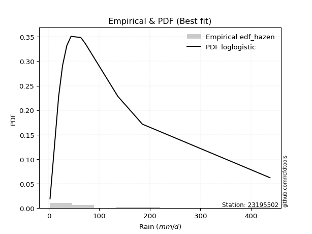</img>

</div>


### 3. EDF Weibull (1939)

Weibull plotting position formula is an empirical method used to estimate the non-exceedance probability or plotting position for a set of observed data, is often recommended or widely used in practice, particularly in flood frequency analysis.

<div align="center">


$P=m/(n+1)$


</div>


**3.1. Empirical values**

<div align="center">

|                | 0                   | 1                   | 2                  | 3                  | 4                  | 5           | 6                  | 7                  | 8           | 9                  | 10                 |
|:---------------|:--------------------|:--------------------|:-------------------|:-------------------|:-------------------|:------------|:-------------------|:-------------------|:------------|:-------------------|:-------------------|
| date           | 2022                | 2023                | 2021               | 2015               | 2017               | 2016        | 2019               | 2018               | 2025        | 2024               | 2020               |
| x              | 2.55                | 19.62               | 27.36              | 35.75              | 44.13              | 63.2        | 65.57              | 72.39              | 136.7       | 185.3              | 437.61             |
| m              | 1                   | 2                   | 3                  | 4                  | 5                  | 6           | 7                  | 8                  | 9           | 10                 | 11                 |
| empirical_dist | edf_weibull         | edf_weibull         | edf_weibull        | edf_weibull        | edf_weibull        | edf_weibull | edf_weibull        | edf_weibull        | edf_weibull | edf_weibull        | edf_weibull        |
| empirical      | 0.08333333333333333 | 0.16666666666666666 | 0.25               | 0.3333333333333333 | 0.4166666666666667 | 0.5         | 0.5833333333333334 | 0.6666666666666666 | 0.75        | 0.8333333333333334 | 0.9166666666666666 |
| empirical_tr   | 1.090909090909091   | 1.2                 | 1.3333333333333333 | 1.4999999999999998 | 1.7142857142857144 | 2.0         | 2.4000000000000004 | 2.9999999999999996 | 4.0         | 6.000000000000002  | 11.999999999999995 |

</div>


**3.2. Kolmogorov-Smirnov fit test (sorted by Δ)**


<div align="center">

|                | 0                   | 1                   | 2                   | 3                   | 4                   | 5                   | 6                   | 7                   | 8                   | 9                   | 10                  | 11                  | 12                  | 13                  | 14                  | 15                  | 16                  | 17                  | 18                  | 19                  | 20                  | 21                  | 22                  | 23                  | 24                  | 25                  | 26                  | 27                  | 28                  | 29                  | 30                  | 31                  | 32                  | 33                  | 34                  | 35                  | 36                  | 37                  | 38                  | 39                  | 40                  | 41                  | 42                  | 43                  | 44                  | 45                  | 46                  | 47                  | 48                  | 49                  | 50                  | 51                  | 52                  | 53                  | 54                  | 55                  | 56                  | 57                  | 58                  | 59                  | 60                  | 61                  | 62                  | 63                  | 64                  | 65                  | 66                  | 67                  | 68                  | 69                  | 70                  | 71                  | 72                  | 73                  | 74                  | 75                  | 76                  | 77                  | 78                  | 79                  | 80                  | 81                  | 82                  | 83                  | 84                  | 85                  | 86                  | 87                  | 88                  | 89                  | 90                  | 91                  | 92                  | 93                  | 94                  | 95                  | 96                  | 97                  | 98                  | 99                  | 100                 | 101                 | 102                 | 103                 | 104                 | 105                 | 106                 | 107                 | 108                 | 109                 | 110                 | 111                 | 112                 | 113                 | 114                 | 115                 | 116                 | 117                 | 118                 | 119                 | 120                 | 121                 | 122                 | 123                 | 124                 | 125                 | 126                 | 127                 | 128                 | 129                 | 130                 | 131                 | 132                 | 133                 | 134                 | 135                 | 136                 | 137                 | 138                 | 139                 | 140                 | 141                 | 142                 | 143                 | 144                 | 145                 | 146                 | 147                 | 148                 | 149                 | 150                 | 151                 | 152                 | 153                 | 154                 | 155                 | 156                 | 157                 | 158                 | 159                 |
|:---------------|:--------------------|:--------------------|:--------------------|:--------------------|:--------------------|:--------------------|:--------------------|:--------------------|:--------------------|:--------------------|:--------------------|:--------------------|:--------------------|:--------------------|:--------------------|:--------------------|:--------------------|:--------------------|:--------------------|:--------------------|:--------------------|:--------------------|:--------------------|:--------------------|:--------------------|:--------------------|:--------------------|:--------------------|:--------------------|:--------------------|:--------------------|:--------------------|:--------------------|:--------------------|:--------------------|:--------------------|:--------------------|:--------------------|:--------------------|:--------------------|:--------------------|:--------------------|:--------------------|:--------------------|:--------------------|:--------------------|:--------------------|:--------------------|:--------------------|:--------------------|:--------------------|:--------------------|:--------------------|:--------------------|:--------------------|:--------------------|:--------------------|:--------------------|:--------------------|:--------------------|:--------------------|:--------------------|:--------------------|:--------------------|:--------------------|:--------------------|:--------------------|:--------------------|:--------------------|:--------------------|:--------------------|:--------------------|:--------------------|:--------------------|:--------------------|:--------------------|:--------------------|:--------------------|:--------------------|:--------------------|:--------------------|:--------------------|:--------------------|:--------------------|:--------------------|:--------------------|:--------------------|:--------------------|:--------------------|:--------------------|:--------------------|:--------------------|:--------------------|:--------------------|:--------------------|:--------------------|:--------------------|:--------------------|:--------------------|:--------------------|:--------------------|:--------------------|:--------------------|:--------------------|:--------------------|:--------------------|:--------------------|:--------------------|:--------------------|:--------------------|:--------------------|:--------------------|:--------------------|:--------------------|:--------------------|:--------------------|:--------------------|:--------------------|:--------------------|:--------------------|:--------------------|:--------------------|:--------------------|:--------------------|:--------------------|:--------------------|:--------------------|:--------------------|:--------------------|:--------------------|:--------------------|:--------------------|:--------------------|:--------------------|:--------------------|:--------------------|:--------------------|:--------------------|:--------------------|:--------------------|:--------------------|:--------------------|:--------------------|:--------------------|:--------------------|:--------------------|:--------------------|:--------------------|:--------------------|:--------------------|:--------------------|:--------------------|:--------------------|:--------------------|:--------------------|:--------------------|:--------------------|:--------------------|:--------------------|:--------------------|
| station        | 23195502            | 23195502            | 23195502            | 23195502            | 23195502            | 23195502            | 23195502            | 23195502            | 23195502            | 23195502            | 23195502            | 23195502            | 23195502            | 23195502            | 23195502            | 23195502            | 23195502            | 23195502            | 23195502            | 23195502            | 23195502            | 23195502            | 23195502            | 23195502            | 23195502            | 23195502            | 23195502            | 23195502            | 23195502            | 23195502            | 23195502            | 23195502            | 23195502            | 23195502            | 23195502            | 23195502            | 23195502            | 23195502            | 23195502            | 23195502            | 23195502            | 23195502            | 23195502            | 23195502            | 23195502            | 23195502            | 23195502            | 23195502            | 23195502            | 23195502            | 23195502            | 23195502            | 23195502            | 23195502            | 23195502            | 23195502            | 23195502            | 23195502            | 23195502            | 23195502            | 23195502            | 23195502            | 23195502            | 23195502            | 23195502            | 23195502            | 23195502            | 23195502            | 23195502            | 23195502            | 23195502            | 23195502            | 23195502            | 23195502            | 23195502            | 23195502            | 23195502            | 23195502            | 23195502            | 23195502            | 23195502            | 23195502            | 23195502            | 23195502            | 23195502            | 23195502            | 23195502            | 23195502            | 23195502            | 23195502            | 23195502            | 23195502            | 23195502            | 23195502            | 23195502            | 23195502            | 23195502            | 23195502            | 23195502            | 23195502            | 23195502            | 23195502            | 23195502            | 23195502            | 23195502            | 23195502            | 23195502            | 23195502            | 23195502            | 23195502            | 23195502            | 23195502            | 23195502            | 23195502            | 23195502            | 23195502            | 23195502            | 23195502            | 23195502            | 23195502            | 23195502            | 23195502            | 23195502            | 23195502            | 23195502            | 23195502            | 23195502            | 23195502            | 23195502            | 23195502            | 23195502            | 23195502            | 23195502            | 23195502            | 23195502            | 23195502            | 23195502            | 23195502            | 23195502            | 23195502            | 23195502            | 23195502            | 23195502            | 23195502            | 23195502            | 23195502            | 23195502            | 23195502            | 23195502            | 23195502            | 23195502            | 23195502            | 23195502            | 23195502            | 23195502            | 23195502            | 23195502            | 23195502            | 23195502            | 23195502            |
| empirical_dist | edf_weibull         | edf_weibull         | edf_weibull         | edf_weibull         | edf_weibull         | edf_weibull         | edf_weibull         | edf_weibull         | edf_weibull         | edf_weibull         | edf_weibull         | edf_weibull         | edf_weibull         | edf_weibull         | edf_weibull         | edf_weibull         | edf_weibull         | edf_weibull         | edf_weibull         | edf_weibull         | edf_weibull         | edf_weibull         | edf_weibull         | edf_weibull         | edf_weibull         | edf_weibull         | edf_weibull         | edf_weibull         | edf_weibull         | edf_weibull         | edf_weibull         | edf_weibull         | edf_weibull         | edf_weibull         | edf_weibull         | edf_weibull         | edf_weibull         | edf_weibull         | edf_weibull         | edf_weibull         | edf_weibull         | edf_weibull         | edf_weibull         | edf_weibull         | edf_weibull         | edf_weibull         | edf_weibull         | edf_weibull         | edf_weibull         | edf_weibull         | edf_weibull         | edf_weibull         | edf_weibull         | edf_weibull         | edf_weibull         | edf_weibull         | edf_weibull         | edf_weibull         | edf_weibull         | edf_weibull         | edf_weibull         | edf_weibull         | edf_weibull         | edf_weibull         | edf_weibull         | edf_weibull         | edf_weibull         | edf_weibull         | edf_weibull         | edf_weibull         | edf_weibull         | edf_weibull         | edf_weibull         | edf_weibull         | edf_weibull         | edf_weibull         | edf_weibull         | edf_weibull         | edf_weibull         | edf_weibull         | edf_weibull         | edf_weibull         | edf_weibull         | edf_weibull         | edf_weibull         | edf_weibull         | edf_weibull         | edf_weibull         | edf_weibull         | edf_weibull         | edf_weibull         | edf_weibull         | edf_weibull         | edf_weibull         | edf_weibull         | edf_weibull         | edf_weibull         | edf_weibull         | edf_weibull         | edf_weibull         | edf_weibull         | edf_weibull         | edf_weibull         | edf_weibull         | edf_weibull         | edf_weibull         | edf_weibull         | edf_weibull         | edf_weibull         | edf_weibull         | edf_weibull         | edf_weibull         | edf_weibull         | edf_weibull         | edf_weibull         | edf_weibull         | edf_weibull         | edf_weibull         | edf_weibull         | edf_weibull         | edf_weibull         | edf_weibull         | edf_weibull         | edf_weibull         | edf_weibull         | edf_weibull         | edf_weibull         | edf_weibull         | edf_weibull         | edf_weibull         | edf_weibull         | edf_weibull         | edf_weibull         | edf_weibull         | edf_weibull         | edf_weibull         | edf_weibull         | edf_weibull         | edf_weibull         | edf_weibull         | edf_weibull         | edf_weibull         | edf_weibull         | edf_weibull         | edf_weibull         | edf_weibull         | edf_weibull         | edf_weibull         | edf_weibull         | edf_weibull         | edf_weibull         | edf_weibull         | edf_weibull         | edf_weibull         | edf_weibull         | edf_weibull         | edf_weibull         | edf_weibull         | edf_weibull         | edf_weibull         |
| p_dist         | logtukeylambda      | invweibull          | genextreme          | nct                 | loglogistic         | logt                | invgamma            | logrice             | logf                | logexponnorm        | lognorm             | logcrystalball      | lognct              | logfatiguelife      | logbetaprime        | logerlang           | logjohnsonsu        | loggamma            | loggamma            | logalpha            | loghypsecant        | logfoldnorm         | loggenlogistic      | loginvgamma         | logburr             | logmielke           | loginvgauss         | logvonmises_line    | kappa3              | johnsonsu           | mielke              | loganglit           | ncf                 | logskewnorm         | invgauss            | lomax               | genpareto           | logmaxwell          | gengamma            | betaprime           | logsemicircular     | logexponweib        | logjohnsonsb        | logloggamma         | loggengamma         | loglaplace          | loglaplace          | logburr12           | logweibull_min      | logbeta             | lograyleigh         | logncf              | logexponpow         | fatiguelife         | logpearson3         | wald                | loggenextreme       | logdweibull         | burr12              | logloglaplace       | gausshyper          | logargus            | loggennorm          | dgamma              | truncpareto         | loggumbel_l         | loginvweibull       | logcosine           | pearson3            | logtruncweibull_min | exponweib           | gennorm             | loggumbel_r         | loghalfnorm         | truncweibull_min    | nakagami            | dweibull            | exponnorm           | gompertz            | genexpon            | logdgamma           | logarcsine          | burr                | loghalflogistic     | logmoyal            | weibull_min         | t                   | halflogistic        | f                   | loggausshyper       | gamma               | lognakagami         | loggenhalflogistic  | moyal               | logkstwobign        | truncnorm           | halfnorm            | loggompertz         | erlang              | vonmises_line       | cosine              | foldnorm            | loggenpareto        | genlogistic         | gumbel_r            | loggenexpon         | logtriang           | rayleigh            | arcsine             | maxwell             | logwald             | exponpow            | logkappa3           | loguniform          | logwrapcauchy       | semicircular        | anglit              | halfgennorm         | logksone            | kstwobign           | beta                | crystalball         | norm                | logkappa4           | logistic            | johnsonsb           | logtrapezoid        | hypsecant           | loglevy_l           | rice                | logtruncnorm        | laplace             | logbradford         | skewnorm            | gumbel_l            | wrapcauchy          | logweibull_max      | logtruncexpon       | loglomax            | powerlaw            | loghalfgennorm      | bradford            | argus               | truncexpon          | triang              | levy_l              | ksone               | kappa4              | rdist               | uniform             | tukeylambda         | alpha               | logrdist            | genhalflogistic     | logpowerlaw         | trapezoid           | weibull_max         | logtruncpareto      | logvonmises         | vonmises            |
| delta          | 0.06628015191128374 | 0.06928404689669276 | 0.06928416219276401 | 0.06941692485172613 | 0.0703282832092097  | 0.07072058266214432 | 0.07281433830093398 | 0.07408960103213161 | 0.07409774931306855 | 0.07419164271315642 | 0.0741917537310074  | 0.07419175374014063 | 0.0742795006019335  | 0.0744022903488145  | 0.07449964333350728 | 0.07474313135910231 | 0.07504856690760431 | 0.07528295182303603 | 0.07528295182303603 | 0.07608720060558265 | 0.07729458555844793 | 0.07774759486777529 | 0.07917954776518144 | 0.07923224419392538 | 0.07975253636269253 | 0.08044844722705546 | 0.08210491835900047 | 0.08333333294717443 | 0.0833333333327137  | 0.08336549002477556 | 0.0839447283384269  | 0.08487899022176218 | 0.08755886821096703 | 0.0880414128860404  | 0.08962590309733176 | 0.09018922642612204 | 0.09018993866910241 | 0.09159897503860337 | 0.09507357727203272 | 0.09608539947919872 | 0.09718333606894267 | 0.09741757609969859 | 0.09847984315093394 | 0.09848056044560605 | 0.09865895012585657 | 0.0990626243870556  | 0.0990626243870556  | 0.09938415021308888 | 0.09942044815087636 | 0.09997572612652428 | 0.10101286813210342 | 0.10381870677980437 | 0.10439512234084669 | 0.10502373956924282 | 0.10517220868760468 | 0.10610873186320702 | 0.10816770881306215 | 0.1083876825362623  | 0.10887373994103453 | 0.11261628818042435 | 0.11300112615882396 | 0.11308102334830272 | 0.11362594678287447 | 0.11813123753337101 | 0.12177525588319738 | 0.12222431895707941 | 0.12422471389522952 | 0.12506175122739213 | 0.12546850522722142 | 0.12680533646116757 | 0.1273993329161127  | 0.12980194147608748 | 0.13155448642101542 | 0.13326652227212998 | 0.14539436553777196 | 0.14649008454584603 | 0.1477366307131473  | 0.14779164738748196 | 0.14951276176597272 | 0.15181469822311489 | 0.1524057424575132  | 0.1525612921805268  | 0.15382717689570355 | 0.1552579873446024  | 0.15597183246388424 | 0.1562010161076918  | 0.15686854750153467 | 0.1577576605323341  | 0.15847485892915789 | 0.16020261086109536 | 0.163847057709514   | 0.1666666666663324  | 0.16721867505473337 | 0.17058218371196965 | 0.172883759415035   | 0.17450963720810636 | 0.17467863360694436 | 0.18025783679978472 | 0.18114389698809485 | 0.18183092575109822 | 0.18657448295869816 | 0.19198726358176482 | 0.19332282973000034 | 0.1940531972185643  | 0.19419811244581592 | 0.19635283508693954 | 0.20401730389331169 | 0.20939997742863548 | 0.22115138132501927 | 0.22165548949992903 | 0.22374070443723781 | 0.22840561361204637 | 0.22989541781623632 | 0.22990534542793614 | 0.23497394720627743 | 0.23830067922842785 | 0.2434532809576938  | 0.2453449781588567  | 0.24714334341216906 | 0.2546840200751992  | 0.25545555719605845 | 0.25588079769648564 | 0.25588080727569357 | 0.25681557049044157 | 0.26752796504577847 | 0.26902234871994946 | 0.2757233004666825  | 0.2771415243396181  | 0.2850208794024115  | 0.29168150291872075 | 0.2972024819168002  | 0.3032067169000229  | 0.30906132145586296 | 0.31432785666800467 | 0.3234266125888318  | 0.35768162174573936 | 0.36120507507624955 | 0.36320301085630213 | 0.3803544067860325  | 0.38685883526822884 | 0.3871787133573382  | 0.39374713988500337 | 0.3993073841208089  | 0.41036575889114235 | 0.4217313175473506  | 0.42420791074312086 | 0.44955868156116396 | 0.48140245563858197 | 0.48253496942933854 | 0.5061370845400635  | 0.5091713271627066  | 0.5092444968927522  | 0.5153228926108031  | 0.5351594396793901  | 0.623213598091944   | 0.6420991712776211  | 0.7061676096670697  | 0.7882666404993132  | 1.0253197569402963  | 68.80730174289786   |
| deltao         | 0.37613735880099997 | 0.37613735880099997 | 0.37613735880099997 | 0.37613735880099997 | 0.37613735880099997 | 0.37613735880099997 | 0.37613735880099997 | 0.37613735880099997 | 0.37613735880099997 | 0.37613735880099997 | 0.37613735880099997 | 0.37613735880099997 | 0.37613735880099997 | 0.37613735880099997 | 0.37613735880099997 | 0.37613735880099997 | 0.37613735880099997 | 0.37613735880099997 | 0.37613735880099997 | 0.37613735880099997 | 0.37613735880099997 | 0.37613735880099997 | 0.37613735880099997 | 0.37613735880099997 | 0.37613735880099997 | 0.37613735880099997 | 0.37613735880099997 | 0.37613735880099997 | 0.37613735880099997 | 0.37613735880099997 | 0.37613735880099997 | 0.37613735880099997 | 0.37613735880099997 | 0.37613735880099997 | 0.37613735880099997 | 0.37613735880099997 | 0.37613735880099997 | 0.37613735880099997 | 0.37613735880099997 | 0.37613735880099997 | 0.37613735880099997 | 0.37613735880099997 | 0.37613735880099997 | 0.37613735880099997 | 0.37613735880099997 | 0.37613735880099997 | 0.37613735880099997 | 0.37613735880099997 | 0.37613735880099997 | 0.37613735880099997 | 0.37613735880099997 | 0.37613735880099997 | 0.37613735880099997 | 0.37613735880099997 | 0.37613735880099997 | 0.37613735880099997 | 0.37613735880099997 | 0.37613735880099997 | 0.37613735880099997 | 0.37613735880099997 | 0.37613735880099997 | 0.37613735880099997 | 0.37613735880099997 | 0.37613735880099997 | 0.37613735880099997 | 0.37613735880099997 | 0.37613735880099997 | 0.37613735880099997 | 0.37613735880099997 | 0.37613735880099997 | 0.37613735880099997 | 0.37613735880099997 | 0.37613735880099997 | 0.37613735880099997 | 0.37613735880099997 | 0.37613735880099997 | 0.37613735880099997 | 0.37613735880099997 | 0.37613735880099997 | 0.37613735880099997 | 0.37613735880099997 | 0.37613735880099997 | 0.37613735880099997 | 0.37613735880099997 | 0.37613735880099997 | 0.37613735880099997 | 0.37613735880099997 | 0.37613735880099997 | 0.37613735880099997 | 0.37613735880099997 | 0.37613735880099997 | 0.37613735880099997 | 0.37613735880099997 | 0.37613735880099997 | 0.37613735880099997 | 0.37613735880099997 | 0.37613735880099997 | 0.37613735880099997 | 0.37613735880099997 | 0.37613735880099997 | 0.37613735880099997 | 0.37613735880099997 | 0.37613735880099997 | 0.37613735880099997 | 0.37613735880099997 | 0.37613735880099997 | 0.37613735880099997 | 0.37613735880099997 | 0.37613735880099997 | 0.37613735880099997 | 0.37613735880099997 | 0.37613735880099997 | 0.37613735880099997 | 0.37613735880099997 | 0.37613735880099997 | 0.37613735880099997 | 0.37613735880099997 | 0.37613735880099997 | 0.37613735880099997 | 0.37613735880099997 | 0.37613735880099997 | 0.37613735880099997 | 0.37613735880099997 | 0.37613735880099997 | 0.37613735880099997 | 0.37613735880099997 | 0.37613735880099997 | 0.37613735880099997 | 0.37613735880099997 | 0.37613735880099997 | 0.37613735880099997 | 0.37613735880099997 | 0.37613735880099997 | 0.37613735880099997 | 0.37613735880099997 | 0.37613735880099997 | 0.37613735880099997 | 0.37613735880099997 | 0.37613735880099997 | 0.37613735880099997 | 0.37613735880099997 | 0.37613735880099997 | 0.37613735880099997 | 0.37613735880099997 | 0.37613735880099997 | 0.37613735880099997 | 0.37613735880099997 | 0.37613735880099997 | 0.37613735880099997 | 0.37613735880099997 | 0.37613735880099997 | 0.37613735880099997 | 0.37613735880099997 | 0.37613735880099997 | 0.37613735880099997 | 0.37613735880099997 | 0.37613735880099997 | 0.37613735880099997 | 0.37613735880099997 | 0.37613735880099997 |
| eval           | Δo > Δ              | Δo > Δ              | Δo > Δ              | Δo > Δ              | Δo > Δ              | Δo > Δ              | Δo > Δ              | Δo > Δ              | Δo > Δ              | Δo > Δ              | Δo > Δ              | Δo > Δ              | Δo > Δ              | Δo > Δ              | Δo > Δ              | Δo > Δ              | Δo > Δ              | Δo > Δ              | Δo > Δ              | Δo > Δ              | Δo > Δ              | Δo > Δ              | Δo > Δ              | Δo > Δ              | Δo > Δ              | Δo > Δ              | Δo > Δ              | Δo > Δ              | Δo > Δ              | Δo > Δ              | Δo > Δ              | Δo > Δ              | Δo > Δ              | Δo > Δ              | Δo > Δ              | Δo > Δ              | Δo > Δ              | Δo > Δ              | Δo > Δ              | Δo > Δ              | Δo > Δ              | Δo > Δ              | Δo > Δ              | Δo > Δ              | Δo > Δ              | Δo > Δ              | Δo > Δ              | Δo > Δ              | Δo > Δ              | Δo > Δ              | Δo > Δ              | Δo > Δ              | Δo > Δ              | Δo > Δ              | Δo > Δ              | Δo > Δ              | Δo > Δ              | Δo > Δ              | Δo > Δ              | Δo > Δ              | Δo > Δ              | Δo > Δ              | Δo > Δ              | Δo > Δ              | Δo > Δ              | Δo > Δ              | Δo > Δ              | Δo > Δ              | Δo > Δ              | Δo > Δ              | Δo > Δ              | Δo > Δ              | Δo > Δ              | Δo > Δ              | Δo > Δ              | Δo > Δ              | Δo > Δ              | Δo > Δ              | Δo > Δ              | Δo > Δ              | Δo > Δ              | Δo > Δ              | Δo > Δ              | Δo > Δ              | Δo > Δ              | Δo > Δ              | Δo > Δ              | Δo > Δ              | Δo > Δ              | Δo > Δ              | Δo > Δ              | Δo > Δ              | Δo > Δ              | Δo > Δ              | Δo > Δ              | Δo > Δ              | Δo > Δ              | Δo > Δ              | Δo > Δ              | Δo > Δ              | Δo > Δ              | Δo > Δ              | Δo > Δ              | Δo > Δ              | Δo > Δ              | Δo > Δ              | Δo > Δ              | Δo > Δ              | Δo > Δ              | Δo > Δ              | Δo > Δ              | Δo > Δ              | Δo > Δ              | Δo > Δ              | Δo > Δ              | Δo > Δ              | Δo > Δ              | Δo > Δ              | Δo > Δ              | Δo > Δ              | Δo > Δ              | Δo > Δ              | Δo > Δ              | Δo > Δ              | Δo > Δ              | Δo > Δ              | Δo > Δ              | Δo > Δ              | Δo > Δ              | Δo > Δ              | Δo > Δ              | Δo > Δ              | Δo > Δ              | Δo > Δ              | Δo > Δ              | Δo > Δ              | Δo > Δ              | Δo > Δ              | Δo <= Δ             | Δo <= Δ             | Δo <= Δ             | Δo <= Δ             | Δo <= Δ             | Δo <= Δ             | Δo <= Δ             | Δo <= Δ             | Δo <= Δ             | Δo <= Δ             | Δo <= Δ             | Δo <= Δ             | Δo <= Δ             | Δo <= Δ             | Δo <= Δ             | Δo <= Δ             | Δo <= Δ             | Δo <= Δ             | Δo <= Δ             | Δo <= Δ             | Δo <= Δ             | Δo <= Δ             |
| fit            | 1                   | 1                   | 1                   | 1                   | 1                   | 1                   | 1                   | 1                   | 1                   | 1                   | 1                   | 1                   | 1                   | 1                   | 1                   | 1                   | 1                   | 1                   | 1                   | 1                   | 1                   | 1                   | 1                   | 1                   | 1                   | 1                   | 1                   | 1                   | 1                   | 1                   | 1                   | 1                   | 1                   | 1                   | 1                   | 1                   | 1                   | 1                   | 1                   | 1                   | 1                   | 1                   | 1                   | 1                   | 1                   | 1                   | 1                   | 1                   | 1                   | 1                   | 1                   | 1                   | 1                   | 1                   | 1                   | 1                   | 1                   | 1                   | 1                   | 1                   | 1                   | 1                   | 1                   | 1                   | 1                   | 1                   | 1                   | 1                   | 1                   | 1                   | 1                   | 1                   | 1                   | 1                   | 1                   | 1                   | 1                   | 1                   | 1                   | 1                   | 1                   | 1                   | 1                   | 1                   | 1                   | 1                   | 1                   | 1                   | 1                   | 1                   | 1                   | 1                   | 1                   | 1                   | 1                   | 1                   | 1                   | 1                   | 1                   | 1                   | 1                   | 1                   | 1                   | 1                   | 1                   | 1                   | 1                   | 1                   | 1                   | 1                   | 1                   | 1                   | 1                   | 1                   | 1                   | 1                   | 1                   | 1                   | 1                   | 1                   | 1                   | 1                   | 1                   | 1                   | 1                   | 1                   | 1                   | 1                   | 1                   | 1                   | 1                   | 1                   | 1                   | 1                   | 1                   | 1                   | 1                   | 1                   | 0                   | 0                   | 0                   | 0                   | 0                   | 0                   | 0                   | 0                   | 0                   | 0                   | 0                   | 0                   | 0                   | 0                   | 0                   | 0                   | 0                   | 0                   | 0                   | 0                   | 0                   | 0                   |
| n              | 11                  | 11                  | 11                  | 11                  | 11                  | 11                  | 11                  | 11                  | 11                  | 11                  | 11                  | 11                  | 11                  | 11                  | 11                  | 11                  | 11                  | 11                  | 11                  | 11                  | 11                  | 11                  | 11                  | 11                  | 11                  | 11                  | 11                  | 11                  | 11                  | 11                  | 11                  | 11                  | 11                  | 11                  | 11                  | 11                  | 11                  | 11                  | 11                  | 11                  | 11                  | 11                  | 11                  | 11                  | 11                  | 11                  | 11                  | 11                  | 11                  | 11                  | 11                  | 11                  | 11                  | 11                  | 11                  | 11                  | 11                  | 11                  | 11                  | 11                  | 11                  | 11                  | 11                  | 11                  | 11                  | 11                  | 11                  | 11                  | 11                  | 11                  | 11                  | 11                  | 11                  | 11                  | 11                  | 11                  | 11                  | 11                  | 11                  | 11                  | 11                  | 11                  | 11                  | 11                  | 11                  | 11                  | 11                  | 11                  | 11                  | 11                  | 11                  | 11                  | 11                  | 11                  | 11                  | 11                  | 11                  | 11                  | 11                  | 11                  | 11                  | 11                  | 11                  | 11                  | 11                  | 11                  | 11                  | 11                  | 11                  | 11                  | 11                  | 11                  | 11                  | 11                  | 11                  | 11                  | 11                  | 11                  | 11                  | 11                  | 11                  | 11                  | 11                  | 11                  | 11                  | 11                  | 11                  | 11                  | 11                  | 11                  | 11                  | 11                  | 11                  | 11                  | 11                  | 11                  | 11                  | 11                  | 11                  | 11                  | 11                  | 11                  | 11                  | 11                  | 11                  | 11                  | 11                  | 11                  | 11                  | 11                  | 11                  | 11                  | 11                  | 11                  | 11                  | 11                  | 11                  | 11                  | 11                  | 11                  |
| best_fit       | 1                   | 0                   | 0                   | 0                   | 0                   | 0                   | 0                   | 0                   | 0                   | 0                   | 0                   | 0                   | 0                   | 0                   | 0                   | 0                   | 0                   | 0                   | 0                   | 0                   | 0                   | 0                   | 0                   | 0                   | 0                   | 0                   | 0                   | 0                   | 0                   | 0                   | 0                   | 0                   | 0                   | 0                   | 0                   | 0                   | 0                   | 0                   | 0                   | 0                   | 0                   | 0                   | 0                   | 0                   | 0                   | 0                   | 0                   | 0                   | 0                   | 0                   | 0                   | 0                   | 0                   | 0                   | 0                   | 0                   | 0                   | 0                   | 0                   | 0                   | 0                   | 0                   | 0                   | 0                   | 0                   | 0                   | 0                   | 0                   | 0                   | 0                   | 0                   | 0                   | 0                   | 0                   | 0                   | 0                   | 0                   | 0                   | 0                   | 0                   | 0                   | 0                   | 0                   | 0                   | 0                   | 0                   | 0                   | 0                   | 0                   | 0                   | 0                   | 0                   | 0                   | 0                   | 0                   | 0                   | 0                   | 0                   | 0                   | 0                   | 0                   | 0                   | 0                   | 0                   | 0                   | 0                   | 0                   | 0                   | 0                   | 0                   | 0                   | 0                   | 0                   | 0                   | 0                   | 0                   | 0                   | 0                   | 0                   | 0                   | 0                   | 0                   | 0                   | 0                   | 0                   | 0                   | 0                   | 0                   | 0                   | 0                   | 0                   | 0                   | 0                   | 0                   | 0                   | 0                   | 0                   | 0                   | 0                   | 0                   | 0                   | 0                   | 0                   | 0                   | 0                   | 0                   | 0                   | 0                   | 0                   | 0                   | 0                   | 0                   | 0                   | 0                   | 0                   | 0                   | 0                   | 0                   | 0                   | 0                   |
| best_fit_sort  | 1                   | 2                   | 3                   | 4                   | 5                   | 6                   | 7                   | 8                   | 9                   | 10                  | 11                  | 12                  | 13                  | 14                  | 15                  | 16                  | 17                  | 18                  | 19                  | 20                  | 21                  | 22                  | 23                  | 24                  | 25                  | 26                  | 27                  | 28                  | 29                  | 30                  | 31                  | 32                  | 33                  | 34                  | 35                  | 36                  | 37                  | 38                  | 39                  | 40                  | 41                  | 42                  | 43                  | 44                  | 45                  | 46                  | 47                  | 48                  | 49                  | 50                  | 51                  | 52                  | 53                  | 54                  | 55                  | 56                  | 57                  | 58                  | 59                  | 60                  | 61                  | 62                  | 63                  | 64                  | 65                  | 66                  | 67                  | 68                  | 69                  | 70                  | 71                  | 72                  | 73                  | 74                  | 75                  | 76                  | 77                  | 78                  | 79                  | 80                  | 81                  | 82                  | 83                  | 84                  | 85                  | 86                  | 87                  | 88                  | 89                  | 90                  | 91                  | 92                  | 93                  | 94                  | 95                  | 96                  | 97                  | 98                  | 99                  | 100                 | 101                 | 102                 | 103                 | 104                 | 105                 | 106                 | 107                 | 108                 | 109                 | 110                 | 111                 | 112                 | 113                 | 114                 | 115                 | 116                 | 117                 | 118                 | 119                 | 120                 | 121                 | 122                 | 123                 | 124                 | 125                 | 126                 | 127                 | 128                 | 129                 | 130                 | 131                 | 132                 | 133                 | 134                 | 135                 | 136                 | 137                 | 138                 | 139                 | 140                 | 141                 | 142                 | 143                 | 144                 | 145                 | 146                 | 147                 | 148                 | 149                 | 150                 | 151                 | 152                 | 153                 | 154                 | 155                 | 156                 | 157                 | 158                 | 159                 | 160                 |

</div>


**3.3. Best fit**

<div align="center">

|   id |   station | empirical_dist   | p_dist         |     delta |   deltao | eval   |   fit |   n |   best_fit |   best_fit_sort |
|-----:|----------:|:-----------------|:---------------|----------:|---------:|:-------|------:|----:|-----------:|----------------:|
|    0 |  23195502 | edf_weibull      | logtukeylambda | 0.0662802 | 0.376137 | Δo > Δ |     1 |  11 |          1 |               1 |

</div>


<div align="center">

</img>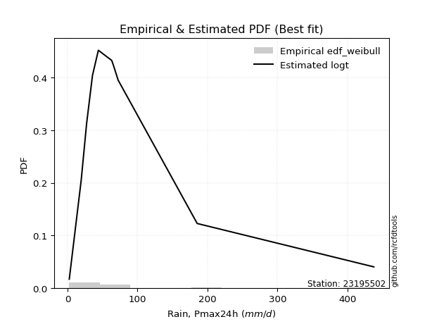</img>

</div>


### 4. EDF Beard (1943)

The Beard formula (or Beard´s plotting position formula) in hydrology is used to estimate the empirical non-exceedance probability _(P)_ of a flood event (or other extreme hydrological data point) within a given dataset.

<div align="center">


$P=(m-0.31)/(n+0.38)$


</div>


**4.1. Empirical values**

<div align="center">

|                | 0                    | 1                 | 2                   | 3                  | 4                  | 5         | 6                  | 7                  | 8                  | 9                  | 10                 |
|:---------------|:---------------------|:------------------|:--------------------|:-------------------|:-------------------|:----------|:-------------------|:-------------------|:-------------------|:-------------------|:-------------------|
| date           | 2022                 | 2023              | 2021                | 2015               | 2017               | 2016      | 2019               | 2018               | 2025               | 2024               | 2020               |
| x              | 2.55                 | 19.62             | 27.36               | 35.75              | 44.13              | 63.2      | 65.57              | 72.39              | 136.7              | 185.3              | 437.61             |
| m              | 1                    | 2                 | 3                   | 4                  | 5                  | 6         | 7                  | 8                  | 9                  | 10                 | 11                 |
| empirical_dist | edf_beard            | edf_beard         | edf_beard           | edf_beard          | edf_beard          | edf_beard | edf_beard          | edf_beard          | edf_beard          | edf_beard          | edf_beard          |
| empirical      | 0.060632688927943754 | 0.148506151142355 | 0.23637961335676624 | 0.3242530755711775 | 0.4121265377855888 | 0.5       | 0.5878734622144113 | 0.6757469244288224 | 0.7636203866432336 | 0.8514938488576449 | 0.9393673110720562 |
| empirical_tr   | 1.0645463049579045   | 1.174406604747162 | 1.3095512082853855  | 1.4798439531859557 | 1.7010463378176381 | 2.0       | 2.4264392324093818 | 3.0840108401084008 | 4.230483271375462  | 6.733727810650883  | 16.49275362318839  |

</div>


**4.2. Kolmogorov-Smirnov fit test (sorted by Δ)**


<div align="center">

|                | 0                   | 1                   | 2                   | 3                   | 4                   | 5                   | 6                   | 7                   | 8                   | 9                   | 10                  | 11                  | 12                  | 13                  | 14                  | 15                  | 16                  | 17                  | 18                  | 19                  | 20                  | 21                  | 22                  | 23                  | 24                  | 25                  | 26                  | 27                  | 28                  | 29                  | 30                  | 31                  | 32                  | 33                  | 34                  | 35                  | 36                  | 37                  | 38                  | 39                  | 40                  | 41                  | 42                  | 43                  | 44                  | 45                  | 46                  | 47                  | 48                  | 49                  | 50                  | 51                  | 52                  | 53                  | 54                  | 55                  | 56                  | 57                  | 58                  | 59                  | 60                  | 61                  | 62                  | 63                  | 64                  | 65                  | 66                  | 67                  | 68                  | 69                  | 70                  | 71                  | 72                  | 73                  | 74                  | 75                  | 76                  | 77                  | 78                  | 79                  | 80                  | 81                  | 82                  | 83                  | 84                  | 85                  | 86                  | 87                  | 88                  | 89                  | 90                  | 91                  | 92                  | 93                  | 94                  | 95                  | 96                  | 97                  | 98                  | 99                  | 100                 | 101                 | 102                 | 103                 | 104                 | 105                 | 106                 | 107                 | 108                 | 109                 | 110                 | 111                 | 112                 | 113                 | 114                 | 115                 | 116                 | 117                 | 118                 | 119                 | 120                 | 121                 | 122                 | 123                 | 124                 | 125                 | 126                 | 127                 | 128                 | 129                 | 130                 | 131                 | 132                 | 133                 | 134                 | 135                 | 136                 | 137                 | 138                 | 139                 | 140                 | 141                 | 142                 | 143                 | 144                 | 145                 | 146                 | 147                 | 148                 | 149                 | 150                 | 151                 | 152                 | 153                 | 154                 | 155                 | 156                 | 157                 | 158                 | 159                 |
|:---------------|:--------------------|:--------------------|:--------------------|:--------------------|:--------------------|:--------------------|:--------------------|:--------------------|:--------------------|:--------------------|:--------------------|:--------------------|:--------------------|:--------------------|:--------------------|:--------------------|:--------------------|:--------------------|:--------------------|:--------------------|:--------------------|:--------------------|:--------------------|:--------------------|:--------------------|:--------------------|:--------------------|:--------------------|:--------------------|:--------------------|:--------------------|:--------------------|:--------------------|:--------------------|:--------------------|:--------------------|:--------------------|:--------------------|:--------------------|:--------------------|:--------------------|:--------------------|:--------------------|:--------------------|:--------------------|:--------------------|:--------------------|:--------------------|:--------------------|:--------------------|:--------------------|:--------------------|:--------------------|:--------------------|:--------------------|:--------------------|:--------------------|:--------------------|:--------------------|:--------------------|:--------------------|:--------------------|:--------------------|:--------------------|:--------------------|:--------------------|:--------------------|:--------------------|:--------------------|:--------------------|:--------------------|:--------------------|:--------------------|:--------------------|:--------------------|:--------------------|:--------------------|:--------------------|:--------------------|:--------------------|:--------------------|:--------------------|:--------------------|:--------------------|:--------------------|:--------------------|:--------------------|:--------------------|:--------------------|:--------------------|:--------------------|:--------------------|:--------------------|:--------------------|:--------------------|:--------------------|:--------------------|:--------------------|:--------------------|:--------------------|:--------------------|:--------------------|:--------------------|:--------------------|:--------------------|:--------------------|:--------------------|:--------------------|:--------------------|:--------------------|:--------------------|:--------------------|:--------------------|:--------------------|:--------------------|:--------------------|:--------------------|:--------------------|:--------------------|:--------------------|:--------------------|:--------------------|:--------------------|:--------------------|:--------------------|:--------------------|:--------------------|:--------------------|:--------------------|:--------------------|:--------------------|:--------------------|:--------------------|:--------------------|:--------------------|:--------------------|:--------------------|:--------------------|:--------------------|:--------------------|:--------------------|:--------------------|:--------------------|:--------------------|:--------------------|:--------------------|:--------------------|:--------------------|:--------------------|:--------------------|:--------------------|:--------------------|:--------------------|:--------------------|:--------------------|:--------------------|:--------------------|:--------------------|:--------------------|:--------------------|
| station        | 23195502            | 23195502            | 23195502            | 23195502            | 23195502            | 23195502            | 23195502            | 23195502            | 23195502            | 23195502            | 23195502            | 23195502            | 23195502            | 23195502            | 23195502            | 23195502            | 23195502            | 23195502            | 23195502            | 23195502            | 23195502            | 23195502            | 23195502            | 23195502            | 23195502            | 23195502            | 23195502            | 23195502            | 23195502            | 23195502            | 23195502            | 23195502            | 23195502            | 23195502            | 23195502            | 23195502            | 23195502            | 23195502            | 23195502            | 23195502            | 23195502            | 23195502            | 23195502            | 23195502            | 23195502            | 23195502            | 23195502            | 23195502            | 23195502            | 23195502            | 23195502            | 23195502            | 23195502            | 23195502            | 23195502            | 23195502            | 23195502            | 23195502            | 23195502            | 23195502            | 23195502            | 23195502            | 23195502            | 23195502            | 23195502            | 23195502            | 23195502            | 23195502            | 23195502            | 23195502            | 23195502            | 23195502            | 23195502            | 23195502            | 23195502            | 23195502            | 23195502            | 23195502            | 23195502            | 23195502            | 23195502            | 23195502            | 23195502            | 23195502            | 23195502            | 23195502            | 23195502            | 23195502            | 23195502            | 23195502            | 23195502            | 23195502            | 23195502            | 23195502            | 23195502            | 23195502            | 23195502            | 23195502            | 23195502            | 23195502            | 23195502            | 23195502            | 23195502            | 23195502            | 23195502            | 23195502            | 23195502            | 23195502            | 23195502            | 23195502            | 23195502            | 23195502            | 23195502            | 23195502            | 23195502            | 23195502            | 23195502            | 23195502            | 23195502            | 23195502            | 23195502            | 23195502            | 23195502            | 23195502            | 23195502            | 23195502            | 23195502            | 23195502            | 23195502            | 23195502            | 23195502            | 23195502            | 23195502            | 23195502            | 23195502            | 23195502            | 23195502            | 23195502            | 23195502            | 23195502            | 23195502            | 23195502            | 23195502            | 23195502            | 23195502            | 23195502            | 23195502            | 23195502            | 23195502            | 23195502            | 23195502            | 23195502            | 23195502            | 23195502            | 23195502            | 23195502            | 23195502            | 23195502            | 23195502            | 23195502            |
| empirical_dist | edf_beard           | edf_beard           | edf_beard           | edf_beard           | edf_beard           | edf_beard           | edf_beard           | edf_beard           | edf_beard           | edf_beard           | edf_beard           | edf_beard           | edf_beard           | edf_beard           | edf_beard           | edf_beard           | edf_beard           | edf_beard           | edf_beard           | edf_beard           | edf_beard           | edf_beard           | edf_beard           | edf_beard           | edf_beard           | edf_beard           | edf_beard           | edf_beard           | edf_beard           | edf_beard           | edf_beard           | edf_beard           | edf_beard           | edf_beard           | edf_beard           | edf_beard           | edf_beard           | edf_beard           | edf_beard           | edf_beard           | edf_beard           | edf_beard           | edf_beard           | edf_beard           | edf_beard           | edf_beard           | edf_beard           | edf_beard           | edf_beard           | edf_beard           | edf_beard           | edf_beard           | edf_beard           | edf_beard           | edf_beard           | edf_beard           | edf_beard           | edf_beard           | edf_beard           | edf_beard           | edf_beard           | edf_beard           | edf_beard           | edf_beard           | edf_beard           | edf_beard           | edf_beard           | edf_beard           | edf_beard           | edf_beard           | edf_beard           | edf_beard           | edf_beard           | edf_beard           | edf_beard           | edf_beard           | edf_beard           | edf_beard           | edf_beard           | edf_beard           | edf_beard           | edf_beard           | edf_beard           | edf_beard           | edf_beard           | edf_beard           | edf_beard           | edf_beard           | edf_beard           | edf_beard           | edf_beard           | edf_beard           | edf_beard           | edf_beard           | edf_beard           | edf_beard           | edf_beard           | edf_beard           | edf_beard           | edf_beard           | edf_beard           | edf_beard           | edf_beard           | edf_beard           | edf_beard           | edf_beard           | edf_beard           | edf_beard           | edf_beard           | edf_beard           | edf_beard           | edf_beard           | edf_beard           | edf_beard           | edf_beard           | edf_beard           | edf_beard           | edf_beard           | edf_beard           | edf_beard           | edf_beard           | edf_beard           | edf_beard           | edf_beard           | edf_beard           | edf_beard           | edf_beard           | edf_beard           | edf_beard           | edf_beard           | edf_beard           | edf_beard           | edf_beard           | edf_beard           | edf_beard           | edf_beard           | edf_beard           | edf_beard           | edf_beard           | edf_beard           | edf_beard           | edf_beard           | edf_beard           | edf_beard           | edf_beard           | edf_beard           | edf_beard           | edf_beard           | edf_beard           | edf_beard           | edf_beard           | edf_beard           | edf_beard           | edf_beard           | edf_beard           | edf_beard           | edf_beard           | edf_beard           | edf_beard           | edf_beard           |
| p_dist         | loglogistic         | logfoldnorm         | logfatiguelife      | lognorm             | logcrystalball      | logexponnorm        | logtukeylambda      | logf                | logrice             | logvonmises_line    | lognct              | loghypsecant        | invweibull          | genextreme          | nct                 | logt                | logbetaprime        | invgamma            | logjohnsonsu        | logerlang           | loggamma            | loggamma            | kappa3              | logalpha            | loggenlogistic      | logburr             | logmielke           | loginvgamma         | johnsonsu           | loginvgauss         | ncf                 | logskewnorm         | invgauss            | loglaplace          | loglaplace          | lomax               | genpareto           | logmaxwell          | mielke              | loganglit           | logexponweib        | logjohnsonsb        | logloggamma         | loggengamma         | logburr12           | logweibull_min      | logbeta             | loggennorm          | lograyleigh         | gengamma            | logexponpow         | dgamma              | fatiguelife         | betaprime           | logpearson3         | wald                | logsemicircular     | loggenextreme       | logncf              | logdweibull         | logloglaplace       | gausshyper          | logargus            | gennorm             | burr12              | truncpareto         | loggumbel_l         | loggumbel_r         | pearson3            | loginvweibull       | logcosine           | loghalfnorm         | logtruncweibull_min | exponweib           | logdgamma           | lognakagami         | t                   | truncweibull_min    | logmoyal            | loghalflogistic     | exponnorm           | gompertz            | genexpon            | nakagami            | halflogistic        | dweibull            | logarcsine          | burr                | weibull_min         | loggenhalflogistic  | f                   | loggausshyper       | moyal               | gamma               | truncnorm           | halfnorm            | erlang              | vonmises_line       | logkstwobign        | cosine              | loggompertz         | genlogistic         | gumbel_r            | loggenpareto        | logtriang           | loggenexpon         | foldnorm            | rayleigh            | logwald             | maxwell             | exponpow            | arcsine             | semicircular        | logkappa3           | loguniform          | anglit              | logwrapcauchy       | halfgennorm         | kstwobign           | beta                | crystalball         | norm                | logksone            | logkappa4           | logistic            | logtrapezoid        | hypsecant           | johnsonsb           | rice                | loglevy_l           | laplace             | logtruncnorm        | skewnorm            | logbradford         | gumbel_l            | wrapcauchy          | logweibull_max      | logtruncexpon       | loglomax            | bradford            | powerlaw            | loghalfgennorm      | argus               | truncexpon          | triang              | levy_l              | ksone               | kappa4              | rdist               | uniform             | alpha               | tukeylambda         | logrdist            | genhalflogistic     | logpowerlaw         | trapezoid           | weibull_max         | logtruncpareto      | logvonmises         | vonmises            |
| delta          | 0.0703282832092097  | 0.07046984216200947 | 0.07414301303333887 | 0.0749268858863858  | 0.07492688675219236 | 0.07492811294308119 | 0.07508875332575193 | 0.07533312487301416 | 0.07534430711009746 | 0.0761031994193887  | 0.07622892545329465 | 0.07729458555844793 | 0.07836430465884858 | 0.07836441995491983 | 0.07849718261388194 | 0.07980084042430013 | 0.08092663069249037 | 0.0818945960630898  | 0.08412882466976013 | 0.08418476757119575 | 0.08552125661709678 | 0.08552125661709678 | 0.08640026537352175 | 0.08671308563390315 | 0.08825980552733725 | 0.08883279412484835 | 0.08952870498921128 | 0.09052488283121676 | 0.09244574778693138 | 0.09603353224715039 | 0.09663912597312285 | 0.09712167064819621 | 0.09870616085948758 | 0.0990626243870556  | 0.0990626243870556  | 0.09926948418827786 | 0.09927019643125823 | 0.10085910078969515 | 0.10210524386273856 | 0.10303950574607385 | 0.10649783386185441 | 0.10756010091308976 | 0.10756081820776187 | 0.10773920788801239 | 0.1084644079752447  | 0.10850070591303218 | 0.1090559838886801  | 0.10908581790179656 | 0.1121193269957774  | 0.11323409279634439 | 0.11347538010300251 | 0.1135911086522931  | 0.11410399733139864 | 0.11424591500351039 | 0.1142524664497605  | 0.11518898962536284 | 0.11534385159325433 | 0.11724796657521797 | 0.11743909342303813 | 0.11746794029841812 | 0.12169654594258017 | 0.12208138392097978 | 0.12216128111045854 | 0.12526181259500957 | 0.1270342554653462  | 0.1308555136453532  | 0.13130457671923523 | 0.13155448642101542 | 0.13454876298937724 | 0.14238522941954118 | 0.1432222667517038  | 0.14405007048675286 | 0.14496585198547923 | 0.14555984844042436 | 0.1478656135764353  | 0.14850615114202073 | 0.14991991060530663 | 0.15447462329992778 | 0.15597183246388424 | 0.1560029417851     | 0.15687190514963778 | 0.15859301952812854 | 0.1608949559852707  | 0.1646506000701577  | 0.1668379182944899  | 0.17043727511853685 | 0.17072180770483847 | 0.17198769242001521 | 0.17436153163200346 | 0.1762989328168892  | 0.17663537445346955 | 0.17836312638540702 | 0.17966244147412547 | 0.18200757323382566 | 0.18358989497026218 | 0.18375889136910017 | 0.19022415475025067 | 0.19091118351325403 | 0.19104427493934667 | 0.19565474072085398 | 0.19841835232409638 | 0.2031334549807201  | 0.20327837020797174 | 0.211483345254312   | 0.2130975616554675  | 0.2145133506112512  | 0.21468790798715437 | 0.2184802351907913  | 0.22374070443723781 | 0.23073574726208484 | 0.23748587137420218 | 0.24385202573040882 | 0.24738093699058367 | 0.24805593334054798 | 0.2480658609522478  | 0.2525335387198496  | 0.2531344627305891  | 0.2544252359210125  | 0.263764277837355   | 0.26453581495821427 | 0.26496105545864146 | 0.2649610650378494  | 0.26530385893648073 | 0.27497608601475326 | 0.2766082228079343  | 0.2848035582288383  | 0.2862217821017739  | 0.2871828642442611  | 0.30076176068087657 | 0.30318139492672314 | 0.3122869746621787  | 0.3153629974411119  | 0.3234081144301605  | 0.3272218369801746  | 0.33250687035098764 | 0.3758421372700509  | 0.3793655906005611  | 0.38136352638061377 | 0.39851492231034413 | 0.4028273976471592  | 0.4050193507925405  | 0.40533922888164986 | 0.4083876418829647  | 0.41944601665329817 | 0.4308115753095064  | 0.4469085551485104  | 0.4586389393233198  | 0.4904827134007378  | 0.5052356138347281  | 0.5152173423022193  | 0.5228648835359859  | 0.5318719715680963  | 0.5334834081351147  | 0.549814080005016   | 0.6413741136162556  | 0.6602596868019326  | 0.7243281251913812  | 0.8064271560236248  | 1.0026191125349067  | 68.78460109849247   |
| deltao         | 0.37613735880099997 | 0.37613735880099997 | 0.37613735880099997 | 0.37613735880099997 | 0.37613735880099997 | 0.37613735880099997 | 0.37613735880099997 | 0.37613735880099997 | 0.37613735880099997 | 0.37613735880099997 | 0.37613735880099997 | 0.37613735880099997 | 0.37613735880099997 | 0.37613735880099997 | 0.37613735880099997 | 0.37613735880099997 | 0.37613735880099997 | 0.37613735880099997 | 0.37613735880099997 | 0.37613735880099997 | 0.37613735880099997 | 0.37613735880099997 | 0.37613735880099997 | 0.37613735880099997 | 0.37613735880099997 | 0.37613735880099997 | 0.37613735880099997 | 0.37613735880099997 | 0.37613735880099997 | 0.37613735880099997 | 0.37613735880099997 | 0.37613735880099997 | 0.37613735880099997 | 0.37613735880099997 | 0.37613735880099997 | 0.37613735880099997 | 0.37613735880099997 | 0.37613735880099997 | 0.37613735880099997 | 0.37613735880099997 | 0.37613735880099997 | 0.37613735880099997 | 0.37613735880099997 | 0.37613735880099997 | 0.37613735880099997 | 0.37613735880099997 | 0.37613735880099997 | 0.37613735880099997 | 0.37613735880099997 | 0.37613735880099997 | 0.37613735880099997 | 0.37613735880099997 | 0.37613735880099997 | 0.37613735880099997 | 0.37613735880099997 | 0.37613735880099997 | 0.37613735880099997 | 0.37613735880099997 | 0.37613735880099997 | 0.37613735880099997 | 0.37613735880099997 | 0.37613735880099997 | 0.37613735880099997 | 0.37613735880099997 | 0.37613735880099997 | 0.37613735880099997 | 0.37613735880099997 | 0.37613735880099997 | 0.37613735880099997 | 0.37613735880099997 | 0.37613735880099997 | 0.37613735880099997 | 0.37613735880099997 | 0.37613735880099997 | 0.37613735880099997 | 0.37613735880099997 | 0.37613735880099997 | 0.37613735880099997 | 0.37613735880099997 | 0.37613735880099997 | 0.37613735880099997 | 0.37613735880099997 | 0.37613735880099997 | 0.37613735880099997 | 0.37613735880099997 | 0.37613735880099997 | 0.37613735880099997 | 0.37613735880099997 | 0.37613735880099997 | 0.37613735880099997 | 0.37613735880099997 | 0.37613735880099997 | 0.37613735880099997 | 0.37613735880099997 | 0.37613735880099997 | 0.37613735880099997 | 0.37613735880099997 | 0.37613735880099997 | 0.37613735880099997 | 0.37613735880099997 | 0.37613735880099997 | 0.37613735880099997 | 0.37613735880099997 | 0.37613735880099997 | 0.37613735880099997 | 0.37613735880099997 | 0.37613735880099997 | 0.37613735880099997 | 0.37613735880099997 | 0.37613735880099997 | 0.37613735880099997 | 0.37613735880099997 | 0.37613735880099997 | 0.37613735880099997 | 0.37613735880099997 | 0.37613735880099997 | 0.37613735880099997 | 0.37613735880099997 | 0.37613735880099997 | 0.37613735880099997 | 0.37613735880099997 | 0.37613735880099997 | 0.37613735880099997 | 0.37613735880099997 | 0.37613735880099997 | 0.37613735880099997 | 0.37613735880099997 | 0.37613735880099997 | 0.37613735880099997 | 0.37613735880099997 | 0.37613735880099997 | 0.37613735880099997 | 0.37613735880099997 | 0.37613735880099997 | 0.37613735880099997 | 0.37613735880099997 | 0.37613735880099997 | 0.37613735880099997 | 0.37613735880099997 | 0.37613735880099997 | 0.37613735880099997 | 0.37613735880099997 | 0.37613735880099997 | 0.37613735880099997 | 0.37613735880099997 | 0.37613735880099997 | 0.37613735880099997 | 0.37613735880099997 | 0.37613735880099997 | 0.37613735880099997 | 0.37613735880099997 | 0.37613735880099997 | 0.37613735880099997 | 0.37613735880099997 | 0.37613735880099997 | 0.37613735880099997 | 0.37613735880099997 | 0.37613735880099997 | 0.37613735880099997 | 0.37613735880099997 |
| eval           | Δo > Δ              | Δo > Δ              | Δo > Δ              | Δo > Δ              | Δo > Δ              | Δo > Δ              | Δo > Δ              | Δo > Δ              | Δo > Δ              | Δo > Δ              | Δo > Δ              | Δo > Δ              | Δo > Δ              | Δo > Δ              | Δo > Δ              | Δo > Δ              | Δo > Δ              | Δo > Δ              | Δo > Δ              | Δo > Δ              | Δo > Δ              | Δo > Δ              | Δo > Δ              | Δo > Δ              | Δo > Δ              | Δo > Δ              | Δo > Δ              | Δo > Δ              | Δo > Δ              | Δo > Δ              | Δo > Δ              | Δo > Δ              | Δo > Δ              | Δo > Δ              | Δo > Δ              | Δo > Δ              | Δo > Δ              | Δo > Δ              | Δo > Δ              | Δo > Δ              | Δo > Δ              | Δo > Δ              | Δo > Δ              | Δo > Δ              | Δo > Δ              | Δo > Δ              | Δo > Δ              | Δo > Δ              | Δo > Δ              | Δo > Δ              | Δo > Δ              | Δo > Δ              | Δo > Δ              | Δo > Δ              | Δo > Δ              | Δo > Δ              | Δo > Δ              | Δo > Δ              | Δo > Δ              | Δo > Δ              | Δo > Δ              | Δo > Δ              | Δo > Δ              | Δo > Δ              | Δo > Δ              | Δo > Δ              | Δo > Δ              | Δo > Δ              | Δo > Δ              | Δo > Δ              | Δo > Δ              | Δo > Δ              | Δo > Δ              | Δo > Δ              | Δo > Δ              | Δo > Δ              | Δo > Δ              | Δo > Δ              | Δo > Δ              | Δo > Δ              | Δo > Δ              | Δo > Δ              | Δo > Δ              | Δo > Δ              | Δo > Δ              | Δo > Δ              | Δo > Δ              | Δo > Δ              | Δo > Δ              | Δo > Δ              | Δo > Δ              | Δo > Δ              | Δo > Δ              | Δo > Δ              | Δo > Δ              | Δo > Δ              | Δo > Δ              | Δo > Δ              | Δo > Δ              | Δo > Δ              | Δo > Δ              | Δo > Δ              | Δo > Δ              | Δo > Δ              | Δo > Δ              | Δo > Δ              | Δo > Δ              | Δo > Δ              | Δo > Δ              | Δo > Δ              | Δo > Δ              | Δo > Δ              | Δo > Δ              | Δo > Δ              | Δo > Δ              | Δo > Δ              | Δo > Δ              | Δo > Δ              | Δo > Δ              | Δo > Δ              | Δo > Δ              | Δo > Δ              | Δo > Δ              | Δo > Δ              | Δo > Δ              | Δo > Δ              | Δo > Δ              | Δo > Δ              | Δo > Δ              | Δo > Δ              | Δo > Δ              | Δo > Δ              | Δo > Δ              | Δo > Δ              | Δo > Δ              | Δo > Δ              | Δo <= Δ             | Δo <= Δ             | Δo <= Δ             | Δo <= Δ             | Δo <= Δ             | Δo <= Δ             | Δo <= Δ             | Δo <= Δ             | Δo <= Δ             | Δo <= Δ             | Δo <= Δ             | Δo <= Δ             | Δo <= Δ             | Δo <= Δ             | Δo <= Δ             | Δo <= Δ             | Δo <= Δ             | Δo <= Δ             | Δo <= Δ             | Δo <= Δ             | Δo <= Δ             | Δo <= Δ             | Δo <= Δ             | Δo <= Δ             |
| fit            | 1                   | 1                   | 1                   | 1                   | 1                   | 1                   | 1                   | 1                   | 1                   | 1                   | 1                   | 1                   | 1                   | 1                   | 1                   | 1                   | 1                   | 1                   | 1                   | 1                   | 1                   | 1                   | 1                   | 1                   | 1                   | 1                   | 1                   | 1                   | 1                   | 1                   | 1                   | 1                   | 1                   | 1                   | 1                   | 1                   | 1                   | 1                   | 1                   | 1                   | 1                   | 1                   | 1                   | 1                   | 1                   | 1                   | 1                   | 1                   | 1                   | 1                   | 1                   | 1                   | 1                   | 1                   | 1                   | 1                   | 1                   | 1                   | 1                   | 1                   | 1                   | 1                   | 1                   | 1                   | 1                   | 1                   | 1                   | 1                   | 1                   | 1                   | 1                   | 1                   | 1                   | 1                   | 1                   | 1                   | 1                   | 1                   | 1                   | 1                   | 1                   | 1                   | 1                   | 1                   | 1                   | 1                   | 1                   | 1                   | 1                   | 1                   | 1                   | 1                   | 1                   | 1                   | 1                   | 1                   | 1                   | 1                   | 1                   | 1                   | 1                   | 1                   | 1                   | 1                   | 1                   | 1                   | 1                   | 1                   | 1                   | 1                   | 1                   | 1                   | 1                   | 1                   | 1                   | 1                   | 1                   | 1                   | 1                   | 1                   | 1                   | 1                   | 1                   | 1                   | 1                   | 1                   | 1                   | 1                   | 1                   | 1                   | 1                   | 1                   | 1                   | 1                   | 1                   | 1                   | 0                   | 0                   | 0                   | 0                   | 0                   | 0                   | 0                   | 0                   | 0                   | 0                   | 0                   | 0                   | 0                   | 0                   | 0                   | 0                   | 0                   | 0                   | 0                   | 0                   | 0                   | 0                   | 0                   | 0                   |
| n              | 11                  | 11                  | 11                  | 11                  | 11                  | 11                  | 11                  | 11                  | 11                  | 11                  | 11                  | 11                  | 11                  | 11                  | 11                  | 11                  | 11                  | 11                  | 11                  | 11                  | 11                  | 11                  | 11                  | 11                  | 11                  | 11                  | 11                  | 11                  | 11                  | 11                  | 11                  | 11                  | 11                  | 11                  | 11                  | 11                  | 11                  | 11                  | 11                  | 11                  | 11                  | 11                  | 11                  | 11                  | 11                  | 11                  | 11                  | 11                  | 11                  | 11                  | 11                  | 11                  | 11                  | 11                  | 11                  | 11                  | 11                  | 11                  | 11                  | 11                  | 11                  | 11                  | 11                  | 11                  | 11                  | 11                  | 11                  | 11                  | 11                  | 11                  | 11                  | 11                  | 11                  | 11                  | 11                  | 11                  | 11                  | 11                  | 11                  | 11                  | 11                  | 11                  | 11                  | 11                  | 11                  | 11                  | 11                  | 11                  | 11                  | 11                  | 11                  | 11                  | 11                  | 11                  | 11                  | 11                  | 11                  | 11                  | 11                  | 11                  | 11                  | 11                  | 11                  | 11                  | 11                  | 11                  | 11                  | 11                  | 11                  | 11                  | 11                  | 11                  | 11                  | 11                  | 11                  | 11                  | 11                  | 11                  | 11                  | 11                  | 11                  | 11                  | 11                  | 11                  | 11                  | 11                  | 11                  | 11                  | 11                  | 11                  | 11                  | 11                  | 11                  | 11                  | 11                  | 11                  | 11                  | 11                  | 11                  | 11                  | 11                  | 11                  | 11                  | 11                  | 11                  | 11                  | 11                  | 11                  | 11                  | 11                  | 11                  | 11                  | 11                  | 11                  | 11                  | 11                  | 11                  | 11                  | 11                  | 11                  |
| best_fit       | 1                   | 0                   | 0                   | 0                   | 0                   | 0                   | 0                   | 0                   | 0                   | 0                   | 0                   | 0                   | 0                   | 0                   | 0                   | 0                   | 0                   | 0                   | 0                   | 0                   | 0                   | 0                   | 0                   | 0                   | 0                   | 0                   | 0                   | 0                   | 0                   | 0                   | 0                   | 0                   | 0                   | 0                   | 0                   | 0                   | 0                   | 0                   | 0                   | 0                   | 0                   | 0                   | 0                   | 0                   | 0                   | 0                   | 0                   | 0                   | 0                   | 0                   | 0                   | 0                   | 0                   | 0                   | 0                   | 0                   | 0                   | 0                   | 0                   | 0                   | 0                   | 0                   | 0                   | 0                   | 0                   | 0                   | 0                   | 0                   | 0                   | 0                   | 0                   | 0                   | 0                   | 0                   | 0                   | 0                   | 0                   | 0                   | 0                   | 0                   | 0                   | 0                   | 0                   | 0                   | 0                   | 0                   | 0                   | 0                   | 0                   | 0                   | 0                   | 0                   | 0                   | 0                   | 0                   | 0                   | 0                   | 0                   | 0                   | 0                   | 0                   | 0                   | 0                   | 0                   | 0                   | 0                   | 0                   | 0                   | 0                   | 0                   | 0                   | 0                   | 0                   | 0                   | 0                   | 0                   | 0                   | 0                   | 0                   | 0                   | 0                   | 0                   | 0                   | 0                   | 0                   | 0                   | 0                   | 0                   | 0                   | 0                   | 0                   | 0                   | 0                   | 0                   | 0                   | 0                   | 0                   | 0                   | 0                   | 0                   | 0                   | 0                   | 0                   | 0                   | 0                   | 0                   | 0                   | 0                   | 0                   | 0                   | 0                   | 0                   | 0                   | 0                   | 0                   | 0                   | 0                   | 0                   | 0                   | 0                   |
| best_fit_sort  | 1                   | 2                   | 3                   | 4                   | 5                   | 6                   | 7                   | 8                   | 9                   | 10                  | 11                  | 12                  | 13                  | 14                  | 15                  | 16                  | 17                  | 18                  | 19                  | 20                  | 21                  | 22                  | 23                  | 24                  | 25                  | 26                  | 27                  | 28                  | 29                  | 30                  | 31                  | 32                  | 33                  | 34                  | 35                  | 36                  | 37                  | 38                  | 39                  | 40                  | 41                  | 42                  | 43                  | 44                  | 45                  | 46                  | 47                  | 48                  | 49                  | 50                  | 51                  | 52                  | 53                  | 54                  | 55                  | 56                  | 57                  | 58                  | 59                  | 60                  | 61                  | 62                  | 63                  | 64                  | 65                  | 66                  | 67                  | 68                  | 69                  | 70                  | 71                  | 72                  | 73                  | 74                  | 75                  | 76                  | 77                  | 78                  | 79                  | 80                  | 81                  | 82                  | 83                  | 84                  | 85                  | 86                  | 87                  | 88                  | 89                  | 90                  | 91                  | 92                  | 93                  | 94                  | 95                  | 96                  | 97                  | 98                  | 99                  | 100                 | 101                 | 102                 | 103                 | 104                 | 105                 | 106                 | 107                 | 108                 | 109                 | 110                 | 111                 | 112                 | 113                 | 114                 | 115                 | 116                 | 117                 | 118                 | 119                 | 120                 | 121                 | 122                 | 123                 | 124                 | 125                 | 126                 | 127                 | 128                 | 129                 | 130                 | 131                 | 132                 | 133                 | 134                 | 135                 | 136                 | 137                 | 138                 | 139                 | 140                 | 141                 | 142                 | 143                 | 144                 | 145                 | 146                 | 147                 | 148                 | 149                 | 150                 | 151                 | 152                 | 153                 | 154                 | 155                 | 156                 | 157                 | 158                 | 159                 | 160                 |

</div>


**4.3. Best fit**

<div align="center">

|   id |   station | empirical_dist   | p_dist      |     delta |   deltao | eval   |   fit |   n |   best_fit |   best_fit_sort |
|-----:|----------:|:-----------------|:------------|----------:|---------:|:-------|------:|----:|-----------:|----------------:|
|    0 |  23195502 | edf_beard        | loglogistic | 0.0703283 | 0.376137 | Δo > Δ |     1 |  11 |          1 |               1 |

</div>


<div align="center">

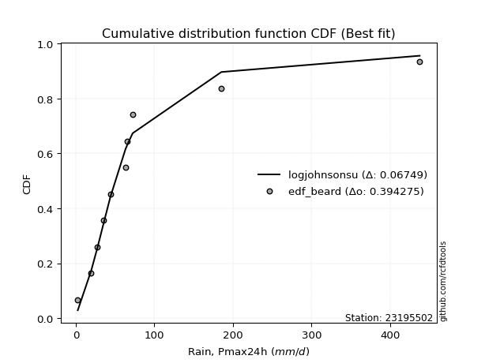</img></img>

</div>


### 5. EDF Chegodayev (1955)

The Chegodayev formula is an empirical plotting position formula used in hydrological frequency analysis to estimate the exceedance probability or return period of a specific event from a set of observed data. It is primarily used for plotting observed data points on probability paper to fit a theoretical distribution, particularly for analyzing extreme events like maximum flood flows or rainfall intensities. The constant _b_ value in the generalized plotting position formula is 0.3.

<div align="center">


$P=(m-b)/(n+1-2b)$


</div>


**5.1. Empirical values**

<div align="center">

|                | 0                   | 1                   | 2                  | 3                   | 4                   | 5              | 6                  | 7                  | 8                  | 9                 | 10                 |
|:---------------|:--------------------|:--------------------|:-------------------|:--------------------|:--------------------|:---------------|:-------------------|:-------------------|:-------------------|:------------------|:-------------------|
| date           | 2022                | 2023                | 2021               | 2015                | 2017                | 2016           | 2019               | 2018               | 2025               | 2024              | 2020               |
| x              | 2.55                | 19.62               | 27.36              | 35.75               | 44.13               | 63.2           | 65.57              | 72.39              | 136.7              | 185.3             | 437.61             |
| m              | 1                   | 2                   | 3                  | 4                   | 5                   | 6              | 7                  | 8                  | 9                  | 10                | 11                 |
| empirical_dist | edf_chegodayev      | edf_chegodayev      | edf_chegodayev     | edf_chegodayev      | edf_chegodayev      | edf_chegodayev | edf_chegodayev     | edf_chegodayev     | edf_chegodayev     | edf_chegodayev    | edf_chegodayev     |
| empirical      | 0.06140350877192982 | 0.14912280701754385 | 0.2368421052631579 | 0.32456140350877194 | 0.41228070175438597 | 0.5            | 0.5877192982456141 | 0.6754385964912281 | 0.763157894736842  | 0.850877192982456 | 0.9385964912280701 |
| empirical_tr   | 1.0654205607476634  | 1.175257731958763   | 1.310344827586207  | 1.4805194805194806  | 1.7014925373134326  | 2.0            | 2.425531914893617  | 3.081081081081081  | 4.2222222222222205 | 6.70588235294117  | 16.285714285714263 |

</div>


**5.2. Kolmogorov-Smirnov fit test (sorted by Δ)**


<div align="center">

|                | 0                   | 1                   | 2                   | 3                   | 4                   | 5                   | 6                   | 7                   | 8                   | 9                   | 10                  | 11                  | 12                  | 13                  | 14                  | 15                  | 16                  | 17                  | 18                  | 19                  | 20                  | 21                  | 22                  | 23                  | 24                  | 25                  | 26                  | 27                  | 28                  | 29                  | 30                  | 31                  | 32                  | 33                  | 34                  | 35                  | 36                  | 37                  | 38                  | 39                  | 40                  | 41                  | 42                  | 43                  | 44                  | 45                  | 46                  | 47                  | 48                  | 49                  | 50                  | 51                  | 52                  | 53                  | 54                  | 55                  | 56                  | 57                  | 58                  | 59                  | 60                  | 61                  | 62                  | 63                  | 64                  | 65                  | 66                  | 67                  | 68                  | 69                  | 70                  | 71                  | 72                  | 73                  | 74                  | 75                  | 76                  | 77                  | 78                  | 79                  | 80                  | 81                  | 82                  | 83                  | 84                  | 85                  | 86                  | 87                  | 88                  | 89                  | 90                  | 91                  | 92                  | 93                  | 94                  | 95                  | 96                  | 97                  | 98                  | 99                  | 100                 | 101                 | 102                 | 103                 | 104                 | 105                 | 106                 | 107                 | 108                 | 109                 | 110                 | 111                 | 112                 | 113                 | 114                 | 115                 | 116                 | 117                 | 118                 | 119                 | 120                 | 121                 | 122                 | 123                 | 124                 | 125                 | 126                 | 127                 | 128                 | 129                 | 130                 | 131                 | 132                 | 133                 | 134                 | 135                 | 136                 | 137                 | 138                 | 139                 | 140                 | 141                 | 142                 | 143                 | 144                 | 145                 | 146                 | 147                 | 148                 | 149                 | 150                 | 151                 | 152                 | 153                 | 154                 | 155                 | 156                 | 157                 | 158                 | 159                 |
|:---------------|:--------------------|:--------------------|:--------------------|:--------------------|:--------------------|:--------------------|:--------------------|:--------------------|:--------------------|:--------------------|:--------------------|:--------------------|:--------------------|:--------------------|:--------------------|:--------------------|:--------------------|:--------------------|:--------------------|:--------------------|:--------------------|:--------------------|:--------------------|:--------------------|:--------------------|:--------------------|:--------------------|:--------------------|:--------------------|:--------------------|:--------------------|:--------------------|:--------------------|:--------------------|:--------------------|:--------------------|:--------------------|:--------------------|:--------------------|:--------------------|:--------------------|:--------------------|:--------------------|:--------------------|:--------------------|:--------------------|:--------------------|:--------------------|:--------------------|:--------------------|:--------------------|:--------------------|:--------------------|:--------------------|:--------------------|:--------------------|:--------------------|:--------------------|:--------------------|:--------------------|:--------------------|:--------------------|:--------------------|:--------------------|:--------------------|:--------------------|:--------------------|:--------------------|:--------------------|:--------------------|:--------------------|:--------------------|:--------------------|:--------------------|:--------------------|:--------------------|:--------------------|:--------------------|:--------------------|:--------------------|:--------------------|:--------------------|:--------------------|:--------------------|:--------------------|:--------------------|:--------------------|:--------------------|:--------------------|:--------------------|:--------------------|:--------------------|:--------------------|:--------------------|:--------------------|:--------------------|:--------------------|:--------------------|:--------------------|:--------------------|:--------------------|:--------------------|:--------------------|:--------------------|:--------------------|:--------------------|:--------------------|:--------------------|:--------------------|:--------------------|:--------------------|:--------------------|:--------------------|:--------------------|:--------------------|:--------------------|:--------------------|:--------------------|:--------------------|:--------------------|:--------------------|:--------------------|:--------------------|:--------------------|:--------------------|:--------------------|:--------------------|:--------------------|:--------------------|:--------------------|:--------------------|:--------------------|:--------------------|:--------------------|:--------------------|:--------------------|:--------------------|:--------------------|:--------------------|:--------------------|:--------------------|:--------------------|:--------------------|:--------------------|:--------------------|:--------------------|:--------------------|:--------------------|:--------------------|:--------------------|:--------------------|:--------------------|:--------------------|:--------------------|:--------------------|:--------------------|:--------------------|:--------------------|:--------------------|:--------------------|
| station        | 23195502            | 23195502            | 23195502            | 23195502            | 23195502            | 23195502            | 23195502            | 23195502            | 23195502            | 23195502            | 23195502            | 23195502            | 23195502            | 23195502            | 23195502            | 23195502            | 23195502            | 23195502            | 23195502            | 23195502            | 23195502            | 23195502            | 23195502            | 23195502            | 23195502            | 23195502            | 23195502            | 23195502            | 23195502            | 23195502            | 23195502            | 23195502            | 23195502            | 23195502            | 23195502            | 23195502            | 23195502            | 23195502            | 23195502            | 23195502            | 23195502            | 23195502            | 23195502            | 23195502            | 23195502            | 23195502            | 23195502            | 23195502            | 23195502            | 23195502            | 23195502            | 23195502            | 23195502            | 23195502            | 23195502            | 23195502            | 23195502            | 23195502            | 23195502            | 23195502            | 23195502            | 23195502            | 23195502            | 23195502            | 23195502            | 23195502            | 23195502            | 23195502            | 23195502            | 23195502            | 23195502            | 23195502            | 23195502            | 23195502            | 23195502            | 23195502            | 23195502            | 23195502            | 23195502            | 23195502            | 23195502            | 23195502            | 23195502            | 23195502            | 23195502            | 23195502            | 23195502            | 23195502            | 23195502            | 23195502            | 23195502            | 23195502            | 23195502            | 23195502            | 23195502            | 23195502            | 23195502            | 23195502            | 23195502            | 23195502            | 23195502            | 23195502            | 23195502            | 23195502            | 23195502            | 23195502            | 23195502            | 23195502            | 23195502            | 23195502            | 23195502            | 23195502            | 23195502            | 23195502            | 23195502            | 23195502            | 23195502            | 23195502            | 23195502            | 23195502            | 23195502            | 23195502            | 23195502            | 23195502            | 23195502            | 23195502            | 23195502            | 23195502            | 23195502            | 23195502            | 23195502            | 23195502            | 23195502            | 23195502            | 23195502            | 23195502            | 23195502            | 23195502            | 23195502            | 23195502            | 23195502            | 23195502            | 23195502            | 23195502            | 23195502            | 23195502            | 23195502            | 23195502            | 23195502            | 23195502            | 23195502            | 23195502            | 23195502            | 23195502            | 23195502            | 23195502            | 23195502            | 23195502            | 23195502            | 23195502            |
| empirical_dist | edf_chegodayev      | edf_chegodayev      | edf_chegodayev      | edf_chegodayev      | edf_chegodayev      | edf_chegodayev      | edf_chegodayev      | edf_chegodayev      | edf_chegodayev      | edf_chegodayev      | edf_chegodayev      | edf_chegodayev      | edf_chegodayev      | edf_chegodayev      | edf_chegodayev      | edf_chegodayev      | edf_chegodayev      | edf_chegodayev      | edf_chegodayev      | edf_chegodayev      | edf_chegodayev      | edf_chegodayev      | edf_chegodayev      | edf_chegodayev      | edf_chegodayev      | edf_chegodayev      | edf_chegodayev      | edf_chegodayev      | edf_chegodayev      | edf_chegodayev      | edf_chegodayev      | edf_chegodayev      | edf_chegodayev      | edf_chegodayev      | edf_chegodayev      | edf_chegodayev      | edf_chegodayev      | edf_chegodayev      | edf_chegodayev      | edf_chegodayev      | edf_chegodayev      | edf_chegodayev      | edf_chegodayev      | edf_chegodayev      | edf_chegodayev      | edf_chegodayev      | edf_chegodayev      | edf_chegodayev      | edf_chegodayev      | edf_chegodayev      | edf_chegodayev      | edf_chegodayev      | edf_chegodayev      | edf_chegodayev      | edf_chegodayev      | edf_chegodayev      | edf_chegodayev      | edf_chegodayev      | edf_chegodayev      | edf_chegodayev      | edf_chegodayev      | edf_chegodayev      | edf_chegodayev      | edf_chegodayev      | edf_chegodayev      | edf_chegodayev      | edf_chegodayev      | edf_chegodayev      | edf_chegodayev      | edf_chegodayev      | edf_chegodayev      | edf_chegodayev      | edf_chegodayev      | edf_chegodayev      | edf_chegodayev      | edf_chegodayev      | edf_chegodayev      | edf_chegodayev      | edf_chegodayev      | edf_chegodayev      | edf_chegodayev      | edf_chegodayev      | edf_chegodayev      | edf_chegodayev      | edf_chegodayev      | edf_chegodayev      | edf_chegodayev      | edf_chegodayev      | edf_chegodayev      | edf_chegodayev      | edf_chegodayev      | edf_chegodayev      | edf_chegodayev      | edf_chegodayev      | edf_chegodayev      | edf_chegodayev      | edf_chegodayev      | edf_chegodayev      | edf_chegodayev      | edf_chegodayev      | edf_chegodayev      | edf_chegodayev      | edf_chegodayev      | edf_chegodayev      | edf_chegodayev      | edf_chegodayev      | edf_chegodayev      | edf_chegodayev      | edf_chegodayev      | edf_chegodayev      | edf_chegodayev      | edf_chegodayev      | edf_chegodayev      | edf_chegodayev      | edf_chegodayev      | edf_chegodayev      | edf_chegodayev      | edf_chegodayev      | edf_chegodayev      | edf_chegodayev      | edf_chegodayev      | edf_chegodayev      | edf_chegodayev      | edf_chegodayev      | edf_chegodayev      | edf_chegodayev      | edf_chegodayev      | edf_chegodayev      | edf_chegodayev      | edf_chegodayev      | edf_chegodayev      | edf_chegodayev      | edf_chegodayev      | edf_chegodayev      | edf_chegodayev      | edf_chegodayev      | edf_chegodayev      | edf_chegodayev      | edf_chegodayev      | edf_chegodayev      | edf_chegodayev      | edf_chegodayev      | edf_chegodayev      | edf_chegodayev      | edf_chegodayev      | edf_chegodayev      | edf_chegodayev      | edf_chegodayev      | edf_chegodayev      | edf_chegodayev      | edf_chegodayev      | edf_chegodayev      | edf_chegodayev      | edf_chegodayev      | edf_chegodayev      | edf_chegodayev      | edf_chegodayev      | edf_chegodayev      | edf_chegodayev      | edf_chegodayev      |
| p_dist         | logfoldnorm         | loglogistic         | logfatiguelife      | lognorm             | logcrystalball      | logexponnorm        | logf                | logrice             | logtukeylambda      | lognct              | logvonmises_line    | loghypsecant        | invweibull          | genextreme          | nct                 | logt                | logbetaprime        | invgamma            | logerlang           | logjohnsonsu        | loggamma            | loggamma            | kappa3              | logalpha            | loggenlogistic      | logburr             | logmielke           | loginvgamma         | johnsonsu           | loginvgauss         | ncf                 | logskewnorm         | invgauss            | lomax               | genpareto           | loglaplace          | loglaplace          | logmaxwell          | mielke              | loganglit           | logexponweib        | logjohnsonsb        | logloggamma         | loggengamma         | logburr12           | logweibull_min      | logbeta             | loggennorm          | lograyleigh         | gengamma            | logexponpow         | betaprime           | dgamma              | fatiguelife         | logpearson3         | logsemicircular     | wald                | loggenextreme       | logncf              | logdweibull         | logloglaplace       | gausshyper          | logargus            | gennorm             | burr12              | truncpareto         | loggumbel_l         | loggumbel_r         | pearson3            | loginvweibull       | logcosine           | loghalfnorm         | logtruncweibull_min | exponweib           | logdgamma           | lognakagami         | t                   | truncweibull_min    | loghalflogistic     | logmoyal            | exponnorm           | gompertz            | genexpon            | nakagami            | halflogistic        | dweibull            | logarcsine          | burr                | weibull_min         | loggenhalflogistic  | f                   | loggausshyper       | moyal               | gamma               | truncnorm           | halfnorm            | erlang              | logkstwobign        | vonmises_line       | cosine              | loggompertz         | genlogistic         | gumbel_r            | loggenpareto        | logtriang           | loggenexpon         | foldnorm            | rayleigh            | logwald             | maxwell             | exponpow            | arcsine             | semicircular        | logkappa3           | loguniform          | anglit              | logwrapcauchy       | halfgennorm         | kstwobign           | beta                | crystalball         | norm                | logksone            | logkappa4           | logistic            | logtrapezoid        | hypsecant           | johnsonsb           | rice                | loglevy_l           | laplace             | logtruncnorm        | skewnorm            | logbradford         | gumbel_l            | wrapcauchy          | logweibull_max      | logtruncexpon       | loglomax            | bradford            | powerlaw            | loghalfgennorm      | argus               | truncexpon          | triang              | levy_l              | ksone               | kappa4              | rdist               | uniform             | alpha               | tukeylambda         | logrdist            | genhalflogistic     | logpowerlaw         | trapezoid           | weibull_max         | logtruncpareto      | logvonmises         | vonmises            |
| delta          | 0.07016151422441508 | 0.0703282832092097  | 0.07352635715815001 | 0.07431023001119694 | 0.0743102308770035  | 0.07431145706789233 | 0.0747164689978253  | 0.0747276512349086  | 0.07478042538815755 | 0.0756122695781058  | 0.0761031994193887  | 0.07729458555844793 | 0.0780559767212542  | 0.07805609201732544 | 0.07818885467628756 | 0.07949251248670575 | 0.08030997481730151 | 0.08158626812549541 | 0.08356811169600689 | 0.08382049673216574 | 0.08490460074190792 | 0.08490460074190792 | 0.08609193743592736 | 0.08625059372751148 | 0.08795147758974287 | 0.08852446618725396 | 0.0892203770516169  | 0.0900623909248251  | 0.09213741984933699 | 0.09541687637196153 | 0.09633079803552846 | 0.09681334271060182 | 0.09839783292189319 | 0.09896115625068347 | 0.09896186849366384 | 0.0990626243870556  | 0.0990626243870556  | 0.10039660888330348 | 0.1014885879875497  | 0.10242284987088499 | 0.10618950592426002 | 0.10725177297549537 | 0.10725249027016748 | 0.107430879950418   | 0.10815608003765032 | 0.10819237797543779 | 0.10874765595108571 | 0.10923998187059375 | 0.11165683508938573 | 0.11261743692115553 | 0.11316705216540812 | 0.11362925912832153 | 0.1137452726210903  | 0.11379566939380426 | 0.11394413851216612 | 0.11472719571806547 | 0.11488066168776845 | 0.11693963863762358 | 0.11697660151664646 | 0.11715961236082373 | 0.12138821800498578 | 0.12177305598338539 | 0.12185295317286415 | 0.12541597656380676 | 0.12641759959015733 | 0.1305471857077588  | 0.13099624878164084 | 0.13155448642101542 | 0.13424043505178285 | 0.14176857354435232 | 0.14260561087651494 | 0.1435875785803612  | 0.14434919611029037 | 0.1449431925652355  | 0.1480197775452325  | 0.1491228070172096  | 0.14991991060530663 | 0.1541662953623334  | 0.15569461384750555 | 0.15597183246388424 | 0.1565635772120434  | 0.15828469159053415 | 0.16058662804767632 | 0.16403394419496883 | 0.16652959035689552 | 0.1696664552745508  | 0.1701051518296496  | 0.17137103654482636 | 0.1737448757568146  | 0.1759906048792948  | 0.1760187185782807  | 0.17774647051021816 | 0.17935411353653108 | 0.1813909173586368  | 0.1832815670326678  | 0.1834505634315058  | 0.18991582681265629 | 0.1904276190641578  | 0.19060285557565965 | 0.1953464127832596  | 0.19780169644890752 | 0.20282512704312572 | 0.20297004227037735 | 0.21086668937912315 | 0.21278923371787312 | 0.21389669473606235 | 0.21391708814316832 | 0.2181719072531969  | 0.22374070443723781 | 0.23042741932449046 | 0.2371775434366078  | 0.24308120588642276 | 0.24707260905298928 | 0.24743927746535913 | 0.24744920507705895 | 0.25222521078225524 | 0.25251780685540026 | 0.2541169079834181  | 0.2634559498997606  | 0.2642274870206199  | 0.26465272752104707 | 0.264652737100255   | 0.2646872030612919  | 0.27435943013956443 | 0.2762998948703399  | 0.2844952302912439  | 0.2859134541641795  | 0.2865662083690722  | 0.3004534327432822  | 0.30256473905153425 | 0.3119786467245843  | 0.31474634156592307 | 0.3230997864925661  | 0.3266051811049857  | 0.33219854241339325 | 0.375225481394862   | 0.3787489347253722  | 0.3807468705054249  | 0.39789826643515525 | 0.4025190697095648  | 0.4044026949173516  | 0.404722573006461   | 0.40807931394537034 | 0.4191376887157038  | 0.43050324737191203 | 0.4461377353045244  | 0.4583306113857254  | 0.4901743854631434  | 0.5044647939907421  | 0.5149090143646249  | 0.5224023916295943  | 0.5311011517241102  | 0.5328667522599259  | 0.5491974241298271  | 0.6407574577410667  | 0.6596430309267437  | 0.7237114693161923  | 0.8058105001484359  | 1.0033899323788926  | 68.78537191833647   |
| deltao         | 0.37613735880099997 | 0.37613735880099997 | 0.37613735880099997 | 0.37613735880099997 | 0.37613735880099997 | 0.37613735880099997 | 0.37613735880099997 | 0.37613735880099997 | 0.37613735880099997 | 0.37613735880099997 | 0.37613735880099997 | 0.37613735880099997 | 0.37613735880099997 | 0.37613735880099997 | 0.37613735880099997 | 0.37613735880099997 | 0.37613735880099997 | 0.37613735880099997 | 0.37613735880099997 | 0.37613735880099997 | 0.37613735880099997 | 0.37613735880099997 | 0.37613735880099997 | 0.37613735880099997 | 0.37613735880099997 | 0.37613735880099997 | 0.37613735880099997 | 0.37613735880099997 | 0.37613735880099997 | 0.37613735880099997 | 0.37613735880099997 | 0.37613735880099997 | 0.37613735880099997 | 0.37613735880099997 | 0.37613735880099997 | 0.37613735880099997 | 0.37613735880099997 | 0.37613735880099997 | 0.37613735880099997 | 0.37613735880099997 | 0.37613735880099997 | 0.37613735880099997 | 0.37613735880099997 | 0.37613735880099997 | 0.37613735880099997 | 0.37613735880099997 | 0.37613735880099997 | 0.37613735880099997 | 0.37613735880099997 | 0.37613735880099997 | 0.37613735880099997 | 0.37613735880099997 | 0.37613735880099997 | 0.37613735880099997 | 0.37613735880099997 | 0.37613735880099997 | 0.37613735880099997 | 0.37613735880099997 | 0.37613735880099997 | 0.37613735880099997 | 0.37613735880099997 | 0.37613735880099997 | 0.37613735880099997 | 0.37613735880099997 | 0.37613735880099997 | 0.37613735880099997 | 0.37613735880099997 | 0.37613735880099997 | 0.37613735880099997 | 0.37613735880099997 | 0.37613735880099997 | 0.37613735880099997 | 0.37613735880099997 | 0.37613735880099997 | 0.37613735880099997 | 0.37613735880099997 | 0.37613735880099997 | 0.37613735880099997 | 0.37613735880099997 | 0.37613735880099997 | 0.37613735880099997 | 0.37613735880099997 | 0.37613735880099997 | 0.37613735880099997 | 0.37613735880099997 | 0.37613735880099997 | 0.37613735880099997 | 0.37613735880099997 | 0.37613735880099997 | 0.37613735880099997 | 0.37613735880099997 | 0.37613735880099997 | 0.37613735880099997 | 0.37613735880099997 | 0.37613735880099997 | 0.37613735880099997 | 0.37613735880099997 | 0.37613735880099997 | 0.37613735880099997 | 0.37613735880099997 | 0.37613735880099997 | 0.37613735880099997 | 0.37613735880099997 | 0.37613735880099997 | 0.37613735880099997 | 0.37613735880099997 | 0.37613735880099997 | 0.37613735880099997 | 0.37613735880099997 | 0.37613735880099997 | 0.37613735880099997 | 0.37613735880099997 | 0.37613735880099997 | 0.37613735880099997 | 0.37613735880099997 | 0.37613735880099997 | 0.37613735880099997 | 0.37613735880099997 | 0.37613735880099997 | 0.37613735880099997 | 0.37613735880099997 | 0.37613735880099997 | 0.37613735880099997 | 0.37613735880099997 | 0.37613735880099997 | 0.37613735880099997 | 0.37613735880099997 | 0.37613735880099997 | 0.37613735880099997 | 0.37613735880099997 | 0.37613735880099997 | 0.37613735880099997 | 0.37613735880099997 | 0.37613735880099997 | 0.37613735880099997 | 0.37613735880099997 | 0.37613735880099997 | 0.37613735880099997 | 0.37613735880099997 | 0.37613735880099997 | 0.37613735880099997 | 0.37613735880099997 | 0.37613735880099997 | 0.37613735880099997 | 0.37613735880099997 | 0.37613735880099997 | 0.37613735880099997 | 0.37613735880099997 | 0.37613735880099997 | 0.37613735880099997 | 0.37613735880099997 | 0.37613735880099997 | 0.37613735880099997 | 0.37613735880099997 | 0.37613735880099997 | 0.37613735880099997 | 0.37613735880099997 | 0.37613735880099997 | 0.37613735880099997 | 0.37613735880099997 |
| eval           | Δo > Δ              | Δo > Δ              | Δo > Δ              | Δo > Δ              | Δo > Δ              | Δo > Δ              | Δo > Δ              | Δo > Δ              | Δo > Δ              | Δo > Δ              | Δo > Δ              | Δo > Δ              | Δo > Δ              | Δo > Δ              | Δo > Δ              | Δo > Δ              | Δo > Δ              | Δo > Δ              | Δo > Δ              | Δo > Δ              | Δo > Δ              | Δo > Δ              | Δo > Δ              | Δo > Δ              | Δo > Δ              | Δo > Δ              | Δo > Δ              | Δo > Δ              | Δo > Δ              | Δo > Δ              | Δo > Δ              | Δo > Δ              | Δo > Δ              | Δo > Δ              | Δo > Δ              | Δo > Δ              | Δo > Δ              | Δo > Δ              | Δo > Δ              | Δo > Δ              | Δo > Δ              | Δo > Δ              | Δo > Δ              | Δo > Δ              | Δo > Δ              | Δo > Δ              | Δo > Δ              | Δo > Δ              | Δo > Δ              | Δo > Δ              | Δo > Δ              | Δo > Δ              | Δo > Δ              | Δo > Δ              | Δo > Δ              | Δo > Δ              | Δo > Δ              | Δo > Δ              | Δo > Δ              | Δo > Δ              | Δo > Δ              | Δo > Δ              | Δo > Δ              | Δo > Δ              | Δo > Δ              | Δo > Δ              | Δo > Δ              | Δo > Δ              | Δo > Δ              | Δo > Δ              | Δo > Δ              | Δo > Δ              | Δo > Δ              | Δo > Δ              | Δo > Δ              | Δo > Δ              | Δo > Δ              | Δo > Δ              | Δo > Δ              | Δo > Δ              | Δo > Δ              | Δo > Δ              | Δo > Δ              | Δo > Δ              | Δo > Δ              | Δo > Δ              | Δo > Δ              | Δo > Δ              | Δo > Δ              | Δo > Δ              | Δo > Δ              | Δo > Δ              | Δo > Δ              | Δo > Δ              | Δo > Δ              | Δo > Δ              | Δo > Δ              | Δo > Δ              | Δo > Δ              | Δo > Δ              | Δo > Δ              | Δo > Δ              | Δo > Δ              | Δo > Δ              | Δo > Δ              | Δo > Δ              | Δo > Δ              | Δo > Δ              | Δo > Δ              | Δo > Δ              | Δo > Δ              | Δo > Δ              | Δo > Δ              | Δo > Δ              | Δo > Δ              | Δo > Δ              | Δo > Δ              | Δo > Δ              | Δo > Δ              | Δo > Δ              | Δo > Δ              | Δo > Δ              | Δo > Δ              | Δo > Δ              | Δo > Δ              | Δo > Δ              | Δo > Δ              | Δo > Δ              | Δo > Δ              | Δo > Δ              | Δo > Δ              | Δo > Δ              | Δo > Δ              | Δo > Δ              | Δo > Δ              | Δo > Δ              | Δo <= Δ             | Δo <= Δ             | Δo <= Δ             | Δo <= Δ             | Δo <= Δ             | Δo <= Δ             | Δo <= Δ             | Δo <= Δ             | Δo <= Δ             | Δo <= Δ             | Δo <= Δ             | Δo <= Δ             | Δo <= Δ             | Δo <= Δ             | Δo <= Δ             | Δo <= Δ             | Δo <= Δ             | Δo <= Δ             | Δo <= Δ             | Δo <= Δ             | Δo <= Δ             | Δo <= Δ             | Δo <= Δ             | Δo <= Δ             |
| fit            | 1                   | 1                   | 1                   | 1                   | 1                   | 1                   | 1                   | 1                   | 1                   | 1                   | 1                   | 1                   | 1                   | 1                   | 1                   | 1                   | 1                   | 1                   | 1                   | 1                   | 1                   | 1                   | 1                   | 1                   | 1                   | 1                   | 1                   | 1                   | 1                   | 1                   | 1                   | 1                   | 1                   | 1                   | 1                   | 1                   | 1                   | 1                   | 1                   | 1                   | 1                   | 1                   | 1                   | 1                   | 1                   | 1                   | 1                   | 1                   | 1                   | 1                   | 1                   | 1                   | 1                   | 1                   | 1                   | 1                   | 1                   | 1                   | 1                   | 1                   | 1                   | 1                   | 1                   | 1                   | 1                   | 1                   | 1                   | 1                   | 1                   | 1                   | 1                   | 1                   | 1                   | 1                   | 1                   | 1                   | 1                   | 1                   | 1                   | 1                   | 1                   | 1                   | 1                   | 1                   | 1                   | 1                   | 1                   | 1                   | 1                   | 1                   | 1                   | 1                   | 1                   | 1                   | 1                   | 1                   | 1                   | 1                   | 1                   | 1                   | 1                   | 1                   | 1                   | 1                   | 1                   | 1                   | 1                   | 1                   | 1                   | 1                   | 1                   | 1                   | 1                   | 1                   | 1                   | 1                   | 1                   | 1                   | 1                   | 1                   | 1                   | 1                   | 1                   | 1                   | 1                   | 1                   | 1                   | 1                   | 1                   | 1                   | 1                   | 1                   | 1                   | 1                   | 1                   | 1                   | 0                   | 0                   | 0                   | 0                   | 0                   | 0                   | 0                   | 0                   | 0                   | 0                   | 0                   | 0                   | 0                   | 0                   | 0                   | 0                   | 0                   | 0                   | 0                   | 0                   | 0                   | 0                   | 0                   | 0                   |
| n              | 11                  | 11                  | 11                  | 11                  | 11                  | 11                  | 11                  | 11                  | 11                  | 11                  | 11                  | 11                  | 11                  | 11                  | 11                  | 11                  | 11                  | 11                  | 11                  | 11                  | 11                  | 11                  | 11                  | 11                  | 11                  | 11                  | 11                  | 11                  | 11                  | 11                  | 11                  | 11                  | 11                  | 11                  | 11                  | 11                  | 11                  | 11                  | 11                  | 11                  | 11                  | 11                  | 11                  | 11                  | 11                  | 11                  | 11                  | 11                  | 11                  | 11                  | 11                  | 11                  | 11                  | 11                  | 11                  | 11                  | 11                  | 11                  | 11                  | 11                  | 11                  | 11                  | 11                  | 11                  | 11                  | 11                  | 11                  | 11                  | 11                  | 11                  | 11                  | 11                  | 11                  | 11                  | 11                  | 11                  | 11                  | 11                  | 11                  | 11                  | 11                  | 11                  | 11                  | 11                  | 11                  | 11                  | 11                  | 11                  | 11                  | 11                  | 11                  | 11                  | 11                  | 11                  | 11                  | 11                  | 11                  | 11                  | 11                  | 11                  | 11                  | 11                  | 11                  | 11                  | 11                  | 11                  | 11                  | 11                  | 11                  | 11                  | 11                  | 11                  | 11                  | 11                  | 11                  | 11                  | 11                  | 11                  | 11                  | 11                  | 11                  | 11                  | 11                  | 11                  | 11                  | 11                  | 11                  | 11                  | 11                  | 11                  | 11                  | 11                  | 11                  | 11                  | 11                  | 11                  | 11                  | 11                  | 11                  | 11                  | 11                  | 11                  | 11                  | 11                  | 11                  | 11                  | 11                  | 11                  | 11                  | 11                  | 11                  | 11                  | 11                  | 11                  | 11                  | 11                  | 11                  | 11                  | 11                  | 11                  |
| best_fit       | 1                   | 0                   | 0                   | 0                   | 0                   | 0                   | 0                   | 0                   | 0                   | 0                   | 0                   | 0                   | 0                   | 0                   | 0                   | 0                   | 0                   | 0                   | 0                   | 0                   | 0                   | 0                   | 0                   | 0                   | 0                   | 0                   | 0                   | 0                   | 0                   | 0                   | 0                   | 0                   | 0                   | 0                   | 0                   | 0                   | 0                   | 0                   | 0                   | 0                   | 0                   | 0                   | 0                   | 0                   | 0                   | 0                   | 0                   | 0                   | 0                   | 0                   | 0                   | 0                   | 0                   | 0                   | 0                   | 0                   | 0                   | 0                   | 0                   | 0                   | 0                   | 0                   | 0                   | 0                   | 0                   | 0                   | 0                   | 0                   | 0                   | 0                   | 0                   | 0                   | 0                   | 0                   | 0                   | 0                   | 0                   | 0                   | 0                   | 0                   | 0                   | 0                   | 0                   | 0                   | 0                   | 0                   | 0                   | 0                   | 0                   | 0                   | 0                   | 0                   | 0                   | 0                   | 0                   | 0                   | 0                   | 0                   | 0                   | 0                   | 0                   | 0                   | 0                   | 0                   | 0                   | 0                   | 0                   | 0                   | 0                   | 0                   | 0                   | 0                   | 0                   | 0                   | 0                   | 0                   | 0                   | 0                   | 0                   | 0                   | 0                   | 0                   | 0                   | 0                   | 0                   | 0                   | 0                   | 0                   | 0                   | 0                   | 0                   | 0                   | 0                   | 0                   | 0                   | 0                   | 0                   | 0                   | 0                   | 0                   | 0                   | 0                   | 0                   | 0                   | 0                   | 0                   | 0                   | 0                   | 0                   | 0                   | 0                   | 0                   | 0                   | 0                   | 0                   | 0                   | 0                   | 0                   | 0                   | 0                   |
| best_fit_sort  | 1                   | 2                   | 3                   | 4                   | 5                   | 6                   | 7                   | 8                   | 9                   | 10                  | 11                  | 12                  | 13                  | 14                  | 15                  | 16                  | 17                  | 18                  | 19                  | 20                  | 21                  | 22                  | 23                  | 24                  | 25                  | 26                  | 27                  | 28                  | 29                  | 30                  | 31                  | 32                  | 33                  | 34                  | 35                  | 36                  | 37                  | 38                  | 39                  | 40                  | 41                  | 42                  | 43                  | 44                  | 45                  | 46                  | 47                  | 48                  | 49                  | 50                  | 51                  | 52                  | 53                  | 54                  | 55                  | 56                  | 57                  | 58                  | 59                  | 60                  | 61                  | 62                  | 63                  | 64                  | 65                  | 66                  | 67                  | 68                  | 69                  | 70                  | 71                  | 72                  | 73                  | 74                  | 75                  | 76                  | 77                  | 78                  | 79                  | 80                  | 81                  | 82                  | 83                  | 84                  | 85                  | 86                  | 87                  | 88                  | 89                  | 90                  | 91                  | 92                  | 93                  | 94                  | 95                  | 96                  | 97                  | 98                  | 99                  | 100                 | 101                 | 102                 | 103                 | 104                 | 105                 | 106                 | 107                 | 108                 | 109                 | 110                 | 111                 | 112                 | 113                 | 114                 | 115                 | 116                 | 117                 | 118                 | 119                 | 120                 | 121                 | 122                 | 123                 | 124                 | 125                 | 126                 | 127                 | 128                 | 129                 | 130                 | 131                 | 132                 | 133                 | 134                 | 135                 | 136                 | 137                 | 138                 | 139                 | 140                 | 141                 | 142                 | 143                 | 144                 | 145                 | 146                 | 147                 | 148                 | 149                 | 150                 | 151                 | 152                 | 153                 | 154                 | 155                 | 156                 | 157                 | 158                 | 159                 | 160                 |

</div>


**5.3. Best fit**

<div align="center">

|   id |   station | empirical_dist   | p_dist      |     delta |   deltao | eval   |   fit |   n |   best_fit |   best_fit_sort |
|-----:|----------:|:-----------------|:------------|----------:|---------:|:-------|------:|----:|-----------:|----------------:|
|    0 |  23195502 | edf_chegodayev   | logfoldnorm | 0.0701615 | 0.376137 | Δo > Δ |     1 |  11 |          1 |               1 |

</div>


<div align="center">

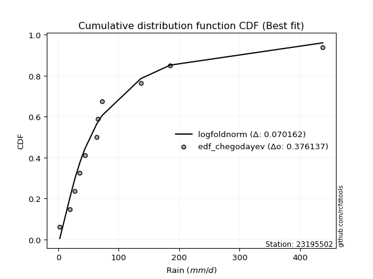</img>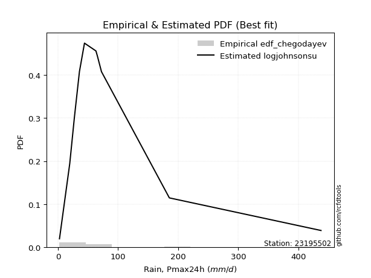</img>

</div>


### 6. EDF Blom (1958)

The Blom formula is a specific "plotting position" formula used in hydrology and statistical analysis to estimate the empirical cumulative probability (or non-exceedance probability) of a data series. It is particularly recommended for data that are approximately normally distributed. The constant _a_ is set to 0.375 (or 3/8).

<div align="center">


$P=(m-a)/(n+1-2a)$


</div>


**6.1. Empirical values**

<div align="center">

|                | 0                   | 1                   | 2                   | 3                   | 4                  | 5        | 6                  | 7                  | 8                  | 9                  | 10                 |
|:---------------|:--------------------|:--------------------|:--------------------|:--------------------|:-------------------|:---------|:-------------------|:-------------------|:-------------------|:-------------------|:-------------------|
| date           | 2022                | 2023                | 2021                | 2015                | 2017               | 2016     | 2019               | 2018               | 2025               | 2024               | 2020               |
| x              | 2.55                | 19.62               | 27.36               | 35.75               | 44.13              | 63.2     | 65.57              | 72.39              | 136.7              | 185.3              | 437.61             |
| m              | 1                   | 2                   | 3                   | 4                   | 5                  | 6        | 7                  | 8                  | 9                  | 10                 | 11                 |
| empirical_dist | edf_blom            | edf_blom            | edf_blom            | edf_blom            | edf_blom           | edf_blom | edf_blom           | edf_blom           | edf_blom           | edf_blom           | edf_blom           |
| empirical      | 0.05555555555555555 | 0.14444444444444443 | 0.23333333333333334 | 0.32222222222222224 | 0.4111111111111111 | 0.5      | 0.5888888888888889 | 0.6777777777777778 | 0.7666666666666667 | 0.8555555555555555 | 0.9444444444444444 |
| empirical_tr   | 1.0588235294117647  | 1.1688311688311688  | 1.3043478260869565  | 1.4754098360655736  | 1.6981132075471697 | 2.0      | 2.4324324324324325 | 3.1034482758620694 | 4.2857142857142865 | 6.923076923076921  | 17.999999999999993 |

</div>


**6.2. Kolmogorov-Smirnov fit test (sorted by Δ)**


<div align="center">

|                | 0                   | 1                   | 2                   | 3                   | 4                   | 5                   | 6                   | 7                   | 8                   | 9                   | 10                  | 11                  | 12                  | 13                  | 14                  | 15                  | 16                  | 17                  | 18                  | 19                  | 20                  | 21                  | 22                  | 23                  | 24                  | 25                  | 26                  | 27                  | 28                  | 29                  | 30                  | 31                  | 32                  | 33                  | 34                  | 35                  | 36                  | 37                  | 38                  | 39                  | 40                  | 41                  | 42                  | 43                  | 44                  | 45                  | 46                  | 47                  | 48                  | 49                  | 50                  | 51                  | 52                  | 53                  | 54                  | 55                  | 56                  | 57                  | 58                  | 59                  | 60                  | 61                  | 62                  | 63                  | 64                  | 65                  | 66                  | 67                  | 68                  | 69                  | 70                  | 71                  | 72                  | 73                  | 74                  | 75                  | 76                  | 77                  | 78                  | 79                  | 80                  | 81                  | 82                  | 83                  | 84                  | 85                  | 86                  | 87                  | 88                  | 89                  | 90                  | 91                  | 92                  | 93                  | 94                  | 95                  | 96                  | 97                  | 98                  | 99                  | 100                 | 101                 | 102                 | 103                 | 104                 | 105                 | 106                 | 107                 | 108                 | 109                 | 110                 | 111                 | 112                 | 113                 | 114                 | 115                 | 116                 | 117                 | 118                 | 119                 | 120                 | 121                 | 122                 | 123                 | 124                 | 125                 | 126                 | 127                 | 128                 | 129                 | 130                 | 131                 | 132                 | 133                 | 134                 | 135                 | 136                 | 137                 | 138                 | 139                 | 140                 | 141                 | 142                 | 143                 | 144                 | 145                 | 146                 | 147                 | 148                 | 149                 | 150                 | 151                 | 152                 | 153                 | 154                 | 155                 | 156                 | 157                 | 158                 | 159                 |
|:---------------|:--------------------|:--------------------|:--------------------|:--------------------|:--------------------|:--------------------|:--------------------|:--------------------|:--------------------|:--------------------|:--------------------|:--------------------|:--------------------|:--------------------|:--------------------|:--------------------|:--------------------|:--------------------|:--------------------|:--------------------|:--------------------|:--------------------|:--------------------|:--------------------|:--------------------|:--------------------|:--------------------|:--------------------|:--------------------|:--------------------|:--------------------|:--------------------|:--------------------|:--------------------|:--------------------|:--------------------|:--------------------|:--------------------|:--------------------|:--------------------|:--------------------|:--------------------|:--------------------|:--------------------|:--------------------|:--------------------|:--------------------|:--------------------|:--------------------|:--------------------|:--------------------|:--------------------|:--------------------|:--------------------|:--------------------|:--------------------|:--------------------|:--------------------|:--------------------|:--------------------|:--------------------|:--------------------|:--------------------|:--------------------|:--------------------|:--------------------|:--------------------|:--------------------|:--------------------|:--------------------|:--------------------|:--------------------|:--------------------|:--------------------|:--------------------|:--------------------|:--------------------|:--------------------|:--------------------|:--------------------|:--------------------|:--------------------|:--------------------|:--------------------|:--------------------|:--------------------|:--------------------|:--------------------|:--------------------|:--------------------|:--------------------|:--------------------|:--------------------|:--------------------|:--------------------|:--------------------|:--------------------|:--------------------|:--------------------|:--------------------|:--------------------|:--------------------|:--------------------|:--------------------|:--------------------|:--------------------|:--------------------|:--------------------|:--------------------|:--------------------|:--------------------|:--------------------|:--------------------|:--------------------|:--------------------|:--------------------|:--------------------|:--------------------|:--------------------|:--------------------|:--------------------|:--------------------|:--------------------|:--------------------|:--------------------|:--------------------|:--------------------|:--------------------|:--------------------|:--------------------|:--------------------|:--------------------|:--------------------|:--------------------|:--------------------|:--------------------|:--------------------|:--------------------|:--------------------|:--------------------|:--------------------|:--------------------|:--------------------|:--------------------|:--------------------|:--------------------|:--------------------|:--------------------|:--------------------|:--------------------|:--------------------|:--------------------|:--------------------|:--------------------|:--------------------|:--------------------|:--------------------|:--------------------|:--------------------|:--------------------|
| station        | 23195502            | 23195502            | 23195502            | 23195502            | 23195502            | 23195502            | 23195502            | 23195502            | 23195502            | 23195502            | 23195502            | 23195502            | 23195502            | 23195502            | 23195502            | 23195502            | 23195502            | 23195502            | 23195502            | 23195502            | 23195502            | 23195502            | 23195502            | 23195502            | 23195502            | 23195502            | 23195502            | 23195502            | 23195502            | 23195502            | 23195502            | 23195502            | 23195502            | 23195502            | 23195502            | 23195502            | 23195502            | 23195502            | 23195502            | 23195502            | 23195502            | 23195502            | 23195502            | 23195502            | 23195502            | 23195502            | 23195502            | 23195502            | 23195502            | 23195502            | 23195502            | 23195502            | 23195502            | 23195502            | 23195502            | 23195502            | 23195502            | 23195502            | 23195502            | 23195502            | 23195502            | 23195502            | 23195502            | 23195502            | 23195502            | 23195502            | 23195502            | 23195502            | 23195502            | 23195502            | 23195502            | 23195502            | 23195502            | 23195502            | 23195502            | 23195502            | 23195502            | 23195502            | 23195502            | 23195502            | 23195502            | 23195502            | 23195502            | 23195502            | 23195502            | 23195502            | 23195502            | 23195502            | 23195502            | 23195502            | 23195502            | 23195502            | 23195502            | 23195502            | 23195502            | 23195502            | 23195502            | 23195502            | 23195502            | 23195502            | 23195502            | 23195502            | 23195502            | 23195502            | 23195502            | 23195502            | 23195502            | 23195502            | 23195502            | 23195502            | 23195502            | 23195502            | 23195502            | 23195502            | 23195502            | 23195502            | 23195502            | 23195502            | 23195502            | 23195502            | 23195502            | 23195502            | 23195502            | 23195502            | 23195502            | 23195502            | 23195502            | 23195502            | 23195502            | 23195502            | 23195502            | 23195502            | 23195502            | 23195502            | 23195502            | 23195502            | 23195502            | 23195502            | 23195502            | 23195502            | 23195502            | 23195502            | 23195502            | 23195502            | 23195502            | 23195502            | 23195502            | 23195502            | 23195502            | 23195502            | 23195502            | 23195502            | 23195502            | 23195502            | 23195502            | 23195502            | 23195502            | 23195502            | 23195502            | 23195502            |
| empirical_dist | edf_blom            | edf_blom            | edf_blom            | edf_blom            | edf_blom            | edf_blom            | edf_blom            | edf_blom            | edf_blom            | edf_blom            | edf_blom            | edf_blom            | edf_blom            | edf_blom            | edf_blom            | edf_blom            | edf_blom            | edf_blom            | edf_blom            | edf_blom            | edf_blom            | edf_blom            | edf_blom            | edf_blom            | edf_blom            | edf_blom            | edf_blom            | edf_blom            | edf_blom            | edf_blom            | edf_blom            | edf_blom            | edf_blom            | edf_blom            | edf_blom            | edf_blom            | edf_blom            | edf_blom            | edf_blom            | edf_blom            | edf_blom            | edf_blom            | edf_blom            | edf_blom            | edf_blom            | edf_blom            | edf_blom            | edf_blom            | edf_blom            | edf_blom            | edf_blom            | edf_blom            | edf_blom            | edf_blom            | edf_blom            | edf_blom            | edf_blom            | edf_blom            | edf_blom            | edf_blom            | edf_blom            | edf_blom            | edf_blom            | edf_blom            | edf_blom            | edf_blom            | edf_blom            | edf_blom            | edf_blom            | edf_blom            | edf_blom            | edf_blom            | edf_blom            | edf_blom            | edf_blom            | edf_blom            | edf_blom            | edf_blom            | edf_blom            | edf_blom            | edf_blom            | edf_blom            | edf_blom            | edf_blom            | edf_blom            | edf_blom            | edf_blom            | edf_blom            | edf_blom            | edf_blom            | edf_blom            | edf_blom            | edf_blom            | edf_blom            | edf_blom            | edf_blom            | edf_blom            | edf_blom            | edf_blom            | edf_blom            | edf_blom            | edf_blom            | edf_blom            | edf_blom            | edf_blom            | edf_blom            | edf_blom            | edf_blom            | edf_blom            | edf_blom            | edf_blom            | edf_blom            | edf_blom            | edf_blom            | edf_blom            | edf_blom            | edf_blom            | edf_blom            | edf_blom            | edf_blom            | edf_blom            | edf_blom            | edf_blom            | edf_blom            | edf_blom            | edf_blom            | edf_blom            | edf_blom            | edf_blom            | edf_blom            | edf_blom            | edf_blom            | edf_blom            | edf_blom            | edf_blom            | edf_blom            | edf_blom            | edf_blom            | edf_blom            | edf_blom            | edf_blom            | edf_blom            | edf_blom            | edf_blom            | edf_blom            | edf_blom            | edf_blom            | edf_blom            | edf_blom            | edf_blom            | edf_blom            | edf_blom            | edf_blom            | edf_blom            | edf_blom            | edf_blom            | edf_blom            | edf_blom            | edf_blom            | edf_blom            |
| p_dist         | loglogistic         | logfoldnorm         | logvonmises_line    | logtukeylambda      | loghypsecant        | logfatiguelife      | lognorm             | logcrystalball      | logexponnorm        | logf                | logrice             | lognct              | invweibull          | genextreme          | nct                 | logt                | invgamma            | logbetaprime        | logjohnsonsu        | logerlang           | kappa3              | loggamma            | loggamma            | loggenlogistic      | logalpha            | logburr             | logmielke           | loginvgamma         | johnsonsu           | ncf                 | loglaplace          | loglaplace          | logskewnorm         | loginvgauss         | invgauss            | lomax               | genpareto           | logmaxwell          | mielke              | loganglit           | loggennorm          | logexponweib        | logjohnsonsb        | logloggamma         | loggengamma         | logburr12           | logweibull_min      | logbeta             | dgamma              | lograyleigh         | logexponpow         | fatiguelife         | logpearson3         | wald                | gengamma            | betaprime           | loggenextreme       | logsemicircular     | logdweibull         | logncf              | logloglaplace       | gausshyper          | logargus            | gennorm             | burr12              | loggumbel_r         | truncpareto         | loggumbel_l         | pearson3            | lognakagami         | loginvweibull       | logdgamma           | loghalfnorm         | logcosine           | logtruncweibull_min | exponweib           | t                   | logmoyal            | truncweibull_min    | loghalflogistic     | exponnorm           | gompertz            | genexpon            | nakagami            | halflogistic        | logarcsine          | dweibull            | burr                | loggenhalflogistic  | weibull_min         | f                   | moyal               | loggausshyper       | truncnorm           | halfnorm            | gamma               | erlang              | vonmises_line       | logkstwobign        | cosine              | loggompertz         | genlogistic         | gumbel_r            | logtriang           | loggenpareto        | loggenexpon         | foldnorm            | rayleigh            | logwald             | maxwell             | exponpow            | arcsine             | semicircular        | logkappa3           | loguniform          | anglit              | halfgennorm         | logwrapcauchy       | kstwobign           | beta                | crystalball         | norm                | logksone            | logistic            | logkappa4           | logtrapezoid        | hypsecant           | johnsonsb           | rice                | loglevy_l           | laplace             | logtruncnorm        | skewnorm            | logbradford         | gumbel_l            | wrapcauchy          | logweibull_max      | logtruncexpon       | loglomax            | bradford            | powerlaw            | loghalfgennorm      | argus               | truncexpon          | triang              | levy_l              | ksone               | kappa4              | rdist               | uniform             | alpha               | tukeylambda         | logrdist            | genhalflogistic     | logpowerlaw         | trapezoid           | weibull_max         | logtruncpareto      | logvonmises         | vonmises            |
| delta          | 0.0703282832092097  | 0.07250069551096483 | 0.0761031994193887  | 0.0771196066747073  | 0.07729458555844793 | 0.07820471973124943 | 0.07898859258429636 | 0.07898859345010292 | 0.07898981964099175 | 0.07939483157092472 | 0.07940601380800802 | 0.08029063215120522 | 0.08039515800780395 | 0.08039527330387519 | 0.08052803596283731 | 0.0818316937732555  | 0.08392544941204516 | 0.08498833739040093 | 0.08615967801871549 | 0.08824647426910631 | 0.08843111872247711 | 0.08958296331500734 | 0.08958296331500734 | 0.09029065887629262 | 0.09068885487968792 | 0.09086364747380371 | 0.09155955833816665 | 0.09357116285464967 | 0.09447660113588674 | 0.09866997932207822 | 0.0990626243870556  | 0.0990626243870556  | 0.09915252399715158 | 0.10009523894506095 | 0.10073701420844294 | 0.10130033753723322 | 0.10130104978021359 | 0.10390538081312806 | 0.10616695056064912 | 0.1071012124439844  | 0.10807039122731887 | 0.10852868721080977 | 0.10959095426204513 | 0.10959167155671723 | 0.10977006123696775 | 0.11049526132420007 | 0.11053155926198754 | 0.11108683723763546 | 0.11257568197781542 | 0.1151656070192103  | 0.11550623345195787 | 0.11613485068035401 | 0.11628331979871587 | 0.1172198429743182  | 0.11729579949425495 | 0.11830762170142095 | 0.11927881992417333 | 0.11940555829116489 | 0.11949879364737348 | 0.12048537344647103 | 0.12372739929153553 | 0.12411223726993514 | 0.1241921344594139  | 0.12424638592053189 | 0.13109596216325675 | 0.13155448642101542 | 0.13288636699430856 | 0.1333354300681906  | 0.1365796163383326  | 0.14444444444411017 | 0.14644693611745174 | 0.1468501869019576  | 0.14709635051018577 | 0.14728397344961436 | 0.1490275586833898  | 0.14962155513833492 | 0.14991991060530663 | 0.15597183246388424 | 0.15650547664888315 | 0.15803379513405524 | 0.15890275849859314 | 0.1606238728770839  | 0.16292580933422607 | 0.16871230676806825 | 0.16886877164344527 | 0.17478351440274903 | 0.17551440849092506 | 0.17604939911792578 | 0.17832978616584455 | 0.17842323832991402 | 0.1806970811513801  | 0.18169329482308083 | 0.18242483308331758 | 0.18562074831921754 | 0.18578974471805554 | 0.18606927993173622 | 0.19225500809920604 | 0.1929420368622094  | 0.19510598163725723 | 0.19768559406980935 | 0.20248005902200694 | 0.20516430832967547 | 0.2053092235569271  | 0.21512841500442287 | 0.21554505195222257 | 0.21857505730916177 | 0.21976504135954258 | 0.22051108853974666 | 0.22374070443723781 | 0.2327666006110402  | 0.23951672472315755 | 0.24892915910279703 | 0.24941179033953903 | 0.25211764003845855 | 0.25212756765015837 | 0.254564392068805   | 0.2564560892699679  | 0.25719616942849965 | 0.2657951311863104  | 0.26656666830716963 | 0.2669919088075968  | 0.26699191838680475 | 0.2693655656343913  | 0.27863907615688965 | 0.2790377927126638  | 0.28683441157779366 | 0.28825263545072927 | 0.29124457094217165 | 0.30279261402983193 | 0.3079398387167753  | 0.31431782801113406 | 0.31942470413902246 | 0.32543896777911585 | 0.33128354367808516 | 0.334537723699943   | 0.3799038439679615  | 0.3834272972984717  | 0.38542523307852433 | 0.4025766290082547  | 0.40485825099611455 | 0.40908105749045104 | 0.4094009355795604  | 0.4104184952319201  | 0.42147687000225353 | 0.4328424286584618  | 0.4519856885208986  | 0.46066979267227515 | 0.49251356674969315 | 0.5103127472071163  | 0.5172481956511745  | 0.5259111635594189  | 0.5369491049404844  | 0.5375451148330253  | 0.5538757867029266  | 0.6454358203141661  | 0.6643213934998432  | 0.7283898318892918  | 0.8104888627215354  | 0.9975419791625184  | 68.77952396512009   |
| deltao         | 0.37613735880099997 | 0.37613735880099997 | 0.37613735880099997 | 0.37613735880099997 | 0.37613735880099997 | 0.37613735880099997 | 0.37613735880099997 | 0.37613735880099997 | 0.37613735880099997 | 0.37613735880099997 | 0.37613735880099997 | 0.37613735880099997 | 0.37613735880099997 | 0.37613735880099997 | 0.37613735880099997 | 0.37613735880099997 | 0.37613735880099997 | 0.37613735880099997 | 0.37613735880099997 | 0.37613735880099997 | 0.37613735880099997 | 0.37613735880099997 | 0.37613735880099997 | 0.37613735880099997 | 0.37613735880099997 | 0.37613735880099997 | 0.37613735880099997 | 0.37613735880099997 | 0.37613735880099997 | 0.37613735880099997 | 0.37613735880099997 | 0.37613735880099997 | 0.37613735880099997 | 0.37613735880099997 | 0.37613735880099997 | 0.37613735880099997 | 0.37613735880099997 | 0.37613735880099997 | 0.37613735880099997 | 0.37613735880099997 | 0.37613735880099997 | 0.37613735880099997 | 0.37613735880099997 | 0.37613735880099997 | 0.37613735880099997 | 0.37613735880099997 | 0.37613735880099997 | 0.37613735880099997 | 0.37613735880099997 | 0.37613735880099997 | 0.37613735880099997 | 0.37613735880099997 | 0.37613735880099997 | 0.37613735880099997 | 0.37613735880099997 | 0.37613735880099997 | 0.37613735880099997 | 0.37613735880099997 | 0.37613735880099997 | 0.37613735880099997 | 0.37613735880099997 | 0.37613735880099997 | 0.37613735880099997 | 0.37613735880099997 | 0.37613735880099997 | 0.37613735880099997 | 0.37613735880099997 | 0.37613735880099997 | 0.37613735880099997 | 0.37613735880099997 | 0.37613735880099997 | 0.37613735880099997 | 0.37613735880099997 | 0.37613735880099997 | 0.37613735880099997 | 0.37613735880099997 | 0.37613735880099997 | 0.37613735880099997 | 0.37613735880099997 | 0.37613735880099997 | 0.37613735880099997 | 0.37613735880099997 | 0.37613735880099997 | 0.37613735880099997 | 0.37613735880099997 | 0.37613735880099997 | 0.37613735880099997 | 0.37613735880099997 | 0.37613735880099997 | 0.37613735880099997 | 0.37613735880099997 | 0.37613735880099997 | 0.37613735880099997 | 0.37613735880099997 | 0.37613735880099997 | 0.37613735880099997 | 0.37613735880099997 | 0.37613735880099997 | 0.37613735880099997 | 0.37613735880099997 | 0.37613735880099997 | 0.37613735880099997 | 0.37613735880099997 | 0.37613735880099997 | 0.37613735880099997 | 0.37613735880099997 | 0.37613735880099997 | 0.37613735880099997 | 0.37613735880099997 | 0.37613735880099997 | 0.37613735880099997 | 0.37613735880099997 | 0.37613735880099997 | 0.37613735880099997 | 0.37613735880099997 | 0.37613735880099997 | 0.37613735880099997 | 0.37613735880099997 | 0.37613735880099997 | 0.37613735880099997 | 0.37613735880099997 | 0.37613735880099997 | 0.37613735880099997 | 0.37613735880099997 | 0.37613735880099997 | 0.37613735880099997 | 0.37613735880099997 | 0.37613735880099997 | 0.37613735880099997 | 0.37613735880099997 | 0.37613735880099997 | 0.37613735880099997 | 0.37613735880099997 | 0.37613735880099997 | 0.37613735880099997 | 0.37613735880099997 | 0.37613735880099997 | 0.37613735880099997 | 0.37613735880099997 | 0.37613735880099997 | 0.37613735880099997 | 0.37613735880099997 | 0.37613735880099997 | 0.37613735880099997 | 0.37613735880099997 | 0.37613735880099997 | 0.37613735880099997 | 0.37613735880099997 | 0.37613735880099997 | 0.37613735880099997 | 0.37613735880099997 | 0.37613735880099997 | 0.37613735880099997 | 0.37613735880099997 | 0.37613735880099997 | 0.37613735880099997 | 0.37613735880099997 | 0.37613735880099997 | 0.37613735880099997 | 0.37613735880099997 |
| eval           | Δo > Δ              | Δo > Δ              | Δo > Δ              | Δo > Δ              | Δo > Δ              | Δo > Δ              | Δo > Δ              | Δo > Δ              | Δo > Δ              | Δo > Δ              | Δo > Δ              | Δo > Δ              | Δo > Δ              | Δo > Δ              | Δo > Δ              | Δo > Δ              | Δo > Δ              | Δo > Δ              | Δo > Δ              | Δo > Δ              | Δo > Δ              | Δo > Δ              | Δo > Δ              | Δo > Δ              | Δo > Δ              | Δo > Δ              | Δo > Δ              | Δo > Δ              | Δo > Δ              | Δo > Δ              | Δo > Δ              | Δo > Δ              | Δo > Δ              | Δo > Δ              | Δo > Δ              | Δo > Δ              | Δo > Δ              | Δo > Δ              | Δo > Δ              | Δo > Δ              | Δo > Δ              | Δo > Δ              | Δo > Δ              | Δo > Δ              | Δo > Δ              | Δo > Δ              | Δo > Δ              | Δo > Δ              | Δo > Δ              | Δo > Δ              | Δo > Δ              | Δo > Δ              | Δo > Δ              | Δo > Δ              | Δo > Δ              | Δo > Δ              | Δo > Δ              | Δo > Δ              | Δo > Δ              | Δo > Δ              | Δo > Δ              | Δo > Δ              | Δo > Δ              | Δo > Δ              | Δo > Δ              | Δo > Δ              | Δo > Δ              | Δo > Δ              | Δo > Δ              | Δo > Δ              | Δo > Δ              | Δo > Δ              | Δo > Δ              | Δo > Δ              | Δo > Δ              | Δo > Δ              | Δo > Δ              | Δo > Δ              | Δo > Δ              | Δo > Δ              | Δo > Δ              | Δo > Δ              | Δo > Δ              | Δo > Δ              | Δo > Δ              | Δo > Δ              | Δo > Δ              | Δo > Δ              | Δo > Δ              | Δo > Δ              | Δo > Δ              | Δo > Δ              | Δo > Δ              | Δo > Δ              | Δo > Δ              | Δo > Δ              | Δo > Δ              | Δo > Δ              | Δo > Δ              | Δo > Δ              | Δo > Δ              | Δo > Δ              | Δo > Δ              | Δo > Δ              | Δo > Δ              | Δo > Δ              | Δo > Δ              | Δo > Δ              | Δo > Δ              | Δo > Δ              | Δo > Δ              | Δo > Δ              | Δo > Δ              | Δo > Δ              | Δo > Δ              | Δo > Δ              | Δo > Δ              | Δo > Δ              | Δo > Δ              | Δo > Δ              | Δo > Δ              | Δo > Δ              | Δo > Δ              | Δo > Δ              | Δo > Δ              | Δo > Δ              | Δo > Δ              | Δo > Δ              | Δo > Δ              | Δo > Δ              | Δo > Δ              | Δo > Δ              | Δo > Δ              | Δo > Δ              | Δo > Δ              | Δo <= Δ             | Δo <= Δ             | Δo <= Δ             | Δo <= Δ             | Δo <= Δ             | Δo <= Δ             | Δo <= Δ             | Δo <= Δ             | Δo <= Δ             | Δo <= Δ             | Δo <= Δ             | Δo <= Δ             | Δo <= Δ             | Δo <= Δ             | Δo <= Δ             | Δo <= Δ             | Δo <= Δ             | Δo <= Δ             | Δo <= Δ             | Δo <= Δ             | Δo <= Δ             | Δo <= Δ             | Δo <= Δ             | Δo <= Δ             | Δo <= Δ             |
| fit            | 1                   | 1                   | 1                   | 1                   | 1                   | 1                   | 1                   | 1                   | 1                   | 1                   | 1                   | 1                   | 1                   | 1                   | 1                   | 1                   | 1                   | 1                   | 1                   | 1                   | 1                   | 1                   | 1                   | 1                   | 1                   | 1                   | 1                   | 1                   | 1                   | 1                   | 1                   | 1                   | 1                   | 1                   | 1                   | 1                   | 1                   | 1                   | 1                   | 1                   | 1                   | 1                   | 1                   | 1                   | 1                   | 1                   | 1                   | 1                   | 1                   | 1                   | 1                   | 1                   | 1                   | 1                   | 1                   | 1                   | 1                   | 1                   | 1                   | 1                   | 1                   | 1                   | 1                   | 1                   | 1                   | 1                   | 1                   | 1                   | 1                   | 1                   | 1                   | 1                   | 1                   | 1                   | 1                   | 1                   | 1                   | 1                   | 1                   | 1                   | 1                   | 1                   | 1                   | 1                   | 1                   | 1                   | 1                   | 1                   | 1                   | 1                   | 1                   | 1                   | 1                   | 1                   | 1                   | 1                   | 1                   | 1                   | 1                   | 1                   | 1                   | 1                   | 1                   | 1                   | 1                   | 1                   | 1                   | 1                   | 1                   | 1                   | 1                   | 1                   | 1                   | 1                   | 1                   | 1                   | 1                   | 1                   | 1                   | 1                   | 1                   | 1                   | 1                   | 1                   | 1                   | 1                   | 1                   | 1                   | 1                   | 1                   | 1                   | 1                   | 1                   | 1                   | 1                   | 0                   | 0                   | 0                   | 0                   | 0                   | 0                   | 0                   | 0                   | 0                   | 0                   | 0                   | 0                   | 0                   | 0                   | 0                   | 0                   | 0                   | 0                   | 0                   | 0                   | 0                   | 0                   | 0                   | 0                   | 0                   |
| n              | 11                  | 11                  | 11                  | 11                  | 11                  | 11                  | 11                  | 11                  | 11                  | 11                  | 11                  | 11                  | 11                  | 11                  | 11                  | 11                  | 11                  | 11                  | 11                  | 11                  | 11                  | 11                  | 11                  | 11                  | 11                  | 11                  | 11                  | 11                  | 11                  | 11                  | 11                  | 11                  | 11                  | 11                  | 11                  | 11                  | 11                  | 11                  | 11                  | 11                  | 11                  | 11                  | 11                  | 11                  | 11                  | 11                  | 11                  | 11                  | 11                  | 11                  | 11                  | 11                  | 11                  | 11                  | 11                  | 11                  | 11                  | 11                  | 11                  | 11                  | 11                  | 11                  | 11                  | 11                  | 11                  | 11                  | 11                  | 11                  | 11                  | 11                  | 11                  | 11                  | 11                  | 11                  | 11                  | 11                  | 11                  | 11                  | 11                  | 11                  | 11                  | 11                  | 11                  | 11                  | 11                  | 11                  | 11                  | 11                  | 11                  | 11                  | 11                  | 11                  | 11                  | 11                  | 11                  | 11                  | 11                  | 11                  | 11                  | 11                  | 11                  | 11                  | 11                  | 11                  | 11                  | 11                  | 11                  | 11                  | 11                  | 11                  | 11                  | 11                  | 11                  | 11                  | 11                  | 11                  | 11                  | 11                  | 11                  | 11                  | 11                  | 11                  | 11                  | 11                  | 11                  | 11                  | 11                  | 11                  | 11                  | 11                  | 11                  | 11                  | 11                  | 11                  | 11                  | 11                  | 11                  | 11                  | 11                  | 11                  | 11                  | 11                  | 11                  | 11                  | 11                  | 11                  | 11                  | 11                  | 11                  | 11                  | 11                  | 11                  | 11                  | 11                  | 11                  | 11                  | 11                  | 11                  | 11                  | 11                  |
| best_fit       | 1                   | 0                   | 0                   | 0                   | 0                   | 0                   | 0                   | 0                   | 0                   | 0                   | 0                   | 0                   | 0                   | 0                   | 0                   | 0                   | 0                   | 0                   | 0                   | 0                   | 0                   | 0                   | 0                   | 0                   | 0                   | 0                   | 0                   | 0                   | 0                   | 0                   | 0                   | 0                   | 0                   | 0                   | 0                   | 0                   | 0                   | 0                   | 0                   | 0                   | 0                   | 0                   | 0                   | 0                   | 0                   | 0                   | 0                   | 0                   | 0                   | 0                   | 0                   | 0                   | 0                   | 0                   | 0                   | 0                   | 0                   | 0                   | 0                   | 0                   | 0                   | 0                   | 0                   | 0                   | 0                   | 0                   | 0                   | 0                   | 0                   | 0                   | 0                   | 0                   | 0                   | 0                   | 0                   | 0                   | 0                   | 0                   | 0                   | 0                   | 0                   | 0                   | 0                   | 0                   | 0                   | 0                   | 0                   | 0                   | 0                   | 0                   | 0                   | 0                   | 0                   | 0                   | 0                   | 0                   | 0                   | 0                   | 0                   | 0                   | 0                   | 0                   | 0                   | 0                   | 0                   | 0                   | 0                   | 0                   | 0                   | 0                   | 0                   | 0                   | 0                   | 0                   | 0                   | 0                   | 0                   | 0                   | 0                   | 0                   | 0                   | 0                   | 0                   | 0                   | 0                   | 0                   | 0                   | 0                   | 0                   | 0                   | 0                   | 0                   | 0                   | 0                   | 0                   | 0                   | 0                   | 0                   | 0                   | 0                   | 0                   | 0                   | 0                   | 0                   | 0                   | 0                   | 0                   | 0                   | 0                   | 0                   | 0                   | 0                   | 0                   | 0                   | 0                   | 0                   | 0                   | 0                   | 0                   | 0                   |
| best_fit_sort  | 1                   | 2                   | 3                   | 4                   | 5                   | 6                   | 7                   | 8                   | 9                   | 10                  | 11                  | 12                  | 13                  | 14                  | 15                  | 16                  | 17                  | 18                  | 19                  | 20                  | 21                  | 22                  | 23                  | 24                  | 25                  | 26                  | 27                  | 28                  | 29                  | 30                  | 31                  | 32                  | 33                  | 34                  | 35                  | 36                  | 37                  | 38                  | 39                  | 40                  | 41                  | 42                  | 43                  | 44                  | 45                  | 46                  | 47                  | 48                  | 49                  | 50                  | 51                  | 52                  | 53                  | 54                  | 55                  | 56                  | 57                  | 58                  | 59                  | 60                  | 61                  | 62                  | 63                  | 64                  | 65                  | 66                  | 67                  | 68                  | 69                  | 70                  | 71                  | 72                  | 73                  | 74                  | 75                  | 76                  | 77                  | 78                  | 79                  | 80                  | 81                  | 82                  | 83                  | 84                  | 85                  | 86                  | 87                  | 88                  | 89                  | 90                  | 91                  | 92                  | 93                  | 94                  | 95                  | 96                  | 97                  | 98                  | 99                  | 100                 | 101                 | 102                 | 103                 | 104                 | 105                 | 106                 | 107                 | 108                 | 109                 | 110                 | 111                 | 112                 | 113                 | 114                 | 115                 | 116                 | 117                 | 118                 | 119                 | 120                 | 121                 | 122                 | 123                 | 124                 | 125                 | 126                 | 127                 | 128                 | 129                 | 130                 | 131                 | 132                 | 133                 | 134                 | 135                 | 136                 | 137                 | 138                 | 139                 | 140                 | 141                 | 142                 | 143                 | 144                 | 145                 | 146                 | 147                 | 148                 | 149                 | 150                 | 151                 | 152                 | 153                 | 154                 | 155                 | 156                 | 157                 | 158                 | 159                 | 160                 |

</div>


**6.3. Best fit**

<div align="center">

|   id |   station | empirical_dist   | p_dist      |     delta |   deltao | eval   |   fit |   n |   best_fit |   best_fit_sort |
|-----:|----------:|:-----------------|:------------|----------:|---------:|:-------|------:|----:|-----------:|----------------:|
|    0 |  23195502 | edf_blom         | loglogistic | 0.0703283 | 0.376137 | Δo > Δ |     1 |  11 |          1 |               1 |

</div>


<div align="center">

</img></img>

</div>


### 7. EDF Tukey (1962)

In hydrology, the Tukey formula is used as a plotting position formula to estimate the empirical probability or frequency of a flood event (or other hydrological data). The formula parameter is given as _c=0.333_ (or 1/3).

<div align="center">


$P=(m-c)/(n+1-2c)$


</div>


**7.1. Empirical values**

<div align="center">

|                | 0                    | 1                   | 2                   | 3                  | 4                  | 5         | 6                  | 7                  | 8                  | 9                  | 10                 |
|:---------------|:---------------------|:--------------------|:--------------------|:-------------------|:-------------------|:----------|:-------------------|:-------------------|:-------------------|:-------------------|:-------------------|
| date           | 2022                 | 2023                | 2021                | 2015               | 2017               | 2016      | 2019               | 2018               | 2025               | 2024               | 2020               |
| x              | 2.55                 | 19.62               | 27.36               | 35.75              | 44.13              | 63.2      | 65.57              | 72.39              | 136.7              | 185.3              | 437.61             |
| m              | 1                    | 2                   | 3                   | 4                  | 5                  | 6         | 7                  | 8                  | 9                  | 10                 | 11                 |
| empirical_dist | edf_tukey            | edf_tukey           | edf_tukey           | edf_tukey          | edf_tukey          | edf_tukey | edf_tukey          | edf_tukey          | edf_tukey          | edf_tukey          | edf_tukey          |
| empirical      | 0.058823529411764705 | 0.14705882352941177 | 0.23529411764705882 | 0.3235294117647059 | 0.4117647058823529 | 0.5       | 0.5882352941176471 | 0.6764705882352942 | 0.7647058823529411 | 0.8529411764705882 | 0.9411764705882353 |
| empirical_tr   | 1.0625               | 1.1724137931034484  | 1.3076923076923077  | 1.4782608695652173 | 1.7                | 2.0       | 2.428571428571429  | 3.0909090909090913 | 4.249999999999999  | 6.799999999999999  | 16.999999999999996 |

</div>


**7.2. Kolmogorov-Smirnov fit test (sorted by Δ)**


<div align="center">

|                | 0                   | 1                   | 2                   | 3                   | 4                   | 5                   | 6                   | 7                   | 8                   | 9                   | 10                  | 11                  | 12                  | 13                  | 14                  | 15                  | 16                  | 17                  | 18                  | 19                  | 20                  | 21                  | 22                  | 23                  | 24                  | 25                  | 26                  | 27                  | 28                  | 29                  | 30                  | 31                  | 32                  | 33                  | 34                  | 35                  | 36                  | 37                  | 38                  | 39                  | 40                  | 41                  | 42                  | 43                  | 44                  | 45                  | 46                  | 47                  | 48                  | 49                  | 50                  | 51                  | 52                  | 53                  | 54                  | 55                  | 56                  | 57                  | 58                  | 59                  | 60                  | 61                  | 62                  | 63                  | 64                  | 65                  | 66                  | 67                  | 68                  | 69                  | 70                  | 71                  | 72                  | 73                  | 74                  | 75                  | 76                  | 77                  | 78                  | 79                  | 80                  | 81                  | 82                  | 83                  | 84                  | 85                  | 86                  | 87                  | 88                  | 89                  | 90                  | 91                  | 92                  | 93                  | 94                  | 95                  | 96                  | 97                  | 98                  | 99                  | 100                 | 101                 | 102                 | 103                 | 104                 | 105                 | 106                 | 107                 | 108                 | 109                 | 110                 | 111                 | 112                 | 113                 | 114                 | 115                 | 116                 | 117                 | 118                 | 119                 | 120                 | 121                 | 122                 | 123                 | 124                 | 125                 | 126                 | 127                 | 128                 | 129                 | 130                 | 131                 | 132                 | 133                 | 134                 | 135                 | 136                 | 137                 | 138                 | 139                 | 140                 | 141                 | 142                 | 143                 | 144                 | 145                 | 146                 | 147                 | 148                 | 149                 | 150                 | 151                 | 152                 | 153                 | 154                 | 155                 | 156                 | 157                 | 158                 | 159                 |
|:---------------|:--------------------|:--------------------|:--------------------|:--------------------|:--------------------|:--------------------|:--------------------|:--------------------|:--------------------|:--------------------|:--------------------|:--------------------|:--------------------|:--------------------|:--------------------|:--------------------|:--------------------|:--------------------|:--------------------|:--------------------|:--------------------|:--------------------|:--------------------|:--------------------|:--------------------|:--------------------|:--------------------|:--------------------|:--------------------|:--------------------|:--------------------|:--------------------|:--------------------|:--------------------|:--------------------|:--------------------|:--------------------|:--------------------|:--------------------|:--------------------|:--------------------|:--------------------|:--------------------|:--------------------|:--------------------|:--------------------|:--------------------|:--------------------|:--------------------|:--------------------|:--------------------|:--------------------|:--------------------|:--------------------|:--------------------|:--------------------|:--------------------|:--------------------|:--------------------|:--------------------|:--------------------|:--------------------|:--------------------|:--------------------|:--------------------|:--------------------|:--------------------|:--------------------|:--------------------|:--------------------|:--------------------|:--------------------|:--------------------|:--------------------|:--------------------|:--------------------|:--------------------|:--------------------|:--------------------|:--------------------|:--------------------|:--------------------|:--------------------|:--------------------|:--------------------|:--------------------|:--------------------|:--------------------|:--------------------|:--------------------|:--------------------|:--------------------|:--------------------|:--------------------|:--------------------|:--------------------|:--------------------|:--------------------|:--------------------|:--------------------|:--------------------|:--------------------|:--------------------|:--------------------|:--------------------|:--------------------|:--------------------|:--------------------|:--------------------|:--------------------|:--------------------|:--------------------|:--------------------|:--------------------|:--------------------|:--------------------|:--------------------|:--------------------|:--------------------|:--------------------|:--------------------|:--------------------|:--------------------|:--------------------|:--------------------|:--------------------|:--------------------|:--------------------|:--------------------|:--------------------|:--------------------|:--------------------|:--------------------|:--------------------|:--------------------|:--------------------|:--------------------|:--------------------|:--------------------|:--------------------|:--------------------|:--------------------|:--------------------|:--------------------|:--------------------|:--------------------|:--------------------|:--------------------|:--------------------|:--------------------|:--------------------|:--------------------|:--------------------|:--------------------|:--------------------|:--------------------|:--------------------|:--------------------|:--------------------|:--------------------|
| station        | 23195502            | 23195502            | 23195502            | 23195502            | 23195502            | 23195502            | 23195502            | 23195502            | 23195502            | 23195502            | 23195502            | 23195502            | 23195502            | 23195502            | 23195502            | 23195502            | 23195502            | 23195502            | 23195502            | 23195502            | 23195502            | 23195502            | 23195502            | 23195502            | 23195502            | 23195502            | 23195502            | 23195502            | 23195502            | 23195502            | 23195502            | 23195502            | 23195502            | 23195502            | 23195502            | 23195502            | 23195502            | 23195502            | 23195502            | 23195502            | 23195502            | 23195502            | 23195502            | 23195502            | 23195502            | 23195502            | 23195502            | 23195502            | 23195502            | 23195502            | 23195502            | 23195502            | 23195502            | 23195502            | 23195502            | 23195502            | 23195502            | 23195502            | 23195502            | 23195502            | 23195502            | 23195502            | 23195502            | 23195502            | 23195502            | 23195502            | 23195502            | 23195502            | 23195502            | 23195502            | 23195502            | 23195502            | 23195502            | 23195502            | 23195502            | 23195502            | 23195502            | 23195502            | 23195502            | 23195502            | 23195502            | 23195502            | 23195502            | 23195502            | 23195502            | 23195502            | 23195502            | 23195502            | 23195502            | 23195502            | 23195502            | 23195502            | 23195502            | 23195502            | 23195502            | 23195502            | 23195502            | 23195502            | 23195502            | 23195502            | 23195502            | 23195502            | 23195502            | 23195502            | 23195502            | 23195502            | 23195502            | 23195502            | 23195502            | 23195502            | 23195502            | 23195502            | 23195502            | 23195502            | 23195502            | 23195502            | 23195502            | 23195502            | 23195502            | 23195502            | 23195502            | 23195502            | 23195502            | 23195502            | 23195502            | 23195502            | 23195502            | 23195502            | 23195502            | 23195502            | 23195502            | 23195502            | 23195502            | 23195502            | 23195502            | 23195502            | 23195502            | 23195502            | 23195502            | 23195502            | 23195502            | 23195502            | 23195502            | 23195502            | 23195502            | 23195502            | 23195502            | 23195502            | 23195502            | 23195502            | 23195502            | 23195502            | 23195502            | 23195502            | 23195502            | 23195502            | 23195502            | 23195502            | 23195502            | 23195502            |
| empirical_dist | edf_tukey           | edf_tukey           | edf_tukey           | edf_tukey           | edf_tukey           | edf_tukey           | edf_tukey           | edf_tukey           | edf_tukey           | edf_tukey           | edf_tukey           | edf_tukey           | edf_tukey           | edf_tukey           | edf_tukey           | edf_tukey           | edf_tukey           | edf_tukey           | edf_tukey           | edf_tukey           | edf_tukey           | edf_tukey           | edf_tukey           | edf_tukey           | edf_tukey           | edf_tukey           | edf_tukey           | edf_tukey           | edf_tukey           | edf_tukey           | edf_tukey           | edf_tukey           | edf_tukey           | edf_tukey           | edf_tukey           | edf_tukey           | edf_tukey           | edf_tukey           | edf_tukey           | edf_tukey           | edf_tukey           | edf_tukey           | edf_tukey           | edf_tukey           | edf_tukey           | edf_tukey           | edf_tukey           | edf_tukey           | edf_tukey           | edf_tukey           | edf_tukey           | edf_tukey           | edf_tukey           | edf_tukey           | edf_tukey           | edf_tukey           | edf_tukey           | edf_tukey           | edf_tukey           | edf_tukey           | edf_tukey           | edf_tukey           | edf_tukey           | edf_tukey           | edf_tukey           | edf_tukey           | edf_tukey           | edf_tukey           | edf_tukey           | edf_tukey           | edf_tukey           | edf_tukey           | edf_tukey           | edf_tukey           | edf_tukey           | edf_tukey           | edf_tukey           | edf_tukey           | edf_tukey           | edf_tukey           | edf_tukey           | edf_tukey           | edf_tukey           | edf_tukey           | edf_tukey           | edf_tukey           | edf_tukey           | edf_tukey           | edf_tukey           | edf_tukey           | edf_tukey           | edf_tukey           | edf_tukey           | edf_tukey           | edf_tukey           | edf_tukey           | edf_tukey           | edf_tukey           | edf_tukey           | edf_tukey           | edf_tukey           | edf_tukey           | edf_tukey           | edf_tukey           | edf_tukey           | edf_tukey           | edf_tukey           | edf_tukey           | edf_tukey           | edf_tukey           | edf_tukey           | edf_tukey           | edf_tukey           | edf_tukey           | edf_tukey           | edf_tukey           | edf_tukey           | edf_tukey           | edf_tukey           | edf_tukey           | edf_tukey           | edf_tukey           | edf_tukey           | edf_tukey           | edf_tukey           | edf_tukey           | edf_tukey           | edf_tukey           | edf_tukey           | edf_tukey           | edf_tukey           | edf_tukey           | edf_tukey           | edf_tukey           | edf_tukey           | edf_tukey           | edf_tukey           | edf_tukey           | edf_tukey           | edf_tukey           | edf_tukey           | edf_tukey           | edf_tukey           | edf_tukey           | edf_tukey           | edf_tukey           | edf_tukey           | edf_tukey           | edf_tukey           | edf_tukey           | edf_tukey           | edf_tukey           | edf_tukey           | edf_tukey           | edf_tukey           | edf_tukey           | edf_tukey           | edf_tukey           | edf_tukey           | edf_tukey           |
| p_dist         | loglogistic         | logfoldnorm         | logfatiguelife      | logtukeylambda      | logvonmises_line    | lognorm             | logcrystalball      | logexponnorm        | logf                | logrice             | loghypsecant        | lognct              | invweibull          | genextreme          | nct                 | logt                | logbetaprime        | invgamma            | logjohnsonsu        | logerlang           | loggamma            | loggamma            | kappa3              | logalpha            | loggenlogistic      | logburr             | logmielke           | loginvgamma         | johnsonsu           | ncf                 | loginvgauss         | logskewnorm         | loglaplace          | loglaplace          | invgauss            | lomax               | genpareto           | logmaxwell          | mielke              | loganglit           | logexponweib        | logjohnsonsb        | logloggamma         | loggengamma         | loggennorm          | logburr12           | logweibull_min      | logbeta             | lograyleigh         | dgamma              | logexponpow         | gengamma            | fatiguelife         | logpearson3         | betaprime           | wald                | logsemicircular     | loggenextreme       | logdweibull         | logncf              | logloglaplace       | gausshyper          | logargus            | gennorm             | burr12              | loggumbel_r         | truncpareto         | loggumbel_l         | pearson3            | loginvweibull       | logcosine           | loghalfnorm         | logtruncweibull_min | exponweib           | lognakagami         | logdgamma           | t                   | truncweibull_min    | logmoyal            | loghalflogistic     | exponnorm           | gompertz            | genexpon            | nakagami            | halflogistic        | logarcsine          | dweibull            | burr                | weibull_min         | loggenhalflogistic  | f                   | loggausshyper       | moyal               | gamma               | truncnorm           | halfnorm            | erlang              | vonmises_line       | logkstwobign        | cosine              | loggompertz         | genlogistic         | gumbel_r            | loggenpareto        | logtriang           | loggenexpon         | foldnorm            | rayleigh            | logwald             | maxwell             | exponpow            | arcsine             | semicircular        | logkappa3           | loguniform          | anglit              | logwrapcauchy       | halfgennorm         | kstwobign           | beta                | crystalball         | norm                | logksone            | logkappa4           | logistic            | logtrapezoid        | hypsecant           | johnsonsb           | rice                | loglevy_l           | laplace             | logtruncnorm        | skewnorm            | logbradford         | gumbel_l            | wrapcauchy          | logweibull_max      | logtruncexpon       | loglomax            | bradford            | powerlaw            | loghalfgennorm      | argus               | truncexpon          | triang              | levy_l              | ksone               | kappa4              | rdist               | uniform             | alpha               | tukeylambda         | logrdist            | genhalflogistic     | logpowerlaw         | trapezoid           | weibull_max         | logtruncpareto      | logvonmises         | vonmises            |
| delta          | 0.0703282832092097  | 0.07119350596848117 | 0.07559034064628209 | 0.07581241713222364 | 0.0761031994193887  | 0.07637421349932902 | 0.07637421436513558 | 0.07637544055602441 | 0.07678045248595738 | 0.07679163472304068 | 0.07729458555844793 | 0.07767625306623788 | 0.07908796846532029 | 0.07908808376139154 | 0.07922084642035365 | 0.08052450423077184 | 0.08237395830543359 | 0.0826182598695615  | 0.08485248847623184 | 0.08563209518413897 | 0.08696858423004    | 0.08696858423004    | 0.08712392917999345 | 0.08807447579472058 | 0.08898346933380896 | 0.08955645793132005 | 0.09025236879568299 | 0.09161037854092419 | 0.09316941159340308 | 0.09736278977959456 | 0.09748085986009361 | 0.09784533445466792 | 0.0990626243870556  | 0.0990626243870556  | 0.09942982466595929 | 0.09999314799474956 | 0.09999386023772994 | 0.10194459649940257 | 0.10355257147568178 | 0.10448683335901707 | 0.10722149766832612 | 0.10828376471956147 | 0.10828448201423357 | 0.1084628716944841  | 0.1087239859985607  | 0.10918807178171641 | 0.10922436971950389 | 0.1097796476951518  | 0.11320482270548482 | 0.11322927674905725 | 0.11419904390947422 | 0.11468142040928761 | 0.11482766113787035 | 0.11497613025623221 | 0.11569324261645361 | 0.11591265343183454 | 0.11679117920619755 | 0.11797163038168967 | 0.11819160410488982 | 0.11852458913274555 | 0.12242020974905188 | 0.12280504772745149 | 0.12288494491693025 | 0.12489998069177372 | 0.1284815830782894  | 0.13155448642101542 | 0.1315791774518249  | 0.13202824052570694 | 0.13527242679584894 | 0.1438325570324844  | 0.14466959436464702 | 0.14513556619646029 | 0.14641317959842245 | 0.14700717605336758 | 0.1470588235290775  | 0.14750378167319944 | 0.14991991060530663 | 0.1551982871063995  | 0.15597183246388424 | 0.1567266055915716  | 0.1575955689561095  | 0.15931668333460025 | 0.1616186197917424  | 0.16609792768310092 | 0.16756158210096161 | 0.1721691353177817  | 0.1722464346347159  | 0.17343502003295844 | 0.17580885924494669 | 0.1770225966233609  | 0.17808270206641277 | 0.17981045399835024 | 0.18038610528059718 | 0.18345490084676888 | 0.1843135587767339  | 0.18448255517557188 | 0.19094781855672238 | 0.19163484731972574 | 0.1924916025522899  | 0.1963784045273257  | 0.1998656799370396  | 0.20385711878719182 | 0.20400203401444345 | 0.21293067286725523 | 0.2138212254619392  | 0.21596067822419443 | 0.21649706750333342 | 0.219203898997263   | 0.22374070443723781 | 0.23145941106855655 | 0.2382095351806739  | 0.24566118524658787 | 0.24810460079705537 | 0.2495032609534912  | 0.24951318856519103 | 0.25325720252632133 | 0.25458179034353234 | 0.2551488997274842  | 0.2644879416438267  | 0.265259478764686   | 0.26568471926511317 | 0.2656847288443211  | 0.266751186549424   | 0.2764234136276965  | 0.277331886614406   | 0.28552722203531    | 0.2869454459082456  | 0.2886301918572043  | 0.3014854244873483  | 0.3046718648605662  | 0.3130106384686504  | 0.31681032505405515 | 0.3241317782366322  | 0.3286691645931178  | 0.33323053415745935 | 0.3772894648829942  | 0.3808129182135044  | 0.38281085399355697 | 0.3999622499232873  | 0.4035510614536309  | 0.4064666784054837  | 0.40678655649459305 | 0.40911130568943643 | 0.4201696804597699  | 0.43153523911597813 | 0.44871771466468946 | 0.4593626031297915  | 0.4912063772072095  | 0.5070447733509071  | 0.5159410061086909  | 0.5239503792456934  | 0.5336811310842753  | 0.5349307357480579  | 0.5512614076179593  | 0.6428214412291988  | 0.6617070144148759  | 0.7257754528043245  | 0.807874483636568   | 1.0008099530187275  | 68.7827919389763    |
| deltao         | 0.37613735880099997 | 0.37613735880099997 | 0.37613735880099997 | 0.37613735880099997 | 0.37613735880099997 | 0.37613735880099997 | 0.37613735880099997 | 0.37613735880099997 | 0.37613735880099997 | 0.37613735880099997 | 0.37613735880099997 | 0.37613735880099997 | 0.37613735880099997 | 0.37613735880099997 | 0.37613735880099997 | 0.37613735880099997 | 0.37613735880099997 | 0.37613735880099997 | 0.37613735880099997 | 0.37613735880099997 | 0.37613735880099997 | 0.37613735880099997 | 0.37613735880099997 | 0.37613735880099997 | 0.37613735880099997 | 0.37613735880099997 | 0.37613735880099997 | 0.37613735880099997 | 0.37613735880099997 | 0.37613735880099997 | 0.37613735880099997 | 0.37613735880099997 | 0.37613735880099997 | 0.37613735880099997 | 0.37613735880099997 | 0.37613735880099997 | 0.37613735880099997 | 0.37613735880099997 | 0.37613735880099997 | 0.37613735880099997 | 0.37613735880099997 | 0.37613735880099997 | 0.37613735880099997 | 0.37613735880099997 | 0.37613735880099997 | 0.37613735880099997 | 0.37613735880099997 | 0.37613735880099997 | 0.37613735880099997 | 0.37613735880099997 | 0.37613735880099997 | 0.37613735880099997 | 0.37613735880099997 | 0.37613735880099997 | 0.37613735880099997 | 0.37613735880099997 | 0.37613735880099997 | 0.37613735880099997 | 0.37613735880099997 | 0.37613735880099997 | 0.37613735880099997 | 0.37613735880099997 | 0.37613735880099997 | 0.37613735880099997 | 0.37613735880099997 | 0.37613735880099997 | 0.37613735880099997 | 0.37613735880099997 | 0.37613735880099997 | 0.37613735880099997 | 0.37613735880099997 | 0.37613735880099997 | 0.37613735880099997 | 0.37613735880099997 | 0.37613735880099997 | 0.37613735880099997 | 0.37613735880099997 | 0.37613735880099997 | 0.37613735880099997 | 0.37613735880099997 | 0.37613735880099997 | 0.37613735880099997 | 0.37613735880099997 | 0.37613735880099997 | 0.37613735880099997 | 0.37613735880099997 | 0.37613735880099997 | 0.37613735880099997 | 0.37613735880099997 | 0.37613735880099997 | 0.37613735880099997 | 0.37613735880099997 | 0.37613735880099997 | 0.37613735880099997 | 0.37613735880099997 | 0.37613735880099997 | 0.37613735880099997 | 0.37613735880099997 | 0.37613735880099997 | 0.37613735880099997 | 0.37613735880099997 | 0.37613735880099997 | 0.37613735880099997 | 0.37613735880099997 | 0.37613735880099997 | 0.37613735880099997 | 0.37613735880099997 | 0.37613735880099997 | 0.37613735880099997 | 0.37613735880099997 | 0.37613735880099997 | 0.37613735880099997 | 0.37613735880099997 | 0.37613735880099997 | 0.37613735880099997 | 0.37613735880099997 | 0.37613735880099997 | 0.37613735880099997 | 0.37613735880099997 | 0.37613735880099997 | 0.37613735880099997 | 0.37613735880099997 | 0.37613735880099997 | 0.37613735880099997 | 0.37613735880099997 | 0.37613735880099997 | 0.37613735880099997 | 0.37613735880099997 | 0.37613735880099997 | 0.37613735880099997 | 0.37613735880099997 | 0.37613735880099997 | 0.37613735880099997 | 0.37613735880099997 | 0.37613735880099997 | 0.37613735880099997 | 0.37613735880099997 | 0.37613735880099997 | 0.37613735880099997 | 0.37613735880099997 | 0.37613735880099997 | 0.37613735880099997 | 0.37613735880099997 | 0.37613735880099997 | 0.37613735880099997 | 0.37613735880099997 | 0.37613735880099997 | 0.37613735880099997 | 0.37613735880099997 | 0.37613735880099997 | 0.37613735880099997 | 0.37613735880099997 | 0.37613735880099997 | 0.37613735880099997 | 0.37613735880099997 | 0.37613735880099997 | 0.37613735880099997 | 0.37613735880099997 | 0.37613735880099997 | 0.37613735880099997 |
| eval           | Δo > Δ              | Δo > Δ              | Δo > Δ              | Δo > Δ              | Δo > Δ              | Δo > Δ              | Δo > Δ              | Δo > Δ              | Δo > Δ              | Δo > Δ              | Δo > Δ              | Δo > Δ              | Δo > Δ              | Δo > Δ              | Δo > Δ              | Δo > Δ              | Δo > Δ              | Δo > Δ              | Δo > Δ              | Δo > Δ              | Δo > Δ              | Δo > Δ              | Δo > Δ              | Δo > Δ              | Δo > Δ              | Δo > Δ              | Δo > Δ              | Δo > Δ              | Δo > Δ              | Δo > Δ              | Δo > Δ              | Δo > Δ              | Δo > Δ              | Δo > Δ              | Δo > Δ              | Δo > Δ              | Δo > Δ              | Δo > Δ              | Δo > Δ              | Δo > Δ              | Δo > Δ              | Δo > Δ              | Δo > Δ              | Δo > Δ              | Δo > Δ              | Δo > Δ              | Δo > Δ              | Δo > Δ              | Δo > Δ              | Δo > Δ              | Δo > Δ              | Δo > Δ              | Δo > Δ              | Δo > Δ              | Δo > Δ              | Δo > Δ              | Δo > Δ              | Δo > Δ              | Δo > Δ              | Δo > Δ              | Δo > Δ              | Δo > Δ              | Δo > Δ              | Δo > Δ              | Δo > Δ              | Δo > Δ              | Δo > Δ              | Δo > Δ              | Δo > Δ              | Δo > Δ              | Δo > Δ              | Δo > Δ              | Δo > Δ              | Δo > Δ              | Δo > Δ              | Δo > Δ              | Δo > Δ              | Δo > Δ              | Δo > Δ              | Δo > Δ              | Δo > Δ              | Δo > Δ              | Δo > Δ              | Δo > Δ              | Δo > Δ              | Δo > Δ              | Δo > Δ              | Δo > Δ              | Δo > Δ              | Δo > Δ              | Δo > Δ              | Δo > Δ              | Δo > Δ              | Δo > Δ              | Δo > Δ              | Δo > Δ              | Δo > Δ              | Δo > Δ              | Δo > Δ              | Δo > Δ              | Δo > Δ              | Δo > Δ              | Δo > Δ              | Δo > Δ              | Δo > Δ              | Δo > Δ              | Δo > Δ              | Δo > Δ              | Δo > Δ              | Δo > Δ              | Δo > Δ              | Δo > Δ              | Δo > Δ              | Δo > Δ              | Δo > Δ              | Δo > Δ              | Δo > Δ              | Δo > Δ              | Δo > Δ              | Δo > Δ              | Δo > Δ              | Δo > Δ              | Δo > Δ              | Δo > Δ              | Δo > Δ              | Δo > Δ              | Δo > Δ              | Δo > Δ              | Δo > Δ              | Δo > Δ              | Δo > Δ              | Δo > Δ              | Δo > Δ              | Δo > Δ              | Δo > Δ              | Δo <= Δ             | Δo <= Δ             | Δo <= Δ             | Δo <= Δ             | Δo <= Δ             | Δo <= Δ             | Δo <= Δ             | Δo <= Δ             | Δo <= Δ             | Δo <= Δ             | Δo <= Δ             | Δo <= Δ             | Δo <= Δ             | Δo <= Δ             | Δo <= Δ             | Δo <= Δ             | Δo <= Δ             | Δo <= Δ             | Δo <= Δ             | Δo <= Δ             | Δo <= Δ             | Δo <= Δ             | Δo <= Δ             | Δo <= Δ             | Δo <= Δ             |
| fit            | 1                   | 1                   | 1                   | 1                   | 1                   | 1                   | 1                   | 1                   | 1                   | 1                   | 1                   | 1                   | 1                   | 1                   | 1                   | 1                   | 1                   | 1                   | 1                   | 1                   | 1                   | 1                   | 1                   | 1                   | 1                   | 1                   | 1                   | 1                   | 1                   | 1                   | 1                   | 1                   | 1                   | 1                   | 1                   | 1                   | 1                   | 1                   | 1                   | 1                   | 1                   | 1                   | 1                   | 1                   | 1                   | 1                   | 1                   | 1                   | 1                   | 1                   | 1                   | 1                   | 1                   | 1                   | 1                   | 1                   | 1                   | 1                   | 1                   | 1                   | 1                   | 1                   | 1                   | 1                   | 1                   | 1                   | 1                   | 1                   | 1                   | 1                   | 1                   | 1                   | 1                   | 1                   | 1                   | 1                   | 1                   | 1                   | 1                   | 1                   | 1                   | 1                   | 1                   | 1                   | 1                   | 1                   | 1                   | 1                   | 1                   | 1                   | 1                   | 1                   | 1                   | 1                   | 1                   | 1                   | 1                   | 1                   | 1                   | 1                   | 1                   | 1                   | 1                   | 1                   | 1                   | 1                   | 1                   | 1                   | 1                   | 1                   | 1                   | 1                   | 1                   | 1                   | 1                   | 1                   | 1                   | 1                   | 1                   | 1                   | 1                   | 1                   | 1                   | 1                   | 1                   | 1                   | 1                   | 1                   | 1                   | 1                   | 1                   | 1                   | 1                   | 1                   | 1                   | 0                   | 0                   | 0                   | 0                   | 0                   | 0                   | 0                   | 0                   | 0                   | 0                   | 0                   | 0                   | 0                   | 0                   | 0                   | 0                   | 0                   | 0                   | 0                   | 0                   | 0                   | 0                   | 0                   | 0                   | 0                   |
| n              | 11                  | 11                  | 11                  | 11                  | 11                  | 11                  | 11                  | 11                  | 11                  | 11                  | 11                  | 11                  | 11                  | 11                  | 11                  | 11                  | 11                  | 11                  | 11                  | 11                  | 11                  | 11                  | 11                  | 11                  | 11                  | 11                  | 11                  | 11                  | 11                  | 11                  | 11                  | 11                  | 11                  | 11                  | 11                  | 11                  | 11                  | 11                  | 11                  | 11                  | 11                  | 11                  | 11                  | 11                  | 11                  | 11                  | 11                  | 11                  | 11                  | 11                  | 11                  | 11                  | 11                  | 11                  | 11                  | 11                  | 11                  | 11                  | 11                  | 11                  | 11                  | 11                  | 11                  | 11                  | 11                  | 11                  | 11                  | 11                  | 11                  | 11                  | 11                  | 11                  | 11                  | 11                  | 11                  | 11                  | 11                  | 11                  | 11                  | 11                  | 11                  | 11                  | 11                  | 11                  | 11                  | 11                  | 11                  | 11                  | 11                  | 11                  | 11                  | 11                  | 11                  | 11                  | 11                  | 11                  | 11                  | 11                  | 11                  | 11                  | 11                  | 11                  | 11                  | 11                  | 11                  | 11                  | 11                  | 11                  | 11                  | 11                  | 11                  | 11                  | 11                  | 11                  | 11                  | 11                  | 11                  | 11                  | 11                  | 11                  | 11                  | 11                  | 11                  | 11                  | 11                  | 11                  | 11                  | 11                  | 11                  | 11                  | 11                  | 11                  | 11                  | 11                  | 11                  | 11                  | 11                  | 11                  | 11                  | 11                  | 11                  | 11                  | 11                  | 11                  | 11                  | 11                  | 11                  | 11                  | 11                  | 11                  | 11                  | 11                  | 11                  | 11                  | 11                  | 11                  | 11                  | 11                  | 11                  | 11                  |
| best_fit       | 1                   | 0                   | 0                   | 0                   | 0                   | 0                   | 0                   | 0                   | 0                   | 0                   | 0                   | 0                   | 0                   | 0                   | 0                   | 0                   | 0                   | 0                   | 0                   | 0                   | 0                   | 0                   | 0                   | 0                   | 0                   | 0                   | 0                   | 0                   | 0                   | 0                   | 0                   | 0                   | 0                   | 0                   | 0                   | 0                   | 0                   | 0                   | 0                   | 0                   | 0                   | 0                   | 0                   | 0                   | 0                   | 0                   | 0                   | 0                   | 0                   | 0                   | 0                   | 0                   | 0                   | 0                   | 0                   | 0                   | 0                   | 0                   | 0                   | 0                   | 0                   | 0                   | 0                   | 0                   | 0                   | 0                   | 0                   | 0                   | 0                   | 0                   | 0                   | 0                   | 0                   | 0                   | 0                   | 0                   | 0                   | 0                   | 0                   | 0                   | 0                   | 0                   | 0                   | 0                   | 0                   | 0                   | 0                   | 0                   | 0                   | 0                   | 0                   | 0                   | 0                   | 0                   | 0                   | 0                   | 0                   | 0                   | 0                   | 0                   | 0                   | 0                   | 0                   | 0                   | 0                   | 0                   | 0                   | 0                   | 0                   | 0                   | 0                   | 0                   | 0                   | 0                   | 0                   | 0                   | 0                   | 0                   | 0                   | 0                   | 0                   | 0                   | 0                   | 0                   | 0                   | 0                   | 0                   | 0                   | 0                   | 0                   | 0                   | 0                   | 0                   | 0                   | 0                   | 0                   | 0                   | 0                   | 0                   | 0                   | 0                   | 0                   | 0                   | 0                   | 0                   | 0                   | 0                   | 0                   | 0                   | 0                   | 0                   | 0                   | 0                   | 0                   | 0                   | 0                   | 0                   | 0                   | 0                   | 0                   |
| best_fit_sort  | 1                   | 2                   | 3                   | 4                   | 5                   | 6                   | 7                   | 8                   | 9                   | 10                  | 11                  | 12                  | 13                  | 14                  | 15                  | 16                  | 17                  | 18                  | 19                  | 20                  | 21                  | 22                  | 23                  | 24                  | 25                  | 26                  | 27                  | 28                  | 29                  | 30                  | 31                  | 32                  | 33                  | 34                  | 35                  | 36                  | 37                  | 38                  | 39                  | 40                  | 41                  | 42                  | 43                  | 44                  | 45                  | 46                  | 47                  | 48                  | 49                  | 50                  | 51                  | 52                  | 53                  | 54                  | 55                  | 56                  | 57                  | 58                  | 59                  | 60                  | 61                  | 62                  | 63                  | 64                  | 65                  | 66                  | 67                  | 68                  | 69                  | 70                  | 71                  | 72                  | 73                  | 74                  | 75                  | 76                  | 77                  | 78                  | 79                  | 80                  | 81                  | 82                  | 83                  | 84                  | 85                  | 86                  | 87                  | 88                  | 89                  | 90                  | 91                  | 92                  | 93                  | 94                  | 95                  | 96                  | 97                  | 98                  | 99                  | 100                 | 101                 | 102                 | 103                 | 104                 | 105                 | 106                 | 107                 | 108                 | 109                 | 110                 | 111                 | 112                 | 113                 | 114                 | 115                 | 116                 | 117                 | 118                 | 119                 | 120                 | 121                 | 122                 | 123                 | 124                 | 125                 | 126                 | 127                 | 128                 | 129                 | 130                 | 131                 | 132                 | 133                 | 134                 | 135                 | 136                 | 137                 | 138                 | 139                 | 140                 | 141                 | 142                 | 143                 | 144                 | 145                 | 146                 | 147                 | 148                 | 149                 | 150                 | 151                 | 152                 | 153                 | 154                 | 155                 | 156                 | 157                 | 158                 | 159                 | 160                 |

</div>


**7.3. Best fit**

<div align="center">

|   id |   station | empirical_dist   | p_dist      |     delta |   deltao | eval   |   fit |   n |   best_fit |   best_fit_sort |
|-----:|----------:|:-----------------|:------------|----------:|---------:|:-------|------:|----:|-----------:|----------------:|
|    0 |  23195502 | edf_tukey        | loglogistic | 0.0703283 | 0.376137 | Δo > Δ |     1 |  11 |          1 |               1 |

</div>


<div align="center">

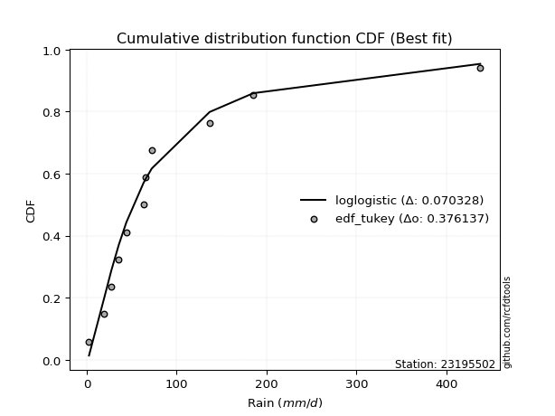</img></img>

</div>


### 8. EDF Gringorten (1963)

Gringorten plotting position formula is essential for estimating the probability and return periods of extreme events like floods and heavy rainfall. The constant _a=0.44_.

<div align="center">


$P=(m-a)/(n+1-2a)$


</div>


**8.1. Empirical values**

<div align="center">

|                | 0                   | 1                   | 2                  | 3                   | 4                   | 5              | 6                  | 7                  | 8                  | 9                  | 10                 |
|:---------------|:--------------------|:--------------------|:-------------------|:--------------------|:--------------------|:---------------|:-------------------|:-------------------|:-------------------|:-------------------|:-------------------|
| date           | 2022                | 2023                | 2021               | 2015                | 2017                | 2016           | 2019               | 2018               | 2025               | 2024               | 2020               |
| x              | 2.55                | 19.62               | 27.36              | 35.75               | 44.13               | 63.2           | 65.57              | 72.39              | 136.7              | 185.3              | 437.61             |
| m              | 1                   | 2                   | 3                  | 4                   | 5                   | 6              | 7                  | 8                  | 9                  | 10                 | 11                 |
| empirical_dist | edf_gringorten      | edf_gringorten      | edf_gringorten     | edf_gringorten      | edf_gringorten      | edf_gringorten | edf_gringorten     | edf_gringorten     | edf_gringorten     | edf_gringorten     | edf_gringorten     |
| empirical      | 0.05035971223021583 | 0.14028776978417268 | 0.2302158273381295 | 0.32014388489208634 | 0.41007194244604317 | 0.5            | 0.5899280575539568 | 0.6798561151079137 | 0.7697841726618706 | 0.8597122302158274 | 0.9496402877697843 |
| empirical_tr   | 1.053030303030303   | 1.1631799163179917  | 1.2990654205607477 | 1.470899470899471   | 1.6951219512195121  | 2.0            | 2.43859649122807   | 3.1235955056179776 | 4.343750000000002  | 7.128205128205133  | 19.857142857142893 |

</div>


**8.2. Kolmogorov-Smirnov fit test (sorted by Δ)**


<div align="center">

|                | 0                   | 1                   | 2                   | 3                   | 4                   | 5                   | 6                   | 7                   | 8                   | 9                   | 10                  | 11                  | 12                  | 13                  | 14                  | 15                  | 16                  | 17                  | 18                  | 19                  | 20                  | 21                  | 22                  | 23                  | 24                  | 25                  | 26                  | 27                  | 28                  | 29                  | 30                  | 31                  | 32                  | 33                  | 34                  | 35                  | 36                  | 37                  | 38                  | 39                  | 40                  | 41                  | 42                  | 43                  | 44                  | 45                  | 46                  | 47                  | 48                  | 49                  | 50                  | 51                  | 52                  | 53                  | 54                  | 55                  | 56                  | 57                  | 58                  | 59                  | 60                  | 61                  | 62                  | 63                  | 64                  | 65                  | 66                  | 67                  | 68                  | 69                  | 70                  | 71                  | 72                  | 73                  | 74                  | 75                  | 76                  | 77                  | 78                  | 79                  | 80                  | 81                  | 82                  | 83                  | 84                  | 85                  | 86                  | 87                  | 88                  | 89                  | 90                  | 91                  | 92                  | 93                  | 94                  | 95                  | 96                  | 97                  | 98                  | 99                  | 100                 | 101                 | 102                 | 103                 | 104                 | 105                 | 106                 | 107                 | 108                 | 109                 | 110                 | 111                 | 112                 | 113                 | 114                 | 115                 | 116                 | 117                 | 118                 | 119                 | 120                 | 121                 | 122                 | 123                 | 124                 | 125                 | 126                 | 127                 | 128                 | 129                 | 130                 | 131                 | 132                 | 133                 | 134                 | 135                 | 136                 | 137                 | 138                 | 139                 | 140                 | 141                 | 142                 | 143                 | 144                 | 145                 | 146                 | 147                 | 148                 | 149                 | 150                 | 151                 | 152                 | 153                 | 154                 | 155                 | 156                 | 157                 | 158                 | 159                 |
|:---------------|:--------------------|:--------------------|:--------------------|:--------------------|:--------------------|:--------------------|:--------------------|:--------------------|:--------------------|:--------------------|:--------------------|:--------------------|:--------------------|:--------------------|:--------------------|:--------------------|:--------------------|:--------------------|:--------------------|:--------------------|:--------------------|:--------------------|:--------------------|:--------------------|:--------------------|:--------------------|:--------------------|:--------------------|:--------------------|:--------------------|:--------------------|:--------------------|:--------------------|:--------------------|:--------------------|:--------------------|:--------------------|:--------------------|:--------------------|:--------------------|:--------------------|:--------------------|:--------------------|:--------------------|:--------------------|:--------------------|:--------------------|:--------------------|:--------------------|:--------------------|:--------------------|:--------------------|:--------------------|:--------------------|:--------------------|:--------------------|:--------------------|:--------------------|:--------------------|:--------------------|:--------------------|:--------------------|:--------------------|:--------------------|:--------------------|:--------------------|:--------------------|:--------------------|:--------------------|:--------------------|:--------------------|:--------------------|:--------------------|:--------------------|:--------------------|:--------------------|:--------------------|:--------------------|:--------------------|:--------------------|:--------------------|:--------------------|:--------------------|:--------------------|:--------------------|:--------------------|:--------------------|:--------------------|:--------------------|:--------------------|:--------------------|:--------------------|:--------------------|:--------------------|:--------------------|:--------------------|:--------------------|:--------------------|:--------------------|:--------------------|:--------------------|:--------------------|:--------------------|:--------------------|:--------------------|:--------------------|:--------------------|:--------------------|:--------------------|:--------------------|:--------------------|:--------------------|:--------------------|:--------------------|:--------------------|:--------------------|:--------------------|:--------------------|:--------------------|:--------------------|:--------------------|:--------------------|:--------------------|:--------------------|:--------------------|:--------------------|:--------------------|:--------------------|:--------------------|:--------------------|:--------------------|:--------------------|:--------------------|:--------------------|:--------------------|:--------------------|:--------------------|:--------------------|:--------------------|:--------------------|:--------------------|:--------------------|:--------------------|:--------------------|:--------------------|:--------------------|:--------------------|:--------------------|:--------------------|:--------------------|:--------------------|:--------------------|:--------------------|:--------------------|:--------------------|:--------------------|:--------------------|:--------------------|:--------------------|:--------------------|
| station        | 23195502            | 23195502            | 23195502            | 23195502            | 23195502            | 23195502            | 23195502            | 23195502            | 23195502            | 23195502            | 23195502            | 23195502            | 23195502            | 23195502            | 23195502            | 23195502            | 23195502            | 23195502            | 23195502            | 23195502            | 23195502            | 23195502            | 23195502            | 23195502            | 23195502            | 23195502            | 23195502            | 23195502            | 23195502            | 23195502            | 23195502            | 23195502            | 23195502            | 23195502            | 23195502            | 23195502            | 23195502            | 23195502            | 23195502            | 23195502            | 23195502            | 23195502            | 23195502            | 23195502            | 23195502            | 23195502            | 23195502            | 23195502            | 23195502            | 23195502            | 23195502            | 23195502            | 23195502            | 23195502            | 23195502            | 23195502            | 23195502            | 23195502            | 23195502            | 23195502            | 23195502            | 23195502            | 23195502            | 23195502            | 23195502            | 23195502            | 23195502            | 23195502            | 23195502            | 23195502            | 23195502            | 23195502            | 23195502            | 23195502            | 23195502            | 23195502            | 23195502            | 23195502            | 23195502            | 23195502            | 23195502            | 23195502            | 23195502            | 23195502            | 23195502            | 23195502            | 23195502            | 23195502            | 23195502            | 23195502            | 23195502            | 23195502            | 23195502            | 23195502            | 23195502            | 23195502            | 23195502            | 23195502            | 23195502            | 23195502            | 23195502            | 23195502            | 23195502            | 23195502            | 23195502            | 23195502            | 23195502            | 23195502            | 23195502            | 23195502            | 23195502            | 23195502            | 23195502            | 23195502            | 23195502            | 23195502            | 23195502            | 23195502            | 23195502            | 23195502            | 23195502            | 23195502            | 23195502            | 23195502            | 23195502            | 23195502            | 23195502            | 23195502            | 23195502            | 23195502            | 23195502            | 23195502            | 23195502            | 23195502            | 23195502            | 23195502            | 23195502            | 23195502            | 23195502            | 23195502            | 23195502            | 23195502            | 23195502            | 23195502            | 23195502            | 23195502            | 23195502            | 23195502            | 23195502            | 23195502            | 23195502            | 23195502            | 23195502            | 23195502            | 23195502            | 23195502            | 23195502            | 23195502            | 23195502            | 23195502            |
| empirical_dist | edf_gringorten      | edf_gringorten      | edf_gringorten      | edf_gringorten      | edf_gringorten      | edf_gringorten      | edf_gringorten      | edf_gringorten      | edf_gringorten      | edf_gringorten      | edf_gringorten      | edf_gringorten      | edf_gringorten      | edf_gringorten      | edf_gringorten      | edf_gringorten      | edf_gringorten      | edf_gringorten      | edf_gringorten      | edf_gringorten      | edf_gringorten      | edf_gringorten      | edf_gringorten      | edf_gringorten      | edf_gringorten      | edf_gringorten      | edf_gringorten      | edf_gringorten      | edf_gringorten      | edf_gringorten      | edf_gringorten      | edf_gringorten      | edf_gringorten      | edf_gringorten      | edf_gringorten      | edf_gringorten      | edf_gringorten      | edf_gringorten      | edf_gringorten      | edf_gringorten      | edf_gringorten      | edf_gringorten      | edf_gringorten      | edf_gringorten      | edf_gringorten      | edf_gringorten      | edf_gringorten      | edf_gringorten      | edf_gringorten      | edf_gringorten      | edf_gringorten      | edf_gringorten      | edf_gringorten      | edf_gringorten      | edf_gringorten      | edf_gringorten      | edf_gringorten      | edf_gringorten      | edf_gringorten      | edf_gringorten      | edf_gringorten      | edf_gringorten      | edf_gringorten      | edf_gringorten      | edf_gringorten      | edf_gringorten      | edf_gringorten      | edf_gringorten      | edf_gringorten      | edf_gringorten      | edf_gringorten      | edf_gringorten      | edf_gringorten      | edf_gringorten      | edf_gringorten      | edf_gringorten      | edf_gringorten      | edf_gringorten      | edf_gringorten      | edf_gringorten      | edf_gringorten      | edf_gringorten      | edf_gringorten      | edf_gringorten      | edf_gringorten      | edf_gringorten      | edf_gringorten      | edf_gringorten      | edf_gringorten      | edf_gringorten      | edf_gringorten      | edf_gringorten      | edf_gringorten      | edf_gringorten      | edf_gringorten      | edf_gringorten      | edf_gringorten      | edf_gringorten      | edf_gringorten      | edf_gringorten      | edf_gringorten      | edf_gringorten      | edf_gringorten      | edf_gringorten      | edf_gringorten      | edf_gringorten      | edf_gringorten      | edf_gringorten      | edf_gringorten      | edf_gringorten      | edf_gringorten      | edf_gringorten      | edf_gringorten      | edf_gringorten      | edf_gringorten      | edf_gringorten      | edf_gringorten      | edf_gringorten      | edf_gringorten      | edf_gringorten      | edf_gringorten      | edf_gringorten      | edf_gringorten      | edf_gringorten      | edf_gringorten      | edf_gringorten      | edf_gringorten      | edf_gringorten      | edf_gringorten      | edf_gringorten      | edf_gringorten      | edf_gringorten      | edf_gringorten      | edf_gringorten      | edf_gringorten      | edf_gringorten      | edf_gringorten      | edf_gringorten      | edf_gringorten      | edf_gringorten      | edf_gringorten      | edf_gringorten      | edf_gringorten      | edf_gringorten      | edf_gringorten      | edf_gringorten      | edf_gringorten      | edf_gringorten      | edf_gringorten      | edf_gringorten      | edf_gringorten      | edf_gringorten      | edf_gringorten      | edf_gringorten      | edf_gringorten      | edf_gringorten      | edf_gringorten      | edf_gringorten      | edf_gringorten      | edf_gringorten      |
| p_dist         | loglogistic         | logfoldnorm         | logvonmises_line    | loghypsecant        | logtukeylambda      | logfatiguelife      | invweibull          | genextreme          | nct                 | lognorm             | logcrystalball      | logexponnorm        | logf                | logrice             | logt                | lognct              | invgamma            | logjohnsonsu        | logbetaprime        | kappa3              | loggenlogistic      | logerlang           | logburr             | logmielke           | loggamma            | loggamma            | logalpha            | johnsonsu           | loginvgamma         | loglaplace          | loglaplace          | ncf                 | logskewnorm         | invgauss            | lomax               | genpareto           | loginvgauss         | logmaxwell          | loggennorm          | mielke              | logexponweib        | loganglit           | dgamma              | logjohnsonsb        | logloggamma         | loggengamma         | logburr12           | logweibull_min      | logbeta             | logexponpow         | fatiguelife         | lograyleigh         | logpearson3         | wald                | loggenextreme       | gengamma            | logdweibull         | betaprime           | gennorm             | logsemicircular     | logncf              | logloglaplace       | gausshyper          | logargus            | loggumbel_r         | truncpareto         | burr12              | loggumbel_l         | pearson3            | lognakagami         | logdgamma           | t                   | loghalfnorm         | loginvweibull       | logcosine           | logtruncweibull_min | exponweib           | logmoyal            | truncweibull_min    | loghalflogistic     | exponnorm           | gompertz            | genexpon            | halflogistic        | nakagami            | logarcsine          | burr                | loggenhalflogistic  | dweibull            | weibull_min         | moyal               | f                   | loggausshyper       | truncnorm           | gamma               | halfnorm            | erlang              | vonmises_line       | logkstwobign        | cosine              | loggompertz         | genlogistic         | gumbel_r            | logtriang           | loggenpareto        | rayleigh            | loggenexpon         | logwald             | foldnorm            | maxwell             | exponpow            | semicircular        | arcsine             | logkappa3           | loguniform          | anglit              | halfgennorm         | logwrapcauchy       | kstwobign           | crystalball         | norm                | beta                | logksone            | logistic            | logkappa4           | logtrapezoid        | hypsecant           | johnsonsb           | rice                | loglevy_l           | laplace             | logtruncnorm        | skewnorm            | logbradford         | gumbel_l            | wrapcauchy          | logweibull_max      | logtruncexpon       | loglomax            | bradford            | argus               | powerlaw            | loghalfgennorm      | truncexpon          | triang              | levy_l              | ksone               | kappa4              | rdist               | uniform             | alpha               | logrdist            | tukeylambda         | genhalflogistic     | logpowerlaw         | trapezoid           | weibull_max         | logtruncpareto      | logvonmises         | vonmises            |
| delta          | 0.0703282832092097  | 0.07457903284110068 | 0.0761031994193887  | 0.07729458555844793 | 0.07919794400484315 | 0.08236139439152118 | 0.0824734953379398  | 0.08247361063401104 | 0.08260637329297316 | 0.08314526724456811 | 0.08314526811037468 | 0.0831464943012635  | 0.08355150623119648 | 0.08356268846827977 | 0.08391003110339135 | 0.08444730681147697 | 0.08600378674218101 | 0.08823801534885134 | 0.08914501205067268 | 0.09050945605261296 | 0.09236899620642847 | 0.09240314892937807 | 0.09294198480393956 | 0.0936378956683025  | 0.0937396379752791  | 0.0937396379752791  | 0.09484552953995967 | 0.09655493846602259 | 0.09768480639321586 | 0.0990626243870556  | 0.0990626243870556  | 0.10074831665221406 | 0.10123086132728742 | 0.10281535153857879 | 0.10337867486736907 | 0.10337938711034944 | 0.1042519136053327  | 0.10702288680833189 | 0.10703122256225095 | 0.11032362522092087 | 0.11060702454094562 | 0.11125788710425616 | 0.1115365133127475  | 0.11166929159218097 | 0.11167000888685308 | 0.1118483985671036  | 0.11257359865433592 | 0.11260989659212339 | 0.11316517456777131 | 0.11758457078209372 | 0.11821318801048986 | 0.11828311301441413 | 0.11836165712885172 | 0.11929818030445405 | 0.12135715725430918 | 0.1214524741545267  | 0.12157713097750933 | 0.1224642963616927  | 0.12320721725546396 | 0.12356223295143665 | 0.12360287944167486 | 0.12580573662167138 | 0.126190574600071   | 0.12627047178954975 | 0.13155448642101542 | 0.1349647043244444  | 0.1352526368235285  | 0.13541376739832645 | 0.13922847215849044 | 0.14028776978383842 | 0.1458110182368897  | 0.14991991060530663 | 0.1502138565053896  | 0.1506036107777235  | 0.1514406481098861  | 0.15318423334366155 | 0.15377822979860667 | 0.15597183246388424 | 0.158583813979019   | 0.16011213246419115 | 0.160981095828729   | 0.16270221020721976 | 0.16500414666436192 | 0.17094710897358112 | 0.17286898142834    | 0.17894018906302078 | 0.18020607377819753 | 0.1804081234959804  | 0.18071025181626477 | 0.18257991299018578 | 0.18377163215321668 | 0.18485375581165187 | 0.18658150774358934 | 0.1876990856493534  | 0.19022595459200797 | 0.19046400677282121 | 0.19433334542934189 | 0.19502037419234525 | 0.19926265629752898 | 0.1997639313999452  | 0.2066367336822787  | 0.20724264565981132 | 0.20738756088706295 | 0.21720675233455872 | 0.21970172661249432 | 0.2225894258698825  | 0.22273173196943352 | 0.22374070443723781 | 0.2249608846848823  | 0.23484493794117606 | 0.2415950620532934  | 0.2514901276696749  | 0.25412500242813674 | 0.2562743146987303  | 0.2562842423104301  | 0.25664272939894084 | 0.25853442660010373 | 0.2613528440887714  | 0.2678734685164462  | 0.26907024613773267 | 0.2690702557169406  | 0.2705276295681036  | 0.27352224029466304 | 0.2807174134870255  | 0.2831944673729356  | 0.2889127489079295  | 0.2903309727808651  | 0.2954012456024434  | 0.3048709513599678  | 0.31313568204211506 | 0.3163961653412699  | 0.3235813787992942  | 0.3275173051092517  | 0.3354402183383569  | 0.33661606103007885 | 0.3840605186282334  | 0.3875839719587436  | 0.3895819077387961  | 0.40673330366852645 | 0.4069365883262504  | 0.41249683256205594 | 0.4132377321507228  | 0.4135576102398322  | 0.4235552073323894  | 0.43583656537735693 | 0.45718153184623833 | 0.462748130002411   | 0.494591904079829   | 0.515508590532456   | 0.5193265329813104  | 0.5290286695546227  | 0.5417017894932971  | 0.5421449482658242  | 0.5580324613631985  | 0.6495924949744379  | 0.6684780681601151  | 0.7325465065495638  | 0.8146455373818071  | 1.0008749739454414  | 68.77432812179475   |
| deltao         | 0.37613735880099997 | 0.37613735880099997 | 0.37613735880099997 | 0.37613735880099997 | 0.37613735880099997 | 0.37613735880099997 | 0.37613735880099997 | 0.37613735880099997 | 0.37613735880099997 | 0.37613735880099997 | 0.37613735880099997 | 0.37613735880099997 | 0.37613735880099997 | 0.37613735880099997 | 0.37613735880099997 | 0.37613735880099997 | 0.37613735880099997 | 0.37613735880099997 | 0.37613735880099997 | 0.37613735880099997 | 0.37613735880099997 | 0.37613735880099997 | 0.37613735880099997 | 0.37613735880099997 | 0.37613735880099997 | 0.37613735880099997 | 0.37613735880099997 | 0.37613735880099997 | 0.37613735880099997 | 0.37613735880099997 | 0.37613735880099997 | 0.37613735880099997 | 0.37613735880099997 | 0.37613735880099997 | 0.37613735880099997 | 0.37613735880099997 | 0.37613735880099997 | 0.37613735880099997 | 0.37613735880099997 | 0.37613735880099997 | 0.37613735880099997 | 0.37613735880099997 | 0.37613735880099997 | 0.37613735880099997 | 0.37613735880099997 | 0.37613735880099997 | 0.37613735880099997 | 0.37613735880099997 | 0.37613735880099997 | 0.37613735880099997 | 0.37613735880099997 | 0.37613735880099997 | 0.37613735880099997 | 0.37613735880099997 | 0.37613735880099997 | 0.37613735880099997 | 0.37613735880099997 | 0.37613735880099997 | 0.37613735880099997 | 0.37613735880099997 | 0.37613735880099997 | 0.37613735880099997 | 0.37613735880099997 | 0.37613735880099997 | 0.37613735880099997 | 0.37613735880099997 | 0.37613735880099997 | 0.37613735880099997 | 0.37613735880099997 | 0.37613735880099997 | 0.37613735880099997 | 0.37613735880099997 | 0.37613735880099997 | 0.37613735880099997 | 0.37613735880099997 | 0.37613735880099997 | 0.37613735880099997 | 0.37613735880099997 | 0.37613735880099997 | 0.37613735880099997 | 0.37613735880099997 | 0.37613735880099997 | 0.37613735880099997 | 0.37613735880099997 | 0.37613735880099997 | 0.37613735880099997 | 0.37613735880099997 | 0.37613735880099997 | 0.37613735880099997 | 0.37613735880099997 | 0.37613735880099997 | 0.37613735880099997 | 0.37613735880099997 | 0.37613735880099997 | 0.37613735880099997 | 0.37613735880099997 | 0.37613735880099997 | 0.37613735880099997 | 0.37613735880099997 | 0.37613735880099997 | 0.37613735880099997 | 0.37613735880099997 | 0.37613735880099997 | 0.37613735880099997 | 0.37613735880099997 | 0.37613735880099997 | 0.37613735880099997 | 0.37613735880099997 | 0.37613735880099997 | 0.37613735880099997 | 0.37613735880099997 | 0.37613735880099997 | 0.37613735880099997 | 0.37613735880099997 | 0.37613735880099997 | 0.37613735880099997 | 0.37613735880099997 | 0.37613735880099997 | 0.37613735880099997 | 0.37613735880099997 | 0.37613735880099997 | 0.37613735880099997 | 0.37613735880099997 | 0.37613735880099997 | 0.37613735880099997 | 0.37613735880099997 | 0.37613735880099997 | 0.37613735880099997 | 0.37613735880099997 | 0.37613735880099997 | 0.37613735880099997 | 0.37613735880099997 | 0.37613735880099997 | 0.37613735880099997 | 0.37613735880099997 | 0.37613735880099997 | 0.37613735880099997 | 0.37613735880099997 | 0.37613735880099997 | 0.37613735880099997 | 0.37613735880099997 | 0.37613735880099997 | 0.37613735880099997 | 0.37613735880099997 | 0.37613735880099997 | 0.37613735880099997 | 0.37613735880099997 | 0.37613735880099997 | 0.37613735880099997 | 0.37613735880099997 | 0.37613735880099997 | 0.37613735880099997 | 0.37613735880099997 | 0.37613735880099997 | 0.37613735880099997 | 0.37613735880099997 | 0.37613735880099997 | 0.37613735880099997 | 0.37613735880099997 | 0.37613735880099997 |
| eval           | Δo > Δ              | Δo > Δ              | Δo > Δ              | Δo > Δ              | Δo > Δ              | Δo > Δ              | Δo > Δ              | Δo > Δ              | Δo > Δ              | Δo > Δ              | Δo > Δ              | Δo > Δ              | Δo > Δ              | Δo > Δ              | Δo > Δ              | Δo > Δ              | Δo > Δ              | Δo > Δ              | Δo > Δ              | Δo > Δ              | Δo > Δ              | Δo > Δ              | Δo > Δ              | Δo > Δ              | Δo > Δ              | Δo > Δ              | Δo > Δ              | Δo > Δ              | Δo > Δ              | Δo > Δ              | Δo > Δ              | Δo > Δ              | Δo > Δ              | Δo > Δ              | Δo > Δ              | Δo > Δ              | Δo > Δ              | Δo > Δ              | Δo > Δ              | Δo > Δ              | Δo > Δ              | Δo > Δ              | Δo > Δ              | Δo > Δ              | Δo > Δ              | Δo > Δ              | Δo > Δ              | Δo > Δ              | Δo > Δ              | Δo > Δ              | Δo > Δ              | Δo > Δ              | Δo > Δ              | Δo > Δ              | Δo > Δ              | Δo > Δ              | Δo > Δ              | Δo > Δ              | Δo > Δ              | Δo > Δ              | Δo > Δ              | Δo > Δ              | Δo > Δ              | Δo > Δ              | Δo > Δ              | Δo > Δ              | Δo > Δ              | Δo > Δ              | Δo > Δ              | Δo > Δ              | Δo > Δ              | Δo > Δ              | Δo > Δ              | Δo > Δ              | Δo > Δ              | Δo > Δ              | Δo > Δ              | Δo > Δ              | Δo > Δ              | Δo > Δ              | Δo > Δ              | Δo > Δ              | Δo > Δ              | Δo > Δ              | Δo > Δ              | Δo > Δ              | Δo > Δ              | Δo > Δ              | Δo > Δ              | Δo > Δ              | Δo > Δ              | Δo > Δ              | Δo > Δ              | Δo > Δ              | Δo > Δ              | Δo > Δ              | Δo > Δ              | Δo > Δ              | Δo > Δ              | Δo > Δ              | Δo > Δ              | Δo > Δ              | Δo > Δ              | Δo > Δ              | Δo > Δ              | Δo > Δ              | Δo > Δ              | Δo > Δ              | Δo > Δ              | Δo > Δ              | Δo > Δ              | Δo > Δ              | Δo > Δ              | Δo > Δ              | Δo > Δ              | Δo > Δ              | Δo > Δ              | Δo > Δ              | Δo > Δ              | Δo > Δ              | Δo > Δ              | Δo > Δ              | Δo > Δ              | Δo > Δ              | Δo > Δ              | Δo > Δ              | Δo > Δ              | Δo > Δ              | Δo > Δ              | Δo > Δ              | Δo > Δ              | Δo > Δ              | Δo > Δ              | Δo > Δ              | Δo > Δ              | Δo <= Δ             | Δo <= Δ             | Δo <= Δ             | Δo <= Δ             | Δo <= Δ             | Δo <= Δ             | Δo <= Δ             | Δo <= Δ             | Δo <= Δ             | Δo <= Δ             | Δo <= Δ             | Δo <= Δ             | Δo <= Δ             | Δo <= Δ             | Δo <= Δ             | Δo <= Δ             | Δo <= Δ             | Δo <= Δ             | Δo <= Δ             | Δo <= Δ             | Δo <= Δ             | Δo <= Δ             | Δo <= Δ             | Δo <= Δ             | Δo <= Δ             |
| fit            | 1                   | 1                   | 1                   | 1                   | 1                   | 1                   | 1                   | 1                   | 1                   | 1                   | 1                   | 1                   | 1                   | 1                   | 1                   | 1                   | 1                   | 1                   | 1                   | 1                   | 1                   | 1                   | 1                   | 1                   | 1                   | 1                   | 1                   | 1                   | 1                   | 1                   | 1                   | 1                   | 1                   | 1                   | 1                   | 1                   | 1                   | 1                   | 1                   | 1                   | 1                   | 1                   | 1                   | 1                   | 1                   | 1                   | 1                   | 1                   | 1                   | 1                   | 1                   | 1                   | 1                   | 1                   | 1                   | 1                   | 1                   | 1                   | 1                   | 1                   | 1                   | 1                   | 1                   | 1                   | 1                   | 1                   | 1                   | 1                   | 1                   | 1                   | 1                   | 1                   | 1                   | 1                   | 1                   | 1                   | 1                   | 1                   | 1                   | 1                   | 1                   | 1                   | 1                   | 1                   | 1                   | 1                   | 1                   | 1                   | 1                   | 1                   | 1                   | 1                   | 1                   | 1                   | 1                   | 1                   | 1                   | 1                   | 1                   | 1                   | 1                   | 1                   | 1                   | 1                   | 1                   | 1                   | 1                   | 1                   | 1                   | 1                   | 1                   | 1                   | 1                   | 1                   | 1                   | 1                   | 1                   | 1                   | 1                   | 1                   | 1                   | 1                   | 1                   | 1                   | 1                   | 1                   | 1                   | 1                   | 1                   | 1                   | 1                   | 1                   | 1                   | 1                   | 1                   | 0                   | 0                   | 0                   | 0                   | 0                   | 0                   | 0                   | 0                   | 0                   | 0                   | 0                   | 0                   | 0                   | 0                   | 0                   | 0                   | 0                   | 0                   | 0                   | 0                   | 0                   | 0                   | 0                   | 0                   | 0                   |
| n              | 11                  | 11                  | 11                  | 11                  | 11                  | 11                  | 11                  | 11                  | 11                  | 11                  | 11                  | 11                  | 11                  | 11                  | 11                  | 11                  | 11                  | 11                  | 11                  | 11                  | 11                  | 11                  | 11                  | 11                  | 11                  | 11                  | 11                  | 11                  | 11                  | 11                  | 11                  | 11                  | 11                  | 11                  | 11                  | 11                  | 11                  | 11                  | 11                  | 11                  | 11                  | 11                  | 11                  | 11                  | 11                  | 11                  | 11                  | 11                  | 11                  | 11                  | 11                  | 11                  | 11                  | 11                  | 11                  | 11                  | 11                  | 11                  | 11                  | 11                  | 11                  | 11                  | 11                  | 11                  | 11                  | 11                  | 11                  | 11                  | 11                  | 11                  | 11                  | 11                  | 11                  | 11                  | 11                  | 11                  | 11                  | 11                  | 11                  | 11                  | 11                  | 11                  | 11                  | 11                  | 11                  | 11                  | 11                  | 11                  | 11                  | 11                  | 11                  | 11                  | 11                  | 11                  | 11                  | 11                  | 11                  | 11                  | 11                  | 11                  | 11                  | 11                  | 11                  | 11                  | 11                  | 11                  | 11                  | 11                  | 11                  | 11                  | 11                  | 11                  | 11                  | 11                  | 11                  | 11                  | 11                  | 11                  | 11                  | 11                  | 11                  | 11                  | 11                  | 11                  | 11                  | 11                  | 11                  | 11                  | 11                  | 11                  | 11                  | 11                  | 11                  | 11                  | 11                  | 11                  | 11                  | 11                  | 11                  | 11                  | 11                  | 11                  | 11                  | 11                  | 11                  | 11                  | 11                  | 11                  | 11                  | 11                  | 11                  | 11                  | 11                  | 11                  | 11                  | 11                  | 11                  | 11                  | 11                  | 11                  |
| best_fit       | 1                   | 0                   | 0                   | 0                   | 0                   | 0                   | 0                   | 0                   | 0                   | 0                   | 0                   | 0                   | 0                   | 0                   | 0                   | 0                   | 0                   | 0                   | 0                   | 0                   | 0                   | 0                   | 0                   | 0                   | 0                   | 0                   | 0                   | 0                   | 0                   | 0                   | 0                   | 0                   | 0                   | 0                   | 0                   | 0                   | 0                   | 0                   | 0                   | 0                   | 0                   | 0                   | 0                   | 0                   | 0                   | 0                   | 0                   | 0                   | 0                   | 0                   | 0                   | 0                   | 0                   | 0                   | 0                   | 0                   | 0                   | 0                   | 0                   | 0                   | 0                   | 0                   | 0                   | 0                   | 0                   | 0                   | 0                   | 0                   | 0                   | 0                   | 0                   | 0                   | 0                   | 0                   | 0                   | 0                   | 0                   | 0                   | 0                   | 0                   | 0                   | 0                   | 0                   | 0                   | 0                   | 0                   | 0                   | 0                   | 0                   | 0                   | 0                   | 0                   | 0                   | 0                   | 0                   | 0                   | 0                   | 0                   | 0                   | 0                   | 0                   | 0                   | 0                   | 0                   | 0                   | 0                   | 0                   | 0                   | 0                   | 0                   | 0                   | 0                   | 0                   | 0                   | 0                   | 0                   | 0                   | 0                   | 0                   | 0                   | 0                   | 0                   | 0                   | 0                   | 0                   | 0                   | 0                   | 0                   | 0                   | 0                   | 0                   | 0                   | 0                   | 0                   | 0                   | 0                   | 0                   | 0                   | 0                   | 0                   | 0                   | 0                   | 0                   | 0                   | 0                   | 0                   | 0                   | 0                   | 0                   | 0                   | 0                   | 0                   | 0                   | 0                   | 0                   | 0                   | 0                   | 0                   | 0                   | 0                   |
| best_fit_sort  | 1                   | 2                   | 3                   | 4                   | 5                   | 6                   | 7                   | 8                   | 9                   | 10                  | 11                  | 12                  | 13                  | 14                  | 15                  | 16                  | 17                  | 18                  | 19                  | 20                  | 21                  | 22                  | 23                  | 24                  | 25                  | 26                  | 27                  | 28                  | 29                  | 30                  | 31                  | 32                  | 33                  | 34                  | 35                  | 36                  | 37                  | 38                  | 39                  | 40                  | 41                  | 42                  | 43                  | 44                  | 45                  | 46                  | 47                  | 48                  | 49                  | 50                  | 51                  | 52                  | 53                  | 54                  | 55                  | 56                  | 57                  | 58                  | 59                  | 60                  | 61                  | 62                  | 63                  | 64                  | 65                  | 66                  | 67                  | 68                  | 69                  | 70                  | 71                  | 72                  | 73                  | 74                  | 75                  | 76                  | 77                  | 78                  | 79                  | 80                  | 81                  | 82                  | 83                  | 84                  | 85                  | 86                  | 87                  | 88                  | 89                  | 90                  | 91                  | 92                  | 93                  | 94                  | 95                  | 96                  | 97                  | 98                  | 99                  | 100                 | 101                 | 102                 | 103                 | 104                 | 105                 | 106                 | 107                 | 108                 | 109                 | 110                 | 111                 | 112                 | 113                 | 114                 | 115                 | 116                 | 117                 | 118                 | 119                 | 120                 | 121                 | 122                 | 123                 | 124                 | 125                 | 126                 | 127                 | 128                 | 129                 | 130                 | 131                 | 132                 | 133                 | 134                 | 135                 | 136                 | 137                 | 138                 | 139                 | 140                 | 141                 | 142                 | 143                 | 144                 | 145                 | 146                 | 147                 | 148                 | 149                 | 150                 | 151                 | 152                 | 153                 | 154                 | 155                 | 156                 | 157                 | 158                 | 159                 | 160                 |

</div>


**8.3. Best fit**

<div align="center">

|   id |   station | empirical_dist   | p_dist      |     delta |   deltao | eval   |   fit |   n |   best_fit |   best_fit_sort |
|-----:|----------:|:-----------------|:------------|----------:|---------:|:-------|------:|----:|-----------:|----------------:|
|    0 |  23195502 | edf_gringorten   | loglogistic | 0.0703283 | 0.376137 | Δo > Δ |     1 |  11 |          1 |               1 |

</div>


<div align="center">

</img></img>

</div>


### 9. EDF Filliben (1975)

The specific values of the constants (0.3175) (often denoted as $alpha$) and (0.365) are derived from a method proposed by James J. Filliben in a 1975 paper. This particular formula is the mean value of the $i$-th order statistic of the normal distribution and is considered a robust and effective plotting position formula for the normal probability plot correlation coefficient test for normality.

<div align="center">


$P=(m-0.3175)/(n+0.365)$


</div>


**9.1. Empirical values**

<div align="center">

|                | 0                    | 1                   | 2                   | 3                  | 4                   | 5            | 6                  | 7                  | 8                  | 9                  | 10                 |
|:---------------|:---------------------|:--------------------|:--------------------|:-------------------|:--------------------|:-------------|:-------------------|:-------------------|:-------------------|:-------------------|:-------------------|
| date           | 2022                 | 2023                | 2021                | 2015               | 2017                | 2016         | 2019               | 2018               | 2025               | 2024               | 2020               |
| x              | 2.55                 | 19.62               | 27.36               | 35.75              | 44.13               | 63.2         | 65.57              | 72.39              | 136.7              | 185.3              | 437.61             |
| m              | 1                    | 2                   | 3                   | 4                  | 5                   | 6            | 7                  | 8                  | 9                  | 10                 | 11                 |
| empirical_dist | edf_filliben         | edf_filliben        | edf_filliben        | edf_filliben       | edf_filliben        | edf_filliben | edf_filliben       | edf_filliben       | edf_filliben       | edf_filliben       | edf_filliben       |
| empirical      | 0.060052793664760226 | 0.14804223493180818 | 0.23603167619885615 | 0.3240211174659041 | 0.41201055873295206 | 0.5          | 0.587989441267048  | 0.6759788825340959 | 0.7639683238011438 | 0.8519577650681918 | 0.9399472063352396 |
| empirical_tr   | 1.063889538965598    | 1.173767105602892   | 1.3089547941261157  | 1.4793361535958347 | 1.7007108118219232  | 2.0          | 2.4271222637479983 | 3.08621860149355   | 4.236719478098787  | 6.754829123328378  | 16.652014652014618 |

</div>


**9.2. Kolmogorov-Smirnov fit test (sorted by Δ)**


<div align="center">

|                | 0                   | 1                   | 2                   | 3                   | 4                   | 5                   | 6                   | 7                   | 8                   | 9                   | 10                  | 11                  | 12                  | 13                  | 14                  | 15                  | 16                  | 17                  | 18                  | 19                  | 20                  | 21                  | 22                  | 23                  | 24                  | 25                  | 26                  | 27                  | 28                  | 29                  | 30                  | 31                  | 32                  | 33                  | 34                  | 35                  | 36                  | 37                  | 38                  | 39                  | 40                  | 41                  | 42                  | 43                  | 44                  | 45                  | 46                  | 47                  | 48                  | 49                  | 50                  | 51                  | 52                  | 53                  | 54                  | 55                  | 56                  | 57                  | 58                  | 59                  | 60                  | 61                  | 62                  | 63                  | 64                  | 65                  | 66                  | 67                  | 68                  | 69                  | 70                  | 71                  | 72                  | 73                  | 74                  | 75                  | 76                  | 77                  | 78                  | 79                  | 80                  | 81                  | 82                  | 83                  | 84                  | 85                  | 86                  | 87                  | 88                  | 89                  | 90                  | 91                  | 92                  | 93                  | 94                  | 95                  | 96                  | 97                  | 98                  | 99                  | 100                 | 101                 | 102                 | 103                 | 104                 | 105                 | 106                 | 107                 | 108                 | 109                 | 110                 | 111                 | 112                 | 113                 | 114                 | 115                 | 116                 | 117                 | 118                 | 119                 | 120                 | 121                 | 122                 | 123                 | 124                 | 125                 | 126                 | 127                 | 128                 | 129                 | 130                 | 131                 | 132                 | 133                 | 134                 | 135                 | 136                 | 137                 | 138                 | 139                 | 140                 | 141                 | 142                 | 143                 | 144                 | 145                 | 146                 | 147                 | 148                 | 149                 | 150                 | 151                 | 152                 | 153                 | 154                 | 155                 | 156                 | 157                 | 158                 | 159                 |
|:---------------|:--------------------|:--------------------|:--------------------|:--------------------|:--------------------|:--------------------|:--------------------|:--------------------|:--------------------|:--------------------|:--------------------|:--------------------|:--------------------|:--------------------|:--------------------|:--------------------|:--------------------|:--------------------|:--------------------|:--------------------|:--------------------|:--------------------|:--------------------|:--------------------|:--------------------|:--------------------|:--------------------|:--------------------|:--------------------|:--------------------|:--------------------|:--------------------|:--------------------|:--------------------|:--------------------|:--------------------|:--------------------|:--------------------|:--------------------|:--------------------|:--------------------|:--------------------|:--------------------|:--------------------|:--------------------|:--------------------|:--------------------|:--------------------|:--------------------|:--------------------|:--------------------|:--------------------|:--------------------|:--------------------|:--------------------|:--------------------|:--------------------|:--------------------|:--------------------|:--------------------|:--------------------|:--------------------|:--------------------|:--------------------|:--------------------|:--------------------|:--------------------|:--------------------|:--------------------|:--------------------|:--------------------|:--------------------|:--------------------|:--------------------|:--------------------|:--------------------|:--------------------|:--------------------|:--------------------|:--------------------|:--------------------|:--------------------|:--------------------|:--------------------|:--------------------|:--------------------|:--------------------|:--------------------|:--------------------|:--------------------|:--------------------|:--------------------|:--------------------|:--------------------|:--------------------|:--------------------|:--------------------|:--------------------|:--------------------|:--------------------|:--------------------|:--------------------|:--------------------|:--------------------|:--------------------|:--------------------|:--------------------|:--------------------|:--------------------|:--------------------|:--------------------|:--------------------|:--------------------|:--------------------|:--------------------|:--------------------|:--------------------|:--------------------|:--------------------|:--------------------|:--------------------|:--------------------|:--------------------|:--------------------|:--------------------|:--------------------|:--------------------|:--------------------|:--------------------|:--------------------|:--------------------|:--------------------|:--------------------|:--------------------|:--------------------|:--------------------|:--------------------|:--------------------|:--------------------|:--------------------|:--------------------|:--------------------|:--------------------|:--------------------|:--------------------|:--------------------|:--------------------|:--------------------|:--------------------|:--------------------|:--------------------|:--------------------|:--------------------|:--------------------|:--------------------|:--------------------|:--------------------|:--------------------|:--------------------|:--------------------|
| station        | 23195502            | 23195502            | 23195502            | 23195502            | 23195502            | 23195502            | 23195502            | 23195502            | 23195502            | 23195502            | 23195502            | 23195502            | 23195502            | 23195502            | 23195502            | 23195502            | 23195502            | 23195502            | 23195502            | 23195502            | 23195502            | 23195502            | 23195502            | 23195502            | 23195502            | 23195502            | 23195502            | 23195502            | 23195502            | 23195502            | 23195502            | 23195502            | 23195502            | 23195502            | 23195502            | 23195502            | 23195502            | 23195502            | 23195502            | 23195502            | 23195502            | 23195502            | 23195502            | 23195502            | 23195502            | 23195502            | 23195502            | 23195502            | 23195502            | 23195502            | 23195502            | 23195502            | 23195502            | 23195502            | 23195502            | 23195502            | 23195502            | 23195502            | 23195502            | 23195502            | 23195502            | 23195502            | 23195502            | 23195502            | 23195502            | 23195502            | 23195502            | 23195502            | 23195502            | 23195502            | 23195502            | 23195502            | 23195502            | 23195502            | 23195502            | 23195502            | 23195502            | 23195502            | 23195502            | 23195502            | 23195502            | 23195502            | 23195502            | 23195502            | 23195502            | 23195502            | 23195502            | 23195502            | 23195502            | 23195502            | 23195502            | 23195502            | 23195502            | 23195502            | 23195502            | 23195502            | 23195502            | 23195502            | 23195502            | 23195502            | 23195502            | 23195502            | 23195502            | 23195502            | 23195502            | 23195502            | 23195502            | 23195502            | 23195502            | 23195502            | 23195502            | 23195502            | 23195502            | 23195502            | 23195502            | 23195502            | 23195502            | 23195502            | 23195502            | 23195502            | 23195502            | 23195502            | 23195502            | 23195502            | 23195502            | 23195502            | 23195502            | 23195502            | 23195502            | 23195502            | 23195502            | 23195502            | 23195502            | 23195502            | 23195502            | 23195502            | 23195502            | 23195502            | 23195502            | 23195502            | 23195502            | 23195502            | 23195502            | 23195502            | 23195502            | 23195502            | 23195502            | 23195502            | 23195502            | 23195502            | 23195502            | 23195502            | 23195502            | 23195502            | 23195502            | 23195502            | 23195502            | 23195502            | 23195502            | 23195502            |
| empirical_dist | edf_filliben        | edf_filliben        | edf_filliben        | edf_filliben        | edf_filliben        | edf_filliben        | edf_filliben        | edf_filliben        | edf_filliben        | edf_filliben        | edf_filliben        | edf_filliben        | edf_filliben        | edf_filliben        | edf_filliben        | edf_filliben        | edf_filliben        | edf_filliben        | edf_filliben        | edf_filliben        | edf_filliben        | edf_filliben        | edf_filliben        | edf_filliben        | edf_filliben        | edf_filliben        | edf_filliben        | edf_filliben        | edf_filliben        | edf_filliben        | edf_filliben        | edf_filliben        | edf_filliben        | edf_filliben        | edf_filliben        | edf_filliben        | edf_filliben        | edf_filliben        | edf_filliben        | edf_filliben        | edf_filliben        | edf_filliben        | edf_filliben        | edf_filliben        | edf_filliben        | edf_filliben        | edf_filliben        | edf_filliben        | edf_filliben        | edf_filliben        | edf_filliben        | edf_filliben        | edf_filliben        | edf_filliben        | edf_filliben        | edf_filliben        | edf_filliben        | edf_filliben        | edf_filliben        | edf_filliben        | edf_filliben        | edf_filliben        | edf_filliben        | edf_filliben        | edf_filliben        | edf_filliben        | edf_filliben        | edf_filliben        | edf_filliben        | edf_filliben        | edf_filliben        | edf_filliben        | edf_filliben        | edf_filliben        | edf_filliben        | edf_filliben        | edf_filliben        | edf_filliben        | edf_filliben        | edf_filliben        | edf_filliben        | edf_filliben        | edf_filliben        | edf_filliben        | edf_filliben        | edf_filliben        | edf_filliben        | edf_filliben        | edf_filliben        | edf_filliben        | edf_filliben        | edf_filliben        | edf_filliben        | edf_filliben        | edf_filliben        | edf_filliben        | edf_filliben        | edf_filliben        | edf_filliben        | edf_filliben        | edf_filliben        | edf_filliben        | edf_filliben        | edf_filliben        | edf_filliben        | edf_filliben        | edf_filliben        | edf_filliben        | edf_filliben        | edf_filliben        | edf_filliben        | edf_filliben        | edf_filliben        | edf_filliben        | edf_filliben        | edf_filliben        | edf_filliben        | edf_filliben        | edf_filliben        | edf_filliben        | edf_filliben        | edf_filliben        | edf_filliben        | edf_filliben        | edf_filliben        | edf_filliben        | edf_filliben        | edf_filliben        | edf_filliben        | edf_filliben        | edf_filliben        | edf_filliben        | edf_filliben        | edf_filliben        | edf_filliben        | edf_filliben        | edf_filliben        | edf_filliben        | edf_filliben        | edf_filliben        | edf_filliben        | edf_filliben        | edf_filliben        | edf_filliben        | edf_filliben        | edf_filliben        | edf_filliben        | edf_filliben        | edf_filliben        | edf_filliben        | edf_filliben        | edf_filliben        | edf_filliben        | edf_filliben        | edf_filliben        | edf_filliben        | edf_filliben        | edf_filliben        | edf_filliben        | edf_filliben        |
| p_dist         | loglogistic         | logfoldnorm         | logfatiguelife      | logtukeylambda      | lognorm             | logcrystalball      | logexponnorm        | logf                | logrice             | logvonmises_line    | lognct              | loghypsecant        | invweibull          | genextreme          | nct                 | logt                | logbetaprime        | invgamma            | logjohnsonsu        | logerlang           | loggamma            | loggamma            | kappa3              | logalpha            | loggenlogistic      | logburr             | logmielke           | loginvgamma         | johnsonsu           | loginvgauss         | ncf                 | logskewnorm         | invgauss            | loglaplace          | loglaplace          | lomax               | genpareto           | logmaxwell          | mielke              | loganglit           | logexponweib        | logjohnsonsb        | logloggamma         | loggengamma         | logburr12           | logweibull_min      | loggennorm          | logbeta             | lograyleigh         | dgamma              | gengamma            | logexponpow         | fatiguelife         | logpearson3         | betaprime           | wald                | logsemicircular     | loggenextreme       | logdweibull         | logncf              | logloglaplace       | gausshyper          | logargus            | gennorm             | burr12              | truncpareto         | loggumbel_l         | loggumbel_r         | pearson3            | loginvweibull       | logcosine           | loghalfnorm         | logtruncweibull_min | exponweib           | logdgamma           | lognakagami         | t                   | truncweibull_min    | logmoyal            | loghalflogistic     | exponnorm           | gompertz            | genexpon            | nakagami            | halflogistic        | dweibull            | logarcsine          | burr                | weibull_min         | loggenhalflogistic  | f                   | loggausshyper       | moyal               | gamma               | truncnorm           | halfnorm            | erlang              | vonmises_line       | logkstwobign        | cosine              | loggompertz         | genlogistic         | gumbel_r            | loggenpareto        | logtriang           | loggenexpon         | foldnorm            | rayleigh            | logwald             | maxwell             | exponpow            | arcsine             | semicircular        | logkappa3           | loguniform          | anglit              | logwrapcauchy       | halfgennorm         | kstwobign           | beta                | crystalball         | norm                | logksone            | logkappa4           | logistic            | logtrapezoid        | hypsecant           | johnsonsb           | rice                | loglevy_l           | laplace             | logtruncnorm        | skewnorm            | logbradford         | gumbel_l            | wrapcauchy          | logweibull_max      | logtruncexpon       | loglomax            | bradford            | powerlaw            | loghalfgennorm      | argus               | truncexpon          | triang              | levy_l              | ksone               | kappa4              | rdist               | uniform             | alpha               | tukeylambda         | logrdist            | genhalflogistic     | logpowerlaw         | trapezoid           | weibull_max         | logtruncpareto      | logvonmises         | vonmises            |
| delta          | 0.0703282832092097  | 0.0707018002672829  | 0.07460692924388568 | 0.07532071143102537 | 0.07539080209693261 | 0.07539080296273917 | 0.075392029153628   | 0.07579704108356097 | 0.07580822332064427 | 0.0761031994193887  | 0.07669284166384147 | 0.07729458555844793 | 0.07859626276412202 | 0.07859637806019326 | 0.07872914071915538 | 0.08003279852957357 | 0.08139054690303718 | 0.08212655416836323 | 0.08436078277503356 | 0.08464868378174256 | 0.08598517282764359 | 0.08598517282764359 | 0.08663222347879518 | 0.08709106439232417 | 0.08849176363261069 | 0.08906475223012178 | 0.08976066309448472 | 0.09087281998912686 | 0.09267770589220481 | 0.0964974484576972  | 0.09687108407839629 | 0.09735362875346965 | 0.09893811896476101 | 0.0990626243870556  | 0.0990626243870556  | 0.09950144229355129 | 0.09950215453653166 | 0.10120703794760524 | 0.10256916007328537 | 0.10350342195662066 | 0.10672979196712784 | 0.1077920590183632  | 0.1077927763130353  | 0.10797116599328582 | 0.10869636608051814 | 0.10873266401830561 | 0.10896983884915984 | 0.10928794199395353 | 0.11246726415368749 | 0.11347512959965639 | 0.1136980090068912  | 0.11370733820827594 | 0.11433595543667208 | 0.11448442455503394 | 0.1147098312140572  | 0.11542094773063627 | 0.11580776780380114 | 0.1174799246804914  | 0.11769989840369155 | 0.11778703058094822 | 0.1219285040478536  | 0.12231334202625321 | 0.12239323921573197 | 0.12514583354237285 | 0.127498171675893   | 0.13108747175062663 | 0.13153653482450867 | 0.13155448642101542 | 0.13478072109465067 | 0.142849145630088   | 0.1436861829622506  | 0.14439800764466296 | 0.14542976819602604 | 0.14602376465097117 | 0.14774963452379858 | 0.14804223493147392 | 0.14991991060530663 | 0.15470658140520122 | 0.15597183246388424 | 0.15623489989037337 | 0.1571038632549112  | 0.15882497763340198 | 0.16112691409054414 | 0.1651145162807045  | 0.16706987639976334 | 0.17101717038172037 | 0.17118572391538528 | 0.17245160863056203 | 0.17482544784255027 | 0.17653089092216262 | 0.17709929066401636 | 0.17882704259595383 | 0.1798943995793989  | 0.18247148944437247 | 0.1838218530755356  | 0.1839908494743736  | 0.1904561128555241  | 0.19114314161852747 | 0.19150819114989348 | 0.19588669882612741 | 0.1988822685346432  | 0.20336541308599354 | 0.20351032831324517 | 0.21194726146485882 | 0.21332951976074094 | 0.21497726682179802 | 0.2152678032503379  | 0.21871219329606473 | 0.22374070443723781 | 0.23096770536735828 | 0.23771782947947562 | 0.24443192099359234 | 0.2476128950958571  | 0.2485198495510948  | 0.24852977716279462 | 0.25276549682512306 | 0.2535983789411359  | 0.25465719402628595 | 0.26399623594262844 | 0.2647677730634877  | 0.2651930135639149  | 0.2651930231431228  | 0.26576777514702754 | 0.2754400022253001  | 0.2768401809132077  | 0.2850355163341117  | 0.28645374020704734 | 0.2876467804548079  | 0.30099371878615    | 0.30364531113726995 | 0.31251893276745213 | 0.3158269136516587  | 0.3236400725354339  | 0.3276857531907214  | 0.33273882845626107 | 0.37630605348059776 | 0.37982950681110794 | 0.3818274425911606  | 0.39897883852089094 | 0.4030593557524326  | 0.4054832670030873  | 0.40580314509219667 | 0.40861959998823816 | 0.4196779747585716  | 0.43104353341477986 | 0.44748845041169394 | 0.4588708974285932  | 0.4907146715060112  | 0.5058155090979116  | 0.5154493004074927  | 0.5232128206938961  | 0.5324518668312798  | 0.5339473243456616  | 0.5502779962155628  | 0.6418380298268025  | 0.6607236030124795  | 0.7247920414019281  | 0.8068910722341716  | 1.0020392172717232  | 68.7840212032293    |
| deltao         | 0.37613735880099997 | 0.37613735880099997 | 0.37613735880099997 | 0.37613735880099997 | 0.37613735880099997 | 0.37613735880099997 | 0.37613735880099997 | 0.37613735880099997 | 0.37613735880099997 | 0.37613735880099997 | 0.37613735880099997 | 0.37613735880099997 | 0.37613735880099997 | 0.37613735880099997 | 0.37613735880099997 | 0.37613735880099997 | 0.37613735880099997 | 0.37613735880099997 | 0.37613735880099997 | 0.37613735880099997 | 0.37613735880099997 | 0.37613735880099997 | 0.37613735880099997 | 0.37613735880099997 | 0.37613735880099997 | 0.37613735880099997 | 0.37613735880099997 | 0.37613735880099997 | 0.37613735880099997 | 0.37613735880099997 | 0.37613735880099997 | 0.37613735880099997 | 0.37613735880099997 | 0.37613735880099997 | 0.37613735880099997 | 0.37613735880099997 | 0.37613735880099997 | 0.37613735880099997 | 0.37613735880099997 | 0.37613735880099997 | 0.37613735880099997 | 0.37613735880099997 | 0.37613735880099997 | 0.37613735880099997 | 0.37613735880099997 | 0.37613735880099997 | 0.37613735880099997 | 0.37613735880099997 | 0.37613735880099997 | 0.37613735880099997 | 0.37613735880099997 | 0.37613735880099997 | 0.37613735880099997 | 0.37613735880099997 | 0.37613735880099997 | 0.37613735880099997 | 0.37613735880099997 | 0.37613735880099997 | 0.37613735880099997 | 0.37613735880099997 | 0.37613735880099997 | 0.37613735880099997 | 0.37613735880099997 | 0.37613735880099997 | 0.37613735880099997 | 0.37613735880099997 | 0.37613735880099997 | 0.37613735880099997 | 0.37613735880099997 | 0.37613735880099997 | 0.37613735880099997 | 0.37613735880099997 | 0.37613735880099997 | 0.37613735880099997 | 0.37613735880099997 | 0.37613735880099997 | 0.37613735880099997 | 0.37613735880099997 | 0.37613735880099997 | 0.37613735880099997 | 0.37613735880099997 | 0.37613735880099997 | 0.37613735880099997 | 0.37613735880099997 | 0.37613735880099997 | 0.37613735880099997 | 0.37613735880099997 | 0.37613735880099997 | 0.37613735880099997 | 0.37613735880099997 | 0.37613735880099997 | 0.37613735880099997 | 0.37613735880099997 | 0.37613735880099997 | 0.37613735880099997 | 0.37613735880099997 | 0.37613735880099997 | 0.37613735880099997 | 0.37613735880099997 | 0.37613735880099997 | 0.37613735880099997 | 0.37613735880099997 | 0.37613735880099997 | 0.37613735880099997 | 0.37613735880099997 | 0.37613735880099997 | 0.37613735880099997 | 0.37613735880099997 | 0.37613735880099997 | 0.37613735880099997 | 0.37613735880099997 | 0.37613735880099997 | 0.37613735880099997 | 0.37613735880099997 | 0.37613735880099997 | 0.37613735880099997 | 0.37613735880099997 | 0.37613735880099997 | 0.37613735880099997 | 0.37613735880099997 | 0.37613735880099997 | 0.37613735880099997 | 0.37613735880099997 | 0.37613735880099997 | 0.37613735880099997 | 0.37613735880099997 | 0.37613735880099997 | 0.37613735880099997 | 0.37613735880099997 | 0.37613735880099997 | 0.37613735880099997 | 0.37613735880099997 | 0.37613735880099997 | 0.37613735880099997 | 0.37613735880099997 | 0.37613735880099997 | 0.37613735880099997 | 0.37613735880099997 | 0.37613735880099997 | 0.37613735880099997 | 0.37613735880099997 | 0.37613735880099997 | 0.37613735880099997 | 0.37613735880099997 | 0.37613735880099997 | 0.37613735880099997 | 0.37613735880099997 | 0.37613735880099997 | 0.37613735880099997 | 0.37613735880099997 | 0.37613735880099997 | 0.37613735880099997 | 0.37613735880099997 | 0.37613735880099997 | 0.37613735880099997 | 0.37613735880099997 | 0.37613735880099997 | 0.37613735880099997 | 0.37613735880099997 | 0.37613735880099997 |
| eval           | Δo > Δ              | Δo > Δ              | Δo > Δ              | Δo > Δ              | Δo > Δ              | Δo > Δ              | Δo > Δ              | Δo > Δ              | Δo > Δ              | Δo > Δ              | Δo > Δ              | Δo > Δ              | Δo > Δ              | Δo > Δ              | Δo > Δ              | Δo > Δ              | Δo > Δ              | Δo > Δ              | Δo > Δ              | Δo > Δ              | Δo > Δ              | Δo > Δ              | Δo > Δ              | Δo > Δ              | Δo > Δ              | Δo > Δ              | Δo > Δ              | Δo > Δ              | Δo > Δ              | Δo > Δ              | Δo > Δ              | Δo > Δ              | Δo > Δ              | Δo > Δ              | Δo > Δ              | Δo > Δ              | Δo > Δ              | Δo > Δ              | Δo > Δ              | Δo > Δ              | Δo > Δ              | Δo > Δ              | Δo > Δ              | Δo > Δ              | Δo > Δ              | Δo > Δ              | Δo > Δ              | Δo > Δ              | Δo > Δ              | Δo > Δ              | Δo > Δ              | Δo > Δ              | Δo > Δ              | Δo > Δ              | Δo > Δ              | Δo > Δ              | Δo > Δ              | Δo > Δ              | Δo > Δ              | Δo > Δ              | Δo > Δ              | Δo > Δ              | Δo > Δ              | Δo > Δ              | Δo > Δ              | Δo > Δ              | Δo > Δ              | Δo > Δ              | Δo > Δ              | Δo > Δ              | Δo > Δ              | Δo > Δ              | Δo > Δ              | Δo > Δ              | Δo > Δ              | Δo > Δ              | Δo > Δ              | Δo > Δ              | Δo > Δ              | Δo > Δ              | Δo > Δ              | Δo > Δ              | Δo > Δ              | Δo > Δ              | Δo > Δ              | Δo > Δ              | Δo > Δ              | Δo > Δ              | Δo > Δ              | Δo > Δ              | Δo > Δ              | Δo > Δ              | Δo > Δ              | Δo > Δ              | Δo > Δ              | Δo > Δ              | Δo > Δ              | Δo > Δ              | Δo > Δ              | Δo > Δ              | Δo > Δ              | Δo > Δ              | Δo > Δ              | Δo > Δ              | Δo > Δ              | Δo > Δ              | Δo > Δ              | Δo > Δ              | Δo > Δ              | Δo > Δ              | Δo > Δ              | Δo > Δ              | Δo > Δ              | Δo > Δ              | Δo > Δ              | Δo > Δ              | Δo > Δ              | Δo > Δ              | Δo > Δ              | Δo > Δ              | Δo > Δ              | Δo > Δ              | Δo > Δ              | Δo > Δ              | Δo > Δ              | Δo > Δ              | Δo > Δ              | Δo > Δ              | Δo > Δ              | Δo > Δ              | Δo > Δ              | Δo > Δ              | Δo > Δ              | Δo > Δ              | Δo > Δ              | Δo <= Δ             | Δo <= Δ             | Δo <= Δ             | Δo <= Δ             | Δo <= Δ             | Δo <= Δ             | Δo <= Δ             | Δo <= Δ             | Δo <= Δ             | Δo <= Δ             | Δo <= Δ             | Δo <= Δ             | Δo <= Δ             | Δo <= Δ             | Δo <= Δ             | Δo <= Δ             | Δo <= Δ             | Δo <= Δ             | Δo <= Δ             | Δo <= Δ             | Δo <= Δ             | Δo <= Δ             | Δo <= Δ             | Δo <= Δ             | Δo <= Δ             |
| fit            | 1                   | 1                   | 1                   | 1                   | 1                   | 1                   | 1                   | 1                   | 1                   | 1                   | 1                   | 1                   | 1                   | 1                   | 1                   | 1                   | 1                   | 1                   | 1                   | 1                   | 1                   | 1                   | 1                   | 1                   | 1                   | 1                   | 1                   | 1                   | 1                   | 1                   | 1                   | 1                   | 1                   | 1                   | 1                   | 1                   | 1                   | 1                   | 1                   | 1                   | 1                   | 1                   | 1                   | 1                   | 1                   | 1                   | 1                   | 1                   | 1                   | 1                   | 1                   | 1                   | 1                   | 1                   | 1                   | 1                   | 1                   | 1                   | 1                   | 1                   | 1                   | 1                   | 1                   | 1                   | 1                   | 1                   | 1                   | 1                   | 1                   | 1                   | 1                   | 1                   | 1                   | 1                   | 1                   | 1                   | 1                   | 1                   | 1                   | 1                   | 1                   | 1                   | 1                   | 1                   | 1                   | 1                   | 1                   | 1                   | 1                   | 1                   | 1                   | 1                   | 1                   | 1                   | 1                   | 1                   | 1                   | 1                   | 1                   | 1                   | 1                   | 1                   | 1                   | 1                   | 1                   | 1                   | 1                   | 1                   | 1                   | 1                   | 1                   | 1                   | 1                   | 1                   | 1                   | 1                   | 1                   | 1                   | 1                   | 1                   | 1                   | 1                   | 1                   | 1                   | 1                   | 1                   | 1                   | 1                   | 1                   | 1                   | 1                   | 1                   | 1                   | 1                   | 1                   | 0                   | 0                   | 0                   | 0                   | 0                   | 0                   | 0                   | 0                   | 0                   | 0                   | 0                   | 0                   | 0                   | 0                   | 0                   | 0                   | 0                   | 0                   | 0                   | 0                   | 0                   | 0                   | 0                   | 0                   | 0                   |
| n              | 11                  | 11                  | 11                  | 11                  | 11                  | 11                  | 11                  | 11                  | 11                  | 11                  | 11                  | 11                  | 11                  | 11                  | 11                  | 11                  | 11                  | 11                  | 11                  | 11                  | 11                  | 11                  | 11                  | 11                  | 11                  | 11                  | 11                  | 11                  | 11                  | 11                  | 11                  | 11                  | 11                  | 11                  | 11                  | 11                  | 11                  | 11                  | 11                  | 11                  | 11                  | 11                  | 11                  | 11                  | 11                  | 11                  | 11                  | 11                  | 11                  | 11                  | 11                  | 11                  | 11                  | 11                  | 11                  | 11                  | 11                  | 11                  | 11                  | 11                  | 11                  | 11                  | 11                  | 11                  | 11                  | 11                  | 11                  | 11                  | 11                  | 11                  | 11                  | 11                  | 11                  | 11                  | 11                  | 11                  | 11                  | 11                  | 11                  | 11                  | 11                  | 11                  | 11                  | 11                  | 11                  | 11                  | 11                  | 11                  | 11                  | 11                  | 11                  | 11                  | 11                  | 11                  | 11                  | 11                  | 11                  | 11                  | 11                  | 11                  | 11                  | 11                  | 11                  | 11                  | 11                  | 11                  | 11                  | 11                  | 11                  | 11                  | 11                  | 11                  | 11                  | 11                  | 11                  | 11                  | 11                  | 11                  | 11                  | 11                  | 11                  | 11                  | 11                  | 11                  | 11                  | 11                  | 11                  | 11                  | 11                  | 11                  | 11                  | 11                  | 11                  | 11                  | 11                  | 11                  | 11                  | 11                  | 11                  | 11                  | 11                  | 11                  | 11                  | 11                  | 11                  | 11                  | 11                  | 11                  | 11                  | 11                  | 11                  | 11                  | 11                  | 11                  | 11                  | 11                  | 11                  | 11                  | 11                  | 11                  |
| best_fit       | 1                   | 0                   | 0                   | 0                   | 0                   | 0                   | 0                   | 0                   | 0                   | 0                   | 0                   | 0                   | 0                   | 0                   | 0                   | 0                   | 0                   | 0                   | 0                   | 0                   | 0                   | 0                   | 0                   | 0                   | 0                   | 0                   | 0                   | 0                   | 0                   | 0                   | 0                   | 0                   | 0                   | 0                   | 0                   | 0                   | 0                   | 0                   | 0                   | 0                   | 0                   | 0                   | 0                   | 0                   | 0                   | 0                   | 0                   | 0                   | 0                   | 0                   | 0                   | 0                   | 0                   | 0                   | 0                   | 0                   | 0                   | 0                   | 0                   | 0                   | 0                   | 0                   | 0                   | 0                   | 0                   | 0                   | 0                   | 0                   | 0                   | 0                   | 0                   | 0                   | 0                   | 0                   | 0                   | 0                   | 0                   | 0                   | 0                   | 0                   | 0                   | 0                   | 0                   | 0                   | 0                   | 0                   | 0                   | 0                   | 0                   | 0                   | 0                   | 0                   | 0                   | 0                   | 0                   | 0                   | 0                   | 0                   | 0                   | 0                   | 0                   | 0                   | 0                   | 0                   | 0                   | 0                   | 0                   | 0                   | 0                   | 0                   | 0                   | 0                   | 0                   | 0                   | 0                   | 0                   | 0                   | 0                   | 0                   | 0                   | 0                   | 0                   | 0                   | 0                   | 0                   | 0                   | 0                   | 0                   | 0                   | 0                   | 0                   | 0                   | 0                   | 0                   | 0                   | 0                   | 0                   | 0                   | 0                   | 0                   | 0                   | 0                   | 0                   | 0                   | 0                   | 0                   | 0                   | 0                   | 0                   | 0                   | 0                   | 0                   | 0                   | 0                   | 0                   | 0                   | 0                   | 0                   | 0                   | 0                   |
| best_fit_sort  | 1                   | 2                   | 3                   | 4                   | 5                   | 6                   | 7                   | 8                   | 9                   | 10                  | 11                  | 12                  | 13                  | 14                  | 15                  | 16                  | 17                  | 18                  | 19                  | 20                  | 21                  | 22                  | 23                  | 24                  | 25                  | 26                  | 27                  | 28                  | 29                  | 30                  | 31                  | 32                  | 33                  | 34                  | 35                  | 36                  | 37                  | 38                  | 39                  | 40                  | 41                  | 42                  | 43                  | 44                  | 45                  | 46                  | 47                  | 48                  | 49                  | 50                  | 51                  | 52                  | 53                  | 54                  | 55                  | 56                  | 57                  | 58                  | 59                  | 60                  | 61                  | 62                  | 63                  | 64                  | 65                  | 66                  | 67                  | 68                  | 69                  | 70                  | 71                  | 72                  | 73                  | 74                  | 75                  | 76                  | 77                  | 78                  | 79                  | 80                  | 81                  | 82                  | 83                  | 84                  | 85                  | 86                  | 87                  | 88                  | 89                  | 90                  | 91                  | 92                  | 93                  | 94                  | 95                  | 96                  | 97                  | 98                  | 99                  | 100                 | 101                 | 102                 | 103                 | 104                 | 105                 | 106                 | 107                 | 108                 | 109                 | 110                 | 111                 | 112                 | 113                 | 114                 | 115                 | 116                 | 117                 | 118                 | 119                 | 120                 | 121                 | 122                 | 123                 | 124                 | 125                 | 126                 | 127                 | 128                 | 129                 | 130                 | 131                 | 132                 | 133                 | 134                 | 135                 | 136                 | 137                 | 138                 | 139                 | 140                 | 141                 | 142                 | 143                 | 144                 | 145                 | 146                 | 147                 | 148                 | 149                 | 150                 | 151                 | 152                 | 153                 | 154                 | 155                 | 156                 | 157                 | 158                 | 159                 | 160                 |

</div>


**9.3. Best fit**

<div align="center">

|   id |   station | empirical_dist   | p_dist      |     delta |   deltao | eval   |   fit |   n |   best_fit |   best_fit_sort |
|-----:|----------:|:-----------------|:------------|----------:|---------:|:-------|------:|----:|-----------:|----------------:|
|    0 |  23195502 | edf_filliben     | loglogistic | 0.0703283 | 0.376137 | Δo > Δ |     1 |  11 |          1 |               1 |

</div>


<div align="center">

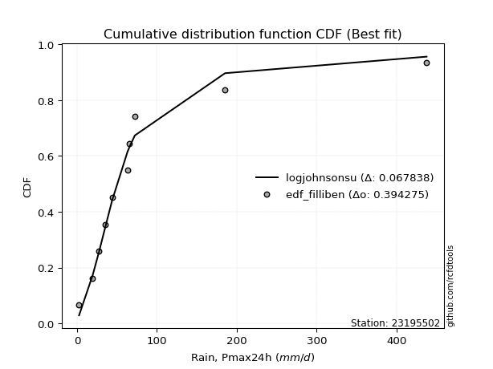</img>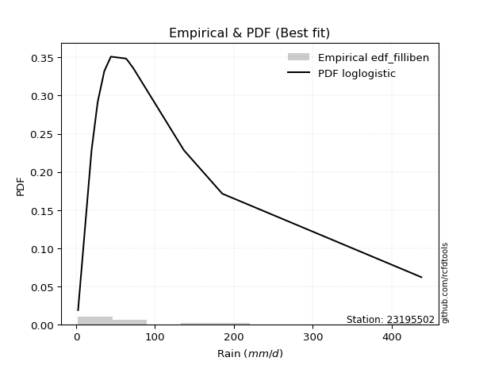</img>

</div>


### 10. EDF Jenkinson (1977)

The Jenkinson formula in hydrology is an empirical plotting position formula used to estimate the non-exceedance probability _(P)_ or return period _(T)_ of a given ordered observation within a sample. It is a widely used method in the frequency analysis of extreme events such as floods and rainfall, as it provides a distribution-free way to plot data. _a≈0.31_ and _b≈0.38_ are constants derived to approximate the median of the probability distribution for the given rank.

<div align="center">


$P=(m-a)/(n+b)$


</div>


**10.1. Empirical values**

<div align="center">

|                | 0                    | 1                 | 2                   | 3                  | 4                  | 5             | 6                  | 7                  | 8                  | 9                  | 10                 |
|:---------------|:---------------------|:------------------|:--------------------|:-------------------|:-------------------|:--------------|:-------------------|:-------------------|:-------------------|:-------------------|:-------------------|
| date           | 2022                 | 2023              | 2021                | 2015               | 2017               | 2016          | 2019               | 2018               | 2025               | 2024               | 2020               |
| x              | 2.55                 | 19.62             | 27.36               | 35.75              | 44.13              | 63.2          | 65.57              | 72.39              | 136.7              | 185.3              | 437.61             |
| m              | 1                    | 2                 | 3                   | 4                  | 5                  | 6             | 7                  | 8                  | 9                  | 10                 | 11                 |
| empirical_dist | edf_jenkinson        | edf_jenkinson     | edf_jenkinson       | edf_jenkinson      | edf_jenkinson      | edf_jenkinson | edf_jenkinson      | edf_jenkinson      | edf_jenkinson      | edf_jenkinson      | edf_jenkinson      |
| empirical      | 0.060632688927943754 | 0.148506151142355 | 0.23637961335676624 | 0.3242530755711775 | 0.4121265377855888 | 0.5           | 0.5878734622144113 | 0.6757469244288224 | 0.7636203866432336 | 0.8514938488576449 | 0.9393673110720562 |
| empirical_tr   | 1.0645463049579045   | 1.174406604747162 | 1.3095512082853855  | 1.4798439531859557 | 1.7010463378176381 | 2.0           | 2.4264392324093818 | 3.0840108401084008 | 4.230483271375462  | 6.733727810650883  | 16.49275362318839  |

</div>


**10.2. Kolmogorov-Smirnov fit test (sorted by Δ)**


<div align="center">

|                | 0                   | 1                   | 2                   | 3                   | 4                   | 5                   | 6                   | 7                   | 8                   | 9                   | 10                  | 11                  | 12                  | 13                  | 14                  | 15                  | 16                  | 17                  | 18                  | 19                  | 20                  | 21                  | 22                  | 23                  | 24                  | 25                  | 26                  | 27                  | 28                  | 29                  | 30                  | 31                  | 32                  | 33                  | 34                  | 35                  | 36                  | 37                  | 38                  | 39                  | 40                  | 41                  | 42                  | 43                  | 44                  | 45                  | 46                  | 47                  | 48                  | 49                  | 50                  | 51                  | 52                  | 53                  | 54                  | 55                  | 56                  | 57                  | 58                  | 59                  | 60                  | 61                  | 62                  | 63                  | 64                  | 65                  | 66                  | 67                  | 68                  | 69                  | 70                  | 71                  | 72                  | 73                  | 74                  | 75                  | 76                  | 77                  | 78                  | 79                  | 80                  | 81                  | 82                  | 83                  | 84                  | 85                  | 86                  | 87                  | 88                  | 89                  | 90                  | 91                  | 92                  | 93                  | 94                  | 95                  | 96                  | 97                  | 98                  | 99                  | 100                 | 101                 | 102                 | 103                 | 104                 | 105                 | 106                 | 107                 | 108                 | 109                 | 110                 | 111                 | 112                 | 113                 | 114                 | 115                 | 116                 | 117                 | 118                 | 119                 | 120                 | 121                 | 122                 | 123                 | 124                 | 125                 | 126                 | 127                 | 128                 | 129                 | 130                 | 131                 | 132                 | 133                 | 134                 | 135                 | 136                 | 137                 | 138                 | 139                 | 140                 | 141                 | 142                 | 143                 | 144                 | 145                 | 146                 | 147                 | 148                 | 149                 | 150                 | 151                 | 152                 | 153                 | 154                 | 155                 | 156                 | 157                 | 158                 | 159                 |
|:---------------|:--------------------|:--------------------|:--------------------|:--------------------|:--------------------|:--------------------|:--------------------|:--------------------|:--------------------|:--------------------|:--------------------|:--------------------|:--------------------|:--------------------|:--------------------|:--------------------|:--------------------|:--------------------|:--------------------|:--------------------|:--------------------|:--------------------|:--------------------|:--------------------|:--------------------|:--------------------|:--------------------|:--------------------|:--------------------|:--------------------|:--------------------|:--------------------|:--------------------|:--------------------|:--------------------|:--------------------|:--------------------|:--------------------|:--------------------|:--------------------|:--------------------|:--------------------|:--------------------|:--------------------|:--------------------|:--------------------|:--------------------|:--------------------|:--------------------|:--------------------|:--------------------|:--------------------|:--------------------|:--------------------|:--------------------|:--------------------|:--------------------|:--------------------|:--------------------|:--------------------|:--------------------|:--------------------|:--------------------|:--------------------|:--------------------|:--------------------|:--------------------|:--------------------|:--------------------|:--------------------|:--------------------|:--------------------|:--------------------|:--------------------|:--------------------|:--------------------|:--------------------|:--------------------|:--------------------|:--------------------|:--------------------|:--------------------|:--------------------|:--------------------|:--------------------|:--------------------|:--------------------|:--------------------|:--------------------|:--------------------|:--------------------|:--------------------|:--------------------|:--------------------|:--------------------|:--------------------|:--------------------|:--------------------|:--------------------|:--------------------|:--------------------|:--------------------|:--------------------|:--------------------|:--------------------|:--------------------|:--------------------|:--------------------|:--------------------|:--------------------|:--------------------|:--------------------|:--------------------|:--------------------|:--------------------|:--------------------|:--------------------|:--------------------|:--------------------|:--------------------|:--------------------|:--------------------|:--------------------|:--------------------|:--------------------|:--------------------|:--------------------|:--------------------|:--------------------|:--------------------|:--------------------|:--------------------|:--------------------|:--------------------|:--------------------|:--------------------|:--------------------|:--------------------|:--------------------|:--------------------|:--------------------|:--------------------|:--------------------|:--------------------|:--------------------|:--------------------|:--------------------|:--------------------|:--------------------|:--------------------|:--------------------|:--------------------|:--------------------|:--------------------|:--------------------|:--------------------|:--------------------|:--------------------|:--------------------|:--------------------|
| station        | 23195502            | 23195502            | 23195502            | 23195502            | 23195502            | 23195502            | 23195502            | 23195502            | 23195502            | 23195502            | 23195502            | 23195502            | 23195502            | 23195502            | 23195502            | 23195502            | 23195502            | 23195502            | 23195502            | 23195502            | 23195502            | 23195502            | 23195502            | 23195502            | 23195502            | 23195502            | 23195502            | 23195502            | 23195502            | 23195502            | 23195502            | 23195502            | 23195502            | 23195502            | 23195502            | 23195502            | 23195502            | 23195502            | 23195502            | 23195502            | 23195502            | 23195502            | 23195502            | 23195502            | 23195502            | 23195502            | 23195502            | 23195502            | 23195502            | 23195502            | 23195502            | 23195502            | 23195502            | 23195502            | 23195502            | 23195502            | 23195502            | 23195502            | 23195502            | 23195502            | 23195502            | 23195502            | 23195502            | 23195502            | 23195502            | 23195502            | 23195502            | 23195502            | 23195502            | 23195502            | 23195502            | 23195502            | 23195502            | 23195502            | 23195502            | 23195502            | 23195502            | 23195502            | 23195502            | 23195502            | 23195502            | 23195502            | 23195502            | 23195502            | 23195502            | 23195502            | 23195502            | 23195502            | 23195502            | 23195502            | 23195502            | 23195502            | 23195502            | 23195502            | 23195502            | 23195502            | 23195502            | 23195502            | 23195502            | 23195502            | 23195502            | 23195502            | 23195502            | 23195502            | 23195502            | 23195502            | 23195502            | 23195502            | 23195502            | 23195502            | 23195502            | 23195502            | 23195502            | 23195502            | 23195502            | 23195502            | 23195502            | 23195502            | 23195502            | 23195502            | 23195502            | 23195502            | 23195502            | 23195502            | 23195502            | 23195502            | 23195502            | 23195502            | 23195502            | 23195502            | 23195502            | 23195502            | 23195502            | 23195502            | 23195502            | 23195502            | 23195502            | 23195502            | 23195502            | 23195502            | 23195502            | 23195502            | 23195502            | 23195502            | 23195502            | 23195502            | 23195502            | 23195502            | 23195502            | 23195502            | 23195502            | 23195502            | 23195502            | 23195502            | 23195502            | 23195502            | 23195502            | 23195502            | 23195502            | 23195502            |
| empirical_dist | edf_jenkinson       | edf_jenkinson       | edf_jenkinson       | edf_jenkinson       | edf_jenkinson       | edf_jenkinson       | edf_jenkinson       | edf_jenkinson       | edf_jenkinson       | edf_jenkinson       | edf_jenkinson       | edf_jenkinson       | edf_jenkinson       | edf_jenkinson       | edf_jenkinson       | edf_jenkinson       | edf_jenkinson       | edf_jenkinson       | edf_jenkinson       | edf_jenkinson       | edf_jenkinson       | edf_jenkinson       | edf_jenkinson       | edf_jenkinson       | edf_jenkinson       | edf_jenkinson       | edf_jenkinson       | edf_jenkinson       | edf_jenkinson       | edf_jenkinson       | edf_jenkinson       | edf_jenkinson       | edf_jenkinson       | edf_jenkinson       | edf_jenkinson       | edf_jenkinson       | edf_jenkinson       | edf_jenkinson       | edf_jenkinson       | edf_jenkinson       | edf_jenkinson       | edf_jenkinson       | edf_jenkinson       | edf_jenkinson       | edf_jenkinson       | edf_jenkinson       | edf_jenkinson       | edf_jenkinson       | edf_jenkinson       | edf_jenkinson       | edf_jenkinson       | edf_jenkinson       | edf_jenkinson       | edf_jenkinson       | edf_jenkinson       | edf_jenkinson       | edf_jenkinson       | edf_jenkinson       | edf_jenkinson       | edf_jenkinson       | edf_jenkinson       | edf_jenkinson       | edf_jenkinson       | edf_jenkinson       | edf_jenkinson       | edf_jenkinson       | edf_jenkinson       | edf_jenkinson       | edf_jenkinson       | edf_jenkinson       | edf_jenkinson       | edf_jenkinson       | edf_jenkinson       | edf_jenkinson       | edf_jenkinson       | edf_jenkinson       | edf_jenkinson       | edf_jenkinson       | edf_jenkinson       | edf_jenkinson       | edf_jenkinson       | edf_jenkinson       | edf_jenkinson       | edf_jenkinson       | edf_jenkinson       | edf_jenkinson       | edf_jenkinson       | edf_jenkinson       | edf_jenkinson       | edf_jenkinson       | edf_jenkinson       | edf_jenkinson       | edf_jenkinson       | edf_jenkinson       | edf_jenkinson       | edf_jenkinson       | edf_jenkinson       | edf_jenkinson       | edf_jenkinson       | edf_jenkinson       | edf_jenkinson       | edf_jenkinson       | edf_jenkinson       | edf_jenkinson       | edf_jenkinson       | edf_jenkinson       | edf_jenkinson       | edf_jenkinson       | edf_jenkinson       | edf_jenkinson       | edf_jenkinson       | edf_jenkinson       | edf_jenkinson       | edf_jenkinson       | edf_jenkinson       | edf_jenkinson       | edf_jenkinson       | edf_jenkinson       | edf_jenkinson       | edf_jenkinson       | edf_jenkinson       | edf_jenkinson       | edf_jenkinson       | edf_jenkinson       | edf_jenkinson       | edf_jenkinson       | edf_jenkinson       | edf_jenkinson       | edf_jenkinson       | edf_jenkinson       | edf_jenkinson       | edf_jenkinson       | edf_jenkinson       | edf_jenkinson       | edf_jenkinson       | edf_jenkinson       | edf_jenkinson       | edf_jenkinson       | edf_jenkinson       | edf_jenkinson       | edf_jenkinson       | edf_jenkinson       | edf_jenkinson       | edf_jenkinson       | edf_jenkinson       | edf_jenkinson       | edf_jenkinson       | edf_jenkinson       | edf_jenkinson       | edf_jenkinson       | edf_jenkinson       | edf_jenkinson       | edf_jenkinson       | edf_jenkinson       | edf_jenkinson       | edf_jenkinson       | edf_jenkinson       | edf_jenkinson       | edf_jenkinson       | edf_jenkinson       |
| p_dist         | loglogistic         | logfoldnorm         | logfatiguelife      | lognorm             | logcrystalball      | logexponnorm        | logtukeylambda      | logf                | logrice             | logvonmises_line    | lognct              | loghypsecant        | invweibull          | genextreme          | nct                 | logt                | logbetaprime        | invgamma            | logjohnsonsu        | logerlang           | loggamma            | loggamma            | kappa3              | logalpha            | loggenlogistic      | logburr             | logmielke           | loginvgamma         | johnsonsu           | loginvgauss         | ncf                 | logskewnorm         | invgauss            | loglaplace          | loglaplace          | lomax               | genpareto           | logmaxwell          | mielke              | loganglit           | logexponweib        | logjohnsonsb        | logloggamma         | loggengamma         | logburr12           | logweibull_min      | logbeta             | loggennorm          | lograyleigh         | gengamma            | logexponpow         | dgamma              | fatiguelife         | betaprime           | logpearson3         | wald                | logsemicircular     | loggenextreme       | logncf              | logdweibull         | logloglaplace       | gausshyper          | logargus            | gennorm             | burr12              | truncpareto         | loggumbel_l         | loggumbel_r         | pearson3            | loginvweibull       | logcosine           | loghalfnorm         | logtruncweibull_min | exponweib           | logdgamma           | lognakagami         | t                   | truncweibull_min    | logmoyal            | loghalflogistic     | exponnorm           | gompertz            | genexpon            | nakagami            | halflogistic        | dweibull            | logarcsine          | burr                | weibull_min         | loggenhalflogistic  | f                   | loggausshyper       | moyal               | gamma               | truncnorm           | halfnorm            | erlang              | vonmises_line       | logkstwobign        | cosine              | loggompertz         | genlogistic         | gumbel_r            | loggenpareto        | logtriang           | loggenexpon         | foldnorm            | rayleigh            | logwald             | maxwell             | exponpow            | arcsine             | semicircular        | logkappa3           | loguniform          | anglit              | logwrapcauchy       | halfgennorm         | kstwobign           | beta                | crystalball         | norm                | logksone            | logkappa4           | logistic            | logtrapezoid        | hypsecant           | johnsonsb           | rice                | loglevy_l           | laplace             | logtruncnorm        | skewnorm            | logbradford         | gumbel_l            | wrapcauchy          | logweibull_max      | logtruncexpon       | loglomax            | bradford            | powerlaw            | loghalfgennorm      | argus               | truncexpon          | triang              | levy_l              | ksone               | kappa4              | rdist               | uniform             | alpha               | tukeylambda         | logrdist            | genhalflogistic     | logpowerlaw         | trapezoid           | weibull_max         | logtruncpareto      | logvonmises         | vonmises            |
| delta          | 0.0703282832092097  | 0.07046984216200947 | 0.07414301303333887 | 0.0749268858863858  | 0.07492688675219236 | 0.07492811294308119 | 0.07508875332575193 | 0.07533312487301416 | 0.07534430711009746 | 0.0761031994193887  | 0.07622892545329465 | 0.07729458555844793 | 0.07836430465884858 | 0.07836441995491983 | 0.07849718261388194 | 0.07980084042430013 | 0.08092663069249037 | 0.0818945960630898  | 0.08412882466976013 | 0.08418476757119575 | 0.08552125661709678 | 0.08552125661709678 | 0.08640026537352175 | 0.08671308563390315 | 0.08825980552733725 | 0.08883279412484835 | 0.08952870498921128 | 0.09052488283121676 | 0.09244574778693138 | 0.09603353224715039 | 0.09663912597312285 | 0.09712167064819621 | 0.09870616085948758 | 0.0990626243870556  | 0.0990626243870556  | 0.09926948418827786 | 0.09927019643125823 | 0.10085910078969515 | 0.10210524386273856 | 0.10303950574607385 | 0.10649783386185441 | 0.10756010091308976 | 0.10756081820776187 | 0.10773920788801239 | 0.1084644079752447  | 0.10850070591303218 | 0.1090559838886801  | 0.10908581790179656 | 0.1121193269957774  | 0.11323409279634439 | 0.11347538010300251 | 0.1135911086522931  | 0.11410399733139864 | 0.11424591500351039 | 0.1142524664497605  | 0.11518898962536284 | 0.11534385159325433 | 0.11724796657521797 | 0.11743909342303813 | 0.11746794029841812 | 0.12169654594258017 | 0.12208138392097978 | 0.12216128111045854 | 0.12526181259500957 | 0.1270342554653462  | 0.1308555136453532  | 0.13130457671923523 | 0.13155448642101542 | 0.13454876298937724 | 0.14238522941954118 | 0.1432222667517038  | 0.14405007048675286 | 0.14496585198547923 | 0.14555984844042436 | 0.1478656135764353  | 0.14850615114202073 | 0.14991991060530663 | 0.15447462329992778 | 0.15597183246388424 | 0.1560029417851     | 0.15687190514963778 | 0.15859301952812854 | 0.1608949559852707  | 0.1646506000701577  | 0.1668379182944899  | 0.17043727511853685 | 0.17072180770483847 | 0.17198769242001521 | 0.17436153163200346 | 0.1762989328168892  | 0.17663537445346955 | 0.17836312638540702 | 0.17966244147412547 | 0.18200757323382566 | 0.18358989497026218 | 0.18375889136910017 | 0.19022415475025067 | 0.19091118351325403 | 0.19104427493934667 | 0.19565474072085398 | 0.19841835232409638 | 0.2031334549807201  | 0.20327837020797174 | 0.211483345254312   | 0.2130975616554675  | 0.2145133506112512  | 0.21468790798715437 | 0.2184802351907913  | 0.22374070443723781 | 0.23073574726208484 | 0.23748587137420218 | 0.24385202573040882 | 0.24738093699058367 | 0.24805593334054798 | 0.2480658609522478  | 0.2525335387198496  | 0.2531344627305891  | 0.2544252359210125  | 0.263764277837355   | 0.26453581495821427 | 0.26496105545864146 | 0.2649610650378494  | 0.26530385893648073 | 0.27497608601475326 | 0.2766082228079343  | 0.2848035582288383  | 0.2862217821017739  | 0.2871828642442611  | 0.30076176068087657 | 0.30318139492672314 | 0.3122869746621787  | 0.3153629974411119  | 0.3234081144301605  | 0.3272218369801746  | 0.33250687035098764 | 0.3758421372700509  | 0.3793655906005611  | 0.38136352638061377 | 0.39851492231034413 | 0.4028273976471592  | 0.4050193507925405  | 0.40533922888164986 | 0.4083876418829647  | 0.41944601665329817 | 0.4308115753095064  | 0.4469085551485104  | 0.4586389393233198  | 0.4904827134007378  | 0.5052356138347281  | 0.5152173423022193  | 0.5228648835359859  | 0.5318719715680963  | 0.5334834081351147  | 0.549814080005016   | 0.6413741136162556  | 0.6602596868019326  | 0.7243281251913812  | 0.8064271560236248  | 1.0026191125349067  | 68.78460109849247   |
| deltao         | 0.37613735880099997 | 0.37613735880099997 | 0.37613735880099997 | 0.37613735880099997 | 0.37613735880099997 | 0.37613735880099997 | 0.37613735880099997 | 0.37613735880099997 | 0.37613735880099997 | 0.37613735880099997 | 0.37613735880099997 | 0.37613735880099997 | 0.37613735880099997 | 0.37613735880099997 | 0.37613735880099997 | 0.37613735880099997 | 0.37613735880099997 | 0.37613735880099997 | 0.37613735880099997 | 0.37613735880099997 | 0.37613735880099997 | 0.37613735880099997 | 0.37613735880099997 | 0.37613735880099997 | 0.37613735880099997 | 0.37613735880099997 | 0.37613735880099997 | 0.37613735880099997 | 0.37613735880099997 | 0.37613735880099997 | 0.37613735880099997 | 0.37613735880099997 | 0.37613735880099997 | 0.37613735880099997 | 0.37613735880099997 | 0.37613735880099997 | 0.37613735880099997 | 0.37613735880099997 | 0.37613735880099997 | 0.37613735880099997 | 0.37613735880099997 | 0.37613735880099997 | 0.37613735880099997 | 0.37613735880099997 | 0.37613735880099997 | 0.37613735880099997 | 0.37613735880099997 | 0.37613735880099997 | 0.37613735880099997 | 0.37613735880099997 | 0.37613735880099997 | 0.37613735880099997 | 0.37613735880099997 | 0.37613735880099997 | 0.37613735880099997 | 0.37613735880099997 | 0.37613735880099997 | 0.37613735880099997 | 0.37613735880099997 | 0.37613735880099997 | 0.37613735880099997 | 0.37613735880099997 | 0.37613735880099997 | 0.37613735880099997 | 0.37613735880099997 | 0.37613735880099997 | 0.37613735880099997 | 0.37613735880099997 | 0.37613735880099997 | 0.37613735880099997 | 0.37613735880099997 | 0.37613735880099997 | 0.37613735880099997 | 0.37613735880099997 | 0.37613735880099997 | 0.37613735880099997 | 0.37613735880099997 | 0.37613735880099997 | 0.37613735880099997 | 0.37613735880099997 | 0.37613735880099997 | 0.37613735880099997 | 0.37613735880099997 | 0.37613735880099997 | 0.37613735880099997 | 0.37613735880099997 | 0.37613735880099997 | 0.37613735880099997 | 0.37613735880099997 | 0.37613735880099997 | 0.37613735880099997 | 0.37613735880099997 | 0.37613735880099997 | 0.37613735880099997 | 0.37613735880099997 | 0.37613735880099997 | 0.37613735880099997 | 0.37613735880099997 | 0.37613735880099997 | 0.37613735880099997 | 0.37613735880099997 | 0.37613735880099997 | 0.37613735880099997 | 0.37613735880099997 | 0.37613735880099997 | 0.37613735880099997 | 0.37613735880099997 | 0.37613735880099997 | 0.37613735880099997 | 0.37613735880099997 | 0.37613735880099997 | 0.37613735880099997 | 0.37613735880099997 | 0.37613735880099997 | 0.37613735880099997 | 0.37613735880099997 | 0.37613735880099997 | 0.37613735880099997 | 0.37613735880099997 | 0.37613735880099997 | 0.37613735880099997 | 0.37613735880099997 | 0.37613735880099997 | 0.37613735880099997 | 0.37613735880099997 | 0.37613735880099997 | 0.37613735880099997 | 0.37613735880099997 | 0.37613735880099997 | 0.37613735880099997 | 0.37613735880099997 | 0.37613735880099997 | 0.37613735880099997 | 0.37613735880099997 | 0.37613735880099997 | 0.37613735880099997 | 0.37613735880099997 | 0.37613735880099997 | 0.37613735880099997 | 0.37613735880099997 | 0.37613735880099997 | 0.37613735880099997 | 0.37613735880099997 | 0.37613735880099997 | 0.37613735880099997 | 0.37613735880099997 | 0.37613735880099997 | 0.37613735880099997 | 0.37613735880099997 | 0.37613735880099997 | 0.37613735880099997 | 0.37613735880099997 | 0.37613735880099997 | 0.37613735880099997 | 0.37613735880099997 | 0.37613735880099997 | 0.37613735880099997 | 0.37613735880099997 | 0.37613735880099997 | 0.37613735880099997 |
| eval           | Δo > Δ              | Δo > Δ              | Δo > Δ              | Δo > Δ              | Δo > Δ              | Δo > Δ              | Δo > Δ              | Δo > Δ              | Δo > Δ              | Δo > Δ              | Δo > Δ              | Δo > Δ              | Δo > Δ              | Δo > Δ              | Δo > Δ              | Δo > Δ              | Δo > Δ              | Δo > Δ              | Δo > Δ              | Δo > Δ              | Δo > Δ              | Δo > Δ              | Δo > Δ              | Δo > Δ              | Δo > Δ              | Δo > Δ              | Δo > Δ              | Δo > Δ              | Δo > Δ              | Δo > Δ              | Δo > Δ              | Δo > Δ              | Δo > Δ              | Δo > Δ              | Δo > Δ              | Δo > Δ              | Δo > Δ              | Δo > Δ              | Δo > Δ              | Δo > Δ              | Δo > Δ              | Δo > Δ              | Δo > Δ              | Δo > Δ              | Δo > Δ              | Δo > Δ              | Δo > Δ              | Δo > Δ              | Δo > Δ              | Δo > Δ              | Δo > Δ              | Δo > Δ              | Δo > Δ              | Δo > Δ              | Δo > Δ              | Δo > Δ              | Δo > Δ              | Δo > Δ              | Δo > Δ              | Δo > Δ              | Δo > Δ              | Δo > Δ              | Δo > Δ              | Δo > Δ              | Δo > Δ              | Δo > Δ              | Δo > Δ              | Δo > Δ              | Δo > Δ              | Δo > Δ              | Δo > Δ              | Δo > Δ              | Δo > Δ              | Δo > Δ              | Δo > Δ              | Δo > Δ              | Δo > Δ              | Δo > Δ              | Δo > Δ              | Δo > Δ              | Δo > Δ              | Δo > Δ              | Δo > Δ              | Δo > Δ              | Δo > Δ              | Δo > Δ              | Δo > Δ              | Δo > Δ              | Δo > Δ              | Δo > Δ              | Δo > Δ              | Δo > Δ              | Δo > Δ              | Δo > Δ              | Δo > Δ              | Δo > Δ              | Δo > Δ              | Δo > Δ              | Δo > Δ              | Δo > Δ              | Δo > Δ              | Δo > Δ              | Δo > Δ              | Δo > Δ              | Δo > Δ              | Δo > Δ              | Δo > Δ              | Δo > Δ              | Δo > Δ              | Δo > Δ              | Δo > Δ              | Δo > Δ              | Δo > Δ              | Δo > Δ              | Δo > Δ              | Δo > Δ              | Δo > Δ              | Δo > Δ              | Δo > Δ              | Δo > Δ              | Δo > Δ              | Δo > Δ              | Δo > Δ              | Δo > Δ              | Δo > Δ              | Δo > Δ              | Δo > Δ              | Δo > Δ              | Δo > Δ              | Δo > Δ              | Δo > Δ              | Δo > Δ              | Δo > Δ              | Δo > Δ              | Δo > Δ              | Δo > Δ              | Δo <= Δ             | Δo <= Δ             | Δo <= Δ             | Δo <= Δ             | Δo <= Δ             | Δo <= Δ             | Δo <= Δ             | Δo <= Δ             | Δo <= Δ             | Δo <= Δ             | Δo <= Δ             | Δo <= Δ             | Δo <= Δ             | Δo <= Δ             | Δo <= Δ             | Δo <= Δ             | Δo <= Δ             | Δo <= Δ             | Δo <= Δ             | Δo <= Δ             | Δo <= Δ             | Δo <= Δ             | Δo <= Δ             | Δo <= Δ             |
| fit            | 1                   | 1                   | 1                   | 1                   | 1                   | 1                   | 1                   | 1                   | 1                   | 1                   | 1                   | 1                   | 1                   | 1                   | 1                   | 1                   | 1                   | 1                   | 1                   | 1                   | 1                   | 1                   | 1                   | 1                   | 1                   | 1                   | 1                   | 1                   | 1                   | 1                   | 1                   | 1                   | 1                   | 1                   | 1                   | 1                   | 1                   | 1                   | 1                   | 1                   | 1                   | 1                   | 1                   | 1                   | 1                   | 1                   | 1                   | 1                   | 1                   | 1                   | 1                   | 1                   | 1                   | 1                   | 1                   | 1                   | 1                   | 1                   | 1                   | 1                   | 1                   | 1                   | 1                   | 1                   | 1                   | 1                   | 1                   | 1                   | 1                   | 1                   | 1                   | 1                   | 1                   | 1                   | 1                   | 1                   | 1                   | 1                   | 1                   | 1                   | 1                   | 1                   | 1                   | 1                   | 1                   | 1                   | 1                   | 1                   | 1                   | 1                   | 1                   | 1                   | 1                   | 1                   | 1                   | 1                   | 1                   | 1                   | 1                   | 1                   | 1                   | 1                   | 1                   | 1                   | 1                   | 1                   | 1                   | 1                   | 1                   | 1                   | 1                   | 1                   | 1                   | 1                   | 1                   | 1                   | 1                   | 1                   | 1                   | 1                   | 1                   | 1                   | 1                   | 1                   | 1                   | 1                   | 1                   | 1                   | 1                   | 1                   | 1                   | 1                   | 1                   | 1                   | 1                   | 1                   | 0                   | 0                   | 0                   | 0                   | 0                   | 0                   | 0                   | 0                   | 0                   | 0                   | 0                   | 0                   | 0                   | 0                   | 0                   | 0                   | 0                   | 0                   | 0                   | 0                   | 0                   | 0                   | 0                   | 0                   |
| n              | 11                  | 11                  | 11                  | 11                  | 11                  | 11                  | 11                  | 11                  | 11                  | 11                  | 11                  | 11                  | 11                  | 11                  | 11                  | 11                  | 11                  | 11                  | 11                  | 11                  | 11                  | 11                  | 11                  | 11                  | 11                  | 11                  | 11                  | 11                  | 11                  | 11                  | 11                  | 11                  | 11                  | 11                  | 11                  | 11                  | 11                  | 11                  | 11                  | 11                  | 11                  | 11                  | 11                  | 11                  | 11                  | 11                  | 11                  | 11                  | 11                  | 11                  | 11                  | 11                  | 11                  | 11                  | 11                  | 11                  | 11                  | 11                  | 11                  | 11                  | 11                  | 11                  | 11                  | 11                  | 11                  | 11                  | 11                  | 11                  | 11                  | 11                  | 11                  | 11                  | 11                  | 11                  | 11                  | 11                  | 11                  | 11                  | 11                  | 11                  | 11                  | 11                  | 11                  | 11                  | 11                  | 11                  | 11                  | 11                  | 11                  | 11                  | 11                  | 11                  | 11                  | 11                  | 11                  | 11                  | 11                  | 11                  | 11                  | 11                  | 11                  | 11                  | 11                  | 11                  | 11                  | 11                  | 11                  | 11                  | 11                  | 11                  | 11                  | 11                  | 11                  | 11                  | 11                  | 11                  | 11                  | 11                  | 11                  | 11                  | 11                  | 11                  | 11                  | 11                  | 11                  | 11                  | 11                  | 11                  | 11                  | 11                  | 11                  | 11                  | 11                  | 11                  | 11                  | 11                  | 11                  | 11                  | 11                  | 11                  | 11                  | 11                  | 11                  | 11                  | 11                  | 11                  | 11                  | 11                  | 11                  | 11                  | 11                  | 11                  | 11                  | 11                  | 11                  | 11                  | 11                  | 11                  | 11                  | 11                  |
| best_fit       | 1                   | 0                   | 0                   | 0                   | 0                   | 0                   | 0                   | 0                   | 0                   | 0                   | 0                   | 0                   | 0                   | 0                   | 0                   | 0                   | 0                   | 0                   | 0                   | 0                   | 0                   | 0                   | 0                   | 0                   | 0                   | 0                   | 0                   | 0                   | 0                   | 0                   | 0                   | 0                   | 0                   | 0                   | 0                   | 0                   | 0                   | 0                   | 0                   | 0                   | 0                   | 0                   | 0                   | 0                   | 0                   | 0                   | 0                   | 0                   | 0                   | 0                   | 0                   | 0                   | 0                   | 0                   | 0                   | 0                   | 0                   | 0                   | 0                   | 0                   | 0                   | 0                   | 0                   | 0                   | 0                   | 0                   | 0                   | 0                   | 0                   | 0                   | 0                   | 0                   | 0                   | 0                   | 0                   | 0                   | 0                   | 0                   | 0                   | 0                   | 0                   | 0                   | 0                   | 0                   | 0                   | 0                   | 0                   | 0                   | 0                   | 0                   | 0                   | 0                   | 0                   | 0                   | 0                   | 0                   | 0                   | 0                   | 0                   | 0                   | 0                   | 0                   | 0                   | 0                   | 0                   | 0                   | 0                   | 0                   | 0                   | 0                   | 0                   | 0                   | 0                   | 0                   | 0                   | 0                   | 0                   | 0                   | 0                   | 0                   | 0                   | 0                   | 0                   | 0                   | 0                   | 0                   | 0                   | 0                   | 0                   | 0                   | 0                   | 0                   | 0                   | 0                   | 0                   | 0                   | 0                   | 0                   | 0                   | 0                   | 0                   | 0                   | 0                   | 0                   | 0                   | 0                   | 0                   | 0                   | 0                   | 0                   | 0                   | 0                   | 0                   | 0                   | 0                   | 0                   | 0                   | 0                   | 0                   | 0                   |
| best_fit_sort  | 1                   | 2                   | 3                   | 4                   | 5                   | 6                   | 7                   | 8                   | 9                   | 10                  | 11                  | 12                  | 13                  | 14                  | 15                  | 16                  | 17                  | 18                  | 19                  | 20                  | 21                  | 22                  | 23                  | 24                  | 25                  | 26                  | 27                  | 28                  | 29                  | 30                  | 31                  | 32                  | 33                  | 34                  | 35                  | 36                  | 37                  | 38                  | 39                  | 40                  | 41                  | 42                  | 43                  | 44                  | 45                  | 46                  | 47                  | 48                  | 49                  | 50                  | 51                  | 52                  | 53                  | 54                  | 55                  | 56                  | 57                  | 58                  | 59                  | 60                  | 61                  | 62                  | 63                  | 64                  | 65                  | 66                  | 67                  | 68                  | 69                  | 70                  | 71                  | 72                  | 73                  | 74                  | 75                  | 76                  | 77                  | 78                  | 79                  | 80                  | 81                  | 82                  | 83                  | 84                  | 85                  | 86                  | 87                  | 88                  | 89                  | 90                  | 91                  | 92                  | 93                  | 94                  | 95                  | 96                  | 97                  | 98                  | 99                  | 100                 | 101                 | 102                 | 103                 | 104                 | 105                 | 106                 | 107                 | 108                 | 109                 | 110                 | 111                 | 112                 | 113                 | 114                 | 115                 | 116                 | 117                 | 118                 | 119                 | 120                 | 121                 | 122                 | 123                 | 124                 | 125                 | 126                 | 127                 | 128                 | 129                 | 130                 | 131                 | 132                 | 133                 | 134                 | 135                 | 136                 | 137                 | 138                 | 139                 | 140                 | 141                 | 142                 | 143                 | 144                 | 145                 | 146                 | 147                 | 148                 | 149                 | 150                 | 151                 | 152                 | 153                 | 154                 | 155                 | 156                 | 157                 | 158                 | 159                 | 160                 |

</div>


**10.3. Best fit**

<div align="center">

|   id |   station | empirical_dist   | p_dist      |     delta |   deltao | eval   |   fit |   n |   best_fit |   best_fit_sort |
|-----:|----------:|:-----------------|:------------|----------:|---------:|:-------|------:|----:|-----------:|----------------:|
|    0 |  23195502 | edf_jenkinson    | loglogistic | 0.0703283 | 0.376137 | Δo > Δ |     1 |  11 |          1 |               1 |

</div>


<div align="center">

</img>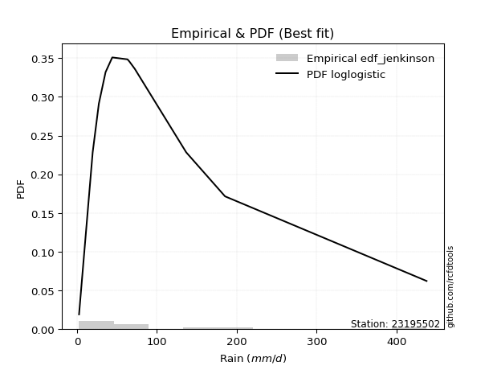</img>

</div>


### 11. EDF Cunnane (1978)

Cunnane´s work in statistical hydrology has focused on the performance and evaluation of different probability distributions (such as GEV, Gumbel, Lognormal) for flood frequency estimation. _b_ is a constant, typically set to 0.4.

<div align="center">


$P=(m-b)/(n+1-2b)$


</div>


**11.1. Empirical values**

<div align="center">

|                | 0                    | 1                   | 2                   | 3                   | 4                  | 5           | 6                  | 7                  | 8                  | 9                  | 10                 |
|:---------------|:---------------------|:--------------------|:--------------------|:--------------------|:-------------------|:------------|:-------------------|:-------------------|:-------------------|:-------------------|:-------------------|
| date           | 2022                 | 2023                | 2021                | 2015                | 2017               | 2016        | 2019               | 2018               | 2025               | 2024               | 2020               |
| x              | 2.55                 | 19.62               | 27.36               | 35.75               | 44.13              | 63.2        | 65.57              | 72.39              | 136.7              | 185.3              | 437.61             |
| m              | 1                    | 2                   | 3                   | 4                   | 5                  | 6           | 7                  | 8                  | 9                  | 10                 | 11                 |
| empirical_dist | edf_cunnane          | edf_cunnane         | edf_cunnane         | edf_cunnane         | edf_cunnane        | edf_cunnane | edf_cunnane        | edf_cunnane        | edf_cunnane        | edf_cunnane        | edf_cunnane        |
| empirical      | 0.053571428571428575 | 0.14285714285714288 | 0.23214285714285718 | 0.32142857142857145 | 0.4107142857142857 | 0.5         | 0.5892857142857143 | 0.6785714285714286 | 0.7678571428571429 | 0.8571428571428572 | 0.9464285714285715 |
| empirical_tr   | 1.0566037735849056   | 1.1666666666666667  | 1.302325581395349   | 1.4736842105263157  | 1.696969696969697  | 2.0         | 2.4347826086956523 | 3.1111111111111116 | 4.307692307692308  | 7.0000000000000036 | 18.666666666666693 |

</div>


**11.2. Kolmogorov-Smirnov fit test (sorted by Δ)**


<div align="center">

|                | 0                   | 1                   | 2                   | 3                   | 4                   | 5                   | 6                   | 7                   | 8                   | 9                   | 10                  | 11                  | 12                  | 13                  | 14                  | 15                  | 16                  | 17                  | 18                  | 19                  | 20                  | 21                  | 22                  | 23                  | 24                  | 25                  | 26                  | 27                  | 28                  | 29                  | 30                  | 31                  | 32                  | 33                  | 34                  | 35                  | 36                  | 37                  | 38                  | 39                  | 40                  | 41                  | 42                  | 43                  | 44                  | 45                  | 46                  | 47                  | 48                  | 49                  | 50                  | 51                  | 52                  | 53                  | 54                  | 55                  | 56                  | 57                  | 58                  | 59                  | 60                  | 61                  | 62                  | 63                  | 64                  | 65                  | 66                  | 67                  | 68                  | 69                  | 70                  | 71                  | 72                  | 73                  | 74                  | 75                  | 76                  | 77                  | 78                  | 79                  | 80                  | 81                  | 82                  | 83                  | 84                  | 85                  | 86                  | 87                  | 88                  | 89                  | 90                  | 91                  | 92                  | 93                  | 94                  | 95                  | 96                  | 97                  | 98                  | 99                  | 100                 | 101                 | 102                 | 103                 | 104                 | 105                 | 106                 | 107                 | 108                 | 109                 | 110                 | 111                 | 112                 | 113                 | 114                 | 115                 | 116                 | 117                 | 118                 | 119                 | 120                 | 121                 | 122                 | 123                 | 124                 | 125                 | 126                 | 127                 | 128                 | 129                 | 130                 | 131                 | 132                 | 133                 | 134                 | 135                 | 136                 | 137                 | 138                 | 139                 | 140                 | 141                 | 142                 | 143                 | 144                 | 145                 | 146                 | 147                 | 148                 | 149                 | 150                 | 151                 | 152                 | 153                 | 154                 | 155                 | 156                 | 157                 | 158                 | 159                 |
|:---------------|:--------------------|:--------------------|:--------------------|:--------------------|:--------------------|:--------------------|:--------------------|:--------------------|:--------------------|:--------------------|:--------------------|:--------------------|:--------------------|:--------------------|:--------------------|:--------------------|:--------------------|:--------------------|:--------------------|:--------------------|:--------------------|:--------------------|:--------------------|:--------------------|:--------------------|:--------------------|:--------------------|:--------------------|:--------------------|:--------------------|:--------------------|:--------------------|:--------------------|:--------------------|:--------------------|:--------------------|:--------------------|:--------------------|:--------------------|:--------------------|:--------------------|:--------------------|:--------------------|:--------------------|:--------------------|:--------------------|:--------------------|:--------------------|:--------------------|:--------------------|:--------------------|:--------------------|:--------------------|:--------------------|:--------------------|:--------------------|:--------------------|:--------------------|:--------------------|:--------------------|:--------------------|:--------------------|:--------------------|:--------------------|:--------------------|:--------------------|:--------------------|:--------------------|:--------------------|:--------------------|:--------------------|:--------------------|:--------------------|:--------------------|:--------------------|:--------------------|:--------------------|:--------------------|:--------------------|:--------------------|:--------------------|:--------------------|:--------------------|:--------------------|:--------------------|:--------------------|:--------------------|:--------------------|:--------------------|:--------------------|:--------------------|:--------------------|:--------------------|:--------------------|:--------------------|:--------------------|:--------------------|:--------------------|:--------------------|:--------------------|:--------------------|:--------------------|:--------------------|:--------------------|:--------------------|:--------------------|:--------------------|:--------------------|:--------------------|:--------------------|:--------------------|:--------------------|:--------------------|:--------------------|:--------------------|:--------------------|:--------------------|:--------------------|:--------------------|:--------------------|:--------------------|:--------------------|:--------------------|:--------------------|:--------------------|:--------------------|:--------------------|:--------------------|:--------------------|:--------------------|:--------------------|:--------------------|:--------------------|:--------------------|:--------------------|:--------------------|:--------------------|:--------------------|:--------------------|:--------------------|:--------------------|:--------------------|:--------------------|:--------------------|:--------------------|:--------------------|:--------------------|:--------------------|:--------------------|:--------------------|:--------------------|:--------------------|:--------------------|:--------------------|:--------------------|:--------------------|:--------------------|:--------------------|:--------------------|:--------------------|
| station        | 23195502            | 23195502            | 23195502            | 23195502            | 23195502            | 23195502            | 23195502            | 23195502            | 23195502            | 23195502            | 23195502            | 23195502            | 23195502            | 23195502            | 23195502            | 23195502            | 23195502            | 23195502            | 23195502            | 23195502            | 23195502            | 23195502            | 23195502            | 23195502            | 23195502            | 23195502            | 23195502            | 23195502            | 23195502            | 23195502            | 23195502            | 23195502            | 23195502            | 23195502            | 23195502            | 23195502            | 23195502            | 23195502            | 23195502            | 23195502            | 23195502            | 23195502            | 23195502            | 23195502            | 23195502            | 23195502            | 23195502            | 23195502            | 23195502            | 23195502            | 23195502            | 23195502            | 23195502            | 23195502            | 23195502            | 23195502            | 23195502            | 23195502            | 23195502            | 23195502            | 23195502            | 23195502            | 23195502            | 23195502            | 23195502            | 23195502            | 23195502            | 23195502            | 23195502            | 23195502            | 23195502            | 23195502            | 23195502            | 23195502            | 23195502            | 23195502            | 23195502            | 23195502            | 23195502            | 23195502            | 23195502            | 23195502            | 23195502            | 23195502            | 23195502            | 23195502            | 23195502            | 23195502            | 23195502            | 23195502            | 23195502            | 23195502            | 23195502            | 23195502            | 23195502            | 23195502            | 23195502            | 23195502            | 23195502            | 23195502            | 23195502            | 23195502            | 23195502            | 23195502            | 23195502            | 23195502            | 23195502            | 23195502            | 23195502            | 23195502            | 23195502            | 23195502            | 23195502            | 23195502            | 23195502            | 23195502            | 23195502            | 23195502            | 23195502            | 23195502            | 23195502            | 23195502            | 23195502            | 23195502            | 23195502            | 23195502            | 23195502            | 23195502            | 23195502            | 23195502            | 23195502            | 23195502            | 23195502            | 23195502            | 23195502            | 23195502            | 23195502            | 23195502            | 23195502            | 23195502            | 23195502            | 23195502            | 23195502            | 23195502            | 23195502            | 23195502            | 23195502            | 23195502            | 23195502            | 23195502            | 23195502            | 23195502            | 23195502            | 23195502            | 23195502            | 23195502            | 23195502            | 23195502            | 23195502            | 23195502            |
| empirical_dist | edf_cunnane         | edf_cunnane         | edf_cunnane         | edf_cunnane         | edf_cunnane         | edf_cunnane         | edf_cunnane         | edf_cunnane         | edf_cunnane         | edf_cunnane         | edf_cunnane         | edf_cunnane         | edf_cunnane         | edf_cunnane         | edf_cunnane         | edf_cunnane         | edf_cunnane         | edf_cunnane         | edf_cunnane         | edf_cunnane         | edf_cunnane         | edf_cunnane         | edf_cunnane         | edf_cunnane         | edf_cunnane         | edf_cunnane         | edf_cunnane         | edf_cunnane         | edf_cunnane         | edf_cunnane         | edf_cunnane         | edf_cunnane         | edf_cunnane         | edf_cunnane         | edf_cunnane         | edf_cunnane         | edf_cunnane         | edf_cunnane         | edf_cunnane         | edf_cunnane         | edf_cunnane         | edf_cunnane         | edf_cunnane         | edf_cunnane         | edf_cunnane         | edf_cunnane         | edf_cunnane         | edf_cunnane         | edf_cunnane         | edf_cunnane         | edf_cunnane         | edf_cunnane         | edf_cunnane         | edf_cunnane         | edf_cunnane         | edf_cunnane         | edf_cunnane         | edf_cunnane         | edf_cunnane         | edf_cunnane         | edf_cunnane         | edf_cunnane         | edf_cunnane         | edf_cunnane         | edf_cunnane         | edf_cunnane         | edf_cunnane         | edf_cunnane         | edf_cunnane         | edf_cunnane         | edf_cunnane         | edf_cunnane         | edf_cunnane         | edf_cunnane         | edf_cunnane         | edf_cunnane         | edf_cunnane         | edf_cunnane         | edf_cunnane         | edf_cunnane         | edf_cunnane         | edf_cunnane         | edf_cunnane         | edf_cunnane         | edf_cunnane         | edf_cunnane         | edf_cunnane         | edf_cunnane         | edf_cunnane         | edf_cunnane         | edf_cunnane         | edf_cunnane         | edf_cunnane         | edf_cunnane         | edf_cunnane         | edf_cunnane         | edf_cunnane         | edf_cunnane         | edf_cunnane         | edf_cunnane         | edf_cunnane         | edf_cunnane         | edf_cunnane         | edf_cunnane         | edf_cunnane         | edf_cunnane         | edf_cunnane         | edf_cunnane         | edf_cunnane         | edf_cunnane         | edf_cunnane         | edf_cunnane         | edf_cunnane         | edf_cunnane         | edf_cunnane         | edf_cunnane         | edf_cunnane         | edf_cunnane         | edf_cunnane         | edf_cunnane         | edf_cunnane         | edf_cunnane         | edf_cunnane         | edf_cunnane         | edf_cunnane         | edf_cunnane         | edf_cunnane         | edf_cunnane         | edf_cunnane         | edf_cunnane         | edf_cunnane         | edf_cunnane         | edf_cunnane         | edf_cunnane         | edf_cunnane         | edf_cunnane         | edf_cunnane         | edf_cunnane         | edf_cunnane         | edf_cunnane         | edf_cunnane         | edf_cunnane         | edf_cunnane         | edf_cunnane         | edf_cunnane         | edf_cunnane         | edf_cunnane         | edf_cunnane         | edf_cunnane         | edf_cunnane         | edf_cunnane         | edf_cunnane         | edf_cunnane         | edf_cunnane         | edf_cunnane         | edf_cunnane         | edf_cunnane         | edf_cunnane         | edf_cunnane         | edf_cunnane         |
| p_dist         | loglogistic         | logfoldnorm         | logvonmises_line    | loghypsecant        | logtukeylambda      | logfatiguelife      | lognorm             | logcrystalball      | logexponnorm        | logf                | logrice             | invweibull          | genextreme          | nct                 | lognct              | logt                | invgamma            | logbetaprime        | logjohnsonsu        | kappa3              | logerlang           | loggenlogistic      | loggamma            | loggamma            | logburr             | logalpha            | logmielke           | loginvgamma         | johnsonsu           | loglaplace          | loglaplace          | ncf                 | logskewnorm         | invgauss            | loginvgauss         | lomax               | genpareto           | logmaxwell          | loggennorm          | mielke              | loganglit           | logexponweib        | logjohnsonsb        | logloggamma         | loggengamma         | logburr12           | logweibull_min      | logbeta             | dgamma              | logexponpow         | lograyleigh         | fatiguelife         | logpearson3         | wald                | gengamma            | betaprime           | loggenextreme       | logdweibull         | logsemicircular     | logncf              | gennorm             | logloglaplace       | gausshyper          | logargus            | loggumbel_r         | burr12              | truncpareto         | loggumbel_l         | pearson3            | lognakagami         | logdgamma           | loginvweibull       | loghalfnorm         | logcosine           | t                   | logtruncweibull_min | exponweib           | logmoyal            | truncweibull_min    | loghalflogistic     | exponnorm           | gompertz            | genexpon            | halflogistic        | nakagami            | logarcsine          | dweibull            | burr                | loggenhalflogistic  | weibull_min         | f                   | moyal               | loggausshyper       | truncnorm           | halfnorm            | gamma               | erlang              | vonmises_line       | logkstwobign        | cosine              | loggompertz         | genlogistic         | gumbel_r            | logtriang           | loggenpareto        | loggenexpon         | rayleigh            | foldnorm            | logwald             | maxwell             | exponpow            | semicircular        | arcsine             | logkappa3           | loguniform          | anglit              | halfgennorm         | logwrapcauchy       | kstwobign           | crystalball         | norm                | beta                | logksone            | logistic            | logkappa4           | logtrapezoid        | hypsecant           | johnsonsb           | rice                | loglevy_l           | laplace             | logtruncnorm        | skewnorm            | logbradford         | gumbel_l            | wrapcauchy          | logweibull_max      | logtruncexpon       | loglomax            | bradford            | powerlaw            | loghalfgennorm      | argus               | truncexpon          | triang              | levy_l              | ksone               | kappa4              | rdist               | uniform             | alpha               | tukeylambda         | logrdist            | genhalflogistic     | logpowerlaw         | trapezoid           | weibull_max         | logtruncpareto      | logvonmises         | vonmises            |
| delta          | 0.0703282832092097  | 0.07329434630461562 | 0.0761031994193887  | 0.07729458555844793 | 0.07791325746835809 | 0.07979202131855098 | 0.08057589417159791 | 0.08057589503740448 | 0.0805771212282933  | 0.08098213315822628 | 0.08099331539530957 | 0.08118880880145474 | 0.08118892409752598 | 0.0813216867564881  | 0.08187793373850677 | 0.08262534456690629 | 0.08471910020569595 | 0.08657563897770248 | 0.08695332881236628 | 0.0892247695161279  | 0.08983377585640787 | 0.09108430966994341 | 0.0911702649023089  | 0.0911702649023089  | 0.0916572982674545  | 0.09227615646698947 | 0.09235320913181744 | 0.09511543332024566 | 0.09527025192953753 | 0.0990626243870556  | 0.0990626243870556  | 0.09946363011572901 | 0.09994617479080237 | 0.10153066500209373 | 0.1016825405323625  | 0.10209398833088401 | 0.10209470057386438 | 0.10509585700360422 | 0.10767356583049348 | 0.10775425214795067 | 0.10868851403128596 | 0.10932233800446056 | 0.11038460505569592 | 0.11038532235036802 | 0.11056371203061854 | 0.11128891211785086 | 0.11132521005563834 | 0.11188048803128625 | 0.11217885658099003 | 0.11629988424560866 | 0.11635608320968646 | 0.1169285014740048  | 0.11707697059236666 | 0.11801349376796899 | 0.1188831010815565  | 0.1198949232887225  | 0.12007247071782412 | 0.12029244444102427 | 0.12099285987846645 | 0.12167584963694719 | 0.12384956052370649 | 0.12452105008518632 | 0.12490588806358593 | 0.1249857852530647  | 0.13155448642101542 | 0.1326832637505583  | 0.13368001778795935 | 0.1341290808618414  | 0.1373732671319834  | 0.14285714285680862 | 0.14645336150513222 | 0.1480342377047533  | 0.14828682670066193 | 0.1488712750369159  | 0.14991991060530663 | 0.15061486027069135 | 0.15120885672563647 | 0.15597183246388424 | 0.15729912744253394 | 0.15882744592770603 | 0.15969640929224393 | 0.1614175236707347  | 0.16371946012787686 | 0.16966242243709606 | 0.1702996083553698  | 0.17637081599005058 | 0.17749853547505204 | 0.17763670070522733 | 0.17912343695949534 | 0.18001053991721558 | 0.18228438273868167 | 0.18248694561673162 | 0.18401213467061914 | 0.18641439911286833 | 0.18725229043160846 | 0.18765658151903777 | 0.19304865889285683 | 0.1937356876558602  | 0.19669328322455878 | 0.19847924486346014 | 0.2040673606093085  | 0.20595795912332626 | 0.2061028743505779  | 0.21592206579807366 | 0.21713235353952412 | 0.22016235889646332 | 0.22130473933339745 | 0.22174916834366956 | 0.22374070443723781 | 0.233560251404691   | 0.24031037551680834 | 0.2502054411331898  | 0.250913286086924   | 0.25370494162576007 | 0.2537148692374599  | 0.2553580428624558  | 0.25724974006361867 | 0.25878347101580124 | 0.26658878197996116 | 0.2677855596012476  | 0.26778556918045554 | 0.2679582564951334  | 0.2709528672216929  | 0.27943272695054044 | 0.2806250942999654  | 0.28762806237144445 | 0.28904628624438006 | 0.2928318725294732  | 0.3035862648234827  | 0.3099239657009023  | 0.31511147880478485 | 0.32101200572632405 | 0.32623261857276664 | 0.3328708452653867  | 0.3353313744935938  | 0.3814911455552632  | 0.3850145988857734  | 0.38701253466582586 | 0.4041639305955562  | 0.40565190178976535 | 0.41066835907775256 | 0.41098823716686195 | 0.4112121460255709  | 0.4222705207959043  | 0.4336360794521126  | 0.4539698155050256  | 0.46146344346592594 | 0.49330721754334395 | 0.5122968741912433  | 0.5180418464448253  | 0.527101639749895   | 0.5389332319246114  | 0.5391324164203268  | 0.5554630882902283  | 0.6470231219014677  | 0.6659086950871449  | 0.7299771334765935  | 0.8120761643088369  | 0.9983056008724712  | 68.77753983813597   |
| deltao         | 0.37613735880099997 | 0.37613735880099997 | 0.37613735880099997 | 0.37613735880099997 | 0.37613735880099997 | 0.37613735880099997 | 0.37613735880099997 | 0.37613735880099997 | 0.37613735880099997 | 0.37613735880099997 | 0.37613735880099997 | 0.37613735880099997 | 0.37613735880099997 | 0.37613735880099997 | 0.37613735880099997 | 0.37613735880099997 | 0.37613735880099997 | 0.37613735880099997 | 0.37613735880099997 | 0.37613735880099997 | 0.37613735880099997 | 0.37613735880099997 | 0.37613735880099997 | 0.37613735880099997 | 0.37613735880099997 | 0.37613735880099997 | 0.37613735880099997 | 0.37613735880099997 | 0.37613735880099997 | 0.37613735880099997 | 0.37613735880099997 | 0.37613735880099997 | 0.37613735880099997 | 0.37613735880099997 | 0.37613735880099997 | 0.37613735880099997 | 0.37613735880099997 | 0.37613735880099997 | 0.37613735880099997 | 0.37613735880099997 | 0.37613735880099997 | 0.37613735880099997 | 0.37613735880099997 | 0.37613735880099997 | 0.37613735880099997 | 0.37613735880099997 | 0.37613735880099997 | 0.37613735880099997 | 0.37613735880099997 | 0.37613735880099997 | 0.37613735880099997 | 0.37613735880099997 | 0.37613735880099997 | 0.37613735880099997 | 0.37613735880099997 | 0.37613735880099997 | 0.37613735880099997 | 0.37613735880099997 | 0.37613735880099997 | 0.37613735880099997 | 0.37613735880099997 | 0.37613735880099997 | 0.37613735880099997 | 0.37613735880099997 | 0.37613735880099997 | 0.37613735880099997 | 0.37613735880099997 | 0.37613735880099997 | 0.37613735880099997 | 0.37613735880099997 | 0.37613735880099997 | 0.37613735880099997 | 0.37613735880099997 | 0.37613735880099997 | 0.37613735880099997 | 0.37613735880099997 | 0.37613735880099997 | 0.37613735880099997 | 0.37613735880099997 | 0.37613735880099997 | 0.37613735880099997 | 0.37613735880099997 | 0.37613735880099997 | 0.37613735880099997 | 0.37613735880099997 | 0.37613735880099997 | 0.37613735880099997 | 0.37613735880099997 | 0.37613735880099997 | 0.37613735880099997 | 0.37613735880099997 | 0.37613735880099997 | 0.37613735880099997 | 0.37613735880099997 | 0.37613735880099997 | 0.37613735880099997 | 0.37613735880099997 | 0.37613735880099997 | 0.37613735880099997 | 0.37613735880099997 | 0.37613735880099997 | 0.37613735880099997 | 0.37613735880099997 | 0.37613735880099997 | 0.37613735880099997 | 0.37613735880099997 | 0.37613735880099997 | 0.37613735880099997 | 0.37613735880099997 | 0.37613735880099997 | 0.37613735880099997 | 0.37613735880099997 | 0.37613735880099997 | 0.37613735880099997 | 0.37613735880099997 | 0.37613735880099997 | 0.37613735880099997 | 0.37613735880099997 | 0.37613735880099997 | 0.37613735880099997 | 0.37613735880099997 | 0.37613735880099997 | 0.37613735880099997 | 0.37613735880099997 | 0.37613735880099997 | 0.37613735880099997 | 0.37613735880099997 | 0.37613735880099997 | 0.37613735880099997 | 0.37613735880099997 | 0.37613735880099997 | 0.37613735880099997 | 0.37613735880099997 | 0.37613735880099997 | 0.37613735880099997 | 0.37613735880099997 | 0.37613735880099997 | 0.37613735880099997 | 0.37613735880099997 | 0.37613735880099997 | 0.37613735880099997 | 0.37613735880099997 | 0.37613735880099997 | 0.37613735880099997 | 0.37613735880099997 | 0.37613735880099997 | 0.37613735880099997 | 0.37613735880099997 | 0.37613735880099997 | 0.37613735880099997 | 0.37613735880099997 | 0.37613735880099997 | 0.37613735880099997 | 0.37613735880099997 | 0.37613735880099997 | 0.37613735880099997 | 0.37613735880099997 | 0.37613735880099997 | 0.37613735880099997 | 0.37613735880099997 |
| eval           | Δo > Δ              | Δo > Δ              | Δo > Δ              | Δo > Δ              | Δo > Δ              | Δo > Δ              | Δo > Δ              | Δo > Δ              | Δo > Δ              | Δo > Δ              | Δo > Δ              | Δo > Δ              | Δo > Δ              | Δo > Δ              | Δo > Δ              | Δo > Δ              | Δo > Δ              | Δo > Δ              | Δo > Δ              | Δo > Δ              | Δo > Δ              | Δo > Δ              | Δo > Δ              | Δo > Δ              | Δo > Δ              | Δo > Δ              | Δo > Δ              | Δo > Δ              | Δo > Δ              | Δo > Δ              | Δo > Δ              | Δo > Δ              | Δo > Δ              | Δo > Δ              | Δo > Δ              | Δo > Δ              | Δo > Δ              | Δo > Δ              | Δo > Δ              | Δo > Δ              | Δo > Δ              | Δo > Δ              | Δo > Δ              | Δo > Δ              | Δo > Δ              | Δo > Δ              | Δo > Δ              | Δo > Δ              | Δo > Δ              | Δo > Δ              | Δo > Δ              | Δo > Δ              | Δo > Δ              | Δo > Δ              | Δo > Δ              | Δo > Δ              | Δo > Δ              | Δo > Δ              | Δo > Δ              | Δo > Δ              | Δo > Δ              | Δo > Δ              | Δo > Δ              | Δo > Δ              | Δo > Δ              | Δo > Δ              | Δo > Δ              | Δo > Δ              | Δo > Δ              | Δo > Δ              | Δo > Δ              | Δo > Δ              | Δo > Δ              | Δo > Δ              | Δo > Δ              | Δo > Δ              | Δo > Δ              | Δo > Δ              | Δo > Δ              | Δo > Δ              | Δo > Δ              | Δo > Δ              | Δo > Δ              | Δo > Δ              | Δo > Δ              | Δo > Δ              | Δo > Δ              | Δo > Δ              | Δo > Δ              | Δo > Δ              | Δo > Δ              | Δo > Δ              | Δo > Δ              | Δo > Δ              | Δo > Δ              | Δo > Δ              | Δo > Δ              | Δo > Δ              | Δo > Δ              | Δo > Δ              | Δo > Δ              | Δo > Δ              | Δo > Δ              | Δo > Δ              | Δo > Δ              | Δo > Δ              | Δo > Δ              | Δo > Δ              | Δo > Δ              | Δo > Δ              | Δo > Δ              | Δo > Δ              | Δo > Δ              | Δo > Δ              | Δo > Δ              | Δo > Δ              | Δo > Δ              | Δo > Δ              | Δo > Δ              | Δo > Δ              | Δo > Δ              | Δo > Δ              | Δo > Δ              | Δo > Δ              | Δo > Δ              | Δo > Δ              | Δo > Δ              | Δo > Δ              | Δo > Δ              | Δo > Δ              | Δo > Δ              | Δo > Δ              | Δo > Δ              | Δo > Δ              | Δo > Δ              | Δo <= Δ             | Δo <= Δ             | Δo <= Δ             | Δo <= Δ             | Δo <= Δ             | Δo <= Δ             | Δo <= Δ             | Δo <= Δ             | Δo <= Δ             | Δo <= Δ             | Δo <= Δ             | Δo <= Δ             | Δo <= Δ             | Δo <= Δ             | Δo <= Δ             | Δo <= Δ             | Δo <= Δ             | Δo <= Δ             | Δo <= Δ             | Δo <= Δ             | Δo <= Δ             | Δo <= Δ             | Δo <= Δ             | Δo <= Δ             | Δo <= Δ             |
| fit            | 1                   | 1                   | 1                   | 1                   | 1                   | 1                   | 1                   | 1                   | 1                   | 1                   | 1                   | 1                   | 1                   | 1                   | 1                   | 1                   | 1                   | 1                   | 1                   | 1                   | 1                   | 1                   | 1                   | 1                   | 1                   | 1                   | 1                   | 1                   | 1                   | 1                   | 1                   | 1                   | 1                   | 1                   | 1                   | 1                   | 1                   | 1                   | 1                   | 1                   | 1                   | 1                   | 1                   | 1                   | 1                   | 1                   | 1                   | 1                   | 1                   | 1                   | 1                   | 1                   | 1                   | 1                   | 1                   | 1                   | 1                   | 1                   | 1                   | 1                   | 1                   | 1                   | 1                   | 1                   | 1                   | 1                   | 1                   | 1                   | 1                   | 1                   | 1                   | 1                   | 1                   | 1                   | 1                   | 1                   | 1                   | 1                   | 1                   | 1                   | 1                   | 1                   | 1                   | 1                   | 1                   | 1                   | 1                   | 1                   | 1                   | 1                   | 1                   | 1                   | 1                   | 1                   | 1                   | 1                   | 1                   | 1                   | 1                   | 1                   | 1                   | 1                   | 1                   | 1                   | 1                   | 1                   | 1                   | 1                   | 1                   | 1                   | 1                   | 1                   | 1                   | 1                   | 1                   | 1                   | 1                   | 1                   | 1                   | 1                   | 1                   | 1                   | 1                   | 1                   | 1                   | 1                   | 1                   | 1                   | 1                   | 1                   | 1                   | 1                   | 1                   | 1                   | 1                   | 0                   | 0                   | 0                   | 0                   | 0                   | 0                   | 0                   | 0                   | 0                   | 0                   | 0                   | 0                   | 0                   | 0                   | 0                   | 0                   | 0                   | 0                   | 0                   | 0                   | 0                   | 0                   | 0                   | 0                   | 0                   |
| n              | 11                  | 11                  | 11                  | 11                  | 11                  | 11                  | 11                  | 11                  | 11                  | 11                  | 11                  | 11                  | 11                  | 11                  | 11                  | 11                  | 11                  | 11                  | 11                  | 11                  | 11                  | 11                  | 11                  | 11                  | 11                  | 11                  | 11                  | 11                  | 11                  | 11                  | 11                  | 11                  | 11                  | 11                  | 11                  | 11                  | 11                  | 11                  | 11                  | 11                  | 11                  | 11                  | 11                  | 11                  | 11                  | 11                  | 11                  | 11                  | 11                  | 11                  | 11                  | 11                  | 11                  | 11                  | 11                  | 11                  | 11                  | 11                  | 11                  | 11                  | 11                  | 11                  | 11                  | 11                  | 11                  | 11                  | 11                  | 11                  | 11                  | 11                  | 11                  | 11                  | 11                  | 11                  | 11                  | 11                  | 11                  | 11                  | 11                  | 11                  | 11                  | 11                  | 11                  | 11                  | 11                  | 11                  | 11                  | 11                  | 11                  | 11                  | 11                  | 11                  | 11                  | 11                  | 11                  | 11                  | 11                  | 11                  | 11                  | 11                  | 11                  | 11                  | 11                  | 11                  | 11                  | 11                  | 11                  | 11                  | 11                  | 11                  | 11                  | 11                  | 11                  | 11                  | 11                  | 11                  | 11                  | 11                  | 11                  | 11                  | 11                  | 11                  | 11                  | 11                  | 11                  | 11                  | 11                  | 11                  | 11                  | 11                  | 11                  | 11                  | 11                  | 11                  | 11                  | 11                  | 11                  | 11                  | 11                  | 11                  | 11                  | 11                  | 11                  | 11                  | 11                  | 11                  | 11                  | 11                  | 11                  | 11                  | 11                  | 11                  | 11                  | 11                  | 11                  | 11                  | 11                  | 11                  | 11                  | 11                  |
| best_fit       | 1                   | 0                   | 0                   | 0                   | 0                   | 0                   | 0                   | 0                   | 0                   | 0                   | 0                   | 0                   | 0                   | 0                   | 0                   | 0                   | 0                   | 0                   | 0                   | 0                   | 0                   | 0                   | 0                   | 0                   | 0                   | 0                   | 0                   | 0                   | 0                   | 0                   | 0                   | 0                   | 0                   | 0                   | 0                   | 0                   | 0                   | 0                   | 0                   | 0                   | 0                   | 0                   | 0                   | 0                   | 0                   | 0                   | 0                   | 0                   | 0                   | 0                   | 0                   | 0                   | 0                   | 0                   | 0                   | 0                   | 0                   | 0                   | 0                   | 0                   | 0                   | 0                   | 0                   | 0                   | 0                   | 0                   | 0                   | 0                   | 0                   | 0                   | 0                   | 0                   | 0                   | 0                   | 0                   | 0                   | 0                   | 0                   | 0                   | 0                   | 0                   | 0                   | 0                   | 0                   | 0                   | 0                   | 0                   | 0                   | 0                   | 0                   | 0                   | 0                   | 0                   | 0                   | 0                   | 0                   | 0                   | 0                   | 0                   | 0                   | 0                   | 0                   | 0                   | 0                   | 0                   | 0                   | 0                   | 0                   | 0                   | 0                   | 0                   | 0                   | 0                   | 0                   | 0                   | 0                   | 0                   | 0                   | 0                   | 0                   | 0                   | 0                   | 0                   | 0                   | 0                   | 0                   | 0                   | 0                   | 0                   | 0                   | 0                   | 0                   | 0                   | 0                   | 0                   | 0                   | 0                   | 0                   | 0                   | 0                   | 0                   | 0                   | 0                   | 0                   | 0                   | 0                   | 0                   | 0                   | 0                   | 0                   | 0                   | 0                   | 0                   | 0                   | 0                   | 0                   | 0                   | 0                   | 0                   | 0                   |
| best_fit_sort  | 1                   | 2                   | 3                   | 4                   | 5                   | 6                   | 7                   | 8                   | 9                   | 10                  | 11                  | 12                  | 13                  | 14                  | 15                  | 16                  | 17                  | 18                  | 19                  | 20                  | 21                  | 22                  | 23                  | 24                  | 25                  | 26                  | 27                  | 28                  | 29                  | 30                  | 31                  | 32                  | 33                  | 34                  | 35                  | 36                  | 37                  | 38                  | 39                  | 40                  | 41                  | 42                  | 43                  | 44                  | 45                  | 46                  | 47                  | 48                  | 49                  | 50                  | 51                  | 52                  | 53                  | 54                  | 55                  | 56                  | 57                  | 58                  | 59                  | 60                  | 61                  | 62                  | 63                  | 64                  | 65                  | 66                  | 67                  | 68                  | 69                  | 70                  | 71                  | 72                  | 73                  | 74                  | 75                  | 76                  | 77                  | 78                  | 79                  | 80                  | 81                  | 82                  | 83                  | 84                  | 85                  | 86                  | 87                  | 88                  | 89                  | 90                  | 91                  | 92                  | 93                  | 94                  | 95                  | 96                  | 97                  | 98                  | 99                  | 100                 | 101                 | 102                 | 103                 | 104                 | 105                 | 106                 | 107                 | 108                 | 109                 | 110                 | 111                 | 112                 | 113                 | 114                 | 115                 | 116                 | 117                 | 118                 | 119                 | 120                 | 121                 | 122                 | 123                 | 124                 | 125                 | 126                 | 127                 | 128                 | 129                 | 130                 | 131                 | 132                 | 133                 | 134                 | 135                 | 136                 | 137                 | 138                 | 139                 | 140                 | 141                 | 142                 | 143                 | 144                 | 145                 | 146                 | 147                 | 148                 | 149                 | 150                 | 151                 | 152                 | 153                 | 154                 | 155                 | 156                 | 157                 | 158                 | 159                 | 160                 |

</div>


**11.3. Best fit**

<div align="center">

|   id |   station | empirical_dist   | p_dist      |     delta |   deltao | eval   |   fit |   n |   best_fit |   best_fit_sort |
|-----:|----------:|:-----------------|:------------|----------:|---------:|:-------|------:|----:|-----------:|----------------:|
|    0 |  23195502 | edf_cunnane      | loglogistic | 0.0703283 | 0.376137 | Δo > Δ |     1 |  11 |          1 |               1 |

</div>


<div align="center">

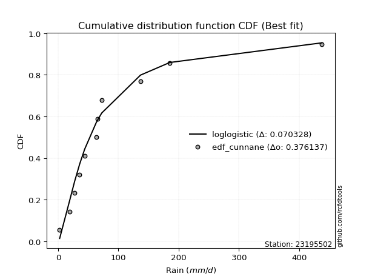</img></img>

</div>


### 12. EDF Adamowski (1981)

The Adamowski formula in hydrology refers to a specific plotting position formula used for estimating the non-parametric empirical distribution of hydrological events (like flood peaks) to calculate their return periods. This formula provides an alternative to traditional parametric methods (like the Gumbel or Log Pearson Type III distributions). 

<div align="center">


$P=(m-0.25)/(n+0.5)$


</div>


**12.1. Empirical values**

<div align="center">

|                | 0                   | 1                   | 2                  | 3                   | 4                   | 5             | 6                  | 7                  | 8                  | 9                  | 10                 |
|:---------------|:--------------------|:--------------------|:-------------------|:--------------------|:--------------------|:--------------|:-------------------|:-------------------|:-------------------|:-------------------|:-------------------|
| date           | 2022                | 2023                | 2021               | 2015                | 2017                | 2016          | 2019               | 2018               | 2025               | 2024               | 2020               |
| x              | 2.55                | 19.62               | 27.36              | 35.75               | 44.13               | 63.2          | 65.57              | 72.39              | 136.7              | 185.3              | 437.61             |
| m              | 1                   | 2                   | 3                  | 4                   | 5                   | 6             | 7                  | 8                  | 9                  | 10                 | 11                 |
| empirical_dist | edf_adamowski       | edf_adamowski       | edf_adamowski      | edf_adamowski       | edf_adamowski       | edf_adamowski | edf_adamowski      | edf_adamowski      | edf_adamowski      | edf_adamowski      | edf_adamowski      |
| empirical      | 0.06521739130434782 | 0.15217391304347827 | 0.2391304347826087 | 0.32608695652173914 | 0.41304347826086957 | 0.5           | 0.5869565217391305 | 0.6739130434782609 | 0.7608695652173914 | 0.8478260869565217 | 0.9347826086956522 |
| empirical_tr   | 1.069767441860465   | 1.1794871794871795  | 1.3142857142857143 | 1.4838709677419355  | 1.703703703703704   | 2.0           | 2.421052631578948  | 3.0666666666666664 | 4.1818181818181825 | 6.571428571428571  | 15.333333333333343 |

</div>


**12.2. Kolmogorov-Smirnov fit test (sorted by Δ)**


<div align="center">

|                | 0                   | 1                   | 2                   | 3                   | 4                   | 5                   | 6                   | 7                   | 8                   | 9                   | 10                  | 11                  | 12                  | 13                  | 14                  | 15                  | 16                  | 17                  | 18                  | 19                  | 20                  | 21                  | 22                  | 23                  | 24                  | 25                  | 26                  | 27                  | 28                  | 29                  | 30                  | 31                  | 32                  | 33                  | 34                  | 35                  | 36                  | 37                  | 38                  | 39                  | 40                  | 41                  | 42                  | 43                  | 44                  | 45                  | 46                  | 47                  | 48                  | 49                  | 50                  | 51                  | 52                  | 53                  | 54                  | 55                  | 56                  | 57                  | 58                  | 59                  | 60                  | 61                  | 62                  | 63                  | 64                  | 65                  | 66                  | 67                  | 68                  | 69                  | 70                  | 71                  | 72                  | 73                  | 74                  | 75                  | 76                  | 77                  | 78                  | 79                  | 80                  | 81                  | 82                  | 83                  | 84                  | 85                  | 86                  | 87                  | 88                  | 89                  | 90                  | 91                  | 92                  | 93                  | 94                  | 95                  | 96                  | 97                  | 98                  | 99                  | 100                 | 101                 | 102                 | 103                 | 104                 | 105                 | 106                 | 107                 | 108                 | 109                 | 110                 | 111                 | 112                 | 113                 | 114                 | 115                 | 116                 | 117                 | 118                 | 119                 | 120                 | 121                 | 122                 | 123                 | 124                 | 125                 | 126                 | 127                 | 128                 | 129                 | 130                 | 131                 | 132                 | 133                 | 134                 | 135                 | 136                 | 137                 | 138                 | 139                 | 140                 | 141                 | 142                 | 143                 | 144                 | 145                 | 146                 | 147                 | 148                 | 149                 | 150                 | 151                 | 152                 | 153                 | 154                 | 155                 | 156                 | 157                 | 158                 | 159                 |
|:---------------|:--------------------|:--------------------|:--------------------|:--------------------|:--------------------|:--------------------|:--------------------|:--------------------|:--------------------|:--------------------|:--------------------|:--------------------|:--------------------|:--------------------|:--------------------|:--------------------|:--------------------|:--------------------|:--------------------|:--------------------|:--------------------|:--------------------|:--------------------|:--------------------|:--------------------|:--------------------|:--------------------|:--------------------|:--------------------|:--------------------|:--------------------|:--------------------|:--------------------|:--------------------|:--------------------|:--------------------|:--------------------|:--------------------|:--------------------|:--------------------|:--------------------|:--------------------|:--------------------|:--------------------|:--------------------|:--------------------|:--------------------|:--------------------|:--------------------|:--------------------|:--------------------|:--------------------|:--------------------|:--------------------|:--------------------|:--------------------|:--------------------|:--------------------|:--------------------|:--------------------|:--------------------|:--------------------|:--------------------|:--------------------|:--------------------|:--------------------|:--------------------|:--------------------|:--------------------|:--------------------|:--------------------|:--------------------|:--------------------|:--------------------|:--------------------|:--------------------|:--------------------|:--------------------|:--------------------|:--------------------|:--------------------|:--------------------|:--------------------|:--------------------|:--------------------|:--------------------|:--------------------|:--------------------|:--------------------|:--------------------|:--------------------|:--------------------|:--------------------|:--------------------|:--------------------|:--------------------|:--------------------|:--------------------|:--------------------|:--------------------|:--------------------|:--------------------|:--------------------|:--------------------|:--------------------|:--------------------|:--------------------|:--------------------|:--------------------|:--------------------|:--------------------|:--------------------|:--------------------|:--------------------|:--------------------|:--------------------|:--------------------|:--------------------|:--------------------|:--------------------|:--------------------|:--------------------|:--------------------|:--------------------|:--------------------|:--------------------|:--------------------|:--------------------|:--------------------|:--------------------|:--------------------|:--------------------|:--------------------|:--------------------|:--------------------|:--------------------|:--------------------|:--------------------|:--------------------|:--------------------|:--------------------|:--------------------|:--------------------|:--------------------|:--------------------|:--------------------|:--------------------|:--------------------|:--------------------|:--------------------|:--------------------|:--------------------|:--------------------|:--------------------|:--------------------|:--------------------|:--------------------|:--------------------|:--------------------|:--------------------|
| station        | 23195502            | 23195502            | 23195502            | 23195502            | 23195502            | 23195502            | 23195502            | 23195502            | 23195502            | 23195502            | 23195502            | 23195502            | 23195502            | 23195502            | 23195502            | 23195502            | 23195502            | 23195502            | 23195502            | 23195502            | 23195502            | 23195502            | 23195502            | 23195502            | 23195502            | 23195502            | 23195502            | 23195502            | 23195502            | 23195502            | 23195502            | 23195502            | 23195502            | 23195502            | 23195502            | 23195502            | 23195502            | 23195502            | 23195502            | 23195502            | 23195502            | 23195502            | 23195502            | 23195502            | 23195502            | 23195502            | 23195502            | 23195502            | 23195502            | 23195502            | 23195502            | 23195502            | 23195502            | 23195502            | 23195502            | 23195502            | 23195502            | 23195502            | 23195502            | 23195502            | 23195502            | 23195502            | 23195502            | 23195502            | 23195502            | 23195502            | 23195502            | 23195502            | 23195502            | 23195502            | 23195502            | 23195502            | 23195502            | 23195502            | 23195502            | 23195502            | 23195502            | 23195502            | 23195502            | 23195502            | 23195502            | 23195502            | 23195502            | 23195502            | 23195502            | 23195502            | 23195502            | 23195502            | 23195502            | 23195502            | 23195502            | 23195502            | 23195502            | 23195502            | 23195502            | 23195502            | 23195502            | 23195502            | 23195502            | 23195502            | 23195502            | 23195502            | 23195502            | 23195502            | 23195502            | 23195502            | 23195502            | 23195502            | 23195502            | 23195502            | 23195502            | 23195502            | 23195502            | 23195502            | 23195502            | 23195502            | 23195502            | 23195502            | 23195502            | 23195502            | 23195502            | 23195502            | 23195502            | 23195502            | 23195502            | 23195502            | 23195502            | 23195502            | 23195502            | 23195502            | 23195502            | 23195502            | 23195502            | 23195502            | 23195502            | 23195502            | 23195502            | 23195502            | 23195502            | 23195502            | 23195502            | 23195502            | 23195502            | 23195502            | 23195502            | 23195502            | 23195502            | 23195502            | 23195502            | 23195502            | 23195502            | 23195502            | 23195502            | 23195502            | 23195502            | 23195502            | 23195502            | 23195502            | 23195502            | 23195502            |
| empirical_dist | edf_adamowski       | edf_adamowski       | edf_adamowski       | edf_adamowski       | edf_adamowski       | edf_adamowski       | edf_adamowski       | edf_adamowski       | edf_adamowski       | edf_adamowski       | edf_adamowski       | edf_adamowski       | edf_adamowski       | edf_adamowski       | edf_adamowski       | edf_adamowski       | edf_adamowski       | edf_adamowski       | edf_adamowski       | edf_adamowski       | edf_adamowski       | edf_adamowski       | edf_adamowski       | edf_adamowski       | edf_adamowski       | edf_adamowski       | edf_adamowski       | edf_adamowski       | edf_adamowski       | edf_adamowski       | edf_adamowski       | edf_adamowski       | edf_adamowski       | edf_adamowski       | edf_adamowski       | edf_adamowski       | edf_adamowski       | edf_adamowski       | edf_adamowski       | edf_adamowski       | edf_adamowski       | edf_adamowski       | edf_adamowski       | edf_adamowski       | edf_adamowski       | edf_adamowski       | edf_adamowski       | edf_adamowski       | edf_adamowski       | edf_adamowski       | edf_adamowski       | edf_adamowski       | edf_adamowski       | edf_adamowski       | edf_adamowski       | edf_adamowski       | edf_adamowski       | edf_adamowski       | edf_adamowski       | edf_adamowski       | edf_adamowski       | edf_adamowski       | edf_adamowski       | edf_adamowski       | edf_adamowski       | edf_adamowski       | edf_adamowski       | edf_adamowski       | edf_adamowski       | edf_adamowski       | edf_adamowski       | edf_adamowski       | edf_adamowski       | edf_adamowski       | edf_adamowski       | edf_adamowski       | edf_adamowski       | edf_adamowski       | edf_adamowski       | edf_adamowski       | edf_adamowski       | edf_adamowski       | edf_adamowski       | edf_adamowski       | edf_adamowski       | edf_adamowski       | edf_adamowski       | edf_adamowski       | edf_adamowski       | edf_adamowski       | edf_adamowski       | edf_adamowski       | edf_adamowski       | edf_adamowski       | edf_adamowski       | edf_adamowski       | edf_adamowski       | edf_adamowski       | edf_adamowski       | edf_adamowski       | edf_adamowski       | edf_adamowski       | edf_adamowski       | edf_adamowski       | edf_adamowski       | edf_adamowski       | edf_adamowski       | edf_adamowski       | edf_adamowski       | edf_adamowski       | edf_adamowski       | edf_adamowski       | edf_adamowski       | edf_adamowski       | edf_adamowski       | edf_adamowski       | edf_adamowski       | edf_adamowski       | edf_adamowski       | edf_adamowski       | edf_adamowski       | edf_adamowski       | edf_adamowski       | edf_adamowski       | edf_adamowski       | edf_adamowski       | edf_adamowski       | edf_adamowski       | edf_adamowski       | edf_adamowski       | edf_adamowski       | edf_adamowski       | edf_adamowski       | edf_adamowski       | edf_adamowski       | edf_adamowski       | edf_adamowski       | edf_adamowski       | edf_adamowski       | edf_adamowski       | edf_adamowski       | edf_adamowski       | edf_adamowski       | edf_adamowski       | edf_adamowski       | edf_adamowski       | edf_adamowski       | edf_adamowski       | edf_adamowski       | edf_adamowski       | edf_adamowski       | edf_adamowski       | edf_adamowski       | edf_adamowski       | edf_adamowski       | edf_adamowski       | edf_adamowski       | edf_adamowski       | edf_adamowski       | edf_adamowski       |
| p_dist         | logfoldnorm         | loglogistic         | lognorm             | logcrystalball      | logexponnorm        | logfatiguelife      | logrice             | logf                | lognct              | logtukeylambda      | logvonmises_line    | invweibull          | genextreme          | nct                 | logbetaprime        | loghypsecant        | logt                | invgamma            | logerlang           | loggamma            | loggamma            | logjohnsonsu        | logalpha            | kappa3              | loggenlogistic      | logburr             | logmielke           | loginvgamma         | johnsonsu           | loginvgauss         | ncf                 | logskewnorm         | invgauss            | lomax               | genpareto           | logmaxwell          | mielke              | loglaplace          | loglaplace          | loganglit           | logexponweib        | logjohnsonsb        | logloggamma         | loggengamma         | logburr12           | logweibull_min      | logbeta             | lograyleigh         | gengamma            | loggennorm          | betaprime           | logexponpow         | logsemicircular     | fatiguelife         | logpearson3         | wald                | dgamma              | logncf              | loggenextreme       | logdweibull         | logloglaplace       | gausshyper          | logargus            | burr12              | gennorm             | truncpareto         | loggumbel_l         | loggumbel_r         | pearson3            | loginvweibull       | logcosine           | logtruncweibull_min | loghalfnorm         | exponweib           | logdgamma           | t                   | lognakagami         | truncweibull_min    | exponnorm           | loghalflogistic     | logmoyal            | gompertz            | genexpon            | nakagami            | halflogistic        | dweibull            | logarcsine          | burr                | weibull_min         | f                   | loggenhalflogistic  | loggausshyper       | moyal               | gamma               | truncnorm           | halfnorm            | logkstwobign        | erlang              | vonmises_line       | cosine              | loggompertz         | genlogistic         | gumbel_r            | loggenpareto        | foldnorm            | loggenexpon         | logtriang           | rayleigh            | logwald             | maxwell             | exponpow            | arcsine             | logkappa3           | loguniform          | semicircular        | logwrapcauchy       | anglit              | halfgennorm         | logksone            | kstwobign           | beta                | crystalball         | norm                | logkappa4           | logistic            | logtrapezoid        | johnsonsb           | hypsecant           | rice                | loglevy_l           | laplace             | logtruncnorm        | skewnorm            | logbradford         | gumbel_l            | wrapcauchy          | logweibull_max      | logtruncexpon       | loglomax            | bradford            | powerlaw            | loghalfgennorm      | argus               | truncexpon          | triang              | levy_l              | ksone               | kappa4              | rdist               | uniform             | alpha               | tukeylambda         | logrdist            | genhalflogistic     | logpowerlaw         | trapezoid           | weibull_max         | logtruncpareto      | logvonmises         | vonmises            |
| delta          | 0.06863596121144788 | 0.0703282832092097  | 0.07125912398526252 | 0.07125912485106908 | 0.07126035104195791 | 0.0712831150189418  | 0.07167654520897418 | 0.07218640081291372 | 0.07256116355217138 | 0.07325487237519035 | 0.0761031994193887  | 0.076530423708287   | 0.07653053900435824 | 0.07666330166332036 | 0.07725886879136709 | 0.07729458555844793 | 0.07796695947373855 | 0.08006071511252821 | 0.08051700567007247 | 0.08227925600296149 | 0.08227925600296149 | 0.08229494371919854 | 0.08396226420806069 | 0.08456638442296016 | 0.08642592457677567 | 0.08699891317428676 | 0.0876948240386497  | 0.0877740614053743  | 0.09061186683636979 | 0.09297448357639176 | 0.09480524502256127 | 0.09528778969763463 | 0.096872279908926   | 0.09743560323771627 | 0.09743631548069664 | 0.09810827936385269 | 0.09843748196161528 | 0.0990626243870556  | 0.0990626243870556  | 0.09937174384495057 | 0.10466395291129282 | 0.10572621996252818 | 0.10572693725720028 | 0.1059053269374508  | 0.10663052702468312 | 0.1066668249624706  | 0.10722210293811851 | 0.10936850556993494 | 0.10956633089522111 | 0.11000275837707735 | 0.11057815310238711 | 0.11164149915244093 | 0.11167608969213105 | 0.11227011638083706 | 0.11241858549919892 | 0.11335510867480125 | 0.1145080491275739  | 0.11468827199719567 | 0.11541408562465638 | 0.11563405934785653 | 0.11986266499201859 | 0.1202475029704182  | 0.12032740015989696 | 0.12336649356422291 | 0.12617875307029036 | 0.1290216326947916  | 0.12947069576867365 | 0.13155448642101542 | 0.13271488203881565 | 0.1387174675184179  | 0.13955450485058052 | 0.14129809008435595 | 0.1412992490609104  | 0.14189208653930108 | 0.1487825540517161  | 0.14991991060530663 | 0.152173913043144   | 0.1526407423493662  | 0.1550380241990762  | 0.1552579873446024  | 0.15597183246388424 | 0.15675913857756696 | 0.15906107503470912 | 0.16098283816903441 | 0.16500403734392832 | 0.16585257274213278 | 0.1670540458037152  | 0.16831993051889194 | 0.17069376973088018 | 0.17296761255234627 | 0.1744650518663276  | 0.17469536448428374 | 0.17782856052356388 | 0.17833981133270238 | 0.1817560140197006  | 0.1819250104185386  | 0.1873765130382234  | 0.1883902737996891  | 0.18907730256269245 | 0.1938208597702924  | 0.1947505904229731  | 0.20129957403015852 | 0.20144448925741015 | 0.20781558335318873 | 0.2101032056107503  | 0.21084558871012793 | 0.21126368070490592 | 0.2166463542402297  | 0.22374070443723781 | 0.22890186631152326 | 0.2356519904236406  | 0.23926732335400475 | 0.2443881714394247  | 0.24439809905112453 | 0.24554705604002208 | 0.24946670082946582 | 0.25069965776928804 | 0.25259135497045093 | 0.26163609703535745 | 0.2619303968867934  | 0.2627019340076527  | 0.2631271745080799  | 0.2631271840872878  | 0.27130832411363    | 0.2747743418573727  | 0.2829696772782767  | 0.2835151023431378  | 0.2843879011512123  | 0.298927879730315   | 0.29951363302559986 | 0.3104530937116171  | 0.3116952355399886  | 0.3215742334795989  | 0.3235540750790513  | 0.33067298940042605 | 0.3721743753689277  | 0.3756978286994379  | 0.3776957644794905  | 0.39484716040922085 | 0.4009935166965976  | 0.4013515888914172  | 0.4016714669805266  | 0.40655376093240314 | 0.4176121357027366  | 0.42897769435894484 | 0.44232385277210634 | 0.4568050583727582  | 0.4886488324501762  | 0.5006509114583241  | 0.5133834613516577  | 0.5201140621101434  | 0.5272872691916922  | 0.5298156462339915  | 0.5461463181038928  | 0.6377063517151323  | 0.6565919249008094  | 0.7206603632902581  | 0.8027593941225015  | 1.0072038149113105  | 68.78918580086888   |
| deltao         | 0.37613735880099997 | 0.37613735880099997 | 0.37613735880099997 | 0.37613735880099997 | 0.37613735880099997 | 0.37613735880099997 | 0.37613735880099997 | 0.37613735880099997 | 0.37613735880099997 | 0.37613735880099997 | 0.37613735880099997 | 0.37613735880099997 | 0.37613735880099997 | 0.37613735880099997 | 0.37613735880099997 | 0.37613735880099997 | 0.37613735880099997 | 0.37613735880099997 | 0.37613735880099997 | 0.37613735880099997 | 0.37613735880099997 | 0.37613735880099997 | 0.37613735880099997 | 0.37613735880099997 | 0.37613735880099997 | 0.37613735880099997 | 0.37613735880099997 | 0.37613735880099997 | 0.37613735880099997 | 0.37613735880099997 | 0.37613735880099997 | 0.37613735880099997 | 0.37613735880099997 | 0.37613735880099997 | 0.37613735880099997 | 0.37613735880099997 | 0.37613735880099997 | 0.37613735880099997 | 0.37613735880099997 | 0.37613735880099997 | 0.37613735880099997 | 0.37613735880099997 | 0.37613735880099997 | 0.37613735880099997 | 0.37613735880099997 | 0.37613735880099997 | 0.37613735880099997 | 0.37613735880099997 | 0.37613735880099997 | 0.37613735880099997 | 0.37613735880099997 | 0.37613735880099997 | 0.37613735880099997 | 0.37613735880099997 | 0.37613735880099997 | 0.37613735880099997 | 0.37613735880099997 | 0.37613735880099997 | 0.37613735880099997 | 0.37613735880099997 | 0.37613735880099997 | 0.37613735880099997 | 0.37613735880099997 | 0.37613735880099997 | 0.37613735880099997 | 0.37613735880099997 | 0.37613735880099997 | 0.37613735880099997 | 0.37613735880099997 | 0.37613735880099997 | 0.37613735880099997 | 0.37613735880099997 | 0.37613735880099997 | 0.37613735880099997 | 0.37613735880099997 | 0.37613735880099997 | 0.37613735880099997 | 0.37613735880099997 | 0.37613735880099997 | 0.37613735880099997 | 0.37613735880099997 | 0.37613735880099997 | 0.37613735880099997 | 0.37613735880099997 | 0.37613735880099997 | 0.37613735880099997 | 0.37613735880099997 | 0.37613735880099997 | 0.37613735880099997 | 0.37613735880099997 | 0.37613735880099997 | 0.37613735880099997 | 0.37613735880099997 | 0.37613735880099997 | 0.37613735880099997 | 0.37613735880099997 | 0.37613735880099997 | 0.37613735880099997 | 0.37613735880099997 | 0.37613735880099997 | 0.37613735880099997 | 0.37613735880099997 | 0.37613735880099997 | 0.37613735880099997 | 0.37613735880099997 | 0.37613735880099997 | 0.37613735880099997 | 0.37613735880099997 | 0.37613735880099997 | 0.37613735880099997 | 0.37613735880099997 | 0.37613735880099997 | 0.37613735880099997 | 0.37613735880099997 | 0.37613735880099997 | 0.37613735880099997 | 0.37613735880099997 | 0.37613735880099997 | 0.37613735880099997 | 0.37613735880099997 | 0.37613735880099997 | 0.37613735880099997 | 0.37613735880099997 | 0.37613735880099997 | 0.37613735880099997 | 0.37613735880099997 | 0.37613735880099997 | 0.37613735880099997 | 0.37613735880099997 | 0.37613735880099997 | 0.37613735880099997 | 0.37613735880099997 | 0.37613735880099997 | 0.37613735880099997 | 0.37613735880099997 | 0.37613735880099997 | 0.37613735880099997 | 0.37613735880099997 | 0.37613735880099997 | 0.37613735880099997 | 0.37613735880099997 | 0.37613735880099997 | 0.37613735880099997 | 0.37613735880099997 | 0.37613735880099997 | 0.37613735880099997 | 0.37613735880099997 | 0.37613735880099997 | 0.37613735880099997 | 0.37613735880099997 | 0.37613735880099997 | 0.37613735880099997 | 0.37613735880099997 | 0.37613735880099997 | 0.37613735880099997 | 0.37613735880099997 | 0.37613735880099997 | 0.37613735880099997 | 0.37613735880099997 | 0.37613735880099997 |
| eval           | Δo > Δ              | Δo > Δ              | Δo > Δ              | Δo > Δ              | Δo > Δ              | Δo > Δ              | Δo > Δ              | Δo > Δ              | Δo > Δ              | Δo > Δ              | Δo > Δ              | Δo > Δ              | Δo > Δ              | Δo > Δ              | Δo > Δ              | Δo > Δ              | Δo > Δ              | Δo > Δ              | Δo > Δ              | Δo > Δ              | Δo > Δ              | Δo > Δ              | Δo > Δ              | Δo > Δ              | Δo > Δ              | Δo > Δ              | Δo > Δ              | Δo > Δ              | Δo > Δ              | Δo > Δ              | Δo > Δ              | Δo > Δ              | Δo > Δ              | Δo > Δ              | Δo > Δ              | Δo > Δ              | Δo > Δ              | Δo > Δ              | Δo > Δ              | Δo > Δ              | Δo > Δ              | Δo > Δ              | Δo > Δ              | Δo > Δ              | Δo > Δ              | Δo > Δ              | Δo > Δ              | Δo > Δ              | Δo > Δ              | Δo > Δ              | Δo > Δ              | Δo > Δ              | Δo > Δ              | Δo > Δ              | Δo > Δ              | Δo > Δ              | Δo > Δ              | Δo > Δ              | Δo > Δ              | Δo > Δ              | Δo > Δ              | Δo > Δ              | Δo > Δ              | Δo > Δ              | Δo > Δ              | Δo > Δ              | Δo > Δ              | Δo > Δ              | Δo > Δ              | Δo > Δ              | Δo > Δ              | Δo > Δ              | Δo > Δ              | Δo > Δ              | Δo > Δ              | Δo > Δ              | Δo > Δ              | Δo > Δ              | Δo > Δ              | Δo > Δ              | Δo > Δ              | Δo > Δ              | Δo > Δ              | Δo > Δ              | Δo > Δ              | Δo > Δ              | Δo > Δ              | Δo > Δ              | Δo > Δ              | Δo > Δ              | Δo > Δ              | Δo > Δ              | Δo > Δ              | Δo > Δ              | Δo > Δ              | Δo > Δ              | Δo > Δ              | Δo > Δ              | Δo > Δ              | Δo > Δ              | Δo > Δ              | Δo > Δ              | Δo > Δ              | Δo > Δ              | Δo > Δ              | Δo > Δ              | Δo > Δ              | Δo > Δ              | Δo > Δ              | Δo > Δ              | Δo > Δ              | Δo > Δ              | Δo > Δ              | Δo > Δ              | Δo > Δ              | Δo > Δ              | Δo > Δ              | Δo > Δ              | Δo > Δ              | Δo > Δ              | Δo > Δ              | Δo > Δ              | Δo > Δ              | Δo > Δ              | Δo > Δ              | Δo > Δ              | Δo > Δ              | Δo > Δ              | Δo > Δ              | Δo > Δ              | Δo > Δ              | Δo > Δ              | Δo > Δ              | Δo > Δ              | Δo > Δ              | Δo > Δ              | Δo > Δ              | Δo <= Δ             | Δo <= Δ             | Δo <= Δ             | Δo <= Δ             | Δo <= Δ             | Δo <= Δ             | Δo <= Δ             | Δo <= Δ             | Δo <= Δ             | Δo <= Δ             | Δo <= Δ             | Δo <= Δ             | Δo <= Δ             | Δo <= Δ             | Δo <= Δ             | Δo <= Δ             | Δo <= Δ             | Δo <= Δ             | Δo <= Δ             | Δo <= Δ             | Δo <= Δ             | Δo <= Δ             | Δo <= Δ             |
| fit            | 1                   | 1                   | 1                   | 1                   | 1                   | 1                   | 1                   | 1                   | 1                   | 1                   | 1                   | 1                   | 1                   | 1                   | 1                   | 1                   | 1                   | 1                   | 1                   | 1                   | 1                   | 1                   | 1                   | 1                   | 1                   | 1                   | 1                   | 1                   | 1                   | 1                   | 1                   | 1                   | 1                   | 1                   | 1                   | 1                   | 1                   | 1                   | 1                   | 1                   | 1                   | 1                   | 1                   | 1                   | 1                   | 1                   | 1                   | 1                   | 1                   | 1                   | 1                   | 1                   | 1                   | 1                   | 1                   | 1                   | 1                   | 1                   | 1                   | 1                   | 1                   | 1                   | 1                   | 1                   | 1                   | 1                   | 1                   | 1                   | 1                   | 1                   | 1                   | 1                   | 1                   | 1                   | 1                   | 1                   | 1                   | 1                   | 1                   | 1                   | 1                   | 1                   | 1                   | 1                   | 1                   | 1                   | 1                   | 1                   | 1                   | 1                   | 1                   | 1                   | 1                   | 1                   | 1                   | 1                   | 1                   | 1                   | 1                   | 1                   | 1                   | 1                   | 1                   | 1                   | 1                   | 1                   | 1                   | 1                   | 1                   | 1                   | 1                   | 1                   | 1                   | 1                   | 1                   | 1                   | 1                   | 1                   | 1                   | 1                   | 1                   | 1                   | 1                   | 1                   | 1                   | 1                   | 1                   | 1                   | 1                   | 1                   | 1                   | 1                   | 1                   | 1                   | 1                   | 1                   | 1                   | 0                   | 0                   | 0                   | 0                   | 0                   | 0                   | 0                   | 0                   | 0                   | 0                   | 0                   | 0                   | 0                   | 0                   | 0                   | 0                   | 0                   | 0                   | 0                   | 0                   | 0                   | 0                   | 0                   |
| n              | 11                  | 11                  | 11                  | 11                  | 11                  | 11                  | 11                  | 11                  | 11                  | 11                  | 11                  | 11                  | 11                  | 11                  | 11                  | 11                  | 11                  | 11                  | 11                  | 11                  | 11                  | 11                  | 11                  | 11                  | 11                  | 11                  | 11                  | 11                  | 11                  | 11                  | 11                  | 11                  | 11                  | 11                  | 11                  | 11                  | 11                  | 11                  | 11                  | 11                  | 11                  | 11                  | 11                  | 11                  | 11                  | 11                  | 11                  | 11                  | 11                  | 11                  | 11                  | 11                  | 11                  | 11                  | 11                  | 11                  | 11                  | 11                  | 11                  | 11                  | 11                  | 11                  | 11                  | 11                  | 11                  | 11                  | 11                  | 11                  | 11                  | 11                  | 11                  | 11                  | 11                  | 11                  | 11                  | 11                  | 11                  | 11                  | 11                  | 11                  | 11                  | 11                  | 11                  | 11                  | 11                  | 11                  | 11                  | 11                  | 11                  | 11                  | 11                  | 11                  | 11                  | 11                  | 11                  | 11                  | 11                  | 11                  | 11                  | 11                  | 11                  | 11                  | 11                  | 11                  | 11                  | 11                  | 11                  | 11                  | 11                  | 11                  | 11                  | 11                  | 11                  | 11                  | 11                  | 11                  | 11                  | 11                  | 11                  | 11                  | 11                  | 11                  | 11                  | 11                  | 11                  | 11                  | 11                  | 11                  | 11                  | 11                  | 11                  | 11                  | 11                  | 11                  | 11                  | 11                  | 11                  | 11                  | 11                  | 11                  | 11                  | 11                  | 11                  | 11                  | 11                  | 11                  | 11                  | 11                  | 11                  | 11                  | 11                  | 11                  | 11                  | 11                  | 11                  | 11                  | 11                  | 11                  | 11                  | 11                  |
| best_fit       | 1                   | 0                   | 0                   | 0                   | 0                   | 0                   | 0                   | 0                   | 0                   | 0                   | 0                   | 0                   | 0                   | 0                   | 0                   | 0                   | 0                   | 0                   | 0                   | 0                   | 0                   | 0                   | 0                   | 0                   | 0                   | 0                   | 0                   | 0                   | 0                   | 0                   | 0                   | 0                   | 0                   | 0                   | 0                   | 0                   | 0                   | 0                   | 0                   | 0                   | 0                   | 0                   | 0                   | 0                   | 0                   | 0                   | 0                   | 0                   | 0                   | 0                   | 0                   | 0                   | 0                   | 0                   | 0                   | 0                   | 0                   | 0                   | 0                   | 0                   | 0                   | 0                   | 0                   | 0                   | 0                   | 0                   | 0                   | 0                   | 0                   | 0                   | 0                   | 0                   | 0                   | 0                   | 0                   | 0                   | 0                   | 0                   | 0                   | 0                   | 0                   | 0                   | 0                   | 0                   | 0                   | 0                   | 0                   | 0                   | 0                   | 0                   | 0                   | 0                   | 0                   | 0                   | 0                   | 0                   | 0                   | 0                   | 0                   | 0                   | 0                   | 0                   | 0                   | 0                   | 0                   | 0                   | 0                   | 0                   | 0                   | 0                   | 0                   | 0                   | 0                   | 0                   | 0                   | 0                   | 0                   | 0                   | 0                   | 0                   | 0                   | 0                   | 0                   | 0                   | 0                   | 0                   | 0                   | 0                   | 0                   | 0                   | 0                   | 0                   | 0                   | 0                   | 0                   | 0                   | 0                   | 0                   | 0                   | 0                   | 0                   | 0                   | 0                   | 0                   | 0                   | 0                   | 0                   | 0                   | 0                   | 0                   | 0                   | 0                   | 0                   | 0                   | 0                   | 0                   | 0                   | 0                   | 0                   | 0                   |
| best_fit_sort  | 1                   | 2                   | 3                   | 4                   | 5                   | 6                   | 7                   | 8                   | 9                   | 10                  | 11                  | 12                  | 13                  | 14                  | 15                  | 16                  | 17                  | 18                  | 19                  | 20                  | 21                  | 22                  | 23                  | 24                  | 25                  | 26                  | 27                  | 28                  | 29                  | 30                  | 31                  | 32                  | 33                  | 34                  | 35                  | 36                  | 37                  | 38                  | 39                  | 40                  | 41                  | 42                  | 43                  | 44                  | 45                  | 46                  | 47                  | 48                  | 49                  | 50                  | 51                  | 52                  | 53                  | 54                  | 55                  | 56                  | 57                  | 58                  | 59                  | 60                  | 61                  | 62                  | 63                  | 64                  | 65                  | 66                  | 67                  | 68                  | 69                  | 70                  | 71                  | 72                  | 73                  | 74                  | 75                  | 76                  | 77                  | 78                  | 79                  | 80                  | 81                  | 82                  | 83                  | 84                  | 85                  | 86                  | 87                  | 88                  | 89                  | 90                  | 91                  | 92                  | 93                  | 94                  | 95                  | 96                  | 97                  | 98                  | 99                  | 100                 | 101                 | 102                 | 103                 | 104                 | 105                 | 106                 | 107                 | 108                 | 109                 | 110                 | 111                 | 112                 | 113                 | 114                 | 115                 | 116                 | 117                 | 118                 | 119                 | 120                 | 121                 | 122                 | 123                 | 124                 | 125                 | 126                 | 127                 | 128                 | 129                 | 130                 | 131                 | 132                 | 133                 | 134                 | 135                 | 136                 | 137                 | 138                 | 139                 | 140                 | 141                 | 142                 | 143                 | 144                 | 145                 | 146                 | 147                 | 148                 | 149                 | 150                 | 151                 | 152                 | 153                 | 154                 | 155                 | 156                 | 157                 | 158                 | 159                 | 160                 |

</div>


**12.3. Best fit**

<div align="center">

|   id |   station | empirical_dist   | p_dist      |    delta |   deltao | eval   |   fit |   n |   best_fit |   best_fit_sort |
|-----:|----------:|:-----------------|:------------|---------:|---------:|:-------|------:|----:|-----------:|----------------:|
|    0 |  23195502 | edf_adamowski    | logfoldnorm | 0.068636 | 0.376137 | Δo > Δ |     1 |  11 |          1 |               1 |

</div>


<div align="center">

</img>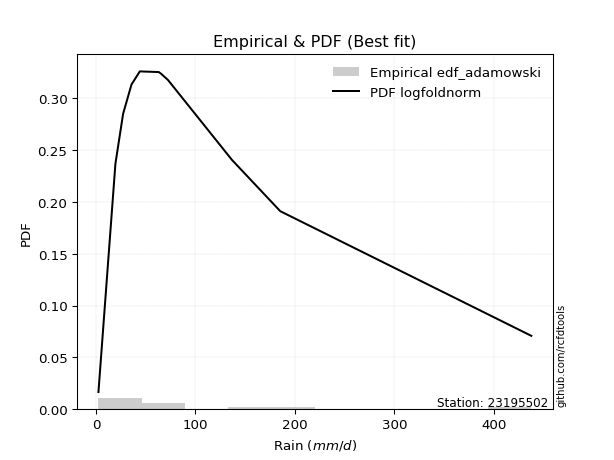</img>

</div>


## C. Best fit & Estimate extreme values for specific return periods - Tr

Best fit in probability distribution analysis means finding the theoretical distribution (like Normal, Poisson, Exponential, etc.) that most accurately mirrors your real-world data´s patterns (shape, center, spread) for better predictions, using methods like visual checks (Q-Q plots), goodness-of-fit tests (Kolmogorov-Smirnov, Chi-Squared), and information criteria (AIC) to score and select the simplest, most representative model.


### 1. Best fit (ordered by delta Δ)

:file_folder:Table: [bestfit_23195502.csv](table/bestfit_23195502.csv)

<div align="center">

|   id |   station | empirical_dist   | p_dist         |     delta |   deltao | eval   |   fit |   n |   best_fit |   best_fit_sort |
|-----:|----------:|:-----------------|:---------------|----------:|---------:|:-------|------:|----:|-----------:|----------------:|
|    0 |  23195502 | edf_weibull      | logtukeylambda | 0.0662802 | 0.376137 | Δo > Δ |     1 |  11 |          1 |               1 |
|    1 |  23195502 | edf_adamowski    | logfoldnorm    | 0.068636  | 0.376137 | Δo > Δ |     1 |  11 |          1 |               2 |
|    2 |  23195502 | edf_chegodayev   | logfoldnorm    | 0.0701615 | 0.376137 | Δo > Δ |     1 |  11 |          1 |               3 |
|    3 |  23195502 | edf_jenkinson    | loglogistic    | 0.0703283 | 0.376137 | Δo > Δ |     1 |  11 |          1 |               4 |
|    4 |  23195502 | edf_filliben     | loglogistic    | 0.0703283 | 0.376137 | Δo > Δ |     1 |  11 |          1 |               5 |
|    5 |  23195502 | edf_gringorten   | loglogistic    | 0.0703283 | 0.376137 | Δo > Δ |     1 |  11 |          1 |               6 |
|    6 |  23195502 | edf_tukey        | loglogistic    | 0.0703283 | 0.376137 | Δo > Δ |     1 |  11 |          1 |               7 |
|    7 |  23195502 | edf_cunnane      | loglogistic    | 0.0703283 | 0.376137 | Δo > Δ |     1 |  11 |          1 |               8 |
|    8 |  23195502 | edf_blom         | loglogistic    | 0.0703283 | 0.376137 | Δo > Δ |     1 |  11 |          1 |               9 |
|    9 |  23195502 | edf_beard        | loglogistic    | 0.0703283 | 0.376137 | Δo > Δ |     1 |  11 |          1 |              10 |
|   10 |  23195502 | edf_hazen        | loglogistic    | 0.0703283 | 0.376137 | Δo > Δ |     1 |  11 |          1 |              11 |
|   11 |  23195502 | edf_california   | loglaplace     | 0.0731428 | 0.376137 | Δo > Δ |     1 |  11 |          1 |              12 |
|   12 |  23195502 | edf_california   | loglaplace     | 0.0731428 | 0.376137 | Δo > Δ |     1 |  11 |          1 |              13 |

</div>


### 2. Extreme values and % difference analysis

In hydrology, a return period (or recurrence interval $Tr$) is the statistical average time between extreme events like floods or droughts of a specific magnitude, indicating how rare an event is, with a 100-year flood, for example, having a 1% chance of occurring in any given year, not that it happens exactly every century. It is a key tool for infrastructure design (like bridges or dams) and risk assessment, calculated from historical data to determine the probability of future events, although it is important to remember it is statistical average, and events can cluster or be missed.

The extreme value porcentage difference is evaluated as $pdiff = 1 - (ETrBf / ETr) * 100$, where _ETrBf_ correspond to the bestfit extreme value for a specific recurrence interval and _ETr_ correspond to the extreme value for one of the most used PDFsused in hydrology.

> risk_rate: assuming the return period as the project useful life.

:file_folder:Table: [extreme_23195502.csv](table/extreme_23195502.csv), all PDFs.  
:file_folder:Table: [extremepdiff_23195502.csv](table/extremepdiff_23195502.csv), % difference between bestfit and most used PDFs in Hydrology.

<div align="center">

Extreme values table for only best fit PDFs
|   id |      tr |   prob_l |     prob_g |     alpha |   anglit |   arcsine |   argus |    beta |   betaprime |   bradford |      burr |    burr12 |   cosine |   crystalball |   dgamma |   dweibull |   erlang |   exponnorm |   exponpow |   exponweib |         f |   fatiguelife |   foldnorm |    gamma |   gausshyper |   genexpon |   genextreme |   gengamma |   genhalflogistic |   genlogistic |   gennorm |   genpareto |   gompertz |   gumbel_l |   gumbel_r |   halfgennorm |   halflogistic |   halfnorm |   hypsecant |   invgamma |   invgauss |   invweibull |   johnsonsb |   johnsonsu |    kappa3 |   kappa4 |   ksone |   kstwobign |   laplace |   levy_l |   loggamma |   logistic |   loglaplace |     lomax |   maxwell |   mielke |    moyal |   nakagami |       ncf |       nct |     norm |   pearson3 |   powerlaw |   rayleigh |     rdist |    rice |   semicircular |   skewnorm |         t |   trapezoid |   triang |   truncexpon |   truncnorm |   truncpareto |   truncweibull_min |   tukeylambda |   uniform |   vonmises |   vonmises_line |     wald |   weibull_max |   weibull_min |   wrapcauchy |   logalpha |   loganglit |   logarcsine |   logargus |   logbeta |   logbetaprime |   logbradford |   logburr |   logburr12 |   logcosine |   logcrystalball |   logdgamma |   logdweibull |   logerlang |   logexponnorm |   logexponpow |   logexponweib |      logf |   logfatiguelife |   logfoldnorm |   loggausshyper |   loggenexpon |   loggenextreme |   loggengamma |   loggenhalflogistic |   loggenlogistic |   loggennorm |   loggenpareto |   loggompertz |   loggumbel_l |   loggumbel_r |   loghalfgennorm |   loghalflogistic |   loghalfnorm |   loghypsecant |   loginvgamma |   loginvgauss |   loginvweibull |   logjohnsonsb |   logjohnsonsu |   logkappa3 |   logkappa4 |   logksone |   logkstwobign |   loglevy_l |   logloggamma |   loglogistic |    logloglaplace |         loglomax |   logmaxwell |   logmielke |   logmoyal |   lognakagami |     logncf |    lognct |   lognorm |   logpearson3 |   logpowerlaw |   lograyleigh |   logrdist |   logrice |   logsemicircular |   logskewnorm |        logt |   logtrapezoid |   logtriang |   logtruncexpon |   logtruncnorm |   logtruncpareto |   logtruncweibull_min |   logtukeylambda |   loguniform |   logvonmises |   logvonmises_line |     logwald |   logweibull_max |   logweibull_min |   logwrapcauchy |   station |   n |   risk_rate |
|-----:|--------:|---------:|-----------:|----------:|---------:|----------:|--------:|--------:|------------:|-----------:|----------:|----------:|---------:|--------------:|---------:|-----------:|---------:|------------:|-----------:|------------:|----------:|--------------:|-----------:|---------:|-------------:|-----------:|-------------:|-----------:|------------------:|--------------:|----------:|------------:|-----------:|-----------:|-----------:|--------------:|---------------:|-----------:|------------:|-----------:|-----------:|-------------:|------------:|------------:|----------:|---------:|--------:|------------:|----------:|---------:|-----------:|-----------:|-------------:|----------:|----------:|---------:|---------:|-----------:|----------:|----------:|---------:|-----------:|-----------:|-----------:|----------:|--------:|---------------:|-----------:|----------:|------------:|---------:|-------------:|------------:|--------------:|-------------------:|--------------:|----------:|-----------:|----------------:|---------:|--------------:|--------------:|-------------:|-----------:|------------:|-------------:|-----------:|----------:|---------------:|--------------:|----------:|------------:|------------:|-----------------:|------------:|--------------:|------------:|---------------:|--------------:|---------------:|----------:|-----------------:|--------------:|----------------:|--------------:|----------------:|--------------:|---------------------:|-----------------:|-------------:|---------------:|--------------:|--------------:|--------------:|-----------------:|------------------:|--------------:|---------------:|--------------:|--------------:|----------------:|---------------:|---------------:|------------:|------------:|-----------:|---------------:|------------:|--------------:|--------------:|-----------------:|-----------------:|-------------:|------------:|-----------:|--------------:|-----------:|----------:|----------:|--------------:|--------------:|--------------:|-----------:|----------:|------------------:|--------------:|------------:|---------------:|------------:|----------------:|---------------:|-----------------:|----------------------:|-----------------:|-------------:|--------------:|-------------------:|------------:|-----------------:|-----------------:|----------------:|----------:|----:|------------:|
|    0 |    2    | 0.5      | 0.5        |   12.4211 |  99.1073 |   99.1073 | 190.518 | 122.268 |     49.6557 |    152.423 |   40.703  |   48.0543 |  75.2573 |       99.1073 |  65.57   |    65.57   |  75.7399 |     68.7106 |    89.4705 |     46.3844 |   41.3222 |       60.0429 |    71.4026 |  43.0148 |      60.6798 |    69.4784 |      56.4281 |    54.2321 |           283.249 |       77.2368 |   63.2    |     57.6701 |    69.0412 |    118.57  |    79.6449 |       89.5714 |        69.9692 |    74.857  |     99.1073 |    56.7147 |    57.9786 |      56.4281 |     49.1258 |     57.2843 |   57.085  |  209.208 | 220.08  |     91.1099 |   99.1073 | -14.4178 |    49.7876 |    99.1073 |      51.7845 |   57.67   |   88.9752 |   54.794 |  73.3618 |    63.5353 |   58.4195 |   56.5737 |  99.1073 |    62.2813 |    12.3318 |    85.3816 | -40.5839  | 102.513 |        99.1073 |    105.624 |   48.3838 |     326.157 |  225.829 |      155.295 |     73.9613 |       63.4377 |            65.9578 |     -40.1317  |   220.08  |    3.08945 |         75.6281 |  60.705  |       437.468 |       41.2085 |      220.08  |    49.6039 |     51.7844 |      51.7851 |    58.3878 |   58.8906 |        51.2513 |       22.1614 |   57.5587 |     58.8902 |     43.8219 |          51.7845 |     65.57   |       65.57   |     50.6373 |        51.7842 |       58.6501 |        58.8193 |   51.9726 |          51.9283 |       52.3863 |         52.1419 |       35.2038 |         59.6341 |       58.9479 |              72.5901 |          57.4245 |      63.2    |        51.4775 |       38.3411 |       63.8609 |       41.9918 |     13.7622      |           37.8357 |       39.8813 |        51.7845 |       48.6585 |       48.904  |         46.5176 |        58.7697 |        57.3528 |     2.54997 |     29.4343 |    33.4052 |        38.5629 |     39.1785 |       58.9213 |       51.7845 |     63.1999      |     15.2119      |      46.4309 |     57.4902 |    39.2442 |       44.9281 |    45.838  |   51.572  |   51.7845 |       59.9006 |       3.58133 |       44.6685 |    4.73406 |   51.778  |           51.7843 |       56.9631 |     57.1514 |        119.995 |     84.2289 |         16.7187 |        23.5233 |          2.55875 |               47.0629 |          56.6798 |      33.4052 |      0.122215 |            51.5098 |     34.2423 |          225.512 |          58.8951 |         32.6855 |  23195502 |  11 |    0.75     |
|    1 |    2.33 | 0.570815 | 0.429185   |   14.7835 | 123.732  |  136.073  | 222.966 | 171.447 |     63.1114 |    182.557 |   52.4122 |   62.0755 |  85.496  |      120.248  |  69.2448 |    72.6811 |  93.8493 |     83.3131 |   111.791  |     60.81   |   54.0172 |       74.4243 |    96.2062 |  57.2424 |      76.474  |    84.2247 |      67.5675 |    69.8583 |           311.901 |       90.3919 |   66.6314 |     71.1893 |    83.691  |    136.962 |    99.2341 |      107.087  |        90.11   |    97.6733 |    116.026  |    68.1321 |    71.0972 |      67.5675 |    125.27   |     69.884  |   68.9086 |  241.275 | 257.051 |    107.244  |  111.901  | 119.766  |    62.8968 |   117.734  |      59.4348 |   71.1892 |  110.939  |   68.804 |  91.9054 |    90.4597 |   70.7815 |   67.6306 | 120.248  |    80.2466 |    22.7508 |   107.67   |   5.75018 | 120.372 |       125.518  |    123.366 |   55.0036 |     351.434 |  260.839 |      183.69  |     89.3051 |       78.0482 |            89.3234 |      -7.45106 |   250.889 |    3.37959 |         90.8398 |  74.5671 |       437.577 |       53.8484 |      309.839 |    62.8335 |     67.5122 |      77.1102 |    77.4699 |   73.312  |        64.7989 |       31.9697 |   69.3852 |     73.1711 |     57.0642 |          65.0257 |     68.5127 |       74.1752 |     64.1288 |        65.0254 |       74.475  |        72.7283 |   65.368  |          65.2161 |       65.0257 |         75.6781 |       48.3763 |         75.3762 |       73.0015 |             101.641  |          69.2683 |      69.4567 |        79.9296 |       51.7963 |       77.8514 |       51.8553 |     22.227       |           47.0014 |       50.9908 |        62.1352 |       61.4404 |       62.5677 |         63.8728 |        72.9693 |        68.6516 |     2.54997 |     43.0418 |    51.7252 |        53.3411 |     80.2482 |       72.9624 |       63.2885 |     75.8323      |     22.5465      |      58.8223 |     69.4807 |    47.9196 |       53.1871 |    59.4072 |   64.8195 |   65.0257 |       74.4738 |       4.51331 |       56.7877 |    8.42032 |   65.0428 |           68.8231 |       70.698  |     67.9636 |        161.804 |    110.601  |         24.571  |        34.277  |          2.56893 |               62.7595 |          67.2227 |      48.0899 |      0.147392 |            62.2949 |     39.7562 |          314.038 |          73.1793 |         47.1998 |  23195502 |  11 |    0.729209 |
|    2 |    5    | 0.8      | 0.2        |   33.1014 | 210.615  |  234.649  | 327.05  | 351.95  |    143.727  |    301.232 |  123.785  |  154.372  | 122.393  |      198.812  | 112.429  |   144.961  | 187.386  |    156.322  |   216.869  |    154.967  |  129.983  |      155.628  |   201.098  | 140.212  |     157.012  |   157.953  |     134.472  |   159.25   |           387.963 |      147.54   |  102.831  |    147.327  |   156.935  |    196.381 |   184.338  |      189.658  |       181.243  |   194.16   |    183.891  |   136.037  |   147.941  |     134.472  |    424.569  |    143.384  |  136.209  |  346.814 | 376.702 |    175.779  |  175.864  | 342.077  |   152.413  |   189.653  |     118.367  |  147.327  |  197.386  |  144.567 | 177.801  |   240.284  |  140.935  |  133.995  | 198.812  |   170.619  |   130.774  |   196.901  | 134.804   | 191.87  |       215.647  |    198.394 |   87.273  |     423.952 |  361.28  |      296.036 |    164.088  |      156.098  |           216.365  |      97.5979  |   350.598 |    4.4927  |        148.9    | 152.167  |       437.61  |      130.49   |      408.014 |   155.311  |    172.097  |     222.942  |   186.702  |  154.24   |       156.65   |      118.152  |  135.922  |    152.681  |    147.774  |         151.555  |    127.33   |      148.053  |    156.66   |       151.554  |      161.76   |       150.646  |  153.461  |         152.228  |      145.184  |        223.605  |      173.617  |        164.731  |      151.528  |             247.247  |         136.163  |     131.784  |       255.54   |      148.822  |      147.638  |      129.678  |    379.508       |          125.427  |      144.148  |       129.056  |      149.337  |      162.755  |        253.245  |       152.533  |       133.433  |     2.54997 |    150.486  |   212.937  |       211.613  |    263.228  |      151.478  |      137.317  |    214.083       |    161.26        |     149.245  |    136.591  |   120.862  |      110.843  |   169.094  |  151.907  |  151.555  |      154.575  |      21.7799  |      148.465  |   40.7785  |  151.814  |          181.683  |      148.626  |    135.972  |        381.464 |    241.627  |         99.7143 |       166.691  |          2.94444 |              164.274  |         134.151  |     156.379  |      0.306095 |           131.041  |     91.7044 |          430.489 |         152.69   |        155.029  |  23195502 |  11 |    0.67232  |
|    3 |   10    | 0.9      | 0.1        |   66.7558 | 259.791  |  258.446  | 377.241 | 412.056 |    238.262  |    365.04  |  215.42   |  277.323  | 144.684  |      250.93   | 162.698  |   235.083  | 274.654  |    222.597  |   300.826  |    271.241  |  214.709  |      238.812  |   278.715  | 225.322  |     226.163  |   224.881  |     220.705  |   251.982  |           414.658 |      194.084  |  158.729  |    230.617  |   223.422  |    229.463 |   253.654  |      259.511  |       256.925  |   265.558  |    238.084  |   221.116  |   233.576  |     220.705  |    436.891  |    228.462  |  218.259  |  393.291 | 428.909 |    227.959  |  233.929  | 395.748  |   278.157  |   242.618  |     221.221  |  230.617  |  258.223  |  228.591 | 252.587  |   370.571  |  222.333  |  219.685  | 250.93   |   253.086  |   246.909  |   260.525  | 170.382   | 242.85  |       261.893  |    253.914 |  130.775  |     452.277 |  400.512 |      359.571 |    229.41   |      229.642  |           309.095  |     142.497   |   394.104 |    5.22279 |        190.907  | 234.52   |       437.61  |      215.356  |      424.211 |   289.953  |    292.278  |     288.073  |   280.88   |  238.209  |       284.091  |      222.648  |  216.055  |    235.463  |    262.58   |         265.674  |    272.516  |      286.445  |    287.164  |       265.673  |      246.925  |       233.282  |  270.6    |         267.342  |      247.359  |        330.647  |      433.158  |        252.113  |      234.145  |             336.809  |         217.118  |     275.135  |       362.15   |      279.476  |      210.832  |      273.586  |   8740.45        |          283.399  |      311.007  |       231.346  |      274.376  |      318.188  |        777.656  |       235.725  |       216.691  |     2.54997 |    261.342  |   394.817  |       604.24   |    350.656  |      234.19   |      242.925  |    679.619       |    961.983       |     287.385  |    216.81   |   270.458  |      192.73   |   365.321  |  267.74   |  265.674  |      234.952  |      76.7108  |      294.591  |   61.6544  |  266.384  |          298.974  |      233.747  |    240.301  |        533.259 |    327.876  |        201.472  |       533.346  |          5.31153 |              261.021  |         238.862  |     261.597  |      0.536288 |           231.898  |    222.64   |          436.99  |         235.431  |        260.474  |  23195502 |  11 |    0.651322 |
|    4 |   15    | 0.933333 | 0.0666667  |  100.29   | 280.791  |  262.985  | 396.322 | 425.328 |    304.704  |    388.2   |  287.059  |  371.545  | 154.838  |      276.937  | 194.131  |   294.976  | 326.291  |    261.366  |   345.389  |    352.683  |  271.108  |      290.216  |   319.106  | 277.605  |     263.117  |   264.032  |     287.701  |   310.029  |           422.778 |      220.344  |  201.389  |    286.661  |   262.314  |    244.444 |   292.762  |      298.745  |       299.754  |   302.714  |    269.011  |   285.466  |   289.952  |     287.7    |    437.443  |    287.686  |  280.591  |  408.753 | 446.311 |    255.661  |  267.894  | 411.962  |   377.183  |   271.476  |     318.934  |  286.661  |  289.438  |  288.711 | 295.989  |   440.884  |  280.489  |  286.399  | 276.937  |   301.433  |   300.746  |   293.306  | 178.054   | 269.118 |       279.928  |    282.806 |  169.75   |     461.366 |  413.1   |      383.664 |    266.591  |      270.548  |           347.327  |     157.173   |   408.606 |    5.53006 |        213.934  | 287.403  |       437.61  |      270.504  |      428.829 |   398.915  |    366.455  |     302.505  |   327.148  |  290.983  |       383.476  |      277.557  |  276.463  |    288.18   |    341.183  |         351.56   |    441.511  |      424.695  |    390.135  |       351.559  |      297.774  |       286.72   |  359.243  |         354.178  |      322.704  |        369.927  |      694.24   |        302.017  |      287.214  |             369.783  |         278.326  |     446.468  |       394.886  |      374.55   |      247.75   |      416.888  |  68470.2         |          449.505  |      464.049  |       322.793  |      373.882  |      449.588  |       1464.5    |       288.615  |       284.032  |     2.54997 |    314.076  |   485.041  |      1054.66   |    382.39   |      287.367  |      331.479  |   1493.62        |   2734.57        |     402.227  |    277.009  |   431.633  |      257.339  |   549.82   |  355.447  |  351.56   |      284.206  |     129.253   |      419.327  |   67.1274  |  352.669  |          363.07   |      290.453  |    339.332  |        593.77  |    361.613  |        258.645  |       975.311  |          9.81489 |              307.818  |         338.45   |     310.54   |      0.735188 |           317.832  |    393.523  |          437.454 |         288.095  |        309.657  |  23195502 |  11 |    0.644736 |
|    5 |   20    | 0.95     | 0.05       |  133.795  | 293.144  |  264.583  | 406.796 | 430.34  |    357.577  |    400.158 |  348.77   |  450.568  | 161.083  |      293.969  | 217.017  |   340.142  | 363.117  |    288.872  |   375.23   |    416.466  |  314.31   |      327.611  |   346.036  | 315.507  |     287.488  |   291.81   |     344.882  |   352.656  |           426.687 |      238.73   |  236.171  |    330.112  |   289.907  |    253.77  |   320.144  |      325.981  |       329.762  |   327.485  |    290.829  |   339.373  |   332.472  |     344.882  |    437.546  |    334.385  |  333.328  |  416.46  | 455.012 |    274.322  |  291.993  | 420.265  |   461.159  |   291.422  |     413.45   |  330.112  |  310.154  |  337.912 | 326.727  |   488.214  |  327.481  |  343.422  | 293.969  |   335.77   |   331.089  |   315.095  | 180.966   | 286.576 |       289.931  |    302.068 |  206.796  |     465.849 |  419.31  |      396.377 |    292.54   |      297.385  |           368.067  |     164.419   |   415.857 |    5.69645 |        230.128  | 326.811  |       437.61  |      311.83   |      431.063 |   492.975  |    418.602  |     307.758  |   355.474  |  329.783  |       467.213  |      310.451  |  327.327  |    327.414  |    400.797  |         422.344  |    628.525  |      563.095  |    477.535  |       422.342  |      334.035  |       326.863  |  432.541  |         425.849  |      384.085  |        389.351  |      950.084  |        335.905  |      326.922  |             386.719  |         329.952  |     643.088  |       409.418  |      450.318  |      273.927  |      559.885  | 324259           |          621.006  |      605.946  |       408.298  |      458.862  |      566.124  |       2281.21   |       327.861  |       343.927  |     2.54997 |    344.23   |   537.612  |      1534.86   |    399.737  |      327.175  |      410.916  |   2764.15        |   5738.65        |     502.772  |    327.568  |   601.025  |      312.116  |   725.241  |  428.006  |  422.344  |      319.847  |     171.383   |      530.237  |   69.2661  |  423.808  |          404.371  |      333.978  |    438.789  |        626.103 |    379.513  |        293.986  |      1457.8    |         16.2701  |              335.116  |         437.583  |     338.345  |      0.91301  |           392.21   |    601.6    |          437.551 |         327.278  |        337.628  |  23195502 |  11 |    0.641514 |
|    6 |   25    | 0.96     | 0.04       |  167.288  | 301.515  |  265.325  | 413.55  | 432.776 |    402.192  |    407.457 |  404.193  |  519.819  | 165.462  |      306.507  | 235.033  |   376.562  | 391.772  |    310.208  |   397.451  |    469.37   |  349.713  |      357.061  |   366.073  | 345.29   |     305.285  |   313.356  |     395.787  |   386.472  |           428.98  |      252.892  |  265.761  |    366.094  |   311.31   |    260.406 |   341.235  |      346.798  |       352.881  |   345.917  |    307.714  |   386.68   |   366.785  |     395.787  |    437.578  |    373.455  |  380.058  |  421.07  | 460.233 |    288.299  |  310.686  | 425.476  |   535.131  |   306.681  |     505.659  |  366.094  |  325.534  |  380.529 | 350.552  |   523.568  |  367.639  |  394.239  | 306.507  |   362.42   |   350.474  |   331.284  | 182.393   | 299.548 |       296.42   |    316.4   |  242.641  |     468.52  |  423.01  |      404.236 |    312.431  |      316.552  |           381.069  |     168.727   |   420.208 |    5.79986 |        242.767  | 358.376  |       437.61  |      345.065  |      432.387 |   576.939  |    458.099  |     310.226  |   374.936  |  360.56   |       540.62   |      332.223  |  372.239  |    358.867  |    448.715  |         483.405  |    830.655  |      701.742  |    554.565  |       483.403  |      362.199  |       359.254  |  495.922  |         487.743  |      436.613  |        400.685  |     1199.6    |        361.06   |      358.876  |             396.986  |         375.595  |     863.408  |       417.279  |      513.827  |      294.222  |      702.674  |      1.14172e+06 |          796.595  |      739.001  |       489.731  |      534.121  |      672.213  |       3209.41   |       359.228  |       399.276  |     2.54997 |    363.646  |   571.852  |      2032.95   |    411.025  |      359.219  |      484.311  |   4616.17        |  10197.9         |     593.348  |    372.134  |   776.846  |      360.334  |   893.477  |  490.773  |  483.405  |      347.791  |     204.439   |      631.236  |   70.316   |  485.193  |          433.644  |      369.699  |    540.475  |        646.198 |    390.596  |        317.803  |      1965.5    |         24.3062  |              352.957  |         537.655  |     356.209  |      1.07154  |           456.041  |    845.196  |          437.582 |         358.681  |        355.61   |  23195502 |  11 |    0.639603 |
|    7 |   50    | 0.98     | 0.02       |  334.701  | 322.122  |  266.315  | 428.863 | 436.255 |    563.621  |    422.34  |  630.913  |  788.07   | 176.929  |      342.41   | 292.131  |   496.662  | 481.189  |    376.484  |   461.904  |    652.819  |  470.894  |      450.568  |   424.312  | 439.527  |     354.342  |   380.284  |     599.873  |   495.289  |           433.435 |      296.518  |  372.475  |    491.95   |   377.793  |    278.42  |   406.208  |      409.95   |       424.115  |   399.489  |    360.065  |   571.146  |   480.05   |     599.872  |    437.606  |    512.022  |  566.363  |  430.243 | 470.675 |    329.344  |  368.75   | 437.21   |   822.44   |   353.3    |     945.048  |  491.95   |  370.137  |  543.873 | 424.516  |   626.628  |  516.711  |  598.355  | 342.41   |   445.276  |   392.054  |   378.277  | 184.46    | 337.203 |       311.245  |    358.058 |  411.759  |     473.821 |  430.352 |      420.517 |    372.968  |      365.198  |           408.399  |     177.211   |   428.909 |    6.01299 |        283.363  | 461.436  |       437.61  |      454.416  |      435.008 |   911.398  |    571.937  |     313.553  |   422.792  |  459.323  |       823.146  |      380.956  |  550.119  |    462.089  |    603.112  |         711.62   |   2017.08   |     1399.17   |    853.992  |       711.617  |      449.553  |       466.702  |  733.823  |         719.534  |      630.247  |        421.83   |     2361.49   |        431.719  |      464.433  |             417.614  |         556.768  |    2290.28   |       430.346  |      737.436  |      357.22   |     1414.7    |      7.55772e+07 |         1715.69   |     1315.92   |       860.654  |      829.473  |     1110.3    |       9186.27   |       461.434  |       641.396  |     2.54997 |    405.621  |   647.013  |      4640.37   |    437.62   |      465.126  |      800.177  |  28317           |  60834.9         |     959.276  |    548.098  |  1723.05   |      547.165  |  1661.69   |  726.561  |  711.62   |      435.623  |     295.734   |     1047.13   |   71.8171  |  714.725  |          508.717  |      492.154  |   1101.47   |        688.006 |    413.558  |        372.294  |      4680.44   |         74.68    |              392.391  |        1065.26   |     394.817  |      1.6259   |           660.849  |   2564.7    |          437.607 |         461.689  |        394.497  |  23195502 |  11 |    0.63583  |
|    8 |   75    | 0.986667 | 0.0133333  |  502.091  | 331.191  |  266.499  | 434.937 | 436.967 |    676.512  |    427.386 |  814.052  |  990.418  | 182.405  |      361.674  | 326.148  |   571.34   | 533.726  |    415.252  |   496.786  |    773.538  |  550.231  |      506.422  |   456.015  | 495.629  |     378.792  |   419.435  |     760.575  |   561.334  |           434.873 |      321.875  |  445.487  |    576.636  |   416.682  |    287.529 |   443.972  |      445.956  |       465.523  |   428.652  |    390.658  |   711.83   |   550.472  |     760.575  |    437.609  |    606.228  |  712.529  |  433.276 | 474.155 |    351.927  |  402.716  | 442.031  |  1038.13   |   380.226  |    1362.47   |  576.636  |  394.388  |  666.8   | 467.768  |   682.759  |  624.259  |  759.404  | 361.674  |   493.786  |   406.784  |   403.844  | 184.894   | 357.688 |       317.167  |    380.735 |  571.283  |     475.576 |  432.782 |      426.121 |    407.551  |      385.81   |           417.92   |     179.982   |   431.809 |    6.08536 |        308.385  | 524.855  |       437.61  |      522.375  |      435.877 |  1169.82   |    630.622  |     314.173  |   443.299  |  518.873  |      1033.05   |      398.896  |  688.649  |    526.237  |    694.592  |         875.705  |   3428.28   |     2103.06   |   1078.92   |       875.701  |      500.38   |       534.232  |  905.681  |         886.569  |      767.445  |        428.087  |     3414.39   |        467.37   |      530.51   |             424.452  |         698.203  |    4217.29   |       433.652  |      886.656  |      394.044  |     2124.75   |      1.06356e+09 |         2679.96   |     1801.52   |      1196.55   |     1053.88   |     1462.34   |      16927.7    |       524.296  |       855.449  |     2.54997 |    420.556  |   674.201  |      7307.28   |    449.041  |      531.453  |     1069.38   |  97505.7         | 172932           |    1245.59   |    684.686  |  2745.44   |      686.877  |  2352.14   |  897.066  |  875.705  |      487.304  |     336.137   |     1379.06   |   72.1213  |  879.837  |          542.222  |      572.313  |   1766.71   |        702.434 |    421.454  |        392.754  |      7502.27   |        123.279   |              406.77   |        1646.2    |     408.595  |      1.93143  |           763.625  |   5077.91   |          437.609 |         525.665  |        408.383  |  23195502 |  11 |    0.634587 |
|    9 |  100    | 0.99     | 0.01       |  669.474  | 336.584  |  266.563  | 438.327 | 437.231 |    766.185  |    429.926 |  973.938  | 1158.92   | 185.837  |      374.704  | 350.499  |   626.131  | 571.086  |    442.759  |   520.427  |    865.19   |  610.618  |      546.473  |   477.612  | 535.789  |     394.351  |   447.213  |     898.41   |   609.164  |           435.58  |      339.822  |  502.13   |    642.293  |   444.273  |    293.488 |   470.701  |      471.131  |       494.831  |   448.519  |    412.36   |   830.011  |   602.083  |     898.409  |    437.609  |    679.492  |  837.744  |  434.785 | 475.895 |    367.399  |  426.814  | 444.85   |  1216.34   |   399.236  |    1766.24   |  642.293  |  410.905  |  769.467 | 498.454  |   720.964  |  711.466  |  897.704  | 374.704  |   528.22   |   414.317  |   421.261  | 185.058   | 371.645 |       320.484  |    396.184 |  725.048  |     476.451 |  433.995 |      428.957 |    431.739  |      397.261  |           422.761  |     181.35    |   433.259 |    6.1217  |        326.505  | 571.093  |       437.61  |      572.265  |      436.31  |  1387.37   |    668.335  |     314.391  |   455.145  |  561.732  |      1205.33   |      408.211  |  806.763  |    573.396  |    758.875  |        1007.64   |   5014.76   |     2812.38   |   1264.83   |      1007.63   |      536.262  |       584.186  | 1044.27   |        1021.07   |      876.8    |        430.967  |     4389.75   |        490.094  |      579.295  |             427.842  |         818.978  |    6614.27   |       435.04   |     1000.75   |      420.16   |     2833.54   |      7.54522e+09 |         3674.67   |     2231.33   |      1511.6    |     1240.77   |     1766.12   |      26090.4    |       570.158  |      1055.71   |     2.54997 |    428.193  |   688.22   |      9974.04   |    455.855  |      580.436  |     1312.35   | 256325           | 362907           |    1488.11   |    800.91   |  3820.72   |      801.955  |  2993.11   | 1034.66   | 1007.64   |      523.938  |     358.706   |     1663.62   |   72.2331  | 1012.63   |          561.94   |      633.229  |   2546.3    |        709.743 |    425.447  |        403.459  |     10344.4    |        163.257   |              414.211  |        2281.76   |     415.663  |      2.11701  |           823.46   |   8355.45   |          437.61  |         572.679  |        415.508  |  23195502 |  11 |    0.633968 |
|   10 |  200    | 0.995    | 0.005      | 1338.99   | 346.772  |  266.625  | 444.219 | 437.504 |   1020.2    |    433.756 | 1495.53   | 1669.76   | 192.816  |      404.26   | 409.768  |   763.837  | 661.342  |    509.034  |   574.041  |   1106.46   |  771.308  |      644.169  |   527.007  | 633.557  |     426.268  |   514.141  |    1335.84   |   727.448  |           436.62  |      382.968  |  655.458  |    821.888  |   510.752  |    306.439 |   534.958  |      530.657  |       565.291  |   493.956  |    464.641  |  1193.59   |   731.409  |    1335.84   |    437.61   |    879.877  | 1234.82   |  437.032 | 478.506 |    403.037  |  484.879  | 450.19   |  1747.11   |   444.837  |    3301.01   |  821.889  |  448.696  | 1083.4   | 572.386  |   808.177  |  966.219  | 1337.37   | 404.26   |   611.229  |   425.833  |   461.115  | 185.23    | 403.578 |       326.265  |    431.516 | 1306.81   |     477.761 |  435.809 |      433.256 |    488.886  |      416.174  |           430.123  |     183.369   |   435.435 |    6.17633 |        368.065  | 686.268  |       437.61  |      697.842  |      436.961 |  2053.6    |    745.846  |     314.601  |   476.435  |  666.499  |      1713.38   |      422.632  | 1178.71   |    692.513  |    908.515  |        1385.32   |  12677      |     5690.96   |   1818.67   |      1385.31   |      621.979  |       711.335  | 1442.66   |        1406.9    |     1186.12   |        434.831  |     7802.55   |        536.517  |      703.226  |             432.856  |        1200.15   |   20662.8    |       436.704  |     1303.63   |      483.051  |     5661.01   |      1.1162e+12  |         7848.71   |     3639.97   |      2654.5    |     1804      |     2730.23   |      73819.2    |       684.595  |      1794.48   |     2.54997 |    439.834  |   709.798  |     20420.9    |    469.05   |      704.9    |     2144.63   |      3.72185e+06 |      2.1649e+06  |    2235.64   |   1165.83   |  8471.54   |     1142.78   |  5266.25   | 1430.6    | 1385.32   |      611.6    |     395.91    |     2555.43   |   72.3471  | 1392.95   |          598.045  |      794.589  |   6945.99   |        720.825 |    431.497  |        420.142  |     21557.4    |        259.697   |              425.705  |        5354.29   |     426.496  |      2.44238  |           924.754  |  28887.7    |          437.61  |         691.361  |        426.429  |  23195502 |  11 |    0.633042 |
|   11 |  250    | 0.996    | 0.004      | 1673.75   | 349.365  |  266.632  | 445.598 | 437.54  |   1114.97   |    434.525 | 1715.89   | 1871.94   | 194.729  |      413.292  | 429      |   809.777  | 690.461  |    530.37   |   590.392  |   1190.28   |  827.959  |      675.93   |   542.203  | 665.292  |     435.019  |   535.687  |    1516.2    |   766.381  |           436.824 |      396.838  |  709.978  |    886.838  |   532.153  |    310.249 |   555.616  |      549.508  |       587.943  |   507.935  |    481.47   |  1339.5    |   774.39   |    1516.2    |    437.61   |    952.105  | 1398.53   |  437.478 | 479.028 |    414.066  |  503.571  | 451.58   |  1953.03   |   459.477  |    4037.21   |  886.839  |  460.329  | 1208.87  | 596.187  |   834.95   | 1063.93   | 1518.91   | 413.292  |   637.963  |   428.167  |   473.382  | 185.253   | 413.408 |       327.622  |    442.386 | 1584.87   |     478.023 |  436.172 |      434.123 |    506.959  |      420.241  |           431.611  |     183.767   |   435.87  |    6.18727 |        379.589  | 724.371  |       437.61  |      739.81   |      437.091 |  2318.52   |    766.969  |     314.626  |   481.549  |  700.543  |      1908.78   |      425.583  | 1331.14   |    732.485  |    954.462  |        1526.85   |  17135.4    |     7149.54   |   2033.56   |      1526.85   |      649.33   |       754.266  | 1592.49   |        1551.76   |     1300.87   |        435.512  |     9314.45   |        549.137  |      745.02   |             433.841  |        1356.64   |   30292.4    |       436.963  |     1409.52   |      503.288  |     7071.65   |      6.04831e+12 |        10017.4    |     4231.38   |      3182.03   |     2024.85   |     3125.48   |     103129      |       722.533  |      2145.42   |     2.54997 |    442.184  |   714.194  |     25490.9    |    472.546  |      746.882  |     2510.91   |      9.89693e+06 |      3.84714e+06 |    2534.04   |   1315      | 10946.8    |     1274.29   |  6291.52   | 1579.66   | 1526.85   |      639.532  |     403.872   |     2916.39   |   72.3618  | 1535.52   |          606.846  |      851.139  |  10011.5    |        723.059 |    432.715  |        423.571  |     27017.8    |        286.871   |              428.052  |        7199.65   |     428.696  |      2.51462  |           946.735  |  43545.6    |          437.61  |         731.166  |        428.647  |  23195502 |  11 |    0.632858 |
|   12 |  500    | 0.998    | 0.002      | 3347.53   | 355.795  |  266.642  | 448.769 | 437.59  |   1457.4    |    436.065 | 2626.88   | 2649.14   | 199.82   |      440.076  | 489.122  |   957.117  | 781.075  |    596.645  |   638.695  |   1469.68   | 1020.84   |      775.391  |   587.511  | 764.544  |     458.11   |   602.616  |    2241.85   |   889.764  |           437.226 |      439.89   |  895.731  |   1114.01   |   598.629  |    321.173 |   619.734  |      607.192  |       658.25   |   549.612  |    533.748  |  1909.49   |   911.565  |    2241.85   |    437.61   |   1202.85   | 2057.36   |  438.364 | 480.072 |    447.117  |  561.636  | 455.169  |  2723.44   |   504.881  |    7545.32   | 1114.02   |  495.042  | 1697.42  | 670.117  |   914.588  | 1427.59   | 2250.42   | 440.076  |   721.037  |   432.867  |   509.986  | 185.286   | 442.738 |       330.745  |    474.794 | 2904.65   |     478.546 |  436.896 |      435.862 |    562.15   |      428.695  |           434.6    |     184.55    |   436.74  |    6.20916 |        406.589  | 845.526  |       437.61  |      874.693  |      437.351 |  3336.53   |    821.96   |     314.66   |   493.502  |  806.776  |      2633.06   |      431.552  | 1940.56   |    861.605  |   1088.37   |        2037.43   |  44005.8    |    14575.1    |   2837.58   |      2037.42   |      733.476  |       893.658  | 2135.04   |        2075.33   |     1710.65   |        436.735  |    15802.9    |        582.024  |      880.651  |             435.779  |        1983.63   |  104195      |       437.382  |     1764.49   |      566.124  |    14106.9    |      1.47262e+15 |        21361      |     6628.67   |      5587.66   |     2860.7    |     4694.3    |     291129      |       843.451  |      3838.54   |   433.193   |    446.893  |   723.068  |     49545.6    |    481.696  |      883.139  |     4094.56   |      3.14645e+08 |      2.29499e+07 |    3682.85   |   1909.8    | 24271.5    |     1763.02   | 10821.8    | 2119.98   | 2037.43   |      725.019  |     420.353   |     4325.7    |   72.3823  | 2050      |          627.605  |     1042.04   |  36501.6    |        727.544 |    435.16   |        430.526  |     52951.7    |        352.555   |              432.797  |       19447.3    |     433.13   |      2.66645  |           992.445  | 160569      |          437.61  |         859.671  |        433.119  |  23195502 |  11 |    0.632489 |
|   13 |  750    | 0.998667 | 0.00133333 | 5021.31   | 358.641  |  266.644  | 450.043 | 437.601 |   1696.62   |    436.58  | 3368.37   | 3231.43   | 202.288  |      454.955  | 524.521  |  1046.38   | 834.18   |    635.414  |   665.372  |   1646.46   | 1146.56   |      834.061  |   612.822  | 823.014  |     469.104  |   641.766  |    2814.68   |   963.55   |           437.358 |      465.058  | 1016.11   |   1266.88   |   637.514  |    327.011 |   657.217  |      640.371  |       699.352  |   572.895  |    564.327  |  2344.73   |   994.115  |    2814.68   |    437.61   |   1369.5    | 2577.76   |  438.657 | 480.42  |    465.684  |  595.601  | 456.871  |  3280.41   |   531.408  |   10878.1    | 1266.88   |  514.457  | 2069.34  | 713.363  |   958.952  | 1690.45   | 2828.81   | 454.955  |   769.65   |   434.444  |   530.454  | 185.293   | 459.138 |       332.002  |    492.899 | 4153.2    |     478.72  |  437.137 |      436.444 |    593.8    |      431.614  |           435.601  |     184.806   |   437.03  |    6.21645 |        416.632  | 918.167  |       437.61  |      956.629  |      437.437 |  4095.48   |    847.549  |     314.666  |   498.382  |  869      |      3151.15   |      433.561  | 2418.41   |    940.565  |   1159.87   |        2391.55   |  76730.3    |    22158.8    |   3418.79   |      2391.54   |      782.11   |       979.338  | 2512.93   |        2439.27   |     1991.71   |        437.086  |    21240.3    |        597.386  |      964.019  |             436.41   |        2476.36   |  221579      |       437.486  |     1990.35   |      602.863  |    21123.2    |      4.34041e+16 |        33256.4    |     8517.92   |      7767.25   |     3473.12   |     5906.75   |     534033      |       916.162  |      5504.63   |   434.682   |    448.461  |   726.05   |     71968.9    |    486.098  |      966.899  |     5448.6    |      3.32568e+09 |      6.52381e+07 |    4539.39   |   2374.78   | 38670.7    |     2113.42   | 14771.4    | 2496.81   | 2391.55   |      773.954  |     426.017   |     5392.56   |   72.3864  | 2406.97   |          636.159  |     1164.98   |  88420.1    |        729.044 |    435.977  |        432.873  |     77101.9    |        378.463   |              434.394  |       36778.9    |     434.618  |      2.71925  |          1008.2    | 351117      |          437.61  |         938.201  |        434.62   |  23195502 |  11 |    0.632366 |
|   14 | 1000    | 0.999    | 0.001      | 6695.09   | 360.338  |  266.645  | 450.758 | 437.605 |   1886.55   |    436.837 | 4017.69   | 3714.69   | 203.844  |      465.2    | 549.726  |  1111.02   | 871.898  |    662.921  |   683.66   |   1777.85   | 1242.07   |      875.878  |   630.302  | 864.659  |     475.936  |   669.544  |    3306.48   |  1016.58   |           437.423 |      482.911  | 1106.86   |   1385.39   |   665.103  |    330.94  |   683.805  |      663.68   |       728.507  |   588.975  |    586.024  |  2710.52   |  1053.61   |    3306.48   |    437.61   |   1497.42   | 3024.77   |  438.802 | 480.594 |    478.547  |  619.7    | 457.941  |  3730.88   |   550.219  |   14101.8    | 1385.4    |  527.876  | 2381.39  | 744.047  |   989.536  | 1903.77   | 3325.91   | 465.2    |   804.149  |   435.233  |   544.599  | 185.296   | 470.472 |       332.708  |    505.403 | 5357.67   |     478.807 |  437.258 |      436.735 |    615.985  |      433.093  |           436.103  |     184.933   |   437.175 |    6.2201  |        421.795  | 970.42   |       437.61  |     1016.07   |      437.481 |  4721.63   |    863.177  |     314.668  |   501.142  |  913.077  |      3567.32   |      434.57   | 2826.95   |    998.103  |   1207.37   |        2670.53   | 114023      |    29856.5    |   3888.82   |      2670.52   |      816.348  |      1041.94   | 2811.43   |        2726.39   |     2211.62   |        437.245  |    26057.1    |        606.802  |     1024.95   |             436.721  |        2898.24   |  383720      |       437.53   |     2158.75   |      628.923  |    28127.2    |      5.15678e+17 |        45525      |    10128.5    |      9811.91   |     3972.76   |     6930.02   |     821232      |       968.558  |      7177.74   |   435.428   |    449.243  |   727.546  |     93212.4    |    488.886  |     1028.12   |     6672.31   |      2.10084e+10 |      1.36906e+08 |    5245.23   |   2771.55   | 53815.2    |     2395.21   | 18377      | 2794.7    | 2670.53   |      808.124  |     428.882   |     6279.94   |   72.3879  | 2688.25   |          641.016  |     1257.51   | 177001      |        729.795 |    436.386  |        434.052  |     99939      |        392.287   |              435.195  |       59391.8    |     435.364  |      2.74606  |          1016.18   | 616415      |          437.61  |         995.4    |        435.372  |  23195502 |  11 |    0.632305 |


</div>


<div align="center">

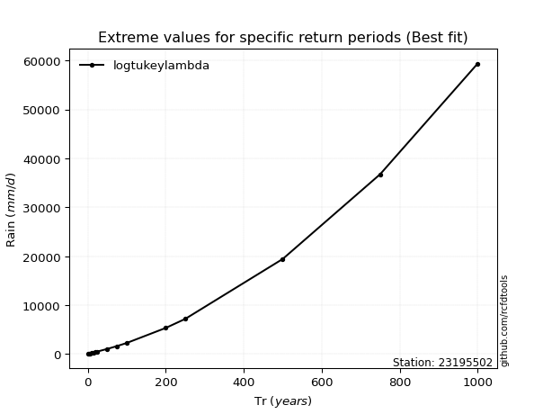</img>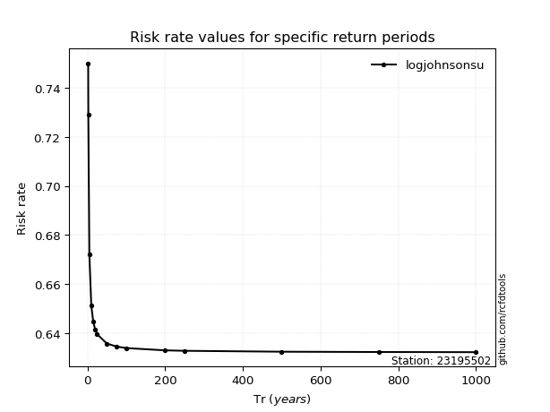</img>

</div>


<sub>**APP DISCLAIMER**: NO WARRANTY - This software is provided by [github.com/rcfdtools](https://github.com/rcfdtools) "as is", without any express or implied warranty, including warranties of merchantability, fitness for a particular purpose, or non-infringement. There is no guarantee that the software will be error-free or operate without interruption. LIMITATION OF LIABILITY - Neither the authors nor copyright holders will be liable for claims or damages arising from the software or its use. You are responsible for determining if the software is appropriate for your use and assume all associated risks, including errors, legal compliance, and data loss. NO PROFESSIONAL ADVICE - The software provides general information and does not offer professional advice. It should not replace consultation with professional advisors.</sub>