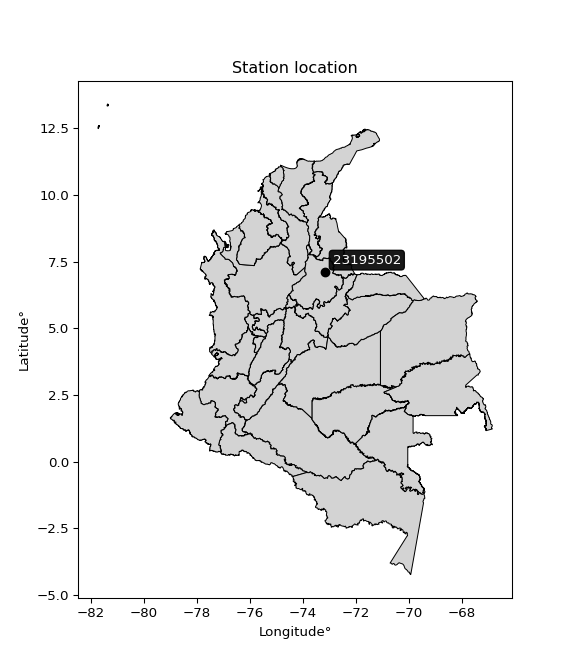

<div align="center">


</div>

# PMP Station (Rain, Pmax24h): 23195502

Probable Maximum Precipitation (PMP) is the greatest amount of rainfall for a specific duration that is meteorologically possible for a given location, acting as a "worst-case" scenario for extreme storms, crucial for designing safety-critical infrastructure like bridges, river deviations, dams, spillways, and nuclear plants to prevent catastrophic failure. PMP is calculated by hydrologists using meteorological data to determine the upper limit of extreme rainfall, often leading to the Probable Maximum Flood (PMF) for flood control design, and is increasingly being studied for climate change impacts. Probable Maximum Precipitation (PMP) is the theoretical upper limit of rainfall, a deterministic estimate for extreme events, while probability distributions (like GEV, Gumbel) describe the likelihood and frequency of various precipitation amounts, including rare ones, showing how often events occur, with PMP representing the extreme end of these distributions, used for critical infrastructure design to ensure safety against the worst conceivable weather, unlike standard statistical forecasts which cover typical probabilities.

The most common probability distributions in hydrology, used for analyzing floods, rainfall, and streamflow, include the Normal, Log-Normal, Gumbel, Gamma (including Log-Pearson Type III), and Generalized Extreme Value (GEV) distributions, often chosen based on the data´s skewness and whether modeling extremes or general conditions, with Gumbel and GEV popular for extreme events like floods, while the Normal distribution serves as a baseline, though often requiring transformations for skewed hydrological data. These distributions help in designing water infrastructure, managing water resources, and forecasting hydrologic events.

> Hydrological data often isn´t perfectly normal (it´s skewed), so different distributions are needed for different applications, such as: **Flood Frequency Analysis**: Using Gumbel, GEV, or Log-Pearson Type III for predicting extreme flood magnitudes and their return periods, **Rainfall Analysis**: Normal for annual totals, but Log-Normal, Weibull, or GEV for intensity or extreme daily rainfall, **Streamflow Modeling**: Gamma and Log-Normal for maximum flows, GEV for minimum flows, and Kappa for daily flows.

<div align="center">

</img>

</div>


## A. General information


### 1. General running parameters

• app_version: _v20260108_. • runtime: _2026-01-08 18:05:13.093906_. • Python version: _3.14.0_. • SciPy version: _1.16.3_. • Pandas version: _2.3.3_. • NumPy version: _2.3.5_. • Stations dataset (station_dataset_file): _dataset/pmax24h_in/automatic_colombia_2003_2024.csv_. • Stations catalog (station_catalog_file): _dataset/CNE.xls_. • Minimum year to eval til year_max (date_min): _1900_. • Maximum year to eval since year_min (date_max): _2024_. • Creates, save and include plots into reports (create_plot): _False_. • Plot only fit distributions with Δo > Δ (plot_only_fit): _True_. • Plot only simple graphs avoiding multiple CDFs and multiple Extreme values plots (plot_only_simple): _False_. • Eval low extreme values, if False, evaluates high extreme values (low_extreme): _False_. • Eval every SciPy distribution as logarithmic (pdist_logarithmic_on): _True_. • Standard deviation normalized (ddof): _1.0_. • Return periods to eval in years (Tr): _[2, 2.33, 5, 10, 15, 20, 25, 50, 75, 100, 200, 250, 500, 750, 1000]_. • Minimum data sample per station, 0 means any (minimum_sample): _5_. • Z-Score maximum threshold to adjust a value, 0 means disable (zscore_max): _3.5_. • Z-Score minimum threshold to adjust a value, 0 means disable (zscore_min): _-2.5_. • Avoid zeros, e.g. rain = 0 (avoid_zeros): _True_. • Avoid null values (avoid_nans): _True_. 

:file_folder:Table: [dataset.csv](../../dataset/pmax24h_in/automatic_colombia_2003_2024.csv)

> Delta Degrees of Freedom (DDOF): is a parameter used in the formulas for calculating variance and standard deviation. When ddof=0, the divisor is $N$ (the total number of observations) and this is used when your data set is the entire population. When ddof=1, the divisor is $N-1$ and this is used when your data set is a sample drawn from a larger population. Using $N-1$ provides an unbiased estimate of the population variance (known as Bessel´s correction).


### 2. Station info and location

|   id |   CODIGO | NOMBRE                              | CATEGORIA           | TECNOLOGIA                              | ESTADO   | FECHA_INSTALACION   |   FECHA_SUSPENSION |   ALTITUD |   LATITUD |   LONGITUD | DEPARTAMENTO   | MUNICIPIO   | AREA_OPERATIVA                         | ENTIDAD                                                     | AREA_HIDROGRAFICA   | ZONA_HIDROGRAFICA   | SUBZONA_HIDROGRAFICA                      |   CORRIENTE | Catalogo   |   Version |
|-----:|---------:|:------------------------------------|:--------------------|:----------------------------------------|:---------|:--------------------|-------------------:|----------:|----------:|-----------:|:---------------|:------------|:---------------------------------------|:------------------------------------------------------------|:--------------------|:--------------------|:------------------------------------------|------------:|:-----------|----------:|
|    0 | 23195502 | AEROPUERTO PALONEGRO AUT [23195502] | Sinóptica Principal | Automática con Telemetría, Convencional | Activa   | 05/05/2005          |                nan |      1189 |   7.12147 |   -73.1845 | Santander      | Lebrija     | Area Operativa 08 - Santanderes-Arauca | INSTITUTO DE HIDROLOGIA METEOROLOGIA Y ESTUDIOS AMBIENTALES | Magdalena Cauca     | Medio Magdalena     | Río Lebrija y otros directos al Magdalena |         nan | CNE_IDEAM  |  20251226 |

<div align="center">

Dynamic map: [:earth_americas:Google](http://maps.google.com/maps?q=7.121472222,-73.18452778) [:earth_americas:OSM](https://www.openstreetmap.org/#map=18/7.121472222/-73.18452778&layers=P) [:earth_americas:Bing](https://www.bing.com/maps?cp=7.121472222~-73.18452778&lvl=18) [:earth_americas:Apple](https://maps.apple.com/frame?center=7.121472222%2C-73.18452778&span=0.003%2C0.006)

</div>


<div align="center">

```geojson
{
  "type": "Feature",
  "geometry": {
    "type": "Point", 
    "coordinates": [-73.18452778, 7.121472222]
  }, 
  "properties": {
    "Name": "23195502"
  }
}
```

</div>


### 3. Discrete values table and plot

<div align="center">

|               |           0 |           1 |           2 |          3 |           4 |          5 |           6 |           7 |           8 |           9 |
|:--------------|------------:|------------:|------------:|-----------:|------------:|-----------:|------------:|------------:|------------:|------------:|
| Date          | 2015        | 2016        | 2017        | 2018       | 2019        | 2020       | 2021        | 2022        | 2023        | 2024        |
| Value         |   35.75     |   63.2      |   44.13     |   72.39    |   65.57     |  437.61    |   27.36     |    2.55     |   19.62     |  185.3      |
| Value_initial |   35.75     |   63.2      |   44.13     |   72.39    |   65.57     |  437.61    |   27.36     |    2.55     |   19.62     |  185.3      |
| count         |   10        |   10        |   10        |   10       |   10        |   10       |   10        |   10        |   10        |   10        |
| mean          |   95.348    |   95.348    |   95.348    |   95.348   |   95.348    |   95.348   |   95.348    |   95.348    |   95.348    |   95.348    |
| std           |  130.31     |  130.31     |  130.31     |  130.31    |  130.31     |  130.31    |  130.31     |  130.31     |  130.31     |  130.31     |
| zscore        |   -0.457356 |   -0.246704 |   -0.393048 |   -0.17618 |   -0.228517 |    2.62653 |   -0.521741 |   -0.712134 |   -0.581138 |    0.690294 |


</div>


> The initial value (value_initial) correspond to the initial obtained or null completed value, and value (value) is adjusted only when the initial value is outside the valid range (outlier) definite through the Z-Score value. If Z-Score is active, values out of range or outliers are replaced with the station mean value. A Z-Score (or standard score) measures how many standard deviations a data point is from the mean of a dataset, indicating its relative position; positive scores mean above the mean, negative mean below, and a score of zero is exactly at the mean, allowing for comparison of values from different distributions. It´s calculated using the formula $z=(x–μ)/σ$, where $x$ is the data point, $μ$ is the mean, and $σ$ is the standard deviation, helping identify outliers and understand probability.
>
> <sub>**Note**: In this study, "completing" (filling gaps in) and "extending" (forecasting or lengthening the historical record) rainfall data series are avoided for certain critical analyses because they introduce artificial bias and uncertainty, which can distort the statistics of rare events (extremes), alter day-to-day variability, and compromise the integrity and homogeneity of the original data. Some reasons against Completing/Extending rainfall data are: **Distortion of Extremes and Variability**: The primary issue is that most gap-filling or extension methods rely on averaging or regression with nearby stations, which inherently smooths the data. Rainfall is highly variable in space and time, with a large percentage of zero values and occasional large storms. Infilling methods often underestimate the highest values and overestimate the lowest (zero) values, which severely distorts analyses focused on flood frequency, drought severity, and intensity-duration-frequency (IDF) curves, **Loss of Data Homogeneity**: Infilled or extended data are synthetic estimates, not actual measurements. Combining these estimates with observed data can violate the assumption of data homogeneity, which requires that the data properties do not change over time. Inhomogeneity can lead to incorrect conclusions about long-term trends or changes in climate patterns, **Propagation of Errors**: Errors and biases from the original data (e.g., wind-induced undercatch, instrument errors, site changes) or the data used for imputation can propagate through the analysis, leading to unreliable hydrological models and inaccurate predictions, **Compromised Statistical Integrity**: For statistical analyses, especially those involving the frequency of events, using artificial data can introduce time bias or autocorrelation that doesn´t exist in reality, making it difficult to assess the true probability of events, **Difficulty in Validation**: It is difficult to accurately validate the quality of filled or extended data, especially for past periods where ground-truth measurements are unavailable. The reliability of imputation techniques heavily depends on the density of the surrounding station network and the complexity of the local topography.</sub>


### 4. Active continuous probability distributions from SciPy (43 of 104 available)

A Probability Density Function (PDF) describes the relative likelihood of a continuous random variable falling within a specific range, where the total area under its curve equals 1, and the area over any interval gives the actual probability for that range. Unlike discrete probabilities (like rolling a die), a PDF shows density, not direct probability for a single point (which is zero), with higher points indicating higher likelihood, often visualized as a bell curve for normal distributions.

A log of a probability density function (log-PDF) is simply the logarithm of the PDF´s value, denoted as $log(f(x))$, useful for converting multiplication of probabilities into addition, improving numerical stability with tiny numbers, and connecting to information theory concepts like entropy. Instead of dealing with very small probabilities (e.g., 0.000001), log-PDFs use negative numbers (e.g., $log(0.00001) ≈ -11.51$ that are easier for computers to handle, preventing underflow errors and simplifying complex calculations. In this study, each active probability distribution from SciPy is also evaluated in the $log$ form.

[scipy.stats](https://docs.scipy.org/doc/scipy/reference/stats.html) is a Python´s powerful submodule within the SciPy library for comprehensive statistical analysis, offering over 130 probability distributions (like Normal, Poisson), functions for descriptive stats (mean, variance), hypothesis testing (t-tests, chi-square), random variable generation, and statistical tests, making it essential for data science, modeling, and research. It provides tools to explore, model, and draw conclusions from data efficiently, working seamlessly with NumPy.

<div align="center">

|   id | p_dist             |   n_parameter | fit_method   | label                                                                       | active   | ref                                                                                                        |
|-----:|:-------------------|--------------:|:-------------|:----------------------------------------------------------------------------|:---------|:-----------------------------------------------------------------------------------------------------------|
|    0 | alpha              |             3 | MLE          | Alpha                                                                       | True     | [:mortar_board:](https://docs.scipy.org/doc/scipy/reference/generated/scipy.stats.alpha.html)              |
|    1 | betaprime          |             4 | MLE          | Beta prime                                                                  | True     | [:mortar_board:](https://docs.scipy.org/doc/scipy/reference/generated/scipy.stats.betaprime.html)          |
|    2 | chi2               |             3 | MLE          | Chi²                                                                        | True     | [:mortar_board:](https://docs.scipy.org/doc/scipy/reference/generated/scipy.stats.chi2.html)               |
|    3 | crystalball        |             4 | MLE          | Crystalball                                                                 | True     | [:mortar_board:](https://docs.scipy.org/doc/scipy/reference/generated/scipy.stats.crystalball.html)        |
|    4 | erlang             |             3 | MLE          | Erlang                                                                      | True     | [:mortar_board:](https://docs.scipy.org/doc/scipy/reference/generated/scipy.stats.erlang.html)             |
|    5 | expon              |             2 | MLE          | Exponential                                                                 | True     | [:mortar_board:](https://docs.scipy.org/doc/scipy/reference/generated/scipy.stats.expon.html)              |
|    6 | exponnorm          |             3 | MLE          | Exponentially modified Normal                                               | True     | [:mortar_board:](https://docs.scipy.org/doc/scipy/reference/generated/scipy.stats.exponnorm.html)          |
|    7 | f                  |             4 | MLE          | F                                                                           | True     | [:mortar_board:](https://docs.scipy.org/doc/scipy/reference/generated/scipy.stats.f.html)                  |
|    8 | fatiguelife        |             3 | MLE          | Fatigue-life (Birnbaum-Saunders)                                            | True     | [:mortar_board:](https://docs.scipy.org/doc/scipy/reference/generated/scipy.stats.fatiguelife.html)        |
|    9 | fisk               |             3 | MLE          | Fisk                                                                        | True     | [:mortar_board:](https://docs.scipy.org/doc/scipy/reference/generated/scipy.stats.fisk.html)               |
|   10 | gamma              |             3 | MLE          | Gamma                                                                       | True     | [:mortar_board:](https://docs.scipy.org/doc/scipy/reference/generated/scipy.stats.gamma.html)              |
|   11 | genexpon           |             5 | MLE          | Generalized exponential                                                     | True     | [:mortar_board:](https://docs.scipy.org/doc/scipy/reference/generated/scipy.stats.genexpon.html)           |
|   12 | genlogistic        |             3 | MLE          | Generalized logistic                                                        | True     | [:mortar_board:](https://docs.scipy.org/doc/scipy/reference/generated/scipy.stats.genlogistic.html)        |
|   13 | gibrat             |             2 | MM           | Gibrat                                                                      | True     | [:mortar_board:](https://docs.scipy.org/doc/scipy/reference/generated/scipy.stats.gibrat.html)             |
|   14 | gompertz           |             3 | MLE          | Gompertz (or truncated Gumbel)                                              | True     | [:mortar_board:](https://docs.scipy.org/doc/scipy/reference/generated/scipy.stats.gompertz.html)           |
|   15 | gumbel_l           |             2 | MM           | Gumbel Left Skew                                                            | True     | [:mortar_board:](https://docs.scipy.org/doc/scipy/reference/generated/scipy.stats.gumbel_l.html)           |
|   16 | gumbel_r           |             2 | MM           | Gumbel Right Skew                                                           | True     | [:mortar_board:](https://docs.scipy.org/doc/scipy/reference/generated/scipy.stats.gumbel_r.html)           |
|   17 | halflogistic       |             2 | MM           | Half-logistic                                                               | True     | [:mortar_board:](https://docs.scipy.org/doc/scipy/reference/generated/scipy.stats.halflogistic.html)       |
|   18 | halfnorm           |             2 | MM           | Half Normal                                                                 | True     | [:mortar_board:](https://docs.scipy.org/doc/scipy/reference/generated/scipy.stats.halfnorm.html)           |
|   19 | hypsecant          |             2 | MM           | hyperbolic secant                                                           | True     | [:mortar_board:](https://docs.scipy.org/doc/scipy/reference/generated/scipy.stats.hypsecant.html)          |
|   20 | invgamma           |             3 | MLE          | Inverted gamma                                                              | True     | [:mortar_board:](https://docs.scipy.org/doc/scipy/reference/generated/scipy.stats.invgamma.html)           |
|   21 | invgauss           |             3 | MLE          | Inverse Gaussian                                                            | True     | [:mortar_board:](https://docs.scipy.org/doc/scipy/reference/generated/scipy.stats.invgauss.html)           |
|   22 | invweibull         |             3 | MLE          | Inverted Weibull                                                            | True     | [:mortar_board:](https://docs.scipy.org/doc/scipy/reference/generated/scipy.stats.invweibull.html)         |
|   23 | kstwobign          |             2 | MLE          | Limiting distribution of scaled Kolmogorov-Smirnov two-sided test statistic | True     | [:mortar_board:](https://docs.scipy.org/doc/scipy/reference/generated/scipy.stats.kstwobign.html)          |
|   24 | laplace            |             2 | MM           | Laplace                                                                     | True     | [:mortar_board:](https://docs.scipy.org/doc/scipy/reference/generated/scipy.stats.laplace.html)            |
|   25 | laplace_asymmetric |             3 | MLE          | Asymmetric Laplace                                                          | True     | [:mortar_board:](https://docs.scipy.org/doc/scipy/reference/generated/scipy.stats.laplace_asymmetric.html) |
|   26 | loggamma           |             3 | MLE          | Log gamma                                                                   | True     | [:mortar_board:](https://docs.scipy.org/doc/scipy/reference/generated/scipy.stats.loggamma.html)           |
|   27 | logistic           |             2 | MM           | Logistic (or Sech-squared)                                                  | True     | [:mortar_board:](https://docs.scipy.org/doc/scipy/reference/generated/scipy.stats.logistic.html)           |
|   28 | lognorm            |             3 | MLE          | Log Normal                                                                  | True     | [:mortar_board:](https://docs.scipy.org/doc/scipy/reference/generated/scipy.stats.lognorm.html)            |
|   29 | maxwell            |             2 | MM           | Maxwell                                                                     | True     | [:mortar_board:](https://docs.scipy.org/doc/scipy/reference/generated/scipy.stats.maxwell.html)            |
|   30 | mielke             |             4 | MLE          | Mielke Beta-Kappa / Dagum                                                   | True     | [:mortar_board:](https://docs.scipy.org/doc/scipy/reference/generated/scipy.stats.mielke.html)             |
|   31 | moyal              |             2 | MM           | Moyal                                                                       | True     | [:mortar_board:](https://docs.scipy.org/doc/scipy/reference/generated/scipy.stats.moyal.html)              |
|   32 | nakagami           |             3 | MLE          | Nakagami                                                                    | True     | [:mortar_board:](https://docs.scipy.org/doc/scipy/reference/generated/scipy.stats.nakagami.html)           |
|   33 | ncf                |             5 | MLE          | Non-central F distribution                                                  | True     | [:mortar_board:](https://docs.scipy.org/doc/scipy/reference/generated/scipy.stats.ncf.html)                |
|   34 | nct                |             4 | MLE          | Non-central Student’s t                                                     | True     | [:mortar_board:](https://docs.scipy.org/doc/scipy/reference/generated/scipy.stats.nct.html)                |
|   35 | norm               |             2 | MM           | Normal                                                                      | True     | [:mortar_board:](https://docs.scipy.org/doc/scipy/reference/generated/scipy.stats.norm.html)               |
|   36 | pearson3           |             3 | MM           | Pearson type III                                                            | True     | [:mortar_board:](https://docs.scipy.org/doc/scipy/reference/generated/scipy.stats.pearson3.html)           |
|   37 | rayleigh           |             2 | MM           | Rayleigh                                                                    | True     | [:mortar_board:](https://docs.scipy.org/doc/scipy/reference/generated/scipy.stats.rayleigh.html)           |
|   38 | rice               |             3 | MLE          | Rice                                                                        | True     | [:mortar_board:](https://docs.scipy.org/doc/scipy/reference/generated/scipy.stats.rice.html)               |
|   39 | t                  |             3 | MLE          | Student’s t                                                                 | True     | [:mortar_board:](https://docs.scipy.org/doc/scipy/reference/generated/scipy.stats.t.html)                  |
|   40 | truncnorm          |             4 | MLE          | Truncated normal                                                            | True     | [:mortar_board:](https://docs.scipy.org/doc/scipy/reference/generated/scipy.stats.truncnorm.html)          |
|   41 | wald               |             2 | MM           | Wald                                                                        | True     | [:mortar_board:](https://docs.scipy.org/doc/scipy/reference/generated/scipy.stats.wald.html)               |
|   42 | weibull_min        |             3 | MLE          | Weibull minimum                                                             | True     | [:mortar_board:](https://docs.scipy.org/doc/scipy/reference/generated/scipy.stats.weibull_min.html)        |

</div>

> **n_parameter:** # arguments & localization & scale.
>
> **Fit methods:** (MLE) maximum likelihood, (MM) L-moments.
>
>**Inactive** (With the only purpose of prevent loops, zero divisions, infinite values, over high estimated values or horizontal trending for recurrence intervals estimations, the follow distributions were disabled.)**:** foldnorm, gennorm, norminvgauss, powernorm, powerlognorm, skewnorm, genextreme, anglit, arcsine, argus, beta, bradford, burr, burr12, cauchy, cosine, halfcauchy, foldcauchy, skewcauchy, wrapcauchy, dgamma, gengamma, exponweib, exponpow, truncexpon, gausshyper, genhalflogistic, genhyperbolic, geninvgauss, halfgennorm, johnsonsb, johnsonsu, kappa4, kappa3, ksone, kstwo, loglaplace, levy, levy_l, levy_stable, ncx2, pareto, genpareto, truncpareto, lomax, powerlaw, rdist, rel_breitwigner, recipinvgauss, semicircular, studentized_range, trapezoid, triang, truncweibull_min, tukeylambda, uniform, loguniform, vonmises, vonmises_line, weibull_max, dweibull, 


## B. Probability (PDF) vs. Empirical (EDF) distributions functions

A continuous probability distribution (CPD) describes probabilities for variables that can take any value within a range (like rain any time), unlike discrete variables with specific outcomes (like temperature). It uses a Probability Density Function (PDF), a curve where the total area under it equals 1, and the probability of the variable falling within an interval (a to b) is found by calculating the area under the curve between those points. A key feature is that the probability of hitting any single exact value is zero, so probabilities are always expressed for ranges, e.g., $P(a ≤ X ≤ b)$.

<div align="center">

Distributions parameters from station values
|    |   station | p_dist                |   n |              loc |          scale | shape                  | shape1                | shape2             | shape3   |
|---:|----------:|:----------------------|----:|-----------------:|---------------:|:-----------------------|:----------------------|:-------------------|:---------|
|  0 |  23195502 | alpha                 |  10 |     -0.0195668   |    7.99675     | 6.898897099225206e-10  |                       |                    |          |
|  1 |  23195502 | betaprime             |  10 |      2.55        |  150.572       | 0.8024395847552681     | 2.4341401435899286    |                    |          |
|  2 |  23195502 | chi2                  |  10 |      2.55        |    2.44298     | 0.33568387059709337    |                       |                    |          |
|  3 |  23195502 | crystalball           |  10 |     95.348       |  123.623       | 8375.767491012044      | 3896.7365500061405    |                    |          |
|  4 |  23195502 | erlang                |  10 |      2.55        |  117.168       | 0.6394526488893024     |                       |                    |          |
|  5 |  23195502 | expon                 |  10 |      2.55        |   92.798       |                        |                       |                    |          |
|  6 |  23195502 | exponnorm             |  10 |      2.45211     |    0.032201    | 2885.56147821565       |                       |                    |          |
|  7 |  23195502 | f                     |  10 |      2.55        |   55.1034      | 1.1140485918101866     | 6.383781621902537     |                    |          |
|  8 |  23195502 | fatiguelife           |  10 |     -6.01809     |   60.8125      | 1.1656440961589236     |                       |                    |          |
|  9 |  23195502 | fisk                  |  10 |     -1.04951     |   51.1279      | 1.517044044113677      |                       |                    |          |
| 10 |  23195502 | gamma                 |  10 |      2.55        |  178.973       | 0.3861383142271885     |                       |                    |          |
| 11 |  23195502 | genexpon              |  10 |      2.55        |  153.64        | 1.6556367348455872     | 9.213736981263925e-12 | 1.7899468888715098 |          |
| 12 |  23195502 | genlogistic           |  10 |   -393.48        |   60.9246      | 1442.5975133292113     |                       |                    |          |
| 13 |  23195502 | gibrat                |  10 |      1.03946     |   57.201       |                        |                       |                    |          |
| 14 |  23195502 | gompertz              |  10 |      2.54998     |    6.49187e+06 | 71304.91828350123      |                       |                    |          |
| 15 |  23195502 | gumbel_l              |  10 |    150.985       |   96.3882      |                        |                       |                    |          |
| 16 |  23195502 | gumbel_r              |  10 |     39.7112      |   96.3882      |                        |                       |                    |          |
| 17 |  23195502 | halflogistic          |  10 |    -51.1736      |  105.693       |                        |                       |                    |          |
| 18 |  23195502 | halfnorm              |  10 |    -68.28        |  205.077       |                        |                       |                    |          |
| 19 |  23195502 | hypsecant             |  10 |     95.348       |   78.7007      |                        |                       |                    |          |
| 20 |  23195502 | invgamma              |  10 |    -17.0229      |  103.095       | 1.8465734455856622     |                       |                    |          |
| 21 |  23195502 | invgauss              |  10 |     -8.71059     |   69.3303      | 1.5009097257658617     |                       |                    |          |
| 22 |  23195502 | invweibull            |  10 |    -25.8502      |   61.2623      | 1.6797221467928334     |                       |                    |          |
| 23 |  23195502 | kstwobign             |  10 |   -202.282       |  350.903       |                        |                       |                    |          |
| 24 |  23195502 | laplace               |  10 |     95.348       |   87.4144      |                        |                       |                    |          |
| 25 |  23195502 | laplace_asymmetric    |  10 |      2.55        |    0.00376974  | 4.062217875508001e-05  |                       |                    |          |
| 26 |  23195502 | loggamma              |  10 | -38431.6         | 5191.02        | 1672.5705819402665     |                       |                    |          |
| 27 |  23195502 | logistic              |  10 |     95.348       |   68.1568      |                        |                       |                    |          |
| 28 |  23195502 | lognorm               |  10 |      2.55        |    1.18609     | 11.874253779284116     |                       |                    |          |
| 29 |  23195502 | maxwell               |  10 |   -197.586       |  183.569       |                        |                       |                    |          |
| 30 |  23195502 | mielke                |  10 |      2.55        |   83.4498      | 0.6726511788152668     | 1.834426437610786     |                    |          |
| 31 |  23195502 | moyal                 |  10 |     24.6526      |   55.6498      |                        |                       |                    |          |
| 32 |  23195502 | nakagami              |  10 |      2.55        |  196.839       | 0.1999769952061326     |                       |                    |          |
| 33 |  23195502 | ncf                   |  10 |      2.54992     |   22.9256      | 0.9473973399047484     | 3.8794944910058113    | 1.4553405022051111 |          |
| 34 |  23195502 | nct                   |  10 |    -27.121       |    7.79656     | 1.634180097791077      | 7.923904310618367     |                    |          |
| 35 |  23195502 | norm                  |  10 |     95.348       |  123.623       |                        |                       |                    |          |
| 36 |  23195502 | pearson3              |  10 |     95.348       |  123.623       | 2.0566689934687723     |                       |                    |          |
| 37 |  23195502 | rayleigh              |  10 |   -141.149       |  188.698       |                        |                       |                    |          |
| 38 |  23195502 | rice                  |  10 |    -76.2478      |  149.545       | 0.0004774472420259148  |                       |                    |          |
| 39 |  23195502 | t                     |  10 |     44.2554      |   25.0529      | 1.0523504398139467     |                       |                    |          |
| 40 |  23195502 | truncnorm             |  10 |  -1037.17        |  344.074       | 3.0217745335227004     | 772.9606152387953     |                    |          |
| 41 |  23195502 | wald                  |  10 |    -28.2747      |  123.623       |                        |                       |                    |          |
| 42 |  23195502 | weibull_min           |  10 |      2.55        |   94.0565      | 0.6406630657175043     |                       |                    |          |
| 43 |  23195502 | logalpha              |  10 |    -26.8581      |  684.252       | 22.33441290266423      |                       |                    |          |
| 44 |  23195502 | logbetaprime          |  10 |     -3.47921     |    1.10743e+10 | 24.930343991093082     | 37580263220.63382     |                    |          |
| 45 |  23195502 | logchi2               |  10 |    -13.3019      |    0.0524957   | 326.7508070778297      |                       |                    |          |
| 46 |  23195502 | logcrystalball        |  10 |      3.85002     |    1.29891     | 13.56273768997124      | 288.62221783820183    |                    |          |
| 47 |  23195502 | logerlang             |  10 |    -20.662       |    0.0697936   | 351.0835987010206      |                       |                    |          |
| 48 |  23195502 | logexpon              |  10 |      0.936093    |    2.91393     |                        |                       |                    |          |
| 49 |  23195502 | logexponnorm          |  10 |      3.84896     |    1.29891     | 0.0008231027545744739  |                       |                    |          |
| 50 |  23195502 | logf                  |  10 |   -594.198       |  598.045       | 838690.1302299323      | 843785.6387649474     |                    |          |
| 51 |  23195502 | logfatiguelife        |  10 |   -403.591       |  407.442       | 0.0031889448964779335  |                       |                    |          |
| 52 |  23195502 | logfisk               |  10 |     -1.12887e+08 |    1.12887e+08 | 162964788.94802707     |                       |                    |          |
| 53 |  23195502 | loggamma              |  10 |    -19.9928      |    0.074863    | 318.3881966473633      |                       |                    |          |
| 54 |  23195502 | loggenexpon           |  10 |      0.936093    |    1.98405     | 0.26649376076324593    | 1.438777628646587     | 0.4025902976446124 |          |
| 55 |  23195502 | loggenlogistic        |  10 |      4.27014     |    0.5872      | 0.6701594999843192     |                       |                    |          |
| 56 |  23195502 | loggibrat             |  10 |      2.85914     |    0.601       |                        |                       |                    |          |
| 57 |  23195502 | loggompertz           |  10 |      0.936093    |    1.3588      | 0.08535804544078603    |                       |                    |          |
| 58 |  23195502 | loggumbel_l           |  10 |      4.4346      |    1.01276     |                        |                       |                    |          |
| 59 |  23195502 | loggumbel_r           |  10 |      3.26544     |    1.01276     |                        |                       |                    |          |
| 60 |  23195502 | loghalflogistic       |  10 |      2.31052     |    1.11052     |                        |                       |                    |          |
| 61 |  23195502 | loghalfnorm           |  10 |      2.13083     |    2.15469     |                        |                       |                    |          |
| 62 |  23195502 | loghypsecant          |  10 |      3.85002     |    0.826912    |                        |                       |                    |          |
| 63 |  23195502 | loginvgamma           |  10 |    -20.2665      | 7938.2         | 330.62412332877534     |                       |                    |          |
| 64 |  23195502 | loginvgauss           |  10 |     -9.70522     | 1273.8         | 0.010620982691205556   |                       |                    |          |
| 65 |  23195502 | loginvweibull         |  10 |     -1.31372e+08 |    1.31373e+08 | 91412539.25172809      |                       |                    |          |
| 66 |  23195502 | logkstwobign          |  10 |     -2.12057     |    6.85947     |                        |                       |                    |          |
| 67 |  23195502 | loglaplace            |  10 |      3.85002     |    0.918468    |                        |                       |                    |          |
| 68 |  23195502 | loglaplace_asymmetric |  10 |      4.1463      |    0.896671    | 1.1787114377412549     |                       |                    |          |
| 69 |  23195502 | logloggamma           |  10 |      0.0706409   |    2.64827     | 4.656712018535818      |                       |                    |          |
| 70 |  23195502 | loglogistic           |  10 |      3.85002     |    0.716127    |                        |                       |                    |          |
| 71 |  23195502 | loglognorm            |  10 |      0.936093    |    0.0706823   | 11.3652712355198       |                       |                    |          |
| 72 |  23195502 | logmaxwell            |  10 |      0.772149    |    1.92877     |                        |                       |                    |          |
| 73 |  23195502 | logmielke             |  10 |     -3.27538e+07 |    3.27538e+07 | 37222701.20496051      | 55701530.956990585    |                    |          |
| 74 |  23195502 | logmoyal              |  10 |      3.10722     |    0.584715    |                        |                       |                    |          |
| 75 |  23195502 | lognakagami           |  10 |      2.97655     |    1.28278     | 0.2946545224734509     |                       |                    |          |
| 76 |  23195502 | logncf                |  10 |     -0.290178    |    2.95493e-06 | 2.5156283013295695e-05 | 65.62121292663085     | 34.554535660996635 |          |
| 77 |  23195502 | lognct                |  10 |    -76.9859      |    1.28501     | 87748.23587015242      | 62.90610514489063     |                    |          |
| 78 |  23195502 | lognorm               |  10 |      3.85002     |    1.29891     |                        |                       |                    |          |
| 79 |  23195502 | logpearson3           |  10 |      3.85002     |    1.29891     | -0.5362984917521638    |                       |                    |          |
| 80 |  23195502 | lograyleigh           |  10 |      1.36516     |    1.98263     |                        |                       |                    |          |
| 81 |  23195502 | logrice               |  10 |   -316.367       |    1.29764     | 246.76767311250478     |                       |                    |          |
| 82 |  23195502 | logt                  |  10 |      3.91432     |    0.778787    | 2.270522545380274      |                       |                    |          |
| 83 |  23195502 | logtruncnorm          |  10 |      1.30021     |    3.42312     | -0.1092148040337948    | 22.33530036676914     |                    |          |
| 84 |  23195502 | logwald               |  10 |      2.55111     |    1.29892     |                        |                       |                    |          |
| 85 |  23195502 | logweibull_min        |  10 |     -3.41313     |    7.78666     | 6.545558100246845      |                       |                    |          |

</div>

> **loc** (Location parameter): This shifts the distribution along the x-axis. For many common distributions, like the normal (Gaussian) distribution, loc represents the mean $μ$. For others, like the uniform distribution, it might represent the minimum value, or for the beta distribution, the left end of the support interval.
>
> **scale** (Scale parameter): This determines the width or spread of the distribution. For the normal distribution, scale represents the standard deviation $σ$. For a uniform distribution, it defines the length of the interval (from $loc$ to $loc + scale$).
>
> **shape** (Shape parameters): Refers to parameters that define the specific form of a probability distribution, distinct from its location (loc) and scale (scale). These parameters are required arguments for most distribution functions. For example, a normal (Gaussian) distribution is fully defined by its location (mean) and scale (standard deviation), so it has no specific shape parameters beyond loc and scale. However, other distributions have intrinsic properties that need specification, as Gamma distribution that takes a shape parameter, often named $a$ or $alpha$.


### 0. Cumulative distribution values - CDF (86 evaluated)

Cumulative Distribution Function (CDF), denoted as $F$<sub>$X$</sub>$(x)$, is a function that gives the probability that a random variable $X$ will take a value less than or equal to a specific value, $x$ (i.e., $(P(X≥x)$. It essentially "accumulates" probabilities from a given point up to the far right (positive infinity), providing a complete picture of the distribution´s probabilities for both discrete (like rain) and continuous (like temperature) variables, helping to find probabilities over ranges or above certain values. Each station is evaluated separately ordering the $x$ values ascending, calculating the CDF and PDF values for the activated distributions and their logarithmic forms.

<div align="center">

CDF ordered by x ascending and calculating $log(f(x))$ separately
|   id |   Station |   date |      x |   count |   mean |    std |    zscore |   Value_initial |   station |   m |     alpha |   alpha_pdf |   betaprime |   betaprime_pdf |       chi2 |    chi2_pdf |   crystalball |   crystalball_pdf |      erlang |      erlang_pdf |    expon |   expon_pdf |   exponnorm |   exponnorm_pdf |           f |          f_pdf |   fatiguelife |   fatiguelife_pdf |      fisk |    fisk_pdf |       gamma |   gamma_pdf |    genexpon |   genexpon_pdf |   genlogistic |   genlogistic_pdf |      gibrat |   gibrat_pdf |    gompertz |   gompertz_pdf |   gumbel_l |   gumbel_l_pdf |   gumbel_r |   gumbel_r_pdf |   halflogistic |   halflogistic_pdf |   halfnorm |   halfnorm_pdf |   hypsecant |   hypsecant_pdf |   invgamma |   invgamma_pdf |   invgauss |   invgauss_pdf |   invweibull |   invweibull_pdf |   kstwobign |   kstwobign_pdf |   laplace |   laplace_pdf |   laplace_asymmetric |   laplace_asymmetric_pdf |   loggamma |   loggamma_pdf |   logistic |   logistic_pdf |   lognorm |   lognorm_pdf |   maxwell |   maxwell_pdf |      mielke |   mielke_pdf |    moyal |   moyal_pdf |    nakagami |   nakagami_pdf |        ncf |     ncf_pdf |       nct |     nct_pdf |     norm |    norm_pdf |   pearson3 |   pearson3_pdf |   rayleigh |   rayleigh_pdf |     rice |    rice_pdf |        t |       t_pdf |   truncnorm |   truncnorm_pdf |     wald |    wald_pdf |   weibull_min |   weibull_min_pdf |   logalpha |   logalpha_pdf |   logbetaprime |   logbetaprime_pdf |   logchi2 |   logchi2_pdf |   logcrystalball |   logcrystalball_pdf |   logerlang |   logerlang_pdf |   logexpon |   logexpon_pdf |   logexponnorm |   logexponnorm_pdf |      logf |   logf_pdf |   logfatiguelife |   logfatiguelife_pdf |   logfisk |   logfisk_pdf |   loggenexpon |   loggenexpon_pdf |   loggenlogistic |   loggenlogistic_pdf |   loggibrat |   loggibrat_pdf |   loggompertz |   loggompertz_pdf |   loggumbel_l |   loggumbel_l_pdf |   loggumbel_r |   loggumbel_r_pdf |   loghalflogistic |   loghalflogistic_pdf |   loghalfnorm |   loghalfnorm_pdf |   loghypsecant |   loghypsecant_pdf |   loginvgamma |   loginvgamma_pdf |   loginvgauss |   loginvgauss_pdf |   loginvweibull |   loginvweibull_pdf |   logkstwobign |   logkstwobign_pdf |   loglaplace |   loglaplace_pdf |   loglaplace_asymmetric |   loglaplace_asymmetric_pdf |   logloggamma |   logloggamma_pdf |   loglogistic |   loglogistic_pdf |   loglognorm |   loglognorm_pdf |   logmaxwell |   logmaxwell_pdf |   logmielke |   logmielke_pdf |    logmoyal |   logmoyal_pdf |   lognakagami |   lognakagami_pdf |     logncf |   logncf_pdf |    lognct |   lognct_pdf |   logpearson3 |   logpearson3_pdf |   lograyleigh |   lograyleigh_pdf |   logrice |   logrice_pdf |      logt |   logt_pdf |   logtruncnorm |   logtruncnorm_pdf |   logwald |   logwald_pdf |   logweibull_min |   logweibull_min_pdf |
|-----:|----------:|-------:|-------:|--------:|-------:|-------:|----------:|----------------:|----------:|----:|----------:|------------:|------------:|----------------:|-----------:|------------:|--------------:|------------------:|------------:|----------------:|---------:|------------:|------------:|----------------:|------------:|---------------:|--------------:|------------------:|----------:|------------:|------------:|------------:|------------:|---------------:|--------------:|------------------:|------------:|-------------:|------------:|---------------:|-----------:|---------------:|-----------:|---------------:|---------------:|-------------------:|-----------:|---------------:|------------:|----------------:|-----------:|---------------:|-----------:|---------------:|-------------:|-----------------:|------------:|----------------:|----------:|--------------:|---------------------:|-------------------------:|-----------:|---------------:|-----------:|---------------:|----------:|--------------:|----------:|--------------:|------------:|-------------:|---------:|------------:|------------:|---------------:|-----------:|------------:|----------:|------------:|---------:|------------:|-----------:|---------------:|-----------:|---------------:|---------:|------------:|---------:|------------:|------------:|----------------:|---------:|------------:|--------------:|------------------:|-----------:|---------------:|---------------:|-------------------:|----------:|--------------:|-----------------:|---------------------:|------------:|----------------:|-----------:|---------------:|---------------:|-------------------:|----------:|-----------:|-----------------:|---------------------:|----------:|--------------:|--------------:|------------------:|-----------------:|---------------------:|------------:|----------------:|--------------:|------------------:|--------------:|------------------:|--------------:|------------------:|------------------:|----------------------:|--------------:|------------------:|---------------:|-------------------:|--------------:|------------------:|--------------:|------------------:|----------------:|--------------------:|---------------:|-------------------:|-------------:|-----------------:|------------------------:|----------------------------:|--------------:|------------------:|--------------:|------------------:|-------------:|-----------------:|-------------:|-----------------:|------------:|----------------:|------------:|---------------:|--------------:|------------------:|-----------:|-------------:|----------:|-------------:|--------------:|------------------:|--------------:|------------------:|----------:|--------------:|----------:|-----------:|---------------:|-------------------:|----------:|--------------:|-----------------:|---------------------:|
|    0 |  23195502 |   2022 |   2.55 |      10 | 95.348 | 130.31 | -0.712134 |            2.55 |  23195502 |   1 | 0.0018576 | 0.00762122  | 1.58769e-07 |     0.643044    | 0.00218937 | 8.27465e+11 |      0.22643  |       0.00243474  | 8.05992e-12 | 11605.6         | 0        | 0.0107761   |  0.00105306 |     0.0107381   | 5.23142e-08 | 4005.5         |     0.0247928 |       0.00883155  | 0.0175409 | 0.00726308  | 1.79245e-07 | 1.55855e+08 | 3.04091e-12 |    0.0107761   |      0.114577 |       0.00407135  | 0.000139473 |  0.000358074 | 1.84138e-07 |    0.0109837   |   0.192965 |    0.00179502  |   0.229833 |    0.0035061   |       0.248815 |        0.00443781  |   0.270193 |    0.00366538  |    0.189946 |     0.00227282  |  0.0257845 |    0.00599833  |   0.024757 |     0.00759931 |     0.026316 |      0.00566172  |    0.114933 |     0.00350206  |  0.172953 |   0.00197854  |          1.68185e-09 |               0.0107759  |  0.0121508 |      0.025787  |   0.203991 |    0.00238243  | 0.0124367 |     0.0248027 |  0.24427  |   0.00285155  | 2.71316e-06 |  4.1242      | 0.222587 | 0.00415586  | 6.90943e-08 |    6.22274e+07 | 0.00092604 | 5.57841     | 0.0270145 | 0.00550746  | 0.22643  | 0.00243474  |   0.216225 |    0.00666188  |   0.251711 |    0.00301989  | 0.129615 | 0.00306675  | 0.167583 | 0.00341371  | 4.69833e-09 |     0.00960067  | 0.112012 | 0.00837317  |   7.94189e-12 |   11457.3         |   0.011184 |      0.0260239 |      0.0114752 |          0.028851  | 0.0112265 |     0.0248902 |        0.0124367 |            0.0248026 |   0.0107793 |       0.0236767 |   0        |      0.343179  |      0.0124367 |          0.0248027 | 0.0126263 |  0.0251522 |        0.0121854 |            0.0245361 | 0.0135258 |     0.0192619 |   3.48382e-10 |         0.134318  |        0.0222064 |            0.0252574 |   0         |       0         |   5.31849e-09 |         0.0628187 |     0.0311107 |         0.030236  |   4.65828e-05 |       0.000458777 |          0        |             0         |      0        |         0         |      0.0187654 |          0.0226802 |    0.00998911 |         0.0238092 |     0.0110961 |         0.0268374 |      0.00890104 |           0.0292436 |      0.0112695 |          0.0421254 |    0.0209474 |        0.0228069 |               0.0278891 |                   0.0263872 |     0.0221573 |         0.0298066 |      0.016807 |         0.0230748 |   0.00135325 |      3.52028e+12 |  0.000162976 |       0.00297798 |   0.0224932 |       0.0254748 | 1.53622e-10 |    5.50925e-09 |     0         |         0         | 0.00711623 |    0.0260361 | 0.0124295 |    0.0248187 |      0.023211 |         0.0310096 |      0        |         0         | 0.0123649 |     0.024703  | 0.0253029 |  0.0172835 |     0.00207635 |          0.213228  |  0        |     0         |        0.0218565 |            0.0325318 |
|    1 |  23195502 |   2023 |  19.62 |      10 | 95.348 | 130.31 | -0.581138 |           19.62 |  23195502 |   2 | 0.683879  | 0.0152261   | 0.317818    |     0.0122911   | 0.998378   | 0.000397481 |      0.270079 |       0.00267503  | 0.307069    |     0.0105149   | 0.168021 | 0.00896549  |  0.1687     |     0.00894661  | 0.379319    |    0.0108931   |     0.222366  |       0.0109127   | 0.201984  | 0.0118303   | 0.442676    | 0.00934431  | 0.168021    |    0.00896549  |      0.194482 |       0.00522396  | 0.13041     |  0.0114101   | 0.170965    |    0.00910592  |   0.2258   |    0.00205561  |   0.29178  |    0.00372869  |       0.322919 |        0.00423738  |   0.331799 |    0.00354919  |    0.232321 |     0.00269677  |  0.196475  |    0.0117072   |   0.215718 |     0.0115227  |     0.192062 |      0.0117063   |    0.181258 |     0.00422313  |  0.21025  |   0.00240521  |          0.168018    |               0.00896533 |  0.261845  |      0.249783  |   0.247669 |    0.00273383  | 0.250644  |     0.244982  |  0.294477 |   0.00302181  | 0.337269    |  0.0126044   | 0.295443 | 0.00433895  | 0.296808    |    0.00694557  | 0.327265   | 0.00955188  | 0.190267  | 0.0116992   | 0.270079 | 0.00267503  |   0.321171 |    0.00567358  |   0.304377 |    0.00314083  | 0.185743 | 0.0034905   | 0.249379 | 0.00657281  | 0.152131    |     0.00825391  | 0.257883 | 0.00824532  |   0.284731    |       0.0089957   |   0.274135 |      0.256105  |      0.286286  |          0.251883  | 0.262086  |     0.251294  |        0.250644  |            0.244983  |   0.257391  |       0.252715  |   0.503535 |      0.170377  |      0.250643  |          0.244982  | 0.252099  |  0.245114  |        0.250323  |            0.245268  | 0.206868  |     0.236859  |   0.418506    |         0.221066  |        0.212976  |            0.218885  |   0.0512417 |       0.895763  |   0.257569    |         0.209367  |     0.211011  |         0.184637  |   0.264451    |       0.347316    |          0.291198 |             0.412062  |      0.305311 |         0.342848  |      0.21305   |          0.238835  |    0.270412   |         0.261662  |     0.28195   |         0.258911  |      0.319341   |           0.253647  |      0.361172  |          0.245777  |    0.193175  |        0.210324  |               0.192253  |                   0.1819    |     0.233802  |         0.215544  |      0.227986 |         0.245779  |   0.616338   |      0.0164662   |  0.272346    |       0.281213   |   0.213676  |       0.218712  | 0.263472    |    0.40829     |     6.013e-10 |    797929         | 0.313162   |    0.261279  | 0.250882  |    0.245125  |      0.234504 |         0.21132   |      0.281279 |         0.294629  | 0.250426  |     0.245111  | 0.169501  |  0.205237  |     0.425615   |          0.190207  |  0.195224 |     0.821559  |        0.239749  |            0.213474  |
|    2 |  23195502 |   2021 |  27.36 |      10 | 95.348 | 130.31 | -0.521741 |           27.36 |  23195502 |   3 | 0.770233  | 0.00815599  | 0.402972    |     0.00986427  | 0.999744   | 5.97309e-05 |      0.291172 |       0.00277417  | 0.380492    |     0.00860132  | 0.234599 | 0.00824804  |  0.235141   |     0.00823156  | 0.453458    |    0.00846808  |     0.300696  |       0.00935133  | 0.290816  | 0.0110132   | 0.505524    | 0.00711342  | 0.234599    |    0.00824804  |      0.236416 |       0.00559347  | 0.218809    |  0.0112145   | 0.238532    |    0.00836379  |   0.24219  |    0.00218033  |   0.320872 |    0.00378407  |       0.355318 |        0.00413343  |   0.359043 |    0.00348975  |    0.253962 |     0.00289531  |  0.285263  |    0.0110823   |   0.299849 |     0.0101736  |     0.281659 |      0.0112658   |    0.214883 |     0.00445517  |  0.229716 |   0.00262789  |          0.234594    |               0.00824791 |  0.350583  |      0.28165   |   0.269429 |    0.002888    | 0.338538  |     0.281624  |  0.318101 |   0.00308054  | 0.425902    |  0.0104211   | 0.32908  | 0.00434557  | 0.344591    |    0.00554036  | 0.393804   | 0.00777905  | 0.280213  | 0.0113492   | 0.291172 | 0.00277417  |   0.363587 |    0.00529212  |   0.328832 |    0.00317631  | 0.213371 | 0.00364432  | 0.308836 | 0.00887401  | 0.213854    |     0.00770095  | 0.319426 | 0.00763837  |   0.346755    |       0.0071827   |   0.364091 |      0.282375  |      0.373639  |          0.271095  | 0.351195  |     0.28229   |        0.338538  |            0.281624  |   0.347458  |       0.286628  |   0.557078 |      0.152002  |      0.338537  |          0.281623  | 0.339948  |  0.281207  |        0.338304  |            0.281837  | 0.296534  |     0.30114   |   0.490248    |         0.209735  |        0.296409  |            0.283173  |   0.386108  |       0.850271  |   0.332403    |         0.240463  |     0.280441  |         0.233836  |   0.383727    |       0.362914    |          0.421566 |             0.370225  |      0.415504 |         0.318877  |      0.305209  |          0.315082  |    0.362758   |         0.291042  |     0.372408  |         0.282531  |      0.404258   |           0.254768  |      0.442061  |          0.239201  |    0.277453  |        0.302082  |               0.263337  |                   0.249156  |     0.312821  |         0.259058  |      0.319653 |         0.303682  |   0.621401   |      0.014102    |  0.369725    |       0.30133    |   0.296995  |       0.282651  | 0.40009     |    0.402946    |     0.34893   |         0.608973  | 0.401464   |    0.267297  | 0.338811  |    0.281683  |      0.311846 |         0.253325  |      0.381628 |         0.305804  | 0.33838   |     0.281851  | 0.254927  |  0.312944  |     0.487288   |          0.180516  |  0.433857 |     0.593853  |        0.31755   |            0.253889  |
|    3 |  23195502 |   2015 |  35.75 |      10 | 95.348 | 130.31 | -0.457356 |           35.75 |  23195502 |   4 | 0.823097  | 0.00486377  | 0.477517    |     0.00800548  | 0.999963   | 8.41716e-06 |      0.314869 |       0.00287305  | 0.446475    |     0.00720864  | 0.300764 | 0.00753504  |  0.301177   |     0.00752086  | 0.517013    |    0.00679391  |     0.372902  |       0.00791217  | 0.377806  | 0.0096906   | 0.558719    | 0.00567621  | 0.300764    |    0.00753504  |      0.284589 |       0.00586774  | 0.308704    |  0.0101453   | 0.305568    |    0.00762749  |   0.261064 |    0.00231938  |   0.352765 |    0.00381338  |       0.389498 |        0.004013    |   0.388036 |    0.00342094  |    0.279154 |     0.00310953  |  0.373039  |    0.00979411  |   0.378825 |     0.00867632 |     0.371278 |      0.010031    |    0.253078 |     0.00463793  |  0.252856 |   0.00289261  |          0.300758    |               0.00753494 |  0.42808   |      0.295967  |   0.294334 |    0.00304741  | 0.416624  |     0.300404  |  0.344168 |   0.00313081  | 0.505591    |  0.00864892  | 0.365411 | 0.0043078   | 0.38701     |    0.00464017  | 0.453362   | 0.00649195  | 0.370664  | 0.0101359   | 0.314869 | 0.00287305  |   0.406378 |    0.00491417  |   0.355597 |    0.00320148  | 0.24455  | 0.00378328  | 0.394718 | 0.0115314   | 0.276082    |     0.00713922  | 0.380498 | 0.00691815  |   0.401404    |       0.00592769  |   0.441089 |      0.291486  |      0.446991  |          0.275782  | 0.428737  |     0.295639  |        0.416624  |            0.300404  |   0.426446  |       0.30202   |   0.595923 |      0.138671  |      0.416623  |          0.300403  | 0.417862  |  0.299545  |        0.41643   |            0.300482  | 0.382786  |     0.34107   |   0.544825    |         0.198053  |        0.378718  |            0.33072   |   0.570266  |       0.547439  |   0.399833    |         0.263205  |     0.348577  |         0.27568   |   0.47926     |       0.348061    |          0.515374 |             0.330652  |      0.497756 |         0.295663  |      0.396599  |          0.364806  |    0.442307   |         0.301727  |     0.449154  |         0.289482  |      0.471472   |           0.246669  |      0.504669  |          0.228273  |    0.371245  |        0.4042    |               0.33917   |                   0.320905  |     0.386263  |         0.288983  |      0.405675 |         0.336676  |   0.62497    |      0.0126362   |  0.450928    |       0.303889   |   0.379126  |       0.329927  | 0.503223    |    0.365055    |     0.489143  |         0.457019  | 0.47243    |    0.261984  | 0.416901  |    0.300375  |      0.383683 |         0.282878  |      0.46315  |         0.302018  | 0.416534  |     0.300686  | 0.351141  |  0.404061  |     0.534433   |          0.1719    |  0.568945 |     0.425736  |        0.389352  |            0.282055  |
|    4 |  23195502 |   2017 |  44.13 |      10 | 95.348 | 130.31 | -0.393048 |           44.13 |  23195502 |   5 | 0.856267  | 0.00322016  | 0.538567    |     0.00662824  | 0.999994   | 1.25591e-06 |      0.339324 |       0.00296168  | 0.502413    |     0.00618799  | 0.36114  | 0.00688442  |  0.361444   |     0.00687226  | 0.568792    |    0.00562579  |     0.434208  |       0.00676308  | 0.453228  | 0.00832108  | 0.602033    | 0.0047176   | 0.36114     |    0.00688442  |      0.334448 |       0.00601026  | 0.388486    |  0.00889414  | 0.366633    |    0.00695678  |   0.281094 |    0.00246147  |   0.384739 |    0.0038127   |       0.422598 |        0.00388583  |   0.416401 |    0.00334796  |    0.306088 |     0.00331699  |  0.449296  |    0.00841452  |   0.445931 |     0.00737728 |     0.449451 |      0.00862755  |    0.292468 |     0.004752    |  0.278296 |   0.00318364  |          0.361134    |               0.00688433 |  0.490859  |      0.299011  |   0.3205   |    0.00319528  | 0.480694  |     0.306776  |  0.370565 |   0.00316702  | 0.571947    |  0.00723635  | 0.401213 | 0.00423082  | 0.423236    |    0.00404089  | 0.503607   | 0.00554154  | 0.449662  | 0.00871613  | 0.339324 | 0.00296168  |   0.446089 |    0.00456842  |   0.382483 |    0.00321324  | 0.276734 | 0.00389312  | 0.498391 | 0.0128289   | 0.333687    |     0.00661514  | 0.43551  | 0.00621825  |   0.447203    |       0.00504886  |   0.502509 |      0.290663  |      0.504854  |          0.272807  | 0.491364  |     0.297899  |        0.480695  |            0.306777  |   0.490544  |       0.305404  |   0.624096 |      0.129003  |      0.480693  |          0.306776  | 0.48172   |  0.305626  |        0.480503  |            0.306723  | 0.456677  |     0.358194  |   0.58546     |         0.187731  |        0.451451  |            0.357972  |   0.668014  |       0.391182  |   0.456889    |         0.27811   |     0.410016  |         0.30739   |   0.550227    |       0.324579    |          0.581573 |             0.297957  |      0.557927 |         0.275577  |      0.475818  |          0.383828  |    0.505942   |         0.301333  |     0.509992  |         0.287196  |      0.522354   |           0.23604   |      0.551609  |          0.217227  |    0.466914  |        0.508362  |               0.413952  |                   0.39166   |     0.449089  |         0.30663   |      0.478062 |         0.348428  |   0.627527   |      0.0116774   |  0.51441     |       0.297902   |   0.451676  |       0.357044  | 0.576087    |    0.326273    |     0.577205  |         0.38298   | 0.526682   |    0.252581  | 0.480958  |    0.306676  |      0.445263 |         0.301038  |      0.525811 |         0.292171  | 0.480667  |     0.307078  | 0.441841  |  0.451523  |     0.569881   |          0.164698  |  0.648066 |     0.330461  |        0.450646  |            0.299148  |
|    5 |  23195502 |   2016 |  63.2  |      10 | 95.348 | 130.31 | -0.246704 |           63.2  |  23195502 |   6 | 0.899343  | 0.00158371  | 0.643185    |     0.00452902  | 1          | 1.85126e-08 |      0.397413 |       0.0031198   | 0.603981    |     0.00458938  | 0.479815 | 0.00560557  |  0.479924   |     0.00559716  | 0.65825     |    0.00391661  |     0.54425   |       0.00492438  | 0.585783  | 0.00572919  | 0.677807    | 0.00336361  | 0.479815    |    0.00560557  |      0.448883 |       0.00589995  | 0.533133    |  0.00639579  | 0.486326    |    0.00564211  |   0.33117  |    0.00279101  |   0.456699 |    0.00371341  |       0.493794 |        0.00357719  |   0.478558 |    0.00316786  |    0.373447 |     0.0037291   |  0.58339   |    0.00580117  |   0.564326 |     0.00520236 |     0.586542 |      0.00590262  |    0.383879 |     0.00478711  |  0.34614  |   0.00395976  |          0.479807    |               0.00560553 |  0.596776  |      0.287361  |   0.384219 |    0.00347133  | 0.590216  |     0.299249  |  0.431367 |   0.00319785  | 0.685928    |  0.00488633  | 0.479397 | 0.00394829  | 0.491393    |    0.00318957  | 0.593891   | 0.00404436  | 0.587879  | 0.00593423  | 0.397413 | 0.0031198   |   0.526447 |    0.00388023  |   0.443666 |    0.00319283  | 0.352578 | 0.00403694  | 0.708673 | 0.00821858  | 0.449406    |     0.00554917  | 0.540449 | 0.00484353  |   0.529964    |       0.0037484   |   0.604474 |      0.27418   |      0.600196  |          0.255824  | 0.596676  |     0.285197  |        0.590216  |            0.299249  |   0.598702  |       0.293228  |   0.667687 |      0.114043  |      0.590215  |          0.299249  | 0.590768  |  0.297815  |        0.589966  |            0.298984  | 0.585348  |     0.350388  |   0.649514    |         0.16874   |        0.583387  |            0.367878  |   0.776851  |       0.231912  |   0.55999     |         0.293485  |     0.528703  |         0.350075  |   0.657672    |       0.272126    |          0.678618 |             0.242895  |      0.650411 |         0.23909   |      0.611686  |          0.361485  |    0.61162    |         0.283829  |     0.610381  |         0.269071  |      0.603021   |           0.212234  |      0.625785  |          0.195345  |    0.637863  |        0.394284  |               0.581478  |                   0.550165  |     0.562237  |         0.319321  |      0.601982 |         0.334577  |   0.631471   |      0.0103352   |  0.617584    |       0.274085   |   0.583278  |       0.367012  | 0.680885    |    0.257841    |     0.697202  |         0.29003   | 0.613374   |    0.228828  | 0.590424  |    0.299047  |      0.556828 |         0.316488  |      0.626133 |         0.264518  | 0.590295  |     0.29953   | 0.604561  |  0.432261  |     0.626734   |          0.151772  |  0.74547  |     0.220942  |        0.561231  |            0.312972  |
|    6 |  23195502 |   2019 |  65.57 |      10 | 95.348 | 130.31 | -0.228517 |           65.57 |  23195502 |   7 | 0.902961  | 0.00147216  | 0.653687    |     0.00433543  | 1          | 1.10396e-08 |      0.404825 |       0.00313482  | 0.614674    |     0.00443575  | 0.492932 | 0.00546422  |  0.493021   |     0.0054562   | 0.667346    |    0.00376111  |     0.555712  |       0.00474989  | 0.599051  | 0.00546953  | 0.685633    | 0.00324217  | 0.492932    |    0.00546422  |      0.462809 |       0.00585103  | 0.547983    |  0.00613745  | 0.499525    |    0.00549713  |   0.337833 |    0.00283199  |   0.465476 |    0.00369285  |       0.502225 |        0.00353746  |   0.486038 |    0.00314427  |    0.382336 |     0.00377137  |  0.596827  |    0.00554035  |   0.576406 |     0.00499415 |     0.600205 |      0.0056296   |    0.395208 |     0.00477273  |  0.355653 |   0.00406858  |          0.492924    |               0.00546418 |  0.607313  |      0.285049  |   0.392479 |    0.00349839  | 0.601196  |     0.297201  |  0.438945 |   0.00319679  | 0.697236    |  0.00465871  | 0.488704 | 0.00390562  | 0.49886     |    0.00311233  | 0.603305   | 0.00390092  | 0.601611  | 0.00565561  | 0.404825 | 0.00313482  |   0.535552 |    0.00380307  |   0.451225 |    0.00318598  | 0.362156 | 0.00404482  | 0.727288 | 0.00749759  | 0.462414    |     0.00542814  | 0.551753 | 0.00469621  |   0.538705    |       0.00362838  |   0.614519 |      0.271546  |      0.609568  |          0.25336   | 0.607132  |     0.282811  |        0.601196  |            0.297201  |   0.609452  |       0.290789  |   0.671859 |      0.112611  |      0.601195  |          0.297201  | 0.601694  |  0.295757  |        0.600936  |            0.296919  | 0.598186  |     0.346986  |   0.655689    |         0.166736  |        0.596893  |            0.365805  |   0.785178  |       0.220585  |   0.570807    |         0.294132  |     0.541647  |         0.353065  |   0.667584    |       0.266366    |          0.687459 |             0.237457  |      0.659143 |         0.235265  |      0.624889  |          0.355688  |    0.622017   |         0.280977  |     0.620237  |         0.266341  |      0.610784   |           0.20953   |      0.632933  |          0.192968  |    0.652091  |        0.378793  |               0.601249  |                   0.524175  |     0.57399   |         0.319162  |      0.614232 |         0.330879  |   0.631849   |      0.0102146   |  0.627615    |       0.270851   |   0.596753  |       0.364967  | 0.690253    |    0.251143    |     0.707729  |         0.281911  | 0.621746   |    0.225995  | 0.601396  |    0.296991  |      0.568485 |         0.316736  |      0.635808 |         0.261083  | 0.601285  |     0.297477  | 0.620312  |  0.423306  |     0.632296   |          0.150412  |  0.753446 |     0.212447  |        0.572755  |            0.313074  |
|    7 |  23195502 |   2018 |  72.39 |      10 | 95.348 | 130.31 | -0.17618  |           72.39 |  23195502 |   8 | 0.912062  | 0.00120952  | 0.68151     |     0.00383739  | 1          | 2.50965e-09 |      0.426336 |       0.00317192  | 0.643521    |     0.00403273  | 0.528861 | 0.00507704  |  0.5289     |     0.00507007  | 0.691596    |    0.0033612   |     0.586521  |       0.00429638  | 0.63399   | 0.0047934   | 0.706652    | 0.00293016  | 0.528861    |    0.00507704  |      0.502144 |       0.00567633  | 0.587467    |  0.00545637  | 0.535646    |    0.00510039  |   0.357548 |    0.00294913  |   0.490437 |    0.00362509  |       0.525957 |        0.00342203  |   0.507247 |    0.00307505  |    0.408434 |     0.00387837  |  0.63224   |    0.00486184  |   0.608579 |     0.00445451 |     0.636117 |      0.00492018  |    0.427566 |     0.00471201  |  0.384512 |   0.00439872  |          0.528854    |               0.00507701 |  0.635176  |      0.277912  |   0.416577 |    0.00356591  | 0.63029   |     0.290607  |  0.460721 |   0.00318792  | 0.72694     |  0.00406733  | 0.514905 | 0.00377646  | 0.519387    |    0.00291257  | 0.628601   | 0.00352613  | 0.637652  | 0.00493265  | 0.426336 | 0.00317192  |   0.560755 |    0.00359021  |   0.472873 |    0.00316126  | 0.389788 | 0.00405568  | 0.772087 | 0.00571658  | 0.49828     |     0.00509304  | 0.582407 | 0.00429978  |   0.562363    |       0.00331751  |   0.641011 |      0.26373   |      0.63429   |          0.246185  | 0.634765  |     0.275513  |        0.630291  |            0.290607  |   0.637865  |       0.283254  |   0.682815 |      0.108851  |      0.630289  |          0.290607  | 0.630645  |  0.289152  |        0.63      |            0.290285  | 0.631989  |     0.335754  |   0.67192     |         0.161323  |        0.632707  |            0.357382  |   0.805622  |       0.193385  |   0.59996     |         0.294863  |     0.576915  |         0.359346  |   0.693172    |       0.250832    |          0.710243 |             0.223119  |      0.681913 |         0.224959  |      0.659223  |          0.337775  |    0.649409   |         0.272479  |     0.646202  |         0.258328  |      0.631152   |           0.202111  |      0.651708  |          0.186508  |    0.687624  |        0.340106  |               0.649885  |                   0.460241  |     0.605496  |         0.317286  |      0.646413 |         0.319166  |   0.632844   |      0.00990363  |  0.653964    |       0.261575   |   0.632488  |       0.356637  | 0.714231    |    0.233638    |     0.734581  |         0.26105   | 0.643721   |    0.218121  | 0.630469  |    0.290379  |      0.599808 |         0.316042  |      0.66117  |         0.251431  | 0.630406  |     0.290864  | 0.660838  |  0.39486   |     0.646997   |          0.146733  |  0.773411 |     0.191532  |        0.603698  |            0.312008  |
|    8 |  23195502 |   2024 | 185.3  |      10 | 95.348 | 130.31 |  0.690294 |          185.3  |  23195502 |   9 | 0.965581  | 0.000185612 | 0.890555    |     0.000831998 | 1          | 1.03711e-19 |      0.766581 |       0.00247653  | 0.890347    |     0.00108759  | 0.86045  | 0.00150381  |  0.860242   |     0.0015041   | 0.885935    |    0.000838096 |     0.85036   |       0.00121999  | 0.876748  | 0.000879711 | 0.888889    | 0.000863899 | 0.86045     |    0.00150381  |      0.897643 |       0.00159093  | 0.878955    |  0.00109229  | 0.86565     |    0.00147571  |   0.760121 |    0.00355288  |   0.801867 |    0.00183697  |       0.80711  |        0.00164899  |   0.783731 |    0.0018114   |    0.803488 |     0.00234134  |  0.880447  |    0.000905174 |   0.861915 |     0.00107559 |     0.882393 |      0.00087827  |    0.825787 |     0.0021891   |  0.821323 |   0.00204402  |          0.860444    |               0.00150384 |  0.848937  |      0.168912  |   0.789145 |    0.00244136  | 0.85457   |     0.175822  |  0.773981 |   0.00214773  | 0.924862    |  0.000653126 | 0.813333 | 0.00164622  | 0.745261    |    0.00141149  | 0.841821   | 0.000969277 | 0.882561  | 0.000867411 | 0.766581 | 0.00247653  |   0.823944 |    0.00141645  |   0.776081 |    0.00205292  | 0.783338 | 0.00253389  | 0.94838  | 0.000376788 | 0.848389    |     0.00167499  | 0.850343 | 0.00121924  |   0.783556    |       0.00116126  |   0.84254  |      0.160085  |      0.82519   |          0.156345  | 0.84647   |     0.167631  |        0.85457   |            0.175822  |   0.854111  |       0.168727  |   0.770265 |      0.0788405 |      0.854569  |          0.175823  | 0.853879  |  0.17528   |        0.853978  |            0.175658  | 0.869622  |     0.163676  |   0.799639    |         0.111316  |        0.88612   |            0.166938  |   0.914504  |       0.0661446 |   0.85264     |         0.216922  |     0.886498  |         0.243862  |   0.865131    |       0.123756    |          0.864493 |             0.113755  |      0.848602 |         0.132325  |      0.88028   |          0.14139   |    0.854887   |         0.159475  |     0.843113  |         0.156525  |      0.787188   |           0.131069  |      0.798004  |          0.125695  |    0.887735  |        0.122231  |               0.89823   |                   0.133781  |     0.862462  |         0.204941  |      0.871669 |         0.156204  |   0.641017   |      0.00767296  |  0.850359    |       0.153813   |   0.885717  |       0.167158  | 0.869792    |    0.110349    |     0.9047    |         0.114934  | 0.810956   |    0.137942  | 0.854531  |    0.175652  |      0.860982 |         0.213178  |      0.849244 |         0.147917  | 0.854803  |     0.175806  | 0.889945  |  0.122936  |     0.768226   |          0.111245  |  0.891462 |     0.0794158 |        0.860251  |            0.208465  |
|    9 |  23195502 |   2020 | 437.61 |      10 | 95.348 | 130.31 |  2.62653  |          437.61 |  23195502 |  10 | 0.985421  | 3.33095e-05 | 0.973283    |     0.000113114 | 1          | 1.88561e-42 |      0.997185 |       6.98787e-05 | 0.989982    |     9.23499e-05 | 0.990797 | 9.91702e-05 |  0.990751   |     9.95384e-05 | 0.972951    |    0.000122924 |     0.977222  |       0.000160494 | 0.963057  | 0.000123044 | 0.981471    | 0.000123872 | 0.990797    |    9.91702e-05 |      0.998284 |       2.81365e-05 | 0.978942    |  0.000115855 | 0.991593    |    9.23417e-05 |   1        |    6.47435e-10 |   0.984015 |    0.000164503 |       0.980575 |        0.000182006 |   0.986368 |    0.000185623 |    0.991775 |     0.000104501 |  0.967996  |    0.000119852 |   0.972898 |     0.00015205 |     0.967146 |      0.000117097 |    0.997414 |     5.37589e-05 |  0.990034 |   0.000114013 |          0.990796    |               9.9178e-05 |  0.949979  |      0.0727572 |   0.99345  |    9.54754e-05 | 0.957086  |     0.0702332 |  0.992525 |   0.000130729 | 0.982832    |  7.00968e-05 | 0.980478 | 0.000175365 | 0.945738    |    0.00037518  | 0.949372   | 0.000173144 | 0.966467  | 0.000116918 | 0.997185 | 6.98787e-05 |   0.976579 |    0.000186478 |   0.990938 |    0.000147301 | 0.99727  | 6.27249e-05 | 0.982281 | 4.72696e-05 | 0.992768    |     9.45709e-05 | 0.974936 | 0.000159542 |   0.930591    |       0.000272671 |   0.940787 |      0.074351  |      0.925191  |          0.0806205 | 0.947456  |     0.07371   |        0.957086  |            0.0702331 |   0.953612  |       0.0700752 |   0.82894  |      0.0587044 |      0.957086  |          0.0702338 | 0.956386  |  0.0706113 |        0.956564  |            0.0705154 | 0.958441  |     0.0575018 |   0.878346    |         0.0735046 |        0.970462  |            0.04846   |   0.953445  |       0.0302309 |   0.974763    |         0.0699228 |     0.993801  |         0.0311132 |   0.939871    |       0.0575497   |          0.93513  |             0.0565194 |      0.933263 |         0.0689629 |      0.95721   |          0.051591  |    0.950063   |         0.068946  |     0.939698  |         0.0738183 |      0.876699   |           0.0802752 |      0.885418  |          0.0798482 |    0.955954  |        0.0479557 |               0.967114  |                   0.0432305 |     0.973883  |         0.0635904 |      0.95754  |         0.056774  |   0.647009   |      0.0063536   |  0.944386    |       0.070932   |   0.970281  |       0.0486748 | 0.93734     |    0.0534714   |     0.969453  |         0.0441672 | 0.902457   |    0.0786093 | 0.956987  |    0.0702497 |      0.976943 |         0.064007  |      0.94094  |         0.0708597 | 0.957239  |     0.0701007 | 0.952851  |  0.0406575 |     0.850502   |          0.0808515 |  0.940417 |     0.0398316 |        0.974314  |            0.0648431 |


</div>

An Empirical Distribution Function (EDF) is a step-function estimate of a true cumulative distribution function (CDF) based on observed sample data, representing the proportion of data points less than or equal to a given value. It is calculated by ordering your data and jumping up by $1/n$ (where $n$ is sample size) at each unique data point, allowing analysis without assuming an underlying population distribution, and it gets closer to the true CDF as the sample size grows. For the empirical probability calculations, the parameter $m$ correspond to the order number which means the position of the $x$ values in an ascending order list.

The Kolmogorov-Smirnov (K-S) test is a non-parametric statistical test used to determine if a sample data set comes from a specific theoretical distribution (one-sample) or if two different samples come from the same underlying distribution (two-sample), by comparing their cumulative distribution functions (CDFs). It calculates the maximum vertical difference (D statistic) between these functions, with a small p-value indicating a significant difference and rejection of the null hypothesis (that the data/samples match).


### 1. EDF California (1923)

California´s estimates the true probability distribution of water-related data (like rainfall, streamflow) using observed samples, crucial for risk assessment.

<div align="center">


$P=m/n$


</div>


**1.1. Empirical values**

<div align="center">

|                | 0                  | 1              | 2                  | 3                  | 4              | 5              | 6                 | 7                 | 8                  | 9              |
|:---------------|:-------------------|:---------------|:-------------------|:-------------------|:---------------|:---------------|:------------------|:------------------|:-------------------|:---------------|
| date           | 2022               | 2023           | 2021               | 2015               | 2017           | 2016           | 2019              | 2018              | 2024               | 2020           |
| x              | 2.55               | 19.62          | 27.36              | 35.75              | 44.13          | 63.2           | 65.57             | 72.39             | 185.3              | 437.61         |
| m              | 1                  | 2              | 3                  | 4                  | 5              | 6              | 7                 | 8                 | 9                  | 10             |
| empirical_dist | edf_california     | edf_california | edf_california     | edf_california     | edf_california | edf_california | edf_california    | edf_california    | edf_california     | edf_california |
| empirical      | 0.1                | 0.2            | 0.3                | 0.4                | 0.5            | 0.6            | 0.7               | 0.8               | 0.9                | 1.0            |
| empirical_tr   | 1.1111111111111112 | 1.25           | 1.4285714285714286 | 1.6666666666666667 | 2.0            | 2.5            | 3.333333333333333 | 5.000000000000001 | 10.000000000000002 | inf            |

</div>


**1.2. Kolmogorov-Smirnov fit test (sorted by Δ)**


<div align="center">

|                | 0                   | 1                   | 2                   | 3                   | 4                   | 5                   | 6                   | 7                  | 8                  | 9                   | 10                  | 11                  | 12                    | 13                  | 14                  | 15                  | 16                  | 17                  | 18                  | 19                 | 20                  | 21                  | 22                  | 23                  | 24                  | 25                  | 26                 | 27                  | 28                  | 29                 | 30                 | 31                  | 32                  | 33                  | 34                 | 35                  | 36                 | 37                 | 38                  | 39                  | 40                  | 41                  | 42                  | 43                  | 44                 | 45                  | 46                  | 47                  | 48                  | 49                 | 50                 | 51                  | 52                  | 53                 | 54                 | 55                 | 56                  | 57                 | 58                 | 59                 | 60                 | 61                 | 62                 | 63                 | 64                  | 65                  | 66                  | 67                  | 68                 | 69                  | 70                 | 71                 | 72                 | 73                 | 74                  | 75                 | 76                  | 77                 | 78                 | 79                  | 80                 | 81                 | 82                  | 83                 | 84                  | 85                 |
|:---------------|:--------------------|:--------------------|:--------------------|:--------------------|:--------------------|:--------------------|:--------------------|:-------------------|:-------------------|:--------------------|:--------------------|:--------------------|:----------------------|:--------------------|:--------------------|:--------------------|:--------------------|:--------------------|:--------------------|:-------------------|:--------------------|:--------------------|:--------------------|:--------------------|:--------------------|:--------------------|:-------------------|:--------------------|:--------------------|:-------------------|:-------------------|:--------------------|:--------------------|:--------------------|:-------------------|:--------------------|:-------------------|:-------------------|:--------------------|:--------------------|:--------------------|:--------------------|:--------------------|:--------------------|:-------------------|:--------------------|:--------------------|:--------------------|:--------------------|:-------------------|:-------------------|:--------------------|:--------------------|:-------------------|:-------------------|:-------------------|:--------------------|:-------------------|:-------------------|:-------------------|:-------------------|:-------------------|:-------------------|:-------------------|:--------------------|:--------------------|:--------------------|:--------------------|:-------------------|:--------------------|:-------------------|:-------------------|:-------------------|:-------------------|:--------------------|:-------------------|:--------------------|:-------------------|:-------------------|:--------------------|:-------------------|:-------------------|:--------------------|:-------------------|:--------------------|:-------------------|
| station        | 23195502            | 23195502            | 23195502            | 23195502            | 23195502            | 23195502            | 23195502            | 23195502           | 23195502           | 23195502            | 23195502            | 23195502            | 23195502              | 23195502            | 23195502            | 23195502            | 23195502            | 23195502            | 23195502            | 23195502           | 23195502            | 23195502            | 23195502            | 23195502            | 23195502            | 23195502            | 23195502           | 23195502            | 23195502            | 23195502           | 23195502           | 23195502            | 23195502            | 23195502            | 23195502           | 23195502            | 23195502           | 23195502           | 23195502            | 23195502            | 23195502            | 23195502            | 23195502            | 23195502            | 23195502           | 23195502            | 23195502            | 23195502            | 23195502            | 23195502           | 23195502           | 23195502            | 23195502            | 23195502           | 23195502           | 23195502           | 23195502            | 23195502           | 23195502           | 23195502           | 23195502           | 23195502           | 23195502           | 23195502           | 23195502            | 23195502            | 23195502            | 23195502            | 23195502           | 23195502            | 23195502           | 23195502           | 23195502           | 23195502           | 23195502            | 23195502           | 23195502            | 23195502           | 23195502           | 23195502            | 23195502           | 23195502           | 23195502            | 23195502           | 23195502            | 23195502           |
| empirical_dist | edf_california      | edf_california      | edf_california      | edf_california      | edf_california      | edf_california      | edf_california      | edf_california     | edf_california     | edf_california      | edf_california      | edf_california      | edf_california        | edf_california      | edf_california      | edf_california      | edf_california      | edf_california      | edf_california      | edf_california     | edf_california      | edf_california      | edf_california      | edf_california      | edf_california      | edf_california      | edf_california     | edf_california      | edf_california      | edf_california     | edf_california     | edf_california      | edf_california      | edf_california      | edf_california     | edf_california      | edf_california     | edf_california     | edf_california      | edf_california      | edf_california      | edf_california      | edf_california      | edf_california      | edf_california     | edf_california      | edf_california      | edf_california      | edf_california      | edf_california     | edf_california     | edf_california      | edf_california      | edf_california     | edf_california     | edf_california     | edf_california      | edf_california     | edf_california     | edf_california     | edf_california     | edf_california     | edf_california     | edf_california     | edf_california      | edf_california      | edf_california      | edf_california      | edf_california     | edf_california      | edf_california     | edf_california     | edf_california     | edf_california     | edf_california      | edf_california     | edf_california      | edf_california     | edf_california     | edf_california      | edf_california     | edf_california     | edf_california      | edf_california     | edf_california      | edf_california     |
| p_dist         | logmoyal            | loggumbel_r         | t                   | loglaplace          | loghalfnorm         | betaprime           | loghalflogistic     | mielke             | lograyleigh        | logt                | loghypsecant        | logmaxwell          | loglaplace_asymmetric | loginvgamma         | loglogistic         | loginvgauss         | logncf              | erlang              | logalpha            | logkstwobign       | logerlang           | nct                 | invweibull          | loggamma            | loggamma            | logchi2             | logbetaprime       | fisk                | loggenlogistic      | logmielke          | invgamma           | logfisk             | loginvweibull       | logwald             | logf               | lognct              | logrice            | logcrystalball     | lognorm             | lognorm             | logexponnorm        | logfatiguelife      | ncf                 | loggibrat           | f                  | invgauss            | logloggamma         | logweibull_min      | lognakagami         | loggompertz        | logpearson3        | gibrat              | fatiguelife         | wald               | loggenexpon        | loggumbel_l        | logtruncnorm        | weibull_min        | pearson3           | gamma              | gompertz           | exponnorm          | genexpon           | expon              | laplace_asymmetric  | halflogistic        | nakagami            | moyal               | halfnorm           | genlogistic         | truncnorm          | logexpon           | gumbel_r           | rayleigh           | maxwell             | kstwobign          | crystalball         | norm               | logistic           | hypsecant           | rice               | laplace            | loglognorm          | gumbel_l           | alpha               | chi2               |
| delta          | 0.10322256967014576 | 0.10682754143445727 | 0.10867312707307997 | 0.11237625057912526 | 0.11808749893188553 | 0.11849026154050246 | 0.12156614089453394 | 0.1372689312220149 | 0.1388300986560489 | 0.13916221255657557 | 0.14077673258977208 | 0.14603629550344854 | 0.15011517618657466   | 0.15059129111787017 | 0.15358654063391874 | 0.15379774632018461 | 0.15627882943146731 | 0.15647899499744988 | 0.15898944619730337 | 0.1611719529435796 | 0.16213535285068803 | 0.16234783846483458 | 0.16388253080459658 | 0.16482423843543526 | 0.16482423843543526 | 0.16523503506333592 | 0.165710120638757  | 0.16601039162828257 | 0.16729332323369328 | 0.1675121880594741 | 0.1677601600906402 | 0.16801146291534486 | 0.16884818149731362 | 0.16894495291283484 | 0.1693545248721322 | 0.16953087830713542 | 0.1695937423717152 | 0.1697093723618982 | 0.16970950702933107 | 0.16970950702933107 | 0.16971080407317451 | 0.16999969292188788 | 0.17139937719745302 | 0.17685097804340155 | 0.1793192237116436 | 0.19142132819882918 | 0.19450376188881136 | 0.19630233211285275 | 0.19999999939869956 | 0.2000403641445021 | 0.2001917839338203 | 0.21253331005473142 | 0.21347885639040287 | 0.2175934145261854 | 0.2185056067578895 | 0.2230847233646368 | 0.22561506634493445 | 0.2376370683544623 | 0.2392448735322733 | 0.2426757524814498 | 0.2643540898013226 | 0.2711000775102608 | 0.2711387999739133 | 0.2711388515699644 | 0.27114635561403144 | 0.27404250453272705 | 0.28061290109286696 | 0.28509490582073926 | 0.2927531392017291 | 0.29785575760314487 | 0.3017198396454173 | 0.3035351240674073 | 0.3095632295588112 | 0.3271267318347364 | 0.33927856816336033 | 0.3724336188371825 | 0.37366399764061564 | 0.3736640008054189 | 0.3834229881639364 | 0.39156552161028224 | 0.4102119323563358 | 0.4154883222826637 | 0.41633838652954575 | 0.4424520733439631 | 0.48387899051544686 | 0.7983779843786378 |
| deltao         | 0.3942745923300002  | 0.3942745923300002  | 0.3942745923300002  | 0.3942745923300002  | 0.3942745923300002  | 0.3942745923300002  | 0.3942745923300002  | 0.3942745923300002 | 0.3942745923300002 | 0.3942745923300002  | 0.3942745923300002  | 0.3942745923300002  | 0.3942745923300002    | 0.3942745923300002  | 0.3942745923300002  | 0.3942745923300002  | 0.3942745923300002  | 0.3942745923300002  | 0.3942745923300002  | 0.3942745923300002 | 0.3942745923300002  | 0.3942745923300002  | 0.3942745923300002  | 0.3942745923300002  | 0.3942745923300002  | 0.3942745923300002  | 0.3942745923300002 | 0.3942745923300002  | 0.3942745923300002  | 0.3942745923300002 | 0.3942745923300002 | 0.3942745923300002  | 0.3942745923300002  | 0.3942745923300002  | 0.3942745923300002 | 0.3942745923300002  | 0.3942745923300002 | 0.3942745923300002 | 0.3942745923300002  | 0.3942745923300002  | 0.3942745923300002  | 0.3942745923300002  | 0.3942745923300002  | 0.3942745923300002  | 0.3942745923300002 | 0.3942745923300002  | 0.3942745923300002  | 0.3942745923300002  | 0.3942745923300002  | 0.3942745923300002 | 0.3942745923300002 | 0.3942745923300002  | 0.3942745923300002  | 0.3942745923300002 | 0.3942745923300002 | 0.3942745923300002 | 0.3942745923300002  | 0.3942745923300002 | 0.3942745923300002 | 0.3942745923300002 | 0.3942745923300002 | 0.3942745923300002 | 0.3942745923300002 | 0.3942745923300002 | 0.3942745923300002  | 0.3942745923300002  | 0.3942745923300002  | 0.3942745923300002  | 0.3942745923300002 | 0.3942745923300002  | 0.3942745923300002 | 0.3942745923300002 | 0.3942745923300002 | 0.3942745923300002 | 0.3942745923300002  | 0.3942745923300002 | 0.3942745923300002  | 0.3942745923300002 | 0.3942745923300002 | 0.3942745923300002  | 0.3942745923300002 | 0.3942745923300002 | 0.3942745923300002  | 0.3942745923300002 | 0.3942745923300002  | 0.3942745923300002 |
| eval           | Δo > Δ              | Δo > Δ              | Δo > Δ              | Δo > Δ              | Δo > Δ              | Δo > Δ              | Δo > Δ              | Δo > Δ             | Δo > Δ             | Δo > Δ              | Δo > Δ              | Δo > Δ              | Δo > Δ                | Δo > Δ              | Δo > Δ              | Δo > Δ              | Δo > Δ              | Δo > Δ              | Δo > Δ              | Δo > Δ             | Δo > Δ              | Δo > Δ              | Δo > Δ              | Δo > Δ              | Δo > Δ              | Δo > Δ              | Δo > Δ             | Δo > Δ              | Δo > Δ              | Δo > Δ             | Δo > Δ             | Δo > Δ              | Δo > Δ              | Δo > Δ              | Δo > Δ             | Δo > Δ              | Δo > Δ             | Δo > Δ             | Δo > Δ              | Δo > Δ              | Δo > Δ              | Δo > Δ              | Δo > Δ              | Δo > Δ              | Δo > Δ             | Δo > Δ              | Δo > Δ              | Δo > Δ              | Δo > Δ              | Δo > Δ             | Δo > Δ             | Δo > Δ              | Δo > Δ              | Δo > Δ             | Δo > Δ             | Δo > Δ             | Δo > Δ              | Δo > Δ             | Δo > Δ             | Δo > Δ             | Δo > Δ             | Δo > Δ             | Δo > Δ             | Δo > Δ             | Δo > Δ              | Δo > Δ              | Δo > Δ              | Δo > Δ              | Δo > Δ             | Δo > Δ              | Δo > Δ             | Δo > Δ             | Δo > Δ             | Δo > Δ             | Δo > Δ              | Δo > Δ             | Δo > Δ              | Δo > Δ             | Δo > Δ             | Δo > Δ              | Δo <= Δ            | Δo <= Δ            | Δo <= Δ             | Δo <= Δ            | Δo <= Δ             | Δo <= Δ            |
| fit            | 1                   | 1                   | 1                   | 1                   | 1                   | 1                   | 1                   | 1                  | 1                  | 1                   | 1                   | 1                   | 1                     | 1                   | 1                   | 1                   | 1                   | 1                   | 1                   | 1                  | 1                   | 1                   | 1                   | 1                   | 1                   | 1                   | 1                  | 1                   | 1                   | 1                  | 1                  | 1                   | 1                   | 1                   | 1                  | 1                   | 1                  | 1                  | 1                   | 1                   | 1                   | 1                   | 1                   | 1                   | 1                  | 1                   | 1                   | 1                   | 1                   | 1                  | 1                  | 1                   | 1                   | 1                  | 1                  | 1                  | 1                   | 1                  | 1                  | 1                  | 1                  | 1                  | 1                  | 1                  | 1                   | 1                   | 1                   | 1                   | 1                  | 1                   | 1                  | 1                  | 1                  | 1                  | 1                   | 1                  | 1                   | 1                  | 1                  | 1                   | 0                  | 0                  | 0                   | 0                  | 0                   | 0                  |
| n              | 10                  | 10                  | 10                  | 10                  | 10                  | 10                  | 10                  | 10                 | 10                 | 10                  | 10                  | 10                  | 10                    | 10                  | 10                  | 10                  | 10                  | 10                  | 10                  | 10                 | 10                  | 10                  | 10                  | 10                  | 10                  | 10                  | 10                 | 10                  | 10                  | 10                 | 10                 | 10                  | 10                  | 10                  | 10                 | 10                  | 10                 | 10                 | 10                  | 10                  | 10                  | 10                  | 10                  | 10                  | 10                 | 10                  | 10                  | 10                  | 10                  | 10                 | 10                 | 10                  | 10                  | 10                 | 10                 | 10                 | 10                  | 10                 | 10                 | 10                 | 10                 | 10                 | 10                 | 10                 | 10                  | 10                  | 10                  | 10                  | 10                 | 10                  | 10                 | 10                 | 10                 | 10                 | 10                  | 10                 | 10                  | 10                 | 10                 | 10                  | 10                 | 10                 | 10                  | 10                 | 10                  | 10                 |
| best_fit       | 1                   | 0                   | 0                   | 0                   | 0                   | 0                   | 0                   | 0                  | 0                  | 0                   | 0                   | 0                   | 0                     | 0                   | 0                   | 0                   | 0                   | 0                   | 0                   | 0                  | 0                   | 0                   | 0                   | 0                   | 0                   | 0                   | 0                  | 0                   | 0                   | 0                  | 0                  | 0                   | 0                   | 0                   | 0                  | 0                   | 0                  | 0                  | 0                   | 0                   | 0                   | 0                   | 0                   | 0                   | 0                  | 0                   | 0                   | 0                   | 0                   | 0                  | 0                  | 0                   | 0                   | 0                  | 0                  | 0                  | 0                   | 0                  | 0                  | 0                  | 0                  | 0                  | 0                  | 0                  | 0                   | 0                   | 0                   | 0                   | 0                  | 0                   | 0                  | 0                  | 0                  | 0                  | 0                   | 0                  | 0                   | 0                  | 0                  | 0                   | 0                  | 0                  | 0                   | 0                  | 0                   | 0                  |
| best_fit_sort  | 1                   | 2                   | 3                   | 4                   | 5                   | 6                   | 7                   | 8                  | 9                  | 10                  | 11                  | 12                  | 13                    | 14                  | 15                  | 16                  | 17                  | 18                  | 19                  | 20                 | 21                  | 22                  | 23                  | 24                  | 25                  | 26                  | 27                 | 28                  | 29                  | 30                 | 31                 | 32                  | 33                  | 34                  | 35                 | 36                  | 37                 | 38                 | 39                  | 40                  | 41                  | 42                  | 43                  | 44                  | 45                 | 46                  | 47                  | 48                  | 49                  | 50                 | 51                 | 52                  | 53                  | 54                 | 55                 | 56                 | 57                  | 58                 | 59                 | 60                 | 61                 | 62                 | 63                 | 64                 | 65                  | 66                  | 67                  | 68                  | 69                 | 70                  | 71                 | 72                 | 73                 | 74                 | 75                  | 76                 | 77                  | 78                 | 79                 | 80                  | 81                 | 82                 | 83                  | 84                 | 85                  | 86                 |

</div>


**1.3. Best fit**

<div align="center">

|   id |   station | empirical_dist   | p_dist   |    delta |   deltao | eval   |   fit |   n |   best_fit |   best_fit_sort |
|-----:|----------:|:-----------------|:---------|---------:|---------:|:-------|------:|----:|-----------:|----------------:|
|    0 |  23195502 | edf_california   | logmoyal | 0.103223 | 0.394275 | Δo > Δ |     1 |  10 |          1 |               1 |

</div>


### 2. EDF Hazen (1930)

Hazen method for plotting positions is a formula used to estimate the empirical cumulative probability distribution of flood events or other hydrological data. This formula often results in biased estimations, particularly when extrapolating to extreme events (high return periods).

<div align="center">


$P=(m-0.5)/n$


</div>


**2.1. Empirical values**

<div align="center">

|                | 0                  | 1                  | 2                  | 3                  | 4                  | 5                  | 6                 | 7         | 8                 | 9                  |
|:---------------|:-------------------|:-------------------|:-------------------|:-------------------|:-------------------|:-------------------|:------------------|:----------|:------------------|:-------------------|
| date           | 2022               | 2023               | 2021               | 2015               | 2017               | 2016               | 2019              | 2018      | 2024              | 2020               |
| x              | 2.55               | 19.62              | 27.36              | 35.75              | 44.13              | 63.2               | 65.57             | 72.39     | 185.3             | 437.61             |
| m              | 1                  | 2                  | 3                  | 4                  | 5                  | 6                  | 7                 | 8         | 9                 | 10                 |
| empirical_dist | edf_hazen          | edf_hazen          | edf_hazen          | edf_hazen          | edf_hazen          | edf_hazen          | edf_hazen         | edf_hazen | edf_hazen         | edf_hazen          |
| empirical      | 0.05               | 0.15               | 0.25               | 0.35               | 0.45               | 0.55               | 0.65              | 0.75      | 0.85              | 0.95               |
| empirical_tr   | 1.0526315789473684 | 1.1764705882352942 | 1.3333333333333333 | 1.5384615384615383 | 1.8181818181818181 | 2.2222222222222223 | 2.857142857142857 | 4.0       | 6.666666666666666 | 19.999999999999982 |

</div>


**2.2. Kolmogorov-Smirnov fit test (sorted by Δ)**


<div align="center">

|                | 0                   | 1                   | 2                   | 3                     | 4                  | 5                   | 6                   | 7                   | 8                   | 9                   | 10                  | 11                  | 12                  | 13                  | 14                  | 15                  | 16                  | 17                  | 18                  | 19                  | 20                  | 21                  | 22                  | 23                  | 24                  | 25                  | 26                  | 27                  | 28                 | 29                  | 30                  | 31                  | 32                 | 33                 | 34                  | 35                  | 36                  | 37                 | 38                 | 39                 | 40                  | 41                  | 42                  | 43                  | 44                  | 45                  | 46                 | 47                  | 48                  | 49                  | 50                 | 51                  | 52                  | 53                  | 54                  | 55                 | 56                  | 57                  | 58                  | 59                 | 60                 | 61                  | 62                  | 63                  | 64                  | 65                  | 66                  | 67                 | 68                  | 69                 | 70                 | 71                  | 72                 | 73                  | 74                  | 75                 | 76                  | 77                  | 78                 | 79                 | 80                  | 81                  | 82                  | 83                  | 84                 | 85                 |
|:---------------|:--------------------|:--------------------|:--------------------|:----------------------|:-------------------|:--------------------|:--------------------|:--------------------|:--------------------|:--------------------|:--------------------|:--------------------|:--------------------|:--------------------|:--------------------|:--------------------|:--------------------|:--------------------|:--------------------|:--------------------|:--------------------|:--------------------|:--------------------|:--------------------|:--------------------|:--------------------|:--------------------|:--------------------|:-------------------|:--------------------|:--------------------|:--------------------|:-------------------|:-------------------|:--------------------|:--------------------|:--------------------|:-------------------|:-------------------|:-------------------|:--------------------|:--------------------|:--------------------|:--------------------|:--------------------|:--------------------|:-------------------|:--------------------|:--------------------|:--------------------|:-------------------|:--------------------|:--------------------|:--------------------|:--------------------|:-------------------|:--------------------|:--------------------|:--------------------|:-------------------|:-------------------|:--------------------|:--------------------|:--------------------|:--------------------|:--------------------|:--------------------|:-------------------|:--------------------|:-------------------|:-------------------|:--------------------|:-------------------|:--------------------|:--------------------|:-------------------|:--------------------|:--------------------|:-------------------|:-------------------|:--------------------|:--------------------|:--------------------|:--------------------|:-------------------|:-------------------|
| station        | 23195502            | 23195502            | 23195502            | 23195502              | 23195502           | 23195502            | 23195502            | 23195502            | 23195502            | 23195502            | 23195502            | 23195502            | 23195502            | 23195502            | 23195502            | 23195502            | 23195502            | 23195502            | 23195502            | 23195502            | 23195502            | 23195502            | 23195502            | 23195502            | 23195502            | 23195502            | 23195502            | 23195502            | 23195502           | 23195502            | 23195502            | 23195502            | 23195502           | 23195502           | 23195502            | 23195502            | 23195502            | 23195502           | 23195502           | 23195502           | 23195502            | 23195502            | 23195502            | 23195502            | 23195502            | 23195502            | 23195502           | 23195502            | 23195502            | 23195502            | 23195502           | 23195502            | 23195502            | 23195502            | 23195502            | 23195502           | 23195502            | 23195502            | 23195502            | 23195502           | 23195502           | 23195502            | 23195502            | 23195502            | 23195502            | 23195502            | 23195502            | 23195502           | 23195502            | 23195502           | 23195502           | 23195502            | 23195502           | 23195502            | 23195502            | 23195502           | 23195502            | 23195502            | 23195502           | 23195502           | 23195502            | 23195502            | 23195502            | 23195502            | 23195502           | 23195502           |
| empirical_dist | edf_hazen           | edf_hazen           | edf_hazen           | edf_hazen             | edf_hazen          | edf_hazen           | edf_hazen           | edf_hazen           | edf_hazen           | edf_hazen           | edf_hazen           | edf_hazen           | edf_hazen           | edf_hazen           | edf_hazen           | edf_hazen           | edf_hazen           | edf_hazen           | edf_hazen           | edf_hazen           | edf_hazen           | edf_hazen           | edf_hazen           | edf_hazen           | edf_hazen           | edf_hazen           | edf_hazen           | edf_hazen           | edf_hazen          | edf_hazen           | edf_hazen           | edf_hazen           | edf_hazen          | edf_hazen          | edf_hazen           | edf_hazen           | edf_hazen           | edf_hazen          | edf_hazen          | edf_hazen          | edf_hazen           | edf_hazen           | edf_hazen           | edf_hazen           | edf_hazen           | edf_hazen           | edf_hazen          | edf_hazen           | edf_hazen           | edf_hazen           | edf_hazen          | edf_hazen           | edf_hazen           | edf_hazen           | edf_hazen           | edf_hazen          | edf_hazen           | edf_hazen           | edf_hazen           | edf_hazen          | edf_hazen          | edf_hazen           | edf_hazen           | edf_hazen           | edf_hazen           | edf_hazen           | edf_hazen           | edf_hazen          | edf_hazen           | edf_hazen          | edf_hazen          | edf_hazen           | edf_hazen          | edf_hazen           | edf_hazen           | edf_hazen          | edf_hazen           | edf_hazen           | edf_hazen          | edf_hazen          | edf_hazen           | edf_hazen           | edf_hazen           | edf_hazen           | edf_hazen          | edf_hazen          |
| p_dist         | loglaplace          | logt                | loghypsecant        | loglaplace_asymmetric | loglogistic        | logerlang           | nct                 | invweibull          | loggamma            | loggamma            | logchi2             | fisk                | loggenlogistic      | logmielke           | invgamma            | logfisk             | logf                | lognct              | logrice             | logcrystalball      | lognorm             | lognorm             | logexponnorm        | logfatiguelife      | loginvgamma         | logmaxwell          | logalpha            | lograyleigh         | loginvgauss        | loggumbel_r         | logbetaprime        | invgauss            | logloggamma        | logweibull_min     | lognakagami         | loggompertz         | logpearson3         | logmoyal           | erlang             | t                  | gibrat              | logncf              | fatiguelife         | loghalfnorm         | wald                | betaprime           | loginvweibull      | loghalflogistic     | loggumbel_l         | ncf                 | mielke             | weibull_min         | pearson3            | logkstwobign        | gompertz            | logwald            | exponnorm           | genexpon            | expon               | laplace_asymmetric | halflogistic       | loggibrat           | f                   | nakagami            | moyal               | halfnorm            | genlogistic         | truncnorm          | gumbel_r            | loggenexpon        | logtruncnorm       | rayleigh            | maxwell            | gamma               | kstwobign           | crystalball        | norm                | logistic            | hypsecant          | logexpon           | rice                | laplace             | gumbel_l            | loglognorm          | alpha              | chi2               |
| delta          | 0.08786251719076144 | 0.08916221255657553 | 0.09077673258977204 | 0.10011517618657462   | 0.1035865406339187 | 0.11213535285068799 | 0.11234783846483454 | 0.11388253080459654 | 0.11482423843543521 | 0.11482423843543521 | 0.11523503506333588 | 0.11601039162828253 | 0.11729332323369324 | 0.11751218805947405 | 0.11776016009064016 | 0.11801146291534481 | 0.11935452487213216 | 0.11953087830713538 | 0.11959374237171516 | 0.11970937236189816 | 0.11970950702933103 | 0.11970950702933103 | 0.11971080407317447 | 0.11999969292188783 | 0.12041152263987029 | 0.12234598472827449 | 0.12413537479957451 | 0.13162790549164727 | 0.1319495816393861 | 0.13372656104010539 | 0.13628558330432514 | 0.14142132819882913 | 0.1445037618888113 | 0.1463023321128527 | 0.14999999939869954 | 0.15004036414450206 | 0.15019178393382027 | 0.1532225696701458 | 0.1570690055287808 | 0.1586731270730799 | 0.16253331005473137 | 0.16316246851122732 | 0.16347885639040283 | 0.16550434734868064 | 0.16759341452618537 | 0.16781795652095835 | 0.169340688905778  | 0.17156614089453393 | 0.17308472336463676 | 0.17726492679049174 | 0.1872689312220149 | 0.18763706835446226 | 0.18924487353227326 | 0.21117195294357963 | 0.21435408980132253 | 0.2189449529128349 | 0.22110007751026073 | 0.22113879997391328 | 0.22113885156996438 | 0.2211463556140314 | 0.224042504532727  | 0.22685097804340149 | 0.22931922371164362 | 0.23061290109286692 | 0.23509490582073922 | 0.24275313920172903 | 0.24785575760314482 | 0.2517198396454173 | 0.25956322955881117 | 0.2685056067578895 | 0.2756150663449345 | 0.27712673183473635 | 0.2892785681633603 | 0.29267575248144984 | 0.32243361883718247 | 0.3236639976406156 | 0.32366400080541885 | 0.33342298816393634 | 0.3415655216102822 | 0.3535351240674073 | 0.36021193235633575 | 0.36548832228266365 | 0.39245207334396304 | 0.46633838652954573 | 0.5338789905154468 | 0.8483779843786378 |
| deltao         | 0.3942745923300002  | 0.3942745923300002  | 0.3942745923300002  | 0.3942745923300002    | 0.3942745923300002 | 0.3942745923300002  | 0.3942745923300002  | 0.3942745923300002  | 0.3942745923300002  | 0.3942745923300002  | 0.3942745923300002  | 0.3942745923300002  | 0.3942745923300002  | 0.3942745923300002  | 0.3942745923300002  | 0.3942745923300002  | 0.3942745923300002  | 0.3942745923300002  | 0.3942745923300002  | 0.3942745923300002  | 0.3942745923300002  | 0.3942745923300002  | 0.3942745923300002  | 0.3942745923300002  | 0.3942745923300002  | 0.3942745923300002  | 0.3942745923300002  | 0.3942745923300002  | 0.3942745923300002 | 0.3942745923300002  | 0.3942745923300002  | 0.3942745923300002  | 0.3942745923300002 | 0.3942745923300002 | 0.3942745923300002  | 0.3942745923300002  | 0.3942745923300002  | 0.3942745923300002 | 0.3942745923300002 | 0.3942745923300002 | 0.3942745923300002  | 0.3942745923300002  | 0.3942745923300002  | 0.3942745923300002  | 0.3942745923300002  | 0.3942745923300002  | 0.3942745923300002 | 0.3942745923300002  | 0.3942745923300002  | 0.3942745923300002  | 0.3942745923300002 | 0.3942745923300002  | 0.3942745923300002  | 0.3942745923300002  | 0.3942745923300002  | 0.3942745923300002 | 0.3942745923300002  | 0.3942745923300002  | 0.3942745923300002  | 0.3942745923300002 | 0.3942745923300002 | 0.3942745923300002  | 0.3942745923300002  | 0.3942745923300002  | 0.3942745923300002  | 0.3942745923300002  | 0.3942745923300002  | 0.3942745923300002 | 0.3942745923300002  | 0.3942745923300002 | 0.3942745923300002 | 0.3942745923300002  | 0.3942745923300002 | 0.3942745923300002  | 0.3942745923300002  | 0.3942745923300002 | 0.3942745923300002  | 0.3942745923300002  | 0.3942745923300002 | 0.3942745923300002 | 0.3942745923300002  | 0.3942745923300002  | 0.3942745923300002  | 0.3942745923300002  | 0.3942745923300002 | 0.3942745923300002 |
| eval           | Δo > Δ              | Δo > Δ              | Δo > Δ              | Δo > Δ                | Δo > Δ             | Δo > Δ              | Δo > Δ              | Δo > Δ              | Δo > Δ              | Δo > Δ              | Δo > Δ              | Δo > Δ              | Δo > Δ              | Δo > Δ              | Δo > Δ              | Δo > Δ              | Δo > Δ              | Δo > Δ              | Δo > Δ              | Δo > Δ              | Δo > Δ              | Δo > Δ              | Δo > Δ              | Δo > Δ              | Δo > Δ              | Δo > Δ              | Δo > Δ              | Δo > Δ              | Δo > Δ             | Δo > Δ              | Δo > Δ              | Δo > Δ              | Δo > Δ             | Δo > Δ             | Δo > Δ              | Δo > Δ              | Δo > Δ              | Δo > Δ             | Δo > Δ             | Δo > Δ             | Δo > Δ              | Δo > Δ              | Δo > Δ              | Δo > Δ              | Δo > Δ              | Δo > Δ              | Δo > Δ             | Δo > Δ              | Δo > Δ              | Δo > Δ              | Δo > Δ             | Δo > Δ              | Δo > Δ              | Δo > Δ              | Δo > Δ              | Δo > Δ             | Δo > Δ              | Δo > Δ              | Δo > Δ              | Δo > Δ             | Δo > Δ             | Δo > Δ              | Δo > Δ              | Δo > Δ              | Δo > Δ              | Δo > Δ              | Δo > Δ              | Δo > Δ             | Δo > Δ              | Δo > Δ             | Δo > Δ             | Δo > Δ              | Δo > Δ             | Δo > Δ              | Δo > Δ              | Δo > Δ             | Δo > Δ              | Δo > Δ              | Δo > Δ             | Δo > Δ             | Δo > Δ              | Δo > Δ              | Δo > Δ              | Δo <= Δ             | Δo <= Δ            | Δo <= Δ            |
| fit            | 1                   | 1                   | 1                   | 1                     | 1                  | 1                   | 1                   | 1                   | 1                   | 1                   | 1                   | 1                   | 1                   | 1                   | 1                   | 1                   | 1                   | 1                   | 1                   | 1                   | 1                   | 1                   | 1                   | 1                   | 1                   | 1                   | 1                   | 1                   | 1                  | 1                   | 1                   | 1                   | 1                  | 1                  | 1                   | 1                   | 1                   | 1                  | 1                  | 1                  | 1                   | 1                   | 1                   | 1                   | 1                   | 1                   | 1                  | 1                   | 1                   | 1                   | 1                  | 1                   | 1                   | 1                   | 1                   | 1                  | 1                   | 1                   | 1                   | 1                  | 1                  | 1                   | 1                   | 1                   | 1                   | 1                   | 1                   | 1                  | 1                   | 1                  | 1                  | 1                   | 1                  | 1                   | 1                   | 1                  | 1                   | 1                   | 1                  | 1                  | 1                   | 1                   | 1                   | 0                   | 0                  | 0                  |
| n              | 10                  | 10                  | 10                  | 10                    | 10                 | 10                  | 10                  | 10                  | 10                  | 10                  | 10                  | 10                  | 10                  | 10                  | 10                  | 10                  | 10                  | 10                  | 10                  | 10                  | 10                  | 10                  | 10                  | 10                  | 10                  | 10                  | 10                  | 10                  | 10                 | 10                  | 10                  | 10                  | 10                 | 10                 | 10                  | 10                  | 10                  | 10                 | 10                 | 10                 | 10                  | 10                  | 10                  | 10                  | 10                  | 10                  | 10                 | 10                  | 10                  | 10                  | 10                 | 10                  | 10                  | 10                  | 10                  | 10                 | 10                  | 10                  | 10                  | 10                 | 10                 | 10                  | 10                  | 10                  | 10                  | 10                  | 10                  | 10                 | 10                  | 10                 | 10                 | 10                  | 10                 | 10                  | 10                  | 10                 | 10                  | 10                  | 10                 | 10                 | 10                  | 10                  | 10                  | 10                  | 10                 | 10                 |
| best_fit       | 1                   | 0                   | 0                   | 0                     | 0                  | 0                   | 0                   | 0                   | 0                   | 0                   | 0                   | 0                   | 0                   | 0                   | 0                   | 0                   | 0                   | 0                   | 0                   | 0                   | 0                   | 0                   | 0                   | 0                   | 0                   | 0                   | 0                   | 0                   | 0                  | 0                   | 0                   | 0                   | 0                  | 0                  | 0                   | 0                   | 0                   | 0                  | 0                  | 0                  | 0                   | 0                   | 0                   | 0                   | 0                   | 0                   | 0                  | 0                   | 0                   | 0                   | 0                  | 0                   | 0                   | 0                   | 0                   | 0                  | 0                   | 0                   | 0                   | 0                  | 0                  | 0                   | 0                   | 0                   | 0                   | 0                   | 0                   | 0                  | 0                   | 0                  | 0                  | 0                   | 0                  | 0                   | 0                   | 0                  | 0                   | 0                   | 0                  | 0                  | 0                   | 0                   | 0                   | 0                   | 0                  | 0                  |
| best_fit_sort  | 1                   | 2                   | 3                   | 4                     | 5                  | 6                   | 7                   | 8                   | 9                   | 10                  | 11                  | 12                  | 13                  | 14                  | 15                  | 16                  | 17                  | 18                  | 19                  | 20                  | 21                  | 22                  | 23                  | 24                  | 25                  | 26                  | 27                  | 28                  | 29                 | 30                  | 31                  | 32                  | 33                 | 34                 | 35                  | 36                  | 37                  | 38                 | 39                 | 40                 | 41                  | 42                  | 43                  | 44                  | 45                  | 46                  | 47                 | 48                  | 49                  | 50                  | 51                 | 52                  | 53                  | 54                  | 55                  | 56                 | 57                  | 58                  | 59                  | 60                 | 61                 | 62                  | 63                  | 64                  | 65                  | 66                  | 67                  | 68                 | 69                  | 70                 | 71                 | 72                  | 73                 | 74                  | 75                  | 76                 | 77                  | 78                  | 79                 | 80                 | 81                  | 82                  | 83                  | 84                  | 85                 | 86                 |

</div>


**2.3. Best fit**

<div align="center">

|   id |   station | empirical_dist   | p_dist     |     delta |   deltao | eval   |   fit |   n |   best_fit |   best_fit_sort |
|-----:|----------:|:-----------------|:-----------|----------:|---------:|:-------|------:|----:|-----------:|----------------:|
|    0 |  23195502 | edf_hazen        | loglaplace | 0.0878625 | 0.394275 | Δo > Δ |     1 |  10 |          1 |               1 |

</div>


### 3. EDF Weibull (1939)

Weibull plotting position formula is an empirical method used to estimate the non-exceedance probability or plotting position for a set of observed data, is often recommended or widely used in practice, particularly in flood frequency analysis.

<div align="center">


$P=m/(n+1)$


</div>


**3.1. Empirical values**

<div align="center">

|                | 0                   | 1                   | 2                  | 3                   | 4                   | 5                  | 6                  | 7                  | 8                  | 9                  |
|:---------------|:--------------------|:--------------------|:-------------------|:--------------------|:--------------------|:-------------------|:-------------------|:-------------------|:-------------------|:-------------------|
| date           | 2022                | 2023                | 2021               | 2015                | 2017                | 2016               | 2019               | 2018               | 2024               | 2020               |
| x              | 2.55                | 19.62               | 27.36              | 35.75               | 44.13               | 63.2               | 65.57              | 72.39              | 185.3              | 437.61             |
| m              | 1                   | 2                   | 3                  | 4                   | 5                   | 6                  | 7                  | 8                  | 9                  | 10                 |
| empirical_dist | edf_weibull         | edf_weibull         | edf_weibull        | edf_weibull         | edf_weibull         | edf_weibull        | edf_weibull        | edf_weibull        | edf_weibull        | edf_weibull        |
| empirical      | 0.09090909090909091 | 0.18181818181818182 | 0.2727272727272727 | 0.36363636363636365 | 0.45454545454545453 | 0.5454545454545454 | 0.6363636363636364 | 0.7272727272727273 | 0.8181818181818182 | 0.9090909090909091 |
| empirical_tr   | 1.1                 | 1.2222222222222223  | 1.375              | 1.5714285714285714  | 1.8333333333333335  | 2.1999999999999997 | 2.75               | 3.666666666666667  | 5.500000000000002  | 10.999999999999996 |

</div>


**3.2. Kolmogorov-Smirnov fit test (sorted by Δ)**


<div align="center">

|                | 0                   | 1                   | 2                     | 3                   | 4                   | 5                   | 6                   | 7                   | 8                  | 9                  | 10                  | 11                  | 12                  | 13                  | 14                  | 15                  | 16                  | 17                 | 18                  | 19                  | 20                  | 21                  | 22                  | 23                  | 24                  | 25                  | 26                  | 27                  | 28                  | 29                  | 30                 | 31                  | 32                 | 33                 | 34                  | 35                  | 36                  | 37                 | 38                  | 39                  | 40                  | 41                  | 42                  | 43                  | 44                  | 45                  | 46                  | 47                  | 48                  | 49                  | 50                  | 51                  | 52                 | 53                  | 54                  | 55                 | 56                  | 57                  | 58                  | 59                 | 60                 | 61                  | 62                 | 63                 | 64                  | 65                  | 66                  | 67                  | 68                  | 69                  | 70                  | 71                  | 72                 | 73                 | 74                  | 75                 | 76                  | 77                  | 78                 | 79                 | 80                  | 81                  | 82                  | 83                  | 84                 | 85                 |
|:---------------|:--------------------|:--------------------|:----------------------|:--------------------|:--------------------|:--------------------|:--------------------|:--------------------|:-------------------|:-------------------|:--------------------|:--------------------|:--------------------|:--------------------|:--------------------|:--------------------|:--------------------|:-------------------|:--------------------|:--------------------|:--------------------|:--------------------|:--------------------|:--------------------|:--------------------|:--------------------|:--------------------|:--------------------|:--------------------|:--------------------|:-------------------|:--------------------|:-------------------|:-------------------|:--------------------|:--------------------|:--------------------|:-------------------|:--------------------|:--------------------|:--------------------|:--------------------|:--------------------|:--------------------|:--------------------|:--------------------|:--------------------|:--------------------|:--------------------|:--------------------|:--------------------|:--------------------|:-------------------|:--------------------|:--------------------|:-------------------|:--------------------|:--------------------|:--------------------|:-------------------|:-------------------|:--------------------|:-------------------|:-------------------|:--------------------|:--------------------|:--------------------|:--------------------|:--------------------|:--------------------|:--------------------|:--------------------|:-------------------|:-------------------|:--------------------|:-------------------|:--------------------|:--------------------|:-------------------|:-------------------|:--------------------|:--------------------|:--------------------|:--------------------|:-------------------|:-------------------|
| station        | 23195502            | 23195502            | 23195502              | 23195502            | 23195502            | 23195502            | 23195502            | 23195502            | 23195502           | 23195502           | 23195502            | 23195502            | 23195502            | 23195502            | 23195502            | 23195502            | 23195502            | 23195502           | 23195502            | 23195502            | 23195502            | 23195502            | 23195502            | 23195502            | 23195502            | 23195502            | 23195502            | 23195502            | 23195502            | 23195502            | 23195502           | 23195502            | 23195502           | 23195502           | 23195502            | 23195502            | 23195502            | 23195502           | 23195502            | 23195502            | 23195502            | 23195502            | 23195502            | 23195502            | 23195502            | 23195502            | 23195502            | 23195502            | 23195502            | 23195502            | 23195502            | 23195502            | 23195502           | 23195502            | 23195502            | 23195502           | 23195502            | 23195502            | 23195502            | 23195502           | 23195502           | 23195502            | 23195502           | 23195502           | 23195502            | 23195502            | 23195502            | 23195502            | 23195502            | 23195502            | 23195502            | 23195502            | 23195502           | 23195502           | 23195502            | 23195502           | 23195502            | 23195502            | 23195502           | 23195502           | 23195502            | 23195502            | 23195502            | 23195502            | 23195502           | 23195502           |
| empirical_dist | edf_weibull         | edf_weibull         | edf_weibull           | edf_weibull         | edf_weibull         | edf_weibull         | edf_weibull         | edf_weibull         | edf_weibull        | edf_weibull        | edf_weibull         | edf_weibull         | edf_weibull         | edf_weibull         | edf_weibull         | edf_weibull         | edf_weibull         | edf_weibull        | edf_weibull         | edf_weibull         | edf_weibull         | edf_weibull         | edf_weibull         | edf_weibull         | edf_weibull         | edf_weibull         | edf_weibull         | edf_weibull         | edf_weibull         | edf_weibull         | edf_weibull        | edf_weibull         | edf_weibull        | edf_weibull        | edf_weibull         | edf_weibull         | edf_weibull         | edf_weibull        | edf_weibull         | edf_weibull         | edf_weibull         | edf_weibull         | edf_weibull         | edf_weibull         | edf_weibull         | edf_weibull         | edf_weibull         | edf_weibull         | edf_weibull         | edf_weibull         | edf_weibull         | edf_weibull         | edf_weibull        | edf_weibull         | edf_weibull         | edf_weibull        | edf_weibull         | edf_weibull         | edf_weibull         | edf_weibull        | edf_weibull        | edf_weibull         | edf_weibull        | edf_weibull        | edf_weibull         | edf_weibull         | edf_weibull         | edf_weibull         | edf_weibull         | edf_weibull         | edf_weibull         | edf_weibull         | edf_weibull        | edf_weibull        | edf_weibull         | edf_weibull        | edf_weibull         | edf_weibull         | edf_weibull        | edf_weibull        | edf_weibull         | edf_weibull         | edf_weibull         | edf_weibull         | edf_weibull        | edf_weibull        |
| p_dist         | logt                | loghypsecant        | loglaplace_asymmetric | loglogistic         | logerlang           | nct                 | loginvgamma         | invweibull          | loggamma           | loggamma           | logalpha            | loglaplace          | logchi2             | fisk                | loggenlogistic      | logmielke           | invgamma            | logfisk            | logf                | lognct              | logrice             | logcrystalball      | lognorm             | lognorm             | logexponnorm        | logmaxwell          | logfatiguelife      | loginvgauss         | logbetaprime        | lograyleigh         | loggumbel_r        | invgauss            | logloggamma        | logweibull_min     | erlang              | loggompertz         | logpearson3         | logncf             | betaprime           | loginvweibull       | logmoyal            | gibrat              | fatiguelife         | loghalfnorm         | wald                | ncf                 | loggumbel_l         | loghalflogistic     | mielke              | t                   | weibull_min         | pearson3            | logkstwobign       | lognakagami         | gompertz            | f                  | exponnorm           | genexpon            | expon               | laplace_asymmetric | halflogistic       | logwald             | nakagami           | moyal              | halfnorm            | genlogistic         | truncnorm           | loggibrat           | loggenexpon         | gumbel_r            | logtruncnorm        | rayleigh            | gamma              | maxwell            | kstwobign           | crystalball        | norm                | logistic            | hypsecant          | logexpon           | rice                | laplace             | gumbel_l            | loglognorm          | alpha              | chi2               |
| delta          | 0.07176340558808492 | 0.07214367093488401 | 0.08004839397791985   | 0.08085926790664599 | 0.08940808012341528 | 0.08962056573756183 | 0.09003052388764765 | 0.09115525807732383 | 0.0920969657081625 | 0.0920969657081625 | 0.09231719298139268 | 0.09240797173621607 | 0.09250776233606317 | 0.09328311890100982 | 0.09456605050642053 | 0.09478491533220135 | 0.09503288736336746 | 0.0952841901880721 | 0.09662725214485945 | 0.09680360557986267 | 0.09686646964444245 | 0.09698209963462545 | 0.09698223430205832 | 0.09698223430205832 | 0.09698353134590176 | 0.09699749925809426 | 0.09727242019461513 | 0.10013139982120428 | 0.10446740148614331 | 0.10890063276437456 | 0.1156240033077165 | 0.11869405547155643 | 0.1217764891615386 | 0.12357505938558   | 0.12525082371059898 | 0.12731309141722935 | 0.12746451120654756 | 0.1313442866930455 | 0.13599977470277652 | 0.13752250708759617 | 0.13958620603378213 | 0.13980603732745867 | 0.14075158366313012 | 0.14277707462140793 | 0.14486614179891266 | 0.14544674497230992 | 0.15035745063736405 | 0.15173782960906324 | 0.15545074940383308 | 0.16321858161853453 | 0.16490979562718955 | 0.16651760080500055 | 0.1793537711253978 | 0.18181818121688137 | 0.19162681707404983 | 0.1975010418934618 | 0.19837280478298802 | 0.19841152724664057 | 0.19841157884269167 | 0.1984190828867587 | 0.2013152318054543 | 0.20530858927647122 | 0.2078856283655942 | 0.2123676330934665 | 0.22002586647445632 | 0.22512848487587211 | 0.22899256691814457 | 0.23139643258885612 | 0.23668742493970768 | 0.23683595683153846 | 0.24379688452675263 | 0.25439945910746364 | 0.260857570663268  | 0.2665512954360876 | 0.29970634610990976 | 0.3009367249133429 | 0.30093672807814614 | 0.31069571543666363 | 0.3188382488830095 | 0.3217169422492255 | 0.33748465962906304 | 0.34276104955539094 | 0.36972480061669033 | 0.43452020471136393 | 0.5020608086972651 | 0.8165598025604559 |
| deltao         | 0.3942745923300002  | 0.3942745923300002  | 0.3942745923300002    | 0.3942745923300002  | 0.3942745923300002  | 0.3942745923300002  | 0.3942745923300002  | 0.3942745923300002  | 0.3942745923300002 | 0.3942745923300002 | 0.3942745923300002  | 0.3942745923300002  | 0.3942745923300002  | 0.3942745923300002  | 0.3942745923300002  | 0.3942745923300002  | 0.3942745923300002  | 0.3942745923300002 | 0.3942745923300002  | 0.3942745923300002  | 0.3942745923300002  | 0.3942745923300002  | 0.3942745923300002  | 0.3942745923300002  | 0.3942745923300002  | 0.3942745923300002  | 0.3942745923300002  | 0.3942745923300002  | 0.3942745923300002  | 0.3942745923300002  | 0.3942745923300002 | 0.3942745923300002  | 0.3942745923300002 | 0.3942745923300002 | 0.3942745923300002  | 0.3942745923300002  | 0.3942745923300002  | 0.3942745923300002 | 0.3942745923300002  | 0.3942745923300002  | 0.3942745923300002  | 0.3942745923300002  | 0.3942745923300002  | 0.3942745923300002  | 0.3942745923300002  | 0.3942745923300002  | 0.3942745923300002  | 0.3942745923300002  | 0.3942745923300002  | 0.3942745923300002  | 0.3942745923300002  | 0.3942745923300002  | 0.3942745923300002 | 0.3942745923300002  | 0.3942745923300002  | 0.3942745923300002 | 0.3942745923300002  | 0.3942745923300002  | 0.3942745923300002  | 0.3942745923300002 | 0.3942745923300002 | 0.3942745923300002  | 0.3942745923300002 | 0.3942745923300002 | 0.3942745923300002  | 0.3942745923300002  | 0.3942745923300002  | 0.3942745923300002  | 0.3942745923300002  | 0.3942745923300002  | 0.3942745923300002  | 0.3942745923300002  | 0.3942745923300002 | 0.3942745923300002 | 0.3942745923300002  | 0.3942745923300002 | 0.3942745923300002  | 0.3942745923300002  | 0.3942745923300002 | 0.3942745923300002 | 0.3942745923300002  | 0.3942745923300002  | 0.3942745923300002  | 0.3942745923300002  | 0.3942745923300002 | 0.3942745923300002 |
| eval           | Δo > Δ              | Δo > Δ              | Δo > Δ                | Δo > Δ              | Δo > Δ              | Δo > Δ              | Δo > Δ              | Δo > Δ              | Δo > Δ             | Δo > Δ             | Δo > Δ              | Δo > Δ              | Δo > Δ              | Δo > Δ              | Δo > Δ              | Δo > Δ              | Δo > Δ              | Δo > Δ             | Δo > Δ              | Δo > Δ              | Δo > Δ              | Δo > Δ              | Δo > Δ              | Δo > Δ              | Δo > Δ              | Δo > Δ              | Δo > Δ              | Δo > Δ              | Δo > Δ              | Δo > Δ              | Δo > Δ             | Δo > Δ              | Δo > Δ             | Δo > Δ             | Δo > Δ              | Δo > Δ              | Δo > Δ              | Δo > Δ             | Δo > Δ              | Δo > Δ              | Δo > Δ              | Δo > Δ              | Δo > Δ              | Δo > Δ              | Δo > Δ              | Δo > Δ              | Δo > Δ              | Δo > Δ              | Δo > Δ              | Δo > Δ              | Δo > Δ              | Δo > Δ              | Δo > Δ             | Δo > Δ              | Δo > Δ              | Δo > Δ             | Δo > Δ              | Δo > Δ              | Δo > Δ              | Δo > Δ             | Δo > Δ             | Δo > Δ              | Δo > Δ             | Δo > Δ             | Δo > Δ              | Δo > Δ              | Δo > Δ              | Δo > Δ              | Δo > Δ              | Δo > Δ              | Δo > Δ              | Δo > Δ              | Δo > Δ             | Δo > Δ             | Δo > Δ              | Δo > Δ             | Δo > Δ              | Δo > Δ              | Δo > Δ             | Δo > Δ             | Δo > Δ              | Δo > Δ              | Δo > Δ              | Δo <= Δ             | Δo <= Δ            | Δo <= Δ            |
| fit            | 1                   | 1                   | 1                     | 1                   | 1                   | 1                   | 1                   | 1                   | 1                  | 1                  | 1                   | 1                   | 1                   | 1                   | 1                   | 1                   | 1                   | 1                  | 1                   | 1                   | 1                   | 1                   | 1                   | 1                   | 1                   | 1                   | 1                   | 1                   | 1                   | 1                   | 1                  | 1                   | 1                  | 1                  | 1                   | 1                   | 1                   | 1                  | 1                   | 1                   | 1                   | 1                   | 1                   | 1                   | 1                   | 1                   | 1                   | 1                   | 1                   | 1                   | 1                   | 1                   | 1                  | 1                   | 1                   | 1                  | 1                   | 1                   | 1                   | 1                  | 1                  | 1                   | 1                  | 1                  | 1                   | 1                   | 1                   | 1                   | 1                   | 1                   | 1                   | 1                   | 1                  | 1                  | 1                   | 1                  | 1                   | 1                   | 1                  | 1                  | 1                   | 1                   | 1                   | 0                   | 0                  | 0                  |
| n              | 10                  | 10                  | 10                    | 10                  | 10                  | 10                  | 10                  | 10                  | 10                 | 10                 | 10                  | 10                  | 10                  | 10                  | 10                  | 10                  | 10                  | 10                 | 10                  | 10                  | 10                  | 10                  | 10                  | 10                  | 10                  | 10                  | 10                  | 10                  | 10                  | 10                  | 10                 | 10                  | 10                 | 10                 | 10                  | 10                  | 10                  | 10                 | 10                  | 10                  | 10                  | 10                  | 10                  | 10                  | 10                  | 10                  | 10                  | 10                  | 10                  | 10                  | 10                  | 10                  | 10                 | 10                  | 10                  | 10                 | 10                  | 10                  | 10                  | 10                 | 10                 | 10                  | 10                 | 10                 | 10                  | 10                  | 10                  | 10                  | 10                  | 10                  | 10                  | 10                  | 10                 | 10                 | 10                  | 10                 | 10                  | 10                  | 10                 | 10                 | 10                  | 10                  | 10                  | 10                  | 10                 | 10                 |
| best_fit       | 1                   | 0                   | 0                     | 0                   | 0                   | 0                   | 0                   | 0                   | 0                  | 0                  | 0                   | 0                   | 0                   | 0                   | 0                   | 0                   | 0                   | 0                  | 0                   | 0                   | 0                   | 0                   | 0                   | 0                   | 0                   | 0                   | 0                   | 0                   | 0                   | 0                   | 0                  | 0                   | 0                  | 0                  | 0                   | 0                   | 0                   | 0                  | 0                   | 0                   | 0                   | 0                   | 0                   | 0                   | 0                   | 0                   | 0                   | 0                   | 0                   | 0                   | 0                   | 0                   | 0                  | 0                   | 0                   | 0                  | 0                   | 0                   | 0                   | 0                  | 0                  | 0                   | 0                  | 0                  | 0                   | 0                   | 0                   | 0                   | 0                   | 0                   | 0                   | 0                   | 0                  | 0                  | 0                   | 0                  | 0                   | 0                   | 0                  | 0                  | 0                   | 0                   | 0                   | 0                   | 0                  | 0                  |
| best_fit_sort  | 1                   | 2                   | 3                     | 4                   | 5                   | 6                   | 7                   | 8                   | 9                  | 10                 | 11                  | 12                  | 13                  | 14                  | 15                  | 16                  | 17                  | 18                 | 19                  | 20                  | 21                  | 22                  | 23                  | 24                  | 25                  | 26                  | 27                  | 28                  | 29                  | 30                  | 31                 | 32                  | 33                 | 34                 | 35                  | 36                  | 37                  | 38                 | 39                  | 40                  | 41                  | 42                  | 43                  | 44                  | 45                  | 46                  | 47                  | 48                  | 49                  | 50                  | 51                  | 52                  | 53                 | 54                  | 55                  | 56                 | 57                  | 58                  | 59                  | 60                 | 61                 | 62                  | 63                 | 64                 | 65                  | 66                  | 67                  | 68                  | 69                  | 70                  | 71                  | 72                  | 73                 | 74                 | 75                  | 76                 | 77                  | 78                  | 79                 | 80                 | 81                  | 82                  | 83                  | 84                  | 85                 | 86                 |

</div>


**3.3. Best fit**

<div align="center">

|   id |   station | empirical_dist   | p_dist   |     delta |   deltao | eval   |   fit |   n |   best_fit |   best_fit_sort |
|-----:|----------:|:-----------------|:---------|----------:|---------:|:-------|------:|----:|-----------:|----------------:|
|    0 |  23195502 | edf_weibull      | logt     | 0.0717634 | 0.394275 | Δo > Δ |     1 |  10 |          1 |               1 |

</div>


### 4. EDF Beard (1943)

The Beard formula (or Beard´s plotting position formula) in hydrology is used to estimate the empirical non-exceedance probability _(P)_ of a flood event (or other extreme hydrological data point) within a given dataset.

<div align="center">


$P=(m-0.31)/(n+0.38)$


</div>


**4.1. Empirical values**

<div align="center">

|                | 0                   | 1                   | 2                  | 3                   | 4                   | 5                  | 6                  | 7                  | 8                  | 9                  |
|:---------------|:--------------------|:--------------------|:-------------------|:--------------------|:--------------------|:-------------------|:-------------------|:-------------------|:-------------------|:-------------------|
| date           | 2022                | 2023                | 2021               | 2015                | 2017                | 2016               | 2019               | 2018               | 2024               | 2020               |
| x              | 2.55                | 19.62               | 27.36              | 35.75               | 44.13               | 63.2               | 65.57              | 72.39              | 185.3              | 437.61             |
| m              | 1                   | 2                   | 3                  | 4                   | 5                   | 6                  | 7                  | 8                  | 9                  | 10                 |
| empirical_dist | edf_beard           | edf_beard           | edf_beard          | edf_beard           | edf_beard           | edf_beard          | edf_beard          | edf_beard          | edf_beard          | edf_beard          |
| empirical      | 0.06647398843930635 | 0.16281310211946048 | 0.2591522157996146 | 0.35549132947976875 | 0.45183044315992293 | 0.5481695568400771 | 0.6445086705202312 | 0.7408477842003853 | 0.8371868978805393 | 0.9335260115606935 |
| empirical_tr   | 1.0712074303405574  | 1.1944764096662832  | 1.3498049414824447 | 1.5515695067264574  | 1.8242530755711774  | 2.213219616204691  | 2.813008130081301  | 3.8587360594795537 | 6.142011834319521  | 15.043478260869529 |

</div>


**4.2. Kolmogorov-Smirnov fit test (sorted by Δ)**


<div align="center">

|                | 0                   | 1                   | 2                   | 3                     | 4                   | 5                   | 6                   | 7                   | 8                   | 9                   | 10                 | 11                  | 12                 | 13                  | 14                  | 15                 | 16                  | 17                  | 18                  | 19                  | 20                  | 21                  | 22                  | 23                 | 24                  | 25                  | 26                  | 27                  | 28                  | 29                  | 30                  | 31                  | 32                  | 33                  | 34                 | 35                 | 36                  | 37                  | 38                  | 39                 | 40                  | 41                  | 42                  | 43                 | 44                 | 45                  | 46                 | 47                  | 48                 | 49                  | 50                  | 51                  | 52                 | 53                  | 54                  | 55                  | 56                 | 57                 | 58                  | 59                  | 60                  | 61                  | 62                  | 63                  | 64                  | 65                  | 66                  | 67                 | 68                 | 69                 | 70                  | 71                 | 72                 | 73                 | 74                 | 75                 | 76                 | 77                  | 78                 | 79                 | 80                 | 81                 | 82                  | 83                  | 84                 | 85                 |
|:---------------|:--------------------|:--------------------|:--------------------|:----------------------|:--------------------|:--------------------|:--------------------|:--------------------|:--------------------|:--------------------|:-------------------|:--------------------|:-------------------|:--------------------|:--------------------|:-------------------|:--------------------|:--------------------|:--------------------|:--------------------|:--------------------|:--------------------|:--------------------|:-------------------|:--------------------|:--------------------|:--------------------|:--------------------|:--------------------|:--------------------|:--------------------|:--------------------|:--------------------|:--------------------|:-------------------|:-------------------|:--------------------|:--------------------|:--------------------|:-------------------|:--------------------|:--------------------|:--------------------|:-------------------|:-------------------|:--------------------|:-------------------|:--------------------|:-------------------|:--------------------|:--------------------|:--------------------|:-------------------|:--------------------|:--------------------|:--------------------|:-------------------|:-------------------|:--------------------|:--------------------|:--------------------|:--------------------|:--------------------|:--------------------|:--------------------|:--------------------|:--------------------|:-------------------|:-------------------|:-------------------|:--------------------|:-------------------|:-------------------|:-------------------|:-------------------|:-------------------|:-------------------|:--------------------|:-------------------|:-------------------|:-------------------|:-------------------|:--------------------|:--------------------|:-------------------|:-------------------|
| station        | 23195502            | 23195502            | 23195502            | 23195502              | 23195502            | 23195502            | 23195502            | 23195502            | 23195502            | 23195502            | 23195502           | 23195502            | 23195502           | 23195502            | 23195502            | 23195502           | 23195502            | 23195502            | 23195502            | 23195502            | 23195502            | 23195502            | 23195502            | 23195502           | 23195502            | 23195502            | 23195502            | 23195502            | 23195502            | 23195502            | 23195502            | 23195502            | 23195502            | 23195502            | 23195502           | 23195502           | 23195502            | 23195502            | 23195502            | 23195502           | 23195502            | 23195502            | 23195502            | 23195502           | 23195502           | 23195502            | 23195502           | 23195502            | 23195502           | 23195502            | 23195502            | 23195502            | 23195502           | 23195502            | 23195502            | 23195502            | 23195502           | 23195502           | 23195502            | 23195502            | 23195502            | 23195502            | 23195502            | 23195502            | 23195502            | 23195502            | 23195502            | 23195502           | 23195502           | 23195502           | 23195502            | 23195502           | 23195502           | 23195502           | 23195502           | 23195502           | 23195502           | 23195502            | 23195502           | 23195502           | 23195502           | 23195502           | 23195502            | 23195502            | 23195502           | 23195502           |
| empirical_dist | edf_beard           | edf_beard           | edf_beard           | edf_beard             | edf_beard           | edf_beard           | edf_beard           | edf_beard           | edf_beard           | edf_beard           | edf_beard          | edf_beard           | edf_beard          | edf_beard           | edf_beard           | edf_beard          | edf_beard           | edf_beard           | edf_beard           | edf_beard           | edf_beard           | edf_beard           | edf_beard           | edf_beard          | edf_beard           | edf_beard           | edf_beard           | edf_beard           | edf_beard           | edf_beard           | edf_beard           | edf_beard           | edf_beard           | edf_beard           | edf_beard          | edf_beard          | edf_beard           | edf_beard           | edf_beard           | edf_beard          | edf_beard           | edf_beard           | edf_beard           | edf_beard          | edf_beard          | edf_beard           | edf_beard          | edf_beard           | edf_beard          | edf_beard           | edf_beard           | edf_beard           | edf_beard          | edf_beard           | edf_beard           | edf_beard           | edf_beard          | edf_beard          | edf_beard           | edf_beard           | edf_beard           | edf_beard           | edf_beard           | edf_beard           | edf_beard           | edf_beard           | edf_beard           | edf_beard          | edf_beard          | edf_beard          | edf_beard           | edf_beard          | edf_beard          | edf_beard          | edf_beard          | edf_beard          | edf_beard          | edf_beard           | edf_beard          | edf_beard          | edf_beard          | edf_beard          | edf_beard           | edf_beard           | edf_beard          | edf_beard          |
| p_dist         | logt                | loghypsecant        | loglaplace          | loglaplace_asymmetric | loglogistic         | logerlang           | nct                 | invweibull          | loggamma            | loggamma            | logchi2            | fisk                | loginvgamma        | loggenlogistic      | logmielke           | invgamma           | logfisk             | logf                | lognct              | logrice             | logcrystalball      | lognorm             | lognorm             | logexponnorm       | logmaxwell          | logfatiguelife      | logalpha            | loginvgauss         | lograyleigh         | logbetaprime        | loggumbel_r         | invgauss            | logloggamma         | logweibull_min      | loggompertz        | logpearson3        | erlang              | logmoyal            | logncf              | gibrat             | fatiguelife         | betaprime           | loghalfnorm         | loginvweibull      | wald               | t                   | loghalflogistic    | lognakagami         | loggumbel_l        | ncf                 | mielke              | weibull_min         | pearson3           | logkstwobign        | gompertz            | exponnorm           | genexpon           | expon              | laplace_asymmetric  | logwald             | halflogistic        | f                   | nakagami            | moyal               | loggibrat           | halfnorm            | genlogistic         | truncnorm          | gumbel_r           | loggenexpon        | logtruncnorm        | rayleigh           | gamma              | maxwell            | kstwobign          | crystalball        | norm               | logistic            | hypsecant          | logexpon           | rice               | laplace            | gumbel_l            | loglognorm          | alpha              | chi2               |
| delta          | 0.08000999675696086 | 0.08162451679015736 | 0.08969296035068441 | 0.09096296038695995   | 0.09443432483430403 | 0.10298313705107331 | 0.10319562266521987 | 0.10473031500498187 | 0.10567202263582054 | 0.10567202263582054 | 0.1060828192637212 | 0.10685817582866786 | 0.1075984205204098 | 0.10814110743407856 | 0.10835997225985938 | 0.1086079442910255 | 0.10885924711573014 | 0.11020230907251749 | 0.11037866250752071 | 0.11044152657210049 | 0.11055715656228349 | 0.11055729122971636 | 0.11055729122971636 | 0.1105585882735598 | 0.11057255618575235 | 0.11084747712227316 | 0.11132227268011402 | 0.11913647951992562 | 0.12247568969203265 | 0.12347248118486465 | 0.12457434524049077 | 0.13226911239921446 | 0.13535154608919664 | 0.13715011631323804 | 0.1408881483448874 | 0.1410395681342056 | 0.14425590340932032 | 0.14773124019037703 | 0.15034936639176683 | 0.1533810942551167 | 0.15432664059078816 | 0.15500485440149786 | 0.15635213154906602 | 0.1565275867863175 | 0.1584411987265707 | 0.16050357023300288 | 0.1624139250949193 | 0.16281310151816003 | 0.1639325075650221 | 0.16445182467103125 | 0.17445582910255442 | 0.17848485255484758 | 0.1800926577326586 | 0.19835885082411914 | 0.20520187400170786 | 0.21194786171064606 | 0.2119865841742986 | 0.2119866357703497 | 0.21199413981441673 | 0.21345362343306612 | 0.21489028873311233 | 0.21650612159218313 | 0.22146068529325225 | 0.22594269002112455 | 0.22868142120332446 | 0.23360092340211436 | 0.23870354180353015 | 0.2425676238458026 | 0.2504110137591965 | 0.255692504638429  | 0.26280196422547397 | 0.2679745160351217 | 0.2798626503619893 | 0.2801263523637456 | 0.3132814030375678 | 0.3145117818410009 | 0.3145117850058042 | 0.32427077236432167 | 0.3324133058106675 | 0.3407220219479468 | 0.3510597165567211 | 0.356336106483049  | 0.38329985754434837 | 0.45352528441008527 | 0.5210658883959864 | 0.8355648822591772 |
| deltao         | 0.3942745923300002  | 0.3942745923300002  | 0.3942745923300002  | 0.3942745923300002    | 0.3942745923300002  | 0.3942745923300002  | 0.3942745923300002  | 0.3942745923300002  | 0.3942745923300002  | 0.3942745923300002  | 0.3942745923300002 | 0.3942745923300002  | 0.3942745923300002 | 0.3942745923300002  | 0.3942745923300002  | 0.3942745923300002 | 0.3942745923300002  | 0.3942745923300002  | 0.3942745923300002  | 0.3942745923300002  | 0.3942745923300002  | 0.3942745923300002  | 0.3942745923300002  | 0.3942745923300002 | 0.3942745923300002  | 0.3942745923300002  | 0.3942745923300002  | 0.3942745923300002  | 0.3942745923300002  | 0.3942745923300002  | 0.3942745923300002  | 0.3942745923300002  | 0.3942745923300002  | 0.3942745923300002  | 0.3942745923300002 | 0.3942745923300002 | 0.3942745923300002  | 0.3942745923300002  | 0.3942745923300002  | 0.3942745923300002 | 0.3942745923300002  | 0.3942745923300002  | 0.3942745923300002  | 0.3942745923300002 | 0.3942745923300002 | 0.3942745923300002  | 0.3942745923300002 | 0.3942745923300002  | 0.3942745923300002 | 0.3942745923300002  | 0.3942745923300002  | 0.3942745923300002  | 0.3942745923300002 | 0.3942745923300002  | 0.3942745923300002  | 0.3942745923300002  | 0.3942745923300002 | 0.3942745923300002 | 0.3942745923300002  | 0.3942745923300002  | 0.3942745923300002  | 0.3942745923300002  | 0.3942745923300002  | 0.3942745923300002  | 0.3942745923300002  | 0.3942745923300002  | 0.3942745923300002  | 0.3942745923300002 | 0.3942745923300002 | 0.3942745923300002 | 0.3942745923300002  | 0.3942745923300002 | 0.3942745923300002 | 0.3942745923300002 | 0.3942745923300002 | 0.3942745923300002 | 0.3942745923300002 | 0.3942745923300002  | 0.3942745923300002 | 0.3942745923300002 | 0.3942745923300002 | 0.3942745923300002 | 0.3942745923300002  | 0.3942745923300002  | 0.3942745923300002 | 0.3942745923300002 |
| eval           | Δo > Δ              | Δo > Δ              | Δo > Δ              | Δo > Δ                | Δo > Δ              | Δo > Δ              | Δo > Δ              | Δo > Δ              | Δo > Δ              | Δo > Δ              | Δo > Δ             | Δo > Δ              | Δo > Δ             | Δo > Δ              | Δo > Δ              | Δo > Δ             | Δo > Δ              | Δo > Δ              | Δo > Δ              | Δo > Δ              | Δo > Δ              | Δo > Δ              | Δo > Δ              | Δo > Δ             | Δo > Δ              | Δo > Δ              | Δo > Δ              | Δo > Δ              | Δo > Δ              | Δo > Δ              | Δo > Δ              | Δo > Δ              | Δo > Δ              | Δo > Δ              | Δo > Δ             | Δo > Δ             | Δo > Δ              | Δo > Δ              | Δo > Δ              | Δo > Δ             | Δo > Δ              | Δo > Δ              | Δo > Δ              | Δo > Δ             | Δo > Δ             | Δo > Δ              | Δo > Δ             | Δo > Δ              | Δo > Δ             | Δo > Δ              | Δo > Δ              | Δo > Δ              | Δo > Δ             | Δo > Δ              | Δo > Δ              | Δo > Δ              | Δo > Δ             | Δo > Δ             | Δo > Δ              | Δo > Δ              | Δo > Δ              | Δo > Δ              | Δo > Δ              | Δo > Δ              | Δo > Δ              | Δo > Δ              | Δo > Δ              | Δo > Δ             | Δo > Δ             | Δo > Δ             | Δo > Δ              | Δo > Δ             | Δo > Δ             | Δo > Δ             | Δo > Δ             | Δo > Δ             | Δo > Δ             | Δo > Δ              | Δo > Δ             | Δo > Δ             | Δo > Δ             | Δo > Δ             | Δo > Δ              | Δo <= Δ             | Δo <= Δ            | Δo <= Δ            |
| fit            | 1                   | 1                   | 1                   | 1                     | 1                   | 1                   | 1                   | 1                   | 1                   | 1                   | 1                  | 1                   | 1                  | 1                   | 1                   | 1                  | 1                   | 1                   | 1                   | 1                   | 1                   | 1                   | 1                   | 1                  | 1                   | 1                   | 1                   | 1                   | 1                   | 1                   | 1                   | 1                   | 1                   | 1                   | 1                  | 1                  | 1                   | 1                   | 1                   | 1                  | 1                   | 1                   | 1                   | 1                  | 1                  | 1                   | 1                  | 1                   | 1                  | 1                   | 1                   | 1                   | 1                  | 1                   | 1                   | 1                   | 1                  | 1                  | 1                   | 1                   | 1                   | 1                   | 1                   | 1                   | 1                   | 1                   | 1                   | 1                  | 1                  | 1                  | 1                   | 1                  | 1                  | 1                  | 1                  | 1                  | 1                  | 1                   | 1                  | 1                  | 1                  | 1                  | 1                   | 0                   | 0                  | 0                  |
| n              | 10                  | 10                  | 10                  | 10                    | 10                  | 10                  | 10                  | 10                  | 10                  | 10                  | 10                 | 10                  | 10                 | 10                  | 10                  | 10                 | 10                  | 10                  | 10                  | 10                  | 10                  | 10                  | 10                  | 10                 | 10                  | 10                  | 10                  | 10                  | 10                  | 10                  | 10                  | 10                  | 10                  | 10                  | 10                 | 10                 | 10                  | 10                  | 10                  | 10                 | 10                  | 10                  | 10                  | 10                 | 10                 | 10                  | 10                 | 10                  | 10                 | 10                  | 10                  | 10                  | 10                 | 10                  | 10                  | 10                  | 10                 | 10                 | 10                  | 10                  | 10                  | 10                  | 10                  | 10                  | 10                  | 10                  | 10                  | 10                 | 10                 | 10                 | 10                  | 10                 | 10                 | 10                 | 10                 | 10                 | 10                 | 10                  | 10                 | 10                 | 10                 | 10                 | 10                  | 10                  | 10                 | 10                 |
| best_fit       | 1                   | 0                   | 0                   | 0                     | 0                   | 0                   | 0                   | 0                   | 0                   | 0                   | 0                  | 0                   | 0                  | 0                   | 0                   | 0                  | 0                   | 0                   | 0                   | 0                   | 0                   | 0                   | 0                   | 0                  | 0                   | 0                   | 0                   | 0                   | 0                   | 0                   | 0                   | 0                   | 0                   | 0                   | 0                  | 0                  | 0                   | 0                   | 0                   | 0                  | 0                   | 0                   | 0                   | 0                  | 0                  | 0                   | 0                  | 0                   | 0                  | 0                   | 0                   | 0                   | 0                  | 0                   | 0                   | 0                   | 0                  | 0                  | 0                   | 0                   | 0                   | 0                   | 0                   | 0                   | 0                   | 0                   | 0                   | 0                  | 0                  | 0                  | 0                   | 0                  | 0                  | 0                  | 0                  | 0                  | 0                  | 0                   | 0                  | 0                  | 0                  | 0                  | 0                   | 0                   | 0                  | 0                  |
| best_fit_sort  | 1                   | 2                   | 3                   | 4                     | 5                   | 6                   | 7                   | 8                   | 9                   | 10                  | 11                 | 12                  | 13                 | 14                  | 15                  | 16                 | 17                  | 18                  | 19                  | 20                  | 21                  | 22                  | 23                  | 24                 | 25                  | 26                  | 27                  | 28                  | 29                  | 30                  | 31                  | 32                  | 33                  | 34                  | 35                 | 36                 | 37                  | 38                  | 39                  | 40                 | 41                  | 42                  | 43                  | 44                 | 45                 | 46                  | 47                 | 48                  | 49                 | 50                  | 51                  | 52                  | 53                 | 54                  | 55                  | 56                  | 57                 | 58                 | 59                  | 60                  | 61                  | 62                  | 63                  | 64                  | 65                  | 66                  | 67                  | 68                 | 69                 | 70                 | 71                  | 72                 | 73                 | 74                 | 75                 | 76                 | 77                 | 78                  | 79                 | 80                 | 81                 | 82                 | 83                  | 84                  | 85                 | 86                 |

</div>


**4.3. Best fit**

<div align="center">

|   id |   station | empirical_dist   | p_dist   |   delta |   deltao | eval   |   fit |   n |   best_fit |   best_fit_sort |
|-----:|----------:|:-----------------|:---------|--------:|---------:|:-------|------:|----:|-----------:|----------------:|
|    0 |  23195502 | edf_beard        | logt     | 0.08001 | 0.394275 | Δo > Δ |     1 |  10 |          1 |               1 |

</div>


### 5. EDF Chegodayev (1955)

The Chegodayev formula is an empirical plotting position formula used in hydrological frequency analysis to estimate the exceedance probability or return period of a specific event from a set of observed data. It is primarily used for plotting observed data points on probability paper to fit a theoretical distribution, particularly for analyzing extreme events like maximum flood flows or rainfall intensities. The constant _b_ value in the generalized plotting position formula is 0.3.

<div align="center">


$P=(m-b)/(n+1-2b)$


</div>


**5.1. Empirical values**

<div align="center">

|                | 0                  | 1                   | 2                   | 3                  | 4                  | 5                  | 6                  | 7                  | 8                  | 9                  |
|:---------------|:-------------------|:--------------------|:--------------------|:-------------------|:-------------------|:-------------------|:-------------------|:-------------------|:-------------------|:-------------------|
| date           | 2022               | 2023                | 2021                | 2015               | 2017               | 2016               | 2019               | 2018               | 2024               | 2020               |
| x              | 2.55               | 19.62               | 27.36               | 35.75              | 44.13              | 63.2               | 65.57              | 72.39              | 185.3              | 437.61             |
| m              | 1                  | 2                   | 3                   | 4                  | 5                  | 6                  | 7                  | 8                  | 9                  | 10                 |
| empirical_dist | edf_chegodayev     | edf_chegodayev      | edf_chegodayev      | edf_chegodayev     | edf_chegodayev     | edf_chegodayev     | edf_chegodayev     | edf_chegodayev     | edf_chegodayev     | edf_chegodayev     |
| empirical      | 0.0673076923076923 | 0.16346153846153846 | 0.25961538461538464 | 0.3557692307692308 | 0.4519230769230769 | 0.5480769230769231 | 0.6442307692307693 | 0.7403846153846154 | 0.8365384615384615 | 0.9326923076923076 |
| empirical_tr   | 1.0721649484536082 | 1.1954022988505746  | 1.3506493506493507  | 1.5522388059701495 | 1.8245614035087718 | 2.2127659574468086 | 2.810810810810811  | 3.8518518518518525 | 6.117647058823526  | 14.857142857142836 |

</div>


**5.2. Kolmogorov-Smirnov fit test (sorted by Δ)**


<div align="center">

|                | 0                   | 1                   | 2                   | 3                     | 4                   | 5                  | 6                   | 7                   | 8                   | 9                   | 10                 | 11                  | 12                  | 13                  | 14                  | 15                  | 16                  | 17                  | 18                 | 19                  | 20                  | 21                  | 22                  | 23                  | 24                  | 25                  | 26                  | 27                  | 28                  | 29                  | 30                  | 31                  | 32                  | 33                  | 34                  | 35                  | 36                  | 37                 | 38                  | 39                 | 40                  | 41                  | 42                  | 43                 | 44                 | 45                  | 46                 | 47                 | 48                  | 49                  | 50                  | 51                  | 52                  | 53                  | 54                  | 55                  | 56                 | 57                 | 58                  | 59                  | 60                  | 61                  | 62                  | 63                  | 64                 | 65                  | 66                  | 67                 | 68                 | 69                  | 70                  | 71                  | 72                 | 73                 | 74                 | 75                 | 76                  | 77                  | 78                 | 79                  | 80                  | 81                  | 82                  | 83                 | 84                 | 85                 |
|:---------------|:--------------------|:--------------------|:--------------------|:----------------------|:--------------------|:-------------------|:--------------------|:--------------------|:--------------------|:--------------------|:-------------------|:--------------------|:--------------------|:--------------------|:--------------------|:--------------------|:--------------------|:--------------------|:-------------------|:--------------------|:--------------------|:--------------------|:--------------------|:--------------------|:--------------------|:--------------------|:--------------------|:--------------------|:--------------------|:--------------------|:--------------------|:--------------------|:--------------------|:--------------------|:--------------------|:--------------------|:--------------------|:-------------------|:--------------------|:-------------------|:--------------------|:--------------------|:--------------------|:-------------------|:-------------------|:--------------------|:-------------------|:-------------------|:--------------------|:--------------------|:--------------------|:--------------------|:--------------------|:--------------------|:--------------------|:--------------------|:-------------------|:-------------------|:--------------------|:--------------------|:--------------------|:--------------------|:--------------------|:--------------------|:-------------------|:--------------------|:--------------------|:-------------------|:-------------------|:--------------------|:--------------------|:--------------------|:-------------------|:-------------------|:-------------------|:-------------------|:--------------------|:--------------------|:-------------------|:--------------------|:--------------------|:--------------------|:--------------------|:-------------------|:-------------------|:-------------------|
| station        | 23195502            | 23195502            | 23195502            | 23195502              | 23195502            | 23195502           | 23195502            | 23195502            | 23195502            | 23195502            | 23195502           | 23195502            | 23195502            | 23195502            | 23195502            | 23195502            | 23195502            | 23195502            | 23195502           | 23195502            | 23195502            | 23195502            | 23195502            | 23195502            | 23195502            | 23195502            | 23195502            | 23195502            | 23195502            | 23195502            | 23195502            | 23195502            | 23195502            | 23195502            | 23195502            | 23195502            | 23195502            | 23195502           | 23195502            | 23195502           | 23195502            | 23195502            | 23195502            | 23195502           | 23195502           | 23195502            | 23195502           | 23195502           | 23195502            | 23195502            | 23195502            | 23195502            | 23195502            | 23195502            | 23195502            | 23195502            | 23195502           | 23195502           | 23195502            | 23195502            | 23195502            | 23195502            | 23195502            | 23195502            | 23195502           | 23195502            | 23195502            | 23195502           | 23195502           | 23195502            | 23195502            | 23195502            | 23195502           | 23195502           | 23195502           | 23195502           | 23195502            | 23195502            | 23195502           | 23195502            | 23195502            | 23195502            | 23195502            | 23195502           | 23195502           | 23195502           |
| empirical_dist | edf_chegodayev      | edf_chegodayev      | edf_chegodayev      | edf_chegodayev        | edf_chegodayev      | edf_chegodayev     | edf_chegodayev      | edf_chegodayev      | edf_chegodayev      | edf_chegodayev      | edf_chegodayev     | edf_chegodayev      | edf_chegodayev      | edf_chegodayev      | edf_chegodayev      | edf_chegodayev      | edf_chegodayev      | edf_chegodayev      | edf_chegodayev     | edf_chegodayev      | edf_chegodayev      | edf_chegodayev      | edf_chegodayev      | edf_chegodayev      | edf_chegodayev      | edf_chegodayev      | edf_chegodayev      | edf_chegodayev      | edf_chegodayev      | edf_chegodayev      | edf_chegodayev      | edf_chegodayev      | edf_chegodayev      | edf_chegodayev      | edf_chegodayev      | edf_chegodayev      | edf_chegodayev      | edf_chegodayev     | edf_chegodayev      | edf_chegodayev     | edf_chegodayev      | edf_chegodayev      | edf_chegodayev      | edf_chegodayev     | edf_chegodayev     | edf_chegodayev      | edf_chegodayev     | edf_chegodayev     | edf_chegodayev      | edf_chegodayev      | edf_chegodayev      | edf_chegodayev      | edf_chegodayev      | edf_chegodayev      | edf_chegodayev      | edf_chegodayev      | edf_chegodayev     | edf_chegodayev     | edf_chegodayev      | edf_chegodayev      | edf_chegodayev      | edf_chegodayev      | edf_chegodayev      | edf_chegodayev      | edf_chegodayev     | edf_chegodayev      | edf_chegodayev      | edf_chegodayev     | edf_chegodayev     | edf_chegodayev      | edf_chegodayev      | edf_chegodayev      | edf_chegodayev     | edf_chegodayev     | edf_chegodayev     | edf_chegodayev     | edf_chegodayev      | edf_chegodayev      | edf_chegodayev     | edf_chegodayev      | edf_chegodayev      | edf_chegodayev      | edf_chegodayev      | edf_chegodayev     | edf_chegodayev     | edf_chegodayev     |
| p_dist         | logt                | loghypsecant        | loglaplace          | loglaplace_asymmetric | loglogistic         | logerlang          | nct                 | invweibull          | loggamma            | loggamma            | logchi2            | fisk                | loginvgamma         | loggenlogistic      | logmielke           | invgamma            | logfisk             | logf                | lognct             | logrice             | logcrystalball      | lognorm             | lognorm             | logexponnorm        | logmaxwell          | logfatiguelife      | logalpha            | loginvgauss         | lograyleigh         | logbetaprime        | loggumbel_r         | invgauss            | logloggamma         | logweibull_min      | loggompertz         | logpearson3         | erlang              | logmoyal           | logncf              | gibrat             | fatiguelife         | betaprime           | loginvweibull       | loghalfnorm        | wald               | t                   | loghalflogistic    | lognakagami        | loggumbel_l         | ncf                 | mielke              | weibull_min         | pearson3            | logkstwobign        | gompertz            | exponnorm           | genexpon           | expon              | laplace_asymmetric  | logwald             | halflogistic        | f                   | nakagami            | moyal               | loggibrat          | halfnorm            | genlogistic         | truncnorm          | gumbel_r           | loggenexpon         | logtruncnorm        | rayleigh            | gamma              | maxwell            | kstwobign          | crystalball        | norm                | logistic            | hypsecant          | logexpon            | rice                | laplace             | gumbel_l            | loglognorm         | alpha              | chi2               |
| delta          | 0.07954682794119095 | 0.08116134797438745 | 0.08978559411383835 | 0.09049979157119004   | 0.09397115601853412 | 0.1025199682353034 | 0.10273245384944996 | 0.10426714618921196 | 0.10520885382005063 | 0.10520885382005063 | 0.1056196504479513 | 0.10639500701289795 | 0.10694998417833182 | 0.10767793861830866 | 0.10789680344408947 | 0.10814477547525558 | 0.10839607829996023 | 0.10973914025674758 | 0.1099154936917508 | 0.10997835775633058 | 0.11009398774651358 | 0.11009412241394645 | 0.11009412241394645 | 0.11009541945778989 | 0.11010938736998233 | 0.11038430830650325 | 0.11067383633803604 | 0.11848804317784764 | 0.12201252087626263 | 0.12282404484278667 | 0.12411117642472075 | 0.13180594358344455 | 0.13488837727342673 | 0.13668694749746813 | 0.14042497952911748 | 0.14057639931843569 | 0.14360746706724234 | 0.147453338900915  | 0.14970093004968885 | 0.1529179254393468 | 0.15386347177501825 | 0.15435641805941988 | 0.15587915044423953 | 0.155888962733296  | 0.1579780299108008 | 0.16059620399615682 | 0.1619507562791493 | 0.163461537860238  | 0.16346933874925218 | 0.16380338832895328 | 0.17380739276047644 | 0.17802168373907767 | 0.17962948891688868 | 0.19771041448204116 | 0.20473870518593795 | 0.21148469289487615 | 0.2115234153585287 | 0.2115234669545798 | 0.21153097099864682 | 0.21317572214360409 | 0.21442711991734242 | 0.21585768525010515 | 0.22099751647748234 | 0.22547952120535464 | 0.2287740549664784 | 0.23313775458634445 | 0.23824037298776024 | 0.2421044550300327 | 0.2499478449434266 | 0.25504406829635107 | 0.26215352788339596 | 0.26751134721935177 | 0.2792142140199113 | 0.2796631835479757 | 0.3128182342217979 | 0.314048613025231  | 0.31404861619003427 | 0.32380760354855176 | 0.3319501369948976 | 0.34007358560586887 | 0.35059654774095117 | 0.35587293766727907 | 0.38283668872857846 | 0.4528768480680073 | 0.5204174520539084 | 0.8349164459170993 |
| deltao         | 0.3942745923300002  | 0.3942745923300002  | 0.3942745923300002  | 0.3942745923300002    | 0.3942745923300002  | 0.3942745923300002 | 0.3942745923300002  | 0.3942745923300002  | 0.3942745923300002  | 0.3942745923300002  | 0.3942745923300002 | 0.3942745923300002  | 0.3942745923300002  | 0.3942745923300002  | 0.3942745923300002  | 0.3942745923300002  | 0.3942745923300002  | 0.3942745923300002  | 0.3942745923300002 | 0.3942745923300002  | 0.3942745923300002  | 0.3942745923300002  | 0.3942745923300002  | 0.3942745923300002  | 0.3942745923300002  | 0.3942745923300002  | 0.3942745923300002  | 0.3942745923300002  | 0.3942745923300002  | 0.3942745923300002  | 0.3942745923300002  | 0.3942745923300002  | 0.3942745923300002  | 0.3942745923300002  | 0.3942745923300002  | 0.3942745923300002  | 0.3942745923300002  | 0.3942745923300002 | 0.3942745923300002  | 0.3942745923300002 | 0.3942745923300002  | 0.3942745923300002  | 0.3942745923300002  | 0.3942745923300002 | 0.3942745923300002 | 0.3942745923300002  | 0.3942745923300002 | 0.3942745923300002 | 0.3942745923300002  | 0.3942745923300002  | 0.3942745923300002  | 0.3942745923300002  | 0.3942745923300002  | 0.3942745923300002  | 0.3942745923300002  | 0.3942745923300002  | 0.3942745923300002 | 0.3942745923300002 | 0.3942745923300002  | 0.3942745923300002  | 0.3942745923300002  | 0.3942745923300002  | 0.3942745923300002  | 0.3942745923300002  | 0.3942745923300002 | 0.3942745923300002  | 0.3942745923300002  | 0.3942745923300002 | 0.3942745923300002 | 0.3942745923300002  | 0.3942745923300002  | 0.3942745923300002  | 0.3942745923300002 | 0.3942745923300002 | 0.3942745923300002 | 0.3942745923300002 | 0.3942745923300002  | 0.3942745923300002  | 0.3942745923300002 | 0.3942745923300002  | 0.3942745923300002  | 0.3942745923300002  | 0.3942745923300002  | 0.3942745923300002 | 0.3942745923300002 | 0.3942745923300002 |
| eval           | Δo > Δ              | Δo > Δ              | Δo > Δ              | Δo > Δ                | Δo > Δ              | Δo > Δ             | Δo > Δ              | Δo > Δ              | Δo > Δ              | Δo > Δ              | Δo > Δ             | Δo > Δ              | Δo > Δ              | Δo > Δ              | Δo > Δ              | Δo > Δ              | Δo > Δ              | Δo > Δ              | Δo > Δ             | Δo > Δ              | Δo > Δ              | Δo > Δ              | Δo > Δ              | Δo > Δ              | Δo > Δ              | Δo > Δ              | Δo > Δ              | Δo > Δ              | Δo > Δ              | Δo > Δ              | Δo > Δ              | Δo > Δ              | Δo > Δ              | Δo > Δ              | Δo > Δ              | Δo > Δ              | Δo > Δ              | Δo > Δ             | Δo > Δ              | Δo > Δ             | Δo > Δ              | Δo > Δ              | Δo > Δ              | Δo > Δ             | Δo > Δ             | Δo > Δ              | Δo > Δ             | Δo > Δ             | Δo > Δ              | Δo > Δ              | Δo > Δ              | Δo > Δ              | Δo > Δ              | Δo > Δ              | Δo > Δ              | Δo > Δ              | Δo > Δ             | Δo > Δ             | Δo > Δ              | Δo > Δ              | Δo > Δ              | Δo > Δ              | Δo > Δ              | Δo > Δ              | Δo > Δ             | Δo > Δ              | Δo > Δ              | Δo > Δ             | Δo > Δ             | Δo > Δ              | Δo > Δ              | Δo > Δ              | Δo > Δ             | Δo > Δ             | Δo > Δ             | Δo > Δ             | Δo > Δ              | Δo > Δ              | Δo > Δ             | Δo > Δ              | Δo > Δ              | Δo > Δ              | Δo > Δ              | Δo <= Δ            | Δo <= Δ            | Δo <= Δ            |
| fit            | 1                   | 1                   | 1                   | 1                     | 1                   | 1                  | 1                   | 1                   | 1                   | 1                   | 1                  | 1                   | 1                   | 1                   | 1                   | 1                   | 1                   | 1                   | 1                  | 1                   | 1                   | 1                   | 1                   | 1                   | 1                   | 1                   | 1                   | 1                   | 1                   | 1                   | 1                   | 1                   | 1                   | 1                   | 1                   | 1                   | 1                   | 1                  | 1                   | 1                  | 1                   | 1                   | 1                   | 1                  | 1                  | 1                   | 1                  | 1                  | 1                   | 1                   | 1                   | 1                   | 1                   | 1                   | 1                   | 1                   | 1                  | 1                  | 1                   | 1                   | 1                   | 1                   | 1                   | 1                   | 1                  | 1                   | 1                   | 1                  | 1                  | 1                   | 1                   | 1                   | 1                  | 1                  | 1                  | 1                  | 1                   | 1                   | 1                  | 1                   | 1                   | 1                   | 1                   | 0                  | 0                  | 0                  |
| n              | 10                  | 10                  | 10                  | 10                    | 10                  | 10                 | 10                  | 10                  | 10                  | 10                  | 10                 | 10                  | 10                  | 10                  | 10                  | 10                  | 10                  | 10                  | 10                 | 10                  | 10                  | 10                  | 10                  | 10                  | 10                  | 10                  | 10                  | 10                  | 10                  | 10                  | 10                  | 10                  | 10                  | 10                  | 10                  | 10                  | 10                  | 10                 | 10                  | 10                 | 10                  | 10                  | 10                  | 10                 | 10                 | 10                  | 10                 | 10                 | 10                  | 10                  | 10                  | 10                  | 10                  | 10                  | 10                  | 10                  | 10                 | 10                 | 10                  | 10                  | 10                  | 10                  | 10                  | 10                  | 10                 | 10                  | 10                  | 10                 | 10                 | 10                  | 10                  | 10                  | 10                 | 10                 | 10                 | 10                 | 10                  | 10                  | 10                 | 10                  | 10                  | 10                  | 10                  | 10                 | 10                 | 10                 |
| best_fit       | 1                   | 0                   | 0                   | 0                     | 0                   | 0                  | 0                   | 0                   | 0                   | 0                   | 0                  | 0                   | 0                   | 0                   | 0                   | 0                   | 0                   | 0                   | 0                  | 0                   | 0                   | 0                   | 0                   | 0                   | 0                   | 0                   | 0                   | 0                   | 0                   | 0                   | 0                   | 0                   | 0                   | 0                   | 0                   | 0                   | 0                   | 0                  | 0                   | 0                  | 0                   | 0                   | 0                   | 0                  | 0                  | 0                   | 0                  | 0                  | 0                   | 0                   | 0                   | 0                   | 0                   | 0                   | 0                   | 0                   | 0                  | 0                  | 0                   | 0                   | 0                   | 0                   | 0                   | 0                   | 0                  | 0                   | 0                   | 0                  | 0                  | 0                   | 0                   | 0                   | 0                  | 0                  | 0                  | 0                  | 0                   | 0                   | 0                  | 0                   | 0                   | 0                   | 0                   | 0                  | 0                  | 0                  |
| best_fit_sort  | 1                   | 2                   | 3                   | 4                     | 5                   | 6                  | 7                   | 8                   | 9                   | 10                  | 11                 | 12                  | 13                  | 14                  | 15                  | 16                  | 17                  | 18                  | 19                 | 20                  | 21                  | 22                  | 23                  | 24                  | 25                  | 26                  | 27                  | 28                  | 29                  | 30                  | 31                  | 32                  | 33                  | 34                  | 35                  | 36                  | 37                  | 38                 | 39                  | 40                 | 41                  | 42                  | 43                  | 44                 | 45                 | 46                  | 47                 | 48                 | 49                  | 50                  | 51                  | 52                  | 53                  | 54                  | 55                  | 56                  | 57                 | 58                 | 59                  | 60                  | 61                  | 62                  | 63                  | 64                  | 65                 | 66                  | 67                  | 68                 | 69                 | 70                  | 71                  | 72                  | 73                 | 74                 | 75                 | 76                 | 77                  | 78                  | 79                 | 80                  | 81                  | 82                  | 83                  | 84                 | 85                 | 86                 |

</div>


**5.3. Best fit**

<div align="center">

|   id |   station | empirical_dist   | p_dist   |     delta |   deltao | eval   |   fit |   n |   best_fit |   best_fit_sort |
|-----:|----------:|:-----------------|:---------|----------:|---------:|:-------|------:|----:|-----------:|----------------:|
|    0 |  23195502 | edf_chegodayev   | logt     | 0.0795468 | 0.394275 | Δo > Δ |     1 |  10 |          1 |               1 |

</div>


### 6. EDF Blom (1958)

The Blom formula is a specific "plotting position" formula used in hydrology and statistical analysis to estimate the empirical cumulative probability (or non-exceedance probability) of a data series. It is particularly recommended for data that are approximately normally distributed. The constant _a_ is set to 0.375 (or 3/8).

<div align="center">


$P=(m-a)/(n+1-2a)$


</div>


**6.1. Empirical values**

<div align="center">

|                | 0                   | 1                   | 2                   | 3                   | 4                   | 5                  | 6                  | 7                  | 8                  | 9                  |
|:---------------|:--------------------|:--------------------|:--------------------|:--------------------|:--------------------|:-------------------|:-------------------|:-------------------|:-------------------|:-------------------|
| date           | 2022                | 2023                | 2021                | 2015                | 2017                | 2016               | 2019               | 2018               | 2024               | 2020               |
| x              | 2.55                | 19.62               | 27.36               | 35.75               | 44.13               | 63.2               | 65.57              | 72.39              | 185.3              | 437.61             |
| m              | 1                   | 2                   | 3                   | 4                   | 5                   | 6                  | 7                  | 8                  | 9                  | 10                 |
| empirical_dist | edf_blom            | edf_blom            | edf_blom            | edf_blom            | edf_blom            | edf_blom           | edf_blom           | edf_blom           | edf_blom           | edf_blom           |
| empirical      | 0.06097560975609756 | 0.15853658536585366 | 0.25609756097560976 | 0.35365853658536583 | 0.45121951219512196 | 0.5487804878048781 | 0.6463414634146342 | 0.7439024390243902 | 0.8414634146341463 | 0.9390243902439024 |
| empirical_tr   | 1.064935064935065   | 1.1884057971014492  | 1.3442622950819672  | 1.5471698113207546  | 1.8222222222222222  | 2.2162162162162162 | 2.827586206896552  | 3.9047619047619047 | 6.307692307692307  | 16.399999999999984 |

</div>


**6.2. Kolmogorov-Smirnov fit test (sorted by Δ)**


<div align="center">

|                | 0                   | 1                   | 2                   | 3                     | 4                   | 5                   | 6                   | 7                   | 8                   | 9                   | 10                  | 11                  | 12                  | 13                  | 14                 | 15                  | 16                  | 17                 | 18                  | 19                 | 20                 | 21                  | 22                  | 23                  | 24                  | 25                  | 26                  | 27                  | 28                 | 29                  | 30                  | 31                  | 32                  | 33                  | 34                 | 35                 | 36                  | 37                  | 38                  | 39                 | 40                  | 41                 | 42                  | 43                  | 44                  | 45                  | 46                 | 47                  | 48                 | 49                  | 50                  | 51                 | 52                 | 53                  | 54                  | 55                  | 56                  | 57                  | 58                  | 59                  | 60                  | 61                  | 62                  | 63                  | 64                  | 65                  | 66                  | 67                  | 68                 | 69                 | 70                 | 71                 | 72                 | 73                  | 74                 | 75                  | 76                 | 77                 | 78                  | 79                 | 80                 | 81                 | 82                 | 83                  | 84                 | 85                 |
|:---------------|:--------------------|:--------------------|:--------------------|:----------------------|:--------------------|:--------------------|:--------------------|:--------------------|:--------------------|:--------------------|:--------------------|:--------------------|:--------------------|:--------------------|:-------------------|:--------------------|:--------------------|:-------------------|:--------------------|:-------------------|:-------------------|:--------------------|:--------------------|:--------------------|:--------------------|:--------------------|:--------------------|:--------------------|:-------------------|:--------------------|:--------------------|:--------------------|:--------------------|:--------------------|:-------------------|:-------------------|:--------------------|:--------------------|:--------------------|:-------------------|:--------------------|:-------------------|:--------------------|:--------------------|:--------------------|:--------------------|:-------------------|:--------------------|:-------------------|:--------------------|:--------------------|:-------------------|:-------------------|:--------------------|:--------------------|:--------------------|:--------------------|:--------------------|:--------------------|:--------------------|:--------------------|:--------------------|:--------------------|:--------------------|:--------------------|:--------------------|:--------------------|:--------------------|:-------------------|:-------------------|:-------------------|:-------------------|:-------------------|:--------------------|:-------------------|:--------------------|:-------------------|:-------------------|:--------------------|:-------------------|:-------------------|:-------------------|:-------------------|:--------------------|:-------------------|:-------------------|
| station        | 23195502            | 23195502            | 23195502            | 23195502              | 23195502            | 23195502            | 23195502            | 23195502            | 23195502            | 23195502            | 23195502            | 23195502            | 23195502            | 23195502            | 23195502           | 23195502            | 23195502            | 23195502           | 23195502            | 23195502           | 23195502           | 23195502            | 23195502            | 23195502            | 23195502            | 23195502            | 23195502            | 23195502            | 23195502           | 23195502            | 23195502            | 23195502            | 23195502            | 23195502            | 23195502           | 23195502           | 23195502            | 23195502            | 23195502            | 23195502           | 23195502            | 23195502           | 23195502            | 23195502            | 23195502            | 23195502            | 23195502           | 23195502            | 23195502           | 23195502            | 23195502            | 23195502           | 23195502           | 23195502            | 23195502            | 23195502            | 23195502            | 23195502            | 23195502            | 23195502            | 23195502            | 23195502            | 23195502            | 23195502            | 23195502            | 23195502            | 23195502            | 23195502            | 23195502           | 23195502           | 23195502           | 23195502           | 23195502           | 23195502            | 23195502           | 23195502            | 23195502           | 23195502           | 23195502            | 23195502           | 23195502           | 23195502           | 23195502           | 23195502            | 23195502           | 23195502           |
| empirical_dist | edf_blom            | edf_blom            | edf_blom            | edf_blom              | edf_blom            | edf_blom            | edf_blom            | edf_blom            | edf_blom            | edf_blom            | edf_blom            | edf_blom            | edf_blom            | edf_blom            | edf_blom           | edf_blom            | edf_blom            | edf_blom           | edf_blom            | edf_blom           | edf_blom           | edf_blom            | edf_blom            | edf_blom            | edf_blom            | edf_blom            | edf_blom            | edf_blom            | edf_blom           | edf_blom            | edf_blom            | edf_blom            | edf_blom            | edf_blom            | edf_blom           | edf_blom           | edf_blom            | edf_blom            | edf_blom            | edf_blom           | edf_blom            | edf_blom           | edf_blom            | edf_blom            | edf_blom            | edf_blom            | edf_blom           | edf_blom            | edf_blom           | edf_blom            | edf_blom            | edf_blom           | edf_blom           | edf_blom            | edf_blom            | edf_blom            | edf_blom            | edf_blom            | edf_blom            | edf_blom            | edf_blom            | edf_blom            | edf_blom            | edf_blom            | edf_blom            | edf_blom            | edf_blom            | edf_blom            | edf_blom           | edf_blom           | edf_blom           | edf_blom           | edf_blom           | edf_blom            | edf_blom           | edf_blom            | edf_blom           | edf_blom           | edf_blom            | edf_blom           | edf_blom           | edf_blom           | edf_blom           | edf_blom            | edf_blom           | edf_blom           |
| p_dist         | logt                | loghypsecant        | loglaplace          | loglaplace_asymmetric | loglogistic         | logerlang           | nct                 | invweibull          | loggamma            | loggamma            | logchi2             | fisk                | loggenlogistic      | logmielke           | invgamma           | loginvgamma         | logfisk             | logf               | lognct              | logrice            | logcrystalball     | lognorm             | lognorm             | logexponnorm        | logmaxwell          | logfatiguelife      | logalpha            | loginvgauss         | lograyleigh        | loggumbel_r         | logbetaprime        | invgauss            | logloggamma         | logweibull_min      | loggompertz        | logpearson3        | erlang              | logmoyal            | logncf              | gibrat             | fatiguelife         | lognakagami        | betaprime           | loghalfnorm         | t                   | loginvweibull       | wald               | loghalflogistic     | loggumbel_l        | ncf                 | mielke              | weibull_min        | pearson3           | logkstwobign        | gompertz            | exponnorm           | genexpon            | expon               | laplace_asymmetric  | logwald             | halflogistic        | f                   | nakagami            | loggibrat           | moyal               | halfnorm            | genlogistic         | truncnorm           | gumbel_r           | loggenexpon        | logtruncnorm       | rayleigh           | maxwell            | gamma               | kstwobign          | crystalball         | norm               | logistic           | hypsecant           | logexpon           | rice               | laplace            | gumbel_l           | loglognorm          | alpha              | chi2               |
| delta          | 0.08306465158096576 | 0.08467917161416227 | 0.08908202938588339 | 0.09401761521096486   | 0.09748897965830894 | 0.10603779187507822 | 0.10625027748922478 | 0.10778496982898678 | 0.10872667745982545 | 0.10872667745982545 | 0.10913747408772612 | 0.10991283065267277 | 0.11119576225808347 | 0.11141462708386429 | 0.1116625991150304 | 0.11187493727401662 | 0.11191390193973505 | 0.1132569638965224 | 0.11343331733152562 | 0.1134961813961054 | 0.1136118113862884 | 0.11361194605372127 | 0.11361194605372127 | 0.11361324309756471 | 0.11380939936242082 | 0.11390213194627807 | 0.11559878943372084 | 0.12341299627353244 | 0.1255303445160375 | 0.12762900006449562 | 0.12774899793847147 | 0.13532376722321937 | 0.13840620091320155 | 0.14020477113724295 | 0.1439428031688923 | 0.1440942229582105 | 0.14853242016292714 | 0.14956403308477995 | 0.15462588314537365 | 0.1564357490791216 | 0.15738129541479307 | 0.1585365847645532 | 0.15928137115510468 | 0.15940678637307087 | 0.15989263926820185 | 0.16080410353992433 | 0.1614958535505756 | 0.16546857991892416 | 0.166987162389027  | 0.16872834142463808 | 0.17873234585616124 | 0.1815395073788525 | 0.1831473125566635 | 0.20263536757772596 | 0.20825652882571277 | 0.21500251653465097 | 0.21504123899830352 | 0.21504129059435462 | 0.21504879463842164 | 0.21528641632746903 | 0.21794494355711724 | 0.22078263834578996 | 0.22451534011725716 | 0.22807049023852344 | 0.22899734484512946 | 0.23665557822611927 | 0.24175819662753506 | 0.24562227866980751 | 0.2534656685832014 | 0.2599690213920358 | 0.2670784809790808 | 0.2710291708591266 | 0.2831810071877505 | 0.28413916711559617 | 0.3163360578615727 | 0.31756643666500584 | 0.3175664398298091 | 0.3273254271883266 | 0.33546796063467244 | 0.3449985387015536 | 0.354114371380726  | 0.3593907613070539 | 0.3863545123683533 | 0.45780180116369207 | 0.5253424051495932 | 0.8398413990127841 |
| deltao         | 0.3942745923300002  | 0.3942745923300002  | 0.3942745923300002  | 0.3942745923300002    | 0.3942745923300002  | 0.3942745923300002  | 0.3942745923300002  | 0.3942745923300002  | 0.3942745923300002  | 0.3942745923300002  | 0.3942745923300002  | 0.3942745923300002  | 0.3942745923300002  | 0.3942745923300002  | 0.3942745923300002 | 0.3942745923300002  | 0.3942745923300002  | 0.3942745923300002 | 0.3942745923300002  | 0.3942745923300002 | 0.3942745923300002 | 0.3942745923300002  | 0.3942745923300002  | 0.3942745923300002  | 0.3942745923300002  | 0.3942745923300002  | 0.3942745923300002  | 0.3942745923300002  | 0.3942745923300002 | 0.3942745923300002  | 0.3942745923300002  | 0.3942745923300002  | 0.3942745923300002  | 0.3942745923300002  | 0.3942745923300002 | 0.3942745923300002 | 0.3942745923300002  | 0.3942745923300002  | 0.3942745923300002  | 0.3942745923300002 | 0.3942745923300002  | 0.3942745923300002 | 0.3942745923300002  | 0.3942745923300002  | 0.3942745923300002  | 0.3942745923300002  | 0.3942745923300002 | 0.3942745923300002  | 0.3942745923300002 | 0.3942745923300002  | 0.3942745923300002  | 0.3942745923300002 | 0.3942745923300002 | 0.3942745923300002  | 0.3942745923300002  | 0.3942745923300002  | 0.3942745923300002  | 0.3942745923300002  | 0.3942745923300002  | 0.3942745923300002  | 0.3942745923300002  | 0.3942745923300002  | 0.3942745923300002  | 0.3942745923300002  | 0.3942745923300002  | 0.3942745923300002  | 0.3942745923300002  | 0.3942745923300002  | 0.3942745923300002 | 0.3942745923300002 | 0.3942745923300002 | 0.3942745923300002 | 0.3942745923300002 | 0.3942745923300002  | 0.3942745923300002 | 0.3942745923300002  | 0.3942745923300002 | 0.3942745923300002 | 0.3942745923300002  | 0.3942745923300002 | 0.3942745923300002 | 0.3942745923300002 | 0.3942745923300002 | 0.3942745923300002  | 0.3942745923300002 | 0.3942745923300002 |
| eval           | Δo > Δ              | Δo > Δ              | Δo > Δ              | Δo > Δ                | Δo > Δ              | Δo > Δ              | Δo > Δ              | Δo > Δ              | Δo > Δ              | Δo > Δ              | Δo > Δ              | Δo > Δ              | Δo > Δ              | Δo > Δ              | Δo > Δ             | Δo > Δ              | Δo > Δ              | Δo > Δ             | Δo > Δ              | Δo > Δ             | Δo > Δ             | Δo > Δ              | Δo > Δ              | Δo > Δ              | Δo > Δ              | Δo > Δ              | Δo > Δ              | Δo > Δ              | Δo > Δ             | Δo > Δ              | Δo > Δ              | Δo > Δ              | Δo > Δ              | Δo > Δ              | Δo > Δ             | Δo > Δ             | Δo > Δ              | Δo > Δ              | Δo > Δ              | Δo > Δ             | Δo > Δ              | Δo > Δ             | Δo > Δ              | Δo > Δ              | Δo > Δ              | Δo > Δ              | Δo > Δ             | Δo > Δ              | Δo > Δ             | Δo > Δ              | Δo > Δ              | Δo > Δ             | Δo > Δ             | Δo > Δ              | Δo > Δ              | Δo > Δ              | Δo > Δ              | Δo > Δ              | Δo > Δ              | Δo > Δ              | Δo > Δ              | Δo > Δ              | Δo > Δ              | Δo > Δ              | Δo > Δ              | Δo > Δ              | Δo > Δ              | Δo > Δ              | Δo > Δ             | Δo > Δ             | Δo > Δ             | Δo > Δ             | Δo > Δ             | Δo > Δ              | Δo > Δ             | Δo > Δ              | Δo > Δ             | Δo > Δ             | Δo > Δ              | Δo > Δ             | Δo > Δ             | Δo > Δ             | Δo > Δ             | Δo <= Δ             | Δo <= Δ            | Δo <= Δ            |
| fit            | 1                   | 1                   | 1                   | 1                     | 1                   | 1                   | 1                   | 1                   | 1                   | 1                   | 1                   | 1                   | 1                   | 1                   | 1                  | 1                   | 1                   | 1                  | 1                   | 1                  | 1                  | 1                   | 1                   | 1                   | 1                   | 1                   | 1                   | 1                   | 1                  | 1                   | 1                   | 1                   | 1                   | 1                   | 1                  | 1                  | 1                   | 1                   | 1                   | 1                  | 1                   | 1                  | 1                   | 1                   | 1                   | 1                   | 1                  | 1                   | 1                  | 1                   | 1                   | 1                  | 1                  | 1                   | 1                   | 1                   | 1                   | 1                   | 1                   | 1                   | 1                   | 1                   | 1                   | 1                   | 1                   | 1                   | 1                   | 1                   | 1                  | 1                  | 1                  | 1                  | 1                  | 1                   | 1                  | 1                   | 1                  | 1                  | 1                   | 1                  | 1                  | 1                  | 1                  | 0                   | 0                  | 0                  |
| n              | 10                  | 10                  | 10                  | 10                    | 10                  | 10                  | 10                  | 10                  | 10                  | 10                  | 10                  | 10                  | 10                  | 10                  | 10                 | 10                  | 10                  | 10                 | 10                  | 10                 | 10                 | 10                  | 10                  | 10                  | 10                  | 10                  | 10                  | 10                  | 10                 | 10                  | 10                  | 10                  | 10                  | 10                  | 10                 | 10                 | 10                  | 10                  | 10                  | 10                 | 10                  | 10                 | 10                  | 10                  | 10                  | 10                  | 10                 | 10                  | 10                 | 10                  | 10                  | 10                 | 10                 | 10                  | 10                  | 10                  | 10                  | 10                  | 10                  | 10                  | 10                  | 10                  | 10                  | 10                  | 10                  | 10                  | 10                  | 10                  | 10                 | 10                 | 10                 | 10                 | 10                 | 10                  | 10                 | 10                  | 10                 | 10                 | 10                  | 10                 | 10                 | 10                 | 10                 | 10                  | 10                 | 10                 |
| best_fit       | 1                   | 0                   | 0                   | 0                     | 0                   | 0                   | 0                   | 0                   | 0                   | 0                   | 0                   | 0                   | 0                   | 0                   | 0                  | 0                   | 0                   | 0                  | 0                   | 0                  | 0                  | 0                   | 0                   | 0                   | 0                   | 0                   | 0                   | 0                   | 0                  | 0                   | 0                   | 0                   | 0                   | 0                   | 0                  | 0                  | 0                   | 0                   | 0                   | 0                  | 0                   | 0                  | 0                   | 0                   | 0                   | 0                   | 0                  | 0                   | 0                  | 0                   | 0                   | 0                  | 0                  | 0                   | 0                   | 0                   | 0                   | 0                   | 0                   | 0                   | 0                   | 0                   | 0                   | 0                   | 0                   | 0                   | 0                   | 0                   | 0                  | 0                  | 0                  | 0                  | 0                  | 0                   | 0                  | 0                   | 0                  | 0                  | 0                   | 0                  | 0                  | 0                  | 0                  | 0                   | 0                  | 0                  |
| best_fit_sort  | 1                   | 2                   | 3                   | 4                     | 5                   | 6                   | 7                   | 8                   | 9                   | 10                  | 11                  | 12                  | 13                  | 14                  | 15                 | 16                  | 17                  | 18                 | 19                  | 20                 | 21                 | 22                  | 23                  | 24                  | 25                  | 26                  | 27                  | 28                  | 29                 | 30                  | 31                  | 32                  | 33                  | 34                  | 35                 | 36                 | 37                  | 38                  | 39                  | 40                 | 41                  | 42                 | 43                  | 44                  | 45                  | 46                  | 47                 | 48                  | 49                 | 50                  | 51                  | 52                 | 53                 | 54                  | 55                  | 56                  | 57                  | 58                  | 59                  | 60                  | 61                  | 62                  | 63                  | 64                  | 65                  | 66                  | 67                  | 68                  | 69                 | 70                 | 71                 | 72                 | 73                 | 74                  | 75                 | 76                  | 77                 | 78                 | 79                  | 80                 | 81                 | 82                 | 83                 | 84                  | 85                 | 86                 |

</div>


**6.3. Best fit**

<div align="center">

|   id |   station | empirical_dist   | p_dist   |     delta |   deltao | eval   |   fit |   n |   best_fit |   best_fit_sort |
|-----:|----------:|:-----------------|:---------|----------:|---------:|:-------|------:|----:|-----------:|----------------:|
|    0 |  23195502 | edf_blom         | logt     | 0.0830647 | 0.394275 | Δo > Δ |     1 |  10 |          1 |               1 |

</div>


### 7. EDF Tukey (1962)

In hydrology, the Tukey formula is used as a plotting position formula to estimate the empirical probability or frequency of a flood event (or other hydrological data). The formula parameter is given as _c=0.333_ (or 1/3).

<div align="center">


$P=(m-c)/(n+1-2c)$


</div>


**7.1. Empirical values**

<div align="center">

|                | 0                   | 1                   | 2                   | 3                  | 4                   | 5                  | 6                  | 7                  | 8                  | 9                  |
|:---------------|:--------------------|:--------------------|:--------------------|:-------------------|:--------------------|:-------------------|:-------------------|:-------------------|:-------------------|:-------------------|
| date           | 2022                | 2023                | 2021                | 2015               | 2017                | 2016               | 2019               | 2018               | 2024               | 2020               |
| x              | 2.55                | 19.62               | 27.36               | 35.75              | 44.13               | 63.2               | 65.57              | 72.39              | 185.3              | 437.61             |
| m              | 1                   | 2                   | 3                   | 4                  | 5                   | 6                  | 7                  | 8                  | 9                  | 10                 |
| empirical_dist | edf_tukey           | edf_tukey           | edf_tukey           | edf_tukey          | edf_tukey           | edf_tukey          | edf_tukey          | edf_tukey          | edf_tukey          | edf_tukey          |
| empirical      | 0.06451612903225806 | 0.16129032258064516 | 0.25806451612903225 | 0.3548387096774194 | 0.45161290322580644 | 0.5483870967741935 | 0.6451612903225806 | 0.7419354838709677 | 0.8387096774193549 | 0.9354838709677419 |
| empirical_tr   | 1.0689655172413792  | 1.1923076923076923  | 1.3478260869565217  | 1.55               | 1.823529411764706   | 2.214285714285714  | 2.818181818181818  | 3.875              | 6.200000000000001  | 15.499999999999988 |

</div>


**7.2. Kolmogorov-Smirnov fit test (sorted by Δ)**


<div align="center">

|                | 0                   | 1                   | 2                   | 3                     | 4                   | 5                   | 6                   | 7                   | 8                   | 9                   | 10                  | 11                  | 12                  | 13                  | 14                 | 15                  | 16                  | 17                  | 18                  | 19                  | 20                  | 21                  | 22                  | 23                  | 24                  | 25                  | 26                  | 27                  | 28                  | 29                  | 30                  | 31                  | 32                  | 33                  | 34                 | 35                  | 36                  | 37                 | 38                  | 39                  | 40                  | 41                 | 42                  | 43                  | 44                  | 45                  | 46                 | 47                  | 48                 | 49                  | 50                  | 51                 | 52                 | 53                  | 54                  | 55                  | 56                  | 57                  | 58                  | 59                 | 60                  | 61                  | 62                  | 63                  | 64                  | 65                  | 66                  | 67                  | 68                 | 69                 | 70                  | 71                 | 72                  | 73                 | 74                 | 75                  | 76                 | 77                 | 78                  | 79                 | 80                 | 81                 | 82                 | 83                 | 84                 | 85                 |
|:---------------|:--------------------|:--------------------|:--------------------|:----------------------|:--------------------|:--------------------|:--------------------|:--------------------|:--------------------|:--------------------|:--------------------|:--------------------|:--------------------|:--------------------|:-------------------|:--------------------|:--------------------|:--------------------|:--------------------|:--------------------|:--------------------|:--------------------|:--------------------|:--------------------|:--------------------|:--------------------|:--------------------|:--------------------|:--------------------|:--------------------|:--------------------|:--------------------|:--------------------|:--------------------|:-------------------|:--------------------|:--------------------|:-------------------|:--------------------|:--------------------|:--------------------|:-------------------|:--------------------|:--------------------|:--------------------|:--------------------|:-------------------|:--------------------|:-------------------|:--------------------|:--------------------|:-------------------|:-------------------|:--------------------|:--------------------|:--------------------|:--------------------|:--------------------|:--------------------|:-------------------|:--------------------|:--------------------|:--------------------|:--------------------|:--------------------|:--------------------|:--------------------|:--------------------|:-------------------|:-------------------|:--------------------|:-------------------|:--------------------|:-------------------|:-------------------|:--------------------|:-------------------|:-------------------|:--------------------|:-------------------|:-------------------|:-------------------|:-------------------|:-------------------|:-------------------|:-------------------|
| station        | 23195502            | 23195502            | 23195502            | 23195502              | 23195502            | 23195502            | 23195502            | 23195502            | 23195502            | 23195502            | 23195502            | 23195502            | 23195502            | 23195502            | 23195502           | 23195502            | 23195502            | 23195502            | 23195502            | 23195502            | 23195502            | 23195502            | 23195502            | 23195502            | 23195502            | 23195502            | 23195502            | 23195502            | 23195502            | 23195502            | 23195502            | 23195502            | 23195502            | 23195502            | 23195502           | 23195502            | 23195502            | 23195502           | 23195502            | 23195502            | 23195502            | 23195502           | 23195502            | 23195502            | 23195502            | 23195502            | 23195502           | 23195502            | 23195502           | 23195502            | 23195502            | 23195502           | 23195502           | 23195502            | 23195502            | 23195502            | 23195502            | 23195502            | 23195502            | 23195502           | 23195502            | 23195502            | 23195502            | 23195502            | 23195502            | 23195502            | 23195502            | 23195502            | 23195502           | 23195502           | 23195502            | 23195502           | 23195502            | 23195502           | 23195502           | 23195502            | 23195502           | 23195502           | 23195502            | 23195502           | 23195502           | 23195502           | 23195502           | 23195502           | 23195502           | 23195502           |
| empirical_dist | edf_tukey           | edf_tukey           | edf_tukey           | edf_tukey             | edf_tukey           | edf_tukey           | edf_tukey           | edf_tukey           | edf_tukey           | edf_tukey           | edf_tukey           | edf_tukey           | edf_tukey           | edf_tukey           | edf_tukey          | edf_tukey           | edf_tukey           | edf_tukey           | edf_tukey           | edf_tukey           | edf_tukey           | edf_tukey           | edf_tukey           | edf_tukey           | edf_tukey           | edf_tukey           | edf_tukey           | edf_tukey           | edf_tukey           | edf_tukey           | edf_tukey           | edf_tukey           | edf_tukey           | edf_tukey           | edf_tukey          | edf_tukey           | edf_tukey           | edf_tukey          | edf_tukey           | edf_tukey           | edf_tukey           | edf_tukey          | edf_tukey           | edf_tukey           | edf_tukey           | edf_tukey           | edf_tukey          | edf_tukey           | edf_tukey          | edf_tukey           | edf_tukey           | edf_tukey          | edf_tukey          | edf_tukey           | edf_tukey           | edf_tukey           | edf_tukey           | edf_tukey           | edf_tukey           | edf_tukey          | edf_tukey           | edf_tukey           | edf_tukey           | edf_tukey           | edf_tukey           | edf_tukey           | edf_tukey           | edf_tukey           | edf_tukey          | edf_tukey          | edf_tukey           | edf_tukey          | edf_tukey           | edf_tukey          | edf_tukey          | edf_tukey           | edf_tukey          | edf_tukey          | edf_tukey           | edf_tukey          | edf_tukey          | edf_tukey          | edf_tukey          | edf_tukey          | edf_tukey          | edf_tukey          |
| p_dist         | logt                | loghypsecant        | loglaplace          | loglaplace_asymmetric | loglogistic         | logerlang           | nct                 | invweibull          | loggamma            | loggamma            | logchi2             | fisk                | loginvgamma         | loggenlogistic      | logmielke          | invgamma            | logfisk             | logf                | lognct              | logrice             | logcrystalball      | lognorm             | lognorm             | logexponnorm        | logmaxwell          | logfatiguelife      | logalpha            | loginvgauss         | lograyleigh         | logbetaprime        | loggumbel_r         | invgauss            | logloggamma         | logweibull_min      | loggompertz        | logpearson3         | erlang              | logmoyal           | logncf              | gibrat              | fatiguelife         | betaprime          | loghalfnorm         | loginvweibull       | wald                | t                   | lognakagami        | loghalflogistic     | loggumbel_l        | ncf                 | mielke              | weibull_min        | pearson3           | logkstwobign        | gompertz            | exponnorm           | genexpon            | expon               | laplace_asymmetric  | logwald            | halflogistic        | f                   | nakagami            | moyal               | loggibrat           | halfnorm            | genlogistic         | truncnorm           | gumbel_r           | loggenexpon        | logtruncnorm        | rayleigh           | maxwell             | gamma              | kstwobign          | crystalball         | norm               | logistic           | hypsecant           | logexpon           | rice               | laplace            | gumbel_l           | loglognorm         | alpha              | chi2               |
| delta          | 0.08109769642754328 | 0.08271221646073978 | 0.08947542041656797 | 0.09205066005754237   | 0.09552202450488645 | 0.10407083672165574 | 0.10428332233580229 | 0.10581801467556429 | 0.10675972230640296 | 0.10675972230640296 | 0.10717051893430363 | 0.10794587549925028 | 0.10912120005922513 | 0.10922880710466099 | 0.1094476719304418 | 0.10969564396160791 | 0.10994694678631256 | 0.11129000874309991 | 0.11146636217810313 | 0.11152922624268291 | 0.11164485623286591 | 0.11164499090029878 | 0.11164499090029878 | 0.11164628794414222 | 0.11166025585633471 | 0.11193517679285558 | 0.11284505221892935 | 0.12065925905874095 | 0.12356338936261502 | 0.12499526072367997 | 0.12566204491107313 | 0.13335681206979688 | 0.13643924575977906 | 0.13823781598382046 | 0.1419758480154698 | 0.14212726780478802 | 0.14577868294813565 | 0.1483838599927264 | 0.15187214593058215 | 0.15446879392569912 | 0.15541434026137058 | 0.1565276339403132 | 0.15743983121964839 | 0.15805036632513284 | 0.15952889839715312 | 0.16028603029888644 | 0.1612903219793447 | 0.16350162476550167 | 0.1650202072356045 | 0.16597460420984658 | 0.17597860864136974 | 0.17957255222543   | 0.181180357403241  | 0.19988163036293446 | 0.20628957367229028 | 0.21303556138122848 | 0.21307428384488103 | 0.21307433544093213 | 0.21308183948499915 | 0.2141062432354155 | 0.21597798840369475 | 0.21802890113099846 | 0.22254838496383467 | 0.22703038969170697 | 0.22846388126920802 | 0.23468862307269678 | 0.23979124147411257 | 0.24365532351638503 | 0.2514987134297789 | 0.2572152841772444 | 0.26432474376428927 | 0.2690622157057041 | 0.28121405203432803 | 0.2813854299008046 | 0.3143691027081502 | 0.31559948151158335 | 0.3155994846763866 | 0.3253584720349041 | 0.33350100548124995 | 0.3422448014867622 | 0.3521474162273035 | 0.3574238061536314 | 0.3843875572149308 | 0.4550480639489006 | 0.5225886679348017 | 0.8370876617979927 |
| deltao         | 0.3942745923300002  | 0.3942745923300002  | 0.3942745923300002  | 0.3942745923300002    | 0.3942745923300002  | 0.3942745923300002  | 0.3942745923300002  | 0.3942745923300002  | 0.3942745923300002  | 0.3942745923300002  | 0.3942745923300002  | 0.3942745923300002  | 0.3942745923300002  | 0.3942745923300002  | 0.3942745923300002 | 0.3942745923300002  | 0.3942745923300002  | 0.3942745923300002  | 0.3942745923300002  | 0.3942745923300002  | 0.3942745923300002  | 0.3942745923300002  | 0.3942745923300002  | 0.3942745923300002  | 0.3942745923300002  | 0.3942745923300002  | 0.3942745923300002  | 0.3942745923300002  | 0.3942745923300002  | 0.3942745923300002  | 0.3942745923300002  | 0.3942745923300002  | 0.3942745923300002  | 0.3942745923300002  | 0.3942745923300002 | 0.3942745923300002  | 0.3942745923300002  | 0.3942745923300002 | 0.3942745923300002  | 0.3942745923300002  | 0.3942745923300002  | 0.3942745923300002 | 0.3942745923300002  | 0.3942745923300002  | 0.3942745923300002  | 0.3942745923300002  | 0.3942745923300002 | 0.3942745923300002  | 0.3942745923300002 | 0.3942745923300002  | 0.3942745923300002  | 0.3942745923300002 | 0.3942745923300002 | 0.3942745923300002  | 0.3942745923300002  | 0.3942745923300002  | 0.3942745923300002  | 0.3942745923300002  | 0.3942745923300002  | 0.3942745923300002 | 0.3942745923300002  | 0.3942745923300002  | 0.3942745923300002  | 0.3942745923300002  | 0.3942745923300002  | 0.3942745923300002  | 0.3942745923300002  | 0.3942745923300002  | 0.3942745923300002 | 0.3942745923300002 | 0.3942745923300002  | 0.3942745923300002 | 0.3942745923300002  | 0.3942745923300002 | 0.3942745923300002 | 0.3942745923300002  | 0.3942745923300002 | 0.3942745923300002 | 0.3942745923300002  | 0.3942745923300002 | 0.3942745923300002 | 0.3942745923300002 | 0.3942745923300002 | 0.3942745923300002 | 0.3942745923300002 | 0.3942745923300002 |
| eval           | Δo > Δ              | Δo > Δ              | Δo > Δ              | Δo > Δ                | Δo > Δ              | Δo > Δ              | Δo > Δ              | Δo > Δ              | Δo > Δ              | Δo > Δ              | Δo > Δ              | Δo > Δ              | Δo > Δ              | Δo > Δ              | Δo > Δ             | Δo > Δ              | Δo > Δ              | Δo > Δ              | Δo > Δ              | Δo > Δ              | Δo > Δ              | Δo > Δ              | Δo > Δ              | Δo > Δ              | Δo > Δ              | Δo > Δ              | Δo > Δ              | Δo > Δ              | Δo > Δ              | Δo > Δ              | Δo > Δ              | Δo > Δ              | Δo > Δ              | Δo > Δ              | Δo > Δ             | Δo > Δ              | Δo > Δ              | Δo > Δ             | Δo > Δ              | Δo > Δ              | Δo > Δ              | Δo > Δ             | Δo > Δ              | Δo > Δ              | Δo > Δ              | Δo > Δ              | Δo > Δ             | Δo > Δ              | Δo > Δ             | Δo > Δ              | Δo > Δ              | Δo > Δ             | Δo > Δ             | Δo > Δ              | Δo > Δ              | Δo > Δ              | Δo > Δ              | Δo > Δ              | Δo > Δ              | Δo > Δ             | Δo > Δ              | Δo > Δ              | Δo > Δ              | Δo > Δ              | Δo > Δ              | Δo > Δ              | Δo > Δ              | Δo > Δ              | Δo > Δ             | Δo > Δ             | Δo > Δ              | Δo > Δ             | Δo > Δ              | Δo > Δ             | Δo > Δ             | Δo > Δ              | Δo > Δ             | Δo > Δ             | Δo > Δ              | Δo > Δ             | Δo > Δ             | Δo > Δ             | Δo > Δ             | Δo <= Δ            | Δo <= Δ            | Δo <= Δ            |
| fit            | 1                   | 1                   | 1                   | 1                     | 1                   | 1                   | 1                   | 1                   | 1                   | 1                   | 1                   | 1                   | 1                   | 1                   | 1                  | 1                   | 1                   | 1                   | 1                   | 1                   | 1                   | 1                   | 1                   | 1                   | 1                   | 1                   | 1                   | 1                   | 1                   | 1                   | 1                   | 1                   | 1                   | 1                   | 1                  | 1                   | 1                   | 1                  | 1                   | 1                   | 1                   | 1                  | 1                   | 1                   | 1                   | 1                   | 1                  | 1                   | 1                  | 1                   | 1                   | 1                  | 1                  | 1                   | 1                   | 1                   | 1                   | 1                   | 1                   | 1                  | 1                   | 1                   | 1                   | 1                   | 1                   | 1                   | 1                   | 1                   | 1                  | 1                  | 1                   | 1                  | 1                   | 1                  | 1                  | 1                   | 1                  | 1                  | 1                   | 1                  | 1                  | 1                  | 1                  | 0                  | 0                  | 0                  |
| n              | 10                  | 10                  | 10                  | 10                    | 10                  | 10                  | 10                  | 10                  | 10                  | 10                  | 10                  | 10                  | 10                  | 10                  | 10                 | 10                  | 10                  | 10                  | 10                  | 10                  | 10                  | 10                  | 10                  | 10                  | 10                  | 10                  | 10                  | 10                  | 10                  | 10                  | 10                  | 10                  | 10                  | 10                  | 10                 | 10                  | 10                  | 10                 | 10                  | 10                  | 10                  | 10                 | 10                  | 10                  | 10                  | 10                  | 10                 | 10                  | 10                 | 10                  | 10                  | 10                 | 10                 | 10                  | 10                  | 10                  | 10                  | 10                  | 10                  | 10                 | 10                  | 10                  | 10                  | 10                  | 10                  | 10                  | 10                  | 10                  | 10                 | 10                 | 10                  | 10                 | 10                  | 10                 | 10                 | 10                  | 10                 | 10                 | 10                  | 10                 | 10                 | 10                 | 10                 | 10                 | 10                 | 10                 |
| best_fit       | 1                   | 0                   | 0                   | 0                     | 0                   | 0                   | 0                   | 0                   | 0                   | 0                   | 0                   | 0                   | 0                   | 0                   | 0                  | 0                   | 0                   | 0                   | 0                   | 0                   | 0                   | 0                   | 0                   | 0                   | 0                   | 0                   | 0                   | 0                   | 0                   | 0                   | 0                   | 0                   | 0                   | 0                   | 0                  | 0                   | 0                   | 0                  | 0                   | 0                   | 0                   | 0                  | 0                   | 0                   | 0                   | 0                   | 0                  | 0                   | 0                  | 0                   | 0                   | 0                  | 0                  | 0                   | 0                   | 0                   | 0                   | 0                   | 0                   | 0                  | 0                   | 0                   | 0                   | 0                   | 0                   | 0                   | 0                   | 0                   | 0                  | 0                  | 0                   | 0                  | 0                   | 0                  | 0                  | 0                   | 0                  | 0                  | 0                   | 0                  | 0                  | 0                  | 0                  | 0                  | 0                  | 0                  |
| best_fit_sort  | 1                   | 2                   | 3                   | 4                     | 5                   | 6                   | 7                   | 8                   | 9                   | 10                  | 11                  | 12                  | 13                  | 14                  | 15                 | 16                  | 17                  | 18                  | 19                  | 20                  | 21                  | 22                  | 23                  | 24                  | 25                  | 26                  | 27                  | 28                  | 29                  | 30                  | 31                  | 32                  | 33                  | 34                  | 35                 | 36                  | 37                  | 38                 | 39                  | 40                  | 41                  | 42                 | 43                  | 44                  | 45                  | 46                  | 47                 | 48                  | 49                 | 50                  | 51                  | 52                 | 53                 | 54                  | 55                  | 56                  | 57                  | 58                  | 59                  | 60                 | 61                  | 62                  | 63                  | 64                  | 65                  | 66                  | 67                  | 68                  | 69                 | 70                 | 71                  | 72                 | 73                  | 74                 | 75                 | 76                  | 77                 | 78                 | 79                  | 80                 | 81                 | 82                 | 83                 | 84                 | 85                 | 86                 |

</div>


**7.3. Best fit**

<div align="center">

|   id |   station | empirical_dist   | p_dist   |     delta |   deltao | eval   |   fit |   n |   best_fit |   best_fit_sort |
|-----:|----------:|:-----------------|:---------|----------:|---------:|:-------|------:|----:|-----------:|----------------:|
|    0 |  23195502 | edf_tukey        | logt     | 0.0810977 | 0.394275 | Δo > Δ |     1 |  10 |          1 |               1 |

</div>


### 8. EDF Gringorten (1963)

Gringorten plotting position formula is essential for estimating the probability and return periods of extreme events like floods and heavy rainfall. The constant _a=0.44_.

<div align="center">


$P=(m-a)/(n+1-2a)$


</div>


**8.1. Empirical values**

<div align="center">

|                | 0                   | 1                   | 2                  | 3                   | 4                  | 5                 | 6                  | 7                  | 8                  | 9                  |
|:---------------|:--------------------|:--------------------|:-------------------|:--------------------|:-------------------|:------------------|:-------------------|:-------------------|:-------------------|:-------------------|
| date           | 2022                | 2023                | 2021               | 2015                | 2017               | 2016              | 2019               | 2018               | 2024               | 2020               |
| x              | 2.55                | 19.62               | 27.36              | 35.75               | 44.13              | 63.2              | 65.57              | 72.39              | 185.3              | 437.61             |
| m              | 1                   | 2                   | 3                  | 4                   | 5                  | 6                 | 7                  | 8                  | 9                  | 10                 |
| empirical_dist | edf_gringorten      | edf_gringorten      | edf_gringorten     | edf_gringorten      | edf_gringorten     | edf_gringorten    | edf_gringorten     | edf_gringorten     | edf_gringorten     | edf_gringorten     |
| empirical      | 0.05533596837944665 | 0.15415019762845852 | 0.2529644268774704 | 0.35177865612648224 | 0.4505928853754941 | 0.549407114624506 | 0.6482213438735178 | 0.7470355731225297 | 0.8458498023715416 | 0.9446640316205535 |
| empirical_tr   | 1.0585774058577406  | 1.1822429906542056  | 1.3386243386243388 | 1.542682926829268   | 1.8201438848920866 | 2.219298245614035 | 2.842696629213483  | 3.9531250000000004 | 6.487179487179492  | 18.071428571428605 |

</div>


**8.2. Kolmogorov-Smirnov fit test (sorted by Δ)**


<div align="center">

|                | 0                   | 1                  | 2                  | 3                     | 4                   | 5                   | 6                  | 7                  | 8                   | 9                   | 10                  | 11                  | 12                 | 13                  | 14                  | 15                  | 16                  | 17                  | 18                  | 19                  | 20                  | 21                  | 22                  | 23                  | 24                 | 25                  | 26                  | 27                  | 28                  | 29                 | 30                 | 31                 | 32                  | 33                  | 34                  | 35                  | 36                  | 37                  | 38                  | 39                  | 40                  | 41                  | 42                 | 43                  | 44                  | 45                  | 46                  | 47                  | 48                  | 49                  | 50                  | 51                  | 52                  | 53                 | 54                 | 55                  | 56                 | 57                  | 58                  | 59                  | 60                  | 61                 | 62                  | 63                  | 64                  | 65                 | 66                  | 67                  | 68                  | 69                 | 70                 | 71                 | 72                  | 73                  | 74                  | 75                  | 76                 | 77                 | 78                  | 79                 | 80                 | 81                 | 82                 | 83                  | 84                 | 85                 |
|:---------------|:--------------------|:-------------------|:-------------------|:----------------------|:--------------------|:--------------------|:-------------------|:-------------------|:--------------------|:--------------------|:--------------------|:--------------------|:-------------------|:--------------------|:--------------------|:--------------------|:--------------------|:--------------------|:--------------------|:--------------------|:--------------------|:--------------------|:--------------------|:--------------------|:-------------------|:--------------------|:--------------------|:--------------------|:--------------------|:-------------------|:-------------------|:-------------------|:--------------------|:--------------------|:--------------------|:--------------------|:--------------------|:--------------------|:--------------------|:--------------------|:--------------------|:--------------------|:-------------------|:--------------------|:--------------------|:--------------------|:--------------------|:--------------------|:--------------------|:--------------------|:--------------------|:--------------------|:--------------------|:-------------------|:-------------------|:--------------------|:-------------------|:--------------------|:--------------------|:--------------------|:--------------------|:-------------------|:--------------------|:--------------------|:--------------------|:-------------------|:--------------------|:--------------------|:--------------------|:-------------------|:-------------------|:-------------------|:--------------------|:--------------------|:--------------------|:--------------------|:-------------------|:-------------------|:--------------------|:-------------------|:-------------------|:-------------------|:-------------------|:--------------------|:-------------------|:-------------------|
| station        | 23195502            | 23195502           | 23195502           | 23195502              | 23195502            | 23195502            | 23195502           | 23195502           | 23195502            | 23195502            | 23195502            | 23195502            | 23195502           | 23195502            | 23195502            | 23195502            | 23195502            | 23195502            | 23195502            | 23195502            | 23195502            | 23195502            | 23195502            | 23195502            | 23195502           | 23195502            | 23195502            | 23195502            | 23195502            | 23195502           | 23195502           | 23195502           | 23195502            | 23195502            | 23195502            | 23195502            | 23195502            | 23195502            | 23195502            | 23195502            | 23195502            | 23195502            | 23195502           | 23195502            | 23195502            | 23195502            | 23195502            | 23195502            | 23195502            | 23195502            | 23195502            | 23195502            | 23195502            | 23195502           | 23195502           | 23195502            | 23195502           | 23195502            | 23195502            | 23195502            | 23195502            | 23195502           | 23195502            | 23195502            | 23195502            | 23195502           | 23195502            | 23195502            | 23195502            | 23195502           | 23195502           | 23195502           | 23195502            | 23195502            | 23195502            | 23195502            | 23195502           | 23195502           | 23195502            | 23195502           | 23195502           | 23195502           | 23195502           | 23195502            | 23195502           | 23195502           |
| empirical_dist | edf_gringorten      | edf_gringorten     | edf_gringorten     | edf_gringorten        | edf_gringorten      | edf_gringorten      | edf_gringorten     | edf_gringorten     | edf_gringorten      | edf_gringorten      | edf_gringorten      | edf_gringorten      | edf_gringorten     | edf_gringorten      | edf_gringorten      | edf_gringorten      | edf_gringorten      | edf_gringorten      | edf_gringorten      | edf_gringorten      | edf_gringorten      | edf_gringorten      | edf_gringorten      | edf_gringorten      | edf_gringorten     | edf_gringorten      | edf_gringorten      | edf_gringorten      | edf_gringorten      | edf_gringorten     | edf_gringorten     | edf_gringorten     | edf_gringorten      | edf_gringorten      | edf_gringorten      | edf_gringorten      | edf_gringorten      | edf_gringorten      | edf_gringorten      | edf_gringorten      | edf_gringorten      | edf_gringorten      | edf_gringorten     | edf_gringorten      | edf_gringorten      | edf_gringorten      | edf_gringorten      | edf_gringorten      | edf_gringorten      | edf_gringorten      | edf_gringorten      | edf_gringorten      | edf_gringorten      | edf_gringorten     | edf_gringorten     | edf_gringorten      | edf_gringorten     | edf_gringorten      | edf_gringorten      | edf_gringorten      | edf_gringorten      | edf_gringorten     | edf_gringorten      | edf_gringorten      | edf_gringorten      | edf_gringorten     | edf_gringorten      | edf_gringorten      | edf_gringorten      | edf_gringorten     | edf_gringorten     | edf_gringorten     | edf_gringorten      | edf_gringorten      | edf_gringorten      | edf_gringorten      | edf_gringorten     | edf_gringorten     | edf_gringorten      | edf_gringorten     | edf_gringorten     | edf_gringorten     | edf_gringorten     | edf_gringorten      | edf_gringorten     | edf_gringorten     |
| p_dist         | logt                | loghypsecant       | loglaplace         | loglaplace_asymmetric | loglogistic         | logerlang           | nct                | invweibull         | loggamma            | loggamma            | logchi2             | fisk                | loggenlogistic     | logmielke           | invgamma            | logfisk             | loginvgamma         | logf                | lognct              | logrice             | logcrystalball      | lognorm             | lognorm             | logexponnorm        | logfatiguelife     | logmaxwell          | logalpha            | loginvgauss         | lograyleigh         | loggumbel_r        | logbetaprime       | invgauss           | logloggamma         | logweibull_min      | loggompertz         | logpearson3         | logmoyal            | erlang              | lognakagami         | logncf              | t                   | gibrat              | fatiguelife        | loghalfnorm         | betaprime           | wald                | loginvweibull       | loghalflogistic     | loggumbel_l         | ncf                 | mielke              | weibull_min         | pearson3            | logkstwobign       | gompertz           | logwald             | exponnorm          | genexpon            | expon               | laplace_asymmetric  | halflogistic        | f                  | loggibrat           | nakagami            | moyal               | halfnorm           | genlogistic         | truncnorm           | gumbel_r            | loggenexpon        | logtruncnorm       | rayleigh           | maxwell             | gamma               | kstwobign           | crystalball         | norm               | logistic           | hypsecant           | logexpon           | rice               | laplace            | gumbel_l           | loglognorm          | alpha              | chi2               |
| delta          | 0.08619778567910519 | 0.0878123057123017 | 0.0884554025662555 | 0.09715074930910428   | 0.10062211375644836 | 0.10917092597321765 | 0.1093834115873642 | 0.1109181039271262 | 0.11185981155796487 | 0.11185981155796487 | 0.11227060818586554 | 0.11304596475081219 | 0.1143288963562229 | 0.11454776118200372 | 0.11479573321316983 | 0.11504703603787447 | 0.11626132501141176 | 0.11639009799466182 | 0.11656645142966504 | 0.11662931549424482 | 0.11674494548442782 | 0.11674508015186069 | 0.11674508015186069 | 0.11674637719570413 | 0.1170352660444175 | 0.11819578709981596 | 0.11998517717111598 | 0.12779938401092758 | 0.12866347861417687 | 0.130762134162635  | 0.1321353856758666 | 0.1384569013213588 | 0.14153933501134097 | 0.14333790523538237 | 0.14707593726703172 | 0.14722735705634993 | 0.15144391354366354 | 0.15291880790032228 | 0.15415019702715807 | 0.15901227088276879 | 0.15926601244857397 | 0.15956888317726103 | 0.1605144295129325 | 0.16253992047121024 | 0.16366775889249982 | 0.16462898764871503 | 0.16519049127731947 | 0.16860171401706353 | 0.17012029648716642 | 0.17311472916203322 | 0.18311873359355638 | 0.18467264147699192 | 0.18628044665480292 | 0.2070217553151211 | 0.2113896629238522 | 0.21716629678635263 | 0.2181356506327904 | 0.21817437309644294 | 0.21817442469249404 | 0.21818192873656106 | 0.22107807765525667 | 0.2251690260831851 | 0.22744386341889555 | 0.22764847421539658 | 0.23213047894326888 | 0.2397887123242587 | 0.24489133072567448 | 0.24875541276794694 | 0.25659880268134083 | 0.264355409129431  | 0.2714648687164759 | 0.274162304957266  | 0.28631414128588994 | 0.28852555485299125 | 0.31946919195971213 | 0.32069957076314526 | 0.3206995739279485 | 0.330458561286466  | 0.33860109473281186 | 0.3493849264389488 | 0.3572475054788654 | 0.3625238954051933 | 0.3894876464664927 | 0.46218818890108726 | 0.5297287928869884 | 0.8442277867501793 |
| deltao         | 0.3942745923300002  | 0.3942745923300002 | 0.3942745923300002 | 0.3942745923300002    | 0.3942745923300002  | 0.3942745923300002  | 0.3942745923300002 | 0.3942745923300002 | 0.3942745923300002  | 0.3942745923300002  | 0.3942745923300002  | 0.3942745923300002  | 0.3942745923300002 | 0.3942745923300002  | 0.3942745923300002  | 0.3942745923300002  | 0.3942745923300002  | 0.3942745923300002  | 0.3942745923300002  | 0.3942745923300002  | 0.3942745923300002  | 0.3942745923300002  | 0.3942745923300002  | 0.3942745923300002  | 0.3942745923300002 | 0.3942745923300002  | 0.3942745923300002  | 0.3942745923300002  | 0.3942745923300002  | 0.3942745923300002 | 0.3942745923300002 | 0.3942745923300002 | 0.3942745923300002  | 0.3942745923300002  | 0.3942745923300002  | 0.3942745923300002  | 0.3942745923300002  | 0.3942745923300002  | 0.3942745923300002  | 0.3942745923300002  | 0.3942745923300002  | 0.3942745923300002  | 0.3942745923300002 | 0.3942745923300002  | 0.3942745923300002  | 0.3942745923300002  | 0.3942745923300002  | 0.3942745923300002  | 0.3942745923300002  | 0.3942745923300002  | 0.3942745923300002  | 0.3942745923300002  | 0.3942745923300002  | 0.3942745923300002 | 0.3942745923300002 | 0.3942745923300002  | 0.3942745923300002 | 0.3942745923300002  | 0.3942745923300002  | 0.3942745923300002  | 0.3942745923300002  | 0.3942745923300002 | 0.3942745923300002  | 0.3942745923300002  | 0.3942745923300002  | 0.3942745923300002 | 0.3942745923300002  | 0.3942745923300002  | 0.3942745923300002  | 0.3942745923300002 | 0.3942745923300002 | 0.3942745923300002 | 0.3942745923300002  | 0.3942745923300002  | 0.3942745923300002  | 0.3942745923300002  | 0.3942745923300002 | 0.3942745923300002 | 0.3942745923300002  | 0.3942745923300002 | 0.3942745923300002 | 0.3942745923300002 | 0.3942745923300002 | 0.3942745923300002  | 0.3942745923300002 | 0.3942745923300002 |
| eval           | Δo > Δ              | Δo > Δ             | Δo > Δ             | Δo > Δ                | Δo > Δ              | Δo > Δ              | Δo > Δ             | Δo > Δ             | Δo > Δ              | Δo > Δ              | Δo > Δ              | Δo > Δ              | Δo > Δ             | Δo > Δ              | Δo > Δ              | Δo > Δ              | Δo > Δ              | Δo > Δ              | Δo > Δ              | Δo > Δ              | Δo > Δ              | Δo > Δ              | Δo > Δ              | Δo > Δ              | Δo > Δ             | Δo > Δ              | Δo > Δ              | Δo > Δ              | Δo > Δ              | Δo > Δ             | Δo > Δ             | Δo > Δ             | Δo > Δ              | Δo > Δ              | Δo > Δ              | Δo > Δ              | Δo > Δ              | Δo > Δ              | Δo > Δ              | Δo > Δ              | Δo > Δ              | Δo > Δ              | Δo > Δ             | Δo > Δ              | Δo > Δ              | Δo > Δ              | Δo > Δ              | Δo > Δ              | Δo > Δ              | Δo > Δ              | Δo > Δ              | Δo > Δ              | Δo > Δ              | Δo > Δ             | Δo > Δ             | Δo > Δ              | Δo > Δ             | Δo > Δ              | Δo > Δ              | Δo > Δ              | Δo > Δ              | Δo > Δ             | Δo > Δ              | Δo > Δ              | Δo > Δ              | Δo > Δ             | Δo > Δ              | Δo > Δ              | Δo > Δ              | Δo > Δ             | Δo > Δ             | Δo > Δ             | Δo > Δ              | Δo > Δ              | Δo > Δ              | Δo > Δ              | Δo > Δ             | Δo > Δ             | Δo > Δ              | Δo > Δ             | Δo > Δ             | Δo > Δ             | Δo > Δ             | Δo <= Δ             | Δo <= Δ            | Δo <= Δ            |
| fit            | 1                   | 1                  | 1                  | 1                     | 1                   | 1                   | 1                  | 1                  | 1                   | 1                   | 1                   | 1                   | 1                  | 1                   | 1                   | 1                   | 1                   | 1                   | 1                   | 1                   | 1                   | 1                   | 1                   | 1                   | 1                  | 1                   | 1                   | 1                   | 1                   | 1                  | 1                  | 1                  | 1                   | 1                   | 1                   | 1                   | 1                   | 1                   | 1                   | 1                   | 1                   | 1                   | 1                  | 1                   | 1                   | 1                   | 1                   | 1                   | 1                   | 1                   | 1                   | 1                   | 1                   | 1                  | 1                  | 1                   | 1                  | 1                   | 1                   | 1                   | 1                   | 1                  | 1                   | 1                   | 1                   | 1                  | 1                   | 1                   | 1                   | 1                  | 1                  | 1                  | 1                   | 1                   | 1                   | 1                   | 1                  | 1                  | 1                   | 1                  | 1                  | 1                  | 1                  | 0                   | 0                  | 0                  |
| n              | 10                  | 10                 | 10                 | 10                    | 10                  | 10                  | 10                 | 10                 | 10                  | 10                  | 10                  | 10                  | 10                 | 10                  | 10                  | 10                  | 10                  | 10                  | 10                  | 10                  | 10                  | 10                  | 10                  | 10                  | 10                 | 10                  | 10                  | 10                  | 10                  | 10                 | 10                 | 10                 | 10                  | 10                  | 10                  | 10                  | 10                  | 10                  | 10                  | 10                  | 10                  | 10                  | 10                 | 10                  | 10                  | 10                  | 10                  | 10                  | 10                  | 10                  | 10                  | 10                  | 10                  | 10                 | 10                 | 10                  | 10                 | 10                  | 10                  | 10                  | 10                  | 10                 | 10                  | 10                  | 10                  | 10                 | 10                  | 10                  | 10                  | 10                 | 10                 | 10                 | 10                  | 10                  | 10                  | 10                  | 10                 | 10                 | 10                  | 10                 | 10                 | 10                 | 10                 | 10                  | 10                 | 10                 |
| best_fit       | 1                   | 0                  | 0                  | 0                     | 0                   | 0                   | 0                  | 0                  | 0                   | 0                   | 0                   | 0                   | 0                  | 0                   | 0                   | 0                   | 0                   | 0                   | 0                   | 0                   | 0                   | 0                   | 0                   | 0                   | 0                  | 0                   | 0                   | 0                   | 0                   | 0                  | 0                  | 0                  | 0                   | 0                   | 0                   | 0                   | 0                   | 0                   | 0                   | 0                   | 0                   | 0                   | 0                  | 0                   | 0                   | 0                   | 0                   | 0                   | 0                   | 0                   | 0                   | 0                   | 0                   | 0                  | 0                  | 0                   | 0                  | 0                   | 0                   | 0                   | 0                   | 0                  | 0                   | 0                   | 0                   | 0                  | 0                   | 0                   | 0                   | 0                  | 0                  | 0                  | 0                   | 0                   | 0                   | 0                   | 0                  | 0                  | 0                   | 0                  | 0                  | 0                  | 0                  | 0                   | 0                  | 0                  |
| best_fit_sort  | 1                   | 2                  | 3                  | 4                     | 5                   | 6                   | 7                  | 8                  | 9                   | 10                  | 11                  | 12                  | 13                 | 14                  | 15                  | 16                  | 17                  | 18                  | 19                  | 20                  | 21                  | 22                  | 23                  | 24                  | 25                 | 26                  | 27                  | 28                  | 29                  | 30                 | 31                 | 32                 | 33                  | 34                  | 35                  | 36                  | 37                  | 38                  | 39                  | 40                  | 41                  | 42                  | 43                 | 44                  | 45                  | 46                  | 47                  | 48                  | 49                  | 50                  | 51                  | 52                  | 53                  | 54                 | 55                 | 56                  | 57                 | 58                  | 59                  | 60                  | 61                  | 62                 | 63                  | 64                  | 65                  | 66                 | 67                  | 68                  | 69                  | 70                 | 71                 | 72                 | 73                  | 74                  | 75                  | 76                  | 77                 | 78                 | 79                  | 80                 | 81                 | 82                 | 83                 | 84                  | 85                 | 86                 |

</div>


**8.3. Best fit**

<div align="center">

|   id |   station | empirical_dist   | p_dist   |     delta |   deltao | eval   |   fit |   n |   best_fit |   best_fit_sort |
|-----:|----------:|:-----------------|:---------|----------:|---------:|:-------|------:|----:|-----------:|----------------:|
|    0 |  23195502 | edf_gringorten   | logt     | 0.0861978 | 0.394275 | Δo > Δ |     1 |  10 |          1 |               1 |

</div>


### 9. EDF Filliben (1975)

The specific values of the constants (0.3175) (often denoted as $alpha$) and (0.365) are derived from a method proposed by James J. Filliben in a 1975 paper. This particular formula is the mean value of the $i$-th order statistic of the normal distribution and is considered a robust and effective plotting position formula for the normal probability plot correlation coefficient test for normality.

<div align="center">


$P=(m-0.3175)/(n+0.365)$


</div>


**9.1. Empirical values**

<div align="center">

|                | 0                   | 1                  | 2                   | 3                  | 4                  | 5                  | 6                  | 7                  | 8                  | 9                  |
|:---------------|:--------------------|:-------------------|:--------------------|:-------------------|:-------------------|:-------------------|:-------------------|:-------------------|:-------------------|:-------------------|
| date           | 2022                | 2023               | 2021                | 2015               | 2017               | 2016               | 2019               | 2018               | 2024               | 2020               |
| x              | 2.55                | 19.62              | 27.36               | 35.75              | 44.13              | 63.2               | 65.57              | 72.39              | 185.3              | 437.61             |
| m              | 1                   | 2                  | 3                   | 4                  | 5                  | 6                  | 7                  | 8                  | 9                  | 10                 |
| empirical_dist | edf_filliben        | edf_filliben       | edf_filliben        | edf_filliben       | edf_filliben       | edf_filliben       | edf_filliben       | edf_filliben       | edf_filliben       | edf_filliben       |
| empirical      | 0.06584659913169319 | 0.1623251326579836 | 0.25880366618427403 | 0.3552821997105644 | 0.4517607332368548 | 0.5482392667631452 | 0.6447178002894356 | 0.741196333815726  | 0.8376748673420163 | 0.9341534008683067 |
| empirical_tr   | 1.0704879938032532  | 1.193780593147135  | 1.3491701919947936  | 1.5510662177328844 | 1.8240211174659038 | 2.2135611318739987 | 2.814663951120163  | 3.8639328984156576 | 6.1604754829123305 | 15.186813186813156 |

</div>


**9.2. Kolmogorov-Smirnov fit test (sorted by Δ)**


<div align="center">

|                | 0                   | 1                   | 2                   | 3                     | 4                   | 5                   | 6                   | 7                   | 8                   | 9                   | 10                 | 11                  | 12                  | 13                  | 14                  | 15                  | 16                  | 17                  | 18                  | 19                  | 20                  | 21                  | 22                  | 23                 | 24                  | 25                  | 26                  | 27                  | 28                  | 29                  | 30                  | 31                  | 32                  | 33                  | 34                  | 35                 | 36                 | 37                  | 38                  | 39                 | 40                  | 41                  | 42                 | 43                 | 44                 | 45                  | 46                  | 47                 | 48                 | 49                  | 50                 | 51                  | 52                 | 53                  | 54                  | 55                  | 56                 | 57                 | 58                  | 59                  | 60                  | 61                  | 62                  | 63                  | 64                  | 65                  | 66                  | 67                 | 68                 | 69                 | 70                  | 71                 | 72                 | 73                 | 74                 | 75                 | 76                 | 77                  | 78                 | 79                 | 80                 | 81                 | 82                  | 83                  | 84                 | 85                 |
|:---------------|:--------------------|:--------------------|:--------------------|:----------------------|:--------------------|:--------------------|:--------------------|:--------------------|:--------------------|:--------------------|:-------------------|:--------------------|:--------------------|:--------------------|:--------------------|:--------------------|:--------------------|:--------------------|:--------------------|:--------------------|:--------------------|:--------------------|:--------------------|:-------------------|:--------------------|:--------------------|:--------------------|:--------------------|:--------------------|:--------------------|:--------------------|:--------------------|:--------------------|:--------------------|:--------------------|:-------------------|:-------------------|:--------------------|:--------------------|:-------------------|:--------------------|:--------------------|:-------------------|:-------------------|:-------------------|:--------------------|:--------------------|:-------------------|:-------------------|:--------------------|:-------------------|:--------------------|:-------------------|:--------------------|:--------------------|:--------------------|:-------------------|:-------------------|:--------------------|:--------------------|:--------------------|:--------------------|:--------------------|:--------------------|:--------------------|:--------------------|:--------------------|:-------------------|:-------------------|:-------------------|:--------------------|:-------------------|:-------------------|:-------------------|:-------------------|:-------------------|:-------------------|:--------------------|:-------------------|:-------------------|:-------------------|:-------------------|:--------------------|:--------------------|:-------------------|:-------------------|
| station        | 23195502            | 23195502            | 23195502            | 23195502              | 23195502            | 23195502            | 23195502            | 23195502            | 23195502            | 23195502            | 23195502           | 23195502            | 23195502            | 23195502            | 23195502            | 23195502            | 23195502            | 23195502            | 23195502            | 23195502            | 23195502            | 23195502            | 23195502            | 23195502           | 23195502            | 23195502            | 23195502            | 23195502            | 23195502            | 23195502            | 23195502            | 23195502            | 23195502            | 23195502            | 23195502            | 23195502           | 23195502           | 23195502            | 23195502            | 23195502           | 23195502            | 23195502            | 23195502           | 23195502           | 23195502           | 23195502            | 23195502            | 23195502           | 23195502           | 23195502            | 23195502           | 23195502            | 23195502           | 23195502            | 23195502            | 23195502            | 23195502           | 23195502           | 23195502            | 23195502            | 23195502            | 23195502            | 23195502            | 23195502            | 23195502            | 23195502            | 23195502            | 23195502           | 23195502           | 23195502           | 23195502            | 23195502           | 23195502           | 23195502           | 23195502           | 23195502           | 23195502           | 23195502            | 23195502           | 23195502           | 23195502           | 23195502           | 23195502            | 23195502            | 23195502           | 23195502           |
| empirical_dist | edf_filliben        | edf_filliben        | edf_filliben        | edf_filliben          | edf_filliben        | edf_filliben        | edf_filliben        | edf_filliben        | edf_filliben        | edf_filliben        | edf_filliben       | edf_filliben        | edf_filliben        | edf_filliben        | edf_filliben        | edf_filliben        | edf_filliben        | edf_filliben        | edf_filliben        | edf_filliben        | edf_filliben        | edf_filliben        | edf_filliben        | edf_filliben       | edf_filliben        | edf_filliben        | edf_filliben        | edf_filliben        | edf_filliben        | edf_filliben        | edf_filliben        | edf_filliben        | edf_filliben        | edf_filliben        | edf_filliben        | edf_filliben       | edf_filliben       | edf_filliben        | edf_filliben        | edf_filliben       | edf_filliben        | edf_filliben        | edf_filliben       | edf_filliben       | edf_filliben       | edf_filliben        | edf_filliben        | edf_filliben       | edf_filliben       | edf_filliben        | edf_filliben       | edf_filliben        | edf_filliben       | edf_filliben        | edf_filliben        | edf_filliben        | edf_filliben       | edf_filliben       | edf_filliben        | edf_filliben        | edf_filliben        | edf_filliben        | edf_filliben        | edf_filliben        | edf_filliben        | edf_filliben        | edf_filliben        | edf_filliben       | edf_filliben       | edf_filliben       | edf_filliben        | edf_filliben       | edf_filliben       | edf_filliben       | edf_filliben       | edf_filliben       | edf_filliben       | edf_filliben        | edf_filliben       | edf_filliben       | edf_filliben       | edf_filliben       | edf_filliben        | edf_filliben        | edf_filliben       | edf_filliben       |
| p_dist         | logt                | loghypsecant        | loglaplace          | loglaplace_asymmetric | loglogistic         | logerlang           | nct                 | invweibull          | loggamma            | loggamma            | logchi2            | fisk                | loginvgamma         | loggenlogistic      | logmielke           | invgamma            | logfisk             | logf                | lognct              | logrice             | logcrystalball      | lognorm             | lognorm             | logexponnorm       | logmaxwell          | logfatiguelife      | logalpha            | loginvgauss         | lograyleigh         | logbetaprime        | loggumbel_r         | invgauss            | logloggamma         | logweibull_min      | loggompertz         | logpearson3        | erlang             | logmoyal            | logncf              | gibrat             | fatiguelife         | betaprime           | loghalfnorm        | loginvweibull      | wald               | t                   | lognakagami         | loghalflogistic    | loggumbel_l        | ncf                 | mielke             | weibull_min         | pearson3           | logkstwobign        | gompertz            | exponnorm           | genexpon           | expon              | laplace_asymmetric  | logwald             | halflogistic        | f                   | nakagami            | moyal               | loggibrat           | halfnorm            | genlogistic         | truncnorm          | gumbel_r           | loggenexpon        | logtruncnorm        | rayleigh           | gamma              | maxwell            | kstwobign          | crystalball        | norm               | logistic            | hypsecant          | logexpon           | rice               | laplace            | gumbel_l            | loglognorm          | alpha              | chi2               |
| delta          | 0.08035854637230155 | 0.08197306640549806 | 0.08962325042761632 | 0.09131151000230064   | 0.09478287444964473 | 0.10333168666641401 | 0.10354417228056056 | 0.10507886462032257 | 0.10602057225116124 | 0.10602057225116124 | 0.1064313688790619 | 0.10720672544400855 | 0.10808638998188669 | 0.10848965704941926 | 0.10870852187520008 | 0.10895649390636619 | 0.10920779673107084 | 0.11055085868785819 | 0.11072721212286141 | 0.11079007618744119 | 0.11090570617762419 | 0.11090584084505706 | 0.11090584084505706 | 0.1109071378889005 | 0.11092110580109293 | 0.11119602673761386 | 0.11181024214159091 | 0.11962444898140251 | 0.12282423930737324 | 0.12396045064634154 | 0.12492289485583136 | 0.13261766201455516 | 0.13570009570453734 | 0.13749866592857873 | 0.14123669796022809 | 0.1413881177495463 | 0.1447438728707972 | 0.14794036995958137 | 0.15083733585324371 | 0.1537296438704574 | 0.15467519020612885 | 0.15549282386297475 | 0.1567006811644066 | 0.1570155562477944 | 0.1587897483419114 | 0.16043386030993478 | 0.16232513205668314 | 0.1627624747102599 | 0.1642810571803628 | 0.16493979413250814 | 0.1749437985640313 | 0.17883340217018828 | 0.1804412073479993 | 0.19884682028559603 | 0.20555042361704856 | 0.21229641132598676 | 0.2123351337896393 | 0.2123351853856904 | 0.21234268942975743 | 0.21366275320227046 | 0.21523883834845303 | 0.21699409105366002 | 0.22180923490859294 | 0.22629123963646525 | 0.22861171128025637 | 0.23394947301745506 | 0.23905209141887085 | 0.2429161734611433 | 0.2507595633745372 | 0.2561804740999059 | 0.26328993368695086 | 0.2683230656504624 | 0.2803506198234662 | 0.2804749019790863 | 0.3136299526529085 | 0.3148603314563416 | 0.3148603346211449 | 0.32461932197966237 | 0.3327618554260082 | 0.3412099914094237 | 0.3514082661720618 | 0.3566846560983897 | 0.38364840715968906 | 0.45401325387156216 | 0.5215538578574632 | 0.8360528517206542 |
| deltao         | 0.3942745923300002  | 0.3942745923300002  | 0.3942745923300002  | 0.3942745923300002    | 0.3942745923300002  | 0.3942745923300002  | 0.3942745923300002  | 0.3942745923300002  | 0.3942745923300002  | 0.3942745923300002  | 0.3942745923300002 | 0.3942745923300002  | 0.3942745923300002  | 0.3942745923300002  | 0.3942745923300002  | 0.3942745923300002  | 0.3942745923300002  | 0.3942745923300002  | 0.3942745923300002  | 0.3942745923300002  | 0.3942745923300002  | 0.3942745923300002  | 0.3942745923300002  | 0.3942745923300002 | 0.3942745923300002  | 0.3942745923300002  | 0.3942745923300002  | 0.3942745923300002  | 0.3942745923300002  | 0.3942745923300002  | 0.3942745923300002  | 0.3942745923300002  | 0.3942745923300002  | 0.3942745923300002  | 0.3942745923300002  | 0.3942745923300002 | 0.3942745923300002 | 0.3942745923300002  | 0.3942745923300002  | 0.3942745923300002 | 0.3942745923300002  | 0.3942745923300002  | 0.3942745923300002 | 0.3942745923300002 | 0.3942745923300002 | 0.3942745923300002  | 0.3942745923300002  | 0.3942745923300002 | 0.3942745923300002 | 0.3942745923300002  | 0.3942745923300002 | 0.3942745923300002  | 0.3942745923300002 | 0.3942745923300002  | 0.3942745923300002  | 0.3942745923300002  | 0.3942745923300002 | 0.3942745923300002 | 0.3942745923300002  | 0.3942745923300002  | 0.3942745923300002  | 0.3942745923300002  | 0.3942745923300002  | 0.3942745923300002  | 0.3942745923300002  | 0.3942745923300002  | 0.3942745923300002  | 0.3942745923300002 | 0.3942745923300002 | 0.3942745923300002 | 0.3942745923300002  | 0.3942745923300002 | 0.3942745923300002 | 0.3942745923300002 | 0.3942745923300002 | 0.3942745923300002 | 0.3942745923300002 | 0.3942745923300002  | 0.3942745923300002 | 0.3942745923300002 | 0.3942745923300002 | 0.3942745923300002 | 0.3942745923300002  | 0.3942745923300002  | 0.3942745923300002 | 0.3942745923300002 |
| eval           | Δo > Δ              | Δo > Δ              | Δo > Δ              | Δo > Δ                | Δo > Δ              | Δo > Δ              | Δo > Δ              | Δo > Δ              | Δo > Δ              | Δo > Δ              | Δo > Δ             | Δo > Δ              | Δo > Δ              | Δo > Δ              | Δo > Δ              | Δo > Δ              | Δo > Δ              | Δo > Δ              | Δo > Δ              | Δo > Δ              | Δo > Δ              | Δo > Δ              | Δo > Δ              | Δo > Δ             | Δo > Δ              | Δo > Δ              | Δo > Δ              | Δo > Δ              | Δo > Δ              | Δo > Δ              | Δo > Δ              | Δo > Δ              | Δo > Δ              | Δo > Δ              | Δo > Δ              | Δo > Δ             | Δo > Δ             | Δo > Δ              | Δo > Δ              | Δo > Δ             | Δo > Δ              | Δo > Δ              | Δo > Δ             | Δo > Δ             | Δo > Δ             | Δo > Δ              | Δo > Δ              | Δo > Δ             | Δo > Δ             | Δo > Δ              | Δo > Δ             | Δo > Δ              | Δo > Δ             | Δo > Δ              | Δo > Δ              | Δo > Δ              | Δo > Δ             | Δo > Δ             | Δo > Δ              | Δo > Δ              | Δo > Δ              | Δo > Δ              | Δo > Δ              | Δo > Δ              | Δo > Δ              | Δo > Δ              | Δo > Δ              | Δo > Δ             | Δo > Δ             | Δo > Δ             | Δo > Δ              | Δo > Δ             | Δo > Δ             | Δo > Δ             | Δo > Δ             | Δo > Δ             | Δo > Δ             | Δo > Δ              | Δo > Δ             | Δo > Δ             | Δo > Δ             | Δo > Δ             | Δo > Δ              | Δo <= Δ             | Δo <= Δ            | Δo <= Δ            |
| fit            | 1                   | 1                   | 1                   | 1                     | 1                   | 1                   | 1                   | 1                   | 1                   | 1                   | 1                  | 1                   | 1                   | 1                   | 1                   | 1                   | 1                   | 1                   | 1                   | 1                   | 1                   | 1                   | 1                   | 1                  | 1                   | 1                   | 1                   | 1                   | 1                   | 1                   | 1                   | 1                   | 1                   | 1                   | 1                   | 1                  | 1                  | 1                   | 1                   | 1                  | 1                   | 1                   | 1                  | 1                  | 1                  | 1                   | 1                   | 1                  | 1                  | 1                   | 1                  | 1                   | 1                  | 1                   | 1                   | 1                   | 1                  | 1                  | 1                   | 1                   | 1                   | 1                   | 1                   | 1                   | 1                   | 1                   | 1                   | 1                  | 1                  | 1                  | 1                   | 1                  | 1                  | 1                  | 1                  | 1                  | 1                  | 1                   | 1                  | 1                  | 1                  | 1                  | 1                   | 0                   | 0                  | 0                  |
| n              | 10                  | 10                  | 10                  | 10                    | 10                  | 10                  | 10                  | 10                  | 10                  | 10                  | 10                 | 10                  | 10                  | 10                  | 10                  | 10                  | 10                  | 10                  | 10                  | 10                  | 10                  | 10                  | 10                  | 10                 | 10                  | 10                  | 10                  | 10                  | 10                  | 10                  | 10                  | 10                  | 10                  | 10                  | 10                  | 10                 | 10                 | 10                  | 10                  | 10                 | 10                  | 10                  | 10                 | 10                 | 10                 | 10                  | 10                  | 10                 | 10                 | 10                  | 10                 | 10                  | 10                 | 10                  | 10                  | 10                  | 10                 | 10                 | 10                  | 10                  | 10                  | 10                  | 10                  | 10                  | 10                  | 10                  | 10                  | 10                 | 10                 | 10                 | 10                  | 10                 | 10                 | 10                 | 10                 | 10                 | 10                 | 10                  | 10                 | 10                 | 10                 | 10                 | 10                  | 10                  | 10                 | 10                 |
| best_fit       | 1                   | 0                   | 0                   | 0                     | 0                   | 0                   | 0                   | 0                   | 0                   | 0                   | 0                  | 0                   | 0                   | 0                   | 0                   | 0                   | 0                   | 0                   | 0                   | 0                   | 0                   | 0                   | 0                   | 0                  | 0                   | 0                   | 0                   | 0                   | 0                   | 0                   | 0                   | 0                   | 0                   | 0                   | 0                   | 0                  | 0                  | 0                   | 0                   | 0                  | 0                   | 0                   | 0                  | 0                  | 0                  | 0                   | 0                   | 0                  | 0                  | 0                   | 0                  | 0                   | 0                  | 0                   | 0                   | 0                   | 0                  | 0                  | 0                   | 0                   | 0                   | 0                   | 0                   | 0                   | 0                   | 0                   | 0                   | 0                  | 0                  | 0                  | 0                   | 0                  | 0                  | 0                  | 0                  | 0                  | 0                  | 0                   | 0                  | 0                  | 0                  | 0                  | 0                   | 0                   | 0                  | 0                  |
| best_fit_sort  | 1                   | 2                   | 3                   | 4                     | 5                   | 6                   | 7                   | 8                   | 9                   | 10                  | 11                 | 12                  | 13                  | 14                  | 15                  | 16                  | 17                  | 18                  | 19                  | 20                  | 21                  | 22                  | 23                  | 24                 | 25                  | 26                  | 27                  | 28                  | 29                  | 30                  | 31                  | 32                  | 33                  | 34                  | 35                  | 36                 | 37                 | 38                  | 39                  | 40                 | 41                  | 42                  | 43                 | 44                 | 45                 | 46                  | 47                  | 48                 | 49                 | 50                  | 51                 | 52                  | 53                 | 54                  | 55                  | 56                  | 57                 | 58                 | 59                  | 60                  | 61                  | 62                  | 63                  | 64                  | 65                  | 66                  | 67                  | 68                 | 69                 | 70                 | 71                  | 72                 | 73                 | 74                 | 75                 | 76                 | 77                 | 78                  | 79                 | 80                 | 81                 | 82                 | 83                  | 84                  | 85                 | 86                 |

</div>


**9.3. Best fit**

<div align="center">

|   id |   station | empirical_dist   | p_dist   |     delta |   deltao | eval   |   fit |   n |   best_fit |   best_fit_sort |
|-----:|----------:|:-----------------|:---------|----------:|---------:|:-------|------:|----:|-----------:|----------------:|
|    0 |  23195502 | edf_filliben     | logt     | 0.0803585 | 0.394275 | Δo > Δ |     1 |  10 |          1 |               1 |

</div>


### 10. EDF Jenkinson (1977)

The Jenkinson formula in hydrology is an empirical plotting position formula used to estimate the non-exceedance probability _(P)_ or return period _(T)_ of a given ordered observation within a sample. It is a widely used method in the frequency analysis of extreme events such as floods and rainfall, as it provides a distribution-free way to plot data. _a≈0.31_ and _b≈0.38_ are constants derived to approximate the median of the probability distribution for the given rank.

<div align="center">


$P=(m-a)/(n+b)$


</div>


**10.1. Empirical values**

<div align="center">

|                | 0                   | 1                   | 2                  | 3                   | 4                   | 5                  | 6                  | 7                  | 8                  | 9                  |
|:---------------|:--------------------|:--------------------|:-------------------|:--------------------|:--------------------|:-------------------|:-------------------|:-------------------|:-------------------|:-------------------|
| date           | 2022                | 2023                | 2021               | 2015                | 2017                | 2016               | 2019               | 2018               | 2024               | 2020               |
| x              | 2.55                | 19.62               | 27.36              | 35.75               | 44.13               | 63.2               | 65.57              | 72.39              | 185.3              | 437.61             |
| m              | 1                   | 2                   | 3                  | 4                   | 5                   | 6                  | 7                  | 8                  | 9                  | 10                 |
| empirical_dist | edf_jenkinson       | edf_jenkinson       | edf_jenkinson      | edf_jenkinson       | edf_jenkinson       | edf_jenkinson      | edf_jenkinson      | edf_jenkinson      | edf_jenkinson      | edf_jenkinson      |
| empirical      | 0.06647398843930635 | 0.16281310211946048 | 0.2591522157996146 | 0.35549132947976875 | 0.45183044315992293 | 0.5481695568400771 | 0.6445086705202312 | 0.7408477842003853 | 0.8371868978805393 | 0.9335260115606935 |
| empirical_tr   | 1.0712074303405574  | 1.1944764096662832  | 1.3498049414824447 | 1.5515695067264574  | 1.8242530755711774  | 2.213219616204691  | 2.813008130081301  | 3.8587360594795537 | 6.142011834319521  | 15.043478260869529 |

</div>


**10.2. Kolmogorov-Smirnov fit test (sorted by Δ)**


<div align="center">

|                | 0                   | 1                   | 2                   | 3                     | 4                   | 5                   | 6                   | 7                   | 8                   | 9                   | 10                 | 11                  | 12                 | 13                  | 14                  | 15                 | 16                  | 17                  | 18                  | 19                  | 20                  | 21                  | 22                  | 23                 | 24                  | 25                  | 26                  | 27                  | 28                  | 29                  | 30                  | 31                  | 32                  | 33                  | 34                 | 35                 | 36                  | 37                  | 38                  | 39                 | 40                  | 41                  | 42                  | 43                 | 44                 | 45                  | 46                 | 47                  | 48                 | 49                  | 50                  | 51                  | 52                 | 53                  | 54                  | 55                  | 56                 | 57                 | 58                  | 59                  | 60                  | 61                  | 62                  | 63                  | 64                  | 65                  | 66                  | 67                 | 68                 | 69                 | 70                  | 71                 | 72                 | 73                 | 74                 | 75                 | 76                 | 77                  | 78                 | 79                 | 80                 | 81                 | 82                  | 83                  | 84                 | 85                 |
|:---------------|:--------------------|:--------------------|:--------------------|:----------------------|:--------------------|:--------------------|:--------------------|:--------------------|:--------------------|:--------------------|:-------------------|:--------------------|:-------------------|:--------------------|:--------------------|:-------------------|:--------------------|:--------------------|:--------------------|:--------------------|:--------------------|:--------------------|:--------------------|:-------------------|:--------------------|:--------------------|:--------------------|:--------------------|:--------------------|:--------------------|:--------------------|:--------------------|:--------------------|:--------------------|:-------------------|:-------------------|:--------------------|:--------------------|:--------------------|:-------------------|:--------------------|:--------------------|:--------------------|:-------------------|:-------------------|:--------------------|:-------------------|:--------------------|:-------------------|:--------------------|:--------------------|:--------------------|:-------------------|:--------------------|:--------------------|:--------------------|:-------------------|:-------------------|:--------------------|:--------------------|:--------------------|:--------------------|:--------------------|:--------------------|:--------------------|:--------------------|:--------------------|:-------------------|:-------------------|:-------------------|:--------------------|:-------------------|:-------------------|:-------------------|:-------------------|:-------------------|:-------------------|:--------------------|:-------------------|:-------------------|:-------------------|:-------------------|:--------------------|:--------------------|:-------------------|:-------------------|
| station        | 23195502            | 23195502            | 23195502            | 23195502              | 23195502            | 23195502            | 23195502            | 23195502            | 23195502            | 23195502            | 23195502           | 23195502            | 23195502           | 23195502            | 23195502            | 23195502           | 23195502            | 23195502            | 23195502            | 23195502            | 23195502            | 23195502            | 23195502            | 23195502           | 23195502            | 23195502            | 23195502            | 23195502            | 23195502            | 23195502            | 23195502            | 23195502            | 23195502            | 23195502            | 23195502           | 23195502           | 23195502            | 23195502            | 23195502            | 23195502           | 23195502            | 23195502            | 23195502            | 23195502           | 23195502           | 23195502            | 23195502           | 23195502            | 23195502           | 23195502            | 23195502            | 23195502            | 23195502           | 23195502            | 23195502            | 23195502            | 23195502           | 23195502           | 23195502            | 23195502            | 23195502            | 23195502            | 23195502            | 23195502            | 23195502            | 23195502            | 23195502            | 23195502           | 23195502           | 23195502           | 23195502            | 23195502           | 23195502           | 23195502           | 23195502           | 23195502           | 23195502           | 23195502            | 23195502           | 23195502           | 23195502           | 23195502           | 23195502            | 23195502            | 23195502           | 23195502           |
| empirical_dist | edf_jenkinson       | edf_jenkinson       | edf_jenkinson       | edf_jenkinson         | edf_jenkinson       | edf_jenkinson       | edf_jenkinson       | edf_jenkinson       | edf_jenkinson       | edf_jenkinson       | edf_jenkinson      | edf_jenkinson       | edf_jenkinson      | edf_jenkinson       | edf_jenkinson       | edf_jenkinson      | edf_jenkinson       | edf_jenkinson       | edf_jenkinson       | edf_jenkinson       | edf_jenkinson       | edf_jenkinson       | edf_jenkinson       | edf_jenkinson      | edf_jenkinson       | edf_jenkinson       | edf_jenkinson       | edf_jenkinson       | edf_jenkinson       | edf_jenkinson       | edf_jenkinson       | edf_jenkinson       | edf_jenkinson       | edf_jenkinson       | edf_jenkinson      | edf_jenkinson      | edf_jenkinson       | edf_jenkinson       | edf_jenkinson       | edf_jenkinson      | edf_jenkinson       | edf_jenkinson       | edf_jenkinson       | edf_jenkinson      | edf_jenkinson      | edf_jenkinson       | edf_jenkinson      | edf_jenkinson       | edf_jenkinson      | edf_jenkinson       | edf_jenkinson       | edf_jenkinson       | edf_jenkinson      | edf_jenkinson       | edf_jenkinson       | edf_jenkinson       | edf_jenkinson      | edf_jenkinson      | edf_jenkinson       | edf_jenkinson       | edf_jenkinson       | edf_jenkinson       | edf_jenkinson       | edf_jenkinson       | edf_jenkinson       | edf_jenkinson       | edf_jenkinson       | edf_jenkinson      | edf_jenkinson      | edf_jenkinson      | edf_jenkinson       | edf_jenkinson      | edf_jenkinson      | edf_jenkinson      | edf_jenkinson      | edf_jenkinson      | edf_jenkinson      | edf_jenkinson       | edf_jenkinson      | edf_jenkinson      | edf_jenkinson      | edf_jenkinson      | edf_jenkinson       | edf_jenkinson       | edf_jenkinson      | edf_jenkinson      |
| p_dist         | logt                | loghypsecant        | loglaplace          | loglaplace_asymmetric | loglogistic         | logerlang           | nct                 | invweibull          | loggamma            | loggamma            | logchi2            | fisk                | loginvgamma        | loggenlogistic      | logmielke           | invgamma           | logfisk             | logf                | lognct              | logrice             | logcrystalball      | lognorm             | lognorm             | logexponnorm       | logmaxwell          | logfatiguelife      | logalpha            | loginvgauss         | lograyleigh         | logbetaprime        | loggumbel_r         | invgauss            | logloggamma         | logweibull_min      | loggompertz        | logpearson3        | erlang              | logmoyal            | logncf              | gibrat             | fatiguelife         | betaprime           | loghalfnorm         | loginvweibull      | wald               | t                   | loghalflogistic    | lognakagami         | loggumbel_l        | ncf                 | mielke              | weibull_min         | pearson3           | logkstwobign        | gompertz            | exponnorm           | genexpon           | expon              | laplace_asymmetric  | logwald             | halflogistic        | f                   | nakagami            | moyal               | loggibrat           | halfnorm            | genlogistic         | truncnorm          | gumbel_r           | loggenexpon        | logtruncnorm        | rayleigh           | gamma              | maxwell            | kstwobign          | crystalball        | norm               | logistic            | hypsecant          | logexpon           | rice               | laplace            | gumbel_l            | loglognorm          | alpha              | chi2               |
| delta          | 0.08000999675696086 | 0.08162451679015736 | 0.08969296035068441 | 0.09096296038695995   | 0.09443432483430403 | 0.10298313705107331 | 0.10319562266521987 | 0.10473031500498187 | 0.10567202263582054 | 0.10567202263582054 | 0.1060828192637212 | 0.10685817582866786 | 0.1075984205204098 | 0.10814110743407856 | 0.10835997225985938 | 0.1086079442910255 | 0.10885924711573014 | 0.11020230907251749 | 0.11037866250752071 | 0.11044152657210049 | 0.11055715656228349 | 0.11055729122971636 | 0.11055729122971636 | 0.1105585882735598 | 0.11057255618575235 | 0.11084747712227316 | 0.11132227268011402 | 0.11913647951992562 | 0.12247568969203265 | 0.12347248118486465 | 0.12457434524049077 | 0.13226911239921446 | 0.13535154608919664 | 0.13715011631323804 | 0.1408881483448874 | 0.1410395681342056 | 0.14425590340932032 | 0.14773124019037703 | 0.15034936639176683 | 0.1533810942551167 | 0.15432664059078816 | 0.15500485440149786 | 0.15635213154906602 | 0.1565275867863175 | 0.1584411987265707 | 0.16050357023300288 | 0.1624139250949193 | 0.16281310151816003 | 0.1639325075650221 | 0.16445182467103125 | 0.17445582910255442 | 0.17848485255484758 | 0.1800926577326586 | 0.19835885082411914 | 0.20520187400170786 | 0.21194786171064606 | 0.2119865841742986 | 0.2119866357703497 | 0.21199413981441673 | 0.21345362343306612 | 0.21489028873311233 | 0.21650612159218313 | 0.22146068529325225 | 0.22594269002112455 | 0.22868142120332446 | 0.23360092340211436 | 0.23870354180353015 | 0.2425676238458026 | 0.2504110137591965 | 0.255692504638429  | 0.26280196422547397 | 0.2679745160351217 | 0.2798626503619893 | 0.2801263523637456 | 0.3132814030375678 | 0.3145117818410009 | 0.3145117850058042 | 0.32427077236432167 | 0.3324133058106675 | 0.3407220219479468 | 0.3510597165567211 | 0.356336106483049  | 0.38329985754434837 | 0.45352528441008527 | 0.5210658883959864 | 0.8355648822591772 |
| deltao         | 0.3942745923300002  | 0.3942745923300002  | 0.3942745923300002  | 0.3942745923300002    | 0.3942745923300002  | 0.3942745923300002  | 0.3942745923300002  | 0.3942745923300002  | 0.3942745923300002  | 0.3942745923300002  | 0.3942745923300002 | 0.3942745923300002  | 0.3942745923300002 | 0.3942745923300002  | 0.3942745923300002  | 0.3942745923300002 | 0.3942745923300002  | 0.3942745923300002  | 0.3942745923300002  | 0.3942745923300002  | 0.3942745923300002  | 0.3942745923300002  | 0.3942745923300002  | 0.3942745923300002 | 0.3942745923300002  | 0.3942745923300002  | 0.3942745923300002  | 0.3942745923300002  | 0.3942745923300002  | 0.3942745923300002  | 0.3942745923300002  | 0.3942745923300002  | 0.3942745923300002  | 0.3942745923300002  | 0.3942745923300002 | 0.3942745923300002 | 0.3942745923300002  | 0.3942745923300002  | 0.3942745923300002  | 0.3942745923300002 | 0.3942745923300002  | 0.3942745923300002  | 0.3942745923300002  | 0.3942745923300002 | 0.3942745923300002 | 0.3942745923300002  | 0.3942745923300002 | 0.3942745923300002  | 0.3942745923300002 | 0.3942745923300002  | 0.3942745923300002  | 0.3942745923300002  | 0.3942745923300002 | 0.3942745923300002  | 0.3942745923300002  | 0.3942745923300002  | 0.3942745923300002 | 0.3942745923300002 | 0.3942745923300002  | 0.3942745923300002  | 0.3942745923300002  | 0.3942745923300002  | 0.3942745923300002  | 0.3942745923300002  | 0.3942745923300002  | 0.3942745923300002  | 0.3942745923300002  | 0.3942745923300002 | 0.3942745923300002 | 0.3942745923300002 | 0.3942745923300002  | 0.3942745923300002 | 0.3942745923300002 | 0.3942745923300002 | 0.3942745923300002 | 0.3942745923300002 | 0.3942745923300002 | 0.3942745923300002  | 0.3942745923300002 | 0.3942745923300002 | 0.3942745923300002 | 0.3942745923300002 | 0.3942745923300002  | 0.3942745923300002  | 0.3942745923300002 | 0.3942745923300002 |
| eval           | Δo > Δ              | Δo > Δ              | Δo > Δ              | Δo > Δ                | Δo > Δ              | Δo > Δ              | Δo > Δ              | Δo > Δ              | Δo > Δ              | Δo > Δ              | Δo > Δ             | Δo > Δ              | Δo > Δ             | Δo > Δ              | Δo > Δ              | Δo > Δ             | Δo > Δ              | Δo > Δ              | Δo > Δ              | Δo > Δ              | Δo > Δ              | Δo > Δ              | Δo > Δ              | Δo > Δ             | Δo > Δ              | Δo > Δ              | Δo > Δ              | Δo > Δ              | Δo > Δ              | Δo > Δ              | Δo > Δ              | Δo > Δ              | Δo > Δ              | Δo > Δ              | Δo > Δ             | Δo > Δ             | Δo > Δ              | Δo > Δ              | Δo > Δ              | Δo > Δ             | Δo > Δ              | Δo > Δ              | Δo > Δ              | Δo > Δ             | Δo > Δ             | Δo > Δ              | Δo > Δ             | Δo > Δ              | Δo > Δ             | Δo > Δ              | Δo > Δ              | Δo > Δ              | Δo > Δ             | Δo > Δ              | Δo > Δ              | Δo > Δ              | Δo > Δ             | Δo > Δ             | Δo > Δ              | Δo > Δ              | Δo > Δ              | Δo > Δ              | Δo > Δ              | Δo > Δ              | Δo > Δ              | Δo > Δ              | Δo > Δ              | Δo > Δ             | Δo > Δ             | Δo > Δ             | Δo > Δ              | Δo > Δ             | Δo > Δ             | Δo > Δ             | Δo > Δ             | Δo > Δ             | Δo > Δ             | Δo > Δ              | Δo > Δ             | Δo > Δ             | Δo > Δ             | Δo > Δ             | Δo > Δ              | Δo <= Δ             | Δo <= Δ            | Δo <= Δ            |
| fit            | 1                   | 1                   | 1                   | 1                     | 1                   | 1                   | 1                   | 1                   | 1                   | 1                   | 1                  | 1                   | 1                  | 1                   | 1                   | 1                  | 1                   | 1                   | 1                   | 1                   | 1                   | 1                   | 1                   | 1                  | 1                   | 1                   | 1                   | 1                   | 1                   | 1                   | 1                   | 1                   | 1                   | 1                   | 1                  | 1                  | 1                   | 1                   | 1                   | 1                  | 1                   | 1                   | 1                   | 1                  | 1                  | 1                   | 1                  | 1                   | 1                  | 1                   | 1                   | 1                   | 1                  | 1                   | 1                   | 1                   | 1                  | 1                  | 1                   | 1                   | 1                   | 1                   | 1                   | 1                   | 1                   | 1                   | 1                   | 1                  | 1                  | 1                  | 1                   | 1                  | 1                  | 1                  | 1                  | 1                  | 1                  | 1                   | 1                  | 1                  | 1                  | 1                  | 1                   | 0                   | 0                  | 0                  |
| n              | 10                  | 10                  | 10                  | 10                    | 10                  | 10                  | 10                  | 10                  | 10                  | 10                  | 10                 | 10                  | 10                 | 10                  | 10                  | 10                 | 10                  | 10                  | 10                  | 10                  | 10                  | 10                  | 10                  | 10                 | 10                  | 10                  | 10                  | 10                  | 10                  | 10                  | 10                  | 10                  | 10                  | 10                  | 10                 | 10                 | 10                  | 10                  | 10                  | 10                 | 10                  | 10                  | 10                  | 10                 | 10                 | 10                  | 10                 | 10                  | 10                 | 10                  | 10                  | 10                  | 10                 | 10                  | 10                  | 10                  | 10                 | 10                 | 10                  | 10                  | 10                  | 10                  | 10                  | 10                  | 10                  | 10                  | 10                  | 10                 | 10                 | 10                 | 10                  | 10                 | 10                 | 10                 | 10                 | 10                 | 10                 | 10                  | 10                 | 10                 | 10                 | 10                 | 10                  | 10                  | 10                 | 10                 |
| best_fit       | 1                   | 0                   | 0                   | 0                     | 0                   | 0                   | 0                   | 0                   | 0                   | 0                   | 0                  | 0                   | 0                  | 0                   | 0                   | 0                  | 0                   | 0                   | 0                   | 0                   | 0                   | 0                   | 0                   | 0                  | 0                   | 0                   | 0                   | 0                   | 0                   | 0                   | 0                   | 0                   | 0                   | 0                   | 0                  | 0                  | 0                   | 0                   | 0                   | 0                  | 0                   | 0                   | 0                   | 0                  | 0                  | 0                   | 0                  | 0                   | 0                  | 0                   | 0                   | 0                   | 0                  | 0                   | 0                   | 0                   | 0                  | 0                  | 0                   | 0                   | 0                   | 0                   | 0                   | 0                   | 0                   | 0                   | 0                   | 0                  | 0                  | 0                  | 0                   | 0                  | 0                  | 0                  | 0                  | 0                  | 0                  | 0                   | 0                  | 0                  | 0                  | 0                  | 0                   | 0                   | 0                  | 0                  |
| best_fit_sort  | 1                   | 2                   | 3                   | 4                     | 5                   | 6                   | 7                   | 8                   | 9                   | 10                  | 11                 | 12                  | 13                 | 14                  | 15                  | 16                 | 17                  | 18                  | 19                  | 20                  | 21                  | 22                  | 23                  | 24                 | 25                  | 26                  | 27                  | 28                  | 29                  | 30                  | 31                  | 32                  | 33                  | 34                  | 35                 | 36                 | 37                  | 38                  | 39                  | 40                 | 41                  | 42                  | 43                  | 44                 | 45                 | 46                  | 47                 | 48                  | 49                 | 50                  | 51                  | 52                  | 53                 | 54                  | 55                  | 56                  | 57                 | 58                 | 59                  | 60                  | 61                  | 62                  | 63                  | 64                  | 65                  | 66                  | 67                  | 68                 | 69                 | 70                 | 71                  | 72                 | 73                 | 74                 | 75                 | 76                 | 77                 | 78                  | 79                 | 80                 | 81                 | 82                 | 83                  | 84                  | 85                 | 86                 |

</div>


**10.3. Best fit**

<div align="center">

|   id |   station | empirical_dist   | p_dist   |   delta |   deltao | eval   |   fit |   n |   best_fit |   best_fit_sort |
|-----:|----------:|:-----------------|:---------|--------:|---------:|:-------|------:|----:|-----------:|----------------:|
|    0 |  23195502 | edf_jenkinson    | logt     | 0.08001 | 0.394275 | Δo > Δ |     1 |  10 |          1 |               1 |

</div>


### 11. EDF Cunnane (1978)

Cunnane´s work in statistical hydrology has focused on the performance and evaluation of different probability distributions (such as GEV, Gumbel, Lognormal) for flood frequency estimation. _b_ is a constant, typically set to 0.4.

<div align="center">


$P=(m-b)/(n+1-2b)$


</div>


**11.1. Empirical values**

<div align="center">

|                | 0                    | 1                   | 2                   | 3                   | 4                   | 5                  | 6                  | 7                  | 8                  | 9                  |
|:---------------|:---------------------|:--------------------|:--------------------|:--------------------|:--------------------|:-------------------|:-------------------|:-------------------|:-------------------|:-------------------|
| date           | 2022                 | 2023                | 2021                | 2015                | 2017                | 2016               | 2019               | 2018               | 2024               | 2020               |
| x              | 2.55                 | 19.62               | 27.36               | 35.75               | 44.13               | 63.2               | 65.57              | 72.39              | 185.3              | 437.61             |
| m              | 1                    | 2                   | 3                   | 4                   | 5                   | 6                  | 7                  | 8                  | 9                  | 10                 |
| empirical_dist | edf_cunnane          | edf_cunnane         | edf_cunnane         | edf_cunnane         | edf_cunnane         | edf_cunnane        | edf_cunnane        | edf_cunnane        | edf_cunnane        | edf_cunnane        |
| empirical      | 0.058823529411764705 | 0.15686274509803924 | 0.25490196078431376 | 0.35294117647058826 | 0.45098039215686275 | 0.5490196078431373 | 0.6470588235294118 | 0.7450980392156863 | 0.8431372549019608 | 0.9411764705882353 |
| empirical_tr   | 1.0625               | 1.1860465116279069  | 1.3421052631578947  | 1.5454545454545456  | 1.8214285714285712  | 2.217391304347826  | 2.8333333333333335 | 3.9230769230769234 | 6.375              | 16.999999999999996 |

</div>


**11.2. Kolmogorov-Smirnov fit test (sorted by Δ)**


<div align="center">

|                | 0                   | 1                   | 2                   | 3                     | 4                   | 5                   | 6                   | 7                   | 8                  | 9                  | 10                  | 11                  | 12                  | 13                  | 14                  | 15                 | 16                  | 17                  | 18                  | 19                  | 20                  | 21                  | 22                  | 23                  | 24                  | 25                  | 26                  | 27                  | 28                 | 29                  | 30                 | 31                  | 32                 | 33                 | 34                  | 35                  | 36                  | 37                  | 38                  | 39                 | 40                  | 41                  | 42                  | 43                  | 44                 | 45                  | 46                  | 47                  | 48                  | 49                 | 50                  | 51                  | 52                  | 53                  | 54                  | 55                 | 56                  | 57                  | 58                  | 59                 | 60                 | 61                  | 62                 | 63                  | 64                 | 65                  | 66                 | 67                  | 68                  | 69                 | 70                 | 71                  | 72                 | 73                  | 74                  | 75                 | 76                  | 77                  | 78                 | 79                 | 80                  | 81                  | 82                  | 83                  | 84                 | 85                 |
|:---------------|:--------------------|:--------------------|:--------------------|:----------------------|:--------------------|:--------------------|:--------------------|:--------------------|:-------------------|:-------------------|:--------------------|:--------------------|:--------------------|:--------------------|:--------------------|:-------------------|:--------------------|:--------------------|:--------------------|:--------------------|:--------------------|:--------------------|:--------------------|:--------------------|:--------------------|:--------------------|:--------------------|:--------------------|:-------------------|:--------------------|:-------------------|:--------------------|:-------------------|:-------------------|:--------------------|:--------------------|:--------------------|:--------------------|:--------------------|:-------------------|:--------------------|:--------------------|:--------------------|:--------------------|:-------------------|:--------------------|:--------------------|:--------------------|:--------------------|:-------------------|:--------------------|:--------------------|:--------------------|:--------------------|:--------------------|:-------------------|:--------------------|:--------------------|:--------------------|:-------------------|:-------------------|:--------------------|:-------------------|:--------------------|:-------------------|:--------------------|:-------------------|:--------------------|:--------------------|:-------------------|:-------------------|:--------------------|:-------------------|:--------------------|:--------------------|:-------------------|:--------------------|:--------------------|:-------------------|:-------------------|:--------------------|:--------------------|:--------------------|:--------------------|:-------------------|:-------------------|
| station        | 23195502            | 23195502            | 23195502            | 23195502              | 23195502            | 23195502            | 23195502            | 23195502            | 23195502           | 23195502           | 23195502            | 23195502            | 23195502            | 23195502            | 23195502            | 23195502           | 23195502            | 23195502            | 23195502            | 23195502            | 23195502            | 23195502            | 23195502            | 23195502            | 23195502            | 23195502            | 23195502            | 23195502            | 23195502           | 23195502            | 23195502           | 23195502            | 23195502           | 23195502           | 23195502            | 23195502            | 23195502            | 23195502            | 23195502            | 23195502           | 23195502            | 23195502            | 23195502            | 23195502            | 23195502           | 23195502            | 23195502            | 23195502            | 23195502            | 23195502           | 23195502            | 23195502            | 23195502            | 23195502            | 23195502            | 23195502           | 23195502            | 23195502            | 23195502            | 23195502           | 23195502           | 23195502            | 23195502           | 23195502            | 23195502           | 23195502            | 23195502           | 23195502            | 23195502            | 23195502           | 23195502           | 23195502            | 23195502           | 23195502            | 23195502            | 23195502           | 23195502            | 23195502            | 23195502           | 23195502           | 23195502            | 23195502            | 23195502            | 23195502            | 23195502           | 23195502           |
| empirical_dist | edf_cunnane         | edf_cunnane         | edf_cunnane         | edf_cunnane           | edf_cunnane         | edf_cunnane         | edf_cunnane         | edf_cunnane         | edf_cunnane        | edf_cunnane        | edf_cunnane         | edf_cunnane         | edf_cunnane         | edf_cunnane         | edf_cunnane         | edf_cunnane        | edf_cunnane         | edf_cunnane         | edf_cunnane         | edf_cunnane         | edf_cunnane         | edf_cunnane         | edf_cunnane         | edf_cunnane         | edf_cunnane         | edf_cunnane         | edf_cunnane         | edf_cunnane         | edf_cunnane        | edf_cunnane         | edf_cunnane        | edf_cunnane         | edf_cunnane        | edf_cunnane        | edf_cunnane         | edf_cunnane         | edf_cunnane         | edf_cunnane         | edf_cunnane         | edf_cunnane        | edf_cunnane         | edf_cunnane         | edf_cunnane         | edf_cunnane         | edf_cunnane        | edf_cunnane         | edf_cunnane         | edf_cunnane         | edf_cunnane         | edf_cunnane        | edf_cunnane         | edf_cunnane         | edf_cunnane         | edf_cunnane         | edf_cunnane         | edf_cunnane        | edf_cunnane         | edf_cunnane         | edf_cunnane         | edf_cunnane        | edf_cunnane        | edf_cunnane         | edf_cunnane        | edf_cunnane         | edf_cunnane        | edf_cunnane         | edf_cunnane        | edf_cunnane         | edf_cunnane         | edf_cunnane        | edf_cunnane        | edf_cunnane         | edf_cunnane        | edf_cunnane         | edf_cunnane         | edf_cunnane        | edf_cunnane         | edf_cunnane         | edf_cunnane        | edf_cunnane        | edf_cunnane         | edf_cunnane         | edf_cunnane         | edf_cunnane         | edf_cunnane        | edf_cunnane        |
| p_dist         | logt                | loghypsecant        | loglaplace          | loglaplace_asymmetric | loglogistic         | logerlang           | nct                 | invweibull          | loggamma           | loggamma           | logchi2             | fisk                | loggenlogistic      | logmielke           | invgamma            | logfisk            | loginvgamma         | logf                | lognct              | logrice             | logcrystalball      | lognorm             | lognorm             | logexponnorm        | logfatiguelife      | logmaxwell          | logalpha            | loginvgauss         | lograyleigh        | loggumbel_r         | logbetaprime       | invgauss            | logloggamma        | logweibull_min     | loggompertz         | logpearson3         | erlang              | logmoyal            | logncf              | lognakagami        | gibrat              | fatiguelife         | t                   | loghalfnorm         | betaprime          | loginvweibull       | wald                | loghalflogistic     | loggumbel_l         | ncf                | mielke              | weibull_min         | pearson3            | logkstwobign        | gompertz            | logwald            | exponnorm           | genexpon            | expon               | laplace_asymmetric | halflogistic       | f                   | nakagami           | loggibrat           | moyal              | halfnorm            | genlogistic        | truncnorm           | gumbel_r            | loggenexpon        | logtruncnorm       | rayleigh            | maxwell            | gamma               | kstwobign           | crystalball        | norm                | logistic            | hypsecant          | logexpon           | rice                | laplace             | gumbel_l            | loglognorm          | alpha              | chi2               |
| delta          | 0.08426025177226182 | 0.08587477180545833 | 0.08884290934762418 | 0.09521321540226091   | 0.09868457984960499 | 0.10723339206637428 | 0.10744587768052083 | 0.10898057002028283 | 0.1099222776511215 | 0.1099222776511215 | 0.11033307427902217 | 0.11110843084396882 | 0.11239136244937953 | 0.11261022727516035 | 0.11285819930632646 | 0.1131095021310311 | 0.11354877754183104 | 0.11445256408781845 | 0.11462891752282167 | 0.11469178158740145 | 0.11480741157758445 | 0.11480754624501732 | 0.11480754624501732 | 0.11480884328886076 | 0.11509773213757413 | 0.11548323963023524 | 0.11727262970153526 | 0.12508683654134686 | 0.1267259447073335 | 0.12882460025579162 | 0.1294228382062859 | 0.13651936741451542 | 0.1396018011044976 | 0.141400371328539  | 0.14513840336018835 | 0.14528982314950656 | 0.15020626043074156 | 0.15028139319955752 | 0.15629972341318807 | 0.1568627444967388 | 0.15763134927041766 | 0.15857689560608912 | 0.15965351922994264 | 0.16060238656436687 | 0.1609552114229191 | 0.16247794380773875 | 0.16269145374187166 | 0.16666418011022016 | 0.16818276258032305 | 0.1704021816924525 | 0.18040618612397566 | 0.18273510757014855 | 0.18434291274795955 | 0.20430920784554038 | 0.20945212901700883 | 0.2160037764422466 | 0.21619811672594702 | 0.21623683918959957 | 0.21623689078565067 | 0.2162443948297177 | 0.2191405437484133 | 0.22245647861360437 | 0.2257109403085532 | 0.22783137020026423 | 0.2301929450364255 | 0.23785117841741532 | 0.2429537968188311 | 0.24681787886110357 | 0.25466126877449746 | 0.2616428616598503 | 0.2687523212468952 | 0.27222477105042264 | 0.2843766073790466 | 0.28581300738341053 | 0.31753165805286876 | 0.3187620368563019 | 0.31876204002110514 | 0.32852102737962263 | 0.3366635608259685 | 0.3466723789693681 | 0.35530997157202204 | 0.36058636149834994 | 0.38755011255964933 | 0.45947564143150654 | 0.5270162454174077 | 0.8415152392805986 |
| deltao         | 0.3942745923300002  | 0.3942745923300002  | 0.3942745923300002  | 0.3942745923300002    | 0.3942745923300002  | 0.3942745923300002  | 0.3942745923300002  | 0.3942745923300002  | 0.3942745923300002 | 0.3942745923300002 | 0.3942745923300002  | 0.3942745923300002  | 0.3942745923300002  | 0.3942745923300002  | 0.3942745923300002  | 0.3942745923300002 | 0.3942745923300002  | 0.3942745923300002  | 0.3942745923300002  | 0.3942745923300002  | 0.3942745923300002  | 0.3942745923300002  | 0.3942745923300002  | 0.3942745923300002  | 0.3942745923300002  | 0.3942745923300002  | 0.3942745923300002  | 0.3942745923300002  | 0.3942745923300002 | 0.3942745923300002  | 0.3942745923300002 | 0.3942745923300002  | 0.3942745923300002 | 0.3942745923300002 | 0.3942745923300002  | 0.3942745923300002  | 0.3942745923300002  | 0.3942745923300002  | 0.3942745923300002  | 0.3942745923300002 | 0.3942745923300002  | 0.3942745923300002  | 0.3942745923300002  | 0.3942745923300002  | 0.3942745923300002 | 0.3942745923300002  | 0.3942745923300002  | 0.3942745923300002  | 0.3942745923300002  | 0.3942745923300002 | 0.3942745923300002  | 0.3942745923300002  | 0.3942745923300002  | 0.3942745923300002  | 0.3942745923300002  | 0.3942745923300002 | 0.3942745923300002  | 0.3942745923300002  | 0.3942745923300002  | 0.3942745923300002 | 0.3942745923300002 | 0.3942745923300002  | 0.3942745923300002 | 0.3942745923300002  | 0.3942745923300002 | 0.3942745923300002  | 0.3942745923300002 | 0.3942745923300002  | 0.3942745923300002  | 0.3942745923300002 | 0.3942745923300002 | 0.3942745923300002  | 0.3942745923300002 | 0.3942745923300002  | 0.3942745923300002  | 0.3942745923300002 | 0.3942745923300002  | 0.3942745923300002  | 0.3942745923300002 | 0.3942745923300002 | 0.3942745923300002  | 0.3942745923300002  | 0.3942745923300002  | 0.3942745923300002  | 0.3942745923300002 | 0.3942745923300002 |
| eval           | Δo > Δ              | Δo > Δ              | Δo > Δ              | Δo > Δ                | Δo > Δ              | Δo > Δ              | Δo > Δ              | Δo > Δ              | Δo > Δ             | Δo > Δ             | Δo > Δ              | Δo > Δ              | Δo > Δ              | Δo > Δ              | Δo > Δ              | Δo > Δ             | Δo > Δ              | Δo > Δ              | Δo > Δ              | Δo > Δ              | Δo > Δ              | Δo > Δ              | Δo > Δ              | Δo > Δ              | Δo > Δ              | Δo > Δ              | Δo > Δ              | Δo > Δ              | Δo > Δ             | Δo > Δ              | Δo > Δ             | Δo > Δ              | Δo > Δ             | Δo > Δ             | Δo > Δ              | Δo > Δ              | Δo > Δ              | Δo > Δ              | Δo > Δ              | Δo > Δ             | Δo > Δ              | Δo > Δ              | Δo > Δ              | Δo > Δ              | Δo > Δ             | Δo > Δ              | Δo > Δ              | Δo > Δ              | Δo > Δ              | Δo > Δ             | Δo > Δ              | Δo > Δ              | Δo > Δ              | Δo > Δ              | Δo > Δ              | Δo > Δ             | Δo > Δ              | Δo > Δ              | Δo > Δ              | Δo > Δ             | Δo > Δ             | Δo > Δ              | Δo > Δ             | Δo > Δ              | Δo > Δ             | Δo > Δ              | Δo > Δ             | Δo > Δ              | Δo > Δ              | Δo > Δ             | Δo > Δ             | Δo > Δ              | Δo > Δ             | Δo > Δ              | Δo > Δ              | Δo > Δ             | Δo > Δ              | Δo > Δ              | Δo > Δ             | Δo > Δ             | Δo > Δ              | Δo > Δ              | Δo > Δ              | Δo <= Δ             | Δo <= Δ            | Δo <= Δ            |
| fit            | 1                   | 1                   | 1                   | 1                     | 1                   | 1                   | 1                   | 1                   | 1                  | 1                  | 1                   | 1                   | 1                   | 1                   | 1                   | 1                  | 1                   | 1                   | 1                   | 1                   | 1                   | 1                   | 1                   | 1                   | 1                   | 1                   | 1                   | 1                   | 1                  | 1                   | 1                  | 1                   | 1                  | 1                  | 1                   | 1                   | 1                   | 1                   | 1                   | 1                  | 1                   | 1                   | 1                   | 1                   | 1                  | 1                   | 1                   | 1                   | 1                   | 1                  | 1                   | 1                   | 1                   | 1                   | 1                   | 1                  | 1                   | 1                   | 1                   | 1                  | 1                  | 1                   | 1                  | 1                   | 1                  | 1                   | 1                  | 1                   | 1                   | 1                  | 1                  | 1                   | 1                  | 1                   | 1                   | 1                  | 1                   | 1                   | 1                  | 1                  | 1                   | 1                   | 1                   | 0                   | 0                  | 0                  |
| n              | 10                  | 10                  | 10                  | 10                    | 10                  | 10                  | 10                  | 10                  | 10                 | 10                 | 10                  | 10                  | 10                  | 10                  | 10                  | 10                 | 10                  | 10                  | 10                  | 10                  | 10                  | 10                  | 10                  | 10                  | 10                  | 10                  | 10                  | 10                  | 10                 | 10                  | 10                 | 10                  | 10                 | 10                 | 10                  | 10                  | 10                  | 10                  | 10                  | 10                 | 10                  | 10                  | 10                  | 10                  | 10                 | 10                  | 10                  | 10                  | 10                  | 10                 | 10                  | 10                  | 10                  | 10                  | 10                  | 10                 | 10                  | 10                  | 10                  | 10                 | 10                 | 10                  | 10                 | 10                  | 10                 | 10                  | 10                 | 10                  | 10                  | 10                 | 10                 | 10                  | 10                 | 10                  | 10                  | 10                 | 10                  | 10                  | 10                 | 10                 | 10                  | 10                  | 10                  | 10                  | 10                 | 10                 |
| best_fit       | 1                   | 0                   | 0                   | 0                     | 0                   | 0                   | 0                   | 0                   | 0                  | 0                  | 0                   | 0                   | 0                   | 0                   | 0                   | 0                  | 0                   | 0                   | 0                   | 0                   | 0                   | 0                   | 0                   | 0                   | 0                   | 0                   | 0                   | 0                   | 0                  | 0                   | 0                  | 0                   | 0                  | 0                  | 0                   | 0                   | 0                   | 0                   | 0                   | 0                  | 0                   | 0                   | 0                   | 0                   | 0                  | 0                   | 0                   | 0                   | 0                   | 0                  | 0                   | 0                   | 0                   | 0                   | 0                   | 0                  | 0                   | 0                   | 0                   | 0                  | 0                  | 0                   | 0                  | 0                   | 0                  | 0                   | 0                  | 0                   | 0                   | 0                  | 0                  | 0                   | 0                  | 0                   | 0                   | 0                  | 0                   | 0                   | 0                  | 0                  | 0                   | 0                   | 0                   | 0                   | 0                  | 0                  |
| best_fit_sort  | 1                   | 2                   | 3                   | 4                     | 5                   | 6                   | 7                   | 8                   | 9                  | 10                 | 11                  | 12                  | 13                  | 14                  | 15                  | 16                 | 17                  | 18                  | 19                  | 20                  | 21                  | 22                  | 23                  | 24                  | 25                  | 26                  | 27                  | 28                  | 29                 | 30                  | 31                 | 32                  | 33                 | 34                 | 35                  | 36                  | 37                  | 38                  | 39                  | 40                 | 41                  | 42                  | 43                  | 44                  | 45                 | 46                  | 47                  | 48                  | 49                  | 50                 | 51                  | 52                  | 53                  | 54                  | 55                  | 56                 | 57                  | 58                  | 59                  | 60                 | 61                 | 62                  | 63                 | 64                  | 65                 | 66                  | 67                 | 68                  | 69                  | 70                 | 71                 | 72                  | 73                 | 74                  | 75                  | 76                 | 77                  | 78                  | 79                 | 80                 | 81                  | 82                  | 83                  | 84                  | 85                 | 86                 |

</div>


**11.3. Best fit**

<div align="center">

|   id |   station | empirical_dist   | p_dist   |     delta |   deltao | eval   |   fit |   n |   best_fit |   best_fit_sort |
|-----:|----------:|:-----------------|:---------|----------:|---------:|:-------|------:|----:|-----------:|----------------:|
|    0 |  23195502 | edf_cunnane      | logt     | 0.0842603 | 0.394275 | Δo > Δ |     1 |  10 |          1 |               1 |

</div>


### 12. EDF Adamowski (1981)

The Adamowski formula in hydrology refers to a specific plotting position formula used for estimating the non-parametric empirical distribution of hydrological events (like flood peaks) to calculate their return periods. This formula provides an alternative to traditional parametric methods (like the Gumbel or Log Pearson Type III distributions). 

<div align="center">


$P=(m-0.25)/(n+0.5)$


</div>


**12.1. Empirical values**

<div align="center">

|                | 0                   | 1                   | 2                  | 3                   | 4                  | 5                  | 6                  | 7                  | 8                  | 9                  |
|:---------------|:--------------------|:--------------------|:-------------------|:--------------------|:-------------------|:-------------------|:-------------------|:-------------------|:-------------------|:-------------------|
| date           | 2022                | 2023                | 2021               | 2015                | 2017               | 2016               | 2019               | 2018               | 2024               | 2020               |
| x              | 2.55                | 19.62               | 27.36              | 35.75               | 44.13              | 63.2               | 65.57              | 72.39              | 185.3              | 437.61             |
| m              | 1                   | 2                   | 3                  | 4                   | 5                  | 6                  | 7                  | 8                  | 9                  | 10                 |
| empirical_dist | edf_adamowski       | edf_adamowski       | edf_adamowski      | edf_adamowski       | edf_adamowski      | edf_adamowski      | edf_adamowski      | edf_adamowski      | edf_adamowski      | edf_adamowski      |
| empirical      | 0.07142857142857142 | 0.16666666666666666 | 0.2619047619047619 | 0.35714285714285715 | 0.4523809523809524 | 0.5476190476190477 | 0.6428571428571429 | 0.7380952380952381 | 0.8333333333333334 | 0.9285714285714286 |
| empirical_tr   | 1.0769230769230769  | 1.2                 | 1.3548387096774193 | 1.5555555555555558  | 1.826086956521739  | 2.210526315789474  | 2.8000000000000003 | 3.818181818181819  | 6.000000000000002  | 14.000000000000007 |

</div>


**12.2. Kolmogorov-Smirnov fit test (sorted by Δ)**


<div align="center">

|                | 0                   | 1                   | 2                     | 3                   | 4                   | 5                   | 6                   | 7                   | 8                   | 9                   | 10                  | 11                  | 12                  | 13                  | 14                  | 15                 | 16                  | 17                 | 18                  | 19                  | 20                 | 21                 | 22                  | 23                  | 24                  | 25                  | 26                  | 27                  | 28                  | 29                  | 30                  | 31                  | 32                  | 33                  | 34                 | 35                 | 36                  | 37                  | 38                  | 39                 | 40                 | 41                  | 42                  | 43                  | 44                 | 45                 | 46                  | 47                  | 48                 | 49                 | 50                  | 51                 | 52                 | 53                  | 54                  | 55                  | 56                  | 57                  | 58                  | 59                  | 60                  | 61                  | 62                  | 63                  | 64                  | 65                  | 66                  | 67                 | 68                 | 69                 | 70                  | 71                 | 72                 | 73                 | 74                 | 75                  | 76                 | 77                 | 78                  | 79                 | 80                 | 81                 | 82                 | 83                 | 84                 | 85                 |
|:---------------|:--------------------|:--------------------|:----------------------|:--------------------|:--------------------|:--------------------|:--------------------|:--------------------|:--------------------|:--------------------|:--------------------|:--------------------|:--------------------|:--------------------|:--------------------|:-------------------|:--------------------|:-------------------|:--------------------|:--------------------|:-------------------|:-------------------|:--------------------|:--------------------|:--------------------|:--------------------|:--------------------|:--------------------|:--------------------|:--------------------|:--------------------|:--------------------|:--------------------|:--------------------|:-------------------|:-------------------|:--------------------|:--------------------|:--------------------|:-------------------|:-------------------|:--------------------|:--------------------|:--------------------|:-------------------|:-------------------|:--------------------|:--------------------|:-------------------|:-------------------|:--------------------|:-------------------|:-------------------|:--------------------|:--------------------|:--------------------|:--------------------|:--------------------|:--------------------|:--------------------|:--------------------|:--------------------|:--------------------|:--------------------|:--------------------|:--------------------|:--------------------|:-------------------|:-------------------|:-------------------|:--------------------|:-------------------|:-------------------|:-------------------|:-------------------|:--------------------|:-------------------|:-------------------|:--------------------|:-------------------|:-------------------|:-------------------|:-------------------|:-------------------|:-------------------|:-------------------|
| station        | 23195502            | 23195502            | 23195502              | 23195502            | 23195502            | 23195502            | 23195502            | 23195502            | 23195502            | 23195502            | 23195502            | 23195502            | 23195502            | 23195502            | 23195502            | 23195502           | 23195502            | 23195502           | 23195502            | 23195502            | 23195502           | 23195502           | 23195502            | 23195502            | 23195502            | 23195502            | 23195502            | 23195502            | 23195502            | 23195502            | 23195502            | 23195502            | 23195502            | 23195502            | 23195502           | 23195502           | 23195502            | 23195502            | 23195502            | 23195502           | 23195502           | 23195502            | 23195502            | 23195502            | 23195502           | 23195502           | 23195502            | 23195502            | 23195502           | 23195502           | 23195502            | 23195502           | 23195502           | 23195502            | 23195502            | 23195502            | 23195502            | 23195502            | 23195502            | 23195502            | 23195502            | 23195502            | 23195502            | 23195502            | 23195502            | 23195502            | 23195502            | 23195502           | 23195502           | 23195502           | 23195502            | 23195502           | 23195502           | 23195502           | 23195502           | 23195502            | 23195502           | 23195502           | 23195502            | 23195502           | 23195502           | 23195502           | 23195502           | 23195502           | 23195502           | 23195502           |
| empirical_dist | edf_adamowski       | edf_adamowski       | edf_adamowski         | edf_adamowski       | edf_adamowski       | edf_adamowski       | edf_adamowski       | edf_adamowski       | edf_adamowski       | edf_adamowski       | edf_adamowski       | edf_adamowski       | edf_adamowski       | edf_adamowski       | edf_adamowski       | edf_adamowski      | edf_adamowski       | edf_adamowski      | edf_adamowski       | edf_adamowski       | edf_adamowski      | edf_adamowski      | edf_adamowski       | edf_adamowski       | edf_adamowski       | edf_adamowski       | edf_adamowski       | edf_adamowski       | edf_adamowski       | edf_adamowski       | edf_adamowski       | edf_adamowski       | edf_adamowski       | edf_adamowski       | edf_adamowski      | edf_adamowski      | edf_adamowski       | edf_adamowski       | edf_adamowski       | edf_adamowski      | edf_adamowski      | edf_adamowski       | edf_adamowski       | edf_adamowski       | edf_adamowski      | edf_adamowski      | edf_adamowski       | edf_adamowski       | edf_adamowski      | edf_adamowski      | edf_adamowski       | edf_adamowski      | edf_adamowski      | edf_adamowski       | edf_adamowski       | edf_adamowski       | edf_adamowski       | edf_adamowski       | edf_adamowski       | edf_adamowski       | edf_adamowski       | edf_adamowski       | edf_adamowski       | edf_adamowski       | edf_adamowski       | edf_adamowski       | edf_adamowski       | edf_adamowski      | edf_adamowski      | edf_adamowski      | edf_adamowski       | edf_adamowski      | edf_adamowski      | edf_adamowski      | edf_adamowski      | edf_adamowski       | edf_adamowski      | edf_adamowski      | edf_adamowski       | edf_adamowski      | edf_adamowski      | edf_adamowski      | edf_adamowski      | edf_adamowski      | edf_adamowski      | edf_adamowski      |
| p_dist         | logt                | loghypsecant        | loglaplace_asymmetric | loglaplace          | loglogistic         | logerlang           | nct                 | invweibull          | loggamma            | loggamma            | logchi2             | loginvgamma         | fisk                | loggenlogistic      | logmielke           | invgamma           | logfisk             | logf               | logalpha            | lognct              | logrice            | logcrystalball     | lognorm             | lognorm             | logexponnorm        | logmaxwell          | logfatiguelife      | loginvgauss         | logbetaprime        | lograyleigh         | loggumbel_r         | invgauss            | logloggamma         | logweibull_min      | loggompertz        | logpearson3        | erlang              | logmoyal            | logncf              | gibrat             | betaprime          | fatiguelife         | loginvweibull       | loghalfnorm         | wald               | loghalflogistic    | ncf                 | t                   | loggumbel_l        | lognakagami        | mielke              | weibull_min        | pearson3           | logkstwobign        | gompertz            | exponnorm           | genexpon            | expon               | laplace_asymmetric  | logwald             | halflogistic        | f                   | nakagami            | moyal               | loggibrat           | halfnorm            | genlogistic         | truncnorm          | gumbel_r           | loggenexpon        | logtruncnorm        | rayleigh           | gamma              | maxwell            | kstwobign          | crystalball         | norm               | logistic           | hypsecant           | logexpon           | rice               | laplace            | gumbel_l           | loglognorm         | alpha              | chi2               |
| delta          | 0.07725745065181366 | 0.07887197068501017 | 0.08821041428181275   | 0.09024346957171381 | 0.09168177872915684 | 0.10023059094592612 | 0.10044307656007267 | 0.10197776889983468 | 0.10291947653067335 | 0.10291947653067335 | 0.10333027315857402 | 0.10374485597320363 | 0.10410562972352067 | 0.10538856132893137 | 0.10560742615471219 | 0.1058553981858783 | 0.10610670101058295 | 0.1074497629673703 | 0.10746870813290785 | 0.10762611640237352 | 0.1076889804669533 | 0.1078046104571363 | 0.10780474512456917 | 0.10780474512456917 | 0.10780604216841261 | 0.10782001008060504 | 0.10809493101712597 | 0.11528291497271945 | 0.11961891663765847 | 0.11972314358688535 | 0.12211750980122299 | 0.12951656629406727 | 0.13259899998404945 | 0.13439757020809084 | 0.1381356022397402 | 0.1382870220290584 | 0.14040233886211415 | 0.14607971252728863 | 0.14649580184456065 | 0.1506285481499695 | 0.1511512898542917 | 0.15157409448564096 | 0.15267402223911133 | 0.15359958544391872 | 0.1556886526214235 | 0.159661378989772  | 0.16059826012382508 | 0.16105407945403227 | 0.1611799614598749 | 0.1666666660653662 | 0.17060226455534824 | 0.1757323064497004 | 0.1773401116275114 | 0.19450528627691296 | 0.20244932789656067 | 0.20919531560549887 | 0.20923403806915142 | 0.20923408966520252 | 0.20924159370926954 | 0.21180209576997772 | 0.21213774262796514 | 0.21265255704497696 | 0.21870813918810506 | 0.22319014391597736 | 0.22923193042435386 | 0.23084837729696717 | 0.23595099569838296 | 0.2398150777406554 | 0.2476584676540493 | 0.2518389400912229 | 0.25894839967826777 | 0.2652219699299745 | 0.2760090858147831 | 0.2773738062585984 | 0.3105288569324206 | 0.31175923573585373 | 0.311759238900657  | 0.3215182262591745 | 0.32966075970552033 | 0.3368684574007407 | 0.3483071704515739 | 0.3535835603779018 | 0.3805473114392012 | 0.4496717198628791 | 0.5172123238487802 | 0.8317113177119712 |
| deltao         | 0.3942745923300002  | 0.3942745923300002  | 0.3942745923300002    | 0.3942745923300002  | 0.3942745923300002  | 0.3942745923300002  | 0.3942745923300002  | 0.3942745923300002  | 0.3942745923300002  | 0.3942745923300002  | 0.3942745923300002  | 0.3942745923300002  | 0.3942745923300002  | 0.3942745923300002  | 0.3942745923300002  | 0.3942745923300002 | 0.3942745923300002  | 0.3942745923300002 | 0.3942745923300002  | 0.3942745923300002  | 0.3942745923300002 | 0.3942745923300002 | 0.3942745923300002  | 0.3942745923300002  | 0.3942745923300002  | 0.3942745923300002  | 0.3942745923300002  | 0.3942745923300002  | 0.3942745923300002  | 0.3942745923300002  | 0.3942745923300002  | 0.3942745923300002  | 0.3942745923300002  | 0.3942745923300002  | 0.3942745923300002 | 0.3942745923300002 | 0.3942745923300002  | 0.3942745923300002  | 0.3942745923300002  | 0.3942745923300002 | 0.3942745923300002 | 0.3942745923300002  | 0.3942745923300002  | 0.3942745923300002  | 0.3942745923300002 | 0.3942745923300002 | 0.3942745923300002  | 0.3942745923300002  | 0.3942745923300002 | 0.3942745923300002 | 0.3942745923300002  | 0.3942745923300002 | 0.3942745923300002 | 0.3942745923300002  | 0.3942745923300002  | 0.3942745923300002  | 0.3942745923300002  | 0.3942745923300002  | 0.3942745923300002  | 0.3942745923300002  | 0.3942745923300002  | 0.3942745923300002  | 0.3942745923300002  | 0.3942745923300002  | 0.3942745923300002  | 0.3942745923300002  | 0.3942745923300002  | 0.3942745923300002 | 0.3942745923300002 | 0.3942745923300002 | 0.3942745923300002  | 0.3942745923300002 | 0.3942745923300002 | 0.3942745923300002 | 0.3942745923300002 | 0.3942745923300002  | 0.3942745923300002 | 0.3942745923300002 | 0.3942745923300002  | 0.3942745923300002 | 0.3942745923300002 | 0.3942745923300002 | 0.3942745923300002 | 0.3942745923300002 | 0.3942745923300002 | 0.3942745923300002 |
| eval           | Δo > Δ              | Δo > Δ              | Δo > Δ                | Δo > Δ              | Δo > Δ              | Δo > Δ              | Δo > Δ              | Δo > Δ              | Δo > Δ              | Δo > Δ              | Δo > Δ              | Δo > Δ              | Δo > Δ              | Δo > Δ              | Δo > Δ              | Δo > Δ             | Δo > Δ              | Δo > Δ             | Δo > Δ              | Δo > Δ              | Δo > Δ             | Δo > Δ             | Δo > Δ              | Δo > Δ              | Δo > Δ              | Δo > Δ              | Δo > Δ              | Δo > Δ              | Δo > Δ              | Δo > Δ              | Δo > Δ              | Δo > Δ              | Δo > Δ              | Δo > Δ              | Δo > Δ             | Δo > Δ             | Δo > Δ              | Δo > Δ              | Δo > Δ              | Δo > Δ             | Δo > Δ             | Δo > Δ              | Δo > Δ              | Δo > Δ              | Δo > Δ             | Δo > Δ             | Δo > Δ              | Δo > Δ              | Δo > Δ             | Δo > Δ             | Δo > Δ              | Δo > Δ             | Δo > Δ             | Δo > Δ              | Δo > Δ              | Δo > Δ              | Δo > Δ              | Δo > Δ              | Δo > Δ              | Δo > Δ              | Δo > Δ              | Δo > Δ              | Δo > Δ              | Δo > Δ              | Δo > Δ              | Δo > Δ              | Δo > Δ              | Δo > Δ             | Δo > Δ             | Δo > Δ             | Δo > Δ              | Δo > Δ             | Δo > Δ             | Δo > Δ             | Δo > Δ             | Δo > Δ              | Δo > Δ             | Δo > Δ             | Δo > Δ              | Δo > Δ             | Δo > Δ             | Δo > Δ             | Δo > Δ             | Δo <= Δ            | Δo <= Δ            | Δo <= Δ            |
| fit            | 1                   | 1                   | 1                     | 1                   | 1                   | 1                   | 1                   | 1                   | 1                   | 1                   | 1                   | 1                   | 1                   | 1                   | 1                   | 1                  | 1                   | 1                  | 1                   | 1                   | 1                  | 1                  | 1                   | 1                   | 1                   | 1                   | 1                   | 1                   | 1                   | 1                   | 1                   | 1                   | 1                   | 1                   | 1                  | 1                  | 1                   | 1                   | 1                   | 1                  | 1                  | 1                   | 1                   | 1                   | 1                  | 1                  | 1                   | 1                   | 1                  | 1                  | 1                   | 1                  | 1                  | 1                   | 1                   | 1                   | 1                   | 1                   | 1                   | 1                   | 1                   | 1                   | 1                   | 1                   | 1                   | 1                   | 1                   | 1                  | 1                  | 1                  | 1                   | 1                  | 1                  | 1                  | 1                  | 1                   | 1                  | 1                  | 1                   | 1                  | 1                  | 1                  | 1                  | 0                  | 0                  | 0                  |
| n              | 10                  | 10                  | 10                    | 10                  | 10                  | 10                  | 10                  | 10                  | 10                  | 10                  | 10                  | 10                  | 10                  | 10                  | 10                  | 10                 | 10                  | 10                 | 10                  | 10                  | 10                 | 10                 | 10                  | 10                  | 10                  | 10                  | 10                  | 10                  | 10                  | 10                  | 10                  | 10                  | 10                  | 10                  | 10                 | 10                 | 10                  | 10                  | 10                  | 10                 | 10                 | 10                  | 10                  | 10                  | 10                 | 10                 | 10                  | 10                  | 10                 | 10                 | 10                  | 10                 | 10                 | 10                  | 10                  | 10                  | 10                  | 10                  | 10                  | 10                  | 10                  | 10                  | 10                  | 10                  | 10                  | 10                  | 10                  | 10                 | 10                 | 10                 | 10                  | 10                 | 10                 | 10                 | 10                 | 10                  | 10                 | 10                 | 10                  | 10                 | 10                 | 10                 | 10                 | 10                 | 10                 | 10                 |
| best_fit       | 1                   | 0                   | 0                     | 0                   | 0                   | 0                   | 0                   | 0                   | 0                   | 0                   | 0                   | 0                   | 0                   | 0                   | 0                   | 0                  | 0                   | 0                  | 0                   | 0                   | 0                  | 0                  | 0                   | 0                   | 0                   | 0                   | 0                   | 0                   | 0                   | 0                   | 0                   | 0                   | 0                   | 0                   | 0                  | 0                  | 0                   | 0                   | 0                   | 0                  | 0                  | 0                   | 0                   | 0                   | 0                  | 0                  | 0                   | 0                   | 0                  | 0                  | 0                   | 0                  | 0                  | 0                   | 0                   | 0                   | 0                   | 0                   | 0                   | 0                   | 0                   | 0                   | 0                   | 0                   | 0                   | 0                   | 0                   | 0                  | 0                  | 0                  | 0                   | 0                  | 0                  | 0                  | 0                  | 0                   | 0                  | 0                  | 0                   | 0                  | 0                  | 0                  | 0                  | 0                  | 0                  | 0                  |
| best_fit_sort  | 1                   | 2                   | 3                     | 4                   | 5                   | 6                   | 7                   | 8                   | 9                   | 10                  | 11                  | 12                  | 13                  | 14                  | 15                  | 16                 | 17                  | 18                 | 19                  | 20                  | 21                 | 22                 | 23                  | 24                  | 25                  | 26                  | 27                  | 28                  | 29                  | 30                  | 31                  | 32                  | 33                  | 34                  | 35                 | 36                 | 37                  | 38                  | 39                  | 40                 | 41                 | 42                  | 43                  | 44                  | 45                 | 46                 | 47                  | 48                  | 49                 | 50                 | 51                  | 52                 | 53                 | 54                  | 55                  | 56                  | 57                  | 58                  | 59                  | 60                  | 61                  | 62                  | 63                  | 64                  | 65                  | 66                  | 67                  | 68                 | 69                 | 70                 | 71                  | 72                 | 73                 | 74                 | 75                 | 76                  | 77                 | 78                 | 79                  | 80                 | 81                 | 82                 | 83                 | 84                 | 85                 | 86                 |

</div>


**12.3. Best fit**

<div align="center">

|   id |   station | empirical_dist   | p_dist   |     delta |   deltao | eval   |   fit |   n |   best_fit |   best_fit_sort |
|-----:|----------:|:-----------------|:---------|----------:|---------:|:-------|------:|----:|-----------:|----------------:|
|    0 |  23195502 | edf_adamowski    | logt     | 0.0772575 | 0.394275 | Δo > Δ |     1 |  10 |          1 |               1 |

</div>


## C. Best fit & Estimate extreme values for specific return periods - Tr

Best fit in probability distribution analysis means finding the theoretical distribution (like Normal, Poisson, Exponential) that most accurately mirrors your real-world data´s patterns (shape, center, spread) for better predictions, using methods like visual checks (Q-Q plots), goodness-of-fit tests (Kolmogorov-Smirnov, Chi-Squared), and information criteria (AIC) to score and select the simplest, most representative model.


### 1. Best fit (ordered by delta Δ)

:file_folder:Table: [bestfit_23195502.csv](table/bestfit_23195502.csv)

<div align="center">

|   id |   station | empirical_dist   | p_dist     |     delta |   deltao | eval   |   fit |   n |   best_fit |   best_fit_sort |
|-----:|----------:|:-----------------|:-----------|----------:|---------:|:-------|------:|----:|-----------:|----------------:|
|    0 |  23195502 | edf_weibull      | logt       | 0.0717634 | 0.394275 | Δo > Δ |     1 |  10 |          1 |               1 |
|    1 |  23195502 | edf_adamowski    | logt       | 0.0772575 | 0.394275 | Δo > Δ |     1 |  10 |          1 |               2 |
|    2 |  23195502 | edf_chegodayev   | logt       | 0.0795468 | 0.394275 | Δo > Δ |     1 |  10 |          1 |               3 |
|    3 |  23195502 | edf_jenkinson    | logt       | 0.08001   | 0.394275 | Δo > Δ |     1 |  10 |          1 |               4 |
|    4 |  23195502 | edf_beard        | logt       | 0.08001   | 0.394275 | Δo > Δ |     1 |  10 |          1 |               5 |
|    5 |  23195502 | edf_filliben     | logt       | 0.0803585 | 0.394275 | Δo > Δ |     1 |  10 |          1 |               6 |
|    6 |  23195502 | edf_tukey        | logt       | 0.0810977 | 0.394275 | Δo > Δ |     1 |  10 |          1 |               7 |
|    7 |  23195502 | edf_blom         | logt       | 0.0830647 | 0.394275 | Δo > Δ |     1 |  10 |          1 |               8 |
|    8 |  23195502 | edf_cunnane      | logt       | 0.0842603 | 0.394275 | Δo > Δ |     1 |  10 |          1 |               9 |
|    9 |  23195502 | edf_gringorten   | logt       | 0.0861978 | 0.394275 | Δo > Δ |     1 |  10 |          1 |              10 |
|   10 |  23195502 | edf_hazen        | loglaplace | 0.0878625 | 0.394275 | Δo > Δ |     1 |  10 |          1 |              11 |
|   11 |  23195502 | edf_california   | logmoyal   | 0.103223  | 0.394275 | Δo > Δ |     1 |  10 |          1 |              12 |

</div>


### 2. Extreme values and % difference analysis

In hydrology, a return period (or recurrence interval $Tr$) is the statistical average time between extreme events like floods or droughts of a specific magnitude, indicating how rare an event is, with a 100-year flood, for example, having a 1% chance of occurring in any given year, not that it happens exactly every century. It is a key tool for infrastructure design (like bridges or dams) and risk assessment, calculated from historical data to determine the probability of future events, although it is important to remember it is statistical average, and events can cluster or be missed.

> risk_rate: assuming the return period as the project useful life.

:file_folder:Table: [extreme_23195502.csv](table/extreme_23195502.csv), all PDFs.  
:file_folder:Table: [extremepdiff_23195502.csv](table/extremepdiff_23195502.csv), % difference between bestfit and most used PDFs in Hydrology.

<div align="center">

Extreme values table for only best fit PDFs
|   id |      tr |   prob_l |     prob_g |     alpha |   betaprime |     chi2 |   crystalball |   erlang |    expon |   exponnorm |         f |   fatiguelife |      fisk |    gamma |   genexpon |   genlogistic |    gibrat |   gompertz |   gumbel_l |   gumbel_r |   halflogistic |   halfnorm |   hypsecant |   invgamma |   invgauss |   invweibull |   kstwobign |   laplace |   laplace_asymmetric |   loggamma |   logistic |   lognorm |   maxwell |    mielke |    moyal |   nakagami |       ncf |       nct |    norm |   pearson3 |   rayleigh |     rice |         t |   truncnorm |      wald |   weibull_min |   logalpha |   logbetaprime |   logchi2 |   logcrystalball |   logerlang |         logexpon |   logexponnorm |      logf |   logfatiguelife |   logfisk |   loggenexpon |   loggenlogistic |        loggibrat |   loggompertz |   loggumbel_l |   loggumbel_r |   loghalflogistic |   loghalfnorm |   loghypsecant |   loginvgamma |   loginvgauss |   loginvweibull |   logkstwobign |   loglaplace |   loglaplace_asymmetric |   logloggamma |   loglogistic |   loglognorm |   logmaxwell |   logmielke |   logmoyal |   lognakagami |     logncf |    lognct |   logpearson3 |   lograyleigh |   logrice |             logt |   logtruncnorm |     logwald |   logweibull_min |   station |   n |   risk_rate |
|-----:|--------:|---------:|-----------:|----------:|------------:|---------:|--------------:|---------:|---------:|------------:|----------:|--------------:|----------:|---------:|-----------:|--------------:|----------:|-----------:|-----------:|-----------:|---------------:|-----------:|------------:|-----------:|-----------:|-------------:|------------:|----------:|---------------------:|-----------:|-----------:|----------:|----------:|----------:|---------:|-----------:|----------:|----------:|--------:|-----------:|-----------:|---------:|----------:|------------:|----------:|--------------:|-----------:|---------------:|----------:|-----------------:|------------:|-----------------:|---------------:|----------:|-----------------:|----------:|--------------:|-----------------:|-----------------:|--------------:|--------------:|--------------:|------------------:|--------------:|---------------:|--------------:|--------------:|----------------:|---------------:|-------------:|------------------------:|--------------:|--------------:|-------------:|-------------:|------------:|-----------:|--------------:|-----------:|----------:|--------------:|--------------:|----------:|-----------------:|---------------:|------------:|-----------------:|----------:|----:|------------:|
|    0 |    2    | 0.5      | 0.5        |   11.8364 |     38.6546 |  2.6006  |        95.348 |  43.7414 |  66.8727 |     66.8579 |   33.3195 |       54.7944 |   50.0784 |  26.5925 |    66.8727 |       72.0126 |   58.2405 |    65.6564 |    115.657 |    75.0387 |        64.942  |    70.0425 |      95.348 |    50.5342 |    52.0214 |      50.3499 |     88.1161 |    95.348 |              66.874  |    45.5002 |     95.348 |   46.994  |    84.775 |   35.1081 |  68.4822 |    65.9371 |   43.4829 |   50.259  |  95.348 |    56.5742 |    81.0251 |  99.8285 |   44.2554 |     72.7282 |   55.2746 |       55.6306 |    43.7509 |        43.3525 |   45.4286 |          46.994  |     45.5181 |     19.2185      |        46.9942 |   46.8483 |          47.024  |   49.7735 |       28.6682 |          50.4369 |     31.8215      |       51.4058 |       58.1724 |       37.9637 |           34.1425 |       36.0227 |        46.994  |       43.2688 |       42.6233 |         40.1841 |        35.0277 |      46.994  |                 53.8793 |       51.9671 |       46.994  |      2.73676 |      42.053  |     50.4233 |    35.4364 |       36.6188 |    39.7499 |   46.9548 |       52.7526 |       40.4284 |   46.9953 |     50.1148      |        29.3688 |     30.8448 |          51.9095 |  23195502 |  10 |    0.75     |
|    1 |    2.33 | 0.570815 | 0.429185   |   14.0878 |     49.2659 |  2.6626  |       117.409 |  56.3325 |  81.0449 |     81.0484 |   44.4911 |       68.8279 |   60.6523 |  37.9367 |    81.0449 |       84.936  |   69.4155 |    79.5606 |    134.85  |    95.4803 |        85.9592 |    93.8516 |     113.003 |    61.077  |    64.4611 |      60.6044 |    104.51   |   108.698 |              81.0465 |    57.7858 |    114.785 |   59.2528 |   107.694 |   43.9739 |  87.8328 |    91.5595 |   57.7334 |   60.4055 | 117.409 |    75.2257 |   104.284  | 118.261  |   49.8641 |     87.6818 |   69.74   |       74.9797 |    55.9953 |        56.4305 |   57.7689 |          59.2527 |     57.5175 |     29.9908      |        59.253  |   59.1262 |          59.2987 |   60.6444 |       40.851  |          61.081  |     35.7859      |       65.5719 |       71.1701 |       47.0594 |           42.5794 |       46.2613 |        56.5725 |       54.8694 |       54.6994 |         54.5028 |        48.2605 |      54.0706 |                 61.9758 |       64.921  |       57.6416 |      4.3635  |      53.5034 |     61.0941 |    43.426  |       43.4047 |    52.7493 |   59.2095 |       66.0542 |       51.62   |   59.2409 |     58.5365      |        44.3813 |     35.9078 |          65.1649 |  23195502 |  10 |    0.729209 |
|    2 |    5    | 0.8      | 0.2        |   31.5448 |    115.283  |  3.52177 |       199.391 | 125.977  | 151.903  |    151.998  |  116.181  |      150.508  |  126.454  | 113.602  |   151.903  |      141.076  |  133.753  |   149.078  |    196.854 |   184.288  |       181.058  |   194.537  |     183.821 |   125.682  |   140.309  |     123.775  |    174.149  |   175.445 |             151.906  |   142.455  |    189.833 |  140.22   |   197.903 |   94.4541 | 177.466  |   228.499  |  149.217  |  123.246  | 199.391 |   169.461  |   197.397  | 192.055  |   77.8138 |    159.997  |  150.717  |      200.239  |   145.211  |       158.933  |  143.906  |         140.22   |    139.026  |    277.516       |       140.221  |  140.537  |         140.563  |  130.032  |      185.903  |         123.398  |     70.3538      |      147.942  |      136.531  |      119.643  |          115.65   |      133.244  |       119.059  |      136.397  |      143.996  |        204.867  |       188.277  |     109.028  |                110.834  |      141.033  |      126.822  |    inf       |     138.044  |    123.609  |   111.368  |       95.7301 |   171.456  |  140.209  |      143.023  |      137.311  |  140.073  |    111.785       |       250.281  |     84.0819 |         142.698  |  23195502 |  10 |    0.67232  |
|    3 |   10    | 0.9      | 0.1        |   63.6178 |    197.399  |  5.01189 |       253.777 | 194.615  | 216.225  |    216.403  |  203.631  |      236.034  |  216.557  | 198.956  |   216.225  |      186.798  |  207.09   |   212.183  |    231.376 |   256.62   |       260.033  |   269.042  |     240.372 |   210.033  |   228.597  |     208.049  |    227.17   |   236.036 |             216.23   |   262.384  |    245.104 |  248.301  |   261.388 |  154.551  | 255.506  |   344.875  |  269.617  |  208.125  | 253.777 |   255.773  |   263.789  | 244.672  |  117.388  |    222.468  |  236.653  |      348.302  |   282.438  |       331.88   |  268.234  |         248.301  |    252.532  |   2091.55        |       248.303  |  249.761  |         249.434  |  228.038  |      602.713  |         202.304  |    152.03        |      235.736  |      196.227  |      255.831  |          265.168  |      291.484  |       215.68   |      255.922  |      283.896  |        602.345  |       530.792  |     206.075  |                187.789  |      226.604  |      226.674  |    inf       |     268.973  |    202.822  |   252.854  |      178.018  |   424.291  |  248.445  |      226.416  |      275.841  |  247.901  |    202.101       |       889.943  |    207.416  |         228.534  |  23195502 |  10 |    0.651322 |
|    4 |   15    | 0.933333 | 0.0666667  |   95.5762 |    257.756  |  6.10697 |       280.916 | 236.133  | 253.852  |    254.078  |  265.633  |      289.264  |  290.128  | 253.255  |   253.852  |      212.593  |  257.675  |   249.096  |    247.01  |   297.429  |       304.726  |   307.814  |     272.645 |   275.693  |   288.034  |     275.101  |    255.318  |   271.48  |             253.857  |   357.193  |    275.218 |  330.232  |   293.961 |  199.469  | 300.797  |   407.363  |  362.567  |  276.348  | 280.916 |   306.452  |   297.997  | 271.782  |  154.096  |    257.769  |  291.837  |      447.914  |   397.8    |       486.49   |  367.889  |         330.232  |    341.318  |   6816.87        |       330.235  |  332.842  |         332.19   |  309.69   |     1141.22   |         263.661  |    258.673       |      291.725  |      231.259  |      392.8    |          424.093  |      438.06   |       302.745  |      353.095  |      402.887  |       1106.87   |       920.211  |     299.06   |                255.639  |      283.989  |      311.04   |    inf       |     378.743  |    264.447  |   406.948  |      246.93   |   695.31   |  330.555  |      280.436  |      395.144  |  329.608  |    299.64        |      1717.75   |    370.389  |         285.315  |  23195502 |  10 |    0.644736 |
|    5 |   20    | 0.95     | 0.05       |  127.507  |    307.19   |  6.95883 |       298.689 | 266.031  | 280.548  |    280.809  |  315.051  |      328.091  |  355.059  | 293.199  |   280.548  |      230.655  |  297.355  |   275.287  |    256.741 |   326.003  |       336.039  |   333.664  |     295.412 |   331.696  |   333.35   |     333.189  |    274.279  |   296.627 |             280.554  |   437.736  |    296.031 |  398.034  |   315.578 |  237.156  | 332.873  |   449.37   |  441.273  |  335.839  | 298.689 |   342.471  |   320.735  | 289.802  |  189.735  |    282.303  |  332.96   |      523.93   |   499.784  |       628.382  |  453.299  |         398.034  |    416.278  |  15763.3         |       398.037  |  401.736  |         400.793  |  382.647  |     1766.6    |         316.273  |    392.475       |      333.287  |      256.155  |      530.344  |          589.315  |      574.76   |       384.562  |      437.21   |      508.798  |       1694.81   |      1333.09   |     389.503  |                318.179  |      328.015  |      387.073  |    inf       |     475.323  |    317.304  |   570.04   |      307.374  |   976.607  |  398.536  |      320.888  |      501.773  |  397.209  |    409.095       |      2661      |    570.572  |         328.496  |  23195502 |  10 |    0.641514 |
|    6 |   25    | 0.96     | 0.04       |  159.426  |    349.805  |  7.65527 |       311.773 | 289.431  | 301.255  |    301.543  |  356.752  |      358.713  |  414.345  | 324.854  |   301.255  |      244.566  |  330.435  |   295.602  |    263.666 |   348.012  |       360.165  |   352.897  |     313.032 |   381.495  |   370.166  |     385.469  |    288.482  |   316.133 |             301.262  |   508.758  |    311.954 |  456.69   |   331.627 |  270.373  | 357.735  |   480.73   |  510.853  |  389.639  | 311.773 |   370.439  |   337.628  | 303.19   |  224.745  |    301.056  |  365.899  |      585.801  |   592.422  |       760.774  |  529.105  |         456.69   |    482.089  |  30202           |       456.694  |  461.426  |         460.217  |  449.861  |     2460.54   |         363.335  |    555.591       |      366.505  |      275.488  |      668.327  |          759.337  |      703.474  |       462.774  |      512.445  |      605.458  |       2353.08   |      1759.69   |     478.101  |                377.044  |      364.068  |      457.561  |    inf       |     562.629  |    364.595  |   740.21   |      361.849  |  1264.93   |  457.367  |      353.403  |      599.229  |  455.681  |    532.584       |      3684.03   |    806.52   |         363.632  |  23195502 |  10 |    0.639603 |
|    7 |   50    | 0.98     | 0.02       |  318.971  |    510.256  |  9.97825 |       349.238 | 363.064  | 365.578  |    365.949  |  507.378  |      456.118  |  663.91   | 426.205  |   365.578  |      287.421  |  447.04   |   358.706  |    282.464 |   415.812  |       434.498  |   408.801  |     367.661 |   580.496  |   492.888  |     599.387  |    330.188  |   376.724 |             365.586  |   785.019  |    360.602 |  676.99   |   378.172 |  401.691  | 434.917  |   572.113  |  785.708  |  611.741  | 349.238 |   457.447  |   386.666  | 342.053  |  394.731  |    357.856  |  473.444  |      793.334  |   973.574  |      1332.75   |  827.563  |         676.989  |    736.121  | 227623           |       676.996  |  686.21   |         683.937  |  737.576  |     6654.83   |         554.167  |   1891.61        |      474.743  |      335.645  |     1362.61   |         1658.17   |     1265.72   |       821.579  |      813.188  |     1006.42   |       6466.36   |      3976.53   |     903.663  |                638.84   |      486.781  |      762.847  |    inf       |     917.514  |    556.433  |  1665.51   |      581.728  |  2768.85   |  678.466  |      460.197  |     1003.14   |  675.232  |   1412.83        |      9470.06   |   2496.68   |         481.874  |  23195502 |  10 |    0.63583  |
|    8 |   75    | 0.986667 | 0.0133333  |  478.495  |    627.708  | 11.4263  |       369.341 | 406.673  | 403.204  |    403.624  |  612.354  |      514.389  |  871.543  | 487.196  |   403.204  |      312.33   |  525.796  |   395.618  |    291.969 |   455.22   |       477.709  |   439.233  |     399.586 |   736.479  |   569.891  |     771.69   |    353.134  |   412.168 |             403.213  |   992.65   |    388.699 |  836.208  |   403.478 |  503.881  | 480.051  |   621.878  |  998.28   |  792.369  | 369.341 |   508.418  |   413.345  | 363.196  |  559.971  |    390.133  |  539.622  |      924.931  |  1278.81   |      1815.18   | 1054.94   |         836.207  |    925.479  | 741879           |       836.215  |  849.15   |         846.062  |  981.354  |    11681.5    |         706.641  |   4327.12        |      541.342  |      370.9    |     2061.55   |         2610.98   |     1742.61   |      1149.02   |     1046.43   |     1330.17   |      11636.9    |      6227.46   |    1311.42   |                869.658  |      566.169  |     1024.82   |    inf       |    1196.98   |    709.779  |  2676.11   |      753.321  |  4333.42   |  838.374  |      526.337  |     1327.69   |  833.863  |   2868.65        |     15820.7    |   5004.33   |         557.397  |  23195502 |  10 |    0.634587 |
|    9 |  100    | 0.99     | 0.01       |  638.012  |    723.77   | 12.4856  |       382.937 | 437.809  | 429.901  |    430.355  |  695.505  |      556.201  | 1056.09   | 531.087  |   429.901  |      329.96   |  586.805  |   421.808  |    298.187 |   483.111  |       508.292  |   459.964  |     422.232 |   869.818  |   626.582  |     921.626  |    368.856  |   437.315 |             429.91   |  1164.29   |    408.536 |  964.624  |   420.714 |  591.021  | 512.072  |   655.754  | 1178.41   |  950.506  | 382.937 |   544.611  |   431.52   | 377.601  |  722.344  |    412.637  |  587.873  |     1022.64   |  1541.72   |      2244.24   | 1244.54   |         964.622  |   1081.24   |      1.71552e+06 |       964.632  |  980.809  |         977.048  | 1200.57   |    17291.6    |         838.756  |   8214.59        |      589.96   |      395.939  |     2763.55   |         3600.46   |     2166.69   |      1457.68   |     1243.24   |     1610.36   |      17637.7    |      8468.06   |    1708.02   |               1082.41   |      625.945  |     1262.32   |    inf       |    1434.63   |    842.686  |  3746.46   |      898.309  |  5935.08   |  967.404  |      574.732  |     1607.07   |  961.784  |   5120.01        |     22435.8    |   8308.47   |         613.821  |  23195502 |  10 |    0.633968 |
|   10 |  200    | 0.995    | 0.005      | 1276.07   |   1007.76   | 15.1267  |       413.779 | 513.382  | 494.223  |    494.761  |  929.939  |      658.265  | 1673.92   | 638.579  |   494.223  |      372.343  |  752.787  |   484.911  |    311.701 |   550.165  |       581.818  |   507.379  |     476.788 |  1290.73   |   769.38   |    1407.77   |    405.068  |   497.906 |             494.234  |  1675.65   |    456.123 | 1333.81   |   460.149 |  865.633  | 589.222  |   733.098  | 1739.66   | 1467.81   | 413.779 |   631.891  |   473.108  | 410.56   | 1354.93   |    465.596  |  708.059  |     1272.2    |  2374.31   |      3667.12   | 1816.58   |        1333.8    |   1542.01   |      1.29293e+07 |      1333.82   | 1360.31   |        1354.56   | 1947.27   |    43619.7    |        1264.74   |  46986.4         |      711.469  |      456.349  |     5590.41   |         7795.91   |     3565.75   |      2585.89   |     1847.87   |     2503.3    |      47932.9    |     17187.2    |    3228.34   |               1833.97   |      781.879  |     2081.2    |    inf       |    2171.13   |   1271.41   |  8426.84   |     1343.12   | 12563.7    | 1338.59   |      695.769  |     2487.73   | 1329.46   |  28634.8         |     49845.8    |  29373.2    |         759.455  |  23195502 |  10 |    0.633042 |
|   11 |  250    | 0.996    | 0.004      | 1595.1    |   1117.81   | 15.9996  |       423.204 | 537.855  | 514.931  |    515.495  | 1017.01   |      691.464  | 1940.62   | 673.633  |   514.93   |      385.968  |  812.342  |   505.225  |    315.678 |   571.722  |       605.455  |   521.966  |     494.35  |  1463.44   |   817.029  |    1611.93   |    416.274  |   517.412 |             514.941  |  1874.05   |    471.4   | 1472.65   |   472.288 |  978.27   | 614.058  |   756.846  | 1967.36   | 1686.7    | 423.204 |   660.01   |   485.91   | 420.705  | 1664.58   |    482.286  |  747.82   |     1356.64   |  2715.16   |      4272.39   | 2041      |        1472.65   |   1719.72   |      2.47722e+07 |      1472.67   | 1503.36   |        1496.85   | 2274.36   |    58458.6    |        1442.87   |  87846.5         |      751.835  |      475.819  |     7011.5    |         9993.75   |     4156.33   |      3109.92   |     2088.95   |     2870.65   |      66102.9    |     21396.5    |    3962.67   |               2173.27   |      835.701  |     2443.57   |    inf       |    2466.49   |   1450.75   | 10939.5    |     1519.87   | 15967.4    | 1478.28   |      735.928  |     2845.89   | 1467.71   |  56061.1         |     63710      |  44605.5    |         809.255  |  23195502 |  10 |    0.632858 |
|   12 |  500    | 0.998    | 0.002      | 3190.22   |   1531.74   | 18.7683  |       451.154 | 614.248  | 579.253  |    579.9    | 1330.04   |      795.464  | 3069.26   | 783.677  |   579.253  |      428.259  | 1018.16   |   568.327  |    327.077 |   638.63   |       678.822  |   565.456  |     548.902 |  2154.59   |   969.581  |    2450.03   |    449.858  |   578.003 |             579.265  |  2616.2    |    518.779 | 1975.34   |   508.512 | 1429.18   | 691.205  |   827.505  | 2867.36   | 2592.57   | 451.154 |   747.406  |   524.106  | 450.976  | 3175.27   |    533.088  |  874.247  |     1631.15   |  4066.71   |      6771.37   | 2890.37   |        1975.33   |   2380.42   |      1.867e+08   |      1975.36   | 2022.49   |        2013.2    | 3681.19   |   143304      |        2170.85   | 763646           |      880.86   |      536.361  |    14161.9    |        21602.8    |     6563.86   |      5516.69   |     3017.87   |     4334.04   |     179254      |     41253      |    7489.87   |               3682.25   |     1014.32   |     4019.99   |    inf       |    3608.88   |   2183.95   | 24605.4    |     2196.43   | 33526      | 1984.28   |      863.832  |     4251.2    | 1968.13   | 719740           |    132371      | 168383      |         973.035  |  23195502 |  10 |    0.632489 |
|   13 |  750    | 0.998667 | 0.00133333 | 4785.34   |   1834.53   | 20.4224  |       466.681 | 659.163  | 616.88   |    617.575  | 1547.42   |      856.834  | 4011.76   | 848.751  |   616.879  |      452.982  | 1154.28   |   605.238  |    333.169 |   677.744  |       721.712  |   589.753  |     580.812 |  2696.82   |  1061.67   |    3126.61   |    468.724  |   613.447 |             616.893  |  3152.51   |    546.46  | 2325.37   |   528.772 | 1783.28   | 736.333  |   866.878  | 3563.69   | 3330.47   | 466.681 |   798.563  |   545.465  | 467.903  | 4647.05   |    562.115  |  950.049  |     1800.01   |  5110.7    |      8788.15   | 3512.39   |        2325.36   |   2854.65   |      6.085e+08   |      2325.39   | 2384.93   |        2373.7    | 4877.18   |   240257      |        2755.77   |      3.19153e+06 |      958.771  |      571.816  |    21360.2    |        33901.8    |     8472.75   |      7714.2    |     3712.47   |     5469.51   |     321177      |     59651.9    |   10869.5    |               5012.68   |     1126.92   |     5376.95   |    inf       |    4465      |   2773.33   | 39532.8    |     2697.35   | 51687.3    | 2336.87   |      940.569  |     5320.78   | 2316.51   |      4.77026e+06 |    199115      | 373420      |        1075.24   |  23195502 |  10 |    0.632366 |
|   14 | 1000    | 0.999    | 0.001      | 6380.46   |   2082.1    | 21.6092  |       477.371 | 691.12   | 643.576  |    644.306  | 1719.33   |      900.583  | 4850.73   | 895.195  |   643.576  |      470.519  | 1258.44   |   631.428  |    337.269 |   705.489  |       752.136  |   606.532  |     603.453 |  3160.5    |  1128.16   |    3715.89   |    481.795  |   638.595 |             643.589  |  3586.09   |    566.09  | 2601.79   |   542.774 | 2086.34   | 768.352  |   894.027  | 4153.86   | 3976.86   | 477.371 |   834.872  |   560.225  | 479.601  | 6094.14   |    582.418  | 1004.58   |     1923.41   |  5991.81   |     10537.4    | 4019.56   |        2601.79   |   3236.43   |      1.40709e+09 |      2601.82   | 2671.64   |        2658.87   | 5954.08   |   345630      |        3263.72   |      9.5346e+06  |     1015.09   |      596.988  |    28589.9    |        46671.3    |    10106.2    |      9785.98   |     4286.57   |     6430.19   |     485738      |     77017.1    |   14156.7    |               6238.97   |     1210.5    |     6608.64   |    inf       |    5172.72   |   3285.3    | 55343.2    |     3108.16   | 70267.9    | 2615.43   |      995.741  |     6213.37   | 2591.6    |      2.27046e+07 |    263947      | 662238      |        1150.63   |  23195502 |  10 |    0.632305 |


</div>


<sub>**APP DISCLAIMER**: NO WARRANTY - This software is provided by [github.com/rcfdtools](https://github.com/rcfdtools) "as is", without any express or implied warranty, including warranties of merchantability, fitness for a particular purpose, or non-infringement. There is no guarantee that the software will be error-free or operate without interruption. LIMITATION OF LIABILITY - Neither the authors nor copyright holders will be liable for claims or damages arising from the software or its use. You are responsible for determining if the software is appropriate for your use and assume all associated risks, including errors, legal compliance, and data loss. NO PROFESSIONAL ADVICE - The software provides general information and does not offer professional advice. It should not replace consultation with professional advisors.</sub>