<div align="center">


</div>

# Station (rain, Pmax24h): 23197690

Probable Maximum Precipitation (PMP) is the greatest amount of rainfall for a specific duration that is meteorologically possible for a given location, acting as a "worst-case" scenario for extreme storms, crucial for designing safety-critical infrastructure like bridges, river deviations, dams, spillways, and nuclear plants to prevent catastrophic failure. PMP is calculated by hydrologists using meteorological data to determine the upper limit of extreme rainfall, often leading to the Probable Maximum Flood (PMF) for flood control design, and is increasingly being studied for climate change impacts.

<div align="center">

</img>

</div>


## A. General information


### 1. General running parameters

• app_version: _v20251225_. • runtime: _2025-12-26 14:29:50.888910_. • Python version: _3.14.0_. • SciPy version: _1.16.3_. • Pandas version: _2.3.3_. • NumPy version: _2.3.5_. • Stations dataset (station_dataset_file): _dataset/pmax24h_in/automatic_colombia.csv_. • Stations catalog (station_catalog_file): _dataset/CNE_IDEAM.xls_. • Plot only fit distributions with Δo > Δ (plot_only_fit): _True_. • Eval low extreme values, if False, evaluates high extreme values (low_extreme): _False_. • Eval every SciPy distribution as logarithmic (pdist_logarithmic_on): _True_. • Standard deviation normalized (ddof): _1.0_. • Return periods to eval in years (Tr): _[2, 2.33, 5, 10, 15, 20, 25, 50, 75, 100, 200, 250, 500, 750, 1000]_. • Minimum data sample per station, 0 means any (minimum_sample): _5_. • Z-Score threshold to adjust a value, 0 means disable (zscore): _3.5_. • Avoid zeros, e.g. rain = 0 (avoid_zeros): _True_. • Avoid null values (avoid_nans): _True_. [:file_folder:Dataset file.](../../dataset/pmax24h_in/automatic_colombia.csv)


### 2. Station info and location

|   id |   CODIGO | NOMBRE                     | CATEGORIA    | TECNOLOGIA                              | ESTADO   | FECHA_INSTALACION   |   FECHA_SUSPENSION |   ALTITUD |   LATITUD |   LONGITUD | DEPARTAMENTO   | MUNICIPIO   | AREA_OPERATIVA                         | ENTIDAD                                                     | AREA_HIDROGRAFICA   | ZONA_HIDROGRAFICA   | SUBZONA_HIDROGRAFICA                      | CORRIENTE   | OBSERVACION                                                                                                                                                                            | SUBRED                          | Catalogo   |
|-----:|---------:|:---------------------------|:-------------|:----------------------------------------|:---------|:--------------------|-------------------:|----------:|----------:|-----------:|:---------------|:------------|:---------------------------------------|:------------------------------------------------------------|:--------------------|:--------------------|:------------------------------------------|:------------|:---------------------------------------------------------------------------------------------------------------------------------------------------------------------------------------|:--------------------------------|:-----------|
|    0 | 23197690 | PALOGORDO - AUT [23197690] | Limnigráfica | Automática con Telemetría, Convencional | Activa   | 15/10/1997          |                nan |       690 |   6.96917 |   -73.1306 | Santander      | Girón       | Area Operativa 08 - Santanderes-Arauca | INSTITUTO DE HIDROLOGIA METEOROLOGIA Y ESTUDIOS AMBIENTALES | Magdalena Cauca     | Medio Magdalena     | Río Lebrija y otros directos al Magdalena | De Oro      | Con orfeo 20197080001663 enviado por la coordinadora del área operativa se pide entre otras, la corrección de categoría, estados y tecnología de algunas estaciones del área operativa | RED ALERTAS - AREA OPERATIVA 08 | CNE_IDEAM  |

<div align="center">

Map location in: [:earth_americas:Google](http://maps.google.com/maps?q=6.969166667,-73.13055556) [:earth_americas:OSM](https://www.openstreetmap.org/#map=18/6.969166667/-73.13055556&layers=P) [:earth_americas:Bing](https://www.bing.com/maps?cp=6.969166667~-73.13055556&lvl=18) [:earth_americas:Apple](https://maps.apple.com/frame?center=6.969166667%2C-73.13055556&span=0.003%2C0.006)

</div>


<div align="center">

```geojson
{
  "type": "Feature",
  "geometry": {
    "type": "Point", 
    "coordinates": [-73.13055556, 6.969166667]
  }, 
  "properties": {
    "Name": "23197690"
  }
}
```

</div>


### 3. Discrete values table and plot

|               |          0 |           1 |           2 |           3 |           4 |         5 |           6 |           7 |           8 |           9 |
|:--------------|-----------:|------------:|------------:|------------:|------------:|----------:|------------:|------------:|------------:|------------:|
| Date          | 2011       | 2012        | 2013        | 2014        | 2015        | 2016      | 2017        | 2019        | 2024        | 2025        |
| Value         |   57.2     |   45.9      |   78.7      |   54.6      |   38.9      | 1722.09   |  299.796    |    8.99     |  115.6      |   44.8      |
| Value_initial |   57.2     |   45.9      |   78.7      |   54.6      |   38.9      | 1722.09   |  299.796    |    8.99     |  115.6      |   44.8      |
| count         |   10       |   10        |   10        |   10        |   10        |   10      |   10        |   10        |   10        |   10        |
| mean          |  246.657   |  246.657    |  246.657    |  246.657    |  246.657    |  246.657  |  246.657    |  246.657    |  246.657    |  246.657    |
| std           |  524.783   |  524.783    |  524.783    |  524.783    |  524.783    |  524.783  |  524.783    |  524.783    |  524.783    |  524.783    |
| zscore        |   -0.36102 |   -0.382553 |   -0.320051 |   -0.365974 |   -0.395891 |    2.8115 |    0.101259 |   -0.452886 |   -0.249736 |   -0.384649 |

<div align="center">

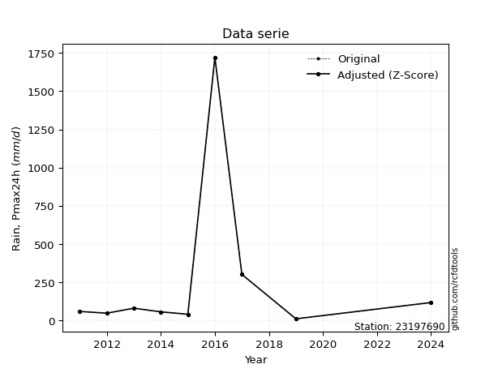</img>

</div>

> If Z-Score is active, values out of range or outliers are replaced with the station mean value.


### 4. Active continuous probability distributions from SciPy (45 of 104 available)

[scipy.stats](https://docs.scipy.org/doc/scipy/reference/stats.html) is a Python´s powerful submodule within the SciPy library for comprehensive statistical analysis, offering over 130 probability distributions (like Normal, Poisson), functions for descriptive stats (mean, variance), hypothesis testing (t-tests, chi-square), random variable generation, and statistical tests, making it essential for data science, modeling, and research. It provides tools to explore, model, and draw conclusions from data efficiently, working seamlessly with NumPy.

<div align="center">

|   id | p_dist             |   n_parameter | fit_method   | label                                                                       | active   | ref                                                                                                        |
|-----:|:-------------------|--------------:|:-------------|:----------------------------------------------------------------------------|:---------|:-----------------------------------------------------------------------------------------------------------|
|    0 | alpha              |             3 | MLE          | Alpha                                                                       | True     | [:mortar_board:](https://docs.scipy.org/doc/scipy/reference/generated/scipy.stats.alpha.html)              |
|    1 | betaprime          |             4 | MLE          | Beta prime                                                                  | True     | [:mortar_board:](https://docs.scipy.org/doc/scipy/reference/generated/scipy.stats.betaprime.html)          |
|    2 | chi2               |             3 | MLE          | Chi²                                                                        | True     | [:mortar_board:](https://docs.scipy.org/doc/scipy/reference/generated/scipy.stats.chi2.html)               |
|    3 | crystalball        |             4 | MLE          | Crystalball                                                                 | True     | [:mortar_board:](https://docs.scipy.org/doc/scipy/reference/generated/scipy.stats.crystalball.html)        |
|    4 | erlang             |             3 | MLE          | Erlang                                                                      | True     | [:mortar_board:](https://docs.scipy.org/doc/scipy/reference/generated/scipy.stats.erlang.html)             |
|    5 | expon              |             2 | MLE          | Exponential                                                                 | True     | [:mortar_board:](https://docs.scipy.org/doc/scipy/reference/generated/scipy.stats.expon.html)              |
|    6 | exponnorm          |             3 | MLE          | Exponentially modified Normal                                               | True     | [:mortar_board:](https://docs.scipy.org/doc/scipy/reference/generated/scipy.stats.exponnorm.html)          |
|    7 | f                  |             4 | MLE          | F                                                                           | True     | [:mortar_board:](https://docs.scipy.org/doc/scipy/reference/generated/scipy.stats.f.html)                  |
|    8 | fatiguelife        |             3 | MLE          | Fatigue-life (Birnbaum-Saunders)                                            | True     | [:mortar_board:](https://docs.scipy.org/doc/scipy/reference/generated/scipy.stats.fatiguelife.html)        |
|    9 | fisk               |             3 | MLE          | Fisk                                                                        | True     | [:mortar_board:](https://docs.scipy.org/doc/scipy/reference/generated/scipy.stats.fisk.html)               |
|   10 | gamma              |             3 | MLE          | Gamma                                                                       | True     | [:mortar_board:](https://docs.scipy.org/doc/scipy/reference/generated/scipy.stats.gamma.html)              |
|   11 | genexpon           |             5 | MLE          | Generalized exponential                                                     | True     | [:mortar_board:](https://docs.scipy.org/doc/scipy/reference/generated/scipy.stats.genexpon.html)           |
|   12 | genlogistic        |             3 | MLE          | Generalized logistic                                                        | True     | [:mortar_board:](https://docs.scipy.org/doc/scipy/reference/generated/scipy.stats.genlogistic.html)        |
|   13 | gibrat             |             2 | MM           | Gibrat                                                                      | True     | [:mortar_board:](https://docs.scipy.org/doc/scipy/reference/generated/scipy.stats.gibrat.html)             |
|   14 | gompertz           |             3 | MLE          | Gompertz (or truncated Gumbel)                                              | True     | [:mortar_board:](https://docs.scipy.org/doc/scipy/reference/generated/scipy.stats.gompertz.html)           |
|   15 | gumbel_l           |             2 | MM           | Gumbel Left Skew                                                            | True     | [:mortar_board:](https://docs.scipy.org/doc/scipy/reference/generated/scipy.stats.gumbel_l.html)           |
|   16 | gumbel_r           |             2 | MM           | Gumbel Right Skew                                                           | True     | [:mortar_board:](https://docs.scipy.org/doc/scipy/reference/generated/scipy.stats.gumbel_r.html)           |
|   17 | halflogistic       |             2 | MM           | Half-logistic                                                               | True     | [:mortar_board:](https://docs.scipy.org/doc/scipy/reference/generated/scipy.stats.halflogistic.html)       |
|   18 | halfnorm           |             2 | MM           | Half Normal                                                                 | True     | [:mortar_board:](https://docs.scipy.org/doc/scipy/reference/generated/scipy.stats.halfnorm.html)           |
|   19 | hypsecant          |             2 | MM           | hyperbolic secant                                                           | True     | [:mortar_board:](https://docs.scipy.org/doc/scipy/reference/generated/scipy.stats.hypsecant.html)          |
|   20 | invgamma           |             3 | MLE          | Inverted gamma                                                              | True     | [:mortar_board:](https://docs.scipy.org/doc/scipy/reference/generated/scipy.stats.invgamma.html)           |
|   21 | invgauss           |             3 | MLE          | Inverse Gaussian                                                            | True     | [:mortar_board:](https://docs.scipy.org/doc/scipy/reference/generated/scipy.stats.invgauss.html)           |
|   22 | invweibull         |             3 | MLE          | Inverted Weibull                                                            | True     | [:mortar_board:](https://docs.scipy.org/doc/scipy/reference/generated/scipy.stats.invweibull.html)         |
|   23 | johnsonsu          |             4 | MLE          | Johnson Su                                                                  | True     | [:mortar_board:](https://docs.scipy.org/doc/scipy/reference/generated/scipy.stats.johnsonsu.html)          |
|   24 | kstwobign          |             2 | MLE          | Limiting distribution of scaled Kolmogorov-Smirnov two-sided test statistic | True     | [:mortar_board:](https://docs.scipy.org/doc/scipy/reference/generated/scipy.stats.kstwobign.html)          |
|   25 | laplace            |             2 | MM           | Laplace                                                                     | True     | [:mortar_board:](https://docs.scipy.org/doc/scipy/reference/generated/scipy.stats.laplace.html)            |
|   26 | laplace_asymmetric |             3 | MLE          | Asymmetric Laplace                                                          | True     | [:mortar_board:](https://docs.scipy.org/doc/scipy/reference/generated/scipy.stats.laplace_asymmetric.html) |
|   27 | loggamma           |             3 | MLE          | Log gamma                                                                   | True     | [:mortar_board:](https://docs.scipy.org/doc/scipy/reference/generated/scipy.stats.loggamma.html)           |
|   28 | logistic           |             2 | MM           | Logistic (or Sech-squared)                                                  | True     | [:mortar_board:](https://docs.scipy.org/doc/scipy/reference/generated/scipy.stats.logistic.html)           |
|   29 | lognorm            |             3 | MLE          | Log Normal                                                                  | True     | [:mortar_board:](https://docs.scipy.org/doc/scipy/reference/generated/scipy.stats.lognorm.html)            |
|   30 | maxwell            |             2 | MM           | Maxwell                                                                     | True     | [:mortar_board:](https://docs.scipy.org/doc/scipy/reference/generated/scipy.stats.maxwell.html)            |
|   31 | mielke             |             4 | MLE          | Mielke Beta-Kappa / Dagum                                                   | True     | [:mortar_board:](https://docs.scipy.org/doc/scipy/reference/generated/scipy.stats.mielke.html)             |
|   32 | moyal              |             2 | MM           | Moyal                                                                       | True     | [:mortar_board:](https://docs.scipy.org/doc/scipy/reference/generated/scipy.stats.moyal.html)              |
|   33 | nakagami           |             3 | MLE          | Nakagami                                                                    | True     | [:mortar_board:](https://docs.scipy.org/doc/scipy/reference/generated/scipy.stats.nakagami.html)           |
|   34 | ncf                |             5 | MLE          | Non-central F distribution                                                  | True     | [:mortar_board:](https://docs.scipy.org/doc/scipy/reference/generated/scipy.stats.ncf.html)                |
|   35 | nct                |             4 | MLE          | Non-central Student’s t                                                     | True     | [:mortar_board:](https://docs.scipy.org/doc/scipy/reference/generated/scipy.stats.nct.html)                |
|   36 | norm               |             2 | MM           | Normal                                                                      | True     | [:mortar_board:](https://docs.scipy.org/doc/scipy/reference/generated/scipy.stats.norm.html)               |
|   37 | pareto             |             3 | MLE          | Pareto                                                                      | True     | [:mortar_board:](https://docs.scipy.org/doc/scipy/reference/generated/scipy.stats.pareto.html)             |
|   38 | pearson3           |             3 | MM           | Pearson type III                                                            | True     | [:mortar_board:](https://docs.scipy.org/doc/scipy/reference/generated/scipy.stats.pearson3.html)           |
|   39 | rayleigh           |             2 | MM           | Rayleigh                                                                    | True     | [:mortar_board:](https://docs.scipy.org/doc/scipy/reference/generated/scipy.stats.rayleigh.html)           |
|   40 | rice               |             3 | MLE          | Rice                                                                        | True     | [:mortar_board:](https://docs.scipy.org/doc/scipy/reference/generated/scipy.stats.rice.html)               |
|   41 | t                  |             3 | MLE          | Student’s t                                                                 | True     | [:mortar_board:](https://docs.scipy.org/doc/scipy/reference/generated/scipy.stats.t.html)                  |
|   42 | truncnorm          |             4 | MLE          | Truncated normal                                                            | True     | [:mortar_board:](https://docs.scipy.org/doc/scipy/reference/generated/scipy.stats.truncnorm.html)          |
|   43 | wald               |             2 | MM           | Wald                                                                        | True     | [:mortar_board:](https://docs.scipy.org/doc/scipy/reference/generated/scipy.stats.wald.html)               |
|   44 | weibull_min        |             3 | MLE          | Weibull minimum                                                             | True     | [:mortar_board:](https://docs.scipy.org/doc/scipy/reference/generated/scipy.stats.weibull_min.html)        |

</div>

> **n_parameter:** # arguments & localization & scale.
>
> **Fit methods:** (MLE) maximum likelihood, (MM) L-moments.
>
>**Inactive:** foldnorm, gennorm, norminvgauss, powernorm, powerlognorm, skewnorm, genextreme, anglit, arcsine, argus, beta, bradford, burr, burr12, cauchy, cosine, halfcauchy, foldcauchy, skewcauchy, wrapcauchy, dgamma, gengamma, exponweib, exponpow, truncexpon, gausshyper, genhalflogistic, genhyperbolic, geninvgauss, halfgennorm, johnsonsb, kappa4, kappa3, ksone, kstwo, loglaplace, levy, levy_l, levy_stable, ncx2, genpareto, truncpareto, lomax, powerlaw, rdist, rel_breitwigner, recipinvgauss, semicircular, studentized_range, trapezoid, triang, truncweibull_min, tukeylambda, uniform, loguniform, vonmises, vonmises_line, weibull_max, dweibull, 


## B. Probability distributions vs. Empirical distributions

A continuous probability distribution (CPD) describes probabilities for variables that can take any value within a range (like rain any time), unlike discrete variables with specific outcomes (like temperature). It uses a Probability Density Function (PDF), a curve where the total area under it equals 1, and the probability of the variable falling within an interval (a to b) is found by calculating the area under the curve between those points. A key feature is that the probability of hitting any single exact value is zero, so probabilities are always expressed for ranges, e.g., $P(a ≤ X ≤ b)$.

<div align="center">

Distributions parameters
|    |   station | p_dist                |   n |             loc |            scale | shape                  | shape1                | shape2               | shape3   |
|---:|----------:|:----------------------|----:|----------------:|-----------------:|:-----------------------|:----------------------|:---------------------|:---------|
|  0 |  23197690 | alpha                 |  10 |      -0.0782177 |     26.1591      | 5.384045859795789e-12  |                       |                      |          |
|  1 |  23197690 | betaprime             |  10 |      -0.0970026 |     14.4663      | 4.217878844664076      | 1.1205793169764804    |                      |          |
|  2 |  23197690 | chi2                  |  10 |       8.99      |    494.493       | 0.7138038250634704     |                       |                      |          |
|  3 |  23197690 | crystalball           |  10 |      -0.348769  |    555.688       | 4.715897815618437      | 2.348376298570143     |                      |          |
|  4 |  23197690 | erlang                |  10 |       8.99      |    487.524       | 0.527382548720236      |                       |                      |          |
|  5 |  23197690 | expon                 |  10 |       8.99      |    237.667       |                        |                       |                      |          |
|  6 |  23197690 | exponnorm             |  10 |       8.70512   |      0.0888183   | 2650.445502164293      |                       |                      |          |
|  7 |  23197690 | f                     |  10 |      -0.139181  |     54.4461      | 8.508664937243857      | 2.241107783413611     |                      |          |
|  8 |  23197690 | fatiguelife           |  10 |       2.46458   |    100.4         | 1.8304921757702002     |                       |                      |          |
|  9 |  23197690 | fisk                  |  10 |       8.99      |     21.8489      | 0.7863071155878467     |                       |                      |          |
| 10 |  23197690 | gamma                 |  10 |       8.99      |   1099.4         | 0.16506082107061884    |                       |                      |          |
| 11 |  23197690 | genexpon              |  10 |       8.99      |    479.846       | 2.0189836790122753     | 4.414572747089105e-12 | 1.218117310627973    |          |
| 12 |  23197690 | genlogistic           |  10 |   -1361.04      |    187.662       | 2264.8148608414767     |                       |                      |          |
| 13 |  23197690 | gibrat                |  10 |    -133.142     |    230.36        |                        |                       |                      |          |
| 14 |  23197690 | gompertz              |  10 |       8.99      |   1190.88        | 2.134687839086522      |                       |                      |          |
| 15 |  23197690 | gumbel_l              |  10 |     470.718     |    388.175       |                        |                       |                      |          |
| 16 |  23197690 | gumbel_r              |  10 |      22.5968    |    388.175       |                        |                       |                      |          |
| 17 |  23197690 | halflogistic          |  10 |    -343.415     |    425.647       |                        |                       |                      |          |
| 18 |  23197690 | halfnorm              |  10 |    -412.305     |    825.887       |                        |                       |                      |          |
| 19 |  23197690 | hypsecant             |  10 |     246.657     |    316.943       |                        |                       |                      |          |
| 20 |  23197690 | invgamma              |  10 |      -6.1235    |     61.0592      | 1.1195072925360097     |                       |                      |          |
| 21 |  23197690 | invgauss              |  10 |      -0.103502  |     49.9828      | 4.936911536135702      |                       |                      |          |
| 22 |  23197690 | invweibull            |  10 |       8.99      |      2.74782     | 0.05250367308807409    |                       |                      |          |
| 23 |  23197690 | johnsonsu             |  10 |       6.79492   |      0.0658265   | -4.695285766013414     | 0.6213676343791557    |                      |          |
| 24 |  23197690 | kstwobign             |  10 |    -831.283     |   1292.63        |                        |                       |                      |          |
| 25 |  23197690 | laplace               |  10 |     246.657     |    352.035       |                        |                       |                      |          |
| 26 |  23197690 | laplace_asymmetric    |  10 |       8.98998   |      5.57376e-05 | 2.3452206449907325e-07 |                       |                      |          |
| 27 |  23197690 | loggamma              |  10 | -175878         |  23225.2         | 1965.5559424008316     |                       |                      |          |
| 28 |  23197690 | logistic              |  10 |     246.657     |    274.481       |                        |                       |                      |          |
| 29 |  23197690 | lognorm               |  10 |       8.99      |      1.88676     | 11.59293586784751      |                       |                      |          |
| 30 |  23197690 | maxwell               |  10 |    -933.046     |    739.269       |                        |                       |                      |          |
| 31 |  23197690 | mielke                |  10 |       2.35882   |     32.2465      | 2.2060342651137255     | 1.163282925168315     |                      |          |
| 32 |  23197690 | moyal                 |  10 |     -38.0472    |    224.113       |                        |                       |                      |          |
| 33 |  23197690 | nakagami              |  10 |       8.99      |    710.125       | 0.16264927000813048    |                       |                      |          |
| 34 |  23197690 | ncf                   |  10 |      -0.0458083 |      2.7862e-08  | 3.895736850781954e-09  | 2.553756151387647     | 8.724951585951812    |          |
| 35 |  23197690 | nct                   |  10 |      -0.0421652 |     21.0324      | 1.019011067488615      | 2.3293991222624753    |                      |          |
| 36 |  23197690 | norm                  |  10 |     246.657     |    497.853       |                        |                       |                      |          |
| 37 |  23197690 | pareto                |  10 |     -60.8514    |     69.8414      | 1.1464405810074925     |                       |                      |          |
| 38 |  23197690 | pearson3              |  10 |     246.657     |    497.853       | 2.554696471819318      |                       |                      |          |
| 39 |  23197690 | rayleigh              |  10 |    -705.765     |    759.923       |                        |                       |                      |          |
| 40 |  23197690 | rice                  |  10 |    -403.355     |    578.953       | 0.0002042996870118315  |                       |                      |          |
| 41 |  23197690 | t                     |  10 |      48.815     |     11.6666      | 0.52820999830573       |                       |                      |          |
| 42 |  23197690 | truncnorm             |  10 |  -40550.3       |   4175.7         | 9.713167617366569      | 10.123421431239226    |                      |          |
| 43 |  23197690 | wald                  |  10 |    -251.196     |    497.853       |                        |                       |                      |          |
| 44 |  23197690 | weibull_min           |  10 |       8.99      |    349.078       | 0.2186218346756159     |                       |                      |          |
| 45 |  23197690 | logalpha              |  10 |      -5.71152   |     80.1751      | 8.0733091785231        |                       |                      |          |
| 46 |  23197690 | logbetaprime          |  10 |      -0.821091  |      5.67915     | 31.040463972198864     | 34.91684180290156     |                      |          |
| 47 |  23197690 | logchi2               |  10 |       2.19611   |      1.23584     | 1.3868513591356355     |                       |                      |          |
| 48 |  23197690 | logcrystalball        |  10 |       4.38025   |      1.32298     | 1776.7868996239376     | 258.2765726825345     |                      |          |
| 49 |  23197690 | logerlang             |  10 |       0.452766  |      0.4335      | 9.059961957067898      |                       |                      |          |
| 50 |  23197690 | logexpon              |  10 |       2.19611   |      2.18414     |                        |                       |                      |          |
| 51 |  23197690 | logexponnorm          |  10 |       3.28678   |      0.735786    | 1.486180227816745      |                       |                      |          |
| 52 |  23197690 | logf                  |  10 |      -2.19918   |      6.36234     | 460.2601477900339      | 60.9453029962561      |                      |          |
| 53 |  23197690 | logfatiguelife        |  10 |      -1.16133   |      5.39376     | 0.23413509981111963    |                       |                      |          |
| 54 |  23197690 | logfisk               |  10 |      -0.429101  |      4.62367     | 7.016974611907429      |                       |                      |          |
| 55 |  23197690 | loggamma              |  10 |       0.452785  |      0.433502    | 9.059866321062607      |                       |                      |          |
| 56 |  23197690 | loggenexpon           |  10 |       2.1956    |      0.434096    | 0.0669811296376393     | 3.4735989595913495    | 0.011351631052559076 |          |
| 57 |  23197690 | loggenlogistic        |  10 |       3.17382   |      0.863222    | 2.696145841394326      |                       |                      |          |
| 58 |  23197690 | loggibrat             |  10 |       3.37097   |      0.612159    |                        |                       |                      |          |
| 59 |  23197690 | loggompertz           |  10 |       2.19611   |      2.62608     | 0.6027853921464971     |                       |                      |          |
| 60 |  23197690 | loggumbel_l           |  10 |       4.97567   |      1.03152     |                        |                       |                      |          |
| 61 |  23197690 | loggumbel_r           |  10 |       3.78484   |      1.03152     |                        |                       |                      |          |
| 62 |  23197690 | loghalflogistic       |  10 |       2.81217   |      1.13113     |                        |                       |                      |          |
| 63 |  23197690 | loghalfnorm           |  10 |       2.62913   |      2.19471     |                        |                       |                      |          |
| 64 |  23197690 | loghypsecant          |  10 |       4.38025   |      0.842236    |                        |                       |                      |          |
| 65 |  23197690 | loginvgamma           |  10 |      -2.58064   |    203.464       | 30.233480162532256     |                       |                      |          |
| 66 |  23197690 | loginvgauss           |  10 |      -1.18844   |    101.274       | 0.054986253938038854   |                       |                      |          |
| 67 |  23197690 | loginvweibull         |  10 | -158481         | 158484           | 143289.83732217475     |                       |                      |          |
| 68 |  23197690 | logjohnsonsu          |  10 |       3.83994   |      0.179795    | -0.45734751182600053   | 0.5342636340740037    |                      |          |
| 69 |  23197690 | logkstwobign          |  10 |      -0.313918  |      5.41984     |                        |                       |                      |          |
| 70 |  23197690 | loglaplace            |  10 |       4.38025   |      0.935489    |                        |                       |                      |          |
| 71 |  23197690 | loglaplace_asymmetric |  10 |       3.82646   |      0.777013    | 0.7052651124368221     |                       |                      |          |
| 72 |  23197690 | logloggamma           |  10 |    -381.966     |     52.7594      | 1514.821194621456      |                       |                      |          |
| 73 |  23197690 | loglogistic           |  10 |       4.38025   |      0.729397    |                        |                       |                      |          |
| 74 |  23197690 | loglognorm            |  10 |       2.19611   |      0.0597576   | 10.850898585079788     |                       |                      |          |
| 75 |  23197690 | logmaxwell            |  10 |       1.24535   |      1.96451     |                        |                       |                      |          |
| 76 |  23197690 | logmielke             |  10 |      -0.0450902 |      4.32919     | 6.007752706998749      | 6.65580956921297      |                      |          |
| 77 |  23197690 | logmoyal              |  10 |       3.62369   |      0.59555     |                        |                       |                      |          |
| 78 |  23197690 | lognakagami           |  10 |       3.66099   |      1.85522     | 0.08863503928308858    |                       |                      |          |
| 79 |  23197690 | logncf                |  10 |      -1.59475   |      4.16247     | 141.41062530367827     | 62.12019233062967     | 54.97783727450491    |          |
| 80 |  23197690 | lognct                |  10 |       3.76129   |      0.28051     | 0.8598790160309172     | 0.7188194732307259    |                      |          |
| 81 |  23197690 | lognorm               |  10 |       4.38025   |      1.32298     |                        |                       |                      |          |
| 82 |  23197690 | logpareto             |  10 |       2.19601   |      0.000101268 | 0.11116538651318483    |                       |                      |          |
| 83 |  23197690 | logpearson3           |  10 |       4.38025   |      1.32298     | 0.8672886499489783     |                       |                      |          |
| 84 |  23197690 | lograyleigh           |  10 |       1.84932   |      2.0194      |                        |                       |                      |          |
| 85 |  23197690 | logrice               |  10 |       1.80323   |      2.04833     | 0.0007364052789740891  |                       |                      |          |
| 86 |  23197690 | logt                  |  10 |       3.96962   |      0.366118    | 1.045588977089646      |                       |                      |          |
| 87 |  23197690 | logtruncnorm          |  10 |      -2.06388   |      5.14617     | 0.8277982391415876     | 1.8489803019248743    |                      |          |
| 88 |  23197690 | logwald               |  10 |       3.05725   |      1.323       |                        |                       |                      |          |
| 89 |  23197690 | logweibull_min        |  10 |       3.66099   |      0.913171    | 0.6841893695485248     |                       |                      |          |

</div>

> **loc** (Location parameter): This shifts the distribution along the x-axis. For many common distributions, like the normal (Gaussian) distribution, loc represents the mean $μ$. For others, like the uniform distribution, it might represent the minimum value, or for the beta distribution, the left end of the support interval.
>
> **scale** (Scale parameter): This determines the width or spread of the distribution. For the normal distribution, scale represents the standard deviation $σ$. For a uniform distribution, it defines the length of the interval (from $loc$ to $loc + scale$).
>
> **shape** (Shape parameters): Refers to parameters that define the specific form of a probability distribution, distinct from its location (loc) and scale (scale). These parameters are required arguments for most distribution functions. For example, a normal (Gaussian) distribution is fully defined by its location (mean) and scale (standard deviation), so it has no specific shape parameters beyond loc and scale. However, other distributions have intrinsic properties that need specification, as Gamma distribution that takes a shape parameter, often named $a$ or $alpha$.


### 0. Cumulative distribution values - CDF (90 evaluated)

> Ordered by x ascending and calculating $log(f(x))$ separately. 

|   id |   Station |   date |        x |   count |    mean |     std |    zscore |   Value_initial |   station |   m |      alpha |   alpha_pdf |   betaprime |   betaprime_pdf |        chi2 |    chi2_pdf |   crystalball |   crystalball_pdf |      erlang |      erlang_pdf |    expon |   expon_pdf |   exponnorm |   exponnorm_pdf |         f |       f_pdf |   fatiguelife |   fatiguelife_pdf |        fisk |     fisk_pdf |      gamma |   gamma_pdf |    genexpon |   genexpon_pdf |   genlogistic |   genlogistic_pdf |   gibrat |   gibrat_pdf |    gompertz |   gompertz_pdf |   gumbel_l |   gumbel_l_pdf |   gumbel_r |   gumbel_r_pdf |   halflogistic |   halflogistic_pdf |   halfnorm |   halfnorm_pdf |   hypsecant |   hypsecant_pdf |   invgamma |   invgamma_pdf |   invgauss |   invgauss_pdf |   invweibull |   invweibull_pdf |   johnsonsu |   johnsonsu_pdf |   kstwobign |   kstwobign_pdf |   laplace |   laplace_pdf |   laplace_asymmetric |   laplace_asymmetric_pdf |   loggamma |   loggamma_pdf |   logistic |   logistic_pdf |   lognorm |   lognorm_pdf |   maxwell |   maxwell_pdf |    mielke |   mielke_pdf |    moyal |   moyal_pdf |    nakagami |   nakagami_pdf |      ncf |     ncf_pdf |       nct |     nct_pdf |     norm |    norm_pdf |      pareto |   pareto_pdf |   pearson3 |   pearson3_pdf |   rayleigh |   rayleigh_pdf |     rice |    rice_pdf |        t |       t_pdf |   truncnorm |   truncnorm_pdf |     wald |    wald_pdf |   weibull_min |   weibull_min_pdf |   logalpha |   logalpha_pdf |   logbetaprime |   logbetaprime_pdf |     logchi2 |   logchi2_pdf |   logcrystalball |   logcrystalball_pdf |   logerlang |   logerlang_pdf |   logexpon |   logexpon_pdf |   logexponnorm |   logexponnorm_pdf |      logf |   logf_pdf |   logfatiguelife |   logfatiguelife_pdf |   logfisk |   logfisk_pdf |   loggenexpon |   loggenexpon_pdf |   loggenlogistic |   loggenlogistic_pdf |   loggibrat |   loggibrat_pdf |   loggompertz |   loggompertz_pdf |   loggumbel_l |   loggumbel_l_pdf |   loggumbel_r |   loggumbel_r_pdf |   loghalflogistic |   loghalflogistic_pdf |   loghalfnorm |   loghalfnorm_pdf |   loghypsecant |   loghypsecant_pdf |   loginvgamma |   loginvgamma_pdf |   loginvgauss |   loginvgauss_pdf |   loginvweibull |   loginvweibull_pdf |   logjohnsonsu |   logjohnsonsu_pdf |   logkstwobign |   logkstwobign_pdf |   loglaplace |   loglaplace_pdf |   loglaplace_asymmetric |   loglaplace_asymmetric_pdf |   logloggamma |   logloggamma_pdf |   loglogistic |   loglogistic_pdf |   loglognorm |   loglognorm_pdf |   logmaxwell |   logmaxwell_pdf |   logmielke |   logmielke_pdf |    logmoyal |   logmoyal_pdf |   lognakagami |   lognakagami_pdf |    logncf |   logncf_pdf |    lognct |   lognct_pdf |   logpareto |   logpareto_pdf |   logpearson3 |   logpearson3_pdf |   lograyleigh |   lograyleigh_pdf |   logrice |   logrice_pdf |      logt |   logt_pdf |   logtruncnorm |   logtruncnorm_pdf |   logwald |   logwald_pdf |   logweibull_min |   logweibull_min_pdf |
|-----:|----------:|-------:|---------:|--------:|--------:|--------:|----------:|----------------:|----------:|----:|-----------:|------------:|------------:|----------------:|------------:|------------:|--------------:|------------------:|------------:|----------------:|---------:|------------:|------------:|----------------:|----------:|------------:|--------------:|------------------:|------------:|-------------:|-----------:|------------:|------------:|---------------:|--------------:|------------------:|---------:|-------------:|------------:|---------------:|-----------:|---------------:|-----------:|---------------:|---------------:|-------------------:|-----------:|---------------:|------------:|----------------:|-----------:|---------------:|-----------:|---------------:|-------------:|-----------------:|------------:|----------------:|------------:|----------------:|----------:|--------------:|---------------------:|-------------------------:|-----------:|---------------:|-----------:|---------------:|----------:|--------------:|----------:|--------------:|----------:|-------------:|---------:|------------:|------------:|---------------:|---------:|------------:|----------:|------------:|---------:|------------:|------------:|-------------:|-----------:|---------------:|-----------:|---------------:|---------:|------------:|---------:|------------:|------------:|----------------:|---------:|------------:|--------------:|------------------:|-----------:|---------------:|---------------:|-------------------:|------------:|--------------:|-----------------:|---------------------:|------------:|----------------:|-----------:|---------------:|---------------:|-------------------:|----------:|-----------:|-----------------:|---------------------:|----------:|--------------:|--------------:|------------------:|-----------------:|---------------------:|------------:|----------------:|--------------:|------------------:|--------------:|------------------:|--------------:|------------------:|------------------:|----------------------:|--------------:|------------------:|---------------:|-------------------:|--------------:|------------------:|--------------:|------------------:|----------------:|--------------------:|---------------:|-------------------:|---------------:|-------------------:|-------------:|-----------------:|------------------------:|----------------------------:|--------------:|------------------:|--------------:|------------------:|-------------:|-----------------:|-------------:|-----------------:|------------:|----------------:|------------:|---------------:|--------------:|------------------:|----------:|-------------:|----------:|-------------:|------------:|----------------:|--------------:|------------------:|--------------:|------------------:|----------:|--------------:|----------:|-----------:|---------------:|-------------------:|----------:|--------------:|-----------------:|---------------------:|
|    0 |  23197690 |   2019 |    8.99  |      10 | 246.657 | 524.783 | -0.452886 |           8.99  |  23197690 |   1 | 0.00391779 | 0.00395843  |   0.0220255 |     0.00619617  | 5.21097e-07 | 1.04698e+08 |      0.506705 |       0.000717823 | 2.08511e-08 | 10369.3         | 0        |  0.00420756 |  0.00120943 |     0.00423996  | 0.0220346 | 0.00619084  |     0.0225569 |       0.00937352  | 2.23048e-13 | 98.7324      | 0.00124638 | 1.15815e+11 | 3.08084e-12 |     0.00420756 |      0.216819 |       0.00176561  | 0.314588 |  0.00249795  | 3.05935e-14 |    0.00179253  |   0.262418 |    0.000578358 |   0.354987 |    0.000947128 |       0.391833 |        0.00099433  |   0.390027 |    0.000848232 |    0.28097  |     0.000775783 |  0.0225812 |    0.00588915  |  0.0232636 |    0.0080355   |   0.00188582 |      3.49673e+11 |   0.0185192 |     0.0128326   |    0.208064 |     0.00119824  |  0.254547 |   0.000723072 |          6.71562e-08 |              0.00420761  |   0.020833 |      0.0670677 |   0.296113 |    0.00075936  |  0.049377 |     0.077181  |  0.345992 |   0.000778154 | 0.0230825 |  0.00662647  | 0.367919 | 0.00106864  | 1.50615e-06 |    2.75817e+08 | 0.067491 | 0.00772508  | 0.0276836 | 0.00329109  | 0.316544 | 0.000715026 | 2.22045e-16 |  0.0164149   |   0.425602 |    0.00147498  |   0.357462 |    0.000795275 | 0.224023 | 0.000954603 | 0.165278 | 0.00213423  | 2.75403e-08 |     0.0023895   | 0.384514 | 0.00170547  |   0.000165673 |       2.03882e+10 |  0.0194312 |      0.0605782 |      0.0200541 |          0.0632877 | 1.32999e-11 | 20767.2       |         0.049377 |            0.077181  |   0.0208331 |       0.0670676 |   0        |      0.457846  |      0.0161773 |          0.048423  | 0.0198385 |  0.0621596 |         0.020489 |            0.0646419 | 0.0184913 |     0.0485118 |   7.98798e-05 |         0.154396  |        0.0222211 |            0.0524919 |    0        |       0         |   1.70764e-10 |         0.229538  |     0.0653366 |       0.0612241   |    0.00941531 |         0.0425839 |          0        |              0        |      0        |         0         |      0.0475151 |          0.0562061 |     0.0198081 |         0.0621147 |     0.0204412 |         0.0645436 |       0.0155879 |           0.0586471 |      0.0221327 |          0.0170436 |      0.0171912 |          0.0719428 |    0.0484169 |        0.0517557 |               0.0169551 |                   0.03094   |     0.0546176 |         0.0804888 |     0.0476774 |         0.062249  |   0.00135794 |      9.24714e+11 |    0.0281167 |        0.0846179 |   0.0189392 |       0.0501415 | 0.000915592 |     0.00911717 |     0         |        0          | 0.0196277 |    0.061893  | 0.0255045 |    0.0138539 |    0        |   1097.74       |     0.0123554 |         0.0583526 |      0.014638 |         0.083797  | 0.0182268 |     0.0919338 | 0.0607935 |  0.0348086 |    3.35068e-08 |          0.320591  |  0        |     0         |       0          |            0         |
|    1 |  23197690 |   2015 |   38.9   |      10 | 246.657 | 524.783 | -0.395891 |          38.9   |  23197690 |   2 | 0.502143   | 0.0109677   |   0.302747  |     0.00845811  | 0.319649    | 0.00373     |      0.528155 |       0.000716136 | 0.253198    |     0.00428798  | 0.118251 |  0.00371001 |  0.120381   |     0.00373657  | 0.302706  | 0.00845931  |     0.281715  |       0.00572631  | 0.561422    |  0.0064731   | 0.591984   | 0.00319144  | 0.118251    |     0.00371001 |      0.27157  |       0.00188583  | 0.38518  |  0.00222215  | 0.0528459   |    0.00174098  |   0.280183 |    0.000609638 |   0.383326 |    0.000946893 |       0.421158 |        0.000966325 |   0.41516  |    0.000832159 |    0.304861 |     0.000821425 |  0.300191  |    0.00852791  |  0.312622  |    0.00735205  |   0.413875   |      0.000640922 |   0.337799  |     0.00707386  |    0.244722 |     0.00124996  |  0.277119 |   0.000787192 |          0.118253    |              0.00371005  |   0.31696  |      0.311803  |   0.319318 |    0.000791873 |  0.293336 |     0.26012   |  0.369392 |   0.000786084 | 0.306796  |  0.00858851  | 0.399644 | 0.00105159  | 0.285916    |    0.00310883  | 0.316737 | 0.00736395  | 0.267804  | 0.00962717  | 0.338227 | 0.000734503 | 0.335455    |  0.00763759  |   0.467202 |    0.00131273  |   0.381293 |    0.000797824 | 0.253054 | 0.000985542 | 0.316525 | 0.0121516   | 0.0690398   |     0.00222885  | 0.4332   | 0.0015515   |   0.442558    |       0.00238114  |  0.315269  |      0.324343  |      0.317335  |          0.320046  | 0.610881    |     0.200661  |         0.293336 |            0.26012   |   0.316959  |       0.311802  |   0.488644 |      0.234122  |      0.307278  |          0.354092  | 0.315756  |  0.320929  |         0.31613  |            0.315601  | 0.297251  |     0.358377  |   0.361057    |         0.290805  |        0.297017  |            0.336322  |    0.227519 |       1.04064   |   0.362497    |         0.25562   |     0.243893  |       0.204926    |    0.32382    |         0.35397   |          0.358542 |              0.385212 |      0.361759 |         0.325508  |      0.256223  |          0.272414  |     0.315764  |         0.320984  |     0.316199  |         0.315842  |       0.330652  |           0.330846  |      0.177108  |          0.54705   |      0.344849  |          0.311221  |    0.231771  |        0.247754  |               0.245601  |                   0.448177  |     0.297728  |         0.254424  |     0.271683  |         0.27128   |   0.61594    |      0.0240307   |    0.320501  |        0.288345  |   0.298747  |       0.357284  | 0.332463    |     0.405907   |     0.0014359 |        5.7318e+11 | 0.315704  |    0.321336  | 0.165772  |    0.555581  |    0.655244 |      0.0261607  |     0.32805   |         0.325727  |      0.331306 |         0.297074  | 0.337207  |     0.293473  | 0.274543  |  0.515901  |    0.413141    |          0.243232  |  0.325355 |     0.707574  |       3.3339e-11 |        51363.9       |
|    2 |  23197690 |   2025 |   44.8   |      10 | 246.657 | 524.783 | -0.384649 |          44.8   |  23197690 |   3 | 0.559966   | 0.00874407  |   0.350129  |     0.0076114   | 0.340333    | 0.00330245  |      0.532378 |       0.000715558 | 0.277276    |     0.00389085  | 0.139871 |  0.00361905 |  0.142153   |     0.00364409  | 0.350095  | 0.00761266  |     0.31329   |       0.0050063   | 0.595921    |  0.00528741  | 0.609382   | 0.00273133  | 0.139871    |     0.00361905 |      0.282747 |       0.00190271  | 0.398132 |  0.00216849  | 0.0630874   |    0.00173071  |   0.283798 |    0.000615866 |   0.388911 |    0.000946197 |       0.426842 |        0.000960662 |   0.42006  |    0.000828897 |    0.309733 |     0.000830173 |  0.348007  |    0.00768656  |  0.353287  |    0.00645885  |   0.417324   |      0.000534708 |   0.376894  |     0.00620947  |    0.252121 |     0.00125804  |  0.281803 |   0.000800496 |          0.139872    |              0.00361908  |   0.361522 |      0.318557  |   0.324008 |    0.000797967 |  0.331082 |     0.274096  |  0.374034 |   0.000787327 | 0.355024  |  0.00776496  | 0.405837 | 0.00104744  | 0.303155    |    0.00275289  | 0.358398 | 0.00676084  | 0.322725  | 0.00895201  | 0.342571 | 0.000738093 | 0.377824    |  0.00675133  |   0.474864 |    0.00128464  |   0.386001 |    0.000798026 | 0.258884 | 0.000990894 | 0.41057  | 0.0201131   | 0.0821001   |     0.00219844  | 0.442268 | 0.00152226  |   0.455483    |       0.0020207   |  0.36167   |      0.331922  |      0.363082  |          0.327016  | 0.638035    |     0.184246  |         0.331082 |            0.274096  |   0.361521  |       0.318556  |   0.520659 |      0.219464  |      0.358204  |          0.365788  | 0.361652  |  0.328226  |         0.361247 |            0.322583  | 0.349272  |     0.37691   |   0.402031    |         0.28913   |        0.345671  |            0.35158   |    0.363042 |       0.870051  |   0.398525    |         0.254498  |     0.274278  |       0.225548    |    0.374072   |         0.356587  |          0.411681 |              0.36712  |      0.407006 |         0.315155  |      0.296908  |          0.303584  |     0.361667  |         0.328264  |     0.361349  |         0.322807  |       0.377555  |           0.332495  |      0.284796  |          0.986992  |      0.388727  |          0.309569  |    0.269535  |        0.288123  |               0.317792  |                   0.579913  |     0.334614  |         0.267627  |     0.311633  |         0.294103  |   0.619176   |      0.0218623   |    0.361724  |        0.294951  |   0.350628  |       0.376068  | 0.389341    |     0.398102   |     0.534503  |        0.670662   | 0.361658  |    0.328631  | 0.273095  |    0.952395  |    0.658753 |      0.0236178  |     0.374283  |         0.328263  |      0.373502 |         0.300023  | 0.378858  |     0.295936  | 0.362151  |  0.72767   |    0.446966    |          0.23583   |  0.41781  |     0.602388  |       0.243334   |            1.02223   |
|    3 |  23197690 |   2012 |   45.9   |      10 | 246.657 | 524.783 | -0.382553 |          45.9   |  23197690 |   4 | 0.569392   | 0.00839786  |   0.358418  |     0.00745974  | 0.343928    | 0.00323521  |      0.533165 |       0.000715442 | 0.281521    |     0.00382696  | 0.143843 |  0.00360234 |  0.146152   |     0.0036271   | 0.358386  | 0.007461    |     0.318732  |       0.00489015  | 0.601636    |  0.00510578  | 0.612347   | 0.00266054  | 0.143843    |     0.00360234 |      0.284842 |       0.00190561  | 0.400512 |  0.00215855  | 0.0649902   |    0.00172879  |   0.284477 |    0.000617029 |   0.389951 |    0.000946044 |       0.427898 |        0.000959602 |   0.420971 |    0.000828285 |    0.310647 |     0.000831793 |  0.356378  |    0.00753479  |  0.360309  |    0.00630917  |   0.417904   |      0.000518668 |   0.383645  |     0.0060675   |    0.253506 |     0.00125948  |  0.282685 |   0.000803001 |          0.143844    |              0.00360237  |   0.369258 |      0.31926   |   0.324886 |    0.000799091 |  0.337757 |     0.276254  |  0.3749   |   0.000787547 | 0.363483  |  0.00761585  | 0.406988 | 0.00104664  | 0.306153    |    0.00269719  | 0.365775 | 0.00665063  | 0.332492  | 0.00880593  | 0.343384 | 0.000738753 | 0.385168    |  0.00660289  |   0.476274 |    0.00127953  |   0.386879 |    0.000798053 | 0.259975 | 0.000991865 | 0.433509 | 0.0215547   | 0.0845153   |     0.00219282  | 0.443939 | 0.00151686  |   0.457675    |       0.00196554  |  0.369731  |      0.332675  |      0.371023  |          0.327699  | 0.642473    |     0.18161   |         0.337757 |            0.276254  |   0.369257  |       0.319259  |   0.525954 |      0.21704   |      0.367092  |          0.366962  | 0.369623  |  0.328955  |         0.369081 |            0.323296  | 0.358442  |     0.379182  |   0.409039    |         0.288617  |        0.354222  |            0.353485  |    0.383762 |       0.838405  |   0.404695    |         0.254225  |     0.279793  |       0.22916     |    0.38272    |         0.356351  |          0.420546 |              0.363858 |      0.414628 |         0.31328   |      0.304335  |          0.308753  |     0.369639  |         0.328991  |     0.369188  |         0.323517  |       0.385617  |           0.332229  |      0.309474  |          1.04463   |      0.396228  |          0.308911  |    0.276616  |        0.295691  |               0.332175  |                   0.606159  |     0.34113   |         0.269671  |     0.318811  |         0.29774   |   0.619702   |      0.0215279   |    0.368889  |        0.29576   |   0.359779  |       0.378403  | 0.398971    |     0.395888   |     0.549728  |        0.588546   | 0.369638  |    0.329359  | 0.296765  |    0.99679   |    0.659321 |      0.0232277  |     0.382246  |         0.328219  |      0.380782 |         0.30022   | 0.386038  |     0.296065  | 0.38023   |  0.762591  |    0.452671    |          0.234564  |  0.432211 |     0.585035  |       0.267122   |            0.941746  |
|    4 |  23197690 |   2014 |   54.6   |      10 | 246.657 | 524.783 | -0.365974 |          54.6   |  23197690 |   5 | 0.632351   | 0.00622634  |   0.418386  |     0.00635532  | 0.370068    | 0.0027988   |      0.539385 |       0.000714423 | 0.312872    |     0.00340144  | 0.174616 |  0.00347285 |  0.177131   |     0.0034955   | 0.418364  | 0.00635645  |     0.357764  |       0.00412359  | 0.640769    |  0.00396833  | 0.633417   | 0.00221201  | 0.174616    |     0.00347285 |      0.301512 |       0.0019258   | 0.418953 |  0.00208095  | 0.0799645   |    0.00171358  |   0.289885 |    0.000626245 |   0.398176 |    0.000944588 |       0.43621  |        0.000951165 |   0.428156 |    0.000823413 |    0.317939 |     0.000844467 |  0.416974  |    0.00642333  |  0.410552  |    0.00528576  |   0.421952   |      0.000419117 |   0.432072  |     0.00511007  |    0.26451  |     0.00126997  |  0.289758 |   0.000823093 |          0.174618    |              0.00347289  |   0.424875 |      0.320527  |   0.331876 |    0.000807832 |  0.386904 |     0.289348  |  0.381759 |   0.000789157 | 0.42485   |  0.00651708  | 0.416066 | 0.00104005  | 0.327962    |    0.00233774  | 0.419977 | 0.00582457  | 0.403837  | 0.00758883  | 0.349833 | 0.000743863 | 0.437985    |  0.00558085  |   0.487234 |    0.00124035  |   0.393822 |    0.000798147 | 0.268637 | 0.000999238 | 0.62276  | 0.0175302   | 0.103401    |     0.00214884  | 0.456952 | 0.00147469  |   0.473165    |       0.00161837  |  0.427661  |      0.333544  |      0.428065  |          0.32838   | 0.672443    |     0.164124  |         0.386904 |            0.289348  |   0.424874  |       0.320527  |   0.562167 |      0.20046   |      0.431078  |          0.368304  | 0.426907  |  0.329876  |         0.425391 |            0.324414  | 0.425162  |     0.387196  |   0.458704    |         0.283157  |        0.416373  |            0.360822  |    0.510864 |       0.633953  |   0.448607    |         0.251561  |     0.321833  |       0.255326    |    0.444099   |         0.349462  |          0.481611 |              0.339507 |      0.467793 |         0.299114  |      0.360948  |          0.342443  |     0.426926  |         0.329888  |     0.425534  |         0.324594  |       0.442854  |           0.326128  |      0.488431  |          0.884972  |      0.449264  |          0.301449  |    0.333008  |        0.355973  |               0.429517  |                   0.517806  |     0.389076  |         0.282141  |     0.372553  |         0.32048   |   0.623248   |      0.0194005   |    0.420556  |        0.298785  |   0.42641   |       0.386975  | 0.465949    |     0.374405   |     0.624155  |        0.325459   | 0.42699   |    0.330258  | 0.470869  |    0.909644  |    0.663131 |      0.0207582  |     0.438955  |         0.324179  |      0.432857 |         0.299111  | 0.437358  |     0.294593  | 0.526605  |  0.870947  |    0.4926      |          0.225553  |  0.52371  |     0.473049  |       0.398111   |            0.616644  |
|    5 |  23197690 |   2011 |   57.2   |      10 | 246.657 | 524.783 | -0.36102  |          57.2   |  23197690 |   6 | 0.647884   | 0.00573182  |   0.434523  |     0.00606009  | 0.377206    | 0.00269368  |      0.541242 |       0.000714085 | 0.321577    |     0.00329585  | 0.183597 |  0.00343507 |  0.18617    |     0.00345711  | 0.434503  | 0.00606116  |     0.368239  |       0.00393698  | 0.650741    |  0.0037069   | 0.639029   | 0.00210697  | 0.183597    |     0.00343507 |      0.306526 |       0.0019309   | 0.424333 |  0.00205811  | 0.0844139   |    0.00170902  |   0.291517 |    0.000629005 |   0.400631 |    0.000944068 |       0.43868  |        0.000948627 |   0.430295 |    0.000821945 |    0.32014  |     0.000848205 |  0.433283  |    0.00612489  |  0.423956  |    0.00502802  |   0.423012   |      0.000396354 |   0.445044  |     0.00487121  |    0.267815 |     0.00127283  |  0.291906 |   0.000829195 |          0.183599    |              0.0034351   |   0.43977  |      0.319791  |   0.33398  |    0.000810393 |  0.40043  |     0.292107  |  0.383811 |   0.000789594 | 0.441405  |  0.00621981  | 0.418767 | 0.00103799  | 0.333927    |    0.00225173  | 0.434822 | 0.00559619  | 0.4231    | 0.00723017  | 0.351769 | 0.000745353 | 0.452153    |  0.00532035  |   0.490444 |    0.00122905  |   0.395897 |    0.000798135 | 0.271237 | 0.00100134  | 0.663548 | 0.0139405   | 0.108971    |     0.00213587  | 0.46077  | 0.00146229  |   0.477266    |       0.00153769  |  0.443155  |      0.332493  |      0.44332   |          0.327366  | 0.679978    |     0.159812  |         0.40043  |            0.292107  |   0.43977   |       0.319791  |   0.571394 |      0.196236  |      0.448176  |          0.366644  | 0.442232  |  0.3289    |         0.440465 |            0.323576  | 0.443171  |     0.386889  |   0.471831    |         0.281191  |        0.433164  |            0.360932  |    0.539264 |       0.587656  |   0.460288    |         0.250633  |     0.333875  |       0.262361    |    0.460283   |         0.346226  |          0.497247 |              0.332741 |      0.481615 |         0.295114  |      0.377059  |          0.350094  |     0.442252  |         0.328905  |     0.440616  |         0.323743  |       0.457963  |           0.323364  |      0.527047  |          0.776403  |      0.463225  |          0.29872   |    0.349987  |        0.374122  |               0.453104  |                   0.496397  |     0.402264  |         0.284793  |     0.387579  |         0.325421  |   0.624139   |      0.0188988   |    0.434456  |        0.298787  |   0.444413  |       0.386829  | 0.483204    |     0.367327   |     0.6385    |        0.292535   | 0.442333  |    0.329273  | 0.511169  |    0.822076  |    0.664083 |      0.0201791  |     0.453989  |         0.322072  |      0.44675  |         0.298096  | 0.451038  |     0.293517  | 0.566508  |  0.840507  |    0.503037    |          0.223154  |  0.545102 |     0.446913  |       0.425565   |            0.565098  |
|    6 |  23197690 |   2013 |   78.7   |      10 | 246.657 | 524.783 | -0.320051 |          78.7   |  23197690 |   7 | 0.739843   | 0.00318279  |   0.54288   |     0.00417062  | 0.42786     | 0.00207925  |      0.556561 |       0.000710697 | 0.384894    |     0.00264924  | 0.254209 |  0.00313797 |  0.257204   |     0.00315535  | 0.542879  | 0.00417125  |     0.44003   |       0.00285328  | 0.713464    |  0.00230594  | 0.677296   | 0.0015186   | 0.254209    |     0.00313797 |      0.348372 |       0.00195706  | 0.466607 |  0.00187661  | 0.120751    |    0.00167109  |   0.305286 |    0.000651906 |   0.420871 |    0.000938325 |       0.458848 |        0.000927364 |   0.447835 |    0.000809596 |    0.338701 |     0.000878103 |  0.542738  |    0.00420889  |  0.513836  |    0.00348092  |   0.430049   |      0.000273326 |   0.532896  |     0.00343573  |    0.295398 |     0.00129158  |  0.310289 |   0.000881415 |          0.254211    |              0.00313799  |   0.539766 |      0.304058  |   0.351624 |    0.000830603 |  0.495594 |     0.30153   |  0.40082  |   0.000792425 | 0.552788  |  0.00428814  | 0.440889 | 0.0010194   | 0.376445    |    0.00175429  | 0.537455 | 0.00404914  | 0.55051   | 0.00479344  | 0.367922 | 0.000756997 | 0.547774    |  0.00371512  |   0.515915 |    0.00114221  |   0.413051 |    0.000797324 | 0.292939 | 0.00101687  | 0.808677 | 0.00322725  | 0.153761    |     0.00203153  | 0.491133 | 0.00136332  |   0.504975    |       0.00109162  |  0.546646  |      0.312817  |      0.545311  |          0.308755  | 0.726664    |     0.13377   |         0.495594 |            0.30153   |   0.539765  |       0.304058  |   0.629651 |      0.169563  |      0.561105  |          0.336172  | 0.544721  |  0.310273  |         0.541497 |            0.306641  | 0.563392  |     0.359987  |   0.558837    |         0.262818  |        0.546256  |            0.342768  |    0.68631  |       0.356504  |   0.538964    |         0.241758  |     0.425102  |       0.308517    |    0.565826   |         0.312373  |          0.595853 |              0.285096 |      0.571188 |         0.26584   |      0.494478  |          0.377878  |     0.544736  |         0.310235  |     0.541684  |         0.3067    |       0.556967  |           0.294712  |      0.691878  |          0.338344  |      0.554827  |          0.273865  |    0.492251  |        0.526197  |               0.590624  |                   0.371575  |     0.49506   |         0.294219  |     0.494992  |         0.342714  |   0.629689   |      0.0160429   |    0.528815  |        0.290235  |   0.564767  |       0.360772  | 0.591697    |     0.311164   |     0.710017  |        0.176534   | 0.544929  |    0.310564  | 0.691353  |    0.369416  |    0.669971 |      0.0169097  |     0.553353  |         0.298275  |      0.539921 |         0.283894  | 0.542725  |     0.279271  | 0.765597  |  0.406769  |    0.571642    |          0.206917  |  0.66366  |     0.30659   |       0.5672     |            0.351937  |
|    7 |  23197690 |   2024 |  115.6   |      10 | 246.657 | 524.783 | -0.249736 |         115.6   |  23197690 |   8 | 0.821095   | 0.00152039  |   0.660433  |     0.00242154  | 0.493181    | 0.00152423  |      0.582643 |       0.000702465 | 0.469697    |     0.00200933  | 0.361458 |  0.0026867  |  0.36497    |     0.00269757  | 0.660446  | 0.00242176  |     0.526024  |       0.00192571  | 0.776662    |  0.00127935  | 0.723156   | 0.00102995  | 0.361458    |     0.0026867  |      0.420509 |       0.00194079  | 0.530598 |  0.00159912  | 0.181201    |    0.00160518  |   0.330069 |    0.000691342 |   0.455231 |    0.000922894 |       0.49238  |        0.000889896 |   0.477306 |    0.000787587 |    0.371976 |     0.00092417  |  0.661169  |    0.00243487  |  0.614169  |    0.00213226  |   0.438129   |      0.000178064 |   0.633045  |     0.00215039  |    0.343373 |     0.00130486  |  0.344579 |   0.00097882  |          0.361462    |              0.00268672  |   0.649963 |      0.266595  |   0.382849 |    0.000860809 |  0.610101 |     0.28999   |  0.430104 |   0.000794081 | 0.673283  |  0.00246953  | 0.477836 | 0.00098214  | 0.432108    |    0.00131434  | 0.654471 | 0.00246688  | 0.680606  | 0.0025667   | 0.396181 | 0.000774036 | 0.654424    |  0.00224528  |   0.555649 |    0.00101548  |   0.442405 |    0.000793079 | 0.330844 | 0.00103602  | 0.873644 | 0.000989755 | 0.225592    |     0.00186409  | 0.538531 | 0.00120893  |   0.537719    |       0.000731449 |  0.65895   |      0.268731  |      0.656483  |          0.266987  | 0.773124    |     0.108913  |         0.610101 |            0.28999   |   0.649962  |       0.266595  |   0.689431 |      0.142193  |      0.678641  |          0.272516  | 0.6564    |  0.268054  |         0.652316 |            0.267244  | 0.689164  |     0.290227  |   0.654224    |         0.232146  |        0.66859   |            0.28965   |    0.791673 |       0.207987  |   0.628945    |         0.225253  |     0.552292  |       0.348789    |    0.675519   |         0.256891  |          0.694528 |              0.228811 |      0.666165 |         0.227906  |      0.635503  |          0.344205  |     0.656393  |         0.267985  |     0.652501  |         0.267176  |       0.6614    |           0.247205  |      0.783658  |          0.168865  |      0.652926  |          0.235505  |    0.663291  |        0.359929  |               0.711226  |                   0.262109  |     0.607015  |         0.284281  |     0.624128  |         0.321625  |   0.635354   |      0.0135586   |    0.635715  |        0.263242  |   0.690866  |       0.290959  | 0.69772     |     0.241275   |     0.765898  |        0.121207   | 0.656698  |    0.268228  | 0.78852   |    0.171637  |    0.675903 |      0.014106   |     0.660118  |         0.255355  |      0.643612 |         0.253513  | 0.644741  |     0.249523  | 0.864722  |  0.157846  |    0.647531    |          0.187951  |  0.75973  |     0.202062  |       0.676365   |            0.229356  |
|    8 |  23197690 |   2017 |  299.796 |      10 | 246.657 | 524.783 |  0.101259 |         299.796 |  23197690 |   9 | 0.930486   | 0.000231224 |   0.858569  |     0.000468653 | 0.673855    | 0.000663587 |      0.705447 |       0.00062048  | 0.709147    |     0.000857032 | 0.705826 |  0.00123775 |  0.709612   |     0.00123355  | 0.858585  | 0.000468625 |     0.73325   |       0.000694995 | 0.88446     |  0.000276312 | 0.834766   | 0.000376863 | 0.705826    |     0.00123775 |      0.722766 |       0.00125035  | 0.735964 |  0.000755158 | 0.445915    |    0.00126793  |   0.474723 |    0.000871229 |   0.612854 |    0.00077303  |       0.638459 |        0.000695847 |   0.611437 |    0.00066617  |    0.55312  |     0.00099036  |  0.859551  |    0.000467034 |  0.809265  |    0.000540977 |   0.457083   |      6.46074e-05 |   0.830329  |     0.000535985 |    0.571875 |     0.00112376  |  0.570054 |   0.00122132  |          0.70583     |              0.00123775  |   0.847649 |      0.148672  |   0.548249 |    0.000902329 |  0.841321 |     0.182916  |  0.573372 |   0.00074722  | 0.871183  |  0.000453188 | 0.637923 | 0.00074991  | 0.596944    |    0.00065225  | 0.861494 | 0.000494102 | 0.874176  | 0.000421679 | 0.542501 | 0.000796774 | 0.847727    |  0.000484051 |   0.701627 |    0.000617288 |   0.583339 |    0.000725524 | 0.521707 | 0.00100336  | 0.93706  | 0.000132371 | 0.504634    |     0.00121192  | 0.707485 | 0.000684711 |   0.617435    |       0.000276347 |  0.853006  |      0.141543  |      0.851161  |          0.143706  | 0.855238    |     0.0672071 |         0.841321 |            0.182916  |   0.847649  |       0.148672  |   0.799243 |      0.0919157 |      0.862498  |          0.125276  | 0.851466  |  0.143598  |         0.849031 |            0.146754  | 0.878825  |     0.121856  |   0.833024    |         0.142864  |        0.869143  |            0.137599  |    0.909478 |       0.0699319 |   0.815262    |         0.161208  |     0.867909  |       0.259216    |    0.855791   |         0.129199  |          0.855924 |              0.118198 |      0.838674 |         0.136324  |      0.869498  |          0.150643  |     0.851396  |         0.143553  |     0.84908   |         0.146592  |       0.839746  |           0.132603  |      0.877674  |          0.0578726 |      0.83009   |          0.138959  |    0.878424  |        0.129959  |               0.878408  |                   0.110365  |     0.836025  |         0.183898  |     0.859799  |         0.165267  |   0.646277   |      0.00977072  |    0.838794  |        0.159337  |   0.880421  |       0.121088  | 0.861467    |     0.115131   |     0.850997  |        0.0669198  | 0.851808  |    0.143545  | 0.879013  |    0.0525959 |    0.687128 |      0.00991722 |     0.847133  |         0.140148  |      0.838131 |         0.152971  | 0.836749  |     0.151742  | 0.937782  |  0.0363986 |    0.805524    |          0.144581  |  0.885463 |     0.08304   |       0.823489   |            0.102568  |
|    9 |  23197690 |   2016 | 1722.09  |      10 | 246.657 | 524.783 |  2.8115   |        1722.09  |  23197690 |  10 | 0.987881   | 7.03662e-06 |   0.977781  |     1.41554e-05 | 0.960849    | 5.03532e-05 |      0.999031 |       5.88537e-06 | 0.991199    |     2.00446e-05 | 0.999259 |  3.1164e-06 |  0.99931    |     2.93247e-06 | 0.977784  | 1.41533e-05 |     0.983369  |       2.87883e-05 | 0.968623    |  1.39501e-05 | 0.981401   | 2.35117e-05 | 0.999259    |     3.1164e-06 |      0.999834 |       8.84128e-07 | 0.981516 |  2.44068e-05 | 0.998953    |    7.90988e-06 |   1        |    7.95919e-13 |   0.98753  |    3.19237e-05 |       0.984505 |        3.61211e-05 |   0.990244 |    3.42538e-05 |    0.993945 |     1.91046e-05 |  0.977987  |    1.4023e-05  |  0.976291  |    2.34904e-05 |   0.490032   |      1.07126e-05 |   0.979989  |     1.75477e-05 |    0.999184 |     4.98976e-06 |  0.992435 |   2.1488e-05  |          0.999259    |              3.11618e-06 |   0.978766 |      0.0267223 |   0.995392 |    1.67107e-05 |  0.989865 |     0.0203831 |  0.995141 |   2.20116e-05 | 0.981684  |  1.2216e-05  | 0.984279 | 3.50696e-05 | 0.95501     |    7.86205e-05 | 0.982209 | 1.27794e-05 | 0.978662  | 1.26204e-05 | 0.99848  | 9.92302e-06 | 0.975626    |  1.56728e-05 |   0.978248 |    3.77962e-05 |   0.993925 |    2.55403e-05 | 0.998816 | 7.50842e-06 | 0.97689  | 7.29511e-06 | 1           |     4.08465e-05 | 0.978478 | 3.35355e-05 |   0.757296    |       4.38556e-05 |  0.976276  |      0.0258815 |      0.977171  |          0.0262907 | 0.934692    |     0.029268  |         0.989865 |            0.0203831 |   0.978766  |       0.0267223 |   0.90983  |      0.0412838 |      0.97218   |          0.0254406 | 0.977086  |  0.0261866 |         0.978156 |            0.0265832 | 0.976828  |     0.0201548 |   0.971928    |         0.0331765 |        0.981247  |            0.0214445 |    0.971082 |       0.0161748 |   0.978855    |         0.0359047 |     0.999984  |       0.000174443 |    0.971807   |         0.0269429 |          0.967437 |              0.028319 |      0.971992 |         0.0325289 |      0.983396  |          0.0197054 |     0.977023  |         0.0262164 |     0.978081  |         0.0265935 |       0.964684  |           0.0313588 |      0.935254  |          0.0186778 |      0.967036  |          0.0348558 |    0.981239  |        0.020055  |               0.975124  |                   0.0225791 |     0.988869  |         0.0220085 |     0.985376  |         0.0197559 |   0.660036   |      0.00642535  |    0.981258  |        0.027592  |   0.977201  |       0.0197561 | 0.967921    |     0.0269175  |     0.931464  |        0.0309414  | 0.977245  |    0.0260846 | 0.929939  |    0.0162423 |    0.700883 |      0.00632725 |     0.974536  |         0.028429  |      0.978673 |         0.0292976 | 0.977665  |     0.0300662 | 0.969629  |  0.0090507 |    1           |          0.0817305 |  0.964133 |     0.0221362 |       0.929205   |            0.0338391 |

An Empirical Distribution Function (EDF) is a step-function estimate of a true cumulative distribution function (CDF) based on observed sample data, representing the proportion of data points less than or equal to a given value. It is calculated by ordering your data and jumping up by $1/n$ (where $n$ is sample size) at each unique data point, allowing analysis without assuming an underlying population distribution, and it gets closer to the true CDF as the sample size grows.


### 1. Empirical - EDF California (1923)

California´s estimates the true probability distribution of water-related data (like rainfall, streamflow) using observed samples, crucial for risk assessment.

<div align="center">


$P=m/n$


</div>


**1.1. Empirical values**

<div align="center">

|                | 0                  | 1              | 2                  | 3                  | 4              | 5              | 6                 | 7                 | 8                  | 9              |
|:---------------|:-------------------|:---------------|:-------------------|:-------------------|:---------------|:---------------|:------------------|:------------------|:-------------------|:---------------|
| date           | 2019               | 2015           | 2025               | 2012               | 2014           | 2011           | 2013              | 2024              | 2017               | 2016           |
| x              | 8.99               | 38.9           | 44.8               | 45.9               | 54.6           | 57.2           | 78.7              | 115.6             | 299.796            | 1722.086       |
| m              | 1                  | 2              | 3                  | 4                  | 5              | 6              | 7                 | 8                 | 9                  | 10             |
| empirical_dist | edf_california     | edf_california | edf_california     | edf_california     | edf_california | edf_california | edf_california    | edf_california    | edf_california     | edf_california |
| empirical      | 0.1                | 0.2            | 0.3                | 0.4                | 0.5            | 0.6            | 0.7               | 0.8               | 0.9                | 1.0            |
| empirical_tr   | 1.1111111111111112 | 1.25           | 1.4285714285714286 | 1.6666666666666667 | 2.0            | 2.5            | 3.333333333333333 | 5.000000000000001 | 10.000000000000002 | inf            |

</div>


**1.2. Kolmogorov-Smirnov fit test (sorted by Δ)**


<div align="center">

|                | 0                   | 1                  | 2                  | 3                   | 4                   | 5                   | 6                  | 7                  | 8                  | 9                   | 10                    | 11                  | 12                  | 13                 | 14                  | 15                 | 16                 | 17                 | 18                  | 19                  | 20                  | 21                  | 22                  | 23                 | 24                 | 25                 | 26                  | 27                  | 28                  | 29                 | 30                  | 31                 | 32                  | 33                  | 34                 | 35                  | 36                  | 37                 | 38                  | 39                 | 40                  | 41                  | 42                  | 43                  | 44                  | 45                  | 46                 | 47                 | 48                  | 49                  | 50                  | 51                  | 52                 | 53                 | 54                  | 55                  | 56                  | 57                  | 58                  | 59                  | 60                  | 61                 | 62                  | 63                 | 64                 | 65                 | 66                 | 67                 | 68                  | 69                 | 70                  | 71                  | 72                 | 73                  | 74                 | 75                 | 76                 | 77                 | 78                  | 79                 | 80                 | 81                 | 82                 | 83                 | 84                  | 85                  | 86                 | 87                 | 88                 | 89                 |
|:---------------|:--------------------|:-------------------|:-------------------|:--------------------|:--------------------|:--------------------|:-------------------|:-------------------|:-------------------|:--------------------|:----------------------|:--------------------|:--------------------|:-------------------|:--------------------|:-------------------|:-------------------|:-------------------|:--------------------|:--------------------|:--------------------|:--------------------|:--------------------|:-------------------|:-------------------|:-------------------|:--------------------|:--------------------|:--------------------|:-------------------|:--------------------|:-------------------|:--------------------|:--------------------|:-------------------|:--------------------|:--------------------|:-------------------|:--------------------|:-------------------|:--------------------|:--------------------|:--------------------|:--------------------|:--------------------|:--------------------|:-------------------|:-------------------|:--------------------|:--------------------|:--------------------|:--------------------|:-------------------|:-------------------|:--------------------|:--------------------|:--------------------|:--------------------|:--------------------|:--------------------|:--------------------|:-------------------|:--------------------|:-------------------|:-------------------|:-------------------|:-------------------|:-------------------|:--------------------|:-------------------|:--------------------|:--------------------|:-------------------|:--------------------|:-------------------|:-------------------|:-------------------|:-------------------|:--------------------|:-------------------|:-------------------|:-------------------|:-------------------|:-------------------|:--------------------|:--------------------|:-------------------|:-------------------|:-------------------|:-------------------|
| station        | 23197690            | 23197690           | 23197690           | 23197690            | 23197690            | 23197690            | 23197690           | 23197690           | 23197690           | 23197690            | 23197690              | 23197690            | 23197690            | 23197690           | 23197690            | 23197690           | 23197690           | 23197690           | 23197690            | 23197690            | 23197690            | 23197690            | 23197690            | 23197690           | 23197690           | 23197690           | 23197690            | 23197690            | 23197690            | 23197690           | 23197690            | 23197690           | 23197690            | 23197690            | 23197690           | 23197690            | 23197690            | 23197690           | 23197690            | 23197690           | 23197690            | 23197690            | 23197690            | 23197690            | 23197690            | 23197690            | 23197690           | 23197690           | 23197690            | 23197690            | 23197690            | 23197690            | 23197690           | 23197690           | 23197690            | 23197690            | 23197690            | 23197690            | 23197690            | 23197690            | 23197690            | 23197690           | 23197690            | 23197690           | 23197690           | 23197690           | 23197690           | 23197690           | 23197690            | 23197690           | 23197690            | 23197690            | 23197690           | 23197690            | 23197690           | 23197690           | 23197690           | 23197690           | 23197690            | 23197690           | 23197690           | 23197690           | 23197690           | 23197690           | 23197690            | 23197690            | 23197690           | 23197690           | 23197690           | 23197690           |
| empirical_dist | edf_california      | edf_california     | edf_california     | edf_california      | edf_california      | edf_california      | edf_california     | edf_california     | edf_california     | edf_california      | edf_california        | edf_california      | edf_california      | edf_california     | edf_california      | edf_california     | edf_california     | edf_california     | edf_california      | edf_california      | edf_california      | edf_california      | edf_california      | edf_california     | edf_california     | edf_california     | edf_california      | edf_california      | edf_california      | edf_california     | edf_california      | edf_california     | edf_california      | edf_california      | edf_california     | edf_california      | edf_california      | edf_california     | edf_california      | edf_california     | edf_california      | edf_california      | edf_california      | edf_california      | edf_california      | edf_california      | edf_california     | edf_california     | edf_california      | edf_california      | edf_california      | edf_california      | edf_california     | edf_california     | edf_california      | edf_california      | edf_california      | edf_california      | edf_california      | edf_california      | edf_california      | edf_california     | edf_california      | edf_california     | edf_california     | edf_california     | edf_california     | edf_california     | edf_california      | edf_california     | edf_california      | edf_california      | edf_california     | edf_california      | edf_california     | edf_california     | edf_california     | edf_california     | edf_california      | edf_california     | edf_california     | edf_california     | edf_california     | edf_california     | edf_california      | edf_california      | edf_california     | edf_california     | edf_california     | edf_california     |
| p_dist         | logt                | logjohnsonsu       | loggibrat          | lognct              | t                   | logwald             | logmoyal           | loggumbel_r        | loginvweibull      | logpearson3         | loglaplace_asymmetric | logkstwobign        | logexponnorm        | pareto             | logmielke           | logbetaprime       | logfisk            | logalpha           | logrice             | logncf              | loginvgamma         | logf                | loghalflogistic     | mielke             | loginvgauss        | logfatiguelife     | lograyleigh         | loggamma            | loggamma            | logerlang          | loggenexpon         | loghalfnorm        | ncf                 | betaprime           | f                  | invgamma            | loggenlogistic      | johnsonsu          | loggompertz         | logmaxwell         | nct                 | invgauss            | logweibull_min      | logcrystalball      | lognorm             | lognorm             | logloggamma        | loglogistic        | logtruncnorm        | loghypsecant        | lognakagami         | loglaplace          | gibrat             | fatiguelife        | loggumbel_l         | weibull_min         | wald                | logexpon            | alpha               | chi2                | halflogistic        | moyal              | halfnorm            | pearson3           | erlang             | gumbel_r           | rayleigh           | fisk               | nakagami            | maxwell            | genlogistic         | gamma               | norm               | crystalball         | logchi2            | loglognorm         | logistic           | hypsecant          | exponnorm           | laplace_asymmetric | expon              | genexpon           | logpareto          | laplace            | kstwobign           | rice                | gumbel_l           | invweibull         | truncnorm          | gompertz           |
| delta          | 0.07454338318738701 | 0.0905259927794354 | 0.1                | 0.10323530782193385 | 0.12276007418389745 | 0.12535523060625015 | 0.1324627017016376 | 0.1397171643059284 | 0.1430326971054401 | 0.14664689915615803 | 0.14689642851718143   | 0.14707421502807805 | 0.15182434235980463 | 0.1522262111995054 | 0.15558719092236817 | 0.1566801253705576 | 0.1568285903593981 | 0.1568448521915698 | 0.15727521633855934 | 0.15766714064755089 | 0.15774837972786426 | 0.15776841990804025 | 0.15854156812625347 | 0.1585950626219842 | 0.1593842010137324 | 0.1595345246034966 | 0.16007938561182877 | 0.16023392317967644 | 0.16023392317967644 | 0.1602346404393259 | 0.16105705360821682 | 0.1617594205328044 | 0.16517756858919008 | 0.16547737568459336 | 0.1654966668708498 | 0.16671669991117866 | 0.16683646783140632 | 0.1671043515276387 | 0.17105464633886835 | 0.1711851478010391 | 0.17689991733744825 | 0.18616367089338115 | 0.19999999996666104 | 0.20440581546516523 | 0.20440581668743862 | 0.20440581668743862 | 0.2049398683460817 | 0.2124212331411695 | 0.21314099102748452 | 0.22294104631623646 | 0.23450317005047344 | 0.25001305744873004 | 0.269401831716108  | 0.2739756280318194 | 0.27489792127747026 | 0.28256451924962855 | 0.28451358657369796 | 0.28864430871012364 | 0.30214275402316476 | 0.30681913485740614 | 0.30762047489275796 | 0.3221638761982525 | 0.32269415362001097 | 0.3256024021465357 | 0.3303026556831694 | 0.3447686171016462 | 0.3575954502012376 | 0.3614216310453457 | 0.36789213514673635 | 0.3698963911931614 | 0.37949091817543745 | 0.39198412859809756 | 0.4038189988998363 | 0.40670470212513277 | 0.4108806938298189 | 0.4159403412853014 | 0.4171509871754527 | 0.4280242007815965 | 0.44279564646584046 | 0.445788908570506  | 0.445791431933927  | 0.4457914443957283 | 0.4552440927032437 | 0.4554208164727472 | 0.45662747340115567 | 0.46915612720007793 | 0.4699309144335682 | 0.5099682204388071 | 0.5744083332854732 | 0.6187991711920475 |
| deltao         | 0.3942745923300002  | 0.3942745923300002 | 0.3942745923300002 | 0.3942745923300002  | 0.3942745923300002  | 0.3942745923300002  | 0.3942745923300002 | 0.3942745923300002 | 0.3942745923300002 | 0.3942745923300002  | 0.3942745923300002    | 0.3942745923300002  | 0.3942745923300002  | 0.3942745923300002 | 0.3942745923300002  | 0.3942745923300002 | 0.3942745923300002 | 0.3942745923300002 | 0.3942745923300002  | 0.3942745923300002  | 0.3942745923300002  | 0.3942745923300002  | 0.3942745923300002  | 0.3942745923300002 | 0.3942745923300002 | 0.3942745923300002 | 0.3942745923300002  | 0.3942745923300002  | 0.3942745923300002  | 0.3942745923300002 | 0.3942745923300002  | 0.3942745923300002 | 0.3942745923300002  | 0.3942745923300002  | 0.3942745923300002 | 0.3942745923300002  | 0.3942745923300002  | 0.3942745923300002 | 0.3942745923300002  | 0.3942745923300002 | 0.3942745923300002  | 0.3942745923300002  | 0.3942745923300002  | 0.3942745923300002  | 0.3942745923300002  | 0.3942745923300002  | 0.3942745923300002 | 0.3942745923300002 | 0.3942745923300002  | 0.3942745923300002  | 0.3942745923300002  | 0.3942745923300002  | 0.3942745923300002 | 0.3942745923300002 | 0.3942745923300002  | 0.3942745923300002  | 0.3942745923300002  | 0.3942745923300002  | 0.3942745923300002  | 0.3942745923300002  | 0.3942745923300002  | 0.3942745923300002 | 0.3942745923300002  | 0.3942745923300002 | 0.3942745923300002 | 0.3942745923300002 | 0.3942745923300002 | 0.3942745923300002 | 0.3942745923300002  | 0.3942745923300002 | 0.3942745923300002  | 0.3942745923300002  | 0.3942745923300002 | 0.3942745923300002  | 0.3942745923300002 | 0.3942745923300002 | 0.3942745923300002 | 0.3942745923300002 | 0.3942745923300002  | 0.3942745923300002 | 0.3942745923300002 | 0.3942745923300002 | 0.3942745923300002 | 0.3942745923300002 | 0.3942745923300002  | 0.3942745923300002  | 0.3942745923300002 | 0.3942745923300002 | 0.3942745923300002 | 0.3942745923300002 |
| eval           | Δo > Δ              | Δo > Δ             | Δo > Δ             | Δo > Δ              | Δo > Δ              | Δo > Δ              | Δo > Δ             | Δo > Δ             | Δo > Δ             | Δo > Δ              | Δo > Δ                | Δo > Δ              | Δo > Δ              | Δo > Δ             | Δo > Δ              | Δo > Δ             | Δo > Δ             | Δo > Δ             | Δo > Δ              | Δo > Δ              | Δo > Δ              | Δo > Δ              | Δo > Δ              | Δo > Δ             | Δo > Δ             | Δo > Δ             | Δo > Δ              | Δo > Δ              | Δo > Δ              | Δo > Δ             | Δo > Δ              | Δo > Δ             | Δo > Δ              | Δo > Δ              | Δo > Δ             | Δo > Δ              | Δo > Δ              | Δo > Δ             | Δo > Δ              | Δo > Δ             | Δo > Δ              | Δo > Δ              | Δo > Δ              | Δo > Δ              | Δo > Δ              | Δo > Δ              | Δo > Δ             | Δo > Δ             | Δo > Δ              | Δo > Δ              | Δo > Δ              | Δo > Δ              | Δo > Δ             | Δo > Δ             | Δo > Δ              | Δo > Δ              | Δo > Δ              | Δo > Δ              | Δo > Δ              | Δo > Δ              | Δo > Δ              | Δo > Δ             | Δo > Δ              | Δo > Δ             | Δo > Δ             | Δo > Δ             | Δo > Δ             | Δo > Δ             | Δo > Δ              | Δo > Δ             | Δo > Δ              | Δo > Δ              | Δo <= Δ            | Δo <= Δ             | Δo <= Δ            | Δo <= Δ            | Δo <= Δ            | Δo <= Δ            | Δo <= Δ             | Δo <= Δ            | Δo <= Δ            | Δo <= Δ            | Δo <= Δ            | Δo <= Δ            | Δo <= Δ             | Δo <= Δ             | Δo <= Δ            | Δo <= Δ            | Δo <= Δ            | Δo <= Δ            |
| fit            | 1                   | 1                  | 1                  | 1                   | 1                   | 1                   | 1                  | 1                  | 1                  | 1                   | 1                     | 1                   | 1                   | 1                  | 1                   | 1                  | 1                  | 1                  | 1                   | 1                   | 1                   | 1                   | 1                   | 1                  | 1                  | 1                  | 1                   | 1                   | 1                   | 1                  | 1                   | 1                  | 1                   | 1                   | 1                  | 1                   | 1                   | 1                  | 1                   | 1                  | 1                   | 1                   | 1                   | 1                   | 1                   | 1                   | 1                  | 1                  | 1                   | 1                   | 1                   | 1                   | 1                  | 1                  | 1                   | 1                   | 1                   | 1                   | 1                   | 1                   | 1                   | 1                  | 1                   | 1                  | 1                  | 1                  | 1                  | 1                  | 1                   | 1                  | 1                   | 1                   | 0                  | 0                   | 0                  | 0                  | 0                  | 0                  | 0                   | 0                  | 0                  | 0                  | 0                  | 0                  | 0                   | 0                   | 0                  | 0                  | 0                  | 0                  |
| n              | 10                  | 10                 | 10                 | 10                  | 10                  | 10                  | 10                 | 10                 | 10                 | 10                  | 10                    | 10                  | 10                  | 10                 | 10                  | 10                 | 10                 | 10                 | 10                  | 10                  | 10                  | 10                  | 10                  | 10                 | 10                 | 10                 | 10                  | 10                  | 10                  | 10                 | 10                  | 10                 | 10                  | 10                  | 10                 | 10                  | 10                  | 10                 | 10                  | 10                 | 10                  | 10                  | 10                  | 10                  | 10                  | 10                  | 10                 | 10                 | 10                  | 10                  | 10                  | 10                  | 10                 | 10                 | 10                  | 10                  | 10                  | 10                  | 10                  | 10                  | 10                  | 10                 | 10                  | 10                 | 10                 | 10                 | 10                 | 10                 | 10                  | 10                 | 10                  | 10                  | 10                 | 10                  | 10                 | 10                 | 10                 | 10                 | 10                  | 10                 | 10                 | 10                 | 10                 | 10                 | 10                  | 10                  | 10                 | 10                 | 10                 | 10                 |
| best_fit       | 1                   | 0                  | 0                  | 0                   | 0                   | 0                   | 0                  | 0                  | 0                  | 0                   | 0                     | 0                   | 0                   | 0                  | 0                   | 0                  | 0                  | 0                  | 0                   | 0                   | 0                   | 0                   | 0                   | 0                  | 0                  | 0                  | 0                   | 0                   | 0                   | 0                  | 0                   | 0                  | 0                   | 0                   | 0                  | 0                   | 0                   | 0                  | 0                   | 0                  | 0                   | 0                   | 0                   | 0                   | 0                   | 0                   | 0                  | 0                  | 0                   | 0                   | 0                   | 0                   | 0                  | 0                  | 0                   | 0                   | 0                   | 0                   | 0                   | 0                   | 0                   | 0                  | 0                   | 0                  | 0                  | 0                  | 0                  | 0                  | 0                   | 0                  | 0                   | 0                   | 0                  | 0                   | 0                  | 0                  | 0                  | 0                  | 0                   | 0                  | 0                  | 0                  | 0                  | 0                  | 0                   | 0                   | 0                  | 0                  | 0                  | 0                  |
| best_fit_sort  | 1                   | 2                  | 3                  | 4                   | 5                   | 6                   | 7                  | 8                  | 9                  | 10                  | 11                    | 12                  | 13                  | 14                 | 15                  | 16                 | 17                 | 18                 | 19                  | 20                  | 21                  | 22                  | 23                  | 24                 | 25                 | 26                 | 27                  | 28                  | 29                  | 30                 | 31                  | 32                 | 33                  | 34                  | 35                 | 36                  | 37                  | 38                 | 39                  | 40                 | 41                  | 42                  | 43                  | 44                  | 45                  | 46                  | 47                 | 48                 | 49                  | 50                  | 51                  | 52                  | 53                 | 54                 | 55                  | 56                  | 57                  | 58                  | 59                  | 60                  | 61                  | 62                 | 63                  | 64                 | 65                 | 66                 | 67                 | 68                 | 69                  | 70                 | 71                  | 72                  | 73                 | 74                  | 75                 | 76                 | 77                 | 78                 | 79                  | 80                 | 81                 | 82                 | 83                 | 84                 | 85                  | 86                  | 87                 | 88                 | 89                 | 90                 |

</div>


<div align="center">

</img>

</div>


**1.3. Best fit**

<div align="center">

|   id |   station | empirical_dist   | p_dist   |     delta |   deltao | eval   |   fit |   n |   best_fit |   best_fit_sort |
|-----:|----------:|:-----------------|:---------|----------:|---------:|:-------|------:|----:|-----------:|----------------:|
|    0 |  23197690 | edf_california   | logt     | 0.0745434 | 0.394275 | Δo > Δ |     1 |  10 |          1 |               1 |

</div>


<div align="center">

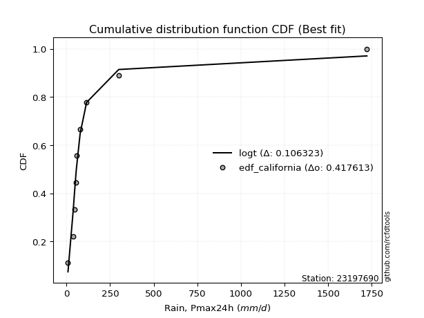</img>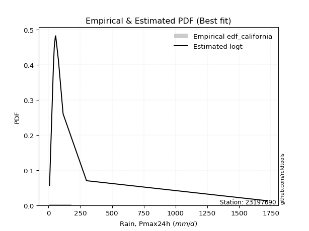</img>

</div>


### 2. Empirical - EDF Hazen (1930)

Hazen method for plotting positions is a formula used to estimate the empirical cumulative probability distribution of flood events or other hydrological data. This formula often results in biased estimations, particularly when extrapolating to extreme events (high return periods).

<div align="center">


$P=(m-0.5)/n$


</div>


**2.1. Empirical values**

<div align="center">

|                | 0                  | 1                  | 2                  | 3                  | 4                  | 5                  | 6                 | 7         | 8                 | 9                  |
|:---------------|:-------------------|:-------------------|:-------------------|:-------------------|:-------------------|:-------------------|:------------------|:----------|:------------------|:-------------------|
| date           | 2019               | 2015               | 2025               | 2012               | 2014               | 2011               | 2013              | 2024      | 2017              | 2016               |
| x              | 8.99               | 38.9               | 44.8               | 45.9               | 54.6               | 57.2               | 78.7              | 115.6     | 299.796           | 1722.086           |
| m              | 1                  | 2                  | 3                  | 4                  | 5                  | 6                  | 7                 | 8         | 9                 | 10                 |
| empirical_dist | edf_hazen          | edf_hazen          | edf_hazen          | edf_hazen          | edf_hazen          | edf_hazen          | edf_hazen         | edf_hazen | edf_hazen         | edf_hazen          |
| empirical      | 0.05               | 0.15               | 0.25               | 0.35               | 0.45               | 0.55               | 0.65              | 0.75      | 0.85              | 0.95               |
| empirical_tr   | 1.0526315789473684 | 1.1764705882352942 | 1.3333333333333333 | 1.5384615384615383 | 1.8181818181818181 | 2.2222222222222223 | 2.857142857142857 | 4.0       | 6.666666666666666 | 19.999999999999982 |

</div>


**2.2. Kolmogorov-Smirnov fit test (sorted by Δ)**


<div align="center">

|                | 0                   | 1                   | 2                     | 3                   | 4                   | 5                   | 6                   | 7                   | 8                   | 9                   | 10                  | 11                  | 12                  | 13                 | 14                 | 15                 | 16                  | 17                  | 18                  | 19                  | 20                  | 21                 | 22                  | 23                  | 24                 | 25                  | 26                 | 27                  | 28                 | 29                 | 30                 | 31                  | 32                  | 33                  | 34                  | 35                  | 36                  | 37                 | 38                  | 39                 | 40                  | 41                  | 42                  | 43                  | 44                  | 45                 | 46                 | 47                  | 48                  | 49                  | 50                  | 51                  | 52                 | 53                  | 54                 | 55                  | 56                  | 57                  | 58                  | 59                 | 60                 | 61                 | 62                 | 63                 | 64                  | 65                  | 66                  | 67                 | 68                  | 69                  | 70                  | 71                 | 72                  | 73                  | 74                 | 75                 | 76                 | 77                  | 78                 | 79                 | 80                 | 81                  | 82                  | 83                  | 84                  | 85                 | 86                 | 87                 | 88                 | 89                 |
|:---------------|:--------------------|:--------------------|:----------------------|:--------------------|:--------------------|:--------------------|:--------------------|:--------------------|:--------------------|:--------------------|:--------------------|:--------------------|:--------------------|:-------------------|:-------------------|:-------------------|:--------------------|:--------------------|:--------------------|:--------------------|:--------------------|:-------------------|:--------------------|:--------------------|:-------------------|:--------------------|:-------------------|:--------------------|:-------------------|:-------------------|:-------------------|:--------------------|:--------------------|:--------------------|:--------------------|:--------------------|:--------------------|:-------------------|:--------------------|:-------------------|:--------------------|:--------------------|:--------------------|:--------------------|:--------------------|:-------------------|:-------------------|:--------------------|:--------------------|:--------------------|:--------------------|:--------------------|:-------------------|:--------------------|:-------------------|:--------------------|:--------------------|:--------------------|:--------------------|:-------------------|:-------------------|:-------------------|:-------------------|:-------------------|:--------------------|:--------------------|:--------------------|:-------------------|:--------------------|:--------------------|:--------------------|:-------------------|:--------------------|:--------------------|:-------------------|:-------------------|:-------------------|:--------------------|:-------------------|:-------------------|:-------------------|:--------------------|:--------------------|:--------------------|:--------------------|:-------------------|:-------------------|:-------------------|:-------------------|:-------------------|
| station        | 23197690            | 23197690            | 23197690              | 23197690            | 23197690            | 23197690            | 23197690            | 23197690            | 23197690            | 23197690            | 23197690            | 23197690            | 23197690            | 23197690           | 23197690           | 23197690           | 23197690            | 23197690            | 23197690            | 23197690            | 23197690            | 23197690           | 23197690            | 23197690            | 23197690           | 23197690            | 23197690           | 23197690            | 23197690           | 23197690           | 23197690           | 23197690            | 23197690            | 23197690            | 23197690            | 23197690            | 23197690            | 23197690           | 23197690            | 23197690           | 23197690            | 23197690            | 23197690            | 23197690            | 23197690            | 23197690           | 23197690           | 23197690            | 23197690            | 23197690            | 23197690            | 23197690            | 23197690           | 23197690            | 23197690           | 23197690            | 23197690            | 23197690            | 23197690            | 23197690           | 23197690           | 23197690           | 23197690           | 23197690           | 23197690            | 23197690            | 23197690            | 23197690           | 23197690            | 23197690            | 23197690            | 23197690           | 23197690            | 23197690            | 23197690           | 23197690           | 23197690           | 23197690            | 23197690           | 23197690           | 23197690           | 23197690            | 23197690            | 23197690            | 23197690            | 23197690           | 23197690           | 23197690           | 23197690           | 23197690           |
| empirical_dist | edf_hazen           | edf_hazen           | edf_hazen             | edf_hazen           | edf_hazen           | edf_hazen           | edf_hazen           | edf_hazen           | edf_hazen           | edf_hazen           | edf_hazen           | edf_hazen           | edf_hazen           | edf_hazen          | edf_hazen          | edf_hazen          | edf_hazen           | edf_hazen           | edf_hazen           | edf_hazen           | edf_hazen           | edf_hazen          | edf_hazen           | edf_hazen           | edf_hazen          | edf_hazen           | edf_hazen          | edf_hazen           | edf_hazen          | edf_hazen          | edf_hazen          | edf_hazen           | edf_hazen           | edf_hazen           | edf_hazen           | edf_hazen           | edf_hazen           | edf_hazen          | edf_hazen           | edf_hazen          | edf_hazen           | edf_hazen           | edf_hazen           | edf_hazen           | edf_hazen           | edf_hazen          | edf_hazen          | edf_hazen           | edf_hazen           | edf_hazen           | edf_hazen           | edf_hazen           | edf_hazen          | edf_hazen           | edf_hazen          | edf_hazen           | edf_hazen           | edf_hazen           | edf_hazen           | edf_hazen          | edf_hazen          | edf_hazen          | edf_hazen          | edf_hazen          | edf_hazen           | edf_hazen           | edf_hazen           | edf_hazen          | edf_hazen           | edf_hazen           | edf_hazen           | edf_hazen          | edf_hazen           | edf_hazen           | edf_hazen          | edf_hazen          | edf_hazen          | edf_hazen           | edf_hazen          | edf_hazen          | edf_hazen          | edf_hazen           | edf_hazen           | edf_hazen           | edf_hazen           | edf_hazen          | edf_hazen          | edf_hazen          | edf_hazen          | edf_hazen          |
| p_dist         | logjohnsonsu        | lognct              | loglaplace_asymmetric | loggibrat           | logt                | nct                 | loggenlogistic      | logfisk             | logmielke           | logweibull_min      | invgamma            | f                   | betaprime           | logcrystalball     | lognorm            | lognorm            | logloggamma         | mielke              | logexponnorm        | loglogistic         | invgauss            | logalpha           | logncf              | logf                | loginvgamma        | logfatiguelife      | loginvgauss        | ncf                 | logerlang          | loggamma           | loggamma           | logbetaprime        | logmaxwell          | t                   | loghypsecant        | loggumbel_r         | logwald             | logpearson3        | loginvweibull       | lograyleigh        | logmoyal            | pareto              | logrice             | johnsonsu           | logkstwobign        | loglaplace         | loghalflogistic    | loggenexpon         | loghalfnorm         | loggompertz         | fatiguelife         | loggumbel_l         | chi2               | logtruncnorm        | gibrat             | erlang              | lognakagami         | weibull_min         | gumbel_r            | rayleigh           | nakagami           | moyal              | maxwell            | genlogistic        | wald                | logexpon            | halfnorm            | halflogistic       | alpha               | norm                | logistic            | pearson3           | hypsecant           | exponnorm           | laplace_asymmetric | expon              | genexpon           | laplace             | kstwobign          | fisk               | rice               | gumbel_l            | gamma               | crystalball         | invweibull          | logchi2            | loglognorm         | logpareto          | truncnorm          | gompertz           |
| delta          | 0.04187813183912026 | 0.05323530782193381 | 0.0968964285171815    | 0.11304164000293715 | 0.12454338318738703 | 0.12689991733744832 | 0.14701747803417972 | 0.14725139055094558 | 0.14874706910831656 | 0.14999999996666102 | 0.15019071656786706 | 0.15270570677967596 | 0.15274709493005864 | 0.1544058154651653 | 0.1544058166874387 | 0.1544058166874387 | 0.15493986834608175 | 0.15679560699524395 | 0.15727813261586335 | 0.16242123314116957 | 0.16262202902580222 | 0.1652689616682663 | 0.16570369589882708 | 0.16575575883779406 | 0.165763651122969  | 0.16612969786329015 | 0.1661985153945512 | 0.16673710272167744 | 0.1669594000082976 | 0.1669600302011093 | 0.1669600302011093 | 0.16733461326288726 | 0.17050137838694132 | 0.17276007418389744 | 0.17294104631623652 | 0.17381972614638305 | 0.17535523060625016 | 0.1780499687830102 | 0.18065204686226102 | 0.1813060766144384 | 0.18246270170163761 | 0.18545539991516027 | 0.18720694044047312 | 0.18779895993971493 | 0.19484926189385784 | 0.2000130574487301 | 0.2085415681262535 | 0.21105705360821683 | 0.21175942053280442 | 0.21249729404418435 | 0.22397562803181936 | 0.22489792127747033 | 0.2568191348574061 | 0.26314099102748456 | 0.2645882400574137 | 0.28030265568316937 | 0.28450317005047343 | 0.29255766716527865 | 0.30498674024478845 | 0.3075954502012376 | 0.3178921351467363 | 0.3179193148689294 | 0.3198963911931614 | 0.3294909181754374 | 0.33451358657369795 | 0.33864430871012363 | 0.34002736456534965 | 0.3418329191484239 | 0.35214275402316475 | 0.35381899889983626 | 0.36715098717545264 | 0.3756024021465357 | 0.37802420078159643 | 0.39279564646584053 | 0.3957889085705061 | 0.3957914319339271 | 0.3957914443957284 | 0.40542081647274714 | 0.4066274734011556 | 0.4114216310453457 | 0.4191561272000779 | 0.41993091443356817 | 0.44198412859809755 | 0.45670470212513276 | 0.45996822043880703 | 0.4608806938298189 | 0.4659403412853014 | 0.5052440927032437 | 0.5244083332854732 | 0.5687991711920475 |
| deltao         | 0.3942745923300002  | 0.3942745923300002  | 0.3942745923300002    | 0.3942745923300002  | 0.3942745923300002  | 0.3942745923300002  | 0.3942745923300002  | 0.3942745923300002  | 0.3942745923300002  | 0.3942745923300002  | 0.3942745923300002  | 0.3942745923300002  | 0.3942745923300002  | 0.3942745923300002 | 0.3942745923300002 | 0.3942745923300002 | 0.3942745923300002  | 0.3942745923300002  | 0.3942745923300002  | 0.3942745923300002  | 0.3942745923300002  | 0.3942745923300002 | 0.3942745923300002  | 0.3942745923300002  | 0.3942745923300002 | 0.3942745923300002  | 0.3942745923300002 | 0.3942745923300002  | 0.3942745923300002 | 0.3942745923300002 | 0.3942745923300002 | 0.3942745923300002  | 0.3942745923300002  | 0.3942745923300002  | 0.3942745923300002  | 0.3942745923300002  | 0.3942745923300002  | 0.3942745923300002 | 0.3942745923300002  | 0.3942745923300002 | 0.3942745923300002  | 0.3942745923300002  | 0.3942745923300002  | 0.3942745923300002  | 0.3942745923300002  | 0.3942745923300002 | 0.3942745923300002 | 0.3942745923300002  | 0.3942745923300002  | 0.3942745923300002  | 0.3942745923300002  | 0.3942745923300002  | 0.3942745923300002 | 0.3942745923300002  | 0.3942745923300002 | 0.3942745923300002  | 0.3942745923300002  | 0.3942745923300002  | 0.3942745923300002  | 0.3942745923300002 | 0.3942745923300002 | 0.3942745923300002 | 0.3942745923300002 | 0.3942745923300002 | 0.3942745923300002  | 0.3942745923300002  | 0.3942745923300002  | 0.3942745923300002 | 0.3942745923300002  | 0.3942745923300002  | 0.3942745923300002  | 0.3942745923300002 | 0.3942745923300002  | 0.3942745923300002  | 0.3942745923300002 | 0.3942745923300002 | 0.3942745923300002 | 0.3942745923300002  | 0.3942745923300002 | 0.3942745923300002 | 0.3942745923300002 | 0.3942745923300002  | 0.3942745923300002  | 0.3942745923300002  | 0.3942745923300002  | 0.3942745923300002 | 0.3942745923300002 | 0.3942745923300002 | 0.3942745923300002 | 0.3942745923300002 |
| eval           | Δo > Δ              | Δo > Δ              | Δo > Δ                | Δo > Δ              | Δo > Δ              | Δo > Δ              | Δo > Δ              | Δo > Δ              | Δo > Δ              | Δo > Δ              | Δo > Δ              | Δo > Δ              | Δo > Δ              | Δo > Δ             | Δo > Δ             | Δo > Δ             | Δo > Δ              | Δo > Δ              | Δo > Δ              | Δo > Δ              | Δo > Δ              | Δo > Δ             | Δo > Δ              | Δo > Δ              | Δo > Δ             | Δo > Δ              | Δo > Δ             | Δo > Δ              | Δo > Δ             | Δo > Δ             | Δo > Δ             | Δo > Δ              | Δo > Δ              | Δo > Δ              | Δo > Δ              | Δo > Δ              | Δo > Δ              | Δo > Δ             | Δo > Δ              | Δo > Δ             | Δo > Δ              | Δo > Δ              | Δo > Δ              | Δo > Δ              | Δo > Δ              | Δo > Δ             | Δo > Δ             | Δo > Δ              | Δo > Δ              | Δo > Δ              | Δo > Δ              | Δo > Δ              | Δo > Δ             | Δo > Δ              | Δo > Δ             | Δo > Δ              | Δo > Δ              | Δo > Δ              | Δo > Δ              | Δo > Δ             | Δo > Δ             | Δo > Δ             | Δo > Δ             | Δo > Δ             | Δo > Δ              | Δo > Δ              | Δo > Δ              | Δo > Δ             | Δo > Δ              | Δo > Δ              | Δo > Δ              | Δo > Δ             | Δo > Δ              | Δo > Δ              | Δo <= Δ            | Δo <= Δ            | Δo <= Δ            | Δo <= Δ             | Δo <= Δ            | Δo <= Δ            | Δo <= Δ            | Δo <= Δ             | Δo <= Δ             | Δo <= Δ             | Δo <= Δ             | Δo <= Δ            | Δo <= Δ            | Δo <= Δ            | Δo <= Δ            | Δo <= Δ            |
| fit            | 1                   | 1                   | 1                     | 1                   | 1                   | 1                   | 1                   | 1                   | 1                   | 1                   | 1                   | 1                   | 1                   | 1                  | 1                  | 1                  | 1                   | 1                   | 1                   | 1                   | 1                   | 1                  | 1                   | 1                   | 1                  | 1                   | 1                  | 1                   | 1                  | 1                  | 1                  | 1                   | 1                   | 1                   | 1                   | 1                   | 1                   | 1                  | 1                   | 1                  | 1                   | 1                   | 1                   | 1                   | 1                   | 1                  | 1                  | 1                   | 1                   | 1                   | 1                   | 1                   | 1                  | 1                   | 1                  | 1                   | 1                   | 1                   | 1                   | 1                  | 1                  | 1                  | 1                  | 1                  | 1                   | 1                   | 1                   | 1                  | 1                   | 1                   | 1                   | 1                  | 1                   | 1                   | 0                  | 0                  | 0                  | 0                   | 0                  | 0                  | 0                  | 0                   | 0                   | 0                   | 0                   | 0                  | 0                  | 0                  | 0                  | 0                  |
| n              | 10                  | 10                  | 10                    | 10                  | 10                  | 10                  | 10                  | 10                  | 10                  | 10                  | 10                  | 10                  | 10                  | 10                 | 10                 | 10                 | 10                  | 10                  | 10                  | 10                  | 10                  | 10                 | 10                  | 10                  | 10                 | 10                  | 10                 | 10                  | 10                 | 10                 | 10                 | 10                  | 10                  | 10                  | 10                  | 10                  | 10                  | 10                 | 10                  | 10                 | 10                  | 10                  | 10                  | 10                  | 10                  | 10                 | 10                 | 10                  | 10                  | 10                  | 10                  | 10                  | 10                 | 10                  | 10                 | 10                  | 10                  | 10                  | 10                  | 10                 | 10                 | 10                 | 10                 | 10                 | 10                  | 10                  | 10                  | 10                 | 10                  | 10                  | 10                  | 10                 | 10                  | 10                  | 10                 | 10                 | 10                 | 10                  | 10                 | 10                 | 10                 | 10                  | 10                  | 10                  | 10                  | 10                 | 10                 | 10                 | 10                 | 10                 |
| best_fit       | 1                   | 0                   | 0                     | 0                   | 0                   | 0                   | 0                   | 0                   | 0                   | 0                   | 0                   | 0                   | 0                   | 0                  | 0                  | 0                  | 0                   | 0                   | 0                   | 0                   | 0                   | 0                  | 0                   | 0                   | 0                  | 0                   | 0                  | 0                   | 0                  | 0                  | 0                  | 0                   | 0                   | 0                   | 0                   | 0                   | 0                   | 0                  | 0                   | 0                  | 0                   | 0                   | 0                   | 0                   | 0                   | 0                  | 0                  | 0                   | 0                   | 0                   | 0                   | 0                   | 0                  | 0                   | 0                  | 0                   | 0                   | 0                   | 0                   | 0                  | 0                  | 0                  | 0                  | 0                  | 0                   | 0                   | 0                   | 0                  | 0                   | 0                   | 0                   | 0                  | 0                   | 0                   | 0                  | 0                  | 0                  | 0                   | 0                  | 0                  | 0                  | 0                   | 0                   | 0                   | 0                   | 0                  | 0                  | 0                  | 0                  | 0                  |
| best_fit_sort  | 1                   | 2                   | 3                     | 4                   | 5                   | 6                   | 7                   | 8                   | 9                   | 10                  | 11                  | 12                  | 13                  | 14                 | 15                 | 16                 | 17                  | 18                  | 19                  | 20                  | 21                  | 22                 | 23                  | 24                  | 25                 | 26                  | 27                 | 28                  | 29                 | 30                 | 31                 | 32                  | 33                  | 34                  | 35                  | 36                  | 37                  | 38                 | 39                  | 40                 | 41                  | 42                  | 43                  | 44                  | 45                  | 46                 | 47                 | 48                  | 49                  | 50                  | 51                  | 52                  | 53                 | 54                  | 55                 | 56                  | 57                  | 58                  | 59                  | 60                 | 61                 | 62                 | 63                 | 64                 | 65                  | 66                  | 67                  | 68                 | 69                  | 70                  | 71                  | 72                 | 73                  | 74                  | 75                 | 76                 | 77                 | 78                  | 79                 | 80                 | 81                 | 82                  | 83                  | 84                  | 85                  | 86                 | 87                 | 88                 | 89                 | 90                 |

</div>


<div align="center">

</img>

</div>


**2.3. Best fit**

<div align="center">

|   id |   station | empirical_dist   | p_dist       |     delta |   deltao | eval   |   fit |   n |   best_fit |   best_fit_sort |
|-----:|----------:|:-----------------|:-------------|----------:|---------:|:-------|------:|----:|-----------:|----------------:|
|    0 |  23197690 | edf_hazen        | logjohnsonsu | 0.0418781 | 0.394275 | Δo > Δ |     1 |  10 |          1 |               1 |

</div>


<div align="center">

</img></img>

</div>


### 3. Empirical - EDF Weibull (1939)

Weibull plotting position formula is an empirical method used to estimate the non-exceedance probability or plotting position for a set of observed data, is often recommended or widely used in practice, particularly in flood frequency analysis.

<div align="center">


$P=m/(n+1)$


</div>


**3.1. Empirical values**

<div align="center">

|                | 0                   | 1                   | 2                  | 3                   | 4                   | 5                  | 6                  | 7                  | 8                  | 9                  |
|:---------------|:--------------------|:--------------------|:-------------------|:--------------------|:--------------------|:-------------------|:-------------------|:-------------------|:-------------------|:-------------------|
| date           | 2019                | 2015                | 2025               | 2012                | 2014                | 2011               | 2013               | 2024               | 2017               | 2016               |
| x              | 8.99                | 38.9                | 44.8               | 45.9                | 54.6                | 57.2               | 78.7               | 115.6              | 299.796            | 1722.086           |
| m              | 1                   | 2                   | 3                  | 4                   | 5                   | 6                  | 7                  | 8                  | 9                  | 10                 |
| empirical_dist | edf_weibull         | edf_weibull         | edf_weibull        | edf_weibull         | edf_weibull         | edf_weibull        | edf_weibull        | edf_weibull        | edf_weibull        | edf_weibull        |
| empirical      | 0.09090909090909091 | 0.18181818181818182 | 0.2727272727272727 | 0.36363636363636365 | 0.45454545454545453 | 0.5454545454545454 | 0.6363636363636364 | 0.7272727272727273 | 0.8181818181818182 | 0.9090909090909091 |
| empirical_tr   | 1.1                 | 1.2222222222222223  | 1.375              | 1.5714285714285714  | 1.8333333333333335  | 2.1999999999999997 | 2.75               | 3.666666666666667  | 5.500000000000002  | 10.999999999999996 |

</div>


**3.2. Kolmogorov-Smirnov fit test (sorted by Δ)**


<div align="center">

|                | 0                   | 1                   | 2                   | 3                     | 4                   | 5                   | 6                   | 7                   | 8                   | 9                   | 10                  | 11                  | 12                  | 13                 | 14                  | 15                  | 16                  | 17                  | 18                  | 19                  | 20                 | 21                  | 22                  | 23                  | 24                  | 25                 | 26                 | 27                  | 28                  | 29                  | 30                  | 31                 | 32                  | 33                  | 34                 | 35                  | 36                  | 37                  | 38                 | 39                 | 40                  | 41                  | 42                 | 43                 | 44                  | 45                 | 46                 | 47                  | 48                  | 49                  | 50                  | 51                  | 52                 | 53                 | 54                 | 55                  | 56                  | 57                 | 58                  | 59                  | 60                  | 61                 | 62                 | 63                  | 64                  | 65                  | 66                 | 67                  | 68                  | 69                  | 70                 | 71                  | 72                 | 73                  | 74                 | 75                 | 76                 | 77                 | 78                  | 79                 | 80                 | 81                  | 82                  | 83                 | 84                  | 85                 | 86                 | 87                  | 88                 | 89                 |
|:---------------|:--------------------|:--------------------|:--------------------|:----------------------|:--------------------|:--------------------|:--------------------|:--------------------|:--------------------|:--------------------|:--------------------|:--------------------|:--------------------|:-------------------|:--------------------|:--------------------|:--------------------|:--------------------|:--------------------|:--------------------|:-------------------|:--------------------|:--------------------|:--------------------|:--------------------|:-------------------|:-------------------|:--------------------|:--------------------|:--------------------|:--------------------|:-------------------|:--------------------|:--------------------|:-------------------|:--------------------|:--------------------|:--------------------|:-------------------|:-------------------|:--------------------|:--------------------|:-------------------|:-------------------|:--------------------|:-------------------|:-------------------|:--------------------|:--------------------|:--------------------|:--------------------|:--------------------|:-------------------|:-------------------|:-------------------|:--------------------|:--------------------|:-------------------|:--------------------|:--------------------|:--------------------|:-------------------|:-------------------|:--------------------|:--------------------|:--------------------|:-------------------|:--------------------|:--------------------|:--------------------|:-------------------|:--------------------|:-------------------|:--------------------|:-------------------|:-------------------|:-------------------|:-------------------|:--------------------|:-------------------|:-------------------|:--------------------|:--------------------|:-------------------|:--------------------|:-------------------|:-------------------|:--------------------|:-------------------|:-------------------|
| station        | 23197690            | 23197690            | 23197690            | 23197690              | 23197690            | 23197690            | 23197690            | 23197690            | 23197690            | 23197690            | 23197690            | 23197690            | 23197690            | 23197690           | 23197690            | 23197690            | 23197690            | 23197690            | 23197690            | 23197690            | 23197690           | 23197690            | 23197690            | 23197690            | 23197690            | 23197690           | 23197690           | 23197690            | 23197690            | 23197690            | 23197690            | 23197690           | 23197690            | 23197690            | 23197690           | 23197690            | 23197690            | 23197690            | 23197690           | 23197690           | 23197690            | 23197690            | 23197690           | 23197690           | 23197690            | 23197690           | 23197690           | 23197690            | 23197690            | 23197690            | 23197690            | 23197690            | 23197690           | 23197690           | 23197690           | 23197690            | 23197690            | 23197690           | 23197690            | 23197690            | 23197690            | 23197690           | 23197690           | 23197690            | 23197690            | 23197690            | 23197690           | 23197690            | 23197690            | 23197690            | 23197690           | 23197690            | 23197690           | 23197690            | 23197690           | 23197690           | 23197690           | 23197690           | 23197690            | 23197690           | 23197690           | 23197690            | 23197690            | 23197690           | 23197690            | 23197690           | 23197690           | 23197690            | 23197690           | 23197690           |
| empirical_dist | edf_weibull         | edf_weibull         | edf_weibull         | edf_weibull           | edf_weibull         | edf_weibull         | edf_weibull         | edf_weibull         | edf_weibull         | edf_weibull         | edf_weibull         | edf_weibull         | edf_weibull         | edf_weibull        | edf_weibull         | edf_weibull         | edf_weibull         | edf_weibull         | edf_weibull         | edf_weibull         | edf_weibull        | edf_weibull         | edf_weibull         | edf_weibull         | edf_weibull         | edf_weibull        | edf_weibull        | edf_weibull         | edf_weibull         | edf_weibull         | edf_weibull         | edf_weibull        | edf_weibull         | edf_weibull         | edf_weibull        | edf_weibull         | edf_weibull         | edf_weibull         | edf_weibull        | edf_weibull        | edf_weibull         | edf_weibull         | edf_weibull        | edf_weibull        | edf_weibull         | edf_weibull        | edf_weibull        | edf_weibull         | edf_weibull         | edf_weibull         | edf_weibull         | edf_weibull         | edf_weibull        | edf_weibull        | edf_weibull        | edf_weibull         | edf_weibull         | edf_weibull        | edf_weibull         | edf_weibull         | edf_weibull         | edf_weibull        | edf_weibull        | edf_weibull         | edf_weibull         | edf_weibull         | edf_weibull        | edf_weibull         | edf_weibull         | edf_weibull         | edf_weibull        | edf_weibull         | edf_weibull        | edf_weibull         | edf_weibull        | edf_weibull        | edf_weibull        | edf_weibull        | edf_weibull         | edf_weibull        | edf_weibull        | edf_weibull         | edf_weibull         | edf_weibull        | edf_weibull         | edf_weibull        | edf_weibull        | edf_weibull         | edf_weibull        | edf_weibull        |
| p_dist         | lognct              | logjohnsonsu        | loggibrat           | loglaplace_asymmetric | loggenlogistic      | logfisk             | logmielke           | invgamma            | f                   | betaprime           | nct                 | mielke              | logexponnorm        | invgauss           | logalpha            | logncf              | logf                | loginvgamma         | logfatiguelife      | loginvgauss         | ncf                | logerlang           | loggamma            | loggamma            | logbetaprime        | logt               | logmaxwell         | loggumbel_r         | logloggamma         | lognorm             | lognorm             | logcrystalball     | logwald             | logpearson3         | loginvweibull      | lograyleigh         | logmoyal            | pareto              | logrice            | johnsonsu          | loglogistic         | logkstwobign        | loghypsecant       | t                  | loghalflogistic     | loggenexpon        | loghalfnorm        | loggompertz         | logweibull_min      | loglaplace          | fatiguelife         | loggumbel_l         | gibrat             | logtruncnorm       | chi2               | erlang              | weibull_min         | lognakagami        | gumbel_r            | moyal               | rayleigh            | wald               | nakagami           | maxwell             | halfnorm            | halflogistic        | genlogistic        | logexpon            | alpha               | norm                | pearson3           | logistic            | hypsecant          | exponnorm           | fisk               | laplace_asymmetric | expon              | genexpon           | laplace             | kstwobign          | rice               | gumbel_l            | gamma               | crystalball        | invweibull          | logchi2            | loglognorm         | logpareto           | truncnorm          | gompertz           |
| delta          | 0.06687167145829748 | 0.06877637147551813 | 0.09129579389613973 | 0.09235097397172687   | 0.11519929621599789 | 0.11543320873276375 | 0.11692888729013473 | 0.11837253474968523 | 0.12088752496149413 | 0.12092891311187681 | 0.12235446279199369 | 0.12497742517706212 | 0.12545995079768152 | 0.1308038472076204 | 0.13345077985008447 | 0.13388551408064525 | 0.13393757701961223 | 0.13394546930478718 | 0.13431151604510833 | 0.13438033357636936 | 0.1349189209034956 | 0.13514121819011576 | 0.13514184838292748 | 0.13514184838292748 | 0.13551643144470543 | 0.1374491387538872 | 0.1386831965687595 | 0.14200154432820122 | 0.14319070366877934 | 0.14502431135469823 | 0.14502431135469823 | 0.1450243154958763 | 0.14508315172367436 | 0.14623178696482836 | 0.1488338650440792 | 0.14948789479625657 | 0.15064451988345579 | 0.15363721809697845 | 0.1553887586222913 | 0.1559807781215331 | 0.15787577859571494 | 0.16303108007567602 | 0.1683955917707819 | 0.1723135361400302 | 0.17672338630807166 | 0.179238871790035  | 0.1799412387146226 | 0.18067911222600253 | 0.18181818178484285 | 0.19546760290327547 | 0.20124835530454666 | 0.21157957689402118 | 0.2236791491483228 | 0.2313228092093027 | 0.2340918621301334 | 0.25757538295589666 | 0.26073948534709684 | 0.2617758973232007 | 0.27204134437437344 | 0.27701022395983843 | 0.28486817747396487 | 0.293604495664607  | 0.2951648624194636 | 0.29716911846588867 | 0.29911827365625876 | 0.30092382823933295 | 0.3067636454481647 | 0.30682612689194183 | 0.32032457220498295 | 0.33109172617256355 | 0.3346933112374447 | 0.34442371444817993 | 0.3552969280543237 | 0.37915928282947686 | 0.3796034492271639 | 0.3821525449341424 | 0.3821550682975634 | 0.3821550807593647 | 0.38269354374547443 | 0.3839002006738829 | 0.3964288544728052 | 0.39720364170629546 | 0.41016594677991575 | 0.4157956112160418 | 0.41905912952971613 | 0.4290625120116371 | 0.4341221594671196 | 0.47342591088506186 | 0.5016810605582005 | 0.5460718984647748 |
| deltao         | 0.3942745923300002  | 0.3942745923300002  | 0.3942745923300002  | 0.3942745923300002    | 0.3942745923300002  | 0.3942745923300002  | 0.3942745923300002  | 0.3942745923300002  | 0.3942745923300002  | 0.3942745923300002  | 0.3942745923300002  | 0.3942745923300002  | 0.3942745923300002  | 0.3942745923300002 | 0.3942745923300002  | 0.3942745923300002  | 0.3942745923300002  | 0.3942745923300002  | 0.3942745923300002  | 0.3942745923300002  | 0.3942745923300002 | 0.3942745923300002  | 0.3942745923300002  | 0.3942745923300002  | 0.3942745923300002  | 0.3942745923300002 | 0.3942745923300002 | 0.3942745923300002  | 0.3942745923300002  | 0.3942745923300002  | 0.3942745923300002  | 0.3942745923300002 | 0.3942745923300002  | 0.3942745923300002  | 0.3942745923300002 | 0.3942745923300002  | 0.3942745923300002  | 0.3942745923300002  | 0.3942745923300002 | 0.3942745923300002 | 0.3942745923300002  | 0.3942745923300002  | 0.3942745923300002 | 0.3942745923300002 | 0.3942745923300002  | 0.3942745923300002 | 0.3942745923300002 | 0.3942745923300002  | 0.3942745923300002  | 0.3942745923300002  | 0.3942745923300002  | 0.3942745923300002  | 0.3942745923300002 | 0.3942745923300002 | 0.3942745923300002 | 0.3942745923300002  | 0.3942745923300002  | 0.3942745923300002 | 0.3942745923300002  | 0.3942745923300002  | 0.3942745923300002  | 0.3942745923300002 | 0.3942745923300002 | 0.3942745923300002  | 0.3942745923300002  | 0.3942745923300002  | 0.3942745923300002 | 0.3942745923300002  | 0.3942745923300002  | 0.3942745923300002  | 0.3942745923300002 | 0.3942745923300002  | 0.3942745923300002 | 0.3942745923300002  | 0.3942745923300002 | 0.3942745923300002 | 0.3942745923300002 | 0.3942745923300002 | 0.3942745923300002  | 0.3942745923300002 | 0.3942745923300002 | 0.3942745923300002  | 0.3942745923300002  | 0.3942745923300002 | 0.3942745923300002  | 0.3942745923300002 | 0.3942745923300002 | 0.3942745923300002  | 0.3942745923300002 | 0.3942745923300002 |
| eval           | Δo > Δ              | Δo > Δ              | Δo > Δ              | Δo > Δ                | Δo > Δ              | Δo > Δ              | Δo > Δ              | Δo > Δ              | Δo > Δ              | Δo > Δ              | Δo > Δ              | Δo > Δ              | Δo > Δ              | Δo > Δ             | Δo > Δ              | Δo > Δ              | Δo > Δ              | Δo > Δ              | Δo > Δ              | Δo > Δ              | Δo > Δ             | Δo > Δ              | Δo > Δ              | Δo > Δ              | Δo > Δ              | Δo > Δ             | Δo > Δ             | Δo > Δ              | Δo > Δ              | Δo > Δ              | Δo > Δ              | Δo > Δ             | Δo > Δ              | Δo > Δ              | Δo > Δ             | Δo > Δ              | Δo > Δ              | Δo > Δ              | Δo > Δ             | Δo > Δ             | Δo > Δ              | Δo > Δ              | Δo > Δ             | Δo > Δ             | Δo > Δ              | Δo > Δ             | Δo > Δ             | Δo > Δ              | Δo > Δ              | Δo > Δ              | Δo > Δ              | Δo > Δ              | Δo > Δ             | Δo > Δ             | Δo > Δ             | Δo > Δ              | Δo > Δ              | Δo > Δ             | Δo > Δ              | Δo > Δ              | Δo > Δ              | Δo > Δ             | Δo > Δ             | Δo > Δ              | Δo > Δ              | Δo > Δ              | Δo > Δ             | Δo > Δ              | Δo > Δ              | Δo > Δ              | Δo > Δ             | Δo > Δ              | Δo > Δ             | Δo > Δ              | Δo > Δ             | Δo > Δ             | Δo > Δ             | Δo > Δ             | Δo > Δ              | Δo > Δ             | Δo <= Δ            | Δo <= Δ             | Δo <= Δ             | Δo <= Δ            | Δo <= Δ             | Δo <= Δ            | Δo <= Δ            | Δo <= Δ             | Δo <= Δ            | Δo <= Δ            |
| fit            | 1                   | 1                   | 1                   | 1                     | 1                   | 1                   | 1                   | 1                   | 1                   | 1                   | 1                   | 1                   | 1                   | 1                  | 1                   | 1                   | 1                   | 1                   | 1                   | 1                   | 1                  | 1                   | 1                   | 1                   | 1                   | 1                  | 1                  | 1                   | 1                   | 1                   | 1                   | 1                  | 1                   | 1                   | 1                  | 1                   | 1                   | 1                   | 1                  | 1                  | 1                   | 1                   | 1                  | 1                  | 1                   | 1                  | 1                  | 1                   | 1                   | 1                   | 1                   | 1                   | 1                  | 1                  | 1                  | 1                   | 1                   | 1                  | 1                   | 1                   | 1                   | 1                  | 1                  | 1                   | 1                   | 1                   | 1                  | 1                   | 1                   | 1                   | 1                  | 1                   | 1                  | 1                   | 1                  | 1                  | 1                  | 1                  | 1                   | 1                  | 0                  | 0                   | 0                   | 0                  | 0                   | 0                  | 0                  | 0                   | 0                  | 0                  |
| n              | 10                  | 10                  | 10                  | 10                    | 10                  | 10                  | 10                  | 10                  | 10                  | 10                  | 10                  | 10                  | 10                  | 10                 | 10                  | 10                  | 10                  | 10                  | 10                  | 10                  | 10                 | 10                  | 10                  | 10                  | 10                  | 10                 | 10                 | 10                  | 10                  | 10                  | 10                  | 10                 | 10                  | 10                  | 10                 | 10                  | 10                  | 10                  | 10                 | 10                 | 10                  | 10                  | 10                 | 10                 | 10                  | 10                 | 10                 | 10                  | 10                  | 10                  | 10                  | 10                  | 10                 | 10                 | 10                 | 10                  | 10                  | 10                 | 10                  | 10                  | 10                  | 10                 | 10                 | 10                  | 10                  | 10                  | 10                 | 10                  | 10                  | 10                  | 10                 | 10                  | 10                 | 10                  | 10                 | 10                 | 10                 | 10                 | 10                  | 10                 | 10                 | 10                  | 10                  | 10                 | 10                  | 10                 | 10                 | 10                  | 10                 | 10                 |
| best_fit       | 1                   | 0                   | 0                   | 0                     | 0                   | 0                   | 0                   | 0                   | 0                   | 0                   | 0                   | 0                   | 0                   | 0                  | 0                   | 0                   | 0                   | 0                   | 0                   | 0                   | 0                  | 0                   | 0                   | 0                   | 0                   | 0                  | 0                  | 0                   | 0                   | 0                   | 0                   | 0                  | 0                   | 0                   | 0                  | 0                   | 0                   | 0                   | 0                  | 0                  | 0                   | 0                   | 0                  | 0                  | 0                   | 0                  | 0                  | 0                   | 0                   | 0                   | 0                   | 0                   | 0                  | 0                  | 0                  | 0                   | 0                   | 0                  | 0                   | 0                   | 0                   | 0                  | 0                  | 0                   | 0                   | 0                   | 0                  | 0                   | 0                   | 0                   | 0                  | 0                   | 0                  | 0                   | 0                  | 0                  | 0                  | 0                  | 0                   | 0                  | 0                  | 0                   | 0                   | 0                  | 0                   | 0                  | 0                  | 0                   | 0                  | 0                  |
| best_fit_sort  | 1                   | 2                   | 3                   | 4                     | 5                   | 6                   | 7                   | 8                   | 9                   | 10                  | 11                  | 12                  | 13                  | 14                 | 15                  | 16                  | 17                  | 18                  | 19                  | 20                  | 21                 | 22                  | 23                  | 24                  | 25                  | 26                 | 27                 | 28                  | 29                  | 30                  | 31                  | 32                 | 33                  | 34                  | 35                 | 36                  | 37                  | 38                  | 39                 | 40                 | 41                  | 42                  | 43                 | 44                 | 45                  | 46                 | 47                 | 48                  | 49                  | 50                  | 51                  | 52                  | 53                 | 54                 | 55                 | 56                  | 57                  | 58                 | 59                  | 60                  | 61                  | 62                 | 63                 | 64                  | 65                  | 66                  | 67                 | 68                  | 69                  | 70                  | 71                 | 72                  | 73                 | 74                  | 75                 | 76                 | 77                 | 78                 | 79                  | 80                 | 81                 | 82                  | 83                  | 84                 | 85                  | 86                 | 87                 | 88                  | 89                 | 90                 |

</div>


<div align="center">

</img>

</div>


**3.3. Best fit**

<div align="center">

|   id |   station | empirical_dist   | p_dist   |     delta |   deltao | eval   |   fit |   n |   best_fit |   best_fit_sort |
|-----:|----------:|:-----------------|:---------|----------:|---------:|:-------|------:|----:|-----------:|----------------:|
|    0 |  23197690 | edf_weibull      | lognct   | 0.0668717 | 0.394275 | Δo > Δ |     1 |  10 |          1 |               1 |

</div>


<div align="center">

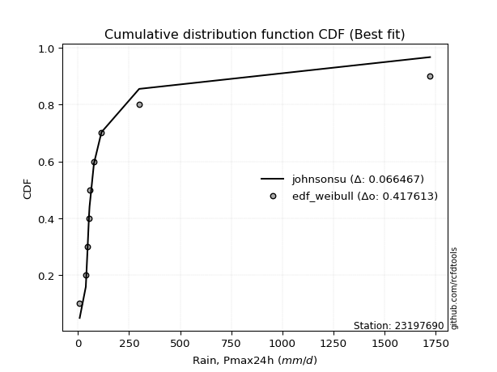</img>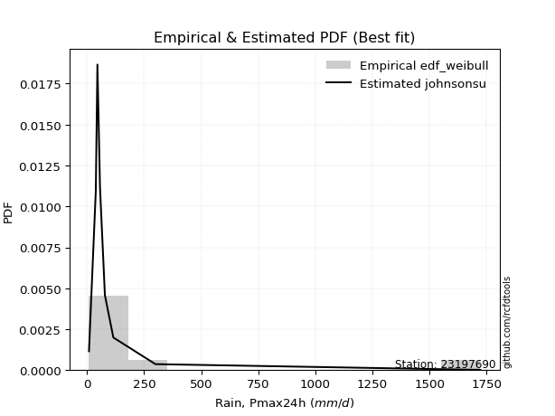</img>

</div>


### 4. Empirical - EDF Beard (1943)

The Beard formula (or Beard´s plotting position formula) in hydrology is used to estimate the empirical non-exceedance probability _(P)_ of a flood event (or other extreme hydrological data point) within a given dataset.

<div align="center">


$P=(m-0.31)/(n+0.38)$


</div>


**4.1. Empirical values**

<div align="center">

|                | 0                   | 1                   | 2                  | 3                   | 4                   | 5                  | 6                  | 7                  | 8                  | 9                  |
|:---------------|:--------------------|:--------------------|:-------------------|:--------------------|:--------------------|:-------------------|:-------------------|:-------------------|:-------------------|:-------------------|
| date           | 2019                | 2015                | 2025               | 2012                | 2014                | 2011               | 2013               | 2024               | 2017               | 2016               |
| x              | 8.99                | 38.9                | 44.8               | 45.9                | 54.6                | 57.2               | 78.7               | 115.6              | 299.796            | 1722.086           |
| m              | 1                   | 2                   | 3                  | 4                   | 5                   | 6                  | 7                  | 8                  | 9                  | 10                 |
| empirical_dist | edf_beard           | edf_beard           | edf_beard          | edf_beard           | edf_beard           | edf_beard          | edf_beard          | edf_beard          | edf_beard          | edf_beard          |
| empirical      | 0.06647398843930635 | 0.16281310211946048 | 0.2591522157996146 | 0.35549132947976875 | 0.45183044315992293 | 0.5481695568400771 | 0.6445086705202312 | 0.7408477842003853 | 0.8371868978805393 | 0.9335260115606935 |
| empirical_tr   | 1.0712074303405574  | 1.1944764096662832  | 1.3498049414824447 | 1.5515695067264574  | 1.8242530755711774  | 2.213219616204691  | 2.813008130081301  | 3.8587360594795537 | 6.142011834319521  | 15.043478260869529 |

</div>


**4.2. Kolmogorov-Smirnov fit test (sorted by Δ)**


<div align="center">

|                | 0                   | 1                   | 2                     | 3                   | 4                   | 5                   | 6                   | 7                  | 8                   | 9                   | 10                  | 11                  | 12                  | 13                  | 14                  | 15                  | 16                  | 17                  | 18                  | 19                 | 20                 | 21                  | 22                  | 23                  | 24                 | 25                  | 26                 | 27                  | 28                  | 29                  | 30                  | 31                 | 32                  | 33                  | 34                  | 35                 | 36                  | 37                 | 38                  | 39                  | 40                  | 41                  | 42                  | 43                  | 44                  | 45                 | 46                  | 47                  | 48                  | 49                  | 50                 | 51                 | 52                  | 53                  | 54                  | 55                 | 56                 | 57                 | 58                 | 59                 | 60                 | 61                  | 62                 | 63                 | 64                  | 65                 | 66                  | 67                  | 68                 | 69                 | 70                  | 71                 | 72                  | 73                 | 74                  | 75                  | 76                  | 77                  | 78                  | 79                 | 80                 | 81                 | 82                 | 83                 | 84                  | 85                 | 86                 | 87                 | 88                 | 89                 |
|:---------------|:--------------------|:--------------------|:----------------------|:--------------------|:--------------------|:--------------------|:--------------------|:-------------------|:--------------------|:--------------------|:--------------------|:--------------------|:--------------------|:--------------------|:--------------------|:--------------------|:--------------------|:--------------------|:--------------------|:-------------------|:-------------------|:--------------------|:--------------------|:--------------------|:-------------------|:--------------------|:-------------------|:--------------------|:--------------------|:--------------------|:--------------------|:-------------------|:--------------------|:--------------------|:--------------------|:-------------------|:--------------------|:-------------------|:--------------------|:--------------------|:--------------------|:--------------------|:--------------------|:--------------------|:--------------------|:-------------------|:--------------------|:--------------------|:--------------------|:--------------------|:-------------------|:-------------------|:--------------------|:--------------------|:--------------------|:-------------------|:-------------------|:-------------------|:-------------------|:-------------------|:-------------------|:--------------------|:-------------------|:-------------------|:--------------------|:-------------------|:--------------------|:--------------------|:-------------------|:-------------------|:--------------------|:-------------------|:--------------------|:-------------------|:--------------------|:--------------------|:--------------------|:--------------------|:--------------------|:-------------------|:-------------------|:-------------------|:-------------------|:-------------------|:--------------------|:-------------------|:-------------------|:-------------------|:-------------------|:-------------------|
| station        | 23197690            | 23197690            | 23197690              | 23197690            | 23197690            | 23197690            | 23197690            | 23197690           | 23197690            | 23197690            | 23197690            | 23197690            | 23197690            | 23197690            | 23197690            | 23197690            | 23197690            | 23197690            | 23197690            | 23197690           | 23197690           | 23197690            | 23197690            | 23197690            | 23197690           | 23197690            | 23197690           | 23197690            | 23197690            | 23197690            | 23197690            | 23197690           | 23197690            | 23197690            | 23197690            | 23197690           | 23197690            | 23197690           | 23197690            | 23197690            | 23197690            | 23197690            | 23197690            | 23197690            | 23197690            | 23197690           | 23197690            | 23197690            | 23197690            | 23197690            | 23197690           | 23197690           | 23197690            | 23197690            | 23197690            | 23197690           | 23197690           | 23197690           | 23197690           | 23197690           | 23197690           | 23197690            | 23197690           | 23197690           | 23197690            | 23197690           | 23197690            | 23197690            | 23197690           | 23197690           | 23197690            | 23197690           | 23197690            | 23197690           | 23197690            | 23197690            | 23197690            | 23197690            | 23197690            | 23197690           | 23197690           | 23197690           | 23197690           | 23197690           | 23197690            | 23197690           | 23197690           | 23197690           | 23197690           | 23197690           |
| empirical_dist | edf_beard           | edf_beard           | edf_beard             | edf_beard           | edf_beard           | edf_beard           | edf_beard           | edf_beard          | edf_beard           | edf_beard           | edf_beard           | edf_beard           | edf_beard           | edf_beard           | edf_beard           | edf_beard           | edf_beard           | edf_beard           | edf_beard           | edf_beard          | edf_beard          | edf_beard           | edf_beard           | edf_beard           | edf_beard          | edf_beard           | edf_beard          | edf_beard           | edf_beard           | edf_beard           | edf_beard           | edf_beard          | edf_beard           | edf_beard           | edf_beard           | edf_beard          | edf_beard           | edf_beard          | edf_beard           | edf_beard           | edf_beard           | edf_beard           | edf_beard           | edf_beard           | edf_beard           | edf_beard          | edf_beard           | edf_beard           | edf_beard           | edf_beard           | edf_beard          | edf_beard          | edf_beard           | edf_beard           | edf_beard           | edf_beard          | edf_beard          | edf_beard          | edf_beard          | edf_beard          | edf_beard          | edf_beard           | edf_beard          | edf_beard          | edf_beard           | edf_beard          | edf_beard           | edf_beard           | edf_beard          | edf_beard          | edf_beard           | edf_beard          | edf_beard           | edf_beard          | edf_beard           | edf_beard           | edf_beard           | edf_beard           | edf_beard           | edf_beard          | edf_beard          | edf_beard          | edf_beard          | edf_beard          | edf_beard           | edf_beard          | edf_beard          | edf_beard          | edf_beard          | edf_beard          |
| p_dist         | logjohnsonsu        | lognct              | loglaplace_asymmetric | loggibrat           | logt                | nct                 | loggenlogistic      | logfisk            | logmielke           | invgamma            | f                   | betaprime           | mielke              | logexponnorm        | logcrystalball      | lognorm             | lognorm             | logloggamma         | invgauss            | logalpha           | logncf             | logf                | loginvgamma         | logfatiguelife      | loginvgauss        | ncf                 | logerlang          | loggamma            | loggamma            | logbetaprime        | logmaxwell          | loglogistic        | loggumbel_r         | logwald             | logweibull_min      | logpearson3        | loginvweibull       | lograyleigh        | logmoyal            | t                   | loghypsecant        | pareto              | logrice             | johnsonsu           | logkstwobign        | loghalflogistic    | loglaplace          | loggenexpon         | loghalfnorm         | loggompertz         | fatiguelife        | loggumbel_l        | chi2                | gibrat              | logtruncnorm        | erlang             | lognakagami        | weibull_min        | gumbel_r           | rayleigh           | moyal              | nakagami            | maxwell            | wald               | genlogistic         | halfnorm           | halflogistic        | logexpon            | alpha              | norm               | logistic            | pearson3           | hypsecant           | exponnorm          | laplace_asymmetric  | expon               | genexpon            | laplace             | kstwobign           | fisk               | rice               | gumbel_l           | gamma              | crystalball        | invweibull          | logchi2            | loglognorm         | logpareto          | truncnorm          | gompertz           |
| delta          | 0.04736946131888908 | 0.05872663730170258 | 0.09506598535725852   | 0.10388942420332253 | 0.12387408182622917 | 0.12506947417752534 | 0.13420437591471923 | 0.1344382884314851 | 0.13593396698885607 | 0.13737761444840657 | 0.13989260466021547 | 0.13993399281059815 | 0.14398250487578346 | 0.14446503049640286 | 0.14891448598539647 | 0.14891448720766987 | 0.14891448720766987 | 0.14944853886631293 | 0.14980892690634173 | 0.1524558595488058 | 0.1528905937793666 | 0.15294265671833357 | 0.15295054900350852 | 0.15331659574382966 | 0.1533854132750907 | 0.15392400060221695 | 0.1541462978888371 | 0.15414692808164882 | 0.15414692808164882 | 0.15452151114342677 | 0.15768827626748083 | 0.1605907899812466 | 0.16100662402692256 | 0.16254212848678967 | 0.16281310208612151 | 0.1652368666635497 | 0.16783894474280053 | 0.1684929744949779 | 0.16964959958217712 | 0.17092963102397452 | 0.17111060315631355 | 0.17264229779569978 | 0.17439383832101263 | 0.17498585782025444 | 0.18203615977439735 | 0.195728466006793  | 0.19818261428880712 | 0.19824395148875634 | 0.19894631841334393 | 0.19968419192472386 | 0.2148234122322047 | 0.2194065917977015 | 0.24766691905779142 | 0.24811425161810735 | 0.25032788890802404 | 0.2711504398835547 | 0.2753509542508588 | 0.2797445650458182 | 0.2885127518054821 | 0.2984432344016229 | 0.301445326429623  | 0.30873991934712164 | 0.3107441753935467 | 0.3180395981343916 | 0.32033870237582274 | 0.3235533761260433 | 0.32535893070911753 | 0.32583120659066317 | 0.3393296519037043 | 0.3446667831002216 | 0.35799877137583797 | 0.3591284137072293 | 0.36887198498198176 | 0.3873043169860717 | 0.39029757909073726 | 0.39030010245415825 | 0.39030011491595956 | 0.39626860067313247 | 0.39747525760154095 | 0.3986085289258852 | 0.4100039114004632 | 0.4107786986339535 | 0.4291710264786371 | 0.4402307136858264 | 0.44349423199950055 | 0.4480675917103584 | 0.4531272391658409 | 0.4924309905837832 | 0.5152561174858585 | 0.5596469553924328 |
| deltao         | 0.3942745923300002  | 0.3942745923300002  | 0.3942745923300002    | 0.3942745923300002  | 0.3942745923300002  | 0.3942745923300002  | 0.3942745923300002  | 0.3942745923300002 | 0.3942745923300002  | 0.3942745923300002  | 0.3942745923300002  | 0.3942745923300002  | 0.3942745923300002  | 0.3942745923300002  | 0.3942745923300002  | 0.3942745923300002  | 0.3942745923300002  | 0.3942745923300002  | 0.3942745923300002  | 0.3942745923300002 | 0.3942745923300002 | 0.3942745923300002  | 0.3942745923300002  | 0.3942745923300002  | 0.3942745923300002 | 0.3942745923300002  | 0.3942745923300002 | 0.3942745923300002  | 0.3942745923300002  | 0.3942745923300002  | 0.3942745923300002  | 0.3942745923300002 | 0.3942745923300002  | 0.3942745923300002  | 0.3942745923300002  | 0.3942745923300002 | 0.3942745923300002  | 0.3942745923300002 | 0.3942745923300002  | 0.3942745923300002  | 0.3942745923300002  | 0.3942745923300002  | 0.3942745923300002  | 0.3942745923300002  | 0.3942745923300002  | 0.3942745923300002 | 0.3942745923300002  | 0.3942745923300002  | 0.3942745923300002  | 0.3942745923300002  | 0.3942745923300002 | 0.3942745923300002 | 0.3942745923300002  | 0.3942745923300002  | 0.3942745923300002  | 0.3942745923300002 | 0.3942745923300002 | 0.3942745923300002 | 0.3942745923300002 | 0.3942745923300002 | 0.3942745923300002 | 0.3942745923300002  | 0.3942745923300002 | 0.3942745923300002 | 0.3942745923300002  | 0.3942745923300002 | 0.3942745923300002  | 0.3942745923300002  | 0.3942745923300002 | 0.3942745923300002 | 0.3942745923300002  | 0.3942745923300002 | 0.3942745923300002  | 0.3942745923300002 | 0.3942745923300002  | 0.3942745923300002  | 0.3942745923300002  | 0.3942745923300002  | 0.3942745923300002  | 0.3942745923300002 | 0.3942745923300002 | 0.3942745923300002 | 0.3942745923300002 | 0.3942745923300002 | 0.3942745923300002  | 0.3942745923300002 | 0.3942745923300002 | 0.3942745923300002 | 0.3942745923300002 | 0.3942745923300002 |
| eval           | Δo > Δ              | Δo > Δ              | Δo > Δ                | Δo > Δ              | Δo > Δ              | Δo > Δ              | Δo > Δ              | Δo > Δ             | Δo > Δ              | Δo > Δ              | Δo > Δ              | Δo > Δ              | Δo > Δ              | Δo > Δ              | Δo > Δ              | Δo > Δ              | Δo > Δ              | Δo > Δ              | Δo > Δ              | Δo > Δ             | Δo > Δ             | Δo > Δ              | Δo > Δ              | Δo > Δ              | Δo > Δ             | Δo > Δ              | Δo > Δ             | Δo > Δ              | Δo > Δ              | Δo > Δ              | Δo > Δ              | Δo > Δ             | Δo > Δ              | Δo > Δ              | Δo > Δ              | Δo > Δ             | Δo > Δ              | Δo > Δ             | Δo > Δ              | Δo > Δ              | Δo > Δ              | Δo > Δ              | Δo > Δ              | Δo > Δ              | Δo > Δ              | Δo > Δ             | Δo > Δ              | Δo > Δ              | Δo > Δ              | Δo > Δ              | Δo > Δ             | Δo > Δ             | Δo > Δ              | Δo > Δ              | Δo > Δ              | Δo > Δ             | Δo > Δ             | Δo > Δ             | Δo > Δ             | Δo > Δ             | Δo > Δ             | Δo > Δ              | Δo > Δ             | Δo > Δ             | Δo > Δ              | Δo > Δ             | Δo > Δ              | Δo > Δ              | Δo > Δ             | Δo > Δ             | Δo > Δ              | Δo > Δ             | Δo > Δ              | Δo > Δ             | Δo > Δ              | Δo > Δ              | Δo > Δ              | Δo <= Δ             | Δo <= Δ             | Δo <= Δ            | Δo <= Δ            | Δo <= Δ            | Δo <= Δ            | Δo <= Δ            | Δo <= Δ             | Δo <= Δ            | Δo <= Δ            | Δo <= Δ            | Δo <= Δ            | Δo <= Δ            |
| fit            | 1                   | 1                   | 1                     | 1                   | 1                   | 1                   | 1                   | 1                  | 1                   | 1                   | 1                   | 1                   | 1                   | 1                   | 1                   | 1                   | 1                   | 1                   | 1                   | 1                  | 1                  | 1                   | 1                   | 1                   | 1                  | 1                   | 1                  | 1                   | 1                   | 1                   | 1                   | 1                  | 1                   | 1                   | 1                   | 1                  | 1                   | 1                  | 1                   | 1                   | 1                   | 1                   | 1                   | 1                   | 1                   | 1                  | 1                   | 1                   | 1                   | 1                   | 1                  | 1                  | 1                   | 1                   | 1                   | 1                  | 1                  | 1                  | 1                  | 1                  | 1                  | 1                   | 1                  | 1                  | 1                   | 1                  | 1                   | 1                   | 1                  | 1                  | 1                   | 1                  | 1                   | 1                  | 1                   | 1                   | 1                   | 0                   | 0                   | 0                  | 0                  | 0                  | 0                  | 0                  | 0                   | 0                  | 0                  | 0                  | 0                  | 0                  |
| n              | 10                  | 10                  | 10                    | 10                  | 10                  | 10                  | 10                  | 10                 | 10                  | 10                  | 10                  | 10                  | 10                  | 10                  | 10                  | 10                  | 10                  | 10                  | 10                  | 10                 | 10                 | 10                  | 10                  | 10                  | 10                 | 10                  | 10                 | 10                  | 10                  | 10                  | 10                  | 10                 | 10                  | 10                  | 10                  | 10                 | 10                  | 10                 | 10                  | 10                  | 10                  | 10                  | 10                  | 10                  | 10                  | 10                 | 10                  | 10                  | 10                  | 10                  | 10                 | 10                 | 10                  | 10                  | 10                  | 10                 | 10                 | 10                 | 10                 | 10                 | 10                 | 10                  | 10                 | 10                 | 10                  | 10                 | 10                  | 10                  | 10                 | 10                 | 10                  | 10                 | 10                  | 10                 | 10                  | 10                  | 10                  | 10                  | 10                  | 10                 | 10                 | 10                 | 10                 | 10                 | 10                  | 10                 | 10                 | 10                 | 10                 | 10                 |
| best_fit       | 1                   | 0                   | 0                     | 0                   | 0                   | 0                   | 0                   | 0                  | 0                   | 0                   | 0                   | 0                   | 0                   | 0                   | 0                   | 0                   | 0                   | 0                   | 0                   | 0                  | 0                  | 0                   | 0                   | 0                   | 0                  | 0                   | 0                  | 0                   | 0                   | 0                   | 0                   | 0                  | 0                   | 0                   | 0                   | 0                  | 0                   | 0                  | 0                   | 0                   | 0                   | 0                   | 0                   | 0                   | 0                   | 0                  | 0                   | 0                   | 0                   | 0                   | 0                  | 0                  | 0                   | 0                   | 0                   | 0                  | 0                  | 0                  | 0                  | 0                  | 0                  | 0                   | 0                  | 0                  | 0                   | 0                  | 0                   | 0                   | 0                  | 0                  | 0                   | 0                  | 0                   | 0                  | 0                   | 0                   | 0                   | 0                   | 0                   | 0                  | 0                  | 0                  | 0                  | 0                  | 0                   | 0                  | 0                  | 0                  | 0                  | 0                  |
| best_fit_sort  | 1                   | 2                   | 3                     | 4                   | 5                   | 6                   | 7                   | 8                  | 9                   | 10                  | 11                  | 12                  | 13                  | 14                  | 15                  | 16                  | 17                  | 18                  | 19                  | 20                 | 21                 | 22                  | 23                  | 24                  | 25                 | 26                  | 27                 | 28                  | 29                  | 30                  | 31                  | 32                 | 33                  | 34                  | 35                  | 36                 | 37                  | 38                 | 39                  | 40                  | 41                  | 42                  | 43                  | 44                  | 45                  | 46                 | 47                  | 48                  | 49                  | 50                  | 51                 | 52                 | 53                  | 54                  | 55                  | 56                 | 57                 | 58                 | 59                 | 60                 | 61                 | 62                  | 63                 | 64                 | 65                  | 66                 | 67                  | 68                  | 69                 | 70                 | 71                  | 72                 | 73                  | 74                 | 75                  | 76                  | 77                  | 78                  | 79                  | 80                 | 81                 | 82                 | 83                 | 84                 | 85                  | 86                 | 87                 | 88                 | 89                 | 90                 |

</div>


<div align="center">

</img>

</div>


**4.3. Best fit**

<div align="center">

|   id |   station | empirical_dist   | p_dist       |     delta |   deltao | eval   |   fit |   n |   best_fit |   best_fit_sort |
|-----:|----------:|:-----------------|:-------------|----------:|---------:|:-------|------:|----:|-----------:|----------------:|
|    0 |  23197690 | edf_beard        | logjohnsonsu | 0.0473695 | 0.394275 | Δo > Δ |     1 |  10 |          1 |               1 |

</div>


<div align="center">

</img>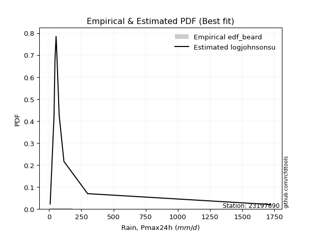</img>

</div>


### 5. Empirical - EDF Chegodayev (1955)

The Chegodayev formula is an empirical plotting position formula used in hydrological frequency analysis to estimate the exceedance probability or return period of a specific event from a set of observed data. It is primarily used for plotting observed data points on probability paper to fit a theoretical distribution, particularly for analyzing extreme events like maximum flood flows or rainfall intensities. The constant _b_ value in the generalized plotting position formula is 0.3.

<div align="center">


$P=(m-b)/(n+1-2b)$


</div>


**5.1. Empirical values**

<div align="center">

|                | 0                  | 1                   | 2                   | 3                  | 4                  | 5                  | 6                  | 7                  | 8                  | 9                  |
|:---------------|:-------------------|:--------------------|:--------------------|:-------------------|:-------------------|:-------------------|:-------------------|:-------------------|:-------------------|:-------------------|
| date           | 2019               | 2015                | 2025                | 2012               | 2014               | 2011               | 2013               | 2024               | 2017               | 2016               |
| x              | 8.99               | 38.9                | 44.8                | 45.9               | 54.6               | 57.2               | 78.7               | 115.6              | 299.796            | 1722.086           |
| m              | 1                  | 2                   | 3                   | 4                  | 5                  | 6                  | 7                  | 8                  | 9                  | 10                 |
| empirical_dist | edf_chegodayev     | edf_chegodayev      | edf_chegodayev      | edf_chegodayev     | edf_chegodayev     | edf_chegodayev     | edf_chegodayev     | edf_chegodayev     | edf_chegodayev     | edf_chegodayev     |
| empirical      | 0.0673076923076923 | 0.16346153846153846 | 0.25961538461538464 | 0.3557692307692308 | 0.4519230769230769 | 0.5480769230769231 | 0.6442307692307693 | 0.7403846153846154 | 0.8365384615384615 | 0.9326923076923076 |
| empirical_tr   | 1.0721649484536082 | 1.1954022988505746  | 1.3506493506493507  | 1.5522388059701495 | 1.8245614035087718 | 2.2127659574468086 | 2.810810810810811  | 3.8518518518518525 | 6.117647058823526  | 14.857142857142836 |

</div>


**5.2. Kolmogorov-Smirnov fit test (sorted by Δ)**


<div align="center">

|                | 0                   | 1                   | 2                     | 3                   | 4                   | 5                  | 6                   | 7                  | 8                  | 9                  | 10                 | 11                  | 12                  | 13                  | 14                  | 15                  | 16                  | 17                  | 18                 | 19                  | 20                 | 21                 | 22                  | 23                  | 24                  | 25                  | 26                  | 27                  | 28                  | 29                 | 30                  | 31                  | 32                  | 33                 | 34                 | 35                  | 36                  | 37                  | 38                  | 39                  | 40                 | 41                 | 42                  | 43                  | 44                  | 45                  | 46                  | 47                 | 48                  | 49                  | 50                  | 51                  | 52                 | 53                 | 54                  | 55                 | 56                 | 57                  | 58                  | 59                 | 60                 | 61                  | 62                 | 63                  | 64                 | 65                  | 66                 | 67                 | 68                  | 69                 | 70                  | 71                 | 72                  | 73                 | 74                  | 75                 | 76                  | 77                  | 78                  | 79                  | 80                 | 81                 | 82                  | 83                  | 84                  | 85                 | 86                  | 87                  | 88                 | 89                 |
|:---------------|:--------------------|:--------------------|:----------------------|:--------------------|:--------------------|:-------------------|:--------------------|:-------------------|:-------------------|:-------------------|:-------------------|:--------------------|:--------------------|:--------------------|:--------------------|:--------------------|:--------------------|:--------------------|:-------------------|:--------------------|:-------------------|:-------------------|:--------------------|:--------------------|:--------------------|:--------------------|:--------------------|:--------------------|:--------------------|:-------------------|:--------------------|:--------------------|:--------------------|:-------------------|:-------------------|:--------------------|:--------------------|:--------------------|:--------------------|:--------------------|:-------------------|:-------------------|:--------------------|:--------------------|:--------------------|:--------------------|:--------------------|:-------------------|:--------------------|:--------------------|:--------------------|:--------------------|:-------------------|:-------------------|:--------------------|:-------------------|:-------------------|:--------------------|:--------------------|:-------------------|:-------------------|:--------------------|:-------------------|:--------------------|:-------------------|:--------------------|:-------------------|:-------------------|:--------------------|:-------------------|:--------------------|:-------------------|:--------------------|:-------------------|:--------------------|:-------------------|:--------------------|:--------------------|:--------------------|:--------------------|:-------------------|:-------------------|:--------------------|:--------------------|:--------------------|:-------------------|:--------------------|:--------------------|:-------------------|:-------------------|
| station        | 23197690            | 23197690            | 23197690              | 23197690            | 23197690            | 23197690           | 23197690            | 23197690           | 23197690           | 23197690           | 23197690           | 23197690            | 23197690            | 23197690            | 23197690            | 23197690            | 23197690            | 23197690            | 23197690           | 23197690            | 23197690           | 23197690           | 23197690            | 23197690            | 23197690            | 23197690            | 23197690            | 23197690            | 23197690            | 23197690           | 23197690            | 23197690            | 23197690            | 23197690           | 23197690           | 23197690            | 23197690            | 23197690            | 23197690            | 23197690            | 23197690           | 23197690           | 23197690            | 23197690            | 23197690            | 23197690            | 23197690            | 23197690           | 23197690            | 23197690            | 23197690            | 23197690            | 23197690           | 23197690           | 23197690            | 23197690           | 23197690           | 23197690            | 23197690            | 23197690           | 23197690           | 23197690            | 23197690           | 23197690            | 23197690           | 23197690            | 23197690           | 23197690           | 23197690            | 23197690           | 23197690            | 23197690           | 23197690            | 23197690           | 23197690            | 23197690           | 23197690            | 23197690            | 23197690            | 23197690            | 23197690           | 23197690           | 23197690            | 23197690            | 23197690            | 23197690           | 23197690            | 23197690            | 23197690           | 23197690           |
| empirical_dist | edf_chegodayev      | edf_chegodayev      | edf_chegodayev        | edf_chegodayev      | edf_chegodayev      | edf_chegodayev     | edf_chegodayev      | edf_chegodayev     | edf_chegodayev     | edf_chegodayev     | edf_chegodayev     | edf_chegodayev      | edf_chegodayev      | edf_chegodayev      | edf_chegodayev      | edf_chegodayev      | edf_chegodayev      | edf_chegodayev      | edf_chegodayev     | edf_chegodayev      | edf_chegodayev     | edf_chegodayev     | edf_chegodayev      | edf_chegodayev      | edf_chegodayev      | edf_chegodayev      | edf_chegodayev      | edf_chegodayev      | edf_chegodayev      | edf_chegodayev     | edf_chegodayev      | edf_chegodayev      | edf_chegodayev      | edf_chegodayev     | edf_chegodayev     | edf_chegodayev      | edf_chegodayev      | edf_chegodayev      | edf_chegodayev      | edf_chegodayev      | edf_chegodayev     | edf_chegodayev     | edf_chegodayev      | edf_chegodayev      | edf_chegodayev      | edf_chegodayev      | edf_chegodayev      | edf_chegodayev     | edf_chegodayev      | edf_chegodayev      | edf_chegodayev      | edf_chegodayev      | edf_chegodayev     | edf_chegodayev     | edf_chegodayev      | edf_chegodayev     | edf_chegodayev     | edf_chegodayev      | edf_chegodayev      | edf_chegodayev     | edf_chegodayev     | edf_chegodayev      | edf_chegodayev     | edf_chegodayev      | edf_chegodayev     | edf_chegodayev      | edf_chegodayev     | edf_chegodayev     | edf_chegodayev      | edf_chegodayev     | edf_chegodayev      | edf_chegodayev     | edf_chegodayev      | edf_chegodayev     | edf_chegodayev      | edf_chegodayev     | edf_chegodayev      | edf_chegodayev      | edf_chegodayev      | edf_chegodayev      | edf_chegodayev     | edf_chegodayev     | edf_chegodayev      | edf_chegodayev      | edf_chegodayev      | edf_chegodayev     | edf_chegodayev      | edf_chegodayev      | edf_chegodayev     | edf_chegodayev     |
| p_dist         | logjohnsonsu        | lognct              | loglaplace_asymmetric | loggibrat           | logt                | nct                | loggenlogistic      | logfisk            | logmielke          | invgamma           | f                  | betaprime           | mielke              | logexponnorm        | logcrystalball      | lognorm             | lognorm             | invgauss            | logloggamma        | logalpha            | logncf             | logf               | loginvgamma         | logfatiguelife      | loginvgauss         | ncf                 | logerlang           | loggamma            | loggamma            | logbetaprime       | logmaxwell          | loggumbel_r         | loglogistic         | logwald            | logweibull_min     | logpearson3         | loginvweibull       | lograyleigh         | logmoyal            | t                   | loghypsecant       | pareto             | logrice             | johnsonsu           | logkstwobign        | loghalflogistic     | loggenexpon         | loglaplace         | loghalfnorm         | loggompertz         | fatiguelife         | loggumbel_l         | chi2               | gibrat             | logtruncnorm        | erlang             | lognakagami        | weibull_min         | gumbel_r            | rayleigh           | moyal              | nakagami            | maxwell            | wald                | genlogistic        | halfnorm            | halflogistic       | logexpon           | alpha               | norm               | logistic            | pearson3           | hypsecant           | exponnorm          | laplace_asymmetric  | expon              | genexpon            | laplace             | kstwobign           | fisk                | rice               | gumbel_l           | gamma               | crystalball         | invweibull          | logchi2            | loglognorm          | logpareto           | truncnorm          | gompertz           |
| delta          | 0.04764736260835101 | 0.05900453859116461 | 0.09497335159410458   | 0.10342625538755251 | 0.12433725064199908 | 0.1249768404143714 | 0.13355593957264125 | 0.1337898520894071 | 0.1352855306467781 | 0.1367291781063286 | 0.1392441683181375 | 0.13928555646852017 | 0.14333406853370548 | 0.14381659415432488 | 0.14863658469593455 | 0.14863658591820794 | 0.14863658591820794 | 0.14916049056426375 | 0.149170637576851  | 0.15180742320672783 | 0.1522421574372886 | 0.1522942203762556 | 0.15230211266143054 | 0.15266815940175169 | 0.15273697693301272 | 0.15327556426013897 | 0.15349786154675912 | 0.15349849173957084 | 0.15349849173957084 | 0.1538730748013488 | 0.15703983992540285 | 0.16035818768484458 | 0.16049815621809266 | 0.1618936921447117 | 0.1634615384281995 | 0.16458843032147172 | 0.16719050840072255 | 0.16784453815289993 | 0.16900116324009914 | 0.17083699726082052 | 0.1710179693931596 | 0.1719938614536218 | 0.17374540197893465 | 0.17433742147817646 | 0.18138772343231938 | 0.19508002966471502 | 0.19759551514667836 | 0.1980899805256532 | 0.19829788207126595 | 0.19903575558264588 | 0.21436024341643478 | 0.21912869050823958 | 0.2472037502420215 | 0.2472805477497214 | 0.24967945256594606 | 0.2706872710677848 | 0.2748877854350888 | 0.27909612870374023 | 0.28767904793709614 | 0.297980065585853  | 0.3006116225612371 | 0.30827675053135173 | 0.3102810065777768 | 0.31720589426600565 | 0.3198755335600528 | 0.32271967225765735 | 0.3245252268407316 | 0.3251827702485852 | 0.33868121556162634 | 0.3442036142844517 | 0.35753560256006806 | 0.3582947098388434 | 0.36840881616621185 | 0.3870264156966098 | 0.39001967780127533 | 0.3900222011646963 | 0.39002221362649764 | 0.39580543185736256 | 0.39701208878577104 | 0.39796009258380727 | 0.4095407425846933 | 0.4103155298181836 | 0.42852259013655913 | 0.43939700981744045 | 0.44266052813111467 | 0.4474191553682805 | 0.45247880282376296 | 0.49178255424170525 | 0.5147929486700886 | 0.5591837865766629 |
| deltao         | 0.3942745923300002  | 0.3942745923300002  | 0.3942745923300002    | 0.3942745923300002  | 0.3942745923300002  | 0.3942745923300002 | 0.3942745923300002  | 0.3942745923300002 | 0.3942745923300002 | 0.3942745923300002 | 0.3942745923300002 | 0.3942745923300002  | 0.3942745923300002  | 0.3942745923300002  | 0.3942745923300002  | 0.3942745923300002  | 0.3942745923300002  | 0.3942745923300002  | 0.3942745923300002 | 0.3942745923300002  | 0.3942745923300002 | 0.3942745923300002 | 0.3942745923300002  | 0.3942745923300002  | 0.3942745923300002  | 0.3942745923300002  | 0.3942745923300002  | 0.3942745923300002  | 0.3942745923300002  | 0.3942745923300002 | 0.3942745923300002  | 0.3942745923300002  | 0.3942745923300002  | 0.3942745923300002 | 0.3942745923300002 | 0.3942745923300002  | 0.3942745923300002  | 0.3942745923300002  | 0.3942745923300002  | 0.3942745923300002  | 0.3942745923300002 | 0.3942745923300002 | 0.3942745923300002  | 0.3942745923300002  | 0.3942745923300002  | 0.3942745923300002  | 0.3942745923300002  | 0.3942745923300002 | 0.3942745923300002  | 0.3942745923300002  | 0.3942745923300002  | 0.3942745923300002  | 0.3942745923300002 | 0.3942745923300002 | 0.3942745923300002  | 0.3942745923300002 | 0.3942745923300002 | 0.3942745923300002  | 0.3942745923300002  | 0.3942745923300002 | 0.3942745923300002 | 0.3942745923300002  | 0.3942745923300002 | 0.3942745923300002  | 0.3942745923300002 | 0.3942745923300002  | 0.3942745923300002 | 0.3942745923300002 | 0.3942745923300002  | 0.3942745923300002 | 0.3942745923300002  | 0.3942745923300002 | 0.3942745923300002  | 0.3942745923300002 | 0.3942745923300002  | 0.3942745923300002 | 0.3942745923300002  | 0.3942745923300002  | 0.3942745923300002  | 0.3942745923300002  | 0.3942745923300002 | 0.3942745923300002 | 0.3942745923300002  | 0.3942745923300002  | 0.3942745923300002  | 0.3942745923300002 | 0.3942745923300002  | 0.3942745923300002  | 0.3942745923300002 | 0.3942745923300002 |
| eval           | Δo > Δ              | Δo > Δ              | Δo > Δ                | Δo > Δ              | Δo > Δ              | Δo > Δ             | Δo > Δ              | Δo > Δ             | Δo > Δ             | Δo > Δ             | Δo > Δ             | Δo > Δ              | Δo > Δ              | Δo > Δ              | Δo > Δ              | Δo > Δ              | Δo > Δ              | Δo > Δ              | Δo > Δ             | Δo > Δ              | Δo > Δ             | Δo > Δ             | Δo > Δ              | Δo > Δ              | Δo > Δ              | Δo > Δ              | Δo > Δ              | Δo > Δ              | Δo > Δ              | Δo > Δ             | Δo > Δ              | Δo > Δ              | Δo > Δ              | Δo > Δ             | Δo > Δ             | Δo > Δ              | Δo > Δ              | Δo > Δ              | Δo > Δ              | Δo > Δ              | Δo > Δ             | Δo > Δ             | Δo > Δ              | Δo > Δ              | Δo > Δ              | Δo > Δ              | Δo > Δ              | Δo > Δ             | Δo > Δ              | Δo > Δ              | Δo > Δ              | Δo > Δ              | Δo > Δ             | Δo > Δ             | Δo > Δ              | Δo > Δ             | Δo > Δ             | Δo > Δ              | Δo > Δ              | Δo > Δ             | Δo > Δ             | Δo > Δ              | Δo > Δ             | Δo > Δ              | Δo > Δ             | Δo > Δ              | Δo > Δ             | Δo > Δ             | Δo > Δ              | Δo > Δ             | Δo > Δ              | Δo > Δ             | Δo > Δ              | Δo > Δ             | Δo > Δ              | Δo > Δ             | Δo > Δ              | Δo <= Δ             | Δo <= Δ             | Δo <= Δ             | Δo <= Δ            | Δo <= Δ            | Δo <= Δ             | Δo <= Δ             | Δo <= Δ             | Δo <= Δ            | Δo <= Δ             | Δo <= Δ             | Δo <= Δ            | Δo <= Δ            |
| fit            | 1                   | 1                   | 1                     | 1                   | 1                   | 1                  | 1                   | 1                  | 1                  | 1                  | 1                  | 1                   | 1                   | 1                   | 1                   | 1                   | 1                   | 1                   | 1                  | 1                   | 1                  | 1                  | 1                   | 1                   | 1                   | 1                   | 1                   | 1                   | 1                   | 1                  | 1                   | 1                   | 1                   | 1                  | 1                  | 1                   | 1                   | 1                   | 1                   | 1                   | 1                  | 1                  | 1                   | 1                   | 1                   | 1                   | 1                   | 1                  | 1                   | 1                   | 1                   | 1                   | 1                  | 1                  | 1                   | 1                  | 1                  | 1                   | 1                   | 1                  | 1                  | 1                   | 1                  | 1                   | 1                  | 1                   | 1                  | 1                  | 1                   | 1                  | 1                   | 1                  | 1                   | 1                  | 1                   | 1                  | 1                   | 0                   | 0                   | 0                   | 0                  | 0                  | 0                   | 0                   | 0                   | 0                  | 0                   | 0                   | 0                  | 0                  |
| n              | 10                  | 10                  | 10                    | 10                  | 10                  | 10                 | 10                  | 10                 | 10                 | 10                 | 10                 | 10                  | 10                  | 10                  | 10                  | 10                  | 10                  | 10                  | 10                 | 10                  | 10                 | 10                 | 10                  | 10                  | 10                  | 10                  | 10                  | 10                  | 10                  | 10                 | 10                  | 10                  | 10                  | 10                 | 10                 | 10                  | 10                  | 10                  | 10                  | 10                  | 10                 | 10                 | 10                  | 10                  | 10                  | 10                  | 10                  | 10                 | 10                  | 10                  | 10                  | 10                  | 10                 | 10                 | 10                  | 10                 | 10                 | 10                  | 10                  | 10                 | 10                 | 10                  | 10                 | 10                  | 10                 | 10                  | 10                 | 10                 | 10                  | 10                 | 10                  | 10                 | 10                  | 10                 | 10                  | 10                 | 10                  | 10                  | 10                  | 10                  | 10                 | 10                 | 10                  | 10                  | 10                  | 10                 | 10                  | 10                  | 10                 | 10                 |
| best_fit       | 1                   | 0                   | 0                     | 0                   | 0                   | 0                  | 0                   | 0                  | 0                  | 0                  | 0                  | 0                   | 0                   | 0                   | 0                   | 0                   | 0                   | 0                   | 0                  | 0                   | 0                  | 0                  | 0                   | 0                   | 0                   | 0                   | 0                   | 0                   | 0                   | 0                  | 0                   | 0                   | 0                   | 0                  | 0                  | 0                   | 0                   | 0                   | 0                   | 0                   | 0                  | 0                  | 0                   | 0                   | 0                   | 0                   | 0                   | 0                  | 0                   | 0                   | 0                   | 0                   | 0                  | 0                  | 0                   | 0                  | 0                  | 0                   | 0                   | 0                  | 0                  | 0                   | 0                  | 0                   | 0                  | 0                   | 0                  | 0                  | 0                   | 0                  | 0                   | 0                  | 0                   | 0                  | 0                   | 0                  | 0                   | 0                   | 0                   | 0                   | 0                  | 0                  | 0                   | 0                   | 0                   | 0                  | 0                   | 0                   | 0                  | 0                  |
| best_fit_sort  | 1                   | 2                   | 3                     | 4                   | 5                   | 6                  | 7                   | 8                  | 9                  | 10                 | 11                 | 12                  | 13                  | 14                  | 15                  | 16                  | 17                  | 18                  | 19                 | 20                  | 21                 | 22                 | 23                  | 24                  | 25                  | 26                  | 27                  | 28                  | 29                  | 30                 | 31                  | 32                  | 33                  | 34                 | 35                 | 36                  | 37                  | 38                  | 39                  | 40                  | 41                 | 42                 | 43                  | 44                  | 45                  | 46                  | 47                  | 48                 | 49                  | 50                  | 51                  | 52                  | 53                 | 54                 | 55                  | 56                 | 57                 | 58                  | 59                  | 60                 | 61                 | 62                  | 63                 | 64                  | 65                 | 66                  | 67                 | 68                 | 69                  | 70                 | 71                  | 72                 | 73                  | 74                 | 75                  | 76                 | 77                  | 78                  | 79                  | 80                  | 81                 | 82                 | 83                  | 84                  | 85                  | 86                 | 87                  | 88                  | 89                 | 90                 |

</div>


<div align="center">

</img>

</div>


**5.3. Best fit**

<div align="center">

|   id |   station | empirical_dist   | p_dist       |     delta |   deltao | eval   |   fit |   n |   best_fit |   best_fit_sort |
|-----:|----------:|:-----------------|:-------------|----------:|---------:|:-------|------:|----:|-----------:|----------------:|
|    0 |  23197690 | edf_chegodayev   | logjohnsonsu | 0.0476474 | 0.394275 | Δo > Δ |     1 |  10 |          1 |               1 |

</div>


<div align="center">

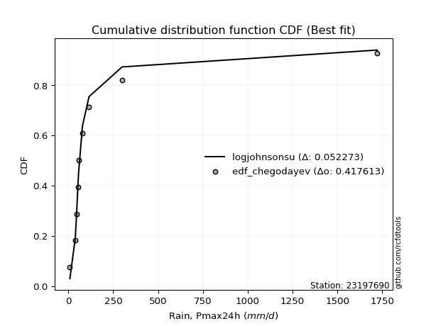</img></img>

</div>


### 6. Empirical - EDF Blom (1958)

The Blom formula is a specific "plotting position" formula used in hydrology and statistical analysis to estimate the empirical cumulative probability (or non-exceedance probability) of a data series. It is particularly recommended for data that are approximately normally distributed. The constant _a_ is set to 0.375 (or 3/8).

<div align="center">


$P=(m-a)/(n+1-2a)$


</div>


**6.1. Empirical values**

<div align="center">

|                | 0                   | 1                   | 2                   | 3                   | 4                   | 5                  | 6                  | 7                  | 8                  | 9                  |
|:---------------|:--------------------|:--------------------|:--------------------|:--------------------|:--------------------|:-------------------|:-------------------|:-------------------|:-------------------|:-------------------|
| date           | 2019                | 2015                | 2025                | 2012                | 2014                | 2011               | 2013               | 2024               | 2017               | 2016               |
| x              | 8.99                | 38.9                | 44.8                | 45.9                | 54.6                | 57.2               | 78.7               | 115.6              | 299.796            | 1722.086           |
| m              | 1                   | 2                   | 3                   | 4                   | 5                   | 6                  | 7                  | 8                  | 9                  | 10                 |
| empirical_dist | edf_blom            | edf_blom            | edf_blom            | edf_blom            | edf_blom            | edf_blom           | edf_blom           | edf_blom           | edf_blom           | edf_blom           |
| empirical      | 0.06097560975609756 | 0.15853658536585366 | 0.25609756097560976 | 0.35365853658536583 | 0.45121951219512196 | 0.5487804878048781 | 0.6463414634146342 | 0.7439024390243902 | 0.8414634146341463 | 0.9390243902439024 |
| empirical_tr   | 1.064935064935065   | 1.1884057971014492  | 1.3442622950819672  | 1.5471698113207546  | 1.8222222222222222  | 2.2162162162162162 | 2.827586206896552  | 3.9047619047619047 | 6.307692307692307  | 16.399999999999984 |

</div>


**6.2. Kolmogorov-Smirnov fit test (sorted by Δ)**


<div align="center">

|                | 0                    | 1                    | 2                     | 3                   | 4                   | 5                   | 6                   | 7                  | 8                  | 9                  | 10                 | 11                  | 12                  | 13                  | 14                  | 15                  | 16                  | 17                 | 18                  | 19                  | 20                  | 21                 | 22                  | 23                 | 24                  | 25                  | 26                  | 27                  | 28                  | 29                 | 30                 | 31                  | 32                  | 33                 | 34                 | 35                  | 36                 | 37                  | 38                  | 39                  | 40                  | 41                 | 42                  | 43                  | 44                  | 45                  | 46                  | 47                  | 48                  | 49                 | 50                 | 51                  | 52                  | 53                  | 54                 | 55                 | 56                  | 57                 | 58                 | 59                 | 60                 | 61                  | 62                 | 63                  | 64                 | 65                 | 66                  | 67                 | 68                 | 69                 | 70                 | 71                 | 72                  | 73                 | 74                 | 75                 | 76                  | 77                 | 78                  | 79                 | 80                 | 81                 | 82                 | 83                 | 84                  | 85                 | 86                 | 87                 | 88                 | 89                 |
|:---------------|:---------------------|:---------------------|:----------------------|:--------------------|:--------------------|:--------------------|:--------------------|:-------------------|:-------------------|:-------------------|:-------------------|:--------------------|:--------------------|:--------------------|:--------------------|:--------------------|:--------------------|:-------------------|:--------------------|:--------------------|:--------------------|:-------------------|:--------------------|:-------------------|:--------------------|:--------------------|:--------------------|:--------------------|:--------------------|:-------------------|:-------------------|:--------------------|:--------------------|:-------------------|:-------------------|:--------------------|:-------------------|:--------------------|:--------------------|:--------------------|:--------------------|:-------------------|:--------------------|:--------------------|:--------------------|:--------------------|:--------------------|:--------------------|:--------------------|:-------------------|:-------------------|:--------------------|:--------------------|:--------------------|:-------------------|:-------------------|:--------------------|:-------------------|:-------------------|:-------------------|:-------------------|:--------------------|:-------------------|:--------------------|:-------------------|:-------------------|:--------------------|:-------------------|:-------------------|:-------------------|:-------------------|:-------------------|:--------------------|:-------------------|:-------------------|:-------------------|:--------------------|:-------------------|:--------------------|:-------------------|:-------------------|:-------------------|:-------------------|:-------------------|:--------------------|:-------------------|:-------------------|:-------------------|:-------------------|:-------------------|
| station        | 23197690             | 23197690             | 23197690              | 23197690            | 23197690            | 23197690            | 23197690            | 23197690           | 23197690           | 23197690           | 23197690           | 23197690            | 23197690            | 23197690            | 23197690            | 23197690            | 23197690            | 23197690           | 23197690            | 23197690            | 23197690            | 23197690           | 23197690            | 23197690           | 23197690            | 23197690            | 23197690            | 23197690            | 23197690            | 23197690           | 23197690           | 23197690            | 23197690            | 23197690           | 23197690           | 23197690            | 23197690           | 23197690            | 23197690            | 23197690            | 23197690            | 23197690           | 23197690            | 23197690            | 23197690            | 23197690            | 23197690            | 23197690            | 23197690            | 23197690           | 23197690           | 23197690            | 23197690            | 23197690            | 23197690           | 23197690           | 23197690            | 23197690           | 23197690           | 23197690           | 23197690           | 23197690            | 23197690           | 23197690            | 23197690           | 23197690           | 23197690            | 23197690           | 23197690           | 23197690           | 23197690           | 23197690           | 23197690            | 23197690           | 23197690           | 23197690           | 23197690            | 23197690           | 23197690            | 23197690           | 23197690           | 23197690           | 23197690           | 23197690           | 23197690            | 23197690           | 23197690           | 23197690           | 23197690           | 23197690           |
| empirical_dist | edf_blom             | edf_blom             | edf_blom              | edf_blom            | edf_blom            | edf_blom            | edf_blom            | edf_blom           | edf_blom           | edf_blom           | edf_blom           | edf_blom            | edf_blom            | edf_blom            | edf_blom            | edf_blom            | edf_blom            | edf_blom           | edf_blom            | edf_blom            | edf_blom            | edf_blom           | edf_blom            | edf_blom           | edf_blom            | edf_blom            | edf_blom            | edf_blom            | edf_blom            | edf_blom           | edf_blom           | edf_blom            | edf_blom            | edf_blom           | edf_blom           | edf_blom            | edf_blom           | edf_blom            | edf_blom            | edf_blom            | edf_blom            | edf_blom           | edf_blom            | edf_blom            | edf_blom            | edf_blom            | edf_blom            | edf_blom            | edf_blom            | edf_blom           | edf_blom           | edf_blom            | edf_blom            | edf_blom            | edf_blom           | edf_blom           | edf_blom            | edf_blom           | edf_blom           | edf_blom           | edf_blom           | edf_blom            | edf_blom           | edf_blom            | edf_blom           | edf_blom           | edf_blom            | edf_blom           | edf_blom           | edf_blom           | edf_blom           | edf_blom           | edf_blom            | edf_blom           | edf_blom           | edf_blom           | edf_blom            | edf_blom           | edf_blom            | edf_blom           | edf_blom           | edf_blom           | edf_blom           | edf_blom           | edf_blom            | edf_blom           | edf_blom           | edf_blom           | edf_blom           | edf_blom           |
| p_dist         | logjohnsonsu         | lognct               | loglaplace_asymmetric | loggibrat           | logt                | nct                 | loggenlogistic      | logfisk            | logmielke          | invgamma           | f                  | betaprime           | mielke              | logexponnorm        | logcrystalball      | lognorm             | lognorm             | logloggamma        | invgauss            | logalpha            | logncf              | logf               | loginvgamma         | logfatiguelife     | loginvgauss         | ncf                 | logerlang           | loggamma            | loggamma            | logweibull_min     | logbetaprime       | loglogistic         | logmaxwell          | loggumbel_r        | logwald            | logpearson3         | t                  | loghypsecant        | loginvweibull       | lograyleigh         | logmoyal            | pareto             | logrice             | johnsonsu           | logkstwobign        | loglaplace          | loghalflogistic     | loggenexpon         | loghalfnorm         | loggompertz        | fatiguelife        | loggumbel_l         | chi2                | gibrat              | logtruncnorm       | erlang             | lognakagami         | weibull_min        | gumbel_r           | rayleigh           | moyal              | nakagami            | maxwell            | genlogistic         | wald               | halfnorm           | logexpon            | halflogistic       | alpha              | norm               | logistic           | pearson3           | hypsecant           | exponnorm          | laplace_asymmetric | expon              | genexpon            | laplace            | kstwobign           | fisk               | rice               | gumbel_l           | gamma              | crystalball        | invweibull          | logchi2            | loglognorm         | logpareto          | truncnorm          | gompertz           |
| delta          | 0.045536668424486115 | 0.056893844407299665 | 0.09567691632205955   | 0.10694407902732739 | 0.12081942700222426 | 0.12568040514232637 | 0.13848089266832606 | 0.1387148051850919 | 0.1402104837424629 | 0.1416541312020134 | 0.1441691214138223 | 0.14421050956420498 | 0.14825902162939028 | 0.14874154725000968 | 0.15074727887979944 | 0.15074728010207283 | 0.15074728010207283 | 0.1512813317607159 | 0.15408544365994856 | 0.15673237630241263 | 0.15716711053297341 | 0.1572191734719404 | 0.15722706575711534 | 0.1575931124974365 | 0.15766193002869752 | 0.15820051735582377 | 0.15842281464244393 | 0.15842344483525564 | 0.15842344483525564 | 0.1585365853325147 | 0.1587980278970336 | 0.16120172094604762 | 0.16196479302108766 | 0.1652831407805294 | 0.1668186452403965 | 0.16951338341715652 | 0.1715405619887755 | 0.17172153412111457 | 0.17211546149640736 | 0.17276949124858473 | 0.17392611633578395 | 0.1769188145493066 | 0.17867035507461945 | 0.17926237457386127 | 0.18631267652800418 | 0.19879354525360815 | 0.20000498276039982 | 0.20252046824236317 | 0.20322283516695075 | 0.2039607086783307 | 0.2178780670562096 | 0.22123938469210447 | 0.25072157388179633 | 0.25361263030131614 | 0.2546044056616309 | 0.2742050947075596 | 0.27840560907486367 | 0.284021081799425  | 0.2940111304886909 | 0.3014978892256278 | 0.3069437051128318 | 0.31179457417112655 | 0.3137988302175516 | 0.32339335719982765 | 0.3235379768176004 | 0.3290517548092521 | 0.33010772334426997 | 0.3308573093923263 | 0.3436061686573111 | 0.3477214379242265 | 0.3610534261998429 | 0.3646267923904381 | 0.37192663980598667 | 0.3891371098804747 | 0.3921303719851402 | 0.3921328953485612 | 0.39213290781036253 | 0.3993232554971374 | 0.40052991242554586 | 0.402885045679492  | 0.4130585662244681 | 0.4138333534579584 | 0.4334475432322439 | 0.4457290923690352 | 0.44899261068270946 | 0.4523441084639652 | 0.4574037559194477 | 0.49670750733739   | 0.5183107723098634 | 0.5627016102164377 |
| deltao         | 0.3942745923300002   | 0.3942745923300002   | 0.3942745923300002    | 0.3942745923300002  | 0.3942745923300002  | 0.3942745923300002  | 0.3942745923300002  | 0.3942745923300002 | 0.3942745923300002 | 0.3942745923300002 | 0.3942745923300002 | 0.3942745923300002  | 0.3942745923300002  | 0.3942745923300002  | 0.3942745923300002  | 0.3942745923300002  | 0.3942745923300002  | 0.3942745923300002 | 0.3942745923300002  | 0.3942745923300002  | 0.3942745923300002  | 0.3942745923300002 | 0.3942745923300002  | 0.3942745923300002 | 0.3942745923300002  | 0.3942745923300002  | 0.3942745923300002  | 0.3942745923300002  | 0.3942745923300002  | 0.3942745923300002 | 0.3942745923300002 | 0.3942745923300002  | 0.3942745923300002  | 0.3942745923300002 | 0.3942745923300002 | 0.3942745923300002  | 0.3942745923300002 | 0.3942745923300002  | 0.3942745923300002  | 0.3942745923300002  | 0.3942745923300002  | 0.3942745923300002 | 0.3942745923300002  | 0.3942745923300002  | 0.3942745923300002  | 0.3942745923300002  | 0.3942745923300002  | 0.3942745923300002  | 0.3942745923300002  | 0.3942745923300002 | 0.3942745923300002 | 0.3942745923300002  | 0.3942745923300002  | 0.3942745923300002  | 0.3942745923300002 | 0.3942745923300002 | 0.3942745923300002  | 0.3942745923300002 | 0.3942745923300002 | 0.3942745923300002 | 0.3942745923300002 | 0.3942745923300002  | 0.3942745923300002 | 0.3942745923300002  | 0.3942745923300002 | 0.3942745923300002 | 0.3942745923300002  | 0.3942745923300002 | 0.3942745923300002 | 0.3942745923300002 | 0.3942745923300002 | 0.3942745923300002 | 0.3942745923300002  | 0.3942745923300002 | 0.3942745923300002 | 0.3942745923300002 | 0.3942745923300002  | 0.3942745923300002 | 0.3942745923300002  | 0.3942745923300002 | 0.3942745923300002 | 0.3942745923300002 | 0.3942745923300002 | 0.3942745923300002 | 0.3942745923300002  | 0.3942745923300002 | 0.3942745923300002 | 0.3942745923300002 | 0.3942745923300002 | 0.3942745923300002 |
| eval           | Δo > Δ               | Δo > Δ               | Δo > Δ                | Δo > Δ              | Δo > Δ              | Δo > Δ              | Δo > Δ              | Δo > Δ             | Δo > Δ             | Δo > Δ             | Δo > Δ             | Δo > Δ              | Δo > Δ              | Δo > Δ              | Δo > Δ              | Δo > Δ              | Δo > Δ              | Δo > Δ             | Δo > Δ              | Δo > Δ              | Δo > Δ              | Δo > Δ             | Δo > Δ              | Δo > Δ             | Δo > Δ              | Δo > Δ              | Δo > Δ              | Δo > Δ              | Δo > Δ              | Δo > Δ             | Δo > Δ             | Δo > Δ              | Δo > Δ              | Δo > Δ             | Δo > Δ             | Δo > Δ              | Δo > Δ             | Δo > Δ              | Δo > Δ              | Δo > Δ              | Δo > Δ              | Δo > Δ             | Δo > Δ              | Δo > Δ              | Δo > Δ              | Δo > Δ              | Δo > Δ              | Δo > Δ              | Δo > Δ              | Δo > Δ             | Δo > Δ             | Δo > Δ              | Δo > Δ              | Δo > Δ              | Δo > Δ             | Δo > Δ             | Δo > Δ              | Δo > Δ             | Δo > Δ             | Δo > Δ             | Δo > Δ             | Δo > Δ              | Δo > Δ             | Δo > Δ              | Δo > Δ             | Δo > Δ             | Δo > Δ              | Δo > Δ             | Δo > Δ             | Δo > Δ             | Δo > Δ             | Δo > Δ             | Δo > Δ              | Δo > Δ             | Δo > Δ             | Δo > Δ             | Δo > Δ              | Δo <= Δ            | Δo <= Δ             | Δo <= Δ            | Δo <= Δ            | Δo <= Δ            | Δo <= Δ            | Δo <= Δ            | Δo <= Δ             | Δo <= Δ            | Δo <= Δ            | Δo <= Δ            | Δo <= Δ            | Δo <= Δ            |
| fit            | 1                    | 1                    | 1                     | 1                   | 1                   | 1                   | 1                   | 1                  | 1                  | 1                  | 1                  | 1                   | 1                   | 1                   | 1                   | 1                   | 1                   | 1                  | 1                   | 1                   | 1                   | 1                  | 1                   | 1                  | 1                   | 1                   | 1                   | 1                   | 1                   | 1                  | 1                  | 1                   | 1                   | 1                  | 1                  | 1                   | 1                  | 1                   | 1                   | 1                   | 1                   | 1                  | 1                   | 1                   | 1                   | 1                   | 1                   | 1                   | 1                   | 1                  | 1                  | 1                   | 1                   | 1                   | 1                  | 1                  | 1                   | 1                  | 1                  | 1                  | 1                  | 1                   | 1                  | 1                   | 1                  | 1                  | 1                   | 1                  | 1                  | 1                  | 1                  | 1                  | 1                   | 1                  | 1                  | 1                  | 1                   | 0                  | 0                   | 0                  | 0                  | 0                  | 0                  | 0                  | 0                   | 0                  | 0                  | 0                  | 0                  | 0                  |
| n              | 10                   | 10                   | 10                    | 10                  | 10                  | 10                  | 10                  | 10                 | 10                 | 10                 | 10                 | 10                  | 10                  | 10                  | 10                  | 10                  | 10                  | 10                 | 10                  | 10                  | 10                  | 10                 | 10                  | 10                 | 10                  | 10                  | 10                  | 10                  | 10                  | 10                 | 10                 | 10                  | 10                  | 10                 | 10                 | 10                  | 10                 | 10                  | 10                  | 10                  | 10                  | 10                 | 10                  | 10                  | 10                  | 10                  | 10                  | 10                  | 10                  | 10                 | 10                 | 10                  | 10                  | 10                  | 10                 | 10                 | 10                  | 10                 | 10                 | 10                 | 10                 | 10                  | 10                 | 10                  | 10                 | 10                 | 10                  | 10                 | 10                 | 10                 | 10                 | 10                 | 10                  | 10                 | 10                 | 10                 | 10                  | 10                 | 10                  | 10                 | 10                 | 10                 | 10                 | 10                 | 10                  | 10                 | 10                 | 10                 | 10                 | 10                 |
| best_fit       | 1                    | 0                    | 0                     | 0                   | 0                   | 0                   | 0                   | 0                  | 0                  | 0                  | 0                  | 0                   | 0                   | 0                   | 0                   | 0                   | 0                   | 0                  | 0                   | 0                   | 0                   | 0                  | 0                   | 0                  | 0                   | 0                   | 0                   | 0                   | 0                   | 0                  | 0                  | 0                   | 0                   | 0                  | 0                  | 0                   | 0                  | 0                   | 0                   | 0                   | 0                   | 0                  | 0                   | 0                   | 0                   | 0                   | 0                   | 0                   | 0                   | 0                  | 0                  | 0                   | 0                   | 0                   | 0                  | 0                  | 0                   | 0                  | 0                  | 0                  | 0                  | 0                   | 0                  | 0                   | 0                  | 0                  | 0                   | 0                  | 0                  | 0                  | 0                  | 0                  | 0                   | 0                  | 0                  | 0                  | 0                   | 0                  | 0                   | 0                  | 0                  | 0                  | 0                  | 0                  | 0                   | 0                  | 0                  | 0                  | 0                  | 0                  |
| best_fit_sort  | 1                    | 2                    | 3                     | 4                   | 5                   | 6                   | 7                   | 8                  | 9                  | 10                 | 11                 | 12                  | 13                  | 14                  | 15                  | 16                  | 17                  | 18                 | 19                  | 20                  | 21                  | 22                 | 23                  | 24                 | 25                  | 26                  | 27                  | 28                  | 29                  | 30                 | 31                 | 32                  | 33                  | 34                 | 35                 | 36                  | 37                 | 38                  | 39                  | 40                  | 41                  | 42                 | 43                  | 44                  | 45                  | 46                  | 47                  | 48                  | 49                  | 50                 | 51                 | 52                  | 53                  | 54                  | 55                 | 56                 | 57                  | 58                 | 59                 | 60                 | 61                 | 62                  | 63                 | 64                  | 65                 | 66                 | 67                  | 68                 | 69                 | 70                 | 71                 | 72                 | 73                  | 74                 | 75                 | 76                 | 77                  | 78                 | 79                  | 80                 | 81                 | 82                 | 83                 | 84                 | 85                  | 86                 | 87                 | 88                 | 89                 | 90                 |

</div>


<div align="center">

</img>

</div>


**6.3. Best fit**

<div align="center">

|   id |   station | empirical_dist   | p_dist       |     delta |   deltao | eval   |   fit |   n |   best_fit |   best_fit_sort |
|-----:|----------:|:-----------------|:-------------|----------:|---------:|:-------|------:|----:|-----------:|----------------:|
|    0 |  23197690 | edf_blom         | logjohnsonsu | 0.0455367 | 0.394275 | Δo > Δ |     1 |  10 |          1 |               1 |

</div>


<div align="center">

</img>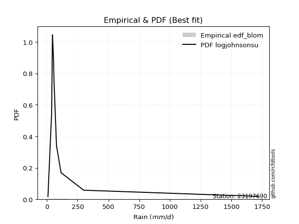</img>

</div>


### 7. Empirical - EDF Tukey (1962)

In hydrology, the Tukey formula is used as a plotting position formula to estimate the empirical probability or frequency of a flood event (or other hydrological data). The formula parameter is given as _c=0.333_ (or 1/3).

<div align="center">


$P=(m-c)/(n+1-2c)$


</div>


**7.1. Empirical values**

<div align="center">

|                | 0                   | 1                   | 2                   | 3                  | 4                   | 5                  | 6                  | 7                  | 8                  | 9                  |
|:---------------|:--------------------|:--------------------|:--------------------|:-------------------|:--------------------|:-------------------|:-------------------|:-------------------|:-------------------|:-------------------|
| date           | 2019                | 2015                | 2025                | 2012               | 2014                | 2011               | 2013               | 2024               | 2017               | 2016               |
| x              | 8.99                | 38.9                | 44.8                | 45.9               | 54.6                | 57.2               | 78.7               | 115.6              | 299.796            | 1722.086           |
| m              | 1                   | 2                   | 3                   | 4                  | 5                   | 6                  | 7                  | 8                  | 9                  | 10                 |
| empirical_dist | edf_tukey           | edf_tukey           | edf_tukey           | edf_tukey          | edf_tukey           | edf_tukey          | edf_tukey          | edf_tukey          | edf_tukey          | edf_tukey          |
| empirical      | 0.06451612903225806 | 0.16129032258064516 | 0.25806451612903225 | 0.3548387096774194 | 0.45161290322580644 | 0.5483870967741935 | 0.6451612903225806 | 0.7419354838709677 | 0.8387096774193549 | 0.9354838709677419 |
| empirical_tr   | 1.0689655172413792  | 1.1923076923076923  | 1.3478260869565217  | 1.55               | 1.823529411764706   | 2.214285714285714  | 2.818181818181818  | 3.875              | 6.200000000000001  | 15.499999999999988 |

</div>


**7.2. Kolmogorov-Smirnov fit test (sorted by Δ)**


<div align="center">

|                | 0                   | 1                  | 2                     | 3                  | 4                   | 5                   | 6                   | 7                   | 8                  | 9                  | 10                 | 11                  | 12                  | 13                  | 14                 | 15                 | 16                 | 17                  | 18                  | 19                  | 20                  | 21                 | 22                  | 23                 | 24                  | 25                  | 26                  | 27                  | 28                  | 29                 | 30                  | 31                  | 32                 | 33                 | 34                 | 35                  | 36                  | 37                  | 38                 | 39                  | 40                  | 41                 | 42                  | 43                  | 44                  | 45                  | 46                  | 47                  | 48                  | 49                 | 50                 | 51                  | 52                  | 53                  | 54                  | 55                 | 56                 | 57                  | 58                  | 59                 | 60                 | 61                  | 62                 | 63                 | 64                  | 65                 | 66                 | 67                 | 68                  | 69                 | 70                 | 71                 | 72                 | 73                  | 74                 | 75                 | 76                 | 77                 | 78                 | 79                 | 80                  | 81                 | 82                  | 83                 | 84                  | 85                 | 86                  | 87                  | 88                 | 89                 |
|:---------------|:--------------------|:-------------------|:----------------------|:-------------------|:--------------------|:--------------------|:--------------------|:--------------------|:-------------------|:-------------------|:-------------------|:--------------------|:--------------------|:--------------------|:-------------------|:-------------------|:-------------------|:--------------------|:--------------------|:--------------------|:--------------------|:-------------------|:--------------------|:-------------------|:--------------------|:--------------------|:--------------------|:--------------------|:--------------------|:-------------------|:--------------------|:--------------------|:-------------------|:-------------------|:-------------------|:--------------------|:--------------------|:--------------------|:-------------------|:--------------------|:--------------------|:-------------------|:--------------------|:--------------------|:--------------------|:--------------------|:--------------------|:--------------------|:--------------------|:-------------------|:-------------------|:--------------------|:--------------------|:--------------------|:--------------------|:-------------------|:-------------------|:--------------------|:--------------------|:-------------------|:-------------------|:--------------------|:-------------------|:-------------------|:--------------------|:-------------------|:-------------------|:-------------------|:--------------------|:-------------------|:-------------------|:-------------------|:-------------------|:--------------------|:-------------------|:-------------------|:-------------------|:-------------------|:-------------------|:-------------------|:--------------------|:-------------------|:--------------------|:-------------------|:--------------------|:-------------------|:--------------------|:--------------------|:-------------------|:-------------------|
| station        | 23197690            | 23197690           | 23197690              | 23197690           | 23197690            | 23197690            | 23197690            | 23197690            | 23197690           | 23197690           | 23197690           | 23197690            | 23197690            | 23197690            | 23197690           | 23197690           | 23197690           | 23197690            | 23197690            | 23197690            | 23197690            | 23197690           | 23197690            | 23197690           | 23197690            | 23197690            | 23197690            | 23197690            | 23197690            | 23197690           | 23197690            | 23197690            | 23197690           | 23197690           | 23197690           | 23197690            | 23197690            | 23197690            | 23197690           | 23197690            | 23197690            | 23197690           | 23197690            | 23197690            | 23197690            | 23197690            | 23197690            | 23197690            | 23197690            | 23197690           | 23197690           | 23197690            | 23197690            | 23197690            | 23197690            | 23197690           | 23197690           | 23197690            | 23197690            | 23197690           | 23197690           | 23197690            | 23197690           | 23197690           | 23197690            | 23197690           | 23197690           | 23197690           | 23197690            | 23197690           | 23197690           | 23197690           | 23197690           | 23197690            | 23197690           | 23197690           | 23197690           | 23197690           | 23197690           | 23197690           | 23197690            | 23197690           | 23197690            | 23197690           | 23197690            | 23197690           | 23197690            | 23197690            | 23197690           | 23197690           |
| empirical_dist | edf_tukey           | edf_tukey          | edf_tukey             | edf_tukey          | edf_tukey           | edf_tukey           | edf_tukey           | edf_tukey           | edf_tukey          | edf_tukey          | edf_tukey          | edf_tukey           | edf_tukey           | edf_tukey           | edf_tukey          | edf_tukey          | edf_tukey          | edf_tukey           | edf_tukey           | edf_tukey           | edf_tukey           | edf_tukey          | edf_tukey           | edf_tukey          | edf_tukey           | edf_tukey           | edf_tukey           | edf_tukey           | edf_tukey           | edf_tukey          | edf_tukey           | edf_tukey           | edf_tukey          | edf_tukey          | edf_tukey          | edf_tukey           | edf_tukey           | edf_tukey           | edf_tukey          | edf_tukey           | edf_tukey           | edf_tukey          | edf_tukey           | edf_tukey           | edf_tukey           | edf_tukey           | edf_tukey           | edf_tukey           | edf_tukey           | edf_tukey          | edf_tukey          | edf_tukey           | edf_tukey           | edf_tukey           | edf_tukey           | edf_tukey          | edf_tukey          | edf_tukey           | edf_tukey           | edf_tukey          | edf_tukey          | edf_tukey           | edf_tukey          | edf_tukey          | edf_tukey           | edf_tukey          | edf_tukey          | edf_tukey          | edf_tukey           | edf_tukey          | edf_tukey          | edf_tukey          | edf_tukey          | edf_tukey           | edf_tukey          | edf_tukey          | edf_tukey          | edf_tukey          | edf_tukey          | edf_tukey          | edf_tukey           | edf_tukey          | edf_tukey           | edf_tukey          | edf_tukey           | edf_tukey          | edf_tukey           | edf_tukey           | edf_tukey          | edf_tukey          |
| p_dist         | logjohnsonsu        | lognct             | loglaplace_asymmetric | loggibrat          | logt                | nct                 | loggenlogistic      | logfisk             | logmielke          | invgamma           | f                  | betaprime           | mielke              | logexponnorm        | logcrystalball     | lognorm            | lognorm            | logloggamma         | invgauss            | logalpha            | logncf              | logf               | loginvgamma         | logfatiguelife     | loginvgauss         | ncf                 | logerlang           | loggamma            | loggamma            | logbetaprime       | logmaxwell          | loglogistic         | logweibull_min     | loggumbel_r        | logwald            | logpearson3         | loginvweibull       | lograyleigh         | t                  | logmoyal            | loghypsecant        | pareto             | logrice             | johnsonsu           | logkstwobign        | loghalflogistic     | loglaplace          | loggenexpon         | loghalfnorm         | loggompertz        | fatiguelife        | loggumbel_l         | chi2                | gibrat              | logtruncnorm        | erlang             | lognakagami        | weibull_min         | gumbel_r            | rayleigh           | moyal              | nakagami            | maxwell            | wald               | genlogistic         | halfnorm           | halflogistic       | logexpon           | alpha               | norm               | logistic           | pearson3           | hypsecant          | exponnorm           | laplace_asymmetric | expon              | genexpon           | laplace            | kstwobign          | fisk               | rice                | gumbel_l           | gamma               | crystalball        | invweibull          | logchi2            | loglognorm          | logpareto           | truncnorm          | gompertz           |
| delta          | 0.04671684151653965 | 0.0580740174993532 | 0.09528352529137496   | 0.1049771238739049 | 0.12278638215564674 | 0.12528701411164178 | 0.13572715545353456 | 0.13596106797030041 | 0.1374567465276714 | 0.1389003939872219 | 0.1414153841990308 | 0.14145677234941348 | 0.14550528441459878 | 0.14598781003521819 | 0.1495671057877459 | 0.1495671070100193 | 0.1495671070100193 | 0.15010115866866236 | 0.15133170644515706 | 0.15397863908762113 | 0.15441337331818192 | 0.1544654362571489 | 0.15447332854232385 | 0.154839375282645  | 0.15490819281390603 | 0.15544678014103228 | 0.15566907742765243 | 0.15566970762046414 | 0.15566970762046414 | 0.1560442906822421 | 0.15921105580629616 | 0.16080832991536304 | 0.1612903225473062 | 0.1625294035657379 | 0.164064908025605  | 0.16675964620236503 | 0.16936172428161586 | 0.17001575403379324 | 0.171147170958091  | 0.17117237912099245 | 0.17132814309042999 | 0.1741650773345151 | 0.17591661785982796 | 0.17650863735906977 | 0.18355893931321268 | 0.19725124554560833 | 0.19840015422292356 | 0.19976673102757167 | 0.20046909795215925 | 0.2012069714635392 | 0.2159111119027871 | 0.22005921160005093 | 0.24875461872837384 | 0.25007211102515564 | 0.25185066844683934 | 0.2722381395541371 | 0.2764386539214412 | 0.28126734458463354 | 0.29047061121253037 | 0.2995309340722053 | 0.3034031858366713 | 0.30982761901770406 | 0.3118318750641291 | 0.3199974575414399 | 0.32142640204640516 | 0.3255112355330916 | 0.3273167901161658 | 0.3273539861294785 | 0.34085243144251964 | 0.345754482770804  | 0.3590864710464204 | 0.3610862731142776 | 0.3699596846525642 | 0.38795693678842114 | 0.3909501988930867 | 0.3909527222565077 | 0.390952734718309  | 0.3973563003437149 | 0.3985629572721234 | 0.4001313084647006 | 0.41109161107104564 | 0.4118663983045359 | 0.43069380601745244 | 0.4421885730928747 | 0.44545209140654896 | 0.4495903712491738 | 0.45465001870465627 | 0.49395377012259856 | 0.516343817156441  | 0.5607346550630152 |
| deltao         | 0.3942745923300002  | 0.3942745923300002 | 0.3942745923300002    | 0.3942745923300002 | 0.3942745923300002  | 0.3942745923300002  | 0.3942745923300002  | 0.3942745923300002  | 0.3942745923300002 | 0.3942745923300002 | 0.3942745923300002 | 0.3942745923300002  | 0.3942745923300002  | 0.3942745923300002  | 0.3942745923300002 | 0.3942745923300002 | 0.3942745923300002 | 0.3942745923300002  | 0.3942745923300002  | 0.3942745923300002  | 0.3942745923300002  | 0.3942745923300002 | 0.3942745923300002  | 0.3942745923300002 | 0.3942745923300002  | 0.3942745923300002  | 0.3942745923300002  | 0.3942745923300002  | 0.3942745923300002  | 0.3942745923300002 | 0.3942745923300002  | 0.3942745923300002  | 0.3942745923300002 | 0.3942745923300002 | 0.3942745923300002 | 0.3942745923300002  | 0.3942745923300002  | 0.3942745923300002  | 0.3942745923300002 | 0.3942745923300002  | 0.3942745923300002  | 0.3942745923300002 | 0.3942745923300002  | 0.3942745923300002  | 0.3942745923300002  | 0.3942745923300002  | 0.3942745923300002  | 0.3942745923300002  | 0.3942745923300002  | 0.3942745923300002 | 0.3942745923300002 | 0.3942745923300002  | 0.3942745923300002  | 0.3942745923300002  | 0.3942745923300002  | 0.3942745923300002 | 0.3942745923300002 | 0.3942745923300002  | 0.3942745923300002  | 0.3942745923300002 | 0.3942745923300002 | 0.3942745923300002  | 0.3942745923300002 | 0.3942745923300002 | 0.3942745923300002  | 0.3942745923300002 | 0.3942745923300002 | 0.3942745923300002 | 0.3942745923300002  | 0.3942745923300002 | 0.3942745923300002 | 0.3942745923300002 | 0.3942745923300002 | 0.3942745923300002  | 0.3942745923300002 | 0.3942745923300002 | 0.3942745923300002 | 0.3942745923300002 | 0.3942745923300002 | 0.3942745923300002 | 0.3942745923300002  | 0.3942745923300002 | 0.3942745923300002  | 0.3942745923300002 | 0.3942745923300002  | 0.3942745923300002 | 0.3942745923300002  | 0.3942745923300002  | 0.3942745923300002 | 0.3942745923300002 |
| eval           | Δo > Δ              | Δo > Δ             | Δo > Δ                | Δo > Δ             | Δo > Δ              | Δo > Δ              | Δo > Δ              | Δo > Δ              | Δo > Δ             | Δo > Δ             | Δo > Δ             | Δo > Δ              | Δo > Δ              | Δo > Δ              | Δo > Δ             | Δo > Δ             | Δo > Δ             | Δo > Δ              | Δo > Δ              | Δo > Δ              | Δo > Δ              | Δo > Δ             | Δo > Δ              | Δo > Δ             | Δo > Δ              | Δo > Δ              | Δo > Δ              | Δo > Δ              | Δo > Δ              | Δo > Δ             | Δo > Δ              | Δo > Δ              | Δo > Δ             | Δo > Δ             | Δo > Δ             | Δo > Δ              | Δo > Δ              | Δo > Δ              | Δo > Δ             | Δo > Δ              | Δo > Δ              | Δo > Δ             | Δo > Δ              | Δo > Δ              | Δo > Δ              | Δo > Δ              | Δo > Δ              | Δo > Δ              | Δo > Δ              | Δo > Δ             | Δo > Δ             | Δo > Δ              | Δo > Δ              | Δo > Δ              | Δo > Δ              | Δo > Δ             | Δo > Δ             | Δo > Δ              | Δo > Δ              | Δo > Δ             | Δo > Δ             | Δo > Δ              | Δo > Δ             | Δo > Δ             | Δo > Δ              | Δo > Δ             | Δo > Δ             | Δo > Δ             | Δo > Δ              | Δo > Δ             | Δo > Δ             | Δo > Δ             | Δo > Δ             | Δo > Δ              | Δo > Δ             | Δo > Δ             | Δo > Δ             | Δo <= Δ            | Δo <= Δ            | Δo <= Δ            | Δo <= Δ             | Δo <= Δ            | Δo <= Δ             | Δo <= Δ            | Δo <= Δ             | Δo <= Δ            | Δo <= Δ             | Δo <= Δ             | Δo <= Δ            | Δo <= Δ            |
| fit            | 1                   | 1                  | 1                     | 1                  | 1                   | 1                   | 1                   | 1                   | 1                  | 1                  | 1                  | 1                   | 1                   | 1                   | 1                  | 1                  | 1                  | 1                   | 1                   | 1                   | 1                   | 1                  | 1                   | 1                  | 1                   | 1                   | 1                   | 1                   | 1                   | 1                  | 1                   | 1                   | 1                  | 1                  | 1                  | 1                   | 1                   | 1                   | 1                  | 1                   | 1                   | 1                  | 1                   | 1                   | 1                   | 1                   | 1                   | 1                   | 1                   | 1                  | 1                  | 1                   | 1                   | 1                   | 1                   | 1                  | 1                  | 1                   | 1                   | 1                  | 1                  | 1                   | 1                  | 1                  | 1                   | 1                  | 1                  | 1                  | 1                   | 1                  | 1                  | 1                  | 1                  | 1                   | 1                  | 1                  | 1                  | 0                  | 0                  | 0                  | 0                   | 0                  | 0                   | 0                  | 0                   | 0                  | 0                   | 0                   | 0                  | 0                  |
| n              | 10                  | 10                 | 10                    | 10                 | 10                  | 10                  | 10                  | 10                  | 10                 | 10                 | 10                 | 10                  | 10                  | 10                  | 10                 | 10                 | 10                 | 10                  | 10                  | 10                  | 10                  | 10                 | 10                  | 10                 | 10                  | 10                  | 10                  | 10                  | 10                  | 10                 | 10                  | 10                  | 10                 | 10                 | 10                 | 10                  | 10                  | 10                  | 10                 | 10                  | 10                  | 10                 | 10                  | 10                  | 10                  | 10                  | 10                  | 10                  | 10                  | 10                 | 10                 | 10                  | 10                  | 10                  | 10                  | 10                 | 10                 | 10                  | 10                  | 10                 | 10                 | 10                  | 10                 | 10                 | 10                  | 10                 | 10                 | 10                 | 10                  | 10                 | 10                 | 10                 | 10                 | 10                  | 10                 | 10                 | 10                 | 10                 | 10                 | 10                 | 10                  | 10                 | 10                  | 10                 | 10                  | 10                 | 10                  | 10                  | 10                 | 10                 |
| best_fit       | 1                   | 0                  | 0                     | 0                  | 0                   | 0                   | 0                   | 0                   | 0                  | 0                  | 0                  | 0                   | 0                   | 0                   | 0                  | 0                  | 0                  | 0                   | 0                   | 0                   | 0                   | 0                  | 0                   | 0                  | 0                   | 0                   | 0                   | 0                   | 0                   | 0                  | 0                   | 0                   | 0                  | 0                  | 0                  | 0                   | 0                   | 0                   | 0                  | 0                   | 0                   | 0                  | 0                   | 0                   | 0                   | 0                   | 0                   | 0                   | 0                   | 0                  | 0                  | 0                   | 0                   | 0                   | 0                   | 0                  | 0                  | 0                   | 0                   | 0                  | 0                  | 0                   | 0                  | 0                  | 0                   | 0                  | 0                  | 0                  | 0                   | 0                  | 0                  | 0                  | 0                  | 0                   | 0                  | 0                  | 0                  | 0                  | 0                  | 0                  | 0                   | 0                  | 0                   | 0                  | 0                   | 0                  | 0                   | 0                   | 0                  | 0                  |
| best_fit_sort  | 1                   | 2                  | 3                     | 4                  | 5                   | 6                   | 7                   | 8                   | 9                  | 10                 | 11                 | 12                  | 13                  | 14                  | 15                 | 16                 | 17                 | 18                  | 19                  | 20                  | 21                  | 22                 | 23                  | 24                 | 25                  | 26                  | 27                  | 28                  | 29                  | 30                 | 31                  | 32                  | 33                 | 34                 | 35                 | 36                  | 37                  | 38                  | 39                 | 40                  | 41                  | 42                 | 43                  | 44                  | 45                  | 46                  | 47                  | 48                  | 49                  | 50                 | 51                 | 52                  | 53                  | 54                  | 55                  | 56                 | 57                 | 58                  | 59                  | 60                 | 61                 | 62                  | 63                 | 64                 | 65                  | 66                 | 67                 | 68                 | 69                  | 70                 | 71                 | 72                 | 73                 | 74                  | 75                 | 76                 | 77                 | 78                 | 79                 | 80                 | 81                  | 82                 | 83                  | 84                 | 85                  | 86                 | 87                  | 88                  | 89                 | 90                 |

</div>


<div align="center">

</img>

</div>


**7.3. Best fit**

<div align="center">

|   id |   station | empirical_dist   | p_dist       |     delta |   deltao | eval   |   fit |   n |   best_fit |   best_fit_sort |
|-----:|----------:|:-----------------|:-------------|----------:|---------:|:-------|------:|----:|-----------:|----------------:|
|    0 |  23197690 | edf_tukey        | logjohnsonsu | 0.0467168 | 0.394275 | Δo > Δ |     1 |  10 |          1 |               1 |

</div>


<div align="center">

</img></img>

</div>


### 8. Empirical - EDF Gringorten (1963)

Gringorten plotting position formula is essential for estimating the probability and return periods of extreme events like floods and heavy rainfall. The constant _a=0.44_.

<div align="center">


$P=(m-a)/(n+1-2a)$


</div>


**8.1. Empirical values**

<div align="center">

|                | 0                   | 1                   | 2                  | 3                   | 4                  | 5                 | 6                  | 7                  | 8                  | 9                  |
|:---------------|:--------------------|:--------------------|:-------------------|:--------------------|:-------------------|:------------------|:-------------------|:-------------------|:-------------------|:-------------------|
| date           | 2019                | 2015                | 2025               | 2012                | 2014               | 2011              | 2013               | 2024               | 2017               | 2016               |
| x              | 8.99                | 38.9                | 44.8               | 45.9                | 54.6               | 57.2              | 78.7               | 115.6              | 299.796            | 1722.086           |
| m              | 1                   | 2                   | 3                  | 4                   | 5                  | 6                 | 7                  | 8                  | 9                  | 10                 |
| empirical_dist | edf_gringorten      | edf_gringorten      | edf_gringorten     | edf_gringorten      | edf_gringorten     | edf_gringorten    | edf_gringorten     | edf_gringorten     | edf_gringorten     | edf_gringorten     |
| empirical      | 0.05533596837944665 | 0.15415019762845852 | 0.2529644268774704 | 0.35177865612648224 | 0.4505928853754941 | 0.549407114624506 | 0.6482213438735178 | 0.7470355731225297 | 0.8458498023715416 | 0.9446640316205535 |
| empirical_tr   | 1.0585774058577406  | 1.1822429906542056  | 1.3386243386243388 | 1.542682926829268   | 1.8201438848920866 | 2.219298245614035 | 2.842696629213483  | 3.9531250000000004 | 6.487179487179492  | 18.071428571428605 |

</div>


**8.2. Kolmogorov-Smirnov fit test (sorted by Δ)**


<div align="center">

|                | 0                   | 1                   | 2                     | 3                   | 4                  | 5                   | 6                  | 7                   | 8                   | 9                   | 10                  | 11                 | 12                 | 13                 | 14                 | 15                  | 16                  | 17                  | 18                  | 19                 | 20                  | 21                  | 22                  | 23                  | 24                 | 25                  | 26                  | 27                 | 28                  | 29                  | 30                  | 31                  | 32                 | 33                  | 34                  | 35                  | 36                  | 37                  | 38                 | 39                  | 40                  | 41                  | 42                 | 43                 | 44                  | 45                  | 46                  | 47                 | 48                  | 49                  | 50                  | 51                  | 52                  | 53                 | 54                  | 55                 | 56                  | 57                  | 58                 | 59                  | 60                 | 61                  | 62                  | 63                  | 64                 | 65                  | 66                 | 67                  | 68                 | 69                 | 70                 | 71                 | 72                 | 73                  | 74                 | 75                  | 76                 | 77                 | 78                 | 79                 | 80                  | 81                  | 82                 | 83                 | 84                  | 85                 | 86                 | 87                 | 88                 | 89                 |
|:---------------|:--------------------|:--------------------|:----------------------|:--------------------|:-------------------|:--------------------|:-------------------|:--------------------|:--------------------|:--------------------|:--------------------|:-------------------|:-------------------|:-------------------|:-------------------|:--------------------|:--------------------|:--------------------|:--------------------|:-------------------|:--------------------|:--------------------|:--------------------|:--------------------|:-------------------|:--------------------|:--------------------|:-------------------|:--------------------|:--------------------|:--------------------|:--------------------|:-------------------|:--------------------|:--------------------|:--------------------|:--------------------|:--------------------|:-------------------|:--------------------|:--------------------|:--------------------|:-------------------|:-------------------|:--------------------|:--------------------|:--------------------|:-------------------|:--------------------|:--------------------|:--------------------|:--------------------|:--------------------|:-------------------|:--------------------|:-------------------|:--------------------|:--------------------|:-------------------|:--------------------|:-------------------|:--------------------|:--------------------|:--------------------|:-------------------|:--------------------|:-------------------|:--------------------|:-------------------|:-------------------|:-------------------|:-------------------|:-------------------|:--------------------|:-------------------|:--------------------|:-------------------|:-------------------|:-------------------|:-------------------|:--------------------|:--------------------|:-------------------|:-------------------|:--------------------|:-------------------|:-------------------|:-------------------|:-------------------|:-------------------|
| station        | 23197690            | 23197690            | 23197690              | 23197690            | 23197690           | 23197690            | 23197690           | 23197690            | 23197690            | 23197690            | 23197690            | 23197690           | 23197690           | 23197690           | 23197690           | 23197690            | 23197690            | 23197690            | 23197690            | 23197690           | 23197690            | 23197690            | 23197690            | 23197690            | 23197690           | 23197690            | 23197690            | 23197690           | 23197690            | 23197690            | 23197690            | 23197690            | 23197690           | 23197690            | 23197690            | 23197690            | 23197690            | 23197690            | 23197690           | 23197690            | 23197690            | 23197690            | 23197690           | 23197690           | 23197690            | 23197690            | 23197690            | 23197690           | 23197690            | 23197690            | 23197690            | 23197690            | 23197690            | 23197690           | 23197690            | 23197690           | 23197690            | 23197690            | 23197690           | 23197690            | 23197690           | 23197690            | 23197690            | 23197690            | 23197690           | 23197690            | 23197690           | 23197690            | 23197690           | 23197690           | 23197690           | 23197690           | 23197690           | 23197690            | 23197690           | 23197690            | 23197690           | 23197690           | 23197690           | 23197690           | 23197690            | 23197690            | 23197690           | 23197690           | 23197690            | 23197690           | 23197690           | 23197690           | 23197690           | 23197690           |
| empirical_dist | edf_gringorten      | edf_gringorten      | edf_gringorten        | edf_gringorten      | edf_gringorten     | edf_gringorten      | edf_gringorten     | edf_gringorten      | edf_gringorten      | edf_gringorten      | edf_gringorten      | edf_gringorten     | edf_gringorten     | edf_gringorten     | edf_gringorten     | edf_gringorten      | edf_gringorten      | edf_gringorten      | edf_gringorten      | edf_gringorten     | edf_gringorten      | edf_gringorten      | edf_gringorten      | edf_gringorten      | edf_gringorten     | edf_gringorten      | edf_gringorten      | edf_gringorten     | edf_gringorten      | edf_gringorten      | edf_gringorten      | edf_gringorten      | edf_gringorten     | edf_gringorten      | edf_gringorten      | edf_gringorten      | edf_gringorten      | edf_gringorten      | edf_gringorten     | edf_gringorten      | edf_gringorten      | edf_gringorten      | edf_gringorten     | edf_gringorten     | edf_gringorten      | edf_gringorten      | edf_gringorten      | edf_gringorten     | edf_gringorten      | edf_gringorten      | edf_gringorten      | edf_gringorten      | edf_gringorten      | edf_gringorten     | edf_gringorten      | edf_gringorten     | edf_gringorten      | edf_gringorten      | edf_gringorten     | edf_gringorten      | edf_gringorten     | edf_gringorten      | edf_gringorten      | edf_gringorten      | edf_gringorten     | edf_gringorten      | edf_gringorten     | edf_gringorten      | edf_gringorten     | edf_gringorten     | edf_gringorten     | edf_gringorten     | edf_gringorten     | edf_gringorten      | edf_gringorten     | edf_gringorten      | edf_gringorten     | edf_gringorten     | edf_gringorten     | edf_gringorten     | edf_gringorten      | edf_gringorten      | edf_gringorten     | edf_gringorten     | edf_gringorten      | edf_gringorten     | edf_gringorten     | edf_gringorten     | edf_gringorten     | edf_gringorten     |
| p_dist         | logjohnsonsu        | lognct              | loglaplace_asymmetric | loggibrat           | logt               | nct                 | loggenlogistic     | logfisk             | logmielke           | invgamma            | f                   | betaprime          | logcrystalball     | lognorm            | lognorm            | mielke              | logexponnorm        | logloggamma         | logweibull_min      | invgauss           | logalpha            | logncf              | logf                | loginvgamma         | loglogistic        | logfatiguelife      | loginvgauss         | ncf                | logerlang           | loggamma            | loggamma            | logbetaprime        | logmaxwell         | loggumbel_r         | logwald             | t                   | loghypsecant        | logpearson3         | loginvweibull      | lograyleigh         | logmoyal            | pareto              | logrice            | johnsonsu          | logkstwobign        | loglaplace          | loghalflogistic     | loggenexpon        | loghalfnorm         | loggompertz         | fatiguelife         | loggumbel_l         | chi2                | logtruncnorm       | gibrat              | erlang             | lognakagami         | weibull_min         | gumbel_r           | rayleigh            | moyal              | nakagami            | maxwell             | genlogistic         | wald               | logexpon            | halfnorm           | halflogistic        | alpha              | norm               | logistic           | pearson3           | hypsecant          | exponnorm           | laplace_asymmetric | expon               | genexpon           | laplace            | kstwobign          | fisk               | rice                | gumbel_l            | gamma              | crystalball        | invweibull          | logchi2            | loglognorm         | logpareto          | truncnorm          | gompertz           |
| delta          | 0.04365678796560246 | 0.05501396394841607 | 0.09630354314168743   | 0.11007721312546676 | 0.1203931855589285 | 0.12630703196195425 | 0.1428672804057212 | 0.14310119292248705 | 0.14459687147985803 | 0.14604051893940853 | 0.14855550915121743 | 0.1485968973016001 | 0.1526271593386831 | 0.1526271605609565 | 0.1526271605609565 | 0.15264540936678542 | 0.15312793498740482 | 0.15316121221959955 | 0.15415019759511955 | 0.1584718313973437 | 0.16111876403980777 | 0.16155349827036855 | 0.16160556120933553 | 0.16161345349451048 | 0.1618283477656755 | 0.16197950023483162 | 0.16204831776609266 | 0.1625869050932189 | 0.16280920237983906 | 0.16280983257265078 | 0.16280983257265078 | 0.16318441563442873 | 0.1663511807584828 | 0.16966952851792452 | 0.17120503297779163 | 0.17216718880840337 | 0.17234816094074246 | 0.17389977115455166 | 0.1765018492338025 | 0.17715587898597987 | 0.17831250407317908 | 0.18130520228670174 | 0.1830567428120146 | 0.1836487623112564 | 0.19069906426539932 | 0.19942017207323604 | 0.20439137049779496 | 0.2069068559797583 | 0.20760922290434589 | 0.20834709641572582 | 0.22101120115434902 | 0.22311926515098812 | 0.25385470797993576 | 0.258990793399026  | 0.25925227167796705 | 0.277338228805699  | 0.28153874317300304 | 0.28840746953682017 | 0.2996507718653418 | 0.30463102332376724 | 0.3125833464894827 | 0.31492770826926597 | 0.31693196431569104 | 0.32652649129796707 | 0.3291776181942513 | 0.33449411108166516 | 0.334691396185903  | 0.33649695076897723 | 0.3479925563947063 | 0.3508545720223659 | 0.3641865602979823 | 0.370266433767089  | 0.3750597739041261 | 0.39101699033935833 | 0.3940102524440239 | 0.39401277580744487 | 0.3940127882692462 | 0.4024563895952768 | 0.4036630465236853 | 0.4072714334168872 | 0.41619170032260755 | 0.41696648755609783 | 0.4378339309696391 | 0.4513687337456861 | 0.45463225205936053 | 0.4567304962013604 | 0.4617901436568429 | 0.5010938950747852 | 0.5214439064080028 | 0.5658347443145771 |
| deltao         | 0.3942745923300002  | 0.3942745923300002  | 0.3942745923300002    | 0.3942745923300002  | 0.3942745923300002 | 0.3942745923300002  | 0.3942745923300002 | 0.3942745923300002  | 0.3942745923300002  | 0.3942745923300002  | 0.3942745923300002  | 0.3942745923300002 | 0.3942745923300002 | 0.3942745923300002 | 0.3942745923300002 | 0.3942745923300002  | 0.3942745923300002  | 0.3942745923300002  | 0.3942745923300002  | 0.3942745923300002 | 0.3942745923300002  | 0.3942745923300002  | 0.3942745923300002  | 0.3942745923300002  | 0.3942745923300002 | 0.3942745923300002  | 0.3942745923300002  | 0.3942745923300002 | 0.3942745923300002  | 0.3942745923300002  | 0.3942745923300002  | 0.3942745923300002  | 0.3942745923300002 | 0.3942745923300002  | 0.3942745923300002  | 0.3942745923300002  | 0.3942745923300002  | 0.3942745923300002  | 0.3942745923300002 | 0.3942745923300002  | 0.3942745923300002  | 0.3942745923300002  | 0.3942745923300002 | 0.3942745923300002 | 0.3942745923300002  | 0.3942745923300002  | 0.3942745923300002  | 0.3942745923300002 | 0.3942745923300002  | 0.3942745923300002  | 0.3942745923300002  | 0.3942745923300002  | 0.3942745923300002  | 0.3942745923300002 | 0.3942745923300002  | 0.3942745923300002 | 0.3942745923300002  | 0.3942745923300002  | 0.3942745923300002 | 0.3942745923300002  | 0.3942745923300002 | 0.3942745923300002  | 0.3942745923300002  | 0.3942745923300002  | 0.3942745923300002 | 0.3942745923300002  | 0.3942745923300002 | 0.3942745923300002  | 0.3942745923300002 | 0.3942745923300002 | 0.3942745923300002 | 0.3942745923300002 | 0.3942745923300002 | 0.3942745923300002  | 0.3942745923300002 | 0.3942745923300002  | 0.3942745923300002 | 0.3942745923300002 | 0.3942745923300002 | 0.3942745923300002 | 0.3942745923300002  | 0.3942745923300002  | 0.3942745923300002 | 0.3942745923300002 | 0.3942745923300002  | 0.3942745923300002 | 0.3942745923300002 | 0.3942745923300002 | 0.3942745923300002 | 0.3942745923300002 |
| eval           | Δo > Δ              | Δo > Δ              | Δo > Δ                | Δo > Δ              | Δo > Δ             | Δo > Δ              | Δo > Δ             | Δo > Δ              | Δo > Δ              | Δo > Δ              | Δo > Δ              | Δo > Δ             | Δo > Δ             | Δo > Δ             | Δo > Δ             | Δo > Δ              | Δo > Δ              | Δo > Δ              | Δo > Δ              | Δo > Δ             | Δo > Δ              | Δo > Δ              | Δo > Δ              | Δo > Δ              | Δo > Δ             | Δo > Δ              | Δo > Δ              | Δo > Δ             | Δo > Δ              | Δo > Δ              | Δo > Δ              | Δo > Δ              | Δo > Δ             | Δo > Δ              | Δo > Δ              | Δo > Δ              | Δo > Δ              | Δo > Δ              | Δo > Δ             | Δo > Δ              | Δo > Δ              | Δo > Δ              | Δo > Δ             | Δo > Δ             | Δo > Δ              | Δo > Δ              | Δo > Δ              | Δo > Δ             | Δo > Δ              | Δo > Δ              | Δo > Δ              | Δo > Δ              | Δo > Δ              | Δo > Δ             | Δo > Δ              | Δo > Δ             | Δo > Δ              | Δo > Δ              | Δo > Δ             | Δo > Δ              | Δo > Δ             | Δo > Δ              | Δo > Δ              | Δo > Δ              | Δo > Δ             | Δo > Δ              | Δo > Δ             | Δo > Δ              | Δo > Δ             | Δo > Δ             | Δo > Δ             | Δo > Δ             | Δo > Δ             | Δo > Δ              | Δo > Δ             | Δo > Δ              | Δo > Δ             | Δo <= Δ            | Δo <= Δ            | Δo <= Δ            | Δo <= Δ             | Δo <= Δ             | Δo <= Δ            | Δo <= Δ            | Δo <= Δ             | Δo <= Δ            | Δo <= Δ            | Δo <= Δ            | Δo <= Δ            | Δo <= Δ            |
| fit            | 1                   | 1                   | 1                     | 1                   | 1                  | 1                   | 1                  | 1                   | 1                   | 1                   | 1                   | 1                  | 1                  | 1                  | 1                  | 1                   | 1                   | 1                   | 1                   | 1                  | 1                   | 1                   | 1                   | 1                   | 1                  | 1                   | 1                   | 1                  | 1                   | 1                   | 1                   | 1                   | 1                  | 1                   | 1                   | 1                   | 1                   | 1                   | 1                  | 1                   | 1                   | 1                   | 1                  | 1                  | 1                   | 1                   | 1                   | 1                  | 1                   | 1                   | 1                   | 1                   | 1                   | 1                  | 1                   | 1                  | 1                   | 1                   | 1                  | 1                   | 1                  | 1                   | 1                   | 1                   | 1                  | 1                   | 1                  | 1                   | 1                  | 1                  | 1                  | 1                  | 1                  | 1                   | 1                  | 1                   | 1                  | 0                  | 0                  | 0                  | 0                   | 0                   | 0                  | 0                  | 0                   | 0                  | 0                  | 0                  | 0                  | 0                  |
| n              | 10                  | 10                  | 10                    | 10                  | 10                 | 10                  | 10                 | 10                  | 10                  | 10                  | 10                  | 10                 | 10                 | 10                 | 10                 | 10                  | 10                  | 10                  | 10                  | 10                 | 10                  | 10                  | 10                  | 10                  | 10                 | 10                  | 10                  | 10                 | 10                  | 10                  | 10                  | 10                  | 10                 | 10                  | 10                  | 10                  | 10                  | 10                  | 10                 | 10                  | 10                  | 10                  | 10                 | 10                 | 10                  | 10                  | 10                  | 10                 | 10                  | 10                  | 10                  | 10                  | 10                  | 10                 | 10                  | 10                 | 10                  | 10                  | 10                 | 10                  | 10                 | 10                  | 10                  | 10                  | 10                 | 10                  | 10                 | 10                  | 10                 | 10                 | 10                 | 10                 | 10                 | 10                  | 10                 | 10                  | 10                 | 10                 | 10                 | 10                 | 10                  | 10                  | 10                 | 10                 | 10                  | 10                 | 10                 | 10                 | 10                 | 10                 |
| best_fit       | 1                   | 0                   | 0                     | 0                   | 0                  | 0                   | 0                  | 0                   | 0                   | 0                   | 0                   | 0                  | 0                  | 0                  | 0                  | 0                   | 0                   | 0                   | 0                   | 0                  | 0                   | 0                   | 0                   | 0                   | 0                  | 0                   | 0                   | 0                  | 0                   | 0                   | 0                   | 0                   | 0                  | 0                   | 0                   | 0                   | 0                   | 0                   | 0                  | 0                   | 0                   | 0                   | 0                  | 0                  | 0                   | 0                   | 0                   | 0                  | 0                   | 0                   | 0                   | 0                   | 0                   | 0                  | 0                   | 0                  | 0                   | 0                   | 0                  | 0                   | 0                  | 0                   | 0                   | 0                   | 0                  | 0                   | 0                  | 0                   | 0                  | 0                  | 0                  | 0                  | 0                  | 0                   | 0                  | 0                   | 0                  | 0                  | 0                  | 0                  | 0                   | 0                   | 0                  | 0                  | 0                   | 0                  | 0                  | 0                  | 0                  | 0                  |
| best_fit_sort  | 1                   | 2                   | 3                     | 4                   | 5                  | 6                   | 7                  | 8                   | 9                   | 10                  | 11                  | 12                 | 13                 | 14                 | 15                 | 16                  | 17                  | 18                  | 19                  | 20                 | 21                  | 22                  | 23                  | 24                  | 25                 | 26                  | 27                  | 28                 | 29                  | 30                  | 31                  | 32                  | 33                 | 34                  | 35                  | 36                  | 37                  | 38                  | 39                 | 40                  | 41                  | 42                  | 43                 | 44                 | 45                  | 46                  | 47                  | 48                 | 49                  | 50                  | 51                  | 52                  | 53                  | 54                 | 55                  | 56                 | 57                  | 58                  | 59                 | 60                  | 61                 | 62                  | 63                  | 64                  | 65                 | 66                  | 67                 | 68                  | 69                 | 70                 | 71                 | 72                 | 73                 | 74                  | 75                 | 76                  | 77                 | 78                 | 79                 | 80                 | 81                  | 82                  | 83                 | 84                 | 85                  | 86                 | 87                 | 88                 | 89                 | 90                 |

</div>


<div align="center">

</img>

</div>


**8.3. Best fit**

<div align="center">

|   id |   station | empirical_dist   | p_dist       |     delta |   deltao | eval   |   fit |   n |   best_fit |   best_fit_sort |
|-----:|----------:|:-----------------|:-------------|----------:|---------:|:-------|------:|----:|-----------:|----------------:|
|    0 |  23197690 | edf_gringorten   | logjohnsonsu | 0.0436568 | 0.394275 | Δo > Δ |     1 |  10 |          1 |               1 |

</div>


<div align="center">

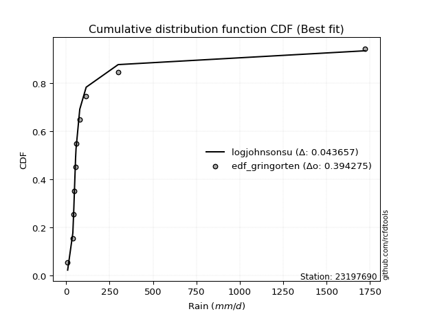</img>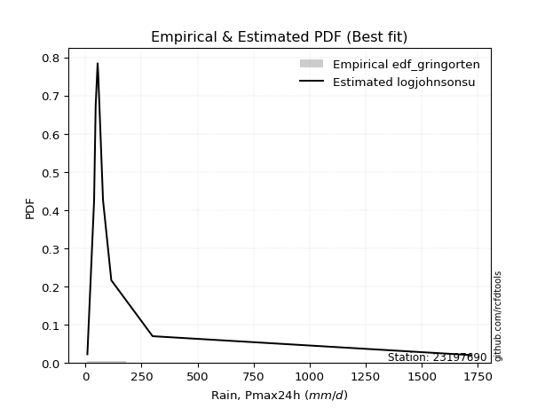</img>

</div>


### 9. Empirical - EDF Filliben (1975)

The specific values of the constants (0.3175) (often denoted as $alpha$) and (0.365) are derived from a method proposed by James J. Filliben in a 1975 paper. This particular formula is the mean value of the $i$-th order statistic of the normal distribution and is considered a robust and effective plotting position formula for the normal probability plot correlation coefficient test for normality.

<div align="center">


$P=(m-0.3175)/(n+0.365)$


</div>


**9.1. Empirical values**

<div align="center">

|                | 0                   | 1                  | 2                   | 3                  | 4                  | 5                  | 6                  | 7                  | 8                  | 9                  |
|:---------------|:--------------------|:-------------------|:--------------------|:-------------------|:-------------------|:-------------------|:-------------------|:-------------------|:-------------------|:-------------------|
| date           | 2019                | 2015               | 2025                | 2012               | 2014               | 2011               | 2013               | 2024               | 2017               | 2016               |
| x              | 8.99                | 38.9               | 44.8                | 45.9               | 54.6               | 57.2               | 78.7               | 115.6              | 299.796            | 1722.086           |
| m              | 1                   | 2                  | 3                   | 4                  | 5                  | 6                  | 7                  | 8                  | 9                  | 10                 |
| empirical_dist | edf_filliben        | edf_filliben       | edf_filliben        | edf_filliben       | edf_filliben       | edf_filliben       | edf_filliben       | edf_filliben       | edf_filliben       | edf_filliben       |
| empirical      | 0.06584659913169319 | 0.1623251326579836 | 0.25880366618427403 | 0.3552821997105644 | 0.4517607332368548 | 0.5482392667631452 | 0.6447178002894356 | 0.741196333815726  | 0.8376748673420163 | 0.9341534008683067 |
| empirical_tr   | 1.0704879938032532  | 1.193780593147135  | 1.3491701919947936  | 1.5510662177328844 | 1.8240211174659038 | 2.2135611318739987 | 2.814663951120163  | 3.8639328984156576 | 6.1604754829123305 | 15.186813186813156 |

</div>


**9.2. Kolmogorov-Smirnov fit test (sorted by Δ)**


<div align="center">

|                | 0                    | 1                    | 2                     | 3                   | 4                   | 5                   | 6                   | 7                   | 8                   | 9                   | 10                  | 11                  | 12                  | 13                  | 14                  | 15                  | 16                  | 17                  | 18                  | 19                 | 20                  | 21                  | 22                 | 23                  | 24                 | 25                  | 26                 | 27                 | 28                 | 29                  | 30                  | 31                 | 32                  | 33                  | 34                  | 35                 | 36                  | 37                 | 38                 | 39                  | 40                  | 41                  | 42                  | 43                  | 44                  | 45                 | 46                  | 47                  | 48                  | 49                  | 50                 | 51                 | 52                  | 53                  | 54                  | 55                 | 56                 | 57                 | 58                 | 59                 | 60                  | 61                  | 62                 | 63                 | 64                  | 65                 | 66                  | 67                  | 68                 | 69                 | 70                  | 71                  | 72                  | 73                 | 74                  | 75                  | 76                  | 77                  | 78                  | 79                 | 80                 | 81                 | 82                 | 83                 | 84                  | 85                 | 86                 | 87                 | 88                 | 89                 |
|:---------------|:---------------------|:---------------------|:----------------------|:--------------------|:--------------------|:--------------------|:--------------------|:--------------------|:--------------------|:--------------------|:--------------------|:--------------------|:--------------------|:--------------------|:--------------------|:--------------------|:--------------------|:--------------------|:--------------------|:-------------------|:--------------------|:--------------------|:-------------------|:--------------------|:-------------------|:--------------------|:-------------------|:-------------------|:-------------------|:--------------------|:--------------------|:-------------------|:--------------------|:--------------------|:--------------------|:-------------------|:--------------------|:-------------------|:-------------------|:--------------------|:--------------------|:--------------------|:--------------------|:--------------------|:--------------------|:-------------------|:--------------------|:--------------------|:--------------------|:--------------------|:-------------------|:-------------------|:--------------------|:--------------------|:--------------------|:-------------------|:-------------------|:-------------------|:-------------------|:-------------------|:--------------------|:--------------------|:-------------------|:-------------------|:--------------------|:-------------------|:--------------------|:--------------------|:-------------------|:-------------------|:--------------------|:--------------------|:--------------------|:-------------------|:--------------------|:--------------------|:--------------------|:--------------------|:--------------------|:-------------------|:-------------------|:-------------------|:-------------------|:-------------------|:--------------------|:-------------------|:-------------------|:-------------------|:-------------------|:-------------------|
| station        | 23197690             | 23197690             | 23197690              | 23197690            | 23197690            | 23197690            | 23197690            | 23197690            | 23197690            | 23197690            | 23197690            | 23197690            | 23197690            | 23197690            | 23197690            | 23197690            | 23197690            | 23197690            | 23197690            | 23197690           | 23197690            | 23197690            | 23197690           | 23197690            | 23197690           | 23197690            | 23197690           | 23197690           | 23197690           | 23197690            | 23197690            | 23197690           | 23197690            | 23197690            | 23197690            | 23197690           | 23197690            | 23197690           | 23197690           | 23197690            | 23197690            | 23197690            | 23197690            | 23197690            | 23197690            | 23197690           | 23197690            | 23197690            | 23197690            | 23197690            | 23197690           | 23197690           | 23197690            | 23197690            | 23197690            | 23197690           | 23197690           | 23197690           | 23197690           | 23197690           | 23197690            | 23197690            | 23197690           | 23197690           | 23197690            | 23197690           | 23197690            | 23197690            | 23197690           | 23197690           | 23197690            | 23197690            | 23197690            | 23197690           | 23197690            | 23197690            | 23197690            | 23197690            | 23197690            | 23197690           | 23197690           | 23197690           | 23197690           | 23197690           | 23197690            | 23197690           | 23197690           | 23197690           | 23197690           | 23197690           |
| empirical_dist | edf_filliben         | edf_filliben         | edf_filliben          | edf_filliben        | edf_filliben        | edf_filliben        | edf_filliben        | edf_filliben        | edf_filliben        | edf_filliben        | edf_filliben        | edf_filliben        | edf_filliben        | edf_filliben        | edf_filliben        | edf_filliben        | edf_filliben        | edf_filliben        | edf_filliben        | edf_filliben       | edf_filliben        | edf_filliben        | edf_filliben       | edf_filliben        | edf_filliben       | edf_filliben        | edf_filliben       | edf_filliben       | edf_filliben       | edf_filliben        | edf_filliben        | edf_filliben       | edf_filliben        | edf_filliben        | edf_filliben        | edf_filliben       | edf_filliben        | edf_filliben       | edf_filliben       | edf_filliben        | edf_filliben        | edf_filliben        | edf_filliben        | edf_filliben        | edf_filliben        | edf_filliben       | edf_filliben        | edf_filliben        | edf_filliben        | edf_filliben        | edf_filliben       | edf_filliben       | edf_filliben        | edf_filliben        | edf_filliben        | edf_filliben       | edf_filliben       | edf_filliben       | edf_filliben       | edf_filliben       | edf_filliben        | edf_filliben        | edf_filliben       | edf_filliben       | edf_filliben        | edf_filliben       | edf_filliben        | edf_filliben        | edf_filliben       | edf_filliben       | edf_filliben        | edf_filliben        | edf_filliben        | edf_filliben       | edf_filliben        | edf_filliben        | edf_filliben        | edf_filliben        | edf_filliben        | edf_filliben       | edf_filliben       | edf_filliben       | edf_filliben       | edf_filliben       | edf_filliben        | edf_filliben       | edf_filliben       | edf_filliben       | edf_filliben       | edf_filliben       |
| p_dist         | logjohnsonsu         | lognct               | loglaplace_asymmetric | loggibrat           | logt                | nct                 | loggenlogistic      | logfisk             | logmielke           | invgamma            | f                   | betaprime           | mielke              | logexponnorm        | logcrystalball      | lognorm             | lognorm             | logloggamma         | invgauss            | logalpha           | logncf              | logf                | loginvgamma        | logfatiguelife      | loginvgauss        | ncf                 | logerlang          | loggamma           | loggamma           | logbetaprime        | logmaxwell          | loglogistic        | loggumbel_r         | logweibull_min      | logwald             | logpearson3        | loginvweibull       | lograyleigh        | logmoyal           | t                   | loghypsecant        | pareto              | logrice             | johnsonsu           | logkstwobign        | loghalflogistic    | loglaplace          | loggenexpon         | loghalfnorm         | loggompertz         | fatiguelife        | loggumbel_l        | chi2                | gibrat              | logtruncnorm        | erlang             | lognakagami        | weibull_min        | gumbel_r           | rayleigh           | moyal               | nakagami            | maxwell            | wald               | genlogistic         | halfnorm           | halflogistic        | logexpon            | alpha              | norm               | logistic            | pearson3            | hypsecant           | exponnorm          | laplace_asymmetric  | expon               | genexpon            | laplace             | kstwobign           | fisk               | rice               | gumbel_l           | gamma              | crystalball        | invweibull          | logchi2            | loglognorm         | logpareto          | truncnorm          | gompertz           |
| delta          | 0.047160331549684686 | 0.058517507532498236 | 0.09513569528032662   | 0.10423797381866312 | 0.12352553221088847 | 0.12513918410059344 | 0.13469234537619612 | 0.13492625789296198 | 0.13642193645033296 | 0.13786558390988346 | 0.14038057412169236 | 0.14042196227207504 | 0.14447047433726035 | 0.14495299995787975 | 0.14912361575460087 | 0.14912361697687426 | 0.14912361697687426 | 0.14965766863551733 | 0.15029689636781862 | 0.1529438290102827 | 0.15337856324084348 | 0.15343062617981046 | 0.1534385184649854 | 0.15380456520530655 | 0.1538733827365676 | 0.15441197006369384 | 0.154634267350314  | 0.1546348975431257 | 0.1546348975431257 | 0.15500948060490366 | 0.15817624572895772 | 0.1606604999043147 | 0.16149459348839945 | 0.16232513262464462 | 0.16303009794826656 | 0.1657248361250266 | 0.16832691420427742 | 0.1689809439564548 | 0.170137569043654  | 0.17099934094704267 | 0.17118031307938164 | 0.17313026725717667 | 0.17488180778248952 | 0.17547382728173133 | 0.18252412923587424 | 0.1962164354682699 | 0.19825232421187522 | 0.19873192095023323 | 0.19943428787482081 | 0.20017216138620075 | 0.2151719618475454 | 0.2196157215669059 | 0.24801546867313212 | 0.24874164092572051 | 0.25081585836950093 | 0.2714989894988954 | 0.2756995038661994 | 0.2802325345072951 | 0.2891401411130953 | 0.2987917840169636 | 0.30207271573723615 | 0.30908846896246234 | 0.3110927250088874 | 0.3186669874420047 | 0.32068725199116344 | 0.3241807654336565 | 0.32598632001673067 | 0.32631917605214006 | 0.3398176213651812 | 0.3450153327155623 | 0.35834732099117866 | 0.35975580301484245 | 0.36922053459732246 | 0.3875134467552761 | 0.39050670885994165 | 0.39050923222336265 | 0.39050924468516396 | 0.39661715028847316 | 0.39782380721688165 | 0.3990964983873621 | 0.4103524610158039 | 0.4111272482492942 | 0.429658995940114  | 0.4408581029934395 | 0.44412162130711375 | 0.4485555611718353 | 0.4536152086273178 | 0.4929189600452601 | 0.5156046671011991 | 0.5599955050077735 |
| deltao         | 0.3942745923300002   | 0.3942745923300002   | 0.3942745923300002    | 0.3942745923300002  | 0.3942745923300002  | 0.3942745923300002  | 0.3942745923300002  | 0.3942745923300002  | 0.3942745923300002  | 0.3942745923300002  | 0.3942745923300002  | 0.3942745923300002  | 0.3942745923300002  | 0.3942745923300002  | 0.3942745923300002  | 0.3942745923300002  | 0.3942745923300002  | 0.3942745923300002  | 0.3942745923300002  | 0.3942745923300002 | 0.3942745923300002  | 0.3942745923300002  | 0.3942745923300002 | 0.3942745923300002  | 0.3942745923300002 | 0.3942745923300002  | 0.3942745923300002 | 0.3942745923300002 | 0.3942745923300002 | 0.3942745923300002  | 0.3942745923300002  | 0.3942745923300002 | 0.3942745923300002  | 0.3942745923300002  | 0.3942745923300002  | 0.3942745923300002 | 0.3942745923300002  | 0.3942745923300002 | 0.3942745923300002 | 0.3942745923300002  | 0.3942745923300002  | 0.3942745923300002  | 0.3942745923300002  | 0.3942745923300002  | 0.3942745923300002  | 0.3942745923300002 | 0.3942745923300002  | 0.3942745923300002  | 0.3942745923300002  | 0.3942745923300002  | 0.3942745923300002 | 0.3942745923300002 | 0.3942745923300002  | 0.3942745923300002  | 0.3942745923300002  | 0.3942745923300002 | 0.3942745923300002 | 0.3942745923300002 | 0.3942745923300002 | 0.3942745923300002 | 0.3942745923300002  | 0.3942745923300002  | 0.3942745923300002 | 0.3942745923300002 | 0.3942745923300002  | 0.3942745923300002 | 0.3942745923300002  | 0.3942745923300002  | 0.3942745923300002 | 0.3942745923300002 | 0.3942745923300002  | 0.3942745923300002  | 0.3942745923300002  | 0.3942745923300002 | 0.3942745923300002  | 0.3942745923300002  | 0.3942745923300002  | 0.3942745923300002  | 0.3942745923300002  | 0.3942745923300002 | 0.3942745923300002 | 0.3942745923300002 | 0.3942745923300002 | 0.3942745923300002 | 0.3942745923300002  | 0.3942745923300002 | 0.3942745923300002 | 0.3942745923300002 | 0.3942745923300002 | 0.3942745923300002 |
| eval           | Δo > Δ               | Δo > Δ               | Δo > Δ                | Δo > Δ              | Δo > Δ              | Δo > Δ              | Δo > Δ              | Δo > Δ              | Δo > Δ              | Δo > Δ              | Δo > Δ              | Δo > Δ              | Δo > Δ              | Δo > Δ              | Δo > Δ              | Δo > Δ              | Δo > Δ              | Δo > Δ              | Δo > Δ              | Δo > Δ             | Δo > Δ              | Δo > Δ              | Δo > Δ             | Δo > Δ              | Δo > Δ             | Δo > Δ              | Δo > Δ             | Δo > Δ             | Δo > Δ             | Δo > Δ              | Δo > Δ              | Δo > Δ             | Δo > Δ              | Δo > Δ              | Δo > Δ              | Δo > Δ             | Δo > Δ              | Δo > Δ             | Δo > Δ             | Δo > Δ              | Δo > Δ              | Δo > Δ              | Δo > Δ              | Δo > Δ              | Δo > Δ              | Δo > Δ             | Δo > Δ              | Δo > Δ              | Δo > Δ              | Δo > Δ              | Δo > Δ             | Δo > Δ             | Δo > Δ              | Δo > Δ              | Δo > Δ              | Δo > Δ             | Δo > Δ             | Δo > Δ             | Δo > Δ             | Δo > Δ             | Δo > Δ              | Δo > Δ              | Δo > Δ             | Δo > Δ             | Δo > Δ              | Δo > Δ             | Δo > Δ              | Δo > Δ              | Δo > Δ             | Δo > Δ             | Δo > Δ              | Δo > Δ              | Δo > Δ              | Δo > Δ             | Δo > Δ              | Δo > Δ              | Δo > Δ              | Δo <= Δ             | Δo <= Δ             | Δo <= Δ            | Δo <= Δ            | Δo <= Δ            | Δo <= Δ            | Δo <= Δ            | Δo <= Δ             | Δo <= Δ            | Δo <= Δ            | Δo <= Δ            | Δo <= Δ            | Δo <= Δ            |
| fit            | 1                    | 1                    | 1                     | 1                   | 1                   | 1                   | 1                   | 1                   | 1                   | 1                   | 1                   | 1                   | 1                   | 1                   | 1                   | 1                   | 1                   | 1                   | 1                   | 1                  | 1                   | 1                   | 1                  | 1                   | 1                  | 1                   | 1                  | 1                  | 1                  | 1                   | 1                   | 1                  | 1                   | 1                   | 1                   | 1                  | 1                   | 1                  | 1                  | 1                   | 1                   | 1                   | 1                   | 1                   | 1                   | 1                  | 1                   | 1                   | 1                   | 1                   | 1                  | 1                  | 1                   | 1                   | 1                   | 1                  | 1                  | 1                  | 1                  | 1                  | 1                   | 1                   | 1                  | 1                  | 1                   | 1                  | 1                   | 1                   | 1                  | 1                  | 1                   | 1                   | 1                   | 1                  | 1                   | 1                   | 1                   | 0                   | 0                   | 0                  | 0                  | 0                  | 0                  | 0                  | 0                   | 0                  | 0                  | 0                  | 0                  | 0                  |
| n              | 10                   | 10                   | 10                    | 10                  | 10                  | 10                  | 10                  | 10                  | 10                  | 10                  | 10                  | 10                  | 10                  | 10                  | 10                  | 10                  | 10                  | 10                  | 10                  | 10                 | 10                  | 10                  | 10                 | 10                  | 10                 | 10                  | 10                 | 10                 | 10                 | 10                  | 10                  | 10                 | 10                  | 10                  | 10                  | 10                 | 10                  | 10                 | 10                 | 10                  | 10                  | 10                  | 10                  | 10                  | 10                  | 10                 | 10                  | 10                  | 10                  | 10                  | 10                 | 10                 | 10                  | 10                  | 10                  | 10                 | 10                 | 10                 | 10                 | 10                 | 10                  | 10                  | 10                 | 10                 | 10                  | 10                 | 10                  | 10                  | 10                 | 10                 | 10                  | 10                  | 10                  | 10                 | 10                  | 10                  | 10                  | 10                  | 10                  | 10                 | 10                 | 10                 | 10                 | 10                 | 10                  | 10                 | 10                 | 10                 | 10                 | 10                 |
| best_fit       | 1                    | 0                    | 0                     | 0                   | 0                   | 0                   | 0                   | 0                   | 0                   | 0                   | 0                   | 0                   | 0                   | 0                   | 0                   | 0                   | 0                   | 0                   | 0                   | 0                  | 0                   | 0                   | 0                  | 0                   | 0                  | 0                   | 0                  | 0                  | 0                  | 0                   | 0                   | 0                  | 0                   | 0                   | 0                   | 0                  | 0                   | 0                  | 0                  | 0                   | 0                   | 0                   | 0                   | 0                   | 0                   | 0                  | 0                   | 0                   | 0                   | 0                   | 0                  | 0                  | 0                   | 0                   | 0                   | 0                  | 0                  | 0                  | 0                  | 0                  | 0                   | 0                   | 0                  | 0                  | 0                   | 0                  | 0                   | 0                   | 0                  | 0                  | 0                   | 0                   | 0                   | 0                  | 0                   | 0                   | 0                   | 0                   | 0                   | 0                  | 0                  | 0                  | 0                  | 0                  | 0                   | 0                  | 0                  | 0                  | 0                  | 0                  |
| best_fit_sort  | 1                    | 2                    | 3                     | 4                   | 5                   | 6                   | 7                   | 8                   | 9                   | 10                  | 11                  | 12                  | 13                  | 14                  | 15                  | 16                  | 17                  | 18                  | 19                  | 20                 | 21                  | 22                  | 23                 | 24                  | 25                 | 26                  | 27                 | 28                 | 29                 | 30                  | 31                  | 32                 | 33                  | 34                  | 35                  | 36                 | 37                  | 38                 | 39                 | 40                  | 41                  | 42                  | 43                  | 44                  | 45                  | 46                 | 47                  | 48                  | 49                  | 50                  | 51                 | 52                 | 53                  | 54                  | 55                  | 56                 | 57                 | 58                 | 59                 | 60                 | 61                  | 62                  | 63                 | 64                 | 65                  | 66                 | 67                  | 68                  | 69                 | 70                 | 71                  | 72                  | 73                  | 74                 | 75                  | 76                  | 77                  | 78                  | 79                  | 80                 | 81                 | 82                 | 83                 | 84                 | 85                  | 86                 | 87                 | 88                 | 89                 | 90                 |

</div>


<div align="center">

</img>

</div>


**9.3. Best fit**

<div align="center">

|   id |   station | empirical_dist   | p_dist       |     delta |   deltao | eval   |   fit |   n |   best_fit |   best_fit_sort |
|-----:|----------:|:-----------------|:-------------|----------:|---------:|:-------|------:|----:|-----------:|----------------:|
|    0 |  23197690 | edf_filliben     | logjohnsonsu | 0.0471603 | 0.394275 | Δo > Δ |     1 |  10 |          1 |               1 |

</div>


<div align="center">

</img></img>

</div>


### 10. Empirical - EDF Jenkinson (1977)

The Jenkinson formula in hydrology is an empirical plotting position formula used to estimate the non-exceedance probability _(P)_ or return period _(T)_ of a given ordered observation within a sample. It is a widely used method in the frequency analysis of extreme events such as floods and rainfall, as it provides a distribution-free way to plot data. _a≈0.31_ and _b≈0.38_ are constants derived to approximate the median of the probability distribution for the given rank.

<div align="center">


$P=(m-a)/(n+b)$


</div>


**10.1. Empirical values**

<div align="center">

|                | 0                   | 1                   | 2                  | 3                   | 4                   | 5                  | 6                  | 7                  | 8                  | 9                  |
|:---------------|:--------------------|:--------------------|:-------------------|:--------------------|:--------------------|:-------------------|:-------------------|:-------------------|:-------------------|:-------------------|
| date           | 2019                | 2015                | 2025               | 2012                | 2014                | 2011               | 2013               | 2024               | 2017               | 2016               |
| x              | 8.99                | 38.9                | 44.8               | 45.9                | 54.6                | 57.2               | 78.7               | 115.6              | 299.796            | 1722.086           |
| m              | 1                   | 2                   | 3                  | 4                   | 5                   | 6                  | 7                  | 8                  | 9                  | 10                 |
| empirical_dist | edf_jenkinson       | edf_jenkinson       | edf_jenkinson      | edf_jenkinson       | edf_jenkinson       | edf_jenkinson      | edf_jenkinson      | edf_jenkinson      | edf_jenkinson      | edf_jenkinson      |
| empirical      | 0.06647398843930635 | 0.16281310211946048 | 0.2591522157996146 | 0.35549132947976875 | 0.45183044315992293 | 0.5481695568400771 | 0.6445086705202312 | 0.7408477842003853 | 0.8371868978805393 | 0.9335260115606935 |
| empirical_tr   | 1.0712074303405574  | 1.1944764096662832  | 1.3498049414824447 | 1.5515695067264574  | 1.8242530755711774  | 2.213219616204691  | 2.813008130081301  | 3.8587360594795537 | 6.142011834319521  | 15.043478260869529 |

</div>


**10.2. Kolmogorov-Smirnov fit test (sorted by Δ)**


<div align="center">

|                | 0                   | 1                   | 2                     | 3                   | 4                   | 5                   | 6                   | 7                  | 8                   | 9                   | 10                  | 11                  | 12                  | 13                  | 14                  | 15                  | 16                  | 17                  | 18                  | 19                 | 20                 | 21                  | 22                  | 23                  | 24                 | 25                  | 26                 | 27                  | 28                  | 29                  | 30                  | 31                 | 32                  | 33                  | 34                  | 35                 | 36                  | 37                 | 38                  | 39                  | 40                  | 41                  | 42                  | 43                  | 44                  | 45                 | 46                  | 47                  | 48                  | 49                  | 50                 | 51                 | 52                  | 53                  | 54                  | 55                 | 56                 | 57                 | 58                 | 59                 | 60                 | 61                  | 62                 | 63                 | 64                  | 65                 | 66                  | 67                  | 68                 | 69                 | 70                  | 71                 | 72                  | 73                 | 74                  | 75                  | 76                  | 77                  | 78                  | 79                 | 80                 | 81                 | 82                 | 83                 | 84                  | 85                 | 86                 | 87                 | 88                 | 89                 |
|:---------------|:--------------------|:--------------------|:----------------------|:--------------------|:--------------------|:--------------------|:--------------------|:-------------------|:--------------------|:--------------------|:--------------------|:--------------------|:--------------------|:--------------------|:--------------------|:--------------------|:--------------------|:--------------------|:--------------------|:-------------------|:-------------------|:--------------------|:--------------------|:--------------------|:-------------------|:--------------------|:-------------------|:--------------------|:--------------------|:--------------------|:--------------------|:-------------------|:--------------------|:--------------------|:--------------------|:-------------------|:--------------------|:-------------------|:--------------------|:--------------------|:--------------------|:--------------------|:--------------------|:--------------------|:--------------------|:-------------------|:--------------------|:--------------------|:--------------------|:--------------------|:-------------------|:-------------------|:--------------------|:--------------------|:--------------------|:-------------------|:-------------------|:-------------------|:-------------------|:-------------------|:-------------------|:--------------------|:-------------------|:-------------------|:--------------------|:-------------------|:--------------------|:--------------------|:-------------------|:-------------------|:--------------------|:-------------------|:--------------------|:-------------------|:--------------------|:--------------------|:--------------------|:--------------------|:--------------------|:-------------------|:-------------------|:-------------------|:-------------------|:-------------------|:--------------------|:-------------------|:-------------------|:-------------------|:-------------------|:-------------------|
| station        | 23197690            | 23197690            | 23197690              | 23197690            | 23197690            | 23197690            | 23197690            | 23197690           | 23197690            | 23197690            | 23197690            | 23197690            | 23197690            | 23197690            | 23197690            | 23197690            | 23197690            | 23197690            | 23197690            | 23197690           | 23197690           | 23197690            | 23197690            | 23197690            | 23197690           | 23197690            | 23197690           | 23197690            | 23197690            | 23197690            | 23197690            | 23197690           | 23197690            | 23197690            | 23197690            | 23197690           | 23197690            | 23197690           | 23197690            | 23197690            | 23197690            | 23197690            | 23197690            | 23197690            | 23197690            | 23197690           | 23197690            | 23197690            | 23197690            | 23197690            | 23197690           | 23197690           | 23197690            | 23197690            | 23197690            | 23197690           | 23197690           | 23197690           | 23197690           | 23197690           | 23197690           | 23197690            | 23197690           | 23197690           | 23197690            | 23197690           | 23197690            | 23197690            | 23197690           | 23197690           | 23197690            | 23197690           | 23197690            | 23197690           | 23197690            | 23197690            | 23197690            | 23197690            | 23197690            | 23197690           | 23197690           | 23197690           | 23197690           | 23197690           | 23197690            | 23197690           | 23197690           | 23197690           | 23197690           | 23197690           |
| empirical_dist | edf_jenkinson       | edf_jenkinson       | edf_jenkinson         | edf_jenkinson       | edf_jenkinson       | edf_jenkinson       | edf_jenkinson       | edf_jenkinson      | edf_jenkinson       | edf_jenkinson       | edf_jenkinson       | edf_jenkinson       | edf_jenkinson       | edf_jenkinson       | edf_jenkinson       | edf_jenkinson       | edf_jenkinson       | edf_jenkinson       | edf_jenkinson       | edf_jenkinson      | edf_jenkinson      | edf_jenkinson       | edf_jenkinson       | edf_jenkinson       | edf_jenkinson      | edf_jenkinson       | edf_jenkinson      | edf_jenkinson       | edf_jenkinson       | edf_jenkinson       | edf_jenkinson       | edf_jenkinson      | edf_jenkinson       | edf_jenkinson       | edf_jenkinson       | edf_jenkinson      | edf_jenkinson       | edf_jenkinson      | edf_jenkinson       | edf_jenkinson       | edf_jenkinson       | edf_jenkinson       | edf_jenkinson       | edf_jenkinson       | edf_jenkinson       | edf_jenkinson      | edf_jenkinson       | edf_jenkinson       | edf_jenkinson       | edf_jenkinson       | edf_jenkinson      | edf_jenkinson      | edf_jenkinson       | edf_jenkinson       | edf_jenkinson       | edf_jenkinson      | edf_jenkinson      | edf_jenkinson      | edf_jenkinson      | edf_jenkinson      | edf_jenkinson      | edf_jenkinson       | edf_jenkinson      | edf_jenkinson      | edf_jenkinson       | edf_jenkinson      | edf_jenkinson       | edf_jenkinson       | edf_jenkinson      | edf_jenkinson      | edf_jenkinson       | edf_jenkinson      | edf_jenkinson       | edf_jenkinson      | edf_jenkinson       | edf_jenkinson       | edf_jenkinson       | edf_jenkinson       | edf_jenkinson       | edf_jenkinson      | edf_jenkinson      | edf_jenkinson      | edf_jenkinson      | edf_jenkinson      | edf_jenkinson       | edf_jenkinson      | edf_jenkinson      | edf_jenkinson      | edf_jenkinson      | edf_jenkinson      |
| p_dist         | logjohnsonsu        | lognct              | loglaplace_asymmetric | loggibrat           | logt                | nct                 | loggenlogistic      | logfisk            | logmielke           | invgamma            | f                   | betaprime           | mielke              | logexponnorm        | logcrystalball      | lognorm             | lognorm             | logloggamma         | invgauss            | logalpha           | logncf             | logf                | loginvgamma         | logfatiguelife      | loginvgauss        | ncf                 | logerlang          | loggamma            | loggamma            | logbetaprime        | logmaxwell          | loglogistic        | loggumbel_r         | logwald             | logweibull_min      | logpearson3        | loginvweibull       | lograyleigh        | logmoyal            | t                   | loghypsecant        | pareto              | logrice             | johnsonsu           | logkstwobign        | loghalflogistic    | loglaplace          | loggenexpon         | loghalfnorm         | loggompertz         | fatiguelife        | loggumbel_l        | chi2                | gibrat              | logtruncnorm        | erlang             | lognakagami        | weibull_min        | gumbel_r           | rayleigh           | moyal              | nakagami            | maxwell            | wald               | genlogistic         | halfnorm           | halflogistic        | logexpon            | alpha              | norm               | logistic            | pearson3           | hypsecant           | exponnorm          | laplace_asymmetric  | expon               | genexpon            | laplace             | kstwobign           | fisk               | rice               | gumbel_l           | gamma              | crystalball        | invweibull          | logchi2            | loglognorm         | logpareto          | truncnorm          | gompertz           |
| delta          | 0.04736946131888908 | 0.05872663730170258 | 0.09506598535725852   | 0.10388942420332253 | 0.12387408182622917 | 0.12506947417752534 | 0.13420437591471923 | 0.1344382884314851 | 0.13593396698885607 | 0.13737761444840657 | 0.13989260466021547 | 0.13993399281059815 | 0.14398250487578346 | 0.14446503049640286 | 0.14891448598539647 | 0.14891448720766987 | 0.14891448720766987 | 0.14944853886631293 | 0.14980892690634173 | 0.1524558595488058 | 0.1528905937793666 | 0.15294265671833357 | 0.15295054900350852 | 0.15331659574382966 | 0.1533854132750907 | 0.15392400060221695 | 0.1541462978888371 | 0.15414692808164882 | 0.15414692808164882 | 0.15452151114342677 | 0.15768827626748083 | 0.1605907899812466 | 0.16100662402692256 | 0.16254212848678967 | 0.16281310208612151 | 0.1652368666635497 | 0.16783894474280053 | 0.1684929744949779 | 0.16964959958217712 | 0.17092963102397452 | 0.17111060315631355 | 0.17264229779569978 | 0.17439383832101263 | 0.17498585782025444 | 0.18203615977439735 | 0.195728466006793  | 0.19818261428880712 | 0.19824395148875634 | 0.19894631841334393 | 0.19968419192472386 | 0.2148234122322047 | 0.2194065917977015 | 0.24766691905779142 | 0.24811425161810735 | 0.25032788890802404 | 0.2711504398835547 | 0.2753509542508588 | 0.2797445650458182 | 0.2885127518054821 | 0.2984432344016229 | 0.301445326429623  | 0.30873991934712164 | 0.3107441753935467 | 0.3180395981343916 | 0.32033870237582274 | 0.3235533761260433 | 0.32535893070911753 | 0.32583120659066317 | 0.3393296519037043 | 0.3446667831002216 | 0.35799877137583797 | 0.3591284137072293 | 0.36887198498198176 | 0.3873043169860717 | 0.39029757909073726 | 0.39030010245415825 | 0.39030011491595956 | 0.39626860067313247 | 0.39747525760154095 | 0.3986085289258852 | 0.4100039114004632 | 0.4107786986339535 | 0.4291710264786371 | 0.4402307136858264 | 0.44349423199950055 | 0.4480675917103584 | 0.4531272391658409 | 0.4924309905837832 | 0.5152561174858585 | 0.5596469553924328 |
| deltao         | 0.3942745923300002  | 0.3942745923300002  | 0.3942745923300002    | 0.3942745923300002  | 0.3942745923300002  | 0.3942745923300002  | 0.3942745923300002  | 0.3942745923300002 | 0.3942745923300002  | 0.3942745923300002  | 0.3942745923300002  | 0.3942745923300002  | 0.3942745923300002  | 0.3942745923300002  | 0.3942745923300002  | 0.3942745923300002  | 0.3942745923300002  | 0.3942745923300002  | 0.3942745923300002  | 0.3942745923300002 | 0.3942745923300002 | 0.3942745923300002  | 0.3942745923300002  | 0.3942745923300002  | 0.3942745923300002 | 0.3942745923300002  | 0.3942745923300002 | 0.3942745923300002  | 0.3942745923300002  | 0.3942745923300002  | 0.3942745923300002  | 0.3942745923300002 | 0.3942745923300002  | 0.3942745923300002  | 0.3942745923300002  | 0.3942745923300002 | 0.3942745923300002  | 0.3942745923300002 | 0.3942745923300002  | 0.3942745923300002  | 0.3942745923300002  | 0.3942745923300002  | 0.3942745923300002  | 0.3942745923300002  | 0.3942745923300002  | 0.3942745923300002 | 0.3942745923300002  | 0.3942745923300002  | 0.3942745923300002  | 0.3942745923300002  | 0.3942745923300002 | 0.3942745923300002 | 0.3942745923300002  | 0.3942745923300002  | 0.3942745923300002  | 0.3942745923300002 | 0.3942745923300002 | 0.3942745923300002 | 0.3942745923300002 | 0.3942745923300002 | 0.3942745923300002 | 0.3942745923300002  | 0.3942745923300002 | 0.3942745923300002 | 0.3942745923300002  | 0.3942745923300002 | 0.3942745923300002  | 0.3942745923300002  | 0.3942745923300002 | 0.3942745923300002 | 0.3942745923300002  | 0.3942745923300002 | 0.3942745923300002  | 0.3942745923300002 | 0.3942745923300002  | 0.3942745923300002  | 0.3942745923300002  | 0.3942745923300002  | 0.3942745923300002  | 0.3942745923300002 | 0.3942745923300002 | 0.3942745923300002 | 0.3942745923300002 | 0.3942745923300002 | 0.3942745923300002  | 0.3942745923300002 | 0.3942745923300002 | 0.3942745923300002 | 0.3942745923300002 | 0.3942745923300002 |
| eval           | Δo > Δ              | Δo > Δ              | Δo > Δ                | Δo > Δ              | Δo > Δ              | Δo > Δ              | Δo > Δ              | Δo > Δ             | Δo > Δ              | Δo > Δ              | Δo > Δ              | Δo > Δ              | Δo > Δ              | Δo > Δ              | Δo > Δ              | Δo > Δ              | Δo > Δ              | Δo > Δ              | Δo > Δ              | Δo > Δ             | Δo > Δ             | Δo > Δ              | Δo > Δ              | Δo > Δ              | Δo > Δ             | Δo > Δ              | Δo > Δ             | Δo > Δ              | Δo > Δ              | Δo > Δ              | Δo > Δ              | Δo > Δ             | Δo > Δ              | Δo > Δ              | Δo > Δ              | Δo > Δ             | Δo > Δ              | Δo > Δ             | Δo > Δ              | Δo > Δ              | Δo > Δ              | Δo > Δ              | Δo > Δ              | Δo > Δ              | Δo > Δ              | Δo > Δ             | Δo > Δ              | Δo > Δ              | Δo > Δ              | Δo > Δ              | Δo > Δ             | Δo > Δ             | Δo > Δ              | Δo > Δ              | Δo > Δ              | Δo > Δ             | Δo > Δ             | Δo > Δ             | Δo > Δ             | Δo > Δ             | Δo > Δ             | Δo > Δ              | Δo > Δ             | Δo > Δ             | Δo > Δ              | Δo > Δ             | Δo > Δ              | Δo > Δ              | Δo > Δ             | Δo > Δ             | Δo > Δ              | Δo > Δ             | Δo > Δ              | Δo > Δ             | Δo > Δ              | Δo > Δ              | Δo > Δ              | Δo <= Δ             | Δo <= Δ             | Δo <= Δ            | Δo <= Δ            | Δo <= Δ            | Δo <= Δ            | Δo <= Δ            | Δo <= Δ             | Δo <= Δ            | Δo <= Δ            | Δo <= Δ            | Δo <= Δ            | Δo <= Δ            |
| fit            | 1                   | 1                   | 1                     | 1                   | 1                   | 1                   | 1                   | 1                  | 1                   | 1                   | 1                   | 1                   | 1                   | 1                   | 1                   | 1                   | 1                   | 1                   | 1                   | 1                  | 1                  | 1                   | 1                   | 1                   | 1                  | 1                   | 1                  | 1                   | 1                   | 1                   | 1                   | 1                  | 1                   | 1                   | 1                   | 1                  | 1                   | 1                  | 1                   | 1                   | 1                   | 1                   | 1                   | 1                   | 1                   | 1                  | 1                   | 1                   | 1                   | 1                   | 1                  | 1                  | 1                   | 1                   | 1                   | 1                  | 1                  | 1                  | 1                  | 1                  | 1                  | 1                   | 1                  | 1                  | 1                   | 1                  | 1                   | 1                   | 1                  | 1                  | 1                   | 1                  | 1                   | 1                  | 1                   | 1                   | 1                   | 0                   | 0                   | 0                  | 0                  | 0                  | 0                  | 0                  | 0                   | 0                  | 0                  | 0                  | 0                  | 0                  |
| n              | 10                  | 10                  | 10                    | 10                  | 10                  | 10                  | 10                  | 10                 | 10                  | 10                  | 10                  | 10                  | 10                  | 10                  | 10                  | 10                  | 10                  | 10                  | 10                  | 10                 | 10                 | 10                  | 10                  | 10                  | 10                 | 10                  | 10                 | 10                  | 10                  | 10                  | 10                  | 10                 | 10                  | 10                  | 10                  | 10                 | 10                  | 10                 | 10                  | 10                  | 10                  | 10                  | 10                  | 10                  | 10                  | 10                 | 10                  | 10                  | 10                  | 10                  | 10                 | 10                 | 10                  | 10                  | 10                  | 10                 | 10                 | 10                 | 10                 | 10                 | 10                 | 10                  | 10                 | 10                 | 10                  | 10                 | 10                  | 10                  | 10                 | 10                 | 10                  | 10                 | 10                  | 10                 | 10                  | 10                  | 10                  | 10                  | 10                  | 10                 | 10                 | 10                 | 10                 | 10                 | 10                  | 10                 | 10                 | 10                 | 10                 | 10                 |
| best_fit       | 1                   | 0                   | 0                     | 0                   | 0                   | 0                   | 0                   | 0                  | 0                   | 0                   | 0                   | 0                   | 0                   | 0                   | 0                   | 0                   | 0                   | 0                   | 0                   | 0                  | 0                  | 0                   | 0                   | 0                   | 0                  | 0                   | 0                  | 0                   | 0                   | 0                   | 0                   | 0                  | 0                   | 0                   | 0                   | 0                  | 0                   | 0                  | 0                   | 0                   | 0                   | 0                   | 0                   | 0                   | 0                   | 0                  | 0                   | 0                   | 0                   | 0                   | 0                  | 0                  | 0                   | 0                   | 0                   | 0                  | 0                  | 0                  | 0                  | 0                  | 0                  | 0                   | 0                  | 0                  | 0                   | 0                  | 0                   | 0                   | 0                  | 0                  | 0                   | 0                  | 0                   | 0                  | 0                   | 0                   | 0                   | 0                   | 0                   | 0                  | 0                  | 0                  | 0                  | 0                  | 0                   | 0                  | 0                  | 0                  | 0                  | 0                  |
| best_fit_sort  | 1                   | 2                   | 3                     | 4                   | 5                   | 6                   | 7                   | 8                  | 9                   | 10                  | 11                  | 12                  | 13                  | 14                  | 15                  | 16                  | 17                  | 18                  | 19                  | 20                 | 21                 | 22                  | 23                  | 24                  | 25                 | 26                  | 27                 | 28                  | 29                  | 30                  | 31                  | 32                 | 33                  | 34                  | 35                  | 36                 | 37                  | 38                 | 39                  | 40                  | 41                  | 42                  | 43                  | 44                  | 45                  | 46                 | 47                  | 48                  | 49                  | 50                  | 51                 | 52                 | 53                  | 54                  | 55                  | 56                 | 57                 | 58                 | 59                 | 60                 | 61                 | 62                  | 63                 | 64                 | 65                  | 66                 | 67                  | 68                  | 69                 | 70                 | 71                  | 72                 | 73                  | 74                 | 75                  | 76                  | 77                  | 78                  | 79                  | 80                 | 81                 | 82                 | 83                 | 84                 | 85                  | 86                 | 87                 | 88                 | 89                 | 90                 |

</div>


<div align="center">

</img>

</div>


**10.3. Best fit**

<div align="center">

|   id |   station | empirical_dist   | p_dist       |     delta |   deltao | eval   |   fit |   n |   best_fit |   best_fit_sort |
|-----:|----------:|:-----------------|:-------------|----------:|---------:|:-------|------:|----:|-----------:|----------------:|
|    0 |  23197690 | edf_jenkinson    | logjohnsonsu | 0.0473695 | 0.394275 | Δo > Δ |     1 |  10 |          1 |               1 |

</div>


<div align="center">

</img>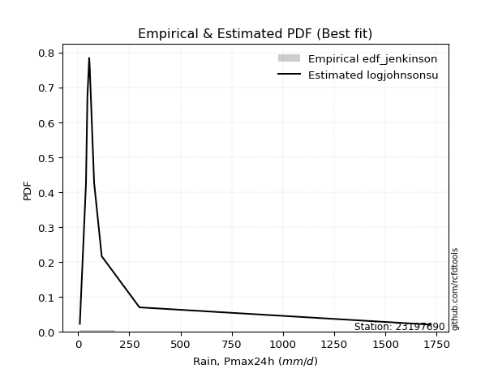</img>

</div>


### 11. Empirical - EDF Cunnane (1978)

Cunnane´s work in statistical hydrology has focused on the performance and evaluation of different probability distributions (such as GEV, Gumbel, Lognormal) for flood frequency estimation. _b_ is a constant, typically set to 0.4.

<div align="center">


$P=(m-b)/(n+1-2b)$


</div>


**11.1. Empirical values**

<div align="center">

|                | 0                    | 1                   | 2                   | 3                   | 4                   | 5                  | 6                  | 7                  | 8                  | 9                  |
|:---------------|:---------------------|:--------------------|:--------------------|:--------------------|:--------------------|:-------------------|:-------------------|:-------------------|:-------------------|:-------------------|
| date           | 2019                 | 2015                | 2025                | 2012                | 2014                | 2011               | 2013               | 2024               | 2017               | 2016               |
| x              | 8.99                 | 38.9                | 44.8                | 45.9                | 54.6                | 57.2               | 78.7               | 115.6              | 299.796            | 1722.086           |
| m              | 1                    | 2                   | 3                   | 4                   | 5                   | 6                  | 7                  | 8                  | 9                  | 10                 |
| empirical_dist | edf_cunnane          | edf_cunnane         | edf_cunnane         | edf_cunnane         | edf_cunnane         | edf_cunnane        | edf_cunnane        | edf_cunnane        | edf_cunnane        | edf_cunnane        |
| empirical      | 0.058823529411764705 | 0.15686274509803924 | 0.25490196078431376 | 0.35294117647058826 | 0.45098039215686275 | 0.5490196078431373 | 0.6470588235294118 | 0.7450980392156863 | 0.8431372549019608 | 0.9411764705882353 |
| empirical_tr   | 1.0625               | 1.1860465116279069  | 1.3421052631578947  | 1.5454545454545456  | 1.8214285714285712  | 2.217391304347826  | 2.8333333333333335 | 3.9230769230769234 | 6.375              | 16.999999999999996 |

</div>


**11.2. Kolmogorov-Smirnov fit test (sorted by Δ)**


<div align="center">

|                | 0                   | 1                   | 2                     | 3                   | 4                  | 5                   | 6                   | 7                   | 8                  | 9                   | 10                 | 11                 | 12                 | 13                 | 14                  | 15                  | 16                  | 17                  | 18                  | 19                  | 20                  | 21                  | 22                 | 23                  | 24                 | 25                  | 26                 | 27                  | 28                  | 29                  | 30                 | 31                  | 32                  | 33                 | 34                  | 35                  | 36                 | 37                  | 38                  | 39                  | 40                  | 41                  | 42                  | 43                  | 44                 | 45                  | 46                  | 47                  | 48                  | 49                 | 50                  | 51                 | 52                 | 53                 | 54                  | 55                  | 56                  | 57                  | 58                 | 59                  | 60                  | 61                 | 62                  | 63                 | 64                 | 65                 | 66                  | 67                  | 68                  | 69                  | 70                  | 71                  | 72                 | 73                 | 74                  | 75                  | 76                  | 77                  | 78                 | 79                 | 80                 | 81                  | 82                  | 83                 | 84                  | 85                 | 86                 | 87                  | 88                 | 89                 |
|:---------------|:--------------------|:--------------------|:----------------------|:--------------------|:-------------------|:--------------------|:--------------------|:--------------------|:-------------------|:--------------------|:-------------------|:-------------------|:-------------------|:-------------------|:--------------------|:--------------------|:--------------------|:--------------------|:--------------------|:--------------------|:--------------------|:--------------------|:-------------------|:--------------------|:-------------------|:--------------------|:-------------------|:--------------------|:--------------------|:--------------------|:-------------------|:--------------------|:--------------------|:-------------------|:--------------------|:--------------------|:-------------------|:--------------------|:--------------------|:--------------------|:--------------------|:--------------------|:--------------------|:--------------------|:-------------------|:--------------------|:--------------------|:--------------------|:--------------------|:-------------------|:--------------------|:-------------------|:-------------------|:-------------------|:--------------------|:--------------------|:--------------------|:--------------------|:-------------------|:--------------------|:--------------------|:-------------------|:--------------------|:-------------------|:-------------------|:-------------------|:--------------------|:--------------------|:--------------------|:--------------------|:--------------------|:--------------------|:-------------------|:-------------------|:--------------------|:--------------------|:--------------------|:--------------------|:-------------------|:-------------------|:-------------------|:--------------------|:--------------------|:-------------------|:--------------------|:-------------------|:-------------------|:--------------------|:-------------------|:-------------------|
| station        | 23197690            | 23197690            | 23197690              | 23197690            | 23197690           | 23197690            | 23197690            | 23197690            | 23197690           | 23197690            | 23197690           | 23197690           | 23197690           | 23197690           | 23197690            | 23197690            | 23197690            | 23197690            | 23197690            | 23197690            | 23197690            | 23197690            | 23197690           | 23197690            | 23197690           | 23197690            | 23197690           | 23197690            | 23197690            | 23197690            | 23197690           | 23197690            | 23197690            | 23197690           | 23197690            | 23197690            | 23197690           | 23197690            | 23197690            | 23197690            | 23197690            | 23197690            | 23197690            | 23197690            | 23197690           | 23197690            | 23197690            | 23197690            | 23197690            | 23197690           | 23197690            | 23197690           | 23197690           | 23197690           | 23197690            | 23197690            | 23197690            | 23197690            | 23197690           | 23197690            | 23197690            | 23197690           | 23197690            | 23197690           | 23197690           | 23197690           | 23197690            | 23197690            | 23197690            | 23197690            | 23197690            | 23197690            | 23197690           | 23197690           | 23197690            | 23197690            | 23197690            | 23197690            | 23197690           | 23197690           | 23197690           | 23197690            | 23197690            | 23197690           | 23197690            | 23197690           | 23197690           | 23197690            | 23197690           | 23197690           |
| empirical_dist | edf_cunnane         | edf_cunnane         | edf_cunnane           | edf_cunnane         | edf_cunnane        | edf_cunnane         | edf_cunnane         | edf_cunnane         | edf_cunnane        | edf_cunnane         | edf_cunnane        | edf_cunnane        | edf_cunnane        | edf_cunnane        | edf_cunnane         | edf_cunnane         | edf_cunnane         | edf_cunnane         | edf_cunnane         | edf_cunnane         | edf_cunnane         | edf_cunnane         | edf_cunnane        | edf_cunnane         | edf_cunnane        | edf_cunnane         | edf_cunnane        | edf_cunnane         | edf_cunnane         | edf_cunnane         | edf_cunnane        | edf_cunnane         | edf_cunnane         | edf_cunnane        | edf_cunnane         | edf_cunnane         | edf_cunnane        | edf_cunnane         | edf_cunnane         | edf_cunnane         | edf_cunnane         | edf_cunnane         | edf_cunnane         | edf_cunnane         | edf_cunnane        | edf_cunnane         | edf_cunnane         | edf_cunnane         | edf_cunnane         | edf_cunnane        | edf_cunnane         | edf_cunnane        | edf_cunnane        | edf_cunnane        | edf_cunnane         | edf_cunnane         | edf_cunnane         | edf_cunnane         | edf_cunnane        | edf_cunnane         | edf_cunnane         | edf_cunnane        | edf_cunnane         | edf_cunnane        | edf_cunnane        | edf_cunnane        | edf_cunnane         | edf_cunnane         | edf_cunnane         | edf_cunnane         | edf_cunnane         | edf_cunnane         | edf_cunnane        | edf_cunnane        | edf_cunnane         | edf_cunnane         | edf_cunnane         | edf_cunnane         | edf_cunnane        | edf_cunnane        | edf_cunnane        | edf_cunnane         | edf_cunnane         | edf_cunnane        | edf_cunnane         | edf_cunnane        | edf_cunnane        | edf_cunnane         | edf_cunnane        | edf_cunnane        |
| p_dist         | logjohnsonsu        | lognct              | loglaplace_asymmetric | loggibrat           | logt               | nct                 | loggenlogistic      | logfisk             | logmielke          | invgamma            | f                  | betaprime          | mielke             | logexponnorm       | logcrystalball      | lognorm             | lognorm             | logloggamma         | invgauss            | logweibull_min      | logalpha            | logncf              | logf               | loginvgamma         | logfatiguelife     | loginvgauss         | ncf                | logerlang           | loggamma            | loggamma            | logbetaprime       | loglogistic         | logmaxwell          | loggumbel_r        | logwald             | logpearson3         | t                  | loghypsecant        | loginvweibull       | lograyleigh         | logmoyal            | pareto              | logrice             | johnsonsu           | logkstwobign       | loglaplace          | loghalflogistic     | loggenexpon         | loghalfnorm         | loggompertz        | fatiguelife         | loggumbel_l        | chi2               | gibrat             | logtruncnorm        | erlang              | lognakagami         | weibull_min         | gumbel_r           | rayleigh            | moyal               | nakagami           | maxwell             | genlogistic        | wald               | halfnorm           | logexpon            | halflogistic        | alpha               | norm                | logistic            | pearson3            | hypsecant          | exponnorm          | laplace_asymmetric  | expon               | genexpon            | laplace             | kstwobign          | fisk               | rice               | gumbel_l            | gamma               | crystalball        | invweibull          | logchi2            | loglognorm         | logpareto           | truncnorm          | gompertz           |
| delta          | 0.04481930830970848 | 0.05617648429252209 | 0.09591603636031876   | 0.10813967921862339 | 0.1196238268109282 | 0.12591952518058558 | 0.14015473293614047 | 0.14038864545290633 | 0.1418843240102773 | 0.14332797146982781 | 0.1458429616816367 | 0.1458843498320194 | 0.1499328618972047 | 0.1504153875178241 | 0.15146463899457707 | 0.15146464021685047 | 0.15146464021685047 | 0.15199869187549353 | 0.15575928392776298 | 0.15686274506470027 | 0.15840621657022705 | 0.15884095080078783 | 0.1588930137397548 | 0.15890090602492976 | 0.1592669527652509 | 0.15933577029651194 | 0.1598743576236382 | 0.16009665491025835 | 0.16009728510307006 | 0.16009728510307006 | 0.160471868164848  | 0.16144084098430683 | 0.16363863328890207 | 0.1669569810483438 | 0.16849248550821092 | 0.17118722368497094 | 0.1717796820270347 | 0.17196065415937378 | 0.17378930176422178 | 0.17444333151639915 | 0.17559995660359837 | 0.17859265481712103 | 0.18034419534243387 | 0.18093621484167569 | 0.1879865167958186 | 0.19903266529186736 | 0.20167882302821424 | 0.20419430851017759 | 0.20489667543476517 | 0.2056345489461451 | 0.21907366724750565 | 0.2219567448068821 | 0.2519171740730924 | 0.255764710645649  | 0.25627824592944526 | 0.27540069489885566 | 0.27960120926615967 | 0.28569492206723945 | 0.2961632108330237 | 0.30269348941692387 | 0.30909578545716465 | 0.3129901743624226 | 0.31499443040884767 | 0.3245889573911237 | 0.3256900571619332 | 0.3312038351535849 | 0.33178156361208444 | 0.33300938973665917 | 0.34528000892512556 | 0.34891703811552255 | 0.36224902639113893 | 0.36677887273477094 | 0.3731222399972827 | 0.3898544699952523 | 0.39284773209991786 | 0.39285025546333885 | 0.39285026792514016 | 0.40051885568843343 | 0.4017255126168419 | 0.4045588859473065 | 0.4142541664157642 | 0.41502895364925446 | 0.43512138350005836 | 0.447881172713368  | 0.45114469102704235 | 0.4540179487317797 | 0.4590775961872622 | 0.49838134760520447 | 0.5195063725011595 | 0.5638972104077338 |
| deltao         | 0.3942745923300002  | 0.3942745923300002  | 0.3942745923300002    | 0.3942745923300002  | 0.3942745923300002 | 0.3942745923300002  | 0.3942745923300002  | 0.3942745923300002  | 0.3942745923300002 | 0.3942745923300002  | 0.3942745923300002 | 0.3942745923300002 | 0.3942745923300002 | 0.3942745923300002 | 0.3942745923300002  | 0.3942745923300002  | 0.3942745923300002  | 0.3942745923300002  | 0.3942745923300002  | 0.3942745923300002  | 0.3942745923300002  | 0.3942745923300002  | 0.3942745923300002 | 0.3942745923300002  | 0.3942745923300002 | 0.3942745923300002  | 0.3942745923300002 | 0.3942745923300002  | 0.3942745923300002  | 0.3942745923300002  | 0.3942745923300002 | 0.3942745923300002  | 0.3942745923300002  | 0.3942745923300002 | 0.3942745923300002  | 0.3942745923300002  | 0.3942745923300002 | 0.3942745923300002  | 0.3942745923300002  | 0.3942745923300002  | 0.3942745923300002  | 0.3942745923300002  | 0.3942745923300002  | 0.3942745923300002  | 0.3942745923300002 | 0.3942745923300002  | 0.3942745923300002  | 0.3942745923300002  | 0.3942745923300002  | 0.3942745923300002 | 0.3942745923300002  | 0.3942745923300002 | 0.3942745923300002 | 0.3942745923300002 | 0.3942745923300002  | 0.3942745923300002  | 0.3942745923300002  | 0.3942745923300002  | 0.3942745923300002 | 0.3942745923300002  | 0.3942745923300002  | 0.3942745923300002 | 0.3942745923300002  | 0.3942745923300002 | 0.3942745923300002 | 0.3942745923300002 | 0.3942745923300002  | 0.3942745923300002  | 0.3942745923300002  | 0.3942745923300002  | 0.3942745923300002  | 0.3942745923300002  | 0.3942745923300002 | 0.3942745923300002 | 0.3942745923300002  | 0.3942745923300002  | 0.3942745923300002  | 0.3942745923300002  | 0.3942745923300002 | 0.3942745923300002 | 0.3942745923300002 | 0.3942745923300002  | 0.3942745923300002  | 0.3942745923300002 | 0.3942745923300002  | 0.3942745923300002 | 0.3942745923300002 | 0.3942745923300002  | 0.3942745923300002 | 0.3942745923300002 |
| eval           | Δo > Δ              | Δo > Δ              | Δo > Δ                | Δo > Δ              | Δo > Δ             | Δo > Δ              | Δo > Δ              | Δo > Δ              | Δo > Δ             | Δo > Δ              | Δo > Δ             | Δo > Δ             | Δo > Δ             | Δo > Δ             | Δo > Δ              | Δo > Δ              | Δo > Δ              | Δo > Δ              | Δo > Δ              | Δo > Δ              | Δo > Δ              | Δo > Δ              | Δo > Δ             | Δo > Δ              | Δo > Δ             | Δo > Δ              | Δo > Δ             | Δo > Δ              | Δo > Δ              | Δo > Δ              | Δo > Δ             | Δo > Δ              | Δo > Δ              | Δo > Δ             | Δo > Δ              | Δo > Δ              | Δo > Δ             | Δo > Δ              | Δo > Δ              | Δo > Δ              | Δo > Δ              | Δo > Δ              | Δo > Δ              | Δo > Δ              | Δo > Δ             | Δo > Δ              | Δo > Δ              | Δo > Δ              | Δo > Δ              | Δo > Δ             | Δo > Δ              | Δo > Δ             | Δo > Δ             | Δo > Δ             | Δo > Δ              | Δo > Δ              | Δo > Δ              | Δo > Δ              | Δo > Δ             | Δo > Δ              | Δo > Δ              | Δo > Δ             | Δo > Δ              | Δo > Δ             | Δo > Δ             | Δo > Δ             | Δo > Δ              | Δo > Δ              | Δo > Δ              | Δo > Δ              | Δo > Δ              | Δo > Δ              | Δo > Δ             | Δo > Δ             | Δo > Δ              | Δo > Δ              | Δo > Δ              | Δo <= Δ             | Δo <= Δ            | Δo <= Δ            | Δo <= Δ            | Δo <= Δ             | Δo <= Δ             | Δo <= Δ            | Δo <= Δ             | Δo <= Δ            | Δo <= Δ            | Δo <= Δ             | Δo <= Δ            | Δo <= Δ            |
| fit            | 1                   | 1                   | 1                     | 1                   | 1                  | 1                   | 1                   | 1                   | 1                  | 1                   | 1                  | 1                  | 1                  | 1                  | 1                   | 1                   | 1                   | 1                   | 1                   | 1                   | 1                   | 1                   | 1                  | 1                   | 1                  | 1                   | 1                  | 1                   | 1                   | 1                   | 1                  | 1                   | 1                   | 1                  | 1                   | 1                   | 1                  | 1                   | 1                   | 1                   | 1                   | 1                   | 1                   | 1                   | 1                  | 1                   | 1                   | 1                   | 1                   | 1                  | 1                   | 1                  | 1                  | 1                  | 1                   | 1                   | 1                   | 1                   | 1                  | 1                   | 1                   | 1                  | 1                   | 1                  | 1                  | 1                  | 1                   | 1                   | 1                   | 1                   | 1                   | 1                   | 1                  | 1                  | 1                   | 1                   | 1                   | 0                   | 0                  | 0                  | 0                  | 0                   | 0                   | 0                  | 0                   | 0                  | 0                  | 0                   | 0                  | 0                  |
| n              | 10                  | 10                  | 10                    | 10                  | 10                 | 10                  | 10                  | 10                  | 10                 | 10                  | 10                 | 10                 | 10                 | 10                 | 10                  | 10                  | 10                  | 10                  | 10                  | 10                  | 10                  | 10                  | 10                 | 10                  | 10                 | 10                  | 10                 | 10                  | 10                  | 10                  | 10                 | 10                  | 10                  | 10                 | 10                  | 10                  | 10                 | 10                  | 10                  | 10                  | 10                  | 10                  | 10                  | 10                  | 10                 | 10                  | 10                  | 10                  | 10                  | 10                 | 10                  | 10                 | 10                 | 10                 | 10                  | 10                  | 10                  | 10                  | 10                 | 10                  | 10                  | 10                 | 10                  | 10                 | 10                 | 10                 | 10                  | 10                  | 10                  | 10                  | 10                  | 10                  | 10                 | 10                 | 10                  | 10                  | 10                  | 10                  | 10                 | 10                 | 10                 | 10                  | 10                  | 10                 | 10                  | 10                 | 10                 | 10                  | 10                 | 10                 |
| best_fit       | 1                   | 0                   | 0                     | 0                   | 0                  | 0                   | 0                   | 0                   | 0                  | 0                   | 0                  | 0                  | 0                  | 0                  | 0                   | 0                   | 0                   | 0                   | 0                   | 0                   | 0                   | 0                   | 0                  | 0                   | 0                  | 0                   | 0                  | 0                   | 0                   | 0                   | 0                  | 0                   | 0                   | 0                  | 0                   | 0                   | 0                  | 0                   | 0                   | 0                   | 0                   | 0                   | 0                   | 0                   | 0                  | 0                   | 0                   | 0                   | 0                   | 0                  | 0                   | 0                  | 0                  | 0                  | 0                   | 0                   | 0                   | 0                   | 0                  | 0                   | 0                   | 0                  | 0                   | 0                  | 0                  | 0                  | 0                   | 0                   | 0                   | 0                   | 0                   | 0                   | 0                  | 0                  | 0                   | 0                   | 0                   | 0                   | 0                  | 0                  | 0                  | 0                   | 0                   | 0                  | 0                   | 0                  | 0                  | 0                   | 0                  | 0                  |
| best_fit_sort  | 1                   | 2                   | 3                     | 4                   | 5                  | 6                   | 7                   | 8                   | 9                  | 10                  | 11                 | 12                 | 13                 | 14                 | 15                  | 16                  | 17                  | 18                  | 19                  | 20                  | 21                  | 22                  | 23                 | 24                  | 25                 | 26                  | 27                 | 28                  | 29                  | 30                  | 31                 | 32                  | 33                  | 34                 | 35                  | 36                  | 37                 | 38                  | 39                  | 40                  | 41                  | 42                  | 43                  | 44                  | 45                 | 46                  | 47                  | 48                  | 49                  | 50                 | 51                  | 52                 | 53                 | 54                 | 55                  | 56                  | 57                  | 58                  | 59                 | 60                  | 61                  | 62                 | 63                  | 64                 | 65                 | 66                 | 67                  | 68                  | 69                  | 70                  | 71                  | 72                  | 73                 | 74                 | 75                  | 76                  | 77                  | 78                  | 79                 | 80                 | 81                 | 82                  | 83                  | 84                 | 85                  | 86                 | 87                 | 88                  | 89                 | 90                 |

</div>


<div align="center">

</img>

</div>


**11.3. Best fit**

<div align="center">

|   id |   station | empirical_dist   | p_dist       |     delta |   deltao | eval   |   fit |   n |   best_fit |   best_fit_sort |
|-----:|----------:|:-----------------|:-------------|----------:|---------:|:-------|------:|----:|-----------:|----------------:|
|    0 |  23197690 | edf_cunnane      | logjohnsonsu | 0.0448193 | 0.394275 | Δo > Δ |     1 |  10 |          1 |               1 |

</div>


<div align="center">

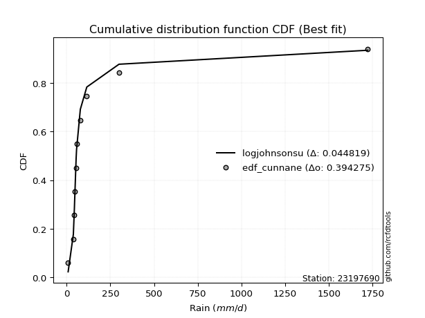</img>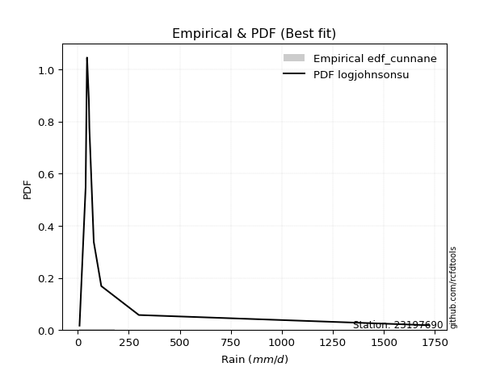</img>

</div>


### 12. Empirical - EDF Adamowski (1981)

The Adamowski formula in hydrology refers to a specific plotting position formula used for estimating the non-parametric empirical distribution of hydrological events (like flood peaks) to calculate their return periods. This formula provides an alternative to traditional parametric methods (like the Gumbel or Log Pearson Type III distributions). 

<div align="center">


$P=(m-0.25)/(n+0.5)$


</div>


**12.1. Empirical values**

<div align="center">

|                | 0                   | 1                   | 2                  | 3                   | 4                  | 5                  | 6                  | 7                  | 8                  | 9                  |
|:---------------|:--------------------|:--------------------|:-------------------|:--------------------|:-------------------|:-------------------|:-------------------|:-------------------|:-------------------|:-------------------|
| date           | 2019                | 2015                | 2025               | 2012                | 2014               | 2011               | 2013               | 2024               | 2017               | 2016               |
| x              | 8.99                | 38.9                | 44.8               | 45.9                | 54.6               | 57.2               | 78.7               | 115.6              | 299.796            | 1722.086           |
| m              | 1                   | 2                   | 3                  | 4                   | 5                  | 6                  | 7                  | 8                  | 9                  | 10                 |
| empirical_dist | edf_adamowski       | edf_adamowski       | edf_adamowski      | edf_adamowski       | edf_adamowski      | edf_adamowski      | edf_adamowski      | edf_adamowski      | edf_adamowski      | edf_adamowski      |
| empirical      | 0.07142857142857142 | 0.16666666666666666 | 0.2619047619047619 | 0.35714285714285715 | 0.4523809523809524 | 0.5476190476190477 | 0.6428571428571429 | 0.7380952380952381 | 0.8333333333333334 | 0.9285714285714286 |
| empirical_tr   | 1.0769230769230769  | 1.2                 | 1.3548387096774193 | 1.5555555555555558  | 1.826086956521739  | 2.210526315789474  | 2.8000000000000003 | 3.818181818181819  | 6.000000000000002  | 14.000000000000007 |

</div>


**12.2. Kolmogorov-Smirnov fit test (sorted by Δ)**


<div align="center">

|                | 0                   | 1                   | 2                     | 3                   | 4                   | 5                   | 6                   | 7                  | 8                  | 9                  | 10                 | 11                  | 12                  | 13                  | 14                  | 15                  | 16                  | 17                  | 18                  | 19                  | 20                  | 21                 | 22                  | 23                 | 24                  | 25                  | 26                  | 27                  | 28                  | 29                 | 30                  | 31                 | 32                 | 33                 | 34                  | 35                  | 36                  | 37                  | 38                 | 39                 | 40                  | 41                  | 42                  | 43                  | 44                  | 45                  | 46                  | 47                  | 48                 | 49                  | 50                 | 51                 | 52                  | 53                  | 54                  | 55                 | 56                 | 57                  | 58                 | 59                 | 60                 | 61                  | 62                 | 63                  | 64                  | 65                 | 66                 | 67                 | 68                  | 69                 | 70                  | 71                 | 72                  | 73                 | 74                  | 75                  | 76                  | 77                 | 78                  | 79                 | 80                 | 81                 | 82                  | 83                  | 84                 | 85                 | 86                  | 87                  | 88                 | 89                 |
|:---------------|:--------------------|:--------------------|:----------------------|:--------------------|:--------------------|:--------------------|:--------------------|:-------------------|:-------------------|:-------------------|:-------------------|:--------------------|:--------------------|:--------------------|:--------------------|:--------------------|:--------------------|:--------------------|:--------------------|:--------------------|:--------------------|:-------------------|:--------------------|:-------------------|:--------------------|:--------------------|:--------------------|:--------------------|:--------------------|:-------------------|:--------------------|:-------------------|:-------------------|:-------------------|:--------------------|:--------------------|:--------------------|:--------------------|:-------------------|:-------------------|:--------------------|:--------------------|:--------------------|:--------------------|:--------------------|:--------------------|:--------------------|:--------------------|:-------------------|:--------------------|:-------------------|:-------------------|:--------------------|:--------------------|:--------------------|:-------------------|:-------------------|:--------------------|:-------------------|:-------------------|:-------------------|:--------------------|:-------------------|:--------------------|:--------------------|:-------------------|:-------------------|:-------------------|:--------------------|:-------------------|:--------------------|:-------------------|:--------------------|:-------------------|:--------------------|:--------------------|:--------------------|:-------------------|:--------------------|:-------------------|:-------------------|:-------------------|:--------------------|:--------------------|:-------------------|:-------------------|:--------------------|:--------------------|:-------------------|:-------------------|
| station        | 23197690            | 23197690            | 23197690              | 23197690            | 23197690            | 23197690            | 23197690            | 23197690           | 23197690           | 23197690           | 23197690           | 23197690            | 23197690            | 23197690            | 23197690            | 23197690            | 23197690            | 23197690            | 23197690            | 23197690            | 23197690            | 23197690           | 23197690            | 23197690           | 23197690            | 23197690            | 23197690            | 23197690            | 23197690            | 23197690           | 23197690            | 23197690           | 23197690           | 23197690           | 23197690            | 23197690            | 23197690            | 23197690            | 23197690           | 23197690           | 23197690            | 23197690            | 23197690            | 23197690            | 23197690            | 23197690            | 23197690            | 23197690            | 23197690           | 23197690            | 23197690           | 23197690           | 23197690            | 23197690            | 23197690            | 23197690           | 23197690           | 23197690            | 23197690           | 23197690           | 23197690           | 23197690            | 23197690           | 23197690            | 23197690            | 23197690           | 23197690           | 23197690           | 23197690            | 23197690           | 23197690            | 23197690           | 23197690            | 23197690           | 23197690            | 23197690            | 23197690            | 23197690           | 23197690            | 23197690           | 23197690           | 23197690           | 23197690            | 23197690            | 23197690           | 23197690           | 23197690            | 23197690            | 23197690           | 23197690           |
| empirical_dist | edf_adamowski       | edf_adamowski       | edf_adamowski         | edf_adamowski       | edf_adamowski       | edf_adamowski       | edf_adamowski       | edf_adamowski      | edf_adamowski      | edf_adamowski      | edf_adamowski      | edf_adamowski       | edf_adamowski       | edf_adamowski       | edf_adamowski       | edf_adamowski       | edf_adamowski       | edf_adamowski       | edf_adamowski       | edf_adamowski       | edf_adamowski       | edf_adamowski      | edf_adamowski       | edf_adamowski      | edf_adamowski       | edf_adamowski       | edf_adamowski       | edf_adamowski       | edf_adamowski       | edf_adamowski      | edf_adamowski       | edf_adamowski      | edf_adamowski      | edf_adamowski      | edf_adamowski       | edf_adamowski       | edf_adamowski       | edf_adamowski       | edf_adamowski      | edf_adamowski      | edf_adamowski       | edf_adamowski       | edf_adamowski       | edf_adamowski       | edf_adamowski       | edf_adamowski       | edf_adamowski       | edf_adamowski       | edf_adamowski      | edf_adamowski       | edf_adamowski      | edf_adamowski      | edf_adamowski       | edf_adamowski       | edf_adamowski       | edf_adamowski      | edf_adamowski      | edf_adamowski       | edf_adamowski      | edf_adamowski      | edf_adamowski      | edf_adamowski       | edf_adamowski      | edf_adamowski       | edf_adamowski       | edf_adamowski      | edf_adamowski      | edf_adamowski      | edf_adamowski       | edf_adamowski      | edf_adamowski       | edf_adamowski      | edf_adamowski       | edf_adamowski      | edf_adamowski       | edf_adamowski       | edf_adamowski       | edf_adamowski      | edf_adamowski       | edf_adamowski      | edf_adamowski      | edf_adamowski      | edf_adamowski       | edf_adamowski       | edf_adamowski      | edf_adamowski      | edf_adamowski       | edf_adamowski       | edf_adamowski      | edf_adamowski      |
| p_dist         | logjohnsonsu        | lognct              | loglaplace_asymmetric | loggibrat           | nct                 | logt                | loggenlogistic      | logfisk            | logmielke          | invgamma           | f                  | betaprime           | mielke              | logexponnorm        | invgauss            | logcrystalball      | lognorm             | lognorm             | logloggamma         | logalpha            | logncf              | logf               | loginvgamma         | logfatiguelife     | loginvgauss         | ncf                 | logerlang           | loggamma            | loggamma            | logbetaprime       | logmaxwell          | loggumbel_r        | logwald            | loglogistic        | logpearson3         | loginvweibull       | lograyleigh         | logmoyal            | logweibull_min     | pareto             | t                   | logrice             | loghypsecant        | johnsonsu           | logkstwobign        | loghalflogistic     | loggenexpon         | loghalfnorm         | loggompertz        | loglaplace          | fatiguelife        | loggumbel_l        | gibrat              | chi2                | logtruncnorm        | erlang             | lognakagami        | weibull_min         | gumbel_r           | rayleigh           | moyal              | nakagami            | maxwell            | wald                | genlogistic         | halfnorm           | halflogistic       | logexpon           | alpha               | norm               | pearson3            | logistic           | hypsecant           | exponnorm          | laplace_asymmetric  | expon               | genexpon            | laplace            | kstwobign           | fisk               | rice               | gumbel_l           | gamma               | crystalball         | invweibull         | logchi2            | loglognorm          | logpareto           | truncnorm          | gompertz           |
| delta          | 0.04929585199499865 | 0.06037816496479098 | 0.09451547613622913   | 0.10113687809817523 | 0.12451896495649595 | 0.12662662793137636 | 0.13035081136751306 | 0.1305847238842789 | 0.1320804024416499 | 0.1335240499012004 | 0.1360390401130093 | 0.13608042826339198 | 0.14012894032857728 | 0.14061146594919668 | 0.14595536235913556 | 0.14726295832230818 | 0.14726295954458157 | 0.14726295954458157 | 0.14779701120322464 | 0.14860229500159963 | 0.14903702923216042 | 0.1490890921711274 | 0.14909698445630234 | 0.1494630311966235 | 0.14953184872788453 | 0.15007043605501078 | 0.15029273334163093 | 0.15029336353444264 | 0.15029336353444264 | 0.1506679465962206 | 0.15383471172027466 | 0.1571530594797164 | 0.1586885639395835 | 0.1600402807602172 | 0.16138330211634352 | 0.16398538019559436 | 0.16463940994777174 | 0.16579603503497095 | 0.1666666666333277 | 0.1687887332484936 | 0.17037912180294507 | 0.17054027377380646 | 0.17056009393528415 | 0.17113229327304827 | 0.17818259522719118 | 0.19187490145958683 | 0.19439038694155017 | 0.19509275386613775 | 0.1958306273775177 | 0.19763210506777773 | 0.2120708661270575 | 0.2177550641346132 | 0.24315966862884228 | 0.24491437295264423 | 0.24647432436081787 | 0.2683978937784075 | 0.2725984081457115 | 0.27589100049861204 | 0.283558168816217  | 0.2956906882964757 | 0.296490743440358  | 0.30598737324197445 | 0.3079916292883995 | 0.31308501514512654 | 0.31758615627067555 | 0.3185987931367782 | 0.3204043477198525 | 0.321977642043457  | 0.33547608735649814 | 0.3419142369950744 | 0.35417383071796427 | 0.3552462252706908 | 0.36611943887683457 | 0.3856527893229834 | 0.38864605142764896 | 0.38864857479106996 | 0.38864858725287127 | 0.3935160545679853 | 0.39472271149639376 | 0.3947549643786791 | 0.407251365295316  | 0.4080261525288063 | 0.42531746193143094 | 0.43527613069656135 | 0.4385396490102357 | 0.4442140271631523 | 0.44927367461863477 | 0.48857742603657706 | 0.5125035713807113 | 0.5568944092872856 |
| deltao         | 0.3942745923300002  | 0.3942745923300002  | 0.3942745923300002    | 0.3942745923300002  | 0.3942745923300002  | 0.3942745923300002  | 0.3942745923300002  | 0.3942745923300002 | 0.3942745923300002 | 0.3942745923300002 | 0.3942745923300002 | 0.3942745923300002  | 0.3942745923300002  | 0.3942745923300002  | 0.3942745923300002  | 0.3942745923300002  | 0.3942745923300002  | 0.3942745923300002  | 0.3942745923300002  | 0.3942745923300002  | 0.3942745923300002  | 0.3942745923300002 | 0.3942745923300002  | 0.3942745923300002 | 0.3942745923300002  | 0.3942745923300002  | 0.3942745923300002  | 0.3942745923300002  | 0.3942745923300002  | 0.3942745923300002 | 0.3942745923300002  | 0.3942745923300002 | 0.3942745923300002 | 0.3942745923300002 | 0.3942745923300002  | 0.3942745923300002  | 0.3942745923300002  | 0.3942745923300002  | 0.3942745923300002 | 0.3942745923300002 | 0.3942745923300002  | 0.3942745923300002  | 0.3942745923300002  | 0.3942745923300002  | 0.3942745923300002  | 0.3942745923300002  | 0.3942745923300002  | 0.3942745923300002  | 0.3942745923300002 | 0.3942745923300002  | 0.3942745923300002 | 0.3942745923300002 | 0.3942745923300002  | 0.3942745923300002  | 0.3942745923300002  | 0.3942745923300002 | 0.3942745923300002 | 0.3942745923300002  | 0.3942745923300002 | 0.3942745923300002 | 0.3942745923300002 | 0.3942745923300002  | 0.3942745923300002 | 0.3942745923300002  | 0.3942745923300002  | 0.3942745923300002 | 0.3942745923300002 | 0.3942745923300002 | 0.3942745923300002  | 0.3942745923300002 | 0.3942745923300002  | 0.3942745923300002 | 0.3942745923300002  | 0.3942745923300002 | 0.3942745923300002  | 0.3942745923300002  | 0.3942745923300002  | 0.3942745923300002 | 0.3942745923300002  | 0.3942745923300002 | 0.3942745923300002 | 0.3942745923300002 | 0.3942745923300002  | 0.3942745923300002  | 0.3942745923300002 | 0.3942745923300002 | 0.3942745923300002  | 0.3942745923300002  | 0.3942745923300002 | 0.3942745923300002 |
| eval           | Δo > Δ              | Δo > Δ              | Δo > Δ                | Δo > Δ              | Δo > Δ              | Δo > Δ              | Δo > Δ              | Δo > Δ             | Δo > Δ             | Δo > Δ             | Δo > Δ             | Δo > Δ              | Δo > Δ              | Δo > Δ              | Δo > Δ              | Δo > Δ              | Δo > Δ              | Δo > Δ              | Δo > Δ              | Δo > Δ              | Δo > Δ              | Δo > Δ             | Δo > Δ              | Δo > Δ             | Δo > Δ              | Δo > Δ              | Δo > Δ              | Δo > Δ              | Δo > Δ              | Δo > Δ             | Δo > Δ              | Δo > Δ             | Δo > Δ             | Δo > Δ             | Δo > Δ              | Δo > Δ              | Δo > Δ              | Δo > Δ              | Δo > Δ             | Δo > Δ             | Δo > Δ              | Δo > Δ              | Δo > Δ              | Δo > Δ              | Δo > Δ              | Δo > Δ              | Δo > Δ              | Δo > Δ              | Δo > Δ             | Δo > Δ              | Δo > Δ             | Δo > Δ             | Δo > Δ              | Δo > Δ              | Δo > Δ              | Δo > Δ             | Δo > Δ             | Δo > Δ              | Δo > Δ             | Δo > Δ             | Δo > Δ             | Δo > Δ              | Δo > Δ             | Δo > Δ              | Δo > Δ              | Δo > Δ             | Δo > Δ             | Δo > Δ             | Δo > Δ              | Δo > Δ             | Δo > Δ              | Δo > Δ             | Δo > Δ              | Δo > Δ             | Δo > Δ              | Δo > Δ              | Δo > Δ              | Δo > Δ             | Δo <= Δ             | Δo <= Δ            | Δo <= Δ            | Δo <= Δ            | Δo <= Δ             | Δo <= Δ             | Δo <= Δ            | Δo <= Δ            | Δo <= Δ             | Δo <= Δ             | Δo <= Δ            | Δo <= Δ            |
| fit            | 1                   | 1                   | 1                     | 1                   | 1                   | 1                   | 1                   | 1                  | 1                  | 1                  | 1                  | 1                   | 1                   | 1                   | 1                   | 1                   | 1                   | 1                   | 1                   | 1                   | 1                   | 1                  | 1                   | 1                  | 1                   | 1                   | 1                   | 1                   | 1                   | 1                  | 1                   | 1                  | 1                  | 1                  | 1                   | 1                   | 1                   | 1                   | 1                  | 1                  | 1                   | 1                   | 1                   | 1                   | 1                   | 1                   | 1                   | 1                   | 1                  | 1                   | 1                  | 1                  | 1                   | 1                   | 1                   | 1                  | 1                  | 1                   | 1                  | 1                  | 1                  | 1                   | 1                  | 1                   | 1                   | 1                  | 1                  | 1                  | 1                   | 1                  | 1                   | 1                  | 1                   | 1                  | 1                   | 1                   | 1                   | 1                  | 0                   | 0                  | 0                  | 0                  | 0                   | 0                   | 0                  | 0                  | 0                   | 0                   | 0                  | 0                  |
| n              | 10                  | 10                  | 10                    | 10                  | 10                  | 10                  | 10                  | 10                 | 10                 | 10                 | 10                 | 10                  | 10                  | 10                  | 10                  | 10                  | 10                  | 10                  | 10                  | 10                  | 10                  | 10                 | 10                  | 10                 | 10                  | 10                  | 10                  | 10                  | 10                  | 10                 | 10                  | 10                 | 10                 | 10                 | 10                  | 10                  | 10                  | 10                  | 10                 | 10                 | 10                  | 10                  | 10                  | 10                  | 10                  | 10                  | 10                  | 10                  | 10                 | 10                  | 10                 | 10                 | 10                  | 10                  | 10                  | 10                 | 10                 | 10                  | 10                 | 10                 | 10                 | 10                  | 10                 | 10                  | 10                  | 10                 | 10                 | 10                 | 10                  | 10                 | 10                  | 10                 | 10                  | 10                 | 10                  | 10                  | 10                  | 10                 | 10                  | 10                 | 10                 | 10                 | 10                  | 10                  | 10                 | 10                 | 10                  | 10                  | 10                 | 10                 |
| best_fit       | 1                   | 0                   | 0                     | 0                   | 0                   | 0                   | 0                   | 0                  | 0                  | 0                  | 0                  | 0                   | 0                   | 0                   | 0                   | 0                   | 0                   | 0                   | 0                   | 0                   | 0                   | 0                  | 0                   | 0                  | 0                   | 0                   | 0                   | 0                   | 0                   | 0                  | 0                   | 0                  | 0                  | 0                  | 0                   | 0                   | 0                   | 0                   | 0                  | 0                  | 0                   | 0                   | 0                   | 0                   | 0                   | 0                   | 0                   | 0                   | 0                  | 0                   | 0                  | 0                  | 0                   | 0                   | 0                   | 0                  | 0                  | 0                   | 0                  | 0                  | 0                  | 0                   | 0                  | 0                   | 0                   | 0                  | 0                  | 0                  | 0                   | 0                  | 0                   | 0                  | 0                   | 0                  | 0                   | 0                   | 0                   | 0                  | 0                   | 0                  | 0                  | 0                  | 0                   | 0                   | 0                  | 0                  | 0                   | 0                   | 0                  | 0                  |
| best_fit_sort  | 1                   | 2                   | 3                     | 4                   | 5                   | 6                   | 7                   | 8                  | 9                  | 10                 | 11                 | 12                  | 13                  | 14                  | 15                  | 16                  | 17                  | 18                  | 19                  | 20                  | 21                  | 22                 | 23                  | 24                 | 25                  | 26                  | 27                  | 28                  | 29                  | 30                 | 31                  | 32                 | 33                 | 34                 | 35                  | 36                  | 37                  | 38                  | 39                 | 40                 | 41                  | 42                  | 43                  | 44                  | 45                  | 46                  | 47                  | 48                  | 49                 | 50                  | 51                 | 52                 | 53                  | 54                  | 55                  | 56                 | 57                 | 58                  | 59                 | 60                 | 61                 | 62                  | 63                 | 64                  | 65                  | 66                 | 67                 | 68                 | 69                  | 70                 | 71                  | 72                 | 73                  | 74                 | 75                  | 76                  | 77                  | 78                 | 79                  | 80                 | 81                 | 82                 | 83                  | 84                  | 85                 | 86                 | 87                  | 88                  | 89                 | 90                 |

</div>


<div align="center">

</img>

</div>


**12.3. Best fit**

<div align="center">

|   id |   station | empirical_dist   | p_dist       |     delta |   deltao | eval   |   fit |   n |   best_fit |   best_fit_sort |
|-----:|----------:|:-----------------|:-------------|----------:|---------:|:-------|------:|----:|-----------:|----------------:|
|    0 |  23197690 | edf_adamowski    | logjohnsonsu | 0.0492959 | 0.394275 | Δo > Δ |     1 |  10 |          1 |               1 |

</div>


<div align="center">

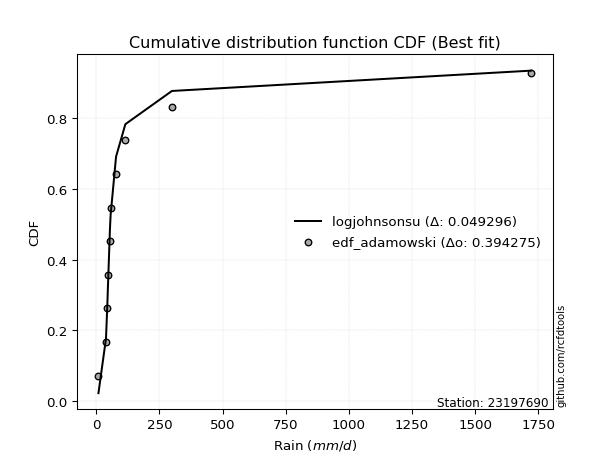</img>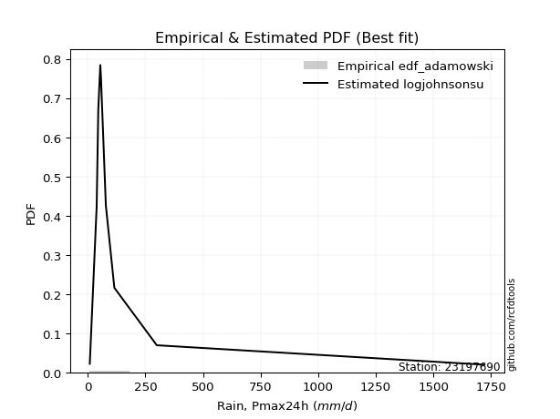</img>

</div>


## C. Best fit & Estimate extreme values for specific return periods - Tr


### 1. Best fit (ordered by delta Δ)

<div align="center">

|   id |   station | empirical_dist   | p_dist       |     delta |   deltao | eval   |   fit |   n |   best_fit |   best_fit_sort |
|-----:|----------:|:-----------------|:-------------|----------:|---------:|:-------|------:|----:|-----------:|----------------:|
|    0 |  23197690 | edf_hazen        | logjohnsonsu | 0.0418781 | 0.394275 | Δo > Δ |     1 |  10 |          1 |               1 |
|    1 |  23197690 | edf_gringorten   | logjohnsonsu | 0.0436568 | 0.394275 | Δo > Δ |     1 |  10 |          1 |               2 |
|    2 |  23197690 | edf_cunnane      | logjohnsonsu | 0.0448193 | 0.394275 | Δo > Δ |     1 |  10 |          1 |               3 |
|    3 |  23197690 | edf_blom         | logjohnsonsu | 0.0455367 | 0.394275 | Δo > Δ |     1 |  10 |          1 |               4 |
|    4 |  23197690 | edf_tukey        | logjohnsonsu | 0.0467168 | 0.394275 | Δo > Δ |     1 |  10 |          1 |               5 |
|    5 |  23197690 | edf_filliben     | logjohnsonsu | 0.0471603 | 0.394275 | Δo > Δ |     1 |  10 |          1 |               6 |
|    6 |  23197690 | edf_beard        | logjohnsonsu | 0.0473695 | 0.394275 | Δo > Δ |     1 |  10 |          1 |               7 |
|    7 |  23197690 | edf_jenkinson    | logjohnsonsu | 0.0473695 | 0.394275 | Δo > Δ |     1 |  10 |          1 |               8 |
|    8 |  23197690 | edf_chegodayev   | logjohnsonsu | 0.0476474 | 0.394275 | Δo > Δ |     1 |  10 |          1 |               9 |
|    9 |  23197690 | edf_adamowski    | logjohnsonsu | 0.0492959 | 0.394275 | Δo > Δ |     1 |  10 |          1 |              10 |
|   10 |  23197690 | edf_weibull      | lognct       | 0.0668717 | 0.394275 | Δo > Δ |     1 |  10 |          1 |              11 |
|   11 |  23197690 | edf_california   | logt         | 0.0745434 | 0.394275 | Δo > Δ |     1 |  10 |          1 |              12 |

</div>

:file_folder:Tables: [bestfit_23197690.csv](table/bestfit_23197690.csv) | [extreme_23197690.csv](table/extreme_23197690.csv)


### 2. Extreme values

In hydrology, a return period (or recurrence interval $Tr$) is the statistical average time between extreme events like floods or droughts of a specific magnitude, indicating how rare an event is, with a 100-year flood, for example, having a 1% chance of occurring in any given year, not that it happens exactly every century. It is a key tool for infrastructure design (like bridges or dams) and risk assessment, calculated from historical data to determine the probability of future events, although it is important to remember it is statistical average, and events can cluster or be missed.

> risk_rate: assuming the return period as the project useful life.

|   id |      tr |   prob_l |     prob_g |      alpha |   betaprime |     chi2 |   crystalball |   erlang |    expon |   exponnorm |          f |   fatiguelife |        fisk |     gamma |   genexpon |   genlogistic |    gibrat |   gompertz |   gumbel_l |   gumbel_r |   halflogistic |   halfnorm |   hypsecant |   invgamma |   invgauss |       invweibull |   johnsonsu |   kstwobign |   laplace |   laplace_asymmetric |   loggamma |   logistic |   lognorm |   maxwell |     mielke |    moyal |   nakagami |        ncf |        nct |     norm |     pareto |   pearson3 |   rayleigh |     rice |           t |   truncnorm |      wald |      weibull_min |   logalpha |   logbetaprime |          logchi2 |   logcrystalball |   logerlang |         logexpon |   logexponnorm |       logf |   logfatiguelife |     logfisk |   loggenexpon |   loggenlogistic |        loggibrat |   loggompertz |   loggumbel_l |   loggumbel_r |   loghalflogistic |   loghalfnorm |   loghypsecant |   loginvgamma |   loginvgauss |   loginvweibull |     logjohnsonsu |   logkstwobign |   loglaplace |   loglaplace_asymmetric |   logloggamma |   loglogistic |     loglognorm |   logmaxwell |   logmielke |    logmoyal |      lognakagami |     logncf |           lognct |     logpareto |   logpearson3 |   lograyleigh |    logrice |             logt |   logtruncnorm |          logwald |   logweibull_min |   station |   n |   risk_rate |
|-----:|--------:|---------:|-----------:|-----------:|------------:|---------:|--------------:|---------:|---------:|------------:|-----------:|--------------:|------------:|----------:|-----------:|--------------:|----------:|-----------:|-----------:|-----------:|---------------:|-----------:|------------:|-----------:|-----------:|-----------------:|------------:|------------:|----------:|---------------------:|-----------:|-----------:|----------:|----------:|-----------:|---------:|-----------:|-----------:|-----------:|---------:|-----------:|-----------:|-----------:|---------:|------------:|------------:|----------:|-----------------:|-----------:|---------------:|-----------------:|-----------------:|------------:|-----------------:|---------------:|-----------:|-----------------:|------------:|--------------:|-----------------:|-----------------:|--------------:|--------------:|--------------:|------------------:|--------------:|---------------:|--------------:|--------------:|----------------:|-----------------:|---------------:|-------------:|------------------------:|--------------:|--------------:|---------------:|-------------:|------------:|------------:|-----------------:|-----------:|-----------------:|--------------:|--------------:|--------------:|-----------:|-----------------:|---------------:|-----------------:|-----------------:|----------:|----:|------------:|
|    0 |    2    | 0.5      | 0.5        |    38.7054 |     69.2119 |  120.145 |     -0.349451 |  131.444 |  173.728 |     171.878 |    69.2135 |       102.865 |     30.8389 |   19.5824 |    173.728 |       157.451 |   97.2178 |    343.855 |    328.447 |    164.868 |        124.206 |    144.747 |     246.657 |    69.3244 |    74.8435 |   2964.77        |     69.7545 |     238.462 |   246.657 |              173.726 |    69.1817 |    246.657 |   79.8583 |   204.078 |    67.5105 |  138.463 |    176.341 |    70.0271 |    69.0915 |  246.657 |    66.9957 |     65.082 |    188.976 |  278.31  |     48.815  |     295.989 |   85.2738 |     74.2791      |    67.9903 |        68.1374 |     24.2407      |          79.8583 |     69.1819 |     40.8556      |        65.997  |    68.3104 |          68.8844 |     66.325  |       63.2813 |          68.9255 |     53.6849      |       67.0997 |       99.2457 |       64.2582 |           57.676  |       60.9125 |        79.8583 |       68.3064 |       68.8461 |         65.2675 |     55.3317      |        64.8058 |      79.8583 |                 63.1382 |       80.0324 |       79.8583 |   9.5436       |      71.3148 |     66.1039 |     59.904  |     42.8583      |    68.2756 |    56.4399       |   9.46597     |       66.1086 |       68.5096 |    67.6912 |     52.9646      |        56.428  |     52.0077      |     66.3831      |  23197690 |  10 |    0.75     |
|    1 |    2.33 | 0.570815 | 0.429185   |    46.07   |     85.7896 |  176.728 |     98.8135   |  175.204 |  210.025 |     207.829 |    85.7888 |       141.451 |     40.3908 |   32.8671 |    210.025 |       197.256 |  142.222  |    406.493 |    405.74  |    247.19  |        208.846 |    240.631 |     317.758 |    85.7618 |    97.4116 | 167849           |     90.6998 |     298.853 |   300.42  |              210.023 |    87.2839 |    324.933 |  101.123  |   296.379 |    83.0556 |  216.392 |    261.695 |    87.469  |    83.1121 |  335.499 |    85.2131 |    130.885 |    282.642 |  349.671 |     51.9318 |     358.229 |  143.529  |    171.319       |    85.1008 |        85.5641 |     32.2273      |         101.123  |     87.2841 |     57.0318      |        81.0207 |    85.696  |          86.7081 |     80.3465 |       82.3931 |          84.6157 |     60.505       |       89.9034 |      121.875  |       79.9715 |           72.2236 |       78.5897 |        96.4663 |       85.6928 |       86.6526 |         82.5215 |     60.8312      |        83.4802 |      92.1228 |                 74.7077 |      101.918  |       98.3235 |  13.605        |      91.1387 |     80.035  |     73.6871 |     47.7342      |    85.6303 |    61.9558       |  11.0255      |       83.4928 |       87.8719 |    87.1325 |     57.4947      |        78.3864 |     60.7154      |     79.5179      |  23197690 |  10 |    0.729209 |
|    2 |    5    | 0.8      | 0.2        |   103.176  |    209.741  |  569.707 |    467.33     |  432.08  |  391.501 |     387.58  |   209.721  |       417.251 |    136.373  |  221.521  |    391.501 |       370.173 |  401.322  |    678.107 |    655.444 |    604.835 |        591.827 |    646.112 |     602.958 |   208.527  |   283.392  |      7.01517e+12 |    250.744  |     555.383 |   569.224 |              391.496 |   224.886  |    627.168 |  243.156  |   659.668 |   195.199  |  577.364 |    773.442 |   210.132  |   188.227  |  665.661 |   223.464  |    499.283 |    657.63  |  635.358 |     76.1727 |     661.574 |  469.64   |   3087.02        |   215.965  |       218.879  |    150.546       |         243.156  |    224.886  |    302.28        |       198.304  |   218.522  |         222.551  |    182.092  |      241.521  |         198.105  |    120.453       |      273.287  |      236.643  |      206.865  |          199.839  |      230.849  |       205.835  |      218.585  |      222.431  |        228.633  |    128.319       |       244.743  |     188.187  |                173.267  |      249.462  |      219.513  |   1.01311e+241 |     239.314  |    180.42   |    192.301  |    158.596       |   218.103  |   124.092        |   1.76469e+86 |      221.948  |      238.022  |   239.413  |     86.6329      |       288.619  |    144.432       |    242.675       |  23197690 |  10 |    0.67232  |
|    3 |   10    | 0.9      | 0.1        |   208.094  |    422.291  | 1025.18  |    711.794    |  696.865 |  556.239 |     550.752 |   422.237  |       742.149 |    366.266  |  552.987  |    556.239 |       511.005 |  696.666  |    880.381 |    794.468 |    896.132 |        909.876 |    946.158 |     830.698 |   419.033  |   590.656  |      1.1307e+19  |    501.995  |     750.697 |   813.236 |              556.233 |   453.772  |    849.753 |  435.164  |   915.333 |   380.036  |  891.646 |   1237.66  |   403.692  |   376.569  |  884.682 |   459.598  |    865.746 |    925.004 |  839.059 |    153.108  |     920.045 |  815.72   |  15848.3         |   442.857  |       447.02   |    670.428       |         435.163  |    453.773  |   1373.73        |       424.982  |   446.05   |         451.144  |    363.102  |      526.9    |         385.919  |    264.042       |      559.081  |      342.404  |      448.608  |          465.312  |      512.402  |       377.008  |      446.408  |      451.19   |        524.336  |    476.281       |       555.094  |     359.914  |                371.852  |      450.488  |      396.59   | inf            |     472.091  |    357.905  |    443.292  |    737.532       |   444.695  |   489.206        | inf           |      469.019  |      484.381  |   492.199  |    155.295       |       620.843  |    362.305       |    854.921       |  23197690 |  10 |    0.651322 |
|    4 |   15    | 0.933333 | 0.0666667  |   312.637  |    622.791  | 1317.75  |    833.786    |  859.821 |  652.605 |     646.202 |   622.707  |       950.654 |    635.659  |  797.607  |    652.605 |       590.46  |  900.381  |    984.512 |    857.428 |   1060.48  |       1089.86  |   1102.3   |     960.668 |   617.672  |   841.788  |      3.59299e+22 |    711.847  |     854.386 |   955.974 |              652.597 |   658.983  |    971.028 |  581.82   |  1046.51  |   550.373  | 1074.04  |   1490.56  |   575.86   |   561.987  |  993.978 |   680.419  |   1088.22  |   1062.77  |  944.015 |    273.88   |    1059.86  | 1037.96   |  33270.4         |   656.922  |       658.298  |   1644.78        |         581.82   |    658.984  |   3330.5         |       662.212  |   657.277  |         658.706  |    547.67   |      790.207  |         559.451  |    453.711       |      787.895  |      404.762  |      694.284  |          750.706  |      775.915  |       532.533  |      658.056  |      659.146  |        837.499  |   1557.79        |       857.388  |     525.932  |                581.266  |      604.52   |      547.398  | inf            |     668.985  |    538.551  |    719.763  |   1830.76        |   654.797  |  2146.89         | inf           |      702.63   |      698.518  |   713.524  |    267.403       |       840.305  |    653.972       |   1954.04        |  23197690 |  10 |    0.644736 |
|    5 |   20    | 0.95     | 0.05       |   417.088  |    815.991  | 1533.81  |    913.676    |  978.048 |  720.977 |     713.924 |   815.88   |      1104.29  |    933.065  |  988.198  |    720.977 |       646.092 | 1060.18   |   1053.23  |    896.618 |   1175.55  |       1215.97  |   1206.4   |    1052.36  |   809.129  |  1052.77   |      1.01752e+25 |    895.392  |     924.234 |  1057.25  |              720.969 |   848.432  |   1054.85  |  703.708  |  1133.57  |   712.29   | 1203.22  |   1661.2   |   735.64   |   745.961  | 1065.55  |   891.848  |   1248.68  |   1154.33  | 1013.78  |    436.933  |    1152.33  | 1203.57   |  52792.5         |   862.978  |       858.418  |   3133.04        |         703.708  |    848.432  |   6243           |       907.037  |   857.809  |         852.196  |    738.961  |     1035.69   |         724.656  |    693.749       |      980.609  |      449.188  |      942.626  |         1049.56   |     1023.2    |       679.456  |      859.083  |      853.172  |       1162.47   |   4612.07        |      1149.12   |     688.349  |                798.039  |      732.703  |      683.974  | inf            |     843.119  |    725.774  |   1014.54   |   3426.5         |   854.087  | 10215.4          | inf           |      925.989  |      890.95   |   913.269  |    453.759       |       989.571  |   1015.52        |   3642.48        |  23197690 |  10 |    0.641514 |
|    6 |   25    | 0.96     | 0.04       |   521.503  |   1003.97   | 1705.43  |    972.486    | 1070.99  |  774.011 |     766.454 |  1003.83   |      1226.09  |   1252.75   | 1144.15   |    774.011 |       688.943 | 1193.4    |   1103.94  |    924.506 |   1264.19  |       1313.13  |   1283.86  |    1123.31  |   995.45   |  1234.85   |      7.87582e+26 |   1060.39   |     976.552 |  1135.8   |              774.003 |  1026.25   |   1118.97  |  809.468  |  1198.2   |   868.319  | 1303.34  |   1788.8   |   886.836  |   928.961  | 1118.24  |  1096.56   |   1374.39  |   1222.37  | 1065.61  |    641.015  |    1219.54  | 1336.22   |  73328           |  1063.32   |      1050.28   |   5183.48        |         809.468  |   1026.25   |  10163.8         |      1157.71   |  1050.46   |        1035.24   |    937.654  |     1266.97   |         884.025  |    988.433       |     1148.45   |      483.741  |     1192.98   |         1358.75   |     1257.04   |       820.454  |     1052.28   |     1036.86   |       1496.47   |  12633.4         |      1430.99   |     848.139  |               1020.45   |      843.999  |      811.041  | inf            |    1001.1    |    920.351  |   1323.79   |   5498.04        |  1045.42   | 51835.7          | inf           |     1141.22   |     1067.5    |  1097.08   |    763.504       |      1096.51   |   1444.72        |   6021.01        |  23197690 |  10 |    0.639603 |
|    7 |   50    | 0.98     | 0.02       |  1043.41   |   1895.25   | 2256.59  |   1140.89     | 1365.27  |  938.75  |     929.627 |  1895      |      1615.96  |   3091.94   | 1664.87   |    938.75  |       820.946 | 1662.99   |   1248.93  |   1000.21  |   1537.23  |       1612.48  |   1509     |    1343.32  |  1879.23   |  1897.91   |      5.18375e+32 |   1722.71   |    1130.19  |  1379.82  |              938.739 |  1805.81   |   1314.89  | 1208.73   |  1385.65  |  1595.08   | 1614.17  |   2161.04  |  1566.37   |  1835.09   | 1269.12  |  2057.83   |   1770.47  |   1419.85  | 1216.06  |   2248.7    |    1399.03  | 1769.32   | 178917           |  2013.4    |      1931.08   |  25173.8         |        1208.73   |   1805.81   |  46190.2         |      2470.46   |  1939.05   |        1851.1    |   2042.79   |     2280.4    |        1627.8    |   3442.74        |     1779.12   |      591.535  |     2464.6    |         3010.44   |     2286.54   |      1472.16   |     1944.12   |     1856.75   |       3258.02   | 912674           |      2725.18   |    1622.1    |               2190.02   |     1264.46   |     1365.04   | inf            |    1647.43   |   2005.64   |   3023.71   |  22072.3         |  1926.66   |     3.43934e+08  | inf           |     2134.19   |     1804.2    |  1868.19   |   9627.32        |      1361.95   |   4566.98        |  31759.7         |  23197690 |  10 |    0.63583  |
|    8 |   75    | 0.986667 | 0.0133333  |  1565.25   |   2737.53   | 2589.19  |   1231.26     | 1540.56  | 1035.12  |    1025.08  |  2737.18   |      1850.35  |   5216.84   | 1989.77   |   1035.12  |       897.671 | 1980.16   |   1326.22  |   1038.49  |   1695.93  |       1786.5   |   1631.55  |    1471.88  |  2714.79   |  2348.74   |      1.24879e+36 |   2236.01   |    1214.71  |  1522.55  |             1035.1   |  2476.12   |   1428.04  | 1498.86   |  1487.56  |  2269.32   | 1795.93  |   2363.82  |  2172.54   |  2732.19   | 1350.08  |  2956.76   |   2005.34  |   1527.29  | 1297.92  |   4788.77   |    1481.5   | 2035.84   | 280900           |  2914.27   |      2732.27   |  64042.4         |        1498.86   |   2476.12   | 111985           |      3848.89   |  2752.24   |        2566.56   |   3325.06   |     3144.56   |        2319.25   |   7997.29        |     2229.92   |      654.878  |     3757.53   |         4780.38   |     3166.78   |      2071.72   |     2761.04   |     2577.01   |       5120.91   |      3.07422e+07 |      3884.33   |    2370.33   |               3423.36   |     1570.07   |     1843.88   | inf            |    2159.83   |   3271.15   |   4901.31   |  47178.7         |  2731.79   |     4.96763e+12  | inf           |     3037.32   |     2400.38   |  2495.7    | 114023           |      1469.58   |   9272.81        |  89817.2         |  23197690 |  10 |    0.634587 |
|    9 |  100    | 0.99     | 0.01       |  2087.06   |   3549.52   | 2828.85  |   1292.37     | 1666.08  | 1103.49  |    1092.8   |  3549.08   |      2018.88  |   7549.73   | 2227.53   |   1103.49  |       951.974 | 2225.85   |   1378.17  |   1063.53  |   1808.26  |       1909.66  |   1715.04  |    1563.08  |  3520.54   |  2694.01   |      3.09051e+38 |   2667.67   |    1272.63  |  1623.83  |             1103.48  |  3080.81   |   1507.93  | 1733.62   |  1556.97  |  2911.78   | 1924.89  |   2501.83  |  2735.53   |  3623.57   | 1404.84  |  3817.46   |   2173.14  |   1600.49  | 1353.68  |   8220.42   |    1529.83  | 2230.15   | 377303           |  3787.08   |      3484.64   | 124641           |        1733.62   |   3080.81   | 209914           |      5271.78   |  3519.34   |        3220.87   |   4773.58   |     3916.51   |        2978.95   |  15363.8         |     2588.79   |      699.935  |     5064.47   |         6631.44   |     3953.41   |      2639.87   |     3532.13   |     3236.5    |       7052.57   |      6.57997e+08 |      4951.95   |    3102.32   |               4700.05   |     1817.33   |     2279.98   | inf            |    2597.34   |   4707.43   |   6904.58   |  79114.3         |  3490.42   |     1.23607e+17  | inf           |     3882.43   |     2915.78   |  3040.03   |      1.30043e+06 |      1527.73   |  15540.6         | 193149           |  23197690 |  10 |    0.633968 |
|   10 |  200    | 0.995    | 0.005      |  4174.29   |   6620.18   | 3416.69  |   1431.01     | 1971.76  | 1268.23  |    1255.97  |  6619.44   |      2431.16  |  18333.7    | 2820.57   |   1268.23  |      1082.52  | 2894.3    |   1494.74  |   1117.96  |   2078.3   |       2205.77  |   1905.99  |    1782.79  |  6568.95   |  3602.98   |      1.75527e+44 |   3982.32   |    1406.02  |  1867.84  |             1268.21  |  5133.89   |   1699.57  | 2411.55   |  1715.78  |  5299.21   | 2235.58  |   2816.77  |  4747.38   |  7154.32   | 1529.04  |  7038.54   |   2580.72  |   1767.97  | 1481.28  |  30402.6    |    1614.88  | 2714.17   | 716495           |  7132.78   |      6214.54   | 626090           |        2411.55   |   5133.87   | 953969           |     11249.6    |  6324.43   |        5491.49   |  12111.9    |     6484.09   |        5435.16   |  90770.7         |     3594.21   |      808.853  |    10379.6    |        14566.1    |     6566.66   |      4733.07   |     6354.77   |     5529.57   |      15223.6    |      1.18586e+13 |      8663.16   |    5933.31   |              10086.9    |     2530.95   |     3794      | inf            |    3961.06   |  12059.2    |  15765.4    | 256967           |  6259.33   |     1.77146e+36  | inf           |     6916.12   |     4550.32   |  4774.58   |      1.76068e+10 |      1620.96   |  56242.9         |      1.3381e+06  |  23197690 |  10 |    0.633042 |
|   11 |  250    | 0.996    | 0.004      |  5217.89   |   8086.95   | 3608.61  |   1473.37     | 2071.01  | 1321.26  |    1308.5   |  8086.08   |      2565.47  |  24378      | 3016.63   |   1321.26  |      1124.49  | 3134.14   |   1529.97  |   1133.97  |   2165.11  |       2300.96  |   1964.73  |    1853.52  |  8025.62   |  3916.43   |      1.24243e+46 |   4501.3    |    1447.3   |  1946.39  |             1321.25  |  6026.18   |   1761.09  | 2667.48   |  1764.67  |  6423.49   | 2335.6   |   2913.41  |  5664.45   |  8905.79   | 1567     |  8564.01   |   2712.78  |   1819.53  | 1520.56  |  46359.6    |    1634.21  | 2874.29   | 865291           |  8756.53   |      7474.1    |      1.05533e+06 |        2667.48   |   6026.17   |      1.5531e+06  |     14358.5    |  7627.93   |        6497.62   |  16664.8    |     7576.48   |        6593.63   | 171690           |     3962.18   |      844.016  |    13072.9    |        18758.9    |     7676.09   |      5711.72   |     7667.6    |     6547.41   |      19496.2    |      6.6627e+14  |     10300.3    |    7310.64   |              12898.1    |     2800.16   |     4467.88   | inf            |    4510.56   |  16665.3    |  20565.3    | 368626           |  7543.89   |     3.19471e+46  | inf           |     8298.19   |     5218.43   |  5486.38   |      1.87679e+12 |      1640.53   |  86073.2         |      2.56113e+06 |  23197690 |  10 |    0.632858 |
|   12 |  500    | 0.998    | 0.002      | 10435.9    |  15042.8    | 4211.63  |   1599.01     | 2381.48  | 1486     |    1471.67  | 15041.3    |      2986.65  |  59000.1    | 3638.67   |   1486     |      1254.76  | 3963.02   |   1633.18  |   1179.87  |   2434.56  |       2596.42  |   2139.88  |    2073.21  | 14936.4    |  4946.06   |      6.85593e+51 |   6473.83   |    1571.02  |  2190.41  |             1485.98  |  9805.8    |   1951.9   | 3597.54   |  1910.55  | 11669.4    | 2646.29  |   3200.78  |  9787.65   | 17582.9    | 1679.56  | 15727.3    |   3125.21  |   1973.35  | 1637.75  | 172072      |    1675.82  | 3383.44   |      1.48623e+06 | 16666.8    |     13214.6    |      5.37729e+06 |        3597.54   |   9805.76   |      7.05816e+06 |     30640      | 13622.9    |       10857.8    |  47958.8    |    12073.4    |       12008.7    |      1.55363e+06 |     5250.73   |      953.519  |    26751      |        41134.3    |    12225.8    |     10240.2    |    13712.2    |    10967.4    |      42014.2    |      5.68237e+21 |     17303      |   13981.9    |              27680.9    |     3777.47   |     7418.36   | inf            |    6646.41   |  48846.5    |  46956.3    |      1.07541e+06 | 13439.9    |     1.27855e+102 | inf           |    14472.1    |     7853.53   |  8305.28   |      1.57013e+22 |      1680.64   | 333023           |      2.07781e+07 |  23197690 |  10 |    0.632489 |
|   13 |  750    | 0.998667 | 0.00133333 | 15653.9    |  21616.8    | 4568.56  |   1668.8      | 2564.42  | 1582.36  |    1567.12  | 21614.9    |      3235.43  |  98887.7    | 4010.37   |   1582.36  |      1330.91  | 4511.18   |   1689.65  |   1204.41  |   2592.08  |       2769.15  |   2237.72  |    2201.72  | 21470.8    |  5583.2    |      1.55852e+55 |   7922.49   |    1640.51  |  2333.14  |             1582.35  | 12948.7    |   2063.37  | 4247.85   |  1992.14  | 16541.9    | 2828.03  |   3360.79  | 13466.4    | 26175.6    | 1742.09  | 22426      |   3367.81  |   2059.37  | 1703.28  | 370697      |    1690.67  | 3688.71   |      1.98445e+06 | 24428.7    |     18414.7    |      1.39946e+07 |        4247.85   |  12948.6    |      1.7112e+07  |     47736      | 19112.5    |       14579.7    |  93516.6    |    15681.4    |       17048      |      6.66787e+06 |     6110.97   |     1017.76   |    40656.6    |        65095.3    |    15856.2    |     14408.5    |    19254      |    14749.3    |      65815.7    |      1.19646e+27 |     23156.7    |   20431.3    |              43269.8    |     4459.86   |     9976.08   | inf            |    8255.62   |  96629.9    |  76109.1    |      1.94898e+06 | 18826.2    |     4.33969e+162 | inf           |    19916.5    |     9870.42   | 10472.4    |      7.83692e+31 |      1694.3    | 749528           |      7.44596e+07 |  23197690 |  10 |    0.632366 |
|   14 | 1000    | 0.999    | 0.001      | 20871.9    |  27954.5    | 4823.42  |   1716.86     | 2694.74  | 1650.74  |    1634.85  | 27952.2    |      3412.87  | 142629      | 4277.1    |   1650.74  |      1384.93  | 4930.67   |   1728.16  |   1220.92  |   2703.82  |       2891.67  |   2305.3   |    2292.9   | 27772.2    |  6049.02   |      3.74723e+57 |   9104.42   |    1688.66  |  2434.42  |             1650.72  | 15730      |   2142.43  | 4762.71   |  2048.53  | 21187      | 2956.98  |   3471.06  | 16883.2    | 34714      | 1785.14  | 28839.8    |   3540.46  |   2118.81  | 1748.57  | 639038      |    1698.3   | 3908.3    |      2.41069e+06 | 32143.3    |     23295.1    |      2.7629e+07  |        4762.71   |  15729.9    |      3.20762e+07 |     65383.5    | 24303.5    |       17931.7    | 153807      |    18794      |       21857.9    |      2.0329e+07  |     6771.02   |     1063.41   |    54712.1    |        90147.4    |    18975.2    |     18358.9    |    24499      |    18160.8    |      90490.6    |      3.48538e+31 |     28336.8    |   26740.9    |              59406.5    |     4999.55   |    12308.2    | inf            |    9590.27   | 160860      | 107214      |      2.93422e+06 | 23911.6    |     4.0616e+226  | inf           |    24921.5    |    11559.4    | 12292.3    |      2.81581e+41 |      1701.19   |      1.34344e+06 |      1.88317e+08 |  23197690 |  10 |    0.632305 |

<div align="center">

</img>

</div>


<div align="center">

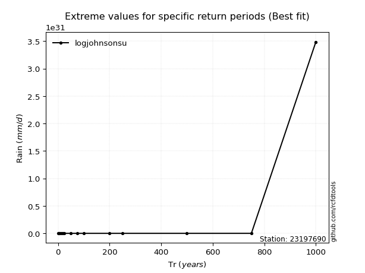</img>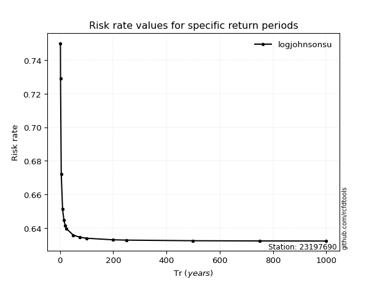</img>

</div>


<sub>**APP DISCLAIMER**: NO WARRANTY - This software is provided by [github.com/rcfdtools](https://github.com/rcfdtools) "as is", without any express or implied warranty, including warranties of merchantability, fitness for a particular purpose, or non-infringement. There is no guarantee that the software will be error-free or operate without interruption. LIMITATION OF LIABILITY - Neither the authors nor copyright holders will be liable for claims or damages arising from the software or its use. You are responsible for determining if the software is appropriate for your use and assume all associated risks, including errors, legal compliance, and data loss. NO PROFESSIONAL ADVICE - The software provides general information and does not offer professional advice. It should not replace consultation with professional advisors.</sub>