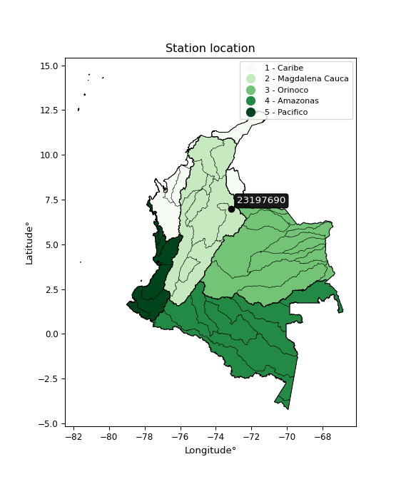

<div align="center">


</div>

# PMP Station (Rain, Pmax24h): 23197690

Probable Maximum Precipitation (PMP) is the greatest amount of rainfall for a specific duration that is meteorologically possible for a given location, acting as a "worst-case" scenario for extreme storms, crucial for designing safety-critical infrastructure like bridges, river deviations, dams, spillways, and nuclear plants to prevent catastrophic failure. PMP is calculated by hydrologists using meteorological data to determine the upper limit of extreme rainfall, often leading to the Probable Maximum Flood (PMF) for flood control design, and is increasingly being studied for climate change impacts. Probable Maximum Precipitation (PMP) is the theoretical upper limit of rainfall, a deterministic estimate for extreme events, while probability distributions (like GEV, Gumbel) describe the likelihood and frequency of various precipitation amounts, including rare ones, showing how often events occur, with PMP representing the extreme end of these distributions, used for critical infrastructure design to ensure safety against the worst conceivable weather, unlike standard statistical forecasts which cover typical probabilities.

The most common probability distributions in hydrology, used for analyzing floods, rainfall, and streamflow, include the Normal, Log-Normal, Gumbel, Gamma (including Log-Pearson Type III), and Generalized Extreme Value (GEV) distributions, often chosen based on the data´s skewness and whether modeling extremes or general conditions, with Gumbel and GEV popular for extreme events like floods, while the Normal distribution serves as a baseline, though often requiring transformations for skewed hydrological data. These distributions help in designing water infrastructure, managing water resources, and forecasting hydrologic events.

> Hydrological data often isn´t perfectly normal (it´s skewed), so different distributions are needed for different applications, such as: **Flood Frequency Analysis**: Using Gumbel, GEV, or Log-Pearson Type III for predicting extreme flood magnitudes and their return periods, **Rainfall Analysis**: Normal for annual totals, but Log-Normal, Weibull, or GEV for intensity or extreme daily rainfall, **Streamflow Modeling**: Gamma and Log-Normal for maximum flows, GEV for minimum flows, and Kappa for daily flows.

<div align="center">

</img>

</div>


## A. General information


### 1. General running parameters

• app_version: _v20260108_. • runtime: _2026-01-09 11:32:22.148588_. • Python version: _3.14.0_. • SciPy version: _1.16.3_. • Pandas version: _2.3.3_. • NumPy version: _2.3.5_. • Stations dataset (station_dataset_file): _dataset/pmax24h_in/automatic_colombia_2003_2024.csv_. • Stations catalog (station_catalog_file): _dataset/CNE.xls_. • Minimum year to eval til year_max (date_min): _1900_. • Maximum year to eval since year_min (date_max): _2024_. • Creates, save and include plots into reports (create_plot): _False_. • Plot only fit distributions with Δo > Δ (plot_only_fit): _True_. • Plot only simple graphs avoiding multiple CDFs and multiple Extreme values plots (plot_only_simple): _True_. • Eval low extreme values, if False, evaluates high extreme values (low_extreme): _False_. • Eval every SciPy distribution as logarithmic (pdist_logarithmic_on): _True_. • Standard deviation normalized (ddof): _1.0_. • Return periods to eval in years (Tr): _[2, 2.33, 5, 10, 15, 20, 25, 50, 75, 100, 200, 250, 500, 750, 1000]_. • Minimum data sample per station, 0 means any (minimum_sample): _5_. • Z-Score maximum threshold to adjust a value, 0 means disable (zscore_max): _3.5_. • Z-Score minimum threshold to adjust a value, 0 means disable (zscore_min): _-2.5_. • Avoid zeros, e.g. rain = 0 (avoid_zeros): _True_. • Avoid null values (avoid_nans): _True_. 

:file_folder:Table: [dataset.csv](../../dataset/pmax24h_in/automatic_colombia_2003_2024.csv)

> Delta Degrees of Freedom (DDOF): is a parameter used in the formulas for calculating variance and standard deviation. When ddof=0, the divisor is $N$ (the total number of observations) and this is used when your data set is the entire population. When ddof=1, the divisor is $N-1$ and this is used when your data set is a sample drawn from a larger population. Using $N-1$ provides an unbiased estimate of the population variance (known as Bessel´s correction).


### 2. Station info and location

|   id |   CODIGO | NOMBRE                     | CATEGORIA    | TECNOLOGIA                              | ESTADO   | FECHA_INSTALACION   |   FECHA_SUSPENSION |   ALTITUD |   LATITUD |   LONGITUD | DEPARTAMENTO   | MUNICIPIO   | AREA_OPERATIVA                         | ENTIDAD                                                     | AREA_HIDROGRAFICA   | ZONA_HIDROGRAFICA   | SUBZONA_HIDROGRAFICA                      | CORRIENTE   | Catalogo   |   Version |
|-----:|---------:|:---------------------------|:-------------|:----------------------------------------|:---------|:--------------------|-------------------:|----------:|----------:|-----------:|:---------------|:------------|:---------------------------------------|:------------------------------------------------------------|:--------------------|:--------------------|:------------------------------------------|:------------|:-----------|----------:|
|    0 | 23197690 | PALOGORDO - AUT [23197690] | Limnigráfica | Automática con Telemetría, Convencional | Activa   | 15/10/1997          |                nan |       690 |   6.96917 |   -73.1306 | Santander      | Girón       | Area Operativa 08 - Santanderes-Arauca | INSTITUTO DE HIDROLOGIA METEOROLOGIA Y ESTUDIOS AMBIENTALES | Magdalena Cauca     | Medio Magdalena     | Río Lebrija y otros directos al Magdalena | De Oro      | CNE_IDEAM  |  20251226 |

<div align="center">

Dynamic map: [:earth_americas:Google](http://maps.google.com/maps?q=6.969166667,-73.13055556) [:earth_americas:OSM](https://www.openstreetmap.org/#map=18/6.969166667/-73.13055556&layers=P) [:earth_americas:Bing](https://www.bing.com/maps?cp=6.969166667~-73.13055556&lvl=18) [:earth_americas:Apple](https://maps.apple.com/frame?center=6.969166667%2C-73.13055556&span=0.003%2C0.006)

</div>


<div align="center">

```geojson
{
  "type": "Feature",
  "geometry": {
    "type": "Point", 
    "coordinates": [-73.13055556, 6.969166667]
  }, 
  "properties": {
    "Name": "23197690"
  }
}
```

</div>


### 3. Discrete values table and plot

<div align="center">

|               |           0 |           1 |           2 |           3 |           4 |          5 |            6 |           7 |           8 |
|:--------------|------------:|------------:|------------:|------------:|------------:|-----------:|-------------:|------------:|------------:|
| Date          | 2011        | 2012        | 2013        | 2014        | 2015        | 2016       | 2017         | 2019        | 2024        |
| Value         |   57.2      |   45.9      |   78.7      |   54.6      |   38.9      | 1722.09    |  299.796     |    8.99     |  115.6      |
| Value_initial |   57.2      |   45.9      |   78.7      |   54.6      |   38.9      | 1722.09    |  299.796     |    8.99     |  115.6      |
| count         |    9        |    9        |    9        |    9        |    9        |    9       |    9         |    9        |    9        |
| mean          |  269.086    |  269.086    |  269.086    |  269.086    |  269.086    |  269.086   |  269.086     |  269.086    |  269.086    |
| std           |  551.51     |  551.51     |  551.51     |  551.51     |  551.51     |  551.51    |  551.51      |  551.51     |  551.51     |
| zscore        |   -0.384192 |   -0.404681 |   -0.345208 |   -0.388907 |   -0.417374 |    2.63459 |    0.0556839 |   -0.471607 |   -0.278301 |


</div>


> The initial value (value_initial) correspond to the initial obtained or null completed value, and value (value) is adjusted only when the initial value is outside the valid range (outlier) definite through the Z-Score value. If Z-Score is active, values out of range or outliers are replaced with the station mean value. A Z-Score (or standard score) measures how many standard deviations a data point is from the mean of a dataset, indicating its relative position; positive scores mean above the mean, negative mean below, and a score of zero is exactly at the mean, allowing for comparison of values from different distributions. It´s calculated using the formula $z=(x–μ)/σ$, where $x$ is the data point, $μ$ is the mean, and $σ$ is the standard deviation, helping identify outliers and understand probability.
>
> <sub>**Note**: In this study, "completing" (filling gaps in) and "extending" (forecasting or lengthening the historical record) rainfall data series are avoided for certain critical analyses because they introduce artificial bias and uncertainty, which can distort the statistics of rare events (extremes), alter day-to-day variability, and compromise the integrity and homogeneity of the original data. Some reasons against Completing/Extending rainfall data are: **Distortion of Extremes and Variability**: The primary issue is that most gap-filling or extension methods rely on averaging or regression with nearby stations, which inherently smooths the data. Rainfall is highly variable in space and time, with a large percentage of zero values and occasional large storms. Infilling methods often underestimate the highest values and overestimate the lowest (zero) values, which severely distorts analyses focused on flood frequency, drought severity, and intensity-duration-frequency (IDF) curves, **Loss of Data Homogeneity**: Infilled or extended data are synthetic estimates, not actual measurements. Combining these estimates with observed data can violate the assumption of data homogeneity, which requires that the data properties do not change over time. Inhomogeneity can lead to incorrect conclusions about long-term trends or changes in climate patterns, **Propagation of Errors**: Errors and biases from the original data (e.g., wind-induced undercatch, instrument errors, site changes) or the data used for imputation can propagate through the analysis, leading to unreliable hydrological models and inaccurate predictions, **Compromised Statistical Integrity**: For statistical analyses, especially those involving the frequency of events, using artificial data can introduce time bias or autocorrelation that doesn´t exist in reality, making it difficult to assess the true probability of events, **Difficulty in Validation**: It is difficult to accurately validate the quality of filled or extended data, especially for past periods where ground-truth measurements are unavailable. The reliability of imputation techniques heavily depends on the density of the surrounding station network and the complexity of the local topography.</sub>


### 4. Active continuous probability distributions from SciPy (45 of 104 available)

A Probability Density Function (PDF) describes the relative likelihood of a continuous random variable falling within a specific range, where the total area under its curve equals 1, and the area over any interval gives the actual probability for that range. Unlike discrete probabilities (like rolling a die), a PDF shows density, not direct probability for a single point (which is zero), with higher points indicating higher likelihood, often visualized as a bell curve for normal distributions.

A log of a probability density function (log-PDF) is simply the logarithm of the PDF´s value, denoted as $log(f(x))$, useful for converting multiplication of probabilities into addition, improving numerical stability with tiny numbers, and connecting to information theory concepts like entropy. Instead of dealing with very small probabilities (e.g., 0.000001), log-PDFs use negative numbers (e.g., $log(0.00001) ≈ -11.51$ that are easier for computers to handle, preventing underflow errors and simplifying complex calculations. In this study, each active probability distribution from SciPy is also evaluated in the $log$ form.

[scipy.stats](https://docs.scipy.org/doc/scipy/reference/stats.html) is a Python´s powerful submodule within the SciPy library for comprehensive statistical analysis, offering over 130 probability distributions (like Normal, Poisson), functions for descriptive stats (mean, variance), hypothesis testing (t-tests, chi-square), random variable generation, and statistical tests, making it essential for data science, modeling, and research. It provides tools to explore, model, and draw conclusions from data efficiently, working seamlessly with NumPy.

<div align="center">

|   id | p_dist             |   n_parameter | fit_method   | label                                                                       | active   | ref                                                                                                        |
|-----:|:-------------------|--------------:|:-------------|:----------------------------------------------------------------------------|:---------|:-----------------------------------------------------------------------------------------------------------|
|    0 | alpha              |             3 | MLE          | Alpha                                                                       | True     | [:mortar_board:](https://docs.scipy.org/doc/scipy/reference/generated/scipy.stats.alpha.html)              |
|    1 | betaprime          |             4 | MLE          | Beta prime                                                                  | True     | [:mortar_board:](https://docs.scipy.org/doc/scipy/reference/generated/scipy.stats.betaprime.html)          |
|    2 | chi2               |             3 | MLE          | Chi²                                                                        | True     | [:mortar_board:](https://docs.scipy.org/doc/scipy/reference/generated/scipy.stats.chi2.html)               |
|    3 | crystalball        |             4 | MLE          | Crystalball                                                                 | True     | [:mortar_board:](https://docs.scipy.org/doc/scipy/reference/generated/scipy.stats.crystalball.html)        |
|    4 | dweibull           |             3 | MLE          | Double Weibull                                                              | True     | [:mortar_board:](https://docs.scipy.org/doc/scipy/reference/generated/scipy.stats.dweibull.html)           |
|    5 | erlang             |             3 | MLE          | Erlang                                                                      | True     | [:mortar_board:](https://docs.scipy.org/doc/scipy/reference/generated/scipy.stats.erlang.html)             |
|    6 | expon              |             2 | MLE          | Exponential                                                                 | True     | [:mortar_board:](https://docs.scipy.org/doc/scipy/reference/generated/scipy.stats.expon.html)              |
|    7 | exponnorm          |             3 | MLE          | Exponentially modified Normal                                               | True     | [:mortar_board:](https://docs.scipy.org/doc/scipy/reference/generated/scipy.stats.exponnorm.html)          |
|    8 | f                  |             4 | MLE          | F                                                                           | True     | [:mortar_board:](https://docs.scipy.org/doc/scipy/reference/generated/scipy.stats.f.html)                  |
|    9 | fatiguelife        |             3 | MLE          | Fatigue-life (Birnbaum-Saunders)                                            | True     | [:mortar_board:](https://docs.scipy.org/doc/scipy/reference/generated/scipy.stats.fatiguelife.html)        |
|   10 | fisk               |             3 | MLE          | Fisk                                                                        | True     | [:mortar_board:](https://docs.scipy.org/doc/scipy/reference/generated/scipy.stats.fisk.html)               |
|   11 | gamma              |             3 | MLE          | Gamma                                                                       | True     | [:mortar_board:](https://docs.scipy.org/doc/scipy/reference/generated/scipy.stats.gamma.html)              |
|   12 | genexpon           |             5 | MLE          | Generalized exponential                                                     | True     | [:mortar_board:](https://docs.scipy.org/doc/scipy/reference/generated/scipy.stats.genexpon.html)           |
|   13 | genlogistic        |             3 | MLE          | Generalized logistic                                                        | True     | [:mortar_board:](https://docs.scipy.org/doc/scipy/reference/generated/scipy.stats.genlogistic.html)        |
|   14 | gibrat             |             2 | MM           | Gibrat                                                                      | True     | [:mortar_board:](https://docs.scipy.org/doc/scipy/reference/generated/scipy.stats.gibrat.html)             |
|   15 | gompertz           |             3 | MLE          | Gompertz (or truncated Gumbel)                                              | True     | [:mortar_board:](https://docs.scipy.org/doc/scipy/reference/generated/scipy.stats.gompertz.html)           |
|   16 | gumbel_l           |             2 | MM           | Gumbel Left Skew                                                            | True     | [:mortar_board:](https://docs.scipy.org/doc/scipy/reference/generated/scipy.stats.gumbel_l.html)           |
|   17 | gumbel_r           |             2 | MM           | Gumbel Right Skew                                                           | True     | [:mortar_board:](https://docs.scipy.org/doc/scipy/reference/generated/scipy.stats.gumbel_r.html)           |
|   18 | halflogistic       |             2 | MM           | Half-logistic                                                               | True     | [:mortar_board:](https://docs.scipy.org/doc/scipy/reference/generated/scipy.stats.halflogistic.html)       |
|   19 | halfnorm           |             2 | MM           | Half Normal                                                                 | True     | [:mortar_board:](https://docs.scipy.org/doc/scipy/reference/generated/scipy.stats.halfnorm.html)           |
|   20 | hypsecant          |             2 | MM           | hyperbolic secant                                                           | True     | [:mortar_board:](https://docs.scipy.org/doc/scipy/reference/generated/scipy.stats.hypsecant.html)          |
|   21 | invgamma           |             3 | MLE          | Inverted gamma                                                              | True     | [:mortar_board:](https://docs.scipy.org/doc/scipy/reference/generated/scipy.stats.invgamma.html)           |
|   22 | invgauss           |             3 | MLE          | Inverse Gaussian                                                            | True     | [:mortar_board:](https://docs.scipy.org/doc/scipy/reference/generated/scipy.stats.invgauss.html)           |
|   23 | invweibull         |             3 | MLE          | Inverted Weibull                                                            | True     | [:mortar_board:](https://docs.scipy.org/doc/scipy/reference/generated/scipy.stats.invweibull.html)         |
|   24 | kappa4             |             4 | MLE          | Kappa 4                                                                     | True     | [:mortar_board:](https://docs.scipy.org/doc/scipy/reference/generated/scipy.stats.kappa4.html)             |
|   25 | kstwobign          |             2 | MLE          | Limiting distribution of scaled Kolmogorov-Smirnov two-sided test statistic | True     | [:mortar_board:](https://docs.scipy.org/doc/scipy/reference/generated/scipy.stats.kstwobign.html)          |
|   26 | laplace            |             2 | MM           | Laplace                                                                     | True     | [:mortar_board:](https://docs.scipy.org/doc/scipy/reference/generated/scipy.stats.laplace.html)            |
|   27 | laplace_asymmetric |             3 | MLE          | Asymmetric Laplace                                                          | True     | [:mortar_board:](https://docs.scipy.org/doc/scipy/reference/generated/scipy.stats.laplace_asymmetric.html) |
|   28 | loggamma           |             3 | MLE          | Log gamma                                                                   | True     | [:mortar_board:](https://docs.scipy.org/doc/scipy/reference/generated/scipy.stats.loggamma.html)           |
|   29 | logistic           |             2 | MM           | Logistic (or Sech-squared)                                                  | True     | [:mortar_board:](https://docs.scipy.org/doc/scipy/reference/generated/scipy.stats.logistic.html)           |
|   30 | lognorm            |             3 | MLE          | Log Normal                                                                  | True     | [:mortar_board:](https://docs.scipy.org/doc/scipy/reference/generated/scipy.stats.lognorm.html)            |
|   31 | maxwell            |             2 | MM           | Maxwell                                                                     | True     | [:mortar_board:](https://docs.scipy.org/doc/scipy/reference/generated/scipy.stats.maxwell.html)            |
|   32 | mielke             |             4 | MLE          | Mielke Beta-Kappa / Dagum                                                   | True     | [:mortar_board:](https://docs.scipy.org/doc/scipy/reference/generated/scipy.stats.mielke.html)             |
|   33 | moyal              |             2 | MM           | Moyal                                                                       | True     | [:mortar_board:](https://docs.scipy.org/doc/scipy/reference/generated/scipy.stats.moyal.html)              |
|   34 | nakagami           |             3 | MLE          | Nakagami                                                                    | True     | [:mortar_board:](https://docs.scipy.org/doc/scipy/reference/generated/scipy.stats.nakagami.html)           |
|   35 | ncf                |             5 | MLE          | Non-central F distribution                                                  | True     | [:mortar_board:](https://docs.scipy.org/doc/scipy/reference/generated/scipy.stats.ncf.html)                |
|   36 | nct                |             4 | MLE          | Non-central Student’s t                                                     | True     | [:mortar_board:](https://docs.scipy.org/doc/scipy/reference/generated/scipy.stats.nct.html)                |
|   37 | norm               |             2 | MM           | Normal                                                                      | True     | [:mortar_board:](https://docs.scipy.org/doc/scipy/reference/generated/scipy.stats.norm.html)               |
|   38 | pearson3           |             3 | MM           | Pearson type III                                                            | True     | [:mortar_board:](https://docs.scipy.org/doc/scipy/reference/generated/scipy.stats.pearson3.html)           |
|   39 | rayleigh           |             2 | MM           | Rayleigh                                                                    | True     | [:mortar_board:](https://docs.scipy.org/doc/scipy/reference/generated/scipy.stats.rayleigh.html)           |
|   40 | rice               |             3 | MLE          | Rice                                                                        | True     | [:mortar_board:](https://docs.scipy.org/doc/scipy/reference/generated/scipy.stats.rice.html)               |
|   41 | t                  |             3 | MLE          | Student’s t                                                                 | True     | [:mortar_board:](https://docs.scipy.org/doc/scipy/reference/generated/scipy.stats.t.html)                  |
|   42 | truncnorm          |             4 | MLE          | Truncated normal                                                            | True     | [:mortar_board:](https://docs.scipy.org/doc/scipy/reference/generated/scipy.stats.truncnorm.html)          |
|   43 | wald               |             2 | MM           | Wald                                                                        | True     | [:mortar_board:](https://docs.scipy.org/doc/scipy/reference/generated/scipy.stats.wald.html)               |
|   44 | weibull_min        |             3 | MLE          | Weibull minimum                                                             | True     | [:mortar_board:](https://docs.scipy.org/doc/scipy/reference/generated/scipy.stats.weibull_min.html)        |

</div>

> **n_parameter:** # arguments & localization & scale.
>
> **Fit methods:** (MLE) maximum likelihood, (MM) L-moments.
>
>**Inactive** (With the only purpose of prevent loops, zero divisions, infinite values, over high estimated values or horizontal trending for recurrence intervals estimations, the follow distributions were disabled.)**:** foldnorm, gennorm, norminvgauss, powernorm, powerlognorm, skewnorm, genextreme, anglit, arcsine, argus, beta, bradford, burr, burr12, cauchy, cosine, halfcauchy, foldcauchy, skewcauchy, wrapcauchy, dgamma, gengamma, exponweib, exponpow, truncexpon, gausshyper, genhalflogistic, genhyperbolic, geninvgauss, halfgennorm, johnsonsb, johnsonsu, kappa3, ksone, kstwo, loglaplace, levy, levy_l, levy_stable, ncx2, pareto, genpareto, truncpareto, lomax, powerlaw, rdist, rel_breitwigner, recipinvgauss, semicircular, studentized_range, trapezoid, triang, truncweibull_min, tukeylambda, uniform, loguniform, vonmises, vonmises_line, weibull_max, 


## B. Probability (PDF) vs. Empirical (EDF) distributions functions

A continuous probability distribution (CPD) describes probabilities for variables that can take any value within a range (like rain any time), unlike discrete variables with specific outcomes (like temperature). It uses a Probability Density Function (PDF), a curve where the total area under it equals 1, and the probability of the variable falling within an interval (a to b) is found by calculating the area under the curve between those points. A key feature is that the probability of hitting any single exact value is zero, so probabilities are always expressed for ranges, e.g., $P(a ≤ X ≤ b)$.

<div align="center">

Distributions parameters from station values
|    |   station | p_dist                |   n |              loc |           scale | shape                 | shape1                | shape2                 | shape3   |
|---:|----------:|:----------------------|----:|-----------------:|----------------:|:----------------------|:----------------------|:-----------------------|:---------|
|  0 |  23197690 | alpha                 |   9 |     -22.2794     |    77.4133      | 0.37979162478525375   |                       |                        |          |
|  1 |  23197690 | betaprime             |   9 |       8.98763    |    49.4587      | 0.8656518225615938    | 0.9430515576014153    |                        |          |
|  2 |  23197690 | chi2                  |   9 |       8.99       |   469.096       | 1.3684137516204227    |                       |                        |          |
|  3 |  23197690 | crystalball           |   9 |      -0.344697   |   585.554       | 4.744267229586217     | 2.2176147711924123    |                        |          |
|  4 |  23197690 | dweibull              |   9 |      57.2        |   473.211       | 0.5684025111480158    |                       |                        |          |
|  5 |  23197690 | erlang                |   9 |       8.99       |   449.29        | 0.33462908487887566   |                       |                        |          |
|  6 |  23197690 | expon                 |   9 |       8.99       |   260.096       |                       |                       |                        |          |
|  7 |  23197690 | exponnorm             |   9 |       8.62365    |     0.123929    | 2089.164953522094     |                       |                        |          |
|  8 |  23197690 | f                     |   9 |       0.106358   |    57.8089      | 6.59637741043067      | 2.109158025033688     |                        |          |
|  9 |  23197690 | fatiguelife           |   9 |       2.49415    |   102.569       | 1.9108882356808716    |                       |                        |          |
| 10 |  23197690 | fisk                  |   9 |       8.99       |    67.0753      | 0.7479594188706524    |                       |                        |          |
| 11 |  23197690 | gamma                 |   9 |       8.99       |   805.711       | 0.39507890192661843   |                       |                        |          |
| 12 |  23197690 | genexpon              |   9 |       8.98999    |   542.119       | 2.0842499398409498    | 2.475151935607622e-10 | 1.1834713846116585     |          |
| 13 |  23197690 | genlogistic           |   9 |   -1558.27       |   205.927       | 3105.1594481474585    |                       |                        |          |
| 14 |  23197690 | gibrat                |   9 |    -127.585      |   240.593       |                       |                       |                        |          |
| 15 |  23197690 | gompertz              |   9 |       8.99       |  1247.7         | 2.126995853718075     |                       |                        |          |
| 16 |  23197690 | gumbel_l              |   9 |     503.099      |   405.418       |                       |                       |                        |          |
| 17 |  23197690 | gumbel_r              |   9 |      35.0723     |   405.418       |                       |                       |                        |          |
| 18 |  23197690 | halflogistic          |   9 |    -347.198      |   444.554       |                       |                       |                        |          |
| 19 |  23197690 | halfnorm              |   9 |    -419.149      |   862.574       |                       |                       |                        |          |
| 20 |  23197690 | hypsecant             |   9 |     269.086      |   331.022       |                       |                       |                        |          |
| 21 |  23197690 | invgamma              |   9 |      -6.84139    |    58.6455      | 1.0398214788299103    |                       |                        |          |
| 22 |  23197690 | invgauss              |   9 |      -0.828145   |    51.3042      | 5.261048286863214     |                       |                        |          |
| 23 |  23197690 | invweibull            |   9 |       8.99       |     2.748       | 0.0508445379680655    |                       |                        |          |
| 24 |  23197690 | kappa4                |   9 |    -158.621      |  1918.46        | 1.095808186939653     | 1.0163461529555688    |                        |          |
| 25 |  23197690 | kstwobign             |   9 |    -877.375      |  1369.25        |                       |                       |                        |          |
| 26 |  23197690 | laplace               |   9 |     269.086      |   367.673       |                       |                       |                        |          |
| 27 |  23197690 | laplace_asymmetric    |   9 |       8.99       |     0.0240462   | 9.243665353618621e-05 |                       |                        |          |
| 28 |  23197690 | loggamma              |   9 | -215793          | 27500.5         | 2583.2758692028683    |                       |                        |          |
| 29 |  23197690 | logistic              |   9 |     269.086      |   286.674       |                       |                       |                        |          |
| 30 |  23197690 | lognorm               |   9 |       8.99       |     1.36046     | 12.176186327709793    |                       |                        |          |
| 31 |  23197690 | maxwell               |   9 |    -963.021      |   772.108       |                       |                       |                        |          |
| 32 |  23197690 | mielke                |   9 |       8.98992    |    61.4621      | 0.7590961194968215    | 0.9377968635527609    |                        |          |
| 33 |  23197690 | moyal                 |   9 |     -28.2655     |   234.068       |                       |                       |                        |          |
| 34 |  23197690 | nakagami              |   9 |       8.99       |   726.96        | 0.06920980205750513   |                       |                        |          |
| 35 |  23197690 | ncf                   |   9 |       0.572906   |    32.6436      | 5.3637297625510705    | 2.1477603980988675    | 4.1952997710424516     |          |
| 36 |  23197690 | nct                   |   9 |      -0.103076   |    22.626       | 0.9467091164507286    | 2.221177048564692     |                        |          |
| 37 |  23197690 | norm                  |   9 |     269.086      |   519.968       |                       |                       |                        |          |
| 38 |  23197690 | pearson3              |   9 |     269.086      |   519.968       | 2.3685685762174162    |                       |                        |          |
| 39 |  23197690 | rayleigh              |   9 |    -725.644      |   793.68        |                       |                       |                        |          |
| 40 |  23197690 | rice                  |   9 |    -417.879      |   609.215       | 0.0005983458530437556 |                       |                        |          |
| 41 |  23197690 | t                     |   9 |      52.1987     |    14.5476      | 0.5305790198721094    |                       |                        |          |
| 42 |  23197690 | truncnorm             |   9 |  -41566.1        |  4071.23        | 10.211893123183195    | 1257.1428702551848    |                        |          |
| 43 |  23197690 | wald                  |   9 |    -250.883      |   519.968       |                       |                       |                        |          |
| 44 |  23197690 | weibull_min           |   9 |       8.99       |   474.566       | 0.1976680266672529    |                       |                        |          |
| 45 |  23197690 | logalpha              |   9 |      -7.13794    |   100.119       | 8.761507989986931     |                       |                        |          |
| 46 |  23197690 | logbetaprime          |   9 |      -0.754543   |    12.5366      | 20.621884712480778    | 50.731761577699494    |                        |          |
| 47 |  23197690 | logchi2               |   9 |       2.19611    |     1.23419     | 1.3790805908407662    |                       |                        |          |
| 48 |  23197690 | logcrystalball        |   9 |       4.44448    |     1.37967     | 11.168093518990013    | 456.2231249071454     |                        |          |
| 49 |  23197690 | logdweibull           |   9 |       4.04655    |     1.12586     | 0.9227160500633316    |                       |                        |          |
| 50 |  23197690 | logerlang             |   9 |       0.174572   |     0.440873    | 9.685131121989487     |                       |                        |          |
| 51 |  23197690 | logexpon              |   9 |       2.19611    |     2.24837     |                       |                       |                        |          |
| 52 |  23197690 | logexponnorm          |   9 |       3.30502    |     0.808748    | 1.4089170911097946    |                       |                        |          |
| 53 |  23197690 | logf                  |   9 |      -2.47044    |     6.72064     | 201.48347567444233    | 71.98852455404096     |                        |          |
| 54 |  23197690 | logfatiguelife        |   9 |      -1.69503    |     5.99153     | 0.22226059175356333   |                       |                        |          |
| 55 |  23197690 | logfisk               |   9 |      -0.919225   |     5.18585     | 7.281852154625298     |                       |                        |          |
| 56 |  23197690 | loggamma              |   9 |       0.174582   |     0.440874    | 9.685078810553819     |                       |                        |          |
| 57 |  23197690 | loggenexpon           |   9 |       2.19525    |     0.0763116   | 0.01236452275781779   | 3.9123534701013316    | 0.00027283247942203417 |          |
| 58 |  23197690 | loggenlogistic        |   9 |       3.1764     |     0.923949    | 2.661401814336025     |                       |                        |          |
| 59 |  23197690 | loggibrat             |   9 |       3.39198    |     0.638377    |                       |                       |                        |          |
| 60 |  23197690 | loggompertz           |   9 |       2.19611    |     2.38032     | 0.4972598632779484    |                       |                        |          |
| 61 |  23197690 | loggumbel_l           |   9 |       5.06541    |     1.07573     |                       |                       |                        |          |
| 62 |  23197690 | loggumbel_r           |   9 |       3.82355    |     1.07573     |                       |                       |                        |          |
| 63 |  23197690 | loghalflogistic       |   9 |       2.80927    |     1.17956     |                       |                       |                        |          |
| 64 |  23197690 | loghalfnorm           |   9 |       2.61834    |     2.28873     |                       |                       |                        |          |
| 65 |  23197690 | loghypsecant          |   9 |       4.44448    |     0.878328    |                       |                       |                        |          |
| 66 |  23197690 | loginvgamma           |   9 |      -3.43304    |   266.157       | 34.78830418155304     |                       |                        |          |
| 67 |  23197690 | loginvgauss           |   9 |      -1.72991    |   124.977       | 0.049404302047398506  |                       |                        |          |
| 68 |  23197690 | loginvweibull         |   9 |      -6.5327e+07 |     6.53271e+07 | 55451385.16012253     |                       |                        |          |
| 69 |  23197690 | logkappa4             |   9 |       1.76492    |     5.79105     | 1.0805101795259544    | 1.018380047577022     |                        |          |
| 70 |  23197690 | logkstwobign          |   9 |      -0.489548   |     5.6869      |                       |                       |                        |          |
| 71 |  23197690 | loglaplace            |   9 |       4.44448    |     0.975577    |                       |                       |                        |          |
| 72 |  23197690 | loglaplace_asymmetric |   9 |       4.00003    |     0.876779    | 0.7781997983063453    |                       |                        |          |
| 73 |  23197690 | logloggamma           |   9 |    -369.964      |    51.8873      | 1361.3486911413775    |                       |                        |          |
| 74 |  23197690 | loglogistic           |   9 |       4.44448    |     0.760654    |                       |                       |                        |          |
| 75 |  23197690 | loglognorm            |   9 |       2.19611    |     0.0414547   | 11.379240224441027    |                       |                        |          |
| 76 |  23197690 | logmaxwell            |   9 |       1.17523    |     2.0487      |                       |                       |                        |          |
| 77 |  23197690 | logmielke             |   9 |       0.452014   |     4.09573     | 4.388782191324999     | 5.923268787919252     |                        |          |
| 78 |  23197690 | logmoyal              |   9 |       3.6555     |     0.621072    |                       |                       |                        |          |
| 79 |  23197690 | lognakagami           |   9 |       3.66099    |     1.35003     | 0.08032332989654827   |                       |                        |          |
| 80 |  23197690 | logncf                |   9 |      -0.116255   |     4.50258     | 25.735050395641885    | 164.87443738852897    | 0.015362707082810442   |          |
| 81 |  23197690 | lognct                |   9 |       3.81854    |     0.434181    | 1.0914692320355206    | 0.5982121710584303    |                        |          |
| 82 |  23197690 | lognorm               |   9 |       4.44448    |     1.37967     |                       |                       |                        |          |
| 83 |  23197690 | logpearson3           |   9 |       4.44448    |     1.37968     | 0.7180136790451287    |                       |                        |          |
| 84 |  23197690 | lograyleigh           |   9 |       1.80508    |     2.10593     |                       |                       |                        |          |
| 85 |  23197690 | logrice               |   9 |       1.75432    |     2.13781     | 0.00292015290706598   |                       |                        |          |
| 86 |  23197690 | logt                  |   9 |       4.04223    |     0.716118    | 1.6574911378396937    |                       |                        |          |
| 87 |  23197690 | logtruncnorm          |   9 |      -0.252122   |     3.53152     | 0.6932518546216483    | 5.501223660229198     |                        |          |
| 88 |  23197690 | logwald               |   9 |       3.06484    |     1.37965     |                       |                       |                        |          |
| 89 |  23197690 | logweibull_min        |   9 |       1.72543    |     3.06167     | 2.040641970091875     |                       |                        |          |

</div>

> **loc** (Location parameter): This shifts the distribution along the x-axis. For many common distributions, like the normal (Gaussian) distribution, loc represents the mean $μ$. For others, like the uniform distribution, it might represent the minimum value, or for the beta distribution, the left end of the support interval.
>
> **scale** (Scale parameter): This determines the width or spread of the distribution. For the normal distribution, scale represents the standard deviation $σ$. For a uniform distribution, it defines the length of the interval (from $loc$ to $loc + scale$).
>
> **shape** (Shape parameters): Refers to parameters that define the specific form of a probability distribution, distinct from its location (loc) and scale (scale). These parameters are required arguments for most distribution functions. For example, a normal (Gaussian) distribution is fully defined by its location (mean) and scale (standard deviation), so it has no specific shape parameters beyond loc and scale. However, other distributions have intrinsic properties that need specification, as Gamma distribution that takes a shape parameter, often named $a$ or $alpha$.


### 0. Cumulative distribution values - CDF (90 evaluated)

Cumulative Distribution Function (CDF), denoted as $F$<sub>$X$</sub>$(x)$, is a function that gives the probability that a random variable $X$ will take a value less than or equal to a specific value, $x$ (i.e., $(P(X≥x)$. It essentially "accumulates" probabilities from a given point up to the far right (positive infinity), providing a complete picture of the distribution´s probabilities for both discrete (like rain) and continuous (like temperature) variables, helping to find probabilities over ranges or above certain values. Each station is evaluated separately ordering the $x$ values ascending, calculating the CDF and PDF values for the activated distributions and their logarithmic forms.

<div align="center">

CDF ordered by x ascending and calculating $log(f(x))$ separately
|   id |   Station |   date |        x |   count |    mean |    std |     zscore |   Value_initial |   station |   m |     alpha |   alpha_pdf |   betaprime |   betaprime_pdf |        chi2 |      chi2_pdf |   crystalball |   crystalball_pdf |   dweibull |    dweibull_pdf |      erlang |   erlang_pdf |    expon |   expon_pdf |   exponnorm |   exponnorm_pdf |         f |       f_pdf |   fatiguelife |   fatiguelife_pdf |     fisk |     fisk_pdf |       gamma |   gamma_pdf |   genexpon |   genexpon_pdf |   genlogistic |   genlogistic_pdf |   gibrat |   gibrat_pdf |    gompertz |   gompertz_pdf |   gumbel_l |   gumbel_l_pdf |   gumbel_r |   gumbel_r_pdf |   halflogistic |   halflogistic_pdf |   halfnorm |   halfnorm_pdf |   hypsecant |   hypsecant_pdf |   invgamma |   invgamma_pdf |   invgauss |   invgauss_pdf |   invweibull |   invweibull_pdf |      kappa4 |   kappa4_pdf |   kstwobign |   kstwobign_pdf |   laplace |   laplace_pdf |   laplace_asymmetric |   laplace_asymmetric_pdf |   loggamma |   loggamma_pdf |   logistic |   logistic_pdf |   lognorm |   lognorm_pdf |   maxwell |   maxwell_pdf |      mielke |   mielke_pdf |    moyal |   moyal_pdf |   nakagami |   nakagami_pdf |       ncf |     ncf_pdf |       nct |     nct_pdf |     norm |    norm_pdf |   pearson3 |   pearson3_pdf |   rayleigh |   rayleigh_pdf |     rice |    rice_pdf |        t |       t_pdf |   truncnorm |   truncnorm_pdf |     wald |    wald_pdf |   weibull_min |   weibull_min_pdf |   logalpha |   logalpha_pdf |   logbetaprime |   logbetaprime_pdf |     logchi2 |   logchi2_pdf |   logcrystalball |   logcrystalball_pdf |   logdweibull |   logdweibull_pdf |   logerlang |   logerlang_pdf |   logexpon |   logexpon_pdf |   logexponnorm |   logexponnorm_pdf |     logf |   logf_pdf |   logfatiguelife |   logfatiguelife_pdf |   logfisk |   logfisk_pdf |   loggenexpon |   loggenexpon_pdf |   loggenlogistic |   loggenlogistic_pdf |   loggibrat |   loggibrat_pdf |   loggompertz |   loggompertz_pdf |   loggumbel_l |   loggumbel_l_pdf |   loggumbel_r |   loggumbel_r_pdf |   loghalflogistic |   loghalflogistic_pdf |   loghalfnorm |   loghalfnorm_pdf |   loghypsecant |   loghypsecant_pdf |   loginvgamma |   loginvgamma_pdf |   loginvgauss |   loginvgauss_pdf |   loginvweibull |   loginvweibull_pdf |   logkappa4 |   logkappa4_pdf |   logkstwobign |   logkstwobign_pdf |   loglaplace |   loglaplace_pdf |   loglaplace_asymmetric |   loglaplace_asymmetric_pdf |   logloggamma |   logloggamma_pdf |   loglogistic |   loglogistic_pdf |   loglognorm |   loglognorm_pdf |   logmaxwell |   logmaxwell_pdf |   logmielke |   logmielke_pdf |   logmoyal |   logmoyal_pdf |   lognakagami |   lognakagami_pdf |    logncf |   logncf_pdf |    lognct |   lognct_pdf |   logpearson3 |   logpearson3_pdf |   lograyleigh |   lograyleigh_pdf |   logrice |   logrice_pdf |      logt |   logt_pdf |   logtruncnorm |   logtruncnorm_pdf |   logwald |   logwald_pdf |   logweibull_min |   logweibull_min_pdf |
|-----:|----------:|-------:|---------:|--------:|--------:|-------:|-----------:|----------------:|----------:|----:|----------:|------------:|------------:|----------------:|------------:|--------------:|--------------:|------------------:|-----------:|----------------:|------------:|-------------:|---------:|------------:|------------:|----------------:|----------:|------------:|--------------:|------------------:|---------:|-------------:|------------:|------------:|-----------:|---------------:|--------------:|------------------:|---------:|-------------:|------------:|---------------:|-----------:|---------------:|-----------:|---------------:|---------------:|-------------------:|-----------:|---------------:|------------:|----------------:|-----------:|---------------:|-----------:|---------------:|-------------:|-----------------:|------------:|-------------:|------------:|----------------:|----------:|--------------:|---------------------:|-------------------------:|-----------:|---------------:|-----------:|---------------:|----------:|--------------:|----------:|--------------:|------------:|-------------:|---------:|------------:|-----------:|---------------:|----------:|------------:|----------:|------------:|---------:|------------:|-----------:|---------------:|-----------:|---------------:|---------:|------------:|---------:|------------:|------------:|----------------:|---------:|------------:|--------------:|------------------:|-----------:|---------------:|---------------:|-------------------:|------------:|--------------:|-----------------:|---------------------:|--------------:|------------------:|------------:|----------------:|-----------:|---------------:|---------------:|-------------------:|---------:|-----------:|-----------------:|---------------------:|----------:|--------------:|--------------:|------------------:|-----------------:|---------------------:|------------:|----------------:|--------------:|------------------:|--------------:|------------------:|--------------:|------------------:|------------------:|----------------------:|--------------:|------------------:|---------------:|-------------------:|--------------:|------------------:|--------------:|------------------:|----------------:|--------------------:|------------:|----------------:|---------------:|-------------------:|-------------:|-----------------:|------------------------:|----------------------------:|--------------:|------------------:|--------------:|------------------:|-------------:|-----------------:|-------------:|-----------------:|------------:|----------------:|-----------:|---------------:|--------------:|------------------:|----------:|-------------:|----------:|-------------:|--------------:|------------------:|--------------:|------------------:|----------:|--------------:|----------:|-----------:|---------------:|-------------------:|----------:|--------------:|-----------------:|---------------------:|
|    0 |  23197690 |   2019 |    8.99  |       9 | 269.086 | 551.51 | -0.471607  |           8.99  |  23197690 |   1 | 0.0278501 | 0.00542078  | 0.000173066 |     0.0631108   | 8.25963e-13 | 318.14        |      0.50636  |       0.000681221 |   0.38054  |     0.00122493  | 1.97844e-05 |  2.35437e+06 | 0        | 0.00384474  |  0.00141407 |     0.00385089  | 0.0266688 | 0.0066497   |     0.0257204 |       0.0101869   | 6.88e-12 | 64.3759      | 1.19136e-07 | 2.64969e+07 | 5.4366e-08 |    0.00384463  |      0.215021 |       0.0016045   | 0.285617 |  0.00248839  | 5.38265e-14 |    0.00170473  |   0.255911 |    0.000542524 |   0.344229 |    0.000905492 |       0.380472 |        0.000961908 |   0.380353 |    0.000817799 |    0.272253 |     0.000725787 |  0.0267363 |    0.00620124  |  0.0268455 |    0.00820914  |   0.00268591 |      4.55101e+11 | 2.75641e-15 |  0.0129607   |    0.203876 |     0.00112434  |  0.24646  |   0.000670322 |          8.54463e-09 |               0.00384413 |  0.0251841 |      0.0714914 |   0.287555 |    0.000714635 | 0.0515891 |     0.0766393 |  0.337168 |   0.000741487 | 3.39096e-05 |  0.323718    | 0.355746 | 0.00102757  |  0.0031447 |    2.45045e+11 | 0.0253153 | 0.00637231  | 0.0326821 | 0.00342441  | 0.308462 | 0.000677017 |   0.404435 |    0.00135478  |   0.348431 |    0.000759873 | 0.217671 | 0.000899791 | 0.176916 | 0.00209713  | 0.000374867 |      0.00253098 | 0.364787 | 0.00169061  |   0.000359093 |       3.99517e+10 |  0.0247251 |      0.066542  |      0.0249157 |          0.0689499 | 1.53379e-11 | 23815.2       |        0.0515891 |            0.0766394 |      0.102816 |         0.0810903 |   0.0251842 |       0.0714915 |   0        |      0.444767  |       0.021431 |          0.0559348 | 0.025216 |  0.0682463 |        0.0251633 |            0.069537  | 0.0238739 |     0.054471  |   0.000139115 |         0.162161  |        0.0269247 |            0.0576142 |    0        |       0         |   9.99811e-10 |         0.208905  |      0.067083 |       0.0602205   |     0.0106759 |         0.0450543 |          0        |             0         |      0        |          0        |      0.0491245 |          0.0557078 |     0.0248601 |         0.0676361 |     0.0251406 |         0.0694705 |        0.019936 |           0.0662544 | 1.71477e-15 |        2.6709   |       0.021015 |          0.0787451 |    0.0498966 |        0.0511457 |               0.0268126 |                   0.0392968 |     0.0554684 |         0.0784837 |     0.0494615 |         0.0618087 |   0.00235045 |      1.45242e+12 |    0.0305624 |        0.0854154 |    0.023484 |       0.0587204 |  0.0012046 |      0.0110053 |    0          |       0           | 0.0243974 |    0.069748  | 0.0314052 |    0.020388  |     0.0221768 |         0.0701412 |     0.0170907 |         0.0866628 | 0.0211271 |     0.0946251 | 0.0741338 |  0.0566984 |    1.89493e-12 |           0.363968 |  0        |     0         |        0.0216637 |            0.0928988 |
|    1 |  23197690 |   2015 |   38.9   |       9 | 269.086 | 551.51 | -0.417374  |          38.9   |  23197690 |   2 | 0.290034  | 0.00860368  | 0.412041    |     0.00754596  | 0.103155    |   0.00231538  |      0.526718 |       0.000679779 |   0.427171 |     0.00208871  | 0.444937    |  0.00473485  | 0.10863  | 0.00342708  |  0.11036    |     0.00343612  | 0.293968  | 0.00790489  |     0.285488  |       0.00555393  | 0.353413 |  0.00571441  | 0.303504    | 0.00390346  | 0.108628   |    0.003427    |      0.26467  |       0.00170809  | 0.356361 |  0.00223922  | 0.0502957   |    0.00165827  |   0.272562 |    0.000570992 |   0.371353 |    0.000907368 |       0.408869 |        0.000936698 |   0.404599 |    0.000803361 |    0.294599 |     0.000768247 |  0.292172  |    0.00802652  |  0.306899  |    0.00713498  |   0.412427   |      0.000620954 | 0.0244215   |  0.000745217 |    0.238267 |     0.00117278  |  0.267347 |   0.000727132 |          0.108614    |               0.00342661 |  0.308122  |      0.293075  |   0.309394 |    0.00074534  | 0.285059  |     0.246097  |  0.359476 |   0.000749761 | 0.414894    |  0.00697821  | 0.386302 | 0.00101456  |  0.55413   |    0.00256416  | 0.289778  | 0.0079573   | 0.260436  | 0.00900734  | 0.328994 | 0.000695629 |   0.443108 |    0.00123456  |   0.371214 |    0.000763159 | 0.245037 | 0.000929158 | 0.30738  | 0.00913991  | 0.0733058   |      0.00234798 | 0.413189 | 0.00154679  |   0.43956     |       0.00214463  |  0.30514   |      0.300785  |      0.307047  |          0.29717   | 0.613489    |     0.200125  |        0.285059  |            0.246097  |      0.344667 |         0.306869  |   0.308122  |       0.293075  |   0.478753 |      0.231834  |       0.299482 |          0.325249  | 0.30657  |  0.298436  |        0.30687   |            0.295506  | 0.288165  |     0.326119  |   0.352115    |         0.278583  |        0.290168  |            0.310761  |    0.193747 |       1.02088   |   0.344843    |         0.253258  |      0.237402 |       0.192133    |     0.312506  |         0.337897  |          0.346124 |             0.373105  |      0.351295 |          0.314253 |      0.247612  |          0.254329  |     0.305901  |         0.298858  |     0.306877  |         0.295647  |        0.323316 |           0.309877  | 0.302233    |        0.19154  |       0.338849 |          0.296526  |    0.223969  |        0.229576  |               0.22948   |                   0.336329  |     0.286864  |         0.24091   |     0.263081  |         0.254872  |   0.622967   |      0.0227867   |    0.311296  |        0.274627  |    0.292985 |       0.324274  |  0.319453  |      0.389594  |    0.00277126 |       1.00249e+12 | 0.308492  |    0.296617  | 0.191372  |    0.433114  |     0.312184  |         0.29799   |     0.321807  |         0.283805  | 0.328154  |     0.28029   | 0.328545  |  0.391146  |    0.451321    |           0.250504 |  0.302291 |     0.700949  |        0.324489  |            0.27938   |
|    2 |  23197690 |   2012 |   45.9   |       9 | 269.086 | 551.51 | -0.404681  |          45.9   |  23197690 |   3 | 0.347143  | 0.00770704  | 0.46028     |     0.00629586  | 0.118761    |   0.00215051  |      0.531475 |       0.000679186 |   0.443597 |     0.00267073  | 0.475558    |  0.00405297  | 0.1323   | 0.00333608  |  0.13409    |     0.00334446  | 0.346118  | 0.00700655  |     0.321318  |       0.00472431  | 0.390126 |  0.00482147  | 0.328996    | 0.00340746  | 0.132297   |    0.003336    |      0.27669  |       0.00172602  | 0.371828 |  0.00217985  | 0.0618652   |    0.00164729  |   0.276583 |    0.000577726 |   0.377703 |    0.000907088 |       0.415405 |        0.000930638 |   0.41021  |    0.00079988  |    0.300011 |     0.000777968 |  0.345141  |    0.00711676  |  0.353266  |    0.00614625  |   0.41633    |      0.00050255  | 0.0295889   |  0.000731687 |    0.246509 |     0.00118192  |  0.272486 |   0.000741108 |          0.132281    |               0.00333563 |  0.357364  |      0.301216  |   0.314635 |    0.000752214 | 0.327097  |     0.261554  |  0.36473  |   0.000751351 | 0.459538    |  0.0058343   | 0.39339  | 0.00101062  |  0.570494  |    0.00213911  | 0.342361  | 0.00707515  | 0.321114  | 0.00828427  | 0.333878 | 0.000699723 |   0.451661 |    0.00120911  |   0.376558 |    0.000763601 | 0.251562 | 0.000935243 | 0.39034  | 0.0149537   | 0.0895982   |      0.00230708 | 0.423902 | 0.00151408  |   0.453166    |       0.00176768  |  0.355782  |      0.31029   |      0.357017  |          0.305844  | 0.644988    |     0.181033  |        0.327097  |            0.261554  |      0.40055  |         0.372415  |   0.357365  |       0.301216  |   0.515737 |      0.215384  |       0.354535 |          0.338691  | 0.35678  |  0.307461  |        0.356555  |            0.304087  | 0.343918  |     0.346223  |   0.398114    |         0.276958  |        0.343047  |            0.327093  |    0.350203 |       0.852685  |   0.386835    |         0.254089  |      0.271007 |       0.214207    |     0.368875  |         0.341981  |          0.406303 |             0.353911  |      0.402403 |          0.303277 |      0.292507  |          0.288096  |     0.356188  |         0.307959  |     0.356585  |         0.304231  |        0.374874 |           0.31221   | 0.333811    |        0.190167 |       0.387861 |          0.295097  |    0.265369  |        0.272012  |               0.292461  |                   0.428635  |     0.327996  |         0.25583   |     0.307362  |         0.279878  |   0.626534   |      0.0204129   |    0.357429  |        0.282321  |    0.348387 |       0.343927  |  0.38353   |      0.382912  |    0.607382   |       0.589016    | 0.35832   |    0.304703  | 0.27982   |    0.631416  |     0.362115  |         0.304595  |     0.36913   |         0.28754   | 0.374845  |     0.283445  | 0.398342  |  0.449425  |    0.491699    |           0.237569 |  0.408938 |     0.587826  |        0.371091  |            0.283285  |
|    3 |  23197690 |   2014 |   54.6   |       9 | 269.086 | 551.51 | -0.388907  |          54.6   |  23197690 |   4 | 0.409413  | 0.00662454  | 0.509782    |     0.00514423  | 0.136755    |   0.00199291  |      0.53738  |       0.000678315 |   0.474701 |     0.00538848  | 0.508059    |  0.00345307  | 0.160844 | 0.00322634  |  0.162704   |     0.00323394  | 0.402644  | 0.00601373  |     0.358962  |       0.00397092  | 0.428376 |  0.00401563  | 0.356613    | 0.00296578  | 0.16084    |    0.00322626  |      0.291792 |       0.00174495  | 0.390473 |  0.00210672  | 0.076137    |    0.00163358  |   0.281646 |    0.000586127 |   0.385592 |    0.000906373 |       0.423468 |        0.000923031 |   0.41715  |    0.000795502 |    0.306832 |     0.000789899 |  0.402528  |    0.00610101  |  0.40231   |    0.00516979  |   0.420254   |      0.000406128 | 0.0358942   |  0.00071833  |    0.256837 |     0.00119215  |  0.27901  |   0.000758854 |          0.160821    |               0.00322592 |  0.40998   |      0.304118  |   0.321216 |    0.000760574 | 0.373674  |     0.274536  |  0.371274 |   0.000753146 | 0.505517    |  0.00479128  | 0.40216  | 0.00100528  |  0.587451  |    0.00178237  | 0.399513  | 0.00608715  | 0.3885    | 0.00719845  | 0.339987 | 0.000704668 |   0.462047 |    0.00117871  |   0.383203 |    0.000763981 | 0.25973  | 0.000942389 | 0.544686 | 0.0181412   | 0.109452    |      0.00225723 | 0.4369   | 0.0014741   |   0.467087    |       0.00145364  |  0.410033  |      0.313747  |      0.410452  |          0.308869  | 0.674857    |     0.163524  |        0.373674  |            0.274536  |      0.474258 |         0.497219  |   0.40998   |       0.304118  |   0.551714 |      0.199383  |       0.413855 |          0.343214  | 0.410516 |  0.310683  |        0.409688  |            0.307161  | 0.405088  |     0.356734  |   0.445839    |         0.27252   |        0.400693  |            0.335653  |    0.480592 |       0.655323  |   0.430919    |         0.253659  |      0.310258 |       0.238161    |     0.427973  |         0.337649  |          0.465843 |             0.3319    |      0.453954 |          0.29054  |      0.345394  |          0.32049   |     0.410014  |         0.311216  |     0.409742  |         0.307297  |        0.428804 |           0.308202  | 0.366706    |        0.188901 |       0.438619 |          0.28908   |    0.317042  |        0.324979  |               0.377178  |                   0.552796  |     0.373548  |         0.268499  |     0.357945  |         0.302135  |   0.629896   |      0.0183952   |    0.406829  |        0.286187  |    0.409165 |       0.354607  |  0.448588  |      0.365272  |    0.681371   |       0.321342    | 0.411514  |    0.307262  | 0.399829  |    0.718202  |     0.415168  |         0.305779  |     0.419092  |         0.287503  | 0.424057  |     0.283006  | 0.479662  |  0.481083  |    0.53177     |           0.224189 |  0.501333 |     0.479948  |        0.420341  |            0.283584  |
|    4 |  23197690 |   2011 |   57.2   |       9 | 269.086 | 551.51 | -0.384192  |          57.2   |  23197690 |   5 | 0.426244  | 0.00632416  | 0.522786    |     0.00486287  | 0.141884    |   0.0019529   |      0.539143 |       0.000678025 |   0.5      | 10953.1         | 0.516846    |  0.00330881  | 0.169191 | 0.00319424  |  0.17107    |     0.00320163  | 0.417931  | 0.0057476   |     0.369046  |       0.00378849  | 0.438559 |  0.00382008  | 0.364182    | 0.00285873  | 0.169186   |    0.00319417  |      0.296335 |       0.0017499   | 0.395923 |  0.00208507  | 0.080379    |    0.00162947  |   0.283173 |    0.000588643 |   0.387948 |    0.000906082 |       0.425865 |        0.000920741 |   0.419217 |    0.000794183 |    0.30889  |     0.000793428 |  0.418032  |    0.00582794  |  0.415426  |    0.00492287  |   0.42128    |      0.00038408  | 0.0377573   |  0.000714873 |    0.259941 |     0.00119497  |  0.28099  |   0.000764239 |          0.169166    |               0.00319384 |  0.424125  |      0.303954  |   0.323197 |    0.00076303  | 0.386512  |     0.277377  |  0.373233 |   0.000753642 | 0.517639    |  0.00453734  | 0.404771 | 0.00100359  |  0.591975  |    0.00169918  | 0.41499   | 0.00582064  | 0.406795  | 0.00687564  | 0.341821 | 0.000706114 |   0.4651   |    0.00116987  |   0.385189 |    0.000764058 | 0.262183 | 0.000944435 | 0.589468 | 0.016161    | 0.115302    |      0.00224254 | 0.440717 | 0.00146231  |   0.47077     |       0.00138079  |  0.424626  |      0.31358   |      0.424817  |          0.308666  | 0.682363    |     0.159207  |        0.386512  |            0.277377  |      0.5      |         6.02245   |   0.424125  |       0.303954  |   0.560894 |      0.1953    |       0.429814 |          0.342784  | 0.424966 |  0.310502  |        0.423975  |            0.306995  | 0.421707  |     0.357613  |   0.458479    |         0.270891  |        0.416328  |            0.33643   |    0.509993 |       0.609279  |   0.442712    |         0.253305  |      0.321488 |       0.244637    |     0.443625  |         0.335185  |          0.481141 |             0.325759  |      0.467387 |          0.286937 |      0.360484  |          0.328147  |     0.42449   |         0.311036  |     0.424036  |         0.307127  |        0.443095 |           0.306144  | 0.375486    |        0.188587 |       0.452015 |          0.286803  |    0.332526  |        0.340851  |               0.40237   |                   0.530436  |     0.386105  |         0.271304  |     0.372119  |         0.307165  |   0.630741   |      0.0179194   |    0.420151  |        0.286502  |    0.425688 |       0.355613  |  0.465442  |      0.359211  |    0.695515   |       0.28804     | 0.425803  |    0.306964  | 0.433036  |    0.707301  |     0.429379  |         0.305158  |     0.432452  |         0.286844  | 0.437207  |     0.282273  | 0.502086  |  0.482409  |    0.542116    |           0.220642 |  0.52306  |     0.454389  |        0.433521  |            0.283037  |
|    5 |  23197690 |   2013 |   78.7   |       9 | 269.086 | 551.51 | -0.345208  |          78.7   |  23197690 |   6 | 0.5393    | 0.00433736  | 0.607942    |     0.0032292   | 0.180937    |   0.00169884  |      0.553691 |       0.000675128 |   0.579232 |     0.00191917  | 0.578042    |  0.00246789  | 0.235105 | 0.00294082  |  0.237124   |     0.0029465   | 0.521611  | 0.00402918  |     0.437997  |       0.00273636  | 0.507204 |  0.00268184  | 0.418199    | 0.0022269   | 0.235099   |    0.00294076  |      0.334304 |       0.00177846  | 0.438864 |  0.00191119  | 0.115046    |    0.0015953   |   0.296053 |    0.00060955  |   0.407393 |    0.000902352 |       0.445455 |        0.000901542 |   0.436173 |    0.000783082 |    0.326257 |     0.000821874 |  0.522914  |    0.00406478  |  0.503732  |    0.0034317   |   0.4281     |      0.000264908 | 0.0528685   |  0.000692329 |    0.285851 |     0.00121412  |  0.297911 |   0.000810261 |          0.235073    |               0.00294048 |  0.519822  |      0.293208  |   0.339815 |    0.000782565 | 0.477216  |     0.288685  |  0.389476 |   0.000757063 | 0.597691    |  0.0030623   | 0.426188 | 0.000988188 |  0.622964  |    0.00123625  | 0.520106  | 0.00408791  | 0.529106  | 0.00464915  | 0.357127 | 0.000717499 |   0.489497 |    0.00110079  |   0.401619 |    0.000764063 | 0.282659 | 0.000959781 | 0.774039 | 0.00413704  | 0.162238    |      0.00212465 | 0.471131 | 0.0013678   |   0.495633    |       0.000978882 |  0.523217  |      0.301317  |      0.521893  |          0.296953  | 0.728854    |     0.133159  |        0.477216  |            0.288685  |      0.634165 |         0.330513  |   0.519823  |       0.293208  |   0.618992 |      0.16946   |       0.536795 |          0.323269  | 0.522614 |  0.298619  |        0.520585  |            0.295771  | 0.534377  |     0.342839  |   0.54263     |         0.255355  |        0.522677  |            0.325709  |    0.663536 |       0.374807  |   0.522829    |         0.248003  |      0.406538 |       0.287859    |     0.546537  |         0.306948  |          0.578181 |             0.282185  |      0.554798 |          0.260485 |      0.471467  |          0.360949  |     0.522302  |         0.299098  |     0.520682  |         0.295855  |        0.537493 |           0.283251  | 0.435348    |        0.186686 |       0.540361 |          0.26546   |    0.461184  |        0.472729  |               0.54977   |                   0.399609  |     0.474896  |         0.282932  |     0.474112  |         0.327783  |   0.636004   |      0.0152112   |    0.511029  |        0.280922  |    0.537901 |       0.341984  |  0.572374  |      0.309219  |    0.765393   |       0.170995    | 0.522273  |    0.29496   | 0.622988  |    0.462961  |     0.524991  |         0.291577  |     0.522494  |         0.275692  | 0.525752  |     0.270974  | 0.648185  |  0.413484  |    0.608699    |           0.196857 |  0.644291 |     0.3153    |        0.522491  |            0.272807  |
|    6 |  23197690 |   2024 |  115.6   |       9 | 269.086 | 551.51 | -0.278301  |         115.6   |  23197690 |   7 | 0.660426  | 0.00246615  | 0.698623    |     0.00187248  | 0.238215    |   0.00142826  |      0.578481 |       0.000668081 |   0.631238 |     0.00109273  | 0.653586    |  0.00171354  | 0.336275 | 0.00255185  |  0.338458   |     0.00255512  | 0.636599  | 0.00240103  |     0.520415  |       0.00184561  | 0.585787 |  0.00170233  | 0.488456    | 0.00164514  | 0.336268   |    0.00255181  |      0.400125 |       0.00177952  | 0.504275 |  0.0016404   | 0.172819    |    0.00153591  |   0.319211 |    0.000645669 |   0.440496 |    0.000890791 |       0.4781   |        0.000867633 |   0.464706 |    0.000763286 |    0.357429 |     0.000866744 |  0.638506  |    0.0024047   |  0.603023  |    0.00211816  |   0.435932   |      0.000172617 | 0.0779183   |  0.000667318 |    0.331018 |     0.00123065  |  0.329362 |   0.0008958   |          0.336232    |               0.00255161 |  0.627188  |      0.262721  |   0.369258 |    0.000812445 | 0.587664  |     0.282147  |  0.417478 |   0.000760095 | 0.684735    |  0.00182184  | 0.462085 | 0.000956446 |  0.66066   |    0.00085659  | 0.636756  | 0.00243422  | 0.656888  | 0.00255634  | 0.383927 | 0.000734535 |   0.52814  |    0.000996398 |   0.429775 |    0.000761513 | 0.318466 | 0.000979632 | 0.85493  | 0.00119398  | 0.237112    |      0.00193644 | 0.518803 | 0.00121892  |   0.524986    |       0.000655628 |  0.632965  |      0.266773  |      0.630307  |          0.264339  | 0.775083    |     0.108324  |        0.587665  |            0.282147  |      0.738468 |         0.222274  |   0.627188  |       0.262721  |   0.678881 |      0.142823  |       0.65204  |          0.272919  | 0.631541 |  0.265283  |        0.628711  |            0.264045  | 0.656812  |     0.289522  |   0.635914    |         0.228716  |        0.640695  |            0.284277  |    0.774861 |       0.220901  |   0.615864    |         0.234649  |      0.525723 |       0.328888    |     0.655347  |         0.257447  |          0.676541 |             0.229871  |      0.64837  |          0.22592  |      0.6086    |          0.341516  |     0.631384  |         0.265602  |     0.628825  |         0.264055  |        0.63893  |           0.242947  | 0.506762    |        0.18486  |       0.636079 |          0.231476  |    0.634487  |        0.374663  |               0.679944  |                   0.284071  |     0.583398  |         0.277962  |     0.599128  |         0.315746  |   0.641375   |      0.0128557   |    0.615246  |        0.258728  |    0.660161 |       0.289221  |  0.678681  |      0.244219  |    0.819029   |       0.115094    | 0.629967  |    0.26269   | 0.75218   |    0.236773  |     0.631255  |         0.258886  |     0.623876  |         0.249767  | 0.625397  |     0.245555  | 0.777542  |  0.260604  |    0.679114    |           0.169726 |  0.743579 |     0.20992   |        0.623001  |            0.248118  |
|    7 |  23197690 |   2017 |  299.796 |       9 | 269.086 | 551.51 |  0.0556839 |         299.796 |  23197690 |   8 | 0.857236  | 0.000455038 | 0.857412    |     0.0003996   | 0.438646    |   0.000854902 |      0.695876 |       0.000597436 |   0.747707 |     0.000404338 | 0.83634     |  0.000583275 | 0.673091 | 0.00125688  |  0.675222   |     0.00125441  | 0.83917   | 0.000497819 |     0.720247  |       0.000678123 | 0.749723 |  0.00048261  | 0.683739    | 0.000713327 | 0.673081   |    0.00125688  |      0.687629 |       0.00125047  | 0.717209 |  0.000791423 | 0.427809    |    0.00123146  |   0.454276 |    0.000815242 |   0.594223 |    0.0007629   |       0.621649 |        0.000690076 |   0.59543  |    0.000653569 |    0.529489 |     0.000957473 |  0.840124  |    0.000492883 |  0.79848   |    0.00054761  |   0.454312   |      6.26695e-05 | 0.194855    |  0.000612408 |    0.549329 |     0.00109119  |  0.540066 |   0.00125093  |          0.673033    |               0.0012569  |  0.827689  |      0.156445  |   0.526756 |    0.000869575 | 0.819184  |     0.19073   |  0.555508 |   0.000725632 | 0.844163    |  0.000416118 | 0.619756 | 0.000747753 |  0.758636  |    0.000357378 | 0.841335  | 0.00049956  | 0.855462  | 0.000449814 | 0.523549 | 0.000765906 |   0.675608 |    0.00064045  |   0.56597  |    0.000706544 | 0.500365 | 0.000966136 | 0.929294 | 0.00015135  | 0.522506    |      0.00121728 | 0.690657 | 0.000702807 |   0.596562    |       0.000248925 |  0.832657  |      0.1521    |      0.830081  |          0.154061  | 0.856685    |     0.0667271 |        0.819184  |            0.19073   |      0.880118 |         0.0953623 |   0.827689  |       0.156445  |   0.78982  |      0.0934809 |       0.843565 |          0.135962  | 0.831283 |  0.153287  |        0.829085  |            0.155285  | 0.855759  |     0.135729  |   0.815737    |         0.147592  |        0.845871  |            0.148524  |    0.900876 |       0.0754498 |   0.81225     |         0.171153  |      0.83619  |       0.275478    |     0.840082  |         0.136084  |          0.841607 |             0.123647  |      0.822279 |          0.140566 |      0.850891  |          0.163623  |     0.831247  |         0.153274  |     0.829145  |         0.155191  |        0.819143 |           0.138713  | 0.68137     |        0.181929 |       0.81348  |          0.142511  |    0.862382  |        0.141063  |               0.862631  |                   0.121925  |     0.813682  |         0.192168  |     0.839519  |         0.177119  |   0.651732   |      0.00926476  |    0.819558  |        0.165428  |    0.858061 |       0.133862  |  0.847469  |      0.121289  |    0.897684   |       0.0595387   | 0.82903   |    0.154166  | 0.875231  |    0.0683978 |     0.827746  |         0.152927  |     0.819684  |         0.158485  | 0.818394  |     0.156911  | 0.914131  |  0.070648  |    0.812073    |           0.11167  |  0.875344 |     0.0879655 |        0.818395  |            0.158937  |
|    8 |  23197690 |   2016 | 1722.09  |       9 | 269.086 | 551.51 |  2.63459   |        1722.09  |  23197690 |   9 | 0.97437   | 1.48074e-05 | 0.970015    |     1.60752e-05 | 0.910592    |   0.000107229 |      0.998367 |       9.00407e-06 |   0.935262 |     4.51823e-05 | 0.997035    |  7.56134e-06 | 0.998621 | 5.30185e-06 |  0.998664   |     5.16041e-06 | 0.971643  | 1.69773e-05 |     0.978044  |       3.45923e-05 | 0.918607 |  3.26447e-05 | 0.972333    | 4.17588e-05 | 0.998621   |    5.30266e-06 |      0.999625 |       1.81987e-06 | 0.979308 |  2.69426e-05 | 0.998105    |    1.27498e-05 |   1        |    8.23862e-11 |   0.984532 |    3.78575e-05 |       0.981147 |        4.201e-05   |   0.986949 |    4.24657e-05 |    0.992101 |     2.38588e-05 |  0.971364  |    1.69378e-05 |  0.971722  |    2.59544e-05 |   0.486293   |      1.04055e-05 | 0.995997    |  0.000570698 |    0.998519 |     8.21264e-06 |  0.990391 |   2.61354e-05 |          0.99862     |               5.3065e-06 |  0.97274   |      0.0322566 |   0.993747 |    2.16746e-05 | 0.985348  |     0.0269009 |  0.992932 |   2.95577e-05 | 0.96565     |  1.80843e-05 | 0.981029 | 4.0516e-05  |  0.948465  |    5.33892e-05 | 0.972878  | 1.65327e-05 | 0.972192  | 1.52796e-05 | 0.9974   | 1.54632e-05 |   0.975569 |    4.26329e-05 |   0.991397 |    3.343e-05   | 0.997907 | 1.20653e-05 | 0.97431  | 8.16238e-06 | 0.988032    |      3.1527e-05 | 0.975439 | 3.70972e-05 |   0.724408    |       4.09844e-05 |  0.971217  |      0.0309239 |      0.971867  |          0.0316898 | 0.935482    |     0.028986  |        0.985348  |            0.0269009 |      0.968864 |         0.0234263 |   0.97274   |       0.0322565 |   0.903415 |      0.0429579 |       0.966188 |          0.0296739 | 0.971754 |  0.0313465 |        0.972407  |            0.0319232 | 0.970299  |     0.0250709 |   0.965531    |         0.0384827 |        0.974414  |            0.0272018 |    0.967832 |       0.0177583 |   0.982145    |         0.0339252 |      0.999898 |       0.000873224 |     0.966273  |         0.0308178 |          0.961673 |             0.0318704 |      0.965282 |          0.037505 |      0.979251  |          0.0236062 |     0.971662  |         0.0313526 |     0.972365  |         0.0319148 |        0.955772 |           0.0366992 | 0.999967    |        0.208745 |       0.959497 |          0.0397784 |    0.977068  |        0.0235059 |               0.970891  |                   0.025836  |     0.984288  |         0.028567  |     0.981163  |         0.0242975 |   0.66478    |      0.00609378  |    0.975409  |        0.0334988 |    0.970091 |       0.0244248 |  0.962447  |      0.03021   |    0.964049   |       0.0226049   | 0.97172   |    0.0320946 | 0.937701  |    0.0184362 |     0.970943  |         0.0328534 |     0.972515  |         0.0349909 | 0.971297  |     0.0357797 | 0.970567  |  0.0135969 |    0.940266    |           0.042874 |  0.959697 |     0.024167  |        0.972338  |            0.0353697 |


</div>

An Empirical Distribution Function (EDF) is a step-function estimate of a true cumulative distribution function (CDF) based on observed sample data, representing the proportion of data points less than or equal to a given value. It is calculated by ordering your data and jumping up by $1/n$ (where $n$ is sample size) at each unique data point, allowing analysis without assuming an underlying population distribution, and it gets closer to the true CDF as the sample size grows. For the empirical probability calculations, the parameter $m$ correspond to the order number which means the position of the $x$ values in an ascending order list.

The Kolmogorov-Smirnov (K-S) test is a non-parametric statistical test used to determine if a sample data set comes from a specific theoretical distribution (one-sample) or if two different samples come from the same underlying distribution (two-sample), by comparing their cumulative distribution functions (CDFs). It calculates the maximum vertical difference (D statistic) between these functions, with a small p-value indicating a significant difference and rejection of the null hypothesis (that the data/samples match).


### 1. EDF California (1923)

California´s estimates the true probability distribution of water-related data (like rainfall, streamflow) using observed samples, crucial for risk assessment.

<div align="center">


$P=m/n$


</div>


**1.1. Empirical values**

<div align="center">

|                | 0                  | 1                  | 2                  | 3                  | 4                  | 5                  | 6                  | 7                  | 8              |
|:---------------|:-------------------|:-------------------|:-------------------|:-------------------|:-------------------|:-------------------|:-------------------|:-------------------|:---------------|
| date           | 2019               | 2015               | 2012               | 2014               | 2011               | 2013               | 2024               | 2017               | 2016           |
| x              | 8.99               | 38.9               | 45.9               | 54.6               | 57.2               | 78.7               | 115.6              | 299.796            | 1722.086       |
| m              | 1                  | 2                  | 3                  | 4                  | 5                  | 6                  | 7                  | 8                  | 9              |
| empirical_dist | edf_california     | edf_california     | edf_california     | edf_california     | edf_california     | edf_california     | edf_california     | edf_california     | edf_california |
| empirical      | 0.1111111111111111 | 0.2222222222222222 | 0.3333333333333333 | 0.4444444444444444 | 0.5555555555555556 | 0.6666666666666666 | 0.7777777777777778 | 0.8888888888888888 | 1.0            |
| empirical_tr   | 1.125              | 1.2857142857142856 | 1.4999999999999998 | 1.7999999999999998 | 2.25               | 2.9999999999999996 | 4.5                | 8.999999999999996  | inf            |

</div>


**1.2. Kolmogorov-Smirnov fit test (sorted by Δ)**


<div align="center">

|                | 0                   | 1                   | 2                   | 3                   | 4                   | 5                   | 6                   | 7                   | 8                   | 9                   | 10                  | 11                  | 12                  | 13                  | 14                  | 15                  | 16                  | 17                  | 18                  | 19                  | 20                  | 21                  | 22                  | 23                  | 24                  | 25                  | 26                  | 27                  | 28                  | 29                  | 30                  | 31                  | 32                  | 33                  | 34                    | 35                  | 36                  | 37                  | 38                  | 39                  | 40                  | 41                  | 42                  | 43                  | 44                  | 45                  | 46                  | 47                  | 48                  | 49                  | 50                  | 51                  | 52                  | 53                  | 54                  | 55                  | 56                  | 57                  | 58                  | 59                  | 60                  | 61                  | 62                  | 63                  | 64                  | 65                  | 66                  | 67                  | 68                  | 69                  | 70                  | 71                  | 72                  | 73                  | 74                  | 75                  | 76                  | 77                  | 78                  | 79                  | 80                  | 81                  | 82                  | 83                  | 84                  | 85                  | 86                  | 87                  | 88                  | 89                  |
|:---------------|:--------------------|:--------------------|:--------------------|:--------------------|:--------------------|:--------------------|:--------------------|:--------------------|:--------------------|:--------------------|:--------------------|:--------------------|:--------------------|:--------------------|:--------------------|:--------------------|:--------------------|:--------------------|:--------------------|:--------------------|:--------------------|:--------------------|:--------------------|:--------------------|:--------------------|:--------------------|:--------------------|:--------------------|:--------------------|:--------------------|:--------------------|:--------------------|:--------------------|:--------------------|:----------------------|:--------------------|:--------------------|:--------------------|:--------------------|:--------------------|:--------------------|:--------------------|:--------------------|:--------------------|:--------------------|:--------------------|:--------------------|:--------------------|:--------------------|:--------------------|:--------------------|:--------------------|:--------------------|:--------------------|:--------------------|:--------------------|:--------------------|:--------------------|:--------------------|:--------------------|:--------------------|:--------------------|:--------------------|:--------------------|:--------------------|:--------------------|:--------------------|:--------------------|:--------------------|:--------------------|:--------------------|:--------------------|:--------------------|:--------------------|:--------------------|:--------------------|:--------------------|:--------------------|:--------------------|:--------------------|:--------------------|:--------------------|:--------------------|:--------------------|:--------------------|:--------------------|:--------------------|:--------------------|:--------------------|:--------------------|
| station        | 23197690            | 23197690            | 23197690            | 23197690            | 23197690            | 23197690            | 23197690            | 23197690            | 23197690            | 23197690            | 23197690            | 23197690            | 23197690            | 23197690            | 23197690            | 23197690            | 23197690            | 23197690            | 23197690            | 23197690            | 23197690            | 23197690            | 23197690            | 23197690            | 23197690            | 23197690            | 23197690            | 23197690            | 23197690            | 23197690            | 23197690            | 23197690            | 23197690            | 23197690            | 23197690              | 23197690            | 23197690            | 23197690            | 23197690            | 23197690            | 23197690            | 23197690            | 23197690            | 23197690            | 23197690            | 23197690            | 23197690            | 23197690            | 23197690            | 23197690            | 23197690            | 23197690            | 23197690            | 23197690            | 23197690            | 23197690            | 23197690            | 23197690            | 23197690            | 23197690            | 23197690            | 23197690            | 23197690            | 23197690            | 23197690            | 23197690            | 23197690            | 23197690            | 23197690            | 23197690            | 23197690            | 23197690            | 23197690            | 23197690            | 23197690            | 23197690            | 23197690            | 23197690            | 23197690            | 23197690            | 23197690            | 23197690            | 23197690            | 23197690            | 23197690            | 23197690            | 23197690            | 23197690            | 23197690            | 23197690            |
| empirical_dist | edf_california      | edf_california      | edf_california      | edf_california      | edf_california      | edf_california      | edf_california      | edf_california      | edf_california      | edf_california      | edf_california      | edf_california      | edf_california      | edf_california      | edf_california      | edf_california      | edf_california      | edf_california      | edf_california      | edf_california      | edf_california      | edf_california      | edf_california      | edf_california      | edf_california      | edf_california      | edf_california      | edf_california      | edf_california      | edf_california      | edf_california      | edf_california      | edf_california      | edf_california      | edf_california        | edf_california      | edf_california      | edf_california      | edf_california      | edf_california      | edf_california      | edf_california      | edf_california      | edf_california      | edf_california      | edf_california      | edf_california      | edf_california      | edf_california      | edf_california      | edf_california      | edf_california      | edf_california      | edf_california      | edf_california      | edf_california      | edf_california      | edf_california      | edf_california      | edf_california      | edf_california      | edf_california      | edf_california      | edf_california      | edf_california      | edf_california      | edf_california      | edf_california      | edf_california      | edf_california      | edf_california      | edf_california      | edf_california      | edf_california      | edf_california      | edf_california      | edf_california      | edf_california      | edf_california      | edf_california      | edf_california      | edf_california      | edf_california      | edf_california      | edf_california      | edf_california      | edf_california      | edf_california      | edf_california      | edf_california      |
| p_dist         | logt                | t                   | logmoyal            | loggibrat           | logwald             | loggumbel_r         | logdweibull         | lognct              | loghalflogistic     | alpha               | loghalfnorm         | logmielke           | logexponnorm        | logfisk             | loginvweibull       | logkstwobign        | loggenexpon         | invgamma            | loggenlogistic      | logalpha            | f                   | logf                | loginvgamma         | logpearson3         | ncf                 | logbetaprime        | logncf              | nct                 | loginvgauss         | logfatiguelife      | logerlang           | loggamma            | loggamma            | logrice             | loglaplace_asymmetric | lograyleigh         | logweibull_min      | loggompertz         | logmaxwell          | invgauss            | betaprime           | logcrystalball      | lognorm             | lognorm             | fisk                | loglogistic         | mielke              | logloggamma         | loghypsecant        | erlang              | loglaplace          | logtruncnorm        | logexpon            | fatiguelife         | wald                | loggumbel_l         | dweibull            | logkappa4           | gibrat              | lognakagami         | gamma               | weibull_min         | pearson3            | halflogistic        | halfnorm            | moyal               | nakagami            | gumbel_r            | rayleigh            | maxwell             | genlogistic         | logchi2             | norm                | crystalball         | loglognorm          | logistic            | hypsecant           | exponnorm           | expon               | genexpon            | laplace_asymmetric  | kstwobign           | laplace             | gumbel_l            | rice                | invweibull          | chi2                | truncnorm           | gompertz            | kappa4              |
| delta          | 0.1063228607709924  | 0.10737264664390922 | 0.10990650815564186 | 0.1111111111111111  | 0.1111111111111111  | 0.12243043124529007 | 0.12244521947308018 | 0.122519146093096   | 0.12390198547384063 | 0.1293118482851015  | 0.12940751482970814 | 0.12986774126897016 | 0.12987183234847788 | 0.13384889418364754 | 0.13884755717885766 | 0.14169855771935747 | 0.14186330883483111 | 0.1437528718722686  | 0.14398949070785205 | 0.14481259659326906 | 0.14505613010961027 | 0.1462364480163063  | 0.14639348702413368 | 0.1465223333490273  | 0.1465603981044069  | 0.14747121113369055 | 0.14781113150516234 | 0.1487607750781983  | 0.14895276249117362 | 0.14906701880070894 | 0.15058973656943353 | 0.15059024790787412 | 0.15059024790787412 | 0.15238114121177448 | 0.15318524930743382   | 0.15390176491153917 | 0.15477650024106915 | 0.16191353461977476 | 0.16253221605365986 | 0.174754885656758   | 0.18981909277400155 | 0.19011327696454838 | 0.19011336307822735 | 0.19011336307822735 | 0.19199086352265526 | 0.19255483403978274 | 0.19267156283763204 | 0.19437955973817012 | 0.19519971727771585 | 0.22271516593719537 | 0.22302933823160082 | 0.22909831355227356 | 0.25653054051526525 | 0.2573630626116178  | 0.2589742988951359  | 0.26012828701436996 | 0.2694284003302587  | 0.2710152992002134  | 0.2735031297011927  | 0.274048394832264   | 0.28932160073613933 | 0.29232736691296135 | 0.29332350806929136 | 0.29967774131627734 | 0.3130715900820754  | 0.3156930691204548  | 0.33190754969312    | 0.3372818530619017  | 0.3480024489517559  | 0.36029970592483324 | 0.37765268073411296 | 0.3912665408867846  | 0.3938506918791166  | 0.3952488858038326  | 0.4007451776951013  | 0.40852006209822717 | 0.4203483466272187  | 0.4393198322441414  | 0.441502713472469   | 0.44151006062161313 | 0.4415454306366431  | 0.4467594833614325  | 0.44841610640867813 | 0.45856635285044484 | 0.459312060987276   | 0.5137069399820007  | 0.5395627555192899  | 0.5406660159408234  | 0.6049585195126062  | 0.6998595123341506  |
| deltao         | 0.41761268023100007 | 0.41761268023100007 | 0.41761268023100007 | 0.41761268023100007 | 0.41761268023100007 | 0.41761268023100007 | 0.41761268023100007 | 0.41761268023100007 | 0.41761268023100007 | 0.41761268023100007 | 0.41761268023100007 | 0.41761268023100007 | 0.41761268023100007 | 0.41761268023100007 | 0.41761268023100007 | 0.41761268023100007 | 0.41761268023100007 | 0.41761268023100007 | 0.41761268023100007 | 0.41761268023100007 | 0.41761268023100007 | 0.41761268023100007 | 0.41761268023100007 | 0.41761268023100007 | 0.41761268023100007 | 0.41761268023100007 | 0.41761268023100007 | 0.41761268023100007 | 0.41761268023100007 | 0.41761268023100007 | 0.41761268023100007 | 0.41761268023100007 | 0.41761268023100007 | 0.41761268023100007 | 0.41761268023100007   | 0.41761268023100007 | 0.41761268023100007 | 0.41761268023100007 | 0.41761268023100007 | 0.41761268023100007 | 0.41761268023100007 | 0.41761268023100007 | 0.41761268023100007 | 0.41761268023100007 | 0.41761268023100007 | 0.41761268023100007 | 0.41761268023100007 | 0.41761268023100007 | 0.41761268023100007 | 0.41761268023100007 | 0.41761268023100007 | 0.41761268023100007 | 0.41761268023100007 | 0.41761268023100007 | 0.41761268023100007 | 0.41761268023100007 | 0.41761268023100007 | 0.41761268023100007 | 0.41761268023100007 | 0.41761268023100007 | 0.41761268023100007 | 0.41761268023100007 | 0.41761268023100007 | 0.41761268023100007 | 0.41761268023100007 | 0.41761268023100007 | 0.41761268023100007 | 0.41761268023100007 | 0.41761268023100007 | 0.41761268023100007 | 0.41761268023100007 | 0.41761268023100007 | 0.41761268023100007 | 0.41761268023100007 | 0.41761268023100007 | 0.41761268023100007 | 0.41761268023100007 | 0.41761268023100007 | 0.41761268023100007 | 0.41761268023100007 | 0.41761268023100007 | 0.41761268023100007 | 0.41761268023100007 | 0.41761268023100007 | 0.41761268023100007 | 0.41761268023100007 | 0.41761268023100007 | 0.41761268023100007 | 0.41761268023100007 | 0.41761268023100007 |
| eval           | Δo > Δ              | Δo > Δ              | Δo > Δ              | Δo > Δ              | Δo > Δ              | Δo > Δ              | Δo > Δ              | Δo > Δ              | Δo > Δ              | Δo > Δ              | Δo > Δ              | Δo > Δ              | Δo > Δ              | Δo > Δ              | Δo > Δ              | Δo > Δ              | Δo > Δ              | Δo > Δ              | Δo > Δ              | Δo > Δ              | Δo > Δ              | Δo > Δ              | Δo > Δ              | Δo > Δ              | Δo > Δ              | Δo > Δ              | Δo > Δ              | Δo > Δ              | Δo > Δ              | Δo > Δ              | Δo > Δ              | Δo > Δ              | Δo > Δ              | Δo > Δ              | Δo > Δ                | Δo > Δ              | Δo > Δ              | Δo > Δ              | Δo > Δ              | Δo > Δ              | Δo > Δ              | Δo > Δ              | Δo > Δ              | Δo > Δ              | Δo > Δ              | Δo > Δ              | Δo > Δ              | Δo > Δ              | Δo > Δ              | Δo > Δ              | Δo > Δ              | Δo > Δ              | Δo > Δ              | Δo > Δ              | Δo > Δ              | Δo > Δ              | Δo > Δ              | Δo > Δ              | Δo > Δ              | Δo > Δ              | Δo > Δ              | Δo > Δ              | Δo > Δ              | Δo > Δ              | Δo > Δ              | Δo > Δ              | Δo > Δ              | Δo > Δ              | Δo > Δ              | Δo > Δ              | Δo > Δ              | Δo > Δ              | Δo > Δ              | Δo > Δ              | Δo > Δ              | Δo > Δ              | Δo <= Δ             | Δo <= Δ             | Δo <= Δ             | Δo <= Δ             | Δo <= Δ             | Δo <= Δ             | Δo <= Δ             | Δo <= Δ             | Δo <= Δ             | Δo <= Δ             | Δo <= Δ             | Δo <= Δ             | Δo <= Δ             | Δo <= Δ             |
| fit            | 1                   | 1                   | 1                   | 1                   | 1                   | 1                   | 1                   | 1                   | 1                   | 1                   | 1                   | 1                   | 1                   | 1                   | 1                   | 1                   | 1                   | 1                   | 1                   | 1                   | 1                   | 1                   | 1                   | 1                   | 1                   | 1                   | 1                   | 1                   | 1                   | 1                   | 1                   | 1                   | 1                   | 1                   | 1                     | 1                   | 1                   | 1                   | 1                   | 1                   | 1                   | 1                   | 1                   | 1                   | 1                   | 1                   | 1                   | 1                   | 1                   | 1                   | 1                   | 1                   | 1                   | 1                   | 1                   | 1                   | 1                   | 1                   | 1                   | 1                   | 1                   | 1                   | 1                   | 1                   | 1                   | 1                   | 1                   | 1                   | 1                   | 1                   | 1                   | 1                   | 1                   | 1                   | 1                   | 1                   | 0                   | 0                   | 0                   | 0                   | 0                   | 0                   | 0                   | 0                   | 0                   | 0                   | 0                   | 0                   | 0                   | 0                   |
| n              | 9                   | 9                   | 9                   | 9                   | 9                   | 9                   | 9                   | 9                   | 9                   | 9                   | 9                   | 9                   | 9                   | 9                   | 9                   | 9                   | 9                   | 9                   | 9                   | 9                   | 9                   | 9                   | 9                   | 9                   | 9                   | 9                   | 9                   | 9                   | 9                   | 9                   | 9                   | 9                   | 9                   | 9                   | 9                     | 9                   | 9                   | 9                   | 9                   | 9                   | 9                   | 9                   | 9                   | 9                   | 9                   | 9                   | 9                   | 9                   | 9                   | 9                   | 9                   | 9                   | 9                   | 9                   | 9                   | 9                   | 9                   | 9                   | 9                   | 9                   | 9                   | 9                   | 9                   | 9                   | 9                   | 9                   | 9                   | 9                   | 9                   | 9                   | 9                   | 9                   | 9                   | 9                   | 9                   | 9                   | 9                   | 9                   | 9                   | 9                   | 9                   | 9                   | 9                   | 9                   | 9                   | 9                   | 9                   | 9                   | 9                   | 9                   |
| best_fit       | 1                   | 0                   | 0                   | 0                   | 0                   | 0                   | 0                   | 0                   | 0                   | 0                   | 0                   | 0                   | 0                   | 0                   | 0                   | 0                   | 0                   | 0                   | 0                   | 0                   | 0                   | 0                   | 0                   | 0                   | 0                   | 0                   | 0                   | 0                   | 0                   | 0                   | 0                   | 0                   | 0                   | 0                   | 0                     | 0                   | 0                   | 0                   | 0                   | 0                   | 0                   | 0                   | 0                   | 0                   | 0                   | 0                   | 0                   | 0                   | 0                   | 0                   | 0                   | 0                   | 0                   | 0                   | 0                   | 0                   | 0                   | 0                   | 0                   | 0                   | 0                   | 0                   | 0                   | 0                   | 0                   | 0                   | 0                   | 0                   | 0                   | 0                   | 0                   | 0                   | 0                   | 0                   | 0                   | 0                   | 0                   | 0                   | 0                   | 0                   | 0                   | 0                   | 0                   | 0                   | 0                   | 0                   | 0                   | 0                   | 0                   | 0                   |
| best_fit_sort  | 1                   | 2                   | 3                   | 4                   | 5                   | 6                   | 7                   | 8                   | 9                   | 10                  | 11                  | 12                  | 13                  | 14                  | 15                  | 16                  | 17                  | 18                  | 19                  | 20                  | 21                  | 22                  | 23                  | 24                  | 25                  | 26                  | 27                  | 28                  | 29                  | 30                  | 31                  | 32                  | 33                  | 34                  | 35                    | 36                  | 37                  | 38                  | 39                  | 40                  | 41                  | 42                  | 43                  | 44                  | 45                  | 46                  | 47                  | 48                  | 49                  | 50                  | 51                  | 52                  | 53                  | 54                  | 55                  | 56                  | 57                  | 58                  | 59                  | 60                  | 61                  | 62                  | 63                  | 64                  | 65                  | 66                  | 67                  | 68                  | 69                  | 70                  | 71                  | 72                  | 73                  | 74                  | 75                  | 76                  | 77                  | 78                  | 79                  | 80                  | 81                  | 82                  | 83                  | 84                  | 85                  | 86                  | 87                  | 88                  | 89                  | 90                  |

</div>


**1.3. Best fit**

<div align="center">

|   id |   station | empirical_dist   | p_dist   |    delta |   deltao | eval   |   fit |   n |   best_fit |   best_fit_sort |
|-----:|----------:|:-----------------|:---------|---------:|---------:|:-------|------:|----:|-----------:|----------------:|
|    0 |  23197690 | edf_california   | logt     | 0.106323 | 0.417613 | Δo > Δ |     1 |   9 |          1 |               1 |

</div>


### 2. EDF Hazen (1930)

Hazen method for plotting positions is a formula used to estimate the empirical cumulative probability distribution of flood events or other hydrological data. This formula often results in biased estimations, particularly when extrapolating to extreme events (high return periods).

<div align="center">


$P=(m-0.5)/n$


</div>


**2.1. Empirical values**

<div align="center">

|                | 0                   | 1                   | 2                  | 3                  | 4         | 5                  | 6                  | 7                  | 8                  |
|:---------------|:--------------------|:--------------------|:-------------------|:-------------------|:----------|:-------------------|:-------------------|:-------------------|:-------------------|
| date           | 2019                | 2015                | 2012               | 2014               | 2011      | 2013               | 2024               | 2017               | 2016               |
| x              | 8.99                | 38.9                | 45.9               | 54.6               | 57.2      | 78.7               | 115.6              | 299.796            | 1722.086           |
| m              | 1                   | 2                   | 3                  | 4                  | 5         | 6                  | 7                  | 8                  | 9                  |
| empirical_dist | edf_hazen           | edf_hazen           | edf_hazen          | edf_hazen          | edf_hazen | edf_hazen          | edf_hazen          | edf_hazen          | edf_hazen          |
| empirical      | 0.05555555555555555 | 0.16666666666666666 | 0.2777777777777778 | 0.3888888888888889 | 0.5       | 0.6111111111111112 | 0.7222222222222222 | 0.8333333333333334 | 0.9444444444444444 |
| empirical_tr   | 1.0588235294117647  | 1.2                 | 1.3846153846153846 | 1.6363636363636362 | 2.0       | 2.5714285714285716 | 3.5999999999999996 | 6.000000000000002  | 17.999999999999993 |

</div>


**2.2. Kolmogorov-Smirnov fit test (sorted by Δ)**


<div align="center">

|                | 0                   | 1                   | 2                   | 3                     | 4                   | 5                   | 6                   | 7                   | 8                   | 9                   | 10                  | 11                  | 12                  | 13                  | 14                  | 15                  | 16                  | 17                  | 18                  | 19                  | 20                  | 21                  | 22                  | 23                  | 24                  | 25                  | 26                  | 27                  | 28                  | 29                  | 30                  | 31                  | 32                  | 33                  | 34                  | 35                  | 36                  | 37                  | 38                  | 39                  | 40                  | 41                  | 42                  | 43                  | 44                  | 45                  | 46                  | 47                  | 48                  | 49                  | 50                  | 51                  | 52                  | 53                  | 54                  | 55                  | 56                  | 57                  | 58                  | 59                  | 60                  | 61                  | 62                  | 63                  | 64                  | 65                  | 66                  | 67                  | 68                  | 69                  | 70                  | 71                  | 72                  | 73                  | 74                  | 75                  | 76                  | 77                  | 78                  | 79                  | 80                  | 81                  | 82                  | 83                  | 84                  | 85                  | 86                  | 87                  | 88                  | 89                  |
|:---------------|:--------------------|:--------------------|:--------------------|:----------------------|:--------------------|:--------------------|:--------------------|:--------------------|:--------------------|:--------------------|:--------------------|:--------------------|:--------------------|:--------------------|:--------------------|:--------------------|:--------------------|:--------------------|:--------------------|:--------------------|:--------------------|:--------------------|:--------------------|:--------------------|:--------------------|:--------------------|:--------------------|:--------------------|:--------------------|:--------------------|:--------------------|:--------------------|:--------------------|:--------------------|:--------------------|:--------------------|:--------------------|:--------------------|:--------------------|:--------------------|:--------------------|:--------------------|:--------------------|:--------------------|:--------------------|:--------------------|:--------------------|:--------------------|:--------------------|:--------------------|:--------------------|:--------------------|:--------------------|:--------------------|:--------------------|:--------------------|:--------------------|:--------------------|:--------------------|:--------------------|:--------------------|:--------------------|:--------------------|:--------------------|:--------------------|:--------------------|:--------------------|:--------------------|:--------------------|:--------------------|:--------------------|:--------------------|:--------------------|:--------------------|:--------------------|:--------------------|:--------------------|:--------------------|:--------------------|:--------------------|:--------------------|:--------------------|:--------------------|:--------------------|:--------------------|:--------------------|:--------------------|:--------------------|:--------------------|:--------------------|
| station        | 23197690            | 23197690            | 23197690            | 23197690              | 23197690            | 23197690            | 23197690            | 23197690            | 23197690            | 23197690            | 23197690            | 23197690            | 23197690            | 23197690            | 23197690            | 23197690            | 23197690            | 23197690            | 23197690            | 23197690            | 23197690            | 23197690            | 23197690            | 23197690            | 23197690            | 23197690            | 23197690            | 23197690            | 23197690            | 23197690            | 23197690            | 23197690            | 23197690            | 23197690            | 23197690            | 23197690            | 23197690            | 23197690            | 23197690            | 23197690            | 23197690            | 23197690            | 23197690            | 23197690            | 23197690            | 23197690            | 23197690            | 23197690            | 23197690            | 23197690            | 23197690            | 23197690            | 23197690            | 23197690            | 23197690            | 23197690            | 23197690            | 23197690            | 23197690            | 23197690            | 23197690            | 23197690            | 23197690            | 23197690            | 23197690            | 23197690            | 23197690            | 23197690            | 23197690            | 23197690            | 23197690            | 23197690            | 23197690            | 23197690            | 23197690            | 23197690            | 23197690            | 23197690            | 23197690            | 23197690            | 23197690            | 23197690            | 23197690            | 23197690            | 23197690            | 23197690            | 23197690            | 23197690            | 23197690            | 23197690            |
| empirical_dist | edf_hazen           | edf_hazen           | edf_hazen           | edf_hazen             | edf_hazen           | edf_hazen           | edf_hazen           | edf_hazen           | edf_hazen           | edf_hazen           | edf_hazen           | edf_hazen           | edf_hazen           | edf_hazen           | edf_hazen           | edf_hazen           | edf_hazen           | edf_hazen           | edf_hazen           | edf_hazen           | edf_hazen           | edf_hazen           | edf_hazen           | edf_hazen           | edf_hazen           | edf_hazen           | edf_hazen           | edf_hazen           | edf_hazen           | edf_hazen           | edf_hazen           | edf_hazen           | edf_hazen           | edf_hazen           | edf_hazen           | edf_hazen           | edf_hazen           | edf_hazen           | edf_hazen           | edf_hazen           | edf_hazen           | edf_hazen           | edf_hazen           | edf_hazen           | edf_hazen           | edf_hazen           | edf_hazen           | edf_hazen           | edf_hazen           | edf_hazen           | edf_hazen           | edf_hazen           | edf_hazen           | edf_hazen           | edf_hazen           | edf_hazen           | edf_hazen           | edf_hazen           | edf_hazen           | edf_hazen           | edf_hazen           | edf_hazen           | edf_hazen           | edf_hazen           | edf_hazen           | edf_hazen           | edf_hazen           | edf_hazen           | edf_hazen           | edf_hazen           | edf_hazen           | edf_hazen           | edf_hazen           | edf_hazen           | edf_hazen           | edf_hazen           | edf_hazen           | edf_hazen           | edf_hazen           | edf_hazen           | edf_hazen           | edf_hazen           | edf_hazen           | edf_hazen           | edf_hazen           | edf_hazen           | edf_hazen           | edf_hazen           | edf_hazen           | edf_hazen           |
| p_dist         | lognct              | loggibrat           | nct                 | loglaplace_asymmetric | logfisk             | ncf                 | alpha               | loggenlogistic      | invgamma            | logmielke           | f                   | logexponnorm        | logcrystalball      | lognorm             | lognorm             | logwald             | loglogistic         | logalpha            | logloggamma         | loginvgamma         | loghypsecant        | logf                | logfatiguelife      | loginvgauss         | invgauss            | logbetaprime        | loggamma            | loggamma            | logerlang           | logncf              | logmaxwell          | logpearson3         | loggumbel_r         | logmoyal            | lograyleigh         | loginvweibull       | logweibull_min      | logrice             | logt                | t                   | loglaplace          | logkstwobign        | logdweibull         | loggompertz         | loghalflogistic     | loghalfnorm         | loggenexpon         | fisk                | fatiguelife         | loggumbel_l         | logkappa4           | gibrat              | gamma               | betaprime           | mielke              | weibull_min         | erlang              | logtruncnorm        | gumbel_r            | rayleigh            | moyal               | maxwell             | wald                | logexpon            | genlogistic         | halfnorm            | halflogistic        | dweibull            | lognakagami         | norm                | pearson3            | logistic            | hypsecant           | exponnorm           | expon               | genexpon            | laplace_asymmetric  | nakagami            | kstwobign           | laplace             | gumbel_l            | rice                | logchi2             | crystalball         | loglognorm          | invweibull          | chi2                | truncnorm           | gompertz            | kappa4              |
| delta          | 0.06696359053754042 | 0.09170266788129455 | 0.09376958334567234 | 0.09762969375187824   | 0.12149800350647763 | 0.12311182779896038 | 0.12336761567597868 | 0.12350136259275438 | 0.12550542534621492 | 0.12631883274143071 | 0.12730158582260556 | 0.13281539396766476 | 0.1345577214089928  | 0.13455780752267177 | 0.13455780752267177 | 0.13562446537028003 | 0.13699927848422727 | 0.1384729774014182  | 0.13882400418261454 | 0.13923465447276365 | 0.13964416172216038 | 0.13990306926764254 | 0.14020363531685562 | 0.1402100460735404  | 0.14023215251202328 | 0.14038017442483977 | 0.14145539272869143 | 0.14145539272869143 | 0.14145570227298868 | 0.14182537293219807 | 0.14462918088978496 | 0.14551688313415154 | 0.145839119832908   | 0.1527863147684919  | 0.15514077435485205 | 0.15664974577240673 | 0.157821868898421   | 0.16148754364663007 | 0.16187841632654795 | 0.1629282021994647  | 0.16747378267604524 | 0.1721823272624581  | 0.17800077502863573 | 0.17817629687146083 | 0.17945754102939618 | 0.1846281746854759  | 0.18544787520196068 | 0.18674660393776224 | 0.2018075070560622  | 0.2045727314588145  | 0.2154597436446578  | 0.2300615633172445  | 0.23376604518058375 | 0.2453746483295571  | 0.2482271183931876  | 0.27289334714968727 | 0.2782707214927509  | 0.2846538691078291  | 0.28867314380352893 | 0.29287588317635127 | 0.3001902988584547  | 0.30474415036927766 | 0.30923139604478245 | 0.31208609607082083 | 0.3220971251785574  | 0.3247970016085183  | 0.32491682330445393 | 0.3249839558858143  | 0.32960395038781953 | 0.338295136323561   | 0.3488790636248469  | 0.3529645065426716  | 0.3647927910716631  | 0.3837642766885858  | 0.3859471579169134  | 0.38595450506605755 | 0.3859898750810875  | 0.38746310524867555 | 0.3912039278058769  | 0.39286055085312255 | 0.40301079729488926 | 0.4037565054317204  | 0.44682209644234017 | 0.45080444135938813 | 0.4563007332506569  | 0.45815138442644515 | 0.48400719996373437 | 0.4851104603852678  | 0.5494029639570506  | 0.644303956778595   |
| deltao         | 0.41761268023100007 | 0.41761268023100007 | 0.41761268023100007 | 0.41761268023100007   | 0.41761268023100007 | 0.41761268023100007 | 0.41761268023100007 | 0.41761268023100007 | 0.41761268023100007 | 0.41761268023100007 | 0.41761268023100007 | 0.41761268023100007 | 0.41761268023100007 | 0.41761268023100007 | 0.41761268023100007 | 0.41761268023100007 | 0.41761268023100007 | 0.41761268023100007 | 0.41761268023100007 | 0.41761268023100007 | 0.41761268023100007 | 0.41761268023100007 | 0.41761268023100007 | 0.41761268023100007 | 0.41761268023100007 | 0.41761268023100007 | 0.41761268023100007 | 0.41761268023100007 | 0.41761268023100007 | 0.41761268023100007 | 0.41761268023100007 | 0.41761268023100007 | 0.41761268023100007 | 0.41761268023100007 | 0.41761268023100007 | 0.41761268023100007 | 0.41761268023100007 | 0.41761268023100007 | 0.41761268023100007 | 0.41761268023100007 | 0.41761268023100007 | 0.41761268023100007 | 0.41761268023100007 | 0.41761268023100007 | 0.41761268023100007 | 0.41761268023100007 | 0.41761268023100007 | 0.41761268023100007 | 0.41761268023100007 | 0.41761268023100007 | 0.41761268023100007 | 0.41761268023100007 | 0.41761268023100007 | 0.41761268023100007 | 0.41761268023100007 | 0.41761268023100007 | 0.41761268023100007 | 0.41761268023100007 | 0.41761268023100007 | 0.41761268023100007 | 0.41761268023100007 | 0.41761268023100007 | 0.41761268023100007 | 0.41761268023100007 | 0.41761268023100007 | 0.41761268023100007 | 0.41761268023100007 | 0.41761268023100007 | 0.41761268023100007 | 0.41761268023100007 | 0.41761268023100007 | 0.41761268023100007 | 0.41761268023100007 | 0.41761268023100007 | 0.41761268023100007 | 0.41761268023100007 | 0.41761268023100007 | 0.41761268023100007 | 0.41761268023100007 | 0.41761268023100007 | 0.41761268023100007 | 0.41761268023100007 | 0.41761268023100007 | 0.41761268023100007 | 0.41761268023100007 | 0.41761268023100007 | 0.41761268023100007 | 0.41761268023100007 | 0.41761268023100007 | 0.41761268023100007 |
| eval           | Δo > Δ              | Δo > Δ              | Δo > Δ              | Δo > Δ                | Δo > Δ              | Δo > Δ              | Δo > Δ              | Δo > Δ              | Δo > Δ              | Δo > Δ              | Δo > Δ              | Δo > Δ              | Δo > Δ              | Δo > Δ              | Δo > Δ              | Δo > Δ              | Δo > Δ              | Δo > Δ              | Δo > Δ              | Δo > Δ              | Δo > Δ              | Δo > Δ              | Δo > Δ              | Δo > Δ              | Δo > Δ              | Δo > Δ              | Δo > Δ              | Δo > Δ              | Δo > Δ              | Δo > Δ              | Δo > Δ              | Δo > Δ              | Δo > Δ              | Δo > Δ              | Δo > Δ              | Δo > Δ              | Δo > Δ              | Δo > Δ              | Δo > Δ              | Δo > Δ              | Δo > Δ              | Δo > Δ              | Δo > Δ              | Δo > Δ              | Δo > Δ              | Δo > Δ              | Δo > Δ              | Δo > Δ              | Δo > Δ              | Δo > Δ              | Δo > Δ              | Δo > Δ              | Δo > Δ              | Δo > Δ              | Δo > Δ              | Δo > Δ              | Δo > Δ              | Δo > Δ              | Δo > Δ              | Δo > Δ              | Δo > Δ              | Δo > Δ              | Δo > Δ              | Δo > Δ              | Δo > Δ              | Δo > Δ              | Δo > Δ              | Δo > Δ              | Δo > Δ              | Δo > Δ              | Δo > Δ              | Δo > Δ              | Δo > Δ              | Δo > Δ              | Δo > Δ              | Δo > Δ              | Δo > Δ              | Δo > Δ              | Δo > Δ              | Δo > Δ              | Δo > Δ              | Δo > Δ              | Δo <= Δ             | Δo <= Δ             | Δo <= Δ             | Δo <= Δ             | Δo <= Δ             | Δo <= Δ             | Δo <= Δ             | Δo <= Δ             |
| fit            | 1                   | 1                   | 1                   | 1                     | 1                   | 1                   | 1                   | 1                   | 1                   | 1                   | 1                   | 1                   | 1                   | 1                   | 1                   | 1                   | 1                   | 1                   | 1                   | 1                   | 1                   | 1                   | 1                   | 1                   | 1                   | 1                   | 1                   | 1                   | 1                   | 1                   | 1                   | 1                   | 1                   | 1                   | 1                   | 1                   | 1                   | 1                   | 1                   | 1                   | 1                   | 1                   | 1                   | 1                   | 1                   | 1                   | 1                   | 1                   | 1                   | 1                   | 1                   | 1                   | 1                   | 1                   | 1                   | 1                   | 1                   | 1                   | 1                   | 1                   | 1                   | 1                   | 1                   | 1                   | 1                   | 1                   | 1                   | 1                   | 1                   | 1                   | 1                   | 1                   | 1                   | 1                   | 1                   | 1                   | 1                   | 1                   | 1                   | 1                   | 1                   | 1                   | 0                   | 0                   | 0                   | 0                   | 0                   | 0                   | 0                   | 0                   |
| n              | 9                   | 9                   | 9                   | 9                     | 9                   | 9                   | 9                   | 9                   | 9                   | 9                   | 9                   | 9                   | 9                   | 9                   | 9                   | 9                   | 9                   | 9                   | 9                   | 9                   | 9                   | 9                   | 9                   | 9                   | 9                   | 9                   | 9                   | 9                   | 9                   | 9                   | 9                   | 9                   | 9                   | 9                   | 9                   | 9                   | 9                   | 9                   | 9                   | 9                   | 9                   | 9                   | 9                   | 9                   | 9                   | 9                   | 9                   | 9                   | 9                   | 9                   | 9                   | 9                   | 9                   | 9                   | 9                   | 9                   | 9                   | 9                   | 9                   | 9                   | 9                   | 9                   | 9                   | 9                   | 9                   | 9                   | 9                   | 9                   | 9                   | 9                   | 9                   | 9                   | 9                   | 9                   | 9                   | 9                   | 9                   | 9                   | 9                   | 9                   | 9                   | 9                   | 9                   | 9                   | 9                   | 9                   | 9                   | 9                   | 9                   | 9                   |
| best_fit       | 1                   | 0                   | 0                   | 0                     | 0                   | 0                   | 0                   | 0                   | 0                   | 0                   | 0                   | 0                   | 0                   | 0                   | 0                   | 0                   | 0                   | 0                   | 0                   | 0                   | 0                   | 0                   | 0                   | 0                   | 0                   | 0                   | 0                   | 0                   | 0                   | 0                   | 0                   | 0                   | 0                   | 0                   | 0                   | 0                   | 0                   | 0                   | 0                   | 0                   | 0                   | 0                   | 0                   | 0                   | 0                   | 0                   | 0                   | 0                   | 0                   | 0                   | 0                   | 0                   | 0                   | 0                   | 0                   | 0                   | 0                   | 0                   | 0                   | 0                   | 0                   | 0                   | 0                   | 0                   | 0                   | 0                   | 0                   | 0                   | 0                   | 0                   | 0                   | 0                   | 0                   | 0                   | 0                   | 0                   | 0                   | 0                   | 0                   | 0                   | 0                   | 0                   | 0                   | 0                   | 0                   | 0                   | 0                   | 0                   | 0                   | 0                   |
| best_fit_sort  | 1                   | 2                   | 3                   | 4                     | 5                   | 6                   | 7                   | 8                   | 9                   | 10                  | 11                  | 12                  | 13                  | 14                  | 15                  | 16                  | 17                  | 18                  | 19                  | 20                  | 21                  | 22                  | 23                  | 24                  | 25                  | 26                  | 27                  | 28                  | 29                  | 30                  | 31                  | 32                  | 33                  | 34                  | 35                  | 36                  | 37                  | 38                  | 39                  | 40                  | 41                  | 42                  | 43                  | 44                  | 45                  | 46                  | 47                  | 48                  | 49                  | 50                  | 51                  | 52                  | 53                  | 54                  | 55                  | 56                  | 57                  | 58                  | 59                  | 60                  | 61                  | 62                  | 63                  | 64                  | 65                  | 66                  | 67                  | 68                  | 69                  | 70                  | 71                  | 72                  | 73                  | 74                  | 75                  | 76                  | 77                  | 78                  | 79                  | 80                  | 81                  | 82                  | 83                  | 84                  | 85                  | 86                  | 87                  | 88                  | 89                  | 90                  |

</div>


**2.3. Best fit**

<div align="center">

|   id |   station | empirical_dist   | p_dist   |     delta |   deltao | eval   |   fit |   n |   best_fit |   best_fit_sort |
|-----:|----------:|:-----------------|:---------|----------:|---------:|:-------|------:|----:|-----------:|----------------:|
|    0 |  23197690 | edf_hazen        | lognct   | 0.0669636 | 0.417613 | Δo > Δ |     1 |   9 |          1 |               1 |

</div>


### 3. EDF Weibull (1939)

Weibull plotting position formula is an empirical method used to estimate the non-exceedance probability or plotting position for a set of observed data, is often recommended or widely used in practice, particularly in flood frequency analysis.

<div align="center">


$P=m/(n+1)$


</div>


**3.1. Empirical values**

<div align="center">

|                | 0                  | 1           | 2                  | 3                  | 4           | 5           | 6                 | 7                 | 8                  |
|:---------------|:-------------------|:------------|:-------------------|:-------------------|:------------|:------------|:------------------|:------------------|:-------------------|
| date           | 2019               | 2015        | 2012               | 2014               | 2011        | 2013        | 2024              | 2017              | 2016               |
| x              | 8.99               | 38.9        | 45.9               | 54.6               | 57.2        | 78.7        | 115.6             | 299.796           | 1722.086           |
| m              | 1                  | 2           | 3                  | 4                  | 5           | 6           | 7                 | 8                 | 9                  |
| empirical_dist | edf_weibull        | edf_weibull | edf_weibull        | edf_weibull        | edf_weibull | edf_weibull | edf_weibull       | edf_weibull       | edf_weibull        |
| empirical      | 0.1                | 0.2         | 0.3                | 0.4                | 0.5         | 0.6         | 0.7               | 0.8               | 0.9                |
| empirical_tr   | 1.1111111111111112 | 1.25        | 1.4285714285714286 | 1.6666666666666667 | 2.0         | 2.5         | 3.333333333333333 | 5.000000000000001 | 10.000000000000002 |

</div>


**3.2. Kolmogorov-Smirnov fit test (sorted by Δ)**


<div align="center">

|                | 0                   | 1                   | 2                   | 3                   | 4                   | 5                   | 6                   | 7                   | 8                   | 9                     | 10                  | 11                  | 12                  | 13                  | 14                  | 15                  | 16                  | 17                  | 18                  | 19                  | 20                  | 21                  | 22                  | 23                  | 24                  | 25                  | 26                  | 27                  | 28                  | 29                  | 30                  | 31                  | 32                  | 33                  | 34                  | 35                  | 36                  | 37                  | 38                  | 39                  | 40                  | 41                  | 42                  | 43                  | 44                  | 45                  | 46                  | 47                  | 48                  | 49                  | 50                  | 51                  | 52                  | 53                  | 54                  | 55                  | 56                  | 57                  | 58                  | 59                  | 60                  | 61                  | 62                  | 63                  | 64                  | 65                  | 66                  | 67                  | 68                  | 69                  | 70                  | 71                  | 72                  | 73                  | 74                  | 75                  | 76                  | 77                  | 78                  | 79                  | 80                  | 81                  | 82                  | 83                  | 84                  | 85                  | 86                  | 87                  | 88                  | 89                  |
|:---------------|:--------------------|:--------------------|:--------------------|:--------------------|:--------------------|:--------------------|:--------------------|:--------------------|:--------------------|:----------------------|:--------------------|:--------------------|:--------------------|:--------------------|:--------------------|:--------------------|:--------------------|:--------------------|:--------------------|:--------------------|:--------------------|:--------------------|:--------------------|:--------------------|:--------------------|:--------------------|:--------------------|:--------------------|:--------------------|:--------------------|:--------------------|:--------------------|:--------------------|:--------------------|:--------------------|:--------------------|:--------------------|:--------------------|:--------------------|:--------------------|:--------------------|:--------------------|:--------------------|:--------------------|:--------------------|:--------------------|:--------------------|:--------------------|:--------------------|:--------------------|:--------------------|:--------------------|:--------------------|:--------------------|:--------------------|:--------------------|:--------------------|:--------------------|:--------------------|:--------------------|:--------------------|:--------------------|:--------------------|:--------------------|:--------------------|:--------------------|:--------------------|:--------------------|:--------------------|:--------------------|:--------------------|:--------------------|:--------------------|:--------------------|:--------------------|:--------------------|:--------------------|:--------------------|:--------------------|:--------------------|:--------------------|:--------------------|:--------------------|:--------------------|:--------------------|:--------------------|:--------------------|:--------------------|:--------------------|:--------------------|
| station        | 23197690            | 23197690            | 23197690            | 23197690            | 23197690            | 23197690            | 23197690            | 23197690            | 23197690            | 23197690              | 23197690            | 23197690            | 23197690            | 23197690            | 23197690            | 23197690            | 23197690            | 23197690            | 23197690            | 23197690            | 23197690            | 23197690            | 23197690            | 23197690            | 23197690            | 23197690            | 23197690            | 23197690            | 23197690            | 23197690            | 23197690            | 23197690            | 23197690            | 23197690            | 23197690            | 23197690            | 23197690            | 23197690            | 23197690            | 23197690            | 23197690            | 23197690            | 23197690            | 23197690            | 23197690            | 23197690            | 23197690            | 23197690            | 23197690            | 23197690            | 23197690            | 23197690            | 23197690            | 23197690            | 23197690            | 23197690            | 23197690            | 23197690            | 23197690            | 23197690            | 23197690            | 23197690            | 23197690            | 23197690            | 23197690            | 23197690            | 23197690            | 23197690            | 23197690            | 23197690            | 23197690            | 23197690            | 23197690            | 23197690            | 23197690            | 23197690            | 23197690            | 23197690            | 23197690            | 23197690            | 23197690            | 23197690            | 23197690            | 23197690            | 23197690            | 23197690            | 23197690            | 23197690            | 23197690            | 23197690            |
| empirical_dist | edf_weibull         | edf_weibull         | edf_weibull         | edf_weibull         | edf_weibull         | edf_weibull         | edf_weibull         | edf_weibull         | edf_weibull         | edf_weibull           | edf_weibull         | edf_weibull         | edf_weibull         | edf_weibull         | edf_weibull         | edf_weibull         | edf_weibull         | edf_weibull         | edf_weibull         | edf_weibull         | edf_weibull         | edf_weibull         | edf_weibull         | edf_weibull         | edf_weibull         | edf_weibull         | edf_weibull         | edf_weibull         | edf_weibull         | edf_weibull         | edf_weibull         | edf_weibull         | edf_weibull         | edf_weibull         | edf_weibull         | edf_weibull         | edf_weibull         | edf_weibull         | edf_weibull         | edf_weibull         | edf_weibull         | edf_weibull         | edf_weibull         | edf_weibull         | edf_weibull         | edf_weibull         | edf_weibull         | edf_weibull         | edf_weibull         | edf_weibull         | edf_weibull         | edf_weibull         | edf_weibull         | edf_weibull         | edf_weibull         | edf_weibull         | edf_weibull         | edf_weibull         | edf_weibull         | edf_weibull         | edf_weibull         | edf_weibull         | edf_weibull         | edf_weibull         | edf_weibull         | edf_weibull         | edf_weibull         | edf_weibull         | edf_weibull         | edf_weibull         | edf_weibull         | edf_weibull         | edf_weibull         | edf_weibull         | edf_weibull         | edf_weibull         | edf_weibull         | edf_weibull         | edf_weibull         | edf_weibull         | edf_weibull         | edf_weibull         | edf_weibull         | edf_weibull         | edf_weibull         | edf_weibull         | edf_weibull         | edf_weibull         | edf_weibull         | edf_weibull         |
| p_dist         | lognct              | logfisk             | ncf                 | alpha               | loggenlogistic      | invgamma            | logmielke           | nct                 | f                   | loglaplace_asymmetric | logexponnorm        | loggibrat           | logalpha            | loginvgamma         | logf                | logfatiguelife      | loginvgauss         | invgauss            | logbetaprime        | loggamma            | loggamma            | logerlang           | logncf              | logwald             | logmaxwell          | logpearson3         | loggumbel_r         | logmoyal            | lograyleigh         | logcrystalball      | lognorm             | lognorm             | loginvweibull       | logweibull_min      | logloggamma         | loglogistic         | logrice             | logt                | logkstwobign        | loghypsecant        | logdweibull         | loggompertz         | loghalflogistic     | loghalfnorm         | loggenexpon         | fisk                | loglaplace          | t                   | fatiguelife         | logkappa4           | loggumbel_l         | gibrat              | gamma               | betaprime           | mielke              | weibull_min         | erlang              | logtruncnorm        | moyal               | gumbel_r            | wald                | rayleigh            | logexpon            | halfnorm            | halflogistic        | dweibull            | maxwell             | genlogistic         | pearson3            | lognakagami         | norm                | logistic            | hypsecant           | nakagami            | exponnorm           | expon               | genexpon            | laplace_asymmetric  | kstwobign           | laplace             | gumbel_l            | rice                | crystalball         | logchi2             | invweibull          | loglognorm          | chi2                | truncnorm           | gompertz            | kappa4              |
| delta          | 0.07523104367040179 | 0.08816467017314428 | 0.08977849446562702 | 0.09003428234264532 | 0.09016802925942102 | 0.09217209201288157 | 0.09298549940809736 | 0.09320521952264271 | 0.09396825248927221 | 0.09762969375187824   | 0.0994820606343314  | 0.10087590347270314 | 0.10513964406808485 | 0.1059013211394303  | 0.10656973593430918 | 0.10687030198352226 | 0.10687671274020705 | 0.10689881917868993 | 0.10704684109150642 | 0.10812205939535807 | 0.10812205939535807 | 0.10812236893965532 | 0.10849203959886472 | 0.10893814408409863 | 0.11129584755645161 | 0.11218354980081818 | 0.11250578649957466 | 0.11945298143515853 | 0.12180744102151869 | 0.12278414529390058 | 0.12278423006357808 | 0.12278423006357808 | 0.12331641243907338 | 0.12448853556508765 | 0.12510410693173624 | 0.12788135243117454 | 0.1281542103132967  | 0.1285450829932146  | 0.13884899392912475 | 0.13951631117065444 | 0.14466744169530238 | 0.14484296353812748 | 0.14612420769606282 | 0.15129484135214255 | 0.15211454186862733 | 0.1534132706044289  | 0.16747378267604524 | 0.17403931331057587 | 0.17958528483383995 | 0.19323752142243555 | 0.1934616203477033  | 0.1957253519234149  | 0.2115438229583615  | 0.21204131499622375 | 0.21489378505985424 | 0.2395600138163539  | 0.24493738815941757 | 0.25132053577449576 | 0.2557458544140103  | 0.2595040752841239  | 0.26478695160033794 | 0.2702246711739781  | 0.27875276273748745 | 0.2803525571640738  | 0.28047237886000953 | 0.2805395114413698  | 0.2825219281470554  | 0.2998749029563351  | 0.3044346191804025  | 0.30738172816559733 | 0.31607291410133875 | 0.33074228432044933 | 0.34257056884944087 | 0.3541297719153422  | 0.3628755182598079  | 0.36489504266862893 | 0.3649005646942248  | 0.3649272294762951  | 0.3689817055836547  | 0.3706383286309003  | 0.380788575072667   | 0.38153428320949817 | 0.40635999691494373 | 0.4134887631090068  | 0.41370693998200075 | 0.4229673999173235  | 0.4617849777415121  | 0.46288823816304553 | 0.5271807417348283  | 0.6220817345563727  |
| deltao         | 0.41761268023100007 | 0.41761268023100007 | 0.41761268023100007 | 0.41761268023100007 | 0.41761268023100007 | 0.41761268023100007 | 0.41761268023100007 | 0.41761268023100007 | 0.41761268023100007 | 0.41761268023100007   | 0.41761268023100007 | 0.41761268023100007 | 0.41761268023100007 | 0.41761268023100007 | 0.41761268023100007 | 0.41761268023100007 | 0.41761268023100007 | 0.41761268023100007 | 0.41761268023100007 | 0.41761268023100007 | 0.41761268023100007 | 0.41761268023100007 | 0.41761268023100007 | 0.41761268023100007 | 0.41761268023100007 | 0.41761268023100007 | 0.41761268023100007 | 0.41761268023100007 | 0.41761268023100007 | 0.41761268023100007 | 0.41761268023100007 | 0.41761268023100007 | 0.41761268023100007 | 0.41761268023100007 | 0.41761268023100007 | 0.41761268023100007 | 0.41761268023100007 | 0.41761268023100007 | 0.41761268023100007 | 0.41761268023100007 | 0.41761268023100007 | 0.41761268023100007 | 0.41761268023100007 | 0.41761268023100007 | 0.41761268023100007 | 0.41761268023100007 | 0.41761268023100007 | 0.41761268023100007 | 0.41761268023100007 | 0.41761268023100007 | 0.41761268023100007 | 0.41761268023100007 | 0.41761268023100007 | 0.41761268023100007 | 0.41761268023100007 | 0.41761268023100007 | 0.41761268023100007 | 0.41761268023100007 | 0.41761268023100007 | 0.41761268023100007 | 0.41761268023100007 | 0.41761268023100007 | 0.41761268023100007 | 0.41761268023100007 | 0.41761268023100007 | 0.41761268023100007 | 0.41761268023100007 | 0.41761268023100007 | 0.41761268023100007 | 0.41761268023100007 | 0.41761268023100007 | 0.41761268023100007 | 0.41761268023100007 | 0.41761268023100007 | 0.41761268023100007 | 0.41761268023100007 | 0.41761268023100007 | 0.41761268023100007 | 0.41761268023100007 | 0.41761268023100007 | 0.41761268023100007 | 0.41761268023100007 | 0.41761268023100007 | 0.41761268023100007 | 0.41761268023100007 | 0.41761268023100007 | 0.41761268023100007 | 0.41761268023100007 | 0.41761268023100007 | 0.41761268023100007 |
| eval           | Δo > Δ              | Δo > Δ              | Δo > Δ              | Δo > Δ              | Δo > Δ              | Δo > Δ              | Δo > Δ              | Δo > Δ              | Δo > Δ              | Δo > Δ                | Δo > Δ              | Δo > Δ              | Δo > Δ              | Δo > Δ              | Δo > Δ              | Δo > Δ              | Δo > Δ              | Δo > Δ              | Δo > Δ              | Δo > Δ              | Δo > Δ              | Δo > Δ              | Δo > Δ              | Δo > Δ              | Δo > Δ              | Δo > Δ              | Δo > Δ              | Δo > Δ              | Δo > Δ              | Δo > Δ              | Δo > Δ              | Δo > Δ              | Δo > Δ              | Δo > Δ              | Δo > Δ              | Δo > Δ              | Δo > Δ              | Δo > Δ              | Δo > Δ              | Δo > Δ              | Δo > Δ              | Δo > Δ              | Δo > Δ              | Δo > Δ              | Δo > Δ              | Δo > Δ              | Δo > Δ              | Δo > Δ              | Δo > Δ              | Δo > Δ              | Δo > Δ              | Δo > Δ              | Δo > Δ              | Δo > Δ              | Δo > Δ              | Δo > Δ              | Δo > Δ              | Δo > Δ              | Δo > Δ              | Δo > Δ              | Δo > Δ              | Δo > Δ              | Δo > Δ              | Δo > Δ              | Δo > Δ              | Δo > Δ              | Δo > Δ              | Δo > Δ              | Δo > Δ              | Δo > Δ              | Δo > Δ              | Δo > Δ              | Δo > Δ              | Δo > Δ              | Δo > Δ              | Δo > Δ              | Δo > Δ              | Δo > Δ              | Δo > Δ              | Δo > Δ              | Δo > Δ              | Δo > Δ              | Δo > Δ              | Δo > Δ              | Δo > Δ              | Δo <= Δ             | Δo <= Δ             | Δo <= Δ             | Δo <= Δ             | Δo <= Δ             |
| fit            | 1                   | 1                   | 1                   | 1                   | 1                   | 1                   | 1                   | 1                   | 1                   | 1                     | 1                   | 1                   | 1                   | 1                   | 1                   | 1                   | 1                   | 1                   | 1                   | 1                   | 1                   | 1                   | 1                   | 1                   | 1                   | 1                   | 1                   | 1                   | 1                   | 1                   | 1                   | 1                   | 1                   | 1                   | 1                   | 1                   | 1                   | 1                   | 1                   | 1                   | 1                   | 1                   | 1                   | 1                   | 1                   | 1                   | 1                   | 1                   | 1                   | 1                   | 1                   | 1                   | 1                   | 1                   | 1                   | 1                   | 1                   | 1                   | 1                   | 1                   | 1                   | 1                   | 1                   | 1                   | 1                   | 1                   | 1                   | 1                   | 1                   | 1                   | 1                   | 1                   | 1                   | 1                   | 1                   | 1                   | 1                   | 1                   | 1                   | 1                   | 1                   | 1                   | 1                   | 1                   | 1                   | 0                   | 0                   | 0                   | 0                   | 0                   |
| n              | 9                   | 9                   | 9                   | 9                   | 9                   | 9                   | 9                   | 9                   | 9                   | 9                     | 9                   | 9                   | 9                   | 9                   | 9                   | 9                   | 9                   | 9                   | 9                   | 9                   | 9                   | 9                   | 9                   | 9                   | 9                   | 9                   | 9                   | 9                   | 9                   | 9                   | 9                   | 9                   | 9                   | 9                   | 9                   | 9                   | 9                   | 9                   | 9                   | 9                   | 9                   | 9                   | 9                   | 9                   | 9                   | 9                   | 9                   | 9                   | 9                   | 9                   | 9                   | 9                   | 9                   | 9                   | 9                   | 9                   | 9                   | 9                   | 9                   | 9                   | 9                   | 9                   | 9                   | 9                   | 9                   | 9                   | 9                   | 9                   | 9                   | 9                   | 9                   | 9                   | 9                   | 9                   | 9                   | 9                   | 9                   | 9                   | 9                   | 9                   | 9                   | 9                   | 9                   | 9                   | 9                   | 9                   | 9                   | 9                   | 9                   | 9                   |
| best_fit       | 1                   | 0                   | 0                   | 0                   | 0                   | 0                   | 0                   | 0                   | 0                   | 0                     | 0                   | 0                   | 0                   | 0                   | 0                   | 0                   | 0                   | 0                   | 0                   | 0                   | 0                   | 0                   | 0                   | 0                   | 0                   | 0                   | 0                   | 0                   | 0                   | 0                   | 0                   | 0                   | 0                   | 0                   | 0                   | 0                   | 0                   | 0                   | 0                   | 0                   | 0                   | 0                   | 0                   | 0                   | 0                   | 0                   | 0                   | 0                   | 0                   | 0                   | 0                   | 0                   | 0                   | 0                   | 0                   | 0                   | 0                   | 0                   | 0                   | 0                   | 0                   | 0                   | 0                   | 0                   | 0                   | 0                   | 0                   | 0                   | 0                   | 0                   | 0                   | 0                   | 0                   | 0                   | 0                   | 0                   | 0                   | 0                   | 0                   | 0                   | 0                   | 0                   | 0                   | 0                   | 0                   | 0                   | 0                   | 0                   | 0                   | 0                   |
| best_fit_sort  | 1                   | 2                   | 3                   | 4                   | 5                   | 6                   | 7                   | 8                   | 9                   | 10                    | 11                  | 12                  | 13                  | 14                  | 15                  | 16                  | 17                  | 18                  | 19                  | 20                  | 21                  | 22                  | 23                  | 24                  | 25                  | 26                  | 27                  | 28                  | 29                  | 30                  | 31                  | 32                  | 33                  | 34                  | 35                  | 36                  | 37                  | 38                  | 39                  | 40                  | 41                  | 42                  | 43                  | 44                  | 45                  | 46                  | 47                  | 48                  | 49                  | 50                  | 51                  | 52                  | 53                  | 54                  | 55                  | 56                  | 57                  | 58                  | 59                  | 60                  | 61                  | 62                  | 63                  | 64                  | 65                  | 66                  | 67                  | 68                  | 69                  | 70                  | 71                  | 72                  | 73                  | 74                  | 75                  | 76                  | 77                  | 78                  | 79                  | 80                  | 81                  | 82                  | 83                  | 84                  | 85                  | 86                  | 87                  | 88                  | 89                  | 90                  |

</div>


**3.3. Best fit**

<div align="center">

|   id |   station | empirical_dist   | p_dist   |    delta |   deltao | eval   |   fit |   n |   best_fit |   best_fit_sort |
|-----:|----------:|:-----------------|:---------|---------:|---------:|:-------|------:|----:|-----------:|----------------:|
|    0 |  23197690 | edf_weibull      | lognct   | 0.075231 | 0.417613 | Δo > Δ |     1 |   9 |          1 |               1 |

</div>


### 4. EDF Beard (1943)

The Beard formula (or Beard´s plotting position formula) in hydrology is used to estimate the empirical non-exceedance probability _(P)_ of a flood event (or other extreme hydrological data point) within a given dataset.

<div align="center">


$P=(m-0.31)/(n+0.38)$


</div>


**4.1. Empirical values**

<div align="center">

|                | 0                   | 1                   | 2                  | 3                   | 4         | 5                  | 6                  | 7                  | 8                  |
|:---------------|:--------------------|:--------------------|:-------------------|:--------------------|:----------|:-------------------|:-------------------|:-------------------|:-------------------|
| date           | 2019                | 2015                | 2012               | 2014                | 2011      | 2013               | 2024               | 2017               | 2016               |
| x              | 8.99                | 38.9                | 45.9               | 54.6                | 57.2      | 78.7               | 115.6              | 299.796            | 1722.086           |
| m              | 1                   | 2                   | 3                  | 4                   | 5         | 6                  | 7                  | 8                  | 9                  |
| empirical_dist | edf_beard           | edf_beard           | edf_beard          | edf_beard           | edf_beard | edf_beard          | edf_beard          | edf_beard          | edf_beard          |
| empirical      | 0.07356076759061833 | 0.18017057569296374 | 0.2867803837953091 | 0.39339019189765456 | 0.5       | 0.6066098081023454 | 0.7132196162046908 | 0.8198294243070362 | 0.9264392324093815 |
| empirical_tr   | 1.0794016110471807  | 1.2197659297789336  | 1.4020926756352765 | 1.6485061511423549  | 2.0       | 2.542005420054201  | 3.486988847583642  | 5.550295857988164  | 13.5942028985507   |

</div>


**4.2. Kolmogorov-Smirnov fit test (sorted by Δ)**


<div align="center">

|                | 0                   | 1                   | 2                   | 3                     | 4                   | 5                   | 6                   | 7                   | 8                   | 9                   | 10                  | 11                  | 12                  | 13                  | 14                  | 15                  | 16                  | 17                  | 18                  | 19                  | 20                  | 21                  | 22                  | 23                  | 24                  | 25                  | 26                  | 27                  | 28                  | 29                  | 30                  | 31                  | 32                  | 33                  | 34                  | 35                  | 36                  | 37                  | 38                  | 39                  | 40                  | 41                  | 42                  | 43                  | 44                  | 45                  | 46                  | 47                  | 48                  | 49                  | 50                  | 51                  | 52                  | 53                  | 54                  | 55                  | 56                  | 57                  | 58                  | 59                  | 60                  | 61                  | 62                  | 63                  | 64                  | 65                  | 66                  | 67                  | 68                  | 69                  | 70                  | 71                  | 72                  | 73                  | 74                  | 75                  | 76                  | 77                  | 78                  | 79                  | 80                  | 81                  | 82                  | 83                  | 84                  | 85                  | 86                  | 87                  | 88                  | 89                  |
|:---------------|:--------------------|:--------------------|:--------------------|:----------------------|:--------------------|:--------------------|:--------------------|:--------------------|:--------------------|:--------------------|:--------------------|:--------------------|:--------------------|:--------------------|:--------------------|:--------------------|:--------------------|:--------------------|:--------------------|:--------------------|:--------------------|:--------------------|:--------------------|:--------------------|:--------------------|:--------------------|:--------------------|:--------------------|:--------------------|:--------------------|:--------------------|:--------------------|:--------------------|:--------------------|:--------------------|:--------------------|:--------------------|:--------------------|:--------------------|:--------------------|:--------------------|:--------------------|:--------------------|:--------------------|:--------------------|:--------------------|:--------------------|:--------------------|:--------------------|:--------------------|:--------------------|:--------------------|:--------------------|:--------------------|:--------------------|:--------------------|:--------------------|:--------------------|:--------------------|:--------------------|:--------------------|:--------------------|:--------------------|:--------------------|:--------------------|:--------------------|:--------------------|:--------------------|:--------------------|:--------------------|:--------------------|:--------------------|:--------------------|:--------------------|:--------------------|:--------------------|:--------------------|:--------------------|:--------------------|:--------------------|:--------------------|:--------------------|:--------------------|:--------------------|:--------------------|:--------------------|:--------------------|:--------------------|:--------------------|:--------------------|
| station        | 23197690            | 23197690            | 23197690            | 23197690              | 23197690            | 23197690            | 23197690            | 23197690            | 23197690            | 23197690            | 23197690            | 23197690            | 23197690            | 23197690            | 23197690            | 23197690            | 23197690            | 23197690            | 23197690            | 23197690            | 23197690            | 23197690            | 23197690            | 23197690            | 23197690            | 23197690            | 23197690            | 23197690            | 23197690            | 23197690            | 23197690            | 23197690            | 23197690            | 23197690            | 23197690            | 23197690            | 23197690            | 23197690            | 23197690            | 23197690            | 23197690            | 23197690            | 23197690            | 23197690            | 23197690            | 23197690            | 23197690            | 23197690            | 23197690            | 23197690            | 23197690            | 23197690            | 23197690            | 23197690            | 23197690            | 23197690            | 23197690            | 23197690            | 23197690            | 23197690            | 23197690            | 23197690            | 23197690            | 23197690            | 23197690            | 23197690            | 23197690            | 23197690            | 23197690            | 23197690            | 23197690            | 23197690            | 23197690            | 23197690            | 23197690            | 23197690            | 23197690            | 23197690            | 23197690            | 23197690            | 23197690            | 23197690            | 23197690            | 23197690            | 23197690            | 23197690            | 23197690            | 23197690            | 23197690            | 23197690            |
| empirical_dist | edf_beard           | edf_beard           | edf_beard           | edf_beard             | edf_beard           | edf_beard           | edf_beard           | edf_beard           | edf_beard           | edf_beard           | edf_beard           | edf_beard           | edf_beard           | edf_beard           | edf_beard           | edf_beard           | edf_beard           | edf_beard           | edf_beard           | edf_beard           | edf_beard           | edf_beard           | edf_beard           | edf_beard           | edf_beard           | edf_beard           | edf_beard           | edf_beard           | edf_beard           | edf_beard           | edf_beard           | edf_beard           | edf_beard           | edf_beard           | edf_beard           | edf_beard           | edf_beard           | edf_beard           | edf_beard           | edf_beard           | edf_beard           | edf_beard           | edf_beard           | edf_beard           | edf_beard           | edf_beard           | edf_beard           | edf_beard           | edf_beard           | edf_beard           | edf_beard           | edf_beard           | edf_beard           | edf_beard           | edf_beard           | edf_beard           | edf_beard           | edf_beard           | edf_beard           | edf_beard           | edf_beard           | edf_beard           | edf_beard           | edf_beard           | edf_beard           | edf_beard           | edf_beard           | edf_beard           | edf_beard           | edf_beard           | edf_beard           | edf_beard           | edf_beard           | edf_beard           | edf_beard           | edf_beard           | edf_beard           | edf_beard           | edf_beard           | edf_beard           | edf_beard           | edf_beard           | edf_beard           | edf_beard           | edf_beard           | edf_beard           | edf_beard           | edf_beard           | edf_beard           | edf_beard           |
| p_dist         | lognct              | loggibrat           | nct                 | loglaplace_asymmetric | logfisk             | ncf                 | alpha               | loggenlogistic      | invgamma            | logmielke           | f                   | logexponnorm        | logwald             | logalpha            | loginvgamma         | logf                | logfatiguelife      | loginvgauss         | invgauss            | logbetaprime        | loggamma            | loggamma            | logerlang           | logncf              | logcrystalball      | lognorm             | lognorm             | logmaxwell          | logloggamma         | logpearson3         | loggumbel_r         | loglogistic         | logmoyal            | loghypsecant        | lograyleigh         | loginvweibull       | logweibull_min      | logrice             | logt                | logkstwobign        | logdweibull         | loggompertz         | loghalflogistic     | t                   | loglaplace          | loghalfnorm         | loggenexpon         | fisk                | fatiguelife         | loggumbel_l         | logkappa4           | gibrat              | gamma               | betaprime           | mielke              | weibull_min         | erlang              | logtruncnorm        | gumbel_r            | moyal               | rayleigh            | wald                | maxwell             | logexpon            | halfnorm            | halflogistic        | dweibull            | genlogistic         | lognakagami         | norm                | pearson3            | logistic            | hypsecant           | nakagami            | exponnorm           | expon               | genexpon            | laplace_asymmetric  | kstwobign           | laplace             | gumbel_l            | rice                | crystalball         | logchi2             | invweibull          | loglognorm          | chi2                | truncnorm           | gompertz            | kappa4              |
| delta          | 0.06696359053754042 | 0.08720136487252889 | 0.09320521952264271 | 0.09762969375187824   | 0.10799409448018055 | 0.1096079187726633  | 0.10986370664968159 | 0.10999745356645729 | 0.11200151631991784 | 0.11281492371513363 | 0.11379767679630848 | 0.11931148494136767 | 0.1221577602887895  | 0.12496906837512112 | 0.12573074544646656 | 0.12639916024134545 | 0.12669972629055853 | 0.12670613704724332 | 0.1267282434857262  | 0.1268762653985427  | 0.12795148370239434 | 0.12795148370239434 | 0.1279517932466916  | 0.128321463905901   | 0.12939395339624604 | 0.12939403816592354 | 0.12939403816592354 | 0.13112527186348788 | 0.1317139150340817  | 0.13201297410785445 | 0.13233521080661093 | 0.13249797547546155 | 0.1392824057421948  | 0.13951631117065444 | 0.14163686532855496 | 0.14314583674610964 | 0.14431795987212392 | 0.14798363462033298 | 0.14837450730025087 | 0.15867841823616102 | 0.16449686600233865 | 0.16467238784516375 | 0.1659536320030991  | 0.1674295052082304  | 0.16747378267604524 | 0.17112426565917882 | 0.1719439661756636  | 0.17324269491146516 | 0.19280490103853076 | 0.20007142845004877 | 0.20645713762712636 | 0.21205635128218173 | 0.2247634391630523  | 0.23187073930326002 | 0.2347232093668905  | 0.25938943812339016 | 0.26476681246645384 | 0.271149960081532   | 0.2727236914888147  | 0.28218508682339194 | 0.2834442873786689  | 0.29122618400971967 | 0.2957415443517462  | 0.2985821870445237  | 0.30679178957345554 | 0.30691161126939115 | 0.3069787438507515  | 0.31309451916102593 | 0.3206013443702882  | 0.32929253030602956 | 0.3308738515897841  | 0.34396190052514014 | 0.3557901850541317  | 0.37395919622237844 | 0.37476167067105437 | 0.376944551899382   | 0.3769518990485261  | 0.37698726906355606 | 0.3822013217883455  | 0.3838579448355911  | 0.3940081912773578  | 0.394753899414189   | 0.43279922932432535 | 0.43331818741604305 | 0.44014617239138226 | 0.4427968242243598  | 0.4750045939462029  | 0.47610785436773634 | 0.5404003579395191  | 0.6353013507610635  |
| deltao         | 0.41761268023100007 | 0.41761268023100007 | 0.41761268023100007 | 0.41761268023100007   | 0.41761268023100007 | 0.41761268023100007 | 0.41761268023100007 | 0.41761268023100007 | 0.41761268023100007 | 0.41761268023100007 | 0.41761268023100007 | 0.41761268023100007 | 0.41761268023100007 | 0.41761268023100007 | 0.41761268023100007 | 0.41761268023100007 | 0.41761268023100007 | 0.41761268023100007 | 0.41761268023100007 | 0.41761268023100007 | 0.41761268023100007 | 0.41761268023100007 | 0.41761268023100007 | 0.41761268023100007 | 0.41761268023100007 | 0.41761268023100007 | 0.41761268023100007 | 0.41761268023100007 | 0.41761268023100007 | 0.41761268023100007 | 0.41761268023100007 | 0.41761268023100007 | 0.41761268023100007 | 0.41761268023100007 | 0.41761268023100007 | 0.41761268023100007 | 0.41761268023100007 | 0.41761268023100007 | 0.41761268023100007 | 0.41761268023100007 | 0.41761268023100007 | 0.41761268023100007 | 0.41761268023100007 | 0.41761268023100007 | 0.41761268023100007 | 0.41761268023100007 | 0.41761268023100007 | 0.41761268023100007 | 0.41761268023100007 | 0.41761268023100007 | 0.41761268023100007 | 0.41761268023100007 | 0.41761268023100007 | 0.41761268023100007 | 0.41761268023100007 | 0.41761268023100007 | 0.41761268023100007 | 0.41761268023100007 | 0.41761268023100007 | 0.41761268023100007 | 0.41761268023100007 | 0.41761268023100007 | 0.41761268023100007 | 0.41761268023100007 | 0.41761268023100007 | 0.41761268023100007 | 0.41761268023100007 | 0.41761268023100007 | 0.41761268023100007 | 0.41761268023100007 | 0.41761268023100007 | 0.41761268023100007 | 0.41761268023100007 | 0.41761268023100007 | 0.41761268023100007 | 0.41761268023100007 | 0.41761268023100007 | 0.41761268023100007 | 0.41761268023100007 | 0.41761268023100007 | 0.41761268023100007 | 0.41761268023100007 | 0.41761268023100007 | 0.41761268023100007 | 0.41761268023100007 | 0.41761268023100007 | 0.41761268023100007 | 0.41761268023100007 | 0.41761268023100007 | 0.41761268023100007 |
| eval           | Δo > Δ              | Δo > Δ              | Δo > Δ              | Δo > Δ                | Δo > Δ              | Δo > Δ              | Δo > Δ              | Δo > Δ              | Δo > Δ              | Δo > Δ              | Δo > Δ              | Δo > Δ              | Δo > Δ              | Δo > Δ              | Δo > Δ              | Δo > Δ              | Δo > Δ              | Δo > Δ              | Δo > Δ              | Δo > Δ              | Δo > Δ              | Δo > Δ              | Δo > Δ              | Δo > Δ              | Δo > Δ              | Δo > Δ              | Δo > Δ              | Δo > Δ              | Δo > Δ              | Δo > Δ              | Δo > Δ              | Δo > Δ              | Δo > Δ              | Δo > Δ              | Δo > Δ              | Δo > Δ              | Δo > Δ              | Δo > Δ              | Δo > Δ              | Δo > Δ              | Δo > Δ              | Δo > Δ              | Δo > Δ              | Δo > Δ              | Δo > Δ              | Δo > Δ              | Δo > Δ              | Δo > Δ              | Δo > Δ              | Δo > Δ              | Δo > Δ              | Δo > Δ              | Δo > Δ              | Δo > Δ              | Δo > Δ              | Δo > Δ              | Δo > Δ              | Δo > Δ              | Δo > Δ              | Δo > Δ              | Δo > Δ              | Δo > Δ              | Δo > Δ              | Δo > Δ              | Δo > Δ              | Δo > Δ              | Δo > Δ              | Δo > Δ              | Δo > Δ              | Δo > Δ              | Δo > Δ              | Δo > Δ              | Δo > Δ              | Δo > Δ              | Δo > Δ              | Δo > Δ              | Δo > Δ              | Δo > Δ              | Δo > Δ              | Δo > Δ              | Δo > Δ              | Δo > Δ              | Δo <= Δ             | Δo <= Δ             | Δo <= Δ             | Δo <= Δ             | Δo <= Δ             | Δo <= Δ             | Δo <= Δ             | Δo <= Δ             |
| fit            | 1                   | 1                   | 1                   | 1                     | 1                   | 1                   | 1                   | 1                   | 1                   | 1                   | 1                   | 1                   | 1                   | 1                   | 1                   | 1                   | 1                   | 1                   | 1                   | 1                   | 1                   | 1                   | 1                   | 1                   | 1                   | 1                   | 1                   | 1                   | 1                   | 1                   | 1                   | 1                   | 1                   | 1                   | 1                   | 1                   | 1                   | 1                   | 1                   | 1                   | 1                   | 1                   | 1                   | 1                   | 1                   | 1                   | 1                   | 1                   | 1                   | 1                   | 1                   | 1                   | 1                   | 1                   | 1                   | 1                   | 1                   | 1                   | 1                   | 1                   | 1                   | 1                   | 1                   | 1                   | 1                   | 1                   | 1                   | 1                   | 1                   | 1                   | 1                   | 1                   | 1                   | 1                   | 1                   | 1                   | 1                   | 1                   | 1                   | 1                   | 1                   | 1                   | 0                   | 0                   | 0                   | 0                   | 0                   | 0                   | 0                   | 0                   |
| n              | 9                   | 9                   | 9                   | 9                     | 9                   | 9                   | 9                   | 9                   | 9                   | 9                   | 9                   | 9                   | 9                   | 9                   | 9                   | 9                   | 9                   | 9                   | 9                   | 9                   | 9                   | 9                   | 9                   | 9                   | 9                   | 9                   | 9                   | 9                   | 9                   | 9                   | 9                   | 9                   | 9                   | 9                   | 9                   | 9                   | 9                   | 9                   | 9                   | 9                   | 9                   | 9                   | 9                   | 9                   | 9                   | 9                   | 9                   | 9                   | 9                   | 9                   | 9                   | 9                   | 9                   | 9                   | 9                   | 9                   | 9                   | 9                   | 9                   | 9                   | 9                   | 9                   | 9                   | 9                   | 9                   | 9                   | 9                   | 9                   | 9                   | 9                   | 9                   | 9                   | 9                   | 9                   | 9                   | 9                   | 9                   | 9                   | 9                   | 9                   | 9                   | 9                   | 9                   | 9                   | 9                   | 9                   | 9                   | 9                   | 9                   | 9                   |
| best_fit       | 1                   | 0                   | 0                   | 0                     | 0                   | 0                   | 0                   | 0                   | 0                   | 0                   | 0                   | 0                   | 0                   | 0                   | 0                   | 0                   | 0                   | 0                   | 0                   | 0                   | 0                   | 0                   | 0                   | 0                   | 0                   | 0                   | 0                   | 0                   | 0                   | 0                   | 0                   | 0                   | 0                   | 0                   | 0                   | 0                   | 0                   | 0                   | 0                   | 0                   | 0                   | 0                   | 0                   | 0                   | 0                   | 0                   | 0                   | 0                   | 0                   | 0                   | 0                   | 0                   | 0                   | 0                   | 0                   | 0                   | 0                   | 0                   | 0                   | 0                   | 0                   | 0                   | 0                   | 0                   | 0                   | 0                   | 0                   | 0                   | 0                   | 0                   | 0                   | 0                   | 0                   | 0                   | 0                   | 0                   | 0                   | 0                   | 0                   | 0                   | 0                   | 0                   | 0                   | 0                   | 0                   | 0                   | 0                   | 0                   | 0                   | 0                   |
| best_fit_sort  | 1                   | 2                   | 3                   | 4                     | 5                   | 6                   | 7                   | 8                   | 9                   | 10                  | 11                  | 12                  | 13                  | 14                  | 15                  | 16                  | 17                  | 18                  | 19                  | 20                  | 21                  | 22                  | 23                  | 24                  | 25                  | 26                  | 27                  | 28                  | 29                  | 30                  | 31                  | 32                  | 33                  | 34                  | 35                  | 36                  | 37                  | 38                  | 39                  | 40                  | 41                  | 42                  | 43                  | 44                  | 45                  | 46                  | 47                  | 48                  | 49                  | 50                  | 51                  | 52                  | 53                  | 54                  | 55                  | 56                  | 57                  | 58                  | 59                  | 60                  | 61                  | 62                  | 63                  | 64                  | 65                  | 66                  | 67                  | 68                  | 69                  | 70                  | 71                  | 72                  | 73                  | 74                  | 75                  | 76                  | 77                  | 78                  | 79                  | 80                  | 81                  | 82                  | 83                  | 84                  | 85                  | 86                  | 87                  | 88                  | 89                  | 90                  |

</div>


**4.3. Best fit**

<div align="center">

|   id |   station | empirical_dist   | p_dist   |     delta |   deltao | eval   |   fit |   n |   best_fit |   best_fit_sort |
|-----:|----------:|:-----------------|:---------|----------:|---------:|:-------|------:|----:|-----------:|----------------:|
|    0 |  23197690 | edf_beard        | lognct   | 0.0669636 | 0.417613 | Δo > Δ |     1 |   9 |          1 |               1 |

</div>


### 5. EDF Chegodayev (1955)

The Chegodayev formula is an empirical plotting position formula used in hydrological frequency analysis to estimate the exceedance probability or return period of a specific event from a set of observed data. It is primarily used for plotting observed data points on probability paper to fit a theoretical distribution, particularly for analyzing extreme events like maximum flood flows or rainfall intensities. The constant _b_ value in the generalized plotting position formula is 0.3.

<div align="center">


$P=(m-b)/(n+1-2b)$


</div>


**5.1. Empirical values**

<div align="center">

|                | 0                   | 1                   | 2                  | 3                   | 4              | 5                  | 6                  | 7                  | 8                  |
|:---------------|:--------------------|:--------------------|:-------------------|:--------------------|:---------------|:-------------------|:-------------------|:-------------------|:-------------------|
| date           | 2019                | 2015                | 2012               | 2014                | 2011           | 2013               | 2024               | 2017               | 2016               |
| x              | 8.99                | 38.9                | 45.9               | 54.6                | 57.2           | 78.7               | 115.6              | 299.796            | 1722.086           |
| m              | 1                   | 2                   | 3                  | 4                   | 5              | 6                  | 7                  | 8                  | 9                  |
| empirical_dist | edf_chegodayev      | edf_chegodayev      | edf_chegodayev     | edf_chegodayev      | edf_chegodayev | edf_chegodayev     | edf_chegodayev     | edf_chegodayev     | edf_chegodayev     |
| empirical      | 0.07446808510638298 | 0.18085106382978722 | 0.2872340425531915 | 0.39361702127659576 | 0.5            | 0.6063829787234043 | 0.7127659574468085 | 0.8191489361702128 | 0.9255319148936169 |
| empirical_tr   | 1.0804597701149425  | 1.2207792207792207  | 1.4029850746268657 | 1.6491228070175437  | 2.0            | 2.540540540540541  | 3.481481481481481  | 5.529411764705883  | 13.428571428571399 |

</div>


**5.2. Kolmogorov-Smirnov fit test (sorted by Δ)**


<div align="center">

|                | 0                   | 1                   | 2                   | 3                     | 4                   | 5                   | 6                   | 7                   | 8                   | 9                   | 10                  | 11                  | 12                  | 13                  | 14                  | 15                  | 16                  | 17                  | 18                  | 19                  | 20                  | 21                  | 22                  | 23                  | 24                  | 25                  | 26                  | 27                  | 28                  | 29                  | 30                  | 31                  | 32                  | 33                  | 34                  | 35                  | 36                  | 37                  | 38                  | 39                  | 40                  | 41                  | 42                  | 43                  | 44                  | 45                  | 46                  | 47                  | 48                  | 49                  | 50                  | 51                  | 52                  | 53                  | 54                  | 55                  | 56                  | 57                  | 58                  | 59                  | 60                  | 61                  | 62                  | 63                  | 64                  | 65                  | 66                  | 67                  | 68                  | 69                  | 70                  | 71                  | 72                  | 73                  | 74                  | 75                  | 76                  | 77                  | 78                  | 79                  | 80                  | 81                  | 82                  | 83                  | 84                  | 85                  | 86                  | 87                  | 88                  | 89                  |
|:---------------|:--------------------|:--------------------|:--------------------|:----------------------|:--------------------|:--------------------|:--------------------|:--------------------|:--------------------|:--------------------|:--------------------|:--------------------|:--------------------|:--------------------|:--------------------|:--------------------|:--------------------|:--------------------|:--------------------|:--------------------|:--------------------|:--------------------|:--------------------|:--------------------|:--------------------|:--------------------|:--------------------|:--------------------|:--------------------|:--------------------|:--------------------|:--------------------|:--------------------|:--------------------|:--------------------|:--------------------|:--------------------|:--------------------|:--------------------|:--------------------|:--------------------|:--------------------|:--------------------|:--------------------|:--------------------|:--------------------|:--------------------|:--------------------|:--------------------|:--------------------|:--------------------|:--------------------|:--------------------|:--------------------|:--------------------|:--------------------|:--------------------|:--------------------|:--------------------|:--------------------|:--------------------|:--------------------|:--------------------|:--------------------|:--------------------|:--------------------|:--------------------|:--------------------|:--------------------|:--------------------|:--------------------|:--------------------|:--------------------|:--------------------|:--------------------|:--------------------|:--------------------|:--------------------|:--------------------|:--------------------|:--------------------|:--------------------|:--------------------|:--------------------|:--------------------|:--------------------|:--------------------|:--------------------|:--------------------|:--------------------|
| station        | 23197690            | 23197690            | 23197690            | 23197690              | 23197690            | 23197690            | 23197690            | 23197690            | 23197690            | 23197690            | 23197690            | 23197690            | 23197690            | 23197690            | 23197690            | 23197690            | 23197690            | 23197690            | 23197690            | 23197690            | 23197690            | 23197690            | 23197690            | 23197690            | 23197690            | 23197690            | 23197690            | 23197690            | 23197690            | 23197690            | 23197690            | 23197690            | 23197690            | 23197690            | 23197690            | 23197690            | 23197690            | 23197690            | 23197690            | 23197690            | 23197690            | 23197690            | 23197690            | 23197690            | 23197690            | 23197690            | 23197690            | 23197690            | 23197690            | 23197690            | 23197690            | 23197690            | 23197690            | 23197690            | 23197690            | 23197690            | 23197690            | 23197690            | 23197690            | 23197690            | 23197690            | 23197690            | 23197690            | 23197690            | 23197690            | 23197690            | 23197690            | 23197690            | 23197690            | 23197690            | 23197690            | 23197690            | 23197690            | 23197690            | 23197690            | 23197690            | 23197690            | 23197690            | 23197690            | 23197690            | 23197690            | 23197690            | 23197690            | 23197690            | 23197690            | 23197690            | 23197690            | 23197690            | 23197690            | 23197690            |
| empirical_dist | edf_chegodayev      | edf_chegodayev      | edf_chegodayev      | edf_chegodayev        | edf_chegodayev      | edf_chegodayev      | edf_chegodayev      | edf_chegodayev      | edf_chegodayev      | edf_chegodayev      | edf_chegodayev      | edf_chegodayev      | edf_chegodayev      | edf_chegodayev      | edf_chegodayev      | edf_chegodayev      | edf_chegodayev      | edf_chegodayev      | edf_chegodayev      | edf_chegodayev      | edf_chegodayev      | edf_chegodayev      | edf_chegodayev      | edf_chegodayev      | edf_chegodayev      | edf_chegodayev      | edf_chegodayev      | edf_chegodayev      | edf_chegodayev      | edf_chegodayev      | edf_chegodayev      | edf_chegodayev      | edf_chegodayev      | edf_chegodayev      | edf_chegodayev      | edf_chegodayev      | edf_chegodayev      | edf_chegodayev      | edf_chegodayev      | edf_chegodayev      | edf_chegodayev      | edf_chegodayev      | edf_chegodayev      | edf_chegodayev      | edf_chegodayev      | edf_chegodayev      | edf_chegodayev      | edf_chegodayev      | edf_chegodayev      | edf_chegodayev      | edf_chegodayev      | edf_chegodayev      | edf_chegodayev      | edf_chegodayev      | edf_chegodayev      | edf_chegodayev      | edf_chegodayev      | edf_chegodayev      | edf_chegodayev      | edf_chegodayev      | edf_chegodayev      | edf_chegodayev      | edf_chegodayev      | edf_chegodayev      | edf_chegodayev      | edf_chegodayev      | edf_chegodayev      | edf_chegodayev      | edf_chegodayev      | edf_chegodayev      | edf_chegodayev      | edf_chegodayev      | edf_chegodayev      | edf_chegodayev      | edf_chegodayev      | edf_chegodayev      | edf_chegodayev      | edf_chegodayev      | edf_chegodayev      | edf_chegodayev      | edf_chegodayev      | edf_chegodayev      | edf_chegodayev      | edf_chegodayev      | edf_chegodayev      | edf_chegodayev      | edf_chegodayev      | edf_chegodayev      | edf_chegodayev      | edf_chegodayev      |
| p_dist         | lognct              | loggibrat           | nct                 | loglaplace_asymmetric | logfisk             | ncf                 | alpha               | loggenlogistic      | invgamma            | logmielke           | f                   | logexponnorm        | logwald             | logalpha            | loginvgamma         | logf                | logfatiguelife      | loginvgauss         | invgauss            | logbetaprime        | loggamma            | loggamma            | logerlang           | logncf              | logcrystalball      | lognorm             | lognorm             | logmaxwell          | logpearson3         | logloggamma         | loggumbel_r         | loglogistic         | logmoyal            | loghypsecant        | lograyleigh         | loginvweibull       | logweibull_min      | logrice             | logt                | logkstwobign        | logdweibull         | loggompertz         | loghalflogistic     | loglaplace          | t                   | loghalfnorm         | loggenexpon         | fisk                | fatiguelife         | loggumbel_l         | logkappa4           | gibrat              | gamma               | betaprime           | mielke              | weibull_min         | erlang              | logtruncnorm        | gumbel_r            | moyal               | rayleigh            | wald                | maxwell             | logexpon            | halfnorm            | halflogistic        | dweibull            | genlogistic         | lognakagami         | norm                | pearson3            | logistic            | hypsecant           | nakagami            | exponnorm           | expon               | genexpon            | laplace_asymmetric  | kstwobign           | laplace             | gumbel_l            | rice                | crystalball         | logchi2             | invweibull          | loglognorm          | chi2                | truncnorm           | gompertz            | kappa4              |
| delta          | 0.06696359053754042 | 0.08697453549358769 | 0.09320521952264271 | 0.09762969375187824   | 0.10731360634335707 | 0.10892743063583982 | 0.10918321851285812 | 0.10931696542963382 | 0.11132102818309436 | 0.11213443557831015 | 0.113117188659485   | 0.1186309968045442  | 0.1217041015309071  | 0.12428858023829764 | 0.1250502573096431  | 0.12571867210452198 | 0.12601923815373506 | 0.12602564891041984 | 0.12604775534890272 | 0.1261957772617192  | 0.12727099556557087 | 0.12727099556557087 | 0.12727130510986812 | 0.1276409757690775  | 0.1291671240173049  | 0.1291672087869824  | 0.1291672087869824  | 0.1304447837266644  | 0.13133248597103098 | 0.13148708565514056 | 0.13165472266978745 | 0.1322711460965204  | 0.13860191760537133 | 0.13951631117065444 | 0.14095637719173149 | 0.14246534860928617 | 0.14363747173530045 | 0.1473031464835095  | 0.1476940191634274  | 0.15799793009933755 | 0.16381637786551517 | 0.16399189970834027 | 0.16527314386627562 | 0.16747378267604524 | 0.16765633458717155 | 0.17044377752235534 | 0.17126347803884012 | 0.17256220677464168 | 0.19235124228064848 | 0.19984459907110763 | 0.20600347886924408 | 0.21114903376641708 | 0.22430978040517002 | 0.23119025116643654 | 0.23404272123006703 | 0.2587089499865667  | 0.26408632432963036 | 0.27046947194470855 | 0.2722700327309324  | 0.2812777693076273  | 0.2829906286207866  | 0.290318866493955   | 0.29528788559386393 | 0.29790169890770024 | 0.30588447205769087 | 0.30600429375362653 | 0.30607142633498685 | 0.31264086040314365 | 0.3201476856124058  | 0.3288388715481473  | 0.3299665340740195  | 0.34350824176725786 | 0.3553365262962494  | 0.37327870808555497 | 0.3743080119131721  | 0.3764908931414997  | 0.3764982402906438  | 0.3765336103056738  | 0.3817476630304632  | 0.3834042860777088  | 0.39355453251947553 | 0.3943002406563067  | 0.43189191180856074 | 0.4326376992792196  | 0.4392388548756176  | 0.4421163360875363  | 0.47455093518832064 | 0.47565419560985406 | 0.5399466991816368  | 0.6348476920031813  |
| deltao         | 0.41761268023100007 | 0.41761268023100007 | 0.41761268023100007 | 0.41761268023100007   | 0.41761268023100007 | 0.41761268023100007 | 0.41761268023100007 | 0.41761268023100007 | 0.41761268023100007 | 0.41761268023100007 | 0.41761268023100007 | 0.41761268023100007 | 0.41761268023100007 | 0.41761268023100007 | 0.41761268023100007 | 0.41761268023100007 | 0.41761268023100007 | 0.41761268023100007 | 0.41761268023100007 | 0.41761268023100007 | 0.41761268023100007 | 0.41761268023100007 | 0.41761268023100007 | 0.41761268023100007 | 0.41761268023100007 | 0.41761268023100007 | 0.41761268023100007 | 0.41761268023100007 | 0.41761268023100007 | 0.41761268023100007 | 0.41761268023100007 | 0.41761268023100007 | 0.41761268023100007 | 0.41761268023100007 | 0.41761268023100007 | 0.41761268023100007 | 0.41761268023100007 | 0.41761268023100007 | 0.41761268023100007 | 0.41761268023100007 | 0.41761268023100007 | 0.41761268023100007 | 0.41761268023100007 | 0.41761268023100007 | 0.41761268023100007 | 0.41761268023100007 | 0.41761268023100007 | 0.41761268023100007 | 0.41761268023100007 | 0.41761268023100007 | 0.41761268023100007 | 0.41761268023100007 | 0.41761268023100007 | 0.41761268023100007 | 0.41761268023100007 | 0.41761268023100007 | 0.41761268023100007 | 0.41761268023100007 | 0.41761268023100007 | 0.41761268023100007 | 0.41761268023100007 | 0.41761268023100007 | 0.41761268023100007 | 0.41761268023100007 | 0.41761268023100007 | 0.41761268023100007 | 0.41761268023100007 | 0.41761268023100007 | 0.41761268023100007 | 0.41761268023100007 | 0.41761268023100007 | 0.41761268023100007 | 0.41761268023100007 | 0.41761268023100007 | 0.41761268023100007 | 0.41761268023100007 | 0.41761268023100007 | 0.41761268023100007 | 0.41761268023100007 | 0.41761268023100007 | 0.41761268023100007 | 0.41761268023100007 | 0.41761268023100007 | 0.41761268023100007 | 0.41761268023100007 | 0.41761268023100007 | 0.41761268023100007 | 0.41761268023100007 | 0.41761268023100007 | 0.41761268023100007 |
| eval           | Δo > Δ              | Δo > Δ              | Δo > Δ              | Δo > Δ                | Δo > Δ              | Δo > Δ              | Δo > Δ              | Δo > Δ              | Δo > Δ              | Δo > Δ              | Δo > Δ              | Δo > Δ              | Δo > Δ              | Δo > Δ              | Δo > Δ              | Δo > Δ              | Δo > Δ              | Δo > Δ              | Δo > Δ              | Δo > Δ              | Δo > Δ              | Δo > Δ              | Δo > Δ              | Δo > Δ              | Δo > Δ              | Δo > Δ              | Δo > Δ              | Δo > Δ              | Δo > Δ              | Δo > Δ              | Δo > Δ              | Δo > Δ              | Δo > Δ              | Δo > Δ              | Δo > Δ              | Δo > Δ              | Δo > Δ              | Δo > Δ              | Δo > Δ              | Δo > Δ              | Δo > Δ              | Δo > Δ              | Δo > Δ              | Δo > Δ              | Δo > Δ              | Δo > Δ              | Δo > Δ              | Δo > Δ              | Δo > Δ              | Δo > Δ              | Δo > Δ              | Δo > Δ              | Δo > Δ              | Δo > Δ              | Δo > Δ              | Δo > Δ              | Δo > Δ              | Δo > Δ              | Δo > Δ              | Δo > Δ              | Δo > Δ              | Δo > Δ              | Δo > Δ              | Δo > Δ              | Δo > Δ              | Δo > Δ              | Δo > Δ              | Δo > Δ              | Δo > Δ              | Δo > Δ              | Δo > Δ              | Δo > Δ              | Δo > Δ              | Δo > Δ              | Δo > Δ              | Δo > Δ              | Δo > Δ              | Δo > Δ              | Δo > Δ              | Δo > Δ              | Δo > Δ              | Δo > Δ              | Δo <= Δ             | Δo <= Δ             | Δo <= Δ             | Δo <= Δ             | Δo <= Δ             | Δo <= Δ             | Δo <= Δ             | Δo <= Δ             |
| fit            | 1                   | 1                   | 1                   | 1                     | 1                   | 1                   | 1                   | 1                   | 1                   | 1                   | 1                   | 1                   | 1                   | 1                   | 1                   | 1                   | 1                   | 1                   | 1                   | 1                   | 1                   | 1                   | 1                   | 1                   | 1                   | 1                   | 1                   | 1                   | 1                   | 1                   | 1                   | 1                   | 1                   | 1                   | 1                   | 1                   | 1                   | 1                   | 1                   | 1                   | 1                   | 1                   | 1                   | 1                   | 1                   | 1                   | 1                   | 1                   | 1                   | 1                   | 1                   | 1                   | 1                   | 1                   | 1                   | 1                   | 1                   | 1                   | 1                   | 1                   | 1                   | 1                   | 1                   | 1                   | 1                   | 1                   | 1                   | 1                   | 1                   | 1                   | 1                   | 1                   | 1                   | 1                   | 1                   | 1                   | 1                   | 1                   | 1                   | 1                   | 1                   | 1                   | 0                   | 0                   | 0                   | 0                   | 0                   | 0                   | 0                   | 0                   |
| n              | 9                   | 9                   | 9                   | 9                     | 9                   | 9                   | 9                   | 9                   | 9                   | 9                   | 9                   | 9                   | 9                   | 9                   | 9                   | 9                   | 9                   | 9                   | 9                   | 9                   | 9                   | 9                   | 9                   | 9                   | 9                   | 9                   | 9                   | 9                   | 9                   | 9                   | 9                   | 9                   | 9                   | 9                   | 9                   | 9                   | 9                   | 9                   | 9                   | 9                   | 9                   | 9                   | 9                   | 9                   | 9                   | 9                   | 9                   | 9                   | 9                   | 9                   | 9                   | 9                   | 9                   | 9                   | 9                   | 9                   | 9                   | 9                   | 9                   | 9                   | 9                   | 9                   | 9                   | 9                   | 9                   | 9                   | 9                   | 9                   | 9                   | 9                   | 9                   | 9                   | 9                   | 9                   | 9                   | 9                   | 9                   | 9                   | 9                   | 9                   | 9                   | 9                   | 9                   | 9                   | 9                   | 9                   | 9                   | 9                   | 9                   | 9                   |
| best_fit       | 1                   | 0                   | 0                   | 0                     | 0                   | 0                   | 0                   | 0                   | 0                   | 0                   | 0                   | 0                   | 0                   | 0                   | 0                   | 0                   | 0                   | 0                   | 0                   | 0                   | 0                   | 0                   | 0                   | 0                   | 0                   | 0                   | 0                   | 0                   | 0                   | 0                   | 0                   | 0                   | 0                   | 0                   | 0                   | 0                   | 0                   | 0                   | 0                   | 0                   | 0                   | 0                   | 0                   | 0                   | 0                   | 0                   | 0                   | 0                   | 0                   | 0                   | 0                   | 0                   | 0                   | 0                   | 0                   | 0                   | 0                   | 0                   | 0                   | 0                   | 0                   | 0                   | 0                   | 0                   | 0                   | 0                   | 0                   | 0                   | 0                   | 0                   | 0                   | 0                   | 0                   | 0                   | 0                   | 0                   | 0                   | 0                   | 0                   | 0                   | 0                   | 0                   | 0                   | 0                   | 0                   | 0                   | 0                   | 0                   | 0                   | 0                   |
| best_fit_sort  | 1                   | 2                   | 3                   | 4                     | 5                   | 6                   | 7                   | 8                   | 9                   | 10                  | 11                  | 12                  | 13                  | 14                  | 15                  | 16                  | 17                  | 18                  | 19                  | 20                  | 21                  | 22                  | 23                  | 24                  | 25                  | 26                  | 27                  | 28                  | 29                  | 30                  | 31                  | 32                  | 33                  | 34                  | 35                  | 36                  | 37                  | 38                  | 39                  | 40                  | 41                  | 42                  | 43                  | 44                  | 45                  | 46                  | 47                  | 48                  | 49                  | 50                  | 51                  | 52                  | 53                  | 54                  | 55                  | 56                  | 57                  | 58                  | 59                  | 60                  | 61                  | 62                  | 63                  | 64                  | 65                  | 66                  | 67                  | 68                  | 69                  | 70                  | 71                  | 72                  | 73                  | 74                  | 75                  | 76                  | 77                  | 78                  | 79                  | 80                  | 81                  | 82                  | 83                  | 84                  | 85                  | 86                  | 87                  | 88                  | 89                  | 90                  |

</div>


**5.3. Best fit**

<div align="center">

|   id |   station | empirical_dist   | p_dist   |     delta |   deltao | eval   |   fit |   n |   best_fit |   best_fit_sort |
|-----:|----------:|:-----------------|:---------|----------:|---------:|:-------|------:|----:|-----------:|----------------:|
|    0 |  23197690 | edf_chegodayev   | lognct   | 0.0669636 | 0.417613 | Δo > Δ |     1 |   9 |          1 |               1 |

</div>


### 6. EDF Blom (1958)

The Blom formula is a specific "plotting position" formula used in hydrology and statistical analysis to estimate the empirical cumulative probability (or non-exceedance probability) of a data series. It is particularly recommended for data that are approximately normally distributed. The constant _a_ is set to 0.375 (or 3/8).

<div align="center">


$P=(m-a)/(n+1-2a)$


</div>


**6.1. Empirical values**

<div align="center">

|                | 0                   | 1                   | 2                   | 3                  | 4        | 5                  | 6                  | 7                  | 8                  |
|:---------------|:--------------------|:--------------------|:--------------------|:-------------------|:---------|:-------------------|:-------------------|:-------------------|:-------------------|
| date           | 2019                | 2015                | 2012                | 2014               | 2011     | 2013               | 2024               | 2017               | 2016               |
| x              | 8.99                | 38.9                | 45.9                | 54.6               | 57.2     | 78.7               | 115.6              | 299.796            | 1722.086           |
| m              | 1                   | 2                   | 3                   | 4                  | 5        | 6                  | 7                  | 8                  | 9                  |
| empirical_dist | edf_blom            | edf_blom            | edf_blom            | edf_blom           | edf_blom | edf_blom           | edf_blom           | edf_blom           | edf_blom           |
| empirical      | 0.06756756756756757 | 0.17567567567567569 | 0.28378378378378377 | 0.3918918918918919 | 0.5      | 0.6081081081081081 | 0.7162162162162162 | 0.8243243243243243 | 0.9324324324324325 |
| empirical_tr   | 1.072463768115942   | 1.2131147540983607  | 1.3962264150943395  | 1.6444444444444444 | 2.0      | 2.5517241379310347 | 3.523809523809524  | 5.6923076923076925 | 14.800000000000006 |

</div>


**6.2. Kolmogorov-Smirnov fit test (sorted by Δ)**


<div align="center">

|                | 0                   | 1                   | 2                   | 3                     | 4                   | 5                   | 6                   | 7                   | 8                   | 9                   | 10                  | 11                  | 12                  | 13                  | 14                  | 15                  | 16                  | 17                  | 18                  | 19                  | 20                  | 21                  | 22                  | 23                  | 24                  | 25                  | 26                  | 27                  | 28                  | 29                  | 30                  | 31                  | 32                  | 33                  | 34                  | 35                  | 36                  | 37                  | 38                  | 39                  | 40                  | 41                  | 42                  | 43                  | 44                  | 45                  | 46                  | 47                  | 48                  | 49                  | 50                  | 51                  | 52                  | 53                  | 54                  | 55                  | 56                  | 57                  | 58                  | 59                  | 60                  | 61                  | 62                  | 63                  | 64                  | 65                  | 66                  | 67                  | 68                  | 69                  | 70                  | 71                  | 72                  | 73                  | 74                  | 75                  | 76                  | 77                  | 78                  | 79                  | 80                  | 81                  | 82                  | 83                  | 84                  | 85                  | 86                  | 87                  | 88                  | 89                  |
|:---------------|:--------------------|:--------------------|:--------------------|:----------------------|:--------------------|:--------------------|:--------------------|:--------------------|:--------------------|:--------------------|:--------------------|:--------------------|:--------------------|:--------------------|:--------------------|:--------------------|:--------------------|:--------------------|:--------------------|:--------------------|:--------------------|:--------------------|:--------------------|:--------------------|:--------------------|:--------------------|:--------------------|:--------------------|:--------------------|:--------------------|:--------------------|:--------------------|:--------------------|:--------------------|:--------------------|:--------------------|:--------------------|:--------------------|:--------------------|:--------------------|:--------------------|:--------------------|:--------------------|:--------------------|:--------------------|:--------------------|:--------------------|:--------------------|:--------------------|:--------------------|:--------------------|:--------------------|:--------------------|:--------------------|:--------------------|:--------------------|:--------------------|:--------------------|:--------------------|:--------------------|:--------------------|:--------------------|:--------------------|:--------------------|:--------------------|:--------------------|:--------------------|:--------------------|:--------------------|:--------------------|:--------------------|:--------------------|:--------------------|:--------------------|:--------------------|:--------------------|:--------------------|:--------------------|:--------------------|:--------------------|:--------------------|:--------------------|:--------------------|:--------------------|:--------------------|:--------------------|:--------------------|:--------------------|:--------------------|:--------------------|
| station        | 23197690            | 23197690            | 23197690            | 23197690              | 23197690            | 23197690            | 23197690            | 23197690            | 23197690            | 23197690            | 23197690            | 23197690            | 23197690            | 23197690            | 23197690            | 23197690            | 23197690            | 23197690            | 23197690            | 23197690            | 23197690            | 23197690            | 23197690            | 23197690            | 23197690            | 23197690            | 23197690            | 23197690            | 23197690            | 23197690            | 23197690            | 23197690            | 23197690            | 23197690            | 23197690            | 23197690            | 23197690            | 23197690            | 23197690            | 23197690            | 23197690            | 23197690            | 23197690            | 23197690            | 23197690            | 23197690            | 23197690            | 23197690            | 23197690            | 23197690            | 23197690            | 23197690            | 23197690            | 23197690            | 23197690            | 23197690            | 23197690            | 23197690            | 23197690            | 23197690            | 23197690            | 23197690            | 23197690            | 23197690            | 23197690            | 23197690            | 23197690            | 23197690            | 23197690            | 23197690            | 23197690            | 23197690            | 23197690            | 23197690            | 23197690            | 23197690            | 23197690            | 23197690            | 23197690            | 23197690            | 23197690            | 23197690            | 23197690            | 23197690            | 23197690            | 23197690            | 23197690            | 23197690            | 23197690            | 23197690            |
| empirical_dist | edf_blom            | edf_blom            | edf_blom            | edf_blom              | edf_blom            | edf_blom            | edf_blom            | edf_blom            | edf_blom            | edf_blom            | edf_blom            | edf_blom            | edf_blom            | edf_blom            | edf_blom            | edf_blom            | edf_blom            | edf_blom            | edf_blom            | edf_blom            | edf_blom            | edf_blom            | edf_blom            | edf_blom            | edf_blom            | edf_blom            | edf_blom            | edf_blom            | edf_blom            | edf_blom            | edf_blom            | edf_blom            | edf_blom            | edf_blom            | edf_blom            | edf_blom            | edf_blom            | edf_blom            | edf_blom            | edf_blom            | edf_blom            | edf_blom            | edf_blom            | edf_blom            | edf_blom            | edf_blom            | edf_blom            | edf_blom            | edf_blom            | edf_blom            | edf_blom            | edf_blom            | edf_blom            | edf_blom            | edf_blom            | edf_blom            | edf_blom            | edf_blom            | edf_blom            | edf_blom            | edf_blom            | edf_blom            | edf_blom            | edf_blom            | edf_blom            | edf_blom            | edf_blom            | edf_blom            | edf_blom            | edf_blom            | edf_blom            | edf_blom            | edf_blom            | edf_blom            | edf_blom            | edf_blom            | edf_blom            | edf_blom            | edf_blom            | edf_blom            | edf_blom            | edf_blom            | edf_blom            | edf_blom            | edf_blom            | edf_blom            | edf_blom            | edf_blom            | edf_blom            | edf_blom            |
| p_dist         | lognct              | loggibrat           | nct                 | loglaplace_asymmetric | logfisk             | ncf                 | alpha               | loggenlogistic      | invgamma            | logmielke           | f                   | logexponnorm        | logwald             | logalpha            | loginvgamma         | logcrystalball      | lognorm             | lognorm             | logf                | logfatiguelife      | loginvgauss         | invgauss            | logbetaprime        | loggamma            | loggamma            | logerlang           | logncf              | logloggamma         | loglogistic         | logmaxwell          | logpearson3         | loggumbel_r         | loghypsecant        | logmoyal            | lograyleigh         | loginvweibull       | logweibull_min      | logrice             | logt                | logkstwobign        | t                   | loglaplace          | logdweibull         | loggompertz         | loghalflogistic     | loghalfnorm         | loggenexpon         | fisk                | fatiguelife         | loggumbel_l         | logkappa4           | gibrat              | gamma               | betaprime           | mielke              | weibull_min         | erlang              | logtruncnorm        | gumbel_r            | rayleigh            | moyal               | wald                | maxwell             | logexpon            | halfnorm            | halflogistic        | dweibull            | genlogistic         | lognakagami         | norm                | pearson3            | logistic            | hypsecant           | exponnorm           | nakagami            | expon               | genexpon            | laplace_asymmetric  | kstwobign           | laplace             | gumbel_l            | rice                | logchi2             | crystalball         | invweibull          | loglognorm          | chi2                | truncnorm           | gompertz            | kappa4              |
| delta          | 0.06696359053754042 | 0.08869966487829156 | 0.09320521952264271 | 0.09762969375187824   | 0.1124889944974686  | 0.11410281878995135 | 0.11435860666696965 | 0.11449235358374535 | 0.1164964163372059  | 0.11730982373242169 | 0.11829257681359653 | 0.12380638495865573 | 0.126615456361271   | 0.12946396839240917 | 0.13022564546375462 | 0.13089225340200872 | 0.13089233817168622 | 0.13089233817168622 | 0.1308940602586335  | 0.1311946263078466  | 0.13120103706453137 | 0.13122314350301426 | 0.13137116541583074 | 0.1324463837196824  | 0.1324463837196824  | 0.13244669326397965 | 0.13281636392318905 | 0.13321221503984437 | 0.13399627548122423 | 0.13562017188077594 | 0.1365078741251425  | 0.13683011082389898 | 0.13951631117065444 | 0.14377730575948286 | 0.14613176534584302 | 0.1476407367633977  | 0.14881285988941198 | 0.15247853463762104 | 0.15286940731753892 | 0.16317331825344908 | 0.16593120520246774 | 0.16747378267604524 | 0.1689917660196267  | 0.1691672878624518  | 0.17044853202038715 | 0.17561916567646688 | 0.17643886619295165 | 0.1777375949287532  | 0.19580150105005623 | 0.20156972845581145 | 0.20945373763865183 | 0.2180495513052325  | 0.22776003917457777 | 0.23636563932054808 | 0.23921810938417856 | 0.26388433814067824 | 0.26926171248374187 | 0.27564486009882005 | 0.27666113179151697 | 0.28644088739019435 | 0.28817828684644275 | 0.2972193840327704  | 0.2987381443632717  | 0.3030770870618118  | 0.31278498959650625 | 0.31290481129244196 | 0.3129719438738022  | 0.3160911191725514  | 0.32359794438181355 | 0.332289130317555   | 0.3368670516128349  | 0.3469585005366656  | 0.35878678506565714 | 0.37775827068257983 | 0.3784540962396665  | 0.37994115191090744 | 0.37994849906005157 | 0.3799838690750815  | 0.38519792179987095 | 0.38685454484711657 | 0.3970047912888833  | 0.39775049942571444 | 0.43781308743333114 | 0.43879242934737617 | 0.4461393724144332  | 0.44729172424164787 | 0.4780011939577284  | 0.4791044543792618  | 0.5433969579510446  | 0.638297950772589   |
| deltao         | 0.41761268023100007 | 0.41761268023100007 | 0.41761268023100007 | 0.41761268023100007   | 0.41761268023100007 | 0.41761268023100007 | 0.41761268023100007 | 0.41761268023100007 | 0.41761268023100007 | 0.41761268023100007 | 0.41761268023100007 | 0.41761268023100007 | 0.41761268023100007 | 0.41761268023100007 | 0.41761268023100007 | 0.41761268023100007 | 0.41761268023100007 | 0.41761268023100007 | 0.41761268023100007 | 0.41761268023100007 | 0.41761268023100007 | 0.41761268023100007 | 0.41761268023100007 | 0.41761268023100007 | 0.41761268023100007 | 0.41761268023100007 | 0.41761268023100007 | 0.41761268023100007 | 0.41761268023100007 | 0.41761268023100007 | 0.41761268023100007 | 0.41761268023100007 | 0.41761268023100007 | 0.41761268023100007 | 0.41761268023100007 | 0.41761268023100007 | 0.41761268023100007 | 0.41761268023100007 | 0.41761268023100007 | 0.41761268023100007 | 0.41761268023100007 | 0.41761268023100007 | 0.41761268023100007 | 0.41761268023100007 | 0.41761268023100007 | 0.41761268023100007 | 0.41761268023100007 | 0.41761268023100007 | 0.41761268023100007 | 0.41761268023100007 | 0.41761268023100007 | 0.41761268023100007 | 0.41761268023100007 | 0.41761268023100007 | 0.41761268023100007 | 0.41761268023100007 | 0.41761268023100007 | 0.41761268023100007 | 0.41761268023100007 | 0.41761268023100007 | 0.41761268023100007 | 0.41761268023100007 | 0.41761268023100007 | 0.41761268023100007 | 0.41761268023100007 | 0.41761268023100007 | 0.41761268023100007 | 0.41761268023100007 | 0.41761268023100007 | 0.41761268023100007 | 0.41761268023100007 | 0.41761268023100007 | 0.41761268023100007 | 0.41761268023100007 | 0.41761268023100007 | 0.41761268023100007 | 0.41761268023100007 | 0.41761268023100007 | 0.41761268023100007 | 0.41761268023100007 | 0.41761268023100007 | 0.41761268023100007 | 0.41761268023100007 | 0.41761268023100007 | 0.41761268023100007 | 0.41761268023100007 | 0.41761268023100007 | 0.41761268023100007 | 0.41761268023100007 | 0.41761268023100007 |
| eval           | Δo > Δ              | Δo > Δ              | Δo > Δ              | Δo > Δ                | Δo > Δ              | Δo > Δ              | Δo > Δ              | Δo > Δ              | Δo > Δ              | Δo > Δ              | Δo > Δ              | Δo > Δ              | Δo > Δ              | Δo > Δ              | Δo > Δ              | Δo > Δ              | Δo > Δ              | Δo > Δ              | Δo > Δ              | Δo > Δ              | Δo > Δ              | Δo > Δ              | Δo > Δ              | Δo > Δ              | Δo > Δ              | Δo > Δ              | Δo > Δ              | Δo > Δ              | Δo > Δ              | Δo > Δ              | Δo > Δ              | Δo > Δ              | Δo > Δ              | Δo > Δ              | Δo > Δ              | Δo > Δ              | Δo > Δ              | Δo > Δ              | Δo > Δ              | Δo > Δ              | Δo > Δ              | Δo > Δ              | Δo > Δ              | Δo > Δ              | Δo > Δ              | Δo > Δ              | Δo > Δ              | Δo > Δ              | Δo > Δ              | Δo > Δ              | Δo > Δ              | Δo > Δ              | Δo > Δ              | Δo > Δ              | Δo > Δ              | Δo > Δ              | Δo > Δ              | Δo > Δ              | Δo > Δ              | Δo > Δ              | Δo > Δ              | Δo > Δ              | Δo > Δ              | Δo > Δ              | Δo > Δ              | Δo > Δ              | Δo > Δ              | Δo > Δ              | Δo > Δ              | Δo > Δ              | Δo > Δ              | Δo > Δ              | Δo > Δ              | Δo > Δ              | Δo > Δ              | Δo > Δ              | Δo > Δ              | Δo > Δ              | Δo > Δ              | Δo > Δ              | Δo > Δ              | Δo > Δ              | Δo <= Δ             | Δo <= Δ             | Δo <= Δ             | Δo <= Δ             | Δo <= Δ             | Δo <= Δ             | Δo <= Δ             | Δo <= Δ             |
| fit            | 1                   | 1                   | 1                   | 1                     | 1                   | 1                   | 1                   | 1                   | 1                   | 1                   | 1                   | 1                   | 1                   | 1                   | 1                   | 1                   | 1                   | 1                   | 1                   | 1                   | 1                   | 1                   | 1                   | 1                   | 1                   | 1                   | 1                   | 1                   | 1                   | 1                   | 1                   | 1                   | 1                   | 1                   | 1                   | 1                   | 1                   | 1                   | 1                   | 1                   | 1                   | 1                   | 1                   | 1                   | 1                   | 1                   | 1                   | 1                   | 1                   | 1                   | 1                   | 1                   | 1                   | 1                   | 1                   | 1                   | 1                   | 1                   | 1                   | 1                   | 1                   | 1                   | 1                   | 1                   | 1                   | 1                   | 1                   | 1                   | 1                   | 1                   | 1                   | 1                   | 1                   | 1                   | 1                   | 1                   | 1                   | 1                   | 1                   | 1                   | 1                   | 1                   | 0                   | 0                   | 0                   | 0                   | 0                   | 0                   | 0                   | 0                   |
| n              | 9                   | 9                   | 9                   | 9                     | 9                   | 9                   | 9                   | 9                   | 9                   | 9                   | 9                   | 9                   | 9                   | 9                   | 9                   | 9                   | 9                   | 9                   | 9                   | 9                   | 9                   | 9                   | 9                   | 9                   | 9                   | 9                   | 9                   | 9                   | 9                   | 9                   | 9                   | 9                   | 9                   | 9                   | 9                   | 9                   | 9                   | 9                   | 9                   | 9                   | 9                   | 9                   | 9                   | 9                   | 9                   | 9                   | 9                   | 9                   | 9                   | 9                   | 9                   | 9                   | 9                   | 9                   | 9                   | 9                   | 9                   | 9                   | 9                   | 9                   | 9                   | 9                   | 9                   | 9                   | 9                   | 9                   | 9                   | 9                   | 9                   | 9                   | 9                   | 9                   | 9                   | 9                   | 9                   | 9                   | 9                   | 9                   | 9                   | 9                   | 9                   | 9                   | 9                   | 9                   | 9                   | 9                   | 9                   | 9                   | 9                   | 9                   |
| best_fit       | 1                   | 0                   | 0                   | 0                     | 0                   | 0                   | 0                   | 0                   | 0                   | 0                   | 0                   | 0                   | 0                   | 0                   | 0                   | 0                   | 0                   | 0                   | 0                   | 0                   | 0                   | 0                   | 0                   | 0                   | 0                   | 0                   | 0                   | 0                   | 0                   | 0                   | 0                   | 0                   | 0                   | 0                   | 0                   | 0                   | 0                   | 0                   | 0                   | 0                   | 0                   | 0                   | 0                   | 0                   | 0                   | 0                   | 0                   | 0                   | 0                   | 0                   | 0                   | 0                   | 0                   | 0                   | 0                   | 0                   | 0                   | 0                   | 0                   | 0                   | 0                   | 0                   | 0                   | 0                   | 0                   | 0                   | 0                   | 0                   | 0                   | 0                   | 0                   | 0                   | 0                   | 0                   | 0                   | 0                   | 0                   | 0                   | 0                   | 0                   | 0                   | 0                   | 0                   | 0                   | 0                   | 0                   | 0                   | 0                   | 0                   | 0                   |
| best_fit_sort  | 1                   | 2                   | 3                   | 4                     | 5                   | 6                   | 7                   | 8                   | 9                   | 10                  | 11                  | 12                  | 13                  | 14                  | 15                  | 16                  | 17                  | 18                  | 19                  | 20                  | 21                  | 22                  | 23                  | 24                  | 25                  | 26                  | 27                  | 28                  | 29                  | 30                  | 31                  | 32                  | 33                  | 34                  | 35                  | 36                  | 37                  | 38                  | 39                  | 40                  | 41                  | 42                  | 43                  | 44                  | 45                  | 46                  | 47                  | 48                  | 49                  | 50                  | 51                  | 52                  | 53                  | 54                  | 55                  | 56                  | 57                  | 58                  | 59                  | 60                  | 61                  | 62                  | 63                  | 64                  | 65                  | 66                  | 67                  | 68                  | 69                  | 70                  | 71                  | 72                  | 73                  | 74                  | 75                  | 76                  | 77                  | 78                  | 79                  | 80                  | 81                  | 82                  | 83                  | 84                  | 85                  | 86                  | 87                  | 88                  | 89                  | 90                  |

</div>


**6.3. Best fit**

<div align="center">

|   id |   station | empirical_dist   | p_dist   |     delta |   deltao | eval   |   fit |   n |   best_fit |   best_fit_sort |
|-----:|----------:|:-----------------|:---------|----------:|---------:|:-------|------:|----:|-----------:|----------------:|
|    0 |  23197690 | edf_blom         | lognct   | 0.0669636 | 0.417613 | Δo > Δ |     1 |   9 |          1 |               1 |

</div>


### 7. EDF Tukey (1962)

In hydrology, the Tukey formula is used as a plotting position formula to estimate the empirical probability or frequency of a flood event (or other hydrological data). The formula parameter is given as _c=0.333_ (or 1/3).

<div align="center">


$P=(m-c)/(n+1-2c)$


</div>


**7.1. Empirical values**

<div align="center">

|                | 0                   | 1                   | 2                  | 3                   | 4         | 5                  | 6                  | 7                  | 8                  |
|:---------------|:--------------------|:--------------------|:-------------------|:--------------------|:----------|:-------------------|:-------------------|:-------------------|:-------------------|
| date           | 2019                | 2015                | 2012               | 2014                | 2011      | 2013               | 2024               | 2017               | 2016               |
| x              | 8.99                | 38.9                | 45.9               | 54.6                | 57.2      | 78.7               | 115.6              | 299.796            | 1722.086           |
| m              | 1                   | 2                   | 3                  | 4                   | 5         | 6                  | 7                  | 8                  | 9                  |
| empirical_dist | edf_tukey           | edf_tukey           | edf_tukey          | edf_tukey           | edf_tukey | edf_tukey          | edf_tukey          | edf_tukey          | edf_tukey          |
| empirical      | 0.07142857142857142 | 0.17857142857142858 | 0.2857142857142857 | 0.39285714285714285 | 0.5       | 0.6071428571428571 | 0.7142857142857143 | 0.8214285714285714 | 0.9285714285714286 |
| empirical_tr   | 1.0769230769230769  | 1.2173913043478262  | 1.4                | 1.6470588235294117  | 2.0       | 2.545454545454545  | 3.5                | 5.599999999999999  | 14.000000000000007 |

</div>


**7.2. Kolmogorov-Smirnov fit test (sorted by Δ)**


<div align="center">

|                | 0                   | 1                   | 2                   | 3                     | 4                   | 5                   | 6                   | 7                   | 8                   | 9                   | 10                  | 11                  | 12                  | 13                  | 14                  | 15                  | 16                  | 17                  | 18                  | 19                  | 20                  | 21                  | 22                  | 23                  | 24                  | 25                  | 26                  | 27                  | 28                  | 29                  | 30                  | 31                  | 32                  | 33                  | 34                  | 35                  | 36                  | 37                  | 38                  | 39                  | 40                  | 41                  | 42                  | 43                  | 44                  | 45                  | 46                  | 47                  | 48                  | 49                  | 50                  | 51                  | 52                  | 53                  | 54                  | 55                  | 56                  | 57                  | 58                  | 59                  | 60                  | 61                  | 62                  | 63                  | 64                  | 65                  | 66                  | 67                  | 68                  | 69                  | 70                  | 71                  | 72                  | 73                  | 74                  | 75                  | 76                  | 77                  | 78                  | 79                  | 80                  | 81                  | 82                  | 83                  | 84                  | 85                  | 86                  | 87                  | 88                  | 89                  |
|:---------------|:--------------------|:--------------------|:--------------------|:----------------------|:--------------------|:--------------------|:--------------------|:--------------------|:--------------------|:--------------------|:--------------------|:--------------------|:--------------------|:--------------------|:--------------------|:--------------------|:--------------------|:--------------------|:--------------------|:--------------------|:--------------------|:--------------------|:--------------------|:--------------------|:--------------------|:--------------------|:--------------------|:--------------------|:--------------------|:--------------------|:--------------------|:--------------------|:--------------------|:--------------------|:--------------------|:--------------------|:--------------------|:--------------------|:--------------------|:--------------------|:--------------------|:--------------------|:--------------------|:--------------------|:--------------------|:--------------------|:--------------------|:--------------------|:--------------------|:--------------------|:--------------------|:--------------------|:--------------------|:--------------------|:--------------------|:--------------------|:--------------------|:--------------------|:--------------------|:--------------------|:--------------------|:--------------------|:--------------------|:--------------------|:--------------------|:--------------------|:--------------------|:--------------------|:--------------------|:--------------------|:--------------------|:--------------------|:--------------------|:--------------------|:--------------------|:--------------------|:--------------------|:--------------------|:--------------------|:--------------------|:--------------------|:--------------------|:--------------------|:--------------------|:--------------------|:--------------------|:--------------------|:--------------------|:--------------------|:--------------------|
| station        | 23197690            | 23197690            | 23197690            | 23197690              | 23197690            | 23197690            | 23197690            | 23197690            | 23197690            | 23197690            | 23197690            | 23197690            | 23197690            | 23197690            | 23197690            | 23197690            | 23197690            | 23197690            | 23197690            | 23197690            | 23197690            | 23197690            | 23197690            | 23197690            | 23197690            | 23197690            | 23197690            | 23197690            | 23197690            | 23197690            | 23197690            | 23197690            | 23197690            | 23197690            | 23197690            | 23197690            | 23197690            | 23197690            | 23197690            | 23197690            | 23197690            | 23197690            | 23197690            | 23197690            | 23197690            | 23197690            | 23197690            | 23197690            | 23197690            | 23197690            | 23197690            | 23197690            | 23197690            | 23197690            | 23197690            | 23197690            | 23197690            | 23197690            | 23197690            | 23197690            | 23197690            | 23197690            | 23197690            | 23197690            | 23197690            | 23197690            | 23197690            | 23197690            | 23197690            | 23197690            | 23197690            | 23197690            | 23197690            | 23197690            | 23197690            | 23197690            | 23197690            | 23197690            | 23197690            | 23197690            | 23197690            | 23197690            | 23197690            | 23197690            | 23197690            | 23197690            | 23197690            | 23197690            | 23197690            | 23197690            |
| empirical_dist | edf_tukey           | edf_tukey           | edf_tukey           | edf_tukey             | edf_tukey           | edf_tukey           | edf_tukey           | edf_tukey           | edf_tukey           | edf_tukey           | edf_tukey           | edf_tukey           | edf_tukey           | edf_tukey           | edf_tukey           | edf_tukey           | edf_tukey           | edf_tukey           | edf_tukey           | edf_tukey           | edf_tukey           | edf_tukey           | edf_tukey           | edf_tukey           | edf_tukey           | edf_tukey           | edf_tukey           | edf_tukey           | edf_tukey           | edf_tukey           | edf_tukey           | edf_tukey           | edf_tukey           | edf_tukey           | edf_tukey           | edf_tukey           | edf_tukey           | edf_tukey           | edf_tukey           | edf_tukey           | edf_tukey           | edf_tukey           | edf_tukey           | edf_tukey           | edf_tukey           | edf_tukey           | edf_tukey           | edf_tukey           | edf_tukey           | edf_tukey           | edf_tukey           | edf_tukey           | edf_tukey           | edf_tukey           | edf_tukey           | edf_tukey           | edf_tukey           | edf_tukey           | edf_tukey           | edf_tukey           | edf_tukey           | edf_tukey           | edf_tukey           | edf_tukey           | edf_tukey           | edf_tukey           | edf_tukey           | edf_tukey           | edf_tukey           | edf_tukey           | edf_tukey           | edf_tukey           | edf_tukey           | edf_tukey           | edf_tukey           | edf_tukey           | edf_tukey           | edf_tukey           | edf_tukey           | edf_tukey           | edf_tukey           | edf_tukey           | edf_tukey           | edf_tukey           | edf_tukey           | edf_tukey           | edf_tukey           | edf_tukey           | edf_tukey           | edf_tukey           |
| p_dist         | lognct              | loggibrat           | nct                 | loglaplace_asymmetric | logfisk             | ncf                 | alpha               | loggenlogistic      | invgamma            | logmielke           | f                   | logexponnorm        | logwald             | logalpha            | loginvgamma         | logf                | logfatiguelife      | loginvgauss         | invgauss            | logbetaprime        | loggamma            | loggamma            | logerlang           | logncf              | logcrystalball      | lognorm             | lognorm             | logloggamma         | logmaxwell          | loglogistic         | logpearson3         | loggumbel_r         | loghypsecant        | logmoyal            | lograyleigh         | loginvweibull       | logweibull_min      | logrice             | logt                | logkstwobign        | logdweibull         | loggompertz         | t                   | loglaplace          | loghalflogistic     | loghalfnorm         | loggenexpon         | fisk                | fatiguelife         | loggumbel_l         | logkappa4           | gibrat              | gamma               | betaprime           | mielke              | weibull_min         | erlang              | logtruncnorm        | gumbel_r            | moyal               | rayleigh            | wald                | maxwell             | logexpon            | halfnorm            | halflogistic        | dweibull            | genlogistic         | lognakagami         | norm                | pearson3            | logistic            | hypsecant           | nakagami            | exponnorm           | expon               | genexpon            | laplace_asymmetric  | kstwobign           | laplace             | gumbel_l            | rice                | logchi2             | crystalball         | invweibull          | loglognorm          | chi2                | truncnorm           | gompertz            | kappa4              |
| delta          | 0.06696359053754042 | 0.0877344139130406  | 0.09320521952264271 | 0.09762969375187824   | 0.10959324160171571 | 0.11120706589419846 | 0.11146285377121676 | 0.11159660068799246 | 0.113600663441453   | 0.1144140708366688  | 0.11539682391784364 | 0.12091063206290284 | 0.12371970346551811 | 0.12656821549665628 | 0.12732989256800173 | 0.12799830736288062 | 0.1282988734120937  | 0.12830528416877848 | 0.12832739060726137 | 0.12847541252007785 | 0.1295506308239295  | 0.1295506308239295  | 0.12955094036822676 | 0.12992061102743616 | 0.1299270024367577  | 0.1299270872064352  | 0.1299270872064352  | 0.13224696407459335 | 0.13272441898502305 | 0.1330310245159732  | 0.13361212122938962 | 0.1339343579281461  | 0.13951631117065444 | 0.14088155286372997 | 0.14323601245009013 | 0.1447449838676448  | 0.1459171069936591  | 0.14958278174186815 | 0.14997365442178603 | 0.1602775653576962  | 0.16609601312387381 | 0.16627153496669891 | 0.16689645616771875 | 0.16747378267604524 | 0.16755277912463426 | 0.172723412780714   | 0.17354311329719876 | 0.17484184203300032 | 0.1938709991195543  | 0.20060447749056043 | 0.2075232357081499  | 0.21418854744422863 | 0.22582953724407584 | 0.2334698864247952  | 0.23632235648842567 | 0.2609885852449253  | 0.26636595958798903 | 0.2727491072030672  | 0.27378978956983824 | 0.2843172829854389  | 0.2845103854596924  | 0.2933583801717665  | 0.29680764243276975 | 0.30018133416605886 | 0.3089239857355024  | 0.3090438074314381  | 0.3091109400127984  | 0.31416061724204947 | 0.3216674424513116  | 0.3303586283870531  | 0.33300604775183107 | 0.3450279986061637  | 0.3568562831351552  | 0.3755583433439136  | 0.3758277687520779  | 0.3780106499804055  | 0.37801799712954964 | 0.3780533671445796  | 0.383267419869369   | 0.38492404291661464 | 0.39507428935838135 | 0.3958199974952125  | 0.4349173345375782  | 0.4349314254863723  | 0.44227836855342934 | 0.4443959713458949  | 0.47607069202722646 | 0.4771739524487599  | 0.5414664560205427  | 0.6363674488420871  |
| deltao         | 0.41761268023100007 | 0.41761268023100007 | 0.41761268023100007 | 0.41761268023100007   | 0.41761268023100007 | 0.41761268023100007 | 0.41761268023100007 | 0.41761268023100007 | 0.41761268023100007 | 0.41761268023100007 | 0.41761268023100007 | 0.41761268023100007 | 0.41761268023100007 | 0.41761268023100007 | 0.41761268023100007 | 0.41761268023100007 | 0.41761268023100007 | 0.41761268023100007 | 0.41761268023100007 | 0.41761268023100007 | 0.41761268023100007 | 0.41761268023100007 | 0.41761268023100007 | 0.41761268023100007 | 0.41761268023100007 | 0.41761268023100007 | 0.41761268023100007 | 0.41761268023100007 | 0.41761268023100007 | 0.41761268023100007 | 0.41761268023100007 | 0.41761268023100007 | 0.41761268023100007 | 0.41761268023100007 | 0.41761268023100007 | 0.41761268023100007 | 0.41761268023100007 | 0.41761268023100007 | 0.41761268023100007 | 0.41761268023100007 | 0.41761268023100007 | 0.41761268023100007 | 0.41761268023100007 | 0.41761268023100007 | 0.41761268023100007 | 0.41761268023100007 | 0.41761268023100007 | 0.41761268023100007 | 0.41761268023100007 | 0.41761268023100007 | 0.41761268023100007 | 0.41761268023100007 | 0.41761268023100007 | 0.41761268023100007 | 0.41761268023100007 | 0.41761268023100007 | 0.41761268023100007 | 0.41761268023100007 | 0.41761268023100007 | 0.41761268023100007 | 0.41761268023100007 | 0.41761268023100007 | 0.41761268023100007 | 0.41761268023100007 | 0.41761268023100007 | 0.41761268023100007 | 0.41761268023100007 | 0.41761268023100007 | 0.41761268023100007 | 0.41761268023100007 | 0.41761268023100007 | 0.41761268023100007 | 0.41761268023100007 | 0.41761268023100007 | 0.41761268023100007 | 0.41761268023100007 | 0.41761268023100007 | 0.41761268023100007 | 0.41761268023100007 | 0.41761268023100007 | 0.41761268023100007 | 0.41761268023100007 | 0.41761268023100007 | 0.41761268023100007 | 0.41761268023100007 | 0.41761268023100007 | 0.41761268023100007 | 0.41761268023100007 | 0.41761268023100007 | 0.41761268023100007 |
| eval           | Δo > Δ              | Δo > Δ              | Δo > Δ              | Δo > Δ                | Δo > Δ              | Δo > Δ              | Δo > Δ              | Δo > Δ              | Δo > Δ              | Δo > Δ              | Δo > Δ              | Δo > Δ              | Δo > Δ              | Δo > Δ              | Δo > Δ              | Δo > Δ              | Δo > Δ              | Δo > Δ              | Δo > Δ              | Δo > Δ              | Δo > Δ              | Δo > Δ              | Δo > Δ              | Δo > Δ              | Δo > Δ              | Δo > Δ              | Δo > Δ              | Δo > Δ              | Δo > Δ              | Δo > Δ              | Δo > Δ              | Δo > Δ              | Δo > Δ              | Δo > Δ              | Δo > Δ              | Δo > Δ              | Δo > Δ              | Δo > Δ              | Δo > Δ              | Δo > Δ              | Δo > Δ              | Δo > Δ              | Δo > Δ              | Δo > Δ              | Δo > Δ              | Δo > Δ              | Δo > Δ              | Δo > Δ              | Δo > Δ              | Δo > Δ              | Δo > Δ              | Δo > Δ              | Δo > Δ              | Δo > Δ              | Δo > Δ              | Δo > Δ              | Δo > Δ              | Δo > Δ              | Δo > Δ              | Δo > Δ              | Δo > Δ              | Δo > Δ              | Δo > Δ              | Δo > Δ              | Δo > Δ              | Δo > Δ              | Δo > Δ              | Δo > Δ              | Δo > Δ              | Δo > Δ              | Δo > Δ              | Δo > Δ              | Δo > Δ              | Δo > Δ              | Δo > Δ              | Δo > Δ              | Δo > Δ              | Δo > Δ              | Δo > Δ              | Δo > Δ              | Δo > Δ              | Δo > Δ              | Δo <= Δ             | Δo <= Δ             | Δo <= Δ             | Δo <= Δ             | Δo <= Δ             | Δo <= Δ             | Δo <= Δ             | Δo <= Δ             |
| fit            | 1                   | 1                   | 1                   | 1                     | 1                   | 1                   | 1                   | 1                   | 1                   | 1                   | 1                   | 1                   | 1                   | 1                   | 1                   | 1                   | 1                   | 1                   | 1                   | 1                   | 1                   | 1                   | 1                   | 1                   | 1                   | 1                   | 1                   | 1                   | 1                   | 1                   | 1                   | 1                   | 1                   | 1                   | 1                   | 1                   | 1                   | 1                   | 1                   | 1                   | 1                   | 1                   | 1                   | 1                   | 1                   | 1                   | 1                   | 1                   | 1                   | 1                   | 1                   | 1                   | 1                   | 1                   | 1                   | 1                   | 1                   | 1                   | 1                   | 1                   | 1                   | 1                   | 1                   | 1                   | 1                   | 1                   | 1                   | 1                   | 1                   | 1                   | 1                   | 1                   | 1                   | 1                   | 1                   | 1                   | 1                   | 1                   | 1                   | 1                   | 1                   | 1                   | 0                   | 0                   | 0                   | 0                   | 0                   | 0                   | 0                   | 0                   |
| n              | 9                   | 9                   | 9                   | 9                     | 9                   | 9                   | 9                   | 9                   | 9                   | 9                   | 9                   | 9                   | 9                   | 9                   | 9                   | 9                   | 9                   | 9                   | 9                   | 9                   | 9                   | 9                   | 9                   | 9                   | 9                   | 9                   | 9                   | 9                   | 9                   | 9                   | 9                   | 9                   | 9                   | 9                   | 9                   | 9                   | 9                   | 9                   | 9                   | 9                   | 9                   | 9                   | 9                   | 9                   | 9                   | 9                   | 9                   | 9                   | 9                   | 9                   | 9                   | 9                   | 9                   | 9                   | 9                   | 9                   | 9                   | 9                   | 9                   | 9                   | 9                   | 9                   | 9                   | 9                   | 9                   | 9                   | 9                   | 9                   | 9                   | 9                   | 9                   | 9                   | 9                   | 9                   | 9                   | 9                   | 9                   | 9                   | 9                   | 9                   | 9                   | 9                   | 9                   | 9                   | 9                   | 9                   | 9                   | 9                   | 9                   | 9                   |
| best_fit       | 1                   | 0                   | 0                   | 0                     | 0                   | 0                   | 0                   | 0                   | 0                   | 0                   | 0                   | 0                   | 0                   | 0                   | 0                   | 0                   | 0                   | 0                   | 0                   | 0                   | 0                   | 0                   | 0                   | 0                   | 0                   | 0                   | 0                   | 0                   | 0                   | 0                   | 0                   | 0                   | 0                   | 0                   | 0                   | 0                   | 0                   | 0                   | 0                   | 0                   | 0                   | 0                   | 0                   | 0                   | 0                   | 0                   | 0                   | 0                   | 0                   | 0                   | 0                   | 0                   | 0                   | 0                   | 0                   | 0                   | 0                   | 0                   | 0                   | 0                   | 0                   | 0                   | 0                   | 0                   | 0                   | 0                   | 0                   | 0                   | 0                   | 0                   | 0                   | 0                   | 0                   | 0                   | 0                   | 0                   | 0                   | 0                   | 0                   | 0                   | 0                   | 0                   | 0                   | 0                   | 0                   | 0                   | 0                   | 0                   | 0                   | 0                   |
| best_fit_sort  | 1                   | 2                   | 3                   | 4                     | 5                   | 6                   | 7                   | 8                   | 9                   | 10                  | 11                  | 12                  | 13                  | 14                  | 15                  | 16                  | 17                  | 18                  | 19                  | 20                  | 21                  | 22                  | 23                  | 24                  | 25                  | 26                  | 27                  | 28                  | 29                  | 30                  | 31                  | 32                  | 33                  | 34                  | 35                  | 36                  | 37                  | 38                  | 39                  | 40                  | 41                  | 42                  | 43                  | 44                  | 45                  | 46                  | 47                  | 48                  | 49                  | 50                  | 51                  | 52                  | 53                  | 54                  | 55                  | 56                  | 57                  | 58                  | 59                  | 60                  | 61                  | 62                  | 63                  | 64                  | 65                  | 66                  | 67                  | 68                  | 69                  | 70                  | 71                  | 72                  | 73                  | 74                  | 75                  | 76                  | 77                  | 78                  | 79                  | 80                  | 81                  | 82                  | 83                  | 84                  | 85                  | 86                  | 87                  | 88                  | 89                  | 90                  |

</div>


**7.3. Best fit**

<div align="center">

|   id |   station | empirical_dist   | p_dist   |     delta |   deltao | eval   |   fit |   n |   best_fit |   best_fit_sort |
|-----:|----------:|:-----------------|:---------|----------:|---------:|:-------|------:|----:|-----------:|----------------:|
|    0 |  23197690 | edf_tukey        | lognct   | 0.0669636 | 0.417613 | Δo > Δ |     1 |   9 |          1 |               1 |

</div>


### 8. EDF Gringorten (1963)

Gringorten plotting position formula is essential for estimating the probability and return periods of extreme events like floods and heavy rainfall. The constant _a=0.44_.

<div align="center">


$P=(m-a)/(n+1-2a)$


</div>


**8.1. Empirical values**

<div align="center">

|                | 0                    | 1                  | 2                   | 3                  | 4              | 5                  | 6                  | 7                  | 8                  |
|:---------------|:---------------------|:-------------------|:--------------------|:-------------------|:---------------|:-------------------|:-------------------|:-------------------|:-------------------|
| date           | 2019                 | 2015               | 2012                | 2014               | 2011           | 2013               | 2024               | 2017               | 2016               |
| x              | 8.99                 | 38.9               | 45.9                | 54.6               | 57.2           | 78.7               | 115.6              | 299.796            | 1722.086           |
| m              | 1                    | 2                  | 3                   | 4                  | 5              | 6                  | 7                  | 8                  | 9                  |
| empirical_dist | edf_gringorten       | edf_gringorten     | edf_gringorten      | edf_gringorten     | edf_gringorten | edf_gringorten     | edf_gringorten     | edf_gringorten     | edf_gringorten     |
| empirical      | 0.061403508771929835 | 0.1710526315789474 | 0.28070175438596495 | 0.3903508771929825 | 0.5            | 0.6096491228070176 | 0.7192982456140351 | 0.8289473684210527 | 0.9385964912280703 |
| empirical_tr   | 1.0654205607476634   | 1.2063492063492063 | 1.3902439024390243  | 1.6402877697841727 | 2.0            | 2.561797752808989  | 3.5625             | 5.846153846153847  | 16.285714285714324 |

</div>


**8.2. Kolmogorov-Smirnov fit test (sorted by Δ)**


<div align="center">

|                | 0                   | 1                   | 2                   | 3                     | 4                   | 5                   | 6                   | 7                   | 8                   | 9                   | 10                  | 11                  | 12                  | 13                  | 14                  | 15                  | 16                  | 17                  | 18                  | 19                  | 20                  | 21                  | 22                  | 23                  | 24                  | 25                  | 26                  | 27                  | 28                  | 29                  | 30                  | 31                  | 32                  | 33                  | 34                  | 35                  | 36                  | 37                  | 38                  | 39                  | 40                  | 41                  | 42                  | 43                  | 44                  | 45                  | 46                  | 47                  | 48                  | 49                  | 50                  | 51                  | 52                  | 53                  | 54                  | 55                  | 56                  | 57                  | 58                  | 59                  | 60                  | 61                  | 62                  | 63                  | 64                  | 65                  | 66                  | 67                  | 68                  | 69                  | 70                  | 71                  | 72                  | 73                  | 74                  | 75                  | 76                  | 77                  | 78                  | 79                  | 80                  | 81                  | 82                  | 83                  | 84                  | 85                  | 86                  | 87                  | 88                  | 89                  |
|:---------------|:--------------------|:--------------------|:--------------------|:----------------------|:--------------------|:--------------------|:--------------------|:--------------------|:--------------------|:--------------------|:--------------------|:--------------------|:--------------------|:--------------------|:--------------------|:--------------------|:--------------------|:--------------------|:--------------------|:--------------------|:--------------------|:--------------------|:--------------------|:--------------------|:--------------------|:--------------------|:--------------------|:--------------------|:--------------------|:--------------------|:--------------------|:--------------------|:--------------------|:--------------------|:--------------------|:--------------------|:--------------------|:--------------------|:--------------------|:--------------------|:--------------------|:--------------------|:--------------------|:--------------------|:--------------------|:--------------------|:--------------------|:--------------------|:--------------------|:--------------------|:--------------------|:--------------------|:--------------------|:--------------------|:--------------------|:--------------------|:--------------------|:--------------------|:--------------------|:--------------------|:--------------------|:--------------------|:--------------------|:--------------------|:--------------------|:--------------------|:--------------------|:--------------------|:--------------------|:--------------------|:--------------------|:--------------------|:--------------------|:--------------------|:--------------------|:--------------------|:--------------------|:--------------------|:--------------------|:--------------------|:--------------------|:--------------------|:--------------------|:--------------------|:--------------------|:--------------------|:--------------------|:--------------------|:--------------------|:--------------------|
| station        | 23197690            | 23197690            | 23197690            | 23197690              | 23197690            | 23197690            | 23197690            | 23197690            | 23197690            | 23197690            | 23197690            | 23197690            | 23197690            | 23197690            | 23197690            | 23197690            | 23197690            | 23197690            | 23197690            | 23197690            | 23197690            | 23197690            | 23197690            | 23197690            | 23197690            | 23197690            | 23197690            | 23197690            | 23197690            | 23197690            | 23197690            | 23197690            | 23197690            | 23197690            | 23197690            | 23197690            | 23197690            | 23197690            | 23197690            | 23197690            | 23197690            | 23197690            | 23197690            | 23197690            | 23197690            | 23197690            | 23197690            | 23197690            | 23197690            | 23197690            | 23197690            | 23197690            | 23197690            | 23197690            | 23197690            | 23197690            | 23197690            | 23197690            | 23197690            | 23197690            | 23197690            | 23197690            | 23197690            | 23197690            | 23197690            | 23197690            | 23197690            | 23197690            | 23197690            | 23197690            | 23197690            | 23197690            | 23197690            | 23197690            | 23197690            | 23197690            | 23197690            | 23197690            | 23197690            | 23197690            | 23197690            | 23197690            | 23197690            | 23197690            | 23197690            | 23197690            | 23197690            | 23197690            | 23197690            | 23197690            |
| empirical_dist | edf_gringorten      | edf_gringorten      | edf_gringorten      | edf_gringorten        | edf_gringorten      | edf_gringorten      | edf_gringorten      | edf_gringorten      | edf_gringorten      | edf_gringorten      | edf_gringorten      | edf_gringorten      | edf_gringorten      | edf_gringorten      | edf_gringorten      | edf_gringorten      | edf_gringorten      | edf_gringorten      | edf_gringorten      | edf_gringorten      | edf_gringorten      | edf_gringorten      | edf_gringorten      | edf_gringorten      | edf_gringorten      | edf_gringorten      | edf_gringorten      | edf_gringorten      | edf_gringorten      | edf_gringorten      | edf_gringorten      | edf_gringorten      | edf_gringorten      | edf_gringorten      | edf_gringorten      | edf_gringorten      | edf_gringorten      | edf_gringorten      | edf_gringorten      | edf_gringorten      | edf_gringorten      | edf_gringorten      | edf_gringorten      | edf_gringorten      | edf_gringorten      | edf_gringorten      | edf_gringorten      | edf_gringorten      | edf_gringorten      | edf_gringorten      | edf_gringorten      | edf_gringorten      | edf_gringorten      | edf_gringorten      | edf_gringorten      | edf_gringorten      | edf_gringorten      | edf_gringorten      | edf_gringorten      | edf_gringorten      | edf_gringorten      | edf_gringorten      | edf_gringorten      | edf_gringorten      | edf_gringorten      | edf_gringorten      | edf_gringorten      | edf_gringorten      | edf_gringorten      | edf_gringorten      | edf_gringorten      | edf_gringorten      | edf_gringorten      | edf_gringorten      | edf_gringorten      | edf_gringorten      | edf_gringorten      | edf_gringorten      | edf_gringorten      | edf_gringorten      | edf_gringorten      | edf_gringorten      | edf_gringorten      | edf_gringorten      | edf_gringorten      | edf_gringorten      | edf_gringorten      | edf_gringorten      | edf_gringorten      | edf_gringorten      |
| p_dist         | lognct              | loggibrat           | nct                 | loglaplace_asymmetric | logfisk             | ncf                 | alpha               | loggenlogistic      | invgamma            | logmielke           | f                   | logexponnorm        | logwald             | logcrystalball      | lognorm             | lognorm             | logalpha            | loginvgamma         | logf                | loglogistic         | logfatiguelife      | loginvgauss         | invgauss            | logloggamma         | logbetaprime        | loggamma            | loggamma            | logerlang           | logncf              | loghypsecant        | logmaxwell          | logpearson3         | loggumbel_r         | logmoyal            | lograyleigh         | loginvweibull       | logweibull_min      | logrice             | logt                | t                   | loglaplace          | logkstwobign        | logdweibull         | loggompertz         | loghalflogistic     | loghalfnorm         | loggenexpon         | fisk                | fatiguelife         | loggumbel_l         | logkappa4           | gibrat              | gamma               | betaprime           | mielke              | weibull_min         | erlang              | logtruncnorm        | gumbel_r            | rayleigh            | moyal               | maxwell             | wald                | logexpon            | halfnorm            | halflogistic        | dweibull            | genlogistic         | lognakagami         | norm                | pearson3            | logistic            | hypsecant           | exponnorm           | expon               | genexpon            | laplace_asymmetric  | nakagami            | kstwobign           | laplace             | gumbel_l            | rice                | logchi2             | crystalball         | loglognorm          | invweibull          | chi2                | truncnorm           | gompertz            | kappa4              |
| delta          | 0.06696359053754042 | 0.09024067957720094 | 0.09320521952264271 | 0.09762969375187824   | 0.11711203859419689 | 0.11872586288667963 | 0.11898165076369793 | 0.11911539768047363 | 0.12111946043393418 | 0.12193286782914997 | 0.12291562091032482 | 0.12842942905538401 | 0.13123850045799929 | 0.13243326810091816 | 0.13243335287059566 | 0.13243335287059566 | 0.13408701248913746 | 0.1348486895604829  | 0.1355171043553618  | 0.13553729018013366 | 0.13581767040457488 | 0.13582408116125966 | 0.13584618759974254 | 0.13590002757442743 | 0.13599420951255903 | 0.13706942781641068 | 0.13706942781641068 | 0.13706973736070793 | 0.13743940801991733 | 0.13951631117065444 | 0.14024321597750422 | 0.1411309182218708  | 0.14145315492062727 | 0.14840034985621114 | 0.1507548094425713  | 0.15226378086012599 | 0.15343590398614027 | 0.15710157873434932 | 0.1574924514142672  | 0.1643901905035583  | 0.16747378267604524 | 0.16779636235017736 | 0.173614810116355   | 0.1737903319591801  | 0.17507157611711543 | 0.18024220977319516 | 0.18106191028967994 | 0.1823606390254815  | 0.1988835304478751  | 0.20311074315472089 | 0.2125357670364707  | 0.2242136101008702  | 0.23084206857239664 | 0.24098868341727636 | 0.24384115348090685 | 0.2685073822374065  | 0.2738847565804702  | 0.28026790419554837 | 0.28282519058715466 | 0.28952291678801323 | 0.29434234564208045 | 0.30182017376109055 | 0.3033834428284081  | 0.30770013115854006 | 0.318949048392144   | 0.31906887008807966 | 0.31913600266944    | 0.31917314857037027 | 0.32667997377963237 | 0.3353711597153739  | 0.3430311104084726  | 0.3500405299344845  | 0.361868814463476   | 0.3808403000803987  | 0.3830231813087263  | 0.38303052845787045 | 0.3830658984729004  | 0.3830771403363948  | 0.3882799511976898  | 0.38993657424493544 | 0.40008682068670215 | 0.4008325288235333  | 0.4424361315300594  | 0.44495648814301386 | 0.4519147683383761  | 0.45230343121007105 | 0.48108322335554726 | 0.4821864837770807  | 0.5464789873488635  | 0.6413799801704079  |
| deltao         | 0.41761268023100007 | 0.41761268023100007 | 0.41761268023100007 | 0.41761268023100007   | 0.41761268023100007 | 0.41761268023100007 | 0.41761268023100007 | 0.41761268023100007 | 0.41761268023100007 | 0.41761268023100007 | 0.41761268023100007 | 0.41761268023100007 | 0.41761268023100007 | 0.41761268023100007 | 0.41761268023100007 | 0.41761268023100007 | 0.41761268023100007 | 0.41761268023100007 | 0.41761268023100007 | 0.41761268023100007 | 0.41761268023100007 | 0.41761268023100007 | 0.41761268023100007 | 0.41761268023100007 | 0.41761268023100007 | 0.41761268023100007 | 0.41761268023100007 | 0.41761268023100007 | 0.41761268023100007 | 0.41761268023100007 | 0.41761268023100007 | 0.41761268023100007 | 0.41761268023100007 | 0.41761268023100007 | 0.41761268023100007 | 0.41761268023100007 | 0.41761268023100007 | 0.41761268023100007 | 0.41761268023100007 | 0.41761268023100007 | 0.41761268023100007 | 0.41761268023100007 | 0.41761268023100007 | 0.41761268023100007 | 0.41761268023100007 | 0.41761268023100007 | 0.41761268023100007 | 0.41761268023100007 | 0.41761268023100007 | 0.41761268023100007 | 0.41761268023100007 | 0.41761268023100007 | 0.41761268023100007 | 0.41761268023100007 | 0.41761268023100007 | 0.41761268023100007 | 0.41761268023100007 | 0.41761268023100007 | 0.41761268023100007 | 0.41761268023100007 | 0.41761268023100007 | 0.41761268023100007 | 0.41761268023100007 | 0.41761268023100007 | 0.41761268023100007 | 0.41761268023100007 | 0.41761268023100007 | 0.41761268023100007 | 0.41761268023100007 | 0.41761268023100007 | 0.41761268023100007 | 0.41761268023100007 | 0.41761268023100007 | 0.41761268023100007 | 0.41761268023100007 | 0.41761268023100007 | 0.41761268023100007 | 0.41761268023100007 | 0.41761268023100007 | 0.41761268023100007 | 0.41761268023100007 | 0.41761268023100007 | 0.41761268023100007 | 0.41761268023100007 | 0.41761268023100007 | 0.41761268023100007 | 0.41761268023100007 | 0.41761268023100007 | 0.41761268023100007 | 0.41761268023100007 |
| eval           | Δo > Δ              | Δo > Δ              | Δo > Δ              | Δo > Δ                | Δo > Δ              | Δo > Δ              | Δo > Δ              | Δo > Δ              | Δo > Δ              | Δo > Δ              | Δo > Δ              | Δo > Δ              | Δo > Δ              | Δo > Δ              | Δo > Δ              | Δo > Δ              | Δo > Δ              | Δo > Δ              | Δo > Δ              | Δo > Δ              | Δo > Δ              | Δo > Δ              | Δo > Δ              | Δo > Δ              | Δo > Δ              | Δo > Δ              | Δo > Δ              | Δo > Δ              | Δo > Δ              | Δo > Δ              | Δo > Δ              | Δo > Δ              | Δo > Δ              | Δo > Δ              | Δo > Δ              | Δo > Δ              | Δo > Δ              | Δo > Δ              | Δo > Δ              | Δo > Δ              | Δo > Δ              | Δo > Δ              | Δo > Δ              | Δo > Δ              | Δo > Δ              | Δo > Δ              | Δo > Δ              | Δo > Δ              | Δo > Δ              | Δo > Δ              | Δo > Δ              | Δo > Δ              | Δo > Δ              | Δo > Δ              | Δo > Δ              | Δo > Δ              | Δo > Δ              | Δo > Δ              | Δo > Δ              | Δo > Δ              | Δo > Δ              | Δo > Δ              | Δo > Δ              | Δo > Δ              | Δo > Δ              | Δo > Δ              | Δo > Δ              | Δo > Δ              | Δo > Δ              | Δo > Δ              | Δo > Δ              | Δo > Δ              | Δo > Δ              | Δo > Δ              | Δo > Δ              | Δo > Δ              | Δo > Δ              | Δo > Δ              | Δo > Δ              | Δo > Δ              | Δo > Δ              | Δo > Δ              | Δo <= Δ             | Δo <= Δ             | Δo <= Δ             | Δo <= Δ             | Δo <= Δ             | Δo <= Δ             | Δo <= Δ             | Δo <= Δ             |
| fit            | 1                   | 1                   | 1                   | 1                     | 1                   | 1                   | 1                   | 1                   | 1                   | 1                   | 1                   | 1                   | 1                   | 1                   | 1                   | 1                   | 1                   | 1                   | 1                   | 1                   | 1                   | 1                   | 1                   | 1                   | 1                   | 1                   | 1                   | 1                   | 1                   | 1                   | 1                   | 1                   | 1                   | 1                   | 1                   | 1                   | 1                   | 1                   | 1                   | 1                   | 1                   | 1                   | 1                   | 1                   | 1                   | 1                   | 1                   | 1                   | 1                   | 1                   | 1                   | 1                   | 1                   | 1                   | 1                   | 1                   | 1                   | 1                   | 1                   | 1                   | 1                   | 1                   | 1                   | 1                   | 1                   | 1                   | 1                   | 1                   | 1                   | 1                   | 1                   | 1                   | 1                   | 1                   | 1                   | 1                   | 1                   | 1                   | 1                   | 1                   | 1                   | 1                   | 0                   | 0                   | 0                   | 0                   | 0                   | 0                   | 0                   | 0                   |
| n              | 9                   | 9                   | 9                   | 9                     | 9                   | 9                   | 9                   | 9                   | 9                   | 9                   | 9                   | 9                   | 9                   | 9                   | 9                   | 9                   | 9                   | 9                   | 9                   | 9                   | 9                   | 9                   | 9                   | 9                   | 9                   | 9                   | 9                   | 9                   | 9                   | 9                   | 9                   | 9                   | 9                   | 9                   | 9                   | 9                   | 9                   | 9                   | 9                   | 9                   | 9                   | 9                   | 9                   | 9                   | 9                   | 9                   | 9                   | 9                   | 9                   | 9                   | 9                   | 9                   | 9                   | 9                   | 9                   | 9                   | 9                   | 9                   | 9                   | 9                   | 9                   | 9                   | 9                   | 9                   | 9                   | 9                   | 9                   | 9                   | 9                   | 9                   | 9                   | 9                   | 9                   | 9                   | 9                   | 9                   | 9                   | 9                   | 9                   | 9                   | 9                   | 9                   | 9                   | 9                   | 9                   | 9                   | 9                   | 9                   | 9                   | 9                   |
| best_fit       | 1                   | 0                   | 0                   | 0                     | 0                   | 0                   | 0                   | 0                   | 0                   | 0                   | 0                   | 0                   | 0                   | 0                   | 0                   | 0                   | 0                   | 0                   | 0                   | 0                   | 0                   | 0                   | 0                   | 0                   | 0                   | 0                   | 0                   | 0                   | 0                   | 0                   | 0                   | 0                   | 0                   | 0                   | 0                   | 0                   | 0                   | 0                   | 0                   | 0                   | 0                   | 0                   | 0                   | 0                   | 0                   | 0                   | 0                   | 0                   | 0                   | 0                   | 0                   | 0                   | 0                   | 0                   | 0                   | 0                   | 0                   | 0                   | 0                   | 0                   | 0                   | 0                   | 0                   | 0                   | 0                   | 0                   | 0                   | 0                   | 0                   | 0                   | 0                   | 0                   | 0                   | 0                   | 0                   | 0                   | 0                   | 0                   | 0                   | 0                   | 0                   | 0                   | 0                   | 0                   | 0                   | 0                   | 0                   | 0                   | 0                   | 0                   |
| best_fit_sort  | 1                   | 2                   | 3                   | 4                     | 5                   | 6                   | 7                   | 8                   | 9                   | 10                  | 11                  | 12                  | 13                  | 14                  | 15                  | 16                  | 17                  | 18                  | 19                  | 20                  | 21                  | 22                  | 23                  | 24                  | 25                  | 26                  | 27                  | 28                  | 29                  | 30                  | 31                  | 32                  | 33                  | 34                  | 35                  | 36                  | 37                  | 38                  | 39                  | 40                  | 41                  | 42                  | 43                  | 44                  | 45                  | 46                  | 47                  | 48                  | 49                  | 50                  | 51                  | 52                  | 53                  | 54                  | 55                  | 56                  | 57                  | 58                  | 59                  | 60                  | 61                  | 62                  | 63                  | 64                  | 65                  | 66                  | 67                  | 68                  | 69                  | 70                  | 71                  | 72                  | 73                  | 74                  | 75                  | 76                  | 77                  | 78                  | 79                  | 80                  | 81                  | 82                  | 83                  | 84                  | 85                  | 86                  | 87                  | 88                  | 89                  | 90                  |

</div>


**8.3. Best fit**

<div align="center">

|   id |   station | empirical_dist   | p_dist   |     delta |   deltao | eval   |   fit |   n |   best_fit |   best_fit_sort |
|-----:|----------:|:-----------------|:---------|----------:|---------:|:-------|------:|----:|-----------:|----------------:|
|    0 |  23197690 | edf_gringorten   | lognct   | 0.0669636 | 0.417613 | Δo > Δ |     1 |   9 |          1 |               1 |

</div>


### 9. EDF Filliben (1975)

The specific values of the constants (0.3175) (often denoted as $alpha$) and (0.365) are derived from a method proposed by James J. Filliben in a 1975 paper. This particular formula is the mean value of the $i$-th order statistic of the normal distribution and is considered a robust and effective plotting position formula for the normal probability plot correlation coefficient test for normality.

<div align="center">


$P=(m-0.3175)/(n+0.365)$


</div>


**9.1. Empirical values**

<div align="center">

|                | 0                   | 1                  | 2                   | 3                   | 4            | 5                  | 6                  | 7                  | 8                  |
|:---------------|:--------------------|:-------------------|:--------------------|:--------------------|:-------------|:-------------------|:-------------------|:-------------------|:-------------------|
| date           | 2019                | 2015               | 2012                | 2014                | 2011         | 2013               | 2024               | 2017               | 2016               |
| x              | 8.99                | 38.9               | 45.9                | 54.6                | 57.2         | 78.7               | 115.6              | 299.796            | 1722.086           |
| m              | 1                   | 2                  | 3                   | 4                   | 5            | 6                  | 7                  | 8                  | 9                  |
| empirical_dist | edf_filliben        | edf_filliben       | edf_filliben        | edf_filliben        | edf_filliben | edf_filliben       | edf_filliben       | edf_filliben       | edf_filliben       |
| empirical      | 0.07287773625200214 | 0.1796583021890016 | 0.28643886812600106 | 0.39321943406300053 | 0.5          | 0.6067805659369995 | 0.7135611318739989 | 0.8203416978109984 | 0.9271222637479978 |
| empirical_tr   | 1.0786063921681543  | 1.219004230393752  | 1.401421623643846   | 1.6480422349318082  | 2.0          | 2.5431093007467753 | 3.491146318732526  | 5.566121842496286  | 13.721611721611705 |

</div>


**9.2. Kolmogorov-Smirnov fit test (sorted by Δ)**


<div align="center">

|                | 0                   | 1                   | 2                   | 3                     | 4                   | 5                   | 6                   | 7                   | 8                   | 9                   | 10                  | 11                  | 12                  | 13                  | 14                  | 15                  | 16                  | 17                  | 18                  | 19                  | 20                  | 21                  | 22                  | 23                  | 24                  | 25                  | 26                  | 27                  | 28                  | 29                  | 30                  | 31                  | 32                  | 33                  | 34                  | 35                  | 36                  | 37                  | 38                  | 39                  | 40                  | 41                  | 42                  | 43                  | 44                  | 45                  | 46                  | 47                  | 48                  | 49                  | 50                  | 51                  | 52                  | 53                  | 54                  | 55                  | 56                  | 57                  | 58                  | 59                  | 60                  | 61                  | 62                  | 63                  | 64                  | 65                  | 66                  | 67                  | 68                  | 69                  | 70                  | 71                  | 72                  | 73                  | 74                  | 75                  | 76                  | 77                  | 78                  | 79                  | 80                  | 81                  | 82                  | 83                  | 84                  | 85                  | 86                  | 87                  | 88                  | 89                  |
|:---------------|:--------------------|:--------------------|:--------------------|:----------------------|:--------------------|:--------------------|:--------------------|:--------------------|:--------------------|:--------------------|:--------------------|:--------------------|:--------------------|:--------------------|:--------------------|:--------------------|:--------------------|:--------------------|:--------------------|:--------------------|:--------------------|:--------------------|:--------------------|:--------------------|:--------------------|:--------------------|:--------------------|:--------------------|:--------------------|:--------------------|:--------------------|:--------------------|:--------------------|:--------------------|:--------------------|:--------------------|:--------------------|:--------------------|:--------------------|:--------------------|:--------------------|:--------------------|:--------------------|:--------------------|:--------------------|:--------------------|:--------------------|:--------------------|:--------------------|:--------------------|:--------------------|:--------------------|:--------------------|:--------------------|:--------------------|:--------------------|:--------------------|:--------------------|:--------------------|:--------------------|:--------------------|:--------------------|:--------------------|:--------------------|:--------------------|:--------------------|:--------------------|:--------------------|:--------------------|:--------------------|:--------------------|:--------------------|:--------------------|:--------------------|:--------------------|:--------------------|:--------------------|:--------------------|:--------------------|:--------------------|:--------------------|:--------------------|:--------------------|:--------------------|:--------------------|:--------------------|:--------------------|:--------------------|:--------------------|:--------------------|
| station        | 23197690            | 23197690            | 23197690            | 23197690              | 23197690            | 23197690            | 23197690            | 23197690            | 23197690            | 23197690            | 23197690            | 23197690            | 23197690            | 23197690            | 23197690            | 23197690            | 23197690            | 23197690            | 23197690            | 23197690            | 23197690            | 23197690            | 23197690            | 23197690            | 23197690            | 23197690            | 23197690            | 23197690            | 23197690            | 23197690            | 23197690            | 23197690            | 23197690            | 23197690            | 23197690            | 23197690            | 23197690            | 23197690            | 23197690            | 23197690            | 23197690            | 23197690            | 23197690            | 23197690            | 23197690            | 23197690            | 23197690            | 23197690            | 23197690            | 23197690            | 23197690            | 23197690            | 23197690            | 23197690            | 23197690            | 23197690            | 23197690            | 23197690            | 23197690            | 23197690            | 23197690            | 23197690            | 23197690            | 23197690            | 23197690            | 23197690            | 23197690            | 23197690            | 23197690            | 23197690            | 23197690            | 23197690            | 23197690            | 23197690            | 23197690            | 23197690            | 23197690            | 23197690            | 23197690            | 23197690            | 23197690            | 23197690            | 23197690            | 23197690            | 23197690            | 23197690            | 23197690            | 23197690            | 23197690            | 23197690            |
| empirical_dist | edf_filliben        | edf_filliben        | edf_filliben        | edf_filliben          | edf_filliben        | edf_filliben        | edf_filliben        | edf_filliben        | edf_filliben        | edf_filliben        | edf_filliben        | edf_filliben        | edf_filliben        | edf_filliben        | edf_filliben        | edf_filliben        | edf_filliben        | edf_filliben        | edf_filliben        | edf_filliben        | edf_filliben        | edf_filliben        | edf_filliben        | edf_filliben        | edf_filliben        | edf_filliben        | edf_filliben        | edf_filliben        | edf_filliben        | edf_filliben        | edf_filliben        | edf_filliben        | edf_filliben        | edf_filliben        | edf_filliben        | edf_filliben        | edf_filliben        | edf_filliben        | edf_filliben        | edf_filliben        | edf_filliben        | edf_filliben        | edf_filliben        | edf_filliben        | edf_filliben        | edf_filliben        | edf_filliben        | edf_filliben        | edf_filliben        | edf_filliben        | edf_filliben        | edf_filliben        | edf_filliben        | edf_filliben        | edf_filliben        | edf_filliben        | edf_filliben        | edf_filliben        | edf_filliben        | edf_filliben        | edf_filliben        | edf_filliben        | edf_filliben        | edf_filliben        | edf_filliben        | edf_filliben        | edf_filliben        | edf_filliben        | edf_filliben        | edf_filliben        | edf_filliben        | edf_filliben        | edf_filliben        | edf_filliben        | edf_filliben        | edf_filliben        | edf_filliben        | edf_filliben        | edf_filliben        | edf_filliben        | edf_filliben        | edf_filliben        | edf_filliben        | edf_filliben        | edf_filliben        | edf_filliben        | edf_filliben        | edf_filliben        | edf_filliben        | edf_filliben        |
| p_dist         | lognct              | loggibrat           | nct                 | loglaplace_asymmetric | logfisk             | ncf                 | alpha               | loggenlogistic      | invgamma            | logmielke           | f                   | logexponnorm        | logwald             | logalpha            | loginvgamma         | logf                | logfatiguelife      | loginvgauss         | invgauss            | logbetaprime        | loggamma            | loggamma            | logerlang           | logncf              | logcrystalball      | lognorm             | lognorm             | logmaxwell          | logloggamma         | logpearson3         | loglogistic         | loggumbel_r         | loghypsecant        | logmoyal            | lograyleigh         | loginvweibull       | logweibull_min      | logrice             | logt                | logkstwobign        | logdweibull         | loggompertz         | loghalflogistic     | t                   | loglaplace          | loghalfnorm         | loggenexpon         | fisk                | fatiguelife         | loggumbel_l         | logkappa4           | gibrat              | gamma               | betaprime           | mielke              | weibull_min         | erlang              | logtruncnorm        | gumbel_r            | moyal               | rayleigh            | wald                | maxwell             | logexpon            | halfnorm            | halflogistic        | dweibull            | genlogistic         | lognakagami         | norm                | pearson3            | logistic            | hypsecant           | nakagami            | exponnorm           | expon               | genexpon            | laplace_asymmetric  | kstwobign           | laplace             | gumbel_l            | rice                | crystalball         | logchi2             | invweibull          | loglognorm          | chi2                | truncnorm           | gompertz            | kappa4              |
| delta          | 0.06696359053754042 | 0.08737212270718292 | 0.09320521952264271 | 0.09762969375187824   | 0.10850636798414268 | 0.11012019227662542 | 0.11037598015364372 | 0.11050972707041942 | 0.11251378982387997 | 0.11332719721909576 | 0.11430995030027061 | 0.1198237584453298  | 0.12263282984794507 | 0.12548134187908325 | 0.1262430189504287  | 0.12691143374530758 | 0.12721199979452066 | 0.12721841055120545 | 0.12724051698968833 | 0.12738853890250482 | 0.12846375720635647 | 0.12846375720635647 | 0.12846406675065372 | 0.12883373740986312 | 0.12956471123090008 | 0.12956479600057758 | 0.12956479600057758 | 0.13163754536745    | 0.13188467286873573 | 0.13252524761181658 | 0.13266873331011558 | 0.13284748431057306 | 0.13951631117065444 | 0.13979467924615693 | 0.1421491388325171  | 0.14365811025007177 | 0.14483023337608605 | 0.1484959081242951  | 0.148886780804213   | 0.15919069174012315 | 0.16500913950630078 | 0.16518466134912588 | 0.16646590550706122 | 0.16725874737357638 | 0.16747378267604524 | 0.17163653916314095 | 0.17245623967962573 | 0.17375496841542729 | 0.19314641670783894 | 0.2002421862847028  | 0.20679865329643454 | 0.21273938262079792 | 0.22510495483236048 | 0.23238301280722215 | 0.23523548287085264 | 0.2599017116273523  | 0.26527908597041594 | 0.27166223358549413 | 0.2730652071581229  | 0.2828681181620082  | 0.28378580304797707 | 0.2919092153483358  | 0.2960830600210544  | 0.2990944605484859  | 0.3074748209120717  | 0.3075946426080074  | 0.30766177518936766 | 0.3134360348303341  | 0.32094286003959627 | 0.32963404597533774 | 0.33155688292840035 | 0.3443034161944483  | 0.35613170072343986 | 0.3744714697263406  | 0.37510318634036255 | 0.37728606756869015 | 0.3772934147178343  | 0.37732878473286424 | 0.38254283745765366 | 0.3841994605048993  | 0.394349706946666   | 0.39509541508349716 | 0.4334822606629416  | 0.4338304609200052  | 0.4408292037299985  | 0.44330909772832194 | 0.4753461096155111  | 0.4764493700370445  | 0.5407418736088273  | 0.6356428664303717  |
| deltao         | 0.41761268023100007 | 0.41761268023100007 | 0.41761268023100007 | 0.41761268023100007   | 0.41761268023100007 | 0.41761268023100007 | 0.41761268023100007 | 0.41761268023100007 | 0.41761268023100007 | 0.41761268023100007 | 0.41761268023100007 | 0.41761268023100007 | 0.41761268023100007 | 0.41761268023100007 | 0.41761268023100007 | 0.41761268023100007 | 0.41761268023100007 | 0.41761268023100007 | 0.41761268023100007 | 0.41761268023100007 | 0.41761268023100007 | 0.41761268023100007 | 0.41761268023100007 | 0.41761268023100007 | 0.41761268023100007 | 0.41761268023100007 | 0.41761268023100007 | 0.41761268023100007 | 0.41761268023100007 | 0.41761268023100007 | 0.41761268023100007 | 0.41761268023100007 | 0.41761268023100007 | 0.41761268023100007 | 0.41761268023100007 | 0.41761268023100007 | 0.41761268023100007 | 0.41761268023100007 | 0.41761268023100007 | 0.41761268023100007 | 0.41761268023100007 | 0.41761268023100007 | 0.41761268023100007 | 0.41761268023100007 | 0.41761268023100007 | 0.41761268023100007 | 0.41761268023100007 | 0.41761268023100007 | 0.41761268023100007 | 0.41761268023100007 | 0.41761268023100007 | 0.41761268023100007 | 0.41761268023100007 | 0.41761268023100007 | 0.41761268023100007 | 0.41761268023100007 | 0.41761268023100007 | 0.41761268023100007 | 0.41761268023100007 | 0.41761268023100007 | 0.41761268023100007 | 0.41761268023100007 | 0.41761268023100007 | 0.41761268023100007 | 0.41761268023100007 | 0.41761268023100007 | 0.41761268023100007 | 0.41761268023100007 | 0.41761268023100007 | 0.41761268023100007 | 0.41761268023100007 | 0.41761268023100007 | 0.41761268023100007 | 0.41761268023100007 | 0.41761268023100007 | 0.41761268023100007 | 0.41761268023100007 | 0.41761268023100007 | 0.41761268023100007 | 0.41761268023100007 | 0.41761268023100007 | 0.41761268023100007 | 0.41761268023100007 | 0.41761268023100007 | 0.41761268023100007 | 0.41761268023100007 | 0.41761268023100007 | 0.41761268023100007 | 0.41761268023100007 | 0.41761268023100007 |
| eval           | Δo > Δ              | Δo > Δ              | Δo > Δ              | Δo > Δ                | Δo > Δ              | Δo > Δ              | Δo > Δ              | Δo > Δ              | Δo > Δ              | Δo > Δ              | Δo > Δ              | Δo > Δ              | Δo > Δ              | Δo > Δ              | Δo > Δ              | Δo > Δ              | Δo > Δ              | Δo > Δ              | Δo > Δ              | Δo > Δ              | Δo > Δ              | Δo > Δ              | Δo > Δ              | Δo > Δ              | Δo > Δ              | Δo > Δ              | Δo > Δ              | Δo > Δ              | Δo > Δ              | Δo > Δ              | Δo > Δ              | Δo > Δ              | Δo > Δ              | Δo > Δ              | Δo > Δ              | Δo > Δ              | Δo > Δ              | Δo > Δ              | Δo > Δ              | Δo > Δ              | Δo > Δ              | Δo > Δ              | Δo > Δ              | Δo > Δ              | Δo > Δ              | Δo > Δ              | Δo > Δ              | Δo > Δ              | Δo > Δ              | Δo > Δ              | Δo > Δ              | Δo > Δ              | Δo > Δ              | Δo > Δ              | Δo > Δ              | Δo > Δ              | Δo > Δ              | Δo > Δ              | Δo > Δ              | Δo > Δ              | Δo > Δ              | Δo > Δ              | Δo > Δ              | Δo > Δ              | Δo > Δ              | Δo > Δ              | Δo > Δ              | Δo > Δ              | Δo > Δ              | Δo > Δ              | Δo > Δ              | Δo > Δ              | Δo > Δ              | Δo > Δ              | Δo > Δ              | Δo > Δ              | Δo > Δ              | Δo > Δ              | Δo > Δ              | Δo > Δ              | Δo > Δ              | Δo > Δ              | Δo <= Δ             | Δo <= Δ             | Δo <= Δ             | Δo <= Δ             | Δo <= Δ             | Δo <= Δ             | Δo <= Δ             | Δo <= Δ             |
| fit            | 1                   | 1                   | 1                   | 1                     | 1                   | 1                   | 1                   | 1                   | 1                   | 1                   | 1                   | 1                   | 1                   | 1                   | 1                   | 1                   | 1                   | 1                   | 1                   | 1                   | 1                   | 1                   | 1                   | 1                   | 1                   | 1                   | 1                   | 1                   | 1                   | 1                   | 1                   | 1                   | 1                   | 1                   | 1                   | 1                   | 1                   | 1                   | 1                   | 1                   | 1                   | 1                   | 1                   | 1                   | 1                   | 1                   | 1                   | 1                   | 1                   | 1                   | 1                   | 1                   | 1                   | 1                   | 1                   | 1                   | 1                   | 1                   | 1                   | 1                   | 1                   | 1                   | 1                   | 1                   | 1                   | 1                   | 1                   | 1                   | 1                   | 1                   | 1                   | 1                   | 1                   | 1                   | 1                   | 1                   | 1                   | 1                   | 1                   | 1                   | 1                   | 1                   | 0                   | 0                   | 0                   | 0                   | 0                   | 0                   | 0                   | 0                   |
| n              | 9                   | 9                   | 9                   | 9                     | 9                   | 9                   | 9                   | 9                   | 9                   | 9                   | 9                   | 9                   | 9                   | 9                   | 9                   | 9                   | 9                   | 9                   | 9                   | 9                   | 9                   | 9                   | 9                   | 9                   | 9                   | 9                   | 9                   | 9                   | 9                   | 9                   | 9                   | 9                   | 9                   | 9                   | 9                   | 9                   | 9                   | 9                   | 9                   | 9                   | 9                   | 9                   | 9                   | 9                   | 9                   | 9                   | 9                   | 9                   | 9                   | 9                   | 9                   | 9                   | 9                   | 9                   | 9                   | 9                   | 9                   | 9                   | 9                   | 9                   | 9                   | 9                   | 9                   | 9                   | 9                   | 9                   | 9                   | 9                   | 9                   | 9                   | 9                   | 9                   | 9                   | 9                   | 9                   | 9                   | 9                   | 9                   | 9                   | 9                   | 9                   | 9                   | 9                   | 9                   | 9                   | 9                   | 9                   | 9                   | 9                   | 9                   |
| best_fit       | 1                   | 0                   | 0                   | 0                     | 0                   | 0                   | 0                   | 0                   | 0                   | 0                   | 0                   | 0                   | 0                   | 0                   | 0                   | 0                   | 0                   | 0                   | 0                   | 0                   | 0                   | 0                   | 0                   | 0                   | 0                   | 0                   | 0                   | 0                   | 0                   | 0                   | 0                   | 0                   | 0                   | 0                   | 0                   | 0                   | 0                   | 0                   | 0                   | 0                   | 0                   | 0                   | 0                   | 0                   | 0                   | 0                   | 0                   | 0                   | 0                   | 0                   | 0                   | 0                   | 0                   | 0                   | 0                   | 0                   | 0                   | 0                   | 0                   | 0                   | 0                   | 0                   | 0                   | 0                   | 0                   | 0                   | 0                   | 0                   | 0                   | 0                   | 0                   | 0                   | 0                   | 0                   | 0                   | 0                   | 0                   | 0                   | 0                   | 0                   | 0                   | 0                   | 0                   | 0                   | 0                   | 0                   | 0                   | 0                   | 0                   | 0                   |
| best_fit_sort  | 1                   | 2                   | 3                   | 4                     | 5                   | 6                   | 7                   | 8                   | 9                   | 10                  | 11                  | 12                  | 13                  | 14                  | 15                  | 16                  | 17                  | 18                  | 19                  | 20                  | 21                  | 22                  | 23                  | 24                  | 25                  | 26                  | 27                  | 28                  | 29                  | 30                  | 31                  | 32                  | 33                  | 34                  | 35                  | 36                  | 37                  | 38                  | 39                  | 40                  | 41                  | 42                  | 43                  | 44                  | 45                  | 46                  | 47                  | 48                  | 49                  | 50                  | 51                  | 52                  | 53                  | 54                  | 55                  | 56                  | 57                  | 58                  | 59                  | 60                  | 61                  | 62                  | 63                  | 64                  | 65                  | 66                  | 67                  | 68                  | 69                  | 70                  | 71                  | 72                  | 73                  | 74                  | 75                  | 76                  | 77                  | 78                  | 79                  | 80                  | 81                  | 82                  | 83                  | 84                  | 85                  | 86                  | 87                  | 88                  | 89                  | 90                  |

</div>


**9.3. Best fit**

<div align="center">

|   id |   station | empirical_dist   | p_dist   |     delta |   deltao | eval   |   fit |   n |   best_fit |   best_fit_sort |
|-----:|----------:|:-----------------|:---------|----------:|---------:|:-------|------:|----:|-----------:|----------------:|
|    0 |  23197690 | edf_filliben     | lognct   | 0.0669636 | 0.417613 | Δo > Δ |     1 |   9 |          1 |               1 |

</div>


### 10. EDF Jenkinson (1977)

The Jenkinson formula in hydrology is an empirical plotting position formula used to estimate the non-exceedance probability _(P)_ or return period _(T)_ of a given ordered observation within a sample. It is a widely used method in the frequency analysis of extreme events such as floods and rainfall, as it provides a distribution-free way to plot data. _a≈0.31_ and _b≈0.38_ are constants derived to approximate the median of the probability distribution for the given rank.

<div align="center">


$P=(m-a)/(n+b)$


</div>


**10.1. Empirical values**

<div align="center">

|                | 0                   | 1                   | 2                  | 3                   | 4             | 5                  | 6                  | 7                  | 8                  |
|:---------------|:--------------------|:--------------------|:-------------------|:--------------------|:--------------|:-------------------|:-------------------|:-------------------|:-------------------|
| date           | 2019                | 2015                | 2012               | 2014                | 2011          | 2013               | 2024               | 2017               | 2016               |
| x              | 8.99                | 38.9                | 45.9               | 54.6                | 57.2          | 78.7               | 115.6              | 299.796            | 1722.086           |
| m              | 1                   | 2                   | 3                  | 4                   | 5             | 6                  | 7                  | 8                  | 9                  |
| empirical_dist | edf_jenkinson       | edf_jenkinson       | edf_jenkinson      | edf_jenkinson       | edf_jenkinson | edf_jenkinson      | edf_jenkinson      | edf_jenkinson      | edf_jenkinson      |
| empirical      | 0.07356076759061833 | 0.18017057569296374 | 0.2867803837953091 | 0.39339019189765456 | 0.5           | 0.6066098081023454 | 0.7132196162046908 | 0.8198294243070362 | 0.9264392324093815 |
| empirical_tr   | 1.0794016110471807  | 1.2197659297789336  | 1.4020926756352765 | 1.6485061511423549  | 2.0           | 2.542005420054201  | 3.486988847583642  | 5.550295857988164  | 13.5942028985507   |

</div>


**10.2. Kolmogorov-Smirnov fit test (sorted by Δ)**


<div align="center">

|                | 0                   | 1                   | 2                   | 3                     | 4                   | 5                   | 6                   | 7                   | 8                   | 9                   | 10                  | 11                  | 12                  | 13                  | 14                  | 15                  | 16                  | 17                  | 18                  | 19                  | 20                  | 21                  | 22                  | 23                  | 24                  | 25                  | 26                  | 27                  | 28                  | 29                  | 30                  | 31                  | 32                  | 33                  | 34                  | 35                  | 36                  | 37                  | 38                  | 39                  | 40                  | 41                  | 42                  | 43                  | 44                  | 45                  | 46                  | 47                  | 48                  | 49                  | 50                  | 51                  | 52                  | 53                  | 54                  | 55                  | 56                  | 57                  | 58                  | 59                  | 60                  | 61                  | 62                  | 63                  | 64                  | 65                  | 66                  | 67                  | 68                  | 69                  | 70                  | 71                  | 72                  | 73                  | 74                  | 75                  | 76                  | 77                  | 78                  | 79                  | 80                  | 81                  | 82                  | 83                  | 84                  | 85                  | 86                  | 87                  | 88                  | 89                  |
|:---------------|:--------------------|:--------------------|:--------------------|:----------------------|:--------------------|:--------------------|:--------------------|:--------------------|:--------------------|:--------------------|:--------------------|:--------------------|:--------------------|:--------------------|:--------------------|:--------------------|:--------------------|:--------------------|:--------------------|:--------------------|:--------------------|:--------------------|:--------------------|:--------------------|:--------------------|:--------------------|:--------------------|:--------------------|:--------------------|:--------------------|:--------------------|:--------------------|:--------------------|:--------------------|:--------------------|:--------------------|:--------------------|:--------------------|:--------------------|:--------------------|:--------------------|:--------------------|:--------------------|:--------------------|:--------------------|:--------------------|:--------------------|:--------------------|:--------------------|:--------------------|:--------------------|:--------------------|:--------------------|:--------------------|:--------------------|:--------------------|:--------------------|:--------------------|:--------------------|:--------------------|:--------------------|:--------------------|:--------------------|:--------------------|:--------------------|:--------------------|:--------------------|:--------------------|:--------------------|:--------------------|:--------------------|:--------------------|:--------------------|:--------------------|:--------------------|:--------------------|:--------------------|:--------------------|:--------------------|:--------------------|:--------------------|:--------------------|:--------------------|:--------------------|:--------------------|:--------------------|:--------------------|:--------------------|:--------------------|:--------------------|
| station        | 23197690            | 23197690            | 23197690            | 23197690              | 23197690            | 23197690            | 23197690            | 23197690            | 23197690            | 23197690            | 23197690            | 23197690            | 23197690            | 23197690            | 23197690            | 23197690            | 23197690            | 23197690            | 23197690            | 23197690            | 23197690            | 23197690            | 23197690            | 23197690            | 23197690            | 23197690            | 23197690            | 23197690            | 23197690            | 23197690            | 23197690            | 23197690            | 23197690            | 23197690            | 23197690            | 23197690            | 23197690            | 23197690            | 23197690            | 23197690            | 23197690            | 23197690            | 23197690            | 23197690            | 23197690            | 23197690            | 23197690            | 23197690            | 23197690            | 23197690            | 23197690            | 23197690            | 23197690            | 23197690            | 23197690            | 23197690            | 23197690            | 23197690            | 23197690            | 23197690            | 23197690            | 23197690            | 23197690            | 23197690            | 23197690            | 23197690            | 23197690            | 23197690            | 23197690            | 23197690            | 23197690            | 23197690            | 23197690            | 23197690            | 23197690            | 23197690            | 23197690            | 23197690            | 23197690            | 23197690            | 23197690            | 23197690            | 23197690            | 23197690            | 23197690            | 23197690            | 23197690            | 23197690            | 23197690            | 23197690            |
| empirical_dist | edf_jenkinson       | edf_jenkinson       | edf_jenkinson       | edf_jenkinson         | edf_jenkinson       | edf_jenkinson       | edf_jenkinson       | edf_jenkinson       | edf_jenkinson       | edf_jenkinson       | edf_jenkinson       | edf_jenkinson       | edf_jenkinson       | edf_jenkinson       | edf_jenkinson       | edf_jenkinson       | edf_jenkinson       | edf_jenkinson       | edf_jenkinson       | edf_jenkinson       | edf_jenkinson       | edf_jenkinson       | edf_jenkinson       | edf_jenkinson       | edf_jenkinson       | edf_jenkinson       | edf_jenkinson       | edf_jenkinson       | edf_jenkinson       | edf_jenkinson       | edf_jenkinson       | edf_jenkinson       | edf_jenkinson       | edf_jenkinson       | edf_jenkinson       | edf_jenkinson       | edf_jenkinson       | edf_jenkinson       | edf_jenkinson       | edf_jenkinson       | edf_jenkinson       | edf_jenkinson       | edf_jenkinson       | edf_jenkinson       | edf_jenkinson       | edf_jenkinson       | edf_jenkinson       | edf_jenkinson       | edf_jenkinson       | edf_jenkinson       | edf_jenkinson       | edf_jenkinson       | edf_jenkinson       | edf_jenkinson       | edf_jenkinson       | edf_jenkinson       | edf_jenkinson       | edf_jenkinson       | edf_jenkinson       | edf_jenkinson       | edf_jenkinson       | edf_jenkinson       | edf_jenkinson       | edf_jenkinson       | edf_jenkinson       | edf_jenkinson       | edf_jenkinson       | edf_jenkinson       | edf_jenkinson       | edf_jenkinson       | edf_jenkinson       | edf_jenkinson       | edf_jenkinson       | edf_jenkinson       | edf_jenkinson       | edf_jenkinson       | edf_jenkinson       | edf_jenkinson       | edf_jenkinson       | edf_jenkinson       | edf_jenkinson       | edf_jenkinson       | edf_jenkinson       | edf_jenkinson       | edf_jenkinson       | edf_jenkinson       | edf_jenkinson       | edf_jenkinson       | edf_jenkinson       | edf_jenkinson       |
| p_dist         | lognct              | loggibrat           | nct                 | loglaplace_asymmetric | logfisk             | ncf                 | alpha               | loggenlogistic      | invgamma            | logmielke           | f                   | logexponnorm        | logwald             | logalpha            | loginvgamma         | logf                | logfatiguelife      | loginvgauss         | invgauss            | logbetaprime        | loggamma            | loggamma            | logerlang           | logncf              | logcrystalball      | lognorm             | lognorm             | logmaxwell          | logloggamma         | logpearson3         | loggumbel_r         | loglogistic         | logmoyal            | loghypsecant        | lograyleigh         | loginvweibull       | logweibull_min      | logrice             | logt                | logkstwobign        | logdweibull         | loggompertz         | loghalflogistic     | t                   | loglaplace          | loghalfnorm         | loggenexpon         | fisk                | fatiguelife         | loggumbel_l         | logkappa4           | gibrat              | gamma               | betaprime           | mielke              | weibull_min         | erlang              | logtruncnorm        | gumbel_r            | moyal               | rayleigh            | wald                | maxwell             | logexpon            | halfnorm            | halflogistic        | dweibull            | genlogistic         | lognakagami         | norm                | pearson3            | logistic            | hypsecant           | nakagami            | exponnorm           | expon               | genexpon            | laplace_asymmetric  | kstwobign           | laplace             | gumbel_l            | rice                | crystalball         | logchi2             | invweibull          | loglognorm          | chi2                | truncnorm           | gompertz            | kappa4              |
| delta          | 0.06696359053754042 | 0.08720136487252889 | 0.09320521952264271 | 0.09762969375187824   | 0.10799409448018055 | 0.1096079187726633  | 0.10986370664968159 | 0.10999745356645729 | 0.11200151631991784 | 0.11281492371513363 | 0.11379767679630848 | 0.11931148494136767 | 0.1221577602887895  | 0.12496906837512112 | 0.12573074544646656 | 0.12639916024134545 | 0.12669972629055853 | 0.12670613704724332 | 0.1267282434857262  | 0.1268762653985427  | 0.12795148370239434 | 0.12795148370239434 | 0.1279517932466916  | 0.128321463905901   | 0.12939395339624604 | 0.12939403816592354 | 0.12939403816592354 | 0.13112527186348788 | 0.1317139150340817  | 0.13201297410785445 | 0.13233521080661093 | 0.13249797547546155 | 0.1392824057421948  | 0.13951631117065444 | 0.14163686532855496 | 0.14314583674610964 | 0.14431795987212392 | 0.14798363462033298 | 0.14837450730025087 | 0.15867841823616102 | 0.16449686600233865 | 0.16467238784516375 | 0.1659536320030991  | 0.1674295052082304  | 0.16747378267604524 | 0.17112426565917882 | 0.1719439661756636  | 0.17324269491146516 | 0.19280490103853076 | 0.20007142845004877 | 0.20645713762712636 | 0.21205635128218173 | 0.2247634391630523  | 0.23187073930326002 | 0.2347232093668905  | 0.25938943812339016 | 0.26476681246645384 | 0.271149960081532   | 0.2727236914888147  | 0.28218508682339194 | 0.2834442873786689  | 0.29122618400971967 | 0.2957415443517462  | 0.2985821870445237  | 0.30679178957345554 | 0.30691161126939115 | 0.3069787438507515  | 0.31309451916102593 | 0.3206013443702882  | 0.32929253030602956 | 0.3308738515897841  | 0.34396190052514014 | 0.3557901850541317  | 0.37395919622237844 | 0.37476167067105437 | 0.376944551899382   | 0.3769518990485261  | 0.37698726906355606 | 0.3822013217883455  | 0.3838579448355911  | 0.3940081912773578  | 0.394753899414189   | 0.43279922932432535 | 0.43331818741604305 | 0.44014617239138226 | 0.4427968242243598  | 0.4750045939462029  | 0.47610785436773634 | 0.5404003579395191  | 0.6353013507610635  |
| deltao         | 0.41761268023100007 | 0.41761268023100007 | 0.41761268023100007 | 0.41761268023100007   | 0.41761268023100007 | 0.41761268023100007 | 0.41761268023100007 | 0.41761268023100007 | 0.41761268023100007 | 0.41761268023100007 | 0.41761268023100007 | 0.41761268023100007 | 0.41761268023100007 | 0.41761268023100007 | 0.41761268023100007 | 0.41761268023100007 | 0.41761268023100007 | 0.41761268023100007 | 0.41761268023100007 | 0.41761268023100007 | 0.41761268023100007 | 0.41761268023100007 | 0.41761268023100007 | 0.41761268023100007 | 0.41761268023100007 | 0.41761268023100007 | 0.41761268023100007 | 0.41761268023100007 | 0.41761268023100007 | 0.41761268023100007 | 0.41761268023100007 | 0.41761268023100007 | 0.41761268023100007 | 0.41761268023100007 | 0.41761268023100007 | 0.41761268023100007 | 0.41761268023100007 | 0.41761268023100007 | 0.41761268023100007 | 0.41761268023100007 | 0.41761268023100007 | 0.41761268023100007 | 0.41761268023100007 | 0.41761268023100007 | 0.41761268023100007 | 0.41761268023100007 | 0.41761268023100007 | 0.41761268023100007 | 0.41761268023100007 | 0.41761268023100007 | 0.41761268023100007 | 0.41761268023100007 | 0.41761268023100007 | 0.41761268023100007 | 0.41761268023100007 | 0.41761268023100007 | 0.41761268023100007 | 0.41761268023100007 | 0.41761268023100007 | 0.41761268023100007 | 0.41761268023100007 | 0.41761268023100007 | 0.41761268023100007 | 0.41761268023100007 | 0.41761268023100007 | 0.41761268023100007 | 0.41761268023100007 | 0.41761268023100007 | 0.41761268023100007 | 0.41761268023100007 | 0.41761268023100007 | 0.41761268023100007 | 0.41761268023100007 | 0.41761268023100007 | 0.41761268023100007 | 0.41761268023100007 | 0.41761268023100007 | 0.41761268023100007 | 0.41761268023100007 | 0.41761268023100007 | 0.41761268023100007 | 0.41761268023100007 | 0.41761268023100007 | 0.41761268023100007 | 0.41761268023100007 | 0.41761268023100007 | 0.41761268023100007 | 0.41761268023100007 | 0.41761268023100007 | 0.41761268023100007 |
| eval           | Δo > Δ              | Δo > Δ              | Δo > Δ              | Δo > Δ                | Δo > Δ              | Δo > Δ              | Δo > Δ              | Δo > Δ              | Δo > Δ              | Δo > Δ              | Δo > Δ              | Δo > Δ              | Δo > Δ              | Δo > Δ              | Δo > Δ              | Δo > Δ              | Δo > Δ              | Δo > Δ              | Δo > Δ              | Δo > Δ              | Δo > Δ              | Δo > Δ              | Δo > Δ              | Δo > Δ              | Δo > Δ              | Δo > Δ              | Δo > Δ              | Δo > Δ              | Δo > Δ              | Δo > Δ              | Δo > Δ              | Δo > Δ              | Δo > Δ              | Δo > Δ              | Δo > Δ              | Δo > Δ              | Δo > Δ              | Δo > Δ              | Δo > Δ              | Δo > Δ              | Δo > Δ              | Δo > Δ              | Δo > Δ              | Δo > Δ              | Δo > Δ              | Δo > Δ              | Δo > Δ              | Δo > Δ              | Δo > Δ              | Δo > Δ              | Δo > Δ              | Δo > Δ              | Δo > Δ              | Δo > Δ              | Δo > Δ              | Δo > Δ              | Δo > Δ              | Δo > Δ              | Δo > Δ              | Δo > Δ              | Δo > Δ              | Δo > Δ              | Δo > Δ              | Δo > Δ              | Δo > Δ              | Δo > Δ              | Δo > Δ              | Δo > Δ              | Δo > Δ              | Δo > Δ              | Δo > Δ              | Δo > Δ              | Δo > Δ              | Δo > Δ              | Δo > Δ              | Δo > Δ              | Δo > Δ              | Δo > Δ              | Δo > Δ              | Δo > Δ              | Δo > Δ              | Δo > Δ              | Δo <= Δ             | Δo <= Δ             | Δo <= Δ             | Δo <= Δ             | Δo <= Δ             | Δo <= Δ             | Δo <= Δ             | Δo <= Δ             |
| fit            | 1                   | 1                   | 1                   | 1                     | 1                   | 1                   | 1                   | 1                   | 1                   | 1                   | 1                   | 1                   | 1                   | 1                   | 1                   | 1                   | 1                   | 1                   | 1                   | 1                   | 1                   | 1                   | 1                   | 1                   | 1                   | 1                   | 1                   | 1                   | 1                   | 1                   | 1                   | 1                   | 1                   | 1                   | 1                   | 1                   | 1                   | 1                   | 1                   | 1                   | 1                   | 1                   | 1                   | 1                   | 1                   | 1                   | 1                   | 1                   | 1                   | 1                   | 1                   | 1                   | 1                   | 1                   | 1                   | 1                   | 1                   | 1                   | 1                   | 1                   | 1                   | 1                   | 1                   | 1                   | 1                   | 1                   | 1                   | 1                   | 1                   | 1                   | 1                   | 1                   | 1                   | 1                   | 1                   | 1                   | 1                   | 1                   | 1                   | 1                   | 1                   | 1                   | 0                   | 0                   | 0                   | 0                   | 0                   | 0                   | 0                   | 0                   |
| n              | 9                   | 9                   | 9                   | 9                     | 9                   | 9                   | 9                   | 9                   | 9                   | 9                   | 9                   | 9                   | 9                   | 9                   | 9                   | 9                   | 9                   | 9                   | 9                   | 9                   | 9                   | 9                   | 9                   | 9                   | 9                   | 9                   | 9                   | 9                   | 9                   | 9                   | 9                   | 9                   | 9                   | 9                   | 9                   | 9                   | 9                   | 9                   | 9                   | 9                   | 9                   | 9                   | 9                   | 9                   | 9                   | 9                   | 9                   | 9                   | 9                   | 9                   | 9                   | 9                   | 9                   | 9                   | 9                   | 9                   | 9                   | 9                   | 9                   | 9                   | 9                   | 9                   | 9                   | 9                   | 9                   | 9                   | 9                   | 9                   | 9                   | 9                   | 9                   | 9                   | 9                   | 9                   | 9                   | 9                   | 9                   | 9                   | 9                   | 9                   | 9                   | 9                   | 9                   | 9                   | 9                   | 9                   | 9                   | 9                   | 9                   | 9                   |
| best_fit       | 1                   | 0                   | 0                   | 0                     | 0                   | 0                   | 0                   | 0                   | 0                   | 0                   | 0                   | 0                   | 0                   | 0                   | 0                   | 0                   | 0                   | 0                   | 0                   | 0                   | 0                   | 0                   | 0                   | 0                   | 0                   | 0                   | 0                   | 0                   | 0                   | 0                   | 0                   | 0                   | 0                   | 0                   | 0                   | 0                   | 0                   | 0                   | 0                   | 0                   | 0                   | 0                   | 0                   | 0                   | 0                   | 0                   | 0                   | 0                   | 0                   | 0                   | 0                   | 0                   | 0                   | 0                   | 0                   | 0                   | 0                   | 0                   | 0                   | 0                   | 0                   | 0                   | 0                   | 0                   | 0                   | 0                   | 0                   | 0                   | 0                   | 0                   | 0                   | 0                   | 0                   | 0                   | 0                   | 0                   | 0                   | 0                   | 0                   | 0                   | 0                   | 0                   | 0                   | 0                   | 0                   | 0                   | 0                   | 0                   | 0                   | 0                   |
| best_fit_sort  | 1                   | 2                   | 3                   | 4                     | 5                   | 6                   | 7                   | 8                   | 9                   | 10                  | 11                  | 12                  | 13                  | 14                  | 15                  | 16                  | 17                  | 18                  | 19                  | 20                  | 21                  | 22                  | 23                  | 24                  | 25                  | 26                  | 27                  | 28                  | 29                  | 30                  | 31                  | 32                  | 33                  | 34                  | 35                  | 36                  | 37                  | 38                  | 39                  | 40                  | 41                  | 42                  | 43                  | 44                  | 45                  | 46                  | 47                  | 48                  | 49                  | 50                  | 51                  | 52                  | 53                  | 54                  | 55                  | 56                  | 57                  | 58                  | 59                  | 60                  | 61                  | 62                  | 63                  | 64                  | 65                  | 66                  | 67                  | 68                  | 69                  | 70                  | 71                  | 72                  | 73                  | 74                  | 75                  | 76                  | 77                  | 78                  | 79                  | 80                  | 81                  | 82                  | 83                  | 84                  | 85                  | 86                  | 87                  | 88                  | 89                  | 90                  |

</div>


**10.3. Best fit**

<div align="center">

|   id |   station | empirical_dist   | p_dist   |     delta |   deltao | eval   |   fit |   n |   best_fit |   best_fit_sort |
|-----:|----------:|:-----------------|:---------|----------:|---------:|:-------|------:|----:|-----------:|----------------:|
|    0 |  23197690 | edf_jenkinson    | lognct   | 0.0669636 | 0.417613 | Δo > Δ |     1 |   9 |          1 |               1 |

</div>


### 11. EDF Cunnane (1978)

Cunnane´s work in statistical hydrology has focused on the performance and evaluation of different probability distributions (such as GEV, Gumbel, Lognormal) for flood frequency estimation. _b_ is a constant, typically set to 0.4.

<div align="center">


$P=(m-b)/(n+1-2b)$


</div>


**11.1. Empirical values**

<div align="center">

|                | 0                   | 1                  | 2                   | 3                  | 4           | 5                  | 6                 | 7                  | 8                  |
|:---------------|:--------------------|:-------------------|:--------------------|:-------------------|:------------|:-------------------|:------------------|:-------------------|:-------------------|
| date           | 2019                | 2015               | 2012                | 2014               | 2011        | 2013               | 2024              | 2017               | 2016               |
| x              | 8.99                | 38.9               | 45.9                | 54.6               | 57.2        | 78.7               | 115.6             | 299.796            | 1722.086           |
| m              | 1                   | 2                  | 3                   | 4                  | 5           | 6                  | 7                 | 8                  | 9                  |
| empirical_dist | edf_cunnane         | edf_cunnane        | edf_cunnane         | edf_cunnane        | edf_cunnane | edf_cunnane        | edf_cunnane       | edf_cunnane        | edf_cunnane        |
| empirical      | 0.06521739130434782 | 0.1739130434782609 | 0.28260869565217395 | 0.391304347826087  | 0.5         | 0.6086956521739131 | 0.717391304347826 | 0.8260869565217391 | 0.9347826086956522 |
| empirical_tr   | 1.069767441860465   | 1.2105263157894737 | 1.393939393939394   | 1.6428571428571428 | 2.0         | 2.555555555555556  | 3.538461538461538 | 5.75               | 15.333333333333343 |

</div>


**11.2. Kolmogorov-Smirnov fit test (sorted by Δ)**


<div align="center">

|                | 0                   | 1                   | 2                   | 3                     | 4                   | 5                   | 6                   | 7                   | 8                   | 9                   | 10                  | 11                  | 12                  | 13                  | 14                  | 15                  | 16                  | 17                  | 18                  | 19                  | 20                  | 21                  | 22                  | 23                  | 24                  | 25                  | 26                  | 27                  | 28                  | 29                  | 30                  | 31                  | 32                  | 33                  | 34                  | 35                  | 36                  | 37                  | 38                  | 39                  | 40                  | 41                  | 42                  | 43                  | 44                  | 45                  | 46                  | 47                  | 48                  | 49                  | 50                  | 51                  | 52                  | 53                  | 54                  | 55                  | 56                  | 57                  | 58                  | 59                  | 60                  | 61                  | 62                  | 63                  | 64                  | 65                  | 66                  | 67                  | 68                  | 69                  | 70                  | 71                  | 72                  | 73                  | 74                  | 75                  | 76                  | 77                  | 78                  | 79                  | 80                  | 81                  | 82                  | 83                  | 84                  | 85                  | 86                  | 87                  | 88                  | 89                  |
|:---------------|:--------------------|:--------------------|:--------------------|:----------------------|:--------------------|:--------------------|:--------------------|:--------------------|:--------------------|:--------------------|:--------------------|:--------------------|:--------------------|:--------------------|:--------------------|:--------------------|:--------------------|:--------------------|:--------------------|:--------------------|:--------------------|:--------------------|:--------------------|:--------------------|:--------------------|:--------------------|:--------------------|:--------------------|:--------------------|:--------------------|:--------------------|:--------------------|:--------------------|:--------------------|:--------------------|:--------------------|:--------------------|:--------------------|:--------------------|:--------------------|:--------------------|:--------------------|:--------------------|:--------------------|:--------------------|:--------------------|:--------------------|:--------------------|:--------------------|:--------------------|:--------------------|:--------------------|:--------------------|:--------------------|:--------------------|:--------------------|:--------------------|:--------------------|:--------------------|:--------------------|:--------------------|:--------------------|:--------------------|:--------------------|:--------------------|:--------------------|:--------------------|:--------------------|:--------------------|:--------------------|:--------------------|:--------------------|:--------------------|:--------------------|:--------------------|:--------------------|:--------------------|:--------------------|:--------------------|:--------------------|:--------------------|:--------------------|:--------------------|:--------------------|:--------------------|:--------------------|:--------------------|:--------------------|:--------------------|:--------------------|
| station        | 23197690            | 23197690            | 23197690            | 23197690              | 23197690            | 23197690            | 23197690            | 23197690            | 23197690            | 23197690            | 23197690            | 23197690            | 23197690            | 23197690            | 23197690            | 23197690            | 23197690            | 23197690            | 23197690            | 23197690            | 23197690            | 23197690            | 23197690            | 23197690            | 23197690            | 23197690            | 23197690            | 23197690            | 23197690            | 23197690            | 23197690            | 23197690            | 23197690            | 23197690            | 23197690            | 23197690            | 23197690            | 23197690            | 23197690            | 23197690            | 23197690            | 23197690            | 23197690            | 23197690            | 23197690            | 23197690            | 23197690            | 23197690            | 23197690            | 23197690            | 23197690            | 23197690            | 23197690            | 23197690            | 23197690            | 23197690            | 23197690            | 23197690            | 23197690            | 23197690            | 23197690            | 23197690            | 23197690            | 23197690            | 23197690            | 23197690            | 23197690            | 23197690            | 23197690            | 23197690            | 23197690            | 23197690            | 23197690            | 23197690            | 23197690            | 23197690            | 23197690            | 23197690            | 23197690            | 23197690            | 23197690            | 23197690            | 23197690            | 23197690            | 23197690            | 23197690            | 23197690            | 23197690            | 23197690            | 23197690            |
| empirical_dist | edf_cunnane         | edf_cunnane         | edf_cunnane         | edf_cunnane           | edf_cunnane         | edf_cunnane         | edf_cunnane         | edf_cunnane         | edf_cunnane         | edf_cunnane         | edf_cunnane         | edf_cunnane         | edf_cunnane         | edf_cunnane         | edf_cunnane         | edf_cunnane         | edf_cunnane         | edf_cunnane         | edf_cunnane         | edf_cunnane         | edf_cunnane         | edf_cunnane         | edf_cunnane         | edf_cunnane         | edf_cunnane         | edf_cunnane         | edf_cunnane         | edf_cunnane         | edf_cunnane         | edf_cunnane         | edf_cunnane         | edf_cunnane         | edf_cunnane         | edf_cunnane         | edf_cunnane         | edf_cunnane         | edf_cunnane         | edf_cunnane         | edf_cunnane         | edf_cunnane         | edf_cunnane         | edf_cunnane         | edf_cunnane         | edf_cunnane         | edf_cunnane         | edf_cunnane         | edf_cunnane         | edf_cunnane         | edf_cunnane         | edf_cunnane         | edf_cunnane         | edf_cunnane         | edf_cunnane         | edf_cunnane         | edf_cunnane         | edf_cunnane         | edf_cunnane         | edf_cunnane         | edf_cunnane         | edf_cunnane         | edf_cunnane         | edf_cunnane         | edf_cunnane         | edf_cunnane         | edf_cunnane         | edf_cunnane         | edf_cunnane         | edf_cunnane         | edf_cunnane         | edf_cunnane         | edf_cunnane         | edf_cunnane         | edf_cunnane         | edf_cunnane         | edf_cunnane         | edf_cunnane         | edf_cunnane         | edf_cunnane         | edf_cunnane         | edf_cunnane         | edf_cunnane         | edf_cunnane         | edf_cunnane         | edf_cunnane         | edf_cunnane         | edf_cunnane         | edf_cunnane         | edf_cunnane         | edf_cunnane         | edf_cunnane         |
| p_dist         | lognct              | loggibrat           | nct                 | loglaplace_asymmetric | logfisk             | ncf                 | alpha               | loggenlogistic      | invgamma            | logmielke           | f                   | logexponnorm        | logwald             | logalpha            | logcrystalball      | lognorm             | lognorm             | loginvgamma         | logf                | logfatiguelife      | loginvgauss         | invgauss            | logbetaprime        | logloggamma         | loggamma            | loggamma            | logerlang           | logncf              | loglogistic         | logmaxwell          | logpearson3         | loggumbel_r         | loghypsecant        | logmoyal            | lograyleigh         | loginvweibull       | logweibull_min      | logrice             | logt                | logkstwobign        | t                   | loglaplace          | logdweibull         | loggompertz         | loghalflogistic     | loghalfnorm         | loggenexpon         | fisk                | fatiguelife         | loggumbel_l         | logkappa4           | gibrat              | gamma               | betaprime           | mielke              | weibull_min         | erlang              | logtruncnorm        | gumbel_r            | rayleigh            | moyal               | wald                | maxwell             | logexpon            | halfnorm            | halflogistic        | dweibull            | genlogistic         | lognakagami         | norm                | pearson3            | logistic            | hypsecant           | exponnorm           | nakagami            | expon               | genexpon            | laplace_asymmetric  | kstwobign           | laplace             | gumbel_l            | rice                | logchi2             | crystalball         | invweibull          | loglognorm          | chi2                | truncnorm           | gompertz            | kappa4              |
| delta          | 0.06696359053754042 | 0.08928720894409647 | 0.09320521952264271 | 0.09762969375187824   | 0.1142516266948834  | 0.11586545098736614 | 0.11612123886438444 | 0.11625498578116014 | 0.11825904853462069 | 0.11907245592983648 | 0.12005520901101133 | 0.12556901715607052 | 0.1283780885586858  | 0.13122660058982397 | 0.13147979746781369 | 0.13147988223749119 | 0.13147988223749119 | 0.1319882776611694  | 0.1326566924560483  | 0.13295725850526138 | 0.13296366926194617 | 0.13298577570042905 | 0.13313379761324554 | 0.13399308630821838 | 0.1342090159170972  | 0.1342090159170972  | 0.13420932546139444 | 0.13457899612060384 | 0.1345838195470292  | 0.13738280407819073 | 0.1382705063225573  | 0.13859274302131377 | 0.13951631117065444 | 0.14553993795689765 | 0.1478943975432578  | 0.1494033689608125  | 0.15057549208682677 | 0.15424116683503583 | 0.15463203951495372 | 0.16493595045086387 | 0.16534366113666277 | 0.16747378267604524 | 0.1707543982170415  | 0.1709299200598666  | 0.17221116421780194 | 0.17738179787388167 | 0.17820149839036645 | 0.179500227126168   | 0.19697658918166605 | 0.20215727252161642 | 0.21062882577026165 | 0.22039972756845222 | 0.2289351273061876  | 0.23812827151796287 | 0.24098074158159336 | 0.26564697033809304 | 0.27102434468115666 | 0.27740749229623485 | 0.2790113080547367  | 0.2876159755218042  | 0.29052846310966246 | 0.29956956029599013 | 0.2999132324948815  | 0.3048397192592266  | 0.315135165859726   | 0.31525498755566167 | 0.315322120137022   | 0.3172662073041612  | 0.3247730325134234  | 0.33346421844916485 | 0.33921722787605463 | 0.34813358866827543 | 0.35996187319726697 | 0.37893335881418966 | 0.3802167284370813  | 0.38111624004251726 | 0.3811235871916614  | 0.38115895720669135 | 0.38637300993148077 | 0.3880296329787264  | 0.3981798794204931  | 0.39892558755732427 | 0.43957571963074593 | 0.4411426056105959  | 0.44848954867765295 | 0.44905435643906266 | 0.4791762820893382  | 0.4802795425108716  | 0.5445720460826544  | 0.6394730389041988  |
| deltao         | 0.41761268023100007 | 0.41761268023100007 | 0.41761268023100007 | 0.41761268023100007   | 0.41761268023100007 | 0.41761268023100007 | 0.41761268023100007 | 0.41761268023100007 | 0.41761268023100007 | 0.41761268023100007 | 0.41761268023100007 | 0.41761268023100007 | 0.41761268023100007 | 0.41761268023100007 | 0.41761268023100007 | 0.41761268023100007 | 0.41761268023100007 | 0.41761268023100007 | 0.41761268023100007 | 0.41761268023100007 | 0.41761268023100007 | 0.41761268023100007 | 0.41761268023100007 | 0.41761268023100007 | 0.41761268023100007 | 0.41761268023100007 | 0.41761268023100007 | 0.41761268023100007 | 0.41761268023100007 | 0.41761268023100007 | 0.41761268023100007 | 0.41761268023100007 | 0.41761268023100007 | 0.41761268023100007 | 0.41761268023100007 | 0.41761268023100007 | 0.41761268023100007 | 0.41761268023100007 | 0.41761268023100007 | 0.41761268023100007 | 0.41761268023100007 | 0.41761268023100007 | 0.41761268023100007 | 0.41761268023100007 | 0.41761268023100007 | 0.41761268023100007 | 0.41761268023100007 | 0.41761268023100007 | 0.41761268023100007 | 0.41761268023100007 | 0.41761268023100007 | 0.41761268023100007 | 0.41761268023100007 | 0.41761268023100007 | 0.41761268023100007 | 0.41761268023100007 | 0.41761268023100007 | 0.41761268023100007 | 0.41761268023100007 | 0.41761268023100007 | 0.41761268023100007 | 0.41761268023100007 | 0.41761268023100007 | 0.41761268023100007 | 0.41761268023100007 | 0.41761268023100007 | 0.41761268023100007 | 0.41761268023100007 | 0.41761268023100007 | 0.41761268023100007 | 0.41761268023100007 | 0.41761268023100007 | 0.41761268023100007 | 0.41761268023100007 | 0.41761268023100007 | 0.41761268023100007 | 0.41761268023100007 | 0.41761268023100007 | 0.41761268023100007 | 0.41761268023100007 | 0.41761268023100007 | 0.41761268023100007 | 0.41761268023100007 | 0.41761268023100007 | 0.41761268023100007 | 0.41761268023100007 | 0.41761268023100007 | 0.41761268023100007 | 0.41761268023100007 | 0.41761268023100007 |
| eval           | Δo > Δ              | Δo > Δ              | Δo > Δ              | Δo > Δ                | Δo > Δ              | Δo > Δ              | Δo > Δ              | Δo > Δ              | Δo > Δ              | Δo > Δ              | Δo > Δ              | Δo > Δ              | Δo > Δ              | Δo > Δ              | Δo > Δ              | Δo > Δ              | Δo > Δ              | Δo > Δ              | Δo > Δ              | Δo > Δ              | Δo > Δ              | Δo > Δ              | Δo > Δ              | Δo > Δ              | Δo > Δ              | Δo > Δ              | Δo > Δ              | Δo > Δ              | Δo > Δ              | Δo > Δ              | Δo > Δ              | Δo > Δ              | Δo > Δ              | Δo > Δ              | Δo > Δ              | Δo > Δ              | Δo > Δ              | Δo > Δ              | Δo > Δ              | Δo > Δ              | Δo > Δ              | Δo > Δ              | Δo > Δ              | Δo > Δ              | Δo > Δ              | Δo > Δ              | Δo > Δ              | Δo > Δ              | Δo > Δ              | Δo > Δ              | Δo > Δ              | Δo > Δ              | Δo > Δ              | Δo > Δ              | Δo > Δ              | Δo > Δ              | Δo > Δ              | Δo > Δ              | Δo > Δ              | Δo > Δ              | Δo > Δ              | Δo > Δ              | Δo > Δ              | Δo > Δ              | Δo > Δ              | Δo > Δ              | Δo > Δ              | Δo > Δ              | Δo > Δ              | Δo > Δ              | Δo > Δ              | Δo > Δ              | Δo > Δ              | Δo > Δ              | Δo > Δ              | Δo > Δ              | Δo > Δ              | Δo > Δ              | Δo > Δ              | Δo > Δ              | Δo > Δ              | Δo > Δ              | Δo <= Δ             | Δo <= Δ             | Δo <= Δ             | Δo <= Δ             | Δo <= Δ             | Δo <= Δ             | Δo <= Δ             | Δo <= Δ             |
| fit            | 1                   | 1                   | 1                   | 1                     | 1                   | 1                   | 1                   | 1                   | 1                   | 1                   | 1                   | 1                   | 1                   | 1                   | 1                   | 1                   | 1                   | 1                   | 1                   | 1                   | 1                   | 1                   | 1                   | 1                   | 1                   | 1                   | 1                   | 1                   | 1                   | 1                   | 1                   | 1                   | 1                   | 1                   | 1                   | 1                   | 1                   | 1                   | 1                   | 1                   | 1                   | 1                   | 1                   | 1                   | 1                   | 1                   | 1                   | 1                   | 1                   | 1                   | 1                   | 1                   | 1                   | 1                   | 1                   | 1                   | 1                   | 1                   | 1                   | 1                   | 1                   | 1                   | 1                   | 1                   | 1                   | 1                   | 1                   | 1                   | 1                   | 1                   | 1                   | 1                   | 1                   | 1                   | 1                   | 1                   | 1                   | 1                   | 1                   | 1                   | 1                   | 1                   | 0                   | 0                   | 0                   | 0                   | 0                   | 0                   | 0                   | 0                   |
| n              | 9                   | 9                   | 9                   | 9                     | 9                   | 9                   | 9                   | 9                   | 9                   | 9                   | 9                   | 9                   | 9                   | 9                   | 9                   | 9                   | 9                   | 9                   | 9                   | 9                   | 9                   | 9                   | 9                   | 9                   | 9                   | 9                   | 9                   | 9                   | 9                   | 9                   | 9                   | 9                   | 9                   | 9                   | 9                   | 9                   | 9                   | 9                   | 9                   | 9                   | 9                   | 9                   | 9                   | 9                   | 9                   | 9                   | 9                   | 9                   | 9                   | 9                   | 9                   | 9                   | 9                   | 9                   | 9                   | 9                   | 9                   | 9                   | 9                   | 9                   | 9                   | 9                   | 9                   | 9                   | 9                   | 9                   | 9                   | 9                   | 9                   | 9                   | 9                   | 9                   | 9                   | 9                   | 9                   | 9                   | 9                   | 9                   | 9                   | 9                   | 9                   | 9                   | 9                   | 9                   | 9                   | 9                   | 9                   | 9                   | 9                   | 9                   |
| best_fit       | 1                   | 0                   | 0                   | 0                     | 0                   | 0                   | 0                   | 0                   | 0                   | 0                   | 0                   | 0                   | 0                   | 0                   | 0                   | 0                   | 0                   | 0                   | 0                   | 0                   | 0                   | 0                   | 0                   | 0                   | 0                   | 0                   | 0                   | 0                   | 0                   | 0                   | 0                   | 0                   | 0                   | 0                   | 0                   | 0                   | 0                   | 0                   | 0                   | 0                   | 0                   | 0                   | 0                   | 0                   | 0                   | 0                   | 0                   | 0                   | 0                   | 0                   | 0                   | 0                   | 0                   | 0                   | 0                   | 0                   | 0                   | 0                   | 0                   | 0                   | 0                   | 0                   | 0                   | 0                   | 0                   | 0                   | 0                   | 0                   | 0                   | 0                   | 0                   | 0                   | 0                   | 0                   | 0                   | 0                   | 0                   | 0                   | 0                   | 0                   | 0                   | 0                   | 0                   | 0                   | 0                   | 0                   | 0                   | 0                   | 0                   | 0                   |
| best_fit_sort  | 1                   | 2                   | 3                   | 4                     | 5                   | 6                   | 7                   | 8                   | 9                   | 10                  | 11                  | 12                  | 13                  | 14                  | 15                  | 16                  | 17                  | 18                  | 19                  | 20                  | 21                  | 22                  | 23                  | 24                  | 25                  | 26                  | 27                  | 28                  | 29                  | 30                  | 31                  | 32                  | 33                  | 34                  | 35                  | 36                  | 37                  | 38                  | 39                  | 40                  | 41                  | 42                  | 43                  | 44                  | 45                  | 46                  | 47                  | 48                  | 49                  | 50                  | 51                  | 52                  | 53                  | 54                  | 55                  | 56                  | 57                  | 58                  | 59                  | 60                  | 61                  | 62                  | 63                  | 64                  | 65                  | 66                  | 67                  | 68                  | 69                  | 70                  | 71                  | 72                  | 73                  | 74                  | 75                  | 76                  | 77                  | 78                  | 79                  | 80                  | 81                  | 82                  | 83                  | 84                  | 85                  | 86                  | 87                  | 88                  | 89                  | 90                  |

</div>


**11.3. Best fit**

<div align="center">

|   id |   station | empirical_dist   | p_dist   |     delta |   deltao | eval   |   fit |   n |   best_fit |   best_fit_sort |
|-----:|----------:|:-----------------|:---------|----------:|---------:|:-------|------:|----:|-----------:|----------------:|
|    0 |  23197690 | edf_cunnane      | lognct   | 0.0669636 | 0.417613 | Δo > Δ |     1 |   9 |          1 |               1 |

</div>


### 12. EDF Adamowski (1981)

The Adamowski formula in hydrology refers to a specific plotting position formula used for estimating the non-parametric empirical distribution of hydrological events (like flood peaks) to calculate their return periods. This formula provides an alternative to traditional parametric methods (like the Gumbel or Log Pearson Type III distributions). 

<div align="center">


$P=(m-0.25)/(n+0.5)$


</div>


**12.1. Empirical values**

<div align="center">

|                | 0                   | 1                   | 2                  | 3                   | 4             | 5                  | 6                  | 7                  | 8                  |
|:---------------|:--------------------|:--------------------|:-------------------|:--------------------|:--------------|:-------------------|:-------------------|:-------------------|:-------------------|
| date           | 2019                | 2015                | 2012               | 2014                | 2011          | 2013               | 2024               | 2017               | 2016               |
| x              | 8.99                | 38.9                | 45.9               | 54.6                | 57.2          | 78.7               | 115.6              | 299.796            | 1722.086           |
| m              | 1                   | 2                   | 3                  | 4                   | 5             | 6                  | 7                  | 8                  | 9                  |
| empirical_dist | edf_adamowski       | edf_adamowski       | edf_adamowski      | edf_adamowski       | edf_adamowski | edf_adamowski      | edf_adamowski      | edf_adamowski      | edf_adamowski      |
| empirical      | 0.07894736842105263 | 0.18421052631578946 | 0.2894736842105263 | 0.39473684210526316 | 0.5           | 0.6052631578947368 | 0.7105263157894737 | 0.8157894736842105 | 0.9210526315789473 |
| empirical_tr   | 1.0857142857142856  | 1.2258064516129032  | 1.4074074074074074 | 1.6521739130434783  | 2.0           | 2.533333333333333  | 3.4545454545454546 | 5.428571428571428  | 12.666666666666663 |

</div>


**12.2. Kolmogorov-Smirnov fit test (sorted by Δ)**


<div align="center">

|                | 0                   | 1                   | 2                   | 3                     | 4                   | 5                   | 6                   | 7                   | 8                   | 9                   | 10                  | 11                  | 12                  | 13                  | 14                  | 15                  | 16                  | 17                  | 18                  | 19                  | 20                  | 21                  | 22                  | 23                  | 24                  | 25                  | 26                  | 27                  | 28                  | 29                  | 30                  | 31                  | 32                  | 33                  | 34                  | 35                  | 36                  | 37                  | 38                  | 39                  | 40                  | 41                  | 42                  | 43                  | 44                  | 45                  | 46                  | 47                  | 48                  | 49                  | 50                  | 51                  | 52                  | 53                  | 54                  | 55                  | 56                  | 57                  | 58                  | 59                  | 60                  | 61                  | 62                  | 63                  | 64                  | 65                  | 66                  | 67                  | 68                  | 69                  | 70                  | 71                  | 72                  | 73                  | 74                  | 75                  | 76                  | 77                  | 78                  | 79                  | 80                  | 81                  | 82                  | 83                  | 84                  | 85                  | 86                  | 87                  | 88                  | 89                  |
|:---------------|:--------------------|:--------------------|:--------------------|:----------------------|:--------------------|:--------------------|:--------------------|:--------------------|:--------------------|:--------------------|:--------------------|:--------------------|:--------------------|:--------------------|:--------------------|:--------------------|:--------------------|:--------------------|:--------------------|:--------------------|:--------------------|:--------------------|:--------------------|:--------------------|:--------------------|:--------------------|:--------------------|:--------------------|:--------------------|:--------------------|:--------------------|:--------------------|:--------------------|:--------------------|:--------------------|:--------------------|:--------------------|:--------------------|:--------------------|:--------------------|:--------------------|:--------------------|:--------------------|:--------------------|:--------------------|:--------------------|:--------------------|:--------------------|:--------------------|:--------------------|:--------------------|:--------------------|:--------------------|:--------------------|:--------------------|:--------------------|:--------------------|:--------------------|:--------------------|:--------------------|:--------------------|:--------------------|:--------------------|:--------------------|:--------------------|:--------------------|:--------------------|:--------------------|:--------------------|:--------------------|:--------------------|:--------------------|:--------------------|:--------------------|:--------------------|:--------------------|:--------------------|:--------------------|:--------------------|:--------------------|:--------------------|:--------------------|:--------------------|:--------------------|:--------------------|:--------------------|:--------------------|:--------------------|:--------------------|:--------------------|
| station        | 23197690            | 23197690            | 23197690            | 23197690              | 23197690            | 23197690            | 23197690            | 23197690            | 23197690            | 23197690            | 23197690            | 23197690            | 23197690            | 23197690            | 23197690            | 23197690            | 23197690            | 23197690            | 23197690            | 23197690            | 23197690            | 23197690            | 23197690            | 23197690            | 23197690            | 23197690            | 23197690            | 23197690            | 23197690            | 23197690            | 23197690            | 23197690            | 23197690            | 23197690            | 23197690            | 23197690            | 23197690            | 23197690            | 23197690            | 23197690            | 23197690            | 23197690            | 23197690            | 23197690            | 23197690            | 23197690            | 23197690            | 23197690            | 23197690            | 23197690            | 23197690            | 23197690            | 23197690            | 23197690            | 23197690            | 23197690            | 23197690            | 23197690            | 23197690            | 23197690            | 23197690            | 23197690            | 23197690            | 23197690            | 23197690            | 23197690            | 23197690            | 23197690            | 23197690            | 23197690            | 23197690            | 23197690            | 23197690            | 23197690            | 23197690            | 23197690            | 23197690            | 23197690            | 23197690            | 23197690            | 23197690            | 23197690            | 23197690            | 23197690            | 23197690            | 23197690            | 23197690            | 23197690            | 23197690            | 23197690            |
| empirical_dist | edf_adamowski       | edf_adamowski       | edf_adamowski       | edf_adamowski         | edf_adamowski       | edf_adamowski       | edf_adamowski       | edf_adamowski       | edf_adamowski       | edf_adamowski       | edf_adamowski       | edf_adamowski       | edf_adamowski       | edf_adamowski       | edf_adamowski       | edf_adamowski       | edf_adamowski       | edf_adamowski       | edf_adamowski       | edf_adamowski       | edf_adamowski       | edf_adamowski       | edf_adamowski       | edf_adamowski       | edf_adamowski       | edf_adamowski       | edf_adamowski       | edf_adamowski       | edf_adamowski       | edf_adamowski       | edf_adamowski       | edf_adamowski       | edf_adamowski       | edf_adamowski       | edf_adamowski       | edf_adamowski       | edf_adamowski       | edf_adamowski       | edf_adamowski       | edf_adamowski       | edf_adamowski       | edf_adamowski       | edf_adamowski       | edf_adamowski       | edf_adamowski       | edf_adamowski       | edf_adamowski       | edf_adamowski       | edf_adamowski       | edf_adamowski       | edf_adamowski       | edf_adamowski       | edf_adamowski       | edf_adamowski       | edf_adamowski       | edf_adamowski       | edf_adamowski       | edf_adamowski       | edf_adamowski       | edf_adamowski       | edf_adamowski       | edf_adamowski       | edf_adamowski       | edf_adamowski       | edf_adamowski       | edf_adamowski       | edf_adamowski       | edf_adamowski       | edf_adamowski       | edf_adamowski       | edf_adamowski       | edf_adamowski       | edf_adamowski       | edf_adamowski       | edf_adamowski       | edf_adamowski       | edf_adamowski       | edf_adamowski       | edf_adamowski       | edf_adamowski       | edf_adamowski       | edf_adamowski       | edf_adamowski       | edf_adamowski       | edf_adamowski       | edf_adamowski       | edf_adamowski       | edf_adamowski       | edf_adamowski       | edf_adamowski       |
| p_dist         | lognct              | loggibrat           | nct                 | loglaplace_asymmetric | logfisk             | ncf                 | alpha               | loggenlogistic      | invgamma            | logmielke           | f                   | logexponnorm        | logwald             | logalpha            | loginvgamma         | logf                | logfatiguelife      | loginvgauss         | invgauss            | logbetaprime        | loggamma            | loggamma            | logerlang           | logncf              | logmaxwell          | logpearson3         | logcrystalball      | lognorm             | lognorm             | loggumbel_r         | logloggamma         | loglogistic         | logmoyal            | lograyleigh         | loginvweibull       | loghypsecant        | logweibull_min      | logrice             | logt                | logkstwobign        | logdweibull         | loggompertz         | loghalflogistic     | loghalfnorm         | loglaplace          | loggenexpon         | t                   | fisk                | fatiguelife         | loggumbel_l         | logkappa4           | gibrat              | gamma               | betaprime           | mielke              | weibull_min         | erlang              | logtruncnorm        | gumbel_r            | moyal               | rayleigh            | wald                | maxwell             | logexpon            | halfnorm            | halflogistic        | dweibull            | genlogistic         | lognakagami         | pearson3            | norm                | logistic            | hypsecant           | nakagami            | exponnorm           | expon               | genexpon            | laplace_asymmetric  | kstwobign           | laplace             | gumbel_l            | rice                | crystalball         | logchi2             | invweibull          | loglognorm          | chi2                | truncnorm           | gompertz            | kappa4              |
| delta          | 0.06696359053754042 | 0.08585471466492028 | 0.09320521952264271 | 0.09762969375187824   | 0.10395414385735482 | 0.10556796814983757 | 0.10582375602685587 | 0.10595750294363157 | 0.10796156569709212 | 0.10877497309230791 | 0.10975772617348276 | 0.11527153431854195 | 0.11946445987357229 | 0.1209291177522954  | 0.12169079482364084 | 0.12235920961851973 | 0.12265977566773281 | 0.1226661864244176  | 0.12268829286290048 | 0.12283631477571696 | 0.12391153307956862 | 0.12391153307956862 | 0.12391184262386587 | 0.12428151328307527 | 0.12708532124066216 | 0.12797302348502873 | 0.12804730318863744 | 0.12804738795831494 | 0.12804738795831494 | 0.1282952601837852  | 0.1303672648264731  | 0.13115132526785295 | 0.13524245511936908 | 0.13759691470572924 | 0.13910588612328392 | 0.13951631117065444 | 0.1402780092492982  | 0.14394368399750726 | 0.14433455667742515 | 0.1546384676133353  | 0.16045691537951293 | 0.16063243722233803 | 0.16191368138027337 | 0.1670843150363531  | 0.16747378267604524 | 0.16790401555283788 | 0.168776155415839   | 0.16920274428863943 | 0.19011160062331367 | 0.19872477824244017 | 0.20376383721190927 | 0.20666975045174743 | 0.2220701387478352  | 0.2278307886804343  | 0.23068325874406478 | 0.2553494875005644  | 0.26072686184362814 | 0.26711000945870633 | 0.2700303910735976  | 0.27679848599295764 | 0.2807509869634518  | 0.2858395831792854  | 0.2930482439365291  | 0.29454223642169797 | 0.30140518874302125 | 0.30152501043895685 | 0.3015921430203172  | 0.31040121874580884 | 0.317908043955071   | 0.3254872507593498  | 0.32659922989081247 | 0.34126860010992305 | 0.3530968846389146  | 0.3699192455995527  | 0.3720683702558373  | 0.3742512514841649  | 0.374258598633309   | 0.37429396864833897 | 0.3795080213731284  | 0.381164644420374   | 0.3913148908621407  | 0.3920605989989719  | 0.42741262849389106 | 0.4292782367932173  | 0.4347595715609481  | 0.43875687360153404 | 0.47231129353098583 | 0.47341455395251925 | 0.537707057524302   | 0.6326080503458464  |
| deltao         | 0.41761268023100007 | 0.41761268023100007 | 0.41761268023100007 | 0.41761268023100007   | 0.41761268023100007 | 0.41761268023100007 | 0.41761268023100007 | 0.41761268023100007 | 0.41761268023100007 | 0.41761268023100007 | 0.41761268023100007 | 0.41761268023100007 | 0.41761268023100007 | 0.41761268023100007 | 0.41761268023100007 | 0.41761268023100007 | 0.41761268023100007 | 0.41761268023100007 | 0.41761268023100007 | 0.41761268023100007 | 0.41761268023100007 | 0.41761268023100007 | 0.41761268023100007 | 0.41761268023100007 | 0.41761268023100007 | 0.41761268023100007 | 0.41761268023100007 | 0.41761268023100007 | 0.41761268023100007 | 0.41761268023100007 | 0.41761268023100007 | 0.41761268023100007 | 0.41761268023100007 | 0.41761268023100007 | 0.41761268023100007 | 0.41761268023100007 | 0.41761268023100007 | 0.41761268023100007 | 0.41761268023100007 | 0.41761268023100007 | 0.41761268023100007 | 0.41761268023100007 | 0.41761268023100007 | 0.41761268023100007 | 0.41761268023100007 | 0.41761268023100007 | 0.41761268023100007 | 0.41761268023100007 | 0.41761268023100007 | 0.41761268023100007 | 0.41761268023100007 | 0.41761268023100007 | 0.41761268023100007 | 0.41761268023100007 | 0.41761268023100007 | 0.41761268023100007 | 0.41761268023100007 | 0.41761268023100007 | 0.41761268023100007 | 0.41761268023100007 | 0.41761268023100007 | 0.41761268023100007 | 0.41761268023100007 | 0.41761268023100007 | 0.41761268023100007 | 0.41761268023100007 | 0.41761268023100007 | 0.41761268023100007 | 0.41761268023100007 | 0.41761268023100007 | 0.41761268023100007 | 0.41761268023100007 | 0.41761268023100007 | 0.41761268023100007 | 0.41761268023100007 | 0.41761268023100007 | 0.41761268023100007 | 0.41761268023100007 | 0.41761268023100007 | 0.41761268023100007 | 0.41761268023100007 | 0.41761268023100007 | 0.41761268023100007 | 0.41761268023100007 | 0.41761268023100007 | 0.41761268023100007 | 0.41761268023100007 | 0.41761268023100007 | 0.41761268023100007 | 0.41761268023100007 |
| eval           | Δo > Δ              | Δo > Δ              | Δo > Δ              | Δo > Δ                | Δo > Δ              | Δo > Δ              | Δo > Δ              | Δo > Δ              | Δo > Δ              | Δo > Δ              | Δo > Δ              | Δo > Δ              | Δo > Δ              | Δo > Δ              | Δo > Δ              | Δo > Δ              | Δo > Δ              | Δo > Δ              | Δo > Δ              | Δo > Δ              | Δo > Δ              | Δo > Δ              | Δo > Δ              | Δo > Δ              | Δo > Δ              | Δo > Δ              | Δo > Δ              | Δo > Δ              | Δo > Δ              | Δo > Δ              | Δo > Δ              | Δo > Δ              | Δo > Δ              | Δo > Δ              | Δo > Δ              | Δo > Δ              | Δo > Δ              | Δo > Δ              | Δo > Δ              | Δo > Δ              | Δo > Δ              | Δo > Δ              | Δo > Δ              | Δo > Δ              | Δo > Δ              | Δo > Δ              | Δo > Δ              | Δo > Δ              | Δo > Δ              | Δo > Δ              | Δo > Δ              | Δo > Δ              | Δo > Δ              | Δo > Δ              | Δo > Δ              | Δo > Δ              | Δo > Δ              | Δo > Δ              | Δo > Δ              | Δo > Δ              | Δo > Δ              | Δo > Δ              | Δo > Δ              | Δo > Δ              | Δo > Δ              | Δo > Δ              | Δo > Δ              | Δo > Δ              | Δo > Δ              | Δo > Δ              | Δo > Δ              | Δo > Δ              | Δo > Δ              | Δo > Δ              | Δo > Δ              | Δo > Δ              | Δo > Δ              | Δo > Δ              | Δo > Δ              | Δo > Δ              | Δo > Δ              | Δo > Δ              | Δo <= Δ             | Δo <= Δ             | Δo <= Δ             | Δo <= Δ             | Δo <= Δ             | Δo <= Δ             | Δo <= Δ             | Δo <= Δ             |
| fit            | 1                   | 1                   | 1                   | 1                     | 1                   | 1                   | 1                   | 1                   | 1                   | 1                   | 1                   | 1                   | 1                   | 1                   | 1                   | 1                   | 1                   | 1                   | 1                   | 1                   | 1                   | 1                   | 1                   | 1                   | 1                   | 1                   | 1                   | 1                   | 1                   | 1                   | 1                   | 1                   | 1                   | 1                   | 1                   | 1                   | 1                   | 1                   | 1                   | 1                   | 1                   | 1                   | 1                   | 1                   | 1                   | 1                   | 1                   | 1                   | 1                   | 1                   | 1                   | 1                   | 1                   | 1                   | 1                   | 1                   | 1                   | 1                   | 1                   | 1                   | 1                   | 1                   | 1                   | 1                   | 1                   | 1                   | 1                   | 1                   | 1                   | 1                   | 1                   | 1                   | 1                   | 1                   | 1                   | 1                   | 1                   | 1                   | 1                   | 1                   | 1                   | 1                   | 0                   | 0                   | 0                   | 0                   | 0                   | 0                   | 0                   | 0                   |
| n              | 9                   | 9                   | 9                   | 9                     | 9                   | 9                   | 9                   | 9                   | 9                   | 9                   | 9                   | 9                   | 9                   | 9                   | 9                   | 9                   | 9                   | 9                   | 9                   | 9                   | 9                   | 9                   | 9                   | 9                   | 9                   | 9                   | 9                   | 9                   | 9                   | 9                   | 9                   | 9                   | 9                   | 9                   | 9                   | 9                   | 9                   | 9                   | 9                   | 9                   | 9                   | 9                   | 9                   | 9                   | 9                   | 9                   | 9                   | 9                   | 9                   | 9                   | 9                   | 9                   | 9                   | 9                   | 9                   | 9                   | 9                   | 9                   | 9                   | 9                   | 9                   | 9                   | 9                   | 9                   | 9                   | 9                   | 9                   | 9                   | 9                   | 9                   | 9                   | 9                   | 9                   | 9                   | 9                   | 9                   | 9                   | 9                   | 9                   | 9                   | 9                   | 9                   | 9                   | 9                   | 9                   | 9                   | 9                   | 9                   | 9                   | 9                   |
| best_fit       | 1                   | 0                   | 0                   | 0                     | 0                   | 0                   | 0                   | 0                   | 0                   | 0                   | 0                   | 0                   | 0                   | 0                   | 0                   | 0                   | 0                   | 0                   | 0                   | 0                   | 0                   | 0                   | 0                   | 0                   | 0                   | 0                   | 0                   | 0                   | 0                   | 0                   | 0                   | 0                   | 0                   | 0                   | 0                   | 0                   | 0                   | 0                   | 0                   | 0                   | 0                   | 0                   | 0                   | 0                   | 0                   | 0                   | 0                   | 0                   | 0                   | 0                   | 0                   | 0                   | 0                   | 0                   | 0                   | 0                   | 0                   | 0                   | 0                   | 0                   | 0                   | 0                   | 0                   | 0                   | 0                   | 0                   | 0                   | 0                   | 0                   | 0                   | 0                   | 0                   | 0                   | 0                   | 0                   | 0                   | 0                   | 0                   | 0                   | 0                   | 0                   | 0                   | 0                   | 0                   | 0                   | 0                   | 0                   | 0                   | 0                   | 0                   |
| best_fit_sort  | 1                   | 2                   | 3                   | 4                     | 5                   | 6                   | 7                   | 8                   | 9                   | 10                  | 11                  | 12                  | 13                  | 14                  | 15                  | 16                  | 17                  | 18                  | 19                  | 20                  | 21                  | 22                  | 23                  | 24                  | 25                  | 26                  | 27                  | 28                  | 29                  | 30                  | 31                  | 32                  | 33                  | 34                  | 35                  | 36                  | 37                  | 38                  | 39                  | 40                  | 41                  | 42                  | 43                  | 44                  | 45                  | 46                  | 47                  | 48                  | 49                  | 50                  | 51                  | 52                  | 53                  | 54                  | 55                  | 56                  | 57                  | 58                  | 59                  | 60                  | 61                  | 62                  | 63                  | 64                  | 65                  | 66                  | 67                  | 68                  | 69                  | 70                  | 71                  | 72                  | 73                  | 74                  | 75                  | 76                  | 77                  | 78                  | 79                  | 80                  | 81                  | 82                  | 83                  | 84                  | 85                  | 86                  | 87                  | 88                  | 89                  | 90                  |

</div>


**12.3. Best fit**

<div align="center">

|   id |   station | empirical_dist   | p_dist   |     delta |   deltao | eval   |   fit |   n |   best_fit |   best_fit_sort |
|-----:|----------:|:-----------------|:---------|----------:|---------:|:-------|------:|----:|-----------:|----------------:|
|    0 |  23197690 | edf_adamowski    | lognct   | 0.0669636 | 0.417613 | Δo > Δ |     1 |   9 |          1 |               1 |

</div>


## C. Best fit & Estimate extreme values for specific return periods - Tr

Best fit in probability distribution analysis means finding the theoretical distribution (like Normal, Poisson, Exponential) that most accurately mirrors your real-world data´s patterns (shape, center, spread) for better predictions, using methods like visual checks (Q-Q plots), goodness-of-fit tests (Kolmogorov-Smirnov, Chi-Squared), and information criteria (AIC) to score and select the simplest, most representative model.


### 1. Best fit (ordered by delta Δ)

:file_folder:Table: [bestfit_23197690.csv](table/bestfit_23197690.csv)

<div align="center">

|   id |   station | empirical_dist   | p_dist   |     delta |   deltao | eval   |   fit |   n |   best_fit |   best_fit_sort |
|-----:|----------:|:-----------------|:---------|----------:|---------:|:-------|------:|----:|-----------:|----------------:|
|    0 |  23197690 | edf_adamowski    | lognct   | 0.0669636 | 0.417613 | Δo > Δ |     1 |   9 |          1 |               1 |
|    1 |  23197690 | edf_cunnane      | lognct   | 0.0669636 | 0.417613 | Δo > Δ |     1 |   9 |          1 |               2 |
|    2 |  23197690 | edf_jenkinson    | lognct   | 0.0669636 | 0.417613 | Δo > Δ |     1 |   9 |          1 |               3 |
|    3 |  23197690 | edf_filliben     | lognct   | 0.0669636 | 0.417613 | Δo > Δ |     1 |   9 |          1 |               4 |
|    4 |  23197690 | edf_gringorten   | lognct   | 0.0669636 | 0.417613 | Δo > Δ |     1 |   9 |          1 |               5 |
|    5 |  23197690 | edf_tukey        | lognct   | 0.0669636 | 0.417613 | Δo > Δ |     1 |   9 |          1 |               6 |
|    6 |  23197690 | edf_blom         | lognct   | 0.0669636 | 0.417613 | Δo > Δ |     1 |   9 |          1 |               7 |
|    7 |  23197690 | edf_chegodayev   | lognct   | 0.0669636 | 0.417613 | Δo > Δ |     1 |   9 |          1 |               8 |
|    8 |  23197690 | edf_beard        | lognct   | 0.0669636 | 0.417613 | Δo > Δ |     1 |   9 |          1 |               9 |
|    9 |  23197690 | edf_hazen        | lognct   | 0.0669636 | 0.417613 | Δo > Δ |     1 |   9 |          1 |              10 |
|   10 |  23197690 | edf_weibull      | lognct   | 0.075231  | 0.417613 | Δo > Δ |     1 |   9 |          1 |              11 |
|   11 |  23197690 | edf_california   | logt     | 0.106323  | 0.417613 | Δo > Δ |     1 |   9 |          1 |              12 |

</div>


### 2. Extreme values and % difference analysis

In hydrology, a return period (or recurrence interval $Tr$) is the statistical average time between extreme events like floods or droughts of a specific magnitude, indicating how rare an event is, with a 100-year flood, for example, having a 1% chance of occurring in any given year, not that it happens exactly every century. It is a key tool for infrastructure design (like bridges or dams) and risk assessment, calculated from historical data to determine the probability of future events, although it is important to remember it is statistical average, and events can cluster or be missed.

The extreme value porcentage difference is evaluated as $pdiff = 1 - (ETrBf / ETr) * 100$, where _ETrBf_ correspond to the bestfit extreme value for a specific recurrence interval and _ETr_ correspond to the extreme value for one of the most used PDFsused in hydrology.

> risk_rate: assuming the return period as the project useful life.

:file_folder:Table: [extreme_23197690.csv](table/extreme_23197690.csv), all PDFs.  
:file_folder:Table: [extremepdiff_23197690.csv](table/extremepdiff_23197690.csv), % difference between bestfit and most used PDFs in Hydrology.

<div align="center">

Extreme values table for only best fit PDFs
|   id |      tr |   prob_l |     prob_g |      alpha |   betaprime |     chi2 |   crystalball |   dweibull |    erlang |    expon |   exponnorm |         f |   fatiguelife |        fisk |    gamma |   genexpon |   genlogistic |   gibrat |   gompertz |   gumbel_l |   gumbel_r |   halflogistic |   halfnorm |   hypsecant |   invgamma |   invgauss |       invweibull |   kappa4 |   kstwobign |   laplace |   laplace_asymmetric |   loggamma |   logistic |   lognorm |   maxwell |     mielke |    moyal |   nakagami |        ncf |        nct |     norm |   pearson3 |   rayleigh |     rice |           t |   truncnorm |     wald |      weibull_min |   logalpha |   logbetaprime |          logchi2 |   logcrystalball |   logdweibull |   logerlang |         logexpon |   logexponnorm |       logf |   logfatiguelife |     logfisk |   loggenexpon |   loggenlogistic |        loggibrat |   loggompertz |   loggumbel_l |   loggumbel_r |   loghalflogistic |   loghalfnorm |   loghypsecant |   loginvgamma |   loginvgauss |   loginvweibull |   logkappa4 |   logkstwobign |   loglaplace |   loglaplace_asymmetric |   logloggamma |   loglogistic |     loglognorm |   logmaxwell |   logmielke |    logmoyal |   lognakagami |     logncf |          lognct |   logpearson3 |   lograyleigh |    logrice |            logt |   logtruncnorm |          logwald |   logweibull_min |   station |   n |   risk_rate |
|-----:|--------:|---------:|-----------:|-----------:|------------:|---------:|--------------:|-----------:|----------:|---------:|------------:|----------:|--------------:|------------:|---------:|-----------:|--------------:|---------:|-----------:|-----------:|-----------:|---------------:|-----------:|------------:|-----------:|-----------:|-----------------:|---------:|------------:|----------:|---------------------:|-----------:|-----------:|----------:|----------:|-----------:|---------:|-----------:|-----------:|-----------:|---------:|-----------:|-----------:|---------:|------------:|------------:|---------:|-----------------:|-----------:|---------------:|-----------------:|-----------------:|--------------:|------------:|-----------------:|---------------:|-----------:|-----------------:|------------:|--------------:|-----------------:|-----------------:|--------------:|--------------:|--------------:|------------------:|--------------:|---------------:|--------------:|--------------:|----------------:|------------:|---------------:|-------------:|------------------------:|--------------:|--------------:|---------------:|-------------:|------------:|------------:|--------------:|-----------:|----------------:|--------------:|--------------:|-----------:|----------------:|---------------:|-----------------:|-----------------:|----------:|----:|------------:|
|    0 |    2    | 0.5      | 0.5        |    70.2756 |     52.7374 |  377.481 |     -0.345385 |     57.2   |   52.3115 |  189.275 |     188.085 |    73.551 |       105.063 |     76.0653 |  122.79  |    189.28  |       173.01  |  113.008 |    360.937 |    354.508 |    183.663 |        141.195 |    162.649 |     269.086 |    73.3027 |    77.6212 |   3721.16        |  823.123 |     255.778 |   269.086 |              189.303 |    73.5862 |    269.086 |   85.1557 |   224.615 |    53.4625 |  156.086 |    23.2228 |    73.9623 |    72.7674 |  269.086 |    88.3695 |    208.842 |  299.418 |     52.1987 |     281.726 |  100.533 |     83.2979      |    72.9074 |        73.1451 |     23.9942      |          85.1557 |       57.2    |     73.5861 |     42.7156      |        70.3592 |    73.0013 |          73.4425 |     71.2809 |       66.7962 |          73.4437 |     56.2811      |       71.8072 |       106.819 |       67.8855 |           60.6519 |       64.2038 |        85.1557 |       73.0853 |       73.4205 |         69.1205 |     111.449 |        67.8146 |      85.1557 |                 69.9312 |       85.9898 |       85.1557 |   9.37051      |      75.6776 |     70.5466 |     63.0955 |       40.8645 |    73.0169 |    63.1049      |       72.2907 |       72.5759 |    71.6218 |    56.9532      |        47.5417 |     54.4488      |          72.5129 |  23197690 |   9 |    0.75     |
|    1 |    2.33 | 0.570815 | 0.429185   |    86.4447 |     68.2341 |  484.363 |    104.147    |     74.549 |   75.8217 |  228.997 |     227.626 |    92.209 |       146.507 |    107.198  |  175.338 |    229.003 |       216.686 |  160.011 |    426.739 |    435.236 |    269.642 |        229.595 |    262.792 |     343.344 |    91.7079 |   101.608  | 240498           |  949.428 |     319.749 |   325.237 |              229.031 |    93.9764 |    350.839 |  108.928  |   321.016 |    70.513  |  237.476 |    46.0504 |    92.4442 |    88.464  |  361.874 |   160.986  |    306.669 |  374.508 |     56.0797 |     341.616 |  161.376 |    212.47        |    92.4596 |        93.1022 |     31.8447      |         108.928  |       66.2514 |     93.9763 |     60.2159      |        87.6011 |    92.784  |          93.5879 |     87.685  |       88.017  |          91.5019 |     63.7567      |       95.7083 |       132.336 |       85.2815 |           76.6851 |       83.7453 |       103.702  |       92.8611 |       93.5523 |         88.7388 |     163.679 |        88.4527 |      98.8371 |                 83.0613 |      110.499  |      105.785  |  12.329        |      97.7362 |     86.7757 |     78.3048 |       43.5272 |    93.0861 |    70.9928      |       92.384  |       94.0856 |    93.2143 |    66.0688      |        65.3439 |     63.9881      |          94.2533 |  23197690 |   9 |    0.729209 |
|    2 |    5    | 0.8      | 0.2        |   209.668  |    198.372  | 1064.9   |    492.469    |    462.951 |  245.118  |  427.598 |     425.321 |   236.131 |       449.38  |    437.045  |  521.979 |    427.609 |       406.429 |  430.621 |    711.97  |    696.031 |    643.175 |        629.588 |    686.284 |     641.213 |   234.399  |   302.591  |      1.78208e+13 | 1365.09  |     591.483 |   605.981 |              427.664 |   253.66   |    666.5   |  271.957  |   700.443 |   217.935  |  614.483 |   438.336  |   233.593  |   211.191  |  706.702 |   551.287  |    698.314 |  675.129 |     86.1277 |     639.8   |  501.973 |   5279.58        |   245.553  |       249.66   |    147.706       |         271.957  |      159.276  |    253.659  |    335.198       |       225.613  |   247.772  |         251.386  |    211.479  |      270.311  |         227.619  |    130.725       |      279.425  |       264.365 |      229.771  |          221.634  |      257.615  |       228.578  |      247.825  |      251.277  |        262.733  |     576.491 |       273.435  |     208.178  |                196.345  |      279.621  |      244.441  |   5.37648e+260 |     267.478  |    208.221  |    212.927  |       99.0894 |   251.162  |   147.447       |      252.649  |      265.971  |   267.686  |   126.722       |       269.799  |    157.972       |         268.062  |  23197690 |   9 |    0.67232  |
|    3 |   10    | 0.9      | 0.1        |   433.575  |    453.525  | 1628.96  |    750.072    |   1150.3   |  446.052  |  607.883 |     604.783 |   493.521 |       809.718 |   1274.77   |  910.077 |    607.899 |       560.966 |  739.084 |    924.296 |    841.231 |    947.411 |        961.766 |    999.659 |     879.07  |   491.926  |   641.729  |      4.57918e+19 | 1548.11  |     798.375 |   860.833 |              607.977 |   528.478  |    898.972 |  499      |   967.464 |   512.939  |  942.726 |  1072.05   |   482.76   |   444.16   |  935.452 |   927.378  |    977.565 |  889.477 |    180.836  |     908.703 |  863.427 |  32274.7         |   516.469  |       523.418  |    654.378       |         498.999  |      376.995  |    528.476  |   1592.68        |       500.368  |   519.742  |         524.999  |    442.807  |      607.755  |         464.835  |    296.355       |      549.935  |       388.619 |      515.088  |          535.077  |      591.68   |       429.664  |      520.053  |      524.952  |        636.009  |    1000.91  |       645.709  |     409.367  |                428.73   |      516.088  |      452.963  | inf            |     543.237  |    435.427  |    508.724  |      311.826  |   527.808  |   467.941       |      536.181  |      557.994  |   567.925  |   250.766       |       817.044  |    412.185       |         562.771  |  23197690 |   9 |    0.651322 |
|    4 |   15    | 0.933333 | 0.0666667  |   656.061  |    716.954  | 1968.24  |    878.621    |   1680.26  |  576.199  |  713.342 |     709.761 |   743.654 |      1041.42  |   2294.08   | 1156.31  |    713.362 |       648.154 |  951.849 |   1033.58  |    906.988 |   1119.06  |       1149.75  |   1162.74  |    1014.81  |   743.945  |   922.497  |      1.89312e+23 | 1609     |     908.209 |  1009.91  |              713.453 |   780.086  |   1025.63  |  675.526  |  1104.47  |   820.038  | 1133.22  |  1471.3    |   722.706  |   682.955  | 1049.6   |  1152.85   |   1121.45  |  999.919 |    328.86   |    1065.23  | 1095.54  |  73308.6         |   774.129  |       779.061  |   1601.06        |         675.525  |      634.057  |    780.082  |   3963.2         |       794.481  |   775.209  |         777.864  |    686.625  |      924.499  |         691.744  |    521.181       |      758.791  |       462.7   |      812.23   |          881.121  |      912.033  |       615.959  |      776.09   |      778.065  |       1047.33   |    1202.02  |      1018.95   |     608      |                676.988  |      700.079  |      633.9    | inf            |     781.389  |    677.652  |    843.338  |      623.839  |   785.527  |  1379.1         |      801.241  |      817.396  |   836.765  |   416.128       |      1476.03   |    763.06        |         823.887  |  23197690 |   9 |    0.644736 |
|    5 |   20    | 0.95     | 0.05       |   878.178  |    985.862  | 2211.98  |    962.805    |   2109.81  |  672.638  |  788.167 |     784.245 |   989.336 |      1212.24  |   3446.3    | 1337.24  |    788.188 |       709.2   | 1118.75  |   1105.69  |    947.919 |   1239.24  |       1281.46  |   1271.47  |    1110.57  |   992.612  |  1159.97   |      6.44586e+25 | 1639.34  |     982.197 |  1115.68  |              788.29  |  1015.25   |   1113.18  |  823.731  |  1195.4   |  1134.77   | 1268.14  |  1751.25   |   957.01   |   926.091  | 1124.36  |  1314.58   |   1217.08  | 1073.33  |    528.138  |    1175.94  | 1268.5   | 122166           |  1022.81   |      1021.87   |   3044.23        |         823.731  |      921.962  |   1015.24   |   7567.54        |      1102.71   |  1019.1    |        1015.98   |    944.739  |     1222.51   |         912.51   |    811.542       |      931.051  |       515.782 |     1117.31   |         1249.7    |     1217.03   |       794.149  |     1020.78   |     1016.55   |       1485.1    |    1316.74  |      1385.5    |     804.991  |                936.153  |      854.529  |      799.656  | inf            |     994.593  |    937.321  |   1206.34   |     1009.09   |  1029.63   |  3918.57        |     1052.4    |     1053.51   |  1082.62   |   639.016       |      2199.77   |   1207.46        |        1061.09   |  23197690 |   9 |    0.641514 |
|    6 |   25    | 0.96     | 0.04       |  1100.14   |   1258.91   | 2402.46  |   1024.78     |   2472.55  |  749.387  |  846.206 |     842.018 |  1231.79  |      1347.71  |   4706.47   | 1480.54  |    846.229 |       756.222 | 1257.88  |   1158.89  |    977.046 |   1331.81  |       1382.93  |   1352.36  |    1184.69  |  1238.85   |  1365.8    |      5.74996e+27 | 1657.5   |    1037.62  |  1197.73  |              846.338 |  1237.9    |   1180.15  |  953.232  |  1262.9   |  1455.17   | 1372.71  |  1963.94   |  1187.24   |  1172.6    | 1179.39  |  1440.87   |   1288.14  | 1127.87  |    777.032  |    1261.63  | 1407.05  | 175707           |  1264.81   |      1254.88   |   5029.69        |         953.231  |     1235.99   |   1237.89   |  12498.1         |      1421.97   |  1254.2    |        1242.83   |   1217.1    |     1504.98   |        1128.9    |   1173.93        |     1078.92   |       557.225 |     1428.39   |         1635.83   |     1508.42   |       966.726  |     1256.84   |     1243.86   |       1943.5    |    1390.49  |      1744.1    |    1000.77   |               1203.74   |      989.441  |      955.163  | inf            |    1189.69   |   1214.66   |   1592.11   |     1451.72   |  1263.26   | 10865.7         |     1292.67   |     1272.09   |  1310.98   |   936.266       |      2966.55   |   1743.9         |        1280.33   |  23197690 |   9 |    0.639603 |
|    7 |   50    | 0.98     | 0.02       |  2209.28   |   2665.6    | 3000.6   |   1202.23     |   3757.76  |  996.517  | 1026.49  |    1021.48  |  2413.38  |      1781.44  |  12207.5    | 1938.93  |   1026.52  |       901.073 | 1748.34  |   1311     |   1056.11  |   1616.99  |       1695.58  |   1587.5   |    1414.46  |  2446.84   |  2120.11   |      5.85969e+33 | 1693.61  |    1200.36  |  1452.58  |             1026.65  |  2229.35   |   1384.77  | 1448.07   |  1458.67  |  3112.87   | 1697.34  |  2593.07   |  2299.86   |  2439.51   | 1336.97  |  1836.95   |   1494.4   | 1286.19  |   2729.06   |    1526.72  | 1859.39  | 471255           |  2411.23   |      2323.57   |  24329.3         |        1448.07   |     3113      |   2229.34   |  59384.1         |      3132.58   |  2343.45   |        2266.46   |   2780.88   |     2754.74   |        2170.02   |   4313.29        |     1621.03   |       687.292 |     3044.15   |         3749.9    |     2815.02   |      1778.62   |     2352.6    |     2270.6    |       4451.17   |    1549.51  |      3428.58   |    1967.94   |               2628.43   |     1504.4    |     1643.87   | inf            |    2000      |   2859.74   |   3767.6    |     4238.27   |  2327.88   |     1.43299e+06 |     2384.09   |     2198.87   |  2284.94   |  4395.03        |      7141.81   |   5791.22        |        2206.95   |  23197690 |   9 |    0.63583  |
|    8 |   75    | 0.986667 | 0.0133333  |  3318.11   |   4117.4    | 3354.15  |   1297.45     |   4616.69  | 1146      | 1131.95  |    1126.46  |  3563.3   |      2042.27  |  21176.6    | 2214.57  |   1131.98  |       985.265 | 2079.59  |   1392.08  |   1096.09  |   1782.74  |       1877.33  |   1715.5   |    1548.74  |  3630.77   |  2635.91   |      1.82002e+37 | 1705.55  |    1289.9   |  1601.66  |             1132.13  |  3095.69   |   1502.95  | 1812.28   |  1565.11  |  4830.56   | 1887.18  |  2937.99   |  3373      |  3744.03   | 1421.52  |  2070.79   |   1606.61  | 1372.32  |   5800.14   |    1681.04  | 2137.74  | 776119           |  3493.72   |      3291.96   |  61757.2         |        1812.28   |     5386.97   |   3095.67   | 147771           |      4972.23   |  3343.16   |        3175.33   |   4656.34   |     3829.94   |        3169.79   |  10387.8         |     1998.63   |       764.213 |     4725.76   |         6073.68   |     3953.49   |      2539.91   |     3360.53   |     3183.33   |       7205.37   |    1605.92  |      4973.02   |    2922.82   |               4150.44   |     1882.78   |     2249.33   | inf            |    2652.66   |   4920.41   |   6234.86   |     7616.56   |  3284.3    |     1.52405e+08 |     3358.95   |     2961.47   |  3091.3    | 15176.1         |     11580.8    |  12120.6         |        2966.56   |  23197690 |   9 |    0.634587 |
|    9 |  100    | 0.99     | 0.01       |  4426.86   |   5599.28   | 3606.33  |   1361.86     |   5272.47  | 1253.83   | 1206.78  |    1200.94  |  4693.14  |      2229.83  |  31246      | 2412.85  |   1206.81  |      1044.85  | 2336.2   |   1446.57  |   1122.24  |   1900.05  |       2005.96  |   1802.69  |    1643.99  |  4799.37   |  3032.03   |      5.39164e+39 | 1711.49  |    1351.24  |  1707.43  |             1206.96  |  3884.96   |   1586.39  | 2109.24   |  1637.61  |  6588      | 2021.87  |  3172.83   |  4421.31   |  5073.68   | 1478.71  |  2237.48   |   1683.06  | 1431     |   9937.47   |    1790.21  | 2340.69  |      1.0756e+06  |  4537.64   |      4197.52   | 120010           |        2109.24   |     7974.46   |   3884.93   | 282161           |      6901.02   |  4286.82   |        4012.68   |   6821.89   |     4794.99   |        4143.79   |  20522.3         |     2294.7    |       819.126 |     6451.46   |         8544.43   |     4982.67   |      3270.25   |     4313.48   |     4024.97   |      10132.3    |    1634.71  |      6416.19   |    3869.81   |               5739.31   |     2190.9    |     2806.74   | inf            |    3215.33   |   7386.32   |   8913.11   |    11350.8    |  4172.79   |     1.41973e+10 |     4259.85   |     3627.46   |  3798.13   | 44590.3         |     16126.6    |  20767.4         |        3628.28   |  23197690 |   9 |    0.633968 |
|   10 |  200    | 0.995    | 0.005      |  8861.67   |  11717.5    | 4217.73  |   1507.94     |   7006.07  | 1518.64   | 1387.06  |    1380.4   |  9091.92  |      2688.69  |  79453.2    | 2898.25  |   1387.1   |      1188.11  | 3034.34  |   1568.84  |   1179.09  |   2182.09  |       2315.22  |   2002.13  |    1873.46  |  9381.1    |  4078.1    |      4.71852e+45 | 1720.34  |    1492.54  |  1962.28  |             1387.28  |  6602.77   |   1786.54  | 2975.86   |  1803.47  | 13869.1    | 2346.36  |  3707.82   |  8466.55   | 10551.4    | 1608.44  |  2641.35   |   1857.98  | 1565.27  |  36557      |    2052.14  | 2846.2   |      2.18627e+06 |  8498.58   |      7453.94   | 600695           |        2975.85   |    20718.7    |   6602.71   |      1.34067e+06 |     15202.8    |  7734.96   |        6948.99   |  18191.6    |     8023.54   |        7887.21   | 130832           |     3107.45   |       952.476 |    13635.1    |        19411.1    |     8458.15   |      6011.84   |     7804.94   |     6980.39   |      22995.2    |    1678.5   |     11538.4    |    7609.71   |              12532.1    |     3088.07   |     4773.6    | inf            |    4993.01   |  21302.2    |  21084.5    |    28171.8    |  7331.29   |     4.90242e+17 |     7430.12   |     5769.97   |  6084.03   |     1.47552e+06 |     34560.4    |  79414.5         |        5748.9    |  23197690 |   9 |    0.633042 |
|   11 |  250    | 0.996    | 0.004      | 11079      |  14855.4    | 4415.54  |   1552.58     |   7609.3   | 1605.17   | 1445.1   |    1438.18  | 11243.6   |      2838.17  | 107213      | 3056.49  |   1445.14  |      1234.16  | 3284.83  |   1605.79  |   1195.81  |   2272.76  |       2414.64  |   2063.48  |    1947.32  | 11635.1    |  4439.65   |      3.83795e+47 | 1722.09  |    1536.27  |  2044.33  |             1445.32  |  7797.61   |   1850.79  | 3305.93   |  1854.53  | 17613.5    | 2450.83  |  3871.57   | 10431      | 13356.1    | 1648.08  |  2771.94   |   1911.82  | 1606.6   |  55642.6    |    2136.14  | 3013.44  |      2.69364e+06 | 10400.8    |      8942.67   |      1.0114e+06  |        3305.93   |    28249.6    |   7797.54   |      2.21418e+06 |     19604.2    |  9334.4    |        8260.91   |  25440      |     9402.83   |        9699.3    | 254312           |     3399.85   |       995.696 |    17343.8    |        25270.8    |     9953.49   |      7313.56   |     9428.35   |     8302.48   |      29927      |    1687.32  |     13836.4    |    9460.44   |              16114.2    |     3429.06   |     5661      | inf            |    5717.4    |  30755      |  27818.9    |    37213.6    |  8759.93   |     2.12637e+21 |     8849.68   |     6656.12   |  7033.61   |     6.43462e+06 |     43748.5    | 123769           |        6623.06   |  23197690 |   9 |    0.632858 |
|   12 |  500    | 0.998    | 0.002      | 22165.8    |  31021.1    | 5032.55  |   1684.97     |   9619.51  | 1877.29   | 1625.38  |    1617.64  | 21731.2   |      3306.99  | 271556      | 3553.11  |   1625.43  |      1377.11  | 4150.53  |   1714.03  |   1243.76  |   2554.18  |       2723.23  |   2246.41  |    2176.77  | 22694.4    |  5629.33   |      3.26031e+53 | 1725.58  |    1667.32  |  2299.18  |             1625.64  | 12921      |   2050.08  | 4516.11   |  2006.89  | 36962.8    | 2775.31  |  4357.01   | 19926.2    | 27775.2    | 1765.64  |  3179.1    |   2072.48  | 1729.92  | 205339      |    2396.04  | 3545.21  |      4.89968e+06 | 19523.9    |     15640.1    |      5.13622e+06 |        4516.11   |    74560.4    |  12920.8    |      1.05206e+07 |     43187.8    | 16663      |       13995.6    |  77055.1    |    15100.6    |       18426      |      2.52896e+06 |     4406.99   |      1130.77  |    36596.4    |        57307.9    |    16172.2    |     13444.2    |    16889      |    14090.2    |      67798.2    |    1704.97  |     23845      |   18603.3    |              35186.2    |     4676.15   |     9605.85   | inf            |    8565.84   | 105344      |  65805.8    |    84971.1    | 15099.8    |     6.00084e+38 |    15063.7    |    10194.2    | 10842.1    |     2.76697e+09 |     88629.3    | 507434           |       10100.2    |  23197690 |   9 |    0.632489 |
|   13 |  750    | 0.998667 | 0.00133333 | 33252.5    |  47704.9    | 5395.04  |   1758.52     |  10889.2   | 2038.48   | 1730.84  |    1722.62  | 31938.2   |      3583.92  | 467379      | 3846.72  |   1730.89  |      1460.67  | 4723.05  |   1773.25  |   1269.38  |   2718.7   |       2903.63  |   2348.6   |    2310.99  | 33534.1    |  6366.71   |      9.53755e+56 | 1726.73  |    1740.93  |  2448.26  |             1731.11  | 17237.1    |   2166.5   | 5370.58   |  2092.1   | 56996.1    | 2965.13  |  4626.28   | 29085.1    | 42624.7    | 1830.95  |  3418.19   |   2162.32  | 1798.87  | 440857      |    2547.38  | 3864.04  |      6.74577e+06 | 28299.7    |     21608.7    |      1.33417e+07 |        5370.57   |   132181      |  17236.9    |      2.61792e+07 |     68550.3    | 23336.6    |       18935.1    | 154880      |    19685.7    |       26811.1    |      1.15525e+07 |     5067.31   |      1210.33  |    56626.5    |        92490.1    |    21209.6    |     19195.6    |    23706.3    |    19084      |     109356      |    1710.83  |     32373.2    |   27629.9    |              55561      |     5553.99   |    13082.8    | inf            |   10739.1    | 231867      | 108892      |   134373      | 20658.2    |     3.00839e+55 |    20419.5    |    12938.3    | 13810.4    |     3.76708e+11 |    131726      |      1.18244e+06 |       12785.7    |  23197690 |   9 |    0.632366 |
|   14 | 1000    | 0.999    | 0.001      | 44339.2    |  64734.4    | 5652.84  |   1809.15     |  11831.1   | 2153.62   | 1805.67  |    1797.1   | 41967.2   |      3781.44  | 686911      | 4056.23  |   1805.72  |      1519.95  | 5161.17  |   1813.62  |   1286.63  |   2835.4   |       3031.6   |   2419.17  |    2406.22  | 44233.6    |  6906.27   |      2.7424e+59  | 1727.3   |    1791.94  |  2554.03  |             1805.95  | 21087.9    |   2249.07  | 6051.1    |  2151     | 77486.4    | 3099.8   |  4811.43   | 38032.3    | 57760.8    | 1875.91  |  3588.18   |   2224.4   | 1846.53  | 758145      |    2654.45  | 4093.38  |      8.3655e+06  | 36891.6    |     27143.3    |      2.63048e+07 |        6051.1    |   198825      |  21087.7    |      4.9988e+07  |     95141.9    | 29618.9    |       23408.3    | 260312      |    23646.8    |       34981.9    |      3.69436e+07 |     5568.52   |      1267     |    77178.8    |       129883      |    25577.6    |     24713.8    |    30139.2    |    23611.6    |     153503      |    1713.75  |     40011.1    |   36582      |              76830.8    |     6251.72   |    16287.2    | inf            |   12555.6    | 419605      | 155663      |   184174      | 25753.7    |     5.11859e+71 |    25269.1    |    15255.2    | 16324.1    |     2.75059e+13 |    173311      |      2.173e+06   |       15046.8    |  23197690 |   9 |    0.632305 |


</div>


<sub>**APP DISCLAIMER**: NO WARRANTY - This software is provided by [github.com/rcfdtools](https://github.com/rcfdtools) "as is", without any express or implied warranty, including warranties of merchantability, fitness for a particular purpose, or non-infringement. There is no guarantee that the software will be error-free or operate without interruption. LIMITATION OF LIABILITY - Neither the authors nor copyright holders will be liable for claims or damages arising from the software or its use. You are responsible for determining if the software is appropriate for your use and assume all associated risks, including errors, legal compliance, and data loss. NO PROFESSIONAL ADVICE - The software provides general information and does not offer professional advice. It should not replace consultation with professional advisors.</sub>