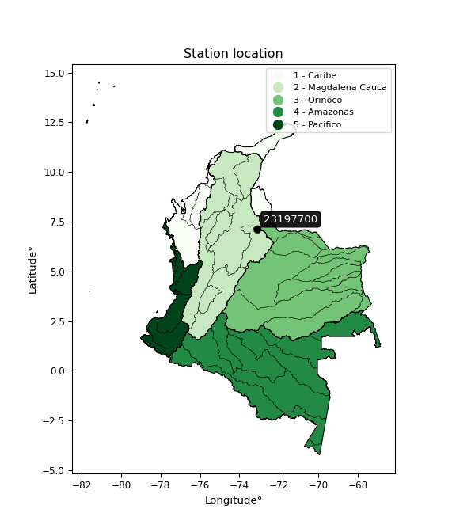

<div align="center">


</div>

# PMP Station (Rain, Pmax24h): 23197700

Probable Maximum Precipitation (PMP) is the greatest amount of rainfall for a specific duration that is meteorologically possible for a given location, acting as a "worst-case" scenario for extreme storms, crucial for designing safety-critical infrastructure like bridges, river deviations, dams, spillways, and nuclear plants to prevent catastrophic failure. PMP is calculated by hydrologists using meteorological data to determine the upper limit of extreme rainfall, often leading to the Probable Maximum Flood (PMF) for flood control design, and is increasingly being studied for climate change impacts. Probable Maximum Precipitation (PMP) is the theoretical upper limit of rainfall, a deterministic estimate for extreme events, while probability distributions (like GEV, Gumbel) describe the likelihood and frequency of various precipitation amounts, including rare ones, showing how often events occur, with PMP representing the extreme end of these distributions, used for critical infrastructure design to ensure safety against the worst conceivable weather, unlike standard statistical forecasts which cover typical probabilities.

The most common probability distributions in hydrology, used for analyzing floods, rainfall, and streamflow, include the Normal, Log-Normal, Gumbel, Gamma (including Log-Pearson Type III), and Generalized Extreme Value (GEV) distributions, often chosen based on the data´s skewness and whether modeling extremes or general conditions, with Gumbel and GEV popular for extreme events like floods, while the Normal distribution serves as a baseline, though often requiring transformations for skewed hydrological data. These distributions help in designing water infrastructure, managing water resources, and forecasting hydrologic events.

> Hydrological data often isn´t perfectly normal (it´s skewed), so different distributions are needed for different applications, such as: **Flood Frequency Analysis**: Using Gumbel, GEV, or Log-Pearson Type III for predicting extreme flood magnitudes and their return periods, **Rainfall Analysis**: Normal for annual totals, but Log-Normal, Weibull, or GEV for intensity or extreme daily rainfall, **Streamflow Modeling**: Gamma and Log-Normal for maximum flows, GEV for minimum flows, and Kappa for daily flows.

<div align="center">

</img>

</div>


## A. General information


### 1. General running parameters

• app_version: _v20260108_. • runtime: _2026-01-08 13:24:42.400241_. • Python version: _3.14.0_. • SciPy version: _1.16.3_. • Pandas version: _2.3.3_. • NumPy version: _2.3.5_. • Stations dataset (station_dataset_file): _dataset/pmax24h_in/automatic_colombia_2003_2024.csv_. • Stations catalog (station_catalog_file): _dataset/CNE.xls_. • Minimum year to eval til year_max (date_min): _1900_. • Maximum year to eval since year_min (date_max): _2024_. • Creates, save and include plots into reports (create_plot): _False_. • Plot only fit distributions with Δo > Δ (plot_only_fit): _True_. • Plot only simple graphs avoiding multiple CDFs and multiple Extreme values plots (plot_only_simple): _True_. • Eval low extreme values, if False, evaluates high extreme values (low_extreme): _False_. • Eval every SciPy distribution as logarithmic (pdist_logarithmic_on): _True_. • Standard deviation normalized (ddof): _1.0_. • Return periods to eval in years (Tr): _[2, 2.33, 5, 10, 15, 20, 25, 50, 75, 100, 200, 250, 500, 750, 1000]_. • Minimum data sample per station, 0 means any (minimum_sample): _5_. • Z-Score maximum threshold to adjust a value, 0 means disable (zscore_max): _3.5_. • Z-Score minimum threshold to adjust a value, 0 means disable (zscore_min): _-2.5_. • Avoid zeros, e.g. rain = 0 (avoid_zeros): _True_. • Avoid null values (avoid_nans): _True_. 

:file_folder:Table: [dataset.csv](../../dataset/pmax24h_in/automatic_colombia_2003_2024.csv)

> Delta Degrees of Freedom (DDOF): is a parameter used in the formulas for calculating variance and standard deviation. When ddof=0, the divisor is $N$ (the total number of observations) and this is used when your data set is the entire population. When ddof=1, the divisor is $N-1$ and this is used when your data set is a sample drawn from a larger population. Using $N-1$ provides an unbiased estimate of the population variance (known as Bessel´s correction).


### 2. Station info and location

|   id |   CODIGO | NOMBRE                   | CATEGORIA    | TECNOLOGIA                | ESTADO           | FECHA_INSTALACION   |   FECHA_SUSPENSION |   ALTITUD |   LATITUD |   LONGITUD | DEPARTAMENTO   | MUNICIPIO   | AREA_OPERATIVA                         | ENTIDAD                                                     | AREA_HIDROGRAFICA   | ZONA_HIDROGRAFICA   | SUBZONA_HIDROGRAFICA                      | CORRIENTE   | Catalogo   |   Version |
|-----:|---------:|:-------------------------|:-------------|:--------------------------|:-----------------|:--------------------|-------------------:|----------:|----------:|-----------:|:---------------|:------------|:---------------------------------------|:------------------------------------------------------------|:--------------------|:--------------------|:------------------------------------------|:------------|:-----------|----------:|
|    0 | 23197700 | MAJADAS - AUT [23197700] | Limnimétrica | Automática con Telemetría | En Mantenimiento | 15/10/2001          |                nan |       760 |   7.16028 |   -73.0931 | Santander      | Bucaramanga | Area Operativa 08 - Santanderes-Arauca | INSTITUTO DE HIDROLOGIA METEOROLOGIA Y ESTUDIOS AMBIENTALES | Magdalena Cauca     | Medio Magdalena     | Río Lebrija y otros directos al Magdalena | Surata      | CNE_IDEAM  |  20251226 |

<div align="center">

Dynamic map: [:earth_americas:Google](http://maps.google.com/maps?q=7.160277778,-73.09305556) [:earth_americas:OSM](https://www.openstreetmap.org/#map=18/7.160277778/-73.09305556&layers=P) [:earth_americas:Bing](https://www.bing.com/maps?cp=7.160277778~-73.09305556&lvl=18) [:earth_americas:Apple](https://maps.apple.com/frame?center=7.160277778%2C-73.09305556&span=0.003%2C0.006)

</div>


<div align="center">

```geojson
{
  "type": "Feature",
  "geometry": {
    "type": "Point", 
    "coordinates": [-73.09305556, 7.160277778]
  }, 
  "properties": {
    "Name": "23197700"
  }
}
```

</div>


### 3. Discrete values table and plot

<div align="center">

|               |          0 |          1 |           2 |           3 |           4 |
|:--------------|-----------:|-----------:|------------:|------------:|------------:|
| Date          | 2019       | 2020       | 2021        | 2022        | 2023        |
| Value         |   60.8     |    7.8     |    5        |   49.8      |    1.8      |
| Value_initial |   60.8     |    7.8     |    5        |   49.8      |    1.8      |
| count         |    5       |    5       |    5        |    5        |    5        |
| mean          |   25.04    |   25.04    |   25.04     |   25.04     |   25.04     |
| std           |   27.9766  |   27.9766  |   27.9766   |   27.9766   |   27.9766   |
| zscore        |    1.27821 |   -0.61623 |   -0.716314 |    0.885027 |   -0.830695 |


</div>


> The initial value (value_initial) correspond to the initial obtained or null completed value, and value (value) is adjusted only when the initial value is outside the valid range (outlier) definite through the Z-Score value. If Z-Score is active, values out of range or outliers are replaced with the station mean value. A Z-Score (or standard score) measures how many standard deviations a data point is from the mean of a dataset, indicating its relative position; positive scores mean above the mean, negative mean below, and a score of zero is exactly at the mean, allowing for comparison of values from different distributions. It´s calculated using the formula $z=(x–μ)/σ$, where $x$ is the data point, $μ$ is the mean, and $σ$ is the standard deviation, helping identify outliers and understand probability.
>
> <sub>**Note**: In this study, "completing" (filling gaps in) and "extending" (forecasting or lengthening the historical record) rainfall data series are avoided for certain critical analyses because they introduce artificial bias and uncertainty, which can distort the statistics of rare events (extremes), alter day-to-day variability, and compromise the integrity and homogeneity of the original data. Some reasons against Completing/Extending rainfall data are: **Distortion of Extremes and Variability**: The primary issue is that most gap-filling or extension methods rely on averaging or regression with nearby stations, which inherently smooths the data. Rainfall is highly variable in space and time, with a large percentage of zero values and occasional large storms. Infilling methods often underestimate the highest values and overestimate the lowest (zero) values, which severely distorts analyses focused on flood frequency, drought severity, and intensity-duration-frequency (IDF) curves, **Loss of Data Homogeneity**: Infilled or extended data are synthetic estimates, not actual measurements. Combining these estimates with observed data can violate the assumption of data homogeneity, which requires that the data properties do not change over time. Inhomogeneity can lead to incorrect conclusions about long-term trends or changes in climate patterns, **Propagation of Errors**: Errors and biases from the original data (e.g., wind-induced undercatch, instrument errors, site changes) or the data used for imputation can propagate through the analysis, leading to unreliable hydrological models and inaccurate predictions, **Compromised Statistical Integrity**: For statistical analyses, especially those involving the frequency of events, using artificial data can introduce time bias or autocorrelation that doesn´t exist in reality, making it difficult to assess the true probability of events, **Difficulty in Validation**: It is difficult to accurately validate the quality of filled or extended data, especially for past periods where ground-truth measurements are unavailable. The reliability of imputation techniques heavily depends on the density of the surrounding station network and the complexity of the local topography.</sub>


### 4. Active continuous probability distributions from SciPy (43 of 104 available)

A Probability Density Function (PDF) describes the relative likelihood of a continuous random variable falling within a specific range, where the total area under its curve equals 1, and the area over any interval gives the actual probability for that range. Unlike discrete probabilities (like rolling a die), a PDF shows density, not direct probability for a single point (which is zero), with higher points indicating higher likelihood, often visualized as a bell curve for normal distributions.

A log of a probability density function (log-PDF) is simply the logarithm of the PDF´s value, denoted as $log(f(x))$, useful for converting multiplication of probabilities into addition, improving numerical stability with tiny numbers, and connecting to information theory concepts like entropy. Instead of dealing with very small probabilities (e.g., 0.000001), log-PDFs use negative numbers (e.g., $log(0.00001) ≈ -11.51$ that are easier for computers to handle, preventing underflow errors and simplifying complex calculations. In this study, each active probability distribution from SciPy is also evaluated in the $log$ form.

[scipy.stats](https://docs.scipy.org/doc/scipy/reference/stats.html) is a Python´s powerful submodule within the SciPy library for comprehensive statistical analysis, offering over 130 probability distributions (like Normal, Poisson), functions for descriptive stats (mean, variance), hypothesis testing (t-tests, chi-square), random variable generation, and statistical tests, making it essential for data science, modeling, and research. It provides tools to explore, model, and draw conclusions from data efficiently, working seamlessly with NumPy.

<div align="center">

|   id | p_dist             |   n_parameter | fit_method   | label                                                                       | active   | ref                                                                                                        |
|-----:|:-------------------|--------------:|:-------------|:----------------------------------------------------------------------------|:---------|:-----------------------------------------------------------------------------------------------------------|
|    0 | alpha              |             3 | MLE          | Alpha                                                                       | True     | [:mortar_board:](https://docs.scipy.org/doc/scipy/reference/generated/scipy.stats.alpha.html)              |
|    1 | betaprime          |             4 | MLE          | Beta prime                                                                  | True     | [:mortar_board:](https://docs.scipy.org/doc/scipy/reference/generated/scipy.stats.betaprime.html)          |
|    2 | chi2               |             3 | MLE          | Chi²                                                                        | True     | [:mortar_board:](https://docs.scipy.org/doc/scipy/reference/generated/scipy.stats.chi2.html)               |
|    3 | crystalball        |             4 | MLE          | Crystalball                                                                 | True     | [:mortar_board:](https://docs.scipy.org/doc/scipy/reference/generated/scipy.stats.crystalball.html)        |
|    4 | erlang             |             3 | MLE          | Erlang                                                                      | True     | [:mortar_board:](https://docs.scipy.org/doc/scipy/reference/generated/scipy.stats.erlang.html)             |
|    5 | expon              |             2 | MLE          | Exponential                                                                 | True     | [:mortar_board:](https://docs.scipy.org/doc/scipy/reference/generated/scipy.stats.expon.html)              |
|    6 | exponnorm          |             3 | MLE          | Exponentially modified Normal                                               | True     | [:mortar_board:](https://docs.scipy.org/doc/scipy/reference/generated/scipy.stats.exponnorm.html)          |
|    7 | f                  |             4 | MLE          | F                                                                           | True     | [:mortar_board:](https://docs.scipy.org/doc/scipy/reference/generated/scipy.stats.f.html)                  |
|    8 | fatiguelife        |             3 | MLE          | Fatigue-life (Birnbaum-Saunders)                                            | True     | [:mortar_board:](https://docs.scipy.org/doc/scipy/reference/generated/scipy.stats.fatiguelife.html)        |
|    9 | fisk               |             3 | MLE          | Fisk                                                                        | True     | [:mortar_board:](https://docs.scipy.org/doc/scipy/reference/generated/scipy.stats.fisk.html)               |
|   10 | gamma              |             3 | MLE          | Gamma                                                                       | True     | [:mortar_board:](https://docs.scipy.org/doc/scipy/reference/generated/scipy.stats.gamma.html)              |
|   11 | genexpon           |             5 | MLE          | Generalized exponential                                                     | True     | [:mortar_board:](https://docs.scipy.org/doc/scipy/reference/generated/scipy.stats.genexpon.html)           |
|   12 | genlogistic        |             3 | MLE          | Generalized logistic                                                        | True     | [:mortar_board:](https://docs.scipy.org/doc/scipy/reference/generated/scipy.stats.genlogistic.html)        |
|   13 | gibrat             |             2 | MM           | Gibrat                                                                      | True     | [:mortar_board:](https://docs.scipy.org/doc/scipy/reference/generated/scipy.stats.gibrat.html)             |
|   14 | gompertz           |             3 | MLE          | Gompertz (or truncated Gumbel)                                              | True     | [:mortar_board:](https://docs.scipy.org/doc/scipy/reference/generated/scipy.stats.gompertz.html)           |
|   15 | gumbel_l           |             2 | MM           | Gumbel Left Skew                                                            | True     | [:mortar_board:](https://docs.scipy.org/doc/scipy/reference/generated/scipy.stats.gumbel_l.html)           |
|   16 | gumbel_r           |             2 | MM           | Gumbel Right Skew                                                           | True     | [:mortar_board:](https://docs.scipy.org/doc/scipy/reference/generated/scipy.stats.gumbel_r.html)           |
|   17 | halflogistic       |             2 | MM           | Half-logistic                                                               | True     | [:mortar_board:](https://docs.scipy.org/doc/scipy/reference/generated/scipy.stats.halflogistic.html)       |
|   18 | halfnorm           |             2 | MM           | Half Normal                                                                 | True     | [:mortar_board:](https://docs.scipy.org/doc/scipy/reference/generated/scipy.stats.halfnorm.html)           |
|   19 | hypsecant          |             2 | MM           | hyperbolic secant                                                           | True     | [:mortar_board:](https://docs.scipy.org/doc/scipy/reference/generated/scipy.stats.hypsecant.html)          |
|   20 | invgamma           |             3 | MLE          | Inverted gamma                                                              | True     | [:mortar_board:](https://docs.scipy.org/doc/scipy/reference/generated/scipy.stats.invgamma.html)           |
|   21 | invgauss           |             3 | MLE          | Inverse Gaussian                                                            | True     | [:mortar_board:](https://docs.scipy.org/doc/scipy/reference/generated/scipy.stats.invgauss.html)           |
|   22 | invweibull         |             3 | MLE          | Inverted Weibull                                                            | True     | [:mortar_board:](https://docs.scipy.org/doc/scipy/reference/generated/scipy.stats.invweibull.html)         |
|   23 | kstwobign          |             2 | MLE          | Limiting distribution of scaled Kolmogorov-Smirnov two-sided test statistic | True     | [:mortar_board:](https://docs.scipy.org/doc/scipy/reference/generated/scipy.stats.kstwobign.html)          |
|   24 | laplace            |             2 | MM           | Laplace                                                                     | True     | [:mortar_board:](https://docs.scipy.org/doc/scipy/reference/generated/scipy.stats.laplace.html)            |
|   25 | laplace_asymmetric |             3 | MLE          | Asymmetric Laplace                                                          | True     | [:mortar_board:](https://docs.scipy.org/doc/scipy/reference/generated/scipy.stats.laplace_asymmetric.html) |
|   26 | loggamma           |             3 | MLE          | Log gamma                                                                   | True     | [:mortar_board:](https://docs.scipy.org/doc/scipy/reference/generated/scipy.stats.loggamma.html)           |
|   27 | logistic           |             2 | MM           | Logistic (or Sech-squared)                                                  | True     | [:mortar_board:](https://docs.scipy.org/doc/scipy/reference/generated/scipy.stats.logistic.html)           |
|   28 | lognorm            |             3 | MLE          | Log Normal                                                                  | True     | [:mortar_board:](https://docs.scipy.org/doc/scipy/reference/generated/scipy.stats.lognorm.html)            |
|   29 | maxwell            |             2 | MM           | Maxwell                                                                     | True     | [:mortar_board:](https://docs.scipy.org/doc/scipy/reference/generated/scipy.stats.maxwell.html)            |
|   30 | mielke             |             4 | MLE          | Mielke Beta-Kappa / Dagum                                                   | True     | [:mortar_board:](https://docs.scipy.org/doc/scipy/reference/generated/scipy.stats.mielke.html)             |
|   31 | moyal              |             2 | MM           | Moyal                                                                       | True     | [:mortar_board:](https://docs.scipy.org/doc/scipy/reference/generated/scipy.stats.moyal.html)              |
|   32 | nakagami           |             3 | MLE          | Nakagami                                                                    | True     | [:mortar_board:](https://docs.scipy.org/doc/scipy/reference/generated/scipy.stats.nakagami.html)           |
|   33 | ncf                |             5 | MLE          | Non-central F distribution                                                  | True     | [:mortar_board:](https://docs.scipy.org/doc/scipy/reference/generated/scipy.stats.ncf.html)                |
|   34 | nct                |             4 | MLE          | Non-central Student’s t                                                     | True     | [:mortar_board:](https://docs.scipy.org/doc/scipy/reference/generated/scipy.stats.nct.html)                |
|   35 | norm               |             2 | MM           | Normal                                                                      | True     | [:mortar_board:](https://docs.scipy.org/doc/scipy/reference/generated/scipy.stats.norm.html)               |
|   36 | pearson3           |             3 | MM           | Pearson type III                                                            | True     | [:mortar_board:](https://docs.scipy.org/doc/scipy/reference/generated/scipy.stats.pearson3.html)           |
|   37 | rayleigh           |             2 | MM           | Rayleigh                                                                    | True     | [:mortar_board:](https://docs.scipy.org/doc/scipy/reference/generated/scipy.stats.rayleigh.html)           |
|   38 | rice               |             3 | MLE          | Rice                                                                        | True     | [:mortar_board:](https://docs.scipy.org/doc/scipy/reference/generated/scipy.stats.rice.html)               |
|   39 | t                  |             3 | MLE          | Student’s t                                                                 | True     | [:mortar_board:](https://docs.scipy.org/doc/scipy/reference/generated/scipy.stats.t.html)                  |
|   40 | truncnorm          |             4 | MLE          | Truncated normal                                                            | True     | [:mortar_board:](https://docs.scipy.org/doc/scipy/reference/generated/scipy.stats.truncnorm.html)          |
|   41 | wald               |             2 | MM           | Wald                                                                        | True     | [:mortar_board:](https://docs.scipy.org/doc/scipy/reference/generated/scipy.stats.wald.html)               |
|   42 | weibull_min        |             3 | MLE          | Weibull minimum                                                             | True     | [:mortar_board:](https://docs.scipy.org/doc/scipy/reference/generated/scipy.stats.weibull_min.html)        |

</div>

> **n_parameter:** # arguments & localization & scale.
>
> **Fit methods:** (MLE) maximum likelihood, (MM) L-moments.
>
>**Inactive** (With the only purpose of prevent loops, zero divisions, infinite values, over high estimated values or horizontal trending for recurrence intervals estimations, the follow distributions were disabled.)**:** foldnorm, gennorm, norminvgauss, powernorm, powerlognorm, skewnorm, genextreme, anglit, arcsine, argus, beta, bradford, burr, burr12, cauchy, cosine, halfcauchy, foldcauchy, skewcauchy, wrapcauchy, dgamma, gengamma, exponweib, exponpow, truncexpon, gausshyper, genhalflogistic, genhyperbolic, geninvgauss, halfgennorm, johnsonsb, johnsonsu, kappa4, kappa3, ksone, kstwo, loglaplace, levy, levy_l, levy_stable, ncx2, pareto, genpareto, truncpareto, lomax, powerlaw, rdist, rel_breitwigner, recipinvgauss, semicircular, studentized_range, trapezoid, triang, truncweibull_min, tukeylambda, uniform, loguniform, vonmises, vonmises_line, weibull_max, dweibull, 


## B. Probability (PDF) vs. Empirical (EDF) distributions functions

A continuous probability distribution (CPD) describes probabilities for variables that can take any value within a range (like rain any time), unlike discrete variables with specific outcomes (like temperature). It uses a Probability Density Function (PDF), a curve where the total area under it equals 1, and the probability of the variable falling within an interval (a to b) is found by calculating the area under the curve between those points. A key feature is that the probability of hitting any single exact value is zero, so probabilities are always expressed for ranges, e.g., $P(a ≤ X ≤ b)$.

<div align="center">

Distributions parameters from station values
|    |   station | p_dist                |   n |             loc |          scale | shape                  | shape1                | shape2                | shape3   |
|---:|----------:|:----------------------|----:|----------------:|---------------:|:-----------------------|:----------------------|:----------------------|:---------|
|  0 |  23197700 | alpha                 |   5 |    -2.24586     |    7.4502      | 1.0081545793767305e-07 |                       |                       |          |
|  1 |  23197700 | betaprime             |   5 |     0.197385    |    0.76136     | 6.285406158424815      | 0.8302405324450979    |                       |          |
|  2 |  23197700 | chi2                  |   5 |     1.8         |    3.07307     | 1.2507177756233667     |                       |                       |          |
|  3 |  23197700 | crystalball           |   5 |    25.04        |   25.023       | 2579.9944043502437     | 33.73639973947516     |                       |          |
|  4 |  23197700 | erlang                |   5 |     1.8         |   15.8459      | 0.8112288347055585     |                       |                       |          |
|  5 |  23197700 | expon                 |   5 |     1.8         |   23.24        |                        |                       |                       |          |
|  6 |  23197700 | exponnorm             |   5 |     1.77109     |    0.00872828  | 2651.77309425534       |                       |                       |          |
|  7 |  23197700 | f                     |   5 |     1.8         |   40.0901      | 0.5698043832853169     | 6.170888984117502     |                       |          |
|  8 |  23197700 | fatiguelife           |   5 |     1.8         |    0.000142332 | 371.43454861058467     |                       |                       |          |
|  9 |  23197700 | fisk                  |   5 |     1.8         |    3.0379      | 0.8677910447608794     |                       |                       |          |
| 10 |  23197700 | gamma                 |   5 |     1.8         |   25.7991      | 0.37731228105027337    |                       |                       |          |
| 11 |  23197700 | genexpon              |   5 |     1.8         |   49.259       | 2.1195590739996453     | 2.523290098619062e-08 | 1.0854814601123892    |          |
| 12 |  23197700 | genlogistic           |   5 |  -125.996       |   18.4023      | 1937.8525981040293     |                       |                       |          |
| 13 |  23197700 | gibrat                |   5 |     5.95059     |   11.5783      |                        |                       |                       |          |
| 14 |  23197700 | gompertz              |   5 |     1.8         |    1.11374e+10 | 484876156.87462366     |                       |                       |          |
| 15 |  23197700 | gumbel_l              |   5 |    36.3017      |   19.5104      |                        |                       |                       |          |
| 16 |  23197700 | gumbel_r              |   5 |    13.7783      |   19.5104      |                        |                       |                       |          |
| 17 |  23197700 | halflogistic          |   5 |    -4.61807     |   21.3938      |                        |                       |                       |          |
| 18 |  23197700 | halfnorm              |   5 |    -8.08064     |   41.5106      |                        |                       |                       |          |
| 19 |  23197700 | hypsecant             |   5 |    25.04        |   15.9301      |                        |                       |                       |          |
| 20 |  23197700 | invgamma              |   5 |     0.671163    |    2.47191     | 0.6397982056386442     |                       |                       |          |
| 21 |  23197700 | invgauss              |   5 |     0.64733     |    4.67685     | 5.215599690033294      |                       |                       |          |
| 22 |  23197700 | invweibull            |   5 |     1.8         |    7.73511e-13 | 0.19684133438572454    |                       |                       |          |
| 23 |  23197700 | kstwobign             |   5 |   -49.3055      |   84.9705      |                        |                       |                       |          |
| 24 |  23197700 | laplace               |   5 |    25.04        |   17.6939      |                        |                       |                       |          |
| 25 |  23197700 | laplace_asymmetric    |   5 |     1.8         |    0.000734944 | 3.162434448852742e-05  |                       |                       |          |
| 26 |  23197700 | loggamma              |   5 | -6897.77        |  954.304       | 1414.651271030979      |                       |                       |          |
| 27 |  23197700 | logistic              |   5 |    25.04        |   13.7959      |                        |                       |                       |          |
| 28 |  23197700 | lognorm               |   5 |     1.8         |    0.0065519   | 15.549384640535758     |                       |                       |          |
| 29 |  23197700 | maxwell               |   5 |   -34.254       |   37.157       |                        |                       |                       |          |
| 30 |  23197700 | mielke                |   5 |     1.8         |    0.0430351   | 0.924111693171501      | 0.46811178370276985   |                       |          |
| 31 |  23197700 | moyal                 |   5 |    10.7302      |   11.2643      |                        |                       |                       |          |
| 32 |  23197700 | nakagami              |   5 |     1.8         |   61.536       | 0.0499174051419228     |                       |                       |          |
| 33 |  23197700 | ncf                   |   5 |    -0.0944377   |    5.69915     | 83.32157992389199      | 1.6107971665551644    | 0.030647127973705363  |          |
| 34 |  23197700 | nct                   |   5 |    -0.19713     |    0.0741042   | 0.6289369448637265     | 54.73602816626948     |                       |          |
| 35 |  23197700 | norm                  |   5 |    25.04        |   25.023       |                        |                       |                       |          |
| 36 |  23197700 | pearson3              |   5 |    25.04        |   25.023       | 0.4491218001705546     |                       |                       |          |
| 37 |  23197700 | rayleigh              |   5 |   -22.8305      |   38.1951      |                        |                       |                       |          |
| 38 |  23197700 | rice                  |   5 |   -15.3848      |   33.6178      | 0.001146597155807544   |                       |                       |          |
| 39 |  23197700 | t                     |   5 |     5.31607     |    3.17511     | 0.5463774163576727     |                       |                       |          |
| 40 |  23197700 | truncnorm             |   5 |  -143.851       |   66.1514      | 2.2017767325155706     | 73.00274452779365     |                       |          |
| 41 |  23197700 | wald                  |   5 |     0.0170026   |   25.023       |                        |                       |                       |          |
| 42 |  23197700 | weibull_min           |   5 |     1.8         |   29.0628      | 0.4569511473379927     |                       |                       |          |
| 43 |  23197700 | logalpha              |   5 |     0.00145403  |    1.1695      | 3.774737636282274e-09  |                       |                       |          |
| 44 |  23197700 | logbetaprime          |   5 |     0.587787    |   42.9176      | 0.6558617051846685     | 14.486005350722962    |                       |          |
| 45 |  23197700 | logchi2               |   5 |     0.587787    |    1.0441      | 1.4287295953525536     |                       |                       |          |
| 46 |  23197700 | logcrystalball        |   5 |     2.45339     |    1.35679     | 7.516827773563815      | 9947.779522759254     |                       |          |
| 47 |  23197700 | logerlang             |   5 |   -66.7993      |    0.026583    | 2605.131412107874      |                       |                       |          |
| 48 |  23197700 | logexpon              |   5 |     0.587787    |    1.8656      |                        |                       |                       |          |
| 49 |  23197700 | logexponnorm          |   5 |     2.42218     |    1.35644     | 0.02300831461083052    |                       |                       |          |
| 50 |  23197700 | logf                  |   5 |     0.587787    |    1.81734     | 1.1101176461190065     | 81.99952937823818     |                       |          |
| 51 |  23197700 | logfatiguelife        |   5 |    -3.00703     |    5.28476     | 0.2577932467428872     |                       |                       |          |
| 52 |  23197700 | logfisk               |   5 |    -2.05913     |    4.33677     | 5.167213247050215      |                       |                       |          |
| 53 |  23197700 | loggamma              |   5 |   -67.3405      |    0.0263678   | 2646.9140849386595     |                       |                       |          |
| 54 |  23197700 | loggenexpon           |   5 |     0.586922    |    0.0238879   | 0.008121559435839164   | 2.5468087072208396    | 3.064038665299565e-05 |          |
| 55 |  23197700 | loggenlogistic        |   5 |    -5.38975     |    1.18378     | 428.9477727544936      |                       |                       |          |
| 56 |  23197700 | loggibrat             |   5 |     1.41831     |    0.627805    |                        |                       |                       |          |
| 57 |  23197700 | loggompertz           |   5 |     0.587787    |    2.35587     | 0.6285458206962837     |                       |                       |          |
| 58 |  23197700 | loggumbel_l           |   5 |     3.06402     |    1.05789     |                        |                       |                       |          |
| 59 |  23197700 | loggumbel_r           |   5 |     1.84276     |    1.05789     |                        |                       |                       |          |
| 60 |  23197700 | loghalflogistic       |   5 |     0.8453      |    1.16        |                        |                       |                       |          |
| 61 |  23197700 | loghalfnorm           |   5 |     0.657505    |    2.25081     |                        |                       |                       |          |
| 62 |  23197700 | loghypsecant          |   5 |     2.45339     |    0.863762    |                        |                       |                       |          |
| 63 |  23197700 | loginvgamma           |   5 |   -10.7339      | 1227.26        | 94.06980234810919      |                       |                       |          |
| 64 |  23197700 | loginvgauss           |   5 |    -3.42235     |  102.137       | 0.05753421021693468    |                       |                       |          |
| 65 |  23197700 | loginvweibull         |   5 |    -4.30189e+07 |    4.30189e+07 | 36273348.14729928      |                       |                       |          |
| 66 |  23197700 | logkstwobign          |   5 |    -2.30146     |    5.42585     |                        |                       |                       |          |
| 67 |  23197700 | loglaplace            |   5 |     2.45339     |    0.959399    |                        |                       |                       |          |
| 68 |  23197700 | loglaplace_asymmetric |   5 |     1.60945     |    1.00452     | 0.6646012138808968     |                       |                       |          |
| 69 |  23197700 | logloggamma           |   5 |  -250.855       |   38.0132      | 783.8855312330925      |                       |                       |          |
| 70 |  23197700 | loglogistic           |   5 |     2.45339     |    0.74804     |                        |                       |                       |          |
| 71 |  23197700 | loglognorm            |   5 |     0.587787    |    0.00114216  | 14.988470323429338     |                       |                       |          |
| 72 |  23197700 | logmaxwell            |   5 |    -0.761642    |    2.01472     |                        |                       |                       |          |
| 73 |  23197700 | logmielke             |   5 |     0.587787    |    4.05734     | 0.49164031520122414    | 840.4609741420186     |                       |          |
| 74 |  23197700 | logmoyal              |   5 |     1.67749     |    0.610772    |                        |                       |                       |          |
| 75 |  23197700 | lognakagami           |   5 |     1.60944     |    0.716561    | 0.08076234990153991    |                       |                       |          |
| 76 |  23197700 | logncf                |   5 |    -0.27096     |    1.44296e-06 | 9.051701499725113e-06  | 51.28171591271584     | 16.530443565364074    |          |
| 77 |  23197700 | lognct                |   5 |   -55.9765      |    1.2765      | 8173.64045728885       | 45.76923878935513     |                       |          |
| 78 |  23197700 | lognorm               |   5 |     2.45339     |    1.35679     |                        |                       |                       |          |
| 79 |  23197700 | logpearson3           |   5 |     2.45339     |    1.35679     | 0.035773723152046896   |                       |                       |          |
| 80 |  23197700 | lograyleigh           |   5 |    -0.142236    |    2.07101     |                        |                       |                       |          |
| 81 |  23197700 | logrice               |   5 |    -0.114505    |    1.69136     | 0.9739374267239372     |                       |                       |          |
| 82 |  23197700 | logt                  |   5 |     2.45339     |    1.35679     | 8939029855.401947      |                       |                       |          |
| 83 |  23197700 | logtruncnorm          |   5 |     0.0381635   |    3.1611      | 0.14883154036298013    | 1.2873449447615297    |                       |          |
| 84 |  23197700 | logwald               |   5 |     1.09663     |    1.35677     |                        |                       |                       |          |
| 85 |  23197700 | logweibull_min        |   5 |     0.587787    |    1.95514     | 0.2993205611899249     |                       |                       |          |

</div>

> **loc** (Location parameter): This shifts the distribution along the x-axis. For many common distributions, like the normal (Gaussian) distribution, loc represents the mean $μ$. For others, like the uniform distribution, it might represent the minimum value, or for the beta distribution, the left end of the support interval.
>
> **scale** (Scale parameter): This determines the width or spread of the distribution. For the normal distribution, scale represents the standard deviation $σ$. For a uniform distribution, it defines the length of the interval (from $loc$ to $loc + scale$).
>
> **shape** (Shape parameters): Refers to parameters that define the specific form of a probability distribution, distinct from its location (loc) and scale (scale). These parameters are required arguments for most distribution functions. For example, a normal (Gaussian) distribution is fully defined by its location (mean) and scale (standard deviation), so it has no specific shape parameters beyond loc and scale. However, other distributions have intrinsic properties that need specification, as Gamma distribution that takes a shape parameter, often named $a$ or $alpha$.


### 0. Cumulative distribution values - CDF (86 evaluated)

Cumulative Distribution Function (CDF), denoted as $F$<sub>$X$</sub>$(x)$, is a function that gives the probability that a random variable $X$ will take a value less than or equal to a specific value, $x$ (i.e., $(P(X≥x)$. It essentially "accumulates" probabilities from a given point up to the far right (positive infinity), providing a complete picture of the distribution´s probabilities for both discrete (like rain) and continuous (like temperature) variables, helping to find probabilities over ranges or above certain values. Each station is evaluated separately ordering the $x$ values ascending, calculating the CDF and PDF values for the activated distributions and their logarithmic forms.

<div align="center">

CDF ordered by x ascending and calculating $log(f(x))$ separately
|   id |   Station |   date |    x |   count |   mean |     std |    zscore |   Value_initial |   station |   m |     alpha |   alpha_pdf |   betaprime |   betaprime_pdf |        chi2 |         chi2_pdf |   crystalball |   crystalball_pdf |      erlang |   erlang_pdf |    expon |   expon_pdf |   exponnorm |   exponnorm_pdf |          f |          f_pdf |   fatiguelife |   fatiguelife_pdf |        fisk |    fisk_pdf |       gamma |   gamma_pdf |    genexpon |   genexpon_pdf |   genlogistic |   genlogistic_pdf |    gibrat |   gibrat_pdf |    gompertz |   gompertz_pdf |   gumbel_l |   gumbel_l_pdf |   gumbel_r |   gumbel_r_pdf |   halflogistic |   halflogistic_pdf |   halfnorm |   halfnorm_pdf |   hypsecant |   hypsecant_pdf |   invgamma |   invgamma_pdf |   invgauss |   invgauss_pdf |   invweibull |   invweibull_pdf |   kstwobign |   kstwobign_pdf |   laplace |   laplace_pdf |   laplace_asymmetric |   laplace_asymmetric_pdf |   loggamma |   loggamma_pdf |   logistic |   logistic_pdf |   lognorm |   lognorm_pdf |   maxwell |   maxwell_pdf |      mielke |   mielke_pdf |    moyal |   moyal_pdf |   nakagami |   nakagami_pdf |       ncf |    ncf_pdf |       nct |    nct_pdf |     norm |   norm_pdf |   pearson3 |   pearson3_pdf |   rayleigh |   rayleigh_pdf |     rice |   rice_pdf |        t |       t_pdf |   truncnorm |   truncnorm_pdf |        wald |   wald_pdf |   weibull_min |   weibull_min_pdf |   logalpha |   logalpha_pdf |   logbetaprime |   logbetaprime_pdf |     logchi2 |   logchi2_pdf |   logcrystalball |   logcrystalball_pdf |   logerlang |   logerlang_pdf |   logexpon |   logexpon_pdf |   logexponnorm |   logexponnorm_pdf |        logf |    logf_pdf |   logfatiguelife |   logfatiguelife_pdf |   logfisk |   logfisk_pdf |   loggenexpon |   loggenexpon_pdf |   loggenlogistic |   loggenlogistic_pdf |   loggibrat |   loggibrat_pdf |   loggompertz |   loggompertz_pdf |   loggumbel_l |   loggumbel_l_pdf |   loggumbel_r |   loggumbel_r_pdf |   loghalflogistic |   loghalflogistic_pdf |   loghalfnorm |   loghalfnorm_pdf |   loghypsecant |   loghypsecant_pdf |   loginvgamma |   loginvgamma_pdf |   loginvgauss |   loginvgauss_pdf |   loginvweibull |   loginvweibull_pdf |   logkstwobign |   logkstwobign_pdf |   loglaplace |   loglaplace_pdf |   loglaplace_asymmetric |   loglaplace_asymmetric_pdf |   logloggamma |   logloggamma_pdf |   loglogistic |   loglogistic_pdf |   loglognorm |   loglognorm_pdf |   logmaxwell |   logmaxwell_pdf |   logmielke |   logmielke_pdf |   logmoyal |   logmoyal_pdf |   lognakagami |   lognakagami_pdf |    logncf |   logncf_pdf |    lognct |   lognct_pdf |   logpearson3 |   logpearson3_pdf |   lograyleigh |   lograyleigh_pdf |   logrice |   logrice_pdf |      logt |   logt_pdf |   logtruncnorm |   logtruncnorm_pdf |   logwald |   logwald_pdf |   logweibull_min |   logweibull_min_pdf |
|-----:|----------:|-------:|-----:|--------:|-------:|--------:|----------:|----------------:|----------:|----:|----------:|------------:|------------:|----------------:|------------:|-----------------:|--------------:|------------------:|------------:|-------------:|---------:|------------:|------------:|----------------:|-----------:|---------------:|--------------:|------------------:|------------:|------------:|------------:|------------:|------------:|---------------:|--------------:|------------------:|----------:|-------------:|------------:|---------------:|-----------:|---------------:|-----------:|---------------:|---------------:|-------------------:|-----------:|---------------:|------------:|----------------:|-----------:|---------------:|-----------:|---------------:|-------------:|-----------------:|------------:|----------------:|----------:|--------------:|---------------------:|-------------------------:|-----------:|---------------:|-----------:|---------------:|----------:|--------------:|----------:|--------------:|------------:|-------------:|---------:|------------:|-----------:|---------------:|----------:|-----------:|----------:|-----------:|---------:|-----------:|-----------:|---------------:|-----------:|---------------:|---------:|-----------:|---------:|------------:|------------:|----------------:|------------:|-----------:|--------------:|------------------:|-----------:|---------------:|---------------:|-------------------:|------------:|--------------:|-----------------:|---------------------:|------------:|----------------:|-----------:|---------------:|---------------:|-------------------:|------------:|------------:|-----------------:|---------------------:|----------:|--------------:|--------------:|------------------:|-----------------:|---------------------:|------------:|----------------:|--------------:|------------------:|--------------:|------------------:|--------------:|------------------:|------------------:|----------------------:|--------------:|------------------:|---------------:|-------------------:|--------------:|------------------:|--------------:|------------------:|----------------:|--------------------:|---------------:|-------------------:|-------------:|-----------------:|------------------------:|----------------------------:|--------------:|------------------:|--------------:|------------------:|-------------:|-----------------:|-------------:|-----------------:|------------:|----------------:|-----------:|---------------:|--------------:|------------------:|----------:|-------------:|----------:|-------------:|--------------:|------------------:|--------------:|------------------:|----------:|--------------:|----------:|-----------:|---------------:|-------------------:|----------:|--------------:|-----------------:|---------------------:|
|    0 |  23197700 |   2023 |  1.8 |       5 |  25.04 | 27.9766 | -0.830695 |             1.8 |  23197700 |   1 | 0.0655571 |  0.0666442  |   0.0647281 |      0.0850747  | 5.82289e-11 | 163994           |      0.17651  |        0.0103578  | 2.27738e-14 |  83.2029     | 0        |  0.0430293  |  0.00124819 |      0.0431312  | 0.00118432 | 57727.2        |     0.0362619 |       2.23276e+08 | 9.93592e-15 | 38.8314     | 4.09573e-07 | 6.95972e+08 | 6.60689e-11 |     0.0430289  |      0.154603 |        0.0156767  | 0         |   0          | 8.28941e-11 |     0.0435358  |   0.156849 |     0.00737298 |   0.157598 |     0.0149251  |       0.148884 |         0.0228532  |   0.18814  |     0.0186844  |    0.14543  |      0.00881491 |  0.0534683 |     0.116578   |  0.0530922 |     0.110554   |   0.00687502 |      3.03506e+13 |    0.137643 |      0.0156775  |  0.134446 |    0.00759843 |          1.59907e-09 |               0.0430296  |  0.0836684 |       0.115423 |   0.156493 |     0.00956826 | 0.0845644 |      0.114248 |  0.1846   |    0.0126264  | 0.000186856 | 41.7227      | 0.137158 |  0.0174405  |  0.0160427 |    7.21304e+12 | 0.0655808 | 0.0840702  | 0.0588898 | 0.104332   | 0.17651  | 0.0103578  |   0.177173 |     0.0121362  |   0.187729 |     0.0137138  | 0.122478 | 0.0133433  | 0.281553 | 0.0350468   | 7.23865e-12 |      0.0385946  | 0.000472709 | 0.00197097 |   1.50805e-08 |       3.10344e+07 |  0.0460855 |      0.371314  |     1.8558e-11 |     109631         | 2.59682e-12 | 16709         |        0.0845644 |             0.114248 |   0.0836932 |        0.115445 |   0        |      0.536019  |      0.0845639 |           0.114248 | 8.09142e-10 | 4.04533e+06 |         0.066291 |             0.141509 | 0.0723439 |      0.13101  |   0.000294035 |          0.340004 |        0.0644527 |             0.148806 |    0        |       0         |   6.43592e-10 |          0.2668   |     0.0917695 |         0.0826397 |     0.0378189 |         0.117077  |          0        |             0         |      0        |          0        |      0.0731056 |          0.0838942 |     0.0745973 |          0.126647 |     0.0673285 |          0.138981 |       0.0646097 |            0.149238 |      0.0607029 |           0.161814 |    0.0715254 |        0.0745523 |               0.0663185 |                   0.0993377 |      0.085816 |          0.113543 |     0.0762806 |         0.0941953 |    0.0228041 |      3.25103e+13 |    0.0699726 |         0.141964 | 3.57042e-07 |   562265        |  0.0146802 |      0.081182  |    0          |       0           | 0.0600902 |     0.156611 | 0.0840609 |     0.114611 |     0.0837203 |          0.11529  |     0.0602362 |          0.159952 |  0.052444 |      0.145952 | 0.0845639 |   0.114247 |      0.0288419 |           0.363633 |  0        |     0         |      1.37184e-05 |          3.69852e+10 |
|    1 |  23197700 |   2021 |  5   |       5 |  25.04 | 27.9766 | -0.716314 |             5   |  23197700 |   2 | 0.303855  |  0.0667361  |   0.324264  |      0.0636641  | 0.614204    |      0.0860983   |      0.211605 |        0.011569   | 0.267511    |   0.0605531  | 0.128634 |  0.0374942  |  0.130212   |      0.0375793  | 0.36364    |     0.0317575  |     0.656771  |       0.0231957   | 0.511276    |  0.0677617  | 0.495142    | 0.0533204   | 0.128633    |     0.0374939  |      0.208245 |        0.0177485  | 0         |   0          | 0.130046    |     0.0378741  |   0.182102 |     0.00842691 |   0.208419 |     0.0167523  |       0.221076 |         0.022229   |   0.247326 |     0.0182902  |    0.176293 |      0.0105095  |  0.368754  |     0.0649254  |  0.360008  |     0.0661108  |   0.996721   |      0.000201398 |    0.191333 |      0.0177598  |  0.161099 |    0.00910474 |          0.128635    |               0.0374945  |  0.268357  |       0.244966 |   0.189601 |     0.0111375  | 0.266964  |      0.242315 |  0.226801 |    0.0137163  | 0.78146     |  0.0264997   | 0.19718  |  0.0198849  |  0.658379  |    0.0205377   | 0.321233  | 0.0626912  | 0.364707  | 0.0663556  | 0.211605 | 0.011569   |   0.218133 |     0.0134351  |   0.233145 |     0.0146291  | 0.167932 | 0.0150081  | 0.472608 | 0.0858654   | 0.117109    |      0.0346547  | 0.0629777   | 0.035847   |   0.305723    |       0.0361749   |  0.467035  |      0.27702   |     0.478122   |          0.246285  | 0.542654    |     0.282243  |        0.266964  |             0.242315 |   0.268392  |        0.244956 |   0.421678 |      0.309992  |      0.266965  |           0.242316 | 0.527128    | 0.232879    |         0.29985  |             0.292756 | 0.296374  |      0.293726 |   0.342361    |          0.315486 |        0.313846  |             0.306821 |    0.117166 |       1.02909   |   0.289109    |          0.292635 |     0.22341   |         0.185611  |     0.287432  |         0.338752  |          0.317954 |             0.387459  |      0.327653 |          0.324161 |      0.229189  |          0.242999  |     0.282169  |          0.270384 |     0.296797  |          0.289648 |       0.314263  |            0.306727 |      0.323593  |           0.310217 |    0.20746   |        0.21624   |               0.306369  |                   0.458906  |      0.266469 |          0.240088 |     0.24449   |         0.246931  |    0.674881  |      0.0235074   |    0.290954  |         0.274428 | 0.507619    |        0.244277 |  0.290379  |      0.394897  |    0.00265883 |       1.93414e+12 | 0.313362  |     0.3041   | 0.267325  |     0.243417 |     0.268164  |          0.244681 |     0.300713  |          0.285591 |  0.281659 |      0.281531 | 0.266964  |   0.242314 |      0.383997  |           0.32627  |  0.248187 |     0.758459  |      0.561079    |          0.105889    |
|    2 |  23197700 |   2020 |  7.8 |       5 |  25.04 | 27.9766 | -0.61623  |             7.8 |  23197700 |   3 | 0.458318  |  0.0447408  |   0.465521  |      0.0396817  | 0.786131    |      0.0431385   |      0.245422 |        0.0125747  | 0.413406    |   0.0450672  | 0.22754  |  0.0332384  |  0.229318   |      0.0332974  | 0.432907   |     0.0198282  |     0.709784  |       0.0157738   | 0.643506    |  0.0331794  | 0.610253    | 0.0323418   | 0.227539    |     0.0332381  |      0.259849 |        0.0190229  | 0.0333072 |   0.0401123  | 0.229884    |     0.0335276  |   0.207085 |     0.00943024 |   0.257033 |     0.0178978  |       0.282343 |         0.0215082  |   0.29796  |     0.0178649  |    0.207983 |      0.0121466  |  0.50376   |     0.0358561  |  0.500768  |     0.0383054  |   0.997102   |      9.49471e-05 |    0.242905 |      0.0189832  |  0.18872  |    0.0106658  |          0.227542    |               0.0332386  |  0.386661  |       0.283208 |   0.222761 |     0.01255    | 0.384275  |      0.281574 |  0.266339 |    0.014497   | 0.829779    |  0.0115266   | 0.254743 |  0.0210878  |  0.701009  |    0.0116589   | 0.460453  | 0.0391581  | 0.503115  | 0.0367342  | 0.245422 | 0.0125747  |   0.257155 |     0.0144088  |   0.274983 |     0.0152225  | 0.211651 | 0.0161727  | 0.675707 | 0.0486983   | 0.209637    |      0.0314782  | 0.177564    | 0.0428516  |   0.385102    |       0.0227733   |  0.568849  |      0.188285  |     0.57342    |          0.18673   | 0.649924    |     0.205738  |        0.384275  |             0.281574 |   0.386686  |        0.283173 |   0.544329 |      0.244248  |      0.384276  |           0.281574 | 0.61628     | 0.17301     |         0.433406 |             0.301566 | 0.432066  |      0.308261 |   0.475824    |          0.283286 |        0.450999  |             0.30309  |    0.505059 |       0.627399  |   0.418826    |          0.288938 |     0.319517  |         0.247619  |     0.440918  |         0.341308  |          0.478505 |             0.332341  |      0.465069 |          0.292413 |      0.35784   |          0.332371  |     0.409479  |          0.296638 |     0.429592  |          0.301298 |       0.451316  |            0.302759 |      0.460319  |           0.298981 |    0.329786  |        0.343743  |               0.483161  |                   0.341946  |      0.382908 |          0.280039 |     0.369643  |         0.31149   |    0.683511  |      0.0161957   |    0.417838  |         0.2913   | 0.606305    |        0.203285 |  0.462538  |      0.366371  |    0.785735   |       0.277304    | 0.448864  |     0.299235 | 0.385073  |     0.282361 |     0.386357  |          0.283013 |     0.430136  |          0.291817 |  0.411218 |      0.296446 | 0.384274  |   0.281573 |      0.523676  |           0.301239 |  0.519371 |     0.466459  |      0.60048     |          0.0748244   |
|    3 |  23197700 |   2022 | 49.8 |       5 |  25.04 | 27.9766 |  0.885027 |            49.8 |  23197700 |   4 | 0.886174  |  0.00217213 |   0.856174  |      0.00226804 | 0.999874    |      2.13182e-05 |      0.838788 |        0.00977156 | 0.967549    |   0.00214918 | 0.873233 |  0.00545469 |  0.874455   |      0.00542417 | 0.733354   |     0.00329676 |     0.941028  |       0.00191396  | 0.916455    |  0.00138421 | 0.964049    | 0.00173942  | 0.873231    |     0.00545474 |      0.871476 |        0.00651451 | 0.908509  |   0.00374881 | 0.876278    |     0.00538634 |   0.864315 |     0.0138911  |   0.854002 |     0.00690815 |       0.85429  |         0.00631465 |   0.836791 |     0.00727102 |    0.867408 |      0.00808473 |  0.838825  |     0.00203531 |  0.881415  |     0.00238384 |   0.998074   |      7.8895e-06  |    0.868387 |      0.00722016 |  0.876621 |    0.00697294 |          0.873235    |               0.00545465 |  0.858083  |       0.163331 |   0.857507 |     0.00885689 | 0.858163  |      0.165503 |  0.836589 |    0.00850631 | 0.929989    |  0.000646339 | 0.859873 |  0.00615563 |  0.861531  |    0.00174078  | 0.849707  | 0.00230248 | 0.840154  | 0.00200761 | 0.838788 | 0.00977156 |   0.840883 |     0.00847285 |   0.836014 |     0.00816414 | 0.847387 | 0.00880234 | 0.925086 | 0.000918581 | 0.876513    |      0.00600284 | 0.884314    | 0.00444215 |   0.715688    |       0.00340404  |  0.764658  |      0.0584644 |     0.796809   |          0.0758529 | 0.875638    |     0.0670452 |        0.858163  |             0.165503 |   0.858033  |        0.163324 |   0.831312 |      0.0904198 |      0.858163  |           0.165502 | 0.820084    | 0.0684338   |         0.852249 |             0.130651 | 0.838763  |      0.11711  |   0.847748    |          0.120764 |        0.846675  |             0.119018 |    0.915851 |       0.062031  |   0.856906    |          0.15627  |     0.891464  |         0.227834  |     0.86766   |         0.116429  |          0.866817 |             0.107167  |      0.851304 |          0.124947 |      0.883161  |          0.132251  |     0.856178  |          0.144496 |     0.852775  |          0.132609 |       0.846497  |            0.118948 |      0.854365  |           0.122727 |    0.890226  |        0.11442   |               0.84841   |                   0.100293  |      0.858509 |          0.167205 |     0.874855  |         0.146361  |    0.70266   |      0.00695843  |    0.853504  |         0.144991 | 0.906131    |        0.134175 |  0.872048  |      0.103844  |    0.974634   |       0.0314323   | 0.846278  |     0.122355 | 0.858213  |     0.164645 |     0.857979  |          0.163565 |     0.852268  |          0.139505 |  0.855188 |      0.148184 | 0.858163  |   0.165503 |      0.966508  |           0.174499 |  0.893086 |     0.0747014 |      0.690181    |          0.0327279   |
|    4 |  23197700 |   2019 | 60.8 |       5 |  25.04 | 27.9766 |  1.27821  |            60.8 |  23197700 |   5 | 0.905932  |  0.00148512 |   0.877139  |      0.00160301 | 0.99998     |      3.29536e-06 |      0.92351  |        0.00574241 | 0.984293    |   0.00103247 | 0.921033 |  0.00339789 |  0.921946   |      0.00337234 | 0.765763   |     0.00263627 |     0.958485  |       0.00130462  | 0.929182    |  0.00096785 | 0.978701    | 0.000998701 | 0.921031    |     0.00339794 |      0.927123 |        0.00381221 | 0.940081  |   0.00216951 | 0.923358    |     0.00333667 |   0.970107 |     0.00537803 |   0.914107 |     0.00420769 |       0.910237 |         0.00400745 |   0.902955 |     0.00485152 |    0.932802 |      0.00418705 |  0.857865  |     0.00147483 |  0.903565  |     0.00170106 |   0.998151   |      6.16358e-06 |    0.93041  |      0.00424447 |  0.933741 |    0.00374475 |          0.921035    |               0.00339785 |  0.888144  |       0.138108 |   0.93035  |     0.00469698 | 0.888615  |      0.139836 |  0.912066 |    0.0053296  | 0.936121    |  0.000482172 | 0.913727 |  0.00381451 |  0.878825  |    0.00142345  | 0.871034  | 0.00163428 | 0.858924  | 0.00145309 | 0.92351  | 0.00574241 |   0.915094 |     0.00516498 |   0.909017 |     0.00521564 | 0.923299 | 0.00517048 | 0.933595 | 0.000653212 | 0.92858     |      0.0036387  | 0.923099    | 0.0027659  |   0.748933    |       0.00268736  |  0.775783  |      0.0531447 |     0.811318   |          0.0696507 | 0.888294    |     0.0599266 |        0.888615  |             0.139836 |   0.888094  |        0.138112 |   0.848426 |      0.0812465 |      0.888615  |           0.139835 | 0.833168    | 0.0627808   |         0.876487 |             0.112533 | 0.860452  |      0.100613 |   0.870391    |          0.106326 |        0.868819  |             0.103189 |    0.927138 |       0.0514865 |   0.886017    |          0.135483 |     0.931556  |         0.173505  |     0.889097  |         0.0987938 |          0.886675 |             0.0921579 |      0.87468  |          0.109498 |      0.906879  |          0.106277  |     0.882857  |          0.123135 |     0.877359  |          0.114047 |       0.868631  |            0.103153 |      0.877247  |           0.106819 |    0.910843  |        0.0929305 |               0.867161  |                   0.0878877 |      0.889265 |          0.141165 |     0.901267  |         0.118958  |    0.704007  |      0.00655025  |    0.880395  |         0.124695 | 0.932512    |        0.130252 |  0.891203  |      0.0885109 |    0.980267   |       0.0252152   | 0.86906   |     0.106223 | 0.888508  |     0.139131 |     0.888084  |          0.138311 |     0.878211  |          0.120674 |  0.882645 |      0.127171 | 0.888615  |   0.139837 |      1         |           0.161198 |  0.906854 |     0.0636292 |      0.696514    |          0.0307742   |


</div>

An Empirical Distribution Function (EDF) is a step-function estimate of a true cumulative distribution function (CDF) based on observed sample data, representing the proportion of data points less than or equal to a given value. It is calculated by ordering your data and jumping up by $1/n$ (where $n$ is sample size) at each unique data point, allowing analysis without assuming an underlying population distribution, and it gets closer to the true CDF as the sample size grows. For the empirical probability calculations, the parameter $m$ correspond to the order number which means the position of the $x$ values in an ascending order list.

The Kolmogorov-Smirnov (K-S) test is a non-parametric statistical test used to determine if a sample data set comes from a specific theoretical distribution (one-sample) or if two different samples come from the same underlying distribution (two-sample), by comparing their cumulative distribution functions (CDFs). It calculates the maximum vertical difference (D statistic) between these functions, with a small p-value indicating a significant difference and rejection of the null hypothesis (that the data/samples match).


### 1. EDF California (1923)

California´s estimates the true probability distribution of water-related data (like rainfall, streamflow) using observed samples, crucial for risk assessment.

<div align="center">


$P=m/n$


</div>


**1.1. Empirical values**

<div align="center">

|                | 0              | 1                  | 2              | 3                 | 4              |
|:---------------|:---------------|:-------------------|:---------------|:------------------|:---------------|
| date           | 2023           | 2021               | 2020           | 2022              | 2019           |
| x              | 1.8            | 5.0                | 7.8            | 49.8              | 60.8           |
| m              | 1              | 2                  | 3              | 4                 | 5              |
| empirical_dist | edf_california | edf_california     | edf_california | edf_california    | edf_california |
| empirical      | 0.2            | 0.4                | 0.6            | 0.8               | 1.0            |
| empirical_tr   | 1.25           | 1.6666666666666667 | 2.5            | 5.000000000000001 | inf            |

</div>


**1.2. Kolmogorov-Smirnov fit test (sorted by Δ)**


<div align="center">

|                | 0                  | 1                     | 2                   | 3                   | 4                   | 5                   | 6                   | 7                   | 8                   | 9                   | 10                  | 11                  | 12                  | 13                  | 14                  | 15                  | 16                 | 17                  | 18                 | 19                 | 20                  | 21                 | 22                 | 23                  | 24                 | 25                  | 26                  | 27                  | 28                 | 29                  | 30                  | 31                 | 32                 | 33                 | 34                 | 35                  | 36                  | 37                  | 38                  | 39                  | 40                  | 41                 | 42                  | 43                  | 44                  | 45                 | 46                 | 47                  | 48                 | 49                  | 50                  | 51                 | 52                 | 53                 | 54                  | 55                  | 56                 | 57                  | 58                 | 59                 | 60                  | 61                 | 62                  | 63                  | 64                 | 65                 | 66                 | 67                  | 68                 | 69                 | 70                  | 71                  | 72                  | 73                 | 74                  | 75                 | 76                 | 77                 | 78                 | 79                  | 80                 | 81                 | 82                 | 83                  | 84                 | 85                 |
|:---------------|:-------------------|:----------------------|:--------------------|:--------------------|:--------------------|:--------------------|:--------------------|:--------------------|:--------------------|:--------------------|:--------------------|:--------------------|:--------------------|:--------------------|:--------------------|:--------------------|:-------------------|:--------------------|:-------------------|:-------------------|:--------------------|:-------------------|:-------------------|:--------------------|:-------------------|:--------------------|:--------------------|:--------------------|:-------------------|:--------------------|:--------------------|:-------------------|:-------------------|:-------------------|:-------------------|:--------------------|:--------------------|:--------------------|:--------------------|:--------------------|:--------------------|:-------------------|:--------------------|:--------------------|:--------------------|:-------------------|:-------------------|:--------------------|:-------------------|:--------------------|:--------------------|:-------------------|:-------------------|:-------------------|:--------------------|:--------------------|:-------------------|:--------------------|:-------------------|:-------------------|:--------------------|:-------------------|:--------------------|:--------------------|:-------------------|:-------------------|:-------------------|:--------------------|:-------------------|:-------------------|:--------------------|:--------------------|:--------------------|:-------------------|:--------------------|:-------------------|:-------------------|:-------------------|:-------------------|:--------------------|:-------------------|:-------------------|:-------------------|:--------------------|:-------------------|:-------------------|
| station        | 23197700           | 23197700              | 23197700            | 23197700            | 23197700            | 23197700            | 23197700            | 23197700            | 23197700            | 23197700            | 23197700            | 23197700            | 23197700            | 23197700            | 23197700            | 23197700            | 23197700           | 23197700            | 23197700           | 23197700           | 23197700            | 23197700           | 23197700           | 23197700            | 23197700           | 23197700            | 23197700            | 23197700            | 23197700           | 23197700            | 23197700            | 23197700           | 23197700           | 23197700           | 23197700           | 23197700            | 23197700            | 23197700            | 23197700            | 23197700            | 23197700            | 23197700           | 23197700            | 23197700            | 23197700            | 23197700           | 23197700           | 23197700            | 23197700           | 23197700            | 23197700            | 23197700           | 23197700           | 23197700           | 23197700            | 23197700            | 23197700           | 23197700            | 23197700           | 23197700           | 23197700            | 23197700           | 23197700            | 23197700            | 23197700           | 23197700           | 23197700           | 23197700            | 23197700           | 23197700           | 23197700            | 23197700            | 23197700            | 23197700           | 23197700            | 23197700           | 23197700           | 23197700           | 23197700           | 23197700            | 23197700           | 23197700           | 23197700           | 23197700            | 23197700           | 23197700           |
| empirical_dist | edf_california     | edf_california        | edf_california      | edf_california      | edf_california      | edf_california      | edf_california      | edf_california      | edf_california      | edf_california      | edf_california      | edf_california      | edf_california      | edf_california      | edf_california      | edf_california      | edf_california     | edf_california      | edf_california     | edf_california     | edf_california      | edf_california     | edf_california     | edf_california      | edf_california     | edf_california      | edf_california      | edf_california      | edf_california     | edf_california      | edf_california      | edf_california     | edf_california     | edf_california     | edf_california     | edf_california      | edf_california      | edf_california      | edf_california      | edf_california      | edf_california      | edf_california     | edf_california      | edf_california      | edf_california      | edf_california     | edf_california     | edf_california      | edf_california     | edf_california      | edf_california      | edf_california     | edf_california     | edf_california     | edf_california      | edf_california      | edf_california     | edf_california      | edf_california     | edf_california     | edf_california      | edf_california     | edf_california      | edf_california      | edf_california     | edf_california     | edf_california     | edf_california      | edf_california     | edf_california     | edf_california      | edf_california      | edf_california      | edf_california     | edf_california      | edf_california     | edf_california     | edf_california     | edf_california     | edf_california      | edf_california     | edf_california     | edf_california     | edf_california      | edf_california     | edf_california     |
| p_dist         | t                  | loglaplace_asymmetric | betaprime           | ncf                 | logkstwobign        | nct                 | alpha               | invgamma            | invgauss            | loginvweibull       | loggenlogistic      | logncf              | loggumbel_r         | logfatiguelife      | logfisk             | lograyleigh         | loginvgauss        | logtruncnorm        | logmaxwell         | logmoyal           | logrice             | loginvgamma        | loggenexpon        | gamma               | logmielke          | logf                | loggompertz         | logbetaprime        | logchi2            | erlang              | fisk                | loghalfnorm        | logwald            | loghalflogistic    | logexpon           | logerlang           | loggamma            | loggamma            | logpearson3         | chi2                | lognct              | logexponnorm       | lognorm             | lognorm             | logcrystalball      | logt               | logloggamma        | logalpha            | loglogistic        | f                   | loghypsecant        | weibull_min        | fatiguelife        | nakagami           | loglaplace          | loggumbel_l         | loggibrat          | loglognorm          | halfnorm           | logweibull_min     | halflogistic        | rayleigh           | maxwell             | genlogistic         | pearson3           | gumbel_r           | moyal              | norm                | crystalball        | kstwobign          | gompertz            | exponnorm           | laplace_asymmetric  | expon              | genexpon            | logistic           | mielke             | rice               | truncnorm          | hypsecant           | gumbel_l           | lognakagami        | laplace            | wald                | gibrat             | invweibull         |
| delta          | 0.1250863324355751 | 0.13368151120379512   | 0.13527186965278692 | 0.13954652476519291 | 0.13968099391782318 | 0.14111022886818192 | 0.14168197744352862 | 0.14653166628682518 | 0.14690782572503924 | 0.14868409850626307 | 0.14900051968748507 | 0.15113637308888644 | 0.16218108623508953 | 0.16659412801443402 | 0.16793388198704712 | 0.16986408690969224 | 0.1704081574921864 | 0.17115806696140254 | 0.1821619992779187 | 0.1853197884142185 | 0.18878154594616797 | 0.1905212577450235 | 0.1997059648955403 | 0.19999959042736434 | 0.1999996429579398 | 0.19999999919085787 | 0.19999999935640786 | 0.19999999998144205 | 0.1999999999974032 | 0.19999999999997722 | 0.19999999999999007 | 0.2                | 0.2                | 0.2                | 0.2                | 0.21331374558319266 | 0.21333938724506007 | 0.21333938724506007 | 0.21364268949066867 | 0.21420365627480054 | 0.21492670778477213 | 0.2157237281504153 | 0.21572504561944827 | 0.21572504561944827 | 0.21572504735550835 | 0.2157262010349233 | 0.2170923464389527 | 0.22421699865303157 | 0.2303574871666677 | 0.23423683298611142 | 0.24216001544712373 | 0.2510668320325994 | 0.2567710291534352 | 0.2583787260328694 | 0.27021387023477833 | 0.28048272383514755 | 0.2828338216147707 | 0.29599265151714005 | 0.3020396238822095 | 0.3034862289331589 | 0.31765700821647647 | 0.3250173177709833 | 0.33366084894113374 | 0.34015098436705604 | 0.3428453141769789 | 0.3429667571739996 | 0.3452573963436416 | 0.35457773793053965 | 0.3545777415028926 | 0.3570953814684309 | 0.37011564516905604 | 0.37068185021471234 | 0.37245807925210095 | 0.372459607672115  | 0.37246147603553387 | 0.3772386618800744 | 0.3814600678406689 | 0.3883492898651565 | 0.3903625216377731 | 0.39201705805358644 | 0.3929150809025953 | 0.3973411731543687 | 0.4112803230892009 | 0.42243647122316685 | 0.5666928172933516 | 0.5967205418304428 |
| deltao         | 0.5865427407550001 | 0.5865427407550001    | 0.5865427407550001  | 0.5865427407550001  | 0.5865427407550001  | 0.5865427407550001  | 0.5865427407550001  | 0.5865427407550001  | 0.5865427407550001  | 0.5865427407550001  | 0.5865427407550001  | 0.5865427407550001  | 0.5865427407550001  | 0.5865427407550001  | 0.5865427407550001  | 0.5865427407550001  | 0.5865427407550001 | 0.5865427407550001  | 0.5865427407550001 | 0.5865427407550001 | 0.5865427407550001  | 0.5865427407550001 | 0.5865427407550001 | 0.5865427407550001  | 0.5865427407550001 | 0.5865427407550001  | 0.5865427407550001  | 0.5865427407550001  | 0.5865427407550001 | 0.5865427407550001  | 0.5865427407550001  | 0.5865427407550001 | 0.5865427407550001 | 0.5865427407550001 | 0.5865427407550001 | 0.5865427407550001  | 0.5865427407550001  | 0.5865427407550001  | 0.5865427407550001  | 0.5865427407550001  | 0.5865427407550001  | 0.5865427407550001 | 0.5865427407550001  | 0.5865427407550001  | 0.5865427407550001  | 0.5865427407550001 | 0.5865427407550001 | 0.5865427407550001  | 0.5865427407550001 | 0.5865427407550001  | 0.5865427407550001  | 0.5865427407550001 | 0.5865427407550001 | 0.5865427407550001 | 0.5865427407550001  | 0.5865427407550001  | 0.5865427407550001 | 0.5865427407550001  | 0.5865427407550001 | 0.5865427407550001 | 0.5865427407550001  | 0.5865427407550001 | 0.5865427407550001  | 0.5865427407550001  | 0.5865427407550001 | 0.5865427407550001 | 0.5865427407550001 | 0.5865427407550001  | 0.5865427407550001 | 0.5865427407550001 | 0.5865427407550001  | 0.5865427407550001  | 0.5865427407550001  | 0.5865427407550001 | 0.5865427407550001  | 0.5865427407550001 | 0.5865427407550001 | 0.5865427407550001 | 0.5865427407550001 | 0.5865427407550001  | 0.5865427407550001 | 0.5865427407550001 | 0.5865427407550001 | 0.5865427407550001  | 0.5865427407550001 | 0.5865427407550001 |
| eval           | Δo > Δ             | Δo > Δ                | Δo > Δ              | Δo > Δ              | Δo > Δ              | Δo > Δ              | Δo > Δ              | Δo > Δ              | Δo > Δ              | Δo > Δ              | Δo > Δ              | Δo > Δ              | Δo > Δ              | Δo > Δ              | Δo > Δ              | Δo > Δ              | Δo > Δ             | Δo > Δ              | Δo > Δ             | Δo > Δ             | Δo > Δ              | Δo > Δ             | Δo > Δ             | Δo > Δ              | Δo > Δ             | Δo > Δ              | Δo > Δ              | Δo > Δ              | Δo > Δ             | Δo > Δ              | Δo > Δ              | Δo > Δ             | Δo > Δ             | Δo > Δ             | Δo > Δ             | Δo > Δ              | Δo > Δ              | Δo > Δ              | Δo > Δ              | Δo > Δ              | Δo > Δ              | Δo > Δ             | Δo > Δ              | Δo > Δ              | Δo > Δ              | Δo > Δ             | Δo > Δ             | Δo > Δ              | Δo > Δ             | Δo > Δ              | Δo > Δ              | Δo > Δ             | Δo > Δ             | Δo > Δ             | Δo > Δ              | Δo > Δ              | Δo > Δ             | Δo > Δ              | Δo > Δ             | Δo > Δ             | Δo > Δ              | Δo > Δ             | Δo > Δ              | Δo > Δ              | Δo > Δ             | Δo > Δ             | Δo > Δ             | Δo > Δ              | Δo > Δ             | Δo > Δ             | Δo > Δ              | Δo > Δ              | Δo > Δ              | Δo > Δ             | Δo > Δ              | Δo > Δ             | Δo > Δ             | Δo > Δ             | Δo > Δ             | Δo > Δ              | Δo > Δ             | Δo > Δ             | Δo > Δ             | Δo > Δ              | Δo > Δ             | Δo <= Δ            |
| fit            | 1                  | 1                     | 1                   | 1                   | 1                   | 1                   | 1                   | 1                   | 1                   | 1                   | 1                   | 1                   | 1                   | 1                   | 1                   | 1                   | 1                  | 1                   | 1                  | 1                  | 1                   | 1                  | 1                  | 1                   | 1                  | 1                   | 1                   | 1                   | 1                  | 1                   | 1                   | 1                  | 1                  | 1                  | 1                  | 1                   | 1                   | 1                   | 1                   | 1                   | 1                   | 1                  | 1                   | 1                   | 1                   | 1                  | 1                  | 1                   | 1                  | 1                   | 1                   | 1                  | 1                  | 1                  | 1                   | 1                   | 1                  | 1                   | 1                  | 1                  | 1                   | 1                  | 1                   | 1                   | 1                  | 1                  | 1                  | 1                   | 1                  | 1                  | 1                   | 1                   | 1                   | 1                  | 1                   | 1                  | 1                  | 1                  | 1                  | 1                   | 1                  | 1                  | 1                  | 1                   | 1                  | 0                  |
| n              | 5                  | 5                     | 5                   | 5                   | 5                   | 5                   | 5                   | 5                   | 5                   | 5                   | 5                   | 5                   | 5                   | 5                   | 5                   | 5                   | 5                  | 5                   | 5                  | 5                  | 5                   | 5                  | 5                  | 5                   | 5                  | 5                   | 5                   | 5                   | 5                  | 5                   | 5                   | 5                  | 5                  | 5                  | 5                  | 5                   | 5                   | 5                   | 5                   | 5                   | 5                   | 5                  | 5                   | 5                   | 5                   | 5                  | 5                  | 5                   | 5                  | 5                   | 5                   | 5                  | 5                  | 5                  | 5                   | 5                   | 5                  | 5                   | 5                  | 5                  | 5                   | 5                  | 5                   | 5                   | 5                  | 5                  | 5                  | 5                   | 5                  | 5                  | 5                   | 5                   | 5                   | 5                  | 5                   | 5                  | 5                  | 5                  | 5                  | 5                   | 5                  | 5                  | 5                  | 5                   | 5                  | 5                  |
| best_fit       | 1                  | 0                     | 0                   | 0                   | 0                   | 0                   | 0                   | 0                   | 0                   | 0                   | 0                   | 0                   | 0                   | 0                   | 0                   | 0                   | 0                  | 0                   | 0                  | 0                  | 0                   | 0                  | 0                  | 0                   | 0                  | 0                   | 0                   | 0                   | 0                  | 0                   | 0                   | 0                  | 0                  | 0                  | 0                  | 0                   | 0                   | 0                   | 0                   | 0                   | 0                   | 0                  | 0                   | 0                   | 0                   | 0                  | 0                  | 0                   | 0                  | 0                   | 0                   | 0                  | 0                  | 0                  | 0                   | 0                   | 0                  | 0                   | 0                  | 0                  | 0                   | 0                  | 0                   | 0                   | 0                  | 0                  | 0                  | 0                   | 0                  | 0                  | 0                   | 0                   | 0                   | 0                  | 0                   | 0                  | 0                  | 0                  | 0                  | 0                   | 0                  | 0                  | 0                  | 0                   | 0                  | 0                  |
| best_fit_sort  | 1                  | 2                     | 3                   | 4                   | 5                   | 6                   | 7                   | 8                   | 9                   | 10                  | 11                  | 12                  | 13                  | 14                  | 15                  | 16                  | 17                 | 18                  | 19                 | 20                 | 21                  | 22                 | 23                 | 24                  | 25                 | 26                  | 27                  | 28                  | 29                 | 30                  | 31                  | 32                 | 33                 | 34                 | 35                 | 36                  | 37                  | 38                  | 39                  | 40                  | 41                  | 42                 | 43                  | 44                  | 45                  | 46                 | 47                 | 48                  | 49                 | 50                  | 51                  | 52                 | 53                 | 54                 | 55                  | 56                  | 57                 | 58                  | 59                 | 60                 | 61                  | 62                 | 63                  | 64                  | 65                 | 66                 | 67                 | 68                  | 69                 | 70                 | 71                  | 72                  | 73                  | 74                 | 75                  | 76                 | 77                 | 78                 | 79                 | 80                  | 81                 | 82                 | 83                 | 84                  | 85                 | 86                 |

</div>


<div align="center">

</img>

</div>


**1.3. Best fit**

<div align="center">

|   id |   station | empirical_dist   | p_dist   |    delta |   deltao | eval   |   fit |   n |   best_fit |   best_fit_sort |
|-----:|----------:|:-----------------|:---------|---------:|---------:|:-------|------:|----:|-----------:|----------------:|
|    0 |  23197700 | edf_california   | t        | 0.125086 | 0.586543 | Δo > Δ |     1 |   5 |          1 |               1 |

</div>


### 2. EDF Hazen (1930)

Hazen method for plotting positions is a formula used to estimate the empirical cumulative probability distribution of flood events or other hydrological data. This formula often results in biased estimations, particularly when extrapolating to extreme events (high return periods).

<div align="center">


$P=(m-0.5)/n$


</div>


**2.1. Empirical values**

<div align="center">

|                | 0                  | 1                  | 2         | 3                 | 4                  |
|:---------------|:-------------------|:-------------------|:----------|:------------------|:-------------------|
| date           | 2023               | 2021               | 2020      | 2022              | 2019               |
| x              | 1.8                | 5.0                | 7.8       | 49.8              | 60.8               |
| m              | 1                  | 2                  | 3         | 4                 | 5                  |
| empirical_dist | edf_hazen          | edf_hazen          | edf_hazen | edf_hazen         | edf_hazen          |
| empirical      | 0.1                | 0.3                | 0.5       | 0.7               | 0.9                |
| empirical_tr   | 1.1111111111111112 | 1.4285714285714286 | 2.0       | 3.333333333333333 | 10.000000000000002 |

</div>


**2.2. Kolmogorov-Smirnov fit test (sorted by Δ)**


<div align="center">

|                | 0                   | 1                   | 2                   | 3                   | 4                  | 5                  | 6                   | 7                  | 8                  | 9                     | 10                  | 11                 | 12                  | 13                 | 14                 | 15                  | 16                  | 17                  | 18                  | 19                 | 20                  | 21                 | 22                  | 23                  | 24                  | 25                  | 26                  | 27                 | 28                  | 29                  | 30                  | 31                  | 32                  | 33                 | 34                  | 35                  | 36                  | 37                  | 38                  | 39                  | 40                  | 41                  | 42                  | 43                  | 44                  | 45                  | 46                  | 47                 | 48                 | 49                 | 50                  | 51                 | 52                  | 53                  | 54                  | 55                  | 56                 | 57                  | 58                  | 59                  | 60                  | 61                 | 62                  | 63                 | 64                  | 65                  | 66                  | 67                  | 68                  | 69                 | 70                 | 71                 | 72                 | 73                 | 74                  | 75                 | 76                  | 77                  | 78                  | 79                 | 80                 | 81                 | 82                  | 83                  | 84                 | 85                 |
|:---------------|:--------------------|:--------------------|:--------------------|:--------------------|:-------------------|:-------------------|:--------------------|:-------------------|:-------------------|:----------------------|:--------------------|:-------------------|:--------------------|:-------------------|:-------------------|:--------------------|:--------------------|:--------------------|:--------------------|:-------------------|:--------------------|:-------------------|:--------------------|:--------------------|:--------------------|:--------------------|:--------------------|:-------------------|:--------------------|:--------------------|:--------------------|:--------------------|:--------------------|:-------------------|:--------------------|:--------------------|:--------------------|:--------------------|:--------------------|:--------------------|:--------------------|:--------------------|:--------------------|:--------------------|:--------------------|:--------------------|:--------------------|:-------------------|:-------------------|:-------------------|:--------------------|:-------------------|:--------------------|:--------------------|:--------------------|:--------------------|:-------------------|:--------------------|:--------------------|:--------------------|:--------------------|:-------------------|:--------------------|:-------------------|:--------------------|:--------------------|:--------------------|:--------------------|:--------------------|:-------------------|:-------------------|:-------------------|:-------------------|:-------------------|:--------------------|:-------------------|:--------------------|:--------------------|:--------------------|:-------------------|:-------------------|:-------------------|:--------------------|:--------------------|:-------------------|:-------------------|
| station        | 23197700            | 23197700            | 23197700            | 23197700            | 23197700           | 23197700           | 23197700            | 23197700           | 23197700           | 23197700              | 23197700            | 23197700           | 23197700            | 23197700           | 23197700           | 23197700            | 23197700            | 23197700            | 23197700            | 23197700           | 23197700            | 23197700           | 23197700            | 23197700            | 23197700            | 23197700            | 23197700            | 23197700           | 23197700            | 23197700            | 23197700            | 23197700            | 23197700            | 23197700           | 23197700            | 23197700            | 23197700            | 23197700            | 23197700            | 23197700            | 23197700            | 23197700            | 23197700            | 23197700            | 23197700            | 23197700            | 23197700            | 23197700           | 23197700           | 23197700           | 23197700            | 23197700           | 23197700            | 23197700            | 23197700            | 23197700            | 23197700           | 23197700            | 23197700            | 23197700            | 23197700            | 23197700           | 23197700            | 23197700           | 23197700            | 23197700            | 23197700            | 23197700            | 23197700            | 23197700           | 23197700           | 23197700           | 23197700           | 23197700           | 23197700            | 23197700           | 23197700            | 23197700            | 23197700            | 23197700           | 23197700           | 23197700           | 23197700            | 23197700            | 23197700           | 23197700           |
| empirical_dist | edf_hazen           | edf_hazen           | edf_hazen           | edf_hazen           | edf_hazen          | edf_hazen          | edf_hazen           | edf_hazen          | edf_hazen          | edf_hazen             | edf_hazen           | edf_hazen          | edf_hazen           | edf_hazen          | edf_hazen          | edf_hazen           | edf_hazen           | edf_hazen           | edf_hazen           | edf_hazen          | edf_hazen           | edf_hazen          | edf_hazen           | edf_hazen           | edf_hazen           | edf_hazen           | edf_hazen           | edf_hazen          | edf_hazen           | edf_hazen           | edf_hazen           | edf_hazen           | edf_hazen           | edf_hazen          | edf_hazen           | edf_hazen           | edf_hazen           | edf_hazen           | edf_hazen           | edf_hazen           | edf_hazen           | edf_hazen           | edf_hazen           | edf_hazen           | edf_hazen           | edf_hazen           | edf_hazen           | edf_hazen          | edf_hazen          | edf_hazen          | edf_hazen           | edf_hazen          | edf_hazen           | edf_hazen           | edf_hazen           | edf_hazen           | edf_hazen          | edf_hazen           | edf_hazen           | edf_hazen           | edf_hazen           | edf_hazen          | edf_hazen           | edf_hazen          | edf_hazen           | edf_hazen           | edf_hazen           | edf_hazen           | edf_hazen           | edf_hazen          | edf_hazen          | edf_hazen          | edf_hazen          | edf_hazen          | edf_hazen           | edf_hazen          | edf_hazen           | edf_hazen           | edf_hazen           | edf_hazen          | edf_hazen          | edf_hazen          | edf_hazen           | edf_hazen           | edf_hazen          | edf_hazen          |
| p_dist         | logexpon            | f                   | logfisk             | invgamma            | nct                | logncf             | loginvweibull       | loggenlogistic     | loggenexpon        | loglaplace_asymmetric | ncf                 | weibull_min        | loghalfnorm         | logfatiguelife     | lograyleigh        | loginvgauss         | logmaxwell          | logkstwobign        | logrice             | betaprime          | loginvgamma         | loggompertz        | logpearson3         | logerlang           | loggamma            | loggamma            | logt                | logexponnorm       | logcrystalball      | lognorm             | lognorm             | lognct              | logloggamma         | loghalflogistic    | logalpha            | loggumbel_r         | logmoyal            | loglogistic         | logbetaprime        | invgauss            | loghypsecant        | alpha               | loglaplace          | loggumbel_l         | logwald             | halfnorm            | logmielke           | loggibrat          | fisk               | halflogistic       | rayleigh            | t                  | logf                | maxwell             | genlogistic         | logchi2             | pearson3           | gumbel_r            | moyal               | norm                | crystalball         | kstwobign          | logweibull_min      | gamma              | logtruncnorm        | erlang              | gompertz            | exponnorm           | laplace_asymmetric  | expon              | genexpon           | logistic           | rice               | truncnorm          | hypsecant           | gumbel_l           | lognakagami         | laplace             | chi2                | wald               | fatiguelife        | nakagami           | loglognorm          | gibrat              | mielke             | invweibull         |
| delta          | 0.13131242607829896 | 0.13423683298611144 | 0.13876345821336966 | 0.13882472010103086 | 0.1401544030253108 | 0.1462779049505082 | 0.14649706516795502 | 0.1466749990076618 | 0.1477480842369734 | 0.14840996114787885   | 0.14970702286377313 | 0.1510668320325994 | 0.15130352470170683 | 0.152248688783708  | 0.1522684304643822 | 0.15277450662268754 | 0.15350448740493683 | 0.15436486344084777 | 0.15518771185230196 | 0.1561739532120956 | 0.15617802838083494 | 0.1569064597798594 | 0.15797856487792528 | 0.15803316221437091 | 0.15808268216215482 | 0.15808268216215482 | 0.15816259362326512 | 0.1581629045590085 | 0.15816328161404547 | 0.15816328250905398 | 0.15816328250905398 | 0.15821320725565224 | 0.15850898005011826 | 0.1668173739981279 | 0.16703541642530878 | 0.16765992756452452 | 0.17204753633093706 | 0.17485456269535748 | 0.17812229796395784 | 0.18141529417469981 | 0.18316075465804027 | 0.18617420829140574 | 0.19022591998946647 | 0.19146408433534856 | 0.19308583566640558 | 0.20203962388220953 | 0.20761858424148166 | 0.2158507447587662 | 0.2164554489764795 | 0.2176570082164765 | 0.22501731777098333 | 0.2250863324355752 | 0.22712790760501894 | 0.23366084894113376 | 0.24015098436705606 | 0.24265393359056603 | 0.2428453141769789 | 0.24296675717399963 | 0.24525739634364163 | 0.25457773793053967 | 0.25457774150289264 | 0.2570953814684309 | 0.26107852884882427 | 0.2640486520196955 | 0.26650813644743765 | 0.26754917736239403 | 0.27011564516905606 | 0.27068185021471236 | 0.27245807925210097 | 0.272459607672115  | 0.2724614760355339 | 0.2772386618800744 | 0.2883492898651565 | 0.2903625216377731 | 0.29201705805358646 | 0.2929150809025953 | 0.29734117315436864 | 0.31128032308920095 | 0.31420365627480057 | 0.3224364712231669 | 0.3567710291534352 | 0.3583787260328694 | 0.37488122210482416 | 0.46669281729335166 | 0.4814600678406689 | 0.6967205418304427 |
| deltao         | 0.5865427407550001  | 0.5865427407550001  | 0.5865427407550001  | 0.5865427407550001  | 0.5865427407550001 | 0.5865427407550001 | 0.5865427407550001  | 0.5865427407550001 | 0.5865427407550001 | 0.5865427407550001    | 0.5865427407550001  | 0.5865427407550001 | 0.5865427407550001  | 0.5865427407550001 | 0.5865427407550001 | 0.5865427407550001  | 0.5865427407550001  | 0.5865427407550001  | 0.5865427407550001  | 0.5865427407550001 | 0.5865427407550001  | 0.5865427407550001 | 0.5865427407550001  | 0.5865427407550001  | 0.5865427407550001  | 0.5865427407550001  | 0.5865427407550001  | 0.5865427407550001 | 0.5865427407550001  | 0.5865427407550001  | 0.5865427407550001  | 0.5865427407550001  | 0.5865427407550001  | 0.5865427407550001 | 0.5865427407550001  | 0.5865427407550001  | 0.5865427407550001  | 0.5865427407550001  | 0.5865427407550001  | 0.5865427407550001  | 0.5865427407550001  | 0.5865427407550001  | 0.5865427407550001  | 0.5865427407550001  | 0.5865427407550001  | 0.5865427407550001  | 0.5865427407550001  | 0.5865427407550001 | 0.5865427407550001 | 0.5865427407550001 | 0.5865427407550001  | 0.5865427407550001 | 0.5865427407550001  | 0.5865427407550001  | 0.5865427407550001  | 0.5865427407550001  | 0.5865427407550001 | 0.5865427407550001  | 0.5865427407550001  | 0.5865427407550001  | 0.5865427407550001  | 0.5865427407550001 | 0.5865427407550001  | 0.5865427407550001 | 0.5865427407550001  | 0.5865427407550001  | 0.5865427407550001  | 0.5865427407550001  | 0.5865427407550001  | 0.5865427407550001 | 0.5865427407550001 | 0.5865427407550001 | 0.5865427407550001 | 0.5865427407550001 | 0.5865427407550001  | 0.5865427407550001 | 0.5865427407550001  | 0.5865427407550001  | 0.5865427407550001  | 0.5865427407550001 | 0.5865427407550001 | 0.5865427407550001 | 0.5865427407550001  | 0.5865427407550001  | 0.5865427407550001 | 0.5865427407550001 |
| eval           | Δo > Δ              | Δo > Δ              | Δo > Δ              | Δo > Δ              | Δo > Δ             | Δo > Δ             | Δo > Δ              | Δo > Δ             | Δo > Δ             | Δo > Δ                | Δo > Δ              | Δo > Δ             | Δo > Δ              | Δo > Δ             | Δo > Δ             | Δo > Δ              | Δo > Δ              | Δo > Δ              | Δo > Δ              | Δo > Δ             | Δo > Δ              | Δo > Δ             | Δo > Δ              | Δo > Δ              | Δo > Δ              | Δo > Δ              | Δo > Δ              | Δo > Δ             | Δo > Δ              | Δo > Δ              | Δo > Δ              | Δo > Δ              | Δo > Δ              | Δo > Δ             | Δo > Δ              | Δo > Δ              | Δo > Δ              | Δo > Δ              | Δo > Δ              | Δo > Δ              | Δo > Δ              | Δo > Δ              | Δo > Δ              | Δo > Δ              | Δo > Δ              | Δo > Δ              | Δo > Δ              | Δo > Δ             | Δo > Δ             | Δo > Δ             | Δo > Δ              | Δo > Δ             | Δo > Δ              | Δo > Δ              | Δo > Δ              | Δo > Δ              | Δo > Δ             | Δo > Δ              | Δo > Δ              | Δo > Δ              | Δo > Δ              | Δo > Δ             | Δo > Δ              | Δo > Δ             | Δo > Δ              | Δo > Δ              | Δo > Δ              | Δo > Δ              | Δo > Δ              | Δo > Δ             | Δo > Δ             | Δo > Δ             | Δo > Δ             | Δo > Δ             | Δo > Δ              | Δo > Δ             | Δo > Δ              | Δo > Δ              | Δo > Δ              | Δo > Δ             | Δo > Δ             | Δo > Δ             | Δo > Δ              | Δo > Δ              | Δo > Δ             | Δo <= Δ            |
| fit            | 1                   | 1                   | 1                   | 1                   | 1                  | 1                  | 1                   | 1                  | 1                  | 1                     | 1                   | 1                  | 1                   | 1                  | 1                  | 1                   | 1                   | 1                   | 1                   | 1                  | 1                   | 1                  | 1                   | 1                   | 1                   | 1                   | 1                   | 1                  | 1                   | 1                   | 1                   | 1                   | 1                   | 1                  | 1                   | 1                   | 1                   | 1                   | 1                   | 1                   | 1                   | 1                   | 1                   | 1                   | 1                   | 1                   | 1                   | 1                  | 1                  | 1                  | 1                   | 1                  | 1                   | 1                   | 1                   | 1                   | 1                  | 1                   | 1                   | 1                   | 1                   | 1                  | 1                   | 1                  | 1                   | 1                   | 1                   | 1                   | 1                   | 1                  | 1                  | 1                  | 1                  | 1                  | 1                   | 1                  | 1                   | 1                   | 1                   | 1                  | 1                  | 1                  | 1                   | 1                   | 1                  | 0                  |
| n              | 5                   | 5                   | 5                   | 5                   | 5                  | 5                  | 5                   | 5                  | 5                  | 5                     | 5                   | 5                  | 5                   | 5                  | 5                  | 5                   | 5                   | 5                   | 5                   | 5                  | 5                   | 5                  | 5                   | 5                   | 5                   | 5                   | 5                   | 5                  | 5                   | 5                   | 5                   | 5                   | 5                   | 5                  | 5                   | 5                   | 5                   | 5                   | 5                   | 5                   | 5                   | 5                   | 5                   | 5                   | 5                   | 5                   | 5                   | 5                  | 5                  | 5                  | 5                   | 5                  | 5                   | 5                   | 5                   | 5                   | 5                  | 5                   | 5                   | 5                   | 5                   | 5                  | 5                   | 5                  | 5                   | 5                   | 5                   | 5                   | 5                   | 5                  | 5                  | 5                  | 5                  | 5                  | 5                   | 5                  | 5                   | 5                   | 5                   | 5                  | 5                  | 5                  | 5                   | 5                   | 5                  | 5                  |
| best_fit       | 1                   | 0                   | 0                   | 0                   | 0                  | 0                  | 0                   | 0                  | 0                  | 0                     | 0                   | 0                  | 0                   | 0                  | 0                  | 0                   | 0                   | 0                   | 0                   | 0                  | 0                   | 0                  | 0                   | 0                   | 0                   | 0                   | 0                   | 0                  | 0                   | 0                   | 0                   | 0                   | 0                   | 0                  | 0                   | 0                   | 0                   | 0                   | 0                   | 0                   | 0                   | 0                   | 0                   | 0                   | 0                   | 0                   | 0                   | 0                  | 0                  | 0                  | 0                   | 0                  | 0                   | 0                   | 0                   | 0                   | 0                  | 0                   | 0                   | 0                   | 0                   | 0                  | 0                   | 0                  | 0                   | 0                   | 0                   | 0                   | 0                   | 0                  | 0                  | 0                  | 0                  | 0                  | 0                   | 0                  | 0                   | 0                   | 0                   | 0                  | 0                  | 0                  | 0                   | 0                   | 0                  | 0                  |
| best_fit_sort  | 1                   | 2                   | 3                   | 4                   | 5                  | 6                  | 7                   | 8                  | 9                  | 10                    | 11                  | 12                 | 13                  | 14                 | 15                 | 16                  | 17                  | 18                  | 19                  | 20                 | 21                  | 22                 | 23                  | 24                  | 25                  | 26                  | 27                  | 28                 | 29                  | 30                  | 31                  | 32                  | 33                  | 34                 | 35                  | 36                  | 37                  | 38                  | 39                  | 40                  | 41                  | 42                  | 43                  | 44                  | 45                  | 46                  | 47                  | 48                 | 49                 | 50                 | 51                  | 52                 | 53                  | 54                  | 55                  | 56                  | 57                 | 58                  | 59                  | 60                  | 61                  | 62                 | 63                  | 64                 | 65                  | 66                  | 67                  | 68                  | 69                  | 70                 | 71                 | 72                 | 73                 | 74                 | 75                  | 76                 | 77                  | 78                  | 79                  | 80                 | 81                 | 82                 | 83                  | 84                  | 85                 | 86                 |

</div>


<div align="center">

</img>

</div>


**2.3. Best fit**

<div align="center">

|   id |   station | empirical_dist   | p_dist   |    delta |   deltao | eval   |   fit |   n |   best_fit |   best_fit_sort |
|-----:|----------:|:-----------------|:---------|---------:|---------:|:-------|------:|----:|-----------:|----------------:|
|    0 |  23197700 | edf_hazen        | logexpon | 0.131312 | 0.586543 | Δo > Δ |     1 |   5 |          1 |               1 |

</div>


### 3. EDF Weibull (1939)

Weibull plotting position formula is an empirical method used to estimate the non-exceedance probability or plotting position for a set of observed data, is often recommended or widely used in practice, particularly in flood frequency analysis.

<div align="center">


$P=m/(n+1)$


</div>


**3.1. Empirical values**

<div align="center">

|                | 0                   | 1                  | 2           | 3                  | 4                  |
|:---------------|:--------------------|:-------------------|:------------|:-------------------|:-------------------|
| date           | 2023                | 2021               | 2020        | 2022               | 2019               |
| x              | 1.8                 | 5.0                | 7.8         | 49.8               | 60.8               |
| m              | 1                   | 2                  | 3           | 4                  | 5                  |
| empirical_dist | edf_weibull         | edf_weibull        | edf_weibull | edf_weibull        | edf_weibull        |
| empirical      | 0.16666666666666666 | 0.3333333333333333 | 0.5         | 0.6666666666666666 | 0.8333333333333334 |
| empirical_tr   | 1.2                 | 1.4999999999999998 | 2.0         | 2.9999999999999996 | 6.000000000000002  |

</div>


**3.2. Kolmogorov-Smirnov fit test (sorted by Δ)**


<div align="center">

|                | 0                   | 1                   | 2                   | 3                  | 4                   | 5                  | 6                  | 7                   | 8                  | 9                   | 10                  | 11                 | 12                    | 13                  | 14                  | 15                  | 16                  | 17                  | 18                  | 19                 | 20                  | 21                  | 22                  | 23                  | 24                 | 25                  | 26                  | 27                  | 28                  | 29                  | 30                 | 31                 | 32                 | 33                  | 34                 | 35                  | 36                  | 37                  | 38                  | 39                  | 40                 | 41                 | 42                  | 43                 | 44                 | 45                  | 46                 | 47                 | 48                  | 49                 | 50                  | 51                  | 52                  | 53                  | 54                 | 55                  | 56                  | 57                  | 58                  | 59                  | 60                  | 61                 | 62                 | 63                  | 64                  | 65                  | 66                 | 67                 | 68                 | 69                 | 70                 | 71                  | 72                 | 73                  | 74                 | 75                  | 76                  | 77                 | 78                 | 79                 | 80                  | 81                 | 82                  | 83                 | 84                  | 85                 |
|:---------------|:--------------------|:--------------------|:--------------------|:-------------------|:--------------------|:-------------------|:-------------------|:--------------------|:-------------------|:--------------------|:--------------------|:-------------------|:----------------------|:--------------------|:--------------------|:--------------------|:--------------------|:--------------------|:--------------------|:-------------------|:--------------------|:--------------------|:--------------------|:--------------------|:-------------------|:--------------------|:--------------------|:--------------------|:--------------------|:--------------------|:-------------------|:-------------------|:-------------------|:--------------------|:-------------------|:--------------------|:--------------------|:--------------------|:--------------------|:--------------------|:-------------------|:-------------------|:--------------------|:-------------------|:-------------------|:--------------------|:-------------------|:-------------------|:--------------------|:-------------------|:--------------------|:--------------------|:--------------------|:--------------------|:-------------------|:--------------------|:--------------------|:--------------------|:--------------------|:--------------------|:--------------------|:-------------------|:-------------------|:--------------------|:--------------------|:--------------------|:-------------------|:-------------------|:-------------------|:-------------------|:-------------------|:--------------------|:-------------------|:--------------------|:-------------------|:--------------------|:--------------------|:-------------------|:-------------------|:-------------------|:--------------------|:-------------------|:--------------------|:-------------------|:--------------------|:-------------------|
| station        | 23197700            | 23197700            | 23197700            | 23197700           | 23197700            | 23197700           | 23197700           | 23197700            | 23197700           | 23197700            | 23197700            | 23197700           | 23197700              | 23197700            | 23197700            | 23197700            | 23197700            | 23197700            | 23197700            | 23197700           | 23197700            | 23197700            | 23197700            | 23197700            | 23197700           | 23197700            | 23197700            | 23197700            | 23197700            | 23197700            | 23197700           | 23197700           | 23197700           | 23197700            | 23197700           | 23197700            | 23197700            | 23197700            | 23197700            | 23197700            | 23197700           | 23197700           | 23197700            | 23197700           | 23197700           | 23197700            | 23197700           | 23197700           | 23197700            | 23197700           | 23197700            | 23197700            | 23197700            | 23197700            | 23197700           | 23197700            | 23197700            | 23197700            | 23197700            | 23197700            | 23197700            | 23197700           | 23197700           | 23197700            | 23197700            | 23197700            | 23197700           | 23197700           | 23197700           | 23197700           | 23197700           | 23197700            | 23197700           | 23197700            | 23197700           | 23197700            | 23197700            | 23197700           | 23197700           | 23197700           | 23197700            | 23197700           | 23197700            | 23197700           | 23197700            | 23197700           |
| empirical_dist | edf_weibull         | edf_weibull         | edf_weibull         | edf_weibull        | edf_weibull         | edf_weibull        | edf_weibull        | edf_weibull         | edf_weibull        | edf_weibull         | edf_weibull         | edf_weibull        | edf_weibull           | edf_weibull         | edf_weibull         | edf_weibull         | edf_weibull         | edf_weibull         | edf_weibull         | edf_weibull        | edf_weibull         | edf_weibull         | edf_weibull         | edf_weibull         | edf_weibull        | edf_weibull         | edf_weibull         | edf_weibull         | edf_weibull         | edf_weibull         | edf_weibull        | edf_weibull        | edf_weibull        | edf_weibull         | edf_weibull        | edf_weibull         | edf_weibull         | edf_weibull         | edf_weibull         | edf_weibull         | edf_weibull        | edf_weibull        | edf_weibull         | edf_weibull        | edf_weibull        | edf_weibull         | edf_weibull        | edf_weibull        | edf_weibull         | edf_weibull        | edf_weibull         | edf_weibull         | edf_weibull         | edf_weibull         | edf_weibull        | edf_weibull         | edf_weibull         | edf_weibull         | edf_weibull         | edf_weibull         | edf_weibull         | edf_weibull        | edf_weibull        | edf_weibull         | edf_weibull         | edf_weibull         | edf_weibull        | edf_weibull        | edf_weibull        | edf_weibull        | edf_weibull        | edf_weibull         | edf_weibull        | edf_weibull         | edf_weibull        | edf_weibull         | edf_weibull         | edf_weibull        | edf_weibull        | edf_weibull        | edf_weibull         | edf_weibull        | edf_weibull         | edf_weibull        | edf_weibull         | edf_weibull        |
| p_dist         | logalpha            | f                   | weibull_min         | logbetaprime       | logexpon            | logfisk            | invgamma           | nct                 | logncf             | loginvweibull       | loggenlogistic      | loggenexpon        | loglaplace_asymmetric | ncf                 | loghalfnorm         | logfatiguelife      | lograyleigh         | loginvgauss         | logmaxwell          | logkstwobign       | logrice             | betaprime           | loginvgamma         | loggompertz         | logpearson3        | logerlang           | loggamma            | loggamma            | logt                | logexponnorm        | logcrystalball     | lognorm            | lognorm            | lognct              | logloggamma        | logf                | loghalflogistic     | loggumbel_r         | halfnorm            | logmoyal            | loglogistic        | logchi2            | invgauss            | loghypsecant       | halflogistic       | alpha               | loglaplace         | loggumbel_l        | rayleigh            | logwald            | logweibull_min      | maxwell             | logmielke           | genlogistic         | pearson3           | gumbel_r            | moyal               | loggibrat           | fisk                | norm                | crystalball         | kstwobign          | t                  | gompertz            | exponnorm           | laplace_asymmetric  | expon              | genexpon           | logistic           | rice               | truncnorm          | hypsecant           | gumbel_l           | gamma               | logtruncnorm       | erlang              | laplace             | wald               | fatiguelife        | nakagami           | lognakagami         | chi2               | loglognorm          | mielke             | gibrat              | invweibull         |
| delta          | 0.13370208309197545 | 0.16548234642176973 | 0.16666665158621216 | 0.1666666666481087 | 0.16666666666666666 | 0.172096791546703  | 0.1721580534343642 | 0.17348773635864412 | 0.1796112382838415 | 0.17983039850128835 | 0.18000833234099511 | 0.1810814175703067 | 0.18174329448121218   | 0.18304035619710646 | 0.18463685803504015 | 0.18558202211704133 | 0.18560176379771554 | 0.18610783995602087 | 0.18683782073827016 | 0.1876981967741811 | 0.18852104518563528 | 0.18950728654542892 | 0.18951136171416827 | 0.19023979311319272 | 0.1913118982112586 | 0.19136649554770424 | 0.19141601549548815 | 0.19141601549548815 | 0.19149592695659845 | 0.19149623789234183 | 0.1914966149473788 | 0.1914966158423873 | 0.1914966158423873 | 0.19154654058898557 | 0.1918423133834516 | 0.19379457427168562 | 0.20015070733146123 | 0.20099326089785785 | 0.20203962388220953 | 0.20538086966427038 | 0.2081878960286908 | 0.2093206002572327 | 0.21474862750803314 | 0.2164940879913736 | 0.2176570082164765 | 0.21950754162473907 | 0.2235592533227998 | 0.2247974176686819 | 0.22501731777098333 | 0.2264191689997389 | 0.22774519551549094 | 0.23366084894113376 | 0.23946460987908869 | 0.24015098436705606 | 0.2428453141769789 | 0.24296675717399963 | 0.24525739634364163 | 0.24918407809209953 | 0.24978878230981283 | 0.25457773793053967 | 0.25457774150289264 | 0.2570953814684309 | 0.2584196657689085 | 0.27011564516905606 | 0.27068185021471236 | 0.27245807925210097 | 0.272459607672115  | 0.2724614760355339 | 0.2772386618800744 | 0.2883492898651565 | 0.2903625216377731 | 0.29201705805358646 | 0.2929150809025953 | 0.29738198535302884 | 0.299841469780771  | 0.30088251069572736 | 0.31128032308920095 | 0.3224364712231669 | 0.3234376958201019 | 0.3250453926995361 | 0.33067450648770197 | 0.3332077284646827 | 0.34154788877149084 | 0.4481267345073356 | 0.46669281729335166 | 0.6633872084971095 |
| deltao         | 0.5865427407550001  | 0.5865427407550001  | 0.5865427407550001  | 0.5865427407550001 | 0.5865427407550001  | 0.5865427407550001 | 0.5865427407550001 | 0.5865427407550001  | 0.5865427407550001 | 0.5865427407550001  | 0.5865427407550001  | 0.5865427407550001 | 0.5865427407550001    | 0.5865427407550001  | 0.5865427407550001  | 0.5865427407550001  | 0.5865427407550001  | 0.5865427407550001  | 0.5865427407550001  | 0.5865427407550001 | 0.5865427407550001  | 0.5865427407550001  | 0.5865427407550001  | 0.5865427407550001  | 0.5865427407550001 | 0.5865427407550001  | 0.5865427407550001  | 0.5865427407550001  | 0.5865427407550001  | 0.5865427407550001  | 0.5865427407550001 | 0.5865427407550001 | 0.5865427407550001 | 0.5865427407550001  | 0.5865427407550001 | 0.5865427407550001  | 0.5865427407550001  | 0.5865427407550001  | 0.5865427407550001  | 0.5865427407550001  | 0.5865427407550001 | 0.5865427407550001 | 0.5865427407550001  | 0.5865427407550001 | 0.5865427407550001 | 0.5865427407550001  | 0.5865427407550001 | 0.5865427407550001 | 0.5865427407550001  | 0.5865427407550001 | 0.5865427407550001  | 0.5865427407550001  | 0.5865427407550001  | 0.5865427407550001  | 0.5865427407550001 | 0.5865427407550001  | 0.5865427407550001  | 0.5865427407550001  | 0.5865427407550001  | 0.5865427407550001  | 0.5865427407550001  | 0.5865427407550001 | 0.5865427407550001 | 0.5865427407550001  | 0.5865427407550001  | 0.5865427407550001  | 0.5865427407550001 | 0.5865427407550001 | 0.5865427407550001 | 0.5865427407550001 | 0.5865427407550001 | 0.5865427407550001  | 0.5865427407550001 | 0.5865427407550001  | 0.5865427407550001 | 0.5865427407550001  | 0.5865427407550001  | 0.5865427407550001 | 0.5865427407550001 | 0.5865427407550001 | 0.5865427407550001  | 0.5865427407550001 | 0.5865427407550001  | 0.5865427407550001 | 0.5865427407550001  | 0.5865427407550001 |
| eval           | Δo > Δ              | Δo > Δ              | Δo > Δ              | Δo > Δ             | Δo > Δ              | Δo > Δ             | Δo > Δ             | Δo > Δ              | Δo > Δ             | Δo > Δ              | Δo > Δ              | Δo > Δ             | Δo > Δ                | Δo > Δ              | Δo > Δ              | Δo > Δ              | Δo > Δ              | Δo > Δ              | Δo > Δ              | Δo > Δ             | Δo > Δ              | Δo > Δ              | Δo > Δ              | Δo > Δ              | Δo > Δ             | Δo > Δ              | Δo > Δ              | Δo > Δ              | Δo > Δ              | Δo > Δ              | Δo > Δ             | Δo > Δ             | Δo > Δ             | Δo > Δ              | Δo > Δ             | Δo > Δ              | Δo > Δ              | Δo > Δ              | Δo > Δ              | Δo > Δ              | Δo > Δ             | Δo > Δ             | Δo > Δ              | Δo > Δ             | Δo > Δ             | Δo > Δ              | Δo > Δ             | Δo > Δ             | Δo > Δ              | Δo > Δ             | Δo > Δ              | Δo > Δ              | Δo > Δ              | Δo > Δ              | Δo > Δ             | Δo > Δ              | Δo > Δ              | Δo > Δ              | Δo > Δ              | Δo > Δ              | Δo > Δ              | Δo > Δ             | Δo > Δ             | Δo > Δ              | Δo > Δ              | Δo > Δ              | Δo > Δ             | Δo > Δ             | Δo > Δ             | Δo > Δ             | Δo > Δ             | Δo > Δ              | Δo > Δ             | Δo > Δ              | Δo > Δ             | Δo > Δ              | Δo > Δ              | Δo > Δ             | Δo > Δ             | Δo > Δ             | Δo > Δ              | Δo > Δ             | Δo > Δ              | Δo > Δ             | Δo > Δ              | Δo <= Δ            |
| fit            | 1                   | 1                   | 1                   | 1                  | 1                   | 1                  | 1                  | 1                   | 1                  | 1                   | 1                   | 1                  | 1                     | 1                   | 1                   | 1                   | 1                   | 1                   | 1                   | 1                  | 1                   | 1                   | 1                   | 1                   | 1                  | 1                   | 1                   | 1                   | 1                   | 1                   | 1                  | 1                  | 1                  | 1                   | 1                  | 1                   | 1                   | 1                   | 1                   | 1                   | 1                  | 1                  | 1                   | 1                  | 1                  | 1                   | 1                  | 1                  | 1                   | 1                  | 1                   | 1                   | 1                   | 1                   | 1                  | 1                   | 1                   | 1                   | 1                   | 1                   | 1                   | 1                  | 1                  | 1                   | 1                   | 1                   | 1                  | 1                  | 1                  | 1                  | 1                  | 1                   | 1                  | 1                   | 1                  | 1                   | 1                   | 1                  | 1                  | 1                  | 1                   | 1                  | 1                   | 1                  | 1                   | 0                  |
| n              | 5                   | 5                   | 5                   | 5                  | 5                   | 5                  | 5                  | 5                   | 5                  | 5                   | 5                   | 5                  | 5                     | 5                   | 5                   | 5                   | 5                   | 5                   | 5                   | 5                  | 5                   | 5                   | 5                   | 5                   | 5                  | 5                   | 5                   | 5                   | 5                   | 5                   | 5                  | 5                  | 5                  | 5                   | 5                  | 5                   | 5                   | 5                   | 5                   | 5                   | 5                  | 5                  | 5                   | 5                  | 5                  | 5                   | 5                  | 5                  | 5                   | 5                  | 5                   | 5                   | 5                   | 5                   | 5                  | 5                   | 5                   | 5                   | 5                   | 5                   | 5                   | 5                  | 5                  | 5                   | 5                   | 5                   | 5                  | 5                  | 5                  | 5                  | 5                  | 5                   | 5                  | 5                   | 5                  | 5                   | 5                   | 5                  | 5                  | 5                  | 5                   | 5                  | 5                   | 5                  | 5                   | 5                  |
| best_fit       | 1                   | 0                   | 0                   | 0                  | 0                   | 0                  | 0                  | 0                   | 0                  | 0                   | 0                   | 0                  | 0                     | 0                   | 0                   | 0                   | 0                   | 0                   | 0                   | 0                  | 0                   | 0                   | 0                   | 0                   | 0                  | 0                   | 0                   | 0                   | 0                   | 0                   | 0                  | 0                  | 0                  | 0                   | 0                  | 0                   | 0                   | 0                   | 0                   | 0                   | 0                  | 0                  | 0                   | 0                  | 0                  | 0                   | 0                  | 0                  | 0                   | 0                  | 0                   | 0                   | 0                   | 0                   | 0                  | 0                   | 0                   | 0                   | 0                   | 0                   | 0                   | 0                  | 0                  | 0                   | 0                   | 0                   | 0                  | 0                  | 0                  | 0                  | 0                  | 0                   | 0                  | 0                   | 0                  | 0                   | 0                   | 0                  | 0                  | 0                  | 0                   | 0                  | 0                   | 0                  | 0                   | 0                  |
| best_fit_sort  | 1                   | 2                   | 3                   | 4                  | 5                   | 6                  | 7                  | 8                   | 9                  | 10                  | 11                  | 12                 | 13                    | 14                  | 15                  | 16                  | 17                  | 18                  | 19                  | 20                 | 21                  | 22                  | 23                  | 24                  | 25                 | 26                  | 27                  | 28                  | 29                  | 30                  | 31                 | 32                 | 33                 | 34                  | 35                 | 36                  | 37                  | 38                  | 39                  | 40                  | 41                 | 42                 | 43                  | 44                 | 45                 | 46                  | 47                 | 48                 | 49                  | 50                 | 51                  | 52                  | 53                  | 54                  | 55                 | 56                  | 57                  | 58                  | 59                  | 60                  | 61                  | 62                 | 63                 | 64                  | 65                  | 66                  | 67                 | 68                 | 69                 | 70                 | 71                 | 72                  | 73                 | 74                  | 75                 | 76                  | 77                  | 78                 | 79                 | 80                 | 81                  | 82                 | 83                  | 84                 | 85                  | 86                 |

</div>


<div align="center">

</img>

</div>


**3.3. Best fit**

<div align="center">

|   id |   station | empirical_dist   | p_dist   |    delta |   deltao | eval   |   fit |   n |   best_fit |   best_fit_sort |
|-----:|----------:|:-----------------|:---------|---------:|---------:|:-------|------:|----:|-----------:|----------------:|
|    0 |  23197700 | edf_weibull      | logalpha | 0.133702 | 0.586543 | Δo > Δ |     1 |   5 |          1 |               1 |

</div>


### 4. EDF Beard (1943)

The Beard formula (or Beard´s plotting position formula) in hydrology is used to estimate the empirical non-exceedance probability _(P)_ of a flood event (or other extreme hydrological data point) within a given dataset.

<div align="center">


$P=(m-0.31)/(n+0.38)$


</div>


**4.1. Empirical values**

<div align="center">

|                | 0                   | 1                  | 2         | 3                  | 4                  |
|:---------------|:--------------------|:-------------------|:----------|:-------------------|:-------------------|
| date           | 2023                | 2021               | 2020      | 2022               | 2019               |
| x              | 1.8                 | 5.0                | 7.8       | 49.8               | 60.8               |
| m              | 1                   | 2                  | 3         | 4                  | 5                  |
| empirical_dist | edf_beard           | edf_beard          | edf_beard | edf_beard          | edf_beard          |
| empirical      | 0.12825278810408922 | 0.3141263940520446 | 0.5       | 0.6858736059479554 | 0.8717472118959109 |
| empirical_tr   | 1.1471215351812367  | 1.4579945799457996 | 2.0       | 3.183431952662722  | 7.797101449275368  |

</div>


**4.2. Kolmogorov-Smirnov fit test (sorted by Δ)**


<div align="center">

|                | 0                  | 1                   | 2                   | 3                   | 4                   | 5                   | 6                   | 7                  | 8                   | 9                  | 10                 | 11                    | 12                  | 13                 | 14                  | 15                  | 16                  | 17                  | 18                  | 19                 | 20                  | 21                  | 22                  | 23                  | 24                 | 25                  | 26                  | 27                  | 28                  | 29                  | 30                 | 31                 | 32                 | 33                  | 34                 | 35                  | 36                  | 37                  | 38                 | 39                  | 40                 | 41                  | 42                  | 43                 | 44                  | 45                 | 46                 | 47                 | 48                  | 49                  | 50                 | 51                  | 52                  | 53                  | 54                 | 55                  | 56                 | 57                  | 58                  | 59                  | 60                  | 61                  | 62                 | 63                  | 64                  | 65                  | 66                 | 67                 | 68                 | 69                  | 70                  | 71                  | 72                 | 73                 | 74                  | 75                 | 76                  | 77                 | 78                 | 79                 | 80                 | 81                 | 82                  | 83                  | 84                 | 85                 |
|:---------------|:-------------------|:--------------------|:--------------------|:--------------------|:--------------------|:--------------------|:--------------------|:-------------------|:--------------------|:-------------------|:-------------------|:----------------------|:--------------------|:-------------------|:--------------------|:--------------------|:--------------------|:--------------------|:--------------------|:-------------------|:--------------------|:--------------------|:--------------------|:--------------------|:-------------------|:--------------------|:--------------------|:--------------------|:--------------------|:--------------------|:-------------------|:-------------------|:-------------------|:--------------------|:-------------------|:--------------------|:--------------------|:--------------------|:-------------------|:--------------------|:-------------------|:--------------------|:--------------------|:-------------------|:--------------------|:-------------------|:-------------------|:-------------------|:--------------------|:--------------------|:-------------------|:--------------------|:--------------------|:--------------------|:-------------------|:--------------------|:-------------------|:--------------------|:--------------------|:--------------------|:--------------------|:--------------------|:-------------------|:--------------------|:--------------------|:--------------------|:-------------------|:-------------------|:-------------------|:--------------------|:--------------------|:--------------------|:-------------------|:-------------------|:--------------------|:-------------------|:--------------------|:-------------------|:-------------------|:-------------------|:-------------------|:-------------------|:--------------------|:--------------------|:-------------------|:-------------------|
| station        | 23197700           | 23197700            | 23197700            | 23197700            | 23197700            | 23197700            | 23197700            | 23197700           | 23197700            | 23197700           | 23197700           | 23197700              | 23197700            | 23197700           | 23197700            | 23197700            | 23197700            | 23197700            | 23197700            | 23197700           | 23197700            | 23197700            | 23197700            | 23197700            | 23197700           | 23197700            | 23197700            | 23197700            | 23197700            | 23197700            | 23197700           | 23197700           | 23197700           | 23197700            | 23197700           | 23197700            | 23197700            | 23197700            | 23197700           | 23197700            | 23197700           | 23197700            | 23197700            | 23197700           | 23197700            | 23197700           | 23197700           | 23197700           | 23197700            | 23197700            | 23197700           | 23197700            | 23197700            | 23197700            | 23197700           | 23197700            | 23197700           | 23197700            | 23197700            | 23197700            | 23197700            | 23197700            | 23197700           | 23197700            | 23197700            | 23197700            | 23197700           | 23197700           | 23197700           | 23197700            | 23197700            | 23197700            | 23197700           | 23197700           | 23197700            | 23197700           | 23197700            | 23197700           | 23197700           | 23197700           | 23197700           | 23197700           | 23197700            | 23197700            | 23197700           | 23197700           |
| empirical_dist | edf_beard          | edf_beard           | edf_beard           | edf_beard           | edf_beard           | edf_beard           | edf_beard           | edf_beard          | edf_beard           | edf_beard          | edf_beard          | edf_beard             | edf_beard           | edf_beard          | edf_beard           | edf_beard           | edf_beard           | edf_beard           | edf_beard           | edf_beard          | edf_beard           | edf_beard           | edf_beard           | edf_beard           | edf_beard          | edf_beard           | edf_beard           | edf_beard           | edf_beard           | edf_beard           | edf_beard          | edf_beard          | edf_beard          | edf_beard           | edf_beard          | edf_beard           | edf_beard           | edf_beard           | edf_beard          | edf_beard           | edf_beard          | edf_beard           | edf_beard           | edf_beard          | edf_beard           | edf_beard          | edf_beard          | edf_beard          | edf_beard           | edf_beard           | edf_beard          | edf_beard           | edf_beard           | edf_beard           | edf_beard          | edf_beard           | edf_beard          | edf_beard           | edf_beard           | edf_beard           | edf_beard           | edf_beard           | edf_beard          | edf_beard           | edf_beard           | edf_beard           | edf_beard          | edf_beard          | edf_beard          | edf_beard           | edf_beard           | edf_beard           | edf_beard          | edf_beard          | edf_beard           | edf_beard          | edf_beard           | edf_beard          | edf_beard          | edf_beard          | edf_beard          | edf_beard          | edf_beard           | edf_beard           | edf_beard          | edf_beard          |
| p_dist         | f                  | weibull_min         | logexpon            | logfisk             | logalpha            | invgamma            | nct                 | logncf             | loginvweibull       | loggenlogistic     | loggenexpon        | loglaplace_asymmetric | ncf                 | logbetaprime       | loghalfnorm         | logfatiguelife      | lograyleigh         | loginvgauss         | logmaxwell          | logkstwobign       | logrice             | betaprime           | loginvgamma         | loggompertz         | logpearson3        | logerlang           | loggamma            | loggamma            | logt                | logexponnorm        | logcrystalball     | lognorm            | lognorm            | lognct              | logloggamma        | loghalflogistic     | loggumbel_r         | logmoyal            | loglogistic        | invgauss            | loghypsecant       | alpha               | halfnorm            | loglaplace         | loggumbel_l         | logwald            | logf               | halflogistic       | logmielke           | rayleigh            | logchi2            | loggibrat           | fisk                | maxwell             | t                  | genlogistic         | pearson3           | gumbel_r            | moyal               | logweibull_min      | norm                | crystalball         | kstwobign          | gompertz            | exponnorm           | laplace_asymmetric  | expon              | genexpon           | logistic           | gamma               | logtruncnorm        | erlang              | rice               | truncnorm          | hypsecant           | gumbel_l           | laplace             | lognakagami        | chi2               | wald               | fatiguelife        | nakagami           | loglognorm          | gibrat              | mielke             | invweibull         |
| delta          | 0.1270684678591923 | 0.12825277302363472 | 0.14543882013034348 | 0.15288985226541418 | 0.15290902237326415 | 0.15295111415307538 | 0.15428079707735531 | 0.1604042990025527 | 0.16062345921999954 | 0.1608013930597063 | 0.1618744782890179 | 0.16253635519992338   | 0.16383341691581765 | 0.1639959039119132 | 0.16542991875375135 | 0.16637508283575253 | 0.16639482451642673 | 0.16690090067473207 | 0.16763088145698135 | 0.1684912574928923 | 0.16931410590434648 | 0.17030034726414012 | 0.17030442243287947 | 0.17103285383190392 | 0.1721049589299698 | 0.17215955626641544 | 0.17220907621419934 | 0.17220907621419934 | 0.17228898767530965 | 0.17228929861105302 | 0.17228967566609   | 0.1722896765610985 | 0.1722896765610985 | 0.17233960130769677 | 0.1726353741021628 | 0.18094376805017243 | 0.18178632161656905 | 0.18617393038298158 | 0.188980956747402  | 0.19554168822674434 | 0.1972871487100848 | 0.20030060234345026 | 0.20203962388220953 | 0.204352314041511  | 0.20559047838739308 | 0.2072122297184501 | 0.2130015135529743 | 0.2176570082164765 | 0.22025767059779988 | 0.22501731777098333 | 0.2285275395385214 | 0.22997713881081072 | 0.23058184302852403 | 0.23366084894113376 | 0.2392127264876197 | 0.24015098436705606 | 0.2428453141769789 | 0.24296675717399963 | 0.24525739634364163 | 0.24695213479677963 | 0.25457773793053967 | 0.25457774150289264 | 0.2570953814684309 | 0.27011564516905606 | 0.27068185021471236 | 0.27245807925210097 | 0.272459607672115  | 0.2724614760355339 | 0.2772386618800744 | 0.27817504607174004 | 0.28063453049948217 | 0.28167557141443855 | 0.2883492898651565 | 0.2903625216377731 | 0.29201705805358646 | 0.2929150809025953 | 0.31128032308920095 | 0.3114675672064133 | 0.3140007891833939 | 0.3224364712231669 | 0.3426446351013906 | 0.3442523319808248 | 0.36075482805277953 | 0.46669281729335166 | 0.4673336737886243 | 0.6825941477783981 |
| deltao         | 0.5865427407550001 | 0.5865427407550001  | 0.5865427407550001  | 0.5865427407550001  | 0.5865427407550001  | 0.5865427407550001  | 0.5865427407550001  | 0.5865427407550001 | 0.5865427407550001  | 0.5865427407550001 | 0.5865427407550001 | 0.5865427407550001    | 0.5865427407550001  | 0.5865427407550001 | 0.5865427407550001  | 0.5865427407550001  | 0.5865427407550001  | 0.5865427407550001  | 0.5865427407550001  | 0.5865427407550001 | 0.5865427407550001  | 0.5865427407550001  | 0.5865427407550001  | 0.5865427407550001  | 0.5865427407550001 | 0.5865427407550001  | 0.5865427407550001  | 0.5865427407550001  | 0.5865427407550001  | 0.5865427407550001  | 0.5865427407550001 | 0.5865427407550001 | 0.5865427407550001 | 0.5865427407550001  | 0.5865427407550001 | 0.5865427407550001  | 0.5865427407550001  | 0.5865427407550001  | 0.5865427407550001 | 0.5865427407550001  | 0.5865427407550001 | 0.5865427407550001  | 0.5865427407550001  | 0.5865427407550001 | 0.5865427407550001  | 0.5865427407550001 | 0.5865427407550001 | 0.5865427407550001 | 0.5865427407550001  | 0.5865427407550001  | 0.5865427407550001 | 0.5865427407550001  | 0.5865427407550001  | 0.5865427407550001  | 0.5865427407550001 | 0.5865427407550001  | 0.5865427407550001 | 0.5865427407550001  | 0.5865427407550001  | 0.5865427407550001  | 0.5865427407550001  | 0.5865427407550001  | 0.5865427407550001 | 0.5865427407550001  | 0.5865427407550001  | 0.5865427407550001  | 0.5865427407550001 | 0.5865427407550001 | 0.5865427407550001 | 0.5865427407550001  | 0.5865427407550001  | 0.5865427407550001  | 0.5865427407550001 | 0.5865427407550001 | 0.5865427407550001  | 0.5865427407550001 | 0.5865427407550001  | 0.5865427407550001 | 0.5865427407550001 | 0.5865427407550001 | 0.5865427407550001 | 0.5865427407550001 | 0.5865427407550001  | 0.5865427407550001  | 0.5865427407550001 | 0.5865427407550001 |
| eval           | Δo > Δ             | Δo > Δ              | Δo > Δ              | Δo > Δ              | Δo > Δ              | Δo > Δ              | Δo > Δ              | Δo > Δ             | Δo > Δ              | Δo > Δ             | Δo > Δ             | Δo > Δ                | Δo > Δ              | Δo > Δ             | Δo > Δ              | Δo > Δ              | Δo > Δ              | Δo > Δ              | Δo > Δ              | Δo > Δ             | Δo > Δ              | Δo > Δ              | Δo > Δ              | Δo > Δ              | Δo > Δ             | Δo > Δ              | Δo > Δ              | Δo > Δ              | Δo > Δ              | Δo > Δ              | Δo > Δ             | Δo > Δ             | Δo > Δ             | Δo > Δ              | Δo > Δ             | Δo > Δ              | Δo > Δ              | Δo > Δ              | Δo > Δ             | Δo > Δ              | Δo > Δ             | Δo > Δ              | Δo > Δ              | Δo > Δ             | Δo > Δ              | Δo > Δ             | Δo > Δ             | Δo > Δ             | Δo > Δ              | Δo > Δ              | Δo > Δ             | Δo > Δ              | Δo > Δ              | Δo > Δ              | Δo > Δ             | Δo > Δ              | Δo > Δ             | Δo > Δ              | Δo > Δ              | Δo > Δ              | Δo > Δ              | Δo > Δ              | Δo > Δ             | Δo > Δ              | Δo > Δ              | Δo > Δ              | Δo > Δ             | Δo > Δ             | Δo > Δ             | Δo > Δ              | Δo > Δ              | Δo > Δ              | Δo > Δ             | Δo > Δ             | Δo > Δ              | Δo > Δ             | Δo > Δ              | Δo > Δ             | Δo > Δ             | Δo > Δ             | Δo > Δ             | Δo > Δ             | Δo > Δ              | Δo > Δ              | Δo > Δ             | Δo <= Δ            |
| fit            | 1                  | 1                   | 1                   | 1                   | 1                   | 1                   | 1                   | 1                  | 1                   | 1                  | 1                  | 1                     | 1                   | 1                  | 1                   | 1                   | 1                   | 1                   | 1                   | 1                  | 1                   | 1                   | 1                   | 1                   | 1                  | 1                   | 1                   | 1                   | 1                   | 1                   | 1                  | 1                  | 1                  | 1                   | 1                  | 1                   | 1                   | 1                   | 1                  | 1                   | 1                  | 1                   | 1                   | 1                  | 1                   | 1                  | 1                  | 1                  | 1                   | 1                   | 1                  | 1                   | 1                   | 1                   | 1                  | 1                   | 1                  | 1                   | 1                   | 1                   | 1                   | 1                   | 1                  | 1                   | 1                   | 1                   | 1                  | 1                  | 1                  | 1                   | 1                   | 1                   | 1                  | 1                  | 1                   | 1                  | 1                   | 1                  | 1                  | 1                  | 1                  | 1                  | 1                   | 1                   | 1                  | 0                  |
| n              | 5                  | 5                   | 5                   | 5                   | 5                   | 5                   | 5                   | 5                  | 5                   | 5                  | 5                  | 5                     | 5                   | 5                  | 5                   | 5                   | 5                   | 5                   | 5                   | 5                  | 5                   | 5                   | 5                   | 5                   | 5                  | 5                   | 5                   | 5                   | 5                   | 5                   | 5                  | 5                  | 5                  | 5                   | 5                  | 5                   | 5                   | 5                   | 5                  | 5                   | 5                  | 5                   | 5                   | 5                  | 5                   | 5                  | 5                  | 5                  | 5                   | 5                   | 5                  | 5                   | 5                   | 5                   | 5                  | 5                   | 5                  | 5                   | 5                   | 5                   | 5                   | 5                   | 5                  | 5                   | 5                   | 5                   | 5                  | 5                  | 5                  | 5                   | 5                   | 5                   | 5                  | 5                  | 5                   | 5                  | 5                   | 5                  | 5                  | 5                  | 5                  | 5                  | 5                   | 5                   | 5                  | 5                  |
| best_fit       | 1                  | 0                   | 0                   | 0                   | 0                   | 0                   | 0                   | 0                  | 0                   | 0                  | 0                  | 0                     | 0                   | 0                  | 0                   | 0                   | 0                   | 0                   | 0                   | 0                  | 0                   | 0                   | 0                   | 0                   | 0                  | 0                   | 0                   | 0                   | 0                   | 0                   | 0                  | 0                  | 0                  | 0                   | 0                  | 0                   | 0                   | 0                   | 0                  | 0                   | 0                  | 0                   | 0                   | 0                  | 0                   | 0                  | 0                  | 0                  | 0                   | 0                   | 0                  | 0                   | 0                   | 0                   | 0                  | 0                   | 0                  | 0                   | 0                   | 0                   | 0                   | 0                   | 0                  | 0                   | 0                   | 0                   | 0                  | 0                  | 0                  | 0                   | 0                   | 0                   | 0                  | 0                  | 0                   | 0                  | 0                   | 0                  | 0                  | 0                  | 0                  | 0                  | 0                   | 0                   | 0                  | 0                  |
| best_fit_sort  | 1                  | 2                   | 3                   | 4                   | 5                   | 6                   | 7                   | 8                  | 9                   | 10                 | 11                 | 12                    | 13                  | 14                 | 15                  | 16                  | 17                  | 18                  | 19                  | 20                 | 21                  | 22                  | 23                  | 24                  | 25                 | 26                  | 27                  | 28                  | 29                  | 30                  | 31                 | 32                 | 33                 | 34                  | 35                 | 36                  | 37                  | 38                  | 39                 | 40                  | 41                 | 42                  | 43                  | 44                 | 45                  | 46                 | 47                 | 48                 | 49                  | 50                  | 51                 | 52                  | 53                  | 54                  | 55                 | 56                  | 57                 | 58                  | 59                  | 60                  | 61                  | 62                  | 63                 | 64                  | 65                  | 66                  | 67                 | 68                 | 69                 | 70                  | 71                  | 72                  | 73                 | 74                 | 75                  | 76                 | 77                  | 78                 | 79                 | 80                 | 81                 | 82                 | 83                  | 84                  | 85                 | 86                 |

</div>


<div align="center">

</img>

</div>


**4.3. Best fit**

<div align="center">

|   id |   station | empirical_dist   | p_dist   |    delta |   deltao | eval   |   fit |   n |   best_fit |   best_fit_sort |
|-----:|----------:|:-----------------|:---------|---------:|---------:|:-------|------:|----:|-----------:|----------------:|
|    0 |  23197700 | edf_beard        | f        | 0.127068 | 0.586543 | Δo > Δ |     1 |   5 |          1 |               1 |

</div>


### 5. EDF Chegodayev (1955)

The Chegodayev formula is an empirical plotting position formula used in hydrological frequency analysis to estimate the exceedance probability or return period of a specific event from a set of observed data. It is primarily used for plotting observed data points on probability paper to fit a theoretical distribution, particularly for analyzing extreme events like maximum flood flows or rainfall intensities. The constant _b_ value in the generalized plotting position formula is 0.3.

<div align="center">


$P=(m-b)/(n+1-2b)$


</div>


**5.1. Empirical values**

<div align="center">

|                | 0                   | 1                   | 2              | 3                  | 4                  |
|:---------------|:--------------------|:--------------------|:---------------|:-------------------|:-------------------|
| date           | 2023                | 2021                | 2020           | 2022               | 2019               |
| x              | 1.8                 | 5.0                 | 7.8            | 49.8               | 60.8               |
| m              | 1                   | 2                   | 3              | 4                  | 5                  |
| empirical_dist | edf_chegodayev      | edf_chegodayev      | edf_chegodayev | edf_chegodayev     | edf_chegodayev     |
| empirical      | 0.12962962962962962 | 0.31481481481481477 | 0.5            | 0.6851851851851851 | 0.8703703703703703 |
| empirical_tr   | 1.148936170212766   | 1.4594594594594594  | 2.0            | 3.1764705882352935 | 7.714285714285713  |

</div>


**5.2. Kolmogorov-Smirnov fit test (sorted by Δ)**


<div align="center">

|                | 0                  | 1                   | 2                  | 3                  | 4                  | 5                  | 6                   | 7                   | 8                   | 9                   | 10                  | 11                    | 12                  | 13                  | 14                  | 15                  | 16                  | 17                  | 18                  | 19                 | 20                 | 21                  | 22                  | 23                  | 24                 | 25                  | 26                  | 27                  | 28                  | 29                  | 30                 | 31                  | 32                  | 33                  | 34                 | 35                  | 36                  | 37                 | 38                  | 39                  | 40                 | 41                  | 42                  | 43                 | 44                 | 45                  | 46                  | 47                 | 48                 | 49                  | 50                  | 51                  | 52                  | 53                  | 54                  | 55                  | 56                 | 57                  | 58                  | 59                  | 60                  | 61                  | 62                 | 63                  | 64                  | 65                  | 66                 | 67                 | 68                 | 69                  | 70                 | 71                  | 72                 | 73                 | 74                  | 75                 | 76                  | 77                 | 78                  | 79                 | 80                  | 81                  | 82                 | 83                  | 84                  | 85                 |
|:---------------|:-------------------|:--------------------|:-------------------|:-------------------|:-------------------|:-------------------|:--------------------|:--------------------|:--------------------|:--------------------|:--------------------|:----------------------|:--------------------|:--------------------|:--------------------|:--------------------|:--------------------|:--------------------|:--------------------|:-------------------|:-------------------|:--------------------|:--------------------|:--------------------|:-------------------|:--------------------|:--------------------|:--------------------|:--------------------|:--------------------|:-------------------|:--------------------|:--------------------|:--------------------|:-------------------|:--------------------|:--------------------|:-------------------|:--------------------|:--------------------|:-------------------|:--------------------|:--------------------|:-------------------|:-------------------|:--------------------|:--------------------|:-------------------|:-------------------|:--------------------|:--------------------|:--------------------|:--------------------|:--------------------|:--------------------|:--------------------|:-------------------|:--------------------|:--------------------|:--------------------|:--------------------|:--------------------|:-------------------|:--------------------|:--------------------|:--------------------|:-------------------|:-------------------|:-------------------|:--------------------|:-------------------|:--------------------|:-------------------|:-------------------|:--------------------|:-------------------|:--------------------|:-------------------|:--------------------|:-------------------|:--------------------|:--------------------|:-------------------|:--------------------|:--------------------|:-------------------|
| station        | 23197700           | 23197700            | 23197700           | 23197700           | 23197700           | 23197700           | 23197700            | 23197700            | 23197700            | 23197700            | 23197700            | 23197700              | 23197700            | 23197700            | 23197700            | 23197700            | 23197700            | 23197700            | 23197700            | 23197700           | 23197700           | 23197700            | 23197700            | 23197700            | 23197700           | 23197700            | 23197700            | 23197700            | 23197700            | 23197700            | 23197700           | 23197700            | 23197700            | 23197700            | 23197700           | 23197700            | 23197700            | 23197700           | 23197700            | 23197700            | 23197700           | 23197700            | 23197700            | 23197700           | 23197700           | 23197700            | 23197700            | 23197700           | 23197700           | 23197700            | 23197700            | 23197700            | 23197700            | 23197700            | 23197700            | 23197700            | 23197700           | 23197700            | 23197700            | 23197700            | 23197700            | 23197700            | 23197700           | 23197700            | 23197700            | 23197700            | 23197700           | 23197700           | 23197700           | 23197700            | 23197700           | 23197700            | 23197700           | 23197700           | 23197700            | 23197700           | 23197700            | 23197700           | 23197700            | 23197700           | 23197700            | 23197700            | 23197700           | 23197700            | 23197700            | 23197700           |
| empirical_dist | edf_chegodayev     | edf_chegodayev      | edf_chegodayev     | edf_chegodayev     | edf_chegodayev     | edf_chegodayev     | edf_chegodayev      | edf_chegodayev      | edf_chegodayev      | edf_chegodayev      | edf_chegodayev      | edf_chegodayev        | edf_chegodayev      | edf_chegodayev      | edf_chegodayev      | edf_chegodayev      | edf_chegodayev      | edf_chegodayev      | edf_chegodayev      | edf_chegodayev     | edf_chegodayev     | edf_chegodayev      | edf_chegodayev      | edf_chegodayev      | edf_chegodayev     | edf_chegodayev      | edf_chegodayev      | edf_chegodayev      | edf_chegodayev      | edf_chegodayev      | edf_chegodayev     | edf_chegodayev      | edf_chegodayev      | edf_chegodayev      | edf_chegodayev     | edf_chegodayev      | edf_chegodayev      | edf_chegodayev     | edf_chegodayev      | edf_chegodayev      | edf_chegodayev     | edf_chegodayev      | edf_chegodayev      | edf_chegodayev     | edf_chegodayev     | edf_chegodayev      | edf_chegodayev      | edf_chegodayev     | edf_chegodayev     | edf_chegodayev      | edf_chegodayev      | edf_chegodayev      | edf_chegodayev      | edf_chegodayev      | edf_chegodayev      | edf_chegodayev      | edf_chegodayev     | edf_chegodayev      | edf_chegodayev      | edf_chegodayev      | edf_chegodayev      | edf_chegodayev      | edf_chegodayev     | edf_chegodayev      | edf_chegodayev      | edf_chegodayev      | edf_chegodayev     | edf_chegodayev     | edf_chegodayev     | edf_chegodayev      | edf_chegodayev     | edf_chegodayev      | edf_chegodayev     | edf_chegodayev     | edf_chegodayev      | edf_chegodayev     | edf_chegodayev      | edf_chegodayev     | edf_chegodayev      | edf_chegodayev     | edf_chegodayev      | edf_chegodayev      | edf_chegodayev     | edf_chegodayev      | edf_chegodayev      | edf_chegodayev     |
| p_dist         | f                  | weibull_min         | logexpon           | logalpha           | logfisk            | invgamma           | nct                 | logncf              | loginvweibull       | loggenlogistic      | loggenexpon         | loglaplace_asymmetric | logbetaprime        | ncf                 | loghalfnorm         | logfatiguelife      | lograyleigh         | loginvgauss         | logmaxwell          | logkstwobign       | logrice            | betaprime           | loginvgamma         | loggompertz         | logpearson3        | logerlang           | loggamma            | loggamma            | logt                | logexponnorm        | logcrystalball     | lognorm             | lognorm             | lognct              | logloggamma        | loghalflogistic     | loggumbel_r         | logmoyal           | loglogistic         | invgauss            | loghypsecant       | alpha               | halfnorm            | loglaplace         | loggumbel_l        | logwald             | logf                | halflogistic       | logmielke          | rayleigh            | logchi2             | loggibrat           | fisk                | maxwell             | t                   | genlogistic         | pearson3           | gumbel_r            | moyal               | logweibull_min      | norm                | crystalball         | kstwobign          | gompertz            | exponnorm           | laplace_asymmetric  | expon              | genexpon           | logistic           | gamma               | logtruncnorm       | erlang              | rice               | truncnorm          | hypsecant           | gumbel_l           | laplace             | lognakagami        | chi2                | wald               | fatiguelife         | nakagami            | loglognorm         | mielke              | gibrat              | invweibull         |
| delta          | 0.1284453093847327 | 0.12962961454917513 | 0.1461272408931138 | 0.152220601610494  | 0.1535782730281845 | 0.1536395349158457 | 0.15496921784012563 | 0.16109271976532302 | 0.16131187998276986 | 0.16148981382247662 | 0.16256289905178822 | 0.1632247759626937    | 0.16330748314914306 | 0.16452183767858797 | 0.16611833951652166 | 0.16706350359852284 | 0.16708324527919705 | 0.16758932143750238 | 0.16831930221975167 | 0.1691796782556626 | 0.1700025266671168 | 0.17098876802691043 | 0.17099284319564978 | 0.17172127459467423 | 0.1727933796927401 | 0.17284797702918575 | 0.17289749697696966 | 0.17289749697696966 | 0.17297740843807996 | 0.17297771937382334 | 0.1729780964288603 | 0.17297809732386882 | 0.17297809732386882 | 0.17302802207046708 | 0.1733237948649331 | 0.18163218881294274 | 0.18247474237933936 | 0.1868623511457519 | 0.18966937751017232 | 0.19623010898951465 | 0.1979755694728551 | 0.20098902310622058 | 0.20203962388220953 | 0.2050407348042813 | 0.2062788991501634 | 0.20790065048122042 | 0.21231309279020416 | 0.2176570082164765 | 0.2209460913605702 | 0.22501731777098333 | 0.22783911877575125 | 0.23066555957358104 | 0.23127026379129434 | 0.23366084894113376 | 0.23990114725039002 | 0.24015098436705606 | 0.2428453141769789 | 0.24296675717399963 | 0.24525739634364163 | 0.24626371403400948 | 0.25457773793053967 | 0.25457774150289264 | 0.2570953814684309 | 0.27011564516905606 | 0.27068185021471236 | 0.27245807925210097 | 0.272459607672115  | 0.2724614760355339 | 0.2772386618800744 | 0.27886346683451035 | 0.2813229512622525 | 0.28236399217720887 | 0.2883492898651565 | 0.2903625216377731 | 0.29201705805358646 | 0.2929150809025953 | 0.31128032308920095 | 0.3121559879691834 | 0.31468920994616423 | 0.3224364712231669 | 0.34195621433862045 | 0.34356391121805463 | 0.3600664072900094 | 0.46664525302585413 | 0.46669281729335166 | 0.681905727015628  |
| deltao         | 0.5865427407550001 | 0.5865427407550001  | 0.5865427407550001 | 0.5865427407550001 | 0.5865427407550001 | 0.5865427407550001 | 0.5865427407550001  | 0.5865427407550001  | 0.5865427407550001  | 0.5865427407550001  | 0.5865427407550001  | 0.5865427407550001    | 0.5865427407550001  | 0.5865427407550001  | 0.5865427407550001  | 0.5865427407550001  | 0.5865427407550001  | 0.5865427407550001  | 0.5865427407550001  | 0.5865427407550001 | 0.5865427407550001 | 0.5865427407550001  | 0.5865427407550001  | 0.5865427407550001  | 0.5865427407550001 | 0.5865427407550001  | 0.5865427407550001  | 0.5865427407550001  | 0.5865427407550001  | 0.5865427407550001  | 0.5865427407550001 | 0.5865427407550001  | 0.5865427407550001  | 0.5865427407550001  | 0.5865427407550001 | 0.5865427407550001  | 0.5865427407550001  | 0.5865427407550001 | 0.5865427407550001  | 0.5865427407550001  | 0.5865427407550001 | 0.5865427407550001  | 0.5865427407550001  | 0.5865427407550001 | 0.5865427407550001 | 0.5865427407550001  | 0.5865427407550001  | 0.5865427407550001 | 0.5865427407550001 | 0.5865427407550001  | 0.5865427407550001  | 0.5865427407550001  | 0.5865427407550001  | 0.5865427407550001  | 0.5865427407550001  | 0.5865427407550001  | 0.5865427407550001 | 0.5865427407550001  | 0.5865427407550001  | 0.5865427407550001  | 0.5865427407550001  | 0.5865427407550001  | 0.5865427407550001 | 0.5865427407550001  | 0.5865427407550001  | 0.5865427407550001  | 0.5865427407550001 | 0.5865427407550001 | 0.5865427407550001 | 0.5865427407550001  | 0.5865427407550001 | 0.5865427407550001  | 0.5865427407550001 | 0.5865427407550001 | 0.5865427407550001  | 0.5865427407550001 | 0.5865427407550001  | 0.5865427407550001 | 0.5865427407550001  | 0.5865427407550001 | 0.5865427407550001  | 0.5865427407550001  | 0.5865427407550001 | 0.5865427407550001  | 0.5865427407550001  | 0.5865427407550001 |
| eval           | Δo > Δ             | Δo > Δ              | Δo > Δ             | Δo > Δ             | Δo > Δ             | Δo > Δ             | Δo > Δ              | Δo > Δ              | Δo > Δ              | Δo > Δ              | Δo > Δ              | Δo > Δ                | Δo > Δ              | Δo > Δ              | Δo > Δ              | Δo > Δ              | Δo > Δ              | Δo > Δ              | Δo > Δ              | Δo > Δ             | Δo > Δ             | Δo > Δ              | Δo > Δ              | Δo > Δ              | Δo > Δ             | Δo > Δ              | Δo > Δ              | Δo > Δ              | Δo > Δ              | Δo > Δ              | Δo > Δ             | Δo > Δ              | Δo > Δ              | Δo > Δ              | Δo > Δ             | Δo > Δ              | Δo > Δ              | Δo > Δ             | Δo > Δ              | Δo > Δ              | Δo > Δ             | Δo > Δ              | Δo > Δ              | Δo > Δ             | Δo > Δ             | Δo > Δ              | Δo > Δ              | Δo > Δ             | Δo > Δ             | Δo > Δ              | Δo > Δ              | Δo > Δ              | Δo > Δ              | Δo > Δ              | Δo > Δ              | Δo > Δ              | Δo > Δ             | Δo > Δ              | Δo > Δ              | Δo > Δ              | Δo > Δ              | Δo > Δ              | Δo > Δ             | Δo > Δ              | Δo > Δ              | Δo > Δ              | Δo > Δ             | Δo > Δ             | Δo > Δ             | Δo > Δ              | Δo > Δ             | Δo > Δ              | Δo > Δ             | Δo > Δ             | Δo > Δ              | Δo > Δ             | Δo > Δ              | Δo > Δ             | Δo > Δ              | Δo > Δ             | Δo > Δ              | Δo > Δ              | Δo > Δ             | Δo > Δ              | Δo > Δ              | Δo <= Δ            |
| fit            | 1                  | 1                   | 1                  | 1                  | 1                  | 1                  | 1                   | 1                   | 1                   | 1                   | 1                   | 1                     | 1                   | 1                   | 1                   | 1                   | 1                   | 1                   | 1                   | 1                  | 1                  | 1                   | 1                   | 1                   | 1                  | 1                   | 1                   | 1                   | 1                   | 1                   | 1                  | 1                   | 1                   | 1                   | 1                  | 1                   | 1                   | 1                  | 1                   | 1                   | 1                  | 1                   | 1                   | 1                  | 1                  | 1                   | 1                   | 1                  | 1                  | 1                   | 1                   | 1                   | 1                   | 1                   | 1                   | 1                   | 1                  | 1                   | 1                   | 1                   | 1                   | 1                   | 1                  | 1                   | 1                   | 1                   | 1                  | 1                  | 1                  | 1                   | 1                  | 1                   | 1                  | 1                  | 1                   | 1                  | 1                   | 1                  | 1                   | 1                  | 1                   | 1                   | 1                  | 1                   | 1                   | 0                  |
| n              | 5                  | 5                   | 5                  | 5                  | 5                  | 5                  | 5                   | 5                   | 5                   | 5                   | 5                   | 5                     | 5                   | 5                   | 5                   | 5                   | 5                   | 5                   | 5                   | 5                  | 5                  | 5                   | 5                   | 5                   | 5                  | 5                   | 5                   | 5                   | 5                   | 5                   | 5                  | 5                   | 5                   | 5                   | 5                  | 5                   | 5                   | 5                  | 5                   | 5                   | 5                  | 5                   | 5                   | 5                  | 5                  | 5                   | 5                   | 5                  | 5                  | 5                   | 5                   | 5                   | 5                   | 5                   | 5                   | 5                   | 5                  | 5                   | 5                   | 5                   | 5                   | 5                   | 5                  | 5                   | 5                   | 5                   | 5                  | 5                  | 5                  | 5                   | 5                  | 5                   | 5                  | 5                  | 5                   | 5                  | 5                   | 5                  | 5                   | 5                  | 5                   | 5                   | 5                  | 5                   | 5                   | 5                  |
| best_fit       | 1                  | 0                   | 0                  | 0                  | 0                  | 0                  | 0                   | 0                   | 0                   | 0                   | 0                   | 0                     | 0                   | 0                   | 0                   | 0                   | 0                   | 0                   | 0                   | 0                  | 0                  | 0                   | 0                   | 0                   | 0                  | 0                   | 0                   | 0                   | 0                   | 0                   | 0                  | 0                   | 0                   | 0                   | 0                  | 0                   | 0                   | 0                  | 0                   | 0                   | 0                  | 0                   | 0                   | 0                  | 0                  | 0                   | 0                   | 0                  | 0                  | 0                   | 0                   | 0                   | 0                   | 0                   | 0                   | 0                   | 0                  | 0                   | 0                   | 0                   | 0                   | 0                   | 0                  | 0                   | 0                   | 0                   | 0                  | 0                  | 0                  | 0                   | 0                  | 0                   | 0                  | 0                  | 0                   | 0                  | 0                   | 0                  | 0                   | 0                  | 0                   | 0                   | 0                  | 0                   | 0                   | 0                  |
| best_fit_sort  | 1                  | 2                   | 3                  | 4                  | 5                  | 6                  | 7                   | 8                   | 9                   | 10                  | 11                  | 12                    | 13                  | 14                  | 15                  | 16                  | 17                  | 18                  | 19                  | 20                 | 21                 | 22                  | 23                  | 24                  | 25                 | 26                  | 27                  | 28                  | 29                  | 30                  | 31                 | 32                  | 33                  | 34                  | 35                 | 36                  | 37                  | 38                 | 39                  | 40                  | 41                 | 42                  | 43                  | 44                 | 45                 | 46                  | 47                  | 48                 | 49                 | 50                  | 51                  | 52                  | 53                  | 54                  | 55                  | 56                  | 57                 | 58                  | 59                  | 60                  | 61                  | 62                  | 63                 | 64                  | 65                  | 66                  | 67                 | 68                 | 69                 | 70                  | 71                 | 72                  | 73                 | 74                 | 75                  | 76                 | 77                  | 78                 | 79                  | 80                 | 81                  | 82                  | 83                 | 84                  | 85                  | 86                 |

</div>


<div align="center">

</img>

</div>


**5.3. Best fit**

<div align="center">

|   id |   station | empirical_dist   | p_dist   |    delta |   deltao | eval   |   fit |   n |   best_fit |   best_fit_sort |
|-----:|----------:|:-----------------|:---------|---------:|---------:|:-------|------:|----:|-----------:|----------------:|
|    0 |  23197700 | edf_chegodayev   | f        | 0.128445 | 0.586543 | Δo > Δ |     1 |   5 |          1 |               1 |

</div>


### 6. EDF Blom (1958)

The Blom formula is a specific "plotting position" formula used in hydrology and statistical analysis to estimate the empirical cumulative probability (or non-exceedance probability) of a data series. It is particularly recommended for data that are approximately normally distributed. The constant _a_ is set to 0.375 (or 3/8).

<div align="center">


$P=(m-a)/(n+1-2a)$


</div>


**6.1. Empirical values**

<div align="center">

|                | 0                   | 1                   | 2        | 3                  | 4                  |
|:---------------|:--------------------|:--------------------|:---------|:-------------------|:-------------------|
| date           | 2023                | 2021                | 2020     | 2022               | 2019               |
| x              | 1.8                 | 5.0                 | 7.8      | 49.8               | 60.8               |
| m              | 1                   | 2                   | 3        | 4                  | 5                  |
| empirical_dist | edf_blom            | edf_blom            | edf_blom | edf_blom           | edf_blom           |
| empirical      | 0.11904761904761904 | 0.30952380952380953 | 0.5      | 0.6904761904761905 | 0.8809523809523809 |
| empirical_tr   | 1.135135135135135   | 1.4482758620689655  | 2.0      | 3.230769230769231  | 8.399999999999999  |

</div>


**6.2. Kolmogorov-Smirnov fit test (sorted by Δ)**


<div align="center">

|                | 0                   | 1                   | 2                   | 3                   | 4                   | 5                   | 6                   | 7                  | 8                   | 9                   | 10                  | 11                    | 12                  | 13                  | 14                 | 15                 | 16                  | 17                  | 18                  | 19                  | 20                  | 21                  | 22                 | 23                  | 24                 | 25                 | 26                 | 27                  | 28                 | 29                  | 30                  | 31                  | 32                  | 33                  | 34                 | 35                 | 36                  | 37                  | 38                  | 39                 | 40                  | 41                  | 42                  | 43                  | 44                  | 45                  | 46                  | 47                 | 48                 | 49                  | 50                 | 51                 | 52                  | 53                  | 54                  | 55                  | 56                 | 57                  | 58                  | 59                 | 60                  | 61                  | 62                 | 63                  | 64                  | 65                  | 66                 | 67                 | 68                 | 69                  | 70                 | 71                 | 72                 | 73                 | 74                  | 75                 | 76                 | 77                 | 78                  | 79                 | 80                 | 81                  | 82                 | 83                  | 84                  | 85                 |
|:---------------|:--------------------|:--------------------|:--------------------|:--------------------|:--------------------|:--------------------|:--------------------|:-------------------|:--------------------|:--------------------|:--------------------|:----------------------|:--------------------|:--------------------|:-------------------|:-------------------|:--------------------|:--------------------|:--------------------|:--------------------|:--------------------|:--------------------|:-------------------|:--------------------|:-------------------|:-------------------|:-------------------|:--------------------|:-------------------|:--------------------|:--------------------|:--------------------|:--------------------|:--------------------|:-------------------|:-------------------|:--------------------|:--------------------|:--------------------|:-------------------|:--------------------|:--------------------|:--------------------|:--------------------|:--------------------|:--------------------|:--------------------|:-------------------|:-------------------|:--------------------|:-------------------|:-------------------|:--------------------|:--------------------|:--------------------|:--------------------|:-------------------|:--------------------|:--------------------|:-------------------|:--------------------|:--------------------|:-------------------|:--------------------|:--------------------|:--------------------|:-------------------|:-------------------|:-------------------|:--------------------|:-------------------|:-------------------|:-------------------|:-------------------|:--------------------|:-------------------|:-------------------|:-------------------|:--------------------|:-------------------|:-------------------|:--------------------|:-------------------|:--------------------|:--------------------|:-------------------|
| station        | 23197700            | 23197700            | 23197700            | 23197700            | 23197700            | 23197700            | 23197700            | 23197700           | 23197700            | 23197700            | 23197700            | 23197700              | 23197700            | 23197700            | 23197700           | 23197700           | 23197700            | 23197700            | 23197700            | 23197700            | 23197700            | 23197700            | 23197700           | 23197700            | 23197700           | 23197700           | 23197700           | 23197700            | 23197700           | 23197700            | 23197700            | 23197700            | 23197700            | 23197700            | 23197700           | 23197700           | 23197700            | 23197700            | 23197700            | 23197700           | 23197700            | 23197700            | 23197700            | 23197700            | 23197700            | 23197700            | 23197700            | 23197700           | 23197700           | 23197700            | 23197700           | 23197700           | 23197700            | 23197700            | 23197700            | 23197700            | 23197700           | 23197700            | 23197700            | 23197700           | 23197700            | 23197700            | 23197700           | 23197700            | 23197700            | 23197700            | 23197700           | 23197700           | 23197700           | 23197700            | 23197700           | 23197700           | 23197700           | 23197700           | 23197700            | 23197700           | 23197700           | 23197700           | 23197700            | 23197700           | 23197700           | 23197700            | 23197700           | 23197700            | 23197700            | 23197700           |
| empirical_dist | edf_blom            | edf_blom            | edf_blom            | edf_blom            | edf_blom            | edf_blom            | edf_blom            | edf_blom           | edf_blom            | edf_blom            | edf_blom            | edf_blom              | edf_blom            | edf_blom            | edf_blom           | edf_blom           | edf_blom            | edf_blom            | edf_blom            | edf_blom            | edf_blom            | edf_blom            | edf_blom           | edf_blom            | edf_blom           | edf_blom           | edf_blom           | edf_blom            | edf_blom           | edf_blom            | edf_blom            | edf_blom            | edf_blom            | edf_blom            | edf_blom           | edf_blom           | edf_blom            | edf_blom            | edf_blom            | edf_blom           | edf_blom            | edf_blom            | edf_blom            | edf_blom            | edf_blom            | edf_blom            | edf_blom            | edf_blom           | edf_blom           | edf_blom            | edf_blom           | edf_blom           | edf_blom            | edf_blom            | edf_blom            | edf_blom            | edf_blom           | edf_blom            | edf_blom            | edf_blom           | edf_blom            | edf_blom            | edf_blom           | edf_blom            | edf_blom            | edf_blom            | edf_blom           | edf_blom           | edf_blom           | edf_blom            | edf_blom           | edf_blom           | edf_blom           | edf_blom           | edf_blom            | edf_blom           | edf_blom           | edf_blom           | edf_blom            | edf_blom           | edf_blom           | edf_blom            | edf_blom           | edf_blom            | edf_blom            | edf_blom           |
| p_dist         | f                   | weibull_min         | logexpon            | logfisk             | invgamma            | nct                 | logncf              | loginvweibull      | loggenlogistic      | loggenexpon         | logalpha            | loglaplace_asymmetric | ncf                 | loghalfnorm         | logfatiguelife     | lograyleigh        | loginvgauss         | logmaxwell          | logkstwobign        | logrice             | betaprime           | loginvgamma         | loggompertz        | logpearson3         | logerlang          | loggamma           | loggamma           | logt                | logexponnorm       | logcrystalball      | lognorm             | lognorm             | lognct              | logloggamma         | logbetaprime       | loghalflogistic    | loggumbel_r         | logmoyal            | loglogistic         | invgauss           | loghypsecant        | alpha               | loglaplace          | loggumbel_l         | halfnorm            | logwald             | logmielke           | logf               | halflogistic       | rayleigh            | loggibrat          | fisk               | logchi2             | maxwell             | t                   | genlogistic         | pearson3           | gumbel_r            | moyal               | logweibull_min     | norm                | crystalball         | kstwobign          | gompertz            | exponnorm           | laplace_asymmetric  | expon              | genexpon           | gamma              | logtruncnorm        | erlang             | logistic           | rice               | truncnorm          | hypsecant           | gumbel_l           | lognakagami        | chi2               | laplace             | wald               | fatiguelife        | nakagami            | loglognorm         | gibrat              | mielke              | invweibull         |
| delta          | 0.11786329880272212 | 0.13201921298498032 | 0.14083623560210845 | 0.14828726773717915 | 0.14834852962484035 | 0.14967821254912028 | 0.15580171447431768 | 0.1560208746917645 | 0.15619880853147128 | 0.15727189376078288 | 0.15751160690149923 | 0.15793377067168834   | 0.15923083238758262 | 0.16082733422551632 | 0.1617724983075175 | 0.1617922399881917 | 0.16229831614649703 | 0.16302829692874632 | 0.16388867296465726 | 0.16471152137611145 | 0.16569776273590509 | 0.16570183790464443 | 0.1664302693036689 | 0.16750237440173477 | 0.1675569717381804 | 0.1676064916859643 | 0.1676064916859643 | 0.16768640314707461 | 0.167686714082818  | 0.16768709113785496 | 0.16768709203286347 | 0.16768709203286347 | 0.16773701677946173 | 0.16803278957392775 | 0.1685984884401483 | 0.1763411835219374 | 0.17718373708833401 | 0.18157134585474655 | 0.18437837221916697 | 0.1909391036985093 | 0.19268456418184976 | 0.19569801781521523 | 0.19974972951327596 | 0.20098789385915805 | 0.20203962388220953 | 0.20260964519021507 | 0.21565508606956485 | 0.2176040980812094 | 0.2176570082164765 | 0.22501731777098333 | 0.2253745542825757 | 0.225979258500289  | 0.23313012406675648 | 0.23366084894113376 | 0.23461014195938468 | 0.24015098436705606 | 0.2428453141769789 | 0.24296675717399963 | 0.24525739634364163 | 0.2515547193250147 | 0.25457773793053967 | 0.25457774150289264 | 0.2570953814684309 | 0.27011564516905606 | 0.27068185021471236 | 0.27245807925210097 | 0.272459607672115  | 0.2724614760355339 | 0.273572461543505  | 0.27603194597124714 | 0.2770729868862035 | 0.2772386618800744 | 0.2883492898651565 | 0.2903625216377731 | 0.29201705805358646 | 0.2929150809025953 | 0.3068649826781782 | 0.3093982046551589 | 0.31128032308920095 | 0.3224364712231669 | 0.3472472196296257 | 0.34885491650905986 | 0.3653574125810146 | 0.46669281729335166 | 0.47193625831685937 | 0.6871967323066333 |
| deltao         | 0.5865427407550001  | 0.5865427407550001  | 0.5865427407550001  | 0.5865427407550001  | 0.5865427407550001  | 0.5865427407550001  | 0.5865427407550001  | 0.5865427407550001 | 0.5865427407550001  | 0.5865427407550001  | 0.5865427407550001  | 0.5865427407550001    | 0.5865427407550001  | 0.5865427407550001  | 0.5865427407550001 | 0.5865427407550001 | 0.5865427407550001  | 0.5865427407550001  | 0.5865427407550001  | 0.5865427407550001  | 0.5865427407550001  | 0.5865427407550001  | 0.5865427407550001 | 0.5865427407550001  | 0.5865427407550001 | 0.5865427407550001 | 0.5865427407550001 | 0.5865427407550001  | 0.5865427407550001 | 0.5865427407550001  | 0.5865427407550001  | 0.5865427407550001  | 0.5865427407550001  | 0.5865427407550001  | 0.5865427407550001 | 0.5865427407550001 | 0.5865427407550001  | 0.5865427407550001  | 0.5865427407550001  | 0.5865427407550001 | 0.5865427407550001  | 0.5865427407550001  | 0.5865427407550001  | 0.5865427407550001  | 0.5865427407550001  | 0.5865427407550001  | 0.5865427407550001  | 0.5865427407550001 | 0.5865427407550001 | 0.5865427407550001  | 0.5865427407550001 | 0.5865427407550001 | 0.5865427407550001  | 0.5865427407550001  | 0.5865427407550001  | 0.5865427407550001  | 0.5865427407550001 | 0.5865427407550001  | 0.5865427407550001  | 0.5865427407550001 | 0.5865427407550001  | 0.5865427407550001  | 0.5865427407550001 | 0.5865427407550001  | 0.5865427407550001  | 0.5865427407550001  | 0.5865427407550001 | 0.5865427407550001 | 0.5865427407550001 | 0.5865427407550001  | 0.5865427407550001 | 0.5865427407550001 | 0.5865427407550001 | 0.5865427407550001 | 0.5865427407550001  | 0.5865427407550001 | 0.5865427407550001 | 0.5865427407550001 | 0.5865427407550001  | 0.5865427407550001 | 0.5865427407550001 | 0.5865427407550001  | 0.5865427407550001 | 0.5865427407550001  | 0.5865427407550001  | 0.5865427407550001 |
| eval           | Δo > Δ              | Δo > Δ              | Δo > Δ              | Δo > Δ              | Δo > Δ              | Δo > Δ              | Δo > Δ              | Δo > Δ             | Δo > Δ              | Δo > Δ              | Δo > Δ              | Δo > Δ                | Δo > Δ              | Δo > Δ              | Δo > Δ             | Δo > Δ             | Δo > Δ              | Δo > Δ              | Δo > Δ              | Δo > Δ              | Δo > Δ              | Δo > Δ              | Δo > Δ             | Δo > Δ              | Δo > Δ             | Δo > Δ             | Δo > Δ             | Δo > Δ              | Δo > Δ             | Δo > Δ              | Δo > Δ              | Δo > Δ              | Δo > Δ              | Δo > Δ              | Δo > Δ             | Δo > Δ             | Δo > Δ              | Δo > Δ              | Δo > Δ              | Δo > Δ             | Δo > Δ              | Δo > Δ              | Δo > Δ              | Δo > Δ              | Δo > Δ              | Δo > Δ              | Δo > Δ              | Δo > Δ             | Δo > Δ             | Δo > Δ              | Δo > Δ             | Δo > Δ             | Δo > Δ              | Δo > Δ              | Δo > Δ              | Δo > Δ              | Δo > Δ             | Δo > Δ              | Δo > Δ              | Δo > Δ             | Δo > Δ              | Δo > Δ              | Δo > Δ             | Δo > Δ              | Δo > Δ              | Δo > Δ              | Δo > Δ             | Δo > Δ             | Δo > Δ             | Δo > Δ              | Δo > Δ             | Δo > Δ             | Δo > Δ             | Δo > Δ             | Δo > Δ              | Δo > Δ             | Δo > Δ             | Δo > Δ             | Δo > Δ              | Δo > Δ             | Δo > Δ             | Δo > Δ              | Δo > Δ             | Δo > Δ              | Δo > Δ              | Δo <= Δ            |
| fit            | 1                   | 1                   | 1                   | 1                   | 1                   | 1                   | 1                   | 1                  | 1                   | 1                   | 1                   | 1                     | 1                   | 1                   | 1                  | 1                  | 1                   | 1                   | 1                   | 1                   | 1                   | 1                   | 1                  | 1                   | 1                  | 1                  | 1                  | 1                   | 1                  | 1                   | 1                   | 1                   | 1                   | 1                   | 1                  | 1                  | 1                   | 1                   | 1                   | 1                  | 1                   | 1                   | 1                   | 1                   | 1                   | 1                   | 1                   | 1                  | 1                  | 1                   | 1                  | 1                  | 1                   | 1                   | 1                   | 1                   | 1                  | 1                   | 1                   | 1                  | 1                   | 1                   | 1                  | 1                   | 1                   | 1                   | 1                  | 1                  | 1                  | 1                   | 1                  | 1                  | 1                  | 1                  | 1                   | 1                  | 1                  | 1                  | 1                   | 1                  | 1                  | 1                   | 1                  | 1                   | 1                   | 0                  |
| n              | 5                   | 5                   | 5                   | 5                   | 5                   | 5                   | 5                   | 5                  | 5                   | 5                   | 5                   | 5                     | 5                   | 5                   | 5                  | 5                  | 5                   | 5                   | 5                   | 5                   | 5                   | 5                   | 5                  | 5                   | 5                  | 5                  | 5                  | 5                   | 5                  | 5                   | 5                   | 5                   | 5                   | 5                   | 5                  | 5                  | 5                   | 5                   | 5                   | 5                  | 5                   | 5                   | 5                   | 5                   | 5                   | 5                   | 5                   | 5                  | 5                  | 5                   | 5                  | 5                  | 5                   | 5                   | 5                   | 5                   | 5                  | 5                   | 5                   | 5                  | 5                   | 5                   | 5                  | 5                   | 5                   | 5                   | 5                  | 5                  | 5                  | 5                   | 5                  | 5                  | 5                  | 5                  | 5                   | 5                  | 5                  | 5                  | 5                   | 5                  | 5                  | 5                   | 5                  | 5                   | 5                   | 5                  |
| best_fit       | 1                   | 0                   | 0                   | 0                   | 0                   | 0                   | 0                   | 0                  | 0                   | 0                   | 0                   | 0                     | 0                   | 0                   | 0                  | 0                  | 0                   | 0                   | 0                   | 0                   | 0                   | 0                   | 0                  | 0                   | 0                  | 0                  | 0                  | 0                   | 0                  | 0                   | 0                   | 0                   | 0                   | 0                   | 0                  | 0                  | 0                   | 0                   | 0                   | 0                  | 0                   | 0                   | 0                   | 0                   | 0                   | 0                   | 0                   | 0                  | 0                  | 0                   | 0                  | 0                  | 0                   | 0                   | 0                   | 0                   | 0                  | 0                   | 0                   | 0                  | 0                   | 0                   | 0                  | 0                   | 0                   | 0                   | 0                  | 0                  | 0                  | 0                   | 0                  | 0                  | 0                  | 0                  | 0                   | 0                  | 0                  | 0                  | 0                   | 0                  | 0                  | 0                   | 0                  | 0                   | 0                   | 0                  |
| best_fit_sort  | 1                   | 2                   | 3                   | 4                   | 5                   | 6                   | 7                   | 8                  | 9                   | 10                  | 11                  | 12                    | 13                  | 14                  | 15                 | 16                 | 17                  | 18                  | 19                  | 20                  | 21                  | 22                  | 23                 | 24                  | 25                 | 26                 | 27                 | 28                  | 29                 | 30                  | 31                  | 32                  | 33                  | 34                  | 35                 | 36                 | 37                  | 38                  | 39                  | 40                 | 41                  | 42                  | 43                  | 44                  | 45                  | 46                  | 47                  | 48                 | 49                 | 50                  | 51                 | 52                 | 53                  | 54                  | 55                  | 56                  | 57                 | 58                  | 59                  | 60                 | 61                  | 62                  | 63                 | 64                  | 65                  | 66                  | 67                 | 68                 | 69                 | 70                  | 71                 | 72                 | 73                 | 74                 | 75                  | 76                 | 77                 | 78                 | 79                  | 80                 | 81                 | 82                  | 83                 | 84                  | 85                  | 86                 |

</div>


<div align="center">

</img>

</div>


**6.3. Best fit**

<div align="center">

|   id |   station | empirical_dist   | p_dist   |    delta |   deltao | eval   |   fit |   n |   best_fit |   best_fit_sort |
|-----:|----------:|:-----------------|:---------|---------:|---------:|:-------|------:|----:|-----------:|----------------:|
|    0 |  23197700 | edf_blom         | f        | 0.117863 | 0.586543 | Δo > Δ |     1 |   5 |          1 |               1 |

</div>


### 7. EDF Tukey (1962)

In hydrology, the Tukey formula is used as a plotting position formula to estimate the empirical probability or frequency of a flood event (or other hydrological data). The formula parameter is given as _c=0.333_ (or 1/3).

<div align="center">


$P=(m-c)/(n+1-2c)$


</div>


**7.1. Empirical values**

<div align="center">

|                | 0                  | 1                  | 2         | 3         | 4         |
|:---------------|:-------------------|:-------------------|:----------|:----------|:----------|
| date           | 2023               | 2021               | 2020      | 2022      | 2019      |
| x              | 1.8                | 5.0                | 7.8       | 49.8      | 60.8      |
| m              | 1                  | 2                  | 3         | 4         | 5         |
| empirical_dist | edf_tukey          | edf_tukey          | edf_tukey | edf_tukey | edf_tukey |
| empirical      | 0.125              | 0.3125             | 0.5       | 0.6875    | 0.875     |
| empirical_tr   | 1.1428571428571428 | 1.4545454545454546 | 2.0       | 3.2       | 8.0       |

</div>


**7.2. Kolmogorov-Smirnov fit test (sorted by Δ)**


<div align="center">

|                | 0                   | 1                   | 2                   | 3                   | 4                   | 5                   | 6                   | 7                   | 8                   | 9                   | 10                  | 11                    | 12                 | 13                  | 14                  | 15                  | 16                 | 17                  | 18                  | 19                  | 20                 | 21                  | 22                 | 23                  | 24                  | 25                  | 26                  | 27                  | 28                  | 29                  | 30                  | 31                  | 32                  | 33                 | 34                  | 35                  | 36                  | 37                 | 38                  | 39                  | 40                  | 41                 | 42                  | 43                  | 44                  | 45                  | 46                  | 47                 | 48                  | 49                  | 50                  | 51                  | 52                  | 53                  | 54                  | 55                  | 56                 | 57                  | 58                  | 59                  | 60                  | 61                  | 62                 | 63                  | 64                  | 65                  | 66                 | 67                 | 68                 | 69                 | 70                 | 71                 | 72                 | 73                 | 74                  | 75                 | 76                  | 77                  | 78                  | 79                 | 80                 | 81                 | 82                  | 83                  | 84                 | 85                 |
|:---------------|:--------------------|:--------------------|:--------------------|:--------------------|:--------------------|:--------------------|:--------------------|:--------------------|:--------------------|:--------------------|:--------------------|:----------------------|:-------------------|:--------------------|:--------------------|:--------------------|:-------------------|:--------------------|:--------------------|:--------------------|:-------------------|:--------------------|:-------------------|:--------------------|:--------------------|:--------------------|:--------------------|:--------------------|:--------------------|:--------------------|:--------------------|:--------------------|:--------------------|:-------------------|:--------------------|:--------------------|:--------------------|:-------------------|:--------------------|:--------------------|:--------------------|:-------------------|:--------------------|:--------------------|:--------------------|:--------------------|:--------------------|:-------------------|:--------------------|:--------------------|:--------------------|:--------------------|:--------------------|:--------------------|:--------------------|:--------------------|:-------------------|:--------------------|:--------------------|:--------------------|:--------------------|:--------------------|:-------------------|:--------------------|:--------------------|:--------------------|:-------------------|:-------------------|:-------------------|:-------------------|:-------------------|:-------------------|:-------------------|:-------------------|:--------------------|:-------------------|:--------------------|:--------------------|:--------------------|:-------------------|:-------------------|:-------------------|:--------------------|:--------------------|:-------------------|:-------------------|
| station        | 23197700            | 23197700            | 23197700            | 23197700            | 23197700            | 23197700            | 23197700            | 23197700            | 23197700            | 23197700            | 23197700            | 23197700              | 23197700           | 23197700            | 23197700            | 23197700            | 23197700           | 23197700            | 23197700            | 23197700            | 23197700           | 23197700            | 23197700           | 23197700            | 23197700            | 23197700            | 23197700            | 23197700            | 23197700            | 23197700            | 23197700            | 23197700            | 23197700            | 23197700           | 23197700            | 23197700            | 23197700            | 23197700           | 23197700            | 23197700            | 23197700            | 23197700           | 23197700            | 23197700            | 23197700            | 23197700            | 23197700            | 23197700           | 23197700            | 23197700            | 23197700            | 23197700            | 23197700            | 23197700            | 23197700            | 23197700            | 23197700           | 23197700            | 23197700            | 23197700            | 23197700            | 23197700            | 23197700           | 23197700            | 23197700            | 23197700            | 23197700           | 23197700           | 23197700           | 23197700           | 23197700           | 23197700           | 23197700           | 23197700           | 23197700            | 23197700           | 23197700            | 23197700            | 23197700            | 23197700           | 23197700           | 23197700           | 23197700            | 23197700            | 23197700           | 23197700           |
| empirical_dist | edf_tukey           | edf_tukey           | edf_tukey           | edf_tukey           | edf_tukey           | edf_tukey           | edf_tukey           | edf_tukey           | edf_tukey           | edf_tukey           | edf_tukey           | edf_tukey             | edf_tukey          | edf_tukey           | edf_tukey           | edf_tukey           | edf_tukey          | edf_tukey           | edf_tukey           | edf_tukey           | edf_tukey          | edf_tukey           | edf_tukey          | edf_tukey           | edf_tukey           | edf_tukey           | edf_tukey           | edf_tukey           | edf_tukey           | edf_tukey           | edf_tukey           | edf_tukey           | edf_tukey           | edf_tukey          | edf_tukey           | edf_tukey           | edf_tukey           | edf_tukey          | edf_tukey           | edf_tukey           | edf_tukey           | edf_tukey          | edf_tukey           | edf_tukey           | edf_tukey           | edf_tukey           | edf_tukey           | edf_tukey          | edf_tukey           | edf_tukey           | edf_tukey           | edf_tukey           | edf_tukey           | edf_tukey           | edf_tukey           | edf_tukey           | edf_tukey          | edf_tukey           | edf_tukey           | edf_tukey           | edf_tukey           | edf_tukey           | edf_tukey          | edf_tukey           | edf_tukey           | edf_tukey           | edf_tukey          | edf_tukey          | edf_tukey          | edf_tukey          | edf_tukey          | edf_tukey          | edf_tukey          | edf_tukey          | edf_tukey           | edf_tukey          | edf_tukey           | edf_tukey           | edf_tukey           | edf_tukey          | edf_tukey          | edf_tukey          | edf_tukey           | edf_tukey           | edf_tukey          | edf_tukey          |
| p_dist         | f                   | weibull_min         | logexpon            | logfisk             | invgamma            | nct                 | logalpha            | logncf              | loginvweibull       | loggenlogistic      | loggenexpon         | loglaplace_asymmetric | ncf                | loghalfnorm         | logfatiguelife      | lograyleigh         | loginvgauss        | logbetaprime        | logmaxwell          | logkstwobign        | logrice            | betaprime           | loginvgamma        | loggompertz         | logpearson3         | logerlang           | loggamma            | loggamma            | logt                | logexponnorm        | logcrystalball      | lognorm             | lognorm             | lognct             | logloggamma         | loghalflogistic     | loggumbel_r         | logmoyal           | loglogistic         | invgauss            | loghypsecant        | alpha              | halfnorm            | loglaplace          | loggumbel_l         | logwald             | logf                | halflogistic       | logmielke           | rayleigh            | loggibrat           | fisk                | logchi2             | maxwell             | t                   | genlogistic         | pearson3           | gumbel_r            | moyal               | logweibull_min      | norm                | crystalball         | kstwobign          | gompertz            | exponnorm           | laplace_asymmetric  | expon              | genexpon           | gamma              | logistic           | logtruncnorm       | erlang             | rice               | truncnorm          | hypsecant           | gumbel_l           | lognakagami         | laplace             | chi2                | wald               | fatiguelife        | nakagami           | loglognorm          | gibrat              | mielke             | invweibull         |
| delta          | 0.12381567975510308 | 0.12606683203259939 | 0.14381242607829892 | 0.15126345821336962 | 0.15132472010103082 | 0.15265440302531075 | 0.15453541642530877 | 0.15877790495050814 | 0.15899706516795498 | 0.15917499900766174 | 0.16024808423697334 | 0.1609099611478788    | 0.1622070228637731 | 0.16380352470170678 | 0.16474868878370796 | 0.16476843046438217 | 0.1652745066226875 | 0.16562229796395783 | 0.16600448740493678 | 0.16686486344084772 | 0.1676877118523019 | 0.16867395321209555 | 0.1686780283808349 | 0.16940645977985935 | 0.17047856487792523 | 0.17053316221437087 | 0.17058268216215478 | 0.17058268216215478 | 0.17066259362326508 | 0.17066290455900845 | 0.17066328161404543 | 0.17066328250905394 | 0.17066328250905394 | 0.1707132072556522 | 0.17100898005011822 | 0.17931737399812786 | 0.18015992756452448 | 0.184547536330937  | 0.18735456269535744 | 0.19391529417469977 | 0.19566075465804023 | 0.1986742082914057 | 0.20203962388220953 | 0.20272591998946643 | 0.20396408433534852 | 0.20558583566640554 | 0.21462790760501893 | 0.2176570082164765 | 0.21863127654575532 | 0.22501731777098333 | 0.22835074475876616 | 0.22895544897647946 | 0.23015393359056602 | 0.23366084894113376 | 0.23758633243557514 | 0.24015098436705606 | 0.2428453141769789 | 0.24296675717399963 | 0.24525739634364163 | 0.24857852884882425 | 0.25457773793053967 | 0.25457774150289264 | 0.2570953814684309 | 0.27011564516905606 | 0.27068185021471236 | 0.27245807925210097 | 0.272459607672115  | 0.2724614760355339 | 0.2765486520196955 | 0.2772386618800744 | 0.2790081364474376 | 0.280049177362394  | 0.2883492898651565 | 0.2903625216377731 | 0.29201705805358646 | 0.2929150809025953 | 0.30984117315436865 | 0.31128032308920095 | 0.31237439513134935 | 0.3224364712231669 | 0.3442710291534352 | 0.3458787260328694 | 0.36238122210482415 | 0.46669281729335166 | 0.4689600678406689 | 0.6842205418304428 |
| deltao         | 0.5865427407550001  | 0.5865427407550001  | 0.5865427407550001  | 0.5865427407550001  | 0.5865427407550001  | 0.5865427407550001  | 0.5865427407550001  | 0.5865427407550001  | 0.5865427407550001  | 0.5865427407550001  | 0.5865427407550001  | 0.5865427407550001    | 0.5865427407550001 | 0.5865427407550001  | 0.5865427407550001  | 0.5865427407550001  | 0.5865427407550001 | 0.5865427407550001  | 0.5865427407550001  | 0.5865427407550001  | 0.5865427407550001 | 0.5865427407550001  | 0.5865427407550001 | 0.5865427407550001  | 0.5865427407550001  | 0.5865427407550001  | 0.5865427407550001  | 0.5865427407550001  | 0.5865427407550001  | 0.5865427407550001  | 0.5865427407550001  | 0.5865427407550001  | 0.5865427407550001  | 0.5865427407550001 | 0.5865427407550001  | 0.5865427407550001  | 0.5865427407550001  | 0.5865427407550001 | 0.5865427407550001  | 0.5865427407550001  | 0.5865427407550001  | 0.5865427407550001 | 0.5865427407550001  | 0.5865427407550001  | 0.5865427407550001  | 0.5865427407550001  | 0.5865427407550001  | 0.5865427407550001 | 0.5865427407550001  | 0.5865427407550001  | 0.5865427407550001  | 0.5865427407550001  | 0.5865427407550001  | 0.5865427407550001  | 0.5865427407550001  | 0.5865427407550001  | 0.5865427407550001 | 0.5865427407550001  | 0.5865427407550001  | 0.5865427407550001  | 0.5865427407550001  | 0.5865427407550001  | 0.5865427407550001 | 0.5865427407550001  | 0.5865427407550001  | 0.5865427407550001  | 0.5865427407550001 | 0.5865427407550001 | 0.5865427407550001 | 0.5865427407550001 | 0.5865427407550001 | 0.5865427407550001 | 0.5865427407550001 | 0.5865427407550001 | 0.5865427407550001  | 0.5865427407550001 | 0.5865427407550001  | 0.5865427407550001  | 0.5865427407550001  | 0.5865427407550001 | 0.5865427407550001 | 0.5865427407550001 | 0.5865427407550001  | 0.5865427407550001  | 0.5865427407550001 | 0.5865427407550001 |
| eval           | Δo > Δ              | Δo > Δ              | Δo > Δ              | Δo > Δ              | Δo > Δ              | Δo > Δ              | Δo > Δ              | Δo > Δ              | Δo > Δ              | Δo > Δ              | Δo > Δ              | Δo > Δ                | Δo > Δ             | Δo > Δ              | Δo > Δ              | Δo > Δ              | Δo > Δ             | Δo > Δ              | Δo > Δ              | Δo > Δ              | Δo > Δ             | Δo > Δ              | Δo > Δ             | Δo > Δ              | Δo > Δ              | Δo > Δ              | Δo > Δ              | Δo > Δ              | Δo > Δ              | Δo > Δ              | Δo > Δ              | Δo > Δ              | Δo > Δ              | Δo > Δ             | Δo > Δ              | Δo > Δ              | Δo > Δ              | Δo > Δ             | Δo > Δ              | Δo > Δ              | Δo > Δ              | Δo > Δ             | Δo > Δ              | Δo > Δ              | Δo > Δ              | Δo > Δ              | Δo > Δ              | Δo > Δ             | Δo > Δ              | Δo > Δ              | Δo > Δ              | Δo > Δ              | Δo > Δ              | Δo > Δ              | Δo > Δ              | Δo > Δ              | Δo > Δ             | Δo > Δ              | Δo > Δ              | Δo > Δ              | Δo > Δ              | Δo > Δ              | Δo > Δ             | Δo > Δ              | Δo > Δ              | Δo > Δ              | Δo > Δ             | Δo > Δ             | Δo > Δ             | Δo > Δ             | Δo > Δ             | Δo > Δ             | Δo > Δ             | Δo > Δ             | Δo > Δ              | Δo > Δ             | Δo > Δ              | Δo > Δ              | Δo > Δ              | Δo > Δ             | Δo > Δ             | Δo > Δ             | Δo > Δ              | Δo > Δ              | Δo > Δ             | Δo <= Δ            |
| fit            | 1                   | 1                   | 1                   | 1                   | 1                   | 1                   | 1                   | 1                   | 1                   | 1                   | 1                   | 1                     | 1                  | 1                   | 1                   | 1                   | 1                  | 1                   | 1                   | 1                   | 1                  | 1                   | 1                  | 1                   | 1                   | 1                   | 1                   | 1                   | 1                   | 1                   | 1                   | 1                   | 1                   | 1                  | 1                   | 1                   | 1                   | 1                  | 1                   | 1                   | 1                   | 1                  | 1                   | 1                   | 1                   | 1                   | 1                   | 1                  | 1                   | 1                   | 1                   | 1                   | 1                   | 1                   | 1                   | 1                   | 1                  | 1                   | 1                   | 1                   | 1                   | 1                   | 1                  | 1                   | 1                   | 1                   | 1                  | 1                  | 1                  | 1                  | 1                  | 1                  | 1                  | 1                  | 1                   | 1                  | 1                   | 1                   | 1                   | 1                  | 1                  | 1                  | 1                   | 1                   | 1                  | 0                  |
| n              | 5                   | 5                   | 5                   | 5                   | 5                   | 5                   | 5                   | 5                   | 5                   | 5                   | 5                   | 5                     | 5                  | 5                   | 5                   | 5                   | 5                  | 5                   | 5                   | 5                   | 5                  | 5                   | 5                  | 5                   | 5                   | 5                   | 5                   | 5                   | 5                   | 5                   | 5                   | 5                   | 5                   | 5                  | 5                   | 5                   | 5                   | 5                  | 5                   | 5                   | 5                   | 5                  | 5                   | 5                   | 5                   | 5                   | 5                   | 5                  | 5                   | 5                   | 5                   | 5                   | 5                   | 5                   | 5                   | 5                   | 5                  | 5                   | 5                   | 5                   | 5                   | 5                   | 5                  | 5                   | 5                   | 5                   | 5                  | 5                  | 5                  | 5                  | 5                  | 5                  | 5                  | 5                  | 5                   | 5                  | 5                   | 5                   | 5                   | 5                  | 5                  | 5                  | 5                   | 5                   | 5                  | 5                  |
| best_fit       | 1                   | 0                   | 0                   | 0                   | 0                   | 0                   | 0                   | 0                   | 0                   | 0                   | 0                   | 0                     | 0                  | 0                   | 0                   | 0                   | 0                  | 0                   | 0                   | 0                   | 0                  | 0                   | 0                  | 0                   | 0                   | 0                   | 0                   | 0                   | 0                   | 0                   | 0                   | 0                   | 0                   | 0                  | 0                   | 0                   | 0                   | 0                  | 0                   | 0                   | 0                   | 0                  | 0                   | 0                   | 0                   | 0                   | 0                   | 0                  | 0                   | 0                   | 0                   | 0                   | 0                   | 0                   | 0                   | 0                   | 0                  | 0                   | 0                   | 0                   | 0                   | 0                   | 0                  | 0                   | 0                   | 0                   | 0                  | 0                  | 0                  | 0                  | 0                  | 0                  | 0                  | 0                  | 0                   | 0                  | 0                   | 0                   | 0                   | 0                  | 0                  | 0                  | 0                   | 0                   | 0                  | 0                  |
| best_fit_sort  | 1                   | 2                   | 3                   | 4                   | 5                   | 6                   | 7                   | 8                   | 9                   | 10                  | 11                  | 12                    | 13                 | 14                  | 15                  | 16                  | 17                 | 18                  | 19                  | 20                  | 21                 | 22                  | 23                 | 24                  | 25                  | 26                  | 27                  | 28                  | 29                  | 30                  | 31                  | 32                  | 33                  | 34                 | 35                  | 36                  | 37                  | 38                 | 39                  | 40                  | 41                  | 42                 | 43                  | 44                  | 45                  | 46                  | 47                  | 48                 | 49                  | 50                  | 51                  | 52                  | 53                  | 54                  | 55                  | 56                  | 57                 | 58                  | 59                  | 60                  | 61                  | 62                  | 63                 | 64                  | 65                  | 66                  | 67                 | 68                 | 69                 | 70                 | 71                 | 72                 | 73                 | 74                 | 75                  | 76                 | 77                  | 78                  | 79                  | 80                 | 81                 | 82                 | 83                  | 84                  | 85                 | 86                 |

</div>


<div align="center">

</img>

</div>


**7.3. Best fit**

<div align="center">

|   id |   station | empirical_dist   | p_dist   |    delta |   deltao | eval   |   fit |   n |   best_fit |   best_fit_sort |
|-----:|----------:|:-----------------|:---------|---------:|---------:|:-------|------:|----:|-----------:|----------------:|
|    0 |  23197700 | edf_tukey        | f        | 0.123816 | 0.586543 | Δo > Δ |     1 |   5 |          1 |               1 |

</div>


### 8. EDF Gringorten (1963)

Gringorten plotting position formula is essential for estimating the probability and return periods of extreme events like floods and heavy rainfall. The constant _a=0.44_.

<div align="center">


$P=(m-a)/(n+1-2a)$


</div>


**8.1. Empirical values**

<div align="center">

|                | 0                   | 1                  | 2              | 3                 | 4                  |
|:---------------|:--------------------|:-------------------|:---------------|:------------------|:-------------------|
| date           | 2023                | 2021               | 2020           | 2022              | 2019               |
| x              | 1.8                 | 5.0                | 7.8            | 49.8              | 60.8               |
| m              | 1                   | 2                  | 3              | 4                 | 5                  |
| empirical_dist | edf_gringorten      | edf_gringorten     | edf_gringorten | edf_gringorten    | edf_gringorten     |
| empirical      | 0.10937500000000001 | 0.3046875          | 0.5            | 0.6953125         | 0.8906249999999999 |
| empirical_tr   | 1.1228070175438596  | 1.4382022471910112 | 2.0            | 3.282051282051282 | 9.142857142857133  |

</div>


**8.2. Kolmogorov-Smirnov fit test (sorted by Δ)**


<div align="center">

|                | 0                   | 1                   | 2                   | 3                   | 4                   | 5                   | 6                   | 7                   | 8                   | 9                   | 10                    | 11                 | 12                  | 13                  | 14                  | 15                 | 16                  | 17                  | 18                 | 19                  | 20                 | 21                  | 22                  | 23                  | 24                  | 25                  | 26                  | 27                  | 28                  | 29                  | 30                  | 31                  | 32                 | 33                  | 34                  | 35                  | 36                  | 37                 | 38                  | 39                  | 40                  | 41                 | 42                  | 43                  | 44                  | 45                  | 46                  | 47                 | 48                  | 49                  | 50                  | 51                  | 52                  | 53                  | 54                  | 55                  | 56                 | 57                  | 58                  | 59                  | 60                  | 61                  | 62                 | 63                 | 64                  | 65                  | 66                 | 67                 | 68                  | 69                 | 70                 | 71                 | 72                 | 73                 | 74                  | 75                 | 76                  | 77                  | 78                  | 79                 | 80                 | 81                 | 82                  | 83                  | 84                 | 85                 |
|:---------------|:--------------------|:--------------------|:--------------------|:--------------------|:--------------------|:--------------------|:--------------------|:--------------------|:--------------------|:--------------------|:----------------------|:-------------------|:--------------------|:--------------------|:--------------------|:-------------------|:--------------------|:--------------------|:-------------------|:--------------------|:-------------------|:--------------------|:--------------------|:--------------------|:--------------------|:--------------------|:--------------------|:--------------------|:--------------------|:--------------------|:--------------------|:--------------------|:-------------------|:--------------------|:--------------------|:--------------------|:--------------------|:-------------------|:--------------------|:--------------------|:--------------------|:-------------------|:--------------------|:--------------------|:--------------------|:--------------------|:--------------------|:-------------------|:--------------------|:--------------------|:--------------------|:--------------------|:--------------------|:--------------------|:--------------------|:--------------------|:-------------------|:--------------------|:--------------------|:--------------------|:--------------------|:--------------------|:-------------------|:-------------------|:--------------------|:--------------------|:-------------------|:-------------------|:--------------------|:-------------------|:-------------------|:-------------------|:-------------------|:-------------------|:--------------------|:-------------------|:--------------------|:--------------------|:--------------------|:-------------------|:-------------------|:-------------------|:--------------------|:--------------------|:-------------------|:-------------------|
| station        | 23197700            | 23197700            | 23197700            | 23197700            | 23197700            | 23197700            | 23197700            | 23197700            | 23197700            | 23197700            | 23197700              | 23197700           | 23197700            | 23197700            | 23197700            | 23197700           | 23197700            | 23197700            | 23197700           | 23197700            | 23197700           | 23197700            | 23197700            | 23197700            | 23197700            | 23197700            | 23197700            | 23197700            | 23197700            | 23197700            | 23197700            | 23197700            | 23197700           | 23197700            | 23197700            | 23197700            | 23197700            | 23197700           | 23197700            | 23197700            | 23197700            | 23197700           | 23197700            | 23197700            | 23197700            | 23197700            | 23197700            | 23197700           | 23197700            | 23197700            | 23197700            | 23197700            | 23197700            | 23197700            | 23197700            | 23197700            | 23197700           | 23197700            | 23197700            | 23197700            | 23197700            | 23197700            | 23197700           | 23197700           | 23197700            | 23197700            | 23197700           | 23197700           | 23197700            | 23197700           | 23197700           | 23197700           | 23197700           | 23197700           | 23197700            | 23197700           | 23197700            | 23197700            | 23197700            | 23197700           | 23197700           | 23197700           | 23197700            | 23197700            | 23197700           | 23197700           |
| empirical_dist | edf_gringorten      | edf_gringorten      | edf_gringorten      | edf_gringorten      | edf_gringorten      | edf_gringorten      | edf_gringorten      | edf_gringorten      | edf_gringorten      | edf_gringorten      | edf_gringorten        | edf_gringorten     | edf_gringorten      | edf_gringorten      | edf_gringorten      | edf_gringorten     | edf_gringorten      | edf_gringorten      | edf_gringorten     | edf_gringorten      | edf_gringorten     | edf_gringorten      | edf_gringorten      | edf_gringorten      | edf_gringorten      | edf_gringorten      | edf_gringorten      | edf_gringorten      | edf_gringorten      | edf_gringorten      | edf_gringorten      | edf_gringorten      | edf_gringorten     | edf_gringorten      | edf_gringorten      | edf_gringorten      | edf_gringorten      | edf_gringorten     | edf_gringorten      | edf_gringorten      | edf_gringorten      | edf_gringorten     | edf_gringorten      | edf_gringorten      | edf_gringorten      | edf_gringorten      | edf_gringorten      | edf_gringorten     | edf_gringorten      | edf_gringorten      | edf_gringorten      | edf_gringorten      | edf_gringorten      | edf_gringorten      | edf_gringorten      | edf_gringorten      | edf_gringorten     | edf_gringorten      | edf_gringorten      | edf_gringorten      | edf_gringorten      | edf_gringorten      | edf_gringorten     | edf_gringorten     | edf_gringorten      | edf_gringorten      | edf_gringorten     | edf_gringorten     | edf_gringorten      | edf_gringorten     | edf_gringorten     | edf_gringorten     | edf_gringorten     | edf_gringorten     | edf_gringorten      | edf_gringorten     | edf_gringorten      | edf_gringorten      | edf_gringorten      | edf_gringorten     | edf_gringorten     | edf_gringorten     | edf_gringorten      | edf_gringorten      | edf_gringorten     | edf_gringorten     |
| p_dist         | f                   | logexpon            | weibull_min         | logfisk             | invgamma            | nct                 | logncf              | loginvweibull       | loggenlogistic      | loggenexpon         | loglaplace_asymmetric | ncf                | loghalfnorm         | logfatiguelife      | lograyleigh         | loginvgauss        | logmaxwell          | logkstwobign        | logrice            | betaprime           | loginvgamma        | loggompertz         | logalpha            | logpearson3         | logerlang           | loggamma            | loggamma            | logt                | logexponnorm        | logcrystalball      | lognorm             | lognorm             | lognct             | logloggamma         | loghalflogistic     | loggumbel_r         | logbetaprime        | logmoyal           | loglogistic         | invgauss            | loghypsecant        | alpha              | loglaplace          | loggumbel_l         | logwald             | halfnorm            | logmielke           | halflogistic       | loggibrat           | fisk                | logf                | rayleigh            | t                   | maxwell             | logchi2             | genlogistic         | pearson3           | gumbel_r            | moyal               | norm                | crystalball         | logweibull_min      | kstwobign          | gamma              | gompertz            | exponnorm           | logtruncnorm       | erlang             | laplace_asymmetric  | expon              | genexpon           | logistic           | rice               | truncnorm          | hypsecant           | gumbel_l           | lognakagami         | chi2                | laplace             | wald               | fatiguelife        | nakagami           | loglognorm          | gibrat              | mielke             | invweibull         |
| delta          | 0.12486183298611131 | 0.13599992607829892 | 0.14169183203259927 | 0.14345095821336962 | 0.14351222010103082 | 0.14484190302531075 | 0.15096540495050814 | 0.15118456516795498 | 0.15136249900766174 | 0.15243558423697334 | 0.1530974611478788    | 0.1543945228637731 | 0.15599102470170678 | 0.15693618878370796 | 0.15695593046438217 | 0.1574620066226875 | 0.15819198740493678 | 0.15905236344084772 | 0.1598752118523019 | 0.16086145321209555 | 0.1608655283808349 | 0.16159395977985935 | 0.16234791642530877 | 0.16266606487792523 | 0.16272066221437087 | 0.16277018216215478 | 0.16277018216215478 | 0.16285009362326508 | 0.16285040455900845 | 0.16285078161404543 | 0.16285078250905394 | 0.16285078250905394 | 0.1629007072556522 | 0.16319648005011822 | 0.17150487399812786 | 0.17234742756452448 | 0.17343479796395783 | 0.176735036330937  | 0.17954206269535744 | 0.18610279417469977 | 0.18784825465804023 | 0.1908617082914057 | 0.19491341998946643 | 0.19615158433534852 | 0.19777333566640554 | 0.20203962388220953 | 0.21081877654575532 | 0.2176570082164765 | 0.22053824475876616 | 0.22114294897647946 | 0.22244040760501893 | 0.22501731777098333 | 0.22977383243557514 | 0.23366084894113376 | 0.23796643359056602 | 0.24015098436705606 | 0.2428453141769789 | 0.24296675717399963 | 0.24525739634364163 | 0.25457773793053967 | 0.25457774150289264 | 0.25639102884882425 | 0.2570953814684309 | 0.2687361520196955 | 0.27011564516905606 | 0.27068185021471236 | 0.2711956364474376 | 0.272236677362394  | 0.27245807925210097 | 0.272459607672115  | 0.2724614760355339 | 0.2772386618800744 | 0.2883492898651565 | 0.2903625216377731 | 0.29201705805358646 | 0.2929150809025953 | 0.30202867315436865 | 0.30951615627480056 | 0.31128032308920095 | 0.3224364712231669 | 0.3520835291534352 | 0.3536912260328694 | 0.37019372210482415 | 0.46669281729335166 | 0.4767725678406689 | 0.6920330418304428 |
| deltao         | 0.5865427407550001  | 0.5865427407550001  | 0.5865427407550001  | 0.5865427407550001  | 0.5865427407550001  | 0.5865427407550001  | 0.5865427407550001  | 0.5865427407550001  | 0.5865427407550001  | 0.5865427407550001  | 0.5865427407550001    | 0.5865427407550001 | 0.5865427407550001  | 0.5865427407550001  | 0.5865427407550001  | 0.5865427407550001 | 0.5865427407550001  | 0.5865427407550001  | 0.5865427407550001 | 0.5865427407550001  | 0.5865427407550001 | 0.5865427407550001  | 0.5865427407550001  | 0.5865427407550001  | 0.5865427407550001  | 0.5865427407550001  | 0.5865427407550001  | 0.5865427407550001  | 0.5865427407550001  | 0.5865427407550001  | 0.5865427407550001  | 0.5865427407550001  | 0.5865427407550001 | 0.5865427407550001  | 0.5865427407550001  | 0.5865427407550001  | 0.5865427407550001  | 0.5865427407550001 | 0.5865427407550001  | 0.5865427407550001  | 0.5865427407550001  | 0.5865427407550001 | 0.5865427407550001  | 0.5865427407550001  | 0.5865427407550001  | 0.5865427407550001  | 0.5865427407550001  | 0.5865427407550001 | 0.5865427407550001  | 0.5865427407550001  | 0.5865427407550001  | 0.5865427407550001  | 0.5865427407550001  | 0.5865427407550001  | 0.5865427407550001  | 0.5865427407550001  | 0.5865427407550001 | 0.5865427407550001  | 0.5865427407550001  | 0.5865427407550001  | 0.5865427407550001  | 0.5865427407550001  | 0.5865427407550001 | 0.5865427407550001 | 0.5865427407550001  | 0.5865427407550001  | 0.5865427407550001 | 0.5865427407550001 | 0.5865427407550001  | 0.5865427407550001 | 0.5865427407550001 | 0.5865427407550001 | 0.5865427407550001 | 0.5865427407550001 | 0.5865427407550001  | 0.5865427407550001 | 0.5865427407550001  | 0.5865427407550001  | 0.5865427407550001  | 0.5865427407550001 | 0.5865427407550001 | 0.5865427407550001 | 0.5865427407550001  | 0.5865427407550001  | 0.5865427407550001 | 0.5865427407550001 |
| eval           | Δo > Δ              | Δo > Δ              | Δo > Δ              | Δo > Δ              | Δo > Δ              | Δo > Δ              | Δo > Δ              | Δo > Δ              | Δo > Δ              | Δo > Δ              | Δo > Δ                | Δo > Δ             | Δo > Δ              | Δo > Δ              | Δo > Δ              | Δo > Δ             | Δo > Δ              | Δo > Δ              | Δo > Δ             | Δo > Δ              | Δo > Δ             | Δo > Δ              | Δo > Δ              | Δo > Δ              | Δo > Δ              | Δo > Δ              | Δo > Δ              | Δo > Δ              | Δo > Δ              | Δo > Δ              | Δo > Δ              | Δo > Δ              | Δo > Δ             | Δo > Δ              | Δo > Δ              | Δo > Δ              | Δo > Δ              | Δo > Δ             | Δo > Δ              | Δo > Δ              | Δo > Δ              | Δo > Δ             | Δo > Δ              | Δo > Δ              | Δo > Δ              | Δo > Δ              | Δo > Δ              | Δo > Δ             | Δo > Δ              | Δo > Δ              | Δo > Δ              | Δo > Δ              | Δo > Δ              | Δo > Δ              | Δo > Δ              | Δo > Δ              | Δo > Δ             | Δo > Δ              | Δo > Δ              | Δo > Δ              | Δo > Δ              | Δo > Δ              | Δo > Δ             | Δo > Δ             | Δo > Δ              | Δo > Δ              | Δo > Δ             | Δo > Δ             | Δo > Δ              | Δo > Δ             | Δo > Δ             | Δo > Δ             | Δo > Δ             | Δo > Δ             | Δo > Δ              | Δo > Δ             | Δo > Δ              | Δo > Δ              | Δo > Δ              | Δo > Δ             | Δo > Δ             | Δo > Δ             | Δo > Δ              | Δo > Δ              | Δo > Δ             | Δo <= Δ            |
| fit            | 1                   | 1                   | 1                   | 1                   | 1                   | 1                   | 1                   | 1                   | 1                   | 1                   | 1                     | 1                  | 1                   | 1                   | 1                   | 1                  | 1                   | 1                   | 1                  | 1                   | 1                  | 1                   | 1                   | 1                   | 1                   | 1                   | 1                   | 1                   | 1                   | 1                   | 1                   | 1                   | 1                  | 1                   | 1                   | 1                   | 1                   | 1                  | 1                   | 1                   | 1                   | 1                  | 1                   | 1                   | 1                   | 1                   | 1                   | 1                  | 1                   | 1                   | 1                   | 1                   | 1                   | 1                   | 1                   | 1                   | 1                  | 1                   | 1                   | 1                   | 1                   | 1                   | 1                  | 1                  | 1                   | 1                   | 1                  | 1                  | 1                   | 1                  | 1                  | 1                  | 1                  | 1                  | 1                   | 1                  | 1                   | 1                   | 1                   | 1                  | 1                  | 1                  | 1                   | 1                   | 1                  | 0                  |
| n              | 5                   | 5                   | 5                   | 5                   | 5                   | 5                   | 5                   | 5                   | 5                   | 5                   | 5                     | 5                  | 5                   | 5                   | 5                   | 5                  | 5                   | 5                   | 5                  | 5                   | 5                  | 5                   | 5                   | 5                   | 5                   | 5                   | 5                   | 5                   | 5                   | 5                   | 5                   | 5                   | 5                  | 5                   | 5                   | 5                   | 5                   | 5                  | 5                   | 5                   | 5                   | 5                  | 5                   | 5                   | 5                   | 5                   | 5                   | 5                  | 5                   | 5                   | 5                   | 5                   | 5                   | 5                   | 5                   | 5                   | 5                  | 5                   | 5                   | 5                   | 5                   | 5                   | 5                  | 5                  | 5                   | 5                   | 5                  | 5                  | 5                   | 5                  | 5                  | 5                  | 5                  | 5                  | 5                   | 5                  | 5                   | 5                   | 5                   | 5                  | 5                  | 5                  | 5                   | 5                   | 5                  | 5                  |
| best_fit       | 1                   | 0                   | 0                   | 0                   | 0                   | 0                   | 0                   | 0                   | 0                   | 0                   | 0                     | 0                  | 0                   | 0                   | 0                   | 0                  | 0                   | 0                   | 0                  | 0                   | 0                  | 0                   | 0                   | 0                   | 0                   | 0                   | 0                   | 0                   | 0                   | 0                   | 0                   | 0                   | 0                  | 0                   | 0                   | 0                   | 0                   | 0                  | 0                   | 0                   | 0                   | 0                  | 0                   | 0                   | 0                   | 0                   | 0                   | 0                  | 0                   | 0                   | 0                   | 0                   | 0                   | 0                   | 0                   | 0                   | 0                  | 0                   | 0                   | 0                   | 0                   | 0                   | 0                  | 0                  | 0                   | 0                   | 0                  | 0                  | 0                   | 0                  | 0                  | 0                  | 0                  | 0                  | 0                   | 0                  | 0                   | 0                   | 0                   | 0                  | 0                  | 0                  | 0                   | 0                   | 0                  | 0                  |
| best_fit_sort  | 1                   | 2                   | 3                   | 4                   | 5                   | 6                   | 7                   | 8                   | 9                   | 10                  | 11                    | 12                 | 13                  | 14                  | 15                  | 16                 | 17                  | 18                  | 19                 | 20                  | 21                 | 22                  | 23                  | 24                  | 25                  | 26                  | 27                  | 28                  | 29                  | 30                  | 31                  | 32                  | 33                 | 34                  | 35                  | 36                  | 37                  | 38                 | 39                  | 40                  | 41                  | 42                 | 43                  | 44                  | 45                  | 46                  | 47                  | 48                 | 49                  | 50                  | 51                  | 52                  | 53                  | 54                  | 55                  | 56                  | 57                 | 58                  | 59                  | 60                  | 61                  | 62                  | 63                 | 64                 | 65                  | 66                  | 67                 | 68                 | 69                  | 70                 | 71                 | 72                 | 73                 | 74                 | 75                  | 76                 | 77                  | 78                  | 79                  | 80                 | 81                 | 82                 | 83                  | 84                  | 85                 | 86                 |

</div>


<div align="center">

</img>

</div>


**8.3. Best fit**

<div align="center">

|   id |   station | empirical_dist   | p_dist   |    delta |   deltao | eval   |   fit |   n |   best_fit |   best_fit_sort |
|-----:|----------:|:-----------------|:---------|---------:|---------:|:-------|------:|----:|-----------:|----------------:|
|    0 |  23197700 | edf_gringorten   | f        | 0.124862 | 0.586543 | Δo > Δ |     1 |   5 |          1 |               1 |

</div>


### 9. EDF Filliben (1975)

The specific values of the constants (0.3175) (often denoted as $alpha$) and (0.365) are derived from a method proposed by James J. Filliben in a 1975 paper. This particular formula is the mean value of the $i$-th order statistic of the normal distribution and is considered a robust and effective plotting position formula for the normal probability plot correlation coefficient test for normality.

<div align="center">


$P=(m-0.3175)/(n+0.365)$


</div>


**9.1. Empirical values**

<div align="center">

|                | 0                   | 1                  | 2            | 3                  | 4                  |
|:---------------|:--------------------|:-------------------|:-------------|:-------------------|:-------------------|
| date           | 2023                | 2021               | 2020         | 2022               | 2019               |
| x              | 1.8                 | 5.0                | 7.8          | 49.8               | 60.8               |
| m              | 1                   | 2                  | 3            | 4                  | 5                  |
| empirical_dist | edf_filliben        | edf_filliben       | edf_filliben | edf_filliben       | edf_filliben       |
| empirical      | 0.12721342031686858 | 0.3136067101584343 | 0.5          | 0.6863932898415657 | 0.8727865796831314 |
| empirical_tr   | 1.1457554725040042  | 1.456890699253225  | 2.0          | 3.188707280832095  | 7.860805860805863  |

</div>


**9.2. Kolmogorov-Smirnov fit test (sorted by Δ)**


<div align="center">

|                | 0                   | 1                   | 2                   | 3                   | 4                   | 5                  | 6                   | 7                   | 8                  | 9                   | 10                  | 11                    | 12                  | 13                  | 14                 | 15                 | 16                 | 17                  | 18                  | 19                  | 20                  | 21                  | 22                  | 23                  | 24                  | 25                 | 26                 | 27                 | 28                 | 29                 | 30                  | 31                  | 32                  | 33                  | 34                  | 35                 | 36                 | 37                  | 38                  | 39                 | 40                  | 41                  | 42                  | 43                  | 44                  | 45                  | 46                  | 47                 | 48                  | 49                  | 50                  | 51                 | 52                 | 53                  | 54                  | 55                  | 56                 | 57                  | 58                  | 59                  | 60                  | 61                  | 62                 | 63                  | 64                  | 65                  | 66                 | 67                 | 68                 | 69                 | 70                  | 71                 | 72                 | 73                 | 74                  | 75                 | 76                  | 77                  | 78                 | 79                 | 80                  | 81                 | 82                 | 83                  | 84                 | 85                 |
|:---------------|:--------------------|:--------------------|:--------------------|:--------------------|:--------------------|:-------------------|:--------------------|:--------------------|:-------------------|:--------------------|:--------------------|:----------------------|:--------------------|:--------------------|:-------------------|:-------------------|:-------------------|:--------------------|:--------------------|:--------------------|:--------------------|:--------------------|:--------------------|:--------------------|:--------------------|:-------------------|:-------------------|:-------------------|:-------------------|:-------------------|:--------------------|:--------------------|:--------------------|:--------------------|:--------------------|:-------------------|:-------------------|:--------------------|:--------------------|:-------------------|:--------------------|:--------------------|:--------------------|:--------------------|:--------------------|:--------------------|:--------------------|:-------------------|:--------------------|:--------------------|:--------------------|:-------------------|:-------------------|:--------------------|:--------------------|:--------------------|:-------------------|:--------------------|:--------------------|:--------------------|:--------------------|:--------------------|:-------------------|:--------------------|:--------------------|:--------------------|:-------------------|:-------------------|:-------------------|:-------------------|:--------------------|:-------------------|:-------------------|:-------------------|:--------------------|:-------------------|:--------------------|:--------------------|:-------------------|:-------------------|:--------------------|:-------------------|:-------------------|:--------------------|:-------------------|:-------------------|
| station        | 23197700            | 23197700            | 23197700            | 23197700            | 23197700            | 23197700           | 23197700            | 23197700            | 23197700           | 23197700            | 23197700            | 23197700              | 23197700            | 23197700            | 23197700           | 23197700           | 23197700           | 23197700            | 23197700            | 23197700            | 23197700            | 23197700            | 23197700            | 23197700            | 23197700            | 23197700           | 23197700           | 23197700           | 23197700           | 23197700           | 23197700            | 23197700            | 23197700            | 23197700            | 23197700            | 23197700           | 23197700           | 23197700            | 23197700            | 23197700           | 23197700            | 23197700            | 23197700            | 23197700            | 23197700            | 23197700            | 23197700            | 23197700           | 23197700            | 23197700            | 23197700            | 23197700           | 23197700           | 23197700            | 23197700            | 23197700            | 23197700           | 23197700            | 23197700            | 23197700            | 23197700            | 23197700            | 23197700           | 23197700            | 23197700            | 23197700            | 23197700           | 23197700           | 23197700           | 23197700           | 23197700            | 23197700           | 23197700           | 23197700           | 23197700            | 23197700           | 23197700            | 23197700            | 23197700           | 23197700           | 23197700            | 23197700           | 23197700           | 23197700            | 23197700           | 23197700           |
| empirical_dist | edf_filliben        | edf_filliben        | edf_filliben        | edf_filliben        | edf_filliben        | edf_filliben       | edf_filliben        | edf_filliben        | edf_filliben       | edf_filliben        | edf_filliben        | edf_filliben          | edf_filliben        | edf_filliben        | edf_filliben       | edf_filliben       | edf_filliben       | edf_filliben        | edf_filliben        | edf_filliben        | edf_filliben        | edf_filliben        | edf_filliben        | edf_filliben        | edf_filliben        | edf_filliben       | edf_filliben       | edf_filliben       | edf_filliben       | edf_filliben       | edf_filliben        | edf_filliben        | edf_filliben        | edf_filliben        | edf_filliben        | edf_filliben       | edf_filliben       | edf_filliben        | edf_filliben        | edf_filliben       | edf_filliben        | edf_filliben        | edf_filliben        | edf_filliben        | edf_filliben        | edf_filliben        | edf_filliben        | edf_filliben       | edf_filliben        | edf_filliben        | edf_filliben        | edf_filliben       | edf_filliben       | edf_filliben        | edf_filliben        | edf_filliben        | edf_filliben       | edf_filliben        | edf_filliben        | edf_filliben        | edf_filliben        | edf_filliben        | edf_filliben       | edf_filliben        | edf_filliben        | edf_filliben        | edf_filliben       | edf_filliben       | edf_filliben       | edf_filliben       | edf_filliben        | edf_filliben       | edf_filliben       | edf_filliben       | edf_filliben        | edf_filliben       | edf_filliben        | edf_filliben        | edf_filliben       | edf_filliben       | edf_filliben        | edf_filliben       | edf_filliben       | edf_filliben        | edf_filliben       | edf_filliben       |
| p_dist         | f                   | weibull_min         | logexpon            | logfisk             | invgamma            | logalpha           | nct                 | logncf              | loginvweibull      | loggenlogistic      | loggenexpon         | loglaplace_asymmetric | ncf                 | logbetaprime        | loghalfnorm        | logfatiguelife     | lograyleigh        | loginvgauss         | logmaxwell          | logkstwobign        | logrice             | betaprime           | loginvgamma         | loggompertz         | logpearson3         | logerlang          | loggamma           | loggamma           | logt               | logexponnorm       | logcrystalball      | lognorm             | lognorm             | lognct              | logloggamma         | loghalflogistic    | loggumbel_r        | logmoyal            | loglogistic         | invgauss           | loghypsecant        | alpha               | halfnorm            | loglaplace          | loggumbel_l         | logwald             | logf                | halflogistic       | logmielke           | rayleigh            | logchi2             | loggibrat          | fisk               | maxwell             | t                   | genlogistic         | pearson3           | gumbel_r            | moyal               | logweibull_min      | norm                | crystalball         | kstwobign          | gompertz            | exponnorm           | laplace_asymmetric  | expon              | genexpon           | logistic           | gamma              | logtruncnorm        | erlang             | rice               | truncnorm          | hypsecant           | gumbel_l           | lognakagami         | laplace             | chi2               | wald               | fatiguelife         | nakagami           | loglognorm         | gibrat              | mielke             | invweibull         |
| delta          | 0.12602910007197166 | 0.12721340523641408 | 0.14491913623673325 | 0.15237016837180395 | 0.15243143025946515 | 0.1534287062668745 | 0.15376111318374508 | 0.15988461510894247 | 0.1601037753263893 | 0.16028170916609608 | 0.16135479439540767 | 0.16201667130631314   | 0.16331373302220742 | 0.16451558780552356 | 0.1649102348601411 | 0.1658553989421423 | 0.1658751406228165 | 0.16638121678112183 | 0.16711119756337112 | 0.16797157359928205 | 0.16879442201073624 | 0.16978066337052988 | 0.16978473853926923 | 0.17051316993829368 | 0.17158527503635956 | 0.1716398723728052 | 0.1716893923205891 | 0.1716893923205891 | 0.1717693037816994 | 0.1717696147174428 | 0.17176999177247976 | 0.17176999266748827 | 0.17176999266748827 | 0.17181991741408653 | 0.17211569020855255 | 0.1804240841565622 | 0.1812666377229588 | 0.18565424648937134 | 0.18846127285379177 | 0.1950220043331341 | 0.19676746481647456 | 0.19978091844984003 | 0.20203962388220953 | 0.20383263014790076 | 0.20507079449378285 | 0.20669254582483987 | 0.21352119744658465 | 0.2176570082164765 | 0.21973798670418965 | 0.22501731777098333 | 0.22904722343213174 | 0.2294574549172005 | 0.2300621591349138 | 0.23366084894113376 | 0.23869304259400947 | 0.24015098436705606 | 0.2428453141769789 | 0.24296675717399963 | 0.24525739634364163 | 0.24747181869038998 | 0.25457773793053967 | 0.25457774150289264 | 0.2570953814684309 | 0.27011564516905606 | 0.27068185021471236 | 0.27245807925210097 | 0.272459607672115  | 0.2724614760355339 | 0.2772386618800744 | 0.2776553621781298 | 0.28011484660587194 | 0.2811558875208283 | 0.2883492898651565 | 0.2903625216377731 | 0.29201705805358646 | 0.2929150809025953 | 0.31094788331280293 | 0.31128032308920095 | 0.3134811052897837 | 0.3224364712231669 | 0.34316431899500094 | 0.3447720158744351 | 0.3612745119463899 | 0.46669281729335166 | 0.4678533576822346 | 0.6831138316720085 |
| deltao         | 0.5865427407550001  | 0.5865427407550001  | 0.5865427407550001  | 0.5865427407550001  | 0.5865427407550001  | 0.5865427407550001 | 0.5865427407550001  | 0.5865427407550001  | 0.5865427407550001 | 0.5865427407550001  | 0.5865427407550001  | 0.5865427407550001    | 0.5865427407550001  | 0.5865427407550001  | 0.5865427407550001 | 0.5865427407550001 | 0.5865427407550001 | 0.5865427407550001  | 0.5865427407550001  | 0.5865427407550001  | 0.5865427407550001  | 0.5865427407550001  | 0.5865427407550001  | 0.5865427407550001  | 0.5865427407550001  | 0.5865427407550001 | 0.5865427407550001 | 0.5865427407550001 | 0.5865427407550001 | 0.5865427407550001 | 0.5865427407550001  | 0.5865427407550001  | 0.5865427407550001  | 0.5865427407550001  | 0.5865427407550001  | 0.5865427407550001 | 0.5865427407550001 | 0.5865427407550001  | 0.5865427407550001  | 0.5865427407550001 | 0.5865427407550001  | 0.5865427407550001  | 0.5865427407550001  | 0.5865427407550001  | 0.5865427407550001  | 0.5865427407550001  | 0.5865427407550001  | 0.5865427407550001 | 0.5865427407550001  | 0.5865427407550001  | 0.5865427407550001  | 0.5865427407550001 | 0.5865427407550001 | 0.5865427407550001  | 0.5865427407550001  | 0.5865427407550001  | 0.5865427407550001 | 0.5865427407550001  | 0.5865427407550001  | 0.5865427407550001  | 0.5865427407550001  | 0.5865427407550001  | 0.5865427407550001 | 0.5865427407550001  | 0.5865427407550001  | 0.5865427407550001  | 0.5865427407550001 | 0.5865427407550001 | 0.5865427407550001 | 0.5865427407550001 | 0.5865427407550001  | 0.5865427407550001 | 0.5865427407550001 | 0.5865427407550001 | 0.5865427407550001  | 0.5865427407550001 | 0.5865427407550001  | 0.5865427407550001  | 0.5865427407550001 | 0.5865427407550001 | 0.5865427407550001  | 0.5865427407550001 | 0.5865427407550001 | 0.5865427407550001  | 0.5865427407550001 | 0.5865427407550001 |
| eval           | Δo > Δ              | Δo > Δ              | Δo > Δ              | Δo > Δ              | Δo > Δ              | Δo > Δ             | Δo > Δ              | Δo > Δ              | Δo > Δ             | Δo > Δ              | Δo > Δ              | Δo > Δ                | Δo > Δ              | Δo > Δ              | Δo > Δ             | Δo > Δ             | Δo > Δ             | Δo > Δ              | Δo > Δ              | Δo > Δ              | Δo > Δ              | Δo > Δ              | Δo > Δ              | Δo > Δ              | Δo > Δ              | Δo > Δ             | Δo > Δ             | Δo > Δ             | Δo > Δ             | Δo > Δ             | Δo > Δ              | Δo > Δ              | Δo > Δ              | Δo > Δ              | Δo > Δ              | Δo > Δ             | Δo > Δ             | Δo > Δ              | Δo > Δ              | Δo > Δ             | Δo > Δ              | Δo > Δ              | Δo > Δ              | Δo > Δ              | Δo > Δ              | Δo > Δ              | Δo > Δ              | Δo > Δ             | Δo > Δ              | Δo > Δ              | Δo > Δ              | Δo > Δ             | Δo > Δ             | Δo > Δ              | Δo > Δ              | Δo > Δ              | Δo > Δ             | Δo > Δ              | Δo > Δ              | Δo > Δ              | Δo > Δ              | Δo > Δ              | Δo > Δ             | Δo > Δ              | Δo > Δ              | Δo > Δ              | Δo > Δ             | Δo > Δ             | Δo > Δ             | Δo > Δ             | Δo > Δ              | Δo > Δ             | Δo > Δ             | Δo > Δ             | Δo > Δ              | Δo > Δ             | Δo > Δ              | Δo > Δ              | Δo > Δ             | Δo > Δ             | Δo > Δ              | Δo > Δ             | Δo > Δ             | Δo > Δ              | Δo > Δ             | Δo <= Δ            |
| fit            | 1                   | 1                   | 1                   | 1                   | 1                   | 1                  | 1                   | 1                   | 1                  | 1                   | 1                   | 1                     | 1                   | 1                   | 1                  | 1                  | 1                  | 1                   | 1                   | 1                   | 1                   | 1                   | 1                   | 1                   | 1                   | 1                  | 1                  | 1                  | 1                  | 1                  | 1                   | 1                   | 1                   | 1                   | 1                   | 1                  | 1                  | 1                   | 1                   | 1                  | 1                   | 1                   | 1                   | 1                   | 1                   | 1                   | 1                   | 1                  | 1                   | 1                   | 1                   | 1                  | 1                  | 1                   | 1                   | 1                   | 1                  | 1                   | 1                   | 1                   | 1                   | 1                   | 1                  | 1                   | 1                   | 1                   | 1                  | 1                  | 1                  | 1                  | 1                   | 1                  | 1                  | 1                  | 1                   | 1                  | 1                   | 1                   | 1                  | 1                  | 1                   | 1                  | 1                  | 1                   | 1                  | 0                  |
| n              | 5                   | 5                   | 5                   | 5                   | 5                   | 5                  | 5                   | 5                   | 5                  | 5                   | 5                   | 5                     | 5                   | 5                   | 5                  | 5                  | 5                  | 5                   | 5                   | 5                   | 5                   | 5                   | 5                   | 5                   | 5                   | 5                  | 5                  | 5                  | 5                  | 5                  | 5                   | 5                   | 5                   | 5                   | 5                   | 5                  | 5                  | 5                   | 5                   | 5                  | 5                   | 5                   | 5                   | 5                   | 5                   | 5                   | 5                   | 5                  | 5                   | 5                   | 5                   | 5                  | 5                  | 5                   | 5                   | 5                   | 5                  | 5                   | 5                   | 5                   | 5                   | 5                   | 5                  | 5                   | 5                   | 5                   | 5                  | 5                  | 5                  | 5                  | 5                   | 5                  | 5                  | 5                  | 5                   | 5                  | 5                   | 5                   | 5                  | 5                  | 5                   | 5                  | 5                  | 5                   | 5                  | 5                  |
| best_fit       | 1                   | 0                   | 0                   | 0                   | 0                   | 0                  | 0                   | 0                   | 0                  | 0                   | 0                   | 0                     | 0                   | 0                   | 0                  | 0                  | 0                  | 0                   | 0                   | 0                   | 0                   | 0                   | 0                   | 0                   | 0                   | 0                  | 0                  | 0                  | 0                  | 0                  | 0                   | 0                   | 0                   | 0                   | 0                   | 0                  | 0                  | 0                   | 0                   | 0                  | 0                   | 0                   | 0                   | 0                   | 0                   | 0                   | 0                   | 0                  | 0                   | 0                   | 0                   | 0                  | 0                  | 0                   | 0                   | 0                   | 0                  | 0                   | 0                   | 0                   | 0                   | 0                   | 0                  | 0                   | 0                   | 0                   | 0                  | 0                  | 0                  | 0                  | 0                   | 0                  | 0                  | 0                  | 0                   | 0                  | 0                   | 0                   | 0                  | 0                  | 0                   | 0                  | 0                  | 0                   | 0                  | 0                  |
| best_fit_sort  | 1                   | 2                   | 3                   | 4                   | 5                   | 6                  | 7                   | 8                   | 9                  | 10                  | 11                  | 12                    | 13                  | 14                  | 15                 | 16                 | 17                 | 18                  | 19                  | 20                  | 21                  | 22                  | 23                  | 24                  | 25                  | 26                 | 27                 | 28                 | 29                 | 30                 | 31                  | 32                  | 33                  | 34                  | 35                  | 36                 | 37                 | 38                  | 39                  | 40                 | 41                  | 42                  | 43                  | 44                  | 45                  | 46                  | 47                  | 48                 | 49                  | 50                  | 51                  | 52                 | 53                 | 54                  | 55                  | 56                  | 57                 | 58                  | 59                  | 60                  | 61                  | 62                  | 63                 | 64                  | 65                  | 66                  | 67                 | 68                 | 69                 | 70                 | 71                  | 72                 | 73                 | 74                 | 75                  | 76                 | 77                  | 78                  | 79                 | 80                 | 81                  | 82                 | 83                 | 84                  | 85                 | 86                 |

</div>


<div align="center">

</img>

</div>


**9.3. Best fit**

<div align="center">

|   id |   station | empirical_dist   | p_dist   |    delta |   deltao | eval   |   fit |   n |   best_fit |   best_fit_sort |
|-----:|----------:|:-----------------|:---------|---------:|---------:|:-------|------:|----:|-----------:|----------------:|
|    0 |  23197700 | edf_filliben     | f        | 0.126029 | 0.586543 | Δo > Δ |     1 |   5 |          1 |               1 |

</div>


### 10. EDF Jenkinson (1977)

The Jenkinson formula in hydrology is an empirical plotting position formula used to estimate the non-exceedance probability _(P)_ or return period _(T)_ of a given ordered observation within a sample. It is a widely used method in the frequency analysis of extreme events such as floods and rainfall, as it provides a distribution-free way to plot data. _a≈0.31_ and _b≈0.38_ are constants derived to approximate the median of the probability distribution for the given rank.

<div align="center">


$P=(m-a)/(n+b)$


</div>


**10.1. Empirical values**

<div align="center">

|                | 0                   | 1                  | 2             | 3                  | 4                  |
|:---------------|:--------------------|:-------------------|:--------------|:-------------------|:-------------------|
| date           | 2023                | 2021               | 2020          | 2022               | 2019               |
| x              | 1.8                 | 5.0                | 7.8           | 49.8               | 60.8               |
| m              | 1                   | 2                  | 3             | 4                  | 5                  |
| empirical_dist | edf_jenkinson       | edf_jenkinson      | edf_jenkinson | edf_jenkinson      | edf_jenkinson      |
| empirical      | 0.12825278810408922 | 0.3141263940520446 | 0.5           | 0.6858736059479554 | 0.8717472118959109 |
| empirical_tr   | 1.1471215351812367  | 1.4579945799457996 | 2.0           | 3.183431952662722  | 7.797101449275368  |

</div>


**10.2. Kolmogorov-Smirnov fit test (sorted by Δ)**


<div align="center">

|                | 0                  | 1                   | 2                   | 3                   | 4                   | 5                   | 6                   | 7                  | 8                   | 9                  | 10                 | 11                    | 12                  | 13                 | 14                  | 15                  | 16                  | 17                  | 18                  | 19                 | 20                  | 21                  | 22                  | 23                  | 24                 | 25                  | 26                  | 27                  | 28                  | 29                  | 30                 | 31                 | 32                 | 33                  | 34                 | 35                  | 36                  | 37                  | 38                 | 39                  | 40                 | 41                  | 42                  | 43                 | 44                  | 45                 | 46                 | 47                 | 48                  | 49                  | 50                 | 51                  | 52                  | 53                  | 54                 | 55                  | 56                 | 57                  | 58                  | 59                  | 60                  | 61                  | 62                 | 63                  | 64                  | 65                  | 66                 | 67                 | 68                 | 69                  | 70                  | 71                  | 72                 | 73                 | 74                  | 75                 | 76                  | 77                 | 78                 | 79                 | 80                 | 81                 | 82                  | 83                  | 84                 | 85                 |
|:---------------|:-------------------|:--------------------|:--------------------|:--------------------|:--------------------|:--------------------|:--------------------|:-------------------|:--------------------|:-------------------|:-------------------|:----------------------|:--------------------|:-------------------|:--------------------|:--------------------|:--------------------|:--------------------|:--------------------|:-------------------|:--------------------|:--------------------|:--------------------|:--------------------|:-------------------|:--------------------|:--------------------|:--------------------|:--------------------|:--------------------|:-------------------|:-------------------|:-------------------|:--------------------|:-------------------|:--------------------|:--------------------|:--------------------|:-------------------|:--------------------|:-------------------|:--------------------|:--------------------|:-------------------|:--------------------|:-------------------|:-------------------|:-------------------|:--------------------|:--------------------|:-------------------|:--------------------|:--------------------|:--------------------|:-------------------|:--------------------|:-------------------|:--------------------|:--------------------|:--------------------|:--------------------|:--------------------|:-------------------|:--------------------|:--------------------|:--------------------|:-------------------|:-------------------|:-------------------|:--------------------|:--------------------|:--------------------|:-------------------|:-------------------|:--------------------|:-------------------|:--------------------|:-------------------|:-------------------|:-------------------|:-------------------|:-------------------|:--------------------|:--------------------|:-------------------|:-------------------|
| station        | 23197700           | 23197700            | 23197700            | 23197700            | 23197700            | 23197700            | 23197700            | 23197700           | 23197700            | 23197700           | 23197700           | 23197700              | 23197700            | 23197700           | 23197700            | 23197700            | 23197700            | 23197700            | 23197700            | 23197700           | 23197700            | 23197700            | 23197700            | 23197700            | 23197700           | 23197700            | 23197700            | 23197700            | 23197700            | 23197700            | 23197700           | 23197700           | 23197700           | 23197700            | 23197700           | 23197700            | 23197700            | 23197700            | 23197700           | 23197700            | 23197700           | 23197700            | 23197700            | 23197700           | 23197700            | 23197700           | 23197700           | 23197700           | 23197700            | 23197700            | 23197700           | 23197700            | 23197700            | 23197700            | 23197700           | 23197700            | 23197700           | 23197700            | 23197700            | 23197700            | 23197700            | 23197700            | 23197700           | 23197700            | 23197700            | 23197700            | 23197700           | 23197700           | 23197700           | 23197700            | 23197700            | 23197700            | 23197700           | 23197700           | 23197700            | 23197700           | 23197700            | 23197700           | 23197700           | 23197700           | 23197700           | 23197700           | 23197700            | 23197700            | 23197700           | 23197700           |
| empirical_dist | edf_jenkinson      | edf_jenkinson       | edf_jenkinson       | edf_jenkinson       | edf_jenkinson       | edf_jenkinson       | edf_jenkinson       | edf_jenkinson      | edf_jenkinson       | edf_jenkinson      | edf_jenkinson      | edf_jenkinson         | edf_jenkinson       | edf_jenkinson      | edf_jenkinson       | edf_jenkinson       | edf_jenkinson       | edf_jenkinson       | edf_jenkinson       | edf_jenkinson      | edf_jenkinson       | edf_jenkinson       | edf_jenkinson       | edf_jenkinson       | edf_jenkinson      | edf_jenkinson       | edf_jenkinson       | edf_jenkinson       | edf_jenkinson       | edf_jenkinson       | edf_jenkinson      | edf_jenkinson      | edf_jenkinson      | edf_jenkinson       | edf_jenkinson      | edf_jenkinson       | edf_jenkinson       | edf_jenkinson       | edf_jenkinson      | edf_jenkinson       | edf_jenkinson      | edf_jenkinson       | edf_jenkinson       | edf_jenkinson      | edf_jenkinson       | edf_jenkinson      | edf_jenkinson      | edf_jenkinson      | edf_jenkinson       | edf_jenkinson       | edf_jenkinson      | edf_jenkinson       | edf_jenkinson       | edf_jenkinson       | edf_jenkinson      | edf_jenkinson       | edf_jenkinson      | edf_jenkinson       | edf_jenkinson       | edf_jenkinson       | edf_jenkinson       | edf_jenkinson       | edf_jenkinson      | edf_jenkinson       | edf_jenkinson       | edf_jenkinson       | edf_jenkinson      | edf_jenkinson      | edf_jenkinson      | edf_jenkinson       | edf_jenkinson       | edf_jenkinson       | edf_jenkinson      | edf_jenkinson      | edf_jenkinson       | edf_jenkinson      | edf_jenkinson       | edf_jenkinson      | edf_jenkinson      | edf_jenkinson      | edf_jenkinson      | edf_jenkinson      | edf_jenkinson       | edf_jenkinson       | edf_jenkinson      | edf_jenkinson      |
| p_dist         | f                  | weibull_min         | logexpon            | logfisk             | logalpha            | invgamma            | nct                 | logncf             | loginvweibull       | loggenlogistic     | loggenexpon        | loglaplace_asymmetric | ncf                 | logbetaprime       | loghalfnorm         | logfatiguelife      | lograyleigh         | loginvgauss         | logmaxwell          | logkstwobign       | logrice             | betaprime           | loginvgamma         | loggompertz         | logpearson3        | logerlang           | loggamma            | loggamma            | logt                | logexponnorm        | logcrystalball     | lognorm            | lognorm            | lognct              | logloggamma        | loghalflogistic     | loggumbel_r         | logmoyal            | loglogistic        | invgauss            | loghypsecant       | alpha               | halfnorm            | loglaplace         | loggumbel_l         | logwald            | logf               | halflogistic       | logmielke           | rayleigh            | logchi2            | loggibrat           | fisk                | maxwell             | t                  | genlogistic         | pearson3           | gumbel_r            | moyal               | logweibull_min      | norm                | crystalball         | kstwobign          | gompertz            | exponnorm           | laplace_asymmetric  | expon              | genexpon           | logistic           | gamma               | logtruncnorm        | erlang              | rice               | truncnorm          | hypsecant           | gumbel_l           | laplace             | lognakagami        | chi2               | wald               | fatiguelife        | nakagami           | loglognorm          | gibrat              | mielke             | invweibull         |
| delta          | 0.1270684678591923 | 0.12825277302363472 | 0.14543882013034348 | 0.15288985226541418 | 0.15290902237326415 | 0.15295111415307538 | 0.15428079707735531 | 0.1604042990025527 | 0.16062345921999954 | 0.1608013930597063 | 0.1618744782890179 | 0.16253635519992338   | 0.16383341691581765 | 0.1639959039119132 | 0.16542991875375135 | 0.16637508283575253 | 0.16639482451642673 | 0.16690090067473207 | 0.16763088145698135 | 0.1684912574928923 | 0.16931410590434648 | 0.17030034726414012 | 0.17030442243287947 | 0.17103285383190392 | 0.1721049589299698 | 0.17215955626641544 | 0.17220907621419934 | 0.17220907621419934 | 0.17228898767530965 | 0.17228929861105302 | 0.17228967566609   | 0.1722896765610985 | 0.1722896765610985 | 0.17233960130769677 | 0.1726353741021628 | 0.18094376805017243 | 0.18178632161656905 | 0.18617393038298158 | 0.188980956747402  | 0.19554168822674434 | 0.1972871487100848 | 0.20030060234345026 | 0.20203962388220953 | 0.204352314041511  | 0.20559047838739308 | 0.2072122297184501 | 0.2130015135529743 | 0.2176570082164765 | 0.22025767059779988 | 0.22501731777098333 | 0.2285275395385214 | 0.22997713881081072 | 0.23058184302852403 | 0.23366084894113376 | 0.2392127264876197 | 0.24015098436705606 | 0.2428453141769789 | 0.24296675717399963 | 0.24525739634364163 | 0.24695213479677963 | 0.25457773793053967 | 0.25457774150289264 | 0.2570953814684309 | 0.27011564516905606 | 0.27068185021471236 | 0.27245807925210097 | 0.272459607672115  | 0.2724614760355339 | 0.2772386618800744 | 0.27817504607174004 | 0.28063453049948217 | 0.28167557141443855 | 0.2883492898651565 | 0.2903625216377731 | 0.29201705805358646 | 0.2929150809025953 | 0.31128032308920095 | 0.3114675672064133 | 0.3140007891833939 | 0.3224364712231669 | 0.3426446351013906 | 0.3442523319808248 | 0.36075482805277953 | 0.46669281729335166 | 0.4673336737886243 | 0.6825941477783981 |
| deltao         | 0.5865427407550001 | 0.5865427407550001  | 0.5865427407550001  | 0.5865427407550001  | 0.5865427407550001  | 0.5865427407550001  | 0.5865427407550001  | 0.5865427407550001 | 0.5865427407550001  | 0.5865427407550001 | 0.5865427407550001 | 0.5865427407550001    | 0.5865427407550001  | 0.5865427407550001 | 0.5865427407550001  | 0.5865427407550001  | 0.5865427407550001  | 0.5865427407550001  | 0.5865427407550001  | 0.5865427407550001 | 0.5865427407550001  | 0.5865427407550001  | 0.5865427407550001  | 0.5865427407550001  | 0.5865427407550001 | 0.5865427407550001  | 0.5865427407550001  | 0.5865427407550001  | 0.5865427407550001  | 0.5865427407550001  | 0.5865427407550001 | 0.5865427407550001 | 0.5865427407550001 | 0.5865427407550001  | 0.5865427407550001 | 0.5865427407550001  | 0.5865427407550001  | 0.5865427407550001  | 0.5865427407550001 | 0.5865427407550001  | 0.5865427407550001 | 0.5865427407550001  | 0.5865427407550001  | 0.5865427407550001 | 0.5865427407550001  | 0.5865427407550001 | 0.5865427407550001 | 0.5865427407550001 | 0.5865427407550001  | 0.5865427407550001  | 0.5865427407550001 | 0.5865427407550001  | 0.5865427407550001  | 0.5865427407550001  | 0.5865427407550001 | 0.5865427407550001  | 0.5865427407550001 | 0.5865427407550001  | 0.5865427407550001  | 0.5865427407550001  | 0.5865427407550001  | 0.5865427407550001  | 0.5865427407550001 | 0.5865427407550001  | 0.5865427407550001  | 0.5865427407550001  | 0.5865427407550001 | 0.5865427407550001 | 0.5865427407550001 | 0.5865427407550001  | 0.5865427407550001  | 0.5865427407550001  | 0.5865427407550001 | 0.5865427407550001 | 0.5865427407550001  | 0.5865427407550001 | 0.5865427407550001  | 0.5865427407550001 | 0.5865427407550001 | 0.5865427407550001 | 0.5865427407550001 | 0.5865427407550001 | 0.5865427407550001  | 0.5865427407550001  | 0.5865427407550001 | 0.5865427407550001 |
| eval           | Δo > Δ             | Δo > Δ              | Δo > Δ              | Δo > Δ              | Δo > Δ              | Δo > Δ              | Δo > Δ              | Δo > Δ             | Δo > Δ              | Δo > Δ             | Δo > Δ             | Δo > Δ                | Δo > Δ              | Δo > Δ             | Δo > Δ              | Δo > Δ              | Δo > Δ              | Δo > Δ              | Δo > Δ              | Δo > Δ             | Δo > Δ              | Δo > Δ              | Δo > Δ              | Δo > Δ              | Δo > Δ             | Δo > Δ              | Δo > Δ              | Δo > Δ              | Δo > Δ              | Δo > Δ              | Δo > Δ             | Δo > Δ             | Δo > Δ             | Δo > Δ              | Δo > Δ             | Δo > Δ              | Δo > Δ              | Δo > Δ              | Δo > Δ             | Δo > Δ              | Δo > Δ             | Δo > Δ              | Δo > Δ              | Δo > Δ             | Δo > Δ              | Δo > Δ             | Δo > Δ             | Δo > Δ             | Δo > Δ              | Δo > Δ              | Δo > Δ             | Δo > Δ              | Δo > Δ              | Δo > Δ              | Δo > Δ             | Δo > Δ              | Δo > Δ             | Δo > Δ              | Δo > Δ              | Δo > Δ              | Δo > Δ              | Δo > Δ              | Δo > Δ             | Δo > Δ              | Δo > Δ              | Δo > Δ              | Δo > Δ             | Δo > Δ             | Δo > Δ             | Δo > Δ              | Δo > Δ              | Δo > Δ              | Δo > Δ             | Δo > Δ             | Δo > Δ              | Δo > Δ             | Δo > Δ              | Δo > Δ             | Δo > Δ             | Δo > Δ             | Δo > Δ             | Δo > Δ             | Δo > Δ              | Δo > Δ              | Δo > Δ             | Δo <= Δ            |
| fit            | 1                  | 1                   | 1                   | 1                   | 1                   | 1                   | 1                   | 1                  | 1                   | 1                  | 1                  | 1                     | 1                   | 1                  | 1                   | 1                   | 1                   | 1                   | 1                   | 1                  | 1                   | 1                   | 1                   | 1                   | 1                  | 1                   | 1                   | 1                   | 1                   | 1                   | 1                  | 1                  | 1                  | 1                   | 1                  | 1                   | 1                   | 1                   | 1                  | 1                   | 1                  | 1                   | 1                   | 1                  | 1                   | 1                  | 1                  | 1                  | 1                   | 1                   | 1                  | 1                   | 1                   | 1                   | 1                  | 1                   | 1                  | 1                   | 1                   | 1                   | 1                   | 1                   | 1                  | 1                   | 1                   | 1                   | 1                  | 1                  | 1                  | 1                   | 1                   | 1                   | 1                  | 1                  | 1                   | 1                  | 1                   | 1                  | 1                  | 1                  | 1                  | 1                  | 1                   | 1                   | 1                  | 0                  |
| n              | 5                  | 5                   | 5                   | 5                   | 5                   | 5                   | 5                   | 5                  | 5                   | 5                  | 5                  | 5                     | 5                   | 5                  | 5                   | 5                   | 5                   | 5                   | 5                   | 5                  | 5                   | 5                   | 5                   | 5                   | 5                  | 5                   | 5                   | 5                   | 5                   | 5                   | 5                  | 5                  | 5                  | 5                   | 5                  | 5                   | 5                   | 5                   | 5                  | 5                   | 5                  | 5                   | 5                   | 5                  | 5                   | 5                  | 5                  | 5                  | 5                   | 5                   | 5                  | 5                   | 5                   | 5                   | 5                  | 5                   | 5                  | 5                   | 5                   | 5                   | 5                   | 5                   | 5                  | 5                   | 5                   | 5                   | 5                  | 5                  | 5                  | 5                   | 5                   | 5                   | 5                  | 5                  | 5                   | 5                  | 5                   | 5                  | 5                  | 5                  | 5                  | 5                  | 5                   | 5                   | 5                  | 5                  |
| best_fit       | 1                  | 0                   | 0                   | 0                   | 0                   | 0                   | 0                   | 0                  | 0                   | 0                  | 0                  | 0                     | 0                   | 0                  | 0                   | 0                   | 0                   | 0                   | 0                   | 0                  | 0                   | 0                   | 0                   | 0                   | 0                  | 0                   | 0                   | 0                   | 0                   | 0                   | 0                  | 0                  | 0                  | 0                   | 0                  | 0                   | 0                   | 0                   | 0                  | 0                   | 0                  | 0                   | 0                   | 0                  | 0                   | 0                  | 0                  | 0                  | 0                   | 0                   | 0                  | 0                   | 0                   | 0                   | 0                  | 0                   | 0                  | 0                   | 0                   | 0                   | 0                   | 0                   | 0                  | 0                   | 0                   | 0                   | 0                  | 0                  | 0                  | 0                   | 0                   | 0                   | 0                  | 0                  | 0                   | 0                  | 0                   | 0                  | 0                  | 0                  | 0                  | 0                  | 0                   | 0                   | 0                  | 0                  |
| best_fit_sort  | 1                  | 2                   | 3                   | 4                   | 5                   | 6                   | 7                   | 8                  | 9                   | 10                 | 11                 | 12                    | 13                  | 14                 | 15                  | 16                  | 17                  | 18                  | 19                  | 20                 | 21                  | 22                  | 23                  | 24                  | 25                 | 26                  | 27                  | 28                  | 29                  | 30                  | 31                 | 32                 | 33                 | 34                  | 35                 | 36                  | 37                  | 38                  | 39                 | 40                  | 41                 | 42                  | 43                  | 44                 | 45                  | 46                 | 47                 | 48                 | 49                  | 50                  | 51                 | 52                  | 53                  | 54                  | 55                 | 56                  | 57                 | 58                  | 59                  | 60                  | 61                  | 62                  | 63                 | 64                  | 65                  | 66                  | 67                 | 68                 | 69                 | 70                  | 71                  | 72                  | 73                 | 74                 | 75                  | 76                 | 77                  | 78                 | 79                 | 80                 | 81                 | 82                 | 83                  | 84                  | 85                 | 86                 |

</div>


<div align="center">

</img>

</div>


**10.3. Best fit**

<div align="center">

|   id |   station | empirical_dist   | p_dist   |    delta |   deltao | eval   |   fit |   n |   best_fit |   best_fit_sort |
|-----:|----------:|:-----------------|:---------|---------:|---------:|:-------|------:|----:|-----------:|----------------:|
|    0 |  23197700 | edf_jenkinson    | f        | 0.127068 | 0.586543 | Δo > Δ |     1 |   5 |          1 |               1 |

</div>


### 11. EDF Cunnane (1978)

Cunnane´s work in statistical hydrology has focused on the performance and evaluation of different probability distributions (such as GEV, Gumbel, Lognormal) for flood frequency estimation. _b_ is a constant, typically set to 0.4.

<div align="center">


$P=(m-b)/(n+1-2b)$


</div>


**11.1. Empirical values**

<div align="center">

|                | 0                   | 1                  | 2           | 3                  | 4                  |
|:---------------|:--------------------|:-------------------|:------------|:-------------------|:-------------------|
| date           | 2023                | 2021               | 2020        | 2022               | 2019               |
| x              | 1.8                 | 5.0                | 7.8         | 49.8               | 60.8               |
| m              | 1                   | 2                  | 3           | 4                  | 5                  |
| empirical_dist | edf_cunnane         | edf_cunnane        | edf_cunnane | edf_cunnane        | edf_cunnane        |
| empirical      | 0.11538461538461538 | 0.3076923076923077 | 0.5         | 0.6923076923076923 | 0.8846153846153845 |
| empirical_tr   | 1.1304347826086958  | 1.4444444444444444 | 2.0         | 3.25               | 8.666666666666655  |

</div>


**11.2. Kolmogorov-Smirnov fit test (sorted by Δ)**


<div align="center">

|                | 0                   | 1                   | 2                   | 3                   | 4                   | 5                   | 6                   | 7                   | 8                   | 9                   | 10                    | 11                 | 12                 | 13                  | 14                  | 15                  | 16                 | 17                 | 18                  | 19                  | 20                  | 21                 | 22                  | 23                  | 24                  | 25                  | 26                  | 27                 | 28                  | 29                  | 30                  | 31                  | 32                 | 33                  | 34                  | 35                  | 36                 | 37                  | 38                  | 39                  | 40                  | 41                 | 42                  | 43                  | 44                  | 45                  | 46                  | 47                 | 48                  | 49                  | 50                  | 51                  | 52                  | 53                  | 54                 | 55                  | 56                 | 57                  | 58                  | 59                  | 60                  | 61                  | 62                 | 63                  | 64                  | 65                 | 66                  | 67                 | 68                 | 69                 | 70                 | 71                 | 72                 | 73                 | 74                  | 75                 | 76                  | 77                  | 78                  | 79                 | 80                 | 81                 | 82                  | 83                  | 84                 | 85                 |
|:---------------|:--------------------|:--------------------|:--------------------|:--------------------|:--------------------|:--------------------|:--------------------|:--------------------|:--------------------|:--------------------|:----------------------|:-------------------|:-------------------|:--------------------|:--------------------|:--------------------|:-------------------|:-------------------|:--------------------|:--------------------|:--------------------|:-------------------|:--------------------|:--------------------|:--------------------|:--------------------|:--------------------|:-------------------|:--------------------|:--------------------|:--------------------|:--------------------|:-------------------|:--------------------|:--------------------|:--------------------|:-------------------|:--------------------|:--------------------|:--------------------|:--------------------|:-------------------|:--------------------|:--------------------|:--------------------|:--------------------|:--------------------|:-------------------|:--------------------|:--------------------|:--------------------|:--------------------|:--------------------|:--------------------|:-------------------|:--------------------|:-------------------|:--------------------|:--------------------|:--------------------|:--------------------|:--------------------|:-------------------|:--------------------|:--------------------|:-------------------|:--------------------|:-------------------|:-------------------|:-------------------|:-------------------|:-------------------|:-------------------|:-------------------|:--------------------|:-------------------|:--------------------|:--------------------|:--------------------|:-------------------|:-------------------|:-------------------|:--------------------|:--------------------|:-------------------|:-------------------|
| station        | 23197700            | 23197700            | 23197700            | 23197700            | 23197700            | 23197700            | 23197700            | 23197700            | 23197700            | 23197700            | 23197700              | 23197700           | 23197700           | 23197700            | 23197700            | 23197700            | 23197700           | 23197700           | 23197700            | 23197700            | 23197700            | 23197700           | 23197700            | 23197700            | 23197700            | 23197700            | 23197700            | 23197700           | 23197700            | 23197700            | 23197700            | 23197700            | 23197700           | 23197700            | 23197700            | 23197700            | 23197700           | 23197700            | 23197700            | 23197700            | 23197700            | 23197700           | 23197700            | 23197700            | 23197700            | 23197700            | 23197700            | 23197700           | 23197700            | 23197700            | 23197700            | 23197700            | 23197700            | 23197700            | 23197700           | 23197700            | 23197700           | 23197700            | 23197700            | 23197700            | 23197700            | 23197700            | 23197700           | 23197700            | 23197700            | 23197700           | 23197700            | 23197700           | 23197700           | 23197700           | 23197700           | 23197700           | 23197700           | 23197700           | 23197700            | 23197700           | 23197700            | 23197700            | 23197700            | 23197700           | 23197700           | 23197700           | 23197700            | 23197700            | 23197700           | 23197700           |
| empirical_dist | edf_cunnane         | edf_cunnane         | edf_cunnane         | edf_cunnane         | edf_cunnane         | edf_cunnane         | edf_cunnane         | edf_cunnane         | edf_cunnane         | edf_cunnane         | edf_cunnane           | edf_cunnane        | edf_cunnane        | edf_cunnane         | edf_cunnane         | edf_cunnane         | edf_cunnane        | edf_cunnane        | edf_cunnane         | edf_cunnane         | edf_cunnane         | edf_cunnane        | edf_cunnane         | edf_cunnane         | edf_cunnane         | edf_cunnane         | edf_cunnane         | edf_cunnane        | edf_cunnane         | edf_cunnane         | edf_cunnane         | edf_cunnane         | edf_cunnane        | edf_cunnane         | edf_cunnane         | edf_cunnane         | edf_cunnane        | edf_cunnane         | edf_cunnane         | edf_cunnane         | edf_cunnane         | edf_cunnane        | edf_cunnane         | edf_cunnane         | edf_cunnane         | edf_cunnane         | edf_cunnane         | edf_cunnane        | edf_cunnane         | edf_cunnane         | edf_cunnane         | edf_cunnane         | edf_cunnane         | edf_cunnane         | edf_cunnane        | edf_cunnane         | edf_cunnane        | edf_cunnane         | edf_cunnane         | edf_cunnane         | edf_cunnane         | edf_cunnane         | edf_cunnane        | edf_cunnane         | edf_cunnane         | edf_cunnane        | edf_cunnane         | edf_cunnane        | edf_cunnane        | edf_cunnane        | edf_cunnane        | edf_cunnane        | edf_cunnane        | edf_cunnane        | edf_cunnane         | edf_cunnane        | edf_cunnane         | edf_cunnane         | edf_cunnane         | edf_cunnane        | edf_cunnane        | edf_cunnane        | edf_cunnane         | edf_cunnane         | edf_cunnane        | edf_cunnane        |
| p_dist         | f                   | weibull_min         | logexpon            | logfisk             | invgamma            | nct                 | logncf              | loginvweibull       | loggenlogistic      | loggenexpon         | loglaplace_asymmetric | ncf                | loghalfnorm        | logalpha            | logfatiguelife      | lograyleigh         | loginvgauss        | logmaxwell         | logkstwobign        | logrice             | betaprime           | loginvgamma        | loggompertz         | logpearson3         | logerlang           | loggamma            | loggamma            | logt               | logexponnorm        | logcrystalball      | lognorm             | lognorm             | lognct             | logloggamma         | logbetaprime        | loghalflogistic     | loggumbel_r        | logmoyal            | loglogistic         | invgauss            | loghypsecant        | alpha              | loglaplace          | loggumbel_l         | logwald             | halfnorm            | logmielke           | halflogistic       | logf                | loggibrat           | fisk                | rayleigh            | t                   | maxwell             | logchi2            | genlogistic         | pearson3           | gumbel_r            | moyal               | logweibull_min      | norm                | crystalball         | kstwobign          | gompertz            | exponnorm           | gamma              | laplace_asymmetric  | expon              | genexpon           | logtruncnorm       | erlang             | logistic           | rice               | truncnorm          | hypsecant           | gumbel_l           | lognakagami         | chi2                | laplace             | wald               | fatiguelife        | nakagami           | loglognorm          | gibrat              | mielke             | invweibull         |
| delta          | 0.11885221760149589 | 0.13568221664798386 | 0.13900473377060663 | 0.14645576590567733 | 0.14651702779333853 | 0.14784671071761846 | 0.15397021264281585 | 0.15418937286026269 | 0.15436730669996945 | 0.15544039192928105 | 0.15610226884018652   | 0.1573993305560808 | 0.1589958323940145 | 0.15934310873300106 | 0.15994099647601567 | 0.15996073815668987 | 0.1604668143149952 | 0.1611967950972445 | 0.16205717113315543 | 0.16288001954460962 | 0.16386626090440326 | 0.1638703360731426 | 0.16459876747216706 | 0.16567087257023294 | 0.16572546990667858 | 0.16577498985446248 | 0.16577498985446248 | 0.1658549013155728 | 0.16585521225131616 | 0.16585558930635314 | 0.16585559020136165 | 0.16585559020136165 | 0.1659055149479599 | 0.16620128774242593 | 0.17042999027165012 | 0.17450968169043557 | 0.1753522352568322 | 0.17973984402324472 | 0.18254687038766515 | 0.18910760186700748 | 0.19085306235034794 | 0.1938665159837134 | 0.19791822768177414 | 0.19915639202765623 | 0.20077814335871325 | 0.20203962388220953 | 0.21382358423806302 | 0.2176570082164765 | 0.21943559991271122 | 0.22354305245107386 | 0.22414775666878717 | 0.22501731777098333 | 0.23277864012788285 | 0.23366084894113376 | 0.2349616258982583 | 0.24015098436705606 | 0.2428453141769789 | 0.24296675717399963 | 0.24525739634364163 | 0.25338622115651654 | 0.25457773793053967 | 0.25457774150289264 | 0.2570953814684309 | 0.27011564516905606 | 0.27068185021471236 | 0.2717409597120032 | 0.27245807925210097 | 0.272459607672115  | 0.2724614760355339 | 0.2742004441397453 | 0.2752414850547017 | 0.2772386618800744 | 0.2883492898651565 | 0.2903625216377731 | 0.29201705805358646 | 0.2929150809025953 | 0.30503348084667636 | 0.30756670282365706 | 0.31128032308920095 | 0.3224364712231669 | 0.3490787214611275 | 0.3506864183405617 | 0.36718891441251644 | 0.46669281729335166 | 0.4737677601483612 | 0.6890282341381351 |
| deltao         | 0.5865427407550001  | 0.5865427407550001  | 0.5865427407550001  | 0.5865427407550001  | 0.5865427407550001  | 0.5865427407550001  | 0.5865427407550001  | 0.5865427407550001  | 0.5865427407550001  | 0.5865427407550001  | 0.5865427407550001    | 0.5865427407550001 | 0.5865427407550001 | 0.5865427407550001  | 0.5865427407550001  | 0.5865427407550001  | 0.5865427407550001 | 0.5865427407550001 | 0.5865427407550001  | 0.5865427407550001  | 0.5865427407550001  | 0.5865427407550001 | 0.5865427407550001  | 0.5865427407550001  | 0.5865427407550001  | 0.5865427407550001  | 0.5865427407550001  | 0.5865427407550001 | 0.5865427407550001  | 0.5865427407550001  | 0.5865427407550001  | 0.5865427407550001  | 0.5865427407550001 | 0.5865427407550001  | 0.5865427407550001  | 0.5865427407550001  | 0.5865427407550001 | 0.5865427407550001  | 0.5865427407550001  | 0.5865427407550001  | 0.5865427407550001  | 0.5865427407550001 | 0.5865427407550001  | 0.5865427407550001  | 0.5865427407550001  | 0.5865427407550001  | 0.5865427407550001  | 0.5865427407550001 | 0.5865427407550001  | 0.5865427407550001  | 0.5865427407550001  | 0.5865427407550001  | 0.5865427407550001  | 0.5865427407550001  | 0.5865427407550001 | 0.5865427407550001  | 0.5865427407550001 | 0.5865427407550001  | 0.5865427407550001  | 0.5865427407550001  | 0.5865427407550001  | 0.5865427407550001  | 0.5865427407550001 | 0.5865427407550001  | 0.5865427407550001  | 0.5865427407550001 | 0.5865427407550001  | 0.5865427407550001 | 0.5865427407550001 | 0.5865427407550001 | 0.5865427407550001 | 0.5865427407550001 | 0.5865427407550001 | 0.5865427407550001 | 0.5865427407550001  | 0.5865427407550001 | 0.5865427407550001  | 0.5865427407550001  | 0.5865427407550001  | 0.5865427407550001 | 0.5865427407550001 | 0.5865427407550001 | 0.5865427407550001  | 0.5865427407550001  | 0.5865427407550001 | 0.5865427407550001 |
| eval           | Δo > Δ              | Δo > Δ              | Δo > Δ              | Δo > Δ              | Δo > Δ              | Δo > Δ              | Δo > Δ              | Δo > Δ              | Δo > Δ              | Δo > Δ              | Δo > Δ                | Δo > Δ             | Δo > Δ             | Δo > Δ              | Δo > Δ              | Δo > Δ              | Δo > Δ             | Δo > Δ             | Δo > Δ              | Δo > Δ              | Δo > Δ              | Δo > Δ             | Δo > Δ              | Δo > Δ              | Δo > Δ              | Δo > Δ              | Δo > Δ              | Δo > Δ             | Δo > Δ              | Δo > Δ              | Δo > Δ              | Δo > Δ              | Δo > Δ             | Δo > Δ              | Δo > Δ              | Δo > Δ              | Δo > Δ             | Δo > Δ              | Δo > Δ              | Δo > Δ              | Δo > Δ              | Δo > Δ             | Δo > Δ              | Δo > Δ              | Δo > Δ              | Δo > Δ              | Δo > Δ              | Δo > Δ             | Δo > Δ              | Δo > Δ              | Δo > Δ              | Δo > Δ              | Δo > Δ              | Δo > Δ              | Δo > Δ             | Δo > Δ              | Δo > Δ             | Δo > Δ              | Δo > Δ              | Δo > Δ              | Δo > Δ              | Δo > Δ              | Δo > Δ             | Δo > Δ              | Δo > Δ              | Δo > Δ             | Δo > Δ              | Δo > Δ             | Δo > Δ             | Δo > Δ             | Δo > Δ             | Δo > Δ             | Δo > Δ             | Δo > Δ             | Δo > Δ              | Δo > Δ             | Δo > Δ              | Δo > Δ              | Δo > Δ              | Δo > Δ             | Δo > Δ             | Δo > Δ             | Δo > Δ              | Δo > Δ              | Δo > Δ             | Δo <= Δ            |
| fit            | 1                   | 1                   | 1                   | 1                   | 1                   | 1                   | 1                   | 1                   | 1                   | 1                   | 1                     | 1                  | 1                  | 1                   | 1                   | 1                   | 1                  | 1                  | 1                   | 1                   | 1                   | 1                  | 1                   | 1                   | 1                   | 1                   | 1                   | 1                  | 1                   | 1                   | 1                   | 1                   | 1                  | 1                   | 1                   | 1                   | 1                  | 1                   | 1                   | 1                   | 1                   | 1                  | 1                   | 1                   | 1                   | 1                   | 1                   | 1                  | 1                   | 1                   | 1                   | 1                   | 1                   | 1                   | 1                  | 1                   | 1                  | 1                   | 1                   | 1                   | 1                   | 1                   | 1                  | 1                   | 1                   | 1                  | 1                   | 1                  | 1                  | 1                  | 1                  | 1                  | 1                  | 1                  | 1                   | 1                  | 1                   | 1                   | 1                   | 1                  | 1                  | 1                  | 1                   | 1                   | 1                  | 0                  |
| n              | 5                   | 5                   | 5                   | 5                   | 5                   | 5                   | 5                   | 5                   | 5                   | 5                   | 5                     | 5                  | 5                  | 5                   | 5                   | 5                   | 5                  | 5                  | 5                   | 5                   | 5                   | 5                  | 5                   | 5                   | 5                   | 5                   | 5                   | 5                  | 5                   | 5                   | 5                   | 5                   | 5                  | 5                   | 5                   | 5                   | 5                  | 5                   | 5                   | 5                   | 5                   | 5                  | 5                   | 5                   | 5                   | 5                   | 5                   | 5                  | 5                   | 5                   | 5                   | 5                   | 5                   | 5                   | 5                  | 5                   | 5                  | 5                   | 5                   | 5                   | 5                   | 5                   | 5                  | 5                   | 5                   | 5                  | 5                   | 5                  | 5                  | 5                  | 5                  | 5                  | 5                  | 5                  | 5                   | 5                  | 5                   | 5                   | 5                   | 5                  | 5                  | 5                  | 5                   | 5                   | 5                  | 5                  |
| best_fit       | 1                   | 0                   | 0                   | 0                   | 0                   | 0                   | 0                   | 0                   | 0                   | 0                   | 0                     | 0                  | 0                  | 0                   | 0                   | 0                   | 0                  | 0                  | 0                   | 0                   | 0                   | 0                  | 0                   | 0                   | 0                   | 0                   | 0                   | 0                  | 0                   | 0                   | 0                   | 0                   | 0                  | 0                   | 0                   | 0                   | 0                  | 0                   | 0                   | 0                   | 0                   | 0                  | 0                   | 0                   | 0                   | 0                   | 0                   | 0                  | 0                   | 0                   | 0                   | 0                   | 0                   | 0                   | 0                  | 0                   | 0                  | 0                   | 0                   | 0                   | 0                   | 0                   | 0                  | 0                   | 0                   | 0                  | 0                   | 0                  | 0                  | 0                  | 0                  | 0                  | 0                  | 0                  | 0                   | 0                  | 0                   | 0                   | 0                   | 0                  | 0                  | 0                  | 0                   | 0                   | 0                  | 0                  |
| best_fit_sort  | 1                   | 2                   | 3                   | 4                   | 5                   | 6                   | 7                   | 8                   | 9                   | 10                  | 11                    | 12                 | 13                 | 14                  | 15                  | 16                  | 17                 | 18                 | 19                  | 20                  | 21                  | 22                 | 23                  | 24                  | 25                  | 26                  | 27                  | 28                 | 29                  | 30                  | 31                  | 32                  | 33                 | 34                  | 35                  | 36                  | 37                 | 38                  | 39                  | 40                  | 41                  | 42                 | 43                  | 44                  | 45                  | 46                  | 47                  | 48                 | 49                  | 50                  | 51                  | 52                  | 53                  | 54                  | 55                 | 56                  | 57                 | 58                  | 59                  | 60                  | 61                  | 62                  | 63                 | 64                  | 65                  | 66                 | 67                  | 68                 | 69                 | 70                 | 71                 | 72                 | 73                 | 74                 | 75                  | 76                 | 77                  | 78                  | 79                  | 80                 | 81                 | 82                 | 83                  | 84                  | 85                 | 86                 |

</div>


<div align="center">

</img>

</div>


**11.3. Best fit**

<div align="center">

|   id |   station | empirical_dist   | p_dist   |    delta |   deltao | eval   |   fit |   n |   best_fit |   best_fit_sort |
|-----:|----------:|:-----------------|:---------|---------:|---------:|:-------|------:|----:|-----------:|----------------:|
|    0 |  23197700 | edf_cunnane      | f        | 0.118852 | 0.586543 | Δo > Δ |     1 |   5 |          1 |               1 |

</div>


### 12. EDF Adamowski (1981)

The Adamowski formula in hydrology refers to a specific plotting position formula used for estimating the non-parametric empirical distribution of hydrological events (like flood peaks) to calculate their return periods. This formula provides an alternative to traditional parametric methods (like the Gumbel or Log Pearson Type III distributions). 

<div align="center">


$P=(m-0.25)/(n+0.5)$


</div>


**12.1. Empirical values**

<div align="center">

|                | 0                   | 1                  | 2             | 3                  | 4                  |
|:---------------|:--------------------|:-------------------|:--------------|:-------------------|:-------------------|
| date           | 2023                | 2021               | 2020          | 2022               | 2019               |
| x              | 1.8                 | 5.0                | 7.8           | 49.8               | 60.8               |
| m              | 1                   | 2                  | 3             | 4                  | 5                  |
| empirical_dist | edf_adamowski       | edf_adamowski      | edf_adamowski | edf_adamowski      | edf_adamowski      |
| empirical      | 0.13636363636363635 | 0.3181818181818182 | 0.5           | 0.6818181818181818 | 0.8636363636363636 |
| empirical_tr   | 1.1578947368421053  | 1.4666666666666666 | 2.0           | 3.1428571428571423 | 7.333333333333334  |

</div>


**12.2. Kolmogorov-Smirnov fit test (sorted by Δ)**


<div align="center">

|                | 0                   | 1                   | 2                  | 3                   | 4                   | 5                   | 6                   | 7                   | 8                   | 9                  | 10                  | 11                  | 12                    | 13                  | 14                  | 15                 | 16                 | 17                  | 18                  | 19                  | 20                  | 21                  | 22                  | 23                  | 24                  | 25                 | 26                 | 27                 | 28                 | 29                 | 30                  | 31                  | 32                  | 33                  | 34                  | 35                 | 36                 | 37                  | 38                  | 39                 | 40                  | 41                  | 42                  | 43                  | 44                  | 45                  | 46                  | 47                 | 48                  | 49                  | 50                  | 51                  | 52                 | 53                 | 54                  | 55                 | 56                  | 57                  | 58                  | 59                  | 60                  | 61                  | 62                 | 63                  | 64                  | 65                  | 66                 | 67                 | 68                 | 69                 | 70                  | 71                 | 72                 | 73                 | 74                  | 75                 | 76                  | 77                  | 78                 | 79                 | 80                  | 81                 | 82                 | 83                 | 84                  | 85                 |
|:---------------|:--------------------|:--------------------|:-------------------|:--------------------|:--------------------|:--------------------|:--------------------|:--------------------|:--------------------|:-------------------|:--------------------|:--------------------|:----------------------|:--------------------|:--------------------|:-------------------|:-------------------|:--------------------|:--------------------|:--------------------|:--------------------|:--------------------|:--------------------|:--------------------|:--------------------|:-------------------|:-------------------|:-------------------|:-------------------|:-------------------|:--------------------|:--------------------|:--------------------|:--------------------|:--------------------|:-------------------|:-------------------|:--------------------|:--------------------|:-------------------|:--------------------|:--------------------|:--------------------|:--------------------|:--------------------|:--------------------|:--------------------|:-------------------|:--------------------|:--------------------|:--------------------|:--------------------|:-------------------|:-------------------|:--------------------|:-------------------|:--------------------|:--------------------|:--------------------|:--------------------|:--------------------|:--------------------|:-------------------|:--------------------|:--------------------|:--------------------|:-------------------|:-------------------|:-------------------|:-------------------|:--------------------|:-------------------|:-------------------|:-------------------|:--------------------|:-------------------|:--------------------|:--------------------|:-------------------|:-------------------|:--------------------|:-------------------|:-------------------|:-------------------|:--------------------|:-------------------|
| station        | 23197700            | 23197700            | 23197700           | 23197700            | 23197700            | 23197700            | 23197700            | 23197700            | 23197700            | 23197700           | 23197700            | 23197700            | 23197700              | 23197700            | 23197700            | 23197700           | 23197700           | 23197700            | 23197700            | 23197700            | 23197700            | 23197700            | 23197700            | 23197700            | 23197700            | 23197700           | 23197700           | 23197700           | 23197700           | 23197700           | 23197700            | 23197700            | 23197700            | 23197700            | 23197700            | 23197700           | 23197700           | 23197700            | 23197700            | 23197700           | 23197700            | 23197700            | 23197700            | 23197700            | 23197700            | 23197700            | 23197700            | 23197700           | 23197700            | 23197700            | 23197700            | 23197700            | 23197700           | 23197700           | 23197700            | 23197700           | 23197700            | 23197700            | 23197700            | 23197700            | 23197700            | 23197700            | 23197700           | 23197700            | 23197700            | 23197700            | 23197700           | 23197700           | 23197700           | 23197700           | 23197700            | 23197700           | 23197700           | 23197700           | 23197700            | 23197700           | 23197700            | 23197700            | 23197700           | 23197700           | 23197700            | 23197700           | 23197700           | 23197700           | 23197700            | 23197700           |
| empirical_dist | edf_adamowski       | edf_adamowski       | edf_adamowski      | edf_adamowski       | edf_adamowski       | edf_adamowski       | edf_adamowski       | edf_adamowski       | edf_adamowski       | edf_adamowski      | edf_adamowski       | edf_adamowski       | edf_adamowski         | edf_adamowski       | edf_adamowski       | edf_adamowski      | edf_adamowski      | edf_adamowski       | edf_adamowski       | edf_adamowski       | edf_adamowski       | edf_adamowski       | edf_adamowski       | edf_adamowski       | edf_adamowski       | edf_adamowski      | edf_adamowski      | edf_adamowski      | edf_adamowski      | edf_adamowski      | edf_adamowski       | edf_adamowski       | edf_adamowski       | edf_adamowski       | edf_adamowski       | edf_adamowski      | edf_adamowski      | edf_adamowski       | edf_adamowski       | edf_adamowski      | edf_adamowski       | edf_adamowski       | edf_adamowski       | edf_adamowski       | edf_adamowski       | edf_adamowski       | edf_adamowski       | edf_adamowski      | edf_adamowski       | edf_adamowski       | edf_adamowski       | edf_adamowski       | edf_adamowski      | edf_adamowski      | edf_adamowski       | edf_adamowski      | edf_adamowski       | edf_adamowski       | edf_adamowski       | edf_adamowski       | edf_adamowski       | edf_adamowski       | edf_adamowski      | edf_adamowski       | edf_adamowski       | edf_adamowski       | edf_adamowski      | edf_adamowski      | edf_adamowski      | edf_adamowski      | edf_adamowski       | edf_adamowski      | edf_adamowski      | edf_adamowski      | edf_adamowski       | edf_adamowski      | edf_adamowski       | edf_adamowski       | edf_adamowski      | edf_adamowski      | edf_adamowski       | edf_adamowski      | edf_adamowski      | edf_adamowski      | edf_adamowski       | edf_adamowski      |
| p_dist         | f                   | weibull_min         | logalpha           | logexpon            | logfisk             | invgamma            | nct                 | logbetaprime        | logncf              | loginvweibull      | loggenlogistic      | loggenexpon         | loglaplace_asymmetric | ncf                 | loghalfnorm         | logfatiguelife     | lograyleigh        | loginvgauss         | logmaxwell          | logkstwobign        | logrice             | betaprime           | loginvgamma         | loggompertz         | logpearson3         | logerlang          | loggamma           | loggamma           | logt               | logexponnorm       | logcrystalball      | lognorm             | lognorm             | lognct              | logloggamma         | loghalflogistic    | loggumbel_r        | logmoyal            | loglogistic         | invgauss           | loghypsecant        | halfnorm            | alpha               | loglaplace          | logf                | loggumbel_l         | logwald             | halflogistic       | logmielke           | logchi2             | rayleigh            | maxwell             | loggibrat          | fisk               | genlogistic         | pearson3           | logweibull_min      | gumbel_r            | t                   | moyal               | norm                | crystalball         | kstwobign          | gompertz            | exponnorm           | laplace_asymmetric  | expon              | genexpon           | logistic           | gamma              | logtruncnorm        | erlang             | rice               | truncnorm          | hypsecant           | gumbel_l           | laplace             | lognakagami         | chi2               | wald               | fatiguelife         | nakagami           | loglognorm         | mielke             | gibrat              | invweibull         |
| delta          | 0.13517931611873943 | 0.13636362128318186 | 0.1488535982434906 | 0.14949424426011715 | 0.15694527639518785 | 0.15700653828284905 | 0.15833622120712898 | 0.15994047978213966 | 0.16445972313232637 | 0.1646788833497732 | 0.16485681718947998 | 0.16592990241879157 | 0.16659177932969704   | 0.16788884104559132 | 0.16948534288352501 | 0.1704305069655262 | 0.1704502486462004 | 0.17095632480450573 | 0.17168630558675502 | 0.17254668162266595 | 0.17336953003412015 | 0.17435577139391378 | 0.17435984656265313 | 0.17508827796167759 | 0.17616038305974346 | 0.1762149803961891 | 0.176264500343973  | 0.176264500343973  | 0.1763444118050833 | 0.1763447227408267 | 0.17634509979586366 | 0.17634510069087217 | 0.17634510069087217 | 0.17639502543747043 | 0.17669079823193645 | 0.1849991921799461 | 0.1858417457463427 | 0.19022935451275524 | 0.19303638087717567 | 0.199597112356518  | 0.20134257283985846 | 0.20203962388220953 | 0.20435602647322393 | 0.20840773817128466 | 0.20894608942320075 | 0.20964590251716675 | 0.21126765384822377 | 0.2176570082164765 | 0.22431309472757355 | 0.22447211540874784 | 0.22501731777098333 | 0.23366084894113376 | 0.2340325629405844 | 0.2346372671582977 | 0.24015098436705606 | 0.2428453141769789 | 0.24289671066700608 | 0.24296675717399963 | 0.24326815061739337 | 0.24525739634364163 | 0.25457773793053967 | 0.25457774150289264 | 0.2570953814684309 | 0.27011564516905606 | 0.27068185021471236 | 0.27245807925210097 | 0.272459607672115  | 0.2724614760355339 | 0.2772386618800744 | 0.2822304702015137 | 0.28468995462925584 | 0.2857309955442122 | 0.2883492898651565 | 0.2903625216377731 | 0.29201705805358646 | 0.2929150809025953 | 0.31128032308920095 | 0.31552299133618683 | 0.3180562133131676 | 0.3224364712231669 | 0.33858921097161704 | 0.3401969078510512 | 0.356699403923006  | 0.4632782496588507 | 0.46669281729335166 | 0.6785387236486247 |
| deltao         | 0.5865427407550001  | 0.5865427407550001  | 0.5865427407550001 | 0.5865427407550001  | 0.5865427407550001  | 0.5865427407550001  | 0.5865427407550001  | 0.5865427407550001  | 0.5865427407550001  | 0.5865427407550001 | 0.5865427407550001  | 0.5865427407550001  | 0.5865427407550001    | 0.5865427407550001  | 0.5865427407550001  | 0.5865427407550001 | 0.5865427407550001 | 0.5865427407550001  | 0.5865427407550001  | 0.5865427407550001  | 0.5865427407550001  | 0.5865427407550001  | 0.5865427407550001  | 0.5865427407550001  | 0.5865427407550001  | 0.5865427407550001 | 0.5865427407550001 | 0.5865427407550001 | 0.5865427407550001 | 0.5865427407550001 | 0.5865427407550001  | 0.5865427407550001  | 0.5865427407550001  | 0.5865427407550001  | 0.5865427407550001  | 0.5865427407550001 | 0.5865427407550001 | 0.5865427407550001  | 0.5865427407550001  | 0.5865427407550001 | 0.5865427407550001  | 0.5865427407550001  | 0.5865427407550001  | 0.5865427407550001  | 0.5865427407550001  | 0.5865427407550001  | 0.5865427407550001  | 0.5865427407550001 | 0.5865427407550001  | 0.5865427407550001  | 0.5865427407550001  | 0.5865427407550001  | 0.5865427407550001 | 0.5865427407550001 | 0.5865427407550001  | 0.5865427407550001 | 0.5865427407550001  | 0.5865427407550001  | 0.5865427407550001  | 0.5865427407550001  | 0.5865427407550001  | 0.5865427407550001  | 0.5865427407550001 | 0.5865427407550001  | 0.5865427407550001  | 0.5865427407550001  | 0.5865427407550001 | 0.5865427407550001 | 0.5865427407550001 | 0.5865427407550001 | 0.5865427407550001  | 0.5865427407550001 | 0.5865427407550001 | 0.5865427407550001 | 0.5865427407550001  | 0.5865427407550001 | 0.5865427407550001  | 0.5865427407550001  | 0.5865427407550001 | 0.5865427407550001 | 0.5865427407550001  | 0.5865427407550001 | 0.5865427407550001 | 0.5865427407550001 | 0.5865427407550001  | 0.5865427407550001 |
| eval           | Δo > Δ              | Δo > Δ              | Δo > Δ             | Δo > Δ              | Δo > Δ              | Δo > Δ              | Δo > Δ              | Δo > Δ              | Δo > Δ              | Δo > Δ             | Δo > Δ              | Δo > Δ              | Δo > Δ                | Δo > Δ              | Δo > Δ              | Δo > Δ             | Δo > Δ             | Δo > Δ              | Δo > Δ              | Δo > Δ              | Δo > Δ              | Δo > Δ              | Δo > Δ              | Δo > Δ              | Δo > Δ              | Δo > Δ             | Δo > Δ             | Δo > Δ             | Δo > Δ             | Δo > Δ             | Δo > Δ              | Δo > Δ              | Δo > Δ              | Δo > Δ              | Δo > Δ              | Δo > Δ             | Δo > Δ             | Δo > Δ              | Δo > Δ              | Δo > Δ             | Δo > Δ              | Δo > Δ              | Δo > Δ              | Δo > Δ              | Δo > Δ              | Δo > Δ              | Δo > Δ              | Δo > Δ             | Δo > Δ              | Δo > Δ              | Δo > Δ              | Δo > Δ              | Δo > Δ             | Δo > Δ             | Δo > Δ              | Δo > Δ             | Δo > Δ              | Δo > Δ              | Δo > Δ              | Δo > Δ              | Δo > Δ              | Δo > Δ              | Δo > Δ             | Δo > Δ              | Δo > Δ              | Δo > Δ              | Δo > Δ             | Δo > Δ             | Δo > Δ             | Δo > Δ             | Δo > Δ              | Δo > Δ             | Δo > Δ             | Δo > Δ             | Δo > Δ              | Δo > Δ             | Δo > Δ              | Δo > Δ              | Δo > Δ             | Δo > Δ             | Δo > Δ              | Δo > Δ             | Δo > Δ             | Δo > Δ             | Δo > Δ              | Δo <= Δ            |
| fit            | 1                   | 1                   | 1                  | 1                   | 1                   | 1                   | 1                   | 1                   | 1                   | 1                  | 1                   | 1                   | 1                     | 1                   | 1                   | 1                  | 1                  | 1                   | 1                   | 1                   | 1                   | 1                   | 1                   | 1                   | 1                   | 1                  | 1                  | 1                  | 1                  | 1                  | 1                   | 1                   | 1                   | 1                   | 1                   | 1                  | 1                  | 1                   | 1                   | 1                  | 1                   | 1                   | 1                   | 1                   | 1                   | 1                   | 1                   | 1                  | 1                   | 1                   | 1                   | 1                   | 1                  | 1                  | 1                   | 1                  | 1                   | 1                   | 1                   | 1                   | 1                   | 1                   | 1                  | 1                   | 1                   | 1                   | 1                  | 1                  | 1                  | 1                  | 1                   | 1                  | 1                  | 1                  | 1                   | 1                  | 1                   | 1                   | 1                  | 1                  | 1                   | 1                  | 1                  | 1                  | 1                   | 0                  |
| n              | 5                   | 5                   | 5                  | 5                   | 5                   | 5                   | 5                   | 5                   | 5                   | 5                  | 5                   | 5                   | 5                     | 5                   | 5                   | 5                  | 5                  | 5                   | 5                   | 5                   | 5                   | 5                   | 5                   | 5                   | 5                   | 5                  | 5                  | 5                  | 5                  | 5                  | 5                   | 5                   | 5                   | 5                   | 5                   | 5                  | 5                  | 5                   | 5                   | 5                  | 5                   | 5                   | 5                   | 5                   | 5                   | 5                   | 5                   | 5                  | 5                   | 5                   | 5                   | 5                   | 5                  | 5                  | 5                   | 5                  | 5                   | 5                   | 5                   | 5                   | 5                   | 5                   | 5                  | 5                   | 5                   | 5                   | 5                  | 5                  | 5                  | 5                  | 5                   | 5                  | 5                  | 5                  | 5                   | 5                  | 5                   | 5                   | 5                  | 5                  | 5                   | 5                  | 5                  | 5                  | 5                   | 5                  |
| best_fit       | 1                   | 0                   | 0                  | 0                   | 0                   | 0                   | 0                   | 0                   | 0                   | 0                  | 0                   | 0                   | 0                     | 0                   | 0                   | 0                  | 0                  | 0                   | 0                   | 0                   | 0                   | 0                   | 0                   | 0                   | 0                   | 0                  | 0                  | 0                  | 0                  | 0                  | 0                   | 0                   | 0                   | 0                   | 0                   | 0                  | 0                  | 0                   | 0                   | 0                  | 0                   | 0                   | 0                   | 0                   | 0                   | 0                   | 0                   | 0                  | 0                   | 0                   | 0                   | 0                   | 0                  | 0                  | 0                   | 0                  | 0                   | 0                   | 0                   | 0                   | 0                   | 0                   | 0                  | 0                   | 0                   | 0                   | 0                  | 0                  | 0                  | 0                  | 0                   | 0                  | 0                  | 0                  | 0                   | 0                  | 0                   | 0                   | 0                  | 0                  | 0                   | 0                  | 0                  | 0                  | 0                   | 0                  |
| best_fit_sort  | 1                   | 2                   | 3                  | 4                   | 5                   | 6                   | 7                   | 8                   | 9                   | 10                 | 11                  | 12                  | 13                    | 14                  | 15                  | 16                 | 17                 | 18                  | 19                  | 20                  | 21                  | 22                  | 23                  | 24                  | 25                  | 26                 | 27                 | 28                 | 29                 | 30                 | 31                  | 32                  | 33                  | 34                  | 35                  | 36                 | 37                 | 38                  | 39                  | 40                 | 41                  | 42                  | 43                  | 44                  | 45                  | 46                  | 47                  | 48                 | 49                  | 50                  | 51                  | 52                  | 53                 | 54                 | 55                  | 56                 | 57                  | 58                  | 59                  | 60                  | 61                  | 62                  | 63                 | 64                  | 65                  | 66                  | 67                 | 68                 | 69                 | 70                 | 71                  | 72                 | 73                 | 74                 | 75                  | 76                 | 77                  | 78                  | 79                 | 80                 | 81                  | 82                 | 83                 | 84                 | 85                  | 86                 |

</div>


<div align="center">

</img>

</div>


**12.3. Best fit**

<div align="center">

|   id |   station | empirical_dist   | p_dist   |    delta |   deltao | eval   |   fit |   n |   best_fit |   best_fit_sort |
|-----:|----------:|:-----------------|:---------|---------:|---------:|:-------|------:|----:|-----------:|----------------:|
|    0 |  23197700 | edf_adamowski    | f        | 0.135179 | 0.586543 | Δo > Δ |     1 |   5 |          1 |               1 |

</div>


## C. Best fit & Estimate extreme values for specific return periods - Tr

Best fit in probability distribution analysis means finding the theoretical distribution (like Normal, Poisson, Exponential) that most accurately mirrors your real-world data´s patterns (shape, center, spread) for better predictions, using methods like visual checks (Q-Q plots), goodness-of-fit tests (Kolmogorov-Smirnov, Chi-Squared), and information criteria (AIC) to score and select the simplest, most representative model.


### 1. Best fit (ordered by delta Δ)

:file_folder:Table: [bestfit_23197700.csv](table/bestfit_23197700.csv)

<div align="center">

|   id |   station | empirical_dist   | p_dist   |    delta |   deltao | eval   |   fit |   n |   best_fit |   best_fit_sort |
|-----:|----------:|:-----------------|:---------|---------:|---------:|:-------|------:|----:|-----------:|----------------:|
|    0 |  23197700 | edf_blom         | f        | 0.117863 | 0.586543 | Δo > Δ |     1 |   5 |          1 |               1 |
|    1 |  23197700 | edf_cunnane      | f        | 0.118852 | 0.586543 | Δo > Δ |     1 |   5 |          1 |               2 |
|    2 |  23197700 | edf_tukey        | f        | 0.123816 | 0.586543 | Δo > Δ |     1 |   5 |          1 |               3 |
|    3 |  23197700 | edf_gringorten   | f        | 0.124862 | 0.586543 | Δo > Δ |     1 |   5 |          1 |               4 |
|    4 |  23197700 | edf_california   | t        | 0.125086 | 0.586543 | Δo > Δ |     1 |   5 |          1 |               5 |
|    5 |  23197700 | edf_filliben     | f        | 0.126029 | 0.586543 | Δo > Δ |     1 |   5 |          1 |               6 |
|    6 |  23197700 | edf_beard        | f        | 0.127068 | 0.586543 | Δo > Δ |     1 |   5 |          1 |               7 |
|    7 |  23197700 | edf_jenkinson    | f        | 0.127068 | 0.586543 | Δo > Δ |     1 |   5 |          1 |               8 |
|    8 |  23197700 | edf_chegodayev   | f        | 0.128445 | 0.586543 | Δo > Δ |     1 |   5 |          1 |               9 |
|    9 |  23197700 | edf_hazen        | logexpon | 0.131312 | 0.586543 | Δo > Δ |     1 |   5 |          1 |              10 |
|   10 |  23197700 | edf_weibull      | logalpha | 0.133702 | 0.586543 | Δo > Δ |     1 |   5 |          1 |              11 |
|   11 |  23197700 | edf_adamowski    | f        | 0.135179 | 0.586543 | Δo > Δ |     1 |   5 |          1 |              12 |

</div>


### 2. Extreme values and % difference analysis

In hydrology, a return period (or recurrence interval $Tr$) is the statistical average time between extreme events like floods or droughts of a specific magnitude, indicating how rare an event is, with a 100-year flood, for example, having a 1% chance of occurring in any given year, not that it happens exactly every century. It is a key tool for infrastructure design (like bridges or dams) and risk assessment, calculated from historical data to determine the probability of future events, although it is important to remember it is statistical average, and events can cluster or be missed.

> risk_rate: assuming the return period as the project useful life.

:file_folder:Table: [extreme_23197700.csv](table/extreme_23197700.csv), all PDFs.  
:file_folder:Table: [extremepdiff_23197700.csv](table/extremepdiff_23197700.csv), % difference between bestfit and most used PDFs in Hydrology.

<div align="center">

Extreme values table for only best fit PDFs
|   id |      tr |   prob_l |     prob_g |      alpha |   betaprime |     chi2 |   crystalball |    erlang |    expon |   exponnorm |         f |   fatiguelife |       fisk |     gamma |   genexpon |   genlogistic |   gibrat |   gompertz |   gumbel_l |   gumbel_r |   halflogistic |   halfnorm |   hypsecant |     invgamma |   invgauss |   invweibull |   kstwobign |   laplace |   laplace_asymmetric |   loggamma |   logistic |   lognorm |   maxwell |       mielke |    moyal |   nakagami |         ncf |          nct |     norm |   pearson3 |   rayleigh |     rice |            t |   truncnorm |     wald |   weibull_min |         logalpha |     logbetaprime |      logchi2 |   logcrystalball |   logerlang |     logexpon |   logexponnorm |             logf |   logfatiguelife |          logfisk |   loggenexpon |   loggenlogistic |        loggibrat |   loggompertz |   loggumbel_l |   loggumbel_r |   loghalflogistic |   loghalfnorm |   loghypsecant |   loginvgamma |   loginvgauss |   loginvweibull |   logkstwobign |   loglaplace |   loglaplace_asymmetric |   logloggamma |   loglogistic |     loglognorm |   logmaxwell |   logmielke |    logmoyal |   lognakagami |      logncf |   lognct |   logpearson3 |   lograyleigh |   logrice |     logt |   logtruncnorm |      logwald |   logweibull_min |   station |   n |   risk_rate |
|-----:|--------:|---------:|-----------:|-----------:|------------:|---------:|--------------:|----------:|---------:|------------:|----------:|--------------:|-----------:|----------:|-----------:|--------------:|---------:|-----------:|-----------:|-----------:|---------------:|-----------:|------------:|-------------:|-----------:|-------------:|------------:|----------:|---------------------:|-----------:|-----------:|----------:|----------:|-------------:|---------:|-----------:|------------:|-------------:|---------:|-----------:|-----------:|---------:|-------------:|------------:|---------:|--------------:|-----------------:|-----------------:|-------------:|-----------------:|------------:|-------------:|---------------:|-----------------:|-----------------:|-----------------:|--------------:|-----------------:|-----------------:|--------------:|--------------:|--------------:|------------------:|--------------:|---------------:|--------------:|--------------:|----------------:|---------------:|-------------:|------------------------:|--------------:|--------------:|---------------:|-------------:|------------:|------------:|--------------:|------------:|---------:|--------------:|--------------:|----------:|---------:|---------------:|-------------:|-----------------:|----------:|----:|------------:|
|    0 |    2    | 0.5      | 0.5        |    8.79983 |     8.73206 |  3.88167 |       25.04   |   9.91309 |  17.9087 |     17.8143 |   11.9967 |       1.80014 |    4.8379  |   5.09208 |    17.9089 |       20.0384 |  17.5289 |    17.7213 |    29.1509 |    20.9291 |        18.8854 |    19.9178 |     25.04   |      7.69611 |    7.77999 |      1.8     |     21.0138 |   25.04   |              17.9086 |    11.5202 |    25.04   |   11.6277 |   22.8999 |      2.07366 |  19.602  |    2.00328 |     8.89574 |      7.71586 |  25.04   |    23.1726 |    22.1408 |  24.1972 |      5.31607 |     18.9728 |  16.9286 |       14.8316 |     5.67099      |      5.47958     |      4.33406 |          11.6277 |     11.5199 |      6.55957 |        11.6276 |      4.47192     |          9.75443 |      9.75364     |       8.50414 |          9.19335 |      7.73776     |       10.3689 |       14.5311 |       9.30443 |           8.32857 |       8.80794 |        11.6277 |       10.5776 |       9.87887 |         9.18522 |         8.9248 |      11.6277 |                 8.20046 |       11.6968 |       11.6277 |   1.80206      |      10.3538 |      1.8    |     8.65841 |       5.13531 |     9.28027 |  11.5882 |       11.534  |       9.93628 |   10.5418 |  11.6278 |        7.21482 |      7.49019 |     3.19766      |  23197700 |   5 |    0.75     |
|    1 |    2.33 | 0.570815 | 0.429185   |   10.8973  |    11.1501  |  4.52923 |       29.5054 |  11.9854  |  21.458  |     21.3491 |   18.6646 |       2.4256  |    6.01982 |   6.68002 |    21.4582 |       23.9417 |  19.7909 |    21.2293 |    33.0358 |    25.0668 |        23.1396 |    24.7371 |     28.6136 |     10.048   |    9.95643 |      1.8     |     24.9836 |   27.7422 |              21.4578 |    14.6795 |    28.9743 |   14.8131 |   27.5391 |      2.26423 |  23.5188 |    2.56612 |    11.4103  |     10.0155  |  29.5054 |    27.6538 |    26.8487 |  28.3408 |      6.15534 |     22.5652 |  19.8566 |       21.9486 |     7.88226      |      7.69237     |      5.54637 |          14.8131 |     14.6797 |      8.72194 |        14.813  |      6.11599     |         12.5096  |     12.4749      |      11.1145  |         11.8191  |      8.74745     |       13.4156 |       17.9383 |      11.6446  |          10.4893  |      11.4383  |        14.1139 |       13.5039 |      12.6599  |        11.8119  |        11.4998 |      13.4625 |                10.3297  |       14.9003 |       14.3926 |   1.83008      |      13.3151 |      1.8    |    10.7071  |       5.31259 |    11.9667  |  14.762  |       14.6973 |      12.8258  |   13.5116 |  14.8132 |        9.14494 |      8.77891 |     5.50375      |  23197700 |   5 |    0.729209 |
|    2 |    5    | 0.8      | 0.2        |   27.1612  |    32.5365  |  8.13367 |       46.0999 |  22.7911  |  39.2033 |     39.0222 |   75.593  |      15.7094  |   16.8092  |  17.3937  |    39.2037 |       40.8983 |  32.8137 |    38.7682 |    45.5864 |    43.0427 |        42.3889 |    45.1173 |     42.9483 |     35.2913  |   28.1512  |      1.8     |     41.8465 |   41.2528 |              39.2031 |    36.3058 |    44.1652 |   36.4265 |   45.7987 |      5.81299 |  41.6619 |   24.3972  |    34.0927  |     34.7842  |  46.0999 |    45.371  |    45.6962 |  44.9297 |     12.468   |     39.6571 |  36.2475 |       84.143  |   101.258        |     51.9599      |     20.8666  |          36.4265 |     36.3138 |     36.2471  |        36.4265 |     37.7884      |         35.0031  |     37.046       |      34.9287  |         35.1935  |     17.7235      |       35.8577 |       35.4263 |      30.8621  |          29.7873  |      34.5371  |        30.7046 |       35.3631 |      35.0648  |        35.2265  |        33.7547 |      28.0077 |                32.7575  |       36.4704 |       32.7989 |   3.34122e+149 |      35.8364 |     23.6853 |    28.6359  |       8.23462 |    35.5602  |  36.3659 |       36.3383 |      35.6379  |   35.746  |  36.4267 |       21.9231  |     21.3507  | 26217.3          |  23197700 |   5 |    0.67232  |
|    3 |   10    | 0.9      | 0.1        |   57.0421  |    78.7065  | 11.7032  |       57.1083 |  32.952   |  55.3121 |     55.0654 |  157.98   |      34.0509  |   40.0117  |  29.5733  |    55.3126 |       54.7084 |  47.6583 |    54.6895 |    52.5739 |    57.6838 |        58.3746 |    60.1982 |     54.3949 |    105.962   |   58.7645  |      1.8     |     54.6854 |   53.5173 |              55.3117 |    66.4842 |    55.3527 |   66.1677 |   58.6488 |     23.0688  |  57.4583 |   77.7427  |    84.4019  |    105.264   |  57.1083 |    58.0695 |    59.1349 |  56.7579 |     31.4937  |     54.0996 |  53.6421 |      182.108  | 11028.6          |    365.974       |     74.7715  |          66.1677 |     66.51   |    132.092   |        66.1681 |    247.342       |         76.3818  |     97.1098      |      82.7525  |         85.573   |     39.6385      |       67.7079 |       51.7453 |      68.2651  |          70.8704  |      78.2382  |        57.1152 |       70.5104 |      75.4582  |        85.7793  |        76.6277 |      54.4609 |                93.3914  |       65.7873 |       60.1597 | inf            |      71.9323 |     47.5831 |    67.4355  |      15.1211  |    84.385   |  66.2518 |       66.5067 |      73.8534  |   70.2686 |  66.168  |       34.8755  |     54.8299  |     1.07189e+14  |  23197700 |   5 |    0.651322 |
|    4 |   15    | 0.933333 | 0.0666667  |   86.8163  |   130.032   | 13.8665  |       62.6017 |  38.9836  |  64.7351 |     64.45   |  219.638  |      46.0466  |   65.3792  |  37.343   |    64.7357 |       62.4999 |  57.8974 |    64.0029 |    55.7385 |    65.9442 |        67.4211 |    68.0462 |     60.9275 |    200.449   |   84.0641  |      1.8     |     61.5014 |   60.6916 |              64.7346 |    90.0302 |    61.4482 |   89.1264 |   65.2421 |     55.3982  |  66.6258 |  115.925   |   141.418   |    200.772   |  62.6017 |    64.6945 |    66.0591 |  62.8523 |     60.4014  |     62.1479 |  64.8122 |      258.941  |     1.18126e+06  |   1236.91        |    160.687   |          89.1264 |     90.0737 |    281.445   |        89.1272 |    791.673       |        116.323   |    175.588       |     130.295   |        141.262   |     69.0609      |       91.8757 |       61.4313 |     106.836   |         115.742   |     119.737   |        81.3919 |      101.158  |     113.856   |       141.726   |       118.415  |      80.3575 |               172.37    |       88.2052 |       83.7228 | inf            |     102.845  |     61.1848 |   110.858   |      21.8285  |   136.289   |  89.4178 |       90.0264 |     107.504   |   99.0594 |  89.1268 |       41.4493  |    100.473   |     8.66132e+23  |  23197700 |   5 |    0.644736 |
|    5 |   20    | 0.95     | 0.05       |  116.564   |   185.035   | 15.4256  |       66.1992 |  43.2913  |  71.4208 |     71.1085 |  269.823  |      54.9279  |   92.1954  |  43.0651  |    71.4215 |       67.9552 |  65.9291 |    70.6108 |    57.7082 |    71.7279 |        73.7593 |    73.2786 |     65.5358 |    314.734   |  105.443   |      1.8     |     66.0928 |   65.7818 |              71.4203 |   109.854  |    65.6612 |  108.323  |   69.6178 |    103.743   |  73.1184 |  143.673   |   203.295   |    317.339   |  66.1992 |    69.1382 |    70.6615 |  66.9031 |     98.6113  |     67.6987 |  73.1361 |      322.519  |     1.26004e+08  |   3027.49        |    278.161   |         108.323  |    109.914  |    481.37    |       108.324  |   1849.23        |        155.019   |    272.638       |     176.673   |        200.651   |    106.75        |      111.64   |       68.3556 |     146.188   |         163.21    |     159.017   |       104.496  |      128.935  |     150.68    |       201.435   |       158.758  |     105.899  |               266.258   |      106.836  |      105.209  | inf            |     130.384  |     69.6272 |   157.637   |      28.1553  |   190.11    | 108.84   |      109.818  |     137.975   |  124.257  | 108.324  |       45.3809  |    157.782   |     2.74064e+33  |  23197700 |   5 |    0.641514 |
|    6 |   25    | 0.96     | 0.04       |  146.302   |   242.95    | 16.6465  |       68.8474 |  46.6462  |  76.6067 |     76.2733 |  312.674  |      61.9845  |  120.121   |  47.6027  |    76.6074 |       72.1572 |  72.6249 |    75.7364 |    59.1099 |    76.1828 |        78.6427 |    77.1716 |     69.1024 |    446.431   |  123.962   |      1.80001 |     69.532  |   69.7301 |              76.6061 |   127.216  |    68.8841 |  125.05   |   72.8663 |    168.783   |  78.1508 |  165.079   |   269.059   |    452.578   |  68.8474 |    72.4629 |    74.0809 |  69.9127 |    145.686   |     71.9191 |  79.8034 |      377.124  |     1.34187e+10  |   6166.82        |    426.949   |         125.05   |    127.292  |    729.919   |       125.051  |   3612.83        |        192.673   |    388.676       |     221.801   |        262.929   |    153.477       |      128.514  |       73.7533 |     186.131   |         212.686   |     196.39    |       126.79   |      154.65   |     186.24    |       264.085   |       197.748  |     131.18   |               373.06    |      122.995  |      125.299  | inf            |     155.497  |     75.3275 |   207.092   |      34.1304  |   245.34    | 125.798  |      127.145  |     166.082   |  146.93   | 125.05   |       47.9896  |    226.495   |     2.75119e+42  |  23197700 |   5 |    0.639603 |
|    7 |   50    | 0.98     | 0.02       |  294.943   |   563.504   | 20.4908  |       76.431  |  57.128   |  92.7154 |     92.3165 |  469.989  |      84.6251  |  271.123   |  62.144   |    92.7163 |       85.1015 |  96.2276 |    91.6577 |    62.9149 |    89.9065 |        93.6889 |    88.4874 |     80.16   |   1320.69    |  191.768   |      1.80031 |     79.631  |   81.9946 |              92.7147 |   193.865  |    78.7312 |  188.652  |   82.2876 |    760.584   |  93.7736 |  229.269   |   639.91    |   1362.88    |  76.431  |    82.237  |    84.0069 |  78.6492 |    504.505   |     84.5949 | 101.572  |      576.92   |     1.82457e+20  |  61691.8         |   1636.56    |         188.652  |    194.011  |   2659.98    |       188.656  |  30641.5         |        369.724   |   1275.41        |     431.488   |        604.615   |    551.889       |      189.859  |       90.6529 |     391.731   |         480.893   |     362.735   |       230.927  |      264.457  |     350.966   |       608.187   |       376.86   |     255.08   |              1063.59    |      183.925  |      213.712  | inf            |     259.165  |     88.3919 |   483.115   |      60.1627  |   535.411   | 190.523  |      193.613  |     284.488   |  238.194  | 188.653  |       53.8672  |    737.331   |     1.5357e+81   |  23197700 |   5 |    0.63583  |
|    8 |   75    | 0.986667 | 0.0133333  |  443.563   |   920.062   | 22.7691  |       80.5    |  63.294   | 102.138  |    101.701  |  581.198  |      98.2603  |  434.897   |  70.9018  |   102.139  |       92.6253 | 112.169  |   100.971  |    64.839  |    97.8832 |       102.435  |    94.6472 |     86.6221 |   2489.77    |  238.098   |      1.80251 |     85.1874 |   89.1688 |             102.138  |   243.199  |    84.4185 |  235.224  |   87.4098 |   1825.79    | 102.909  |  264.722   |  1060.42    |   2596.98    |  80.5    |    87.6373 |    89.4071 |  83.4022 |   1053.78    |     91.7317 | 114.967  |      715.454  |     2.47283e+30  | 253051           |   3617.73    |         235.224  |    243.403  |   5667.53    |       235.23   | 110951           |        534.14    |   2740.57        |     621.421   |        981.013   |   1309.92        |      232.244  |      100.621  |     603.707   |         772.694   |     506.576   |       327.827  |      356.208  |     501.461   |       987.679   |       537.368  |     376.372  |              1963.05    |      228.113  |      290.907  | inf            |     342.133  |     93.3029 |   792.839   |      82.0367  |   840.807   | 238.122  |      242.772  |     381.266   |  309.199  | 235.225  |       56.0492  |   1524.39    |     5.87308e+112 |  23197700 |   5 |    0.634587 |
|    9 |  100    | 0.99     | 0.01       |  592.179   |  1302.22    | 24.3962  |       83.2522 |  67.6814  | 108.824  |    108.36   |  669.921  |     108.071   |  607.484   |  77.2065  |   108.825  |       97.9503 | 124.518  |   107.579  |    66.0975 |   103.529  |       108.626  |    98.8435 |     91.2059 |   3903.83    |  273.665   |      1.81091 |     88.9945 |   94.2591 |             108.823  |   283.578  |    88.4338 |  273.08   |   90.8987 |   3392.41    | 109.391  |  288.895   |  1516.83    |   4103.28    |  83.2522 |    91.3522 |    93.0861 |  86.6404 |   1780.42    |     96.6817 | 124.734  |      823.656  |     3.34867e+40  | 708881           |   6368.12    |         273.08   |    283.834  |   9693.5     |       273.088  | 280557           |        690.114   |   4884.94        |     797.484   |       1381.79    |   2558.88        |      265.331  |      107.728  |     819.918   |        1080.89    |     636.006   |       420.326  |      437.484  |     642.712   |      1392.05    |       685.25   |     496.002  |              3032.3     |      263.812  |      361.667  | inf            |     413.384  |     95.8733 |  1126.71    |     101.315   |  1156.77    | 276.922  |      282.988  |     465.438   |  369.082  | 273.082  |       57.1867  |   2588.67    |     6.7207e+139  |  23197700 |   5 |    0.633968 |
|   10 |  200    | 0.995    | 0.005      | 1186.63    |  3004.61    | 28.3473  |       89.495  |  78.2885  | 124.933  |    124.403  |  922.279  |     132.087   | 1355.93    |  92.654   |   124.934  |      110.752  | 158.115  |   123.5    |    68.833  |   117.101  |       123.508  |   108.441  |    102.249  |  11536.1     |  367.548   |      2.17386 |     97.763  |  106.524  |             124.932  |   402.105  |    98.0659 |  383.087  |   98.8809 |  15028.7     | 125.007  |  343.972   |  3590.43    |  12353.2     |  89.495  |    99.9659 |   101.504  |  94.0495 |   6317.5     |    108.252  | 149.061  |     1118.8    |     1.12384e+81  |      9.35782e+06 |  25059.1     |         383.087  |    402.528  |  35325.1     |       383.1    |      2.74837e+06 |       1262       |  22485.9         |    1414.82    |       3148.43    |  15820.3         |      355.664  |      124.952  |    1711.52    |        2422.37    |    1070.2     |       764.941  |      706.15   |    1152.22    |      3176.6     |      1199.55   |     964.475  |              8645.06    |      366.628  |      609.717  | inf            |     637.265  |     99.8803 |  2627.52    |     163.884   |  2491.87    | 390.129  |      400.945  |     734.666   |  552.31   | 383.088  |       58.9545  |   9681.32    |     1.65489e+223 |  23197700 |   5 |    0.633042 |
|   11 |  250    | 0.996    | 0.004      | 1483.85    |  3931.94    | 29.6271  |       91.4027 |  81.7126  | 130.119  |    129.568  | 1016.67   |     139.914   | 1755.02    |  97.6932  |   130.12   |      114.868  | 170.17   |   128.626  |    69.6379 |   121.465  |       128.293  |   111.393  |    105.804  |  16350.8     |  399.987   |      2.96451 |    100.477  |  110.472  |             130.118  |   447.492  |   101.158  |  424.836  |  101.338  |  24245.2     | 130.034  |  360.818   |  4737.51    |  17614.3     |  91.4027 |   102.65   |   104.095  |  96.3302 |   9501.48    |    111.878  | 157.11   |     1224.33   |     2.05808e+101 |      2.2126e+07  |  39025.3     |         424.836  |    447.983  |  53564.7     |       424.852  |      5.80677e+06 |       1527.25    |  38414.3         |    1688.95    |       4102.73    |  30414.9         |      388.02   |      130.526  |    2168.37    |        3139.85    |    1256.02    |       927.551  |      820.342  |    1385.33    |      4141.45    |      1426.51   |    1194.72   |             12112.8     |      405.342  |      721.019  | inf            |     728.084  |    100.704  |  3450.86    |     189.887   |  3190.86    | 433.25   |      446.082  |     845.49    |  624.95   | 424.838  |       59.3172  |  14977.9     |     1.46743e+256 |  23197700 |   5 |    0.632858 |
|   12 |  500    | 0.998    | 0.002      | 2969.95    |  9064.87    | 33.6232  |       97.0602 |  92.3729  | 146.227  |    145.611  | 1358.22   |     164.466   | 3907.8     | 113.517   |   146.229  |      127.642  | 211.831  |   144.547  |    71.9452 |   135.008  |       143.143  |   120.197  |    116.846  |  48312.7     |  506.701   |     41.3965  |    108.609  |  122.736  |             146.226  |   614.869  |   110.749  |  577.359  |  108.67   | 106924       | 145.65   |  410.699   | 11206.2     |  53027.7     |  97.0602 |   110.756  |   111.827  | 103.135  |  33773.2     |    122.856  | 182.7    |     1585.44   |     4.23575e+202 |      3.5228e+08  | 155285       |         577.359  |    615.632  | 195201       |       577.385  |      6.16825e+07 |       2737.16    | 236286           |    2869.37    |       9331.34    | 291166           |      499.023  |      147.921  |    4519.08    |        7024.38    |    2024.41    |      1687.95   |     1292.6    |    2432.11    |      9433.64    |      2397.72   |    2323.13   |             34533.5     |      545.602  |     1212.78   | inf            |    1083.53   |    102.391  |  8047.29    |     293.902   |  6896.28    | 591.387  |      612.422  |    1285.79    |  902.374  | 577.362  |       60.0522  |  59986.8     |   inf            |  23197700 |   5 |    0.632489 |
|   13 |  750    | 0.998667 | 0.00133333 | 4456.05    | 14774.4     | 35.9732  |      100.203  |  98.6237  | 155.651  |    154.995  | 1597.08   |     178.973   | 6238.94    | 122.877   |   155.652  |      135.109  | 239.383  |   153.861  |    73.1783 |   142.925  |       151.825  |   125.115  |    123.305  |  91053       |  572.828   |    312.956   |    113.177  |  129.911  |             155.649  |   733.859  |   116.351  |  684.627  |  112.771  | 254514       | 154.785  |  438.324   | 18541.2     | 101038       | 100.203  |   115.352  |   116.15   | 106.94   |  70929.2     |    129.092  | 198.044  |     1820.36   |     8.71479e+303 |      1.9027e+09  | 349401       |         684.627  |    734.832  | 415909       |       684.661  |      2.52395e+08 |       3829.13    | 769034           |    3862.74    |      15085.9     |      1.29703e+06 |      571.499  |      158.15   |    6942.05    |       11247.1     |    2643.07    |      2395.86   |     1675.3    |    3360.84    |     15264.7     |      3209.91   |    3427.8    |             63737.7     |      643.31   |     1643.32   | inf            |    1353.35   |    102.992  | 13205.5     |     374.552   | 10854.6     | 703.095  |      730.577  |    1625.47    | 1107.27   | 684.63   |       60.3     | 137836       |   inf            |  23197700 |   5 |    0.632366 |
|   14 | 1000    | 0.999    | 0.001      | 5942.15    | 20893.8     | 37.6455  |      102.367  | 103.065   | 162.336  |    161.654  | 1786.8    |     189.32    | 8693.93    | 129.558   |   162.338  |      140.406  | 260.467  |   160.469  |    74.0083 |   148.541  |       157.983  |   128.511  |    127.888  | 142749       |  621.21    |   1344.76    |    116.342  |  135.001  |             162.335  |   829.051  |   120.325  |  769.854  |  115.605  | 470807       | 161.266  |  457.298   | 26502.3     | 159638       | 102.367  |   118.556  |   119.138  | 109.57   | 120082       |    133.44   | 209.081  |     1997.78   |   inf            |      6.49405e+09 | 621923       |         769.854  |    830.199  | 711352       |       769.894  |      6.93899e+08 |       4848.46    |      1.88191e+06 |    4745.34    |      21210.8     |      4.06865e+06 |      626.378  |      165.429  |    9413.17    |       15705.6     |    3177.52    |      3071.7    |     2008.57   |    4218.21    |     21475.7     |      3928.84   |    4517.33   |             98454.8     |      720.473  |     2038.4    | inf            |    1578.17   |    103.321  | 18766       |     442.541   | 14999.8     | 792.101  |      825.051  |    1911.32    | 1275.05   | 769.857  |       60.4245  | 250762       |   inf            |  23197700 |   5 |    0.632305 |


</div>


<div align="center">

</img>

</div>


<sub>**APP DISCLAIMER**: NO WARRANTY - This software is provided by [github.com/rcfdtools](https://github.com/rcfdtools) "as is", without any express or implied warranty, including warranties of merchantability, fitness for a particular purpose, or non-infringement. There is no guarantee that the software will be error-free or operate without interruption. LIMITATION OF LIABILITY - Neither the authors nor copyright holders will be liable for claims or damages arising from the software or its use. You are responsible for determining if the software is appropriate for your use and assume all associated risks, including errors, legal compliance, and data loss. NO PROFESSIONAL ADVICE - The software provides general information and does not offer professional advice. It should not replace consultation with professional advisors.</sub>