<div align="center">


</div>

# PMax24h Station (Rain): 23197700

Maximum Precipitation in 24 hours (PMax24h) is the greatest amount of rainfall for a specific duration that is meteorologically possible for a given location, acting as a "worst-case" scenario for extreme storms, crucial for designing safety-critical infrastructure like bridges, river deviations, dams, spillways, and nuclear plants to prevent catastrophic failure. The PMax24h is related with the Probable Maximum Precipitation (PMP) and it is calculated by hydrologists using meteorological data to determine the upper limit of extreme rainfall, often leading to the Probable Maximum Flood (PMF) for flood control design, and is increasingly being studied for climate change impacts. Probable Maximum Precipitation (PMP) is the theoretical upper limit of rainfall, a deterministic estimate for extreme events, while probability distributions (like GEV, Gumbel) describe the likelihood and frequency of various precipitation amounts, including rare ones, showing how often events occur, with PMP representing the extreme end of these distributions, used for critical infrastructure design to ensure safety against the worst conceivable weather, unlike standard statistical forecasts which cover typical probabilities.

The most common probability distributions in hydrology, used for analyzing floods, rainfall, and streamflow, include the Normal, Log-Normal, Gumbel, Gamma (including Log-Pearson Type III), and Generalized Extreme Value (GEV) distributions, often chosen based on the data´s skewness and whether modeling extremes or general conditions, with Gumbel and GEV popular for extreme events like floods, while the Normal distribution serves as a baseline, though often requiring transformations for skewed hydrological data. These distributions help in designing water infrastructure, managing water resources, and forecasting hydrologic events.

> Hydrological data often isn´t perfectly normal (it´s skewed), so different distributions are needed for different applications, such as: **Flood Frequency Analysis**: Using Gumbel, GEV, or Log-Pearson Type III for predicting extreme flood magnitudes and their return periods, **Rainfall Analysis**: Normal for annual totals, but Log-Normal, Weibull, or GEV for intensity or extreme daily rainfall, **Streamflow Modeling**: Gamma and Log-Normal for maximum flows, GEV for minimum flows, and Kappa for daily flows.

<div align="center">

</img>

</div>


## A. General information


### 1. General running parameters

• app_version: _v20260312_. • runtime: _2026-03-12 07:15:23.203550_. • Python version: _3.14.0_. • SciPy version: _1.16.3_. • Pandas version: _2.3.3_. • NumPy version: _2.3.5_. • Stations dataset (station_dataset_file): _dataset/pmax24h_in/automatic_colombia_2003_2025.csv_. • Stations catalog (station_catalog_file): _dataset/CNE.xls_. • Minimum year to eval til year_max (date_min): _1900_. • Maximum year to eval since year_min (date_max): _2025_. • Creates, save and include plots into reports (create_plot): _True_. • Plot only fit distributions with Δo > Δ (plot_only_fit): _True_. • Plot only simple graphs avoiding multiple CDFs and multiple Extreme values plots (plot_only_simple): _True_. • Eval low extreme values, if False, evaluates high extreme values (low_extreme): _False_. • Eval every SciPy distribution as logarithmic (pdist_logarithmic_on): _True_. • Standard deviation normalized (ddof): _1.0_. • Return periods to eval in years (Tr): _[2, 2.33, 5, 10, 15, 20, 25, 50, 75, 100, 200, 250, 500, 750, 1000]_. • Minimum data sample per station, 0 means any (minimum_sample): _5_. • Z-Score maximum threshold to adjust a value, 0 means disable (zscore_max): _3.5_. • Z-Score minimum threshold to adjust a value, 0 means disable (zscore_min): _-2.5_. • Avoid zeros, e.g. rain = 0 (avoid_zeros): _True_. • Avoid null values (avoid_nans): _True_. 

:file_folder:Table: [dataset.csv](../../dataset/pmax24h_in/automatic_colombia_2003_2025.csv)

> Delta Degrees of Freedom (DDOF): is a parameter used in the formulas for calculating variance and standard deviation. When ddof=0, the divisor is $N$ (the total number of observations) and this is used when your data set is the entire population. When ddof=1, the divisor is $N-1$ and this is used when your data set is a sample drawn from a larger population. Using $N-1$ provides an unbiased estimate of the population variance (known as Bessel´s correction).


### 2. Station info and location

|   id |   CODIGO | NOMBRE                   | CATEGORIA    | TECNOLOGIA                | ESTADO           | FECHA_INSTALACION   |   FECHA_SUSPENSION |   ALTITUD |   LATITUD |   LONGITUD | DEPARTAMENTO   | MUNICIPIO   | AREA_OPERATIVA                         | ENTIDAD                                                     | AREA_HIDROGRAFICA   | ZONA_HIDROGRAFICA   | SUBZONA_HIDROGRAFICA                      | CORRIENTE   | Catalogo   |   Version |
|-----:|---------:|:-------------------------|:-------------|:--------------------------|:-----------------|:--------------------|-------------------:|----------:|----------:|-----------:|:---------------|:------------|:---------------------------------------|:------------------------------------------------------------|:--------------------|:--------------------|:------------------------------------------|:------------|:-----------|----------:|
|    0 | 23197700 | MAJADAS - AUT [23197700] | Limnimétrica | Automática con Telemetría | En Mantenimiento | 15/10/2001          |                nan |       760 |   7.16028 |   -73.0931 | Santander      | Bucaramanga | Area Operativa 08 - Santanderes-Arauca | INSTITUTO DE HIDROLOGIA METEOROLOGIA Y ESTUDIOS AMBIENTALES | Magdalena Cauca     | Medio Magdalena     | Río Lebrija y otros directos al Magdalena | Surata      | CNE_IDEAM  |  20251226 |

<div align="center">

Dynamic map: [:earth_americas:Google](http://maps.google.com/maps?q=7.160277778,-73.09305556) [:earth_americas:OSM](https://www.openstreetmap.org/#map=18/7.160277778/-73.09305556&layers=P) [:earth_americas:Bing](https://www.bing.com/maps?cp=7.160277778~-73.09305556&lvl=18) [:earth_americas:Apple](https://maps.apple.com/frame?center=7.160277778%2C-73.09305556&span=0.003%2C0.006)

</div>


<div align="center">

```geojson
{
  "type": "Feature",
  "geometry": {
    "type": "Point", 
    "coordinates": [-73.09305556, 7.160277778]
  }, 
  "properties": {
    "Name": "23197700"
  }
}
```

</div>


### 3. Discrete values table and plot

<div align="center">

|               |          0 |          1 |           2 |           3 |           4 |
|:--------------|-----------:|-----------:|------------:|------------:|------------:|
| Date          | 2019       | 2020       | 2021        | 2022        | 2023        |
| Value         |   60.8     |    7.8     |    5        |   49.8      |    1.8      |
| Value_initial |   60.8     |    7.8     |    5        |   49.8      |    1.8      |
| count         |    5       |    5       |    5        |    5        |    5        |
| mean          |   25.04    |   25.04    |   25.04     |   25.04     |   25.04     |
| std           |   27.9766  |   27.9766  |   27.9766   |   27.9766   |   27.9766   |
| zscore        |    1.27821 |   -0.61623 |   -0.716314 |    0.885027 |   -0.830695 |


</div>


<div align="center">

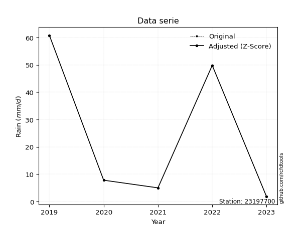</img>

</div>


> The initial value (value_initial) correspond to the initial obtained or null completed value, and value (value) is adjusted only when the initial value is outside the valid range (outlier) definite through the Z-Score value. If Z-Score is active, values out of range or outliers are replaced with the station mean value. A Z-Score (or standard score) measures how many standard deviations a data point is from the mean of a dataset, indicating its relative position; positive scores mean above the mean, negative mean below, and a score of zero is exactly at the mean, allowing for comparison of values from different distributions. It´s calculated using the formula $z=(x–μ)/σ$, where $x$ is the data point, $μ$ is the mean, and $σ$ is the standard deviation, helping identify outliers and understand probability.
>
> <sub>**Note**: In this study, "completing" (filling gaps in) and "extending" (forecasting or lengthening the historical record) rainfall data series are avoided for certain critical analyses because they introduce artificial bias and uncertainty, which can distort the statistics of rare events (extremes), alter day-to-day variability, and compromise the integrity and homogeneity of the original data. Some reasons against Completing/Extending rainfall data are: **Distortion of Extremes and Variability**: The primary issue is that most gap-filling or extension methods rely on averaging or regression with nearby stations, which inherently smooths the data. Rainfall is highly variable in space and time, with a large percentage of zero values and occasional large storms. Infilling methods often underestimate the highest values and overestimate the lowest (zero) values, which severely distorts analyses focused on flood frequency, drought severity, and intensity-duration-frequency (IDF) curves, **Loss of Data Homogeneity**: Infilled or extended data are synthetic estimates, not actual measurements. Combining these estimates with observed data can violate the assumption of data homogeneity, which requires that the data properties do not change over time. Inhomogeneity can lead to incorrect conclusions about long-term trends or changes in climate patterns, **Propagation of Errors**: Errors and biases from the original data (e.g., wind-induced undercatch, instrument errors, site changes) or the data used for imputation can propagate through the analysis, leading to unreliable hydrological models and inaccurate predictions, **Compromised Statistical Integrity**: For statistical analyses, especially those involving the frequency of events, using artificial data can introduce time bias or autocorrelation that doesn´t exist in reality, making it difficult to assess the true probability of events, **Difficulty in Validation**: It is difficult to accurately validate the quality of filled or extended data, especially for past periods where ground-truth measurements are unavailable. The reliability of imputation techniques heavily depends on the density of the surrounding station network and the complexity of the local topography.</sub>


### 4. Active continuous probability distributions from SciPy (80 of 104 available)

A Probability Density Function (PDF) describes the relative likelihood of a continuous random variable falling within a specific range, where the total area under its curve equals 1, and the area over any interval gives the actual probability for that range. Unlike discrete probabilities (like rolling a die), a PDF shows density, not direct probability for a single point (which is zero), with higher points indicating higher likelihood, often visualized as a bell curve for normal distributions.

A log of a probability density function (log-PDF) is simply the logarithm of the PDF´s value, denoted as $log(f(x))$, useful for converting multiplication of probabilities into addition, improving numerical stability with tiny numbers, and connecting to information theory concepts like entropy. Instead of dealing with very small probabilities (e.g., 0.000001), log-PDFs use negative numbers (e.g., $log(0.00001) ≈ -11.51$ that are easier for computers to handle, preventing underflow errors and simplifying complex calculations. In this study, each active probability distribution from SciPy is also evaluated in the $log$ form.

[scipy.stats](https://docs.scipy.org/doc/scipy/reference/stats.html) is a Python´s powerful submodule within the SciPy library for comprehensive statistical analysis, offering over 130 probability distributions (like Normal, Poisson, etc.), functions for descriptive stats (mean, variance), hypothesis testing (t-tests, chi-square), random variable generation, and statistical tests, making it essential for data science, modeling, and research. It provides tools to explore, model, and draw conclusions from data efficiently, working seamlessly with [NumPy](https://numpy.org/).

<div align="center">

|   id | p_dist           |   n_parameter | fit_method   | label                                                                       | active   | ref                                                                                                      |
|-----:|:-----------------|--------------:|:-------------|:----------------------------------------------------------------------------|:---------|:---------------------------------------------------------------------------------------------------------|
|    0 | alpha            |             3 | MLE          | Alpha                                                                       | True     | [:mortar_board:](https://docs.scipy.org/doc/scipy/reference/generated/scipy.stats.alpha.html)            |
|    1 | anglit           |             2 | MM           | Anglit                                                                      | True     | [:mortar_board:](https://docs.scipy.org/doc/scipy/reference/generated/scipy.stats.anglit.html)           |
|    2 | arcsine          |             2 | MM           | Arcsine                                                                     | True     | [:mortar_board:](https://docs.scipy.org/doc/scipy/reference/generated/scipy.stats.arcsine.html)          |
|    3 | argus            |             3 | MLE          | Argus                                                                       | True     | [:mortar_board:](https://docs.scipy.org/doc/scipy/reference/generated/scipy.stats.argus.html)            |
|    4 | beta             |             4 | MLE          | Beta                                                                        | True     | [:mortar_board:](https://docs.scipy.org/doc/scipy/reference/generated/scipy.stats.beta.html)             |
|    5 | betaprime        |             4 | MLE          | Beta prime                                                                  | True     | [:mortar_board:](https://docs.scipy.org/doc/scipy/reference/generated/scipy.stats.betaprime.html)        |
|    6 | bradford         |             3 | MLE          | Bradford                                                                    | True     | [:mortar_board:](https://docs.scipy.org/doc/scipy/reference/generated/scipy.stats.bradford.html)         |
|    7 | burr             |             4 | MLE          | Burr (Type III)                                                             | True     | [:mortar_board:](https://docs.scipy.org/doc/scipy/reference/generated/scipy.stats.burr.html)             |
|    8 | burr12           |             4 | MLE          | Burr (Type III) 12                                                          | True     | [:mortar_board:](https://docs.scipy.org/doc/scipy/reference/generated/scipy.stats.burr12.html)           |
|    9 | cosine           |             2 | MLE          | Cosine                                                                      | True     | [:mortar_board:](https://docs.scipy.org/doc/scipy/reference/generated/scipy.stats.cosine.html)           |
|   10 | crystalball      |             4 | MLE          | Crystalball                                                                 | True     | [:mortar_board:](https://docs.scipy.org/doc/scipy/reference/generated/scipy.stats.crystalball.html)      |
|   11 | dgamma           |             3 | MLE          | Double gamma                                                                | True     | [:mortar_board:](https://docs.scipy.org/doc/scipy/reference/generated/scipy.stats.dgamma.html)           |
|   12 | dweibull         |             3 | MLE          | Double Weibull                                                              | True     | [:mortar_board:](https://docs.scipy.org/doc/scipy/reference/generated/scipy.stats.dweibull.html)         |
|   13 | erlang           |             3 | MLE          | Erlang                                                                      | True     | [:mortar_board:](https://docs.scipy.org/doc/scipy/reference/generated/scipy.stats.erlang.html)           |
|   14 | exponnorm        |             3 | MLE          | Exponentially modified Normal                                               | True     | [:mortar_board:](https://docs.scipy.org/doc/scipy/reference/generated/scipy.stats.exponnorm.html)        |
|   15 | exponpow         |             3 | MLE          | Exponential power                                                           | True     | [:mortar_board:](https://docs.scipy.org/doc/scipy/reference/generated/scipy.stats.exponpow.html)         |
|   16 | exponweib        |             4 | MLE          | Exponentiated Weibull                                                       | True     | [:mortar_board:](https://docs.scipy.org/doc/scipy/reference/generated/scipy.stats.exponweib.html)        |
|   17 | f                |             4 | MLE          | F                                                                           | True     | [:mortar_board:](https://docs.scipy.org/doc/scipy/reference/generated/scipy.stats.f.html)                |
|   18 | fatiguelife      |             3 | MLE          | Fatigue-life (Birnbaum-Saunders)                                            | True     | [:mortar_board:](https://docs.scipy.org/doc/scipy/reference/generated/scipy.stats.fatiguelife.html)      |
|   19 | foldnorm         |             3 | MM           | Fold Normal                                                                 | True     | [:mortar_board:](https://docs.scipy.org/doc/scipy/reference/generated/scipy.stats.foldnorm.html)         |
|   20 | gamma            |             3 | MLE          | Gamma                                                                       | True     | [:mortar_board:](https://docs.scipy.org/doc/scipy/reference/generated/scipy.stats.gamma.html)            |
|   21 | gausshyper       |             6 | MLE          | Gauss hypergeometric                                                        | True     | [:mortar_board:](https://docs.scipy.org/doc/scipy/reference/generated/scipy.stats.gausshyper.html)       |
|   22 | genexpon         |             5 | MLE          | Generalized exponential                                                     | True     | [:mortar_board:](https://docs.scipy.org/doc/scipy/reference/generated/scipy.stats.genexpon.html)         |
|   23 | genextreme       |             3 | MLE          | Generalized exponential                                                     | True     | [:mortar_board:](https://docs.scipy.org/doc/scipy/reference/generated/scipy.stats.genextreme.html)       |
|   24 | gengamma         |             4 | MLE          | Generalized gamma                                                           | True     | [:mortar_board:](https://docs.scipy.org/doc/scipy/reference/generated/scipy.stats.gengamma.html)         |
|   25 | genhalflogistic  |             3 | MLE          | Generalized half-logistic                                                   | True     | [:mortar_board:](https://docs.scipy.org/doc/scipy/reference/generated/scipy.stats.genhalflogistic.html)  |
|   26 | genlogistic      |             3 | MLE          | Generalized logistic                                                        | True     | [:mortar_board:](https://docs.scipy.org/doc/scipy/reference/generated/scipy.stats.genlogistic.html)      |
|   27 | gennorm          |             3 | MLE          | Generalized Normal                                                          | True     | [:mortar_board:](https://docs.scipy.org/doc/scipy/reference/generated/scipy.stats.gennorm.html)          |
|   28 | genpareto        |             3 | MLE          | Generalized Pareto                                                          | True     | [:mortar_board:](https://docs.scipy.org/doc/scipy/reference/generated/scipy.stats.genpareto.html)        |
|   29 | gompertz         |             3 | MLE          | Gompertz (or truncated Gumbel)                                              | True     | [:mortar_board:](https://docs.scipy.org/doc/scipy/reference/generated/scipy.stats.gompertz.html)         |
|   30 | gumbel_l         |             2 | MM           | Gumbel Left Skew                                                            | True     | [:mortar_board:](https://docs.scipy.org/doc/scipy/reference/generated/scipy.stats.gumbel_l.html)         |
|   31 | gumbel_r         |             2 | MM           | Gumbel Right Skew                                                           | True     | [:mortar_board:](https://docs.scipy.org/doc/scipy/reference/generated/scipy.stats.gumbel_r.html)         |
|   32 | halfgennorm      |             3 | MLE          | Upper half of a generalized normal                                          | True     | [:mortar_board:](https://docs.scipy.org/doc/scipy/reference/generated/scipy.stats.halfgennorm.html)      |
|   33 | halflogistic     |             2 | MM           | Half-logistic                                                               | True     | [:mortar_board:](https://docs.scipy.org/doc/scipy/reference/generated/scipy.stats.halflogistic.html)     |
|   34 | halfnorm         |             2 | MM           | Half Normal                                                                 | True     | [:mortar_board:](https://docs.scipy.org/doc/scipy/reference/generated/scipy.stats.halfnorm.html)         |
|   35 | hypsecant        |             2 | MM           | hyperbolic secant                                                           | True     | [:mortar_board:](https://docs.scipy.org/doc/scipy/reference/generated/scipy.stats.hypsecant.html)        |
|   36 | invgamma         |             3 | MLE          | Inverted gamma                                                              | True     | [:mortar_board:](https://docs.scipy.org/doc/scipy/reference/generated/scipy.stats.invgamma.html)         |
|   37 | invgauss         |             3 | MLE          | Inverse Gaussian                                                            | True     | [:mortar_board:](https://docs.scipy.org/doc/scipy/reference/generated/scipy.stats.invgauss.html)         |
|   38 | invweibull       |             3 | MLE          | Inverted Weibull                                                            | True     | [:mortar_board:](https://docs.scipy.org/doc/scipy/reference/generated/scipy.stats.invweibull.html)       |
|   39 | johnsonsb        |             4 | MLE          | Johnson SB                                                                  | True     | [:mortar_board:](https://docs.scipy.org/doc/scipy/reference/generated/scipy.stats.johnsonsb.html)        |
|   40 | johnsonsu        |             4 | MLE          | Johnson Su                                                                  | True     | [:mortar_board:](https://docs.scipy.org/doc/scipy/reference/generated/scipy.stats.johnsonsu.html)        |
|   41 | kappa3           |             3 | MLE          | Kappa 3                                                                     | True     | [:mortar_board:](https://docs.scipy.org/doc/scipy/reference/generated/scipy.stats.kappa3.html)           |
|   42 | kappa4           |             4 | MLE          | Kappa 4                                                                     | True     | [:mortar_board:](https://docs.scipy.org/doc/scipy/reference/generated/scipy.stats.kappa4.html)           |
|   43 | ksone            |             3 | MLE          | Kolmogorov-Smirnov one-sided test statistic distribution                    | True     | [:mortar_board:](https://docs.scipy.org/doc/scipy/reference/generated/scipy.stats.ksone.html)            |
|   44 | kstwobign        |             2 | MLE          | Limiting distribution of scaled Kolmogorov-Smirnov two-sided test statistic | True     | [:mortar_board:](https://docs.scipy.org/doc/scipy/reference/generated/scipy.stats.kstwobign.html)        |
|   45 | laplace          |             2 | MM           | Laplace                                                                     | True     | [:mortar_board:](https://docs.scipy.org/doc/scipy/reference/generated/scipy.stats.laplace.html)          |
|   46 | levy_l           |             2 | MLE          | Left-skewed Levy                                                            | True     | [:mortar_board:](https://docs.scipy.org/doc/scipy/reference/generated/scipy.stats.levy_l.html)           |
|   47 | loggamma         |             3 | MLE          | Log gamma                                                                   | True     | [:mortar_board:](https://docs.scipy.org/doc/scipy/reference/generated/scipy.stats.loggamma.html)         |
|   48 | logistic         |             2 | MM           | Logistic (or Sech-squared)                                                  | True     | [:mortar_board:](https://docs.scipy.org/doc/scipy/reference/generated/scipy.stats.logistic.html)         |
|   49 | loglaplace       |             3 | MLE          | Log-Laplace                                                                 | True     | [:mortar_board:](https://docs.scipy.org/doc/scipy/reference/generated/scipy.stats.loglaplace.html)       |
|   50 | lomax            |             3 | MLE          | Lomax (Pareto of the second kind)                                           | True     | [:mortar_board:](https://docs.scipy.org/doc/scipy/reference/generated/scipy.stats.lomax.html)            |
|   51 | maxwell          |             2 | MM           | Maxwell                                                                     | True     | [:mortar_board:](https://docs.scipy.org/doc/scipy/reference/generated/scipy.stats.maxwell.html)          |
|   52 | mielke           |             4 | MLE          | Mielke Beta-Kappa / Dagum                                                   | True     | [:mortar_board:](https://docs.scipy.org/doc/scipy/reference/generated/scipy.stats.mielke.html)           |
|   53 | moyal            |             2 | MM           | Moyal                                                                       | True     | [:mortar_board:](https://docs.scipy.org/doc/scipy/reference/generated/scipy.stats.moyal.html)            |
|   54 | nakagami         |             3 | MLE          | Nakagami                                                                    | True     | [:mortar_board:](https://docs.scipy.org/doc/scipy/reference/generated/scipy.stats.nakagami.html)         |
|   55 | ncf              |             5 | MLE          | Non-central F distribution                                                  | True     | [:mortar_board:](https://docs.scipy.org/doc/scipy/reference/generated/scipy.stats.ncf.html)              |
|   56 | nct              |             4 | MLE          | Non-central Student’s t                                                     | True     | [:mortar_board:](https://docs.scipy.org/doc/scipy/reference/generated/scipy.stats.nct.html)              |
|   57 | norm             |             2 | MM           | Normal                                                                      | True     | [:mortar_board:](https://docs.scipy.org/doc/scipy/reference/generated/scipy.stats.norm.html)             |
|   58 | pearson3         |             3 | MM           | Pearson type III                                                            | True     | [:mortar_board:](https://docs.scipy.org/doc/scipy/reference/generated/scipy.stats.pearson3.html)         |
|   59 | powerlaw         |             3 | MLE          | Power-function                                                              | True     | [:mortar_board:](https://docs.scipy.org/doc/scipy/reference/generated/scipy.stats.powerlaw.html)         |
|   60 | rayleigh         |             2 | MM           | Rayleigh                                                                    | True     | [:mortar_board:](https://docs.scipy.org/doc/scipy/reference/generated/scipy.stats.rayleigh.html)         |
|   61 | rdist            |             3 | MLE          | R-distributed (symmetric beta)                                              | True     | [:mortar_board:](https://docs.scipy.org/doc/scipy/reference/generated/scipy.stats.rdist.html)            |
|   62 | rice             |             3 | MLE          | Rice                                                                        | True     | [:mortar_board:](https://docs.scipy.org/doc/scipy/reference/generated/scipy.stats.rice.html)             |
|   63 | semicircular     |             2 | MM           | Semicircular                                                                | True     | [:mortar_board:](https://docs.scipy.org/doc/scipy/reference/generated/scipy.stats.semicircular.html)     |
|   64 | skewnorm         |             3 | MLE          | Skew normal                                                                 | True     | [:mortar_board:](https://docs.scipy.org/doc/scipy/reference/generated/scipy.stats.skewnorm.html)         |
|   65 | t                |             3 | MLE          | Student’s t                                                                 | True     | [:mortar_board:](https://docs.scipy.org/doc/scipy/reference/generated/scipy.stats.t.html)                |
|   66 | trapezoid        |             4 | MLE          | Trapezoid                                                                   | True     | [:mortar_board:](https://docs.scipy.org/doc/scipy/reference/generated/scipy.stats.trapezoid.html)        |
|   67 | triang           |             3 | MLE          | Triangular                                                                  | True     | [:mortar_board:](https://docs.scipy.org/doc/scipy/reference/generated/scipy.stats.triang.html)           |
|   68 | truncexpon       |             3 | MLE          | Truncated exponential                                                       | True     | [:mortar_board:](https://docs.scipy.org/doc/scipy/reference/generated/scipy.stats.truncexpon.html)       |
|   69 | truncnorm        |             4 | MLE          | Truncated normal                                                            | True     | [:mortar_board:](https://docs.scipy.org/doc/scipy/reference/generated/scipy.stats.truncnorm.html)        |
|   70 | truncpareto      |             4 | MLE          | Upper truncated Pareto                                                      | True     | [:mortar_board:](https://docs.scipy.org/doc/scipy/reference/generated/scipy.stats.truncpareto.html)      |
|   71 | truncweibull_min |             5 | MLE          | Doubly truncated Weibull minimum                                            | True     | [:mortar_board:](https://docs.scipy.org/doc/scipy/reference/generated/scipy.stats.truncweibull_min.html) |
|   72 | tukeylambda      |             3 | MLE          | Tukey-Lamdba                                                                | True     | [:mortar_board:](https://docs.scipy.org/doc/scipy/reference/generated/scipy.stats.tukeylambda.html)      |
|   73 | uniform          |             2 | MLE          | Uniform                                                                     | True     | [:mortar_board:](https://docs.scipy.org/doc/scipy/reference/generated/scipy.stats.uniform.html)          |
|   74 | vonmises         |             3 | MLE          | Von Mises                                                                   | True     | [:mortar_board:](https://docs.scipy.org/doc/scipy/reference/generated/scipy.stats.vonmises.html)         |
|   75 | vonmises_line    |             3 | MLE          | Von Mises line                                                              | True     | [:mortar_board:](https://docs.scipy.org/doc/scipy/reference/generated/scipy.stats.vonmises_line.html)    |
|   76 | wald             |             2 | MM           | Wald                                                                        | True     | [:mortar_board:](https://docs.scipy.org/doc/scipy/reference/generated/scipy.stats.wald.html)             |
|   77 | weibull_max      |             3 | MLE          | Weibull maximum                                                             | True     | [:mortar_board:](https://docs.scipy.org/doc/scipy/reference/generated/scipy.stats.weibull_max.html)      |
|   78 | weibull_min      |             3 | MLE          | Weibull minimum                                                             | True     | [:mortar_board:](https://docs.scipy.org/doc/scipy/reference/generated/scipy.stats.weibull_min.html)      |
|   79 | wrapcauchy       |             3 | MLE          | Wrapped  Cauchy                                                             | True     | [:mortar_board:](https://docs.scipy.org/doc/scipy/reference/generated/scipy.stats.wrapcauchy.html)       |

</div>

> **n_parameter:** # arguments & localization & scale.
>
> **Fit methods:** (MLE) maximum likelihood, (MM) L-moments.
>
>**Inactive** (With the only purpose of prevent loops, zero divisions, infinite values, over high estimated values or horizontal trending for recurrence intervals estimations, the follow distributions were disabled.)**:** lognorm, norminvgauss, powernorm, powerlognorm, cauchy, halfcauchy, foldcauchy, skewcauchy, chi2, expon, fisk, genhyperbolic, geninvgauss, gibrat, kstwo, laplace_asymmetric, levy, levy_stable, ncx2, pareto, rel_breitwigner, recipinvgauss, studentized_range, loguniform, 


## B. Probability (PDF) vs. Empirical (EDF) distributions functions

A continuous probability distribution (CPD) describes probabilities for variables that can take any value within a range (like rain any time), unlike discrete variables with specific outcomes (like temperature). It uses a Probability Density Function (PDF), a curve where the total area under it equals 1, and the probability of the variable falling within an interval (a to b) is found by calculating the area under the curve between those points. A key feature is that the probability of hitting any single exact value is zero, so probabilities are always expressed for ranges, e.g., $P(a ≤ X ≤ b)$.

<div align="center">

Distributions parameters from station values
|     |   station | p_dist              |   n |             loc |          scale | shape                  | shape1                | shape2                | shape3             |
|----:|----------:|:--------------------|----:|----------------:|---------------:|:-----------------------|:----------------------|:----------------------|:-------------------|
|   0 |  23197700 | alpha               |   5 |    -2.24586     |    7.4502      | 1.0081545793767305e-07 |                       |                       |                    |
|   1 |  23197700 | anglit              |   5 |    25.04        |   73.2023      |                        |                       |                       |                    |
|   2 |  23197700 | arcsine             |   5 |   -10.3479      |   70.7757      |                        |                       |                       |                    |
|   3 |  23197700 | argus               |   5 |   -24.2879      |   90.5013      | 9.909867708420611e-06  |                       |                       |                    |
|   4 |  23197700 | beta                |   5 |   -12.7681      |   73.5681      | 1.400939261033383      | 0.982416601650629     |                       |                    |
|   5 |  23197700 | betaprime           |   5 |     0.197385    |    0.76136     | 6.285406158424815      | 0.8302405324450979    |                       |                    |
|   6 |  23197700 | bradford            |   5 |     1.79997     |   59.0001      | 0.48459534796189235    |                       |                       |                    |
|   7 |  23197700 | burr                |   5 |     0.0745769   |    0.0281067   | 0.8585659644376165     | 96.29440018715101     |                       |                    |
|   8 |  23197700 | burr12              |   5 |     1.8         |    6.37451     | 0.6302536291623242     | 0.7276568047175734    |                       |                    |
|   9 |  23197700 | cosine              |   5 |    26.5842      |   19.566       |                        |                       |                       |                    |
|  10 |  23197700 | crystalball         |   5 |    25.04        |   25.023       | 2579.9944043502437     | 33.73639973947516     |                       |                    |
|  11 |  23197700 | dgamma              |   5 |    29.6136      |    0.625612    | 40.1570414231664       |                       |                       |                    |
|  12 |  23197700 | dweibull            |   5 |    30.9408      |   27.0801      | 7.871976241451248      |                       |                       |                    |
|  13 |  23197700 | erlang              |   5 |     1.8         |   15.8459      | 0.8112288347055585     |                       |                       |                    |
|  14 |  23197700 | exponnorm           |   5 |     1.77109     |    0.00872828  | 2651.77309425534       |                       |                       |                    |
|  15 |  23197700 | exponpow            |   5 |     1.8         |   53.2631      | 0.5642227042771797     |                       |                       |                    |
|  16 |  23197700 | exponweib           |   5 |    -0.0161676   |    0.0717235   | 21.200749056709036     | 0.24423191637730918   |                       |                    |
|  17 |  23197700 | f                   |   5 |     1.8         |   40.0901      | 0.5698043832853169     | 6.170888984117502     |                       |                    |
|  18 |  23197700 | fatiguelife         |   5 |     1.8         |    0.000142332 | 371.43454861058467     |                       |                       |                    |
|  19 |  23197700 | foldnorm            |   5 |   -16.706       |   28.0703      | 1.4164792170113145     |                       |                       |                    |
|  20 |  23197700 | gamma               |   5 |     1.8         |   25.7991      | 0.37731228105027337    |                       |                       |                    |
|  21 |  23197700 | gausshyper          |   5 |   -12.7444      |   73.5444      | 1.278532981374374      | 0.7960691665842163    | 1.0746239544611647    | 1.017205511981512  |
|  22 |  23197700 | genexpon            |   5 |     1.8         |   49.259       | 2.1195590739996453     | 2.523290098619062e-08 | 1.0854814601123892    |                    |
|  23 |  23197700 | genextreme          |   5 |     5.06483     |   18.9674      | -5.80953410378045      |                       |                       |                    |
|  24 |  23197700 | gengamma            |   5 |     0.0274301   |    0.00762755  | 7.602961222328951      | 0.2680369689246237    |                       |                    |
|  25 |  23197700 | genhalflogistic     |   5 |    -4.22733     |   68.5363      | 1.0539609712699818     |                       |                       |                    |
|  26 |  23197700 | genlogistic         |   5 |  -125.996       |   18.4023      | 1937.8525981040293     |                       |                       |                    |
|  27 |  23197700 | gennorm             |   5 |     7.8         |    0.0072044   | 0.22226315724525686    |                       |                       |                    |
|  28 |  23197700 | genpareto           |   5 |    -0.150073    |   73.9528      | -1.2133336279253146    |                       |                       |                    |
|  29 |  23197700 | gompertz            |   5 |     1.8         |    1.11374e+10 | 484876156.87462366     |                       |                       |                    |
|  30 |  23197700 | gumbel_l            |   5 |    36.3017      |   19.5104      |                        |                       |                       |                    |
|  31 |  23197700 | gumbel_r            |   5 |    13.7783      |   19.5104      |                        |                       |                       |                    |
|  32 |  23197700 | halfgennorm         |   5 |     1.8         |    0.504315    | 0.3517655159773443     |                       |                       |                    |
|  33 |  23197700 | halflogistic        |   5 |    -4.61807     |   21.3938      |                        |                       |                       |                    |
|  34 |  23197700 | halfnorm            |   5 |    -8.08064     |   41.5106      |                        |                       |                       |                    |
|  35 |  23197700 | hypsecant           |   5 |    25.04        |   15.9301      |                        |                       |                       |                    |
|  36 |  23197700 | invgamma            |   5 |     0.671163    |    2.47191     | 0.6397982056386442     |                       |                       |                    |
|  37 |  23197700 | invgauss            |   5 |     0.64733     |    4.67685     | 5.215599690033294      |                       |                       |                    |
|  38 |  23197700 | invweibull          |   5 |     1.8         |    7.73511e-13 | 0.19684133438572454    |                       |                       |                    |
|  39 |  23197700 | johnsonsb           |   5 |     1.8         |  532.115       | 0.7488431083353615     | 0.06475326513294236   |                       |                    |
|  40 |  23197700 | johnsonsu           |   5 |     1.20744e+09 |    2.96391e+08 | 104673791.41625033     | 49550586.621433556    |                       |                    |
|  41 |  23197700 | kappa3              |   5 |     1.8         |    5.30645     | 0.07794994432555258    |                       |                       |                    |
|  42 |  23197700 | kappa4              |   5 |   -18.126       |   84.3968      | 1.0497569687873773     | 1.0693158333313084    |                       |                    |
|  43 |  23197700 | ksone               |   5 |   -18.3011      |   86.6822      | 1.0                    |                       |                       |                    |
|  44 |  23197700 | kstwobign           |   5 |   -49.3055      |   84.9705      |                        |                       |                       |                    |
|  45 |  23197700 | laplace             |   5 |    25.04        |   17.6939      |                        |                       |                       |                    |
|  46 |  23197700 | levy_l              |   5 |    63.329       |    9.60174     |                        |                       |                       |                    |
|  47 |  23197700 | loggamma            |   5 | -6897.77        |  954.304       | 1414.651271030979      |                       |                       |                    |
|  48 |  23197700 | logistic            |   5 |    25.04        |   13.7959      |                        |                       |                       |                    |
|  49 |  23197700 | loglaplace          |   5 |    -0.0255723   |    7.82557     | 0.8618190516511703     |                       |                       |                    |
|  50 |  23197700 | lomax               |   5 |     1.79847     |    4.41147     | 0.7842045713172656     |                       |                       |                    |
|  51 |  23197700 | maxwell             |   5 |   -34.254       |   37.157       |                        |                       |                       |                    |
|  52 |  23197700 | mielke              |   5 |     1.8         |    0.0430351   | 0.924111693171501      | 0.46811178370276985   |                       |                    |
|  53 |  23197700 | moyal               |   5 |    10.7302      |   11.2643      |                        |                       |                       |                    |
|  54 |  23197700 | nakagami            |   5 |     1.8         |   61.536       | 0.0499174051419228     |                       |                       |                    |
|  55 |  23197700 | ncf                 |   5 |    -0.0944377   |    5.69915     | 83.32157992389199      | 1.6107971665551644    | 0.030647127973705363  |                    |
|  56 |  23197700 | nct                 |   5 |    -0.19713     |    0.0741042   | 0.6289369448637265     | 54.73602816626948     |                       |                    |
|  57 |  23197700 | norm                |   5 |    25.04        |   25.023       |                        |                       |                       |                    |
|  58 |  23197700 | pearson3            |   5 |    25.04        |   25.023       | 0.4491218001705546     |                       |                       |                    |
|  59 |  23197700 | powerlaw            |   5 |     1.8         |   59           | 0.10982327006056113    |                       |                       |                    |
|  60 |  23197700 | rayleigh            |   5 |   -22.8305      |   38.1951      |                        |                       |                       |                    |
|  61 |  23197700 | rdist               |   5 |    -3.4968      |   11.2968      | 1.4056532463317892     |                       |                       |                    |
|  62 |  23197700 | rice                |   5 |   -15.3848      |   33.6178      | 0.001146597155807544   |                       |                       |                    |
|  63 |  23197700 | semicircular        |   5 |    25.04        |   50.046       |                        |                       |                       |                    |
|  64 |  23197700 | skewnorm            |   5 |     1.79997     |   34.1452      | 6775236.463321568      |                       |                       |                    |
|  65 |  23197700 | t                   |   5 |     5.31607     |    3.17511     | 0.5463774163576727     |                       |                       |                    |
|  66 |  23197700 | trapezoid           |   5 |    -4.305       |   70.8         | 1.0                    | 1.0                   |                       |                    |
|  67 |  23197700 | triang              |   5 |   -29.923       |   90.7232      | 0.9999980998642406     |                       |                       |                    |
|  68 |  23197700 | truncexpon          |   5 |     1.8         |   55.512       | 1.062998994663885      |                       |                       |                    |
|  69 |  23197700 | truncnorm           |   5 |  -143.851       |   66.1514      | 2.2017767325155706     | 73.00274452779365     |                       |                    |
|  70 |  23197700 | truncpareto         |   5 |    -1.07374e+09 |    1.07374e+09 | 46202293.12034875      | 1.000000054948032     |                       |                    |
|  71 |  23197700 | truncweibull_min    |   5 |     0.707164    |   58.4896      | 0.05174444593273032    | 0.018684268864391392  | 1.0274100115692972    |                    |
|  72 |  23197700 | tukeylambda         |   5 |    32.0378      |   37.912       | 1.2537960370585162     |                       |                       |                    |
|  73 |  23197700 | uniform             |   5 |     1.8         |   59           |                        |                       |                       |                    |
|  74 |  23197700 | vonmises            |   5 |    -0.534473    |    1           | 0.2621220326222873     |                       |                       |                    |
|  75 |  23197700 | vonmises_line       |   5 |    21.5217      |   12.5027      | 4.8996340045260724e-06 |                       |                       |                    |
|  76 |  23197700 | wald                |   5 |     0.0170026   |   25.023       |                        |                       |                       |                    |
|  77 |  23197700 | weibull_max         |   5 |    60.8         |    1.61413     | 0.260420742626251      |                       |                       |                    |
|  78 |  23197700 | weibull_min         |   5 |     1.8         |   29.0628      | 0.4569511473379927     |                       |                       |                    |
|  79 |  23197700 | wrapcauchy          |   5 |     1.78829     |    9.39201     | 0.7752659682335761     |                       |                       |                    |
|  80 |  23197700 | logalpha            |   5 |     0.00145403  |    1.1695      | 3.774737636282274e-09  |                       |                       |                    |
|  81 |  23197700 | loganglit           |   5 |     2.45339     |    3.96917     |                        |                       |                       |                    |
|  82 |  23197700 | logarcsine          |   5 |     0.534594    |    3.83759     |                        |                       |                       |                    |
|  83 |  23197700 | logargus            |   5 |    -0.52396     |    4.92355     | 1.0897170433318237     |                       |                       |                    |
|  84 |  23197700 | logbeta             |   5 |     0.24017     |    3.86742     | 0.4717478309171329     | 0.4648549596042273    |                       |                    |
|  85 |  23197700 | logbetaprime        |   5 |     0.587787    |   42.9176      | 0.6558617051846685     | 14.486005350722962    |                       |                    |
|  86 |  23197700 | logbradford         |   5 |     0.587781    |    3.51981     | 0.9319279159564715     |                       |                       |                    |
|  87 |  23197700 | logburr             |   5 |    -0.19035     |    4.33967     | 412.9881392200141      | 0.003641550831792131  |                       |                    |
|  88 |  23197700 | logburr12           |   5 |     0.548717    |    1.40555e+06 | 1.0862624361484627     | 2338231.596890929     |                       |                    |
|  89 |  23197700 | logcosine           |   5 |     2.45076     |    1.0766      |                        |                       |                       |                    |
|  90 |  23197700 | logcrystalball      |   5 |     2.45339     |    1.35679     | 7.516827773563815      | 9947.779522759254     |                       |                    |
|  91 |  23197700 | logdgamma           |   5 |     2.8249      |    0.160771    | 8.196933540501341      |                       |                       |                    |
|  92 |  23197700 | logdweibull         |   5 |     2.71498     |    1.45614     | 2.9096039337243558     |                       |                       |                    |
|  93 |  23197700 | logerlang           |   5 |   -66.7993      |    0.026583    | 2605.131412107874      |                       |                       |                    |
|  94 |  23197700 | logexponnorm        |   5 |     2.42218     |    1.35644     | 0.02300831461083052    |                       |                       |                    |
|  95 |  23197700 | logexponpow         |   5 |     0.587787    |    3.23363     | 0.7909467456400445     |                       |                       |                    |
|  96 |  23197700 | logexponweib        |   5 |     0.587591    |    3.55675     | 0.006784426680577275   | 75.67894198427183     |                       |                    |
|  97 |  23197700 | logf                |   5 |     0.587787    |    1.81734     | 1.1101176461190065     | 81.99952937823818     |                       |                    |
|  98 |  23197700 | logfatiguelife      |   5 |    -3.00703     |    5.28476     | 0.2577932467428872     |                       |                       |                    |
|  99 |  23197700 | logfoldnorm         |   5 |    -1.31379     |    1.36333     | 2.761487842569408      |                       |                       |                    |
| 100 |  23197700 | loggamma            |   5 |   -67.3405      |    0.0263678   | 2646.9140849386595     |                       |                       |                    |
| 101 |  23197700 | loggausshyper       |   5 |     0.555097    |    3.55249     | 1.0817243645620285     | 0.5877646023117109    | 0.885015449961215     | 1.1240910922111813 |
| 102 |  23197700 | loggenexpon         |   5 |     0.586922    |    0.0238879   | 0.008121559435839164   | 2.5468087072208396    | 3.064038665299565e-05 |                    |
| 103 |  23197700 | loggenextreme       |   5 |     2.87937     |    1.58128     | 1.2874514633846044     |                       |                       |                    |
| 104 |  23197700 | loggengamma         |   5 |     0.587787    |    4.56724     | 0.08146324122711093    | 5.139969259225584     |                       |                    |
| 105 |  23197700 | loggenhalflogistic  |   5 |    -0.362543    |    4.95985     | 1.1095532786403766     |                       |                       |                    |
| 106 |  23197700 | loggenlogistic      |   5 |    -5.38975     |    1.18378     | 428.9477727544936      |                       |                       |                    |
| 107 |  23197700 | loggennorm          |   5 |     2.34769     |    1.75992     | 1001422.1727359442     |                       |                       |                    |
| 108 |  23197700 | loggenpareto        |   5 |    -0.0090302   |    6.96888     | -1.6928653968192964    |                       |                       |                    |
| 109 |  23197700 | loggompertz         |   5 |     0.587787    |    2.35587     | 0.6285458206962837     |                       |                       |                    |
| 110 |  23197700 | loggumbel_l         |   5 |     3.06402     |    1.05789     |                        |                       |                       |                    |
| 111 |  23197700 | loggumbel_r         |   5 |     1.84276     |    1.05789     |                        |                       |                       |                    |
| 112 |  23197700 | loghalfgennorm      |   5 |     0.587786    |    1.9852      | 1.104412810072461      |                       |                       |                    |
| 113 |  23197700 | loghalflogistic     |   5 |     0.8453      |    1.16        |                        |                       |                       |                    |
| 114 |  23197700 | loghalfnorm         |   5 |     0.657505    |    2.25081     |                        |                       |                       |                    |
| 115 |  23197700 | loghypsecant        |   5 |     2.45339     |    0.863762    |                        |                       |                       |                    |
| 116 |  23197700 | loginvgamma         |   5 |   -10.7339      | 1227.26        | 94.06980234810919      |                       |                       |                    |
| 117 |  23197700 | loginvgauss         |   5 |    -3.42235     |  102.137       | 0.05753421021693468    |                       |                       |                    |
| 118 |  23197700 | loginvweibull       |   5 |    -4.30189e+07 |    4.30189e+07 | 36273348.14729928      |                       |                       |                    |
| 119 |  23197700 | logjohnsonsb        |   5 |     0.422101    |    3.68549     | 0.30914751611862945    | 0.08541657346952691   |                       |                    |
| 120 |  23197700 | logjohnsonsu        |   5 |     4.10759     |    1.81413e-15 | 3.1953346278414934     | 0.14066226770514623   |                       |                    |
| 121 |  23197700 | logkappa3           |   5 |     0.587787    |    3.51766     | 2645.689577427037      |                       |                       |                    |
| 122 |  23197700 | logkappa4           |   5 |     0.103214    |    4.18946     | 1.1311876663290183     | 1.0441479936256415    |                       |                    |
| 123 |  23197700 | logksone            |   5 |     0.103354    |    4.70007     | 1.0                    |                       |                       |                    |
| 124 |  23197700 | logkstwobign        |   5 |    -2.30146     |    5.42585     |                        |                       |                       |                    |
| 125 |  23197700 | loglaplace          |   5 |     2.45339     |    0.959399    |                        |                       |                       |                    |
| 126 |  23197700 | loglevy_l           |   5 |     4.17618     |    0.257085    |                        |                       |                       |                    |
| 127 |  23197700 | logloggamma         |   5 |  -250.855       |   38.0132      | 783.8855312330925      |                       |                       |                    |
| 128 |  23197700 | loglogistic         |   5 |     2.45339     |    0.74804     |                        |                       |                       |                    |
| 129 |  23197700 | logloglaplace       |   5 |    -0.00671051  |    2.06085     | 1.7716685049229948     |                       |                       |                    |
| 130 |  23197700 | loglomax            |   5 |     0.587787    |    3.42184e+08 | 164013950.0189985      |                       |                       |                    |
| 131 |  23197700 | logmaxwell          |   5 |    -0.761642    |    2.01472     |                        |                       |                       |                    |
| 132 |  23197700 | logmielke           |   5 |     0.587787    |    4.05734     | 0.49164031520122414    | 840.4609741420186     |                       |                    |
| 133 |  23197700 | logmoyal            |   5 |     1.67749     |    0.610772    |                        |                       |                       |                    |
| 134 |  23197700 | lognakagami         |   5 |     1.60944     |    0.716561    | 0.08076234990153991    |                       |                       |                    |
| 135 |  23197700 | logncf              |   5 |    -0.27096     |    1.44296e-06 | 9.051701499725113e-06  | 51.28171591271584     | 16.530443565364074    |                    |
| 136 |  23197700 | lognct              |   5 |   -55.9765      |    1.2765      | 8173.64045728885       | 45.76923878935513     |                       |                    |
| 137 |  23197700 | lognorm             |   5 |     2.45339     |    1.35679     |                        |                       |                       |                    |
| 138 |  23197700 | logpearson3         |   5 |     2.45339     |    1.35679     | 0.035773723152046896   |                       |                       |                    |
| 139 |  23197700 | logpowerlaw         |   5 |     0.587787    |    3.5198      | 0.12448277544300748    |                       |                       |                    |
| 140 |  23197700 | lograyleigh         |   5 |    -0.142236    |    2.07101     |                        |                       |                       |                    |
| 141 |  23197700 | logrdist            |   5 |     2.34233     |    1.76526     | 1.1207021784691737     |                       |                       |                    |
| 142 |  23197700 | logrice             |   5 |    -0.114505    |    1.69136     | 0.9739374267239372     |                       |                       |                    |
| 143 |  23197700 | logsemicircular     |   5 |     2.45339     |    2.71359     |                        |                       |                       |                    |
| 144 |  23197700 | logskewnorm         |   5 |     2.30926     |    1.36443     | 0.13356944219960293    |                       |                       |                    |
| 145 |  23197700 | logt                |   5 |     2.45339     |    1.35679     | 8939029855.401947      |                       |                       |                    |
| 146 |  23197700 | logtrapezoid        |   5 |    -1.45341     |    5.75639     | 1.0                    | 1.0                   |                       |                    |
| 147 |  23197700 | logtriang           |   5 |    -0.632209    |    4.76905     | 0.9938661034068612     |                       |                       |                    |
| 148 |  23197700 | logtruncexpon       |   5 |     0.552844    |    4.6068      | 0.7716307451510263     |                       |                       |                    |
| 149 |  23197700 | logtruncnorm        |   5 |     0.0381635   |    3.1611      | 0.14883154036298013    | 1.2873449447615297    |                       |                    |
| 150 |  23197700 | logtruncpareto      |   5 |     0.570182    |    0.0176043   | 0.2623245218329068     | 200.93947403284452    |                       |                    |
| 151 |  23197700 | logtruncweibull_min |   5 |     0.582618    |    4.58545     | 0.7545535815014177     | 0.0011272695610790875 | 0.7687300094022573    |                    |
| 152 |  23197700 | logtukeylambda      |   5 |     2.34903     |    1.85406     | 1.0526982398824236     |                       |                       |                    |
| 153 |  23197700 | loguniform          |   5 |     0.587787    |    3.5198      |                        |                       |                       |                    |
| 154 |  23197700 | logvonmises         |   5 |     2.37591     |    1           | 0.5528630330493852     |                       |                       |                    |
| 155 |  23197700 | logvonmises_line    |   5 |     2.33772     |    0.563381    | 9.980173698678578e-06  |                       |                       |                    |
| 156 |  23197700 | logwald             |   5 |     1.09663     |    1.35677     |                        |                       |                       |                    |
| 157 |  23197700 | logweibull_max      |   5 |     4.10759     |    1.41639     | 0.6316496795455369     |                       |                       |                    |
| 158 |  23197700 | logweibull_min      |   5 |     0.587787    |    1.95514     | 0.2993205611899249     |                       |                       |                    |
| 159 |  23197700 | logwrapcauchy       |   5 |     0.587745    |    0.560201    | 0.7045290237492323     |                       |                       |                    |

</div>

> **loc** (Location parameter): This shifts the distribution along the x-axis. For many common distributions, like the normal (Gaussian) distribution, loc represents the mean $μ$. For others, like the uniform distribution, it might represent the minimum value, or for the beta distribution, the left end of the support interval.
>
> **scale** (Scale parameter): This determines the width or spread of the distribution. For the normal distribution, scale represents the standard deviation $σ$. For a uniform distribution, it defines the length of the interval (from $loc$ to $loc + scale$).
>
> **shape** (Shape parameters): Refers to parameters that define the specific form of a probability distribution, distinct from its location (loc) and scale (scale). These parameters are required arguments for most distribution functions. For example, a normal (Gaussian) distribution is fully defined by its location (mean) and scale (standard deviation), so it has no specific shape parameters beyond loc and scale. However, other distributions have intrinsic properties that need specification, as Gamma distribution that takes a shape parameter, often named $a$ or $alpha$.


### 0. Cumulative distribution values - CDF (160 evaluated)

Cumulative Distribution Function (CDF), denoted as $F$<sub>$X$</sub>$(x)$, is a function that gives the probability that a random variable $X$ will take a value less than or equal to a specific value, $x$ (i.e., $(P(X≥x)$. It essentially "accumulates" probabilities from a given point up to the far right (positive infinity), providing a complete picture of the distribution´s probabilities for both discrete (like rain) and continuous (like temperature) variables, helping to find probabilities over ranges or above certain values. Each station is evaluated separately ordering the $x$ values ascending, calculating the CDF and PDF values for the activated distributions and their logarithmic forms.

<div align="center">

CDF ordered by x ascending and calculating $log(f(x))$ separately
|   id |   Station |   date |    x |   count |   mean |     std |    zscore |   Value_initial |   station |   m |     alpha |   alpha_pdf |   anglit |   anglit_pdf |   arcsine |   arcsine_pdf |    argus |   argus_pdf |     beta |   beta_pdf |   betaprime |   betaprime_pdf |    bradford |   bradford_pdf |      burr |   burr_pdf |      burr12 |     burr12_pdf |   cosine |   cosine_pdf |   crystalball |   crystalball_pdf |   dgamma |   dgamma_pdf |   dweibull |   dweibull_pdf |      erlang |   erlang_pdf |   exponnorm |   exponnorm_pdf |    exponpow |    exponpow_pdf |   exponweib |   exponweib_pdf |          f |          f_pdf |   fatiguelife |   fatiguelife_pdf |   foldnorm |   foldnorm_pdf |       gamma |   gamma_pdf |   gausshyper |   gausshyper_pdf |    genexpon |   genexpon_pdf |   genextreme |   genextreme_pdf |   gengamma |   gengamma_pdf |   genhalflogistic |   genhalflogistic_pdf |   genlogistic |   genlogistic_pdf |   gennorm |   gennorm_pdf |   genpareto |   genpareto_pdf |    gompertz |   gompertz_pdf |   gumbel_l |   gumbel_l_pdf |   gumbel_r |   gumbel_r_pdf |   halfgennorm |   halfgennorm_pdf |   halflogistic |   halflogistic_pdf |   halfnorm |   halfnorm_pdf |   hypsecant |   hypsecant_pdf |   invgamma |   invgamma_pdf |   invgauss |   invgauss_pdf |   invweibull |   invweibull_pdf |   johnsonsb |   johnsonsb_pdf |   johnsonsu |   johnsonsu_pdf |   kappa3 |   kappa3_pdf |   kappa4 |   kappa4_pdf |    ksone |   ksone_pdf |   kstwobign |   kstwobign_pdf |   laplace |   laplace_pdf |   levy_l |   levy_l_pdf |   loggamma |   loggamma_pdf |   logistic |   logistic_pdf |   loglaplace |   loglaplace_pdf |       lomax |   lomax_pdf |   maxwell |   maxwell_pdf |      mielke |   mielke_pdf |    moyal |   moyal_pdf |   nakagami |   nakagami_pdf |       ncf |    ncf_pdf |       nct |    nct_pdf |     norm |   norm_pdf |   pearson3 |   pearson3_pdf |   powerlaw |   powerlaw_pdf |   rayleigh |   rayleigh_pdf |    rdist |    rdist_pdf |     rice |   rice_pdf |   semicircular |   semicircular_pdf |   skewnorm |   skewnorm_pdf |        t |       t_pdf |   trapezoid |   trapezoid_pdf |   triang |   triang_pdf |   truncexpon |   truncexpon_pdf |   truncnorm |   truncnorm_pdf |   truncpareto |   truncpareto_pdf |   truncweibull_min |   truncweibull_min_pdf |   tukeylambda |   tukeylambda_pdf |   uniform |   uniform_pdf |   vonmises |   vonmises_pdf |   vonmises_line |   vonmises_line_pdf |        wald |   wald_pdf |   weibull_max |   weibull_max_pdf |   weibull_min |   weibull_min_pdf |   wrapcauchy |   wrapcauchy_pdf |   logalpha |   logalpha_pdf |   loganglit |   loganglit_pdf |   logarcsine |   logarcsine_pdf |   logargus |   logargus_pdf |   logbeta |   logbeta_pdf |   logbetaprime |   logbetaprime_pdf |   logbradford |   logbradford_pdf |   logburr |   logburr_pdf |   logburr12 |   logburr12_pdf |   logcosine |   logcosine_pdf |   logcrystalball |   logcrystalball_pdf |   logdgamma |   logdgamma_pdf |   logdweibull |   logdweibull_pdf |   logerlang |   logerlang_pdf |   logexponnorm |   logexponnorm_pdf |   logexponpow |   logexponpow_pdf |   logexponweib |   logexponweib_pdf |        logf |    logf_pdf |   logfatiguelife |   logfatiguelife_pdf |   logfoldnorm |   logfoldnorm_pdf |   loggausshyper |   loggausshyper_pdf |   loggenexpon |   loggenexpon_pdf |   loggenextreme |   loggenextreme_pdf |   loggengamma |   loggengamma_pdf |   loggenhalflogistic |   loggenhalflogistic_pdf |   loggenlogistic |   loggenlogistic_pdf |   loggennorm |   loggennorm_pdf |   loggenpareto |   loggenpareto_pdf |   loggompertz |   loggompertz_pdf |   loggumbel_l |   loggumbel_l_pdf |   loggumbel_r |   loggumbel_r_pdf |   loghalfgennorm |   loghalfgennorm_pdf |   loghalflogistic |   loghalflogistic_pdf |   loghalfnorm |   loghalfnorm_pdf |   loghypsecant |   loghypsecant_pdf |   loginvgamma |   loginvgamma_pdf |   loginvgauss |   loginvgauss_pdf |   loginvweibull |   loginvweibull_pdf |   logjohnsonsb |   logjohnsonsb_pdf |   logjohnsonsu |   logjohnsonsu_pdf |   logkappa3 |   logkappa3_pdf |   logkappa4 |   logkappa4_pdf |   logksone |   logksone_pdf |   logkstwobign |   logkstwobign_pdf |   loglevy_l |   loglevy_l_pdf |   logloggamma |   logloggamma_pdf |   loglogistic |   loglogistic_pdf |   logloglaplace |   logloglaplace_pdf |    loglomax |   loglomax_pdf |   logmaxwell |   logmaxwell_pdf |   logmielke |   logmielke_pdf |   logmoyal |   logmoyal_pdf |   lognakagami |   lognakagami_pdf |    logncf |   logncf_pdf |    lognct |   lognct_pdf |   lognorm |   lognorm_pdf |   logpearson3 |   logpearson3_pdf |   logpowerlaw |   logpowerlaw_pdf |   lograyleigh |   lograyleigh_pdf |   logrdist |   logrdist_pdf |   logrice |   logrice_pdf |   logsemicircular |   logsemicircular_pdf |   logskewnorm |   logskewnorm_pdf |      logt |   logt_pdf |   logtrapezoid |   logtrapezoid_pdf |   logtriang |   logtriang_pdf |   logtruncexpon |   logtruncexpon_pdf |   logtruncnorm |   logtruncnorm_pdf |   logtruncpareto |   logtruncpareto_pdf |   logtruncweibull_min |   logtruncweibull_min_pdf |   logtukeylambda |   logtukeylambda_pdf |   loguniform |   loguniform_pdf |   logvonmises |   logvonmises_pdf |   logvonmises_line |   logvonmises_line_pdf |   logwald |   logwald_pdf |   logweibull_max |   logweibull_max_pdf |   logweibull_min |   logweibull_min_pdf |   logwrapcauchy |   logwrapcauchy_pdf |
|-----:|----------:|-------:|-----:|--------:|-------:|--------:|----------:|----------------:|----------:|----:|----------:|------------:|---------:|-------------:|----------:|--------------:|---------:|------------:|---------:|-----------:|------------:|----------------:|------------:|---------------:|----------:|-----------:|------------:|---------------:|---------:|-------------:|--------------:|------------------:|---------:|-------------:|-----------:|---------------:|------------:|-------------:|------------:|----------------:|------------:|----------------:|------------:|----------------:|-----------:|---------------:|--------------:|------------------:|-----------:|---------------:|------------:|------------:|-------------:|-----------------:|------------:|---------------:|-------------:|-----------------:|-----------:|---------------:|------------------:|----------------------:|--------------:|------------------:|----------:|--------------:|------------:|----------------:|------------:|---------------:|-----------:|---------------:|-----------:|---------------:|--------------:|------------------:|---------------:|-------------------:|-----------:|---------------:|------------:|----------------:|-----------:|---------------:|-----------:|---------------:|-------------:|-----------------:|------------:|----------------:|------------:|----------------:|---------:|-------------:|---------:|-------------:|---------:|------------:|------------:|----------------:|----------:|--------------:|---------:|-------------:|-----------:|---------------:|-----------:|---------------:|-------------:|-----------------:|------------:|------------:|----------:|--------------:|------------:|-------------:|---------:|------------:|-----------:|---------------:|----------:|-----------:|----------:|-----------:|---------:|-----------:|-----------:|---------------:|-----------:|---------------:|-----------:|---------------:|---------:|-------------:|---------:|-----------:|---------------:|-------------------:|-----------:|---------------:|---------:|------------:|------------:|----------------:|---------:|-------------:|-------------:|-----------------:|------------:|----------------:|--------------:|------------------:|-------------------:|-----------------------:|--------------:|------------------:|----------:|--------------:|-----------:|---------------:|----------------:|--------------------:|------------:|-----------:|--------------:|------------------:|--------------:|------------------:|-------------:|-----------------:|-----------:|---------------:|------------:|----------------:|-------------:|-----------------:|-----------:|---------------:|----------:|--------------:|---------------:|-------------------:|--------------:|------------------:|----------:|--------------:|------------:|----------------:|------------:|----------------:|-----------------:|---------------------:|------------:|----------------:|--------------:|------------------:|------------:|----------------:|---------------:|-------------------:|--------------:|------------------:|---------------:|-------------------:|------------:|------------:|-----------------:|---------------------:|--------------:|------------------:|----------------:|--------------------:|--------------:|------------------:|----------------:|--------------------:|--------------:|------------------:|---------------------:|-------------------------:|-----------------:|---------------------:|-------------:|-----------------:|---------------:|-------------------:|--------------:|------------------:|--------------:|------------------:|--------------:|------------------:|-----------------:|---------------------:|------------------:|----------------------:|--------------:|------------------:|---------------:|-------------------:|--------------:|------------------:|--------------:|------------------:|----------------:|--------------------:|---------------:|-------------------:|---------------:|-------------------:|------------:|----------------:|------------:|----------------:|-----------:|---------------:|---------------:|-------------------:|------------:|----------------:|--------------:|------------------:|--------------:|------------------:|----------------:|--------------------:|------------:|---------------:|-------------:|-----------------:|------------:|----------------:|-----------:|---------------:|--------------:|------------------:|----------:|-------------:|----------:|-------------:|----------:|--------------:|--------------:|------------------:|--------------:|------------------:|--------------:|------------------:|-----------:|---------------:|----------:|--------------:|------------------:|----------------------:|--------------:|------------------:|----------:|-----------:|---------------:|-------------------:|------------:|----------------:|----------------:|--------------------:|---------------:|-------------------:|-----------------:|---------------------:|----------------------:|--------------------------:|-----------------:|---------------------:|-------------:|-----------------:|--------------:|------------------:|-------------------:|-----------------------:|----------:|--------------:|-----------------:|---------------------:|-----------------:|---------------------:|----------------:|--------------------:|
|    0 |  23197700 |   2023 |  1.8 |       5 |  25.04 | 27.9766 | -0.830695 |             1.8 |  23197700 |   1 | 0.0655571 |  0.0666442  | 0.20343  |   0.0109983  |  0.271942 |     0.0119275 | 0.122015 |  0.00914985 | 0.101442 |  0.0097716 |   0.0647281 |      0.0850747  | 7.16748e-07 |      0.0207861 | 0.0627921 | 0.0852532  | 3.08467e-11 | 87555.5        | 0.146546 |   0.0105699  |      0.17651  |        0.0103578  | 0.119721 |    0.0365746 |  0.0842122 |      0.0405217 | 2.27738e-14 |  83.2029     |  0.00124819 |      0.0431312  | 1.56249e-10 | 397034          |   0.0833263 |      0.0650478  | 0.00118432 | 57727.2        |     0.0362619 |       2.23276e+08 |   0.205505 |     0.0123182  | 4.09573e-07 | 6.95972e+08 |     0.14378  |        0.0118596 | 6.60689e-11 |     0.0430289  |  0.000949443 |     27.3579      |  0.0959367 |     0.0590714  |         0.0461123 |            0.0080236  |      0.154603 |        0.0156767  |  0.222461 |   0.0153833   |   0.0264443 |       0.0135997 | 8.28941e-11 |     0.0435358  |   0.156849 |     0.00737298 |   0.157598 |     0.0149251  |      0        |        0.401195   |       0.148884 |         0.0228532  |   0.18814  |     0.0186844  |    0.14543  |      0.00881491 |  0.0534683 |     0.116578   |  0.0530922 |     0.110554   |   0.00687502 |      3.03506e+13 |   0.0232103 |     1.60128e+13 |    0.177173 |      0.0103541  | 0        |  3.10319e+13 | 0.216191 |    0.0130305 | 0.231894 |   0.0115364 |    0.137643 |      0.0156775  |  0.134446 |    0.00759843 | 0.307183 |   0.00236908 |  0.0836684 |       0.115423 |   0.156493 |     0.00956826 |    0.0715254 |        0.0745523 | 0.000271686 |  0.177655   |  0.1846   |    0.0126264  | 0.000186856 | 41.7227      | 0.137158 |  0.0174405  |  0.0160427 |    7.21304e+12 | 0.0655808 | 0.0840702  | 0.0588898 | 0.104332   | 0.17651  | 0.0103578  |   0.177173 |     0.0121362  |   0.012201 |     6.0346e+12 |   0.187729 |     0.0137138  | 0.692093 |    0.0381312 | 0.122478 | 0.0133433  |       0.215369 |         0.011266   |  0         |     0.0233674  | 0.281553 | 0.0350468   |  0.00743541 |      0.00243584 | 0.122268 |   0.00770848 |  7.40325e-08 |       0.02752    | 7.23865e-12 |      0.0385946  |      0        |        0.0467185  |        1.45843e-08 |             0.225369   |   7.10543e-15 |         0.0263701 | 0         |     0.0169492 |   0.900096 |       0.130516 |        0.248949 |           0.0127296 | 0.000472709 | 0.00197097 |     0.0778642 |       0.000877357 |   1.50805e-08 |       3.10344e+07 |   0.00156772 |        0.133859  |  0.0460855 |      0.371314  |   0.0962066 |        0.148583 |    0.0751254 |         0.709453 |  0.0597053 |       0.107616 |  0.201151 |   0.282546    |     1.8558e-11 |     109631         |   2.14651e-06 |          0.402063 |  0.075418 |    nan        |   0.0143861 |       0.397084  |   0.0674643 |        0.124334 |        0.0845644 |             0.114248 |   0.0190745 |       0.0635646 |      0.024584 |          0.1013   |   0.0836932 |        0.115445 |      0.0845639 |           0.114248 |   9.49798e-14 |        676.657    |      0.0064965 |          20.2257   | 8.09142e-10 | 4.04533e+06 |         0.066291 |             0.141509 |     0.0858457 |          0.115056 |      0.00562066 |            0.185521 |   0.000294035 |          0.340004 |        0.103785 |           0.0518843 |   1.15199e-07 |        4.3447e+08 |             0.107292 |                 0.126554 |        0.0644527 |             0.148806 |  6.29212e-06 |         0.284103 |      0.0883709 |           0.152995 |   6.43592e-10 |          0.2668   |     0.0917695 |         0.0826397 |     0.0378189 |         0.117077  |      2.80284e-07 |            0.522731  |          0        |             0         |      0        |          0        |      0.0731056 |          0.0838942 |     0.0745973 |          0.126647 |     0.0673285 |          0.138981 |       0.0646097 |            0.149238 |       0.519185 |        0.2151      |      0.0318911 |        0.00286028  | 2.04249e-09 |        0.283434 | 7.86535e-15 |       17.0025   |   0.103069 |       0.212763 |      0.0607029 |           0.161814 |    0.211041 |       0.0287106 |      0.085816 |          0.113543 |     0.0762806 |         0.0941953 |       0.0552655 |           0.164697  | 5.62756e-12 |      0.479316  |    0.0699726 |         0.141964 | 3.57042e-07 |   562265        |  0.0146802 |      0.081182  |    0          |       0           | 0.0600902 |     0.156611 | 0.0840609 |     0.114611 | 0.0845644 |      0.114248 |     0.0837203 |          0.11529  |    0.00882869 |       9.89909e+12 |     0.0602362 |          0.159952 |  0.0259564 |    1.3572      |  0.052444 |      0.145952 |         0.0997894 |              0.170365 |     0.0845524 |          0.114262 | 0.0845639 |   0.114247 |       0.125739 |           0.123201 |   0.0658453 |        0.107943 |       0.0140521 |            0.400621 |      0.0288419 |           0.363633 |      1.47793e-16 |           19.8364    |           7.36782e-13 |                  1.56342  |      7.10543e-15 |             0.457221 |     0        |         0.284107 |      0.135317 |          0.131062 |         0.00564477 |               0.282497 |  0        |     0         |         0.169127 |            0.0539366 |      1.37184e-05 |          3.69852e+10 |     6.89982e-05 |           1.63895   |
|    1 |  23197700 |   2021 |  5   |       5 |  25.04 | 27.9766 | -0.716314 |             5   |  23197700 |   2 | 0.303855  |  0.0667361  | 0.239713 |   0.0116638  |  0.308376 |     0.0109134 | 0.152906 |  0.0101503  | 0.134048 |  0.0105918 |   0.324264  |      0.0636641  | 0.0656571   |      0.0202538 | 0.321643  | 0.063224   | 0.304673    |     0.0391717  | 0.182362 |   0.0118011  |      0.211605 |        0.011569   | 0.265261 |    0.0508223 |  0.245101  |      0.0530271 | 0.267511    |   0.0605531  |  0.130212   |      0.0375793  | 0.203117    |      0.0352764  |   0.272421  |      0.0501966  | 0.36364    |     0.0317575  |     0.656771  |       0.0231957   |   0.245774 |     0.012849   | 0.495142    | 0.0533204   |     0.182293 |        0.0121949 | 0.128633    |     0.0374939  |  0.366609    |      0.0197882   |  0.260107  |     0.0437035  |         0.0724721 |            0.00845715 |      0.208245 |        0.0177485  |  0.291155 |   0.030813    |   0.0701753 |       0.0137337 | 0.130046    |     0.0378741  |   0.182102 |     0.00842691 |   0.208419 |     0.0167523  |      0.337295 |        0.0590855  |       0.221076 |         0.022229   |   0.247326 |     0.0182902  |    0.176293 |      0.0105095  |  0.368754  |     0.0649254  |  0.360008  |     0.0661108  |   0.996721   |      0.000201398 |   0.662065  |     0.00744186  |    0.212244 |      0.0115579  | 0.36781  |  0.00862088  | 0.257775 |    0.0129637 | 0.268811 |   0.0115364 |    0.191333 |      0.0177598  |  0.161099 |    0.00910474 | 0.315056 |   0.00255572 |  0.268357  |       0.244966 |   0.189601 |     0.0111375  |    0.20746   |        0.21624   | 0.348124    |  0.0671489  |  0.226801 |    0.0137163  | 0.78146     |  0.0264997   | 0.19718  |  0.0198849  |  0.658379  |    0.0205377   | 0.321233  | 0.0626912  | 0.364707  | 0.0663556  | 0.211605 | 0.011569   |   0.218133 |     0.0134351  |   0.7261   |     0.0249196  |   0.233145 |     0.0146291  | 0.823387 |    0.045382  | 0.167932 | 0.0150081  |       0.252064 |         0.0116563  |  0.0746669 |     0.023265   | 0.472608 | 0.0858654   |  0.0172729  |      0.00371261 | 0.148179 |   0.00848606 |  0.0855741   |       0.0259785  | 0.117109    |      0.0346547  |      0.139663 |        0.0407089  |        0.338964    |             0.0580125  |   0.0609743   |         0.0178726 | 0.0542373 |     0.0169492 |   1.3513   |       0.189577 |        0.289684 |           0.0127297 | 0.0629777   | 0.035847   |     0.0807832 |       0.000948573 |   0.305723    |       0.0361749   |   0.298627   |        0.0481934 |  0.467035  |      0.27702   |   0.293724  |        0.229503 |    0.355037  |         0.184717 |  0.220605  |       0.207214 |  0.405698 |   0.164534    |     0.478122   |          0.246285  |   0.36356     |          0.316461 |  0.266164 |      0.222409 |   0.407274  |       0.317474  |   0.263532  |        0.252773 |        0.266964  |             0.242315 |   0.272081  |       0.453128  |      0.319238 |          0.376965 |   0.268392  |        0.244956 |      0.266965  |           0.242316 |   0.390309    |          0.283634 |      0.527093  |           0.264844 | 0.527128    | 0.232879    |         0.29985  |             0.292756 |     0.268516  |          0.24186  |      0.225821   |            0.222005 |   0.342361    |          0.315486 |        0.176261 |           0.0951269 |   0.556944    |        0.228165   |             0.256359 |                 0.168531 |        0.313846  |             0.306821 |  0.5         |         0.284103 |      0.255506  |           0.176043 |   0.289109    |          0.292635 |     0.22341   |         0.185611  |     0.287432  |         0.338752  |      0.429301    |            0.323409  |          0.317954 |             0.387459  |      0.327653 |          0.324161 |      0.229189  |          0.242999  |     0.282169  |          0.270384 |     0.296797  |          0.289648 |       0.314263  |            0.306727 |       0.597008 |        0.0410823   |      0.0355004 |        0.00440177  | 0.289571    |        0.283434 | 0.323784    |        0.282314 |   0.320438 |       0.212763 |      0.323593  |           0.310217 |    0.248362 |       0.0467871 |      0.266469 |          0.240088 |     0.24449   |         0.246931  |       0.325046  |           0.356325  | 0.387186    |      0.293731  |    0.290954  |         0.274428 | 0.507619    |        0.244277 |  0.290379  |      0.394897  |    0.00265883 |       1.93414e+12 | 0.313362  |     0.3041   | 0.267325  |     0.243417 | 0.266964  |      0.242315 |     0.268164  |          0.244681 |    0.857286   |       0.104456    |     0.300713  |          0.285591 |  0.353195  |    0.211888    |  0.281659 |      0.281531 |         0.305245  |              0.22297  |     0.266981  |          0.242349 | 0.266964  |   0.242314 |       0.283107 |           0.184865 |   0.222302  |        0.198338 |       0.381139  |            0.320937 |      0.383997  |           0.32627  |      0.874493    |            0.115281  |           0.488255    |                  0.310597 |      0.292815    |             0.281027 |     0.290258 |         0.284107 |      0.313154 |          0.219892 |         0.29426    |               0.282501 |  0.248187 |     0.758459  |         0.239053 |            0.0864992 |      0.561079    |          0.105889    |     0.457528    |           0.0773826 |
|    2 |  23197700 |   2020 |  7.8 |       5 |  25.04 | 27.9766 | -0.61623  |             7.8 |  23197700 |   3 | 0.458318  |  0.0447408  | 0.273101 |   0.0121732  |  0.338028 |     0.0102998 | 0.18251  |  0.0109896  | 0.164628 |  0.011242  |   0.465521  |      0.0396817  | 0.121742    |      0.0198099 | 0.462004  | 0.039489   | 0.387754    |     0.022952   | 0.216822 |   0.0127991  |      0.245422 |        0.0125747  | 0.397119 |    0.0394538 |  0.374091  |      0.0369186 | 0.413406    |   0.0450672  |  0.229318   |      0.0332974  | 0.287321    |      0.0261725  |   0.393149  |      0.0368714  | 0.432907   |     0.0198282  |     0.709784  |       0.0157738   |   0.282382 |     0.0132949  | 0.610253    | 0.0323418   |     0.216768 |        0.0124213 | 0.227539    |     0.0332381  |  0.406346    |      0.010498    |  0.367667  |     0.0337395  |         0.0967191 |            0.00886723 |      0.259849 |        0.0190229  |  0.5      |   1.32768     |   0.108803  |       0.0138585 | 0.229884    |     0.0335276  |   0.207085 |     0.00943024 |   0.257033 |     0.0178978  |      0.466954 |        0.03678    |       0.282343 |         0.0215082  |   0.29796  |     0.0178649  |    0.207983 |      0.0121466  |  0.50376   |     0.0358561  |  0.500768  |     0.0383054  |   0.997102   |      9.49471e-05 |   0.676938  |     0.00391892  |    0.246021 |      0.0125568  | 0.38516  |  0.00460096  | 0.294012 |    0.0129222 | 0.301113 |   0.0115364 |    0.242905 |      0.0189832  |  0.18872  |    0.0106658  | 0.322465 |   0.00274005 |  0.386661  |       0.283208 |   0.222761 |     0.01255    |    0.329786  |        0.343743  | 0.490085    |  0.0384018  |  0.266339 |    0.014497   | 0.829779    |  0.0115266   | 0.254743 |  0.0210878  |  0.701009  |    0.0116589   | 0.460453  | 0.0391581  | 0.503115  | 0.0367342  | 0.245422 | 0.0125747  |   0.257155 |     0.0144088  |   0.777998 |     0.0142404  |   0.274983 |     0.0152225  | 1        | 1052.31      | 0.211651 | 0.0161727  |       0.285113 |         0.0119421  |  0.139487  |     0.0230094  | 0.675707 | 0.0486983   |  0.0292323  |      0.00482979 | 0.172893 |   0.00916644 |  0.15651     |       0.0247007  | 0.209637    |      0.0314782  |      0.247049 |        0.0360881  |        0.464209    |             0.0352162  |   0.109829    |         0.0171081 | 0.101695  |     0.0169492 |   1.86204  |       0.138604 |        0.325327 |           0.0127297 | 0.177564    | 0.0428516  |     0.0835359 |       0.00101896  |   0.385102    |       0.0227733   |   0.383866   |        0.0189141 |  0.568849  |      0.188285  |   0.400085  |        0.246861 |    0.433278  |         0.169603 |  0.322156  |       0.249173 |  0.47692  |   0.157505    |     0.57342    |          0.18673   |   0.498142    |          0.289622 |  0.370992 |      0.248585 |   0.53469   |       0.25687   |   0.384048  |        0.285741 |        0.384275  |             0.281574 |   0.450599  |       0.271526  |      0.452239 |          0.199902 |   0.386686  |        0.283173 |      0.384276  |           0.281574 |   0.50709     |          0.242867 |      0.634525  |           0.22215  | 0.61628     | 0.17301     |         0.433406 |             0.301566 |     0.385476  |          0.280482 |      0.325455   |            0.226669 |   0.475824    |          0.283286 |        0.225228 |           0.126992  |   0.6478      |        0.184485   |             0.336856 |                 0.194548 |        0.450999  |             0.30309  |  0.5         |         0.284103 |      0.33691   |           0.190749 |   0.418826    |          0.288938 |     0.319517  |         0.247619  |     0.440918  |         0.341308  |      0.557532    |            0.255553  |          0.478505 |             0.332341  |      0.465069 |          0.292413 |      0.35784   |          0.332371  |     0.409479  |          0.296638 |     0.429592  |          0.301298 |       0.451316  |            0.302759 |       0.613911 |        0.0359361   |      0.0377102 |        0.00562618  | 0.41561     |        0.283434 | 0.44704     |        0.272861 |   0.415051 |       0.212763 |      0.460319  |           0.298981 |    0.272209 |       0.0615895 |      0.382908 |          0.280039 |     0.369643  |         0.31149   |       0.499995  |           0.429838  | 0.504822    |      0.237346  |    0.417838  |         0.2913   | 0.606305    |        0.203285 |  0.462538  |      0.366371  |    0.785735   |       0.277304    | 0.448864  |     0.299235 | 0.385073  |     0.282361 | 0.384275  |      0.281574 |     0.386357  |          0.283013 |    0.896729   |       0.0761266   |     0.430136  |          0.291817 |  0.443585  |    0.197307    |  0.411218 |      0.296446 |         0.406669  |              0.232051 |     0.384304  |          0.281595 | 0.384274  |   0.281573 |       0.371282 |           0.211705 |   0.319248  |        0.237683 |       0.517183  |            0.291406 |      0.523676  |           0.301239 |      0.915234    |            0.073533  |           0.61367     |                  0.257064 |      0.417491    |             0.279904 |     0.416596 |         0.284107 |      0.418189 |          0.249476 |         0.419884   |               0.282502 |  0.519371 |     0.466459  |         0.282406 |            0.109837  |      0.60048     |          0.0748244   |     0.485214    |           0.0526754 |
|    3 |  23197700 |   2022 | 49.8 |       5 |  25.04 | 27.9766 |  0.885027 |            49.8 |  23197700 |   4 | 0.886174  |  0.00217213 | 0.813027 |   0.0106524  |  0.746672 |     0.0125897 | 0.810576 |  0.0155849  | 0.790905 |  0.0180537 |   0.856174  |      0.00226804 | 0.8411      |      0.0149085 | 0.855036  | 0.0023102  | 0.668987    |     0.00247049 | 0.836392 |   0.0111836  |      0.838788 |        0.00977156 | 0.549787 |    0.0255461 |  0.528155  |      0.0114149 | 0.967549    |   0.00214918 |  0.874455   |      0.00542417 | 0.791463    |      0.00593515 |   0.859253  |      0.00317034 | 0.733354   |     0.00329676 |     0.941028  |       0.00191396  |   0.829574 |     0.00903783 | 0.964049    | 0.00173942  |     0.788672 |        0.0156289 | 0.873231    |     0.00545474 |  0.532809    |      0.00120295  |  0.857139  |     0.00373232 |         0.687378  |            0.0227502  |      0.871476 |        0.00651451 |  0.934106 |   0.00137858  |   0.75613   |       0.018272  | 0.876278    |     0.00538634 |   0.864315 |     0.0138911  |   0.854002 |     0.00690815 |      0.889883 |        0.00279752 |       0.85429  |         0.00631465 |   0.836791 |     0.00727102 |    0.867408 |      0.00808473 |  0.838825  |     0.00203531 |  0.881415  |     0.00238384 |   0.998074   |      7.8895e-06  |   0.725477  |     0.000494339 |    0.838135 |      0.00977069 | 0.442301 |  0.000567705 | 0.840975 |    0.0135798 | 0.785641 |   0.0115364 |    0.868387 |      0.00722016 |  0.876621 |    0.00697294 | 0.600463 |   0.0174211  |  0.858083  |       0.163331 |   0.857507 |     0.00885689 |    0.890226  |        0.11442   | 0.85642     |  0.00214824 |  0.836589 |    0.00850631 | 0.929989    |  0.000646339 | 0.859873 |  0.00615563 |  0.861531  |    0.00174078  | 0.849707  | 0.00230248 | 0.840154  | 0.00200761 | 0.838788 | 0.00977156 |   0.840883 |     0.00847285 |   0.977594 |     0.00223672 |   0.836014 |     0.00816414 | 1        |    0         | 0.847387 | 0.00880234 |       0.801597 |         0.0110548  |  0.840205  |     0.00869945 | 0.925086 | 0.000918581 |  0.583994   |      0.0215874  | 0.772203 |   0.0193722  |  0.884248    |       0.0115911  | 0.876513    |      0.00600284 |      0.948102 |        0.00592236 |        0.949209    |             0.00511709 |   0.78241     |         0.0162955 | 0.813559  |     0.0169492 |   8.51403  |       0.203217 |        0.859974 |           0.0127296 | 0.884314    | 0.00444215 |     0.192368  |       0.00750695  |   0.715688    |       0.00340404  |   0.560036   |        0.0067755 |  0.764658  |      0.0584644 |   0.834537  |        0.187242 |    0.773868  |         0.254375 |  0.891012  |       0.301077 |  0.84078  |   0.378037    |     0.796809   |          0.0758529 |   0.957886    |          0.213968 |  0.917558 |      0.336703 |   0.839522  |       0.0949418 |   0.870841  |        0.179692 |        0.858163  |             0.165503 |   0.667665  |       0.450199  |      0.714389 |          0.390055 |   0.858033  |        0.163324 |      0.858163  |           0.165502 |   0.830739    |          0.11431  |      0.965297  |           0.148854 | 0.820084    | 0.0684338   |         0.852249 |             0.130651 |     0.857397  |          0.165312 |      0.842442   |            0.4705   |   0.847748    |          0.120764 |        0.783647 |           0.743553  |   0.899634    |        0.0947501  |             0.885569 |                 0.487194 |        0.846675  |             0.119018 |  0.5         |         0.284103 |      0.832681  |           0.49524  |   0.856906    |          0.15627  |     0.891464  |         0.227834  |     0.86766   |         0.116429  |      0.853085    |            0.0895058 |          0.866817 |             0.107167  |      0.851304 |          0.124947 |      0.883161  |          0.132251  |     0.856178  |          0.144496 |     0.852775  |          0.132609 |       0.846497  |            0.118948 |       0.710027 |        0.154884    |      0.073529  |        0.0982717   | 0.941066    |        0.283434 | 0.941148    |        0.272701 |   0.80949  |       0.212763 |      0.854365  |           0.122727 |    0.672484 |       0.901938  |      0.858509 |          0.167205 |     0.874855  |         0.146361  |       0.83957   |           0.0726048 | 0.796367    |      0.0976043 |    0.853504  |         0.144991 | 0.906131    |        0.134175 |  0.872048  |      0.103844  |    0.974634   |       0.0314323   | 0.846278  |     0.122355 | 0.858213  |     0.164645 | 0.858163  |      0.165503 |     0.857979  |          0.163565 |    0.99276    |       0.0372208   |     0.852268  |          0.139505 |  0.865273  |    0.384559    |  0.855188 |      0.148184 |         0.824129  |              0.198049 |     0.858161  |          0.165474 | 0.858163  |   0.165503 |       0.867482 |           0.323601 |   0.911932  |        0.401713 |       0.961941  |            0.194862 |      0.966508  |           0.174499 |      0.994916    |            0.0264292 |           0.971432    |                  0.146741 |      0.939974    |             0.290137 |     0.943299 |         0.284107 |      0.828665 |          0.150846 |         0.943609   |               0.282497 |  0.893086 |     0.0747014 |         0.748254 |            0.686811  |      0.690181    |          0.0327279   |     0.743973    |           0.814008  |
|    4 |  23197700 |   2019 | 60.8 |       5 |  25.04 | 27.9766 |  1.27821  |            60.8 |  23197700 |   5 | 0.905932  |  0.00148512 | 0.914417 |   0.00764315 |  1        |     0         | 0.960465 |  0.0106171  | 1        |  0.0351155 |   0.877139  |      0.00160301 | 0.999999    |      0.0140012 | 0.876397  | 0.00163369 | 0.692888    |     0.00191589 | 0.934962 |   0.00669448 |      0.92351  |        0.00574241 | 0.96481  |    0.0147308 |  0.942207  |      0.032876  | 0.984293    |   0.00103247 |  0.921946   |      0.00337234 | 0.848122    |      0.0044387  |   0.888326  |      0.00219878 | 0.765763   |     0.00263627 |     0.958485  |       0.00130462  |   0.910618 |     0.0057572  | 0.978701    | 0.000998701 |     1        |       15.8816    | 0.921031    |     0.00339794 |  0.544644    |      0.000965502 |  0.891305  |     0.00257361 |         1         |            0.191407   |      0.927123 |        0.00381221 |  0.946744 |   0.000957433 |   1         |       8.63478   | 0.923358    |     0.00333667 |   0.970107 |     0.00537803 |   0.914107 |     0.00420769 |      0.915452 |        0.00192496 |       0.910237 |         0.00400745 |   0.902955 |     0.00485152 |    0.932802 |      0.00418705 |  0.857865  |     0.00147483 |  0.903565  |     0.00170106 |   0.998151   |      6.16358e-06 |   0.730405  |     0.000407835 |    0.922953 |      0.00575845 | 0.447917 |  0.000460716 | 1        |    0.128201  | 0.912541 |   0.0115364 |    0.93041  |      0.00424447 |  0.933741 |    0.00374475 | 0.948647 |   0.0460496  |  0.888144  |       0.138108 |   0.93035  |     0.00469698 |    0.910843  |        0.0929305 | 0.876346    |  0.00152918 |  0.912066 |    0.0053296  | 0.936121    |  0.000482172 | 0.913727 |  0.00381451 |  0.878825  |    0.00142345  | 0.871034  | 0.00163428 | 0.858924  | 0.00145309 | 0.92351  | 0.00574241 |   0.915094 |     0.00516498 |   1        |     0.00186141 |   0.909017 |     0.00521564 | 1        |    0         | 0.923299 | 0.00517048 |       0.912485 |         0.00889929 |  0.915996  |     0.00525142 | 0.933595 | 0.000653212 |  0.845595   |      0.0259763  | 0.999998 |   0.0220451  |  0.999912    |       0.00950751 | 0.92858     |      0.0036387  |      1        |        0.00368922 |        1           |             0.00418058 |   0.970565    |         0.0188252 | 1         |     0.0169492 |  10.2203   |       0.159493 |        0.999999 |           0.0127296 | 0.923099    | 0.0027659  |     0.999817  |       6.68829e+09 |   0.748933    |       0.00268736  |   1          |        0.133862  |  0.775783  |      0.0531447 |   0.870153  |        0.169373 |    0.830852  |         0.327371 |  0.947125  |       0.25617  |  1        |   2.59716e+07 |     0.811318   |          0.0696507 |   0.999999    |          0.208115 |  0.985507 |      0.338585 |   0.857436  |       0.0847642 |   0.904004  |        0.152539 |        0.888615  |             0.139836 |   0.757972  |       0.439422  |      0.792249 |          0.381219 |   0.888094  |        0.138112 |      0.888615  |           0.139835 |   0.852445    |          0.103308 |      0.993204  |           0.114362 | 0.833168    | 0.0627808   |         0.876487 |             0.112533 |     0.887833  |          0.139864 |      1          |       530380        |   0.870391    |          0.106326 |        1        |        2307.81      |   0.917634    |        0.0855732  |             1        |                15.1656   |        0.868819  |             0.103189 |  0.999994    |         0.284103 |      1         |      486206        |   0.886017    |          0.135483 |     0.931556  |         0.173505  |     0.889097  |         0.0987938 |      0.86994     |            0.079582  |          0.886675 |             0.0921579 |      0.87468  |          0.109498 |      0.906879  |          0.106277  |     0.882857  |          0.123135 |     0.877359  |          0.114047 |       0.868631  |            0.103153 |       0.999717 |        2.18941e+11 |      0.999123  |        2.07878e+11 | 0.997632    |        0.282899 | 0.997423    |        0.310663 |   0.851952 |       0.212763 |      0.877247  |           0.106819 |    0.94714  |       1.72842   |      0.889265 |          0.141165 |     0.901267  |         0.118958  |       0.853099  |           0.0632575 | 0.814944    |      0.0887003 |    0.880395  |         0.124695 | 0.932512    |        0.130252 |  0.891203  |      0.0885109 |    0.980267   |       0.0252152   | 0.86906   |     0.106223 | 0.888508  |     0.139131 | 0.888615  |      0.139836 |     0.888084  |          0.138311 |    1          |       0.0353664   |     0.878211  |          0.120674 |  1         |    1.09574e+06 |  0.882645 |      0.127171 |         0.862488  |              0.185973 |     0.888608  |          0.139813 | 0.888615  |   0.139837 |       0.933267 |           0.335647 |   0.993866  |        0.419371 |       1         |            0.1866   |      1         |           0.161198 |      1           |            0.0245611 |           1           |                  0.139642 |      0.999123    |             0.319135 |     1        |         0.284107 |      0.857171 |          0.13514  |         0.999988   |               0.282497 |  0.906854 |     0.0636292 |         1        |       177503         |      0.696514    |          0.0307742   |     1           |           1.63895   |


</div>

An Empirical Distribution Function (EDF) is a step-function estimate of a true cumulative distribution function (CDF) based on observed sample data, representing the proportion of data points less than or equal to a given value. It is calculated by ordering your data and jumping up by $1/n$ (where $n$ is sample size) at each unique data point, allowing analysis without assuming an underlying population distribution, and it gets closer to the true CDF as the sample size grows. For the empirical probability calculations, the parameter $m$ correspond to the order number which means the position of the $x$ values in an ascending order list.

The Kolmogorov-Smirnov (K-S) test is a non-parametric statistical test used to determine if a sample data set comes from a specific theoretical distribution (one-sample) or if two different samples come from the same underlying distribution (two-sample), by comparing their cumulative distribution functions (CDFs). It calculates the maximum vertical difference (D statistic) between these functions, with a small p-value indicating a significant difference and rejection of the null hypothesis (that the data/samples match).


### 1. EDF California (1923)

California´s estimates the true probability distribution of water-related data (like rainfall, streamflow) using observed samples, crucial for risk assessment.

<div align="center">


$P=m/n$


</div>


**1.1. Empirical values**

<div align="center">

|                | 0              | 1                  | 2              | 3                 | 4              |
|:---------------|:---------------|:-------------------|:---------------|:------------------|:---------------|
| date           | 2023           | 2021               | 2020           | 2022              | 2019           |
| x              | 1.8            | 5.0                | 7.8            | 49.8              | 60.8           |
| m              | 1              | 2                  | 3              | 4                 | 5              |
| empirical_dist | edf_california | edf_california     | edf_california | edf_california    | edf_california |
| empirical      | 0.2            | 0.4                | 0.6            | 0.8               | 1.0            |
| empirical_tr   | 1.25           | 1.6666666666666667 | 2.5            | 5.000000000000001 | inf            |

</div>


**1.2. Kolmogorov-Smirnov fit test (sorted by Δ)**


<div align="center">

|                | 0                   | 1                  | 2                   | 3                   | 4                   | 5                   | 6                   | 7                   | 8                   | 9                   | 10                  | 11                  | 12                  | 13                  | 14                  | 15                  | 16                  | 17                  | 18                  | 19                 | 20                  | 21                 | 22                  | 23                 | 24                  | 25                 | 26                  | 27                 | 28                  | 29                 | 30                  | 31                 | 32                  | 33                 | 34                  | 35                  | 36                  | 37                  | 38                  | 39                 | 40                  | 41                  | 42                 | 43                  | 44                  | 45                  | 46                  | 47                  | 48                  | 49                  | 50                  | 51                  | 52                 | 53                 | 54                 | 55                 | 56                 | 57                 | 58                  | 59                 | 60                  | 61                  | 62                  | 63                  | 64                  | 65                  | 66                  | 67                 | 68                  | 69                  | 70                 | 71                  | 72                 | 73                  | 74                 | 75                  | 76                 | 77                 | 78                  | 79                  | 80                  | 81                  | 82                 | 83                 | 84                 | 85                 | 86                 | 87                 | 88                  | 89                  | 90                  | 91                  | 92                  | 93                 | 94                 | 95                  | 96                 | 97                  | 98                  | 99                 | 100                 | 101                | 102                | 103                 | 104                | 105                | 106                | 107                | 108                | 109                 | 110                | 111                | 112                | 113                 | 114                 | 115                 | 116                 | 117                | 118                | 119                | 120                | 121                | 122                 | 123                | 124                | 125                 | 126                 | 127                 | 128                 | 129                | 130                | 131                 | 132                | 133                | 134                | 135                 | 136                | 137                | 138                | 139                | 140                 | 141                 | 142                | 143                 | 144                | 145                 | 146                 | 147                 | 148                 | 149                 | 150                 | 151                | 152                | 153                | 154                | 155                | 156                | 157                | 158                | 159                |
|:---------------|:--------------------|:-------------------|:--------------------|:--------------------|:--------------------|:--------------------|:--------------------|:--------------------|:--------------------|:--------------------|:--------------------|:--------------------|:--------------------|:--------------------|:--------------------|:--------------------|:--------------------|:--------------------|:--------------------|:-------------------|:--------------------|:-------------------|:--------------------|:-------------------|:--------------------|:-------------------|:--------------------|:-------------------|:--------------------|:-------------------|:--------------------|:-------------------|:--------------------|:-------------------|:--------------------|:--------------------|:--------------------|:--------------------|:--------------------|:-------------------|:--------------------|:--------------------|:-------------------|:--------------------|:--------------------|:--------------------|:--------------------|:--------------------|:--------------------|:--------------------|:--------------------|:--------------------|:-------------------|:-------------------|:-------------------|:-------------------|:-------------------|:-------------------|:--------------------|:-------------------|:--------------------|:--------------------|:--------------------|:--------------------|:--------------------|:--------------------|:--------------------|:-------------------|:--------------------|:--------------------|:-------------------|:--------------------|:-------------------|:--------------------|:-------------------|:--------------------|:-------------------|:-------------------|:--------------------|:--------------------|:--------------------|:--------------------|:-------------------|:-------------------|:-------------------|:-------------------|:-------------------|:-------------------|:--------------------|:--------------------|:--------------------|:--------------------|:--------------------|:-------------------|:-------------------|:--------------------|:-------------------|:--------------------|:--------------------|:-------------------|:--------------------|:-------------------|:-------------------|:--------------------|:-------------------|:-------------------|:-------------------|:-------------------|:-------------------|:--------------------|:-------------------|:-------------------|:-------------------|:--------------------|:--------------------|:--------------------|:--------------------|:-------------------|:-------------------|:-------------------|:-------------------|:-------------------|:--------------------|:-------------------|:-------------------|:--------------------|:--------------------|:--------------------|:--------------------|:-------------------|:-------------------|:--------------------|:-------------------|:-------------------|:-------------------|:--------------------|:-------------------|:-------------------|:-------------------|:-------------------|:--------------------|:--------------------|:-------------------|:--------------------|:-------------------|:--------------------|:--------------------|:--------------------|:--------------------|:--------------------|:--------------------|:-------------------|:-------------------|:-------------------|:-------------------|:-------------------|:-------------------|:-------------------|:-------------------|:-------------------|
| station        | 23197700            | 23197700           | 23197700            | 23197700            | 23197700            | 23197700            | 23197700            | 23197700            | 23197700            | 23197700            | 23197700            | 23197700            | 23197700            | 23197700            | 23197700            | 23197700            | 23197700            | 23197700            | 23197700            | 23197700           | 23197700            | 23197700           | 23197700            | 23197700           | 23197700            | 23197700           | 23197700            | 23197700           | 23197700            | 23197700           | 23197700            | 23197700           | 23197700            | 23197700           | 23197700            | 23197700            | 23197700            | 23197700            | 23197700            | 23197700           | 23197700            | 23197700            | 23197700           | 23197700            | 23197700            | 23197700            | 23197700            | 23197700            | 23197700            | 23197700            | 23197700            | 23197700            | 23197700           | 23197700           | 23197700           | 23197700           | 23197700           | 23197700           | 23197700            | 23197700           | 23197700            | 23197700            | 23197700            | 23197700            | 23197700            | 23197700            | 23197700            | 23197700           | 23197700            | 23197700            | 23197700           | 23197700            | 23197700           | 23197700            | 23197700           | 23197700            | 23197700           | 23197700           | 23197700            | 23197700            | 23197700            | 23197700            | 23197700           | 23197700           | 23197700           | 23197700           | 23197700           | 23197700           | 23197700            | 23197700            | 23197700            | 23197700            | 23197700            | 23197700           | 23197700           | 23197700            | 23197700           | 23197700            | 23197700            | 23197700           | 23197700            | 23197700           | 23197700           | 23197700            | 23197700           | 23197700           | 23197700           | 23197700           | 23197700           | 23197700            | 23197700           | 23197700           | 23197700           | 23197700            | 23197700            | 23197700            | 23197700            | 23197700           | 23197700           | 23197700           | 23197700           | 23197700           | 23197700            | 23197700           | 23197700           | 23197700            | 23197700            | 23197700            | 23197700            | 23197700           | 23197700           | 23197700            | 23197700           | 23197700           | 23197700           | 23197700            | 23197700           | 23197700           | 23197700           | 23197700           | 23197700            | 23197700            | 23197700           | 23197700            | 23197700           | 23197700            | 23197700            | 23197700            | 23197700            | 23197700            | 23197700            | 23197700           | 23197700           | 23197700           | 23197700           | 23197700           | 23197700           | 23197700           | 23197700           | 23197700           |
| empirical_dist | edf_california      | edf_california     | edf_california      | edf_california      | edf_california      | edf_california      | edf_california      | edf_california      | edf_california      | edf_california      | edf_california      | edf_california      | edf_california      | edf_california      | edf_california      | edf_california      | edf_california      | edf_california      | edf_california      | edf_california     | edf_california      | edf_california     | edf_california      | edf_california     | edf_california      | edf_california     | edf_california      | edf_california     | edf_california      | edf_california     | edf_california      | edf_california     | edf_california      | edf_california     | edf_california      | edf_california      | edf_california      | edf_california      | edf_california      | edf_california     | edf_california      | edf_california      | edf_california     | edf_california      | edf_california      | edf_california      | edf_california      | edf_california      | edf_california      | edf_california      | edf_california      | edf_california      | edf_california     | edf_california     | edf_california     | edf_california     | edf_california     | edf_california     | edf_california      | edf_california     | edf_california      | edf_california      | edf_california      | edf_california      | edf_california      | edf_california      | edf_california      | edf_california     | edf_california      | edf_california      | edf_california     | edf_california      | edf_california     | edf_california      | edf_california     | edf_california      | edf_california     | edf_california     | edf_california      | edf_california      | edf_california      | edf_california      | edf_california     | edf_california     | edf_california     | edf_california     | edf_california     | edf_california     | edf_california      | edf_california      | edf_california      | edf_california      | edf_california      | edf_california     | edf_california     | edf_california      | edf_california     | edf_california      | edf_california      | edf_california     | edf_california      | edf_california     | edf_california     | edf_california      | edf_california     | edf_california     | edf_california     | edf_california     | edf_california     | edf_california      | edf_california     | edf_california     | edf_california     | edf_california      | edf_california      | edf_california      | edf_california      | edf_california     | edf_california     | edf_california     | edf_california     | edf_california     | edf_california      | edf_california     | edf_california     | edf_california      | edf_california      | edf_california      | edf_california      | edf_california     | edf_california     | edf_california      | edf_california     | edf_california     | edf_california     | edf_california      | edf_california     | edf_california     | edf_california     | edf_california     | edf_california      | edf_california      | edf_california     | edf_california      | edf_california     | edf_california      | edf_california      | edf_california      | edf_california      | edf_california      | edf_california      | edf_california     | edf_california     | edf_california     | edf_california     | edf_california     | edf_california     | edf_california     | edf_california     | edf_california     |
| p_dist         | logbeta             | t                  | gennorm             | betaprime           | burr                | ncf                 | logkstwobign        | nct                 | alpha               | invgamma            | logloglaplace       | invgauss            | loginvweibull       | loggenlogistic      | logncf              | loggumbel_r         | logfatiguelife      | logarcsine          | lograyleigh         | loginvgauss        | logtruncnorm        | logrdist           | logvonmises         | logmaxwell         | logksone            | logmoyal           | logburr12           | logtruncexpon      | logrice             | loginvgamma        | logsemicircular     | logexponweib       | logvonmises_line    | loggenexpon        | lomax               | loganglit           | logwrapcauchy       | logbradford         | gamma               | logmielke          | loghalfgennorm      | loggengamma         | truncweibull_min   | logkappa3           | logf                | loggompertz         | logbetaprime        | loglomax            | logtruncweibull_min | logexponpow         | erlang              | logkappa4           | logtukeylambda     | loghalfnorm        | halfgennorm        | loghalflogistic    | loguniform         | logwald            | exponweib           | logdweibull        | logerlang           | loggamma            | loggamma            | logpearson3         | logfoldnorm         | lognct              | logskewnorm         | logexponnorm       | lognorm             | logcrystalball      | logt               | logcosine           | logloggamma        | logalpha            | logtrapezoid       | logburr             | loglogistic        | gengamma           | f                   | wrapcauchy          | logdgamma           | loghypsecant        | dgamma             | weibull_min        | fatiguelife        | nakagami           | arcsine            | loggenpareto       | loggenhalflogistic  | johnsonsb           | loglaplace          | loglaplace          | dweibull            | loggausshyper      | vonmises_line      | levy_l              | logargus           | loggumbel_l         | logtriang           | ksone              | loggennorm          | halfnorm           | logweibull_min     | kappa4              | burr12             | exponpow           | semicircular       | logweibull_max     | foldnorm           | halflogistic        | logjohnsonsb       | rayleigh           | powerlaw           | anglit              | loglevy_l           | maxwell             | genlogistic         | pearson3           | gumbel_r           | moyal              | truncpareto        | johnsonsu          | norm                | crystalball        | kstwobign          | gompertz            | exponnorm           | genexpon            | loggenextreme       | logistic           | mielke             | cosine              | gausshyper         | rice               | truncnorm          | hypsecant           | gumbel_l           | lognakagami        | laplace            | argus              | wald                | triang              | beta               | truncexpon          | genextreme         | logpowerlaw         | skewnorm            | logtruncpareto      | bradford            | tukeylambda         | genpareto           | rdist              | uniform            | genhalflogistic    | kappa3             | trapezoid          | invweibull         | weibull_max        | logjohnsonsu       | vonmises           |
| delta          | 0.12308036667082789 | 0.1250863324355751 | 0.13410569943854045 | 0.13527186965278692 | 0.13799595285188043 | 0.13954652476519291 | 0.13968099391782318 | 0.14111022886818192 | 0.14168197744352862 | 0.14653166628682518 | 0.14690131684541552 | 0.14690782572503924 | 0.14868409850626307 | 0.14900051968748507 | 0.15113637308888644 | 0.16218108623508953 | 0.16659412801443402 | 0.16914753037321284 | 0.16986408690969224 | 0.1704081574921864 | 0.17115806696140254 | 0.1740435567694732 | 0.18181139617157288 | 0.1821619992779187 | 0.18494906886433943 | 0.1853197884142185 | 0.18561390056037622 | 0.1859478606940185 | 0.18878154594616797 | 0.1905212577450235 | 0.19333066990920833 | 0.1935034971332026 | 0.19435522844859413 | 0.1997059648955403 | 0.19972831395041346 | 0.19991494765895262 | 0.19993100177198053 | 0.19999785349381574 | 0.19999959042736434 | 0.1999996429579398 | 0.19999971971647817 | 0.19999988480116374 | 0.1999999854157391 | 0.19999999795751472 | 0.19999999919085787 | 0.19999999935640786 | 0.19999999998144205 | 0.19999999999437246 | 0.19999999999926324 | 0.19999999999990503 | 0.19999999999997722 | 0.19999999999999216 | 0.1999999999999929 | 0.2                | 0.2                | 0.2                | 0.2                | 0.2                | 0.20685051990446368 | 0.2077507178811906 | 0.21331374558319266 | 0.21333938724506007 | 0.21333938724506007 | 0.21364268949066867 | 0.21452435025958405 | 0.21492670778477213 | 0.21569560761275403 | 0.2157237281504153 | 0.21572504561944827 | 0.21572504735550835 | 0.2157262010349233 | 0.21595185603715383 | 0.2170923464389527 | 0.22421699865303157 | 0.2287178887940614 | 0.22900771141503284 | 0.2303574871666677 | 0.232332898974012  | 0.23423683298611142 | 0.23996386803488323 | 0.24202808612441074 | 0.24216001544712373 | 0.250213229775059  | 0.2510668320325994 | 0.2567710291534352 | 0.2583787260328694 | 0.2619717779049513 | 0.2630904752649076 | 0.26314428480419155 | 0.26959453620237006 | 0.27021387023477833 | 0.27021387023477833 | 0.27184490148230145 | 0.2745448232739908 | 0.2746727919260619 | 0.27753475711449405 | 0.2778437427608661 | 0.28048272383514755 | 0.28075238930276075 | 0.2988874168993522 | 0.30000000000000004 | 0.3020396238822095 | 0.3034862289331589 | 0.30598776207537726 | 0.3071117514227756 | 0.3126792140628694 | 0.3148866453921134 | 0.3175943627402172 | 0.3176177750233627 | 0.31765700821647647 | 0.3191852326320203 | 0.3250173177709833 | 0.3261000451766928 | 0.32689939053213873 | 0.32779143357575846 | 0.33366084894113374 | 0.34015098436705604 | 0.3428453141769789 | 0.3429667571739996 | 0.3452573963436416 | 0.3529509828160922 | 0.3539793426708693 | 0.35457773793053965 | 0.3545777415028926 | 0.3570953814684309 | 0.37011564516905604 | 0.37068185021471234 | 0.37246147603553387 | 0.37477202768398055 | 0.3772386618800744 | 0.3814600678406689 | 0.38317820693500504 | 0.3832322407808433 | 0.3883492898651565 | 0.3903625216377731 | 0.39201705805358644 | 0.3929150809025953 | 0.3973411731543687 | 0.4112803230892009 | 0.41748980343939   | 0.42243647122316685 | 0.42710717390479885 | 0.4353718364945906 | 0.44349012504706703 | 0.4553559010230881 | 0.45728632928921253 | 0.46051337865706643 | 0.47449254173213606 | 0.47825839923944363 | 0.49017082664268086 | 0.49119736173386974 | 0.4920928273481053 | 0.4983050847457627 | 0.503280866490495  | 0.5520829210936902 | 0.5707676942688882 | 0.5967205418304428 | 0.6076323817386421 | 0.7264710308294996 | 9.220273179124188  |
| deltao         | 0.5865427407550001  | 0.5865427407550001 | 0.5865427407550001  | 0.5865427407550001  | 0.5865427407550001  | 0.5865427407550001  | 0.5865427407550001  | 0.5865427407550001  | 0.5865427407550001  | 0.5865427407550001  | 0.5865427407550001  | 0.5865427407550001  | 0.5865427407550001  | 0.5865427407550001  | 0.5865427407550001  | 0.5865427407550001  | 0.5865427407550001  | 0.5865427407550001  | 0.5865427407550001  | 0.5865427407550001 | 0.5865427407550001  | 0.5865427407550001 | 0.5865427407550001  | 0.5865427407550001 | 0.5865427407550001  | 0.5865427407550001 | 0.5865427407550001  | 0.5865427407550001 | 0.5865427407550001  | 0.5865427407550001 | 0.5865427407550001  | 0.5865427407550001 | 0.5865427407550001  | 0.5865427407550001 | 0.5865427407550001  | 0.5865427407550001  | 0.5865427407550001  | 0.5865427407550001  | 0.5865427407550001  | 0.5865427407550001 | 0.5865427407550001  | 0.5865427407550001  | 0.5865427407550001 | 0.5865427407550001  | 0.5865427407550001  | 0.5865427407550001  | 0.5865427407550001  | 0.5865427407550001  | 0.5865427407550001  | 0.5865427407550001  | 0.5865427407550001  | 0.5865427407550001  | 0.5865427407550001 | 0.5865427407550001 | 0.5865427407550001 | 0.5865427407550001 | 0.5865427407550001 | 0.5865427407550001 | 0.5865427407550001  | 0.5865427407550001 | 0.5865427407550001  | 0.5865427407550001  | 0.5865427407550001  | 0.5865427407550001  | 0.5865427407550001  | 0.5865427407550001  | 0.5865427407550001  | 0.5865427407550001 | 0.5865427407550001  | 0.5865427407550001  | 0.5865427407550001 | 0.5865427407550001  | 0.5865427407550001 | 0.5865427407550001  | 0.5865427407550001 | 0.5865427407550001  | 0.5865427407550001 | 0.5865427407550001 | 0.5865427407550001  | 0.5865427407550001  | 0.5865427407550001  | 0.5865427407550001  | 0.5865427407550001 | 0.5865427407550001 | 0.5865427407550001 | 0.5865427407550001 | 0.5865427407550001 | 0.5865427407550001 | 0.5865427407550001  | 0.5865427407550001  | 0.5865427407550001  | 0.5865427407550001  | 0.5865427407550001  | 0.5865427407550001 | 0.5865427407550001 | 0.5865427407550001  | 0.5865427407550001 | 0.5865427407550001  | 0.5865427407550001  | 0.5865427407550001 | 0.5865427407550001  | 0.5865427407550001 | 0.5865427407550001 | 0.5865427407550001  | 0.5865427407550001 | 0.5865427407550001 | 0.5865427407550001 | 0.5865427407550001 | 0.5865427407550001 | 0.5865427407550001  | 0.5865427407550001 | 0.5865427407550001 | 0.5865427407550001 | 0.5865427407550001  | 0.5865427407550001  | 0.5865427407550001  | 0.5865427407550001  | 0.5865427407550001 | 0.5865427407550001 | 0.5865427407550001 | 0.5865427407550001 | 0.5865427407550001 | 0.5865427407550001  | 0.5865427407550001 | 0.5865427407550001 | 0.5865427407550001  | 0.5865427407550001  | 0.5865427407550001  | 0.5865427407550001  | 0.5865427407550001 | 0.5865427407550001 | 0.5865427407550001  | 0.5865427407550001 | 0.5865427407550001 | 0.5865427407550001 | 0.5865427407550001  | 0.5865427407550001 | 0.5865427407550001 | 0.5865427407550001 | 0.5865427407550001 | 0.5865427407550001  | 0.5865427407550001  | 0.5865427407550001 | 0.5865427407550001  | 0.5865427407550001 | 0.5865427407550001  | 0.5865427407550001  | 0.5865427407550001  | 0.5865427407550001  | 0.5865427407550001  | 0.5865427407550001  | 0.5865427407550001 | 0.5865427407550001 | 0.5865427407550001 | 0.5865427407550001 | 0.5865427407550001 | 0.5865427407550001 | 0.5865427407550001 | 0.5865427407550001 | 0.5865427407550001 |
| eval           | Δo > Δ              | Δo > Δ             | Δo > Δ              | Δo > Δ              | Δo > Δ              | Δo > Δ              | Δo > Δ              | Δo > Δ              | Δo > Δ              | Δo > Δ              | Δo > Δ              | Δo > Δ              | Δo > Δ              | Δo > Δ              | Δo > Δ              | Δo > Δ              | Δo > Δ              | Δo > Δ              | Δo > Δ              | Δo > Δ             | Δo > Δ              | Δo > Δ             | Δo > Δ              | Δo > Δ             | Δo > Δ              | Δo > Δ             | Δo > Δ              | Δo > Δ             | Δo > Δ              | Δo > Δ             | Δo > Δ              | Δo > Δ             | Δo > Δ              | Δo > Δ             | Δo > Δ              | Δo > Δ              | Δo > Δ              | Δo > Δ              | Δo > Δ              | Δo > Δ             | Δo > Δ              | Δo > Δ              | Δo > Δ             | Δo > Δ              | Δo > Δ              | Δo > Δ              | Δo > Δ              | Δo > Δ              | Δo > Δ              | Δo > Δ              | Δo > Δ              | Δo > Δ              | Δo > Δ             | Δo > Δ             | Δo > Δ             | Δo > Δ             | Δo > Δ             | Δo > Δ             | Δo > Δ              | Δo > Δ             | Δo > Δ              | Δo > Δ              | Δo > Δ              | Δo > Δ              | Δo > Δ              | Δo > Δ              | Δo > Δ              | Δo > Δ             | Δo > Δ              | Δo > Δ              | Δo > Δ             | Δo > Δ              | Δo > Δ             | Δo > Δ              | Δo > Δ             | Δo > Δ              | Δo > Δ             | Δo > Δ             | Δo > Δ              | Δo > Δ              | Δo > Δ              | Δo > Δ              | Δo > Δ             | Δo > Δ             | Δo > Δ             | Δo > Δ             | Δo > Δ             | Δo > Δ             | Δo > Δ              | Δo > Δ              | Δo > Δ              | Δo > Δ              | Δo > Δ              | Δo > Δ             | Δo > Δ             | Δo > Δ              | Δo > Δ             | Δo > Δ              | Δo > Δ              | Δo > Δ             | Δo > Δ              | Δo > Δ             | Δo > Δ             | Δo > Δ              | Δo > Δ             | Δo > Δ             | Δo > Δ             | Δo > Δ             | Δo > Δ             | Δo > Δ              | Δo > Δ             | Δo > Δ             | Δo > Δ             | Δo > Δ              | Δo > Δ              | Δo > Δ              | Δo > Δ              | Δo > Δ             | Δo > Δ             | Δo > Δ             | Δo > Δ             | Δo > Δ             | Δo > Δ              | Δo > Δ             | Δo > Δ             | Δo > Δ              | Δo > Δ              | Δo > Δ              | Δo > Δ              | Δo > Δ             | Δo > Δ             | Δo > Δ              | Δo > Δ             | Δo > Δ             | Δo > Δ             | Δo > Δ              | Δo > Δ             | Δo > Δ             | Δo > Δ             | Δo > Δ             | Δo > Δ              | Δo > Δ              | Δo > Δ             | Δo > Δ              | Δo > Δ             | Δo > Δ              | Δo > Δ              | Δo > Δ              | Δo > Δ              | Δo > Δ              | Δo > Δ              | Δo > Δ             | Δo > Δ             | Δo > Δ             | Δo > Δ             | Δo > Δ             | Δo <= Δ            | Δo <= Δ            | Δo <= Δ            | Δo <= Δ            |
| fit            | 1                   | 1                  | 1                   | 1                   | 1                   | 1                   | 1                   | 1                   | 1                   | 1                   | 1                   | 1                   | 1                   | 1                   | 1                   | 1                   | 1                   | 1                   | 1                   | 1                  | 1                   | 1                  | 1                   | 1                  | 1                   | 1                  | 1                   | 1                  | 1                   | 1                  | 1                   | 1                  | 1                   | 1                  | 1                   | 1                   | 1                   | 1                   | 1                   | 1                  | 1                   | 1                   | 1                  | 1                   | 1                   | 1                   | 1                   | 1                   | 1                   | 1                   | 1                   | 1                   | 1                  | 1                  | 1                  | 1                  | 1                  | 1                  | 1                   | 1                  | 1                   | 1                   | 1                   | 1                   | 1                   | 1                   | 1                   | 1                  | 1                   | 1                   | 1                  | 1                   | 1                  | 1                   | 1                  | 1                   | 1                  | 1                  | 1                   | 1                   | 1                   | 1                   | 1                  | 1                  | 1                  | 1                  | 1                  | 1                  | 1                   | 1                   | 1                   | 1                   | 1                   | 1                  | 1                  | 1                   | 1                  | 1                   | 1                   | 1                  | 1                   | 1                  | 1                  | 1                   | 1                  | 1                  | 1                  | 1                  | 1                  | 1                   | 1                  | 1                  | 1                  | 1                   | 1                   | 1                   | 1                   | 1                  | 1                  | 1                  | 1                  | 1                  | 1                   | 1                  | 1                  | 1                   | 1                   | 1                   | 1                   | 1                  | 1                  | 1                   | 1                  | 1                  | 1                  | 1                   | 1                  | 1                  | 1                  | 1                  | 1                   | 1                   | 1                  | 1                   | 1                  | 1                   | 1                   | 1                   | 1                   | 1                   | 1                   | 1                  | 1                  | 1                  | 1                  | 1                  | 0                  | 0                  | 0                  | 0                  |
| n              | 5                   | 5                  | 5                   | 5                   | 5                   | 5                   | 5                   | 5                   | 5                   | 5                   | 5                   | 5                   | 5                   | 5                   | 5                   | 5                   | 5                   | 5                   | 5                   | 5                  | 5                   | 5                  | 5                   | 5                  | 5                   | 5                  | 5                   | 5                  | 5                   | 5                  | 5                   | 5                  | 5                   | 5                  | 5                   | 5                   | 5                   | 5                   | 5                   | 5                  | 5                   | 5                   | 5                  | 5                   | 5                   | 5                   | 5                   | 5                   | 5                   | 5                   | 5                   | 5                   | 5                  | 5                  | 5                  | 5                  | 5                  | 5                  | 5                   | 5                  | 5                   | 5                   | 5                   | 5                   | 5                   | 5                   | 5                   | 5                  | 5                   | 5                   | 5                  | 5                   | 5                  | 5                   | 5                  | 5                   | 5                  | 5                  | 5                   | 5                   | 5                   | 5                   | 5                  | 5                  | 5                  | 5                  | 5                  | 5                  | 5                   | 5                   | 5                   | 5                   | 5                   | 5                  | 5                  | 5                   | 5                  | 5                   | 5                   | 5                  | 5                   | 5                  | 5                  | 5                   | 5                  | 5                  | 5                  | 5                  | 5                  | 5                   | 5                  | 5                  | 5                  | 5                   | 5                   | 5                   | 5                   | 5                  | 5                  | 5                  | 5                  | 5                  | 5                   | 5                  | 5                  | 5                   | 5                   | 5                   | 5                   | 5                  | 5                  | 5                   | 5                  | 5                  | 5                  | 5                   | 5                  | 5                  | 5                  | 5                  | 5                   | 5                   | 5                  | 5                   | 5                  | 5                   | 5                   | 5                   | 5                   | 5                   | 5                   | 5                  | 5                  | 5                  | 5                  | 5                  | 5                  | 5                  | 5                  | 5                  |
| best_fit       | 1                   | 0                  | 0                   | 0                   | 0                   | 0                   | 0                   | 0                   | 0                   | 0                   | 0                   | 0                   | 0                   | 0                   | 0                   | 0                   | 0                   | 0                   | 0                   | 0                  | 0                   | 0                  | 0                   | 0                  | 0                   | 0                  | 0                   | 0                  | 0                   | 0                  | 0                   | 0                  | 0                   | 0                  | 0                   | 0                   | 0                   | 0                   | 0                   | 0                  | 0                   | 0                   | 0                  | 0                   | 0                   | 0                   | 0                   | 0                   | 0                   | 0                   | 0                   | 0                   | 0                  | 0                  | 0                  | 0                  | 0                  | 0                  | 0                   | 0                  | 0                   | 0                   | 0                   | 0                   | 0                   | 0                   | 0                   | 0                  | 0                   | 0                   | 0                  | 0                   | 0                  | 0                   | 0                  | 0                   | 0                  | 0                  | 0                   | 0                   | 0                   | 0                   | 0                  | 0                  | 0                  | 0                  | 0                  | 0                  | 0                   | 0                   | 0                   | 0                   | 0                   | 0                  | 0                  | 0                   | 0                  | 0                   | 0                   | 0                  | 0                   | 0                  | 0                  | 0                   | 0                  | 0                  | 0                  | 0                  | 0                  | 0                   | 0                  | 0                  | 0                  | 0                   | 0                   | 0                   | 0                   | 0                  | 0                  | 0                  | 0                  | 0                  | 0                   | 0                  | 0                  | 0                   | 0                   | 0                   | 0                   | 0                  | 0                  | 0                   | 0                  | 0                  | 0                  | 0                   | 0                  | 0                  | 0                  | 0                  | 0                   | 0                   | 0                  | 0                   | 0                  | 0                   | 0                   | 0                   | 0                   | 0                   | 0                   | 0                  | 0                  | 0                  | 0                  | 0                  | 0                  | 0                  | 0                  | 0                  |
| best_fit_sort  | 1                   | 2                  | 3                   | 4                   | 5                   | 6                   | 7                   | 8                   | 9                   | 10                  | 11                  | 12                  | 13                  | 14                  | 15                  | 16                  | 17                  | 18                  | 19                  | 20                 | 21                  | 22                 | 23                  | 24                 | 25                  | 26                 | 27                  | 28                 | 29                  | 30                 | 31                  | 32                 | 33                  | 34                 | 35                  | 36                  | 37                  | 38                  | 39                  | 40                 | 41                  | 42                  | 43                 | 44                  | 45                  | 46                  | 47                  | 48                  | 49                  | 50                  | 51                  | 52                  | 53                 | 54                 | 55                 | 56                 | 57                 | 58                 | 59                  | 60                 | 61                  | 62                  | 63                  | 64                  | 65                  | 66                  | 67                  | 68                 | 69                  | 70                  | 71                 | 72                  | 73                 | 74                  | 75                 | 76                  | 77                 | 78                 | 79                  | 80                  | 81                  | 82                  | 83                 | 84                 | 85                 | 86                 | 87                 | 88                 | 89                  | 90                  | 91                  | 92                  | 93                  | 94                 | 95                 | 96                  | 97                 | 98                  | 99                  | 100                | 101                 | 102                | 103                | 104                 | 105                | 106                | 107                | 108                | 109                | 110                 | 111                | 112                | 113                | 114                 | 115                 | 116                 | 117                 | 118                | 119                | 120                | 121                | 122                | 123                 | 124                | 125                | 126                 | 127                 | 128                 | 129                 | 130                | 131                | 132                 | 133                | 134                | 135                | 136                 | 137                | 138                | 139                | 140                | 141                 | 142                 | 143                | 144                 | 145                | 146                 | 147                 | 148                 | 149                 | 150                 | 151                 | 152                | 153                | 154                | 155                | 156                | 157                | 158                | 159                | 160                |

</div>


**1.3. Best fit**

<div align="center">

|   id |   station | empirical_dist   | p_dist   |   delta |   deltao | eval   |   fit |   n |   best_fit |   best_fit_sort |
|-----:|----------:|:-----------------|:---------|--------:|---------:|:-------|------:|----:|-----------:|----------------:|
|    0 |  23197700 | edf_california   | logbeta  | 0.12308 | 0.586543 | Δo > Δ |     1 |   5 |          1 |               1 |

</div>


<div align="center">

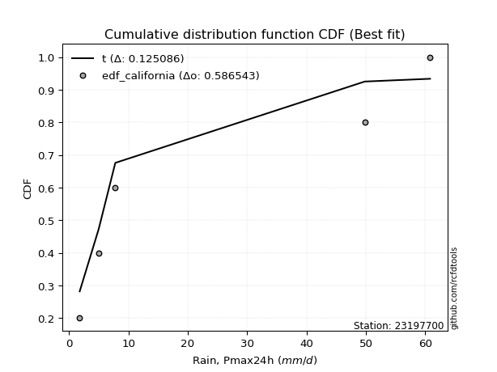</img>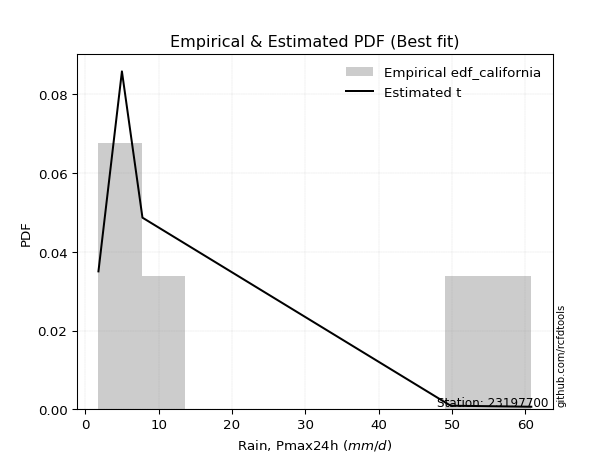</img>

</div>


### 2. EDF Hazen (1930)

Hazen method for plotting positions is a formula used to estimate the empirical cumulative probability distribution of flood events or other hydrological data. This formula often results in biased estimations, particularly when extrapolating to extreme events (high return periods).

<div align="center">


$P=(m-0.5)/n$


</div>


**2.1. Empirical values**

<div align="center">

|                | 0                  | 1                  | 2         | 3                 | 4                  |
|:---------------|:-------------------|:-------------------|:----------|:------------------|:-------------------|
| date           | 2023               | 2021               | 2020      | 2022              | 2019               |
| x              | 1.8                | 5.0                | 7.8       | 49.8              | 60.8               |
| m              | 1                  | 2                  | 3         | 4                 | 5                  |
| empirical_dist | edf_hazen          | edf_hazen          | edf_hazen | edf_hazen         | edf_hazen          |
| empirical      | 0.1                | 0.3                | 0.5       | 0.7               | 0.9                |
| empirical_tr   | 1.1111111111111112 | 1.4285714285714286 | 2.0       | 3.333333333333333 | 10.000000000000002 |

</div>


**2.2. Kolmogorov-Smirnov fit test (sorted by Δ)**


<div align="center">

|                | 0                   | 1                   | 2                   | 3                   | 4                   | 5                   | 6                   | 7                   | 8                   | 9                   | 10                  | 11                  | 12                  | 13                 | 14                 | 15                  | 16                 | 17                  | 18                 | 19                 | 20                  | 21                 | 22                 | 23                  | 24                 | 25                 | 26                  | 27                 | 28                  | 29                  | 30                  | 31                  | 32                 | 33                  | 34                 | 35                 | 36                  | 37                  | 38                  | 39                  | 40                  | 41                  | 42                  | 43                  | 44                  | 45                 | 46                  | 47                  | 48                  | 49                  | 50                  | 51                 | 52                 | 53                 | 54                  | 55                 | 56                  | 57                  | 58                  | 59                  | 60                  | 61                  | 62                  | 63                  | 64                  | 65                  | 66                  | 67                  | 68                  | 69                 | 70                  | 71                  | 72                  | 73                  | 74                  | 75                  | 76                 | 77                  | 78                  | 79                 | 80                  | 81                  | 82                  | 83                  | 84                  | 85                  | 86                 | 87                  | 88                 | 89                  | 90                 | 91                  | 92                  | 93                  | 94                  | 95                  | 96                  | 97                  | 98                  | 99                  | 100                | 101                 | 102                 | 103                | 104                 | 105                 | 106                 | 107                | 108                 | 109                 | 110                | 111                | 112                | 113                 | 114                 | 115                | 116                | 117                 | 118                 | 119                 | 120                 | 121                 | 122                | 123                 | 124                | 125                 | 126                | 127                | 128                | 129                 | 130                | 131                 | 132                 | 133                 | 134                | 135                | 136                | 137                 | 138                | 139                | 140                | 141                 | 142                | 143                 | 144                | 145                 | 146                | 147                | 148                 | 149                | 150                 | 151                 | 152                | 153                | 154                | 155                | 156                | 157                | 158                | 159                |
|:---------------|:--------------------|:--------------------|:--------------------|:--------------------|:--------------------|:--------------------|:--------------------|:--------------------|:--------------------|:--------------------|:--------------------|:--------------------|:--------------------|:-------------------|:-------------------|:--------------------|:-------------------|:--------------------|:-------------------|:-------------------|:--------------------|:-------------------|:-------------------|:--------------------|:-------------------|:-------------------|:--------------------|:-------------------|:--------------------|:--------------------|:--------------------|:--------------------|:-------------------|:--------------------|:-------------------|:-------------------|:--------------------|:--------------------|:--------------------|:--------------------|:--------------------|:--------------------|:--------------------|:--------------------|:--------------------|:-------------------|:--------------------|:--------------------|:--------------------|:--------------------|:--------------------|:-------------------|:-------------------|:-------------------|:--------------------|:-------------------|:--------------------|:--------------------|:--------------------|:--------------------|:--------------------|:--------------------|:--------------------|:--------------------|:--------------------|:--------------------|:--------------------|:--------------------|:--------------------|:-------------------|:--------------------|:--------------------|:--------------------|:--------------------|:--------------------|:--------------------|:-------------------|:--------------------|:--------------------|:-------------------|:--------------------|:--------------------|:--------------------|:--------------------|:--------------------|:--------------------|:-------------------|:--------------------|:-------------------|:--------------------|:-------------------|:--------------------|:--------------------|:--------------------|:--------------------|:--------------------|:--------------------|:--------------------|:--------------------|:--------------------|:-------------------|:--------------------|:--------------------|:-------------------|:--------------------|:--------------------|:--------------------|:-------------------|:--------------------|:--------------------|:-------------------|:-------------------|:-------------------|:--------------------|:--------------------|:-------------------|:-------------------|:--------------------|:--------------------|:--------------------|:--------------------|:--------------------|:-------------------|:--------------------|:-------------------|:--------------------|:-------------------|:-------------------|:-------------------|:--------------------|:-------------------|:--------------------|:--------------------|:--------------------|:-------------------|:-------------------|:-------------------|:--------------------|:-------------------|:-------------------|:-------------------|:--------------------|:-------------------|:--------------------|:-------------------|:--------------------|:-------------------|:-------------------|:--------------------|:-------------------|:--------------------|:--------------------|:-------------------|:-------------------|:-------------------|:-------------------|:-------------------|:-------------------|:-------------------|:-------------------|
| station        | 23197700            | 23197700            | 23197700            | 23197700            | 23197700            | 23197700            | 23197700            | 23197700            | 23197700            | 23197700            | 23197700            | 23197700            | 23197700            | 23197700           | 23197700           | 23197700            | 23197700           | 23197700            | 23197700           | 23197700           | 23197700            | 23197700           | 23197700           | 23197700            | 23197700           | 23197700           | 23197700            | 23197700           | 23197700            | 23197700            | 23197700            | 23197700            | 23197700           | 23197700            | 23197700           | 23197700           | 23197700            | 23197700            | 23197700            | 23197700            | 23197700            | 23197700            | 23197700            | 23197700            | 23197700            | 23197700           | 23197700            | 23197700            | 23197700            | 23197700            | 23197700            | 23197700           | 23197700           | 23197700           | 23197700            | 23197700           | 23197700            | 23197700            | 23197700            | 23197700            | 23197700            | 23197700            | 23197700            | 23197700            | 23197700            | 23197700            | 23197700            | 23197700            | 23197700            | 23197700           | 23197700            | 23197700            | 23197700            | 23197700            | 23197700            | 23197700            | 23197700           | 23197700            | 23197700            | 23197700           | 23197700            | 23197700            | 23197700            | 23197700            | 23197700            | 23197700            | 23197700           | 23197700            | 23197700           | 23197700            | 23197700           | 23197700            | 23197700            | 23197700            | 23197700            | 23197700            | 23197700            | 23197700            | 23197700            | 23197700            | 23197700           | 23197700            | 23197700            | 23197700           | 23197700            | 23197700            | 23197700            | 23197700           | 23197700            | 23197700            | 23197700           | 23197700           | 23197700           | 23197700            | 23197700            | 23197700           | 23197700           | 23197700            | 23197700            | 23197700            | 23197700            | 23197700            | 23197700           | 23197700            | 23197700           | 23197700            | 23197700           | 23197700           | 23197700           | 23197700            | 23197700           | 23197700            | 23197700            | 23197700            | 23197700           | 23197700           | 23197700           | 23197700            | 23197700           | 23197700           | 23197700           | 23197700            | 23197700           | 23197700            | 23197700           | 23197700            | 23197700           | 23197700           | 23197700            | 23197700           | 23197700            | 23197700            | 23197700           | 23197700           | 23197700           | 23197700           | 23197700           | 23197700           | 23197700           | 23197700           |
| empirical_dist | edf_hazen           | edf_hazen           | edf_hazen           | edf_hazen           | edf_hazen           | edf_hazen           | edf_hazen           | edf_hazen           | edf_hazen           | edf_hazen           | edf_hazen           | edf_hazen           | edf_hazen           | edf_hazen          | edf_hazen          | edf_hazen           | edf_hazen          | edf_hazen           | edf_hazen          | edf_hazen          | edf_hazen           | edf_hazen          | edf_hazen          | edf_hazen           | edf_hazen          | edf_hazen          | edf_hazen           | edf_hazen          | edf_hazen           | edf_hazen           | edf_hazen           | edf_hazen           | edf_hazen          | edf_hazen           | edf_hazen          | edf_hazen          | edf_hazen           | edf_hazen           | edf_hazen           | edf_hazen           | edf_hazen           | edf_hazen           | edf_hazen           | edf_hazen           | edf_hazen           | edf_hazen          | edf_hazen           | edf_hazen           | edf_hazen           | edf_hazen           | edf_hazen           | edf_hazen          | edf_hazen          | edf_hazen          | edf_hazen           | edf_hazen          | edf_hazen           | edf_hazen           | edf_hazen           | edf_hazen           | edf_hazen           | edf_hazen           | edf_hazen           | edf_hazen           | edf_hazen           | edf_hazen           | edf_hazen           | edf_hazen           | edf_hazen           | edf_hazen          | edf_hazen           | edf_hazen           | edf_hazen           | edf_hazen           | edf_hazen           | edf_hazen           | edf_hazen          | edf_hazen           | edf_hazen           | edf_hazen          | edf_hazen           | edf_hazen           | edf_hazen           | edf_hazen           | edf_hazen           | edf_hazen           | edf_hazen          | edf_hazen           | edf_hazen          | edf_hazen           | edf_hazen          | edf_hazen           | edf_hazen           | edf_hazen           | edf_hazen           | edf_hazen           | edf_hazen           | edf_hazen           | edf_hazen           | edf_hazen           | edf_hazen          | edf_hazen           | edf_hazen           | edf_hazen          | edf_hazen           | edf_hazen           | edf_hazen           | edf_hazen          | edf_hazen           | edf_hazen           | edf_hazen          | edf_hazen          | edf_hazen          | edf_hazen           | edf_hazen           | edf_hazen          | edf_hazen          | edf_hazen           | edf_hazen           | edf_hazen           | edf_hazen           | edf_hazen           | edf_hazen          | edf_hazen           | edf_hazen          | edf_hazen           | edf_hazen          | edf_hazen          | edf_hazen          | edf_hazen           | edf_hazen          | edf_hazen           | edf_hazen           | edf_hazen           | edf_hazen          | edf_hazen          | edf_hazen          | edf_hazen           | edf_hazen          | edf_hazen          | edf_hazen          | edf_hazen           | edf_hazen          | edf_hazen           | edf_hazen          | edf_hazen           | edf_hazen          | edf_hazen          | edf_hazen           | edf_hazen          | edf_hazen           | edf_hazen           | edf_hazen          | edf_hazen          | edf_hazen          | edf_hazen          | edf_hazen          | edf_hazen          | edf_hazen          | edf_hazen          |
| p_dist         | logarcsine          | loglomax            | logdweibull         | logksone            | logsemicircular     | logvonmises         | logexponpow         | f                   | loganglit           | invgamma            | logburr12           | logloglaplace       | wrapcauchy          | nct                | logbeta            | logdgamma           | logncf             | loginvweibull       | loggenlogistic     | loggenexpon        | ncf                 | dgamma             | weibull_min        | loghalfnorm         | logfatiguelife     | lograyleigh        | loginvgauss         | loghalfgennorm     | logmaxwell          | logkstwobign        | burr                | logrice             | betaprime          | loginvgamma         | lomax              | loggompertz        | gengamma            | logfoldnorm         | logwrapcauchy       | logpearson3         | logerlang           | loggamma            | loggamma            | logskewnorm         | logt                | logexponnorm       | logcrystalball      | lognorm             | lognct              | logloggamma         | exponweib           | loggenpareto       | logrdist           | loghalflogistic    | logalpha            | logtrapezoid       | loggumbel_r         | logcosine           | dweibull            | arcsine             | logmoyal            | loggausshyper       | vonmises_line       | loglogistic         | logbetaprime        | invgauss            | loghypsecant        | loggenhalflogistic  | alpha               | halfgennorm        | loglaplace          | loglaplace          | logargus            | loggumbel_l         | logwald             | ksone               | loggennorm         | halfnorm            | kappa4              | burr12             | levy_l              | logmielke           | logtriang           | exponpow            | semicircular        | logburr             | logweibull_max     | foldnorm            | halflogistic       | rayleigh            | t                  | anglit              | logf                | loglevy_l           | maxwell             | gennorm             | logtukeylambda      | genlogistic         | logkappa3           | logkappa4           | pearson3           | gumbel_r            | loguniform          | logvonmises_line   | moyal               | truncweibull_min    | truncpareto         | johnsonsu          | norm                | crystalball         | loggengamma        | kstwobign          | logbradford        | logweibull_min      | logtruncexpon       | gamma              | logexponweib       | logtruncnorm        | erlang              | gompertz            | exponnorm           | logtruncweibull_min | genexpon           | loggenextreme       | logistic           | cosine              | gausshyper         | rice               | truncnorm          | hypsecant           | gumbel_l           | lognakagami         | laplace             | argus               | wald               | triang             | beta               | truncexpon          | genextreme         | fatiguelife        | nakagami           | skewnorm            | johnsonsb          | bradford            | tukeylambda        | genpareto           | uniform            | genhalflogistic    | logjohnsonsb        | powerlaw           | kappa3              | trapezoid           | mielke             | weibull_max        | logpowerlaw        | logtruncpareto     | rdist              | logjohnsonsu       | invweibull         | vonmises           |
| delta          | 0.07386814171063272 | 0.09999999999437244 | 0.10775071788119062 | 0.10948969416171339 | 0.12412867172917252 | 0.12866474138006667 | 0.13073876908423232 | 0.13423683298611144 | 0.13453709482702836 | 0.13882472010103086 | 0.13952178857534525 | 0.13957047740411133 | 0.13996386803488314 | 0.1401544030253108 | 0.1407797691332051 | 0.14202808612441076 | 0.1462779049505082 | 0.14649706516795502 | 0.1466749990076618 | 0.1477480842369734 | 0.14970702286377313 | 0.1502132297750589 | 0.1510668320325994 | 0.15130352470170683 | 0.152248688783708  | 0.1522684304643822 | 0.15277450662268754 | 0.1530851073694418 | 0.15350448740493683 | 0.15436486344084777 | 0.15503606472910558 | 0.15518771185230196 | 0.1561739532120956 | 0.15617802838083494 | 0.156420201810612  | 0.1569064597798594 | 0.15713936834930098 | 0.15739655816542886 | 0.15752790624150087 | 0.15797856487792528 | 0.15803316221437091 | 0.15808268216215482 | 0.15808268216215482 | 0.15816075987411593 | 0.15816259362326512 | 0.1581629045590085 | 0.15816328161404547 | 0.15816328250905398 | 0.15821320725565224 | 0.15850898005011826 | 0.15925311233928174 | 0.1630904752649076 | 0.1652726363829914 | 0.1668173739981279 | 0.16703541642530878 | 0.1674819895598637 | 0.16765992756452452 | 0.17084141540955555 | 0.17184490148230136 | 0.17194236194277876 | 0.17204753633093706 | 0.17454482327399085 | 0.17467279192606194 | 0.17485456269535748 | 0.17812229796395784 | 0.18141529417469981 | 0.18316075465804027 | 0.18556916512297672 | 0.18617420829140574 | 0.1898834046379102 | 0.19022591998946647 | 0.19022591998946647 | 0.19101208915584533 | 0.19146408433534856 | 0.19308583566640558 | 0.19888741689935224 | 0.2                | 0.20203962388220953 | 0.20598776207537728 | 0.2071117514227756 | 0.20718275514310922 | 0.20761858424148166 | 0.21193235227577223 | 0.21267921406286944 | 0.21488664539211344 | 0.21755769241595435 | 0.2175943627402172 | 0.21761777502336271 | 0.2176570082164765 | 0.22501731777098333 | 0.2250863324355752 | 0.22689939053213876 | 0.22712790760501894 | 0.22779143357575848 | 0.23366084894113376 | 0.23410569943854054 | 0.23997386123120212 | 0.24015098436705606 | 0.24106636965115913 | 0.24114812801450525 | 0.2428453141769789 | 0.24296675717399963 | 0.24329944093272393 | 0.2436090127734044 | 0.24525739634364163 | 0.24920898287327475 | 0.25295098281609224 | 0.2539793426708693 | 0.25457773793053967 | 0.25457774150289264 | 0.2569436041584487 | 0.2570953814684309 | 0.2578862403638117 | 0.26107852884882427 | 0.26194082327636414 | 0.2640486520196955 | 0.2652972220887371 | 0.26650813644743765 | 0.26754917736239403 | 0.27011564516905606 | 0.27068185021471236 | 0.27143166789170436 | 0.2724614760355339 | 0.27477202768398057 | 0.2772386618800744 | 0.28317820693500506 | 0.2832322407808433 | 0.2883492898651565 | 0.2903625216377731 | 0.29201705805358646 | 0.2929150809025953 | 0.29734117315436864 | 0.31128032308920095 | 0.31748980343939004 | 0.3224364712231669 | 0.3271071739047989 | 0.3353718364945906 | 0.34349012504706705 | 0.3553559010230881 | 0.3567710291534352 | 0.3583787260328694 | 0.36051337865706645 | 0.3620646001995473 | 0.37825839923944365 | 0.3901708266426809 | 0.39119736173386976 | 0.3983050847457627 | 0.403280866490495  | 0.41918523263202034 | 0.4261000451766928 | 0.45208292109369025 | 0.47076769426888826 | 0.4814600678406689 | 0.507632381738642  | 0.5572863292892125 | 0.574492541732136  | 0.5920928273481053 | 0.6264710308294995 | 0.6967205418304427 | 9.320273179124188  |
| deltao         | 0.5865427407550001  | 0.5865427407550001  | 0.5865427407550001  | 0.5865427407550001  | 0.5865427407550001  | 0.5865427407550001  | 0.5865427407550001  | 0.5865427407550001  | 0.5865427407550001  | 0.5865427407550001  | 0.5865427407550001  | 0.5865427407550001  | 0.5865427407550001  | 0.5865427407550001 | 0.5865427407550001 | 0.5865427407550001  | 0.5865427407550001 | 0.5865427407550001  | 0.5865427407550001 | 0.5865427407550001 | 0.5865427407550001  | 0.5865427407550001 | 0.5865427407550001 | 0.5865427407550001  | 0.5865427407550001 | 0.5865427407550001 | 0.5865427407550001  | 0.5865427407550001 | 0.5865427407550001  | 0.5865427407550001  | 0.5865427407550001  | 0.5865427407550001  | 0.5865427407550001 | 0.5865427407550001  | 0.5865427407550001 | 0.5865427407550001 | 0.5865427407550001  | 0.5865427407550001  | 0.5865427407550001  | 0.5865427407550001  | 0.5865427407550001  | 0.5865427407550001  | 0.5865427407550001  | 0.5865427407550001  | 0.5865427407550001  | 0.5865427407550001 | 0.5865427407550001  | 0.5865427407550001  | 0.5865427407550001  | 0.5865427407550001  | 0.5865427407550001  | 0.5865427407550001 | 0.5865427407550001 | 0.5865427407550001 | 0.5865427407550001  | 0.5865427407550001 | 0.5865427407550001  | 0.5865427407550001  | 0.5865427407550001  | 0.5865427407550001  | 0.5865427407550001  | 0.5865427407550001  | 0.5865427407550001  | 0.5865427407550001  | 0.5865427407550001  | 0.5865427407550001  | 0.5865427407550001  | 0.5865427407550001  | 0.5865427407550001  | 0.5865427407550001 | 0.5865427407550001  | 0.5865427407550001  | 0.5865427407550001  | 0.5865427407550001  | 0.5865427407550001  | 0.5865427407550001  | 0.5865427407550001 | 0.5865427407550001  | 0.5865427407550001  | 0.5865427407550001 | 0.5865427407550001  | 0.5865427407550001  | 0.5865427407550001  | 0.5865427407550001  | 0.5865427407550001  | 0.5865427407550001  | 0.5865427407550001 | 0.5865427407550001  | 0.5865427407550001 | 0.5865427407550001  | 0.5865427407550001 | 0.5865427407550001  | 0.5865427407550001  | 0.5865427407550001  | 0.5865427407550001  | 0.5865427407550001  | 0.5865427407550001  | 0.5865427407550001  | 0.5865427407550001  | 0.5865427407550001  | 0.5865427407550001 | 0.5865427407550001  | 0.5865427407550001  | 0.5865427407550001 | 0.5865427407550001  | 0.5865427407550001  | 0.5865427407550001  | 0.5865427407550001 | 0.5865427407550001  | 0.5865427407550001  | 0.5865427407550001 | 0.5865427407550001 | 0.5865427407550001 | 0.5865427407550001  | 0.5865427407550001  | 0.5865427407550001 | 0.5865427407550001 | 0.5865427407550001  | 0.5865427407550001  | 0.5865427407550001  | 0.5865427407550001  | 0.5865427407550001  | 0.5865427407550001 | 0.5865427407550001  | 0.5865427407550001 | 0.5865427407550001  | 0.5865427407550001 | 0.5865427407550001 | 0.5865427407550001 | 0.5865427407550001  | 0.5865427407550001 | 0.5865427407550001  | 0.5865427407550001  | 0.5865427407550001  | 0.5865427407550001 | 0.5865427407550001 | 0.5865427407550001 | 0.5865427407550001  | 0.5865427407550001 | 0.5865427407550001 | 0.5865427407550001 | 0.5865427407550001  | 0.5865427407550001 | 0.5865427407550001  | 0.5865427407550001 | 0.5865427407550001  | 0.5865427407550001 | 0.5865427407550001 | 0.5865427407550001  | 0.5865427407550001 | 0.5865427407550001  | 0.5865427407550001  | 0.5865427407550001 | 0.5865427407550001 | 0.5865427407550001 | 0.5865427407550001 | 0.5865427407550001 | 0.5865427407550001 | 0.5865427407550001 | 0.5865427407550001 |
| eval           | Δo > Δ              | Δo > Δ              | Δo > Δ              | Δo > Δ              | Δo > Δ              | Δo > Δ              | Δo > Δ              | Δo > Δ              | Δo > Δ              | Δo > Δ              | Δo > Δ              | Δo > Δ              | Δo > Δ              | Δo > Δ             | Δo > Δ             | Δo > Δ              | Δo > Δ             | Δo > Δ              | Δo > Δ             | Δo > Δ             | Δo > Δ              | Δo > Δ             | Δo > Δ             | Δo > Δ              | Δo > Δ             | Δo > Δ             | Δo > Δ              | Δo > Δ             | Δo > Δ              | Δo > Δ              | Δo > Δ              | Δo > Δ              | Δo > Δ             | Δo > Δ              | Δo > Δ             | Δo > Δ             | Δo > Δ              | Δo > Δ              | Δo > Δ              | Δo > Δ              | Δo > Δ              | Δo > Δ              | Δo > Δ              | Δo > Δ              | Δo > Δ              | Δo > Δ             | Δo > Δ              | Δo > Δ              | Δo > Δ              | Δo > Δ              | Δo > Δ              | Δo > Δ             | Δo > Δ             | Δo > Δ             | Δo > Δ              | Δo > Δ             | Δo > Δ              | Δo > Δ              | Δo > Δ              | Δo > Δ              | Δo > Δ              | Δo > Δ              | Δo > Δ              | Δo > Δ              | Δo > Δ              | Δo > Δ              | Δo > Δ              | Δo > Δ              | Δo > Δ              | Δo > Δ             | Δo > Δ              | Δo > Δ              | Δo > Δ              | Δo > Δ              | Δo > Δ              | Δo > Δ              | Δo > Δ             | Δo > Δ              | Δo > Δ              | Δo > Δ             | Δo > Δ              | Δo > Δ              | Δo > Δ              | Δo > Δ              | Δo > Δ              | Δo > Δ              | Δo > Δ             | Δo > Δ              | Δo > Δ             | Δo > Δ              | Δo > Δ             | Δo > Δ              | Δo > Δ              | Δo > Δ              | Δo > Δ              | Δo > Δ              | Δo > Δ              | Δo > Δ              | Δo > Δ              | Δo > Δ              | Δo > Δ             | Δo > Δ              | Δo > Δ              | Δo > Δ             | Δo > Δ              | Δo > Δ              | Δo > Δ              | Δo > Δ             | Δo > Δ              | Δo > Δ              | Δo > Δ             | Δo > Δ             | Δo > Δ             | Δo > Δ              | Δo > Δ              | Δo > Δ             | Δo > Δ             | Δo > Δ              | Δo > Δ              | Δo > Δ              | Δo > Δ              | Δo > Δ              | Δo > Δ             | Δo > Δ              | Δo > Δ             | Δo > Δ              | Δo > Δ             | Δo > Δ             | Δo > Δ             | Δo > Δ              | Δo > Δ             | Δo > Δ              | Δo > Δ              | Δo > Δ              | Δo > Δ             | Δo > Δ             | Δo > Δ             | Δo > Δ              | Δo > Δ             | Δo > Δ             | Δo > Δ             | Δo > Δ              | Δo > Δ             | Δo > Δ              | Δo > Δ             | Δo > Δ              | Δo > Δ             | Δo > Δ             | Δo > Δ              | Δo > Δ             | Δo > Δ              | Δo > Δ              | Δo > Δ             | Δo > Δ             | Δo > Δ             | Δo > Δ             | Δo <= Δ            | Δo <= Δ            | Δo <= Δ            | Δo <= Δ            |
| fit            | 1                   | 1                   | 1                   | 1                   | 1                   | 1                   | 1                   | 1                   | 1                   | 1                   | 1                   | 1                   | 1                   | 1                  | 1                  | 1                   | 1                  | 1                   | 1                  | 1                  | 1                   | 1                  | 1                  | 1                   | 1                  | 1                  | 1                   | 1                  | 1                   | 1                   | 1                   | 1                   | 1                  | 1                   | 1                  | 1                  | 1                   | 1                   | 1                   | 1                   | 1                   | 1                   | 1                   | 1                   | 1                   | 1                  | 1                   | 1                   | 1                   | 1                   | 1                   | 1                  | 1                  | 1                  | 1                   | 1                  | 1                   | 1                   | 1                   | 1                   | 1                   | 1                   | 1                   | 1                   | 1                   | 1                   | 1                   | 1                   | 1                   | 1                  | 1                   | 1                   | 1                   | 1                   | 1                   | 1                   | 1                  | 1                   | 1                   | 1                  | 1                   | 1                   | 1                   | 1                   | 1                   | 1                   | 1                  | 1                   | 1                  | 1                   | 1                  | 1                   | 1                   | 1                   | 1                   | 1                   | 1                   | 1                   | 1                   | 1                   | 1                  | 1                   | 1                   | 1                  | 1                   | 1                   | 1                   | 1                  | 1                   | 1                   | 1                  | 1                  | 1                  | 1                   | 1                   | 1                  | 1                  | 1                   | 1                   | 1                   | 1                   | 1                   | 1                  | 1                   | 1                  | 1                   | 1                  | 1                  | 1                  | 1                   | 1                  | 1                   | 1                   | 1                   | 1                  | 1                  | 1                  | 1                   | 1                  | 1                  | 1                  | 1                   | 1                  | 1                   | 1                  | 1                   | 1                  | 1                  | 1                   | 1                  | 1                   | 1                   | 1                  | 1                  | 1                  | 1                  | 0                  | 0                  | 0                  | 0                  |
| n              | 5                   | 5                   | 5                   | 5                   | 5                   | 5                   | 5                   | 5                   | 5                   | 5                   | 5                   | 5                   | 5                   | 5                  | 5                  | 5                   | 5                  | 5                   | 5                  | 5                  | 5                   | 5                  | 5                  | 5                   | 5                  | 5                  | 5                   | 5                  | 5                   | 5                   | 5                   | 5                   | 5                  | 5                   | 5                  | 5                  | 5                   | 5                   | 5                   | 5                   | 5                   | 5                   | 5                   | 5                   | 5                   | 5                  | 5                   | 5                   | 5                   | 5                   | 5                   | 5                  | 5                  | 5                  | 5                   | 5                  | 5                   | 5                   | 5                   | 5                   | 5                   | 5                   | 5                   | 5                   | 5                   | 5                   | 5                   | 5                   | 5                   | 5                  | 5                   | 5                   | 5                   | 5                   | 5                   | 5                   | 5                  | 5                   | 5                   | 5                  | 5                   | 5                   | 5                   | 5                   | 5                   | 5                   | 5                  | 5                   | 5                  | 5                   | 5                  | 5                   | 5                   | 5                   | 5                   | 5                   | 5                   | 5                   | 5                   | 5                   | 5                  | 5                   | 5                   | 5                  | 5                   | 5                   | 5                   | 5                  | 5                   | 5                   | 5                  | 5                  | 5                  | 5                   | 5                   | 5                  | 5                  | 5                   | 5                   | 5                   | 5                   | 5                   | 5                  | 5                   | 5                  | 5                   | 5                  | 5                  | 5                  | 5                   | 5                  | 5                   | 5                   | 5                   | 5                  | 5                  | 5                  | 5                   | 5                  | 5                  | 5                  | 5                   | 5                  | 5                   | 5                  | 5                   | 5                  | 5                  | 5                   | 5                  | 5                   | 5                   | 5                  | 5                  | 5                  | 5                  | 5                  | 5                  | 5                  | 5                  |
| best_fit       | 1                   | 0                   | 0                   | 0                   | 0                   | 0                   | 0                   | 0                   | 0                   | 0                   | 0                   | 0                   | 0                   | 0                  | 0                  | 0                   | 0                  | 0                   | 0                  | 0                  | 0                   | 0                  | 0                  | 0                   | 0                  | 0                  | 0                   | 0                  | 0                   | 0                   | 0                   | 0                   | 0                  | 0                   | 0                  | 0                  | 0                   | 0                   | 0                   | 0                   | 0                   | 0                   | 0                   | 0                   | 0                   | 0                  | 0                   | 0                   | 0                   | 0                   | 0                   | 0                  | 0                  | 0                  | 0                   | 0                  | 0                   | 0                   | 0                   | 0                   | 0                   | 0                   | 0                   | 0                   | 0                   | 0                   | 0                   | 0                   | 0                   | 0                  | 0                   | 0                   | 0                   | 0                   | 0                   | 0                   | 0                  | 0                   | 0                   | 0                  | 0                   | 0                   | 0                   | 0                   | 0                   | 0                   | 0                  | 0                   | 0                  | 0                   | 0                  | 0                   | 0                   | 0                   | 0                   | 0                   | 0                   | 0                   | 0                   | 0                   | 0                  | 0                   | 0                   | 0                  | 0                   | 0                   | 0                   | 0                  | 0                   | 0                   | 0                  | 0                  | 0                  | 0                   | 0                   | 0                  | 0                  | 0                   | 0                   | 0                   | 0                   | 0                   | 0                  | 0                   | 0                  | 0                   | 0                  | 0                  | 0                  | 0                   | 0                  | 0                   | 0                   | 0                   | 0                  | 0                  | 0                  | 0                   | 0                  | 0                  | 0                  | 0                   | 0                  | 0                   | 0                  | 0                   | 0                  | 0                  | 0                   | 0                  | 0                   | 0                   | 0                  | 0                  | 0                  | 0                  | 0                  | 0                  | 0                  | 0                  |
| best_fit_sort  | 1                   | 2                   | 3                   | 4                   | 5                   | 6                   | 7                   | 8                   | 9                   | 10                  | 11                  | 12                  | 13                  | 14                 | 15                 | 16                  | 17                 | 18                  | 19                 | 20                 | 21                  | 22                 | 23                 | 24                  | 25                 | 26                 | 27                  | 28                 | 29                  | 30                  | 31                  | 32                  | 33                 | 34                  | 35                 | 36                 | 37                  | 38                  | 39                  | 40                  | 41                  | 42                  | 43                  | 44                  | 45                  | 46                 | 47                  | 48                  | 49                  | 50                  | 51                  | 52                 | 53                 | 54                 | 55                  | 56                 | 57                  | 58                  | 59                  | 60                  | 61                  | 62                  | 63                  | 64                  | 65                  | 66                  | 67                  | 68                  | 69                  | 70                 | 71                  | 72                  | 73                  | 74                  | 75                  | 76                  | 77                 | 78                  | 79                  | 80                 | 81                  | 82                  | 83                  | 84                  | 85                  | 86                  | 87                 | 88                  | 89                 | 90                  | 91                 | 92                  | 93                  | 94                  | 95                  | 96                  | 97                  | 98                  | 99                  | 100                 | 101                | 102                 | 103                 | 104                | 105                 | 106                 | 107                 | 108                | 109                 | 110                 | 111                | 112                | 113                | 114                 | 115                 | 116                | 117                | 118                 | 119                 | 120                 | 121                 | 122                 | 123                | 124                 | 125                | 126                 | 127                | 128                | 129                | 130                 | 131                | 132                 | 133                 | 134                 | 135                | 136                | 137                | 138                 | 139                | 140                | 141                | 142                 | 143                | 144                 | 145                | 146                 | 147                | 148                | 149                 | 150                | 151                 | 152                 | 153                | 154                | 155                | 156                | 157                | 158                | 159                | 160                |

</div>


**2.3. Best fit**

<div align="center">

|   id |   station | empirical_dist   | p_dist     |     delta |   deltao | eval   |   fit |   n |   best_fit |   best_fit_sort |
|-----:|----------:|:-----------------|:-----------|----------:|---------:|:-------|------:|----:|-----------:|----------------:|
|    0 |  23197700 | edf_hazen        | logarcsine | 0.0738681 | 0.586543 | Δo > Δ |     1 |   5 |          1 |               1 |

</div>


<div align="center">

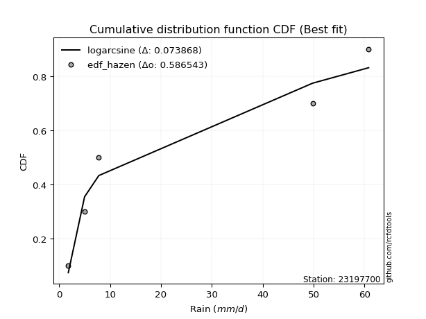</img>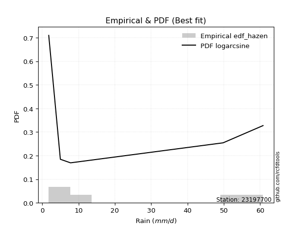</img>

</div>


### 3. EDF Weibull (1939)

Weibull plotting position formula is an empirical method used to estimate the non-exceedance probability or plotting position for a set of observed data, is often recommended or widely used in practice, particularly in flood frequency analysis.

<div align="center">


$P=m/(n+1)$


</div>


**3.1. Empirical values**

<div align="center">

|                | 0                   | 1                  | 2           | 3                  | 4                  |
|:---------------|:--------------------|:-------------------|:------------|:-------------------|:-------------------|
| date           | 2023                | 2021               | 2020        | 2022               | 2019               |
| x              | 1.8                 | 5.0                | 7.8         | 49.8               | 60.8               |
| m              | 1                   | 2                  | 3           | 4                  | 5                  |
| empirical_dist | edf_weibull         | edf_weibull        | edf_weibull | edf_weibull        | edf_weibull        |
| empirical      | 0.16666666666666666 | 0.3333333333333333 | 0.5         | 0.6666666666666666 | 0.8333333333333334 |
| empirical_tr   | 1.2                 | 1.4999999999999998 | 2.0         | 2.9999999999999996 | 6.000000000000002  |

</div>


**3.2. Kolmogorov-Smirnov fit test (sorted by Δ)**


<div align="center">

|                | 0                   | 1                   | 2                   | 3                   | 4                   | 5                   | 6                   | 7                   | 8                  | 9                   | 10                  | 11                  | 12                  | 13                  | 14                 | 15                 | 16                 | 17                  | 18                  | 19                  | 20                  | 21                 | 22                  | 23                  | 24                  | 25                  | 26                 | 27                  | 28                 | 29                  | 30                  | 31                 | 32                  | 33                  | 34                  | 35                  | 36                  | 37                  | 38                  | 39                 | 40                 | 41                  | 42                  | 43                  | 44                  | 45                  | 46                 | 47                  | 48                 | 49                  | 50                  | 51                  | 52                  | 53                  | 54                  | 55                 | 56                 | 57                  | 58                 | 59                  | 60                  | 61                  | 62                  | 63                  | 64                  | 65                  | 66                  | 67                  | 68                  | 69                  | 70                  | 71                 | 72                  | 73                  | 74                  | 75                 | 76                 | 77                  | 78                 | 79                  | 80                  | 81                  | 82                 | 83                 | 84                  | 85                 | 86                  | 87                 | 88                  | 89                  | 90                  | 91                  | 92                  | 93                  | 94                  | 95                 | 96                  | 97                  | 98                  | 99                 | 100                | 101                 | 102                 | 103                | 104                | 105                 | 106                 | 107                 | 108                | 109                 | 110                 | 111                | 112                 | 113                 | 114                 | 115                | 116                | 117                | 118                 | 119                | 120                | 121                 | 122                | 123                | 124                 | 125                | 126                 | 127                 | 128                | 129                | 130                 | 131                 | 132                 | 133                 | 134                | 135                | 136                | 137                | 138                 | 139                 | 140                | 141                 | 142                | 143                 | 144                 | 145                | 146                | 147                 | 148                | 149                | 150                | 151                | 152                 | 153                | 154                | 155                | 156                | 157                | 158                | 159                |
|:---------------|:--------------------|:--------------------|:--------------------|:--------------------|:--------------------|:--------------------|:--------------------|:--------------------|:-------------------|:--------------------|:--------------------|:--------------------|:--------------------|:--------------------|:-------------------|:-------------------|:-------------------|:--------------------|:--------------------|:--------------------|:--------------------|:-------------------|:--------------------|:--------------------|:--------------------|:--------------------|:-------------------|:--------------------|:-------------------|:--------------------|:--------------------|:-------------------|:--------------------|:--------------------|:--------------------|:--------------------|:--------------------|:--------------------|:--------------------|:-------------------|:-------------------|:--------------------|:--------------------|:--------------------|:--------------------|:--------------------|:-------------------|:--------------------|:-------------------|:--------------------|:--------------------|:--------------------|:--------------------|:--------------------|:--------------------|:-------------------|:-------------------|:--------------------|:-------------------|:--------------------|:--------------------|:--------------------|:--------------------|:--------------------|:--------------------|:--------------------|:--------------------|:--------------------|:--------------------|:--------------------|:--------------------|:-------------------|:--------------------|:--------------------|:--------------------|:-------------------|:-------------------|:--------------------|:-------------------|:--------------------|:--------------------|:--------------------|:-------------------|:-------------------|:--------------------|:-------------------|:--------------------|:-------------------|:--------------------|:--------------------|:--------------------|:--------------------|:--------------------|:--------------------|:--------------------|:-------------------|:--------------------|:--------------------|:--------------------|:-------------------|:-------------------|:--------------------|:--------------------|:-------------------|:-------------------|:--------------------|:--------------------|:--------------------|:-------------------|:--------------------|:--------------------|:-------------------|:--------------------|:--------------------|:--------------------|:-------------------|:-------------------|:-------------------|:--------------------|:-------------------|:-------------------|:--------------------|:-------------------|:-------------------|:--------------------|:-------------------|:--------------------|:--------------------|:-------------------|:-------------------|:--------------------|:--------------------|:--------------------|:--------------------|:-------------------|:-------------------|:-------------------|:-------------------|:--------------------|:--------------------|:-------------------|:--------------------|:-------------------|:--------------------|:--------------------|:-------------------|:-------------------|:--------------------|:-------------------|:-------------------|:-------------------|:-------------------|:--------------------|:-------------------|:-------------------|:-------------------|:-------------------|:-------------------|:-------------------|:-------------------|
| station        | 23197700            | 23197700            | 23197700            | 23197700            | 23197700            | 23197700            | 23197700            | 23197700            | 23197700           | 23197700            | 23197700            | 23197700            | 23197700            | 23197700            | 23197700           | 23197700           | 23197700           | 23197700            | 23197700            | 23197700            | 23197700            | 23197700           | 23197700            | 23197700            | 23197700            | 23197700            | 23197700           | 23197700            | 23197700           | 23197700            | 23197700            | 23197700           | 23197700            | 23197700            | 23197700            | 23197700            | 23197700            | 23197700            | 23197700            | 23197700           | 23197700           | 23197700            | 23197700            | 23197700            | 23197700            | 23197700            | 23197700           | 23197700            | 23197700           | 23197700            | 23197700            | 23197700            | 23197700            | 23197700            | 23197700            | 23197700           | 23197700           | 23197700            | 23197700           | 23197700            | 23197700            | 23197700            | 23197700            | 23197700            | 23197700            | 23197700            | 23197700            | 23197700            | 23197700            | 23197700            | 23197700            | 23197700           | 23197700            | 23197700            | 23197700            | 23197700           | 23197700           | 23197700            | 23197700           | 23197700            | 23197700            | 23197700            | 23197700           | 23197700           | 23197700            | 23197700           | 23197700            | 23197700           | 23197700            | 23197700            | 23197700            | 23197700            | 23197700            | 23197700            | 23197700            | 23197700           | 23197700            | 23197700            | 23197700            | 23197700           | 23197700           | 23197700            | 23197700            | 23197700           | 23197700           | 23197700            | 23197700            | 23197700            | 23197700           | 23197700            | 23197700            | 23197700           | 23197700            | 23197700            | 23197700            | 23197700           | 23197700           | 23197700           | 23197700            | 23197700           | 23197700           | 23197700            | 23197700           | 23197700           | 23197700            | 23197700           | 23197700            | 23197700            | 23197700           | 23197700           | 23197700            | 23197700            | 23197700            | 23197700            | 23197700           | 23197700           | 23197700           | 23197700           | 23197700            | 23197700            | 23197700           | 23197700            | 23197700           | 23197700            | 23197700            | 23197700           | 23197700           | 23197700            | 23197700           | 23197700           | 23197700           | 23197700           | 23197700            | 23197700           | 23197700           | 23197700           | 23197700           | 23197700           | 23197700           | 23197700           |
| empirical_dist | edf_weibull         | edf_weibull         | edf_weibull         | edf_weibull         | edf_weibull         | edf_weibull         | edf_weibull         | edf_weibull         | edf_weibull        | edf_weibull         | edf_weibull         | edf_weibull         | edf_weibull         | edf_weibull         | edf_weibull        | edf_weibull        | edf_weibull        | edf_weibull         | edf_weibull         | edf_weibull         | edf_weibull         | edf_weibull        | edf_weibull         | edf_weibull         | edf_weibull         | edf_weibull         | edf_weibull        | edf_weibull         | edf_weibull        | edf_weibull         | edf_weibull         | edf_weibull        | edf_weibull         | edf_weibull         | edf_weibull         | edf_weibull         | edf_weibull         | edf_weibull         | edf_weibull         | edf_weibull        | edf_weibull        | edf_weibull         | edf_weibull         | edf_weibull         | edf_weibull         | edf_weibull         | edf_weibull        | edf_weibull         | edf_weibull        | edf_weibull         | edf_weibull         | edf_weibull         | edf_weibull         | edf_weibull         | edf_weibull         | edf_weibull        | edf_weibull        | edf_weibull         | edf_weibull        | edf_weibull         | edf_weibull         | edf_weibull         | edf_weibull         | edf_weibull         | edf_weibull         | edf_weibull         | edf_weibull         | edf_weibull         | edf_weibull         | edf_weibull         | edf_weibull         | edf_weibull        | edf_weibull         | edf_weibull         | edf_weibull         | edf_weibull        | edf_weibull        | edf_weibull         | edf_weibull        | edf_weibull         | edf_weibull         | edf_weibull         | edf_weibull        | edf_weibull        | edf_weibull         | edf_weibull        | edf_weibull         | edf_weibull        | edf_weibull         | edf_weibull         | edf_weibull         | edf_weibull         | edf_weibull         | edf_weibull         | edf_weibull         | edf_weibull        | edf_weibull         | edf_weibull         | edf_weibull         | edf_weibull        | edf_weibull        | edf_weibull         | edf_weibull         | edf_weibull        | edf_weibull        | edf_weibull         | edf_weibull         | edf_weibull         | edf_weibull        | edf_weibull         | edf_weibull         | edf_weibull        | edf_weibull         | edf_weibull         | edf_weibull         | edf_weibull        | edf_weibull        | edf_weibull        | edf_weibull         | edf_weibull        | edf_weibull        | edf_weibull         | edf_weibull        | edf_weibull        | edf_weibull         | edf_weibull        | edf_weibull         | edf_weibull         | edf_weibull        | edf_weibull        | edf_weibull         | edf_weibull         | edf_weibull         | edf_weibull         | edf_weibull        | edf_weibull        | edf_weibull        | edf_weibull        | edf_weibull         | edf_weibull         | edf_weibull        | edf_weibull         | edf_weibull        | edf_weibull         | edf_weibull         | edf_weibull        | edf_weibull        | edf_weibull         | edf_weibull        | edf_weibull        | edf_weibull        | edf_weibull        | edf_weibull         | edf_weibull        | edf_weibull        | edf_weibull        | edf_weibull        | edf_weibull        | edf_weibull        | edf_weibull        |
| p_dist         | logarcsine          | dgamma              | logalpha            | dweibull            | logdweibull         | logksone            | logdgamma           | logsemicircular     | logvonmises        | f                   | wrapcauchy          | logwrapcauchy       | weibull_min         | loggenpareto        | burr12             | logbetaprime       | loglomax           | logexponpow         | arcsine             | loggennorm          | loganglit           | invgamma           | logburr12           | logloglaplace       | nct                 | logbeta             | loggausshyper      | levy_l              | logncf             | loginvweibull       | loggenlogistic      | loggenexpon        | ncf                 | loghalfnorm         | logfatiguelife      | lograyleigh         | loginvgauss         | loghalfgennorm      | logmaxwell          | logkstwobign       | burr               | logrice             | betaprime           | loginvgamma         | lomax               | loggompertz         | gengamma           | logfoldnorm         | logpearson3        | logerlang           | loggamma            | loggamma            | logskewnorm         | logt                | logexponnorm        | logcrystalball     | lognorm            | lognct              | logloggamma        | exponweib           | vonmises_line       | logf                | logrdist            | ksone               | loghalflogistic     | logtrapezoid        | loggumbel_r         | halfnorm            | logcosine           | logmoyal            | kappa4              | loglogistic        | exponpow            | invgauss            | semicircular        | loghypsecant       | logweibull_max     | foldnorm            | halflogistic       | loggenhalflogistic  | alpha               | halfgennorm         | loglaplace         | loglaplace         | logargus            | loggumbel_l        | rayleigh            | logwald            | anglit              | logweibull_min      | loglevy_l           | loggengamma         | maxwell             | logmielke           | genlogistic         | pearson3           | gumbel_r            | moyal               | logtriang           | logburr            | johnsonsu          | norm                | crystalball         | kstwobign          | t                  | gennorm             | gompertz            | exponnorm           | genexpon           | logtukeylambda      | logkappa3           | logkappa4          | loggenextreme       | loguniform          | logvonmises_line    | logistic           | truncpareto        | truncweibull_min   | cosine              | gausshyper         | rice               | genextreme          | truncnorm          | logbradford        | hypsecant           | gumbel_l           | logtruncexpon       | gamma               | logexponweib       | logtruncnorm       | erlang              | logtruncweibull_min | laplace             | argus               | wald               | fatiguelife        | nakagami           | triang             | johnsonsb           | lognakagami         | beta               | truncexpon          | logjohnsonsb       | skewnorm            | bradford            | kappa3             | tukeylambda        | genpareto           | powerlaw           | uniform            | genhalflogistic    | mielke             | trapezoid           | weibull_max        | logpowerlaw        | rdist              | logtruncpareto     | logjohnsonsu       | invweibull         | vonmises           |
| delta          | 0.10720147504396604 | 0.13147670848237392 | 0.13370208309197545 | 0.13851156814896803 | 0.14208266326290184 | 0.14282302749504672 | 0.14759218945785252 | 0.15746200506250585 | 0.1619980747134    | 0.16548234642176973 | 0.16666655559064647 | 0.16666663028461892 | 0.16666665158621216 | 0.16666666629048832 | 0.16666666663582   | 0.1666666666481087 | 0.1666666666610391 | 0.16666666666657168 | 0.16666666666666663 | 0.16666666666666669 | 0.16787042816036168 | 0.1721580534343642 | 0.17285512190867858 | 0.17290381073744465 | 0.17348773635864412 | 0.17411310246653844 | 0.1757751311543988 | 0.17753475711449407 | 0.1796112382838415 | 0.17983039850128835 | 0.18000833234099511 | 0.1810814175703067 | 0.18304035619710646 | 0.18463685803504015 | 0.18558202211704133 | 0.18560176379771554 | 0.18610783995602087 | 0.18641844070277513 | 0.18683782073827016 | 0.1876981967741811 | 0.1883693980624389 | 0.18852104518563528 | 0.18950728654542892 | 0.18951136171416827 | 0.18975353514394533 | 0.19023979311319272 | 0.1904727016826343 | 0.19072989149876218 | 0.1913118982112586 | 0.19136649554770424 | 0.19141601549548815 | 0.19141601549548815 | 0.19149409320744926 | 0.19149592695659845 | 0.19149623789234183 | 0.1914966149473788 | 0.1914966158423873 | 0.19154654058898557 | 0.1918423133834516 | 0.19258644567261507 | 0.19330712667870265 | 0.19379457427168562 | 0.19860596971632472 | 0.19888741689935224 | 0.20015070733146123 | 0.20081532289319703 | 0.20099326089785785 | 0.20203962388220953 | 0.20417474874288888 | 0.20538086966427038 | 0.20598776207537728 | 0.2081878960286908 | 0.21267921406286944 | 0.21474862750803314 | 0.21488664539211344 | 0.2164940879913736 | 0.2175943627402172 | 0.21761777502336271 | 0.2176570082164765 | 0.21890249845631005 | 0.21950754162473907 | 0.22321673797124353 | 0.2235592533227998 | 0.2235592533227998 | 0.22434542248917866 | 0.2247974176686819 | 0.22501731777098333 | 0.2264191689997389 | 0.22689939053213876 | 0.22774519551549094 | 0.22779143357575848 | 0.23296729941357508 | 0.23366084894113376 | 0.23946460987908869 | 0.24015098436705606 | 0.2428453141769789 | 0.24296675717399963 | 0.24525739634364163 | 0.24526568560910555 | 0.2508910257492877 | 0.2539793426708693 | 0.25457773793053967 | 0.25457774150289264 | 0.2570953814684309 | 0.2584196657689085 | 0.26743903277187386 | 0.27011564516905606 | 0.27068185021471236 | 0.2724614760355339 | 0.27330719456453545 | 0.27439970298449246 | 0.2744814613478386 | 0.27477202768398057 | 0.27663277426605726 | 0.27694234610673774 | 0.2772386618800744 | 0.2814349490932926 | 0.2825423162066081 | 0.28317820693500506 | 0.2832322407808433 | 0.2883492898651565 | 0.28868923435642146 | 0.2903625216377731 | 0.291219573697145  | 0.29201705805358646 | 0.2929150809025953 | 0.29527415660969747 | 0.29738198535302884 | 0.2986305554220704 | 0.299841469780771  | 0.30088251069572736 | 0.3047650012250377  | 0.31128032308920095 | 0.31748980343939004 | 0.3224364712231669 | 0.3234376958201019 | 0.3250453926995361 | 0.3271071739047989 | 0.32873126686621396 | 0.33067450648770197 | 0.3353718364945906 | 0.34349012504706705 | 0.3525185659653537 | 0.36051337865706645 | 0.37825839923944365 | 0.3854162544270236 | 0.3901708266426809 | 0.39119736173386976 | 0.3927667118433595 | 0.3983050847457627 | 0.403280866490495  | 0.4481267345073356 | 0.47076769426888826 | 0.4742990484053087 | 0.5239529959558793 | 0.5254261606814387 | 0.5411592083988028 | 0.5931376974961662 | 0.6633872084971095 | 9.386939845790854  |
| deltao         | 0.5865427407550001  | 0.5865427407550001  | 0.5865427407550001  | 0.5865427407550001  | 0.5865427407550001  | 0.5865427407550001  | 0.5865427407550001  | 0.5865427407550001  | 0.5865427407550001 | 0.5865427407550001  | 0.5865427407550001  | 0.5865427407550001  | 0.5865427407550001  | 0.5865427407550001  | 0.5865427407550001 | 0.5865427407550001 | 0.5865427407550001 | 0.5865427407550001  | 0.5865427407550001  | 0.5865427407550001  | 0.5865427407550001  | 0.5865427407550001 | 0.5865427407550001  | 0.5865427407550001  | 0.5865427407550001  | 0.5865427407550001  | 0.5865427407550001 | 0.5865427407550001  | 0.5865427407550001 | 0.5865427407550001  | 0.5865427407550001  | 0.5865427407550001 | 0.5865427407550001  | 0.5865427407550001  | 0.5865427407550001  | 0.5865427407550001  | 0.5865427407550001  | 0.5865427407550001  | 0.5865427407550001  | 0.5865427407550001 | 0.5865427407550001 | 0.5865427407550001  | 0.5865427407550001  | 0.5865427407550001  | 0.5865427407550001  | 0.5865427407550001  | 0.5865427407550001 | 0.5865427407550001  | 0.5865427407550001 | 0.5865427407550001  | 0.5865427407550001  | 0.5865427407550001  | 0.5865427407550001  | 0.5865427407550001  | 0.5865427407550001  | 0.5865427407550001 | 0.5865427407550001 | 0.5865427407550001  | 0.5865427407550001 | 0.5865427407550001  | 0.5865427407550001  | 0.5865427407550001  | 0.5865427407550001  | 0.5865427407550001  | 0.5865427407550001  | 0.5865427407550001  | 0.5865427407550001  | 0.5865427407550001  | 0.5865427407550001  | 0.5865427407550001  | 0.5865427407550001  | 0.5865427407550001 | 0.5865427407550001  | 0.5865427407550001  | 0.5865427407550001  | 0.5865427407550001 | 0.5865427407550001 | 0.5865427407550001  | 0.5865427407550001 | 0.5865427407550001  | 0.5865427407550001  | 0.5865427407550001  | 0.5865427407550001 | 0.5865427407550001 | 0.5865427407550001  | 0.5865427407550001 | 0.5865427407550001  | 0.5865427407550001 | 0.5865427407550001  | 0.5865427407550001  | 0.5865427407550001  | 0.5865427407550001  | 0.5865427407550001  | 0.5865427407550001  | 0.5865427407550001  | 0.5865427407550001 | 0.5865427407550001  | 0.5865427407550001  | 0.5865427407550001  | 0.5865427407550001 | 0.5865427407550001 | 0.5865427407550001  | 0.5865427407550001  | 0.5865427407550001 | 0.5865427407550001 | 0.5865427407550001  | 0.5865427407550001  | 0.5865427407550001  | 0.5865427407550001 | 0.5865427407550001  | 0.5865427407550001  | 0.5865427407550001 | 0.5865427407550001  | 0.5865427407550001  | 0.5865427407550001  | 0.5865427407550001 | 0.5865427407550001 | 0.5865427407550001 | 0.5865427407550001  | 0.5865427407550001 | 0.5865427407550001 | 0.5865427407550001  | 0.5865427407550001 | 0.5865427407550001 | 0.5865427407550001  | 0.5865427407550001 | 0.5865427407550001  | 0.5865427407550001  | 0.5865427407550001 | 0.5865427407550001 | 0.5865427407550001  | 0.5865427407550001  | 0.5865427407550001  | 0.5865427407550001  | 0.5865427407550001 | 0.5865427407550001 | 0.5865427407550001 | 0.5865427407550001 | 0.5865427407550001  | 0.5865427407550001  | 0.5865427407550001 | 0.5865427407550001  | 0.5865427407550001 | 0.5865427407550001  | 0.5865427407550001  | 0.5865427407550001 | 0.5865427407550001 | 0.5865427407550001  | 0.5865427407550001 | 0.5865427407550001 | 0.5865427407550001 | 0.5865427407550001 | 0.5865427407550001  | 0.5865427407550001 | 0.5865427407550001 | 0.5865427407550001 | 0.5865427407550001 | 0.5865427407550001 | 0.5865427407550001 | 0.5865427407550001 |
| eval           | Δo > Δ              | Δo > Δ              | Δo > Δ              | Δo > Δ              | Δo > Δ              | Δo > Δ              | Δo > Δ              | Δo > Δ              | Δo > Δ             | Δo > Δ              | Δo > Δ              | Δo > Δ              | Δo > Δ              | Δo > Δ              | Δo > Δ             | Δo > Δ             | Δo > Δ             | Δo > Δ              | Δo > Δ              | Δo > Δ              | Δo > Δ              | Δo > Δ             | Δo > Δ              | Δo > Δ              | Δo > Δ              | Δo > Δ              | Δo > Δ             | Δo > Δ              | Δo > Δ             | Δo > Δ              | Δo > Δ              | Δo > Δ             | Δo > Δ              | Δo > Δ              | Δo > Δ              | Δo > Δ              | Δo > Δ              | Δo > Δ              | Δo > Δ              | Δo > Δ             | Δo > Δ             | Δo > Δ              | Δo > Δ              | Δo > Δ              | Δo > Δ              | Δo > Δ              | Δo > Δ             | Δo > Δ              | Δo > Δ             | Δo > Δ              | Δo > Δ              | Δo > Δ              | Δo > Δ              | Δo > Δ              | Δo > Δ              | Δo > Δ             | Δo > Δ             | Δo > Δ              | Δo > Δ             | Δo > Δ              | Δo > Δ              | Δo > Δ              | Δo > Δ              | Δo > Δ              | Δo > Δ              | Δo > Δ              | Δo > Δ              | Δo > Δ              | Δo > Δ              | Δo > Δ              | Δo > Δ              | Δo > Δ             | Δo > Δ              | Δo > Δ              | Δo > Δ              | Δo > Δ             | Δo > Δ             | Δo > Δ              | Δo > Δ             | Δo > Δ              | Δo > Δ              | Δo > Δ              | Δo > Δ             | Δo > Δ             | Δo > Δ              | Δo > Δ             | Δo > Δ              | Δo > Δ             | Δo > Δ              | Δo > Δ              | Δo > Δ              | Δo > Δ              | Δo > Δ              | Δo > Δ              | Δo > Δ              | Δo > Δ             | Δo > Δ              | Δo > Δ              | Δo > Δ              | Δo > Δ             | Δo > Δ             | Δo > Δ              | Δo > Δ              | Δo > Δ             | Δo > Δ             | Δo > Δ              | Δo > Δ              | Δo > Δ              | Δo > Δ             | Δo > Δ              | Δo > Δ              | Δo > Δ             | Δo > Δ              | Δo > Δ              | Δo > Δ              | Δo > Δ             | Δo > Δ             | Δo > Δ             | Δo > Δ              | Δo > Δ             | Δo > Δ             | Δo > Δ              | Δo > Δ             | Δo > Δ             | Δo > Δ              | Δo > Δ             | Δo > Δ              | Δo > Δ              | Δo > Δ             | Δo > Δ             | Δo > Δ              | Δo > Δ              | Δo > Δ              | Δo > Δ              | Δo > Δ             | Δo > Δ             | Δo > Δ             | Δo > Δ             | Δo > Δ              | Δo > Δ              | Δo > Δ             | Δo > Δ              | Δo > Δ             | Δo > Δ              | Δo > Δ              | Δo > Δ             | Δo > Δ             | Δo > Δ              | Δo > Δ             | Δo > Δ             | Δo > Δ             | Δo > Δ             | Δo > Δ              | Δo > Δ             | Δo > Δ             | Δo > Δ             | Δo > Δ             | Δo <= Δ            | Δo <= Δ            | Δo <= Δ            |
| fit            | 1                   | 1                   | 1                   | 1                   | 1                   | 1                   | 1                   | 1                   | 1                  | 1                   | 1                   | 1                   | 1                   | 1                   | 1                  | 1                  | 1                  | 1                   | 1                   | 1                   | 1                   | 1                  | 1                   | 1                   | 1                   | 1                   | 1                  | 1                   | 1                  | 1                   | 1                   | 1                  | 1                   | 1                   | 1                   | 1                   | 1                   | 1                   | 1                   | 1                  | 1                  | 1                   | 1                   | 1                   | 1                   | 1                   | 1                  | 1                   | 1                  | 1                   | 1                   | 1                   | 1                   | 1                   | 1                   | 1                  | 1                  | 1                   | 1                  | 1                   | 1                   | 1                   | 1                   | 1                   | 1                   | 1                   | 1                   | 1                   | 1                   | 1                   | 1                   | 1                  | 1                   | 1                   | 1                   | 1                  | 1                  | 1                   | 1                  | 1                   | 1                   | 1                   | 1                  | 1                  | 1                   | 1                  | 1                   | 1                  | 1                   | 1                   | 1                   | 1                   | 1                   | 1                   | 1                   | 1                  | 1                   | 1                   | 1                   | 1                  | 1                  | 1                   | 1                   | 1                  | 1                  | 1                   | 1                   | 1                   | 1                  | 1                   | 1                   | 1                  | 1                   | 1                   | 1                   | 1                  | 1                  | 1                  | 1                   | 1                  | 1                  | 1                   | 1                  | 1                  | 1                   | 1                  | 1                   | 1                   | 1                  | 1                  | 1                   | 1                   | 1                   | 1                   | 1                  | 1                  | 1                  | 1                  | 1                   | 1                   | 1                  | 1                   | 1                  | 1                   | 1                   | 1                  | 1                  | 1                   | 1                  | 1                  | 1                  | 1                  | 1                   | 1                  | 1                  | 1                  | 1                  | 0                  | 0                  | 0                  |
| n              | 5                   | 5                   | 5                   | 5                   | 5                   | 5                   | 5                   | 5                   | 5                  | 5                   | 5                   | 5                   | 5                   | 5                   | 5                  | 5                  | 5                  | 5                   | 5                   | 5                   | 5                   | 5                  | 5                   | 5                   | 5                   | 5                   | 5                  | 5                   | 5                  | 5                   | 5                   | 5                  | 5                   | 5                   | 5                   | 5                   | 5                   | 5                   | 5                   | 5                  | 5                  | 5                   | 5                   | 5                   | 5                   | 5                   | 5                  | 5                   | 5                  | 5                   | 5                   | 5                   | 5                   | 5                   | 5                   | 5                  | 5                  | 5                   | 5                  | 5                   | 5                   | 5                   | 5                   | 5                   | 5                   | 5                   | 5                   | 5                   | 5                   | 5                   | 5                   | 5                  | 5                   | 5                   | 5                   | 5                  | 5                  | 5                   | 5                  | 5                   | 5                   | 5                   | 5                  | 5                  | 5                   | 5                  | 5                   | 5                  | 5                   | 5                   | 5                   | 5                   | 5                   | 5                   | 5                   | 5                  | 5                   | 5                   | 5                   | 5                  | 5                  | 5                   | 5                   | 5                  | 5                  | 5                   | 5                   | 5                   | 5                  | 5                   | 5                   | 5                  | 5                   | 5                   | 5                   | 5                  | 5                  | 5                  | 5                   | 5                  | 5                  | 5                   | 5                  | 5                  | 5                   | 5                  | 5                   | 5                   | 5                  | 5                  | 5                   | 5                   | 5                   | 5                   | 5                  | 5                  | 5                  | 5                  | 5                   | 5                   | 5                  | 5                   | 5                  | 5                   | 5                   | 5                  | 5                  | 5                   | 5                  | 5                  | 5                  | 5                  | 5                   | 5                  | 5                  | 5                  | 5                  | 5                  | 5                  | 5                  |
| best_fit       | 1                   | 0                   | 0                   | 0                   | 0                   | 0                   | 0                   | 0                   | 0                  | 0                   | 0                   | 0                   | 0                   | 0                   | 0                  | 0                  | 0                  | 0                   | 0                   | 0                   | 0                   | 0                  | 0                   | 0                   | 0                   | 0                   | 0                  | 0                   | 0                  | 0                   | 0                   | 0                  | 0                   | 0                   | 0                   | 0                   | 0                   | 0                   | 0                   | 0                  | 0                  | 0                   | 0                   | 0                   | 0                   | 0                   | 0                  | 0                   | 0                  | 0                   | 0                   | 0                   | 0                   | 0                   | 0                   | 0                  | 0                  | 0                   | 0                  | 0                   | 0                   | 0                   | 0                   | 0                   | 0                   | 0                   | 0                   | 0                   | 0                   | 0                   | 0                   | 0                  | 0                   | 0                   | 0                   | 0                  | 0                  | 0                   | 0                  | 0                   | 0                   | 0                   | 0                  | 0                  | 0                   | 0                  | 0                   | 0                  | 0                   | 0                   | 0                   | 0                   | 0                   | 0                   | 0                   | 0                  | 0                   | 0                   | 0                   | 0                  | 0                  | 0                   | 0                   | 0                  | 0                  | 0                   | 0                   | 0                   | 0                  | 0                   | 0                   | 0                  | 0                   | 0                   | 0                   | 0                  | 0                  | 0                  | 0                   | 0                  | 0                  | 0                   | 0                  | 0                  | 0                   | 0                  | 0                   | 0                   | 0                  | 0                  | 0                   | 0                   | 0                   | 0                   | 0                  | 0                  | 0                  | 0                  | 0                   | 0                   | 0                  | 0                   | 0                  | 0                   | 0                   | 0                  | 0                  | 0                   | 0                  | 0                  | 0                  | 0                  | 0                   | 0                  | 0                  | 0                  | 0                  | 0                  | 0                  | 0                  |
| best_fit_sort  | 1                   | 2                   | 3                   | 4                   | 5                   | 6                   | 7                   | 8                   | 9                  | 10                  | 11                  | 12                  | 13                  | 14                  | 15                 | 16                 | 17                 | 18                  | 19                  | 20                  | 21                  | 22                 | 23                  | 24                  | 25                  | 26                  | 27                 | 28                  | 29                 | 30                  | 31                  | 32                 | 33                  | 34                  | 35                  | 36                  | 37                  | 38                  | 39                  | 40                 | 41                 | 42                  | 43                  | 44                  | 45                  | 46                  | 47                 | 48                  | 49                 | 50                  | 51                  | 52                  | 53                  | 54                  | 55                  | 56                 | 57                 | 58                  | 59                 | 60                  | 61                  | 62                  | 63                  | 64                  | 65                  | 66                  | 67                  | 68                  | 69                  | 70                  | 71                  | 72                 | 73                  | 74                  | 75                  | 76                 | 77                 | 78                  | 79                 | 80                  | 81                  | 82                  | 83                 | 84                 | 85                  | 86                 | 87                  | 88                 | 89                  | 90                  | 91                  | 92                  | 93                  | 94                  | 95                  | 96                 | 97                  | 98                  | 99                  | 100                | 101                | 102                 | 103                 | 104                | 105                | 106                 | 107                 | 108                 | 109                | 110                 | 111                 | 112                | 113                 | 114                 | 115                 | 116                | 117                | 118                | 119                 | 120                | 121                | 122                 | 123                | 124                | 125                 | 126                | 127                 | 128                 | 129                | 130                | 131                 | 132                 | 133                 | 134                 | 135                | 136                | 137                | 138                | 139                 | 140                 | 141                | 142                 | 143                | 144                 | 145                 | 146                | 147                | 148                 | 149                | 150                | 151                | 152                | 153                 | 154                | 155                | 156                | 157                | 158                | 159                | 160                |

</div>


**3.3. Best fit**

<div align="center">

|   id |   station | empirical_dist   | p_dist     |    delta |   deltao | eval   |   fit |   n |   best_fit |   best_fit_sort |
|-----:|----------:|:-----------------|:-----------|---------:|---------:|:-------|------:|----:|-----------:|----------------:|
|    0 |  23197700 | edf_weibull      | logarcsine | 0.107201 | 0.586543 | Δo > Δ |     1 |   5 |          1 |               1 |

</div>


<div align="center">

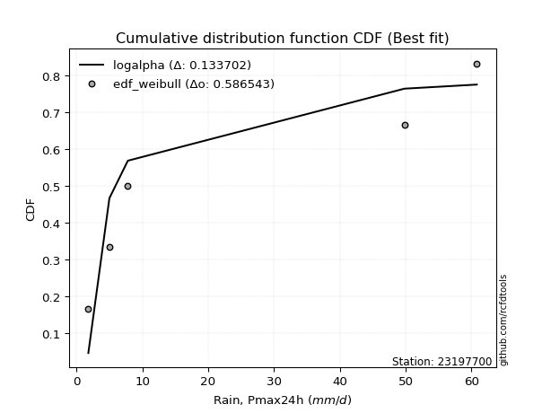</img>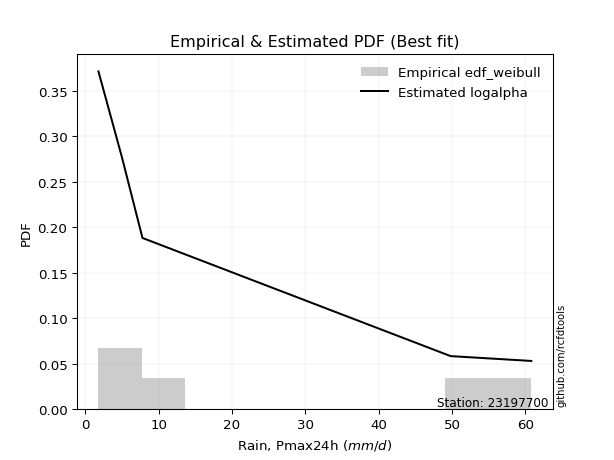</img>

</div>


### 4. EDF Beard (1943)

The Beard formula (or Beard´s plotting position formula) in hydrology is used to estimate the empirical non-exceedance probability _(P)_ of a flood event (or other extreme hydrological data point) within a given dataset.

<div align="center">


$P=(m-0.31)/(n+0.38)$


</div>


**4.1. Empirical values**

<div align="center">

|                | 0                   | 1                  | 2         | 3                  | 4                  |
|:---------------|:--------------------|:-------------------|:----------|:-------------------|:-------------------|
| date           | 2023                | 2021               | 2020      | 2022               | 2019               |
| x              | 1.8                 | 5.0                | 7.8       | 49.8               | 60.8               |
| m              | 1                   | 2                  | 3         | 4                  | 5                  |
| empirical_dist | edf_beard           | edf_beard          | edf_beard | edf_beard          | edf_beard          |
| empirical      | 0.12825278810408922 | 0.3141263940520446 | 0.5       | 0.6858736059479554 | 0.8717472118959109 |
| empirical_tr   | 1.1471215351812367  | 1.4579945799457996 | 2.0       | 3.183431952662722  | 7.797101449275368  |

</div>


**4.2. Kolmogorov-Smirnov fit test (sorted by Δ)**


<div align="center">

|                | 0                   | 1                  | 2                  | 3                   | 4                  | 5                   | 6                   | 7                   | 8                  | 9                   | 10                 | 11                  | 12                  | 13                  | 14                  | 15                  | 16                  | 17                  | 18                  | 19                  | 20                  | 21                 | 22                  | 23                 | 24                 | 25                  | 26                 | 27                  | 28                 | 29                  | 30                  | 31                  | 32                  | 33                  | 34                  | 35                 | 36                 | 37                  | 38                  | 39                  | 40                  | 41                  | 42                 | 43                  | 44                 | 45                  | 46                  | 47                  | 48                  | 49                  | 50                  | 51                 | 52                 | 53                  | 54                 | 55                  | 56                  | 57                  | 58                  | 59                 | 60                 | 61                  | 62                  | 63                  | 64                  | 65                  | 66                  | 67                 | 68                  | 69                 | 70                  | 71                  | 72                  | 73                  | 74                  | 75                 | 76                 | 77                  | 78                  | 79                  | 80                 | 81                  | 82                 | 83                  | 84                 | 85                  | 86                 | 87                  | 88                  | 89                  | 90                  | 91                  | 92                  | 93                  | 94                 | 95                  | 96                  | 97                 | 98                  | 99                  | 100                 | 101                 | 102                | 103                 | 104                 | 105                 | 106                 | 107                 | 108                | 109                 | 110                 | 111                | 112                | 113                 | 114                 | 115                | 116                | 117                 | 118                 | 119                | 120                 | 121                | 122                 | 123                 | 124                 | 125                | 126                 | 127                | 128                | 129                 | 130                | 131                 | 132                | 133                 | 134                | 135                 | 136                | 137                | 138                | 139                 | 140                | 141                 | 142                 | 143                 | 144                | 145                | 146                 | 147                | 148                | 149                | 150                | 151                | 152                 | 153                | 154                | 155                | 156                | 157                | 158                | 159                |
|:---------------|:--------------------|:-------------------|:-------------------|:--------------------|:-------------------|:--------------------|:--------------------|:--------------------|:-------------------|:--------------------|:-------------------|:--------------------|:--------------------|:--------------------|:--------------------|:--------------------|:--------------------|:--------------------|:--------------------|:--------------------|:--------------------|:-------------------|:--------------------|:-------------------|:-------------------|:--------------------|:-------------------|:--------------------|:-------------------|:--------------------|:--------------------|:--------------------|:--------------------|:--------------------|:--------------------|:-------------------|:-------------------|:--------------------|:--------------------|:--------------------|:--------------------|:--------------------|:-------------------|:--------------------|:-------------------|:--------------------|:--------------------|:--------------------|:--------------------|:--------------------|:--------------------|:-------------------|:-------------------|:--------------------|:-------------------|:--------------------|:--------------------|:--------------------|:--------------------|:-------------------|:-------------------|:--------------------|:--------------------|:--------------------|:--------------------|:--------------------|:--------------------|:-------------------|:--------------------|:-------------------|:--------------------|:--------------------|:--------------------|:--------------------|:--------------------|:-------------------|:-------------------|:--------------------|:--------------------|:--------------------|:-------------------|:--------------------|:-------------------|:--------------------|:-------------------|:--------------------|:-------------------|:--------------------|:--------------------|:--------------------|:--------------------|:--------------------|:--------------------|:--------------------|:-------------------|:--------------------|:--------------------|:-------------------|:--------------------|:--------------------|:--------------------|:--------------------|:-------------------|:--------------------|:--------------------|:--------------------|:--------------------|:--------------------|:-------------------|:--------------------|:--------------------|:-------------------|:-------------------|:--------------------|:--------------------|:-------------------|:-------------------|:--------------------|:--------------------|:-------------------|:--------------------|:-------------------|:--------------------|:--------------------|:--------------------|:-------------------|:--------------------|:-------------------|:-------------------|:--------------------|:-------------------|:--------------------|:-------------------|:--------------------|:-------------------|:--------------------|:-------------------|:-------------------|:-------------------|:--------------------|:-------------------|:--------------------|:--------------------|:--------------------|:-------------------|:-------------------|:--------------------|:-------------------|:-------------------|:-------------------|:-------------------|:-------------------|:--------------------|:-------------------|:-------------------|:-------------------|:-------------------|:-------------------|:-------------------|:-------------------|
| station        | 23197700            | 23197700           | 23197700           | 23197700            | 23197700           | 23197700            | 23197700            | 23197700            | 23197700           | 23197700            | 23197700           | 23197700            | 23197700            | 23197700            | 23197700            | 23197700            | 23197700            | 23197700            | 23197700            | 23197700            | 23197700            | 23197700           | 23197700            | 23197700           | 23197700           | 23197700            | 23197700           | 23197700            | 23197700           | 23197700            | 23197700            | 23197700            | 23197700            | 23197700            | 23197700            | 23197700           | 23197700           | 23197700            | 23197700            | 23197700            | 23197700            | 23197700            | 23197700           | 23197700            | 23197700           | 23197700            | 23197700            | 23197700            | 23197700            | 23197700            | 23197700            | 23197700           | 23197700           | 23197700            | 23197700           | 23197700            | 23197700            | 23197700            | 23197700            | 23197700           | 23197700           | 23197700            | 23197700            | 23197700            | 23197700            | 23197700            | 23197700            | 23197700           | 23197700            | 23197700           | 23197700            | 23197700            | 23197700            | 23197700            | 23197700            | 23197700           | 23197700           | 23197700            | 23197700            | 23197700            | 23197700           | 23197700            | 23197700           | 23197700            | 23197700           | 23197700            | 23197700           | 23197700            | 23197700            | 23197700            | 23197700            | 23197700            | 23197700            | 23197700            | 23197700           | 23197700            | 23197700            | 23197700           | 23197700            | 23197700            | 23197700            | 23197700            | 23197700           | 23197700            | 23197700            | 23197700            | 23197700            | 23197700            | 23197700           | 23197700            | 23197700            | 23197700           | 23197700           | 23197700            | 23197700            | 23197700           | 23197700           | 23197700            | 23197700            | 23197700           | 23197700            | 23197700           | 23197700            | 23197700            | 23197700            | 23197700           | 23197700            | 23197700           | 23197700           | 23197700            | 23197700           | 23197700            | 23197700           | 23197700            | 23197700           | 23197700            | 23197700           | 23197700           | 23197700           | 23197700            | 23197700           | 23197700            | 23197700            | 23197700            | 23197700           | 23197700           | 23197700            | 23197700           | 23197700           | 23197700           | 23197700           | 23197700           | 23197700            | 23197700           | 23197700           | 23197700           | 23197700           | 23197700           | 23197700           | 23197700           |
| empirical_dist | edf_beard           | edf_beard          | edf_beard          | edf_beard           | edf_beard          | edf_beard           | edf_beard           | edf_beard           | edf_beard          | edf_beard           | edf_beard          | edf_beard           | edf_beard           | edf_beard           | edf_beard           | edf_beard           | edf_beard           | edf_beard           | edf_beard           | edf_beard           | edf_beard           | edf_beard          | edf_beard           | edf_beard          | edf_beard          | edf_beard           | edf_beard          | edf_beard           | edf_beard          | edf_beard           | edf_beard           | edf_beard           | edf_beard           | edf_beard           | edf_beard           | edf_beard          | edf_beard          | edf_beard           | edf_beard           | edf_beard           | edf_beard           | edf_beard           | edf_beard          | edf_beard           | edf_beard          | edf_beard           | edf_beard           | edf_beard           | edf_beard           | edf_beard           | edf_beard           | edf_beard          | edf_beard          | edf_beard           | edf_beard          | edf_beard           | edf_beard           | edf_beard           | edf_beard           | edf_beard          | edf_beard          | edf_beard           | edf_beard           | edf_beard           | edf_beard           | edf_beard           | edf_beard           | edf_beard          | edf_beard           | edf_beard          | edf_beard           | edf_beard           | edf_beard           | edf_beard           | edf_beard           | edf_beard          | edf_beard          | edf_beard           | edf_beard           | edf_beard           | edf_beard          | edf_beard           | edf_beard          | edf_beard           | edf_beard          | edf_beard           | edf_beard          | edf_beard           | edf_beard           | edf_beard           | edf_beard           | edf_beard           | edf_beard           | edf_beard           | edf_beard          | edf_beard           | edf_beard           | edf_beard          | edf_beard           | edf_beard           | edf_beard           | edf_beard           | edf_beard          | edf_beard           | edf_beard           | edf_beard           | edf_beard           | edf_beard           | edf_beard          | edf_beard           | edf_beard           | edf_beard          | edf_beard          | edf_beard           | edf_beard           | edf_beard          | edf_beard          | edf_beard           | edf_beard           | edf_beard          | edf_beard           | edf_beard          | edf_beard           | edf_beard           | edf_beard           | edf_beard          | edf_beard           | edf_beard          | edf_beard          | edf_beard           | edf_beard          | edf_beard           | edf_beard          | edf_beard           | edf_beard          | edf_beard           | edf_beard          | edf_beard          | edf_beard          | edf_beard           | edf_beard          | edf_beard           | edf_beard           | edf_beard           | edf_beard          | edf_beard          | edf_beard           | edf_beard          | edf_beard          | edf_beard          | edf_beard          | edf_beard          | edf_beard           | edf_beard          | edf_beard          | edf_beard          | edf_beard          | edf_beard          | edf_beard          | edf_beard          |
| p_dist         | logarcsine          | logdweibull        | logdgamma          | logksone            | f                  | wrapcauchy          | weibull_min         | loglomax            | dgamma             | logsemicircular     | logvonmises        | logwrapcauchy       | logexponpow         | loganglit           | logalpha            | invgamma            | logburr12           | logloglaplace       | nct                 | logbeta             | dweibull            | logncf             | loginvweibull       | loggenlogistic     | loggenexpon        | arcsine             | loggenpareto       | ncf                 | logbetaprime       | loghalfnorm         | logfatiguelife      | lograyleigh         | loginvgauss         | loghalfgennorm      | logmaxwell          | logkstwobign       | burr               | logrice             | betaprime           | loginvgamma         | lomax               | loggompertz         | gengamma           | logfoldnorm         | logpearson3        | logerlang           | loggamma            | loggamma            | logskewnorm         | logt                | logexponnorm        | logcrystalball     | lognorm            | lognct              | logloggamma        | exponweib           | loggausshyper       | vonmises_line       | burr12              | levy_l             | logrdist           | loghalflogistic     | logtrapezoid        | loggumbel_r         | logcosine           | loggennorm          | logmoyal            | loglogistic        | invgauss            | loghypsecant       | ksone               | loggenhalflogistic  | alpha               | halfnorm            | halfgennorm         | loglaplace         | loglaplace         | logargus            | loggumbel_l         | kappa4              | logwald            | exponpow            | logf               | semicircular        | logweibull_max     | foldnorm            | halflogistic       | logmielke           | rayleigh            | logtriang           | anglit              | loglevy_l           | logburr             | maxwell             | t                  | genlogistic         | loggengamma         | pearson3           | gumbel_r            | moyal               | logweibull_min      | gennorm             | johnsonsu          | logtukeylambda      | norm                | crystalball         | logkappa3           | logkappa4           | kstwobign          | loguniform          | logvonmises_line    | truncpareto        | truncweibull_min   | gompertz            | exponnorm           | logbradford        | genexpon           | loggenextreme       | logtruncexpon       | logistic           | gamma               | logexponweib       | logtruncnorm        | erlang              | cosine              | gausshyper         | logtruncweibull_min | rice               | truncnorm          | hypsecant           | gumbel_l           | laplace             | lognakagami        | argus               | wald               | genextreme          | triang             | beta               | fatiguelife        | truncexpon          | nakagami           | johnsonsb           | skewnorm            | bradford            | tukeylambda        | logjohnsonsb       | genpareto           | uniform            | genhalflogistic    | powerlaw           | kappa3             | mielke             | trapezoid           | weibull_max        | logpowerlaw        | logtruncpareto     | rdist              | logjohnsonsu       | invweibull         | vonmises           |
| delta          | 0.08799453576267724 | 0.1036687847003244 | 0.1137752980203216 | 0.12361608821375791 | 0.1270684678591923 | 0.12825267702806897 | 0.12825277302363472 | 0.12825278809846166 | 0.1360868357230144 | 0.13825506578121705 | 0.1427911354321112 | 0.14340151218945624 | 0.14486516313627684 | 0.14866348887907288 | 0.15290902237326415 | 0.15295111415307538 | 0.15364818262738977 | 0.15369687145615585 | 0.15428079707735531 | 0.15490616318524963 | 0.15771850743025684 | 0.1604042990025527 | 0.16062345921999954 | 0.1608013930597063 | 0.1618744782890179 | 0.16197177790495132 | 0.1630904752649076 | 0.16383341691581765 | 0.1639959039119132 | 0.16542991875375135 | 0.16637508283575253 | 0.16639482451642673 | 0.16690090067473207 | 0.16721150142148633 | 0.16763088145698135 | 0.1684912574928923 | 0.1691624587811501 | 0.16931410590434648 | 0.17030034726414012 | 0.17030442243287947 | 0.17054659586265652 | 0.17103285383190392 | 0.1712657624013455 | 0.17152295221747338 | 0.1721049589299698 | 0.17215955626641544 | 0.17220907621419934 | 0.17220907621419934 | 0.17228715392616045 | 0.17228898767530965 | 0.17228929861105302 | 0.17228967566609   | 0.1722896765610985 | 0.17233960130769677 | 0.1726353741021628 | 0.17337950639132627 | 0.17454482327399085 | 0.17467279192606194 | 0.17885896331868645 | 0.17892996703902   | 0.1793990304350359 | 0.18094376805017243 | 0.18160838361190823 | 0.18178632161656905 | 0.18496780946160007 | 0.18587360594795543 | 0.18617393038298158 | 0.188980956747402  | 0.19554168822674434 | 0.1972871487100848 | 0.19888741689935224 | 0.19969555917502124 | 0.20030060234345026 | 0.20203962388220953 | 0.20400979868995472 | 0.204352314041511  | 0.204352314041511  | 0.20513848320788985 | 0.20559047838739308 | 0.20598776207537728 | 0.2072122297184501 | 0.21267921406286944 | 0.2130015135529743 | 0.21488664539211344 | 0.2175943627402172 | 0.21761777502336271 | 0.2176570082164765 | 0.22025767059779988 | 0.22501731777098333 | 0.22605874632781675 | 0.22689939053213876 | 0.22779143357575848 | 0.23168408646799887 | 0.23366084894113376 | 0.2392127264876197 | 0.24015098436705606 | 0.24281721010640406 | 0.2428453141769789 | 0.24296675717399963 | 0.24525739634364163 | 0.24695213479677963 | 0.24823209349058506 | 0.2539793426708693 | 0.25410025528324665 | 0.25457773793053967 | 0.25457774150289264 | 0.25519276370320365 | 0.25527452206654977 | 0.2570953814684309 | 0.25742583498476845 | 0.25773540682544893 | 0.2622280098120038 | 0.2633353769253193 | 0.27011564516905606 | 0.27068185021471236 | 0.2720126344158562 | 0.2724614760355339 | 0.27477202768398057 | 0.27606721732840867 | 0.2772386618800744 | 0.27817504607174004 | 0.2794236161407816 | 0.28063453049948217 | 0.28167557141443855 | 0.28317820693500506 | 0.2832322407808433 | 0.2855580619437489  | 0.2883492898651565 | 0.2903625216377731 | 0.29201705805358646 | 0.2929150809025953 | 0.31128032308920095 | 0.3114675672064133 | 0.31748980343939004 | 0.3224364712231669 | 0.32710311291899896 | 0.3271071739047989 | 0.3353718364945906 | 0.3426446351013906 | 0.34349012504706705 | 0.3442523319808248 | 0.34793820614750265 | 0.36051337865706645 | 0.37825839923944365 | 0.3901708266426809 | 0.3909324445279311 | 0.39119736173386976 | 0.3983050847457627 | 0.403280866490495  | 0.4119736511246482 | 0.4238301329896011 | 0.4673336737886243 | 0.47076769426888826 | 0.4935059876865975 | 0.5431599352371679 | 0.5603661476800914 | 0.563840039244016  | 0.612344636777455  | 0.6825941477783981 | 9.348525967228277  |
| deltao         | 0.5865427407550001  | 0.5865427407550001 | 0.5865427407550001 | 0.5865427407550001  | 0.5865427407550001 | 0.5865427407550001  | 0.5865427407550001  | 0.5865427407550001  | 0.5865427407550001 | 0.5865427407550001  | 0.5865427407550001 | 0.5865427407550001  | 0.5865427407550001  | 0.5865427407550001  | 0.5865427407550001  | 0.5865427407550001  | 0.5865427407550001  | 0.5865427407550001  | 0.5865427407550001  | 0.5865427407550001  | 0.5865427407550001  | 0.5865427407550001 | 0.5865427407550001  | 0.5865427407550001 | 0.5865427407550001 | 0.5865427407550001  | 0.5865427407550001 | 0.5865427407550001  | 0.5865427407550001 | 0.5865427407550001  | 0.5865427407550001  | 0.5865427407550001  | 0.5865427407550001  | 0.5865427407550001  | 0.5865427407550001  | 0.5865427407550001 | 0.5865427407550001 | 0.5865427407550001  | 0.5865427407550001  | 0.5865427407550001  | 0.5865427407550001  | 0.5865427407550001  | 0.5865427407550001 | 0.5865427407550001  | 0.5865427407550001 | 0.5865427407550001  | 0.5865427407550001  | 0.5865427407550001  | 0.5865427407550001  | 0.5865427407550001  | 0.5865427407550001  | 0.5865427407550001 | 0.5865427407550001 | 0.5865427407550001  | 0.5865427407550001 | 0.5865427407550001  | 0.5865427407550001  | 0.5865427407550001  | 0.5865427407550001  | 0.5865427407550001 | 0.5865427407550001 | 0.5865427407550001  | 0.5865427407550001  | 0.5865427407550001  | 0.5865427407550001  | 0.5865427407550001  | 0.5865427407550001  | 0.5865427407550001 | 0.5865427407550001  | 0.5865427407550001 | 0.5865427407550001  | 0.5865427407550001  | 0.5865427407550001  | 0.5865427407550001  | 0.5865427407550001  | 0.5865427407550001 | 0.5865427407550001 | 0.5865427407550001  | 0.5865427407550001  | 0.5865427407550001  | 0.5865427407550001 | 0.5865427407550001  | 0.5865427407550001 | 0.5865427407550001  | 0.5865427407550001 | 0.5865427407550001  | 0.5865427407550001 | 0.5865427407550001  | 0.5865427407550001  | 0.5865427407550001  | 0.5865427407550001  | 0.5865427407550001  | 0.5865427407550001  | 0.5865427407550001  | 0.5865427407550001 | 0.5865427407550001  | 0.5865427407550001  | 0.5865427407550001 | 0.5865427407550001  | 0.5865427407550001  | 0.5865427407550001  | 0.5865427407550001  | 0.5865427407550001 | 0.5865427407550001  | 0.5865427407550001  | 0.5865427407550001  | 0.5865427407550001  | 0.5865427407550001  | 0.5865427407550001 | 0.5865427407550001  | 0.5865427407550001  | 0.5865427407550001 | 0.5865427407550001 | 0.5865427407550001  | 0.5865427407550001  | 0.5865427407550001 | 0.5865427407550001 | 0.5865427407550001  | 0.5865427407550001  | 0.5865427407550001 | 0.5865427407550001  | 0.5865427407550001 | 0.5865427407550001  | 0.5865427407550001  | 0.5865427407550001  | 0.5865427407550001 | 0.5865427407550001  | 0.5865427407550001 | 0.5865427407550001 | 0.5865427407550001  | 0.5865427407550001 | 0.5865427407550001  | 0.5865427407550001 | 0.5865427407550001  | 0.5865427407550001 | 0.5865427407550001  | 0.5865427407550001 | 0.5865427407550001 | 0.5865427407550001 | 0.5865427407550001  | 0.5865427407550001 | 0.5865427407550001  | 0.5865427407550001  | 0.5865427407550001  | 0.5865427407550001 | 0.5865427407550001 | 0.5865427407550001  | 0.5865427407550001 | 0.5865427407550001 | 0.5865427407550001 | 0.5865427407550001 | 0.5865427407550001 | 0.5865427407550001  | 0.5865427407550001 | 0.5865427407550001 | 0.5865427407550001 | 0.5865427407550001 | 0.5865427407550001 | 0.5865427407550001 | 0.5865427407550001 |
| eval           | Δo > Δ              | Δo > Δ             | Δo > Δ             | Δo > Δ              | Δo > Δ             | Δo > Δ              | Δo > Δ              | Δo > Δ              | Δo > Δ             | Δo > Δ              | Δo > Δ             | Δo > Δ              | Δo > Δ              | Δo > Δ              | Δo > Δ              | Δo > Δ              | Δo > Δ              | Δo > Δ              | Δo > Δ              | Δo > Δ              | Δo > Δ              | Δo > Δ             | Δo > Δ              | Δo > Δ             | Δo > Δ             | Δo > Δ              | Δo > Δ             | Δo > Δ              | Δo > Δ             | Δo > Δ              | Δo > Δ              | Δo > Δ              | Δo > Δ              | Δo > Δ              | Δo > Δ              | Δo > Δ             | Δo > Δ             | Δo > Δ              | Δo > Δ              | Δo > Δ              | Δo > Δ              | Δo > Δ              | Δo > Δ             | Δo > Δ              | Δo > Δ             | Δo > Δ              | Δo > Δ              | Δo > Δ              | Δo > Δ              | Δo > Δ              | Δo > Δ              | Δo > Δ             | Δo > Δ             | Δo > Δ              | Δo > Δ             | Δo > Δ              | Δo > Δ              | Δo > Δ              | Δo > Δ              | Δo > Δ             | Δo > Δ             | Δo > Δ              | Δo > Δ              | Δo > Δ              | Δo > Δ              | Δo > Δ              | Δo > Δ              | Δo > Δ             | Δo > Δ              | Δo > Δ             | Δo > Δ              | Δo > Δ              | Δo > Δ              | Δo > Δ              | Δo > Δ              | Δo > Δ             | Δo > Δ             | Δo > Δ              | Δo > Δ              | Δo > Δ              | Δo > Δ             | Δo > Δ              | Δo > Δ             | Δo > Δ              | Δo > Δ             | Δo > Δ              | Δo > Δ             | Δo > Δ              | Δo > Δ              | Δo > Δ              | Δo > Δ              | Δo > Δ              | Δo > Δ              | Δo > Δ              | Δo > Δ             | Δo > Δ              | Δo > Δ              | Δo > Δ             | Δo > Δ              | Δo > Δ              | Δo > Δ              | Δo > Δ              | Δo > Δ             | Δo > Δ              | Δo > Δ              | Δo > Δ              | Δo > Δ              | Δo > Δ              | Δo > Δ             | Δo > Δ              | Δo > Δ              | Δo > Δ             | Δo > Δ             | Δo > Δ              | Δo > Δ              | Δo > Δ             | Δo > Δ             | Δo > Δ              | Δo > Δ              | Δo > Δ             | Δo > Δ              | Δo > Δ             | Δo > Δ              | Δo > Δ              | Δo > Δ              | Δo > Δ             | Δo > Δ              | Δo > Δ             | Δo > Δ             | Δo > Δ              | Δo > Δ             | Δo > Δ              | Δo > Δ             | Δo > Δ              | Δo > Δ             | Δo > Δ              | Δo > Δ             | Δo > Δ             | Δo > Δ             | Δo > Δ              | Δo > Δ             | Δo > Δ              | Δo > Δ              | Δo > Δ              | Δo > Δ             | Δo > Δ             | Δo > Δ              | Δo > Δ             | Δo > Δ             | Δo > Δ             | Δo > Δ             | Δo > Δ             | Δo > Δ              | Δo > Δ             | Δo > Δ             | Δo > Δ             | Δo > Δ             | Δo <= Δ            | Δo <= Δ            | Δo <= Δ            |
| fit            | 1                   | 1                  | 1                  | 1                   | 1                  | 1                   | 1                   | 1                   | 1                  | 1                   | 1                  | 1                   | 1                   | 1                   | 1                   | 1                   | 1                   | 1                   | 1                   | 1                   | 1                   | 1                  | 1                   | 1                  | 1                  | 1                   | 1                  | 1                   | 1                  | 1                   | 1                   | 1                   | 1                   | 1                   | 1                   | 1                  | 1                  | 1                   | 1                   | 1                   | 1                   | 1                   | 1                  | 1                   | 1                  | 1                   | 1                   | 1                   | 1                   | 1                   | 1                   | 1                  | 1                  | 1                   | 1                  | 1                   | 1                   | 1                   | 1                   | 1                  | 1                  | 1                   | 1                   | 1                   | 1                   | 1                   | 1                   | 1                  | 1                   | 1                  | 1                   | 1                   | 1                   | 1                   | 1                   | 1                  | 1                  | 1                   | 1                   | 1                   | 1                  | 1                   | 1                  | 1                   | 1                  | 1                   | 1                  | 1                   | 1                   | 1                   | 1                   | 1                   | 1                   | 1                   | 1                  | 1                   | 1                   | 1                  | 1                   | 1                   | 1                   | 1                   | 1                  | 1                   | 1                   | 1                   | 1                   | 1                   | 1                  | 1                   | 1                   | 1                  | 1                  | 1                   | 1                   | 1                  | 1                  | 1                   | 1                   | 1                  | 1                   | 1                  | 1                   | 1                   | 1                   | 1                  | 1                   | 1                  | 1                  | 1                   | 1                  | 1                   | 1                  | 1                   | 1                  | 1                   | 1                  | 1                  | 1                  | 1                   | 1                  | 1                   | 1                   | 1                   | 1                  | 1                  | 1                   | 1                  | 1                  | 1                  | 1                  | 1                  | 1                   | 1                  | 1                  | 1                  | 1                  | 0                  | 0                  | 0                  |
| n              | 5                   | 5                  | 5                  | 5                   | 5                  | 5                   | 5                   | 5                   | 5                  | 5                   | 5                  | 5                   | 5                   | 5                   | 5                   | 5                   | 5                   | 5                   | 5                   | 5                   | 5                   | 5                  | 5                   | 5                  | 5                  | 5                   | 5                  | 5                   | 5                  | 5                   | 5                   | 5                   | 5                   | 5                   | 5                   | 5                  | 5                  | 5                   | 5                   | 5                   | 5                   | 5                   | 5                  | 5                   | 5                  | 5                   | 5                   | 5                   | 5                   | 5                   | 5                   | 5                  | 5                  | 5                   | 5                  | 5                   | 5                   | 5                   | 5                   | 5                  | 5                  | 5                   | 5                   | 5                   | 5                   | 5                   | 5                   | 5                  | 5                   | 5                  | 5                   | 5                   | 5                   | 5                   | 5                   | 5                  | 5                  | 5                   | 5                   | 5                   | 5                  | 5                   | 5                  | 5                   | 5                  | 5                   | 5                  | 5                   | 5                   | 5                   | 5                   | 5                   | 5                   | 5                   | 5                  | 5                   | 5                   | 5                  | 5                   | 5                   | 5                   | 5                   | 5                  | 5                   | 5                   | 5                   | 5                   | 5                   | 5                  | 5                   | 5                   | 5                  | 5                  | 5                   | 5                   | 5                  | 5                  | 5                   | 5                   | 5                  | 5                   | 5                  | 5                   | 5                   | 5                   | 5                  | 5                   | 5                  | 5                  | 5                   | 5                  | 5                   | 5                  | 5                   | 5                  | 5                   | 5                  | 5                  | 5                  | 5                   | 5                  | 5                   | 5                   | 5                   | 5                  | 5                  | 5                   | 5                  | 5                  | 5                  | 5                  | 5                  | 5                   | 5                  | 5                  | 5                  | 5                  | 5                  | 5                  | 5                  |
| best_fit       | 1                   | 0                  | 0                  | 0                   | 0                  | 0                   | 0                   | 0                   | 0                  | 0                   | 0                  | 0                   | 0                   | 0                   | 0                   | 0                   | 0                   | 0                   | 0                   | 0                   | 0                   | 0                  | 0                   | 0                  | 0                  | 0                   | 0                  | 0                   | 0                  | 0                   | 0                   | 0                   | 0                   | 0                   | 0                   | 0                  | 0                  | 0                   | 0                   | 0                   | 0                   | 0                   | 0                  | 0                   | 0                  | 0                   | 0                   | 0                   | 0                   | 0                   | 0                   | 0                  | 0                  | 0                   | 0                  | 0                   | 0                   | 0                   | 0                   | 0                  | 0                  | 0                   | 0                   | 0                   | 0                   | 0                   | 0                   | 0                  | 0                   | 0                  | 0                   | 0                   | 0                   | 0                   | 0                   | 0                  | 0                  | 0                   | 0                   | 0                   | 0                  | 0                   | 0                  | 0                   | 0                  | 0                   | 0                  | 0                   | 0                   | 0                   | 0                   | 0                   | 0                   | 0                   | 0                  | 0                   | 0                   | 0                  | 0                   | 0                   | 0                   | 0                   | 0                  | 0                   | 0                   | 0                   | 0                   | 0                   | 0                  | 0                   | 0                   | 0                  | 0                  | 0                   | 0                   | 0                  | 0                  | 0                   | 0                   | 0                  | 0                   | 0                  | 0                   | 0                   | 0                   | 0                  | 0                   | 0                  | 0                  | 0                   | 0                  | 0                   | 0                  | 0                   | 0                  | 0                   | 0                  | 0                  | 0                  | 0                   | 0                  | 0                   | 0                   | 0                   | 0                  | 0                  | 0                   | 0                  | 0                  | 0                  | 0                  | 0                  | 0                   | 0                  | 0                  | 0                  | 0                  | 0                  | 0                  | 0                  |
| best_fit_sort  | 1                   | 2                  | 3                  | 4                   | 5                  | 6                   | 7                   | 8                   | 9                  | 10                  | 11                 | 12                  | 13                  | 14                  | 15                  | 16                  | 17                  | 18                  | 19                  | 20                  | 21                  | 22                 | 23                  | 24                 | 25                 | 26                  | 27                 | 28                  | 29                 | 30                  | 31                  | 32                  | 33                  | 34                  | 35                  | 36                 | 37                 | 38                  | 39                  | 40                  | 41                  | 42                  | 43                 | 44                  | 45                 | 46                  | 47                  | 48                  | 49                  | 50                  | 51                  | 52                 | 53                 | 54                  | 55                 | 56                  | 57                  | 58                  | 59                  | 60                 | 61                 | 62                  | 63                  | 64                  | 65                  | 66                  | 67                  | 68                 | 69                  | 70                 | 71                  | 72                  | 73                  | 74                  | 75                  | 76                 | 77                 | 78                  | 79                  | 80                  | 81                 | 82                  | 83                 | 84                  | 85                 | 86                  | 87                 | 88                  | 89                  | 90                  | 91                  | 92                  | 93                  | 94                  | 95                 | 96                  | 97                  | 98                 | 99                  | 100                 | 101                 | 102                 | 103                | 104                 | 105                 | 106                 | 107                 | 108                 | 109                | 110                 | 111                 | 112                | 113                | 114                 | 115                 | 116                | 117                | 118                 | 119                 | 120                | 121                 | 122                | 123                 | 124                 | 125                 | 126                | 127                 | 128                | 129                | 130                 | 131                | 132                 | 133                | 134                 | 135                | 136                 | 137                | 138                | 139                | 140                 | 141                | 142                 | 143                 | 144                 | 145                | 146                | 147                 | 148                | 149                | 150                | 151                | 152                | 153                 | 154                | 155                | 156                | 157                | 158                | 159                | 160                |

</div>


**4.3. Best fit**

<div align="center">

|   id |   station | empirical_dist   | p_dist     |     delta |   deltao | eval   |   fit |   n |   best_fit |   best_fit_sort |
|-----:|----------:|:-----------------|:-----------|----------:|---------:|:-------|------:|----:|-----------:|----------------:|
|    0 |  23197700 | edf_beard        | logarcsine | 0.0879945 | 0.586543 | Δo > Δ |     1 |   5 |          1 |               1 |

</div>


<div align="center">

</img></img>

</div>


### 5. EDF Chegodayev (1955)

The Chegodayev formula is an empirical plotting position formula used in hydrological frequency analysis to estimate the exceedance probability or return period of a specific event from a set of observed data. It is primarily used for plotting observed data points on probability paper to fit a theoretical distribution, particularly for analyzing extreme events like maximum flood flows or rainfall intensities. The constant _b_ value in the generalized plotting position formula is 0.3.

<div align="center">


$P=(m-b)/(n+1-2b)$


</div>


**5.1. Empirical values**

<div align="center">

|                | 0                   | 1                   | 2              | 3                  | 4                  |
|:---------------|:--------------------|:--------------------|:---------------|:-------------------|:-------------------|
| date           | 2023                | 2021                | 2020           | 2022               | 2019               |
| x              | 1.8                 | 5.0                 | 7.8            | 49.8               | 60.8               |
| m              | 1                   | 2                   | 3              | 4                  | 5                  |
| empirical_dist | edf_chegodayev      | edf_chegodayev      | edf_chegodayev | edf_chegodayev     | edf_chegodayev     |
| empirical      | 0.12962962962962962 | 0.31481481481481477 | 0.5            | 0.6851851851851851 | 0.8703703703703703 |
| empirical_tr   | 1.148936170212766   | 1.4594594594594594  | 2.0            | 3.1764705882352935 | 7.714285714285713  |

</div>


**5.2. Kolmogorov-Smirnov fit test (sorted by Δ)**


<div align="center">

|                | 0                   | 1                  | 2                   | 3                   | 4                  | 5                  | 6                   | 7                   | 8                   | 9                   | 10                 | 11                 | 12                  | 13                 | 14                 | 15                 | 16                 | 17                  | 18                  | 19                  | 20                  | 21                  | 22                  | 23                  | 24                  | 25                  | 26                 | 27                  | 28                  | 29                  | 30                  | 31                  | 32                  | 33                  | 34                  | 35                 | 36                  | 37                 | 38                  | 39                  | 40                  | 41                  | 42                  | 43                 | 44                 | 45                  | 46                  | 47                  | 48                  | 49                  | 50                  | 51                 | 52                  | 53                  | 54                 | 55                  | 56                  | 57                  | 58                  | 59                 | 60                  | 61                  | 62                  | 63                  | 64                  | 65                 | 66                 | 67                  | 68                  | 69                 | 70                  | 71                  | 72                  | 73                  | 74                  | 75                 | 76                 | 77                  | 78                  | 79                 | 80                  | 81                  | 82                  | 83                  | 84                 | 85                  | 86                 | 87                 | 88                  | 89                  | 90                  | 91                  | 92                 | 93                  | 94                  | 95                  | 96                 | 97                 | 98                  | 99                  | 100                 | 101                 | 102                | 103                 | 104                 | 105                 | 106                 | 107                | 108                | 109                 | 110                 | 111                | 112                | 113                 | 114                 | 115                | 116                 | 117                 | 118                | 119                | 120                 | 121                | 122                | 123                 | 124                 | 125                | 126                 | 127                | 128                | 129                 | 130                | 131                 | 132                | 133                 | 134                | 135                 | 136                | 137                | 138                 | 139                 | 140                 | 141                | 142                 | 143                 | 144                 | 145                | 146                 | 147                | 148                | 149                 | 150                | 151                 | 152                 | 153                 | 154                | 155                | 156                | 157                | 158                | 159                |
|:---------------|:--------------------|:-------------------|:--------------------|:--------------------|:-------------------|:-------------------|:--------------------|:--------------------|:--------------------|:--------------------|:-------------------|:-------------------|:--------------------|:-------------------|:-------------------|:-------------------|:-------------------|:--------------------|:--------------------|:--------------------|:--------------------|:--------------------|:--------------------|:--------------------|:--------------------|:--------------------|:-------------------|:--------------------|:--------------------|:--------------------|:--------------------|:--------------------|:--------------------|:--------------------|:--------------------|:-------------------|:--------------------|:-------------------|:--------------------|:--------------------|:--------------------|:--------------------|:--------------------|:-------------------|:-------------------|:--------------------|:--------------------|:--------------------|:--------------------|:--------------------|:--------------------|:-------------------|:--------------------|:--------------------|:-------------------|:--------------------|:--------------------|:--------------------|:--------------------|:-------------------|:--------------------|:--------------------|:--------------------|:--------------------|:--------------------|:-------------------|:-------------------|:--------------------|:--------------------|:-------------------|:--------------------|:--------------------|:--------------------|:--------------------|:--------------------|:-------------------|:-------------------|:--------------------|:--------------------|:-------------------|:--------------------|:--------------------|:--------------------|:--------------------|:-------------------|:--------------------|:-------------------|:-------------------|:--------------------|:--------------------|:--------------------|:--------------------|:-------------------|:--------------------|:--------------------|:--------------------|:-------------------|:-------------------|:--------------------|:--------------------|:--------------------|:--------------------|:-------------------|:--------------------|:--------------------|:--------------------|:--------------------|:-------------------|:-------------------|:--------------------|:--------------------|:-------------------|:-------------------|:--------------------|:--------------------|:-------------------|:--------------------|:--------------------|:-------------------|:-------------------|:--------------------|:-------------------|:-------------------|:--------------------|:--------------------|:-------------------|:--------------------|:-------------------|:-------------------|:--------------------|:-------------------|:--------------------|:-------------------|:--------------------|:-------------------|:--------------------|:-------------------|:-------------------|:--------------------|:--------------------|:--------------------|:-------------------|:--------------------|:--------------------|:--------------------|:-------------------|:--------------------|:-------------------|:-------------------|:--------------------|:-------------------|:--------------------|:--------------------|:--------------------|:-------------------|:-------------------|:-------------------|:-------------------|:-------------------|:-------------------|
| station        | 23197700            | 23197700           | 23197700            | 23197700            | 23197700           | 23197700           | 23197700            | 23197700            | 23197700            | 23197700            | 23197700           | 23197700           | 23197700            | 23197700           | 23197700           | 23197700           | 23197700           | 23197700            | 23197700            | 23197700            | 23197700            | 23197700            | 23197700            | 23197700            | 23197700            | 23197700            | 23197700           | 23197700            | 23197700            | 23197700            | 23197700            | 23197700            | 23197700            | 23197700            | 23197700            | 23197700           | 23197700            | 23197700           | 23197700            | 23197700            | 23197700            | 23197700            | 23197700            | 23197700           | 23197700           | 23197700            | 23197700            | 23197700            | 23197700            | 23197700            | 23197700            | 23197700           | 23197700            | 23197700            | 23197700           | 23197700            | 23197700            | 23197700            | 23197700            | 23197700           | 23197700            | 23197700            | 23197700            | 23197700            | 23197700            | 23197700           | 23197700           | 23197700            | 23197700            | 23197700           | 23197700            | 23197700            | 23197700            | 23197700            | 23197700            | 23197700           | 23197700           | 23197700            | 23197700            | 23197700           | 23197700            | 23197700            | 23197700            | 23197700            | 23197700           | 23197700            | 23197700           | 23197700           | 23197700            | 23197700            | 23197700            | 23197700            | 23197700           | 23197700            | 23197700            | 23197700            | 23197700           | 23197700           | 23197700            | 23197700            | 23197700            | 23197700            | 23197700           | 23197700            | 23197700            | 23197700            | 23197700            | 23197700           | 23197700           | 23197700            | 23197700            | 23197700           | 23197700           | 23197700            | 23197700            | 23197700           | 23197700            | 23197700            | 23197700           | 23197700           | 23197700            | 23197700           | 23197700           | 23197700            | 23197700            | 23197700           | 23197700            | 23197700           | 23197700           | 23197700            | 23197700           | 23197700            | 23197700           | 23197700            | 23197700           | 23197700            | 23197700           | 23197700           | 23197700            | 23197700            | 23197700            | 23197700           | 23197700            | 23197700            | 23197700            | 23197700           | 23197700            | 23197700           | 23197700           | 23197700            | 23197700           | 23197700            | 23197700            | 23197700            | 23197700           | 23197700           | 23197700           | 23197700           | 23197700           | 23197700           |
| empirical_dist | edf_chegodayev      | edf_chegodayev     | edf_chegodayev      | edf_chegodayev      | edf_chegodayev     | edf_chegodayev     | edf_chegodayev      | edf_chegodayev      | edf_chegodayev      | edf_chegodayev      | edf_chegodayev     | edf_chegodayev     | edf_chegodayev      | edf_chegodayev     | edf_chegodayev     | edf_chegodayev     | edf_chegodayev     | edf_chegodayev      | edf_chegodayev      | edf_chegodayev      | edf_chegodayev      | edf_chegodayev      | edf_chegodayev      | edf_chegodayev      | edf_chegodayev      | edf_chegodayev      | edf_chegodayev     | edf_chegodayev      | edf_chegodayev      | edf_chegodayev      | edf_chegodayev      | edf_chegodayev      | edf_chegodayev      | edf_chegodayev      | edf_chegodayev      | edf_chegodayev     | edf_chegodayev      | edf_chegodayev     | edf_chegodayev      | edf_chegodayev      | edf_chegodayev      | edf_chegodayev      | edf_chegodayev      | edf_chegodayev     | edf_chegodayev     | edf_chegodayev      | edf_chegodayev      | edf_chegodayev      | edf_chegodayev      | edf_chegodayev      | edf_chegodayev      | edf_chegodayev     | edf_chegodayev      | edf_chegodayev      | edf_chegodayev     | edf_chegodayev      | edf_chegodayev      | edf_chegodayev      | edf_chegodayev      | edf_chegodayev     | edf_chegodayev      | edf_chegodayev      | edf_chegodayev      | edf_chegodayev      | edf_chegodayev      | edf_chegodayev     | edf_chegodayev     | edf_chegodayev      | edf_chegodayev      | edf_chegodayev     | edf_chegodayev      | edf_chegodayev      | edf_chegodayev      | edf_chegodayev      | edf_chegodayev      | edf_chegodayev     | edf_chegodayev     | edf_chegodayev      | edf_chegodayev      | edf_chegodayev     | edf_chegodayev      | edf_chegodayev      | edf_chegodayev      | edf_chegodayev      | edf_chegodayev     | edf_chegodayev      | edf_chegodayev     | edf_chegodayev     | edf_chegodayev      | edf_chegodayev      | edf_chegodayev      | edf_chegodayev      | edf_chegodayev     | edf_chegodayev      | edf_chegodayev      | edf_chegodayev      | edf_chegodayev     | edf_chegodayev     | edf_chegodayev      | edf_chegodayev      | edf_chegodayev      | edf_chegodayev      | edf_chegodayev     | edf_chegodayev      | edf_chegodayev      | edf_chegodayev      | edf_chegodayev      | edf_chegodayev     | edf_chegodayev     | edf_chegodayev      | edf_chegodayev      | edf_chegodayev     | edf_chegodayev     | edf_chegodayev      | edf_chegodayev      | edf_chegodayev     | edf_chegodayev      | edf_chegodayev      | edf_chegodayev     | edf_chegodayev     | edf_chegodayev      | edf_chegodayev     | edf_chegodayev     | edf_chegodayev      | edf_chegodayev      | edf_chegodayev     | edf_chegodayev      | edf_chegodayev     | edf_chegodayev     | edf_chegodayev      | edf_chegodayev     | edf_chegodayev      | edf_chegodayev     | edf_chegodayev      | edf_chegodayev     | edf_chegodayev      | edf_chegodayev     | edf_chegodayev     | edf_chegodayev      | edf_chegodayev      | edf_chegodayev      | edf_chegodayev     | edf_chegodayev      | edf_chegodayev      | edf_chegodayev      | edf_chegodayev     | edf_chegodayev      | edf_chegodayev     | edf_chegodayev     | edf_chegodayev      | edf_chegodayev     | edf_chegodayev      | edf_chegodayev      | edf_chegodayev      | edf_chegodayev     | edf_chegodayev     | edf_chegodayev     | edf_chegodayev     | edf_chegodayev     | edf_chegodayev     |
| p_dist         | logarcsine          | logdweibull        | logdgamma           | logksone            | f                  | wrapcauchy         | weibull_min         | loglomax            | dgamma              | logsemicircular     | logwrapcauchy      | logvonmises        | logexponpow         | loganglit          | logalpha           | invgamma           | logburr12          | logloglaplace       | nct                 | logbeta             | dweibull            | logncf              | loginvweibull       | loggenlogistic      | arcsine             | loggenexpon         | loggenpareto       | logbetaprime        | ncf                 | loghalfnorm         | logfatiguelife      | lograyleigh         | loginvgauss         | loghalfgennorm      | logmaxwell          | logkstwobign       | burr                | logrice            | betaprime           | loginvgamma         | lomax               | loggompertz         | gengamma            | logfoldnorm        | logpearson3        | logerlang           | loggamma            | loggamma            | logskewnorm         | logt                | logexponnorm        | logcrystalball     | lognorm             | lognct              | logloggamma        | exponweib           | loggausshyper       | vonmises_line       | burr12              | levy_l             | logrdist            | loghalflogistic     | logtrapezoid        | loggumbel_r         | loggennorm          | logcosine          | logmoyal           | loglogistic         | invgauss            | loghypsecant       | ksone               | loggenhalflogistic  | alpha               | halfnorm            | halfgennorm         | loglaplace         | loglaplace         | logargus            | kappa4              | loggumbel_l        | logwald             | logf                | exponpow            | semicircular        | logweibull_max     | foldnorm            | halflogistic       | logmielke          | rayleigh            | logtriang           | anglit              | loglevy_l           | logburr            | maxwell             | t                   | genlogistic         | loggengamma        | pearson3           | gumbel_r            | moyal               | logweibull_min      | gennorm             | johnsonsu          | norm                | crystalball         | logtukeylambda      | logkappa3           | logkappa4          | kstwobign          | loguniform          | logvonmises_line    | truncpareto        | truncweibull_min   | gompertz            | exponnorm           | genexpon           | logbradford         | loggenextreme       | logtruncexpon      | logistic           | gamma               | logexponweib       | logtruncnorm       | erlang              | cosine              | gausshyper         | logtruncweibull_min | rice               | truncnorm          | hypsecant           | gumbel_l           | laplace             | lognakagami        | argus               | wald               | genextreme          | triang             | beta               | fatiguelife         | truncexpon          | nakagami            | johnsonsb          | skewnorm            | bradford            | logjohnsonsb        | tukeylambda        | genpareto           | uniform            | genhalflogistic    | powerlaw            | kappa3             | mielke              | trapezoid           | weibull_max         | logpowerlaw        | logtruncpareto     | rdist              | logjohnsonsu       | invweibull         | vonmises           |
| delta          | 0.08868295652544755 | 0.1050456262258648 | 0.11239845649478108 | 0.12430450897652823 | 0.1284453093847327 | 0.1296295185536095 | 0.12962961454917513 | 0.12962962962400207 | 0.13539841496024407 | 0.13894348654398736 | 0.1427130914266861 | 0.1434795561948815 | 0.14555358389904716 | 0.1493519096418432 | 0.152220601610494  | 0.1536395349158457 | 0.1543366033901601 | 0.15438529221892616 | 0.15496921784012563 | 0.15559458394801995 | 0.15703008666748652 | 0.16109271976532302 | 0.16131187998276986 | 0.16148981382247662 | 0.16197177790495132 | 0.16256289905178822 | 0.1630904752649076 | 0.16330748314914306 | 0.16452183767858797 | 0.16611833951652166 | 0.16706350359852284 | 0.16708324527919705 | 0.16758932143750238 | 0.16789992218425664 | 0.16831930221975167 | 0.1691796782556626 | 0.16985087954392042 | 0.1700025266671168 | 0.17098876802691043 | 0.17099284319564978 | 0.17123501662542684 | 0.17172127459467423 | 0.17195418316411581 | 0.1722113729802437 | 0.1727933796927401 | 0.17284797702918575 | 0.17289749697696966 | 0.17289749697696966 | 0.17297557468893077 | 0.17297740843807996 | 0.17297771937382334 | 0.1729780964288603 | 0.17297809732386882 | 0.17302802207046708 | 0.1733237948649331 | 0.17406792715409658 | 0.17454482327399085 | 0.17478860816018416 | 0.17748212179314593 | 0.1775531255134796 | 0.18008745119780623 | 0.18163218881294274 | 0.18229680437467854 | 0.18247474237933936 | 0.18518518518518523 | 0.1856562302243704 | 0.1868623511457519 | 0.18966937751017232 | 0.19623010898951465 | 0.1979755694728551 | 0.19888741689935224 | 0.20038397993779156 | 0.20098902310622058 | 0.20203962388220953 | 0.20469821945272504 | 0.2050407348042813 | 0.2050407348042813 | 0.20582690397066017 | 0.20598776207537728 | 0.2062788991501634 | 0.20790065048122042 | 0.21231309279020416 | 0.21267921406286944 | 0.21488664539211344 | 0.2175943627402172 | 0.21761777502336271 | 0.2176570082164765 | 0.2209460913605702 | 0.22501731777098333 | 0.22674716709058707 | 0.22689939053213876 | 0.22779143357575848 | 0.2323725072307692 | 0.23366084894113376 | 0.23990114725039002 | 0.24015098436705606 | 0.2421287893436339 | 0.2428453141769789 | 0.24296675717399963 | 0.24525739634364163 | 0.24626371403400948 | 0.24892051425335537 | 0.2539793426708693 | 0.25457773793053967 | 0.25457774150289264 | 0.25478867604601696 | 0.25588118446597397 | 0.2559629428293201 | 0.2570953814684309 | 0.25811425574753877 | 0.25842382758821925 | 0.2629164305747741 | 0.2640237976880896 | 0.27011564516905606 | 0.27068185021471236 | 0.2724614760355339 | 0.27270105517862653 | 0.27477202768398057 | 0.276755638091179  | 0.2772386618800744 | 0.27886346683451035 | 0.2801120369035519 | 0.2813229512622525 | 0.28236399217720887 | 0.28317820693500506 | 0.2832322407808433 | 0.2862464827065192  | 0.2883492898651565 | 0.2903625216377731 | 0.29201705805358646 | 0.2929150809025953 | 0.31128032308920095 | 0.3121559879691834 | 0.31748980343939004 | 0.3224364712231669 | 0.32572627139345844 | 0.3271071739047989 | 0.3353718364945906 | 0.34195621433862045 | 0.34349012504706705 | 0.34356391121805463 | 0.3472497853847325 | 0.36051337865706645 | 0.37825839923944365 | 0.38955560300239067 | 0.3901708266426809 | 0.39119736173386976 | 0.3983050847457627 | 0.403280866490495  | 0.41128523036187803 | 0.4224532914640606 | 0.46664525302585413 | 0.47076769426888826 | 0.49281756692382717 | 0.5424715144743978 | 0.5596777269173213 | 0.5624631977184756 | 0.6116562160146847 | 0.681905727015628  | 9.349902808753818  |
| deltao         | 0.5865427407550001  | 0.5865427407550001 | 0.5865427407550001  | 0.5865427407550001  | 0.5865427407550001 | 0.5865427407550001 | 0.5865427407550001  | 0.5865427407550001  | 0.5865427407550001  | 0.5865427407550001  | 0.5865427407550001 | 0.5865427407550001 | 0.5865427407550001  | 0.5865427407550001 | 0.5865427407550001 | 0.5865427407550001 | 0.5865427407550001 | 0.5865427407550001  | 0.5865427407550001  | 0.5865427407550001  | 0.5865427407550001  | 0.5865427407550001  | 0.5865427407550001  | 0.5865427407550001  | 0.5865427407550001  | 0.5865427407550001  | 0.5865427407550001 | 0.5865427407550001  | 0.5865427407550001  | 0.5865427407550001  | 0.5865427407550001  | 0.5865427407550001  | 0.5865427407550001  | 0.5865427407550001  | 0.5865427407550001  | 0.5865427407550001 | 0.5865427407550001  | 0.5865427407550001 | 0.5865427407550001  | 0.5865427407550001  | 0.5865427407550001  | 0.5865427407550001  | 0.5865427407550001  | 0.5865427407550001 | 0.5865427407550001 | 0.5865427407550001  | 0.5865427407550001  | 0.5865427407550001  | 0.5865427407550001  | 0.5865427407550001  | 0.5865427407550001  | 0.5865427407550001 | 0.5865427407550001  | 0.5865427407550001  | 0.5865427407550001 | 0.5865427407550001  | 0.5865427407550001  | 0.5865427407550001  | 0.5865427407550001  | 0.5865427407550001 | 0.5865427407550001  | 0.5865427407550001  | 0.5865427407550001  | 0.5865427407550001  | 0.5865427407550001  | 0.5865427407550001 | 0.5865427407550001 | 0.5865427407550001  | 0.5865427407550001  | 0.5865427407550001 | 0.5865427407550001  | 0.5865427407550001  | 0.5865427407550001  | 0.5865427407550001  | 0.5865427407550001  | 0.5865427407550001 | 0.5865427407550001 | 0.5865427407550001  | 0.5865427407550001  | 0.5865427407550001 | 0.5865427407550001  | 0.5865427407550001  | 0.5865427407550001  | 0.5865427407550001  | 0.5865427407550001 | 0.5865427407550001  | 0.5865427407550001 | 0.5865427407550001 | 0.5865427407550001  | 0.5865427407550001  | 0.5865427407550001  | 0.5865427407550001  | 0.5865427407550001 | 0.5865427407550001  | 0.5865427407550001  | 0.5865427407550001  | 0.5865427407550001 | 0.5865427407550001 | 0.5865427407550001  | 0.5865427407550001  | 0.5865427407550001  | 0.5865427407550001  | 0.5865427407550001 | 0.5865427407550001  | 0.5865427407550001  | 0.5865427407550001  | 0.5865427407550001  | 0.5865427407550001 | 0.5865427407550001 | 0.5865427407550001  | 0.5865427407550001  | 0.5865427407550001 | 0.5865427407550001 | 0.5865427407550001  | 0.5865427407550001  | 0.5865427407550001 | 0.5865427407550001  | 0.5865427407550001  | 0.5865427407550001 | 0.5865427407550001 | 0.5865427407550001  | 0.5865427407550001 | 0.5865427407550001 | 0.5865427407550001  | 0.5865427407550001  | 0.5865427407550001 | 0.5865427407550001  | 0.5865427407550001 | 0.5865427407550001 | 0.5865427407550001  | 0.5865427407550001 | 0.5865427407550001  | 0.5865427407550001 | 0.5865427407550001  | 0.5865427407550001 | 0.5865427407550001  | 0.5865427407550001 | 0.5865427407550001 | 0.5865427407550001  | 0.5865427407550001  | 0.5865427407550001  | 0.5865427407550001 | 0.5865427407550001  | 0.5865427407550001  | 0.5865427407550001  | 0.5865427407550001 | 0.5865427407550001  | 0.5865427407550001 | 0.5865427407550001 | 0.5865427407550001  | 0.5865427407550001 | 0.5865427407550001  | 0.5865427407550001  | 0.5865427407550001  | 0.5865427407550001 | 0.5865427407550001 | 0.5865427407550001 | 0.5865427407550001 | 0.5865427407550001 | 0.5865427407550001 |
| eval           | Δo > Δ              | Δo > Δ             | Δo > Δ              | Δo > Δ              | Δo > Δ             | Δo > Δ             | Δo > Δ              | Δo > Δ              | Δo > Δ              | Δo > Δ              | Δo > Δ             | Δo > Δ             | Δo > Δ              | Δo > Δ             | Δo > Δ             | Δo > Δ             | Δo > Δ             | Δo > Δ              | Δo > Δ              | Δo > Δ              | Δo > Δ              | Δo > Δ              | Δo > Δ              | Δo > Δ              | Δo > Δ              | Δo > Δ              | Δo > Δ             | Δo > Δ              | Δo > Δ              | Δo > Δ              | Δo > Δ              | Δo > Δ              | Δo > Δ              | Δo > Δ              | Δo > Δ              | Δo > Δ             | Δo > Δ              | Δo > Δ             | Δo > Δ              | Δo > Δ              | Δo > Δ              | Δo > Δ              | Δo > Δ              | Δo > Δ             | Δo > Δ             | Δo > Δ              | Δo > Δ              | Δo > Δ              | Δo > Δ              | Δo > Δ              | Δo > Δ              | Δo > Δ             | Δo > Δ              | Δo > Δ              | Δo > Δ             | Δo > Δ              | Δo > Δ              | Δo > Δ              | Δo > Δ              | Δo > Δ             | Δo > Δ              | Δo > Δ              | Δo > Δ              | Δo > Δ              | Δo > Δ              | Δo > Δ             | Δo > Δ             | Δo > Δ              | Δo > Δ              | Δo > Δ             | Δo > Δ              | Δo > Δ              | Δo > Δ              | Δo > Δ              | Δo > Δ              | Δo > Δ             | Δo > Δ             | Δo > Δ              | Δo > Δ              | Δo > Δ             | Δo > Δ              | Δo > Δ              | Δo > Δ              | Δo > Δ              | Δo > Δ             | Δo > Δ              | Δo > Δ             | Δo > Δ             | Δo > Δ              | Δo > Δ              | Δo > Δ              | Δo > Δ              | Δo > Δ             | Δo > Δ              | Δo > Δ              | Δo > Δ              | Δo > Δ             | Δo > Δ             | Δo > Δ              | Δo > Δ              | Δo > Δ              | Δo > Δ              | Δo > Δ             | Δo > Δ              | Δo > Δ              | Δo > Δ              | Δo > Δ              | Δo > Δ             | Δo > Δ             | Δo > Δ              | Δo > Δ              | Δo > Δ             | Δo > Δ             | Δo > Δ              | Δo > Δ              | Δo > Δ             | Δo > Δ              | Δo > Δ              | Δo > Δ             | Δo > Δ             | Δo > Δ              | Δo > Δ             | Δo > Δ             | Δo > Δ              | Δo > Δ              | Δo > Δ             | Δo > Δ              | Δo > Δ             | Δo > Δ             | Δo > Δ              | Δo > Δ             | Δo > Δ              | Δo > Δ             | Δo > Δ              | Δo > Δ             | Δo > Δ              | Δo > Δ             | Δo > Δ             | Δo > Δ              | Δo > Δ              | Δo > Δ              | Δo > Δ             | Δo > Δ              | Δo > Δ              | Δo > Δ              | Δo > Δ             | Δo > Δ              | Δo > Δ             | Δo > Δ             | Δo > Δ              | Δo > Δ             | Δo > Δ              | Δo > Δ              | Δo > Δ              | Δo > Δ             | Δo > Δ             | Δo > Δ             | Δo <= Δ            | Δo <= Δ            | Δo <= Δ            |
| fit            | 1                   | 1                  | 1                   | 1                   | 1                  | 1                  | 1                   | 1                   | 1                   | 1                   | 1                  | 1                  | 1                   | 1                  | 1                  | 1                  | 1                  | 1                   | 1                   | 1                   | 1                   | 1                   | 1                   | 1                   | 1                   | 1                   | 1                  | 1                   | 1                   | 1                   | 1                   | 1                   | 1                   | 1                   | 1                   | 1                  | 1                   | 1                  | 1                   | 1                   | 1                   | 1                   | 1                   | 1                  | 1                  | 1                   | 1                   | 1                   | 1                   | 1                   | 1                   | 1                  | 1                   | 1                   | 1                  | 1                   | 1                   | 1                   | 1                   | 1                  | 1                   | 1                   | 1                   | 1                   | 1                   | 1                  | 1                  | 1                   | 1                   | 1                  | 1                   | 1                   | 1                   | 1                   | 1                   | 1                  | 1                  | 1                   | 1                   | 1                  | 1                   | 1                   | 1                   | 1                   | 1                  | 1                   | 1                  | 1                  | 1                   | 1                   | 1                   | 1                   | 1                  | 1                   | 1                   | 1                   | 1                  | 1                  | 1                   | 1                   | 1                   | 1                   | 1                  | 1                   | 1                   | 1                   | 1                   | 1                  | 1                  | 1                   | 1                   | 1                  | 1                  | 1                   | 1                   | 1                  | 1                   | 1                   | 1                  | 1                  | 1                   | 1                  | 1                  | 1                   | 1                   | 1                  | 1                   | 1                  | 1                  | 1                   | 1                  | 1                   | 1                  | 1                   | 1                  | 1                   | 1                  | 1                  | 1                   | 1                   | 1                   | 1                  | 1                   | 1                   | 1                   | 1                  | 1                   | 1                  | 1                  | 1                   | 1                  | 1                   | 1                   | 1                   | 1                  | 1                  | 1                  | 0                  | 0                  | 0                  |
| n              | 5                   | 5                  | 5                   | 5                   | 5                  | 5                  | 5                   | 5                   | 5                   | 5                   | 5                  | 5                  | 5                   | 5                  | 5                  | 5                  | 5                  | 5                   | 5                   | 5                   | 5                   | 5                   | 5                   | 5                   | 5                   | 5                   | 5                  | 5                   | 5                   | 5                   | 5                   | 5                   | 5                   | 5                   | 5                   | 5                  | 5                   | 5                  | 5                   | 5                   | 5                   | 5                   | 5                   | 5                  | 5                  | 5                   | 5                   | 5                   | 5                   | 5                   | 5                   | 5                  | 5                   | 5                   | 5                  | 5                   | 5                   | 5                   | 5                   | 5                  | 5                   | 5                   | 5                   | 5                   | 5                   | 5                  | 5                  | 5                   | 5                   | 5                  | 5                   | 5                   | 5                   | 5                   | 5                   | 5                  | 5                  | 5                   | 5                   | 5                  | 5                   | 5                   | 5                   | 5                   | 5                  | 5                   | 5                  | 5                  | 5                   | 5                   | 5                   | 5                   | 5                  | 5                   | 5                   | 5                   | 5                  | 5                  | 5                   | 5                   | 5                   | 5                   | 5                  | 5                   | 5                   | 5                   | 5                   | 5                  | 5                  | 5                   | 5                   | 5                  | 5                  | 5                   | 5                   | 5                  | 5                   | 5                   | 5                  | 5                  | 5                   | 5                  | 5                  | 5                   | 5                   | 5                  | 5                   | 5                  | 5                  | 5                   | 5                  | 5                   | 5                  | 5                   | 5                  | 5                   | 5                  | 5                  | 5                   | 5                   | 5                   | 5                  | 5                   | 5                   | 5                   | 5                  | 5                   | 5                  | 5                  | 5                   | 5                  | 5                   | 5                   | 5                   | 5                  | 5                  | 5                  | 5                  | 5                  | 5                  |
| best_fit       | 1                   | 0                  | 0                   | 0                   | 0                  | 0                  | 0                   | 0                   | 0                   | 0                   | 0                  | 0                  | 0                   | 0                  | 0                  | 0                  | 0                  | 0                   | 0                   | 0                   | 0                   | 0                   | 0                   | 0                   | 0                   | 0                   | 0                  | 0                   | 0                   | 0                   | 0                   | 0                   | 0                   | 0                   | 0                   | 0                  | 0                   | 0                  | 0                   | 0                   | 0                   | 0                   | 0                   | 0                  | 0                  | 0                   | 0                   | 0                   | 0                   | 0                   | 0                   | 0                  | 0                   | 0                   | 0                  | 0                   | 0                   | 0                   | 0                   | 0                  | 0                   | 0                   | 0                   | 0                   | 0                   | 0                  | 0                  | 0                   | 0                   | 0                  | 0                   | 0                   | 0                   | 0                   | 0                   | 0                  | 0                  | 0                   | 0                   | 0                  | 0                   | 0                   | 0                   | 0                   | 0                  | 0                   | 0                  | 0                  | 0                   | 0                   | 0                   | 0                   | 0                  | 0                   | 0                   | 0                   | 0                  | 0                  | 0                   | 0                   | 0                   | 0                   | 0                  | 0                   | 0                   | 0                   | 0                   | 0                  | 0                  | 0                   | 0                   | 0                  | 0                  | 0                   | 0                   | 0                  | 0                   | 0                   | 0                  | 0                  | 0                   | 0                  | 0                  | 0                   | 0                   | 0                  | 0                   | 0                  | 0                  | 0                   | 0                  | 0                   | 0                  | 0                   | 0                  | 0                   | 0                  | 0                  | 0                   | 0                   | 0                   | 0                  | 0                   | 0                   | 0                   | 0                  | 0                   | 0                  | 0                  | 0                   | 0                  | 0                   | 0                   | 0                   | 0                  | 0                  | 0                  | 0                  | 0                  | 0                  |
| best_fit_sort  | 1                   | 2                  | 3                   | 4                   | 5                  | 6                  | 7                   | 8                   | 9                   | 10                  | 11                 | 12                 | 13                  | 14                 | 15                 | 16                 | 17                 | 18                  | 19                  | 20                  | 21                  | 22                  | 23                  | 24                  | 25                  | 26                  | 27                 | 28                  | 29                  | 30                  | 31                  | 32                  | 33                  | 34                  | 35                  | 36                 | 37                  | 38                 | 39                  | 40                  | 41                  | 42                  | 43                  | 44                 | 45                 | 46                  | 47                  | 48                  | 49                  | 50                  | 51                  | 52                 | 53                  | 54                  | 55                 | 56                  | 57                  | 58                  | 59                  | 60                 | 61                  | 62                  | 63                  | 64                  | 65                  | 66                 | 67                 | 68                  | 69                  | 70                 | 71                  | 72                  | 73                  | 74                  | 75                  | 76                 | 77                 | 78                  | 79                  | 80                 | 81                  | 82                  | 83                  | 84                  | 85                 | 86                  | 87                 | 88                 | 89                  | 90                  | 91                  | 92                  | 93                 | 94                  | 95                  | 96                  | 97                 | 98                 | 99                  | 100                 | 101                 | 102                 | 103                | 104                 | 105                 | 106                 | 107                 | 108                | 109                | 110                 | 111                 | 112                | 113                | 114                 | 115                 | 116                | 117                 | 118                 | 119                | 120                | 121                 | 122                | 123                | 124                 | 125                 | 126                | 127                 | 128                | 129                | 130                 | 131                | 132                 | 133                | 134                 | 135                | 136                 | 137                | 138                | 139                 | 140                 | 141                 | 142                | 143                 | 144                 | 145                 | 146                | 147                 | 148                | 149                | 150                 | 151                | 152                 | 153                 | 154                 | 155                | 156                | 157                | 158                | 159                | 160                |

</div>


**5.3. Best fit**

<div align="center">

|   id |   station | empirical_dist   | p_dist     |    delta |   deltao | eval   |   fit |   n |   best_fit |   best_fit_sort |
|-----:|----------:|:-----------------|:-----------|---------:|---------:|:-------|------:|----:|-----------:|----------------:|
|    0 |  23197700 | edf_chegodayev   | logarcsine | 0.088683 | 0.586543 | Δo > Δ |     1 |   5 |          1 |               1 |

</div>


<div align="center">

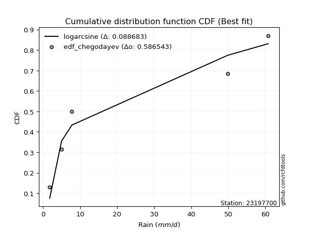</img>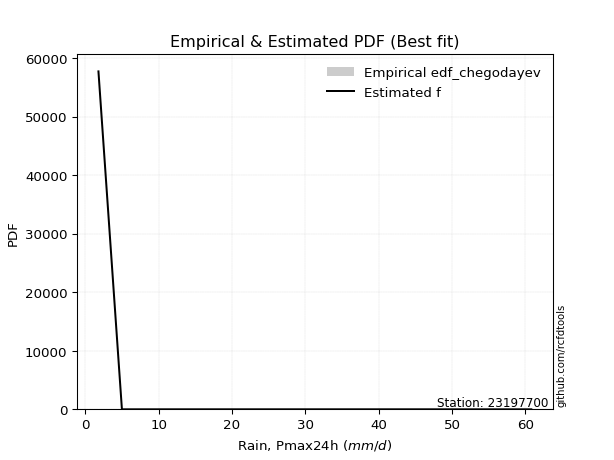</img>

</div>


### 6. EDF Blom (1958)

The Blom formula is a specific "plotting position" formula used in hydrology and statistical analysis to estimate the empirical cumulative probability (or non-exceedance probability) of a data series. It is particularly recommended for data that are approximately normally distributed. The constant _a_ is set to 0.375 (or 3/8).

<div align="center">


$P=(m-a)/(n+1-2a)$


</div>


**6.1. Empirical values**

<div align="center">

|                | 0                   | 1                   | 2        | 3                  | 4                  |
|:---------------|:--------------------|:--------------------|:---------|:-------------------|:-------------------|
| date           | 2023                | 2021                | 2020     | 2022               | 2019               |
| x              | 1.8                 | 5.0                 | 7.8      | 49.8               | 60.8               |
| m              | 1                   | 2                   | 3        | 4                  | 5                  |
| empirical_dist | edf_blom            | edf_blom            | edf_blom | edf_blom           | edf_blom           |
| empirical      | 0.11904761904761904 | 0.30952380952380953 | 0.5      | 0.6904761904761905 | 0.8809523809523809 |
| empirical_tr   | 1.135135135135135   | 1.4482758620689655  | 2.0      | 3.230769230769231  | 8.399999999999999  |

</div>


**6.2. Kolmogorov-Smirnov fit test (sorted by Δ)**


<div align="center">

|                | 0                   | 1                   | 2                   | 3                   | 4                   | 5                   | 6                   | 7                   | 8                  | 9                   | 10                 | 11                  | 12                  | 13                  | 14                  | 15                  | 16                  | 17                  | 18                 | 19                  | 20                 | 21                  | 22                  | 23                  | 24                  | 25                  | 26                 | 27                 | 28                  | 29                  | 30                  | 31                 | 32                  | 33                 | 34                  | 35                  | 36                  | 37                  | 38                  | 39                 | 40                 | 41                  | 42                  | 43                  | 44                 | 45                 | 46                 | 47                  | 48                  | 49                 | 50                  | 51                  | 52                  | 53                  | 54                 | 55                  | 56                  | 57                  | 58                  | 59                 | 60                 | 61                  | 62                  | 63                  | 64                  | 65                 | 66                  | 67                  | 68                 | 69                  | 70                 | 71                  | 72                  | 73                 | 74                  | 75                  | 76                  | 77                  | 78                  | 79                  | 80                  | 81                  | 82                  | 83                  | 84                 | 85                 | 86                  | 87                 | 88                  | 89                  | 90                  | 91                  | 92                  | 93                  | 94                  | 95                  | 96                 | 97                  | 98                  | 99                  | 100                 | 101                | 102                | 103                 | 104                | 105                | 106                | 107                | 108                 | 109                 | 110                | 111                 | 112                 | 113                | 114                 | 115                 | 116                 | 117                | 118                | 119                 | 120                 | 121                 | 122                | 123                | 124                 | 125                 | 126                | 127                | 128                | 129                 | 130                | 131                | 132                 | 133                 | 134                | 135                | 136                | 137                | 138                 | 139                | 140                 | 141                 | 142                 | 143                 | 144                | 145                 | 146                | 147                 | 148                | 149                 | 150                 | 151                 | 152                 | 153                | 154                | 155                | 156                | 157                | 158                | 159                |
|:---------------|:--------------------|:--------------------|:--------------------|:--------------------|:--------------------|:--------------------|:--------------------|:--------------------|:-------------------|:--------------------|:-------------------|:--------------------|:--------------------|:--------------------|:--------------------|:--------------------|:--------------------|:--------------------|:-------------------|:--------------------|:-------------------|:--------------------|:--------------------|:--------------------|:--------------------|:--------------------|:-------------------|:-------------------|:--------------------|:--------------------|:--------------------|:-------------------|:--------------------|:-------------------|:--------------------|:--------------------|:--------------------|:--------------------|:--------------------|:-------------------|:-------------------|:--------------------|:--------------------|:--------------------|:-------------------|:-------------------|:-------------------|:--------------------|:--------------------|:-------------------|:--------------------|:--------------------|:--------------------|:--------------------|:-------------------|:--------------------|:--------------------|:--------------------|:--------------------|:-------------------|:-------------------|:--------------------|:--------------------|:--------------------|:--------------------|:-------------------|:--------------------|:--------------------|:-------------------|:--------------------|:-------------------|:--------------------|:--------------------|:-------------------|:--------------------|:--------------------|:--------------------|:--------------------|:--------------------|:--------------------|:--------------------|:--------------------|:--------------------|:--------------------|:-------------------|:-------------------|:--------------------|:-------------------|:--------------------|:--------------------|:--------------------|:--------------------|:--------------------|:--------------------|:--------------------|:--------------------|:-------------------|:--------------------|:--------------------|:--------------------|:--------------------|:-------------------|:-------------------|:--------------------|:-------------------|:-------------------|:-------------------|:-------------------|:--------------------|:--------------------|:-------------------|:--------------------|:--------------------|:-------------------|:--------------------|:--------------------|:--------------------|:-------------------|:-------------------|:--------------------|:--------------------|:--------------------|:-------------------|:-------------------|:--------------------|:--------------------|:-------------------|:-------------------|:-------------------|:--------------------|:-------------------|:-------------------|:--------------------|:--------------------|:-------------------|:-------------------|:-------------------|:-------------------|:--------------------|:-------------------|:--------------------|:--------------------|:--------------------|:--------------------|:-------------------|:--------------------|:-------------------|:--------------------|:-------------------|:--------------------|:--------------------|:--------------------|:--------------------|:-------------------|:-------------------|:-------------------|:-------------------|:-------------------|:-------------------|:-------------------|
| station        | 23197700            | 23197700            | 23197700            | 23197700            | 23197700            | 23197700            | 23197700            | 23197700            | 23197700           | 23197700            | 23197700           | 23197700            | 23197700            | 23197700            | 23197700            | 23197700            | 23197700            | 23197700            | 23197700           | 23197700            | 23197700           | 23197700            | 23197700            | 23197700            | 23197700            | 23197700            | 23197700           | 23197700           | 23197700            | 23197700            | 23197700            | 23197700           | 23197700            | 23197700           | 23197700            | 23197700            | 23197700            | 23197700            | 23197700            | 23197700           | 23197700           | 23197700            | 23197700            | 23197700            | 23197700           | 23197700           | 23197700           | 23197700            | 23197700            | 23197700           | 23197700            | 23197700            | 23197700            | 23197700            | 23197700           | 23197700            | 23197700            | 23197700            | 23197700            | 23197700           | 23197700           | 23197700            | 23197700            | 23197700            | 23197700            | 23197700           | 23197700            | 23197700            | 23197700           | 23197700            | 23197700           | 23197700            | 23197700            | 23197700           | 23197700            | 23197700            | 23197700            | 23197700            | 23197700            | 23197700            | 23197700            | 23197700            | 23197700            | 23197700            | 23197700           | 23197700           | 23197700            | 23197700           | 23197700            | 23197700            | 23197700            | 23197700            | 23197700            | 23197700            | 23197700            | 23197700            | 23197700           | 23197700            | 23197700            | 23197700            | 23197700            | 23197700           | 23197700           | 23197700            | 23197700           | 23197700           | 23197700           | 23197700           | 23197700            | 23197700            | 23197700           | 23197700            | 23197700            | 23197700           | 23197700            | 23197700            | 23197700            | 23197700           | 23197700           | 23197700            | 23197700            | 23197700            | 23197700           | 23197700           | 23197700            | 23197700            | 23197700           | 23197700           | 23197700           | 23197700            | 23197700           | 23197700           | 23197700            | 23197700            | 23197700           | 23197700           | 23197700           | 23197700           | 23197700            | 23197700           | 23197700            | 23197700            | 23197700            | 23197700            | 23197700           | 23197700            | 23197700           | 23197700            | 23197700           | 23197700            | 23197700            | 23197700            | 23197700            | 23197700           | 23197700           | 23197700           | 23197700           | 23197700           | 23197700           | 23197700           |
| empirical_dist | edf_blom            | edf_blom            | edf_blom            | edf_blom            | edf_blom            | edf_blom            | edf_blom            | edf_blom            | edf_blom           | edf_blom            | edf_blom           | edf_blom            | edf_blom            | edf_blom            | edf_blom            | edf_blom            | edf_blom            | edf_blom            | edf_blom           | edf_blom            | edf_blom           | edf_blom            | edf_blom            | edf_blom            | edf_blom            | edf_blom            | edf_blom           | edf_blom           | edf_blom            | edf_blom            | edf_blom            | edf_blom           | edf_blom            | edf_blom           | edf_blom            | edf_blom            | edf_blom            | edf_blom            | edf_blom            | edf_blom           | edf_blom           | edf_blom            | edf_blom            | edf_blom            | edf_blom           | edf_blom           | edf_blom           | edf_blom            | edf_blom            | edf_blom           | edf_blom            | edf_blom            | edf_blom            | edf_blom            | edf_blom           | edf_blom            | edf_blom            | edf_blom            | edf_blom            | edf_blom           | edf_blom           | edf_blom            | edf_blom            | edf_blom            | edf_blom            | edf_blom           | edf_blom            | edf_blom            | edf_blom           | edf_blom            | edf_blom           | edf_blom            | edf_blom            | edf_blom           | edf_blom            | edf_blom            | edf_blom            | edf_blom            | edf_blom            | edf_blom            | edf_blom            | edf_blom            | edf_blom            | edf_blom            | edf_blom           | edf_blom           | edf_blom            | edf_blom           | edf_blom            | edf_blom            | edf_blom            | edf_blom            | edf_blom            | edf_blom            | edf_blom            | edf_blom            | edf_blom           | edf_blom            | edf_blom            | edf_blom            | edf_blom            | edf_blom           | edf_blom           | edf_blom            | edf_blom           | edf_blom           | edf_blom           | edf_blom           | edf_blom            | edf_blom            | edf_blom           | edf_blom            | edf_blom            | edf_blom           | edf_blom            | edf_blom            | edf_blom            | edf_blom           | edf_blom           | edf_blom            | edf_blom            | edf_blom            | edf_blom           | edf_blom           | edf_blom            | edf_blom            | edf_blom           | edf_blom           | edf_blom           | edf_blom            | edf_blom           | edf_blom           | edf_blom            | edf_blom            | edf_blom           | edf_blom           | edf_blom           | edf_blom           | edf_blom            | edf_blom           | edf_blom            | edf_blom            | edf_blom            | edf_blom            | edf_blom           | edf_blom            | edf_blom           | edf_blom            | edf_blom           | edf_blom            | edf_blom            | edf_blom            | edf_blom            | edf_blom           | edf_blom           | edf_blom           | edf_blom           | edf_blom           | edf_blom           | edf_blom           |
| p_dist         | logarcsine          | logdweibull         | f                   | logksone            | loglomax            | logdgamma           | wrapcauchy          | weibull_min         | logsemicircular    | logvonmises         | logexponpow        | dgamma              | loganglit           | logwrapcauchy       | invgamma            | logburr12           | logloglaplace       | nct                 | logbeta            | logncf              | loginvweibull      | loggenlogistic      | loggenexpon         | logalpha            | ncf                 | loghalfnorm         | logfatiguelife     | lograyleigh        | arcsine             | loginvgauss         | dweibull            | loghalfgennorm     | logmaxwell          | loggenpareto       | logkstwobign        | burr                | logrice             | betaprime           | loginvgamma         | lomax              | loggompertz        | gengamma            | logfoldnorm         | logpearson3         | logerlang          | loggamma           | loggamma           | logskewnorm         | logt                | logexponnorm       | logcrystalball      | lognorm             | lognct              | logloggamma         | logbetaprime       | exponweib           | loggausshyper       | vonmises_line       | logrdist            | loghalflogistic    | logtrapezoid       | loggumbel_r         | logcosine           | logmoyal            | loglogistic         | burr12             | levy_l              | loggennorm          | invgauss           | loghypsecant        | loggenhalflogistic | alpha               | ksone               | halfgennorm        | loglaplace          | loglaplace          | logargus            | loggumbel_l         | halfnorm            | logwald             | kappa4              | exponpow            | semicircular        | logmielke           | logweibull_max     | logf               | foldnorm            | halflogistic       | logtriang           | rayleigh            | anglit              | logburr             | loglevy_l           | maxwell             | t                   | genlogistic         | pearson3           | gumbel_r            | gennorm             | moyal               | loggengamma         | logtukeylambda     | logkappa3          | logkappa4           | logweibull_min     | loguniform         | logvonmises_line   | johnsonsu          | norm                | crystalball         | kstwobign          | truncpareto         | truncweibull_min    | logbradford        | gompertz            | exponnorm           | logtruncexpon       | genexpon           | gamma              | loggenextreme       | logexponweib        | logtruncnorm        | erlang             | logistic           | logtruncweibull_min | cosine              | gausshyper         | rice               | truncnorm          | hypsecant           | gumbel_l           | lognakagami        | laplace             | argus               | wald               | triang             | beta               | genextreme         | truncexpon          | fatiguelife        | nakagami            | johnsonsb           | skewnorm            | bradford            | tukeylambda        | genpareto           | uniform            | logjohnsonsb        | genhalflogistic    | powerlaw            | kappa3              | trapezoid           | mielke              | weibull_max        | logpowerlaw        | logtruncpareto     | rdist              | logjohnsonsu       | invweibull         | vonmises           |
| delta          | 0.08339195123444221 | 0.09446361564385422 | 0.11786329880272212 | 0.11901350368552288 | 0.11904761904199147 | 0.12298046707679167 | 0.13044005851107365 | 0.13201921298498032 | 0.133652481252982  | 0.13818855090387616 | 0.1402625786080418 | 0.14068942025124942 | 0.14406090435083785 | 0.14800409671769132 | 0.14834852962484035 | 0.14904559809915474 | 0.14909428692792082 | 0.14967821254912028 | 0.1503035786570146 | 0.15580171447431768 | 0.1560208746917645 | 0.15619880853147128 | 0.15727189376078288 | 0.15751160690149923 | 0.15923083238758262 | 0.16082733422551632 | 0.1617724983075175 | 0.1617922399881917 | 0.16197177790495132 | 0.16229831614649703 | 0.16232109195849187 | 0.1626089168932513 | 0.16302829692874632 | 0.1630904752649076 | 0.16388867296465726 | 0.16455987425291507 | 0.16471152137611145 | 0.16569776273590509 | 0.16570183790464443 | 0.1659440113344215 | 0.1664302693036689 | 0.16666317787311047 | 0.16692036768923835 | 0.16750237440173477 | 0.1675569717381804 | 0.1676064916859643 | 0.1676064916859643 | 0.16768456939792542 | 0.16768640314707461 | 0.167686714082818  | 0.16768709113785496 | 0.16768709203286347 | 0.16773701677946173 | 0.16803278957392775 | 0.1685984884401483 | 0.16877692186309123 | 0.17454482327399085 | 0.17467279192606194 | 0.17479644590680088 | 0.1763411835219374 | 0.1770057990836732 | 0.17718373708833401 | 0.18036522493336504 | 0.18157134585474655 | 0.18437837221916697 | 0.1880641323751565 | 0.18813513609549018 | 0.19047619047619047 | 0.1909391036985093 | 0.19268456418184976 | 0.1950929746467862 | 0.19569801781521523 | 0.19888741689935224 | 0.1994072141617197 | 0.19974972951327596 | 0.19974972951327596 | 0.20053589867965482 | 0.20098789385915805 | 0.20203962388220953 | 0.20260964519021507 | 0.20598776207537728 | 0.21267921406286944 | 0.21488664539211344 | 0.21565508606956485 | 0.2175943627402172 | 0.2176040980812094 | 0.21761777502336271 | 0.2176570082164765 | 0.22145616179958172 | 0.22501731777098333 | 0.22689939053213876 | 0.22708150193976384 | 0.22779143357575848 | 0.23366084894113376 | 0.23461014195938468 | 0.24015098436705606 | 0.2428453141769789 | 0.24296675717399963 | 0.24362950896235003 | 0.24525739634364163 | 0.24741979463463915 | 0.2494976707550116 | 0.2505901791749686 | 0.25067193753831474 | 0.2515547193250147 | 0.2528232504565334 | 0.2531328222972139 | 0.2539793426708693 | 0.25457773793053967 | 0.25457774150289264 | 0.2570953814684309 | 0.25762542528376875 | 0.25873279239708424 | 0.2674100498876212 | 0.27011564516905606 | 0.27068185021471236 | 0.27146463280017363 | 0.2724614760355339 | 0.273572461543505  | 0.27477202768398057 | 0.27482103161254656 | 0.27603194597124714 | 0.2770729868862035 | 0.2772386618800744 | 0.28095547741551385 | 0.28317820693500506 | 0.2832322407808433 | 0.2883492898651565 | 0.2903625216377731 | 0.29201705805358646 | 0.2929150809025953 | 0.3068649826781782 | 0.31128032308920095 | 0.31748980343939004 | 0.3224364712231669 | 0.3271071739047989 | 0.3353718364945906 | 0.336308281975469  | 0.34349012504706705 | 0.3472472196296257 | 0.34885491650905986 | 0.35254079067573774 | 0.36051337865706645 | 0.37825839923944365 | 0.3901708266426809 | 0.39119736173386976 | 0.3983050847457627 | 0.40013761358440125 | 0.403280866490495  | 0.41657623565288326 | 0.43303530204607116 | 0.47076769426888826 | 0.47193625831685937 | 0.4981085722148325 | 0.547762519765403  | 0.5649687322083266 | 0.5730452083004862 | 0.61694722130569   | 0.6871967323066333 | 9.339320798171807  |
| deltao         | 0.5865427407550001  | 0.5865427407550001  | 0.5865427407550001  | 0.5865427407550001  | 0.5865427407550001  | 0.5865427407550001  | 0.5865427407550001  | 0.5865427407550001  | 0.5865427407550001 | 0.5865427407550001  | 0.5865427407550001 | 0.5865427407550001  | 0.5865427407550001  | 0.5865427407550001  | 0.5865427407550001  | 0.5865427407550001  | 0.5865427407550001  | 0.5865427407550001  | 0.5865427407550001 | 0.5865427407550001  | 0.5865427407550001 | 0.5865427407550001  | 0.5865427407550001  | 0.5865427407550001  | 0.5865427407550001  | 0.5865427407550001  | 0.5865427407550001 | 0.5865427407550001 | 0.5865427407550001  | 0.5865427407550001  | 0.5865427407550001  | 0.5865427407550001 | 0.5865427407550001  | 0.5865427407550001 | 0.5865427407550001  | 0.5865427407550001  | 0.5865427407550001  | 0.5865427407550001  | 0.5865427407550001  | 0.5865427407550001 | 0.5865427407550001 | 0.5865427407550001  | 0.5865427407550001  | 0.5865427407550001  | 0.5865427407550001 | 0.5865427407550001 | 0.5865427407550001 | 0.5865427407550001  | 0.5865427407550001  | 0.5865427407550001 | 0.5865427407550001  | 0.5865427407550001  | 0.5865427407550001  | 0.5865427407550001  | 0.5865427407550001 | 0.5865427407550001  | 0.5865427407550001  | 0.5865427407550001  | 0.5865427407550001  | 0.5865427407550001 | 0.5865427407550001 | 0.5865427407550001  | 0.5865427407550001  | 0.5865427407550001  | 0.5865427407550001  | 0.5865427407550001 | 0.5865427407550001  | 0.5865427407550001  | 0.5865427407550001 | 0.5865427407550001  | 0.5865427407550001 | 0.5865427407550001  | 0.5865427407550001  | 0.5865427407550001 | 0.5865427407550001  | 0.5865427407550001  | 0.5865427407550001  | 0.5865427407550001  | 0.5865427407550001  | 0.5865427407550001  | 0.5865427407550001  | 0.5865427407550001  | 0.5865427407550001  | 0.5865427407550001  | 0.5865427407550001 | 0.5865427407550001 | 0.5865427407550001  | 0.5865427407550001 | 0.5865427407550001  | 0.5865427407550001  | 0.5865427407550001  | 0.5865427407550001  | 0.5865427407550001  | 0.5865427407550001  | 0.5865427407550001  | 0.5865427407550001  | 0.5865427407550001 | 0.5865427407550001  | 0.5865427407550001  | 0.5865427407550001  | 0.5865427407550001  | 0.5865427407550001 | 0.5865427407550001 | 0.5865427407550001  | 0.5865427407550001 | 0.5865427407550001 | 0.5865427407550001 | 0.5865427407550001 | 0.5865427407550001  | 0.5865427407550001  | 0.5865427407550001 | 0.5865427407550001  | 0.5865427407550001  | 0.5865427407550001 | 0.5865427407550001  | 0.5865427407550001  | 0.5865427407550001  | 0.5865427407550001 | 0.5865427407550001 | 0.5865427407550001  | 0.5865427407550001  | 0.5865427407550001  | 0.5865427407550001 | 0.5865427407550001 | 0.5865427407550001  | 0.5865427407550001  | 0.5865427407550001 | 0.5865427407550001 | 0.5865427407550001 | 0.5865427407550001  | 0.5865427407550001 | 0.5865427407550001 | 0.5865427407550001  | 0.5865427407550001  | 0.5865427407550001 | 0.5865427407550001 | 0.5865427407550001 | 0.5865427407550001 | 0.5865427407550001  | 0.5865427407550001 | 0.5865427407550001  | 0.5865427407550001  | 0.5865427407550001  | 0.5865427407550001  | 0.5865427407550001 | 0.5865427407550001  | 0.5865427407550001 | 0.5865427407550001  | 0.5865427407550001 | 0.5865427407550001  | 0.5865427407550001  | 0.5865427407550001  | 0.5865427407550001  | 0.5865427407550001 | 0.5865427407550001 | 0.5865427407550001 | 0.5865427407550001 | 0.5865427407550001 | 0.5865427407550001 | 0.5865427407550001 |
| eval           | Δo > Δ              | Δo > Δ              | Δo > Δ              | Δo > Δ              | Δo > Δ              | Δo > Δ              | Δo > Δ              | Δo > Δ              | Δo > Δ             | Δo > Δ              | Δo > Δ             | Δo > Δ              | Δo > Δ              | Δo > Δ              | Δo > Δ              | Δo > Δ              | Δo > Δ              | Δo > Δ              | Δo > Δ             | Δo > Δ              | Δo > Δ             | Δo > Δ              | Δo > Δ              | Δo > Δ              | Δo > Δ              | Δo > Δ              | Δo > Δ             | Δo > Δ             | Δo > Δ              | Δo > Δ              | Δo > Δ              | Δo > Δ             | Δo > Δ              | Δo > Δ             | Δo > Δ              | Δo > Δ              | Δo > Δ              | Δo > Δ              | Δo > Δ              | Δo > Δ             | Δo > Δ             | Δo > Δ              | Δo > Δ              | Δo > Δ              | Δo > Δ             | Δo > Δ             | Δo > Δ             | Δo > Δ              | Δo > Δ              | Δo > Δ             | Δo > Δ              | Δo > Δ              | Δo > Δ              | Δo > Δ              | Δo > Δ             | Δo > Δ              | Δo > Δ              | Δo > Δ              | Δo > Δ              | Δo > Δ             | Δo > Δ             | Δo > Δ              | Δo > Δ              | Δo > Δ              | Δo > Δ              | Δo > Δ             | Δo > Δ              | Δo > Δ              | Δo > Δ             | Δo > Δ              | Δo > Δ             | Δo > Δ              | Δo > Δ              | Δo > Δ             | Δo > Δ              | Δo > Δ              | Δo > Δ              | Δo > Δ              | Δo > Δ              | Δo > Δ              | Δo > Δ              | Δo > Δ              | Δo > Δ              | Δo > Δ              | Δo > Δ             | Δo > Δ             | Δo > Δ              | Δo > Δ             | Δo > Δ              | Δo > Δ              | Δo > Δ              | Δo > Δ              | Δo > Δ              | Δo > Δ              | Δo > Δ              | Δo > Δ              | Δo > Δ             | Δo > Δ              | Δo > Δ              | Δo > Δ              | Δo > Δ              | Δo > Δ             | Δo > Δ             | Δo > Δ              | Δo > Δ             | Δo > Δ             | Δo > Δ             | Δo > Δ             | Δo > Δ              | Δo > Δ              | Δo > Δ             | Δo > Δ              | Δo > Δ              | Δo > Δ             | Δo > Δ              | Δo > Δ              | Δo > Δ              | Δo > Δ             | Δo > Δ             | Δo > Δ              | Δo > Δ              | Δo > Δ              | Δo > Δ             | Δo > Δ             | Δo > Δ              | Δo > Δ              | Δo > Δ             | Δo > Δ             | Δo > Δ             | Δo > Δ              | Δo > Δ             | Δo > Δ             | Δo > Δ              | Δo > Δ              | Δo > Δ             | Δo > Δ             | Δo > Δ             | Δo > Δ             | Δo > Δ              | Δo > Δ             | Δo > Δ              | Δo > Δ              | Δo > Δ              | Δo > Δ              | Δo > Δ             | Δo > Δ              | Δo > Δ             | Δo > Δ              | Δo > Δ             | Δo > Δ              | Δo > Δ              | Δo > Δ              | Δo > Δ              | Δo > Δ             | Δo > Δ             | Δo > Δ             | Δo > Δ             | Δo <= Δ            | Δo <= Δ            | Δo <= Δ            |
| fit            | 1                   | 1                   | 1                   | 1                   | 1                   | 1                   | 1                   | 1                   | 1                  | 1                   | 1                  | 1                   | 1                   | 1                   | 1                   | 1                   | 1                   | 1                   | 1                  | 1                   | 1                  | 1                   | 1                   | 1                   | 1                   | 1                   | 1                  | 1                  | 1                   | 1                   | 1                   | 1                  | 1                   | 1                  | 1                   | 1                   | 1                   | 1                   | 1                   | 1                  | 1                  | 1                   | 1                   | 1                   | 1                  | 1                  | 1                  | 1                   | 1                   | 1                  | 1                   | 1                   | 1                   | 1                   | 1                  | 1                   | 1                   | 1                   | 1                   | 1                  | 1                  | 1                   | 1                   | 1                   | 1                   | 1                  | 1                   | 1                   | 1                  | 1                   | 1                  | 1                   | 1                   | 1                  | 1                   | 1                   | 1                   | 1                   | 1                   | 1                   | 1                   | 1                   | 1                   | 1                   | 1                  | 1                  | 1                   | 1                  | 1                   | 1                   | 1                   | 1                   | 1                   | 1                   | 1                   | 1                   | 1                  | 1                   | 1                   | 1                   | 1                   | 1                  | 1                  | 1                   | 1                  | 1                  | 1                  | 1                  | 1                   | 1                   | 1                  | 1                   | 1                   | 1                  | 1                   | 1                   | 1                   | 1                  | 1                  | 1                   | 1                   | 1                   | 1                  | 1                  | 1                   | 1                   | 1                  | 1                  | 1                  | 1                   | 1                  | 1                  | 1                   | 1                   | 1                  | 1                  | 1                  | 1                  | 1                   | 1                  | 1                   | 1                   | 1                   | 1                   | 1                  | 1                   | 1                  | 1                   | 1                  | 1                   | 1                   | 1                   | 1                   | 1                  | 1                  | 1                  | 1                  | 0                  | 0                  | 0                  |
| n              | 5                   | 5                   | 5                   | 5                   | 5                   | 5                   | 5                   | 5                   | 5                  | 5                   | 5                  | 5                   | 5                   | 5                   | 5                   | 5                   | 5                   | 5                   | 5                  | 5                   | 5                  | 5                   | 5                   | 5                   | 5                   | 5                   | 5                  | 5                  | 5                   | 5                   | 5                   | 5                  | 5                   | 5                  | 5                   | 5                   | 5                   | 5                   | 5                   | 5                  | 5                  | 5                   | 5                   | 5                   | 5                  | 5                  | 5                  | 5                   | 5                   | 5                  | 5                   | 5                   | 5                   | 5                   | 5                  | 5                   | 5                   | 5                   | 5                   | 5                  | 5                  | 5                   | 5                   | 5                   | 5                   | 5                  | 5                   | 5                   | 5                  | 5                   | 5                  | 5                   | 5                   | 5                  | 5                   | 5                   | 5                   | 5                   | 5                   | 5                   | 5                   | 5                   | 5                   | 5                   | 5                  | 5                  | 5                   | 5                  | 5                   | 5                   | 5                   | 5                   | 5                   | 5                   | 5                   | 5                   | 5                  | 5                   | 5                   | 5                   | 5                   | 5                  | 5                  | 5                   | 5                  | 5                  | 5                  | 5                  | 5                   | 5                   | 5                  | 5                   | 5                   | 5                  | 5                   | 5                   | 5                   | 5                  | 5                  | 5                   | 5                   | 5                   | 5                  | 5                  | 5                   | 5                   | 5                  | 5                  | 5                  | 5                   | 5                  | 5                  | 5                   | 5                   | 5                  | 5                  | 5                  | 5                  | 5                   | 5                  | 5                   | 5                   | 5                   | 5                   | 5                  | 5                   | 5                  | 5                   | 5                  | 5                   | 5                   | 5                   | 5                   | 5                  | 5                  | 5                  | 5                  | 5                  | 5                  | 5                  |
| best_fit       | 1                   | 0                   | 0                   | 0                   | 0                   | 0                   | 0                   | 0                   | 0                  | 0                   | 0                  | 0                   | 0                   | 0                   | 0                   | 0                   | 0                   | 0                   | 0                  | 0                   | 0                  | 0                   | 0                   | 0                   | 0                   | 0                   | 0                  | 0                  | 0                   | 0                   | 0                   | 0                  | 0                   | 0                  | 0                   | 0                   | 0                   | 0                   | 0                   | 0                  | 0                  | 0                   | 0                   | 0                   | 0                  | 0                  | 0                  | 0                   | 0                   | 0                  | 0                   | 0                   | 0                   | 0                   | 0                  | 0                   | 0                   | 0                   | 0                   | 0                  | 0                  | 0                   | 0                   | 0                   | 0                   | 0                  | 0                   | 0                   | 0                  | 0                   | 0                  | 0                   | 0                   | 0                  | 0                   | 0                   | 0                   | 0                   | 0                   | 0                   | 0                   | 0                   | 0                   | 0                   | 0                  | 0                  | 0                   | 0                  | 0                   | 0                   | 0                   | 0                   | 0                   | 0                   | 0                   | 0                   | 0                  | 0                   | 0                   | 0                   | 0                   | 0                  | 0                  | 0                   | 0                  | 0                  | 0                  | 0                  | 0                   | 0                   | 0                  | 0                   | 0                   | 0                  | 0                   | 0                   | 0                   | 0                  | 0                  | 0                   | 0                   | 0                   | 0                  | 0                  | 0                   | 0                   | 0                  | 0                  | 0                  | 0                   | 0                  | 0                  | 0                   | 0                   | 0                  | 0                  | 0                  | 0                  | 0                   | 0                  | 0                   | 0                   | 0                   | 0                   | 0                  | 0                   | 0                  | 0                   | 0                  | 0                   | 0                   | 0                   | 0                   | 0                  | 0                  | 0                  | 0                  | 0                  | 0                  | 0                  |
| best_fit_sort  | 1                   | 2                   | 3                   | 4                   | 5                   | 6                   | 7                   | 8                   | 9                  | 10                  | 11                 | 12                  | 13                  | 14                  | 15                  | 16                  | 17                  | 18                  | 19                 | 20                  | 21                 | 22                  | 23                  | 24                  | 25                  | 26                  | 27                 | 28                 | 29                  | 30                  | 31                  | 32                 | 33                  | 34                 | 35                  | 36                  | 37                  | 38                  | 39                  | 40                 | 41                 | 42                  | 43                  | 44                  | 45                 | 46                 | 47                 | 48                  | 49                  | 50                 | 51                  | 52                  | 53                  | 54                  | 55                 | 56                  | 57                  | 58                  | 59                  | 60                 | 61                 | 62                  | 63                  | 64                  | 65                  | 66                 | 67                  | 68                  | 69                 | 70                  | 71                 | 72                  | 73                  | 74                 | 75                  | 76                  | 77                  | 78                  | 79                  | 80                  | 81                  | 82                  | 83                  | 84                  | 85                 | 86                 | 87                  | 88                 | 89                  | 90                  | 91                  | 92                  | 93                  | 94                  | 95                  | 96                  | 97                 | 98                  | 99                  | 100                 | 101                 | 102                | 103                | 104                 | 105                | 106                | 107                | 108                | 109                 | 110                 | 111                | 112                 | 113                 | 114                | 115                 | 116                 | 117                 | 118                | 119                | 120                 | 121                 | 122                 | 123                | 124                | 125                 | 126                 | 127                | 128                | 129                | 130                 | 131                | 132                | 133                 | 134                 | 135                | 136                | 137                | 138                | 139                 | 140                | 141                 | 142                 | 143                 | 144                 | 145                | 146                 | 147                | 148                 | 149                | 150                 | 151                 | 152                 | 153                 | 154                | 155                | 156                | 157                | 158                | 159                | 160                |

</div>


**6.3. Best fit**

<div align="center">

|   id |   station | empirical_dist   | p_dist     |    delta |   deltao | eval   |   fit |   n |   best_fit |   best_fit_sort |
|-----:|----------:|:-----------------|:-----------|---------:|---------:|:-------|------:|----:|-----------:|----------------:|
|    0 |  23197700 | edf_blom         | logarcsine | 0.083392 | 0.586543 | Δo > Δ |     1 |   5 |          1 |               1 |

</div>


<div align="center">

</img></img>

</div>


### 7. EDF Tukey (1962)

In hydrology, the Tukey formula is used as a plotting position formula to estimate the empirical probability or frequency of a flood event (or other hydrological data). The formula parameter is given as _c=0.333_ (or 1/3).

<div align="center">


$P=(m-c)/(n+1-2c)$


</div>


**7.1. Empirical values**

<div align="center">

|                | 0                  | 1                  | 2         | 3         | 4         |
|:---------------|:-------------------|:-------------------|:----------|:----------|:----------|
| date           | 2023               | 2021               | 2020      | 2022      | 2019      |
| x              | 1.8                | 5.0                | 7.8       | 49.8      | 60.8      |
| m              | 1                  | 2                  | 3         | 4         | 5         |
| empirical_dist | edf_tukey          | edf_tukey          | edf_tukey | edf_tukey | edf_tukey |
| empirical      | 0.125              | 0.3125             | 0.5       | 0.6875    | 0.875     |
| empirical_tr   | 1.1428571428571428 | 1.4545454545454546 | 2.0       | 3.2       | 8.0       |

</div>


**7.2. Kolmogorov-Smirnov fit test (sorted by Δ)**


<div align="center">

|                | 0                   | 1                   | 2                   | 3                   | 4                   | 5                   | 6                   | 7                  | 8                   | 9                   | 10                  | 11                  | 12                  | 13                  | 14                  | 15                 | 16                  | 17                  | 18                  | 19                  | 20                  | 21                  | 22                  | 23                 | 24                  | 25                  | 26                 | 27                 | 28                  | 29                  | 30                  | 31                 | 32                  | 33                  | 34                  | 35                  | 36                  | 37                 | 38                  | 39                 | 40                  | 41                  | 42                  | 43                 | 44                  | 45                  | 46                  | 47                  | 48                  | 49                  | 50                  | 51                  | 52                  | 53                 | 54                  | 55                 | 56                  | 57                  | 58                  | 59                  | 60                  | 61                  | 62                  | 63                  | 64                 | 65                 | 66                  | 67                 | 68                  | 69                  | 70                  | 71                 | 72                  | 73                  | 74                  | 75                  | 76                  | 77                 | 78                  | 79                  | 80                  | 81                  | 82                  | 83                  | 84                 | 85                  | 86                 | 87                  | 88                  | 89                  | 90                  | 91                  | 92                 | 93                  | 94                  | 95                  | 96                 | 97                  | 98                  | 99                  | 100                | 101                 | 102                | 103                | 104                | 105                | 106                 | 107                 | 108                | 109                 | 110                | 111                | 112                | 113                 | 114                 | 115                 | 116                | 117                | 118                 | 119                | 120                | 121                 | 122                | 123                | 124                 | 125                | 126                 | 127                | 128                | 129                 | 130                | 131                 | 132                 | 133                 | 134                | 135                | 136                | 137                | 138                 | 139                | 140                | 141                 | 142                 | 143                 | 144                | 145                 | 146                | 147                | 148                | 149                | 150                | 151                | 152                 | 153                 | 154                | 155                | 156                | 157                | 158                | 159                |
|:---------------|:--------------------|:--------------------|:--------------------|:--------------------|:--------------------|:--------------------|:--------------------|:-------------------|:--------------------|:--------------------|:--------------------|:--------------------|:--------------------|:--------------------|:--------------------|:-------------------|:--------------------|:--------------------|:--------------------|:--------------------|:--------------------|:--------------------|:--------------------|:-------------------|:--------------------|:--------------------|:-------------------|:-------------------|:--------------------|:--------------------|:--------------------|:-------------------|:--------------------|:--------------------|:--------------------|:--------------------|:--------------------|:-------------------|:--------------------|:-------------------|:--------------------|:--------------------|:--------------------|:-------------------|:--------------------|:--------------------|:--------------------|:--------------------|:--------------------|:--------------------|:--------------------|:--------------------|:--------------------|:-------------------|:--------------------|:-------------------|:--------------------|:--------------------|:--------------------|:--------------------|:--------------------|:--------------------|:--------------------|:--------------------|:-------------------|:-------------------|:--------------------|:-------------------|:--------------------|:--------------------|:--------------------|:-------------------|:--------------------|:--------------------|:--------------------|:--------------------|:--------------------|:-------------------|:--------------------|:--------------------|:--------------------|:--------------------|:--------------------|:--------------------|:-------------------|:--------------------|:-------------------|:--------------------|:--------------------|:--------------------|:--------------------|:--------------------|:-------------------|:--------------------|:--------------------|:--------------------|:-------------------|:--------------------|:--------------------|:--------------------|:-------------------|:--------------------|:-------------------|:-------------------|:-------------------|:-------------------|:--------------------|:--------------------|:-------------------|:--------------------|:-------------------|:-------------------|:-------------------|:--------------------|:--------------------|:--------------------|:-------------------|:-------------------|:--------------------|:-------------------|:-------------------|:--------------------|:-------------------|:-------------------|:--------------------|:-------------------|:--------------------|:-------------------|:-------------------|:--------------------|:-------------------|:--------------------|:--------------------|:--------------------|:-------------------|:-------------------|:-------------------|:-------------------|:--------------------|:-------------------|:-------------------|:--------------------|:--------------------|:--------------------|:-------------------|:--------------------|:-------------------|:-------------------|:-------------------|:-------------------|:-------------------|:-------------------|:--------------------|:--------------------|:-------------------|:-------------------|:-------------------|:-------------------|:-------------------|:-------------------|
| station        | 23197700            | 23197700            | 23197700            | 23197700            | 23197700            | 23197700            | 23197700            | 23197700           | 23197700            | 23197700            | 23197700            | 23197700            | 23197700            | 23197700            | 23197700            | 23197700           | 23197700            | 23197700            | 23197700            | 23197700            | 23197700            | 23197700            | 23197700            | 23197700           | 23197700            | 23197700            | 23197700           | 23197700           | 23197700            | 23197700            | 23197700            | 23197700           | 23197700            | 23197700            | 23197700            | 23197700            | 23197700            | 23197700           | 23197700            | 23197700           | 23197700            | 23197700            | 23197700            | 23197700           | 23197700            | 23197700            | 23197700            | 23197700            | 23197700            | 23197700            | 23197700            | 23197700            | 23197700            | 23197700           | 23197700            | 23197700           | 23197700            | 23197700            | 23197700            | 23197700            | 23197700            | 23197700            | 23197700            | 23197700            | 23197700           | 23197700           | 23197700            | 23197700           | 23197700            | 23197700            | 23197700            | 23197700           | 23197700            | 23197700            | 23197700            | 23197700            | 23197700            | 23197700           | 23197700            | 23197700            | 23197700            | 23197700            | 23197700            | 23197700            | 23197700           | 23197700            | 23197700           | 23197700            | 23197700            | 23197700            | 23197700            | 23197700            | 23197700           | 23197700            | 23197700            | 23197700            | 23197700           | 23197700            | 23197700            | 23197700            | 23197700           | 23197700            | 23197700           | 23197700           | 23197700           | 23197700           | 23197700            | 23197700            | 23197700           | 23197700            | 23197700           | 23197700           | 23197700           | 23197700            | 23197700            | 23197700            | 23197700           | 23197700           | 23197700            | 23197700           | 23197700           | 23197700            | 23197700           | 23197700           | 23197700            | 23197700           | 23197700            | 23197700           | 23197700           | 23197700            | 23197700           | 23197700            | 23197700            | 23197700            | 23197700           | 23197700           | 23197700           | 23197700           | 23197700            | 23197700           | 23197700           | 23197700            | 23197700            | 23197700            | 23197700           | 23197700            | 23197700           | 23197700           | 23197700           | 23197700           | 23197700           | 23197700           | 23197700            | 23197700            | 23197700           | 23197700           | 23197700           | 23197700           | 23197700           | 23197700           |
| empirical_dist | edf_tukey           | edf_tukey           | edf_tukey           | edf_tukey           | edf_tukey           | edf_tukey           | edf_tukey           | edf_tukey          | edf_tukey           | edf_tukey           | edf_tukey           | edf_tukey           | edf_tukey           | edf_tukey           | edf_tukey           | edf_tukey          | edf_tukey           | edf_tukey           | edf_tukey           | edf_tukey           | edf_tukey           | edf_tukey           | edf_tukey           | edf_tukey          | edf_tukey           | edf_tukey           | edf_tukey          | edf_tukey          | edf_tukey           | edf_tukey           | edf_tukey           | edf_tukey          | edf_tukey           | edf_tukey           | edf_tukey           | edf_tukey           | edf_tukey           | edf_tukey          | edf_tukey           | edf_tukey          | edf_tukey           | edf_tukey           | edf_tukey           | edf_tukey          | edf_tukey           | edf_tukey           | edf_tukey           | edf_tukey           | edf_tukey           | edf_tukey           | edf_tukey           | edf_tukey           | edf_tukey           | edf_tukey          | edf_tukey           | edf_tukey          | edf_tukey           | edf_tukey           | edf_tukey           | edf_tukey           | edf_tukey           | edf_tukey           | edf_tukey           | edf_tukey           | edf_tukey          | edf_tukey          | edf_tukey           | edf_tukey          | edf_tukey           | edf_tukey           | edf_tukey           | edf_tukey          | edf_tukey           | edf_tukey           | edf_tukey           | edf_tukey           | edf_tukey           | edf_tukey          | edf_tukey           | edf_tukey           | edf_tukey           | edf_tukey           | edf_tukey           | edf_tukey           | edf_tukey          | edf_tukey           | edf_tukey          | edf_tukey           | edf_tukey           | edf_tukey           | edf_tukey           | edf_tukey           | edf_tukey          | edf_tukey           | edf_tukey           | edf_tukey           | edf_tukey          | edf_tukey           | edf_tukey           | edf_tukey           | edf_tukey          | edf_tukey           | edf_tukey          | edf_tukey          | edf_tukey          | edf_tukey          | edf_tukey           | edf_tukey           | edf_tukey          | edf_tukey           | edf_tukey          | edf_tukey          | edf_tukey          | edf_tukey           | edf_tukey           | edf_tukey           | edf_tukey          | edf_tukey          | edf_tukey           | edf_tukey          | edf_tukey          | edf_tukey           | edf_tukey          | edf_tukey          | edf_tukey           | edf_tukey          | edf_tukey           | edf_tukey          | edf_tukey          | edf_tukey           | edf_tukey          | edf_tukey           | edf_tukey           | edf_tukey           | edf_tukey          | edf_tukey          | edf_tukey          | edf_tukey          | edf_tukey           | edf_tukey          | edf_tukey          | edf_tukey           | edf_tukey           | edf_tukey           | edf_tukey          | edf_tukey           | edf_tukey          | edf_tukey          | edf_tukey          | edf_tukey          | edf_tukey          | edf_tukey          | edf_tukey           | edf_tukey           | edf_tukey          | edf_tukey          | edf_tukey          | edf_tukey          | edf_tukey          | edf_tukey          |
| p_dist         | logarcsine          | logdweibull         | logdgamma           | logksone            | f                   | loglomax            | weibull_min         | wrapcauchy         | logsemicircular     | dgamma              | logvonmises         | logexponpow         | logwrapcauchy       | loganglit           | invgamma            | logburr12          | logloglaplace       | nct                 | logbeta             | logalpha            | logncf              | loginvweibull       | loggenlogistic      | dweibull           | loggenexpon         | arcsine             | ncf                | loggenpareto       | loghalfnorm         | logfatiguelife      | lograyleigh         | loginvgauss        | loghalfgennorm      | logbetaprime        | logmaxwell          | logkstwobign        | burr                | logrice            | betaprime           | loginvgamma        | lomax               | loggompertz         | gengamma            | logfoldnorm        | logpearson3         | logerlang           | loggamma            | loggamma            | logskewnorm         | logt                | logexponnorm        | logcrystalball      | lognorm             | lognct             | logloggamma         | exponweib          | loggausshyper       | vonmises_line       | logrdist            | loghalflogistic     | logtrapezoid        | loggumbel_r         | burr12              | levy_l              | logcosine          | logmoyal           | loglogistic         | loggennorm         | invgauss            | loghypsecant        | loggenhalflogistic  | alpha              | ksone               | halfnorm            | halfgennorm         | loglaplace          | loglaplace          | logargus           | loggumbel_l         | logwald             | kappa4              | exponpow            | logf                | semicircular        | logweibull_max     | foldnorm            | halflogistic       | logmielke           | logtriang           | rayleigh            | anglit              | loglevy_l           | logburr            | maxwell             | t                   | genlogistic         | pearson3           | gumbel_r            | loggengamma         | moyal               | gennorm            | logweibull_min      | logtukeylambda     | logkappa3          | logkappa4          | johnsonsu          | norm                | crystalball         | loguniform         | logvonmises_line    | kstwobign          | truncpareto        | truncweibull_min   | gompertz            | logbradford         | exponnorm           | genexpon           | logtruncexpon      | loggenextreme       | gamma              | logistic           | logexponweib        | logtruncnorm       | erlang             | cosine              | gausshyper         | logtruncweibull_min | rice               | truncnorm          | hypsecant           | gumbel_l           | lognakagami         | laplace             | argus               | wald               | triang             | genextreme         | beta               | truncexpon          | fatiguelife        | nakagami           | johnsonsb           | skewnorm            | bradford            | tukeylambda        | genpareto           | logjohnsonsb       | uniform            | genhalflogistic    | powerlaw           | kappa3             | mielke             | trapezoid           | weibull_max         | logpowerlaw        | logtruncpareto     | rdist              | logjohnsonsu       | invweibull         | vonmises           |
| delta          | 0.08636814171063267 | 0.10041599659623518 | 0.11702808612441074 | 0.12198969416171335 | 0.12381567975510308 | 0.12499999999437243 | 0.12606683203259939 | 0.1274638680348832 | 0.13662867172917248 | 0.13771322977505895 | 0.14116474138006663 | 0.14323876908423228 | 0.14502790624150086 | 0.14703709482702831 | 0.15132472010103082 | 0.1520217885753452 | 0.15207047740411128 | 0.15265440302531075 | 0.15327976913320507 | 0.15453541642530877 | 0.15877790495050814 | 0.15899706516795498 | 0.15917499900766174 | 0.1593449014823014 | 0.16024808423697334 | 0.16197177790495132 | 0.1622070228637731 | 0.1630904752649076 | 0.16380352470170678 | 0.16474868878370796 | 0.16476843046438217 | 0.1652745066226875 | 0.16558510736944176 | 0.16562229796395783 | 0.16600448740493678 | 0.16686486344084772 | 0.16753606472910554 | 0.1676877118523019 | 0.16867395321209555 | 0.1686780283808349 | 0.16892020181061196 | 0.16940645977985935 | 0.16963936834930093 | 0.1698965581654288 | 0.17047856487792523 | 0.17053316221437087 | 0.17058268216215478 | 0.17058268216215478 | 0.17066075987411589 | 0.17066259362326508 | 0.17066290455900845 | 0.17066328161404543 | 0.17066328250905394 | 0.1707132072556522 | 0.17100898005011822 | 0.1717531123392817 | 0.17454482327399085 | 0.17467279192606194 | 0.17777263638299134 | 0.17931737399812786 | 0.17998198955986366 | 0.18015992756452448 | 0.18211175142277558 | 0.18218275514310922 | 0.1833414154095555 | 0.184547536330937  | 0.18735456269535744 | 0.1875             | 0.19391529417469977 | 0.19566075465804023 | 0.19806916512297668 | 0.1986742082914057 | 0.19888741689935224 | 0.20203962388220953 | 0.20238340463791016 | 0.20272591998946643 | 0.20272591998946643 | 0.2035120891558453 | 0.20396408433534852 | 0.20558583566640554 | 0.20598776207537728 | 0.21267921406286944 | 0.21462790760501893 | 0.21488664539211344 | 0.2175943627402172 | 0.21761777502336271 | 0.2176570082164765 | 0.21863127654575532 | 0.22443235227577218 | 0.22501731777098333 | 0.22689939053213876 | 0.22779143357575848 | 0.2300576924159543 | 0.23366084894113376 | 0.23758633243557514 | 0.24015098436705606 | 0.2428453141769789 | 0.24296675717399963 | 0.24444360415844868 | 0.24525739634364163 | 0.2466056994385405 | 0.24857852884882425 | 0.2524738612312021 | 0.2535663696511591 | 0.2536481280145052 | 0.2539793426708693 | 0.25457773793053967 | 0.25457774150289264 | 0.2557994409327239 | 0.25610901277340437 | 0.2570953814684309 | 0.2606016157599592 | 0.2617089828732747 | 0.27011564516905606 | 0.27038624036381165 | 0.27068185021471236 | 0.2724614760355339 | 0.2744408232763641 | 0.27477202768398057 | 0.2765486520196955 | 0.2772386618800744 | 0.27779722208873703 | 0.2790081364474376 | 0.280049177362394  | 0.28317820693500506 | 0.2832322407808433 | 0.2839316678917043  | 0.2883492898651565 | 0.2903625216377731 | 0.29201705805358646 | 0.2929150809025953 | 0.30984117315436865 | 0.31128032308920095 | 0.31748980343939004 | 0.3224364712231669 | 0.3271071739047989 | 0.3303559010230881 | 0.3353718364945906 | 0.34349012504706705 | 0.3442710291534352 | 0.3458787260328694 | 0.34956460019954727 | 0.36051337865706645 | 0.37825839923944365 | 0.3901708266426809 | 0.39119736173386976 | 0.3941852326320203 | 0.3983050847457627 | 0.403280866490495  | 0.4136000451766928 | 0.4270829210936902 | 0.4689600678406689 | 0.47076769426888826 | 0.49513238173864205 | 0.5447863292892126 | 0.5619925417321361 | 0.5670928273481053 | 0.6139710308294996 | 0.6842205418304428 | 9.345273179124188  |
| deltao         | 0.5865427407550001  | 0.5865427407550001  | 0.5865427407550001  | 0.5865427407550001  | 0.5865427407550001  | 0.5865427407550001  | 0.5865427407550001  | 0.5865427407550001 | 0.5865427407550001  | 0.5865427407550001  | 0.5865427407550001  | 0.5865427407550001  | 0.5865427407550001  | 0.5865427407550001  | 0.5865427407550001  | 0.5865427407550001 | 0.5865427407550001  | 0.5865427407550001  | 0.5865427407550001  | 0.5865427407550001  | 0.5865427407550001  | 0.5865427407550001  | 0.5865427407550001  | 0.5865427407550001 | 0.5865427407550001  | 0.5865427407550001  | 0.5865427407550001 | 0.5865427407550001 | 0.5865427407550001  | 0.5865427407550001  | 0.5865427407550001  | 0.5865427407550001 | 0.5865427407550001  | 0.5865427407550001  | 0.5865427407550001  | 0.5865427407550001  | 0.5865427407550001  | 0.5865427407550001 | 0.5865427407550001  | 0.5865427407550001 | 0.5865427407550001  | 0.5865427407550001  | 0.5865427407550001  | 0.5865427407550001 | 0.5865427407550001  | 0.5865427407550001  | 0.5865427407550001  | 0.5865427407550001  | 0.5865427407550001  | 0.5865427407550001  | 0.5865427407550001  | 0.5865427407550001  | 0.5865427407550001  | 0.5865427407550001 | 0.5865427407550001  | 0.5865427407550001 | 0.5865427407550001  | 0.5865427407550001  | 0.5865427407550001  | 0.5865427407550001  | 0.5865427407550001  | 0.5865427407550001  | 0.5865427407550001  | 0.5865427407550001  | 0.5865427407550001 | 0.5865427407550001 | 0.5865427407550001  | 0.5865427407550001 | 0.5865427407550001  | 0.5865427407550001  | 0.5865427407550001  | 0.5865427407550001 | 0.5865427407550001  | 0.5865427407550001  | 0.5865427407550001  | 0.5865427407550001  | 0.5865427407550001  | 0.5865427407550001 | 0.5865427407550001  | 0.5865427407550001  | 0.5865427407550001  | 0.5865427407550001  | 0.5865427407550001  | 0.5865427407550001  | 0.5865427407550001 | 0.5865427407550001  | 0.5865427407550001 | 0.5865427407550001  | 0.5865427407550001  | 0.5865427407550001  | 0.5865427407550001  | 0.5865427407550001  | 0.5865427407550001 | 0.5865427407550001  | 0.5865427407550001  | 0.5865427407550001  | 0.5865427407550001 | 0.5865427407550001  | 0.5865427407550001  | 0.5865427407550001  | 0.5865427407550001 | 0.5865427407550001  | 0.5865427407550001 | 0.5865427407550001 | 0.5865427407550001 | 0.5865427407550001 | 0.5865427407550001  | 0.5865427407550001  | 0.5865427407550001 | 0.5865427407550001  | 0.5865427407550001 | 0.5865427407550001 | 0.5865427407550001 | 0.5865427407550001  | 0.5865427407550001  | 0.5865427407550001  | 0.5865427407550001 | 0.5865427407550001 | 0.5865427407550001  | 0.5865427407550001 | 0.5865427407550001 | 0.5865427407550001  | 0.5865427407550001 | 0.5865427407550001 | 0.5865427407550001  | 0.5865427407550001 | 0.5865427407550001  | 0.5865427407550001 | 0.5865427407550001 | 0.5865427407550001  | 0.5865427407550001 | 0.5865427407550001  | 0.5865427407550001  | 0.5865427407550001  | 0.5865427407550001 | 0.5865427407550001 | 0.5865427407550001 | 0.5865427407550001 | 0.5865427407550001  | 0.5865427407550001 | 0.5865427407550001 | 0.5865427407550001  | 0.5865427407550001  | 0.5865427407550001  | 0.5865427407550001 | 0.5865427407550001  | 0.5865427407550001 | 0.5865427407550001 | 0.5865427407550001 | 0.5865427407550001 | 0.5865427407550001 | 0.5865427407550001 | 0.5865427407550001  | 0.5865427407550001  | 0.5865427407550001 | 0.5865427407550001 | 0.5865427407550001 | 0.5865427407550001 | 0.5865427407550001 | 0.5865427407550001 |
| eval           | Δo > Δ              | Δo > Δ              | Δo > Δ              | Δo > Δ              | Δo > Δ              | Δo > Δ              | Δo > Δ              | Δo > Δ             | Δo > Δ              | Δo > Δ              | Δo > Δ              | Δo > Δ              | Δo > Δ              | Δo > Δ              | Δo > Δ              | Δo > Δ             | Δo > Δ              | Δo > Δ              | Δo > Δ              | Δo > Δ              | Δo > Δ              | Δo > Δ              | Δo > Δ              | Δo > Δ             | Δo > Δ              | Δo > Δ              | Δo > Δ             | Δo > Δ             | Δo > Δ              | Δo > Δ              | Δo > Δ              | Δo > Δ             | Δo > Δ              | Δo > Δ              | Δo > Δ              | Δo > Δ              | Δo > Δ              | Δo > Δ             | Δo > Δ              | Δo > Δ             | Δo > Δ              | Δo > Δ              | Δo > Δ              | Δo > Δ             | Δo > Δ              | Δo > Δ              | Δo > Δ              | Δo > Δ              | Δo > Δ              | Δo > Δ              | Δo > Δ              | Δo > Δ              | Δo > Δ              | Δo > Δ             | Δo > Δ              | Δo > Δ             | Δo > Δ              | Δo > Δ              | Δo > Δ              | Δo > Δ              | Δo > Δ              | Δo > Δ              | Δo > Δ              | Δo > Δ              | Δo > Δ             | Δo > Δ             | Δo > Δ              | Δo > Δ             | Δo > Δ              | Δo > Δ              | Δo > Δ              | Δo > Δ             | Δo > Δ              | Δo > Δ              | Δo > Δ              | Δo > Δ              | Δo > Δ              | Δo > Δ             | Δo > Δ              | Δo > Δ              | Δo > Δ              | Δo > Δ              | Δo > Δ              | Δo > Δ              | Δo > Δ             | Δo > Δ              | Δo > Δ             | Δo > Δ              | Δo > Δ              | Δo > Δ              | Δo > Δ              | Δo > Δ              | Δo > Δ             | Δo > Δ              | Δo > Δ              | Δo > Δ              | Δo > Δ             | Δo > Δ              | Δo > Δ              | Δo > Δ              | Δo > Δ             | Δo > Δ              | Δo > Δ             | Δo > Δ             | Δo > Δ             | Δo > Δ             | Δo > Δ              | Δo > Δ              | Δo > Δ             | Δo > Δ              | Δo > Δ             | Δo > Δ             | Δo > Δ             | Δo > Δ              | Δo > Δ              | Δo > Δ              | Δo > Δ             | Δo > Δ             | Δo > Δ              | Δo > Δ             | Δo > Δ             | Δo > Δ              | Δo > Δ             | Δo > Δ             | Δo > Δ              | Δo > Δ             | Δo > Δ              | Δo > Δ             | Δo > Δ             | Δo > Δ              | Δo > Δ             | Δo > Δ              | Δo > Δ              | Δo > Δ              | Δo > Δ             | Δo > Δ             | Δo > Δ             | Δo > Δ             | Δo > Δ              | Δo > Δ             | Δo > Δ             | Δo > Δ              | Δo > Δ              | Δo > Δ              | Δo > Δ             | Δo > Δ              | Δo > Δ             | Δo > Δ             | Δo > Δ             | Δo > Δ             | Δo > Δ             | Δo > Δ             | Δo > Δ              | Δo > Δ              | Δo > Δ             | Δo > Δ             | Δo > Δ             | Δo <= Δ            | Δo <= Δ            | Δo <= Δ            |
| fit            | 1                   | 1                   | 1                   | 1                   | 1                   | 1                   | 1                   | 1                  | 1                   | 1                   | 1                   | 1                   | 1                   | 1                   | 1                   | 1                  | 1                   | 1                   | 1                   | 1                   | 1                   | 1                   | 1                   | 1                  | 1                   | 1                   | 1                  | 1                  | 1                   | 1                   | 1                   | 1                  | 1                   | 1                   | 1                   | 1                   | 1                   | 1                  | 1                   | 1                  | 1                   | 1                   | 1                   | 1                  | 1                   | 1                   | 1                   | 1                   | 1                   | 1                   | 1                   | 1                   | 1                   | 1                  | 1                   | 1                  | 1                   | 1                   | 1                   | 1                   | 1                   | 1                   | 1                   | 1                   | 1                  | 1                  | 1                   | 1                  | 1                   | 1                   | 1                   | 1                  | 1                   | 1                   | 1                   | 1                   | 1                   | 1                  | 1                   | 1                   | 1                   | 1                   | 1                   | 1                   | 1                  | 1                   | 1                  | 1                   | 1                   | 1                   | 1                   | 1                   | 1                  | 1                   | 1                   | 1                   | 1                  | 1                   | 1                   | 1                   | 1                  | 1                   | 1                  | 1                  | 1                  | 1                  | 1                   | 1                   | 1                  | 1                   | 1                  | 1                  | 1                  | 1                   | 1                   | 1                   | 1                  | 1                  | 1                   | 1                  | 1                  | 1                   | 1                  | 1                  | 1                   | 1                  | 1                   | 1                  | 1                  | 1                   | 1                  | 1                   | 1                   | 1                   | 1                  | 1                  | 1                  | 1                  | 1                   | 1                  | 1                  | 1                   | 1                   | 1                   | 1                  | 1                   | 1                  | 1                  | 1                  | 1                  | 1                  | 1                  | 1                   | 1                   | 1                  | 1                  | 1                  | 0                  | 0                  | 0                  |
| n              | 5                   | 5                   | 5                   | 5                   | 5                   | 5                   | 5                   | 5                  | 5                   | 5                   | 5                   | 5                   | 5                   | 5                   | 5                   | 5                  | 5                   | 5                   | 5                   | 5                   | 5                   | 5                   | 5                   | 5                  | 5                   | 5                   | 5                  | 5                  | 5                   | 5                   | 5                   | 5                  | 5                   | 5                   | 5                   | 5                   | 5                   | 5                  | 5                   | 5                  | 5                   | 5                   | 5                   | 5                  | 5                   | 5                   | 5                   | 5                   | 5                   | 5                   | 5                   | 5                   | 5                   | 5                  | 5                   | 5                  | 5                   | 5                   | 5                   | 5                   | 5                   | 5                   | 5                   | 5                   | 5                  | 5                  | 5                   | 5                  | 5                   | 5                   | 5                   | 5                  | 5                   | 5                   | 5                   | 5                   | 5                   | 5                  | 5                   | 5                   | 5                   | 5                   | 5                   | 5                   | 5                  | 5                   | 5                  | 5                   | 5                   | 5                   | 5                   | 5                   | 5                  | 5                   | 5                   | 5                   | 5                  | 5                   | 5                   | 5                   | 5                  | 5                   | 5                  | 5                  | 5                  | 5                  | 5                   | 5                   | 5                  | 5                   | 5                  | 5                  | 5                  | 5                   | 5                   | 5                   | 5                  | 5                  | 5                   | 5                  | 5                  | 5                   | 5                  | 5                  | 5                   | 5                  | 5                   | 5                  | 5                  | 5                   | 5                  | 5                   | 5                   | 5                   | 5                  | 5                  | 5                  | 5                  | 5                   | 5                  | 5                  | 5                   | 5                   | 5                   | 5                  | 5                   | 5                  | 5                  | 5                  | 5                  | 5                  | 5                  | 5                   | 5                   | 5                  | 5                  | 5                  | 5                  | 5                  | 5                  |
| best_fit       | 1                   | 0                   | 0                   | 0                   | 0                   | 0                   | 0                   | 0                  | 0                   | 0                   | 0                   | 0                   | 0                   | 0                   | 0                   | 0                  | 0                   | 0                   | 0                   | 0                   | 0                   | 0                   | 0                   | 0                  | 0                   | 0                   | 0                  | 0                  | 0                   | 0                   | 0                   | 0                  | 0                   | 0                   | 0                   | 0                   | 0                   | 0                  | 0                   | 0                  | 0                   | 0                   | 0                   | 0                  | 0                   | 0                   | 0                   | 0                   | 0                   | 0                   | 0                   | 0                   | 0                   | 0                  | 0                   | 0                  | 0                   | 0                   | 0                   | 0                   | 0                   | 0                   | 0                   | 0                   | 0                  | 0                  | 0                   | 0                  | 0                   | 0                   | 0                   | 0                  | 0                   | 0                   | 0                   | 0                   | 0                   | 0                  | 0                   | 0                   | 0                   | 0                   | 0                   | 0                   | 0                  | 0                   | 0                  | 0                   | 0                   | 0                   | 0                   | 0                   | 0                  | 0                   | 0                   | 0                   | 0                  | 0                   | 0                   | 0                   | 0                  | 0                   | 0                  | 0                  | 0                  | 0                  | 0                   | 0                   | 0                  | 0                   | 0                  | 0                  | 0                  | 0                   | 0                   | 0                   | 0                  | 0                  | 0                   | 0                  | 0                  | 0                   | 0                  | 0                  | 0                   | 0                  | 0                   | 0                  | 0                  | 0                   | 0                  | 0                   | 0                   | 0                   | 0                  | 0                  | 0                  | 0                  | 0                   | 0                  | 0                  | 0                   | 0                   | 0                   | 0                  | 0                   | 0                  | 0                  | 0                  | 0                  | 0                  | 0                  | 0                   | 0                   | 0                  | 0                  | 0                  | 0                  | 0                  | 0                  |
| best_fit_sort  | 1                   | 2                   | 3                   | 4                   | 5                   | 6                   | 7                   | 8                  | 9                   | 10                  | 11                  | 12                  | 13                  | 14                  | 15                  | 16                 | 17                  | 18                  | 19                  | 20                  | 21                  | 22                  | 23                  | 24                 | 25                  | 26                  | 27                 | 28                 | 29                  | 30                  | 31                  | 32                 | 33                  | 34                  | 35                  | 36                  | 37                  | 38                 | 39                  | 40                 | 41                  | 42                  | 43                  | 44                 | 45                  | 46                  | 47                  | 48                  | 49                  | 50                  | 51                  | 52                  | 53                  | 54                 | 55                  | 56                 | 57                  | 58                  | 59                  | 60                  | 61                  | 62                  | 63                  | 64                  | 65                 | 66                 | 67                  | 68                 | 69                  | 70                  | 71                  | 72                 | 73                  | 74                  | 75                  | 76                  | 77                  | 78                 | 79                  | 80                  | 81                  | 82                  | 83                  | 84                  | 85                 | 86                  | 87                 | 88                  | 89                  | 90                  | 91                  | 92                  | 93                 | 94                  | 95                  | 96                  | 97                 | 98                  | 99                  | 100                 | 101                | 102                 | 103                | 104                | 105                | 106                | 107                 | 108                 | 109                | 110                 | 111                | 112                | 113                | 114                 | 115                 | 116                 | 117                | 118                | 119                 | 120                | 121                | 122                 | 123                | 124                | 125                 | 126                | 127                 | 128                | 129                | 130                 | 131                | 132                 | 133                 | 134                 | 135                | 136                | 137                | 138                | 139                 | 140                | 141                | 142                 | 143                 | 144                 | 145                | 146                 | 147                | 148                | 149                | 150                | 151                | 152                | 153                 | 154                 | 155                | 156                | 157                | 158                | 159                | 160                |

</div>


**7.3. Best fit**

<div align="center">

|   id |   station | empirical_dist   | p_dist     |     delta |   deltao | eval   |   fit |   n |   best_fit |   best_fit_sort |
|-----:|----------:|:-----------------|:-----------|----------:|---------:|:-------|------:|----:|-----------:|----------------:|
|    0 |  23197700 | edf_tukey        | logarcsine | 0.0863681 | 0.586543 | Δo > Δ |     1 |   5 |          1 |               1 |

</div>


<div align="center">

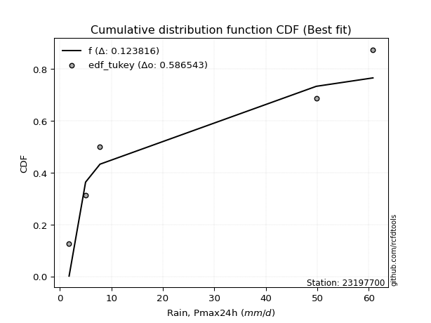</img>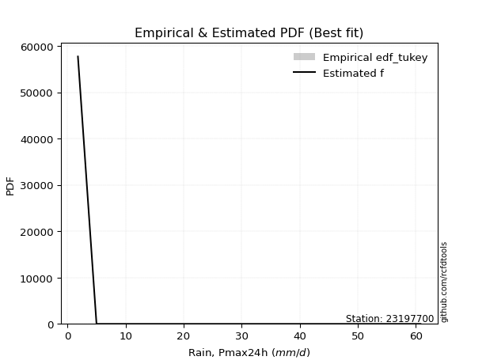</img>

</div>


### 8. EDF Gringorten (1963)

Gringorten plotting position formula is essential for estimating the probability and return periods of extreme events like floods and heavy rainfall. The constant _a=0.44_.

<div align="center">


$P=(m-a)/(n+1-2a)$


</div>


**8.1. Empirical values**

<div align="center">

|                | 0                   | 1                  | 2              | 3                 | 4                  |
|:---------------|:--------------------|:-------------------|:---------------|:------------------|:-------------------|
| date           | 2023                | 2021               | 2020           | 2022              | 2019               |
| x              | 1.8                 | 5.0                | 7.8            | 49.8              | 60.8               |
| m              | 1                   | 2                  | 3              | 4                 | 5                  |
| empirical_dist | edf_gringorten      | edf_gringorten     | edf_gringorten | edf_gringorten    | edf_gringorten     |
| empirical      | 0.10937500000000001 | 0.3046875          | 0.5            | 0.6953125         | 0.8906249999999999 |
| empirical_tr   | 1.1228070175438596  | 1.4382022471910112 | 2.0            | 3.282051282051282 | 9.142857142857133  |

</div>


**8.2. Kolmogorov-Smirnov fit test (sorted by Δ)**


<div align="center">

|                | 0                   | 1                   | 2                   | 3                   | 4                   | 5                   | 6                   | 7                   | 8                  | 9                   | 10                  | 11                  | 12                  | 13                 | 14                  | 15                  | 16                  | 17                  | 18                  | 19                  | 20                  | 21                  | 22                  | 23                 | 24                  | 25                  | 26                  | 27                 | 28                  | 29                  | 30                  | 31                  | 32                 | 33                  | 34                 | 35                  | 36                  | 37                  | 38                 | 39                  | 40                  | 41                  | 42                  | 43                  | 44                  | 45                  | 46                  | 47                  | 48                  | 49                  | 50                 | 51                 | 52                  | 53                 | 54                 | 55                  | 56                  | 57                  | 58                  | 59                  | 60                  | 61                  | 62                 | 63                 | 64                  | 65                  | 66                  | 67                  | 68                 | 69                  | 70                  | 71                  | 72                 | 73                 | 74                  | 75                  | 76                  | 77                  | 78                  | 79                  | 80                  | 81                  | 82                  | 83                  | 84                  | 85                 | 86                  | 87                 | 88                 | 89                  | 90                  | 91                  | 92                  | 93                  | 94                  | 95                 | 96                  | 97                 | 98                  | 99                  | 100                 | 101                 | 102                | 103                | 104                 | 105                | 106                 | 107                | 108                | 109                 | 110                 | 111                 | 112                | 113                 | 114                | 115                | 116                 | 117                 | 118                 | 119                | 120                | 121                | 122                 | 123                 | 124                | 125                 | 126                | 127                | 128                | 129                 | 130                | 131                 | 132                 | 133                 | 134                | 135                | 136                | 137                 | 138                | 139                | 140                | 141                 | 142                 | 143                 | 144                | 145                 | 146                | 147                | 148                | 149                | 150                | 151                 | 152                | 153                | 154                | 155                | 156                | 157                | 158                | 159                |
|:---------------|:--------------------|:--------------------|:--------------------|:--------------------|:--------------------|:--------------------|:--------------------|:--------------------|:-------------------|:--------------------|:--------------------|:--------------------|:--------------------|:-------------------|:--------------------|:--------------------|:--------------------|:--------------------|:--------------------|:--------------------|:--------------------|:--------------------|:--------------------|:-------------------|:--------------------|:--------------------|:--------------------|:-------------------|:--------------------|:--------------------|:--------------------|:--------------------|:-------------------|:--------------------|:-------------------|:--------------------|:--------------------|:--------------------|:-------------------|:--------------------|:--------------------|:--------------------|:--------------------|:--------------------|:--------------------|:--------------------|:--------------------|:--------------------|:--------------------|:--------------------|:-------------------|:-------------------|:--------------------|:-------------------|:-------------------|:--------------------|:--------------------|:--------------------|:--------------------|:--------------------|:--------------------|:--------------------|:-------------------|:-------------------|:--------------------|:--------------------|:--------------------|:--------------------|:-------------------|:--------------------|:--------------------|:--------------------|:-------------------|:-------------------|:--------------------|:--------------------|:--------------------|:--------------------|:--------------------|:--------------------|:--------------------|:--------------------|:--------------------|:--------------------|:--------------------|:-------------------|:--------------------|:-------------------|:-------------------|:--------------------|:--------------------|:--------------------|:--------------------|:--------------------|:--------------------|:-------------------|:--------------------|:-------------------|:--------------------|:--------------------|:--------------------|:--------------------|:-------------------|:-------------------|:--------------------|:-------------------|:--------------------|:-------------------|:-------------------|:--------------------|:--------------------|:--------------------|:-------------------|:--------------------|:-------------------|:-------------------|:--------------------|:--------------------|:--------------------|:-------------------|:-------------------|:-------------------|:--------------------|:--------------------|:-------------------|:--------------------|:-------------------|:-------------------|:-------------------|:--------------------|:-------------------|:--------------------|:--------------------|:--------------------|:-------------------|:-------------------|:-------------------|:--------------------|:-------------------|:-------------------|:-------------------|:--------------------|:--------------------|:--------------------|:-------------------|:--------------------|:-------------------|:-------------------|:-------------------|:-------------------|:-------------------|:--------------------|:-------------------|:-------------------|:-------------------|:-------------------|:-------------------|:-------------------|:-------------------|:-------------------|
| station        | 23197700            | 23197700            | 23197700            | 23197700            | 23197700            | 23197700            | 23197700            | 23197700            | 23197700           | 23197700            | 23197700            | 23197700            | 23197700            | 23197700           | 23197700            | 23197700            | 23197700            | 23197700            | 23197700            | 23197700            | 23197700            | 23197700            | 23197700            | 23197700           | 23197700            | 23197700            | 23197700            | 23197700           | 23197700            | 23197700            | 23197700            | 23197700            | 23197700           | 23197700            | 23197700           | 23197700            | 23197700            | 23197700            | 23197700           | 23197700            | 23197700            | 23197700            | 23197700            | 23197700            | 23197700            | 23197700            | 23197700            | 23197700            | 23197700            | 23197700            | 23197700           | 23197700           | 23197700            | 23197700           | 23197700           | 23197700            | 23197700            | 23197700            | 23197700            | 23197700            | 23197700            | 23197700            | 23197700           | 23197700           | 23197700            | 23197700            | 23197700            | 23197700            | 23197700           | 23197700            | 23197700            | 23197700            | 23197700           | 23197700           | 23197700            | 23197700            | 23197700            | 23197700            | 23197700            | 23197700            | 23197700            | 23197700            | 23197700            | 23197700            | 23197700            | 23197700           | 23197700            | 23197700           | 23197700           | 23197700            | 23197700            | 23197700            | 23197700            | 23197700            | 23197700            | 23197700           | 23197700            | 23197700           | 23197700            | 23197700            | 23197700            | 23197700            | 23197700           | 23197700           | 23197700            | 23197700           | 23197700            | 23197700           | 23197700           | 23197700            | 23197700            | 23197700            | 23197700           | 23197700            | 23197700           | 23197700           | 23197700            | 23197700            | 23197700            | 23197700           | 23197700           | 23197700           | 23197700            | 23197700            | 23197700           | 23197700            | 23197700           | 23197700           | 23197700           | 23197700            | 23197700           | 23197700            | 23197700            | 23197700            | 23197700           | 23197700           | 23197700           | 23197700            | 23197700           | 23197700           | 23197700           | 23197700            | 23197700            | 23197700            | 23197700           | 23197700            | 23197700           | 23197700           | 23197700           | 23197700           | 23197700           | 23197700            | 23197700           | 23197700           | 23197700           | 23197700           | 23197700           | 23197700           | 23197700           | 23197700           |
| empirical_dist | edf_gringorten      | edf_gringorten      | edf_gringorten      | edf_gringorten      | edf_gringorten      | edf_gringorten      | edf_gringorten      | edf_gringorten      | edf_gringorten     | edf_gringorten      | edf_gringorten      | edf_gringorten      | edf_gringorten      | edf_gringorten     | edf_gringorten      | edf_gringorten      | edf_gringorten      | edf_gringorten      | edf_gringorten      | edf_gringorten      | edf_gringorten      | edf_gringorten      | edf_gringorten      | edf_gringorten     | edf_gringorten      | edf_gringorten      | edf_gringorten      | edf_gringorten     | edf_gringorten      | edf_gringorten      | edf_gringorten      | edf_gringorten      | edf_gringorten     | edf_gringorten      | edf_gringorten     | edf_gringorten      | edf_gringorten      | edf_gringorten      | edf_gringorten     | edf_gringorten      | edf_gringorten      | edf_gringorten      | edf_gringorten      | edf_gringorten      | edf_gringorten      | edf_gringorten      | edf_gringorten      | edf_gringorten      | edf_gringorten      | edf_gringorten      | edf_gringorten     | edf_gringorten     | edf_gringorten      | edf_gringorten     | edf_gringorten     | edf_gringorten      | edf_gringorten      | edf_gringorten      | edf_gringorten      | edf_gringorten      | edf_gringorten      | edf_gringorten      | edf_gringorten     | edf_gringorten     | edf_gringorten      | edf_gringorten      | edf_gringorten      | edf_gringorten      | edf_gringorten     | edf_gringorten      | edf_gringorten      | edf_gringorten      | edf_gringorten     | edf_gringorten     | edf_gringorten      | edf_gringorten      | edf_gringorten      | edf_gringorten      | edf_gringorten      | edf_gringorten      | edf_gringorten      | edf_gringorten      | edf_gringorten      | edf_gringorten      | edf_gringorten      | edf_gringorten     | edf_gringorten      | edf_gringorten     | edf_gringorten     | edf_gringorten      | edf_gringorten      | edf_gringorten      | edf_gringorten      | edf_gringorten      | edf_gringorten      | edf_gringorten     | edf_gringorten      | edf_gringorten     | edf_gringorten      | edf_gringorten      | edf_gringorten      | edf_gringorten      | edf_gringorten     | edf_gringorten     | edf_gringorten      | edf_gringorten     | edf_gringorten      | edf_gringorten     | edf_gringorten     | edf_gringorten      | edf_gringorten      | edf_gringorten      | edf_gringorten     | edf_gringorten      | edf_gringorten     | edf_gringorten     | edf_gringorten      | edf_gringorten      | edf_gringorten      | edf_gringorten     | edf_gringorten     | edf_gringorten     | edf_gringorten      | edf_gringorten      | edf_gringorten     | edf_gringorten      | edf_gringorten     | edf_gringorten     | edf_gringorten     | edf_gringorten      | edf_gringorten     | edf_gringorten      | edf_gringorten      | edf_gringorten      | edf_gringorten     | edf_gringorten     | edf_gringorten     | edf_gringorten      | edf_gringorten     | edf_gringorten     | edf_gringorten     | edf_gringorten      | edf_gringorten      | edf_gringorten      | edf_gringorten     | edf_gringorten      | edf_gringorten     | edf_gringorten     | edf_gringorten     | edf_gringorten     | edf_gringorten     | edf_gringorten      | edf_gringorten     | edf_gringorten     | edf_gringorten     | edf_gringorten     | edf_gringorten     | edf_gringorten     | edf_gringorten     | edf_gringorten     |
| p_dist         | logarcsine          | logdweibull         | loglomax            | logksone            | f                   | logsemicircular     | logdgamma           | logvonmises         | wrapcauchy         | logexponpow         | loganglit           | weibull_min         | invgamma            | logburr12          | logloglaplace       | nct                 | logbeta             | dgamma              | logncf              | loginvweibull       | loggenlogistic      | loggenexpon         | logwrapcauchy       | ncf                | loghalfnorm         | logfatiguelife      | lograyleigh         | loginvgauss        | loghalfgennorm      | logmaxwell          | logkstwobign        | burr                | logrice            | betaprime           | loginvgamma        | lomax               | loggompertz         | gengamma            | logfoldnorm        | logalpha            | arcsine             | logpearson3         | logerlang           | loggamma            | loggamma            | logskewnorm         | logt                | logexponnorm        | logcrystalball      | lognorm             | lognct             | loggenpareto       | logloggamma         | exponweib          | dweibull           | logrdist            | loghalflogistic     | logtrapezoid        | loggumbel_r         | logbetaprime        | loggausshyper       | vonmises_line       | logcosine          | logmoyal           | loglogistic         | invgauss            | loghypsecant        | loggenhalflogistic  | alpha              | halfgennorm         | loglaplace          | loglaplace          | loggennorm         | logargus           | loggumbel_l         | burr12              | logwald             | levy_l              | ksone               | halfnorm            | kappa4              | logmielke           | exponpow            | semicircular        | logtriang           | logweibull_max     | foldnorm            | halflogistic       | logburr            | logf                | rayleigh            | anglit              | loglevy_l           | t                   | maxwell             | gennorm            | genlogistic         | pearson3           | gumbel_r            | logtukeylambda      | moyal               | logkappa3           | logkappa4          | loguniform         | logvonmises_line    | loggengamma        | truncpareto         | truncweibull_min   | johnsonsu          | norm                | crystalball         | logweibull_min      | kstwobign          | logbradford         | logtruncexpon      | gamma              | logexponweib        | gompertz            | exponnorm           | logtruncnorm       | erlang             | genexpon           | loggenextreme       | logtruncweibull_min | logistic           | cosine              | gausshyper         | rice               | truncnorm          | hypsecant           | gumbel_l           | lognakagami         | laplace             | argus               | wald               | triang             | beta               | truncexpon          | genextreme         | fatiguelife        | nakagami           | johnsonsb           | skewnorm            | bradford            | tukeylambda        | genpareto           | uniform            | genhalflogistic    | logjohnsonsb       | powerlaw           | kappa3             | trapezoid           | mielke             | weibull_max        | logpowerlaw        | logtruncpareto     | rdist              | logjohnsonsu       | invweibull         | vonmises           |
| delta          | 0.07855564171063267 | 0.09837571788119048 | 0.10937499999437245 | 0.11417719416171335 | 0.12486183298611131 | 0.12881617172917248 | 0.13265308612441062 | 0.13335224138006663 | 0.1352763680348832 | 0.13542626908423228 | 0.13922459482702831 | 0.14169183203259927 | 0.14351222010103082 | 0.1442092885753452 | 0.14425797740411128 | 0.14484190302531075 | 0.14546726913320507 | 0.14552572977505895 | 0.15096540495050814 | 0.15118456516795498 | 0.15136249900766174 | 0.15243558423697334 | 0.15284040624150086 | 0.1543945228637731 | 0.15599102470170678 | 0.15693618878370796 | 0.15695593046438217 | 0.1574620066226875 | 0.15777260736944176 | 0.15819198740493678 | 0.15905236344084772 | 0.15972356472910554 | 0.1598752118523019 | 0.16086145321209555 | 0.1608655283808349 | 0.16110770181061196 | 0.16159395977985935 | 0.16182686834930093 | 0.1620840581654288 | 0.16234791642530877 | 0.16256736194277877 | 0.16266606487792523 | 0.16272066221437087 | 0.16277018216215478 | 0.16277018216215478 | 0.16284825987411589 | 0.16285009362326508 | 0.16285040455900845 | 0.16285078161404543 | 0.16285078250905394 | 0.1629007072556522 | 0.1630904752649076 | 0.16319648005011822 | 0.1639406123392817 | 0.1671574014823014 | 0.16996013638299134 | 0.17150487399812786 | 0.17216948955986366 | 0.17234742756452448 | 0.17343479796395783 | 0.17454482327399085 | 0.17467279192606194 | 0.1755289154095555 | 0.176735036330937  | 0.17954206269535744 | 0.18610279417469977 | 0.18784825465804023 | 0.19025666512297668 | 0.1908617082914057 | 0.19457090463791016 | 0.19491341998946643 | 0.19491341998946643 | 0.1953125          | 0.1956995891558453 | 0.19615158433534852 | 0.19773675142277547 | 0.19777333566640554 | 0.19780775514310922 | 0.19888741689935224 | 0.20203962388220953 | 0.20598776207537728 | 0.21081877654575532 | 0.21267921406286944 | 0.21488664539211344 | 0.21661985227577218 | 0.2175943627402172 | 0.21761777502336271 | 0.2176570082164765 | 0.2222451924159543 | 0.22244040760501893 | 0.22501731777098333 | 0.22689939053213876 | 0.22779143357575848 | 0.22977383243557514 | 0.23366084894113376 | 0.2387931994385405 | 0.24015098436705606 | 0.2428453141769789 | 0.24296675717399963 | 0.24466136123120208 | 0.24525739634364163 | 0.24575386965115908 | 0.2458356280145052 | 0.2479869409327239 | 0.24829651277340437 | 0.2522561041584487 | 0.25295098281609224 | 0.2538964828732747 | 0.2539793426708693 | 0.25457773793053967 | 0.25457774150289264 | 0.25639102884882425 | 0.2570953814684309 | 0.26257374036381165 | 0.2666283232763641 | 0.2687361520196955 | 0.26998472208873703 | 0.27011564516905606 | 0.27068185021471236 | 0.2711956364474376 | 0.272236677362394  | 0.2724614760355339 | 0.27477202768398057 | 0.2761191678917043  | 0.2772386618800744 | 0.28317820693500506 | 0.2832322407808433 | 0.2883492898651565 | 0.2903625216377731 | 0.29201705805358646 | 0.2929150809025953 | 0.30202867315436865 | 0.31128032308920095 | 0.31748980343939004 | 0.3224364712231669 | 0.3271071739047989 | 0.3353718364945906 | 0.34349012504706705 | 0.345980901023088  | 0.3520835291534352 | 0.3536912260328694 | 0.35737710019954727 | 0.36051337865706645 | 0.37825839923944365 | 0.3901708266426809 | 0.39119736173386976 | 0.3983050847457627 | 0.403280866490495  | 0.4098102326320203 | 0.4214125451766928 | 0.4427079210936901 | 0.47076769426888826 | 0.4767725678406689 | 0.502944881738642  | 0.5525988292892126 | 0.5698050417321361 | 0.5827178273481053 | 0.6217835308294996 | 0.6920330418304428 | 9.329648179124188  |
| deltao         | 0.5865427407550001  | 0.5865427407550001  | 0.5865427407550001  | 0.5865427407550001  | 0.5865427407550001  | 0.5865427407550001  | 0.5865427407550001  | 0.5865427407550001  | 0.5865427407550001 | 0.5865427407550001  | 0.5865427407550001  | 0.5865427407550001  | 0.5865427407550001  | 0.5865427407550001 | 0.5865427407550001  | 0.5865427407550001  | 0.5865427407550001  | 0.5865427407550001  | 0.5865427407550001  | 0.5865427407550001  | 0.5865427407550001  | 0.5865427407550001  | 0.5865427407550001  | 0.5865427407550001 | 0.5865427407550001  | 0.5865427407550001  | 0.5865427407550001  | 0.5865427407550001 | 0.5865427407550001  | 0.5865427407550001  | 0.5865427407550001  | 0.5865427407550001  | 0.5865427407550001 | 0.5865427407550001  | 0.5865427407550001 | 0.5865427407550001  | 0.5865427407550001  | 0.5865427407550001  | 0.5865427407550001 | 0.5865427407550001  | 0.5865427407550001  | 0.5865427407550001  | 0.5865427407550001  | 0.5865427407550001  | 0.5865427407550001  | 0.5865427407550001  | 0.5865427407550001  | 0.5865427407550001  | 0.5865427407550001  | 0.5865427407550001  | 0.5865427407550001 | 0.5865427407550001 | 0.5865427407550001  | 0.5865427407550001 | 0.5865427407550001 | 0.5865427407550001  | 0.5865427407550001  | 0.5865427407550001  | 0.5865427407550001  | 0.5865427407550001  | 0.5865427407550001  | 0.5865427407550001  | 0.5865427407550001 | 0.5865427407550001 | 0.5865427407550001  | 0.5865427407550001  | 0.5865427407550001  | 0.5865427407550001  | 0.5865427407550001 | 0.5865427407550001  | 0.5865427407550001  | 0.5865427407550001  | 0.5865427407550001 | 0.5865427407550001 | 0.5865427407550001  | 0.5865427407550001  | 0.5865427407550001  | 0.5865427407550001  | 0.5865427407550001  | 0.5865427407550001  | 0.5865427407550001  | 0.5865427407550001  | 0.5865427407550001  | 0.5865427407550001  | 0.5865427407550001  | 0.5865427407550001 | 0.5865427407550001  | 0.5865427407550001 | 0.5865427407550001 | 0.5865427407550001  | 0.5865427407550001  | 0.5865427407550001  | 0.5865427407550001  | 0.5865427407550001  | 0.5865427407550001  | 0.5865427407550001 | 0.5865427407550001  | 0.5865427407550001 | 0.5865427407550001  | 0.5865427407550001  | 0.5865427407550001  | 0.5865427407550001  | 0.5865427407550001 | 0.5865427407550001 | 0.5865427407550001  | 0.5865427407550001 | 0.5865427407550001  | 0.5865427407550001 | 0.5865427407550001 | 0.5865427407550001  | 0.5865427407550001  | 0.5865427407550001  | 0.5865427407550001 | 0.5865427407550001  | 0.5865427407550001 | 0.5865427407550001 | 0.5865427407550001  | 0.5865427407550001  | 0.5865427407550001  | 0.5865427407550001 | 0.5865427407550001 | 0.5865427407550001 | 0.5865427407550001  | 0.5865427407550001  | 0.5865427407550001 | 0.5865427407550001  | 0.5865427407550001 | 0.5865427407550001 | 0.5865427407550001 | 0.5865427407550001  | 0.5865427407550001 | 0.5865427407550001  | 0.5865427407550001  | 0.5865427407550001  | 0.5865427407550001 | 0.5865427407550001 | 0.5865427407550001 | 0.5865427407550001  | 0.5865427407550001 | 0.5865427407550001 | 0.5865427407550001 | 0.5865427407550001  | 0.5865427407550001  | 0.5865427407550001  | 0.5865427407550001 | 0.5865427407550001  | 0.5865427407550001 | 0.5865427407550001 | 0.5865427407550001 | 0.5865427407550001 | 0.5865427407550001 | 0.5865427407550001  | 0.5865427407550001 | 0.5865427407550001 | 0.5865427407550001 | 0.5865427407550001 | 0.5865427407550001 | 0.5865427407550001 | 0.5865427407550001 | 0.5865427407550001 |
| eval           | Δo > Δ              | Δo > Δ              | Δo > Δ              | Δo > Δ              | Δo > Δ              | Δo > Δ              | Δo > Δ              | Δo > Δ              | Δo > Δ             | Δo > Δ              | Δo > Δ              | Δo > Δ              | Δo > Δ              | Δo > Δ             | Δo > Δ              | Δo > Δ              | Δo > Δ              | Δo > Δ              | Δo > Δ              | Δo > Δ              | Δo > Δ              | Δo > Δ              | Δo > Δ              | Δo > Δ             | Δo > Δ              | Δo > Δ              | Δo > Δ              | Δo > Δ             | Δo > Δ              | Δo > Δ              | Δo > Δ              | Δo > Δ              | Δo > Δ             | Δo > Δ              | Δo > Δ             | Δo > Δ              | Δo > Δ              | Δo > Δ              | Δo > Δ             | Δo > Δ              | Δo > Δ              | Δo > Δ              | Δo > Δ              | Δo > Δ              | Δo > Δ              | Δo > Δ              | Δo > Δ              | Δo > Δ              | Δo > Δ              | Δo > Δ              | Δo > Δ             | Δo > Δ             | Δo > Δ              | Δo > Δ             | Δo > Δ             | Δo > Δ              | Δo > Δ              | Δo > Δ              | Δo > Δ              | Δo > Δ              | Δo > Δ              | Δo > Δ              | Δo > Δ             | Δo > Δ             | Δo > Δ              | Δo > Δ              | Δo > Δ              | Δo > Δ              | Δo > Δ             | Δo > Δ              | Δo > Δ              | Δo > Δ              | Δo > Δ             | Δo > Δ             | Δo > Δ              | Δo > Δ              | Δo > Δ              | Δo > Δ              | Δo > Δ              | Δo > Δ              | Δo > Δ              | Δo > Δ              | Δo > Δ              | Δo > Δ              | Δo > Δ              | Δo > Δ             | Δo > Δ              | Δo > Δ             | Δo > Δ             | Δo > Δ              | Δo > Δ              | Δo > Δ              | Δo > Δ              | Δo > Δ              | Δo > Δ              | Δo > Δ             | Δo > Δ              | Δo > Δ             | Δo > Δ              | Δo > Δ              | Δo > Δ              | Δo > Δ              | Δo > Δ             | Δo > Δ             | Δo > Δ              | Δo > Δ             | Δo > Δ              | Δo > Δ             | Δo > Δ             | Δo > Δ              | Δo > Δ              | Δo > Δ              | Δo > Δ             | Δo > Δ              | Δo > Δ             | Δo > Δ             | Δo > Δ              | Δo > Δ              | Δo > Δ              | Δo > Δ             | Δo > Δ             | Δo > Δ             | Δo > Δ              | Δo > Δ              | Δo > Δ             | Δo > Δ              | Δo > Δ             | Δo > Δ             | Δo > Δ             | Δo > Δ              | Δo > Δ             | Δo > Δ              | Δo > Δ              | Δo > Δ              | Δo > Δ             | Δo > Δ             | Δo > Δ             | Δo > Δ              | Δo > Δ             | Δo > Δ             | Δo > Δ             | Δo > Δ              | Δo > Δ              | Δo > Δ              | Δo > Δ             | Δo > Δ              | Δo > Δ             | Δo > Δ             | Δo > Δ             | Δo > Δ             | Δo > Δ             | Δo > Δ              | Δo > Δ             | Δo > Δ             | Δo > Δ             | Δo > Δ             | Δo > Δ             | Δo <= Δ            | Δo <= Δ            | Δo <= Δ            |
| fit            | 1                   | 1                   | 1                   | 1                   | 1                   | 1                   | 1                   | 1                   | 1                  | 1                   | 1                   | 1                   | 1                   | 1                  | 1                   | 1                   | 1                   | 1                   | 1                   | 1                   | 1                   | 1                   | 1                   | 1                  | 1                   | 1                   | 1                   | 1                  | 1                   | 1                   | 1                   | 1                   | 1                  | 1                   | 1                  | 1                   | 1                   | 1                   | 1                  | 1                   | 1                   | 1                   | 1                   | 1                   | 1                   | 1                   | 1                   | 1                   | 1                   | 1                   | 1                  | 1                  | 1                   | 1                  | 1                  | 1                   | 1                   | 1                   | 1                   | 1                   | 1                   | 1                   | 1                  | 1                  | 1                   | 1                   | 1                   | 1                   | 1                  | 1                   | 1                   | 1                   | 1                  | 1                  | 1                   | 1                   | 1                   | 1                   | 1                   | 1                   | 1                   | 1                   | 1                   | 1                   | 1                   | 1                  | 1                   | 1                  | 1                  | 1                   | 1                   | 1                   | 1                   | 1                   | 1                   | 1                  | 1                   | 1                  | 1                   | 1                   | 1                   | 1                   | 1                  | 1                  | 1                   | 1                  | 1                   | 1                  | 1                  | 1                   | 1                   | 1                   | 1                  | 1                   | 1                  | 1                  | 1                   | 1                   | 1                   | 1                  | 1                  | 1                  | 1                   | 1                   | 1                  | 1                   | 1                  | 1                  | 1                  | 1                   | 1                  | 1                   | 1                   | 1                   | 1                  | 1                  | 1                  | 1                   | 1                  | 1                  | 1                  | 1                   | 1                   | 1                   | 1                  | 1                   | 1                  | 1                  | 1                  | 1                  | 1                  | 1                   | 1                  | 1                  | 1                  | 1                  | 1                  | 0                  | 0                  | 0                  |
| n              | 5                   | 5                   | 5                   | 5                   | 5                   | 5                   | 5                   | 5                   | 5                  | 5                   | 5                   | 5                   | 5                   | 5                  | 5                   | 5                   | 5                   | 5                   | 5                   | 5                   | 5                   | 5                   | 5                   | 5                  | 5                   | 5                   | 5                   | 5                  | 5                   | 5                   | 5                   | 5                   | 5                  | 5                   | 5                  | 5                   | 5                   | 5                   | 5                  | 5                   | 5                   | 5                   | 5                   | 5                   | 5                   | 5                   | 5                   | 5                   | 5                   | 5                   | 5                  | 5                  | 5                   | 5                  | 5                  | 5                   | 5                   | 5                   | 5                   | 5                   | 5                   | 5                   | 5                  | 5                  | 5                   | 5                   | 5                   | 5                   | 5                  | 5                   | 5                   | 5                   | 5                  | 5                  | 5                   | 5                   | 5                   | 5                   | 5                   | 5                   | 5                   | 5                   | 5                   | 5                   | 5                   | 5                  | 5                   | 5                  | 5                  | 5                   | 5                   | 5                   | 5                   | 5                   | 5                   | 5                  | 5                   | 5                  | 5                   | 5                   | 5                   | 5                   | 5                  | 5                  | 5                   | 5                  | 5                   | 5                  | 5                  | 5                   | 5                   | 5                   | 5                  | 5                   | 5                  | 5                  | 5                   | 5                   | 5                   | 5                  | 5                  | 5                  | 5                   | 5                   | 5                  | 5                   | 5                  | 5                  | 5                  | 5                   | 5                  | 5                   | 5                   | 5                   | 5                  | 5                  | 5                  | 5                   | 5                  | 5                  | 5                  | 5                   | 5                   | 5                   | 5                  | 5                   | 5                  | 5                  | 5                  | 5                  | 5                  | 5                   | 5                  | 5                  | 5                  | 5                  | 5                  | 5                  | 5                  | 5                  |
| best_fit       | 1                   | 0                   | 0                   | 0                   | 0                   | 0                   | 0                   | 0                   | 0                  | 0                   | 0                   | 0                   | 0                   | 0                  | 0                   | 0                   | 0                   | 0                   | 0                   | 0                   | 0                   | 0                   | 0                   | 0                  | 0                   | 0                   | 0                   | 0                  | 0                   | 0                   | 0                   | 0                   | 0                  | 0                   | 0                  | 0                   | 0                   | 0                   | 0                  | 0                   | 0                   | 0                   | 0                   | 0                   | 0                   | 0                   | 0                   | 0                   | 0                   | 0                   | 0                  | 0                  | 0                   | 0                  | 0                  | 0                   | 0                   | 0                   | 0                   | 0                   | 0                   | 0                   | 0                  | 0                  | 0                   | 0                   | 0                   | 0                   | 0                  | 0                   | 0                   | 0                   | 0                  | 0                  | 0                   | 0                   | 0                   | 0                   | 0                   | 0                   | 0                   | 0                   | 0                   | 0                   | 0                   | 0                  | 0                   | 0                  | 0                  | 0                   | 0                   | 0                   | 0                   | 0                   | 0                   | 0                  | 0                   | 0                  | 0                   | 0                   | 0                   | 0                   | 0                  | 0                  | 0                   | 0                  | 0                   | 0                  | 0                  | 0                   | 0                   | 0                   | 0                  | 0                   | 0                  | 0                  | 0                   | 0                   | 0                   | 0                  | 0                  | 0                  | 0                   | 0                   | 0                  | 0                   | 0                  | 0                  | 0                  | 0                   | 0                  | 0                   | 0                   | 0                   | 0                  | 0                  | 0                  | 0                   | 0                  | 0                  | 0                  | 0                   | 0                   | 0                   | 0                  | 0                   | 0                  | 0                  | 0                  | 0                  | 0                  | 0                   | 0                  | 0                  | 0                  | 0                  | 0                  | 0                  | 0                  | 0                  |
| best_fit_sort  | 1                   | 2                   | 3                   | 4                   | 5                   | 6                   | 7                   | 8                   | 9                  | 10                  | 11                  | 12                  | 13                  | 14                 | 15                  | 16                  | 17                  | 18                  | 19                  | 20                  | 21                  | 22                  | 23                  | 24                 | 25                  | 26                  | 27                  | 28                 | 29                  | 30                  | 31                  | 32                  | 33                 | 34                  | 35                 | 36                  | 37                  | 38                  | 39                 | 40                  | 41                  | 42                  | 43                  | 44                  | 45                  | 46                  | 47                  | 48                  | 49                  | 50                  | 51                 | 52                 | 53                  | 54                 | 55                 | 56                  | 57                  | 58                  | 59                  | 60                  | 61                  | 62                  | 63                 | 64                 | 65                  | 66                  | 67                  | 68                  | 69                 | 70                  | 71                  | 72                  | 73                 | 74                 | 75                  | 76                  | 77                  | 78                  | 79                  | 80                  | 81                  | 82                  | 83                  | 84                  | 85                  | 86                 | 87                  | 88                 | 89                 | 90                  | 91                  | 92                  | 93                  | 94                  | 95                  | 96                 | 97                  | 98                 | 99                  | 100                 | 101                 | 102                 | 103                | 104                | 105                 | 106                | 107                 | 108                | 109                | 110                 | 111                 | 112                 | 113                | 114                 | 115                | 116                | 117                 | 118                 | 119                 | 120                | 121                | 122                | 123                 | 124                 | 125                | 126                 | 127                | 128                | 129                | 130                 | 131                | 132                 | 133                 | 134                 | 135                | 136                | 137                | 138                 | 139                | 140                | 141                | 142                 | 143                 | 144                 | 145                | 146                 | 147                | 148                | 149                | 150                | 151                | 152                 | 153                | 154                | 155                | 156                | 157                | 158                | 159                | 160                |

</div>


**8.3. Best fit**

<div align="center">

|   id |   station | empirical_dist   | p_dist     |     delta |   deltao | eval   |   fit |   n |   best_fit |   best_fit_sort |
|-----:|----------:|:-----------------|:-----------|----------:|---------:|:-------|------:|----:|-----------:|----------------:|
|    0 |  23197700 | edf_gringorten   | logarcsine | 0.0785556 | 0.586543 | Δo > Δ |     1 |   5 |          1 |               1 |

</div>


<div align="center">

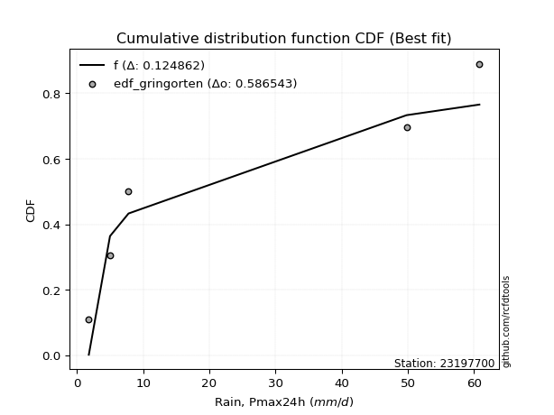</img></img>

</div>


### 9. EDF Filliben (1975)

The specific values of the constants (0.3175) (often denoted as $alpha$) and (0.365) are derived from a method proposed by James J. Filliben in a 1975 paper. This particular formula is the mean value of the $i$-th order statistic of the normal distribution and is considered a robust and effective plotting position formula for the normal probability plot correlation coefficient test for normality.

<div align="center">


$P=(m-0.3175)/(n+0.365)$


</div>


**9.1. Empirical values**

<div align="center">

|                | 0                   | 1                  | 2            | 3                  | 4                  |
|:---------------|:--------------------|:-------------------|:-------------|:-------------------|:-------------------|
| date           | 2023                | 2021               | 2020         | 2022               | 2019               |
| x              | 1.8                 | 5.0                | 7.8          | 49.8               | 60.8               |
| m              | 1                   | 2                  | 3            | 4                  | 5                  |
| empirical_dist | edf_filliben        | edf_filliben       | edf_filliben | edf_filliben       | edf_filliben       |
| empirical      | 0.12721342031686858 | 0.3136067101584343 | 0.5          | 0.6863932898415657 | 0.8727865796831314 |
| empirical_tr   | 1.1457554725040042  | 1.456890699253225  | 2.0          | 3.188707280832095  | 7.860805860805863  |

</div>


**9.2. Kolmogorov-Smirnov fit test (sorted by Δ)**


<div align="center">

|                | 0                  | 1                   | 2                   | 3                   | 4                   | 5                  | 6                   | 7                   | 8                   | 9                  | 10                  | 11                  | 12                 | 13                  | 14                  | 15                  | 16                 | 17                 | 18                  | 19                 | 20                  | 21                  | 22                 | 23                  | 24                  | 25                  | 26                 | 27                  | 28                  | 29                 | 30                 | 31                 | 32                  | 33                 | 34                  | 35                  | 36                  | 37                  | 38                  | 39                  | 40                 | 41                  | 42                  | 43                  | 44                  | 45                 | 46                 | 47                 | 48                  | 49                 | 50                 | 51                  | 52                  | 53                  | 54                  | 55                  | 56                  | 57                  | 58                  | 59                  | 60                  | 61                 | 62                 | 63                 | 64                  | 65                  | 66                  | 67                  | 68                 | 69                  | 70                  | 71                 | 72                  | 73                  | 74                 | 75                  | 76                  | 77                  | 78                  | 79                  | 80                  | 81                  | 82                  | 83                  | 84                 | 85                  | 86                 | 87                  | 88                  | 89                  | 90                  | 91                  | 92                  | 93                  | 94                  | 95                  | 96                 | 97                  | 98                 | 99                  | 100                 | 101                 | 102                | 103                | 104                 | 105                 | 106                | 107                 | 108                | 109                | 110                | 111                 | 112                 | 113                 | 114                 | 115                | 116                | 117                 | 118                 | 119                | 120                | 121                 | 122                 | 123                | 124                 | 125                | 126                 | 127                | 128                | 129                 | 130                | 131                 | 132                 | 133                 | 134                | 135                | 136                 | 137                | 138                 | 139                 | 140                | 141                | 142                 | 143                 | 144                | 145                 | 146                 | 147                | 148                | 149                | 150                | 151                | 152                 | 153                | 154                | 155                | 156                | 157                | 158                | 159                |
|:---------------|:-------------------|:--------------------|:--------------------|:--------------------|:--------------------|:-------------------|:--------------------|:--------------------|:--------------------|:-------------------|:--------------------|:--------------------|:-------------------|:--------------------|:--------------------|:--------------------|:-------------------|:-------------------|:--------------------|:-------------------|:--------------------|:--------------------|:-------------------|:--------------------|:--------------------|:--------------------|:-------------------|:--------------------|:--------------------|:-------------------|:-------------------|:-------------------|:--------------------|:-------------------|:--------------------|:--------------------|:--------------------|:--------------------|:--------------------|:--------------------|:-------------------|:--------------------|:--------------------|:--------------------|:--------------------|:-------------------|:-------------------|:-------------------|:--------------------|:-------------------|:-------------------|:--------------------|:--------------------|:--------------------|:--------------------|:--------------------|:--------------------|:--------------------|:--------------------|:--------------------|:--------------------|:-------------------|:-------------------|:-------------------|:--------------------|:--------------------|:--------------------|:--------------------|:-------------------|:--------------------|:--------------------|:-------------------|:--------------------|:--------------------|:-------------------|:--------------------|:--------------------|:--------------------|:--------------------|:--------------------|:--------------------|:--------------------|:--------------------|:--------------------|:-------------------|:--------------------|:-------------------|:--------------------|:--------------------|:--------------------|:--------------------|:--------------------|:--------------------|:--------------------|:--------------------|:--------------------|:-------------------|:--------------------|:-------------------|:--------------------|:--------------------|:--------------------|:-------------------|:-------------------|:--------------------|:--------------------|:-------------------|:--------------------|:-------------------|:-------------------|:-------------------|:--------------------|:--------------------|:--------------------|:--------------------|:-------------------|:-------------------|:--------------------|:--------------------|:-------------------|:-------------------|:--------------------|:--------------------|:-------------------|:--------------------|:-------------------|:--------------------|:-------------------|:-------------------|:--------------------|:-------------------|:--------------------|:--------------------|:--------------------|:-------------------|:-------------------|:--------------------|:-------------------|:--------------------|:--------------------|:-------------------|:-------------------|:--------------------|:--------------------|:-------------------|:--------------------|:--------------------|:-------------------|:-------------------|:-------------------|:-------------------|:-------------------|:--------------------|:-------------------|:-------------------|:-------------------|:-------------------|:-------------------|:-------------------|:-------------------|
| station        | 23197700           | 23197700            | 23197700            | 23197700            | 23197700            | 23197700           | 23197700            | 23197700            | 23197700            | 23197700           | 23197700            | 23197700            | 23197700           | 23197700            | 23197700            | 23197700            | 23197700           | 23197700           | 23197700            | 23197700           | 23197700            | 23197700            | 23197700           | 23197700            | 23197700            | 23197700            | 23197700           | 23197700            | 23197700            | 23197700           | 23197700           | 23197700           | 23197700            | 23197700           | 23197700            | 23197700            | 23197700            | 23197700            | 23197700            | 23197700            | 23197700           | 23197700            | 23197700            | 23197700            | 23197700            | 23197700           | 23197700           | 23197700           | 23197700            | 23197700           | 23197700           | 23197700            | 23197700            | 23197700            | 23197700            | 23197700            | 23197700            | 23197700            | 23197700            | 23197700            | 23197700            | 23197700           | 23197700           | 23197700           | 23197700            | 23197700            | 23197700            | 23197700            | 23197700           | 23197700            | 23197700            | 23197700           | 23197700            | 23197700            | 23197700           | 23197700            | 23197700            | 23197700            | 23197700            | 23197700            | 23197700            | 23197700            | 23197700            | 23197700            | 23197700           | 23197700            | 23197700           | 23197700            | 23197700            | 23197700            | 23197700            | 23197700            | 23197700            | 23197700            | 23197700            | 23197700            | 23197700           | 23197700            | 23197700           | 23197700            | 23197700            | 23197700            | 23197700           | 23197700           | 23197700            | 23197700            | 23197700           | 23197700            | 23197700           | 23197700           | 23197700           | 23197700            | 23197700            | 23197700            | 23197700            | 23197700           | 23197700           | 23197700            | 23197700            | 23197700           | 23197700           | 23197700            | 23197700            | 23197700           | 23197700            | 23197700           | 23197700            | 23197700           | 23197700           | 23197700            | 23197700           | 23197700            | 23197700            | 23197700            | 23197700           | 23197700           | 23197700            | 23197700           | 23197700            | 23197700            | 23197700           | 23197700           | 23197700            | 23197700            | 23197700           | 23197700            | 23197700            | 23197700           | 23197700           | 23197700           | 23197700           | 23197700           | 23197700            | 23197700           | 23197700           | 23197700           | 23197700           | 23197700           | 23197700           | 23197700           |
| empirical_dist | edf_filliben       | edf_filliben        | edf_filliben        | edf_filliben        | edf_filliben        | edf_filliben       | edf_filliben        | edf_filliben        | edf_filliben        | edf_filliben       | edf_filliben        | edf_filliben        | edf_filliben       | edf_filliben        | edf_filliben        | edf_filliben        | edf_filliben       | edf_filliben       | edf_filliben        | edf_filliben       | edf_filliben        | edf_filliben        | edf_filliben       | edf_filliben        | edf_filliben        | edf_filliben        | edf_filliben       | edf_filliben        | edf_filliben        | edf_filliben       | edf_filliben       | edf_filliben       | edf_filliben        | edf_filliben       | edf_filliben        | edf_filliben        | edf_filliben        | edf_filliben        | edf_filliben        | edf_filliben        | edf_filliben       | edf_filliben        | edf_filliben        | edf_filliben        | edf_filliben        | edf_filliben       | edf_filliben       | edf_filliben       | edf_filliben        | edf_filliben       | edf_filliben       | edf_filliben        | edf_filliben        | edf_filliben        | edf_filliben        | edf_filliben        | edf_filliben        | edf_filliben        | edf_filliben        | edf_filliben        | edf_filliben        | edf_filliben       | edf_filliben       | edf_filliben       | edf_filliben        | edf_filliben        | edf_filliben        | edf_filliben        | edf_filliben       | edf_filliben        | edf_filliben        | edf_filliben       | edf_filliben        | edf_filliben        | edf_filliben       | edf_filliben        | edf_filliben        | edf_filliben        | edf_filliben        | edf_filliben        | edf_filliben        | edf_filliben        | edf_filliben        | edf_filliben        | edf_filliben       | edf_filliben        | edf_filliben       | edf_filliben        | edf_filliben        | edf_filliben        | edf_filliben        | edf_filliben        | edf_filliben        | edf_filliben        | edf_filliben        | edf_filliben        | edf_filliben       | edf_filliben        | edf_filliben       | edf_filliben        | edf_filliben        | edf_filliben        | edf_filliben       | edf_filliben       | edf_filliben        | edf_filliben        | edf_filliben       | edf_filliben        | edf_filliben       | edf_filliben       | edf_filliben       | edf_filliben        | edf_filliben        | edf_filliben        | edf_filliben        | edf_filliben       | edf_filliben       | edf_filliben        | edf_filliben        | edf_filliben       | edf_filliben       | edf_filliben        | edf_filliben        | edf_filliben       | edf_filliben        | edf_filliben       | edf_filliben        | edf_filliben       | edf_filliben       | edf_filliben        | edf_filliben       | edf_filliben        | edf_filliben        | edf_filliben        | edf_filliben       | edf_filliben       | edf_filliben        | edf_filliben       | edf_filliben        | edf_filliben        | edf_filliben       | edf_filliben       | edf_filliben        | edf_filliben        | edf_filliben       | edf_filliben        | edf_filliben        | edf_filliben       | edf_filliben       | edf_filliben       | edf_filliben       | edf_filliben       | edf_filliben        | edf_filliben       | edf_filliben       | edf_filliben       | edf_filliben       | edf_filliben       | edf_filliben       | edf_filliben       |
| p_dist         | logarcsine         | logdweibull         | logdgamma           | logksone            | f                   | wrapcauchy         | weibull_min         | loglomax            | dgamma              | logsemicircular    | logvonmises         | logwrapcauchy       | logexponpow        | loganglit           | invgamma            | logburr12           | logloglaplace      | logalpha           | nct                 | logbeta            | dweibull            | logncf              | loginvweibull      | loggenlogistic      | loggenexpon         | arcsine             | loggenpareto       | ncf                 | logbetaprime        | loghalfnorm        | logfatiguelife     | lograyleigh        | loginvgauss         | loghalfgennorm     | logmaxwell          | logkstwobign        | burr                | logrice             | betaprime           | loginvgamma         | lomax              | loggompertz         | gengamma            | logfoldnorm         | logpearson3         | logerlang          | loggamma           | loggamma           | logskewnorm         | logt               | logexponnorm       | logcrystalball      | lognorm             | lognct              | logloggamma         | exponweib           | loggausshyper       | vonmises_line       | logrdist            | burr12              | levy_l              | loghalflogistic    | logtrapezoid       | loggumbel_r        | logcosine           | logmoyal            | loggennorm          | loglogistic         | invgauss           | loghypsecant        | ksone               | loggenhalflogistic | alpha               | halfnorm            | halfgennorm        | loglaplace          | loglaplace          | logargus            | loggumbel_l         | kappa4              | logwald             | exponpow            | logf                | semicircular        | logweibull_max     | foldnorm            | halflogistic       | logmielke           | rayleigh            | logtriang           | anglit              | loglevy_l           | logburr             | maxwell             | t                   | genlogistic         | pearson3           | gumbel_r            | loggengamma        | moyal               | logweibull_min      | gennorm             | logtukeylambda     | johnsonsu          | norm                | crystalball         | logkappa3          | logkappa4           | loguniform         | kstwobign          | logvonmises_line   | truncpareto         | truncweibull_min    | gompertz            | exponnorm           | logbradford        | genexpon           | loggenextreme       | logtruncexpon       | logistic           | gamma              | logexponweib        | logtruncnorm        | erlang             | cosine              | gausshyper         | logtruncweibull_min | rice               | truncnorm          | hypsecant           | gumbel_l           | lognakagami         | laplace             | argus               | wald               | triang             | genextreme          | beta               | fatiguelife         | truncexpon          | nakagami           | johnsonsb          | skewnorm            | bradford            | tukeylambda        | genpareto           | logjohnsonsb        | uniform            | genhalflogistic    | powerlaw           | kappa3             | mielke             | trapezoid           | weibull_max        | logpowerlaw        | logtruncpareto     | rdist              | logjohnsonsu       | invweibull         | vonmises           |
| delta          | 0.087474851869067  | 0.10262941691310376 | 0.11481466580754218 | 0.12309640432014768 | 0.12602910007197166 | 0.1272133092408484 | 0.12721340523641408 | 0.12721342031124103 | 0.13660651961662462 | 0.1377353818876068 | 0.14227145153850096 | 0.14392119608306658 | 0.1443454792426666 | 0.14814380498546265 | 0.15243143025946515 | 0.15312849873377954 | 0.1531771875625456 | 0.1534287062668745 | 0.15376111318374508 | 0.1543864792916394 | 0.15823819132386707 | 0.15988461510894247 | 0.1601037753263893 | 0.16028170916609608 | 0.16135479439540767 | 0.16197177790495132 | 0.1630904752649076 | 0.16331373302220742 | 0.16451558780552356 | 0.1649102348601411 | 0.1658553989421423 | 0.1658751406228165 | 0.16638121678112183 | 0.1666918175278761 | 0.16711119756337112 | 0.16797157359928205 | 0.16864277488753987 | 0.16879442201073624 | 0.16978066337052988 | 0.16978473853926923 | 0.1700269119690463 | 0.17051316993829368 | 0.17074607850773527 | 0.17100326832386314 | 0.17158527503635956 | 0.1716398723728052 | 0.1716893923205891 | 0.1716893923205891 | 0.17176747003255022 | 0.1717693037816994 | 0.1717696147174428 | 0.17176999177247976 | 0.17176999266748827 | 0.17181991741408653 | 0.17211569020855255 | 0.17285982249771603 | 0.17454482327399085 | 0.17467279192606194 | 0.17887934654142568 | 0.17989833110590703 | 0.17996933482624064 | 0.1804240841565622 | 0.181088699718298  | 0.1812666377229588 | 0.18444812556798984 | 0.18565424648937134 | 0.18639328984156572 | 0.18846127285379177 | 0.1950220043331341 | 0.19676746481647456 | 0.19888741689935224 | 0.199175875281411  | 0.19978091844984003 | 0.20203962388220953 | 0.2034901147963445 | 0.20383263014790076 | 0.20383263014790076 | 0.20461879931427962 | 0.20507079449378285 | 0.20598776207537728 | 0.20669254582483987 | 0.21267921406286944 | 0.21352119744658465 | 0.21488664539211344 | 0.2175943627402172 | 0.21761777502336271 | 0.2176570082164765 | 0.21973798670418965 | 0.22501731777098333 | 0.22553906243420652 | 0.22689939053213876 | 0.22779143357575848 | 0.23116440257438864 | 0.23366084894113376 | 0.23869304259400947 | 0.24015098436705606 | 0.2428453141769789 | 0.24296675717399963 | 0.2433368940000144 | 0.24525739634364163 | 0.24747181869038998 | 0.24771240959697483 | 0.2535805713896364 | 0.2539793426708693 | 0.25457773793053967 | 0.25457774150289264 | 0.2546730798095934 | 0.25475483817293954 | 0.2569061510911582 | 0.2570953814684309 | 0.2572157229318387 | 0.26170832591839355 | 0.26281569303170904 | 0.27011564516905606 | 0.27068185021471236 | 0.271492950522246  | 0.2724614760355339 | 0.27477202768398057 | 0.27554753343479843 | 0.2772386618800744 | 0.2776553621781298 | 0.27890393224717136 | 0.28011484660587194 | 0.2811558875208283 | 0.28317820693500506 | 0.2832322407808433 | 0.28503837805013865 | 0.2883492898651565 | 0.2903625216377731 | 0.29201705805358646 | 0.2929150809025953 | 0.31094788331280293 | 0.31128032308920095 | 0.31748980343939004 | 0.3224364712231669 | 0.3271071739047989 | 0.32814248070621954 | 0.3353718364945906 | 0.34316431899500094 | 0.34349012504706705 | 0.3447720158744351 | 0.348457890041113  | 0.36051337865706645 | 0.37825839923944365 | 0.3901708266426809 | 0.39119736173386976 | 0.39197181231515177 | 0.3983050847457627 | 0.403280866490495  | 0.4124933350182585 | 0.4248695007768217 | 0.4678533576822346 | 0.47076769426888826 | 0.4940256715802077 | 0.5436796191307782 | 0.5608858315737018 | 0.5648794070312367 | 0.6128643206710652 | 0.6831138316720085 | 9.347486599441057  |
| deltao         | 0.5865427407550001 | 0.5865427407550001  | 0.5865427407550001  | 0.5865427407550001  | 0.5865427407550001  | 0.5865427407550001 | 0.5865427407550001  | 0.5865427407550001  | 0.5865427407550001  | 0.5865427407550001 | 0.5865427407550001  | 0.5865427407550001  | 0.5865427407550001 | 0.5865427407550001  | 0.5865427407550001  | 0.5865427407550001  | 0.5865427407550001 | 0.5865427407550001 | 0.5865427407550001  | 0.5865427407550001 | 0.5865427407550001  | 0.5865427407550001  | 0.5865427407550001 | 0.5865427407550001  | 0.5865427407550001  | 0.5865427407550001  | 0.5865427407550001 | 0.5865427407550001  | 0.5865427407550001  | 0.5865427407550001 | 0.5865427407550001 | 0.5865427407550001 | 0.5865427407550001  | 0.5865427407550001 | 0.5865427407550001  | 0.5865427407550001  | 0.5865427407550001  | 0.5865427407550001  | 0.5865427407550001  | 0.5865427407550001  | 0.5865427407550001 | 0.5865427407550001  | 0.5865427407550001  | 0.5865427407550001  | 0.5865427407550001  | 0.5865427407550001 | 0.5865427407550001 | 0.5865427407550001 | 0.5865427407550001  | 0.5865427407550001 | 0.5865427407550001 | 0.5865427407550001  | 0.5865427407550001  | 0.5865427407550001  | 0.5865427407550001  | 0.5865427407550001  | 0.5865427407550001  | 0.5865427407550001  | 0.5865427407550001  | 0.5865427407550001  | 0.5865427407550001  | 0.5865427407550001 | 0.5865427407550001 | 0.5865427407550001 | 0.5865427407550001  | 0.5865427407550001  | 0.5865427407550001  | 0.5865427407550001  | 0.5865427407550001 | 0.5865427407550001  | 0.5865427407550001  | 0.5865427407550001 | 0.5865427407550001  | 0.5865427407550001  | 0.5865427407550001 | 0.5865427407550001  | 0.5865427407550001  | 0.5865427407550001  | 0.5865427407550001  | 0.5865427407550001  | 0.5865427407550001  | 0.5865427407550001  | 0.5865427407550001  | 0.5865427407550001  | 0.5865427407550001 | 0.5865427407550001  | 0.5865427407550001 | 0.5865427407550001  | 0.5865427407550001  | 0.5865427407550001  | 0.5865427407550001  | 0.5865427407550001  | 0.5865427407550001  | 0.5865427407550001  | 0.5865427407550001  | 0.5865427407550001  | 0.5865427407550001 | 0.5865427407550001  | 0.5865427407550001 | 0.5865427407550001  | 0.5865427407550001  | 0.5865427407550001  | 0.5865427407550001 | 0.5865427407550001 | 0.5865427407550001  | 0.5865427407550001  | 0.5865427407550001 | 0.5865427407550001  | 0.5865427407550001 | 0.5865427407550001 | 0.5865427407550001 | 0.5865427407550001  | 0.5865427407550001  | 0.5865427407550001  | 0.5865427407550001  | 0.5865427407550001 | 0.5865427407550001 | 0.5865427407550001  | 0.5865427407550001  | 0.5865427407550001 | 0.5865427407550001 | 0.5865427407550001  | 0.5865427407550001  | 0.5865427407550001 | 0.5865427407550001  | 0.5865427407550001 | 0.5865427407550001  | 0.5865427407550001 | 0.5865427407550001 | 0.5865427407550001  | 0.5865427407550001 | 0.5865427407550001  | 0.5865427407550001  | 0.5865427407550001  | 0.5865427407550001 | 0.5865427407550001 | 0.5865427407550001  | 0.5865427407550001 | 0.5865427407550001  | 0.5865427407550001  | 0.5865427407550001 | 0.5865427407550001 | 0.5865427407550001  | 0.5865427407550001  | 0.5865427407550001 | 0.5865427407550001  | 0.5865427407550001  | 0.5865427407550001 | 0.5865427407550001 | 0.5865427407550001 | 0.5865427407550001 | 0.5865427407550001 | 0.5865427407550001  | 0.5865427407550001 | 0.5865427407550001 | 0.5865427407550001 | 0.5865427407550001 | 0.5865427407550001 | 0.5865427407550001 | 0.5865427407550001 |
| eval           | Δo > Δ             | Δo > Δ              | Δo > Δ              | Δo > Δ              | Δo > Δ              | Δo > Δ             | Δo > Δ              | Δo > Δ              | Δo > Δ              | Δo > Δ             | Δo > Δ              | Δo > Δ              | Δo > Δ             | Δo > Δ              | Δo > Δ              | Δo > Δ              | Δo > Δ             | Δo > Δ             | Δo > Δ              | Δo > Δ             | Δo > Δ              | Δo > Δ              | Δo > Δ             | Δo > Δ              | Δo > Δ              | Δo > Δ              | Δo > Δ             | Δo > Δ              | Δo > Δ              | Δo > Δ             | Δo > Δ             | Δo > Δ             | Δo > Δ              | Δo > Δ             | Δo > Δ              | Δo > Δ              | Δo > Δ              | Δo > Δ              | Δo > Δ              | Δo > Δ              | Δo > Δ             | Δo > Δ              | Δo > Δ              | Δo > Δ              | Δo > Δ              | Δo > Δ             | Δo > Δ             | Δo > Δ             | Δo > Δ              | Δo > Δ             | Δo > Δ             | Δo > Δ              | Δo > Δ              | Δo > Δ              | Δo > Δ              | Δo > Δ              | Δo > Δ              | Δo > Δ              | Δo > Δ              | Δo > Δ              | Δo > Δ              | Δo > Δ             | Δo > Δ             | Δo > Δ             | Δo > Δ              | Δo > Δ              | Δo > Δ              | Δo > Δ              | Δo > Δ             | Δo > Δ              | Δo > Δ              | Δo > Δ             | Δo > Δ              | Δo > Δ              | Δo > Δ             | Δo > Δ              | Δo > Δ              | Δo > Δ              | Δo > Δ              | Δo > Δ              | Δo > Δ              | Δo > Δ              | Δo > Δ              | Δo > Δ              | Δo > Δ             | Δo > Δ              | Δo > Δ             | Δo > Δ              | Δo > Δ              | Δo > Δ              | Δo > Δ              | Δo > Δ              | Δo > Δ              | Δo > Δ              | Δo > Δ              | Δo > Δ              | Δo > Δ             | Δo > Δ              | Δo > Δ             | Δo > Δ              | Δo > Δ              | Δo > Δ              | Δo > Δ             | Δo > Δ             | Δo > Δ              | Δo > Δ              | Δo > Δ             | Δo > Δ              | Δo > Δ             | Δo > Δ             | Δo > Δ             | Δo > Δ              | Δo > Δ              | Δo > Δ              | Δo > Δ              | Δo > Δ             | Δo > Δ             | Δo > Δ              | Δo > Δ              | Δo > Δ             | Δo > Δ             | Δo > Δ              | Δo > Δ              | Δo > Δ             | Δo > Δ              | Δo > Δ             | Δo > Δ              | Δo > Δ             | Δo > Δ             | Δo > Δ              | Δo > Δ             | Δo > Δ              | Δo > Δ              | Δo > Δ              | Δo > Δ             | Δo > Δ             | Δo > Δ              | Δo > Δ             | Δo > Δ              | Δo > Δ              | Δo > Δ             | Δo > Δ             | Δo > Δ              | Δo > Δ              | Δo > Δ             | Δo > Δ              | Δo > Δ              | Δo > Δ             | Δo > Δ             | Δo > Δ             | Δo > Δ             | Δo > Δ             | Δo > Δ              | Δo > Δ             | Δo > Δ             | Δo > Δ             | Δo > Δ             | Δo <= Δ            | Δo <= Δ            | Δo <= Δ            |
| fit            | 1                  | 1                   | 1                   | 1                   | 1                   | 1                  | 1                   | 1                   | 1                   | 1                  | 1                   | 1                   | 1                  | 1                   | 1                   | 1                   | 1                  | 1                  | 1                   | 1                  | 1                   | 1                   | 1                  | 1                   | 1                   | 1                   | 1                  | 1                   | 1                   | 1                  | 1                  | 1                  | 1                   | 1                  | 1                   | 1                   | 1                   | 1                   | 1                   | 1                   | 1                  | 1                   | 1                   | 1                   | 1                   | 1                  | 1                  | 1                  | 1                   | 1                  | 1                  | 1                   | 1                   | 1                   | 1                   | 1                   | 1                   | 1                   | 1                   | 1                   | 1                   | 1                  | 1                  | 1                  | 1                   | 1                   | 1                   | 1                   | 1                  | 1                   | 1                   | 1                  | 1                   | 1                   | 1                  | 1                   | 1                   | 1                   | 1                   | 1                   | 1                   | 1                   | 1                   | 1                   | 1                  | 1                   | 1                  | 1                   | 1                   | 1                   | 1                   | 1                   | 1                   | 1                   | 1                   | 1                   | 1                  | 1                   | 1                  | 1                   | 1                   | 1                   | 1                  | 1                  | 1                   | 1                   | 1                  | 1                   | 1                  | 1                  | 1                  | 1                   | 1                   | 1                   | 1                   | 1                  | 1                  | 1                   | 1                   | 1                  | 1                  | 1                   | 1                   | 1                  | 1                   | 1                  | 1                   | 1                  | 1                  | 1                   | 1                  | 1                   | 1                   | 1                   | 1                  | 1                  | 1                   | 1                  | 1                   | 1                   | 1                  | 1                  | 1                   | 1                   | 1                  | 1                   | 1                   | 1                  | 1                  | 1                  | 1                  | 1                  | 1                   | 1                  | 1                  | 1                  | 1                  | 0                  | 0                  | 0                  |
| n              | 5                  | 5                   | 5                   | 5                   | 5                   | 5                  | 5                   | 5                   | 5                   | 5                  | 5                   | 5                   | 5                  | 5                   | 5                   | 5                   | 5                  | 5                  | 5                   | 5                  | 5                   | 5                   | 5                  | 5                   | 5                   | 5                   | 5                  | 5                   | 5                   | 5                  | 5                  | 5                  | 5                   | 5                  | 5                   | 5                   | 5                   | 5                   | 5                   | 5                   | 5                  | 5                   | 5                   | 5                   | 5                   | 5                  | 5                  | 5                  | 5                   | 5                  | 5                  | 5                   | 5                   | 5                   | 5                   | 5                   | 5                   | 5                   | 5                   | 5                   | 5                   | 5                  | 5                  | 5                  | 5                   | 5                   | 5                   | 5                   | 5                  | 5                   | 5                   | 5                  | 5                   | 5                   | 5                  | 5                   | 5                   | 5                   | 5                   | 5                   | 5                   | 5                   | 5                   | 5                   | 5                  | 5                   | 5                  | 5                   | 5                   | 5                   | 5                   | 5                   | 5                   | 5                   | 5                   | 5                   | 5                  | 5                   | 5                  | 5                   | 5                   | 5                   | 5                  | 5                  | 5                   | 5                   | 5                  | 5                   | 5                  | 5                  | 5                  | 5                   | 5                   | 5                   | 5                   | 5                  | 5                  | 5                   | 5                   | 5                  | 5                  | 5                   | 5                   | 5                  | 5                   | 5                  | 5                   | 5                  | 5                  | 5                   | 5                  | 5                   | 5                   | 5                   | 5                  | 5                  | 5                   | 5                  | 5                   | 5                   | 5                  | 5                  | 5                   | 5                   | 5                  | 5                   | 5                   | 5                  | 5                  | 5                  | 5                  | 5                  | 5                   | 5                  | 5                  | 5                  | 5                  | 5                  | 5                  | 5                  |
| best_fit       | 1                  | 0                   | 0                   | 0                   | 0                   | 0                  | 0                   | 0                   | 0                   | 0                  | 0                   | 0                   | 0                  | 0                   | 0                   | 0                   | 0                  | 0                  | 0                   | 0                  | 0                   | 0                   | 0                  | 0                   | 0                   | 0                   | 0                  | 0                   | 0                   | 0                  | 0                  | 0                  | 0                   | 0                  | 0                   | 0                   | 0                   | 0                   | 0                   | 0                   | 0                  | 0                   | 0                   | 0                   | 0                   | 0                  | 0                  | 0                  | 0                   | 0                  | 0                  | 0                   | 0                   | 0                   | 0                   | 0                   | 0                   | 0                   | 0                   | 0                   | 0                   | 0                  | 0                  | 0                  | 0                   | 0                   | 0                   | 0                   | 0                  | 0                   | 0                   | 0                  | 0                   | 0                   | 0                  | 0                   | 0                   | 0                   | 0                   | 0                   | 0                   | 0                   | 0                   | 0                   | 0                  | 0                   | 0                  | 0                   | 0                   | 0                   | 0                   | 0                   | 0                   | 0                   | 0                   | 0                   | 0                  | 0                   | 0                  | 0                   | 0                   | 0                   | 0                  | 0                  | 0                   | 0                   | 0                  | 0                   | 0                  | 0                  | 0                  | 0                   | 0                   | 0                   | 0                   | 0                  | 0                  | 0                   | 0                   | 0                  | 0                  | 0                   | 0                   | 0                  | 0                   | 0                  | 0                   | 0                  | 0                  | 0                   | 0                  | 0                   | 0                   | 0                   | 0                  | 0                  | 0                   | 0                  | 0                   | 0                   | 0                  | 0                  | 0                   | 0                   | 0                  | 0                   | 0                   | 0                  | 0                  | 0                  | 0                  | 0                  | 0                   | 0                  | 0                  | 0                  | 0                  | 0                  | 0                  | 0                  |
| best_fit_sort  | 1                  | 2                   | 3                   | 4                   | 5                   | 6                  | 7                   | 8                   | 9                   | 10                 | 11                  | 12                  | 13                 | 14                  | 15                  | 16                  | 17                 | 18                 | 19                  | 20                 | 21                  | 22                  | 23                 | 24                  | 25                  | 26                  | 27                 | 28                  | 29                  | 30                 | 31                 | 32                 | 33                  | 34                 | 35                  | 36                  | 37                  | 38                  | 39                  | 40                  | 41                 | 42                  | 43                  | 44                  | 45                  | 46                 | 47                 | 48                 | 49                  | 50                 | 51                 | 52                  | 53                  | 54                  | 55                  | 56                  | 57                  | 58                  | 59                  | 60                  | 61                  | 62                 | 63                 | 64                 | 65                  | 66                  | 67                  | 68                  | 69                 | 70                  | 71                  | 72                 | 73                  | 74                  | 75                 | 76                  | 77                  | 78                  | 79                  | 80                  | 81                  | 82                  | 83                  | 84                  | 85                 | 86                  | 87                 | 88                  | 89                  | 90                  | 91                  | 92                  | 93                  | 94                  | 95                  | 96                  | 97                 | 98                  | 99                 | 100                 | 101                 | 102                 | 103                | 104                | 105                 | 106                 | 107                | 108                 | 109                | 110                | 111                | 112                 | 113                 | 114                 | 115                 | 116                | 117                | 118                 | 119                 | 120                | 121                | 122                 | 123                 | 124                | 125                 | 126                | 127                 | 128                | 129                | 130                 | 131                | 132                 | 133                 | 134                 | 135                | 136                | 137                 | 138                | 139                 | 140                 | 141                | 142                | 143                 | 144                 | 145                | 146                 | 147                 | 148                | 149                | 150                | 151                | 152                | 153                 | 154                | 155                | 156                | 157                | 158                | 159                | 160                |

</div>


**9.3. Best fit**

<div align="center">

|   id |   station | empirical_dist   | p_dist     |     delta |   deltao | eval   |   fit |   n |   best_fit |   best_fit_sort |
|-----:|----------:|:-----------------|:-----------|----------:|---------:|:-------|------:|----:|-----------:|----------------:|
|    0 |  23197700 | edf_filliben     | logarcsine | 0.0874749 | 0.586543 | Δo > Δ |     1 |   5 |          1 |               1 |

</div>


<div align="center">

</img>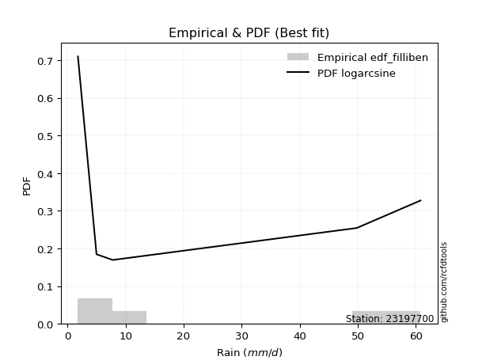</img>

</div>


### 10. EDF Jenkinson (1977)

The Jenkinson formula in hydrology is an empirical plotting position formula used to estimate the non-exceedance probability _(P)_ or return period _(T)_ of a given ordered observation within a sample. It is a widely used method in the frequency analysis of extreme events such as floods and rainfall, as it provides a distribution-free way to plot data. _a≈0.31_ and _b≈0.38_ are constants derived to approximate the median of the probability distribution for the given rank.

<div align="center">


$P=(m-a)/(n+b)$


</div>


**10.1. Empirical values**

<div align="center">

|                | 0                   | 1                  | 2             | 3                  | 4                  |
|:---------------|:--------------------|:-------------------|:--------------|:-------------------|:-------------------|
| date           | 2023                | 2021               | 2020          | 2022               | 2019               |
| x              | 1.8                 | 5.0                | 7.8           | 49.8               | 60.8               |
| m              | 1                   | 2                  | 3             | 4                  | 5                  |
| empirical_dist | edf_jenkinson       | edf_jenkinson      | edf_jenkinson | edf_jenkinson      | edf_jenkinson      |
| empirical      | 0.12825278810408922 | 0.3141263940520446 | 0.5           | 0.6858736059479554 | 0.8717472118959109 |
| empirical_tr   | 1.1471215351812367  | 1.4579945799457996 | 2.0           | 3.183431952662722  | 7.797101449275368  |

</div>


**10.2. Kolmogorov-Smirnov fit test (sorted by Δ)**


<div align="center">

|                | 0                   | 1                  | 2                  | 3                   | 4                  | 5                   | 6                   | 7                   | 8                  | 9                   | 10                 | 11                  | 12                  | 13                  | 14                  | 15                  | 16                  | 17                  | 18                  | 19                  | 20                  | 21                 | 22                  | 23                 | 24                 | 25                  | 26                 | 27                  | 28                 | 29                  | 30                  | 31                  | 32                  | 33                  | 34                  | 35                 | 36                 | 37                  | 38                  | 39                  | 40                  | 41                  | 42                 | 43                  | 44                 | 45                  | 46                  | 47                  | 48                  | 49                  | 50                  | 51                 | 52                 | 53                  | 54                 | 55                  | 56                  | 57                  | 58                  | 59                 | 60                 | 61                  | 62                  | 63                  | 64                  | 65                  | 66                  | 67                 | 68                  | 69                 | 70                  | 71                  | 72                  | 73                  | 74                  | 75                 | 76                 | 77                  | 78                  | 79                  | 80                 | 81                  | 82                 | 83                  | 84                 | 85                  | 86                 | 87                  | 88                  | 89                  | 90                  | 91                  | 92                  | 93                  | 94                 | 95                  | 96                  | 97                 | 98                  | 99                  | 100                 | 101                 | 102                | 103                 | 104                 | 105                 | 106                 | 107                 | 108                | 109                 | 110                 | 111                | 112                | 113                 | 114                 | 115                | 116                | 117                 | 118                 | 119                | 120                 | 121                | 122                 | 123                 | 124                 | 125                | 126                 | 127                | 128                | 129                 | 130                | 131                 | 132                | 133                 | 134                | 135                 | 136                | 137                | 138                | 139                 | 140                | 141                 | 142                 | 143                 | 144                | 145                | 146                 | 147                | 148                | 149                | 150                | 151                | 152                 | 153                | 154                | 155                | 156                | 157                | 158                | 159                |
|:---------------|:--------------------|:-------------------|:-------------------|:--------------------|:-------------------|:--------------------|:--------------------|:--------------------|:-------------------|:--------------------|:-------------------|:--------------------|:--------------------|:--------------------|:--------------------|:--------------------|:--------------------|:--------------------|:--------------------|:--------------------|:--------------------|:-------------------|:--------------------|:-------------------|:-------------------|:--------------------|:-------------------|:--------------------|:-------------------|:--------------------|:--------------------|:--------------------|:--------------------|:--------------------|:--------------------|:-------------------|:-------------------|:--------------------|:--------------------|:--------------------|:--------------------|:--------------------|:-------------------|:--------------------|:-------------------|:--------------------|:--------------------|:--------------------|:--------------------|:--------------------|:--------------------|:-------------------|:-------------------|:--------------------|:-------------------|:--------------------|:--------------------|:--------------------|:--------------------|:-------------------|:-------------------|:--------------------|:--------------------|:--------------------|:--------------------|:--------------------|:--------------------|:-------------------|:--------------------|:-------------------|:--------------------|:--------------------|:--------------------|:--------------------|:--------------------|:-------------------|:-------------------|:--------------------|:--------------------|:--------------------|:-------------------|:--------------------|:-------------------|:--------------------|:-------------------|:--------------------|:-------------------|:--------------------|:--------------------|:--------------------|:--------------------|:--------------------|:--------------------|:--------------------|:-------------------|:--------------------|:--------------------|:-------------------|:--------------------|:--------------------|:--------------------|:--------------------|:-------------------|:--------------------|:--------------------|:--------------------|:--------------------|:--------------------|:-------------------|:--------------------|:--------------------|:-------------------|:-------------------|:--------------------|:--------------------|:-------------------|:-------------------|:--------------------|:--------------------|:-------------------|:--------------------|:-------------------|:--------------------|:--------------------|:--------------------|:-------------------|:--------------------|:-------------------|:-------------------|:--------------------|:-------------------|:--------------------|:-------------------|:--------------------|:-------------------|:--------------------|:-------------------|:-------------------|:-------------------|:--------------------|:-------------------|:--------------------|:--------------------|:--------------------|:-------------------|:-------------------|:--------------------|:-------------------|:-------------------|:-------------------|:-------------------|:-------------------|:--------------------|:-------------------|:-------------------|:-------------------|:-------------------|:-------------------|:-------------------|:-------------------|
| station        | 23197700            | 23197700           | 23197700           | 23197700            | 23197700           | 23197700            | 23197700            | 23197700            | 23197700           | 23197700            | 23197700           | 23197700            | 23197700            | 23197700            | 23197700            | 23197700            | 23197700            | 23197700            | 23197700            | 23197700            | 23197700            | 23197700           | 23197700            | 23197700           | 23197700           | 23197700            | 23197700           | 23197700            | 23197700           | 23197700            | 23197700            | 23197700            | 23197700            | 23197700            | 23197700            | 23197700           | 23197700           | 23197700            | 23197700            | 23197700            | 23197700            | 23197700            | 23197700           | 23197700            | 23197700           | 23197700            | 23197700            | 23197700            | 23197700            | 23197700            | 23197700            | 23197700           | 23197700           | 23197700            | 23197700           | 23197700            | 23197700            | 23197700            | 23197700            | 23197700           | 23197700           | 23197700            | 23197700            | 23197700            | 23197700            | 23197700            | 23197700            | 23197700           | 23197700            | 23197700           | 23197700            | 23197700            | 23197700            | 23197700            | 23197700            | 23197700           | 23197700           | 23197700            | 23197700            | 23197700            | 23197700           | 23197700            | 23197700           | 23197700            | 23197700           | 23197700            | 23197700           | 23197700            | 23197700            | 23197700            | 23197700            | 23197700            | 23197700            | 23197700            | 23197700           | 23197700            | 23197700            | 23197700           | 23197700            | 23197700            | 23197700            | 23197700            | 23197700           | 23197700            | 23197700            | 23197700            | 23197700            | 23197700            | 23197700           | 23197700            | 23197700            | 23197700           | 23197700           | 23197700            | 23197700            | 23197700           | 23197700           | 23197700            | 23197700            | 23197700           | 23197700            | 23197700           | 23197700            | 23197700            | 23197700            | 23197700           | 23197700            | 23197700           | 23197700           | 23197700            | 23197700           | 23197700            | 23197700           | 23197700            | 23197700           | 23197700            | 23197700           | 23197700           | 23197700           | 23197700            | 23197700           | 23197700            | 23197700            | 23197700            | 23197700           | 23197700           | 23197700            | 23197700           | 23197700           | 23197700           | 23197700           | 23197700           | 23197700            | 23197700           | 23197700           | 23197700           | 23197700           | 23197700           | 23197700           | 23197700           |
| empirical_dist | edf_jenkinson       | edf_jenkinson      | edf_jenkinson      | edf_jenkinson       | edf_jenkinson      | edf_jenkinson       | edf_jenkinson       | edf_jenkinson       | edf_jenkinson      | edf_jenkinson       | edf_jenkinson      | edf_jenkinson       | edf_jenkinson       | edf_jenkinson       | edf_jenkinson       | edf_jenkinson       | edf_jenkinson       | edf_jenkinson       | edf_jenkinson       | edf_jenkinson       | edf_jenkinson       | edf_jenkinson      | edf_jenkinson       | edf_jenkinson      | edf_jenkinson      | edf_jenkinson       | edf_jenkinson      | edf_jenkinson       | edf_jenkinson      | edf_jenkinson       | edf_jenkinson       | edf_jenkinson       | edf_jenkinson       | edf_jenkinson       | edf_jenkinson       | edf_jenkinson      | edf_jenkinson      | edf_jenkinson       | edf_jenkinson       | edf_jenkinson       | edf_jenkinson       | edf_jenkinson       | edf_jenkinson      | edf_jenkinson       | edf_jenkinson      | edf_jenkinson       | edf_jenkinson       | edf_jenkinson       | edf_jenkinson       | edf_jenkinson       | edf_jenkinson       | edf_jenkinson      | edf_jenkinson      | edf_jenkinson       | edf_jenkinson      | edf_jenkinson       | edf_jenkinson       | edf_jenkinson       | edf_jenkinson       | edf_jenkinson      | edf_jenkinson      | edf_jenkinson       | edf_jenkinson       | edf_jenkinson       | edf_jenkinson       | edf_jenkinson       | edf_jenkinson       | edf_jenkinson      | edf_jenkinson       | edf_jenkinson      | edf_jenkinson       | edf_jenkinson       | edf_jenkinson       | edf_jenkinson       | edf_jenkinson       | edf_jenkinson      | edf_jenkinson      | edf_jenkinson       | edf_jenkinson       | edf_jenkinson       | edf_jenkinson      | edf_jenkinson       | edf_jenkinson      | edf_jenkinson       | edf_jenkinson      | edf_jenkinson       | edf_jenkinson      | edf_jenkinson       | edf_jenkinson       | edf_jenkinson       | edf_jenkinson       | edf_jenkinson       | edf_jenkinson       | edf_jenkinson       | edf_jenkinson      | edf_jenkinson       | edf_jenkinson       | edf_jenkinson      | edf_jenkinson       | edf_jenkinson       | edf_jenkinson       | edf_jenkinson       | edf_jenkinson      | edf_jenkinson       | edf_jenkinson       | edf_jenkinson       | edf_jenkinson       | edf_jenkinson       | edf_jenkinson      | edf_jenkinson       | edf_jenkinson       | edf_jenkinson      | edf_jenkinson      | edf_jenkinson       | edf_jenkinson       | edf_jenkinson      | edf_jenkinson      | edf_jenkinson       | edf_jenkinson       | edf_jenkinson      | edf_jenkinson       | edf_jenkinson      | edf_jenkinson       | edf_jenkinson       | edf_jenkinson       | edf_jenkinson      | edf_jenkinson       | edf_jenkinson      | edf_jenkinson      | edf_jenkinson       | edf_jenkinson      | edf_jenkinson       | edf_jenkinson      | edf_jenkinson       | edf_jenkinson      | edf_jenkinson       | edf_jenkinson      | edf_jenkinson      | edf_jenkinson      | edf_jenkinson       | edf_jenkinson      | edf_jenkinson       | edf_jenkinson       | edf_jenkinson       | edf_jenkinson      | edf_jenkinson      | edf_jenkinson       | edf_jenkinson      | edf_jenkinson      | edf_jenkinson      | edf_jenkinson      | edf_jenkinson      | edf_jenkinson       | edf_jenkinson      | edf_jenkinson      | edf_jenkinson      | edf_jenkinson      | edf_jenkinson      | edf_jenkinson      | edf_jenkinson      |
| p_dist         | logarcsine          | logdweibull        | logdgamma          | logksone            | f                  | wrapcauchy          | weibull_min         | loglomax            | dgamma             | logsemicircular     | logvonmises        | logwrapcauchy       | logexponpow         | loganglit           | logalpha            | invgamma            | logburr12           | logloglaplace       | nct                 | logbeta             | dweibull            | logncf             | loginvweibull       | loggenlogistic     | loggenexpon        | arcsine             | loggenpareto       | ncf                 | logbetaprime       | loghalfnorm         | logfatiguelife      | lograyleigh         | loginvgauss         | loghalfgennorm      | logmaxwell          | logkstwobign       | burr               | logrice             | betaprime           | loginvgamma         | lomax               | loggompertz         | gengamma           | logfoldnorm         | logpearson3        | logerlang           | loggamma            | loggamma            | logskewnorm         | logt                | logexponnorm        | logcrystalball     | lognorm            | lognct              | logloggamma        | exponweib           | loggausshyper       | vonmises_line       | burr12              | levy_l             | logrdist           | loghalflogistic     | logtrapezoid        | loggumbel_r         | logcosine           | loggennorm          | logmoyal            | loglogistic        | invgauss            | loghypsecant       | ksone               | loggenhalflogistic  | alpha               | halfnorm            | halfgennorm         | loglaplace         | loglaplace         | logargus            | loggumbel_l         | kappa4              | logwald            | exponpow            | logf               | semicircular        | logweibull_max     | foldnorm            | halflogistic       | logmielke           | rayleigh            | logtriang           | anglit              | loglevy_l           | logburr             | maxwell             | t                  | genlogistic         | loggengamma         | pearson3           | gumbel_r            | moyal               | logweibull_min      | gennorm             | johnsonsu          | logtukeylambda      | norm                | crystalball         | logkappa3           | logkappa4           | kstwobign          | loguniform          | logvonmises_line    | truncpareto        | truncweibull_min   | gompertz            | exponnorm           | logbradford        | genexpon           | loggenextreme       | logtruncexpon       | logistic           | gamma               | logexponweib       | logtruncnorm        | erlang              | cosine              | gausshyper         | logtruncweibull_min | rice               | truncnorm          | hypsecant           | gumbel_l           | laplace             | lognakagami        | argus               | wald               | genextreme          | triang             | beta               | fatiguelife        | truncexpon          | nakagami           | johnsonsb           | skewnorm            | bradford            | tukeylambda        | logjohnsonsb       | genpareto           | uniform            | genhalflogistic    | powerlaw           | kappa3             | mielke             | trapezoid           | weibull_max        | logpowerlaw        | logtruncpareto     | rdist              | logjohnsonsu       | invweibull         | vonmises           |
| delta          | 0.08799453576267724 | 0.1036687847003244 | 0.1137752980203216 | 0.12361608821375791 | 0.1270684678591923 | 0.12825267702806897 | 0.12825277302363472 | 0.12825278809846166 | 0.1360868357230144 | 0.13825506578121705 | 0.1427911354321112 | 0.14340151218945624 | 0.14486516313627684 | 0.14866348887907288 | 0.15290902237326415 | 0.15295111415307538 | 0.15364818262738977 | 0.15369687145615585 | 0.15428079707735531 | 0.15490616318524963 | 0.15771850743025684 | 0.1604042990025527 | 0.16062345921999954 | 0.1608013930597063 | 0.1618744782890179 | 0.16197177790495132 | 0.1630904752649076 | 0.16383341691581765 | 0.1639959039119132 | 0.16542991875375135 | 0.16637508283575253 | 0.16639482451642673 | 0.16690090067473207 | 0.16721150142148633 | 0.16763088145698135 | 0.1684912574928923 | 0.1691624587811501 | 0.16931410590434648 | 0.17030034726414012 | 0.17030442243287947 | 0.17054659586265652 | 0.17103285383190392 | 0.1712657624013455 | 0.17152295221747338 | 0.1721049589299698 | 0.17215955626641544 | 0.17220907621419934 | 0.17220907621419934 | 0.17228715392616045 | 0.17228898767530965 | 0.17228929861105302 | 0.17228967566609   | 0.1722896765610985 | 0.17233960130769677 | 0.1726353741021628 | 0.17337950639132627 | 0.17454482327399085 | 0.17467279192606194 | 0.17885896331868645 | 0.17892996703902   | 0.1793990304350359 | 0.18094376805017243 | 0.18160838361190823 | 0.18178632161656905 | 0.18496780946160007 | 0.18587360594795543 | 0.18617393038298158 | 0.188980956747402  | 0.19554168822674434 | 0.1972871487100848 | 0.19888741689935224 | 0.19969555917502124 | 0.20030060234345026 | 0.20203962388220953 | 0.20400979868995472 | 0.204352314041511  | 0.204352314041511  | 0.20513848320788985 | 0.20559047838739308 | 0.20598776207537728 | 0.2072122297184501 | 0.21267921406286944 | 0.2130015135529743 | 0.21488664539211344 | 0.2175943627402172 | 0.21761777502336271 | 0.2176570082164765 | 0.22025767059779988 | 0.22501731777098333 | 0.22605874632781675 | 0.22689939053213876 | 0.22779143357575848 | 0.23168408646799887 | 0.23366084894113376 | 0.2392127264876197 | 0.24015098436705606 | 0.24281721010640406 | 0.2428453141769789 | 0.24296675717399963 | 0.24525739634364163 | 0.24695213479677963 | 0.24823209349058506 | 0.2539793426708693 | 0.25410025528324665 | 0.25457773793053967 | 0.25457774150289264 | 0.25519276370320365 | 0.25527452206654977 | 0.2570953814684309 | 0.25742583498476845 | 0.25773540682544893 | 0.2622280098120038 | 0.2633353769253193 | 0.27011564516905606 | 0.27068185021471236 | 0.2720126344158562 | 0.2724614760355339 | 0.27477202768398057 | 0.27606721732840867 | 0.2772386618800744 | 0.27817504607174004 | 0.2794236161407816 | 0.28063453049948217 | 0.28167557141443855 | 0.28317820693500506 | 0.2832322407808433 | 0.2855580619437489  | 0.2883492898651565 | 0.2903625216377731 | 0.29201705805358646 | 0.2929150809025953 | 0.31128032308920095 | 0.3114675672064133 | 0.31748980343939004 | 0.3224364712231669 | 0.32710311291899896 | 0.3271071739047989 | 0.3353718364945906 | 0.3426446351013906 | 0.34349012504706705 | 0.3442523319808248 | 0.34793820614750265 | 0.36051337865706645 | 0.37825839923944365 | 0.3901708266426809 | 0.3909324445279311 | 0.39119736173386976 | 0.3983050847457627 | 0.403280866490495  | 0.4119736511246482 | 0.4238301329896011 | 0.4673336737886243 | 0.47076769426888826 | 0.4935059876865975 | 0.5431599352371679 | 0.5603661476800914 | 0.563840039244016  | 0.612344636777455  | 0.6825941477783981 | 9.348525967228277  |
| deltao         | 0.5865427407550001  | 0.5865427407550001 | 0.5865427407550001 | 0.5865427407550001  | 0.5865427407550001 | 0.5865427407550001  | 0.5865427407550001  | 0.5865427407550001  | 0.5865427407550001 | 0.5865427407550001  | 0.5865427407550001 | 0.5865427407550001  | 0.5865427407550001  | 0.5865427407550001  | 0.5865427407550001  | 0.5865427407550001  | 0.5865427407550001  | 0.5865427407550001  | 0.5865427407550001  | 0.5865427407550001  | 0.5865427407550001  | 0.5865427407550001 | 0.5865427407550001  | 0.5865427407550001 | 0.5865427407550001 | 0.5865427407550001  | 0.5865427407550001 | 0.5865427407550001  | 0.5865427407550001 | 0.5865427407550001  | 0.5865427407550001  | 0.5865427407550001  | 0.5865427407550001  | 0.5865427407550001  | 0.5865427407550001  | 0.5865427407550001 | 0.5865427407550001 | 0.5865427407550001  | 0.5865427407550001  | 0.5865427407550001  | 0.5865427407550001  | 0.5865427407550001  | 0.5865427407550001 | 0.5865427407550001  | 0.5865427407550001 | 0.5865427407550001  | 0.5865427407550001  | 0.5865427407550001  | 0.5865427407550001  | 0.5865427407550001  | 0.5865427407550001  | 0.5865427407550001 | 0.5865427407550001 | 0.5865427407550001  | 0.5865427407550001 | 0.5865427407550001  | 0.5865427407550001  | 0.5865427407550001  | 0.5865427407550001  | 0.5865427407550001 | 0.5865427407550001 | 0.5865427407550001  | 0.5865427407550001  | 0.5865427407550001  | 0.5865427407550001  | 0.5865427407550001  | 0.5865427407550001  | 0.5865427407550001 | 0.5865427407550001  | 0.5865427407550001 | 0.5865427407550001  | 0.5865427407550001  | 0.5865427407550001  | 0.5865427407550001  | 0.5865427407550001  | 0.5865427407550001 | 0.5865427407550001 | 0.5865427407550001  | 0.5865427407550001  | 0.5865427407550001  | 0.5865427407550001 | 0.5865427407550001  | 0.5865427407550001 | 0.5865427407550001  | 0.5865427407550001 | 0.5865427407550001  | 0.5865427407550001 | 0.5865427407550001  | 0.5865427407550001  | 0.5865427407550001  | 0.5865427407550001  | 0.5865427407550001  | 0.5865427407550001  | 0.5865427407550001  | 0.5865427407550001 | 0.5865427407550001  | 0.5865427407550001  | 0.5865427407550001 | 0.5865427407550001  | 0.5865427407550001  | 0.5865427407550001  | 0.5865427407550001  | 0.5865427407550001 | 0.5865427407550001  | 0.5865427407550001  | 0.5865427407550001  | 0.5865427407550001  | 0.5865427407550001  | 0.5865427407550001 | 0.5865427407550001  | 0.5865427407550001  | 0.5865427407550001 | 0.5865427407550001 | 0.5865427407550001  | 0.5865427407550001  | 0.5865427407550001 | 0.5865427407550001 | 0.5865427407550001  | 0.5865427407550001  | 0.5865427407550001 | 0.5865427407550001  | 0.5865427407550001 | 0.5865427407550001  | 0.5865427407550001  | 0.5865427407550001  | 0.5865427407550001 | 0.5865427407550001  | 0.5865427407550001 | 0.5865427407550001 | 0.5865427407550001  | 0.5865427407550001 | 0.5865427407550001  | 0.5865427407550001 | 0.5865427407550001  | 0.5865427407550001 | 0.5865427407550001  | 0.5865427407550001 | 0.5865427407550001 | 0.5865427407550001 | 0.5865427407550001  | 0.5865427407550001 | 0.5865427407550001  | 0.5865427407550001  | 0.5865427407550001  | 0.5865427407550001 | 0.5865427407550001 | 0.5865427407550001  | 0.5865427407550001 | 0.5865427407550001 | 0.5865427407550001 | 0.5865427407550001 | 0.5865427407550001 | 0.5865427407550001  | 0.5865427407550001 | 0.5865427407550001 | 0.5865427407550001 | 0.5865427407550001 | 0.5865427407550001 | 0.5865427407550001 | 0.5865427407550001 |
| eval           | Δo > Δ              | Δo > Δ             | Δo > Δ             | Δo > Δ              | Δo > Δ             | Δo > Δ              | Δo > Δ              | Δo > Δ              | Δo > Δ             | Δo > Δ              | Δo > Δ             | Δo > Δ              | Δo > Δ              | Δo > Δ              | Δo > Δ              | Δo > Δ              | Δo > Δ              | Δo > Δ              | Δo > Δ              | Δo > Δ              | Δo > Δ              | Δo > Δ             | Δo > Δ              | Δo > Δ             | Δo > Δ             | Δo > Δ              | Δo > Δ             | Δo > Δ              | Δo > Δ             | Δo > Δ              | Δo > Δ              | Δo > Δ              | Δo > Δ              | Δo > Δ              | Δo > Δ              | Δo > Δ             | Δo > Δ             | Δo > Δ              | Δo > Δ              | Δo > Δ              | Δo > Δ              | Δo > Δ              | Δo > Δ             | Δo > Δ              | Δo > Δ             | Δo > Δ              | Δo > Δ              | Δo > Δ              | Δo > Δ              | Δo > Δ              | Δo > Δ              | Δo > Δ             | Δo > Δ             | Δo > Δ              | Δo > Δ             | Δo > Δ              | Δo > Δ              | Δo > Δ              | Δo > Δ              | Δo > Δ             | Δo > Δ             | Δo > Δ              | Δo > Δ              | Δo > Δ              | Δo > Δ              | Δo > Δ              | Δo > Δ              | Δo > Δ             | Δo > Δ              | Δo > Δ             | Δo > Δ              | Δo > Δ              | Δo > Δ              | Δo > Δ              | Δo > Δ              | Δo > Δ             | Δo > Δ             | Δo > Δ              | Δo > Δ              | Δo > Δ              | Δo > Δ             | Δo > Δ              | Δo > Δ             | Δo > Δ              | Δo > Δ             | Δo > Δ              | Δo > Δ             | Δo > Δ              | Δo > Δ              | Δo > Δ              | Δo > Δ              | Δo > Δ              | Δo > Δ              | Δo > Δ              | Δo > Δ             | Δo > Δ              | Δo > Δ              | Δo > Δ             | Δo > Δ              | Δo > Δ              | Δo > Δ              | Δo > Δ              | Δo > Δ             | Δo > Δ              | Δo > Δ              | Δo > Δ              | Δo > Δ              | Δo > Δ              | Δo > Δ             | Δo > Δ              | Δo > Δ              | Δo > Δ             | Δo > Δ             | Δo > Δ              | Δo > Δ              | Δo > Δ             | Δo > Δ             | Δo > Δ              | Δo > Δ              | Δo > Δ             | Δo > Δ              | Δo > Δ             | Δo > Δ              | Δo > Δ              | Δo > Δ              | Δo > Δ             | Δo > Δ              | Δo > Δ             | Δo > Δ             | Δo > Δ              | Δo > Δ             | Δo > Δ              | Δo > Δ             | Δo > Δ              | Δo > Δ             | Δo > Δ              | Δo > Δ             | Δo > Δ             | Δo > Δ             | Δo > Δ              | Δo > Δ             | Δo > Δ              | Δo > Δ              | Δo > Δ              | Δo > Δ             | Δo > Δ             | Δo > Δ              | Δo > Δ             | Δo > Δ             | Δo > Δ             | Δo > Δ             | Δo > Δ             | Δo > Δ              | Δo > Δ             | Δo > Δ             | Δo > Δ             | Δo > Δ             | Δo <= Δ            | Δo <= Δ            | Δo <= Δ            |
| fit            | 1                   | 1                  | 1                  | 1                   | 1                  | 1                   | 1                   | 1                   | 1                  | 1                   | 1                  | 1                   | 1                   | 1                   | 1                   | 1                   | 1                   | 1                   | 1                   | 1                   | 1                   | 1                  | 1                   | 1                  | 1                  | 1                   | 1                  | 1                   | 1                  | 1                   | 1                   | 1                   | 1                   | 1                   | 1                   | 1                  | 1                  | 1                   | 1                   | 1                   | 1                   | 1                   | 1                  | 1                   | 1                  | 1                   | 1                   | 1                   | 1                   | 1                   | 1                   | 1                  | 1                  | 1                   | 1                  | 1                   | 1                   | 1                   | 1                   | 1                  | 1                  | 1                   | 1                   | 1                   | 1                   | 1                   | 1                   | 1                  | 1                   | 1                  | 1                   | 1                   | 1                   | 1                   | 1                   | 1                  | 1                  | 1                   | 1                   | 1                   | 1                  | 1                   | 1                  | 1                   | 1                  | 1                   | 1                  | 1                   | 1                   | 1                   | 1                   | 1                   | 1                   | 1                   | 1                  | 1                   | 1                   | 1                  | 1                   | 1                   | 1                   | 1                   | 1                  | 1                   | 1                   | 1                   | 1                   | 1                   | 1                  | 1                   | 1                   | 1                  | 1                  | 1                   | 1                   | 1                  | 1                  | 1                   | 1                   | 1                  | 1                   | 1                  | 1                   | 1                   | 1                   | 1                  | 1                   | 1                  | 1                  | 1                   | 1                  | 1                   | 1                  | 1                   | 1                  | 1                   | 1                  | 1                  | 1                  | 1                   | 1                  | 1                   | 1                   | 1                   | 1                  | 1                  | 1                   | 1                  | 1                  | 1                  | 1                  | 1                  | 1                   | 1                  | 1                  | 1                  | 1                  | 0                  | 0                  | 0                  |
| n              | 5                   | 5                  | 5                  | 5                   | 5                  | 5                   | 5                   | 5                   | 5                  | 5                   | 5                  | 5                   | 5                   | 5                   | 5                   | 5                   | 5                   | 5                   | 5                   | 5                   | 5                   | 5                  | 5                   | 5                  | 5                  | 5                   | 5                  | 5                   | 5                  | 5                   | 5                   | 5                   | 5                   | 5                   | 5                   | 5                  | 5                  | 5                   | 5                   | 5                   | 5                   | 5                   | 5                  | 5                   | 5                  | 5                   | 5                   | 5                   | 5                   | 5                   | 5                   | 5                  | 5                  | 5                   | 5                  | 5                   | 5                   | 5                   | 5                   | 5                  | 5                  | 5                   | 5                   | 5                   | 5                   | 5                   | 5                   | 5                  | 5                   | 5                  | 5                   | 5                   | 5                   | 5                   | 5                   | 5                  | 5                  | 5                   | 5                   | 5                   | 5                  | 5                   | 5                  | 5                   | 5                  | 5                   | 5                  | 5                   | 5                   | 5                   | 5                   | 5                   | 5                   | 5                   | 5                  | 5                   | 5                   | 5                  | 5                   | 5                   | 5                   | 5                   | 5                  | 5                   | 5                   | 5                   | 5                   | 5                   | 5                  | 5                   | 5                   | 5                  | 5                  | 5                   | 5                   | 5                  | 5                  | 5                   | 5                   | 5                  | 5                   | 5                  | 5                   | 5                   | 5                   | 5                  | 5                   | 5                  | 5                  | 5                   | 5                  | 5                   | 5                  | 5                   | 5                  | 5                   | 5                  | 5                  | 5                  | 5                   | 5                  | 5                   | 5                   | 5                   | 5                  | 5                  | 5                   | 5                  | 5                  | 5                  | 5                  | 5                  | 5                   | 5                  | 5                  | 5                  | 5                  | 5                  | 5                  | 5                  |
| best_fit       | 1                   | 0                  | 0                  | 0                   | 0                  | 0                   | 0                   | 0                   | 0                  | 0                   | 0                  | 0                   | 0                   | 0                   | 0                   | 0                   | 0                   | 0                   | 0                   | 0                   | 0                   | 0                  | 0                   | 0                  | 0                  | 0                   | 0                  | 0                   | 0                  | 0                   | 0                   | 0                   | 0                   | 0                   | 0                   | 0                  | 0                  | 0                   | 0                   | 0                   | 0                   | 0                   | 0                  | 0                   | 0                  | 0                   | 0                   | 0                   | 0                   | 0                   | 0                   | 0                  | 0                  | 0                   | 0                  | 0                   | 0                   | 0                   | 0                   | 0                  | 0                  | 0                   | 0                   | 0                   | 0                   | 0                   | 0                   | 0                  | 0                   | 0                  | 0                   | 0                   | 0                   | 0                   | 0                   | 0                  | 0                  | 0                   | 0                   | 0                   | 0                  | 0                   | 0                  | 0                   | 0                  | 0                   | 0                  | 0                   | 0                   | 0                   | 0                   | 0                   | 0                   | 0                   | 0                  | 0                   | 0                   | 0                  | 0                   | 0                   | 0                   | 0                   | 0                  | 0                   | 0                   | 0                   | 0                   | 0                   | 0                  | 0                   | 0                   | 0                  | 0                  | 0                   | 0                   | 0                  | 0                  | 0                   | 0                   | 0                  | 0                   | 0                  | 0                   | 0                   | 0                   | 0                  | 0                   | 0                  | 0                  | 0                   | 0                  | 0                   | 0                  | 0                   | 0                  | 0                   | 0                  | 0                  | 0                  | 0                   | 0                  | 0                   | 0                   | 0                   | 0                  | 0                  | 0                   | 0                  | 0                  | 0                  | 0                  | 0                  | 0                   | 0                  | 0                  | 0                  | 0                  | 0                  | 0                  | 0                  |
| best_fit_sort  | 1                   | 2                  | 3                  | 4                   | 5                  | 6                   | 7                   | 8                   | 9                  | 10                  | 11                 | 12                  | 13                  | 14                  | 15                  | 16                  | 17                  | 18                  | 19                  | 20                  | 21                  | 22                 | 23                  | 24                 | 25                 | 26                  | 27                 | 28                  | 29                 | 30                  | 31                  | 32                  | 33                  | 34                  | 35                  | 36                 | 37                 | 38                  | 39                  | 40                  | 41                  | 42                  | 43                 | 44                  | 45                 | 46                  | 47                  | 48                  | 49                  | 50                  | 51                  | 52                 | 53                 | 54                  | 55                 | 56                  | 57                  | 58                  | 59                  | 60                 | 61                 | 62                  | 63                  | 64                  | 65                  | 66                  | 67                  | 68                 | 69                  | 70                 | 71                  | 72                  | 73                  | 74                  | 75                  | 76                 | 77                 | 78                  | 79                  | 80                  | 81                 | 82                  | 83                 | 84                  | 85                 | 86                  | 87                 | 88                  | 89                  | 90                  | 91                  | 92                  | 93                  | 94                  | 95                 | 96                  | 97                  | 98                 | 99                  | 100                 | 101                 | 102                 | 103                | 104                 | 105                 | 106                 | 107                 | 108                 | 109                | 110                 | 111                 | 112                | 113                | 114                 | 115                 | 116                | 117                | 118                 | 119                 | 120                | 121                 | 122                | 123                 | 124                 | 125                 | 126                | 127                 | 128                | 129                | 130                 | 131                | 132                 | 133                | 134                 | 135                | 136                 | 137                | 138                | 139                | 140                 | 141                | 142                 | 143                 | 144                 | 145                | 146                | 147                 | 148                | 149                | 150                | 151                | 152                | 153                 | 154                | 155                | 156                | 157                | 158                | 159                | 160                |

</div>


**10.3. Best fit**

<div align="center">

|   id |   station | empirical_dist   | p_dist     |     delta |   deltao | eval   |   fit |   n |   best_fit |   best_fit_sort |
|-----:|----------:|:-----------------|:-----------|----------:|---------:|:-------|------:|----:|-----------:|----------------:|
|    0 |  23197700 | edf_jenkinson    | logarcsine | 0.0879945 | 0.586543 | Δo > Δ |     1 |   5 |          1 |               1 |

</div>


<div align="center">

</img></img>

</div>


### 11. EDF Cunnane (1978)

Cunnane´s work in statistical hydrology has focused on the performance and evaluation of different probability distributions (such as GEV, Gumbel, Lognormal) for flood frequency estimation. _b_ is a constant, typically set to 0.4.

<div align="center">


$P=(m-b)/(n+1-2b)$


</div>


**11.1. Empirical values**

<div align="center">

|                | 0                   | 1                  | 2           | 3                  | 4                  |
|:---------------|:--------------------|:-------------------|:------------|:-------------------|:-------------------|
| date           | 2023                | 2021               | 2020        | 2022               | 2019               |
| x              | 1.8                 | 5.0                | 7.8         | 49.8               | 60.8               |
| m              | 1                   | 2                  | 3           | 4                  | 5                  |
| empirical_dist | edf_cunnane         | edf_cunnane        | edf_cunnane | edf_cunnane        | edf_cunnane        |
| empirical      | 0.11538461538461538 | 0.3076923076923077 | 0.5         | 0.6923076923076923 | 0.8846153846153845 |
| empirical_tr   | 1.1304347826086958  | 1.4444444444444444 | 2.0         | 3.25               | 8.666666666666655  |

</div>


**11.2. Kolmogorov-Smirnov fit test (sorted by Δ)**


<div align="center">

|                | 0                   | 1                   | 2                   | 3                   | 4                   | 5                  | 6                  | 7                   | 8                   | 9                   | 10                  | 11                  | 12                  | 13                  | 14                  | 15                 | 16                  | 17                  | 18                  | 19                  | 20                  | 21                  | 22                  | 23                 | 24                 | 25                  | 26                  | 27                  | 28                 | 29                  | 30                 | 31                  | 32                  | 33                  | 34                  | 35                 | 36                  | 37                 | 38                  | 39                 | 40                  | 41                  | 42                  | 43                  | 44                  | 45                  | 46                  | 47                 | 48                 | 49                  | 50                  | 51                  | 52                 | 53                  | 54                 | 55                  | 56                  | 57                  | 58                  | 59                  | 60                  | 61                 | 62                  | 63                  | 64                  | 65                  | 66                  | 67                  | 68                  | 69                 | 70                  | 71                 | 72                  | 73                  | 74                  | 75                 | 76                  | 77                  | 78                  | 79                  | 80                  | 81                  | 82                  | 83                  | 84                 | 85                  | 86                 | 87                  | 88                 | 89                  | 90                  | 91                  | 92                  | 93                  | 94                  | 95                  | 96                 | 97                 | 98                  | 99                  | 100                | 101                | 102                | 103                 | 104                | 105                | 106                 | 107                | 108                 | 109                 | 110                | 111                | 112                | 113                 | 114                | 115                 | 116                 | 117                | 118                | 119                 | 120                | 121                 | 122                | 123                | 124                 | 125                 | 126                | 127                | 128                | 129                 | 130                | 131                 | 132                 | 133                 | 134                | 135                | 136                | 137                 | 138                 | 139                | 140                | 141                 | 142                 | 143                 | 144                | 145                 | 146                | 147                | 148                 | 149                | 150                | 151                 | 152                | 153                 | 154                | 155                | 156                | 157                | 158                | 159                |
|:---------------|:--------------------|:--------------------|:--------------------|:--------------------|:--------------------|:-------------------|:-------------------|:--------------------|:--------------------|:--------------------|:--------------------|:--------------------|:--------------------|:--------------------|:--------------------|:-------------------|:--------------------|:--------------------|:--------------------|:--------------------|:--------------------|:--------------------|:--------------------|:-------------------|:-------------------|:--------------------|:--------------------|:--------------------|:-------------------|:--------------------|:-------------------|:--------------------|:--------------------|:--------------------|:--------------------|:-------------------|:--------------------|:-------------------|:--------------------|:-------------------|:--------------------|:--------------------|:--------------------|:--------------------|:--------------------|:--------------------|:--------------------|:-------------------|:-------------------|:--------------------|:--------------------|:--------------------|:-------------------|:--------------------|:-------------------|:--------------------|:--------------------|:--------------------|:--------------------|:--------------------|:--------------------|:-------------------|:--------------------|:--------------------|:--------------------|:--------------------|:--------------------|:--------------------|:--------------------|:-------------------|:--------------------|:-------------------|:--------------------|:--------------------|:--------------------|:-------------------|:--------------------|:--------------------|:--------------------|:--------------------|:--------------------|:--------------------|:--------------------|:--------------------|:-------------------|:--------------------|:-------------------|:--------------------|:-------------------|:--------------------|:--------------------|:--------------------|:--------------------|:--------------------|:--------------------|:--------------------|:-------------------|:-------------------|:--------------------|:--------------------|:-------------------|:-------------------|:-------------------|:--------------------|:-------------------|:-------------------|:--------------------|:-------------------|:--------------------|:--------------------|:-------------------|:-------------------|:-------------------|:--------------------|:-------------------|:--------------------|:--------------------|:-------------------|:-------------------|:--------------------|:-------------------|:--------------------|:-------------------|:-------------------|:--------------------|:--------------------|:-------------------|:-------------------|:-------------------|:--------------------|:-------------------|:--------------------|:--------------------|:--------------------|:-------------------|:-------------------|:-------------------|:--------------------|:--------------------|:-------------------|:-------------------|:--------------------|:--------------------|:--------------------|:-------------------|:--------------------|:-------------------|:-------------------|:--------------------|:-------------------|:-------------------|:--------------------|:-------------------|:--------------------|:-------------------|:-------------------|:-------------------|:-------------------|:-------------------|:-------------------|
| station        | 23197700            | 23197700            | 23197700            | 23197700            | 23197700            | 23197700           | 23197700           | 23197700            | 23197700            | 23197700            | 23197700            | 23197700            | 23197700            | 23197700            | 23197700            | 23197700           | 23197700            | 23197700            | 23197700            | 23197700            | 23197700            | 23197700            | 23197700            | 23197700           | 23197700           | 23197700            | 23197700            | 23197700            | 23197700           | 23197700            | 23197700           | 23197700            | 23197700            | 23197700            | 23197700            | 23197700           | 23197700            | 23197700           | 23197700            | 23197700           | 23197700            | 23197700            | 23197700            | 23197700            | 23197700            | 23197700            | 23197700            | 23197700           | 23197700           | 23197700            | 23197700            | 23197700            | 23197700           | 23197700            | 23197700           | 23197700            | 23197700            | 23197700            | 23197700            | 23197700            | 23197700            | 23197700           | 23197700            | 23197700            | 23197700            | 23197700            | 23197700            | 23197700            | 23197700            | 23197700           | 23197700            | 23197700           | 23197700            | 23197700            | 23197700            | 23197700           | 23197700            | 23197700            | 23197700            | 23197700            | 23197700            | 23197700            | 23197700            | 23197700            | 23197700           | 23197700            | 23197700           | 23197700            | 23197700           | 23197700            | 23197700            | 23197700            | 23197700            | 23197700            | 23197700            | 23197700            | 23197700           | 23197700           | 23197700            | 23197700            | 23197700           | 23197700           | 23197700           | 23197700            | 23197700           | 23197700           | 23197700            | 23197700           | 23197700            | 23197700            | 23197700           | 23197700           | 23197700           | 23197700            | 23197700           | 23197700            | 23197700            | 23197700           | 23197700           | 23197700            | 23197700           | 23197700            | 23197700           | 23197700           | 23197700            | 23197700            | 23197700           | 23197700           | 23197700           | 23197700            | 23197700           | 23197700            | 23197700            | 23197700            | 23197700           | 23197700           | 23197700           | 23197700            | 23197700            | 23197700           | 23197700           | 23197700            | 23197700            | 23197700            | 23197700           | 23197700            | 23197700           | 23197700           | 23197700            | 23197700           | 23197700           | 23197700            | 23197700           | 23197700            | 23197700           | 23197700           | 23197700           | 23197700           | 23197700           | 23197700           |
| empirical_dist | edf_cunnane         | edf_cunnane         | edf_cunnane         | edf_cunnane         | edf_cunnane         | edf_cunnane        | edf_cunnane        | edf_cunnane         | edf_cunnane         | edf_cunnane         | edf_cunnane         | edf_cunnane         | edf_cunnane         | edf_cunnane         | edf_cunnane         | edf_cunnane        | edf_cunnane         | edf_cunnane         | edf_cunnane         | edf_cunnane         | edf_cunnane         | edf_cunnane         | edf_cunnane         | edf_cunnane        | edf_cunnane        | edf_cunnane         | edf_cunnane         | edf_cunnane         | edf_cunnane        | edf_cunnane         | edf_cunnane        | edf_cunnane         | edf_cunnane         | edf_cunnane         | edf_cunnane         | edf_cunnane        | edf_cunnane         | edf_cunnane        | edf_cunnane         | edf_cunnane        | edf_cunnane         | edf_cunnane         | edf_cunnane         | edf_cunnane         | edf_cunnane         | edf_cunnane         | edf_cunnane         | edf_cunnane        | edf_cunnane        | edf_cunnane         | edf_cunnane         | edf_cunnane         | edf_cunnane        | edf_cunnane         | edf_cunnane        | edf_cunnane         | edf_cunnane         | edf_cunnane         | edf_cunnane         | edf_cunnane         | edf_cunnane         | edf_cunnane        | edf_cunnane         | edf_cunnane         | edf_cunnane         | edf_cunnane         | edf_cunnane         | edf_cunnane         | edf_cunnane         | edf_cunnane        | edf_cunnane         | edf_cunnane        | edf_cunnane         | edf_cunnane         | edf_cunnane         | edf_cunnane        | edf_cunnane         | edf_cunnane         | edf_cunnane         | edf_cunnane         | edf_cunnane         | edf_cunnane         | edf_cunnane         | edf_cunnane         | edf_cunnane        | edf_cunnane         | edf_cunnane        | edf_cunnane         | edf_cunnane        | edf_cunnane         | edf_cunnane         | edf_cunnane         | edf_cunnane         | edf_cunnane         | edf_cunnane         | edf_cunnane         | edf_cunnane        | edf_cunnane        | edf_cunnane         | edf_cunnane         | edf_cunnane        | edf_cunnane        | edf_cunnane        | edf_cunnane         | edf_cunnane        | edf_cunnane        | edf_cunnane         | edf_cunnane        | edf_cunnane         | edf_cunnane         | edf_cunnane        | edf_cunnane        | edf_cunnane        | edf_cunnane         | edf_cunnane        | edf_cunnane         | edf_cunnane         | edf_cunnane        | edf_cunnane        | edf_cunnane         | edf_cunnane        | edf_cunnane         | edf_cunnane        | edf_cunnane        | edf_cunnane         | edf_cunnane         | edf_cunnane        | edf_cunnane        | edf_cunnane        | edf_cunnane         | edf_cunnane        | edf_cunnane         | edf_cunnane         | edf_cunnane         | edf_cunnane        | edf_cunnane        | edf_cunnane        | edf_cunnane         | edf_cunnane         | edf_cunnane        | edf_cunnane        | edf_cunnane         | edf_cunnane         | edf_cunnane         | edf_cunnane        | edf_cunnane         | edf_cunnane        | edf_cunnane        | edf_cunnane         | edf_cunnane        | edf_cunnane        | edf_cunnane         | edf_cunnane        | edf_cunnane         | edf_cunnane        | edf_cunnane        | edf_cunnane        | edf_cunnane        | edf_cunnane        | edf_cunnane        |
| p_dist         | logarcsine          | logdweibull         | loglomax            | logksone            | f                   | logdgamma          | logsemicircular    | wrapcauchy          | weibull_min         | logvonmises         | logexponpow         | loganglit           | dgamma              | invgamma            | logburr12           | logloglaplace      | nct                 | logbeta             | logwrapcauchy       | logncf              | loginvweibull       | loggenlogistic      | loggenexpon         | ncf                | loghalfnorm        | logalpha            | logfatiguelife      | lograyleigh         | loginvgauss        | loghalfgennorm      | logmaxwell         | arcsine             | logkstwobign        | burr                | logrice             | loggenpareto       | betaprime           | loginvgamma        | lomax               | dweibull           | loggompertz         | gengamma            | logfoldnorm         | logpearson3         | logerlang           | loggamma            | loggamma            | logskewnorm        | logt               | logexponnorm        | logcrystalball      | lognorm             | lognct             | logloggamma         | exponweib          | logbetaprime        | logrdist            | loghalflogistic     | loggausshyper       | vonmises_line       | logtrapezoid        | loggumbel_r        | logcosine           | logmoyal            | loglogistic         | invgauss            | loghypsecant        | burr12              | levy_l              | loggennorm         | loggenhalflogistic  | alpha              | halfgennorm         | loglaplace          | loglaplace          | logargus           | ksone               | loggumbel_l         | logwald             | halfnorm            | kappa4              | exponpow            | logmielke           | semicircular        | logweibull_max     | foldnorm            | halflogistic       | logf                | logtriang          | rayleigh            | logburr             | anglit              | loglevy_l           | t                   | maxwell             | genlogistic         | gennorm            | pearson3           | gumbel_r            | moyal               | logtukeylambda     | logkappa3          | logkappa4          | loggengamma         | loguniform         | logvonmises_line   | logweibull_min      | johnsonsu          | norm                | crystalball         | truncpareto        | truncweibull_min   | kstwobign          | logbradford         | logtruncexpon      | gompertz            | exponnorm           | gamma              | genexpon           | logexponweib        | logtruncnorm       | loggenextreme       | erlang             | logistic           | logtruncweibull_min | cosine              | gausshyper         | rice               | truncnorm          | hypsecant           | gumbel_l           | lognakagami         | laplace             | argus               | wald               | triang             | beta               | genextreme          | truncexpon          | fatiguelife        | nakagami           | johnsonsb           | skewnorm            | bradford            | tukeylambda        | genpareto           | uniform            | genhalflogistic    | logjohnsonsb        | powerlaw           | kappa3             | trapezoid           | mielke             | weibull_max         | logpowerlaw        | logtruncpareto     | rdist              | logjohnsonsu       | invweibull         | vonmises           |
| delta          | 0.08156044940294038 | 0.09236610249657506 | 0.11538461537898781 | 0.11718200185402106 | 0.11885221760149589 | 0.1266434707397952 | 0.1318209794214802 | 0.13227156034257548 | 0.13568221664798386 | 0.13635704907237434 | 0.13843107677653999 | 0.14222940251933602 | 0.14252092208275124 | 0.14651702779333853 | 0.14721409626765292 | 0.147262785096419  | 0.14784671071761846 | 0.14847207682551278 | 0.14983559854919315 | 0.15397021264281585 | 0.15418937286026269 | 0.15436730669996945 | 0.15544039192928105 | 0.1573993305560808 | 0.1589958323940145 | 0.15934310873300106 | 0.15994099647601567 | 0.15996073815668987 | 0.1604668143149952 | 0.16077741506174947 | 0.1611967950972445 | 0.16197177790495132 | 0.16205717113315543 | 0.16272837242141325 | 0.16288001954460962 | 0.1630904752649076 | 0.16386626090440326 | 0.1638703360731426 | 0.16411250950291967 | 0.1641525937899937 | 0.16459876747216706 | 0.16483167604160864 | 0.16508886585773652 | 0.16567087257023294 | 0.16572546990667858 | 0.16577498985446248 | 0.16577498985446248 | 0.1658530675664236 | 0.1658549013155728 | 0.16585521225131616 | 0.16585558930635314 | 0.16585559020136165 | 0.1659055149479599 | 0.16620128774242593 | 0.1669454200315894 | 0.17042999027165012 | 0.17296494407529905 | 0.17450968169043557 | 0.17454482327399085 | 0.17467279192606194 | 0.17517429725217137 | 0.1753522352568322 | 0.17853372310186322 | 0.17973984402324472 | 0.18254687038766515 | 0.18910760186700748 | 0.19085306235034794 | 0.19172713603816005 | 0.19179813975849386 | 0.1923076923076923 | 0.19326147281528439 | 0.1938665159837134 | 0.19757571233021787 | 0.19791822768177414 | 0.19791822768177414 | 0.198704396848153  | 0.19888741689935224 | 0.19915639202765623 | 0.20077814335871325 | 0.20203962388220953 | 0.20598776207537728 | 0.21267921406286944 | 0.21382358423806302 | 0.21488664539211344 | 0.2175943627402172 | 0.21761777502336271 | 0.2176570082164765 | 0.21943559991271122 | 0.2196246599680799 | 0.22501731777098333 | 0.22525000010826202 | 0.22689939053213876 | 0.22779143357575848 | 0.23277864012788285 | 0.23366084894113376 | 0.24015098436705606 | 0.2417980071308482 | 0.2428453141769789 | 0.24296675717399963 | 0.24525739634364163 | 0.2476661689235098 | 0.2487586773434668 | 0.2488404357068129 | 0.24925129646614097 | 0.2509917486250316 | 0.2513013204657121 | 0.25338622115651654 | 0.2539793426708693 | 0.25457773793053967 | 0.25457774150289264 | 0.2557939234522669 | 0.2569012905655824 | 0.2570953814684309 | 0.26557854805611936 | 0.2696331309686718 | 0.27011564516905606 | 0.27068185021471236 | 0.2717409597120032 | 0.2724614760355339 | 0.27298952978104474 | 0.2742004441397453 | 0.27477202768398057 | 0.2752414850547017 | 0.2772386618800744 | 0.27912397558401203 | 0.28317820693500506 | 0.2832322407808433 | 0.2883492898651565 | 0.2903625216377731 | 0.29201705805358646 | 0.2929150809025953 | 0.30503348084667636 | 0.31128032308920095 | 0.31748980343939004 | 0.3224364712231669 | 0.3271071739047989 | 0.3353718364945906 | 0.33997128563847256 | 0.34349012504706705 | 0.3490787214611275 | 0.3506864183405617 | 0.35437229250723956 | 0.36051337865706645 | 0.37825839923944365 | 0.3901708266426809 | 0.39119736173386976 | 0.3983050847457627 | 0.403280866490495  | 0.40380061724740496 | 0.4184077374843851 | 0.4366983057090747 | 0.47076769426888826 | 0.4737677601483612 | 0.49994007404633434 | 0.5495940215969048 | 0.5668002340398284 | 0.5767082119634899 | 0.6187787231371918 | 0.6890282341381351 | 9.335657794508803  |
| deltao         | 0.5865427407550001  | 0.5865427407550001  | 0.5865427407550001  | 0.5865427407550001  | 0.5865427407550001  | 0.5865427407550001 | 0.5865427407550001 | 0.5865427407550001  | 0.5865427407550001  | 0.5865427407550001  | 0.5865427407550001  | 0.5865427407550001  | 0.5865427407550001  | 0.5865427407550001  | 0.5865427407550001  | 0.5865427407550001 | 0.5865427407550001  | 0.5865427407550001  | 0.5865427407550001  | 0.5865427407550001  | 0.5865427407550001  | 0.5865427407550001  | 0.5865427407550001  | 0.5865427407550001 | 0.5865427407550001 | 0.5865427407550001  | 0.5865427407550001  | 0.5865427407550001  | 0.5865427407550001 | 0.5865427407550001  | 0.5865427407550001 | 0.5865427407550001  | 0.5865427407550001  | 0.5865427407550001  | 0.5865427407550001  | 0.5865427407550001 | 0.5865427407550001  | 0.5865427407550001 | 0.5865427407550001  | 0.5865427407550001 | 0.5865427407550001  | 0.5865427407550001  | 0.5865427407550001  | 0.5865427407550001  | 0.5865427407550001  | 0.5865427407550001  | 0.5865427407550001  | 0.5865427407550001 | 0.5865427407550001 | 0.5865427407550001  | 0.5865427407550001  | 0.5865427407550001  | 0.5865427407550001 | 0.5865427407550001  | 0.5865427407550001 | 0.5865427407550001  | 0.5865427407550001  | 0.5865427407550001  | 0.5865427407550001  | 0.5865427407550001  | 0.5865427407550001  | 0.5865427407550001 | 0.5865427407550001  | 0.5865427407550001  | 0.5865427407550001  | 0.5865427407550001  | 0.5865427407550001  | 0.5865427407550001  | 0.5865427407550001  | 0.5865427407550001 | 0.5865427407550001  | 0.5865427407550001 | 0.5865427407550001  | 0.5865427407550001  | 0.5865427407550001  | 0.5865427407550001 | 0.5865427407550001  | 0.5865427407550001  | 0.5865427407550001  | 0.5865427407550001  | 0.5865427407550001  | 0.5865427407550001  | 0.5865427407550001  | 0.5865427407550001  | 0.5865427407550001 | 0.5865427407550001  | 0.5865427407550001 | 0.5865427407550001  | 0.5865427407550001 | 0.5865427407550001  | 0.5865427407550001  | 0.5865427407550001  | 0.5865427407550001  | 0.5865427407550001  | 0.5865427407550001  | 0.5865427407550001  | 0.5865427407550001 | 0.5865427407550001 | 0.5865427407550001  | 0.5865427407550001  | 0.5865427407550001 | 0.5865427407550001 | 0.5865427407550001 | 0.5865427407550001  | 0.5865427407550001 | 0.5865427407550001 | 0.5865427407550001  | 0.5865427407550001 | 0.5865427407550001  | 0.5865427407550001  | 0.5865427407550001 | 0.5865427407550001 | 0.5865427407550001 | 0.5865427407550001  | 0.5865427407550001 | 0.5865427407550001  | 0.5865427407550001  | 0.5865427407550001 | 0.5865427407550001 | 0.5865427407550001  | 0.5865427407550001 | 0.5865427407550001  | 0.5865427407550001 | 0.5865427407550001 | 0.5865427407550001  | 0.5865427407550001  | 0.5865427407550001 | 0.5865427407550001 | 0.5865427407550001 | 0.5865427407550001  | 0.5865427407550001 | 0.5865427407550001  | 0.5865427407550001  | 0.5865427407550001  | 0.5865427407550001 | 0.5865427407550001 | 0.5865427407550001 | 0.5865427407550001  | 0.5865427407550001  | 0.5865427407550001 | 0.5865427407550001 | 0.5865427407550001  | 0.5865427407550001  | 0.5865427407550001  | 0.5865427407550001 | 0.5865427407550001  | 0.5865427407550001 | 0.5865427407550001 | 0.5865427407550001  | 0.5865427407550001 | 0.5865427407550001 | 0.5865427407550001  | 0.5865427407550001 | 0.5865427407550001  | 0.5865427407550001 | 0.5865427407550001 | 0.5865427407550001 | 0.5865427407550001 | 0.5865427407550001 | 0.5865427407550001 |
| eval           | Δo > Δ              | Δo > Δ              | Δo > Δ              | Δo > Δ              | Δo > Δ              | Δo > Δ             | Δo > Δ             | Δo > Δ              | Δo > Δ              | Δo > Δ              | Δo > Δ              | Δo > Δ              | Δo > Δ              | Δo > Δ              | Δo > Δ              | Δo > Δ             | Δo > Δ              | Δo > Δ              | Δo > Δ              | Δo > Δ              | Δo > Δ              | Δo > Δ              | Δo > Δ              | Δo > Δ             | Δo > Δ             | Δo > Δ              | Δo > Δ              | Δo > Δ              | Δo > Δ             | Δo > Δ              | Δo > Δ             | Δo > Δ              | Δo > Δ              | Δo > Δ              | Δo > Δ              | Δo > Δ             | Δo > Δ              | Δo > Δ             | Δo > Δ              | Δo > Δ             | Δo > Δ              | Δo > Δ              | Δo > Δ              | Δo > Δ              | Δo > Δ              | Δo > Δ              | Δo > Δ              | Δo > Δ             | Δo > Δ             | Δo > Δ              | Δo > Δ              | Δo > Δ              | Δo > Δ             | Δo > Δ              | Δo > Δ             | Δo > Δ              | Δo > Δ              | Δo > Δ              | Δo > Δ              | Δo > Δ              | Δo > Δ              | Δo > Δ             | Δo > Δ              | Δo > Δ              | Δo > Δ              | Δo > Δ              | Δo > Δ              | Δo > Δ              | Δo > Δ              | Δo > Δ             | Δo > Δ              | Δo > Δ             | Δo > Δ              | Δo > Δ              | Δo > Δ              | Δo > Δ             | Δo > Δ              | Δo > Δ              | Δo > Δ              | Δo > Δ              | Δo > Δ              | Δo > Δ              | Δo > Δ              | Δo > Δ              | Δo > Δ             | Δo > Δ              | Δo > Δ             | Δo > Δ              | Δo > Δ             | Δo > Δ              | Δo > Δ              | Δo > Δ              | Δo > Δ              | Δo > Δ              | Δo > Δ              | Δo > Δ              | Δo > Δ             | Δo > Δ             | Δo > Δ              | Δo > Δ              | Δo > Δ             | Δo > Δ             | Δo > Δ             | Δo > Δ              | Δo > Δ             | Δo > Δ             | Δo > Δ              | Δo > Δ             | Δo > Δ              | Δo > Δ              | Δo > Δ             | Δo > Δ             | Δo > Δ             | Δo > Δ              | Δo > Δ             | Δo > Δ              | Δo > Δ              | Δo > Δ             | Δo > Δ             | Δo > Δ              | Δo > Δ             | Δo > Δ              | Δo > Δ             | Δo > Δ             | Δo > Δ              | Δo > Δ              | Δo > Δ             | Δo > Δ             | Δo > Δ             | Δo > Δ              | Δo > Δ             | Δo > Δ              | Δo > Δ              | Δo > Δ              | Δo > Δ             | Δo > Δ             | Δo > Δ             | Δo > Δ              | Δo > Δ              | Δo > Δ             | Δo > Δ             | Δo > Δ              | Δo > Δ              | Δo > Δ              | Δo > Δ             | Δo > Δ              | Δo > Δ             | Δo > Δ             | Δo > Δ              | Δo > Δ             | Δo > Δ             | Δo > Δ              | Δo > Δ             | Δo > Δ              | Δo > Δ             | Δo > Δ             | Δo > Δ             | Δo <= Δ            | Δo <= Δ            | Δo <= Δ            |
| fit            | 1                   | 1                   | 1                   | 1                   | 1                   | 1                  | 1                  | 1                   | 1                   | 1                   | 1                   | 1                   | 1                   | 1                   | 1                   | 1                  | 1                   | 1                   | 1                   | 1                   | 1                   | 1                   | 1                   | 1                  | 1                  | 1                   | 1                   | 1                   | 1                  | 1                   | 1                  | 1                   | 1                   | 1                   | 1                   | 1                  | 1                   | 1                  | 1                   | 1                  | 1                   | 1                   | 1                   | 1                   | 1                   | 1                   | 1                   | 1                  | 1                  | 1                   | 1                   | 1                   | 1                  | 1                   | 1                  | 1                   | 1                   | 1                   | 1                   | 1                   | 1                   | 1                  | 1                   | 1                   | 1                   | 1                   | 1                   | 1                   | 1                   | 1                  | 1                   | 1                  | 1                   | 1                   | 1                   | 1                  | 1                   | 1                   | 1                   | 1                   | 1                   | 1                   | 1                   | 1                   | 1                  | 1                   | 1                  | 1                   | 1                  | 1                   | 1                   | 1                   | 1                   | 1                   | 1                   | 1                   | 1                  | 1                  | 1                   | 1                   | 1                  | 1                  | 1                  | 1                   | 1                  | 1                  | 1                   | 1                  | 1                   | 1                   | 1                  | 1                  | 1                  | 1                   | 1                  | 1                   | 1                   | 1                  | 1                  | 1                   | 1                  | 1                   | 1                  | 1                  | 1                   | 1                   | 1                  | 1                  | 1                  | 1                   | 1                  | 1                   | 1                   | 1                   | 1                  | 1                  | 1                  | 1                   | 1                   | 1                  | 1                  | 1                   | 1                   | 1                   | 1                  | 1                   | 1                  | 1                  | 1                   | 1                  | 1                  | 1                   | 1                  | 1                   | 1                  | 1                  | 1                  | 0                  | 0                  | 0                  |
| n              | 5                   | 5                   | 5                   | 5                   | 5                   | 5                  | 5                  | 5                   | 5                   | 5                   | 5                   | 5                   | 5                   | 5                   | 5                   | 5                  | 5                   | 5                   | 5                   | 5                   | 5                   | 5                   | 5                   | 5                  | 5                  | 5                   | 5                   | 5                   | 5                  | 5                   | 5                  | 5                   | 5                   | 5                   | 5                   | 5                  | 5                   | 5                  | 5                   | 5                  | 5                   | 5                   | 5                   | 5                   | 5                   | 5                   | 5                   | 5                  | 5                  | 5                   | 5                   | 5                   | 5                  | 5                   | 5                  | 5                   | 5                   | 5                   | 5                   | 5                   | 5                   | 5                  | 5                   | 5                   | 5                   | 5                   | 5                   | 5                   | 5                   | 5                  | 5                   | 5                  | 5                   | 5                   | 5                   | 5                  | 5                   | 5                   | 5                   | 5                   | 5                   | 5                   | 5                   | 5                   | 5                  | 5                   | 5                  | 5                   | 5                  | 5                   | 5                   | 5                   | 5                   | 5                   | 5                   | 5                   | 5                  | 5                  | 5                   | 5                   | 5                  | 5                  | 5                  | 5                   | 5                  | 5                  | 5                   | 5                  | 5                   | 5                   | 5                  | 5                  | 5                  | 5                   | 5                  | 5                   | 5                   | 5                  | 5                  | 5                   | 5                  | 5                   | 5                  | 5                  | 5                   | 5                   | 5                  | 5                  | 5                  | 5                   | 5                  | 5                   | 5                   | 5                   | 5                  | 5                  | 5                  | 5                   | 5                   | 5                  | 5                  | 5                   | 5                   | 5                   | 5                  | 5                   | 5                  | 5                  | 5                   | 5                  | 5                  | 5                   | 5                  | 5                   | 5                  | 5                  | 5                  | 5                  | 5                  | 5                  |
| best_fit       | 1                   | 0                   | 0                   | 0                   | 0                   | 0                  | 0                  | 0                   | 0                   | 0                   | 0                   | 0                   | 0                   | 0                   | 0                   | 0                  | 0                   | 0                   | 0                   | 0                   | 0                   | 0                   | 0                   | 0                  | 0                  | 0                   | 0                   | 0                   | 0                  | 0                   | 0                  | 0                   | 0                   | 0                   | 0                   | 0                  | 0                   | 0                  | 0                   | 0                  | 0                   | 0                   | 0                   | 0                   | 0                   | 0                   | 0                   | 0                  | 0                  | 0                   | 0                   | 0                   | 0                  | 0                   | 0                  | 0                   | 0                   | 0                   | 0                   | 0                   | 0                   | 0                  | 0                   | 0                   | 0                   | 0                   | 0                   | 0                   | 0                   | 0                  | 0                   | 0                  | 0                   | 0                   | 0                   | 0                  | 0                   | 0                   | 0                   | 0                   | 0                   | 0                   | 0                   | 0                   | 0                  | 0                   | 0                  | 0                   | 0                  | 0                   | 0                   | 0                   | 0                   | 0                   | 0                   | 0                   | 0                  | 0                  | 0                   | 0                   | 0                  | 0                  | 0                  | 0                   | 0                  | 0                  | 0                   | 0                  | 0                   | 0                   | 0                  | 0                  | 0                  | 0                   | 0                  | 0                   | 0                   | 0                  | 0                  | 0                   | 0                  | 0                   | 0                  | 0                  | 0                   | 0                   | 0                  | 0                  | 0                  | 0                   | 0                  | 0                   | 0                   | 0                   | 0                  | 0                  | 0                  | 0                   | 0                   | 0                  | 0                  | 0                   | 0                   | 0                   | 0                  | 0                   | 0                  | 0                  | 0                   | 0                  | 0                  | 0                   | 0                  | 0                   | 0                  | 0                  | 0                  | 0                  | 0                  | 0                  |
| best_fit_sort  | 1                   | 2                   | 3                   | 4                   | 5                   | 6                  | 7                  | 8                   | 9                   | 10                  | 11                  | 12                  | 13                  | 14                  | 15                  | 16                 | 17                  | 18                  | 19                  | 20                  | 21                  | 22                  | 23                  | 24                 | 25                 | 26                  | 27                  | 28                  | 29                 | 30                  | 31                 | 32                  | 33                  | 34                  | 35                  | 36                 | 37                  | 38                 | 39                  | 40                 | 41                  | 42                  | 43                  | 44                  | 45                  | 46                  | 47                  | 48                 | 49                 | 50                  | 51                  | 52                  | 53                 | 54                  | 55                 | 56                  | 57                  | 58                  | 59                  | 60                  | 61                  | 62                 | 63                  | 64                  | 65                  | 66                  | 67                  | 68                  | 69                  | 70                 | 71                  | 72                 | 73                  | 74                  | 75                  | 76                 | 77                  | 78                  | 79                  | 80                  | 81                  | 82                  | 83                  | 84                  | 85                 | 86                  | 87                 | 88                  | 89                 | 90                  | 91                  | 92                  | 93                  | 94                  | 95                  | 96                  | 97                 | 98                 | 99                  | 100                 | 101                | 102                | 103                | 104                 | 105                | 106                | 107                 | 108                | 109                 | 110                 | 111                | 112                | 113                | 114                 | 115                | 116                 | 117                 | 118                | 119                | 120                 | 121                | 122                 | 123                | 124                | 125                 | 126                 | 127                | 128                | 129                | 130                 | 131                | 132                 | 133                 | 134                 | 135                | 136                | 137                | 138                 | 139                 | 140                | 141                | 142                 | 143                 | 144                 | 145                | 146                 | 147                | 148                | 149                 | 150                | 151                | 152                 | 153                | 154                 | 155                | 156                | 157                | 158                | 159                | 160                |

</div>


**11.3. Best fit**

<div align="center">

|   id |   station | empirical_dist   | p_dist     |     delta |   deltao | eval   |   fit |   n |   best_fit |   best_fit_sort |
|-----:|----------:|:-----------------|:-----------|----------:|---------:|:-------|------:|----:|-----------:|----------------:|
|    0 |  23197700 | edf_cunnane      | logarcsine | 0.0815604 | 0.586543 | Δo > Δ |     1 |   5 |          1 |               1 |

</div>


<div align="center">

</img>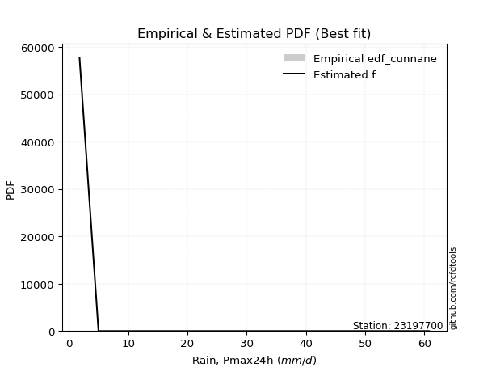</img>

</div>


### 12. EDF Adamowski (1981)

The Adamowski formula in hydrology refers to a specific plotting position formula used for estimating the non-parametric empirical distribution of hydrological events (like flood peaks) to calculate their return periods. This formula provides an alternative to traditional parametric methods (like the Gumbel or Log Pearson Type III distributions). 

<div align="center">


$P=(m-0.25)/(n+0.5)$


</div>


**12.1. Empirical values**

<div align="center">

|                | 0                   | 1                  | 2             | 3                  | 4                  |
|:---------------|:--------------------|:-------------------|:--------------|:-------------------|:-------------------|
| date           | 2023                | 2021               | 2020          | 2022               | 2019               |
| x              | 1.8                 | 5.0                | 7.8           | 49.8               | 60.8               |
| m              | 1                   | 2                  | 3             | 4                  | 5                  |
| empirical_dist | edf_adamowski       | edf_adamowski      | edf_adamowski | edf_adamowski      | edf_adamowski      |
| empirical      | 0.13636363636363635 | 0.3181818181818182 | 0.5           | 0.6818181818181818 | 0.8636363636363636 |
| empirical_tr   | 1.1578947368421053  | 1.4666666666666666 | 2.0           | 3.1428571428571423 | 7.333333333333334  |

</div>


**12.2. Kolmogorov-Smirnov fit test (sorted by Δ)**


<div align="center">

|                | 0                  | 1                   | 2                  | 3                   | 4                   | 5                   | 6                  | 7                   | 8                  | 9                   | 10                 | 11                  | 12                 | 13                 | 14                  | 15                  | 16                  | 17                  | 18                  | 19                  | 20                 | 21                  | 22                  | 23                 | 24                  | 25                 | 26                  | 27                  | 28                  | 29                  | 30                 | 31                 | 32                  | 33                  | 34                 | 35                  | 36                  | 37                  | 38                  | 39                  | 40                  | 41                  | 42                 | 43                  | 44                  | 45                  | 46                  | 47                 | 48                 | 49                 | 50                  | 51                 | 52                 | 53                  | 54                  | 55                  | 56                  | 57                  | 58                  | 59                 | 60                  | 61                  | 62                 | 63                 | 64                 | 65                  | 66                  | 67                  | 68                  | 69                 | 70                  | 71                  | 72                 | 73                  | 74                  | 75                 | 76                  | 77                  | 78                  | 79                  | 80                  | 81                  | 82                  | 83                  | 84                 | 85                  | 86                 | 87                  | 88                  | 89                  | 90                  | 91                  | 92                  | 93                  | 94                 | 95                  | 96                 | 97                  | 98                  | 99                  | 100                 | 101                | 102                | 103                 | 104                 | 105                | 106                | 107                | 108                 | 109                | 110                | 111                 | 112                 | 113                 | 114                 | 115                | 116                 | 117                | 118                | 119                 | 120                | 121                 | 122                | 123                 | 124                 | 125                | 126                | 127                 | 128                | 129                 | 130                | 131                 | 132                 | 133                 | 134                 | 135                | 136                | 137                | 138                 | 139                | 140                 | 141                | 142                 | 143                 | 144                 | 145                | 146                 | 147                | 148                | 149                | 150                | 151                | 152                 | 153                | 154                | 155                | 156                | 157                | 158                | 159                |
|:---------------|:-------------------|:--------------------|:-------------------|:--------------------|:--------------------|:--------------------|:-------------------|:--------------------|:-------------------|:--------------------|:-------------------|:--------------------|:-------------------|:-------------------|:--------------------|:--------------------|:--------------------|:--------------------|:--------------------|:--------------------|:-------------------|:--------------------|:--------------------|:-------------------|:--------------------|:-------------------|:--------------------|:--------------------|:--------------------|:--------------------|:-------------------|:-------------------|:--------------------|:--------------------|:-------------------|:--------------------|:--------------------|:--------------------|:--------------------|:--------------------|:--------------------|:--------------------|:-------------------|:--------------------|:--------------------|:--------------------|:--------------------|:-------------------|:-------------------|:-------------------|:--------------------|:-------------------|:-------------------|:--------------------|:--------------------|:--------------------|:--------------------|:--------------------|:--------------------|:-------------------|:--------------------|:--------------------|:-------------------|:-------------------|:-------------------|:--------------------|:--------------------|:--------------------|:--------------------|:-------------------|:--------------------|:--------------------|:-------------------|:--------------------|:--------------------|:-------------------|:--------------------|:--------------------|:--------------------|:--------------------|:--------------------|:--------------------|:--------------------|:--------------------|:-------------------|:--------------------|:-------------------|:--------------------|:--------------------|:--------------------|:--------------------|:--------------------|:--------------------|:--------------------|:-------------------|:--------------------|:-------------------|:--------------------|:--------------------|:--------------------|:--------------------|:-------------------|:-------------------|:--------------------|:--------------------|:-------------------|:-------------------|:-------------------|:--------------------|:-------------------|:-------------------|:--------------------|:--------------------|:--------------------|:--------------------|:-------------------|:--------------------|:-------------------|:-------------------|:--------------------|:-------------------|:--------------------|:-------------------|:--------------------|:--------------------|:-------------------|:-------------------|:--------------------|:-------------------|:--------------------|:-------------------|:--------------------|:--------------------|:--------------------|:--------------------|:-------------------|:-------------------|:-------------------|:--------------------|:-------------------|:--------------------|:-------------------|:--------------------|:--------------------|:--------------------|:-------------------|:--------------------|:-------------------|:-------------------|:-------------------|:-------------------|:-------------------|:--------------------|:-------------------|:-------------------|:-------------------|:-------------------|:-------------------|:-------------------|:-------------------|
| station        | 23197700           | 23197700            | 23197700           | 23197700            | 23197700            | 23197700            | 23197700           | 23197700            | 23197700           | 23197700            | 23197700           | 23197700            | 23197700           | 23197700           | 23197700            | 23197700            | 23197700            | 23197700            | 23197700            | 23197700            | 23197700           | 23197700            | 23197700            | 23197700           | 23197700            | 23197700           | 23197700            | 23197700            | 23197700            | 23197700            | 23197700           | 23197700           | 23197700            | 23197700            | 23197700           | 23197700            | 23197700            | 23197700            | 23197700            | 23197700            | 23197700            | 23197700            | 23197700           | 23197700            | 23197700            | 23197700            | 23197700            | 23197700           | 23197700           | 23197700           | 23197700            | 23197700           | 23197700           | 23197700            | 23197700            | 23197700            | 23197700            | 23197700            | 23197700            | 23197700           | 23197700            | 23197700            | 23197700           | 23197700           | 23197700           | 23197700            | 23197700            | 23197700            | 23197700            | 23197700           | 23197700            | 23197700            | 23197700           | 23197700            | 23197700            | 23197700           | 23197700            | 23197700            | 23197700            | 23197700            | 23197700            | 23197700            | 23197700            | 23197700            | 23197700           | 23197700            | 23197700           | 23197700            | 23197700            | 23197700            | 23197700            | 23197700            | 23197700            | 23197700            | 23197700           | 23197700            | 23197700           | 23197700            | 23197700            | 23197700            | 23197700            | 23197700           | 23197700           | 23197700            | 23197700            | 23197700           | 23197700           | 23197700           | 23197700            | 23197700           | 23197700           | 23197700            | 23197700            | 23197700            | 23197700            | 23197700           | 23197700            | 23197700           | 23197700           | 23197700            | 23197700           | 23197700            | 23197700           | 23197700            | 23197700            | 23197700           | 23197700           | 23197700            | 23197700           | 23197700            | 23197700           | 23197700            | 23197700            | 23197700            | 23197700            | 23197700           | 23197700           | 23197700           | 23197700            | 23197700           | 23197700            | 23197700           | 23197700            | 23197700            | 23197700            | 23197700           | 23197700            | 23197700           | 23197700           | 23197700           | 23197700           | 23197700           | 23197700            | 23197700           | 23197700           | 23197700           | 23197700           | 23197700           | 23197700           | 23197700           |
| empirical_dist | edf_adamowski      | edf_adamowski       | edf_adamowski      | edf_adamowski       | edf_adamowski       | edf_adamowski       | edf_adamowski      | edf_adamowski       | edf_adamowski      | edf_adamowski       | edf_adamowski      | edf_adamowski       | edf_adamowski      | edf_adamowski      | edf_adamowski       | edf_adamowski       | edf_adamowski       | edf_adamowski       | edf_adamowski       | edf_adamowski       | edf_adamowski      | edf_adamowski       | edf_adamowski       | edf_adamowski      | edf_adamowski       | edf_adamowski      | edf_adamowski       | edf_adamowski       | edf_adamowski       | edf_adamowski       | edf_adamowski      | edf_adamowski      | edf_adamowski       | edf_adamowski       | edf_adamowski      | edf_adamowski       | edf_adamowski       | edf_adamowski       | edf_adamowski       | edf_adamowski       | edf_adamowski       | edf_adamowski       | edf_adamowski      | edf_adamowski       | edf_adamowski       | edf_adamowski       | edf_adamowski       | edf_adamowski      | edf_adamowski      | edf_adamowski      | edf_adamowski       | edf_adamowski      | edf_adamowski      | edf_adamowski       | edf_adamowski       | edf_adamowski       | edf_adamowski       | edf_adamowski       | edf_adamowski       | edf_adamowski      | edf_adamowski       | edf_adamowski       | edf_adamowski      | edf_adamowski      | edf_adamowski      | edf_adamowski       | edf_adamowski       | edf_adamowski       | edf_adamowski       | edf_adamowski      | edf_adamowski       | edf_adamowski       | edf_adamowski      | edf_adamowski       | edf_adamowski       | edf_adamowski      | edf_adamowski       | edf_adamowski       | edf_adamowski       | edf_adamowski       | edf_adamowski       | edf_adamowski       | edf_adamowski       | edf_adamowski       | edf_adamowski      | edf_adamowski       | edf_adamowski      | edf_adamowski       | edf_adamowski       | edf_adamowski       | edf_adamowski       | edf_adamowski       | edf_adamowski       | edf_adamowski       | edf_adamowski      | edf_adamowski       | edf_adamowski      | edf_adamowski       | edf_adamowski       | edf_adamowski       | edf_adamowski       | edf_adamowski      | edf_adamowski      | edf_adamowski       | edf_adamowski       | edf_adamowski      | edf_adamowski      | edf_adamowski      | edf_adamowski       | edf_adamowski      | edf_adamowski      | edf_adamowski       | edf_adamowski       | edf_adamowski       | edf_adamowski       | edf_adamowski      | edf_adamowski       | edf_adamowski      | edf_adamowski      | edf_adamowski       | edf_adamowski      | edf_adamowski       | edf_adamowski      | edf_adamowski       | edf_adamowski       | edf_adamowski      | edf_adamowski      | edf_adamowski       | edf_adamowski      | edf_adamowski       | edf_adamowski      | edf_adamowski       | edf_adamowski       | edf_adamowski       | edf_adamowski       | edf_adamowski      | edf_adamowski      | edf_adamowski      | edf_adamowski       | edf_adamowski      | edf_adamowski       | edf_adamowski      | edf_adamowski       | edf_adamowski       | edf_adamowski       | edf_adamowski      | edf_adamowski       | edf_adamowski      | edf_adamowski      | edf_adamowski      | edf_adamowski      | edf_adamowski      | edf_adamowski       | edf_adamowski      | edf_adamowski      | edf_adamowski      | edf_adamowski      | edf_adamowski      | edf_adamowski      | edf_adamowski      |
| p_dist         | logarcsine         | logdweibull         | logdgamma          | logksone            | dgamma              | f                   | wrapcauchy         | weibull_min         | loglomax           | logwrapcauchy       | logsemicircular    | logvonmises         | logalpha           | logexponpow        | loganglit           | dweibull            | invgamma            | logburr12           | logloglaplace       | nct                 | logbeta            | logbetaprime        | arcsine             | loggenpareto       | logncf              | loginvweibull      | loggenlogistic      | loggenexpon         | ncf                 | loghalfnorm         | logfatiguelife     | lograyleigh        | burr12              | loginvgauss         | loghalfgennorm     | logmaxwell          | logkstwobign        | burr                | logrice             | betaprime           | loginvgamma         | loggausshyper       | lomax              | loggompertz         | gengamma            | logfoldnorm         | logpearson3         | logerlang          | loggamma           | loggamma           | logskewnorm         | logt               | logexponnorm       | logcrystalball      | lognorm             | lognct              | logloggamma         | exponweib           | levy_l              | vonmises_line      | loggennorm          | logrdist            | loghalflogistic    | logtrapezoid       | loggumbel_r        | logcosine           | logmoyal            | loglogistic         | ksone               | invgauss           | loghypsecant        | halfnorm            | loggenhalflogistic | alpha               | kappa4              | halfgennorm        | loglaplace          | loglaplace          | logf                | logargus            | loggumbel_l         | logwald             | exponpow            | semicircular        | logweibull_max     | foldnorm            | halflogistic       | logmielke           | rayleigh            | anglit              | loglevy_l           | logtriang           | maxwell             | logburr             | loggengamma        | genlogistic         | pearson3           | logweibull_min      | gumbel_r            | t                   | moyal               | gennorm            | johnsonsu          | norm                | crystalball         | kstwobign          | logtukeylambda     | logkappa3          | logkappa4           | loguniform         | logvonmises_line   | truncpareto         | truncweibull_min    | gompertz            | exponnorm           | genexpon           | loggenextreme       | logbradford        | logistic           | logtruncexpon       | gamma              | cosine              | gausshyper         | logexponweib        | logtruncnorm        | erlang             | rice               | logtruncweibull_min | truncnorm          | hypsecant           | gumbel_l           | laplace             | lognakagami         | argus               | genextreme          | wald               | triang             | beta               | fatiguelife         | nakagami           | truncexpon          | johnsonsb          | skewnorm            | bradford            | logjohnsonsb        | tukeylambda        | genpareto           | uniform            | genhalflogistic    | powerlaw           | kappa3             | mielke             | trapezoid           | weibull_max        | logpowerlaw        | rdist              | logtruncpareto     | logjohnsonsu       | invweibull         | vonmises           |
| delta          | 0.0920499598924509 | 0.11177963295987153 | 0.1172891591548222 | 0.12767151234353158 | 0.13203141159324072 | 0.13517931611873943 | 0.1363635252876162 | 0.13636362128318186 | 0.1363636363580088 | 0.13934608805968268 | 0.1423104899109907 | 0.14684655956188486 | 0.1488535982434906 | 0.1489205872660505 | 0.15271891300884655 | 0.15366308330048317 | 0.15700653828284905 | 0.15770360675716344 | 0.15775229558592951 | 0.15833622120712898 | 0.1589615873150233 | 0.15994047978213966 | 0.16197177790495132 | 0.1630904752649076 | 0.16445972313232637 | 0.1646788833497732 | 0.16485681718947998 | 0.16592990241879157 | 0.16788884104559132 | 0.16948534288352501 | 0.1704305069655262 | 0.1704502486462004 | 0.17074811505913923 | 0.17095632480450573 | 0.17126692555126   | 0.17168630558675502 | 0.17254668162266595 | 0.17321788291092377 | 0.17336953003412015 | 0.17435577139391378 | 0.17435984656265313 | 0.17454482327399085 | 0.1746020199924302 | 0.17508827796167759 | 0.17532118653111917 | 0.17557837634724704 | 0.17616038305974346 | 0.1762149803961891 | 0.176264500343973  | 0.176264500343973  | 0.17634257805593412 | 0.1763444118050833 | 0.1763447227408267 | 0.17634509979586366 | 0.17634510069087217 | 0.17639502543747043 | 0.17669079823193645 | 0.17743493052109993 | 0.17753475711449407 | 0.1781556115271875 | 0.18181818181818182 | 0.18345445456480958 | 0.1849991921799461 | 0.1856638077416819 | 0.1858417457463427 | 0.18902323359137374 | 0.19022935451275524 | 0.19303638087717567 | 0.19888741689935224 | 0.199597112356518  | 0.20134257283985846 | 0.20203962388220953 | 0.2037509833047949 | 0.20435602647322393 | 0.20598776207537728 | 0.2080652228197284 | 0.20840773817128466 | 0.20840773817128466 | 0.20894608942320075 | 0.20919390733766352 | 0.20964590251716675 | 0.21126765384822377 | 0.21267921406286944 | 0.21488664539211344 | 0.2175943627402172 | 0.21761777502336271 | 0.2176570082164765 | 0.22431309472757355 | 0.22501731777098333 | 0.22689939053213876 | 0.22779143357575848 | 0.23011417045759042 | 0.23366084894113376 | 0.23573951059777254 | 0.2387617859766305 | 0.24015098436705606 | 0.2428453141769789 | 0.24289671066700608 | 0.24296675717399963 | 0.24326815061739337 | 0.24525739634364163 | 0.2522875176203587 | 0.2539793426708693 | 0.25457773793053967 | 0.25457774150289264 | 0.2570953814684309 | 0.2581556794130203 | 0.2592481878329773 | 0.25932994619632344 | 0.2614812591145421 | 0.2617908309552226 | 0.26628343394177745 | 0.26739080105509294 | 0.27011564516905606 | 0.27068185021471236 | 0.2724614760355339 | 0.27477202768398057 | 0.2760680585456299 | 0.2772386618800744 | 0.28012264145818233 | 0.2822304702015137 | 0.28317820693500506 | 0.2832322407808433 | 0.28347904027055526 | 0.28468995462925584 | 0.2857309955442122 | 0.2883492898651565 | 0.28961348607352255 | 0.2903625216377731 | 0.29201705805358646 | 0.2929150809025953 | 0.31128032308920095 | 0.31552299133618683 | 0.31748980343939004 | 0.31899226465945174 | 0.3224364712231669 | 0.3271071739047989 | 0.3353718364945906 | 0.33858921097161704 | 0.3401969078510512 | 0.34349012504706705 | 0.3438827820177291 | 0.36051337865706645 | 0.37825839923944365 | 0.38282159626838397 | 0.3901708266426809 | 0.39119736173386976 | 0.3983050847457627 | 0.403280866490495  | 0.4079182269948746 | 0.4157192847300539 | 0.4632782496588507 | 0.47076769426888826 | 0.4894505635568238 | 0.5391045111073944 | 0.5557291909844689 | 0.556310723550318  | 0.6082892126476813 | 0.6785387236486247 | 9.356636815487825  |
| deltao         | 0.5865427407550001 | 0.5865427407550001  | 0.5865427407550001 | 0.5865427407550001  | 0.5865427407550001  | 0.5865427407550001  | 0.5865427407550001 | 0.5865427407550001  | 0.5865427407550001 | 0.5865427407550001  | 0.5865427407550001 | 0.5865427407550001  | 0.5865427407550001 | 0.5865427407550001 | 0.5865427407550001  | 0.5865427407550001  | 0.5865427407550001  | 0.5865427407550001  | 0.5865427407550001  | 0.5865427407550001  | 0.5865427407550001 | 0.5865427407550001  | 0.5865427407550001  | 0.5865427407550001 | 0.5865427407550001  | 0.5865427407550001 | 0.5865427407550001  | 0.5865427407550001  | 0.5865427407550001  | 0.5865427407550001  | 0.5865427407550001 | 0.5865427407550001 | 0.5865427407550001  | 0.5865427407550001  | 0.5865427407550001 | 0.5865427407550001  | 0.5865427407550001  | 0.5865427407550001  | 0.5865427407550001  | 0.5865427407550001  | 0.5865427407550001  | 0.5865427407550001  | 0.5865427407550001 | 0.5865427407550001  | 0.5865427407550001  | 0.5865427407550001  | 0.5865427407550001  | 0.5865427407550001 | 0.5865427407550001 | 0.5865427407550001 | 0.5865427407550001  | 0.5865427407550001 | 0.5865427407550001 | 0.5865427407550001  | 0.5865427407550001  | 0.5865427407550001  | 0.5865427407550001  | 0.5865427407550001  | 0.5865427407550001  | 0.5865427407550001 | 0.5865427407550001  | 0.5865427407550001  | 0.5865427407550001 | 0.5865427407550001 | 0.5865427407550001 | 0.5865427407550001  | 0.5865427407550001  | 0.5865427407550001  | 0.5865427407550001  | 0.5865427407550001 | 0.5865427407550001  | 0.5865427407550001  | 0.5865427407550001 | 0.5865427407550001  | 0.5865427407550001  | 0.5865427407550001 | 0.5865427407550001  | 0.5865427407550001  | 0.5865427407550001  | 0.5865427407550001  | 0.5865427407550001  | 0.5865427407550001  | 0.5865427407550001  | 0.5865427407550001  | 0.5865427407550001 | 0.5865427407550001  | 0.5865427407550001 | 0.5865427407550001  | 0.5865427407550001  | 0.5865427407550001  | 0.5865427407550001  | 0.5865427407550001  | 0.5865427407550001  | 0.5865427407550001  | 0.5865427407550001 | 0.5865427407550001  | 0.5865427407550001 | 0.5865427407550001  | 0.5865427407550001  | 0.5865427407550001  | 0.5865427407550001  | 0.5865427407550001 | 0.5865427407550001 | 0.5865427407550001  | 0.5865427407550001  | 0.5865427407550001 | 0.5865427407550001 | 0.5865427407550001 | 0.5865427407550001  | 0.5865427407550001 | 0.5865427407550001 | 0.5865427407550001  | 0.5865427407550001  | 0.5865427407550001  | 0.5865427407550001  | 0.5865427407550001 | 0.5865427407550001  | 0.5865427407550001 | 0.5865427407550001 | 0.5865427407550001  | 0.5865427407550001 | 0.5865427407550001  | 0.5865427407550001 | 0.5865427407550001  | 0.5865427407550001  | 0.5865427407550001 | 0.5865427407550001 | 0.5865427407550001  | 0.5865427407550001 | 0.5865427407550001  | 0.5865427407550001 | 0.5865427407550001  | 0.5865427407550001  | 0.5865427407550001  | 0.5865427407550001  | 0.5865427407550001 | 0.5865427407550001 | 0.5865427407550001 | 0.5865427407550001  | 0.5865427407550001 | 0.5865427407550001  | 0.5865427407550001 | 0.5865427407550001  | 0.5865427407550001  | 0.5865427407550001  | 0.5865427407550001 | 0.5865427407550001  | 0.5865427407550001 | 0.5865427407550001 | 0.5865427407550001 | 0.5865427407550001 | 0.5865427407550001 | 0.5865427407550001  | 0.5865427407550001 | 0.5865427407550001 | 0.5865427407550001 | 0.5865427407550001 | 0.5865427407550001 | 0.5865427407550001 | 0.5865427407550001 |
| eval           | Δo > Δ             | Δo > Δ              | Δo > Δ             | Δo > Δ              | Δo > Δ              | Δo > Δ              | Δo > Δ             | Δo > Δ              | Δo > Δ             | Δo > Δ              | Δo > Δ             | Δo > Δ              | Δo > Δ             | Δo > Δ             | Δo > Δ              | Δo > Δ              | Δo > Δ              | Δo > Δ              | Δo > Δ              | Δo > Δ              | Δo > Δ             | Δo > Δ              | Δo > Δ              | Δo > Δ             | Δo > Δ              | Δo > Δ             | Δo > Δ              | Δo > Δ              | Δo > Δ              | Δo > Δ              | Δo > Δ             | Δo > Δ             | Δo > Δ              | Δo > Δ              | Δo > Δ             | Δo > Δ              | Δo > Δ              | Δo > Δ              | Δo > Δ              | Δo > Δ              | Δo > Δ              | Δo > Δ              | Δo > Δ             | Δo > Δ              | Δo > Δ              | Δo > Δ              | Δo > Δ              | Δo > Δ             | Δo > Δ             | Δo > Δ             | Δo > Δ              | Δo > Δ             | Δo > Δ             | Δo > Δ              | Δo > Δ              | Δo > Δ              | Δo > Δ              | Δo > Δ              | Δo > Δ              | Δo > Δ             | Δo > Δ              | Δo > Δ              | Δo > Δ             | Δo > Δ             | Δo > Δ             | Δo > Δ              | Δo > Δ              | Δo > Δ              | Δo > Δ              | Δo > Δ             | Δo > Δ              | Δo > Δ              | Δo > Δ             | Δo > Δ              | Δo > Δ              | Δo > Δ             | Δo > Δ              | Δo > Δ              | Δo > Δ              | Δo > Δ              | Δo > Δ              | Δo > Δ              | Δo > Δ              | Δo > Δ              | Δo > Δ             | Δo > Δ              | Δo > Δ             | Δo > Δ              | Δo > Δ              | Δo > Δ              | Δo > Δ              | Δo > Δ              | Δo > Δ              | Δo > Δ              | Δo > Δ             | Δo > Δ              | Δo > Δ             | Δo > Δ              | Δo > Δ              | Δo > Δ              | Δo > Δ              | Δo > Δ             | Δo > Δ             | Δo > Δ              | Δo > Δ              | Δo > Δ             | Δo > Δ             | Δo > Δ             | Δo > Δ              | Δo > Δ             | Δo > Δ             | Δo > Δ              | Δo > Δ              | Δo > Δ              | Δo > Δ              | Δo > Δ             | Δo > Δ              | Δo > Δ             | Δo > Δ             | Δo > Δ              | Δo > Δ             | Δo > Δ              | Δo > Δ             | Δo > Δ              | Δo > Δ              | Δo > Δ             | Δo > Δ             | Δo > Δ              | Δo > Δ             | Δo > Δ              | Δo > Δ             | Δo > Δ              | Δo > Δ              | Δo > Δ              | Δo > Δ              | Δo > Δ             | Δo > Δ             | Δo > Δ             | Δo > Δ              | Δo > Δ             | Δo > Δ              | Δo > Δ             | Δo > Δ              | Δo > Δ              | Δo > Δ              | Δo > Δ             | Δo > Δ              | Δo > Δ             | Δo > Δ             | Δo > Δ             | Δo > Δ             | Δo > Δ             | Δo > Δ              | Δo > Δ             | Δo > Δ             | Δo > Δ             | Δo > Δ             | Δo <= Δ            | Δo <= Δ            | Δo <= Δ            |
| fit            | 1                  | 1                   | 1                  | 1                   | 1                   | 1                   | 1                  | 1                   | 1                  | 1                   | 1                  | 1                   | 1                  | 1                  | 1                   | 1                   | 1                   | 1                   | 1                   | 1                   | 1                  | 1                   | 1                   | 1                  | 1                   | 1                  | 1                   | 1                   | 1                   | 1                   | 1                  | 1                  | 1                   | 1                   | 1                  | 1                   | 1                   | 1                   | 1                   | 1                   | 1                   | 1                   | 1                  | 1                   | 1                   | 1                   | 1                   | 1                  | 1                  | 1                  | 1                   | 1                  | 1                  | 1                   | 1                   | 1                   | 1                   | 1                   | 1                   | 1                  | 1                   | 1                   | 1                  | 1                  | 1                  | 1                   | 1                   | 1                   | 1                   | 1                  | 1                   | 1                   | 1                  | 1                   | 1                   | 1                  | 1                   | 1                   | 1                   | 1                   | 1                   | 1                   | 1                   | 1                   | 1                  | 1                   | 1                  | 1                   | 1                   | 1                   | 1                   | 1                   | 1                   | 1                   | 1                  | 1                   | 1                  | 1                   | 1                   | 1                   | 1                   | 1                  | 1                  | 1                   | 1                   | 1                  | 1                  | 1                  | 1                   | 1                  | 1                  | 1                   | 1                   | 1                   | 1                   | 1                  | 1                   | 1                  | 1                  | 1                   | 1                  | 1                   | 1                  | 1                   | 1                   | 1                  | 1                  | 1                   | 1                  | 1                   | 1                  | 1                   | 1                   | 1                   | 1                   | 1                  | 1                  | 1                  | 1                   | 1                  | 1                   | 1                  | 1                   | 1                   | 1                   | 1                  | 1                   | 1                  | 1                  | 1                  | 1                  | 1                  | 1                   | 1                  | 1                  | 1                  | 1                  | 0                  | 0                  | 0                  |
| n              | 5                  | 5                   | 5                  | 5                   | 5                   | 5                   | 5                  | 5                   | 5                  | 5                   | 5                  | 5                   | 5                  | 5                  | 5                   | 5                   | 5                   | 5                   | 5                   | 5                   | 5                  | 5                   | 5                   | 5                  | 5                   | 5                  | 5                   | 5                   | 5                   | 5                   | 5                  | 5                  | 5                   | 5                   | 5                  | 5                   | 5                   | 5                   | 5                   | 5                   | 5                   | 5                   | 5                  | 5                   | 5                   | 5                   | 5                   | 5                  | 5                  | 5                  | 5                   | 5                  | 5                  | 5                   | 5                   | 5                   | 5                   | 5                   | 5                   | 5                  | 5                   | 5                   | 5                  | 5                  | 5                  | 5                   | 5                   | 5                   | 5                   | 5                  | 5                   | 5                   | 5                  | 5                   | 5                   | 5                  | 5                   | 5                   | 5                   | 5                   | 5                   | 5                   | 5                   | 5                   | 5                  | 5                   | 5                  | 5                   | 5                   | 5                   | 5                   | 5                   | 5                   | 5                   | 5                  | 5                   | 5                  | 5                   | 5                   | 5                   | 5                   | 5                  | 5                  | 5                   | 5                   | 5                  | 5                  | 5                  | 5                   | 5                  | 5                  | 5                   | 5                   | 5                   | 5                   | 5                  | 5                   | 5                  | 5                  | 5                   | 5                  | 5                   | 5                  | 5                   | 5                   | 5                  | 5                  | 5                   | 5                  | 5                   | 5                  | 5                   | 5                   | 5                   | 5                   | 5                  | 5                  | 5                  | 5                   | 5                  | 5                   | 5                  | 5                   | 5                   | 5                   | 5                  | 5                   | 5                  | 5                  | 5                  | 5                  | 5                  | 5                   | 5                  | 5                  | 5                  | 5                  | 5                  | 5                  | 5                  |
| best_fit       | 1                  | 0                   | 0                  | 0                   | 0                   | 0                   | 0                  | 0                   | 0                  | 0                   | 0                  | 0                   | 0                  | 0                  | 0                   | 0                   | 0                   | 0                   | 0                   | 0                   | 0                  | 0                   | 0                   | 0                  | 0                   | 0                  | 0                   | 0                   | 0                   | 0                   | 0                  | 0                  | 0                   | 0                   | 0                  | 0                   | 0                   | 0                   | 0                   | 0                   | 0                   | 0                   | 0                  | 0                   | 0                   | 0                   | 0                   | 0                  | 0                  | 0                  | 0                   | 0                  | 0                  | 0                   | 0                   | 0                   | 0                   | 0                   | 0                   | 0                  | 0                   | 0                   | 0                  | 0                  | 0                  | 0                   | 0                   | 0                   | 0                   | 0                  | 0                   | 0                   | 0                  | 0                   | 0                   | 0                  | 0                   | 0                   | 0                   | 0                   | 0                   | 0                   | 0                   | 0                   | 0                  | 0                   | 0                  | 0                   | 0                   | 0                   | 0                   | 0                   | 0                   | 0                   | 0                  | 0                   | 0                  | 0                   | 0                   | 0                   | 0                   | 0                  | 0                  | 0                   | 0                   | 0                  | 0                  | 0                  | 0                   | 0                  | 0                  | 0                   | 0                   | 0                   | 0                   | 0                  | 0                   | 0                  | 0                  | 0                   | 0                  | 0                   | 0                  | 0                   | 0                   | 0                  | 0                  | 0                   | 0                  | 0                   | 0                  | 0                   | 0                   | 0                   | 0                   | 0                  | 0                  | 0                  | 0                   | 0                  | 0                   | 0                  | 0                   | 0                   | 0                   | 0                  | 0                   | 0                  | 0                  | 0                  | 0                  | 0                  | 0                   | 0                  | 0                  | 0                  | 0                  | 0                  | 0                  | 0                  |
| best_fit_sort  | 1                  | 2                   | 3                  | 4                   | 5                   | 6                   | 7                  | 8                   | 9                  | 10                  | 11                 | 12                  | 13                 | 14                 | 15                  | 16                  | 17                  | 18                  | 19                  | 20                  | 21                 | 22                  | 23                  | 24                 | 25                  | 26                 | 27                  | 28                  | 29                  | 30                  | 31                 | 32                 | 33                  | 34                  | 35                 | 36                  | 37                  | 38                  | 39                  | 40                  | 41                  | 42                  | 43                 | 44                  | 45                  | 46                  | 47                  | 48                 | 49                 | 50                 | 51                  | 52                 | 53                 | 54                  | 55                  | 56                  | 57                  | 58                  | 59                  | 60                 | 61                  | 62                  | 63                 | 64                 | 65                 | 66                  | 67                  | 68                  | 69                  | 70                 | 71                  | 72                  | 73                 | 74                  | 75                  | 76                 | 77                  | 78                  | 79                  | 80                  | 81                  | 82                  | 83                  | 84                  | 85                 | 86                  | 87                 | 88                  | 89                  | 90                  | 91                  | 92                  | 93                  | 94                  | 95                 | 96                  | 97                 | 98                  | 99                  | 100                 | 101                 | 102                | 103                | 104                 | 105                 | 106                | 107                | 108                | 109                 | 110                | 111                | 112                 | 113                 | 114                 | 115                 | 116                | 117                 | 118                | 119                | 120                 | 121                | 122                 | 123                | 124                 | 125                 | 126                | 127                | 128                 | 129                | 130                 | 131                | 132                 | 133                 | 134                 | 135                 | 136                | 137                | 138                | 139                 | 140                | 141                 | 142                | 143                 | 144                 | 145                 | 146                | 147                 | 148                | 149                | 150                | 151                | 152                | 153                 | 154                | 155                | 156                | 157                | 158                | 159                | 160                |

</div>


**12.3. Best fit**

<div align="center">

|   id |   station | empirical_dist   | p_dist     |   delta |   deltao | eval   |   fit |   n |   best_fit |   best_fit_sort |
|-----:|----------:|:-----------------|:-----------|--------:|---------:|:-------|------:|----:|-----------:|----------------:|
|    0 |  23197700 | edf_adamowski    | logarcsine | 0.09205 | 0.586543 | Δo > Δ |     1 |   5 |          1 |               1 |

</div>


<div align="center">

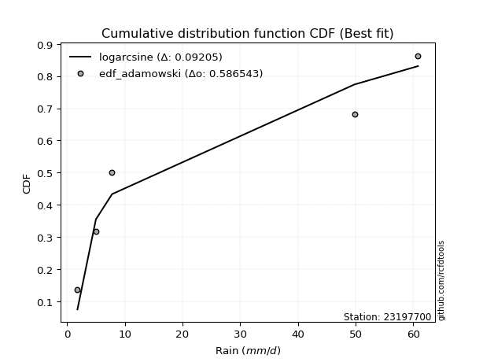</img>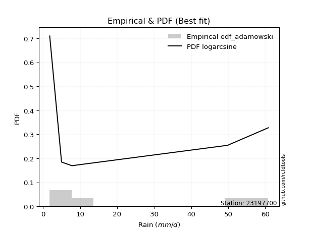</img>

</div>


## C. Best fit & Estimate extreme values for specific return periods - Tr

Best fit in probability distribution analysis means finding the theoretical distribution (like Normal, Poisson, Exponential, etc.) that most accurately mirrors your real-world data´s patterns (shape, center, spread) for better predictions, using methods like visual checks (Q-Q plots), goodness-of-fit tests (Kolmogorov-Smirnov, Chi-Squared), and information criteria (AIC) to score and select the simplest, most representative model.


### 1. Best fit (ordered by delta Δ)

:file_folder:Table: [bestfit_23197700.csv](table/bestfit_23197700.csv)

<div align="center">

|   id |   station | empirical_dist   | p_dist     |     delta |   deltao | eval   |   fit |   n |   best_fit |   best_fit_sort |
|-----:|----------:|:-----------------|:-----------|----------:|---------:|:-------|------:|----:|-----------:|----------------:|
|    0 |  23197700 | edf_hazen        | logarcsine | 0.0738681 | 0.586543 | Δo > Δ |     1 |   5 |          1 |               1 |
|    1 |  23197700 | edf_gringorten   | logarcsine | 0.0785556 | 0.586543 | Δo > Δ |     1 |   5 |          1 |               2 |
|    2 |  23197700 | edf_cunnane      | logarcsine | 0.0815604 | 0.586543 | Δo > Δ |     1 |   5 |          1 |               3 |
|    3 |  23197700 | edf_blom         | logarcsine | 0.083392  | 0.586543 | Δo > Δ |     1 |   5 |          1 |               4 |
|    4 |  23197700 | edf_tukey        | logarcsine | 0.0863681 | 0.586543 | Δo > Δ |     1 |   5 |          1 |               5 |
|    5 |  23197700 | edf_filliben     | logarcsine | 0.0874749 | 0.586543 | Δo > Δ |     1 |   5 |          1 |               6 |
|    6 |  23197700 | edf_beard        | logarcsine | 0.0879945 | 0.586543 | Δo > Δ |     1 |   5 |          1 |               7 |
|    7 |  23197700 | edf_jenkinson    | logarcsine | 0.0879945 | 0.586543 | Δo > Δ |     1 |   5 |          1 |               8 |
|    8 |  23197700 | edf_chegodayev   | logarcsine | 0.088683  | 0.586543 | Δo > Δ |     1 |   5 |          1 |               9 |
|    9 |  23197700 | edf_adamowski    | logarcsine | 0.09205   | 0.586543 | Δo > Δ |     1 |   5 |          1 |              10 |
|   10 |  23197700 | edf_weibull      | logarcsine | 0.107201  | 0.586543 | Δo > Δ |     1 |   5 |          1 |              11 |
|   11 |  23197700 | edf_california   | logbeta    | 0.12308   | 0.586543 | Δo > Δ |     1 |   5 |          1 |              12 |

</div>


### 2. Extreme values and % difference analysis

In hydrology, a return period (or recurrence interval $Tr$) is the statistical average time between extreme events like floods or droughts of a specific magnitude, indicating how rare an event is, with a 100-year flood, for example, having a 1% chance of occurring in any given year, not that it happens exactly every century. It is a key tool for infrastructure design (like bridges or dams) and risk assessment, calculated from historical data to determine the probability of future events, although it is important to remember it is statistical average, and events can cluster or be missed.

The extreme value porcentage difference is evaluated as $pdiff = 1 - (ETrBf / ETr) * 100$, where _ETrBf_ correspond to the bestfit extreme value for a specific recurrence interval and _ETr_ correspond to the extreme value for one of the most used PDFsused in hydrology.

> risk_rate: assuming the return period as the project useful life.

:file_folder:Table: [extreme_23197700.csv](table/extreme_23197700.csv), all PDFs.  
:file_folder:Table: [extremepdiff_23197700.csv](table/extremepdiff_23197700.csv), % difference between bestfit and most used PDFs in Hydrology.

<div align="center">

Extreme values table for only best fit PDFs
|   id |      tr |   prob_l |     prob_g |      alpha |   anglit |   arcsine |   argus |    beta |   betaprime |   bradford |        burr |           burr12 |   cosine |   crystalball |   dgamma |   dweibull |    erlang |   exponnorm |   exponpow |   exponweib |         f |   fatiguelife |   foldnorm |     gamma |   gausshyper |   genexpon |      genextreme |   gengamma |   genhalflogistic |   genlogistic |   gennorm |   genpareto |   gompertz |   gumbel_l |   gumbel_r |   halfgennorm |   halflogistic |   halfnorm |   hypsecant |     invgamma |   invgauss |   invweibull |   johnsonsb |   johnsonsu |         kappa3 |   kappa4 |   ksone |   kstwobign |   laplace |   levy_l |   loggamma |   logistic |   loglaplace |       lomax |   maxwell |       mielke |    moyal |   nakagami |         ncf |          nct |     norm |   pearson3 |   powerlaw |   rayleigh |    rdist |     rice |   semicircular |   skewnorm |            t |   trapezoid |   triang |   truncexpon |   truncnorm |   truncpareto |   truncweibull_min |   tukeylambda |   uniform |   vonmises |   vonmises_line |     wald |   weibull_max |   weibull_min |   wrapcauchy |         logalpha |   loganglit |   logarcsine |   logargus |   logbeta |     logbetaprime |   logbradford |   logburr |    logburr12 |   logcosine |   logcrystalball |   logdgamma |   logdweibull |   logerlang |   logexponnorm |   logexponpow |   logexponweib |             logf |   logfatiguelife |   logfoldnorm |   loggausshyper |   loggenexpon |   loggenextreme |   loggengamma |   loggenhalflogistic |   loggenlogistic |   loggennorm |   loggenpareto |   loggompertz |   loggumbel_l |   loggumbel_r |   loghalfgennorm |   loghalflogistic |   loghalfnorm |   loghypsecant |   loginvgamma |   loginvgauss |   loginvweibull |   logjohnsonsb |   logjohnsonsu |   logkappa3 |   logkappa4 |   logksone |   logkstwobign |   loglevy_l |   logloggamma |   loglogistic |    logloglaplace |         loglomax |   logmaxwell |   logmielke |    logmoyal |   lognakagami |      logncf |   lognct |   lognorm |   logpearson3 |   logpowerlaw |   lograyleigh |   logrdist |   logrice |   logsemicircular |   logskewnorm |     logt |   logtrapezoid |   logtriang |   logtruncexpon |   logtruncnorm |   logtruncpareto |   logtruncweibull_min |   logtukeylambda |   loguniform |   logvonmises |   logvonmises_line |      logwald |   logweibull_max |   logweibull_min |   logwrapcauchy |   station |   n |   risk_rate |
|-----:|--------:|---------:|-----------:|-----------:|---------:|----------:|--------:|--------:|------------:|-----------:|------------:|-----------------:|---------:|--------------:|---------:|-----------:|----------:|------------:|-----------:|------------:|----------:|--------------:|-----------:|----------:|-------------:|-----------:|----------------:|-----------:|------------------:|--------------:|----------:|------------:|-----------:|-----------:|-----------:|--------------:|---------------:|-----------:|------------:|-------------:|-----------:|-------------:|------------:|------------:|---------------:|---------:|--------:|------------:|----------:|---------:|-----------:|-----------:|-------------:|------------:|----------:|-------------:|---------:|-----------:|------------:|-------------:|---------:|-----------:|-----------:|-----------:|---------:|---------:|---------------:|-----------:|-------------:|------------:|---------:|-------------:|------------:|--------------:|-------------------:|--------------:|----------:|-----------:|----------------:|---------:|--------------:|--------------:|-------------:|-----------------:|------------:|-------------:|-----------:|----------:|-----------------:|--------------:|----------:|-------------:|------------:|-----------------:|------------:|--------------:|------------:|---------------:|--------------:|---------------:|-----------------:|-----------------:|--------------:|----------------:|--------------:|----------------:|--------------:|---------------------:|-----------------:|-------------:|---------------:|--------------:|--------------:|--------------:|-----------------:|------------------:|--------------:|---------------:|--------------:|--------------:|----------------:|---------------:|---------------:|------------:|------------:|-----------:|---------------:|------------:|--------------:|--------------:|-----------------:|-----------------:|-------------:|------------:|------------:|--------------:|------------:|---------:|----------:|--------------:|--------------:|--------------:|-----------:|----------:|------------------:|--------------:|---------:|---------------:|------------:|----------------:|---------------:|-----------------:|----------------------:|-----------------:|-------------:|--------------:|-------------------:|-------------:|-----------------:|-----------------:|----------------:|----------:|----:|------------:|
|    0 |    2    | 0.5      | 0.5        |    8.79983 |  25.04   |   25.04   | 30.7648 | 32.5179 |     8.73206 |    28.3953 |     8.83952 |     15.136       |  26.5842 |       25.04   |  29.6136 |    30.9408 |   9.91309 |     17.8143 |    18.8914 |     11.2287 |   11.9967 |       1.80014 |    23.2144 |   5.09208 |      29.5989 |    17.9089 |    29.2534      |    12.5342 |           40.3719 |       20.0384 |   7.8     |     34.514  |    17.7213 |    29.1509 |    20.9291 |       8.75809 |        18.8854 |    19.9178 |     25.04   |      7.69611 |    7.77999 |      1.8     |     1.80505 |     25.0394 |  414.487       |  23.7954 | 25.04   |     21.0138 |   25.04   |  42.2233 |    11.5202 |    25.04   |      11.6277 |     8.06402 |   22.8999 |      2.07366 |  19.602  |    2.00328 |     8.89574 |      7.71586 |  25.04   |    23.1726 |    1.90711 |    22.1408 | -3.4968  |  24.1972 |        25.04   |    24.8306 |      5.31607 |     45.7582 |  34.2279 |      23.8073 |     18.9728 |       16.1424 |            8.89232 |       32.0378 |   31.3    |  -0.534473 |         21.5217 |  16.9286 |       60.4049 |       14.8316 |      31.2941 |     5.67099      |     11.6277 |      11.6277 |    14.8225 |    9.0326 |      5.47958     |       7.85024 |   12.7657 |      6.84398 |     11.5971 |          11.6277 |     16.8592 |       15.1043 |     11.5199 |        11.6276 |       7.57671 |        4.52507 |      4.47192     |          9.75443 |       11.6003 |         16.3893 |       8.50414 |         28.2581 |       3.96454 |              16.2243 |          9.19335 |      10.4614 |        17.018  |       10.3689 |       14.5311 |       9.30443 |          6.30649 |           8.32857 |       8.80794 |        11.6277 |       10.5776 |       9.87887 |         9.18522 |        1.67917 |        60.7996 |      1.8    |      9.4808 |    11.6277 |         8.9248 |     37.0058 |       11.6968 |       11.6277 |      7.80009     |      7.64388     |      10.3538 |      1.8    |     8.65841 |       5.13531 |     9.28027 |  11.5882 |   11.6277 |       11.534  |       1.82435 |       9.93628 |    10.4054 |   10.5418 |           11.6277 |       11.6264 |  11.6278 |        13.6942 |     15.3277 |         7.35611 |        7.21482 |          1.96637 |               5.19448 |          10.4755 |      10.4614 |       10.7608 |            10.3576 |      7.49019 |          27.5156 |     3.19766      |         10.4611 |  23197700 |   5 |    0.75     |
|    1 |    2.33 | 0.570815 | 0.429185   |   10.8973  |  30.2413 |   32.8481 | 35.1282 | 36.9653 |    11.1501  |    32.605  |    11.3044  |     24.0361      |  30.9553 |       29.5054 |  50.5312 |    52.2701 |  11.9854  |     21.3491 |    24.1702 |     14.3029 |   18.6646 |       2.4256  |    28.1562 |   6.68002 |      34.792  |    21.4582 |    95.9181      |    15.9789 |           44.2343 |       23.9417 |   8.14122 |     38.9602 |    21.2293 |    33.0358 |    25.0668 |      11.2915  |        23.1396 |    24.7371 |     28.6136 |     10.048   |    9.95643 |      1.8     |     1.8795  |     29.5169 | 6703.52        |  29.2834 | 31.1784 |     24.9836 |   27.7422 |  47.9669 |    14.6795 |    28.9743 |      13.4625 |    10.3596  |   27.5391 |      2.26423 |  23.5188 |    2.56612 |    11.4103  |     10.0155  |  29.5054 |    27.6538 |    2.15778 |    26.8487 | -1.50367 |  28.3408 |        30.6185 |    28.7948 |      6.15534 |     49.186  |  38.6204 |      27.7707 |     22.5652 |       19.137  |           11.5709  |       36.5382 |   35.4781 |  -0.184364 |         27.0847 |  19.8566 |       60.625  |       21.9486 |      51.2167 |     7.88226      |     15.4162 |      17.7566 |    18.6211 |   14.0926 |      7.69237     |      10.086   |   16.4244 |      9.02438 |     14.7504 |          14.8131 |     39.1282 |       32.4053 |     14.6797 |        14.813  |      10.2709  |        5.93581 |      6.11599     |         12.5096  |       14.7954 |         21.6412 |      11.1145  |         33.9352 |       5.31905 |              21.0747 |         11.8191  |      10.4614 |        22.7452 |       13.4156 |       17.9383 |      11.6446  |          8.22225 |          10.4893  |      11.4383  |        14.1139 |       13.5039 |      12.6599  |        11.8119  |        2.9389  |        60.7999 |      1.8    |     12.3425 |    16.2197 |        11.4998 |     43.1576 |       14.9003 |       14.3926 |      9.39019     |     10.5121      |      13.3151 |      1.8    |    10.7071  |       5.31259 |    11.9667  |  14.762  |   14.8131 |       14.6973 |       1.87147 |      12.8258  |    14.9285 |   13.5116 |           15.7347 |       14.8114 |  14.8132 |        18.0957 |     19.2951 |         9.41164 |        9.14494 |          2.05245 |               6.63693 |          13.4929 |      13.4227 |       14.2077 |            13.3083 |      8.77891 |          34.4968 |     5.50375      |         29.2252 |  23197700 |   5 |    0.729209 |
|    2 |    5    | 0.8      | 0.2        |   27.1612  |  48.5929 |   53.6694 | 49.1245 | 50.3028 |    32.5365  |    47.0654 |    32.9835  |    179.073       |  46.707  |       46.0999 |  55.541  |    57.7218 |  22.7911  |     39.0222 |    51.2665 |     35.7501 |   75.593  |      15.7094  |    46.6915 |  17.3937  |      50.5208 |    39.2037 | 19875.9         |    37.7188 |           54.3826 |       40.8983 |  15.4551  |     52.1525 |    38.7682 |    45.5864 |    43.0427 |      29.2785  |        42.3889 |    45.1173 |     42.9483 |     35.2913  |   28.1512  |      1.8     |   431.396   |     46.1567 |    1.07926e+09 |  46.7615 | 51.0447 |     41.8465 |   41.2528 |  57.4827 |    36.3058 |    44.1652 |      28.0077 |    31.7344  |   45.7987 |      5.81299 |  41.6619 |   24.3972  |    34.0927  |     34.7842  |  46.0999 |    45.371  |    9.53453 |    45.6962 |  4.47306 |  44.9297 |        49.6557 |    45.5589 |     12.468   |     59.0204 |  51.2222 |      42.9696 |     39.6571 |       32.8241 |           27.8085  |       50.8765 |   49      |   1.09218  |         45.0886 |  36.2475 |       60.7949 |       84.143  |      59.0772 |   101.258        |     41.6988 |      54.9119 |    37.384  |   44.0595 |     51.9599      |      24.7094  |   34.8452 |     34.2616  |     35.0928 |          36.4265 |     67.1431 |       62.0551 |     36.3138 |        36.4265 |      38.6775  |       18.0051  |     37.7884      |         35.0031  |       36.5411 |         45.1584 |      34.9287  |         50.8821 |      20.7219  |              41.1476 |         35.1935  |      10.4614 |        46.4159 |       35.8577 |       35.4263 |      30.8621  |         29.9257  |          29.7873  |      34.5371  |        30.7046 |       35.3631 |      35.0648  |        35.2265  |       60.3628  |        60.8    |     30.2747 |     29.3414 |    47.6276 |        33.7547 |     55.6813 |       36.4704 |       32.7989 |     31.4993      |     51.7058      |      35.8364 |     23.6853 |    28.6359  |       8.23462 |    35.5602  |  36.3659 |   36.4265 |       36.3383 |       3.23474 |      35.6379  |    40.8701 |   35.746  |           44.1725 |       36.4252 |  36.4267 |        40.256  |     37.3472 |        23.1958  |       21.9231  |          3.17212 |              18.0068  |          30.507  |      30.073  |       41.5655 |            29.9539 |     21.3507  |          53.2926 | 26217.3          |         52.8376 |  23197700 |   5 |    0.67232  |
|    3 |   10    | 0.9      | 0.1        |   57.0421  |  58.9801 |   58.6959 | 55.8738 | 55.6976 |    78.7065  |    53.7971 |    79.0001  |    903.822       |  56.2236 |       57.1083 |  57.9977 |    59.7084 |  32.952   |     55.0654 |    74.8062 |     66.5872 |  157.98   |      34.0509  |    59.0316 |  29.5733  |      56.4454 |    55.3126 |     1.55472e+06 |    64.3726 |           57.8803 |       54.7084 |  32.7661  |     57.0706 |    54.6895 |    52.5739 |    57.6838 |      53.6726  |        58.3746 |    60.1982 |     54.3949 |    105.962   |   58.7645  |      1.8     |   533.772   |     57.1952 |    1.73671e+13 |  54.0902 | 59.7129 |     54.6854 |   53.5173 |  59.78   |    66.4842 |    55.3527 |      54.4609 |    80.5176  |   58.6488 |     23.0688  |  57.4583 |   77.7427  |    84.4019  |    105.264   |  57.1083 |    58.0695 |   24.405   |    59.1349 |  6.53761 |  56.7579 |        59.424  |    57.9639 |     31.4937  |     62.8618 |  56.1445 |      51.1759 |     54.0996 |       42.8344 |           41.0662  |       56.8481 |   54.9    |   1.79927  |         52.9443 |  53.6421 |       60.7997 |      182.108  |      60.0278 | 11028.6          |     73.2358 |      72.1159 |    51.3216 |   56.4483 |    365.974       |      38.1898  |   47.2617 |    109.943   |     59.2426 |          66.1677 |     90.5982 |       83.9203 |     66.51   |        66.1681 |     103.235   |       32.6057  |    247.342       |         76.3818  |       66.5669 |         55.4132 |      82.7525  |         56.8162 |      49.9929  |              51.2742 |         85.573   |      10.4614 |        55.9295 |       67.7079 |       51.7453 |      68.2651  |         93.2454  |          70.8704  |      78.2382  |        57.1152 |       70.5104 |      75.4582  |        85.7793  |       60.7975  |        60.8    |     43.0829 |     42.7617 |    76.2045 |        76.6277 |     59.2138 |       65.7873 |       60.1597 |    164.855       |    219.574       |      71.9323 |     47.5831 |    67.4355  |      15.1211  |    84.385   |  66.2518 |   66.1677 |       66.5067 |       8.147   |      73.8534  |    54.031  |   70.2686 |           75.0203 |       66.1726 |  66.168  |        55.0135 |     48.3378 |        36.6214  |       34.8755  |          6.4494  |              31.4822  |          43.3533 |      42.7603 |       86.0192 |            42.6764 |     54.8299  |          58.4059 |     1.07189e+14  |         57.0856 |  23197700 |   5 |    0.651322 |
|    4 |   15    | 0.933333 | 0.0666667  |   86.8163  |  63.4156 |   59.6546 | 58.4397 | 57.4397 |   130.032   |    56.1007 |   129.338   |   2251.1         |  60.5585 |       62.6017 |  59.1712 |    60.5413 |  38.9836  |     64.45   |    87.8141 |     91.1262 |  219.638  |      46.0466  |    65.1925 |  37.343   |      58.1743 |    64.7357 |     1.81917e+07 |    83.2354 |           58.9302 |       62.4999 |  49.2454  |     58.5197 |    64.0029 |    55.7385 |    65.9442 |      71.7342  |        67.4211 |    68.0462 |     60.9275 |    200.449   |   84.0641  |      1.8     |   533.91    |     62.7036 |    4.04111e+15 |  56.4467 | 62.6023 |     61.5014 |   60.6916 |  60.4741 |    90.0302 |    61.4482 |      80.3575 |   136.802   |   65.2421 |     55.3982  |  66.6258 |  115.925   |   141.418   |    200.772   |  62.6017 |    64.6945 |   33.279   |    66.0591 |  7.08789 |  62.8523 |        63.2333 |    64.4194 |     60.4014  |     64.0943 |  57.7238 |      54.2049 |     62.1479 |       47.4313 |           46.7935  |       58.756  |   56.8667 |   2.06043  |         55.5629 |  64.8122 |       60.7999 |      258.941  |      60.2947 |     1.18126e+06  |     93.1479 |      75.9638 |    57.7033 |   58.9341 |   1236.91        |      44.4421  |   52.1818 |    214.537   |     75.2013 |          89.1264 |    105.277  |       96.3072 |     90.0737 |        89.1272 |     170.621   |       40.3311  |    791.673       |        116.323   |       89.7929 |         58.0266 |     130.295   |         58.4574 |      73.808   |              54.6528 |        141.262   |      10.4614 |        58.2974 |       91.8757 |       61.4313 |     106.836   |        179.132   |         115.742   |     119.737   |        81.3919 |      101.158  |     113.856   |       141.726   |       60.7998  |        60.8    |     48.4597 |     48.39   |    89.1294 |       118.415  |     60.3244 |       88.2052 |       83.7228 |    613.786       |    511.636       |     102.845  |     61.1848 |   110.858   |      21.8285  |   136.289   |  89.4178 |   89.1264 |       90.0264 |      13.5984  |     107.504   |    57.401  |   99.0594 |           92.2319 |       89.1394 |  89.1268 |        60.8121 |     52.5088 |        43.0989  |       41.4493  |         10.2612  |              38.7301  |          48.6718 |      48.0834 |      118.107  |            48.0211 |    100.473   |          59.5633 |     8.66132e+23  |         58.3423 |  23197700 |   5 |    0.644736 |
|    5 |   20    | 0.95     | 0.05       |  116.564   |  66.0248 |   59.9922 | 59.8481 | 58.2988 |   185.035   |    57.264  |   182.664   |   4267.94        |  63.2244 |       66.1992 |  59.932  |    61.0475 |  43.2913  |     71.1085 |    96.6967 |    112.005  |  269.823  |      54.9279  |    69.2275 |  43.0651  |      58.9677 |    71.4215 |     1.01815e+08 |    98.1604 |           59.4317 |       67.9552 |  64.3861  |     59.1916 |    70.6108 |    57.7082 |    71.7279 |      86.3285  |        73.7593 |    73.2786 |     65.5358 |    314.734   |  105.443   |      1.8     |   533.914   |     66.3109 |    1.82796e+17 |  57.598  | 64.047  |     66.0928 |   65.7818 |  60.8295 |   109.854  |    65.6612 |     105.899  |   198.587   |   69.6178 |    103.743   |  73.1184 |  143.673   |   203.295   |    317.339   |  66.1992 |    69.1382 |   38.784   |    70.6615 |  7.3262  |  66.9031 |        65.3462 |    68.7234 |     98.6113  |     64.7023 |  58.5029 |      55.7838 |     67.6987 |       50.1228 |           49.9548  |       59.6853 |   57.85   |   2.19482  |         56.8722 |  73.1361 |       60.8    |      322.519  |      60.4234 |     1.26004e+08  |    107.304  |      77.3673 |    61.491  |   59.7865 |   3027.49        |      48.0025  |   54.8063 |    343.065   |     87.0826 |         108.323  |    116.308  |      105.056  |    109.914  |       108.324  |     237.459   |       44.979   |   1849.23        |        155.019   |      109.236  |         59.0826 |     176.673   |         59.1907 |      93.4745  |              56.3095 |        200.651   |      10.4614 |        59.2498 |      111.64   |       68.3556 |     146.188   |        283.398   |         163.21    |     159.017   |       104.496  |      128.935  |     150.68    |       201.435   |       60.8     |        60.8    |     51.3947 |     51.4382 |    96.3921 |       158.758  |     60.9012 |      106.836  |      105.209  |   1905.79        |    932.442       |     130.384  |     69.6272 |   157.637   |      28.1553  |   190.11    | 108.84   |  108.323  |      109.818  |      18.5212  |     137.975   |    58.7386 |  124.257  |          103.427  |      108.345  | 108.324  |        63.8938 |     54.697  |        46.8589  |       45.3809  |         14.0119  |              43.1466  |          51.5474 |      50.9885 |      140.646  |            50.9395 |    157.782   |          60.0235 |     2.74064e+33  |         58.9587 |  23197700 |   5 |    0.641514 |
|    6 |   25    | 0.96     | 0.04       |  146.302   |  67.7931 |   60.1488 | 60.7563 | 58.8098 |   242.95    |    57.9656 |   238.309   |   6989.86        |  65.0939 |       68.8474 |  60.4903 |    61.4033 |  46.6462  |     76.2733 |   103.394  |    130.412  |  312.674  |      61.9845  |    72.198  |  47.6027  |      59.4144 |    76.6074 |     3.8364e+08  |   110.649  |           59.7243 |       72.1572 |  78.3446  |     59.5731 |    75.7364 |    59.1099 |    76.1828 |      98.6971  |        78.6427 |    77.1716 |     69.1024 |    446.431   |  123.962   |      1.80001 |   533.915   |     68.9664 |    3.43892e+18 |  58.277  | 64.9138 |     69.532  |   69.7301 |  61.0525 |   127.216  |    68.8841 |     131.18   |   264.814   |   72.8663 |    168.783   |  78.1508 |  165.079   |   269.059   |    452.578   |  68.8474 |    72.4629 |   42.4838  |    74.0809 |  7.45474 |  69.9127 |        66.7169 |    71.9257 |    145.686   |     65.0645 |  58.9671 |      56.7532 |     71.9191 |       51.9013 |           51.9547  |       60.2325 |   58.44   |   2.27642  |         57.6578 |  79.8034 |       60.8    |      377.124  |      60.4996 |     1.34187e+10  |    118.101  |      78.0272 |    64.0462 |   60.1705 |   6166.82        |      50.2948  |   56.4362 |    492.536   |     96.5176 |         125.05   |    125.268  |      111.849  |    127.292  |       125.051  |     302.895   |       48.0649  |   3612.83        |        192.673   |      126.191  |         59.6191 |     221.801   |         59.5965 |     110.226   |              57.2845 |        262.929   |      10.4614 |        59.7332 |      128.514  |       73.7533 |     186.131   |        403.566   |         212.686   |     196.39    |       126.79   |      154.65   |     186.24    |       264.085   |       60.8     |        60.8    |     53.2403 |     53.3401 |   101.031  |       197.748  |     61.266  |      122.995  |      125.299  |   5257.02        |   1485.27        |     155.497  |     75.3275 |   207.092   |      34.1304  |   245.34    | 125.798  |  125.05   |      127.145  |      22.7256  |     166.082   |    59.4067 |  146.93   |          111.407  |      125.08   | 125.05   |        65.8036 |     56.0439 |        49.307   |       47.9896  |         17.4726  |              46.1025  |          53.3429 |      52.8151 |      156.922  |            52.775  |    226.495   |          60.258  |     2.75119e+42  |         59.3266 |  23197700 |   5 |    0.639603 |
|    7 |   50    | 0.98     | 0.02       |  294.943   |  72.1457 |   60.358  | 62.8155 | 59.82   |   563.504   |    59.3772 |   540.663   |  32055.1         |  69.9893 |       76.431  |  62.088  |    62.3563 |  57.128   |     92.3165 |   123.192  |    201.724  |  469.989  |      84.6251  |    80.7046 |  62.144   |      60.219  |    92.7163 |     2.28374e+10 |   154.744  |           60.2874 |       85.1015 | 135.928   |     60.2709 |    91.6577 |    62.9149 |    89.9065 |     143.188   |        93.6889 |    88.4874 |     80.16   |   1320.69    |  191.768   |      1.80031 |   533.915   |     76.5706 |    2.88327e+22 |  59.597  | 66.6475 |     79.631  |   81.9946 |  61.5548 |   193.865  |    78.7312 |     255.08   |   644.636   |   82.2876 |    760.584   |  93.7736 |  229.269   |   639.91    |   1362.88    |  76.431  |    82.237  |   50.8863  |    84.0069 |  7.67101 |  78.6492 |        69.8482 |    81.2337 |    504.505   |     65.7834 |  59.8883 |      58.7441 |     84.5949 |       55.9273 |           56.2014  |       61.2951 |   59.62   |   2.44118  |         59.2289 | 101.572  |       60.8    |      576.92   |      60.6504 |     1.82457e+20  |    149.538  |      78.9174 |    70.1821 |   60.6576 |  61691.8         |      55.264   |   59.8269 |   1496.48    |    126.354  |         188.652  |    155.673  |      133.109  |    194.011  |       188.656  |     606.363   |       55.052   |  30641.5         |        369.724   |      190.751  |         60.4341 |     431.488   |         60.3105 |     170.075   |              59.163  |        604.615   |      10.4614 |        60.468  |      189.859  |       90.6529 |     391.731   |       1196.03    |         480.893   |     362.735   |       230.927  |      264.457  |     350.966   |       608.187   |       60.8     |        60.8    |     57.1328 |     57.289  |   110.988  |       376.86   |     62.0954 |      183.925  |      213.712  | 318914           |   6307.36        |     259.165  |     88.3919 |   483.115   |      60.1627  |   535.411   | 190.523  |  188.652  |      193.613  |      35.8841  |     284.488   |    60.3917 |  238.194  |          132.023  |      188.725  | 188.653  |        69.7643 |     58.8157 |        54.6876  |       53.8672  |         29.936   |              52.8173  |          57.086  |      56.6671 |      197.008  |            56.6467 |    737.331   |          60.6215 |     1.5357e+81   |         60.0616 |  23197700 |   5 |    0.63583  |
|    8 |   75    | 0.986667 | 0.0133333  |  443.563   |  74.0614 |   60.3968 | 63.6322 | 60.152  |   920.062   |    59.8503 |   870.425   |  77842.8         |  72.3271 |       80.5    |  62.9483 |    62.8334 |  63.294   |    101.701  |   134.118  |    254.847  |  581.198  |      98.2603  |    85.2691 |  70.9018  |      60.4507 |   102.139  |     2.45575e+11 |   184.434  |           60.4668 |       92.6253 | 181.124   |     60.4765 |   100.971  |    64.839  |    97.8832 |     173.645   |       102.435  |    94.6472 |     86.6221 |   2489.77    |  238.098   |      1.80251 |   533.915   |     80.6508 |    5.48557e+24 |  60.0201 | 67.2253 |     85.1874 |   89.1688 |  61.7612 |   243.199  |    84.4185 |     376.372  |  1082.86    |   87.4098 |   1825.79    | 102.909  |  264.722   |  1060.42    |   2596.98    |  80.5    |    87.6373 |   54.0121  |    89.4071 |  7.72752 |  83.4022 |        71.0991 |    86.3006 |   1053.78    |     66.0214 |  60.1932 |      59.424  |     91.7317 |       57.4408 |           57.6938  |       61.6361 |   60.0133 |   2.49642  |         59.7526 | 114.967  |       60.8    |      715.454  |      60.7003 |     2.47283e+30  |    165.906  |      79.0835 |    72.7527 |   60.7404 | 253051           |      57.043   |   61.0092 |   2845.58    |    143.7    |         235.224  |    175.506  |      145.727  |    243.403  |       235.23   |     877.007   |       57.7384  | 110951           |        534.14    |      238.094  |         60.6161 |     621.421   |         60.5104 |     210.235   |              59.7548 |        981.013   |      10.4614 |        60.6327 |      232.244  |      100.621  |     603.707   |       2241.76    |         772.694   |     506.576   |       327.827  |      356.208  |     501.461   |       987.679   |       60.8     |        60.8    |     58.4926 |     58.6367 |   114.521  |       537.368  |     62.4395 |      228.113  |      290.907  |      8.31354e+06 |  14697           |     342.133  |     93.3029 |   792.839   |      82.0367  |   840.807   | 238.122  |  235.224  |      242.772  |      42.4274  |     381.266   |    60.6016 |  309.199  |          141.288  |      235.334  | 235.225  |        71.1274 |     59.7633 |        56.6382  |       56.0492  |         37.0946  |              55.3243  |          58.3738 |      58.0125 |      212.915  |            57.9994 |   1524.39    |          60.7065 |     5.87308e+112 |         60.3071 |  23197700 |   5 |    0.634587 |
|    9 |  100    | 0.99     | 0.01       |  592.179   |  75.2004 |   60.4104 | 64.0881 | 60.3167 |  1302.22    |    60.0872 |  1219.27    | 145963           |  73.7924 |       83.2522 |  63.5325 |    63.1443 |  67.6814  |    108.36   |   141.602  |    298.394  |  669.921  |     108.071   |    88.3564 |  77.2065  |      60.5566 |   108.825  |     1.31907e+12 |   207.327  |           60.5544 |       97.9503 | 219.105   |     60.5718 |   107.579  |    66.0975 |   103.529  |     197.32    |       108.626  |    98.8435 |     91.2059 |   3903.83    |  273.665   |      1.81091 |   533.915   |     83.4105 |    2.24977e+26 |  60.2266 | 67.5143 |     88.9945 |   94.2591 |  61.8818 |   283.578  |    88.4338 |     496.002  |  1563.92    |   90.8987 |   3392.41    | 109.391  |  288.895   |  1516.83    |   4103.28    |  83.2522 |    91.3522 |   55.6404  |    93.0861 |  7.75186 |  86.6404 |        71.7996 |    89.7523 |   1780.42    |     66.1401 |  60.3453 |      59.7671 |     96.6817 |       58.2362 |           58.455   |       61.8029 |   60.21   |   2.52407  |         60.0145 | 124.734  |       60.8    |      823.656  |      60.7253 |     3.34867e+40  |    176.476  |      79.1418 |    74.2226 |   60.7679 | 708881           |      57.9569  |   61.627  |   4476.35    |    155.766  |         273.08   |    190.605  |      154.784  |    283.834  |       273.088  |    1123.55    |       59.2171  | 280557           |        690.114   |      276.61   |         60.6872 |     797.484   |         60.6003 |     240.911   |              60.04   |       1381.79    |      10.4614 |        60.6971 |      265.331  |      107.728  |     819.918   |       3490.66    |        1080.89    |     636.006   |       420.326  |      437.484  |     642.712   |      1392.05    |       60.8     |        60.8    |     59.1845 |     59.3122 |   116.33   |       685.25   |     62.6415 |      263.812  |      361.667  |      1.38134e+08 |  26784.8         |     413.384  |     95.8733 |  1126.71    |     101.315   |  1156.77    | 276.922  |  273.08   |      282.988  |      46.2741  |     465.438   |    60.6812 |  369.082  |          146.758  |      273.225  | 273.082  |        71.8171 |     60.2415 |        57.6453  |       57.1867  |         41.6114  |              56.6335  |          59.0232 |      58.6972 |      221.391  |            58.6878 |   2588.67    |          60.7408 |     6.7207e+139  |         60.43   |  23197700 |   5 |    0.633968 |
|   10 |  200    | 0.995    | 0.005      | 1186.63    |  77.3524 |   60.4235 | 64.8804 | 60.5615 |  3004.61    |    60.4433 |  2741.52    | 662815           |  76.7718 |       89.495  |  64.867  |    63.8186 |  78.2885  |    124.403  |   158.798  |    426.044  |  922.279  |     132.087   |    95.3593 |  92.654   |      60.6981 |   124.934  |     7.50686e+13 |   269.013  |           60.682  |      110.752  | 333.544   |     60.7016 |   123.5    |    68.833  |   117.101  |     261.681   |       123.508  |   108.441  |    102.249  |  11536.1     |  367.548   |      2.17386 |   533.915   |     89.6703 |    1.69467e+30 |  60.5267 | 67.9477 |     97.763  |  106.524  |  62.1104 |   402.105  |    98.0659 |     964.475  |  3788.83    |   98.8809 |  15028.7     | 125.007  |  343.972   |  3590.43    |  12353.2     |  89.495  |    99.9659 |   58.1677  |   101.504  |  7.78204 |  94.0495 |        73.0208 |    97.6468 |   6317.5     |     66.3178 |  60.573  |      60.2857 |    108.252  |       59.4827 |           59.6158  |       62.0467 |   60.505  |   2.56559  |         60.4073 | 149.061  |       60.8    |     1118.8    |      60.7626 |     1.12384e+81  |    198.317  |      79.198  |    76.8383 |   60.7928 |      9.35782e+06 |      59.3592  |   62.6729 |  13216       |    183.514  |         383.087  |    230.893  |      177.013  |    402.528  |       383.1    |    1957.72    |       61.8127  |      2.74837e+06 |       1262       |      388.672  |         60.7653 |    1414.82    |         60.7184 |     321.952   |              60.4476 |       3148.43    |      10.4614 |        60.7682 |      355.664  |      124.952  |    1711.52    |      10054.6     |        2422.37    |    1070.2     |       764.941  |      706.15   |    1152.22    |      3176.6     |       60.8     |        60.8    |     60.2379 |     60.3199 |   119.096  |      1199.55   |     63.0261 |      366.628  |      609.717  |      1.09491e+12 | 113744           |     637.265  |     99.8803 |  2627.52    |     163.884   |  2491.87    | 390.129  |  383.087  |      400.945  |      52.9143  |     734.666   |    60.7655 |  552.31   |          156.805  |      383.347  | 383.088  |        72.8621 |     60.973  |        59.1971  |       58.9545  |         49.9588  |              58.6707  |          60.0005 |      59.7393 |      234.783  |            59.7358 |   9681.32    |          60.7803 |     1.65489e+223 |         60.6148 |  23197700 |   5 |    0.633042 |
|   11 |  250    | 0.996    | 0.004      | 1483.85    |  77.9001 |   60.4251 | 65.0658 | 60.61   |  3931.94    |    60.5146 |  3557.29    |      1.07853e+06 |  77.5885 |       91.4027 |  65.2778 |    64.0169 |  81.7126  |    129.568  |   164.101  |    474.736  | 1016.67   |     139.914   |    97.4994 |  97.6932  |      60.723  |   130.12   |     2.75249e+14 |   290.911  |           60.7068 |      114.868  | 378.039   |     60.7249 |   128.626  |    69.6379 |   121.465  |     284.671   |       128.293  |   111.393  |    105.804  |  16350.8     |  399.987   |      2.96451 |   533.915   |     91.5832 |    2.98768e+31 |  60.5847 | 68.0344 |    100.477  |  110.472  |  62.1699 |   447.492  |   101.158  |    1194.72   |  5036.83    |  101.338  |  24245.2     | 130.034  |  360.818   |  4737.51    |  17614.3     |  91.4027 |   102.65   |   58.6856  |   104.095  |  7.78692 |  96.3302 |        73.3073 |   100.076  |   9501.48    |     66.3533 |  60.6185 |      60.39   |    111.878  |       59.7403 |           59.8508  |       62.0942 |   60.564  |   2.57389  |         60.4858 | 157.11   |       60.8    |     1224.33   |      60.7701 |     2.05808e+101 |    204.295  |      79.2047 |    77.4618 |   60.7955 |      2.2126e+07  |      59.6442  |   62.9293 |  18680.7     |    191.949  |         424.836  |    245.147  |      184.302  |    447.983  |       424.852  |    2315.05    |       62.4449  |      5.80677e+06 |       1527.25    |      431.245  |         60.7763 |    1688.95    |         60.7388 |     350.12    |              60.5249 |       4102.73    |      10.4614 |        60.7782 |      388.02   |      130.526  |    2168.37    |      14098.9     |        3139.85    |    1256.02    |       927.551  |      820.342  |    1385.33    |      4141.45    |       60.8     |        60.8    |     60.4508 |     60.5192 |   119.657  |      1426.51   |     63.1265 |      405.342  |      721.019  |      4.52663e+13 | 181182           |     728.084  |    100.704  |  3450.86    |     189.887   |  3190.86    | 433.25   |  424.836  |      446.082  |      54.3838  |     845.49    |    60.7768 |  624.95   |          159.26   |      425.146  | 424.838  |        73.0726 |     61.1433 |        59.5135  |       59.3172  |         51.9018  |              59.089   |          60.1957 |      59.95   |      237.561  |            59.9477 |  14977.9     |          60.7862 |     1.46743e+256 |         60.6518 |  23197700 |   5 |    0.632858 |
|   12 |  500    | 0.998    | 0.002      | 2969.95    |  79.2581 |   60.4272 | 65.4922 | 60.7062 |  9064.87    |    60.6573 |  7984.48    |      4.89151e+06 |  79.762  |       97.0602 |  66.5056 |    64.5853 |  92.3729  |    145.611  |   179.918  |    652.959  | 1358.22   |     164.466   |   103.846  | 113.517   |      60.7678 |   146.229  |     1.55274e+16 |   365.593  |           60.7552 |      127.642  | 543.351   |     60.7676 |   144.547  |    71.9452 |   135.008  |     363.436   |       143.143  |   120.197  |    116.846  |  48312.7     |  506.701   |     41.3965  |   533.915   |     97.2562 |    2.2039e+35  |  60.6974 | 68.2077 |    108.609  |  122.736  |  62.3235 |   614.869  |   110.749  |    2323.13   | 12194.3     |  108.67   | 106924       | 145.65   |  410.699   | 11206.2     |  53027.7     |  97.0602 |   110.756  |   59.7342  |   111.827  |  7.79512 | 103.135  |        73.967  |   107.317  |  33773.2     |     66.4242 |  60.7093 |      60.5992 |    122.856  |       60.2641 |           60.3235  |       62.1872 |   60.682  |   2.59051  |         60.6429 | 182.7    |       60.8    |     1585.44   |      60.7851 |     4.23575e+202 |    219.906  |      79.2137 |    78.9118 |   60.799  |      3.5228e+08  |      60.2191  |   63.5984 |  54358.2     |    216.334  |         577.359  |    293.901  |      207.392  |    615.632  |       577.385  |    3782.79    |       64.0055  |      6.16825e+07 |       2737.16    |      586.935  |         60.7927 |    2869.37    |         60.7749 |     443.862   |              60.6725 |       9331.34    |      10.4614 |        60.7932 |      499.023  |      147.921  |    4519.08    |      40010.5     |        7024.38    |    2024.41    |      1687.95   |     1292.6    |    2432.11    |      9433.64    |       60.8     |        60.8    |     60.8792 |     60.9124 |   120.787  |      2397.72   |     63.3867 |      545.602  |     1212.78   |      1.5694e+20  | 769406           |    1083.53   |    102.391  |  8047.29    |     293.902   |  6896.28    | 591.387  |  577.359  |      612.422  |      57.4799  |    1285.79    |    60.7933 |  902.374  |          165.059  |      577.869  | 577.362  |        73.4951 |     61.5678 |        60.1526  |       60.0522  |         56.1109  |              59.9369  |          60.5843 |      60.3735 |      243.218  |            60.3736 |  59986.8     |          60.7954 |   inf            |         60.7259 |  23197700 |   5 |    0.632489 |
|   13 |  750    | 0.998667 | 0.00133333 | 4456.05    |  79.8594 |   60.4276 | 65.6635 | 60.7379 | 14774.4     |    60.7049 | 12809       |      1.18432e+07 |  80.8153 |      100.203  |  67.1943 |    64.8896 |  98.6237  |    154.995  |   188.746  |    778.196  | 1597.08   |     178.973   |   107.371  | 122.877   |      60.7806 |   155.652  |     1.6404e+17  |   414.14   |           60.7708 |      135.109  | 661.081   |     60.7802 |   153.861  |    73.1783 |   142.925  |     414.83    |       151.825  |   125.115  |    123.305  |  91053       |  572.828   |    312.956   |   533.915   |    100.408  |    4.02001e+37 |  60.7335 | 68.2655 |    113.177  |  129.911  |  62.3964 |   733.859  |   116.351  |    3427.8    | 20452.3     |  112.771  | 254514       | 154.785  |  438.324   | 18541.2     | 101038       | 100.203  |   115.352  |   60.0876  |   116.15   |  7.79726 | 106.94   |        74.2325 |   111.362  |  70929.2     |     66.4478 |  60.7396 |      60.6691 |    129.092  |       60.4414 |           60.4819  |       62.2175 |   60.7213 |   2.59604  |         60.6953 | 198.044  |       60.8    |     1820.36   |      60.79   |     8.71479e+303 |    227.193  |      79.2154 |    79.5011 |   60.7996 |      1.9027e+09  |      60.4121  |   63.9369 | 101084       |    229.242  |         684.627  |    325.866  |      221.228  |    734.832  |       684.661  |    4948.42    |       64.7153  |      2.52395e+08 |       3829.13    |      696.553  |         60.7963 |    3862.74    |         60.7851 |     502.984   |              60.7187 |      15085.9     |      10.4614 |        60.7966 |      571.499  |      158.15   |    6942.05    |      73307.6     |       11247.1     |    2643.07    |      2395.86   |     1675.3    |    3360.84    |     15264.7     |       60.8     |        60.8    |     61.0246 |     61.0407 |   121.166  |      3209.91   |     63.5106 |      643.31   |     1643.32   |      2.45559e+25 |      1.79282e+06 |    1353.35   |    102.992  | 13205.5     |     374.552   | 10854.6     | 703.095  |  684.627  |      730.577  |      58.5608  |    1625.47    |    60.7967 | 1107.27   |          167.453  |      685.294  | 684.63   |        73.6363 |     61.7568 |        60.3674  |       60.3     |         57.6174  |              60.2229  |          60.7128 |      60.5153 |      245.135  |            60.5162 | 137836       |          60.7976 |   inf            |         60.7506 |  23197700 |   5 |    0.632366 |
|   14 | 1000    | 0.999    | 0.001      | 5942.15    |  80.2177 |   60.4277 | 65.7597 | 60.7537 | 20893.8     |    60.7287 | 17911       |      2.21781e+07 |  81.4797 |      102.367  |  67.6714 |    65.0946 | 103.065   |    161.654  |   194.834  |    877.466  | 1786.8    |     189.32    |   109.799  | 129.558   |      60.7865 |   162.338  |     8.73388e+17 |   450.85   |           60.7784 |      140.406  | 755.018   |     60.786  |   160.469  |    74.0083 |   148.541  |     453.753   |       157.983  |   128.511  |    127.888  | 142749       |  621.21    |   1344.76    |   533.915   |    102.577  |    1.61449e+39 |  60.7511 | 68.2944 |    116.342  |  135.001  |  62.4422 |   829.051  |   120.325  |    4517.33   | 29517.4     |  115.605  | 470807       | 161.266  |  457.298   | 26502.3     | 159638       | 102.367  |   118.556  |   60.2649  |   119.138  |  7.79818 | 109.57   |        74.3817 |   114.156  | 120082       |     66.4596 |  60.7547 |      60.7041 |    133.44   |       60.5305 |           60.5613  |       62.2324 |   60.741  |   2.59881  |         60.7215 | 209.081  |       60.8    |     1997.78   |      60.7925 |   inf            |    231.65   |      79.216  |    79.8336 |   60.7998 |      6.49405e+09 |      60.5088  |   64.1637 | 156688       |    237.778  |         769.854  |    350.241  |      231.199  |    830.199  |       769.894  |    5942.97    |       65.1539  |      6.93899e+08 |       4848.46    |      783.708  |         60.7978 |    4745.34    |         60.7897 |     546.815   |              60.7409 |      21210.8     |      10.4614 |        60.7979 |      626.378  |      165.429  |    9413.17    |     112434       |       15705.6     |    3177.52    |      3071.7    |     2008.57   |    4218.21    |     21475.7     |       60.8     |        60.8    |     61.1    |     61.104  |   121.356  |      3928.84   |     63.5885 |      720.473  |     2038.4    |      7.36394e+29 |      3.26736e+06 |    1578.17   |    103.321  | 18766       |     442.541   | 14999.8     | 792.101  |  769.854  |      825.051  |      59.1108  |    1911.32    |    60.798  | 1275.05   |          168.813  |      770.655  | 769.857  |        73.7071 |     61.8697 |        60.4752  |       60.4245  |         58.3914  |              60.3665  |          60.7766 |      60.5864 |      246.098  |            60.5877 | 250762       |          60.7985 |   inf            |         60.7629 |  23197700 |   5 |    0.632305 |


</div>


<div align="center">

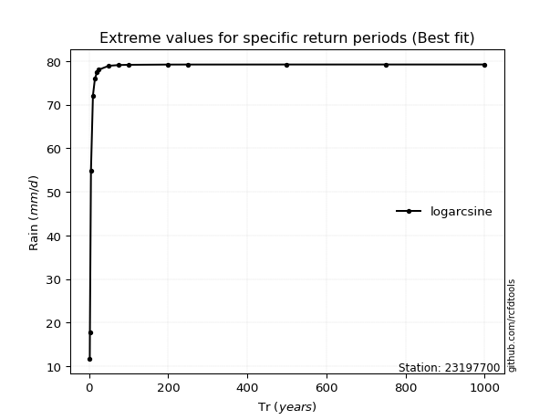</img>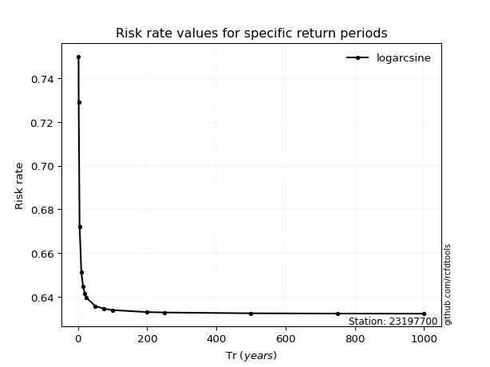</img>

</div>


<sub>**APP DISCLAIMER**: NO WARRANTY - This software is provided by [github.com/rcfdtools](https://github.com/rcfdtools) "as is", without any express or implied warranty, including warranties of merchantability, fitness for a particular purpose, or non-infringement. There is no guarantee that the software will be error-free or operate without interruption. LIMITATION OF LIABILITY - Neither the authors nor copyright holders will be liable for claims or damages arising from the software or its use. You are responsible for determining if the software is appropriate for your use and assume all associated risks, including errors, legal compliance, and data loss. NO PROFESSIONAL ADVICE - The software provides general information and does not offer professional advice. It should not replace consultation with professional advisors.</sub>